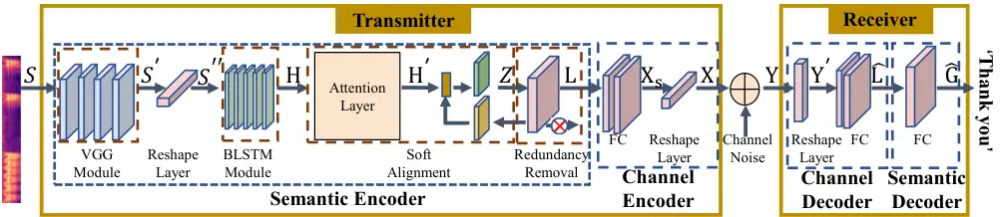
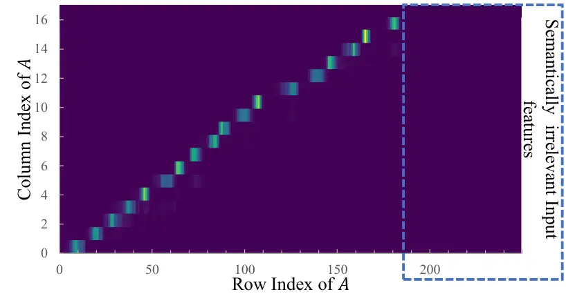
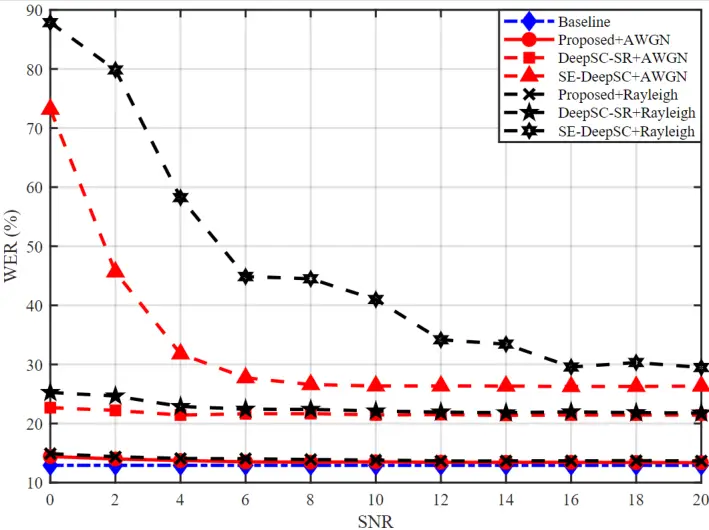
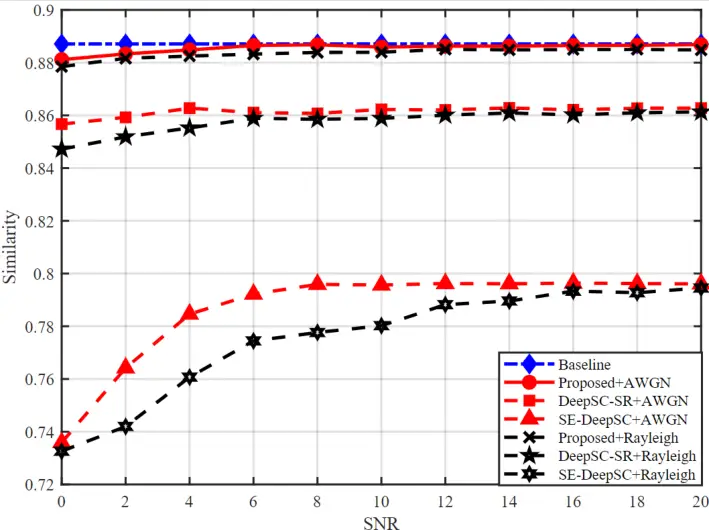

# Semantic-aware Speech to Text Transmission with Redundancy RemovalThanks: 0\*This work is partly supported by the SUTD-ZJU IDEA Grant (SUTD-ZJU (VP) 202102), and partly by the Fundamental Research Funds for the Central Universities under Grant 2021FZZX001-20.

Tianxiao Han, Qianqian Yang², Zhiguo Shi, Shibo He, Zhaoyang Zhang
Affiliation:  Zhejiang University, Hangzhou 310007, China  
Email: {txhan,qianqianyang20²,shizg,s18he,ning_ming}@zju.edu.cn
Affiliation: 

###### Abstract

Deep learning (DL) based semantic communication methods have been
explored for the efficient transmission of images, text, and speech in
recent years. In contrast to traditional wireless communication methods
that focus on the transmission of abstract symbols, semantic
communication approaches attempt to achieve better transmission
efficiency by only sending the semantic-related information of the
source data. In this paper, we consider semantic-oriented speech to text
transmission. We propose a novel end-to-end DL-based transceiver, which
includes an attention-based soft alignment module and a redundancy
removal module to compress the transmitted data. In particular, the
former extracts only the text-related semantic features, and the latter
further drops the semantically redundant content, greatly reducing the
amount of semantic redundancy compared to existing methods. We also
propose a two-stage training scheme, which speeds up the training of the
proposed DL model. The simulation results indicate that our proposed
method outperforms current methods in terms of the accuracy of the
received text and transmission efficiency. Moreover, the proposed method
also has a smaller model size and shorter end-to-end runtime.

## I Introduction

The continuously increasing demand for communication causes the
explosion of wireless data traffic, and places a heavy burden on the
current infrastructure of communication systems. Semantic communication
is a promising technology for next generation communications because of
its great potential of significantly improving transmission
efficiency\[1\]. Unlike traditional communication systems, which focus
on transmitting symbols while ignoring semantic content, semantic
communication focuses on gathering semantic information from the source
and recovering the same semantic information at the receiver. Therefore,
concentrated semantic information will be transmitted to the receiver
instead of directly mapped bit sequences from the source. By doing so,
to transmit the same amount of information, the required resources for
semantic communication will be reduced significantly. Moreover, semantic
communication has been proved to be more robust than traditional
communication systems\[2\], especially in harsh channel conditions.

The idea of semantic communication has been proposed by Weaver at the
beginning of modern communication\[3\]. Following this preliminary work,
Carnap and Bar-hillel \[4\] give an information theoretic definition of
semantic information, which is further investigated in \[5\]. A semantic
aware data compression method has been proposed in \[6\] by leveraging a
shared knowledge base. However, before the boom of deep learning, there
has not been an effective way to actually perform semantic communication
of content.

With the emergence of deep learning techniques on image processing and
language processing, there have been several works on semantic
communications which show the superiority over the traditional methods.
A CNN model was presented in \[7\] to enable joint source and channel
coding (JSCC) for wireless image transmission, which can recover images
under limited bandwidth and low SNR conditions, and achieves efficient
image transmission. A deep learning-based semantic communication system
has been developed for efficient and robust transmission of text in
\[2\], the deep learning model of which is then further compressed to be
able to work on IoT devices \[8\]. \[9\] and \[10\] designed semantic
communication systems that are capable of multimodal data transmission
for tasks, such as visual question answering.

For the transmission of speech, attention-based semantic communication
has been developed to recover speech signals at the receiver\[11\]. A
federal learning-based approach has been proposed in \[12\] to further
improve the accuracy of recovered speech signals at the receiver. For
the further semantic purpose of the speech, a speech recognition
semantic communication system has been developed in \[13\], which
reconstructs text transcription of the speech signals at the receiver by
transmitting text-related semantic features. However, the connectionist
temporal classification (CTC) based approach proposed by \[13\] encodes
each speech spectrum frame into the same amount of transmitted symbols,
while ignoring the difference in semantic significance of each frame,
which may degrade the transmission efficiency.

To improve the speech recognition performance and transmission
efficiency, we employ an attention-based alignment module to enforce the
amount of the semantic features to be transmitted to be close to that of
the corresponding text content. All the repeated and semantically
irrelevant features are further dropped by a redundancy removal module.
Furthermore, we use a trainable semantic decoder at the receiver to
transform the semantic feature into the text instead of the greedy
decoder used in \[13\].

The main contributions of this article can be summarized as follows:

- •
  We propose a novel speech to text semantic communication approach,
  which includes an attention-based soft alignment module, which
  extracts only the text-related semantic features, and a redundancy
  removal module, which further removes semantically irrelevant
  features.
- •
  We apply a two-stage training method, which speeds up the training of
  the proposed model by training different parts at each stage.
- •
  The numerical results validate the effectiveness and efficiency of the
  proposed method in both the text recognition performance and runtime.

The rest of this article is organised as follows. Section II introduces
the system model of the considered semantic communication problem and
the performance metrics. Section III details the proposed deep
learning-based approach semantic communication. Simulation results are
presented in Section IV and Section V concludes the paper.



Fig. 1: The overall architecture of the proposed speech to text semantic
communication system

## II SYSTEM MODEL

In this section, we present the system model of the considered semantic
communication system for speech recognition. We also introduce the
metrics to evaluate the performance of the proposed model for speech to
text transmission.

### II-A Transmitter and Receiver

The considered semantic communication system for speech recognition
consists of two parts: the transmitter and the receiver. The speech
signal is sampled at 16 kHz and we use a 25 ms Hamming window and 10 ms
shift on the input speech signal. And we compute fast Fourier
transform(FFT) and filter banks(fbanks)\[14\] of each Hamming window to
get the speech spectrum. The speech spectrum is then input to the
transmitter, denoted by
$`\boldsymbol{S}=\left[{S_{1},S_{2},...,S_{n}}\right]`$, where $`n`$ is
the number of frames. The receiver aims to output the corresponding
transcription of the input speech,
$`\boldsymbol{G}=\left[{G_{1},G_{2},...,G_{m}}\right]`$, where
$`G_{i}\in V`$ is the $`i^{th}`$ word in the transcription, $`m`$ is the
number of words in the transcription, and $`V`$ denotes the vocabulary,
which contains all the possible words in the speech. The mapping between
$`\boldsymbol{S}`$ and $`\boldsymbol{G}`$ is called alignment \[15\],
which is a core task for speech recognition.

The transmitter consists of a semantic encoder and a channel encoder.
The semantic encoder derives a compact latent semantic representation
$`\boldsymbol{L}`$ from the input spectrum $`\boldsymbol{S}`$. Then, the
channel encoder maps $`\boldsymbol{L}`$ into symbols,
$`\boldsymbol{X}`$,to be transmitted over physical channels. The
received signal at the receiver is given by

```math
{\boldsymbol{Y}=\boldsymbol{h}\ast\boldsymbol{X}+\boldsymbol{w}}, \tag{1}
```

where $`\boldsymbol{h}`$ represents the channel coefficients, and
$`\boldsymbol{w}\sim\mathcal{CN}(0,\;\sigma^{2}\mathbf{I})`$ denotes the
independent and identically distributed (i.i.d.) complex Gaussian noise,
where $`\sigma^{2}`$ is the noise variance, and $`\mathbf{I}`$ is the
identity matrix.

At the receiver, the received signal, $`\boldsymbol{Y}`$, is mapped back
into the latent semantic representation $`\widehat{\boldsymbol{L}}`$ by
a channel decoder, which is then converted into the predicted
transcriptions $`\widehat{\boldsymbol{G}}`$ by the semantic decoder.

The goal of this paper is to optimize the semantic encoder, the channel
encoder, the channel decoder, and the semantic decoder to achieve
efficient and robust speech to text transmission.

### II-B Metric

We employ the word-error-rate (WER\[16\]) and the semantic similarity
score \[2\] as the performance metrics to evaluate the performance of
the considered speech to text transmission. WER is calculated by

```math
WER=\frac{S+D+I}{N}, \tag{2}
```

where $`S`$, $`D`$, $`I`$ and $`N`$ denote the numbers of word
substations, word deletions, word insertions, and the number of words in
the transcription $`\boldsymbol{G}`$, respectively.

The semantic similarity score to quantify the sentence similarity
between the predicted transcription $`\widehat{\boldsymbol{G}}`$, and
the original transcription, $`\boldsymbol{G}`$, is given by

```math
{\text{similarity}}\left({\widehat{\boldsymbol{G}}},{\boldsymbol{G}}\right)=\frac{{B\left({\widehat{\boldsymbol{G}}}\right)\cdot{B{{\left(\boldsymbol{G}\right)}^{T}}}}}{{||{B{\left(\widehat{\boldsymbol{G}}\right)}}||\cdot||{B{\left(\boldsymbol{G}\right)}}||}}, \tag{3}
```

where $`{B(\cdot)}`$ represents sentence embedding by a pre-trained text
embedding model, Bidirectional Encoder Representations from Transformers
(BERT\[17\]). The sentence similarity score is a number between 0 and 1,
which indicates how similar one sentence is to another, with 1
representing semantically equivalent and 0 representing not relevant at
all.

## III Proposed Speech to Text Semantic Communication Approach

In this section, we present the details of the proposed model depicted
in Fig. 1, where the transmitter consists of a semantic encoder and a
channel encoder, and the receiver consists of a channel decoder and a
semantic decoder. The semantic encoder takes a speech,
$`\boldsymbol{S}`$, as input and outputs latent semantic
representations, $`\boldsymbol{L}`$, where semantic redundancy is
reduced by a redundancy removal module. The channel encoder produces a
sequence of symbols $`\boldsymbol{X}`$ from $`\boldsymbol{L}`$ to be
transmitted over the physical channel. At the receiver, the received
signal $`\boldsymbol{Y}`$ is input to the channel decoder to derive the
estimated latent semantic representation sequence
$`\widehat{\boldsymbol{L}}`$. Finally, the semantic decoder decodes
$`\widehat{\boldsymbol{L}}`$, and outputs the predicted transcription
$`\widehat{\boldsymbol{G}}`$ from $`\widehat{\boldsymbol{L}}`$. We
describe each module in detail in the sequel.

### III-A Semantic Encoder and Decoder

The semantic encoder has four components, as shown in Fig. 1, i.e., the
VGG module, the BLSTM module, the soft alignment module and the
redundancy removal module. The input speech spectrum,
$`\boldsymbol{S}\in\mathfrak{R}^{B\times N\times 40\times 3}`$ is
acquired by applying 25 ms Hamming window and 10 ms shift on the speech
signal and then computing FFT to get 40 fbanks coefficients together
with their first- and second-order derivatives \[18\], where $`B`$ is
the batch size, $`N`$ is the number of frames, 40 is the number of
coefficients, and the three channels corresponds to fbanks coefficients
and its first- and second-order derivatives, respectively. The sequence
of speech spectrums $`\boldsymbol{S}`$ is fed into the VGG module\[19\]
to obtain
$`\boldsymbol{S}^{\prime}\in\mathfrak{R}^{B\times\frac{N}{4}\times 10\times 128}`$,
that is, 128 feature maps of size $`\frac{N}{4}\times 10`$ for each
input. And the reshape layer concatenates all the 128 channels of
$`\boldsymbol{S}^{\prime}`$ and output
$`\boldsymbol{S}^{\prime\prime}\in\mathfrak{R}^{B\times\frac{N}{4}\times 1280}`$.
Then, $`\boldsymbol{S}^{\prime\prime}`$ is fed into a bidirectional Long
Short Term Memory (BLSTM) module which generates intermediate features,
$`\boldsymbol{H}\in\mathfrak{R}^{B\times\frac{N}{4\times 8}\times 512}`$,
where 8 is the total length reduction\[20\] of BLSTM module. We use
downsampling rates of 2,2,2,1,1 for five BLSTM layers in the BLSTM
module, respectively, which results in a total downsampling rate of 8.

Next, the intermediate features, $`\boldsymbol{H}`$ are fed into the
attention-based soft alignment module to extract semantic features with
an attention module and a LSTM layer, as shown in Fig. 2. The attention
mechanism\[21\] is adopted for our soft alignment module to get the
alignment of speech with its semantic text. In order to acquire the
alignment, we need to compute the weight, also referred to as attention
scores, assigned to each element of the input by the query information
and the corresponding key information. The query information is derived
by passing the hidden states of the LSTM layer through a fully connected
layer, and the key information is derived by another fully connected
layer with $`\boldsymbol{H}`$ as the input. The query and key
information are then combined with the feedback information through
element-wise addition as shown in Fig. 2. Then this combined information
is fed into a FC layer and then a softmax layer to get the normalization
scores $`\boldsymbol{A}`$, which feedback through a 1D convolution layer
and a FC layer to derive the location information. Each value in the
normalized attention scores
$`\boldsymbol{A}\in\mathfrak{R}^{B\times q\times\frac{N}{4\times 8}}`$
multiplies its corresponding value in $`\boldsymbol{H}`$ to get the
latent semantic representation,
$`\boldsymbol{H}^{\prime}\in\mathfrak{R}^{B\times q\times 512}`$, where
$`q`$ is the variable length of latent semantic representation, which
depends on the semantic information the signal is carrying. And
$`\boldsymbol{H}^{\prime}`$, concatenated with the feedbacked
embeddings, is fed into a LSTM layer, which outputs
$`\boldsymbol{Z}\in\mathfrak{R}^{B\times q\times 512}`$ as the input to
the redundancy removal module. We present one example of the derived
attention scores matrix $`\boldsymbol{A}`$ in the form of heat map in
Fig. 3. We can observe that only a few elements of this matrix are with
values that are not close to zero. As it is revealed by the numerical
results, the proposed soft alignment module leads to better transmission
efficiency because the derived attention scores push the transmission
resource allocated to semantic significant parts.

The redundancy removal module generates a concentrated latent semantic
representation
$`{\boldsymbol{L}\in\mathfrak{R}^{B\times c\times 512}}`$, where $`c`$
is the length of this representation. The detail of the redundancy
removal module will be introduced in the sequel. The semantic decoder at
the receiver is relatively simple, which consists of a FC layer. It
decodes the received text-related semantic features
$`\widehat{\boldsymbol{L}}\in\mathfrak{R}^{B\times c\times 512}`$ into
the text transcriptions,
$`\widehat{\boldsymbol{G}}\in\mathfrak{R}^{B\times c\times 15003}`$,
where $`c`$ is the length of the transcription.

Fig. 2: The proposed soft alignment module with an attention module and
a LSTM layer



Fig. 3: Heatmap of attention scores generated by the attention
mechanism. Larger values appear yellow, and lower values appear purple.

### III-B Redundancy Removal Module

The redundancy removal module consists of a FC layer, which outputs a
probability matrix of size $`{B\times q\times 15003}`$, and each element
of the last dimension represents a token in the vocabulary list. The
vocabulary list contains the most frequent 15000 words and three special
symbols, that is, $`EOS`$, $`UNK`$, and $`PAD`$. The $`EOS`$ is used at
the end of a sentence, the $`UNK`$ denotes words that are not in the
vocabulary list, and $`PAD`$ is padded to the end of sentences to make
the length identical for convenient computing. The redundancy removal
module removes these three special tokens and the sequences after the
token $`EOS`$ since they are without any semantic meaning. The
experiments reveal that cutting off the sequences after the token
$`EOS`$ saves about 59.4% of the transmission length, and the removal of
$`UNK`$ and $`PAD`$ saves approximately 4.5%. We note that the output
$`\boldsymbol{L}`$ is also fed into an embedding layer to get an
embedding of size $`{B\times q\times 512}`$ to concatenate with
$`\boldsymbol{H}^{\prime}`$ of next time stamp before feeding into the
LSTM layer.

### III-C Channel Encoder and Decoder

In the channel encoder, two cascade FC layers map semantic encoder
output $`\boldsymbol{L}`$ to symbol sequences
$`\boldsymbol{X}_{s}\in\mathfrak{R}^{B\times c\times 256}`$, which is
then reshaped into
$`\boldsymbol{X}\in\mathfrak{R}^{B\times 128c\times 2}`$, where the
first and second channels are the real parts and imaginary parts of
wireless signal, to be transmitted. The received symbol sequences,
$`\boldsymbol{Y}\in\mathfrak{R}^{B\times 128c\times 2}`$ at the
receiver, are reshaped into
$`\boldsymbol{Y}^{\prime}\in\mathfrak{R}^{B\times c\times 256}`$, which
are then input to two cascade FC layers to recover text-related semantic
features,
$`\widehat{\boldsymbol{L}}\in\mathfrak{R}^{B\times c\times 512}`$ to be
fed into the semantic decoder.

### III-D Two-Stage Training

We use a two-stage training method, which converges faster than training
the network as a whole in an end-to-end manner, as revealed by
experiments. In the first stage, we train the semantic encoder and
semantic decoder, and ignore the channel encoder and decoder by directly
inputting the output of the semantic encoder to the semantic decoder. We
use a cross-entropy loss function between the predicted transcription
$`\widehat{\boldsymbol{G}}`$, and the ground truth for the transcription
$`\boldsymbol{G}`$ with Adadelta optimizer. Due to the presence of a
feedback loop in the soft alignment module, we use the teacher forcing
strategy \[22\] to achieve fast convergence. Specifically, at the
beginning of the training, as the output of the FC layer is incorrect,
we use the true transcriptions instead to speed up the learning of
correct alignment.

In the second stage, we freeze the trained semantic encoder and train
other parts of the network, including channel encoder, channel decoder,
and semantic decoder under physical channel with random SNR. The
cross-entropy loss function and Adadelta optimizer are also utilized.

[TABLE]

TABLE I: Parameter settings of the proposed semantic communication
Network for speech recognition

## IV Numerical Results

1:  Input: Speech signals and transcriptions $`\boldsymbol{G}`$ from
dataset, fading channel $`\boldsymbol{h}`$, noise $`\boldsymbol{w}`$.

2:  Set fading channel $`\boldsymbol{h}`$ = Rayleigh or AWGN

3:  for each SNR value do

4:   Generate Gaussian noise $`\boldsymbol{W}`$ under the SNR value.

5:   Generate spectrum sequences $`\boldsymbol{S}`$ from input speech
signals.

6:   Output $`\boldsymbol{L}`$ from $`\boldsymbol{S}`$ by the semantic
encoder.

7:   Output $`\boldsymbol{X}`$ from $`\boldsymbol{L}^{\prime}`$ by the
channel encoder.

8:   Transmit $`\boldsymbol{X}`$ and receive $`\boldsymbol{Y}`$ via (1).

9:   Output $`\widehat{\boldsymbol{L}}`$ from $`\boldsymbol{Y}`$ by the
channel decoder.

10:   Output $`\widehat{\boldsymbol{G}}`$ from
$`\widehat{\boldsymbol{L}^{\prime}}`$ by the semantic decoder.

11:  end for

12:  Output: compare $`\widehat{\boldsymbol{G}}`$ and $`\boldsymbol{G}`$
and compute WER scores and sentence similarity via 2

Algorithm 1 Testing algorithm of the proposed method.

In this section, we compare the proposed method’s performance to the
existing two other deep learning-based semantic communication systems
for speech recognition task. We consider the AWGN and Rayleigh channels
for the evaluation. We use the Librispeech dataset\[23\] for training
and testing, which is a speech to text library based on public domain
audio books. We use the existing semantic communication approach by
\[13\], referred to as DeepSC-SR as the benchmark approach to compare
to. We also combine the proposed semantic encoder, which transfers the
speech signal to semantic text, and the semantic communication approach
proposed in \[2\], which transmits and recovers text at the receiver.
This approach is referred to as SE-DeepSC, which is also used as a
benchmark to compare with. We use the proposed semantic encoder and
decoder, while ignoring the noisy channel as well as channel encoder and
decoder, which provides the upper-bound performance. The detailed
setting of our proposed network is shown in table I. We note that all
these four approaches are trained and tested with the same datasets. And
the test algorithm is described in Algorithm 1.



Fig. 4: WER score versus SNR for different approaches.



Fig. 5: Sentence similarity score versus SNR for different approaches.

### IV-A WER and Semantic Similarity of the Proposed Model

The performance comparison of different approaches in terms of WER is
presented in Fig. 4. We can see that the proposed method significantly
outperforms the other two methods under both channel conditions.
Moreover, our proposed method performs steadily and closely to the
baseline while the performance of the two benchmarks is poor under a low
SNR regime. We note that different from the original result shown in
\[13\] that we get the WER of around 20% instead of 40% for DeepSC-SR,
which may benefit from the use of 40 dimension fbank features with their
first and second derivatives.

The performance comparison of different approaches in terms of sentence
similarity score are shown in Fig. 5. We observe that our proposed
method obtains higher sentence similarity scores than the other methods
under the considered channel conditions, especially in a low SNR regime.
It can be observed from both figures that SE-DeepSC performs not as well
as the other two counterparts. This may be due to the semantic errors in
the output of the semantic encoder, which is neglected in the
transmission and reconstruction, and hence, exists in the final output.

|                                                         | Proposed model | DeepSC-SR |
| ------------------------------------------------------- | -------------- | --------- |
| The length of each transmitted symbol vector            | 256            | 40        |
| The average numbers of transmitted symbols per sentence | 5156           | 7143      |

TABLE II:

|              |                                                                                                                                                                                                                                                                                                                                                                                                                                                                                                                                                      |
| ------------ | ---------------------------------------------------------------------------------------------------------------------------------------------------------------------------------------------------------------------------------------------------------------------------------------------------------------------------------------------------------------------------------------------------------------------------------------------------------------------------------------------------------------------------------------------------- |
| Example 1    | The number of speech spectrum frames: 497                                                                                                                                                                                                                                                                                                                                                                                                                                                                                                            |
|              | Transcription: (Length:34) $`UNK`$ HE SAID YOU KNOW WHERE $`UNK`$ $`EOS`$ $`EOS`$ $`EOS`$ $`EOS`$ $`EOS`$ $`EOS`$ $`EOS`$ $`EOS`$ $`EOS`$ $`EOS`$ $`EOS`$ $`EOS`$ $`EOS`$ $`EOS`$ $`EOS`$ $`EOS`$ $`EOS`$ $`EOS`$ $`EOS`$ $`EOS`$ $`EOS`$ $`EOS`$ $`EOS`$ $`EOS`$ $`EOS`$ $`EOS`$ $`EOS`$                                                                                                                                                                                                                                                            |
| saved: 85.3% | Transcription after the redundancy removal module: (Length:5) HE SAID YOU KNOW WHERE                                                                                                                                                                                                                                                                                                                                                                                                                                                                 |
| Example 2    | The number of speech spectrum frames: 9845                                                                                                                                                                                                                                                                                                                                                                                                                                                                                                           |
|              | Transcription: (Length:72) I HAVE DRAWN UP A LIST OF ALL THE PEOPLE WHO OUGHT TO GIVE US A PRESENT AND I SHALL TELL THEM WHAT THEY OUGHT TO GIVE IT WON’T BE MY FAULT IF I DON’T GET IT $`EOS`$ $`EOS`$ $`EOS`$ $`EOS`$ $`EOS`$ $`EOS`$ OF ALL THE PEOPLE WHO OUGHT TO GIVE US A PRESENT AND I SHALL TELL THEM WHAT THEY OUGHT TO GIVE IT WON’T BE MY FAULT IF I DON’T GET IT $`EOS`$ $`EOS`$ $`EOS`$ $`EOS`$ $`EOS`$ $`EOS`$ OF ALL THE PEOPLE WHO OUGHT TO GIVE US A PRESENT AND I SHALL TELL THEM WHAT THEY OUGHT TO GIVE IT WON’T BE MY FAULT IF |
| saved: 45.8% | Transcription after the redundancy removal module: (Length:39) I HAVE DRAWN UP A LIST OF ALL THE PEOPLE WHO OUGHT TO GIVE US A PRESENT AND I SHALL TELL THEM WHAT THEY OUGHT TO GIVE IT WON’T BE MY FAULT IF I DON’T GET IT                                                                                                                                                                                                                                                                                                                          |

TABLE III: Examples of input speech signals and their transcriptions
before and after the redundancy removal module.

### IV-B Transmission Efficiency

We also present the length of the transmitted symbol vector and the
average number of the transmitted symbols per sentence on the same
testing dataset in Table. II. We can see from this table that although
our proposed model has much longer symbol vectors, i.e., a larger
dimension of the output of the channel encoder, the average number of
transmitted symbols per sentence by the proposed model is still much
smaller than that by DeepSC-SR. The reason may be that DeepSC-SR encodes
every single speech spectrum frame into the same amount of transmitted
symbols, while the proposed method ignores the redundant content, and
only sends the text-related semantic information.

Two examples of the speech signals and their corresponding
transcriptions as well as the transcription after redundancy removal are
shown in Table. III. Both of the examples show that the number of the
speech spectrum frames is much larger than the length of the
transcription, which implies many of the frames are semantically
irrelevant. We also observe that the redundancy removal module
significantly reduces the length of the transcription while preserving
the semantic meaning.

|           | Parameters | Model Size | Runtime (single thread) |
| --------- | ---------- | ---------- | ----------------------- |
| Proposed  | 66582925   | 255MB      | 0.097 s                 |
| DeepSC-SR | 83724534   | 320MB      | 0.120 s                 |
| SE-DeepSC | 69405509   | 349.2MB    | 0.246 s                 |

TABLE IV: The average sentence processing runtime versus various schemes
and their model size.

### IV-C Model Size and Runtime

We compare the computational complexities and memory cost of the
proposed model and the two benchmark approaches. All the experiments run
on the same server with a single NVIDIA GeForce RTX 3090 GPU. We present
the average runtime per sentence and the model sizes in Table. IV. We
can see that our proposed model has a smaller model size than the other
two approaches, as well as a shorter running time.

## V Conclusions

In this paper, we propose a novel semantic-aware speech to text
transmission approach with soft alignment module and redundancy removal
module. The attention-based soft alignment module is utilized to get the
alignment of the input speech and its latent semantic representation.
The redundancy removal module drops the semantically irrelevant features
to obtain a more compact semantic representation. Simulation results
show that our proposed method adapts well to diverse channels and
improves accuracy significantly. We also propose a two-stage training
approach that reduces the training complexity. We showed numerically the
proposed approach outperforms the existing approach in terms of the
speech recognition accuracy and the transmission efficiency, benefited
from the soft alignment module and the redundancy removal module. The
proposed model also has a smaller model size and shorter runtime than
the counterpart approach. One possible future direction is to extend the
proposed model for the real-time speech to text transmission of the
steaming speech signals.

## References

- \[1\] Z. Qin, X. Tao, J. Lu, and G. Y. Li, “Semantic communications:
  Principles and challenges,” _arXiv preprint arXiv:2201.01389_, 2021.
- \[2\] H. Xie, Z. Qin, G. Y. Li, and B.-H. Juang, “Deep learning
  enabled semantic communication systems,” _IEEE Trans. Signal
  Process._, pp. 2663–2675, Apr. 2021.
- \[3\] C. Shannon and W. Weaver, “The mathematical theory of
  communication. univ. of illinois press, urbana.” _The mathematical
  theory of communication. Univ. of Illinois Press, Urbana._, 1949.
- \[4\] R. Carnap, Y. Bar-Hillel _et al._, “An outline of a theory of
  semantic information,” 1952.
- \[5\] J. Bao, P. Basu, M. Dean, C. Partridge, A. Swami, W. Leland, and
  J. A. Hendler, “Towards a theory of semantic communication,” in _2011
  IEEE Network Science Workshop_. IEEE, 2011, pp. 110–117.
- \[6\] P. Basu, J. Bao, M. Dean, and J. Hendler, “Preserving quality of
  information by using semantic relationships,” _Pervasive and Mobile
  Computing_, vol. 11, pp. 188–202, 2014.
- \[7\] E. Bourtsoulatze, D. B. Kurka, and D. Gündüz, “Deep joint
  source-channel coding for wireless image transmission,” _IEEE Trans.
  Cogn. Commun. Netw._, vol. 5, no. 3, pp. 567–579, Sept. 2019.
- \[8\] H. Xie and Z. Qin, “A lite distributed semantic communication
  system for Internet of Things,” _IEEE J. Sel. Areas Commun._, vol. 39,
  no. 1, pp. 142–153, Jan. 2021.
- \[9\] H. Xie, Z. Qin, X. Tao, and K. B. Letaief, “Task-oriented
  multi-user semantic communications,” _arXiv preprint
  arXiv:2112.10255_, 2021.
- \[10\] H. Xie, Z. Qin, and G. Y. Li, “Task-oriented multi-user
  semantic communications for vqa task,” _IEEE Wireless Communications
  Letters_, 2021.
- \[11\] Z. Weng and Z. Qin, “Semantic communication systems for speech
  transmission,” _IEEE J. Sel. Areas Commun._, Apr. 2021.
- \[12\] H. Tong, Z. Yang, S. Wang, Y. Hu, O. Semiari, W. Saad, and
  C. Yin, “Federated learning for audio semantic communication,”
  _Frontiers in Communications and Networks_, vol. 2, 2021.
- \[13\] Z. Weng, Z. Qin, and G. Y. Li, “Semantic communications for
  speech recognition,” _arXiv preprint arXiv:2107.11190_, 2021.
- \[14\] H. Hermansky, “Perceptual linear predictive (plp) analysis of
  speech,” _the Journal of the Acoustical Society of America_, vol. 87,
  no. 4, pp. 1738–1752, 1990.
- \[15\] D. Bahdanau, K. H. Cho, and Y. Bengio, “Neural machine
  translation by jointly learning to align and translate,” in _3rd
  International Conference on Learning Representations, ICLR
  2015_, 2015.
- \[16\] D. Klakow and J. Peters, “Testing the correlation of word error
  rate and perplexity,” _Speech Communication_, vol. 38, no. 1-2, pp.
  19–28, 2002.
- \[17\] J. Devlin, M.-W. Chang, K. Lee, and K. Toutanova, “Bert:
  Pre-training of deep bidirectional transformers for language
  understanding,” _arXiv preprint arXiv:1810.04805_, 2018.
- \[18\] S. Furui, “Cepstral analysis technique for automatic speaker
  verification,” _IEEE Transactions on Acoustics, Speech, and Signal
  Processing_, vol. 29, no. 2, pp. 254–272, 1981.
- \[19\] K. Simonyan and A. Zisserman, “Very deep convolutional networks
  for large-scale image recognition,” in _International Conference on
  Learning Representations_, May 2015.
- \[20\] W. Chan, N. Jaitly, Q. Le, and O. Vinyals, “Listen, attend and
  spell: A neural network for large vocabulary conversational speech
  recognition,” in _2016 IEEE International Conference on Acoustics,
  Speech and Signal Processing (ICASSP)_. IEEE, 2016, pp. 4960–4964.
- \[21\] J. Chorowski, D. Bahdanau, D. Serdyuk, K. Cho, and Y. Bengio,
  “Attention-based models for speech recognition,” _arXiv preprint
  arXiv:1506.07503_, 2015.
- \[22\] R. J. Williams and D. Zipser, “A learning algorithm for
  continually running fully recurrent neural networks,” _Neural
  computation_, vol. 1, no. 2, pp. 270–280, 1989.
- \[23\] V. Panayotov, G. Chen, D. Povey, and S. Khudanpur,
  “Librispeech: an asr corpus based on public domain audio books,” in
  _2015 IEEE international conference on acoustics, speech and signal
  processing (ICASSP)_. IEEE, 2015, pp. 5206–5210.
