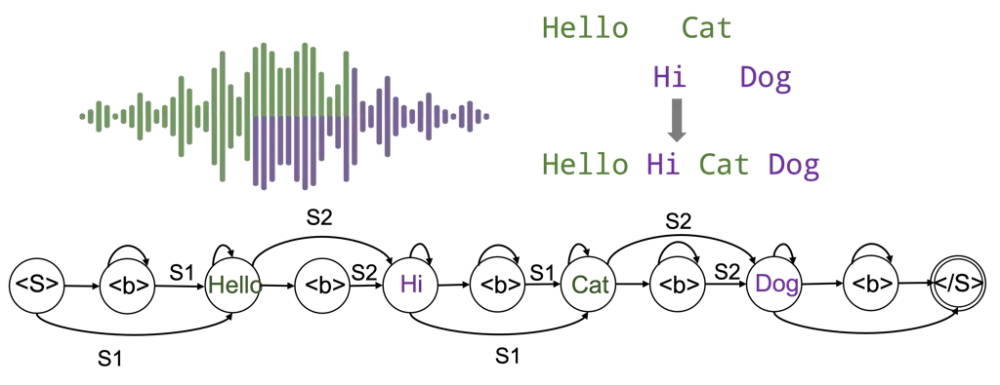
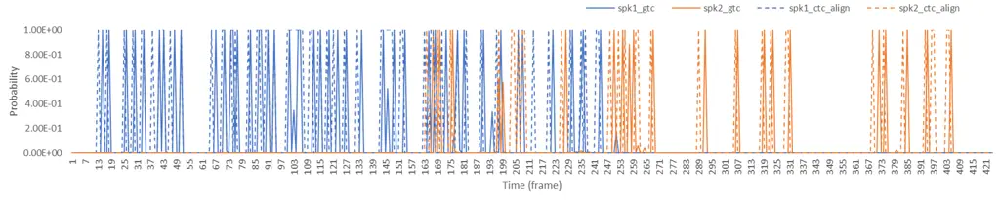

# Extended Graph Temporal Classification for Multi-Speaker End-to-End ASR

Xuankai Chang    Niko Moritz    Takaaki Hori    Shinji Watanabe   
Jonathan Le Roux ^(†)^(†)thanks: Work performed while X. Chang was an
intern at MERL.

###### Abstract

Graph-based temporal classification (GTC), a generalized form of the
connectionist temporal classification loss, was recently proposed to
improve automatic speech recognition (ASR) systems using graph-based
supervision. For example, GTC was first used to encode an N-best list of
pseudo-label sequences into a graph for semi-supervised learning. In
this paper, we propose an extension of GTC to model the posteriors of
both labels and label transitions by a neural network, which can be
applied to a wider range of tasks. As an example application, we use the
extended GTC (GTC-e) for the multi-speaker speech recognition task. The
transcriptions and speaker information of multi-speaker speech are
represented by a graph , where the speaker information is associated
with the transitions and ASR outputs with the nodes. Using GTC-e,
multi-speaker ASR modelling becomes very similar to single-speaker ASR
modeling, in that tokens by multiple speakers are recognized as a single
merged sequence in chronological order. For evaluation, we perform
experiments on a simulated multi-speaker speech dataset derived from
LibriSpeech, obtaining promising results with performance close to
classical benchmarks for the task.

###### Index Terms: 

CTC, GTC, WFST, end-to-end ASR, multi-speaker overlapped speech

^(†)^(†)address: ¹Mitsubishi Electric Research Laboratories (MERL),
Cambridge, MA, USA  
²Language Technologies Institute, Carnegie Mellon University,
Pittsburgh, PA, USA

## 1 Introduction

In recent years, dramatic progress has been achieved in automatic speech
recognition (ASR), in particular thanks to the exploration of neural
network architectures that improve the robustness and generalization
ability of ASR models \[1, 2, 3, 4, 5\]. The rise of end-to-end ASR
models has simplified ASR architecture with a single neural network,
with frameworks such as the connectionist temporal classification (CTC)
\[6\], attention-based encoder-decoder model \[7, 8, 9\], and the
RNN-Transducer model \[10\].

Graph modeling has traditionally been used in ASR for decades. For
example, in hidden Markov model (HMM) based systems, a weighted
finite-state transducer (WFST) is used to combine several modules
together including a pronunciation lexicon, context-dependencies, and a
language model (LM) \[11, 12\]. Recently, researchers proposed to use
graph representations in the loss function for training deep neural
networks \[13\]. In \[14\], a new loss function, called graph-based
temporal classification (GTC), was proposed as a generalization of CTC
to handle sequence-to-sequence problems. GTC can take graph-based
supervisory information as an input to describe all possible alignments
between an input sequence and an output sequence, for learning the best
possible alignment from the training data. As an example of application,
GTC was used to boost ASR performance via semi-supervised training \[15,
16\] by using an N-best list of ASR hypotheses that is converted into a
graph representation to train an ASR model using unlabeled data.
However, in the original GTC, only posterior probabilities of the ASR
labels are trained, and trainable label transitions are not considered.
Extending GTC to handle label transitions would allow us to model
further information regarding the labels. For example, in a
multi-speaker speech recognition scenario, where some overlap between
the speech signals of multiple speakers is considered, we could use the
transition weights to model speaker predictions that are aligned with
the ASR label predictions at frame level, such that when an ASR label is
predicted we can also detect if it belongs to a specific speaker. Such a
graph is illustrated in Fig. 1.



Figure 1: Illustration of a GTC-e graph for multi-speaker ASR. In the
graph, the nodes represent the tokens (words) from the transcriptions.
The edges indicate the speaker transitions.

In the last few years, several multi-speaker end-to-end ASR models have
been proposed. In \[17, 18\], permutation invariant training (PIT) \[19,
20, 21\] was used to compute the loss by choosing the
hypothesis-reference assignment with minimum loss. In \[22\], an
attention-based encoder-decoder is trained to generate the hypothesis
sequences of different speakers in a predefined order based on heuristic
information, a technique called serialized output training (SOT). In
\[23, 24\], the model is trained to predict the hypothesis sequence of
one speaker in each iteration while utilizing information about the
previous speakers’ hypotheses as additional input. These existing
multi-speaker end-to-end ASR models, which have showed promising
results, all share a common characteristic in the way that the
predictions can be divided at the level of a whole utterance for each
speaker. For example, in the PIT-based methods, label sequences for
different speakers are supposed to be output at different output heads,
while in the SOT-/conditional-based models, the prediction of the
sequence for a speaker can only start when the sequence of the previous
speaker completes.

In contrast to previous works, in this paper, the multi-speaker ASR
problem is not implicitly regarded as a source separation problem using
separate output layers for each speaker or cascaded processes to
recognize each speaker one after another. Instead, the prediction of ASR
labels of multiple speakers is regarded as a sequence of acoustic events
irrespective of the source shown as in Fig. 1, and the belonging to a
source is predicted separately to distinguish if an ASR label was
uttered by a given speaker. We propose to use an extended GTC (GTC-e)
loss to accomplish this, which allows us to train two separate
predictions, one for the speakers and one for the ASR outputs, that are
aligned at the frame level. In order to exploit the speaker predictions
efficiently during decoding, we also modify an existing
frame-synchronous beam search algorithm to adapt it to GTC-e. The
proposed model is evaluated on a multi-speaker end-to-end ASR task based
on the LibriMix data, including various degrees of overlap between
speakers. To the best of our knowledge, this is the first work to
address multi-speaker ASR by considering the ASR outputs of multiple
speakers as a sequence of intermingled events with a chronologically
meaningful ordering.

## 2 Extended GTC (GTC-e)

In this section, we describe the extended GTC loss function. For the
convenience of understanding, we mostly follow the notations in the
previous GTC study \[14\].

GTC was proposed as a loss function to address sequence-to-sequence
problems. We assume the input of the neural network is a sequence
denoted as $`X=(x_{1},\dots,x_{L})`$, where $`L`$ stands for the length.
The output is a sequence of length $`T`$,
$`Y=(\mathbf{y}^{1},\dots,\mathbf{y}^{T})`$, where $`\mathbf{y}^{t}`$
denotes the posterior probability distribution over an alphabet
$`\mathcal{U}`$, and the $`k`$-th class’s probability is denoted by
$`y_{k}^{t}`$. We use $`\mathcal{G}`$ to refer to a graph constructed
from references. Then the GTC function computes the posterior
probability for graph $`\mathcal{G}`$ by summing over all alignment
sequences in $`\mathcal{G}`$:

```math
\displaystyle p(\mathcal{G}|X)=\sum_{\pi\in\mathcal{S}(\mathcal{G},T)}p(\pi|X), \tag{1}
```

where $`\mathcal{S}`$ represents a search function that unfolds
$`\mathcal{G}`$ to all possible node sequences of length $`T`$ (not
counting non-emitting start and end nodes), $`\pi`$ denotes a single
sequence of nodes, and $`p(\pi|X)`$ is the posterior probability for
$`\pi`$ given feature sequence $`X`$. The loss function is defined as
the following negative log likelihood:

```math
\displaystyle\mathcal{L}=-\ln{p(\mathcal{G}|X)}. \tag{2}
```

Following \[14\], we index the nodes of graph $`\mathcal{G}`$ using
$`g=0,\dots,G+1`$, sorting them in a breadth-first search manner from
$`0`$ (non-emitting start node) to $`G+1`$ (non-emitting end node). We
denote by $`l(g)\in\mathcal{U}`$ the output symbol observed at node
$`g`$, and by $`W_{(g,g^{\prime})}`$ a deterministic transition weight
on edge ($`g`$, $`g^{\prime}`$). In addition, we denote by
$`\pi_{t:t^{\prime}}=(\pi_{t},\dots,\pi_{t^{\prime}})`$ the node
sub-sequence of $`\pi`$ from time index $`t`$ to $`t^{\prime}`$. Note
that $`\pi_{0}`$ and $`\pi_{T+1}`$ correspond to the non-emitting start
and end nodes $`0`$ and $`G+1`$, respectively.

We modify GTC such that the neural network can generate an additional
posterior probability distribution,
$`\mathbf{\omega}^{t}_{I(g,g^{\prime})}`$, representing a transition
weight on edge $`(g,g^{\prime})`$ at time $`t`$, where
$`I(g,g^{\prime})\in\mathcal{I}`$ and $`\mathcal{I}`$ is the index set
of all possible transitions. The posterior probabilities are obtained as
the output of a softmax. The forward probability, $`\alpha_{t}(g)`$,
represents the total probability at time $`t`$ of the sub-graph
$`\mathcal{G}_{0:g}`$ of $`\mathcal{G}`$ containing all paths from node
$`0`$ to node $`g`$. It can be computed for $`g=1,\dots,G`$ using

```math
\displaystyle\alpha_{t}(g)=\sum_{\begin{subarray}{c}\pi\in\mathcal{S}(\mathcal{G},T):\\
\pi_{0:t}\in\mathcal{S}(\mathcal{G}_{0:g},t)\end{subarray}}\prod_{\tau=1}^{t}W_{\pi_{\tau-1},\pi_{\tau}}\omega^{\tau}_{I(\pi_{\tau-1},\pi_{\tau})}y_{l(\pi_{\tau})}^{\tau}. \tag{3}
```

Note that $`\alpha_{0}(g)`$ equals $`1`$ if $`g`$ corresponds to the
start node and it equals $`0`$ otherwise. The backward probability
$`\beta_{t}(g)`$ is computed similarly, using

```math
\displaystyle\beta_{t}(g)=\!\!\!\!\!\!\!\!\!\!\!\!\!\!\!\sum_{\begin{subarray}{c}\pi\in\mathcal{S}(\mathcal{G},T):\\
\pi_{t:T+1}\in\mathcal{S}(\mathcal{G}_{g:G+1},T-t+1)\end{subarray}}\!\!\!\!\!\!\!\!\!\!\!\!\!\!\!\left[y_{l(\pi_{T})}^{T}\prod_{\tau=t}^{T-1}W_{\pi_{\tau},\pi_{\tau+1}}\omega^{\tau+1}_{I(\pi_{\tau},\pi_{\tau+1})}y_{l(\pi_{\tau})}^{\tau}\right], \tag{4}
```

where $`\mathcal{G}_{g:G+1}`$ denotes the sub-graph of $`\mathcal{G}`$
containing all paths from node $`g`$ to node $`G+1`$. Similar to GTC or
CTC, the computation of $`\alpha`$ and $`\beta`$ can be efficiently
performed using the forward-backward algorithm.

The network is optimized by gradient descent. The gradients of the loss
with respect to the label posteriors $`y_{k}^{t}`$ and to the
corresponding unnormalized network outputs $`u_{k}^{t}`$ before the
softmax is applied, for any symbol $`k\in\mathcal{U}`$, can be obtained
in the same way as in CTC and GTC, where the key idea is to express the
probability function $`p(\mathcal{G}|X)`$ at $`t`$ using the forward and
backward variables:

```math
\displaystyle p(\mathcal{G}|X)=\sum_{g\in\mathcal{G}}\frac{\alpha_{t}(g)\beta_{t}(g)}{y^{t}_{l(g)}}. \tag{5}
```

The derivation of the gradient of the loss with respect to the network
outputs for the transition probabilities $`w_{i}^{t}`$, for a transition
$`i\in\mathcal{I}`$, is similar but with some important differences.
Here, the key is to express $`p(\mathcal{G}|X)`$ at $`t`$ as

```math
p(\mathcal{G}|X)=\sum_{(g,g^{\prime})\in\mathcal{G}}\alpha_{t-1}(g)W_{g,g^{\prime}}\omega^{t}_{I(g,g^{\prime})}\beta_{t}(g^{\prime}). \tag{6}
```

The derivative of $`p(\mathcal{G}|X)`$ with respect to the transition
probabilities $`\omega_{i}^{t}`$ can then be written as

```math
\frac{\partial p(\mathcal{G}|X)}{\partial\omega^{t}_{i}}=\sum_{(g,g^{\prime})\in\operatorname{\Phi}(\mathcal{G},i)}\alpha_{t-1}(g)W_{g,g^{\prime}}\beta_{t}(g^{\prime}), \tag{7}
```

where
$`\operatorname{\Phi}(\mathcal{G},i)=\{(g,g^{\prime})\in\mathcal{G}:I(g,g^{\prime})=i\}`$
denotes the set of edges in $`\mathcal{G}`$ that correspond to
transition $`i`$. To backpropagate the gradients through the softmax
function of $`w_{i}^{t}`$, we need the derivative with respect to the
unnormalized network outputs $`h_{i}^{t}`$ before the softmax is
applied, which is

```math
-\frac{\partial\ln{{p}(\mathcal{G}|X)}}{\partial h_{i}^{t}}=-\sum_{i^{\prime}\in\mathcal{I}}\frac{\partial\ln{{p}(\mathcal{G}|X)}}{\partial\omega_{i^{\prime}}^{t}}\frac{\partial\omega_{i^{\prime}}^{t}}{\partial h_{i}^{t}}. \tag{8}
```

The gradients for the transition weights are derived by substituting (7)
and the derivative of the softmax function
$`\partial\omega_{i^{\prime}}^{t}/\partial h_{i}^{t}=\omega_{i^{\prime}}^{t}\delta_{ii^{\prime}}-\omega_{i^{\prime}}^{t}\omega_{k}^{t}`$
into (8):

```math
\displaystyle\hskip-5.69046pt-\frac{\partial\ln{p(\mathcal{G}|X)}}{\partial h_{i}^{t}}\!=\!\omega_{i}^{t}\!-\!\frac{\omega_{i}^{t}}{{p}(\mathcal{G}|X)}\sum_{(g,g^{\prime})\in\operatorname{\Phi}(\mathcal{G},i)}\!\!\!\!\!\!\!\!\alpha_{t-1}(g)W_{g,g^{\prime}}\beta_{t}(g^{\prime}). \tag{9}
```

We used the fact that

```math
\displaystyle-\sum_{i^{\prime}\in\mathcal{I}}\frac{\partial\ln{{p}(\mathcal{G}|X)}}{\partial\omega_{i^{\prime}}^{t}}\omega_{i^{\prime}}^{t}\delta_{ii^{\prime}} \displaystyle=-\frac{\partial\ln{{p}(\mathcal{G}|X)}}{\partial\omega_{i}^{t}}\omega_{i}^{t},
```

```math
\displaystyle\hskip-56.9055pt=-\frac{\omega_{i}^{t}}{{p}(\mathcal{G}|X)}\sum_{(g,g^{\prime})\in\operatorname{\Phi}(\mathcal{G},i)}\alpha_{t-1}(g)W_{g,g^{\prime}}\beta_{t}(g^{\prime}), \tag{10}
```

and that

```math
\displaystyle\hskip-28.45274pt\sum_{i^{\prime}\in\mathcal{I}}\frac{\partial\ln{{p}(\mathcal{G}|X)}}{\partial\omega_{i^{\prime}}^{t}}\omega_{i^{\prime}}^{t}\omega_{i}^{t}
```

```math
\displaystyle= \displaystyle\sum_{i^{\prime}\in\mathcal{I}}\frac{\omega_{i^{\prime}}^{t}\omega_{i}^{t}}{{p}(\mathcal{G}|X)}\sum_{(g,g^{\prime})\in\operatorname{\Phi}(\mathcal{G},i^{\prime})}\alpha_{t-1}(g)W_{g,g^{\prime}}\beta_{t}(g^{\prime}),
```

```math
\displaystyle= \displaystyle\frac{\omega_{i}^{t}}{{p}(\mathcal{G}|X)}\sum_{i^{\prime}\in\mathcal{I}}\sum_{(g,g^{\prime})\in\operatorname{\Phi}(\mathcal{G},i^{\prime})}\alpha_{t-1}(g)W_{g,g^{\prime}}\omega_{i^{\prime}}^{t}\beta_{t}(g^{\prime}),
```

```math
\displaystyle= \displaystyle\frac{\omega_{i}^{t}}{{p}(\mathcal{G}|X)}\sum_{(g,g^{\prime})\in\mathcal{G}}\alpha_{t-1}(g)W_{g,g^{\prime}}\omega_{I(g,g^{\prime})}^{t}\beta_{t}(g^{\prime}),
```

```math
\displaystyle= \displaystyle\frac{\omega_{i}^{t}}{{p}(\mathcal{G}|X)}{p}(\mathcal{G}|X)=\omega_{i}^{t}. \tag{11}
```

For efficiency reason, we implemented the GTC objective in CUDA as an
extension for PyTorch.

## 3 Multi-speaker ASR and Beam Search

We apply the extended GTC approach to multi-speaker ASR, which is
considered as a challenging task in the field of speech processing. One
of the main difficulties of multi-speaker ASR stems from the necessity
to find a way to train a network that will be able to reliably group
tokens from the same speaker together. Most existing approaches attempt
to handle this problem either by splitting the speakers across multiple
outputs \[21, 18\] or by making predictions sequentially speaker by
speaker \[22, 23, 24\]. The ambiguity in how to assign a given output to
a given reference at training time is typically broken either by using
permutation invariant training or by using an arbitrary criterion such
as assigning an output to the speaker with highest energy or with the
earliest onset. We here take a completely different approach, motivated
by our noticing that a graph can be a good representation for overlapped
speech, since it can represent the tokens at each node while the speaker
identity can also be labeled at each edge. More specifically, given the
transcriptions of all the speakers in an overlapped speech, we can
convert them to a sequence of chronologically ordered linguistic tokens
where each token has a speaker identity. The temporal alignment of
tokens can be acquired by performing CTC alignment on each isolated
clean speech, which is like a sequence of sparse spikes, as shown in
Fig. 2, and merging them based on their time occurrence. Note here that
this assumes that the activation period of linguistic tokens from
different speakers are not completely the same. In practice, this
condition is often satisfied, although overlaps do occur in some small
percentage of frames. Based on this, we can construct a graph for
multi-speaker ASR for each overlapped speech mixture. We show a simple
example graph in Fig. 1. In this setup, the alphabet $`\mathcal{U}`$ for
the node labels consists of all the ASR tokens, and the set of
transitions $`\mathcal{I}`$ consists of the speaker indices up to the
maximum number of speakers.

As in GTC\[14\], we can apply a beam search algorithm during decoding.
Since the output of GTC-e contains tokens from multiple speakers, we
need to make modifications to the existing time-synchronous prefix beam
search algorithm \[25, 26\]. The modified beam search is shown in
Algorithm 1. The main modifications are three fold. First, we apply the
speaker transition probability in the score computation. Second, when
expanding the prefixes, we need to consider all possible speakers.
Third, when computing the LM scores of a prefix, we need to consider the
sub-sequences of different speakers separately.

1:
$`\ell\leftarrow\left(\left(\left\langle sos\right\rangle,0\right),\right)`$

2: $`p_{b}(\ell)\leftarrow 1`$, $`p_{nb}(\ell)\leftarrow 0`$

3: $`A_{\text{prev}}\leftarrow\{\ell\}`$

4: for t=1,…,T do

5:   $`A_{\text{next}}\leftarrow\{\}`$

6:   for $`\ell`$ in $`A_{\text{prev}}`$ do

7:    for $`c`$ in $`\mathcal{U}`$ do

8:     if $`c=\text{blank}`$ then

9:      
$`\begin{aligned} p_{b}(\ell)&\leftarrow p(\text{blank};x_{t})p^{\omega}(\text{blank};x_{t})(p_{b}(\ell;x_{1:t-1})+\\
&\hskip 112.38829ptp_{nb}(\ell;x_{1:t-1}))\end{aligned}`$

10:      add $`\ell`$ to $`A_{\text{next}}`$

11:     else

12:      for $`s=1,\dots,S`$ do $`\triangleright`$ Loop over speaker
index

13:
     $`\ell^{+}\leftarrow\text{ append }\left(c,s\right)\text{ to }\ell`$

14:      if $`\left(c,s\right)=\ell_{\text{end}}`$ then

15:
      $`p_{nb}(\ell^{+};x_{1:t})\leftarrow p(c;x_{t})p_{b}(\ell;x_{1:t-1})p^{\omega}(s;x_{t})`$

16:
      $`p_{nb}(\ell;x_{1:t})\leftarrow p(c;x_{t})p_{nb}(\ell;x_{1:t-1})p^{\omega}(s;x_{t})`$

17:      else

18:       
$`\begin{aligned} p_{nb}(\ell^{+};x_{1:t})&\leftarrow p(c;x_{t})(p_{b}(\ell;x_{1:t-1})+\\
&\hskip 22.76228ptp_{nb}(\ell;x_{1:t-1}))p^{\omega}(s;x_{t})\end{aligned}`$

19:      end if

20:      if $`\ell^{+}\text{\bf{not in}}A_{\text{prev}}`$ then

21:       
$`\begin{aligned} p_{b}(\ell^{+};x_{1:t})&\leftarrow p(\text{blank};x_{t})(p_{b}(\ell^{+};x_{1:t-1})+\\
&\hskip 14.22636ptp_{nb}(\ell^{+};x_{1:t-1}))p^{\omega}(\text{blank};x_{t})\end{aligned}`$

22:       
$`\begin{aligned} p_{nb}(\ell^{+};x_{1:t})\leftarrow p(c;x_{t})&p_{nb}(\ell^{+};x_{1:t-1})\cdot\\
&\hskip 42.67912ptp^{\omega}(s;x_{t})\end{aligned}`$

23:      end if

24:      add $`\ell^{+}`$ to $`A_{\text{next}}`$

25:      end for

26:     end if

27:    end for

28:   end for

29:
  $`A_{\text{prev}}\leftarrow k\text{ most probable prefixes in }A_{\text{next}}`$
$`\triangleright`$ Track the LM scores of different speakers separately.

30: end for

Algorithm 1 The modified time-synchronous prefix beam search for
extended GTC. We use $`A_{\text{prev}}`$ to store every prefix $`l`$ at
every time step. We denote the alphabet by $`\mathcal{U}`$ and number of
speakers by $`{S}`$. We denote the symbol posterior by $`p(\cdot)`$ and
the speaker transition posterior by $`p^{\omega}(\cdot)`$.

## 4 Experiments

### 4.1 Setup

We carried out multi-speaker end-to-end speech recognition experiments
using the LibriMix \[27\] dataset as well as data derived from it.
LibriMix contains multi-speaker overlapped speech simulated by mixing
utterances randomly chosen from different speakers in the LibriSpeech
corpus \[28\]. For fast adaption, we use the 2-speaker train_clean_100
subset of LibriMix. The original LibriMix dataset generates fully
overlapped speech by default, which means that one utterance is 100%
interfered by the other (assuming they have the same length). However,
in realistic conditions, the overlap ratio is usually small \[29, 30\].
To simulate such conditions, we use the same utterance selections and
signal to noise ratio (SNR) as in LibriMix with smaller overlapping
ratios of $`0\%`$ and $`40\%`$ to generate additional training data
subsets.



Figure 2: An example of speaker transition posterior predicted by GTC.
The input 2-speaker utterance’s overlap ratio is about $`40\%`$. The
figure shows the predicted (solid line) and ground truth (dashed line)
activations.

For labels, we use the linguistic token sequence of all the speakers in
the mixture. First, we generate the token alignments given each source
utterance based on the Viterbi alignment of CTC, which indicates the
rough activation time of every token. Then we combine the alignments of
two speakers by ordering the tokens monotonically along the time axis.
In order to reduce the concurrent activations of tokens from different
speakers, we make use of byte pair encodings (BPE) as our token units.
In our experiments, we use the BPE model with 5000 tokens trained on
LibriSpeech data. The concurrent activations of tokens for two speakers
are relatively rare, at the rate of $`6\%`$ and $`2\%`$ on fully and
$`40\%`$ overlapping ratio training subsets respectively. When these
concurrent activations occur, we use a predefined order which makes the
label from the speaker with highest energy over the whole utterance come
first (allowing multiple permutations in the label graph will be
considered in future work).

For ASR models, we simply reused the encoder architecture in PIT-based
multi-speaker end-to-end speech recognition models, for the details of
which we shall refer the reader to \[18\]. In the model, there are 2 CNN
blocks to encode the input acoustic feature, followed by 2 sub-networks
each of which has 4 Transformer layers to extract the token and speaker
information, respectively. Then 8 shared Transformer layers are used to
convert each of the two sequences to some representation. For the two
output sequences, one is regarded as token hidden representation and the
other one is regarded as speaker prediction. We use a normal
single-speaker ASR model trained with CTC (single-speaker CTC) and the
original end-to-end PIT-ASR model \[18\] trained with CTC loss only
(PIT-CTC) as our baselines.

### 4.2 Greedy search results

|                    |            |          |             |          |             |          |              |          |
| ------------------ | ---------- | -------- | ----------- | -------- | ----------- | -------- | ------------ | -------- |
|                    | 0% overlap |          | 20% overlap |          | 40% overlap |          | Full overlap |          |
| Model              | dev        | test     | dev         | test     | dev         | test     | dev          | test     |
| single-speaker CTC | $`34.6`$   | $`34.1`$ | $`37.4`$    | $`37.0`$ | $`45.9`$    | $`45.3`$ | $`76.3`$     | $`75.9`$ |
| PIT-CTC            | $`18.8`$   | $`19.2`$ | $`19.9`$    | $`22.3`$ | $`22.9`$    | $`23.5`$ | $`32.9`$     | $`33.8`$ |
| GTC-e              | $`20.5`$   | $`21.1`$ | $`22.6`$    | $`23.3`$ | $`26.3`$    | $`27.3`$ | $`44.6`$     | $`45.8`$ |

Table 1: WER(%) comparison between baselines and the GTC-e model using
greedy search decoding.

|         |            |          |             |          |             |          |              |          |          |          |
| ------- | ---------- | -------- | ----------- | -------- | ----------- | -------- | ------------ | -------- | -------- | -------- |
|         | 0% overlap |          | 20% overlap |          | 40% overlap |          | Full overlap |          | Average  |          |
| Model   | dev        | test     | dev         | test     | dev         | test     | dev          | test     | dev      | test     |
| PIT-CTC | $`18.5`$   | $`18.4`$ | $`19.4`$    | $`19.5`$ | $`22.0`$    | $`22.4`$ | $`30.1`$     | $`30.9`$ | $`22.5`$ | $`22.8`$ |
| GTC-e   | $`19.8`$   | $`20.1`$ | $`21.1`$    | $`21.4`$ | $`24.1`$    | $`24.6`$ | $`33.4`$     | $`33.9`$ | $`24.6`$ | $`25.0`$ |

Table 2: Oracle TER(%) comparison between PIT-CTC and GTC-e.

In this section, we describe the ASR performance of the baselines and
the proposed GTC-e model using greedy search decoding. The word error
rates (WERs) are shown in Table 1. From the table, we can see that the
proposed model is better than the normal ASR model. Our proposed model
also achieves a performance close to the PIT-CTC model, especially in
the low-overlap ratio cases (0%, 20%, 40%). Note that although our model
predicts the speaker indices, there exists speaker prediction errors. We
further check the oracle token error rates (TER) of PIT-CTC and GTC-e,
by only comparing the tokens from all output sequences against all
reference sequences, regardless of speaker assignment. As shown in
Table 2, we obtain averaged test TERs for PIT-CTC and GTC-e of
$`22.8\%`$ and $`25.0\%`$ respectively, from which we can tell that the
token recognition performance is comparable. It indicates that we should
consider how to improve the speaker prediction in the next step.

We also show an example of CTC ground truth token alignment together
with the speaker transition posterior predictions by our model in
Fig. 2. From the figure, we can see that our GTC-e model can accurately
predict the activations of most tokens.

### 4.3 Beam Search Results

We here present the ASR performance of beam search decoding, shown in
Table 3. For the language model, we use a 16-layer Transformer-based LM
trained on full LibriSpeech data with external text. The beam size of
GTC-e is set to 40, while that of PIT-CTC is cut to half to keep the
average beam size of every speaker the same. With the beam search, the
word error rates are greatly improved. Our approach obtains promising
results which are close to the PIT-CTC baseline, albeit with a slightly
worse WER. In addition to the average WERs, the WERs for each speaker
are also shown in Table 4, confirming that the model is not biased
towards a particular speaker output.

|         |            |          |             |          |             |          |              |          |
| ------- | ---------- | -------- | ----------- | -------- | ----------- | -------- | ------------ | -------- |
|         | 0% overlap |          | 20% overlap |          | 40% overlap |          | Full overlap |          |
| Model   | dev        | test     | dev         | test     | dev         | test     | dev          | test     |
| PIT-CTC | $`11.7`$   | $`12.4`$ | $`12.6`$    | $`13.4`$ | $`16.3`$    | $`18.1`$ | $`24.0`$     | $`26.3`$ |
| GTC-e   | $`14.8`$   | $`15.5`$ | $`16.5`$    | $`17.2`$ | $`19.5`$    | $`20.4`$ | $`32.7`$     | $`33.7`$ |

Table 3: WER(%) comparison between PIT-CTC and GTC-e using beam search
decoding.

|         |            |      |             |      |             |      |              |      |
| ------- | ---------- | ---- | ----------- | ---- | ----------- | ---- | ------------ | ---- |
|         | 0% overlap |      | 20% overlap |      | 40% overlap |      | Full overlap |      |
| Speaker | dev        | test | dev         | test | dev         | test | dev          | test |
| spk1    | 15.0       | 15.1 | 17.0        | 17.3 | 20.6        | 21.1 | 33.0         | 33.7 |
| spk2    | 14.7       | 15.7 | 15.9        | 17.1 | 18.4        | 19.7 | 32.3         | 33.7 |

Table 4: WER(%) for each speaker with GTC-e using beam search decoding.

## 5 Conclusion

In this paper, we proposed GTC-e, an extension of the graph-based
temporal classification method using neural networks to predict
posterior probabilities for both labels and label transitions. This
extended GTC framework opens the way to a wider range of applications.
As an example application, we explored the use of GTC-e for
multi-speaker end-to-end ASR, a notably challenging task, leading to a
multi-speaker ASR system that transcribes speech in a very similar way
to single-speaker ASR. We have performed preliminary experiments on the
LibriMix 2-speaker dataset, showing promising results demonstrating the
feasibility of the approach. In future work, we will explore other
applications of GTC-e and investigate ways to improve the performance of
extended GTC on multi-speaker ASR by using new model architectures and
by exploring label and speaker permutations in the graph to allow for
more flexible alignments.

## References

- \[1\] Y. Qian, M. Bi, T. Tan, and K. Yu, “Very deep convolutional
  neural networks for noise robust speech recognition,” _IEEE/ACM Trans.
  Audio, Speech, Lang. Process._, vol. 24, no. 12, pp. 2263–2276, 2016.
- \[2\] A. Graves, A.-r. Mohamed, and G. Hinton, “Speech recognition
  with deep recurrent neural networks,” in _Proc. ICASSP_, May 2013, pp.
  6645–6649.
- \[3\] A. Vaswani, N. Shazeer, N. Parmar, J. Uszkoreit, L. Jones, A. N.
  Gomez, L. Kaiser, and I. Polosukhin, “Attention is all you need,” in
  _Proc. NIPS_, Dec. 2017, pp. 6000–6010.
- \[4\] A. Gulati, J. Qin, C.-C. Chiu, N. Parmar _et al._, “Conformer:
  Convolution-augmented transformer for speech recognition,” in _Proc.
  Interspeech_, 2020, pp. 5036–5040.
- \[5\] P. Guo, F. Boyer, X. Chang, T. Hayashi, Y. Higuchi, H. Inaguma,
  N. Kamo, C. Li, D. Garcia-Romero, J. Shi _et al._, “Recent
  developments on ESPnet toolkit boosted by Conformer,” in _Proc.
  ICASSP_, 2021, pp. 5874–5878.
- \[6\] A. Graves, S. Fernández, F. J. Gomez, and J. Schmidhuber,
  “Connectionist temporal classification: labelling unsegmented sequence
  data with recurrent neural networks,” in _Proc. ICML_, vol. 148, Jun.
  2006, pp. 369–376.
- \[7\] W. Chan, N. Jaitly, Q. V. Le, and O. Vinyals, “Listen, attend
  and spell,” in _Proc. ICASSP_, 2016, pp. 4960–4964.
- \[8\] S. Kim, T. Hori, and S. Watanabe, “Joint CTC-attention based
  end-to-end speech recognition using multi-task learning,” in _Proc.
  ICASSP_, 2017, pp. 4835–4839.
- \[9\] S. Watanabe, T. Hori, S. Kim, J. R. Hershey, and T. Hayashi,
  “Hybrid CTC/attention architecture for end-to-end speech recognition,”
  _IEEE J. Sel. Topics Signal Process._, vol. 11, no. 8, pp.
  1240–1253, 2017.
- \[10\] A. Graves, “Sequence transduction with recurrent neural
  networks,” _arXiv preprint arXiv:1211.3711_, 2012.
- \[11\] M. Mohri, F. Pereira, and M. Riley, “Weighted finite-state
  transducers in speech recognition,” _Computer Speech & Language_,
  vol. 16, no. 1, pp. 69–88, 2002.
- \[12\] T. Hori, C. Hori, Y. Minami, and A. Nakamura, “Efficient
  wfst-based one-pass decoding with on-the-fly hypothesis rescoring in
  extremely large vocabulary continuous speech recognition,” _IEEE
  Transactions on audio, speech, and language processing_, vol. 15,
  no. 4, pp. 1352–1365, 2007.
- \[13\] A. Hannun, V. Pratap, J. Kahn, and W.-N. Hsu, “Differentiable
  weighted finite-state transducers,” _arXiv preprint
  arXiv:2010.01003_, 2020.
- \[14\] N. Moritz, T. Hori, and J. Le Roux, “Semi-supervised speech
  recognition via graph-based temporal classification,” in _Proc.
  ICASSP_, 2021, pp. 6548–6552.
- \[15\] L. Lamel, J.-L. Gauvain, and G. Adda, “Lightly supervised and
  unsupervised acoustic model training,” _Comput. Speech Lang._,
  vol. 16, no. 1, pp. 115–129, 2002.
- \[16\] Y. Huang, D. Yu, Y. Gong, and C. Liu, “Semi-supervised GMM and
  DNN acoustic model training with multi-system combination and
  confidence re-calibration,” in _Proc. Interspeech_, Aug. 2013.
- \[17\] H. Seki, S. Watanabe, T. Hori, J. Le Roux, and J. R. Hershey,
  “A purely end-to-end system for multi-speaker speech recognition,” in
  _Proc. ACL_, Jul. 2018.
- \[18\] X. Chang, Y. Qian, K. Yu, and S. Watanabe, “End-to-end monaural
  multi-speaker ASR system without pretraining,” in _Proc. ICASSP_,
  2019, pp. 6256–6260.
- \[19\] J. R. Hershey, Z. Chen, J. Le Roux, and S. Watanabe, “Deep
  clustering: Discriminative embeddings for segmentation and
  separation,” in _Proc. ICASSP_, Mar. 2016.
- \[20\] Y. Isik, J. Le Roux, Z. Chen, S. Watanabe, and J. R. Hershey,
  “Single-channel multi-speaker separation using deep clustering,” in
  _Proc. Interspeech_, Sep. 2016.
- \[21\] D. Yu, M. Kolbæk, Z.-H. Tan, and J. Jensen, “Permutation
  invariant training of deep models for speaker-independent multi-talker
  speech separation,” in _Proc. ICASSP_, 2017, pp. 241–245.
- \[22\] N. Kanda, Y. Gaur, X. Wang, Z. Meng, and T. Yoshioka,
  “Serialized output training for end-to-end overlapped speech
  recognition,” _arXiv preprint arXiv:2003.12687_, 2020.
- \[23\] J. Shi, X. Chang, P. Guo, S. Watanabe, Y. Fujita, J. Xu, B. Xu,
  and L. Xie, “Sequence to multi-sequence learning via conditional chain
  mapping for mixture signals,” in _Proc. NeurIPS_, 2020, pp. 3735–3747.
- \[24\] P. Guo, X. Chang, S. Watanabe, and L. Xie, “Multi-speaker ASR
  combining non-autoregressive conformer CTC and conditional speaker
  chain,” _arXiv preprint arXiv:2106.08595_, 2021.
- \[25\] A. Y. Hannun, A. L. Maas, D. Jurafsky, and A. Y. Ng,
  “First-pass large vocabulary continuous speech recognition using
  bi-directional recurrent DNNs,” _arXiv preprint
  arXiv:1408.2873_, 2014.
- \[26\] N. Moritz, T. Hori, and J. Le Roux, “Streaming end-to-end
  speech recognition with joint CTC-attention based models,” in _Proc.
  ASRU_, 2019, pp. 936–943.
- \[27\] J. Cosentino, M. Pariente, S. Cornell, A. Deleforge, and
  E. Vincent, “LibriMix: An open-source dataset for generalizable speech
  separation,” _arXiv preprint arXiv:2005.11262_, 2020.
- \[28\] V. Panayotov, G. Chen, D. Povey, and S. Khudanpur,
  “LibriSpeech: An ASR corpus based on public domain audio books,” in
  _Proc. ICASSP_, Apr. 2015.
- \[29\] Ö. Çetin and E. Shriberg, “Analysis of overlaps in meetings by
  dialog factors, hot spots, speakers, and collection site: Insights for
  automatic speech recognition,” in _Proc. Interspeech_, 2006.
- \[30\] Z. Chen, T. Yoshioka, L. Lu, T. Zhou, Z. Meng, Y. Luo, J. Wu,
  X. Xiao, and J. Li, “Continuous speech separation: Dataset and
  analysis,” in _Proc. ICASSP_, 2020, pp. 7284–7288.
