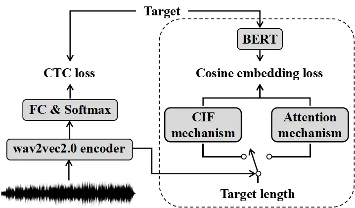
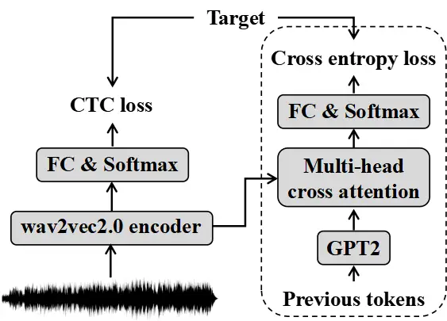

# Improving CTC-based speech recognition via knowledge transferring from pre-trained language models

Keqi Deng    Songjun Cao    Yike Zhang    Long Ma    Gaofeng Cheng    Ji
Xu ^(†)^(†)thanks: ^(\*) Equal contribution. Corresponding author.   
Pengyuan Zhang ^(†)^(†)thanks: This work is partially supported by the
National Key Research and Development Program of China (No.
2020AAA0108002).

###### Abstract

Recently, end-to-end automatic speech recognition models based on
connectionist temporal classification (CTC) have achieved impressive
results, especially when fine-tuned from wav2vec2.0 models. Due to the
conditional independence assumption, CTC-based models are always weaker
than attention-based encoder-decoder models and require the assistance
of external language models (LMs). To solve this issue, we propose two
knowledge transferring methods that leverage pre-trained LMs, such as
BERT and GPT2, to improve CTC-based models. The first method is based on
representation learning, in which the CTC-based models use the
representation produced by BERT as an auxiliary learning target. The
second method is based on joint classification learning, which combines
GPT2 for text modeling with a hybrid CTC/attention architecture.
Experiment on AISHELL-1 corpus yields a character error rate (CER) of
$`4.2\%`$ on the test set. When compared to the vanilla CTC-based models
fine-tuned from the wav2vec2.0 models, our knowledge transferring method
reduces CER by $`16.1\%`$ relatively without external LMs.

###### Index Terms: 

speech recognition, connectionist temporal classification, pre-trained
language model, knowledge transfer

^(†)^(†)address: ¹Tencent Cloud Xiaowei, Beijing, China  
²Key Laboratory of Speech Acoustics and Content Understanding, Institute
of Acoustics, CAS, China  
³University of Chinese Academy of Sciences, China

## 1 Introduction

End-to-end (E2E) automatic speech recognition (ASR) models directly
transcribe input speech into corresponding transcripts and outperform
conventional ASR models like hidden Markov models (HMMs) on most public
corpora \[1, 2\]. Among E2E models, the attention-based encoder-decoder
(AED) model is the dominant structure \[1, 3\]. However, the AED models’
outstanding performance comes at a cost of large model size and
computational complexity \[2\]. The AED models, in particular, decode in
an auto-regressive (AR) fashion, which slows down the decoding speed
when beam size is large \[4\]. In contrast, connectionist temporal
classification (CTC)-based models have a conditional independence
assumption, allowing for fast and paralleled decoding \[2\].

However, although the self-supervised pre-training methods have achieved
impressive success and greatly improve the recognition performance of
CTC-based ASR models \[5, 6, 7\], it is usually weaker than the
AED-based ASR system due to its conditional independence assumption
\[2\]. Using an external AR LM can help alleviate this problem \[8, 9\],
but it is more meaningful and flexible to improve the performance of the
CTC-based model itself, because using the AR LM during beam search makes
the system an AR one and loses the advantage of fast decoding speed as a
non-autoregressive (NAR) model. The recently proposed Mask CTC \[10\]
and Imputer \[11\] employ the CTC as part of the NAR ASR system and try
to refine the prediction of the CTC part. But these methods demand extra
computational costs and additional parameters.

The CTC-based models are limited in utilizing text-modal contextual
information due to its conditional independence assumption \[2\]. We aim
to help the CTC-based models learn the text-modal knowledge without
introducing extra parameters to keep the overall structure simple during
inference. Therefore, we try to transfer the contextual knowledge of
those well-known pre-trained LMs like BERT \[12\] or GPT2 \[13\] to the
CTC-based ASR models. In this paper, we employ wav2vec2.0 \[7\] as the
vanilla CTC-based ASR system given its recent state-of-the-art results
and propose two knowledge transferring methods to further improve its
performance. The first method is based on representation learning, in
which the CTC-based ASR system employs the representation extracted by
the BERT \[12\] as an auxiliary learning target. During this process, we
distill the contextual knowledge into the CTC-based ASR system. The
second method is based on joint classification learning that borrows the
ideas of CTC/attention multi-task learning method \[14\]. We combine the
GPT2 for text modeling with a hybrid CTC/attention architecture, and the
cross-modal knowledge transferring is achieved during the joint
training. Experimental results show that the first method performs
better since it transfers bidirectional contextual knowledge into the
ASR system, and it achieves a $`4.2\%`$ CER on the test set of AISHELL-1
corpus \[15\]. Without an external LM, our proposed method yields
$`16.1\%`$ relative CER reduction compared with our strong wav2vec2.0
CTC baseline and can still outperform the AED-based ASR systems on the
AISHELL-1 benchmark.

The rest of this paper is organized as follows. In Section 2, we
introduce the related works. In Section 3, we describe the proposed
knowledge transferring methods. The experiments and conclusions are
presented in Sections 4 and 5, respectively.

## 2 Related works

Self-supervised pre-training has gained success in several fields like
natural language processing (NLP) \[12, 13\], computer vision (CV)
\[16\] and ASR \[7\]. Recently well-known BERT contains multi-layer
Transformer encoders and is pre-trained via masked learning \[12\].
Unlike BERT, GPT2 \[13\] consists of a stack of unidirectional
Transformer decoders and is well known as a language generator \[17\].

Inspired by BERT, wav2vec \[5\] learns the raw speech representations
via a self-supervised context-prediction task. And vq-wec2vec \[6\] is
designed to learn discrete speech representations. Finally, wav2vec2.0
combines the contextual representations and discrete speech units
learning into one system and can outperform previous works with much
less labeled data \[7\].

Many works have investigated to transfer the knowledge of BERT to the
AED-based ASR system \[18, 19\]. Futami et al. \[20\] and Liu et al.
\[21\] distill the knowledge into a sequence-to-sequence (S2S) ASR
system from the BERT via soft labels and multi-objective function,
respectively. Winata et al. transfer part of the BERT’s parameters to
the decoder of the S2S ASR models \[22\]. Since the S2S model itself has
some abilities to utilize text-modal information, these methods have
achieved limited improvements. Actually, transferring the contextual
knowledge of pre-trained LMs to the CTC-based ASR systems is more
effective since they do not contain an auto-regressive decoder to
utilize text modality.

## 3 Proposed method

Under the framework of wav2vec2.0 \[7\], we propose two knowledge
transferring methods to further improve the CTC-based models. The first
is based on representation learning using the BERT \[12\] and we refer
to it as KT-RL in the rest of this paper. The second method is based on
joint classification learning utilizing GPT2 \[13\] and we refer to it
as KT-CL.

### 3.1 Knowledge transferring based on representation learning

Our method is shown in Fig. 1, where the switch is independent on the
target length and FC denotes a fully connected layer. The wav2vec2.0
encoder contains a CNN-based feature encoder and a Transformer-based
network. The parameters of BERT are fixed.

Suppose the representation vectors extracted by wav2vec2.0 encoder as
$`\textbf{H}=({\bm{h}}_{1},\dots,{\bm{h}}_{M})`$ and the corresponding
target labels as $`\textbf{T}=({y}_{1},\dots,{y}_{N})`$. The CTC loss
$`\mathcal{L}_{\rm{ctc}}`$ is calculated between the T and the H after
the FC layer. To transfer the knowledge of BERT into the ASR system, we
should first extract a linguistic representation whose time dimension is
consistent with the target T. Inspired by the work \[3\], we use the
serial CIF mechanism \[23\] to achieve the monotonic alignment between
the speech and text modalities. In addition, we design another structure
based on attention mechanism \[24\] to achieve better parallel
efficiency.



Figure 1: Illustration of proposed knowledge transferring methods based
on representation learning.

#### 3.1.1 KT-RL based on CIF (KT-RL-CIF)

Inspired by the work \[3\], we apply a sigmoid function to the max
element of $`\bm{h}_{m}`$ after a FC layer to obtain the weight
$`w_{m}`$. And the $`w_{m}`$ are accumulated along the time dimension
and a linguistic representation $`\bm{l}_{n}`$ is output when
accumulated resized weight $`\hat{w}_{m}`$ surpasses 1. The specific
process is shown as follows:

```math
{w_{m}}={\rm sigmoid}({\rm max}({\rm FC}(\bm{h}_{m}))), \tag{1}
```

```math
{\hat{w}_{m}}=\frac{w_{m}}{\sum_{m=1}^{M}w_{m}}N, \tag{2}
```

We input the $`\hat{w}_{m}`$ and $`\bm{h}_{m}`$ into CIF \[23\], which
accumulates the $`\hat{w}_{m}`$ and integrates the $`\bm{h}_{m}`$ (in
weighted sum form) until the accumulated $`\hat{w}_{m}`$ surpasses 1. At
this time step, the CIF divides $`\hat{w}_{m}`$ into two part: one part
is to fill the accumulated $`\hat{w}_{m}`$ to 1; the other part
corresponds to the next linguistic representation. Then, the CIF fires
the extracted linguistic representation $`\bm{l}_{n}`$. Eq. 2 is to
ensure that the number of output $`\bm{l}_{n}`$ is consistent with the
time length of the target T. The process based on CIF extracts a
linguistic representation $`\bm{l}_{n}`$ based on monotonic alignment.

We input the target transcription into the BERT and output the extracted
contextual embedding $`\textbf{E}=({\bm{e}}_{1},\dots,{\bm{e}}_{N})`$.
We employ the $`\bm{e}_{n}`$ as the learning target of the
$`\bm{l}_{n}`$, through which we distill the knowledge of BERT into the
ASR system. We calculate the cosine embedding loss between the
$`\bm{e}_{n}`$ and $`\bm{l}_{n}`$:

```math
\mathcal{L}_{cos}=k\cdot\sum_{n=0}^{N}(1-{\rm cos}(\bm{l}_{n},\bm{e}_{n})), \tag{3}
```

where $`k`$ is a hyper-parameter given that the value of cosine
embedding loss is relatively small compared with other loss functions.

The final training objective $`\mathcal{L}_{mtl}`$ is calculated as
follows:

```math
\mathcal{L}_{mtl}=\lambda\mathcal{L}_{\rm{ctc}}+(1\!-\!\lambda)\mathcal{L}_{\rm{cos}}, \tag{4}
```

where the hyper-parameters $`\lambda\in(0,1)`$. During inference, we
only use the CTC-based structure for decoding.

#### 3.1.2 KT-RL based on attention (KT-RL-ATT)

To achieve better parallel efficiency, we propose to use an
attention-based structure to extract the linguistic representation. With
a prior known target length $`N`$, we get a positional embedding matrix
$`\textbf{P}=({\bm{p}}_{1},\dots,{\bm{p}}_{N})`$ after positional
encoding and broadcasting the dimension to be consistent with the
wav2vec2.0 encoder output H.

After that, the linguistic representation
$`\textbf{L}=({\bm{l}}_{1},\dots,{\bm{l}}_{N})`$ is got via a parallel
multi-head cross attention:

```math
\bm{head}_{i}={\rm softmax}\left({\frac{(\textbf{P}\textbf{W}_{i}^{Q})(\textbf{H}\textbf{W}_{i}^{K})^{T}}{\sqrt{d_{m}}}}\right)(\textbf{H}\textbf{W}_{i}^{V}), \tag{5}
```

```math
\textbf{L}={\rm concat}\left({\bm{head}_{1},\ldots,\bm{head}_{h}}\right)\textbf{W}^{O}, \tag{6}
```

where $`\textbf{W}_{i}^{Q}\in\mathbf{R}^{d_{{model}}\times d_{m}}`$,
$`\textbf{W}_{i}^{K}\in\mathbf{R}^{d_{{model}}\times d_{m}}`$, and
$`\textbf{W}_{i}^{V}\in\mathbf{R}^{d_{{model}}\times d_{m}}`$ are
projection matrices for queries (Q), keys (K), and values (V)
respectively. $`d_{{model}}`$ is the model dimension. And we calculate
the $`\mathcal{L}_{cos}`$ and $`\mathcal{L}_{mtl}`$ in the same way as
Eq. 3 and Eq. 4.

### 3.2 Knowledge transferring based on classification learning

Inspired by the CTC/attention learning methods \[14\] and Preformer
\[25\], we first use a GPT2 to extract a text-modal representation of
previous tokens (ground truth) and combine it with the speech-modal
encoder output via multi-head cross attention. The process of our method
is shown in Fig. 2, where the parameters of GPT2 are fixed.



Figure 2: Illustration of proposed knowledge transferring methods based
on joint classification learning.

Suppose the embedding matrix that is extracted by the GPT2 from the
previous tokens as $`\textbf{G}=({\bm{g}}_{1},\dots,{\bm{g}}_{N})`$. The
process of multi-head cross attention is similar to the Eq. 5 and Eq. 6,
except that the matrix G is employed as query matrix instead of P and a
subsequent mask \[24\] is used to prevent seeing future tokens. During
this process, the speech-modal encoder output H have to learn to bridge
the modal gap with the text-modal GPT2 output G as shown in Eq. 5, in
this way, the text-modal knowledge is transferred into the CTC-based ASR
system.

Suppose the cross attention output as
$`\textbf{O}=({\bm{o}}_{1},\dots,{\bm{o}}_{N})`$, we calculate the cross
entropy loss $`\mathcal{L}_{ce}`$ between the O after linear classifier
and the target. And we train the overall structure via joint
classification with the final training objective $`\mathcal{L}_{mtl}`$
calculated as follows:

```math
\mathcal{L}_{mtl}=\beta\mathcal{L}_{\rm{ctc}}+(1\!-\!\beta)\mathcal{L}_{\rm{ce}}, \tag{7}
```

## 4 Experiments

### 4.1 Corpus

We evaluate the proposed knowledge transferring methods on the Mandarin
AISHELL-1 corpus \[15\], which consists of about 120000 utterances for
the training set and about 7000 utterances for the testing set. And its
development set contains around 14000 utterances. We also pre-train a
Mandarin wav2vec2.0 base model using the unlabeled speech training set
of AISHELL-2 corpus \[26\].

### 4.2 Model descriptions

We use the ESPnet2 toolkit \[27\] to build the models. For the acoustic
input feature, we use the raw speech following wav2vec 2.0 \[7\]. For
the text output, we use 4230 Chinese characters and 3 non-verbal
symbols: blank, unknown-character, sos/eos as the modeling units.

We employ the vanilla wav2vec2.0 CTC-based model as the baseline, which
contains a wav2vec2.0 encoder and a randomly initialized FC. The
wav2vec2.0 encoder consists of seven CNN layers (i.e., 512 channels with
kernel size 10, 3, 3, 3, 3, 2, and 2 and strides 5, 2, 2, 2, 2, 2, and 2) and 12 Transformer layers (i.e., 768 model dimensions, 3072 inner
dimensions (FFN) and 12 attention heads). As for our proposed methods,
except for the CTC-based structure that is the same as the baseline
model, we set the $`k`$ in Eq. 3 to 20, and the $`\lambda`$ and
$`\beta`$ in Eq. 4 and Eq. 7 to 0.3. The multi-head cross attention
mechanism in the proposed methods is only one layer with 768 model
dimensions and 4 heads. And the sizes of the FC in Eq. 1, Fig. 1, and
Fig. 2 are all 4233. We directly use the pre-trained BERT (i.e.,
bert-base-chinese) and GPT2 (i.e., uer/gpt2-chinese-cluecorpussmall)
provided by Huggingface Transformer Library \[28\]. The parameters of
both the GPT2 and the BERT are fixed during training. The averaged
embedding over all layers of BERT is employed as the target of KT-RL. We
also use the wav2vec2.0 base model provided by Fairseq \[29\] as the
English wav2vec2.0 model.

We train the models by Adam optimizer with a warmup learning rate
schedule (25000 warm steps) for 20 epochs. To avoid overfitting, we use
an early stop strategy and the patience is set to 3. And we average the
parameters of the model at the last 10 epochs. We also train an external
Transformer-based LM using the transcription of the training set of
AISHELL-1 following ESPnet2 recipe \[27\]. During inference, we only use
the CTC-based model for decoding, and the beam search size is 10. When
the external LM is used, its weight is set to 0.3.

### 4.3 Experimental results

We compare our proposed knowledge transferring method, our vanilla
wav2vec2.0 CTC baseline, and other ASR benchmark systems. The results
are shown in Table 1, where w2v2.0 denotes the mandarin wav2vec2.0 base
model. The results show that our proposed method greatly improves the
CTC-based models, especially when not using the external LM (i.e.,
$`14.3\%`$ and $`16.1\%`$ relative CER reduction on the test set when
using LM and not using LM respectively). These results prove that
transferring the contextual knowledge of powerful pre-trained LM to the
CTC-based ASR system is really effective since the CTC-based models lack
the ability to utilize the text-modal information.

In addition, compared with those benchmark systems, we can see that the
CTC-based models after using our proposed method achieve very
competitive results, even though we greatly reduce the number of
training iterations. For example, the Conformer with SpecAugment \[30\]
in ESPnet2 employs 50 training epochs, but we just train our model for
20 epochs, which greatly saves training costs.

Furthermore, with our proposed knowledge transferring method, the
CTC-based non-autoregressive ASR system without an external
autoregressive (AR) LM can still surpass our strong wav2vec2.0 CTC
baseline with an AR LM, which can be seen as an AR system.

|                                             |         |      |       |      |
| ------------------------------------------- | ------- | ---- | ----- | ---- |
| ASR Model                                   | With LM |      | No LM |      |
|                                             | dev     | test | dev   | test |
| ESPnet2 (Transformer+SpecAug \[30\]) \[27\] | 5.9     | 6.4  | –     | –    |
| ESPnet2 (Conformer+SpecAug \[30\]) \[27\]   | 4.4     | 4.7  | 4.5   | 4.9  |
| Improved CASS-NAT \[31\]                    | –       | –    | 4.9   | 5.4  |
| NAR-BERT-ASR \[4\]                          | –       | –    | 4.9   | 5.5  |
| LASO \[18\]                                 | –       | –    | 5.2   | 5.8  |
| Vanilla w2v2.0 CTC                          | 4.5     | 4.9  | 5.1   | 5.6  |
| KT-RL-CIF based on w2v2.0                   | 4.1     | 4.2  | 4.3   | 4.7  |

Table 1: The character error rates (CERs) (%) of several benchmarks, our
vanilla wav2vec2.0 CTC-based baseline, and our proposed knowledge
transferring methods on the AISHELL-1 corpus.

### 4.4 Ablation studies on KT-RL

In the main experiments, we only show the performance of the proposed
KT-RL-CIF. In this part, we conduct ablation studies to compare the
KT-RL-CIF and the KT-RL-ATT. In addition, we employ the cosine embedding
loss as in Eq. 3 for the representation learning, in this part, we also
compare the effectiveness of cosine embedding loss with the mean square
error (MSE) loss.

The results are shown in Table 2, where Aux Loss means an auxiliary loss
in Eq. 3, and Cosine denotes cosine embedding loss while MSE denotes MSE
loss. We can see that our proposed knowledge transferring methods based
on representation learning can greatly improve the CTC-based models.
Among them, KT-RL-CIF is better as the CIF constrains a monotonic
alignment between acoustic and linguistic representation. Using the CIF
mechanism can more accurately transfer the context knowledge to the
corresponding acoustic representation. While the attention mechanism is
too flexible and extracts the linguistic representation through a
weighted sum, so knowledge corresponding to a word may be transferred to
other frames that do not belong to this word in a certain proportion. In
addition, the results show that using the cosine embedding loss
outperforms the MSE loss. The cosine embedding loss encourages the
linguistic representation to approach the direction of the target
embedding instead of trying to reduce the distance between each element
of the two vectors. And the results imply that angle may be more
important than the norm of a vector during representation learning.

|                           |        |         |      |       |      |
| ------------------------- | ------ | ------- | ---- | ----- | ---- |
| ASR Model                 | Aux    | With LM |      | No LM |      |
|                           | Loss   | dev     | test | dev   | test |
| Vanilla w2v2.0 CTC        | –      | 4.5     | 4.9  | 5.1   | 5.6  |
| KT-RL-CIF based on w2v2.0 | Cosine | 4.1     | 4.2  | 4.3   | 4.7  |
| KT-RL-CIF based on w2v2.0 | MSE    | 4.4     | 4.7  | 4.8   | 5.1  |
| KT-RL-ATT based on w2v2.0 | Cosine | 4.2     | 4.5  | 4.6   | 4.8  |

Table 2: The CERs (%) of our ASR system with different structures for
knowledge transferring based on representation learning on the AISHELL-1
corpus.

However, although the KT-RL-CIF outperforms the KT-RL-ATT in recognition
accuracy, the KT-RL-CIF’s training time will be longer due to its serial
structure, while the KT-RL-ATT has a higher parallel efficiency thus
shortening the training duration.

|           |                |                |                |
| --------- | -------------- | -------------- | -------------- |
| ASRmodel  | Forward Time   | Backward Time  | Total Time     |
| Baseline  | 0.171(s/iter)  | 0.185(s/iter)  | 0.356(s/iter)  |
| KT-RL-ATT | 0.196 (s/iter) | 0.263 (s/iter) | 0.459 (s/iter) |
| KT-RL-CIF | 0.305 (s/iter) | 0.414 (s/iter) | 0.719 (s/iter) |

Table 3: The training time spent in each iteration of different
structures for knowledge transferring based on representation learning
on the AISHELL-1 corpus.

Table 3 lists the forward, backward, and total time of the KT-RL-ATT and
KT-RL-CIF for each iteration respectively, which are trained on 8 M40
GPUs with 128 batch size. We can see that the KT-RL-ATT does greatly
reduce the time spent on training. To conclude, due to the monotonic
alignment achieved by the CIF mechanism, the KT-RL-CIF can better
transfer the BERT knowledge to the CTC-based ASR system. But the
KT-RL-ATT can save the time spent on training while also greatly improve
the ASR system.

### 4.5 Ablation studies on KT-CL

In this part, we conduct ablation studies to show the performance of the
knowledge transferring based on joint classification. And the results
are shown in Table 4, where joint decoding means joint CTC/attention
decoding \[32\]. Since the proposed KT-CL method is inspired by the
CTC/attention multi-task learning, we build a vanilla CTC/attention ASR
model as another baseline, in which we employ CTC/attention joint
training and only use the CTC branch during decoding. The results show
that the CTC-based ASR system can be improved even with the vanilla
CTC/attention multi-task training.

Furthermore, after using the proposed KT-CL, further improvements are
achieved. The GPT2 can extract a high-quality text representation that
fully contains contextual knowledge, and the acoustic encoder output has
to match this text-modal representation during joint training thus
learning the contextual knowledge. And another advantage of the KT-CL is
that we can choose another decoding style (i.e., joint CTC/attention
decoding) if necessary, which can achieve higher accuracy although the
inference speed is slower.

At last, we can see that the KT-RL outperforms the KT-CL, this is
because KT-RL distills bidirectional contextual knowledge into the ASR
system while the KT-CL can only provide unidirectional information as it
needs to use a subsequent mask to prevent seeing the future information
during joint training.

|                                        |         |      |       |      |
| -------------------------------------- | ------- | ---- | ----- | ---- |
| ASR Model                              | With LM |      | No LM |      |
|                                        | dev     | test | dev   | test |
| Vanilla w2v2.0 CTC                     | 4.5     | 4.9  | 5.1   | 5.6  |
| KT-CL based on w2v2.0 (joint decoding) | 4.0     | 4.3  | 4.0   | 4.2  |
| KT-CL based on w2v2.0                  | 4.4     | 4.6  | 5.0   | 5.2  |
| CTC/attention based on w2v2.0          | 4.6     | 4.8  | 5.0   | 5.4  |

Table 4: The CER (%) of our ASR system with different structures for
knowledge transferring based on classification learning on the AISHELL-1
corpus.

### 4.6 Ablation studies on pre-trained LM

In the previous experiments, we have demonstrated the effectiveness of
our proposed KT-RL based on BERT and KT-CL based on GPT2. In this part,
we further conducted ablation studies to test the effect of using
different pre-trained LMs. The results are shown in Table 5, where
unidirectional BERT is achieved by subsequent masks. The experimental
results show that: 1. KT-RL-CIF with BERT outperforms the one with GPT2,
which proves that using bidirectional information is beneficial for the
KT-RL. 2. For the KT-CL, the effect of setting BERT to unidirectional is
just slightly worse than GPT2. 3. Whether using GPT2 or BERT, the KT-RL
outperforms the KT-CL.

|                                                   |     |      |
| ------------------------------------------------- | --- | ---- |
| ASR Model                                         | dev | test |
| Vanilla w2v2.0 CTC                                | 4.5 | 4.9  |
| KT-RL-CIF based on w2v2.0 (using BERT)            | 4.1 | 4.2  |
| KT-RL-CIF based on w2v2.0 (using GPT2)            | 4.2 | 4.5  |
| KT-CL based on w2v2.0 (using GPT2)                | 4.4 | 4.6  |
| KT-CL based on w2v2.0 (using unidirectional BERT) | 4.4 | 4.7  |

Table 5: The CER (%) of our ASR system using different pre-trained LM on
the AISHELL-1 corpus, which is decoded with external LM.

## 5 Conclusion

In this paper, we aim to improve the CTC-based models by transferring
contextual knowledge of pre-trained LMs into the ASR systems and we
propose two kinds of knowledge transferring methods. The first is based
on representation learning, which employs the representation extracted
by BERT as the auxiliary learning target of the CTC-based models and can
distill bidirectional contextual knowledge into the ASR systems. The
second method is based on joint classification learning, which combines
GPT2 for text modeling with a hybrid CTC/attention structure and can
utilize unidirectional contextual knowledge. We conduct experiments on
AISHELL-1 corpus and achieve a $`4.2\%`$ CER on the test set. Without
the help of external LM, our proposed method yields $`16.1\%`$ relative
CER reduction compared with our wav2vec2.0 CTC baseline and can still
surpass the AED-based ASR systems on the AISHELL-1 benchmark.

## References

- \[1\] Y. zhao, J. Li, X. Wang, and Y. Li, “The speechtransformer for
  large-scale mandarin chinese speech recognition,” in Proc. ICASSP,
  2019, pp. 7095–7099.
- \[2\] J. Lee and S. Watanabe, “Intermediate loss regularization for
  ctc-based speech recognition,” in Proc. ICASSP, 2021, pp. 6224–6228.
- \[3\] C. Yi, S. Zhou, and B. Xu, “Efficiently fusing pretrained
  acoustic and linguistic encoders for low-resource speech recognition,”
  IEEE Signal Processing Letters, vol. 28, pp. 788–792, 2021.
- \[4\] F. Yu and K. Chen, “Non-autoregressive transformer-based
  end-to-end ASR using BERT,” CoRR, vol. abs/2104.04805, 2021.
- \[5\] S. Schneider, A. Baevski, R. Collobert, and M. Auli, “wav2vec:
  Unsupervised Pre-Training for Speech Recognition,” in Proc.
  Interspeech 2019, 2019, pp. 3465–3469.
- \[6\] A. Baevski, S. Schneider, and M. Auli, “vq-wav2vec:
  Self-supervised learning of discrete speech representations,” in
  ICLR, 2020.
- \[7\] A. Baevski, Y. Zhou, A. Mohamed, and M. Auli, “wav2vec 2.0: A
  framework for self-supervised learning of speech representations,” in
  Proc. NeurIPS, 2020, vol. 33, pp. 12449–12460.
- \[8\] S. Ueno, H. Inaguma, M. Mimura, and T. Kawahara,
  “Acoustic-to-word attention-based model complemented with
  character-level ctc-based model,” in ICASSP, 2018, pp. 5804–5808.
- \[9\] K. Deng, S. Cao, and L. Ma, “Improving Accent Identification and
  Accented Speech Recognition Under a Framework of Self-Supervised
  Learning,” in Proc. Interspeech 2021, 2021, pp. 1504–1508.
- \[10\] Y. Higuchi, S. Watanabe, N. Chen, T. Ogawa, and T. Kobayashi,
  “Mask CTC: Non-Autoregressive End-to-End ASR with CTC and Mask
  Predict,” in Proc. Interspeech 2020, 2020, pp. 3655–3659.
- \[11\] W. Chan, C. Saharia, G. Hinton, M. Norouzi, and N. Jaitly,
  “Imputer: Sequence modelling via imputation and dynamic programming,”
  in Proc. ICML, 2020, vol. 119, pp. 1403–1413.
- \[12\] J. Devlin, M. Chang, K. Lee, and K. Toutanova, “BERT:
  pre-training of deep bidirectional transformers for language
  understanding,” in NAACL-HLT (1), 2019, pp. 4171–4186.
- \[13\] A. Radford, J. Wu, R. Child, D. Luan, D. Amodei, and
  I. Sutskever, “Language models are unsupervised multitask learners,” 2019.
- \[14\] S. Kim, T. Hori, and S. Watanabe, “Joint ctc-attention based
  end-to-end speech recognition using multi-task learning,” in ICASSP.
  2017, pp. 4835–4839, IEEE.
- \[15\] H. Bu, J. Du, X. Na, B. Wu, and H. Zheng, “AISHELL-1: an
  open-source mandarin speech corpus and a speech recognition baseline,”
  in O-COCOSDA. 2017, pp. 1–5, IEEE.
- \[16\] T. Chen, S. Kornblith, M. Norouzi, and G. Hinton, “A simple
  framework for contrastive learning of visual representations,” in
  ICML, 2020, vol. 119, pp. 1597–1607.
- \[17\] H. Bai, P. Shi, J. Lin, L. Tan, K. Xiong, W. Gao, J. Liu, and
  M. Li, “Semantics of the unwritten: The effect of end of paragraph and
  sequence tokens on text generation with GPT2,” in ACL, 2021, pp.
  148–162.
- \[18\] Y. Bai, J. Yi, J. Tao, Z. Tian, Z. Wen, and S. Zhang, “Fast
  end-to-end speech recognition via non-autoregressive models and
  cross-modal knowledge transferring from bert,” IEEE/ACM Transactions
  on Audio, Speech, and Language Processing, vol. 29, pp.
  1897–1911, 2021.
- \[19\] K. Deng, G. Cheng, R. Yang, and Y. Yan, “Alleviating asr
  long-tailed problem by decoupling the learning of representation and
  classification,” IEEE/ACM Transactions on Audio, Speech, and Language
  Processing, vol. 30, pp. 340–354, 2022.
- \[20\] H. Futami, H. Inaguma, S. Ueno, M. Mimura, S. Sakai, and
  T. Kawahara, “Distilling the knowledge of bert for
  sequence-to-sequence asr,” arXiv e-prints, p. arXiv:2008.03822, 2020.
- \[21\] A. H. Liu, T. Sung, S. Chuang, H. Lee, and L. Lee,
  “Sequence-to-sequence automatic speech recognition with word embedding
  regularization and fused decoding,” in ICASSP, 2020, pp. 7879–7883.
- \[22\] G. I. Winata, G. Wang, C. Xiong, and S. C. H. Hoi,
  “Adapt-and-adjust: Overcoming the long-tail problem of multilingual
  speech recognition,” CoRR, vol. abs/2012.01687, 2020.
- \[23\] L. Dong and B. Xu, “Cif: Continuous integrate-and-fire for
  end-to-end speech recognition,” in ICASSP, 2020, pp. 6079–6083.
- \[24\] A. Vaswani, N. Shazeer, N. Parmar, J. Uszkoreit, L. Jones,
  A. N. Gomez, L. Kaiser, and I. Polosukhin, “Attention is all you
  need,” in NIPS, 2017, pp. 5998–6008.
- \[25\] K. Deng, S. Cao, Y. Zhang, and L. Ma, “Improving hybrid
  ctc/attention end-to-end speech recognition with pretrained acoustic
  and language models,” in 2021 IEEE Automatic Speech Recognition and
  Understanding Workshop (ASRU), 2021, pp. 76–82.
- \[26\] J. Du, X. Na, X. Liu, and H. Bu, “AISHELL-2: transforming
  mandarin ASR research into industrial scale,” CoRR, vol.
  abs/1808.10583, 2018.
- \[27\] S. Watanabe, T. Hori, S. Karita, T. Hayashi, J. Nishitoba,
  Y. Unno, N. E. Y. Soplin, J. Heymann, M. Wiesner, and N. Chen,
  “Espnet: End-to-end speech processing toolkit,” in Proc. Interspeech
  2018, 2018, pp. 2207–2211.
- \[28\] T. Wolf, L. Debut, V. Sanh, J. Chaumond, C. Delangue, A. Moi,
  P. Cistac, T. Rault, R. Louf, M. Funtowicz, J. Davison, S. Shleifer,
  P. v. Platen, C. Ma, Y. Jernite, J. Plu, C. Xu, T. L. Scao, S. Gugger,
  M. Drame, Q. Lhoest, and A. M. Rush, “Transformers: State-of-the-art
  natural language processing,” in EMNLP (Demos), Online, Oct. 2020, pp.
  38–45.
- \[29\] M. Ott, S. Edunov, A. Baevski, A. Fan, S. Gross, N. Ng,
  D. Grangier, and M. Auli, “fairseq: A fast, extensible toolkit for
  sequence modeling,” in NAACL-HLT, 2019, pp. 48–53.
- \[30\] D. S. Park, W. Chan, Y. Zhang, C. Chiu, B. Zoph, E. D. Cubuk,
  and Q. V. Le, “SpecAugment: A Simple Data Augmentation Method for
  Automatic Speech Recognition,” in Proc. Interspeech 2019, 2019, pp.
  2613–2617.
- \[31\] R. Fan, W. Chu, P. Chang, J. Xiao, and A. Alwan, “An Improved
  Single Step Non-Autoregressive Transformer for Automatic Speech
  Recognition,” in Proc. Interspeech 2021, 2021, pp. 3715–3719.
- \[32\] T. Hori, S. Watanabe, and J. Hershey, “Joint CTC/attention
  decoding for end-to-end speech recognition,” in ACL. 2017, pp.
  518–529, Association for Computational Linguistics.
