###### Abstract

Natural and artificial audition can in principle acquire different
solutions to a given problem. The constraints of the task, however, can
nudge the cognitive science and engineering of audition to qualitatively
converge, suggesting that a closer mutual examination would potentially
enrich artificial hearing systems and process models of the mind and
brain. Speech recognition — an area ripe for such exploration — is
inherently robust in humans to a number transformations at various
spectrotemporal granularities. To what extent are these robustness
profiles accounted for by high-performing neural network systems? We
bring together experiments in speech recognition under a single
synthesis framework to evaluate state-of-the-art neural networks as
stimulus-computable, optimized observers. In a series of experiments, we
(1) clarify how influential speech manipulations in the literature
relate to each other and to natural speech, (2) show the granularities
at which machines exhibit out-of-distribution robustness, reproducing
classical perceptual phenomena in humans, (3) identify the specific
conditions where model predictions of human performance differ, and (4)
demonstrate a crucial failure of all artificial systems to perceptually
recover where humans do, suggesting alternative directions for theory
and model building. These findings encourage a tighter synergy between
the cognitive science and engineering of audition.

Keywords: audition, speech, neural networks, robustness, human-like AI

.

Successes and critical failures of neural networks in capturing
human-like speech recognition

Federico Adolfi Ernst Strüngmann Institute (ESI) for Neuroscience in
Cooperation with Max Planck Society, Frankfurt, Germany University of
Bristol, School of Psychological Science, Bristol, United Kingdom
Jeffrey S. Bowers University of Bristol, School of Psychological
Science, Bristol, United Kingdom David Poeppel Ernst Strüngmann
Institute (ESI) for Neuroscience in Cooperation with Max Planck Society,
Frankfurt, Germany Department of Psychology, New York University, New
York, United States Max Planck NYU Center for Language, Music, and
Emotion, Frankfurt, Germany, New York, NY Keywords: audition, speech,
neural networks, robustness, human-like AI.

##### Correspondence should be addressed to Federico Adolfi (fedeadolfi@bristol.ac.uk)

## 1 Introduction

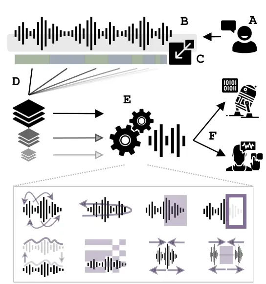

Figure 1: Human speech (A) is recorded and represented as a
1-dimensional signal in the time domain (B), which is optionally
converted to a spectrogram-like representation in the time-frequency
domain (C). It is subsequently segmented in parallel at various
spectrotemporal scales (D). The resulting slices become the input to a
transformation (E) — which may involve shuffling, reversing, masking,
silencing, chimerizing, mosaicizing, time warping, or repackaging.
Finally, the outputs are sequenced and the resulting time-domain signals
are presented to both humans and optimized observer models (F).

Audition systems — artificial and biological — can in principle acquire
qualitatively different solutions to the same ecological problem. For
instance, redundancy at the input or lack thereof, relative to the
structure and complexity of the problem, can encourage systems towards
divergent or convergent evolution. Whether performance-optimized
engineering solutions and biological perception converge for a
particular problem determines, in part, the extent to which artificial
auditory systems can play a role as process models of the mind and brain
Ma & Peters ((2020)).

Although neural networks for audio have achieved remarkable performance
in tasks such as speech recognition, most of the links to computational
cognitive science have come from vision, with audition being
comparatively neglected Cichy & Kaiser ((2019)). Audition as a field has
its own set of unique challenges: explaining and building systems that
must integrate sound information at various spectrotemporal scales to
accomplish even the most basic recognition task Poeppel et al. ((2008));
Poeppel & Assaneo ((2020)). Nevertheless, research into audition can
avoid pitfalls in model evaluation by looking at emerging critiques of
neural networks for vision Bowers et al. ((2022)) and adopting a more
qualitative and diverse approach Navarro ((2019)). We therefore set out
to characterize the solutions acquired by machine hearing systems as
compared to humans, drawing bridges across influential research lines in
auditory cognitive science and engineering.

An area of audition where the two disciplines once worked in close
allegiance is speech recognition. The engineering of machine hearing has
produced a zoo of task-optimized architectures — convolutional Veysov
((2020)), recurrent Amodei et al. ((2015)); Hannun et al. ((2014)), and
more recently, transformer-based Baevski et al. ((2020)); Schneider et
al. ((2019)) — achieving performance levels impressive enough (on
benchmark tasks) to afford numerous real-world applications. The
cognitive science of audition provides a complementary perspective from
biological hearing. A research program based on multi-scale
perturbations to natural signals — going back to the 1950s Miller &
Licklider ((1950)), active through decades Saberi & Perrott ((1999));
Smith et al. ((2002)); Shannon et al. ((1995)), and still thriving Gotoh
et al. ((2017)); Ueda et al. ((2017)), has provided detailed
descriptions of performance patterns in humans. The question is whether
these engineering and scientific insights converge, and to what extent
they can more explicitly inform each other.

Speech recognition in humans is inherently resistant to a number of
perturbations at various granularities, exhibiting a form of
out-of-distribution robustness analogous to how biological (but
typically not artificial) vision generalizes to contour images and other
transformations Evans et al. ((2021)). This has been uncovered by a
large set of experiments which process natural speech in a selective
manner at multiple spectrotemporal scales (e.g., Saberi & Perrott,
(1999); Smith et al., (2002); Shannon et al., (1995)). The results are
suggestive of the properties of mid-level stages of audition that drive
any downstream task such as prediction and categorization. Are these
robustness profiles accounted for by modern neural network systems?

We make explicit the synthesis space implied by these experiments,
bringing them together under a single framework (Fig. 1) that allows us
to simulate behavior exhaustively in search for human-machine alignment.
By this we mean that each classical experiment implicitly defines a
space of possible simulations given by the experimental parameters
(e.g., the temporal scale at which perturbations are performed). We
combine and vary these in order to cover more ground than what was the
case in the original experiments. In this way we can give the
qualitatively human-like performance patterns a chance to emerge in the
results without limiting their manifestation to the narrow parameter
range of past studies.

The broader rationale is that insights about a perceptual system and its
input signal (in this case, speech) can be gleaned by observing the
transformations and spectrotemporal granularities for which systems show
perturbation-robust behavior. Systems will show performance curves
reflecting whether (a) they rely on perturbation-invariant
transformations at various granularities, and (b) information evolving
at these scales is present and relevant for the downstream task. These
in turn depend on the relevant signal cues being unique such that all
solutions, artificial or biological, tend towards exploiting it. With
this framework in place, we perform multi-scale audio analysis and
synthesis, evaluate state-of-the-art neural networks as
stimulus-computable optimized observers, and compare the simulated
predictions to human performance.

This paper is organized as follows. First, we clarify how the different
audio manipulations in the literature relate to each other by describing
their effects in a common space: the sparsity statistics of the input.
This allows us to link the distribution of experimental stimuli in human
cognitive science to that of training and testing examples for
artificial systems. Synthetic and natural speech fill this space and
show regions where human and machine performance is robust outside the
training distribution. Second, in a series of experiments we find that,
while several classical perceptual phenomena are well-predicted by
high-performing, speech-to-text neural network architectures, more
destructive perturbations reveal differences amongst models and between
these and humans. Finally, we demonstrate a systematic failure of all
artificial systems to perceptually recover where humans do, which is
suggestive of alternative directions for theorizing, computational
cognitive modeling, and, more speculatively, improvement of engineering
solutions.

## 2 Results

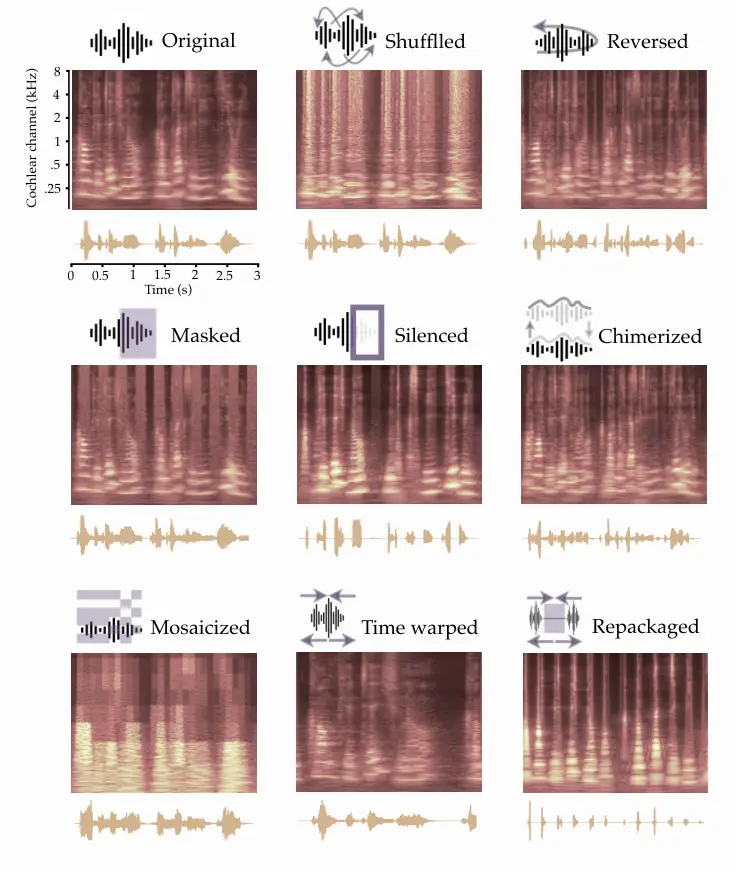

Figure 2: Spectrogram and waveform representations of natural and
resynthesized speech for all perturbations of a single 3-second
utterance: “computational complexity theory”. To illustrate the effect
of various perturbations on the signal, we show moderate perturbation
magnitudes: shuffling is done at a 2 ms timescale; reversing at 150 ms;
masking and silencing are done at 300 ms; chimerizing is done with 30
bands and targeting the envelopes for reversal at 100 ms; mosaicizing is
done with 60 bands and a frequency window of 6 bands and time window of
100 ms; time warping is applied with a warp factor of 0.5 (stretching);
repackaging is done with a warp factor of 3.0 (compressing), a time
window of 250 ms and an insertion of silence of 167ms. Refer to the main
text and Methods section for details on the audio perturbations and
resynthesis procedures.

We characterize the input space and report performance on speech
recognition, measured by the word error rate (WER), for multiple
experiments with trained neural networks including convolutional,
recurrent and transformer models (see Methods for details). Our
experimental framework (Fig. 1) systematizes and integrates classical
speech perturbations. These re-synthesis procedures split the signal
into segments and apply a transformation within each segment, such as
shuffling, reversing, masking, silencing, chimerizing, mosaicizing, time
warping, or repackaging (see Fig. 2 for example spectrograms of natural
and perturbed signals, and Methods section for details). Then the
segments are concatenated together and the resulting perturbed speech is
presented to machines. The performance of the models under different
perturbations is therefore evaluated and plotted separately at various
scales and perturbation parameter values.

The rationale for choosing these perturbations, which are not variants
of natural speech, is that (i) they represent a cohesive family of
manipulations to the speech signal with well-known human performance
profiles; (ii) they represent a unique opportunity to test for
out-of-distribution robustness/generalization, as humans are robust to
these perturbations at specific timescales without having been trained
explicitly; and (iii) they each allow informative interpretations of the
results in terms of (a) the specific invariances learned by neural
networks and (b) the timescales at which these invariances operate. For
instance, if a trained model’s performance is unaffected by a specific
perturbation at time scale X (e.g., 250 ms) which destroys the structure
of feature Y (e.g., phase spectrum) but preserves that of feature Z
(e.g., magnitude spectrum), then we can infer that the transformation
learned by the model is likely invariant in this particular sense.

To avoid pervasive problems Bowers et al. ((2022)); Dujmović et al.
((2022)); Guest & Martin ((2023)) with monolithic, quantitative
assessments of predictive accuracy (e.g., a single brain activity
prediction score), in this work we focus instead on the qualitative fit
Navarro ((2019)); Bowers et al. ((2022)) between machines and humans.

That is, we first identify the canonical performance curve exhibited by
humans in response to parametric speech perturbations, and then we
search for this pattern by systematic visual inspection in the
performance profile of neural networks across many combinations of
experimental parameters, including the original one used in human
studies. For instance, if humans exhibit a U-shaped performance curve as
a perturbation parameter value is increased, we search for such a curve
in the performance profile of neural network models. In all cases, we
plot the results on axes chosen to match the classical experiments we
build on, to facilitate comparisons.

The main results summarizing the findings of our more comprehensive
evaluation are presented here succinctly and later discussed more
comprehensively.

### 2.1 Input statistics: sparsity and out-of-distribution robustness

Since it is natural to think of the family of experiments conducted here
as affecting the distribution of signal energy (in time and frequency)
in proportion to the magnitude of the synthesis parameters (see below
and Fig. 1), we accordingly use sparsity as a summary statistic. We do
this with descriptive aims, as it allows us to (a) visualize an
interpretable, low-dimensional representation of the input, (b) unify
synthesis procedures traditionally considered separate, and (c) reason
about out-of-distribution robustness. To examine how the different
speech synthesis techniques relate to each other, we quantify and
summarize their effect on the distribution over the input space: we
compute the sparsity Hurley & Rickard ((2009)) of natural and
experimental signals in the time and frequency domains. A high sparsity
representation of a signal contains a small number of its coefficients
(under some encoding) accounting for most of the signal’s energy. We
observe that this measure is reliably modulated by our synthesis
procedures and experimental parameters, which makes it a useful summary
representation of the resulting input statistics. We visualize the joint
distributions of both synthetic and natural speech samples and find that
the family of manipulations approximately fills the space (see Fig. 3
for a schematic summary). Natural speech sits roughly at the center,
with the extremes in this space representing regions of canonical
non-speech signals like noise, clicks, simple tones, and beeps. The
magnitude of the experimental manipulations relates to how much
synthetic samples are pushed away from natural speech in various
directions. In the next sections we will present similar graphs
alongside the main results, for each experiment separately, to aid in
the description of the data. As we detail in the experiments below, we
observe that top performance (80-100%) on perturbed synthetic speech
includes limited regions outside the natural distribution where both
humans and machines exhibit inherent robustness (see Fig. 4-7 right-hand
panels for individual experiment distributions). In sum, the family of
perturbations considered here are naturally described as spanning the
space of sparsity, and can parametrically drive speech stimuli outside
the training distribution, where machines and humans exhibit some
generalization.

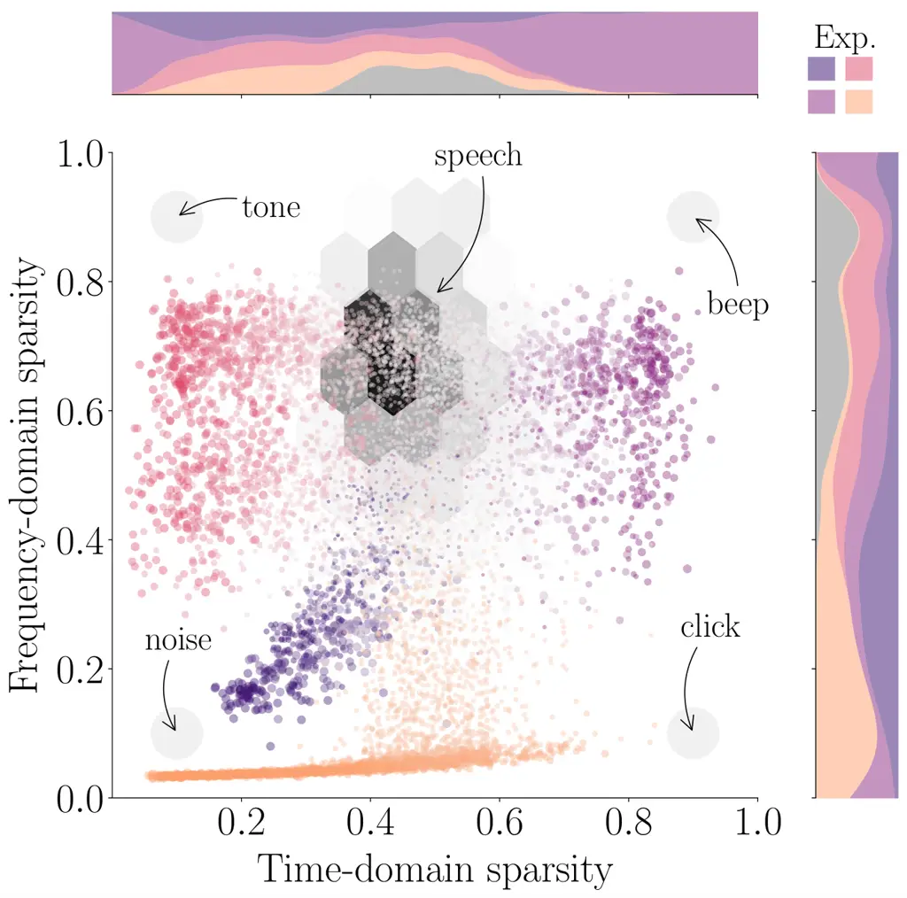

Figure 3: Schematic of how natural and experimental distributions fill
the input space defined by sparsity in time and frequency. The natural
speech distribution is shown in grayscale hexagons located at the
center. A subset of the processed audio samples are shown in color
according to 4 example experiments (color code on the top right). Each
dot represents a speech utterance that has been perturbed according to
an example resynthesis procedure (here shuffling \[orange\], masking
\[purple\], silencing \[violet\] and mosaicizing \[red\]; see main text
and Methods for details). The perturbed signal is run through the
sparsity analysis, obtaining one value for time sparsity and another for
frequency sparsity. Hue and size indicates the magnitude of the
perturbation according to its respective parameter set (e.g., window
length). Marginal distributions are ’filled’ such that the proportion of
samples for different experiments is reflected at each point. It can be
seen that audio transformations systematically push samples away from
the training set. Canonical signals (noise, tone, beep, click) are
annotated at the extremes for reference. The sparsity plots for each
perturbation are reported later individually.

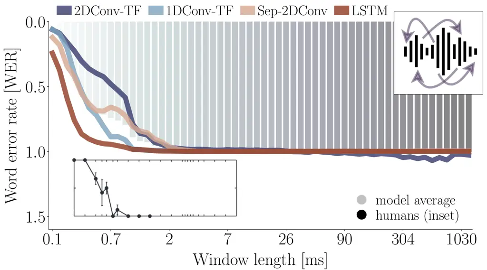

A

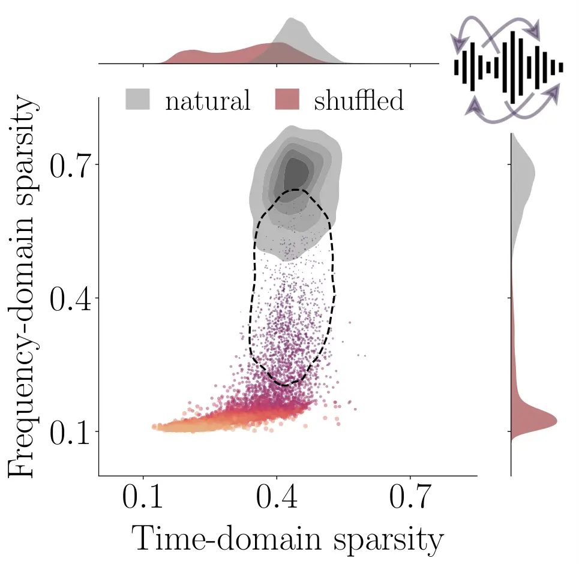

B

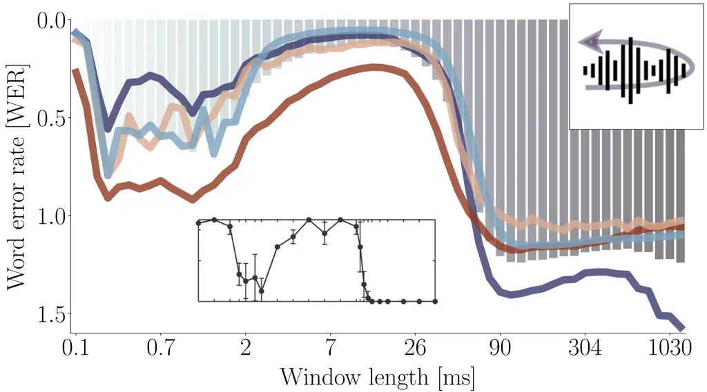

C

D

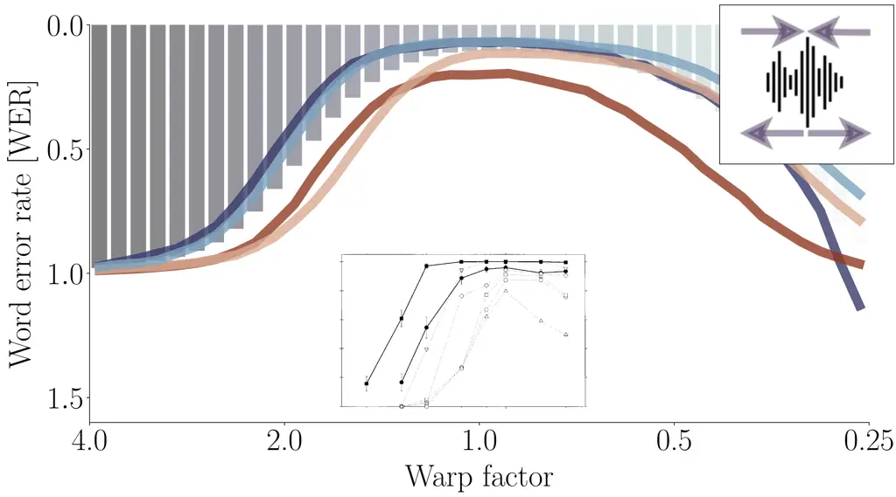

E

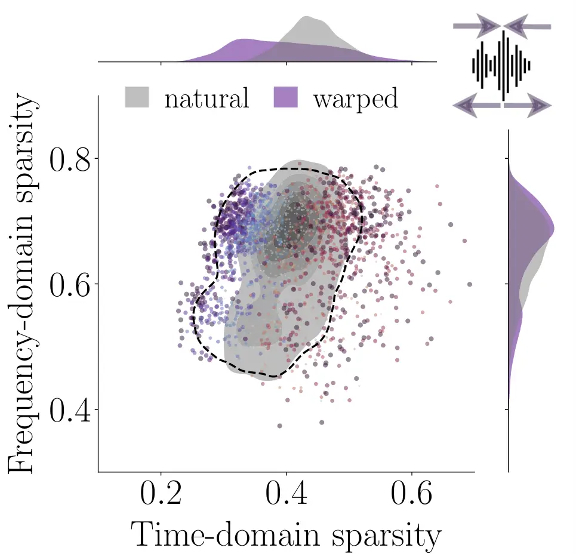

F

Figure 4: Machines and humans are resistant to (A) shuffling, (C)
reversal, and (E) time warping, at comparable granularities, exhibiting
qualitatively similar patterns of out-of-distribution robustness (insets
adapted from Gotoh et al., (2017); Fu et al., (2001) have x/y-axis
ranges comparable to the corresponding main graphs; inset on panel E
shows performance for normal hearing listeners \[filled shapes\] and
cochlear implant users \[blank shapes\]). Color coding of models is
indicated in panel A. We plot performance (WER) as a function of
perturbation timescale (window length in ms) for shuffling and reversal,
and as a function of warp factor for time warping (left-hand panels).
The effect of the manipulations on the input distributions (right-hand
panels) is visualized with hues and sizes representing synthesis
parameters (B: window length, D: window length, F: warp factor,
respectively; dashed contour shows region of 85-100% model performance).

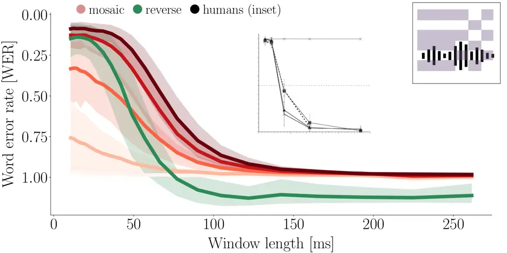

A

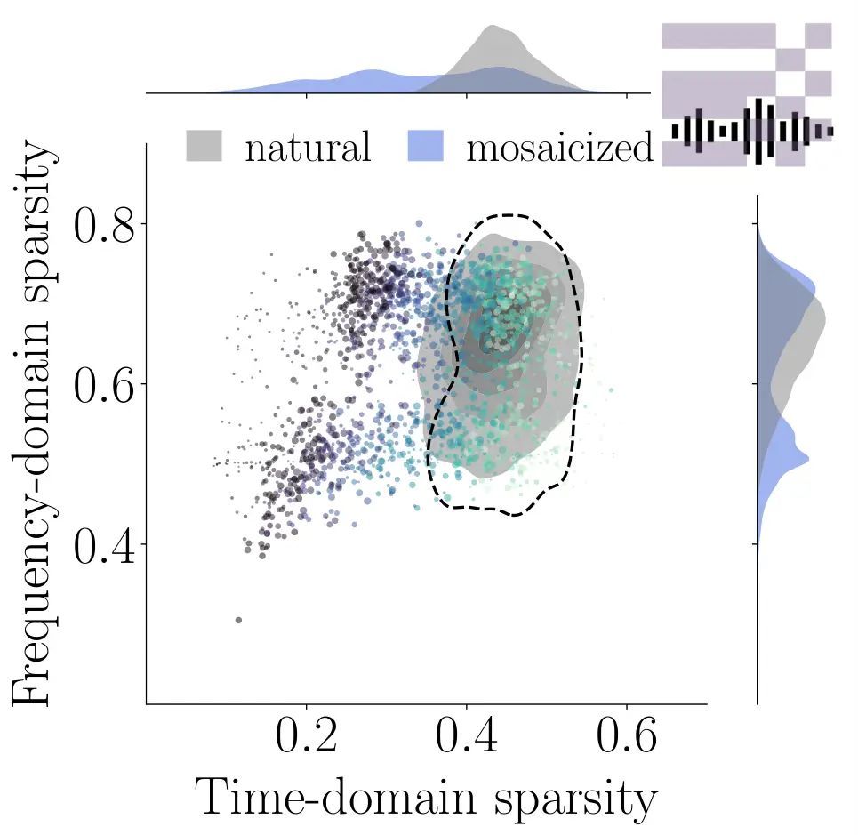

B

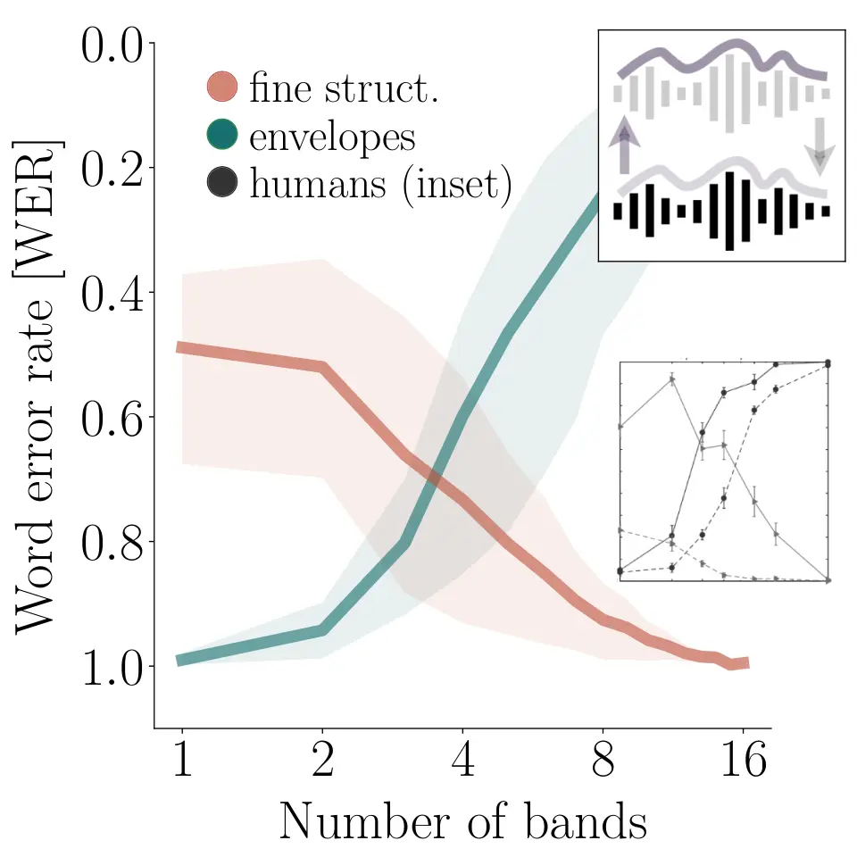

C

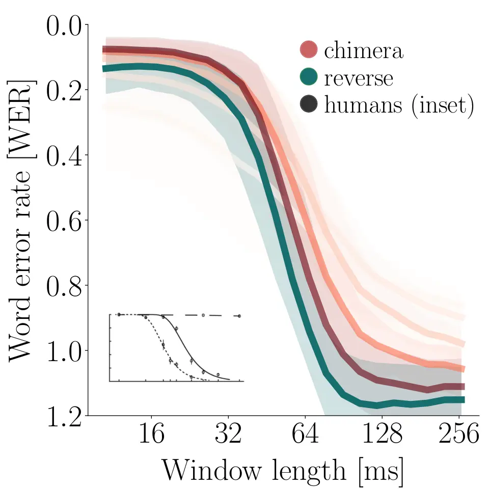

D

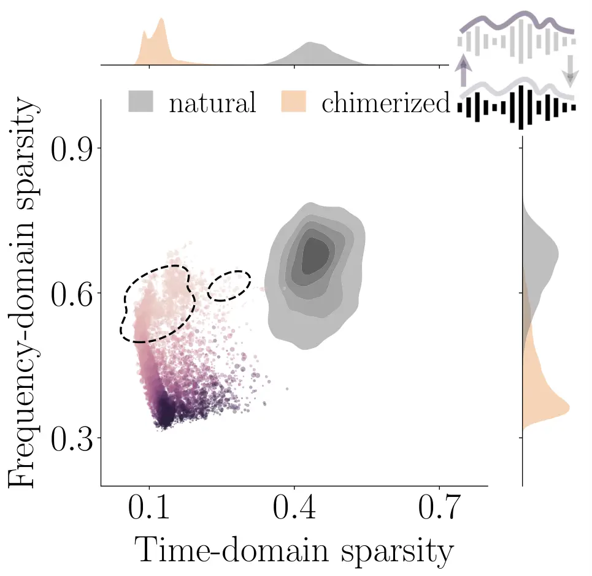

E

Figure 5: Mosaicized and chimerized speech reveal relatively similar
reliance on subband envelopes and fine structure across timescales in
humans and machines. We plot performance (WER; left-hand panels) as a
function of either window length or number of bands (shade indicates 95%
CI summarizing similar performance across all models; all insets show
human performance with x/y-axis ranges comparable to the corresponding
main graphs). Speech mosaics (A) with different temporal bin widths
(increasing spectral widths shown in lighter shades of red) elicit a
uniform advantage relative to multiple-timescale reversal (inset adapted
from Nakajima et al., (2018) shows performance for mosaic speech in
squares and locally time-reversed speech in triangles, the latter
exhibiting a steeper decline). Speech-noise chimeras (C) reveal
human-like performance modulations as a function of the number of bands
used for synthesis and whether speech information is present in the
envelopes or the fine structure (inset adapted from Smith et al., (2002)
shows increasing performance for envelope in circles and decreasing
performance for fine structure in triangles; solid lines represent the
relevant speech-noise chimeras). A further time reversal manipulation
selectively on the subband envelopes (D; shades of red represent number
of bands), preserving speech fine structure, shows a systematic relation
to time-domain reversal, as seen in humans (inset adapted from Teng et
al., (2019) shows performance on time-domain reversal \[dotted line\]
declines earlier than envelope reversal \[solid line\]). The effect of
the manipulations on the input distributions is visualized with hues and
sizes representing synthesis parameters B: window length, E: number of
bands; dashed contour shows region of 85-100% model performance)

### 2.2 Convergent robustness: artificial systems exhibit humanlike multi-scale invariances to classical perturbations

We find that machines display qualitatively similar performance patterns
to humans in classical experiments where the temporal and spectral
granularities, and the perturbations themselves, are manipulated (Fig.
4-5). We summarize the findings next.

Shuffling, destroys information to a greater extent than, for instance,
reversal of the time-domain samples, as it affects the local spectrum.
The manipulation pushes speech towards a region of reduced spectral,
and, eventually, temporal sparsity (Fig. 4B). Consequently, humans show
a more dramatic decline with increasing temporal extent Gotoh et al.
((2017)). We observe the same effect in machines (Fig. 4A). Performance
declines steadily with increasing window size until speech is rendered
unrecognizable at around the 2-ms timescale. All models show this basic
pattern and cutoff, although with varying rates of decline.

Reversal, which affects the temporal order but preserves the local
magnitude spectrum — leaving the sparsity statistics largely untouched
(Fig. 4D), produces a complicated performance contour in humans Gotoh et
al. ((2017)). Perfect performance for window sizes between 5 and 50 ms,
and even partial intelligibility for those exceeding 100 ms is readily
achieved by humans even though speech sounds carry defining features
evolving rapidly within the reversal window. We find that this
timescale-specific resistance to reversal Saberi & Perrott ((1999)) is
closely traced — with increasing precision as more accurate estimates
are obtained Ueda et al. ((2017)) — by automatic speech recognition
systems (Fig. 4C).

Time warping alters the duration of the signal without affecting the
spectral content. Similar to size in vision, a system confronted with a
time warped sound needs to handle an ’object’ that has been rescaled.
Humans can cope with stretched or compressed speech with decreasing
performance up to a factor of 3-4, with a faster decline for compression
Fu et al. ((2001)). Stretching and compression manifest in the input
space as translation in the time-domain sparsity axis in opposite
directions (Fig. 4F). We find that neural network performance follows
the U-shaped curve found in humans and exhibits the characteristic
asymmetry as well (Fig. 4E). Performance is worst when the warp factor
is either 4.0 (compression) or 0.25 (stretching) and it shows a steeper
ascent when decreasing compression than when decreasing stretching. The
best performance is achieved, as expected, when the warp factor is 1.0
(no compression or stretching, i.e., the natural signal).

Mosaic sounds are analogous to pixelated images and therefore better
suited than reversed speech to probe the resolution the system needs for
downstream tasks Nakajima et al. ((2018)). Values within bins in the
time-frequency canvas are pooled such that the representation is
’pixelated’. The size of the bins is manipulated to affect the available
resolution. This corresponds to a decrease in sparsity that scales with
the spectrotemporal bin size (Fig. 5B). When the temporal resolution of
the auditory system is probed in this way at multiple scales, we find
that, as seen in humans, a systematic advantage emerges over the locally
reversed counterpart in ANNs (Fig. 5A).

Chimaeric sounds factor the signal into the product of sub-band
envelopes and temporal fine structure to combine one and the other
component extracted from different sounds. Although the importance of
the envelopes has been emphasized Shannon et al. ((1995)), recent
experiments suggest that this may only be part of the mechanism, with
the fine structure having a unique contribution to speech
intelligibility Teng et al. ((2019)). Speech-noise chimeras can be
constructed such that task-related information is present in the
envelopes or the fine structure only Smith et al. ((2002)). We observe
that fine-structure speech shows up as less sparse in the time-domain
due to the removal of envelope information, and its frequency-domain
sparsity is modulated by the number of bands (Fig. 5E). Both humans and
machines show a characteristic sensitivity to the number of bands used
for synthesis: performance over the entire range is boosted or
attenuated depending on whether information is present in the envelopes
or the fine structure (Fig. 5C). An additional effect concerns the
perceptual advantage of locally reversed speech at the level of sub-band
envelopes over both the time-domain waveform reversal and the
speech-noise chimera with reversed envelopes Teng et al. ((2019)). We
find that models, too, exhibit this uniform advantage (Fig. 5D).
Performance is best when the reversal timescale is roughly less than 50
ms and then rapidly declines and plateaus after the 100-ms timescale
where speech is unrecognizable. Following this general trend, the
speech-noise chimeras produce the least resilient performance.

### 2.3 Divergent robustness: multi-scale interruptions reveal differential humanlikeness among machines

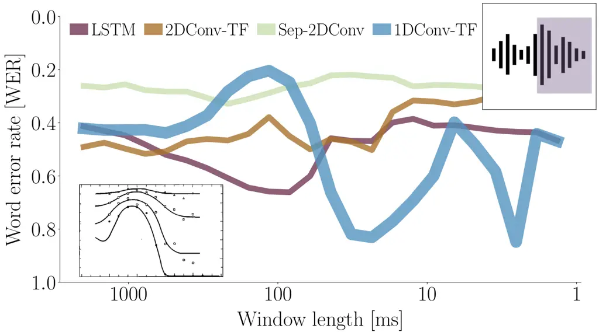

A

B

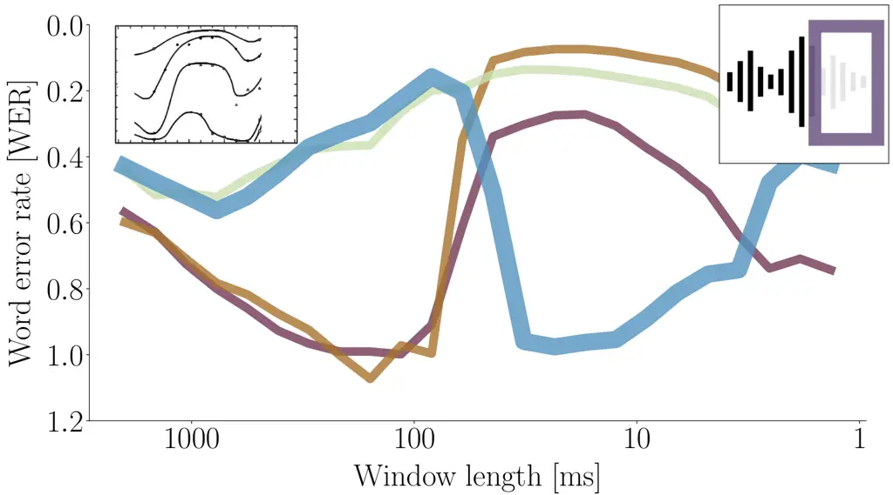

C

D

Figure 6: Multiple-timescale masking and silencing reveals heterogeneity
in model predictions (all insets show human performance with x/y-axis
ranges comparable to the corresponding main graphs). We plot performance
(WER; left-hand panels) as a function of perturbation timescale (window
length in ms). (A) Masking experiment (inset adapted from Miller &
Licklider, (1950) shows human performance for various signal-to-noise
ratios). Individual model performance is shown for a fraction of 0.5 and
SNR of -9 db. (C) Silencing experiment (inset adapted from Miller &
Licklider, (1950) shows human performance contours for various silence
fractions). Individual model performance (color coding on panel A) is
shown for a fraction of 0.5 for succinctness. In both experiments, the
transformer architecture with waveform input qualitatively shows the
most human-like perceptual behavior. The effect of the manipulations on
the input distributions (right-hand panels) is visualized with hues and
sizes representing synthesis parameters (B: window length, mask
fraction, D: window length, silence fraction, respectively; dashed
contour shows region of 85-100% model performance)

Speech interruptions perturb a fraction of the windows at a given
timescale with either silence or a noise mask. With this manipulation,
the system is presented with ’glimpses’ of the input signal. The
redundancies in the speech signal are such that at various interruption
frequencies, for example between 10 and 100 ms window size, humans show
good performance even though a substantial fraction of the input has
been perturbed or eliminated Miller & Licklider ((1950)). Mask
interruptions corrupt a fraction of the signal by adding noise. This
shifts the speech samples mainly towards regions of decreasing spectral
sparsity (Fig. 6B). Interruptions of silence, on the other hand, zero
out a fraction of the signal, effectively removing all the information
in it. As a consequence, speech samples become increasingly temporally
sparse (Fig. 6D). We find that models exhibit idiosyncratic performance
patterns across timescales such that they pairwise agree to different
extents depending on the perturbation window size. Humans, as well as
some of the models we tested, exhibit a perceptual profile where
obstructions (mask or silence) at large timescales produce moderately
bad performance, later recover almost completely at intermediate
timescales, they achieve their worst performance at moderately short
timescales, and finally slightly improve at the smallest timescales. As
the masking window size decreases from 1000 ms to 100 ms some models’
performance declines to their worst and then quickly recover such that
they achieve their best at around 50 ms and shorter timescales. On the
other hand, a recent transformer architecture with a waveform front end,
pretrained using self-supervision, shows an overall better qualitative
match to human performance, although quantitative differences are still
apparent in all cases (Fig. 6A,C).

### 2.4 Nonrobustness: machines fail to exhibit humanlike performance profiles in response to repackaging

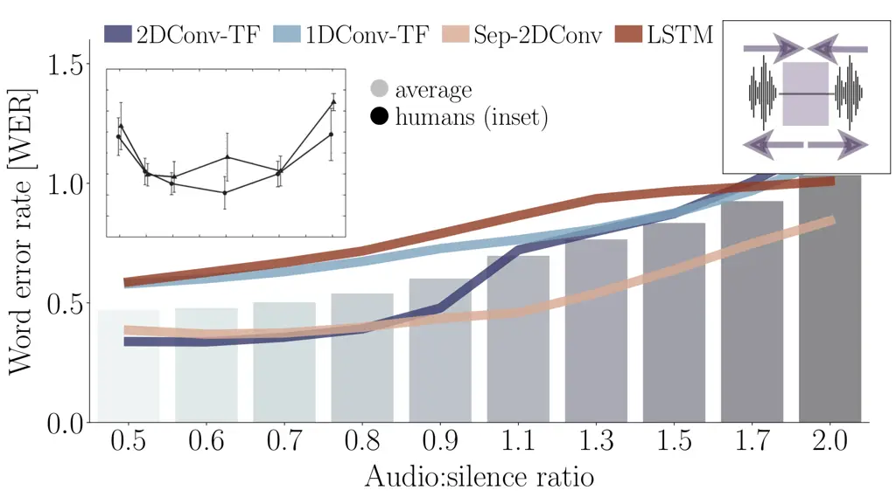

A

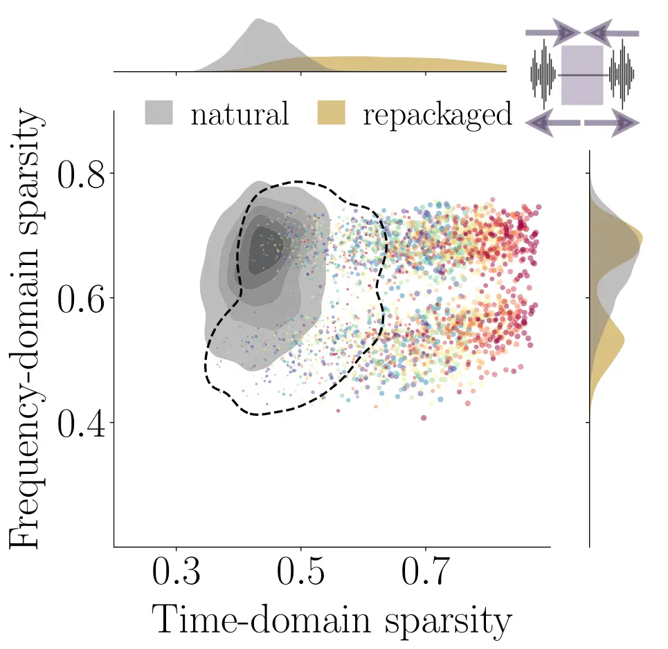

B

Figure 7: None of the architectures predict recovery of performance with
repackaging as seen in humans (A; inset adapted from Ghitza & Greenberg,
(2009) shows the canonical U-shaped human performance pattern, with
x/y-axis ranges comparable to the main graph; solid lines with circle
markers represent the relevant manipulation with insertions of silence.
We plot performance (WER; left-hand panel) on compressed speech (by a
factor of 2) as a function of audio:silence ratio parameterizing the
insertion of silence. Note here the y-axis is reversed, with lower error
towards the origin). Although there is some robustness to compression
outside the natural distribution, performance worsens steadily as the
insertion length increases. The effect of compressed audio with
insertions of silence on sparsity is visualized with hues and sizes
representing synthesis parameters (B; dashed contour shows region of
85-100% model performance).

Repackaging combines different aspects of the previous audio
manipulations — time warping, multiple-timescale windowing, and
insertions of silence — to reallocate, as opposed to remove or corrupt,
speech information in time. Repackaged speech therefore can be made more
temporally sparse (Fig. 7B) without losing information. As we have shown
above, the performance of both humans and machines degrades with
increasing temporal compression. Here we focus further on a key finding:
when perceiving compressed speech humans benefit from repackaging Ghitza
& Greenberg ((2009)). Insertions of silence, roughly up to the amount
necessary to compensate for the compression, recovers performance
dramatically — an effect that has been replicated and further
characterized numerous times Ghitza & Greenberg ((2009)); Ghitza
((2012)); Ghitza ((2014)); Bosker & Ghitza ((2018)); Penn et al.
((2018)); Ramus et al. ((2021)). We find that, across the entire space
of experimental parameters, machines fail to show any such recovery
(Fig. 7A). The canonical performance profile in humans shows the worst
performance when the signal is compressed by a factor approaching 3 and
no silence is inserted. As the amount of silence inserted compensates
for the extent lost due to temporal compression, the performance
improves. After that, it declines, producing a characteristic U shape.
The systems tested here, on the other hand, show bad performance with
heavily compressed speech which simply worsens with increasing
insertions of silence and shows no inflection when the insertion length
precisely compensates for the temporal compression.

## 3 Discussion

In this paper we considered the possibility that engineering solutions
to artificial audition might qualitatively converge, in more ways than
merely performance level, with those implemented in human brains. If the
task is too simple, then it is conceivable that many qualitatively
different solutions can in principle be possible. In this case,
convergence of performance between humans and engineered systems would
not be surprising. On the other hand, convergence of algorithmic
solutions would be. If the constraints on the task become more nuanced,
however, then any system learning to solve the task would be forced into
a narrower space of possible algorithmic solutions. In this latter case,
similar performance levels might be suggestive of similar algorithmic
solutions. Here we set out to investigate whether this might be the
current scenario regarding human speech perception and neural networks
for automatic speech recognition.

In a set of studies we had high-performing speech-to-text neural
networks perform theoretically-driven tasks while sweeping through the
parameter space of foundational speech experiments. We additionally
explored how the audio perturbations in each experiment relate to their
unpurturbed counterparts and to canonical audio signals. We found that a
subset of multi-scale perturbations including reversal, shuffling, time
warping, chimerizing and mosacizing yield performance curves and effects
that are similar amongst models and to some extent aligned with those of
humans. More destructive perturbations such as masking and silencing
reveal performance patterns where models differ from each other and from
humans. The most informative outcome we observed comes from the
repackaging experiment, whereby all models resemble each other closely
while systematically failing to capture human performance. This finding
highlights a set of possible endogenous mechanisms currently absent from
state-of-the-art neural network models. We focus here on the broad
qualitative trends that are informative for theory and model development
as we discuss the implications for the reverse-engineering and (more
speculatively) the forward-engineering of hearing.

We found that several classical phenomena in speech perception are
well-predicted by high-performing models. These comprise the performance
curves across scales in response to reversed Saberi & Perrott ((1999)),
shuffled Gotoh et al. ((2017)), time-warped Fu et al. ((2001)),
mosacized Nakajima et al. ((2018)), and chimerized Smith et al. ((2002))
speech. Humans and machines perform well in these non-ecological
conditions at qualitatively similar scales, and this emerges simply as a
result of training on the downstream task of recognition. This need not
have been the case, for example, if different solutions to the problem
are possible (e.g., equally predictive cues) and systems have various
inductive biases that push towards them differently. Overall, these
similarities could be interpreted as a form of shared
out-of-distribution robustness: neither humans nor machines need any
specific training to achieve it. These effects do not correspond to the
perturbations having no measurable effect whatsoever, as they are known
to lie well above the detection threshold; stimuli appear unnatural even
to untrained listeners and the results generally agree with foundational
studies (e.g., Shannon et al., (1995)). Broad agreement between
different architectures for multiple-spectrotemporal-scale
manipulations, as we have found, would tentatively suggest that the
problem of speech recognition offers enough constraints such that humans
and artificial systems naturally converge in high-performance regimes.
This is the prevailing view behind studies predicting brain activity
using these kinds of models (e.g., Millet & King, (2021)): that
high-performing networks settle on hyperparameter regions which,
although chosen for engineering reasons, turn out to be human-like in
some relevant way (e.g., having similar receptive field sizes).

However, we observe some marked differences emerging among artificial
systems and between these and humans when the signal is perturbed more
aggressively. These comprise the masking and silencing manipulations
Miller & Licklider ((1950)), where the performance profiles vary more
widely. The perturbations we deploy are not natural but they have been
designed to probe attributes of perception that the developing auditory
system must acquire as it is confronted with natural signals, such as
resilience to temporal distortions due to reverberation and various
forms of masking. The possible reasons for differences between the
models themselves are of secondary importance here as we are
specifically concerned with their ability or not to capture qualitative
human behavioral patterns. Although there might be a way to reconcile
these diverse performance patterns by altering minor parameters in the
architectures, our work together with a parallel effort using different
methods Weerts et al. ((2021)) highlights a more fundamental difficulty
of these architectures to perform well in the presence of noise. Weerts
et al. (2021) compared 3 artificial systems with human performance using
a test battery of psychometric experiments (e.g., spectral invariance,
peak and center clipping, spectral and temporal modulations, target
periodicity, competing talker backgrounds, and masker modulations and
periodicity) to measure the importance of various auditory cues in
sentence- or word-based speech recognition. They find that systems
display similarities and differences in terms of what features they are
tuned to (e.g., spectral vs. temporal modulations, and the use of
temporal fine structure). As in our work, the self-supervised
CNN-Transformer model exhibited a relatively greater similarity to
humans, which follows a recent trend in vision Tuli et al. ((2021)).

Both these similarities and differences have alternative
interpretations. With regards to the dissimilarities, it could be argued
that the performance patterns point to differently tuned parameters of
similar mechanisms (e.g., different effective receptive field sizes of
architecturally similar systems), or alternatively, to more important
mechanistic differences. With regards to the similarities, the results
could be a consequence of how information is distributed in the input
signal (i.e., where in the signal and envelope spectra information is
carried), and as such, not provide compelling evidence that these models
processed signals in a human-like way. By visual analogy, if image
content was consistently concentrated in certain locations in the
canvas, perturbations applied systematically and selectively across the
canvas would affect similarly any systems that make use of such
information (i.e., produce similarly complicated performance curves).
This certainly tells us about the way task-related information is
distributed in the signal and that high-performing problem solutions are
constrained to the set that exploit such information, but it does not
provide much mechanistic insight otherwise. On the other hand, these
similarities may reflect important aspects of convergence between human
and machine solutions. Therefore, although this class of findings is
informative in many ways, the outcomes do not point unambiguously to
mechanistic differences and similarities.

The repackaging experiments, however, yield consistent and unambiguous
failures that allow stronger conclusions to be drawn. The perception of
temporally repackaged speech Ghitza & Greenberg ((2009)); Ghitza
((2012)) is a scenario where the similarity between neural network
models and their substantial deviation from human performance is
remarkably consistent. Our repackaging experiments demonstrate a
systematic failure of all models to recover perceptual performance in
the specific conditions that humans naturally do: when the windowed
compression of speech is compensated by insertions of silence. This
consistent pattern emerges across diverse models, demonstrating its
robustness against substantial architectural variation. Our simulations
cover the whole set of experimental parameter combinations such that we
can rule out the presence of the effect even in cases where it would
show up in a parameter region away from where experiments in humans have
been specifically conducted (e.g., for different compression ratios or
window sizes).

The human behavioral profile in response to repackaged speech Ramus et
al. ((2021)); Ghitza & Greenberg ((2009)) can be interpreted in
landmark-based (e.g., ’acoustic edges’) and oscillation-based (e.g.,
theta rhythms) frameworks. On the former view (e.g., Oganian & Chang,
(2019); Hamilton et al., (2021)) acoustic cues in the signal envelope
increasingly resemble the original as compression is compensated by
insertions of silence. On the latter view Ghitza & Greenberg ((2009));
Ghitza ((2012)); Ghitza ((2014)), which has been the subject of further
developments regarding neural implementation Poeppel & Assaneo ((2020));
Giraud & Poeppel ((2012)); Teng, Tian, Doelling & Poeppel ((2017)); Teng
& Poeppel ((2019)), insertions of silence enable an alignment with
endogenous time constraints embodied by neural oscillations at specific
time scales. A related conceptual framework, which is compatible with
both the acoustic landmark and oscillation-based accounts, explains the
effect in terms of concurrent multiple-timescale processing Poeppel et
al. ((2008)); Poeppel ((2003)); Teng, Tian, Rowland & Poeppel ((2017));
Teng et al. ((2016)): the auditory system would elaborate the input
signal simultaneously at 2 timescales (roughly, 25-50 and 150-250 ms),
and therefore an inherent compensatory strategy when the local
information is distorted (e.g., compressed) is to perform the task based
on the global information that remains available (e.g., due to
insertions of silence). The important point for present purposes is that
all these accounts of repackaged speech involve endogenous mechanisms
(e.g., neural excitability cycles) currently absent from
state-of-the-art neural network models, with each theoretical proposal
attributing model failures to these architectural shortcomings. These
might be crucial for a better account of human audition, and could
provide inductive biases for machines that might enable robustness in
various real-world auditory environments. A promising direction,
therefore, is incorporating oscillations into the main mechanisms of
computational models (e.g., Effenberger et al., (2022); Kaushik &
Martin, (2022); ten Oever & Martin, (2021)), or otherwise introducing
commitments to dynamic temporal structure (e.g., using spiking neural
networks; Stimberg et al., (2019)) beyond excitability cycles.

A further line of reasoning about the dissimilarities observed in
repackaging experiments has to do with the computational complexity of
the processes involved van Rooij & Wareham ((2007)). Repackaging
manipulations have been interpreted as tapping into segmentation Ghitza
& Greenberg ((2009)); Ghitza ((2014)) — a subcomputation that has been
widely assumed to be computationally hard in a fundamental way (surveyed
briefly in Adolfi et al., (2022); e.g., Friston et al., (2021); Poeppel,
(2003); Cutler, (1994)). On this view, any system faced with a problem
that involves segmentation as a sub-problem (e.g., speech recognition)
would be forced to acquire the (possibly unique) solution that, through
exploiting ecological constraints, renders the problem efficiently
computable in the restricted case. However, contrary to common
intuitions, it is possible that segmentation is efficiently computable
in the absence of such constraints Adolfi et al. ((2022)). Since it is
conceivable segmentation is not a computational bottleneck in this
sense, its intrinsic complexity might not be a driving force in pushing
different artificial or biological systems to acquire similar solutions
to problems involving this subcomputation. This constitutes, from a
theoretical and formal standpoint, a complementary explanation for the
qualitative divergence between humans and machines observed in our
results.

### 3.1 Closing remarks

Our work and recent independent efforts Weerts et al. ((2021)) suggest
that, despite some predictive accuracy in neuroimaging studies (Millet &
King, (2021); Kell et al., (2018); Tuckute et al., (2022); but see
Thompson et al., (2019)), automatic speech recognition systems and
humans diverge substantially in various perceptual domains. Our results
further suggest that, far from being simply quantitative (e.g.,
receptive field sizes), these shortcomings are likely qualitative (e.g.,
lack of flexibility in task performance through exploiting alternative
spectrotemporal scales) and would not be solved by such strategies as
introducing different training regimens or increasing the models’
capacity. They would require possibly substantial architectural
modifications for meaningful effects such as repackaging to emerge. The
qualitative differences we identify point to possible architectural
constraints and improvements, and suggest which regions of experimental
space (i.e., which effects) are useful for further model development and
comparison. Since repackaging is where all models systematically
resemble each other and clearly fail in capturing human behavior, this
effect offers alternative directions for theorizing, computational
cognitive modeling, and, more speculatively, potential improvement of
engineering solutions.

To develop a deeper understanding of how the models themselves can be
made independently more robust, one could implement data augmentation
schemes with the perturbations we deployed here. It is conceivable that
these could act as proxies for the natural distortions humans encounter
in the wild, and therefore help close performance gaps where it is
desired for engineering purposes. A related line of research could
pursue the comparison of frontend-backbone combinations to evaluate
whether particular pairings are effective in some systematic manner in
combination with such data augmentation schemes.

More generally, our approach and results showcase how a more active
synergy between the cognitive science and engineering of hearing could
be mutually beneficial. Historically, there was a close relationship
between work in the cognitive sciences, broadly construed, and
engineering. Researchers were mindful of both behavioral and neural data
in the context of building models (e.g., Ghitza, (1986); Bell
Laboratories). Perhaps as a consequence of exclusively quantitative,
benchmark-driven development and the recent disproportionate focus on
prediction at the expense of explanation (see Bowers et al., 2022, for a
review of how this played out in vision), this productive alliance has
somewhat diminished in its depth and scope, but the potential gains from
a possible reconnection and realignment between disciplines are
considerable.

## 4 Methods

### 4.1 Framework

Generalizing from the particular studies examining audition at multiple
scales, we build a unified evaluation environment centered around
selective transformations at different spectrotemporal granularities ¹¹
1 Code implementing the analyses and resynthesis methods described here
is available at https://tinyurl.com/2e5echc8 and their influence on
perceptual performance (Fig. 1). We deliberately shift the focus away
from quantitative measures of fit and towards a qualitative assessment
(see Navarro, (2019), for details on the rationale). Contrary to
problematic practices centered on predictive accuracy that have led to
misleading conclusions (see Bowers et al., (2022) for a thorough
review), we focus on assessing whether artificial systems – here treated
as stimulus-computable, optimized observer models — qualitatively
capture a whole family of idiosyncratic performance patterns in human
speech perception that point to the kinds of solutions systems have
acquired. Our framework situates existing experiments in humans as a
subset of the possible simulations, allowing us to exhaustively search
for qualitative signatures of human-like performance even when these
show up away from the precise original location in experimental space
(we show a representative summary of our results throughout).

### 4.2 Audio synthesis

#### Multiscale windowing.

Common to all conditions is the windowing of the signal separately at
multiple spectral and/or temporal scales. We used a rectangular window
function to cut the original speech into frames and faded the
concatenated frames to avoid discontinuities (although these turn out to
not affect the results). Transformations with known properties (see
below) are applied either in the time domain directly or in the
time-frequency domain, to each window (i.e., chunk of the signal). The
window size is a general parameter that determines the scale selectivity
of the manipulations described below. The timescales depend on the
experiment and range from a few milliseconds to over one second. The
performance of the models under different perturbations is then
evaluated separately at various scales.

#### Reversal.

The signal is locally reversed in time Saberi & Perrott ((1999)); Gotoh
et al. ((2017)), resulting in frame-wise time-reversed speech. This
affects the order of the samples but preserves the local average
magnitude spectrum. The performance curve is estimated at 58 timescales
on a logarithmic scale ranging from 0.125 to 1200 ms.

#### Shuffling.

Audio samples are locally shuffled such that the temporal order within a
given window is lost, consequently destroying temporal order at the
corresponding scale. This random permutation is more aggressive than
reversal in the sense that it does affect the local magnitude spectrum
Gotoh et al. ((2017)). The performance curve is estimated at 58
timescales on a logarithmic scale ranging from 0.125 to 1200 ms.

#### Time warping.

Signals are temporally compressed or stretched in the time-frequency
domain, effectively making speech faster or slower, such that the pitch
is unaffected Park et al. ((2019)). The modified short-time Fourier
transform is then inverted to obtain the final time-domain, time-warped
signal Perraudin et al. ((2013)). The average magnitude spectrum is
approximately invariant whereas the local spectrum is equivariant when
compared between equivalent timescales Ghitza & Greenberg ((2009)); Fu
et al. ((2001)). The performance curve is estimated at 40 parameter
values on a logarithmic scale ranging from compression by a factor of 4
to stretching by a factor of 4.

#### Chimerism.

Signals are factored into their envelope and fine structure parts,
allowing the resynthesis of chimeras which combine the slow amplitude
modulations of one sound with the rapid carriers of another Smith et al.
((2002)). Here we combine these features from speech and Gaussian noise.
To extract the two components, signals are passed through a bank of
band-pass filters modeled after the human cochlea, yielding a
spectrogram-like representation in the time-frequency domain called
cochleagram. A cochleagram is then a time-frequency decomposition of a
sound which shares features of human cochlear processing Glasberg &
Moore ((1990)). Using the filter outputs, the analytical signal is
computed via the Hilbert transform. Its magnitude is the envelope part,
and dividing it out from the analytic signal leaves only the fine
structure. The spectral acuity of the synthesis procedure can be varied
with the number of bands used to cover the bandwidth of the signal.
Multiple timescale manipulations, such as reversal, are directed to
either the envelope or fine structure prior to assembling the sound
chimera Teng et al. ((2019)). The performance curve is estimated at 32
timescales on a logarithmic scale ranging from 10 to 1200 ms.

#### Mosaicism.

Speech signals can be mosaicized in the time and frequency coordinates,
by manipulating the coarse-graining of the time-frequency bins. Similar
to a pixelated image, a mosaicized sound will convey a signal whose
spectrotemporal resolution has been altered systematically. The
procedure is done on the envelope-fine-structure representation before
inverting back to the waveform. Two parameters affect the spectral and
temporal granularity of the manipulation: the window length in time and
in frequency. This yields a grid in the time-frequency domain. The
envelope in each cell is averaged and the ’pixelated’ cochlear envelopes
are used to modulate the fine structure of Gaussian noise. Finally the
signal is resynthesized by adding together the modulated sub-bands
Nakajima et al. ((2018)). The performance curve is estimated at 32
timescales on a logarithmic scale ranging from 10 to 1200 ms.

#### Interruptions.

A fraction of the within-window signal, which is parametrically varied,
is corrupted either with Gaussian noise at different signal-to-noise
ratios or by setting the samples to zero Miller & Licklider ((1950)).
Sparsity is increased or decreased while preserving the original
configuration of the unmasked fraction of the signal. The performance
curve is estimated at 30 timescales on a logarithmic scale ranging from
2 to 2000 ms.

#### Repackaging.

A repackaged signal locally redistributes the original chunks of samples
in time Ghitza & Greenberg ((2009)); Ramus et al. ((2021)). Within each
window, the signal is temporally compressed without affecting its pitch
(see above) and a period of silence is concatenated. The time-compressed
signal can alternatively be thought of as a baseline before adding the
insertions of silence. Two parameters control the sparsity of the
resulting signal: the amount of compression and the length of the
inserted silence. Other parameters that mitigate discontinuities, such
as additive noise and amplitude ramps, do not affect the results. For a
signal that has been compressed by a factor of 2, inserting silence of
length equal to 1/2 of the window size will locally redistribute the
original signal in time while keeping the overall duration intact. The
performance curve (explored at multiple compression ratios and window
sizes but shown to match human experiments) is estimated at 10
audio-to-silence duration ratios ranging from 0.5 to 2.0 on a
logarithmic scale.

### 4.3 Neural network models

We evaluate a set of state-of-the-art speech recognition systems with
diverse architectures and input types (Table 1; available through the
cited references below). These include fully-trained convolutional,
recurrent, and transformer-based, with front ends that interface with
either waveform or spectrogram inputs. Their accuracy under natural
(unperturbed) conditions is high ($`\sim 80\%`$ correct, under word
error rate) and comparable (see e.g., Fig. 4E when the warp factor
equals 1, i.e., no perturbation).

| Model       | Architecture | Input  |
| ----------- | ------------ | ------ |
| deepspeech  | LSTM         | Spect. |
| wav2vec 2.0 | 1DConv-TF.   | Wave   |
| fairseq-s2t | 2DConv-TF.   | Spect. |
| silero      | Sep-2DConv.  | Spect. |

Table 1: Algorithmic models.

Deepspeech is based on a recurrent neural network architecture that
works on the MFCC features of a normalized spectrogram representation
Hannun et al. ((2014)). This type of Long-short-term-memory (LSTM)
architecture emerged as a solution to the problem of modeling large
termporal scale dependencies. The input is transformed by convolutional,
recurrent and finally linear layers projecting into classes representing
a vocabulary of English characters. It was trained on the Librispeech
corpus Panayotov et al. ((2015)) using a CTC loss Graves et al.
((2006)).

Silero works on a short-time Fourier transform of the waveform,
obtaining a tailored spectrogram-like representation that is further
transformed using a cascade of separable convolutions Veysov ((2020)).
It was trained using a CTC loss Graves et al. ((2006)) on the
Librispeech corpus, with alphabet letters as modeling units.

The Fairseq-S2T model is transformer-based and its front end interfaces
with log-mel filterbank features Wang et al. ((2020)). It is an
encoder-decoder model with 2 convolutional layers followed by a
transformer architecture of 12 multi-level encoder blocks. The input is
a log-mel spectrogram of 80 mel-spaced frequency bins normalized by
de-meaning and division by the standard deviation. This architecture is
trained on the Librispeech corpus using a cross-entropy loss and a
unigram vocabulary.

Wav2vec2 is a convolutional- and transformer-based architecture Baevski
et al. ((2020)); Schneider et al. ((2019)). As opposed to the previous
architectures, it works directly on the waveform representation of the
signal and it was pretrained using self-supervision. In this case, the
relevant features are extracted by the convolutional backbone, which
performs convolution over the time dimension. The temporal relationships
are subsequently modeled using the transformer’s attention mechanism.
The input to the model is a sound waveform of unit variance and zero
mean. It is trained via a contrastive loss where the input is masked in
latent space and the model needs to distinguish it from distractors. To
encourage the model to use samples equally often, a diversity loss is
used in addition. The fine tuning for speech recognition is done by
minimizing a CTC loss Graves et al. ((2006)) with a vocabulary of 32
classes of English characters. The model was trained on the Librispeech
corpus.

### 4.4 Evaluation

We measure the number of substitutions $`S`$, deletions $`D`$,
insertions $`I`$, and correct words $`C`$, and use them to compute the
word error rate (WER) reflecting the overall performance of models on
speech recognition, as follows:

```math
\displaystyle WER=\frac{S+D+I}{S+D+C} \tag{1}
```

A lower score indicates fewer errors overall and therefore better
performance. Since $`N_{ref}=S+D+C`$ is the number of words in the
ground truth labels and it appears in the denominator, the WER can reach
values greater than 1.0.

We evaluate all models on the Librispeech test set Panayotov et al.
((2015)), which none of the models have seen during training,
manipulated and resynthesized for each experiment according to our
synthesis procedures. In all cases we plot average performance scores
across this large set of utterances; with negligible variability. We use
English language speech, as the effects we focus on in humans appear to
be independent of language (e.g., Gotoh et al. ((2017))).

### 4.5 Input statistics

#### Sparsity.

The input samples in the natural and synthetic versions of the
evaluation set are characterized by their sparsity in time and
frequency. We compute the Gini coefficient $`G`$ on an encoding of
signal a $`\overrightarrow{\mathbf{x}}`$ of length $`n`$ (time or
frequency representation), which exhibits a number of desirable
properties as a measure of signal sparsity Hurley & Rickard ((2009)).

```math
\displaystyle G=\sum_{i}^{n}\sum_{j}^{n}\frac{|x_{i}-x_{j}|}{2n^{2}\bar{x}} \tag{2}
```

We characterize the joint distributions of sparsity in the time and
frequency domain from the point of view of audition systems, which
process sounds sequentially over restricted timescales. Specifically, we
compute a time-windowed Gini, $`G_{w}`$, at various window lengths
$`w`$, resulting in a multiple-timescale dynamic sparsity measure. We
focus on the 220 ms timescale which roughly aligns with both human
cognitive science results Poeppel ((2003)) and receptive field sizes of
neural network models. The result for a given timescale is summarized by
statistics on the Gini coefficients across $`n`$ signal slices of length
$`w`$:

```math
\displaystyle\hat{G_{w}}=f(\{G(\mathbf{x}^{i})\}_{i}^{n}) \tag{3}
```

where $`f(.)`$ may be the mean (our case), standard deviation, etc. We
obtain in this way both a time sparsity and a frequency sparsity measure
for each speech utterance, for all natural and perturbed test signals.
Since $`G`$ is sensitive to the experimental manipulations, this allows
us to summarize and visualize a low-dimensional, interpretable
description of the distributions at the input of the systems (e.g.,
Evans et al., (2021)).

## 5 Acknowledgments

We thank Oded Ghitza for clarifications on the original repackaging
experiments and Franck Ramus for providing information on various
replications and extensions. We thank 3 anonymous reviewers for
constructive feedback that allowed us to improve a previous version of
the manuscript. This project has received funding from the European
Research Council (ERC) under the European498 Union’s Horizon 2020
research and innovation programme (grant agreement No 741134), and the
Ernst Strüngmann Foundation.

## References

- Adolfi et al. ((2022)) Adolfi, F., Wareham, T. & van Rooij, I.
  (20221). Computational Complexity of Segmentation. Proceedings of the
  Annual Meeting of the Cognitive Science Society .
- Adolfi et al. ((2022)) Adolfi, F., Wareham, T. & van Rooij, I.
  (20222). A Computational Complexity Perspective on Segmentation as a
  Cognitive Subcomputation. Topics in Cognitive Science 19.
  doi:10.1111/tops.12629
- Amodei et al. ((2015)) Amodei, D., Ananthanarayanan, S., Anubhai, R.,
  Bai, J., Battenberg, E., Case, C.Zhu, Z. (2015). Deep Speech 2 :
  End-to-End Speech Recognition in English and Mandarin. 10.
- Baevski et al. ((2020)) Baevski, A., Zhou, H., Mohamed, A. & Auli, M.
  (2020). Wav2vec 2.0: A Framework for Self-Supervised Learning of
  Speech Representations. 12.
- Bosker & Ghitza ((2018)) Bosker, H.R. & Ghitza, O. (2018). Entrained
  theta oscillations guide perception of subsequent speech: Behavioural
  evidence from rate normalisation. Language, Cognition and Neuroscience
  1–13. doi:10.1080/23273798.2018.1439179
- Bowers et al. ((2022)) Bowers, J.S., Malhotra, G., Dujmović, M.,
  Montero, M.L., Tsvetkov, C., Biscione, V.Blything, R. (2022). Deep
  Problems with Neural Network Models of Human Vision. Behavioral and
  Brain Sciences 1–74.
- Cichy & Kaiser ((2019)) Cichy, R.M. & Kaiser, D. (2019). Deep Neural
  Networks as Scientific Models. Trends in Cognitive Sciences 23 4
  305–317. doi:10.1016/j.tics.2019.01.009
- Cutler ((1994)) Cutler, A. (1994). The perception of rhythm in
  language. Cognition 79–81.
- Dujmović et al. ((2022)) Dujmović, M., Bowers, J.S., Adolfi, F. &
  Malhotra, G. (2022). The pitfalls of measuring representational
  similarity using representational similarity analysis. : bioRxiv.
- Effenberger et al. ((2022)) Effenberger, F., Carvalho, P., Dubinin, I.
  & Singer, W. (2022). A biology-inspired recurrent oscillator network
  for computations in high-dimensional state space. : bioRxiv.
- Evans et al. ((2021)) Evans, B.D., Malhotra, G. & Bowers, J.S. (2021).
  Biological convolutions improve DNN robustness to noise and
  generalisation. bioRxiv 2021.02.18.431827.
  doi:10.1101/2021.02.18.431827
- Friston et al. ((2021)) Friston, K.J., Sajid, N., Quiroga-Martinez,
  D.R., Parr, T., Price, C.J. & Holmes, E. (2021). Active listening.
  Hearing Research 107998.
- Fu et al. ((2001)) Fu, Q-J., Galvin, J.J. & Wang, X. (2001).
  Recognition of time-distorted sentences by normal-hearing and
  cochlear-implant listeners. The Journal of the Acoustical Society of
  America 109 1 379–384. doi:10.1121/1.1327578
- Ghitza ((1986)) Ghitza, O. (1986). Auditory nerve representation as a
  front-end for speech recognition in a noisy environment. Computer
  Speech & Language 109–130.
- Ghitza ((2012)) Ghitza, O. (2012). On the Role of Theta-Driven
  Syllabic Parsing in Decoding Speech: Intelligibility of Speech with a
  Manipulated Modulation Spectrum. Frontiers in Psychology 3 .
  doi:10.3389/fpsyg.2012.00238
- Ghitza ((2014)) Ghitza, O. (2014). Behavioral evidence for the role of
  cortical θ oscillations in determining auditory channel capacity for
  speech. Frontiers in Psychology 5 . doi:10.3389/fpsyg.2014.00652
- Ghitza & Greenberg ((2009)) Ghitza, O. & Greenberg, S. (2009). On the
  Possible Role of Brain Rhythms in Speech Perception: Intelligibility
  of Time-Compressed Speech with Periodic and Aperiodic Insertions of
  Silence. Phonetica 66 1-2 113–126. doi:10.1159/000208934
- Giraud & Poeppel ((2012)) Giraud, A-L. & Poeppel, D. (2012). Cortical
  oscillations and speech processing: Emerging computational principles
  and operations. Nature Neuroscience 15 4 511–517.
- Glasberg & Moore ((1990)) Glasberg, B.R. & Moore, B.C.J. (1990).
  Derivation of auditory filter shapes from notched-noise data. Hearing
  Research 47 1 103–138.
- Gotoh et al. ((2017)) Gotoh, S., Tohyama, M. & Houtgast, T. (2017).
  The effect of permutations of time samples in the speech waveform on
  intelligibility. The Journal of the Acoustical Society of America 142
  1 249–255. doi:10.1121/1.4992027
- Graves et al. ((2006)) Graves, A., Fernández, S., Gomez, F. &
  Schmidhuber, J. (2006). Connectionist temporal classification:
  Labelling unsegmented sequence data with recurrent neural networks. In
  Proceedings of the 23rd international conference on Machine learning (
  369–376). New York, NY, USA: Association for Computing Machinery.
- Guest & Martin ((2023)) Guest, O. & Martin, A.E. (2023). On Logical
  Inference over Brains, Behaviour, and Artificial Neural Networks.
  Computational Brain & Behavior . doi:10.1007/s42113-022-00166-x
- Hamilton et al. ((2021)) Hamilton, L.S., Oganian, Y., Hall, J. &
  Chang, E.F. (2021). Parallel and distributed encoding of speech across
  human auditory cortex. Cell .
- Hannun et al. ((2014)) Hannun, A., Case, C., Casper, J., Catanzaro,
  B., Diamos, G., Elsen, E.Ng, A.Y. (2014). Deep Speech: Scaling up
  end-to-end speech recognition. arXiv:1412.5567 \[cs\] .
- Hurley & Rickard ((2009)) Hurley, N.P. & Rickard, S.T. (2009).
  Comparing Measures of Sparsity. arXiv:0811.4706 \[cs, math\] .
- Kaushik & Martin ((2022)) Kaushik, K.R. & Martin, A.E. (2022). A
  mathematical neural process model of language comprehension, from
  syllable to sentence. : PsyArXiv.
- Kell et al. ((2018)) Kell, A.J., Yamins, D.L., Shook, E.N.,
  Norman-Haignere, S.V. & McDermott, J.H. (2018). A Task-Optimized
  Neural Network Replicates Human Auditory Behavior, Predicts Brain
  Responses, and Reveals a Cortical Processing Hierarchy. Neuron 98 3
  630-644.e16.
- Ma & Peters ((2020)) Ma, W.J. & Peters, B. (2020). A neural network
  walks into a lab: Towards using deep nets as models for human
  behavior. arXiv:2005.02181 \[cs, q-bio\] .
- Miller & Licklider ((1950)) Miller, G.A. & Licklider, J.C.R. (1950).
  The Intelligibility of Interrupted Speech. 7.
- Millet & King ((2021)) Millet, J. & King, J-R. (2021). Inductive
  biases, pretraining and fine-tuning jointly account for brain
  responses to speech. arXiv:2103.01032 \[cs, eess, q-bio\] .
- Nakajima et al. ((2018)) Nakajima, Y., Matsuda, M., Ueda, K. & Remijn,
  G.B. (2018). Temporal Resolution Needed for Auditory Communication:
  Measurement With Mosaic Speech. Frontiers in Human Neuroscience 12 .
  doi:10.3389/fnhum.2018.00149
- Navarro ((2019)) Navarro, D.J. (2019). Between the Devil and the Deep
  Blue Sea: Tensions Between Scientific Judgement and Statistical Model
  Selection. Computational Brain & Behavior .
- Oganian & Chang ((2019)) Oganian, Y. & Chang, E.F. (2019). A speech
  envelope landmark for syllable encoding in human superior temporal
  gyrus. Science Advances .
- Panayotov et al. ((2015)) Panayotov, V., Chen, G., Povey, D. &
  Khudanpur, S. (2015). Librispeech: An ASR corpus based on public
  domain audio books. In 2015 IEEE International Conference on
  Acoustics, Speech and Signal Processing (ICASSP) ( 5206–5210).
  doi:10.1109/ICASSP.2015.7178964
- Park et al. ((2019)) Park, D.S., Chan, W., Zhang, Y., Chiu, C-C.,
  Zoph, B., Cubuk, E.D. & Le, Q.V. (2019). SpecAugment: A Simple Data
  Augmentation Method for Automatic Speech Recognition. In Proc.
  interspeech 2019 ( 2613–2617). doi:10.21437/Interspeech.2019-2680
- Penn et al. ((2018)) Penn, L.R., Ayasse, N.D., Wingfield, A. &
  Ghitza, O. (2018). The possible role of brain rhythms in perceiving
  fast speech: Evidence from adult aging. The Journal of the Acoustical
  Society of America 144 4 2088–2094. doi:10.1121/1.5054905
- Perraudin et al. ((2013)) Perraudin, N., Balazs, P. & Søndergaard,
  P.L. (2013). A fast griffin-lim algorithm. In 2013 ieee workshop on
  applications of signal processing to audio and acoustics (p. 1-4).
  doi:10.1109/WASPAA.2013.6701851
- Poeppel ((2003)) Poeppel, D. (2003). The analysis of speech in
  different temporal integration windows: Cerebral lateralization as
  ‘asymmetric sampling in time’. Speech Communication 41 1 245–255.
  doi:10.1016/S0167-6393(02)00107-3
- Poeppel & Assaneo ((2020)) Poeppel, D. & Assaneo, M.F. (2020). Speech
  rhythms and their neural foundations. Nature Reviews Neuroscience 21 6
  322–334. doi:10.1038/s41583-020-0304-4
- Poeppel et al. ((2008)) Poeppel, D., Idsardi, W.J. & van
  Wassenhove, V. (2008). Speech perception at the interface of
  neurobiology and linguistics. Philosophical Transactions of the Royal
  Society B: Biological Sciences 363 1493 1071–1086.
  doi:10.1098/rstb.2007.2160
- Ramus et al. ((2021)) Ramus, F., Carrion-Castillo, A. & Lachat, A.
  (2021). Intelligibility of temporally packaged speech.
- Saberi & Perrott ((1999)) Saberi, K. & Perrott, D.R. (1999). Cognitive
  restoration of reversed speech. Nature 398 6730 760–760.
  doi:10.1038/19652
- Schneider et al. ((2019)) Schneider, S., Baevski, A., Collobert, R. &
  Auli, M. (2019). Wav2vec: Unsupervised Pre-training for Speech
  Recognition. arXiv:1904.05862 \[cs\] .
- Shannon et al. ((1995)) Shannon, R.V., Zeng, F-G., Kamath, V.,
  Wygonski, J. & Ekelid, M. (1995). Speech Recognition with Primarily
  Temporal Cues. Science 270 5234 303–304.
  doi:10.1126/science.270.5234.303
- Smith et al. ((2002)) Smith, Z.M., Delgutte, B. & Oxenham, A.J.
  (2002). Chimaeric sounds reveal dichotomies in auditory perception.
  Nature 416 6876 87–90. doi:10.1038/416087a
- Stimberg et al. ((2019)) Stimberg, M., Brette, R. & Goodman, D.F.
  (2019). Brian 2, an intuitive and efficient neural simulator. eLife
  e47314.
- ten Oever & Martin ((2021)) ten Oever, S. & Martin, A.E. (2021). An
  oscillating computational model can track pseudo-rhythmic speech by
  using linguistic predictions. eLife e68066.
- Teng et al. ((2019)) Teng, X., Cogan, G.B. & Poeppel, D. (2019).
  Speech fine structure contains critical temporal cues to support
  speech segmentation. NeuroImage 202 116152.
  doi:10.1016/j.neuroimage.2019.116152
- Teng & Poeppel ((2019)) Teng, X. & Poeppel, D. (2019). Theta and Gamma
  Bands Encode Acoustic Dynamics over Wide-ranging Timescales. bioRxiv .
- Teng, Tian, Doelling & Poeppel ((2017)) Teng, X., Tian, X.,
  Doelling, K. & Poeppel, D. (2017). Theta band oscillations reflect
  more than entrainment: Behavioral and neural evidence demonstrates an
  active chunking process. European Journal of Neuroscience .
- Teng et al. ((2016)) Teng, X., Tian, X. & Poeppel, D. (2016). Testing
  multi-scale processing in the auditory system. Scientific Reports 6 1
  .
- Teng, Tian, Rowland & Poeppel ((2017)) Teng, X., Tian, X., Rowland, J.
  & Poeppel, D. (2017). Concurrent temporal channels for auditory
  processing: Oscillatory neural entrainment reveals segregation of
  function at different scales. PLOS Biology 15 11 e2000812.
- Thompson et al. ((2019)) Thompson, J.A.F., Bengio, Y. &
  Schoenwiesner, M. (2019). The effect of task and training on
  intermediate representations in convolutional neural networks revealed
  with modified RV similarity analysis. 2019 Conference on Cognitive
  Computational Neuroscience .
- Tuckute et al. ((2022)) Tuckute, G., Feather, J., Boebinger, D. &
  McDermott, J.H. (2022). Many but not all deep neural network audio
  models capture brain responses and exhibit hierarchical region
  correspondence. : bioRxiv.
- Tuli et al. ((2021)) Tuli, S., Dasgupta, I., Grant, E. & Griffiths,
  T.L. (2021). Are Convolutional Neural Networks or Transformers more
  like human vision? arXiv:2105.07197 \[cs\] .
- Ueda et al. ((2017)) Ueda, K., Nakajima, Y., Ellermeier, W. &
  Kattner, F. (2017). Intelligibility of locally time-reversed speech: A
  multilingual comparison. Scientific Reports 7 1 1782.
  doi:10.1038/s41598-017-01831-z
- van Rooij & Wareham ((2007)) van Rooij, I. & Wareham, T. (2007).
  Parameterized Complexity in Cognitive Modeling: Foundations,
  Applications and Opportunities. The Computer Journal 385–404.
  doi:10.1093/comjnl/bxm034
- Veysov ((2020)) Veysov, A. (2020). Toward’s an imagenet moment for
  speech-to-text. The Gradient .
- Wang et al. ((2020)) Wang, C., Tang, Y., Ma, X., Wu, A., Okhonko, D. &
  Pino, J. (2020). Fairseq S2T: Fast Speech-to-Text Modeling with
  fairseq. arXiv:2010.05171 \[cs, eess\] .
- Weerts et al. ((2021)) Weerts, L., Rosen, S., Clopath, C. & Goodman,
  D.F.M. (2021). The Psychometrics of Automatic Speech Recognition.
  bioRxiv 2021.04.19.440438. doi:10.1101/2021.04.19.440438
