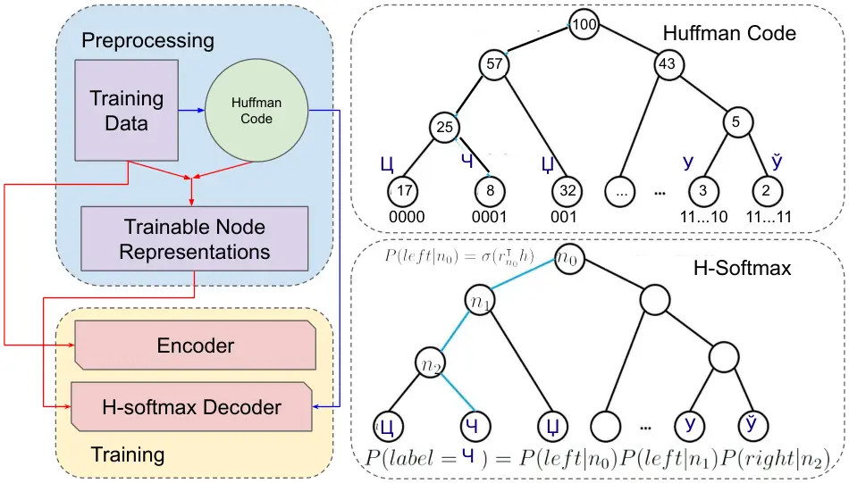
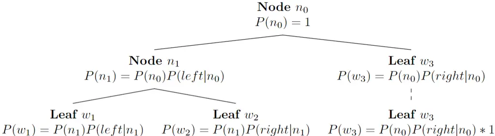

# Hierarchical Softmax for End-to-End Low-resource Multilingual Speech Recognition

Qianying Liu, Zhuo Gong, Zhengdong Yang, Yuhang Yang, Sheng Li, Chenchen
Ding    Nobuaki Minematsu, Hao Huang, Fei Cheng, Chenhui Chu, Sadao
Kurohashi ^(†)^(†)thanks: \$∗\$ denotes equal contribution.

###### Abstract

Low-resource speech recognition has been long-suffering from
insufficient training data. In this paper, we propose an approach that
leverages neighboring languages to improve low-resource scenario
performance, founded on the hypothesis that similar linguistic units in
neighboring languages exhibit comparable term frequency distributions,
which enables us to construct a Huffman tree for performing multilingual
hierarchical Softmax decoding. This hierarchical structure enables
cross-lingual knowledge sharing among similar tokens, thereby enhancing
low-resource training outcomes. Empirical analyses demonstrate that our
method is effective in improving the accuracy and efficiency of
low-resource speech recognition.

^(†)^(†)address: ¹Graduate School of Informatics, Kyoto University,
Sakyo-ku, Kyoto, Japan  
²School of Information Science and Engineering, Xinjiang University,
Urumqi, China  
³Department of EEIS, Graduate School of Engineering, The University of
Tokyo, Tokyo, Japan  
⁴National Institute of Information and Communications Technology (NICT),
Kyoto, Japan

Index Terms: Speech recognition, Acoustic model, End-to-End Multilingual
Model

## 1 Introduction

Automatic speech recognition (ASR) systems have gained remarkable
progress in the past few years. Nevertheless, the present ASR systems
cater to only approximately 100 out of the 7000 spoken languages
worldwide. To address this limitation, multilingual models have garnered
much attention. These models can learn universal features, transferable
from resource-rich to resource-limited languages, and support multiple
languages with a single ASR model. Early studies utilized
context-dependent deep neural network hidden Markov models \[1\], which
relied on hand-crafted pronunciation lexicons. However, when adapted to
low-resource languages, such systems exhibit limitations due to the
absence of sufficient modeling techniques. Attention-based end-to-end
(E2E) models simplify training and eliminate the dependence on
pronunciation lexicons \[2, 3, 4\]. Recent studies employing E2E models
have focused on learning universal representations at the encoding
stage, using transfer learning techniques \[5, 6, 7, 8, 9, 10\], as well
as on hierarchical embedding of phonemes, phones, and phonological
articulatory attributes \[11\]. Meanwhile, large pretrained models \[12,
13, 14, 15\] and multilingual speech corpora \[16, 17, 18, 19, 20\] have
been investigated for learning pretrained representations.

In this paper, we aim to investigate the explicit transfer of
cross-language knowledge at the decoding stage, which has been largely
unexplored in prior studies that focus on encoder representations. Based
on linguistic studies on the presence of similar modeling unit
distributions in neighboring languages \[21\], we propose an efficient
method to capture the similarity among these units, such as characters
and globalphones, at the decoding stage. Our approach utilizes Huffman
coding to automatically capture the similarity among modeling units,
relying only on monolingual data. We introduce hierarchical Softmax
(H-Softmax) \[22\], an approximation softmax inspired by binary trees,
to model the similarity during decoding. This structure enables similar
units to share decoder representations, thus improving model
performance, and also breaks down the expensive softmax step into
several binary classifications, thereby enhancing model
efficiency \[23\]. We design a vectorization algorithm that can expedite
the training and inference procedures, enabling our method to outperform
the vanilla softmax on GPUs in terms of efficiency.

With the combination of the two components, our method:

- •
  Automatically captures cross-lingual modeling unit similarity for
  multilingual ASR.
- •
  Leverages H-Softmax to achieve higher efficiency and reduce
  computational complexity.

While previous studies has utilized H-Softmax in the neural language
model of ASR \[24, 25\]. However, to the best of our knowledge, no
existing work has investigated the direct application of H-Softmax in
the acoustic model. Furthermore, our study is the first to explore the
potential of H-Softmax for low-resource multilingual ASR.



Figure 1: The flowchart of the proposed method. The blue lines stands
for determination relation, and the red line stands for how the data
goes through the model.

## 2 Proposed Method

In this section, we introduce the proposed method of this paper, as
shown in Fig 1. We first use the training text data to determine the
Huffman code for each token as described in subsection 2.1. Then we
build the ASR model, where an encoder takes in the source speech
signals, and the decoder predicts the Huffman code of target text with
H-Softmax. At the inference stage, the model predicts a sequence of
post-processed Huffman codes to text.

### 2.1 Huffman Code

Based on the assumption that neighbour languages share similar token
distribution, the concept of our proposed method is to generate a
representation code for each token via frequency clustering. We first
generate the Huffman code of each token. Formally, given the
multilingual token vocabulary $`V=\{t_{1},t_{2},...t_{N}\}`$, where
$`N`$ is the vocabulary size, we maintain the term frequency set
$`S_{p}=\{p_{t_{i}}\}_{i=1}^{N}`$, where the same token in different
languages are considered as one token. With $`S_{p}`$, we generate a
Huffman tree of $`V=\{t_{i}\}`$ via frequency clustering and further
recursively generate the Huffman code by assigning 0 to the left subtree
and 1 to the right subtree.

### 2.2 Model Architecture

For the ASR model, we use conformer \[26\] as the encoder and
transformer \[27\] as the decoder. For the decoder, we replace the
vanilla softmax with H-Softmax.

H-Softmax organizes the output vocabulary into a tree where the leaves
are the vocabulary tokens, and the intermediate nodes are latent
variables \[22\]. We use the Huffman tree generated in subsection 2.1 as
the tree for H-Softmax that there is a unique path from the root to each
token, forming a complete binary tree. We follow \[22\] and apply the
binary tree H-Softmax. The decoding procedure is transformed into
predicting one leaf node of the binary tree at each timestep. Each leaf
node, which represents a token, could be reached by a path from the root
through the inner nodes. Given the transformer output hidden state $`h`$
and trainable node representation vectors $`\{r_{i}\}`$, the final
possibility of a leaf node $`w_{i}`$ could be represented as:

```math
\displaystyle P(label={w}_{i})=\prod^{{path}}P({path}_{k}|n_{k}) \tag{1}
```

```math
\displaystyle=\prod^{{path}}\begin{cases}\sigma(r_{k}^{\intercal}h)&\text{if }{path}_{k}=left,\\
1-\sigma(r_{k}^{\intercal}h)&\text{if }{path}_{k}=right.\end{cases}
```

where $`n_{k}`$ stands for the $`k`$th node on the path from the root to
$`{w}_{i}`$ such as $`n_{0}`$, $`n_{1}`$ and $`n_{2}`$ in Fig. 1;
$`{path}_{k}`$ stands for the branch leading towards $`{w}_{i}`$ which
is $`left`$ or $`right`$, and $`\sigma(\cdot)`$ stands for sigmoid
function.

### 2.3 Efficient Implementation of H-Softmax

While decomposing the Softmax to a binary tree H-Softmax reduces the
decoding time complexity from O(V) to O(log(V)), and the train time
complexity remains O(Vlog(V)). Since previous H-Softmax
implementation\[23\] is on CPU, considering the order of magnitude
difference between CPU’s and GPU’s FLOPs, the challenge of improving the
efficiency of model training lies in designing an implementation of
H-Softmax for GPU training. We propose a vectorization algorithm to
accelerate training and decoding procedures on GPU.



Figure 2: A typical H-Softmax tree structure. Leaf $`w_{3}`$ has a
virtual child with the same probability of aligning each leaf node to
the same depth, so it is conceptually possible for path vectorization.

To explain the core idea of our vectorization algorithm, we show a
typical H-Softmax tree structure in Fig 2. Then, we can vectorize
log-probability calculations from Eq 1 to the followings:

```math
\displaystyle\begin{bmatrix}\log P(w_{1})\\
\log P(w_{2})\\
\log P(w_{3})\end{bmatrix}=\begin{bmatrix}\log[\sigma(r_{1}^{\intercal}h)\sigma(r_{2}^{\intercal}h)]\\
\log[\sigma(r_{1}^{\intercal}h)(1-\sigma(r_{2}^{\intercal}h))]\\
\log[1-\sigma(r_{1}^{\intercal}h)]\end{bmatrix}
```

```math
\displaystyle=\sum\limits_{column}\log\begin{bmatrix}1*\sigma(r_{1}^{\intercal}h)+0&1*\sigma(r_{2}^{\intercal}h)+0\\
1*\sigma(r_{1}^{\intercal}h)+0&-1*\sigma(r_{2}^{\intercal}h)+1\\
-1*\sigma(r_{1}^{\intercal}h)+1&0*\sigma(r_{2}^{\intercal}h)+1\end{bmatrix}
```

```math
\displaystyle=\sum\limits_{column}\log(Sign\circ\sigma(p)+Bias)
```

where $`Sign`$ is a 3 by 2 matrix of $`\sigma`$s’ signs, $`Bias`$ is a 3
by 2 matrix of $`\sigma`$s’ biases and $`p`$ is the result vector of the
inner product between node vectors and $`h`$. After building the Huffman
tree, the $`Sign`$ and $`Bias`$ matrices are fixed. So in the training
stage, leaf node log probabilities can be acquired only by vector
operations.

For decoding, we only need leaves with the highest probabilities. To
directly calculate this objective, different from training, we also
develop a path-encoding-based multi-layer beam searching on GPU for
H-softmax1 to retain the time efficiency advantage of time-space
complexity O(log(V)) compared to vanilla softmax’s O(V).

## 3 Experiment Evaluations

In this section, we evaluate the proposed method in two low-resource
settings. To examine the effectiveness of our method in more extensive
settings, specifically in the same language group and cross-language
groups, we first simulate a low resource setting by down-sampling from a
speech-to-text multilingual large-scale dataset. To further verify the
performance on natural low-resource languages and other token modeling
units, we test our method on an extremely low-resourced zero-shot
cross-lingual speech-to-phoneme setting. For the high-resource setting,
where every token could be fully trained, modeling of neighbors could no
longer be useful, and thus our experiments focus on the low-resource
setting.

### 3.1 Data Description

We sample our speech-to-text datasets from Common Voice Corpus 11.0. We
selected three different linguistic groups: Romance, Slavic, and Turkic.
For each group, we selected five languages from the corpus and
constructed training and testing sets with the validated data of each
language. With the data size of many existing datasets being around
$`20{\sim}30`$ hours \[28, 29\], we downsampled the training data to the
extent of 30 hours per language on average to simulate a low-resource
setting. As a result, the total size of training data changed from 5492
hours to 450 hours, with the general downsampling ratio
$`\lambda=0.082`$. Different downsampling ratios are used for different
languages to counter the imbalance of data size among languages. For a
set of languages $`\{L_{1},...,L_{m}\}`$ with their proportion
$`\{p_{1},...,p_{m}\}`$ , the downsampling ratio for language $`L_{i}`$
is obtained by
$`\lambda_{i}=\frac{p_{i}^{\alpha-1}}{\sum_{j=1}^{m}p_{j}^{\alpha}}\lambda`$,
where $`\alpha`$ is a smooth coefficient that we set to 0.5. The size of
testing sets is the lesser of 10% of the validated data and 10,000
utterances.

For speech-to-phoneme datasets, we use UCLA Phonetic Corpus \[19\]. The
Edo-Ancient Tokyo (bin), Kele-Congo (sbc), Malayalam-Malay (mal),
Creole-Cape Verde (kea), Klao-Liberia (klu), Arabic-Tunisian Spoken
(aeb), Makasar-South Sulawesi (mak), Finnish-Finland (fin), Abkhaz-North
Caucasian (abk) and Aceh-Sumatra (ace) are testing languages and other
languages are used for training.

|         |                 |          |         |
| ------- | --------------- | -------- | ------- |
| Group   | Language        | Training | Testing |
|         |                 | (Hours)  | (Hours) |
|         | Catalan (ca)    | 76.3     | 15.3    |
|         | Spanish (es)    | 37.6     | 14.4    |
| Romance | French (fr)     | 55.7     | 13.4    |
|         | Italian (it)    | 33.4     | 15.0    |
|         | Portugal (pt)   | 20.7     | 11.4    |
|         | Belarusian (be) | 63.0     | 13.9    |
|         | Czech (cs)      | 42.5     | 5.8     |
| Slavic  | Polish (pl)     | 37.8     | 12.3    |
|         | Russian (ru)    | 27.3     | 14.5    |
|         | Ukrainian (uk)  | 23.4     | 7.2     |
|         | Bashkir (ba)    | 29.6     | 12.6    |
|         | Kyrgyz (ky)     | 11.3     | 3.8     |
| Turkic  | Turkish (tr)    | 16.9     | 8.4     |
|         | Tatar (tt)      | 10.0     | 3.0     |
|         | Uzbek (uz)      | 18.1     | 10.4    |

Table 1: Speech-to-text datasets statistics.

| Language             | Dataset             | Hours |
| -------------------- | ------------------- | ----- |
| UCLA Phonetic Corpus | Training (87 lang.) | 1.86  |
| (97 languages)       | Testing (10 lang.)  | 0.14  |

Table 2: Speech-to-phoneme datasets.

|           |      |      |      |      |      |      |      |      |      |      |         |
| --------- | ---- | ---- | ---- | ---- | ---- | ---- | ---- | ---- | ---- | ---- | ------- |
| Model     | bin  | sbc  | mal  | kea  | klu  | aeb  | mak  | fin  | abk  | ace  | Overall |
| Softmax   | 70.4 | 87.4 | 98.0 | 83.4 | 86.2 | 84.1 | 84.5 | 94.2 | 75.0 | 75.5 | 85.2    |
| H-Softmax | 38.0 | 68.9 | 80.8 | 59.6 | 62.9 | 60.9 | 73.7 | 75.2 | 70.9 | 48.6 | 64.7    |

Table 3: PER% on speech-to-phoneme datasets.

|           |      |      |      |      |      |         |
| --------- | ---- | ---- | ---- | ---- | ---- | ------- |
| Model     | ca   | es   | fr   | it   | pt   | Overall |
| Softmax   | 5.5  | 9.4  | 12.1 | 8.8  | 9.7  | 9.1     |
| H-Softmax | 5.3  | 8.8  | 11.3 | 8.4  | 10.0 | 8.8     |
| Model     | be   | cs   | pl   | ru   | uk   | Overall |
| Softmax   | 5.0  | 5.4  | 9.2  | 11.6 | 11.5 | 8.5     |
| H-Softmax | 4.8  | 5.4  | 8.8  | 10.4 | 11.6 | 8.2     |
| Model     | ba   | ky   | tr   | tt   | uz   | Overall |
| Softmax   | 16.9 | 18.3 | 14.0 | 10.2 | 20.6 | 16.0    |
| H-Softmax | 14.4 | 17.2 | 12.8 | 9.1  | 16.3 | 14.0    |

Table 4: CER% on speech-to-text datasets. Models are trained with
languages within the same language group.

### 3.2 Model Training

For acoustic features, the 80-dimensional log-Mel filterbanks (FBANK)
are computed with a 25ms window and a 10ms shift. Besides, SpecAugment
\[30\] is applied to 2 frequency masks with maximum frequency mask (F = 10) and 2 time masks with maximum time mask (T = 50) to alleviate
over-fitting.

Both H-Softmax and Softmax models are trained using the same network
structure. The networks are constructed using WeNet toolkit \[31\].¹¹ 1
Our implementation is https://github.com/Derek-Gong/hsoftmax Two
convolution sub-sampling layers with kernel size 3$`\times`$3 and stride
2 are used in the front of the encoder. For model parameters, we use 12
conformer layers for the encoder and 6 transformer layers for the
decoder.

Adam optimizer is used with a learning rate schedule with 25,000 warm-up
steps. The initial learning rate is 0.00005. 100 max epochs for
speech-to-text datasets and 80 max epochs for speech-to-phoneme
datasets.

### 3.3 Speech-to-text Recognition Evaluation

We conducted two sets of experiments on speech-to-text datasets:
training with languages within one language group and training with
languages across language groups. We tokenized the transcriptions at the
character level as we verified that it outperforms tokenizing in the
sub-word level (such as BPE).²² 2 Preliminary experiments on Slavic
language group with traditional Softmax results in a CER of 8.5% for
character-level tokenization, 8.9% for BPE (vacab size = 500) and 9.6%
for BPE (vacab size = 5000). As shown in Table 4, when training with
languages within the same language group, our Huffman code achieves
better performance (character error rate, CER%) than traditional Softmax
for all three groups, which demonstrates the effectiveness of our
method. Results in Table 5 show that our method can also make
improvements when training with the combined data in 15 languages across
different language groups, showing that our method works in a more
extensive range of scenarios than we expected. In addition, our method
is more robust as there are no languages with a distinctively high error
rate, unlike traditional Softmax.

### 3.4 Zero-shot Cross-lingual Speech-to-phoneme Recognition Evaluation

Our proposed model demonstrated superior performance compared to the
conventional model (phone error rate, PER%) across all languages on the
UCLA Phonetic corpus, as presented in Table 3. Overall, our approach
outperformed the softmax baseline by a significant margin of 20.51% PER.
On the ‘bin’ language, the performance gap between softmax and H-softmax
was 32.33%. These results showcase the effectiveness of our method in
automatically constructing universal representations for multilingual
ASR and achieving zero-shot cross-lingual phoneme recognition.

### 3.5 Decoding Speed

We observed decoding acceleration with our proposed H-Softmax model in
Table 6. Decomposing the Softmax output layer to a binary tree reduces
the complexity of obtaining probability distribution from O(V) to
O(log(V)), which leads to improvement in efficiency. The results also
show that the sentence length (tokens per sentences) determines the
decoding time difference between Softmax and H-softmax. Longer sentences
take more time steps for inference, and the time difference between the
two models exponentially increases.

|           |      |      |      |      |      |         |
| --------- | ---- | ---- | ---- | ---- | ---- | ------- |
| Model     | ca   | es   | fr   | it   | pt   | Overall |
| Softmax   | 7.3  | 9.4  | 15.1 | 8.4  | 21.8 | 12.4    |
| H-Softmax | 5.7  | 9.0  | 11.3 | 7.3  | 15.4 | 9.7     |
| Model     | be   | cs   | pl   | ru   | uk   | Overall |
| Softmax   | 5.8  | 5.8  | 8.5  | 10.6 | 11.5 | 8.4     |
| H-Softmax | 6.1  | 5.9  | 8.2  | 8.5  | 9.8  | 7.7     |
| Model     | ba   | ky   | tr   | tt   | uz   | Overall |
| Softmax   | 11.8 | 13.7 | 12.3 | 7.6  | 13.5 | 11.8    |
| H-Softmax | 11.0 | 13.6 | 10.3 | 7.1  | 13.7 | 11.1    |

Table 5: CER% on speech-to-text datasets. Models are trained with all
the languages across language groups.

|           |               |               |               |
| --------- | ------------- | ------------- | ------------- |
| Model     | tr            | pl            | ru            |
|           | 32.6 tok/sent | 47.4 tok/sent | 63.1 tok/sent |
| Softmax   | 0.022         | 0.023         | 0.026         |
| H-Softmax | 0.018         | 0.018         | 0.020         |

Table 6: RTF (real-time factor) of the decoding process of Table 5. 3
languages are selected to show the decoding speed with different tokens
per sentences (tok/sent).

## 4 Conclusion

This paper proposes an automatic method to generate cross-lingual
representations, which facilitate the acquisition of cross-lingual
universal features in neighboring languages. Our approach employs
Huffman coding, which utilizes token frequencies (characters,
globalphones, etc.) to bridge different languages. Furthermore, we
introduce H-Softmax, which improves model performance by enabling
similar units that share Huffman binary representations and accelerates
decoding compared to traditional Softmax methods. As future work, we aim
to design binary codes that incorporate not only shallow frequency terms
but also more semantically meaningful features, such as token
embeddings.

## 5 Acknowledgements

This study was supported by JST SPRING Grant No.JPMJSP2110 and
Grant-in-Aid for Scientific Research (C) No. 23K11227.

## References

- \[1\] G. Dahl, D. Yu, L. Deng, and A. Acero, “Context dependent
  pre-trained deep neural networks for large vocabulary speech
  recognition,” IEEE Trans. ASLP, vol. 20, no. 1, pp. 30–42, 2012.
- \[2\] G. Hinton, L. Deng, D. Yu, G. Dahl, A. Mohamed, N. Jaitly,
  A. Senior, V. Vanhoucke, P. Nguyen, T. Sainath, and et al., “Deep
  neural networks for acoustic modeling in speech recognition: The
  shared views of four research groups,” IEEE Signal processing
  magazine, vol. 29, no. 6, pp. 82–97, 2012.
- \[3\] A. Graves and N. Jaitly, “Towards end-to-end speech recognition
  with recurrent neural networks,” in Proc. ICML. PMLR, 2014, pp.
  1764–1772.
- \[4\] Dzmitry Bahdanau, Jan Chorowski, Dmitriy Serdyuk, Philemon
  Brakel, and Yoshua Bengio, “End-to-end attention-based large
  vocabulary speech recognition,” in Proc. IEEE-ICASSP. IEEE, 2016, pp.
  4945–4949.
- \[5\] X. Li and et al., “Towards zero-shot learning for automatic
  phonemic transcription,” in Proc. AAAI, 2020.
- \[6\] C. Zhu and et al., “Multilingual and crosslingual speech
  recognition using phonological-vector based phone embeddings,” in
  Proc. ASRU, 2021.
- \[7\] Sheng Li, Chenchen Ding, Xugang Lu, Peng Shen, Tatsuya Kawahara,
  and Hisashi Kawai, “End-to-end articulatory attribute modeling for
  low-resource multilingual speech recognition.,” in INTERSPEECH, 2019,
  pp. 2145–2149.
- \[8\] W. Hou and et al., “Exploiting adapters for cross-lingual
  low-resource speech recognition,” 2021.
- \[9\] W. Hou and et al., “Large-scale end-to-end multilingual speech
  recognition and language identification with multi-task learning,” in
  Proc. INTERSPEECH, 2020.
- \[10\] D. Liu and et al., “Learning phone recognition from unpaired
  audio and phone sequences based on generative adversarial network,” 2021.
- \[11\] X. Li, J. Li, F. Metze, and A. Black, “Hierarchical phone
  recognition with compositional phonetics.,” in Proc. Interspeech,
  2021, pp. 2461–2465.
- \[12\] A. Baevski and et al., “wav2vec2.0: A framework for
  self-supervised learning of speech representations,” in Proc.
  NeurlPS, 2020.
- \[13\] A. Baevski and et al., “Unsupervised speech recognition,” in
  Proc. NeurlPS, 2021.
- \[14\] Y. Wang and et al., “A fine-tuned wav2vec 2.0/hubert benchmark
  for speech emotion recognition, speaker verification and spoken
  language understanding,” in arXiv preprint arXiv:2111.02735, 2021.
- \[15\] S. Chen and et al., “Wavlm: Large-scale self-supervised
  pre-training for full stack speech processing,” in arXiv preprint
  arXiv:2110.13900, 2021.
- \[16\] C. Wang and et al., “Covost: A diverse multilingual
  speech-to-text translation corpus,” in Proc. LREC, 2020.
- \[17\] C. Wang and et al., “Covost 2: A massively multilingual
  speech-to-text translation corpus,” in arXiv preprint arXiv:
  2007.10310, 2020.
- \[18\] R. Ardila and et al., “Common voice: A massively-multilingual
  speech corpus,” in Proc. LREC, 2020.
- \[19\] Xinjian Li, David R. Mortensen, Florian Metze, and Alan W
  Black, “Multilingual phonetic dataset for low resource speech
  recognition,” in ICASSP 2021 - 2021 IEEE International Conference on
  Acoustics, Speech and Signal Processing (ICASSP), 2021, pp. 6958–6962.
- \[20\] A. Black, “Cmu wilderness multilingual speech dataset,” in
  Proc. ICASSP, 2019.
- \[21\] Mikel Artetxe, Gorka Labaka, and Eneko Agirre, “A robust
  self-learning method for fully unsupervised cross-lingual mappings of
  word embeddings,” in Proc. ACL, 2018.
- \[22\] Tomas Mikolov, Ilya Sutskever, Kai Chen, Greg S Corrado, and
  Jeff Dean, “Distributed representations of words and phrases and their
  compositionality,” in Advances in neural information processing
  systems, 2013, pp. 3111–3119.
- \[23\] Abdul Arfat Mohammed and Venkatesh Umaashankar, “Effectiveness
  of hierarchical softmax in large scale classification tasks,” in 2018
  International Conference on Advances in Computing, Communications and
  Informatics (ICACCI). IEEE, 2018, pp. 1090–1094.
- \[24\] Tuka AlHanai, Wei-Ning, and James Glass, “Development of the
  mit asr system for the 2016 arabic multi genre broadcast challenge.,”
  in IEEE-SLT (Spoken Language Technologies Workshop), 2016.
- \[25\] Seppo Enarvi, Peter Smit, Sami Virpioja, and Mikko Kurimo,
  “Automatic speech recognition with very large conversational finnish
  and estonian vocabularies,” 2017.
- \[26\] A. Gulati, J. Qin, C. Chiu, N. Parmar, Y. Zhang, J. Yu, W. Han,
  S. Wang, Z. Zhang, Y. Wu, and et al., “Conformer:
  Convolution-augmented transformer for speech recognition,” arXiv
  preprint arXiv:2005.08100, 2020.
- \[27\] Ashish Vaswani, Noam Shazeer, Niki Parmar, Jakob Uszkoreit,
  Llion Jones, Aidan N Gomez, Lukasz Kaiser, and Illia Polosukhin,
  “Attention is all you need,” in NIPS, 2017, pp. 5998–6008.
- \[28\] D. Wang and X. Zhang, “THCHS-30 : A free chinese speech
  corpus,” CoRR, vol. abs/1512.01882, 2015.
- \[29\] R. Aisikaer, S. Yin, Z. Zhang, D. Wang, H. Askar, and F. Zheng,
  “THUYG-20: A free uyghur speech database,” Journal of Tsinghua
  University(Science and Technology), vol. 57(2): 182-187, 2017.
- \[30\] Daniel S. Park, William Chan, Yu Zhang, Chung-Cheng Chiu,
  Barret Zoph, Ekin Dogus Cubuk, and Quoc V. Le, “Specaugment: A simple
  augmentation method for automatic speech recognition,” in
  INTERSPEECH, 2019.
- \[31\] Zhuoyuan Yao, Di Wu, Xiong Wang, Binbin Zhang, Fan Yu, Chao
  Yang, Zhendong Peng, Xiaoyu Chen, Lei Xie, and Xin Lei, “WeNet:
  Production Oriented Streaming and Non-Streaming End-to-End Speech
  Recognition Toolkit,” in Proc. Interspeech 2021, 2021, pp. 4054–4058.

## Appendix A Huffman Coding

Formally, given a set of $`m`$ languages $`\{L_{i}\}_{i=1}^{m}`$ and the
corresponding character sets
$`S^{i}=\{c^{i}_{1},c^{i}_{2},...c^{i}_{V^{i}}\}`$, where $`V^{i}`$ is
the character vocabulary size. For each language $`L_{i}`$ individually,
we maintain the term frequency $`S^{i}_{p}=\{p_{c^{i}_{j}}\}`$ of each
character $`j`$ in monolingual data. Term frequency is defined as
follow:

```math
p_{c^{i}_{j}}=\frac{f_{c^{i}_{j}}}{\sum_{j=1}^{V^{i}}{f_{c^{i}_{j}}}} \tag{2}
```

Where $`f_{c^{i}_{j}}`$ is the raw count of a term $`c^{i}_{j}`$ in the
monolingual data.

0:  $`S_{p}`$

 Assign leaf nodes $`\{N_{c^{i}_{j}}\}`$ for elements in $`S_{p}`$;

 sort $`\{N_{c^{i}_{j}}\}`$ based on $`\{p_{c^{i}_{j}}\}`$ order to form
a priority queue $`Q`$;

 while $`sizeof(Q)\geq 2`$ do

   Remove 2 lowest probability nodes $`N_{a}`$ and $`N_{b}`$ from $`Q`$;

   Create a new internal node $`N_{c}`$ with $`N_{a}`$ and $`N_{b}`$ as
children, probability $`p_{c}\leftarrow`$ sum of $`p_{a}`$ and
$`p_{b}`$;

   Add $`N_{c}`$ to $`Q`$ ;

 end while

 $`N\leftarrow`$ last node in $`Q`$

 return $`N`$

Algorithm 1 Generating the Huffman Tree of Characters

Each element in $`S_{p}`$ is assigned a leaf node $`N_{c^{i}_{j}}`$ and
then pushed into a priority queue $`Q`$. The priority is determined by
the probability $`p_{c^{i}_{j}}`$, that the lower probability
$`p_{c^{i}_{j}}`$ has higher priority in the queue $`Q`$. Then the
algorithm generates Huffman tree by removing the 2 highest priority
nodes $`N_{a}`$ and $`N_{b}`$ from $`Q`$ and then merge them into a new
node $`N_{c}`$, which takes the higher priority node of the two removed
nodes as the left children and the other as the right children. The
priority $`p_{c}`$ is determined by the sum of $`p_{a}`$ and $`p_{b}`$.
We repeat this process until there is only one node $`N`$ in $`Q`$, then
$`N`$ is the root node of the Huffman tree.

0:  $`N`$, $`c\leftarrow None`$

 $`N_{l}`$, $`N_{r}\leftarrow`$ children of $`N`$

 if $`N_{l}`$ is not leaf node then

   $`\{{code}_{c^{i}_{j}}\}\leftarrow code(N_{l},c+0)`$

 else

   $`code_{N_{l}}=c+0`$

 end if

 if $`N_{r}`$ is not leaf node then

   $`\{{code}_{c^{i}_{j}}\}\leftarrow code(N_{r},c+1)`$

 else

   $`code_{N_{r}}=c+1`$

 end if

 return $`\{{code}_{c^{i}_{j}}\}`$

Algorithm 2 function $`code(N,c)`$, Huffman Coding of Characters

Given the Huffman tree root node $`N`$, as shown in Algorithm 2,
recursively we generate the Huffman code $`{code}_{c^{i}_{j}}`$ for each
leaf node $`N_{c^{i}_{j}}`$. The root node $`N`$ starts with an empty
representation $`c`$, for each node the code of its left children
$`N_{l}`$ is $`c+0`$, and the code of its right children $`N_{r}`$ is
$`c+1`$. We can recursively traverse the tree and give every leaf node a
corresponding code $`{code}_{c^{i}_{j}}`$.

0:  $`N`$, $`vocab\_size`$, $`depth`$, $`inner\_size`$, $`hidden\_size`$

 /\*Preprocessing before training\*/

 for i from 0 to $`inner\_size-1`$ do

   non-leaf $`node_{i}.index\leftarrow i`$

 end for

 $`Index,Sign,Bias\leftarrow`$ zero matrices of $`(vocab\_size`$,
$`depth)`$

 for each $`leaf_{i}`$ $`\in`$ $`N`$ do

   $`path_{i}\leftarrow`$ the path from root $`N`$ to $`leaf_{i}`$

   for each $`node_{j}\in path_{i}`$ do

    if $`node_{j+1}`$ is $`node_{j}`$’s left child then

     $`Index_{ij}\leftarrow node_{j}.index`$

     $`Sign_{ij}\leftarrow 1`$

    else if $`node_{j+1}`$ is $`node_{j}`$’s right child then

     $`Index_{ij}\leftarrow node_{j}.index`$

     $`Sign_{ij}\leftarrow-1`$

     $`Bias_{ij}\leftarrow 1`$

    end if

   end for

 end for

 /\*Forward pass\*/

 $`h\leftarrow sigmoid(hidden\_vecs*embedding)`$

 $`H\leftarrow`$ stack $`h`$ vertically $`vocab\_size`$ times

 $`H\leftarrow H`$ is index selected by $`Index`$ in the last dimension

 $`log\_probs\leftarrow\sum\limits_{column}{\log(Sign*H+Bias)}`$

 return $`log\_probs`$

Algorithm 3 Arbitrary Binary Tree Based H-Softmax

## Appendix B H-Softmax

In order to vectorize calculations on a binary tree (Fig 2), we need to
vectorize paths from root to leaves first. For a path, every time it
turns left or right, we multiply the probability of this path by
$`1-\sigma(h)`$ or $`\sigma(h)`$ in which $`h`$ is inner product of
current node’s hidden vector and embedding vector fed into H-Softmax.
When the path goes to its leaf node, the accumulated probability of a
token is obtained. Thus, a complete path can be composed of three kinds
of path elements: $`1-\sigma(h)`$, $`\sigma(h)`$, or $`1`$ which are
corresponding to left node, right node, or padding node (dot line in
Fig 2). We need the padding node to pad each path to depth of the tree.
Finally, the accumulated probability is a product of all of the path
elements.

Now, let’s focus on these path elements. Remember that $`\sigma(h)`$ is
a variable for each different sample, while path elements’ sign (-1, 1, 0) and bias (1, 0, 1) is fixed because the tree structure is fixed. So,
we can extract signs and bias of a path into two row vectors
$`path\_sign\_encoding_{i}`$ and $`path\_bias\_encoding_{i}`$, then
stack them vertically to matrices of $`Sign`$ and $`Bias`$. Meanwhile,
we can stack $`h`$ from all non-leaf node to one column vector. Because
of $`\log`$ operation, padding nodes which is expressed by sign 0 and
bias 1 is automatically eliminated.

We present above algorithms in Algorithm 3. And we need to emphasize
that in practice the intermediate matrix $`H`$ is index selected so that
its column number is reduced from $`inner\_size`$ to $`depth`$. Since
$`depth`$ is roughly $`\log(vocab\_size)`$, this step is crucial to
maintain the algorithm in time complexity of
$`O(vocab\_size*hidden\_size+vocab\_size*\log(vocab\_size))`$ instead of
$`O(vocab\_size*hidden\_size+vocab\_size^{2})`$ while it’s
$`O(vocab\_size*hidden\_size)`$ for vanilla softmax.
