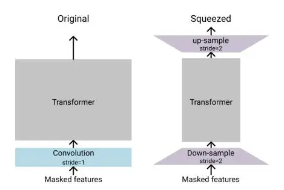
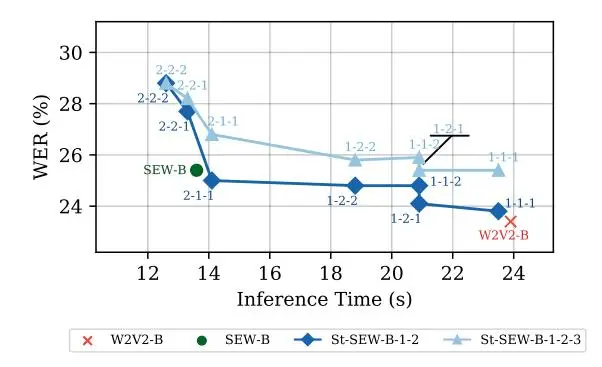
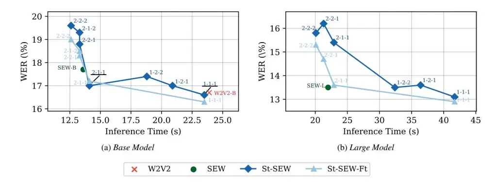

# On-demand compute reduction with stochastic wav2vec 2.0

Apoorv Vyas 1,2,\*, Wei-Ning Hsu 3, Michael Auli 3, Alexei Baevski 3

1Idiap Research Institute, Switzerland 2Ecole Polytechnique Fédérale de Lausanne, Switzerland 3Meta AI

avyas@idiap.ch, {wnhsu, michaelauli, abaevski}@fb.com

### **Abstract**

Squeeze and Efficient Wav2vec (SEW) is a recently proposed architecture [1] that squeezes the input to the transformer encoder for compute efficient pre-training and inference with wav2vec 2.0 (W2V2) models. In this work, we propose stochastic compression for on-demand compute reduction for W2V2 models. As opposed to using a fixed squeeze factor, we sample it uniformly during training. We further introduce query and key-value pooling mechanisms that can be applied to each transformer layer for further compression. Our results for models pre-trained on 960h Librispeech dataset and fine-tuned on 10h of transcribed data show that using the same stochastic model, we get a smooth trade-off between word error rate (WER) and inference time with only marginal WER degradation compared to the W2V2 and SEW models trained for a specific setting. We further show that we can fine-tune the same stochastically pretrained model to a specific configuration to recover the WER difference resulting in significant computational savings on pretraining models from scratch.

Index Terms: self-supervision, speech recognition, wav2vec2

### 1. Introduction

Self-supervised pretraining [2, 3, 4, 5, 6, 7, 8, 9] is a powerful technique that enables learning useful representations from untranscribed audio. Pre-trained models can subsequently be fine-tuned on a downstream task with supervised data such as automatic speech recognition.

Currently, wav2vec 2.0 (W2V2) [2] is one of the most well performing self-supervised learning approaches. W2V2 model comprises a convolutional front-end and a transformer encoder that learns representations from raw audio data using contrastive learning. However, the quadratic complexity of self-attention computation together with the long sequences encountered in speech results in high computational requirements for training as well as high latency for inference.

Recently, [1] improves the W2V2 architecture for efficient training and inference. The proposed _SEW_ architecture modifies the convolutional feature extractor to improve latency. They also introduce squeezing mechanism that downsamples the convolutional front-end output from 50Hz to 25Hz. This reduces the computation for the transformer encoder. The output of the encoder is upsampled with a linear layer to produce output at 50Hz. One downside to SEW is the WER degradation for sensitive applications.

We propose to overcome this limitation with stochastic pretraining and fine-tuning for W2V2 models. Deep neural networks with stochastic depth using layerdrop and block drops have previously been explored in [10, 11, 12, 13] for efficient inference. In this work, we introduce stochastic compression for on-demand compute reduction for W2V2 model. Stochastic compression enables training a single model that can support a number of operating points with a smooth trade-off between WER and inference latency.

As opposed to training with a fixed squeezing factor, at each iteration, we sample a squeezing factor S from $\{1\dots S_f\}$ . Given the squeezing factor S, we compress the input to the transformer encoder by this factor. Similar to SEW, the output of the transformer encoder is upsampled to the original sequence length using a linear layer. In addition to this, for each transformer layer, we also introduce a stochastic pooling mechanism that could be independently applied to queries and keys-values in a decoupled fashion. In contrast to the squeezing mechanism, we do this without introducing any additional learnable parameters.

We show that stochastic pre-training and fine-tuning provides a smooth trade-off between WER and inference time with only marginal performance degradation compared to the non-stochastic variants. We further show that by fine-tuning the same stochastically pre-trained model to a specific configuration (operating point), we can get the same accuracy as the corresponding non-stochastic model. This removes the need for pre-training multiple models, resulting in significant computational savings.

## 2. Our Method

We start with a brief background on the Squeeze and Efficient W2V2 (SEW) model introduced in [1]. We then discuss the proposed query and key-value mean-pooling to further reduce the context length for the transformer layer. We finally present the proposed stochastic compression for W2V2 training.

### 2.1. Squeeze and Efficient Wav2vec (SEW)

Wu et. al. [1] propose two main architectural changes to the W2V2 architecture. First, they introduce compact wave feature extractor (WFE-C) that replaces the original W2V2 convolutional feature extractor (WFE-O). WFE-O uses the same number of channels in all layers of its convolutional extractor. WFE-C starts with a small number of channels c and doubles the channel when the sequence length is downsampled by 4 times. WFE-C distributes the forward and backward pass computation more evenly across layers resulting in a similar WER as WFE-O while being much faster. In this work, we always use WFE-C-c64-I1 as the compact feature extractor. We refer the readers to section 4.4 of [1] for more details.

Next, they introduce **Squeezed Context Networks** to reduce the length of input sequence to the transformer encoder. As shown in Fig. 1, they introduce a _squeezing_ mechanism via a

\* work done during internship at Meta AI Preprint. Submitted to Interspeech 2022.

Figure 1: Comparing original W2V2 and SEW model architecture with a squeezing factor of 2. Figure taken from [1]

downsampling layer at the output of the convolutional encoder to reduce the output rate from 50Hz to 25Hz. The downsampled sequence reduces the memory and computational time for the transformer encoder. The upsampling layer at the output of transformer encoder produces outputs at 50Hz for contrastive loss computation.

#### 2.2. Basic Notations

We start by introducing basic definitions that we will later use to define query and key-value mean pooled attention. Let us denote the queries as $Q \in \mathbb{R}^{N \times D_k}$ , keys as $K \in \mathbb{R}^{S \times D_k}$ , and values as $V \in \mathbb{R}^{S \times D_v}$ , where N and S denotes the query and key sequence lengths respectively. $D_k$ and $D_v$ denote the embedding dimensions for keys and values respectively. The attention output $V' \in \mathbb{R}^{N \times D_v}$ is given as follows:

$$A(Q, K, V) = V' = \operatorname{softmax}\left(\frac{QK^T}{\sqrt{D_k}}\right)V.$$
(1)

Let us also define the mean-pooling or downsampling operator $D(X,S_p)$ that takes as input a sequence $X \in \mathbb{R}^{N \times D_x}$ and a pooling factor $S_p$ to output another sequence $X^p \in \mathbb{R}^{N_p \times D_x}$ where $N_p = \lceil \frac{N}{S_p} \rceil$ . Here $\lceil a \rceil$ denotes the _ceil_ operation. Note that we may need to pad the signal appropriately. The i-th output $X_i^p$ is given by:

$$X_i^p = \sum_{j=1}^{S_p} \frac{X_{(i*S_p)+j}}{S_p} \quad \forall i \in \{1, \dots, N_p\}.$$
(2)

Finally, let us define the upsampling operator $U(X^p,S_u)$ that takes as input a sequence $X^p \in \mathbb{R}^{N_p \times D_x}$ and an upsampling factor $S_u$ to output another sequence $X \in \mathbb{R}^{N \times D_x}$ where $N = (N_p * S_u)$ . The i-th output $X_i$ is given by:

$$X_i = X_{\lfloor \frac{i}{S_n} \rfloor}^p \quad \forall i \in \{1, \dots, N\},$$
(3)

where |a| denotes the _floor_ operation.

### 2.3. Query and Key-Value Mean Pooled Attention

The upsampling layer in the SEW architecture introduces some additional parameters to the W2V2 model. In contrast to this, we introduce query and key-value mean pooling during selfattention computation which can be applied independently to each layer with no additional parameters. This allows for finer control over the compression at each transformer layer.

Let us denote the query pooling and key-value pooling factors as $S_q$ and $S_k$ respectively. Given $S_q$ and $S_k$ , we first compute the mean pooled queries, keys, and values as follows:

Table 1: Model hyper-parameters and pre-training times in hours for base (B) and large (L) models. Sf refers to possible squeeze factors, $S_q$ and $S_k$ refer to the possible query and key-value pooling factors. E and D refer to the model dimension and the number of layers (depth) in transformer respectively. We estimate the pre-training times (PT) for 400K steps for models trained on 8 NVIDIA V100 GPUs.

| Model    | $S_f$ | $S_k$ | $S_q$ | Е    | D   | PT (hr)    |
| -------- | ----- | ----- | ----- | ---- | --- | ---------- |
| W2V2-B   | 1     | 1     | 1     | 768  | 12  | 117        |
| W2V2-L   | 1     | 1     | 1     | 1024 | 24  | $172^{-1}$ |
| SEW-B    | 2     | 1     | 1     | 768  | 12  | 83         |
| SEW-L    | 2     | 1     | 1     | 1024 | 24  | 115        |
| St-SEW-B | {1,2} | {1,2} | {1,2} | 768  | 12  | 100        |
| St-SEW-L | {1,2} | {1,2} | {1,2} | 1024 | 24  | 140        |

$$Q_p = D(Q, S_q), \tag{4}$$

$$K_p = D(K, S_k), (5)$$

$$V_p = D(V, S_k). (6)$$

The output $V' \in \mathbb{R}^{N \times D_v}$ for the pooled attention is:

$$V'_{p} = A(Q_{p}, K_{p}, V_{p}),$$

$$V' = U(V'_{p}, S_{q}).$$
(8)

$$V' = U(V_p', S_q). \tag{8}$$

#### 2.4. Stochastic Compression

In contrast to SEW models, where the squeezing factor remains fixed during pre-training and fine-tuning, at each iteration, we sample the squeezing factor uniformly from the set $\{1,\ldots,S_f\}$ . Similarly, for each transformer layer we also sample the query and key-value mean pooling factors from the sets $\{1,\ldots,S_q\}$ and $\{1,\ldots,S_k\}$ respectively.

### 3. Experiments

#### 3.1. Models

We conduct experiments with W2V2, SEW, and our proposed stochastically compressed (St-SEW) models with 12 and 24 encoder layers. For all models, we use WFE-C-c64-l1 as the feature extractor. In Table 1, we describe the main hyperparameters for different classes of models. Note that we can view W2V2 and SEW models as special cases of the stochastic models with a specific setting of squeezing and pooling factors.

#### 3.2. Pre-training

We pre-train models on 960h of Librispeech [14] dataset. We use the same hyperparameters as W2V2 base [2]. To reduce the computational requirements, our models are trained with 8 NVIDIA V100 GPUs using Fairseq [15] and PyTorch [16]. We double the maximum tokens per batch and set gradient accumulation steps to 4 to simulate 64 GPUs as used in [2].

#### 3.3. Fine-tuning

We add a linear layer to the top of the transformer encoder and fine-tune the model for 20K steps using the CTC objective

&lt;sup>1Estimated time. The model is unstable and pre-training diverged.

[\[17\]](#page-4-16) on the 10h subset of the Librispeech dataset. We use the _dev-other_ for model selection during fine-tuning. For stochastically pre-trained models, we consider the following two strategies for fine-tuning:

Stochastic Fine-tuning In this setting, we fine-tune stochastically by sampling the squeezing and pooling factors similar to pre-training. During validation, we use randomly selected values for Sf , Sk, and Sq. This model allows for a smooth trade-off between WER and inference time for different settings of squeeze and pooling factors used during inference.

Deterministic Fine-tuning In this setting, we fine-tune the model for a fixed configuration of squeeze and pooling factors. In contrast to stochastic fine-tuning, this model can only be inferred with the selected configuration. However, we find that this gives better WER. Note that, for each configuration, we fine-tune the same stochastically pre-trained model resulting in significant computational savings as pre-training typically requires more computational resources and time.

#### 3.4. Evaluation

Similar to [\[1\]](#page-4-0), we consider the following metrics: pre-training time, inference time, and word error rate (WER) for model efficiency. We report inference times (in seconds) on _dev other_ split using CTC greedy decoding on NVIDIA V100 with FP32 operations. We use the 4-gram language model (LM) and wav2letter decoder [\[18\]](#page-4-17) for decoding with language model (LM). Similar to [\[1\]](#page-4-0), we do not tune hyper-parameters when decoding with LM. We use the default LM weight 2, word score -1, and beam size 50.

### _3.4.1. Inference with Stochastic Models_

For our proposed stochastically pre-trained models fine-tuned in stochastic or deterministic settings, we provide inference time and WER for various configurations of squeeze, query and keyvalue pooling factors.

# 4. Results

In the following, we first analyze the performance of stochastic W2V2 model for different query and key-value mean-pooling choices. We then discuss the trade-offs for the stochastically trained W2V2 model against the original W2V2 and SEW models. Finally, we present the WER results for Base and Large on the _clean_ and _other_ parts of the Librispeech test sets.

### 4.1. How much query and key-value pooling?

We consider (a) {1, 2, 3} and (b) {1, 2} as the two choices of key-value and query pooling sets to analyze the WER and inference time trade-offs for base models pre-trained for 100K steps.

In Table [2,](#page-2-0) we present the pre-training time (PT) for each of these models. We can see that the pre-training time for both (a) and (b) is quite similar. Both of these are faster than the W2V2-B model and slower than the SEW-B model. This is expected because we occasionally sample the squeeze and pooling factors as 1 in which case the computation time for our model would be higher than that of SEW-B model.

In Fig. [2,](#page-2-1) we present the inference time and WER trade-offs for different models. We plot the WER obtained on _dev-other_ split when the same model is then inferred with different values for squeeze (Sf ), key-value (Sk) and query pooling (Sq)

Table 2: _Comparing pre-training time for different choices of query and key-pooling factors for St-SEW-B models trained for_ 100*K steps*

| Model          | {Sf ,Sk,Sq}           | PT (hours) |
| -------------- | --------------------- | ---------- |
| W2V2-B         | {1},{1},{1}           | 29.2       |
| SEW-B          | {2},{1},{1}           | 20.7       |
| St-SEW-B-1-2   | {1,2},{1,2},{1,2}     | 24.9       |
| St-SEW-B-1-2-3 | {1,2},{1,2,3},{1,2,3} | 24.6       |

Figure 2: _We compare the different query and key-value pooling options for St-SEW-B models trained for_ 100*K steps. The numbers near the datapoints denote the inference configuration in the order: squeeze (*Sf *), key-value pooling (*Sk*), and query pooling (*Sq*) factors. We can see that using pooling factors of* {1, 2} _results in a better performance trade-off._

pooling factors indicated on the figures as triplet in the order Sf -Sk-Sq . We also train the W2V2-B and SEW-B models for comparison. We can see that the model trained with pooling factors sampled from {1, 2} outperforms the model that samples pooling factors from {1, 2, 3}. We also see that the performance for this model is similar to the non-stochastic W2V2-B and SEW-B models. In all subsequent experiments, we always choose the query and key-value pooling factors from {1, 2} .

### 4.2. On-demand compute reduction inference

In this section, we compare the WER and inference time trade-offs for Base and Large models. We pre-train each model for 400K steps followed by fine-tuning on the 10h transcribed subset of Librispeech dataset. We use _St-SEW-B-Ft_ and _St-SEW-L-Ft_ to denote the stochastic pre-trained models finetuned in deterministic setting as discussed before. We evaluate the inference time and WER for the following configurations of (Sf ,Sk,Sq) factors: (a) (1,1,1), (b) (2,1,1) (c) (2,2,1) (d) (2,2,2). We select (1,1,1) and (2,1,1) to compare against the W2V2 and SEW models respectively. We then increase the query and key pooling to further increase the overall compression resulting in faster inference. We skip results for the (2,1,2) as it is very similar to (2,2,1).

Fig. [3](#page-3-0) shows the WER and inference-time for Base and Large models evaluated on the _dev-other_ portion of the Librispeech dataset. For Base models, the same stochastically finetuned (St-SEW) model performs only marginally worse than W2V2 and SEW models when inferred using the corresponding configurations. There is a bigger performance difference in the case of Large models especially when Sf = 2 during inference.

Figure 3: WER and inference time tradeoff for different Base and Large models. The numbers near the datapoints denote the configuration used during inference in the following orders: $(S_f - S_k - S_q)$ . We see that the stochastically trained model provides a smooth trade-off between WER and inference times. Fine-tuning the pre-trained to a specific configuration of interest improves the WER significantly.

However, the difference in performance can be recovered, if we fine-tune the models to specific configurations (St-SEW-L-Ft). Depending on the application requirements, we can choose different operating points (configurations) for an on-demand compute reduction for a smooth trade-off in WER.

For Large models, we find that W2V2-L pre-training is unstable and diverges quickly. In contrast to this the stochastic model pre-training and fine-tuning is stable. We always use post-layer norm for Transformer encoder. In [2], for stable pre-training, Large models are trained with pre-layer norm and convolutional front-end with extra normalization layers resulting in significantly higher training time and inference latency.

#### 4.3. Test Set Evaluation

Table 3: Inference times and WER result for base models on other and clean test sets. We report the WER obtained using greedy decoding as well as 4-gram LM (in parenthesis).

|                                      | Inference $(S_f, S_k, S_q)$          |             |                 |             |             |     |     |
| ------------------------------------ | ------------------------------------ | ----------- | --------------- | ----------- | ----------- | --- | --- |
|                                      | Model                                | 1,1,1       | 2,1,1           | 2,2,1       | 2,2,2       |     |     |
|                                      |                                      | Inference t | imes (dev other | er)         |             |     |     |
| (a)                                  | W2V2-B                               | 23.9        | -               | -           | -           |     |     |
| (b)                                  | SEW-B                                | -           | 13.6            | -           | -           |     |     |
| (c)                                  | St-SEW-B                             | 23.5        | 14.0            | 13.3        | 12.6        |     |     |
|                                      | Word Error Rate Results (test clean) |             |                 |             |             |     |     |
| (d)                                  | W2V2-B                               | 9.5 (5.0)   | -               | -           | -           |     |     |
| (e)                                  | SEW-B                                | -           | 10.2 (4.9)      | -           | -           |     |     |
| (f)                                  | St-SEW-B                             | 9.7 (5.1)   | 9.8 (5.2)       | 11.0 (5.4)  | 11.4 (5.4)  |     |     |
| (g)                                  | St-SEW-B-Ft                          | 9.4 (5.0)   | 10.0 (4.9)      | 10.8 (5.1)  | 11.2 (5.2)  |     |     |
| Word Error Rate Results (test other) |                                      |             |                 |             |             |     |     |
| (h)                                  | W2V2-B                               | 16.7 (10.7) | -               | -           | -           |     |     |
| (i)                                  | SEW-B                                |             | 17.6 (10.8)     | -           | -           |     |     |
| (j)                                  | St-SEW-B                             | 16.8 (11.0) | 17.3 (11.3)     | 19.0 (11.6) | 19.9 (11.8) |     |     |
| (k)                                  | St-SEW-B-Ft                          | 16.5 (10.8) | 17.3 (10.8)     | 18.5 (11.3) | 19.3 (11.7) |     |     |
|                                      |                                      |             |                 |             |             |     |     |

We present the WER obtained by Base and Large models on the _clean_ and _other_ portion of the Librispeech test sets. From Table 3, we see that similar to _dev other_, the WER for _St-SEW-B_ model is very close to W2V2 and SEW models in the corresponding configurations. We also see that fine-tuning to specific configurations (_St-SEW-B-Ft_) gives slightly better WER. Table 4 presents the results for Large models where we find that St-SEW-L does not perform as well when the squeeze factor is set to 2. We suspect that the randomly selected values for $S_f$ , $S_k$ , and $S_q$ during validation may cause the selected model to be better for some configurations than other. However, we again see that for St-SEW-L-Ft models, the performance is very close to that of the SEW-L model.

Table 4: Inference times and WER result for large models on other and clean test sets. We report the WER obtained using greedy decoding as well as 4-gram LM (in parenthesis).

|     |             | Inference $(S_f, S_k, S_q)$ |                  |             |             |     |
| --- | ----------- | --------------------------- | ---------------- | ----------- | ----------- | --- |
|     | Model       | 1,1,1                       | 2,1,1            | 2,2,1       | 2,2,2       |     |
|     |             | Inference                   | times (dev oth   | er)         |             |     |
| (a) | SEW-L       | -                           | 22.0             | -           | -           |     |
| (b) | St-SEW-L    | 41.7                        | 22.9             | 21.3        | 20.1        |     |
|     | V           | Vord Error Ra               | ate Results (tes | t clean)    |             |     |
| (c) | SEW-L       | -                           | 8.8 (4.6)        | -           | -           |     |
| (b) | St-SEW-L    | 8.5 (4.8)                   | 10.2 (5.1)       | 10.4 (5.4)  | 9.8 (5.1)   |     |
| (c) | St-SEW-L-Ft | 8.4 (4.7)                   | 8.9 (4.5)        | 9.6 (4.7)   | 9.8 (4.8)   |     |
|     | V           | Vord Error Ra               | ate Results (tes | t other)    |             |     |
| (d) | SEW-L       | -                           | 13.9 (9.1)       | -           | -           |     |
| (e) | St-SEW-L    | 13.6 (9.3)                  | 16.2 (10.1)      | 16.6 (10.1) | 16.3 (10.2) |     |
| (f) | St-SEW-L-Ft | 13.4 (9.1)                  | 14.1 (9.1)       | 15.2 (9.5)  | 15.7 (9.9)  |     |

#### 5. Conclusion

We proposed a stochastic compression technique for compute reduction during W2V2 pre-training as well as for on-demand compute reduction during inference. We show that stochastically pre-trained and fine-tuned models provide multiple operating points with smooth performance trade-off for different applications. We further show that fine-tuning the stochastically pre-trained model to a specific configuration provides the same WER as a model pre-trained and fine-tuned from scratch for the same configuration.

Currently, we use the same squeeze and pooling factors for all utterances. In future, we will explore techniques to adaptively choose the compression factors depending on the input utterance to improve the WER and inference time trade-off.

# 6. References

- [1] F. Wu, K. Kim, J. Pan, K. J. Han, K. Q. Weinberger, and Y. Artzi, "Performance-efficiency trade-offs in unsupervised pre-training for speech recognition," 2021.
- [2] A. Baevski, H. Zhou, A. Mohamed, and M. Auli, "wav2vec 2.0: A framework for self-supervised learning of speech representations," in _Proceedings of the international conference on Neural Information Processing Systems (NeurIPS)_, 2020.
- [3] Y.-A. Chung, W.-N. Hsu, H. Tang, and J. Glass, "An unsupervised autoregressive model for speech representation learning," in _Interspeech_, 2019.
- [4] A. T. Liu, S.-W. Li, and H. yi Lee, "Tera: Self-supervised learning of transformer encoder representation for speech," 2020.
- [5] A. van den Oord, Y. Li, and O. Vinyals, "Representation learning with contrastive predictive coding," 2019.
- [6] S. Schneider, A. Baevski, R. Collobert, and M. Auli, "wav2vec: Unsupervised pre-training for speech recognition," in _Interspeech_, 2019.
- [7] W. Wang, Q. Tang, and K. Livescu, "Unsupervised pre-training of bidirectional speech encoders via masked reconstruction," in _Proceedings of ICASSP_, 2020.
- [8] W.-N. Hsu, B. Bolte, Y.-H. H. Tsai, K. Lakhotia, R. Salakhutdinov, and A. Mohamed, "Hubert: Self-supervised speech representation learning by masked prediction of hidden units," _IEEE/ACM Transactions on Audio, Speech, and Language Processing_, 2021.
- [9] A. Baevski, W. Hsu, Q. Xu, A. Babu, J. Gu, and M. Auli, "data2vec: A general framework for self-supervised learning in speech, vision and language," 2022.
- [10] Z. Wu, T. Nagarajan, A. Kumar, S. Rennie, L. Davis, K. Grauman, and R. Feris, "Blockdrop: Dynamic inference paths in residual networks," 2018.
- [11] A. Fan, E. Grave, and A. Joulin, "Reducing transformer depth on demand with structured dropout," in _International Conference on Learning Representations_, 2020.
- [12] G. Huang, Y. Sun, Z. Liu, D. Sedra, and K. Q. Weinberger, "Deep networks with stochastic depth," in _European Conference on Computer Vision_, 2016.
- [13] Z. Liu, M. Sun, T. Zhou, G. Huang, and T. Darrell, "Rethinking the value of network pruning," in _International Conference on Learning Representations_, 2019.
- [14] V. Panayotov, G. Chen, D. Povey, and S. Khudanpur, "Librispeech: An asr corpus based on public domain audio books," in _Proceedings of ICASSP_, 2015.
- [15] M. Ott, S. Edunov, A. Baevski, A. Fan, S. Gross, N. Ng, D. Grangier, and M. Auli, "fairseq: A fast, extensible toolkit for sequence modeling," in _Proceedings of NAACL-HLT 2019: Demonstrations_, 2019.
- [16] A. Paszke, S. Gross, F. Massa, A. Lerer, J. Bradbury, G. Chanan, T. Killeen, Z. Lin, N. Gimelshein, L. Antiga, A. Desmaison, A. Kopf, E. Yang, Z. DeVito, M. Raison, A. Tejani, S. Chilamkurthy, B. Steiner, L. Fang, J. Bai, and S. Chintala, "Pytorch: An imperative style, high-performance deep learning library," in _Proc. of NeurIPS_, 2019.
- [17] A. Graves, S. Fernandez, F. Gomez, and J. Schmidhuber, "Con- ´ nectionist temporal classification: Labelling unsegmented sequence data with recurrent neural networks," in _Proceedings of the 23rd International Conference on Machine Learning_, 2006.
- [18] V. Pratap, A. Hannun, Q. Xu, J. Cai, J. Kahn, G. Synnaeve, V. Liptchinsky, and R. Collobert, "Wav2letter++: A fast opensource speech recognition system," in _ICASSP 2019 - 2019 IEEE International Conference on Acoustics, Speech and Signal Processing (ICASSP)_, 2019.
