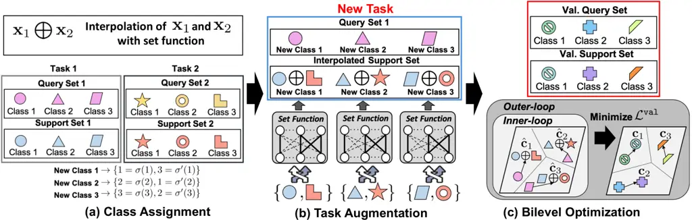

# Set-based Meta-Interpolation for Few-Task Meta-Learning

Seanie Lee ^(†)^(†)thanks: Equal Contribution. Order of the authors was
determined by a coin toss.    Bruno Andreis    Kenji Kawaguchi , Juho
Lee, Sung Ju Hwang    KAIST    National University of Singapore   
AITRICS Email: [{lsnfamily02,
andries}@kaist.ac.kr,kenji@comp.nus.edu.sg, {juholee,
sjhwang82}@kaist.ac.kr](mailto:,)

###### Abstract

Meta-learning approaches enable machine learning systems to adapt to new
tasks given few examples by leveraging knowledge from related tasks.
However, a large number of meta-training tasks are still required for
generalization to unseen tasks during meta-testing, which introduces a
critical bottleneck for real-world problems that come with only few
tasks, due to various reasons including the difficulty and cost of
constructing tasks. Recently, several task augmentation methods have
been proposed to tackle this issue using domain-specific knowledge to
design augmentation techniques to densify the meta-training task
distribution. However, such reliance on domain-specific knowledge
renders these methods inapplicable to other domains. While Manifold
Mixup based task augmentation methods are domain-agnostic, we
empirically find them ineffective on non-image domains. To tackle these
limitations, we propose a novel domain-agnostic task augmentation
method, Meta-Interpolation, which utilizes expressive neural set
functions to densify the meta-training task distribution using bilevel
optimization. We empirically validate the efficacy of Meta-Interpolation
on eight datasets spanning across various domains such as image
classification, molecule property prediction, text classification and
sound classification. Experimentally, we show that Meta-Interpolation
consistently outperforms all the relevant baselines. Theoretically, we
prove that task interpolation with the set function regularizes the
meta-learner to improve generalization.

## 1 Introduction

The ability to learn a new task given only a few examples is crucial for
artificial intelligence. Recently, meta-learning \[39, 3\] has emerged
as a viable method to achieve this objective and enables machine
learning systems to quickly adapt to a new task by leveraging knowledge
from other related tasks seen during meta-training. Although existing
meta-learning methods can efficiently adapt to new tasks with few data
samples, a large dataset of meta-training tasks is still required to
learn meta-knowledge that can be transferred to unseen tasks. For many
real-world applications, such extensive collections of meta-training
tasks may be unavailable. Such scenarios give rise to the few-task
meta-learning problem where a meta-learner can easily memorize the
meta-training tasks but fail to generalize well to unseen tasks. The
few-task meta-learning problem usually results from the difficulty in
task generation and data collection. For instance, in the medical
domain, it is infeasible to collect a large amount of data to construct
extensive meta-training tasks due to privacy concerns. Moreover, for
natural language processing, it is not straightforward to split a
dataset into tasks, and hence entire datasets are treated as
tasks \[30\].

Several works have been proposed to tackle the few-task meta-learning
problem using task augmentation techniques such as clustering a dataset
into multiple tasks \[30\], leveraging strong image augmentation methods
such as vertical flipping to construct new classes \[32\], and the
employment of Manifold Mixup \[44\] for densifying the meta-training
task distribution \[49, 50\]. However, majority of these techniques
require domain-specific knowledge to design such task augmentations and
hence cannot be applied to other domains. While Manifold Mixup based
methods \[49, 50\] are domain-agnostic, we empirically find them
ineffective for mitigating meta-overfitting in few-task meta-learning
especially in non-image domains such as chemical and text, and that they
sometimes degrade generalization performance.

In this work, we focus solely on domain-agnostic task augmentation
methods that can densify the meta-training task distribution to prevent
meta-overfitting and improve generalization at meta-testing for few-task
meta-learning. To tackle the limitations already discussed, we propose a
novel domain-agnostic task augmentation method for metric based
meta-learning models. Our method, Meta-Interpolation, utilizes
expressive neural set functions to interpolate two tasks and the set
functions are trained with bilevel optimization so that a meta-learner
trained on the interpolated tasks generalizes to tasks in the
meta-validation set. As a consequence of end-to-end training, the
learned augmentation strategy is tailored to each specific domain
without the need for specialized domain knowledge.



Figure 1: Concept. Three-way one-shot classification problem. (a) A new
class is assigned to a pair of classes sampled without replacement from
the pool of meta-training tasks. (b) The support sets are interpolated
with a set function and paired with a query set. (c) Bilevel
optimization of the set function and meta-learner.

For example, for $`K`$-way classification, we sample two tasks
consisting of support and query sets and assign a new class $`k`$ to
each pair of classes $`\{\sigma(k),\sigma^{\prime}(k)\}`$ for
$`k=1,\ldots,K`$, where $`\sigma,\sigma^{\prime}`$ are permutations on
$`\{1,\ldots,K\}`$ as depicted in Figure 1a. Hidden representations of
the support set with classes $`\sigma(k)`$ and $`\sigma\prime(k)`$ are
then transformed into a single support set using a set function that
maps a set of two vectors to a single vector. We refer to the output of
the set function as the interpolated support set and these are used to
compute class prototypes. As shown in Figure 1b, the interpolated
support set is paired with a query set (query set 1 in Figure 1a)),
randomly selected from the two tasks to obtain a new task. Lastly, we
optimize the set function so that a meta-learner trained on the
augmented task can minimize the loss on the meta-validation tasks as
illustrated in Figure 1c.

To verify the efficacy of our method, we empirically show that it
significantly improves the performance of Prototypical Networks \[40\]
on the few-task meta-learning problem across multiple domains. Our
method outperforms the relevant baselines on eight few-task
meta-learning benchmark datasets spanning image classification, chemical
property prediction, text classification, and sound classification.
Furthermore, our theoretical analysis shows that our task interpolation
method with the set function regularizes the meta-learner and improves
generalization performance.

Our contribution is threefold:

- •
  We propose a novel domain-agnostic task augmentation method,
  Meta-Interpolation, which leverages expressive set functions to
  densify the meta-training task distribution for the few-task
  meta-learning problem.
- •
  We theoretically analyze our model and show that it regularizes the
  meta-learner for better generalization.
- •
  Through extensive experiments, we show that Meta-Interpolation
  significantly improves the performance of Prototypical Network on
  various domains such as image, text, and chemical molecule, and sound
  classification on the few-task meta-learning problem.

## 2 Related Work

#### Meta-Learning

The two mainstream approaches to meta-learning are gradient based \[10,
33, 14, 24, 12, 36, 37\] and metric based meta-learning \[45, 40, 42,
29, 26, 6, 38\]. The former formulates meta-knowledge as meta-parameters
such as the initial model parameters and performs bilevel optimization
to estimate the meta-parameters so that a meta-learner can generalize to
unseen tasks with few gradient steps. The latter learns an embedding
space where classification is performed by measuring the distance
between a query and a set of class prototypes. In this work, we focus on
metric based meta-learning with fewer number of meta-training tasks,
i.e., few-task meta-learning. We propose a novel task augmentation
method that densifies the meta-training task distribution and mitigates
overfitting due to the fewer number of meta-training tasks for better
generalization to unseen tasks.

#### Task Augmentation for Few-Task Meta-learning

Several methods have been proposed to augment the number of
meta-training tasks to mitigate overfitting in the context of few-task
meta-learning.  Ni et al. \[32\] apply strong data augmentations such as
vertical flip to images to create a new class. For text classification,
Murty et al. \[30\] split meta-training tasks into latent reasoning
categories by clustering data with a pretrained language model. However,
they require domain-specific knowledge to design such augmentations, and
hence the resulting augmentation techniques are inapplicable to other
domains where there is no well-defined data augmentation or pretrained
model. In order to tackle this limitation, Manifold Mixup-based task
augmentations have also been proposed. MetaMix \[49\] interpolates
support and query sets with Manifold Mixup \[44\] to construct a new
query set. MLTI \[50\] performs Manifold Mixup \[44\] on support and
query sets from two tasks for task augmentation. Although these methods
are domain-agnostic, we empirically find that they are not effective in
some domains and can degrade generalization performance. In contrast, we
propose to train an expressive neural set function to interpolate two
tasks with bilevel optimization to find optimal augmentation strategies
tailored specifically to each domain.

## 3 Method

#### Preliminaries

In meta-learning, we are given a finite set of tasks
$`\{\mathcal{T}_{t}\}_{t=1}^{T}`$, which are i.i.d samples from an
unknown task distribution $`p(\mathcal{T})`$. Each task
$`\mathcal{T}_{t}`$ consists of a support set
$`\mathcal{D}^{s}_{t}=\{({\mathbf{x}}^{s}_{t,i},y^{s}_{t,i})\}_{i=1}^{N_{s}}`$
and a query set
$`\mathcal{D}_{t}^{q}=\{({\mathbf{x}}^{q}_{t,i},y^{q}_{t,i})\}_{i=1}^{N_{q}}`$,
where $`{\mathbf{x}}_{t,i}\text{ and }y_{t,i}`$ denote a data point and
its corresponding label respectively. Given a predictive model
$`\hat{f}_{\theta,\lambda}\coloneqq f_{\theta_{L}}^{L}\circ\cdots\circ f^{l+1}_{\theta_{l+1}}\circ\varphi_{\lambda}\circ f^{l}_{\theta_{l}}\circ\cdots\circ f_{\theta_{1}}^{1}`$
with $`L`$ layers, we want to estimate the parameter $`\theta`$ that
minimizes the meta-training loss and generalizes to query sets
$`\mathcal{D}^{q}_{*}`$ sampled from an unseen task $`\mathcal{T}_{*}`$
using the support set $`\mathcal{D}^{s}_{*}`$, where $`\lambda`$ is a
hyperparameter for the function $`\varphi_{\lambda}`$. In this work, we
primarily focus on metric based meta-learning methods rather than
gradient based meta-learning methods due to efficiency and empirically
higher performance over the gradient based methods on the tasks we
consider.

#### Problem Statement

In this work, we focus solely on few-task meta-learning. Here, the
number of meta-training tasks drawn from the meta-training distribution
is extremely small and the goal of a meta-learner is to learn
meta-knowledge from such limited tasks that can be transferred to unseen
tasks during meta-testing. The key challenges here are preventing the
meta-learner from overfitting on the meta-training tasks and
generalizing to unseen tasks drawn from a meta-test set.

#### Metric Based Meta-Learning

The goal of metric based meta-learning is to learn an embedding space
induced by $`\hat{f}_{\theta,\lambda}`$, where we perform classification
by computing distances between data points and class prototypes. We
adopt Prototypical Network (ProtoNet) \[40\] for
$`\hat{f}_{\theta,\lambda}`$, where $`\varphi_{\lambda}`$ is the
identity function. Specifically, for each task $`\mathcal{T}_{t}`$ with
its corresponding support $`\mathcal{D}^{s}_{t}`$ and query
$`\mathcal{D}^{q}_{t}`$ sets, we compute class prototypes
$`\{{\mathbf{c}}_{k}\}_{k=1}^{K}`$ as the average of the hidden
representation of the support samples belonging to the class $`k`$ as
follows:

```math
{\mathbf{c}}_{k}\coloneqq\frac{1}{N_{k}}\sum_{\begin{subarray}{c}({\mathbf{x}}^{s}_{t,i},y^{s}_{t,i})\in\mathcal{D}_{t}^{s}\\
y_{t,i}=k\end{subarray}}\hat{f}_{\theta,\lambda}({\mathbf{x}}^{s}_{t,i})\in\mathbb{R}^{D} \tag{1}
```

where $`N_{k}`$ denotes the number of instances belonging to the class
$`k`$. Given a metric
$`d(\cdot,\cdot):\mathbb{R}^{D}\times\mathbb{R}^{D}\mapsto\mathbb{R}`$,
we compute the probability of a query point $`{\mathbf{x}}^{q}_{t,i}`$
being assigned to the class $`k`$ by measuring the distance between the
hidden representation
$`\hat{f}_{\theta,\lambda}({\mathbf{x}}^{q}_{t,i})`$ and the class
prototype $`{\mathbf{c}}_{k}`$ followed by softmax. With the class
probability, we compute the cross-entropy loss for ProtoNet as follows:

```math
\mathcal{L}_{\text{singleton}}\left(\lambda,\theta;\mathcal{T}_{t}\right)\coloneqq-\sum_{i,k}\mathbbm{1}_{\{y_{t,i}=k\}}\cdot\log\frac{\exp(-d(\hat{f}_{\theta,\lambda}({\mathbf{x}}^{q}_{t,i}),{\mathbf{c}}_{k}))}{\sum_{k^{\prime}}\exp(-d(\hat{f}_{\theta,\lambda}({\mathbf{x}}^{q}_{t,i}),{\mathbf{c}}_{k^{\prime}}))} \tag{2}
```

where $`\mathbbm{1}`$ is an indicator function. At meta-test time, a
test query is assigned a label based on the minimal distance to a class
prototype, i.e.,
$`y^{q}_{*}=\argmin_{k}d(\hat{f}_{\theta,\lambda}({\mathbf{x}}^{q}_{*}),{\mathbf{c}}_{k})`$.
However, optimizing
$`\frac{1}{T}\sum_{t=1}^{T}\mathcal{L}_{\text{singleton}}(\lambda,\theta;\mathcal{T}_{t})`$
w.r.t $`\theta`$ is prone to overfitting since we are given only a small
number of meta-training tasks. The meta-learner tends to memorize the
meta-training tasks, which limits its generalization to new tasks at
meta-test time \[51, 35\].

0:  Tasks $`\{\mathcal{T}^{\text{train}}_{t}\}_{t=1}^{T}`$
$`\{\mathcal{T}^{\text{val}_{t}^{\prime}}\}_{t^{\prime}=1}^{T^{\prime}}`$,
learning rate $`\alpha,\eta\in\mathbb{R}_{+}`$, update period $`S`$, and
batch size $`B`$.

1:  Initialize parameters $`\theta,\lambda`$

2:  for all $`i\leftarrow 1,\ldots,M`$ do

3:    $`\mathcal{L}_{tr}\leftarrow 0`$

4:    for all $`j\leftarrow 1,\ldots,B`$ do

5:     Sample two tasks
$`\mathcal{T}_{t_{1}}=\{\mathcal{D}^{s}_{t_{1}},\mathcal{D}^{q}_{t_{1}}\}`$
and
$`\mathcal{T}_{t_{2}}=\{\mathcal{D}^{s}_{t_{2}},\mathcal{D}^{q}_{t_{2}}\}`$
from $`\{\mathcal{T}^{\text{train}}_{t}\}_{t=1}^{T}`$.

6:     $`\hat{\mathcal{D}}^{s}\leftarrow`$
Interpolate$`(\mathcal{D}^{s}_{t_{1}},\mathcal{D}^{s}_{t_{2}},\varphi_{\lambda})`$
with Eq.3.

7:
    $`\hat{\mathcal{T}}\leftarrow\{\hat{\mathcal{D}}^{s},\mathcal{D}^{q}_{t_{1}}\}`$

8:
    $`\mathcal{L}_{tr}\mathrel{+}=\frac{1}{2B}\mathcal{L}_{\text{singleton}}(\lambda,\theta,\mathcal{T}_{t_{1}})`$

9:
    $`\mathcal{L}_{tr}\mathrel{+}=\frac{1}{2B}\mathcal{L}_{\text{mix}}(\lambda,\theta,\hat{\mathcal{T}})`$

10:    end for

11:
   $`\theta\leftarrow\theta-\alpha\frac{\partial\mathcal{L}_{tr}}{\partial\theta}`$

12:    if $`\texttt{mod}(i,S)=0`$ then

13:
    $`g\leftarrow\text{HyperGrad}(\theta,\lambda,\{\mathcal{T}^{\text{val}}_{t^{\prime}}\}_{t^{\prime}=1}^{T^{\prime}},\alpha,\frac{\partial\mathcal{L}_{tr}}{\partial\theta})`$

14:     $`\lambda\leftarrow\lambda-\eta\cdot g`$

15:    end if

16:  end for

17:  return $`\theta,\lambda`$

Algorithm 1 Meta-training

0:  model parameter $`\theta`$, hyperparamter $`\lambda`$, validation
tasks $`\{T^{\text{val}}_{t^{\prime}}\}_{t^{\prime}=1}^{T^{\prime}}`$,
learning rate $`\alpha`$, gradient of training loss w.r.t $`\theta`$
$`\frac{\partial\mathcal{L}_{tr}}{\partial\theta}`$, batch size
$`B^{\prime}`$, and the number of iterations for Neumann series
$`q\in\mathbb{N}`$.

1:  $`\mathcal{L}_{V}\leftarrow 0`$

2:  for all $`i\leftarrow 1,\ldots,B^{\prime}`$ do

3:    Sample a task $`\mathcal{T}_{t}`$ from
$`\{\mathcal{T}^{\text{val}}_{t^{\prime}}\}_{t^{\prime}=1}^{T^{\prime}}`$.

4:
   $`\mathcal{L}_{V}\mathrel{+}=\frac{1}{B^{\prime}}{\mathcal{L}_{\text{singleton}}(\lambda,\theta;\mathcal{T})}`$

5:  end for

6:
 $`{\mathbf{v}}_{1}\leftarrow\frac{\partial\mathcal{L}_{V}}{\partial\theta}`$

7:  Initialize
$`{\mathbf{p}}\leftarrow\texttt{deepcopy}({\mathbf{v}}_{1})`$

8:  for all $`j\leftarrow 1,\ldots,q`$ do

9:
   $`{\mathbf{v}}_{1}\mathrel{-}=\alpha\cdot\text{grad}(\frac{\partial\mathcal{L}_{tr}}{\partial\theta},\theta,\text{grad\_outputs}={\mathbf{v}}_{1})`$

10:    $`{\mathbf{p}}\mathrel{+}={\mathbf{v}}_{1}`$

11:  end for

12:  $`{\mathbf{v}}_{2}\leftarrow`$
grad$`(\frac{\mathcal{L}_{tr}}{\partial\theta},\lambda,\text{grad\_outputs}=\alpha{\mathbf{p}})`$

13:  return
$`\frac{\partial\mathcal{L}_{V}}{\partial\lambda}-{\mathbf{v}}_{2}`$

14:  

15:  

Algorithm 2 HyperGrad \[27\]

#### Meta-Interpolation for Task Augmentation

In order to tackle the meta-overfitting problem with a small number of
tasks, we propose a novel data-driven domain-agnostic task augmentation
framework which enables the meta-learner trained on few tasks to
generalize to unseen few-shot classification tasks. Several methods have
been proposed to densify the meta-training tasks. However, they heavily
depend on the augmentation of images \[32\] or need a pretrained
language model for task augmentation \[30\]. Although Manifold Mixup
based methods \[49, 50\] are domain-agnostic, we empirically find them
ineffective in certain domains. Instead, we optimize expressive neural
set functions to augment tasks to enhance the generalization of a
meta-learner to unseen tasks. As a consequence of end-to-end training,
the learned augmentation strategy is tailored to each domain.

Specifically, let
$`\varphi_{\lambda}:\mathbb{R}^{n\times d}\rightarrow\mathbb{R}^{d}`$ be
a set function which maps a set of $`d`$ dimensional vectors with
cardinality $`n`$ to a $`d`$ dimensional vector. In all our experiments,
we use Set Transformer \[23\] for $`\varphi_{\lambda}`$. Given a pair of
tasks
$`\mathcal{T}_{t_{1}}=\{\mathcal{D}^{s}_{t_{1}},\mathcal{D}^{q}_{t_{1}}\}`$
and
$`\mathcal{T}_{t_{2}}=\{\mathcal{D}^{s}_{t_{2}},\mathcal{D}^{q}_{t_{2}}\}`$
with corresponding support and query sets for $`K`$ way classification,
we construct new classes by choosing $`K`$ pairs of classes from the two
tasks. We sample permutations $`\sigma_{t_{1}}`$ and $`\sigma_{t_{2}}`$
on $`\{1,\ldots,K\}`$ for each task $`\mathcal{T}_{t_{1}}`$ and
$`\mathcal{T}_{t_{2}}`$ respectively and assign class $`k`$ to the pair
$`\{\sigma_{t_{1}}(k),\sigma_{t_{2}}(k)\}`$ for $`k=1,\ldots,K`$. For
the newly assigned class $`k`$, we pair two instances from classes
$`\sigma_{t_{1}}(k)`$ and $`\sigma_{t_{2}}(k)`$ and interpolate their
hidden representations with the set function $`\varphi_{\lambda}`$. The
class prototypes for class $`k`$ are computed using the output of
$`\varphi_{\lambda}`$ as follows:

```math
\begin{gathered}S_{k}\coloneqq\{(\{{\mathbf{x}}^{s}_{t_{1},i},{\mathbf{x}}^{s}_{t_{2},j}\},k)\mid({\mathbf{x}}^{s}_{t_{1},i},y^{s}_{t_{1},i})\in\mathcal{D}^{s}_{t_{1}},y^{s}_{t_{1},i}=\sigma_{t_{1}}(k),({\mathbf{x}}^{s}_{t_{2},j},y^{s}_{t_{2},j})\in\mathcal{D}^{s}_{t_{2}},y^{s}_{t_{2},j}=\sigma_{t_{2}}(k)\}\\
{\mathbf{h}}^{s,l}_{t_{1},i}\coloneqq(f^{l}_{\theta_{l}}\circ\cdots\circ f^{1}_{\theta_{1}})({\mathbf{x}}^{s}_{t_{1},i}),\quad{\mathbf{h}}^{s,l}_{t_{2},j}\coloneqq(f^{l}_{\theta_{l}}\circ\cdots\circ f^{1}_{\theta_{1}})({\mathbf{x}}^{s}_{t_{2},j})\in\mathbb{R}^{d}\\
\hat{{\mathbf{c}}}_{k}\coloneqq\frac{1}{|S_{k}|}\sum_{(\{{\mathbf{x}}^{s}_{t_{1},i},{\mathbf{x}}^{s}_{t_{2},j}\},k)\in S_{k}}\left(f^{L}_{\theta_{L}}\circ\cdots\circ f^{l+1}_{\theta_{l+1}}\right)\left(\varphi_{\lambda}(\{{\mathbf{h}}^{s,l}_{t_{1},i},{\mathbf{h}}^{s,l}_{t_{2},j}\})\right)\in\mathbb{R}^{D}\\
\hat{\mathcal{D}}^{s}\coloneqq\{\hat{{\mathbf{c}}}_{1},\ldots,\hat{{\mathbf{c}}}_{K}\}\end{gathered} \tag{3}
```

where we define $`\hat{\mathcal{D}}^{s}`$ to be the set of all the
interpolated prototypes $`\hat{{\mathbf{c}}}_{k}`$ for $`k=1,\ldots,K`$.
For queries, we do not perform any interpolation. Instead, we use
$`\mathcal{D}^{q}_{t_{1}}`$ as the query set and compute its hidden
representation
$`\hat{f}_{\theta,\lambda}({\mathbf{x}}^{q}_{t_{1},i})\in\mathbb{R}^{D}`$.
We then measure the distance between the query with
$`y^{q}_{t_{1},i}=\sigma_{t_{1}}(k)`$ and the interpolated prototype of
class $`k`$ to compute the loss as follows:

```math
\mathcal{L}_{\text{mix}}(\lambda,\theta,\hat{\mathcal{T}})\coloneqq-\sum_{i,k}\mathbbm{1}_{\{y^{q}_{t_{1},i}=\sigma_{t_{1}}(k)\}}\cdot\log\frac{\exp(-d(\hat{f}_{\theta,\lambda}({\mathbf{x}}^{q}_{t_{1},i}),\hat{{\mathbf{c}}}_{k}))}{\sum_{k^{\prime}}\exp(-d(\hat{f}_{\theta,\lambda}({\mathbf{x}}^{q}_{t_{1},i}),\hat{{\mathbf{c}}}_{k^{\prime}}))} \tag{4}
```

where
$`\hat{\mathcal{T}}=\{\hat{\mathcal{D}}^{s},\mathcal{D}^{q}_{t_{1}}\}`$.
The intuition behind interpolating only support sets is to construct
harder tasks that a meta-learner cannot memorize. Alternatively, we can
interpolate only query sets. However, this is computationally more
expensive since the size of query sets is usually larger than that of
support sets. In Section 5, we empirically show that interpolating
either support or query sets achieves higher training loss than
interpolating both, which empirically supports the intuition. Lastly, we
also use the original task $`\mathcal{T}_{t_{1}}`$ to evaluate the loss
$`\mathcal{L}_{\text{singleton}}(\lambda,\theta,\mathcal{T}_{t_{1}})`$
in Eq. 2 by passing the corresponding support and query set to
$`\hat{f}_{\theta,\lambda}`$. The additional forward pass enriches the
diversity of the augmented tasks and makes meta-training consistent with
meta-testing since we do not perform any task augmentation in the
meta-testing stage.

#### Optimization

Since jointly optimizing $`\theta`$, the parameters of ProtoNet, and
$`\lambda`$, the parameters of the set function $`\varphi_{\lambda}`$,
with few tasks is prone to overfitting, we consider $`\lambda`$ as
hyperparameters and perform bilevel optimization with meta-training and
meta-validation tasks as follows:

```math
\displaystyle\lambda^{*} \displaystyle\coloneqq\argmin_{\lambda}\frac{1}{T^{\prime}}\sum_{t=1}^{T^{\prime}}\mathcal{L}_{\text{singleton}}(\lambda,\theta^{*}(\lambda);\mathcal{T}^{\text{val}}_{t}) \tag{5}
```

```math
\displaystyle\theta^{*}(\lambda) \displaystyle\coloneqq\argmin_{\theta}\frac{1}{2T}\sum_{t=1}^{T}\mathcal{L}_{\text{singleton}}(\lambda,\theta;\mathcal{T}^{\text{train}}_{t})+\mathcal{L}_{\text{mix}}(\lambda,\theta;\hat{\mathcal{T}}_{t}) \tag{6}
```

where
$`\mathcal{T}^{\text{train}}_{t},\mathcal{T}^{\text{val}}_{t},\hat{\mathcal{T}}_{t}`$
denote the meta-training, meta-validation, and interpolated task,
respectively. Since computing the exact gradient w.r.t $`\lambda`$ is
intractable due to the long inner optimization steps in Eq. 6, we
leverage the implicit function theorem to approximate the gradient
as Lorraine et al. \[27\]. Moreover, we alternately update $`\theta`$
and $`\lambda`$ for computational efficiency as described in Algo. 1
and 2.

## 4 Theoretical Analysis

In this section, we theoretically investigate the behavior of the Set
Transformer and how it induces a distribution dependent regularization,
which is then shown to have the ability to control the Rademacher
complexity for better generalization. To analyze the behavior of the Set
Transformer, we first define it concretely with the attention mechanism
$`A(Q,K,V)=\mathrm{softmax}(\sqrt{d^{-1}}QK^{\top})V`$. Given
$`h,h^{\prime}\in\mathbb{R}^{d}`$, define
$`H^{\{h,h^{\prime}\}}_{1}=[h,h^{\prime}]^{\top}\in\mathbb{R}^{2\times d}`$
and $`H^{\{h\}}_{1}=h^{\top}\in\mathbb{R}^{1\times d}`$. Then, for any
$`r\in\{\{h,h^{\prime}\},\{h\}\}`$, the output of the Set Transformer
$`\varphi_{\lambda}(r)`$ is defined as follows:

```math
\varphi_{\lambda}(r)=A(Q_{2},K_{2}^{r},V_{2}^{r})^{\top}\in\mathbb{R}^{d}, \tag{7}
```

where $`Q_{2}=SW_{2}^{Q}+b^{Q}_{2}`$,
$`Q_{1}^{r}=H^{r}_{1}W_{1}^{Q}+\mathbf{1}_{2}b^{Q}_{1}`$,
$`K_{j}^{r}=H_{j}^{r}W_{j}^{K}+\mathbf{1}_{2}b^{K}_{j}`$ ,
$`V_{j}^{r}=H_{j}^{r}W_{j}^{V}+\mathbf{1}_{2}b^{V}_{j}`$ (for
$`j\in\{1,2\}`$), and
$`H_{2}^{r}=A(Q_{1}^{r},K_{1}^{r},V_{1}^{r})\in\mathbb{R}^{n\times d}`$.
$`Q_{j},K_{j},V_{j}`$ denote query, key, and value for the attention
mechanism for $`j=1,2`$, respectively. Here,
$`\mathbf{1}_{2}=[1,\ldots,1]^{\top}\in\mathbb{R}^{n}`$,
$`W_{j}^{Q},W_{j}^{K},W_{j}^{V}\in\mathbb{R}^{d\times d}`$,
$`b_{j}^{Q},b_{j}^{K},b_{j}^{V}\in\mathbb{R}^{1\times d}`$,
$`Q_{1}^{r},K_{j}^{r},V_{j}^{r}\in\mathbb{R}^{n\times d}`$, and
$`Q_{2}\in\mathbb{R}^{1\times d}`$. Let $`l\in\{1,\dots,L\}`$.

Our analysis will show the importance of the following quantity of the
Set Transformer in our method:

```math
\alpha_{ij}^{(t,t^{\prime})}=p_{2}^{(t,t^{\prime},i,j)}(1-p_{1}^{(t,t^{\prime},i,j)})+(1-p_{2}^{(t,t^{\prime},i,j)})(1-\tilde{p}_{1}^{(t,t^{\prime},i,j)}), \tag{8}
```

where
$`p_{1}^{(t,t^{\prime},i,j)}=\mathrm{softmax}(\sqrt{d^{-1}}Q_{1}^{\{h_{t,i},h_{t^{\prime},j}\}}(K_{1}^{\{h_{t,i},h_{t^{\prime},j}\}})^{\top})_{1,1}`$,
$`\tilde{p}_{1}^{(t,t^{\prime},i,j)}=\mathrm{softmax}(\sqrt{d^{-1}}Q_{1}^{\{h_{t,i},h_{t^{\prime},j}\}}(K_{1}^{\{h_{t,i},h_{t^{\prime},j}\}})^{\top})_{2,1}`$,
$`p_{2}^{(t,t^{\prime},i,j)}=\mathrm{softmax}(\sqrt{d^{-1}}Q_{2}(K_{2}^{\{h_{t,i},h_{t^{\prime},j}\}})^{\top})_{1,1}`$
with $`h_{t,i}=\phi_{\theta}^{l}({\mathbf{x}}^{s}_{t,i})`$ and
$`\phi_{\theta}^{l}=f^{l}_{\theta_{l}}\circ\cdots\circ f^{1}_{\theta_{1}}`$.
For a matrix $`A\in\mathbb{R}^{m\times n},A_{i,j}`$ denotes the entry
for $`i`$-th row and $`j`$-th column of the matrix $`A`$.

We now introduce the additional notation and problem setting to present
our results. Define
$`W=(W_{1}^{V}W_{2}^{V})^{\top}\in\mathbb{R}^{d\times d}`$,
$`b=(b^{V}_{1}W_{2}^{V}+b^{V}_{2})^{\top}\in\mathbb{R}^{d}`$,
$`L_{t}({\mathbf{c}})=-\frac{1}{n}\sum_{i=1}^{n}\log\frac{\exp(-d(\hat{f}_{\theta,\lambda}({\mathbf{x}}^{q}_{t,i}),{\mathbf{c}}{}_{y^{q}_{t,i}}))}{\sum_{k^{\prime}}\exp(-d(\hat{f}_{\theta,\lambda}({\mathbf{x}}^{q}_{t,i}),{\mathbf{c}}_{k^{\prime}}))}`$,
and $`I_{t,k}=\{i\in[N_{s}^{(t)}]:y_{{t},i}^{s}=k\}`$, where
$`N^{(t)}_{s}=|\mathcal{D}^{s}_{t}|`$. We also define the empirical
measure $`\mu_{t,k}=\frac{1}{|I_{t,k}|}\sum_{i\in I_{t,k}}\delta_{i}`$
over the index $`i\in[N_{s}^{(t)}]`$ with the Dirac measures
$`\delta_{i}`$. Let $`U[K]`$ be the uniform distribution over
$`\{1,\dots,K\}.`$ For any function $`\varphi`$ and point $`u`$ in its
domain, we define the $`j`$-th order tensor
$`\partial^{j}\varphi(u)\in\mathbb{R}^{d\times d\times\cdots\times d}`$
by
$`\partial^{j}\varphi(u)_{i_{1}i_{2}\cdots i_{j}}=\frac{\partial^{j}}{\partial u_{i_{1}}u_{i_{2}}\cdots\partial u_{i_{j}}}\varphi(u).`$
For example, $`\partial^{1}\varphi(u)`$ and $`\partial^{2}\varphi(u)`$
are the gradient and the Hessian of $`\varphi`$ evaluated at $`u`$. For
any $`j`$-th order tensor $`\partial^{j}\varphi(u)`$, we define the
vectorization of the tensor by
$`\vect[\partial^{j}\varphi(u)]\in\mathbb{R}^{d^{j}}`$. For an vector
$`a\in\mathbb{R}^{d}`$, we define
$`a^{\otimes j}=a\otimes a\otimes\cdots\otimes a\in\mathbb{R}^{d^{j}}`$
where $`\otimes`$ represents the Kronecker product. We assume that
$`\partial^{r}g\left(W\phi^{l}_{\theta_{l}}({\mathbf{x}}^{s}_{t,i})+b\right)=0`$
for all $`r\geq 2`$, where
$`g\coloneqq f^{L}_{\theta_{L}}\circ\cdots\circ f^{l+1}_{\theta_{l+1}}`$.
This assumption is satisfied, for example, if $`g`$ represents a deep
neural network with ReLU activations. This assumption is also satisfied
in the simpler special case considered in the proposition below.

The following theorem shows that
$`\mathcal{L}_{\text{mix}}(\lambda,\theta,\hat{\mathcal{T}}_{t,t^{\prime}})`$
is approximately
$`\mathcal{L}_{\text{singleton}}\left(\lambda,\theta;\mathcal{T}_{t}\right)`$
plus regularization terms on the directional derivatives of
$`\phi^{l}_{\theta_{l}}`$ on the direction of
$`W(\phi^{l}_{\theta_{l}}({\mathbf{x}}^{s}_{t^{\prime},j})-\phi^{l}_{\theta_{l}}({\mathbf{x}}^{s}_{t,i}))`$:

###### Theorem 1.

For any $`J\in\mathbb{N}_{+}`$, if $`c\mapsto d(y,c)`$ is $`J`$-times
differentiable for all $`y`$, then the $`J`$-th order approximation of
$`\mathcal{L}_{\text{mix}}(\lambda,\theta,\hat{\mathcal{T}}_{t,t^{\prime}})`$
is given by
$`\mathcal{L}_{\text{singleton}}\left(\lambda,\theta;\mathcal{T}_{t}\right)+\sum_{j=1}^{J}\frac{1}{j!}\vect[\partial^{j}L_{t}({\mathbf{c}})]^{\top}\Delta^{\otimes j},`$
where $`\Delta=[\Delta_{1}^{\top},\dots,\Delta_{K}^{\top}]^{\top}`$ and

```math
\Delta_{k}^{\top}=\mathbb{E}_{\begin{subarray}{c}i\sim\mu_{t,k},\\
j\sim\mu_{t^{\prime},\sigma(k)}\end{subarray}}\left[\alpha_{ij}^{(t,t^{\prime})}\partial g\left(W\phi_{\theta_{l}}^{l}({\mathbf{x}}^{s}_{t,i})+b\right)W\left(\phi_{\theta_{l}}^{l}({\mathbf{x}}^{s}_{t^{\prime},j})-\phi^{l}_{\theta_{l}}({\mathbf{x}}^{s}_{t,i})\right)\right].
```

To illustrate the effect of this data-dependent regularization, we now
consider the following special case that is used by Yao et al. \[50\]
for ProtoNet:
$`\mathcal{L}\left(\lambda,\theta;\mathcal{T}_{t}\right)=\frac{1}{n}\sum_{i=1}^{n}\mathcal{L}_{i}\left(\lambda,\theta;\mathcal{T}_{t}\right)`$
where
$`\mathcal{L}_{i}\left(\lambda,\theta;\mathcal{T}_{t}\right)=\frac{1}{1+\exp(\langle(\mathbf{x}^{q}_{t,i}-(\mathbf{c}_{1}^{\prime}+\mathbf{c}_{2}^{\prime})/2,\theta\rangle)}`$,
$`{\mathbf{c}}_{k}^{\prime}\coloneqq\frac{1}{N_{t,k}}\sum_{\begin{subarray}{c}({\mathbf{x}}^{s}_{t,i},{\mathbf{y}}^{s}_{t,i})\in\mathcal{D}_{t}^{s}\end{subarray}}\mathbbm{1}_{\{{\mathbf{y}}_{t,i}=k\}}{\mathbf{x}}^{s}_{t,i}`$,
and $`\langle\cdot,\cdot\rangle`$ denotes dot product. Define
$`c=\frac{1}{n}\sum_{i=1}^{n}\frac{1}{4}\frac{\psi(z_{t,i})(\psi(z_{t,i})-0.5)}{1+\exp(z_{t,i})}`$,
where $`\psi(z_{t,i})=\frac{\exp(z_{t,i})}{1+\exp(z_{t,i})}`$ and
$`z_{t,i}=\langle\mathbf{x}^{q}_{t,i}-(\mathbf{c}_{1}^{\prime}+\mathbf{c}_{2}^{\prime})/2,\theta\rangle`$.
Note that $`c>0`$ if $`\theta`$ is no worse than the random guess; e.g.,
$`\mathcal{L}_{i}\left(\lambda,0;\mathcal{T}_{t}\right)>\mathcal{L}_{i}\left(\lambda,\theta;\mathcal{T}_{t}\right)`$
for all $`i\in[n]`$. We write $`\|v\|_{M}^{2}=v^{\top}Mv`$ for any
positive semi-definite matrix $`M`$. In this special case, we consider
that $`\alpha`$ is balanced: i.e.,
$`\mathbb{E}_{t^{\prime},\sigma}[\sum_{k=1}^{2}\frac{1}{|I_{t^{\prime},\sigma(k)}|}\sum_{j\in I_{t^{\prime},\sigma(k)}}\frac{1}{|I_{t,k}|}\sum_{i\in I_{t,k}}\alpha_{ij}^{(t,t^{\prime})}(\phi^{l}_{\theta_{l}}({\mathbf{x}}^{s}_{t^{\prime},j})-\phi^{l}_{\theta_{l}}({\mathbf{x}}^{s}_{t,i}))]=0`$
for all $`t`$. This is used to prevent the Set Transformer from
over-fitting to the training sets; i.e., in such simple special cases,
the Set Transformer without any restriction is too expressive relative
to the rest of the model (and may memorize the training sets without
using the rest of the model). The following proposition shows that the
additional regularization term is simplified to the form of
$`c\|\theta\|^{2}_{M}`$ in this special case:

###### Proposition 1.

In the special case explained above, the second approximation of
$`\mathbb{E}_{t^{\prime},\sigma}[\mathcal{L}_{\text{mix}}(\lambda,\theta,\hat{\mathcal{T}}_{t,t^{\prime}})]`$
is given by
$`\mathcal{L}_{\text{{singleton}}}\left(\lambda,\theta;\mathcal{T}_{t}\right)+c\|\theta\|^{2}_{\mathbb{E}_{t^{\prime},\sigma}[\delta_{t,t^{\prime},\sigma}\delta_{t,t^{\prime},\sigma}^{\top}]},`$
where
$`\delta_{t,t^{\prime},\sigma}=\mathbb{E}_{k\sim U[2]}\mathbb{E}_{\begin{subarray}{c}i\sim\mu_{t,k},j\sim\mu_{t^{\prime},\sigma(k)}\end{subarray}}[\alpha_{ij}^{(t,t^{\prime})}({\mathbf{x}}^{s}_{t^{\prime},j}-{\mathbf{x}}^{s}_{t,i})].`$

In the above regularization form, we have an implicit regularization
effect on $`\|\theta\|^{2}_{\Sigma}`$ where
$`\Sigma=\mathbb{E}_{\mathbf{x},\mathbf{x}^{\prime}}[(\mathbf{x}-\mathbf{x}^{\prime})(\mathbf{x}-\mathbf{x}^{\prime})^{\top}]`$.
The following theorem shows that this implicit regularization can reduce
the Rademacher complexity for better generalization:

###### Proposition 2.

Let
$`\mathcal{F}_{R}=\{\mathbf{x}\mapsto\theta^{\top}\mathbf{x}:\|\theta\|_{\Sigma}^{2}\leq R\}`$
with $`\mathbb{E}_{\mathbf{x}}[\mathbf{x}]=0`$. Then,
$`\mathcal{R}_{n}(\mathcal{F}_{R})\leq\frac{\sqrt{R}\sqrt{\mathop{\mathrm{rank}}(\Sigma)}}{\sqrt{n}}`$.

All the proofs are presented in Appendix A.

## 5 Experiments

We now demonstrate the efficacy of our set-based task augmentation
method on multiple few-task benchmark datasets and compare against the
relevant baselines.

#### Datasets

We perform classification on eight datasets to validate our method. (1),
(2), & (3) Metabolism \[17\], NCI \[31\] and Tox21 \[18\]: these are
binary classification datasets for predicting the properties of chemical
molecules. For Metabolism, we use three subdatasets for meta-training,
meta-validation, and meta-testing, respectively. For NCI, we use four
subdatasets for meta-training, two for meta-validation and the remaining
three for meta-testing. For Tox21, we use six subdatasets for
meta-training, two for meta-validation, and four for meta-testing. (4)
GLUE-SciTail \[30\]: it consists of four natural language inference
datasets where we predict whether a hypothesis sentence contradicts a
premise sentence. We use MNLI \[47\] and QNLI \[46\] for meta-training,
SNLI \[5\] and RTE \[46\] for meta-validation, and SciTail \[20\] for
meta-testing. (5) ESC-50 \[34\]: this is an environmental sound
recognition dataset. We make a 20/15/15 split out of 50 base classes for
meta-training/validation/testing and sample 5 classes from each spilt to
construct a 5-way classification task. (6) Rainbow MNIST
(RMNIST) \[11\]: this is a 10-way classification dataset. Following Yao
et al. \[50\], we construct each task by applying compositions of image
transformations to the images of the MNIST \[9\] dataset. (7) & (8)
Mini-ImageNet-S \[45\] and CIFAR100-FS \[22\]: these are 5-way
classification datasets where we choose 12/16/20 classes out of 100 base
classes for meta-training/validation/testing, respectively and sample 5
classes from each split to construct a task.

Note that Metabolism, Tox21, NCI, GLUE-SciTail, and ESC-50 are
real-world few-task meta-learning datasets with a very small number of
tasks. For Mini-ImageNet-S and CIFAR100-FS, following Yao et al. \[50\],
we artificially reduce the number of tasks from the original datasets
for few-task meta-learning. RMNIST is synthetically generated by
applying augmentations to MNIST.

#### Implementation Details

For RMNIST, Mini-ImageNet-S, and CIFAR100-FS, we use four convolutional
blocks with each block consisting of a convolution, ReLU, batch
normalization \[19\], and max pooling. For Metabolism, Tox21, and NCI,
we convert the chemical molecules into SMILES format and extract a 1024
bit fingerprint feature using RDKit \[15\] where each bit captures a
fragment of the molecule. We use two blocks of affine transformation,
batch normalization, and Leaky ReLU, and affine transformation for the
last layer. For GLUE-SciTail dataset, we stack 3 fully connected layers
with ReLU on the pretrained language model ELECTRA \[8\]. For ESC-50
dataset, we pass raw audio signal to the pretrained VGGish \[16\]
feature extractor to obtain an embedding vector. We use the feature
vector as input to the classifier which is exactly the same as the one
used for Metabolism, Tox21, and NCI. For our Meta-Interpolation, we use
Set Transformer \[23\] for the set function $`\varphi_{\lambda}`$.

#### Baselines

We compare our method against following _domain-agnostic_ baselines.

1.  1.  ProtoNet \[40\]: Vanilla ProtoNet trained on Eq. 2 by fixing
        $`\varphi_{\lambda}`$ to be the identity function.
2.  2.  MetaReg \[2\]: ProtoNet with $`\ell_{2}`$ regularization where
        element-wise coefficients are learned with bilevel optimization.
3.  3.  MetaMix \[49\]: ProtoNet trained with support sets and mixed query
        sets where we interpolate one instance from the support sets and the
        other from the original query sets with Manifold Mixup.
4.  4.  MLTI \[50\]: ProtoNet trained with Manifold Mixup based task
        augmentation. We sample two tasks and interpolate two query sets and
        support sets with Manifold Mixup, respectively.
5.  5.  ProtoNet+ST ProtoNet and Set Transformer ($`\varphi_{\lambda}`$)
        trained with bilevel optimization but without task augmentation for
        $`\mathcal{L}_{\text{mix}}(\lambda,\theta,\hat{\mathcal{T}}_{t})`$
        in Eq. 6.
6.  6.  Meta-Interpolation Our full model learning to interpolate support
        sets from two tasks using bilevel optimization and training the
        ProtoNet with both the original and interpolated tasks.

|                    | Chemical                     |                              |                              | Text                         | Speech                       |
| ------------------ | ---------------------------- | ---------------------------- | ---------------------------- | ---------------------------- | ---------------------------- |
|                    | Metabolism                   | Tox21                        | NCI                          | GLUE-SciTail                 | ESC-50                       |
| Method             | 5-shot                       | 5-shot                       | 5-shot                       | 4-shot                       | 5-shot                       |
| ProtoNet           | $`63.62\pm 0.56\%`$          | $`64.07\pm 0.80\%`$          | $`80.45\pm 0.48\%`$          | $`72.59\pm 0.45\%`$          | $`69.05\pm 1.48\%`$          |
| MetaReg            | $`66.22\pm 0.99\%`$          | $`64.40\pm 0.65\%`$          | $`80.94\pm 0.34\%`$          | $`72.08\pm 1.33\%`$          | $`74.95\pm 1.78\%`$          |
| MetaMix            | $`68.02\pm 1.57\%`$          | $`65.23\pm 0.56\%`$          | $`79.46\pm 0.38\%`$          | $`72.12\pm 1.04\%`$          | $`71.99\pm 1.41\%`$          |
| MLTI               | $`65.44\pm 1.14\%`$          | $`64.16\pm 0.23\%`$          | $`81.12\pm 0.70\%`$          | $`71.65\pm 0.70\%`$          | $`70.62\pm 1.96\%`$          |
| ProtoNet+ST        | $`66.26\pm 0.65\%`$          | $`64.98\pm 1.25\%`$          | $`81.20\pm 0.30\%`$          | $`72.37\pm 0.56\%`$          | $`71.54\pm 1.56\%`$          |
| Meta-Interpolation | $`\textbf{72.92}\pm 1.89\%`$ | $`\textbf{67.54}\pm 0.40\%`$ | $`\textbf{82.86}\pm 0.26\%`$ | $`\textbf{73.64}\pm 0.59\%`$ | $`\textbf{79.22}\pm 0.84\%`$ |

Table 1: Average accuracy of 5 runs and $`\pm 95\%`$ confidence interval
for few shot classification on non-image domains – Tox21, NCI,
GLUE-SciTail dataset, and ESC-50 datasets. ST stands for Set
Transformer.

#### Results

As shown in Table 1, Meta-Interpolation consistently outperforms all the
domain-agnostic task augmentation and regularization baselines on
non-image domains. Notably, it significantly improves the performance on
ESC-50, which is a challenging datatset that only contains 40 examples
per class. In addition, Meta-Interpolation effectively tackles the
Metabolism and GLUE-SciTail datasets which have an extremely small
number of meta-training tasks: three and two meta-training tasks,
respectively. Contrarily, the baselines do not achieve consistent
improvements across all the domains and tasks considered. For example,
MetaReg is effective on the sound domain (ESC-50) and Metabolism, but
does not work on the chemical (Tox21 and NCI) and text (GLUE-SciTail)
domains. Similarly, MetaMix and MLTI achieve performance improvements on
some datasets but degrade the test accuracy on others. This empirical
evidence supports the hypothesis that the optimal task augmentation
strategy varies across domains and justifies the motivation for
Meta-Interpolation which learns augmentation strategies tailored to each
domain.

|                    | RMNIST                       | Mini-ImageNet-S              |                              | CIFAR-100-FS                 |                              |
| ------------------ | ---------------------------- | ---------------------------- | ---------------------------- | ---------------------------- | ---------------------------- |
| Method             | 1-shot                       | 1-shot                       | 5-shot                       | 1-shot                       | 5-shot                       |
| ProtoNet           | $`75.35\pm 1.43\%`$          | $`39.14\pm 0.78\%`$          | $`51.17\pm 0.57\%`$          | $`38.05\pm 1.56\%`$          | $`52.63\pm 0.74\%`$          |
| MetaReg            | $`76.40\pm 0.56\%`$          | $`39.36\pm 0.45\%`$          | $`50.94\pm 0.67\%`$          | $`37.74\pm 0.70\%`$          | $`52.73\pm 1.26\%`$          |
| MetaMix            | $`76.54\pm 0.72\%`$          | $`38.25\pm 0.09\%`$          | $`52.38\pm 0.52\%`$          | $`36.13\pm 0.63\%`$          | $`52.52\pm 0.89\%`$          |
| MLTI               | $`79.40\pm 0.75\%`$          | $`39.69\pm 0.47\%`$          | $`{52.73}\pm 0.51\%`$        | $`38.81\pm 0.55\%`$          | $`53.41\pm 0.83\%`$          |
| ProtoNet+ST        | $`77.38\pm 2.05\%`$          | $`38.93\pm 1.03\%`$          | $`48.92\pm 0.67\%`$          | $`38.03\pm 0.85\%`$          | $`50.72\pm 0.92\%`$          |
| Meta Interpolation | $`\textbf{83.24}\pm 1.39\%`$ | $`\textbf{40.28}\pm 0.48\%`$ | $`\textbf{53.06}\pm 0.33\%`$ | $`\textbf{41.48}\pm 0.45\%`$ | $`\textbf{54.94}\pm 0.80\%`$ |

Table 2: Average accuracy of 5 runs and $`\pm 95\%`$ confidence interval
for few shot classification on image domains — Rainbow MNIST,
Mini-ImageNet, and CIFAR100. ST stands for Set Transformer.

We provide additional experimental results on the image domain in
Table 2. Again, Meta-Interpolation outperforms all the baselines. In
contrast to the previous experiments, MetaReg hurts the generalization
performance on all the image datasets except on RMNIST. Note that
Manifold Mixup-based augmentation methods, MetaMix and MLTI, marginally
improve the generalization performance for 1-shot classification on
Mini-ImageNet-S and CIFAR-100-FS, although they boost the accuracy on
5-shot experiments. This suggests that different task augmentation
strategies are required for 1-shot and 5-shot for the same dataset.
Meta-Interpolation on the other hand learns task augmentation strategies
tailored for each task and dataset and consistently improves the
performance of the vanilla ProtoNet for all the experiments on the image
datasets.

(a) Train RMNIST

(b) Val. RMNIST

(c) Train NCI

(d) Val. NCI

Figure 2: (a)$`\sim`$(d) Meta-train and meta-validation loss on RMNIST
and NCI for ProtoNet, MLTI, MetaMix, ProtoNet+ST, and Meta
Interpolation.

Moreover, we plot the meta-training and meta-validation loss on RMNIST
and NCI dataset in Figure 2. Meta-Interpolation obtains higher training
loss but much lower validation loss than the others on both datasets.
This implies that interpolating only support sets constructs harder
tasks that a meta-learner cannot memorize and regularizes the
meta-learner for better generalization. ProtoNet overfits to the
meta-training tasks on both datasets. MLTI mitigates the overfitting
issue on RMNIST but is not effective on the NCI dataset where it shows
high validation loss in Figure 2(d). On the other hand, MetaMix, which
constructs a new query set by interpolating a support and query set with
Manifold Mixup, results in generating overly difficult tasks which
causes underfitting on RMNIST where the training loss is not properly
minimized in Figure 2(a). However, this augmentation strategy is
effective for tackling meta-overfitting on NCI where the validation loss
is lower than ProtoNet. The loss curve of ProtoNet+ST supports the claim
that increasing the model size and using bilevel optimization cannot
handle the few-task meta-learning problem. It shows higher validation
loss on both RMNIST and NCI as presented in Figure 2(b) and 2(d).
Similarly, MetaReg which learns coefficients for $`\ell_{2}`$
regularization fails to prevent meta-overfitting on both datasts.

Lastly, we empirically show that the performance gains mostly come from
the task augmentation with Meta-Interpolation, rather than from bilevel
optimization or the introduction of extra parameters with the set
function. As shown in Table 1 and 2, ProtoNet+ST, which is Meta
Interpolation but trained without any task augmentation, significantly
degrades the performance of ProtoNet on Mini-ImageNet and CIFAR-100-FS.
On the other datasets, the ProtoNet+ST obtains marginal improvement or
largely underperforms the other baselines. Thus, the task augmentation
strategy of interpolating two support sets with the set function
$`\varphi_{\lambda}`$ is indeed crucial for tackling the few-task
meta-learning problem.

(a) MLTI

 

(b) Meta-Interp.

 

(c) MLTI

 

(d) Meta-Interp.

Figure 3: Visualization of original and interpolated tasks from NCI ((a)
and (b)) and ESC-50 ((c) and (d)).

| Model                                                                                 | Accuracy                   |
| ------------------------------------------------------------------------------------- | -------------------------- |
| Meta-Interpolation                                                                    | $`\textbf{79.22}\pm 0.96`$ |
| w/o Interpolation                                                                     | $`71.54\pm 1.56`$          |
| w/o Bilevel                                                                           | $`63.01\pm 2.06`$          |
| w/o $`\mathcal{L}_{\text{singleton}}(\lambda,\theta,\mathcal{T}^{\text{train}}_{t})`$ | $`78.01\pm 1.56`$          |

Table 3: Ablation study on ESC-50 dataset.

| Set Function    | Accuracy                           |
| --------------- | ---------------------------------- |
| ProtoNet        | $`69.05\pm 1.69`$                  |
| DeepSets        | $`74.26\pm 1.77`$                  |
| Set Transformer | $`\textbf{79.22}\pm\textbf{0.96}`$ |

Table 4: Performance of different set functions on ESC-50 dataset.

| Interpolation Strategy | Accuracy                           |
| ---------------------- | ---------------------------------- |
| Query+Support          | $`76.87\pm 0.94`$                  |
| Query                  | $`78.19\pm 0.84`$                  |
| Support+ Noise         | $`78.27\pm 1.24`$                  |
| Support                | $`\textbf{79.22}\pm\textbf{0.96}`$ |

Table 5: Performance of different interpolation on ESC-50 dataset.

#### Ablation Study

We further perform ablation studies to verify the effectiveness of each
component of Meta-Interpolation. In Table 5, we show experimental
results on the ESC-50 dataset by removing various components of our
model. Firstly, we train our model without any task interpolation but
keep the set function $`\varphi_{\lambda}`$, denoted as w/o
Interpolation. The model without task interpolation significantly
underperforms the full task-augmentation model, Meta-Interpolation,
which shows that the improvements come from task interpolation rather
than the extra parameters introduced by the set encoding layer.
Moreover, bilevel optimization is shown to be effective for estimating
$`\lambda`$, which are the parameters of the set function. Jointly
training the ProtoNet and the set function without bilevel optimization,
denoted as w/o Bilevel, largely degrades the test accuracy by $`15\%`$.
Lastly, we remove the loss
$`\mathcal{L}_{\text{singleton}}(\lambda,\theta,\mathcal{T}^{\text{train}}_{t})`$
for inner optimization in Eq. 6, denoted as w/o
$`\mathcal{L}_{\text{singleton}}(\lambda,\theta,\mathcal{T}^{\text{train}}_{t})`$.
This hurts the generalization performance since it decreases the
diversity of tasks and causes inconsistency between meta-training and
meta-testing, since we do not perform any interpolation for support sets
at meta-test time.

We also explore an alternative set function such as DeepSets \[52\]
using the ESC50 dataset to show the general effectiveness of our method
regardless of the set encoding scheme. In Table 5, Meta-Interpolation
with DeepSets improves the generalization performance of ProtoTypical
Network and the model with Set Transformer further boost the performance
as a consequence of higher-order and pairwise interactions among the set
elements via the attention mechanism.

| RMNIST                 |                                    |
| ---------------------- | ---------------------------------- |
| Interpolation Strategy | Accuracy                           |
| Support+ Noise         | $`69.60\pm 1.60`$                  |
| Support                | $`\textbf{75.35}\pm\textbf{1.63}`$ |

Table 6: Comparison to interpolation with noise on ESC50.

Lastly, we empirically validate our interpolation strategy that mixes
only support sets. We compare our method to various interpolation
strategies including one that mixes a support set with a zero mean and
unit variance Gaussian noise. In Table 5, we empirically show that the
interpolation strategy which mixes only support sets outperforms the
other mixing strategies. Note that interpolating a support set with
gaussian noise works well on ESC50 dataset though we find that it
significantly degrades the performance of ProtoNet on RMNIST, from
$`75.35\pm 1.63`$ to $`69.60\pm 1.60`$ as shown in Table 5, which
justifies our approach of mixing two support sets.

#### Visualization

In Figure 3, we present the t-SNE \[43\] visualizations of the original
and interpolated tasks with MLTI and Meta-Interpolation, respectively.
Following Yao et al. \[50\], we sample three original tasks from NCI and
ESC-50 dataset, where each task is a two-way five-shot and five-way
five-shot classification problem, respectively. The tasks are
interpolated with MLTI or Meta-Interpolation to construct 300 additional
tasks and represented as a set of all class prototypes. To visualize the
prototypes, we first perform Principal Component Analysis \[13\] (PCA)
to reduce the dimension of each prototype. The first 50 principal
components are then used to compute the t-SNE visualizations. As shown
in Figure 3(b) and 3(d), Meta-Interpolation successfully learns an
expressive neural set function that densifies the task distribution. The
task augmentations with MLTI, however, do not cover a wide embedding
space as shown in Figure 3(a) and 3(c) as the mixup strategy allows to
generate tasks only on the simplex defined by the given set of tasks.

## Limitation

Although we have shown promising results in various domains, our method
requires extra computation for bilevel optimization to estimate
$`\lambda`$, the parameters of the set function $`\varphi_{\lambda}`$,
which makes it challenging to apply our method to gradient based
meta-learning methods such as MAML. Moreover, our interpolation is
limited to classification problem and it is not straightforward to apply
it to regression tasks. Reducing the computational cost for bilevel
optimization and extending our framework to regression will be important
for future work.

## 6 Conclusion

We proposed a novel domain-agnostic task augmentation method, Meta
Interpolation, to tackle the meta-overfitting problem in few-task
meta-learning. Specifically, we leveraged expressive neural set
functions to interpolate a given set of tasks and trained the
interpolating function using bilevel optimization, so that the
meta-learner trained with the augmented tasks generalizes to
meta-validation tasks. Since the set function is optimized to minimize
the loss on the validation tasks, it allows us to tailor the task
augmentation strategy to each specific domain. We empirically validated
the efficacy of our proposed method on various domains, including image
classification, chemical property prediction, text and sound
classification, showing that Meta-Interpolation achieves consistent
improvements across all domains. This is in stark contrast to the
baselines which improve generalization in certain domains but degenerate
performance in others. Furthermore, our theoretical analysis shed light
on how Meta-Interpolation regularizes the meta-learner and improves its
generalization performance. Lastly, we discussed the limitation of our
method.

## Acknowledgments and Disclosure of Funding

This work was supported by Institute of Information & communications
Technology Planning & Evaluation (IITP) grant funded by the Korea
government(MSIT) (No.2019-0-00075, Artificial Intelligence Graduate
School Program(KAIST)), the Engineering Research Center Program through
the National Research Foundation of Korea (NRF) funded by the Korean
Government MSIT (NRF-2018R1A5A1059921), Institute of Information &
communications Technology Planning & Evaluation (IITP) grant funded by
the Korea government(MSIT) (No. 2021-0-02068, Artificial Intelligence
Innovation Hub), the National Research Foundation of Korea (NRF) funded
by the Ministry of Education (NRF-2021R1F1A1061655), Institute of
Information & communications Technology Planning & Evaluation (IITP)
grant funded by the Korea government(MSIT) (No.2022-0-00713), Samsung
Electronics (IO201214-08145-01), and Google Research Grant. It was also
results of a study on the “HPC Support” Project, supported by the
‘Ministry of Science and ICT’ and NIPA.

## References

- \[1\] Jimmy Lei Ba, Jamie Ryan Kiros, and Geoffrey E Hinton. Layer
  normalization. _arXiv preprint arXiv:1607.06450_, 2016.
- \[2\] Yogesh Balaji, Swami Sankaranarayanan, and Rama Chellappa.
  MetaReg: Towards domain generalization using meta-regularization.
  _Advances in neural information processing systems_, 31, 2018.
- \[3\] Yoshua Bengio, Samy Bengio, and Jocelyn Cloutier. Learning a
  synaptic learning rule. In _IJCNN-91-Seattle International Joint
  Conference on Neural Networks_, volume 2, pages 969–vol. IEEE, 1991.
- \[4\] Charles Blair. The computational complexity of multi-level
  linear programs. _Annals of Operations Research_, 34, 1992.
- \[5\] Samuel Bowman, Gabor Angeli, Christopher Potts, and
  Christopher D Manning. A large annotated corpus for learning natural
  language inference. In _Proceedings of the 2015 Conference on
  Empirical Methods in Natural Language Processing_, pages
  632–642, 2015.
- \[6\] Kaidi Cao, Maria Brbic, and Jure Leskovec. Concept learners for
  few-shot learning. In _International Conference on Learning
  Representations_, 2021.
- \[7\] Richard Li-Yang Chen, Amy Cohn, and Ali Pinar. An implicit
  optimization approach for survivable network design. In _2011 IEEE
  network science workshop_, pages 180–187. IEEE, 2011.
- \[8\] Kevin Clark, Minh-Thang Luong, Quoc V. Le, and Christopher D.
  Manning. ELECTRA: Pre-training text encoders as discriminators rather
  than generators. In _International Conference on Learning
  Representations_, 2020.
- \[9\] Li Deng. The mnist database of handwritten digit images for
  machine learning research \[best of the web\]. _IEEE signal processing
  magazine_, 29(6):141–142, 2012.
- \[10\] Chelsea Finn, Pieter Abbeel, and Sergey Levine. Model-agnostic
  meta-learning for fast adaptation of deep networks. In _International
  conference on machine learning_, pages 1126–1135. PMLR, 2017.
- \[11\] Chelsea Finn, Aravind Rajeswaran, Sham Kakade, and Sergey
  Levine. Online meta-learning. In _International Conference on Machine
  Learning_, pages 1920–1930. PMLR, 2019.
- \[12\] Sebastian Flennerhag, Andrei A. Rusu, Razvan Pascanu, Francesco
  Visin, Hujun Yin, and Raia Hadsell. Meta-learning with warped gradient
  descent. In _International Conference on Learning
  Representations_, 2020.
- \[13\] Karl Pearson F.R.S. Liii. On lines and planes of closest fit to
  systems of points in space. _The London, Edinburgh, and Dublin
  Philosophical Magazine and Journal of Science_, 2(11):559–572, 1901.
  doi: 10.1080/14786440109462720.
- \[14\] Erin Grant, Chelsea Finn, Sergey Levine, Trevor Darrell, and
  Thomas Griffiths. Recasting gradient-based meta-learning as
  hierarchical bayes. In _International Conference on Learning
  Representations_, 2019.
- \[15\] Greg Landrum. RDKit: Open-source cheminformatics
  software., 2018.
  [https://github.com/rdkit/rdkit](https://github.com/rdkit/rdkit).
- \[16\] Shawn Hershey, Sourish Chaudhuri, Daniel PW Ellis, Jort F
  Gemmeke, Aren Jansen, R Channing Moore, Manoj Plakal, Devin Platt,
  Rif A Saurous, Bryan Seybold, et al. CNN architectures for large-scale
  audio classification. In _2017 IEEE International Conference on
  Acoustics, Speech and Signal Processing, ICASSP_, pages 131–135.
  IEEE, 2017.
- \[17\] Kexin Huang, Tianfan Fu, Wenhao Gao, Yue Zhao, Yusuf Roohani,
  Jure Leskovec, Connor W Coley, Cao Xiao, Jimeng Sun, and Marinka
  Zitnik. Therapeutics data commons: machine learning datasets and tasks
  for therapeutics. _arXiv e-prints_, pages arXiv–2102, 2021.
- \[18\] Ruili Huang, Menghang Xia, Dac-Trung Nguyen, Tongan Zhao,
  Srilatha Sakamuru, Jinghua Zhao, Sampada A Shahane, Anna Rossoshek,
  and Anton Simeonov. Tox21challenge to build predictive models of
  nuclear receptor and stress response pathways as mediated by exposure
  to environmental chemicals and drugs. _Frontiers in Environmental
  Science_, 3:85, 2016.
- \[19\] Sergey Ioffe and Christian Szegedy. Batch normalization:
  Accelerating deep network training by reducing internal covariate
  shift. In _International conference on machine learning_, pages
  448–456. PMLR, 2015.
- \[20\] Tushar Khot, Ashish Sabharwal, and Peter Clark. SciTail: A
  textual entailment dataset from science question answering. In
  _Thirty-Second AAAI Conference on Artificial Intelligence_, 2018.
- \[21\] Diederik P. Kingma and Jimmy Ba. Adam: A method for stochastic
  optimization. In _International Conference on Learning
  Representations_, 2015.
- \[22\] Alex Krizhevsky, Geoffrey Hinton, et al. Learning multiple
  layers of features from tiny images. In
  *https://www.cs.toronto.edu/ kriz/cifar.html*. Citeseer, 2009.
- \[23\] Juho Lee, Yoonho Lee, Jungtaek Kim, Adam Kosiorek, Seungjin
  Choi, and Yee Whye Teh. Set transformer: A framework for
  attention-based permutation-invariant neural networks. In
  _International Conference on Machine Learning_, pages 3744–3753.
  PMLR, 2019.
- \[24\] Yoonho Lee and Seungjin Choi. Gradient-based meta-learning with
  learned layerwise metric and subspace. In _International Conference on
  Machine Learning_, pages 2927–2936. PMLR, 2018.
- \[25\] Quentin Lhoest, Albert Villanova del Moral, Yacine Jernite,
  Abhishek Thakur, Patrick von Platen, Suraj Patil, Julien Chaumond,
  Mariama Drame, Julien Plu, Lewis Tunstall, Joe Davison, Mario Šaško,
  Gunjan Chhablani, Bhavitvya Malik, Simon Brandeis, Teven Le Scao,
  Victor Sanh, Canwen Xu, Nicolas Patry, Angelina McMillan-Major,
  Philipp Schmid, Sylvain Gugger, Clément Delangue, Théo Matussière,
  Lysandre Debut, Stas Bekman, Pierric Cistac, Thibault Goehringer,
  Victor Mustar, François Lagunas, Alexander Rush, and Thomas Wolf.
  Datasets: A community library for natural language processing. In
  _Proceedings of the 2021 Conference on Empirical Methods in Natural
  Language Processing: System Demonstrations_, pages 175–184, Online and
  Punta Cana, Dominican Republic, 2021. Association for Computational
  Linguistics.
- \[26\] Yanbin Liu, Juho Lee, Minseop Park, Saehoon Kim, Eunho Yang,
  Sungju Hwang, and Yi Yang. Learning to propagate labels: Transductive
  propagation network for few-shot learning. In _International
  Conference on Learning Representations_, 2019.
- \[27\] Jonathan Lorraine, Paul Vicol, and David Duvenaud. Optimizing
  millions of hyperparameters by implicit differentiation. In
  _International Conference on Artificial Intelligence and Statistics_,
  pages 1540–1552. PMLR, 2020.
- \[28\] Ilya Loshchilov and Frank Hutter. Decoupled weight decay
  regularization. In _International Conference on Learning
  Representations_, 2019.
- \[29\] Nikhil Mishra, Mostafa Rohaninejad, Xi Chen, and Pieter Abbeel.
  A simple neural attentive meta-learner. In _International Conference
  on Learning Representations_, 2018.
- \[30\] Shikhar Murty, Tatsunori B Hashimoto, and Christopher D
  Manning. DReCa: A general task augmentation strategy for few-shot
  natural language inference. In _Proceedings of the 2021 Conference of
  the North American Chapter of the Association for Computational
  Linguistics: Human Language Technologies_, pages 1113–1125, 2021.
- \[31\] NCI. NCI dataset, 2018.
  [https://github.com/GRAND-Lab/graph_datasets](https://github.com/GRAND-Lab/graph_datasets).
- \[32\] Renkun Ni, Micah Goldblum, Amr Sharaf, Kezhi Kong, and Tom
  Goldstein. Data augmentation for meta-learning. In _International
  Conference on Machine Learning_, pages 8152–8161. PMLR, 2021.
- \[33\] Alex Nichol, Joshua Achiam, and John Schulman. On first-order
  meta-learning algorithms. _arXiv preprint arXiv:1803.02999_, 2018.
- \[34\] Karol J. Piczak. ESC: Dataset for Environmental Sound
  Classification. In _Proceedings of the 23rd Annual ACM Conference on
  Multimedia_, pages 1015–1018. ACM Press, 2015. ISBN 978-1-4503-3459-4.
  doi: 10.1145/2733373.2806390. URL
  [http://dl.acm.org/citation.cfm?doid=2733373.2806390](http://dl.acm.org/citation.cfm?doid=2733373.2806390).
- \[35\] Janarthanan Rajendran, Alexander Irpan, and Eric Jang.
  Meta-learning requires meta-augmentation. _Advances in Neural
  Information Processing Systems_, 33:5705–5715, 2020.
- \[36\] Aravind Rajeswaran, Chelsea Finn, Sham M Kakade, and Sergey
  Levine. Meta-learning with implicit gradients. _Advances in neural
  information processing systems_, 32, 2019.
- \[37\] Andrei A. Rusu, Dushyant Rao, Jakub Sygnowski, Oriol Vinyals,
  Razvan Pascanu, Simon Osindero, and Raia Hadsell. Meta-learning with
  latent embedding optimization. In _International Conference on
  Learning Representations_, 2019.
- \[38\] Victor Garcia Satorras and Joan Bruna Estrach. Few-shot
  learning with graph neural networks. In _International Conference on
  Learning Representations_, 2018.
- \[39\] Jurgen Schmidhuber. Evolutionary principles in self-referential
  learning. _On learning how to learn: The meta-meta-… hook.) Diploma
  thesis, Institut f. Informatik, Tech. Univ. Munich_, 1(2), 1987.
- \[40\] Jake Snell, Kevin Swersky, and Richard Zemel. Prototypical
  networks for few-shot learning. _Advances in neural information
  processing systems_, 30, 2017.
- \[41\] Nitish Srivastava, Geoffrey Hinton, Alex Krizhevsky, Ilya
  Sutskever, and Ruslan Salakhutdinov. Dropout: a simple way to prevent
  neural networks from overfitting. _The journal of machine learning
  research_, 15(1):1929–1958, 2014.
- \[42\] Flood Sung, Yongxin Yang, Li Zhang, Tao Xiang, Philip HS Torr,
  and Timothy M Hospedales. Learning to compare: Relation network for
  few-shot learning. In _Proceedings of the IEEE conference on computer
  vision and pattern recognition_, pages 1199–1208, 2018.
- \[43\] Laurens Van der Maaten and Geoffrey Hinton. Visualizing data
  using t-sne. _Journal of machine learning research_, 9(11), 2008.
- \[44\] Vikas Verma, Alex Lamb, Christopher Beckham, Amir Najafi,
  Ioannis Mitliagkas, David Lopez-Paz, and Yoshua Bengio. Manifold
  mixup: Better representations by interpolating hidden states. In
  _International Conference on Machine Learning_, pages 6438–6447.
  PMLR, 2019.
- \[45\] Oriol Vinyals, Charles Blundell, Timothy Lillicrap, Daan
  Wierstra, et al. Matching networks for one shot learning. _Advances in
  neural information processing systems_, 29, 2016.
- \[46\] Alex Wang, Amanpreet Singh, Julian Michael, Felix Hill, Omer
  Levy, and Samuel R. Bowman. GLUE: A multi-task benchmark and analysis
  platform for natural language understanding. In _International
  Conference on Learning Representations_, 2019.
- \[47\] Adina Williams, Nikita Nangia, and Samuel Bowman. A
  broad-coverage challenge corpus for sentence understanding through
  inference. In _Proceedings of the 2018 Conference of the North
  American Chapter of the Association for Computational Linguistics:
  Human Language Technologies, Volume 1 (Long Papers)_, pages
  1112–1122, 2018.
- \[48\] Thomas Wolf, Lysandre Debut, Victor Sanh, Julien Chaumond,
  Clement Delangue, Anthony Moi, Pierric Cistac, Tim Rault, Rémi Louf,
  Morgan Funtowicz, Joe Davison, Sam Shleifer, Patrick von Platen, Clara
  Ma, Yacine Jernite, Julien Plu, Canwen Xu, Teven Le Scao, Sylvain
  Gugger, Mariama Drame, Quentin Lhoest, and Alexander M. Rush.
  Transformers: State-of-the-art natural language processing. In
  _Proceedings of the 2020 Conference on Empirical Methods in Natural
  Language Processing: System Demonstrations_, pages 38–45, Online,
  October 2020. Association for Computational Linguistics.
- \[49\] Huaxiu Yao, Long-Kai Huang, Linjun Zhang, Ying Wei, Li Tian,
  James Zou, Junzhou Huang, et al. Improving generalization in
  meta-learning via task augmentation. In _International Conference on
  Machine Learning_, pages 11887–11897. PMLR, 2021.
- \[50\] Huaxiu Yao, Linjun Zhang, and Chelsea Finn. Meta-learning with
  fewer tasks through task interpolation. In _International Conference
  on Learning Representations_, 2022.
- \[51\] Mingzhang Yin, George Tucker, Mingyuan Zhou, Sergey Levine, and
  Chelsea Finn. Meta-learning without memorization. In _International
  Conference on Learning Representations_, 2020.
- \[52\] Manzil Zaheer, Satwik Kottur, Siamak Ravanbakhsh, Barnabas
  Poczos, Russ R Salakhutdinov, and Alexander J Smola. Deep sets.
  _Advances in neural information processing systems_, 30, 2017.

Appendix

#### Organization

The appendix is organized as follows: In Section A, we provide proofs of
the theorem and propositions in Section 4. In Section B, we show
additional experimental results — Meta-interpolation with first order
MAML, the effect of the number of meta-training and meta-validation
tasks, ablation study for location of interpolation, and the effect of
the number of tasks for interpolation. In Section C, we provide detailed
descriptions of the experimental setup used in the main paper together
with the exact data splits for meta-training, meta-validation and
meta-testing for all the datasets used. Finally, we specify the exact
architecture of the Prototypical Networks used for all the experiments
and further describe the Set Transformer in detail in Section C.3. All
hyperparameters are specified in Section C.4.

## Appendix A Proofs

### A.1 Proof of Theorem 1

###### Proof.

Define
$`\phi\coloneqq\phi^{l}_{\theta_{l}}=f^{l}_{\theta_{l}}\circ\cdots\circ f^{1}_{\theta_{1}}`$,
and
$`g\coloneqq f^{L}_{\theta_{L}}\circ\cdots\circ f^{l+1}_{\theta_{l+1}}.`$
Define the dimensionality as
$`\phi({\mathbf{x}}^{s}_{t,i})\in\mathbb{R}^{d},`$ and
$`g(\phi({\mathbf{x}}^{s}_{t,i}))\in\mathbb{R}^{D}.`$ From the
definition, since we use $`\hat{f}_{\theta,\lambda}`$ in both training
and testing time, we have

```math
\mathcal{L}_{\text{singleton}}\left(\lambda,\theta;\mathcal{T}_{t}\right)=-\frac{1}{n}\sum_{i=1}^{n}\log\frac{\exp(-d(\hat{f}_{\theta,\lambda}({\mathbf{x}}^{q}_{t,i}),{\mathbf{c}}_{y_{t,i}^{q}}))}{\sum_{k^{\prime}}\exp(-d(\hat{f}_{\theta,\lambda}({\mathbf{x}}^{q}_{t,i}),{\mathbf{c}}_{k^{\prime}}))}
```

where

```math
{\mathbf{c}}_{k}=\frac{1}{N_{t,k}}\sum_{\begin{subarray}{c}({\mathbf{x}}^{s}_{{t},i},y^{s}_{{t},i})\in\mathcal{D}_{t}^{s}\end{subarray}}\mathbbm{1}_{\{y_{{t},i}^{s}=k\}}(g\circ\varphi_{\lambda})(\{\phi({\mathbf{x}}^{s}_{t,i})\})
```

```math
N_{t,k}=\sum_{\begin{subarray}{c}({\mathbf{x}}^{s}_{{t},i},y^{s}_{t,i})\in\mathcal{D}_{t}^{s}\end{subarray}}\mathbbm{1}_{\{y_{{t},i}^{s}=k\}}
```

In the analysis of the loss functions, without the loss of generality,
we can set the permutation $`\sigma_{t}`$ on $`\{1,\ldots,K\}`$ to be
the identity since the every combination can be realized by one
permutation $`\sigma`$ instead of the two permutations
$`\sigma_{t},\sigma_{t^{\prime}}`$. Therefore, using the definition of
the $`\hat{\mathcal{T}}_{t,t^{\prime}}`$, we can write the corresponding
loss by

```math
\mathcal{L}_{\text{mix}}(\lambda,\theta,\hat{\mathcal{T}}_{t,t^{\prime}})=-\frac{1}{n}\sum_{i=1}^{n}\log\frac{\exp(-d(\hat{f}_{\theta,\lambda}({\mathbf{x}}^{q}_{t,i}),\hat{{\mathbf{c}}}_{y^{q}_{t,i}}))}{\sum_{k^{\prime}}\exp(-d(\hat{f}_{\theta,\lambda}({\mathbf{x}}^{q}_{t,i}),\hat{{\mathbf{c}}}_{k^{\prime}}))}
```

where

```math
\begin{gathered}\hat{{\mathbf{c}}}_{k}\coloneqq\frac{1}{|S_{k}|}\sum_{(\{{\mathbf{x}}^{s}_{t,i},{\mathbf{x}}^{s}_{t^{\prime},j}\},k)\in S_{k}}(g\circ\varphi_{\lambda})(\{\phi({\mathbf{x}}^{s}_{t,i}),\phi({\mathbf{x}}^{s}_{t^{\prime},j})\})\\
S_{k}\coloneqq\{(\{{\mathbf{x}}^{s}_{t,i},{\mathbf{x}}^{s}_{t^{\prime},j}\},k)\mid({\mathbf{x}}^{s}_{t,i},y^{s}_{t,i})\in\mathcal{D}^{s}_{t},y^{s}_{t,i}=k,({\mathbf{x}}^{s}_{t^{\prime},j},y^{s}_{t^{\prime},j})\in\mathcal{D}^{s}_{t^{\prime}},y^{s}_{t^{\prime},j}={\sigma(k)}\}\end{gathered}
```

This can be rewritten as:

```math
\hat{{\mathbf{c}}}_{k}=\frac{1}{N_{t,t^{\prime},k}}\sum_{({\mathbf{x}}^{s}_{t^{\prime},j},y^{s}_{t^{\prime},j})\in\mathcal{D}^{s}_{t^{\prime}}}\mathbbm{1}_{\{y_{{t^{\prime}},i}^{s}=\sigma(k)\}}\sum_{({\mathbf{x}}^{s}_{t,i},y^{s}_{t,i})\in\mathcal{D}^{s}_{t}}\mathbbm{1}_{\{y_{{t},i}^{s}=k\}}(g\circ\varphi_{\lambda})(\{\phi({\mathbf{x}}^{s}_{t,i}),\phi({\mathbf{x}}^{s}_{t^{\prime},j})\})
```

```math
\displaystyle N_{t,t^{\prime},k} \displaystyle=\sum_{({\mathbf{x}}^{s}_{t^{\prime},j},y^{s}_{t^{\prime},j})\in\mathcal{D}^{s}_{t^{\prime}}}\mathbbm{1}_{\{y_{{t^{\prime}},i}^{s}=\sigma(k)\}}\sum_{({\mathbf{x}}^{s}_{t,i},y^{s}_{t,i})\in\mathcal{D}^{s}_{t}}\mathbbm{1}_{\{y_{{t},i}^{s}=k\}}
```

```math
\displaystyle=\left(\sum_{({\mathbf{x}}^{s}_{t^{\prime},j},y^{s}_{t^{\prime},j})\in\mathcal{D}^{s}_{t^{\prime}}}\mathbbm{1}_{\{y_{{t^{\prime}},i}^{s}=\sigma(k)\}}\right)\left(\sum_{({\mathbf{x}}^{s}_{t,i},y^{s}_{t,i})\in\mathcal{D}^{s}_{t}}\mathbbm{1}_{\{y_{{t},i}^{s}=k\}}\right)
```

```math
\displaystyle=N_{t^{\prime},k}N_{t,k}
```

Thus,

```math
\hat{{\mathbf{c}}}_{k}=\frac{1}{N_{t^{\prime},k}}\sum_{({\mathbf{x}}^{s}_{t^{\prime},j},y^{s}_{t^{\prime},j})\in\mathcal{D}^{s}_{t^{\prime}}}\mathbbm{1}_{\{y_{{t^{\prime}},j}^{s}=\sigma(k)\}}\left(\frac{1}{N_{t,k}}\sum_{({\mathbf{x}}^{s}_{t,i},y^{s}_{t,i})\in\mathcal{D}^{s}_{t}}\mathbbm{1}_{\{y_{{t},i}^{s}=k\}}(g\circ\varphi_{\lambda})(\{\phi({\mathbf{x}}^{s}_{t,i}),\phi({\mathbf{x}}^{s}_{t^{\prime},j})\})\right).
```

Define the set

```math
I_{t,k}\coloneqq\{i:y_{{t},i}^{s}=k\}.
```

Then,

```math
\hat{{\mathbf{c}}}_{k}=\frac{1}{|I_{t^{\prime},\sigma(k)}|}\sum_{j\in I_{t^{\prime},\sigma(k)}}\frac{1}{|I_{t,k}|}\sum_{i\in I_{t,k}}(g\circ\varphi_{\lambda})(\{\phi({\mathbf{x}}^{s}_{t,i}),\phi({\mathbf{x}}^{s}_{t^{\prime},j})\}).
```

Summarizing the computation so far, we have that

```math
\displaystyle\mathcal{L}_{\text{singleton}}\left(\lambda,\theta;\mathcal{T}_{t}\right)=-\frac{1}{n}\sum_{i=1}^{n}\log\frac{\exp(-d(\hat{f}_{\theta,\lambda}({\mathbf{x}}^{q}_{t,i}),{\mathbf{c}}_{y_{t,i}^{q}}))}{\sum_{k^{\prime}}\exp(-d(\hat{f}_{\theta,\lambda}({\mathbf{x}}^{q}_{t,i}),{\mathbf{c}}_{k^{\prime}}))}
```

```math
\displaystyle{\mathbf{c}}_{k}=\frac{1}{|I_{t,k}|}\sum_{\begin{subarray}{c}i\in I_{t,k}\end{subarray}}(g\circ\varphi_{\lambda})(\{\phi({\mathbf{x}}^{s}_{t,i})\})
```

and

```math
\displaystyle\mathcal{L}_{\text{mix}}(\lambda,\theta,\hat{\mathcal{T}}_{t,t^{\prime}})=-\frac{1}{n}\sum_{i=1}^{n}\log\frac{\exp(-d(\hat{f}_{\theta,\lambda}({\mathbf{x}}^{q}_{t,i}),\hat{{\mathbf{c}}}_{y^{q}_{t,i}}))}{\sum_{k^{\prime}}\exp(-d(\hat{f}_{\theta,\lambda}({\mathbf{x}}^{q}_{t,i}),\hat{{\mathbf{c}}}_{k^{\prime}}))}
```

```math
\displaystyle\hat{{\mathbf{c}}}_{k}=\frac{1}{|I_{t^{\prime},\sigma(k)}|}\sum_{j\in I_{t^{\prime},\sigma(k)}}\frac{1}{|I_{t,k}|}\sum_{i\in I_{t,k}}(g\circ\varphi_{\lambda})(\{\phi({\mathbf{x}}^{s}_{t,i}),\phi({\mathbf{x}}^{s}_{t^{\prime},j})\})
```

with

```math
I_{t,k}=\{i:y_{{t},i}^{s}=k\}.
```

We now analyze the relationship of
$`\varphi_{\lambda}(\{h,h^{\prime}\})`$ and
$`\varphi_{\lambda}(\{h\})`$. From this definition, we first compute
$`\varphi_{\lambda}(\{h,h^{\prime}\})`$ as follows. By writing
$`\sigma_{1}=\mathrm{softmax}(\sqrt{d^{-1}}Q_{1}^{\{h,h^{\prime}\}}(K_{1}^{\{h,h^{\prime}\}})^{\top})`$
and
$`\sigma_{2}=\mathrm{softmax}(\sqrt{d^{-1}}Q_{2}(K_{2}^{\{h,h^{\prime}\}})^{\top})`$,

```math
\displaystyle\varphi_{\lambda}(\{h,h^{\prime}\}) \displaystyle=A(Q_{2},K_{2}^{\{h,h^{\prime}\}},V_{2}^{\{h,h^{\prime}\}})
```

```math
\displaystyle=\mathrm{softmax}(\sqrt{d^{-1}}Q_{2}(K_{2}^{\{h,h^{\prime}\}})^{\top})(H_{2}^{\{h,h^{\prime}\}}W_{2}^{V}+\mathbf{1}_{2}b^{V}_{2})
```

```math
\displaystyle=\mathrm{softmax}(\sqrt{d^{-1}}Q_{2}(K_{2}^{\{h,h^{\prime}\}})^{\top})(A(Q_{1}^{\{h,h^{\prime}\}},K_{1}^{\{h,h^{\prime}\}},V_{1}^{\{h,h^{\prime}\}})W_{2}^{V}+\mathbf{1}_{2}b^{V}_{2})
```

```math
\displaystyle=\sigma_{2}(\sigma_{1}(H^{\{h,h^{\prime}\}}W_{1}^{V}+\mathbf{1}_{2}b^{V}_{1})W_{2}^{V}+\mathbf{1}_{2}b^{V}_{2})
```

```math
\displaystyle=\sigma_{2}\sigma_{1}H^{\{h,h^{\prime}\}}W_{1}^{V}W_{2}^{V}+\sigma_{2}\sigma_{1}\mathbf{1}_{2}b^{V}_{1}W_{2}^{V}+\sigma_{2}\mathbf{1}_{2}b^{V}_{2}.
```

Here, by writing $`p_{1}=p_{1}^{(t,t^{\prime},i,j)}`$,
$`p_{1}^{\prime}=\tilde{p}_{1}^{(t,t^{\prime},i,j)}`$, and
$`p_{2}=p_{2}^{(t,t^{\prime},i,j)}`$, we can rewrite that

```math
\sigma_{1}=\mathrm{softmax}(\sqrt{d^{-1}}Q_{1}^{\{h,h^{\prime}\}}(K_{1}^{\{h,h^{\prime}\}})^{\top})=\begin{bmatrix}p_{1}&1-p_{1}\\
p_{1}^{\prime}&1-p_{1}^{\prime}\\
\end{bmatrix}\in\mathbb{R}^{2\times 2}
```

```math
\sigma_{2}=\mathrm{softmax}(\sqrt{d^{-1}}Q_{2}(K_{2}^{\{h,h^{\prime}\}})^{\top})=\begin{bmatrix}p_{2}&1-p_{2}\\
\end{bmatrix}\in\mathbb{R}^{1\times 2}
```

Thus, by letting $`\bar{p}=p_{2}p_{1}+(1-p_{2})p_{1}^{\prime}\in[0,1]`$,

```math
\sigma_{2}\sigma_{1}=\begin{bmatrix}p_{2}&1-p_{2}\\
\end{bmatrix}\begin{bmatrix}p_{1}&1-p_{1}\\
p_{1}^{\prime}&1-p_{1}^{\prime}\\
\end{bmatrix}=\begin{bmatrix}p_{2}p_{1}+(1-p_{2})p_{1}^{\prime}&p_{2}(1-p_{1})+(1-p_{2})(1-p_{1}^{\prime})\\
\end{bmatrix}=\begin{bmatrix}\bar{p}&1-\bar{p}\\
\end{bmatrix}.
```

Using these,

```math
\sigma_{2}\sigma_{1}H^{\{h,h^{\prime}\}}=\begin{bmatrix}{\bar{p}}&1-{\bar{p}}\\
\end{bmatrix}\begin{bmatrix}h^{\top}\\
(h^{\prime})^{\top}\\
\end{bmatrix}={\bar{p}}h^{\top}+(1-{\bar{p}})(h^{\prime})^{\top}
```

```math
\sigma_{2}\sigma_{1}\mathbf{1}_{2}=\begin{bmatrix}\bar{p}&1-\bar{p}\\
\end{bmatrix}\begin{bmatrix}1\\
1\\
\end{bmatrix}=1,
```

and

```math
\sigma_{2}\mathbf{1}_{2}=\begin{bmatrix}p_{2}&1-p_{2}\\
\end{bmatrix}\begin{bmatrix}1\\
1\\
\end{bmatrix}=1.
```

Thus, by letting
$`W=(W_{1}^{V}W_{2}^{V})^{\top}\in\mathbb{R}^{d\times d}`$ and
$`b=(b^{V}_{1}W_{2}^{V}+b^{V}_{2})^{\top}\in\mathbb{R}^{d}`$, and by
defining $`\alpha=1-{\bar{p}}`$, we have that

```math
\displaystyle\varphi_{\lambda}(\{h,h^{\prime}\}) \displaystyle=W\left(h+\alpha(h^{\prime}-h)\right)+b.\
```

For $`\varphi_{\lambda}(\{h\})`$, similarly, by writing
$`\sigma_{1}=\mathrm{softmax}(\sqrt{d^{-1}}Q_{1}^{\{h\}}(K_{1}^{\{h\}})^{\top})`$
and
$`\sigma_{2}=\mathrm{softmax}(\sqrt{d^{-1}}Q_{2}(K_{2}^{\{h\}})^{\top})`$,

```math
\displaystyle\varphi_{\lambda}(\{h\}) \displaystyle=A(Q_{2},K_{2}^{\{h\}},V_{2}^{\{h\}})
```

```math
\displaystyle=\sigma_{2}\sigma_{1}h^{\top}W_{1}^{V}W_{2}^{V}+\sigma_{2}\sigma_{1}b^{V}_{1}W_{2}^{V}+\sigma_{2}b^{V}_{2}.
```

Here, since
$`\sigma_{1}=\mathrm{softmax}(\sqrt{d^{-1}}Q_{1}^{\{h\}}(K_{1}^{\{h\}})^{\top})\in\mathbb{R}`$
and
$`\sigma_{2}=\mathrm{softmax}(\sqrt{d^{-1}}Q_{2}(K_{2}^{\{h\}})^{\top})\in\mathbb{R}`$,
we have $`\sigma_{1}=\sigma_{2}=1`$ and thus,

```math
\varphi_{\lambda}(\{h\})=Wh+b.
```

Therefore, we have that

```math
\displaystyle\varphi_{\lambda}(\{h,h^{\prime}\})=W\left(h+\alpha(h^{\prime}-h)\right)+b,
```

```math
\displaystyle\varphi_{\lambda}(\{h\})=Wh+b.
```

where $`W`$ and $`b`$ does not depend on the $`(h,h^{\prime})`$. Using
these and by defining $`h_{t,i}=\phi({\mathbf{x}}^{s}_{t,i})`$, we have
that

```math
{\mathbf{c}}_{k}=\frac{1}{|I_{t,k}|}\sum_{\begin{subarray}{c}i\in I_{t,k}\end{subarray}}g(h_{t,i}^{\top}W+b)\in\mathbb{R}^{D}
```

```math
\hat{{\mathbf{c}}}_{k}\coloneqq\frac{1}{|I_{t^{\prime},\sigma(k)}|}\sum_{j\in I_{t^{\prime},\sigma(k)}}\frac{1}{|I_{t,k}|}\sum_{i\in I_{t,k}}g\left(W\left[h_{t,i}+\alpha_{ij}^{(t,t^{\prime})}(h_{t^{\prime},j}-h_{t,i})\right]+b\right)\in\mathbb{R}^{D}.
```

With these preparation, we are now ready to prove the regularization
form. Fix $`t,t^{\prime}`$ and write
$`\alpha_{ij}=\alpha_{ij}^{(t,t^{\prime})}`$. Define a vector $`\alpha`$
such that $`\alpha=(\alpha_{ij})_{i,j}`$. Then,

```math
{\hat{c}}_{k}(\alpha)\coloneqq\frac{1}{|I_{t^{\prime},\sigma(k)}|}\sum_{j\in I_{t^{\prime},\sigma(k)}}\frac{1}{|I_{t,k}|}\sum_{i\in I_{t,k}}g\left(W\left[h_{t,i}+\alpha_{ij}(h_{t^{\prime},j}-h_{t,i})\right]+b\right)
```

Then, from the results of the calculations above, we have that

```math
{\hat{c}}_{k}(\alpha)=\hat{\mathbf{c}}_{k},
```

```math
{\hat{c}}_{k}(0)={\mathbf{c}}_{k}.
```

Using the assumptions that $`\partial^{r}g(z)=0`$ for all $`r\geq 2`$,
for any $`J`$, the $`J`$-th approximation of $`{\hat{c}}_{k}(\alpha)`$
is given by

```math
\displaystyle{\hat{c}}_{k}(\alpha)_{J}={\hat{c}}_{k}(0)+\frac{1}{|I_{t^{\prime},\sigma(k)}|}\sum_{j\in I_{t^{\prime},\sigma(k)}}\frac{1}{|I_{t,k}|}\sum_{i\in I_{t,k}}\alpha_{ij}\partial g\left(Wh_{t,i}+b\right)W(h_{t^{\prime},j}-h_{t,i})
```

Let $`\bar{\gamma}\geq 1`$ to be set later and define

```math
\Delta_{k}\coloneqq\frac{1}{|I_{t^{\prime},\sigma(k)}|}\sum_{j\in I_{t^{\prime},\sigma(k)}}\frac{1}{|I_{t,k}|}\sum_{i\in I_{t,k}}\frac{\alpha_{ij}}{\bar{\gamma}}\partial g\left(Wh_{t,i}+b\right)W(h_{t^{\prime},j}-h_{t,i}).
```

Then,

```math
{\hat{c}}_{k}(\alpha)_{J}={\hat{c}}_{k}(0)+\bar{\gamma}\Delta_{k}.
```

Define $`{\mathbf{c}}=({\mathbf{c}}_{1},\dots,{\mathbf{c}}_{K})`$ and
$`\Delta=(\Delta_{1},\dots,\Delta_{K})`$. For any given $`t`$, define

```math
L_{t}({\mathbf{c}})\coloneqq-\frac{1}{n}\sum_{i=1}^{n}\log\frac{\exp(-d(\hat{f}_{\theta,\lambda}({\mathbf{x}}^{q}_{t,i}),{\mathbf{c}}{}_{y^{q}_{t,i}}))}{\sum_{k^{\prime}}\exp(-d(\hat{f}_{\theta,\lambda}({\mathbf{x}}^{q}_{t,i}),{\mathbf{c}}_{k^{\prime}}))}.
```

Then, we have that

```math
L_{t}({\mathbf{c}}+\bar{\gamma}\Delta)=-\frac{1}{n}\sum_{i=1}^{n}\log\frac{\exp(-d(\hat{f}_{\theta,\lambda}({\mathbf{x}}^{q}_{t,i}),({\mathbf{c}}+\bar{\gamma}\Delta)_{y^{q}_{t,i}}))}{\sum_{k^{\prime}}\exp(-d(\hat{f}_{\theta,\lambda}({\mathbf{x}}^{q}_{t,i}),({\mathbf{c}}+\bar{\gamma}\Delta)_{k^{\prime}}))}=\mathcal{L}_{\text{mix}}(\lambda,\theta,\hat{\mathcal{T}}_{t,t^{\prime}}),
```

```math
L_{t}({\mathbf{c}})=\mathcal{L}_{\text{singleton}}\left(\lambda,\theta;\mathcal{T}_{t}\right).
```

The $`J`$-th approximation of
$`\mathcal{L}_{\text{mix}}(\lambda,\theta,\hat{\mathcal{T}}_{t,t^{\prime}})`$
is given by

```math
\displaystyle\mathcal{L}_{\text{mix}}(\lambda,\theta,\hat{\mathcal{T}}_{t,t^{\prime}})_{J}=L_{t}({\mathbf{c}}+\bar{\gamma}\Delta)_{J} \displaystyle=L_{t}({\mathbf{c}})+\sum_{j=1}^{J}\frac{\bar{\gamma}^{j}}{j!}\varphi^{(j)}(0)
```

```math
\displaystyle=\mathcal{L}_{\text{singleton}}\left(\lambda,\theta;\mathcal{T}_{t}\right)+\sum_{j=1}^{J}\frac{\bar{\gamma}^{j}}{j!}\varphi^{(j)}(0),
```

where $`\varphi^{(j)}`$ is the $`j`$-th order derivative of
$`\varphi:\gamma\mapsto L_{t}({\mathbf{c}}+\gamma\Delta)`$. Here, for
any $`j\in\mathbb{N}^{+}`$, by defining
$`b^{\prime}={\mathbf{c}}+\gamma\Delta\in\mathbb{R}^{KD}`$,

```math
\displaystyle\varphi^{(j)}(\gamma)=\sum_{i_{1}=1}^{KD}\sum_{i_{2}=1}^{KD}\cdots\sum_{i_{j}=1}^{KD}\frac{\partial^{j}L_{t}(b^{\prime})}{\partial b^{\prime}_{i_{1}}\partial b^{\prime}_{i_{2}}\cdots\partial b^{\prime}_{i_{j}}}\Delta_{i_{1}}\Delta_{i_{2}}\cdots\Delta_{i_{j}}.
```

Then, by using the vectorization of the tensor
$`\vect[\partial^{j}L_{t}(b^{\prime})]\in\mathbb{R}^{(KD)^{j}}`$, we can
rewrite this equation as

```math
\displaystyle\varphi^{(j)}(\gamma)=\vect[\partial^{j}L_{t}({\mathbf{c}}+\gamma\Delta)]^{\top}\Delta^{\otimes j}, \tag{9}
```

where
$`\Delta^{\otimes j}=\Delta\otimes\Delta\otimes\cdots\otimes\Delta\in\mathbb{R}^{(KD)^{j}}`$.
By combining these with $`\bar{\gamma}=1`$,

```math
\mathcal{L}_{\text{mix}}(\lambda,\theta,\hat{\mathcal{T}}_{t,t^{\prime}})_{J}=\mathcal{L}_{\text{singleton}}\left(\lambda,\theta;\mathcal{T}_{t}\right)+\sum_{j=1}^{J}\frac{1}{j!}\vect[\partial^{j}L_{t}({\mathbf{c}})]^{\top}\Delta^{\otimes j},
```

where

```math
\Delta_{k}=\frac{1}{|I_{t^{\prime},\sigma(k)}|}\sum_{j\in I_{t^{\prime},\sigma(k)}}\frac{1}{|I_{t,k}|}\sum_{i\in I_{t,k}}\alpha_{ij}^{(t,t^{\prime})}\partial g\left(Wh_{t,i}+b\right)W(h_{t^{\prime},j}-h_{t,i}).
```

∎

### A.2 Proof of Proposition 1

###### Proof.

We now apply our general regularization form theorem to this special
case from the previous paper \[50\] on the ProtoNet loss. In this
special case, we have that $`\phi({\mathbf{x}})={\mathbf{x}},`$
$`W=I,b=0,h_{t,i}=\mathbf{x}_{t,i}^{s},`$
$`g({\mathbf{x}})={\mathbf{x}}^{\top}\theta,`$ and

```math
L_{t}({\mathbf{c}})=\frac{1}{n}\sum_{i=1}^{n}\frac{1}{1+\exp(\langle\mathbf{x}^{q}_{t,i},\theta\rangle-{{\mathbf{c}}}_{1}/2-{{\mathbf{c}}}_{2}/2)}.
```

Here, for $`{\mathbf{c}}=({\mathbf{c}}_{1},{\mathbf{c}}_{2})`$ with

```math
{\mathbf{c}}_{1}=\frac{1}{N_{t,1}}\sum_{\begin{subarray}{c}({\mathbf{x}}^{s}_{{t},i},y^{s}_{{t},i})\in\mathcal{D}_{t}^{s}\end{subarray}}\mathbbm{1}_{\{y_{{t},i}^{s}=1\}}\varphi_{\lambda}(\{{\mathbf{x}}^{s}_{t,i}\})^{\top}\ \theta=\theta^{\top}{\mathbf{c}}_{1}^{\prime} \tag{10}
```

and

```math
{\mathbf{c}}_{2}=\frac{1}{N_{t,2}}\sum_{\begin{subarray}{c}({\mathbf{x}}^{s}_{{t},i},y^{s}_{{t},i})\in\mathcal{D}_{t}^{s}\end{subarray}}\mathbbm{1}_{\{y_{{t},i}^{s}=2\}}\varphi_{\lambda}(\{{\mathbf{x}}^{s}_{t,i}\})^{\top}\ \theta=\theta^{\top}{\mathbf{c}}_{2}^{\prime}, \tag{11}
```

we recover that

```math
L_{t}({\mathbf{c}})=\mathcal{L}\left(\lambda,\theta;\mathcal{T}_{t}\right).
```

Thus, to instantiate our general theorem to this special case, we only
need to compute the $`\partial^{j}L_{t}({\mathbf{c}})`$ and
$`\partial g(h_{t,i}^{\top}W+b)`$ up to the second order approximation.

```math
\partial g(h_{t,i}^{\top}W+b)=\partial g(\mathbf{x}^{s}_{t,i})=\theta
```

```math
\partial^{j}g(h_{t,i}^{\top}W+b)=\partial^{j}g(\mathbf{x}^{s}_{t,i})=0\qquad\forall j\geq 2
```

Define
$`z_{t,i}\coloneqq\langle\mathbf{x}^{q}_{t,i}-(\mathbf{c}_{1}^{\prime}+\mathbf{c}_{2}^{\prime})/2,\theta\rangle`$.
Since $`\mathbf{c}_{1}=\theta^{\top}{\mathbf{c}}^{\prime}_{1}`$ and
$`\mathbf{c}_{2}=\theta^{\top}{\mathbf{c}}^{\prime}_{2}`$ by Equation 10
and 11,

```math
\displaystyle\langle{\mathbf{x}}^{q}_{t,i}-({\mathbf{c}}^{\prime}_{1}+{\mathbf{c}}^{\prime}_{2})/2,\theta\rangle \displaystyle=\langle{\mathbf{x}}^{q}_{t,i},\theta\rangle-\left(\langle{\mathbf{c}}^{\prime}_{1}/2,\theta\rangle+\langle{\mathbf{c}}^{\prime}_{2}/2,\theta\rangle\right)
```

```math
\displaystyle=\langle{\mathbf{x}}^{q}_{t,i},\theta\rangle-\theta^{\top}{\mathbf{c}}^{\prime}_{1}/2-\theta^{\top}{\mathbf{c}}^{\prime}_{2}/2
```

```math
\displaystyle=\langle{\mathbf{x}}^{q}_{t,i},\theta\rangle-\mathbf{c}_{1}/2-\mathbf{c}_{2}/2
```

Thus, we have
$`L_{t}({\mathbf{c}})=\frac{1}{n}\sum_{i=1}^{n}\frac{1}{1+\exp(z_{t,i})}`$.
Then,

```math
\frac{\partial L_{t}({\mathbf{c}})}{\partial{{\mathbf{c}}}_{1}}=-\frac{1}{n}\sum_{i=1}^{n}[1+\exp(z_{t,i})]^{-2}\exp(z_{t,i})\frac{\partial z_{t,i}}{\partial{{\mathbf{c}}}_{1}}=\frac{1}{n}\sum_{i=1}^{n}\frac{1}{2}[1+\exp(z_{t,i})]^{-2}\exp(z_{t,i})
```

Similarly,

```math
\frac{\partial L_{t}({\mathbf{c}})}{\partial{{\mathbf{c}}}_{2}}=-\frac{1}{n}\sum_{i=1}^{n}[1+\exp(z_{t,i})]^{-2}\exp(z_{t,i})\frac{\partial z_{t,i}}{\partial{{\mathbf{c}}}_{2}}=\frac{1}{n}\sum_{i=1}^{n}\frac{1}{2}[1+\exp(z_{t,i})]^{-2}\exp(z_{t,i})
```

For the second order, by defining the logistic function
$`\psi(z_{t,i})=\frac{\exp(z_{t,i})}{1+\exp(z_{t,i})}`$,

```math
\displaystyle\frac{\partial L_{t}({\mathbf{c}})}{\partial{\mathbf{c}}_{1}\partial{\mathbf{c}}_{1}} \displaystyle=\frac{1}{n}\sum_{i=1}^{n}\frac{-2}{2}[1+\exp(z_{t,i})]^{-3}\exp(z_{t,i})\frac{\partial\exp(z_{t,i})}{\partial{{\mathbf{c}}}_{1}}+\frac{1}{2}[1+\exp(z_{t,i})]^{-2}\frac{\partial\exp(z_{t,i})}{\partial{{\mathbf{c}}}_{1}}
```

```math
\displaystyle=\frac{1}{n}\sum_{i=1}^{n}\frac{1}{2}[1+\exp(z_{t,i})]^{-3}\exp(z_{t,i})^{2}-\frac{1}{4}[1+\exp(z_{t,i})]^{-2}\exp(z_{t,i})
```

```math
\displaystyle=\frac{1}{n}\sum_{i=1}^{n}\frac{1}{2}[1+\exp(z_{t,i})]^{-2}\exp(z_{t,i})(\psi(z_{t,i})-0.5)
```

```math
\displaystyle=\frac{1}{n}\sum_{i=1}^{n}\frac{1}{2}\frac{\psi(z_{t,i})(\psi(z_{t,i})-0.5)}{1+\exp(z_{t,i})}
```

Similarly,

```math
\frac{\partial L_{t}({\mathbf{c}})}{\partial{{\mathbf{c}}}_{2}\partial{{\mathbf{c}}}_{2}}=\frac{1}{n}\sum_{i=1}^{n}\frac{1}{2}\frac{\psi(z_{t,i})(\psi(z_{t,i})-0.5)}{1+\exp(z_{t,i})}
```

```math
\frac{\partial L_{t}({\mathbf{c}})}{\partial{\mathbf{c}}_{1}\partial{\mathbf{c}}_{2}}=\frac{\partial L_{t}({\mathbf{c}})}{\partial{\mathbf{c}}_{2}\partial{\mathbf{c}}_{1}}=\frac{1}{n}\sum_{i=1}^{n}\frac{1}{2}\frac{\psi(z_{t,i})(\psi(z_{t,i})-0.5)}{1+\exp(z_{t,i})}
```

Therefore, the second approximation of
$`\mathbb{E}_{t^{\prime},\sigma}[\mathcal{L}_{\text{mix}}(\lambda,\theta,\hat{\mathcal{T}}_{t,t^{\prime}})]`$
is

```math
\displaystyle\mathcal{L}_{\text{singleton}}\left(\lambda,\theta;\mathcal{T}_{t}\right)+\mathbb{E}_{t^{\prime},\sigma}\left[\sum_{j=1}^{2}\frac{1}{j!}\vect[\partial^{j}L_{t}({\mathbf{c}})]^{\top}\Delta^{\otimes j}\right]
```

```math
\displaystyle=\mathcal{L}_{\text{singleton}}\left(\lambda,\theta;\mathcal{T}_{t}\right)+\mathbb{E}_{t^{\prime},\sigma}\left[\vect[\partial L_{t}({\mathbf{c}})]^{\top}\Delta+\frac{1}{2}\vect[\partial^{2}L_{t}({\mathbf{c}})]^{\top}\Delta^{\otimes 2}\right]
```

where $`\Delta=[\Delta_{1}^{\top},\Delta_{2}^{\top}]^{\top}`$ with

```math
\displaystyle\Delta_{k} \displaystyle=\frac{1}{|I_{t^{\prime},\sigma(k)}|}\sum_{j\in I_{t^{\prime},\sigma(k)}}\frac{1}{|I_{t,k}|}\sum_{i\in I_{t,k}}\alpha_{ij}^{(t,t^{\prime})}(h_{t^{\prime},j}-h_{t,i})^{\top}\theta
```

```math
\displaystyle=\theta^{\top}\delta_{t,t^{\prime},\sigma,k}
```

where

```math
\delta_{t,t^{\prime},\sigma,k}\coloneqq\frac{1}{|I_{t^{\prime},\sigma(k)}|}\sum_{j\in I_{t^{\prime},\sigma(k)}}\frac{1}{|I_{t,k}|}\sum_{i\in I_{t,k}}\alpha_{ij}^{(t,t^{\prime})}(h_{t^{\prime},j}-h_{t,i}).
```

For the first order term,

```math
\displaystyle\vect[\partial L_{t}({\mathbf{c}})]^{\top}\Delta \displaystyle=\frac{1}{n}\sum_{i=1}^{n}\frac{1}{2}[1+\exp(z_{t,i})]^{-2}\exp(z_{t,i})(\theta^{\top}\delta_{t,t^{\prime},\sigma,k}+\theta^{\top}\delta_{t,t^{\prime},\sigma,k})
```

```math
\displaystyle=\left(\frac{1}{n}\sum_{i=1}^{n}\frac{1}{2}[1+\exp(z_{t,i})]^{-2}\right)\exp(z_{t,i})\theta^{\top}\delta_{t,t^{\prime},\sigma}
```

where

```math
\delta_{t,t^{\prime},\sigma}=\sum_{k=1}^{2}\frac{1}{|I_{t^{\prime},\sigma(k)}|}\sum_{j\in I_{t^{\prime},\sigma(k)}}\frac{1}{|I_{t,k}|}\sum_{i\in I_{t,k}}\alpha_{ij}^{(t,t^{\prime})}(h_{t^{\prime},j}-h_{t,i}).
```

For the second order term,

```math
\displaystyle\vect[\partial^{2}L_{t}({\mathbf{c}})]^{\top}\Delta^{\otimes 2} \displaystyle=[\Delta^{\top}\otimes\Delta^{\top}]\ \vect[\partial^{2}L_{t}({\mathbf{c}})]
```

```math
\displaystyle=\Delta^{\top}\partial^{2}L_{t}({\mathbf{c}})\Delta
```

```math
\displaystyle=\begin{bmatrix}\Delta_{1}^{\top}&\Delta_{2}^{\top}\\
\end{bmatrix}\begin{bmatrix}\frac{\partial L_{t}({\mathbf{c}})}{\partial{\mathbf{c}}_{1}\partial{\mathbf{c}}_{1}}&\frac{\partial L_{t}({\mathbf{c}})}{\partial{\mathbf{c}}_{1}\partial{\mathbf{c}}_{2}}\\
\frac{\partial L_{t}({\mathbf{c}})}{\partial{\mathbf{c}}_{2}\partial{\mathbf{c}}_{1}}&\frac{\partial L_{t}({\mathbf{c}})}{\partial{\mathbf{c}}_{2}\partial{\mathbf{c}}_{2}}\\
\end{bmatrix}\begin{bmatrix}\Delta_{1}\\
\Delta_{2}\\
\end{bmatrix}
```

```math
\displaystyle=\Delta_{1}^{2}\frac{\partial L_{t}({\mathbf{c}})}{\partial{\mathbf{c}}_{1}\partial{\mathbf{c}}_{1}}+\Delta_{2}^{2}\frac{\partial L_{t}({\mathbf{c}})}{\partial{\mathbf{c}}_{2}\partial{\mathbf{c}}_{2}}+2\Delta_{1}\Delta_{2}\frac{\partial L_{t}({\mathbf{c}})}{\partial{\mathbf{c}}_{1}\partial{\mathbf{c}}_{2}}
```

```math
\displaystyle=\left(\frac{1}{n}\sum_{i=1}^{n}\frac{1}{2}\frac{\psi(z_{t,i})(\psi(z_{t,i})-0.5)}{1+\exp(z_{t,i})}\right)\left(\Delta_{1}^{2}+\Delta_{2}^{2}+2\Delta_{1}\Delta_{2}\right)
```

```math
\displaystyle=\left(\frac{1}{n}\sum_{i=1}^{n}\frac{1}{2}\frac{\psi(z_{t,i})(\psi(z_{t,i})-0.5)}{1+\exp(z_{t,i})}\right)\left(\Delta_{1}+\Delta_{2}\right)^{2}
```

```math
\displaystyle=\left(\frac{1}{n}\sum_{i=1}^{n}\frac{1}{2}\frac{\psi(z_{t,i})(\psi(z_{t,i})-0.5)}{1+\exp(z_{t,i})}\right)\left(\theta^{\top}\delta_{t,t^{\prime},\sigma}\right)^{2}
```

Since $`\mathbb{E}_{t^{\prime},\sigma}[\delta_{t,t^{\prime},\sigma}]=0`$
with the $`\alpha`$ being balanced, the second approximation of
$`\mathbb{E}_{t^{\prime},\sigma}[\mathcal{L}_{\text{mix}}(\lambda,\theta,\hat{\mathcal{T}}_{t,t^{\prime}})]`$
becomes:

```math
\displaystyle\mathcal{L}_{\text{singleton}}\left(\lambda,\theta;\mathcal{T}_{t}\right)+\left(\frac{1}{n}\sum_{i=1}^{n}\frac{1}{4}\frac{\psi(z_{t,i})(\psi(z_{t,i})-0.5)}{1+\exp(z_{t,i})}\right)\mathbb{E}_{t^{\prime},\sigma}\left[\left(\theta^{\top}\delta_{t,t^{\prime},\sigma}\right)^{2}\right].
```

```math
\displaystyle=\mathcal{L}_{\text{singleton}}\left(\lambda,\theta;\mathcal{T}_{t}\right)+\left(\frac{1}{n}\sum_{i=1}^{n}\frac{1}{4}\frac{\psi(z_{t,i})(\psi(z_{t,i})-0.5)}{1+\exp(z_{t,i})}\right)\theta^{\top}\mathbb{E}_{t^{\prime},\sigma}\left[\delta_{t,t^{\prime},\sigma}\delta_{t,t^{\prime},\sigma}^{\top}\right]\theta.
```

∎

### A.3 Proof of Proposition 2

###### Proof.

Let $`\xi_{1},\dots,\xi_{n}`$ be independent uniform random variables
taking values in $`\{-1,1\}`$; i.e., Rademacher variables. We first
bound the empirical Rademacher complexity part as follows:

```math
\displaystyle\mathbb{E}_{{\mathbf{x}}_{1},\dots,{\mathbf{x}}_{n}}\hat{\mathcal{R}}_{n}(\mathcal{F}_{R}) \displaystyle=\mathbb{E}_{{\mathbf{x}}_{1},\dots,{\mathbf{x}}_{n}}\mathbb{E}_{\xi}\sup_{f\in\mathcal{F}_{R}}\frac{1}{n}\sum_{i=1}^{n}\xi_{i}f(\mathbf{x}_{i})
```

```math
\displaystyle=\mathbb{E}_{{\mathbf{x}}_{1},\dots,{\mathbf{x}}_{n}}\mathbb{E}_{\xi}\sup_{\theta:\|\theta\|_{\Sigma}^{2}\leq R}\frac{1}{n}\sum_{i=1}^{n}\xi_{i}\theta^{\top}\mathbf{x}_{i}
```

```math
\displaystyle=\mathbb{E}_{{\mathbf{x}}_{1},\dots,{\mathbf{x}}_{n}}\mathbb{E}_{\xi}\sup_{\theta:\|\theta\|_{\Sigma}^{2}\leq R}\mathbb{E}_{\mathbf{x}^{\prime}}\frac{1}{n}\sum_{i=1}^{n}\xi_{i}\theta^{\top}(\mathbf{x}_{i}-\mathbf{x}^{\prime})
```

```math
\displaystyle\leq\mathbb{E}_{{\mathbf{x}}_{1},\dots,{\mathbf{x}}_{n}}\frac{1}{n}\mathbb{E}_{\xi}\sup_{\theta:\theta^{\top}\Sigma\theta\leq R}\|\Sigma^{1/2}\theta\|_{2}\mathbb{E}_{\mathbf{x}^{\prime}}\left\|\sum_{i=1}^{n}\xi_{i}\Sigma^{\dagger/2}(\mathbf{x}_{i}-\mathbf{x}^{\prime})\right\|_{2}
```

```math
\displaystyle\leq\mathbb{E}_{{\mathbf{x}}_{1},\dots,{\mathbf{x}}_{n}}\frac{\sqrt{R}}{n}\mathbb{E}_{\mathbf{x}^{\prime}}\mathbb{E}_{\xi}\sqrt{\sum_{i=1}^{n}\sum_{j=1}^{n}\xi_{i}\xi_{j}(\Sigma^{\dagger/2}(\mathbf{x}_{i}-\mathbf{x}^{\prime}))^{\top}(\Sigma^{\dagger/2}(\mathbf{x}_{j}-\mathbf{x}^{\prime}))}
```

```math
\displaystyle\leq\mathbb{E}_{{\mathbf{x}}_{1},\dots,{\mathbf{x}}_{n}}\frac{\sqrt{R}}{n}\sqrt{\mathbb{E}_{\mathbf{x}^{\prime}}\mathbb{E}_{\xi}\sum_{i=1}^{n}\sum_{j=1}^{n}\xi_{i}\xi_{j}(\Sigma^{\dagger/2}(\mathbf{x}_{i}-\mathbf{x}^{\prime}))^{\top}(\Sigma^{\dagger/2}(\mathbf{x}_{j}-\mathbf{x}^{\prime}))}
```

```math
\displaystyle=\mathbb{E}_{{\mathbf{x}}_{1},\dots,{\mathbf{x}}_{n}}\frac{\sqrt{R}}{n}\sqrt{\mathbb{E}_{\mathbf{x}^{\prime}}\sum_{i=1}^{n}(\Sigma^{\dagger/2}(\mathbf{x}_{i}-\mathbf{x}^{\prime}))^{\top}(\Sigma^{\dagger/2}(\mathbf{x}_{i}-\mathbf{x}^{\prime}))}
```

```math
\displaystyle=\mathbb{E}_{{\mathbf{x}}_{1},\dots,{\mathbf{x}}_{n}}\frac{\sqrt{R}}{n}\sqrt{\mathbb{E}_{\mathbf{x}^{\prime}}\sum_{i=1}^{n}(\mathbf{x}_{i}-\mathbf{x}^{\prime})^{\top}\Sigma^{\dagger}(\mathbf{x}_{i}-\mathbf{x}^{\prime})}
```

where $`\Sigma^{\dagger}`$ denotes the Moore–Penrose inverse of
$`\Sigma`$. By taking expectation and using this bound on the empirical
Rademacher complexity, we now bound the Rademacher complexity as
follows:

```math
\displaystyle\mathcal{R}_{n}(\mathcal{F}_{R})=\mathbb{E}_{{\mathbf{x}}_{1},\dots,{\mathbf{x}}_{n}}\hat{\mathcal{R}}_{n}(\mathcal{F}_{R}) \displaystyle\leq\mathbb{E}_{{{\mathbf{x}}_{1},\ldots,{\mathbf{x}}_{n}}}\frac{\sqrt{R}}{n}\sqrt{\sum_{i=1}^{n}\mathbb{E}_{\mathbf{x}^{\prime}}(\mathbf{x}_{i}-\mathbf{x}^{\prime})^{\top}\Sigma^{\dagger}(\mathbf{x}_{i}-\mathbf{x}^{\prime})}
```

```math
\displaystyle\leq\frac{\sqrt{R}}{n}\sqrt{\sum_{i=1}^{n}\mathbb{E}_{\mathbf{x}_{i},\mathbf{x}^{\prime}}(\mathbf{x}_{i}-\mathbf{x}^{\prime})^{\top}\Sigma^{\dagger}(\mathbf{x}_{i}-\mathbf{x}^{\prime})}
```

```math
\displaystyle=\frac{\sqrt{R}}{n}\sqrt{\sum_{i=1}^{n}\sum_{k,l}(\Sigma^{\dagger})_{kl}\mathbb{E}_{\mathbf{x}_{i},\mathbf{x}^{\prime}}(\mathbf{x}_{i}-\mathbf{x}^{\prime})_{k}(\mathbf{x}_{i}-\mathbf{x}^{\prime})_{l}}
```

```math
\displaystyle=\frac{\sqrt{R}}{n}\sqrt{\sum_{i=1}^{n}\sum_{k,l}(\Sigma^{\dagger})_{kl}(\Sigma)_{kl}}
```

```math
\displaystyle=\frac{\sqrt{R}}{n}\sqrt{\sum_{i=1}^{n}\mathop{\mathrm{tr}}(\Sigma\Sigma^{\dagger})}
```

```math
\displaystyle=\frac{\sqrt{R}}{n}\sqrt{\sum_{i=1}^{n}\mathop{\mathrm{rank}}(\Sigma)}
```

```math
\displaystyle=\frac{\sqrt{R}\sqrt{\mathop{\mathrm{rank}}(\Sigma)}}{\sqrt{n}}
```

∎

## Appendix B Additional Experiments

|                               | Metabolism                         | ESC50                              |
| ----------------------------- | ---------------------------------- | ---------------------------------- |
| Method                        | 5shot                              | 5shot                              |
| FOMAML                        | $`65.18\pm 2.20`$                  | $`72.14\pm 0.73`$                  |
| FOMAML + MLTI                 | $`63.94\pm 2.87`$                  | $`71.52\pm 0.55`$                  |
| FOMAML + Meta-Interpolation   | $`66.79\pm 2.35`$                  | $`76.68\pm 1.02`$                  |
| ProtoNet + Meta-Interpolation | $`\textbf{72.92}\pm\textbf{1.74}`$ | $`\textbf{79.22}\pm\textbf{0.96}`$ |

Table 7: First-order MAML (FOMAML) on Metabolism ESC-50 dataset.

### B.1 First-order MAML

As stated in the introduction, we focus solely on metric based
meta-learning due to their efficiency and better empirical performance
over the gradient based methods on the few-task meta-learning problem.
Moreover it is challenging to combine our method with Model-Agnostic
Meta-Learning (MAML) \[10\] since it yields a tri-level optimization
problem which requires differentiating through second order derivatives.
Furthermore, tri-level optimization is still known to be a challenging
problem \[4, 7\] and currently an active line of research. Thus, instead
of using the original MAML, we perform additional experiments on the
ESC-50 and Metabolism dataset with first-order MAML (FOMAML) which
approximates the Hessian with a zero matrix. As shown in Table 7, the
experimental results show that Meta-Interpolation with first-order MAML
outperforms MLTI, which again confirms the general effectiveness of our
set-based task augmentation scheme. However, it largely underperforms
our original Meta-Interpolation framework with metric-based
meta-learning.

| Model    | 5 Tasks                            | 10 Tasks                           | 15 Tasks                           | 20 Tasks                           |
| -------- | ---------------------------------- | ---------------------------------- | ---------------------------------- | ---------------------------------- |
| ProtoNet | $`51.41\pm 3.93`$                  | $`60.63\pm 3.61`$                  | $`65.49\pm 2.05`$                  | $`69.05\pm 1.49`$                  |
| MLTI     | $`58.98\pm 3.54`$                  | $`61.60\pm 2.04`$                  | $`66.29\pm 2.41`$                  | $`70.62\pm 1.96`$                  |
| Ours     | $`\textbf{72.74}\pm\textbf{0.84}`$ | $`\textbf{74.78}\pm\textbf{1.43}`$ | $`\textbf{77.47}\pm\textbf{1.33}`$ | $`\textbf{79.22}\pm\textbf{0.96}`$ |

Table 8: Acc. on ESC-50 as varying \# of meta-training tasks.

| Model    | 5 Tasks                            | 10 Tasks                           | 15 Tasks                           |
| -------- | ---------------------------------- | ---------------------------------- | ---------------------------------- |
| ProtoNet | $`69.48\pm 1.03`$                  | $`69.20\pm 1.17`$                  | $`69.05\pm 1.49`$                  |
| MLTI     | $`68.09\pm 2.07`$                  | $`69.40\pm 2.02`$                  | $`70.62\pm 1.96`$                  |
| Ours     | $`\textbf{77.68}\pm\textbf{1.38}`$ | $`\textbf{77.13}\pm\textbf{1.23}`$ | $`\textbf{79.22}\pm\textbf{0.96}`$ |

Table 9: Acc. on ESC-50 as varying \# of meta-validation tasks.

### B.2 Effect of the number of meta-training and validation tasks

We analyze the effect of the number of meta-training tasks on ESC-50
dataset. As shown in Table B.1, Meta-Interpolation consistently
outperforms the baselines by large margins, regardless of the number of
the tasks. Furthermore, we report the test accuracy as a function of the
number of meta-validation tasks in Table B.1. Although the
generalization performance of Meta-Interpolation slightly decreases as
we reduce the number of meta-validation tasks, it still outperforms the
relevant baselines by a large margin.

### B.3 Location of interpolation

| Layer       | Accuracy                           |
| ----------- | ---------------------------------- |
| Input Layer | $`66.83\pm 1.31`$                  |
| Layer 1     | $`74.04\pm 2.05`$                  |
| Layer 2     | $`\textbf{79.22}\pm\textbf{0.96}`$ |
| Layer 3     | $`77.62\pm 1.46`$                  |

Table 10: Accuracy for different location of interpolation on ESC-50.

Contrary to Manifold Mixup, we fix the layer of interpolation as shown
in Table 17. Otherwise, we cannot use the same architecture of Set
Transformer to interpolate the output of different layers since the
hidden dimension of each layer is different. Moreover, we report the
test accuracy by changing the layer of interpolation. Interpolating
hidden representation of support sets from layer 2, which is the model
used in the main experiments on ESC50 dataset, achieves the best
performance.

### B.4 Effect of Cardinality for Interpolation

Figure 4: Acc. as a function of set size.

Since the set function $`\varphi_{\lambda}`$ can handle sets of
arbitrary cardinality $`n\in\mathbb{N}`$, we plot the test accuracy on
the ESC-50 dataset with varying set sizes from one to five. As shown in
Figure 4, for sets of cardinality one, where we do not perform any
interpolation, we observe significant degradation in performance. This
suggests that the interpolation of instances is crucial for better
generalization. On the other hand, for set sizes from two to five, the
gain is marginal with increasing cardinality. Furthermore, increasing
the set size introduces extra computational overhead. Thus, we set the
cardinality to two for task interpolation in all the experiments.

## Appendix C Experimental Setup

### C.1 Dataset Description

#### Metabolism

We use the following split for the metabolism dataset:

```math
\displaystyle=\{\texttt{CYP1A2\_Veith},\texttt{CYP3A4\_Veith},\texttt{CYP2C9\_Substrate\_CarbonMangels}\}
```

```math
\displaystyle=\{\texttt{CYP2D6\_Veith},\texttt{CYP2D6\_Substrate\_CarbonMangels}\}
```

```math
\displaystyle=\{\texttt{CYP2C19\_Veith},\texttt{CYP2C9\_Veith},\texttt{CYP3A4\_Substrate\_CarbonMangels}\}
```

Following  Yao et al. \[50\], we balance each subdataset by selecting
1000 samples from each subdataset. Each data sample is processed by
extracting a 1024-bit fingerprint feature from the SMILES representation
of each chemical compound using the RDKit \[15\] library.

#### Tox21

We use the following split for the metabolism dataset¹¹ 1
[https://tdcommons.ai/single_pred_tasks/tox/#tox21](https://tdcommons.ai/single_pred_tasks/tox/#tox21):

```math
\displaystyle=\{\texttt{NR-AR},\texttt{NR-AR-LBD},\texttt{NR-AhR},\texttt{NR-Aromatase},\texttt{NR-ER},\texttt{NR-ER-LBD}\}
```

```math
\displaystyle=\{\texttt{NR-PPAR-gamma},\texttt{SR-ARE}\}
```

```math
\displaystyle=\{\texttt{SR-ATAD5},\texttt{SR-HSE},\texttt{SR-MMP},\texttt{SR-p53}\}
```

#### NCI

We download the dataset from the github repository ²² 2
[https://github.com/GRAND-Lab/graph_datasets/tree/master/Graph_Repository](https://github.com/GRAND-Lab/graph_datasets/tree/master/Graph_Repository)
and use the following splits for meta-training, meta-validation, and
meta-testing:

```math
\displaystyle=\{41,47,83,109\}
```

```math
\displaystyle=\{81,145\}
```

```math
\displaystyle=\{1,33,123\}
```

#### GLUE-SciTail

We use Hugging Face Datasets library \[25\] to download MNLI, QNLI,
SNLI, RTE, and SciTail datasets and tokenize it ELECTRA tokenizer with
setting maximum length to 128. We list meta-train, meta-validation, and
meta-test split as follows:

```math
\displaystyle=\{\texttt{MNLI},\texttt{QNLI}\}
```

```math
\displaystyle=\{\texttt{SNLI},\texttt{RTE}\}
```

```math
\displaystyle=\{\texttt{SciTail}\}
```

#### ESC-50

We download ESC-50 dataset \[34\] from the github repository³³ 3
[https://github.com/karolpiczak/ESC-50](https://github.com/karolpiczak/ESC-50)
and use the meta-training, meta-validation, and meta-test split as
follows:

Meta-train set:

```math
\begin{gathered}\texttt{dog},\texttt{rooster},\texttt{pig},\texttt{cow},\texttt{frog},\texttt{cat},\texttt{hen},\texttt{insects},\texttt{sheep},\texttt{crow},\\
\texttt{rain},\texttt{sea\_waves},\texttt{crackling\_fire},\texttt{crickets},\texttt{chirping\_birds},\\
\texttt{water\_drops},\texttt{wind},\texttt{pouring\_water},\texttt{toilet\_flush},\texttt{thunderstorm}\end{gathered}
```

Meta-validation set:

```math
\begin{gathered}\texttt{crying\_baby},\texttt{sneezing},\texttt{clapping},\texttt{breathing},\texttt{coughing},\texttt{footsteps},\\
\texttt{laughing},\texttt{brushing\_teeth},\texttt{snoring},\texttt{drinking\_sipping},\texttt{door\_wood\_knock},\\
\texttt{mouse\_click},\texttt{keyboard\_typing},\texttt{door\_wood\_creaks},\texttt{can\_opening}\end{gathered}
```

Meta-test set:

```math
\begin{gathered}\texttt{washing\_machine},\texttt{vacuum\_cleaner},\texttt{clock\_alarm},\texttt{clock\_tick},\\
\texttt{glass\_breaking},\texttt{helicopter},\texttt{chainsaw},\texttt{siren},\\
\texttt{car\_horn},\texttt{engine},\texttt{train},\texttt{church\_bells},\texttt{airplane},\texttt{fireworks},\texttt{hand\_saw}\end{gathered}
```

#### RMNIST

Following Yao et al. \[50\], we create RMNIST dataset by changing the
size, color, and angle of the images from the original MNIST dataset. To
be specific, we merge training and test split of MNIST and randomly
select 5,600 images for each class and split into 56 subdatasets where
each class has 100 examples. We only choose 16/6/10 subdatasets for
meta-train, meta-validation, and meta-test split, respectively and do
not use the rest of them. Each subdatset with the corresponding
composition of image transformations is considered a distinct task.
Following are the specific splits.

Meta-train set:

```math
\displaystyle(\texttt{red},\texttt{full},90^{\circ}),(\texttt{indigo},\texttt{full},0^{\circ}),(\texttt{blue},\texttt{full},270^{\circ}),(\texttt{orange},\texttt{half},270^{\circ}),
```

```math
\displaystyle(\texttt{green},\texttt{full},90^{\circ}),(\texttt{green},\texttt{full},270^{\circ}),(\texttt{orange},\texttt{full},180^{\circ}),(\texttt{red},\texttt{full},180^{\circ}),
```

```math
\displaystyle(\texttt{green},\texttt{full},0^{\circ}),(\texttt{orange},\texttt{full},0^{\circ}),(\texttt{violet},\texttt{full},270^{\circ}),(\texttt{orange},\texttt{half},90^{\circ}),
```

```math
\displaystyle(\texttt{violet},\texttt{half},180^{\circ}),(\texttt{orange},\texttt{full},90^{\circ}),(\texttt{violet},\texttt{full},180^{\circ}),(\texttt{blue},\texttt{full},90^{\circ})
```

Meta-validation set:

```math
\displaystyle(\texttt{indigo},\texttt{half},270^{\circ}),(\texttt{blue},\texttt{full},0^{\circ}),(\texttt{yellow},\texttt{half},180^{\circ}),
```

```math
\displaystyle(\texttt{yellow},\texttt{half},0^{\circ}),(\texttt{yellow},\texttt{half},90^{\circ}),(\texttt{violet},\texttt{half},0^{\circ})
```

Meta-test set:

```math
\displaystyle(\texttt{yellow},\texttt{full},270^{\circ}),(\texttt{red},\texttt{full},0^{\circ}),(\texttt{blue},\texttt{half},270^{\circ}),(\texttt{blue},\texttt{half},0^{\circ}),(\texttt{blue},\texttt{half},180^{\circ}),
```

```math
\displaystyle(\texttt{red},\texttt{half},270^{\circ}),(\texttt{violet},\texttt{full},90^{\circ}),(\texttt{blue},\texttt{half},90^{\circ}),(\texttt{green},\texttt{half},270^{\circ}),(\texttt{red},\texttt{half},90^{\circ})
```

#### Mini-ImageNet-S

Following Yao et al. \[50\], we reduce the number of meta-training tasks
by choosing subset of the original meta-training classes. We specify the
classes used for meta-training tasks as follows:

```math
\displaystyle\texttt{n03017168},\texttt{n07697537},\texttt{n02108915},\texttt{n02113712},\texttt{n02120079},\texttt{n04509417},
```

```math
\displaystyle\texttt{n02089867},\texttt{n03888605},\texttt{n04258138},\texttt{n03347037},\texttt{n02606052},\texttt{n06794110}
```

For meta-validation and meta-testing classes, we use the same classes as
the original Mini-ImageNet.

#### CIFAR-100-FS

Similar to Mini-ImageNet-S, we choose 12/16/20 classes for
meta-training, meta-validation, meta-test classes. Followings are the
specific classes for each split:

```math
\displaystyle=\{0,\ldots,11\}
```

```math
\displaystyle=\{64,\ldots,79\}
```

```math
\displaystyle=\{80,\ldots,99\}
```

### C.2 Prototypical Network Architecture

We summarize neural network architectures for ProtoNet on each datasets
in Table 11, 12, 13, 14, 15, and 16. For Glue-SciTail, we use pretrained
ELECTRA-small \[8\] which we download from Hugging Face \[48\].

| Output Size              | Layers                                                                                          |
| ------------------------ | ----------------------------------------------------------------------------------------------- |
| $`3\times 28\times 28`$  | Input Image                                                                                     |
| $`32\times 14\times 14`$ | conv2d($`3\times 3`$, stride 1, padding 1), BatchNorm2D, ReLU, Maxpool($`2\times 2`$, stride 2) |
| $`32\times 7\times 7`$   | conv2d($`3\times 3`$, stride 1, padding 1), BatchNorm2D, ReLU, Maxpool($`2\times 2`$, stride 2) |
| $`32\times 3\times 3`$   | conv2d($`3\times 3`$, stride 1, padding 1), BatchNorm2D, ReLU, Maxpool($`2\times 2`$, stride 2) |
| $`32\times 1\times 1`$   | conv2d($`3\times 3`$, stride 1, padding 1), BatchNorm2D, ReLU, Maxpool($`2\times 2`$, stride 2) |
| 32                       | Flatten                                                                                         |

Table 11: Conv4 architecture for RMNIST.

| Output Size              | Layers                                                                                          |
| ------------------------ | ----------------------------------------------------------------------------------------------- |
| $`3\times 84\times 84`$  | Input Image                                                                                     |
| $`32\times 42\times 42`$ | conv2d($`3\times 3`$, stride 1, padding 1), BatchNorm2D, ReLU, Maxpool($`2\times 2`$, stride 2) |
| $`32\times 21\times 21`$ | conv2d($`3\times 3`$, stride 1, padding 1), BatchNorm2D, ReLU, Maxpool($`2\times 2`$, stride 2) |
| $`32\times 10\times 10`$ | conv2d($`3\times 3`$, stride 1, padding 1), BatchNorm2D, ReLU, Maxpool($`2\times 2`$, stride 2) |
| $`32\times 5\times 5`$   | conv2d($`3\times 3`$, stride 1, padding 1), BatchNorm2D, ReLU, Maxpool($`2\times 2`$, stride 2) |
| 800                      | Flatten                                                                                         |

Table 12: Conv4 architecture for Mini-ImageNet-S.

| Output Size              | Layers                                                                                          |
| ------------------------ | ----------------------------------------------------------------------------------------------- |
| $`3\times 32\times 32`$  | Input Image                                                                                     |
| $`32\times 16\times 16`$ | conv2d($`3\times 3`$, stride 1, padding 1), BatchNorm2D, ReLU, Maxpool($`2\times 2`$, stride 2) |
| $`32\times 8\times 8`$   | conv2d($`3\times 3`$, stride 1, padding 1), BatchNorm2D, ReLU, Maxpool($`2\times 2`$, stride 2) |
| $`32\times 4\times 4`$   | conv2d($`3\times 3`$, stride 1, padding 1), BatchNorm2D, ReLU, Maxpool($`2\times 2`$, stride 2) |
| $`32\times 2\times 2`$   | conv2d($`3\times 3`$, stride 1, padding 1), BatchNorm2D, ReLU, Maxpool($`2\times 2`$, stride 2) |
| 128                      | Flatten                                                                                         |

Table 13: Conv4 architecture for CIFAR-100-FS.

| Output Size | Layers                                               |
| ----------- | ---------------------------------------------------- |
| $`1024`$    | Input SMILE                                          |
| $`500`$     | Linear(1024, 500, bias=True), BatchNorm1D, LeakyReLU |
| $`500`$     | Linear(500, 500, bias=True), BatchNorm1D, LeakyReLU  |
| $`500`$     | Linear(500, 500, bias=True)                          |

Table 14: Fully connected networks for Metabolism, Tox21, and NCI.

| Output Size | Layers                                              |
| ----------- | --------------------------------------------------- |
| $`650`$     | Input VGGish feature                                |
| $`500`$     | Linear(650, 500, bias=True), BatchNorm1D, LeakyReLU |
| $`500`$     | Linear(500, 500, bias=True), BatchNorm1D, LeakyReLU |
| $`500`$     | Linear(500, 500, bias=True)                         |

Table 15: Fully connected networks for ESC-50.

| Output Size       | Layers                                             |
| ----------------- | -------------------------------------------------- |
| $`128`$           | Input sentence                                     |
| $`128\times 256`$ | ElectraModel(“google/electra-small-discriminator”) |
| $`256`$           | \[CLS\] embedding                                  |
| $`256`$           | Linear(256, 256, bias=True), ReLU                  |
| $`256`$           | Linear(256, 256, bias=True), ReLU                  |
| $`256`$           | Linear(256, 256, bias=True)                        |

Table 16: ELECTRA-small for GLUE-SciTail.

### C.3 Set Transformer

We describe Set Transformer \[23\], $`\varphi_{\lambda}`$, in more
detail. Let $`X\in\mathbb{R}^{n\times d}`$ be a stack of $`n`$
$`d`$-dimensional row vectors. Let
$`W^{Q}_{1,j},W^{K}_{1,j},W^{V}_{1,j}\in\mathbb{R}^{d\times d_{k}}`$ be
weight matrices for self-attention and let
$`b^{Q}_{1,j},b^{K}_{1,j},b^{V}_{1,j}\in\mathbb{R}^{d_{k}}`$ be bias
vectors for $`j=1,\ldots,4`$. For encoding an input $`X`$, we compute
self-attention as follows:

```math
\displaystyle\begin{split}Q^{(j)}_{1}&=XW^{Q}_{1,j}+\mathbf{1}(b^{Q}_{1,j})^{\top}\in\mathbb{R}^{n\times d_{k}}\\
K^{(j)}_{1}&=XW^{K}_{1,j}+\mathbf{1}(b^{K}_{1,j})^{\top}\in\mathbb{R}^{n\times d_{k}}\\
V^{(j)}_{1}&=XW^{V}_{1,j}+\mathbf{1}(b^{V}_{1,j})^{\top}\in\mathbb{R}^{n\times d_{k}}\\
A^{(j)}_{1}(X)&=\text{LayerNorm}\left(Q^{(j)}_{1}+\mathrm{softmax}\left(Q^{(j)}_{1}(K^{(j)}_{1})^{\top}/\sqrt{d_{k}}\right)V^{(j)}_{1}\right)\in\mathbb{R}^{n\times d_{k}}\\
O_{1}(X)&=\text{Concat}(A^{(1)}_{1}(X),\ldots,A^{(4)}_{1}(X))\in\mathbb{R}^{n\times d_{h}}\end{split} \tag{12}
```

where $`\mathbf{1}=(1,\ldots,1)^{\top}\in\mathbb{R}^{n}`$ is a vector of
ones, $`d_{h}=4d_{k}`$, and softmax is applied for each row. After
self-attention, we add a skip connection with layer normalization \[1\]
as follows:

```math
g_{1}(X)\coloneqq\text{LayerNorm}\left(\left(O_{1}(X)\right)+\text{ReLU}(W_{1}O_{1}(X)+\mathbf{1}b^{\top}_{1})\right) \tag{13}
```

where
$`W_{1}\in\mathbb{R}^{d_{h}\times d_{h}},b_{1}\in\mathbb{R}^{d_{h}}`$.
Similarly, we compute another self-attention on top of $`g_{1}(X)`$
with  
$`W^{Q}_{2,j},W^{K}_{2,j},W^{V}_{2,j}\in\mathbb{R}^{d_{k}\times d_{k}}`$
weight matrices for self-attention and let
$`b^{Q}_{2,j},b^{K}_{2,j},b^{V}_{2,j}\in\mathbb{R}^{d_{k}}`$ be bias
vectors, for $`j=1\ldots,4`$.

```math
\displaystyle\begin{split}Q_{2}^{(j)}&=g_{1}(X)W^{Q}_{2,j}+\mathbf{1}(b^{Q}_{2,j})^{\top}\in\mathbb{R}^{n\times d_{k}}\\
K_{2}^{(j)}&=g_{1}(X)W^{K}_{2,j}+\mathbf{1}(b^{K}_{2,j})^{\top}\in\mathbb{R}^{n\times d_{k}}\\
V_{2}^{(j)}&=g_{1}(X)W^{V}_{2,j}+\mathbf{1}(b^{V}_{2,j})^{\top}\in\mathbb{R}^{n\times d_{k}}\\
A^{(j)}_{2}(g_{1}(X))&=\text{LayerNorm}\left(Q^{(j)}_{2}+\mathrm{softmax}\left(Q^{(j)}_{2}(K^{(j)}_{2})^{\top}/\sqrt{d_{k}}\right)V^{(j)}_{2}\right)\in\mathbb{R}^{n\times d_{k}}\\
O_{2}(g_{1}(X))&=\text{Concat}(A^{(1)}_{2}(g_{1}(X)),\ldots,A^{(4)}_{2}(g_{1}(X))\in\mathbb{R}^{n\times d_{h}}\end{split} \tag{14}
```

After self-attention, we also add a skip connection after the second
self-attention with dropout \[41\].

```math
\displaystyle(g_{2}\circ g_{1})(X) \displaystyle\coloneqq\text{Dropout}(H_{2}(X)) \tag{15}
```

```math
\displaystyle H_{2}(X) \displaystyle=\text{LayerNorm}(\left(O_{2}(g_{1}(X))+\text{ReLU}(O_{2}(g_{1}(X))W_{2}+\mathbf{1}b^{\top}_{2})\right)) \tag{16}
```

where
$`W_{2}\in\mathbb{R}^{d_{h}\times d_{h}},b_{2}\in\mathbb{R}^{d_{h}}`$.

After encoding $`X`$ with two-layers of self-attention, we perform
pooling with attention. Let $`S\in\mathbb{R}^{1\times d_{h}}`$ be
learnable parameters and
$`W^{Q}_{3,j},W^{K}_{3,j},W^{V}_{3,j}\in\mathbb{R}^{d_{h}\times d_{k}}`$
be weight matrices for the pooling-attention and let
$`b^{Q}_{3,j},b^{K}_{3,j},b^{V}_{3,j}\in\mathbb{R}^{d_{k}}`$ be bias
vectors, for $`j=1,\ldots,4`$. We pool $`(g_{2}\circ g_{1})(X)`$ as
follows:

```math
\displaystyle\begin{split}Q^{(j)}_{3}&=SW^{Q}_{3,j}+\mathbf{1}(b^{Q}_{3,j})^{\top}\in\mathbb{R}^{1\times d_{k}}\\
K^{(j)}_{3}&=(g_{2}\circ g_{1})(X)W^{Q}_{3,j}+\mathbf{1}(b^{K}_{3,j})^{\top}\in\mathbb{R}^{n\times d_{k}}\\
V^{(j)}_{3}&=(g_{2}\circ g_{1})(X)W^{K}_{3,j}+\mathbf{1}(b^{V}_{3,j})^{\top}\in\mathbb{R}^{n\times d_{k}}\\
A^{(j)}_{3}((g_{2}\circ g_{1})(X))&=\text{LayerNorm}\left(Q^{(j)}_{3}+\mathrm{softmax}\left(Q^{(j)}_{3}(K^{(j)}_{3})^{\top}/\sqrt{d_{k}}\right)V^{(j)}_{3}\right)\in\mathbb{R}^{1\times d_{k}}\\
O_{3}((g_{2}\circ g_{1})(X))&=\text{Concat}\left(A^{(1)}_{3}((g_{2}\circ g_{1})(X)),\ldots,A^{(4)}_{3}((g_{2}\circ g_{1})(X))\right)\in\mathbb{R}^{1\times d_{h}}\end{split} \tag{17}
```

After pooling, we add another skip connection with dropout as follows:

```math
\displaystyle\begin{split}(g_{3}\circ g_{2}\circ g_{1})(X)&\coloneqq\text{Dropout}\left(H_{3}(X)\right)\\
H_{3}(X)&=\text{LayerNorm}\left(O_{3}\left((g_{2}\circ g_{1})(X)\right)+\text{ReLU}(O_{3}((g_{2}\circ g_{1})(X))W_{3}+\mathbf{1}b^{\top}_{3})\right)\end{split} \tag{18}
```

where
$`W_{3}\in\mathbb{R}^{d_{h}\times d_{h}},b_{3}\in\mathbb{R}^{d_{h}}`$.
Finally, we perform affine-transformation after the pooling as follows:

```math
(g_{4}\circ g_{3}\circ g_{2}\circ g_{1})(X)\coloneqq\left((g_{3}\circ g_{2}\circ g_{1})(X)W_{4}+\mathbf{1}b_{4}^{\top}\right)^{\top} \tag{19}
```

where $`W_{4}\in\mathbb{R}^{d_{h}\times d},b_{4}\in\mathbb{R}^{d}`$.

To summarize, Set Transformer is the set function
$`\varphi_{\lambda}\coloneqq g_{4}\circ g_{3}\circ g_{2}\circ g_{1}:\mathbb{R}^{n\times d}\rightarrow\mathbb{R}^{d}`$
that can handle a set with arbitrary cardinality $`n\in\mathbb{N}`$.

### C.4 Hyperparameters

In Table 17 and 18, we summarize all the hyperparameters for each
datasets, where MI stands for Mini-ImageNet-S. For CIFAR-100-FS, we use
the same hyperparameters for both 1-hot and 5-shot.

|                                        |                    |                    |                    |                    |                    |
| -------------------------------------- | ------------------ | ------------------ | ------------------ | ------------------ | ------------------ |
| Hyperparameters                        | Metabolism         | Tox21              | NCI                | GLUE-SciTail       | ESC-50             |
| learning rate $`\alpha`$               | $`1\cdot 10^{-3}`$ | $`1\cdot 10^{-3}`$ | $`1\cdot 10^{-3}`$ | $`3\cdot 10^{-5}`$ | $`1\cdot 10^{-3}`$ |
| optimizer                              | Adam \[21\]        | Adam               | Adam               | AdamW \[28\]       | Adam               |
| scheduler                              | none               | none               | none               | linear             | none               |
| batch size                             | 4                  | 4                  | 4                  | 1                  | 4                  |
| query size for meta-training           | 10                 | 10                 | 10                 | 10                 | 5                  |
| maximum training iterations            | 10,000             | 10,000             | 10,000             | 50,000             | 10,000             |
| number of episodes for meta-test       | 3,000              | 3,000              | 3,000              | 3,000              | 3,000              |
| hyper learning rate $`\eta`$           | $`1\cdot 10^{-4}`$ | $`1\cdot 10^{-4}`$ | $`1\cdot 10^{-4}`$ | $`1\cdot 10^{-4}`$ | $`1\cdot 10^{-4}`$ |
| hyper optimizer                        | Adam               | Adam               | Adam               | Adam               | Adam               |
| hyper scheduler                        | linear             | linear             | linear             | linear             | linear             |
| update period $`S`$                    | 100                | 100                | 100                | 1,000              | 100                |
| input size for set function $`d`$      | 500                | 500                | 500                | 256                | 500                |
| hidden size for set function $`d_{h}`$ | 1,024              | 1,024              | 500                | 1,024              | 1,024              |
| layer for interpolation $`l`$          | 1                  | 1                  | 1                  | 2                  | 2                  |
| iterations for Neumann series $`q`$    | 5                  | 5                  | 5                  | 10                 | 5                  |
| distance metric $`d(\cdot,\cdot)`$     | Euclidean          | Euclidean          | Euclidean          | Euclidean          | Euclidean          |

Table 17: Hyperparameters for non-image domains.

|                                        |                    |                    |                    |                               |
| -------------------------------------- | ------------------ | ------------------ | ------------------ | ----------------------------- |
| Hyperparameters                        | RMNIST             | MI (1-shot)        | MI (5-shot)        | CIFAR-100-FS (1-shot, 5-shot) |
| learning rate $`\alpha`$               | $`1\cdot 10^{-1}`$ | $`1\cdot 10^{-3}`$ | $`1\cdot 10^{-3}`$ | $`1\cdot 10^{-3}`$            |
| optimizer                              | SGD                | Adam               | Adam               | Adam                          |
| scheduler                              | none               | none               | none               | none                          |
| batch size                             | 4                  | 4                  | 4                  | 4                             |
| query size for meta-training           | 1                  | 15                 | 15                 | 15                            |
| maximum training iterations            | 10,000             | 50,000             | 50,000             | 50,000                        |
| number of episodes for meta-test       | 3,000              | 3,000              | 3,000              | 3,000                         |
| hyper learning rate $`\eta`$           | $`1\cdot 10^{-4}`$ | $`1\cdot 10^{-4}`$ | $`1\cdot 10^{-4}`$ | $`1\cdot 10^{-4}`$            |
| hyper optimizer                        | Adam               | Adam               | Adam               | Adam                          |
| hyper scheduler                        | linear             | linear             | linear             | linear                        |
| update period $`S`$                    | 1000               | 1,000              | 1,000              | 1,000                         |
| input size for set function $`d`$      | 1,568              | 500                | 500                | 256                           |
| hidden size for set function $`d_{h}`$ | 1,568              | 14,112             | 56,448             | 8,192                         |
| layer for interpolation $`l`$          | 2                  | 2                  | 1                  | 1                             |
| iterations for Neumann series $`q`$    | 5                  | 5                  | 5                  | 5                             |
| distance metric $`d(\cdot,\cdot)`$     | Euclidean          | Euclidean          | Euclidean          | Euclidean                     |

Table 18: Hyperparameters for image domains.
