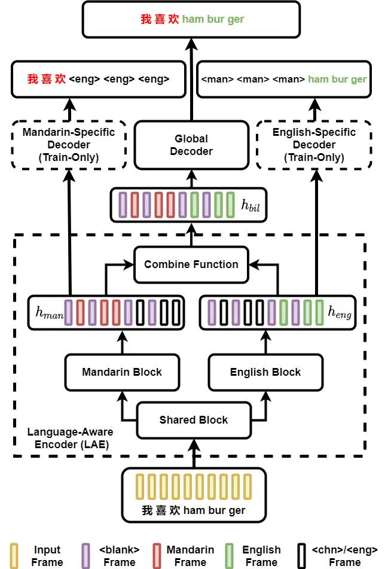

# LAE: Language-Aware Encoder for Monolingual and Multilingual ASR

Jinchuan Tian ^(†)^(†)thanks: This work is done when Jinchuan Tian was
an intern in Tencent AI Lab.    Jianwei Yu    Chunlei Zhang    Chao Weng
   Yuexian Zou    Dong Yu

###### Abstract

Despite the rapid progress in automatic speech recognition (ASR)
research, recognizing multilingual speech using a unified ASR system
remains highly challenging. Previous works on multilingual speech
recognition mainly focus on two directions: recognizing multiple
monolingual speech or recognizing code-switched speech that uses
different languages interchangeably within a single utterance. However,
a pragmatic multilingual recognizer is expected to be compatible with
both directions. In this work, a novel language-aware encoder (LAE)
architecture is proposed to handle both situations by disentangling
language-specific information and generating frame-level language-aware
representations during encoding. In the LAE, the primary encoding is
implemented by the shared block while the language-specific blocks are
used to extract specific representations for each language. To learn
language-specific information discriminatively, a language-aware
training method is proposed to optimize the language-specific blocks in
LAE. Experiments conducted on Mandarin-English code-switched speech
suggest that the proposed LAE is capable of discriminating different
languages in frame-level and shows superior performance on both
monolingual and multilingual ASR tasks. With either a real-recorded or
simulated code-switched dataset, the proposed LAE achieves statistically
significant improvements on both CTC and neural transducer systems. Code
is released¹¹ 1 https://github.com/jctian98/e2e_lfmmi/egs/asrucs.

^(†)^(†)address: ¹ADSPLAB, School of ECE, Peking University, Shenzhen,
China  
²Tencent AI Lab, ³Tencent ASR Oteam^(†)^(†)email: tomasyu@tencent.com;
zouyx@pku.edu.cn

Index Terms: code-switch, multilingual, bilingual, speech recognition

## 1 Introduction

As more than 60% of the population in the world are
multilinguists\[population\], the automatic speech recognition (ASR)
system for multilingual speech is in urgent need. Although rapid
progress has been made in monolingual speech recognition, the
recognition of multilingual speech still remains a challenging
task\[survey\]. In real applications, a pragmatic recognizer is commonly
expected to address two scenarios simultaneously. One is the monolingual
speech from multiple languages, in which only one language is used
within each utterance but the languages used in different utterances
vary. The other is the code-switched speech, in which multiple languages
are used interchangeably within a single utterance.

Most of the previous works mainly focus on monolingual speech from
various languages or the code-switched speech one or the other. For the
former situation, the monolingual speech from multiple languages is
handled by mixing multiple monolingual corpora during
training\[mix_train, mix_train2\]. The latter situation is mainly
addressed by approaches like predicting language-switching
points\[switch2\] or identifying language-IDs\[langid, lid1\], building
unified acoustic\[ssl1, ssl2\] or textual\[bytes\] representations for
all considered languages, integrating language models customized for
code-switch ASR\[mono3, lm1, lm2\], incorporating external monolingual
speech and text resources\[mono1, mono2, mono3\], or enriching the
multilingual corpora by simulated training utterances\[simu1, simu2,
simu3, simu4\]. To our knowledge, the works that indiscriminately
consider both scenarios are still limited\[population, moe, 21, brian\].
Our previous work \[brian\] addresses this problem by factorizing the
multilingual ASR task into monolingual sub-tasks and fine-tuning on
encoders that are inter-independently pre-trained over the monolingual
corpora. Although considerable improvement is achieved in \[brian\], we
argue the pre-training process is time-consuming and its performance is
compromised due to the lack of interaction among the separated encoders.

To recognize both monolingual and code-switched speech consistently, a
desired property of the system is to disentangle the language-specific
information and generate frame-level language-aware representations
during the encoding stage. Then these representations can be partially
used in the monolingual situations and fully explored during the
recognition of code-switched speech. In this work, a novel
language-aware encoder (LAE) architecture is proposed, in which the
utterance is firstly encoded by the shared block and the
language-specific representations for each language are then extracted
by several language-specific blocks. Additionally, a new language-aware
training method enables the model to discriminate different
language-specific information in both utterance-level and frame-level.
For the recognition of each mono-language utterance, only one of the
language-specific blocks is informative while the others stay implicitly
idle. For the code-switched speech, the whole LAE is activated and the
utterance-level encoder output is interlaced from the frame-level
language-aware representations of all languages. The proposed LAE is
applicable to two of the widely used ASR frameworks: connectionist
temporal classification (CTC) \[ctc\] and neural transducers (NTs)
\[rnnt\]. Experiments conducted on ASRU 2019 Mandarin-English
Code-Switch Challenge dataset suggest that the adoption of LAE
architecture outperforms our previous work \[brian\] and achieves
statistically significant improvements: for models trained with either
real-recorded or simulated code-switched data, up to 23.3% and 18.8%
mixed error rate (MER) reductions are obtained.

Our main contributions are summarized as follows: Firstly, we propose a
novel language-aware encoder (LAE) architecture, which is compatible
with both multiple monolingual and code-switched speech. In contrast,
most of the previous works mainly focus on one of these two scenarios.
Secondly, a language-aware training method is provided and the LAE is
allowed to discriminate language-specific information in both
utterance-level and frame-level. Such methods can significantly boost
the performance of multilingual ASR systems with or without
real-recorded code-switched data.

## 2 Language-Aware Encoder

In this section, the proposed language-aware encoder (LAE) architecture,
the language-aware training method and the unified decoding workflow are
introduced in the following three parts respectively.

### 2.1 Language-Aware Encoder Architecture

Fig.1 demonstrates a Mandarin-English bilingual speech recognizer with
the proposed LAE architecture. The input frames are firstly fed into the
shared block followed by the parallel Mandarin and English blocks. The
hidden representations from the two language-specific blocks are then
combined as the LAE hidden outputs $`\mathbf{h}_{\text{bil}}`$ and then
sent to the global decoder to facilitate speech recognition. The shared
encoder is adopted to encode the input frames globally and provide more
interaction in primary stage of encoding. In each of the
language-specific blocks, information from the target language is
captured while the non-target information is expected to be filtered
out.

### 2.2 Language-Aware Training

Although the language-specific blocks are designed with the goal of
disentangling language-specific representations, there is no explicit
guarantee for this discriminative property as the encoding process of
these blocks is symmetric. To allow the language-specific blocks to
discriminatively extract the information from the target language and
filter out the undesired information from other languages, the
language-aware training method is proposed.

During training, a monolingual Mandarin token sequence
$`Y_{\text{man}}`$ is generated from the bilingual target token sequence
$`Y`$ by masking every English token with a special token \<eng\>.
Similarly, a monolingual English token sequence $`Y_{\text{eng}}`$ is
generated with the special token \<man\>. Next, the monolingual Mandarin
token sequence is considered as the target to optimize the output of
Mandarin-specific decoder, which is an auxiliary criterion during
training:

```math
J_{\text{man}}=\text{Aux\_Criterion}(Y_{\text{man}},\text{Decoder}_{\text{man}}(\mathbf{h}_{\text{man}})) \tag{1}
```

A similar auxiliary criterion is also used in the English side:

```math
J_{\text{eng}}=\text{Aux\_Criterion}(Y_{\text{eng}},\text{Decoder}_{\text{eng}}(\mathbf{h}_{\text{eng}})) \tag{2}
```

Finally, the global training objective is the interpolation of the
original training criterion $`J_{\text{ori}}`$ and the mean of these
auxiliary criteria.

```math
J=J_{\text{ori}}+(J_{\text{man}}+J_{\text{eng}})/2 \tag{3}
```

where the original training criterion $`J_{\text{ori}}`$ can be either
CTC criterion or transducer criterion according to the choice of the
global decoder architecture.

In this work, the CTC criterion is consistently adopted as the auxiliary
criterion for simplicity and the language-specific decoders are linear
classifiers. We share the parameters of these language-specific
decoders. As there is no overlap between the sequences
$`Y_{\text{man}}`$ and $`Y_{\text{eng}}`$, sharing these parameters will
not result in a leak of supervision information and can achieve better
alignment between the Mandarin and English blocks in the prediction of
CTC \<blank\>. Also, we make $`Y`$, $`Y_{\text{man}}`$ and
$`Y_{\text{eng}}`$ in the same lengths in the hope that the
language-specific blocks are able to predict the number of tokens when
being inactive.

### 2.3 Unified decoding with global decoder

As shown in Fig.2, for code-switched input, the proposed method is
capable to disentangle the Mandarin and English segments in both
monolingual and code-switched speech. Frames belonging to English and
Mandarin can be extracted in English block outputs
$`\mathbf{h}_{\text{man}}`$ and Mandarin block outputs
$`\mathbf{h}_{\text{eng}}`$ respectively. For the monolingual input, the
corresponding language-specific block is activated to predict ordinary
token sequence while the other language-specific blocks are implicitly
idle: they only predict the number of tokens by predicting repetitive
masking symbols. Since there will be limited overlapping between the
Mandarin and English frames, it is reasonable to simply combine
$`\mathbf{h}_{\text{man}}`$ and $`\mathbf{h}_{\text{eng}}`$ with the
frame-level addition:

```math
\mathbf{h}_{\text{bil}}=\mathbf{h}_{\text{man}}\oplus\mathbf{h}_{\text{eng}} \tag{4}
```

$`\mathbf{h}_{\text{bil}}`$ keeps the original order of the English and
Mandarin segments and keeps the highly representative nature of
$`\mathbf{h}_{\text{man}}`$ and $`\mathbf{h}_{\text{eng}}`$ for
decoding. With $`\mathbf{h}_{\text{bil}}`$, the global decoder can be
used to recognize both the Mandarin and English monolingual speech and
the code-switch speech in a unified manner.



Figure 1: Mandarin-English Bilingual Speech Recognizer with Proposed
Language-Aware Encoder (LAE) Architecture. (English translation of input
utterance: I like hamburger)

Figure 2: CTC distributions generated by CTC Mandarin and
English-specific decoders for different input speech. Left: code-switch
input; middle: monolingual Mandarin input; right: monolingual English
input.

## 3 Experiments

In this section, the experimental setup is introduced in section 3.1.
The performance of the proposed method is firstly verified on the
real-recorded code-switch speech dataset in section 3.2. The model’s
ability to discriminate languages is demonstrated in section 3.3. As the
scarcity of multilingual data is widely concerned and data simulation
methods are generally adopted for alleviation, it is of great importance
to confirm that the proposed method can benefit from the simulated
multilingual data. To this end, experiments on the simulated code-switch
speech are further conducted in section .

### 3.1 Experimental Setup

All experiments are conducted on the ASRU 2019 Mandarin-English
Code-Switch dataset\[data\], in which 200h code-switched speech and 500h
Mandarin speech are provided. Following \[brian\], 500h accented English
data²² 2 http://speechocean.com is also used as the mono-English data.
By default, all monolingual utterances are used in training. A simulated
code-switch speech training set called Simu-CS is additionally generated
by simply splicing the raw waves and the corresponding transcriptions
from the monolingual speech. This simulated data also has the size of
200h and the length of each utterance is below 12 seconds. The
code-switch evaluation set is officially provided and the monolingual
evaluation sets are generated following \[brian\]. For both global
decoder and language-specific decoders, the predictions are based on a
fixed vocabulary, which contains 4294 Mandarin characters, 5000 English
BPE \[bpe\] tokens and three special tokens: \<blank\>, \<man\> and
\<eng\>.

The input features are 80-dim Fbank features plus 3-dim pitch features.
These features are sub-sampled with a factor of 4 by a two-layer CNN
before being fed into the encoders. All encoders are stacked
Conformer\[conformer\] layers, in which the attention dimension,
feed-forward dimension, number of attention heads, number of
convolutional kernels are fixed to 512, 2048, 4, 31 respectively. Three
encoder architectures with similar parameter budgets are designed for
comparison: Vallina: 15 stacked Conformer layers. Bi-Encoder: two
separated encoders with 8 Conformer layers stacked each. Language-Aware
Encoder (LAE): the shared block contains 9 conformer layers while the
language-specific blocks consist of 3 Conformer layers each. For the CTC
system, the encoder output is linearly classified to make predictions.
The global decoder of the NT system consists of a 2048-dim LSTM
prediction network and a 256-dim MLP joint network.

All models are optimized by Adam optimizer with warm-up steps of 25k,
peak learning rate of 3e-4 and inverse square root decay schedule. The
training process lasts for 100 epochs and is implemented on 8 Tesla V100
GPUs. The effective batch size is 512 with a gradient accumulation
number of 8. SpecAugment\[specaug\] is consistently used with 2 time
masks and 2 frequency masks. The checkpoints from the last 10 epochs are
averaged before evaluation. Standard CTC prefix search and ALSD
algorithm \[alsd\] are adopted for CTC and NT decoding respectively with
a fixed beam size of 10. A word-level 5-gram language model\[wngram\]
trained from all training transcriptions is optionally used with a fixed
weight of 0.2. We report both code-switched and monolingual results
following \[brian\]. Code is mainly revised from Espnet\[espnet\].

|             |                                             |             |           |           |             |           |
| ----------- | ------------------------------------------- | ----------- | --------- | --------- | ----------- | --------- |
| \topruleNo. | System                                      | Code-Switch |           |           | Monolingual |           |
|             |                                             | All (MER)   | Man (CER) | Eng (WER) | Man (CER)   | Eng (WER) |
| Literature  |                                             |             |           |           |             |           |
|             | Single NT \[21, population\]                | 11.3        | 9.3       | 30.8      | 6.5         | 17.8      |
|             | Gating NT \[moe, population\]               | 11.2        | 8.8       | 34.7      | 5.7         | 34.6      |
|             | Factorized NT + Pre-train\[brian\]          | 10.2        | 8.1       | 29.2      | 5.3         | 16.3      |
|             | Hybrid CTC-Attention \[shuaizhang\]         | 9.5         | 7.6       | 25.0      | \-          | \-        |
| Our Results |                                             |             |           |           |             |           |
| 1           | Vallina CTC (baseline)                      | 11.6        | 9.2       | 38.7      | 5.1         | 20.3      |
| 2           | Bi-Encoder CTC                              | 10.3        | 8.1       | 36.1      | 3.6         | 19.4      |
| 3           |    + Language-Aware Training                | 10.2        | 8.1       | 34.7      | 3.6         | 19.1      |
| 4           | LAE CTC                                     | 10.3        | 8.2       | 34.9      | 3.5         | 18.5      |
| 5           |    + Language-Aware Training (proposed)     | 9.5         | 7.5       | 33.1      | 3.2         | 17.7      |
| 6           |    + word N-gram LM                         | 8.9\*       | 7.0\*     | 30.9\*    | 2.4\*       | 17.0\*    |
| 7           | Vallina NT (baseline)                       | 9.5         | 7.9       | 28.6      | 3.8         | 16.6      |
| 8           | Bi-Encoder NT                               | 9.9         | 8.2       | 29.3      | 3.9         | 17.7      |
| 9           | LAE NT + Language-Aware Training (proposed) | 9.1         | 7.5       | 28.2      | 3.4         | 16.4      |
| 10          |    + N-gram LM                              | 8.9\*       | 7.3\*     | 27.7\*    | 2.7\*       | 15.9\*    |
| \bottomrule |                                             |             |           |           |             |           |

Table 1: Performance of models trained on both monolingual and
real-recorded code-switch data. \* means statistically significant
improvement compared with the baseline systems.

### 3.2 Results with real-recorded code-switch speech

The results with real-recorded code-switch and monolingual training data
are reported in table 1. Our main observations are reported as follows.

Overall performance: As shown in table 1, the proposed method achieves
significant performance improvement on both CTC and NT systems. For the
CTC system, the relative improvements on code-switch, mono-Mandarin and
mono-English evaluation sets are 23.3%, 52.9% and 16.3% respectively
(exp.1 vs. exp.6) while these numbers for the NT system are 6.3%, 28.9%
and 4.2% (exp.7 vs. exp.10). The significance of these improvements is
further confirmed by matched pairs sentence-segment word error (MAPSSWE)
based significant test³³ 3 https://github.com/talhanai/wer-sigtest with
the significant level of $`p=0.001`$. The results in exp.6 and exp.10
verify that the proposed method is applicable to both monolingual and
code-switch scenarios simultaneously.

Language-Aware Training for LAE: Compared with the vallina CTC system,
considerable improvement is provided by the LAE architecture (exp.1 vs.
exp.4). Similar improvement is also achieved by the Bi-Encoder
architecture (exp.1 vs. exp.2), which emphasizes the necessity of
handling each language by a specific block. Further study shows that the
error reduction provided by language-aware training in Bi-Encoder
architecture is marginal (exp.2 vs. exp.3, also observed in \[brian\])
while the adoption of language-aware training on the proposed LAE system
provides up to 0.8% absolute improvement (exp.4 vs. exp.5). This
observation implies the adoption of the shared block is beneficial. The
adoption of LAE architecture and language-aware training also provides
up to 1.3% absolute improvement on NT systems (exp.8 vs. exp.9). In
summary, the combination of the LAE and the language-aware training
shows superior performance on both CTC and NT systems.

Comparison between CTC and NT system. With the same LAE architecture,
the NT system outperforms the CTC system if no language models are
integrated (exp.5 vs. exp.9). As the performance differences are mainly
in the English scenarios, this phenomenon can be attributed to the
well-known conditional independence assumption of the CTC system\[ctc\]:
English words need more context dependency to spell words correctly.
Further investigation demonstrates that the language models are more
beneficial on the CTC system than on the NT system (exp.6 vs. exp.10),
so we suppose the conditional-independence of CTC is alleviated by the
context information in language models.

### 3.3 Ability to discriminate languages

In this part, we experimentally show that the proposed model is capable
to discriminate the language-specific representations in both
utterance-level and frame-level.

For utterance-level capability, an additional language classifier is
applied to the time-dimensional mean value of LAE hidden output
$`\mathbf{h}_{\text{bil}}`$ during training to tell an utterance is
mono-English, mono-Mandarin or code-switched. As suggested in table ,
the accuracy over the three evaluation sets is all above 99.6%, which
implies the output of LAE provides strong evidence to classify the
utterance.
