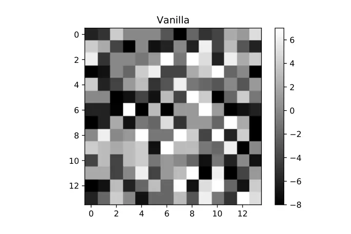
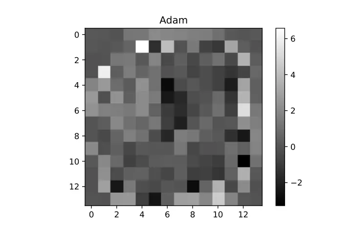
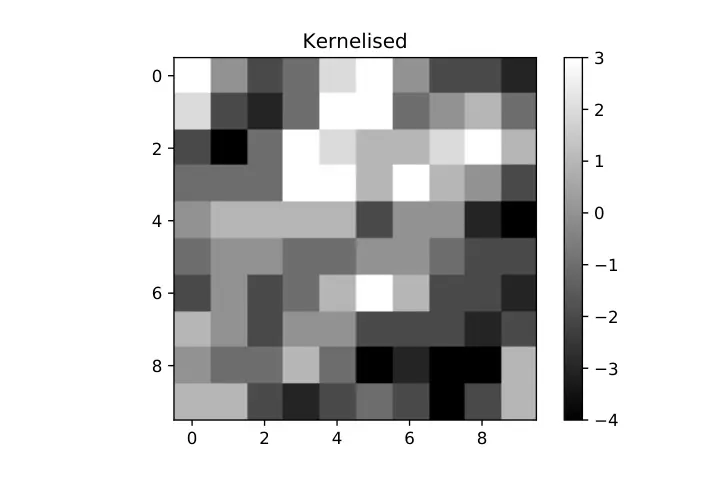

# Training Neural Networks using SAT solvers

Subham Sekhar Sahoo Affiliation: Department of Electrical Engineering
Affiliation: Indian Institute of Technology - Kharagpur
Email: [subbham@iitkgp.ac.in](mailto:)

###### Abstract

We propose an algorithm to explore the global optimization method, using
SAT solvers, for training a neural net. Deep Neural Networks have
achieved great feats in tasks like- image recognition, speech
recognition, etc. Much of their success can be attributed to the
gradient-based optimisation methods, which scale well to huge datasets
while still giving solutions, better than any other existing methods.
However, though, there exist a chunk of learning problems like the
parity function and the Fast Fourier Transform, where a neural network
using gradient- based optimisation algorithm can’t capture the
underlying structure of the learning task properly (1). Thus, exploring
global optimisation methods is of utmost interest as the gradient-based
methods get stuck in local optima. In the experiments, we demonstrate
the effectiveness of our algorithm against the ADAM optimiser in certain
tasks like parity learning. However, in the case of image classification
on the MNIST Dataset, the performance of our algorithm was less than
satisfactory. We further discuss the role of the size of the training
dataset and the hyper-parameter settings in keeping things scalable for
a SAT solver.

## 1 Introduction

Machine Learning, at its core, is an optimisation problem. With highly
non-linear models like neural networks, which have ushered a revolution
in many fields of machine learning over the past decade or so,
optimisation is still a challenging and non-trivial task. The state of
the art optimisers for Neural Networks such as Adam, Adagrad and RMSProp
get stuck in spurious local optima. Finding a globally optimal solution
is NP Hard. And to tackle this issue we leverage the prowess of SAT
solvers which are highly engineered to find solutions to NP Hard
Problems. The popular optimisation methods rely on a gradient based
optimisation scheme and hence suffer from many drawbacks. For example,
exploding and vanishing gradients tend to destabilise training and to
mitigate this one has to resort to techniques like batch-normalisation.
Including a suitable regularisation strategy, they have a large number
of hyperparameters to tune and finding a good combination of which is
resource hungry and often requires intuition and experience. Above all,
these being greedy strategies we always end up with a sub-optimal
solution. Thus we want need to move over the current trend of gradient
based update methods and further strive to make neural network
optimisation an elegant process with a minimal number of
hyper-parameters to tune. In this paper we propose a non-greedy
optimisation method to train a neural network featuring discrete
weights. After bit-blasting the output of the neural network, we
formulate the cost function as a Satisfiability problem a solution to
which is found by using a SAT solver. As The weights and inputs being
discretized we show how a modified version of relu called stepped-relu
generalises better as an activation function. The number of
hyper-parameters in our method is way lesser than the state of the art
optimisers. Our method being non-greedy finds a global minima wrt to the
mini-batch of training examples. To make our algorithm scalable to huge
datasets, we propose a method to parallelise training across batches of
training data. Lastly a novel method to decrease the solving time of the
sat solvers has been discussed.

## 2 Related Works

The goal of this work is to design a non-gready optimisation scheme for
neural networks. To do this, the cost function of the neural network is
mapped to a SAT encoding and further SAT solvers were used to find an
assignment to the formula. Using such an encoding, Nina et al. \[1\]
explored various properties of a Binarized Neural Network like
robustness to adverserial perturbations. Furthermore, Huang et al. \[2\]
proposed a general framework for automated verification of safety of
classification decisions made by feed-forward deep neural networks which
leverages SMT solvers and SAT encodings. Zahra et al. \[3\] proposed a
framework that enables an untrusted server (the cloud) to provide a
client with a short mathematical proof of the correctness of inference
tasks that they perform on behalf of the client

## 3 Reducing to Satisfiability

### 3.1 Satisfiability

The Boolean satisfiability problem (sometimes called propositional
satisfiability problem and abbreviated SAT) is the problem of
determining if there exists an interpretation that satisfies a given
Boolean formula. In other words, it asks whether the variables of a
given Boolean formula can be consistently replaced by the values TRUE or
FALSE in such a way that the formula evaluates to TRUE. For example a
neural network model with let’s say two variables only, $`l_{1}`$ and
$`l_{2}`$, could look like -

```math
\Sigma=(l_{1}\vee l_{2}\vee t_{0})\wedge(\bar{l}_{1}\vee l_{2}\vee\bar{t}_{0})
```

where $`t_{0}`$ is a temporary variable, created in the process of
breaking the cost function into CNF.

### 3.2 Bit Blasting

The primary idea here is to decompose the weight variables into bits and
using binary arithmetics for addition, multiplication and non-linear
activations reduce the cost function to a 0-1 optimisation problem. The
weights bear a signed binary representation. A weight w is represented
as,

```math
w=w_{0}w_{1}\dots w_{n-2}w_{n-1}, \tag{1}
```

where $`w_{0}`$ is the sign bit. The decimal value of w is then,

```math
w_{decimal}=-2^{n-1}w_{0}+2^{n-2}w_{1}\dots 2^{1}w_{n-2}+2^{0}w_{n-1} \tag{2}
```

### 3.3 Signed and Unsigned Addition

Addition of 2 signed numbers is done by carry look ahead adder method as
shown in algorithm 1 and setting the type to ’signed’. As the sum has to
be represented in the same number of bits as addends’ , a constraint is
generated which has to be satified for a valid addition. For example, in
the case of signed addition, the constraint is carryin = carryout wrt to
the signed bit. And for unsigned addition, the constraint is carryout
from the signed bit = 0. These constraints are then converted to CNF
formula. We do so by using z3 solver.

Input: BitVectors: $`a={a_{0}a_{1}\dots a_{n-2}a_{n-1}}`$,
$`b={b_{0}b_{1}\dots b_{n-2}b_{n-1}}`$, $`type\in\{signed,unsigned\}`$  
Output: BitVector $`y={y_{0}y_{1}\dots y_{n-2}y_{n-1}}`$, with
$`y_{n-1}`$ and 1 constraint

1:  $`n\leftarrow length(a)`$

2:  $`carryPrev\leftarrow 0`$

3:  $`carry\leftarrow 0`$

4:  for $`i\leftarrow n-1`$ to $`0`$ do

5:   $`carryPrev\leftarrow carry`$

6:   $`G\leftarrow a_{i}\wedge b_{i}`$

7:   $`P\leftarrow a_{i}\vee b_{i}`$

8:   $`y_{i}\leftarrow G\oplus P\oplus carryPrev`$

9:   $`carry\leftarrow G\vee(P\wedge carryPrev)`$

10:  end for

11:  if $`type=signed`$ then

12:   $`constraint\leftarrow carry==carryPrev`$

13:  else

14:   $`constraint\leftarrow carry==0`$

15:   return $`y,constraint`$

16:  end if

Algorithm 1 Bitwise Addition: bitwiseAdd

### 3.4 Signed Multiplication

First we convert the multiplicands into their magnitudes and then
perform repeated unsigned addition by shift and add method. Having found
the magnitude, we assign a positive sign to it if the multiplicands are
of the same sign, else a negative sign. The algorithm 2 illustrates the
steps for this.

Input: BitVectors: $`a={a_{0}a_{1}\dots a_{n-2}a_{n-1}}`$,
$`b={b_{0}b_{1}\dots b_{n-2}b_{n-1}}`$  
Output: BitVector $`y={y_{0}y_{1}\dots y_{n-2}y_{n-1}}`$, with
$`y_{n-1}`$ and constraints

1:  $`n\leftarrow length(a)`$

2:  $`a_{sign}\leftarrow a_{0}`$

3:  $`b_{sign}\leftarrow b_{0}`$

4:  Initialise $`product`$ with slack_bits number of 0

5:  Initialise $`a^{mag},b^{mag}`$ with num_bits number of 0

6:  for $`i\leftarrow 0`$ to $`n-1`$ do

7:   $`a_{i}\leftarrow a_{0}\oplus a_{i}`$

8:   $`b_{i}\leftarrow b_{0}\oplus b_{i}`$

9:  end for

10:  $`a^{mag}_{n-1}\leftarrow a_{sign}`$

11:  $`b^{mag}_{n-1}\leftarrow b_{sign}`$

12:  a, constraint = bitwiseAdd(a, $`a^{mag}`$, signed)

13:  constraints $`\leftarrow`$ {constraint}

14:  b, constraint = bitwiseAdd(b, $`b^{mag}`$, signed)

15:  constraints $`\leftarrow`$ constraints $`\cup`$ {constraint}

16:  for $`i\leftarrow n-1`$ to $`0`$ do

17:   Initialise $`b^{new}`$ with slack_bits number of 0

18:   for $`j\leftarrow 0`$ to $`n-1`$ do

19:    $`b^{new}_{slack\_bits-1-j}\leftarrow b_{n-1-j}\wedge a_{i}`$

20:   end for

21:   product, constraint = bitwiseAdd(product, $`b^{new}`$, unisgned)

22:   constraints $`\leftarrow`$ constraints $`\cup`$ {constraint}

23:  end for

24:  for $`i\leftarrow 0`$ to $`slack\_bits-product\_magnitude\_bits`$
do

25:   constraints $`\leftarrow`$ constraints $`\cup`$ {$`product_{i}`$
== 0}

26:  end for

27:  $`product_{sign}\leftarrow a_{sign}\oplus b_{sign}`$

28:  Initialise $`product^{mag}`$ with slack_bits number of 0

29:  $`product^{mag}_{slack\_bits-1}\leftarrow product_{sign}`$

30:  for $`i\leftarrow slack\_bits-1`$ to $`0`$ do

31:   $`product_{i}\leftarrow product_{sign}\oplus product_{i}`$

32:  end for

33:  product, constraint = bitwiseAdd(product, $`product^{mag}`$,
signed)

34:  constraints $`\leftarrow`$ constraints $`\cup`$ {constraint}

35:  return $`y,constraints`$

Algorithm 2 Bitwise Multiplication: bitwiseMul

The multiplicands are expressed in 2\*num_bits number of bits. The hyper
parameter product_magnitude_bits sets a limit on the magnitude of the
product. Ideally product_magnitude_bits = 2\*num_bits-1 But, we can set
it to a lower value which would generate constraints corresponding to
product \< $`2^{\textit{product\_magnitude\_bits}+1}`$. This speeds up
SAT solvers by limiting our search space to a much smaller domain, with
a compromise in the accuracy.

### 3.5 Weighted Sum

After the $`w_{i}*x_{i}`$ operation, we need to add all such products,
which then would be the input to one of the neurons in the next layer.
Hence if the number of nodes in the previous layer is large, this raises
a concern. Addition is done sequentially, this means there is an
inherent upper bound on the partial sum. So, we introduce another
hyper-parameter called slack*bits. Each term $`w*{i}\*x\_{i}`$ is sign
extended from 2\*num_bits to slack_bits number of bits. This mitigates
the problem as now we can accommodate large temporary partial sums. Then
this would mean that the input to the next layer would be in slack_bits
number of bits. To prevent this, after doing the weighted sum, we get
rid of the least signigicant bits, to reduce the number of bits from
slack_bits to num_bits. In decimal, this corresponds to division with
$`2^{\textit{slack_bits}-\textit{num_bits}}`$. Note, unlike other
weights, the bias is represented in slack_bits number of bits.

### 3.6 Activation Function

The hidden layer of the neural network features a non-linear activation
function. We use Rectified Linear Unit (Relu) for this purpose.

```math
relu(x)=\begin{cases}x,&\text{if x $>$ 0.}\\
0,&\text{otherwise.}\end{cases}
```

Lets see how relu activation function transforms the input bits into the
output bits. When the output $`x<0`$, $`x_{n-1}`$ the sign bit is 1. The
output of relu should be 0 (in decimal),i.e the output bits are set to 0. This is achieved by and-ing rest of the bits with MSB. Notice how the
output is the same as input when the input is a positive number i.e the
sign bit is 0. So,

```math
relu(x_{n-1}x_{n-2}\ \dots\ x_{1}x_{0})=0\ \overline{x_{n-1}}\wedge x_{n-2}\ \dots\ \\
\overline{x_{n-1}}\wedge x_{1}\ \overline{x_{n-1}}\wedge x_{0} \tag{3}
```

Note the input to the activation function is in slack_bits number of
bits. Because the output of this node further would be multiplied with a
weight which is in num_bits number of bits, we want the output to be
also represented in num_bits number of bits. Also we don’t want the
output to blow up with each forward pass. Thus the activation function
itself should take care of this. So if we want relu as an activation
function, we have to clip it’s maximum value at $`2^{num\_bits-1}`$-1.
In this way the output can always be represented in num_bits number of
bits with the MSB being the sign bit. The activation function is shown
in figure and algorithm 3 describes the operation.

Input: BitVector $`x={x_{0}x_{1}\dots x_{n-1}x_{n-1}}`$  
Output: BitVector $`x={y_{0}y_{1}\dots y_{n-1}y_{n-1}}`$

1:  $`n\leftarrow length(x)`$

2:  for $`i\leftarrow 1`$ to $`n-1`$ do

3:   $`y_{i}\leftarrow x_{i}\wedge\overline{x_{n-1}}`$

4:  end for

5:  $`y_{0}`$ $`\leftarrow`$ $`0`$

6:  return $`y`$

Algorithm 3 Activation Function: Relu

Input: BitVector $`x={x_{0}x_{1}\dots x_{n-1}x_{n-1}}`$ Output:
BitVector $`x={y_{0}y_{1}\dots y_{n-1}y_{n-1}}`$ and a list of
constraints.

1:  n $`\leftarrow`$ length(x)

2:  temp $`\leftarrow`$ Relu(x)

3:  temp $`\leftarrow`$
$`temp_{0}temp_{1}\dots temp_{n-1-regret\_bits}`$

4:  Prepend temp with 0s to make its length n

5:  for $`i\leftarrow 0`$ to $`n-1`$ do

6:   $`linearShiftDown_{i}\leftarrow 1`$

7:   $`linearShiftUp_{i}\leftarrow 0`$

8:  end for

9:  for $`i\leftarrow n-num\_bits`$ to $`n-2`$ do

10:   $`linearShiftDown_{i}\leftarrow 0`$

11:  end for

12:  for $`i\leftarrow n-num\_bits`$ to $`n-1`$ do

13:   $`linearShiftUp_{i}\leftarrow 1`$

14:  end for

15:  temp, constraintDown $`\leftarrow`$ bitwiseAdd(temp,
linearShiftDown, signed)

16:  for $`i\leftarrow 1`$ to $`n-1`$ do

17:   $`temp_{i}\leftarrow temp_{i}\wedge temp_{0}`$

18:  end for

19:  temp, constraintUp $`\leftarrow`$ bitwiseAdd(temp, linearShiftUp,
signed)

20:  constraints $`\leftarrow`$ (constraintDown, constraintUp)

21:  y $`\leftarrow y_{slack\_bits-1-num\_bits}\dots y_{slack\_bits-1}`$

22:  return $`y,constraints`$

Algorithm 4 Activation Function: Relu_clipped

In the above plot we see that due to clipping at 7, the output can be
represented in 4 bits. There is one problem: Because the $`w_{i}`$ and
$`x_{i}`$ are discrete, the input to a hidden node is very much
susceptible to a slight change in $`x_{i}`$ which would hamper the
generalising capability of the neural network. Hence to smoothen things
out, we get rid of the last few least significant bits of the output,
denoted as regret_bits, of the input and then apply the activation
function. Getting rid of the last regret_bits bits has a effect of
division with $`2^{regret\_bits}`$.

### 3.7 Architectures

We propose two Neural Network Architectures namely-

- •
  Vanilla Neural Network: The standard feedword network with relu
  activation function, a single hidden layer with 10 hidden neurons and
  one single output node.
- •
  Kernelised Neural Network: To take care of the problem as discussed in
  the discussion section, we want that the weights (in the first layer
  only) corresponding to the neighbouring pixels of the input image
  should not vary significantly. Hence we can have a square matrix and a
  sliding window of size window_size. And the weights of the neural
  network are the average of the elements in the sliding window with
  stride window_stride.

### 3.8 Cost Function

We propose a cost function for a binary classification problem. The
final output layer has a single neuron. The cost function, where y is
the output:

$`y\geq+2^{\textit{cost\_bits}}`$ if $`label=+ve`$

$`y\leq-2^{\textit{cost\_bits}}`$ if $`label=-ve`$

Note that y is represented in slack_bits number of bits. To implement
the above cost function, we follow the algoithm 5.

Input: BitVector $`x={x_{0}x_{1}\dots x_{n-1}x_{n-1}}`$,
$`label\in\{-1,+1\}`$  
Output: constraints

1:  $`n\leftarrow length(x)`$

2:  if y is +1 then

3:
  $`constraints\leftarrow\{x_{0}==0,\bigvee\limits_{i=1}^{n-cost\_bits-1}x_{i}==1\}`$

4:  else

5:
  $`constraints\leftarrow\{x_{0}==1,\bigwedge\limits_{i=1}^{n-cost\_bits-1}x_{i}==0\}`$

6:  end if

7:  return $`constraints`$

Algorithm 5 Cost Function: cost

## 4 Implementation

We start with a small experiment to check whether we can classify
linearly separable points by training a perceptron model using this
approach. The input was a 4 dimensional vector with each number being 0
or 1. A labeling function
$`y_{label}=sign(2x_{0}+3x_{1}-4x_{2}-2x_{3}+1)`$ was chosen and used to
label the points. Then the perceptron model described by
$`y=w_{0}x_{0}+w_{1}x_{1}+w_{2}x_{2}+w_{3}x_{3}+b`$ was declared and the
weights $`w_{0\dots 3}`$ and the bias are expressed with num_bits = 4,
product_magnitude_bits = 7, slack_bits = 8. Using the bitwiseAdd and
bitwiseMul method described as above, we express y in 8 bits. Setting
the cost_bits = 0 we get SAT. The dataset and assignments are given in
?.

### 4.1 Dataset and Pre-processing

#### 4.1.1 MNIST

We run our experiments on MNIST Dataset. We want to learn a
3-recogniser. For this we first separate 3 and non-3 images. Then create
a train and test set of sizes 63 and 10139 with same number of both
types. We follow 2 different pre-processing schemes for the vanilla and
Kernelised Neural Network. The reasoning and details follow:

- •
  Vanilla Neural Network: Downsampled the 28\*28 image to 14\*14 image.
- •
  Kernelised Neural Network: Borders with zero pixel values were removed
  while preserving the square structure of the image. Then downsampled
  to 10\*10 image.

After pre-processing, the images were reshaped to a single dimensional
form. Individual pixels (floating point number varying between 0 and 1)
were discretized and represented in num_bits number of bits. The
following transformation gives the decimal representation of each pixel
with value pixel_val:

$`K=int(pixel\_val*(2^{\alpha}-1))`$

where $`\alpha=num\_bits-preprocess\_psub`$ and
$`1<\alpha<\textit{num\_bits}`$. Then K represented in num_bits number
of bits, is the discretized value for that pixel. In our experiments we
set $`\alpha`$ = 2. It was observed that, with $`\alpha>`$ 2, the SAT
solver couldn’t find a solution to the cnf.

#### 4.1.2 Parity Learning

Nye et al. \[4\] show that gradient based optmisers like \[5\], cannot
be used to train a deep neural network to learn the parity function. So,
to test our algorithm we create two datasets of binary input vectors
with $`dimensionality\in\{8,16\}`$. To label every training example, we
first randomly choose bit positions, and then the label for that
particular data becomes the xor of the bits present in those positions.
For example, for the dataset with dimensionality = 8, the positions
chosen were 0, 1, 3, and 5. So, the $`i^{th}`$ example $`x_{i}`$ has the
label $`y_{i}`$ as,

```math
y_{i}=x_{i}[0]\oplus x_{i}[1]\oplus x_{i}[3]\oplus x_{i}[5]
```

Similarly, for dimentionality = 16, the positions were 0, 1, 2, 3, 4, 6,
11, and 14.

### 4.2 Generating CNF

We use z3 solver to declare the weights of the neural network and its’
libraries to do the binary arithmetic. The forward pass of an image
generates constraints (boolean equalities) because of addition,
multiplication, activation functions and cost functions. The constraints
for all the images in a given batch are fed to z3 solver, which then
breaks down the complex expressions into cnf format. Let’s denote the
generated clauses by $`\Sigma_{i}`$ for $`i^{th}`$ batch.

### 4.3 Training

From the train set of 63 images, we randomly sample 20 batches with
batch_size 30. The training is divided into 2 phases-

- •
  We generate $`\Sigma_{i}`$ for i: 1 $`\rightarrow`$ $`num\_batch`$.
  Then Using the following principle we collect implications from every
  batch.

  $`\Sigma_{i}\implies\overline{x_{j}}\vee x_{k}\vee\overline{x_{l}}\iff\Sigma_{i}\wedge{x_{j}\wedge\overline{x_{k}}\wedge x_{l}}`$
  is UNSAT

  From above we conclude if $`x_{j},x_{k}`$ and $`x_{l}`$ were assigned
  1, 0 and 1 respectively in $`\Sigma_{i}`$ and $`\Sigma_{i}`$ becomes
  UNSAT, then $`\overline{x_{j}}\vee x_{k}\vee\overline{x_{l}}`$ is a
  learned clause. Every implied clause carries information on how the
  weight variables are related among themselves to correctly classify
  that particular batch. Let $`\lambda_{i}`$ be defined such as:

  ```math
  \lambda_{i}=\{l\mid\Sigma_{i}\Rightarrow l\}
  ```

  $`\lambda_{i}`$ is generated in the following manner 6. Multiple
  batches are run parallely across different machines. One thing to note
  is time taken to find $`\Sigma\wedge literals`$ grows as varChunkSize
  decreases. Because we don’t want to get stuck at one such
  initialisation, we choose to halt the process for a given assignment
  of literals if we don’t find UNSAT in time = 180 seconds of run time.
  This number was chosen empirically.

- •
  After all the processes are complete in the previous step, we combine
  get

  ```math
  \lambda^{all}=\bigwedge\limits_{i=1}^{num\_batches}\lambda_{i}
  ```

  To find an assignment we run SAT solvers on all
  $`\Sigma^{all}_{i}=\Sigma_{i}\wedge\lambda^{all}`$ parallely across
  multiple machines.

Input: Clauses $`\Sigma`$  
Output: Implied Clauses $`\lambda`$

1:  n $`\leftarrow`$ length(vars)

2:  varChunkSize $`\leftarrow`$ n

3:  Initialise $`\lambda`$={}

4:  while getting learned clauses do

5:   s $`\leftarrow\lceil\frac{n}{varChunkSize}\rceil`$

6:   count $`\leftarrow`$ 0

7:   while count $`<`$ 100 do

8:    for $`i\leftarrow 1`$ to s do

9:     literals $`\leftarrow`$ randomly sample varChunkSize no. of
elements from vars

10:     randomly set each element in literals to either 0 or 1

11:     if $`\Sigma\wedge literals`$ is UNSAT then

12:
     $`\lambda\leftarrow\lambda\cup\{\bigvee\limits_{j=1}^{varChunkSize}\overline{x_{j}}`$
$`\forall x_{j}\in literals\}`$

13:     end if

14:    end for

15:    count $`\leftarrow`$ count+1

16:   end while

17:   varChunkSize $`\leftarrow`$ max(varChunkSize - 0.05\*varChunkSize, 50)

18:  end while

19:  return $`\lambda`$

Algorithm 6 Clause Sharing: ImpliedClauses

### 4.4 Speeding Up computations in SAT Solver

With the given choice of batch*size and architecture of the Network
Network, the SAT solver could not find a solution to the
$`\Sigma^{all}*{i}`$ in 48 hours of running the code. However things are
boosted significantly by randomly setting a chunk of the model variables
to either 0s or 1s and then running the solver. We start by assigning
some 90% model variables randomly to 0s and 1s and follow the curriculum
is shown in 7. This also empowers us to find multiple solutions which
are much different from each other. As varChunkSize decreases, the
likelihood to find a solution and solving time both increase.

Input: Clauses $`\Sigma`$, model variables vars  
Output: Solutions to the Clauses $`\lambda`$

1:  n $`\leftarrow`$ length(vars)

2:  Initialise sols={}

3:  solFound $`\leftarrow`$ 0

4:  while solFound $`<`$ numSols do

5:   count $`\leftarrow`$ 0

6:   while count $`<`$ 100 do

7:    for $`i\leftarrow 0`$ to s do

8:     literals $`\leftarrow`$ randomly sample varChunkSize no. of
elements from vars

9:     randomly set each element in literals to either 0 or 1

10:     if $`\Sigma\wedge literals`$ is SAT then

11:      assignment $`\leftarrow`$ solution to $`\Sigma\wedge literals`$

12:      $`sols\leftarrow sols\cup`$ {assignment}

13:      solFound $`\leftarrow`$ solFound+1

14:      if $`size(sols)=numSols`$ then

15:       return $`sols`$

16:      end if

17:     end if

18:    end for

19:    count $`\leftarrow`$ count+1

20:   end while

21:   varChunkSize $`\leftarrow`$ max(varChunkSize - 0.05\*varChunkSize, 50)

22:  end while

23:  return $`sols`$

Algorithm 7 Solving: AssumptionSolving

## 5 Results

Experiments were done to see how various parameters and model
architectures influence the qualitiy of a solution found by the Sat
Solver. For experiments in 1,2, 3, 4 each instance of the solver was run
on a 8 core cpu with hyper-threading, 16 GB RAM and 4 plingeling solver
threads. The experiments in 6 and 5 were run on a 24 core machine with
hyperthreading, 32GB RAM and 12 plingeling threads as finding a solution
was much harder in these cases. For all the experiments num_bits = 4,
product_magnitude_bits = 7 and a neural network with a single hidden
layer with 10 nodes were used unless otherwise stated.

In table 1, we set slack_bits = 8, cost_bits = 3, and observe that
increasing regret_bits improves generalising capacity of the neural
network. slack_bits bottle-neck the weighted sums. For example, if the
input node is of 196 dimensions, hidden nodes in the subsequent layer
receive the weighted sum of 196 numbers. With slackBits set to 8, we
impose a constraint such which enforces partial sums to be small enough
to be stored as a 8 bit fixed-point number. To study the effect of
slackBits, in table 2, we set cost_bits = 4, we find that increasing
slack_bits doesn’t improve accuracy. Because
$`regret\_bits\leq slack\_bits-num\_bits`$, with more slack_bits we
could vary the regret_bits too. And we see that increasing
$`regret\_bits`$ doesn’t make accuracy any better.

| regret_bits | Min    | Median | Max    |
| ----------- | ------ | ------ | ------ |
| 2           | 47.98% | 60.93% | 74.62% |
| 3           | 51.79% | 66.36% | 77.15% |
| 4           | 41.48% | 67.18% | 82.04% |

Table 1: Variation with regret_bits

| slack_bits | regret_bits | Min    | Median | Max    |
| ---------- | ----------- | ------ | ------ | ------ |
| 8          | 4           | 53.46% | 71.08% | 82.81% |
| 9          | 5           | 58.62% | 74.37% | 80.11% |
| 10         | 6           | 61.00% | 71.87% | 80.51% |

Table 2: Variation with slack_bits

In table 3, with regret*bits = 4, slack_bits = 8, we realise even with
stronger separations between $`y*{pred}^{+}`$ and $`y\_{pred}^{-}`$ the
accuracy doesn’t go up. In table 4, we study if increasing the
complexity of the neural network improves the accuracy. We set
regret_bits = 4, cost_bits = 4, slack_bits = 8. The accuracy still
doesn’t improve.

| Type | Min    | Median | Max    |
| ---- | ------ | ------ | ------ |
| 3    | 41.48% | 67.18% | 82.04% |
| 4    | 53.46% | 71.08% | 82.81% |

Table 3: cost_bits

| Layers | Hidden nodes | Min    | Median | Max    |
| ------ | ------------ | ------ | ------ | ------ |
| 1      | 10           | 53.46% | 71.08% | 82.81% |
| 1      | 20           | 56.56% | 68.06% | 78.14% |
| 2      | 5, 5         | 61.75% | 72.52% | 78.75% |

Table 4: Variation with model architecture

In table 5, regret_bits = 4, cost_bits = 4, slack_bits = 8, by looking
at the min and median scores we conclude that the clause sharing across
batches is not effective at all. Also seeing twice as more data doesn’t
improve the max accuracy.

| Type           | Min    | Median | Max    |
| -------------- | ------ | ------ | ------ |
| Clause Sharing | 52.46% | 69.73% | 81.75% |
| No Sharing     | 53.46% | 71.08% | 82.81% |
| Entire dataset | 70.19% | 75.24% | 80.64% |

Table 5: Clause sharing vs no sharing vs all

To get a better understanding of things hampering the performance, look
at the fig 1







Figure 1: Plot of the weights in the 1st layer, from the input to a
hidden node.

Figure 2: Distribution of the weights in the 1st layer.

As we observe, the problem is not the architecture of the network but
the kind of weights that are being learnt. Above we see that the weights
in the first layer learnt by the sat solver are quit arbit as compared
to the ones learnt by adam optimiser. Probably this is the reason we are
not able to increase the accuracy. This is the main motivation for
Kernelised Neural Network. Now that we have weights that are moving
window averages, the neighbouring weights do not vary much. We set
slack_bits = 8, kernel_stride = 2, kernel_rb = 1 and run the experiments
in 6

| kernel_size | cost_bits | Min    | Median | Max    |
| ----------- | --------- | ------ | ------ | ------ |
| 3           | 3         | 73.96% | 76.89% | 80.07% |
| 3           | 4         | 77.37% | 77.57% | 78.02% |
| 4           | 3         | 61.91% | 78.02% | 81.78% |
| 4           | 4         | \-     | \-     | \-     |

Table 6: Variation with Kernel params

As stated earlier, we make random assumptions to the weight bits and
feed the cnf to the sat solver. This might be the reason we learn bits
that are really arbit. But then again it is equally likely for a Sat
solver to find any assignment as long as the cnf is SAT. So not making
any prior assignment would not guarantee a solution where the learnt
weights are not co-related among neighbouring pixels.

In case of Parity Learning, we see our algorithm outperforms gradient
descent by a significant margin. With gradient descent the training
accuracy remains around  50%. CITE This being a binary classification
task, we could infer that gradient descent doesn’t make any useful
updates to the neural network. But, our algorithm not only achieves a
100% train accuracy but also 100% train accuracy for the 8 bit and
57.50% accuracy in case of the 16 bit dataset.

| batch_size | cost_bits | Min    | Median | Max    |
| ---------- | --------- | ------ | ------ | ------ |
| 20         | 1         | 46.81% | 59.20% | 69.38% |
| 20         | 2         | 45.55% | 59.29% | 69.34% |
| 20         | 3         | 55.76% | 64.91% | 76.21% |
| 20         | 4         | 67.16% | 71.59% | 77.56% |
| 30         | 1         | 64.80% | 68.65% | 77.31% |
| 30         | 2         | 66.13% | 76.07% | 83.10% |

Table 7: Binarized Neural Network

| Bits | Min    | Median | Max     |
| ---- | ------ | ------ | ------- |
| 8    | 62.50% | 87.50% | 100.00% |
| 16   | 40.00% | 50.00% | 57.50%  |

Table 8: XOR (clause sharing)

## 6 Discussion

In this work, we have presented a non-greedy optimisation scheme to
train neural networks. Despite being non-greedy, we find in tasks like
image classification gradient descent based optimisers outperform our
algorithm. This can be attributed to the fact that our algorithm doesn’t
scale to the point where we see the entire dataset. Due to the very
small amount of data we see, our algorithm overfits easily. For our
future work, we would like to explore more methods to parallelise
learning across batches so that the net training error improves.

## References

- \[1\] Nina Narodytska, Shiva Kasiviswanathan, Leonid Ryzhyk, Mooly
  Sagiv, and Toby Walsh. Verifying properties of binarized deep neural
  networks. In _Proceedings of the AAAI Conference on Artificial
  Intelligence_, volume 32, 2018.
- \[2\] Xiaowei Huang, Marta Kwiatkowska, Sen Wang, and Min Wu. Safety
  verification of deep neural networks. In _International conference on
  computer aided verification_, pages 3–29. Springer, 2017.
- \[3\] Zahra Ghodsi, Tianyu Gu, and Siddharth Garg. Safetynets:
  Verifiable execution of deep neural networks on an untrusted cloud.
  _Advances in Neural Information Processing Systems_, 30, 2017.
- \[4\] Maxwell Nye and Andrew Saxe. Are efficient deep representations
  learnable? _arXiv preprint arXiv:1807.06399_, 2018.
- \[5\] Diederik P Kingma and Jimmy Ba. Adam: A method for stochastic
  optimization. _arXiv preprint arXiv:1412.6980_, 2014.
