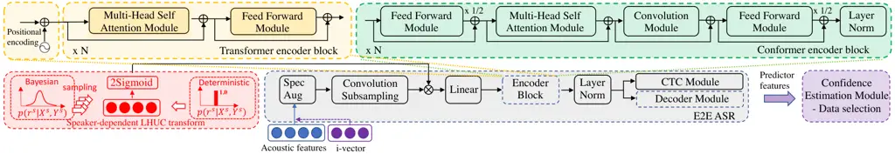

\bstctlcite

IEEEexample:BSTcontrol

# Confidence Score Based Conformer Speaker Adaptation for Speech Recognition

Jiajun Deng ^(†)^(†)thanks: \$\*\$ Equal contribution    Xurong Xie   
Tianzi Wang    Mingyu Cui    Boyang Xue    Zengrui Jin    Mengzhe Geng
   Guinan Li    Xunying Liu    Helen Meng

###### Abstract

A key challenge for automatic speech recognition (ASR) systems is to
model the speaker level variability. In this paper, compact speaker
dependent learning hidden unit contributions (LHUC) are used to
facilitate both speaker adaptive training (SAT) and test time
unsupervised speaker adaptation for state-of-the-art Conformer based
end-to-end ASR systems. The sensitivity during adaptation to supervision
error rate is reduced using confidence score based selection of the more
“trustworthy” subset of speaker specific data. A confidence estimation
module is used to smooth the over-confident Conformer decoder output
probabilities before serving as confidence scores. The increased data
sparsity due to speaker level data selection is addressed using Bayesian
estimation of LHUC parameters. Experiments on the 300-hour Switchboard
corpus suggest that the proposed LHUC-SAT Conformer with confidence
score based test time unsupervised adaptation outperformed the baseline
speaker independent and i-vector adapted Conformer systems by up to
1.0%, 1.0%, and 1.2% absolute (9.0%, 7.9%, and 8.9% relative) word error
rate (WER) reductions on the NIST Hub5’00, RT02, and RT03 evaluation
sets respectively. Consistent performance improvements were retained
after external Transformer and LSTM language models were used for
rescoring.

^(†)^(†)address: ¹The Chinese University of Hong Kong, Hong Kong SAR,
China  
²Institute of Software, Chinese Academy of Sciences, China
^(†)^(†)email:
{jjdeng,tzwang,mycui,byxue,zrjin,mzgeng,gnli,xyliu,hmmeng}@se.cuhk.edu.hk,
xurong@iscas.ac.cn

Index Terms: speech recognition, Conformer, speaker adaptation,
confidence score estimation, Bayesian learning

## 1 Introduction

Recently, convolution-augmented Transformer (Conformer) \[1, 2\]
end-to-end (E2E) automatic speech recognition (ASR) systems have been
successfully applied to a wide range of task domains. Compared with the
earlier forms of Transformer models \[3, 4\], Conformer benefits from a
combined use of self-attention and convolution structures that are
designed to learn both the longer range, global and local contexts.



Figure 1: An example Conformer E2E architecture is shown in the grey box
at the bottom centre. Its encoder internal components are also shown in
the green coloured box on the top right. The standard Transformer
encoder without the additional Convolutional module is shown in the
light yellow coloured box, top left. Bayesian estimation or fixed value,
deterministic LHUC speaker adaptation are shown on the left and right of
the red coloured box in the bottom left corner.

A key challenge for ASR systems, including those based on Conformers, is
to model the systematic and latent variation in speech. A major source
of such variability is attributable to speaker level characteristics
representing factors such as accent and idiosyncrasy, or physiological
differences manifested in, for instance, age or gender. Speaker
adaptation techniques for current ASR systems can be characterized into
several categories: 1) Auxiliary speaker embedding-based approaches
utilizing a compact vector (e.g., i-vector \[5\]) to represent
speaker-dependent (SD) characteristics \[5, 6, 7, 8\]. The SD embedding
vectors are then fed into the system as auxiliary features and to
augment standard acoustic front-ends. 2) Feature transformation-based
methods, for example, feature-space maximum likelihood linear regression
\[9\], and vocal tract length normalization\[10, 11\], aim to produce
speaker-independent (SI) features by applying feature transform in the
acoustic front-ends. 3) Model-based adaptation that uses separate SD
model parameters to represent speaker variability, for example, learning
hidden unit contributions (LHUC) \[12, 13, 14\], parameterized hidden
activation functions \[15, 16\] and various forms of linear transforms
that are applied to different neural network layers \[17, 18, 19, 20,
21, 22\]. These prior researches on speaker adaptation were
predominantly conducted in the context of traditional hybrid HMM-DNN
based ASR systems.

In contrast, very limited previous researches on speaker adaptation have
been conducted for E2E ASR systems. Among these, regularization-based
methods were exploited to improve the generalization performance of
connectionist temporal classification (CTC) based \[23\] and
attention-based E2E models \[24\]. Auxiliary speaker embedding vectors
based on i-vector \[25\], or extracted from sequence summary network
\[26\] and speaker-aware modules \[27, 28\] were incorporated into
attention-based encoder-decoder or conventional, non-convolution
augmented Transformer models. Speaker adaptation of Conformer RNN-T
models was investigated in \[29\].

Efforts on developing model-based speaker adaptation techniques for
Conformer models are confronted with several challenges. First, the
often limited amounts of speaker specific data requires highly compact
SD parameter representations to be used to mitigate the risk of
overfitting during adaptation. Second, model adaptation techniques such
as LHUC \[12, 13\] operate within a multi-pass decoding framework. An
initial recognition pass produces the initial speech transcription to
serve as the supervision for the subsequent SD parameter estimation and
re-decoding of speech in a second pass. As a result, SD parameter
estimation is sensitive to the underlying supervision error rate. This
issue is particularly prominent with E2E systems that directly learn the
surface word or token sequence labels in the adaptation supervision, as
opposed to latent phonetic targets in hybrid ASR systems.

In order to address these issues, compact speaker dependent LHUC, for
example, of 5120-dimensions, are used to facilitate both speaker
adaptive training (SAT) \[30\] and test time unsupervised speaker
adaptation. The sensitivity to supervision quality is reduced using
confidence score based selection of the more “trustworthy” subset of
speaker specific data. In Conformer models, the attention-based
encoder-decoder model architecture and auto-regressive decoder component
design both of which utilize the full history context, make the use of
conventional lattice-based recognition hypotheses representation for
word posterior and confidence score estimation non-trivial \[31, 32\].
To this end, a lightweight token-level confidence estimation module
(CEM) is incorporated to smooth the over-confident \[33, 34, 35\]
Conformer decoder output probabilities and improve their reliability as
confidence scores. The data sparsity issue further increased by the use
of confidence score-based speaker level data selection is addressed
using Bayesian estimation \[36, 14\] of LHUC parameters.

Experiments on the 300-hour Switchboard corpus suggest that the proposed
confidence score-based selection of speaker level subset data of varying
quantities produced adaptation performance comparable to word error rate
(WER) based selection. The proposed LHUC-SAT Conformer with confidence
score-based test time unsupervised adaptation outperformed the baseline
SI and i-vector adapted Conformer systems by up to 1.0%, 1.0%, and 1.2%
absolute (9.0%, 7.9%, and 8.9% relative) WER reductions on the NIST
Hub5’00, RT02, and RT03 evaluation sets respectively. Consistent
performance improvements were retained after external Transformer and
LSTM language models were used for rescoring.

The rest of this paper is organized as follows. Section 2 reviews the
conventional Transformer and Conformer ASR systems. LHUC-SAT Conformer
training and confidence score-based Bayesian LHUC test time unsupervised
adaptation are proposed in Section3. Section 4 presents the experiments
and results. Finally, the conclusions are drawn in Section 5.

## 2 Conformer ASR Architecture

The convolution-augmented Transformer (Conformer) model follows the
architecture proposed in \[1, 2\]. It consists of a Conformer encoder
and a Transformer decoder. The Conformer encoder is based on a
multi-blocked stacked architecture. Each encoder block includes the
following components in turn: a position wise feed-forward (FFN) module,
a multi-head self-attention (MHSA) module, a convolution (CONV) module
and a final FFN module at the end. Among these, the CONV module further
consists of in turn: a 1-D pointwise convolution layer, a gated linear
units (GLU) activation \[37\], a second 1-D pointwise convolution layer
followed a 1-D depth-wise convolution layer, a Swish activation and a
final 1-D pointwise convolution layer. Layer normalization (LN) and
residual connections are also applied to all encoder blocks. An example
Conformer architecture is shown in Figure 1.

For both the Transformer and Conformer models, the following multitask
criterion interpolation between the CTC and attention error costs \[38\]
is used in training.

```math
{\cal{L}}=(1-\lambda){{\cal{L}}_{att}}+\lambda{{\cal{L}}_{ctc}}, \tag{1}
```

where $`\lambda`$ is empirically set as 0.2 during training and fixed
throughout the experiments of this paper.

## 3 Conformer Speaker Adaptation

Confidence score based LHUC Conformer adaptation and Bayesian estimation
are presented in this section.

### 3.1 LHUC

The key idea of LHUC \[12, 13, 14\] and the related parameterised
adaptive activation functions \[15, 16\] is to modify the amplitudes of
hidden unit activations of hybrid DNN, or Conformer models as considered
in this paper, for each speaker using a SD transformation. This can be
parameterized by using activation output scaling vectors. Let
$`{\bm{r}}^{l,s}`$ denote the SD parameters for speaker $`s`$ in the
$`l`$-th hidden layer, the hidden layer output can be given as

```math
{\bm{h}}^{l,s}=\xi(\bm{r}^{l,s})\odot{\bm{h}}^{l}, \tag{2}
```

where $`\odot`$ denotes the Hadamard product operation, $`{\bm{h}}^{l}`$
is the hidden vector after a non-linear activation function in the
$`l`$-th layer, and $`\xi(\bm{r}^{l,s})`$ is the scaling vector
parametrized by $`{\bm{r}}^{l,s}`$. In this paper, $`\xi(\cdot)`$ is the
element-wise 2Sigmoid$`(\cdot)`$ function with range $`(0,2)`$. Given
the adaptation data $`{\cal{D}}^{s}=\{{\bm{X}}^{s},{\bm{Y}}^{s}\}`$ for
speaker $`s`$, $`{\bm{X}}^{s}`$ and $`{\bm{Y}}^{s}`$ stand for the
acoustic features and the corresponding supervision token sequences,
respectively. The estimation of SD parameters $`{\bm{r}}^{s}`$ can be
obtained by minimizing the loss in Eq. (1), which is given by

```math
\hat{{\bm{r}}}^{s}\!=\!\arg\min\limits_{{\bm{r}}^{s}}\{\lambda_{1}\!\log p_{a}\!({\bm Y}^{s}\!|\!{\bm X}^{s},\!{\bm r}^{s})\!-\!\lambda\!\log p_{c}({\bm Y}^{s}\!|\!{\bm X}^{s}\!,\!{\bm r}^{s})\}\vskip-5.69046pt \tag{3}
```

where $`\lambda_{1}=\lambda-1`$,
$`p_{a}({\bm Y}^{s}|{\bm X}^{s},{\bm r}^{s})`$ and
$`p_{c}({\bm Y}^{s}|{\bm X}^{s},{\bm r}^{s})`$ are the attention-based
and CTC-based likelihood probabilities, respectively. The supervisions
$`{\bm{Y}}^{s}`$ that are not available during unsupervised test time
adaptation can be obtained by initially decoding the corresponding
utterances using a baseline SI model, before serving as the target token
labels in the subsequent adaptation and re-decoding stage. As a result,
SD parameter estimation is sensitive to the underlying supervision error
rate.

### 3.2 Confidence Score Based LHUC Adaptation

To mitigate the risk of adaptation using speaker level data with
incorrect token labels, one possible solution considered here is to
exploit confidence score-based selection of a more “trustworthy”,
accurate and less erroneous subset of speaker specific data. The use of
confidence scores featured widely in both speaker adaptation \[39, 40,
41\] and unsupervised training \[42, 43, 44\] of traditional HMM-based
ASR systems.

The efficacy of confidence score-based data selection crucially depends
on its correlation with the WER. Conventional HMM-based ASR systems use
lattice-based recognition hypotheses representation for word or token
posterior and confidence score estimation \[31, 32, 45\]. However, the
attention-based encoder-decoder model architecture and auto-regressive
decoder component design utilizing the full history context used in
Conformer, and other related E2E models \[46\], lead to their difficulty
in deploying effective beam search in lattice-based decoding. An
alternative solution is to use the Conformer decoder output
probabilities as confidence scores. However, these have been found to be
over-confident in previous research \[34, 35\]. To this end, a
lightweight token-level CEM is used in this paper to further smooth the
over-confident Conformer decoder output probabilities and improve their
reliability as confidence scores.

The form of CEM considered in this paper is a lightweight binary
classification model using a 3-layer residual FFN that can be easily
configured on top of a well-trained E2E ASR system such as Conformer.
For each output token, its corresponding hidden state extracted from the
last decoder layer and linear outputs corresponding to top-10 Softmax
probabilities are concatenated as the input features fed into the CEM,
which then produces a smoothed confidence score for the token. An
utterance-level confidence score can then be obtained by averaging the
confidence scores of all tokens within an utterance. The alignments
between the hypothesis supervision and the ground truth reference can be
obtained from the edit distance computation, which can then be used as
the target labels for CEM training, where the correct tokens are
assigned with the value of one while the substituted or inserted tokens
are assigned with zero.

### 3.3 Bayesian LHUC Adaptation

Data selection further reduces the amount of limited speaker level
adaptation data, and increases the sparsity issue. This leads to
uncertainty in SD parameters during the standard LHUC adaptation
performing deterministic parameter estimation. The solution adopted in
this paper uses Bayesian learning \[36\] by modelling SD parameters’
uncertainty, and the following predictive distribution is utilized in
LHUC adaptation. The prediction over the test utterance
$`{\tilde{\bm X}}^{s}`$ is given by

```math
p(\tilde{\bm Y}^{s}|\tilde{\bm X}^{s},{\cal D}^{s})=\int{p(\tilde{\bm{Y}}^{s}|\tilde{\bm{X}}^{s},{\bm r}^{s})p({\bm r}^{s}|{\cal D}^{s})d{\bm r}^{s}},\vskip-8.5359pt \tag{4}
```

where $`{\tilde{\bm Y}}^{s}`$ is the predicted token sequence and
$`p({\bm r}^{s}|{\cal D}^{s})`$ is the SD parameters posterior
distribution. The true posterior distribution can be approximated with a
variational distribution $`q({\bm r}^{s})`$ by minimising the following
bound of hybrid attention plus CTC loss marginalisation over the
adaptation data set $`{\cal D}^{s}`$,

```math
\displaystyle\lambda_{1}\log\int{p_{a}({\bm Y}^{s},{\bm r}^{s}|{\bm X}^{s})d{\bm r}^{s}}-\lambda\log\int{p_{c}({\bm Y}^{s},{\bm r}^{s}|{\bm X}^{s})d{\bm r}^{s}}
```

```math
\displaystyle\leq \displaystyle\int{q({\bm r}^{s})(\lambda_{1}\log p_{a}({\bm Y}^{s}|{\bm X}^{s}\!,\!{\bm r}^{s})-\lambda\log p_{c}({\bm Y}^{s}|{\bm X}^{s}\!,\!{\bm r}^{s}))d{\bm r}^{s}}
```

```math
\displaystyle+KL(q({\bm r}^{s})||p({\bm r}^{s}))\triangleq{\cal L}_{1}+{\cal L}_{2},\vskip-11.38092pt \tag{5}
```

where $`p({\bm r}^{s})`$ is the prior distribution of SD parameters, and
KL$`(\cdot)`$ is the KL divergence. For simplicity, both
$`q({\bm r}^{s})={\cal N}({\bm\mu},{\bm\sigma}^{2})`$ and
$`p({\bm r}^{s})={\cal N}({\bm\mu}_{r},{\bm\sigma}_{r}^{2})`$ are
assumed to be normal distributions. The first term $`{\cal L}_{1}`$ is
approximated with Monte Carlo sampling method, which is given by

```math
\vskip-5.69046pt{\cal L}_{1}\!\approx\!\frac{1}{N}\!\sum\limits_{k=1}^{N}\!{\lambda_{1}\!\log p_{a}\!({\bm Y}^{s}|{\bm X}^{s}\!,\!{\bm r}_{k}^{s})\!\!-\!\!\lambda\log p_{c}({\bm Y}^{s}|{\bm X}^{s}\!,\!{\bm r}_{k}^{s})} \tag{6}
```

where $`{\bm r}_{k}^{s}={\bm\mu}+{\bm\sigma}\odot{\bm\epsilon}_{k}`$ and
$`{\bm\epsilon}_{k}`$ is the $`k`$-th Monte Carlo sampling value drawn
from the standard normal distribution. The KL divergence
$`{\cal L}_{2}`$ can be explicitly calculated as

```math
\vskip-5.69046pt\mathcal{L}_{2}=\frac{1}{2}\sum_{i}{(\frac{\sigma_{i}^{2}+(\mu_{i}-\mu_{r,i})^{2}}{\sigma_{r,i}^{2}}+2\log\frac{\sigma_{r,i}}{\sigma_{i}}-1}), \tag{7}
```

where $`\{\mu_{r,i},\sigma_{r,i}\}`$ and $`\{\mu_{i},\sigma_{i}\}`$ are
the $`i`$-th elements of vectors $`\{{\bm\mu}_{r},{\bm\sigma}_{r}\}`$
and $`\{{\bm\mu},{\bm\sigma}\}`$, respectively.

Implementation details over several crucial settings are: 1) Based on
empirical evaluation, the LHUC layer is applied to the hidden output of
the convolution subsampling module, as shown in Figure 1 (bottom, left).
Alternative locations¹¹ 1 LHUC scaling is applied to the hidden outputs
of the convolutional, linear, or attention layer, and various
combinations of these locations. to apply the LHUC transforms in
practice leads to performance degradation in comparison. 2) The LHUC
prior distribution is modelled by a standard normal distribution
$`{\cal N}(\bf 0,1)`$. 3) In Bayesian learning, only one parameter
sample is drawn in Eq. (6) during adaptation to ensure that the
computational cost is comparable to that of standard LHUC adaptation. 4)
The predictive inference integral in Eq. (4) is efficiently approximated
by the expectation of the posterior distribution as
$`p(\tilde{\bm{Y}}^{s}|\tilde{\bm{X}}^{s},{{\mathbb{E}}[{\bm r}^{s}|{\cal D}^{s}]})`$.

## 4 Experiments

In this section, the proposed confidence score-based LHUC speaker
adaptation method is investigated for unsupervised test adaptation of
both SI and speaker adaptively trained SAT (interleaving update of TDNN
and SD LHUC parameters, following \[13\]) ASR systems on the 300-hr
Switchboard task.

### 4.1 Experimental Setup

%vspace-0.1cm The Switchboard-1 corpus \[47\] with 286-hr speech
collected from 4804 speakers is used for training. The NIST Hub5’00,
RT02 and RT03 evaluation sets containing 80, 120 and 144 speakers, and
3.8, 6.4 and 6.2 hours of speech respectively were used. 80-dim
Mel-filter bank plus 3-dim pitch parameters were used as input features.
The ESPnet recipe \[2\] configured Conformer model contains 12 encoder
and 6 decoder layers, where each layer is configured with 4-head
attention of 256-dim, and 2048 feed forward hidden nodes.
Byte-pair-encoding (BPE) tokens of size 2000 were served as the decoder
outputs. The convolution subsampling module contains two 2-D
convolutional layers with stride 2. SpecAugment \[48\] was applied in
both SI and SAT Conformer training. The Noam optimizer’s initial
learning rate was 5.0. The dropout rate was set as 0.1, and model
averaging was performed over the last ten epochs. The confidence score
estimation module is a 3-layer residual feedforward DNN with a hidden
dimension of 64 with batch normalization and dropout applied in
training. Decoding outputs were further rescored using log-linearly
interpolated external Transformer and Bidirectional LSTM language models
(LMs) trained on the Switchboard and Fisher transcripts using
cross-utterance contexts \[49\].

|      |             |                                 |                     |                                 |       |                                 |                                 |                                 |                                 |                                 |                                 |
| ---- | ----------- | ------------------------------- | ------------------- | ------------------------------- | ----- | ------------------------------- | ------------------------------- | ------------------------------- | ------------------------------- | ------------------------------- | ------------------------------- |
| Sys. | Model       | Hub5’00                         |                     |                                 | RT02  |                                 |                                 |                                 | RT03                            |                                 |                                 |
|      |             | CHE                             | SWBD                | O.V.                            | SWBD1 | SWBD2                           | SWBD3                           | O.V.                            | FSH                             | SWBD                            | O.V.                            |
| 1    | Transformer | 17.3                            | 9.1                 | 13.2                            | 10.5  | 15.1                            | 18.2                            | 14.9                            | 12.1                            | 19.0                            | 15.7                            |
| 2    | \+ LHUC     | 16.8                            | 9.1                 | 13.0                            | 10.5  | 15.0                            | 17.9                            | 14.7                            | 12.0                            | 18.9                            | 15.6                            |
| 3    | \+ LHUC-SAT | $`{16.1}^{\dagger}`$            | $`{8.5}^{\dagger}`$ | $`{12.3}^{\dagger}`$            | 10.1  | $`{14.4}^{\dagger}`$            | $`{17.4}^{\dagger}`$            | $`{14.2}^{\dagger}`$            | $`{11.4}^{\dagger}`$            | $`{17.7}^{\dagger}`$            | $`{14.6}^{\dagger}`$            |
| 4    | Conformer   | 15.0                            | 7.3                 | 11.1                            | 8.7   | 12.9                            | 15.6                            | 12.6                            | 10.4                            | 16.4                            | 13.5                            |
| 5    | \+ LHUC-SAT | $`{\textbf{{13.8}}^{\dagger}}`$ | 7.1                 | $`{\textbf{{10.5}}^{\dagger}}`$ | 8.6   | $`{\textbf{{12.3}}^{\dagger}}`$ | $`{\textbf{{14.7}}^{\dagger}}`$ | $`{\textbf{{12.0}}^{\dagger}}`$ | $`{\textbf{{10.0}}^{\dagger}}`$ | $`{\textbf{{15.7}}^{\dagger}}`$ | $`{\textbf{{12.9}}^{\dagger}}`$ |

Table 1: Performance (WER%) of SI and LHUC-SAT trained Transformer and
Conformer systems before and after test time unsupervised LHUC
adaptation evaluated on Hub5’00, RT02 and RT03. “CHE”, “SWBD”, “FSH” and
“O.V.” stand for CallHome, Switchboard, Fisher and Overall respectively.
$`\dagger`$ denotes a statistically significant (MAPSSWE,
$`\alpha`$=0.05) difference obtained over baseline SI systems (sys. 1,
4).

Figure 2: Performance (WER%) of adapted LHUC-SAT Conformer systems using
various amounts of adaptation data selected using different methods (top
down over legends): ground truth WER “Ground Truth WER”; original
Conformer decoder attention Softmax output probabilities “Att. Prob”, or
their combination with CTC “Att+CTC Prob”; the CEM smoothed attention
scores “CEM Att. Prob”. “+Bayesian” denotes Bayesian LHUC test
adaptation.

|      |                                                                                                                                                   |                       |                |                                        |                               |                              |                               |                              |                               |                               |                               |                              |                               |                               |
| ---- | ------------------------------------------------------------------------------------------------------------------------------------------------- | --------------------- | -------------- | -------------------------------------- | ----------------------------- | ---------------------------- | ----------------------------- | ---------------------------- | ----------------------------- | ----------------------------- | ----------------------------- | ---------------------------- | ----------------------------- | ----------------------------- |
| Sys. | Speaker Adaptation                                                                                                                                | Adaptation Parameters | Data Selection | Language Model                         | Hub5’00                       |                              |                               | RT02                         |                               |                               |                               | RT03                         |                               |                               |
|      |                                                                                                                                                   |                       |                |                                        | CHE                           | SWBD                         | O.V.                          | SWBD1                        | SWBD2                         | SWBD3                         | O.V.                          | FSH                          | SWBD                          | O.V.                          |
| 1    | ✗                                                                                                                                                 | ✗                     | ✗              | ✗                                      | 15.0                          | 7.3                          | 11.1                          | 8.7                          | 12.9                          | 15.6                          | 12.6                          | 10.4                         | 16.4                          | 13.5                          |
| 2    | i-vector²² 2 The Kaldi recipe configured 100-dim utterance-level i-vector features were concatenated to the acoustic features at the input layer. | ✗                     | ✗              |                                        | 15.8                          | 7.8                          | 11.8                          | 9.3                          | 13.6                          | 16.3                          | 13.3                          | 10.9                         | 17.3                          | 14.2                          |
| 3    | LHUC-SAT                                                                                                                                          | Deterministic         | ✗              |                                        | $`{13.8}^{\dagger}`$          | 7.1                          | $`{10.5}^{\dagger}`$          | 8.6                          | $`{12.3}^{\dagger}`$          | $`{14.7}^{\dagger}`$          | $`{12.0}^{\dagger}`$          | $`{10.0}^{\dagger}`$         | $`{15.7}^{\dagger}`$          | $`{12.9}^{\dagger}`$          |
| 4    | LHUC-SAT                                                                                                                                          | Deterministic         | \checkmark     |                                        | $`{13.7}^{\dagger}`$          | $`{6.9}^{\dagger}`$          | $`{10.3}^{\dagger}`$          | $`{\textbf{8.3}^{\dagger}}`$ | $`{12.0}^{\dagger}`$          | $`{14.5}^{\dagger}`$          | $`{11.8}^{\dagger}`$          | $`{9.8}^{\dagger}`$          | $`{15.4}^{\dagger}`$          | $`{12.7}^{\dagger}`$          |
| 5    | LHUC-SAT                                                                                                                                          | Bayesian              | \checkmark     |                                        | $`{\textbf{13.4}^{\dagger}}`$ | $`{\textbf{6.8}^{\dagger}}`$ | $`{\textbf{10.1}^{\dagger}}`$ | $`{\textbf{8.3}^{\dagger}}`$ | $`{\textbf{11.9}^{\dagger}}`$ | $`{\textbf{14.1}^{\dagger}}`$ | $`{\textbf{11.6}^{\dagger}}`$ | $`{\textbf{9.5}^{\dagger}}`$ | $`{\textbf{14.8}^{\dagger}}`$ | $`{\textbf{12.3}^{\dagger}}`$ |
| 6    | ✗                                                                                                                                                 | ✗                     | ✗              | Transformer + BiLSTM (cross-utterance) | 14.2                          | 6.8                          | 10.5                          | 8.5                          | 12.3                          | 14.8                          | 12.1                          | 9.6                          | 15.3                          | 12.6                          |
| 7    | LHUC-SAT                                                                                                                                          | Bayesian              | \checkmark     |                                        | $`{\textbf{13.0}^{\dagger}}`$ | $`{\textbf{6.3}^{\dagger}}`$ | $`{\textbf{9.6}^{\dagger}}`$  | $`{\textbf{8.1}^{\dagger}}`$ | $`{\textbf{11.3}^{\dagger}}`$ | $`{\textbf{13.4}^{\dagger}}`$ | $`{\textbf{11.1}^{\dagger}}`$ | $`{\textbf{8.7}^{\dagger}}`$ | $`{\textbf{13.8}^{\dagger}}`$ | $`{\textbf{11.3}^{\dagger}}`$ |

Table 2: Speaker adapted performance (WER%) of LHUC-SAT Conformer
systems with/without confidence score-based data selection and Bayesian
LHUC adaptation on the Hub5’00, RT02 and RT03 data sets, before and
after external Transformer plus LSTM LM rescoring. $`\dagger`$ denotes a
statistically significant (MAPSSWE, $`\alpha`$=0.05) WER difference over
the baseline SI systems (sys. 1, 6).

### 4.2 Performance of LHUC Adaptation

The performance of non-Bayesian, deterministic parameter-based LHUC
adaptation for both SI and LHUC-SAT trained Transformer and Conformer
systems are shown in Table 1 (sys. 2, 3, 5). For both Transformer and
Conformer systems, LHUC-SAT with speaker adaptation consistently
outperformed their respective SI baselines (sys. 3, 5 vs. sys. 1, 4). In
particular, the LHUC-SAT Transformer produced a statistically
significant WER reduction of 1.1% absolute on the RT03 data over the SI
baseline (sys. 3 vs. sys. 1). The LHUC-SAT Conformer system (sys. 5)
produced the lowest WER and was used in the following experiments on
confidence score-based adaptation.

### 4.3 Performance of Confidence Based Adaptation

The efficacy of the proposed confidence score-based speaker level data
selection is first assessed via an ablation study on the three test
sets, as shown in Figure 2, where the WERs of adapted LHUC-SAT Conformer
systems using various amounts of adaptation data selected using
different methods are shown. The horizontal coordinates represent
speaker level selected subsets of utterances ranked by their confidence
scores (e.g., top 80 percentile) of varying sizes used for adaptation.

A general trend can be found that across all three test sets over
various percentiles based subset selection, the proposed CEM smoothed
Conformer attention Softmax output probabilities (orange lines)
consistently produced better LHUC test adaptation performance than the
comparable baseline selection using un-mapped, original Softmax output
probabilities (green line). After Bayesian estimation is applied to
mitigate the risk of over-fitting to subsets of speaker data, CEM
smoothed confidence score-based Bayesian LHUC adaptation performance
(orange dotted line) is comparable to that using the ground truth
utterance level WER-based data selection (red dotted line). The best
operating percentile point for smoothed confidence score-based data
selection is approximately at 80%.

Using the resulting top 80 percentile selected speaker level data, the
corresponding adapted performance of the LHUC-SAT Conformer systems with
or without Bayesian LHUC estimation are further contrasted against the
baseline SI and i-vector adapted Conformers in Table 2 (sys. 4, 5 vs.
sys. 1, 2). Using both CEM smoothed confidence score in data selection
and Bayesian learning in LHUC test adaptation, overall statistically
significant WER reductions of 1.0%, 1.0% and 1.2% absolute (9.0%, 7.9%
and 8.9% relative) were obtained on the three test sets over the
baseline SI Conformer (sys. 5 vs. sys. 1).

Similar performance improvements of 0.9%-1.3% absolute WER reductions
were retained after external Transformer plus LSTM LM rescoring (sys. 7
vs. sys. 6). Finally, the performance of the best confidence LHUC
adapted LHUC-SAT Conformer system (sys. 7, Table 2) is further
contrasted in Table 3 with those of the state-of-the-art performance
obtained on the same task using the most recent hybrid and end-to-end
systems reported in the literature to demonstrate its competitiveness.

|     |                                                                  |           |         |      |        |      |      |        |
| --- | ---------------------------------------------------------------- | --------- | ------- | ---- | ------ | ---- | ---- | ------ |
| ID  | System                                                           | \# Param. | Hub5’00 |      |        | RT03 |      |        |
|     |                                                                  |           | CHE     | SWBD | O.V.   | FSH  | SWBD | O.V.   |
| 1   | RWTH-2019 Hybrid\[50\]                                           | \-        | 13.5    | 6.7  | 10.2   | \-   | \-   | \-     |
| 2   | CUHK-2021 BLHUC-Hybrid\[14\]                                     | 15.2M     | 12.7    | 6.7  | 9.7    | 7.9  | 13.4 | 10.7   |
| 3   | Google-2019 LAS\[48\]                                            | \-        | 14.1    | 6.8  | (10.5) |      |      |        |
| 4   | IBM-2020 AED \[51\]                                              | 29M       | 14.6    | 7.4  | (11.0) | \-   | \-   | \-     |
| 5   |                                                                  | 75M       | 13.4    | 6.8  | (10.1) | \-   | \-   | \-     |
| 6   |                                                                  | 280M      | 12.5    | 6.4  | 9.5    | 8.4  | 14.8 | (11.7) |
| 7   | IBM-2021 CFM-AED\[25\]                                           | 68M       | 11.2    | 5.5  | (8.4)  | 7.0  | 12.6 | (9.9)  |
| 8   | Salesforce-2020 \[52\]                                           | \-        | 13.3    | 6.3  | (9.8)  | \-   | \-   | 11.4   |
| 9   | Baseline {Table 2-Sys. 6} (ours) +Adapt. {Table 2-Sys. 7} (ours) | 45M       | 14.2    | 6.8  | 10.5   | 9.6  | 15.3 | 12.6   |
| 10  |                                                                  | \+ 0.74M  | 13.0    | 6.3  | 9.6    | 8.7  | 13.8 | 11.3   |

Table 3: Performance (WER%) contrast between the best confidence
score-based Bayesian LHUC-SAT conformer system and other
state-of-the-art systems on the Hub5’00 and RT03 data.

## 5 Conclusions

The paper proposed a confidence score-based unsupervised speaker
adaptation approach for Conformer based speech recognition systems. The
adaptation performance sensitivity to supervision quality is addressed
using a smoothed confidence-based data selection scheme while the
resulting increased data sparsity is mitigated using Bayesian learning.
Experiments on the 300-hour Switchboard corpus demonstrated the efficacy
of the proposed methods and produced up to 9.0% relative word error rate
reduction over the baseline Conformer system. Further research will
focus on improving data selection and rapid on-the-fly adaptation
approaches.

## 6 Acknowledgements

This research is supported by Hong Kong RGC GRF grant No. 14200021,
14200218, 14200220, Innovation & Technology Fund grant No. ITS/254/19
and ITS/218/21, National Key R&D Program of China (2020YFC2004100).

## References

- \[1\] A. Gulati _et al._, “Conformer: Convolution-augmented
  transformer for speech recognition,” _INTERSPEECH_, 2020.
- \[2\] P. Guo _et al._, “Recent developments on espnet toolkit boosted
  by conformer,” in _ICASSP_, 2021.
- \[3\] L. Dong _et al._, “Speech-transformer: A no-recurrence
  sequence-to-sequence model for speech recognition,” _ICASSP_, 2018.
- \[4\] S. Karita _et al._, “A comparative study on transformer vs rnn
  in speech applications,” _ASRU_, 2019.
- \[5\] G. Saon _et al._, “Speaker adaptation of neural network acoustic
  models using i-vectors,” in _ASRU_, 2013.
- \[6\] A. Senior and I. Lopez-Moreno, “Improving dnn speaker
  independence with i-vector inputs,” in _ICASSP_, 2014.
- \[7\] O. Abdel-Hamid and H. Jiang, “Fast speaker adaptation of hybrid
  nn/hmm model for speech recognition based on discriminative learning
  of speaker code,” in _ICASSP_, 2013.
- \[8\] S. Xue _et al._, “Direct adaptation of hybrid DNN/HMM model for
  fast speaker adaptation in LVCSR based on speaker code,” in
  _ICASSP_, 2014.
- \[9\] M. J. Gales, “Maximum likelihood linear transformations for
  hmm-based speech recognition,” _Comput. Speech Lang._, 1998.
- \[10\] L. Lee and R. C. Rose, “Speaker normalization using efficient
  frequency warping procedures,” in _ICASSP_, 1996.
- \[11\] L. F. Uebel and P. C. Woodland, “An investigation into vocal
  tract length normalisation,” in _EUROSPEECH_, 1999.
- \[12\] P. Swietojanski and S. Renals, “Learning hidden unit
  contributions for unsupervised speaker adaptation of neural network
  acoustic models,” _SLT Workshop_, 2014.
- \[13\] P. Swietojanski _et al._, “Learning hidden unit contributions
  for unsupervised acoustic model adaptation,” _IEEE/ACM TASLP_, 2016.
- \[14\] X. Xie _et al._, “Bayesian learning for deep neural network
  adaptation,” _IEEE/ACM TASLP_, 2021.
- \[15\] C. Zhang and P. C. Woodland, “Dnn speaker adaptation using
  parameterised sigmoid and relu hidden activation functions,”
  _ICASSP_, 2016.
- \[16\] Z. Huang _et al._, “Bayesian unsupervised batch and online
  speaker adaptation of activation function parameters in deep models
  for automatic speech recognition,” _IEEE/ACM TASLP_, 2017.
- \[17\] J. P. Neto _et al._, “Speaker-adaptation for hybrid hmm-ann
  continuous speech recognition system,” in _EUROSPEECH_, 1995.
- \[18\] R. Gemello _et al._, “Linear hidden transformations for
  adaptation of hybrid ANN/HMM models,” _Speech Commun._, 2007.
- \[19\] B. Li and K. C. Sim, “Comparison of discriminative input and
  output transformations for speaker adaptation in the hybrid NN/HMM
  systems,” in _INTERSPEECH_, 2010.
- \[20\] C. Zhang and P. C. Woodland, “Parameterised sigmoid and relu
  hidden activation functions for dnn acoustic modelling,” in
  _INTERSPEECH_, 2015.
- \[21\] Y. Zhao _et al._, “Low-rank plus diagonal adaptation for deep
  neural networks,” _ICASSP_, 2016.
- \[22\] T. Tan _et al._, “Cluster adaptive training for deep neural
  network based acoustic model,” _IEEE/ACM TASLP_, 2016.
- \[23\] K. Li _et al._, “Speaker adaptation for end-to-end ctc models,”
  _SLT_, 2018.
- \[24\] Z. Meng _et al._, “Speaker adaptation for attention-based
  end-to-end speech recognition,” _INTERSPEECH_, 2019.
- \[25\] Z. Tuske _et al._, “On the limit of English conversational
  speech recognition,” in _INTERSPEECH_, 2021.
- \[26\] M. Delcroix _et al._, “Auxiliary feature based adaptation of
  end-to-end asr systems,” in _INTERSPEECH_, 2018.
- \[27\] Z. Fan _et al._, “Speaker-aware speech-transformer,”
  _ASRU_, 2019.
- \[28\] Y. Zhao _et al._, “Speech transformer with speaker aware
  persistent memory,” in _INTERSPEECH_, 2020.
- \[29\] Y. Huang _et al._, “Rapid speaker adaptation for conformer
  transducer: Attention and bias are all you need,” in
  _INTERSPEECH_, 2021.
- \[30\] T. Anastasakos _et al._, “A compact model for speaker-adaptive
  training,” _ICSLP_, 1996.
- \[31\] G. Evermann and P. Woodland, “Posterior probability decoding,
  confidence estimation and system combination,” in _Speech
  Transcription Workshop_, 2000.
- \[32\] L. Mangu _et al._, “Finding consensus in speech recognition:
  word error minimization and other applications of confusion networks,”
  _Comput. Speech Lang._, 2000.
- \[33\] D. Hendrycks and K. Gimpel, “A baseline for detecting
  misclassified and out-of-distribution examples in neural networks,”
  _ICLR_, 2017.
- \[34\] Q. Li _et al._, “Confidence estimation for attention-based
  sequence-to-sequence models for speech recognition,” _ICASSP_, 2021.
- \[35\] W. Liu and T. Lee, “Utterance-level neural confidence measure
  for end-to-end children speech recognition,” _ASRU_, 2021.
- \[36\] X. Xie _et al._, “Blhuc: Bayesian learning of hidden unit
  contributions for deep neural network speaker adaptation,”
  _ICASSP_, 2019.
- \[37\] Y. Dauphin _et al._, “Language modeling with gated
  convolutional networks,” in _ICML_, 2017.
- \[38\] S. Watanabe _et al._, “Hybrid CTC/attention architecture for
  end-to-end speech recognition,” _IEEE J-STSP_, 2017.
- \[39\] T. Anastasakos and S. V. Balakrishnan, “The use of confidence
  measures in unsupervised adaptation of speech recognizers,” in
  _ICSLP_, 1998.
- \[40\] F. Wallhoff _et al._, “Frame-discriminative and
  confidence-driven adaptation for lvcsr,” _ICASSP_, 2000.
- \[41\] X. Liu _et al._, “Language model cross adaptation for lvcsr
  system combination,” _Comput. Speech Lang._, 2013.
- \[42\] G. Zavaliagkos _et al._, “Using untranscribed training data to
  improve performance,” in _ICSLP_, 1998.
- \[43\] T. Kemp and A. H. Waibel, “Unsupervised training of a speech
  recognizer: recent experiments,” in _EUROSPEECH_, 1999.
- \[44\] K. Yu _et al._, “Unsupervised training and directed manual
  transcription for lvcsr,” _Speech Commun._, 2010.
- \[45\] M. S. Seigel and P. C. Woodland, “Combining information sources
  for confidence estimation with crf models,” in _INTERSPEECH_, 2011.
- \[46\] R. Prabhavalkar _et al._, “Less is more: Improved rnn-t
  decoding using limited label context and path merging,”
  _ICASSP_, 2021.
- \[47\] J. J. Godfrey _et al._, “Switchboard: telephone speech corpus
  for research and development,” _ICASSP_, 1992.
- \[48\] D. S. Park _et al._, “SpecAugment: A simple data augmentation
  method for automatic speech recognition,” in _INTERSPEECH_, 2019.
- \[49\] G. Sun _et al._, “Transformer language models with lstm-based
  cross-utterance information representation,” _ICASSP_, 2021.
- \[50\] M. Kitza _et al._, “Cumulative adaptation for BLSTM acoustic
  models,” _INTERSPEECH_, 2019.
- \[51\] Z. Tüske _et al._, “Single headed attention based
  sequence-to-sequence model for state-of-the-art results on
  switchboard,” _INTERSPEECH_, 2020.
- \[52\] W. Wang _et al._, “An investigation of phone-based subword
  units for end-to-end speech recognition,” _INTERSPEECH_, 2020.
