# Subword Dictionary Learning and Segmentation Techniques for Automatic Speech Recognition in Tamil and Kannada

Journal: Pattern Recognition

Madhavaraj A Email: <madhavaraja@iisc.ac.in> Note: Electrical
Engineering, Indian Institute of Science  
Bangalore, Karnataka, India Corresponding author: Corresponding Authors
   Bharathi Pilar Email: <bharathi.pilar@gmail.com> Note: University
College Mangalore, Karnartaka, India    Ramakrishnan A. G
Email: <agr@iisc.ac.in> Note: Electrical Engineering, Indian Institute
of Science  
Bangalore, Karnataka, India Corresponding author: Corresponding Authors

###### Abstract

We present automatic speech recognition (ASR) systems for Tamil and
Kannada based on subword modeling to effectively handle unlimited
vocabulary due to the highly agglutinative nature of the languages. We
explore byte pair encoding (BPE), and proposed a variant of this
algorithm named extended-BPE, and Morfessor tool to segment each word as
subwords. We have effectively incorporated maximum likelihood (ML) and
Viterbi estimation techniques with weighted finite state transducers
(WFST) framework in these algorithms to learn the subword dictionary
from a large text corpus. Using the learnt subword dictionary, the words
in training data transcriptions are segmented to subwords and we train
deep neural network ASR systems which recognize subword sequence for any
given test speech utterance. The output subword sequence is then
post-processed using deterministic rules to get the final word sequence
such that the actual number of words that can be recognized is much
larger. For Tamil ASR, We use 152 hours of data for training and 65
hours for testing, whereas for Kannada ASR, we use 275 hours for
training and 72 hours for testing. Upon experimenting with different
combination of segmentation and estimation techniques, we find that the
word error rate (WER) reduces drastically when compared to the baseline
word-level ASR, achieving a maximum absolute WER reduction of 6.24% and
6.63% for Tamil and Kannada respectively.

###### Keywords: 

Speech recognition, Subword modeling, Maximum likelihood, Byte pair
encoding, Extended byte pair encoding, Morfessor, Deep neural network,
Viterbi, Weighted finite state transducers

## 1 Introduction

Research on ASR has brought lot of innovations over the last two
decades. Handling unlimited vocabulary is one of the important research
areas in this field. Traditional ASR models use words as lexical units
which is not suitable for highly agglutinative and inflective languages
 \[1\]. Hence, we employ subword modeling approach to segment each word
into subword units and use them as lexical units for training our ASR
models, This subword-based ASR fares better than the word-based ASR
approach in terms of reducing the WER and OOV rates, and the model
complexity due to small subword vocabulary size. It also allows us to
build n-gram subword language models to cover millions of words  \[2\].
Various subword modeling approaches are available in the literature for
European languages which uses n-grams and morphological analyzers for
subword dictionary learning. Morphological analyzer like Morfessor has
been used in  \[3\], \[4\], whereas syllables and rule-based algorithms
have been used in  \[5\], \[6\] for building subword ASRs. Data-driven
algorithms that uses minimum description length and maximum likelihood
estimation are used to build subword-ASRs in  \[7\] and  \[8\]. In
addition to directly applying morpheme-based n-grams, the morphological
and lexical information are combined and applied as factored and joint
lexical–morphological language model in \[9\] and  \[10\] respectively.

In this paper, we present novel word segmentation and subword dictionary
learning algorithms to build subword-ASRs and report its performance for
Tamil and Kannada speech recognition tasks. The rest of the paper is
organised as follows. Section 2 describes the baseline ASR system,
dataset and tools used in our experiments. In section  3, we describe
the algorithmic and mathematical tools like byte pair encoding and
morphological analyzer that have been used to construct the subword
dictionary from the text corpus. Statistical formulation of the word
segmentation techniques with maximum likelihood and Viterbi criteria are
elucidated in sections  4 and  5 respectively. Sections  6 and  7
respectively describe the implementation of ML and Viterbi segmentation
methods using weighted finite state transducers (WFST) framework. In
section 8, we describe the entire subword ASR system training, testing
and post-processing pipelines. Finally, we present the experimental
results in section 9 and conclude in section 10.

## 2 Dataset and baseline system

Since there are no publicly available transcribed speech data for Tamil
and Kannada, we have collected 150 hours of data for Tamil, and 347
hours for Kannada on our own. The Tamil data was recorded from 531
native Tamil speakers, whereas the Kannada data was recorded from 915
native speakers of Kannada. All the data was recorded in clean,
noise-free environment using USB microphones. These two speech corpora
have now been made publicly available on OpenSLR \[11, 12\]. We have
also used the 67 hours of Tamil data provided by Microsoft \[13\]. We
have divided the data into two parts: (i) training data - 152 hours for
Tamil and 275 hours for Kannada and (ii) test data - 65 hours for Tamil
and 72 hours for Kannada.

We have developed in-house grapheme-to-phoneme converters for both the
languages to phonetize the vocabulary of words in our corpus to build
the pronunciation lexicon. We have followed the procedures as explained
in \[14\] to build DNN based acoustic models for Tamil and Kannada using
Kaldi toolkit \[15\]. 3-gram language models are estimated using srilm
toolkit \[16\] on a large text corpus containing 4.4 million Tamil words
and 8 million Kannada words. The language models, lexicon models and the
trained acoustic models are combined to form the final decoding graph
which is then used for decoding the test data. This word-based ASR
system is used as the baseline model for all our experiments.

The subword-based ASR systems are built using the same procedure except
that the words in the transcriptions are segmented to subwords and then
given for training. Furthermore, during testing, the output subword
sequences from the ASR is post-processed using some deterministic rules
to obtain the final word sequence. The block diagram illustrating the
training and testing the subword-ASR is shown in Fig. 1.

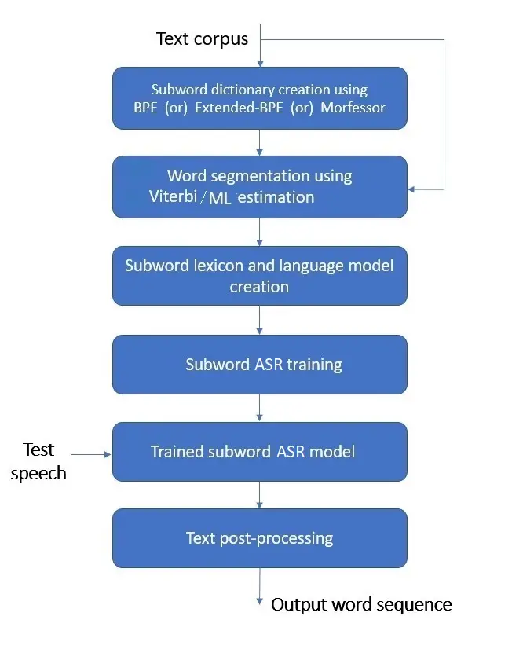

Figure 1: Block diagram for training and testing subword-ASR for
Tamil/Kannada.

## 3 Construction of subword dictionary

In this section, we describe different tools and techniques that we have
used to automatically construct the subword dictionaries from the given
Tamil and Kannada text corpora. We first introduce the well-known
technique of BPE \[17\] and propose a modified version of it called
extended-BPE and use each of them independently to create subword
dictionary. We then briefly explain the Morfessor tool for morphological
analysis that we have also used for subword dictionary creation.

### 3.1 Subword dictionary construction using BPE

BPE is a commonly used technique for data compression \[18\] which has
been extensively used in machine translation, speech recognition and
other NLP applications to handle out-of-vocabulary words. BPE constructs
the subword dictionary $`\mathbb{D}`$ from the given text corpus using a
bottom-up approach to iteratively build the codebook by combining the
most frequently occurring sequence of characters to form a codeword.

The first step is to initialize the codebook with the list of all the
characters present in the text corpus. Next, we split the words in the
corpus into their constituent characters (separated by whitespaces) and
find the most frequently occurring pair of characters in the corpus (say
‘A B’). We then merge them to form a single codeword (‘AB’) and add it
to the existing codebook and then replace all the occurrences of the
codeword sequence ‘A B’ in the corpus by ‘AB’. These operations are
repeated till we reach a desired number of codewords $`N`$ in the
codebook (which is an user-defined hyperparameter). The pseudocode for
building the subword dictionary using BPE in a computationally efficient
manner is given in Algorithm 1.

Input:    (i) Text corpus

      (ii) Size of the subword dictionary $`N`$

Output: (i) Subword dictionary $`\mathbb{D}`$

       (ii) Subword probability mass function
$`\phi(d):\forall d\in\mathbb{D}`$

1 Split the lines in the text corpus into words separated by the newline
character;

2 Split all the words into characters separated by whitespaces;

3 Obtain n-gram character counts map functions
$`\psi_{l}(\cdot):1\leq l\leq 7`$;

4 Sort the entries in $`\psi_{l}(\cdot)`$ in descending order based on
their values;

5 Initialize $`\mathbb{D}`$ and $`\phi(\cdot)`$ as empty lists;

6 for _$`i\leftarrow 1`$ to length($`\psi_{1}(\cdot)`$)_ do

    7 $`codeword\_char\_seq\leftarrow`$ Key of $`\psi_{1}(i)`$;

    8 $`codeword\leftarrow`$ Merge the characters in
$`codeword\_char\_seq`$;

    9 $`count\_value\leftarrow`$ Value of $`\psi_{1}(i)`$;

    10 Append $`codeword`$ to $`\mathbb{D}`$;

    11 Append $`count\_value`$ to $`\phi(\cdot)`$;

12 end for

13 while _$`|\mathbb{D}|<N`$_ do

    14
$`l^{*},i^{*}\leftarrow\operatorname{argmax}_{\>l,i}\hskip 5.69046pt\psi_{l}(i)`$;

    15 $`codeword\_char\_seq\leftarrow`$ Key of $`\psi_{l^{*}}(i^{*})`$;

    16 $`codeword\leftarrow`$ Merge the characters in
$`codeword\_char\_seq`$;

    17 $`count\_value\leftarrow`$ Value of $`\psi_{l^{*}}(i^{*})`$;

    18 Append $`codeword`$ to $`\mathbb{D}`$;

    19 Append $`count\_value`$ to $`\phi(\cdot)`$;

    20 Delete the entry $`\psi_{l^{*}}(i^{*})`$;

    21 for _$`d\in\mathbb{D}`$_ do

       22 if _($`d`$ is a substring of $`codeword`$) and ($`\phi(d)`$ ==
$`\phi(codeword)`$)_ then

          23 Delete the element $`d`$ in the list $`\mathbb{D}`$;

          24 Delete the $`count\_value`$ corresponding to $`d`$ in the
list $`\phi(\cdot)`$;

       25 end if

    26 end for

27 end while

28 Normalize $`\phi(\cdot)`$ such that
$`\sum_{d\in\mathbb{D}}\phi(d)=1`$;

29 return $`\mathbb{D}`$ and $`\phi(\cdot)`$;

Algorithm 1 Subword dictionary construction using byte pair encoding
algorithm

### 3.2 Subword dictionary creation using extended-BPE

We have customized the original BPE algorithm so that greedy merging of
codeword pairs is avoided to some extent by having adequate number of
codewords of different lengths. This is achieved by adding a constraint
that there should be at most $`N_{l}`$ number of $`l`$-length codewords
in the codebook.

We first split the lines in the given text corpus into word sequences
separated by new line characters and then split each word into its
constituent characters separated by whitespaces. Next we count the
1-grams, 2-grams, up until 7-grams of characters. We then make a choice
of the maximum number ($`N_{l}`$) of codewords of length $`l`$
($`1\leq l\leq 7`$) that can be added to the dictionary and initialize
the codebook with the 1-gram entries. Then, the most frequently
occurring $`N_{l}`$ entries of $`l`$-grams (after merging) are added to
the codebook. Necessary conditions are added to delete certain codewords
in the dictionary so as to reduce the ambiguity in representing a given
word by its constituent subwords during segmentation. Once the
dictionary is constructed, the codeword counts are normalized so that we
get a probability mass function over the codewords that sums to 1.
Algorithm 2 gives the pseudocode for efficiently constructing the
subword dictionary using the extended-BPE technique.

Input:   (i) Text corpus

      (ii) Size of the dictionary $`N`$ and {$`N_{l}:1\leq l\leq 7`$}
such that $`\sum_{l}N_{l}=N`$

Output: (i) Subword dictionary $`\mathbb{D}`$

       (ii) Subword probability mass function
$`\phi(d):\forall d\in\mathbb{D}`$

1 Split the lines in the text corpus into words separated by new line
character;

2 Split all the words into characters separated by whitespaces;

3 Calculate n-gram character counts map functions
$`\psi_{l}(\cdot):1\leq l\leq 7`$;

4 Sort the entries in $`\psi_{l}(\cdot)`$ in descending order based on
its values;

5 Initialize $`\mathbb{D}`$ and $`\phi(\cdot)`$ as empty lists;

6 for _$`i\leftarrow 1`$ to length($`\psi_{1}(\cdot)`$)_ do

    7 $`codeword\_char\_seq\leftarrow`$ Key of $`\psi_{1}(i)`$;

    8 $`codeword\leftarrow`$ Merge the characters in
$`codeword\_char\_seq`$;

    9 $`count\_value\leftarrow`$ Value of $`\psi_{1}(i)`$;

    10 Append $`codeword`$ to $`\mathbb{D}`$;

    11 Append $`count\_value`$ to $`\phi(\cdot)`$;

12 end for

13 for _$`l\leftarrow 2`$ to $`7`$_ do

    14 $`n\_dict\_count\leftarrow 0`$;

    15 while _$`n\_dict\_count<N_{l}`$_ do

       16
$`i^{*}\leftarrow\operatorname{argmax}_{i}\hskip 5.69046pt\psi_{l}(i)`$;

       17 $`codeword\_char\_seq\leftarrow`$ Key of $`\psi_{l}(i^{*})`$;

       18 $`codeword\leftarrow`$ Merge the characters in
$`codeword\_char\_seq`$;

       19 $`count\_value\leftarrow`$ Value of $`\psi_{n}(i^{*})`$;

       20 Append $`codeword`$ to $`\mathbb{D}`$;

       21 Append $`count\_value`$ to $`\phi(\cdot)`$;

       22 Delete the entry $`\psi_{l}(i^{*})`$;

       23 for _$`d\in\mathbb{D}`$_ do

          24 if _($`d`$ is a substring of $`codeword`$) and ($`\phi(d)`$
== $`\phi(codeword)`$)_ then

             25 Delete the element $`d`$ in the list $`\mathbb{D}`$;

             26 Delete the $`count\_value`$ corresponding to $`d`$ in
the list $`\phi(\cdot)`$;

          27 end if

       28 end for

       29 $`n\_dict\_count\leftarrow n\_dict\_count+1`$;

    30 end while

31 end for

32 Normalize $`\phi(\cdot)`$ such that
$`\sum_{d\in\mathbb{D}}\phi(d)=1`$;

33 return $`\mathbb{D}`$ and $`\phi(\cdot)`$;

Algorithm 2 Subword dictionary construction using extended byte pair
encoding algorithm

### 3.3 Subword dictionary creation using Morfessor

We have used the Morfessor tool to automatically segment words in the
vocabulary into their subword sequences \[19\]. Morfessor is a
probabilistic model $`\mathcal{M}`$ for morphological learning which
uses both syntactic and semantic aspects of morphemes that are
discovered from the given text corpus. It uses maximum aposteriori
criterion \[20\] to estimate the subword model parameters
$`\mathcal{M}`$ such that $`p(\mathcal{M}\;|\;text\_corpus)`$ is
maximized, i.e.,

```math
\mathcal{M}^{*}=argmax_{\mathcal{M}}\;\;p(\mathcal{M}\;|\;text\_corpus) \tag{1}
```

The list of unique subwords obtained after segmenting all the words in
the text corpus by the Morfessor toolkit is used as the subword
dictionary $`\mathbb{D}`$. We then use $`\mathbb{D}`$ and apply ML and
Viterbi segmentation procedures in an iterative manner, as explained in
sections 6 and 7, respectively, to get the final subword segmented
sequence for every word in the vocabulary $`\mathbb{V}`$.

It is to be noted that the subword dictionary creation using BPE,
extended-BPE or Morfessor is computation-driven and not linguistic
knowledge-driven. Hence, not all the subwords generated are guaranteed
to be like morphemic units.

In the next sections, we explain the ML and Viterbi-based segmentation
of words. Word segmentation is a combinatorial search problem which may
result in non-unique segmentation. Further, since it is not known as to
how many number of segments a given word has to be split into, the
segmentation problem becomes more complicated. Since each word in the
text corpus needs to be replaced by its corresponding subword sequence,
we need to choose only the best (hence unique) sequence of subwords from
the list of all possible combinations of subword sequences.

## 4 Statistical formulation of maximum likelihood-based word segmentation

We now propose a computationally efficient approach based on ML
criterion which uses $`n`$-gram subword language model (which can be
implemented in WFST framework as explained in section 6) that gives the
most-probable subword segments for a given word. The set of subwords
$`\overline{Z}`$ to generate (that concatenates to form) the word $`w`$
using a given subword dictionary $`\mathbb{D}`$ is unknown (or a hidden
variable). We estimate the optimal subword sequence $`\overline{Z}^{*}`$
by maximizing the joint log-likelihood of data and hidden variable
$`\mathcal{L}(w,\overline{Z};\theta)`$ as given by,

```math
\displaystyle\overline{Z}^{*} \displaystyle=argmax_{\overline{Z}}\;\;\mathcal{L}(w,\overline{Z};\theta) \tag{2}
```

```math
\displaystyle=argmax_{\overline{Z}}\;\;\mathcal{L}(w|\overline{Z};\theta)\;+\;\mathcal{L}(\overline{Z};\theta) \tag{3}
```

```math
\displaystyle\mathcal{L}(w|\overline{Z};\theta) \displaystyle=log(p(w|\overline{Z};\theta) \tag{4}
```

```math
\displaystyle\mathcal{L}(\overline{Z};\theta) \displaystyle=log(p(z_{1},z_{2},...,z_{S};\theta)) \tag{5}
```

```math
p(w|\overline{Z};\theta)
```

```math
\displaystyle p(w|\overline{Z};\theta) \displaystyle=\left\{\begin{array}[]{rl}1&:w==concat(\overline{Z})\\
0&:otherwise\end{array}\right.
```

```math
concat(\overline{Z}) \overline{Z} p(\overline{Z})
```

```math
\displaystyle\textnormal{For 1-gram case:}\hskip 28.45274ptp(\overline{Z};\theta) \displaystyle\approx\prod_{m=1}^{|\overline{Z}|}\phi(z_{m}) \tag{8}
```

```math
\displaystyle\textnormal{For 2-gram case:}\hskip 28.45274ptp(\overline{Z};\theta) \displaystyle\approx\phi(z_{1})\;\;\prod_{m=2}^{|\overline{Z}|}\mathbb{B}(z_{m}|z_{m-1})\;\phi(z_{m}) \tag{9}
```

where the model parameters $`\phi`$ and $`\mathbb{B}`$ (collectively
called as $`\theta`$) are the unigram and bigram probabilities over
subwords in the dictionary. To estimate these parameters, we need to
maximize the log-likelihood function $`\mathcal{L}(w;\;\theta)`$ of the
given word, which cannot be done directly. Hence we assume some initial
values for these parameters, say $`\theta_{k}`$ and use
expectation-maximization procedure \[21\] and iteratively maximize the
Q-function to find $`\theta_{k+1}`$:

```math
\displaystyle\theta_{k+1} \displaystyle=argmax_{\theta}\;\;Q(\theta,\theta_{k}) \tag{10}
```

```math
\displaystyle\theta_{k+1} \displaystyle=argmax_{\theta}\;\;\mathbb{E}_{\>\overline{Z}|w,\theta_{k}}\left[\mathcal{L}(w,\overline{Z};\theta)\right] \tag{11}
```

```math
\displaystyle Q(\theta,\theta_{k}) \displaystyle=\mathbb{E}_{\>\overline{Z}|w,\theta_{k}}\left[\mathcal{L}(w,\overline{Z};\theta)\right] \tag{12}
```

```math
\displaystyle=\mathbb{E}_{\>\overline{Z}|w,\theta_{k}}\left[log\left(p(w,\overline{Z};\theta)\right)\right] \tag{13}
```

```math
\displaystyle=\mathbb{E}_{\>\overline{Z}|w,\theta_{k}}\left[log\left(p(w|\overline{Z};\theta)\prod_{m=1}^{|\overline{Z}|}\phi(z_{m})\;\prod_{m=2}^{|\overline{Z}|}\mathbb{B}(z_{m}|z_{m-1})\right)\right] \tag{14}
```

```math
\displaystyle=\mathbb{E}_{\>\overline{Z}|w,\theta_{k}}\left[log(p(w|\overline{Z};\theta))+\sum_{m=1}^{|\overline{Z}|}log(\phi(z_{m}))\;+\;\sum_{m=2}^{|\overline{Z}|}log(\mathbb{B}(z_{m}|z_{m-1}))\right] \tag{15}
```

```math
\displaystyle\begin{split}&=\sum_{\overline{Z}\in\mathbb{W}_{w}}p(\overline{Z}|w;\theta_{k})\left(log(p(w|\overline{Z};\theta)\right)+\sum_{\overline{Z}\in\mathbb{W}_{w}}p(\overline{Z}|w;\theta_{k})\left(\sum_{m=1}^{|\overline{Z}|}log(\phi(z_{m}))\right)\\
&\qquad+\;\sum_{\overline{Z}\in\mathbb{W}_{w}}p(\overline{Z}|w;\theta_{k})\left(\sum_{m=2}^{|\overline{Z}|}log(\mathbb{B}(z_{m}|z_{m-1}))\right)\end{split} \tag{16}
```

```math
\displaystyle\begin{split}&=\sum_{\overline{Z}\in\mathbb{W}_{w}}p(\overline{Z}|w;\theta_{k})\left(\sum_{m=1}^{|\overline{Z}|}log(\phi(z_{m}))\right)\\
&\qquad+\;\sum_{\overline{Z}\in\mathbb{W}_{w}}p(\overline{Z}|w;\theta_{k})\left(\sum_{m=2}^{|\overline{Z}|}log(\mathbb{B}(z_{m}|z_{m-1}))\right)\end{split} \tag{17}
```

```math
\displaystyle=Q_{1}(\phi,\phi_{k})+Q_{2}(\mathbb{B},\mathbb{B}_{k}) \tag{18}
```

where $`\mathbb{W}_{w}`$ is a set where each element is a sequence of
subwords such that the concatenated sequence forms the word $`w`$. By
the definition of $`p(w|\overline{Z})`$ in equation 4, the expectation
over all possible $`\overline{Z}`$ reduces to expectation over only
those $`\overline{Z}\in\mathbb{W}_{w}`$, thus eliminating the first term
$`p(w|\overline{Z};\theta)`$ in equation 16 (since it becomes zero). The
posterior term $`p(\overline{Z}|w;\theta_{k})`$ is defined as
$`\gamma_{k}(\overline{Z})`$ and can be calculated by,

```math
\gamma_{k}(\overline{Z})=\frac{\prod_{j=1}^{|\overline{Z}|}\phi_{k}(z_{j})\mathbb{B}_{k}(z_{j}|z_{j-1})}{\sum_{\overline{Z}\in\mathbb{W}_{w}}\prod_{j=1}^{|{z}|}\phi_{k}(z_{j})\mathbb{B}_{k}(z_{j}|z_{j-1})} \tag{19}
```

The new estimates of $`\phi_{k+1}`$ and $`\mathbb{B}_{k+1}`$ are
obtained by independently maximizing the functions
$`Q_{1}(\phi,\phi_{k})`$ and $`Q_{2}(\mathbb{B},\mathbb{B}_{k})`$
respectively, where,

```math
\displaystyle Q_{1}(\phi,\phi_{k}) \displaystyle=\sum_{\overline{Z}\in\mathbb{W}_{w}}\gamma_{k}(\overline{Z})\left(\sum_{m=1}^{|\overline{Z}|}log(\phi(z_{m}))\right) \tag{20}
```

```math
\displaystyle Q_{2}(\mathbb{B},\mathbb{B}_{k}) \displaystyle=\sum_{\overline{Z}\in\mathbb{W}_{w}}\gamma_{k}(\overline{Z})\left(\sum_{m=2}^{|\overline{Z}|}log(\mathbb{B}(z_{m}|z_{m-1}))\right) \tag{21}
```

Estimation of $`\phi`$ : We estimate $`\phi_{k+1}(z_{l})`$ by maximizing
the objective function $`Q_{1}(\phi,\phi_{k})`$ with the constraint
$`\sum_{i=1}^{|\mathbb{D}|}\phi(z_{i})=1`$. The Lagrangian function
$`\mathcal{L}_{1}`$ for this optimization with Lagrangian multiplier
$`\lambda`$ is given by,

```math
\displaystyle\mathcal{L}_{1} \displaystyle=Q_{1}(\phi,\phi_{k})+\lambda\left(\sum_{i=1}^{|\mathbb{D}|}\phi(z_{i})-1\right) \tag{22}
```

```math
\mathcal{L}_{1} \phi_{k+1}(z_{l})
```

```math
\displaystyle\frac{\partial\mathcal{L}_{1}}{\partial\phi(z_{l})} \displaystyle=\frac{\partial}{\partial\phi(z_{l})}\left[Q_{1}(\phi,\phi_{k})+\lambda(\sum_{i=1}^{|\mathbb{D}|}\phi(z_{i})-1)\right] \tag{23}
```

```math
\displaystyle=\frac{\partial}{\partial\phi(z_{l})}\left[\left(\sum_{\overline{Z}\in\mathbb{W}_{w}}\gamma_{k}(\overline{Z})\sum_{m=1}^{|\overline{Z}|}log(\phi(z_{m}))\right)+\lambda\left(\sum_{i=1}^{|\mathbb{D}|}\phi(z_{i})-1\right)\right] \tag{24}
```

We define counts function $`\mathbb{C}(z\textnormal{ in }\overline{Z})`$
as the count of the number of times the subword $`z`$ occurs in the
sequence $`\overline{Z}`$. Setting
$`\frac{\partial L_{1}}{\partial\phi(z_{l})}=0`$, and solving for
$`\phi_{k+1}`$, we get,

```math
\displaystyle\sum_{\overline{Z}\in\mathbb{W}_{w}}\frac{\gamma_{k}(\overline{Z})\;\mathbb{C}(z_{l}\textnormal{ in }\overline{Z})}{\phi_{k+1}(z_{l})}+\lambda \displaystyle=0 \tag{25}
```

```math
\displaystyle\sum_{\overline{Z}\in\mathbb{W}_{w}}\gamma_{k}(\overline{Z})\;\mathbb{C}(z_{l}\textnormal{ in }\overline{Z})+\lambda\;\phi_{k+1}(z_{l}) \displaystyle=0 \tag{26}
```

```math
l
```

```math
\displaystyle\sum_{l=1}^{|\mathbb{D}|}\sum_{\overline{Z}\in\mathbb{W}_{w}}\gamma_{k}(\overline{Z})\;\mathbb{C}(z_{l}\textnormal{ in }\overline{Z})+\lambda\sum_{l=1}^{|\mathbb{D}|}\phi_{k+1}(z_{l}) \displaystyle=0 \tag{27}
```

```math
\sum_{i=1}^{|\mathbb{D}|}\phi(z_{i})=1
```

```math
\displaystyle\sum_{l=1}^{|\mathbb{D}|}\sum_{\overline{Z}\in\mathbb{W}_{w}}\gamma_{k}(\overline{Z})\;\mathbb{C}(z_{l}\textnormal{ in }\overline{Z})+\lambda \displaystyle=0 \tag{28}
```

```math
\displaystyle\lambda \displaystyle=-\sum_{l=1}^{|\mathbb{D}|}\sum_{\overline{Z}\in\mathbb{W}_{w}}\gamma_{k}(\overline{Z})\;\mathbb{C}(z_{l}\textnormal{ in }\overline{Z}) \tag{29}
```

Substituting equation 29 in equation 26, we get,

```math
\boxed{\phi_{k+1}(z_{l})=\frac{\sum_{\overline{Z}\in\mathbb{W}_{w}}\gamma_{k}(\overline{Z})\;\mathbb{C}(z_{l}\textnormal{ in }\overline{Z})}{\sum_{l^{\prime}=1}^{|\mathbb{D}|}\sum_{\overline{Z}\in\mathbb{W}_{w}}\gamma_{k}(\overline{Z})\;\mathbb{C}(z_{l^{\prime}}\textnormal{ in }\overline{Z})}} \tag{30}
```

Estimating $`\mathbb{B}`$: We estimate $`\mathbb{B}_{k+1}(z_{l}|z_{m})`$
by maximizing $`Q_{2}(\mathbb{B},\mathbb{B}_{k})`$ with the constraint
$`\sum_{i=1}^{|\mathbb{D}|}\mathbb{B}(z_{i}|z_{j})=1`$ for any
$`1\leq j\leq|\mathbb{D}|`$. The Lagrangian function $`\mathcal{L}_{2}`$
for this optimization problem with Lagrangian multiplier $`\lambda`$ is
given by,

```math
\displaystyle\mathcal{L}_{2} \displaystyle=Q_{2}(\mathbb{B},\mathbb{B}_{k})+\lambda\left(\sum_{i=1}^{|\mathbb{D}|}\mathbb{B}(z_{i}|z_{j})-1\right) \tag{31}
```

```math
\mathcal{L}_{2} \mathbb{B}(z_{l}|z_{m})
```

```math
\displaystyle\frac{\partial\mathcal{L}_{2}}{\partial\mathbb{B}(z_{l}|z_{m})} \displaystyle=\frac{\partial}{\partial\mathbb{B}(z_{l}|z_{m})}\left[Q_{2}(\mathbb{B},\mathbb{B}_{k})\;+\;\lambda\left(\sum_{i=1}^{|\mathbb{D}|}\mathbb{B}(z_{i}|z_{j})-1)\right)\right] \tag{32}
```

```math
\displaystyle=\frac{\partial}{\partial\mathbb{B}(z_{l}|z_{m})}\left[\sum_{\overline{Z}\in\mathbb{W}_{w}}\sum_{m^{\prime}=2}^{|\overline{Z}|}\gamma_{k}(\overline{Z})\>log(\mathbb{B}(z_{m^{\prime}}|z_{m^{\prime}-1}))\;+\;\lambda\left(\sum_{i=1}^{|\mathbb{D}|}\mathbb{B}(z_{i}|z_{j})-1\right)\right] \tag{33}
```

Setting the above partial derivative expression to 0 and solving for
$`\mathbb{B}_{k+1}(z_{l}|z_{m})`$,

```math
\displaystyle\sum_{\overline{Z}\in\mathbb{W}_{w}}\frac{\gamma_{k}(\overline{Z})\mathbb{C}(z_{l}z_{m}\textnormal{ in }\overline{Z})}{\mathbb{B}_{k+1}(z_{l}|z_{m})}\;+\;\lambda \displaystyle=0 \tag{34}
```

```math
\mathbb{C}(z_{l}z_{m}\textnormal{ in }\overline{Z}) z_{l} z_{m} \overline{Z}
```

```math
\displaystyle.\sum_{\overline{Z}\in\mathbb{W}_{w}}\gamma_{k}(\overline{Z})\mathbb{C}(z_{l}z_{m}\textnormal{ in }\overline{Z})\;+\;\lambda\mathbb{B}_{k+1}(z_{l}|z_{m}) \displaystyle=0 \tag{35}
```

```math
l \sum_{i=1}^{|\mathbb{D}|}\mathbb{B}(z_{i}|z_{j})=1
```

```math
\displaystyle\sum_{l=1}^{|\mathbb{D}|}\sum_{\overline{Z}\in\mathbb{W}_{w}}\gamma_{k}(\overline{Z})\mathbb{C}(z_{l}z_{m}\textnormal{ in }\overline{Z})\;+\;\lambda\sum_{l=1}^{|\mathbb{D}|}\mathbb{B}_{k+1}(z_{l}|z_{m}) \displaystyle=0 \tag{36}
```

```math
\displaystyle\sum_{l=1}^{|\mathbb{D}|}\sum_{\overline{Z}\in\mathbb{W}_{w}}\gamma_{k}(\overline{Z})\mathbb{C}(z_{l}z_{m}\textnormal{ in }\overline{Z})\;+\;\lambda \displaystyle=0 \tag{37}
```

```math
\lambda=-\sum_{l=1}^{|\mathbb{D}|}\sum_{\overline{Z}\in\mathbb{W}_{w}}\gamma_{k}(\overline{Z})\mathbb{C}(z_{l}z_{m}\textnormal{ in }\overline{Z}) \tag{38}
```

Substituting the expression for $`\lambda`$ in equation 35, we get,

```math
\hskip-39.83368pt\boxed{\mathbb{B}_{k+1}(z_{l}|z_{m})=\frac{\sum_{\overline{Z}\in\mathbb{W}_{w}}\gamma_{k}(\overline{Z})\mathbb{C}(z_{l}z_{m}\textnormal{ in }\overline{Z})}{\sum_{l^{\prime}=1}^{|\mathbb{D}|}\sum_{\overline{Z}\in\mathbb{W}_{w}}\gamma_{k}(\overline{Z})\mathbb{C}(z_{l^{\prime}}z_{m}\textnormal{ in }\overline{Z})}} \tag{39}
```

Equations 30 and 39 give the expressions for estimating the model
parameters $`\phi`$ and $`\mathbb{B}`$ if we consider only one word
$`w`$ in the word vocabulary $`\mathbb{V}`$ at a time. When we consider
all the words in $`\mathbb{V}`$ at the same time to estimate the
parameters, equations 30 and 39 modify to,

```math
\displaystyle\phi_{k+1}(z_{l}) \displaystyle=\frac{\sum_{w\in\mathbb{V}}\sum_{\overline{Z}\in\mathbb{W}_{w}}\gamma_{k}(\overline{Z})\;\mathbb{C}(z_{l}\textnormal{ in }\overline{Z})}{\sum_{w\in\mathbb{V}}\sum_{l^{\prime}=1}^{|\mathbb{D}|}\sum_{\overline{Z}\in\mathbb{W}_{w}}\gamma_{k}(\overline{Z})\;\mathbb{C}(z_{l^{\prime}}\textnormal{ in }\overline{Z})} \tag{40}
```

```math
\displaystyle\mathbb{B}_{k+1}(z_{l}|z_{m}) \displaystyle=\frac{\sum_{w\in\mathbb{V}}\sum_{\overline{Z}\in\mathbb{W}_{w}}\gamma_{k}(\overline{Z})\mathbb{C}(z_{l}z_{m}\textnormal{ in }\overline{Z})}{\sum_{w\in\mathbb{V}}\sum_{l^{\prime}=1}^{|\mathbb{D}|}\sum_{\overline{Z}\in\mathbb{W}_{w}}\gamma_{k}(\overline{Z})\mathbb{C}(z_{l^{\prime}}z_{m}\textnormal{ in }\overline{Z})} \tag{41}
```

Finally, using equations 40 and 41, we estimate the parameters for
$`{(k+1)}^{th}`$ iteration by considering all the words in the
vocabulary $`\mathbb{V}`$ at the same time. Then, keeping them as the
current estimates, we calculate the posteriors and reestimate the new
parameters for $`{(k+2)}^{th}`$ iteration. This process is repeated for
15 iterations, and at every iteration, the log-likelihood of the data is
guaranteed to increase. The parameters obtained after the final
iteration (say $`\theta^{*}`$) are used to segment any given $`w`$ to
get the optimal subword sequence $`\overline{Z}^{*}`$ using the equation
below,

```math
\overline{Z}^{*}=argmax_{\overline{Z}}\;\;\mathcal{L}(w|\overline{Z};\theta^{*})\;+\;\mathcal{L}(\overline{Z};\theta^{*}); \tag{42}
```

## 5 Statistical formulation of Viterbi-based word segmentation

The Viterbi-based word segmentation takes
$`max_{\>\overline{Z}|w;\theta_{k}}\left[\;\cdot\;\right]`$ operation on
the joint likelihood function $`\mathcal{L}(w,\overline{Z};\theta)`$ to
estimate the model parameters unlike ML-based approach that takes
expectation
$`\mathbb{E}_{\>\overline{Z}|w;\theta_{k}}\left[\;\cdot\;\right]`$
operation. The joint log-likelihood function is given by,

```math
\displaystyle\mathcal{L}(w,\overline{Z};\theta) \displaystyle=log(p(w,\overline{Z};\theta) \tag{43}
```

```math
\theta
```

```math
\displaystyle Q(\theta,\theta_{k}) \displaystyle=max_{\overline{Z}|w;\theta_{k}}\;\;\mathcal{L}(w,\overline{Z};\theta) \tag{44}
```

```math
\displaystyle=max_{\overline{Z}|w;\theta_{k}}\;\;log(p(w,\overline{Z};\theta)) \tag{45}
```

```math
p(w,\overline{Z};\theta)
```

```math
\displaystyle=max_{\overline{Z}|w;\theta_{k}}\;\left[log\left(p(w|\overline{Z};\theta)\prod_{m=1}^{|\overline{Z}|}\phi(z_{m})\;\prod_{m=2}^{|\overline{Z}|}\mathbb{B}(z_{m}|z_{m-1})\right)\right] \tag{46}
```

```math
\displaystyle\begin{split}&=max_{\overline{Z}|w;\theta_{k}}\;\left[log(p(w|\overline{Z};\theta))+log\left(\prod_{m=1}^{|\overline{Z}|}\phi(z_{m})\right)\right]\\[5.0pt]
&\qquad+max_{\overline{Z}|w;\theta_{k}}\;\left[log\left(\prod_{m=2}^{|\overline{Z}|}\mathbb{B}(z_{m}|z_{m-1})\right)\right]\end{split} \tag{47}
```

```math
\displaystyle\begin{split}&=max_{\>\overline{Z}\in\mathbb{W}_{w}}\;\left[log\left(\prod_{m=1}^{|\overline{Z}|}\phi(z_{m})\right)\right]\\[5.0pt]
&\qquad+\;max_{\>\overline{Z}\in\mathbb{W}_{w}}\;\left[log\left(\prod_{m=2}^{|\overline{Z}|}\mathbb{B}(z_{m}|z_{m-1})\right)\right]\end{split} \tag{48}
```

```math
\displaystyle=Q_{1}(\phi,\phi_{k})+Q_{2}(\mathbb{B},\mathbb{B}_{k}) \tag{49}
```

```math
\mathbb{W}_{w} w Q_{1}(\phi,\phi_{k}) Q_{2}(\mathbb{B},\mathbb{B}_{k})
```

```math
\displaystyle Q_{1}(\phi,\phi_{k}) \displaystyle=max_{\>\overline{Z}\in\mathbb{W}_{w}}\;\left[log\left(\prod_{m=1}^{|\overline{Z}|}\phi(z_{m})\right)\right] \tag{50}
```

```math
\displaystyle Q_{2}(\mathbb{B},\mathbb{B}_{k}) \displaystyle=max_{\>\overline{Z}\in\mathbb{W}_{w}}\;\left[log\left(\prod_{m=2}^{|\overline{Z}|}\mathbb{B}(z_{m}|z_{m-1})\right)\right] \tag{51}
```

Estimation of $`\phi`$ : By maximizing $`Q_{1}(\phi,\phi_{k})`$ with the
constraint $`\sum_{i=1}^{|\mathbb{D}|}\phi(z_{i})=1`$, we obtain
$`\phi_{k+1}(z_{l})`$. The Lagrangian function $`\mathcal{L}_{1}`$ is
given by,

```math
\displaystyle\mathcal{L}_{1}=max_{\>\overline{Z}\in\mathbb{W}_{w}}\left[log\left(\prod_{m=1}^{|\overline{Z}|}\phi(z_{m})\right)\right]+\lambda\left(\sum_{m=1}^{|\mathbb{D}|}\phi(z_{m})-1\right) \tag{52}
```

Taking partial derivative of $`\mathcal{L}_{1}`$ w.r.t.
$`\phi_{(}z_{m})`$ and setting it to 0 to solve for
$`\phi_{k+1}(z_{m})`$, we get,

```math
\frac{\partial}{\partial\phi(z_{m})}\left[max_{\overline{Z}|w;\theta_{k}}\left[\sum_{m=1}^{|\overline{Z}|}log(\phi(z_{m}))\right]\;+\;\lambda\left(\sum_{m=1}^{|\mathbb{D}|}\phi_{k+1}(z_{m})-1\right)\right]=0 \tag{53}
```

Let $`\overline{Z}^{*}`$ be the sequence which maximizes the first
summation term in equation 53. This equation now reduces to,

```math
\displaystyle\frac{\mathbb{C}(z_{m}\textnormal{ in }\overline{Z}^{*})}{\phi_{k+1}(z_{m})}\;+\;\lambda \displaystyle=0 \tag{54}
```

```math
\displaystyle\mathbb{C}(z_{m}\textnormal{ in }\overline{Z}^{*})\;+\;\lambda\phi_{k+1}(z_{m}) \displaystyle=0 \tag{55}
```

```math
m
```

```math
\displaystyle\sum_{m=1}^{|\mathbb{D}|}\mathbb{C}(z_{m}\textnormal{ in }\overline{Z}^{*})\;+\;\lambda\sum_{m=1}^{|\mathbb{D}|}\phi_{k+1}(z_{m}) \displaystyle=0 \tag{56}
```

```math
\displaystyle\sum_{m=1}^{|\mathbb{D}|}\mathbb{C}(z_{m}\textnormal{ in }\overline{Z}^{*})\;+\;\lambda \displaystyle=0 \tag{57}
```

```math
\displaystyle\lambda \displaystyle=-\sum_{m=1}^{|\mathbb{D}|}\mathbb{C}(z_{m}\textnormal{ in }\overline{Z}^{*}) \tag{58}
```

Substituting the above expression for $`\lambda`$ in equation 55, we get
the final estimate for $`\phi_{k+1}(z_{m})`$:

```math
\boxed{\phi_{k+1}(z_{m})=\frac{\mathbb{C}(z_{m}\textnormal{ in }\overline{Z}^{*})}{\sum_{m^{\prime}=1}^{|\mathbb{D}|}\mathbb{C}(z_{m^{{}^{\prime}}}\textnormal{ in }\overline{Z}^{*})}} \tag{59}
```

Estimation of $`\mathbb{B}`$: To estimate $`\mathbb{B}`$, we maximize
$`Q_{2}(\mathbb{B},\mathbb{B}_{k})`$ with the constraint
$`\sum_{i=1}^{|\mathbb{D}|}\mathbb{B}(z_{i}|z_{j})=1`$ for any
$`1\leq j\leq|\mathbb{D}|`$. The Lagrangian function $`\mathcal{L}_{2}`$
is written as,

```math
\displaystyle\mathcal{L}_{2} \displaystyle=max_{\overline{Z}|w;\theta_{k}}\left[\sum_{l^{\prime}=1}^{|\overline{Z}|}log(\mathbb{B}(z_{l^{\prime}}|z_{m^{\prime}}))\right]+\lambda\left(\sum_{l^{\prime}=1}^{|\mathbb{D}|}\mathbb{B}(z_{l^{\prime}}|z_{m^{\prime}})-1\right) \tag{60}
```

Taking partial derivative of $`\mathcal{L}_{2}`$ with respect to
$`\mathbb{B}(z_{l}|z_{m})`$ and setting it to 0 to solve for
$`\mathbb{B}_{k+1}(z_{l}|z_{m})`$, we get,

```math
\displaystyle\frac{\partial\mathcal{L}_{2}}{\partial\mathbb{B}(z_{l}|z_{m})} \displaystyle=0 \tag{61}
```

```math
\frac{\partial}{\partial\mathbb{B}(z_{l}|z_{m})}\left[max_{\overline{Z}|w;\theta_{k}}\left[\sum_{l^{\prime}=1}^{|\overline{Z}|}log(\mathbb{B}(z_{l^{\prime}}|z_{m}))\right]+\lambda\left(\sum_{i=1}^{|\mathbb{D}|}\mathbb{B}(z_{i}|z_{j})-1\right)\right]=0 \tag{62}
```

Assuming $`\overline{Z}^{*}`$ to be the subword sequence that maximizes
the first summation term in the above equation, we get,

```math
\displaystyle\frac{\mathbb{C}(z_{l}z_{m}\textnormal{ in }\overline{Z}^{*})}{\mathbb{B}_{k+1}(z_{l}|z_{m})}\;+\;\lambda \displaystyle=0 \tag{63}
```

```math
\displaystyle\mathbb{C}(z_{l}z_{m}\textnormal{ in }\overline{Z}^{*})\;+\;\lambda\;\mathbb{B}_{k+1}(z_{l}|z_{m}) \displaystyle=0 \tag{64}
```

```math
l \sum_{i=1}^{|\mathbb{D}|}\mathbb{B}(z_{i}|z_{j})=1
```

```math
\displaystyle\sum_{l=1}^{|\mathbb{D}|}\mathbb{C}(z_{l}z_{m}\textnormal{ in }\overline{Z}^{*})\;+\;\lambda\;\sum_{l=1}^{|\mathbb{D}|}\mathbb{B}_{k+1}(z_{l}|z_{m}) \displaystyle=0 \tag{65}
```

```math
\displaystyle\sum_{l=1}^{|\mathbb{D}|}\mathbb{C}(z_{l}z_{m}\textnormal{ in }\overline{Z}^{*})\;+\;\lambda \displaystyle=0 \tag{66}
```

```math
\displaystyle\lambda \displaystyle=-\sum_{l=1}^{|\mathbb{D}|}\mathbb{C}(z_{l}z_{m}\textnormal{ in }\overline{Z}^{*}) \tag{67}
```

Substituting equation 67 in 64, we get the estimate for
$`\mathbb{B}_{k+1}(z_{l}|z_{m})`$ as,

```math
\boxed{\mathbb{B}_{k+1}(z_{l}|z_{m})=\frac{\mathbb{C}(z_{l}z_{m}\textnormal{ in }\overline{Z}^{*})}{\sum_{l^{\prime}=1}^{|\mathbb{D}|}\mathbb{C}(z_{l^{{}^{\prime}}}z_{m}\textnormal{ in }\overline{Z}^{*})}} \tag{68}
```

Unlike ML, Viterbi segmentation requires $`\overline{Z}^{*}`$ to
calculate the model parameters $`\phi`$ and $`\mathbb{B}`$. Thus, before
maximization step, we need to get $`\overline{Z}^{*}`$ using equation 69
and use it in equations 59 and 68.

```math
\displaystyle\overline{Z}^{*}=argmax_{\overline{Z}|w;\theta_{k}}\;\;\mathcal{L}(w,\overline{Z};\theta) \tag{69}
```

Equations 59 and 68 are the parameter update equations when we consider
only one word in the vocabulary $`\mathbb{V}`$ at a time. If we consider
all the words in $`\mathbb{V}`$ at the same time, then these equations
modify to,

```math
\displaystyle\phi_{k+1}(z_{m}) \displaystyle=\frac{\sum_{w\in\mathbb{V}}\mathbb{C}(z_{m}\textnormal{ in }\overline{Z}_{w}^{*})}{\sum_{w\in\mathbb{V}}\sum_{m^{\prime}=1}^{|\mathbb{D}|}\mathbb{C}(z_{m^{{}^{\prime}}}\textnormal{ in }\overline{Z}_{w}^{*})} \tag{70}
```

```math
\displaystyle\mathbb{B}_{k+1}(z_{l}|z_{m}) \displaystyle=\frac{\sum_{w\in\mathbb{V}}\mathbb{C}(z_{l}z_{m}\textnormal{ in }\overline{Z}_{w}^{*})}{\sum_{w\in\mathbb{V}}\sum_{l^{\prime}=1}^{|\mathbb{D}|}\mathbb{C}(z_{l^{{}^{\prime}}}z_{m}\textnormal{ in }\overline{Z}_{w}^{*})} \tag{71}
```

where $`\overline{Z}_{w}^{*}`$ is the optimal segmented subword sequence
for the word $`w`$.

## 6 WFST implementation of ML word segmentation

The parameter update equations 40 and 41 for ML segmentation require us
to compute the set $`\mathbb{W}_{w}`$ for every word $`w`$ in the
vocabulary, which contains the list of all possible subword sequences
$`\overline{Z}`$ that concatenate to form the word $`w`$. Calculating
the set $`\mathbb{W}_{w}`$ is a computationally expensive task, and so
we have developed a technique which efficiently computes all sequences
and their likelihoods for a given word using WFST framework \[22\].

Given the subword dictionary $`\mathbb{D}`$, its unigram $`\phi`$ and
bigram probability densities $`\mathbb{B}`$, and the list of words in
the vocabulary $`\mathbb{V}`$, we create three WFSTs namely subword
dictionary WFST (SD-WFST), subword grammar WFST (SG-WFST) and word WFSTs
(W-WFST) in a specific manner and compose them together to obtain O-WFST
and perform a simple search operation on it to get the list of all
possible subword sequences $`\mathbb{W}_{w}`$ (and their corresponding
likelihoods) that form the given word $`w`$. These likelihood values are
then used as posteriors $`\gamma_{k}(\overline{Z_{w}})`$ in the
equations 40 and 41.
$`\mathbb{C}(z_{l}\textnormal{ in }\overline{Z}_{w})`$ is calculated by
counting the number of occurrences of any subword $`z_{l}`$ in the
segmented subword sequence $`\overline{Z}_{w}`$. To calculate
$`\overline{Z}^{*}`$ in equations 42, we simply choose the subword
sequence that corresponds to the maximum weight.

### Construction of SD-WFST :

We construct this by creating one path for each entry in the subword
dictionary. All the paths have empty weights (probability 1.0) and they
start and end in the same state (called loop state). The input labels
for the transitions/arcs in a path are the individual characters in the
subword and the output labels are $`\epsilon`$ for all the transitions
except for the last transition which is the subword string encoded by
that path. Figures 2 and 3 show a SD-WFST graph for an example
dictionary $`\mathbb{D}`$ for Tamil and Kannada respectively.

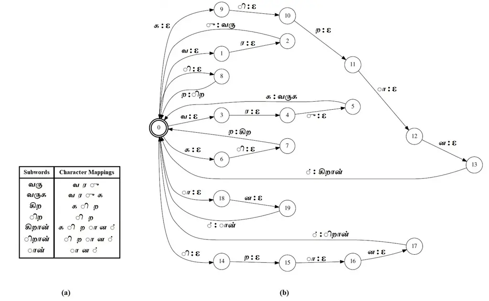

Figure 2: (a) An example subword dictionary $`\mathbb{D}`$, (b) Subword
dictionary weighted finite state transducer (SD-WFST) graph created for
$`\mathbb{D}`$ for Tamil language

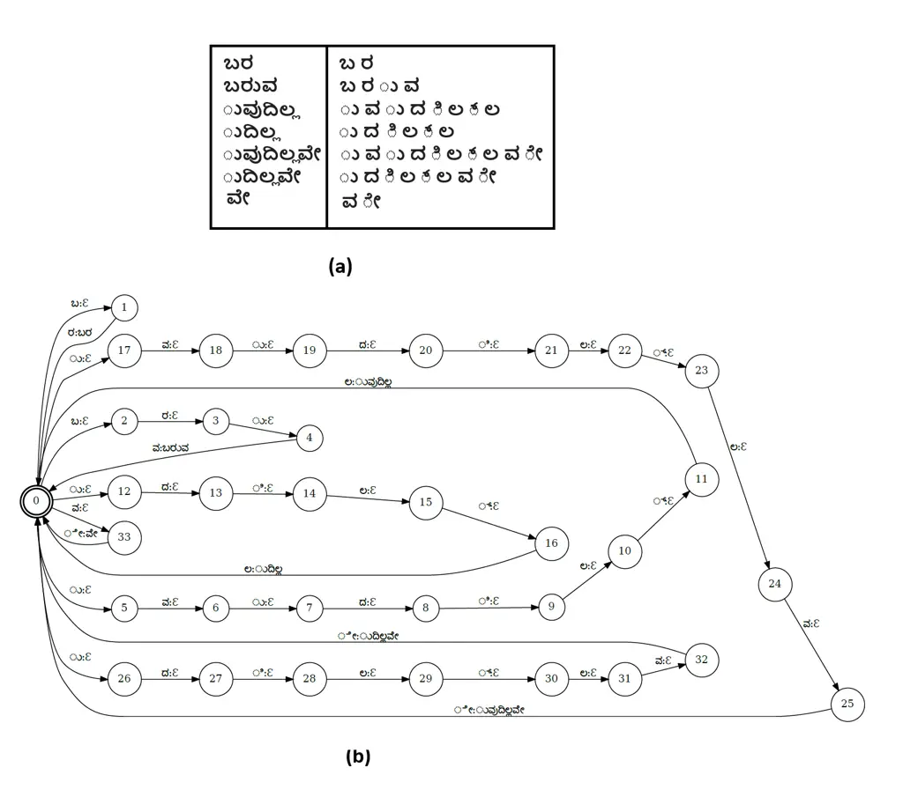

Figure 3: (a) An example subword dictionary $`\mathbb{D}`$, (b) Subword
dictionary weighted finite state transducer graph created for
$`\mathbb{D}`$ for Kannada language

### Construction of SG-WFST :

We construct subword grammar WFST (SG-WFST) from the unigram ($`\phi`$)
and bigram ($`\mathbb{B}`$) conditional densities over the subwords. Any
valid path in SG-WFST gives a sequence of subwords and the joint
probability associated with that sequence is given by the cost incurred
in traversing along that path. Example SG-WFSTs for the given parameters
$`\phi`$ and $`\mathbb{B}`$ are shown in Figs.  2 and  5 for Tamil and
Kannada respectively.

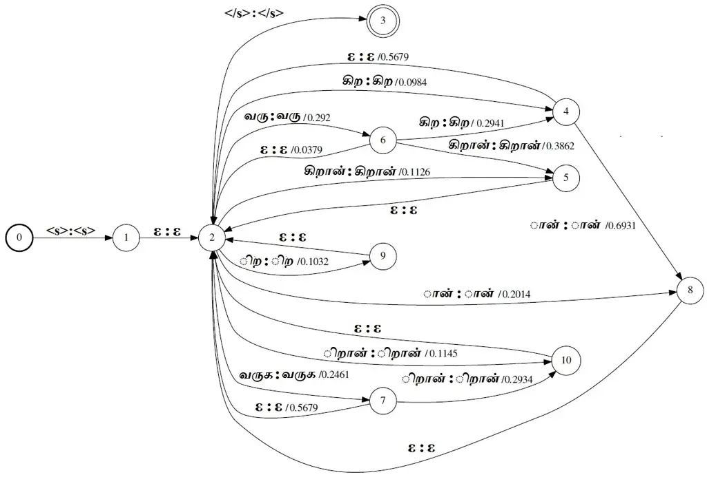

Figure 4: A sample Tamil subword grammar weighted finite state
transducer (SG-WFST) generated for the subword dictionary $`\mathbb{D}`$
shown in figure 2a.

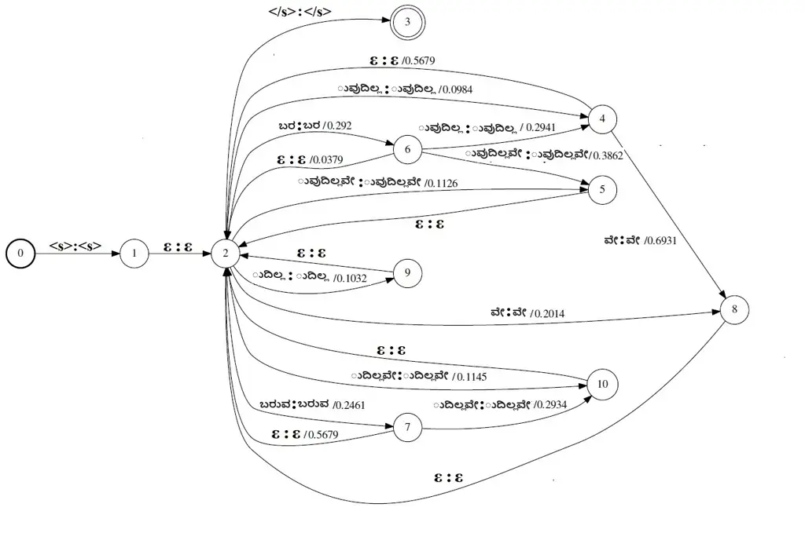

Figure 5: A sample Kannada subword grammar weighted finite state
transducer (SG-WFST) generated for the subword dictionary $`\mathbb{D}`$
shown in figure 3a

### Construction of W-WFST :

For each word $`w`$ in $`\mathbb{V}`$, we construct a W-WFST which
contains only one path having unique start and end states. The input
label for the first transition of the path is the word $`w`$ and
$`\epsilon`$ for the rest of the transitions, while the output labels
are the individual characters of $`w`$. Figures 6 and  7 show the
W-WFSTs for some sample words for Tamil and Kannada respectively.

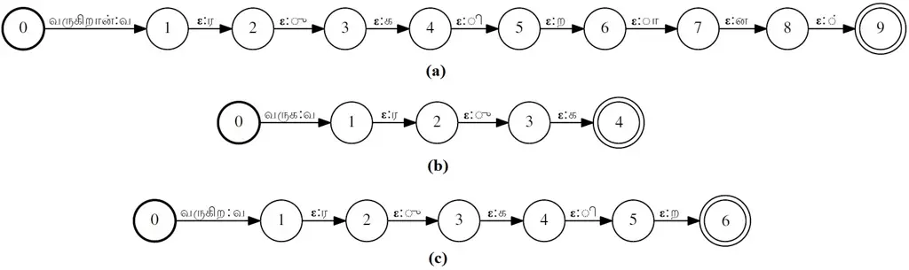

Figure 6: Word weighted finite state transducer (W-WFST) generated for
three Tamil words (a)
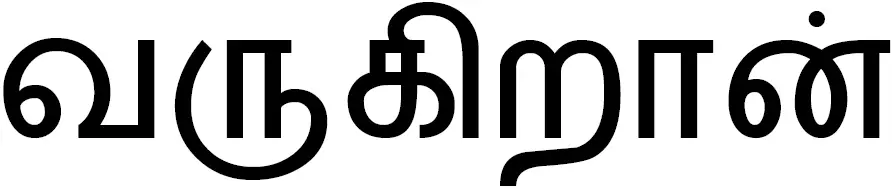 /varugiraan/
(b) 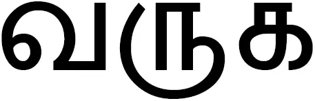 /varuga/
(c) 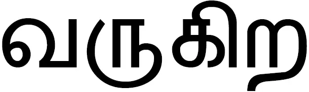 /varugira/

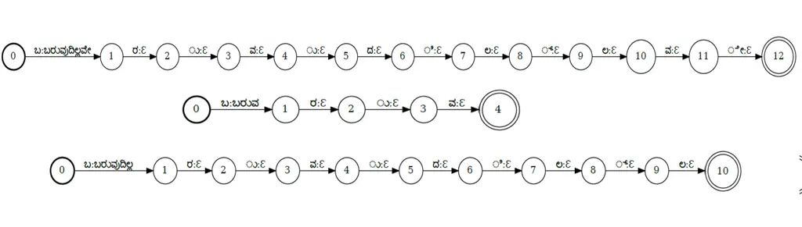

Figure 7: Word weighted finite state transducer (W-WFST) generated for
three Kannada words (a)
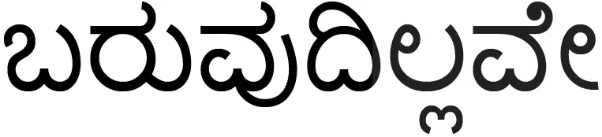
/baruvudillave/ (b)
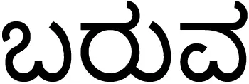 /baruva/ and
(c) 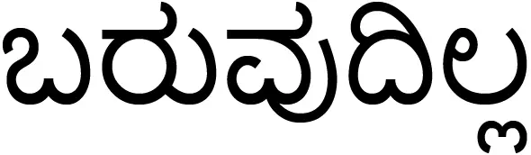
/baruvudilla/

### Segmentation by searching through O-WFST:

To segment a word, we take its corresponding W-WFST and left-compose it
with SD-WFST and SG-WFST. The resulting WFST is minimized, topology
sorted and output-label projected to get O-WFST:

```math
O=project_{output}\left(topsort\left(min\left(W\circ SD\circ SG\right)\right)\right) \tag{72}
```

The O-WFST thus obtained is shown respectively in figures 8 and 9 for an
example Tamil and Kannada word $`w`$, which have four different paths
from the start to the end state, denoting four possible segmentation for
$`w`$. We take the output label sequences across all these paths and
create the list $`\mathbb{W}_{w}`$. The posterior value
$`\gamma_{k}(\overline{Z})`$ corresponding to a segmentation sequence
$`\overline{Z}`$ is the weight associated with that particular path that
encodes the sequence $`\overline{Z}`$. The subword sequence
corresponding to the path with the maximum weight is the maximum
likelihood subword sequence $`\overline{Z}_{w}^{*}`$.

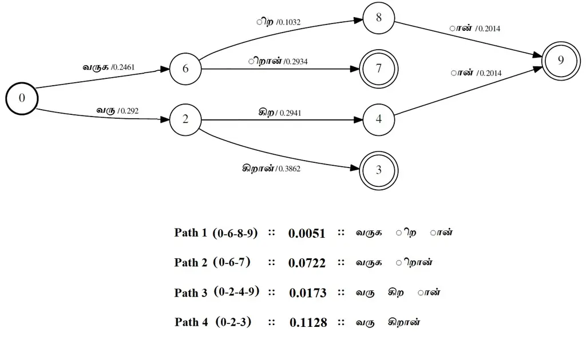

Figure 8: O-WFST obtained by composing the W-WFST for a sample Tamil
word in figure 6a with SG-WFST in figure 4 (showing possible
segmentation paths and their corresponding weights)

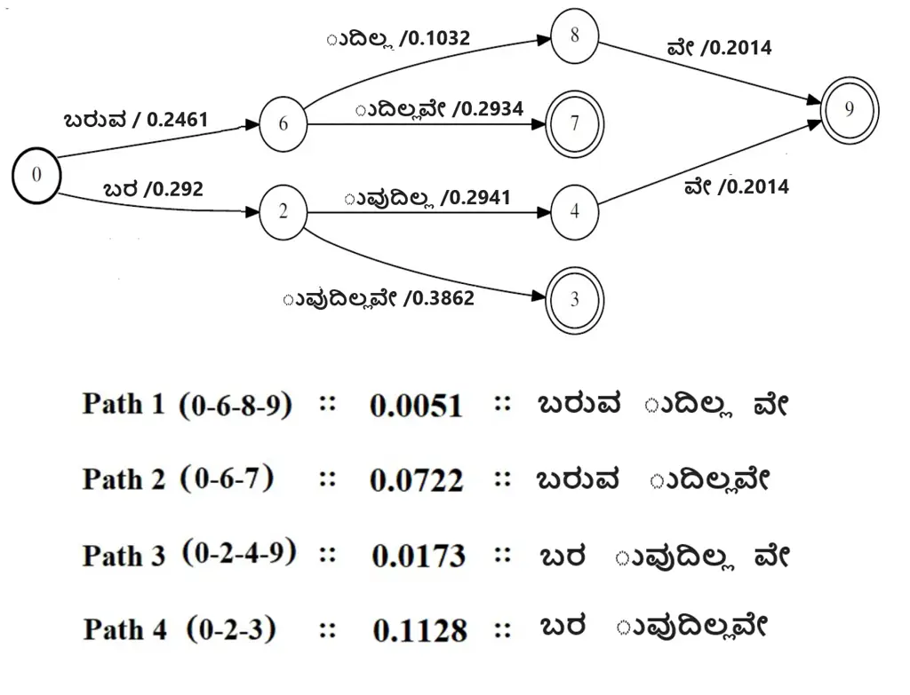

Figure 9: O-WFST obtained by composing the W-WFST for a sample Kannada
word in figure 7a with SG-WFST in figure 4 (showing possible
segmentation paths and their corresponding weights)

Input:   (i) Subword dictionary $`\mathbb{D}`$

      (ii) Subword unigram counts $`\mathbb{U}`$

      (iii) Word vocabulary $`\mathbb{V}`$

Output: (i) List of segmented words
$`\left\{\overline{Z}_{w}^{*}:\forall w\in\mathbb{V}\right\}`$

1 Normalize $`\mathbb{U}`$ to get the initial unigram density function
$`\phi_{0}`$;

2 Initialize $`\mathbb{B}_{0}`$ to be uniform conditional densities;

3 Construct W-WFST for all the words in $`\mathbb{V}`$;

4 Construct SD-WFST using the subwords in $`\mathbb{D}`$;

5 Construct SG-WFST with weights taken from $`\phi_{0}`$ and
$`\mathbb{B}_{0}`$;

6 for _$`iter\leftarrow 1\textnormal{ to }15`$_ do

    7 for _$`w\leftarrow 1\textnormal{ to }|\mathbb{V}|`$_ do

       8 Obtain O-WFST for word $`w`$ :
$`O_{w}=project(topsort(min(W_{w}\circ SD\circ SG)))`$;

       9 Obtain all the segmentations and their weights,
$`\{\overline{Z}\}_{w},\{\gamma\}_{w}`$ by searching $`O_{w}`$

       10 Obtain best segmentation $`\overline{Z}_{w}^{*}`$
corresponding to the maximum weight in $`\{\gamma\}_{w}`$;

    11 end for

    12 Estimate $`\phi_{iter}`$ and $`\mathbb{B}_{iter}`$ using
$`\{\{\overline{Z}\}_{w}\>:\forall w\in\mathbb{V}\}`$ and
$`\{\{\gamma\}_{w}\>:\forall w\in\mathbb{V}\}`$;

    13 Construct SG-WFST using subword dictionary $`\mathbb{D}`$ and the
updated model parameters $`\phi_{iter}`$ and $`\mathbb{B}_{iter}`$;

14 end for

15 return $`\{\overline{Z}^{*}\}_{w=1:|\mathbb{V}|}`$ obtained at the
last iteration;

Algorithm 3 Algorithm for ML-based word segmentation.

Once we segment all the words during an iteration $`k`$, we obtain the
estimates $`\phi`$ and $`\mathbb{B}`$ for the next iteration $`k+1`$ and
update the weights in SG-WFST with these new estimates and segment all
the words again. These segmentation and SG-WFST update steps are
performed for 15 iterations and we use the $`\overline{Z}_{w}^{*}`$
obtained after the last iteration to be the final ML-segmented subword
sequence for the word $`w`$. The pseudocode to implement the ML-based
word segmentation is given in Algorithm 3.

## 7 WFST implementation of Viterbi word segmentation

The implementation of Viterbi word segmentation is almost similar to
that of its ML counterpart. The only difference is that, while
estimating the parameters using equations 70 and 71, we consider only
one segmentation path in O-WFST that has maximum weight instead of using
all possible segmentation paths. Figure 10 shows the O-WFST containing
the best segmentation path obtained using Viterbi-based segmentation for
the three W-WFSTs for 3 example Tamil words shown in figure 6 with the
same subword dictionary and model parameters ($`\phi`$ and
$`\mathbb{B}`$) shown in figures 2 and 4. The procedural implementation
of Viterbi word segmentation is given in Algorithm 4.

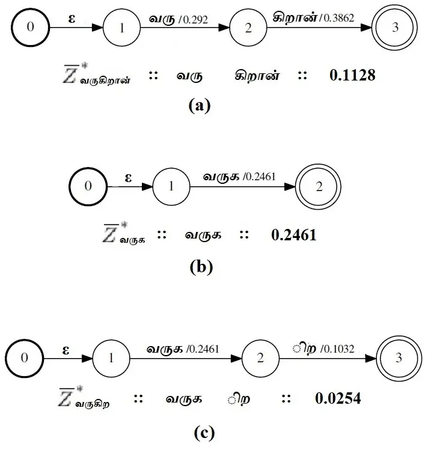

Figure 10: Optimal segmentation paths (and their corresponding weights)
obtained using Viterbi-based word segmentation for the W-WFSTs shown in
figure 6 for some sample Tamil words.

Input:    (i) Subword dictionary $`\mathbb{D}`$

      (ii) Subword unigram counts $`\mathbb{U}`$

      (iii) Word vocabulary $`\mathbb{V}`$

Output: (i) List of segmented words
$`\left\{\overline{Z}_{w}^{*}:\forall w\in\mathbb{V}\right\}`$

1 Normalize $`\mathbb{U}`$ to get the initial unigram density function
$`\phi_{0}`$;

2 Initialize $`\mathbb{B}_{0}`$ to be uniform conditional densities;

3 Construct W-WFST for all the words in $`\mathbb{V}`$;

4 Construct SD-WFST using the subwords in $`\mathbb{D}`$;

5 Construct SG-WFST with weights taken from $`\phi_{0}`$ and
$`\mathbb{B}_{0}`$;

6 for _$`iter\leftarrow 1\textnormal{ to }15`$_ do

    7 for _$`w\leftarrow 1\textnormal{ to }|\mathbb{V}|`$_ do

       8 Obtain O-WFST for word $`w`$ :
$`O_{w}=project(topsort(min(W_{w}\circ SD\circ SG)))`$;

       9 Obtain best segmentation $`\overline{Z}_{w}^{*}`$ corresponding
to the maximum weighted path in $`O_{w}`$ WFST;

    10 end for

    11 Estimate $`\phi_{iter}`$ and $`\mathbb{B}_{iter}`$ by calculating
the counts of subword occurrences in
$`\left\{\overline{Z}_{w}^{*}:\forall w\in\mathbb{V}\right\}`$;

    12 Construct SG-WFST using subword dictionary $`\mathbb{D}`$ and the
updated model parameters $`\phi_{iter}`$ and $`\mathbb{B}_{iter}`$;

13 end for

14 return $`\left\{\overline{Z}_{w}^{*}:\forall w\in\mathbb{V}\right\}`$
obtained at the last iteration;

Algorithm 4 Algorithm for Viterbi-based word segmentation

## 8 Construction of subword based ASR

In this section, we explain the steps involved in building the
subword-ASR.

- 1.  Segment the words in transcription text and in the LM text corpus into
      subwords using one of the combinations of the dictionary creation and
      segmentation techniques.
- 2.  Add context markers ($`+`$) to the segmented subwords to differentiate
      between prefixes, suffixes, infixes or singleton words as explained in
      \[23\].
- 3.  Learn N-gram subword LM from the segmented text corpus.
- 4.  Collect all the context-marked subwords and construct the lexicon WFST
      similar to that of the baseline word-based ASR system.
- 5.  Compose the subword lexicon WFST and the subword grammar WFST and use
      it to train and test the ASR system.
- 6.  During testing, post-process the output subword sequence by combining
      the subwords back to words by removing the context-markers \[23\].

We have used $`6^{th}`$ order LM to learn the grammar of subword units
in all our ASR experiments. The reason to have $`6^{th}`$ order subword
LM compared to 3rd order word level LM is because each word is normally
split into 2-4 subwords and so only by increasing the subword LM order
to 6, we are able to match the performance and learn the grammar context
of the 3rd order word-level LM. We have also varied the order of the
subword-LM from 2 to 6 and compared their WER performances.

We have considered only the words in the training corpus to build
lexicon for the baseline ASR for the purpose of comparison and to
illustrate the benefits of subword-ASR.

## 9 Experimental setup and results

In this section, we compare the performances of subword-ASRs with the
baseline ASR system in terms of OOV rate and WER and empirically justify
the need for subword modeling to handle highly agglutinative languages
like Tamil and Kannada. OOV rate is defined as the ratio of number of
words in the test data which are not present in the training corpus to
the total number of words in the test data.

We have tried different combinations of automatic subword dictionary
methods (Morfessor, BPE and extended-BPE) with ML and Viterbi-based
segmentation methods and evaluated the WER performance of the
subword-ASR for different orders of subword n-gram LMs with the dataset
explained in section 2. In our experiments, the subword dictionary size
is chosen to be 20000 for BPE method. For extended-BPE method, we choose
$`N_{1}=48`$, $`N_{2}=1000`$, $`N_{3}=4000`$, $`N_{4}=6000`$,
$`N_{5}=4000`$, $`N_{6}=3000`$ and $`N_{7}=1952`$ so that the total
subword dictionary size is 20000. These values are chosen after various
trial and error experiments such that we get the best possible
recognition accuracy, while maintaining the size of the subword ASR
model almost the same as that of the word-based ASR model. For
morphological analyzer-based dictionary creation method, the size of the
subword dictionary is automatically decided by the Morfessor tool (in
our case, the size comes out to be 22834). The baseline word-based ASR
system has a total vocabulary size of 182771 words for Tamil and 201055
words for Kannada.

### 9.1 Performance of ML segmentation technique

Tables 1 and 2 compare the WER performance of the proposed subword
dictionary creation method for Tamil and Kannada respectively, using
ML-based segmentation with the baseline system for various orders of LM.
We have also listed the OOV rates to further justify the effectiveness
of the subword-ASR system.

We see that all the subword dictionary creation methods using ML
segmentation perform better than the baseline word-based model, for both
the languages. We obtain WERs of 15.03% and 14.42% for Morfessor and
BPE-based dictionary creation, respectively, for Tamil. The best WER of
14.10% is obtained by the extended-BPE for $`6^{th}`$ order subword LM
which is an absolute improvement of 10.6% over the baseline model. For
Kannada, we obtain WERs of 13.02% and 12.83% for Morfessor and BPE based
dictionary creation methods respectively, with ML-segmentation. Similar
to Tamil, extended-BPE method gives the best WER of 12.31%, which is an
absolute WER improvement of 9.64% over the baseline Kannada ASR system.

|                       |                     |        |        |        |       |
| --------------------- | ------------------- | ------ | ------ | ------ | ----- |
| Method                | Word Error Rate (%) |        |        |        | OOV   |
|                       | 3-gram              | 4-gram | 5-gram | 6-gram |       |
|                       | LM                  | LM     | LM     | LM     |       |
| Baseline (word-based) | 24.70               | -NA-   | -NA-   | -NA-   | 10.73 |
| Morfessor             | 18.84               | 18.29  | 15.47  | 15.03  | 2.41  |
| Byte pair encoding    | 17.97               | 17.58  | 15.24  | 14.42  | 0.0   |
| Extended-BPE          | 17.43               | 16.72  | 14.96  | 14.10  | 0.0   |

Table 1: Comparison of the word error rates and out of vocabulary rate
of different subword dictionary creation techniques with maximum
likelihood segmentation for Tamil.

|                       |                     |        |        |        |      |
| --------------------- | ------------------- | ------ | ------ | ------ | ---- |
| Method                | Word Error Rate (%) |        |        |        | OOV  |
|                       | 3-gram              | 4-gram | 5-gram | 6-gram |      |
|                       | LM                  | LM     | LM     | LM     |      |
| Baseline (word-based) | 21.95               | -NA-   | -NA-   | -NA-   | 8.64 |
| Morfessor             | 16.02               | 15.30  | 14.22  | 13.02  | 2.06 |
| Byte pair encoding    | 15.94               | 14.13  | 13.24  | 12.83  | 0    |
| Extended-BPE          | 15.71               | 14.01  | 12.98  | 12.31  | 0    |

Table 2: Comparison of the word error rates and out of vocabulary rate
of different subword dictionary creation techniques with maximum
likelihood segmentation for Kannada.

Such huge improvements in WER of subword ASR are due to the reduction in
the OOV rate. We see that BPE and extended-BPE methods have 0% OOV rate.
The reason for 0% OOV rate in BPE-based methods (for both Tamil and
Kannada) is that their subword dictionaries contain all the individual
Tamil or Kannada characters as subwords; hence, every possible word can
be segmented using these subword dictionaries.

### 9.2 Performance of Viterbi segmentation technique

We compare the WER performance of the subword dictionary creation
methods using Viterbi segmentation for various LM orders with the
baseline system for Tamil and Kannada in tables 3 and 4 respectively.
For Tamil, the Morfessor and BPE-based subword dictionary creation
methods give WERs of 15.81% and 15.13%, respectively. The extended-BPE
method performs the best with a WER of 14.97% for $`6^{th}`$ order
subword LM, which is an absolute WER improvement of 9.73% over the
baseline model. For Kannada, the Morfessor and BPE-based subword
dictionary creation methods give WERs of 13.45% and 13.16% respectively,
whereas extended-BPE performs the best with a WER of 12.82% obtained for
$`6^{th}`$ order subword LM (an absolute WER improvement of 9.13% over
the baseline model).

The OOV rates for the Viterbi segmentation technique show a trend
similar to that of ML-segmentation, but slightly poorer. We see that BPE
and extended-BPE methods have zero OOV rates whereas the baseline models
have an OOV rate of 10.73% and 8.64% for Tamil and Kannada respectively.

|                       |                     |        |        |        |       |
| --------------------- | ------------------- | ------ | ------ | ------ | ----- |
| Method                | Word Error Rate (%) |        |        |        | OOV   |
|                       | 3-gram              | 4-gram | 5-gram | 6-gram |       |
|                       | LM                  | LM     | LM     | LM     |       |
| Baseline (word-based) | 24.70               | -NA-   | -NA-   | -NA-   | 10.73 |
| Morfessor             | 22.53               | 20.08  | 16.14  | 15.81  | 3.76  |
| Byte pair encoding    | 18.74               | 17.88  | 15.62  | 15.13  | 0.0   |
| Extended-BPE          | 18.46               | 17.51  | 15.28  | 14.97  | 0.0   |

Table 3: Comparison of the word error rates and out of vocabulary rates
of the subword dictionary creation with Viterbi segmentation for Tamil.

|                       |                     |        |        |         |      |
| --------------------- | ------------------- | ------ | ------ | ------- | ---- |
| Method                | Word Error Rate (%) |        |        |         | OOV  |
|                       | 3-gram              | 4-gram | 5-gram | 6-gram  |      |
|                       | LM                  | LM     | LM     | LM      |      |
| Baseline (word-based) | 21.95               | -NA-   | -NA-   | -NA-    | 8.64 |
| Morfessor             | 16.82               | 15.98  | 14.72  | 13\. 45 | 2.92 |
| Byte pair encoding    | 15.86               | 14.95  | 13.62  | 13.16   | 0    |
| Extended-BPE          | 15.32               | 14.21  | 13.14  | 12.82   | 0    |

Table 4: Comparison of the word error rates and out of vocabulary rates
of the subword dictionary creation with Viterbi segmentation for
Kannada.

Comparing the segmentation techniques, we observe that ML segmentation
fares better than Viterbi segmentation method for both languages, which
is due to the fact that the former soft-weighs all the possible
segmentation paths and estimates the subword model parameters while the
latter considers only the best segmentation path.

## 10 Conclusion

Thus, we have presented ASR systems based on novel subword modeling
techniques to handle the infinite vocabulary problem of highly
agglutinative languages like Tamil and Kannada. We have explored BPE,
extended BPE and Morfessor tool to construct subword dictionaries and
have used statistical approaches such as ML and Viterbi to segment words
into subwords efficiently using WFST framework. The experiments
demonstrated the success of the proposed approach in terms of reduction
in WER and OOV rates. We also notice that the ML method performs
slightly better than the Viterbi method for both the languages.

## References

- \[1\] T. Hirsimaki, J. Pylkkonen, M. Kurimo, Importance of high-order
  n-gram models in morph-based speech recognition, IEEE Transactions on
  Audio, Speech, and Language Processing 17 (2009) 724–732.
- \[2\] M. Varjokallio, M. Kurimo, S. Virpioja, Class n-gram models for
  very large vocabulary speech recognition of Finnish and Estonian, in:
  International Conference on Statistical Language and Speech
  Processing, Springer, 2016, pp. 133–144.
- \[3\] T. Hirsimäki, M. Creutz, V. Siivola, M. Kurimo, S. Virpioja,
  J. Pylkkönen, Unlimited vocabulary speech recognition with morph
  language models applied to Finnish, Computer Speech & Language
  20 (2006) 515–541.
- \[4\] W. Byrne, J. Hajič, P. Ircing, P. Krbec, J. Psutka, Morpheme
  based language models for speech recognition of Czech, in:
  International Workshop on Text, Speech and Dialogue, Springer, 2000,
  pp. 211–216.
- \[5\] H. Erdogan, O. Buyuk, K. Oflazer, Incorporating language
  constraints in sub-word based speech recognition, in: IEEE Workshop on
  Automatic Speech Recognition and Understanding, 2005., IEEE, 2005, pp.
  98–103.
- \[6\] T. Laureys, V. Vandeghinste, J. Duchateau, A hybrid approach to
  compounds in LVCSR, in: Seventh International Conference on Spoken
  Language Processing, 2002.
- \[7\] K. Hacioglu, B. Pellom, T. Ciloglu, O. Ozturk, M. Kurimo,
  M. Creutz, On lexicon creation for Turkish LVCSR, in: Eighth European
  Conference on Speech Communication and Technology, 2003.
- \[8\] E. Arısoy, H. Sak, M. Saraçlar, Language modeling for automatic
  Turkish broadcast news transcription, in: Eighth Annual Conference of
  the International Speech Communication Association, 2007.
- \[9\] K. Kirchhoff, D. Vergyri, J. Bilmes, K. Duh, A. Stolcke,
  Morphology-based language modeling for conversational Arabic speech
  recognition, Computer Speech & Language 20 (2006) 589–608.
- \[10\] R. Sarikaya, M. Afify, Y. Gao, Joint morphological-lexical
  language modeling (JMLLM) for Arabic, in: 2007 IEEE International
  Conference on Acoustics, Speech and Signal Processing-ICASSP’07,
  volume 4, IEEE, 2007, pp. IV–181.
- \[11\] Openslr: Iisc mile tamil asr corpus, 2022a. URL:
  [http://www.openslr.org/127/](http://www.openslr.org/127/).
- \[12\] Openslr: Iisc mile kannada asr corpus, 2022b. URL:
  [http://www.openslr.org/126/](http://www.openslr.org/126/).
- \[13\] Data provided by SpeechOcean.com and Microsoft,
  Microsoft, 2018.
- \[14\] A. Madhavaraj, A. G. Ramakrishnan, Design and development of a
  large vocabulary, continuous speech recognition system for Tamil, in:
  2017 14th IEEE India Council International Conference (INDICON), IEEE,
  2017, pp. 1–5.
- \[15\] D. Povey, A. Ghoshal, G. Boulianne, L. Burget, O. Glembek,
  N. Goel, M. Hannemann, P. Motlicek, Y. Qian, P. Schwarz, J. Silovsky,
  G. Stemmer, K. Vesely, The Kaldi speech recognition toolkit, IEEE
  Workshop on Automatic Speech Recognition and Understanding (2011).
- \[16\] A. Stolcke, SRILM – an extensible language modeling toolkit,
  in: Proceedings of the 7th International Conference on Spoken Language
  Processing (ICSLP), 2002, pp. 901–904.
- \[17\] R. Sennrich, B. Haddow, A. Birch, Neural machine translation of
  rare words with subword units, in: Proceedings of the 54th Annual
  Meeting of the Association for Computational Linguistics (Volume 1:
  Long Papers), Association for Computational Linguistics, Berlin,
  Germany, 2016, pp. 1715–1725.
- \[18\] P. Gage, A new algorithm for data compression, C Users J.
  12 (1994) 23–38.
- \[19\] P. Smit, S. Virpioja, S.-A. Grönroos, M. Kurimo, Morfessor 2.0:
  Toolkit for statistical morphological segmentation, in: Proc.
  Demonstrations at the 14th Conf. European Chapter of the Assoc. for
  Computational Linguistics, Association for Computational Linguistics,
  Gothenburg, Sweden, 2014, pp. 21–24.
- \[20\] M. Creutz, K. Lagus, Unsupervised models for morpheme
  segmentation and morphology learning, ACM Trans. Speech Lang. Process.
  4 (2007).
- \[21\] A. P. Dempster, N. M. Laird, D. B. Rubin, Maximum likelihood
  from incomplete data via the EM algorithm, J. Royal Statistical
  Society, Series B 39 (1977) 1–38.
- \[22\] M. Varjokallio, M. Kurimo, S. Virpioja, Learning a subword
  vocabulary based on unigram likelihood, in: IEEE Workshop on Automatic
  Speech Recog. Understanding, 2013, pp. 7–12.
- \[23\] P. Smit, S. Virpioja, M. Kurimo, Improved subword modeling for
  WFST-based speech recognition, in: 18th Ann. Conf. Int. Speech
  Communication Assoc. (INTERSPEECH 2017), 2017, pp. 2551–2555.
