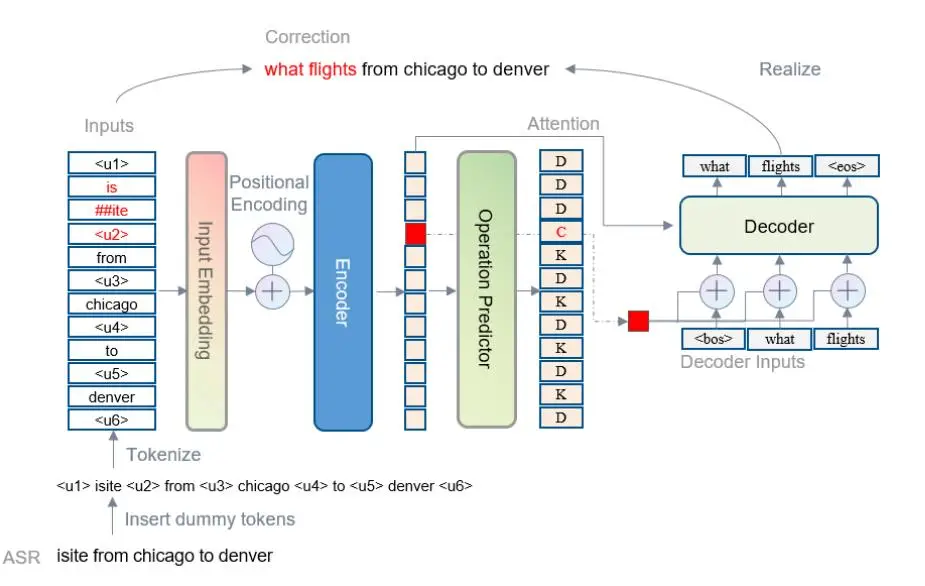
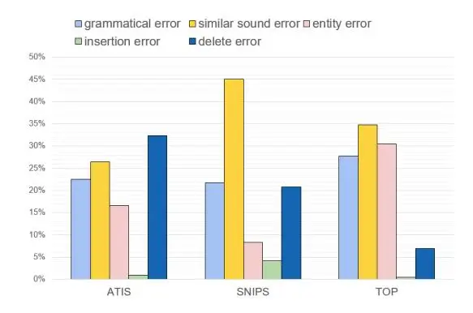

# ASR Error Correction with Constrained Decoding on Operation Prediction

_Jingyuan Yang_† _, Rongjun Li_† \*, Wei Peng\*\*

### Artificial Intelligence Application Research Center, Huawei Technologies

yangjingyuan2@huawei.com, lirongjun3@huawei.com, peng.wei1@huawei.com

### Abstract

Error correction techniques remain effective to refine outputs from automatic speech recognition (ASR) models. Existing end-to-end error correction methods based on an encoderdecoder architecture process all tokens in the decoding phase, creating undesirable latency. In this paper, we propose an ASR error correction method utilizing the predictions of correction operations. More specifically, we construct a predictor between the encoder and the decoder to learn if a token should be kept ("K"), deleted ("D"), or changed ("C") to restrict decoding to only part of the input sequence embeddings (the "C" tokens) for fast inference. Experiments on three public datasets demonstrate the effectiveness of the proposed approach in reducing the latency of the decoding process in ASR correction. It enhances the inference speed by at least three times (3.4 and 5.7 times) while maintaining the same level of accuracy (with WER reductions of 0.53% and 1.69% respectively) for our two proposed models compared to a solid encoder-decoder baseline. In the meantime, we produce and release a benchmark dataset contributing to the ASR error correction community to foster research along this line.

Index Terms: automatic speech recognition, error correction, sequence to sequence, constrained decoder

### 1. Introduction

Automatic speech recognition (ASR) models play critical roles in pipeline-based contemporary deep learning systems (i.e., Voice Assistant and Speech Translation) by transforming sequences of audio signals to sequences of word tokens for downstreaming tasks [\[1,](#page-4-0) [2\]](#page-4-1). Despite its comprehensive application to industrial scenarios, ASR is ill-performed in real-world cases, whereas out-of-domain speech and noisy data prevail. For example, Table [1](#page-0-0) shows several common ASR errors, including an entity error with a reference data "to orlando" wrongly recognized as "tewel ando", leading to problems in down-streaming tasks.

Error correction (EC) techniques remain effective means to refine outputs from ASR models. These EC approaches belong to a cascade framework and an end-to-end sequence to sequence framework. The cascade framework consists of a sequence labeling method to identify the sequence of interests, followed by a rule-based value error recovery module [\[3\]](#page-4-2). A cascading EC framework requires costly manual transcriptions to all positive and negative tokens; therefore, scaling up a cascading EC approach is challenging. An end-to-end framework treats EC of ASR as a machine translation method between problematic sequences of tokens and reference sequences [\[4,](#page-4-3) [5,](#page-4-4) [6,](#page-4-5) [7\]](#page-4-6). Along this line, Transformer-based ASR error correction methods learn a mapping between the outputs of ASR and the related ground-truth transcriptions [\[8\]](#page-4-7). Pretrained language mod-

Table 1: _Typical ASR errors include: 1) the grammatical error due to unclear voice signal (in red fonts); 2) the similar sound error created by phonetically confusing words (in blue); 3) the lack of domain-specific terms causing the entity error (in olive fonts) ; 4) the insertion error in cyan, and the delete error in orange_

| Type      | Example                                                                    |
| --------- | -------------------------------------------------------------------------- |
| Reference | cheapest airfare from tacoma to orlando. will it get \* hotter in hext. |
| ASR       | cheaper stair from tacoma tewel ando. will it get a hotter in \*.       |

els, i.e., BERT [\[9\]](#page-4-8) and BART [\[10\]](#page-4-9), are used as encoders to represent input sequences to boost ASR error correction [\[11\]](#page-4-10), in which a Bart-initialized model is regarded to significantly outperform that from BERT [\[7\]](#page-4-6). The end-to-end ASR error correction framework becomes the mainstream as it achieves the state-of-the-art (SOTA) WER and requires fewer efforts in preparing training data than the cascading framework. Existing transformer-based ASR EC models process all input embeddings equally in the decoding phase, creating undesirable latency. In this paper, we propose an ASR error correction method utilizing the predictions of correction operations to constrain the decoding and reduce the inference latency. More specifically, we design a predictor between the encoder and the decoder to classify if a token should be kept ("K"), deleted ("D") or changed ("C") to restrict decoding to only part of the input sequence embeddings (the "C" tokens) for fast inference. On the other hand, there is a lack of publicly available benchmark datasets for ASR error correction as researchers in this area majorly report the experimental results on the in-house data. Such data deficiency in the public domain has inhibited the advancement of the ASR error correction techniques. The contributions of our work are two folds:

- To our best knowledge, we are the first to construct an operation predictor to perform constrained decoding to enhance the inference speed of an ASR error correction approach. Experiments on three datasets demonstrate the effectiveness of the proposed method in enhancing the inference speed by at least three times while maintaining the same level of accuracy (WER) compared to a solid encoder-decoder baseline.
- To address the lack of public benchmark datasets for ASR error correction, we apply internal ASR and Text-to-Speech (TTS) engines to a single-turn dialogue dataset TOP [\[12\]](#page-4-11). In this way, we produce an ASR error correction dataset contributing to the community to foster research along this line.

The code and datasets[1](#page-0-1) are made publicly available.

†Indicating equal contribution

\*Corresponding author

1<https://github.com/yangjingyuan/ConstDecoder>

Figure 1: The overall architecture of the proposed method. The decoder takes the encoded hidden representation over the "C" positions, the attended context vector, and the prediction from the last time step as inputs to produce the corrected tokens. In particular, when multiple "C" tags are present, they are decoded in parallel.

#### 2. Related Work

ASR correction has been jointly trained with natural language understanding in a multi-task setting [2]. To address the issue associated with semantic-only post-correction, phonetic features are included in the correction model to tackle homophonic errors commonly identified in Chinese ASR [13]. Along this direction, [5] propose a variant transformer model encoding both the word and phoneme sequence of an entity to fix name entity errors. A similar research [14] utilizes a dual encoder in an end-to-end framework to handle an input word sequence and corresponding phoneme sequence. More works [11, 7] have emerged to boost the accuracy of error correction. It was not until recently that researchers commenced exploring means to reduce decoding latency associated with sequence-to-sequence ASR correction models. LaserTagger [15] converts the sequence generation task to a text editing one to enhance inference speed. However, LaserTagger can not handle the out-ofvocabulary problem as it relies on a predefined vocabulary. Although there is an attempt leveraging non-autoregressive models in ASR correction, the study [16] is built on a large internal Mandarin speech corpus. It is argued that an error correction method using non-autoregressive models suffer from the issue of over-correction, resulting in mis-replacement of normal words. A direct comparison is not applicable before a full-scale release of code and data. [17] propose a semi-autoregressive model coupled with an LSTM for generation, achieving SOTA accuracy and inference speed in the utterance restoration. Inspired by [17], we design an end-to-end ASR error correction method using an operation predictor to restrict decoding to only desirable parts of the input sequence embeddings to reduce inference latency.

### 3. Approach

The task of ASR error correction can be treated as a functional mapping $f:X\to T$ between X and T, where X denotes text outputs from ASR containing errors, T is the ground-truth

reference text. Unlike other sequence generation tasks, which may have radically different inputs and outputs, it is observed that most contents of X and T are identical. The intuition here is to only apply a mapping (f) between the desirable part of X and the counterparts in T. We design an end-to-end architecture consisting of an encoder, a decoder, and an operation predictor to constrain the decoding process to the desired part of the input sequence, shown in Figure 1. The encoder produces sequence embeddings from the word embeddings of the ASR output texts and related positional embeddings. The operation predictor is a fully-connected layer trained to identify the above-mentioned "K", "D" and "C" input sequence embeddings. The model can reduce inference latency significantly by restricting the decoding process to the "C" tokens.

#### 3.1. Preprocessing phase

The preprocessing step is similar to that mentioned in [17]:(1) Insert dummy tokens between very adjacent token in X; (2) Apply WordPiece tokenizer [18] to X and T to produce corresponding token sequences $X = \{\omega_1^x, \omega_2^x, ..., \omega_n^x\}$ , $T = \{\omega_1^t, \omega_2^t, ..., \omega_m^t\}$ ; (3) Construct training labels for the operation predictor and the decoder. We calculate the longest common subsequence (LCS) between X and T, and apply LCS to align X and T recurrently. The aligned tokens are labeled as "KEEP" ("K") with the rest tagged as "DELETE" ("D") or "CHANGE" ("C") with the positions of the chunks of "C" tokens recorded. The operation training labels are defined as $D = \{d_1, d_2, ..., d_n\}$ . The decoding sequence for "C" commencing at $k^{th}$ position can be denoted as $Y_k = \{\omega_{1,k}^y, \omega_{2,k}^y, ..., \omega_{o,k}^y\}$ .

#### 3.2. Model architecture

We use BERT as an encoder to obtain the hidden representations of the model inputs X:

$$E^{x} = BERT_{Encoder}(WE(X) + PE(X))$$
(1)

where WE and PE are related word and position embedding functions respectively. $E^x = \{e_1^x, e_2^x, ..., e_n^x\}$ is the encoded

representation of X, and $e_i^x$ is the $i^{th}$ encoded token representation of X. Next, one fully-connected layer with softmax is designed to be the operation predictor:

$$p(\hat{d}_i|\omega_i^x) = \text{softmax}(W_d e_i^x + b_d). \tag{2}$$

Here, $\hat{d}_i$ is the predicted operation. $W_d$ and $b_d$ are the learnable parameters. At last, the operation loss is defined as negative log-likehood:

$$\log_{oper} = -\sum_{i} \log(p(\hat{d}_i | \omega_i^x)). \tag{3}$$

Two kinds of constrained decoders are implemented, one is LSTM-based and the other is transformer-based.

#### • LSTM-based decoder

$$s_{t+1}^k = \text{LSTM}(\text{WE}(\omega_{t,k}^y), s_t^k). \tag{4}$$

where $\omega^y_{t,k}$ and $s^k_t$ are the decoder input and the LSTM hidden state at time step t in terms of the $k^{th}$ change operation. The initial values of $\omega^y_{0,k}$ and $s^k_0$ are <bos> and $e^x_k$ respectively. WE is the same word embedding function as in equation 1. Moreover, corresponding context vector is calculated based on the additive attention [19] mechanism:

$$c_{t+1}^k = \text{Attn}(Q, K, V), \tag{5}$$

$$Q = s_{t+1}^k, K = E^x, V = E^x.$$
(6)

where the LSTM hidden state $s_{t+1}^k$ works as query ("Q"), and the encoded model input $E^x$ works as key ("K") and value ("V") in corresponding attention calculation. Finally, the context vector $c_{t+1}^k$ and the LSTM hidden state $s_{t+1}^k$ are fused to predict the target text.

$$p(\hat{\omega}_{t+1,k}^y) = \text{softmax}(W_y[c_{t+1}^k \oplus s_{t+1}^k] + b_y)$$
(7)

where $\oplus$ indicates a concatenate function, $W_y$ and $b_y$ are the learnable parameters.

#### • Transformer decoder

For the $k^{th}$ change position, the transformed-based decoder inputs at timestep t are calculated as follows:

$$E_{t,k}^y = W_p[(WE(\omega_{t,k}^y) + PE(\omega_{t,k}^y)) \oplus e_k^x].$$
(8)

where WE and PE are the same word and position embedding functions as in equation 1. $e_k^x$ is the encoded token representation mentioned before. $W_p$ is the trainable parameters. Then, a standard transformer decoder [20] is employed to fuse all relevant information:

$$h_{t+1}^{k} = \text{TransformerDecoder}(Q, K, V),$$
(9)

$$Q = E_{+b}^{y}, K = E^{x}, V = E^{x}. \tag{10}$$

where the decoder input $E^y_{t,k}$ works as query ("Q"), and encoded model input $E^x$ works as key ("K") and value ("V") in transformer decoder. $h^k_{t+1}$ is the fused vector. Finally, the target output is predicted as follows:

$$p(\hat{\omega}_{t+1,k}^y) = \operatorname{softmax}(W_y h_{t+1}^k + b_y) \tag{11}$$

where $W_y$ and $b_y$ are trained parameters. Both LSTM-based and transformer-based generation loss are defined as:

$$loss_{dec} = -\sum_{k} \sum_{t} log(p(\hat{\omega}_{t,k}^{y})). \tag{12}$$

The total loss is calculated as follows:

$$loss = \alpha loss_{oper} + loss_{dec}.$$
(13)

where $\alpha$ is the hyperparameter.

### 4. Experiments

In order to evaluate the effectiveness of our proposed model, three datasets leveraging different ASR engines are utilized.

Table 2: Statistics of the utilized datasets

| Name  | Train | Valid | Test |
| ----- | ----- | ----- | ---- |
| ATIS  | 3867  | 967   | 800  |
| SNIPS | 13084 | 700   | 700  |
| TOP   | 31279 | 4462  | 9042 |

Figure 2: A comparison of ASR error type distributions for three benchmark datasets.

- ATIS [21] is a public benchmark dataset containing user voice records of flight information. [22] used a TTS engine (Amazon Polly2) to convert the text to voice, adding ambient noise3 to simulate real-life data. Finally, a LAS [23] ASR engine was used to convert voice data into transcribed texts.
- SNIPS [24] is also a benchmark dataset for speaking language understanding study. [1] used a commercial TTS to synthesize audio data from texts. Kaldi4 is used to transcribe audio to texts.
- TOP [12] is the dataset proposed by Facebook focusing on the topics of navigation and events. We use our own commercial TTS and ASR engine to produce the dataset.

Figure 2 shows a distribution of errors in our sampled datasets. It is noted that they are significantly different, enabling a comprehensive evaluation of model effectiveness. We compare the propose method with the following three baselines:

- Original: refers to the WER of the original datasets when no error correction applies;
- SC_BART [7]: a pretrained encoder-decoder transformer language model, which has reached SOTA results on ASR error correction tasks;
- distillBART [25]: a distilled version of BART-large, which has a 12-layer encoder and a single-layer decoder. The application of distillation followed by finetuning on the three datasets to enhance the inference speed.

2https://aws.amazon.com/polly/

3www.pacdv.com/sounds/ambience\_sounds.html

4https://github.com/kaldi-asr/kaldi

Table 3: *The experimental results of our method against other SOTA methods in WER on three benchmark datasets. ConstDecoder*lstm *and ConstDecoder*trans _refer to our proposed constrained decoder using LSTM and transformer respectively._

| Method            | ATIS  | SNIPS  | TOP   | Average |
| ----------------- | ----- | ------ | ----- | ------- |
| Original          | 30.65 | 45.73  | 13.45 | 29.94   |
| SC BART [7]       | 21.47 | 30.35  | 7.30  | 19.70   |
| distilBART [25]   | 26.51 | 33.28  | 8.25  | 22.68   |
| ConstDecoderlstm  | 22.44 | 31.75  | 10.02 | 21.40   |
| vs. Original      | -8.21 | -13.98 | -3.43 | -8.54   |
| vs. SC BART       | +0.97 | +1.40  | +2.72 | +1.69   |
| vs. distilBART    | -4.07 | -1.53  | +1.77 | -1.28   |
| ConstDecodertrans | 21.74 | 30.98  | 7.99  | 20.23   |
| vs. Original      | -8.91 | -14.75 | -5.46 | -9.70   |
| vs. SC BART       | +0.27 | +0.63  | +0.69 | +0.53   |
| vs. distilBART    | -4.77 | -2.30  | -0.26 | -2.44   |

Table 4: _The inference time cost in milliseconds (ms) against a SOTA transformer-based error correction model (SC BART) and a distilled version of it (distilBART) on three benchmark datasets._

| Method            | ATIS  | SNIPS | TOP   | Average |
| ----------------- | ----- | ----- | ----- | ------- |
| SC BART           | 90.30 | 75.30 | 75.08 | 80.22   |
| distilBART        | 45.55 | 41.55 | 40.08 | 42.39   |
| ConstDecoderlstm  | 14.31 | 15.06 | 12.53 | 13.96   |
| vs. SC BART       | 6.3×  | 5.0×  | 6.0×  | 5.7×    |
| vs. distilBART    | 3.2×  | 2.8×  | 3.2×  | 3.0×    |
| ConstDecodertrans | 25.61 | 26.66 | 18.43 | 23.56   |
| vs. SC BART       | 3.5×  | 2.8×  | 4.1×  | 3.4×    |
| vs. distilBART    | 1.8×  | 1.6×  | 2.2×  | 1.8×    |

#### 4.1. Model training details

The encoder of the ConstDecoderlstm is initialized using a pretained BERT (bert-base-uncased) with 12-layer architecture and a hidden size of 768. The decoder is a single-layer LSTM with a hidden size of 768. The optimizer is AdamW [\[26\]](#page-4-25) with a batch size of 8, trained with 20 epochs. The encoder of ConstDecodertrans adopts the same setting with the that of ConstDecoderlstm. The decoder is a single-layer transformer decoder with a hidden size of 768. We use Adam [\[27\]](#page-4-26) as the optimizer with a batch size of 32 (the same as baseline), trained with 20 epochs. The maximum length of the decoder output is set to 10. The coefficient (α) of the loss function is initialized to 3. The initial learning rate is 5e-5. The model is trained and evaluated using NVIDIA Tesla V100.

#### 4.2. Results analysis

Tables [3-](#page-3-0)[4](#page-3-1) show the experimental results in terms of WER and inference speed of the proposed method against a SOTA transformer baseline (SC BART) on three benchmark datasets. Both SC BART and our method can reduce WER for the original datasets significantly. SC BART performs slightly better than our method (0.53%) in WER, possibly ascribing to: 1) It utilizes a more robust pretrained language model and; 2) It engages a fully autoregressive model. However, our method leads in inference speed, achieving at least three times faster decoding time on average for the three involved benchmark datasets. Applying model distillation techniques to BART-large followed by finetuning can enhance its inference speed moderately to 42.39 milliseconds but produce a worse WER (2.44% lower than that of ConstDecodertrans).

It can be observed that a transformer is a preferable option to LSTM for implementing the decoder in our method when WER is a major concern. Furthermore, our method achieves consistent results in all three benchmark datasets produced by different ASR techniques, demonstrating a reasonable level of robustness.

Table 5: _The effectiveness of the corrected ASR transcribed texts for different error types. For example, out of 61 grammatical errors in the original samples, 45 are corrected, resulting in a correction ratio (Cor. Ratio) of 73.77%._

| Error Type    | Example                                       |
| ------------- | --------------------------------------------- |
| (Cor. Ratio)  | (ASR vs. Correction)                          |
| grammatical   | ASR: which flight sleep chicago on april      |
| (73.77%)      | Cor.: which flights leave chicago on april    |
| similar sound | ASR: sport events in roll e this weekend      |
| (32.08%)      | Cor.: sporting events in raleigh this weekend |
| insertion     | ASR: arrive in indian indianapolis            |
| (16.67%)      | Cor.: arrive in indianapolis                  |
| entity        | ASR: from mil to orlando                      |
| (10.20%)      | Cor.: from milwaukee to orlando               |
| delete        | ASR: most of the movie                        |
| (3.17%)       | Cor.: what are the movie schedules            |

Table [5](#page-3-2) illustrates the result of a sampled analysis for the correction ratio presented in three datasets by randomly sampling one hundred cases from each dataset. It can be observed that the proposed method can address grammatical errors (73.77%) and issues associated with similar sounds (32.08%) effectively. A big gap is identified in addressing the entity, insertion, and deletion errors. A further look into the negative cases discloses that entity errors may be caused by a lack of knowledge handling the out-of-vocabulary (OOV) problem. It is worth noting that integrating a memory module to capture rare entities incrementally during error correction may be the solution, and we leave this as future work.

## 5. Conclusions

In this paper, we illustrate an end-to-end ASR error correction method leveraging constrained decoding on operation prediction. Experiments on three benchmark datasets demonstrate the effectiveness of the proposed models in boosting inference speed by at least three times (3.4 and 5.7 times) while maintaining the same level of accuracy (with WER reductions of 0.53% and 1.69% respectively) compared to a SOTA transformerbased baseline. In the meantime, we apply internal ASR and TTS engines to a single-turn dialogue dataset, turning it into a publicly available benchmark dataset for ASR error correction. Future work will investigate the roles of incremental learning mechanisms in practice-oriented ASR error correction approaches to handle issues associated with the OOV problem mentioned above.

## 6. References

- [1] C. Huang and Y. Chen, "Learning asr-robust contextualized embeddings for spoken language understanding," in _2020 IEEE International Conference on Acoustics, Speech and Signal Processing, ICASSP 2020, Barcelona, Spain, May 4-8, 2020_, pp. 8009– 8013.
- [2] Y. Weng, S. S. Miryala, C. Khatri, R. Wang, H. Zheng, P. Molino, M. Namazifar, A. Papangelis, H. Williams, F. Bell, and G. Tur, ¨ "Joint contextual modeling for ASR correction and language understanding," in _2020 IEEE International Conference on Acoustics, Speech and Signal Processing, ICASSP 2020, Barcelona, Spain, May 4-8, 2020_, pp. 6349–6353.
- [3] C. Liu, S. Zhu, L. Chen, and K. Yu, "Robust spoken language understanding with rl-based value error recovery," in _Natural Language Processing and Chinese Computing - 9th CCF International Conference, NLPCC 2020, Zhengzhou, China, October 14- 18, 2020, Proceedings, Part I_, ser. Lecture Notes in Computer Science, vol. 12430, pp. 78–90.
- [4] J. Guo, T. N. Sainath, and R. J. Weiss, "A spelling correction model for end-to-end speech recognition," in _IEEE International Conference on Acoustics, Speech and Signal Processing, ICASSP 2019, Brighton, United Kingdom, May 12-17, 2019_, pp. 5651– 5655.
- [5] H. Wang, S. Dong, Y. Liu, J. Logan, A. K. Agrawal, and Y. Liu, "ASR error correction with augmented transformer for entity retrieval," in _Interspeech 2020, 21st Annual Conference of the International Speech Communication Association, Virtual Event, Shanghai, China, 25-29 October 2020_, pp. 1550–1554.
- [6] D. Bekal, A. Shenoy, M. Sunkara, S. Bodapati, and K. Kirchhoff, "Remember the context! ASR slot error correction through memorization," in _IEEE Automatic Speech Recognition and Understanding Workshop, ASRU 2021, Cartagena, Colombia, December 13-17, 2021_, pp. 236–243.
- [7] Y. Zhao, X. Yang, J. Wang, Y. Gao, C. Yan, and Y. Zhou, "BART based semantic correction for mandarin automatic speech recognition system," in _Interspeech 2021, 22nd Annual Conference of the International Speech Communication Association, Brno, Czechia, 30 August - 3 September 2021_, pp. 2017–2021.
- [8] S. Zhang, M. Lei, and Z. Yan, "Investigation of transformer based spelling correction model for ctc-based end-to-end mandarin speech recognition," in _Interspeech 2019, 20th Annual Conference of the International Speech Communication Association, Graz, Austria, 15-19 September 2019_, pp. 2180–2184.
- [9] J. Devlin, M. Chang, K. Lee, and K. Toutanova, "BERT: pretraining of deep bidirectional transformers for language understanding," in _Proceedings of the 2019 Conference of the North American Chapter of the Association for Computational Linguistics: Human Language Technologies, NAACL-HLT 2019, Minneapolis, MN, USA, June 2-7, 2019, Volume 1 (Long and Short Papers)_, pp. 4171–4186.
- [10] M. Lewis, Y. Liu, N. Goyal, M. Ghazvininejad, A. Mohamed, O. Levy, V. Stoyanov, and L. Zettlemoyer, "BART: denoising sequence-to-sequence pre-training for natural language generation, translation, and comprehension," in _Proceedings of the 58th Annual Meeting of the Association for Computational Linguistics, ACL 2020, Online, July 5-10, 2020_, pp. 7871–7880.
- [11] W. Li, H. Di, L. Wang, K. Ouchi, and J. Lu, "Boost transformer with BERT and copying mechanism for ASR error correction," in _International Joint Conference on Neural Networks, IJCNN 2021, Shenzhen, China, July 18-22, 2021_, pp. 1–6.
- [12] S. Gupta, R. Shah, M. Mohit, A. Kumar, and M. Lewis, "Semantic parsing for task oriented dialog using hierarchical representations," in _Proceedings of the 2018 Conference on Empirical Methods in Natural Language Processing, Brussels, Belgium, October 31 - November 4, 2018_, pp. 2787–2792.
- [13] Y. Chen, C. Cheng, C. Chen, M. Sung, and Y. Yeh, "Integrated semantic and phonetic post-correction for chinese speech recognition," in _Proceedings of the 33rd Conference on Computational_

- _Linguistics and Speech Processing, ROCLING 2021, Taoyuan, Taiwan, October 15-16, 2021_. The Association for Computational Linguistics and Chinese Language Processing (ACLCLP), 2021, pp. 95–102.
- [14] P. Serai, V. Sunder, and E. Fosler-Lussier, "Hallucination of speech recognition errors with sequence to sequence learning," _IEEE ACM Trans. Audio Speech Lang. Process._, vol. 30, pp. 890– 900, 2022.
- [15] E. Malmi, S. Krause, S. Rothe, D. Mirylenka, and A. Severyn, "Encode, tag, realize: High-precision text editing," in _Proceedings of the 2019 Conference on Empirical Methods in Natural Language Processing and the 9th International Joint Conference on Natural Language Processing, EMNLP-IJCNLP 2019, Hong Kong, China, November 3-7, 2019_, pp. 5053–5064.
- [16] Y. Leng, X. Tan, L. Zhu, J. Xu, R. Luo, L. Liu, T. Qin, X. Li, E. Lin, and T. Liu, "Fastcorrect: Fast error correction with edit alignment for automatic speech recognition," in _Advances in Neural Information Processing Systems 34: Annual Conference on Neural Information Processing Systems 2021, NeurIPS 2021, December 6-14, 2021, virtual_, pp. 21 708–21 719.
- [17] M. Huang, F. Li, W. Zou, and W. Zhang, "Sarg: A novel semi autoregressive generator for multi-turn incomplete utterance restoration," _Proceedings of the AAAI Conference on Artificial Intelligence_, vol. 35, no. 14, pp. 13 055–13 063, May 2021.
- [18] Y. Wu, M. Schuster, Z. Chen, Q. V. Le, M. Norouzi, W. Macherey, M. Krikun, Y. Cao, Q. Gao, K. Macherey, J. Klingner, and et al, "Google's neural machine translation system: Bridging the gap between human and machine translation," _CoRR_, vol. abs/1609.08144, 2016. [Online]. Available: [http:](http://arxiv.org/abs/1609.08144) [//arxiv.org/abs/1609.08144](http://arxiv.org/abs/1609.08144)
- [19] D. Bahdanau, K. Cho, and Y. Bengio, "Neural machine translation by jointly learning to align and translate," in _3rd International Conference on Learning Representations, ICLR 2015, San Diego, CA, USA, May 7-9, 2015, Conference Track Proceedings_.
- [20] A. Vaswani, N. Shazeer, N. Parmar, J. Uszkoreit, L. Jones, A. N. Gomez, L. Kaiser, and I. Polosukhin, "Attention is all you need," in _Advances in Neural Information Processing Systems 30: Annual Conference on Neural Information Processing Systems 2017, December 4-9, 2017, Long Beach, CA, USA_, pp. 5998–6008.
- [21] C. T. Hemphill, J. J. Godfrey, and G. R. Doddington, "The ATIS spoken language systems pilot corpus," in _Speech and Natural Language: Proceedings of a Workshop Held at Hidden Valley, Pennsylvania, USA, June 24-27, 1990_.
- [22] M. N. Sundararaman, A. Kumar, and J. Vepa, "Phonemebert: Joint language modelling of phoneme sequence and ASR transcript," _CoRR_, vol. abs/2102.00804, 2021. [Online]. Available: <https://arxiv.org/abs/2102.00804>
- [23] W. Chan, N. Jaitly, Q. V. Le, and O. Vinyals, "Listen, attend and spell: A neural network for large vocabulary conversational speech recognition," in _2016 IEEE International Conference on Acoustics, Speech and Signal Processing, ICASSP 2016, Shanghai, China, March 20-25, 2016_, pp. 4960–4964.
- [24] A. Coucke, A. Saade, A. Ball, T. Bluche, A. Caulier, D. Leroy, C. Doumouro, T. Gisselbrecht, F. Caltagirone, T. Lavril, M. Primet, and J. Dureau, "Snips voice platform: an embedded spoken language understanding system for private-by-design voice interfaces," _CoRR_, vol. abs/1805.10190, 2018. [Online]. Available: <http://arxiv.org/abs/1805.10190>
- [25] S. Shleifer and A. M. Rush, "Pre-trained summarization distillation," _CoRR_, vol. abs/2010.13002, 2020. [Online]. Available: <https://arxiv.org/abs/2010.13002>
- [26] I. Loshchilov and F. Hutter, "Decoupled weight decay regularization," in _7th International Conference on Learning Representations, ICLR 2019, New Orleans, LA, USA, May 6-9, 2019_.
- [27] D. P. Kingma and J. Ba, "Adam: A method for stochastic optimization," in _3rd International Conference on Learning Representations, ICLR 2015, San Diego, CA, USA, May 7-9, 2015, Conference Track Proceedings_.
