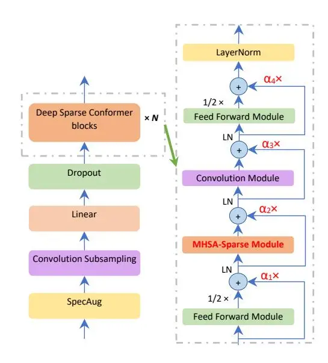

# **Deep Sparse Conformer for Speech Recognition**

Xianchao Wu

### **NVIDIA**

xianchaow@nvidia.com

### **Abstract**

Conformer has achieved impressive results in Automatic Speech Recognition (ASR) by leveraging transformer's capturing of content-based global interactions and convolutional neural network's exploiting of local features. In Conformer, two macaronlike feed-forward layers with half-step residual connections sandwich the multi-head self-attention and convolution modules followed by a post layer normalization. We improve Conformer's long-sequence representation ability in two directions, sparser and deeper. We adapt a sparse self-attention mechanism with $\mathcal{O}(L\log L)$ in time complexity and memory usage. A deep normalization strategy is utilized when performing residual connections to ensure our training of hundred-level Conformer blocks. On the Japanese CSJ-500h dataset, this deep sparse Conformer achieves respectively CERs of 5.52%, 4.03% and 4.50% on the three evaluation sets and 4.16%, 2.84% and 3.20% when ensembling five deep sparse Conformer variants from 12 to 16, 17, 50, and finally 100 encoder layers.

**Index Terms**: speech recognition, human-computer interaction, computational paralinguistics

### 1. Introduction

End-to-end automatic speech recognition (ASR) systems leveraged on Transformers and their variants have achieved impressively low word/character error rates (WERs/CERs) in numerous languages during recent years [1, 2, 3, 4, 5]. The Transformer architecture includes multi-head self-attention (MHSA) and cross-attention layers that can represent long-distance interactions inside and between sound-text sequences. Alternatively, convolutions with predefined kernel sizes capturing local contexts have also been successfully utilized in ASR [6].

Conformer [2], combines multi-head attentions and convolution modules, has achieved state-of-the-art accuracy in a list of benchmark datasets such as LibriSpeech. One Conformer encoder block comprises two macaron-like feed-forward network (FFN) layers with half-step residual connections. Inside these two FFNs, there is one MHSA module and one convolution module which are respectively designed for capturing global and local context information of input sound sequences. Layer normalization is further applied right after each residual connection. In the original Conformer S, M, and L models, there are 16, 16, and 17 Encoder blocks and with 10.3M, 30.7M and 118.8M parameters, respectively.

Our work is motivated by aiming at answering two questions: will deeper Conformers achieve better accuracy, and how can we train and inference them in efficient ways? For a sequence with length L, MHSA module requires to compute the "similarity" between every two (subsampled) "frames" yielding a time and memory-usage complexity of $\mathcal{O}(L^2)$ . One intuitive way is to reduce the necessity of computing every pair and only compute

a relatively small scale of ranges for each place in an input sequence.

We follow this _sparse attention_ [7, 8, 9] direction and use a probability attention which defines a query importance measure in MHSA and then picks only the top-u (= $\mathcal{O}(\log L)$ ) query vectors for inner-product similarity computing with key vectors. For the other _deeper Conformer_ direction, we borrow the _deep normalization_ idea used for training 1,000-layer Transformers [10]. That is, the input tensor is weighted by an additional $\alpha > 1$ factor during residual connection to control and bound the model's updating for convergence. Also, another $\beta$ factor is taken as the gains for initializing the parameters in MHSA using the Xavier initialization. We name this _deep sparse Conformer_ and train 50-layer and 100-layer model variants under the Japanese CSJ-500h data. We report their convergence speeds during training, inference time and CERs.

## 2. Related Work

<span id="page-0-0"></span>The _ProbSparse_ self-attention mechanism [7] was first used in a Conformer-transducer for autoregressive end-to-end ASR [?]. LSTM layers were used to encode each textual sequence and a multi-layer linear module was used to combine latent representations of audios and labels. Time/memory costs' relative decrease rate reached 20% to 50% for long sequences from 20s to 180s. We follow their usage of _ProbSparse_. The differences are that, (1) we select a non-autoregressive architecture with transformer decoders, (2) we use CTC loss and attention losses for training and CTC+attention-rescoring for decoding, and (3) we use relative positional encoding for the Conformer encoder.

A low-rank transformer was proposed in [11] for lightweight and efficient end-to-end ASR. The linear layers used in MHSA and FFN are replaced by linear encoder-decoder units where a weight matrix $\mathbf{W} \in \mathbb{R}^{m \times n}$ is approximated by two smaller matrices $\mathbf{E} \in \mathbb{R}^{m \times r}$ , $\mathbf{D} \in \mathbb{R}^{r \times n}$ such that $\mathbf{W} \approx \mathbf{E} \times \mathbf{D}$ (r << m, n). A linear self-attention mechanism [12] together with a low-rank FFN [11] were employed in [8] to build a linear-attention Conformer for ASR. The half-size models achieved comparable results with Conformer.

Compressed structures and speech attribute augmentations were used in [13] for improving Transformer-based ASR. Parameters were shared among layers of encoder and decoder blocks. Speaker information (gender, age, education-level, speaker ID) and speech utterance properties (duration of short and long, topic of the lecture) were used to augment the training data. Using the Japanese CSJ-500h dataset, they achieved CERs of 7.6%, 6.1% and 6.3% on the three test sets. We compare our models with this work since it uses CSJ dataset as well. The differences are that we do not use parameter sharing or additional speech information.

An online compressive Transformer was utilized in [14] for end-to-end ASR. The input speech signal is separated into a number of blocks where the former block's compressive memory is concatenated to current block's encoder memory for decoding.

Losses of CTC, RNN-transducer and attention reconstruction using transformers were minimized.

Adaptive span self-attention was used in [15] for end-to-end ASR. The motivation is to learn the appropriate span size at each self-attention head and layer during training. The limitation of spans is applied to the number of keys to be attached to each query.

On the other hand, very deep models with up to 48 Transformer layers were used in [5] for end-to-end ASR. Stochastic residual connections fundamentally apply a mask M on the MHSA or FFN function $F\colon R(x)=\text{LayerNorm}(M*F(x)+x)$ and M only takes discrete 0 or 1 values, generated from a Bernoulli distribution similar to dropout. The difference is that we apply a factor $\alpha$ to x and $\alpha$ is a function of the depth of the architecture. That is, we do not explicitly skip a MHSA or a FFN layer. An ensemble of n-best outputs from 36, 48 and 60 encoding layers yielded the best result of 9.9% on the Switchboard test set.

Transformer-XL [16] with as many as 48 layers (model size = 185.7M) was adapted in [17] for large-scale ASR. As the authors mentioned, the gains were not as large as they had expected and regularizing the deep transformers would be one direction for further improvements.

There are many more papers we are not able to mention here. A survey of transformer variants and their applications to end-to-end ASR can be found in [18, 19].

## 3. Deeper and Sparser Conformer Blocks

The original Conformer [2] block contains two Feed Forward modules sandwiching the MHSA module and the Convolution module. This sandwich architecture is inspired by Macaron-Net [20], in which the original feed-forward layer in one Transformer layer is separated into two half-step feed-forward layers, one before the self-attention layer and another after. Mathematically, for an input $x_i$ sent to a Conformer block i, the output $y_i$ is:

$$\tilde{x}_i = x_i + 0.5 \times \text{FFN}(x_i) \tag{1}$$

$$x_i' = \tilde{x}_i + \text{MHSA}(\tilde{x}_i) \tag{2}$$

$$x_i'' = x_i' + \operatorname{Conv}(x_i') \tag{3}$$

$$y_i = \text{LayerNorm}(x_i'' + 0.5 \times \text{FFN}(x_i''))$$
(4)

There are four residual connections in one Conformer block and a layer normalization (LN) is used finally (named as Post-LN). As has been observed and reported in [10, 21], this Post-LN has a problem of unstable training. Furthermore, the MHSA network requires a time and memory-usage complexity of $\mathcal{O}(L^2)$ which is barely acceptable when we have relatively long sequences in our training data or during inferencing.

### 3.1. Sparser Attention

There are a list of work that proposed new attention mechanisms to replace the $\mathcal{O}(L^2)$ time/space complexities into $\mathcal{O}(L\log L)$ or even $\mathcal{O}(L)$ [8, 9]. Motivated by [7] for modeling long sequences for time-series forecasting, we adapt the ProbSparse self-attention mechanism to replace the MHSA function in Equation 2. In ProbSparse, the original tensor $\mathbf{Q} \in \mathbb{R}^{b \times L \times d}$ (b is batch size, L is input sequence length, and d is hidden dimension. For simplicity, we set b=1 and omit b hereafter.) is replaced by a same shape tensor $\bar{\mathbf{Q}}$ which only contains top-u (= $\mathcal{O}(\log L)$ ) queries under a sparsity measurement $M(\mathbf{q}, \mathbf{K})$ . That is, each

key is only allowed to attend to u dominant queries:

$$\mathcal{A}(\mathbf{Q}, \mathbf{K}, \mathbf{V}) = \sum_{j} \left[ \frac{k(\mathbf{Q}, \mathbf{k}_{j})}{\sum_{l} k(\mathbf{Q}, \mathbf{k}_{l})} \right] \mathbf{v}_{j}$$
(5)

$$= \mathbb{E}_{p(\mathbf{k}_j|\mathbf{Q})}[\mathbf{v}_j] \tag{6}$$

<span id="page-1-1"></span>
$$\approx \text{Softmax}(\frac{\bar{\mathbf{Q}}\mathbf{K}^{\top}}{\sqrt{d}})\mathbf{V}.$$
(7)

Here, $\mathbf{q}_i, \mathbf{k}_j \in \mathbb{R}^{1 \times h}$ are row vectors, and $k(\mathbf{q}_i \in \bar{\mathbf{Q}}, \mathbf{k}_j)$ is selected to be an exponential kernel $\exp(\mathbf{q}_i \mathbf{k}_i^{\top} / \sqrt{d})$ .

The query sparsity measure $M(\mathbf{q}, \mathbf{K})$ is motivated by (1) the dominant dot-product pairs encouraging the corresponding query's attention probability distribution $p(\mathbf{k}_j|\mathbf{q}_i)$ away from the uniform distribution, and (2) Kullback-Leibler divergence KL(q||p) measuring the "distance" between $p(\mathbf{k}_j|\mathbf{q}_i)$ and uniform distribution $q(\mathbf{k}_j|\mathbf{q}_i)=1/L$ . An empirical approximation for efficiently computing the query sparsity measurement for $\mathbf{q}_i$ is defined as the following "max-mean" equation:

<span id="page-1-2"></span>
$$\bar{M}(\mathbf{q}_i, \mathbf{K}) = \max_{j} \left\{ \frac{\mathbf{q}_i \mathbf{k}_j^{\top}}{\sqrt{d}} \right\} - \frac{1}{L} \sum_{j=1}^{L} \frac{\mathbf{q}_i \mathbf{k}_j^{\top}}{\sqrt{d}}.$$
(8)

The range of top-u approximately holds as proved in [7]. Under the long tail distribution, it has been empirically testified that randomly sample $U = L \log L$ dot-product pairs to compute the query sparsity measure and then select sparse top-u from it and form $\bar{\mathbf{Q}}$ yielded acceptable results [9].

We use the sparse attention function (MHSA-Sparse) defined by Equation 7 and assisted by Equation 8 to replace the original MHSA function used in Equation 2:

$$MHSA-Sparse(\mathbf{X}) = Concat(head_1, ..., head_h)\mathbf{W}^{\mathbf{O}}$$
(9)

where,
$$head_{i \in \{1,\dots,h\}} = \mathcal{A}(\mathbf{X}\mathbf{W}_i^{\mathbf{Q}}, \mathbf{X}\mathbf{W}_i^{\mathbf{K}}, \mathbf{X}\mathbf{W}_i^{\mathbf{V}})$$
(10)

Here, the linear projections are trainable parameter matrices $\mathbf{W}_i^{\mathbf{Q}}$ and $\mathbf{W}_i^{\mathbf{K}} \in \mathbb{R}^{d \times d_k}$ , $\mathbf{W}_i^{\mathbf{V}} \in \mathbb{R}^{d \times d_v}$ , $\mathbf{W}^{\mathbf{O}} \in \mathbb{R}^{h d_v \times d}$ and $d_k = d_v = d/h$ .

<span id="page-1-0"></span>Algorithm 1 describes the pseudo-code of a multi-head attention layer using ProbSparse (lines 12 to 19, 21) and relative position encoding (lines 10, 11, 19). One additional linear layer with weight matrix $\mathbf{W}^{\mathbf{P}} \in \mathbb{R}^{d \times d}$ is introduced to parameterize the memory tensors' position information. Following [16], two learnable vectors $\mathbf{U}_1, \mathbf{U}_2 \in \mathbb{R}^d$ are used in shapes of $(h, d_q)$ in line 10 and 11. They are introduced to assist relative position encoding by alleviating attentive bias towards different words in different positions.

Equation 8 suggests an inner-product computation of between a query vector to all the key vectors to determine the importance of the query vector. This blocks the reduction of time complexity. Instead, we only use $L_{\mathbf{K}}'$ number of key vectors through sampling from the whole $L_{\mathbf{K}}$ (line 12, 13). This ensures a time complexity of $\mathcal{O}(L_{\mathbf{Q}} \ln L_{\mathbf{K}})$ for computing Equation 8 in line 15. A hyper-parameter $c_1$ (= 5.0) determines the size of the key vector subset.

When the query sparseness measurement is computed, we can easily pick the top- $L_{\mathbf{Q}}'$ queries where $L_{\mathbf{Q}}'$ is the number of query vectors selected. A hyper-parameter $c_2$ (= 5.0) determines the size of the query vector subset. Line 19 combines the "similarity scores" between the reduced query vector set and the original key and position tensors. Then, the scores are masked by the lengths of sequences in a batch, normalized into probability-style scores under Softmax and finally dropped out with a given probability $p_{dropout}$ .

#### Algorithm 1: ProbSparse+Relative Position Encode

```
1 Given: X, X<sub>P</sub>, Y, c<sub>1</sub>, c<sub>2</sub>, mask, p<sub>dropout</sub>
 2 Trainable parameters: W^{\{Q,K,V,P,O\}},U_{\{1,2\}}
 3 Q, K, V, P = YWQ, XWK, XWV, X_pW^P
         \mathbf{X_P} \in \mathbb{R}^{b \times L_{\mathbf{K}} \times d} is the relative position encoding
         tensor for X, and Y=X for self-attention
 4 b, L_0, h \times d_q = \mathbf{Q}.shape
 5 L_{\mathbf{K}} = \mathbf{K}.\text{shape}[1]
 6 \mathbf{Q} = \mathbf{Q}.\text{view}(b, L_{\mathbf{Q}}, h, d_q)
 7 K = K.view(b, LK, h, d<sub>k</sub>).transpose(1,2)
 8 V = V.view(b, L_K, h, d_v).transpose(1,2)
 9 \mathbf{P} = \mathbf{P}.\text{view}(b, L_{\mathbf{K}}, h, d_k).\text{transpose}(1,2)
10 \mathbf{Q}_{\mathbf{U}_1} = (\mathbf{Q} + \mathbf{U}_1).\mathrm{transpose}(1,2) \triangleright \mathbf{U}_1 \in \mathbb{R}^{h \times d_q}
11 \mathbf{Q}_{\mathbf{U}_2} = (\mathbf{Q} + \mathbf{U}_2).transpose(1,2) \triangleright \mathbf{U}_2 \in \mathbb{R}^{h \times d_q}
12 L'_{\mathbf{K}} = c_1 \times \lceil \ln(L_{\mathbf{K}}) \rceil
13 \mathbf{K}_{part} = \text{Sample}(\mathbf{K}, L'_{\mathbf{K}}, \text{dim}=-2) \triangleright
         \mathbf{K}_{part} \in \mathbb{R}^{b \times h \times L'}{}_{\mathbf{K}}{}^{\times d_k}
14 L'_{\mathbf{Q}} = c_2 \times \lceil \ln(L_{\mathbf{Q}}) \rceil
15 \bar{\mathbf{M}} = (\mathbf{Q}_{\mathbf{U}_1} \mathbf{K}_{part}^{\top}).\max(\dim=-1)[0] -
         (\mathbf{Q}_{\mathbf{U}_1} \mathbf{K}_{part}^{\top}).\text{sum}(-1)/L_{\mathbf{K}} \triangleright \text{Equation 8, omit } \sqrt{d}
16 \bar{\mathbf{M}}_{top} = \bar{\mathbf{M}}.topk(L'_{\mathbf{Q}})[1] \triangleright index of top-L'_{\mathbf{Q}} queries
17 \bar{\mathbf{Q}}_{\mathbf{U}_1} = \mathbf{Q}_{\mathbf{U}_1}[\bar{\mathbf{M}}_{top},:] \triangleright \bar{\mathbf{Q}}_{\mathbf{U}_1} \in \mathbb{R}^{b \times h \times L'_{\mathbf{Q}} \times d_q}
18 \bar{\mathbf{Q}}_{\mathbf{U}_2} = \mathbf{Q}_{\mathbf{U}_2}[\bar{\mathbf{M}}_{top},:]
19 \mathbf{S} = (\bar{\mathbf{Q}}_{\mathbf{U}_1} \mathbf{K}^\top + \bar{\mathbf{Q}}_{\mathbf{U}_2} \mathbf{P}^\top) / \sqrt{d_q} \triangleright \mathbf{S} \in \mathbb{R}^{b \times h \times L'_{\mathbf{Q}} \times L_{\mathbf{K}}}
20 \mathbf{S} = \text{Dropout}(\text{Softmax}(\text{Mask}(\mathbf{S}, mask)), p_{dropout})
21 V[\bar{\mathbf{M}}_{top}, :] = \mathbf{SV} \triangleright only change a part of \mathbf{V}
22 \mathbf{V} = \mathbf{V}.transpose(1,2).contiguous().view(b, -1, h \times d_v)
23 V = VW^O
24 return V
```

### 3.2. Deeper Normalization

The Conformer-Large defined in [2] contains 118.8M parameters in which there are 17 encoder layers with encoder dimension of 512, 1 decoder layer with decoder dimension of 640. Deeper models alike (1) GPT-3 [22] model with 175B parameters and 96 transformer layers has achieved impressive scores both for classification and generation tasks through few-shot prompt-based learning, (2) DeepNet [10] with 1,000 transformer layers has shown significantly better BLEU scores [23] in multilingual neural machine translation, compared with shallow architectures. Inspired by these, we aim at enlarging the number of layers in Conformer to as much as one-hundred levels and testifying its representation ability for ASR.

DeepNet [10] combines the good performance of Post-LN and stable training of Pre-LN by leveraging a new normalization function named DeepNorm when performing residual connections [24] in a Transformer layer:

$$DeepNorm(x) = LayerNorm(x \times \alpha + f(x)). \tag{11}$$

In order to ensure the model updating in DeepNet to be constrained by bounds for stable training, $\alpha$ is assigned with various values alike $(2N)^{\frac{1}{4}}$ for encoder-only framework (e.g., BERT [25]), and $(2M)^{\frac{1}{4}}$ for decoder-only framework (e.g., GPT [22]) where N and M respectively stand for the number of $f(\cdot)$ , such as self-attention, cross-attention or FFN sub-layers.

We adapt this DeepNorm function in our deep sparse Conformer. The updated Conformer block is mathematically ex-

<span id="page-2-1"></span>

Figure 1: Encoder model architecture for our deep sparse Conformer. Updates are marked in red color: $\alpha_i$ on x and using sparse attention in MHSA.

pressed as:

$$\tilde{x}_i = \text{LayerNorm}(x_i \times \alpha_1 + 0.5 \times \text{FFN}(x_i))$$
(12)

$$x_i' = \text{LayerNorm}(\tilde{x}_i \times \alpha_2 + \text{MHSA-Sparse}(\tilde{x}_i))$$
(13)

$$x_i'' = \text{LayerNorm}(x_i' \times \alpha_3 + \text{Conv}(x_i'))$$
(14)

$$y_i = \text{LayerNorm}(x_i'' \times \alpha_4 + 0.5 \times \text{FFN}(x_i''))$$
(15)

Here, we utilize $\alpha_{1,2,3,4}$ , all take a value of $0.81(N^4M)^{1/16}$ (N/M=encoder/decoder layer numbers), to scale the temporary output from former sub-layer for residual connection. MHSA-Sparse function is defined in Equation 7 and described in Algorithm 1. Figure 1 depicts the encoder model architecture of our deep sparse Conformer in which one Conformer block is extended into a pipeline of four modules with four residual connections controlled by DeepNorm.

### 4. Experiments

#### 4.1. Setup

Our experiments are performed under an open-source ASR platform, WeNet<sup>1</sup> [26]. We release code and pretrained models<sup>2</sup>. We select a Conformer baseline model consists of a 12-block Conformer encoder ( $d_{\text{FFN}}$ =2048, h=8, d=512, CNN<sub>kernel</sub>=31) and a 3-block bidirectional Transformer decoder ( $d_{\text{FFN}}$ =2048, h=8, d=512) which encodes the textual sequences in left-to-right (l2r) and right-to-left (r2l) directions. The objective is to minimize $\mathcal{L}$ , a linear combination of the CTC loss [27] ( $\lambda$ =0.3) and attention losses (ATT) computed by point-wise KL-divergence [28]:

$$\mathcal{L} = 0.3*\text{CTC}_{loss} + 0.7*(0.7*\text{ATT}_{l2r} + 0.3*\text{ATT}_{r2l})$$
(16)

Label smoothing with $\delta=0.1$ is applied to the attention objective so that the references are discounted by $(1-\delta)$ .

<span id="page-2-3"></span><span id="page-2-2"></span><sup>1</sup>https://github.com/wenet-e2e/wenet

<sup>&</sup>lt;sup>2</sup>https://github.com/Xianchao-Wu/wenet-deep-sparse-conformer

<span id="page-3-1"></span>Table 1: _CERs (%) of 4 baselines and 5 deep sparse Conformer (DSC) variants trained with the CSJ-500h dataset._

|                | 1.73h | 1.82h | 1.23h | train. | inf.   | size  |
| -------------- | ----- | ----- | ----- | ------ | ------ | ----- |
| models         | Test1 | Test2 | Test3 | /ep.   | char/s | (M)   |
| Trans.[13]     | 7.6   | 6.1   | 6.3   | -      | -      | 36    |
| Espnet+LM      | 6.5   | 4.6   | 5.1   | -      | -      | -     |
| Citrinet[6]    | 7.28  | 4.81  | 5.44  | 5m     | 210    | 22.7  |
| Conformer[2]   | 6.97  | 4.65  | 5.29  | 10m    | 194    | 135.1 |
| DSC-small (16) | 7.64  | 5.35  | 6.15  | 6m     | 310    | 14.2  |
| DSC-12en       | 5.52  | 4.03  | 4.50  | 8m     | 239    | 135.2 |
| DSC-17en       | 6.00  | 4.30  | 5.17  | 13m    | 235    | 169.4 |
| DSC-50en       | 6.20  | 4.31  | 5.49  | 42m    | 203    | 395.4 |
| DSC-100en      | 6.27  | 4.36  | 5.56  | 132m   | 180    | 737.8 |
| Ensemble+LM    | 4.16  | 2.84  | 3.20  | -      | -      | -     |
|                |       |       |       |        |        |       |

During training, we select the Adam optimizer [\[29\]](#page-4-28) with a maximum learning rate of 0.002. The Noam learning rate scheduler with 30K warm-up steps is used. The models are trained with static batching skill for 120 epochs. The top 30 best checkpoints ranked by validation set losses are averaged to be the final model. For decoding, we use CTC greedy search and Attention rescoring. All our experiments were performed under NVIDIA DGX-A100 with 8\*A100-80GB GPUs.

### 4.2. Data

We evaluate deep sparse Conformer variants on the Japanese "Corpus of Spontaneous Japanese" (CSJ) dataset[3](#page-3-0) , which consists of 500 hours of labeled speech. We use sentencepiece-bpe [\[30\]](#page-4-29) to segment the text sequences and select a vocabulary size of 4,096. During data preparation, we generate 80-dimension FBank feature vectors with a 25ms window, a 10ms frame stride and dither=1.0. SpecAugment [\[31\]](#page-4-30) is adapted with 2 frequency masks (F=10) and 2 time masks (T=50). Global Cepstral Mean and Variance Normalization [\[32\]](#page-4-31) technique is employed to normalize the 80-dimension FBank feature vectors.

### 4.3. Major Results on CSJ Tests

Table [1](#page-3-1) lists the CERs of five of our deep sparse Conformer (DSC) variants and four baselines. The first baseline is a Transformer with enhanced information from speakers and speech [\[13\]](#page-4-12) (refer to Section [2\)](#page-0-0). The second baseline is Espnet's implementation of deep VGGBLSTM with CTC joint decoding and LM rescoring[4](#page-3-2) . Note that only this baseline uses an external language model among all the nine models. The third baseline is Citrinet [\[6\]](#page-4-5) (channel size = 384), a recent pure CNN-based model with 1D time-channel separable convolutions combined with squeeze-and-excitation and has achieved comparable results compared with Conformer. The fourth baseline is Conformer-Large [\[2\]](#page-4-1) with a bi-decoder.

Our first DSC variant is a Conformer-Small model with the same configurations of Conformer-S [\[2\]](#page-4-1) with 16 layers except that we use a bidirectional decoder. The other four variants differ only at the encoder part of different layers: 12, 17, 50, and 100. These 5 variants use a bidirectional decoder in which both l2r and r2l decoders have 3 Transformer decoder layers.

We have the following observations. First, Conformer performs well among the baselines, with a relatively large model size. Second, considering that both Conformer and DSC-12en

<span id="page-3-3"></span>Table 2: _System ensemble CERs (%) with two types of decoding: attention rescoring (Attn) and CTC greedy searching._

|         |      | Test1 |      | Test2 |      | Test3 |     |
| ------- | ---- | ----- | ---- | ----- | ---- | ----- | --- |
|         | Attn | CTC   | Attn | CTC   | Attn | CTC   |     |
| small-1 | 7.64 | 7.82  | 5.35 | 5.53  | 6.15 | 6.40  |     |
| 12en-2  | 5.52 | 5.62  | 4.03 | 4.23  | 4.50 | 4.39  |     |
| 17en-3  | 6.00 | 6.16  | 4.30 | 4.51  | 5.17 | 5.02  |     |
| 1+2+3   | 4.83 | 4.94  | 3.36 | 3.51  | 3.74 | 3.70  |     |
| +50en   | 4.38 | 4.45  | 3.00 | 3.16  | 3.40 | 3.29  |     |
| ++100en | 4.16 | 4.21  | 2.84 | 2.92  | 3.20 | 3.09  |     |

have 135M parameter sizes, we can compare their CERs and training/inferencing time directly. DSC-12en achieved an absolute CER improvement of 1.45%, 0.62% and 0.79% on the three test sets. Also, the training time is only 80% of Conformer's and the inference speed is 1.23 times faster. These improvements of accuracy and training/inferencing speed reflect the effectiveness of the deep sparse Conformer blocks. Third, using DeepNorm strategy, we could successfully train 50 and 100 layers of Conformer. However, the training time increases significantly: the training time for DSC-17en, DSC-50en and DSC-100en are respectively 1.6, 5.25 and 16.5 times of DSC-12en's. The accuracies slightly dropped when we enlarged the model parameter sizes. This observation aligns with that reported in [\[5\]](#page-4-4). Following [\[5\]](#page-4-4), we also performed 6-gram LM enhanced ensembles of 30-best outputs from the 5 variants and achieved the best CERs for the 3 test sets: 4.16%, 2.84% and 3.20%.

### 4.4. Ablation Studies

### _4.4.1. Number of Deep Sparse Conformer Blocks_

Table [2](#page-3-3) shows the detailed CER improvements when (1) ensembling DSC-small, DSC-12en and DSC-17en, (2) further appending DSC-50en and (3) finally adding DSC-100en. By ensembling the first three models, CER improved 0.70% averagely. Then, adding DSC-50en brings a gain of 0.40% on average. Finally, the DSC-100en can further contribute 0.21% improvements on average. These reflect that larger models are still helpful yet their contributions are marginally decreased.

#### _4.4.2. Pre-LN vs. Post-LN in Deep Normalization_

We investigated Pre-LN and Post-LN when performing Deep-Norm. Different from that observed in NLP fields, Post-LN was less stable in DSCs and the loss could not converge after 30 epochs. We thus select a mixture solution in our five model variants by (1) keeping the LNs in Post-LN and (2) initially adding a Pre-LN layer.

## 5. Conclusions

In this paper, we introduced deep sparse Conformer, an architecture that integrates (1) _sparse_ attentions guided by a query sparseness measure and (2) _deep_ normalization which weight input tensors during residual connection into Conformer. We demonstrated that the usage of sparse attentions and deep normalization yielded faster training speed and stable training of much deeper Conformer encoder blocks. We built model variants with as much as 100 encoder layers and trained them using the Japanese CSJ-500h datasets. Future work includes using deep sparse Conformer blocks in self-supervised speech pretraining and fine-tuning.

<span id="page-3-2"></span><span id="page-3-0"></span><sup>3</sup><https://ccd.ninjal.ac.jp/csj/en/>

<sup>4</sup>[https://github.com/espnet/espnet/blob/master](https://github.com/espnet/espnet/blob/master/egs/csj/asr1/RESULTS.md) [/egs/csj/asr1/RESULTS.md](https://github.com/espnet/espnet/blob/master/egs/csj/asr1/RESULTS.md)

## 6. References

- <span id="page-4-0"></span>[1] H. Miao, G. Cheng, C. Gao, P. Zhang, and Y. Yan, "Transformerbased online ctc/attention end-to-end speech recognition architecture," _ICASSP 2020_, pp. 6084–6088, 2020.
- <span id="page-4-1"></span>[2] A. Gulati, J. Qin, C.-C. Chiu, N. Parmar, Y. Zhang, J. Yu, W. Han, S. Wang, Z. Zhang, Y. Wu, and R. Pang, "Conformer: Convolutionaugmented Transformer for Speech Recognition," in _Proc. Interspeech 2020_, 2020, pp. 5036–5040.
- <span id="page-4-2"></span>[3] X. Chen, Y. Wu, Z. Wang, S. Liu, and J. Li, "Developing real-time streaming transformer transducer for speech recognition on large-scale dataset," _CoRR_, vol. abs/2010.11395, 2020. [Online]. Available:<https://arxiv.org/abs/2010.11395>
- <span id="page-4-3"></span>[4] L. Dong, S. Xu, and B. Xu, "Speech-transformer: A norecurrence sequence-to-sequence model for speech recognition," _2018 ICASSP_, pp. 5884–5888, 2018.
- <span id="page-4-4"></span>[5] N.-Q. Pham, T. S. Nguyen, J. Niehues, M. Muller, and A. H. ¨ Waibel, "Very deep self-attention networks for end-to-end speech recognition," in _INTERSPEECH_, 2019.
- <span id="page-4-5"></span>[6] S. Majumdar, J. Balam, O. Hrinchuk, V. Lavrukhin, V. Noroozi, and B. Ginsburg, "Citrinet: Closing the gap between nonautoregressive and autoregressive end-to-end models for automatic speech recognition," 2021.
- <span id="page-4-6"></span>[7] H. Zhou, S. Zhang, J. Peng, S. Zhang, J. Li, H. Xiong, and W. Zhang, "Informer: Beyond efficient transformer for long sequence time-series forecasting," in _AAAI, 2021_. AAAI Press, 2021, pp. 11 106–11 115. [Online]. Available: <https://ojs.aaai.org/index.php/AAAI/article/view/17325>
- <span id="page-4-7"></span>[8] S. Li, M. Xu, and X.-L. Zhang, "Efficient conformer-based speech recognition with linear attention," _2021 Asia-Pacific Signal and Information Processing Association Annual Summit and Conference (APSIPA ASC)_, pp. 448–453, 2021.
- <span id="page-4-8"></span>[9] X. Wang, S. Sun, L. Xie, and L. Ma, "Efficient Conformer with Prob-Sparse Attention Mechanism for End-to-End Speech Recognition," in _Proc. Interspeech 2021_, 2021, pp. 4578–4582.
- <span id="page-4-9"></span>[10] H. Wang, S. Ma, L. Dong, S. Huang, D. Zhang, and F. Wei, "Deepnet: Scaling transformers to 1,000 layers," _arXiv preprint arXiv:2203.00555_, 2022.
- <span id="page-4-10"></span>[11] G. I. Winata, S. Cahyawijaya, Z. Lin, Z. Liu, and P. Fung, "Lightweight and efficient end-to-end speech recognition using low-rank transformer," _CoRR_, vol. abs/1910.13923, 2019. [Online]. Available:<http://arxiv.org/abs/1910.13923>
- <span id="page-4-11"></span>[12] S. Zhuoran, Z. Mingyuan, Z. Haiyu, Y. Shuai, and L. Hongsheng, "Efficient attention: Attention with linear complexities," in _2021 IEEE Winter Conference on Applications of Computer Vision (WACV)_, 2021, pp. 3530–3538.
- <span id="page-4-12"></span>[13] S. Li, D. Raj, X. Lu, P. Shen, T. Kawahara, and H. Kawai, "Improving transformer-based speech recognition systems with compressed structure and speech attributes augmentation," in _INTERSPEECH_, 2019.
- <span id="page-4-13"></span>[14] C.-H. Leong, Y.-H. Huang, and J.-T. Chien, "Online Compressive Transformer for End-to-End Speech Recognition," in _Proc. Interspeech 2021_, 2021, pp. 2082–2086.
- <span id="page-4-14"></span>[15] X. Chang, A. S. Subramanian, P. Guo, S. Watanabe, Y. Fujita, and M. Omachi, "End-to-end asr with adaptive span self-attention," in _INTERSPEECH_, 2020.
- <span id="page-4-15"></span>[16] Z. Dai, Z. Yang, Y. Yang, J. Carbonell, Q. Le, and R. Salakhutdinov, "Transformer-XL: Attentive language models beyond a fixedlength context," in _Proceedings of the 57th Annual Meeting of the Association for Computational Linguistics_. Florence, Italy: Association for Computational Linguistics, Jul. 2019, pp. 2978– 2988. [Online]. Available:<https://aclanthology.org/P19-1285>
- <span id="page-4-16"></span>[17] L. Lu, C. Liu, J. Li, and Y. Gong, "Exploring Transformers for Large-Scale Speech Recognition," in _Proc. Interspeech 2020_, 2020, pp. 5041–5045.
- <span id="page-4-17"></span>[18] T. Lin, Y. Wang, X. Liu, and X. Qiu, "A survey of transformers," _CoRR_, vol. abs/2106.04554, 2021. [Online]. Available:<https://arxiv.org/abs/2106.04554>

- <span id="page-4-18"></span>[19] Y. Tay, M. Dehghani, D. Bahri, and D. Metzler, "Efficient transformers: A survey," _CoRR_, vol. abs/2009.06732, 2020. [Online]. Available:<https://arxiv.org/abs/2009.06732>
- <span id="page-4-19"></span>[20] Y. Lu, Z. Li, D. He, Z. Sun, B. Dong, T. Qin, L. Wang, and T.-Y. Liu, "Understanding and improving transformer from a multi-particle dynamic system point of view," _arXiv preprint arXiv:1906.02762_, 2019.
- <span id="page-4-20"></span>[21] R. Xiong, Y. Yang, D. He, K. Zheng, S. Zheng, C. Xing, H. Zhang, Y. Lan, L. Wang, and T. Liu, "On layer normalization in the transformer architecture," in _Proceedings of ICML_, ser. Proceedings of Machine Learning Research, vol. 119. PMLR, 2020, pp. 10 524–10 533. [Online]. Available: <http://proceedings.mlr.press/v119/xiong20b.html>
- <span id="page-4-21"></span>[22] T. Brown, B. Mann, N. Ryder, M. Subbiah, J. D. Kaplan, P. Dhariwal, A. Neelakantan, P. Shyam, G. Sastry, A. Askell, S. Agarwal, A. Herbert-Voss, G. Krueger, T. Henighan, R. Child, A. Ramesh, D. Ziegler, J. Wu, C. Winter, C. Hesse, M. Chen, E. Sigler, M. Litwin, S. Gray, B. Chess, J. Clark, C. Berner, S. McCandlish, A. Radford, I. Sutskever, and D. Amodei, "Language models are few-shot learners," in _Advances in Neural Information Processing Systems_, vol. 33. Curran Associates, Inc., 2020, pp. 1877–1901.
- <span id="page-4-22"></span>[23] K. Papineni, S. Roukos, T. Ward, and W.-J. Zhu, "Bleu: a method for automatic evaluation of machine translation," in _Proceedings of ACL_. Philadelphia, Pennsylvania, USA: Association for Computational Linguistics, Jul. 2002, pp. 311–318. [Online]. Available:<https://aclanthology.org/P02-1040>
- <span id="page-4-23"></span>[24] K. He, X. Zhang, S. Ren, and J. Sun, "Deep residual learning for image recognition," _2016 IEEE Conference on Computer Vision and Pattern Recognition (CVPR)_, pp. 770–778, 2016.
- <span id="page-4-24"></span>[25] J. Devlin, M.-W. Chang, K. Lee, and K. Toutanova, "BERT: Pre-training of deep bidirectional transformers for language understanding," in _Proceedings of NAACL_. Minneapolis, Minnesota: Association for Computational Linguistics, Jun. 2019, pp. 4171–4186. [Online]. Available: [https://aclanthology.org/N19](https://aclanthology.org/N19-1423) [-1423](https://aclanthology.org/N19-1423)
- <span id="page-4-25"></span>[26] B. Zhang, D. Wu, C. Yang, X. Chen, Z. Peng, X. Wang, Z. Yao, X. Wang, F. Yu, L. Xie, and X. Lei, "Wenet: Production first and production ready end-to-end speech recognition toolkit," _CoRR_, vol. abs/2102.01547, 2021. [Online]. Available: <https://arxiv.org/abs/2102.01547>
- <span id="page-4-26"></span>[27] A. Graves, S. Fernandez, F. Gomez, and J. Schmidhuber, ´ "Connectionist temporal classification: Labelling unsegmented sequence data with recurrent neural networks," in _Proceedings of ICML_, ser. ICML '06. New York, NY, USA: Association for Computing Machinery, 2006, p. 369–376. [Online]. Available: <https://doi.org/10.1145/1143844.1143891>
- <span id="page-4-27"></span>[28] S. Kullback and R. A. Leibler, "On Information and Sufficiency," _The Annals of Mathematical Statistics_, vol. 22, no. 1, pp. 79 – 86, 1951. [Online]. Available: [https://doi.org/10.1214/aoms/1177729](https://doi.org/10.1214/aoms/1177729694) [694](https://doi.org/10.1214/aoms/1177729694)
- <span id="page-4-28"></span>[29] D. P. Kingma and J. Ba, "Adam: A method for stochastic optimization," _CoRR_, vol. abs/1412.6980, 2015.
- <span id="page-4-29"></span>[30] T. Kudo and J. Richardson, "SentencePiece: A simple and language independent subword tokenizer and detokenizer for neural text processing," in _Proceedings of EMNLP_. Brussels, Belgium: Association for Computational Linguistics, Nov. 2018, pp. 66–71. [Online]. Available:<https://aclanthology.org/D18-2012>
- <span id="page-4-30"></span>[31] D. S. Park, W. Chan, Y. Zhang, C.-C. Chiu, B. Zoph, E. D. Cubuk, and Q. V. Le, "Specaugment: A simple data augmentation method for automatic speech recognition," _Interspeech 2019_, Sep 2019. [Online]. Available: [http:](http://dx.doi.org/10.21437/Interspeech.2019-2680) [//dx.doi.org/10.21437/Interspeech.2019-2680](http://dx.doi.org/10.21437/Interspeech.2019-2680)
- <span id="page-4-31"></span>[32] O. Viikki and K. Laurila, "Cepstral domain segmental feature vector normalization for noise robust speech recognition," _Speech Commun._, vol. 25, no. 1–3, p. 133–147, aug 1998. [Online]. Available: [https://doi.org/10.1016/S0167-6393\(98\)00033-8](<https://doi.org/10.1016/S0167-6393(98)00033-8>)
