# Learning with Limited Samples – Meta-Learning and Applications to Communication Systems

Lisha Chen    Sharu Theresa Jose    Ivana Nikoloska    Sangwoo Park   
Tianyi Chen    Osvaldo Simeone⁰⁰footnotetext: The first four authors are
listed in alphabetical order. Lisha Chen is the main author of Section 2
excluding Section 2.5, as well as Sections 3, 4.6, and 7.2; Sharu
Theresa Jose is the main author of Section 4; Ivana Nikoloska is the
main author of Sections 2.5, 5.5 and 6.2; Sangwoo Park is the main
author of Section 5 excluding Section 5.5, as well as Sections 7.1 and
7.3; Tianyi Chen is the main author of Section 3; and Osvaldo Simeone is
the main author of Section 1 and Section 6.1. This monograph is based on
a tutorial delivered by Tianyi Chen and Osvaldo Simeone at IEEE ICASSP 2022. Tianyi Chen and Osvaldo Simeone have supervised the writing
process, and Osvaldo Simeone led the editing of the document.
Affiliation: \[ Affiliation: \[

###### Abstract

Deep learning has achieved remarkable success in many machine learning
tasks such as image classification, speech recognition, and game
playing. However, these breakthroughs are often difficult to translate
into real-world engineering systems because deep learning models require
a massive number of training samples, which are costly to obtain in
practice. To address labeled data scarcity, few-shot meta-learning
optimizes learning algorithms that can efficiently adapt to new tasks
quickly. While meta-learning is gaining significant interest in the
machine learning literature, its working principles and theoretic
fundamentals are not as well understood in the engineering community.

This review monograph provides an introduction to meta-learning by
covering principles, algorithms, theory, and engineering applications.
After introducing meta-learning in comparison with conventional and
joint learning, we describe the main meta-learning algorithms, as well
as a general bilevel optimization framework for the definition of
meta-learning techniques. Then, we summarize known results on the
generalization capabilities of meta-learning from a statistical learning
viewpoint. Applications to communication systems, including decoding and
power allocation, are discussed next, followed by an introduction to
aspects related to the integration of meta-learning with emerging
computing technologies, namely neuromorphic and quantum computing. The
monograph is concluded with an overview of open research challenges.

\maintitleauthorlist\issuesetup

copyrightowner=…, volume = xx, issue = xx, pubyear = 2022, isbn =
xxx-x-xxxxx-xxx-x, eisbn = xxx-x-xxxxx-xxx-x, doi = 10.1561/XXXXXXXXX,
firstpage = 1, lastpage = $`\dagger`$\]King’s College London
$`\star`$\]Rensselaer Polytechnic Institute
\articledatabox\nowfntstandardcitation

\makeabstracttitle

## Chapter 1 Introduction and Background

### 1.1 Introduction

One of the main principles underlying the design of data-efficient
machine learning is knowledge sharing across learning tasks. As an
example, consider the problem of few-shot classification. In it, one is
interested in designing a classifier based on few examples for each
class. The limited availability of data is typically an insurmountable
problem for conventional machine learning solutions, unless one has
detailed information about the structure of the problem that can be used
to handcraft a well-performing classifier. When such domain knowledge is
not available, it may be, however, possible to collect data sets from
distinct classification tasks that are deemed to be related to the task
of interest. Transferring knowledge from such auxiliary tasks to the
target task may compensate for the lack of sufficient data or domain
knowledge.

The specific way in which knowledge sharing can be realized depends on
the setting of interest and on the availability of data. Central to
these distinctions is the notion of a learning task. A learning task
generally refers to a specific supervised, unsupervised, or
reinforcement learning instance characterized by an underlying
data-generation distribution and loss or reward function. For instance,
a learning task may amount to the problem of classifying images in a
number of categories based on labelled examples. With this definition,
at a high level, we can distinguish the following methodologies (see,
e.g., \[1\]).

- •
  Transfer learning: In transfer learning, one is concerned with two
  learning tasks – a source task and a target task. Data are typically
  available for both tasks, although data for the target task may be
  limited. The goal is to address the target task by utilizing also data
  from the source task with the aim of reducing data requirements for
  the target task. In the image classification example, transfer
  learning would facilitate the optimization of a classifier for a
  target classification task, e.g., distinguishing images of cats and
  dogs, using data for another classification task, e.g., distinguishing
  images of teapots and mugs.
- •
  Multi-task learning and joint learning: In multi-task learning, there
  are $`K>1`$ learning tasks, and one is interested in learning a
  machine learning model that is able to address _all_ the tasks based
  on data pooled from all the tasks. Generally, the machine learning
  model has some shared components, e.g., layers of a neural network,
  and also separate parts pertaining each task, e.g., “heads” of a
  classifier. When the model is fully shared across tasks, multi-task
  learning is also known as joint learning. In the image classification
  example, multi-task learning would optimize a classifier producing
  decisions for a set of classification tasks.
- •
  Meta-learning: In meta-learning, we have access to data for a number
  of tasks, but we are not interested in training a machine learning
  model for them as in multi-task learning. Rather, we would like to use
  data from multiple tasks in order to design a training procedure, and
  not to produce a single machine learning model. Specifically, the goal
  is ensure that the _meta-learned_ training procedure can efficiently
  optimize a machine learning model for _any_, a priori unknown,
  learning task. Accordingly, in a meta-learning setting, one does not
  know a priori what the target task will be, although one expects it to
  be similar to those for which data are available. By optimizing the
  learning process, meta-learning implements a form of learning to
  learn. In the image classification example, meta-learning would
  produce a procedure able to optimize a classifier for any new
  classification task by using data from a pool of other similar
  classification tasks.

This review monograph provides an introduction to meta-learning by
covering principles, algorithms, theory, and engineering applications.
In this section, we start by providing a first exposition to
meta-learning by contrasting it with conventional machine learning and
multi-task learning. The chapter concludes with a description of the
organization of the rest of the monograph.

### 1.2 Meta-Learning

In meta-learning, we target an entire class of tasks, also known as the
task environment, and we wish to “prepare” for any new task that may be
encountered from this class. As we will review in this subsection,
conventional learning aims at optimizing model parameters, such as the
weights of a neural network, by applying a given training algorithm,
which is defined by a set of hyperparameters. Training algorithms
typically involve local search procedures, e.g., based on gradient
information, and hyperparameters include the learning rate – i.e., the
size of the updates at each iteration – and the initialization. In
contrast, the goal of meta-learning is to optimize hyperparameters with
the goal of identifying a training algorithm that may perform well on
new tasks.

#### 1.2.1 Meta-Training and Meta-Testing

The working assumption underlying meta-learning is that, prior to
observing the – typically small – training data set for a new task, one
has access to a larger data set of examples from related tasks. This is
known as the meta-training data set. Meta-learning consists of two
distinct phases:

- •
  Meta-training: Given the meta-training data set, a set of
  hyperparameters is optimized;
- •
  Meta-testing: After the meta-learning phase is completed, data for a
  target task, known as meta-test task, is revealed, and model
  parameters are optimized using the meta-trained hyperparameters.

As such, the meta-training phase aims at optimizing hyperparameters that
enable efficient training on a new, a priori unknown, target task in the
meta-testing phase.

#### 1.2.2 Reviewing Conventional Learning

In order to introduce the notation necessary to describe meta-learning,
let us briefly review the operation of conventional machine learning.

Training and testing. In conventional machine learning, the starting
point is the selection of a model class $`\mathcal{H}`$ and of a
training algorithm. The choice of model class and training algorithm
determines the inductive bias applied by the learning procedure to
generalize from training to test data. The model class $`\mathcal{H}`$
contains models parameterized by a vector $`\phi`$, such as neural
networks. Model class and training algorithm are ideally tailored to
information available about the problem of interest.

Furthermore, both model class and training algorithm generally depend on
a _fixed_ vector of hyperparameters, denoted as $`\theta`$. Thereafter,
hyperparameters may specify, for instance, a mapping defining the vector
of features to be used in a linear model, or the initialization and
learning rate of an iterative optimizer.

The training algorithm is applied to a training set
$`\mathcal{D}^{\text{tr}}`$, which may include also a separate
validation set. The training algorithm produces a model parameter vector
$`\phi`$ by minimizing the training loss

```math
L_{\mathcal{D}^{\text{tr}}}(\phi), \tag{1.1}
```

which is obtained by evaluating an empirical average of the loss accrued
over the data points in the training set $`\mathcal{D}^{\text{tr}}`$.
Note that regularized versions of the training loss can also be used.
Finally, the trained model is tested on a separate test data set
$`\mathcal{D}^{\text{va}}`$ by evaluating the validation loss
$`L_{\mathcal{D}^{\text{va}}}(\phi)`$, in which the loss is averaged
over the test data in data set $`\mathcal{D}^{\text{va}}`$. The overall
process is summarized in Fig. 1.1.

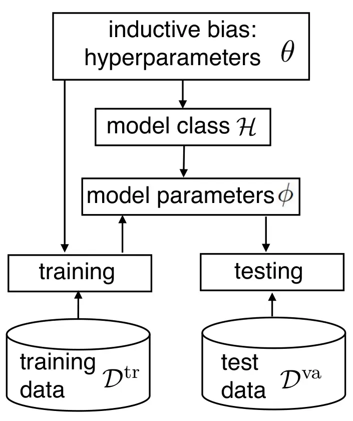

Figure 1.1: Illustration of conventional machine learning.

Drawbacks of conventional learning. As anticipated, conventional machine
learning suffers from two main potential shortcomings that meta-learning
can help address, namely:

- •
  Large sample complexity: By training a model “from scratch”,
  conventional learning generally requires a large number of training
  samples, $`N`$, to obtain a suitable test performance. The number of
  samples needed to obtain some level of accuracy is known as sample
  complexity.
- •
  Large iteration complexity: By relying on a generic optimization
  procedure, conventional learning may require a large number of
  iterations to converge to a well-performing model.

Both issues can be potentially mitigated if the inductive bias – i.e.,
the selection of model class and training algorithm – is tailored to the
problem under study based on domain knowledge. For instance, as part of
the inductive bias, we may choose an architecture for a neural network
model that satisfies known symmetries in the data; or select an
initialization point for the model parameters that $`\phi`$ is suitably
adapted to the learning task at hand. With such informed inductive
biases, one we can generally reduce both sample and iteration
complexities.

When one does not have access to sufficient information about the
problem to identify a tailored inductive bias, it may become useful to
transfer knowledge from data pertaining related tasks.

#### 1.2.3 Joint Learning

Suppose that we have access to training data sets
$`\mathcal{D}_{k}^{\text{tr}}`$ for a number of distinct learning tasks
in the same task environment that are indexed by the integer
$`k=1,...,K.`$ Each data set $`\mathcal{D}_{k}^{\text{tr}}`$ contains
$`N`$ training examples. We now review the idea of joint learning, which
is a special case of multi-task learning in which a common model is
trained for all $`K`$ learning tasks.

Training and testing. Joint learning pools together all the training
sets $`\{\mathcal{D}_{k}^{\text{tr}}\}_{k=1}^{K}`$, and uses the
resulting aggregate training loss

```math
L_{\{\mathcal{D}_{k}^{\text{tr}}\}_{k=1}^{K}}(\phi)=\frac{1}{K}\sum_{k=1}^{K}L_{\mathcal{D}_{k}^{\text{tr}}}(\phi) \tag{1.2}
```

as the learning criterion to train a shared model parameter $`\phi`$.

As illustrated in Fig. 1.2, joint learning inherently caters only to the
$`K`$ tasks in the original pool, and is hence generally unable to
provide desirable performance for new, as of yet unknown, tasks.

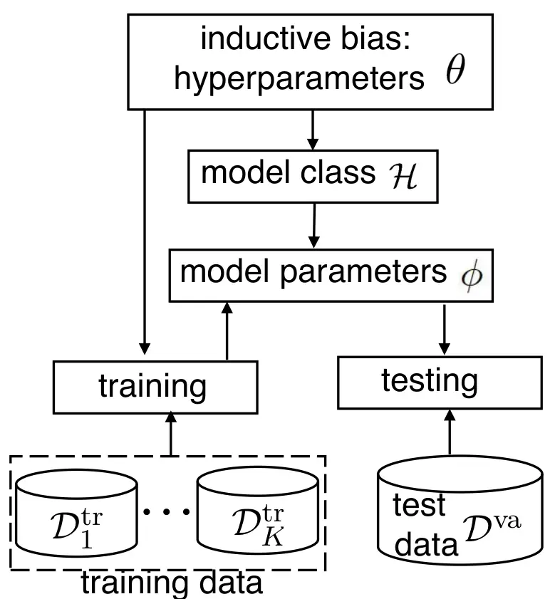

Figure 1.2: Illustration of joint learning.

Joint learning is a natural first attempt to transfer knowledge across
tasks with the aim of improving sample and iteration complexities.
First, by pooling together data from $`K`$ tasks, the overall size of
the training set is $`K\cdot N,`$ which may be large even when the
available data per task is limited, i.e., when $`N`$ is small. Second,
training only once for $`K`$ tasks amortizes the iteration complexity
across the tasks, yielding a potential reduction of the number of
iterations by a factor equal to $`K`$.

Drawbacks of joint learning. Joint learning has two potentially critical
shortcomings.

- •
  Bias: The jointly trained model may improve the performance of
  conventional learning only if there is a single model parameter
  $`\phi`$ that “works well” for all tasks. This may not be the case if
  the tasks are sufficiently distinct.
- •
  Lack of adaptation: Even if there is a single model parameter $`\phi`$
  that yields desirable test results on all $`K`$ tasks, this does not
  guarantee that the same is true for a new task. In fact, by focusing
  on training a common model for all tasks, joint learning is not
  designed to enable adaptation to a new task.

As a remedy for the second shortcoming just highlighted, one could use
the jointly trained model parameter $`\phi`$ to initialize the training
process on a new task – a process known as fine-tuning. However, there
is generally no guarantee that this would yield a desirable outcome,
since the training process used by joint learning does not account for
the subsequent step of adaptation on a new task. This is a key
distinction between joint learning and meta-learning, which will be
introduced next.

#### 1.2.4 Introducing Meta-Learning

As for joint learning, in meta-learning one assumes the availability of
data from $`K`$ related tasks from the same task environment, which are
referred to as meta-training tasks. However, unlike joint learning, data
from these tasks are kept separate, and a distinct model parameter
$`\phi_{k}`$ is trained for each $`k`$ task. As illustrated in Fig. 1.3,
meta-learning tasks only share a common hyperparameter vector $`\theta`$
that is optimized based on meta-training data. As a result,
meta-training data is not used to optimize a common model, but only a
shared inductive bias. In other words, the optimization carried out by
meta-learning operates at a higher level of abstraction, leaving the
model parameters free to adapt to each individual task.

We now introduce meta-learning by emphasizing the differences with
respect to joint learning and by detailing the meta-training and
meta-testing phases.

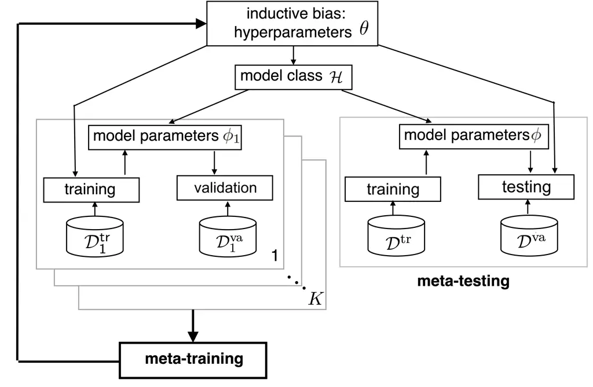

Figure 1.3: Illustration of meta-learning.

Inductive bias and hyperparameters. As discussed, the goal of
meta-learning is optimizing the hyperparameter vector $`\theta`$ and,
through it, the inductive bias that is applied for the training of each
task. To simplify the discussion and focus on the most common setting,
let us assume that the model class $`\mathcal{H}`$ is fixed, while the
training algorithm is a mapping
$`\phi^{\textrm{tr}}(\mathcal{D}|\theta)`$ between a training set
$`\mathcal{D}`$ and a model parameter vector $`\phi`$ that depends on
the hyperparameter vector $`\theta`$, i.e.,

```math
\phi=\phi^{\textrm{tr}}(\mathcal{D}|\theta). \tag{1.3}
```

As an example, the training algorithm
$`\phi^{\textrm{tr}}(\mathcal{D}|\theta)`$ could output the last iterate
of an optimizer.

The hyperparameter $`\theta`$ can affect the output
$`\phi^{\textrm{tr}}(\mathcal{D}|\theta)`$ of the training procedure in
different ways. For instance, it can determine the regularization
constant; the learning rate and/or the initialization of an iterative
training procedure; the mini-batch size; a subset of the parameters in
vector $`\phi`$, e.g., used to define a shared feature extractor; the
parameters of a prior distribution; and so on.

The output $`\phi^{\textrm{tr}}(\mathcal{D}|\theta)`$ of a training
algorithm is generally random. This is the case, for instance, if the
algorithm relies on stochastic gradient descent (SGD). In the following
discussion, we will assume for simplicity a deterministic training
algorithm, but the approach carries over directly to the more general
case of a random training procedure by adding an average over the
randomized of the trained model
$`\phi^{\textrm{tr}}(\mathcal{D}|\theta)`$.

Meta-training. To formulate meta-training, a natural idea is to use as
the optimization criterion the aggregate training loss

```math
\mathcal{L}_{\{\mathcal{D}_{k}^{\text{tr}}\}_{k=1}^{K}}(\theta)=\frac{1}{K}\sum_{k=1}^{K}L_{\mathcal{D}_{k}^{\text{tr}}}(\phi^{\textrm{tr}}(\mathcal{D}_{k}^{\text{tr}}|\theta)), \tag{1.4}
```

which is a function of the hyperparameter $`\theta`$. This quantity is
known as the meta-training loss. The resulting problem

```math
\min_{\theta}\mathcal{L}_{\{\mathcal{D}_{k}^{\text{tr}}\}_{k=1}^{K}}(\theta) \tag{1.5}
```

of minimizing the meta-training loss over the hyperparameter $`\theta`$
is different from the ERM problem
$`\min_{\phi}L_{\{\mathcal{D}_{k}^{\text{tr}}\}_{k=1}^{K}}(\phi)`$
tackled in joint learning for the following reasons:

- •
  First, optimization is over the hyperparameter vector $`\theta`$ and
  not over a shared model parameter $`\phi`$.
- •
  Second, the model parameter $`\phi`$ is trained separately for each
  task $`k`$ through the parallel applications of the training function
  $`\phi^{\textrm{tr}}(\cdot|\theta)`$ to the training set
  $`\mathcal{D}_{k}^{\text{tr}}`$ of each task $`k=1,...,K`$.

As a result of these two key differences with respect to joint training,
the minimization of the meta-training loss (1.4) inherently caters for
adaptation: The hyperparameter vector $`\theta`$ is optimized in such a
way that the trained model parameter vectors
$`\phi_{k}=\phi^{\textrm{tr}}(\mathcal{D}_{k}^{\text{tr}}|\theta)`$,
adapted separately to the data of each task $`k`$, minimize the
aggregate loss across all meta-training tasks $`k=1,...,K`$.

Advantages of meta-training over joint training. While retaining the
advantages of joint learning in terms of sample and iteration
complexity, meta-learning addresses the two shortcomings of joint
learning:

- •
  Knowledge sharing via hyperparameters: Meta-learning does not assume
  that there is a single model parameter $`\phi`$ that “works well” for
  all tasks. It only assumes that there exists a common model class and
  a common training algorithm, as specified by hyperparameters
  $`\theta`$, that can be effectively applied across the class of tasks
  of interest.
- •
  Optimization for adaptation: Meta-learning prepares the training
  algorithm $`\phi^{\textrm{tr}}(\mathcal{D}|\theta)`$ to adapt to
  potentially new tasks through the selection of the hyperparameters
  $`\theta`$. This is because the model parameter vector $`\phi`$ is
  left free by design to be adapted to the training data
  $`\mathcal{D}^{\textrm{tr}}_{k}`$ of each task $`k`$.

Meta-testing. As mentioned, the goal of meta-learning is ensuring
generalization to any new task that is drawn at random from the same
task environment. For any new task, during the meta-testing phase, we
have access to training set $`\mathcal{D}^{\text{tr}}`$ and validation
set $`\mathcal{D}^{\text{va}}.`$ The new task is referred to as the
meta-test task, and is illustrated in Fig. 1.3 along with the
meta-training tasks.

The training data $`\mathcal{D}^{\text{tr}}`$ of the meta-test task is
used to adapt the model parameter vector to the meta-test task,
obtaining $`\phi^{\textrm{tr}}(\mathcal{D}^{\text{tr}}|\theta)`$.
Importantly, the training algorithm depends on the hyperparameter
$`\theta`$. The performance metric of interest for a given
hyperparameter $`\theta`$ is the test loss for the meta-test task, or
meta-test loss, given by

```math
L_{\mathcal{D}^{\text{va}}}(\phi^{\textrm{tr}}(\mathcal{D}^{\text{tr}}|\theta)). \tag{1.6}
```

In (1.6), the population loss of the trained model is estimated via the
test loss evaluated with the test set $`\mathcal{D}^{\text{va}}.`$

We have just seen that meta-testing requires a split of the data for the
new task into a training part, used for adaptation, and a validation
part, used to estimate the population loss (1.6). We now discuss how the
idea of splitting per-task data sets into training and validation parts
can be useful also during the meta-training phase.

As explained in Section 1.2.4, the training algorithm
$`\phi(\mathcal{D}^{\text{tr}}|\theta)`$ is defined by an optimization
procedure for the problem of minimizing the training loss on the
training set $`\mathcal{D}^{\text{tr}}`$. We can write the learning
procedure informally as

```math
\phi^{\textrm{tr}}(\mathcal{D}^{\text{tr}}|\theta)\underset{\theta}{\leftarrow}\min_{\phi}L_{\mathcal{D}^{\text{tr}}}(\phi), \tag{1.7}
```

highlighting the dependence of the training algorithm on the training
loss $`L_{\mathcal{D}^{\text{tr}}}(\phi)`$ and on the hyperparameter
$`\theta`$.

Because of (1.7), in problem (1.5) one is effectively optimizing the
training losses $`L_{\mathcal{D}_{k}^{\text{tr}}}(\phi)`$ for the
meta-training tasks $`k=1,...,K`$ twice, first over the model parameters
in the inner optimization (1.7) and then over the hyperparameters
$`\theta`$ in the outer optimization (1.5). This reuse of the
meta-training data for both adaptation and meta-learning may cause
overfitting to the meta-training data, and thus result in a training
algorithm $`\phi^{\textrm{tr}}(\cdot|\theta)`$ that fails to generalize
to new tasks.

The problem highlighted above is caused by the fact that the
meta-training loss (1.4) does not provide an unbiased estimate of the
sum of the population losses across the meta-training tasks. The bias is
a consequence of the reuse of the same data for both adaptation and
hyperparameter optimization. To address this problem, for each
meta-training task $`k`$, we can partition the available data into two
data sets, a training data set $`\mathcal{D}_{k}^{\text{tr}}`$ and a
validation data set $`\mathcal{D}_{k}^{\text{va}}`$. Therefore, the
overall meta-training data set is given as
$`\mathcal{D}^{\textrm{mtr}}=\{(\mathcal{D}_{k}^{\text{tr}},\mathcal{D}_{k}^{\text{va}})_{k=1}^{K}\}`$.

The key idea is that the training data set
$`\mathcal{D}_{k}^{\text{tr}}`$ is used for adaptation using the
training algorithm (1.7), while the test data set
$`\mathcal{D}_{k}^{\text{va}}`$ is kept aside to estimate the population
distribution of task $`k`$ for the trained model. The hyperparameter
$`\theta`$ is not optimized to minimize the sum of the training losses
as in (1.5). Rather, they target the sum of the test losses, which
provides an unbiased estimate of the corresponding sum of population
losses.

Meta-learning as nested optimization. To summarize, the general
procedure followed by many meta-learning algorithms consists of a nested
optimization of the following form:

- •
  Inner loop: For a fixed hyperparameter vector $`\theta`$, training on
  each task $`k`$ is done separately, producing per-task model
  parameters

  ```math
  \phi_{k}=\phi^{\textrm{tr}}(\mathcal{D}_{k}^{\text{tr}}|\theta)\underset{\theta}{\leftarrow}\min_{\phi}L_{\mathcal{D}_{k}^{\text{tr}}}(\phi) \tag{1.8}
  ```

  for $`k=1,...,K;`$

- •
  Outer loop: The hyperparameter vector $`\theta`$ is optimized as

  ```math
  \theta_{\mathcal{D}^{\textrm{mtr}}}=\arg\min_{\theta}\mathcal{L}_{\mathcal{D}^{\textrm{mtr}}}(\theta), \tag{1.9}
  ```

  where the meta-training loss is (re-)defined as

  ```math
  \mathcal{L}_{\mathcal{D}^{\textrm{mtr}}}(\theta)=\frac{1}{K}\sum_{k=1}^{K}L_{\mathcal{D}_{k}^{\text{va}}}(\phi^{\textrm{tr}}(\mathcal{D}_{k}^{\text{tr}}|\theta)). \tag{1.10}
  ```

As we will detail in Section 2, the specific implementation of a
meta-learning algorithm depends on the selection of the training
algorithm $`\phi^{\textrm{tr}}(\mathcal{D}|\theta)`$ and on the method
used to solve the outer optimization.

#### 1.2.5 Meta-Inductive Bias

While the inductive bias underlying the training algorithm used in the
inner loop is optimized by means of meta-learning, the meta-learning
process itself assumes a meta-inductive bias. The meta-inductive bias
encompasses the choices of the hyperparameters to optimize in the outer
loop – e.g., the initialization of an SGD training algorithm – as well
as the optimization algorithm used in the outer loop. There is of course
no end to this nesting of inductive biases: any new learning level
brings its own assumptions and biases. Meta-learning moves the potential
cause of bias at the outer level of the meta-learning loop, which may
improve the efficiency of training.

It is important, however, to note that the selection of a meta-inductive
bias may cause meta-overfitting in a similar way as the choice of an
inductive bias can cause overfitting in conventional learning. In a
nutshell, if the meta-inductive bias is too broad and the number of
tasks insufficient, the meta-trained inductive bias may overfit the
meta-training data and fail to prepare for adaptation to new tasks.

### 1.3 Organization of the Monograph

The rest of the monograph is organized as follows.

Section 2. Meta-learning algorithms: This section provides a taxonomy
and an introduction to the most common meta-learning algorithms,
including model agnostic meta-learning (MAML).

Section 3. Bilevel optimization for meta learning: Section 3 presents a
general optimization-based perspective on meta-learning, which views
meta-learning as a form of stochastic bilevel optimization.

Section 4. Statistical learning theory for meta-learning: This section
revisits meta-learning through the different perspective of
generalization. Specifically, it investigates from a theoretical
viewpoint the performance of meta-learning algorithms in terms of their
capacity to generalize outside the meta-training data set to new tasks.

Section 5. Meta-learning applications to communications: The section
turns to several examples of applications of meta-learning to the
engineering problem of designing communication systems. Examples of
reviewed applications include demodulation and power control.

Section 6. Integration with emerging computing technologies: This
section highlights the potential synergies between meta-learning and two
emerging computing technologies, namely neuromorphic and quantum
computing.

Section 7. Outlook: The last section presents an outlook on the area of
meta-learning by offering a brief review of open problems and further
directions for reading and research.

## Chapter 2 Meta-Learning Algorithms

In this section, we review the main classes of meta-learning algorithms
by focusing on selected notable representatives from each class.

### 2.1 Overview of Meta-Learning Algorithms

Existing meta-learning algorithms can be roughly grouped into three
categories according to the principle underlying the transfer of
information among tasks \[2\]. We specifically distinguish among: (i)
metric-based methods, in which information shared across tasks is
encoded in a distance measure used to instantiate non-parametric
predictors; (ii) model-based methods, whereby data from multiple tasks
is used to determine a “hyper-model” that maps data from a new task to a
model; and (iii) optimization-based methods, which target the design of
the hyperparameters of an optimization procedure for training on new
tasks. We now briefly review each class in turn.

#### 2.1.1 Metric-Based Meta-Learning

Metric-based methods assume that the training and testing tasks in the
given environment share a common feature representation mapping that can
be used to gauge the similarity between data points. A similarity metric
meta-learned based on data from multiple tasks can be leveraged to
implement non-parametric predictive models without the need for training
on a new task. Modern metric-based meta-learning methods include the
Matching Network \[3\], the Prototypical Network \[4\], and the Relation
Network \[5\]. The approach is aligned with empirical Bayes methods that
are routinely used in models such as Gaussian Processes, with the caveat
that data is collected here from distinct tasks. In this monograph, we
will concentrate on parametric models, which have been more commonly
adopted for engineering problems, and hence we will not elaborate
further on metric-based meta-learning.

#### 2.1.2 Optimization-Based Meta-Learning

Owing to their performance and relative ease of implementation,  
optimization-based methods constitute the dominant class of
meta-learning solutions for _parametric_ models. Recently, the most
common approach within this class optimizes the _initialization_ of the
model parameters used by the training procedure. The rationale
underlying such optimization-based methods is that a good initialization
can help the training procedure quickly adapt the model parameters to
new tasks with few optimization steps. Notable examples of
initialization-based schemes are model agnostic meta-learning (MAML)
algorithm and its variants (see e.g., \[6, 7\]). More broadly,
optimization-based methods may design other hyperparameters of the
training algorithm such as the learning rate \[8\].

Existing optimization-based methods that address model initialization
can be further divided into two main categories, depending on the type
of optimization used for training, namely second-order algorithms and
first-order algorithms. Second-order algorithms, to be presented in
Section 2.2, require second-order derivatives of the per-task loss
functions during meta-learning; while first-order algorithms, described
in Section 2.3, only need first-order gradient information of the
per-task loss functions to be available.

As a distinct example of optimization-based methods, we will also study
modular meta-learning. Modular meta-learning relies on the assumption
that suitable models for the given environment share a common repository
of modules that can be recombined to address each individual task.
Accordingly, modular meta-learning optimizes the hyperparameters as a
set of modules that can be assembled in different ways to yield models
for new tasks using combinatorial optimization. Modules may consist of
instance of layers of a neural network. We refer to Section 2.5 for
details.

#### 2.1.3 Model-Based Meta-Learning

Model-based methods optimize a hyper-model that directly maps the
training set from a task to a model. This mapping can be realized using
recurrent neural networks \[9, 10\], convolutional neural networks
\[11\], or hypernetworks \[12, 13\]. In Section 2.6, we will elaborate
on a simple representative of model-based meta-learning, whereby the
training set for the new task is used to optimize a context vector that
determines the operation of a model shared across tasks.

### 2.2 Second-Order Optimization-Based Meta-Learning

In this subsection, we introduce second-order optimization-based
meta-learning methods by covering the key representatives, MAML \[6\],
implicit MAML (iMAML) \[7\], and Bayesian MAML \[14, 15, 16\].

#### 2.2.1 MAML

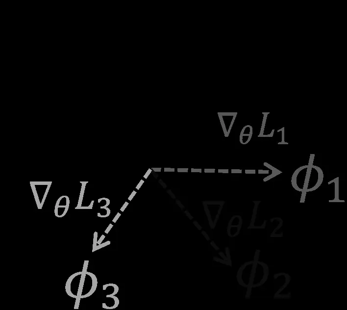

Figure 2.1: Illustration of MAML: MAML aims at finding an initial
parameter vector $`\theta`$ that allows quick adaptation to new tasks
via gradient descent of loss function for the $`k`$-th task,
$`L_{k}=L_{\mathcal{D}_{k}^{\rm tr}}(\theta)`$. The adapted parameter
for task $`k`$ is denoted as
$`{\phi}_{k}=\phi(\mathcal{D}_{k}^{\rm tr}|\theta)`$, and is obtained as
shown in the figure via a single gradient step.

As illustrated in Figure 2.1, MAML aims at finding an initial parameter
vector $`\theta`$ that allows quick adaptation to new tasks via gradient
descent \[6\]. In the simplest form of MAML, as seen in Figure 2.1,
starting from the initial parameter vector $`\theta`$, the per-task
parameter $`\phi`$ is adapted using a one-step gradient update for the
task-specific loss function $`L_{\mathcal{D}_{k}^{\rm tr}}(\phi)`$ for
each $`k`$-th task. We recall from (1.1) that we write as
$`L_{\mathcal{D}_{k}^{\rm tr}}(\phi)`$ the empirical loss evaluated on a
training set $`\mathcal{D}_{k}^{\rm tr}`$ when model parameter $`\phi`$
is used. Data for the $`k`$ task comprises the train set
$`\mathcal{D}_{k}^{\rm tr}`$, which is used for training, as well as the
validation set $`\mathcal{D}_{k}^{\rm va}`$ that is used to estimate the
population loss via the validation loss
$`L_{\mathcal{D}_{k}^{\rm va}}(\phi)`$. Let
$`\mathcal{D}^{\rm mtr}=\{\mathcal{D}_{k}^{\text{mtr}}\}_{k=1}^{K}=\{\mathcal{D}_{k}^{\text{tr}},\mathcal{D}_{k}^{\text{va}}\}_{k=1}^{K}`$
denote the overall meta training dataset. With these definitions, the
meta-training loss function
$`\mathcal{L}^{\mathrm{ma}}_{\mathcal{D}^{\rm mtr}}\left(\theta\right)`$
for MAML is the average of the validation loss across all meta-training
tasks. Following (1.3), we also write as
$`{\phi}^{\mathrm{ma}}(\mathcal{D}_{k}^{\mathrm{tr}}|\theta)`$ the
updated model parameter vector based on training data
$`\mathcal{D}_{k}^{\mathrm{tr}}`$ for task $`k`$ with initialization
$`\theta`$, and aim to optimize

```math
\displaystyle\min_{\theta}\  \displaystyle\mathcal{L}^{\mathrm{ma}}_{\mathcal{D}^{\rm mtr}}\left(\theta\right)=\frac{1}{K}\sum_{k=1}^{K}L_{\mathcal{D}_{k}^{\mathrm{va}}}\left({\phi}^{\mathrm{ma}}(\mathcal{D}_{k}^{\mathrm{tr}}|\theta)\right) \tag{2.1a}
```

```math
\displaystyle\mathrm{s.t.}\penalty\ \penalty\ {\phi}^{\mathrm{ma}}(\mathcal{D}_{k}^{\mathrm{tr}}|\theta)=\theta-\alpha\nabla_{\theta}L_{\mathcal{D}_{k}^{\mathrm{tr}}}\left(\theta\right). \tag{2.1b}
```

Where $`\alpha`$ is predefined stepsize. Note that the updated model
from (2.1b) corresponds to the one-step gradient update illustrated in
Figure 2.1.

The MAML algorithm is summarized in Algorithm 1.

1: Input: Initial iterate $`\theta`$; meta-training data
$`\mathcal{D}^{\rm mtr}`$; loss function $`\ell(z|\phi)`$; stepsizes
$`\alpha`$ and $`\beta`$

2: while not converged do

3:   Sample batch of tasks
$`\tilde{\mathcal{K}}\subseteq\mathcal{K}=\{1,\ldots,K\}`$

4:   for all $`k\in\tilde{\mathcal{K}}`$ do

5:    Compute per-task parameter
$`{\phi}^{\rm ma}(\mathcal{D}_{k}^{\rm tr}|\theta)`$ using (2.1b)

6:   end for

7:   Update hyperparameter vector $`\theta`$ as

8:
   $`\theta\leftarrow\theta-\beta\nabla_{\theta}\mathcal{L}^{\rm ma}_{\mathcal{D}^{\rm mtr}}(\theta)`$
using in (2.1a)

9: end while

Algorithm 1 MAML

In order to apply MAML, in line 8 of Algorithm 1, we need to compute the
gradient
$`\nabla_{\theta}\mathcal{L}^{\rm ma}_{\mathcal{D}^{\rm mtr}}(\theta)`$
of the meta-training loss in (2.1a). Using the chain rule of
differentiation, with $`I`$ denoting the identity matrix, the gradient
$`\nabla_{\theta}\mathcal{L}^{\rm ma}_{\mathcal{D}^{\rm mtr}}(\theta)`$
is computed as

```math
\displaystyle\nabla_{\theta}\mathcal{L}^{\rm ma}_{\mathcal{D}^{\rm mtr}}(\theta)=\frac{1}{K}\sum_{k=1}^{K}\nabla_{\theta}{\phi}^{\mathrm{ma}}(\mathcal{D}_{k}^{\mathrm{tr}}|\theta)\nabla_{{\phi}}L_{\mathcal{D}_{k}^{\mathrm{va}}}({\phi})|_{{\phi}={\phi}(\mathcal{D}_{k}^{\mathrm{tr}}|\theta)}
```

```math
\displaystyle=\frac{1}{K}\sum_{k=1}^{K}\left(I-\alpha\nabla_{\theta}^{2}L_{\mathcal{D}_{k}^{\mathrm{tr}}}\left(\theta\right)\right)\nabla_{{\phi}}L_{\mathcal{D}_{k}^{\mathrm{va}}}({\phi})|_{{\phi}={\phi}(\mathcal{D}_{k}^{\mathrm{tr}}|\theta)}, \tag{2.2}
```

where
$`\nabla_{\theta}{\phi}^{\mathrm{ma}}(\mathcal{D}_{k}^{\mathrm{tr}}|\theta)`$
represents the Jacobian of the updated parameter in (2.1b) with respect
to the initial parameter $`\theta`$. Therefore the update of $`\theta`$
in line 7 of Algorithm 1 is specified as

```math
\theta\leftarrow\theta-\frac{\beta}{K}\sum_{k=1}^{K}\left(I-\alpha\nabla_{\theta}^{2}L_{\mathcal{D}_{k}^{\mathrm{tr}}}\left(\theta\right)\right)\nabla_{{\phi}}L_{\mathcal{D}_{k}^{\mathrm{va}}}({\phi})|_{{\phi}={\phi}^{\mathrm{ma}}(\mathcal{D}_{k}^{\mathrm{tr}}|\theta)}. \tag{2.3}
```

The convergence rate of MAML has been first established in \[17\], and
later been improved in \[18\].

#### 2.2.2 Implicit MAML

In implicit MAML (iMAML), the per-task parameter $`{\phi}`$ is updated
using hyperparameter vector $`\theta`$ by solving an
$`l_{2}`$-regularized empirical risk minimization problem that penalizes
deviations between per-task parameter $`{\phi}`$ and the hyperparameter
$`\theta`$. Accordingly, the meta-training loss function
$`\mathcal{L}^{\mathrm{im}}_{\mathcal{D}^{\rm mtr}}\left(\theta\right)`$
is defined as

```math
\displaystyle\mathcal{L}^{\mathrm{im}}_{\mathcal{D}^{\rm mtr}}\left(\theta\right)=\frac{1}{K}\sum_{k=1}^{K}L_{\mathcal{D}_{k}^{\mathrm{va}}}\left({\phi}^{\mathrm{im}}(\mathcal{D}_{k}^{\mathrm{tr}}|\theta)\right) \tag{2.4a}
```

```math
\displaystyle\mathrm{s.t.}\penalty\ \penalty\ {\phi}^{\mathrm{im}}(\mathcal{D}_{k}^{\mathrm{tr}}|\theta)=\underset{\phi}{\arg\min}\left\{L_{\mathcal{D}_{k}^{\mathrm{tr}}}\left(\phi\right)+\frac{\lambda}{2}\left\|\phi-\theta\right\|^{2}\right\}, \tag{2.4b}
```

where $`\lambda>0`$ is a regularization constant. As compared to MAML,
the gradient update in (2.1b) is replaced by the minimizer of problem
(2.4b). Note that, if the loss function
$`L_{\mathcal{D}_{k}^{\rm tr}}(\phi)`$ is replaced in (2.4b) by its
first-order Taylor expansion at $`\theta`$, i.e., by

```math
\displaystyle L_{\mathcal{D}_{k}^{\rm tr}}(\phi)=L_{\mathcal{D}_{k}^{\rm tr}}(\theta)+\nabla L_{\mathcal{D}_{k}^{\rm tr}}(\theta)^{\top}(\phi-\theta), \tag{2.5}
```

then problem (2.4) coincides with problem (2.1a).

The adapted parameter
$`{\phi}^{\rm im}(\mathcal{D}_{k}^{\rm tr}|\theta)`$ in (2.4b) can be
explained in terms of the proximal mapping for the per-task training
loss $`L_{\mathcal{D}_{k}^{\rm tr}}(\phi)`$ \[19\]. This function is
defined as

```math
\displaystyle\mathrm{prox}_{L_{{\cal D}_{k}^{\rm tr}},\lambda}(\theta)=\mathop{\arg\min}_{\phi}\frac{\lambda}{2}\|\phi-\theta\|^{2}+L_{\mathcal{D}_{k}^{\rm tr}}(\phi). \tag{2.6}
```

Therefore, the constraint in (2.4b) can be written as

```math
\displaystyle{\phi}^{\mathrm{im}}(\mathcal{D}_{k}^{\mathrm{tr}}|\theta)=\mathrm{prox}_{L_{{\cal D}_{k}^{\rm tr}},\lambda}(\theta). \tag{2.7}
```

Based on the chain rule of differentiation and the implicit function
theorem, the gradient descent update of hyperparameter $`\theta`$ during
meta-learning is obtained from problem (2.4)-(2.4b) as \[7\]

```math
\theta\leftarrow\theta-\frac{\beta}{K}\sum_{k=1}^{K}\left(I+\frac{1}{\lambda}\nabla^{2}_{\theta}L_{{\mathcal{D}}_{k}^{\mathrm{tr}}}\left(\theta\right)\right)^{-1}\nabla_{{\phi}}L_{\mathcal{D}_{k}^{\mathrm{tr}}}({\phi})|_{{\phi}={\phi}^{\mathrm{im}}(\mathcal{D}_{k}^{\mathrm{tr}}|\theta)}. \tag{2.8}
```

The iMAML algorithm is summarized in Algorithm 2.

1: Input: Initial iterate $`\theta`$; meta-training data
$`\mathcal{D}`$; loss function $`\ell(z|\phi)`$; stepsize $`\beta`$;
regularization weight $`\lambda`$

2: while not converged do

3:   Sample batch of tasks
$`\tilde{\mathcal{K}}\subseteq\mathcal{K}=\{1,\ldots,K\}`$

4:   for all $`k\in\tilde{\mathcal{K}}`$ do

5:    Compute per-task
$`{\phi}^{\rm im}(\mathcal{D}_{k}^{\rm tr}|\theta)`$ by solving problem

6:      (2.4b)

7:   end for

8:   Update hyperparameter vector $`\theta`$ via the gradient update
(2.8)

9: end while

Algorithm 2 iMAML

#### 2.2.3 Implicit MAML for Ridge Regression

In this subsection, we instantiate the iMAML scheme for the example of
linear prediction via ridge regression. Consider a linear prediction
problem in which each $`k`$ task amounts to the optimization of a linear
prediction over the model parameter vector $`{\phi}\in\mathbb{R}^{d}`$
given input vector $`x_{k}\in\mathbb{R}^{d}`$, which is computed as

```math
\displaystyle\hat{y}_{k}={\phi}^{\top}x_{k}. \tag{2.9}
```

The training data set is given as
$`\mathcal{D}_{k}^{\text{tr}}=(X_{k}^{\text{tr}},\mathrm{y}_{k}^{\text{tr}})`$,
where  
$`X_{k}^{\text{tr}}=[x_{k,1}^{\top},\ldots,x_{k,N^{\rm tr}}^{\top}]^{\top}`$
is the $`N^{\rm tr}\times d`$ matrix that contains by row the transpose
of the input vectors $`\{x_{k,n}\}_{n=1}^{N^{\rm tr}}`$, and
$`\mathrm{y}_{k}^{\text{tr}}=[y_{k,1},\ldots,y_{k,N^{\rm tr}}]^{\top}`$
as the $`N^{\rm tr}\times 1`$ vector that collects the corresponding
labels $`\{y_{k,n}\}_{n=1}^{N^{\rm tr}}`$. Similarly, we define
$`\mathcal{D}_{k}^{\text{va}}=(X_{k}^{\text{va}},\mathrm{y}_{k}^{\text{va}})`$
as
$`X_{k}^{\text{va}}=[x_{k,1}^{\top},\ldots,x_{k,N^{\text{va}}}^{\top}]^{\top}`$
as the $`N^{\text{va}}\times d`$ input data and
$`\mathrm{y}_{k}^{\text{va}}=[y_{k,1},\ldots,y_{k,N^{\text{va}}}]^{\top}`$
as the $`N^{\text{va}}\times 1`$ target labels for the validation data
of the $`k`$-th task.

Given the task-specific model parameter $`{\phi}`$, the mean squared
error (MSE) prediction loss given the data set
$`\mathcal{D}_{k}^{\text{tr}}`$ can be written as

```math
\displaystyle L_{\mathcal{D}_{k}^{\text{tr}}}({\phi})=\|X_{k}^{\text{tr}}{\phi}-\mathrm{y}_{k}^{\text{tr}}\|^{2}. \tag{2.10}
```

With the quadratic loss in (2.10), the solution of the inner problem
(2.4b), i.e., the proximal function in (2.7), can be obtained
analytically as

```math
\displaystyle{\phi}^{\text{im}}(\mathcal{D}_{k}^{\text{tr}}|\theta)=\Big(X_{k}^{\text{tr}\top}X_{k}^{\text{tr}}+\frac{\lambda}{2}I\Big)^{-1}\Big(X_{k}^{\text{tr}\top}\mathrm{y}_{k}^{\text{tr}}+\frac{\lambda}{2}\theta\Big). \tag{2.11}
```

As a result, the solution of the meta-training problem (2.4) can also be
computed in closed form as

```math
\displaystyle\hat{\theta} \displaystyle=\argmin_{\theta}\sum_{k=1}^{K}||\tilde{X}_{k}^{\text{va}}\theta-\tilde{\rm y}_{k}^{\text{va}}||^{2}
```

```math
\displaystyle=\tilde{X}^{\dagger}\tilde{\rm y}, \tag{2.12}
```

where the $`N^{\text{va}}\times d`$ matrix $`\tilde{X}_{k}^{\text{va}}`$
contains by row the transpose of the pre-conditioned input vectors
$`\{\frac{\lambda}{2}(A_{k}^{\text{tr}})^{-1}x_{k,n}^{\text{va}}\}_{n=1}^{N^{\text{va}}}`$,
with
$`A_{k}^{\text{tr}}=(X_{k}^{\text{tr}})^{\top}X_{k}^{\text{tr}}+\frac{\lambda}{2}I`$;
$`\tilde{y}_{k}^{\text{va}}`$ is $`N^{\text{va}}\times 1`$ vector
containing vertically the transformed outputs
$`\{y^{\text{va}}_{k,n}-(\mathrm{y}_{k}^{\text{tr}})^{\top}X_{k}^{\text{tr}}(A_{k}^{\text{tr}})^{-1}x_{k,n}^{\text{va}}\}_{n=1}^{N^{\text{va}}}`$;
the $`KN^{\text{va}}\times d`$ matrix
$`\tilde{X}=[\tilde{X}_{1}^{\text{va}},\ldots,\tilde{X}_{K}^{\text{va}}]^{\top}`$
stacks vertically the $`N^{\text{va}}\times d`$ matrices
$`\{\tilde{X}_{k}^{\text{va}}\}_{k=1}^{K}`$; and the
$`KN^{\text{va}}\times 1`$ vector
$`\tilde{\rm y}=[\tilde{\rm y}_{1}^{\text{va}},\ldots,\tilde{\rm y}_{K}^{\text{va}}]^{\top}`$
stacks vertically the $`N^{\text{va}}\times 1`$ vectors
$`\{\tilde{\rm y}_{k}^{\text{va}}\}_{k=1}^{K}`$. Further discussions can
be found in \[20, 21, 22\].

#### 2.2.4 Sharp-MAML

The nested structure of the MAML problem (2.1a)-(2.1b) may cause the
optimization landscape in the space of the hyperparameter $`\theta`$ to
have many saddle points and local minima. To illustrate this point,
Figure 2.2 shows the loss landscapes of MAML on
$`\mathcal{L}^{\rm ma}_{\mathcal{D}^{\rm mtr}}(\theta)`$ given by
(2.1a), as compared to a standard joint learning model (see \[23\] for
details). Reference \[23\] provides a formal statement of the
observation in Figure 2.2 that the loss landscape of MAML is more
involved as compared to joint learning, making the optimization problem
potentially difficult to solve.

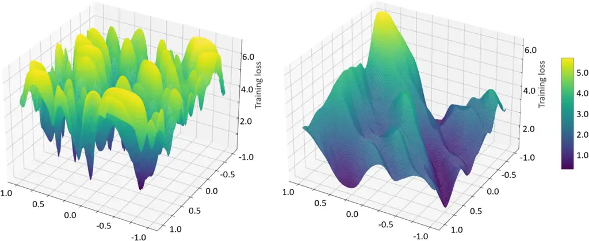

Figure 2.2: Loss landscapes for the MAML loss
$`\mathcal{L}^{\rm ma}_{\mathcal{D}^{\rm mtr}}(\theta)`$ (left) and for
joint learning (see (1.2)) (right) for a single task on CIFAR-100
dataset \[23\].

While some of the local minimizers in the loss landscape of MAML are
indeed effective few-shot learners, there are a number of sharp local
minimizers in MAML that may have undesired generalization performance.
Therefore, it is of interest to develop a method that can find local
minimizers with better generalization ability, which motivates the
Sharp-MAML algorithm introduced in \[23\].

Sharp-MAML is inspired by the recent development of the sharpness-aware
minimization (SAM) algorithm \[24\], which avoids sharp local minimizers
of the loss landscape to improve the generalization ability of the
algorithm. The idea is to find a solution such that the maximum loss of
the parameter in the neighborhood of this solution is minimized.

Since MAML is formulated in (2.1a) as a bilevel optimization problem,
ideally the solutions of both inner-level and outer-level problems
should have good generalization. Sharp-MAML applies the idea of SAM to
both the inner- and outer-level problems (2.1a) and (2.1b). The
resulting minimax problem is approximated by adding perturbations along
the gradient ascent direction for both inner- and outer-level
parameters, which are denoted as $`\epsilon_{k}(\theta)`$ and
$`\epsilon(\theta)`$. The loss function of Sharp-MAML is accordingly
given as

```math
\displaystyle\mathcal{L}^{\mathrm{sm}}_{\mathcal{D}^{\rm mtr}}\left(\theta\right)=\frac{1}{K}\sum_{k=1}^{K}L_{\mathcal{D}_{k}^{\mathrm{va}}}\left({\phi}^{\mathrm{sm}}(\mathcal{D}_{k}^{\mathrm{tr}}|\theta)\right) \tag{2.13a}
```

```math
\displaystyle\mathrm{s.t.}\penalty\ \penalty\  \displaystyle{\phi}^{\mathrm{sm}}(\mathcal{D}_{k}^{\mathrm{tr}}|\theta)=\theta+\epsilon\left(\theta\right)-\alpha\nabla_{\theta}L_{\mathcal{D}_{k}^{\mathrm{tr}}}\left(\theta+\epsilon\left(\theta\right)+\epsilon_{k}\left(\theta\right)\right), \tag{2.13b}
```

where the perturbations $`\epsilon_{k}(\theta)`$ and
$`\epsilon(\theta)`$ are given as

```math
\displaystyle\epsilon_{k}(\theta) \displaystyle=\alpha_{\rm in}\nabla_{\theta}L_{\mathcal{D}_{k}^{\rm tr}}(\theta)/\|\nabla_{\theta}L_{\mathcal{D}_{k}^{\rm tr}}(\theta)\|_{2} \tag{2.14a}
```

```math
\displaystyle\epsilon(\theta) \displaystyle=\alpha_{\rm ot}{\nabla_{\theta}{L}_{\mathcal{D}_{k}^{\rm va}}(\tilde{\phi}(\mathcal{D}_{k}^{\mathrm{tr}}|\theta))}/{\|\nabla_{\theta}{L}_{\mathcal{D}_{k}^{\rm va}}(\tilde{\phi}(\mathcal{D}_{k}^{\mathrm{tr}}|\theta))\|_{2}} \tag{2.14b}
```

```math
\displaystyle\tilde{\phi}(\mathcal{D}_{k}^{\mathrm{tr}}|\theta)=\theta-\alpha\nabla_{\theta}L_{\mathcal{D}_{k}^{\mathrm{tr}}}\left(\theta+\epsilon_{k}\left(\theta\right)\right), \tag{2.14c}
```

with $`\alpha_{\rm in}`$ and $`\alpha_{\rm ot}`$ denoting the scalar
hyperparameters for inner and outer-level perturbations to be used in
(2.13b).

The outer-level update for Sharp-MAML is

```math
\theta\leftarrow\theta-\frac{\beta}{K}\sum_{k=1}^{K}\nabla_{\theta}L_{\mathcal{D}_{k}^{\mathrm{va}}}\left({\phi}^{\mathrm{sm}}(\mathcal{D}_{k}^{\mathrm{tr}}|\theta)\right). \tag{2.15}
```

### 2.3 First-Order Optimization-Based Meta-Learning

In this section, we cover optimization-based meta-learning algorithms
that, unlike the second-order methods described in Section 2.2, do not
require computing the second-order Hessian of the loss function during
training, leading to significantly reduced computational complexity.
These methods include first-order MAML \[6\], ES-MAML, Reptile \[25\],
and Proximal MAML (Prox-MAML) \[19\].

#### 2.3.1 FOMAML

First-order MAML (FOMAML), originally proposed in \[6\], uses the same
formulation as MAML in (2.1a). However, for the update of the
hyperparameter $`\theta`$, FOMAML replaces the Jacobian
$`\nabla_{\theta}{\phi}^{\mathrm{ma}}(\mathcal{D}_{k}^{\mathrm{tr}}|\theta)`$
in (2.2) by an identity matrix, hence foregoing the computation of the
Hessian $`\nabla_{\theta}^{2}L_{\mathcal{D}_{k}^{\rm tr}}(\theta)`$. The
outer update of FOMAML is given by

```math
\theta\leftarrow\theta-\frac{\beta}{K}\sum_{k=1}^{K}\nabla_{{\phi}}L_{\mathcal{D}_{k}^{\mathrm{va}}}({\phi})|_{{\phi}={\phi}(\mathcal{D}_{k}^{\mathrm{tr}}|\theta)}, \tag{2.16}
```

where the function
$`{\phi}^{\mathrm{fo}}(\mathcal{D}_{k}^{\mathrm{tr}}|\theta)`$ is
computed by

```math
\displaystyle{\phi}^{\mathrm{fo}}(\mathcal{D}_{k}^{\mathrm{tr}}|\theta)=\theta-\alpha\nabla_{\theta}L_{\mathcal{D}_{k}^{\mathrm{tr}}}\left(\theta\right). \tag{2.17}
```

The FOMAML algorithm is summarized in Algorithm 3.

1: Input: Initial iterate $`\theta`$; meta-training data
$`\mathcal{D}`$; loss function $`\ell(z|\phi)`$; stepsizes
$`\alpha,\beta`$

2: while not converged do

3:   Sample batch of tasks
$`\tilde{\mathcal{K}}\subseteq\mathcal{K}=\{1,\ldots,K\}`$

4:   for all $`k\in\tilde{\mathcal{K}}`$ do

5:     Compute per-task parameter
$`{\phi}^{\rm fo}(\mathcal{D}_{k}^{\rm tr}|\theta)`$ using (2.1b)

6:   end for

7:    Update hyperparameter vector $`\theta`$ via the gradient update
(2.16)

8: end while

Algorithm 3 FOMAML

#### 2.3.2 ES-MAML

ES-MAML \[26\] addresses the MAML problem in (2.1a) via evolution
strategies (ES), a black-box optimization algorithm \[27\]. In a
nutshell, similar to MAML, the task-specific parameter
$`{\phi}^{\mathrm{es}}`$ is also obtained via one-step gradient update
initialized at the hyperparameter $`\theta`$. The difference with MAML
concerns the meta-update in lines 5 and 8 of Algorithm 1, in which the
gradient
$`{\nabla}_{\theta}L_{\mathcal{D}_{k}^{\mathrm{tr}}}\left(\theta\right)`$
is replaced with the ES multi-point gradient estimator. Accordingly, the
update of the hyperparameter $`\theta`$ is obtained as

```math
\displaystyle\theta\leftarrow\theta-\frac{\beta}{K}\sum_{k=1}^{K}\left(I-\alpha H_{k}^{\rm es}\right)\hat{\nabla}_{{\phi}}L_{\mathcal{D}_{k}^{\mathrm{va}}}({\phi})|_{{\phi}={\phi}(\mathcal{D}_{k}^{\mathrm{tr}}|\theta)} \tag{2.18}
```

```math
\displaystyle\theta\leftarrow\theta-\frac{\beta}{K}\sum_{k=1}^{K}\hat{\nabla}_{{\phi}}L_{\mathcal{D}_{k}^{\mathrm{va}}}({\phi})|_{{\phi}={\phi}^{\mathrm{es}}(\mathcal{D}_{k}^{\mathrm{tr}}|\theta)}, \tag{2.19}
```

where $`\hat{\nabla}_{{\phi}}L_{\mathcal{D}_{k}^{\mathrm{va}}}({\phi})`$
is the ES multi-point gradient estimator of
$`\nabla_{{\phi}}L_{\mathcal{D}_{k}^{\mathrm{va}}}({\phi})`$, which
queries multiple points in the parameter space of the hyperparameter
$`\theta`$, along with their loss function values. And
$`H_{k}^{\rm es}`$ denotes the ES Hessian estimator of
$`\nabla_{\theta}^{2}L_{\mathcal{D}_{k}^{\mathrm{tr}}}(\theta)`$. The
gradient is estimated by the sample average of the function value
difference in randomly sampled directions. Specifically, the $`n`$-point
ES gradient estimator of a loss function $`L(\phi)`$ is computed as

```math
\displaystyle\hat{\nabla}_{\phi}L(\phi)=\frac{1}{n}\sum_{i=1}^{n}\Big[\frac{{u}_{i}}{\delta}\Big(L(\phi+\delta{u}_{i})\Big)\Big], \tag{2.20}
```

where $`{u}_{i}`$ is a random vector sampled from distribution
$`\mathcal{N}(\mathrm{0},\mathrm{I})`$ in the same space as $`\phi`$;
and $`\delta`$ is a fixed parameter that controls the distance between
the two points used to estimate the gradient.

Analogously, the ES Hessian estimator $`H^{\rm es}`$ can be computed by
applying the gradient estimator twice, yielding

```math
\displaystyle H^{\rm es}=\frac{1}{\delta^{2}}\Big(\frac{1}{n}\sum_{i=1}^{n}L(\phi+\delta{u}_{i}){u}_{i}{u}_{i}^{\top}-\frac{1}{n}\sum_{i=1}^{n}L(\phi+\delta{u}_{i})\mathrm{I}\Big). \tag{2.21}
```

The ES-MAML algorithm is summarized in Algorithm 4.

1: Input: Initial iterate $`\theta`$; meta-training data
$`\mathcal{D}`$; loss function $`\ell(z|\phi)`$; stepsizes
$`\alpha,\beta`$

2: while not converged do

3:   Sample batch of tasks
$`\tilde{\mathcal{K}}\subseteq\mathcal{K}=\{1,\ldots,K\}`$

4:   for all $`k\in\tilde{\mathcal{K}}`$ do

5:    Compute per-task parameter
$`{\phi}^{\rm es}(\mathcal{D}_{k}^{\rm tr}|\theta)`$ using

6:
    $`{\phi}^{\mathrm{es}}\left(\mathcal{D}_{k}^{\mathrm{tr}}|\theta\right)=\theta-\alpha\hat{\nabla}_{\theta}L_{\mathcal{D}_{k}^{\mathrm{tr}}}\left(\theta\right)`$
estimated via (2.20)

7:   end for

8:   Update hyperparameter vector $`\theta`$ via the gradient update
(2.18)

9:     or (2.19)

10: end while

Algorithm 4 ES-MAML

#### 2.3.3 Reptile

Reptile \[25\] shares the same general formulation as FOMAML.
Considering the one-step per-task gradient update

```math
\displaystyle{\phi}^{\mathrm{re}}(\mathcal{D}_{k}^{\rm tr}|\theta)=\theta-\alpha\nabla_{\theta}L_{\mathcal{D}_{k}^{\mathrm{tr}}}\left(\theta\right), \tag{2.22}
```

which coincides with the FOMAML update (2.17). Reptile follows an
approach akin to the Fed Avg algorithm \[28\] to update the
hyperparameter $`\theta`$. Specifically, the hyperparameter vector
$`\theta`$ is updated in the direction of the average of the
task-specific parameters in (2.22) as

```math
\theta\leftarrow(1-\beta)\theta+\frac{\beta}{K}\sum_{k=1}^{K}{\phi}^{\mathrm{re}}(\mathcal{D}_{k}^{\rm tr}|\theta), \tag{2.23}
```

where $`\beta>0`$ is a constant. Reptile is summarized in Algorithm 5.

1: Input: Initial iterate $`\theta`$; meta-training data
$`\mathcal{D}`$; loss function $`\ell(z|\phi)`$; stepsizes
$`\alpha,\beta`$

2: while not converged do

3:   Sample batch of tasks
$`\tilde{\mathcal{K}}\subseteq\mathcal{K}=\{1,\ldots,K\}`$

4:   for all $`k\in\tilde{\mathcal{K}}`$ do

5:     Compute per-task parameter
$`{\phi}^{\rm re}(\mathcal{D}_{k}^{\rm tr}|\theta)`$ using (2.22)

6:   end for

7:    Update hyperparameter vector $`\theta`$ by the gradient update
(2.23)

8: end while

Algorithm 5 Reptile

#### 2.3.4 Prox-MAML

Prox-MAML \[19\] adopts a bilevel formulation where the inner-level loss
function is the same as that of iMAML in (2.4b), and the outer-level
meta-loss is the average of the inner-level loss across all tasks.
Mathematically, the bilevel problem is formulated as

```math
\displaystyle\hskip-8.5359pt\mathcal{L}^{\mathrm{pr}}_{\mathcal{D}^{\rm mtr}}\left(\theta\right)=\frac{1}{K}\sum_{k=1}^{K}L_{\mathcal{D}_{k}^{\rm mtr}}\left({\phi}^{\mathrm{pr}}(\mathcal{D}_{k}^{\rm mtr}|\theta)\right)+\frac{\lambda}{2}\left\|{\phi}^{\mathrm{pr}}(\mathcal{D}_{k}^{\rm mtr}|\theta)-\theta\right\|^{2} \tag{2.24}
```

```math
\displaystyle\mathrm{s.t.}\penalty\ \penalty\ {\phi}^{\mathrm{pr}}(\mathcal{D}_{k}^{\rm mtr}|\theta)=\mathrm{prox}_{L_{{\cal D}_{k}^{\rm mtr}},\lambda}(\theta), \tag{2.25}
```

where we have used the definition of proximal mapping in (2.6).

The gradient of the hyperparameter $`\theta`$ can be derived as

```math
\displaystyle\!\nabla_{\theta}\mathcal{L}^{\rm pr}_{\mathcal{D}^{\rm mtr}}(\theta)\!=\! \displaystyle\frac{1}{K}\sum_{k=1}^{K}\nabla_{\theta}{\phi}^{\mathrm{pr}}(\mathcal{D}_{k}^{\rm mtr}|\theta)\nabla_{{\phi}}\Big(L_{\mathcal{D}_{k}^{\rm mtr}}({\phi})\!+\!\frac{\lambda}{2}\|{\phi}-\theta\|^{2}\Big)\Big|_{{\phi}={\phi}^{\mathrm{pr}}(\mathcal{D}_{k}^{\rm mtr}|\theta)}
```

```math
\displaystyle+\frac{1}{K}\sum_{k=1}^{K}\lambda(\theta-{\phi}^{\mathrm{pr}}(\mathcal{D}_{k}^{\rm mtr}|\theta)). \tag{2.26}
```

Furthermore, by (2.25), for all $`k\in[K]`$, we have the equality

```math
\displaystyle\nabla_{{\phi}}\Big(L_{\mathcal{D}_{k}}({\phi})+\frac{\lambda}{2}\left\|{\phi}-\theta\right\|^{2}\Big)\Big|_{{\phi}={\phi}^{\mathrm{pr}}(\mathcal{D}_{k}|\theta)}={0}, \tag{2.27}
```

implying that the gradient
$`\nabla_{\theta}\mathcal{L}^{\rm pr}_{\mathcal{D}^{\rm mtr}}(\theta)`$
in (2.26) can be simplified as

```math
\displaystyle\nabla_{\theta}\mathcal{L}^{\rm pr}_{\mathcal{D}^{\rm mtr}}(\theta)= \displaystyle\frac{1}{K}\sum_{k=1}^{K}\lambda(\theta-{\phi}^{\mathrm{pr}}(\mathcal{D}_{k}^{\rm mtr}|\theta)). \tag{2.28}
```

It follows that the update equation for Prox-MAML is given as

```math
\displaystyle\theta\leftarrow\theta-\beta{\lambda\left(\theta-\frac{1}{K}\sum_{k=1}^{K}{\phi}^{\mathrm{pr}}\left(\mathcal{D}_{k}|\theta\right)\right)}. \tag{2.29}
```

The Prox-MAML algorithm is summarized in Algorithm 6.

1: Input: Initial iterate $`\theta`$; meta-training data
$`\mathcal{D}^{\rm mtr}`$; loss function $`\ell(z|\phi)`$; stepsizes
$`\alpha,\beta`$

2: while not converged do

3:   Sample batch of tasks
$`\tilde{\mathcal{K}}\subseteq\mathcal{K}=\{1,\ldots,K\}`$

4:   for all $`k\in\tilde{\mathcal{K}}`$ do

5:     Compute per-task parameter
$`{\phi}^{\rm pr}(\mathcal{D}_{k}^{\rm tr}|\theta)`$ using (2.25)

6:   end for

7:    Update hyperparameter vector $`\theta`$ via gradient update (2.29)

8: end while

Algorithm 6 Prox-MAML

### 2.4 Bayesian Meta-Learning

MAML optimizes a conventional frequentist learning process that outputs
an optimized model parameter $`{\phi}`$ for each task $`k`$. Frequentist
learning is well known to be ineffective at quantifying uncertainty, and
at providing well-calibrated decision (see e.g., \[1, 29\]). In
contrast, Bayesian learning, retains information about uncertainty in
the model parameter space by evaluating, ideally, the posterior
distribution, $`p(\phi|\mathcal{D}_{k}^{\mathrm{tr}},\theta)`$ of the
task-specific parameter $`{\phi}`$, given the training data set
$`\mathcal{D}_{k}^{\mathrm{tr}}`$. According to the Bayes rule, the
posterior distribution is

```math
\displaystyle p(\phi|\mathcal{D}_{k}^{\mathrm{tr}},\theta)=\frac{p(\mathcal{D}_{k}^{\mathrm{tr}}|\phi)p(\phi|\theta)}{p(\mathcal{D}_{k}^{\mathrm{tr}}|\theta)}, \tag{2.30}
```

where $`p(\mathcal{D}_{k}^{\mathrm{tr}}|\phi)`$ is the likelihood of
parameter $`{\phi}`$; $`p(\phi|\theta)`$ is the prior of the parameter
$`{\phi}`$, which is allowed to depend on the hyperparameter $`\theta`$;
and $`p(\mathcal{D}_{k}^{\mathrm{tr}}|\theta)`$ is the evidence or the
normalizing constant, with
$`p(\mathcal{D}_{k}^{\mathrm{tr}}|\theta)=\int p(\mathcal{D}_{k}^{\mathrm{tr}}|\phi)p(\phi|\theta)d{\phi}`$.
Importantly, by (2.30), we assume that the prior distribution
$`p({\phi}|\theta)`$ can be controlled via a vector $`\theta`$ of
hyperparameters, paving the way for the use of meta-learning.

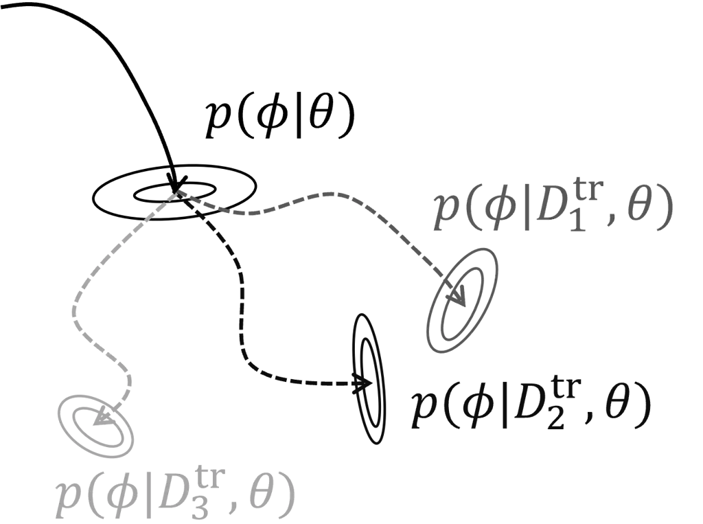

Figure 2.3: Illustration of Bayesian meta-learning: Bayesian
meta-learning obtains a posterior distribution
$`p(\phi|\mathcal{D}_{k}^{\mathrm{tr}},\theta)`$ of the $`k`$-th task
parameter by updating a prior distribution $`p(\phi|\theta)`$ shared
across tasks and determined by the hyperparameter $`\theta`$.

In problems of practical interest, the normalizing constant in (2.30) is
typically intractable. Therefore, instead of the exact computation of
the posterior (2.30), Bayesian learning algorithms obtain an
approximation, $`\hat{p}(\phi|\mathcal{D}_{k}^{\mathrm{tr}},\theta)`$.
Among the most common techniques, the posterior distribution can be
approximated by Laplace approximation \[14\], by parametric or
non-parametric variational inference \[16, 15\], or via Monte Carlo
sampling methods \[30\] (see also reviews in \[31, 1\]).

Here we focus on the variational inference formulation, which minimizes
the divergence between the approximate and the true posterior
distributions. For two distributions $`p(\phi)`$ and $`q(\phi)`$ defined
on a common space, the Kullback-Leibler (KL) divergence is defined as

```math
\displaystyle\mathrm{D}_{\mathrm{KL}}(p(\phi)\|q(\phi))=\mathbb{E}_{p(\phi)}[\log p(\phi)-\log q(\phi)]. \tag{2.31}
```

Bayesian meta-learning aims at optimizing the hyperparameter $`\theta`$
of the prior distribution $`p({\phi}|\theta)`$ that is shared across all
tasks. Bayesian learning via variational inference optimizes the
approximate posterior
$`\hat{p}({\phi}|\mathcal{D}_{k}^{\rm tr},\theta)`$ within a set
$`\mathcal{Q}`$ of parametric distributions, e.g., the set of Gaussian
distributions parameterized by the mean and covariance. Bayesian
meta-learning aims at optimizing the prior distribution
$`p(\phi|\theta)`$. This is achieved by minimizing the KL divergence
$`\mathrm{D_{KL}}\big(\hat{p}(\phi|\mathcal{D}_{k}^{\mathrm{tr}},\theta)\|{p}(\phi|\mathcal{D}_{k}^{\mathrm{tr}},\theta)\big)`$,
equivalent to minimizing the variational free energy \[32, 1\], given by

```math
\displaystyle\hat{p}(\phi|\mathcal{D}_{k}^{\mathrm{tr}},\theta)=\underset{q\left(\phi\right)\in\mathcal{Q}}{\arg\min}\penalty\ -\mathbb{E}_{q(\phi)}\Big[\log p(\mathcal{D}_{k}^{\mathrm{tr}}|\phi)\Big]+\mathrm{D}_{\rm KL}\Big(q(\phi)\|p(\phi|\theta)\Big). \tag{2.32}
```

The variational free energy in (2.32) is the average training log-loss –
first term in (2.32), penalized by the deviation of the approximation
$`q({\phi})`$ from the prior $`q({\phi}|\theta)`$ via the second term in
(2.32). Accordingly, the meta-training loss for Bayesian meta-learning
is given as

```math
\displaystyle\mathcal{L}^{\mathrm{ba}}_{\mathcal{D}^{\rm mtr}}\left(p(\phi|\theta)\right)=\frac{1}{K}\sum_{k=1}^{K}L_{\mathcal{D}_{k}^{\mathrm{va}}}\left(\hat{p}(\phi|\mathcal{D}_{k}^{\mathrm{tr}},\theta)\right) \tag{2.33}
```

```math
\displaystyle\mathrm{s.t.}\penalty\ \hat{p}(\phi|\mathcal{D}_{k}^{\mathrm{tr}},\theta)=\underset{q\left(\phi\right)\in\mathcal{Q}}{\arg\min}\penalty\ -\mathbb{E}_{q(\phi)}\Big[\log p(\mathcal{D}_{k}^{\mathrm{tr}}|\phi)\Big]+\mathrm{D}_{\rm KL}\Big(q(\phi)\|p(\phi|\theta)\Big), \tag{2.34}
```

where the loss function
$`L_{\mathcal{D}_{k}^{\mathrm{va}}}(\hat{p}(\phi|\mathcal{D}_{k}^{\mathrm{tr}},\theta))`$
is typically specified as the negative log-loss computed on validation
data based on the approximate posterior
$`\hat{p}(\phi|\mathcal{D}_{k}^{\mathrm{tr}},\theta)`$, i.e., \[15\]

```math
\displaystyle L_{\mathcal{D}_{k}^{\mathrm{va}}}(\hat{p}(\phi|\mathcal{D}_{k}^{\mathrm{tr}},\theta))=-\log\int p(\mathcal{D}_{k}^{\mathrm{va}}|{\phi})\hat{p}(\phi|\mathcal{D}_{k}^{\mathrm{tr}},\theta)d{\phi}. \tag{2.35}
```

The objective is typically estimated via the Monte Carlo sampling
\[15\].

Theoretically, the performance of Bayesian meta-learning compared to
MAML and iMAML has been established in \[22\]. Practically, there exist
a variety of Bayesian meta-learning algorithms \[14, 15, 33, 16, 34\],
which mainly differ in the definitions of the set $`\mathcal{Q}`$ used
in (2.34), and in the approximation methods used to approximate the
solution of the variational free energy minimization problem (2.34).
BMAML \[15\] adopts a non-parametric variational inference approximation
method, which approximates the posterior
$`p(\phi|\mathcal{D}_{k}^{\mathrm{tr}},\theta)`$ via a set of particles
$`\boldsymbol{\phi}_{k}=\{\phi_{k,1},\dots,\phi_{k,M}\}`$, and also
specifies the prior distribution $`p(\phi|\theta)`$ via a set of
particles $`\boldsymbol{\theta}=\{\theta_{1},\dots,\theta_{M}\}`$.
Specifically, BMAML adopts the Stein Variational Gradient Descent (SVGD)
algorithm \[35\] to update the particles $`\boldsymbol{\phi}_{k}`$ when
addressing problem (2.34). Accordingly, the updates for the per-task
particles $`\boldsymbol{\phi}_{k}`$ and the set of hyperparameter
vectors $`\boldsymbol{\theta}`$ are, respectively, given as

```math
\displaystyle\boldsymbol{\phi}_{k}(\mathcal{D}_{k}^{\rm tr}|\boldsymbol{\theta}) \displaystyle\leftarrow\operatorname{SVGD}(\boldsymbol{\theta},\mathcal{D}_{k}^{\mathrm{tr}},\alpha) \tag{2.36a}
```

```math
\displaystyle\text{and }\penalty\ \penalty\ \penalty\ \boldsymbol{\theta} \displaystyle\leftarrow\boldsymbol{\theta}-{\beta}\nabla_{\boldsymbol{\theta}}\mathcal{L}^{\mathrm{ba}}_{\mathcal{D}^{\rm mtr}}\left(\boldsymbol{\theta}\right). \tag{2.36b}
```

In (2.36a), the SVGD update is given by \[35\]

```math
\displaystyle\mathrm{SVGD}(\boldsymbol{\theta},\mathcal{D}_{k}^{\rm tr},\alpha)
```

```math
\displaystyle= \displaystyle\theta+\alpha\frac{1}{M}\sum_{m=1}^{M}\Big[\kappa(\theta^{m},\theta)\nabla_{\theta^{m}}\log p(\theta^{m}|\mathcal{D}_{k}^{\rm tr})+\nabla_{\theta^{m}}\kappa(\theta^{m},\theta)\Big],\forall\theta\in\boldsymbol{\theta}, \tag{2.37}
```

where $`\alpha>0`$ is the step size, and
$`\kappa(\theta,\theta^{\prime})`$ is a positive definite kernel, e.g.,
the radial basis function kernel \[15\].

The BMAML algorithm is summarized in Algorithm 7.

1: Input: Initial particles $`\boldsymbol{\theta}`$; meta-training data
$`\mathcal{D}`$; loss function $`\ell(z|\phi)`$; stepsizes
$`\alpha,\beta`$

2: while not converged do

3:   Sample batch of tasks
$`\tilde{\mathcal{K}}\subseteq\mathcal{K}=\{1,\ldots,K\}`$

4:   for all $`k\in\tilde{\mathcal{K}}`$ do

5:    Update per-task parameter particles
$`{\boldsymbol{\phi}}_{k}(\mathcal{D}_{k}^{\rm tr}|\boldsymbol{\theta})`$
using (2.36a)

6:   end for

7:   Update hyperparameter vectors $`\boldsymbol{\theta}`$ via the SVGD
update (2.36b)

8: end while

Algorithm 7 BMAML

#### 2.4.1 Discussion on Empirical Performance

In this subsection, we evaluate the empirical performance on regression
and classification tasks of some of the meta-learning algorithms
introduced in this section.

We first consider the standard benchmark regression problem in which
testing tasks are characterized by different ground-truth sinusoidal
regression functions \[6\].

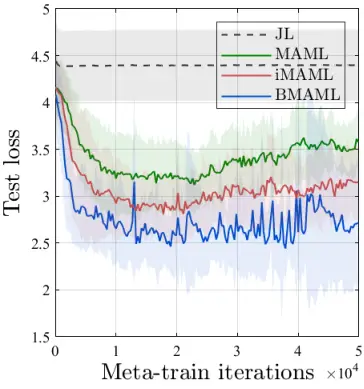

(a) Training curve

(b) Best test loss vs. $`N`$

(c) Best test loss vs. $`K`$

Figure 2.4: Comparison of the performance of joint learning (JL), MAML,
iMAML and BMAML in the sinusoidal regression problem introduced in
\[22\]: (a) Test loss vs. meta-training iterations; (b) best test loss
vs. number of data per task $`N`$; (c) best test loss vs. number of
tasks $`K`$.

Compare the empirical performance of joint learning (JL), MAML, iMAML
and BMAML with the same neural network architecture (see \[15, 16, 22\]
for details) in Figure 2.4. For more results under different
hyperparameters, refer to \[15, 16, 22\]. JL is observed to be unable to
effectively adapt to new tasks, in contrast to meta-learning methods.
Among meta-learning algorithms, BMAML is observed to outperform iMAML
and MAML when a small number of training data and tasks are given
because of its ability to manage uncertainty. All three meta-learning
methods have close to zero test loss when a sufficiently large number of
training data per task, or when a sufficiently large number of tasks are
given.

|                   |              |              |
| ----------------- | ------------ | ------------ |
| Algorithms        | 5-way 1-shot | 5-way 5-shot |
| MAML \[6\]        | 48.70        | 63.11        |
| iMAML \[7\]       | 49.30        | \-           |
| CAVIA \[36\]      | 47.24        | 59.05        |
| FOMAML \[37\]     | 48.07        | 63.15        |
| Reptile \[25\]    | 49.97        | 65.99        |
| Prox-MAML \[19\]  | 50.77        | 67.43        |
| BMAML \[15\]      | 49.17        | 64.23        |
| Sharp-MAML \[23\] | 50.28        | 65.04        |

Table 2.1: Accuracy (%) of few-shot image classification on
Mini-Imagenet (5-way).

We then turn to the more complex benchmark of few-shot image
classification on the Mini-Imagenet dataset. The results reported in
Table 2.1 highlight that Sharp-MAML outperforms other meta-learning
methods in this setting, with BMAML generally outperforming other
non-Bayesian methods. For results on other datasets and for further
discussion, we refer to \[38, 19, 23, 16\].

### 2.5 Modular Meta-Learning

The methods described thus far aim at parametric generalization. In
contrast, modular meta-learning aims at fast combinatorial
generalization. Rather than transferring knowledge across tasks via
hyperparameter, modular meta-learning generalizes to new tasks by
optimizing a set of reusable neural network modules that can be composed
in different ways to solve a new task. By reusing modules across tasks,
modular meta-learning makes, in a sense, “infinite use of finite means”,
and represents a scalable approach towards generalization, particularly
in settings which are heavily constrained in terms of data \[39, 40,
41\].

More formally, modular meta-learning assumes a shared module set
$`\mathcal{M}=[\theta^{(1)},...,\theta^{(M)}]`$ of size $`M`$ which is
optimized during meta-training. During meta-testing, the module-set is
fixed, and a subset of the modules are selected, combined and applied to
the new task. This enables an efficient adaptation based on limited data
via the selection of modules from the set $`\mathcal{M}`$.

Let $`S_{k}(\mathcal{M})`$ denote the assignment of a subset of modules
from set $`\mathcal{M}`$ to a particular task $`k`$. Let also
$`{\phi}^{(S_{k}(\mathcal{M}))}`$ represent the model obtained by
combining the selected modules $`S_{k}(\mathcal{M})`$. The meta-training
loss for modular meta-learning problem is given by

```math
\displaystyle\mathcal{L}^{\mathrm{mod}}_{\mathcal{D}^{\rm mtr}}\left(\mathcal{M}\right)=\frac{1}{K}\sum_{k=1}^{K}L_{\mathcal{D}_{k}^{\mathrm{va}}}\left({\phi}^{\mathrm{mod}}(\mathcal{D}_{k}^{\mathrm{tr}}|\mathcal{M})\right) \tag{2.38a}
```

```math
\displaystyle\mathrm{s.t.}\penalty\ \penalty\ {\phi}^{\mathrm{mod}}(\mathcal{D}_{k}^{\mathrm{tr}}|\mathcal{M})\,\,=\,\,\underset{S_{k}(\mathcal{M})}{\text{arg min}}\,\,L_{\mathcal{D}_{k}^{\mathrm{va}}}\left({\phi}^{(S_{k}(\mathcal{M}))}\right). \tag{2.38b}
```

The inner optimization in (2.38b) selects the module set for task $`k`$,
while the outer problem (2.38b) optimizes over the module set
$`\mathcal{M}`$. The outer problem in (2.38a) is typically tackled by
gradient descent, while the optimization of the assignment in the inner
problem (2.38b) is a discrete optimization problem. Previous works have
addressed this problem by adopting combinatorial optimization techniques
like simulated annealing \[39, 40\], or using reparametrization and
gradient descent \[41\].

Modular meta-learning is summarized in Algorithm 8.

1: Input: Initial module set $`\mathcal{M}`$; meta-training data
$`\mathcal{D}`$; loss function $`\ell(z|\phi)`$; stepsizes
$`\alpha,\beta`$

2: while not converged do

3:   Sample batch of tasks
$`\tilde{\mathcal{K}}\subseteq\mathcal{K}=\{1,\ldots,K\}`$

4:   for all $`k\in\tilde{\mathcal{K}}`$ do

5:    Compute assignment parameters $`S_{k}(\mathcal{M})`$ via problem
(2.38b)

6:    Compute shared module parameters $`\mathcal{M}`$ via problem
(2.38a)

7:   end for

8: end while

Algorithm 8 Modular Meta-learning

### 2.6 Model-Based Meta-Learning

As an example of model-based meta-learning, in this section, we review
the Context Adaptation Via Meta-Learning (CAVIA) algorithm introduced in
\[36\]. Unlike optimization-based schemes, the model is shared across
all tasks, and not adapted based on training data from each task.
Therefore, the model parameter vector can be considered to be the
hyperparameter $`\theta`$ shared across tasks. What is adapted to each
task is a context parameter $`\phi`$ that serves as an additional input
vector to the model as illustrated in Figure 2.5. The rationale for this
choice is that vector $`\phi`$ can embed information about the task that
can control the output of the model.

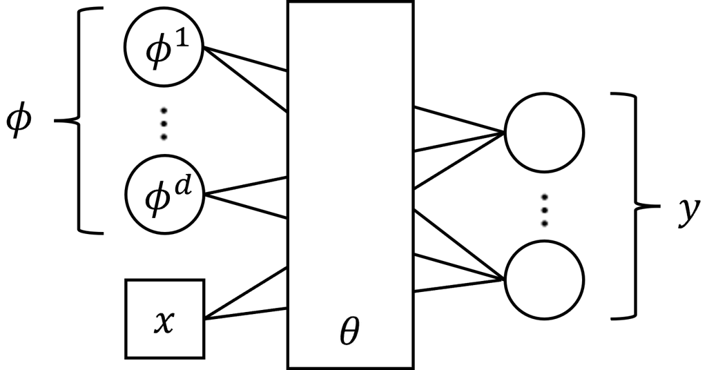

Figure 2.5: Illustration of CAVIA: While the model parameter vector
$`\theta`$ are shared across tasks, the per-task context parameter
vector $`\phi`$, consisting of entries $`\phi^{1}\dots,\phi^{d}`$, is
adapted to the training data of each task, and it serves as an
additional input vector to the model.

Let us define as $`L_{\mathcal{D}_{k}^{\rm tr}}(\theta,\phi)`$ the
training loss for task $`k`$ given model parameter $`\theta`$ and
context vector $`\phi`$. By reducing the number of parameters to be
updated, CAVIA can be more sample efficient than optimization-based
scheme. The meta-training loss function
$`\mathcal{L}^{\mathrm{ca}}_{\mathcal{D}^{\rm mtr}}\left(\theta\right)`$
is given by

```math
\displaystyle\mathcal{L}^{\mathrm{ca}}_{\mathcal{D}^{\rm mtr}}\left(\theta\right)=\frac{1}{K}\sum_{k=1}^{K}L_{\mathcal{D}_{k}^{\mathrm{va}}}\left(\theta,{\phi}^{\mathrm{ca}}(\mathcal{D}_{k}^{\mathrm{tr}}|\theta)\right) \tag{2.39a}
```

```math
\displaystyle\mathrm{s.t.}\penalty\ \penalty\ {\phi}^{\mathrm{ca}}(\mathcal{D}_{k}^{\mathrm{tr}}|\theta)=\phi_{0}-\alpha\nabla_{\phi_{0}}L_{\mathcal{D}_{k}^{\mathrm{tr}}}\left(\theta,\phi_{0}\right), \tag{2.39b}
```

where $`\phi_{0}`$ is some fixed initialization, e.g., the all-zero
vector. Setting $`\phi_{0}=0`$ and using the chain rule of
differentiation, the update of the hyperparameter $`\theta`$ during
training procedure of CAVIA is given by

```math
\displaystyle\theta\leftarrow \displaystyle\theta-\beta\nabla_{\theta}\mathcal{L}_{\mathcal{D}^{\rm mtr}}^{\rm ca}(\theta)
```

```math
\displaystyle= \displaystyle\theta-\frac{\beta}{K}\sum_{k=1}^{K}\nabla_{\theta}L_{\mathcal{D}_{k}^{\mathrm{va}}}\left(\theta,{\phi}^{\mathrm{ca}}\right)|_{{\phi}^{\mathrm{ca}}={\phi}^{\mathrm{ca}}(\mathcal{D}_{k}^{\mathrm{tr}}|\theta)}
```

```math
\displaystyle+\frac{\alpha\beta}{K}\sum_{k=1}^{K}\nabla_{\theta\phi_{0}}^{2}L_{\mathcal{D}_{k}^{\mathrm{va}}}(\theta,{\phi}_{0})\nabla_{{\phi}}L_{\mathcal{D}_{k}^{\mathrm{va}}}\left(\theta,{\phi}\right)|_{{\phi}={\phi}^{\mathrm{ca}}(\mathcal{D}_{k}^{\mathrm{tr}}|\theta)}. \tag{2.40}
```

The CAVIA algorithm is summarized in Algorithm 9.

1: Input: Initial iterate $`\theta`$; meta-training data
$`\mathcal{D}`$; loss function $`\ell(z|\phi)`$; stepsize $`\beta`$;
regularization weight $`\lambda`$

2: while not converged do

3:   Sample batch of tasks
$`\tilde{\mathcal{K}}\subseteq\mathcal{K}=\{1,\ldots,K\}`$

4:   for all $`k\in\tilde{\mathcal{K}}`$ do

5:    Compute per-task parameter
$`{\phi}^{\rm ca}(\mathcal{D}_{k}^{\mathrm{tr}}|\theta)`$ by solving
(2.39b)

6:   end for

7:   Update hyperparameter vector $`\theta`$ via the gradient update
(2.40)

8: end while

Algorithm 9 CAVIA

### 2.7 Conclusions

In this section, we have provided an overview of meta-learning
algorithms by mostly focusing on optimization-based strategies. We have
categorized optimization-based algorithms into second-order and
first-order algorithms based on whether they require second-order
derivatives during meta-training. All algorithms were formulated as
solutions to bilevel optimization problems, which follows a generic form
as

```math
\displaystyle{\cal L}_{\mathcal{D}^{\rm mtr}}(\theta)=\frac{1}{K}\sum_{k=1}^{K}L_{\mathcal{D}_{k}^{\mathrm{va}}}\left({\phi}(\mathcal{D}_{k}^{\mathrm{tr}}|\theta)\right) \tag{2.41a}
```

```math
\displaystyle\penalty\ {\rm s.t.}\penalty\ \penalty\ {\phi}(\mathcal{D}_{k}^{\rm tr}|\theta)=\argmin_{\phi\in\mathbb{R}^{d}}\penalty\ \tilde{L}_{{\cal D}_{k}^{\rm tr}}(\theta,\phi), \tag{2.41b}
```

where the lower-level function
$`\tilde{L}_{{\cal D}_{k}^{\rm tr}}(\theta,\phi)`$ can be different from
the upper-level function $`L_{\mathcal{D}_{k}^{\mathrm{va}}}(\cdot)`$
and it depends on both $`\theta`$ and $`\phi`$. Different meta-learning
algorithms introduced in this section mainly differ in the corresponding
inner-level problem (2.41b). In the next section, we will elaborate on
the unifying perspective of meta-learning as a bilevel optimization
problem, and review results on the convergence of gradient-based bilevel
optimization algorithms for such problems.

## Chapter 3 Bilevel Optimization for Meta-Learning

In the previous sections, we have reviewed the meta-learning setup and
the main meta-learning algorithms. In this section, we take a unified
view to describe the operation of meta-learning algorithms through the
lens of _bilevel optimization_.

### 3.1 A Brief Introduction to Bilevel Optimization

Stochastic optimization methods, including stochastic gradient descent
(SGD) \[42\] are prevalent for solving large-scale machine learning
problems. Plain-vanilla SGD is applicable to stochastic optimization
problems such as empirical risk minimization, which underlies
conventional learning. As we have seen in Section 2, most meta-learning
algorithms go beyond the single-level minimization structure of
conventional learning by adopting nested formulations based on bilevel
optimization \[43\]. In this section, we review a unified bilevel
optimization framework to describe meta-learning algorithms. We start
this subsection by presenting a brief history of bilevel optimization,
as well as by introducing its mathematical formulation.

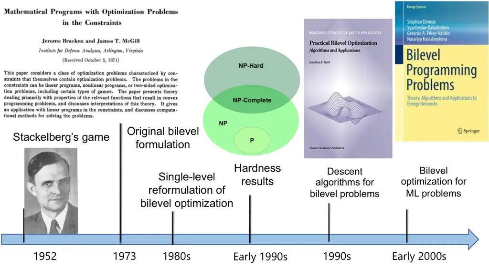

Figure 3.1: A brief history of bilevel optimization with covers from
\[44, 45, 46, 47\].

#### 3.1.1 History of Bilevel Optimization

Bilevel optimization (BLO) is a hierarchical optimization framework,
whereby the set of solutions of the lower-level problem serves as a
constraint for the upper-level problem \[48, 49\]. It can be viewed as a
generalization of two-stage stochastic programming \[50\], in which the
upper-level objective function depends on the optimal lower-level
objective value rather than on the lower-level solution set. As
illustrated in Figure 3.1, BLO has a long history in operations
research, which dates back to von Stackelberg’s seminal work on
leader-follower games in the 1950s \[43\]. Research interest on BLO has
intensified since the 1970s \[45\], with researchers soon realizing that
BLO is very challenging: Even an “easy” class of linear BLO problems is
strongly NP-hard \[51\].

Recently, bilevel optimization has gained growing popularity in a number
of machine learning applications such as meta-learning \[7\],
reinforcement learning \[52\], continual learning \[53\], and image
processing \[54\]. Many recent efforts have been made to address bilevel
optimization problems. One successful approach is to reformulate the
bilevel problem as a single-level problem by replacing the lower-level
problem by its optimality conditions \[49, 55\], which belongs to the
general class of mathematical programs with equilibrium constraints
\[56\]. Recently, gradient-based methods for bilevel optimization have
gained popularity, whereby the (stochastic) gradient of the upper-level
problem is iteratively approximated \[57, 58, 59, 60, 61, 62, 63, 64,
65, 66, 67, 68\]; see also two recent surveys \[69, 70\].

#### 3.1.2 Generic Formulation

Bilevel optimization problems of interest for meta-learning can be
expressed in the form of the stochastic bilevel problem \[62, 63, 18,
65, 71\]

```math
\displaystyle\min_{\theta\in\mathbb{R}^{d}}\penalty\ \penalty\ \penalty\ {\cal L}(\theta):=\mathbb{E}_{\xi}\left[f\left(\theta,\phi^{*}(\theta);\xi\right)\right]\penalty\ \penalty\ \penalty\ \penalty\ \penalty\ \penalty\ \penalty\ \penalty\ \penalty\ \penalty\ \penalty\ \penalty\ \penalty\ \penalty\ \penalty\ {\rm\sf(upper)} \tag{3.1a}
```

```math
\displaystyle\penalty\ {\rm s.t.}\penalty\ \penalty\ \penalty\ \penalty\ \penalty\ \phi^{*}(\theta)=\argmin_{\phi\in\mathbb{R}^{\hat{d}}}\penalty\ \mathbb{E}_{\hat{\xi}}[g(\theta,\phi;\hat{\xi})]\penalty\ \penalty\ \penalty\ \penalty\ \penalty\ \penalty\ \penalty\ \penalty\ \penalty\ \penalty\ \penalty\ {\rm\sf(lower)}, \tag{3.1b}
```

where $`f(\theta,\phi;\xi)`$ and $`g(\theta,\phi;\hat{\xi})`$ are
differentiable but possibly nonconvex functions of $`\theta`$ and
$`\phi`$; and $`\xi`$ and $`\hat{\xi}`$ are random variables with given
distributions $`P(\xi)`$ and $`P(\hat{\xi})`$, respectively. In (3.1),
the upper-level optimization problem over the upper-level variable
$`\theta\in\mathbb{R}^{d}`$ depends on the solution $`\phi^{*}(\theta)`$
of the lower-level optimization over vector
$`\phi\in\mathbb{R}^{\hat{d}}`$. Crucially, the solution of the
lower-level problem, $`\phi^{*}(\theta)`$, depends on the upper-level
variable $`\theta`$ through the lower-level objective function
$`g(\theta,\phi;\hat{\xi})`$. In the following, for convenience, we
define the deterministic functions
$`g(\theta,\phi):=\mathbb{E}_{\hat{\xi}}[g(\theta,\phi;\hat{\xi})]`$ and
$`f(\theta,\phi):=\mathbb{E}_{\xi}[f(\theta,\phi;\xi)]`$.

Many meta-learning problems reviewed in Section 2 can be formulated as
the stochastic bilevel problem (3.1). For example, we can recover the
iMAML formulation in (2.4) by defining the vector
$`\phi^{*}(\theta):=[\phi_{1}^{*}(\theta)^{\top},\cdots,\phi_{K}^{*}(\theta)^{\top}]^{\top}`$,
$`\xi:=[\xi_{1},\cdots,\xi_{K}]^{\top}`$,
$`\hat{\xi}:=[\hat{\xi}_{1},\cdots,\hat{\xi}_{K}]^{\top}`$, with
$`\mathcal{D}_{k}^{\mathrm{va}}=\xi_{k}`$,
$`\mathcal{D}_{k}^{\mathrm{tr}}=\hat{\xi}_{k}`$, and with the upper- and
lower-level functions $`f(\theta,\phi;\xi)`$ and
$`g(\theta,\phi;\hat{\xi})`$ as \[7, 72, 18, 73\]

```math
f\left(\theta,\phi^{*}(\theta);\xi\right):=\frac{1}{K}\sum_{k=1}^{K}L_{\mathcal{D}_{k}^{\mathrm{va}}}\left(\phi^{*}_{k}\left(\theta\right)\right) \tag{3.2}
```

and
$`g(\theta,\phi;\hat{\xi}):=\frac{1}{K}\sum_{k=1}^{K}g_{k}(\theta,\phi_{k};\hat{\xi}_{k})`$,
where we have

```math
g_{k}(\theta,\phi_{k};\hat{\xi}):=L_{\mathcal{D}_{k}^{\mathrm{tr}}}\left(\phi_{k}\right)+\frac{\lambda}{2}\|\phi_{k}-\theta\|^{2}. \tag{3.3}
```

The goals of the rest of this section are to provide a unified bilevel
optimization algorithm for meta-learning that addresses problem (3.1),
and to review the convergence properties of the unified bilevel
algorithm.

### 3.2 A Unified Bilevel Optimization Framework

In this section, we introduce a unified algorithmic framework for
solving the bilevel problem (3.1), and we discuss its connection to some
of the meta-learning algorithms reviewed in Section 2.

#### 3.2.1 Bilevel SGD: Definition and Challenges

Solving bilevel stochastic problems via traditional stochastic
optimization techniques faces a number of challenges. In this
subsection, we highlight the technical issues that arise when applying
SGD directly to the bilevel problem (3.1).

To address the bilevel problem (3.1), a natural solution is to apply
_alternating SGD updates_ on the vectors $`\theta`$ and $`\phi`$ based
on their respective stochastic gradients as

```math
\phi^{i+1}=\phi^{i}-\beta^{i}h_{g}^{i}\penalty\ \penalty\ \penalty\ \penalty\ \penalty\ \penalty\ {\rm and}\penalty\ \penalty\ \penalty\ \penalty\ \penalty\ \penalty\ \theta^{i+1}=\theta^{i}-\alpha^{i}h_{f}^{i}, \tag{3.4}
```

where $`h_{g}^{i}`$ is an unbiased stochastic gradient for the
lower-level objective $`g(\theta,\phi)`$ at the iterate
$`(\theta,\phi)=(\theta^{i},\phi^{i})`$; $`h_{f}^{i}`$ is the (possibly
biased) stochastic gradient for the upper-level objective
$`{\cal L}(\theta)`$ at $`\theta=\theta^{i}`$; and, $`\beta^{i}`$ and
$`\alpha^{i}`$ are stepsizes. More precisely, the updates in (3.4) are
typically run in a way that alternate between the upper- and lower-level
problems.

A first approach is to run SGD updates on the lower-level variable
$`\phi^{i}`$ in (3.4) multiple times before updating the upper-level
variable $`\theta^{i}`$, which yields a double-loop algorithm. To
guarantee convergence, this approach typically requires either
increasing number of lower-level $`\phi`$-update, or growing the batch
size used to estimate the gradient $`h_{g}^{i}`$ \[62, 64\]. The second
method is to update vector $`\phi^{i}`$ with a larger learning rate so
that the iterates $`\theta^{i}`$ are relatively static with respect to
$`\phi^{i}`$. This can be done by setting learning rates that satisfy
the limit $`\lim_{i\rightarrow\infty}\alpha^{i}/\beta^{i}=0`$ \[63\].
The third method is to modify the update direction $`h_{g}^{i}`$ by
incorporating additional momentum and acceleration terms \[65, 66, 67,
68, 74\].

The challenge of running the iteration (3.4) in one of the ways
described above is that the (stochastic) gradient $`h_{f}^{i}`$ for the
upper-level variable $`\theta`$ is often prohibitively expensive to
compute. To illustrate this point, we now derive the gradient of the
upper-level function $`{\cal L}(\theta)`$ in (3.1). To this end, we
first define the Hessian matrix
$`\nabla_{\phi\phi}^{2}g\big(\theta,\phi\big)`$ of function
$`g(\theta,\phi)`$ with respect to $`\phi`$ as

```math
\displaystyle\nabla_{\phi\phi}^{2}g\big(\theta,\phi\big):=\begin{bmatrix}\frac{\partial^{2}}{\partial\theta_{1}\partial\theta_{1}}g\big(\theta,\phi\big)&\cdots&\frac{\partial^{2}}{\partial\theta_{1}\partial\theta_{\hat{d}}}g\big(\theta,\phi\big)\\
&\cdots&\\
\frac{\partial^{2}}{\partial\theta_{\hat{d}}\partial\theta_{1}}g\big(\theta,\phi\big)&\cdots&\frac{\partial^{2}}{\partial\theta_{\hat{d}}\partial\theta_{\hat{d}}}g\big(\theta,\phi\big)\end{bmatrix}
```

as well as the matrix $`\nabla_{\theta\phi}^{2}g\big(\theta,\phi\big)`$
as

```math
\displaystyle\nabla_{\theta\phi}^{2}g\big(\theta,\phi\big):=\begin{bmatrix}\frac{\partial^{2}}{\partial\theta_{1}\partial\phi_{1}}g\big(\theta,\phi\big)&\cdots&\frac{\partial^{2}}{\partial\theta_{1}\partial\phi_{\hat{d}}}g\big(\theta,\phi\big)\\
&\cdots&\\
\frac{\partial^{2}}{\partial\theta_{d}\partial\phi_{1}}g\big(\theta,\phi\big)&\cdots&\frac{\partial^{2}}{\partial\theta_{d}\partial\phi_{\hat{d}}}g\big(\theta,\phi\big)\end{bmatrix}.
```

Under certain differentiability assumptions of the upper and lower-level
functions, the gradient $`\nabla{\cal L}(\theta)`$ is obtained as \[62\]

```math
\displaystyle\nabla{\cal L}(\theta)= \displaystyle\nabla_{\theta}f(\theta,\phi^{*}(\theta))
```

```math
\displaystyle-\nabla_{\theta\phi}^{2}g(\theta,\phi^{*}(\theta))\!\left[\nabla_{\phi\phi}^{2}g(\theta,\phi^{*}(\theta))\right]^{-1}\nabla_{\phi}f(\theta,\phi^{*}(\theta)). \tag{3.5}
```

By (3.5), evaluating an unbiased stochastic estimate of the gradient
$`\nabla{\cal L}(\theta)`$ faces the following main difficulties:

1.  $`\bullet`$
    The gradient $`\nabla{\cal L}(\theta)`$ depends on the solution of
    the lower-level problem $`\phi^{*}(\theta)`$, which is estimated via
    SGD in (3.4) and hence varies across the iterations (see Figure
    3.2);
2.  $`\bullet`$
    The gradient $`\nabla{\cal L}(\theta)`$ requires the second
    derivatives $`\nabla_{\theta\phi}^{2}g(\theta,\phi)`$ and
    $`\nabla_{\phi\phi}^{2}g(\theta,\phi)`$ of the lower-level objective
    function $`g`$.
3.  $`\bullet`$
    An unbiased estimate of the gradient $`\nabla{\cal L}(\theta)`$
    cannot be obtained via the empirical average over functions
    $`g(\theta,\phi;\hat{\xi})`$ with samples
    $`\hat{\xi}\sim P(\hat{\xi})`$ due to the nonlinear term
    $`[\nabla_{\phi\phi}^{2}g(\theta,\phi^{*}(\theta))]^{-1}`$.

Figure 3.2: An illustration of minimizers’ drift in bilevel SGD.

These challenges can be addressed via _implicit-gradient_ or
_explicit-gradient_ methods. Implicit gradient methods treat the
lower-level solution $`\phi^{*}(\theta)`$ as an implicit function of
$`\theta`$, and they directly attempt to evaluate the gradient
$`\nabla{\cal L}(\theta)`$ via the expression (3.5). We will discuss an
example of such methods in the next subsection. Explicit gradient
methods model the optimal lower-level solution $`\phi^{*}(\theta)`$ as
an explicit function of vector $`\theta`$. This is typically done by
unrolling the iterations of an optimization algorithm such as SGD in
(3.4), and by then using the final iteration as a proxy for the
lower-level solution $`\phi^{*}(\theta)`$ \[75, 59\]. Explicit gradient
methods suffer from the high-memory cost of storing the algorithm’s
trajectory in the $`\phi`$-space. In practice, this cost can be
controlled by truncating the rolling horizon.

While these methods deal with bilevel optimization problems with a
unique solution for the lower-level problem, recent works have also
studied the case in which the lower-level problem may have multiple
solutions, which will be further discussed in Section 7.

#### 3.2.2 Implicit-Gradient SGD Methods

In this subsection, we describe a representative implicit-gradient
algorithm for the bilevel problem (3.1), and then provide a convergence
result. The algorithm, proposed in \[76\], is referred to as the
ALternating Stochastic gradient dEscenT (ALSET) method.

To overcome the challenge in evaluating the gradient
$`\nabla{\cal L}(\theta)`$ reviewed above, the ALSET algorithm estimates
the gradient

```math
\overline{\nabla}_{\theta}f\big(\theta,\phi\big):=\nabla_{\theta}f\big(\theta,\phi\big)-\nabla_{\theta\phi}^{2}g\big(\theta,\phi\big)\left[\nabla_{\phi\phi}^{2}g\big(\theta,\phi\big)\right]^{-1}\nabla_{\phi}f\big(\theta,\phi\big) \tag{3.6}
```

for a fixed value $`\phi`$. Unbiased estimates of the terms
$`\nabla_{\theta}f\big(\theta,\phi\big)`$ and
$`\nabla_{\phi}f\big(\theta,\phi\big)`$ can be obtained by averaging the
gradients $`\nabla_{\theta}f\big(\theta,\phi;\xi\big)`$ and
$`\nabla_{\phi}f\big(\theta,\phi;\xi\big)`$ over one or multiple samples
$`\xi\sim P(\xi)`$. Similarly, an unbiased estimate of the term
$`\nabla_{\theta\phi}^{2}g\big(\theta,\phi\big)`$ can be obtained by
averaging the matrix
$`\nabla_{\theta\phi}^{2}g\big(\theta,\phi;\hat{\xi}\big)`$ over one or
multiple samples $`\hat{\xi}\sim P(\hat{\xi})`$. For the term
$`\left[\nabla_{\phi\phi}^{2}g\big(\theta,\phi\big)\right]^{-1}`$, an
estimate is evaluated as

```math
\left[\nabla_{\phi\phi}^{2}g\big(\theta,\phi\big)\right]^{-1}\approx\Big[\frac{N}{L_{g}}\prod\limits_{n=1}^{N^{\prime}}\Big(I-\frac{1}{L_{g}}\nabla_{\phi\phi}^{2}g(\theta,\phi;\hat{\xi}_{(n)})\Big)\Big], \tag{3.7}
```

where $`L_{g}`$ is a constant that depends on function
$`\nabla g(\theta,\phi)`$ \[76\]; integer $`N^{\prime}`$ is drawn from
$`\{1,2,\ldots,N\}`$ uniformly at random; and
$`\{\hat{\xi}^{(1)},\ldots,\hat{\xi}^{(N^{\prime})}\}`$ are i.i.d.
samples from the distribution $`P(\hat{\xi})`$. It was shown in \[62\]
that the bias of the estimate (3.7) decreases exponentially with $`N`$.

At each iteration $`k`$, ALSET alternates between stochastic gradient
updates on the lower-level vector $`\phi^{i}`$ and on the upper-level
vector $`\theta^{i}`$ by running $`T`$ steps of SGD on the lower-level
variable $`\phi^{i}`$ before updating upper-level variable
$`\theta^{i}`$. With $`\alpha^{i}`$ and $`\beta^{i}`$ denoting the
stepsizes used for the $`\theta`$- and $`\phi`$-updates, respectively,
the ALSET updates are given as

```math
\displaystyle\!\!\!\!\phi^{i,t+1} \displaystyle=\phi^{i,t}\!-\beta^{i}h_{g}^{i,t},\,t=0,\ldots,T\penalty\ \penalty\ {\rm with}\penalty\ \phi^{i+1}:=\phi^{i,T} \tag{3.8a}
```

```math
\displaystyle\!\!\!\!\theta^{i+1} \displaystyle=\theta^{i}\!-\!\alpha^{i}h_{f}^{i}, \tag{3.8b}
```

where index $`t`$ runs over the inner-loop of $`\phi`$-updates, while
index $`k`$ runs over the $`\theta`$-updates. In (3.8), the update
direction for vector $`\phi`$ is the stochastic gradient

```math
h_{g}^{i,t}:=\nabla_{\phi}g(\theta^{i},\phi^{i,t};\hat{\xi}^{i,t}) \tag{3.9}
```

with $`\hat{\xi}^{i,t}`$ being i.i.d. samples from distribution
$`P(\hat{\xi})`$; and, with the Hessian inverse estimator (3.7), the
update direction of $`\theta`$ is given by the biased gradient

```math
\displaystyle h_{f}^{i}:=\nabla_{\theta}f(\theta^{i},\phi^{i+1};\xi^{i})-\nabla_{\theta\phi}^{2}g(\theta^{i},\phi;\hat{\xi}_{(0)}^{i})
```

```math
\displaystyle\times\Big[\frac{N}{L_{g,1}}\prod\limits_{n=1}^{N^{\prime}}\Big(I-\frac{1}{L_{g,1}}\nabla_{\phi\phi}^{2}g(\theta^{i},\phi^{i+1};\hat{\xi}_{(n)}^{i})\Big)\Big]\nabla_{\phi}f(\theta^{i},\phi^{i+1};\xi^{i}), \tag{3.10}
```

where $`\xi^{i}`$ and $`\{\hat{\xi}_{(n)}^{i}\}_{n=0}^{N^{\prime}}`$ are
i.i.d. samples from distribution $`P(\xi)`$. Algorithm 10 provides a
summary of the ALSET algorithm. Similar algorithms include BSA \[62\],
TTSA \[63\] and stocBiO \[64\]. We refer to \[76\] for a comparison
among these algorithms.

1: initialize: $`\theta^{0},\phi^{0}`$, stepsizes
$`\{\alpha^{i},\beta^{i}\}`$

2: for $`i=0,1,\ldots,I_{\mathrm{max}}-1`$ do

3:   for $`t=0,1,\ldots,T-1`$ do

4:    update $`\phi^{i,t+1}=\phi^{i,t}-\beta^{i}h_{g}^{i,t}`$ using
(3.9) $`\triangleright`$ set $`\phi^{i,0}=\phi^{i}`$

5:   end for

6:   update $`\theta^{i+1}=\theta^{i}-\alpha^{i}h_{f}^{i}`$ using (3.10)
$`\triangleright`$ set $`\phi^{i+1}=\phi^{i,T}`$

7: end for

Algorithm 10 ALSET for the stochastic bilevel problem (3.1)

#### 3.2.3 Application to Meta-Learning

Next we will illustrate how we can recover various meta-learning
algorithms introduced in Section 2 as special cases of the ALSET
algorithm.

MAML. The MAML algorithm in Algorithm 1 is recovered by applying ALSET
in Algorithm 10 to the following problem

```math
\displaystyle\min_{\theta}\penalty\ {\cal L}^{\mathrm{ma}}_{\mathcal{D}^{\rm mtr}}\left(\theta\right)\coloneqq\frac{1}{K}\sum_{k=1}^{K}L_{\mathcal{D}_{k}^{\mathrm{va}}}\underbrace{\left({\phi}^{\mathrm{ma}}(\mathcal{D}_{k}^{\rm tr}|\theta)\right)}_{f_{k}(\theta,\phi;\xi_{k})} \tag{3.11}
```

```math
\displaystyle\mathrm{s.t.}\penalty\ \penalty\ {\phi}^{\mathrm{ma}}(\mathcal{D}_{k}^{\rm tr}|\theta)=\argmin_{\phi}\penalty\ \underbrace{\nabla L_{\mathcal{D}_{k}^{\mathrm{tr}}}(\theta)^{\top}(\phi-\theta)+\frac{1}{2\beta}\|\phi-\theta\|^{2}}_{g_{k}(\theta,\phi;\hat{\xi}_{k})},\penalty\ \forall k.
```

Note that in this case we have $`d=\hat{d}`$, and thus the stochastic
gradients $`\nabla_{\theta}f_{k}(\theta,\phi;\xi_{k})`$ and
$`\nabla_{\phi}f_{k}(\theta,\phi;\xi_{k})`$ used in the upper-level
gradient (3.6) become

```math
\!\!\nabla_{\theta}f_{k}(\theta,\phi;\xi_{k})=0\penalty\ \penalty\ {\rm and}\penalty\ \penalty\ \nabla_{\phi}f_{k}(\theta,\phi;\xi_{k})=\nabla_{\phi}L_{\mathcal{D}_{k}^{\mathrm{va}}}\left({\phi}^{\mathrm{ma}}(\mathcal{D}_{k}^{\rm tr}|\theta)\right), \tag{3.12}
```

and the stochastic Hessian and the Jacobian matrices
$`\nabla_{\phi\phi}^{2}g_{k}\big(\theta,\phi;\hat{\xi}_{k}\big)`$ and
$`\nabla_{\theta\phi}^{2}g_{k}\big(\theta,\phi;\hat{\xi}_{k}\big)`$ used
in (3.6) reduce to

```math
\nabla_{\phi\phi}^{2}g_{k}(\theta,\phi;\hat{\xi}_{k})=\frac{1}{\beta}I,\penalty\ \penalty\ \nabla_{\theta\phi}^{2}g_{k}(\theta,\phi;\hat{\xi}_{k})=\nabla_{\theta}^{2}L_{\mathcal{D}_{k}^{\mathrm{tr}}}\left(\theta\right)-\frac{1}{\beta}I, \tag{3.13}
```

where $`I\in\mathbb{R}^{\hat{d}\times\hat{d}}`$ is an identity matrix.

iMAML. We can recover the iMAML algorithm in Algorithm 2 by applying
ALSET in Algorithm 10 to the following problem

```math
\displaystyle\min_{\theta}\penalty\ {\cal L}^{\mathrm{im}}_{\mathcal{D}^{\rm mtr}}\left(\theta\right):=\frac{1}{K}\sum_{k=1}^{K}\underbrace{L_{\mathcal{D}_{k}^{\mathrm{va}}}\left({\phi}^{\mathrm{im}}(\mathcal{D}_{k}^{\rm tr}|\theta)\right)}_{f_{k}(\theta,\phi;\xi_{k})} \tag{3.14}
```

```math
\displaystyle\mathrm{s.t.}\penalty\ \penalty\ {\phi}^{\mathrm{im}}(\mathcal{D}_{k}^{\rm tr}|\theta)=\argmin_{\phi}\penalty\ \underbrace{L_{\mathcal{D}_{k}^{\mathrm{tr}}}\left(\phi\right)+\frac{1}{2\beta}\left\|\phi-\theta\right\|^{2}}_{g_{k}(\theta,\phi;\hat{\xi}_{k})},\penalty\ \forall k.
```

### 3.3 Convergence Analysis for Bilevel Optimization

In this subsection, we will present a convergence result of ALSET that
was established in \[76\]. Given the connection between ALSET and the
algorithms in Section 2, performance guarantee for ALSET that we will
introduce next will also apply to specific MAML algorithms by using the
corresponding upper- and lower-level functions. The results rely on the
following assumptions, which are common in the bilevel optimization
literature \[62, 64, 63, 67, 76\].

{assumption}

\[Lipschitz continuity\] Functions
$`f(\theta,\phi),\nabla f(\theta,\phi),\nabla g(\theta,\phi)`$ and
$`\nabla^{2}g(\theta,\phi)`$ are Lipschitz continuous with respect to
$`\theta`$ and $`\phi`$.

{assumption}

\[Strong convexity of $`g(\theta,\phi)`$ in $`\phi`$\] For any fixed
$`\theta`$, $`g(\theta,\phi)`$ is strongly convex in $`\phi`$.

{assumption}

\[Bias and variance\] The stochastic derivatives
$`\nabla f(\theta,\phi;\xi)`$, $`\nabla g(\theta,\phi;\hat{\xi})`$,
$`\nabla^{2}g(\theta,y,\hat{\xi})`$ are unbiased with bounded variances.

Figure 3.3: An illustration of vanishing minimizers’ drift in ALSET.

###### Theorem 3.3.1 (Bilevel problems \[76, Theorem 1\]).

Suppose Assumptions 3.3–3.3 hold. With some proper constants
$`\alpha>0`$ and $`\beta>0`$, choose the upper- and lower-level
stepsizes as

```math
\alpha^{i}=\frac{\alpha}{\sqrt{I_{\mathrm{max}}}}\penalty\ \penalty\ \penalty\ {\rm and}\penalty\ \penalty\ \penalty\ \beta^{i}=\frac{\beta}{\sqrt{I_{\mathrm{max}}}},\penalty\ \penalty\ \penalty\ {\rm for}\penalty\ i=1,2,\cdots,I_{\mathrm{max}}, \tag{3.15}
```

where $`I_{\mathrm{max}}`$ is the total number of upper-level
iterations. Set $`N={\cal O}(\log I_{\mathrm{max}})`$ in the Hessian
inversion estimator (3.7). For any $`T\geq 1`$, the iterates
$`\{\theta^{i},\phi^{i}\}`$ generated by Algorithm 10 satisfy the
condition

```math
\displaystyle\frac{1}{I_{\mathrm{max}}}\sum_{i=1}^{I_{\mathrm{max}}}\mathbb{E}\left[\left\|\nabla{\cal L}(\theta^{i})\right\|^{2}\right]={\cal O}\Big(\frac{1}{\sqrt{I_{\mathrm{max}}}}\Big) \tag{3.16a}
```

```math
\displaystyle\mathbb{E}\left[\left\|\phi^{I_{\mathrm{max}}}\!-\phi^{*}(\theta^{I_{\mathrm{max}}})\right\|^{2}\right]={\cal O}\Big(\frac{1}{\sqrt{I_{\mathrm{max}}}}\Big), \tag{3.16b}
```

where $`\phi^{*}(\theta^{I_{\mathrm{max}}})`$ is the minimizer of the
lower-level problem in (3.1b).

Theorem 3.3.1 demonstrates that the alternating SGD-type algorithm ALSET
can achieve the same convergence rate
$`{\cal O}\Big(\frac{1}{\sqrt{I_{\mathrm{max}}}}\Big)`$ of SGD (see
e.g.,\[77\]). Therefore, the given class of bilevel learning problems
can be efficiently solved by ALSET without sacrificing iteration
efficiency as compared to the standard single-level learning problems.
Recent advances improving the above unified result also include relaxing
the assumption \[78\], replacing the inner-loop (3.10) via fully
single-loop update \[79\], and allowing online update \[80\].

Figure 3.3 gives some intuition as to why ALSET can preserve the same
convergence rate of SGD for single-level learning problems.
Specifically, given the decaying stepsizes
$`\alpha^{i}={\cal O}\Big(\frac{1}{\sqrt{I_{\mathrm{max}}}}\Big)`$ for
the upper-level $`\theta`$-update, the drifts of the lower-level
minimizers $`\phi^{*}(\theta)`$ tend to vanish with $`k`$ at the rate of
$`{\cal O}\Big(\frac{1}{\sqrt{I_{\mathrm{max}}}}\Big)`$. As a result,
the performance in terms of the meta-loss $`{\cal L}(\theta)`$ are
dominated by the variance of the upper-level $`\theta`$-gradient, as for
the single-level SGD, without introducing additional noise due to the
lower-level updates.

### 3.4 Conclusions

In this section, we have revisited the bilevel learning framework and
its connection to the meta-learning problems. We have described a
unified ALternating Stochastic gradient dEscenT (ALSET) method for
bilevel optimization problems, and connected it to many of the
meta-learning algorithms reviewed in Section 2. For a certain class of
bilevel optimization problems, ALSET requires
$`{\cal O}(\epsilon^{-2})`$ iterations in total to achieve an
$`\epsilon`$-stationary point of the bilevel learning problem. This
matches the iteration complexity of SGD for single-level problems.

## Chapter 4 Statistical Learning Theory for Meta-Learning

While the previous section described meta-learning as an optimization
process, this section studies the generalization performance of
meta-learning algorithms from a statistical learning-theoretic
viewpoint. Generalization of a meta-learning algorithm, also known as
meta-generalization, refers to the capacity of the algorithm to provide
solutions that perform well outside the meta-training data, i.e., for
new tasks. Towards this goal, we first introduce basic statistical
learning-theoretic concepts for conventional learning in Section 4.1,
and then extend the presentation to meta-generalization in Section 4.2.
Adopting an information-theoretic approach, Section 4.3 presents generic
upper bounds on the expected generalization error of meta-learning
algorithms. The meta-generalization error measures the discrepancy
between the losses accrued on meta-trainining and meta-test data sets.
In contrast, Section 4.4 is dedicated to high probability, so-called
PAC-Bayes, upper bounds on the meta-generalization error. We end this
section with a discussion on information-theoretic analysis of the
optimality error, i.e, the discrepancy between actual and optimal
meta-test losses, of Bayesian meta-learning in Section 4.5.

### 4.1 Generalization Error for Conventional Learning

In this subsection, we study the generalization error incurred in
conventional learning that targets a single learning task. Let $`T_{k}`$
denote the $`k`$th task under study. Task $`T_{k}`$ is described by an
unknown data distribution $`p(Z|T_{k})`$, which generates data samples
$`Z\sim p(Z|T_{k})`$. Note that the data sample $`Z`$ can denote a tuple
$`(X,Y)`$ of feature vector $`X`$ and label $`Y`$ as in supervised
learning, or it can denote unlabelled data as in unsupervised learning
problems. We use upper case letters to emphasize that these quantities
are treated as random variables in statistical learning theory.

A learning algorithm, also called base-learner, observes a training data
set $`\mathcal{D}^{\mathrm{tr}}_{k}=(Z_{1},\ldots,Z_{N})`$ of $`N`$
samples generated i.i.d. according to the data distribution
$`p(Z|T_{k})`$. Assuming that the model class $`\mathcal{H}`$ is
parameterized with model parameter vector $`\phi`$ taking values in
space $`\Phi`$, the base-learner uses the observed training data set
$`\mathcal{D}^{\mathrm{tr}}_{k}`$ to optimize the model parameter
vector. The performance of the optimized model parameter $`\phi`$ on a
data sample $`Z`$ is measured using a positive real-valued loss function
$`\ell(Z|\phi)`$.

Ideally, the goal of the base-learner is to find the model parameter
vector that minimizes the population loss,

```math
\displaystyle L_{T_{k}}(\phi)=\mathbb{E}_{p(Z|T_{k})}[\ell(Z|\phi)], \tag{4.1}
```

which is the average loss incurred on a test data point
$`Z\sim p(Z|T_{k})`$ drawn randomly from the data distribution
$`p(Z|T_{k})`$. In (4.1) and throughout this section, we use
$`\mathbb{E}_{\bullet}`$ to denote the expectation taken over the
distribution $`\bullet`$ in the subscript. However, the population loss
in (4.1) cannot be computed, since the underlying data distribution
$`p(Z|T_{k})`$ is unknown. Instead, the base-learner uses the training
loss,

```math
\displaystyle L_{\mathcal{D}^{\mathrm{tr}}_{k}}(\phi)=\frac{1}{N}\sum_{j=1}^{N}\ell(Z_{j}|\phi), \tag{4.2}
```

which is the empirical average loss incurred on the training data set
$`\mathcal{D}^{\mathrm{tr}}_{k}=\{Z_{j}\}_{j=1}^{N}`$.

The difference between the population loss and the training loss is the
generalization error,

```math
\displaystyle\Delta L_{k}(\phi)=L_{T_{k}}(\phi)-L_{\mathcal{D}^{\mathrm{tr}}_{k}}(\phi), \tag{4.3}
```

which is a measure of how well the empirical training loss approximates
the population loss. If the learning algorithm producing model parameter
vector $`\phi`$ overfits the training data, and hence the training loss
is close to zero, the trained model $`\phi`$ may not perform well on the
unseen test data, thereby resulting in large population loss, and thus
in a large generalization error. Therefore, understanding the
generalization error of a learning algorithm can help diagnose and
quantify problems with the test performance of a trained model.

Of central interest in statistical learning theory is the problem of
understanding and quantifying the generalization capacity of learning
algorithms. This is typically accomplished by studying upper bounds on
the generalization error (4.3). Traditional bounds hold uniformly with
high probability for all models in the model class $`\mathcal{H}`$, and
are referred to as probably approximately correct (PAC) bounds. These
bounds hold with high probability with respect to any random
distribution $`p(Z|T_{k})`$ of the training data, and they quantify the
generalization error as a function of the “complexity” of the model, in
a manner that is agnostic to the true data distribution $`p(Z|T_{k})`$.
The model complexity is captured via properties of the model class
$`\mathcal{H}`$ such as the Vapnik-Chervonenkis (VC) dimension \[81\] or
the Rademacher complexity \[82\]. PAC bounds demonstrate that highly
complex models tend to overfit, i.e., to yield large generalization
errors (4.3), when trained on few data samples.

The above insights obtained from PAC bounds, however, fail to explain
the exceptional generalization performance of highly complex deep neural
network models. A major reason for the failure of PAC bounds is
attributed to the fact that they ignore the fit of the model class to
the specific data distribution, as well as the properties of training
algorithms such as SGD.

PAC-Bayes theory also obtains high-probability bounds on the
generalization error, but PAC-Bayes bounds are functions of the training
algorithm, which is modelled as a random transformation \[83\]. Finally,
information-theoretic bounds have been introduced to quantify the
average generalization error, and they account for the properties of the
learning algorithm, data distribution, as well as the specific loss
function (see \[84\] for an introduction).

In the rest of this subsection, we first review information-theoretic
bounds and then we present PAC-Bayes bounds, which are then extended to
meta-learning in the following subsections.

#### 4.1.1 Information-Theoretic Generalization Bounds

In the PAC-Bayes and information-theoretic approaches to the study of
the generalization error, a base-learner is modelled via a conditional
distribution $`p(\phi|\mathcal{D}^{\mathrm{tr}}_{k})`$, which in turn
describes a stochastic mapping from training data
$`\mathcal{D}^{\mathrm{tr}}_{k}`$ to model parameters $`\phi`$. Examples
of stochastic learning algorithms include SGD and its variants; as well
as Bayesian, sampling-based, schemes such as stochastic gradient
Langevin dynamics (SGLD) \[85\], \[1\]. Given the randomness of training
data, as well as the learning algorithm, the information-theoretic
framework aims to obtain upper bounds on the absolute average
generalization error,

```math
\displaystyle|\mathbb{E}_{p(\mathcal{D}^{\mathrm{tr}}_{k},\phi)}[\Delta L_{k}(\phi)]|, \tag{4.4}
```

where the expectation is taken with respect to the joint distribution

```math
\displaystyle p(\mathcal{D}^{\mathrm{tr}}_{k},\phi)=p(\mathcal{D}^{\mathrm{tr}}_{k})p(\phi|\mathcal{D}^{\mathrm{tr}}_{k}) \tag{4.5}
```

of training data and model parameter, with
$`p(\mathcal{D}^{\mathrm{tr}}_{k})=\prod_{j=1}^{N}p(Z_{j}|T_{k})`$.

Under appropriate assumption on the loss function $`\ell(Z|\phi)`$, the
analysis in \[86\] gives an upper bound on the absolute average
generalization error in (4.4) as a function of the mutual information
(MI), $`I(\phi;\mathcal{D}^{\mathrm{tr}}_{k})`$, between the model
parameter vector $`\phi`$ and the training data
$`\mathcal{D}^{\mathrm{tr}}_{k}`$, and of the number $`N`$ of training
data samples. For any two jointly distributed random variables $`A`$ and
$`B`$ with the distribution $`p(A,B)`$, and corresponding marginal
distributions $`p(A)`$ and $`p(B)`$, the MI

```math
\displaystyle I(A;B)=\mathbb{E}_{p(A,B)}\biggl[\log\frac{p(A,B)}{p(A)p(B)}\biggr] \tag{4.6}
```

is a measure of statistical dependence between $`A`$ and $`B`$. We first
state the main technical assumption, and then give the main result.
{assumption} The loss function $`\ell(Z|\phi)`$ is
$`\sigma^{2}`$-sub-Gaussian¹¹ 1 A random variable $`X\sim p(X)`$ is said
to be $`\sigma^{2}`$-sub-Gaussian if the inequality
$`\log\mathbb{E}_{p(X)}[\exp(\lambda(X-\Ebb_{p(X)}[X]))]\leq\frac{\lambda^{2}\sigma^{2}}{2}`$
holds for all $`\lambda\in\mathbb{R}`$. with respect to the data
distribution $`Z\sim p(Z|T_{k})`$ for all model parameters
$`\phi\in\Phi`$.

###### Theorem 4.1.1.

Under Assumption 4.1.1, the following upper bound on the absolute
average generalization error holds

```math
\displaystyle|\mathbb{E}_{p(\mathcal{D}^{\mathrm{tr}}_{k},\phi)}[\Delta L_{k}(\phi)]|\leq\sqrt{\frac{2\sigma^{2}}{N}I(\phi;\mathcal{D}^{\mathrm{tr}}_{k})}, \tag{4.7}
```

where $`I(\phi;\mathcal{D}^{\mathrm{tr}}_{k})`$ is the mutual
information under the joint distribution
$`p(\phi,\mathcal{D}^{\mathrm{tr}}_{k})`$ defined in (4.5).

###### Proof 4.1.2.

The proof of (4.7) starts by noting the equivalent representation of
average generalization error in (4.4) given by

```math
\displaystyle\mathbb{E}_{p(\mathcal{D}^{\mathrm{tr}}_{k},\phi)}[\Delta L_{k}(\phi)]=\mathbb{E}_{p(\mathcal{D}^{\mathrm{tr}}_{k})p(\phi)}[L_{\mathcal{D}^{\mathrm{tr}}_{k}}(\phi)]-\mathbb{E}_{p(\mathcal{D}^{\mathrm{tr}}_{k},\phi)}[L_{\mathcal{D}^{\mathrm{tr}}_{k}}(\phi)]. \tag{4.8}
```

The equality in (4.8) holds since the first term in the right-hand side
of (4.8) equals the average population loss
$`\mathbb{E}_{p(\phi)}[L_{T_{k}}(\phi)]`$. In fact, the population loss
$`L_{T_{k}}(\phi)`$ can be written as the expectation of the training
loss $`L_{\mathcal{D}^{\mathrm{tr}}_{k}}(\phi)`$ over the training data
distribution $`p(\mathcal{D}^{\mathrm{tr}}_{k})`$, i.e., as
$`L_{T_{k}}(\phi)=\mathbb{E}_{p(\mathcal{D}^{\mathrm{tr}}_{k})}[L_{\mathcal{D}^{\mathrm{tr}}_{k}}(\phi)]`$,
for any fixed model parameter $`\phi`$.

Let us define as
$`\mathrm{D}_{\mathrm{KL}}(p(x)\lVert q(x))=\mathbb{E}_{p(x)}\Bigl[\log\frac{p(x)}{q(x)}\Bigr]`$
the Kullback-Leibler (KL) divergence between the distributions $`p(x)`$
and $`q(x)`$. The key ingredient required to upper bound (4.8) is the
Donsker-Varadhan (DV) change-of-measure lemma, which gives the following
inequality (see, e.g., \[87\])

```math
\displaystyle\mathrm{D}_{\mathrm{KL}}(p(X)||q(X))\geq\mathbb{E}_{p(X)}[f(X)]-\log\mathbb{E}_{q(X)}[\exp(f(X))], \tag{4.9}
```

which holds for any bounded, measurable function $`f(X)`$.

In (4.9), set $`X=\mathcal{D}^{\mathrm{tr}}_{k}`$,
$`f(X)=\lambda L_{\mathcal{D}^{\mathrm{tr}}_{k}}(\phi)`$, where
$`\lambda\in\mathbb{R}`$,
$`p(X)=p(\mathcal{D}^{\mathrm{tr}}_{k}|\phi)`$, and
$`q(X)=p(\mathcal{D}^{\mathrm{tr}}_{k})`$ to get the inequality

```math
\displaystyle\mathrm{D}_{\mathrm{KL}}(p(\mathcal{D}^{\mathrm{tr}}_{k}|\phi)||p(\mathcal{D}^{\mathrm{tr}}_{k})) \displaystyle\geq\mathbb{E}_{p(\mathcal{D}^{\mathrm{tr}}_{k}|\phi)}[\lambda L_{\mathcal{D}^{\mathrm{tr}}_{k}}(\phi)]-\log\mathbb{E}_{p(\mathcal{D}^{\mathrm{tr}}_{k})}\biggl[\exp(\lambda L_{\Dtrk}(\phi))\biggr]
```

```math
\displaystyle\geq\mathbb{E}_{p(\mathcal{D}^{\mathrm{tr}}_{k}|\phi)}[\lambda L_{\mathcal{D}^{\mathrm{tr}}_{k}}(\phi)]-\mathbb{E}_{p(\mathcal{D}^{\mathrm{tr}}_{k})}[\lambda L_{\mathcal{D}^{\mathrm{tr}}_{k}}(\phi)]-\frac{\lambda^{2}\sigma^{2}}{2N}. \tag{4.10}
```

The inequality in (4.10) follows from Assumption 4.1.1 and from the fact
that the training set $`\mathcal{D}^{\mathrm{tr}}_{k}`$ consists of
i.i.d. data samples. Taking the average over $`\phi\sim p(\phi)`$ on
both sides of (4.10) yields the inequality

```math
\displaystyle I(\phi;\mathcal{D}^{\mathrm{tr}}_{k})\geq-\lambda\mathbb{E}_{p(\mathcal{D}^{\mathrm{tr}}_{k},\phi)}[\Delta L_{k}(\phi)]-\frac{\lambda^{2}\sigma^{2}}{2N}, \tag{4.11}
```

where we have used the identity
$`I(\phi;\mathcal{D}^{\mathrm{tr}}_{k})=\mathbb{E}_{p(\phi)}[\mathrm{D}_{\mathrm{KL}}(p(\mathcal{D}^{\mathrm{tr}}_{k}|\phi)||p(\mathcal{D}^{\mathrm{tr}}_{k}))]`$.
Inequality (4.11) is a non-negative parabola in $`\lambda`$, whose
discriminant must be non-positive, which implies the required upper
bound (4.7).

The MI $`I(\phi;\mathcal{D}^{\mathrm{tr}}_{k})`$ in (4.7) is a measure
of the sensitivity of the base-learner
$`p(\phi|\mathcal{D}^{\mathrm{tr}}_{k})`$ to the input training data. A
highly-sensitive base-learner may overfit the training data, resulting
in a larger generalization error as reflected by the bound (4.7). The
upper bound of (4.7) also depends on the unknown data distribution
$`p(Z|T_{k})`$ through the MI term, as well as on the sub-Gaussian
parameter $`\sigma^{2}`$, which is also a function of the the loss
function $`\ell(Z|\phi)`$ via Assumption 4.1.1.

#### 4.1.2 Information-Risk Minimization

The bound (4.7) provides useful quantitative insights into the
generalization performance of a learning algorithm for a given data
distribution. However, its dependence on the data distribution makes it
impossible to directly evaluate the bound (4.7). We now present a
relaxation of the bound of (4.7) that motivates a generalized Bayesian
learning criterion known as information risk minimization \[88\]. Unlike
the bound (4.7), this criterion, already used in (3.3), only depends on
the training algorithm and on the training data set
$`\mathcal{D}^{\mathrm{tr}}_{k}`$.

The relaxed bound is based on the the following variational bound on the
mutual information \[89\],

```math
\displaystyle I(\phi;\mathcal{D}^{\mathrm{tr}}_{k}) \displaystyle=\mathbb{E}_{p(\mathcal{D}^{\mathrm{tr}}_{k})}[\mathrm{D}_{\mathrm{KL}}(p(\phi|\mathcal{D}^{\mathrm{tr}}_{k})||p(\phi))]
```

```math
\displaystyle\leq\mathbb{E}_{p(\mathcal{D}^{\mathrm{tr}}_{k})}[\mathrm{D}_{\mathrm{KL}}(p(\phi|\mathcal{D}^{\mathrm{tr}}_{k})||q(\phi))], \tag{4.12}
```

which holds for any distribution $`q(\phi)`$ on the space $`\Phi`$ of
model parameters. In (4.12), the distribution
$`p(\mathcal{D}^{\mathrm{tr}}_{k})`$ represents the marginal of the
joint distribution (4.5). Together with the inequality
$`\sqrt{ab}\leq\frac{a\beta}{2}+\frac{2b}{\beta}`$ for $`\beta>0`$, the
inequality (4.12) on the bound of (4.7) yield the following upper bound
on the population loss

```math
\displaystyle\mathbb{E}_{p(\mathcal{D}^{\mathrm{tr}}_{k},\phi)}[L_{T_{k}}(\phi)]
```

```math
\displaystyle\leq\mathbb{E}_{p(\mathcal{D}^{\mathrm{tr}}_{k})}\mathbb{E}_{p(\phi|\mathcal{D}^{\mathrm{tr}}_{k})}\biggl[\underbrace{L_{\mathcal{D}^{\mathrm{tr}}_{k}}(\phi)+\frac{\mathrm{D}_{\mathrm{KL}}(p(\phi|\mathcal{D}^{\mathrm{tr}}_{k})\lVert q(\phi))}{\beta}}_{:=L^{\beta}_{\mathcal{D}^{\mathrm{tr}}_{k}}(\phi)}\biggr]+\frac{\beta\sigma^{2}}{2m}. \tag{4.13}
```

Inequality (4.13) upper bounds the average population loss in terms of a
regularized training loss
$`L^{\beta}_{\mathcal{D}^{\mathrm{tr}}_{k}}(\phi)`$. The regularized
training loss presents the KL divergence between the learning algorithm
and the distribution $`q(\phi)`$ as a regularizer that measures the
sensitivity of the learning algorithm
$`p(\phi|\mathcal{D}^{\mathrm{tr}}_{k})`$ to the training data. The
bound (4.13) motivates the use of regularized training loss as a
training criterion.

This yields the information risk minimization (IRM) problem \[88\]

```math
\displaystyle\min_{p(\phi|\mathcal{D}^{\mathrm{tr}}_{k})}\mathbb{E}_{p(\phi|\mathcal{D}^{\mathrm{tr}}_{k})}\biggl[L_{\mathcal{D}^{\mathrm{tr}}_{k}}(\phi)+\frac{1}{\beta}\mathrm{D}_{\mathrm{KL}}(p(\phi|\mathcal{D}^{\mathrm{tr}}_{k})||q(\phi))\biggr], \tag{4.14}
```

where the minimization is over the set of all probability distributions
defined on the space of model parameters $`\Phi`$. The minimization
(4.14) corresponds to a generalized form of Bayesian learning \[90, 1\].
In fact, the solution of the above unconstrained optimization problem is
given by the Gibbs posterior,

```math
\displaystyle p^{\mathrm{Gibbs}}(\phi|\mathcal{D}^{\mathrm{tr}}_{k})\propto q(\phi)\exp(-\beta L_{\Dtrk}(\phi)). \tag{4.15}
```

The Gibbs posterior (4.15) “tilts" the “prior" distribution $`q(\phi)`$
by an amount that depends on the training loss
$`L_{\mathcal{D}^{\mathrm{tr}}_{k}}(\phi)`$ through the exponential
function $`\exp(-\beta L_{\Dtrk}(\phi))`$. In particular, for
$`\beta=1`$ and loss function $`\ell(Z|\phi)=-\log p(Z|\phi)`$, the
Gibbs posterior reduces to the conventional Bayesian posterior \[90\].

#### 4.1.3 PAC-Bayesian Bounds

The information-theoretic bounds discussed in Section 4.1.1 considered
the absolute average of the generalization error $`\Delta L_{k}(\phi)`$
in (4.4) over the randomized base-learner as well as over the training
dataset. In contrast, PAC-Bayes theory seeks to bound the generalization
error,
$`\mathbb{E}_{p(\phi|\mathcal{D}^{\mathrm{tr}}_{k})}[\Delta L_{k}(\phi)]`$,
on average over the models output by the base-learner, with high
probability with respect to the distribution of the training dataset
$`\mathcal{D}^{\mathrm{tr}}_{k}\sim p(\mathcal{D}^{\mathrm{tr}}_{k})`$.
The “Bayesian" flavor of the bound comes through the definition of a
prior distribution $`q(\phi)`$ defined on the space of model parameters
$`\Phi`$ in a manner similar to (4.14).

Under Assumption 4.1.1, the PAC-Bayesian bound can be stated as follows
\[83\].

###### Theorem 4.1.3.

For any prior distribution $`q(\phi)`$ defined on the space $`\Phi`$ of
model parameters and $`\beta>0`$, the following inequality holds with
probability at least $`1-\delta`$, for $`\delta\in(0,1)`$, with respect
to the random draws of training dataset
$`\mathcal{D}^{\mathrm{tr}}_{k}\sim p(\mathcal{D}^{\mathrm{tr}}_{k})`$:

```math
\displaystyle\mathbb{E}_{p(\phi|\mathcal{D}^{\mathrm{tr}}_{k})}[L_{T_{k}}(\phi)] \displaystyle\leq\mathbb{E}_{p(\phi|\mathcal{D}^{\mathrm{tr}}_{k})}[L^{\beta}_{\mathcal{D}^{\mathrm{tr}}_{k}}(\phi)]+\frac{1}{\beta}\log\frac{1}{\delta}+\frac{\beta\sigma^{2}}{2N}, \tag{4.16}
```

where $`L^{\beta}_{\mathcal{D}^{\mathrm{tr}}_{k}}(\phi)`$ is the
regularized training loss in (4.13). The bound holds simultaneously for
all distributions $`p(\phi|\mathcal{D}^{\mathrm{tr}}_{k})`$.

###### Proof 4.1.4.

The PAC-Bayesian bound in (4.16) can be derived by using Markov’s
inequality, followed by the application of change of measure as outlined
next. Let $`U(\mathcal{D}^{\mathrm{tr}}_{k})=`$
$`\mathbb{E}_{q(\phi)}[\exp(\beta\Delta L_k(\phi))]`$ denote the average
$`\beta`$-exponentiated generalization error of the $`k`$th task. From
Markov’s inequality, we get that with probability at least $`1-\delta`$
over the random training dataset $`\mathcal{D}^{\mathrm{tr}}_{k}`$, the
following inequalities hold

```math
\displaystyle U(\mathcal{D}^{\mathrm{tr}}_{k})\leq\frac{\mathbb{E}_{p(\mathcal{D}^{\mathrm{tr}}_{k})}\mathbb{E}_{q(\phi)}[\exp(\beta\Delta L_k(\phi))]}{\delta}\leq\frac{\exp(\beta^2 \sigma^2/2N)}{\delta}, \tag{4.17}
```

where the last inequality follows from Assumption 4.1.1. The left-hand
side of (4.17) can be equivalently rewritten, via a change-of-measure
step, as

```math
U(\mathcal{D}^{\mathrm{tr}}_{k})=\mathbb{E}_{p(\phi|\mathcal{D}^{\mathrm{tr}}_{k})}\biggl[\exp\biggl(\beta\Delta L_{k}(\phi)-\log\frac{p(\phi|\mathcal{D}^{\mathrm{tr}}_{k})}{q(\phi)}\biggr)\biggr].
```

By (4.17), this implies that with probability at least $`1-\delta`$, we
have the inequality

```math
\displaystyle\mathbb{E}_{p(\phi|\mathcal{D}^{\mathrm{tr}}_{k})}\biggl[\exp\biggl(\beta\Delta L_{k}(\phi)-\log\frac{p(\phi|\mathcal{D}^{\mathrm{tr}}_{k})}{q(\phi)}\biggr)\biggr]\leq\frac{\exp(\beta^2 \sigma^2/2N)}{\delta}, \tag{4.18}
```

for all $`p(\phi|\mathcal{D}^{\mathrm{tr}}_{k})`$. Applying Jensen’s
inequality on the left hand side of (4.18) to take the expectation
inside the exponential function, and subsequently taking logarithm on
both sides, yield the PAC-Bayesian bound in (4.16).

#### 4.1.4 Information Risk Minimization Revisited

The PAC-Bayesian bound (4.16) has two important distinguishing features
as compared to the information-theoretic bound (4.7): $`(a)`$ it is
data-distribution independent, while only depending on the available
training data; and $`(b)`$ it holds uniformly over all learning
algorithms. This formally motivates the use of regularized training loss
(4.13) as a training criterion, providing a more principled derivation
of IRM as a learning approach \[88\].

### 4.2 Generalization Error in Meta-Learning

We now turn to the analysis of generalization for meta-learning. As
discussed in Section 1, meta-learning aims to automatically optimize
aspects of the inductive bias, encompassing the specifications of the
model class and base-learner (or learning algorithm), that are shared
across the learning tasks. In this section, we fix the model class and
consider the inductive bias to be the vector of hyperparameters
$`\theta`$ of the stochastic base-learner. Accordingly, the base-learner
is described by the conditional distribution
$`p(\phi|\mathcal{D}^{\mathrm{tr}}_{k},\theta)`$ that maps the training
data $`\mathcal{D}^{\mathrm{tr}}_{k}`$ and the hyperparameter vector
$`\theta`$ to a vector of model parameters $`\phi`$.

The goal of meta-learning is to automatically optimize the
hyperparameter vector $`\theta`$ by observing data from a number of
related tasks. A key question in the learning-theoretic formulation of
meta-learning is how to model the relatedness between the tasks.
Following the standard formulation in \[91\], the tasks are modelled
here as belonging to a task environment, which describes a probability
distribution $`p(T){}`$ over the space $`\mathcal{T}`$ of tasks as well
as per-task data distributions $`\{p(Z|T)\}`$ for all tasks
$`T\in\mathcal{T}`$.

During meta-training, a meta-learner observes data from a finite number
$`K`$ of meta-training tasks $`(T_{1},\ldots,T_{K})`$, which are sampled
i.i.d. according to the task distribution $`p(T)`$. For each task
$`T_{k}\sim p(T)`$, the meta-learner observes the corresponding training
data set $`\mathcal{D}^{\mathrm{tr}}_{k}`$ of $`N`$ samples, which are
sampled i.i.d. according to the per-task data distribution
$`p(Z|T_{k})`$. The resulting collection
$`\{\mathcal{D}^{\mathrm{tr}}_{k}\}_{k=1}^{K}`$ of data sets from $`K`$
tasks constitute the meta-training data set. The meta-learner uses the
meta-training data set $`\{\mathcal{D}^{\mathrm{tr}}_{k}\}_{k=1}^{K}`$
to optimize the hyperparameter vector $`\theta`$.

During meta-testing, the meta-learner encounters a new, previously
unobserved, meta-test task $`T\sim p(T)`$, sampled from the same task
environment, and observes the corresponding training dataset
$`\mathcal{D}^{\mathrm{tr}}_{T}`$. The base-learner
$`p(\phi|\mathcal{D}^{\mathrm{tr}}_{T},\theta)`$ uses the meta-learned
hyperparameter vector $`\theta`$ and the meta-test task training data
$`\mathcal{D}^{\mathrm{tr}}_{T}`$ to optimize a task-specific model
parameter $`\phi`$.

The ideal goal of the meta-learner is to ensure that the population
loss, $`L_{T}(\phi)`$, of the meta-test task accrued for the trained
model parameter $`\phi`$, is minimized. As in (4.4), the loss is
averaged over the model parameter vectors $`\phi`$ output by the
base-learner $`p(\phi|\mathcal{D}^{\mathrm{tr}}_{T},\theta)`$.
Furthermore, an expectation is also evaluated across the meta-test task
and training data set. The resulting problem amounts to finding a
hyperparameter vector $`\theta`$ that minimizes the meta-population
loss,

```math
\displaystyle\mathcal{L}(\theta)=\mathbb{E}_{p(T)p(\mathcal{D}^{\mathrm{tr}}_{T})}\mathbb{E}_{p(\phi|\mathcal{D}^{\mathrm{tr}}_{T},\theta)}[L_{T}(\phi)]=\mathbb{E}_{p(T)}[\mathcal{L}_{T}(\theta)], \tag{4.19}
```

where

```math
\displaystyle\mathcal{L}_{T}(\theta)=\mathbb{E}_{p(\mathcal{D}^{\mathrm{tr}}_{T})}\mathbb{E}_{p(\phi|\mathcal{D}^{\mathrm{tr}}_{T},\theta)}[L_{T}(\phi)], \tag{4.20}
```

and the meta-test task population loss $`L_{T}(\phi)`$ is as defined in
(4.1).

The meta-population loss (4.19) cannot be evaluated since the task
distribution $`p(T)`$ as well as the per-task distribution $`p(Z|T)`$
are unknown. The meta-learner instead uses the meta-training loss (see
also (3.2) from previous section),

```math
\displaystyle\mathcal{L}_{\{\mathcal{D}^{\mathrm{tr}}_{k}\}_{k=1}^{K}}(\theta)=\frac{1}{K}\sum_{k=1}^{K}L_{\mathcal{D}^{\mathrm{tr}}_{k}}(\theta), \tag{4.21}
```

where

```math
\displaystyle L_{\mathcal{D}^{\mathrm{tr}}_{k}}(\theta)=\mathbb{E}_{p(\phi|\mathcal{D}^{\mathrm{tr}}_{k},\theta)}[L_{\mathcal{D}^{\mathrm{tr}}_{k}}(\phi)] \tag{4.22}
```

is the average per-task training loss, defined in (4.2), over all model
parameter vectors output by the base-learner.

In a manner similar to the discussion on conventional learning in the
previous subsection, the difference between the meta-population loss and
meta-training loss is introduced as the meta-generalization error

```math
\displaystyle\Delta\mathcal{L}(\theta)=\mathcal{L}(\theta)-\mathcal{L}_{\{\mathcal{D}^{\mathrm{tr}}_{k}\}_{k=1}^{K}}(\theta). \tag{4.23}
```

A large meta-generalization error is an indication that the
meta-learner’s choice of the hyperparameter vector $`\theta`$ overfits
to the meta-training data, failing to adapt to new previously,
unobserved meta-test tasks. The following example illustrates the
concept of meta-generalization error and meta-overfitting. As an
example, consider the 3D-object pose prediction problem described in
\[38\], in which the input $`X`$ consists of a grey-scale image of a
rotated object in a 3D space, and the output $`Y`$ reports the angle of
rotation with respect to a canonical pose. A task corresponds to a
specific object with a given canonical pose. When meta-training on a
limited number of similar objects, the meta-learner may be able to find
a single model that assigns the correct rotation angle to all inputs for
all meta-training tasks. Such model can be also found via joint
learning, whereby the model parameters $`\phi_{k}`$ for all
meta-training tasks coincide with the hyperparameter vector $`\theta`$
(see Section 1). In such cases, when meta-testing on a new, sufficiently
different, object, the training algorithm fails to adapt, and the
inductive bias optimized via meta-learning impairs training for new
tasks. As a result, the meta-generalization error is large, and we say
that we have meta-overfitting.

In the next subsections, we seek to address the following two main
questions: What factors contribute to the meta-generalization error? How
do we quantify them? Recall that in conventional learning, the
generalization error is the result of the availability of an
insufficient number of training samples to train the base-learner. Since
meta-learning is a bilevel optimization problem, as detailed in Section
3, intuitively, the following factors contribute to the
meta-generalization error:

1.  $`\bullet`$
    the within-task generalization error due to a finite number of
    observed per-task data samples, as in conventional learning;
2.  $`\bullet`$
    the environment-level generalization error due to the availability
    of a finite number of meta-training tasks;
3.  $`\bullet`$
    and the similarity, or relatedness, between the tasks encompassed by
    the task environment.

In the next subsection, we discuss information-theoretic bounds on
meta-generalization error that address and quantify these three separate
contributions to the meta-generalization error.

### 4.3 Information-Theoretic Bounds on Meta-Generalization Error

In this subsection, we provide an introduction to information-theoretic
upper bounds on the meta-generalization error. We first extend the
analysis in Section 4.1.1 by accounting for the first two contributions
to the meta-generalization error mentioned above. Then, we discuss a
novel bound that explicitly quantifies the third contribution.

The first step to obtain information-theoretic bounds on the
meta-generalization error is to define a stochastic meta-learner, in a
manner analogous to the randomized base-learner studied in Section 4.1.
A stochastic meta-learner is described by a conditional distribution
$`p(\theta|\{\mathcal{D}^{\mathrm{tr}}_{k}\}_{k=1}^{K})`$ that maps the
meta-training data $`\{\mathcal{D}^{\mathrm{tr}}_{k}\}_{k=1}^{K}`$ to
the hyperparameter vector $`\theta`$. Using the mapping
$`p(\theta|\{\mathcal{D}^{\mathrm{tr}}_{k}\}_{k=1}^{K})`$, the
meta-learner samples a hyperparameter vector $`\theta`$ from the
conditional distribution
$`p(\theta|\{\mathcal{D}^{\mathrm{tr}}_{k}\}_{k=1}^{K})`$, which is then
used by the randomized base-learner
$`p(\phi|\mathcal{D}^{\mathrm{tr}}_{T},\theta)`$ during meta-testing.

#### 4.3.1 Information-Theoretic Bounds

The performance metric of interest in this section is a natural
extension from conventional learning to meta-learning (4.4).
Accordingly, we define the absolute average meta-generalization error as
the absolute value of the meta-generalization error (4.23) averaged over
the outputs of the randomized meta-learner as well as the meta-training
set, i.e.,

```math
\displaystyle|\overline{\Delta\mathcal{L}}^{\mathrm{avg}}|=|\mathbb{E}_{p(\{\mathcal{D}^{\mathrm{tr}}_{k}\}_{k=1}^{K},\theta)}[\Delta\mathcal{L}(\theta)]|. \tag{4.24}
```

In (4.24), the expectation is with respect to the joint distribution

```math
\displaystyle p(\{\mathcal{D}^{\mathrm{tr}}_{k}\}_{k=1}^{K},\theta)=p(\{\mathcal{D}^{\mathrm{tr}}_{k}\}_{k=1}^{K})p(\theta|\{\mathcal{D}^{\mathrm{tr}}_{k}\}_{k=1}^{K}), \tag{4.25}
```

where
$`p(\{\mathcal{D}^{\mathrm{tr}}_{k}\}_{k=1}^{K})=\prod_{k=1}^{K}P_{\mathcal{D}^{\mathrm{tr}}_{k}}`$
is the distribution of the meta-training set, with
$`p(\mathcal{D}^{\mathrm{tr}})`$ being the marginal of the joint
distribution
$`p(T,\mathcal{D}^{\mathrm{tr}}_{T})=p(T)p(\mathcal{D}^{\mathrm{tr}}_{T})`$.

To obtain an upper bound on (4.24), the key step is to decompose the
meta-generalization error (4.23) into terms that account for the
within-task generalization error and for the environment-level
generalization error. This can be done by defining an auxiliary loss
function

```math
\displaystyle\bar{\mathcal{L}}(\theta)=\mathbb{E}_{p(T,\mathcal{D}^{\mathrm{tr}}_{T})}[L_{\mathcal{D}^{\mathrm{tr}}_{T}}(\theta)]=\mathbb{E}_{p(T)}[\bar{\mathcal{L}}_{T}(\theta)], \tag{4.26}
```

where

```math
\displaystyle\bar{\mathcal{L}}_{T}(\theta)=\mathbb{E}_{p(\mathcal{D}^{\mathrm{tr}}_{T})}[L_{\mathcal{D}^{\mathrm{tr}}_{T}}(\theta)]. \tag{4.27}
```

The function (4.26) is the average of the training loss
$`L_{\mathcal{D}^{\mathrm{tr}}_{T}}(\theta)`$ in (4.22) over randomly
sampled meta-test data sets from the task environment. Using this
function, the meta-generalization error $`\Delta\mathcal{L}(\theta)`$ in
(4.24) can be decomposed as the sum

```math
\displaystyle\Delta\mathcal{L}(\theta)=\underbrace{\mathcal{L}(\theta)-\bar{\mathcal{L}}(\theta)}_{\mbox{within-task gen. error}}+\underbrace{\bar{\mathcal{L}}(\theta)-\mathcal{L}_{\{\mathcal{D}^{\mathrm{tr}}_{k}\}_{k=1}^{K}}(\theta)}_{\mbox{environment-level gen. error}}. \tag{4.28}
```

The first difference in (4.28) captures the generalization error of a
meta-test task randomly sampled from the task environment. A non-zero
difference, $`\mathcal{L}(\theta)-\bar{\mathcal{L}}(\theta)`$, is due to
the availability of a finite number $`N`$ of training data samples for
the meta-test task. In contrast, the second difference in (4.28)
accounts for the environment-level generalization error, which is a
consequence of the finite number $`K`$ of meta-training tasks. Together
with the triangle inequality, the decomposition (4.28) can be used to
upper bound the absolute average meta-generalization error as

```math
\displaystyle|\overline{\Delta\mathcal{L}}^{\mathrm{avg}}| \displaystyle\leq|\mathbb{E}_{p(\{\mathcal{D}^{\mathrm{tr}}_{k}\}_{k=1}^{K},\theta)}[\mathcal{L}(\theta)-\bar{\mathcal{L}}(\theta]|
```

```math
\displaystyle+|\mathbb{E}_{p(\{\mathcal{D}^{\mathrm{tr}}_{k}\}_{k=1}^{K},\theta)}[\bar{\mathcal{L}}(\theta)-\mathcal{L}_{\{\mathcal{D}^{\mathrm{tr}}_{k}\}_{k=1}^{K}}(\theta)]|. \tag{4.29}
```

Each of the terms in (4.29) can be bounded separately to obtain an upper
bound on the absolute average meta-generalization error. To this end, we
make the following assumptions on the loss function. {assumption} The
following assumptions hold:

- $`(a)`$
  The loss function $`\ell(Z|\phi)`$ is $`\sigma^{2}_{T}`$-sub-Gaussian
  with respect to the distribution $`p(Z|T)`$ of task
  $`T\in\mathcal{T}`$ for all $`\phi\in\Phi`$;
- $`(b)`$
  The average training loss $`L_{\mathcal{D}^{\mathrm{tr}}}(\theta)`$,
  defined in (4.22), is $`\delta^{2}`$-sub-Gaussian with respect to the
  distribution $`p(\mathcal{D}^{\mathrm{tr}})`$ (which is the marginal
  of the joint distribution $`p(T,\mathcal{D}^{\mathrm{tr}}_{T})`$) for
  all $`\theta\in\Theta`$.

###### Theorem 4.3.1.

Under Assumption 4.3.1 the following upper bound on the absolute average
meta-generalization error holds

```math
\displaystyle|\overline{\Delta\mathcal{L}}^{\mathrm{avg}}| \displaystyle\leq\sqrt{\frac{2\delta^{2}}{K}I\Bigl(\theta;\{\mathcal{D}^{\mathrm{tr}}_{k}\}_{k=1}^{K}\Bigr)}+\mathbb{E}_{p(T)}\biggl[\sqrt{\frac{2\sigma_{T}^{2}}{N}I(\phi;\mathcal{D}^{\mathrm{tr}}_{T})}\biggr]. \tag{4.30}
```

###### Proof 4.3.2.

To obtain the required upper bound, use Assumption 4.3.1 to bound each
of the two terms in (4.29) in a manner similar to the proof of Theorem
4.1.1. We refer the readers to \[92\] for details.

Theorem 4.3.1 provides an information-theoretic bound on the absolute
average meta-generalization error that captures: $`(a)`$ the within-task
generalization error via the ratio of the MI
$`I(\phi;\mathcal{D}^{\mathrm{tr}}_{T})`$ to the number of per-task data
samples; and $`(b)`$ the environment-level generalization error via the
ratio of the MI
$`I(\theta;\{\mathcal{D}^{\mathrm{tr}}_{k}\}_{k=1}^{K})`$ between the
hyperparameter vector and meta-training tasks to the number $`K`$ of
meta-training tasks. As discussed in Section 4.1, the MI
$`I(\phi;\mathcal{D}^{\mathrm{tr}}_{T})`$ measures the sensitivity of
the base-learner to the input training dataset, while the MI
$`I(\theta;\{\mathcal{D}^{\mathrm{tr}}_{k}\}_{k=1}^{K})`$ captures the
sensitivity of the hyperparameter vector to the meta-training dataset.
Theorem 4.3.1 indicates that, in order to ensure a low
meta-generalization error, the two mutual information terms in (4.30)
must be kept small as compared to $`K`$ and $`N`$, respectively.

While the bound in (4.30) captures the within-task and environment-level
generalization errors, it does not provide insights into how the
similarity between the tasks affects the meta-generalization error. In
fact, the similarity between tasks is determined by the statistical
properties of the task-environment $`(p(T),\{p(Z|T)\})`$ comprising of
the task distribution $`p(T)`$ and the per-task distributions
$`\{p(Z|T)\}`$. Therefore, the marginal $`p(\mathcal{D}^{\mathrm{tr}})`$
of the joint distribution $`p(T,\mathcal{D}^{\mathrm{tr}})`$ inherently
capture the statistical properties of the task environment. The MI term
$`I(\theta;\{\mathcal{D}^{\mathrm{tr}}_{k}\}_{k=1}^{K})`$ evaluated over
meta-training dataset sampled i.i.d. according to the marginal
distribution $`p(\mathcal{D}^{\mathrm{tr}})`$ hence implicitly accounts
for the relatedness between tasks.

In the next section, we discuss an information-theoretic bound that
explicitly captures the impact of task relatedness.

#### 4.3.2 Impact of Task Similarity on Meta-Generalization Error

As discussed, the similarity between the tasks is determined by the
statistical properties of the task environment. In this subsection, we
seek answers to two questions: How to quantify the similarity between
the tasks? How does task similarity impact meta-generalization error?

To address the first question, following \[93\], we consider the
following definition of relatedness between tasks in a task environment.

###### Definition 4.3.3.

A task environment $`(p(T),\{p(Z|T)\})`$ is said to be
$`\epsilon`$-related with respect to a divergence measure
$`\mathrm{D}(\cdot||\cdot)`$ if, on average over the independent
selection of two tasks $`T`$ and $`T^{\prime}\sim p(T)`$, the divergence
$`\mathrm{D}(p(\mathcal{D}^{\mathrm{tr}}_{T})\lVert p(\mathcal{D}^{\mathrm{tr}}_{T^{\prime}}))`$
is smaller than $`\epsilon`$, i.e., the following inequality is
satisfied

```math
\displaystyle\mathbb{E}_{T,T^{\prime}\sim p(T)}\biggl[D\Bigl(p(\mathcal{D}^{\mathrm{tr}}_{T})\lVert p(\mathcal{D}^{\mathrm{tr}}_{T^{\prime}})\Bigr)\biggr]\leq\epsilon. \tag{4.31}
```

Of particular interest are the KL divergence and Jensen-Shannon (JS)
divergence. In the former case, we say that the task environment is
$`\epsilon`$-KL related, whereas in the latter case, the task
environment is $`\epsilon`$-JS related. For two distributions $`P`$ and
$`Q`$, the JS divergence between the distributions is defined as

```math
\displaystyle\mathrm{D}_{\mathrm{JS}}(P\lVert Q)=0.5\mathrm{D}_{\mathrm{KL}}(P\lVert 0.5(P+Q))+0.5\mathrm{D}_{\mathrm{KL}}(Q\lVert 0.5(P+Q)). \tag{4.32}
```

To get an intuitive understanding of the $`\epsilon`$-relatedness
measure introduced in (4.31), consider the following example.

###### Example 4.3.4.

Assume that the data distribution for task $`\tau`$ is normally
distributed as $`p(Z|T=\tau)=\mathcal{N}(\tau,\nu^{2})`$ with mean
$`\tau`$ and variance $`\nu^{2}`$. The task distribution
$`p(T)=\mathcal{N}(\bar{\mu};\bar{\nu}^{2})`$ defines a distribution
over the mean parameter $`\tau`$ with mean $`\bar{\mu}`$ and variance
$`\bar{\nu}^{2}`$. We then have

```math
\displaystyle\mathbb{E}_{T,T^{\prime}\sim p(T)}\biggl[D\Bigl(p(\mathcal{D}^{\mathrm{tr}}_{T})\lVert p(\mathcal{D}^{\mathrm{tr}}_{T^{\prime}})\Bigr)\biggr]=\frac{N\bar{\nu}^{2}}{\nu^{2}}, \tag{4.33}
```

and hence the task environment is $`\epsilon`$-KL related if the
inequality $`N\bar{\nu}^{2}/\nu^{2}\leq\epsilon`$ holds. Note that, as
the per-task data variance $`\nu^{2}`$ decreases for a given task
variance $`\bar{\nu}^{2}`$, the task dissimilarity parameter
$`\epsilon`$ grows large.

The example also illustrates a potential drawback of using the KL
divergence-based measure of task relatedness. Since the KL divergence in
(4.31) is taken with respect to the i.i.d. distributions
$`p(\mathcal{D}^{\mathrm{tr}}_{T})=\prod_{j=1}^{N}p(Z_{j}|T)`$, the
tensorization property \[94\] of the KL divergence results in a KL
divergence that scales with $`N`$, leading to an increasing measure of
task dissimilarity with $`N`$. In contrast, the JS divergence is always
bounded, i.e., $`\mathrm{D}_{\mathrm{JS}}(P\lVert Q)\leq\log(2)`$,
yielding without loss of generality a bounded task relatedness parameter
$`\epsilon\leq\log(2)`$.

Having defined the measures of task-relatedness, the next question is
how to explicitly characterize its impact on meta-generalization error.
Towards understanding this aspect, note that in the absolute average
meta-generalization error (4.24), the generalization error corresponding
to each selection of meta-training and meta-test tasks from the task
environment are “mixed” in the sense that their contributions are
averaged. This can be easily seen from the following equivalent
characterization of the absolute average meta-generalization error
(4.24):

```math
\displaystyle|\overline{\Delta\mathcal{L}}^{\mathrm{avg}}|=\Bigl|\mathbb{E}_{p(T),p(\{T_{k}\}_{k=1}^{K})}\mathbb{E}_{p(\{\mathcal{D}^{\mathrm{tr}}_{k}\}_{k=1}^{K},\theta)}[\mathcal{L}_{T}(\theta)-\mathcal{L}_{\{\mathcal{D}^{\mathrm{tr}}_{k}\}_{k=1}^{K}}(\theta)]\Bigr|, \tag{4.34}
```

where $`\mathcal{L}_{T}(\theta)`$ in (4.20) is the per-task
meta-population loss. The relatedness between the tasks becomes explicit
when one analyze the generalization error incurred when a meta-learner
trained on a given set of meta-training tasks is tested on a given
meta-test task. Since the generalization error incurred on each
selection of meta-training tasks and meta-test task is not separately
considered in (4.24), the performance criterion
$`|\overline{\Delta\mathcal{L}}^{\mathrm{avg}}|`$ fails to explicitly
capture the impact of task relatedness on the meta-generalization error.

To mitigate the above drawback of the performance criterion in (4.24),
following \[93\], this section adopts as the performance criterion the
average absolute meta-generalization error, which is defined as

```math
\displaystyle\!\!|\overline{\Delta\mathcal{L}}|^{\mathrm{avg}}=\mathbb{E}_{p(T),p(\{T_{k}\}_{k=1}^{K})}\biggl[\Bigl|\mathbb{E}_{p(\{\mathcal{D}^{\mathrm{tr}}_{k}\}_{k=1}^{K},\theta)}[\mathcal{L}_{T}(\theta)-\mathcal{L}_{\{\mathcal{D}^{\mathrm{tr}}_{k}\}_{k=1}^{K}}(\theta)]\Bigr|\biggr]. \tag{4.35}
```

The average absolute meta-generalization error in (4.35) evaluates the
absolute value of the generalization error corresponding to each
selection of meta-test task and meta-training tasks; and the resulting
absolute values are averaged over the tasks.

The following result gives upper bound on the average absolute
meta-generalization error in (4.35).

###### Theorem 4.3.5.

Let Assumption 4.3.1 holds with Assumption 4.3.1$`(b)`$ satisfied for
the distribution $`p(\mathcal{D}^{\mathrm{tr}}_{T})`$ for every choice
of task $`T\in\mathcal{T}`$. If the task environment is $`\epsilon`$-KL
related, then the following upper bound on the average absolute
meta-generalization error holds:

```math
\displaystyle|\overline{\Delta\mathcal{L}}|^{\mathrm{avg}} \displaystyle\leq\sqrt{2\delta^{2}\biggl(\frac{1}{K}I\Bigl(\theta;\{\mathcal{D}^{\mathrm{tr}}_{k}\}_{k=1}^{K}|\{T_{k}\}_{k=1}^{K}\Bigr)+\epsilon\biggr)}
```

```math
\displaystyle+\mathbb{E}_{T^{\prime}\sim p(T)}\sqrt{2\sigma_{T^{\prime}}^{2}\frac{I(\phi;\mathcal{D}^{\mathrm{tr}}_{T^{\prime}}|\{T_{k}\}_{k=1}^{K})}{N}}. \tag{4.36}
```

###### Proof 4.3.6.

To obtain the required bound, we follow similar steps as in the proof of
Theorem 4.3.1 by decomposing the meta-generalization error into
within-task and environment-level generalization errors as in (4.28).
The key difference comes in the evaluation of the environment-level
generalization error, which we outline here. Conditioned on the
meta-test task and meta-training tasks, the environment-level
generalization error evaluates as

```math
\displaystyle\mathbb{E}_{p(\theta,\{\mathcal{D}^{\mathrm{tr}}_{k}\}_{k=1}^{K})}[\bar{\mathcal{L}}_{T}(\theta)-\mathcal{L}_{\{\mathcal{D}^{\mathrm{tr}}_{k}\}_{k=1}^{K}}(\theta)], \tag{4.37}
```

where $`\bar{\mathcal{L}}_{T}(\theta)`$ is defined as in (4.26). Note
that the loss $`\bar{\mathcal{L}}_{T}(\theta)`$ has an inner expectation
over training dataset $`\mathcal{D}^{\mathrm{tr}}_{T}`$ of the meta-test
task; while the meta-training loss computes the average loss over the
meta-training set $`\{\mathcal{D}^{\mathrm{tr}}_{k}\}_{k=1}^{K}`$. This
difference can be captured using a change of measure argument, together
with the sub-Gaussianity assumption on
$`L_{\mathcal{D}^{\mathrm{tr}}_{T}}(\theta)`$ under the distribution
$`p(\mathcal{D}^{\mathrm{tr}}_{T})`$ as in the proof of Theorem 4.1.1.
This results in an additional KL divergence term
$`\mathrm{D}_{\mathrm{KL}}(p(\mathcal{D}^{\mathrm{tr}}_{k})\lVert p(\mathcal{D}^{\mathrm{tr}}_{T}))`$
for $`k=1,\ldots,K`$ as compared to (4.30). Under the assumption of
$`\epsilon`$-KL relatedness, the above divergence measure can be upper
bounded by $`\epsilon`$. We refer the readers to \[93\] for more
details.

The bound (4.36) captures explicitly the impact of task-relatedness via
the parameter $`\epsilon`$, while also accounting for the meta-learner
and base-learner sensitivities via the conditional mutual information
terms as in the bound (4.30). Due to this term, unlike (4.30), in the
asymptotic regime of $`N,K\rightarrow\infty`$, the bound in (4.36) is
non-vanishing.

### 4.4 PAC-Bayes Analysis of Meta-Generalization Error

In Section 4.3, we considered the average meta-generalization error as
the performance criterion of interest, where the average was taken over
the meta-learner outputs as well as over the meta-training set. In
contrast, PAC-Bayesian bounds on meta-generalization error are
high-probability bounds on the meta-generalization error,
$`\mathbb{E}_{p(\theta|\{\mathcal{D}^{\mathrm{tr}}_{k}\}_{k=1}^{K})}[\Delta\mathcal{L}(\theta)]`$,
averaged over meta-learner outputs, over the random draws of the
meta-training tasks $`\{T_{k}\}_{k=1}^{K}`$, and over the corresponding
training sets $`\{\mathcal{D}^{\mathrm{tr}}_{k}\}_{k=1}^{K}`$.

To proceed, in a manner similar to the PAC-Bayes analysis of
conventional learning in Section 4.1.3, we define a hyper-prior
distribution $`q(\theta)`$ on the space $`\Theta`$ of hyperparameter
vectors. The hyperparameter vector $`\theta`$ is assumed to control the
prior distribution $`q(\phi|\theta)`$ on the space of model parameters
$`\Phi`$. The rationale for this choice is that the hyperparameter
vector $`\theta`$ defines a common prior distribution on the model
parameter that is meant to serve as useful shared knowledge across all
tasks.

Under suitable assumptions on the loss function (see \[95\]), the
PAC-Bayesian bound can be stated as follows.

###### Theorem 4.4.1.

Under the assumptions stated in \[95, Sec IV\], for any hyperprior
distribution $`q(\theta)`$ and prior $`q(\phi|\theta)`$, and for any
$`\beta>0`$, the following inequality holds uniformly over all
stochastic meta-learning algorithms
$`p(\theta|\{\mathcal{D}^{\mathrm{tr}}_{k}\}_{k=1}^{K})`$, with
probability at least $`1-\delta`$, for $`\delta\in(0,1)`$, with respect
to the random draws of the meta-training tasks $`\{T_{k}\}_{k=1}^{K}`$
and meta-training data $`\{\mathcal{D}^{\mathrm{tr}}_{k}\}_{k=1}^{K}`$:

```math
\displaystyle\mathbb{E}_{p(\theta|\{\mathcal{D}^{\mathrm{tr}}_{k}\}_{k=1}^{K})}[\mathcal{L}(\theta)]
```

```math
\displaystyle\leq\mathbb{E}_{p(\theta|\{\mathcal{D}^{\mathrm{tr}}_{k}\}_{k=1}^{K})}\biggl[\underbrace{\mathcal{L}_{\{\mathcal{D}^{\mathrm{tr}}_{k}\}_{k=1}^{K}}(\theta)+\frac{1}{K}\sum_{k=1}^{K}\mathrm{D}_{\mathrm{KL}}(p(\phi|\mathcal{D}^{\mathrm{tr}}_{k},\theta)\lVert q(\phi|\theta))}_{\mathcal{L}^{\mathrm{IMRM}}(\theta)}\biggr]
```

```math
\displaystyle+\frac{1}{\beta}\mathrm{D}_{\mathrm{KL}}(p(\theta|\{\mathcal{D}^{\mathrm{tr}}_{k}\}_{k=1}^{K})\lVert q(\theta))+\Psi(N,K,\delta), \tag{4.38}
```

where $`\Psi(N,K,\delta)`$ is a non-negative function of $`N`$, $`K`$
and $`\delta`$.

The PAC-Bayesian bound on the meta-generalization error in (4.38)
accounts for the sensitivity of meta-learner to meta-training set
through the KL divergence between the randomized meta-learner and the
hyper-prior distribution. The base-learner sensitivity is also similarly
accounted for by the KL divergence between the randomized base-learner
and the prior distribution.

The bound (4.38) holds uniformly overall meta-learners, and hence it
provides a valid meta-training criterion. This observation motivates the
information meta-risk minimization (IMRM) approach introduced in \[95\],
which extends to meta-training the IRM approach described in Section
4.1.2. For any fixed base-learner
$`p(\phi|\mathcal{D}^{\mathrm{tr}}_{k},\theta)`$, IMRM minimizes the
regularized meta-training loss, given by

```math
\displaystyle\min_{p(\theta|\{\mathcal{D}^{\mathrm{tr}}_{k}\}_{k=1}^{K})}\mathcal{L}^{\mathrm{IMRM}}(\theta)+\frac{1}{\beta}\mathrm{D}_{\mathrm{KL}}(p(\theta|\{\mathcal{D}^{\mathrm{tr}}_{k}\}_{k=1}^{K})\lVert q(\theta)), \tag{4.39}
```

where the optimization is over the set of all probability distributions
$`p(\theta|\{\mathcal{D}^{\mathrm{tr}}_{k}\}_{k=1}^{K})`$ on the space
$`\Theta`$ of hyperparameter vectors. In a manner similar to the
discussion in Section 4.1.2, for any fixed base-learner
$`p(\phi|\mathcal{D}^{\mathrm{tr}}_{k},\theta)`$, the optimal solution
to problem (4.39) is given by the Gibbs meta-learner

```math
\displaystyle p^{\mathrm{Gibbs}}(\theta|\{\mathcal{D}^{\mathrm{tr}}_{k}\}_{k=1}^{K})\propto q(\theta)\exp\Bigl(-\beta\mathcal{L}^{\mathrm{IMRM}(\theta)}\Bigr). \tag{4.40}
```

The Gibbs meta-learner (4.40) “tilts” the hyperprior $`q(\theta)`$ by an
amount that depends on the meta-loss
$`\mathcal{L}^{\mathrm{IMRM}}(\theta)`$ through the exponential function
$`\exp(-\beta\Lscr^{\mathrm{IMRM}}(\theta))`$. The meta-loss
$`\mathcal{L}^{\mathrm{IMRM}}(\theta)`$ in (4.38) is the average of the
regularized per-task training loss over all the observed $`K`$ tasks,
given by

```math
\displaystyle\mathcal{L}^{\mathrm{IMRM}}(\theta)=\frac{1}{K}\sum_{k=1}^{K}\biggl(L_{\mathcal{D}^{\mathrm{tr}}_{k}}(\theta)+\frac{1}{\beta}\mathrm{D}_{\mathrm{KL}}(p(\phi|\mathcal{D}^{\mathrm{tr}}_{k},\theta)\lVert q(\phi|\theta))\biggr). \tag{4.41}
```

As seen in Section 4.1.3, the meta-loss
$`\mathcal{L}^{\mathrm{IMRM}}(\theta)`$ can be minimized by the choice
of Gibbs base-learner (4.15) i.e.,
$`p(\phi|\mathcal{D}^{\mathrm{tr}}_{k},\theta)=p^{\mathrm{Gibbs}}(\phi|\mathcal{D}^{\mathrm{tr}}_{k},\theta)`$.

### 4.5 Minimum Excess Meta-Risk for Bayesian Meta-Learning

In this subsection, we turn to Bayesian meta-learning. Bayesian
meta-learning amounts to the application of the IMRM principle (4.39)
via the meta-posterior distribution (4.40) with $`\beta=1`$ and with
log-loss, i.e., $`\ell(Z|\phi)=-\log p(Z|\phi)`$, at the level of
hyperparameter $`\theta`$; and of the IRM principle (4.14) with
$`\beta=1`$ via the posterior distribution (4.15) at the level of model
parameter. As we will see, under the assumption of well-specified model
class, it is possible to provide an exact analysis of the optimality
error of Bayesian meta-learning.

A model class $`\mathcal{M}=\{p(Z|\phi)|\phi\in\Phi\}`$, comprising of
conditional distributions $`p(Z|\phi)`$ parameterized by model parameter
$`\phi\in\Phi`$, is said to be well-specified if the true data
distribution $`p(Z|T)`$ belongs to the model class. Specifically, there
exists a model parameter vector $`\phi_{T}\in\Phi`$ such that the true
distribution equals $`p(Z|T)=p(Z|\phi_{T})`$. In the Bayesian setting,
the model parameter $`\phi`$ is treated as a latent random variable and
is endowed with a prior distribution $`p(\phi)`$. Consequently, the
joint distribution of the model parameter $`\phi`$, training data set
$`\mathcal{D}^{\mathrm{tr}}`$, and test data $`Z=(X,Y)`$ is assumed to
equal

```math
\displaystyle p(\phi,\mathcal{D}^{\mathrm{tr}},Z)=p(\phi)p(\mathcal{D}^{\mathrm{tr}}|\phi)p(Z|\phi), \tag{4.42}
```

where
$`p(\mathcal{D}^{\mathrm{tr}}|\phi)=\prod_{j=1}^{N}p(Z_{j}|\phi)`$.

Building on (4.42), Bayesian meta-learning describes a hierarchical
Bayesian model: The hyperparameter vector $`\theta`$ and model parameter
vector $`\phi`$ are assumed to be latent random variables with the joint
distribution $`p(\theta,\phi)=p(\theta)p(\phi|\theta)`$; the
meta-training tasks, described by model parameter vectors
$`\{\phi_{k}\}_{k=1}^{K}`$, and the meta-test task, described by the
model parameter vector $`\phi_{T}`$, share a common hyperparameter
vector $`\theta`$ in the sense that $`\{\phi_{k}\}_{k=1}^{K}`$ and
$`\phi_{T}`$ are generated i.i.d. according to the distribution
$`p(\phi|\theta)`$. Consequently, the joint distribution of
hyperparameter $`\theta`$, the model parameters
$`\{\phi_{k}\}_{k=1}^{K}`$, $`\phi_{T}`$, the meta-training set
$`\{\mathcal{D}^{\mathrm{tr}}_{k}\}_{k=1}^{K}`$, the meta-test training
data $`\mathcal{D}^{\mathrm{tr}}_{T}`$ and test input $`Z`$ equals

```math
\displaystyle p(\theta,\{\phi_{k}\}_{k=1}^{K},\phi_{T},\{\mathcal{D}^{\mathrm{tr}}_{k}\}_{k=1}^{K},\mathcal{D}^{\mathrm{tr}}_{T},Z)
```

```math
\displaystyle=\underbrace{p(\theta)\biggl(\prod_{k=1}^{K}p(\phi_{k}|\theta)p(\mathcal{D}^{\mathrm{tr}}_{k}|\phi_{k})\biggr)}_{\textrm{meta-training}}\underbrace{p(\phi_{T}|\theta)p(\mathcal{D}^{\mathrm{tr}}_{T}|\phi_{T})p(Z|\phi_{T})}_{\textrm{meta-testing}}. \tag{4.43}
```

The Bayesian meta-learner uses the meta-training data set
$`\{\mathcal{D}^{\mathrm{tr}}_{k}\}_{k=1}^{K}`$, the meta-test task
training data $`\mathcal{D}^{\mathrm{tr}}_{T}`$, and the test input
feature $`X`$, to predict the output label $`Y`$. The error in
predicting the output label $`Y`$ from observation of the above data is
measured via the loss function $`\ell(Y|X,\mathcal{D})`$ with
$`\mathcal{D}=(\{\mathcal{D}^{\mathrm{tr}}_{k}\}_{k=1}^{K},\mathcal{D}^{\mathrm{tr}}_{T})`$.
For simplicity, throughout this subsection, we consider the log-loss as
$`\ell(Y|X,\mathcal{D})=-\log p(Y|X,\mathcal{D})`$. In particular, we
have

```math
\displaystyle\ell(Y|X,\mathcal{D})=-\log\mathbb{E}_{p(\theta,\phi|\mathcal{D},X)}[p(Y|X,\phi)], \tag{4.44}
```

where $`p(\theta,\phi|\mathcal{D},X)`$ is the meta-posterior
distribution from (4.43).

The Bayesian predictive meta-risk is the average predictive loss
incurred over the observed meta-training dataset
$`\{\mathcal{D}^{\mathrm{tr}}_{k}\}_{k=1}^{K}`$, the test task training
data $`\mathcal{D}^{\mathrm{tr}}_{T}`$ and the test feature $`X`$, given
by

```math
\displaystyle R_{\log}(Y|X,\mathcal{D}) \displaystyle=\mathbb{E}_{p(X,Y,\mathcal{D})}[-\log p(Y|X,\mathcal{D})]
```

```math
\displaystyle=H(Y|X,\mathcal{D}), \tag{4.45}
```

where the expectation is with respect to the joint distribution (4.43).
Equation (4.45) shows that under log-loss, the Bayesian meta-predictive
risk is quantified exactly by the conditional entropy

```math
\displaystyle H(Y|X,\mathcal{D})=\mathbb{E}_{p(X,Y,\mathcal{D})}[-\log p(Y|X,\mathcal{D})], \tag{4.46}
```

which captures the total predictive uncertainty of the Bayesian
meta-learner.

We note that by taking the expectation over joint posterior inside the
log in the loss function (4.44), the Bayesian predictive risk of (4.45)
is different from the average meta-population loss (4.19) under the
log-loss. The latter considers expectation outside the log and thus
constitute the inferential risk in determining the true model
parameters. We refer the readers to \[96\] for more details on this
point.

If the Bayesian meta-learner, aided by a genie, had access to the true
hyperparameter vector as well as the model parameters, it would incur
the predictive loss
$`\ell(Y|X,\theta,\phi)=-\log p(Y|X,\theta,\phi)=-\log p(Y|X,\phi)`$.
The resulting genie-aided predictive meta-risk then evaluates as

```math
\displaystyle R_{\log}(Y|X,\phi) \displaystyle=\mathbb{E}_{p(X,Y,\phi)}[-\log p(Y|X,\phi)] \tag{4.47}
```

```math
\displaystyle=H(Y|X,\phi). \tag{4.48}
```

The genie-aided predictive meta-risk, quantified by the conditional
entropy $`H(Y|X,\phi)`$, captures the aleatoric uncertainty, which
accounts for the uncertainty inherent in the data generation process.
Note that aleatoric uncertainty is inherent in the model and it cannot
be alleviated by gaining access to larger number of data samples.

The difference between the Bayesian predictive meta-risk and the
genie-aided predictive meta-risk is the minimum excess meta-risk (MEMR),
given by

```math
\displaystyle\mathrm{MEMR}_{\log} \displaystyle=R_{\log}(Y|X,\mathcal{D})-R_{\log}(Y|X,\phi). \tag{4.49}
```

The MEMR (4.49) can be exactly evaluated as the conditional MI
$`I(Y;\phi|X,\mathcal{D})`$, given by

```math
\displaystyle\mathrm{MEMR}_{\log} \displaystyle=H(Y|X,\mathcal{D})-H(Y|X,\phi)
```

```math
\displaystyle=I(Y;\phi|X,\mathcal{D}). \tag{4.50}
```

The conditional MI, and thus the MEMR, capture the epistemic uncertainty
of the Bayesian meta-learner resulting from using finite number $`K`$ of
meta-training tasks and number $`N`$ of per-task data samples for
inference. The relation in (4.50) thus decomposes the total predictive
uncertainty $`H(Y|X,\mathcal{D})`$ as

```math
\displaystyle H(Y|X,\mathcal{D}) \displaystyle=\mathrm{MEMR}_{\log}+H(Y|X,\phi,\theta), \tag{4.51}
```

i.e., as the sum of epistemic uncertainty and aleatoric uncertainty.
Importantly, in contrast to the aleatoric uncertainty, the epistemic
uncertainty depends on the observed data, and is non-increasing with
increasing number of observed tasks $`K`$ and per-task samples $`N`$
\[97\].

Leveraging standard information-theoretic tools, the MEMR of (4.50) can
be further refined to distil two contributions to the epistemic
uncertainty. Specifically, the MI $`I(Y;\phi|X,\mathcal{D})`$ can be
upper bounded as

```math
\displaystyle I(Y;\phi|X,\mathcal{D})\leq\frac{I(\theta;\{\mathcal{D}^{\mathrm{tr}}_{k}\}_{k=1}^{K})}{KN}+\frac{I(\phi;\mathcal{D}^{\mathrm{tr}}_{T}|\theta)}{N}. \tag{4.52}
```

The first term captures the sensitivity of the hyperparameter $`\theta`$
on the meta-training set
$`\{\mathcal{D}^{\mathrm{tr}}_{k}\}_{k=1}^{K}`$. The second term
corresponds to the average sensitivity of the model parameter $`\phi`$
on the meta-test task training data $`\mathcal{D}^{\mathrm{tr}}_{T}`$
assuming that the hyperparameter $`\theta`$ is known. Thus, the
epistemic uncertainty which applies to the domain of the target variable
$`Y`$, is upper bounded by the sum of two contributions that pertain the
uncertainty levels in the spaces of hyperparameter and model parameter,
respectively. We refer the readers to \[97\] for the proof, and for a
treatment of general loss functions.

### 4.6 Sharper Meta-Risk Analysis in Meta Linear Regression

The meta-risk analysis in the previous subsections mostly focuses on the
_upper bound_ or the _worst case_ of generalization performance under
general learning problems and models. In a separate line of research,
_the precise generalization performance_ of meta-learning has been
studied in the context of mixed linear regression; see e.g., \[98, 99,
100, 101, 102, 103\]. In \[98\], the focus is on finding scenarios when
abundant tasks with small data can compensate for lack of tasks with big
data. In \[101, 102\], the focus is on studying the generalization
performance of the representation based meta-learning. The meta-risk of
MAML and joint learning has been analytically compared in \[99, 100\],
and the regime where MAML has provable performance gain over joint
learning has been identified. Recently, the impact of splitting training
and validation datasets on the performance of iMAML has been studied in
\[103\].

Complementary to \[97\], a unified meta-risk analysis has been recently
established in \[22\] under the meta linear regression setting, which
provides a solid ground to compare the exact meta-risks of joint
learning, MAML, iMAML and Bayesian MAML. Under some regularity
assumptions, Bayesian MAML indeed has provably lower meta-risk than
iMAML, MAML and joint learning \[22\].

### 4.7 Conclusions

This section presented a learning-theoretic study of the meta-learning
problem by adopting an information-theoretic framework. In the
frequentist meta-learning setting, the information-theoretic approach is
used to quantify the meta-generalization error as a function of the
cross-task and within-task generalization errors, as well as the
relatedness between tasks. The information-theoretic framework is also
connected to PAC-Bayesian bounds through the principle of information
risk minimization. Finally, we discussed how the information-theoretic
framework captures the excess predictive risk in Bayesian meta-learning.

## Chapter 5 Applications of Meta-Learning to Communications

### 5.1 Overview

For decades, communication systems have been engineered through
carefully designed model-based algorithms that build on an analytical
model of the underlying system. More recently, the increased complexity
of communication scenarios, encompassing heterogeneous services and
flexible software-defined multi-technology radio access networks (RANs),
is raising renewed interest in data-driven methods. These techniques are
based on machine learning, and are viewed as a complementary, and often
synergistic, design approach \[104\]. As an example, in the O-RAN
architecture, a leading proposal for 6G “open-RAN” systems, many network
functionalities, at different temporal and spatial scales, are envisaged
to be implemented via AI tools \[105\].

The main drawback of machine learning methods is given by the often
prohibitive requirements in terms of dedicated training data and of
computational effort. This issue is especially pronounced for
physical-layer and medium-access (MAC) layer functions, which are
subject to temporal variations in connectivity conditions. For instance,
a coherent receiver at the physical layer, if trained for particular
channel setting, generally suffers from degraded performance when the
channel conditions change \[106, 107\]. Meta-learning provides an ideal
framework to design data-driven methods that can transfer knowledge
across different communication settings, enabling adaptation to new
connectivity conditions.

This section provides a review of some applications of meta-learning to
communication systems by focusing on demodulation; encoding and
decoding; channel prediction at the physical layer; and power control at
the MAC layer.

### 5.2 Demodulation

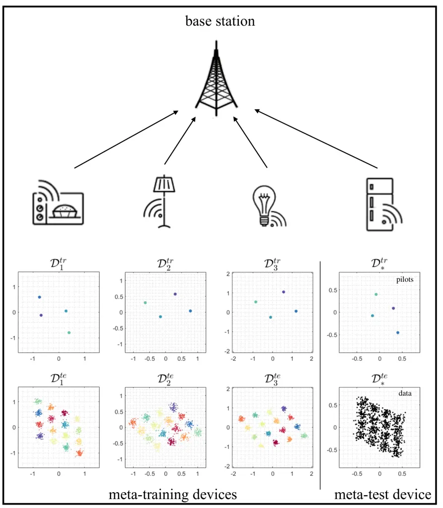

Figure 5.1: Meta-learning for demodulation: By utilizing received pilots
from multiple previous transmissions by different devices, a
meta-learned demodulator can significantly reduce the number of pilots
required for demodulation of data sent by a new device.

Demodulation is a fundamental physical-layer function consisting of the
task of estimating the transmitted symbols from the received baseband
signals. Demodulators must compensate for the fading effect on the
received signal of the transmission channel. This is done by leveraging
the transmission of known symbols, referred to as pilots.

Model-based methods typically assume a _linear_ fading channel model
with additive white Gaussian noise (AWGN). Under this model, the
standard approach first estimates the channel response using the pilots
via a minimum mean squared error (MMSE) estimator. Then, the estimated
channel is used to obtain a maximum likelihood estimate of the
transmitted symbols, which minimizes the symbol error rate (SER) under
the assumption that the channel is well estimated.

In some communication scenarios, especially Internet-of-Things (IoT)
systems involving low-complexity devices, linear models may fail to
fully describe the relationship between the transmitted symbols and the
received signal. In particular, they do not account for non-linear
effects such as transmitter’s imperfections \[108\]. By addressing this
“model deficit” \[104\], data-driven demodulation can outperform the
outlined conventional model-based strategy. This is the subject of this
subsection, which follows reference \[109\].

##### 5.2.1 Problem Definition

Consider an IoT scenario in which devices transmit short packets
sporadically to a base station (BS). As mentioned, IoT devices may be
affected by non-linear hardware distortions. An example of distorted
constellation points for 16-ary quadrature amplitude modulation (16-QAM)
under I/Q imbalance is shown in Fig. 5.1. As a result, the conventional
model-based demodulator described above is generally suboptimal, as it
ignores hardware nonlinearities. Conventional machine learning methods
may address this model deficit, but the only available training data is
given by the pilots within each short packet. Meta-learning can mitigate
this problem. We note that a complementary approach is to integrate
data-driven and model-based approaches \[110, 111\], which will be
briefly discussed in Section 7.

For an IoT device indexed by an integer $`k`$, given an input symbol
$`s_{k}\in\mathcal{S}`$ that lies in the set of all constellation points
$`\mathcal{S}`$. The transmitted signal $`x_{k}`$ is a function of the
information symbol $`s_{k}\in\mathcal{S}`$ that accounts for the
hardware distortion caused by imperfections at device $`k`$. This
function is described by a stochastic mapping

```math
\displaystyle x_{k}\sim p_{k}(\cdot|s_{k}) \tag{5.1}
```

for some conditional distribution $`p_{k}(\cdot|s_{k})`$. We assume that
the received signal $`y_{k}`$ can be expressed as the output of a flat
fading channel as in

```math
\displaystyle y_{k}=h_{k}x_{k}+z_{k}, \tag{5.2}
```

where $`h_{k}`$ is the complex channel gain between the device $`k`$ and
the BS; and $`z_{k}\sim\mathcal{CN}(0,N_{0})`$ is additive complex
Gaussian noise. The channel is assumed to be constant within a coherence
time that is longer than the short packet time duration of the IoT
devices. Neither the channel $`h_{k}`$ nor the mapping
$`p_{k}(\cdot|s_{k})`$ are known to device $`k`$ or to the BS.

We assume the transmission of $`N`$ pilots in each transmitted frame.
Accordingly, the training data set for device $`k`$, referred to as
$`\mathcal{D}_{k}`$, is given as

```math
\displaystyle\mathcal{D}_{k}=\{(s_{k}^{(i)},y_{k}^{(i)}):i=1,...,N\}, \tag{5.3}
```

where $`s_{k}^{(i)}\in\mathcal{S}`$ is the $`i`$-th pilot symbol sent by
device $`k`$, and $`y_{k}^{(i)}`$ is the resulting signal (5.2)–(5.1)
received by the BS.

##### 5.2.2 Conventional Learning

Let us fix a model class $`p(s|y,\phi)`$ that defines the probability
function of the symbol $`s`$ given the received signal $`y`$ based on
the model parameter vector $`\phi`$. The model class $`p(s|y,\phi)`$ is
typically chosen as a neural network with weight vector $`\phi`$. Given
training data set $`\mathcal{D}_{k}`$, a conventional machine learning
solution trains the demodulator within the given class by minimizing the
cross-entropy loss

```math
\displaystyle L_{\mathcal{D}_{k}}(\phi)=-\frac{1}{N}\sum_{(s_{k},y_{k})\in\mathcal{D}_{k}}\log p(s_{k}|y_{k},\phi), \tag{5.4}
```

over the parameter vector $`\phi`$, hence addressing the problem

```math
\displaystyle\min_{\phi}L_{\mathcal{D}_{k}}(\phi). \tag{5.5}
```

##### 5.2.3 Meta-Learning

We consider pilot data from $`K`$ devices as meta-training data.
Meta-learning can transfer knowledge from pilots of other devices, each
with their own hardware distortions and channel realizations, via an
optimized inductive bias.

Frequentist meta-learning. Splitting the data set $`\mathcal{D}_{k}`$
with $`N`$ samples for device $`k`$ into a training part
$`\mathcal{D}_{k}^{\text{tr}}`$ with $`N^{\text{tr}}`$ samples and a
validation part $`\mathcal{D}_{k}^{\text{va}}`$ with $`N^{\text{va}}`$
samples as explained in Section 1. the meta-learning objective for
frequentist meta-learning is given by the problem

```math
\displaystyle\min_{\theta}\left\{\mathcal{L}_{\mathcal{D}^{\text{mtr}}}(\theta)=\frac{1}{K}\sum_{k=1}^{K}L_{\mathcal{D}_{k}^{\text{va}}}(\phi^{\text{tr}}(\mathcal{D}_{k}^{\text{tr}}|\theta))\right\}, \tag{5.6}
```

where the per-device model parameter vector
$`\phi_{k}=\phi^{\text{tr}}(\mathcal{D}_{k}^{\text{tr}}|\theta)`$ for
device $`k`$ is adapted using the pilots $`\mathcal{D}_{k}^{\text{tr}}`$
for a fixed hyperparameter vector $`\theta`$ as in (1.8), which we
denote as,
$`\phi^{\textrm{tr}}(\mathcal{D}_{k}^{\text{tr}}|\theta)\underset{\theta}{\leftarrow}\min_{\phi}L_{\mathcal{D}_{k}^{\text{tr}}}(\phi)`$.

The performance of the data-driven demodulator $`\phi`$ is measured by
symbol error rate

```math
\displaystyle\text{SER}=\mathbb{E}_{s,y\sim p(s,y)}\mathbf{1}(s\neq\hat{s}(y|\phi)), \tag{5.7}
```

where $`\hat{s}(y|\phi)=\argmax_{s\in\mathcal{S}}p(s|y,\phi)`$ is the
output of the demodulator given received signal $`y`$ in (5.2)–(5.1);
while $`p(s,y)=p(s)p(y|s)`$ is the joint distribution of the symbol
$`s\in\mathcal{S}`$ and of the received signal $`y`$, with $`p(y|s)`$
given by (5.2)–(5.1). The symbol distribution $`p(s)`$ is typically
chosen to be uniform over the constellation set $`\mathcal{S}`$. We next
provide numerical results obtained under model (5.2)–(5.1) with
$`p(x|s)`$ modelling I/Q imbalance at the transmitter. We refer to
\[109\] for details.

Fig. 5.2 shows the SER of the new, meta-test task, as a function of
number of pilots $`\tilde{N}^{\text{tr}}`$ available during meta-testing
using MAML, REPTILE, and CAVIA, which were introduced in Section 2. The
number of pilots available for the meta-training tasks is set to
$`N^{\text{tr}}=4`$ and $`N^{\text{va}}=3196`$. Note that we deviate
here from the assumption that the same number of pilots is used during
both meta-training and meta-testing. This allows us to consider the
practical case in which the number of pilots for new device may not be
known a priori, i.e., during the meta-learning phase.

As seen in Fig. 5.2, meta-learning-aided demodulators outperform the
conventional model-based communication scheme based on maximum
likelihood (ML) demodulation with MMSE channel estimation; as well as
the conventional machine learning scheme that trains from scratch a
demodulator for each device. This benefit stems from the capacity of
meta-learning to successfully transfer knowledge from pilots of
previously active devices.

Next, Fig. 5.4 demonstrates the SER with respect to number of
meta-training devices $`K`$. As discussed in Section 4.2, using data
from few meta-training devices may yield meta-overfitting, which leads
to a high SER for new devices owing to the poor adaptation capability of
the training algorithm. In contrast, when $`K`$ is large enough, the
demodulator based on meta-learning can successfully achieve a low SER,
while joint learning, which optimizes a single demodulator across all
meta-training devices, fails to transfer useful knowledge to new
devices.

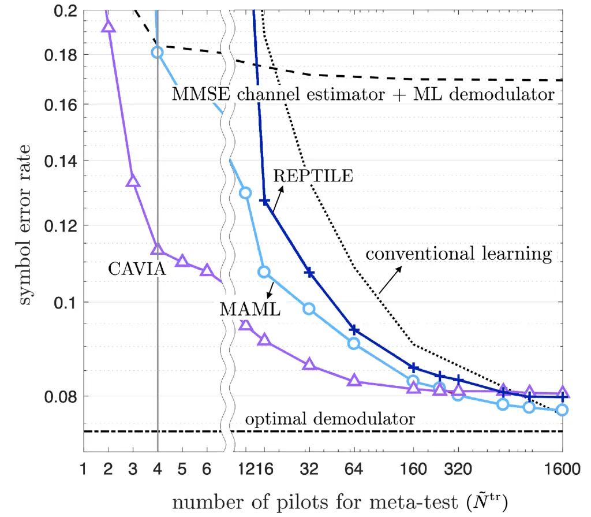

Figure 5.2: Meta-learning for demodulation: SER as a function of number
of pilots $`(\tilde{N}^{\text{tr}})`$ used during meta-testing with
$`16`$-QAM, Rayleigh fading, and I/Q imbalance under a $`20\text{ dB}`$
signal-to-noise ratio (SNR). $`K=1000`$ meta-training devices with
$`N^{\text{tr}}=4`$ and $`N^{\text{va}}=3196`$ are assumed during
meta-training (adapted from \[109\]).

Bayesian meta-learning.

Figure 5.3: Meta-learning for demodulation: SER as a function of number
$`K`$ of meta-training device with $`16`$-QAM, Rayleigh fading, and I/Q
imbalance under a $`18\text{ dB}`$ SNR. $`\tilde{N}^{\text{tr}}=8`$
pilots are used for meta-testing (adapted from \[112\]).

While frequentist meta-learning effectively reduces the pilot overhead
required for demodulation, the resulting trained demodulator may not be
well calibrated, providing overconfident decisions. This is a well-known
problem of frequentist learning \[113\]. Bayesian meta-learning can
address this problem by properly accounting for epistemic uncertainty
caused by limited training data (see Section 2.4) \[112\].

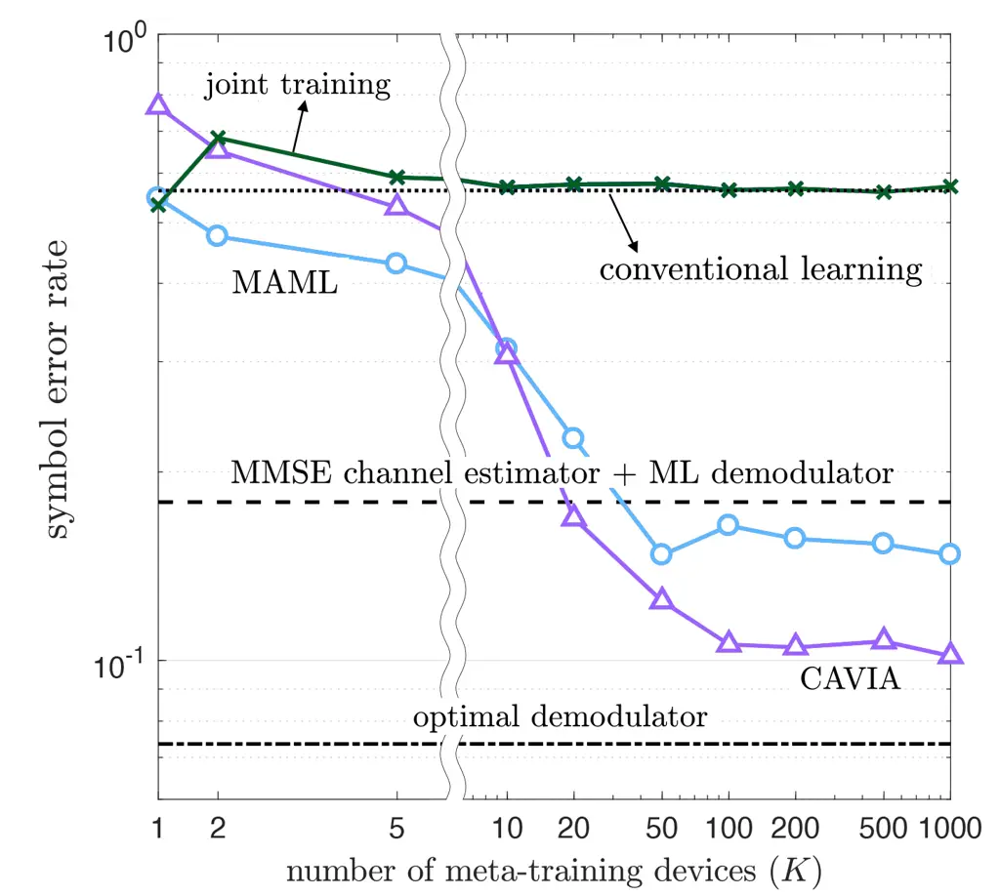

Figure 5.4: Meta-learning for demodulation: SER as a function of number
$`K`$ of meta-training device with $`16`$-QAM, Rayleigh fading, and I/Q
imbalance under a $`20\text{ dB}`$ SNR. $`\tilde{N}^{\text{tr}}=8`$
pilots are used for meta-testing (adapted from \[109\]).

To elaborate on this point, we first describe how to quantify the
calibration of a discriminative probabilistic model. Given a demodulator
$`p(s|y,\phi)`$ that yields a point decision
$`\hat{s}(y|\phi)=\argmax_{s\in\mathcal{S}}p(s|y,\phi)`$, the
corresponding confidence for the input $`y`$ is defined as

```math
\displaystyle\text{conf}(y|\phi)=p(\hat{s}(y|\phi)|y,\phi). \tag{5.8}
```

Ideally, the confidence level (5.8) should be a reliable measure of the
true accuracy of the decision $`\hat{s}(y|\phi)`$. To quantify this
aspect, we define the average accuracy for all inputs having a
confidence level $`p`$ as \[113\]

```math
\displaystyle\text{acc}(p)=\mathbb{P}[\hat{s}(y|\phi)=s|\text{conf}(y|\phi)=p], \tag{5.9}
```

where the probability is taken over the underlying ground-truth
distribution $`p(y,s)`$ for the input $`y`$ and target $`s`$. A well
calibrated demodulator is a predictor that satisfies the following
equality

```math
\displaystyle\text{acc}(p)=p, \tag{5.10}
```

so that accuracy and confidence level are equal for all $`p\in[0,1]`$.
Reliability diagrams plot the accuracy $`\text{acc}(p)`$ versus the
confidence level $`p`$ to gauge the extent to which the confidence level
estimated by the model matches the ground-truth accuracy \[113\]. By
replacing the single demodulator $`p(s|y,\phi)`$ with the ensemble
demodulator $`\mathbb{E}_{\phi\sim p(\phi|\mathcal{D})}p(s|y,\phi)`$
that accounts for the “opinions” of multiple models weighted by the
(approximate) posterior distribution $`p(\phi|\mathcal{D})`$, Bayesian
learning can yield better calibrated decisions as compared to
frequentist learning. This was investigated in \[114, 112\].

Fig. 5.3 shows the SER as a function of number of meta-training devices
$`K`$. Similar to Fig. 5.4, both frequentist and Bayesian meta-learning
outperform conventional schemes, validating again the conclusion that
meta-learning can transfer useful knowledge from multiple devices. Apart
from some improvement in accuracy, the key benefit of Bayesian
meta-learning is in terms of calibration, as illustrated by the
reliability diagram in Fig. 5.5. By capturing epistemic uncertainty
caused by the availability of few pilots, here $`N^{\text{tr}}=8`$,
Bayesian meta-learning produces well-calibrated decisions. In fact, the
diagram shows that the confidence of the demodulator matches well the
actual accuracy. More details can be found in \[112\].

Online meta-learning. In the communication setting under study in this
subsection, it may be practically useful to accumulate meta-training
data set in an online fashion as transmissions from more devices are
received by the BS. This setting has been also studied in \[109\], and
will be briefly outlined in Section 7.

Figure 5.5: Meta-learning for demodulation: Reliability diagrams for
both frequentist and Bayesian meta-learning. Well calibrated
demodulators should follow the dashed line in the figure, i.e., the
confidence of the demodulator should match the actual accuracy (adapted
from \[112\]).

### 5.3 Encoding and Decoding

While the previous subsection addressed the model deficit problem caused
by hardware imperfections, this subsection deals with an instance of
_algorithm deficit_, in which the optimal algorithm for the problem of
interest is unknown. We specifically focus on the problem of jointly
designing encoder and decoder for a communication link over a channel
that is only accessible via a simulator as in \[115, 116, 117\].

In this setting, the issue is not that of reducing the amount of data,
which can be generated at will using the simulator, but rather that of
ensuring that a new encoder-decoder pair can be optimized quickly, using
limited computational resources, for each new channel coefficients. We
show in this subsection that meta-learning can reduce the iteration
complexity of training encoder-decoder pairs for new communication
conditions. The presentation follows reference \[118\].

##### 5.3.1 Problem Definition

Consider a communication link with a known channel model. As illustrated
in Fig. 5.6, the encoder and decoder are implemented via neural
networks. Using the approach introduced in \[115\], training can be done
in an unsupervised manner by interpreting the architecture in Fig. 5.6
as an _autoencoder_ whose goal is to reproduce the input message $`m`$
of $`k`$ bits at the output of the decoder as the estimate $`\hat{m}`$.
This approach generally requires many iterations to optimize encoder and
decoder for each new channel realization of interest, and meta-learning
can alleviate this problem.

Figure 5.6: Meta-learning for encoding and decoding with a known channel
model $`p_{h}(y|x)`$: A message $`m`$ is mapped into a codeword $`x`$
via a trainable encoder $`f_{\theta_{\text{T}}}(\cdot)`$, while the
received signal $`y`$, determined by the channel $`p_{h}(y|x)`$, is
mapped into an estimated message $`\hat{m}`$ through a trainable decoder
$`p_{\theta_{\text{R}}}(\cdot|y)`$. This setting can be interpreted as
modelling a single link as an autoencoder \[115, 116, 117\].

The transmitter encodes the message $`m`$ into the transmitted signal
$`x`$ using a mapping $`x=f_{\phi_{\text{T}}}(s_{m})`$ where $`s_{m}`$
is the $`2^{k}\times 1`$ one-hot vector corresponding to message $`m`$.
Signal $`x`$ is transmitted through a channel described by a known
conditional distribution $`p_{h}(y|x)`$. Accordingly, the received
signal is given as $`y\sim p_{h}(y|x)`$, from which the receiver decodes
via the stochastic mapping $`\hat{m}\sim p_{\phi_{\text{R}}}(m|y)`$. The
encoding function $`f_{\phi_{\text{T}}}(\cdot)`$ and the decoding
operation $`p_{\phi_{\text{R}}}(\cdot|y)`$ depend on model parameter
vector $`\phi_{\text{T}}`$ and $`\phi_{\text{R}}`$, respectively.

For concreteness, the channel mapping $`p_{h}(y|x)`$ is modelled here as

```math
\displaystyle y=h*x+w, \tag{5.11}
```

where $`w\sim\mathcal{CN}(0,N_{0})`$ represents complex Gaussian i.i.d.
noise and “\*” indicates a linear operation on input $`x`$ parametrized
by a channel vector $`h`$. The model (5.11) captures frequency selective
channels, in which case the operation “\*” is a convolution; as well as
multi-antenna channels, in which case the operation “\*” is a matrix
multiplication.

##### 5.3.2 Conventional Learning

The loss function for particular channel realization $`h`$ is written as
the cross-entropy loss

```math
\displaystyle L_{h}(\phi)=-\mathbb{E}_{m\sim p(m),y\sim p_{h}(y|f_{\phi_{\text{T}}}(s_{m}))}[\log p_{\phi_{\text{R}}}(m|y)], \tag{5.12}
```

which is averaged over message probability distribution $`p(m)`$;
channel distribution $`p_{h}(y|x)`$; and stochastic decoding
$`p_{\phi_{\text{R}}}(m|y)`$. Here, we have defined the overall model
parameter vector $`\phi=(\phi_{\text{T}},\phi_{\text{R}})`$. Note that
the loss $`L_{h}(\phi)`$ in (5.12) is the population loss, in which the
data distribution is determined by the channel $`h`$. The loss (5.12) is
approximated by the empirical loss

```math
\displaystyle L_{\mathcal{D}_{h}}(\phi)=-\frac{1}{N}\sum_{j=1}^{N}\log p_{\phi_{\text{R}}}(m_{j}|h*f_{\phi_{\text{T}}}(s_{m_{j}})+w_{j}), \tag{5.13}
```

where the training data set $`\mathcal{D}_{h}`$ under channel
realization $`h`$ is generated by drawing i.i.d. random messages
$`m_{1},...,m_{N}`$ from the distribution $`p(m)`$, along with i.i.d.
noise realizations $`w_{1},...,w_{N}`$.

Conventional learning addresses the following minimization for each new
channel realization $`h`$:

```math
\displaystyle\min_{\phi}L_{\mathcal{D}_{h}}(\phi). \tag{5.14}
```

Note that access to a differentiable simulator of the channel model is
required for computing the gradient of the loss
$`L_{\mathcal{D}_{h}}(\phi)`$ with respect to the encoder parameter
vector $`\phi_{\text{T}}`$. This is trivially true for the simple model
(5.11).

##### 5.3.3 Meta-Learning

A large number of training iterations, consisting of tens of thousands
of steps, are generally required for training data-driven encoding and
decoding from scratch by solving problem (5.12) for each channel
realization $`h`$ of interest \[115, 118\]. Meta-learning can reduce the
training time. Using $`K`$ different channel realizations
$`h_{1},...,h_{K}`$, the frequentist meta-learning problem can be
formulated as the minimization

```math
\displaystyle\min_{\theta}\left\{\mathcal{L}_{\mathcal{D}^{\text{mtr}}}(\theta)=\frac{1}{K}\sum_{k=1}^{K}L_{\mathcal{D}_{h_{k}}}(\phi^{\text{ma}}(\mathcal{D}_{h_{k}}|\theta))\right\}, \tag{5.15}
```

where the trained model $`\phi^{\text{ma}}(\mathcal{D}_{h}|\theta)`$ for
each channel realization $`h`$, given the hyperparameter vector
$`\theta`$, is taken here to be the MAML one-step-gradient update
(2.1b), i.e.,

```math
\displaystyle\phi^{\text{ma}}(\mathcal{D}_{h_{k}}|\theta)=\theta-\alpha\nabla_{\theta}L_{\mathcal{D}_{h_{k}}}(\theta). \tag{5.16}
```

The empirical losses $`L_{\mathcal{D}_{h_{k}}}(\cdot)`$ in (5.15)–(5.16)
are defined as in (5.13), with $`N^{\text{tr}}`$ and $`N^{\text{va}}`$
used in lieu of $`N`$, respectively.

We next provide some numerical results for a frequency selective
Rayleigh block fading channel model. More details can be found in
\[118\]. We assume transmission of $`k=4`$ bits through $`n=4`$ complex
channel uses. The channel $`h`$ has three taps, each independently
generated as a $`\mathcal{CN}(0,1/3)`$ variable. The performance of the
trained encoder-decoder pair is measured in terms of block error rate
(BLER), i.e.,e

```math
\displaystyle\text{BLER}=\mathbb{E}[\hat{m}=m], \tag{5.17}
```

where the average is taken with respect to channel distribution
$`p(h)`$, message probability distribution $`p(m)`$, channel
distribution $`p_{h}(y|x)`$, and stochastic decoder
$`p_{\phi_{\text{R}}}(m|y)`$.

Fig. 5.7 shows the BLER as a function of number of iterations used to
train the encoder-decoder pair. Encoder and decoder are multi-layer
neural networks \[119\]. The figure also shows the performance obtained
by adopting a more advanced decoder architecture that utilizes a radio
transformer networks (RTN) \[115\]. The RTN applies a filter $`w`$ to
the received signal $`y`$ to obtain the input $`\bar{y}=y*w`$ to the
decoder as $`p_{\theta_{\text{R}}}(\cdot|\bar{y})`$. Aiming at
explicitly designing a channel equalizer $`w`$ through additional neural
network, RTN has been reported to generally accelerate the optimization
procedure \[115\].

Similar to Section 5.2, meta-learning is compared with _(i)_
_conventional learning_, which adopts a random initialization; and
_(ii)_ _joint learning_, which optimizes a single encoder-decoder pair
from all the meta-training channels. After a sufficient number of
adaptation steps for new channel realizations (around $`10,000`$), all
the schemes achieve a BLER lower than $`10^{-3}`$, validating the power
of data-driven encoding and decoding. However, among all the considered
schemes, only meta-learning can reach a BLER near $`10^{-3}`$ with even
a single iteration. This demonstrates that a successful transfer of
knowledge from multiple channels via meta-learning can indeed reduce the
iteration complexity of designing data-driven encoder-decoder pair.

Figure 5.7: Meta-learning for encoding and decoding with a
(differentiable) channel model: BLER over iteration number for training
on the new channel ($`4`$ bits, $`4`$ complex channel uses, Rayleigh
block fading channel model with $`3`$ taps, and $`16`$ messages per
iteration, under a $`15\text{ dB}`$ SNR, adapted from \[118\]).

### 5.4 Channel Prediction

Channel prediction has many applications in modern communication
systems, including proactive resource allocation \[120, 121\]. Deep
learning based nonlinear channel predictors have been proposed through
training of recurrent neural networks \[122\], convolutional neural
networks \[123\], and multi-layer perceptrons \[124\]. However, several
studies, including \[125, 126, 124\], have reported that deep learning
based predictors tend to require large training data sets, while failing
to outperform well-designed linear filters in the low-data regime.
Following \[127\], this subsection introduces linear data-driven channel
predictors that effectively use the available training data via
meta-learning. The key idea is to use the linear version of iMAML
introduced in Section 2.2.3, along with suitable dimensionality
reduction methods via long-short term channel decomposition as proposed
in \[128, 129, 130\].

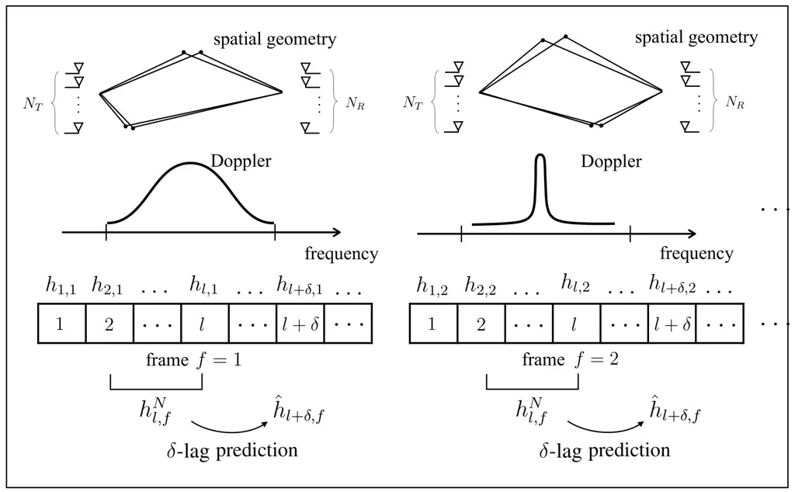

Figure 5.8: Meta-learning for channel prediction: At any frame,
characterized by generally different channel statistics, the problem of
interest is to predict channel using previous consecutive channels.

##### 5.4.1 Problem Definition

As shown in Fig. 5.8, we consider a wireless communication system in
which both the spatial geometry and Doppler spectrum of the wireless
channel may change at each frame. Each frame consists of multiple slots.
Assuming $`N_{T}`$ transmit antennas, $`N_{R}`$ receive antennas, and
$`W`$ taps, describing the delay spread of the channel, the complex
channel vector at slot $`i`$ in frame $`k`$ can be written as
$`h_{i,k}\in\mathbb{C}^{S}`$ with $`S=N_{R}N_{T}W`$. During any frame,
the channel statistics are assumed to be static, while the channels vary
across different slots within the same frame with the given frame
statistics.

Within each frame $`k`$, the channel predictor takes as input the $`L`$
previous channels

```math
\displaystyle H^{L}_{i,k}=[h_{i,k},...,h_{i-L+1,k}]\in\mathbb{C}^{S\times L} \tag{5.18}
```

to predict the channel $`h_{i+\delta,k}`$ at a time lag of $`\delta`$
time steps via the linear predictor as

```math
\displaystyle\hat{h}_{i+\delta,k}(\phi_{k})=\phi_{k}^{\dagger}\text{vec}(H^{L}_{i,k}), \tag{5.19}
```

where $`\phi_{k}\in\mathbb{C}^{SL\times S}`$ is the model parameter
vector. In (5.19), $`\text{vec}(\cdot)`$ is the vectorization operator
that stacks the columns of the input matrix into a column vector.

##### 5.4.2 Conventional Learning

Defining training data set $`\mathcal{D}_{k}`$ for the $`k`$-th frame
with $`N+L+\delta-1`$ consecutive channel vectors, i.e.,
$`\mathcal{D}_{k}=\{h_{1,k},...,h_{N+L+\delta-1,k}\}`$, the
corresponding loss function given the linear regressor $`\phi`$ is
defined as the mean squared error (MSE)

```math
\displaystyle L_{\mathcal{D}_{k}}(\phi)=\frac{1}{N}\sum_{i=1}^{N}\left\|\hat{h}_{i+\delta,k}(\phi)-h_{i+\delta,k}\right\|^{2}. \tag{5.20}
```

The linear channel predictor $`\phi_{k}`$ for the frame $`k`$ is
optimized by addressing the minimization of the training loss (5.20).

##### 5.4.3 Meta-Learning

To enable meta-learning, we introduce a bias vector $`\theta`$ that
modifies the training objective in (5.20) by adding an $`l_{2}`$
regularization term as discussed in Section 2.2.3, i.e.,

```math
\displaystyle\min_{\phi}\left\{L_{\mathcal{D}_{k}}(\phi)+\frac{\lambda}{2}\left\|\phi-\theta\right\|^{2}\right\}. \tag{5.21}
```

Furthermore, we assume the availability of a meta-training data set
obtained from $`K`$ previous frames. For each frame $`k`$, we have
channels from $`N^{\text{tr}}+N^{\text{va}}+L+\delta-1`$ slots, forming
the training data set
$`\mathcal{D}_{k}^{\text{tr}}=\{h_{1,k},...,h_{N^{\text{tr}}+L+\delta-1,k}\}`$
and the validation data set
$`\mathcal{D}_{k}^{\text{va}}=\{h_{N^{\text{tr}}+1,k},...,h_{N^{\text{tr}}+N^{\text{va}}+L+\delta-1,k}\}`$.
The bias vector is meta-learned using iMAML as described in Section
2.2.3. This leads to

```math
\displaystyle\min_{\theta}\left\{\mathcal{L}_{\mathcal{D}^{\text{mtr}}}(\theta)=\frac{1}{K}\sum_{k=1}^{K}L_{\mathcal{D}_{k}^{\text{va}}}({\phi}^{\text{im}}(\mathcal{D}_{k}^{\text{tr}}|\theta))\right\}, \tag{5.22}
```

where the linear channel predictor
$`{\phi}^{\text{im}}(\mathcal{D}_{k}^{\text{tr}}|\theta)`$ for frame
$`k`$ is the solution of problem (5.21) using training set
$`\mathcal{D}_{k}^{\text{tr}}`$, i.e.,

```math
\displaystyle{\phi}^{\text{im}}(\mathcal{D}_{k}^{\text{tr}}|\theta)=\argmin_{\phi}\left\{L_{\mathcal{D}_{k}^{\text{tr}}}(\phi)+\frac{\lambda}{2}\left\|\phi-\theta\right\|^{2}\right\}. \tag{5.23}
```

Both the linear channel predictor
$`{\phi}^{\text{im}}(\mathcal{D}_{k}^{\text{tr}}|\theta)`$ and the
solution of problem (5.22) can be obtained in a closed form as described
in Section 2.2.3 (by taking $`\text{vec}(H_{n,k}^{L})^{\dagger}`$ in
lieu of $`x_{k,n}^{\top}`$ and $`h_{n+\delta,k}^{\dagger}`$ instead of
$`y_{k,n}`$).

When the dimension of the channel vector $`S`$ is large, the
meta-learned bias vector $`\theta`$ obtained from (5.22) is prone to
meta-overfitting. Instead of using the channel vector directly,
reference \[127\] proposes to decompose the channel vector into
long-term space-time features $`B_{k}\in\mathbb{C}^{S\times R}`$ and
short-term fading amplitude vector $`d_{l,k}\in\mathbb{C}^{R\times 1}`$
\[128, 129, 130\]. This yields the decomposition

```math
\displaystyle h_{l,k}=B_{k}d_{l,k}=\sum_{r=1}^{R}b_{k}^{r}d_{l,k}^{r}, \tag{5.24}
```

in which $`R`$ stands for the effective number of resolvable paths for
the channel vector; $`d_{l,k}^{r}\in\mathbb{C}`$ for the $`r`$-th
element of the vector $`d_{l,k}`$; and
$`b_{k}^{r}\in\mathbb{C}^{S\times 1}`$ is the $`r`$-th column of the
matrix $`B_{k}`$. The integer $`R`$ can be estimated by utilizing the
previous channel vectors by using a standard method such as Akaike’s
information theoretic criterion (AIC) \[131\], or by examining the
meta-validation loss \[127\]. The long-term matrix $`B_{k}`$ is assumed
to have negligible variations within a frame, while only the fading
amplitudes change from slot to slot. The channel predictor $`\phi_{k}`$
is similarly decomposed in order to reduce the number of parameters to
be trained \[127\].

Figure 5.9: Meta-learning for channel prediction: Multi-antenna
frequency-selective channel prediction performance as a function of the
number of training samples, under $`19`$-clustered, two-tap, and
multi-antenna ($`N_{T}=4`$ transmit, $`N_{R}=2`$ receive antennas) 3GPP
SCM channel model (adapted from \[127\]).

We now provide numerical results using the 3GPP spatial channel model
(SCM) \[132\] with $`N_{R}=2`$, $`N_{T}=4`$, and $`W=2`$. Fig. 5.9 shows
the normalized test MSE (NMSE) as a function of number of training
samples $`N^{\text{tr}}`$. The NMSE is defined as the normalization with
respect to the target channel vector
$`||\hat{h}_{l+\delta,k}(\phi)-{h}_{l+\delta,k}||^{2}/||h_{l+\delta,k}||^{2}`$.
The performance of the meta-learned channel predictor using the
decomposition (5.24) is compared with: _(i)_ meta-learning via (5.22);
and _(ii)_ a joint learning solution that finds a bias vector $`\theta`$
by solving

```math
\displaystyle\min_{\theta}\frac{1}{K}\sum_{k=1}^{K}L_{\mathcal{D}_{k}}(\theta), \tag{5.25}
```

with or without decomposition (5.22). In (5.25), the data set
$`\mathcal{D}_{k}`$ is union of the training data part
$`\mathcal{D}_{k}^{\text{tr}}`$ and the validation part
$`\mathcal{D}_{k}^{\text{va}}`$. We refer in the figure to the schemes
based on decomposition (5.24) as _long-short-term decomposition (LSTD)_;
while schemes without the decomposition are labelled as _naïve_ schemes.

In Fig. 5.9, meta-learning based on the considered decomposition (5.24)
outperforms all the other schemes by transferring useful knowledge for
both long-term and short-term features based on channels obtained from
multiple frames with different channel statistics.

### 5.5 Power Control

Finally, in this subsection, we consider a fundamental radio-resource
management problem in wireless networks – power control. Power control
refers to the optimization of the transmission power levels at
distributed links that share the same spectral resources. Ideally, the
communication engineer would derive an optimal power control solution
that minimizes the level of interference in the network in the presence
of time-varying channel conditions. Due to the complexity of modern
wireless networks, that provide connectivity to devices ranging from
sensors and cell phones to vehicles and robots, deriving an explicit
optimal power control policy is infeasible. For such settings,
data-driven power control method is promising candidates, which is the
subject of this subsection.

##### 5.5.1 Problem Definition

Figure 5.10: Meta-learning for power control: In dynamic networks
running over three periods $`\tau=1`$, $`\tau=2`$, and $`\tau=3`$, the
goal is to adapt the power control policy to each new topology using a
few data-samples.

As shown in Fig. 5.10, we consider power control in complex networks
with time-varying network topologies. In such dynamic networks,
data-driven techniques based on fully connected deep-learning models
entail training a different model whenever the number of devices
changes, as such models commit to input and output layers of fixed
sizes. In contrast, learning with inputs and outputs of variable size
can be done using geometric models, such as graph neural networks
(GNNs).

GNNs have been introduced to address the problem of power control in
\[133\]. A GNN can encode information about the topology of a network
through its underlying graph. Furthermore, the edge weights of the GNN
\[133\], are tied to the current channel realizations. As a result, the
solution – which is referred to as random edge GNN (REGNN) –
automatically adapts to time-varying channel conditions through the edge
weights. The design problem consists of training the weights $`\phi`$ of
the graph filters.

We assume that the network is run over periods $`k=1,...,K`$, with
topology possibly changing at each period $`k`$. During period $`k`$,
the network is comprised of $`V_{k}`$ communication links. Transmissions
on the $`V_{k}`$ links are assumed to occur at the same time using the
same spectrum. The resulting interference graph
$`\mathcal{G}_{k}=(\mathcal{V}_{k},\mathcal{E}_{k})`$ includes an edge
$`(i,j)\in\mathcal{E}_{k}`$ for any pair of links
$`i,j\in\mathcal{V}_{k}=\{1,...,V_{k}\}`$ with $`i\neq j`$ whose
transmissions interfere with one another. We denote by
$`\mathcal{N}^{i}_{k}\subseteq\mathcal{V}_{k}`$ the subset of links that
interfere with link $`i`$ at period $`k`$. Both the number of links
$`V_{k}=|\mathcal{V}_{k}|`$ and the topology defined by the edge set
$`\mathcal{E}_{k}`$ generally vary across periods $`k`$.

Each period contains $`N`$ time slots, indexed by $`t=1,...,N`$. In time
slot $`t`$ of period $`k`$, the channel between the transmitter of link
$`i`$ and its intended receiver is denoted by $`h^{i,i}_{k}(t)`$, while
$`h^{j,i}_{k}(t)`$ denotes the channel between transmitter of link $`j`$
and receiver of link $`i`$ with $`j\in\mathcal{N}^{i}_{k}`$. Channels
account for both slow and fast fading effects, and, by definition of the
interference graph $`\mathcal{G}_{k}`$, we have $`h^{j,i}_{k}(t)=0`$ for
$`j\notin\mathcal{N}^{i}_{k}`$. The channels for slot $`t`$ in period
$`k`$ are arranged in the channel matrix
$`G_{k}(t)\in R^{V_{k}\times V_{k}}`$, with the $`(j,i)`$ entry given by
$`\left[G_{k}(t)\right]_{j,i}=g^{j,i}_{k}(t)=|h^{j,i}_{k}(t)|^{2}`$.
Channel states vary across time slots, and the designer is assumed to
have access to channel realizations
$`\mathcal{D}_{k}=\{G_{k}(1),...,G_{k}(N)\}`$ over $`N`$ time slots in
period $`k`$ comprising the per-task data set.

With this setup, given transmitted powers $`p^{i}_{k}(t)`$ in each
$`j`$-th link, the achievable sum-rate in slot $`t`$ of frame $`k`$ is
given by

```math
\displaystyle c_{k}(p_{k}(t))=\sum_{j=1}^{V_{k}}\log_{2}\left(1+\frac{g^{j,j}_{k}(t)p^{j}_{k}(t)}{\sigma^{2}+\sum_{i\in\mathcal{N}_{k}^{j}}g^{i,j}_{k}(t)p^{i}_{k}(t)}\right), \tag{5.26}
```

where $`\sigma^{2}`$ denotes the per-symbol noise power. By (5.26),
interference is treated as worst-case additive Gaussian noise. As per
\[133\], the power allocation vector in (5.26) is parametrized with a
REGNN. Given a vector of filters $`\phi_{k}`$, this yields

```math
\displaystyle p_{k}(t)=\textrm{f}(G_{k}(t)\,|\,\phi_{k}), \tag{5.27}
```

where we can find the form of the REGNN function
$`\textrm{f}(G\,|\,\phi)`$ in \[133\].

##### 5.5.2 Conventional Learning

Given a set of channel realizations, training of the REGNN parameters is
done by tackling the unsupervised learning problem \[133\]

```math
\displaystyle\underset{\phi}{\text{min}}\left\{L_{\mathcal{D}_{k}}(\phi)=-\frac{1}{N}\sum_{t=1}^{N}c_{k}(\textrm{f}(G_{k}(t)\,|\,\phi))\right\}, \tag{5.28}
```

via SGD. Note that, the method in \[133\] adopts a joint learning
strategy, whereby a single filter tap is optimized for all network
configurations, i.e., the optimization in (5.28) is carried out by
summing the rates over all network topologies of interest.

##### 5.5.3 Black-Box Meta-Learning

To apply conventional meta-learning, we first split the data set
$`\mathcal{D}_{k}`$ into training part $`\mathcal{D}_{k}^{\text{tr}}`$
and validation part $`\mathcal{D}_{k}^{\text{va}}`$ as in the previous
subsections. Using FOMAML and Reptile, as discussed in Section 2.2, we
aim to maximize the achievable rate in (5.26), averaged across all tasks
as

```math
\displaystyle\min_{\theta}\left\{\mathcal{L}_{\mathcal{D}^{\text{mtr}}}(\theta)=\frac{1}{K}\sum_{k=1}^{K}L_{\mathcal{D}_{k}^{\text{va}}}(\phi^{\text{ma}}(\mathcal{D}_{k}^{\text{tr}}|\theta))\right\}, \tag{5.29}
```

where the task-specific parameters
$`\phi^{\text{ma}}(\mathcal{D}_{k}^{\text{tr}}|\theta)`$ are found by
taking a single gradient step using the shared parameter $`\theta`$ as
initialization:

```math
\displaystyle\phi^{\text{ma}}(\mathcal{D}_{k}^{\text{tr}}|\theta)=\theta-\alpha\nabla_{\theta}L_{\mathcal{D}_{k}^{\text{tr}}}(\theta). \tag{5.30}
```

The second-order derivatives required to solve (5.29) are ignored, and
the initialization is computed as in (2.16) and (2.23) for FOMAML and
Reptile, respectively. We refer to such meta-learning schemes as
“black-box”, as they do not leverage the modular structure of GNN
models.

##### 5.5.4 Modular Meta-Learning

Power control has also been tackled in \[120\] using the modular
meta-learning method described in Section 2.5. To do so, we define a set
$`\mathcal{M}`$ of modules, each representing an instantiation of a
REGNN filter. Representing the modules with indices
$`\mathcal{M}=\{1,...,M\}`$, and considering REGNNs with $`L`$ layers,
each layer $`l=1,...,L`$ is assigned one of the $`M`$ modules.
Accordingly, we introduce the discrete vector
$`S_{k}\in\{1,...,M\}^{L}`$ to denote the module assignment which is a
mapping between the layers $`l=1,...,L`$ of the REGNN and the modules
from the set $`\mathcal{M}`$.

The goal of modular meta-learning is to optimize the shared module set
$`\mathcal{M}`$ so as to allow the system to find a combination of
effective modules for any new topology during deployment. This is done
by addressing problem

```math
\displaystyle\min_{\mathcal{M}}\left\{\mathcal{L}_{\mathcal{D}^{\text{mtr}}}^{\text{mod}}(\mathcal{M})=\frac{1}{K}\sum_{k=1}^{K}L_{\mathcal{D}_{k}^{\text{va}}}(\phi^{\text{mod}}(\mathcal{D}_{k}^{\text{tr}}|\mathcal{M}))\right\}, \tag{5.31}
```

where the task-specific parameter
$`\phi^{\text{mod}}(\mathcal{D}_{k}^{\text{tr}}|\mathcal{M})`$ is
defined by the module set $`\mathcal{M}`$ and by the corresponding
task-specific module assignment vector $`S_{k}(\mathcal{M})`$, i.e.,
$`\phi^{\text{mod}}(\mathcal{D}_{k}^{\text{tr}}|\mathcal{M})=\phi^{(S_{k}(\mathcal{M}))}`$
(cf. (2.38a)). The module assignment vector is adapted per task as

```math
\displaystyle S_{k}(\mathcal{M})=\underset{S\in\{1,...,M\}^{L}}{\text{argmin}}L_{\mathcal{D}_{k}^{\text{tr}}}(\phi^{(S(\mathcal{M}))}). \tag{5.32}
```

To tackle the mixed continuous-discrete problem over the module set and
the assignment variables in (5.31), \[120\] introduces a stochastic
module assignment function given by a conditional distribution
$`\mathcal{P}_{k}(S_{k}|\mathcal{M},\mathcal{D}^{\text{tr}}_{k})`$, and
reformulate the bi-level optimization problem as

```math
\displaystyle\underset{\mathcal{M}}{\text{min}}\,\,\,\,\frac{1}{K}\sum_{k=1}^{K}\underset{\mathcal{P}_{k}(S_{k}\,|\,\mathcal{M},\mathcal{D}_{k}^{\text{tr}})}{\text{min}}\mathbb{E}_{S_{k}\sim\mathcal{P}_{k}(S_{k}|\mathcal{M},\mathcal{D}^{\text{tr}}_{k})}\left[L_{\mathcal{D}_{k}^{\text{va}}}(\phi^{(S_{k}(\mathcal{M}))})\right]. \tag{5.33}
```

In (5.33), the inner optimization is over the distributions
$`\{\mathcal{P}_{k}(\cdot\,|\,\mathcal{M},\mathcal{D}_{k}^{\text{tr}})\}_{k=1}^{K}`$.
We refer to \[120\] for implementation details.

Figure 5.11: Meta-learning for power control: Achievable rate in dynamic
networks as a function of number of meta-training periods. The
performance of the black-box and modular meta-learning is compared
against joint learning (adapted from \[120\]).

We now provide some numerical results under independent Rayleigh fading
channels. Detailed settings can be found in \[120\]. We compare the
meta-learning methods to joint learning as proposed in \[133\], which
finds a single parameter vector by solving (5.28) for the $`K`$
meta-training periods. We also consider both the black-box, i.e.,
standard, and modular meta-learning in Fig. 5.11 by plotting the
sum-rate for a network of dynamic size as a function of number of
meta-training periods $`K`$.

The results in Fig. 5.11 demonstrate that modular meta-learning is
advantageous over black-box methods when the number of meta-training
tasks is smaller. However, as the number of meta-training tasks
increases, due to the rigidity of modular methods, this gain is overcome
by limitations due to bias, and black-box methods are able to achieve
larger rates.

### 5.6 Conclusions

This section introduced several applications of meta-learning to
wireless communication systems, ranging from demodulation to power
control. For more references, we refer to \[134\] for channel decoding;
\[135, 136\] for MIMO systems; and \[137, 138\] for unmanned aerial
vehicle (UAV) networks. We finally mention model-based meta-learning
which may further reduce the resource overhead in communication systems
\[110, 139\]. Section 7 contains some discussion on online and
model-based meta-learning.

## Chapter 6 Integration with Emerging Computing Technologies

This section covers the integration of meta-learning with two emerging
information processing methods: neuromorphic computing and quantum
computing. Both computing technologies promise to improve the efficiency
of specific, distinct, classes of processing tasks, while relying on
dedicated hardware implementations that move beyond the current von
Neumann digital computing architecture. Machine learning can potentially
enable applications of both computing technologies to problems of
practical interest. Data scarcity is, however, often an issue when
training machine learning models implemented using neuromorphic or
quantum computing platforms. In fact, both technologies are highly
synergistic with specialized input data types that may be in short
supply. It is hence of interest to investigate settings in which
meta-learning can enhance sample efficiency, while accounting for the
unique properties and constraints of the two computing methods. This
section provides a very brief introduction to this, with the main goals
of highlighting main conceptual aspects and of providing suitable
pointers to the literature.

### 6.1 Neuromorphic Computing

Neuromorphic computing is a _brain-inspired_ signal processing paradigm.
It excels at tasks involving streaming, sparse, time series, and/or
targeting low-energy, always-on, operation with low-latency responses
\[140, 141\]. Neuromorphic processors implement spiking neural networks
(SNNs), which replace the static neurons of classical machine learning
with dynamic, spiking, neuronal models that process information in the
timing of spikes. The focus on spike-based processing is well aligned
with scientific consensus in neuroscience on the key role played by
spikes to ensure low-energy, low-latency, and high-accuracy signalling
\[142\]. With a design that ensures a very low idle energy consumption,
the spiking neurons of an SNN can ensure an energy usage level that is
proportional to the number of spikes processed.

SNNs are particularly well suited to analyze data produced by
neuromorphic sensors, such as event-driven cameras and touch sensors
\[143, 144, 145\]. Such data consist of time series in which information
is encoded in the timing of events recorded by the sensors. For example,
event-driven cameras produce a spike at a pixel when the brightness
recorded by the pixel crosses a given threshold.

#### 6.1.1 Neuromorphic Computing and Machine Learning

Neuromorphic computing platforms implement SNNs, whose operation is
determined by synaptic weights describing the links between spiking
neurons as in a standard artificial neural networks. In some
applications, the synaptic weights are fixed as a function of the
computing task. This is the case, most notably, when the SNN is used to
solve convex optimization problems \[141, 146\]. In most other
applications, however, the synaptic weights are optimized using machine
learning tools based on the availability of training data.

Denote as $`s_{i,t}\in\{0,1\}`$ the output of a neuron at discrete time
$`t`$, with $`s_{i,t}=1`$ representing the transmission of a spike to
all neurons connected to neuron $`i`$ by synapses stemming out of neuron
$`i`$. Various models can be used to implement the spiking mechanism,
with the most commonly adopted for SNNs being the spike response model
(SRM). Under the SRM, in order to decide whether to spike or not, neuron
$`i`$ at time $`t`$ applies a threshold function to an internal variable
known as its membrane potential, i.e.,

```math
\displaystyle s_{i,t}=\Theta\big(u_{i,t}-\vartheta\big)\in\{0,1\}, \tag{6.1}
```

where $`\Theta(\cdot)`$ is the Heaviside step function; $`u_{i,t}`$ is
the membrane potential of neuron $`i`$ at time $`t`$; and $`\vartheta`$
is a fixed threshold. According to (6.1), a spike $`s_{i,t}=1`$ is
emitted when the membrane potential $`u_{i,t}`$ crosses a fixed
threshold $`\vartheta`$. The membrane potential evolves over time as a
function of the responses of the synapses ending at neuron $`i`$ to
incoming spikes, as well as of the response of the neuron itself to its
own spikes. The latter mechanism can implement refractoriness, whereby a
neuron tends not to produce spikes too close in time.

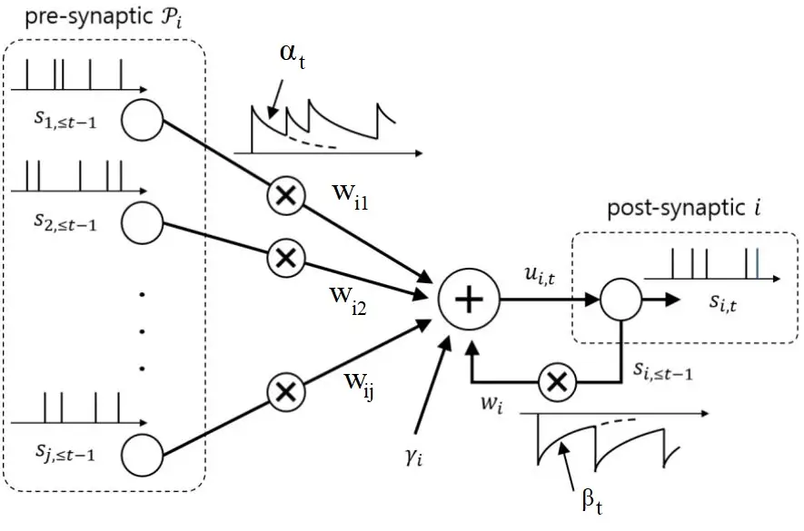

Figure 6.1: Illustration of a spiking neuron.

Let us denote as $`\mathcal{P}_{i}`$ the set of neurons that have
synapses ending at neuron $`i`$. The SRM stipulates that each such
synapse will respond with a waveform $`\alpha_{t}`$ – the impulse
response of the synapse – to each incoming spike. Mathematically, as
illustrated in Fig. 6.1, the SRM prescribes the following update to the
membrane potential of neuron $`i`$ at time $`t`$:

```math
\displaystyle u_{i,t} \displaystyle=\underbrace{{\sum_{j\in\mathcal{P}_{i}}w_{ij}\big(\alpha_{t}\ast s_{j,t}\big)}}_{\text{pre-synaptic}}+\underbrace{\big(\beta_{t}\ast s_{i,t}\big)}_{\text{post-synaptic}}, \tag{6.2}
```

where $`\ast`$ denotes the convolution operator. In this update, the
contribution of pre-synaptic neurons depends on the synaptic filter
$`\alpha_{t}`$ through a learnable synaptic weights $`w_{ij}`$.
Furthermore, the post-synaptic contribution of the spikes emitted by
neuron $`i`$ is mediated through the feedback filter $`\beta_{t}`$. The
duration of the synaptic filter $`\alpha_{t}`$ determines the memory of
the synaptic response, while the duration of the feedback filter
$`\beta_{t}`$ dictates the effective length of refractory periods.

Focusing on supervised learning, we assume that the data set encompasses
a target signal $`x_{i,t}\in\{0,1\}`$ for a subset $`\mathcal{X}`$ of
neurons. In practice, the supervisory signals may be provided
sequentially over time $`t`$, and hence training may take place online
as time index $`t`$ increases. Accordingly, the training loss can be
expressed as a sum of local losses $`\ell(x_{i,t},s_{i,t})`$ evaluated
on each neuron $`i\in\mathcal{X}`$ over time $`t=1,\ldots,T`$, for some
interval of time $`T`$, as

```math
\displaystyle\mathcal{L}(\theta)=\sum_{t=1}^{T}\sum_{i\in\mathcal{X}}\ell(x_{i,t},s_{i,t}), \tag{6.3}
```

where each loss term $`\ell(x_{i,t},s_{i,t})`$ depends on the target
output $`x_{i,t}`$ of neuron $`i`$ at time $`t`$ and on the actual
outputs $`s_{i,t}`$. Since an SNN following the SRM neuronal model can
be viewed as an recurrent neural network, the training loss (6.3) can
be, in principle, minimized via gradient descent, with the gradient
being computed via backpropagation over time.

Denoting as $`\Theta^{\prime}(\cdot)`$ the first derivative of function
$`\Theta(\cdot)`$, the general form of the partial derivative of the
loss function (6.3) with respect to a synaptic weight $`w_{ij}`$ is
given by

```math
\displaystyle\frac{\partial}{\partial w_{ij}}\mathcal{L}(\theta)=\sum_{t=1}^{T}\underbrace{e_{i,t}}_{\text{error signal}}\cdot\underbrace{\Theta^{\prime}(u_{i,t}-\vartheta)}_{\text{post}_{i,t}}\cdot\big(\underbrace{\alpha_{t}\ast s_{j,t}}_{\text{pre}_{j,t}}\big), \tag{6.4}
```

where:

- •
  $`\text{pre}_{j,t}=\alpha_{t}\ast s_{j,t}`$ is the pre-synaptic trace,
  which is large if the previous behavior of pre-synaptic neuron
  originating the synapse is consistent with synaptic receptive field of
  the synapses described by filter $`\alpha_{t}`$. For instance, if
  $`\alpha_{t}`$ decreases over time, the trace tends to large if the
  pre-synaptic neuron has spiked recently.
- •
  $`\text{post}_{i,t}=\Theta^{\prime}(u_{i,t}-\vartheta)`$ is the
  post-synaptic term, which measures the “sensitivity” to changes in the
  membrane potential of post-synaptic neuron $`i`$.
- •
  $`e_{i,t}`$ is per-neuron error signal, which is ideally evaluated via
  backpropagation through time as a function of the loss functions
  $`\{\ell(x_{k,t},s_{k,t})\}_{k\in\mathcal{X}}`$ computed by the
  neurons $`k\in\mathcal{X}`$.

Using the partial derivative (6.4), an online gradient descent rule can
be implemented over discrete time $`t`$ as

```math
w_{ij}\leftarrow w_{ij}-\eta\underbrace{e_{i,t}}_{\text{error signal}}\cdot\underbrace{\Theta^{\prime}(u_{i,t}-\vartheta)}_{\text{post}_{i,t}}\cdot\big(\underbrace{\alpha_{t}\ast s_{j,t}}_{\text{pre}_{j,t}}\big), \tag{6.5}
```

where $`\eta>0`$ is a learning rate. The synaptic update (6.5) is an
example of a three-factor update rule, whereby each synaptic weight is
modified based on local information, in the form of the pre-synaptic and
post-synaptic factors, as well as based on a per-neuron feedback signal.
Accordingly, the update (6.5) can be implemented at each synapse using
_locally_ available information, in addition to the error signal, which
requires feedback from the network, as discussed next.

Calculation of the gradient in (6.4), and hence application of the
three-factor rule (6.5), face two practical challenges:

- •
  Credit assignment: The impact of every synaptic weight propagates
  through neurons and time, and hence the calculation of the error
  signal $`e_{i,t}`$, generally requires backpropagating errors
  $`\{\ell(x_{k,t},s_{k,t})\}_{k\in\mathcal{X}}`$ across the entire
  network and over all previous time instants $`t^{\prime}<t`$. This
  problem is typically solved by approximating backpropagation through
  truncated backprop through time, possibly limited to a single time
  step, and through random feedback alignment. Random feedback alignment
  computes the errors $`e_{i,t}`$ as a random function of the loss
  values $`\{\ell(x_{k,t},s_{k,t})\}_{k\in\mathcal{X}}`$.
- •
  Non-differentiability: The activation function $`\Theta(\cdot)`$ is
  such that the derivative $`\Theta^{\prime}(\cdot)`$ is zero almost
  everywhere. To address this problem, the typical solution applies
  surrogate gradient methods, whereby the derivative
  $`\Theta^{\prime}(\cdot)`$ is replaced with the derivative of a
  differentiable surrogate function, such as sigmoid function.

We refer to \[147, 148\] for additional discussion on gradient
descent-based training of SNNs.

#### 6.1.2 Neuromorphic Computing and Meta-Learning

Research in neuroscience has revealed learning mechanisms that operate
at different time scales, with slower learning procedures targeting the
acquisition of new skills and tasks \[149\]. Through such outer, slower,
learning loops, biological brains can acquire general concepts and
methods, allowing a more efficient adaptation to specific activities or
tasks \[150, 151\]. In this process, a variety of update techniques are
at work to establish short-to-intermediate-term and long-term memory for
the acquisition of new information over time, such as long-term
potentiation, metaplasticity, and heterosynaptic plasticity. We refer to
\[152\] for an overview. Meta-learning and continual learning for SNNs
implement solutions that inspired by such mechanisms \[152, 153\]. In
particular, the three-factor rule (6.5) can be directly built on to
implement first-order meta-learning schemes such as FOMAML (see Section
2). We refer to \[154\] for details and results.

### 6.2 Quantum Computing

Conceived in $`1982`$ by physicist Paul Benioff, and named after the
subatomic physics it aims to harness, quantum computing is based on the
concept of a qubit. A qubit is a quantum-mechanical system that can
represent the classical states, $`0`$ and $`1`$ of a classical bit, as
well as any superposition of both states \[155\]. The complex amplitudes
defining a quantum state in superposition can mutually interfere, and
they can define forms of correlation across multiple qubits, referred to
as entanglement, with no classical counterpart. A quantum computer can
be understood as a physical implementation of a number of interacting
qubits with a precise control on the temporal evolution of the joint
state of the qubits. Any quantum state evolution can be approximated by
a sequence of a handful of elementary “controls”, called quantum gates,
which only act on one or two qubits at a time. As a result, a universal
quantum computer only has to perform a small set of operations on
qubits, much like classical computers are built on a limited number of
logic gates.

Examples of physical implementations of quantum computers involve the
polarizations of photons, the discrete energy levels of an ion, the
nuclear spins states of an atom, and the spin states of an electron.
Recent demonstrations of the potential of quantum computing based on
such technologies have catalysed a booming activity in the field
\[156\]. At the time of writing, quantum computers have reached beyond
the realm of a purely academic interest, and they appear to be at the
critical point of becoming widely available for the commercial and
scientific uses.

#### 6.2.1 Quantum Computing and Machine Learning

A number of elementary quantum gates can be controlled via the selection
of a vector $`\phi`$ of parameters. A quantum gate implements a linear,
unitary, transformation of a quantum state. For a parameterized quantum
gate, such unitary transformation is typically a function of rotation
angles that make up vector $`\phi`$. A sequence of parameterized and
fixed quantum gates gives rise to the workhorse of quantum machine
learning – the parametrized quantum circuit (PQC). A PQC is often
implemented using a so-called hardware-efficient ansatz (i.e., model
architecture), in which a layer of one-qubit unitary gates, parametrized
by vector $`\phi`$, is followed by a layer of fixed, entangling,
two-qubit gates.

A PQC can be used to process and output classical or quantum data.
Quantum data refers to quantum-mechanical systems encoding information
in their quantum states. Quantum data may be produced by quantum
sensors, which are emerging as important tools in various scientific
fields \[157\]. To extract classical information from a PQC, the state
of the qubit register is measured, producing classical bits.

In quantum machine learning, for both cases of classical and quantum
data, the parameters $`\phi`$ of a PQC are optimized in a data-dependent
manner via a classical optimizer that keeps the PQC in the loop as shown
in Fig. 6.2. The classical optimizer receives measurement outputs from
the PQC, and aims at updating the PQC parameters $`\phi`$ with the aim
of optimizing a data-dependent cost function. Such optimization is
typically done using standard methods like gradient descent.

The quantum machine learning architecture of Fig. 6.2 has a number of
potential advantages over the traditional approach of handcrafting
quantum algorithms assuming fault-tolerant quantum computers:

- •
  By keeping the quantum computer in the loop, the classical optimizer
  can directly account for the non-idealities and limitations of quantum
  operations via measurements of the output of the quantum computer.
- •
  If the PQC is sufficiently flexible and the classical optimizer
  sufficiently effective, the approach may automatically design
  well-performing quantum algorithms that would have been hard to
  optimize by hand via traditional formal methods.

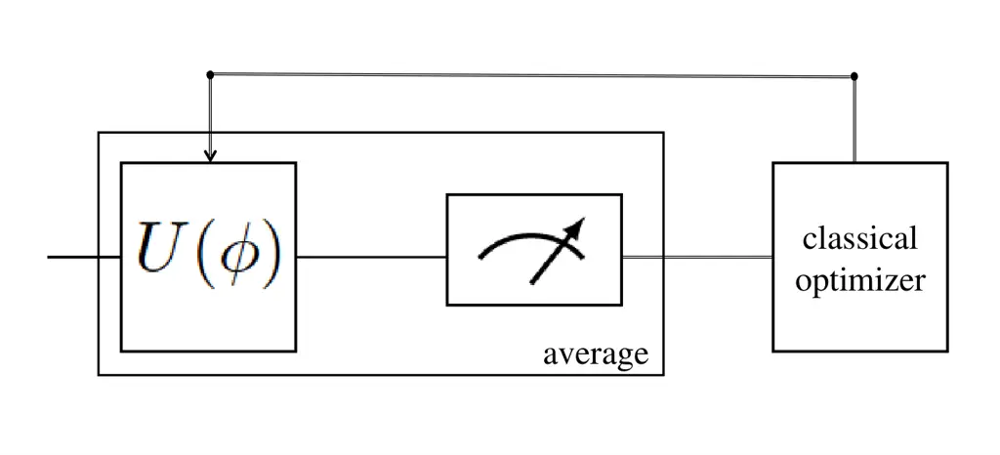

Figure 6.2: Illustration of the quantum machine learning design
methodology: A PQC with a pre-specified architecture is optimized via
its vector of parameters, $`\phi`$, by a classical optimizer based on
data and measurements of its outputs. The operation of a parametrized
quantum circuit is defined by a unitary matrix $`U(\phi)`$ dependent on
vector $`\phi`$. The block marked with a gauge sign represents quantum
measurements, which convert quantum information produced by the quantum
circuit into classical information. This conversion is inherently
random, and measurement outputs are typically averaged before being fed
to the classical optimizer.

#### 6.2.2 Quantum Machine Learning and Meta-Learning

The integration between quantum machine learning and meta-learning can
take two distinct forms, with the former supporting the latter or vice
versa.

##### Classical Meta-Learning for Quantum Machine Learning

Classical meta-learning algorithms as presented in this monograph can be
leveraged to make the optimization of the PQC parameters $`\phi`$ more
sample- or iteration-efficient. With this class of methods, the
classical optimizer in Fig. 6.2 operates at two time scales, with the
slower time scale processing data from multiple, related, meta-learning
tasks. Classical neural network architectures, such as recurrent neural
networks, can be meta-trained to produce the PQC parameters $`\phi`$ in
a more efficient manner than in the conventional case in which classical
optimization applies separately to each learning task. We refer to
\[158, 159\] for details and results.

##### Quantum Machine Learning for Classical Meta-Learning

Conversely, quantum machine learning models can be leveraged to enhance
the performance of meta-learning for classical machine learning models.
PQCs are particularly efficient as generative models that produce binary
strings with complex joint distributions as the results of measurements
at their outputs. This suggests the use of PQCs to model variational
distributions $`q(\phi)`$ in Bayesian meta-learning (see Section 2.4).

To illustrate the idea of using quantum machine learning to aid
classical meta-learning, consider the problem of training binary neural
networks parameters’ $`\phi_{k}`$ via Bayesian learning. The variational
distribution $`q(\phi_{k})`$ of the neural network’s parameters
$`\phi_{k}`$ is modelled implicitly via the output of the measurements
of a PQC. Specifically, such measurements produce random binary strings
$`\phi_{k}\in\{0,1\}^{n}`$, where $`n=|\phi_{k}|`$ denotes the total
number of model parameters. Importantly, such quantum models only
provide samples, while the actual distribution of the measurements’
outputs can only be estimated by averaging multiple measurements of the
PQC’s outputs. Therefore, PQCs model implicit distributions, and only
define a stochastic procedure that directly generates samples for the
model parameters $`\phi_{k}`$.

Training from scratch for each task is thereby inefficient in terms of
sample and iteration complexity and meta-learning alleviates these
issues of optimizing the PQC. We refer to \[160\] for details and
results.

### 6.3 Conclusions

This section has drown some connections between meta-learning and
emerging computing technologies, which may play an important role in
future machine learning systems. This is an active area of research, and
more open problems will be reviewed in the next section.

## Chapter 7 Outlook

This monograph has provided an introduction to meta-learning by
surveying methods, theory, and application. The topic of meta-learning
is currently the subject of intense research in different disciplines,
including information theory, machine learning, hardware design, and
neuroscience. In this final section, we provide an outlook of directions
for research that have not been covered in the text and appear to be
particularly promising and challenging at the time of writing. We
specifically focus on aspects of interest for researchers in signal
precessing.

### 7.1 Methods

In this subsection, we highlight research topics concerning the
development of meta-learning methods.

#### 7.1.1 Continual (Online) Meta-Learning

The conventional formulation of meta-learning studied in this monograph
assumes the availability of meta-training data set collected offline
from $`K`$ learning tasks, which is denoted as
$`\mathcal{D}^{\text{mtr}}=\{(\mathcal{D}_{k}^{\text{tr}},\mathcal{D}_{k}^{\text{te}})_{k=1}^{K}\}`$.
As we have seen in Section 4.2, the number of tasks $`K`$ plays an
important role in ensuring successful generalization to new tasks,
avoiding meta-overfitting. The meta-training data set may be, for
instance, collected by acquiring data sets for similar tasks from
existing repositories; or by storing data gathered during previous
interactions with similar learning environments. In the latter case, it
is natural to consider settings in which the meta-training dataset is
built in an _online_ fashion by accumulating data observed over time,
and updating accordingly the hyperparameter $`\theta`$. This formulation
is known as continual, or online meta-learning \[161\] (see also \[1\]).
Online meta-learning plays an important role also in models for
computational intelligence \[162\].

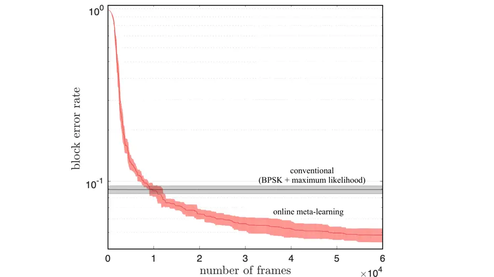

Figure 7.1: Meta-learning for encoding and decoding without channel
simulator: BLER as a function of the number of frames used during online
meta-training phase ($`8`$ bits, $`8`$ complex channel uses; Rayleigh
block fading channel with $`3`$ taps, $`256`$ messages per frame with
$`8`$ pilot messages under a 10 dB SNR, adapted from \[163\]).

As an application of continual meta-learning, consider the problem of
adapting a demodulator to changing channel conditions. While the setting
studied in Section 5.2 assumed the offline availability of a
meta-training data set collected from a number of devices, a continual
meta-learning formulation would operate in a streaming fashion.
Accordingly, as data from more devices are collected, the hyperparameter
$`\theta`$ is updated to better prepare the learning algorithm to adapt
to new channel conditions. This particular application is studied in
\[109\].

When both encoder and decoder are updated in an online manner,
revisiting the previous channel conditions is not feasible, and
reference \[163\] proposed to continually update the meta-learned model
at the receiver by applying the meta-gradient obtained from the current
channel condition to the current hyperparameter vectors. Referring to
\[163\] for details, Fig. 7.1 and 7.2 illustrate the performance of the
approach over channel conditions defined by an autoregressive Rayleigh
fading process with temporal correlation factor $`\rho`$ \[163\]. Fig.
7.1 gauges how many frames are needed for online meta-learning to
successfully find a useful hyperparameter vector from the previous
(meta-training) frames. In a manner similar to the discussions for
offline meta-learning in Fig. 5.4 and Fig. 5.3, Fig. 7.1 shows that a
sufficiently large number of frames are needed for a successful transfer
of knowledge via meta-learning that ensures a performance gain with
respect to a conventional per-frame solution. The impact of the channel
correlation $`\rho`$ is analyzed in Fig. 7.2, which shows that
meta-learning benefits from a smaller $`\rho`$. In fact, a large
$`\rho`$ may cause meta-overfitting (see Section 4.2) due to the
similarity of the channels observed during meta-training.

Figure 7.2: Meta-learning for encoding and decoding without channel
simulator: BLER as a function of the correlation coefficient $`\rho`$ of
the time-varying channel model ($`8`$ bits, $`8`$ complex channel uses;
Rayleigh block fading channel with $`3`$ taps, $`256`$ messages per
frame with $`8`$ pilot messages under a 10 dB SNR, adapted from
\[163\]).

#### 7.1.2 Meta-Learning for Reinforcement Learning

This monograph has focused on supervised and unsupervised learning
problems. In such settings, the data sets are fixed. In contrast, in
reinforcement learning (RL) data is collected through the interaction of
the agent with the learning environment defining the given task.
Meta-learning can be applied to RL problems with the goal of minimizing
the duration of the interactions with new tasks that are required to
obtain desirable performance levels \[6, 164, 165, 166, 167\].

Continual meta-learning, as introduced in the previous subsection, can
also be applied to RL. A key difference with respect to continual
meta-learning for supervised or unsupervised learning is that it may be
impossible to interact with previous tasks. This makes it impossible to
evaluate the performance of new policies on previous tasks. For such
practical scenarios, various techniques have been proposed, including
model-based RL \[168, 165, 169\], off-policy RL \[170, 166, 169\], and
behavior cloning \[171, 167\].

As an example, unlike Section 5.3, which assumed knowledge of the
channel model $`p_{h}(y|x)`$, RL-based solutions can optimize a
transceiver through the direct interactions with the channel, assuming
the presence of a feedback link from receiver to transmitter \[172\].

As another application, consider the unmanned aerial base station (UABS)
that provides radio coverage in vehicular networks \[173\]. Depending on
a particular traffic pattern of the vehicles, an optimal trajectory of
UABS can be found via RL \[174\]. However, such solutions may need
retraining when the traffic pattern changes. In order to enable UABS to
quickly adapt to new traffic patterns, the work \[138\] developed a
meta-learning solution for RL that does not require revisiting the
previous environments.

#### 7.1.3 Active Meta-Learning

In the meta-learning formulations discussed so far, the meta-learning
tasks are selected by “nature”. This prevents the meta-learner from
actively selecting tasks that are more informative about possible new
tasks given what the meta-learner already knows. The active, sequential,
selection of tasks is referred to as active meta-learning, and is
currently an understudied area of research \[175, 176\].

As an example, consider again the demodulation with few pilots studied
in Section 5.2. Active meta-learning may help the designer reduce the
number of required meta-training devices as in \[112\].

#### 7.1.4 Optimization for Overparameterized Meta-Learning

When applied to deep learning models, meta-learning typically operates
in the overparameterized regime, in which the number of the model
parameters exceeds the amount of training data available. For example,
ResNets-based MAML models have around 6 million parameters, but are
trained on around 2 million meta-training samples \[177\].

When the meta-learning problem is overparameterized, the lower-level
bilevel problem (3.1b) studied in Section 3 may not be _strongly_
convex, and thus the lower-level problem has multiple solutions
$`\{\phi^{*}(\theta)\}`$ given the hyperparameter vector $`\theta`$.
This is problematic because the Hessian of the lower-level problem
$`\nabla_{\phi\phi}^{2}g\big(\theta,\phi\big)`$ may be not invertible,
and thus the Hessian inverse used in the hyper-gradient (3.6) may not
exist. Therefore, the alternating stochastic gradient-based ALSET method
presented in Section 3 may not be theoretically justifiable in this
case.

To handle cases in which the lower-level problem has many solutions, two
possible methods may be used. One is the optimistic solution that
chooses a solution $`\phi^{*}(\theta)`$ by minimizing the upper-level
objective (e.g., \[178\]), that is

```math
\displaystyle\min_{\theta\in\mathbb{R}^{d},\phi^{*}(\theta)\in\mathbb{R}^{\hat{d}}} \displaystyle\penalty\ \penalty\ \penalty\ {\cal L}(\theta):=\mathbb{E}_{\xi}\left[f\left(\theta,\phi^{*}(\theta);\xi\right)\right]\penalty\ \penalty\ \penalty\ \penalty\ \penalty\ \penalty\ \penalty\ \penalty\ \penalty\ \penalty\ \penalty\ {\rm\sf(upper)} \tag{7.1a}
```

```math
\displaystyle{\rm s.t.}\penalty\ \penalty\ \penalty\  \displaystyle\phi^{*}(\theta)\in\argmin_{\phi\in\mathbb{R}^{\hat{d}}}\penalty\ \mathbb{E}_{\hat{\xi}}[g(\theta,\phi;\hat{\xi})]\penalty\ \penalty\ \penalty\ \penalty\ \penalty\ \penalty\ \penalty\ \penalty\ \penalty\ \penalty\ {\rm\sf(lower)}; \tag{7.1b}
```

and the other is the pessimistic solution that chooses a solution
$`\phi^{*}(\theta)`$ by maximizing the upper-level objective (e.g.,
\[179\]), that is

```math
\displaystyle\min_{\theta\in\mathbb{R}^{d}}\max_{\phi^{*}(\theta)\in\mathbb{R}^{\hat{d}}}\penalty\ \penalty\ \penalty\ {\cal L}(\theta):=\mathbb{E}_{\xi}\left[f\left(\theta,\phi^{*}(\theta);\xi\right)\right]\penalty\ \penalty\ \penalty\ \penalty\ \penalty\ \penalty\ \penalty\ \penalty\ {\rm\sf(upper)} \tag{7.2a}
```

```math
\displaystyle\penalty\ {\rm s.t.}\penalty\ \penalty\ \penalty\ \phi^{*}(\theta)\in\argmin_{\phi\in\mathbb{R}^{\hat{d}}}\penalty\ \mathbb{E}_{\hat{\xi}}[g(\theta,\phi;\hat{\xi})]\penalty\ \penalty\ \penalty\ \penalty\ \penalty\ \penalty\ \penalty\ \penalty\ \penalty\ \penalty\ \penalty\ \penalty\ \penalty\ \penalty\ \penalty\ \penalty\ {\rm\sf(lower)}. \tag{7.2b}
```

The aforementioned bilevel optimization problems are much more
challenging than those discussed in Section 3, and their non-asymptotic
analyses are relatively less explored \[180, 181, 182, 183, 184, 185\].

### 7.2 Theory

We now turn to some open theoretical aspects of meta-learning.

#### 7.2.1 Benign Overfitting for Overparameterized Meta-Learning

Statistical learning theory results derived using the standard
techniques summarized in Section 4 suggest that overparameterized models
tend to overfit \[186\]. Translating this insight into the meta-learning
setting, one expects that, given the meta-training datasets
$`\{\mathcal{D}_{k}^{\text{tr}}\}_{k=1}^{K}`$, if the model size grows
large, the meta-generalization error $`\Delta\mathcal{L}(\theta)`$
defined in (4.23) also grows. However, empirical evidence reveals that
overparameterized meta-learning methods still work well \[177\] – a
phenomenon often called “benign overfitting.”

While generalization bounds for overparameterized models have been
recently studied in the conventional learning setting \[187, 188, 189,
190\], their counterparts for meta-learning are under-explored. The
generalization performance under an overparameterized linear regression
model has been studied in \[191, 192\], and it would be interesting to
extend the analysis in \[191, 192\] to nonlinear models by means of
random features and neural tangent kernels. It is also interesting to
investigate the implicit regularization effect \[193, 194\] of
meta-learning algorithms in overparameterized settings.

#### 7.2.2 Epistemic Uncertainty of Bayesian Meta-Learning Under Model Misspecification

The information-theoretic analysis of epistemic uncertainty for Bayesian
meta-learning presented in Section 4 relies on two crucial assumptions:
$`(a)`$ the model is well-specified, and $`(b)`$ the exact
meta-posterior distribution can be computed. However, neither of these
assumptions seldom hold in practice. The true data distribution
underlying the standard available data sets is not known in general, and
Bayesian algorithms can only obtain approximate posterior distributions.
Note that, in contrast, the PAC-Bayes bounds, presented in Section 4.4,
account for these practical considerations.

Characterizing the epistemic uncertainty when either of the above two
assumptions is violated is an interesting open problem \[195\]. For
conventional learning, the recent work \[196\] explores this direction
by combining the frequentist PAC-Bayesian generalization analysis with
the Bayesian minimum excess risk analysis. Extensions to meta-learning
offer an interesting line of future research.

### 7.3 Applications

We finally highlight an interesting research direction pertaining the
application of meta-learning to communication systems. Also note that
there are also many open problems at the intersection of meta-learning
and emerging computing technologies as discussed in Section 6.

As discussed in Section 5, communication systems have been traditionally
designed based on carefully designed models. Such models, even when
inaccurate, may help define strong inductive biases that can be
incorporated within data-driven approaches. For instance, the Viterbi
algorithm \[197\] is known to achieve the minimum BLER on known
frequency-selective channels. When the channel is not known, the
computation of branch metrics in the Viterbi algorithm can be designed
in a data-driven fashion to mitigate the model deficit \[198\].

Model-based learning solutions have been reported to outperform both the
conventional model-based algorithms and conventional black-box learning
approaches \[198, 199\]. Model-based meta-learning can further speed up
model-based learning \[110\]. As an example, hypernetwork-based
solutions (see Section 2) have been introduced for Kalman filter design
\[139\], MIMO detection \[135\], and massive MIMO feedback \[200\] to
aid model-based algorithms.

###### Acknowledgements.

The work of Sharu Jose, Ivana Nikoloska, Sangwoo Park, and Osvaldo
Simeone was supported by the European Research Council (ERC) under the
European Union’s Horizon 2020 Research and Innovation Program (Grant
Agreement No. 725731). The work of Lisha Chen and Tianyi Chen was
partially supported by National Science Foundation (NSF) CAREER Award
2047177, NSF MoDL-SCALE Grant 2134168 and the Rensselaer-IBM AI Research
Collaboration ([http://airc.rpi.edu](http://airc.rpi.edu)), part of the
IBM AI Horizons Network.

## References

- \[1\] Osvaldo Simeone “Machine Learning for Engineers” Cambridge
  University Press, 2022
- \[2\] Timothy Hospedales, Antreas Antoniou, Paul Micaelli and Amos
  Storkey “Meta-Learning in Neural Networks: A Survey” In _IEEE
  Transactions on Pattern Analysis and Machine Intelligence_, 2020
- \[3\] Oriol Vinyals, Charles Blundell, Timothy Lillicrap and Daan
  Wierstra “Matching networks for one shot learning” In _Proc. Advances
  in Neural Information Processing Systems_ 29, 2016, pp. 3630–3638
- \[4\] Jake Snell, Kevin Swersky and Richard Zemel “Prototypical
  networks for few-shot learning” In _Proc. Advances in Neural
  Information Processing Systems_, 2017, pp. 4080–4090
- \[5\] Flood Sung et al. “Learning to compare: Relation network for
  few-shot learning” In _Proc. Conference on Computer Vision and Pattern
  Recognition_, 2018, pp. 1199–1208
- \[6\] Chelsea Finn, Pieter Abbeel and Sergey Levine “Model-Agnostic
  Meta-Learning for Fast Adaptation of Deep Networks” In _Proc. Intl.
  Conf. on Machine Learning_, 2017
- \[7\] Aravind Rajeswaran, Chelsea Finn, Sham Kakade and Sergey Levine
  “Meta-learning with implicit gradients” In _Proc. Advances in Neural
  Information Processing Systems_, 2019
- \[8\] Dougal Maclaurin, David Duvenaud and Ryan Adams “Gradient-based
  Hyperparameter Optimization through Reversible Learning” In _Proc.
  Intl. Conf. on Machine Learning_ 37, 2015, pp. 2113–2122
- \[9\] J. Schmidhuber “A neural network that embeds its own
  meta-levels” In _Proc. IEEE Intl. Conf. on Neural Networks_, 1993, pp.
  407–412 vol.1
- \[10\] Sepp Hochreiter, A Younger and Peter Conwell “Learning to learn
  using gradient descent” In _Proc. Intl. Conf. on Artificial Neural
  Networks_, 2001, pp. 87–94
- \[11\] Nikhil Mishra, Mostafa Rohaninejad, Xi Chen and Pieter Abbeel
  “A Simple Neural Attentive Meta-Learner” In _Proc. Intl. Conf. on
  Learning Representations_, 2018
- \[12\] Siyuan Qiao, Chenxi Liu, Wei Shen and Alan Yuille “Few-shot
  image recognition by predicting parameters from activations” In _Proc.
  Conference on Computer Vision and Pattern Recognition_, 2018, pp.
  7229–7238
- \[13\] Spyros Gidaris and Nikos Komodakis “Dynamic few-shot visual
  learning without forgetting” In _Proc. Conference on Computer Vision
  and Pattern Recognition_, 2018
- \[14\] Erin Grant et al. “Recasting Gradient-Based Meta-Learning as
  Hierarchical Bayes” In _Proc. Intl. Conf. on Learning
  Representations_, 2018
- \[15\] Jaesik Yoon et al. “Bayesian Model-Agnostic Meta-Learning” In
  _Proc. Advances in Neural Information Processing Systems_, 2018
- \[16\] Cuong Nguyen, Thanh-Toan Do and Gustavo Carneiro “Uncertainty
  in model-agnostic meta-learning using variational inference” In _Proc.
  Winter Conference on Applications of Computer Vision_, 2020, pp.
  3090–3100
- \[17\] Alireza Fallah, Aryan Mokhtari and Asuman Ozdaglar “On the
  convergence theory of gradient-based model-agnostic meta-learning
  algorithms” In _Proc. Intl. Conf. on Artificial Intelligence and
  Statistics_, 2020, pp. 1082–1092
- \[18\] Tianyi Chen, Yuejiao Sun and Wotao Yin “Solving stochastic
  compositional optimization is nearly as easy as solving stochastic
  optimization” In _IEEE Transactions on Signal Processing_ 69, 2021,
  pp. 4937–4948
- \[19\] Pan Zhou et al. “Efficient Meta Learning via Minibatch Proximal
  Update” In _Proc. Advances in Neural Information Processing Systems_,
  2019
- \[20\] Giulia Denevi, Carlo Ciliberto, Dimitris Stamos and
  Massimiliano Pontil “Learning to learn around a common mean” In _Proc.
  Advances in Neural Information Processing Systems_ 31, 2018
- \[21\] Yu Bai et al. “How Important is the Train-Validation Split in
  Meta-Learning?” In _Proc. Intl. Conf. on Machine Learning_, 2021, pp.
  543–553
- \[22\] Lisha Chen and Tianyi Chen “Is Bayesian Model-Agnostic Meta
  Learning Better than Model-Agnostic Meta Learning, Provably?” In
  _Proc. Intl. Conf. on Artificial Intelligence and Statistics_, 2022,
  pp. 1733–1774
- \[23\] Momin Abbas et al. “Sharp-MAML: Sharpness-Aware Model-Agnostic
  Meta Learning” In _Proc. Intl. Conf. on Machine Learning_, 2022
- \[24\] Pierre Foret, Ariel Kleiner, Hossein Mobahi and Behnam
  Neyshabur “Sharpness-aware Minimization for Efficiently Improving
  Generalization” In _Proc. Intl. Conf. on Learning Representations_,
  2020
- \[25\] Alex Nichol and John Schulman “Reptile: a scalable meta
  learning algorithm” In _arXiv preprint arXiv: 1803.02999_, 2018
- \[26\] Xingyou Song et al. “ES-MAML: Simple Hessian-Free Meta
  Learning” In _Proc. Intl. Conf. on Learning Representations_, 2019
- \[27\] H.G. Beyer and HP. Schwefel “Evolution strategies - A
  comprehensive introduction” In _Natural Computing_ 1.1, 2002, pp. 3–52
- \[28\] Brendan McMahan et al. “Communication-efficient learning of
  deep networks from decentralized data” In _Proc. Intl. Conf. on
  Artificial Intelligence and Statistics_, 2017, pp. 1273–1282
- \[29\] Matteo Zecchin et al. “Robust Bayesian Learning for Reliable
  Wireless AI: Framework and Applications” In _arXiv preprint arXiv:
  2207.00300_, 2022
- \[30\] Zhenyi Wang et al. “Bayesian Meta Sampling for Fast Uncertainty
  Adaptation” In _Proc. Intl. Conf. on Learning Representations_, 2020
- \[31\] Christophe Andrieu, Nando De, Arnaud Doucet and Michael Jordan
  “An introduction to MCMC for machine learning” In _Machine learning_
  50.1 Springer, 2003, pp. 5–43
- \[32\] Christopher Bishop and Nasser Nasrabadi “Pattern recognition
  and machine learning” Springer, 2006
- \[33\] Chelsea Finn, Kelvin Xu and Sergey Levine “Probabilistic
  Model-Agnostic Meta-Learning” In _Proc. Advances in Neural Information
  Processing Systems_, 2018
- \[34\] Sachin Ravi and Alex Beatson “Amortized Bayesian Meta-Learning”
  In _Proc. Intl. Conf. on Learning Representations_, 2019
- \[35\] Qiang Liu and Dilin Wang “Stein variational gradient descent: A
  general purpose bayesian inference algorithm” In _Proc. Advances in
  Neural Information Processing Systems_, 2016
- \[36\] Luisa Zintgraf et al. “Fast context adaptation via
  meta-learning” In _Proc. Intl. Conf. on Machine Learning_, 2019, pp.
  7693–7702
- \[37\] Alex Nichol, Joshua Achiam and John Schulman “On first-order
  meta-learning algorithms” In _arXiv preprint arXiv: 1803.02999_, 2018
- \[38\] Mingzhang Yin et al. “Meta-learning without memorization” In
  _Proc. Intl. Conf. on Learning Representations_, 2020
- \[39\] Ferran Alet, Tomás Lozano-Pérez and Leslie Kaelbling “Modular
  meta-learning” In _Proc. Conference on Robot Learning_, 2018, pp.
  856–868
- \[40\] Ferran Alet, Erica Weng, Tomás Lozano-Pérez and Leslie
  Kaelbling “Neural relational inference with fast modular
  meta-learning” In _Proc. Advances in Neural Information Processing
  Systems_ 32, 2019
- \[41\] Ivana Nikoloska and Osvaldo Simeone “Modular meta-learning for
  power control via random edge graph neural networks” In _IEEE
  Transactions on Wireless Communications_ IEEE, 2022
- \[42\] Herbert Robbins and Sutton Monro “A stochastic approximation
  method” In _Annals of Mathematical Statistics_ 22.3, 1951, pp. 400–407
- \[43\] Heinrich Stackelberg “The Theory of Market Economy” Oxford
  University Press, 1952
- \[44\] Wikipedia “Heinrich Freiherr von Stackelberg”, 2013 URL:
  [https://en.wikipedia.org/wiki/Heinrich_Freiherr_von_Stackelberg](https://en.wikipedia.org/wiki/Heinrich_Freiherr_von_Stackelberg)
- \[45\] Jerome Bracken and James McGill “Mathematical programs with
  optimization problems in the constraints” In _Operations Research_
  21.1, 1973, pp. 37–44
- \[46\] Jonathan Bard “Practical bilevel optimization: algorithms and
  applications” Springer Science & Business Media, 2013
- \[47\] Stephan Dempe, Vyacheslav Kalashnikov, Gerardo Perez-Valdes and
  Nataliya Kalashnykova “Bilevel Programming Problems: Theory,
  Algorithms and Applications to Energy Networks” Berlin, Germany:
  Springer, 2015
- \[48\] Jane Ye and Daoli Zhu “Optimality conditions for bilevel
  programming problems” In _Optimization_ 33.1, 1995, pp. 9–27
- \[49\] Benoı̂t Colson, Patrice Marcotte and Gilles Savard “An overview
  of bilevel optimization” In _Annals of operations research_ 153.1,
  2007, pp. 235–256
- \[50\] Alexander Shapiro, Darinka Dentcheva and Andrzej Ruszczyński
  “Lectures on Stochastic Programming: Modeling and Theory”
  Philadelphia, PA: SIAM, 2009
- \[51\] Luis Vicente and Paul Calamai “Bilevel and multilevel
  programming: A bibliography review” In _Journal of Global
  optimization_ 5.3, 1994, pp. 291–306
- \[52\] Vijaymohan Konda and Vivek Borkar “Actor-Critic-Type Learning
  Algorithms for Markov Decision Processes” In _SIAM Journal on Control
  and Optimization_ 38.1, 1999, pp. 94–123
- \[53\] Zalán Borsos, Mojmir Mutny and Andreas Krause “Coresets via
  Bilevel Optimization for Continual Learning and Streaming” In _Proc.
  Advances in Neural Information Processing Systems_, 2020
- \[54\] Karl Kunisch and Thomas Pock “A bilevel optimization approach
  for parameter learning in variational models” In _SIAM Journal on
  Imaging Sciences_ 6.2, 2013, pp. 938–983
- \[55\] Gautam Kunapuli, Kristin Bennett, Jing Hu and Jong-Shi Pang
  “Classification model selection via bilevel programming” In
  _Optimization Methods & Software_ 23.4, 2008, pp. 475–489
- \[56\] Zhi-Quan Luo, Jong-Shi Pang and Daniel Ralph “Mathematical
  Programs with Equilibrium Constraints” Cambridge University Press,
  1996
- \[57\] Fabian Pedregosa “Hyperparameter optimization with approximate
  gradient” In _Proc. Intl. Conf. on Machine Learning_, 2016, pp.
  737–746
- \[58\] Shoham Sabach and Shimrit Shtern “A first order method for
  solving convex bilevel optimization problems” In _SIAM Journal on
  Optimization_ 27.2, 2017, pp. 640–660
- \[59\] Luca Franceschi et al. “Bilevel Programming for Hyperparameter
  Optimization and Meta-Learning” In _Proc. Intl. Conf. on Machine
  Learning_, 2018, pp. 1568–1577
- \[60\] Amirreza Shaban, Ching-An Cheng, Nathan Hatch and Byron Boots
  “Truncated Back-propagation for Bilevel Optimization” In _Proc. Intl.
  Conf. on Artificial Intelligence and Statistics_, 2019, pp. 1723–1732
- \[61\] Riccardo Grazzi, Luca Franceschi, Massimiliano Pontil and
  Saverio Salzo “On the iteration complexity of hypergradient
  computation” In _Proc. Intl. Conf. on Machine Learning_, 2020, pp.
  3748–3758
- \[62\] Saeed Ghadimi and Mengdi Wang “Approximation Methods for
  Bilevel Programming” In _arXiv preprint arXiv: 1802.02246_, 2018
- \[63\] M. Hong, H.-T. Wai, Z. Wang and Z. Yang “A Two-Timescale
  Framework for Bilevel Optimization: Complexity Analysis and
  Application to Actor-Critic” In _arXiv preprint:2007.05170_, 2020
- \[64\] Kaiyi Ji, Junjie Yang and Yingbin Liang “Provably Faster
  Algorithms for Bilevel Optimization and Applications to Meta-Learning”
  In _Proc. Intl. Conf. on Machine Learning_, 2021
- \[65\] Tianyi Chen, Yuejiao Sun, Quan Xiao and Wotao Yin “A
  Single-Timescale Method for Stochastic Bilevel Optimization” In _Proc.
  Intl. Conf. on Artificial Intelligence and Statistics_ 151, 2022, pp.
  2466–2488
- \[66\] Prashant Khanduri et al. “A Momentum-Assisted Single-Timescale
  Stochastic Approximation Algorithm for Bilevel Optimization” In _Proc.
  Advances in Neural Information Processing Systems_, 2021
- \[67\] Zhishuai Guo and Tianbao Yang “Randomized Stochastic
  Variance-Reduced Methods for Stochastic Bilevel Optimization” In
  _arXiv preprint: 2105.02266_, 2021
- \[68\] Junjie Yang, Kaiyi Ji and Yingbin Liang “Provably Faster
  Algorithms for Bilevel Optimization” In _Advances in Neural
  Information Processing Systems_ 34, 2021, pp. 13670–13682
- \[69\] Stephan Dempe and Alain Zemkoho “Bilevel Optimization”
  Springer, 2020
- \[70\] Risheng Liu et al. “Investigating bi-level optimization for
  learning and vision from a unified perspective: A survey and beyond”
  In _IEEE Transactions on Pattern Analysis and Machine Intelligence_,
  2021
- \[71\] Kaiyi Ji, Junjie Yang and Yingbin Liang “Multi-Step
  Model-Agnostic Meta-Learning: Convergence and Improved Algorithms” In
  _arXiv preprint arXiv: 2002.07836_, 2020
- \[72\] Yifan Hu, Siqi Zhang, Xin Chen and Niao He “Biased stochastic
  first-order methods for conditional stochastic optimization and
  applications in meta learning” In _Proc. Advances in Neural
  Information Processing Systems_, 2020, pp. 2759–2770
- \[73\] Kaiyi Ji, Junjie Yang and Yingbin Liang “Theoretical
  Convergence of Multi-Step Model-Agnostic Meta-Learning.” In _Journal
  of Machine Learning Research_ 23, 2022, pp. 29–1
- \[74\] Feihu Huang and Heng Huang “Biadam: Fast adaptive bilevel
  optimization methods” In _arXiv preprint:2106.11396_, 2021
- \[75\] Luca Franceschi, Michele Donini, Paolo Frasconi and
  Massimiliano Pontil “Forward and reverse gradient-based hyperparameter
  optimization” In _Proc. Intl. Conf. on Machine Learning_, 2017, pp.
  1165–1173
- \[76\] T. Chen, Y. Sun and W. Yin “Closing the Gap: Tighter Analysis
  of Alternating Stochastic Gradient Methods for Bilevel Problems” In
  _Proc. Advances in Neural Information Processing Systems_ 34, 2021
- \[77\] Saeed Ghadimi and Guanghui Lan “Stochastic first-and
  zeroth-order methods for nonconvex stochastic programming” In _SIAM
  Journal on Optimization_ 23.4, 2013, pp. 2341–2368
- \[78\] Han Shen and Tianyi Chen “A Single-Timescale Analysis For
  Stochastic Approximation With Multiple Coupled Sequences” In _Proc.
  Advances in Neural Information Processing Systems_, 2022
- \[79\] Junyi Li, Bin Gu and Heng Huang “A fully single loop algorithm
  for bilevel optimization without hessian inverse” In _Proc.
  Association for the Advancement of Artificial Intelligence_, 2022, pp.
  7426–7434
- \[80\] Davoud Tarzanagh and Laura Balzano “Online Bilevel
  Optimization: Regret Analysis of Online Alternating Gradient Methods”
  In _arXiv preprint:2207.02829_, 2022
- \[81\] Anselm Blumer, Andrzej Ehrenfeucht, David Haussler and Manfred
  Warmuth “Learnability and the Vapnik-Chervonenkis dimension” In
  _Journal of the ACM_ 36.4 ACM New York, NY, USA, 1989, pp. 929–965
- \[82\] Olivier Bousquet “New approaches to statistical learning
  theory” In _Annals of the Institute of Statistical Mathematics_ 55.2
  Springer, 2003, pp. 371–389
- \[83\] Pierre Alquier “User-friendly introduction to PAC-Bayes bounds”
  In _arXiv preprint arXiv: 2110.11216_, 2021
- \[84\] Osvaldo Simeone, Sangwoo Park and Joonhyuk Kang “From learning
  to meta-learning: Reduced training overhead and complexity for
  communication systems” In _6G Wireless Summit_, 2020, pp. 1–5
- \[85\] Maxim Rabinovich, Elaine Angelino and Michael Jordan
  “Variational consensus monte carlo” In _Proc. Advances in Neural
  Information Processing Systems_ 28, 2015
- \[86\] Aolin Xu and Maxim Raginsky “Information-theoretic analysis of
  generalization capability of learning algorithms” In _Proc. Advances
  in Neural Information Processing Systems_, 2017
- \[87\] Sharu Jose and Osvaldo Simeone “Free energy minimization: A
  unified framework for modeling, inference, learning, and optimization”
  In _IEEE Signal Processing Magazine_ 38.2 IEEE, 2021, pp. 120–125
- \[88\] Tong Zhang “Information-theoretic upper and lower bounds for
  statistical estimation” In _IEEE Transactions on Information Theory_
  52.4 IEEE, 2006, pp. 1307–1321
- \[89\] Ben Poole et al. “On variational bounds of mutual information”
  In _Proc. Intl. Conf. on Machine Learning_, 2019, pp. 5171–5180
- \[90\] Jeremias Knoblauch, Jack Jewson and Theodoros Damoulas
  “Generalized variational inference: Three arguments for deriving new
  posteriors” In _arXiv preprint arXiv: 1904.02063_, 2019
- \[91\] Jonathan Baxter “Theoretical models of learning to learn” In
  _Learning to learn_ Springer, 1998, pp. 71–94
- \[92\] Sharu Jose and Osvaldo Simeone “Information-theoretic
  generalization bounds for meta-learning and applications” In _Entropy_
  MDPI, 2021
- \[93\] Sharu Jose and Osvaldo Simeone “An information-theoretic
  analysis of the impact of task similarity on meta-learning” In _Proc.
  IEEE International Symposium on Information Theory_, 2021, pp.
  1534–1539
- \[94\] Thomas Cover “Elements of information theory” John Wiley &
  Sons, 1999
- \[95\] Sharu Jose, Osvaldo Simeone and Giuseppe Durisi “Transfer
  meta-learning: Information-theoretic bounds and information meta-risk
  minimization” In _IEEE Transactions on Information Theory_ 68.1 IEEE,
  2021, pp. 474–501
- \[96\] Andres Masegosa “Learning under model misspecification:
  Applications to variational and ensemble methods” In _Proc. Advances
  in Neural Information Processing Systems_ 33, 2020, pp. 5479–5491
- \[97\] Sharu Jose, Sangwoo Park and Osvaldo Simeone
  “Information-Theoretic Analysis of Epistemic Uncertainty in Bayesian
  Meta-learning” In _Proc. Intl. Conf. on Artificial Intelligence and
  Statistics_, 2022, pp. 9758–9775
- \[98\] Weihao Kong et al. “Meta-learning for mixed linear regression”
  In _Proc. Intl. Conf. on Machine Learning_, 2020, pp. 5394–5404
- \[99\] Katelyn Gao and Ozan Sener “Modeling and Optimization Trade-off
  in Meta-learning” In _Proc. Advances in Neural Information Processing
  Systems_ 33, 2020
- \[100\] Liam Collins, Aryan Mokhtari and Sanjay Shakkottai “Why does
  MAML outperform ERM? An optimization perspective” In _arXiv preprint:
  2010.14672_, 2020
- \[101\] Kurtland Chua, Qi Lei and Jason Lee “How fine-tuning allows
  for effective meta-learning” In _Proc. Advances in Neural Information
  Processing Systems_ 34, 2021
- \[102\] Simon Du et al. “Few-Shot Learning via Learning the
  Representation, Provably” In _Intl. Conf. on Learning
  Representations_, 2020
- \[103\] Yu Bai et al. “How Important is the Train-Validation Split in
  Meta-Learning?” In _Proc. Intl. Conf. on Machine Learning_, 2021, pp.
  543–553
- \[104\] Osvaldo Simeone “A very brief introduction to machine learning
  with applications to communication systems” In _IEEE Transactions on
  Cognitive Communications and Networking_ 4.4 IEEE, 2018, pp. 648–664
- \[105\] Leonardo Bonati et al. “Intelligence and learning in O-RAN for
  data-driven NextG cellular networks” In _IEEE Communications Magazine_
  59.10 IEEE, 2021, pp. 21–27
- \[106\] Junjuan Xia, Dan Deng and David Fan “A note on implementation
  methodologies of deep learning-based signal detection for conventional
  MIMO transmitters” In _IEEE Transactions on Broadcasting_ 66.3 IEEE,
  2020, pp. 744–745
- \[107\] Eirina Bourtsoulatze, David Kurka and Deniz Gündüz “Deep joint
  source-channel coding for wireless image transmission” In _IEEE
  Transactions on Cognitive Communications and Networking_ 5.3 IEEE,
  2019, pp. 567–579
- \[108\] Deepaknath Tandur and Marc Moonen “Joint adaptive compensation
  of transmitter and receiver IQ imbalance under carrier frequency
  offset in OFDM-based systems” In _IEEE Transactions on Signal
  Processing_ 55.11 IEEE, 2007, pp. 5246–5252
- \[109\] Sangwoo Park, Hyeryung Jang, Osvaldo Simeone and Joonhyuk Kang
  “Learning to demodulate from few pilots via offline and online
  meta-learning” In _IEEE Transactions on Signal Processing_ 69 IEEE,
  2020, pp. 226–239
- \[110\] Tomer Raviv et al. “Online Meta-Learning For Hybrid
  Model-Based Deep Receivers” In _arXiv preprint arXiv: 2203.14359_,
  2022
- \[111\] Nir Shlezinger, Yonina Eldar and Stephen Boyd “Model-Based
  Deep Learning: On the Intersection of Deep Learning and Optimization”
  In _Proceedings of the National Academy of Sciences of the United
  States of America_, 2022
- \[112\] Kfir. Cohen, Sangwoo Park, Osvaldo Simeone and Shlomo Shamai
  “Towards Reliable and Efficient AI for 6G: Bayesian Active
  Meta-Learning for Few Pilot Demodulation and Equalization” In _arXiv
  preprint arXiv: 2108.00785_, 2021
- \[113\] Chuan Guo, Geoff Pleiss, Yu Sun and Kilian Weinberger “On
  calibration of modern neural networks” In _Proc. Intl. Conf. on
  Machine Learning_, 2017
- \[114\] Kfir Cohen, Sangwoo Park, Osvaldo Simeone and Shlomo Shamai
  “Learning to learn to demodulate with uncertainty quantification via
  Bayesian meta-learning” In _International ITG Workshop on Smart
  Antennas_, 2021, pp. 1–6
- \[115\] Timothy O’shea and Jakob Hoydis “An introduction to deep
  learning for the physical layer” In _IEEE Transactions on Cognitive
  Communications and Networking_ 3.4 IEEE, 2017, pp. 563–575
- \[116\] Sebastian Cammerer et al. “Trainable communication systems:
  Concepts and prototype” In _IEEE Transactions on Communications_ 68.9
  IEEE, 2020, pp. 5489–5503
- \[117\] Fayçal Aoudia and Jakob Hoydis “End-to-end learning for OFDM:
  From neural receivers to pilotless communication” In _IEEE
  Transactions on Wireless Communications_ 21.2, 2021
- \[118\] Sangwoo Park, Osvaldo Simeone and Joonhyuk Kang “Meta-learning
  to communicate: Fast end-to-end training for fading channels” In
  _Proc. Intl. Conf. on Acoustics, Speech and Signal Processing_, 2020,
  pp. 5075–5079
- \[119\] Osvaldo Simeone “Machine Learning for Engineers” Cambridge
  University Press, 2022
- \[120\] Ivana Nikoloska and Osvaldo Simeone “Modular meta-learning for
  power control via random edge graph neural networks” In _IEEE
  Transactions on Wireless Communications_ IEEE, 2022
- \[121\] Avneesh Agrawal, Jeffrey Andrews, John Cioffi and Teresa Meng
  “Iterative power control for imperfect successive interference
  cancellation” In _IEEE Transactions on wireless communications_ 4.3
  IEEE, 2005, pp. 878–884
- \[122\] Wei Liu, Lie-Liang Yang and Lajos Hanzo “Recurrent neural
  network based narrowband channel prediction” In _Proc. IEEE 63rd
  Vehicular Technology Conference_ 5, 2006, pp. 2173–2177
- \[123\] Jide Yuan, Hien Ngo and Michail Matthaiou “Machine
  learning-based channel prediction in massive MIMO with channel aging”
  In _IEEE Transactions on Wireless Communications_ 19.5 IEEE, 2020, pp.
  2960–2973
- \[124\] Hwanjin Kim et al. “Massive MIMO channel prediction: Kalman
  filtering vs. machine learning” In _IEEE Transactions on
  Communications_ 69.1 IEEE, 2020, pp. 518–528
- \[125\] Wei Jiang and Hans Schotten “A comparison of wireless channel
  predictors: Artificial Intelligence versus Kalman filter” In _Proc.
  Intl. Conf. on Communications_, 2019, pp. 1–6
- \[126\] Wei Jiang, Mathias Strufe and Hans Schotten “Long-range MIMO
  channel prediction using recurrent neural networks” In _Proc. IEEE
  Annual Consumer Communications & Networking Conference_, 2020, pp. 1–6
- \[127\] Sangwoo Park and Osvaldo Simeone “Predicting flat-fading
  channels via meta-learned closed-form linear filters and equilibrium
  propagation” In _Proc. Intl. Conf. on Acoustics, Speech and Signal
  Processing_, 2022, pp. 8817–8821
- \[128\] Osvaldo Simeone and Umberto Spagnolini “Lower bound on
  training-based channel estimation error for frequency-selective
  block-fading Rayleigh MIMO channels” In _IEEE Transactions on Signal
  Processing_ 52.11 IEEE, 2004, pp. 3265–3277
- \[129\] Marcello Cicerone, Osvaldo Simeone and Umberto Spagnolini
  “Channel estimation for MIMO-OFDM systems by modal analysis/filtering”
  In _IEEE Transactions on Communications_ 54.11 IEEE, 2006, pp.
  2062–2074
- \[130\] Ali Abdi and Mostafa Kaveh “A space-time correlation model for
  multielement antenna systems in mobile fading channels” In _IEEE
  Journal on Selected Areas in communications_ 20.3 IEEE, 2002, pp.
  550–560
- \[131\] Mati Wax and Thomas Kailath “Detection of signals by
  information theoretic criteria” In _IEEE Transactions on acoustics,
  speech, and signal processing_ 33.2 IEEE, 1985, pp. 387–392
- \[132\] 3GPP “Study on channel model for frequencies from 0.5 to 100
  GHz (3GPP TR 38.901 version 16.1.0 Release 16)” In _TR 38.901_, 2020
- \[133\] Mark Eisen and Alejandro Ribeiro “Optimal wireless resource
  allocation with random edge graph neural networks” In _IEEE
  Transactions on Signal Processing_ 68, 2020, pp. 2977–2991
- \[134\] Yihan Jiang, Hyeji Kim, Himanshu Asnani and Sreeram Kannan
  “Mind: Model independent neural decoder” In _Proc. International
  Workshop on Signal Processing Advances in Wireless Communications_,
  2019, pp. 1–5
- \[135\] Mathieu Goutay, Fayçal Aoudia and Jakob Hoydis “Deep
  hypernetwork-based MIMO detection” In _Proc. International Workshop on
  Signal Processing Advances in Wireless Communications_, 2020
- \[136\] Juping Zhang et al. “Embedding Model Based Fast Meta Learning
  for Downlink Beamforming Adaptation” In _IEEE Transactions on Wireless
  Communications_ IEEE, 2021
- \[137\] Ye Hu et al. “Distributed multi-agent meta learning for
  trajectory design in wireless drone networks” In _IEEE Journal on
  Selected Areas in Communications_ 39.10 IEEE, 2021, pp. 3177–3192
- \[138\] Riccardo Marini, Sangwoo Park, Osvaldo Simeone and Chiara
  Buratti “Continual Meta-Reinforcement Learning for UAV-Aided Vehicular
  Wireless Networks” In _arXiv preprint arXiv: 2207.06131_, 2022
- \[139\] Kumar Pratik et al. “Neural Augmentation of Kalman Filter with
  Hypernetwork for Channel Tracking” In _Proc. IEEE Global
  Communications Conference_, 2021, pp. 1–6
- \[140\] Adnan Mehonic and Anthony Kenyon “Brain-inspired computing
  needs a master plan” In _Nature_ 604.7905 Nature Publishing Group,
  2022, pp. 255–260
- \[141\] Mike Davies et al. “Advancing neuromorphic computing with
  loihi: A survey of results and outlook” In _Proceedings of the IEEE_
  109.5 IEEE, 2021, pp. 911–934
- \[142\] Mark Humphries “The Spike: An Epic Journey Through the Brain
  in 2.1 Seconds” Princeton University Press, 2021
- \[143\] Yuhuang Hu, Hongjie Liu, Michael Pfeiffer and Tobi Delbruck
  “DVS benchmark datasets for object tracking, action recognition, and
  object recognition” In _Frontiers in neuroscience_ 10 Frontiers Media
  SA, 2016, pp. 405
- \[144\] Patrick Lichtsteiner, Christoph Posch and Tobi Delbruck “A 128
  x 128 120db 30mw asynchronous vision sensor that responds to relative
  intensity change” In _Proc. IEEE International Solid State Circuits
  Conference-Digest of Technical Papers_, 2006, pp. 2060–2069
- \[145\] Wang Lee et al. “A neuro-inspired artificial peripheral
  nervous system for scalable electronic skins” In _Science Robotics_
  4.32 American Association for the Advancement of Science, 2019, pp.
  eaax2198
- \[146\] Allan Mancoo, Sander Keemink and Christian Machens
  “Understanding spiking networks through convex optimization” In _Proc.
  Advances in Neural Information Processing Systems_, 2020
- \[147\] Emre Neftci, Hesham Mostafa and Friedemann Zenke “Surrogate
  gradient learning in spiking neural networks: Bringing the power of
  gradient-based optimization to spiking neural networks” In _IEEE
  Signal Processing Magazine_ 36.6 IEEE, 2019, pp. 51–63
- \[148\] Hyeryung Jang, Osvaldo Simeone, Brian Gardner and Andre
  Gruning “An introduction to probabilistic spiking neural networks:
  Probabilistic models, learning rules, and applications” In _IEEE
  Signal Processing Magazine_ 36.6 IEEE, 2019, pp. 64–77
- \[149\] Grace Lindsay “Models of the Mind: How Physics, Engineering
  and Mathematics Have Shaped Our Understanding of the Brain” Bloomsbury
  Publishing, 2021
- \[150\] Avi Karni et al. “The acquisition of skilled motor
  performance: fast and slow experience-driven changes in primary motor
  cortex” In _Proceedings of the National Academy of Sciences_ 95.3
  National Acad Sciences, 1998, pp. 861–868
- \[151\] Stephen Martin, Paul Grimwood and Richard Morris “Synaptic
  plasticity and memory: an evaluation of the hypothesis” In _Annual
  review of neuroscience_ 23.1 Annual Reviews 4139 El Camino Way, PO Box
  10139, Palo Alto, CA 94303-0139, USA, 2000, pp. 649–711
- \[152\] Nicholas Soures et al. “TACOS: Task Agnostic Continual
  Learning in Spiking Neural Networks” In _Proc. Intl. Conf. on Machine
  Learning_, 2021
- \[153\] Dhireesha Kudithipudi et al. “Biological underpinnings for
  lifelong learning machines” In _Nature Machine Intelligence_ 4 Sandia
  National Lab.(SNL-NM), Albuquerque, NM (United States), 2022
- \[154\] Bleema Rosenfeld, Bipin Rajendran and Osvaldo Simeone “Fast
  on-device adaptation for spiking neural networks via
  online-within-online meta-learning” In _Proc. IEEE Data Science and
  Learning Workshop_, 2021, pp. 1–6
- \[155\] Paul Benioff “Quantum mechanical Hamiltonian models of Turing
  machines” In _Journal of Statistical Physics_ 29.3 Springer, 1982, pp.
  515–546
- \[156\] Frank Arute et al. “Quantum supremacy using a programmable
  superconducting processor” In _Nature_ 574.7779 Nature Publishing
  Group, 2019, pp. 505–510
- \[157\] Christian Degen, Friedemann Reinhard and Paola Cappellaro
  “Quantum sensing” In _Reviews of modern physics_ 89.3 APS, 2017, pp.
  035002
- \[158\] Max Wilson et al. “Optimizing quantum heuristics with
  meta-learning” In _Quantum Machine Intelligence_ 3.1 Springer, 2021,
  pp. 1–14
- \[159\] Guillaume Verdon et al. “Learning to learn with quantum neural
  networks via classical neural networks” In _arXiv preprint arXiv:
  1907.05415_, 2019
- \[160\] Ivana Nikoloska and Osvaldo Simeone “Quantum-Aided
  Meta-Learning for Bayesian Binary Neural Networks via Born Machines”
  In _arXiv preprint arXiv: 2203.17089_, 2022
- \[161\] Chelsea Finn, Aravind Rajeswaran, Sham Kakade and Sergey
  Levine “Online Meta-Learning” In _Proc. Intl. Conf. on Machine
  Learning_, 2019, pp. 1920–1930
- \[162\] Richard Sutton, Michael Bowling and Patrick Pilarski “The
  Alberta Plan for AI Research” In _arXiv preprint arXiv: 2208.11173_,
  2022
- \[163\] Sangwoo Park, Osvaldo Simeone and Joonhyuk Kang “End-to-end
  fast training of communication links without a channel model via
  online meta-learning” In _Proc. International Workshop on Signal
  Processing Advances in Wireless Communications_, 2020
- \[164\] Yan Duan et al. “Rl²: Fast reinforcement learning via slow
  reinforcement learning” In _arXiv preprint arXiv: 1611.02779_, 2016
- \[165\] Anusha Nagabandi et al. “Learning to adapt in dynamic,
  real-world environments through meta-reinforcement learning” In _arXiv
  preprint arXiv: 1803.11347_, 2018
- \[166\] Kate Rakelly et al. “Efficient off-policy meta-reinforcement
  learning via probabilistic context variables” In _Proc. Intl. Conf. on
  Machine Learning_, 2019, pp. 5331–5340
- \[167\] Glen Berseth et al. “CoMPS: Continual Meta Policy Search” In
  _Proc. Intl. Conf. on Learning Representations_, 2021
- \[168\] Lukasz Kaiser et al. “Model Based Reinforcement Learning for
  Atari” In _Proc. Intl. Conf. on Learning Representations_, 2019
- \[169\] Tianhe Yu et al. “Mopo: Model-based offline policy
  optimization” In _Proc. Advances in Neural Information Processing
  Systems_ 33, 2020, pp. 14129–14142
- \[170\] Thomas Degris, Martha White and Richard Sutton “Off-policy
  actor-critic” In _Proc. Intl. Conf. on Machine Learning_, 2012, pp.
  179–186
- \[171\] Russell Mendonca et al. “Guided meta-policy search” In _Proc.
  Advances in Neural Information Processing Systems_, 2019
- \[172\] Fayçal Aoudia and Jakob Hoydis “Model-free training of
  end-to-end communication systems” In _IEEE Journal on Selected Areas
  in Communications_ 37.11 IEEE, 2019, pp. 2503–2516
- \[173\] 3GPP “Enhancement for Unmanned Aerial Vehicles” In _TS 22.289
  V17.1.0_, 2019
- \[174\] Lijun Deng et al. “Joint resource allocation and trajectory
  control for UAV-enabled vehicular communications” In _IEEE Access_ 7
  IEEE, 2019, pp. 132806–132815
- \[175\] Jean Kaddour and Steindór Sæmundsson “Probabilistic active
  meta-learning” In _Proc. Advances in Neural Information Processing
  Systems_ 33, 2020, pp. 20813–20822
- \[176\] Ivana Nikoloska and Osvaldo Simeone “Bayesian Active
  Meta-Learning for Black-Box Optimization” In _Proc. IEEE International
  Workshop on Signal Processing Advances in Wireless Communications_,
  2022
- \[177\] Wei-Yu Chen et al. “A Closer Look at Few-shot Classification”
  In _Proc. Intl. Conf. on Learning Representations_, 2018
- \[178\] Stephan Dempe, Joydeep Dutta and Boris Mordukhovich “New
  necessary optimality conditions in optimistic bilevel programming” In
  _Optimization_ 56.5-6, 2007, pp. 577–604
- \[179\] Stephan Dempe, Boris Mordukhovich and Alain Zemkoho “Necessary
  optimality conditions in pessimistic bilevel programming” In
  _Optimization_ 63.4, 2014, pp. 505–533
- \[180\] Paul Vicol et al. “On implicit bias in overparameterized
  bilevel optimization” In _Proc. Intl. Conf. on Machine Learning_,
  2022, pp. 22234–22259
- \[181\] Ankur Sinha, Pekka Malo and Kalyanmoy Deb “A review on bilevel
  optimization: from classical to evolutionary approaches and
  applications” In _IEEE Transactions on Evolutionary Computation_ 22.2
  IEEE, 2017, pp. 276–295
- \[182\] June Liu, Yuxin Fan, Zhong Chen and Yue Zheng “Pessimistic
  bilevel optimization: a survey” In _International Journal of
  Computational Intelligence Systems_ 11.1 Atlantis Press, 2018, pp.
  725–736
- \[183\] June Liu, Yuxin Fan, Zhong Chen and Yue Zheng “Methods for
  pessimistic bilevel optimization” In _Bilevel Optimization_ Springer,
  2020, pp. 403–420
- \[184\] Risheng Liu et al. “A Generic First-Order Algorithmic
  Framework for Bi-Level Programming Beyond Lower-Level Singleton” In
  _Proc. Intl. Conf. on Machine Learning_, 2020, pp. 6305–6315
- \[185\] Daouda Sow, Kaiyi Ji, Ziwei Guan and Yingbin Liang “A
  Constrained Optimization Approach to Bilevel Optimization with
  Multiple Inner Minima” In _arXiv preprint arXiv: 2203.01123_, 2022
- \[186\] Trevor Hastie, Robert Tibshirani, Jerome Friedman and Jerome
  Friedman “The elements of statistical learning: data mining,
  inference, and prediction” Springer, 2009
- \[187\] Peter. Bartlett, Philip. Long, Gábor Lugosi and Alexander
  Tsigler “Benign overfitting in linear regression” In _Proceedings of
  the National Academy of Sciences_ 117.48, 2020, pp. 30063–30070
- \[188\] Alexander Tsigler and Peter. Bartlett “Benign overfitting in
  ridge regression” In _arXiv preprint arXiv: 2009.14286_, 2020
- \[189\] Ke Wang, Vidya Muthukumar and Christos Thrampoulidis “Benign
  Overfitting in Multiclass Classification: All Roads Lead to
  Interpolation” In _Proc. Advances in Neural Information Processing
  Systems_, 2021
- \[190\] Spencer Frei, Niladri Chatterji and Peter Bartlett “Benign
  Overfitting without Linearity: Neural Network Classifiers Trained by
  Gradient Descent for Noisy Linear Data” In _arXiv preprint arXiv:
  2202.05928_, 2022
- \[191\] Yu Huang, Yingbin Liang and Longbo Huang “Provable
  Generalization of Overparameterized Meta-learning Trained with SGD” In
  _Proc. Advances in Neural Information Processing Systems_, 2022
- \[192\] Lisha Chen, Songtao Lu and Tianyi Chen “Understanding Benign
  Overfitting in Gradient-Based Meta Learning” In _Proc. Advances in
  Neural Information Processing Systems_, 2022
- \[193\] Behnam Neyshabur, Ryota Tomioka and Nathan Srebro “In search
  of the real inductive bias: On the role of implicit regularization in
  deep learning” In _arXiv preprint arXiv: 1412.6614_, 2014
- \[194\] Sanjeev Arora, Nadav Cohen, Wei Hu and Yuping Luo “Implicit
  regularization in deep matrix factorization” In _Proc. Advances in
  Neural Information Processing Systems_, 2019
- \[195\] Eyke Hüllermeier “Quantifying Aleatoric and Epistemic
  Uncertainty in Machine Learning: Are Conditional Entropy and Mutual
  Information Appropriate Measures?” In _arXiv preprint:2209.03302_,
  2022
- \[196\] Futoshi Futami et al. “Excess risk analysis for epistemic
  uncertainty with application to variational inference” In _arXiv
  preprint arXiv: 2206.01606_, 2022
- \[197\] Andrew Viterbi “Error bounds for convolutional codes and an
  asymptotically optimum decoding algorithm” In _IEEE transactions on
  Information Theory_ 13.2 IEEE, 1967, pp. 260–269
- \[198\] Nir Shlezinger, Nariman Farsad, Yonina Eldar and Andrea
  Goldsmith “ViterbiNet: A deep learning based Viterbi algorithm for
  symbol detection” In _IEEE Transactions on Wireless Communications_
  19.5 IEEE, 2020, pp. 3319–3331
- \[199\] Nir Shlezinger, Rong Fu and Yonina Eldar “DeepSIC: Deep soft
  interference cancellation for multiuser MIMO detection” In _IEEE
  Transactions on Wireless Communications_ 20.2 IEEE, 2020, pp.
  1349–1362
- \[200\] Yusha Liu and Osvaldo Simeone “Learning How to Transfer from
  Uplink to Downlink via Hyper-Recurrent Neural Network for FDD Massive
  MIMO” In _IEEE Transactions on Wireless Communications_ IEEE, 2022
