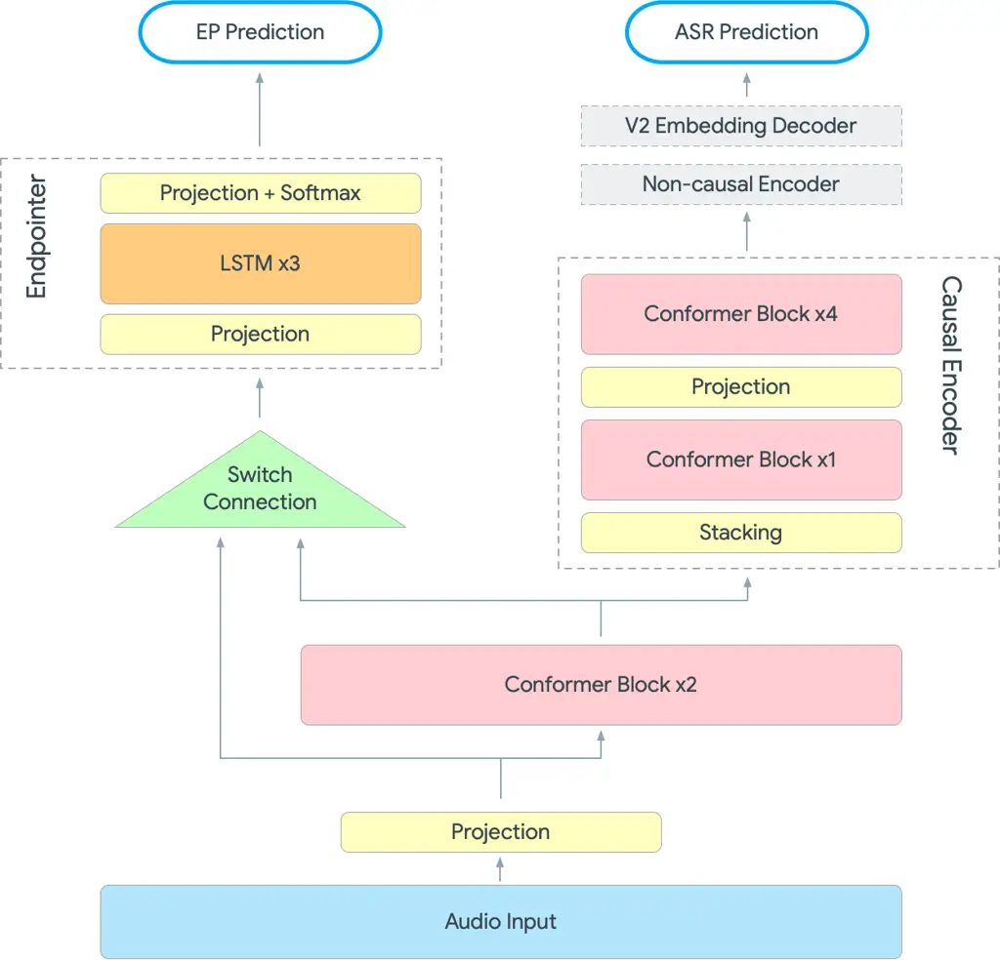
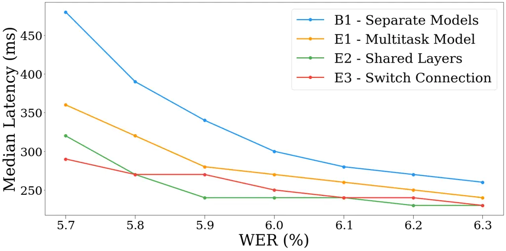
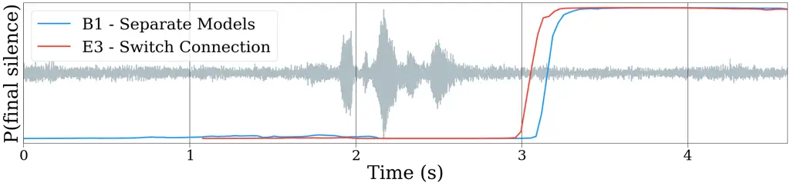
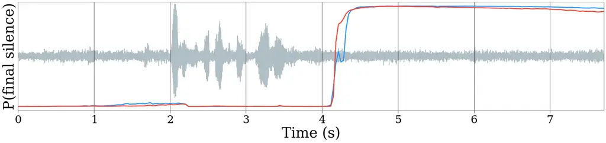
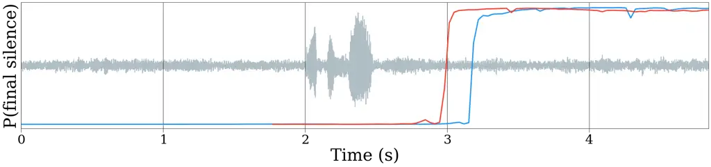

# Unified End-to-End Speech Recognition and Endpointing for Fast and Efficient Speech Systems

Shaan Bijwadia    Shuo-yiin Chang    Bo Li    Tara Sainath    Chao Zhang
   Yanzhang He

###### Abstract

Automatic speech recognition (ASR) systems typically rely on an external
endpointer (EP) model to identify speech boundaries. In this work, we
propose a method to jointly train the ASR and EP tasks in a single
end-to-end (E2E) multitask model, improving EP quality by optionally
leveraging information from the ASR audio encoder. We introduce a
“switch” connection, which trains the EP to consume either the audio
frames directly or low-level latent representations from the ASR model.
This results in a single E2E model that can be used during inference to
perform frame filtering at low cost, and also make high quality
end-of-query (EOQ) predictions based on ongoing ASR computation. We
present results on a voice search test set showing that, compared to
separate single-task models, this approach reduces median endpoint
latency by 120 ms (30.8% reduction), and 90th percentile latency by 170
ms (23.0% reduction), without regressing word error rate. For continuous
recognition, WER improves by 10.6% (relative).

^(†)^(†)address: Google, Inc.

Index Terms: endpointing, end-to-end speech recognition, voice activity
detection, end of query detection, multitask

## 1 Introduction

End-to-end (E2E) approaches to automatic speech recognition (ASR) have
been the subject of growing interest in recent years, and ASR is now a
prominent input modality for many products, including digital personal
assistants, smart speakers, and smartphone-based applications \[1, 2\].
E2E models outperform conventional ASR systems by integrating multiple
tasks (acoustic modeling and language modeling) into a single model and
training them jointly \[3\]. In this work, we continue this integration
by incorporating another model which is typically trained separately,
the endpointer model (EP).

The EP model is typically trained as small standalone model (e.g., \[4,
5\]), which assists recognition by generating two types of signals,
voice activity detection (VAD) and end-of-query (EOQ) detection. First,
the VAD task is to classify each frame according to whether it contains
speech or silence. This signal is then used for “frame filtering,” i.e.
discarding non-speech frames from the input before passing it to the
much larger ASR model. For streaming ASR systems (which operate on audio
frames in real-time as they are received), this reduces computation by
allowing the system to “skip” unnecessary frames. This is particularly
important for continuous-query tasks, such as voice dictation, where
recognition may run for an arbitrarily long period and computational
savings accumulate over time.

The other primary task for the EP model is EOQ prediction, which is
specific to “short-query” speech tasks, such as digital assistants or
interactive voice response (IVR) applications (e.g. “Play Bruno Mars.”).
The task is to predict when the user is done speaking, at which point
the system should close the microphone and generate a response \[4\].
High-quality EOQ detection is critical to reducing system latency, since
a response typically will not be generated until the system recognizes
that the user has finished speaking. For voice recognition systems,
user-perceived latency (UPL) is an important factor for a satisfactory
experience \[6\]. While complete speech recognition systems are complex
and many individual components impact UPL, the quality of EP prediction
is the largest single determinant \[7\].

Integrating the ASR and EP models is a natural next step in the
progression towards E2E recognition. E2E training can confer two main
benefits for this application. First, recognition and endpointing
quality may improve, as joint training is likely to lead to better
quality models by forcing the model to learn representations that
generalize well across related tasks. Secondly, E2E training of ASR and
EP reduces the infrastructure burden of building speech recognition
systems, since only a single model would need to be trained, deployed,
and maintained.

Other E2E approaches to jointly train EP and ASR mostly focus on
subsuming the EP task into the ASR task, which we term “decoder-based”
EOQ detection, since they require inference by the ASR decoder to
produce an EOQ signal. Decoder-based approaches can be effective for EOQ
detection \[7\], but maintaining an acoustic-based EOQ detector helps
cover the long-tail of utterances that the decoder-based EOQ does not
detect properly \[8\]. Additionally, ASR decoding can be susceptible to
high latency during streaming recognition if frame batching into larger
chunks is being imposed for computational efficiency \[9\]. Also, frame
filtering based on VAD prediction is impossible using only a
decoder-based signal. Therefore, the proposed method aims to augment the
capabilities of a decoder-based EOQ detection with acoustic-based
endpointing in a fully E2E setup. Best results for EOQ detection are
obtained when combining acoustic- and decoder-based methods \[5, 7, 8\].

Therefore, our proposed method integrates the EP model into the audio
encoder of an E2E ASR model to produce an acoustic-based EP prediction.
A straightforward way to accomplish this is to share layers with the ASR
encoder, a technique known as “hard parameter sharing” \[10\]. Li et al.
\[11\] previously explored training the VAD task on top of the lowest
layers of an ASR model, with good results. However, directly applying
this technique would cause issues when deployed for inference. EP models
are typically kept as small as possible in order to be computationally
efficient, since they must produce a VAD prediction for every audio
frame (for frame filtering) \[12\]. Since ASR models are much larger
than EP models, layer sharing may not be computationally viable. For
example, each encoder layer in the ASR model described in \[13\] is
approximately 32 times larger than the endpointer model described in
\[14\]. Running that single ASR layer for a VAD prediction on every
audio frame would require a major increase in computation. Addressing
this concern is the motivation for the novel architecture we propose
here.

The key insight for our proposed method is that while frame filtering
using a VAD signal is subject to a strict computational constraint, the
EOQ task is free to leverage computation from the ASR model, since its
signal is required only while speech is ongoing. It is therefore
desirable to have a small EP model that can operate on audio input
directly, but also operate on the latent representation from the ASR
system when it’s available. During inference, the EP can be fed audio
frames until it detects speech onset, at which point the audio will be
fed to the ASR model, “activating” the shared layers; the EP model can
then be fed the latent representations from the shared layers until
speech offset is detected. This scheme is most desirable in the
short-query scenario, where improvements to EOQ prediction directly
impact UPL, since the system can more quickly recognize that the user is
finished speaking. We train this EP model by introducing the novel
“switch” connection: for each training example, the input to the EP is
randomly chosen between the two possible inputs, the audio frames and
the latent representation from the shared layers. Thus the model learns
to expect either type of input, and can produce a prediction
accordingly.

We evaluate the proposed method on real-world testsets, evaluating EOQ
performance on short-query utterances and frame filtering performance on
voice dictation data. We find that the proposed method reduces median
EOQ detection latency improves by 120ms, a 30.8% reduction, and 90th
percentile latency by 170ms, a 23.0% reduction, with no regression in
word error rate (WER). Because EOQ detection directly affects user
experience by ending recognition and generating a response faster, this
is a substantial improvement to UPL. Further, we demonstrate on a
continuous-query voice dictation set that frame filtering performance
does not suffer relative to baseline; in fact, the word-error rate for
the multitask ASR model improves, possibly by integrating the EP target
signal into its acoustic understanding.

## 2 Related Work

Early work on VAD relied on hand-crafted acoustic features, such as
zero-crossing rate, energy ratio, and signal periodicity \[15, 16\].
Later, supervised machine-learning methods, including Hidden Markov
Models (HMM) and Gaussian Mixture Models (GMM), were also shown to be
effective \[17\]. Recent approaches have focused on deep neural network
(DNN) structures, and long short-term memory (LSTM) modules in
particular have been shown to perform well \[18, 4, 19\]. As mentioned
above, Li et al. implement VAD prediction by placing a fully-connected
layer on top of the convolutional neural network (CNN) encoder of an ASR
model \[11\].

For the reasons explored in Section 1, E2E integration of the EP and ASR
has been of recent interest, and several decoder-based approaches have
been explored. Yoshimura et al. \[20\] implement VAD by regarding the
blank tokens in a CTC-based ASR model as the non-speech region. Chang et
al. \[8\] perform EOQ detection by augmenting the ASR search space with
an end-of-sentence token. Lu et al. extend the technique proposed in
\[8\] to multi-speaker recognition \[21\]. As stated in Section 1,
decoder-based methods complement but cannot fully replace acoustic EP
signals.

Our study builds on these prior works and offers several new
contributions. While prior work in joint ASR and EP training in \[11\]
focuses solely on the VAD task, we perform both VAD and EOQ tasks;
leveraging the ASR encoder for E2E prediction is a novel approach to
acoustic-based EOQ. Additionally, to the authors’ knowledge, the
“switch” connection is an entirely novel solution to the problem of
differing computational constraints for frame filtering versus EOQ
detection. This is a critical technique for real-world deployment of an
E2E ASR and EP model, as it must meet the constraints of a real-time
speech recognition system.

## 3 Model



Figure 1: Model Architecture   Multitask ASR and EP model, featuring
shared encoder layers and a switch connection. During training, the
switch connection randomly chooses between two inputs with equal
probability for each training example.

### 3.1 Endpointing Task

Similar to \[14\], the endpointing task is modeled as a frame-level
classification task, where each frame is classified as one of four
speech classes:

```math
\displaystyle\mathcal{S}=\biggl\{\hskip 10.00002pt\begin{aligned} &\text{speech},\\
&\text{initial silence},\\
&\text{intermediate silence},\\
&\text{final silence}\end{aligned}\hskip 10.00002pt\biggl\} \tag{1}
```

Within an utterance, all frames before speech begins are labeled
“initial” silence, and all frames after the final speech segment are
labeled “final;” all other segments are labeled “intermediate.” Because
this method is intended for streaming speech recognition scenarios, we
allow the EP model to condition its predictions on previous frames.
Formally, for each audio frame at time $`t`$ the model predicts:

```math
\displaystyle P(S_{t}|X_{0:t}) \tag{2}
```

where $`X`$ is the sequence of input frames, and $`S`$ is the sequence
of frame-wise speech class labels, $`S_{t}\in\mathcal{S}`$.

We therefore achieve a categorical distribution over $`\mathcal{S}`$ for
every frame; at inference time, we derive the VAD signal for each frame
by applying a threshold to the predicted probability
$`P(S_{t}=\text{speech}|X_{0:t})`$, and likewise for the EOQ signal
using $`P(S_{t}=\text{final silence}|X_{0:t})`$.

We optimize the EP task using standard cross-entropy loss

```math
\displaystyle\mathcal{L}_{\text{EP}}=\text{CE}(\hat{S},S) \tag{3}
```

where $`\hat{S}`$ is the predicted class label probabilities for a given
utterance.

### 3.2 ASR Task

E2E ASR models derived from the RNN-T structure \[3\] involve an audio
encoder and prediction network, roughly analogous to an acoustic model
(AM) and language model (LM), respectively, in classical ASR systems.
Information from both networks are joined together to produce a
prediction $`P(Y|X)`$, where $`Y`$ is a tokenized representation of the
transcript. This is optimized using RNN-T loss, described more fully in
\[3\]. Briefly: the ASR model is trained to output sequences containing
valid wordpiece tokens or special “blank” tokens that are ignored;
predictions containing blanks are called “alignments.” The training loss
is:

```math
\displaystyle\mathcal{L}_{\text{ASR}}=\log P(Y|X)=\sum_{\text{A}:\mathcal{B}(A)=Y}P(A|X) \tag{4}
```

where $`\mathcal{B}`$ is a function mapping an alignment $`A`$ to valid
output sequences by removing all instances of the blank symbol \[22\].

### 3.3 Multitask Model and Switch Connection

In the proposed model, ASR and EP are trained jointly. We first modify
the training loss to be a weighted average of the ASR and EP loss
functions:

```math
\displaystyle\mathcal{L}_{\text{multi}}=\lambda\mathcal{L}_{\text{ASR}}+(1-\lambda)\mathcal{L}_{\text{EP}} \tag{5}
```

where $`\lambda\in[0,1]`$ is a hyperparameter defining the training
weight given to the ASR task.

The first two conformer layers of the ASR’s audio encoder are shared
with the EP via hard parameter sharing \[10\]. The EP model may consume
either the audio frames directly or the latent representation from the
shared layers. During training, the input given to the endpointer is
determined stochastically per utterance by selecting the audio frames or
the latent features with equal probability. We term this a “switch”
connection. A diagram of this model is shown in Figure 1.

During inference, the switch connection is replaced with an input logic
determined by the EP prediction for the previous frame. We maintain two
thresholds, $`\theta_{\text{VAD}},\theta_{\text{EOQ}}\in[0,1]`$, which
are hyperparameters. We say the EP predicts speech if
$`P(\text{speech})>\theta_{\text{VAD}}`$, and predicts EOQ if
$`P(\text{final silence})>\theta_{EOQ}`$. We begin by feeding audio
frames to the EP, without passing them down to the ASR model. Then, when
speech onset is detected, audio frames are passed to the ASR model, and
the EP model performs inference with the ASR latent features as input.
The subsequent logic differs depending on the type of recognition. In
continuous recognition, we simply return to the non-speech state once
the EP-predicted speech posterior drops below $`\theta_{\text{VAD}}`$.
In the short query case, we wait for the system to declare EOQ, using a
combination of signals from the acoustic- and decoder-based EOQ
detectors, at which point we end recognition (see §4.4). This logic is
illustrated as a finite state machine diagram in Figure 2.


(a) State machine for short queries, e.g. “Play Bruno Mars.”


(b) State machine for continuous recognition, e.g. “To be, or not to be,
that is the question…”

Figure 2: Inference Logic   Finite state machine diagrams representing
the logic determining which input is given to the EP during streaming
recognition. While the EP predicts that the user is not speaking,
inference is run on the EP only, using the audio frames as input (“EP
Only”). When speech is detected by the EP, inference is run on both ASR
and EP, using the ASR latent features as input for the EP (“ASR + EP”).

## 4 Experimental Setup

### 4.1 EP Model

Input to the endpointer model is passed through a fully-connected
projection layer, which feeds into a 3-layer stack of 128-dim LSTM
blocks \[23\], similar to \[5, 14\]. The output from the LSTM encoder is
fed to another fully-connected layer, which projects the 128-dim
encoding to a 4-dim output vector. These values are passed as logits
through a softmax function to obtain probability predictions for each
frame.

### 4.2 ASR Model

As our ASR model, we use a $`\sim`$150M parameter streaming cascaded
conformer-transducer (Conf-T) \[24, 13\], which features a causal
conformer encoder with 7 layers and attention dimension 512, and a
$`V^{2}`$ embedding decoder (i.e., the prediction network computes
embeddings based on the two most recent non-blank tokens). As this is a
streaming model \[25\], the causal encoder is given only left-context
during recognition. The encoder contains a time-reduction stacking layer
after the second conformer layer, which down-samples the input by a
factor of 2.

As this is a cascaded-encoder setup \[26\], outputs from the causal
encoder are passed to a second encoder which receives limited right
context, composed of 6 conformer layers with dimension 384. The
$`V^{2}`$ embedding decoder two produces predictions based on both the
causal and non-causal encoder features; the word-error rates (WER)
reported in Section 5 are obtained from the non-causal pathway. This
model also features an E2E-EP \[8\], wherein the ASR search space is
augmented with an \</s\> token that signals EOQ (see §4.4).

### 4.3 Training Setup

The acoustic features used for all experiments are 128-dim log-mel
features, computed in 32ms windows every 10ms. Each frame is stacked
with three previous frames to produce a 512-dim vector and downsampled
to 30ms, and concatenated with a 16-dim one-hot domain ID vector.

Our training dataset contains $`\sim`$400k hours of English utterances
sampled from multiple domains, including voice-search tasks, far-field
environments, telephony conversations, and audio drawn from longform
videos. All utterances are anonymized and hand-transcribed, and
augmented using room simulations and artificial noise with
signal-to-noise ratios (SNR) between 0db and 30db. SpecAugment \[27\] is
applied for regularization. Training labels for the endpointer are
generated by running a forced word alignment based on the transcription
label \[28\]. Once speech and non-speech regions are identified, the
first non-speech segment is classified as “initial silence,” the last
one as “final silence,” and all others as “intermediate silence.” All
experiments are implemented in TensorFlow \[29\] and the Lingvo toolkit
\[30\] on 8x8 slices of Tensor Processing Units \[31\].

The baseline used for comparison uses single-task versions of the above
models, trained separately and combined into a complete speech
recognition system. The single-task ASR model is trained for 600k steps,
with a global minibatch size of 4096 utterances using the Adam optimizer
\[32\]. All ASR training includes FastEmit \[33\] to encourage the model
to emit hypotheses with low latency. The single-task EP model is trained
for 300k steps, as the model converges much more quickly. For the
multitask ASR and EP models, we set $`\lambda=0.98`$, and train with the
same parameters described above for single-task ASR models.

We are aware of the sensitive nature of the speech recognition research
and other AI technologies used in this work. All training data used in
this work abides by Google AI Principles \[34\].

### 4.4 Declaring EOQ

For short-query utterances, recognition may be ended by either acoustic-
and decoder-based EOQ detection. The proposed method is considered the
acoustic-based EOQ detector. As explained in §3.1, acoustic EOQ is
predicted if $`P(\text{final silence})>\theta_{\text{EOQ}}`$.
Decoder-based EOQ detection is performed by augmenting the ASR target
vocabulary with a special token \</s\> indicating the predicted end of
speech \[8, 35, 36\]. The ASR model predicts EOQ if the top beam
contains that token with prediction cost lower than a hyperparameter
$`\theta_{\texttt{</s>}}`$. EOQ can be declared by either the acoustic-
or decoder-based signal, whichever comes first. Once EOQ is detected, we
impose a short mandatory waiting period $`w`$ to further avoid deletion
errors due to early cutoff. For each experiment,
$`\theta_{\text{EOQ}}`$, $`\theta_{\texttt{</s>}}`$, and $`w`$ are swept
using grid search on the evaluation set to optimize median and 90th
percentile latency for a given WER (chosen here to be 5.8). All systems
evaluated in this work have both acoustic- and decoder-based EOQ
detection enabled, since the end-to-end nature of the proposed system
may affect both methods of endpointing.

### 4.5 Evaluation

We evaluate EOQ detection performance on a short-query dataset
containing $`\sim`$14k anonymized and hand-transcribed far-field
utterances of voice search traffic. The main metrics of interest are
WER, and endpoint latency, defined as the amount of time between when
the user stops speaking (ground truth EOQ) and the detected EOQ. The
ground truth EOQ is estimated using a forced word alignment in the same
fashion as the endpointer training labels are generated. We report the
median and 90th percentile latency (EP50 and EP90, respectively).

We evaluate frame filtering performance on a continuous-query dataset
containing $`\sim`$14k anonymized and hand-transcribed utterances of
voice dictation traffic, which are broken up into speech segments of
$`\sim`$10 seconds on average. We report WER, and the percentage of the
utterance that is left after frame filtering, which measures on how many
frames ASR inference is run (lower is better).

## 5 Results

| Exp. | Method              | WER | EP50 | EP90 |
| ---- | ------------------- | --- | ---- | ---- |
| B1   | Separate Models     | 5.8 | 390  | 740  |
| E1   | Multitask Model     | 5.8 | 320  | 610  |
| E2   | \+ 2 Shared Layers  | 5.8 | 270  | 560  |
| E3   | + Switch Connection | 5.8 | 270  | 570  |

Table 1: Short-Query Results  ASR and EP performance for the proposed
multitask model in a complete speech recognition system. We report
word-error rate (WER (%)), and 50th/90th percentile endpoint latency
(EP50, EP90 (ms)).

| Exp.          | WER  | del | ins | sub | Speech % |
| ------------- | ---- | --- | --- | --- | -------- |
| B1            | 10.4 | 1.1 | 4.7 | 4.5 | 0.73     |
| B1, no filter | 14.4 | 1.2 | 8.2 | 5.0 | 1.0      |
| E3            | 9.3  | 1.2 | 3.6 | 4.4 | 0.73     |
| E3, no filter | 13.6 | 1.2 | 7.6 | 4.8 | 1.0      |

Table 2: Continuous Results   Frame filtering performance for the
proposed system, evaluated on a continuous query test set. We report
word-error rate (WER (%)), broken down by deletions, insertions, and
subsitutions. We also report the percentage of audio remaining after
frame filtering (Speech %).

### 5.1 EOQ Detection

We present results for a step-wise progression towards the proposed
system in Table 1. Our baseline (B1) configuration uses separately
trained ASR and EP models, combined in a single speech recognition
pipeline. The first experiment (E1) trains these two models jointly
using the multitask loss function described in §3.3, but without any
parameter sharing. This helps verify that the multitask learning task is
effective, independent of other architectural changes. We then introduce
parameter sharing (E2), placing the EP model downstream of the second
conformer layer in the ASR audio encoder. At this stage, all input to
the EP is passed through the first two conformer ASR layers for both VAD
and EP – this allows us to assess the quality impact of sharing
parameters with the ASR model. This improves median and 90th percentile
latency by 30.8% and 23.0%, respectively. Note that this is not a
deployable model, since the VAD prediction would be too expensive for
frame filtering.

Finally, we introduce the switch connection (E3), which is our proposed
candidate model. The ideal case for this experiment is to match the
quality of E2 – we observe that training with a switch connection does
not degrade the median latency, and only marginally increases 90th
percentile latency.

### 5.2 Frame Filtering

We present the frame filtering performance of the our proposed E2E model
on continuous-query utterances in Table 2. The results compare the
baseline (B1) and proposed system (E3), which are exactly the same
models as listed in Table 1. We evaluate both systems with frame
filtering enabled and disabled, to demonstrate the effect of filering on
WER. The results show that both systems are similarly effective at
filtering, leaving 73% of the utterance remaining after discarding
silence frames. Note that a major source of word errors in both systems
come in the form of insertions – we observe that the E2E ASR models
examined in this study are prone to hallucinating words during noisy
non-speech parts of the audio. Therefore, frame filtering has the
additional benefit of reducing insertion WER, by recognizing and
filtering out non-speech frames. This is why applying the frame filter
actually reduces WER.

Perhaps surprisingly, the ASR system in E3 has superior WER, and most of
the relative reduction in WER is due to lower insertion errors. We
speculate that in the multitask architecture, the shared encoder layers
learn from the EP target about which frames contain speech. This makes
the ASR results more resistant to the aforementioned hallucinations
during periods of non-speech noise, even when the EP is inactive.



Figure 3: WER vs. Median Latency   Response curves showing the optimal
median latency for a given WER on the short query test set.



(a) “What time is it?”



(b) “How many people speak German?”



(c) “Open Maps.”

Figure 4: EOQ Posterior   Plots showing the predicted posterior
$`P(\text{final silence})`$ during recognition on representative
examples of human-spoken short queries.

### 5.3 Analysis

We now further analyze the performance of the proposed system. The EOQ
task involves a tradeoff between WER and latency, since more aggressive
EOQ detection may lead to deletion errors if EOQ is declared too early.
Therefore, multiple operating points along this tradeoff curve are
possible. To better visualize the performance of these systems across
WERs, we plot the median latency for various WERs for the test set
evaluated in Table 1. We depict this plot in Figure 3; note that lower
curves (toward the bottom right) are better. All multitask experiments
outperform B1 at every WER, demonstrating the effectiveness of joint
learning. E2 offers a substantial advantage over E1, since a shared
layers allow the EP to make higher quality EOQ decisions. We observe
that introducing the switch connection in E3 offers similar performance
across the range of WERs as E2. We also present visualizations of the
EOQ posterior during recognition for short-query utterances,
demonstrating the quicker recognition of the proposed system compared to
baseline.

To better understand the speedup in EOQ latency, we plot the posterior
of the predicted $`P(\text{final silence})`$ posteriors for the baseline
(B1) and proposed (E3) systems over time during utterance recognition.
Figure 4 provides three representative examples, which show that the
proposed system often transitions between predicted states at a similar
speed, but earlier in the utterance. Additionally, a common pattern, as
pictured in example (b), is for the baseline system to momentarily lose
confidence in declaring EOQ, causing a slight endpointing delay; the
proposed system was not found to exhibit this behavior.

## 6 Conclusions

E2E modeling has rapidly become the preferred approach for building the
high quality ASR models that underlie popular speech-based technologies.
This work presents a multitask approach to jointly training the acoustic
EP and ASR in a single E2E model, by sharing parameters between the ASR
audio encoder and EP model. To enable low-cost frame filtering, we
introduce the novel “switch” connection, which trains the EP to accept
either audio frames directly or the latent representation from the
shared encoder layers. During inference, the EP can be used as a
standalone model for VAD-based frame filtering while the user is not
speaking, or as a high-quality EOQ predictor which leverages ongoing ASR
computation. Applying this E2E architecture leads to substantial quality
improvements in EOQ detection latency. WER for continuous recognition
also improves, likely due to a better robustness against hallucinations
due to non-speech noise. Additionally, unifying the ASR and EP tasks
into a single model removes the infrastructure burden of maintaining two
separate models. We recommend further research in the direction of
shared acoustic understanding between ASR and EP tasks.

## References

- \[1\] Johan Schalkwyk, Doug Beeferman, Françoise Beaufays, Bill Byrne,
  Ciprian Chelba, Mike Cohen, Maryam Kamvar, and Brian Strope, “Your
  Word is my Command”: Google Search by Voice: A Case Study, pp. 61–90,
  Springer US, Boston, MA, 2010.
- \[2\] Teresa Fernandes and Elisabete Oliveira, “Understanding
  consumers’ acceptance of automated technologies in service encounters:
  Drivers of digital voice assistants adoption,” Journal of Business
  Research, vol. 122, pp. 180–191, 2021.
- \[3\] A. Graves, “Sequence Transduction with Recurrent Neural
  Networks,” CoRR, vol. abs/1211.3711, 2012.
- \[4\] Shuo-Yiin Chang, Bo Li, Tara N Sainath, Gabor Simko, and
  Carolina Parada, “Endpoint detection using grid long short-term memory
  networks for streaming speech recognition.,” in Proc.
  Interspeech, 2017.
- \[5\] Roland Maas, Ariya Rastrow, Chengyuan Ma, Guitang Lan, Kyle
  Goehner, Gautam Tiwari, Shaun Joseph, and Björn Hoffmeister,
  “Combining acoustic embeddings and decoding features for
  end-of-utterance detection in real-time far-field speech recognition
  systems,” in 2018 IEEE International Conference on Acoustics, Speech
  and Signal Processing (ICASSP), 2018, pp. 5544–5548.
- \[6\] Karen Ward Nigel G. Ward, Anais G. Rivera and David G. Novick,
  “Root causes of lost time and user stress in a simple dialog system,”
  in Interspeech, 2005.
- \[7\] Yuan Shangguan, Rohit Prabhavalkar, Hang Su, Jay Mahadeokar,
  Yangyang Shi, Jiatong Zhou, Chunyang Wu, Duc Le, Ozlem Kalinli,
  Christian Fuegen, and Michael L. Seltzer, “Dissecting user-perceived
  latency of on-device e2e speech recognition,” ArXiv, vol.
  abs/2104.02207, 2021.
- \[8\] S. Chang, R. Prabhavalkar, Y. He, et al., “Joint Endpointing and
  Decoding with End-to-End Models,” in Proc. ICASSP, 2019.
- \[9\] Y. He, T. N. Sainath, R. Prabhavalkar, et al., “Streaming
  End-to-end Speech Recognition For Mobile Devices,” in Proc.
  ICASSP, 2019.
- \[10\] Sebastian Ruder, “An overview of multi-task learning in deep
  neural networks,” arXiv, vol. abs/1706.05098, 2017.
- \[11\] Meng Li, Shiyu Zhou, and Bo Xu, “Long-running speech
  recognizer: An end-to-end multi-task learning framework for online asr
  and vad,” ArXiv, vol. abs/2103.01661, 2021.
- \[12\] Sebastian Braun and Ivan Tashev, “On training targets for
  noise-robust voice activity detection,” in 2021 29th European Signal
  Processing Conference (EUSIPCO), 2021, pp. 421–425.
- \[13\] T. N. Sainath, Y. He, A. Narayanan, et al., “Improving the
  Latency and Quality of Cascaded Encoder,” in Proc. ICASSP, 2022.
- \[14\] Shuo-Yiin Chang, Bo Li, and Gabor Simko, “A unified endpointer
  using multitask and multidomain training,” in Proc. ASRU, 2019.
- \[15\] Selma Özaydin, “Examination of energy based voice activity
  detection algorithms for noisy speech signals,” European Journal of
  Science and Technology, 2019.
- \[16\] Kirill Sakhnov, Ekaterina Verteletskaya, and Boris Simak,
  “Low-complexity voice activity detector using periodicity and energy
  ratio,” in 2009 16th International Conference on Systems, Signals and
  Image Processing, 2009, pp. 1–5.
- \[17\] Xiukun Wu, Mengyao Zhu, Renjie Wu, and Xiaoqiang Zhu, “A
  self-adapting gmm based voice activity detection,” 2018 IEEE 23rd
  International Conference on Digital Signal Processing (DSP), pp.
  1–5, 2018.
- \[18\] Florian Eyben, Felix Weninger, Stefano Squartini, and Björn
  Schuller, “Real-life voice activity detection with lstm recurrent
  neural networks and an application to hollywood movies,” 2013 IEEE
  International Conference on Acoustics, Speech and Signal Processing,
  pp. 483–487, 2013.
- \[19\] Sibo Tong, Hao Gu, and Kai Yu, “A comparative study of
  robustness of deep learning approaches for VAD,” 2016 IEEE
  International Conference on Acoustics, Speech and Signal Processing
  (ICASSP), pp. 5695–5699, 2016.
- \[20\] Takenori Yoshimura, Tomoki Hayashi, K. Takeda, and Shinji
  Watanabe, “End-to-end automatic speech recognition integrated with
  ctc-based voice activity detection,” ICASSP 2020 - 2020 IEEE
  International Conference on Acoustics, Speech and Signal Processing
  (ICASSP), pp. 6999–7003, 2020.
- \[21\] Liang Lu, Jinyu Li, and Yifan Gong, “Endpoint detection for
  streaming end-to-end multi-talker asr,” in ICASSP, 2022.
- \[22\] A. Graves, S. Fernandez, F. Gomez, and J. Schmidhuber,
  “Connectionist Temporal Classification: Labeling Unsegmented Sequenece
  Data with Recurrent Neural Networks,” in Proc. ICML, 2006.
- \[23\] S. Hochreiter and J. Schmidhuber, “Long Short-Term Memory,”
  Neural Computation, vol. 9, no. 8, pp. 1735–1780, Nov 1997.
- \[24\] A. Gulati, J. Qin, C.-C. Chiu, et al., “Conformer:
  Convolution-augmented Transformer for Speech Recognition,” in Proc.
  Interspeech, 2020.
- \[25\] Q. Zhang, H. Lu, H. Sak, A. Tripathi, E. McDermott, S. Koo, and
  S. Kumar, “Transformer Transducer: A Streamable Speech Recognition
  Model with Transformer Encoders and RNN-T Loss,” in Proc.
  ICASSP, 2020.
- \[26\] A. Narayanan, T. N. Sainath, R. Pang, et al., “Cascaded
  encoders for unifying streaming and non-streaming ASR,” in Proc.
  ICASSP, 2021.
- \[27\] D. S. Park, W. Chan, Y. Zhang, et al., “SpecAugment: A Simple
  Data Augmentation Method for Automatic Speech Recognition,” in Proc.
  Interspeech, 2019.
- \[28\] Pedro J Moreno, Christopher F Joerg, Jean-Manuel Van Thong, and
  Oren Glickman, “A recursive algorithm for the forced alignment of very
  long audio segments.,” in ICSLP, 1998, vol. 98, pp. 2711–2714.
- \[29\] M. Abadi et al., “Tensorflow: Large-scale machine learning on
  heterogeneous distributed systems,” Available online:
  http://download.tensorflow.org/paper/whitepaper2015.pdf, 2015.
- \[30\] J. Shen, P. Nguyen, Y. Wu, et al., “Lingvo: a modular and
  scalable framework for sequence-to-sequence modeling,”
  arXiv:2005.08100, 2019.
- \[31\] Norman P Jouppi, Cliff Young, Nishant Patil, David Patterson,
  Gaurav Agrawal, Raminder Bajwa, Sarah Bates, Suresh Bhatia, Nan Boden,
  Al Borchers, et al., “In-datacenter performance analysis of a tensor
  processing unit,” in Proc. international symposium on computer
  architecture, 2017.
- \[32\] D. P. Kingma and J. Ba, “Adam: A method for stochastic
  optimization,” in Proc. ICLR, 2015.
- \[33\] J. Yu, C.-C. Chiu, B. Li, et al., “FastEmit: Low-latency
  Streaming ASR with Sequence-level Emission Regularization,” in Proc.
  ICASSP, 2021.
- \[34\] Google AI, “Our Principles,” \urlhttps://ai.google/principles.
- \[35\] B. Li, S.-Y. Chang, T. N. Sainath, et al., “Towards fast and
  accurate streaming end-to-end ASR,” in Proc. ICASSP, 2020.
- \[36\] Yingzhu Zhao, Chongjia Ni, C. C. Leung, Shafiq R. Joty,
  Chng Eng Siong, and Bin Ma, “Preventing early endpointing for online
  automatic speech recognition,” ICASSP 2021 - 2021 IEEE International
  Conference on Acoustics, Speech and Signal Processing (ICASSP), pp.
  6813–6817, 2021.
