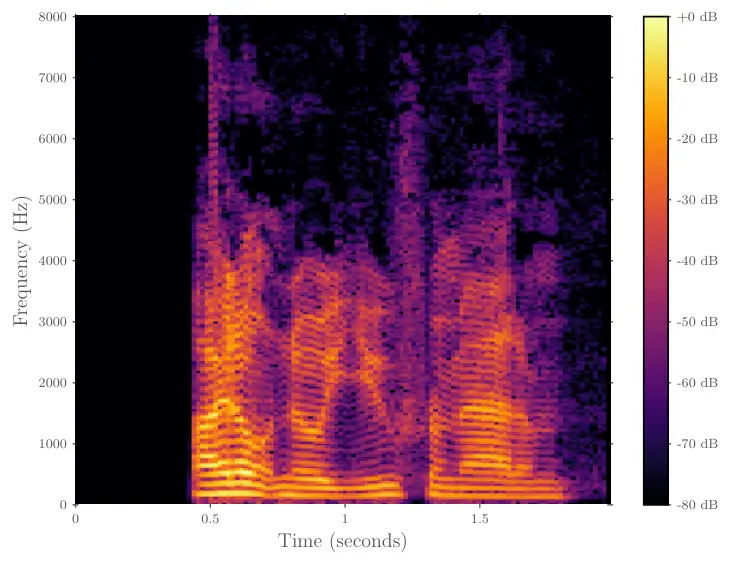
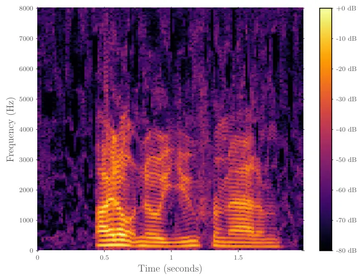
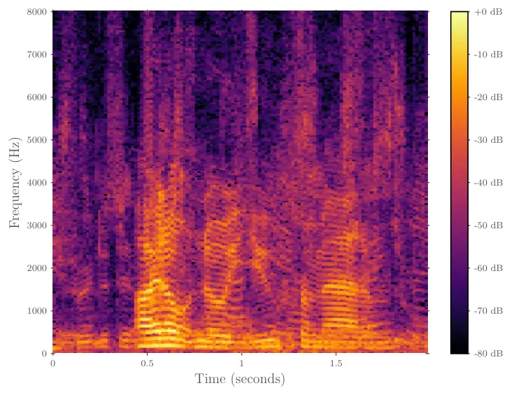
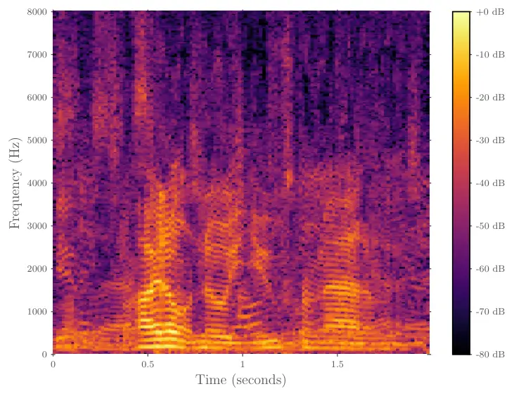
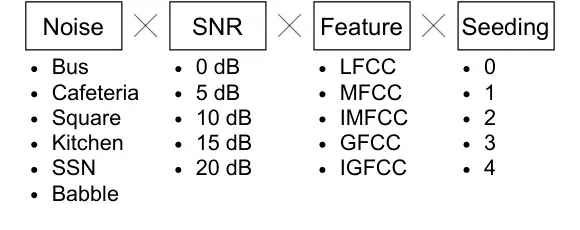

# Leveraging Domain Features for Detecting Adversarial Attacks Against Deep Speech Recognition in Noise

Corresponding Author: Zheng-Hua Tan (zt@es.aau.dk).

###### Abstract

In recent years, significant progress has been made in deep model-based
automatic speech recognition (ASR), leading to its widespread deployment
in the real world. At the same time, adversarial attacks against deep
ASR systems are highly successful. Various methods have been proposed to
defend ASR systems from these attacks. However, existing classification
based methods focus on the design of deep learning models while lacking
exploration of domain specific features. This work leverages filter
bank-based features to better capture the characteristics of attacks for
improved detection. Furthermore, the paper analyses the potentials of
using speech and non-speech parts separately in detecting adversarial
attacks. In the end, considering adverse environments where ASR systems
may be deployed, we study the impact of acoustic noise of various types
and signal-to-noise ratios. Extensive experiments show that the inverse
filter bank features generally perform better in both clean and noisy
environments, the detection is effective using either speech or
non-speech part, and the acoustic noise can largely degrade the
detection performance.

|                                                               |
| ------------------------------------------------------------- |
| Christian Heider Nielsen and Zheng-Hua Tan                    |
| Department of Electronic Systems, Aalborg University, Denmark |

Index Terms: Adversarial examples, automatic speech recognition, deep
learning, filter bank, noise robustness,

## 1 Introduction

Numerous successful adversarial attack methods on automatic speech
recognition (ASR) systems have been proposed \[1, 2, 3, 4, 5, 6, 7, 8\].
They demonstrate that through small optimised perturbations to an input
signal, it is possible to fool an ASR system to produce an alternative
targeted result, while the perturbations are largely imperceptible for
humans. Prevalence of ASR is on the rise, with already rolled out
systems as Google Assistant, Amazon Alexa, Samsung Bixby, Apple Siri and
Microsoft Cortana. And with them comes an ever increasing attack
surface. The aforementioned systems are potentially responsible for home
automation, e.g. turning on and off devices, and for administrative
tasks, e.g. making purchases online. Adversarial attacks can make a
voice assistant behave maliciously and thus cause a significant threat
to the security, privacy, and even safety of its user \[9\]. Obviously,
without validating the request being legitimate will leave security
holes in users systems.

The nature of attacks can be targeted or untargeted. While the goal of
untargeted attacks is to force the ASR model to produce an incorrect
class, targeted attacks aim to make the model output a predetermined
class and thus are most dangerous in terms of intrusive behaviour. In
this work, we will focus on targeted attacks only.

Strategies for defending adversarial attacks can be categorised as
proactive and reactive \[10\]. In proactive defences, one seeks to build
more robust ASR models, e.g. through training with adversarial examples.
With reactive approaches, one aims to detect the existence of
adversarial attacks at testing time. There exist a number of reactive
defence methods. The works in \[11, 12, 13, 14\] defend against audio
adversarial attacks by preprocessing a speech signal prior to passing it
onto the ASR system. An unsupervised method with no need for labelled
attacks is presented in \[15\], where the defence is realised using
anomalous pattern detection. Rather than detecting adversarial examples,
the work in \[16\] characterises them using temporal dependencies.

In \[17\], adversarial example detection is formulated as a binary
classification problem, in which a convolutional neural network (CNN) is
used as the model and Mel-frequency cepstral coefficients (MFCCs) are
used as the feature. While MFCC is the most commonly used feature for
numerous applications, it remains largely uncontested for this
particular defence purpose. Our preliminary study shows that attacks
exhibit noticeable energy permutation in high frequency regions, where
the resolution of MFCCs is by design sacrificed. Furthermore, it is
shown in \[18\] that cepstral features from learned filter banks that
have denser spacing in the high frequency region are more effective in
detecting spoofing attacks. We are therefore motivated to contest the
MFCC representation with alternative cepstral features that refocus the
spectral resolution in different frequency regions.

ASR systems when deployed in the real world will be exposed to adverse
acoustic environments. However, detecting adversarial attacks in noise
has rarely been investigated in the literature. In this work, we study
the impact of acoustic noise on the performance of adversarial attack
detection. It is relevant to mention that the success rate of attacking
in noisy environments will decrease as briefly shown in \[19\] and that
the noise can change ASR output \[14\], which is of interest for future
study in a systematic way. Furthermore, it is unknown how speech and
non-speech parts are useful for adversarial attack detection. This work
studies their potentials.

The contribution of this paper is four-fold.

- •
  To our knowledge, this is the first systematic study of various
  cepstral features for adversarial attack detection and of impact of
  acoustic noise, speech only, and non-speech only on detection
  performance. These include MFCC, inverse MFCC (IMFCC), Gammatone
  frequency cepstral coefficients (GFCC), inverse GFCC (IGFCC) and
  linear frequency cepstral coefficients (LFCC). These features are not
  new, but they (except for MFCC) have not been explored for adversarial
  attack detection. In addition, their use is highly motivated, and
  significant improvements are obtained using inverse filter banks as in
  iMFCC and iGFCC. The study of these features further helps understand
  the characteristics of the adversarial attacks.
- •
  This work systematically studies the impact of adverse environments
  for the first time and gains much insight.
- •
  The paper analyses the potentials of using speech and non-speech parts
  separately in detecting attacks.
- •
  A significant effort has been put on making the work reproducible. The
  source code for reproducing the results with the parameterisation used
  in this work and a full catalogue of results are made publicly
  available ^(†)^(†)
  [https://aau-es-ml.github.io/adversarial_speech_filterbank_defence/](https://aau-es-ml.github.io/adversarial_speech_filterbank_defence/).

The paper is organized as follows. Section II presents background and
analysis of audio adversarial attacks. Methodology and experiment design
are provided in Section III. Section IV provides experimental results
and discussions. The work is concluded in Section V.

## 2 Background and Analysis

This section presents both white-box and black-box attacks, analyses
spectral representations of attacks, and introduces filter banks applied
in this work.

### 2.1 White-box and black-box attacks

This work considers both white-box and black-box attacks. In white-box
attacks, the adversary has full access to the parameters of the victim
model, while in black-box attacks, the adversary does not have the
access to the model parameters. An examples of state-of-the-art
white-box attack methods against ASR systems is the gradient-based
Carlini & Wagner method \[2\]. An example of black-box attack methods is
the gradient-free Alzantot method \[4\] that uses genetic algorithm
optimization. Gradient approximation is used to generate black-box audio
adversarial examples in \[20\].

We build our work on the publicly-available adversarial attack data sets
provided by our early work in \[17\]. For white-box attacks, the Carlini
& Wagner method \[2\] is used to attack Baidu DeepSpeech model \[21\].
The DeepSpeech model is trained using the publicly available Mozilla
Common Voice data set \[22\]. For black-box attacks, the Alzantot method
\[4\] is applied to a keyword spotting deep model \[23\] trained with
the publicly available Google Speech Command data set \[24\]. All data
sets are sampled at 16 kHz.





Fig. 1: Spectrogram of the utterance "I don’t know you from Adam",
without (left) and with (right) white-box adversarial attack. x-axis is
time in seconds and y-axis is frequency in Hz.

### 2.2 Spectral analysis

Figure 1 shows the spectrograms of both benign and attacked samples,
calculated with a frame length of $`32`$ ms and a frame shift of $`16`$
ms. Inspecting the figure, we hypothesise that for detecting attacks,
using filter banks that concentrate resolution in the high frequency
regions is beneficial.

Fig. 2: Long term average spectra of both benign and adversarial
utterances of "I don’t know you from Adam" and the average absolute
frame-level difference between them.

Figure 2 shows an example of the long term average spectrum (LTAS)
calculated using Welch’s method \[25\] for the benign and adversarial
signals, together with the average absolute difference between the two
spectra. The difference is computed by taking the spectrograms of both
benign and adversarial signals from Fig. 1, subtracting them frame-wise
and averaging the absolute residuals. Contrasting the LTAS and the
average absolute difference further highlights the importance of
high-frequency regions, since the speech signals have much lower energy
in high frequency regions and thus perturbations in high frequency
regions become _relatively_ more prominent.



(a)



(b)

Fig. 3: Spectrogram of the utterance "I don’t know you from Adam" mixed
with babble noise at 10dB SNR, without (left) and with (right) white-box
adversarial attack.

### 2.3 Noisy attack example

Figure 3 shows two spectra: one for the benign signal and the other for
the corresponding attacked signal, both corrupted with babble noise at
10dB SNR. It is clear that the additive noise makes it more difficult to
detect attacks.

### 2.4 Filter banks

Filter banks are widely used to model the frequency selectivity of an
auditory system. Traditionally, the design of filter banks is motivated
by psychoacoustic experiments. For example, humans are better at
discriminating lower frequencies than higher frequencies, and the
Mel-scale triangular filter bank exploits the characteristics of human
perception of sound by having higher resolution at lower frequencies
than at higher frequencies. Other filter banks are equivalent
rectangular bandwidth (ERB) scale Gammatone filter bank and linear
triangular filter bank. In this work we also apply the inverse variants
of these filter banks. Figure 4 illustrates the regular and inverse
variant of the Mel-scale triangular filter banks.

(a) 20 channel mel-scale filter bank

(b) 20 channel inverse mel-scale filter bank

Fig. 4: Mel-scale triangular filter bank and its inverse. x-axis is
frequency in Hz and y-axis is gain.

#### 2.4.1 Linear triangular filter bank

In a linear triangular filter bank, the gain $`H_{m}(k)`$ of the
$`k^{\prime}th`$ data point of the $`m^{\prime}th`$ triangular band
filter is as follows \[26\]

```math
H_{m}(k)=\begin{cases}\frac{k-f_{b}(m-1)}{f_{b}(m)-f_{b}(m-1)}&f_{b}(m-1)\leq k\leq f(m)\\
\frac{f_{b}(m+1)-k}{f_{b}(m+1)-f_{b}(m)}&f_{b}(m)\leq k\leq f_{b}(m+1)\\
\hfil 0\hfil&{\text{else}}\\
\end{cases} \tag{1}
```

where $`f_{b}(m)`$ is the boundary frequency point of the
$`m^{\prime}th`$ filter

```math
f_{b}(m)=f_{low}+m\frac{f_{high}-f_{low}}{M+1} \tag{2}
```

where $`M`$ is the number of filters, $`f_{low}`$ and $`f_{high}`$ are
the frequency range $`[0,\frac{F_{s}}{2}]`$ and $`F_{s}`$ is the
sampling frequency in Hz.

#### 2.4.2 Mel-scale triangular filter bank

For a Mel-scale triangular filter bank, we construct a triangular filter
bank with the boundary frequencies $`f_{b}(m)`$ equally spaced on the
Mel-scale

```math
f_{b}(m)=Mel^{-1}(Mel(f_{low})+m\frac{Mel(f_{high})-Mel(f_{low})}{M+1}) \tag{3}
```

where $`Mel(f)=1125ln(1+(f/700)`$ and $`Mel^{-1}(m)=700(e^{m/1125}-1)`$.

#### 2.4.3 Gammatone filter bank

For a Gammatone filter bank the center frequencies $`f_{c}(g)`$ are
equally spaced on the equivalent rectangular bandwidth (ERB) scale
$`ERB(f)=\frac{f}{9.26}+24.7`$.

Then the gain $`H_{g}(k)`$ of the $`k^{\prime}th`$ data point of the
$`g^{\prime}th`$ the gammatone wavelet filter is computed as

```math
H_{g}(k)=\frac{(L-1)!}{(ERB(f_{c}(g))+j(2\pi k-2\pi f_{c}(g)))^{L}} \tag{4}
```

where $`L`$ is the filter order, typically set to $`L=4`$, and
$`f_{c}(g)`$ is the center frequency of the $`g^{\prime}th`$ filter

```math
f_{c}(g)=-C+(f_{high}+C)e^{g*log_{10}(\frac{f_{low}+C}{f_{high}+C})/G} \tag{5}
```

where $`C=228.83`$, $`1\leq g\leq G`$ and $`G`$ is the number of
filters.

#### 2.4.4 Inverse filter banks

Producing the inverse filter bank variant is as simple as reversing the
regular filter bank with respect to the frequencies.

## 3 Methodology and experiment design

### 3.1 Data sets

The adversarial attack data sets used in this work are from \[17\],
which are publicly available ^(†)^(†)
[https://github.com/zhenghuatan/Audio-adversarial-examples](https://github.com/zhenghuatan/Audio-adversarial-examples).
We will refer to this article for the specifics on the generation of the
adversarial attacks. Data set A (white-box) and data set B (black-box)
have $`1470`$ and $`2660`$ samples, respectively. Data set A contains
$`620`$ adversarial samples and $`850`$ benign ones, and Dataset B
contains $`1252`$ adversarial samples and $`1408`$ benign ones, which
are reasonably balanced data sets. We conduct extensive experiments
using data set A for training and data set B for testing, and vice
versa, to investigate the robustness of the proposed methods across
types of adversarial attacks.

The data sets provided by \[17\] comprise utterances of varying lengths.
In order to use a model with inputs of fixed size, we chop the
utterances into blocks of $`512`$ ms with a shift of $`512`$ ms, i.e. no
overlap. This is in contrast to \[17\], where zero-padding is applied to
match the longest utterance in the data sets. The issues with
zero-padding are that the length of the longest utterance in the data
set (rather than the problem domain itself) determines the model size,
and computational resources are wasted by adding many zeros.
Utterance-level decision can be made easily by later fusion of block
level decisions, which is out of the scope of this work.

After block chopping, we split the data into training, validation and
test subsets. In order to make the data split unbiased and fully
reproducible, we use a hash function-based selection on the utterance
filenames, targeting at $`70\%`$ for training, $`10\%`$ for validation
and $`20\%`$ for test. In the end, the blocks amount to
$`(1187,183,272)`$ adversarial attack blocks and $`(1550,222,377)`$
benign blocks for training, validation, testing splits from data set A.
From data set B we end up with $`(1260,180,360)`$ adversarial attack
blocks and $`(1398,200,400)`$ benign blocks.

### 3.2 Detection model

We use CNNs to classify an input as either being benign or adversarial.
The chosen model architecture and hyperparameterisation mostly follows
\[17\]. One change is to have a fixed input size as $`(31,20)`$,
corresponding to (#frames, \#cepstral coefficients), throughout all
experiments. Additionally our model has one single output for binary
classification. This slightly modified architecture is found in Table 1.

type size field stride activation Conv2d $`64`$ $`(2,2)`$ $`(1,1)`$
$`ReLU`$ MaxPool2d $`(1,3)`$ $`(1,3)`$ Conv2d $`64`$ $`(2,2)`$ $`(1,1)`$
$`ReLU`$ MaxPool2d $`(1,1)`$ $`(1,1)`$ Conv2d $`32`$ $`(2,2)`$ $`(1,1)`$
$`ReLU`$ MaxPool2d $`(2,2)`$ $`(2,2)`$ Flatten $`896`$ Fully Connected
$`128`$ $`ReLU`$ Fully Connected $`1`$ $`Sigmoid`$

Table 1: Model Architecture

### 3.3 Detection with various cepstral features

We study a set of filter banks for attack detection aiming at
investigating the importance of different frequency regions. In
extracting speech features, each block is first segmented into frames
using a frame length of $`32`$ ms with a frame shift of $`16`$ ms. Each
frame is then processed by taking the discrete Fourier transform,
calculating power spectral estimate, applying a filter bank, taking the
logarithm of the filter bank energies and finally taking discrete cosine
transform, which gives cepstral feature for the frame. This leads to
$`20`$ cepstral coefficients for each of the $`31`$ frames in a block. A
supervector is a concatenation of the cepstral feature vectors of a
multi-frame block.

In this work we consider the following cepstral features depending on
different filter banks: Mel-frequency cepstral coefficients, inverse
MFCC, Gammatone frequency cepstral coefficients, inverse GFCC, and
linear frequency cepstral coefficients.

### 3.4 Detection using speech and non-speech parts

Attacks may occur in both speech and non-speech regions. To investigate
contributions of speech and non-speech parts to attack detection, we
split the signals of the white-box data set using the open-source,
unsupervised robust voice activity detection (rVAD) method \[27\]
^(†)^(†)
[https://github.com/zhenghuatan/rVAD](https://github.com/zhenghuatan/rVAD),
with the default parameterisation of their open source implementation.
The extracted speech segments and non-speech segments from a single
signal are separately concatenated into one signal for speech and
another for non-speech, which each is subsequently chopped into blocks,
framed and the cepstrums are computed.

### 3.5 Detection in noisy environments

To study the impact of noise on detection performance, we consider the
various filter bank models for a range of noise types and SNRs. Figure 5
shows the combinations of conditions/models in this experiment, leading
to quite a number of experiments of different models. The considered
noise types are cafeteria noise PCAFETER, bus passenger noise TBUS, city
square noise SPSQUARE, kitchen noise DKITCHEN, speech shaped noise ssn
and babble noise bbl.



Fig. 5: Combinations of models to be trained and evaluated

The first four are from \[28\] and the last two from \[29\]. We chose
these to cover possible real world settings where ASR systems are
employed and may be exposed to adversarial attacks, and these noise
files are readily available online, making the experiments reproducible.
We mix noise with speech at $`[0,5,10,15,20]`$ dB SNR levels.

We again split a signal into speech and non-speech parts using rVAD
\[27\]. However, this splitting is only for calculating root mean square
(RMS) of the speech part. Prior to mixing we scale the noise by the RMS
ratio between the speech part of the signal and the noise. We additively
mix the scaled noise with the signal, at a target SNR calculated using
the speech part. Prior to mixing, noise signals of each noise type are
also split into training, validation and test subsets to ensure no
leakage among them.

## 4 Experimental results

In this section, we present the experimental results. For performance
evaluation, we use the receiver operator characteristic’s area under
curve (ROCAUC) metric. In all result tables we will display the mean and
standard deviation of $`5`$ independent runs of varying seeds for each
experiment. The seeding affects the model parameter initialisation and
batch sampling order of the same fixed training, validation and test
splits.

### 4.1 Cepstral features for attack detection

This experiment evaluates the five cepstral features on different white-
and black-box attack combinations. To make the results comparable across
attack types, we truncate the number of examples in each dataset to be
the same as the lesser.

The results are shown in Table 2. First we observe that inverse filter
bank features IGFCC and IMFCC perform the best, GFCC and MFCC are
inferior, and LFCC is in between. Next, we can see the generalisation
performance across data sets with different training and test
combinations. Training with black-box and testing with white-box sees a
significant performance drop. It is interesting to note that IMFCC and
IGFCC perform so well when training on white-box and testing on
black-box, but the same is not observed when training on black-box and
testing on white-box. Training and testing on black-box shows higher
ROCAUC scores than training and testing on white-box, which could be
because black-box attacks are more audible and easier to detect than
white-box ones. Finally multi-style training combining white-box and
black-box helps.

filter bank MFCC IMFCC GFCC IGFCC LFCC train set     test set white-box
       white-box $`.941\pm.013`$ $`.98\pm.003`$ $`.915\pm.02`$
$`\mathbf{.981\pm.003}`$ $`.961\pm.003`$        black-box
$`.576\pm.072`$ $`\mathbf{.946\pm.01}`$ $`.694\pm.04`$ $`.932\pm.012`$
$`.692\pm.127`$ black-box        white-box $`.527\pm.015`$
$`\mathbf{.672\pm.091}`$ $`.528\pm.011`$ $`.676\pm.034`$ $`.625\pm.057`$
       black-box $`.983\pm.005`$ $`.991\pm.007`$ $`.982\pm.004`$
$`\mathbf{.991\pm.005}`$ $`.988\pm.003`$ w&b-box        w&b-box
$`.966\pm.001`$ $`\mathbf{.989\pm.002}`$ $`.948\pm.006`$ $`.986\pm.001`$
$`.979\pm.001`$        white-box $`.964\pm.002`$
$`\mathbf{.989\pm.002}`$ $`.942\pm.007`$ $`.985\pm.002`$ $`.976\pm.001`$
       black-box $`.974\pm.004`$ $`.99\pm.007`$ $`.972\pm.012`$
$`\mathbf{.99\pm.005}`$ $`.988\pm.003`$

Table 2: Mean and standard deviation of ROCAUC for scenarios where both
training and test tests containing white-box and black-box examples. w&b
denotes both white-box and black-box attacks.

filter bank MFCC IMFCC GFCC IGFCC LFCC train set     test set non-speech
       non-speech $`.97\pm.016`$ $`.993\pm.006`$ $`.965\pm.014`$
$`\mathbf{.995\pm.004}`$ $`.988\pm.006`$        speech $`.724\pm.074`$
$`.823\pm.06`$ $`.661\pm.058`$ $`\mathbf{.851\pm.071}`$ $`.746\pm.042`$
speech        speech $`.833\pm.051`$ $`.944\pm.021`$ $`.679\pm.036`$
$`\mathbf{.945\pm.018}`$ $`.886\pm.028`$        non-speech
$`.937\pm.017`$ $`.987\pm.009`$ $`.863\pm.033`$ $`\mathbf{.988\pm.011}`$
$`.948\pm.02`$ speech & ns        s&ns $`.929\pm.013`$
$`\mathbf{.982\pm.008}`$ $`.894\pm.006`$ $`.978\pm.005`$ $`.941\pm.013`$
       non-speech $`.986\pm.002`$ $`\mathbf{.999\pm.002}`$
$`.973\pm.01`$ $`.997\pm.001`$ $`.98\pm.016`$        speech
$`.903\pm.019`$ $`\mathbf{.975\pm.011}`$ $`.858\pm.008`$ $`.97\pm.007`$
$`.925\pm.015`$

Table 3: Mean and standard deviation of ROCAUC for speech and non-speech
data sets of white-box attacks. speech & ns denotes both speech and
non-speech attack datasets.

### 4.2 Attack detection in speech and in non-speech

This experiment compares performance in both speech and non-speech
regions as well as across them to see if a model trained for speech only
is able to generalise to non-speech only and vice-versa. To make the
results comparable we truncate the size of the speech and non-speech
data sets to make them match. For splitting the sample into the speech
and non-speech parts, we apply the rVAD method \[27\], as detailed
earlier.

Table 3 shows the five cepstral features on speech and non-speech parts
of white-box attack with different training and test set combinations.
From the results we observe that adversarial attacks can be detected via
both speech and non-speech regions effectively and that inverse filter
bank features remain performing the best. It is interesting to note that
testing on non-speech always performs better than testing on speech, no
matter the model is trained in non-speech, speech or a mixture of speech
and non-speech, which indicates non-speech part contains a stronger cue
of adversarial attacks. Training on both speech and non-speech and
testing on non-speech gives the highest ROCAUC scores for almost all
cepstral features.

### 4.3 Attack detection in noise

In this experiment we evaluate the various filter bank models for a
range of noise types and SNRs for white-box attacks.

#### 4.3.1 Noise and SNR specific training

Table 4 presents results for the narrowly trained models using five
features for differing noise types and SNRs. We observe a general
tendency that using inverse filter bank features outperforms the rest
with the only exception being the kitchen noise. This could be explained
by the fact that the kitchen noise has much flatter long term amplitude
spectrum, as we found experimentally, which leads to LFCC performing the
best. Across all noise types and SNRs, IGFCC performs the best, for
which the reason could be that Gammatone filter banks are known to be
noise robust. In all cases, noise significantly decreases the detection
performance, and in some 0dB cases, the performance is close to random
guess.

cepstral features MFCC IMFCC GFCC IGFCC LFCC noise type   snr bbl       
0db $`.533\pm.047`$ $`.654\pm.027`$ $`.528\pm.029`$
$`\mathbf{.687\pm.059}`$ $`.573\pm.046`$        5db $`.621\pm.042`$
$`.793\pm.032`$ $`.576\pm.02`$ $`\mathbf{.806\pm.048}`$ $`.702\pm.022`$
       10db $`.706\pm.038`$ $`.878\pm.016`$ $`.668\pm.04`$
$`\mathbf{.901\pm.011}`$ $`.78\pm.02`$        15db $`.798\pm.017`$
$`.921\pm.024`$ $`.742\pm.025`$ $`\mathbf{.951\pm.015}`$ $`.857\pm.012`$
       20db $`.867\pm.03`$ $`.953\pm.009`$ $`.838\pm.033`$
$`\mathbf{.955\pm.009}`$ $`.901\pm.022`$        avg $`.705\pm.127`$
$`.84\pm.111`$ $`.671\pm.118`$ $`\mathbf{.86\pm.109}`$ $`.763\pm.121`$
ssn        0db $`.54\pm.037`$ $`.533\pm.045`$ $`.506\pm.012`$
$`\mathbf{.747\pm.018}`$ $`.551\pm.03`$        5db $`.554\pm.032`$
$`.611\pm.023`$ $`.518\pm.029`$ $`\mathbf{.862\pm.033}`$ $`.541\pm.017`$
       10db $`.592\pm.034`$ $`.658\pm.038`$ $`.546\pm.049`$
$`\mathbf{.926\pm.015}`$ $`.69\pm.05`$        15db $`.73\pm.037`$
$`.868\pm.027`$ $`.691\pm.016`$ $`\mathbf{.947\pm.003}`$ $`.802\pm.037`$
       20db $`.824\pm.045`$ $`.937\pm.011`$ $`.757\pm.035`$
$`\mathbf{.968\pm.006}`$ $`.908\pm.024`$        avg $`.648\pm.118`$
$`.721\pm.16`$ $`.603\pm.107`$ $`\mathbf{.89\pm.083}`$ $`.699\pm.148`$
kitchen        0db $`.541\pm.039`$ $`.511\pm.02`$
$`\mathbf{.562\pm.023}`$ $`.502\pm.005`$ $`.533\pm.023`$        5db
$`\mathbf{.6\pm.017}`$ $`.536\pm.022`$ $`.592\pm.018`$ $`.548\pm.03`$
$`.593\pm.007`$        10db $`.692\pm.023`$ $`.562\pm.013`$
$`.652\pm.032`$ $`.563\pm.038`$ $`\mathbf{.7\pm.022}`$        15db
$`.799\pm.048`$ $`.647\pm.025`$ $`.738\pm.04`$ $`.653\pm.032`$
$`\mathbf{.808\pm.035}`$        20db $`.858\pm.013`$ $`.791\pm.032`$
$`.832\pm.055`$ $`.806\pm.05`$ $`\mathbf{.876\pm.035}`$        avg
$`.698\pm.124`$ $`.609\pm.106`$ $`.675\pm.106`$ $`.615\pm.114`$
$`\mathbf{.702\pm.133}`$ cafeteria        0db $`.523\pm.027`$
$`\mathbf{.55\pm.045}`$ $`.508\pm.011`$ $`.513\pm.022`$ $`.532\pm.035`$
       5db $`.539\pm.025`$ $`\mathbf{.608\pm.053}`$ $`.521\pm.022`$
$`.574\pm.053`$ $`.581\pm.065`$        10db $`.605\pm.04`$
$`.705\pm.025`$ $`.593\pm.052`$ $`\mathbf{.735\pm.019}`$ $`.71\pm.04`$
       15db $`.72\pm.021`$ $`.808\pm.015`$ $`.662\pm.041`$
$`\mathbf{.829\pm.04}`$ $`.805\pm.023`$        20db $`.814\pm.023`$
$`.888\pm.025`$ $`.816\pm.02`$ $`\mathbf{.9\pm.019}`$ $`.866\pm.019`$
       avg $`.64\pm.116`$ $`\mathbf{.712\pm.131}`$ $`.62\pm.119`$
$`.71\pm.153`$ $`.699\pm.135`$ square        0db $`.539\pm.066`$
$`.647\pm.115`$ $`.521\pm.059`$ $`\mathbf{.682\pm.104}`$ $`.637\pm.09`$
       5db $`.625\pm.083`$ $`.838\pm.009`$ $`.607\pm.079`$
$`\mathbf{.843\pm.023}`$ $`.784\pm.05`$        10db $`.732\pm.04`$
$`\mathbf{.91\pm.02}`$ $`.763\pm.044`$ $`.906\pm.008`$ $`.877\pm.02`$
       15db $`.861\pm.02`$ $`.935\pm.026`$ $`.831\pm.042`$
$`\mathbf{.946\pm.014}`$ $`.945\pm.016`$        20db $`.934\pm.022`$
$`\mathbf{.97\pm.021}`$ $`.852\pm.023`$ $`.969\pm.01`$ $`.969\pm.009`$
       avg $`.738\pm.156`$ $`.86\pm.127`$ $`.715\pm.141`$
$`\mathbf{.869\pm.114}`$ $`.843\pm.131`$ bus        0db $`.764\pm.042`$
$`.807\pm.038`$ $`.695\pm.046`$ $`\mathbf{.816\pm.045}`$ $`.784\pm.045`$
       5db $`.865\pm.054`$ $`\mathbf{.928\pm.016}`$ $`.798\pm.016`$
$`.928\pm.02`$ $`.91\pm.027`$        10db $`.917\pm.025`$
$`\mathbf{.98\pm.012}`$ $`.866\pm.019`$ $`.964\pm.012`$ $`.953\pm.011`$
       15db $`.95\pm.007`$ $`\mathbf{.984\pm.013}`$ $`.922\pm.016`$
$`.973\pm.007`$ $`.973\pm.014`$        20db $`.933\pm.013`$
$`.986\pm.016`$ $`.926\pm.023`$ $`\mathbf{.987\pm.008}`$ $`.974\pm.02`$
       avg $`.886\pm.075`$ $`\mathbf{.937\pm.072}`$ $`.841\pm.092`$
$`.933\pm.066`$ $`.919\pm.077`$ all        avg_all $`.719\pm.145`$
$`.78\pm.162`$ $`.688\pm.137`$ $`\mathbf{.813\pm.156}`$ $`.771\pm.15`$

Table 4: Mean and standard deviation of ROCAUC for data sets of various
noise types and various SNR levels using five different cepstral
coefficients. White-box attack data set is used. avg is calculated
across all seedings (of five independent runs) and SNRs, all denotes all
noise types and avg_all is the average over all noise types and SNRs.
Noise type and SNR are matched for both training and testing in all
settings, namely a narrowly trained systems is evaluated in this table.

filter bank MFCC IMFCC GFCC IGFCC LFCC train set     test set, snr
bbl_all_snr        rest,    0db $`.553\pm.031`$ $`.59\pm.02`$
$`.516\pm.02`$ $`\mathbf{.629\pm.009}`$ $`.602\pm.018`$           5db
$`.584\pm.045`$ $`.639\pm.03`$ $`.523\pm.031`$ $`\mathbf{.684\pm.014}`$
$`.643\pm.02`$           10db $`.621\pm.064`$ $`.703\pm.037`$
$`.536\pm.048`$ $`\mathbf{.746\pm.013}`$ $`.691\pm.024`$           15db
$`.66\pm.086`$ $`.77\pm.033`$ $`.548\pm.066`$ $`\mathbf{.813\pm.007}`$
$`.748\pm.031`$           20db $`.698\pm.104`$ $`.821\pm.024`$
$`.557\pm.076`$ $`\mathbf{.861\pm.01}`$ $`.807\pm.031`$           avg
$`.623\pm.088`$ $`.705\pm.089`$ $`.536\pm.055`$ $`\mathbf{.747\pm.085}`$
$`.698\pm.077`$ rest_all_snr        bbl,    0db $`.56\pm.019`$
$`\mathbf{.635\pm.019}`$ $`.568\pm.01`$ $`.63\pm.01`$ $`.576\pm.013`$
          5db $`.605\pm.015`$ $`.727\pm.018`$ $`.615\pm.029`$
$`\mathbf{.744\pm.012}`$ $`.609\pm.026`$           10db $`.673\pm.025`$
$`.829\pm.017`$ $`.669\pm.023`$ $`\mathbf{.846\pm.015}`$ $`.697\pm.03`$
          15db $`.765\pm.028`$ $`.895\pm.023`$ $`.765\pm.033`$
$`\mathbf{.923\pm.016}`$ $`.804\pm.041`$           20db $`.861\pm.025`$
$`.94\pm.017`$ $`.844\pm.023`$ $`\mathbf{.954\pm.009}`$ $`.882\pm.028`$
          avg $`.693\pm.111`$ $`.805\pm.113`$ $`.692\pm.103`$
$`\mathbf{.819\pm.12}`$ $`.713\pm.119`$ clean        all,    all
$`.732\pm.132`$ $`.719\pm.159`$ $`.682\pm.118`$ $`.741\pm.156`$
$`\mathbf{.753\pm.149}`$

Table 5: Mean and standard deviation of ROCAUC for testing on unknown
noise data sets. clean is a training set consisting clean white-box
attacks, and all is all noise types and SNRs

#### 4.3.2 Cross-noise type generalisation

This experiment investigates how the trained models generalise to unseen
noise types. First we keep away one single noise type as unseen during
training and mix it with test speech blocks. Then we use all of the rest
of the noise types for training the model, and the training data with
multiple noise types does share the same training speech blocks.

The validation set uses the same noise-types as training, but they have
their own validation speech blocks. Note that there is still no overlap
between the sample blocks in the training, validation and test sets. Due
to space limitation, we show only bbl as unknown. Then we also test the
bbl model on the rest of noise types and the clean model on all noise
types. We train models using noisy signals mixed at all SNRs and test
the models on the individual SNRs. In the end, we also compute the
average performances across SNRs and seedings.

The results are shown in Table 5. It is noted that training on multiple
noise types (widely trained) and testing on a single one outperforms the
opposite and the model trained with clean data. Inverse filter bank
features remain to be superior.

### 4.4 Cepstral feature projection

(a) white-box MFCC features

(b) black-box MFCC features

(c) white-box IMFCC features

(d) black-box IMFCC features

(e) white-box LFCC features

(f) black-box LFCC features

Fig. 6: 2D TSNE projection of $`3500`$ data points, blue \|’s denotes
benign data points while red -’s denotes adversarial data points. Left
side is the white-box attacks and the right is the black-box attacks.

We perform a projection of each supervector of cepstral features, from
$`31*20=620\to 2`$, to visualise if any low dimensional structure
exists. We limit the number of random samples in the projection to
$`3500`$ blocks, from the training subset of white- and black-box
adversarial attack data sets. For the projection method we use
T-distributed Stochastic Neighbour Embedding(TSNE) \[30\]. The results
for MFCC, IMFCC and LFCC features are shown in Figure 6. Similar
behaviour is as well observed for GFCC and IGFCC features, which is not
shown due to space limit.

Surprisingly although there is only a small discrepancy between the
white-box and black-box attack classification performances, it is much
easier to find dichotomic projections of the black-box attacks than
those of white-box attacks, i.e. projected data of black-box attacks are
much more separated from those of benign than they are for white-box
attacks.

## 5 Conclusion

We investigated the effect of filter banks on detecting white-box and
black-box adversarial attacks in original signals, signals with additive
noise, speech only and non-speech only parts. Our experiments show a
clear tendency that the inverse filter bank based features outperform
their counterparts and the linearly spaced filter bank based feature.
Consistently through near to all trials we observe that inverse
Mel-frequency cepstral coefficient and inverse Gammatone frequency
cepstral coefficients based models are showing higher precision and
recall measures than the rest of cepstral features spaces, indicating
that in order to better detect adversarial attacks one should prefer the
inverse filter banks over their counterparts.

A similar observation is obtained when testing on noisy signals. One
exception is the kitchen noise type, which has highly flat long term
average spectrum, and thus linear frequency cepstral feature performs
the best. We also show that adversarial detection is effective in both
speech only and non-speech only parts.

Future work includes investigating the use of learnt features for
detecting adversarial examples, as learnt filter bank cepstral
coefficients have shown to be highly effective for voice spoofing
detection \[31\].

## 6 Acknowledgements

We acknowledge the students Amalie V. Petersen, Jacob T. Lassen and
Sebastian B. Schiøler at Aalborg University for conducting initial
experiments.

## References

- \[1\] Dan Iter, Jade Huang, and Mike Jermann, “Generating adversarial
  examples for speech recognition,” Stanford Technical Report, 2017.
- \[2\] Nicholas Carlini and David Wagner, “Audio adversarial examples:
  Targeted attacks on speech-to-text,” in 2018 IEEE Security and Privacy
  Workshops (SPW). IEEE, 2018, pp. 1–7.
- \[3\] Lea Schönherr, Katharina Kohls, Steffen Zeiler, Thorsten Holz,
  and Dorothea Kolossa, “Adversarial attacks against automatic speech
  recognition systems via psychoacoustic hiding,” arXiv preprint
  arXiv:1808.05665, 2018.
- \[4\] Moustafa Alzantot, Bharathan Balaji, and Mani Srivastava, “Did
  you hear that? adversarial examples against automatic speech
  recognition,” arXiv preprint arXiv:1801.00554, 2018.
- \[5\] Moustapha Cisse, Yossi Adi, Natalia Neverova, and Joseph Keshet,
  “Houdini: Fooling deep structured prediction models,” arXiv preprint
  arXiv:1707.05373, 2017.
- \[6\] Felix Kreuk, Yossi Adi, Moustapha Cisse, and Joseph Keshet,
  “Fooling end-to-end speaker verification with adversarial examples,”
  in 2018 IEEE international conference on acoustics, speech and signal
  processing (ICASSP). IEEE, 2018, pp. 1962–1966.
- \[7\] Yao Qin, Nicholas Carlini, Garrison Cottrell, Ian Goodfellow,
  and Colin Raffel, “Imperceptible, robust, and targeted adversarial
  examples for automatic speech recognition,” in International
  conference on machine learning. PMLR, 2019, pp. 5231–5240.
- \[8\] Rohan Taori, Amog Kamsetty, Brenton Chu, and Nikita Vemuri,
  “Targeted adversarial examples for black box audio systems,” in 2019
  IEEE Security and Privacy Workshops (SPW). IEEE, 2019, pp. 15–20.
- \[9\] Chen Yan, Xiaoyu Ji, Kai Wang, Qinhong Jiang, Zizhi Jin, and
  Wenyuan Xu, “A survey on voice assistant security: Attacks and
  countermeasures,” ACM Computing Surveys (CSUR), 2022.
- \[10\] Shengshan Hu, Xingcan Shang, Zhan Qin, Minghui Li, Qian Wang,
  and Cong Wang, “Adversarial examples for automatic speech recognition:
  Attacks and countermeasures,” IEEE Communications Magazine, vol. 57,
  no. 10, pp. 120–126, 2019.
- \[11\] Nilaksh Das, Madhuri Shanbhogue, Shang-Tse Chen, Li Chen,
  Michael E Kounavis, and Duen Horng Chau, “Adagio: Interactive
  experimentation with adversarial attack and defense for audio,” in
  Joint European Conference on Machine Learning and Knowledge Discovery
  in Databases. Springer, 2018, pp. 677–681.
- \[12\] Krishan Rajaratnam, Kunal Shah, and Jugal Kalita, “Isolated and
  ensemble audio preprocessing methods for detecting adversarial
  examples against automatic speech recognition,” arXiv preprint
  arXiv:1809.04397, 2018.
- \[13\] Vinod Subramanian, Emmanouil Benetos, and Mark Sandler,
  “Robustness of adversarial attacks in sound event classification,” in
  Acoustic Scenes and Events 2019 Workshop (DCASE2019), 2019, p. 239.
- \[14\] Krishan Rajaratnam and Jugal Kalita, “Noise flooding for
  detecting audio adversarial examples against automatic speech
  recognition,” in 2018 IEEE International Symposium on Signal
  Processing and Information Technology (ISSPIT). IEEE, 2018, pp.
  197–201.
- \[15\] Victor Akinwande, Celia Cintas, Skyler Speakman, and Srihari
  Sridharan, “Identifying audio adversarial examples via anomalous
  pattern detection,” arXiv preprint arXiv:2002.05463, 2020.
- \[16\] Zhuolin Yang, Bo Li, Pin-Yu Chen, and Dawn Song,
  “Characterizing audio adversarial examples using temporal dependency,”
  arXiv preprint arXiv:1809.10875, 2018.
- \[17\] Saeid Samizade, Zheng-Hua Tan, Chao Shen, and Xiaohong Guan,
  “Adversarial example detection by classification for deep speech
  recognition,” in ICASSP 2020-2020 IEEE International Conference on
  Acoustics, Speech and Signal Processing (ICASSP). IEEE, 2020, pp.
  3102–3106.
- \[18\] Hong Yu, Zheng-Hua Tan, Zhanyu Ma, Rainer Martin, and Jun Guo,
  “Spoofing detection in automatic speaker verification systems using
  dnn classifiers and dynamic acoustic features,” IEEE transactions on
  neural networks and learning systems, vol. 29, no. 10, pp.
  4633–4644, 2017.
- \[19\] Xuejing Yuan, Yuxuan Chen, Yue Zhao, Yunhui Long, Xiaokang Liu,
  Kai Chen, Shengzhi Zhang, Heqing Huang, Xiaofeng Wang, and Carl A
  Gunter, “Commandersong: A systematic approach for practical
  adversarial voice recognition,” in 27th $`\{`$USENIX$`\}`$ Security
  Symposium ($`\{`$USENIX$`\}`$ Security 18), 2018, pp. 49–64.
- \[20\] Po-Hao Huang, Honggang Yu, Max Panoff, and Ting-Chi Wang,
  “Generation of black-box audio adversarial examples based on gradient
  approximation and autoencoders,” ACM Journal on Emerging Technologies
  in Computing Systems (JETC), 2022.
- \[21\] Eric Battenberg, Jitong Chen, Rewon Child, Adam Coates, Yashesh
  Gaur Yi Li, Hairong Liu, Sanjeev Satheesh, Anuroop Sriram, and Zhenyao
  Zhu, “Exploring neural transducers for end-to-end speech recognition,”
  in 2017 IEEE Automatic Speech Recognition and Understanding Workshop
  (ASRU). IEEE, 2017, pp. 206–213.
- \[22\] Rosana Ardila, Megan Branson, Kelly Davis, Michael Henretty,
  Michael Kohler, Josh Meyer, Reuben Morais, Lindsay Saunders, Francis M
  Tyers, and Gregor Weber, “Common voice: A massively-multilingual
  speech corpus,” arXiv preprint arXiv:1912.06670, 2019.
- \[23\] Tara N Sainath and Carolina Parada, “Convolutional neural
  networks for small-footprint keyword spotting,” in Sixteenth Annual
  Conference of the International Speech Communication
  Association, 2015.
- \[24\] Pete Warden, “Speech commands: A dataset for limited-vocabulary
  speech recognition,” arXiv preprint arXiv:1804.03209, 2018.
- \[25\] Peter Welch, “The use of fast fourier transform for the
  estimation of power spectra: a method based on time averaging over
  short, modified periodograms,” IEEE Transactions on audio and
  electroacoustics, vol. 15, no. 2, pp. 70–73, 1967.
- \[26\] Xuedong Huang, Alex Acero, Hsiao-Wuen Hon, and Raj Reddy,
  Spoken Language Processing: A Guide to Theory, Algorithm, and System
  Development, Prentice Hall PTR, USA, 1st edition, 2001.
- \[27\] Zheng Hua Tan, Achintya kr Sarkar, and Najim Dehak, “rvad: An
  unsupervised segment-based robust voice activity detection method,”
  Computer Speech and Language, vol. 59, pp. 1–21, 2020,
  [https://github.com/zhenghuatan/rVAD/](https://github.com/zhenghuatan/rVAD/).
- \[28\] Joachim Thiemann, Nobutaka Ito, and Emmanuel Vincent, “Demand:
  a collection of multi-channel recordings of acoustic noise in diverse
  environments,” in Proc. Meetings Acoust, 2013, pp. 1–6.
- \[29\] Morten Kolboek, Zheng-Hua Tan, and Jesper Jensen, “Speech
  enhancement using long short-term memory based recurrent neural
  networks for noise robust speaker verification,” in 2016 IEEE spoken
  language technology workshop (SLT). IEEE, 2016, pp. 305–311.
- \[30\] Laurens Van der Maaten and Geoffrey Hinton, “Visualizing data
  using t-sne.,” Journal of machine learning research, vol. 9, no.
  11, 2008.
- \[31\] Hong Yu, Zheng-Hua Tan, Yiming Zhang, Zhanyu Ma, and Jun Guo,
  “Dnn filter bank cepstral coefficients for spoofing detection,” Ieee
  Access, vol. 5, pp. 4779–4787, 2017.
