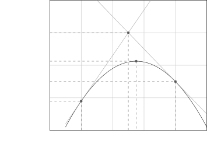

# Computable Bounds and Monte Carlo Estimates of the Expected Edit Distance

A preliminary version appeared in Nieves R. Brisaboa and Simon J.
Puglisi, editors, String Processing and Information Retrieval, pages
91–106, Cham, 2019. Springer International Publishing.

Gianfranco Bilardi Affiliation: Department of Information Engineering,
University of Padova, Italy Email: [bilardi@dei.unipd.it](mailto:)   
Michele Schimd Affiliation: Department of Information Engineering,
University of Padova, Italy Email: [schimdmi@dei.unipd.it](mailto:)

###### Abstract

The edit distance is a metric of dissimilarity between strings, widely
applied in computational biology, speech recognition, and machine
learning. Let $`e_{k}(n)`$ denote the average edit distance between
random, independent strings of $`n`$ characters from an alphabet of size
$`k`$. For $`k\geq 2`$, it is an open problem how to efficiently compute
the exact value of $`\alpha_{k}(n)=e_{k}(n)/n`$ as well as of
$`\alpha_{k}=\lim_{n\to\infty}\alpha_{k}(n)`$, a limit known to exist.

This paper shows that
$`\alpha_{k}(n)-Q(n)\leq\alpha_{k}\leq\alpha_{k}(n)`$, for a specific
$`Q(n)=\Theta(\sqrt{\log n/n})`$, a result which implies that
$`\alpha_{k}`$ is computable. The exact computation of $`\alpha_{k}(n)`$
is explored, leading to an algorithm running in time
$`T=\mathcal{O}(n^{2}k\min(3^{n},k^{n}))`$, a complexity that makes it
of limited practical use.

An analysis of Monte Carlo estimates is proposed, based on McDiarmid’s
inequality, showing how $`\alpha_{k}(n)`$ can be evaluated with good
accuracy, high confidence level, and reasonable computation time, for
values of $`n`$ say up to a quarter million. Correspondingly, 99.9%
confidence intervals of width approximately $`10^{-2}`$ are obtained for
$`\alpha_{k}`$.

Combinatorial arguments on edit scripts are exploited to analytically
characterize an efficiently computable lower bound $`\beta_{k}^{*}`$ to
$`\alpha_{k}`$, such that $`\lim_{k\to\infty}\beta_{k}^{*}=1`$. In
general, $`\beta_{k}^{*}\leq\alpha_{k}\leq 1-1/k`$; for $`k`$ greater
than a few dozens, computing $`\beta_{k}^{*}`$ is much faster than
generating good statistical estimates with confidence intervals of width
$`1-1/k-\beta_{k}^{*}`$.

The techniques developed in the paper yield improvements on most
previously published numerical values as well as results for alphabet
sizes and string lengths not reported before.

## 1 Introduction

Measuring dissimilarity between strings is a fundamental problem in
computer science, with applications in computational biology, speech
recognition, machine learning, and other fields. One commonly used
metric is the _edit distance_ (or _Levenshtein distance_), defined as
the minimum number of substitutions, deletions, and insertions necessary
to transform one string into the other.

It is natural to ask what is the expected distance between two randomly
generated strings, as the string size grows; knowledge of the asymptotic
behavior has proved useful in computational biology (\[GMR16\]) and in
nearest neighbor search (\[Rub18\]), to mention a few examples.

In computational biology, the question often arises whether two strings
(_e.g._, two DNA reads) are noisy copies of the same source or of
non-overlapping sources. In several cases of interest, the source is
modeled as a sequence of independent and identically distributed symbols
(see, _e.g._, \[GMR16\], \[CS14\], with reference to DNA) and the noise
is modeled with substitutions, insertions, and deletions (a good
approximation for technologies like PacBio and MinION \[WdCW+17\]).
Then, the statistical inference may be based on a comparison of the
distance between the observed strings with either the expected distance
between a string and a noisy copy of itself, or the expected distance
between two random strings.

Even for the case of uniform and independent strings, the study of the
expected edit distance appears to be challenging and little work has
been reported on the problem. In contrast, the closely related problem
of computing the expected length of the _longest common subsequence_ has
been extensively studied, since the seminal work by \[CS75\].

Using Fekete’s lemma, it can be shown that both metrics tend to grow
linearly with the string size $`n`$ (\[Ste97\]). Specifically, let
$`e_{k}(n)`$ denote the expected edit distance between two random,
independent strings of length $`n`$ on a $`k`$-ary alphabet; then
$`\alpha_{k}(n)=e_{k}(n)/n`$ approaches (from above) a limit
$`\alpha_{k}\in[0,1]`$. Similarly, let $`\ell_{k}(n)`$ denote the
expected length of the longest common subsequence; then
$`\gamma_{k}(n)=\ell_{k}(n)/n`$ approaches (from below) a limit
$`\gamma_{k}\in[0,1]`$. The $`\gamma_{k}`$’s are known as the
Chvátal-Sankoff constants. The efficient computation of the exact values
of $`\alpha_{k}`$ and $`\gamma_{k}`$ is an open problem. This paper
establishes the computability of $`\alpha_{k}`$, for any $`k`$, and
proposes methods for estimating and bounding $`\alpha_{k}`$, also
reporting numerical results for various alphabet sizes $`k`$.

From the perspective of computational complexity, we remark that, for
the problem of computing $`\alpha_{k}(n)`$, given input $`n`$ (for a
fixed $`k`$), only algorithms that run in doubly exponential time and
use exponential space are currently known, including those presented in
this paper. Observe that the input size is $`\log_{2}n`$, the number of
bits needed to specify the problem input $`n`$. Similar statements hold
for the computation of $`\gamma_{k}(n)`$. Therefore, at the state of the
art, we can place these problems in the complexity class EXPSPACE
$`\subseteq`$ 2-EXPTIME, but not in EXPTIME and, a fortiori, not in
PSPACE $`\subseteq`$ EXPTIME¹¹ 1 Technically, these are traditionally
defined as classes of decision problems, hence our statements strictly
apply to suitable decision versions of computing the constants of
interest.. Analogous considerations can be made for the problem of
computing the $`\nu`$ most significant bits of $`\alpha_{k}`$ (or
$`\gamma_{k}`$). Here, the input size is $`\log_{2}\nu`$ and the time
becomes triple exponential in the input size. Whether these problems
inherently exhibit high complexity or they can be solved efficiently by
exploiting a not yet uncovered deeper structure remains to be seen.

##### Related work

There is limited literature directly pursuing bounds and estimates for
$`\alpha_{k}`$. It is also interesting to review results on
$`\gamma_{k}`$: on the one hand, bounds to $`\gamma_{k}`$ give bounds to
$`\alpha_{k}`$; on the other hand, techniques for analyzing
$`\gamma_{k}`$ can be adapted for analyzing $`\alpha_{k}`$.

The only published estimates of $`\alpha_{k}`$ can be found in \[GMR16\]
which gives $`\alpha_{4}\approx 0.518`$ for the quaternary alphabet and
$`\alpha_{2}\approx 0.29`$ for the binary alphabet. Estimates of
$`\gamma_{k}`$ are given by \[Bun01\], in particular
$`\gamma_{2}\approx 0.8126`$ and $`\gamma_{4}\approx 0.6544`$. A similar
value is reported by \[Dan94\] which gives $`\gamma_{2}\approx 0.8124`$.
Estimates of $`\gamma_{k}`$ by sampling are given by \[NC13\]; their
conjecture that $`\gamma_{2}>0.82`$ appears to be at odds with the
estimate in \[Bun01\]. In \[BC22\], the conjecture
$`\gamma_{2}\approx 0.8122`$ is proposed. They also derive a closed form
for the limit constant when only one string is random and the other is a
_periodic_ string containing all symbols of $`\Sigma_{k}`$.

The best published analytical lower bounds to $`\alpha_{k}`$ are
$`\alpha_{4}\geq 0.3383`$ for a quaternary alphabet and
$`\alpha_{2}\geq 0.1578`$ for a binary alphabet \[GMR16\]. To the best
of our knowledge, no systematic study of upper bounds to $`\alpha_{k}`$
has been published. The best known analytical lower and upper bounds to
$`\gamma_{2}`$ are given by \[Lue09\], who obtained
$`0.7881\leq\gamma_{2}\leq 0.8263`$. For larger alphabets, the best
results are given by \[Dan94\], including
$`0.5455\leq\gamma_{4}\leq 0.7082`$. From known relations between the
edit distance and the length of the longest common subsequence, it
follows that $`1-\gamma_{k}\leq\alpha_{k}\leq 2(1-\gamma_{k})`$. Thus,
upper and lower bounds to $`\alpha_{k}`$ can be respectively obtained
from lower and upper bounds to $`\gamma_{k}`$. From
$`\gamma_{2}\leq 0.8263`$ of \[Lue09\], we obtain
$`\alpha_{2}\geq 0.1737`$, which is tighter than the bound given in
\[GMR16\]. Instead $`\gamma_{4}\leq 0.7082`$ of \[Dan94\] yields
$`\alpha_{4}\geq 0.2918`$, which is weaker than the bound
$`\alpha_{4}\geq 0.3383`$ \[GMR16\]. From the weaker relation
$`(1-\gamma_{2})/2\leq\alpha_{2}`$, \[Rub18\] obtained the looser bound
$`\alpha_{2}\geq 0.0869`$. In this paper, we derive improved bounds, for
both $`\alpha_{2}`$ and $`\alpha_{4}`$, as well as bounds on
$`\alpha_{k}`$, for values of $`k`$ not fully addressed by earlier
literature. Some of our techniques resemble those used in \[BYGNS99\]
for estimating $`\gamma_{k}`$. Table 1 shows lower bounds to
$`\alpha_{k}`$ for various values of $`k`$ based on this work and on
that of previous authors. Lower bounds from \[Dan94\] and \[Lue09\] are
obtained from upper bounds to $`\gamma_{k}`$, which we have translated
into $`\alpha_{k}\geq 1-\gamma_{k}`$. Dančík reported values of the
bound only for $`k\leq 15`$. Lueker reported only the numerical upper
bound to $`\gamma_{2}`$; his computational approach is interesting and
sophisticated, but its time and space are exponential with $`k`$.
Experimenting with (a minor adaptation of) the software provided by the
author, we have not been able to compute $`\gamma_{3}`$ within
reasonable time. We have obtained the values reported in the Ganguly _et
al._ column by numerically solving their equations (in \[GMR16\], only
the values for $`k=2`$ and $`k=4`$ were reported). The equations
underlying the results in the rightmost column of Table 1 are developed
in Section 6, together with a rigorous analysis of their numerical
solution.

To assess the tightness of bounds to $`\gamma_{k}`$, several authors
have investigated the _rate of convergence_ of $`\gamma_{k}(n)`$ to
$`\gamma_{k}`$. The bound
$`0\leq\gamma_{k}-\gamma_{k}(n)\leq\mathcal{O}(\sqrt{\log{n}/n})`$ has
been obtained by \[Ale94\] and, with a smaller constant, by \[LMT12\].
\[Lue09\] introduced a sequence of upper bounds $`\gamma_{k}^{h}`$
converging to $`\gamma_{k}`$ and satisfying
$`0\leq\gamma_{k}^{h}-\gamma_{k}\leq\mathcal{O}((\log{h}/h)^{1/3})`$,
where the time complexity and the space complexity of computing
$`\gamma_{k}^{h}`$ increase exponentially with $`h`$. Observing that
$`h`$ is in turn exponential in the number $`\nu`$ of desired bits for
$`\gamma_{k}`$ and that $`\nu`$ is exponential in the input size
$`\lceil\log_{2}\nu\rceil`$, we see that computation time is a triple
exponential. No study of the rate of convergence of $`\alpha_{k}(n)`$ to
$`\alpha_{k}`$ has been published. In this paper, we show that
$`0\leq\alpha_{k}(n)-\alpha_{k}\leq\mathcal{O}(\sqrt{\log{n}/n})`$,
exploiting a framework developed in \[LMT12\].

Recently, \[Tis22\] has established that $`\gamma_{2}`$ is an algebraic
number, introducing novel ideas, which may open new perspectives on the
analysis of $`\gamma_{k}`$ and $`\alpha_{k}`$, for any $`k`$.

| $`k`$  | Dančík       | Lueker               | Ganguly _et al_ | This work             |
| ------ | ------------ | -------------------- | --------------- | --------------------- |
| $`2`$  | $`0.162377`$ | $`\mathbf{0.17372}`$ | $`0.157761`$    | $`0.170552`$          |
| $`3`$  | $`0.234197`$ | \-                   | $`0.265028`$    | $`\mathbf{0.283660}`$ |
| $`4`$  | $`0.291764`$ | \-                   | $`0.338322`$    | $`\mathbf{0.359783}`$ |
| $`5`$  | $`0.335572`$ | \-                   | $`0.392040`$    | $`\mathbf{0.415173}`$ |
| $`6`$  | $`0.370684`$ | \-                   | $`0.433508`$    | $`\mathbf{0.457766}`$ |
| $`7`$  | $`0.399816`$ | \-                   | $`0.466732`$    | $`\mathbf{0.491836}`$ |
| $`8`$  | $`0.424593`$ | \-                   | $`0.494136`$    | $`\mathbf{0.519901}`$ |
| $`16`$ | \-           | \-                   | $`0.616273`$    | $`\mathbf{0.644758}`$ |
| $`32`$ | \-           | \-                   | $`0.708537`$    | $`\mathbf{0.738677}`$ |

Table 1: Comparison of lower bounds to $`\alpha_{k}`$ obtained in this
paper and in previous work. Best known bounds are highlighted in bold
face.

##### Paper contributions and organization

The notation and definitions used throughout this paper are given in
Section 2. In Section 3, an upper bound
$`\alpha_{k}(n)-\alpha_{k}\leq Q(n)`$ is derived, for each $`k\geq 2`$,
where $`Q(n)=\Theta(\sqrt{\log{n}/n})`$ is a precisely specified
function (independent of $`k`$). This implies
$`\alpha_{k}\in[\alpha_{k}(n)-Q(n),\alpha_{k}(n)]`$, where the interval
can be made arbitrarily small by choosing a suitably large $`n`$. One
corollary is the computability of the real number $`\alpha_{k}`$, for
each $`k\geq 2`$. Unfortunately, the algorithm underlying the
computability proof is of little practical use, since the only known
method to exactly compute $`\alpha_{k}(n)`$ is by direct application of
its definition, resulting in $`\mathcal{O}(n^{2}k^{2n})`$ time. Even
after some improvement presented in Section 5, the upper bound
$`\alpha_{k}\leq\alpha_{k}(n)`$ is practically computable only for small
values of $`k`$ and $`n`$. Moreover, for the feasible values of $`n`$,
$`Q(n)`$ is too large for the lower bound
$`\alpha_{k}\geq\alpha_{k}(n)-Q(n)`$ to be useful. These considerations
motivate the exploration of alternate approaches.

In Section 4, an analysis, based on McDiarmid’s inequality, is developed
for Monte Carlo estimates of $`\alpha_{k}(n)`$ obtained from the edit
distance of a sample of $`N`$ pairs of strings. The analysis yields the
radius $`\Delta`$ of confidence intervals for $`\alpha_{k}(n)`$, in
terms of $`n`$, $`N`$, and the desired confidence level $`\lambda`$. The
(sequential) time to obtain an estimate can be approximated as
$`T\approx\tau_{ed}\frac{n}{\Delta^{2}}\ln^{2}\left(\frac{1}{1-\lambda}\right)`$,
where $`\tau_{ed}`$ is of the order of $`5ns`$, on a typical state of
the art processor core. Rather large values of $`n`$ can then be dealt
with. As an indication, a $`\lambda=0.999`$ confidence interval of
radius $`\Delta=0.67~10^{-3}`$ is obtained for $`\alpha_{k}(2^{15})`$ in
about $`43`$ minutes. The corresponding confidence interval for
$`\alpha_{k}`$ has radius
$`\Delta+\frac{Q(2^{15})}{2}=0.00068+0.01320=0.01388`$.

In Section 5, upper bounds to $`\alpha_{k}`$ by exact computation of
$`\alpha_{k}(n)`$ for small values of $`n`$ are obtained, by introducing
an $`\mathcal{O}(n^{2}(3k)^{n})`$ time algorithm that, while still
exponential in $`n`$, is (asymptotically and practically) faster than
the straightforward, $`\mathcal{O}(n^{2}(k^{2})^{n})`$ time, algorithm.
When $`k`$ is of the order of a few dozens, only very small values of
$`n`$ are feasible and $`\alpha_{k}(n)`$ does not differ appreciably
from the quantity $`1-\frac{1}{k}`$, which satisfies
$`\alpha_{k}(n)\leq 1-\frac{1}{k}`$, as it can be easily shown by
allowing only substitutions (cf. Hamming distance).

In Section 6, a lower bound $`\alpha_{k}\geq\beta_{k}^{*}`$ is
established, for each $`k\geq 2`$. A counting argument provides a lower
bound to the number of string pairs with distance at least $`\beta n`$;
an asymptotic analysis provides conditions on $`\beta`$ under which the
contribution to $`\alpha_{k}(n)`$ of the remaining string pairs vanishes
with $`n`$. A careful study leads to a numerical algorithm to compute
$`\beta_{k}^{*}`$, the supremum of the $`\beta`$’s satisfying such
conditions, with any desired accuracy, $`\epsilon`$. Since, as shown in
Section 6, $`\lim_{k\rightarrow\infty}\beta_{k}^{*}=1`$, the interval
$`[\beta_{k}^{*},1-\frac{1}{k}]`$, which contains $`\alpha_{k}`$, has
size vanishing with increasing $`k`$. For $`k`$ large enough, it becomes
a subset of a confidence interval obtained with comparable computational
effort. As an example,
$`\beta_{2^{40}}^{*}\approx 0.999984\leq\alpha_{2^{40}}\leq 1-2^{-40}\approx 0.999999`$,
placing $`\alpha_{2^{40}}`$ in an interval of size smaller than
$`0.16~10^{-4}`$. To achieve $`Q(n)\leq 0.16~10^{-4}`$ requires
$`n\geq 10^{11}`$. On a single core, computing the edit distance for
just one pair of strings of length $`n=10^{11}`$ would take time
$`T\approx 5~10^{-9}10^{22}s\approx 1.6~10^{6}~years`$, whereas
computing $`\beta_{2^{40}}^{*}`$ took just 14 milliseconds, using a
straightforward, non-optimized implementation.

By applying the above methodologies, we numerically derive guaranteed as
well as statistical estimates for specific $`\alpha_{k}`$’s and
$`\alpha_{k}(n)`$’s. In particular, Table 2 summarizes our numerical
results for various alphabet sizes. For each $`k`$, the table reports an
interval that provably contains $`\alpha_{k}`$ and a (narrower) interval
that contains $`\alpha_{k}`$ with confidence $`0.999`$. For the
guaranteed interval, more details are provided in Table 8, Section 6
(left endpoint) and in Table 7, Section 5 (right endpoint). For the
confidence interval, see also Table 6, Section 4.

In Section 7, we wonder about the asymptotic behavior of $`\alpha_{k}`$,
with respect to $`k`$. We propose and motivate the conjecture that
$`\lim_{k\rightarrow\infty}(1-\alpha_{k})k=c_{\alpha}`$ for some
constant $`c_{\alpha}\geq 1`$. Numerical evidence indicates that perhaps
$`3\leq c_{\alpha}\leq 4`$.

Finally, Section 8 presents conclusions and further directions of
investigation.

| $`k`$  | Guaranteed interval   | Confidence interval   |
| ------ | --------------------- | --------------------- |
| $`2`$  | $`[0.17055,0.36932]`$ | $`[0.26108,0.28884]`$ |
| $`3`$  | $`[0.28366,0.53426]`$ | $`[0.40144,0.42920]`$ |
| $`4`$  | $`[0.35978,0.63182]`$ | $`[0.49031,0.51807]`$ |
| $`5`$  | $`[0.41517,0.70197]`$ | $`[0.55289,0.58066]`$ |
| $`6`$  | $`[0.45776,0.75149]`$ | $`[0.60002,0.62778]`$ |
| $`7`$  | $`[0.49183,0.79031]`$ | $`[0.63701,0.66477]`$ |
| $`8`$  | $`[0.51990,0.81166]`$ | $`[0.66694,0.69470]`$ |
| $`16`$ | $`[0.64475,0.89554]`$ | $`[0.79198,0.81974]`$ |
| $`32`$ | $`[0.73867,0.96588]`$ | $`[0.87230,0.90007]`$ |

Table 2: Summary of numerical results obtained applying the
methodologies presented in this paper. For various sizes $`k`$, the
table shows an interval guaranteed to contain $`\alpha_{k}`$ and an
interval containing $`\alpha_{k}`$ with confidence $`0.999`$.

This paper expands over the conference version \[SB19\]; additions
include: (i) an analysis of the rate of convergence of $`\alpha_{k}(n)`$
to $`\alpha_{k}`$; (ii) a novel confidence-interval analysis for the
Monte Carlo estimate of $`\alpha_{k}(n)`$; (iii) a rigorous development
and a proof of correctness for an algorithm that can numerically compute
the lower bound $`\beta_{k}^{*}`$ to $`\alpha_{k}`$, with any desired
accuracy; and (iv) a conjecture on the behavior of $`\alpha_{k}`$ for
large $`k`$.

## 2 Preliminaries

In this section, we introduce the notation adopted throughout the paper
and present some preliminary definitions and results used in various
parts of the work.

### 2.1 Notation and definitions

Let $`\Sigma_{k}`$ be a finite alphabet of size $`k\geq 2`$ and let
$`n\geq 1`$ be an integer; a _string_ $`x`$ is a sequence of symbols
$`x[1]x[2]\ldots x[n]`$ where $`x[i]\in\Sigma_{k}`$; $`n`$ is called the
_length_ (or _size_) of $`x`$, also denoted by $`|x|`$.
$`\Sigma_{k}^{n}`$ is the set of all strings of length $`n`$.

##### Edit distance

We consider the following _edit operations_ on a string $`x`$: the
_match_ of $`x[i]`$, the _substitution_ of $`x[i]`$ with a different
symbol $`b\in\Sigma_{k}\setminus\{x[i]\}`$, the _deletion_ of $`x[i]`$,
and the _insertion_ of $`b\in\Sigma_{k}`$ in position $`j=0,\ldots,n`$
(insertion in $`j`$ means $`b`$ goes after $`x[j]`$ or at the beginning
if $`j=0`$); an _edit script_ is a sequence of edit operations. With
each type of edit operation is associated a cost; throughout this paper,
matches have cost $`0`$ and other operations have cost $`1`$. The cost
of a script is the sum of the costs of its operations. The _edit
distance_ between $`x`$ and $`y`$, $`d_{E}(x,y)`$, is the minimum cost
of any script transforming $`x`$ into $`y`$. It is easy to see that
$`||x|-|y||\leq d_{E}(x,y)\leq\max(|x|,|y|)`$.

##### Simple scripts

We can view a string as a sequence of _cells_, each containing a symbol
from $`\Sigma_{k}`$, and consider edit operations as acting on such
cells: a deletion destroys a cell, a substitution changes the content of
a cell, and an insertion creates a new cell with some content in it
(matches leave cells untouched). We will say that a script is _simple_
if it performs at most one edit operation on each cell. It is easy to
see that, if a script transforming $`x`$ into $`y`$ is not simple, then
there is a script with fewer operations which achieves the same
transformation. In fact, if a cell is eventually deleted, any operation
performed on it prior to its deletion can be safely removed from the
script; if a cell is inserted, any subsequent substitution can be
removed, appropriately selecting the content of the initial insertion;
and multiple substitutions on a cell that is retained can be either
replaced by just one appropriate substitution or removed altogether.
Thus, a script of minimum cost is necessarily simple, so that, to
determine $`d_{E}(x,y)`$, we can restrict our attention to simple
scripts.

##### Scripts and alignments

Given an edit script transforming $`x`$ into $`y`$, consider those cells
of $`x`$ that are retained in $`y`$, possibly with a different content.
Since the relative order of two such cells is the same in $`x`$ and in
$`y`$, the positions occupied by such cells in $`x`$ and $`y`$ form an
alignment, in the sense defined next.

An _alignment_ $`(\mathcal{I},\mathcal{J})`$ between $`x`$ and $`y`$ is
a pair of increasing integer sequences of the same length $`s`$

```math
\displaystyle\mathcal{I} \displaystyle=(i_{1},\ldots,i_{s})\qquad 1\leq i_{1}<i_{2}<\ldots<i_{s}\leq|x|,
```

```math
\displaystyle\mathcal{J} \displaystyle=(j_{1},\ldots,j_{s})\qquad 1\leq j_{1}<j_{2}<\ldots<j_{s}\leq|y|.
```

The positions $`i_{\ell}`$ in $`x`$ and $`j_{\ell}`$ in $`y`$ are said
to be to be aligned in $`(\mathcal{I},\mathcal{J})`$. To each script
$`\mathcal{S}`$, there corresponds a unique alignment
$`a(\mathcal{S})=(\mathcal{I},\mathcal{J})`$, where $`s`$ equals the
number of cells of $`x`$ that are retained in $`y`$ and, for every
$`\ell=1,2,\ldots,s`$, the cell in position $`i_{\ell}`$ of $`x`$ has
moved to position $`j_{\ell}`$ of $`y`$. If $`\mathcal{S}`$ is simple,
then: (i) for aligned positions $`i_{\ell}`$ and $`j_{\ell}`$,
$`y[j_{\ell}]`$ is substituted with or matched to $`x[i_{\ell}]`$
depending on whether $`y[j_{\ell}]\neq x[i_{\ell}]`$ or not; (ii) for
positions $`i\notin\mathcal{I}`$, $`x[i]`$ is deleted, and (iii) for
positions $`j\notin\mathcal{J}`$, $`y[j]`$ is inserted.

Next, we prove a simple lemma, which will be useful both in Section 3,
to cast edit distance within the framework of \[LMT12\], and in
Section 6, to develop a counting argument leading to a lower bound on
$`\alpha_{k}`$.

###### Lemma 2.1.

With the preceding notation, if $`\mathcal{S}`$ is a simple script to
transform $`x`$ into $`y`$, with $`|x|=|y|=n`$, and
$`(\mathcal{I},\mathcal{J})=a(\mathcal{S})`$ is the corresponding
alignment, its cost is

```math
cost(x,y,\mathcal{S})=2(n-s)+\sum_{\ell=1}^{s}(x[i_{\ell}]\not=y[j_{\ell}]). \tag{1}
```

###### Proof.

The script performs $`(n-s)`$ deletions, $`(n-s)`$ insertions, and
$`\sum_{\ell=1}^{s}(x[i_{\ell}]\not=y[j_{\ell}])`$ substitutions. ∎

We may observe that (for given $`x`$ and $`y`$) simple scripts
corresponding to the same alignment differ only with respect to the
order in which the edit operations are applied. Such an order does not
affect the final result, since in a simple script different operations
act on different cells. Thus, the number of distinct simple scripts with
the same alignment is the factorial of their cost (_i.e._, of the number
of edit operations), given by Equation (1).

##### Random strings and the limit constant

A _random string_ of length $`n`$, $`X=X[1]X[2]\ldots X[n]`$, is a
sequence of _random symbols_ $`X[i]`$ generated according to some
distribution over $`\Sigma_{k}`$. We will assume that the $`X[i]`$’s are
uniformly and independently sampled from $`\Sigma_{k}`$ or,
equivalently, that $`\Pr{[X=x]}=k^{-n}`$ for every
$`x\in\Sigma_{k}^{n}`$. We define the _eccentricity_ $`\ecc(x)`$ of a
string $`x`$ as its expected distance from a random string
$`Y\in\Sigma_{k}^{n}`$:

```math
\displaystyle\ecc(x)=k^{-n}\sum_{y\in\Sigma_{k}^{n}}{d_{E}(x,y)}. \tag{2}
```

The expected edit distance between two random, independent strings of
$`\Sigma_{k}^{n}`$ is:

```math
\displaystyle e_{k}(n) \displaystyle=k^{-2n}\sum_{x\in\Sigma_{k}^{n}}{\sum_{y\in\Sigma_{k}^{n}}{d_{E}(x,y)}}
```

```math
\displaystyle=k^{-n}\sum_{x\in\Sigma_{k}^{n}}{\ecc(x)}. \tag{3}
```

Let $`\alpha_{k}(n)=e_{k}(n)/n`$; it can be shown (Fekete’s lemma from
ergodic theory; see, _e.g._, Lemma 1.2.1 in \[Ste97\]) that there exists
a real number $`\alpha_{k}\in[0,1]`$, such that

```math
\displaystyle\lim_{n\rightarrow\infty}{\alpha_{k}(n)}=\alpha_{k}. \tag{4}
```

The main objective of this paper is to derive estimates and bounds to
$`\alpha_{k}`$.

##### Rate of convergence to the limit constant

In the outlined context, it is of interest to develop upper bounds, as
functions of $`n`$, to the quantity

```math
\displaystyle q_{k}(n)=\alpha_{k}(n)-\alpha_{k},
```

which we will refer to as the _rate of convergence_, following a
terminology widely used for analogous quantities in the context of the
longest common subsequence (_e.g._, \[Ale94, LMT12\]).

### 2.2 Computing the edit distance

The edit distance and the length of the longest common subsequence (LCS)
can be computed by a _dynamic programming_ algorithm. Given two strings,
$`x`$ of length $`n`$ and $`y`$ of length $`m`$, their edit distance
$`d_{E}(x,y)`$ is obtained as the entry $`M_{n,m}`$ of an
$`(n+1)\times(m+1)`$ matrix $`\mathbf{M}`$, computed according to the
following recurrence:

```math
\displaystyle M_{i,0}=i \displaystyle\textrm{for}\ i=0,\ldots,n
```

```math
\displaystyle M_{0,j}=j \displaystyle\textrm{for}\ j=0,\ldots,m \tag{5}
```

```math
\displaystyle M_{i,j}=\min{(M_{i-1,j-1}+\xi_{i,j},M_{i-1,j}+1,M_{i,j-1}+1)} \displaystyle\textrm{for}\ {i>0}\ \textrm{and}\ {j>0}
```

where $`\xi_{i,j}=0`$ if $`x[i]=y[j]`$ and $`\xi_{i,j}=1`$ otherwise.²²
2 A similar algorithm computes the length of the LCS. Recurrence (5)
becomes $`M_{i,0}=0`$, $`M_{0,j}=0`$, and
$`M_{i,j}=\max{(M_{i-1,j-1}+(1-\xi_{i,j}),M_{i-1,j},M_{i,j-1})}.`$ This
algorithm takes $`\mathcal{O}(nm)`$ time and space. An edit script
transforming $`x`$ into $`y`$ can be obtained _backtracking_ on
$`\mathbf{M}`$, along a _path_ from cell $`(n,m)`$ to cell $`(0,0)`$.
For both edit distance and LCS, the approach by \[MP80\], exploiting the
method of the Four Russians, reduces the time to
$`\mathcal{O}(\frac{n^{2}}{\log{n}})`$, assuming $`n\geq m`$. Although
asymptotically faster, the algorithm in \[MP80\] is seldomly used. Other
approaches are usually preferred, such as the one proposed by \[Mye99\],
which reduces the $`n^{2}`$ bound by a factor proportional to the
machine word size, implementing Recurrence (5) via bit-wise operations.

The space complexity of the basic dynamic programming algorithm can be
reduced to $`\mathcal{O}(\min(n,m))`$. Assuming, w.l.o.g., that
$`n\geq m`$, simply proceed row-wise storing only the last complete row.
While this approach is not directly amenable to constructing scripts by
backtracking, a more sophisticated divide and conquer version due to
\[Hir75\] yields the edit distance and an edit script in quadratic time
and linear space. \[KR08\] applied the Four Russians method to
Hirschberg’s algorithm, improving its running time by a logarithmic
factor.

It is known that both the edit distance and the length of the LCS cannot
be computed in time $`\mathcal{O}(n^{2-\epsilon})`$, unless the _Strong
Exponential Time Hypothesis (SETH)_ is false (\[ABW15\], \[BI15\]).

Approximate computation of the edit distance has been extensively
studied. \[Ukk85\] presents a banded algorithm that computes an
approximation within a factor $`\mathcal{O}(n^{1-\epsilon})`$ in time
$`\mathcal{O}(n^{1+\epsilon})`$. Interestingly, this algorithm computes
the exact distance whenever such distance is
$`\mathcal{O}(n^{\epsilon})`$ (although, it may output the exact
distance also for higher values). \[LMS98\] give an algorithm that
computes the exact distance in time $`\mathcal{O}(n+d^{2})`$, where
$`d`$ is the distance itself. Thus, sub-quadratic time can be achieved
when the distance is sub-linear. More recently, an
$`(\log{n})^{\mathcal{O}(1/\epsilon)}`$ approximation, computable in
time $`\mathcal{O}(n^{1+\epsilon})`$, was proposed by \[AKO10\], and a
constant approximation algorithm with running time
$`\mathcal{O}(n^{1+5/7})`$ was proposed by \[CDG+18, CDG+20\]. The work
by \[RS20\] gives a reduction from approximate length of the longest
common subsequence to approximate edit distance, proving that the
algorithm in \[CDG+18\] can also be used to approximate the length of
the LCS.

In order to compute upper bounds to $`\alpha_{k}`$, we propose an
algorithm related to the approaches developed by \[CZOdlH17\] and
\[Lue09\]. In these works, portions of the dynamic programming matrix
are associated to the states of a finite state machine. Our algorithm
conceptually simulates all possible executions of a machine similar to
the one defined in \[CZOdlH17\].

## 3 Rate of convergence and computability of $`\alpha_{k}`$

For each $`n`$, $`\alpha_{k}(n)`$ is a rational number, which can be
computed, according to Equation (3), by exhaustively enumerating all
pairs $`(x,y)`$ of strings in $`\Sigma_{k}^{n}`$ and accumulating the
corresponding values $`d_{E}(x,y)`$, which can be obtained with any
algorithm for the exact edit distance. On the other hand, the limit
constant $`\alpha_{k}`$ is known to exist as a real number, whose
rationality remains an open problem. In this section, we show that, for
every $`k`$, this number is computable, according to the following
(standard) definition.

###### Definition 3.1 (Computability of a real number).

A real number $`\zeta`$ is _computable_ if there exists an algorithm
that, given as input a rational number $`\epsilon>0`$, outputs a
rational number $`\zeta_{\epsilon}`$, such that
$`|\zeta-\zeta_{\epsilon}|<\epsilon`$.

As shown by \[BBD21\], the subadditivity of a sequence of rational
numbers, while sufficient to guarantee the existence of a limit
(Fekete’s Lemma, \[Spe14\]), is not sufficient to guarantee its
computability which, if present, requires an additional argument. For
$`\alpha_{k}`$, such an argument can be provided along the following
steps:

- •
  Prove that, for some computable function $`b_{k}(n)`$, we have

  ```math
  \displaystyle\alpha_{k}(n)-\alpha_{k}\leq b_{k}(n)\qquad\forall n\geq 1. \tag{6}
  ```

- •
  Show that there is an algorithm which, given a rational number
  $`\epsilon>0`$, computes an integer $`n_{\epsilon}\geq 1`$ such that

  ```math
  \displaystyle b_{k}(n)<\epsilon\qquad\forall n\geq n_{\epsilon}. \tag{7}
  ```

- •
  Let $`\alpha_{k,\epsilon}=\alpha_{k}(n_{\epsilon})`$ and observe that

  ```math
  \displaystyle 0<\alpha_{k,\epsilon}-\alpha_{k}<b_{k}(n_{\epsilon})<\epsilon, \tag{8}
  ```

  thus complying with Definition 3.1 (with $`\zeta=\alpha_{k}`$ and
  $`\zeta_{\epsilon}=\alpha_{k,\epsilon}`$), since $`n_{\epsilon}`$ is
  computable from $`\epsilon`$ and
  $`\alpha_{k,\epsilon}=\alpha_{k}(n_{\epsilon})`$ is computable from
  $`n_{\epsilon}`$.

To obtain a bound $`b_{k}(n)`$ such that Equation (6) is satisfied, we
show how the edit distance problem can be cast within a framework
developed in \[LMT12\], to analyze the limit average behavior of certain
functions of random string pairs on a finite alphabet $`\Sigma`$. These
functions are formally defined next.

###### Definition 3.2.

Let $`S:\Sigma\times\Sigma\rightarrow R_{0}^{+}`$ be a symmetric
($`S(b,a)=S(a,b)`$), non-negative, real function and let $`\delta`$ be a
real number. The _score_ of a pair of strings $`x,y\in\Sigma^{n}`$, with
respect to a given alignment $`(\mathcal{I},\mathcal{J})`$, is defined
as

```math
\displaystyle S(x,y;\mathcal{I},\mathcal{J})=\sum_{\ell=1}^{s}{S(x[i_{\ell}],y[j_{\ell}])}+\delta(n-s).
```

The score of the string pair is the maximum score over all possible
alignments:

```math
\displaystyle S(x,y)=\max_{(\mathcal{I},\mathcal{J})}S(x,y;\mathcal{I},\mathcal{J}).
```

Next, we express the edit distance in terms of a suitable score.

###### Proposition 3.1.

For $`a,b\in\Sigma_{k}`$ let

```math
\displaystyle S(a,b)=\left\{\begin{array}[]{ll}0&\textrm{if}\ a\neq b\\
1&\textrm{otherwise}\\
\end{array}\right.
```

and let $`\delta=-1`$. Then, for $`x,y\in\Sigma_{k}^{n}`$,

```math
\displaystyle d_{E}(x,y)=n-S(x,y). \tag{9}
```

###### Proof.

Considering a given alignment $`(\mathcal{I},\mathcal{J})`$, we can
write

```math
\displaystyle n-S(x,y;\mathcal{I},\mathcal{J}) \displaystyle=n-\sum_{\ell=1}^{s}{S(x[i_{\ell}],y[j_{\ell}])}-(-1)(n-s)
```

```math
\displaystyle=2(n-s)+\left(s-\sum_{\ell=1}^{s}{S(x[i_{\ell}],y[j_{\ell}])}\right)
```

```math
\displaystyle=2(n-s)+\sum_{\ell=1}^{s}(x[i_{\ell}]\not=y[j_{\ell}]).
```

Recalling Lemma 2.1, the quantity in the last row can be recognized as
the cost of the simple scripts $`\mathcal{S}`$ transforming $`x`$ into
$`y`$, with alignment $`a(\mathcal{S})=(\mathcal{I},\mathcal{J})`$.
Further recalling that optimal scripts are simple, we conclude that
maximizing the score with respect to the alignment minimizes the cost of
the edit script, whence the claimed Equality (9). ∎

The preceding proposition enables the application of the following far
reaching result to the analysis of the average edit distance.

###### Theorem 3.2 (\[LMT12\]).

Let $`X`$ and $`Y`$ be random strings in $`\Sigma^{n}`$, whose symbols
are all mutually independent and equally distributed. Let
$`l(n)=\frac{1}{n}E_{X,Y}S(X,Y)`$, where $`E`$ denotes the expectation
operator, and let $`l=\lim_{n\to\infty}l(n)`$. Then

```math
\displaystyle l-l(n)\leq A\sqrt{\frac{2}{n-1}\left(\frac{n+1}{n-1}+\ln(n-1)\right)}+\frac{F}{n-1}:=Q_{A,F}(n). \tag{10}
```

where $`A=\max_{a,b{\in}\Sigma}S(a,b)`$ and
$`F=\max_{a,b,c{\in}\Sigma}|S(a,b)-S(a,c)|`$.

The preceding theorem makes no assumption on the probability
distribution of the symbols. Moreover, $`Q_{A,F}(n)`$ is independent of
such distribution, although the quantities $`l(n)`$ and $`l`$ are not.
Here, we assume the uniform distribution, upon which we have based the
definition of $`\alpha_{k}(n)`$. As a corollary of Theorem 3.2 and
Proposition 3.1, we obtain the computability of $`\alpha_{k}`$.

###### Theorem 3.3.

For any integer $`k>0`$, the limit constant $`\alpha_{k}`$ defined in
Equation (4) satisfies the bound

```math
\displaystyle\alpha_{k}(n)-\alpha_{k}\leq\sqrt{\frac{2}{n-1}\left(\frac{n+1}{n-1}+\ln(n-1)\right)}+\frac{1}{n-1}:=Q(n), \tag{11}
```

for $`n\geq 2`$. Therefore, $`\alpha_{k}`$ is a computable real number.

###### Proof.

It is an exercise to see that, for the score function $`S(a,b)`$ of
Proposition 3.1, $`A=F=1`$, for any $`k`$. Correspondingly, we have
$`Q(n)=Q_{1,1}(n)`$. We also observe that, with $`\Sigma=\Sigma_{k}`$,
using Equation (9), we have

```math
\displaystyle\alpha_{k}(n) \displaystyle=\frac{1}{n}E_{X,Y}d_{E}(X,Y)=1-\frac{1}{n}E_{X,Y}S(X,Y)=1-l_{k}(n)
```

```math
\displaystyle\alpha_{k} \displaystyle=1-l_{k}.
```

Thus, Equation (11) follows from Equation (10), with
$`Q(n)=Q_{1,1}(n)`$, considering that
$`\alpha_{k}(n)-\alpha_{k}=(1-l_{k}(n))-(1-l_{k})=l_{k}-l_{k}(n)`$.
Finally, it is straightforward to prove that there is an integer
$`\bar{n}`$ such that $`Q(n)`$ is strictly decreasing for
$`n\geq\bar{n}`$ and that
$`n_{\epsilon}=\min\{n\geq\bar{n}:Q(n)<\epsilon\}`$ is a computable
function of the rational number $`\epsilon`$. ∎

Interestingly, $`Q(n)`$, hence $`n_{\epsilon}`$, is independent both of
the alphabet size, $`k`$, and of the probabilities of symbols in the
alphabet $`\Sigma`$. However, computing $`\alpha_{k}(n_{\epsilon})`$, to
obtain a deterministically guaranteed $`\epsilon`$-approximation of
$`\alpha_{k}`$, will require work increasing with $`k`$, at least with
the currently known approaches that are sensitive to the number
$`k^{n}`$ of strings of length $`n`$, as we will see in the coming
sections. Moreover, $`n_{\epsilon}`$ increases more than quadratically
with $`1/\epsilon`$ (see Equation (11)), making the approach completely
impractical. More specifically, to obtain $`\nu`$ bits of $`\alpha_{k}`$
we need $`\epsilon=2^{-\nu}`$, so that
$`n_{\epsilon}\geq 1/\epsilon^{2}=4^{\nu}`$ and
$`k^{n_{\epsilon}}\geq k^{4^{\nu}}`$, which is a triple exponential in
the problem size $`\log_{2}{\nu}`$.

We point out that, in the same spirit of this section, the computability
of $`\gamma_{k}`$ can be derived from any of the rate-of-convergence
bounds given by \[Ale94\], \[Lue09\], and \[LMT12\].

## 4 Monte Carlo estimates of $`\alpha_{k}`$

In this section, motivated by the difficulty of the exact computation,
we develop an analysis of Monte Carlo estimates of $`\alpha_{k}(n)`$, by
sampling, and translate them into estimates of $`\alpha_{k}`$, using
Theorem 3.3. We will see how $`\alpha_{k}(n)`$ can be estimated with
high confidence and good accuracy for values of $`n`$ up to a quarter
million, with less than one core-hour of computation. For
$`\alpha_{k}`$, we achieve an error of the order of $`10^{-2}`$.

Intuitively, for fixed $`k`$ and $`n`$, we expect the estimate error to
be proportional to $`1/\sqrt{N}`$, where $`N`$ is the number of samples
(string pairs), and to the standard deviation $`S_{k}(n)/n`$ of the
single sample $`d_{E}(x,y)/n`$. Experimentally, this standard deviation
appears to decrease a bit faster than $`1/\sqrt{n}`$,³³ 3 We do not
report here on this experimental observation systematically; however,
estimates of $`S_{4}(n)`$ for some values of $`n`$ can be found in
Table 3. with the implication that, to obtain the same error on
$`\alpha_{k}(n)`$, fewer samples suffice for larger $`n`$. However, the
behavior of the standard deviation does not appear easy to establish
analytically. Fortunately, the edit distance function has the property
that, if only one position is modified in just one of the input strings,
the (absolute value of the) variation of the distance is at most $`1`$.
This property enables the use of McDiarmid’s inequality to bound from
above the probability that $`d_{E}(x,y)/n`$ deviates from the mean by
more than a certain amount, by a negative exponential in the square of
that amount. This paves the way to the desired analysis. In fact,
McDiarmid’s inequality can be applied directly to the average over $`N`$
samples, dealing in a uniform way with the “averaging” effect within a
single pair of strings and across multiple pairs.

### 4.1 $`\alpha_{k}(n)`$

Given $`N`$ random and independent pairs of strings
$`(X_{1},Y_{1}),\ldots,(X_{N},Y_{N})`$ from $`\Sigma_{k}^{n}`$, we
consider the random variable

```math
\displaystyle\tilde{\alpha}_{k}(n,N)=\frac{1}{n}\tilde{e}_{k}(n,N)=\frac{1}{nN}{\sum_{i=1}^{N}d_{E}(X_{i},Y_{i})}. \tag{12}
```

Clearly, $`E[\tilde{\alpha}_{k}(n,N)]=\alpha_{k}(n)`$. To assess the
quality of $`\tilde{\alpha}_{k}(n,N)`$ as an estimate for
$`\alpha_{k}(n)`$, we resort to McDiarmid’s inequality, briefly reviewed
next.

###### Proposition 4.1 (\[McD89\]).

Let $`{\bf Z}=(Z_{1},\ldots,Z_{2m})`$ be a vector of $`2m`$
_independent_ random variables. Let $`f({\bf Z})`$ be a real function
and let $`B>0`$ be a real constant such that, if $`{\bf Z}`$ and
$`{\bf Z^{\prime}}`$ differ in at most one component, then
$`|f({\bf Z})-f({\bf Z^{\prime}})|\leq B`$. Then, for every
$`\Delta\geq 0`$,

```math
\displaystyle\Pr[|f({\bf Z})-E[f({\bf Z})]|>\Delta]\leq\exp{\left(-\frac{\Delta^{2}}{mB^{2}}\right)}. \tag{13}
```

In the present context, based on the previous proposition, we can
formulate confidence intervals for $`\alpha_{k}(n)`$, as follows.

###### Proposition 4.2 (Confidence intervals for $`\alpha_{k}(n)`$).

For any $`\Delta\geq 0`$, the (random) interval
$`[\tilde{\alpha}_{k}(n,N)-\Delta,\tilde{\alpha}_{k}(n,N)+\Delta]`$ is a
_confidence interval_ for the _parameter_ $`\alpha_{k}(n)`$, with
_confidence level_ $`1-2\exp{(-Nn\Delta^{2})}`$, that is:

```math
\displaystyle\Pr[\tilde{\alpha}_{k}(n,N)-\Delta\leq\alpha_{k}(n)\leq\tilde{\alpha}_{k}(n,N)+\Delta]\geq 1-2\exp{\left(-Nn\Delta^{2}\right)}. \tag{14}
```

###### Proof.

We apply Proposition 4.1 to the function $`f`$ given by the rightmost
term in Equation (12), with $`{\bf Z}`$ being the concatenation the
$`2N`$ strings $`x_{i}`$’s and $`y_{i}`$’s, each comprising $`n`$
variables (over $`\Sigma_{k}`$), so that $`m=Nn`$. We can set
$`B{=}\frac{1}{Nn}`$, since changing one string position changes the sum
of the $`N`$ edit distances by at most 1, and the quantity $`1/(Nn)`$
times the sum by at most $`1/(Nn)`$. Therefore, considering that
$`mB^{2}=(Nn)(1/(Nn)^{2})=1/(Nn)`$, we can write:

```math
\displaystyle\Pr[\tilde{\alpha}_{k}(n,N)-\alpha_{k}(n)>\Delta]\leq\exp{\left(-Nn\Delta^{2}\right)}. \tag{15}
```

Symmetrically, it can be shown that

```math
\displaystyle\Pr[\tilde{\alpha}_{k}(n,N)-\alpha_{k}(n)<\Delta]\leq\exp{\left(-Nn\Delta^{2}\right)}. \tag{16}
```

Combining Inequalities (15) and (16), after simple algebra, yields
Inequality (14). ∎

| $`n`$      | $`N`$      | $`\Delta_{99.9\%}(n,N)`$ | $`\tilde{e}_{4}(n,N)`$ | $`\tilde{S}_{4}(n,N)`$ | $`\tilde{\alpha}_{4}(n,N)`$ | $`99.9\%`$ Conf. Int. |
| ---------- | ---------- | ------------------------ | ---------------------- | ---------------------- | --------------------------- | --------------------- |
| $`2^{8}`$  | $`2^{23}`$ | $`0.59~10^{-4}`$         | $`138.10`$             | $`3.838`$              | $`0.53946`$                 | $`[0.53940,0.53953]`$ |
| $`2^{9}`$  | $`2^{21}`$ | $`0.84~10^{-4}`$         | $`272.10`$             | $`4.920`$              | $`0.53144`$                 | $`[0.53135,0.53153]`$ |
| $`2^{10}`$ | $`2^{19}`$ | $`0.12~10^{-3}`$         | $`538.77`$             | $`6.307`$              | $`0.52614`$                 | $`[0.52602,0.52626]`$ |
| $`2^{11}`$ | $`2^{17}`$ | $`0.17~10^{-3}`$         | $`1070.4`$             | $`8.146`$              | $`0.52263`$                 | $`[0.52246,0.52280]`$ |
| $`2^{12}`$ | $`2^{15}`$ | $`0.24~10^{-3}`$         | $`2131.5`$             | $`10.56`$              | $`0.52039`$                 | $`[0.52015,0.52063]`$ |
| $`2^{13}`$ | $`2^{13}`$ | $`0.34~10^{-3}`$         | $`4250.9`$             | $`13.62`$              | $`0.51891`$                 | $`[0.51857,0.51925]`$ |
| $`2^{14}`$ | $`2^{11}`$ | $`0.48~10^{-3}`$         | $`8487.0`$             | $`17.71`$              | $`0.51801`$                 | $`[0.51753,0.51849]`$ |
| $`2^{15}`$ | $`2^{9}`$  | $`0.67~10^{-3}`$         | $`16954`$              | $`24.98`$              | $`0.51739`$                 | $`[0.51671,0.51807]`$ |
| $`2^{16}`$ | $`2^{7}`$  | $`0.95~10^{-3}`$         | $`33884`$              | $`29.12`$              | $`0.51704`$                 | $`[0.51608,0.51799]`$ |
| $`2^{17}`$ | $`2^{5}`$  | $`0.13~10^{-2}`$         | $`67734`$              | $`38.85`$              | $`0.51677`$                 | $`[0.51542,0.51812]`$ |
| $`2^{18}`$ | $`2^{3}`$  | $`0.19~10^{-2}`$         | $`135450`$             | $`62.94`$              | $`0.51670`$                 | $`[0.51479,0.51861]`$ |

Table 3: Estimates $`\tilde{e}_{4}(n,N)`$ of the average edit distance
and $`\tilde{\alpha}_{4}(n,N)=\frac{1}{n}\tilde{e}_{4}(n,N)`$ of the
average distance per symbol $`\alpha_{4}(n)`$, for various string
lengths $`n`$, based on $`N{=}2^{39}/n^{2}`$ samples. The last column
shows the confidence intervals for $`\alpha_{4}(n)`$ corresponding to
confidence level $`99.9\%`$. $`\tilde{S}_{4}(n,N)`$ is the sample
standard deviation of the single-pair distance.

##### Remark

Propositions 4.1 and 4.2 only require that the symbols of the random
strings are statistically independent, not necessarily with the same
distribution. The numerical results reported next refer to the special
case where all symbols are uniformly distributed, which underlies the
definition of $`\alpha_{k}(n)`$ and $`e_{k}(n)`$. However, the approach
could be straightforwardly applied to other, possibly
position-dependent, distributions. Interestingly, for given $`n`$ and
$`N`$, the width of the confidence interval, for a given confidence
level (_e.g._, $`\Delta_{99.9\%}(n,N)`$ in Table 3), is independent of
the distribution.

##### Numerical results

Table 3 reports estimates based on Monte Carlo estimates, within the
framework of Proposition 4.2. The alphabet size is $`k=4`$, a case of
special interest in DNA analysis (_e.g._, \[GMR16, BPRS21\]). For the
string length $`n`$, the values considered are the powers of two from
$`2^{8}=256`$ to $`2^{18}=262144`$. For each $`n`$, the number of
samples $`N`$ has been chosen as $`N=2^{39}/n^{2}`$. This choice
(roughly) equalizes the amount of (sequential) computation time devoted
to each $`n`$, when the edit distance for a sample pair is computed by a
quadratic algorithm, say, in time $`T_{ed}(n)=\tau_{ed}n^{2}`$, for some
constant $`\tau_{ed}`$, making the overall time for $`N`$ samples
$`T(n,N)=\tau_{ed}Nn^{2}`$. In our experiments, this becomes
$`T(n,2^{39}/n^{2})=\tau_{ed}2^{39}\approx 2560s\approx 43m`$, where we
measured $`\tau_{ed}\approx 1.25~2^{-28}s\approx 4.66ns`$, on a
state-of-the-art processor core. From Inequality (14), straightforward
manipulations show that, if the target is a confidence level
$`\lambda`$, then the radius $`\Delta`$ of the confidence interval
becomes:

```math
\displaystyle\Delta_{\lambda}(n,N)=\sqrt{\frac{1}{Nn}\ln\left(\frac{2}{1{-}\lambda}\right)}. \tag{17}
```

Choosing $`\lambda{=}0.999`$ and recalling that, in our experiments, we
have set $`N{=}2^{39}/n^{2}`$, the above formula becomes

```math
\displaystyle\Delta_{99.9\%}(n,2^{39}/n^{2})=\sqrt{2^{-39}n\ln\left(2000\right)}=2^{-20}3.90\sqrt{n}. \tag{18}
```

Thus, for $`n=2^{8}`$, we have $`\Delta_{99.9\%}=0.59~10^{-4}`$. For
$`n=2^{18}`$, we have $`\Delta_{99.9\%}=0.19~10^{-2}`$. The values of
$`\Delta_{99.9\%}`$ have been used, together with the experimental
values of $`\tilde{\alpha}_{4}(n,N)`$, to obtain the confidence
intervals reported in the last column of Table 3, as
$`[\tilde{\alpha}_{4}(n,N)-\Delta_{99.9\%}(n,N),\tilde{\alpha}_{4}(n,N)+\Delta_{99.9\%}(n,N)]`$.

| $`k`$  | $`\tilde{e}_{k}(n,N)`$ | $`\tilde{S}_{k}(n,N)`$ | $`\tilde{\alpha}_{k}(n,N)`$ | $`99.9\%`$ Conf. Int. |
| ------ | ---------------------- | ---------------------- | --------------------------- | --------------------- |
| $`2`$  | $`9442.6`$             | $`26.04`$              | $`0.28817`$                 | $`[0.28749,0.28884]`$ |
| $`3`$  | $`14042`$              | $`24.88`$              | $`0.42852`$                 | $`[0.42784,0.42920]`$ |
| $`4`$  | $`16954`$              | $`24.98`$              | $`0.51739`$                 | $`[0.51671,0.51807]`$ |
| $`5`$  | $`19005`$              | $`22.78`$              | $`0.57998`$                 | $`[0.57930,0.58066]`$ |
| $`6`$  | $`20549`$              | $`22.00`$              | $`0.62710`$                 | $`[0.62642,0.62778]`$ |
| $`7`$  | $`21761`$              | $`21.05`$              | $`0.66409`$                 | $`[0.66341,0.66477]`$ |
| $`8`$  | $`22742`$              | $`20.15`$              | $`0.69402`$                 | $`[0.69334,0.69470]`$ |
| $`16`$ | $`26839`$              | $`16.38`$              | $`0.81906`$                 | $`[0.81838,0.81974]`$ |
| $`32`$ | $`29471`$              | $`14.10`$              | $`0.89939`$                 | $`[0.89871,0.90007]`$ |

Table 4: Estimates $`\tilde{e}_{k}(n,N)`$ of the average edit distance
and $`\tilde{\alpha}_{k}(n,N)=\frac{1}{n}\tilde{e}_{k}(n,N)`$ of the
average distance per symbol $`\alpha_{k}(n)`$, for various alphabet
sizes $`k`$, based on $`N=2^{9}`$ samples of pairs of strings with
length $`n=2^{15}`$. The confidence radius is
$`\Delta_{99.9\%}(n,N)=\Delta_{99.9\%}(2^{15},2^{9})\approx 0.67~10^{-3}`$;
the corresponding confidence intervals for $`\alpha_{k}(n)`$ are given
in the last column. $`\tilde{S}_{k}(n,N)`$ is the sample standard
deviation of the single-pair distance.

Table 4 reports estimates of $`\alpha_{k}(n)`$ for various alphabet
sizes $`k`$. The confidence intervals shown in the last column of the
table are based on the confidence level $`\lambda=0.999`$. The estimates
are obtained from numerical experiments involving $`N=2^{9}`$ random
pairs of strings of length $`n=2^{15}`$. Since the radius of the
confidence interval only depends on $`\lambda`$, $`n`$, and $`N`$ (but
not $`k`$), the same value
$`\Delta_{99.9\%}(2^{15},2^{9})\approx 0.67~10^{-3}`$ applies to all
$`k`$’s. Notice that the standard deviation $`\tilde{S}_{k}(n,N)`$ tends
to decrease with $`k`$; this makes intuitive sense since, for fixed
$`n`$, as $`k`$ increases, the probability that every symbol that
appears in one string is distinct from every symbol that appears in the
other string approaches $`1`$, so that almost all pairs of strings have
distance $`n`$, hence the variance is negligible.

### 4.2 $`\alpha_{k}`$

The following proposition provides confidence intervals for
$`\alpha_{k}`$, when the quantity $`\tilde{\alpha}_{k}(n,N)-Q(n)/2`$ is
used as an estimator, where $`Q(n)`$ bounds the rate of convergence,
according to Equation (11).

###### Proposition 4.3 (Confidence intervals for $`\alpha_{k}`$).

For any $`\Delta\geq 0`$, the (random) interval _centered_ at
$`\tilde{\alpha}_{k}(n,N)-Q(n)/2`$ and of _radius_ $`\Delta+Q(n)/2`$,
_i.e._,

```math
\displaystyle I_{k} \displaystyle(n,N,\Delta)=
```

```math
\displaystyle[(\tilde{\alpha}_{k}(n,N)-Q(n)/2){-}(\Delta+Q(n)/2),(\tilde{\alpha}_{k}(n,N)-Q(n)/2){+}(\Delta+Q(n)/2)]
```

is a _confidence interval_ for $`\alpha_{k}`$, with _confidence level_
$`1-2\exp{(-Nn\Delta^{2})}`$, _i.e._,

```math
\displaystyle\Pr[\alpha_{k}\in I_{k}(n,N,\Delta)]\geq 1-2\exp{\left(-Nn\Delta^{2}\right)}. \tag{19}
```

###### Proof.

By Theorem 3.3 and the fact that $`\alpha_{k}<\alpha_{k}(n)`$, we have
that $`\alpha_{k}(n)-Q(n)\leq\alpha_{k}\leq\alpha_{k}(n)`$. By
Inequality (14), this implies

```math
\displaystyle\Pr[\tilde{\alpha}_{k}(n,N)-Q(n)-\Delta\leq\alpha_{k}\leq\tilde{\alpha}_{k}(n,N)+\Delta]\geq 1-2\exp{\left(-Nn\Delta^{2}\right)}.
```

To arrive at Inequality (19), it remains to observe that the interval
within the probability is just a rewriting of $`I_{k}(n,N,\Delta)`$. ∎

From Proposition 4.3, straightforward manipulations show that, if the
target confidence level is $`\lambda`$, then the radius
$`R_{\lambda}(n,N)`$ of the confidence interval becomes:

```math
\displaystyle R_{\lambda}(n,N)=\frac{Q(n)}{2}{+}\sqrt{\frac{1}{Nn}\ln\left(\frac{2}{1{-}\lambda}\right)}. \tag{20}
```

The first term arises because $`\alpha_{k}(n)`$ is a (deterministically
bounded) approximation to $`\alpha_{k}`$ and the second term because
$`\tilde{\alpha}_{k}(n,N)`$ is a (statistically bounded) approximation
to $`\alpha_{k}(n)`$. To get a sense of the relative weight of the two
terms contributing to the radius, we observe that, from Equation (11),
we can approximate the first term as
$`\frac{Q(n)}{2}\approx\sqrt{\frac{\ln n}{2n}}`$. Therefore, even using
just one sample pair ($`N=1`$), this term dominates the second one as
soon as $`n>\left(\frac{2}{1-\lambda}\right)^{2}`$. For
$`\lambda=0.999`$, we get $`n>4~10^{6}`$.

##### remark

It is interesting to observe that the size $`2R_{\lambda}(n,N)`$ of the
confidence interval is independent of the alphabet size $`k`$. The same
applies to the computational work, $`T(n,N)=\tau_{ed}Nn^{2}+l.o.t.`$, to
obtain the statistical estimate of $`\alpha_{k}(n)`$ with a given
confidence.

| $`n`$      | $`N`$      | $`R_{0.999}(n,N)`$ | $`\hat{\alpha}_{4}(n,N)`$ | $`I_{4}(n,N,\Delta)`$ |
| ---------- | ---------- | ------------------ | ------------------------- | --------------------- |
| $`2^{8}`$  | $`2^{23}`$ | $`0.11534`$        | $`0.42418`$               | $`[0.30884,0.53953]`$ |
| $`2^{9}`$  | $`2^{21}`$ | $`0.08523`$        | $`0.44629`$               | $`[0.36105,0.53153]`$ |
| $`2^{10}`$ | $`2^{19}`$ | $`0.06287`$        | $`0.46338`$               | $`[0.40051,0.52626]`$ |
| $`2^{11}`$ | $`2^{17}`$ | $`0.04631`$        | $`0.47649`$               | $`[0.43075,0.52280]`$ |
| $`2^{12}`$ | $`2^{15}`$ | $`0.03409`$        | $`0.48654`$               | $`[0.45244,0.52063]`$ |
| $`2^{13}`$ | $`2^{13}`$ | $`0.02512`$        | $`0.49413`$               | $`[0.46900,0.51925]`$ |
| $`2^{14}`$ | $`2^{11}`$ | $`0.01858`$        | $`0.49990`$               | $`[0.48132,0.51849]`$ |
| $`2^{15}`$ | $`2^{9}`$  | $`0.01388`$        | $`0.50419`$               | $`[0.49031,0.51807]`$ |
| $`2^{16}`$ | $`2^{7}`$  | $`0.01056`$        | $`0.50742`$               | $`[0.49685,0.51799]`$ |
| $`2^{17}`$ | $`2^{5}`$  | $`0.00833`$        | $`0.50979`$               | $`[0.50145,0.51812]`$ |
| $`2^{18}`$ | $`2^{3}`$  | $`0.00698`$        | $`0.51163`$               | $`[0.50465,0.51861]`$ |

Table 5: Estimates $`\hat{\alpha}_{4}(n,N)`$ of $`\alpha_{4}`$ with
confidence intervals for various string lengths $`n`$, based on
$`N=2^{39}/n^{2}`$ samples (so that each estimate takes approximately
the same computation time). $`I_{4}(n,N,\Delta)`$ is the corresponding
$`99.9\%`$ confidence interval for $`\alpha_{4}`$. The estimates improve
with growing $`n`$, as witnessed by the decrease of the interval radius
$`R_{0.999}(n,N)`$.

Our estimate of $`\alpha_{k}`$ is the center of the interval
$`I_{k}(n,N,\Delta)`$ as defined in Proposition 4.3

```math
\displaystyle\hat{\alpha}_{k}(n,N,\Delta)=\tilde{\alpha}_{k}(n,N)-Q(n)/2. \tag{21}
```

Table 5 reports these estimates for $`k=4`$, based on the values
$`\tilde{\alpha}_{4}(n,N)`$ reported in Table 3 and on Proposition 4.3
for confidence level $`\lambda=0.999`$.

Table 6 reports estimates of $`\alpha_{k}`$, for various values of
$`k`$, all based on numerical experiments with $`N=2^{9}`$ samples of
string pairs of size $`n=2^{15}`$. The corresponding confidence interval
$`I_{k}(n,N,\Delta)`$ is obtained at confidence level $`\lambda=0.999`$.
All intervals have radius
$`R_{0.999}(2^{15},2^{9})\approx 1.4~10^{-2}`$.

| $`k`$  | $`\hat{\alpha}_{k}(n,N)`$ | $`I_{k}(n,N,\Delta)`$ |
| ------ | ------------------------- | --------------------- |
| $`2`$  | $`0.27496`$               | $`[0.26108,0.28884]`$ |
| $`3`$  | $`0.41532`$               | $`[0.40144,0.42920]`$ |
| $`4`$  | $`0.50419`$               | $`[0.49031,0.51807]`$ |
| $`5`$  | $`0.56678`$               | $`[0.55289,0.58066]`$ |
| $`6`$  | $`0.61390`$               | $`[0.60002,0.62778]`$ |
| $`7`$  | $`0.65089`$               | $`[0.63701,0.66477]`$ |
| $`8`$  | $`0.68082`$               | $`[0.66694,0.69459]`$ |
| $`16`$ | $`0.80586`$               | $`[0.79198,0.81974]`$ |
| $`32`$ | $`0.88619`$               | $`[0.87230,0.90007]`$ |

Table 6: Estimates of $`\alpha_{k}`$ for various alphabet sizes $`k`$,
based on $`N=2^{9}`$ samples of pairs of string with length
$`n=2^{15}`$. The radius of the interval $`I_{k}(n,N,\Delta)`$ is based
on a $`\lambda=0.999`$ confidence level and is
$`R_{0.999}(2^{15},2^{9})\approx 1.4~10^{-2}`$, for all values of $`k`$.

## 5 Upper bounds for $`\alpha_{k}`$

In this section, we present methods to derive upper bounds to
$`\alpha_{k}`$ based on the exact computation of
$`\alpha_{k}(n)=e_{k}(n)/n`$ for some $`n`$, and on the relation
$`\alpha_{k}\leq\alpha_{k}(n)`$, valid for all $`n\geq 1`$. The
computation of $`e_{k}(n)`$ can be reduced to that of the eccentricity,
as in Equation (3) repeated here for convenience:

```math
\displaystyle e_{k}(n)=k^{-n}\sum_{x\in\Sigma_{k}^{n}}{\ecc(x)}. \tag{22}
```

If $`\ecc(x)`$ is computed according to Equation (2) and the distance
$`d_{E}(x,y)`$ is computed by the $`\mathcal{O}(n^{2})`$-time dynamic
programming algorithm for each of the $`k^{n}`$ strings
$`y\in\Sigma_{k}^{n}`$, then the overall computation time is
$`\mathcal{O}(n^{2}k^{n})`$ for $`\ecc(x)`$ and
$`\mathcal{O}(n^{2}k^{2n})`$ for $`e_{k}(n)`$, since the eccentricity of
each of the $`k^{n}`$ strings $`x\in\Sigma_{k}^{n}`$ is needed in
Equation (22). Below, we propose a more efficient algorithm to speed up
the computation of $`\ecc(x)`$ and, in turn, that of $`e_{k}(n)`$,
achieving time
$`\mathcal{O}(n^{2}\min{(k,3)}^{n}k^{n})=\mathcal{O}(n^{2}3^{n}k^{n})`$.
We also show how to exploit some symmetries of $`\ecc(x)`$ in order to
limit the computation of the eccentricity needed to obtain $`e_{k}(n)`$
to a suitable subset of $`\Sigma_{k}^{n}`$.

### 5.1 The coalesced dynamic programming algorithm for eccentricity

Let $`\mathbf{M}(x,y)`$ be the matrix produced by the dynamic
programming algorithm (reviewed in Section 2.2) to compute
$`d_{E}(x,y)`$, with $`x,y\in\Sigma_{k}^{n}`$. We develop a strategy to
coalesce the computations of $`\mathbf{M}(x,y)`$ for different
$`y\in\Sigma_{k}^{n}`$, while keeping $`x`$ fixed. To this end, we
choose to generate the entries of $`\mathbf{M}(x,y)`$, according to
Equation (5), in column-major order. Clearly, column $`j`$ is fully
determined by $`x`$ and by the prefix of $`y`$ of length $`j`$. Define
now the _column multiset_ $`\mathcal{C}_{j}`$ containing column $`j`$
(_i.e._, the last one) of $`\mathbf{M}(x,y[1]\ldots y[j])`$ for each
string $`y[1]\ldots y[j]\in\Sigma_{k}^{j}`$. The multiset
$`\mathcal{C}_{j}`$ is a function of (just) $`x`$, although, for
simplicity, the dependence upon $`x`$ is not reflected in our notation.
Clearly, each column in $`\mathcal{C}_{j-1}`$ generates $`k`$ columns in
$`\mathcal{C}_{j}`$, one for each symbol of $`\Sigma_{k}`$; therefore
the cardinality of $`\mathcal{C}_{j}`$ is $`|\mathcal{C}_{j}|=k^{j}`$.
However, several columns may be equal to each other, so that the number
of distinct such columns can be much smaller. In fact, we will show that
this number is upper bounded by $`3^{n}`$, which is smaller than
$`k^{j}`$ for $`j{>}\frac{\log_{2}3}{\log_{2}k}n`$. This circumstance
can be exploited to save both space and computation, by representing
$`\mathcal{C}_{j}`$ as a set of records each containing a distinct
column and its multiplicity. Intuitively, we are coalescing the
computation of the dynamic programming matrices corresponding to
different strings, when such matrices happen to have the same $`j`$-th
column.

1: procedure Eccentricity($`x`$)

2:   $`n\leftarrow|x|`$

3:   $`\mathcal{C}_{0}\leftarrow\{((0,1,\ldots,n),1)\}`$

4:   for $`j\leftarrow 1`$ to $`n`$ do

5:    $`\mathcal{C}_{j}\leftarrow\emptyset`$

6:    for ($`\mathbf{c},\mu(\mathbf{c}))\in\mathcal{C}_{j-1}`$ do

7:      for $`b\in\Sigma_{k}`$ do

8:       $`\mathbf{c}^{\prime}\leftarrow`$
NextColumn($`x,\mathbf{c},j,b`$)

9:
      Insert($`\mathcal{C}_{j},(\mathbf{c}^{\prime},\mu(\mathbf{c}))`$)

10:      end for

11:    end for

12:   end for

13:   $`e\leftarrow 0`$

14:   for $`\mathbf{c}\in\mathcal{C}_{n}`$ do

15:    $`e\leftarrow e+\mu(\mathbf{c})*\mathbf{c}[n]`$

16:   end for

17:   return $`e/k^{n}`$

18: end procedure

Algorithm 1 Coalesced dynamic programming algorithm to compute
$`\ecc(x)`$

The _Coalesced Dynamic Programming_ (CDP) algorithm described next
(referring also to the line numbers of Algorithm 1), constructs the
sequence of multisets
$`\mathcal{C}_{0},\mathcal{C}_{1},\ldots,\mathcal{C}_{n}`$. A column
multiset $`\mathcal{C}`$ will be represented as a set of pairs
$`(\mathbf{c},\mu(\mathbf{c}))`$, one for each distinct member
$`\mathbf{c}`$, with $`\mu(\mathbf{c})`$ being the multiplicity of
$`\mathbf{c}`$ in $`\mathcal{C}`$. The eccentricity of $`x`$ is obtained
(lines 13-17) as the weighted average of the $`n`$-th elements of all
columns in $`\mathcal{C}_{n}`$:

```math
\displaystyle\ecc(x)=k^{-n}\sum_{\mathbf{c}\in\mathcal{C}_{n}}{\mu(\mathbf{c})\mathbf{c}[n]}. \tag{23}
```

As can be seen from Equation (5), multiset $`\mathcal{C}_{0}`$ contains
the column $`(0,1,\ldots,n)`$, with multiplicity 1 (line 3). For
$`j=1,\ldots,n`$, $`\mathcal{C}_{j}`$ is obtained by scanning all
$`\mathbf{c}\in\mathcal{C}_{j-1}`$ (line 6) and all $`b\in\Sigma_{k}`$
(line 7), and by

- •
  computing the $`j`$-th column $`\mathbf{c}^{\prime}`$ resulting from
  Equation (5) when the $`(j-1)`$-st column is $`\mathbf{c}`$ and
  $`\xi_{i,j}=0`$ if $`x[i]=b`$ or else $`\xi_{i,j}=1`$ (call to
  NextColumn($`x,\mathbf{c},j,b`$), line 8);
- •
  inserting $`\mu(\mathbf{c})`$ copies of $`\mathbf{c}^{\prime}`$ in
  $`\mathcal{C}_{j}`$, by either creating a new pair
  $`(\mathbf{c}^{\prime},\mu(\mathbf{c}))`$ when $`\mathbf{c}^{\prime}`$
  is not present in the multiset or by incrementing its multiplicity by
  $`\mu(\mathbf{c})`$ otherwise (call to
  Insert($`\mathcal{C}_{j},(\mathbf{c}^{\prime},\mu(\mathbf{c}))`$),
  line 9).

The correctness of the CDP algorithm is pretty straightforward to
establish. A few observations are however necessary in order to describe
and analyze a data structure that can efficiently implement, in our
specific context, multisets with the insertion operation. The key
property is that, for $`j=0,1\ldots,n`$, the column of
$`\mathbf{M}(x,y)`$ with index $`j`$ satisfies the conditions (a)
$`M_{0,j}=j`$ and (b) $`(M_{i,j}-M_{i-1,j})\in\{-1,0,1\}`$, for
$`i=1,\ldots,n`$. Using this property, the set of distinct columns that
belong to the multiset $`\mathcal{C}_{j}`$ can be represented as a
ternary tree where each arc has a label from the set $`\{-1,0,1\}`$ and
a column $`(M_{0,j},M_{1,j},\ldots,M_{n,j})`$ is mapped to a leaf $`v`$
such that the $`n`$ arcs in the path from the root to $`v`$ have labels
$`(M_{1,j}-M_{0,j}),\ldots,(M_{n,j}-M_{n-1,j})`$. Each leaf stores the
multiplicity of the corresponding column. The size of the tree for
$`\mathcal{C}_{j}`$ is $`\mathcal{O}(\min(3^{n},k^{j}))`$, since there
are at most $`3^{n}`$ columns satisfying the constraints and $`k^{j}`$
$`k`$-ary strings that contribute (not necessarily distinct) columns.
Hence, the body of the loop, whose iteration range is defined in lines
4, 6, and 7, is executed $`nk\mathcal{O}(\min(3^{n},k^{j}))`$ times.
Considering that one call to NextColumn() as well as one call to
Insert() can be easily performed in $`\mathcal{O}(n)`$ time, we can
summarize the previous discussion as follows, where we also consider
that, at any given time, the algorithm only needs to store two
consecutive column multisets.

###### Proposition 5.1.

The _CDP algorithm_ computes the _eccentricity_ $`\ecc(x)`$ of a string
$`x`$ of length $`n`$ over a $`k`$-ary alphabet in time
$`T=\mathcal{O}(n^{2}k\min(3^{n},k^{n}))`$ and space
$`S=\mathcal{O}(\min(3^{n},k^{n}))`$. Correspondingly, the _expected
distance_ $`e_{k}(n)`$ can be computed in time
$`T=\mathcal{O}(n^{2}k^{n+1}\min(3^{n},k^{n}))`$ and space
$`S=\mathcal{O}(\min(3^{n},k^{n}))`$.

##### remark

The CDP algorithm can be easily generalized to handle the case where
$`\ecc(x)`$ is defined with respect to a random string $`y`$ whose
symbols are independently, but not necessarily uniformly, distributed
(the probability of the string $`y[1]\ldots y[n]`$ has the form
$`\prod_{j=1}^{n}{p_{j}(y[j])}`$). Essentially, rather than maintaining
the multiplicity of each column $`\mu(\mathbf{c})`$, we maintain its
probability $`\pi(\mathbf{c})`$. The rules to obtain $`\mathcal{C}_{j}`$
from $`\mathcal{C}_{j-1}`$ are straightforward. The eccentricity is
obtained as
$`\sum_{\mathbf{c}\in\mathcal{C}_{n}}{\pi(\mathbf{c})\mathbf{c}[n]}`$.
This generalized version of the CDP algorithm naturally enables the
computation of the expected edit distance between two random strings
$`x`$ and $`y`$ whose symbols are all mutually independent. The
computational bounds remain those stated in Proposition 5.1.

### 5.2 Exploiting symmetries of $`\ecc(x)`$ in the computation of $`e_{k}(n)`$

The edit distance enjoys some useful symmetries, which can be easily
derived from the definition. One is that, if we let
$`x^{R}=x[n]\ldots x[1]`$ denote the _reverse_ of the string
$`x=x[1]\ldots x[n]`$, then $`d_{E}(x,y)=d_{E}(x^{R},y^{R})`$. Another
one is that if $`\pi:~\Sigma_{k}\rightarrow\Sigma_{k}`$ is a permutation
of the alphabet symbols and $`\pi(x)`$ denotes the string
$`\pi(x[1])\ldots\pi(x[n])`$, then $`d_{E}(x,y)=d_{E}(\pi(x),\pi(y))`$.
The following is a simple, but useful corollary of these properties.

###### Proposition 5.2.

For any $`x\in\Sigma_{k}^{n}`$, we have $`\ecc(x^{R})=\ecc(x)`$.
Furthermore, for any permutation $`\pi`$ of $`\Sigma_{k}`$, we have
$`\ecc(\pi(x))=\ecc(x)`$.

It is useful to define the equivalence class of $`x`$ as the set of
strings that have the same eccentricity as $`x`$, due to Proposition
5.2, and denote by $`\nu(x)`$ the cardinality of such set. If
$`\mathcal{R}_{k,n}\subseteq\Sigma_{k}^{n}`$ contains exactly one
(representative) member for each equivalence class, then Equation (22)
can be rewritten as

```math
\displaystyle e_{k}(n)=k^{-n}\sum_{x\in\mathcal{R}_{k,n}}{\nu(x)}{\ecc(x)}. \tag{24}
```

Computing $`e_{k}(n)`$ according to Equation (24) enables one to reduce
the number of strings for which the eccentricity has to be computed (via
the CDP algorithm) by a factor slightly smaller than $`(2k!)`$, with a
practically appreciable reduction in computation time.

The strategy outlined in this section has been implemented in C++ and
run on a $`32`$ core IBM Power7 server. For several alphabet sizes
$`k`$, we have considered values of $`n`$ up to a maximum value
$`n^{ub}_{k}`$, under the constraint that the running time would not
exceed one week. The resulting values $`e_{k}(n^{ub}_{k})`$ are
presented in Table 7. For the quaternary alphabet, we obtain
$`\alpha_{4}\leq 0.6318`$, which is rather loose because based on a
small string length, namely $`n_{4}^{ub}=15`$. The limitation on the
string length is obviously due to the high complexity of the algorithm.
In contrast, the statistical estimate presented in Section 4 is based on
much longer strings and represents a more accurate approximation of
$`\alpha_{4}`$, although the estimate comes with a confidence interval,
rather than with a deterministic guarantee.

We mention that the CDP algorithm could perhaps be improved, by a
constant factor related to the machine word-size, with the bit-vector
approach presented in \[Mye99\], or by a logarithmic factor, with the
the Four Russians method in \[MP80\]. Considering the exponential nature
of the CDP algorithm, however, these approaches are unlikely to yield
substantial improvements of the deterministic upper bound and we have
not pursued them.

| $`k`$  | $`n_{k}^{ub}`$ | $`\alpha_{k}(n_{k}^{ub})`$ |
| ------ | -------------- | -------------------------- |
| $`2`$  | $`24`$         | $`0.36932`$                |
| $`3`$  | $`17`$         | $`0.53426`$                |
| $`4`$  | $`15`$         | $`0.63182`$                |
| $`5`$  | $`13`$         | $`0.70197`$                |
| $`6`$  | $`12`$         | $`0.75149`$                |
| $`7`$  | $`11`$         | $`0.79031`$                |
| $`8`$  | $`11`$         | $`0.81166`$                |
| $`16`$ | $`10`$         | $`0.89554`$                |
| $`32`$ | $`6`$          | $`0.96588`$                |

Table 7: Values $`\alpha_{k}(n)`$ computed using the Coalesced Dynamic
Programming algorithm for various alphabets. The string lengths
$`n_{k}^{ub}`$’s have been chosen so that the total time needed to
compute $`\alpha_{k}(n)`$ is roughly the same for each $`k`$
(approximately one week on a machine with $`32`$ cores).

## 6 Lower bounds for $`\alpha_{k}`$

In this section, we establish a lower bound $`\beta_{k}^{*}`$ to
$`\alpha_{k}`$, for each $`k\geq 2`$. We first characterize
$`\beta_{k}^{*}`$ analytically, as the supremum of a suitably defined
set of real numbers, and then provide an efficient algorithm to compute
$`\beta_{k}^{*}`$, within any desired approximation. We focus on the
expression of $`e_{k}(n)`$ in terms of eccentricities, given in the
second line of Equation (3). We derive lower bounds to $`\ecc(x)`$ by
ignoring the contribution of the strings inside the ball of radius $`r`$
centered at $`x`$ and by setting to $`r+1`$ the contribution of the
string outside the same ball. The objective is to determine the largest
value $`r_{k}^{*}(n)`$ of $`r`$ for which (it can be shown that) the
ball of radius $`r`$ contains a fraction of $`\Sigma_{k}^{n}`$ that
vanishes with $`n`$; then $`r_{k}^{*}(n)/n`$ will converge to a lower
bound to $`\alpha_{k}`$. Below, we formalize this idea and show that we
can choose $`r_{k}^{*}(n)=\beta_{k}n`$ for suitable values of
$`\beta_{k}`$ independent of $`n`$; this establishes that
$`\alpha_{k}\geq\beta_{k}^{*}`$, where $`\beta_{k}^{*}`$ is the supremum
of such values. It is shown that $`\lim_{k\to\infty}\beta_{k}^{*}=1`$
and $`\beta_{k}^{*}\leq\alpha_{k}\leq 1-\frac{1}{k}`$, whence, for $`k`$
large enough, $`\beta_{k}^{*}`$ provides an increasingly accurate
estimate of $`\alpha_{k}`$. Thus, we turn our attention to translating
the analytical characterization of $`\beta_{k}^{*}`$ into an efficient
numerical algorithm for its computation, a translation which is not
completely straightforward. Finally, we present the numerical values of
our lower bound for a sample of alphabet sizes.

### 6.1 Lower bounds to $`\ecc(x)`$ from upper bounds to ball size

In this subsection, we derive lower bounds to $`\ecc(x)`$ based on upper
bounds to the size of the ball of radius $`r`$ centered at $`x`$. Such
bounds hold for every string $`x`$, but depend only upon the length
$`n`$ of $`x`$. They will be used to compute lower bounds to
$`\alpha_{k}`$.

###### Definition 6.1.

For a string $`x\in\Sigma_{k}^{n}`$, the _ball_ of radius $`r`$ centered
at $`x`$ is defined as the set of strings having edit distance at most
$`r`$ from $`x`$:

```math
\displaystyle B_{k,r}(x)=\{y\in\Sigma_{k}^{n}:d_{E}(x,y)\leq r\}.
```

Similarly, the _shell_ of radius $`r`$ centered at $`x`$ is defined as
the set of strings having edit distance exactly $`r`$ from $`x`$:

```math
\displaystyle S_{k,r}(x)=\{y\in\Sigma_{k}^{n}:d_{E}(x,y)=r\}.
```

The next lemma shows how an upper bound to the ball size can provide a
lower bound to the eccentricity, thus motivating the derivation of such
an upper bound.

###### Lemma 6.1.

Let $`u_{k,r}(x)\geq|B_{k,r}(x)|`$; then for every
$`r^{*}=0,1,\ldots,n`$:

```math
\displaystyle\ecc(x) \displaystyle\geq r^{*}\left(1-k^{-n}u_{k,r^{*}}(x)\right). \tag{25}
```

###### Proof.

By partitioning $`\Sigma_{k}^{n}`$ into shells centered at $`x`$, we can
rewrite (2) as

```math
\displaystyle\ecc(x) \displaystyle=k^{-n}\sum_{r=0}^{r^{*}}{r|S_{k,r}(x)|}+k^{-n}\sum_{r=r^{*}+1}^{n}{r|S_{k,r}(x)|}
```

```math
\displaystyle\geq k^{-n}(r^{*}+1)\sum_{r=r^{*}+1}^{n}{|S_{k,r}(x)|}
```

```math
\displaystyle=k^{-n}(r^{*}+1)\left(|B_{k,n}(x)|-|B_{k,r^{*}}(x)|\right)
```

```math
\displaystyle>r^{*}\left(1-k^{-n}|B_{k,r^{*}}(x)|\right)
```

```math
\displaystyle\geq r^{*}\left(1-k^{-n}u_{k,r^{*}}(x)\right),
```

where, in the last two steps, the relationships $`|B_{k,n}(x)|=k^{n}`$
and $`|B_{k,r^{*}}(x)|\leq u_{k,r^{*}}(x)`$ have been utilized. ∎

The bound $`u_{k,r^{*}}(x)`$ we derive below depends only upon the
length $`n`$ of $`x`$ so that it can be written as $`u_{k,r^{*}}(n)`$,
with a harmless overloading of notation. Then, simple manipulations of
Equation (3) show that

```math
\displaystyle\alpha_{k}(n)=\frac{e_{k}(n)}{n}\geq\frac{r^{*}}{n}\left(1-k^{-n}u_{k,r^{*}}(n)\right); \tag{26}
```

```math
\displaystyle\alpha_{k}=\lim_{n\rightarrow\infty}\alpha_{k}(n)\geq\lim_{n\rightarrow\infty}{\frac{r^{*}}{n}\left(1-k^{-n}u_{k,r^{*}}(n)\right)}. \tag{27}
```

We will show that, for suitable values of $`\beta_{k}`$, letting
$`r^{*}=\beta_{k}n`$, the quantity $`k^{-n}u_{k,\beta_{k}n}(n)`$
converges to $`0`$ whence, by Equation (27),
$`\alpha_{k}\geq\beta_{k}`$.

### 6.2 Upper bounds on ball size

To apply Lemma 6.1, we need an upper bound to $`|B_{k,r}(x)|`$. The next
proposition develops such an upper bound by (i) showing that every
string $`y\in B_{k,r}(x)`$ can be obtained from $`x`$ by applying a
script of certain type with cost $`r`$ or $`r-1`$ and (ii) counting such
scripts. In general, the upper bound will not be tight, because the
count may include multiple scripts that produce $`y`$ from $`x`$.

###### Proposition 6.2.

For any $`x\in\Sigma_{k}^{n}`$ and for any $`r=1,\ldots,n`$

```math
\displaystyle|B_{k,r}(x)|\leq(k-1)^{r}\sum_{d=0}^{\lfloor r/2\rfloor}{\binom{n}{d}^{2}\binom{n-d+1}{r-2d}\left(\frac{k}{(k-1)^{2}}\right)^{d}}. \tag{28}
```

###### Proof.

We call _canonical simple script (CSS)_ a simple script (see
Section 2.1) where all deletions precede all substitutions, the latter
precede all insertions and, within each type of operation, cells are
processed from left to right. For any script transforming $`x`$ into
$`y`$, there is a CSS of non greater cost which achieves the same
transformation. Therefore, if $`d_{E}(x,y)=r`$, then there is a CSS of
cost $`r`$ which, applied to $`x`$, produces $`y`$. Each CSS of cost
$`r\in\{0,1,\ldots,n\}`$ can be constructed by a sequence of choices, as
specified below (shown within square brackets is the number of possible
choices):

- •
  $`d\in\{0,1,\ldots,\lfloor r/2\rfloor\}`$
- •
  $`d`$ positions to delete from $`x`$ \[$`\binom{n}{d}`$\]
- •
  $`(r-2d)`$ of the remaining $`(n-d)`$ positions to be substituted
  \[$`\binom{n-d}{r-2d}`$\]
- •
  $`d`$ positions to insert in $`y`$ \[$`\binom{n}{d}`$\]
- •
  the symbols in the substitutions \[$`(k-1)^{r-2d}`$\]
- •
  the symbols in the insertions \[$`k^{d}`$\]

Straightforwardly, the number of CSSs of cost $`r`$ is

```math
\displaystyle s_{k,r}=\sum_{d=0}^{\lfloor r/2\rfloor}{\binom{n}{d}^{2}\binom{n-d}{r-2d}}(k-1)^{r-2d}k^{d}. \tag{29}
```

Next, we prove that any $`y\in B_{k,r}(x)`$ can be obtained from $`x`$
via a simple script of cost $`r-1`$ or $`r`$. Let
$`r^{\prime}=d_{E}(x,y)\leq r`$. When $`r^{\prime}=r`$, an optimal
script of cost $`r^{\prime}`$ is also a simple script of the same cost.
Hence, the canonical version of such optimal script can be used to
obtain $`y`$ from $`x`$. The same reasoning applies to the case
$`r^{\prime}=r-1`$. Finally, for $`r^{\prime}<r-1`$, consider an optimal
CCS of cost $`r^{\prime}`$ that transforms $`x`$ into $`y`$. By
augmenting this script with $`\lfloor(r-r^{\prime})/2\rfloor`$ pairs of
deletions and insertions, each pair acting on a matched position, we
obtain a simple script of cost $`r`$, if $`r-r^{\prime}`$ is even, or of
cost $`r-1`$ if $`r-r^{\prime}`$ is odd. The prescribed augmentation is
always possible since the number of matches is at least
$`n-r^{\prime}\geq r-r^{\prime}\geq(r-r^{\prime})/2`$.

The thesis is then established by the following chain of inequalities:

```math
\displaystyle|B_{k,r} \displaystyle(x)|\leq s_{k,r}+s_{k,r-1}
```

```math
\displaystyle\leq \displaystyle\sum_{d=0}^{\lfloor r/2\rfloor}{\binom{n}{d}^{2}\binom{n-d}{r-2d}}(k-1)^{r-2d}k^{d}+\sum_{d=0}^{\lfloor(r-1)/2\rfloor}{\binom{n}{d}^{2}\binom{n-d}{r-1-2d}}(k-1)^{r-1-2d}k^{d}~~~~~
```

```math
\displaystyle\leq \displaystyle\sum_{d=0}^{\lfloor r/2\rfloor}{\binom{n}{d}^{2}\binom{n-d}{r-2d}}(k-1)^{r-2d}k^{d}+\sum_{d=0}^{\lfloor r/2\rfloor}{\binom{n}{d}^{2}\binom{n-d}{r-1-2d}}(k-1)^{r-2d}k^{d}
```

```math
\displaystyle= \displaystyle\sum_{d=0}^{\lfloor r/2\rfloor}{\binom{n}{d}^{2}\binom{n-d+1}{r-2d}}(k-1)^{r-2d}k^{d},
```

where we have made use of the identity

```math
\displaystyle\binom{n-d}{r-2d}+\binom{n-d}{r-1-2d}=\binom{n-d+1}{r-2d}.
```

∎

### 6.3 Asymptotic behavior of ball size and bounds for $`\alpha_{k}`$

The next results show that the right hand side of Inequality (28),
divided by $`k^{n}`$, is bounded by a sum of exponential functions whose
exponents all vanish with $`n`$, when the ball radius is set to
$`\beta_{k}n`$, with $`\beta_{k}`$ satisfying certain conditions
(depending upon $`k`$). Intuitively, this means that, except for a
vanishing fraction, all strings in $`\Sigma_{k}^{n}`$ lie outside of the
ball $`B_{k,\beta_{k}n}(x)`$ whence, by Equation (27),
$`\alpha_{k}\geq\beta_{k}`$.

###### Definition 6.2.

Let $`H(x)`$, with $`0\leq x\leq 1`$, denote the _binary entropy
function_

```math
\displaystyle H(x)=-x\log_{2}{x}-(1-x)\log_{2}{(1-x)},
```

and let
$`H^{\prime}(x)=\frac{dH}{dx}=\log_{2}\left(\frac{1-x}{x}\right)`$ and
$`H^{\prime\prime}(x)=\frac{d^{2}H}{d^{2}x}=-\frac{\log_{2}e}{x(1-x)}`$
denote its first and second derivatives.

###### Definition 6.3.

For $`\beta\in[0,1]`$ and $`\delta\in[0,\beta/2]`$, we define the
function

```math
\displaystyle g_{k}(\beta,\delta)= \displaystyle(\beta-2\delta)\log_{2}{(k-1)}-(1-\delta)\log_{2}{k}
```

```math
\displaystyle+2H(\delta)+(1-\delta)H\left(\frac{\beta-2\delta}{1-\delta}\right). \tag{30}
```

###### Lemma 6.3.

Let $`u_{k,r}(n)`$ be given by the right hand side of (28) and
$`g_{k}(\beta,\delta)`$ be given by (30). For every $`\beta\in[0,1]`$,

```math
\displaystyle k^{-n}u_{k,\beta n}(n)\leq(n+1)\sum_{d=0}^{\lfloor\beta n/2\rfloor}{2^{ng_{k}\left(\beta,\frac{d}{n}\right)}}. \tag{31}
```

###### Proof.

Using the relation

```math
\displaystyle\binom{n-d+1}{r-2d}=\frac{n-d+1}{n-r+d+1}\binom{n-d}{r-2d}\leq(n+1)\binom{n-d}{r-2d},
```

the bound $`\binom{n}{k}\leq 2^{nH(k/n)}`$ (see, _e.g._, Eq. (5.31) in
\[Spe14\]), and defining $`\beta=r/n`$, we get

```math
\displaystyle k^{-n}u_{k,r}(n)\leq \displaystyle k^{-n}(k-1)^{r}\sum_{d=0}^{\lfloor r/2\rfloor}{\binom{n}{d}^{2}\binom{n-d+1}{r-2d}\left(\frac{k}{(k-1)^{2}}\right)^{d}}
```

```math
\displaystyle\leq \displaystyle(n+1)\sum_{d=0}^{\lfloor r/2\rfloor}{2^{2nH\left(\frac{d}{n}\right)+(n-d)H\left(\frac{r-2d}{n-d}\right)+(r-2d)\log_{2}{(k-1)}+(d-n)\log_{2}{k}}}
```

```math
\displaystyle= \displaystyle(n+1)\sum_{d=0}^{\lfloor\beta n/2\rfloor}{2^{ng_{k}\left(\beta,\frac{d}{n}\right)}}.
```

∎

###### Theorem 6.4.

For integer $`k\geq 2`$ and real $`\beta\in[0,1]`$, define the real
function

```math
\displaystyle G_{k}(\beta)=\max_{0\leq\delta\leq\beta/2}{g_{k}(\beta,\delta)} \tag{32}
```

and the set of real numbers

```math
\displaystyle A_{k}=\{\beta\in[0,1]:G_{k}(\beta)<0\}. \tag{33}
```

Then,

```math
\displaystyle\alpha_{k}\geq\beta_{k}^{*}:=\sup A_{k}.
```

###### Proof.

First, we observe that the definition of $`G_{k}(\beta)`$ is well posed;
in fact, for any fixed $`\beta\in[0,1]`$, the function
$`g_{k}(\beta,\delta)`$ is bounded and continuous with respect to
$`\delta`$, hence it attains a maximum value in the compact set
$`0\leq\delta\leq\beta/2`$ (by Weierstrass Theorem).

Second, we observe that $`A_{k}`$ is not empty, since $`G_{k}(0)<0`$. In
fact, when $`\beta=0`$, the condition $`\delta\in[0,\beta/2]`$ is
satisfied only by $`\delta=0`$, and $`g_{k}(0,0){=}-\log_{2}{k}<0`$, for
any $`k\geq 2`$. Finally, since $`A_{k}\subseteq[0,1]`$, then
$`\sup{A_{k}}\leq 1`$.

For $`\beta\in A_{k}`$, letting
$`f(n)=(n+1)\left(\left\lfloor\frac{\beta n}{2}\right\rfloor+1\right)`$,
we see from Lemma 6.3 that

```math
\displaystyle k^{-n}u_{k,\beta n}(n) \displaystyle\leq(n+1)\sum_{d=0}^{\lfloor\beta n/2\rfloor}{2^{ng_{k}\left(\beta,\frac{d}{n}\right)}}\leq f(n)2^{nG_{k}(\beta)},
```

where we have used the relation
$`g_{k}\left(\beta,\frac{d}{n}\right)\leq G_{k}(\beta)`$. The latter
follows from the definition of $`G_{k}(\beta)`$ and the fact that, in
each of the $`\lfloor\frac{\beta n}{2}\rfloor+1`$ terms of the
summation, $`0\leq\frac{d}{n}\leq\beta/2`$. Taking now the limit in (27)
with $`r^{*}=\beta n`$ yields:

```math
\displaystyle\alpha_{k}\geq\lim_{n\rightarrow\infty}{\beta\left(1-f(n)2^{nG_{k}(\beta)}\right)}=\beta,
```

as $`f(n)=\mathcal{O}(n^{2})`$ and $`2^{nG_{k}(\beta)}`$ is a negative
exponential. In conclusion, since $`\alpha_{k}`$ is no smaller than any
member of $`A_{k}`$, it is also no smaller than
$`\beta_{k}^{*}=\sup{A_{k}}`$. ∎

As a first application of Theorem 6.4, we obtain an analytical lower
bound to each $`\alpha_{k}`$. This bound is generally not the best that
can be obtained numerically from the theorem, but does provide some
insight. In particular, it shows that, as $`k`$ grows, both
$`\beta_{k}^{*}`$ and $`\alpha_{k}`$ approach $`1`$.

###### Proposition 6.5.

Let the constant $`M`$ be defined as

```math
\displaystyle M=\max_{0{\leq}\beta{\leq}1,0{\leq}\delta{\leq}\beta/2}{2H(\delta)+(1-\delta)H\left(\frac{\beta-2\delta}{1-\delta}\right)}\approx 2.52.
```

Then, for any $`k\geq 3`$, we have

```math
\displaystyle\alpha_{k}\geq\hat{\beta}_{k}=1-\frac{M}{\log_{2}(k-1)}.
```

Two obvious corollaries are that
$`\lim_{k\rightarrow\infty}\beta_{k}^{*}=1`$ and
$`\lim_{k\rightarrow\infty}\alpha_{k}=1`$.

###### Proof.

For $`k<7`$, $`\hat{\beta}_{k}<0`$, thus,
$`\alpha_{k}\geq\hat{\beta}_{k}`$ is trivially satisfied (recall that
$`\alpha_{k}\geq 0`$). Hence, we assume, for the remainder of the proof,
$`k\geq 7`$ so that $`\hat{\beta}_{k}\geq 0`$, leading to a well posed
definition of $`M`$, since it involves a maximum of a bounded,
continuous function over a compact domain. We need to show that
$`g_{k}(\hat{\beta}_{k},\delta)<0`$ for any
$`\delta\in[0,\hat{\beta}_{k}/2]`$. By plugging the definition of
$`\hat{\beta}_{k}`$ in (30), after simple manipulations, we obtain

```math
\displaystyle g_{k}(\hat{\beta}_{k},\delta)= \displaystyle-\left[\log_{2}k-\log_{2}(k-1)\right]-\left[\delta(2\log_{2}(k-1)-\log_{2}k)\right]
```

```math
\displaystyle-\left[M-\left(2H(\delta)+(1-\delta)H\left(\frac{\hat{\beta}_{k}-2\delta}{1-\delta}\right)\right)\right]<0.
```

It is straightforward to check that the terms within each of the first
two pairs of square brackets are positive for every $`k\geq 3`$, while
the expression within the third pair of square brackets is non-negative
(by the definition of $`M`$). Finally, we clearly have
$`\hat{\beta}_{k}\leq\beta_{k}^{*}\leq\alpha_{k}<1`$, hence the stated
limits are implied by the fact that
$`\lim_{k\rightarrow\infty}\hat{\beta}_{k}=1`$. ∎

The corollary $`\lim_{k\rightarrow\infty}\alpha_{k}=1`$ also follows
from the result $`\lim_{k\rightarrow\infty}\gamma_{k}=0`$ (Theorem 1 in
\[CS75\]), together with the relationship
$`1-\gamma_{k}\leq\alpha_{k}`$, already mentioned in the introduction.

### 6.4 Numerical computation of the lower bound

In this subsection, we develop numerical procedures, both to decide
whether a specific (rational) number $`\beta`$ qualifies as a lower
bound to $`\alpha_{k}`$, according to Theorem 6.4 (_i.e._, whether
$`g_{k}(\beta,\delta)<0`$ for every $`\delta\in[0,\beta/2]`$ or,
equivalently, $`G_{k}(\beta)<0`$) and to obtain the lower bound that
subsumes all the $`\beta`$’s (that is, $`\beta_{k}^{*}=\sup{A_{k}}`$).
The procedures presented below are based on some properties of the
functions $`g_{k}(\beta,\delta)`$ and $`G_{k}(\beta)`$, which will be
established, along the following lines.

- •
  We show analytically that $`g_{k}(\beta,\delta)`$, when viewed as a
  function of $`\delta`$, for some fixed value of $`\beta`$, achieves
  its maximum at a unique point in its domain. By a bisection-like
  procedure, driven by the sign of the derivative
  $`\frac{\partial g_{k}}{\partial\delta}`$, lower and upper bounds to
  such maximum, $`G_{k}(\beta)`$, can be computed with any desired
  accuracy.
- •
  We then develop a partial procedure that returns
  $`{\rm sign}(G_{k}(\beta))`$, when $`G_{k}(\beta)\not=0`$, and does
  not halt otherwise.
- •
  Finally, we show, analytically, that $`G_{k}(\beta)`$ is an increasing
  function taking both negative and positive values, so that the point
  $`\beta_{k}^{*}=\sup A_{k}`$ is the only root of the equation
  $`G_{k}(\beta)=0`$ and can be (arbitrarily) approximated by a
  bisection-like procedure, driven by the sign of $`G_{k}(\beta)`$.

#### 6.4.1 Computing $`G_{k}(\beta)`$

For simplicity, in this subsection, we adopt an idealized _infinite
precision model_, where we assume that (i) the (real) numbers arising
throughout the computation are represented with infinite precision and
(ii) the results of the four basic arithmetic operations, of
comparisons, and of logarithms are computed exactly. We will discuss how
to deal with the somewhat subtle issues of finite precision in the next
subsection.

We begin by identifying an interval that contains $`G_{k}(\beta)`$ and
then show how this interval can be made arbitrarily small.

###### Proposition 6.6.

Let $`0\leq\beta\leq 1`$ and let $`0<\delta^{l}<\delta^{r}<\beta/2`$ be
such that
$`0<\frac{\partial g_{k}}{\partial\delta}(\beta,\delta^{l})<\infty`$ and
$`-\infty<\frac{\partial g_{k}}{\partial\delta}(\beta,\delta^{r})<0`$.
Let

```math
\displaystyle y(\delta^{l},\delta^{r})=\frac{\frac{\partial g_{k}}{\partial\delta}(\beta,\delta^{l})\frac{\partial g_{k}}{\partial\delta}(\beta,\delta^{r})(\delta^{l}-\delta^{r})+\frac{\partial g_{k}}{\partial\delta}(\beta,\delta^{l})g_{k}(\beta,\delta^{r})-\frac{\partial g_{k}}{\partial\delta}(\beta,\delta^{r})g_{k}(\beta,\delta^{l})}{\frac{\partial g_{k}}{\partial\delta}(\beta,\delta^{l})-\frac{\partial g_{k}}{\partial\delta}(\beta,\delta^{r})}
```

be the ordinate of the intersection of the two straight lines tangent to
the curve $`g_{k}(\beta,\delta)`$ (for fixed $`\beta`$) at
$`(\delta^{l},g_{k}(\beta,\delta^{l}))`$ and
$`(\delta^{r},g_{k}(\beta,\delta^{r}))`$, respectively. Then

```math
\displaystyle G_{k}(\beta)\in[\max\left(g_{k}(\beta,\delta^{l}),g_{k}(\beta,\delta^{r})\right),y(\delta^{l},\delta^{r})]. \tag{34}
```

To prove the above proposition, we will need the following lemma, which
highlights some useful properties of
$`\frac{\partial g_{k}}{\partial\delta}`$.

###### Lemma 6.7.

Let $`0\leq\beta\leq 1`$. Then, as $`\delta`$ increases from $`0`$ to
$`\beta/2`$, the derivative $`\frac{\partial g_{k}}{\partial\delta}`$
decreases from $`+\infty`$ to $`-\infty`$ and vanishes at a unique
point, $`\zeta_{k}(\beta)`$, where
$`g_{k}(\beta,\zeta_{k}(\beta))=G_{k}(\beta)`$.

###### Proof.

From Equation (30), basic calculus operations yield

```math
\displaystyle\frac{\partial g_{k}}{\partial\delta}= \displaystyle\log_{2}\frac{k}{(k-1)^{2}}+2H^{\prime}(\delta)-H\left(\frac{\beta-2\delta}{1-\delta}\right)-\frac{2-\beta}{1-\delta}H^{\prime}\left(\frac{\beta-2\delta}{1-\delta}\right). \tag{35}
```

Considering that $`\lim_{x\rightarrow 0^{+}}H^{\prime}(x)=+\infty`$ (see
Definition 6.2), we have that
$`\lim_{\delta\rightarrow 0^{+}}\frac{\partial g_{k}}{\partial\delta}=+\infty`$
(due to the second term), while
$`\lim_{\delta\rightarrow\beta/2^{-}}\frac{\partial g_{k}}{\partial\delta}=-\infty`$
(due to the fourth term). Taking one more derivative, after some
cancellation of terms and simple rearrangements, we have

```math
\displaystyle\frac{\partial^{2}g_{k}}{\partial^{2}\delta}=2H^{\prime\prime}(\delta)+\frac{(2-\beta)^{2}}{(1-\delta)^{3}}H^{\prime\prime}\left(\frac{\beta-2\delta}{1-\delta}\right)<0, \tag{36}
```

where the last inequality follows from the fact that
$`H^{\prime\prime}(x)<0`$, for any $`0\leq x\leq 1`$ (see
Definition 6.2). From
$`\frac{\partial^{2}g_{k}}{\partial^{2}\delta}<0`$, we have that
$`\frac{\partial g_{k}}{\partial\delta}`$ is strictly decreasing and,
considering that
$`\frac{\partial g_{k}}{\partial\delta}(\beta,0^{+})=+\infty`$ and
$`\frac{\partial g_{k}}{\partial\delta}(\beta,\beta/2^{-})=-\infty`$, we
conclude that $`\frac{\partial g_{k}}{\partial\delta}`$ takes each real
value exactly once. Let then $`\zeta_{k}(\beta)`$ be the (unique) point
where
$`\frac{\partial g_{k}}{\partial\delta}(\beta,\zeta_{k}(\beta))=0`$. It
is straightforward to argue that this is the unique point of maximum of
$`g_{k}(\beta,\delta)`$ (with respect to $`\delta`$, for fixed
$`\beta`$). Then, according to the definition of $`G_{k}`$ (see
Theorem 6.4), $`G_{k}(\beta)=g_{k}(\beta,\zeta_{k}(\beta))`$. ∎

###### Proof.

(of Proposition 6.6) To better follow this proof, the reader may refer
to the graphical illustration provided in Figure 1. The lower bound to
$`G_{k}(\beta)`$, in Equation (34), trivially follows from the fact that
$`G_{k}(\beta)`$ is the maximum value of $`g_{k}(\beta,\delta)`$, for
$`0\leq\delta\leq\beta/2`$. To establish the upper bound, let
$`x(\delta^{l},\delta^{r})`$ be the abscissa of the intersection of the
tangents (gray lines in Figure 1) considered in the statement (these
tangents do intersect, since they have different slopes). Due to the
downward convexity ($`\frac{\partial^{2}g_{k}}{\partial^{2}\delta}<0`$)
of $`g_{k}(\beta,\delta)`$, for any
$`\delta\in[\delta^{l},x(\delta^{l},\delta^{r})]`$, the graph of
$`g_{k}(\beta,\delta)`$ lies below the tangent at
$`(\beta,\delta^{l})`$. Symmetrically, for any
$`\delta\in[x(\delta^{l},\delta^{r}),\delta^{r}]`$, the graph of
$`g_{k}(\beta,\delta)`$ lies below the tangent at
$`(\beta,\delta^{r})`$. Hence, for any
$`\delta\in[\delta^{l},\delta^{r}]`$, the graph of
$`g_{k}(\beta,\delta)`$ lies below the ordinate
$`y(\delta^{l},\delta^{r})`$ of the intersection of the two tangents. In
particular,
$`G_{k}(\beta)=g_{k}(\beta,\zeta_{k}(\beta))\leq y(\delta^{l},\delta^{r})`$,
since $`\zeta_{k}(\beta)\in[\delta^{l},\delta^{r}]`$. ∎



Figure 1: Illustration of the proof of Proposition 6.6.

###### Proposition 6.8 (Computability of $`G_{k}`$, in the infinite precision model).

There is a procedure (described in the proof) which, given as inputs an
integer $`k\geq 2`$ and two real values $`\beta\in[0,1]`$ and
$`\epsilon>0`$, outputs an interval $`[G^{\prime},G^{\prime\prime}]`$
such that $`G_{k}(\beta)\in[G^{\prime},G^{\prime\prime}]`$ and
$`G^{\prime\prime}-G^{\prime}<\epsilon`$.

###### Proof.

The proposed procedure distinguishes 2 cases.

_Case 1_: $`\frac{\partial g_{k}}{\partial\delta}(\beta,\beta/4)=0`$.
Here, $`\beta/4=\argmax_{\delta}g_{k}(\beta,\delta)`$, whence
$`G_{k}(\beta)=g_{k}(\beta,\beta/4)`$. The procedure outputs
$`G^{\prime}=G^{\prime\prime}=g_{k}(\beta,\beta/4)`$, clearly satisfying
the requirements in the statement.

_Case 2_:
$`\frac{\partial g_{k}}{\partial\delta}(\beta,\beta/4)\not=0`$. Here the
procedure includes two phases. In a first phase, a bisection process
determines two points, $`\delta_{0}^{l}`$ and $`\delta_{0}^{r}`$, which
satisfy the assumptions of Proposition 6.6. (For simplicity, the
dependence of $`\delta_{0}^{l}`$ and $`\delta_{0}^{r}`$ upon $`k`$ and
$`\beta`$ is not made explicit in the notation.) In a second phase, the
interval $`[\delta_{0}^{l},\delta_{0}^{r}]`$ is iteratively bisected,
until the interval appearing in Equation (34) has size smaller than
$`\epsilon`$. In both phases, the bisection is driven by the sign of
$`\frac{\partial g_{k}}{\partial\delta}`$. The first phase includes two
subcases:

_Subcase 2a_:
$`\frac{\partial g_{k}}{\partial\delta}(\beta,\beta/4)>0`$. We define
the sequence $`\mu_{j}=(1-2^{-j})(\beta/2)`$, for $`j\geq 1`$. Letting
$`h=\min\{j\geq 2:\frac{\partial g_{k}}{\partial\delta}(\beta,\mu_{j})<0\}`$,
we set $`[\delta_{0}^{l},\delta_{0}^{r}]=[\mu_{h-1},\mu_{h}]`$.

_Subcase 2b_:
$`\frac{\partial g_{k}}{\partial\delta}(\beta,\beta/4)<0`$. We define
the sequence $`\nu_{j}=2^{-j}(\beta/2)`$, for $`j\geq 1`$. Letting
$`h=\min\{j\geq 2:\frac{\partial g_{k}}{\partial\delta}(\beta,\nu_{j})>0\}`$,
we set $`[\delta_{0}^{l},\delta_{0}^{r}]=[\nu_{h},\nu_{h-1}]`$.

Since $`\lim_{j\rightarrow\infty}\mu_{j}=\beta/2`$ and
$`\lim_{j\rightarrow\infty}\nu_{j}=0`$, the interval
$`[\delta_{0}^{l},\delta_{0}^{r}]`$ is well defined, in either subcase.
Its endpoints can be computed by iteratively testing the condition on
the derivative for $`j=1,2,\ldots`$, till it is satisfied.

In both subcases,
$`\zeta_{k}(\beta)\in[\delta_{0}^{l},\delta_{0}^{r}]`$. We can then
construct a sequence of intervals, each half the size of the preceding
one and containing $`\zeta_{k}(\beta)`$, as follows.

For $`i=1,2,\ldots`$ do:

1.  1.  $`c_{i}=(\delta_{i-1}^{l}+\delta_{i-1}^{r})/2`$.
2.  2.  If $`\frac{\partial g_{k}}{\partial\delta}(\beta,c_{i})=0`$, then
        set $`G^{\prime}=G^{\prime\prime}=g_{k}(\beta,c_{i})`$ and exit.
3.  3.  If $`\frac{\partial g_{k}}{\partial\delta}(\beta,c_{i})>0`$, then
        let $`[\delta_{i}^{l},\delta_{i}^{r}]=[c_{i},\delta_{i-1}^{r}]`$.
4.  4.  If $`\frac{\partial g_{k}}{\partial\delta}(\beta,c_{i})<0`$, then
        let $`[\delta_{i}^{l},\delta_{i}^{r}]=[\delta_{i-1}^{l},c_{i}]`$.
5.  5.  Set
        $`G^{\prime}=\max(g_{k}(\beta,\delta_{i}^{l}),g_{k}(\beta,\delta_{i}^{r}))`$
        and $`G^{\prime\prime}=y(\delta_{i}^{l},\delta_{i}^{r})`$, as
        defined in Proposition 6.6. If
        $`G^{\prime\prime}-G^{\prime}<\epsilon`$, then exit.

It is straightforward to show that, for any $`\eta>0`$,
$`\log_{2}(1/\eta)`$ bisection iterations (counting those of both
phases) are sufficient to guarantee $`\delta^{r}-\delta^{l}\leq\eta`$,
hence to determine $`\zeta_{k}(\beta)`$ with accuracy $`\eta>0`$.

It remains to show that the above for loop is eventually exited. If the
loop is exited at step 2, then we are are done. Otherwise, as we will
argue, $`G^{\prime\prime}-G^{\prime}`$ vanishes with
$`\delta^{r}-\delta^{l}`$ so that, for some $`i`$,
$`G^{\prime\prime}-G^{\prime}<\epsilon`$, hence the loop is eventually
exited, at step 5. Toward this conclusion, we can observe that

```math
\displaystyle y(\delta^{l},\delta^{r})-g_{k}(\beta,\delta^{l}) \displaystyle\leq\left|\frac{\partial g_{k}}{\partial\delta}(\beta,\delta^{l})\right|(x(\delta^{l},\delta^{r})-\delta^{l}),
```

```math
\displaystyle y(\delta^{l},\delta^{r})-g_{k}(\beta,\delta^{r}) \displaystyle\leq\left|\frac{\partial g_{k}}{\partial\delta}(\beta,\delta^{r})\right|(\delta^{r}-x(\delta^{l},\delta^{r})),
```

where $`x(\delta^{l},\delta^{r})`$ is the abscissa of the intersection
of the tangents. As $`\delta^{r}-\delta^{l}`$ approaches $`0`$, we have
that

```math
\displaystyle\lim\delta^{l}=\lim\delta^{r}=\lim x(\delta^{l},\delta^{r})=\zeta_{k}(\beta),
```

```math
\displaystyle\lim\frac{\partial g_{k}}{\partial\delta}(\beta,\delta^{l})=\lim\frac{\partial g_{k}}{\partial\delta}(\beta,\delta^{r})=0,
```

```math
\displaystyle\lim G^{\prime\prime}-G^{\prime}=\lim y(\delta^{l},\delta^{r})-\max(g_{k}(\beta,\delta^{l}),g_{k}(\beta,\delta^{r}))=0.
```

∎

#### 6.4.2 Computing $`{\rm sign}(G_{k}(\beta))`$

We now consider the more realistic model where only rational numbers are
represented, and only arithmetic operations and comparisons with
rational inputs can be computed exactly. If $`f(x)`$ is a real function
of the real variable $`x`$, we will restrict our attention to rational
inputs and be interested in computing arbitrary approximations of
$`f(x)`$. More specifically, our target is an _approximation algorithm_
$`{\cal A}_{f}(x,\epsilon)`$ of the rational inputs $`x`$ and
$`\epsilon>0`$, whose output $`\tilde{f}(x,\epsilon)`$ satisfies the
relationship $`|\tilde{f}(x,\epsilon)-f(x)|<\epsilon`$. Thus, $`f(x)`$
is a computable real number, in the sense of Definition 3.1. These
notions naturally extend to functions of several variables.

Approximation algorithms are well known for $`\log_{2}x`$, such as the
iterative method of \[ML73\]. For evaluating a finite arithmetic
expression, a tedious but straightforward analysis of error propagation
will determine the required accuracy of each intermediate calculation
capable of guaranteeing the desired accuracy for the target result.
Therefore, approximation algorithms can be derived for
$`g_{k}(\beta,\delta)`$ and
$`\frac{\partial g_{k}}{\partial\delta}(\beta,\delta)`$.

One issue we need to deal with is that an algorithm to compute $`f(x)`$
with any desired accuracy does not automatically translate into an
algorithm to systematically determine the sign (positive, negative, or
zero), of $`f(x)`$, denoted $`{\rm sign}(f(x))`$. In fact, while
$`\tilde{f}(x,\epsilon)\geq+\epsilon`$ implies $`f(x)>0`$ and
$`\tilde{f}(x,\epsilon)\leq-\epsilon`$ implies $`f(x)<0`$, in the
remaining case, $`|\tilde{f}(x,\epsilon)|<\epsilon`$, nothing can be
inferred about $`{\rm sign}(f(x))`$. On the one hand, when $`f(x)=0`$,
this “undeterminate” case is bound to occur, for any $`\epsilon>0`$. On
the other hand, when $`f(x)\not=0`$, this case will not occur if
$`\epsilon\leq|f(x)|/2`$, since
$`|\tilde{f}(x,\epsilon)-f(x)|<\epsilon\leq|f(x)|/2`$ implies
$`|\tilde{f}(x,\epsilon)|\geq|f(x)|/2\geq\epsilon`$.

The preceding observations suggest the following procedure
$`\mathcal{S}(\mathcal{A}_{f},x)`$ which, building on an algorithm
$`\mathcal{A}_{f}`$ that computes an approximation
$`\tilde{f}(x,\epsilon)`$ to $`f(x)`$, will halt and output
$`{\rm sign}(f(x))\in\{-,+\}`$, when $`f(x)\not=0`$ and will not halt
when $`f(x)=0`$. Given a monotonically vanishing, computable sequence
$`\epsilon_{1},\epsilon_{2},\ldots`$ (_e.g._, $`\epsilon_{i}=2^{-i}`$),
for $`i=1,2,\ldots`$, the procedure $`\mathcal{S}`$ computes
$`\tilde{f}_{i}=\tilde{f}(x,\epsilon_{i})`$ by a call to
$`\mathcal{A}_{f}(x,\epsilon_{i})`$; if
$`\tilde{f}_{i}\geq\epsilon_{i}`$ or $`\tilde{f}_{i}\leq-\epsilon_{i}`$,
then it returns $`{\rm sign}(\tilde{f}_{i})`$ and halts.

The bisection procedure has to be modified so that it will not get stuck
in the attempt of evaluating the sign of a zero. Assuming that $`f`$ has
a unique zero in the interval $`[a,b]`$, say, with $`f(a)<0`$ and
$`f(b)>0`$, a point $`c`$ where to split the interval can be found as
follows. Let $`c^{\prime}=(2a+b)/3`$ and $`c^{\prime\prime}=(a+2b)/3`$
the points that _trisect_ the interval. Interleave the executions of the
calls $`\mathcal{S}(\mathcal{A}_{f},c^{\prime})`$ and
$`\mathcal{S}(\mathcal{A}_{f},c^{\prime\prime})`$ until the termination
of one of them, an event guaranteed to occur since at least one between
$`f(c^{\prime})`$ and $`f(c^{\prime\prime})`$ differs form zero. Let
$`c`$ be the argument for which the execution has terminated, whence
$`{\rm sign}(f(c))`$ has been determined. The refined interval is chosen
to be $`[a,c]`$ when $`f(c)>0`$ and $`[c,b]`$ when $`f(c)<0`$. In all
cases, the interval size shrinks at least by $`2/3`$.

With the tools we have introduced, we can now tackle the
finite-precision computation of $`{\rm sign}(G_{k}(\beta))`$, a quantity
that will play a key role in the computation of $`\beta_{k}^{*}`$
discussed in the next subsection.

###### Proposition 6.9 (Partial computability of $`{\rm sign}(G_{k}(\beta))`$, in the finite precision model).

There is a procedure (described in the proof) which, given as inputs an
integer $`k\geq 2`$ and two rational values $`\beta\in[0,1]`$ and
$`\epsilon>0`$, outputs $`{\rm sign}(G_{k}(\beta))`$ and halts, if
$`G_{k}(\beta)\not=0`$, and does not halt, if $`G_{k}(\beta)=0`$.

###### Proof.

We obtain the procedure for $`{\rm sign}(G_{k}(\beta))`$ by adapting the
procedure to approximate $`G_{k}(\beta)`$ presented in the proof of
Proposition 6.8. To lighten the notation, throughout this proof, we let
$`g(\delta)=g_{k}(\beta,\delta)`$ and
$`g^{\prime}(\delta)=\frac{\partial g_{k}}{\partial\delta}(\beta,\delta)`$.

Interleave the executions of the calls
$`\mathcal{S}(\mathcal{A}_{g^{\prime}},\beta/4)`$ and
$`\mathcal{S}(\mathcal{A}_{g^{\prime}},\beta/8)`$ until termination of
one of them, an event guaranteed to occur since at least one between
$`g^{\prime}(\beta/4)`$ and $`g^{\prime}(\beta/8)`$ differs form zero.
Let $`\delta_{0}`$ be the argument for which the execution has
terminated. If $`g^{\prime}(\delta_{0})>0`$, then search for a
$`\mu_{h}`$ such that $`g^{\prime}(\mu_{h})<0`$ and let
$`[\delta_{0}^{l},\delta_{0}^{r}]=[\delta_{0},\mu_{h}]`$. Else
$`g^{\prime}(\delta_{0})<0`$, search for a $`\nu_{h}`$ such that
$`g^{\prime}(\nu_{h})>0`$ and let
$`[\delta_{0}^{l},\delta_{0}^{r}]=[\nu_{h},\delta_{0}]`$. The search has
to interleave the evaluation of two consecutive points in the sequence,
to avoid the potential non termination of the execution, which can occur
at most at one point.

The sequence $`[\delta_{i}^{l},\delta_{i}^{r}]`$, for $`i=1,2,\ldots`$,
of successive refinements of $`[\delta_{0}^{l},\delta_{0}^{r}]`$ is then
constructed, choosing the splitting point $`c_{i}`$ by trisection. Let
$`\epsilon_{i}`$ be the error bound such that the call to
$`\mathcal{A}_{g^{\prime}}(c_{i},\epsilon_{i})`$ has enabled the
determination of the sign of $`g^{\prime}(c_{i})`$. Let also
$`\eta_{i}=\min(2^{-i},\epsilon_{i})`$ and compute
$`\eta_{i}`$-approximations $`\tilde{g}(\delta_{i}^{l},\eta_{i})`$,
$`\tilde{g}(\delta_{i}^{r},\eta_{i})`$, and
$`\tilde{y}(\delta_{i}^{l},\delta_{i}^{r},\eta_{i})`$. The conditions
that enable determining $`{\rm sign}(G_{k}(\beta))`$ are as follows:

- •
  If $`\tilde{g}(\delta_{i}^{l},\eta_{i})\geq\eta_{i}`$ or
  $`\tilde{g}(\delta_{i}^{r},\eta_{i})\geq\eta_{i}`$, then return
  $`{\rm sign}(G_{k}(\beta))=+`$ and halt.
- •
  If $`\tilde{y}(\delta_{i}^{l},\delta_{i}^{r},\eta_{i})\leq-\eta_{i}`$,
  then return $`{\rm sign}(G_{k}(\beta))=-`$ and halt.

Indeed, in the first case, the condition implies that
$`g(\delta_{i}^{l})=g_{k}(\beta,\delta_{i}^{l})>0`$ or
$`g(\delta_{i}^{r})=g_{k}(\beta,\delta_{i}^{r})>0`$, which in turn
implies $`G_{k}(\beta)>0`$. Conversely, if $`G_{k}(\beta)>0`$, for $`i`$
large enough, both $`g(\delta_{i}^{l})`$ and $`g_{k}(\delta_{i}^{r})`$,
which are monotonically non decreasing with $`i`$, become positive.
Since $`\eta_{i}`$ vanishes with $`i`$, it will eventually become
sufficiently small to satisfy the condition.

Symmetrically, in the second case, the condition implies that
$`G_{k}(\beta)<0`$. Conversely, if $`G_{k}(\beta)<0`$, for $`i`$ large
enough, $`y(\delta_{i}^{l},\delta_{i}^{r})`$, which decreases with
$`i`$, becomes negative. Again, $`\eta_{i}`$ will eventually become
sufficiently small to satisfy the condition.

Finally, we observe that if $`G_{k}(\beta)=0`$, then neither condition
will ever hold and the procedure will not halt. ∎

#### 6.4.3 Computing $`\beta^{*}_{k}=\sup A_{k}`$

In this subsection, we will see that the set $`A_{k}`$ is an interval,
closed on the left and open on the right: specifically,
$`A_{k}=[0,\beta_{k}^{*})`$. On the one hand, this property of $`A_{k}`$
is not surprising, since if $`\beta^{\prime}`$ is a lower bound to
$`\alpha_{k}`$ and $`\beta<\beta^{\prime}`$, then $`\beta`$ is a lower
bound too. On the other hand, the property does require a proof, since
membership in $`A_{k}`$ is a sufficient, but not necessary condition for
$`\beta`$ to be a lower bound, a scenario compatible with $`A_{k}`$
having “holes”, that is, with $`G_{k}(\beta)`$ taking both negative and
positive values to the left of $`\beta_{k}^{*}`$. However, we will argue
that $`A_{k}`$ has no such holes, since $`G_{k}(\beta)`$ has a unique
zero in $`[0,1]`$ which, by Equation (33), is our target,
$`\beta^{*}_{k}=\sup A_{k}`$. We will show this zero to be computable.

###### Proposition 6.10.

For every $`k\geq 2`$, in the interval $`0\leq\beta\leq 1`$, the
function $`G_{k}(\beta)`$ is increasing and has a unique zero, which
equals $`\beta_{k}^{*}=\sup A_{k}`$.

###### Proof.

From Lemma 6.7, we have that
$`G_{k}(\beta)=g_{k}(\beta,\zeta_{k}(\beta))`$, where
$`\zeta_{k}(\beta)`$ is the unique solution of the equation (in
$`\delta`$) $`\frac{\partial g_{k}}{\partial\delta}(\beta,\delta)=0`$,
so that

```math
\displaystyle\frac{\partial g_{k}}{\partial\delta}(\beta,\zeta_{k}(\beta))=0. \tag{37}
```

By the chain rule for the total derivative and the above relationship,
we get

```math
\displaystyle\frac{\partial G_{k}}{\partial\beta} \displaystyle=\frac{\partial g_{k}}{\partial\beta}(\beta,\zeta_{k}(\beta))\frac{\partial\beta}{\partial\beta}+\frac{\partial g_{k}}{\partial\delta}(\beta,\zeta_{k}(\beta))\frac{\partial\zeta_{k}(\beta)}{\partial\beta}=\frac{\partial g_{k}}{\partial\beta}(\beta,\zeta_{k}(\beta))
```

```math
\displaystyle=\log_{2}{(k-1)}+H^{\prime}\left(\frac{\beta-2\zeta_{k}(\beta)}{1-\zeta_{k}(\beta)}\right),
```

where the last step follows from Equation (30). After several but simple
manipulations and letting $`\zeta=\zeta_{k}(\beta)`$, the expression
just derived together with Equations (37) and (35) yield the
relationship

```math
\displaystyle\left(\frac{2-\beta}{1-\zeta}\right)\frac{\partial G_{k}}{\partial\beta}=\log_{2}{\frac{k}{k-1}}+2H^{\prime}(\zeta)-H\left(\frac{\beta-2\zeta}{1-\zeta}\right)+\left(1-\frac{\beta-2\zeta}{1-\zeta}\right)\log_{2}{(k-1)}. \tag{38}
```

We will argue that the right hand side is positive, for any
$`\beta\in[0,1]`$ and any $`\zeta\in[0,\beta/2]`$. As easily seen, the
only negative term in the right hand side of Equation (38) is
$`-H\left(\frac{\beta-2\zeta}{1-\zeta}\right)\geq-1`$. A case analysis
shows that this negative term is offset by one or more of the remaining
terms, yielding a positive sum.

_Case 1_: $`\zeta<1/(1+\sqrt{2})`$. Considering that $`H^{\prime}`$ is
monotonically decreasing (see Definition 6.2), we have

```math
\displaystyle 2H^{\prime}(\zeta)>2H^{\prime}\left(\frac{1}{1+\sqrt{2}}\right)=2\log_{2}\frac{1-1/(1+\sqrt{2})}{1/(1+\sqrt{2})}=2\log_{2}\sqrt{2}=1.
```

   _Case 2_: $`\zeta\geq 1/(1+\sqrt{2})`$ and $`k\geq 4`$. We observe
that $`\left(1-\frac{\beta-2\zeta}{1-\zeta}\right)`$ is decreasing with
$`\beta`$ and increasing with $`\zeta`$, whereas $`\log_{2}(k-1)`$ is
increasing with $`k`$, whence

```math
\displaystyle\left(1-\frac{\beta-2\zeta}{1-\zeta}\right)\log_{2}(k-1)>\left(1-\frac{1-2/(1+\sqrt{2})}{1-1/(1+\sqrt{2})}\right)\log_{2}(3)>\frac{1}{\sqrt{2}}1.58>1.11
```

_Case 3_: $`\zeta\geq 1/(1+\sqrt{2})`$ and $`k=2`$. The right hand side
of Equation (38) becomes

```math
\displaystyle 1+2H^{\prime}(\zeta)-H\left(\frac{\beta-2\zeta}{1-\zeta}\right),
```

which is always positive. In fact, if $`\zeta<1/2`$, then
$`2H^{\prime}(\zeta)>0`$ and
$`1-H\left(\frac{\beta-2\zeta}{1-\zeta}\right)\geq 0`$. On the other
hand, if $`\zeta=1/2`$, then $`2H^{\prime}(\zeta)=0`$; furthermore, it
must be $`\beta=1`$ so that
$`H\left(\frac{\beta-2\zeta}{1-\zeta}\right)=H(0)=0`$.

_Case 4_: $`\zeta\geq 1/(1+\sqrt{2})`$ and $`k=3`$. Considering that (i)
$`H^{\prime}(\zeta)\geq 0`$ (for $`0\leq\zeta\leq 1/2)`$, (ii)
$`H(x)\leq 1`$ (for any $`0\leq x\leq 1`$), and (iii)
$`\left(1-\frac{\beta-2\zeta}{1-\zeta}\right)>\frac{1}{\sqrt{2}}`$ (as
seen in Case 2), Equation (38) implies

```math
\displaystyle\left(\frac{2-\beta}{1-\zeta}\right)\frac{\partial G_{k}}{\partial\beta}\geq\log_{2}{\frac{3}{2}}-1+\frac{1}{\sqrt{2}}>0.58-1+0.70=0.28>0. \tag{39}
```

Having established that $`G_{k}(\beta)`$ has a positive derivative,
hence it is increasing, in the interval $`[0,1]`$, we now argue the
existence of a (unique) zero of $`G_{k}(\beta)`$, by showing that
$`G_{k}(0)<0`$ and $`G_{k}(1)>0`$, for every $`k\geq 2`$.

At $`\beta=0`$, we simply observe that, by definition (_i.e._,
Equation (32)), we have
$`G_{k}(0)=\max_{0\leq\delta\leq 0}g_{k}(0,\delta)=g_{k}(0,0)=-\log_{2}k<0`$,
for every $`k\geq 2`$.

At $`\beta=1`$, we observe that
$`G_{k}(1)=\max_{0\leq\delta\leq 1/2}g_{k}(1,\delta)\geq g_{k}(1,1/k)`$
and show that $`g_{k}(1,1/k)>0`$, for every $`k\geq 2`$. We consider the
following chain of relationships where, starting from Equation (30), (i)
we have dropped the contribution
$`(1-\delta)\log_{2}\frac{1}{1-\delta}`$ to $`H(\delta)`$ and the second
entropy term, which are both non-negative; (ii) we have plugged
$`\beta=1`$ and $`\delta=\frac{1}{k}`$; and (iii) we have performed
simple algebraic manipulations, also making use of the inequality
$`\log_{2}(1+x)\leq(\log_{2}e)x`$:

```math
\displaystyle g_{k}(1,1/k) \displaystyle\geq \displaystyle\left(1-2\frac{1}{k}\right)\log_{2}(k-1)-\left(1-\frac{1}{k}\right)\log_{2}k+2\frac{1}{k}\log_{2}k
```

```math
\displaystyle= \displaystyle\log_{2}\frac{k-1}{k}+\frac{2}{k}\log_{2}\frac{k}{k-1}+\frac{1}{k}\log_{2}{k}
```

```math
\displaystyle\geq \displaystyle-(\log_{2}e)\left(1-\frac{2}{k}\right)\frac{1}{k}+\frac{1}{k}\log_{2}{k}
```

```math
\displaystyle= \displaystyle\frac{1}{k}\left[\log_{2}{k}-(\log_{2}e)\left(1-\frac{2}{k}\right)\right].
```

For $`k=2`$, the expression within the square bracket evaluates to
$`1`$. For $`k\geq 3`$, it is easy to see that the square bracket is
positive, as
$`\log_{2}{k}-(\log_{2}e)\left(1-\frac{2}{k}\right)>\log_{2}3-\log_{2}e>0`$.
In conclusion, for every $`k\geq 2`$, we have
$`g_{k}(1,\frac{1}{k})>0`$, as claimed.

Finally, given that $`G_{k}(\beta)`$ is increasing with $`\beta`$, its
unique zero is the supremum $`\beta_{k}^{*}`$ of $`A_{k}`$ (cf.
Equation (33)).

∎

We can now present a simple numerical algorithm to approximate
$`\beta_{k}^{*}`$, from below, with any desired accuracy.

###### Proposition 6.11.

(Computability of $`\beta_{k}^{*}`$, in the finite precision model.)
There is a procedure (outlined in the proof) which, on inputs
$`k\geq 2`$ and $`\epsilon>0`$, outputs a number
$`\bar{\beta}_{k}^{*}\in[\beta_{k}^{*}-\epsilon,\beta_{k}^{*}]`$.
Clearly, $`\bar{\beta}_{k}^{*}\leq\alpha_{k}`$.

###### Proof.

In light of Proposition 6.10, it is straightforward to develop a
trisection procedure that starts with the interval $`[0,1]`$, is driven
by the sign of $`G_{k}(\beta)`$ computed according to Proposition 6.9,
stops after $`\lceil\log_{3/2}\frac{1}{\epsilon}\rceil`$ iterations, and
outputs the left endpoint of the current interval containing
$`\beta_{k}^{*}`$, which has size smaller than
$`(3/2)^{-\lceil\log_{3/2}\frac{1}{\epsilon}\rceil}\leq\epsilon`$. ∎

| $`k`$      | $`\bar{\beta}_{k}^{*}`$ | $`1-1/k`$   |
| ---------- | ----------------------- | ----------- |
| $`2`$      | $`0.17055`$             | $`0.50000`$ |
| $`3`$      | $`0.28366`$             | $`0.66667`$ |
| $`4`$      | $`0.35978`$             | $`0.75000`$ |
| $`5`$      | $`0.41517`$             | $`0.80000`$ |
| $`6`$      | $`0.45776`$             | $`0.83333`$ |
| $`7`$      | $`0.49183`$             | $`0.85714`$ |
| $`8`$      | $`0.51990`$             | $`0.87500`$ |
| $`16`$     | $`0.64475`$             | $`0.93750`$ |
| $`32`$     | $`0.73867`$             | $`0.96875`$ |
| $`2^{10}`$ | $`0.94359`$             | $`0.99902`$ |
| $`2^{20}`$ | $`0.99686`$             | $`0.99999`$ |
| $`2^{30}`$ | $`0.99978`$             | $`0.99999`$ |
| $`2^{40}`$ | $`0.99998`$             | $`0.99999`$ |

Table 8: Lower bound $`\bar{\beta}_{k}^{*}`$ to $`\alpha_{k}`$, for
various values of $`k`$. With reference to Proposition 6.11,
$`\epsilon=10^{-8}`$, hence the five digits to the right of the decimal
point are guaranteed to be the same as those of $`\beta_{k}^{*}`$. The
simple $`1-1/k`$ upper bound to $`\alpha_{k}`$ shows how, for large
$`k`$, $`\beta_{k}^{*}`$, is quite close to $`\alpha_{k}`$.

Table 8 reports the lower bound $`\bar{\beta}_{k}^{*}`$ (approximating
$`\beta_{k}^{*}`$ from below), for a set of values of $`k`$. The program
we have used is based on a direct implementation of the bisection
version of the relevant procedures. For the level of accuracy of the
reported results, the precision of standard floating point arithmetic
turns out to be sufficient. The execution is rather fast: even the
result for $`k=2^{40}`$ took about $`15`$ milliseconds of core-time to
compute, even using a non-optimized, straightforward implementation of
the bisection algorithm. As a term of comparison, the table also shows
the value of the simple upper bound $`\alpha_{k}\leq 1-\frac{1}{k}`$
(from Hamming distance). Considering that, from Proposition 6.5,
$`\lim_{k\rightarrow\infty}(\alpha_{k}-\beta_{k})=0`$, we see how, as
$`k`$ increases, $`\beta_{k}^{*}`$ provides an increasingly better
approximation (from below) to $`\alpha_{k}`$. To guarantee the same
level of approximation via the lower bound
$`\alpha_{k}\geq\alpha_{k}(n)-Q(n)`$, increasing values of $`n`$ are
required, as $`k`$ increases. Eventually, computing $`\beta_{k}^{*}`$
becomes less expensive than estimating $`\alpha_{k}(n)`$.

## 7 A conjecture on the asymptotic behavior of $`\alpha_{k}`$

In the context of the LCS problem, \[KLJ05\] have proven the conjecture,
proposed by \[SK83\], that
$`\lim_{k\rightarrow\infty}\gamma_{k}\sqrt{k}=2`$. As a corollary, we
have that, for large $`k`$,
$`1-\alpha_{k}\geq\gamma_{k}\approx\frac{2}{\sqrt{k}}`$. Here, we
propose, as a conjecture to be explored, that
$`\lim_{k\rightarrow\infty}(1-\alpha_{k})k=c_{\alpha}`$ for some
constant $`c_{\alpha}\geq 1`$. The bound $`c_{\alpha}\geq 1`$ follows
from $`\alpha_{k}\leq 1-\frac{1}{k}`$. We essentially conjecture that
the limit is finite. Our intuition is that, although for large $`n`$ and
$`k`$ we can expect an LCS of length approximately
$`\frac{2n}{\sqrt{k}}`$, it would be too costly, in terms of insertions
and deletions, to align more than $`\mathcal{O}(\frac{n}{k})`$ matches.

We tentatively investigate the conjecture numerically, by considering
Monte Carlo estimates of the quantity
$`c_{\alpha,k}(n)=(1-\alpha_{k}(n))k`$. Unfortunately, obtaining such
estimates with the required precision presents some challenges.

Since we expect values of $`c_{\alpha,k}(n)`$ not much larger than
$`1`$, we need the error on $`(1-\alpha_{k}(n))`$, hence on
$`\alpha_{k}(n)`$, to be a fraction of $`1/k`$, a constraint that
becomes increasingly stringent as $`k`$ increases. In order to guarantee
a sufficient upper bound on the error, based on Proposition 4.2 and its
corollary Equation (17), the necessary values of $`n`$ and $`N`$ quickly
become prohibitive, as $`k`$ increases. However, we suspect that these
errors bounds do become rather loose, for large $`k`$. More
specifically, we hypothesize that, for $`x,y\in\Sigma_{k}^{n}`$ with
large $`k`$, the standard deviation of $`d_{E}(x,y)/n`$ can be
approximated as $`\sqrt{\frac{1}{kn}}`$. This is based on the intuition
that, for large $`k`$, the edit distance behaves similarly to the
Hamming distance $`d_{H}(x,y)`$, whose standard deviation can be easily
determined to be
$`\sqrt{n\frac{1}{k}\left(1-\frac{1}{k}\right)}\approx\sqrt{\frac{n}{k}}`$.
We have tested this hypothesis by experimentally estimating the standard
deviation of $`d_{E}(x,y)/n`$, for $`n=2^{18}`$ and $`k=2^{14}`$, based
on $`N=80`$ independent pairs of random strings. The estimated value
turned out to be $`0.14~10^{-4}`$, well in line with our assumption that
the standard deviation is approximately
$`\sqrt{\frac{1}{kn}}=\sqrt{\frac{1}{2^{14}2^{18}}}=2^{-16}\approx 0.15~10^{-4}`$.

Table 9 shows estimates of $`c_{\alpha,k}(n)`$ for
$`n=2^{17},2^{18},2^{19},2^{20}`$ and $`k=2^{7},2^{8},\ldots,2^{20}`$.
Highlighted in bold face are the entries for which the hypothesized
statistical error $`k\sqrt{\frac{1}{kn}}=\sqrt{\frac{k}{n}}`$ on
$`c_{\alpha,k}(n)`$ is at most $`\frac{1}{4}`$, that is,
$`k\leq\frac{n}{16}`$. We can observe that, where the hypothesized error
is small enough, $`3\leq c_{\alpha,k}(n)\leq 4`$.

Of course, how well $`c_{\alpha,k}(n)`$ approximates $`c_{\alpha,k}`$
depends on how well $`\alpha_{k}(n)`$ approximates $`\alpha_{k}`$. The
quality of the latter approximation increases for large $`k`$, where the
the bound provided by Theorem 3.3 becomes loose. In fact, putting
together various results, we have that

```math
1-\frac{M}{\log_{2}(k-1)}\leq\alpha_{k}\leq\alpha_{k}(n)\leq 1-\frac{1}{k}. \tag{40}
```

We can see that the difference between the last and the first term,
hence the difference $`\alpha_{k}(n)-\alpha_{k}`$ between the
intermediate terms, vanishes when $`k`$ diverges. The quantitative
impact on the difference $`c_{\alpha,k}-c_{\alpha,k}(n)`$ remains to be
seen, but the relative stability of the bold entries in each column of
Table 9 seems compatible with assuming a small impact. Of course, this
section remains in the realm of conjectures, which will hopefully
provide some motivation for rigorous analysis that may confirm or refute
them.

|            | $`n`$              |                    |                    |                    |
| ---------- | ------------------ | ------------------ | ------------------ | ------------------ |
| $`k`$      | $`2^{17}`$         | $`2^{18}`$         | $`2^{19}`$         | $`2^{20}`$         |
| $`2^{7}`$  | $`\mathbf{3.553}`$ | $`\mathbf{3.552}`$ | $`\mathbf{3.566}`$ | $`\mathbf{3.581}`$ |
| $`2^{8}`$  | $`\mathbf{3.617}`$ | $`\mathbf{3.608}`$ | $`\mathbf{3.629}`$ | $`\mathbf{3.635}`$ |
| $`2^{9}`$  | $`\mathbf{3.531}`$ | $`\mathbf{3.656}`$ | $`\mathbf{3.658}`$ | $`\mathbf{3.678}`$ |
| $`2^{10}`$ | $`\mathbf{3.570}`$ | $`\mathbf{3.625}`$ | $`\mathbf{3.654}`$ | $`\mathbf{3.669}`$ |
| $`2^{11}`$ | $`\mathbf{3.406}`$ | $`\mathbf{3.516}`$ | $`\mathbf{3.668}`$ | $`\mathbf{3.652}`$ |
| $`2^{12}`$ | $`\mathbf{3.250}`$ | $`\mathbf{3.656}`$ | $`\mathbf{3.625}`$ | $`\mathbf{3.672}`$ |
| $`2^{13}`$ | $`\mathbf{3.000}`$ | $`\mathbf{3.500}`$ | $`\mathbf{3.500}`$ | $`\mathbf{3.703}`$ |
| $`2^{14}`$ | $`3.125`$          | $`\mathbf{3.250}`$ | $`\mathbf{3.563}`$ | $`\mathbf{3.672}`$ |
| $`2^{15}`$ | $`3.000`$          | $`3.500`$          | $`\mathbf{3.750}`$ | $`\mathbf{3.313}`$ |
| $`2^{16}`$ | $`3.500`$          | $`2.750`$          | $`3.250`$          | $`\mathbf{3.125}`$ |
| $`2^{17}`$ | $`3.000`$          | $`2.000`$          | $`3.000`$          | $`3.000`$          |
| $`2^{18}`$ | $`4.000`$          | $`4.000`$          | $`2.000`$          | $`2.500`$          |
| $`2^{19}`$ | $`0.000`$          | $`2.000`$          | $`2.000`$          | $`1.500`$          |
| $`2^{20}`$ | $`0.000`$          | $`0.000`$          | $`0.000`$          | $`0.000`$          |

Table 9: Estimate of $`c_{\alpha,k}(n)=(1-\alpha_{k}(n))k`$ based on a
single random pair ($`N=1`$). In bold face are shown the entries of the
table where the (hypothesized) standard deviation of the error satisfies
$`\sqrt{k/n}\leq 1/4`$.

## 8 Conclusions and further questions

In this paper, we have explored ways to compute Monte Carlo estimates,
upper bounds, and lower bounds to the asymptotic constant characterizing
the expected edit distance between random, independent strings. We have
presented the theoretical basis for various approaches and used them to
obtain numerical results for some alphabet sizes $`k`$, which improve
over previously known values \[GMR16\]. However, there is still a
significant gap between upper and lower bounds that can be actually
computed in a reasonable time. Below, we outline a number of open
questions worthy of further investigation.

The approaches proposed here can be extended to the study of other
statistical properties of the edit distance for a given length $`n`$,
_e.g._, the standard deviation, which has been widely studied in the
context of the longest common subsequence. Ultimately, a
characterization of the full distribution would be desirable.

The exact rate of convergence $`q_{k}(n)=\alpha_{k}(n)-\alpha_{k}`$, or
even just its asymptotic behavior, remains to be determined. In
particular, we are not aware of any significant lower bound to
$`q_{k}(n)`$ to be compared with the upper bound $`Q(n)`$. Moreover,
this upper bound is oblivious to $`k`$, whereas the rate of convergence
is affected by $`k`$, as indicated by Equation (40).

From Proposition 6.5 and a straightforward analysis of “Hamming
scripts”, which use only matches and substitutions, we know that
$`\frac{M}{\log_{2}k}\leq\ 1-\alpha_{k}\leq\frac{1}{k}`$, (where
$`M\approx 2.52`$); what is the exact asymptotic behavior of
$`1-\alpha_{k}`$? We have conjectured that, asymptotically,
$`1-\alpha_{k}`$ approaches $`c_{\alpha}/k`$, for some constant
$`c_{\alpha}\geq 1`$; but whether the conjecture holds, and if so for
which value of $`c_{\alpha}`$, remains to be seen.

Of mathematical interest, is the question whether $`\alpha_{k}`$ is a
rational or an algebraic number. The answer could depend upon $`k`$. The
recent work of \[Tis22\] on the algebraic nature of $`\gamma_{2}`$
indicates that this line of investigation may lead to uncovering deep
combinatorial properties that can shed light on various aspects of the
subject, well beyond mere mathematical curiosity.

The analysis of the statistical error could be somewhat improved, if the
experimental evidence that the standard deviation of $`d_{E}(x,y)`$ is
$`o(\sqrt{n})`$ were corroborated analytically. The dependence upon
$`k`$ could also play a role here.

The complexity of computing, say, the most significant $`h`$ bits of
$`\alpha_{k}(n)`$ remains a wide open question. The only known lower
bound is $`\Omega(\log k+\log n+h)`$, based on the input and output
size. It is a far cry from the current upper bound, which is doubly
exponential in $`\log n`$. However, a deeper understanding of the
distribution and symmetries of the edit distance is likely to be
required before the computation time of $`\alpha_{k}(n)`$ can be
significantly improved.

The lower bounds presented in Section 6 are based on upper bounds to the
number of optimal scripts of a given cost $`r`$. Our counting argument
could be refined to take into account some properties of optimal edit
scripts. For example, in an optimal script, an insertion cannot
immediately precede or follow a deletion (since the same result could be
achieved by just one substitution). Furthermore, it would be easy to
show that, for many pairs of strings, multiple scripts are counted by
our argument. Part of the difficulty with improving script counting
comes from the analytical tractability of the resulting combinatorial
expressions, which would be far more complicated than Equation (28).

Another potential weakness of our lower bound is that it is derived from
a lower bound to $`\ecc(x)`$ that must hold for every
$`x\in\Sigma_{k}^{n}`$. If, as $`n`$ goes to infinity, the fraction of
strings with eccentricity significantly smaller than the average were to
remain sufficiently high, then the approach would be inherently
incapable of yielding tight bounds. On the other hand, preliminary
efforts seem to indicate that characterizing the strings with minimum
eccentricity is not straightforward. In contrast, it is a relatively
simple exercise to prove that the strings of maximum eccentricity are
those where all positions contain the same symbol and that their
eccentricity equals $`(1-\frac{1}{k})n`$.

In terms of applications, it would be interesting to explore the role of
statistical properties of the edit distance in string alignment and
other key problems in DNA processing and molecular biology. One
motivation is provided by the error profile of reads coming from third
generation sequencers (_e.g._, PacBio), where sequencing errors can be
modeled as edit operations. In this context, it would be important to
generalize the analysis to non-uniform string distributions, whether
defined analytically or from empirical data, such as the distribution of
substrings from the human DNA. As briefly discussed in Sections 4 and 5,
the approach we have presented for Monte Carlo estimates and for exact
estimates via the Coalesced Dynamic Programming algorithm can easily
handle arbitrary symbol distributions, as long as the symbols are
statistically independent. The extension of the lower bounds of
Section 6 appears less straightforward. Also of great interest would be
to analyze the expected distance between noisy copies of two independent
strings, as well as between a string and a noisy copy of itself, when
the noise can be modeled in terms of edit operations.

##### Author contribution

Both authors contributed to the writing of and reviewed all sections of
the manuscript.

##### Funding

This work was supported in part by the European Union through MUR
“National Center for HPC, Big Data, and Quantum Computing”, CN00000013
(PNRR); by MUR, the Italian Ministry of University and Research, under
PRIN Project n. 2022TS4Y3N - EXPAND: scalable algorithms for EXPloratory
Analyses of heterogeneous and dynamic Networked Data; by MIUR, the
Italian Ministry of Education, University and Research, under PRIN
Project n. 20174LF3T8 - AHeAD: Efficient Algorithms for HArnessing
Networked Data; by the University of Padova, Project CPGA³ Parallel and
Hierarchical Computing: Architectures, Algorithms, and Applications; and
by IBM under a Shared University Research Award.

## References

- \[ABW15\] Amir Abboud, Arturs Backurs, and Virginia Vassilevska
  Williams. Tight hardness results for lcs and other sequence similarity
  measures. In 2015 IEEE 56th Annual Symposium on Foundations of
  Computer Science, pages 59–78, 2015.
- \[AKO10\] Alexandr Andoni, Robert Krauthgamer, and Krzysztof Onak.
  Polylogarithmic approximation for edit distance and the asymmetric
  query complexity. In 2010 IEEE 51st Annual Symposium on Foundations of
  Computer Science, pages 377–386, 2010.
- \[Ale94\] Kenneth S. Alexander. The rate of convergence of the mean
  length of the longest common subsequence. The Annals of Applied
  Probability, 4(4):1074–1082, 1994.
- \[BBD21\] Holger Boche, Yannik Böck, and Christian Deppe. On the
  effectiveness of fekete’s lemma in information theory. In 2020 IEEE
  Information Theory Workshop (ITW), pages 1–5, 2021.
- \[BC22\] Boris Bukh and Christopher Cox. Periodic words, common
  subsequences and frogs. The Annals of Applied Probability, 32(2):1295
  – 1332, 2022.
- \[BI15\] Arturs Backurs and Piotr Indyk. Edit distance cannot be
  computed in strongly subquadratic time (unless seth is false). In
  Proceedings of the Forty-Seventh Annual ACM Symposium on Theory of
  Computing, STOC ’15, pages 51–58. Association for Computing
  Machinery, 2015.
- \[BPRS21\] Vinnu Bhardwaj, Pavel A. Pevzner, Cyrus Rashtchian, and
  Yana Safonova. Trace reconstruction problems in computational biology.
  IEEE Transactions on Information Theory, 67(6):3295–3314, 2021.
- \[Bun01\] Ralf Bundschuh. High precision simulations of the longest
  common subsequence problem. The European Physical Journal B -
  Condensed Matter and Complex Systems, 22(4):533–541, 2001.
- \[BYGNS99\] Ricardo A Baeza-Yates, Ricard Gavaldá, Gonzalo Navarro,
  and Rodrigo Scheihing. Bounding the expected length of longest common
  subsequences and forests. Theory of Computing Systems,
  32(4):435–452, 1999.
- \[CDG⁺18\] Diptarka Chakraborty, Debarati Das, Elazar Goldenberg,
  Michal Koucky, and Michael Saks. Approximating edit distance within
  constant factor in truly sub-quadratic time. In 2018 IEEE 59th Annual
  Symposium on Foundations of Computer Science, pages 979–990, 2018.
- \[CDG⁺20\] Diptarka Chakraborty, Debarati Das, Elazar Goldenberg,
  Michal Kouckỳ, and Michael Saks. Approximating edit distance within
  constant factor in truly sub-quadratic time. Journal of the ACM,
  67(6):1–22, 2020.
- \[CS75\] Vacláv Chvátal and David Sankoff. Longest common subsequences
  of two random sequences. Journal of Applied Probability,
  12(2):306–315, 1975.
- \[CS14\] Matteo Comin and Michele Schimd. Assembly-free genome
  comparison based on next-generation sequencing reads and variable
  length patterns. BMC bioinformatics, 15(9):1–10, 2014.
- \[CZOdlH17\] Jorge Calvo-Zaragoza, Jose Oncina, and Colin de la
  Higuera. Computing the expected edit distance from a string to a
  probabilistic finite-state automaton. International Journal of
  Foundations of Computer Science, 28(05):603–621, 2017.
- \[Dan94\] Vladimír Dancík. Expected length of longest common
  subsequences. PhD thesis, University of Warwick, 1994.
- \[GMR16\] Shirshendu Ganguly, Elchanan Mossel, and Miklos Z Racz.
  Sequence assembly from corrupted shotgun reads. arXiv preprint
  arXiv:1601.07086, 2016.
- \[Hir75\] D. S. Hirschberg. A linear space algorithm for computing
  maximal common subsequences. Commun. ACM, 18(6):341–343, June 1975.
- \[KLJ05\] Marcos Kiwi, Martin Loebl, and Matoǔsek Jiří. Expected
  length of the longest common subsequence for large alphabets. Advances
  in Mathematics, 18(4):480–498, 2005.
- \[KR08\] Vamsi Kundeti and Sanguthevar Rajasekaran. Extending the four
  russian algorithm to compute the edit script in linear space. In
  Marian Bubak, Geert Dick van Albada, Jack Dongarra, and Peter M. A.
  Sloot, editors, International Conference on Computational Science,
  pages 893–902, Berlin, Heidelberg, 2008. Springer Berlin Heidelberg.
- \[LMS98\] Gad M. Landau, Eugene W. Myers, and Jeanette P. Schmidt.
  Incremental string comparison. SIAM Journal on Computing,
  27(2):557–582, 1998.
- \[LMT12\] Jüri Lember, Heinrich Matzinger, and Felipe Torres. The rate
  of the convergence of the mean score in random sequence comparison.
  The Annals of Applied Probability, 22(3):1046–1058, 2012.
- \[Lue09\] George S. Lueker. Improved bounds on the average length of
  longest common subsequences. Journal of the ACM,
  56(3):17:1–17:38, 2009.
- \[McD89\] Colin McDiarmid. On the method of bounded differences.
  Surveys in combinatorics, 141(1):148–188, 1989.
- \[ML73\] J. C. Majithia and D. Levan. A note on base-2 logarithm
  computations. Proceedings of the IEEE, 61(10):1519–1520, 1973.
- \[MP80\] William J. Masek and Michael S. Paterson. A faster algorithm
  computing string edit distances. Journal of Computer and System
  Sciences, 20(1):18–31, 1980.
- \[Mye99\] Gene Myers. A fast bit-vector algorithm for approximate
  string matching based on dynamic programming. Journal of the ACM,
  46(3):395––415, May 1999.
- \[NC13\] Kang Ning and Kwok Pui Choi. Systematic assessment of the
  expected length, variance and distribution of longest common
  subsequences. arXiv preprint arXiv:1306.4253, 2013.
- \[RS20\] Aviad Rubinstein and Zhao Song. Reducing approximate longest
  common subsequence to approximate edit distance. In Proceedings of the
  2020 ACM-SIAM Symposium on Discrete Algorithms (SODA), pages
  1591–1600. SIAM, 2020.
- \[Rub18\] Aviad Rubinstein. Hardness of approximate nearest neighbor
  search. In Proceedings of the 50th Annual ACM SIGACT Symposium on
  Theory of Computing, STOC 2018, pages 1260–1268. Association for
  Computing Machinery, 2018.
- \[SB19\] Michele Schimd and Gianfranco Bilardi. Bounds and estimates
  on the average edit distance. In Nieves R. Brisaboa and Simon J.
  Puglisi, editors, String Processing and Information Retrieval, pages
  91–106, Cham, 2019. Springer International Publishing.
- \[SK83\] David Sankoff and Joseph Kruskal. Common subsequences and
  monotone subsequences. In Time Warps, String Edits, and
  Macromolecules: The Theory and Practice of Sequence Comparison, pages
  363–365, Reading, Massachusetts, 1983. Addison–Wesley.
- \[Spe14\] Joel Spencer. Asymptopia. American Mathematical
  Society, 2014.
- \[Ste97\] J Michael Steele. Probability theory and combinatorial
  optimization. SIAM, 1997.
- \[Tis22\] Alexander Tiskin. The chvátal–sankoff problem: Understanding
  random string comparison through stochastic processes. In A.M.Vershik
  and N.N.Vassiliev, editors, Representation Theory, Dynamical Systems,
  Combinatorial Methods, Part XXXIV. Zapiski Nauchnykh Seminarov POMI,
  pages 191–224. Springer, 2022. To Appear.
- \[Ukk85\] Esko Ukkonen. Algorithms for approximate string matching.
  Information and Control, 64(1):100–118, 1985.
- \[WdCW⁺17\] Jason L Weirather, Mariateresa de Cesare, Yunhao Wang,
  Paolo Piazza, Vittorio Sebastiano, Xiu-Jie Wang, David Buck, and
  Kin Fai Au. Comprehensive comparison of pacific biosciences and oxford
  nanopore technologies and their applications to transcriptome
  analysis. F1000Research, 6, 2017.
