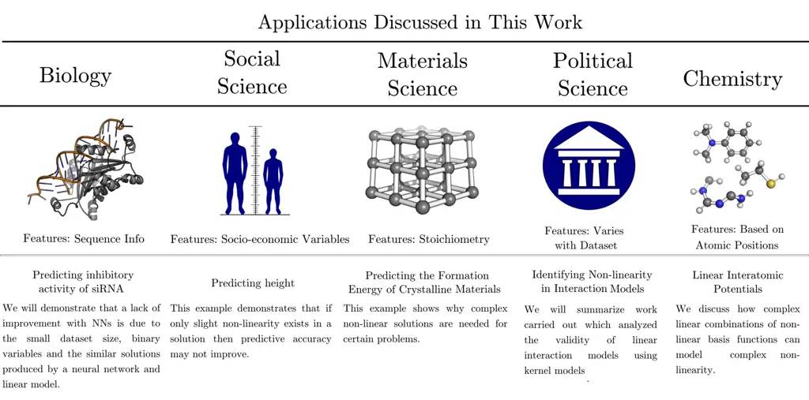
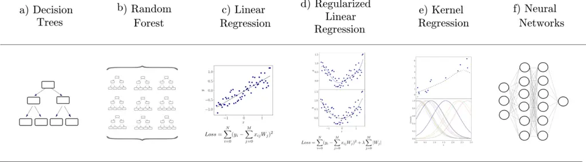
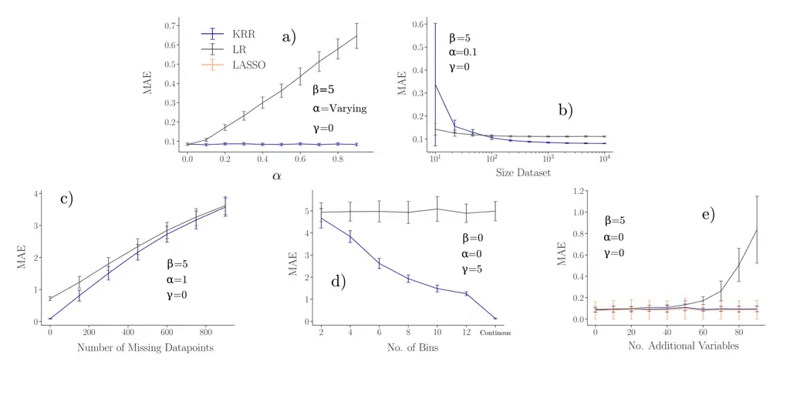
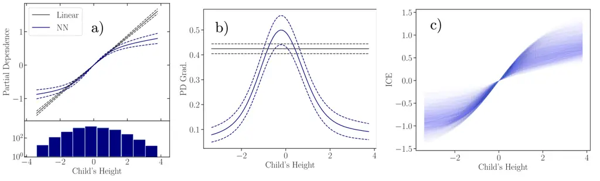

# Constructing Effective Machine Learning Models for the Sciences: A Multidisciplinary Perspective

Alice E. A. Allen Affiliation: Department of Physics and Materials
Science, University of Luxembourg, L-1511 Luxembourg City, Luxembourg
Affiliation: Center for Nonlinear Studies, Los Alamos National
Laboratory, Los Alamos, NM, USA Affiliation: Theoretical Division, Los
Alamos National Laboratory, Los Alamos, NM, USA    Alexandre Tkatchenko
Email: <alexandre.tkatchenko@uni.lu> Affiliation: Department of Physics
and Materials Science, University of Luxembourg, L-1511 Luxembourg City,
Luxembourg

###### Abstract

Learning from data has led to substantial advances in a multitude of
disciplines, including text and multimedia search, speech recognition,
and autonomous-vehicle navigation. Can machine learning enable similar
leaps in the natural and social sciences? This is certainly the
expectation in many scientific fields and recent years have seen a
plethora of applications of non-linear models to a wide range of
datasets. However, flexible non-linear solutions will not always improve
upon manually adding transforms and interactions between variables to
linear regression models. We discuss how to recognize this before
constructing a data-driven model and how such analysis can help us move
to intrinsically interpretable regression models. Furthermore, for a
variety of applications in the natural and social sciences we
demonstrate why improvements may be seen with more complex regression
models and why they may not.

## I Introduction

Machine learning (ML) has transformed sciences and technologies by
offering excellent predictive performance for a range of applications
\[1, 2, 3, 4, 5, 6, 7, 8, 9, 10, 11, 12, 13, 14, 15, 16, 17, 18, 19\].
However, complex “black box” solutions, like neural networks (NNs), are
not always the most appropriate models \[20, 21, 22, 23, 24, 25, 26,
27\]. We outline the circumstances when improvements in predictive
performance are likely to occur with non-linear solutions and when
intrinsically interpretable linear models are the most suitable choice.
In doing so, we aim to help researchers evaluate the likely outcome of
using a regression model with a more flexible functional form, and
understand when improvements may be seen.

Whilst the contents of the datasets used in different fields vary, the
methods applied for data analysis overlap significantly and machine
learning has become a unifying factor between disciplines. For example,
text mining has been used in a wide variety of applications from
predicting structures in material science to extracting information in
legislative bills \[28, 29, 30\]. Convolutional NNs inspired by
image-recognition models have been used to accurately predict static and
dynamic properties of molecules \[31\]. Transformer models have examined
political texts \[13\], predicted DNA enhancers from sequence
information \[32\] and been used for molecular and material property
prediction \[33, 34\]. Despite the similarities in techniques,
discussions often remain isolated to individual subject areas. We look
to overcome this bias by using real and simulated datasets from across
the natural and social sciences (see Fig. 1). A key difference between
the use of modelling in these fields is that the focus in the social
sciences is primarily to provide a causal explanation \[10, 35\]. In the
natural sciences, whilst some modelling is carried out for explanatory
purposes, predictive performance is often the key metric of success. By
bringing together discussions and examples from a range of fields, we
seek to provide a more diverse viewpoint regarding the required
complexity for a predictive model.



Figure 1: We cover a variety of applications and discussions from both
the natural and social sciences in this work. The figure shows this and
summarizes the variables used in the predictive models created. By
drawing on examples from a range of disciplines, we highlight the
similar characteristics seen in many datasets.

A fair comparison between linear and non-linear models requires
discussing further differentiating factors. Linear regression can be
used with an extremely large number of basis functions, or with kernel
transforms, to recreate highly complex non-linearity \[36\]. In this
discussion, we are focusing on linear combinations of non-linear basis
functions which are simplistic enough to be “intrinsically
interpretable”. These kind of linear approximations are traditionally
used as statistical models across the sciences to explain relationships
\[35\]. Finding interpretable linear models relies on the existence of
appropriate features whose contributions can be added up to achieve high
levels of predictive accuracy. Whilst it is not possible to strictly
define interpretable linear models, they will have the following
characteristics. Firstly, there will be a small (on the order of tens or
hundreds) of variables, there will be a limited set of transforms and
the variables used will have clear meaning. Using linear models with
thousands of basis functions to describe complex non-linearity is
discussed in Section V.5. We emphasize that whether non-linear or linear
models are employed, fundamental statistical learning techniques, such
as cross-validation and regularization, should always be used to ensure
accurate models are produced that can generalize to unseen data.

The flexible functional forms of non-linear ML methods can result in the
dramatic enhancement of predictive accuracy \[31, 8, 10, 37, 38\]. This
is particularly true in cases where there is plentiful data and domain
knowledge can be integrated into models \[1, 3, 39, 40\]. However, there
are multiple different factors that may impact if a non-linear model
will improve over an interpretable linear model. For example, the size,
processing and nature of the variables used in a dataset can reduce the
possible improvements in accuracy. Alternatively, the problem itself may
be sufficiently well approximated by a simple linear model, particularly
with the addition of interaction terms and transforms, that moving to a
flexible functional form does not help \[41, 42, 23, 43\]. It may also
be that causal explanations or interpretability are the primary goal of
a project. Although interpretability with non-linear models is possible,
if a simple linear model can instead be used this may be preferable
\[44\]. We will discuss these factors, along with the circumstances when
non-linear ML methods will significantly improve results. Understanding
these characteristics of a problem is important, as it can prevent
researchers unnecessarily searching for overly complex non-linear
solutions and choosing simplicity where possible \[44\].

Whilst in theory data of any complexity can be described with a linear
model provided that a sufficient number of appropriate features are
used, in practice finding a manageable number of these features for many
applications is impossible. One perspective on NNs is that they
automatically find the optimal non-linear features before finally
combining them in a linear layer. Applications which contain complex
non-linearity that can only be described using deep learning models
include image analysis tools, language models and scientific models such
as AlphaFold, SchNet, PauliNet, and Boltzmann generators \[3, 31, 45,
2\]. For these applications, deep learning models offer an obvious
advantage over intrinsically interpretable methods. Post-hoc
interpretability methods then become an essential tool for improving
understanding \[46\]. Techniques, such as LIME (Local Interpretable
Model-agnostic Explanations), can break down predictions into variable
contributions to describe the reasons for an individual result \[47, 48,
49\]. Alternatively techniques like SHAP (SHapley Additive exPlanations)
or partial dependence can visualize the non-linearity and interactions
that exist between variables \[50, 51, 52, 53, 49, 46\]. For NNs, there
is also an ever-expanding set of interpretability methods, such as
layer-wise relevance propagation \[54\] and spectral relevance analysis
\[55, 56\]. A detailed discussion regarding interpretability of deep
NNs, and the variety of methods available is presented in Ref. 46.



Figure 2: Examples of popular ML models that can be used for regression
problems: a) decision trees, which use simple decision rules to provide
predictions, b) random forest which uses an ensemble of decision trees,
c) linear regression which uses a linear approach for modelling, d)
linear regression with regularization which can prevent overfitting
occurring, e) kernel methods which map the variables into a _feature_
space where the regression problem becomes linear and f) NN models that
use a network of functions to form predictions.

With the growth in ML interpretability methods, it is now clear that
interpretability and non-linear methods are not incompatible \[46\]. In
fact, there are many cases where linear models become difficult to
interpret. When the number of basis functions gets very large, or the
features used are subject to an extensive level of transforms, linear
models are no longer ‘intrinsically’ interpretable models. Additionally,
even simple linear models can be misinterpreted \[42, 57, 10, 56\].
Furthermore, the coefficients of a linear model cannot be analysed
without a measure of the coefficient’s error as there may be a large
space of possible solutions available. When regularization is added to a
linear model, interpretation becomes even more complex and casual
conclusions can then be particularly problematic \[10\]. This is
especially true when variables are correlated \[56\]. In these cases,
interpreting a linear model is not necessarily a simple task. However,
simplistic linear models, with a small number of features and
transforms, have been the focus for explanatory modelling in many
scientific disciplines. Other intrinsically interpretable non-linear
models exist, but the compact form of an interpretable and predictive
linear model remains appealing.

## II When Linear Models Are All You Need

Non-linear ML models have a flexible functional form which can model
complex relationships between independent variables. However, there are
a number of reasons why this does not always lead to an improvement in
predictive performance over linear combinations of non-linear basis
functions (which we refer to as linear models throughout this work).

There are many different types of models that can be used for predicting
the properties of a dataset, see Fig. 2. The discussion that follows is
not restricted to a specific type of non-linear model and is generally
applicable to many existing data-driven methods. A visual representation
of the types of regression models available is shown in Fig. 2.

It is also important to note that this work focuses on predictive
models. Other types of ML tasks, such as generative and reinforcement
learning, generally require more autonomy to be given to the model and
flexible functional forms are therefore more likely to be needed.

To demonstrate the different factors that affect model performance
described in this section, we have used simulated datasets to compare
the difference in performance between an interpretable linear model
(with the simplistic form
$`f(\mathbf{x})=\beta_{0}x_{0}+\beta_{1}x_{1}`$) and kernel ridge
regression (KRR). This is shown in Fig. 3. Kernel ridge regression uses
a non-linear kernel alongside regularized linear regression. This allows
functional forms to be recreated that have not been explicitly included
in the functional form. As characteristics, such as the size of the
dataset, are varied a change in the relative performance of the linear
model and kernel model can be seen. We will refer to this figure
throughout our discussion.



Figure 3: The change in performance of a linear (LR) and kernel ridge
regression (KRR) model with properties of the data. The simulated data
has the form:
$`\small f(\mathbf{x})=\beta_{0}x_{0}+\beta_{1}x_{1}+\alpha x_{0}x_{1}+\gamma x_{0}^{2}+\epsilon`$
where $`\epsilon\sim N(0.5,0.1)`$ and the coeffients $`\alpha`$,
$`\beta`$ and $`\gamma`$ vary throughout the examples. The difference in
error: a) with the $`\alpha`$ used in the simulation b) the size of the
dataset, c) the number of missing points for the continuous variable, d)
the number of bins used for the continuous variable and e) the number of
variables present for the simulated dataset. For part e), the additional
variables added do not contribute to $`y`$ but are correlated with
$`x_{0}`$ and $`x_{1}`$. This results in a decrease in the performance
of the unregularized linear model. LASSO is a linear regression
technique with an additional regularization term in the loss function to
prevent overfitting. MAE is the mean absolute error, a measure of the
accuracy of the model.

### II.1 The Problem is Linear and Additive

One reason that non-linear methods will not improve over a linear model
is because the underlying problem is linear and additive. Before
embarking on a project it is useful to ask: is there a reason to suspect
non-linearity is present in the problem? In other words, how will a
flexible functional form help the predictive performance of this
problem? If the relationships between the independent and dependent
variables are known to have linear relationships, and interactions
between variables are not expected, then it is unlikely that
improvements will occur. However, it is worth noting that a properly
regularized, well-trained, non-linear model should not perform any worse
than a linear model for this case.

Even if the problem itself is non-linear, creating a linear model can
serve as a baseline for comparison. This can shown the improvements that
occur in comparison to a linear functional form.

### II.2 Transforms and Interactions Can Be Explicitly Added to a Linear Model

For certain problems, the relationship between the independent and
dependent variables is approximately known or can be inferred with an
“educated guess” – often based on prior domain knowledge – and can be
modelled by a simple functional form. In these cases, using a linear
model with transformed variables can result in an accurate predictive
solution and the flexible functional form of ML models is not necessary.
Similarly, a class of interactions may be hypothesized and added to the
model.

Figure 4: The relationship between reported happiness and gross domestic
product (GDP) per capita of a country. The data is taken from Ref. 58.
On a log scale a clearer linear relationship between the GDP per capita
and happiness can be seen than on a linear scale. The transformed
variable could then be used directly in a linear model.

For example, in predictive models of life satisfaction the logarithm of
income is often taken. The reasons for this can be seen on a countrywide
scale in Fig. 4. Interactions can also be hypothesised, for example in
Ref. 59 interactions between ethnicity and socio-economic status were
added to linear models for educational achievement.

Alternatively, there are sets of problems which can benefit from using
automated techniques, such as symbolic regression, to search for linear
combinations of non-linear basis functions \[60, 61, 62\]. Symbolic
regression automatically searches for an analytical formula to describe
a relationship and this can provide a highly interpretable solution
\[61\]. This is not suitable for all problems due to computational
scaling restrictions but is an excellent route for some applications.

### II.3 Binary and Categorical Variables

Binary, or categorical/ordinal variables that can be one hot encoded or
used as dummy variables, cannot exhibit non-linearity except by
interaction terms between variables (see Fig. 5). Therefore, if a large
number of the variables present only take binary values the possible
routes for improvements upon linear models are limited. Additionally, it
is straightforward to manually improve linear models if only binary
variables are present as the set of possible solutions is finite. For
example, if $`x_{0}`$ and $`x_{1}`$ are binary then
$`y=ax_{0}+bx_{1}+cx_{0}x_{1}`$ would describe all possible states.

Figure 5: The difference in the space of possible solutions for a binary
variable and a continuous variable. For a binary variable, the space of
all possible transforms does not need to be considered.

### II.4 Non-linearity is Present But Only Slightly

It is possible that non-linear relationships do exist but the variables
concerned have a small contribution to the outcome. In Fig. 3 a), the
performance for a linear and kernel model is compared as the non-linear
contribution increases. As the strength of the interaction grows, the
performance of the linear model decreases. This is because the linear
model does not include an interaction and has a limited functional form.
It may also be that the non-linearity present is masked by noise. For
$`y=f(x)+\epsilon`$ if $`\epsilon`$ is very large the model may be
unable to discern the underlying $`f(x)`$.

Alternatively, non-linearity may be present only at the extremes of the
distribution (where few points exist). Slight non-linearity which does
not influence predictive performance is particularly likely if there are
many variables contributing to the outcome.

As an example, let us imagine that we are building a predictive model
for a child’s test score at age 12, and this test score has a highly
linear relationship with the measure IQ of the child except for the top
and bottom 2.5$`\%`$ of the score. In this region, it departs from
linearity. Using a non-linear model may help to account for this
deviation, however if 95$`\%`$ of the data can be described by a linear
model then the improvements in predictive accuracy with a non-linear
model may be negligible, even though slight non-linearity does exist.

### II.5 Error in the Independent Variables

Improvements may not occur due to problems with measurement (i.e. binned
measures of continuous variables) or processing (i.e. replacement of the
missing values by the mean values) of the independent variable. This can
lead to non-linearity present in the underlying relationship being lost.
The difference in performance when a continuous variable is placed in
discrete bins is shown in Fig. 3 d). When no bins are used the KRR model
is more accurate than the linear model, but as successively more bins
are added the difference in performance is reduced. Alternatively, if
there are missing values present in the dataset this can also reduce the
improvements seen with non-linear methods. In Fig. 3 c), the difference
in the linear and KRR model shrinks as the number of missing data-points
grows. The presence of error in the independent variable has been
described as a distractor variable in Ref. 56.

For example, consider that we are collecting data by asking someone to
state their weight within 5 different ranges ($`<`$30kg, 30-50kg,
50-70kg, 70-90kg, $`>`$90kg). Information is lost as the values have
been binned. There may be other problems with the data, for instance the
person may be entirely wrong about the weight they enter. Additionally,
some people will miss the question entirely, leading to the need to
impute their values in preprocessing steps. All of these factors can
reduce the improvements seen with non-linear methods.

### II.6 The Dataset is Too Small

Even if the underlying relationship between the independent variables
and a predicted variable is complex, if there is only a small dataset
then the non-linear model will not be able to recreate this. The
differences between a linear and a non-linear model may only become
apparent at a larger dataset size. This is demonstrated in Fig. 3 b),
where the superior performance of KRR is only seen when the dataset is
sufficiently large. Complex non-linearity in a model is not useful if
the dataset is not large enough to exploit it.

For interactions between discrete, categorical variables the limitations
with the dataset size can be more clearly seen. Consider a problem which
contains 4 independent discrete, categorical variables that can take
$`k`$ possible values ($`x_{0}=`$1, 2, 3 … $`k`$) with each value having
equal probability of occurring. Approximately 1/$`k`$ of the dataset
will have a value of $`x_{0}=1`$. Therefore, if $`k=10`$ only 10% of the
data will contain $`x_{0}=1`$. For pairwise interactions (ie.
$`x_{0}x_{1}`$), the percentage of the dataset containing a specific
interaction will drop rapidly to only 1% of the dataset. This trend
would continue and only 0.01% of the dataset would contain a specific
interaction between all four variables. Therefore, to accurately
describe high order interactions the dataset would have contain tens of
thousands of data points.

### II.7 When Interpretability is More Important Than Accuracy

Statistical models are important not only for predictions but also for
causal explanations \[35, 63, 64\]. In many disciplines, being able to
derive causal explanations from a model is more important than
predictive accuracy \[35\]. Causal explanations from ML models is an
active area of research and this is not a trivial step \[65, 63, 66\].
Therefore, if causal explanation is required, it may be preferable to
create statistical models using traditional techniques. However, drawing
causal conclusions from statistical models does come with its own
complications - in part due to their restrictive functional forms \[57,
42\]. Therefore, with the growth of causal techniques for non-linear
methods these techniques may yet become the preferred choice \[67\].

Interpretability can have other advantages. For material science
applications, the construction of interpretable models by automated
searches has clear advantages. In Ref. 68, automated searching was used
to find an expression describing if an ABX3 materials was perovskite or
nonperovskite. The expression found is shown below:

```math
\tau=\frac{r_{X}}{r_{B}}-n_{A}(n_{A}-\frac{r_{A}/r_{B}}{ln(r_{A}/r_{b})}) \tag{1}
```

This equation has a 92% accuracy for dataset of 576 experimental
structures. It is likely that accurate predictive models could have been
found with “black box” methods, however the well defined formula allows
general behaviours to be seen and is a transparent solution \[68\].

## III When Non-linear Models are Required

On the other hand, there are many reasons why improvements may occur
with a non-linear ML model and they are an essential tool for many
complex problems.

### III.1 Intricate Non-linearity is Present

The primary reason for improvements occurring with non-linear models is
due to non-linearity being present in the underlying relationship that
has not been accounted for in a linear model. Such intricate non
linearity might be, for example, an interaction between three or more
independent variables. A non-linear ML model is able to recreate complex
relationships due to its flexible functional form and this can lead to
dramatic improvements in performance. For certain applications in the
sciences, knowledge can be incorporated into a model to improve
performance through manually engineered features \[44\]. Unfortunately,
manually engineered features cannot be found for all problems and
therefore flexible functional forms must be employed.

### III.2 Regularization

Overfitting happens when a complex model too closely recreates the
training data, and in doing so does not generalize to data outside of
the training set. The accuracy of a ML model is evaluated by splitting a
dataset into a training and testing set. The training set is used to fit
the model, and the testing set is used to evaluate the performance of a
model. Training and testing sets are necessary for ML models to ensure
overfitting is not occurring. Overfitting can occur for linear models,
but only when the number of variables is high compared to the size of
the dataset and the data is correlated, and this will be seen from the
standard errors of the coefficients. Regularization prevents overfitting
occurring and is another reason that non-linear ML models may lead to
improved accuracy over an unregularized linear, additive model.

For linear models, adding a penalty term to the loss function, ie.
LASSO, ridge or elastic net regression is a form a regularization \[69,
70, 71\]. For non-linear models, regularization can also take the form
of a penalty term in a loss function, or can be provided for by
alternative methods, such as dropout approaches for NNs \[72\].

If a problem has a large number of variables and a comparably small
dataset, non-linear models may show improvements over an unregularized
linear model even when the underlying relationship contains no
non-linearity. This is because regularization is preventing overfitting
from occurring. This is demonstrated in Fig. 3 e) where the performance
of the unregularized linear model decrease as more variables are added
to the dataset. In contrast, the regularized KRR model and LASSO model
do not decrease in performance.

### III.3 Flexibility in the Solution

An adaptable functional form can have additional advantages. A model may
be required that can easily be used for a large range of different
datasets or can adapt to changes as more data is added. If the main
priority is producing accurate predictive models quickly, searching for
intrinsically interpretable models may not be a constructive use of time
and post-hoc interpretability techniques could instead be used to
analyse the models produced.

## IV Interpretability Techniques for Machine Learning Models

To visualize the non-linearity present in real datasets, we use two
interpretability techniques: partial dependence (PD) and individual
conditional expectation (ICE). These particular post-hoc
interpretability are mentioned as they are used in the following
sections, for a more complete review of post-hoc interpretability
methods, see Ref. 46 or Ref. 73.

The relationships present in a model can be visualized with partial
dependence, which is defined as:

```math
PD(x_{s})=\frac{1}{n}\sum^{n}_{i=1}[\hat{f}({x_{s},x^{(i)}_{c}})] \tag{2}
```

where $`x_{s}`$ is the variable of interest, $`x_{c}`$ is all other
variables excluding $`x_{s}`$ and $`\hat{f}`$ is the ML model. The PD is
a measure of the mean value of the ML model at $`x_{s}`$ across a
dataset.

From equation 2, we can see that partial dependence averages over
multiple contributions of $`\hat{f}({x_{s},x^{(i)}_{c}})`$. This
averaging step can hide important information such as the presence of
interactions between variables. Individual Conditional Expectation (ICE)
plots show all points $`\hat{f}({x_{s},x^{(i)}_{c}})`$ for a given
$`x_{s}`$ and this avoids the issues associated with averaging over the
points.

In a predictive model, interactions between variables may also exist. If
a function, $`F(x)`$, where $`x=(x_{1},x_{2},...,x_{n})`$, cannot be
expressed as two functions:

```math
F({x})=f_{\setminus j}(x_{1},...,x_{j-1},x_{j+1},...,x_{n})\\
+f_{\setminus i}(x_{1},...,x_{i-1},x_{i+1},...,x_{n}) \tag{3}
```

where $`f_{\setminus j}`$ does not depend on $`x_{i}`$ and
$`f_{\setminus j}`$ does not depend on $`x_{i}`$ then an interaction is
said to exist between variables $`x_{i}`$ and $`x_{j}`$ \[74\]. Many
different strategies have been developed for identifying the
interactions present in a model \[52, 74, 53, 47, 48, 49, 75\]. This
includes using partial dependence in the form of H statistics. The
interaction between two variables $`j`$ and $`k`$ is defined by:

```math
\small H^{2}_{jk}=\frac{\sum^{n}_{i=1}[PD_{jk}(x^{(i)}_{j},x^{(i)}_{k})-PD_{j}(x^{(i)}_{j})-PD_{k}(x^{(i)}_{k})]}{\sum^{n}_{i=1}PD^{2}_{jk}(x^{(i)}_{j},x^{(i)}_{k})} \tag{4}
```

with $`H_{jk}=\sqrt{H^{2}_{jk}}`$. For meaningful interpretation, the H
statistic for $`\hat{f}({x})`$ has to be compared to the distribution of
H statistics if no interactions are present in the underlying model. The
creation of a null distribution is discussed in further detail in Ref. 75. The code used to calculate and produce the figures in the following
section is provided (https://github.com/aa840/icepd).

## V Multidisciplinary Applications

We have outlined several reasons why non-linear methods will and will
not improve predictive performance, and demonstrated this with simulated
datasets. We will now look at examples and, in doing so, explore why
improvements in performance do or do not occur. Furthermore, we will
also introduce perspectives from multiple disciplines. Drawing from
multiple perspectives, we will demonstrate the benefits that still
remain even when improvements in predictive performance are not seen and
highlight the advantages of large, complex linear models that contain
thousands of basis functions. The examples and insights obtained are
summarized in Fig. 1.

### V.1 Social Sciences - Predicting Height

We begin by looking at a predictive model for height in adulthood (at
age 34) using variables describing physical and socio-economic
conditions in childhood (at age 10). In doing so, we will show how
non-linearity can be clearly present in a NN model but if there is not a
high density of data in the region with non-linearity then improvements
in predictive performance are unlikely to be seen. The dataset used in
this example is from the British Cohort Study (BCS), a longitudinal
cohort study of around 17,000 children born in 1970 in England, Scotland
and Wales \[76\]. A NN model was built that predicted the body mass
index (BMI) of the participant at age 34 using information about the
parents and child when the child was age 10.



Figure 6: For the NN model for predicting adult height, the a) PD plots,
b) gradient of PD and c) ICE plot for child’s height are shown. Clear
non-linearity can be seen at the extremes of height.

The following variables were used: Gender, Child’s Height/Weight,
Father’s Height/Weight, Mother’s Height/Weight, Own House (do the
parent’s own their house, a measure of wealth), Parent’s Income per
Week. The total number of number of data points used is 6283 and all
non-binary variables were standardized to $`\mu=0,\sigma^{2}=1`$. The
number of variables is restricted for simplicity.

The linear and NN model have comparable accuracy, with R² score of 0.77
and 0.78 respectively. The partial dependent plots for both model are
generally similar, as seen in Fig. S2. However, for the child’s height
at age 10 a deviation from the linear solution is seen at the extremes
of weight with the gradient decreasing past one standard deviation from
the mean value - see Fig. 6. The distribution of variable is shown
underneath the figure and highlights the lack of data in the regions
where the NN deviates most strongly from the linear solution. The
gradient of this partial dependence plot is shown in Fig. 6b) to
highlight departures from the linear solution and the ICE plot shows the
variation in the relations across data-points.

The interactions present are considered in Fig. S1. The H-statistics for
the NN-model shows only one interaction, between the Mother’s weight and
the gender of the child and the ICE plots for the mother’s weight are
shown in Fig. S3. Therefore, there are not a large number of
interactions present in the model.

By examining the NN model for BMI prediction using interpretability
techniques, we can now draw conclusion about why the linear and
non-linear models have similar performance. Non-linearity and
interactions do exist in the NN solution but only at extremes of the
distribution and the strength of the interaction between variables is
weak. Further reasons exist for the comparable performance due to the
nature of the dataset. Firstly, binning is used for the family income.
Income is originally a continuous variable but it is then placed into
discrete bins and this can cause a deterioration in predictive
performance as discussed in Section II.5. Additionally, missing values
in the dataset are replaced by mean values and this will also prevent
higher accuracy levels. Despite the lack of improvement, the use of NN
models may still be beneficial as discussed in the following section.

### V.2 Political Sciences - Identifying Non-linearity in Interaction Models

Interactions are often added to linear models to test conditional
hypothesis, for example in Ref. 59 interactions were used to study how
factors related to class, gender and ethnicity combine in a non-additive
way to impact educational achievement. However, if non-linearity is not
properly described in a model this can lead to spurious interactions
being recognised \[57\]. ML combined with interpretability techniques
provide a unique method to describe non-linearity in a model and to see
if interactions remain when this non-linearity is properly described.

In Ref. 57, the various problems associated with adding interactions to
linear models to draw causal conclusions were discussed and numerous
datasets revisited. The datasets involved many topics including
sustainable energy transition, the role of central bank independence and
the electoral benefit of failed no-confidence motions \[77, 78, 79\].
This analysis included using kernel models, which have a flexible
functional form, to investigate whether an interaction between $`x_{0}`$
and $`x_{1}`$ was linear with respect to both variables ($`x_{0}x_{1}`$)
or if non-linearity existed in one of the terms ($`g(x_{0})x_{1}`$ where
$`g(x_{0})`$ is a non-linear function of $`x_{0}`$). Incorrectly
assuming linearity for the terms in the interaction can result in
statistically significant interactions being found that are no longer
statistically significant when the non-linearity has been corrected for.
This is problematic when modelling is used for causal explanations. This
demonstrates how non-linear models can be used for purposes other than
just improving predictive performance.

### V.3 Biology - Small Interfering RNA Example

The discovery of small interfering RNA (siRNA) and its role in gene
regulations has been a key development in molecular biology \[80, 81\].
By interacting with messenger RNA (mRNA), siRNA can prevent translation
occurring, interrupting the production of amino acids and regulating
gene expression \[81\]. Large scale siRNA screens are regularly used to
better understand biological process and, due to siRNA’s ability to
induce gene silencing, it is also seen as a potential therapeutic tool
with multiple siRNA therapeutics recently approved \[81, 82, 83\].

The effectiveness of the gene silencing by siRNA can vary considerably
\[84, 85, 86\]. Therefore, multiple attempts have been made to build
predictive models of the inhibitory activity of siRNA \[87, 88, 86, 89,
90, 91, 92, 93, 94, 95, 96\]. siRNA is made up of four bases, adenine
(A), cytosine (C), guanine (G) and uracil (U) joined in a sequence, with
a typical length of around 21 base pairs. This sequence information can
be used as features for a predictive model \[93, 94, 95\].
Alternatively, the frequency of bases and neighbouring bases (ie. the
number of A, AC, etc.) can be used \[96\]. Secondary structure,
thermodynamic information or mRNA related features can also be
incorporated into a model and this has been shown to result in
improvements in performance \[96, 91, 84, 89\]. We will focus on
positional sequence features of siRNA, as these features have been shown
to offer competitive performance and are regularly included in
predictive models of inhibitory activity of siRNA \[94\].

Before the development of regression models for predicting inhibitory
activity, rules based methods were proposed \[88, 87, 86\]. These
methods described simple criteria, such as lower G/C content or a
specific base present at a given position, that were associated with
higher efficacy \[87\]. Subsequently, linear models, artificial NNs and
support vector machines have all been proposed as predictive models for
inhibitory activity. One of the first ML models for predicting siRNA
inhibitory activity was BIOPREDsi \[93\]. However, it was later seen
that a linear model, $`i-Score`$, showed comparative accuracy to
BIOPREDsi and also just relied on positional sequence information
\[95\]. A detailed comparison of each model’s relative performance with
varying feature sets is given in Ref. 94.

In this work, we fit a NN model that uses sequence information to
predict the inhibitory activity. The predictions from this NN model are
highly correlated with the BIOPREDsi model, $`\mathrm{R}^{2}`$ of 0.97.
By employing ML interpretability methods, the NN model is shown to
effectively recreate the linear solution, with near identical PD values.
We will discuss the reasons why this is the case. The dataset used is
from Ref. 93 and contains 2431 siRNA sequences provided along with
experimentally determined inhibitory activity. Details of the dataset
and model used is given in Section S1.2.

The linear model and NN model for the positional sequence have
$`\mathrm{R}^{2}`$ of 0.43/0.42 and 0.45/0.53 for the training and
testing set respectively. This is similar performance to that seen in
Ref. 95. We can now further investigate the NN solution using
interpretability methods.

Figure 7 shows the partial dependence of the linear model alongside the
partial dependence of the NN model. Two considerations should be noted,
firstly as the variables in this example are binary, non-linearity
cannot occur in model except through interactions. Secondly, the
coefficients and partial dependence of a linear, additive model differ
just by a constant. The partial dependence for the NN and linear model
are almost identical with the difference in the partial dependence
between the two models averaging around 0.2. Therefore, there is a
negligible difference in the PD between the two models.

Figure 7: The a) partial dependence of a linear model and b) the partial
dependence of a NN model fit to the siRNA sequence data. The mean for
the partial dependence plot is set to be equivalent to the linear plot.
The error bars show the standard deviation.

The similarity between the two models can also be assessed by comparing
the predictions for the test set with the linear and NN model, Fig. 8.
From this graph, it can be seen that the two predictions are highly
correlated. Interactions in a model can also be used to compare the
model and can be assessed through a variety of methods \[97, 50, 51, 53,
74\]. Whilst interactions do exist in the NN model, see Fig. S4 where
H-statistics are used to assess interaction strength, these interaction
are not strong enough to cause large changes in the NN model’s
prediction.

Figure 8: The predicted results for the siRNA inhibitory activity for
the test set for the linear and NN model. The black line is at $`y=x`$.

For this example, we have seen comparable performance between a linear
and non-linear model. This is partly because the problem contains binary
variables. As previously discussed, binary variables can only have
interactions between terms and interactions can easily be added to a
linear model manually if there was a significant difference in
performance. Another reason for the lack of improvement is the size of
the dataset - there are 2431 datapoints and 84 variables. There are over
three thousand possible pairwise interactions that could exist, and the
sampling of these interactions with the limited size dataset is poor.
Therefore, even if there were strong interactions present in the
underlying problem, the sampling is insufficient to capture a
significant amount of them.

### V.4 Material Sciences - Prediction of Formation Energy in Crystalline Materials

In this discussion so far, we have focused on examples where linear
models provide approximately the same accuracy as non-linear models. For
this example, we turn to a case where complex non-linear solutions are
required and the manual addition of interactions and transforms is not
possible. ML models can provide fast and accurate predictions of
material properties, and we will look at the prediction of formation
energy for crystalline materials. This is a problem that requires
non-linear solutions and we will explore the non-linearity present with
interpretability methods.

The predicted quantity in this example is formation energy which
describes the stability of a material. The features used are the
stoichometric formula, which describe the percentage of each element in
a material. For example, $`Al_{2}O_{3}`$ would have features Al=0.4 and
O=0.6. This is a very simplistic feature as it does not contain
information about distances between atoms or the structure of the
material. It is because these features are so simple that complex
non-linearity is required for the regression model.

A dataset of crystalline materials was taken from Ref. 98. A NN model
with six hidden layers was created for predicting the formation energy
of a material with stoichometry used as the input variable. The
stoichometry defines the percentage of each element present in a
material. This methodology is similar to the used in Elemnet, from Ref.
37 although the NN architecture is not identical. Stoichometry has also
been used with a NN framework with the Roost package \[11\].

Figure 9: The change in error with the size of the dataset used for the
NN and linear model. As the dataset size increases, the NN begins to
outperform the linear model. The error bars show the standard deviation
for different train/test splits.

The learning curve of the NN model and a linear model is shown in Fig. 9. The stoichometric information is a very limited set of information to
provide and so complex non-linearity must be present for the accurate
prediction of formation energies. The linear model cannot compete as
this simplistic model does not capture the chemical behaviour.

The non-linearity present in the NN solution can be explored with ICE
plots. These are shown in Fig. 10 with the change in the prediction with
oxygen content given for chlorine and silicon containing materials. The
varying gradient of the ICE lines indicates that the relationship
between the percentage of oxygen and the formation energy predicted is
dependent on other variables present in the material. In other words,
interactions are present in the model. Furthermore, the different
relationships for chlorine and silicon indicate that linear-additive
relationships would not suffice to describe the effect that oxygen
concentration has on formation energy, Fig. 10.

Figure 10: The ICE plots for oxygen for materials containing silicon and
chlorine. The data-points present in the training set are shown by black
markers. Clear non-linearity in the solution can be seen.

For this example we have explored the reasons why NNs improve
performance over simplistic linear model for formation energy
prediction. In doing so, we have provided an example of why non-linear
methods do improve predictive performance and shown the clear
non-linearity present in the model.

### V.5 Chemistry - Linear Interatomic Potentials

Before we conclude, it is important to highlight that complex
non-linearity can be represented by a linear model. If we have a very
large number of possible non-linear basis functions (with varying
transforms and interactions present) this is capable of modelling highly
complex non-linear problems. This has been seen in applications to
chemistry and materials science.

Interatomic potentials are used in computational chemistry and material
science to predict the forces and energies present in a system \[99,
100, 7, 8, 101\]. Given a set of training data containing the
coordinates, energies and (optionally) forces for a molecular or
material system a predictive model can be built. Whilst simplistic
classical models have been used for these problems, greater complexity
is required to fully model the interactions present in an atomistic
system \[102, 103\]. ML models have been used as interatomic potentials
for over ten years but have traditionally consisted of kernel or NN
models \[104, 31, 100, 105, 106\]. In recent years it has been shown
that complex linear combinations of non-linear basis functions can also
provide models that are both fast and accurate ie. (MTP, ACE, SNAP,
ChIMES etc.) \[107, 99, 108, 109, 110, 111\].

Models that use linear or polynomial regression with a very complex set
of basis functions and high order interaction terms are an alternative
approach for describing complex non-linearity in a system. For a
detailed discussion of how to perform linear regression with a large
number of parameters see Ref. 36. Although there is a level of
interpretability that can be gained from these techniques, it is not
equivalent to that for simplistic linear models. These approaches should
therefore be used when complex non-linearity is necessary for a
solution.

## VI Discussion

Non-linear models have shown to be highly accurate predictive solutions
for many problems. However, if equivalently accurate linear models can
also be created this is often the preferable solution as they are
directly interpretable. Depending on the application, one technique may
be more advantageous.

Alternatively, using both techniques together can have benefits. For
instance, linear models can provide a baseline level of accuracy to
compare to more complex techniques. An example is presented in Ref. 112,
where linear and polynomial models were created to show that there is
significant improvement in the prediction of molecular properties when
kernel ridge regression is used. These baselines may also incorporate
knowledge about different transforms and interactions that are expected
to occur. Additionally, by analysing a non-linear model with
interpretability techniques possible transforms can be exposed that can
be used in a linear model.

If a researcher wants to use non-linear ML models to improve predictive
performance, taking a number of considerations into account can help to
assess if improvements are likely to occur. This can be summarized as
five key questions:

- •
  Do I expect non-linearity and interactions with my choice of features?
- •
  Are the majority of variables discrete with very few unique values?
- •
  For variables where non-linear relationships are expected, are these
  the key variables for the outcome and what is their distribution?
- •
  What is the size of the dataset and how does it compare to the number
  of variables used?

The flexible functional form of non-linear ML models has led to
impressive improvements in predictive accuracy for many applications.
However, not all problems require complex non-linear solutions. It is
important to understand the reasons for this as it can prevent the
unnecessary search for improvements in accuracy that will probably not
be found. It can also prevent “black box” models being used for
applications that have directly interpretable solutions. We have used
simulated datasets and real datasets from across the sciences to explain
when and why improvements with non-linear models may occur and when they
are unlikely to not. In doing so, we have provided a unique discussion
about the expected benefits of moving to non-linear models.

## Acknowledgments

The authors acknowledge funding from the IAS-Luxembourg (Audacity Grant
DSEWELL). AA thanks the Center for Nonlinear Studies (CNLS) for
resources and funding. Los Alamos National Laboratory LA-UR:
LA-UR-22-30283.

## Ethics declarations

The authors declare no competing interests.

## Data Availability Statement

The data for predicting height is from the British Cohort Study (BCS)
\[76\]. This dataset can be found through the UK Data Service at
https://discover.ukdataservice.ac.uk/series/?sn=200001. The dataset for
the siRNA example is taken from Ref. 93. The dataset for the prediction
of the formation energy is taken from Ref. 98.

## Code Availability Statement

The software required to make Fig.6, Fig.7 and Fig.10 is available at
https://github.com/aa840/icepd.

## References

- \[1\] D. Silver, T. Hubert, J. Schrittwieser, I. Antonoglou, M.
  Lai, A. Guez, M. Lanctot, L. Sifre, D. Kumaran, T. Graepel, T.
  Lillicrap, K. Simonyan, and D. Hassabis, Science 362, 1140 (2018).
- \[2\] F. Noé, S. Olsson, J. Köhler, and H. Wu, Science 365, eaaw1147
  (2019).
- \[3\] A. W. Senior, R. Evans, J. Jumper, J. Kirkpatrick, L. Sifre, T.
  Green, C. Qin, A. Žídek, A. W. R. Nelson, A. Bridgland, H.
  Penedones, S. Petersen, K. Simonyan, S. Crossan, P. Kohli, D. T.
  Jones, D. Silver, K. Kavukcuoglu, and D. Hassabis, [Nature 577, 706
  (2020)](https://doi.org/10.1038/s41586-019-1923-7).
- \[4\] R. Gómez-Bombarelli, J. N. Wei, D. Duvenaud, J. M.
  Hernández-Lobato, B. Sánchez-Lengeling, D. Sheberla, J.
  Aguilera-Iparraguirre, T. D. Hirzel, R. P. Adams, and A. Aspuru-Guzik,
  ACS Cent. Sci. 4, 268 (2018).
- \[5\] F. A. Faber, A. Lindmaa, O. A. von Lilienfeld, and R. Armiento,
  [Phys. Rev. Lett. 117, 135502
  (2016)](https://doi.org/10.1103/PhysRevLett.117.135502).
- \[6\] E. Lampa, L. Lind, M. Lind, and A. Bornefalk-Hermansson,
  [Environ. Health: Glob. Access Sci. 13, 57
  (2014)](https://doi.org/10.1186/1476-069X-13-57).
- \[7\] J. A. Keith, V. Vassilev-Galindo, B. Cheng, S. Chmiela, M.
  Gastegger, K.-R. Müller, and A. Tkatchenko, Chem. Rev. 121, 9816
  (2021).
- \[8\] V. L. Deringer, M. A. Caro, and G. Csányi, Adv. Mater. 31,
  e1902765 (2019).
- \[9\] F. Noé, A. Tkatchenko, K.-R. Müller, and C. Clementi, Ann. Rev.
  Phys. Chem. 71, 361 (2020).
- \[10\] S. Athey and G. W. Imbens, Annu. Rev. Econom. 11, 685 (2019).
- \[11\] R. E. A. Goodall and A. A. Lee, [Nat. Commun. 11, 6280
  (2020)](https://doi.org/10.1038/s41467-020-19964-7).
- \[12\] J. G. Greener, S. M. Kandathil, L. Moffat, and D. T. Jones,
  [Nat. Rev. Mol. Cell Biol. 23, 40
  (2022)](https://doi.org/10.1038/s41580-021-00407-0).
- \[13\] T. Widmann and M. Wich, [Polit. Anal. , 1–16
  (2022)](https://doi.org/10.1017/pan.2022.15).
- \[14\] B. Ramsundar, P. Eastman, P. Walters, and V. Pande, _Deep
  Learning for the Life Sciences: Applying Deep Learning to Genomics,
  Microscopy, Drug Discovery, and More_ (O’Reilly Media, 2019).
- \[15\] P. Johri, J. Verma, and S. Paul, [_Applications of Machine
  Learning_](https://books.google.com/books?id=IkvhDwAAQBAJ), Algorithms
  for Intelligent Systems (Springer Singapore, 2020).
- \[16\] M. Rupp, A. Tkatchenko, K.-R. Müller, and O. A. von Lilienfeld,
  Phys. Rev. Lett. 108, 058301 (2012).
- \[17\] D. K. Duvenaud, D. Maclaurin, J. Iparraguirre, R. Bombarell, T.
  Hirzel, A. Aspuru-Guzik, and R. P. Adams, in _Advances in Neural
  Information Processing Systems_, Vol. 28, edited by C. Cortes, N.
  Lawrence, D. Lee, M. Sugiyama, and R. Garnett (Curran Associates,
  Inc., 2015).
- \[18\] B. Sanchez-Lengeling and A. Aspuru-Guzik, Science 361, 360
  (2018).
- \[19\] H. Altae-Tran, B. Ramsundar, A. S. Pappu, and V. Pande, ACS
  Cent. Sci. 3, 283 (2017).
- \[20\] M.-A. Schulz, B. T. T. Yeo, J. T. Vogelstein, J.
  Mourao-Miranada, J. N. Kather, K. Kording, B. Richards, and D. Bzdok,
  [Nat. Commun. 11, 4238
  (2020)](https://doi.org/10.1038/s41467-020-18037-z).
- \[21\] L. M. Ghiringhelli, J. Vybiral, S. V. Levchenko, C. Draxl,
  and M. Scheffler, [Phys. Rev. Lett. 114, 105503
  (2015)](https://doi.org/10.1103/PhysRevLett.114.105503).
- \[22\] C. Rudin, [Nat. Mach. Intell. 1, 206
  (2019)](https://doi.org/10.1038/s42256-019-0048-x).
- \[23\] A. E. A. Allen and A. Tkatchenko, [Sci. Adv. 8, eabm7185
  (2022)](https://www.science.org/doi/abs/10.1126/sciadv.abm7185).
- \[24\] V. Volovici, N. L. Syn, A. Ercole, J. J. Zhao, and N. Liu, Nat.
  Med. (2022).
- \[25\] Z. Obermeyer, B. Powers, C. Vogeli, and S. Mullainathan,
  Science 366, 447 (2019).
- \[26\] C. Szegedy, W. Zaremba, I. Sutskever, J. Bruna, D. Erhan, I.
  Goodfellow, and R. Fergus, “Intriguing properties of neural networks,”
  (2014), [arXiv:1312.6199 \[cs.CV\]](http://arxiv.org/abs/1312.6199) .
- \[27\] N. Mehrabi, F. Morstatter, N. Saxena, K. Lerman, and A.
  Galstyan, ACM Comput. Surv. 54 (2021).
- \[28\] G. Ceder, D. Morgan, C. Fischer, K. Tibbetts, and S. Curtarolo,
  MRS Bulletin 31, 981 (2006).
- \[29\] J. Fluck and M. Hofmann-Apitius, Drug Discov. Today 19, 140
  (2014).
- \[30\] J. Wilkerson and A. Casas, Annu. Rev. Polit. Sci. 20, 529
  (2017).
- \[31\] K. T. Schütt, F. Arbabzadah, S. Chmiela, K.-R. Müller, and A.
  Tkatchenko, Nat. Commun. 8, 13890 (2017).
- \[32\] N. Q. K. Le, Q.-T. Ho, T.-T.-D. Nguyen, and Y.-Y. Ou, Brief.
  Bioinformatics 22 (2021), bbab005.
- \[33\] A. Y.-T. Wang, S. K. Kauwe, R. J. Murdock, and T. D. Sparks,
  [Npj Comput. Mater. 7, 77
  (2021)](https://doi.org/10.1038/s41524-021-00545-1).
- \[34\] O. T. Unke, S. Chmiela, M. Gastegger, K. T. Schütt, H. E.
  Sauceda, and K.-R. Müller, Nat. Commun. 12, 7273 (2021a).
- \[35\] G. Shmueli, [Stat. Sci. 25, 289
  (2010)](https://doi.org/10.1214/10-STS330).
- \[36\] D. W. Hogg and S. Villar, [Publ. Astron. Soc. Pac. 133, 093001
  (2021)](https://doi.org/10.1088/1538-3873/ac20ac).
- \[37\] D. Jha, L. Ward, A. Paul, W.-k. Liao, A. Choudhary, C.
  Wolverton, and A. Agrawal, [Sci. Rep. 8, 17593
  (2018)](https://doi.org/10.1038/s41598-018-35934-y).
- \[38\] S. Batzner, A. Musaelian, L. Sun, M. Geiger, J. P. Mailoa, M.
  Kornbluth, N. Molinari, T. E. Smidt, and B. Kozinsky, Nat. Commun. 13,
  2453 (2022).
- \[39\] S. Chmiela, A. Tkatchenko, H. E. Sauceda, I. Poltavsky, K. T.
  Schütt, and K.-R. Müller, Sci. Adv. 3, e1603015 (2017).
- \[40\] S. Chmiela, H. Sauceda, K.-R. Müller, and A. Tkatchenko, Nat.
  Commun. 9, 3887 (2018a).
- \[41\] R. Layard, A. E. Clark, F. Cornaglia, N. Powdthavee, and J.
  Vernoit, Econ. J. 124, F720 (2014).
- \[42\] T. Brambor, W. R. Clark, and M. Golder, Polit. Anal. 14, 63
  (2006).
- \[43\] B. Blankertz, R. Tomioka, S. Lemm, M. Kawanabe, and K.-R.
  Muller, IEEE Signal processing magazine 25, 41 (2007).
- \[44\] K.-R. Muller, C. Anderson, and G. Birch, [IEEE Trans. Neural
  Syst. Rehabilitation Eng. 11, 165
  (2003)](https://doi.org/10.1109/TNSRE.2003.814484).
- \[45\] J. Hermann, Z. Schätzle, and F. Noé, Nat. Chem. 12, 891 (2020).
- \[46\] W. Samek, G. Montavon, S. Lapuschkin, C. J. Anders, and K.-R.
  Müller, [Proc. IEEE 109, 247
  (2021)](https://doi.org/10.1109/JPROC.2021.3060483).
- \[47\] E. Štrumbelj and I. Kononenko, [Knowl. Inf. Syst. 41, 647
  (2013)](https://doi.org/10.1007/s10115-013-0679-x).
- \[48\] M. T. Ribeiro, S. Singh, and C. Guestrin, in _Proceedings of
  the 22nd ACM SIGKDD International Conference on Knowledge Discovery
  and Data Mining_ (New York, NY, USA, 2016) p. 1135–1144.
- \[49\] S. M. Lundberg and S.-I. Lee, in _Advances in Neural
  Information Processing Systems_, Vol. 30, edited by I. Guyon, U. V.
  Luxburg, S. Bengio, H. Wallach, R. Fergus, S. Vishwanathan, and R.
  Garnett (Curran Associates, Inc., 2017).
- \[50\] J. H. Friedman, [Ann. Statist. 29, 1189
  (2001)](https://doi.org/10.1214/aos/1013203451).
- \[51\] A. Goldstein, A. Kapelner, J. Bleich, and E. Pitkin, J. Comput.
  Graph. Stat. 24, 44 (2015).
- \[52\] D. W. Apley and J. Zhu, J. R. Stat. Soc. Series B Stat.
  Methodol. 82, 1059 (2020).
- \[53\] G. Hooker, J. Comput. Graph. Stat. 16, 709 (2007).
- \[54\] S. Bach, A. Binder, G. Montavon, F. Klauschen, K.-R. Müller,
  and W. Samek, PloS One 10, e0130140 (2015).
- \[55\] S. Lapuschkin, S. Wäldchen, A. Binder, G. Montavon, W. Samek,
  and K.-R. Müller, Nat. Commun. 10, 1096 (2019).
- \[56\] R. Wilming, C. Budding, K.-R. Müller, and S. Haufe, Mach.
  Learn. 111, 1903 (2022).
- \[57\] J. Hainmueller, J. Mummolo, and Y. Xu, [Polit. Anal. 27,
  163–192 (2019)](https://doi.org/10.1017/pan.2018.46).
- \[58\] J. F. Helliwell, R. Layard, J. Sachs, and J.-E. D. Neve, World
  Happiness Report, New York: Sustainable Development Solutions Network.
  (2021).
- \[59\] S. Strand, Research Papers in Education 29, 131 (2014).
- \[60\] Y. Wang, N. Wagner, and J. M. Rondinelli, [MRS Commun. 9,
  793–805 (2019)](https://doi.org/10.1557/mrc.2019.85).
- \[61\] S.-M. Udrescu and M. Tegmark, Sci. Adv. 6, eaay2631 (2020).
- \[62\] R. Ouyang, S. Curtarolo, E. Ahmetcik, M. Scheffler, and L. M.
  Ghiringhelli, [Phys. Rev. Materials 2, 083802
  (2018)](https://doi.org/10.1103/PhysRevMaterials.2.083802).
- \[63\] M. Prosperi, Y. Guo, M. Sperrin, J. S. Koopman, J. S. Min, X.
  He, S. Rich, M. Wang, I. E. Buchan, and J. Bian, Nat. Mach. Intell. 2,
  369 (2020).
- \[64\] J. Pearl, Int J Biostat 6, Article 7 (2010).
- \[65\] P. Lecca, Front. bioinform. 1 (2022).
- \[66\] A. Chattopadhyay, P. Manupriya, A. Sarkar, and V. N.
  Balasubramanian, in [_Proceedings of the 36th International Conference
  on Machine
  Learning_](https://proceedings.mlr.press/v97/chattopadhyay19a.html),
  Proceedings of Machine Learning Research, Vol. 97, edited by K.
  Chaudhuri and R. Salakhutdinov (PMLR, 2019) pp. 981–990.
- \[67\] J. Runge, S. Bathiany, E. Bollt, G. Camps-Valls, D. Coumou, E.
  Deyle, C. Glymour, M. Kretschmer, M. D. Mahecha, J. Muñoz-Marí, E. H.
  van Nes, J. Peters, R. Quax, M. Reichstein, M. Scheffer, B.
  Schölkopf, P. Spirtes, G. Sugihara, J. Sun, K. Zhang, and J.
  Zscheischler, Nat. Commun. 10, 2553 (2019).
- \[68\] C. J. Bartel, C. Sutton, B. R. Goldsmith, R. Ouyang, C. B.
  Musgrave, L. M. Ghiringhelli, and M. Scheffler, Sci. Adv. 5, eaav0693
  (2019).
- \[69\] R. Tibshirani, J. R. Stat. Soc. Series B Stat. Methodol. 58,
  267 (1996).
- \[70\] A. E. Hoerl and R. W. Kennard, [Technometrics 42, 80
  (2000)](http://www.jstor.org/stable/1271436).
- \[71\] H. Zou and T. Hastie, [J. R. Stat. Soc. Ser. B Methodol. 67,
  301 (2005)](http://www.jstor.org/stable/3647580).
- \[72\] N. Srivastava, G. Hinton, A. Krizhevsky, I. Sutskever, and R.
  Salakhutdinov, J. Mach. Learn. Res. 15, 1929 (2014).
- \[73\] M. Du, N. Liu, and X. Hu, Commun. ACM. 63, 68 (2019).
- \[74\] D. Sorokina, R. Caruana, M. Riedewald, and D. Fink, in
  _Proceedings of the 25th International Conference on Machine
  Learning_, ICML ’08 (Association for Computing Machinery, New York,
  NY, USA, 2008) p. 1000–1007.
- \[75\] J. H. Friedman and B. E. Popescu, Ann. Appl. Stat. 2, 916
  (2008).
- \[76\] A. Sullivan, M. Brown, M. Hamer, and G. B. Ploubidis,
  International Journal of Epidemiology 35, 836 (2022).
- \[77\] M. Aklin and J. Urpelainen, Am. J. Pol. Sci. 57, 643 (2013).
- \[78\] C. Bodea and R. Hicks, [Int. Organ. 69, 35
  (2015)](https://doi.org/10.1017/S0020818314000277).
- \[79\] L. K. Williams, Comp. Political Stud. 44, 1474 (2011).
- \[80\] A. Fire, S. Xu, M. K. Montgomery, S. A. Kostas, S. E. Driver,
  and C. C. Mello, [Nature 391, 806
  (1998)](https://doi.org/10.1038/35888).
- \[81\] H. Dana, G. M. Chalbatani, H. Mahmoodzadeh, R. Karimloo, O.
  Rezaiean, A. Moradzadeh, N. Mehmandoost, F. Moazzen, A. Mazraeh, V.
  Marmari, M. Ebrahimi, M. M. Rashno, S. J. Abadi, and E. Gharagouzlo,
  Int. J. Biomed. Sci. : IJBS 13, 48 (2017).
- \[82\] B. Hu, L. Zhong, Y. Weng, L. Peng, Y. Huang, Y. Zhao, and X.-J.
  Liang, [Signal Transduct. Target. Ther. 5, 101
  (2020)](https://doi.org/10.1038/s41392-020-0207-x).
- \[83\] R. Hadjslimane, Y. Lepelletier, N. Lopez, C. Garbay, and F.
  Raynaud, [Biochimie 89, 1234
  (2007)](https://doi.org/10.1016/j.biochi.2007.06.012).
- \[84\] A. Khvorova, A. Reynolds, and S. D. Jayasena, Cell 115, 209
  (2003).
- \[85\] D. K. Walters and D. F. Jelinek, Antisense Nucleic Acid Drug
  Dev. 12, 411 (2002).
- \[86\] M. Amarzguioui and H. Prydz, [Biochem. Biophys. Res. Commun.
  316, 1050
  (2004)](https://doi.org/https://doi.org/10.1016/j.bbrc.2004.02.157).
- \[87\] A. Reynolds, D. Leake, Q. Boese, S. Scaringe, W. S. Marshall,
  and A. Khvorova, [Nat. Biotechnol. 22, 326
  (2004)](https://doi.org/10.1038/nbt936).
- \[88\] K. Ui-Tei, Y. Naito, F. Takahashi, T. Haraguchi, H.
  Ohki-Hamazaki, A. Juni, R. Ueda, and K. Saigo, Nucleic Acids Res. 32,
  936 (2004).
- \[89\] S. A. Shabalina, A. N. Spiridonov, and A. Y. Ogurtsov, BMC
  Bioinformatics 7, 65 (2006).
- \[90\] A. S. Peek, BMC Bioinformatics 8, 182 (2007).
- \[91\] S. Sciabola, Q. Cao, M. Orozco, I. Faustino, and R. V. Stanton,
  Nucleic Acids Res. 41, 1383 (2013).
- \[92\] S. Sciabola, H. Xi, D. Cruz, Q. Cao, C. Lawrence, T. Zhang, S.
  Rotstein, J. D. Hughes, D. R. Caffrey, and R. V. Stanton, PLoS One 16,
  e0238753 (2021).
- \[93\] D. Huesken, J. Lange, C. Mickanin, J. Weiler, F. Asselbergs, J.
  Warner, B. Meloon, S. Engel, A. Rosenberg, D. Cohen, M. Labow, M.
  Reinhardt, F. Natt, and J. Hall, [Nat. Biotechnol. 23, 995
  (2005)](https://doi.org/10.1038/nbt1118).
- \[94\] K. A. McQuisten and A. S. Peek, [PloS One 4, 1
  (2009)](https://doi.org/10.1371/journal.pone.0007522).
- \[95\] M. Ichihara, Y. Murakumo, A. Masuda, T. Matsuura, N. Asai, M.
  Jijiwa, M. Ishida, J. Shinmi, H. Yatsuya, S. Qiao, M. Takahashi,
  and K. Ohno, Nucleic acids Res. 35, e123 (2007).
- \[96\] F. He, Y. Han, J. Gong, J. Song, H. Wang, and Y. Li, [Sci. Rep.
  7, 44836 (2017)](https://doi.org/10.1038/srep44836).
- \[97\] E. Štrumbelj and I. Kononenko, in _Adaptive and Natural
  Computing Algorithms_, edited by A. Dobnikar, U. Lotrič, and B. Šter
  (Springer Berlin Heidelberg, Berlin, Heidelberg, 2011) pp. 21–30.
- \[98\] F. Faber, A. Lindmaa, O. A. von Lilienfeld, and R. Armiento,
  [Int. J. Quantum Chem. 115, 1094
  (2015)](https://onlinelibrary.wiley.com/doi/abs/10.1002/qua.24917).
- \[99\] A. V. Shapeev, [Multiscale Model. Simul. 14, 1153
  (2016)](https://doi.org/10.1137/15M1054183).
- \[100\] A. P. Bartók, M. C. Payne, R. Kondor, and G. Csányi, Phys.
  Rev. Lett. 104, 136403 (2010).
- \[101\] S. Chmiela, H. E. Sauceda, K.-R. Müller, and A. Tkatchenko,
  Nat. Commun. 9, 3887 (2018b).
- \[102\] W. L. Jorgensen and J. Tirado-Rives, J. Am. Chem. Soc. 110,
  1657 (1988).
- \[103\] S. J. Weiner, P. A. Kollman, D. A. Case, U. C. Singh, C.
  Ghio, G. Alagona, S. Profeta, and P. Weiner, J. Am. Chem. Soc. 106,
  765 (1984).
- \[104\] J. S. Smith, O. Isayev, and A. E. Roitberg, Chem. Sci. 8, 3192
  (2017).
- \[105\] J. Behler, J. Chem. Phys 134, 074106 (2011).
- \[106\] O. T. Unke, S. Chmiela, H. E. Sauceda, M. Gastegger, I.
  Poltavsky, K. T. Schütt, A. Tkatchenko, and K.-R. Müller, Chem. Rev.
  121, 10142 (2021b).
- \[107\] R. Drautz, [Phys. Rev. B 99, 014104
  (2019)](https://doi.org/10.1103/PhysRevB.99.014104).
- \[108\] R. K. Lindsey, L. E. Fried, and N. Goldman, J. Chem. Theory
  Comput. 13, 6222 (2017).
- \[109\] C. van der Oord, G. Dusson, G. Csányi, and C. Ortner, Mach.
  Learn.: Sci. Technol. 1, 015004 (2020).
- \[110\] A. E. A. Allen, G. Dusson, C. Ortner, and G. Csányi, [Mach.
  Learn.: Sci. Technol. 2, 025017
  (2021)](https://doi.org/10.1088/2632-2153/abd51e).
- \[111\] D. P. Kovács, C. v. d. Oord, J. Kucera, A. E. A. Allen, D. J.
  Cole, C. Ortner, and G. Csányi, J. Chem. Theory Comput. 17, 7696
  (2021).
- \[112\] K. Hansen, F. Biegler, R. Ramakrishnan, W. Pronobis, O. A. von
  Lilienfeld, K.-R. Müller, and A. Tkatchenko, J. Phys. Chem. Lett. 6,
  2326 (2015).
