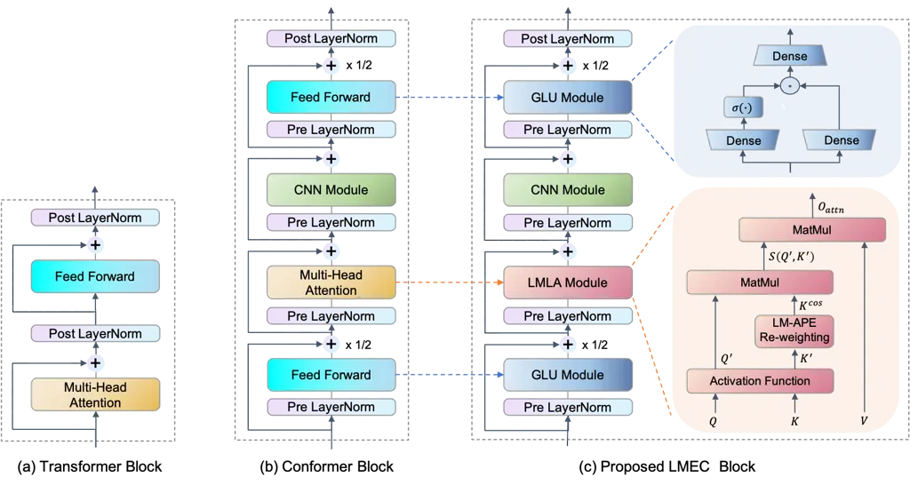
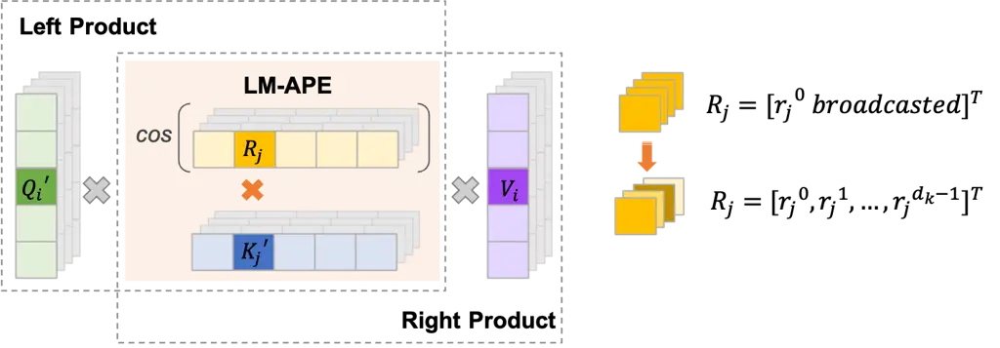
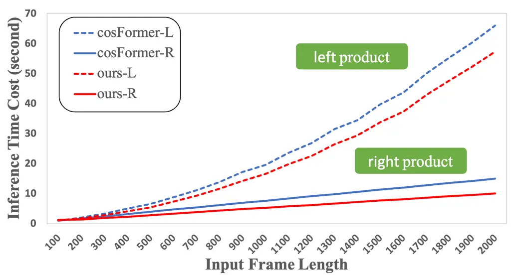

# LMEC: Learnable Multiplicative Absolute Position Embedding Based Conformer for Speech Recognition

Yuguang Yang Affiliation: Ximalaya Inc., ShangHai, China    Yu Pan
Affiliation: University of Alberta, Edmonton, Canada    Jingjing Yin
Affiliation: Ximalaya Inc., ShangHai, China    Heng Lu
Affiliation: Ximalaya Inc., ShangHai, China

###### Abstract

This paper proposes a Learnable Multiplicative absolute position
Embedding based Conformer (LMEC). It contains a kernelized linear
attention (LA) module called LMLA to solve the time-consuming problem
for long sequence speech recognition as well as an alternative to the
FFN structure. First, the ELU function is adopted as the kernel function
of our proposed LA module. Second, we propose a novel Learnable
Multiplicative Absolute Position Embedding (LM-APE) based re-weighting
mechanism that can reduce the well-known quadratic temporal-space
complexity of softmax self-attention. Third, we use Gated Linear Units
(GLU) to substitute the Feed Forward Network (FFN) for better
performance. Extensive experiments have been conducted on the public
LibriSpeech datasets. Compared to the Conformer model with cosFormer
style linear attention, our proposed method can achieve up to 0.63%
word-error-rate improvement on test-other and improve the inference
speed by up to 13% (left product) and 33% (right product) on the LA
module.

Index Terms: Conformer, cosFormer, Linear Attention, Position Embedding,
Gated Linear Units

## 1 Introduction

Over the last decade, end-to-end models have been applied as mainstream
approaches for state-of-the-art automatic speech recognition (ASR)
systems. One major architecture is attention based encoder-decoder
(AED)\[1, 4, 5, 6\]. A recent trend of building an encoder-decoder ASR
model is using stacks of Transformer block or its variations with joint
cross entropy and Connectionist Temporal Classification (CTC) loss\[3\].

Compared with the network of vanilla transformer structure, the
Conformer\[2\] block combines the advantages of convolution’s ability to
capture local information and the transformer’s ability to observe
global features. Furthermore, since the transformer structure lacks the
capture of time series information, position embedding is used, like
relative position encoding\[7\](XL-RPE), absolute position embedding
(APE)\[4\], and so forth. Generally, XL-RPE performs better than APE in
the Conformer, especially on ASR tasks.

However, the Conformer block still has some critical points that can be
improved. The main drawback is the quadratic temporal-space complexity
due to the core softmax self-attention operation, which is especially
important for long input sequences. In addition, the Feed Forward
Network (FFN) layer can also be optimized, as it occupies most of the
computation in the Conformer block and plays a decisive role in the
effect of the model performance.

Many excellent works\[8\] have been proposed to tackle the high
computational and memory cost in Transformer-style blocks. The
bottleneck mainly comes from the calculation of $`O(N^{2})`$ in
self-attention, where $`N`$ refers to the length of the input sequence.
To be specific, in order to reduce the amount of calculation while
minimizing quality loss, some works focus on sparse attention maps or
through low-rank decomposition such as\[9, 10, 11\]. Meanwhile, some
other works’ direction is to turn the calculation of the original left
product into a right product\[13, 14, 15\]. Besides, \[12\] proposes a
synthetic self-attention module to approximate attention weights.
Efficient Conformer\[21\] try to use grouped multi-head attention to
reduce its complexity. Recently, kernel based self-attention\[14, 15,
16, 17, 18\] has demonstrated its advantages over vanilla transformers,
especially in long sequence modeling and inference speed.

In this paper, inspired by cosFormer\[14\], Performer\[15\] and
RFA\[18\], which decouple the $`O(N^{2}d)`$ operation to $`O(Nd^{2})`$
by replacing self-attention calculation from $`(QK^{T})V`$ to
$`Q(K^{T}V)`$, we hope to realize this kind of self-attention decoupling
in ASR Conformer block. In the actual inference phase for the ASR task,
the audio input range may vary from a few seconds to tens of seconds,
which will cause the model to fluctuate in the amount of calculation and
memory usage. Due to the complexity of $`O(N^{2})`$ operation, it will
make the inferential computing of long audio more difficult.

Moreover, such decoupling for self-attention somewhat conflicts with the
implementation of XL-RPE in the Conformer block, because the scale
product of $`Q`$ and $`K`$ as well as relative shift operation cannot be
applied to the linear complexity output $`Q(K^{T}V)`$. Several attempts
have been made to introduce other RPE to the LA module\[9, 14\].
Nevertheless, these complex position embedding approaches are not that
cost-effective in ASR tasks.

Another concern in the Conformer block is the Macaron-style FFN module,
which usually consists of two fully connected layers and an activation
function. Although its infrastructure is simple, there are still some
works to optimize this part through sharing parameters like grouped feed
forward module\[19\] or changing the computing paradigm like\[20\].

The main contributions of our work are as below:

- •
  We propose a new linear attention kernel, which is much lighter than
  conformer self-attention and cosFormer attention. We apply this kernel
  to the Conformer and test it on the ASR task.
- •
  We propose to apply the Gated Linear Units layer instead of the Feed
  Forward Network in Conformer block.
- •
  We recommend different computational strategies for training and
  inference. Left product is used during training to ensure model
  quality. Dynamically choosing the product mechanism ensures the
  inference speed during inference.

To sum up, our goal is to design a model architecture with better
performance in ASR tasks, lower latency in actual use, and better
overall cost performance than Conformer.

## 2 Related Work

Since transformer is widely used, many workers in classic tasks hope to
have a better self-attention paradigm. For example, \[22\] and \[23\]
both tried to design a new linear attention kernel and applied it on the
ASR task. Their aims on linear attention (LA) part are the same as ours,
which is decoupling the self-attention operation from attention score
calculation and changing computational complexity from $`O(N^{2}d)`$ to
$`O(Nd^{2})`$.

### 2.1 Transformer Block

Let’s review the structure of the standard vanilla transformer block in
Fig.1 (a), which is a stack of self-attention module with feed forward
layer.

The key structure of transformer is undoubtedly self-attention module.
Suppose hidden features from the previous layer is $`x`$, it will be
projected into $`Q=xW_{q}`$, $`K=xW_{k}`$ and $`V=xW_{v}`$ matrix. Then,
self-attention output can be represented as below:

```math
O_{attn}=SA(Q,K,V)=\textit{softmax}(\frac{QK^{\intercal}}{\sqrt{d_{k}}})V \tag{1}
```

where $`SA(\cdot)`$ stands for self-attention operation, Q, K and V
stands for query, key and value matrix, $`d_{k}`$ is the hidden
dimension.

### 2.2 Conformer Block

Combining the transformer’s advantages in capturing global information
with CNN’s advantages in capturing local information, the Conformer
block has made great achievements and has already become a benchmark in
speech recognition tasks.

As shown in Fig.1 (b), Conformer block\[2\] is a stack of feed forward
module, multi-head attention module, convolution module and feed forward
module again. Suppose the input of $`i`$-th layer is $`x_{i}`$, the
specific calculation method is as follows:

```math
\begin{split}y_{i}=LN^{\tiny{\textcircled{+}}}(\frac{1}{2}FFN^{\tiny{\textcircled{+}}}(\text{Conv}^{\tiny{\textcircled{+}}}(SA^{\tiny{\textcircled{+}}}(\frac{1}{2}FFN^{\tiny{\textcircled{+}}}(x_{i}))))\end{split} \tag{2}
```

Here the residual function is expressed as
$`F^{\tiny{\textcircled{+}}}(x)=x+F(x)`$.

It is easy to see from the figure that self-attention and feed forward
modules are the most computationally intensive net-work structures,
which we will focus on later in this paper.

### 2.3 cosFormer Kernel

A self-attention that can disassemble left and right multiplication has
been redesigned in cosFormer\[14\]. In cosFormer, ReLU linear attention
activation and cos-based re-weighting mechanism is used as the
substitute for softmax operator. And the row-wise similarity function of
$`Q`$ and $`K`$ is expressed as:

```math
s(Q_{i}^{\prime},K_{j}^{\prime})=\psi(Q_{i})\psi(K_{j})cos(\frac{\pi}{2}\times\frac{i-j}{M}) \tag{3}
```

where $`\psi(\cdot)`$ stands for linear attention activation operation.
And the formulation can be decomposed as:

```math
\begin{split}s(Q_{i}^{\prime},K_{j}^{\prime})=&(\psi(Q_{i})cos(\frac{\pi i}{2M}))(\psi(K_{j})cos(\frac{\pi j}{2M}))^{\intercal}\\
+&(\psi(Q_{i})sin(\frac{\pi i}{2M}))(\psi(K_{j})sin(\frac{\pi j}{2M}))^{\intercal}\end{split} \tag{4}
```

Then the new version of self-attention operation could be derivatived
from Eq.1 to

```math
\begin{split}O_{attn}=&S(Q,K)V\\
=&(Q^{cos}K^{cos}+Q^{sin}K^{sin})V\\
=&Q^{cos}(K^{cos}V)+Q^{sin}(K^{sin}V)\end{split} \tag{5}
```

This approach eliminates the computation bottleneck of long sequence
$`O(N^{2})`$ calculation compared to the vanilla transformer through
clever formula disassembly and proves its effectiveness in NLP tasks.

From another perspective, this cos-based multiplicative item in
cosFormer realizes a new form of RPE. In order to facilitate the
subsequent comparation, we named the cosFormer kernel as a
multiplicative relative position embedding (M-RPE) LA.



Figure 1: The whole structure of Our Mentioned Blocks

## 3 Proposed Methodology

In this section, we propose a Conformer-style block called LMEC based on
kernelized LA and GLU module. First, we focus on designing our linear
attention kernel by choosing an appropriate activate function and
improving the re-weighting mechanism. The primary purpose is to acquire
the concentration ability for the attention weights’ distribution, just
retaining the property of softmax attention, but with a much more
straightforward calculation. Then, we introduce variations of Additive
RPE and No PE LA to fully illustrate the effect of different positional
embedding. Next, we adopt GLU module and use it to substitute FFN layer
of Conformer block. Finally, we explore the differences between left
product and right product training. The overall architecture of our LMLA
module is shown Fig.1 (c).

### 3.1 MLA: M-APE Based Linear Attention Kernel

Here we start with two most important points in MLA, the selection of
Linear Attention Activation and the Re-weighting mechanism.

#### 3.1.1 Linear Attention Activation Function

Following the decompositon approach in cosFormer\[14\], we adopt the
decomposable kernel function to rewrite the attention matirx as:

```math
s(Q_{i}^{\prime},K_{j}^{\prime})=\psi(Q_{i})\psi(K_{j}) \tag{6}
```

where $`\psi(\cdot)`$ maps each row of $`Q`$ and $`K`$ to their hidden
representations $`Q_{i}^{\prime}`$ and $`K_{j}^{\prime}`$.

However, what kind of mapping method can achieve a better effect in ASR
task is worth exploring. The previous experience of scholars in the NLP
task is that it is more beneficial to the performance and convergence of
the model after mapping the input hidden representation matrix from the
upper layer to the non-negative range\[14, 18, 24, 25, 15\]. We have
selected four common activation functions as our kernel function for
experimental comparison:

```math
\begin{split}\psi_{relu}(x)&=Relu(x)\\
\psi_{sigmoid}(x)&=Sigmoid(x)\\
\psi_{tanh}(x)&=0.5+Tanh(x)+0.5\\
\psi_{elu}(x)&=ELU(x)+1\\
\end{split} \tag{7}
```

#### 3.1.2 M-APE Based Re-weighting Mechanism

Expected to improve the re-weight mechanism, we make some efforts in
introducing diverse RPE forms to the decomposed LA kernel. But it seems
not cost-effective for ASR tasks. Results of different positional
embedding we will illustrate in later experiments. Here, we concentrate
on how we optimize cosFormer RPE, as the twice $`QK^{\intercal}`$ style
calculation in which still has redundant parts.

We degenerate original Eq.3 from relative position coding into absolute
position coding and is expressed as follows:

```math
s(Q_{i}^{\prime},K_{j}^{\prime})=\psi(Q_{i})\psi(K_{j})cos(\frac{\pi}{2}\times\frac{j}{M}) \tag{8}
```

which full name is called multiplicative absolute positional embedding
linear attention (M-APE) LA.

### 3.2 LMLA: LM-APE Based Linear Attention Kernel

Furthermore, some works\[26, 27\] show that random learnable position
vectors could achieve better results on specific tasks. Therefore, we
simplify the Eq.8 as:

```math
s(Q_{i}^{\prime},K_{j}^{\prime})=\psi(Q_{i})\psi(K_{j})cos(R_{j}) \tag{9}
```

where $`R`$ stands for a random vector. $`R_{j}`$ is a learnable value
for each position $`j`$ only applied to the key matrix, so that there is
no need to calculate the scale product operation of QK twice as in Eq.5.
Uniformly, we call this linear attention with learnable multiplicative
absolute positional embedding (LM-APE) as LMLA.



Figure 2: Explaination of Re-weighting Mechanism in LMLA

As mentioned above, our proposed APE-based re-weighting approaches are
more straightforward and faster than the M-RPE of cosFormer in Eq.4. To
improve the model’s expressiveness, we extend the embedding of a
specific position $`j`$ from a value to a vector as compensation,
slightly increasing the parameters and retaining the calculation cost.
Fig2 illustrates how LM-APE in Eq.9 is applied to each element
$`K_{j}^{\prime}\in\mathbb{R}^{1\times d_{k}}`$. If
$`R_{j}\in\mathbb{R}^{1\times 1}`$, it will be automatically broadcasted
to $`\mathbb{R}^{1\times d_{k}}`$ before element-wise production of
$`\psi(K_{j})cos(R_{j})`$. In our design,
$`R_{j}=[r^{0},r^{1},\dots,r^{d_{k}-1}]^{\intercal}`$, where each $`r`$
is individually learnable. For M-APE, we use a simple affine transform
$`W_{ext}\in\mathbb{R}^{1\times d_{k}}`$ to extend
$`\cos(\frac{\pi}{2}\times\frac{j}{M})`$ mentioned in Eq.8 to a
$`d_{k}`$ dimension vector for making the comparison fair. Our
subsequent experimental conclusions are also adopted in this way by
default.

### 3.3 Variations for Comparison

#### 3.3.1 Additive Relative Position Embedding Linear Attention

In order to involve positional information by product operation, we also
tried to add information through bias. Besides, the basic calculation of
self-attention with relative position embedding (XL-RPE), which is
slightly different from Eq.1 is as below:

```math
SA(Q,K,V)=\textit{softmax}(\frac{QK^{\intercal}+S_{bd}}{\sqrt{d_{k}}})V \tag{10}
```

where $`S_{bd}`$ stands for the $`b`$ and $`d`$ option from
transformer-xl, which is actually calculated by $`Q`$ and linear mapped
position encoding with relative shift operation. Due to space
limitations, those interested in specific details can refer to \[7\].
Here, we derive the value of $`S_{bd}`$ to
$`\cos(\frac{\pi}{2}\times\frac{i-j}{M})`$ in order to decouple $`QK`$
calculation. Here, we call it additive relative positional embedding
(A-RPE) LA module.

#### 3.3.2 No Position Embedding Linear Attention

We hypothesize there is no performance degradation after changing the
position embedding method from RPE into APE in the linear attention
paradigm, In order to prove the effectiveness of APE, we also compare
the variation of linear attention with no positional embedding (NPE). On
the basis of our proposed formula, if the positional embedding part is
removed, its formula can be expressed as Eq.6, where other settings are
totally the same as LMLA block except for the position embedding.

### 3.4 Gated Linear Units

The Conformer block usually applies Convolutional Neuron Network (CNN)
layer followed by Feed Forward Network (FFN) layer, which is represented
as below (here we omit bias representation):

```math
O_{ffn}=\sigma(xW_{1})W_{2} \tag{11}
```

where $`\sigma(\cdot)`$ stands for activation functions.

Besides, $`W_{1}\in\mathbb{R}^{h_{o}\times h_{ffn}}`$ and
$`W_{2}\in\mathbb{R}^{h_{ffn}\times h_{o}}`$, where $`h_{o}`$ is the
hidden dimension of encoder output, $`h_{ffn}`$ is the hidden dimension
of FFN layer. We propose to replace the FFN layer with the Gated Linear
Units layer\[20\], which represents as below:

```math
O_{glu}=(\sigma(xW_{1})\otimes xW_{2})W_{3} \tag{12}
```

where $`\otimes`$ stands for component-wise product operation,
$`W_{1},W_{2}\in\mathbb{R}^{h_{o}\times h_{glu}}`$,
$`W_{3}\in\mathbb{R}^{h_{glu}\times h_{o}}`$. For keeping the number of
parameters unchanged, we set $`h_{glu}=\frac{2}{3}h_{ffn}`$.

### 3.5 Training and Inference Method

In linear attention designed by us, the results of left product (L-Prod)
calculations and right product (R-Prod) calculations are consistent. But
in the actual training process, the gradients update differently.
Suppose the simplified LMLA formula of left product and right product
training is as below:

```math
O_{attn}=\underbrace{({\color[rgb]{1,0,0}Q^{\prime}}({\color[rgb]{1,0,0}K^{\prime}\otimes R^{cos}}))V}_{{\color[rgb]{1,0,0}L-Prod}}=\underbrace{Q^{\prime}(({\color[rgb]{0,0,1}K^{\prime}\otimes R^{cos}}){\color[rgb]{0,0,1}V})}_{{\color[rgb]{0,0,1}R-Prod}} \tag{13}
```

where $`Q^{\prime}=\psi(Q)`$, $`K^{\prime}=\psi(K)`$,
$`R^{cos}=cos(R)`$.

Based on our experiments, we suggest an L-Prod approach for training and
a dynamic chosen inference method. In other words, in the training
stage, we try to use L-Prod calculation to ensure training effect and
convergence stability. When $`N\leq d`$, we use L-Prod inference, and
when $`N\geq d`$, we use R-Prod inference to maximize the inference
speed.

## 4 Experiments

|                  |            |           |            |       |            |                   |            |                   |
| ---------------- | ---------- | --------- | ---------- | ----- | ---------- | ----------------- | ---------- | ----------------- |
|                  |            |           |            |       |            |                   |            |                   |
| Model            | Activation | LA Style  | with GLU   | Heads | Test Clean |                   | Test Other |                   |
|                  |            |           |            |       | ctc greedy | attention rescore | ctc greedy | attention rescore |
| Conformer0\[2\]  | -          | XL-RPE    | $`\times`$ | 4     | 3.64       | 3.26              | 9.28       | 8.51              |
| Conformer1\[2\]  | -          | XL-RPE    | $`\times`$ | 8     | 3.51       | 3.31              | 9.12       | 8.51              |
| cosFormer0\[14\] | ReLU       | M-RPE-LA  | $`\times`$ | 4     | 3.79       | 3.38              | 9.80       | 8.95              |
| cosFormer1\[14\] | ReLU       | M-RPE-LA  | $`\times`$ | 8     | 3.85       | 3.44              | 9.80       | 9.00              |
| LBLA0\[23\]      | Sigmoid    | M-RPE-LA  | $`\times`$ | 4     | 3.63       | 3.19              | 9.35       | 8.51              |
| LBLA1\[23\]      | Sigmoid    | M-RPE-LA  | $`\times`$ | 8     | 3.60       | 3.23              | 9.38       | 8.68              |
| LMEC0 (Ours)     | ELU        | LM-APE-LA | ✓          | 4     | 3.54       | 3.20              | 9.13       | 8.32              |
| LMEC1 (Ours)     | ELU        | LM-APE-LA | ✓          | 8     | 3.57       | 3.17              | 9.18       | 8.38              |

- •
  Model{0/1}: Model with 4 or 8 attention head on attention module;
  {cosFormer/LBLA}{0/1}: Conformer with cosFormer/LBLA attention module;

Table 1: WER(%) results on LibriSpeech for different models

### 4.1 Experimental Dataset & Settings

In this work, we evaluate our proposed model and other state-of-the-art
models on the open source dataset LibriSpeech\[28\]. LibriSpeech
consists of 1000 hours of 16kHZ labeled English audio, which is divided
into train, dev and test. We train all models on the LibriSpeech
training dataset which contains approximately 960 hours of 16kHZ English
speech with its corresponding text, and evaluate them on the LibriSpeech
test-clean and test-other datasets.

We first use SentencePiece\[29\] to build a byte pair encoding
tokenizer, which generates 5000 subword pieces from the transcripts of
LibriSpeech. And the audios are converted to 80-dimensional filter-bank
feature sequences, and Spec-Augment\[30\] is used during training. All
models are trained with 120 epochs, and optimized by Adamw\[31\], where
the original learning rate is 0.001 and warm up step is 10000 with
Cosine Annealing\[32\] scheduler. In terms of model structure for
encoder, 12 layers of the Conformer style block is used, in which
convolutional kernel size is 15, model dimension is 256, hidden
parameter of FFN layer is 2048. The decoder has 6 layers single
directional transformer with 4 attention heads and FFN dimension is 2048. All our experiments are conducted on WeNet\[1\] Toolkit and
uniformly trained under the condition of 4 A100 GPUs.

### 4.2 Main Results

In this section, we compare the overall performance of our proposed LMEC
model with some state-of-the-art Conformer-style models, including
baseline Conformer\[2\], cosFormer\[14\], LBLA\[23\]. For sufficient
comparison, we compare 4 results between our model and the references on
LibriSpeech test-clean/test-other. Two most common attention heads (4 / 8) and two evaluation methods (ctc greedy search / attention rescoring)
are adopted in our experiments.

Compared with Conformer, our proposed LMEC has 3 out of 4 results that
perform better, achieving 0.2$`\sim`$4.2% relative WER reduction on
test-clean. Only one performs slightly worse. And similar conclusions
can be achieved on test-other. More, the linearized attention kernel
(LMLA) can be computed more easily and quickly than the softmax
attention.

In contrast to cosFormer and LBLA, which are also linear kernels, our
performance gains are more significant. Compared with cosFormer, LMLA
can achieve up to 5.3$`\sim`$7.8% relative improvement on test-clean and
6.3$`\sim`$7.0% on test-other. LMLA also shows 0.1$`\sim`$2.5%
(test-clean) and 2.13$`\sim`$3.46% (test-other) relative promotion than
LBLA. All the results validate the effectiveness of the proposed LMEC
model.



Figure 3: Inference Time Cost of cosFormer and our LMLA

We use the input signal from 100 to 2000 frames (each frame stands for
40ms audio) with the batch size of 100 on a single A100 GPU to test the
inference. All tests adopted GPU warm-up inference 1000 times and
averaged. One of the most significant features of Fig.3 is that as the
input sequence gets longer, the speed advantage of right-product
computing becomes more evident than left-product computing. Compared
with cosFormer, LMLA reduces the averaged left-product time cost from
66s to 57s (rel -13%) and the right-product time cost from 15s to 10s
(rel -33%) when the input sequence length is 2000 (80s).

In conclusion, our proposed model LMLA obtains better performance and
fewer inference costs than Conformer, cosFormer and LBLA.

### 4.3 Ablation Studies

#### 4.3.1 Effect of Our Proposed LA Module

In this section, we evaluate the effectiveness of our proposed

|        |                |          |            |                   |            |                   |
| ------ | -------------- | -------- | ---------- | ----------------- | ---------- | ----------------- |
|        |                |          |            |                   |            |                   |
| Model  | LA Acti-vation | LA Style | Test Clean |                   | Test Other |                   |
|        |                |          | ctc greedy | attention rescore | ctc greedy | attention rescore |
| LMLA-R | ReLU           | LM-APE   | 3.74       | 3.29              | 9.37       | 9.05              |
| LMLA-T | Tanh           | LM-APE   | 3.78       | 3.33              | 9.73       | 8.91              |
| LMLA-S | Sigmoid        | LM-APE   | 3.67       | 3.28              | 9.37       | 8.51              |
| LMLA-E | ELU            | LM-APE   | 3.70       | 3.32              | 9.37       | 8.47              |
| MLA-R  | ReLU           | M-APE    | 3.97       | 3.53              | 9.87       | 9.04              |
| MLA-T  | Tanh           | M-APE    | 3.91       | 3.48              | 9.63       | 8.79              |
| MLA-S  | Sigmoid        | M-APE    | 3.73       | 3.29              | 9.43       | 8.60              |
| MLA-E  | ELU            | M-APE    | 3.80       | 3.39              | 9.36       | 8.52              |
| V0-R   | ReLU           | A-RPE    | 3.79       | 3.35              | 9.62       | 8.82              |
| V0-T   | Tanh           | A-RPE    | 3.85       | 3.39              | 9.73       | 8.82              |
| V0-S   | Sigmoid        | A-RPE    | 3.90       | 3.44              | 9.97       | 9.06              |
| V0-E   | ELU            | A-RPE    | 3.68       | 3.33              | 9.65       | 8.73              |
| V1-R   | ReLU           | NPE      | 3.95       | 3.54              | 9.85       | 9.07              |
| V1-T   | Tanh           | NPE      | 3.87       | 3.47              | 9.77       | 8.87              |
| V1-S   | Sigmoid        | NPE      | 3.89       | 3.44              | 9.59       | 8.75              |
| V1-E   | ELU            | NPE      | 3.75       | 3.36              | 9.35       | 8.64              |

- •
  \[L\]MLA: \[Learnable\] Multiplicative Linear Attention;  
  V{0/1}: Linear Attention Variations with {Additive RPE / No PE}  
  \*-{R/T/S/E}: LA block with
  $`\psi_{\{relu/tanh/sigmoid/elu\}}(\cdot)`$

Table 2: Effect of Our Proposed LA Module

activation function $`\psi_{elu}(\cdot)`$ and LM-APE in LMLA block.

The results are illustrated in Table2. Here, all the number of head in
encoder is set to 8 and GLU is not used for fair. Next, we will take the
decoding results of attention rescoring as an example to analyze the key
points we put forward.

Under four different linear attention paradigm, $`\psi_{elu}(\cdot)`$
obtained an average of 3.35/8.59% on test-clean/test-other. About the
other three, $`\psi_{relu}(\cdot)`$ obtained average 3.43/9.00%,
$`\psi_{tanh}(\cdot)`$ achieves 3.42/8.85%, $`\psi_{sigmoid}(\cdot)`$
achieves 3.36/8.73%. Obviously, $`\psi_{elu}(\cdot)`$ is the best choice
in our design.

In comparison, our proposed LMLA performs better than other variations
with different styles of positional embedding, which achieves 3.30/8.74%
on average. Otherwise, MLA performs an average of 3.42/8.74%, which
shows the effectiveness of learnable embeddings. V0 with A-RPE gets the
results of 3.38/8.86%. Compared with APE, we can see that the advantage
of RPE in linear attention is not apparent as usual. Furthermore, V1
gets 3.45/8.83%, which further reveals that the absence of positional
embedding will bring specific degradation effects.

On the other hand, we can get the same conclusions in terms of the ctc
greedy search scenario.

#### 4.3.2 Effect of Gated Linear Units

|                  |                |                 |            |                   |            |                   |
| ---------------- | -------------- | --------------- | ---------- | ----------------- | ---------- | ----------------- |
|                  |                |                 |            |                   |            |                   |
| Model            | with GLU       | GLU Acti-vation | Test Clean |                   | Test Other |                   |
|                  |                |                 | ctc greedy | attention rescore | ctc greedy | attention rescore |
| Conformer        | $`\times`$     | -               | 3.51       | 3.31              | 9.12       | 8.51              |
| LMEC-E           | $`\times`$     | -               | 3.70       | 3.32              | 9.37       | 8.47              |
| LMEC-E-$`S_{w}`$ | $`\checkmark`$ | Swish           | 3.61       | 3.24              | 9.34       | 8.50              |
| LMEC-E-E         | $`\checkmark`$ | ELU             | 3.70       | 3.24              | 9.24       | 8.41              |
| LMEC-E-R         | $`\checkmark`$ | ReLU            | 3.62       | 3.30              | 9.14       | 8.39              |
| LMEC-E-G         | $`\checkmark`$ | GeLU            | 3.57       | 3.17              | 9.18       | 8.38              |

Table 3: Effect of GLU

Then, we test the effectiveness of the GLU module and the result is
illustrated in Table3. In this set of comparative experiments, the head
number of all models is set to 8 as well.

In Table3, four kinds of GLU modules with different activation functions
are evaluated. It can be seen that when applying the GLU module, the WER
of our proposed LMEC model can be reduced, and LMEC-E-G with GeLU
activation function achieves the best results. Specifically, when we use
ctc greedy search to evaluate the models, LMEC-E-G achievements
3.51/2.03% relative WER reduction on test-clean/test-other compared with
LMEC-E without GLU module. Meanwhile, through the attention rescoring,
LMEC-E-G outperforms LMEC-E 4.52/1.06% relative WER reduction on
test-clean/test-other. In addition, our final proposed LMLA-E-G obtains
a comparable WER compared with Conformer.

### 4.4 Effect of Training and Inference Method

|          |              |            |                   |            |                   |
| -------- | ------------ | ---------- | ----------------- | ---------- | ----------------- |
|          |              |            |                   |            |                   |
| Model    | Train Method | Test Clean |                   | Test Other |                   |
|          |              | ctc greedy | attention rescore | ctc greedy | attention rescore |
|          |              |            |                   |            |                   |
| LMEC-E   | L-Prod       | 3.70       | 3.32              | 9.37       | 8.47              |
| LMEC-E   | R-Prod       | 3.81       | 3.34              | 9.54       | 8.69              |
|          |              |            |                   |            |                   |
| LMEC-E-G | L-Prod       | 3.57       | 3.17              | 9.18       | 8.38              |
| LMEC-E-G | R-Prod       | 3.61       | 3.17              | 9.26       | 8.45              |

- •
  \[L\]MLA-\*-{$`S_{w}`$/E/R/G}: GLU block with different activation
  functions.

Table 4: Differentiated Training Method

It is not difficult to see from the Table4 that compared with R-Prod
training, L-Prod training effect and model convergence stability are
better. Because the calculation result of L-Prod and R-Prod are equal in
the forward pass of cosFormer, LBLA and LMLA, the comparison results in
this paper are all obtained by L-Prod training and R-Prod inference.

## 5 Conclusions

This paper demonstrates that multiplicative RPE is not cost-effective in
ASR tasks under the paradigm of linear attention, and it is recommended
to use APE that can be learned to replace cosFormer kernel. Furthermore,
the authors recommend using GLU module with GeLU activation function to
replace FFN to further improve model performance. In order to illustrate
the effectiveness of the proposed points, the authors mainly conduct
experiments on the encoder part, and in fact, the innovative points of
the experiments is completely orthogonal to the decoder part.

## References

- \[1\] Di Wu, Binbin Zhang, Chao Yang, Zhendong Peng, Wenjing Xia,
  Xiaoyu Chen, and Xin Lei, “U2++: Unified two-pass bidirectional
  end-to-end model for speech recognition,” arXiv preprint
  arXiv:2106.05642, 2021.
- \[2\] Anmol Gulati, James Qin, Chung-Cheng Chiu, Niki Parmar,
  Yu Zhang, Jiahui Yu, Wei Han, Shibo Wang, Zhengdong Zhang, Yonghui Wu,
  et al., “Conformer: Convolution-augmented transformer for speech
  recognition,” arXiv preprint arXiv:2005.08100, 2020.
- \[3\] Alex Graves, Santiago Fernández, Faustino Gomez, and Jürgen
  Schmidhuber, “Connectionist temporal classification: labelling
  unsegmented sequence data with recurrent neural networks,” in
  Proceedings of the 23rd international conference on Machine learning,
  2006, pp. 369–376.
- \[4\] Ashish Vaswani, Noam Shazeer, Niki Parmar, Jakob Uszkoreit,
  Llion Jones, Aidan N Gomez, Łukasz Kaiser, and Illia Polosukhin,
  “Attention is all you need,” Advances in neural information processing
  systems, vol. 30, 2017.
- \[5\] William Chan, Navdeep Jaitly, Quoc Le, and Oriol Vinyals,
  “Listen, attend and spell: A neural network for large vocabulary
  conversational speech recognition,” in 2016 IEEE international
  conference on acoustics, speech and signal processing (ICASSP). IEEE,
  2016, pp. 4960–4964.
- \[6\] Linhao Dong, Shuang Xu, and Bo Xu, “Speech-transformer: a
  no-recurrence sequence-to-sequence model for speech recognition,” in
  2018 IEEE International Conference on Acoustics, Speech and Signal
  Processing (ICASSP). IEEE, 2018, pp. 5884–5888.
- \[7\] Zihang Dai, Zhilin Yang, Yiming Yang, Jaime Carbonell, Quoc V
  Le, and Ruslan Salakhutdinov, “Transformer-xl: Attentive language
  models beyond a fixed-length context,” arXiv preprint
  arXiv:1901.02860, 2019.
- \[8\] Yi Tay, Mostafa Dehghani, Dara Bahri, and Donald Metzler,
  “Efficient transformers: A survey,” ACM Computing Surveys
  (CSUR), 2020.
- \[9\] Jianlin Su, Yu Lu, Shengfeng Pan, Bo Wen, and Yunfeng Liu,
  “Roformer: Enhanced transformer with rotary position embedding,” arXiv
  preprint arXiv:2104.09864, 2021.
- \[10\] Sinong Wang, Belinda Z Li, Madian Khabsa, Han Fang, and Hao Ma,
  “Linformer: Self-attention with linear complexity,” arXiv preprint
  arXiv:2006.04768, 2020.
- \[11\] Lang Huang, Yuhui Yuan, Jianyuan Guo, Chao Zhang, Xilin Chen,
  and Jingdong Wang, “Interlaced sparse self-attention for semantic
  segmentation,” arXiv preprint arXiv:1907.12273, 2019.
- \[12\] Y Tay, D Bahri, D Metzler, D Juan, Z Zhao, and C Zheng,
  “Synthesizer: Rethinking self-attention in transformer models. arxiv
  2020,” arXiv preprint arXiv:2005.00743.
- \[13\] Zilong Huang, Xinggang Wang, Lichao Huang, Chang Huang, Yunchao
  Wei, and Wenyu Liu, “Ccnet: Criss-cross attention for semantic
  segmentation,” in Proceedings of the IEEE/CVF International Conference
  on Computer Vision, 2019, pp. 603–612.
- \[14\] Qin Zhen, Weixuan Sun, Hui Deng, Dongxu Li, Yunshen Wei,
  Baohong Lv, Junjie Yan, Lingpeng Kong, and Yiran Zhong, “cosformer:
  Rethinking softmax in attention,” in International Conference on
  Learning Representations, 2021.
- \[15\] Krzysztof Choromanski, Valerii Likhosherstov, David Dohan,
  Xingyou Song, Andreea Gane, Tamas Sarlos, Peter Hawkins, Jared Davis,
  Afroz Mohiuddin, Lukasz Kaiser, et al., “Rethinking attention with
  performers,” arXiv preprint arXiv:2009.14794, 2020.
- \[16\] Angelos Katharopoulos, Apoorv Vyas, Nikolaos Pappas, and
  François Fleuret, “Transformers are rnns: Fast autoregressive
  transformers with linear attention,” in International Conference on
  Machine Learning. PMLR, 2020, pp. 5156–5165.
- \[17\] Zhuoran Shen, Mingyuan Zhang, Haiyu Zhao, Shuai Yi, and
  Hongsheng Li, “Efficient attention: Attention with linear
  complexities,” in Proceedings of the IEEE/CVF Winter Conference on
  Applications of Computer Vision, 2021, pp. 3531–3539.
- \[18\] Hao Peng, Nikolaos Pappas, Dani Yogatama, Roy Schwartz, Noah A
  Smith, and Lingpeng Kong, “Random feature attention,” arXiv preprint
  arXiv:2103.02143, 2021.
- \[19\] Zi-Hang Jiang, Weihao Yu, Daquan Zhou, Yunpeng Chen, Jiashi
  Feng, and Shuicheng Yan, “Convbert: Improving bert with span-based
  dynamic convolution,” Advances in Neural Information Processing
  Systems, vol. 33, pp. 12837–12848, 2020.
- \[20\] Noam Shazeer, “Glu variants improve transformer,” arXiv
  preprint arXiv:2002.05202, 2020.
- \[21\] Maxime Burchi and Valentin Vielzeuf, “Efficient conformer:
  Progressive downsampling and grouped attention for automatic speech
  recognition,” in 2021 IEEE Automatic Speech Recognition and
  Understanding Workshop (ASRU). IEEE, 2021, pp. 8–15.
- \[22\] Shengqiang Li, Menglong Xu, and Xiao-Lei Zhang, “Efficient
  conformer-based speech recognition with linear attention,” arXiv
  preprint arXiv:2104.06865, 2021.
- \[23\] Jingyu Sun, Guiping Zhong, Dinghao Zhou, Baoxiang Li, and Yiran
  Zhong, “Locality matters: A locality-biased linear attention for
  automatic speech recognition,” arXiv preprint arXiv:2203.15609, 2022.
- \[24\] Michalis Titsias RC AUEB, “One-vs-each approximation to softmax
  for scalable estimation of probabilities,” in Advances in Neural
  Information Processing Systems, D. Lee, M. Sugiyama, U. Luxburg,
  I. Guyon, and R. Garnett, Eds. 2016, vol. 29, Curran Associates, Inc.
- \[25\] Bolin Gao and Lacra Pavel, “On the properties of the softmax
  function with application in game theory and reinforcement
  learning,” 2017.
- \[26\] Jacob Devlin, Ming-Wei Chang, Kenton Lee, and Kristina
  Toutanova, “Bert: Pre-training of deep bidirectional transformers for
  language understanding,” arXiv preprint arXiv:1810.04805, 2018.
- \[27\] Colin Raffel, Noam Shazeer, Adam Roberts, Katherine Lee, Sharan
  Narang, Michael Matena, Yanqi Zhou, Wei Li, Peter J Liu, et al.,
  “Exploring the limits of transfer learning with a unified text-to-text
  transformer.,” J. Mach. Learn. Res., vol. 21, no. 140, pp.
  1–67, 2020.
- \[28\] V. Panayotov, G. Chen, D. Povey, and S. Khudanpur,
  “Librispeech: An asr corpus based on public domain audio books,” in
  ICASSP 2015 - 2015 IEEE International Conference on Acoustics, Speech
  and Signal Processing (ICASSP), 2015.
- \[29\] T. Kudo and J. Richardson, “Sentencepiece: A simple and
  language independent subword tokenizer and detokenizer for neural text
  processing,” in Proceedings of the 2018 Conference on Empirical
  Methods in Natural Language Processing: System Demonstrations, 2018.
- \[30\] D. S. Park, W. Chan, Y. Zhang, C. C. Chiu, B. Zoph, E. D.
  Cubuk, and Q. V. Le, “Specaugment: A simple data augmentation method
  for automatic speech recognition,” in Interspeech 2019, 2019.
- \[31\] Ilya Loshchilov and Frank Hutter, “Decoupled weight decay
  regularization,” arXiv preprint arXiv:1711.05101, 2017.
- \[32\] Ilya Loshchilov and Frank Hutter, “Sgdr: Stochastic gradient
  descent with warm restarts,” arXiv preprint arXiv:1608.03983, 2016.
