2022

# Equivariant and Steerable Neural Networks – A review with special emphasis on the symmetric group –

Patrick Krüger Email: <patrick.krueger@uni-wuppertal.de> Affiliation:
Department of Mathematics and Science, University of Wuppertal,
Gaussstr. 20, Wuppertal, 42110, Germany Affiliation: IZMD, University of
Wuppertal, Liese Meitner Str. 27-31, Wuppertal, 42110, Germany    Hanno
Gottschalk Email: <hanno.gottschalk@uni-wuppertal.de> Affiliation:
Department of Mathematics and Science, University of Wuppertal,
Gaussstr. 20, Wuppertal, 42110, Germany Affiliation: IZMD, University of
Wuppertal, Liese Meitner Str. 27-31, Wuppertal, 42110, Germany

###### Abstract

Convolutional neural networks revolutionized computer vision and natrual
language processing. Their efficiency, as compared to fully connected
neural networks, has its origin in the architecture, where convolutions
reflect the translation invariance in space and time in pattern or
speech recognition tasks. Recently, Cohen and Welling have put this in
the broader perspective of invariance under symmetry groups, which leads
to the concept of group equivaiant neural networks and more generally
steerable neural networks. In this article, we review the architecture
of such networks including equivariant layers and filter banks,
activation with capsules and group pooling. We apply this formalism to
the symmetric group, for which we work out a number of details on
representations and capsules that are not found in the literature.

###### keywords

Group equivariant neural networks, steerable neural networks, symmetic
group  
MSC(2020). 68T07, 68T45.

## 1 Introduction

Neural networks are machine learning algorithms that are used in a wide
variety of applications, for example in image recognition and language
processing. There are many applications, among them automated
communication in the service sector, perception for self driving cars
and the interpretation of medical images in healthcare. In many machine
learning problems, it is desirable to make the predictions of a network
invariant to certain transformations of the input. This means that, for
instance in image classification, we want an image that was transformed
by a rotation by some angle to still be classified with the same label:
A picture of a cat rotated by 90 degrees is still a picture of a cat.

An important step towards learning these invariant representations was
made by the introduction of convolutional neural networks by LeCun et
al. for image classification of handwritten digits \[1, 2\]. These
networks rely on the mathematical convolution operation to achieve
higher efficiency by parameter sharing, as well as equivariance to
translations. Equivariance means that a shift in the input data in some
direction will be carried through all but the ultimate fully connected
layers of the network and result in a similar shift in further deep
layers, which can then be used to achieve translation invariant
representations.

While convolutional neural networks thus yield some of the desired
invariance, their performance still decreases when the data is
transformed by other symmetries, e.g. rotations or reflections. While
this can be avoided by data augmentation, another compelling approach is
to extend the translation equivariance of convolutional networks to a
wider class of transformations. This is realized by group equivariant
neural networks, or, in short, $`G`$-CNNs, which were introduced by
Cohen & Welling in \[3\]. $`G`$-CNNs use group theory to generalize the
convolution operation of conventional CNNs to group convolution, which
then yields equivariance not only to translations, but to a wider group
of transformations $`G`$ of e.g. compositions of translations,
reflections and rotations. These $`G`$-CNNs are again generalized by
steerable CNNs (Cohen & Welling, \[4\]) which, instead of modifying the
convolution operation, instantiate equivariant filter banks and
steerable feature spaces by making use of the theory of group
representations. They thereby achieve a more general and versatile
concept of group equivariance.  
The aim of this article is to give an overview of the theory of
equivariant networks. For this, some understanding of the mathematical
theory of groups and group representations is needed, which we provide
in chapter 3.

Chapter 4 will then be concerned with the theory of equivariant
networks. After a short introduction on conventional, fully connected
networks in section 4.1, basic knowledge about convolutional neural
networks is provided in section 4.2 by explaining the core concepts of
feature maps, filters, the convolution operation and the translation
equivariance resulting from it, as well as parameter sharing. In section
4.3, we will explain how a modification of the conventional convolution
operation leads to $`G`$-CNNs and how these thereby achieve equivariance
to groups of transformations. The more general theory of steerable CNNs
will then be presented in section 4.4. We will furthermore recapitulate
how steerable CNNs are in fact a direct generalization of $`G`$-CNNs by
explaining the equivalence of the latter to a special case of the
former. The second aim of this article is to give some contributions by
applications of $`G`$-CNNs and steerable CNNs for the symmetric group.
This will be the focus of chapter 5.

## 2 Related Work

Steerable CNNs have besides \[4\] been investigated by several other
publications. Weiler et al. (\[5\]) discuss 3D-steerable CNNs, i.e.
networks which process volumetric data with domain $`\mathbb{R}^{3}`$.
In \[6\], Cohen et al. give a more abstract approach to intertwiners in
steerable CNNs and it is shown that layers of an equivariant network in
fact need to transform according to an induced group representation. A
more general theory of steerable CNNs on homogeneos spaces is discussed
by the same authors in \[7\], showing that linear maps between feature
spaces are in one-to-one correspondence to convolutions with equivariant
kernels. $`E2`$-equivariant steerable CNNs that are equivariant to
isometries of the plane $`R^{2}`$ in the form of continuous rotations,
reflections and translations are discussed in \[8\]. Furthermore, gauge
equivariant networks, which enable equivariance not just to global
symmetries, but also to local transformations, are discussed by Cohen et
al. in \[9\].

$`G`$-CNNs, i.e. networks that implicitly or explicitly rely on the
regular representation of their respective group have also been studied
several times. In \[10\], Gens & Domingos present symnets, which are a
framework for networks with feature maps over arbitrary symmetry groups.
Kanazawa et al. present in \[11\] a way to learn scale invariant
representations while keeping parameter cost low. Dielemann et al.
discuss exploiting rotation symmetry to predict galaxy morphology in
\[12\] and expand their work to cyclic symmetries in \[13\]. Another
network architecture that relies on regular representations is given by
scattering networks, which were defined by Mallat et al. in \[14\] for
compact groups, as well as for the Euclidean group in \[15\] and
\[16\].

Another important part of research concerning neural networks in general
and equivariant networks specifically is the development of universal
approximation theorems. Many of these have been proved for different
kinds of networks in varying levels of generality, with some of the
first being \[17\] and \[18\]. Generally speaking, all approximation
theorems state that neural networks can, under certain conditions,
approximate any function from a predefined function space with arbitrary
precision. In particular, it was proved by Leshno et al. in \[19\] that
multilayer feedforward networks can approximate any continuous function
as long as non-polynomial activation functions are used.  
Petersen and Voigtlaender showed in \[20\] that fully connected
feedforward networks can under minimal conditions be translated into
convolutional (i.e. translation equivariant) networks, thereby enabling
the application of most approximation theorems for the former to the
latter. For group equivariant maps, Kumagai & Sannai (\[21\]) also
employ a conversion theorem from feedforward networks to CNNs to
establish a method for obtaining universal approximation theorems for
group equivariant convolutional networks.

## 3 Mathematical Preliminaries

In this section, some algebraic concepts that will be used and
referenced throughout this thesis will be explained.  
Secondly, we briefly recall the representation theory of finite
groups.  
Lastly, a short summary of the explicit representation theory of
$`S_{n}`$, the symmetric group of $`n`$ letters, is presented.

### 3.1 Semidirect Products

We define the core mathematical concepts needed for the theory of
equivariant networks, starting with definitions of semi-direct products.
While this section is kept quite short, there exist many introductions
to this topic, see g.g. \[22\] or \[23\].

###### Definition 1.

Let $`(G,\circ)`$ be a group and $`X`$ be some set. A (left) action of
$`G`$ on $`X`$ is a binary operation

```math
\displaystyle\cdot:G\times X\to X,\,(g,x)\mapsto g\cdot x, \tag{1}
```

such that the following requirements are met:

- i)
  $`e\cdot x=x\;\forall x\in X`$, with $`e`$ being the neutral element
  of $`G`$.
- ii)
  $`(g\circ h)\cdot x=g\cdot(h\cdot x)\;\forall g,h\in G,x\in X`$.

A group action is also often interpreted as a map

```math
\displaystyle\phi_{G}:G\to\text{Aut}(X)=\{f:X\to X\mid f\text{ is bijective }\},\;g\mapsto\phi_{g}. \tag{2}
```

Then, the two conditions above translate to the following:

- i)
  $`\phi_{e}=id`$
- ii)
  $`\phi_{g}\circ\phi_{h}=\phi_{gh}\;\forall g,h\in G`$.

###### Definition 2.

Let $`(H,\circ_{H})`$ and $`(N,\circ_{N})`$ be two groups and let
furthermore $`\phi_{H}:H\to\text{Aut}(N)`$ be a group action of $`H`$ on
$`N`$. Then, we can construct the outer semidirect product
$`(N\rtimes H,\bullet)`$ by setting the cartesian product $`N\times H`$
as the group’s underlying set and defining the group operation as
follows:

```math
\begin{gathered}\bullet:N\rtimes H\to N\rtimes H,\\
(n_{1},h_{1})\bullet(n_{2},h_{2})=(n_{1}\circ_{N}\phi_{H}(h_{1})n_{2},h_{1}\circ_{H}h_{2}).\end{gathered} \tag{3}
```

With this operation, $`H\cong\{(e_{N},h)\mid h\in H\}`$ and
$`N\cong\{(n,e_{H})\mid n\in N\}`$ become subgroups of $`(N\rtimes H)`$,
with the latter being a normal subgroup as

```math
\displaystyle(n,h)\bullet(n^{\prime},e)=(n\circ_{N}\phi(h)n^{\prime}\circ_{N}n^{-1},e)\bullet(n,h)\;\forall(n,h)\in N\rtimes H,(n^{\prime},e)\in N. \tag{4}
```

The neutral element is given by $`(e_{N},e_{H})`$ and we have
$`(n,h)^{-1}=(\phi_{H}(h^{-1})n^{-1},h^{-1})`$ for any
$`(n,h)\in H\rtimes N`$. Furthermore, using above isomorphisms, any
element $`(n,h)\in N\rtimes H`$ can be written as a unique product

```math
\displaystyle(n,h)=(n,e_{H})\bullet(e_{N},h). \tag{5}
```

As $`N\cap H=(e_{N},e_{H})`$ holds trivially, the outer semidirect
product thus has all properties of the inner semidirect product with
respective isomorphic subgroups.

###### Example 1.

I shall name two explicit examples for semidirect product groups and
their respective actions here. These examples will be referenced in
later parts of this article.

1.  i)
    The group $`p4`$ of compositions of rotations and translations of
    the square grid $`\mathbb{Z}^{2}`$ is the semidirect product of
    $`\mathbb{Z}^{2}`$ and $`C_{4}`$, the group of 90-degree-rotations
    around any origin. Elements of $`p4`$ can be parametrized by
    $`3\times 3`$ matrices depending on a rotational coordinate
    $`r\in\{0,1,2,3\}`$ and two translational coordinates
    $`(u,v)\in\mathbb{Z}^{2}`$:

    ```math
    \displaystyle g(r,u,v)=\begin{pmatrix}\cos(\frac{r\pi}{2})&-\sin(\frac{r\pi}{2})&u\\
    \sin(\frac{r\pi}{2})&\cos(\frac{r\pi}{2})&v\\
    0&0&1\end{pmatrix} \tag{6}
    ```

    $`p4`$ now acts on points
    $`x=(u^{\prime},v^{\prime})\in\mathbb{Z}^{2}`$ by matrix
    multiplication from the left, after adding a homogenous coordinate
    to $`x`$, i.e.
    $`x=(u^{\prime},v^{\prime})\mapsto(u^{\prime},v^{\prime},1)`$.

2.  ii)
    The group $`p4m`$ of compositions of rotations, mirror reflections
    and translations of $`\mathbb{Z}^{2}`$ is the semidirect product of
    $`\mathbb{Z}^{2}`$ and $`D_{4}`$, which is the group of
    90-degree-rotations and reflections about any origin. Elements of
    this group can be parametrized similarly to $`p4`$, with the
    difference of adding a reflection coordinate $`m`$:

    ```math
    \displaystyle g(m,r,u,v)=\begin{pmatrix}(-1^{m})\cos(\frac{r\pi}{2})&-(-1^{m})\sin(\frac{r\pi}{2})&u\\
    \sin(\frac{r\pi}{2})&\cos(\frac{r\pi}{2})&v\\
    0&0&1\end{pmatrix} \tag{7}
    ```

    $`p4m`$ then acts on $`\mathbb{Z}^{2}`$ analogously to $`p4`$.

In section 5, we will investigate steerable CNNs that rely on the
semidirect product of the symmetric group $`S_{n}`$ and
$`\mathbb{Z}^{n}`$. For this, some preliminary definitions shall also be
given here.

###### Definition 3.

l

- i)
  The symmetric group $`S_{n}`$ is the group of permutations of $`n`$
  letters, i.e.

  ```math
  \displaystyle S_{n}=\{\sigma:\{1,..,n\}\to\{1,..,n\}\mid\,\sigma\text{ is bijective}\},
  ```

  with the group operation being defined by composition of elements,
  i.e. functions.

- ii)
  For $`r\leq n`$, a r-cycle is an element of $`\sigma\in S_{n}`$, such
  that there exist  
  $`x_{1},..,x_{r}\in\{1,..,n\}`$ with

  ```math
  \displaystyle\sigma(x_{1})=x_{2},\sigma(x_{2})=x_{3},..,\sigma(x_{r-1})=x_{r},\sigma(x_{r})=x_{1},
  ```

  ```math
  \displaystyle\sigma(x_{k})=x_{k}\;\forall\;x_{k}\notin\{x_{1},..,x_{r}\}.
  ```

  An $`r`$-cycle as above is often denoted
  $`(x_{1}\,x_{2}\,..\,x_{r})`$. We call this the cycle notation, and we
  call $`r`$ the cycle length of $`\sigma`$.

- iii)
  We obtain an action of $`S_{n}`$ on $`\mathbb{Z}^{n}`$ for any
  $`n\in\mathbb{N}`$ by letting $`\sigma\in S_{n}`$ permute the
  coordinates of $`x=(x_{1},..,x_{n})\in\mathbb{Z}^{n}`$:

  ```math
  \displaystyle\sigma\circ(x_{1},..,x_{n})=(x_{\sigma(1)},..,x_{\sigma(n)}) \tag{8}
  ```

###### Example 2.

With above action, we can construct the outer semidirect product
$`\mathbb{Z}^{n}\rtimes S_{n}`$ of products $`t\sigma`$ of translations
$`t`$ and coordinate permutations $`\sigma`$. This group can now be
parameterized and made to act on $`\mathbb{Z}^{n}`$ in analogy to
example 1 by $`n+1\times n+1`$ matrices with the upper left
$`n\times n`$ block being a permutation matrix representing $`\sigma`$
and a translation vector $`t\in\mathbb{Z}^{n}`$ in the first $`n`$
entries of the last column. Two examples for $`n=2`$ and $`n=3`$ shall
be given here:

```math
\begin{gathered}g_{2}(((12),(3,3)))=\begin{pmatrix}0&1&3\\
1&0&3\\
0&0&1\end{pmatrix},g_{3}(((123),(1,2,2)))=\begin{pmatrix}0&0&1&1\\
1&0&0&2\\
0&1&0&2\\
0&0&0&1\\
\end{pmatrix}\end{gathered} \tag{9}
```

### 3.2 An Introduction to Representation Theory of Finite Groups

###### Definition 4.

Let $`G`$ be a group.

- i)
  A representation $`(V,\rho)`$ of $`G`$ consists of a vector space
  $`V`$, together with a group homomorphism $`\rho:G\to GL(V)`$ from
  $`G`$ to the general linear group of $`V`$, i.e. the group of
  invertible linear maps from $`V`$ to $`V`$, such that:

  ```math
  \displaystyle\rho(gh)=\rho(g)\rho(h)\,\forall g,h\in G. \tag{10}
  ```

  The dimension or degree of the representation is defined as the
  dimension of its vector space $`V`$.

- ii)
  A subrepresentation of a representation $`(V,\rho)`$ is a subspace
  $`W\subseteq V`$ which is G-invariant, meaning $`\rho(g)w\in W`$ for
  all $`g\in G,w\in W`$. The subrepresentation is then denoted by
  $`(W,\rho\restriction_{W})`$, and we have

  ```math
  \displaystyle\rho\restriction_{W}(g)=\rho(g)\restriction_{W}. \tag{11}
  ```

  Any representation $`(V,\rho)`$ always has at least two
  subrepresentations: Itself and $`\{0\}`$.

- iii)
  If a representation $`(V,\rho)`$ with $`V\neq\{0\}`$ has no
  subrepresentations except itself and $`\{0\}`$, it is called
  irreducible. Otherwise, it is called reducible. Throughout this
  thesis, we will often refer to irreducible representations as irreps.
- iv)
  For two representations $`(V_{1},\rho_{1})`$ and $`(V_{2},\rho_{2})`$
  of $`G`$ of respective degrees $`n_{1}`$ and $`n_{2}`$ we can define
  the direct sum of representations,
  $`(V_{1}\oplus V_{2},(\rho_{1}\oplus\rho_{2}))`$, with  
  $`(\rho_{1}\oplus\rho_{2})(g)(v,w)=(\rho_{1}(v),\rho_{2}(w))`$. This
  is again a representation of $`G`$ and has degree $`n_{1}+n_{2}`$.

###### Example 3 (The Quotient Representation).

Given the quotient space (or quotient group) $`G/H`$ of a group $`G`$
and some subgroup $`H\subseteq G`$, we define the quotient
representation $`(V_{\text{quot}},\rho_{\text{quot}})`$ by associating a
basis vector with every coset in $`G/H`$:

```math
\displaystyle V_{\text{quot}}=\langle\{e_{gH}\mid gH\in G/H\}\rangle \tag{12}
```

and define $`\rho_{\text{quot}}`$ using the action of $`G`$ on cosets:

```math
\displaystyle\rho_{\text{quot}}(g^{\prime})e_{gH}=e_{g^{\prime}gH}\;\forall g^{\prime}\in G,\;\forall e_{gH}\in V_{\text{quot}}. \tag{13}
```

As this representation just permutes the basis vectors, this time
corresponding to cosets, this can also be realized by permutation
matrices. If we choose $`H={e}`$, and thus receive $`G/H=G`$, this
yields the so-called regular representation which permutes basis vectors
$`e_{g}`$ for each $`g\in G`$.

###### Definition 5.

Let $`(V_{1},\rho_{1})`$ and $`(V_{2},\rho_{2})`$ be two representations
of some group $`G`$ and let $`f:V_{1}\to V_{2}`$ be a linear map.

- i)
  $`f`$ is called an intertwiner between $`\rho_{1}`$ and $`\rho_{2}`$,
  if

  ```math
  \displaystyle f(\rho_{1}(g)(v))=\rho_{2}(g)(f(v)),\,\forall g\in G,\,\forall v\in V_{1}.
  ```

- ii)
  $`\rho_{1}`$ and $`\rho_{2}`$ are called equivalent or isomorphic, if
  there exists an intertwiner $`f:V_{1}\to V_{2}`$ between them, which
  also is a vector space isomorphism, i.e. an invertible linear map. We
  then often write $`V_{1}\simeq V_{2}`$ or $`\rho_{1}\simeq\rho_{2}`$.
- iii)
  The condition in i) is linear in $`f`$, thus any linear combination of
  intertwiners between representations $`\rho_{1}`$ and $`\rho_{2}`$ is
  again an intertwiner. We hence receive a vector space of intertwiners
  between $`\rho_{1}`$ and $`\rho_{2}`$, denoted
  $`\text{Hom}_{G}(\rho_{1},\rho_{2})`$.

###### Theorem 1 (Schur’s Lemma).

Let $`(V_{1},\rho_{1})`$ and $`(V_{2},\rho_{2})`$ be irreducible
representations of $`G`$.

- i)
  Iff $`V_{1}`$ and $`V_{2}`$ are not isomorphic, then dim
  $`\text{Hom}_{G}(\rho_{1},\rho_{2})=0`$, ie the only intertwiner
  between $`\rho_{1}`$ and $`\rho_{2}`$ is the zero map.
- ii)
  Iff $`V_{1}`$ and $`V_{2}`$ are isomorphic, then dim
  $`\text{Hom}_{G}(\rho_{1},\rho_{2})=1`$, and all maps intertwining
  $`\rho_{1}`$ and $`\rho_{2}`$ are scalar multiples of the identity
  map.

###### Theorem 2.

l

- i)
  Any finite dimensional representation $`(V,\rho)`$ of a finite group
  can be decomposed into a direct sum of irreducible representations:

  ```math
  \displaystyle(V,\rho)\sim(\oplus V_{i},\oplus\rho_{i}),
  ```

  where $`(V_{i},\rho_{i})`$ are irreps of $`G`$.

- ii)
  The irreps of $`G`$ are uniquely determined up to isomorphism, and
  there are finitely many of them.

###### Proof.

See \[24\], section 1.4, Theorem 2 for i) and section 2.5, Theorem 7 for
ii). ∎

###### Definition 6.

Let $`Irr(G)`$ be the set of nonisomorphic irreducible representations
of $`G`$. Then, any $`(V_{i},\rho_{i})\in\text{Irr}(G)`$ can occur in
the decomposition of some finite dimensional representation $`(V,\rho)`$
any number of times. A list of integers $`m_{\rho_{i}}(\rho)\geq 0`$
corresponding to the multiplicity of each irrep $`(V_{i},\rho_{i})`$ in
$`(V,\rho)`$ is called the type of $`\rho`$. Representations are
uniquely determined up to isomorphism by their types, meaning that if
two representations have the same type, then they are isomorphic and
that isomorphic representations always have the same type.

## 4 The Theory of Equivariant Networks

In this section, the general theory behind convolutional neural networks
is explained. We cover three types of convolutional networks which are
subsequent generalizations of each other. In section 4.1, We give a
brief overview on how non-convolutional, fully connected networks work.
Section 4.2 will then cover the basics on standard translation
equivariant convolutional networks. Key concepts, such as feature maps,
filters, convolutional layers and the convolution operation, as well as
activation and pooling layers is discussed. In section 4.3, we elaborate
the generalization of convolutional networks to group equivariant
networks (G-CNNs). All concepts from the previous section are suitably
generalized, such as e.g. $`G`$-feature maps and group convolution will
be touched on, and it will be shown how the resulting networks have a
“more general” form of equivariance. Lastly, in section 4.4, we
introduce steerable convolutional networks, which use representation
theory to yield a more efficient and versatile way to define group
equivariant networks where the group acts on fibers of feature maps,
also called filter banks. It should be noted that while G-CNNs and
steerable CNNs can be realized for many kinds of groups, the sections
4.3 and 4.4 will focus on networks that use split groups, i.e. groups
that are constructed as a semidirect product. Explicitly, we will
consider networks on $`p4`$ and $`p4m`$, which were defined in example
1, iv) and v). However, the concepts can easily be generalized to other
split groups. A $`G`$-CNN that does rely on a non-split group will be
covered in section 5.

### 4.1 Fully Connected Neural Networks

Deep neural networks describe a wide range of computing systems in the
domain of machine learning that are meant to loosely resemble the human
brain by using interconnected layers, indexed in the following by
$`l=1,...,L`$, of neurons. Each neuron $`N_{i}^{l},i=1,...,K_{l}`$ at
each layer $`l`$ of the network can be thought of as a simple unit that
holds a number, usually referred to as its activation, and which is
connected to all of neurons of the next layer. Therefore, this kind of
network is often called fully connected. Each of these connections is
determined by a weight and a bias. We denote by $`\omega_{i,j}^{l}`$ and
$`b_{i,j}^{l}`$ the weight and bias that connect the $`i`$th neuron of
layer $`l`$, $`N_{i}^{l}`$, to the $`j`$th neuron $`N_{j}^{l+1}`$ of
layer $`l+1`$. In the so-called forward propagation step of a network,
starting at $`l=1`$, each neuron is updated in the following way:

```math
\displaystyle N_{i}^{l}=\sigma_{l}\left(\sum_{j=1}^{K_{l-1}}\omega_{j,i}^{l-1}N_{j}^{l-1}+b_{j,i}^{l-1}\right), \tag{14}
```

where $`\sigma`$ is some non-linear activation function. These will be
discussed in 4.2.5 This process is then repeated sequentially for all
remaining $`l=2,...,L`$, until the final layer is reached. This output
layer consists of one neuron for each possible label of the
classification problem at hand. The output neuron with the highest
activation is returned as the networks predicted label for the given
input.

To train a deep neural network, a training dataset with inputs that are
already labeled with their respective classifications is needed. During
the training phase, after each forward pass, the (initially large) error
of the network, i.e. the difference between the model’s prediction and
the actual labels of the training data is quantified by a loss function
which takes as inputs the weights and biases of the network. A
backpropagation algorithm then produces the gradients of this loss
function with respect to its variables (i.e. the weights and biases),
which are often called the parameters of the networks. After obtaining
the gradients, an optimization algorithm, the most used one being
stochastic gradient descent (\[25\]), is used to modify the networks
parameters, thereby slightly optimizing the loss function. This training
process of forward pass and backpropagation is now repeated until the
error is sufficiently small. Then, the backpropagation step is no longer
needed and the network can be used to classify unlabeled data. The
reader interested in a more thorough introduction to feedforward
networks is referred to chapter 6 of \[26\].

### 4.2 Basics on Convolutional Neural Networks

Convolutional Neural Networks (CNNs) are a powerful tool in machine
learning, mainly used for pattern recognition and classification of
certain input data. They can be used on a variety of data, for example
sound signatures (one-dimensional data) and 2D and/or 3D Images. Just as
fully connected networks, CNNs work in layers, in each of which a set of
filters representing certain features to look for in the input data is
convolved with stacks of so-called feature maps. After application of
certain operations known as nonlinearities and pooling, this yields a
new set of feature maps, which is then convolved with a new set of
filters in the next layer. A core feature of CNNs is the equivariance to
translation of their convolutional layers. This means that shifting the
input data of a convolutional Layer will result in a similar shift that
layer’s output, allowing us to detect features independent of their
location. In the next few paragraphs we will explain these terms in more
detail. We use a Network operating on 2D black and white images, i.e. an
input feature map with one channel as example.

#### 4.2.1 Feature Maps and Filters

Feature maps  
Feature maps are mathematical functions used to describe the input data,
as well as the outputs of each convolutional layer. Depending on the
type of the input, their domain can vary. In image recognition, the
domain of a feature map usually is the two-dimensional pixel grid
$`\mathbb{Z}^{2}`$. In our example of a black and white image, an
input-level feature map $`f:\mathbb{Z}^{2}\to\mathbb{R}`$ simply returns
the grey-value at each pixel $`x\in\mathbb{Z}^{2}`$. In a coloured
image, the function would instead be of the form
$`f:\mathbb{Z}^{2}\to\mathbb{R}^{3}`$, returning a vector consisting of
the color channel values at each pixel coordinate. Since images are
bound in size, a feature map is usually said to just return zero
everywhere outside of a certain subdomain of pixels. Since layers of
convolutional networks contain more of one feature map most of the time,
it is often also spoken of ’stacks’ of feature maps
$`f^{j}:\mathbb{Z}^{2}\to\mathbb{R}^{K},j=1,..,n`$, whereby the index is
often omitted for simplicity.

Filters  
Filters are used to extract certain characteristic patterns in our data
by convolving them with feature maps, which will be described in the
next paragraph. Mathematically, they are also described as functions.
For convolution to work, it is important that these functions share the
domain and image space of the feature maps that they are to be convolved
with. In our example, a one-channel filter looking for diagonal lines
(top left to bottom right) could look like this:

```math
\displaystyle\psi:\mathbb{Z}^{2}\to\mathbb{R};\hskip 28.45274pt\psi(x)=\begin{cases}1&x\in\{(-1,1),(0,0),(1,-1)\}\\
0&\text{elsewhere.}\end{cases} \tag{15}
```

The support, i.e. the non-zero domain of filters is usually much smaller
than that of the feature maps, with usual widths being $`3\times 3`$ or
$`5\times 5`$ squares centered at the origin. While classical computer
vision used handcrafted filters as in the above example, CNN based
computer vision uses learnable filters
$`\psi=(\psi_{i,j}))_{i,j=-s,\ldots,s}`$, $`s=1,2`$. The values
$`\psi_{i,j}`$ are the learned parameters of the network. As will
elaborated in 4.2.4, this drastically reduces the parameter cost of CNNs
in comparison to fully connected networks.

#### 4.2.2 The Convolution Operation

The core building block of regular CNNs are the so called convolutional
layers. In each of these layers, a stack of feature maps
$`f:\mathbb{Z}^{2}\to\mathbb{R}^{K}`$ is convolved with a set of filters
$`\psi:\mathbb{Z}^{2}\to\mathbb{R}^{K}`$, producing a new feature map
which will then be used in the next layer. The convolution operation is
mathematically defined as follows:

```math
\displaystyle f\star\psi:\mathbb{Z}^{2}\to\mathbb{R};\hskip 28.45274pt[f\star\psi](x)=\sum_{y\in\mathbb{Z}^{2}}\sum_{k=1}^{K}f_{k}(y)\psi_{k}(y-x) \tag{16}
```

While this may look complicated at first glance, it can be interpreted
as simply sliding our small filter window over the domain of the image
or feature map and summing up the element-wise products of the filter’s
values and the feature map’s values lying “under” them at each output
channel $`k`$ and each respective position $`x`$ of the filter. To
demonstrate this further, we can interpret our example filter $`\psi`$
from (15), as well as a feature map $`f`$ as matrices. The feature map
and filter, as well as the result of the convolution operation of said
elements is illustrated in figure 1.  
Here, as in all following figures throughout this thesis, black pixels
represent one, grey pixels zero and white pixels represent minus one.



Figure 1: A feature map $`f`$ representing the letter “V” is convolved
with a filter detecting diagonal edges from top left to bottom right,
yielding a new feature map $`f\star\psi`$.

Recall that, even though the domain of $`f`$ and $`\psi`$ is infinite,
both functions just return 0 everywhere outside of the depicted areas.

Convolving a feature map with a filter yields a new feature map
$`f\star\psi:\mathbb{Z}^{2}\to\mathbb{R}`$, describing how well the
feature described by the filter fits at different positions
$`x\in\mathbb{Z}^{2}`$ in the image.

As announced, we will from now on often omit the summation over channels
in (16) for simplicity and pretend to have feature maps and filters with
just one channel, as this will not harm any arguments made in the
following paragraphs.

#### 4.2.3 Translation Equivariance

An important property that makes CNNs such powerful tools, for example
in image recognition, is their equivariance to translations of the input
at each layer. Roughly speaking, this means that a CNN is able to detect
features in an image (or other data) regardless of their specific
position, without requiring additional parameters. To be more precise,
we define a translation of a feature map mathematically:

```math
\displaystyle[T_{t}f](x)=f(t^{-1}x)=f(x-t);\;x,t\in\mathbb{Z}^{2} \tag{17}
```

A feature map $`f`$ is hence transformed by a translation
$`t\in\mathbb{Z}^{2}`$ by looking up the value of $`f`$ at the point
$`t^{-1}x=x-t`$ and moving it to the position $`x`$, resulting in the
$`t`$-transformed feature map $`T_{t}f`$. Visually, this translates to a
shift of the patterns of a given input by the respective horizontal and
vertical coordinates of $`t`$. For an illustration, see the left side of
figure 2. The underlying concept of a group action of $`\mathbb{Z}^{2}`$
on itself is also used by the convolution operation itself: In (16),
filters are transformed by $`T_{x}`$ when calculating the output of the
convolution at position $`x`$, representing a shift of said filter to
that position.

Equivariance to translations in CNNs now means that applying a
translation $`t`$ to a feature map $`f`$, followed by a convolution with
a filter $`\psi`$ yields the same result as convolving $`f`$ with
$`\psi`$ first and then applying the translation:

```math
\begin{split}[[T_{t}f]\star\psi](x)&=\sum_{y\in\mathbb{Z}^{2}}f(t^{-1}y)\psi(x^{-1}y)\\
&=\sum_{y\in\mathbb{Z}^{2}}f(y-t)\psi(y-x)\\
&=\sum_{y\in\mathbb{Z}^{2}}f(y)\psi(y+t-x)\\
&=\sum_{y\in\mathbb{Z}^{2}}f(y)\psi(y-(x-t))\\
&=\sum_{y\in\mathbb{Z}^{2}}f(y)\psi((t^{-1}x)^{-1}y)\\
&=[T_{t}[f\star\psi]](x).\\
\end{split} \tag{18}
```


Figure 2: A translation equivariant convolution. Here, the feature maps
are transformed by $`t=(-2,1)`$ and the diagram commutes.

#### 4.2.4 Parameter Sharing

In comparison to conventional, fully connected neural networks (section
4.1), convolutional neural networks increase the efficiency of their
parameters by utilizing the convolution operation to achieve parameter
sharing across layers.

In fully connected layers of a conventional neural network, each neuron
is connected to the neurons of the next layer by an individual
connection consisting of a weight and a bias, which together make up the
parameters of the network. Each of these connections is modified
individually to achieve the best possible classification result. In
image recognition for instance, one can view each pixel of the input
image as a neuron, and each of these is connected via individual
parameters to the neurons of the subsequent layer. As layers are stacked
on top of each other, one can imagine that the number of connections,
and thus of parameters will grow quite large.

For convolutional neural networks, consider each channel
$`f_{l}^{k^{\prime}},\,k^{\prime}=1,..,K^{l}`$ of a feature map
$`f_{l}:\mathbb{Z}^{2}\to\mathbb{R}^{K^{l}}`$ with $`K^{l}`$ output
channels in a given layer $`l`$. Each of these channels is obtained by
convolving a small filter patch $`\psi^{k^{\prime}}`$ of size
$`s\times s\times K^{l-1}`$ with the stack of feature maps
$`f_{l-1}^{k}`$ of the previous layer. Here, $`k=1,..,K^{l-1}`$ denotes
the individual channels and $`K^{l-1}`$ is the number of channels of the
feature map of layer $`l-1`$. All values $`f_{l}^{k^{\prime}}(x)`$ of an
output channel $`k^{\prime}\in\{1,..,K_{l}\}`$ for each
$`x\in\mathbb{Z}^{2}`$ are thus obtained from the same filter, evaluated
at different spatial coordinates, and hence share the same
$`s^{2}K^{l-1}`$ parameters. For the whole layer $`l`$, this then
amounts to $`s^{2}K^{l-1}K^{l}`$ parameters. For comparison, as each
pixel would need its own parameters, a fully connected layer processing
the same data would need around $`K^{l-1}K^{l}{Z^{l-1}}^{2}{Z^{l}}^{2}`$
parameters with $`Z^{l-1}`$ and $`Z^{l}`$ being the spatial extend of
the non-zero domains of the feature maps $`f_{l-1}`$ and $`f_{l}`$,
which is substantially larger than $`s^{2}`$, with $`s`$ usually being 7
or smaller.

#### 4.2.5 Nonlinearities and Pooling

Nonlinearities  
The convolutional layers of a CNN are interspersed with non-linear
layers. Such a layer operates by applying a non-linear function to the
input is needed to enhance the expressive power of CNNs, since hardly
any phenomenon that CNNs are meant to observe can be described by linear
functions. Various universal approximation theorems, for instance in
\[19\] and \[20, 27\], prove that (feedforward and convolutional)
networks can approximate almost any function with arbitrary levels of
precision, as long as non-polynomial nonlinearities are used.

One of the most prominent examples for a nonlinearity is the rectified
linear unit ReLU:

```math
\displaystyle\text{ReLU}(x):=\max(x,0) \tag{19}
```

This function has empirically been proven to be the most efficient
choice in many cases, as its computation is faster than most other
non-linear functions and it is less prone to plateaus in the training
process of the network.  
Note that ReLU is applied element-wise, meaning that if a multi-channel
feature map $`f:\mathbb{Z}^{2}\to\mathbb{R}^{K}`$ is given, ReLU is
evaluated at each output channel $`f_{k}(x),\,k=1,..,K`$, individually.
There are other forms of fiber-wise nonlinearities, which will be
touched on in section 4.4.

Pooling  
In CNNs, convolutional layers are often interspersed with so called
pooling layers, with one of the first examples being \[28\]. In these
layers, a pooling operation is performed on a given set of feature maps.
The main goal of this operation is to cut out superfluous information,
reducing data size by slightly reducing locational precision. This can
be done because a CNN usually does not require the exact location of a
feature to function properly. There are several different pooling
operations, one of the most frequently used is max pooling:

```math
\displaystyle P:\mathbb{Z}^{2}\to\mathbb{R};\hskip 28.45274ptPf(x):=\underset{x^{\prime}\in U(x)}{\max}f(x^{\prime}), \tag{20}
```

where $`f`$ is a feature map and $`U(x)`$ is some neighbourhood of $`x`$
in $`\mathbb{Z}^{2}`$, in this case usually being a small square with
center $`x`$. The pooling operation thus works by finding the highest
activation in said neighbourhood. Average pooling, which is another
frequently used operation, would find the average of all activations in
the pooling window.  
To actually reduce the size of the feature map, pooling needs to be
performed with a stride, meaning that $`P`$ is not evaluated on every
point in the base space, but only on points of certain distance to each
other. For example, a stride of 2 would mean that in (20), $`P`$ is only
evaluated at points in
$`2\mathbb{Z}^{2}=\{2x\,:\,x\in\mathbb{Z}^{2}\}`$, while the
neighbourhoods $`U(x)`$ remain subsets of $`\mathbb{Z}^{2}`$.

### 4.3 Group Equivariant CNNs

#### 4.3.1 Motivation

We can interpret convolutional networks from section 4.2 as already
being G-CNNs with $`G`$ the group of translations, $`\mathbb{Z}^{2}`$.
Our convolution operation $`[f\star\psi](x)`$ basically returns the
activation of $`\psi`$, transformed under the action of the group
element $`x`$, i.e. a translation. HGFor a general G-CNN, one would like
to find a way to replace the underlying group of the network with some
other group $`G`$, containing more transformations than just
translations, for example rotations and reflections, and still have
equivariance of convolution with respect to every element of $`G`$.

#### 4.3.2 Group Convolution, Feature Maps and Equivariance

We first establish the action of the group $`G`$. The convolution
operation from equation (16) is modified in two steps. First, we
consider the initial convolutional layer of the network, i.e. where the
image $`f:\mathbb{Z}^{2}\to\mathbb{R}`$ is convolved with the first set
of filters:

```math
\displaystyle f\star\psi:G\to\mathbb{R};\hskip 28.45274pt[f\star\psi](g)=\sum_{y\in\mathbb{Z}^{2}}f(y)\psi(g^{-1}y) \tag{21}
```

Two things should be noted: First, $`g\in G`$ again transforms feature
maps (or filters) via a group action on the domain of said maps:

```math
\displaystyle[T_{g}f](x)=f(g^{-1}x);\;x\in\mathbb{Z}^{2},\,g\in G. \tag{22}
```

Specifically for $`G=p4`$ or $`G=p4m`$, $`g\in G`$ transforms $`f(x)`$
by moving its output from $`x\in\mathbb{Z}^{2}`$ to the pixel at
$`g^{-1}x`$ under the actions defined in example 1.

Secondly, it should be noted that the convolution operation
$`f\star\psi`$ itself now yields a function on the group $`G`$ instead
of $`\mathbb{Z}^{2}`$, thus requiring filters in the subsequent layer to
also be functions on $`G`$, yielding yet another slightly different
convolution operation:

```math
\displaystyle f\star\psi:G\to\mathbb{R};\hskip 28.45274pt[f\star\psi](g)=\sum_{h\in G}f(h)\psi(g^{-1}h) \tag{23}
```

As one might notice, the transformation of feature maps and filters by
$`G`$ is again slightly different:

```math
\displaystyle[T_{g}f](h)=f(g^{-1}h);\;h,g\in G. \tag{24}
```

Hence, the output of $`f`$ at a point $`h\in G`$ of the domain (which
also is just $`G`$) is moved to the point $`g^{-1}h`$, which is obtained
by the canonical action of $`G`$ on itself by its group operation.

While it is easy to imagine feature maps
$`f:\mathbb{Z}^{2}\to\mathbb{R}`$ simply as images sampled on a pixel
grid, feature maps with base space $`G`$ might not be as intuitive. For
$`G=p4`$, a feature map $`f:G\to\mathbb{R}`$ can be imagined as a graph
with four patches, of which each corresponds to one of the four
rotations $`C_{4}=\{e,r,r^{2},r^{3}\}`$. Each pixel now has a rotational
coordinate, corresponding to the patch in which it appears, and two
translational coordinates specifying its position in the respective
patch. These coordinates do also coincide with the semidirect product
structure of $`p4`$, enabling us to write any element $`g\in p4`$ as a
product $`g=tr,\;t\in\mathbb{Z}^{2},r\in C_{4}`$.

The rotation $`r`$ for instance now acts on this graph by moving each
patch along the arrows indicated in figure 3, and by also rotating each
of the patches themselves by 90 degrees, as is also shown in figure 3.


Figure 3: A $`p4`$ feature map (left) and its rotation by $`r`$ (right).

The convolution operation of the first layer (21) and the convolution
operations of the subsequent layers (23) are now not only equivariant to
translations, but to all transformations from the group $`G`$, expanding
translational equivariance by e.g. compositions of translations and
rotations for $`p4`$ and by compositions of translations with rotations
and reflections for $`p4m`$:

```math
\displaystyle[[T_{u}f]\star\psi](g)=[T_{u}[f\star\psi]](g)\;\forall\,u,g\in G. \tag{25}
```

For higher layer convolutions, this is derived in complete analogy to
(18), this time using the fact that $`uG=G\;\forall u\in G`$ and thus
substituting $`uh\in G`$ for $`h`$, again keeping the overall sum the
same. At the same point for first layer convolutions, we use an
analogous argument $`g\mathbb{Z}^{2}=\mathbb{Z}^{2}\;\forall g\in G`$,
as $`G`$ acts transitively on $`\mathbb{Z}^{2}`$, meaning that any point
in the pixel grid can be reached from any other point by a
transformation from $`G`$.

#### 4.3.3 Group Pooling and Equivariant Nonlinearities

Equivariance to element-wise nonlinearities  
Element-wise nonlinearities $`\nu:\mathbb{R}\to\mathbb{R}`$ can be used
in G-CNNs without restriction, as post-composing them with a feature map
preserves the equivariance to pre-compositions with group
transformations:

Let $`\nu:\mathbb{R}\to\mathbb{R}`$ be an element-wise nonlinearity such
as e.g. ReLU, and define the post-composition, i.e. the application of
such a function to a feature map $`f`$:

```math
\displaystyle C_{\nu}(f(g))=[\nu\circ f](g)=\nu(f(g)).
```

Let $`T_{g}`$ be the left transformation operator from (22) or (24). As
$`T_{g}`$ is realized by pre-composition with $`f`$ and $`C_{\nu}`$ by
post-composition, these actions commute and we get

```math
\displaystyle C_{\nu}T_{g}f=\nu\circ[f\circ g^{-1}]=[\nu\circ f]\circ g^{-1}=T_{g}C_{\nu}f. \tag{26}
```

Group Pooling  
As in Regular CNNs, convolutional layers of a G-CNN are often followed
by a pooling layer. As we no longer need to have the simple pixel grid
$`\mathbb{Z}^{2}`$ as base space, we need to define the notions of
pooling and stride for the more general case of the base space being a
group $`G`$. To simplify the process, we split it into two steps, namely
the pooling step, which is performed without stride, and the subsampling
step which can then realize any notion of stride, if desired. In the
first step, the max pooling operation for instance becomes

```math
\displaystyle P:G\to\mathbb{R};\hskip 28.45274ptPf(g):=\underset{x\in gU}{\max}\,f(x). \tag{27}
```

Here, $`gU:=\{gu\mid u\in U\}`$ is some $`g`$-transformed neighbourhood
$`U`$ of the identity element in G. In $`\mathbb{Z}^{2}`$, this would
correspond to a square around the origin that is moved across the images
by translations $`t\in\mathbb{Z}^{2}`$. This operation is now
equivariant to $`G`$:

```math
\begin{split}PT_{h}f(g)&=\underset{k\in gU}{\max}\,T_{h}f(k)\\
&=\underset{k\in gU}{\max}\,f(h^{-1}k)\\
&=\underset{hk\in gU}{\max}\,f(k)\\
&=\underset{k\in h^{-1}gU}{\max}\,f(k)\\
&=Pf(h^{-1}g)\\
&=T_{h}Pf(g)\end{split} \tag{28}
```

The arguments behind these equations are as follows: The first two
equations are just the definitions of group pooling (27) and the left
transformation of feature maps (24), respectively. In the third line, we
substitute $`k`$ for $`hk`$ using the fact that taking the maximum of
$`f(h^{-1}k)`$ over $`k\in gU`$ is the same as taking the maximum of
$`f(k)`$ with $`k`$ such that $`hk`$ is in $`gU`$. In the fourth line we
use that this is again the same as taking $`k\in h^{-1}gU`$, which can
be seen by just multiplying both sides with $`h^{-1}`$. The last two
lines are then obtained by just resubstitutuing the definitions of group
pooling and $`T_{h}`$.

Any stride could now be realized in the second step by subsampling the
pooled feature map over a subgroup $`H\subseteq G`$, i.e. evaluating
just on points $`h\in H`$ instead of all $`g\in G`$. However, a feature
map subsampled in this way would not anymore be equivariant to all of
$`G`$, but only to $`H`$. As we wish to maintain equivariance to the
whole group $`G`$, this form of stride is usually not used in practical
$`G`$-CNN applications.

Instead, to preserve $`G`$-equivariance throughout the network, one can
use coset pooling by choosing the pooling neighbourhood $`U`$ in the
first step to be itself a subgroup $`H`$ of $`G`$. The resulting
transformed pooling regions then are the non-overlapping cosets of $`H`$
in $`G`$ which are either disjoint or equal for any $`gH`$ and
$`g^{\prime}H`$. Because of this, any element of each of the distinct
cosets can then be chosen as a representative to subsample on. The
resulting pooled feature map can then be interpreted as a map on the
quotient space $`G/H`$, which can then be acted upon by $`G`$ similar to
(24) by utilizing the general action of $`G`$ on its quotient spaces
from example 1, preserving equivariance as shown in (28):

```math
\displaystyle T_{g^{\prime}}f(gH)=f((g^{\prime-1}g)H),\;g^{\prime}\in G,gH\in G/H \tag{29}
```

As an example of this, consider a $`p4`$-feature map that is pooled over
the group of rotations, $`C_{4}=\{e,r,r^{2},r^{3}\}`$. Visually (see
figure 4), this equates to checking the four rotational outputs of each
pixel coordinate $`x\in\mathbb{Z}^{2}`$ and choosing the one with the
highest activation as representative for the coset
$`\{x,xr,xr^{2},xr^{3}\}`$. The resulting feature map is then of domain
$`p4/C_{4}=\mathbb{Z}^{2}`$ and thus transforms in the same way as an
input feature map in (22).


Figure 4: Coset pooling by $`H=C_{4}`$ of a $`p4`$ feature map. A single
coset ($`(-2,2)C_{4}`$) is highlighted.

#### 4.3.4 Implementation

$`G`$-Convolution can be implemented rather easily, at least for
so-called split groups. By exploiting this property, we can just use a
standard convolution routine with an expanded filter bank, which will be
described shortly.  
Recall that a group being split means that any element $`g\in G`$ can be
written as a product $`g=ts`$. For $`p4`$ and $`p4m`$,
$`t\in\mathbb{Z}^{2}`$ would be a translation, and $`s`$ would be a
transformation from the stabilizer group $`H=C_{4}`$ or $`H=D_{4}`$ that
leaves the origin invariant, i.e. a rotation or roto-reflection around
the origin. This, together with $`T_{t}T_{s}=T_{ts}`$ for the action of
G allows us to rewrite the definition of $`G`$-convolution as follows:

```math
\displaystyle f\star\psi(g)=f\star\psi(ts)=\sum_{x\in X}f(x)T_{t}[T_{s}\psi(x)] \tag{30}
```

with $`X=\mathbb{Z}^{2}`$ in layer one and $`X=G`$ in subsequent layers,
thus allowing us to precompute the transformed filters $`T_{s}\psi`$ for
all transformations of the stabilizer and then convolve them with the
input using a fast planar convolution routine.

The set of untransformed filters at some layer $`l`$ can be sorted in an
array $`F`$ of shape
$`K^{l}\times K^{l-1}\times S^{l-1}\times n\times n`$. Here, $`K^{l-1}`$
denotes the number of input channels, $`K^{l}`$ is the number of output
channels i.e. the number of distinct filters, and $`n\times n`$ denotes
the spatial extend of the filters. Furthermore, $`S^{l-1}`$ is the size
of the stabilizer group, i.e. the number transformations of $`G`$ that
fix the origin in the base space of the feature maps that $`F`$ is to be
convolved with.

Each transformation $`T_{s}`$ now “acts” on F by permuting the scalar
entries of each of the $`K^{l}\times K^{l-1}`$ distinct “filter blocks”
of shape $`S^{l-1}\times n\times n`$. If $`S^{l}`$ transformations are
applied, this leads to an extended array of shape
$`K^{l}\times S^{l}\times K^{l-1}\times S^{l-1}\times n\times n`$.

The permutations themselves can be realized by implementing an
invertible map $`g`$ which yields the group element corresponding to an
index from the array of shape $`S^{l-1}\times n\times n`$, represented
as matrices. For example, for $`p4`$ this map would be the following, as
was described in example 1, iv):

```math
\displaystyle g(s,u,v)=\begin{pmatrix}\cos(\frac{s\pi}{2})&-\sin(\frac{s\pi}{2})&u\\
\sin(\frac{s\pi}{2})&\cos(\frac{s\pi}{2})&v\\
0&0&1\end{pmatrix} \tag{31}
```

We then set

```math
\displaystyle F^{+}[i,s^{\prime},j,s,u,v]=F[i,j,\bar{s},\bar{u},\bar{v}] \tag{32}
```

with

```math
\displaystyle(\bar{s},\bar{u},\bar{v})=g^{-1}(g(s^{\prime},0,0)^{-1}g(s,u,v)). \tag{33}
```

To use $`F^{+}`$ in a planar convolution routine, we exploit the fact
that $`X`$ in (30) involves a sum over the stabilizer, again allowing us
to to rewrite the equation as

```math
\displaystyle\sum_{x\in X}f(x)T_{t}[T_{s}\psi(x)]=\sum_{x\in\mathbb{Z}^{2}}\sum_{k=1}^{S^{l-1}K^{l-1}}f_{k}(x)T_{t}[T_{s}\psi_{k}(x)]. \tag{34}
```

We can now reshape $`F^{+}`$ into an array of shape
$`S^{l}K^{l}\times S^{l-1}K^{l-1}\times n\times n`$ which can then be
applied to similarly reshaped feature maps in a planar convolution
routine.

### 4.4 Steerable CNNs

#### 4.4.1 Motivation

It was shown how G-CNNs achieve group equivariance by expanding the
domain of the feature maps and filters. The magnitude of the expansion
depends on the size of the stabilizer group of the origin. Thus, larger
groups lead to larger expansions, which in turn lead to a proportionally
increasing computing cost.  
Steerable CNNs are a generalization of G-CNNs which achieve equivariance
by defining filter banks as intertwiners, which are morphisms between
group representations, through which feature spaces become G-steerable.
For a classical, unrestricted filter bank to be an intertwiner, it needs
to satisfy an equivariance constraint, which depends on the
representations that it is meant to intertwine. Thus, while G-CNNs
achieve equivariance by expanding arbitrary filter banks, Steerable CNNs
achieve it by restricting the space of available filters, thus
decoupling the required computational power from the size of the group.

#### 4.4.2 Feature Spaces, Fibers and Steerability

We once again consider 2D signals $`f:\mathbb{Z}^{2}\to\mathbb{R}^{K}`$
with $`K`$ channels. These can be added, as well as multiplied by
scalars and therefore form a vector space, often also called feature
space, which we will denote by $`\mathcal{F}_{l}`$. The layer index
$`l`$ will often be omitted for simplicity.

Given a group $`G`$ acting on $`\mathbb{Z}^{2}`$, we are able to
transform signals $`f\in\mathcal{F}_{0}`$:

```math
\displaystyle[\pi_{0}(g)f](x)=f(g^{-1}x). \tag{35}
```

$`\pi_{0}(g):\mathcal{F}_{0}\to\mathcal{F}_{0}`$ is then a linear map
$`\forall g\in G`$ that furthermore satisfies

```math
\displaystyle\pi_{0}(gh)=\pi_{0}(g)\pi_{0}(h)\,\forall g,h\in G, \tag{36}
```

yielding a group homomorphism $`\pi_{0}:G\to GL(\mathcal{F}_{0})`$. A
vector space such as $`\mathcal{F}_{0}`$, together with a map such as
$`\pi_{0}`$ that satisfies (36) fulfills the conditions of a group
representation defined in definition 4. It shall be denoted by
$`(\mathcal{F}_{0},\pi_{0})`$. Oftentimes we will just call $`\pi_{0}`$
(or $`\pi_{l}`$) a representation, if the nature of $`\mathcal{F}_{0}`$
($`\mathcal{F}_{l}`$) is clear. As will be explained later, the
representations $`\pi_{l}`$ transforming higher layer feature spaces
$`\mathcal{F}_{l}`$ might look slightly different than in (35).
Nevertheless, they will always satisfy (36).

While in most other deep learning publications some $`f\in\mathcal{F}`$
is usually considered as a stack of $`K`$ feature maps
$`f_{k}:\mathbb{Z}^{2}\to\mathbb{R},\,k=1,..,K`$, it is useful for the
theory of steerable CNNs to consider another decomposition: Instead of
splitting the feature space “horizontally” into one-dimensional planar
feature maps, it can be decomposed into fibers $`\mathcal{F}_{x}`$, one
of which being located at each “base point” $`x\in\mathbb{Z}^{2}`$. Each
fiber consists of the $`K`$-dimensional vector space representing all
channels at the given position. $`f\in\mathcal{F}`$ is therefore
comprised of feature vectors $`f(x)\in\mathcal{F}_{x}`$. See figure 5
for an illustration.


Figure 5: The decomposition of $`\mathcal{F}`$ into stacks of feature
maps (left), and into fibers (right). A single fiber is highlighted.

Let $`\mathcal{F},\mathcal{F}^{\prime}`$ be two feature spaces, and let
$`\pi:G\to GL(\mathcal{F})`$ be a group homomorphism, such that
$`(\mathcal{F},\pi)`$ is a group representation. Let furthermore
$`\Phi`$ describe a convolutional layer of a network, i.e.

```math
\displaystyle\Phi:\mathcal{F}\to\mathcal{F}^{\prime};\hskip 28.45274pt\Phi(f)=f\star\Psi\;\forall f\in\mathcal{F} \tag{37}
```

for some filter bank $`\Psi:\mathbb{Z}^{2}\to\mathbb{R}^{K}`$.

We now say $`\mathcal{F}^{\prime}`$ is steerable w.r.t. $`G`$, if there
exists another function $`\pi^{\prime}:G\to GL(\mathcal{F}^{\prime})`$
transforming $`\mathcal{F}^{\prime}`$ such that

```math
\displaystyle\Phi\pi(g)f=\pi^{\prime}(g)\Phi f\;\forall g\in G, \tag{38}
```

meaning that transforming the input by $`\pi(g)`$ yields the same result
under $`\Phi`$ as transforming the output of $`\Phi`$ by
$`\pi^{\prime}(g)`$. The following equation shows that this condition
implies that $`\pi^{\prime}:G\to GL(\mathcal{F}^{\prime})`$ is also a
group homomorphism, and thus $`(\mathcal{F}^{\prime},\pi^{\prime})`$ is
also a group representation:

```math
\displaystyle\pi^{\prime}(gh)\Phi f=\Phi\pi(gh)f=\Phi\pi(g)\pi(h)f=\pi^{\prime}(g)\Phi\pi(h)f=\pi^{\prime}(g)\pi^{\prime}(h)\Phi f. \tag{39}
```

Note that (39) only implies the desired property of $`\pi^{\prime}`$ for
the span of the image of $`\Phi`$. However, this is enough for our
purposes, as any features in $`\mathcal{F}^{\prime}`$ that are
transformed by $`\pi^{\prime}`$ result from applying a convolutional
layer, i.e. lie in said image.

#### 4.4.3 The Equivariance Constraint on Filter Banks

Filterbanks are arrays of shape $`K^{\prime}\times K\times s\times s`$,
where $`K^{\prime}`$ denotes the number of output channels, i.e. the
number of distinct filters that are to be convolved with the input. Each
of those $`K^{\prime}`$ filters then has the shape
$`K\times s\times s`$, where $`K`$ is the number of input channels, and
$`s`$ denotes the spatial extent, i.e. the support/non-zero domain of
the filter, usually being $`3\times 3`$ or $`5\times 5`$, though other
sizes are possible.

Assuming inductively that such a filter bank $`\Psi`$ is applied to a
steerable feature space $`(\mathcal{F},\pi)`$, we need it to be an
$`H`$-Intertwiner between $`\pi`$ and $`\rho`$, i.e. to satisfy the
equivariance constraint with respect to $`H`$, in order for the output
of the convolution to be steerable:

```math
\displaystyle\rho(h)\Psi=\Psi\pi(h)\,\forall h\in H. \tag{40}
```

This means that $`\Psi`$ applied to a feature map that was transformed
by $`\pi(h)`$ has to yield the same result as applying a fiber
representation $`\rho`$ to the fiber that results from applying $`\Psi`$
to the untransformed image, as illustrated in figure 6.


Figure 6: A $`H`$-equivariant filter bank $`\Psi`$. Here, $`\rho`$
represents the rotation $`r`$ by cyclicly permuting the channels in each
fiber. For $`\Psi`$ to be equivariant, this diagram needs to commute for
any element of the considered group. Note that in this figure, we have
$`K=1`$ and $`K^{\prime}=4`$.

Two things should be noted at this point:

Firstly, $`\rho`$ does not act on a feature space (or on a filter,
equivalently) as $`\pi_{0}`$ does in 35, but on individual fibers
$`\mathcal{F}^{\prime}_{x}\in\mathbb{R}^{K^{\prime}}`$. Formally, a
fiber representation is thus just a $`K^{\prime}`$-dimensional
representation $`(\mathbb{R}^{K^{\prime}},\rho)`$ of the stabilizer
group $`H`$. In section 4.4.5, it will be explained how a
$`G`$-representation acting on a full feature space can be induced from
the $`H`$-representation $`\rho`$.

Secondly, the equivariance constraint needs only to be fulfilled for all
$`h\in H`$, thus excluding translations. This is because translations
would be able to move patterns out of the receptive field of single
fibers (see figure 7). This is relevant, as for the equivariance
calculations we interpret the action of $`\pi(h)`$ on $`\mathcal{F}`$
for $`h\in H`$ as the equivalent action of $`\pi(h^{-1})`$ on the
filters. Full $`G`$-equivariance will then be achieved by the induced
representation.


Figure 7: Elements of the stabilizer group $`H`$ (top) do not shift
patterns out of the receptive fields of fibers, while translations
(bottom) do, thus making full $`G`$-equivariance of filter banks
impossible.

The equivariance constraint is linear in $`\Psi`$, meaning that any
linear combination $`\sum\lambda_{i}\Psi_{i}`$ of intertwiners again
satisfies (40) and thus is an intertwiner itself. We thus obtain a
vector space of intertwiners, denoted $`\text{Hom}_{H}(\pi,\rho)`$.

#### 4.4.4 The Space of Intertwiners

To better understand the construction of $`\text{Hom}_{H}(\pi,\rho)`$,
we consider an example: Let $`\mathcal{F}_{0}`$ be the space of
$`3\times 3`$ filters with one channel, i.e. functions
$`\psi:\mathbb{Z}^{2}\to\mathbb{R}`$ which return zero outside of the
$`3\times 3`$ square around the origin. As these functions, just like
feature maps, can be added and multiplied by scalars,
$`\mathcal{F}_{0}`$ is a vector space of dimension 9 (or $`Ks^{2}`$ for
arbitrary spatial extends and numbers of channels). $`H`$ can act on
this space via $`\pi_{0}`$ from (35) in the same way as it acts on
feature maps:

```math
\displaystyle\pi_{0}(h)\psi(x)=\psi(h^{-1}x) \tag{41}
```

and, as mentioned in the previous section, transforming a patch from a
feature map that $`\psi`$ is evaluated on by $`h\in H`$ is the same as
transforming $`\psi`$ with $`h^{-1}`$. Staying with the example,
($`\mathcal{F}_{0},\pi_{0}`$) is a 9-dimensional group representation of
$`H`$. The canonical Basis for this space is shown in figure 8.  
Furthermore, an example for the transformation of a
$`\mathcal{C}`$-linear combination of basis filters is depicted in
figure 9.


Figure 8: The canonical Basis of $`(\mathcal{F}_{0},\pi_{0})`$.


Figure 9: $`\pi_{0}(r)`$ acting on a $`\mathcal{C}`$-linear combination.

However, as explained in section 3.2, $`\mathcal{F}_{0}`$ can be
decomposed into irreducible representations, i.e. subspaces
$`V\subseteq\mathcal{F}_{0}`$, that are uniquely determined up to
isomorphism (i.e. change of basis), and are $`H`$-invariant, meaning

```math
\displaystyle\pi_{0}(h)V\subseteq V\;\forall h\in H. \tag{42}
```

For $`G=p4m`$ the irreducible decomposition of
$`(\mathcal{F}_{0},\pi_{0})`$ for the stabilizer group $`H=D_{4}`$ is
shown in table 1.

| Irrep               | Basis Filters           | $`e`$                  | $`r`$    | $`r^{2}`$ | $`r^{3}`$ | $`m`$    | $`mr`$   | $`mr^{2}`$ | $`mr^{3}`$ |
| ------------------- | ----------------------- | ---------------------- | -------- | --------- | --------- | -------- | -------- | ---------- | ---------- |
| A1                  |                         | $`[1]`$                | $`[1]`$  | $`[1]`$   | $`[1]`$   | $`[1]`$  | $`[1]`$  | $`[1]`$    | $`[1]`$    |
| A2                  |                         | $`[1]`$                | $`[1]`$  | $`[1]`$   | $`[1]`$   | $`[-1]`$ | $`[-1]`$ | $`[-1]`$   | $`[-1]`$   |
| B1                  |                         | $`[1]`$                | $`[-1]`$ | $`[1]`$   | $`[-1]`$  | $`[1]`$  | $`[-1]`$ | $`[1]`$    | $`[-1]`$   |
| B2                  |                         | $`[1]`$                | $`[-1]`$ | $`[1]`$   | $`[-1]`$  | $`[-1]`$ | $`[1]`$  | $`[-1]`$   | $`[1]`$    |
| E                   |                         | $`\begin{bmatrix}1&0\\ |
| 0&1\end{bmatrix}`$  | $`\begin{bmatrix}0&-1\\ |
| 1&0\end{bmatrix}`$  | $`\begin{bmatrix}-1&0\\ |
| 0&-1\end{bmatrix}`$ | $`\begin{bmatrix}0&1\\  |
| -1&0\end{bmatrix}`$ | $`\begin{bmatrix}-1&0\\ |
| 0&1\end{bmatrix}`$  | $`\begin{bmatrix}0&1\\  |
| 1&0\end{bmatrix}`$  | $`\begin{bmatrix}1&0\\  |
| 0&-1\end{bmatrix}`$ | $`\begin{bmatrix}0&-1\\ |
| -1&0\end{bmatrix}`$ |

Table 1: The irreducible decomposition of $`(\mathcal{F}_{0},\pi_{0})`$

As depicted, the group $`H=D_{4}`$ has five distinct irreps, which are
characterized by the way in which $`\pi_{0}(h)`$ acts on them for
different $`h\in H`$. For instance (see figure 11), $`\pi_{0}(h)`$ acts
trivially on A1-filters, as rotating or reflecting has no effect on
them, while $`\pi_{0}(r)`$ acts by multiplication by $`[-1]`$ on
B1-filters.

To obtain the irreducible decomposition of $`\pi_{0}`$, use a simplified
character formula (\[29\],\[24\]):

```math
\displaystyle m_{\rho_{i}}(\pi_{0})=\frac{1}{\lvert H\rvert}\sum_{h\in H}\chi_{\pi_{0}}(h)\chi_{\rho_{i}}(h). \tag{43}
```

The characters, which are just the traces of the representing matrices
evaluated at each $`h\in H`$, can be obtained from table 1. For other
groups, such character tables are also available in literature. To
determine the traces of $`\pi_{0}(h)`$ for $`h\in H`$, one can look at
the canonical basis of $`\mathcal{F}_{0}`$ (figure 8) and how the
individual vectors of it transform under $`\pi_{0}`$. The trace
$`\chi_{\pi_{0}}(h)`$ of any representation matrix corresponding to
$`\pi_{0}(h)`$ is then just the number of basis vectors of
$`\mathcal{C}`$ that are left unchanged by its action. Thus, for
instance, we receive $`\chi_{\pi_{0}}(e)=9`$, as any representation
evaluated at the neutral element always acts as the identity matrix, and
$`\chi_{\pi_{0}}(m)=3`$. The latter is visualized in figure 10.


Figure 10: The canonical basis $`\mathcal{C}`$ of
$`(\mathcal{F}_{0},\pi_{0})`$ (top) is transformed by the reflection
$`\pi_{0}(m)`$ (bottom). The invariant vectors are highlighted.

$`\pi_{0}`$ turns out to have type $`(3,0,1,1,2)`$ (see definition 6),
meaning that there are 3 copies of A1, i.e. 3 $`H`$-invariant
one-dimensional subspaces with exactly the transformation properties of
this irrep. Furthermore, there is one copy of each of B1 and B2, and two
copies of the two-dimensional irrep E.


Figure 11: A rotation acting trivially on an A1 basis element (left),
and as \[-1\] on a B1 basis element (right).

Decomposing ($`\mathcal{F}_{0},\pi_{0}`$) also makes $`\pi_{0}(h)`$
block diagonal for any $`h\in H`$, after applying a change of basis
matrix $`A`$ that is constructed from the basis filters shown column two
of table 1. The same matrix $`A`$ block diagonalizes $`\pi_{0}(h)`$ for
all $`h\in H`$ simultaneously and the elements on the diagonal are the
irrep matrices shown in the third to last columns of table 1, with their
respective multiplicities. For instance, for $`h=r`$, we have:

```math
\displaystyle A\pi_{0}(r)A^{-1}=\text{block\_diag}([1],[1],[1],[-1],[-1],[0,-1;1,0],[0,-1;1,0]) \tag{44}
```

To get an intuition for $`\text{Hom}_{H}(\pi,\rho)`$, we also need to
look at the fiber representation $`\rho`$, which itself also has a
decomposition into irreps and thus a type. In fact, $`\rho`$ would
theoretically just be chosen by picking an arbitrary set of integers
$`(m_{1},..,m_{n})`$ as multiplicities for the irreps ($`n=5`$ for
$`D_{4}`$), as well as some basis
$`A\in\mathbb{R}^{K^{\prime}\times K^{\prime}}`$. However, the choice of
a basis is made obsolete later, when nonlinearities and capsules are
discussed. The number of output channels, i.e. the size of the fiber
$`\mathcal{F}_{x}`$ that $`\rho`$ can act upon is also determined by the
irreps:

```math
\displaystyle K^{\prime}=\sum_{i=1}^{n}m_{i}\,\text{dim}\,\rho_{i}. \tag{45}
```

For the sake of this example, let $`\rho`$ be of type $`(2,1,1,1,1)`$.
Then, $`K^{\prime}=\sum_{i=1}^{5}m_{i}\,\text{dim}\,\rho_{i}=7`$, thus
$`\rho`$ acts on seven-dimensional fibers
$`\mathcal{F}_{x}\in\mathbb{R}^{7}`$, for instance as

```math
\displaystyle\rho(r)=A^{-1}\text{block\_diag}([1],[1],[1],[-1],[-1],[0,-1;1,0])A, \tag{46}
```

i.e. a block diagonal matrix (after change of basis) with the
corresponding matrices from column “r” of table 1 on the diagonal. The
first channel now transforms by A1, the second by A2, and so on.

As the number of output channels $`K^{\prime}`$ equals the number of
“distinct filters” that are convolved with the input, a filter bank
$`\Psi`$ intertwining $`\pi_{0}`$ and $`\rho`$ must consist of seven
filter units of shape $`K\times s\times s`$, i.e. $`3\times 3`$ in this
case. Schur’s Lemma (theorem 1) now determines which basis elements of
$`\mathcal{F}_{0}`$ can be used to construct each of the individual
filters. According to the lemma, the intertwiner space of two irreps
$`\text{Hom}_{H}(\rho_{i},\rho_{j})`$ is either zero, or one-dimensional
iff $`\rho_{i}`$ and $`\rho_{j}`$ are isomorphic. It follows that each
individual filter can only be constructed from the basis elements in
$`\mathcal{F}_{0}`$ that transform under the same irrep as said filter’s
output channel.

To finish the example, consider again the type of $`\rho`$. There are
two A1-channels in the fiber, i.e. two distinct filters that need to be
A1-equivariant. These filters can be constructed independently from one
another, using the three basis elements in $`\mathcal{F}_{0}`$ that span
the three A1-subspaces, yielding six parameters in total. There is one
A2-channel, yet there are no basis elements in $`\mathcal{F}_{0}`$ that
transform according to A2, thus this filter is simply zero, adding no
additional dimensions. While the B1- and B2-filters are obtained in the
same way as for A1, each yielding one independent parameter, there also
is a copy of the two-dimensional irrep E in $`\rho`$. While this irrep
therefore has two channels, these do not transform independently from
one another, but are multiplied by two-dimensional matrices, which are
given in the last row of table 1. Thus, sets of two E2-basis filters in
$`\mathcal{F}_{0}`$ (of which there also are two) have to share one
parameter, yielding two parameters in total. An illustration of this
construction is given by figure 12.


Figure 12: The construction of an equivariant filter bank. The basis
elements connected by the dotted lines must share a parameter to
preserve equivariance. There are seven output channels.

The process demonstrated in this example can be generalized to
intertwiner spaces $`\text{Hom}_{H}(\pi,\rho)`$ for arbitrary
representations of respective types $`(m_{1},..,m_{n})`$ and
$`(m_{1}^{\prime},..,m_{n}^{\prime})`$, where $`\pi`$ is the feature
space representation that transforms feature maps and filters and
$`\rho`$ is the fiber representation for the next layer. As mentioned
before, $`\pi`$ might act on on the feature space (and thus on filters)
in a slightly different way than $`\pi_{0}`$ (35) used in this example.
The reason for this will be explained in the next section. We receive
the following formula for the dimension of of said intertwiner spaces,
i.e. for the number of parameters required by any given layer:

```math
\displaystyle\text{ dim Hom}_{H}(\pi,\rho)=\sum m_{i}m_{i}^{\prime}. \tag{47}
```

#### 4.4.5 Generating Steerable Feature Spaces

What is left to be shown is how $`H`$-steerability of individual fibers
$`\mathcal{F}_{x}^{\prime}`$ leads to steerability of the whole feature
space $`\mathcal{F}^{\prime}`$ with respect to all of $`G`$. To derive
this, we use the induced representation of $`H`$ on $`G`$ and we show
that the transformation law that is imposed on an output space
$`\mathcal{F}^{\prime}`$. By convolving a transformed signal
$`\pi(g)f,\,f\in\mathcal{F}`$ with an equivariant filter bank
$`\Psi\in\text{Hom}_{H}(\pi,\rho)`$ we obtain the formula for the
induced representation. While the following paragraphs again give the
computations the explicit groups $`p4`$ and $`p4m`$, the arguments used
can be made in complete analogy for any other semidirect product
$`G=N\rtimes H`$.

Points $`x\in\mathbb{Z}^{2}`$ can be interpreted either as a point (e.g.
when looked at as a pixel in the base space of feature maps), or as a
translation. To make this interpretation explicit, we denote $`x`$ as
$`\bar{x}`$ when we interpret it as a translation.

Translation equivariant convolution of $`\Psi`$ with $`f`$ can then be
defined as

```math
\displaystyle[f\star\Psi](x)=\Psi[\pi(\bar{x})^{-1}f], \tag{48}
```

for translations $`\bar{x}\in\mathbb{Z}^{2}`$, with $`\pi`$ acting on
$`\mathcal{F}`$ as described in (35).

We now utilize the semidirect product structure of $`G`$ (definition 2),
which enables us to write any element $`g\in G`$ as a product $`g=th`$
where $`t\in\mathbb{Z}^{2}`$ is a translation and $`h\in H`$ is an
element from the stabilizer group, i.e. some rotation from $`C_{4}`$ or
rotation-flip from $`D_{4}`$ for $`p4`$ or $`p4m`$, respectively. It is
useful to look at an explicit matrix representation of $`G`$. We can
write any element of $`G`$ as

```math
\displaystyle g=th=\begin{bmatrix}I&T\\
0&1\end{bmatrix}\begin{bmatrix}R&0\\
0&1\end{bmatrix}=\begin{bmatrix}R&T\\
0&1\end{bmatrix}. \tag{49}
```

Here, $`R`$ is a matrix representation of $`h\in H`$, for instance a
$`2\times 2`$ rotation or roto-reflection matrix for $`p4`$ or $`p4m`$,
and T is the translation vector representing $`t`$. With this form of
representation, a translation $`\bar{x}\in\mathbb{Z}^{2}`$ then amounts
to

```math
\displaystyle\bar{x}=\begin{bmatrix}I&x\\
0&1\end{bmatrix}. \tag{50}
```

It is furthermore useful to make the difference between the action of
$`G`$ on itself by group operation and the action of $`G`$ on
$`\mathbb{Z}^{2}`$ visible, thus we will use $`gh`$ for $`g,h\in G`$ for
the former and $`g\cdot x`$ for $`g\in G,x\in\mathbb{Z}^{2}`$ for the
latter.

Applying $`th`$ to $`f`$ via $`\pi`$ before convolving with $`\psi`$
then yields:

```math
\begin{split}[\Psi\star[\pi(th)f]](x)&=\Psi\pi(\bar{x}^{-1})\pi(th)f\\
&=\Psi\pi(\bar{x}^{-1}th)f\\
&=\Psi\pi(hh^{-1}\bar{x}^{-1}th)f\\
&=\Psi\pi(h)\pi(h^{-1}\bar{x}^{-1}th)f\\
&=\rho(h)\Psi\pi(h^{-1}t^{-1}\bar{x}h)f\\
&=\rho(h)\Psi\pi(\overline{((th)^{-1}\cdot x)}^{-1})f\\
&=\rho(h)[\Psi\star f]((th)^{-1}\cdot x).\end{split} \tag{51}
```

The justifications for these equations are as follows: In the first
line, we use the definition of convolution (48). In the second to fourth
line, we use $`hh^{-1}=e`$, thus multiplying by one and the fact that
$`\pi`$ is a group homomorphism, i.e.
$`\pi(gg^{\prime})=\pi(g)\pi(g^{\prime})\;\forall g,g^{\prime}\in G`$.
The equivariance constraint (40) is then used in the fifth line, and the
argument of $`\pi`$ is inverted. In line six we use the fact that
$`h^{-1}t^{-1}\bar{x}h=\overline{((th)^{-1}\cdot x)}^{-1}`$. This can be
verified via the representation matrices presented in (49). Finally, the
definition of the convolution operation is applied backwards.

We can now define $`\pi^{\prime}`$ by

```math
\displaystyle[\pi^{\prime}(th)f](x):=\rho(h)[f((th)^{-1}x)], \tag{52}
```

yielding $`\Psi\star\pi(g)f=\pi^{\prime}(g)\Psi\star f`$, thus giving us
the desired steerability of $`\mathcal{F}^{\prime}`$ with respect to all
of $`G`$.

Comparing $`\pi`$ (35) and $`\pi^{\prime}`$ (52), one notices that they
only differ in the factor $`\rho(r)`$ which permutes the individual
fibers after they have been moved from $`x`$ to $`(th)^{-1}x`$. This
kind of action characterizes $`\pi^{\prime}`$ as the aforementioned
induced representation of $`\rho`$ (of $`H`$) on $`G`$, often also
denoted as $`\text{Ind}_{H}^{G}(\rho)`$. While there exists extensive
knowledge about this concept, for instance in \[30\] and \[31\], for our
purpose it suffices to know that induced representations transport
fibers to new locations and then transform them via $`\rho`$, the
representation induced from $`\pi^{\prime}`$

Furthermore, any representation of any subgroup of $`G`$ can induce a
representation on $`G`$, allowing us to freely choose fiber
representations when constructing filter banks. The representation
$`\pi_{0}`$ from (35) without any factor permuting the fibers can also
be seen as being induced from the trivial representation, which acts as
the identity matrix for all $`h\in H`$.

It should also be noted that the content of section 4.4.4, which is
using the decomposition of the trivially induced representation
$`\pi_{0}`$, can also be applied to induced representations
$`\pi^{\prime}=\text{Ind}_{H}^{G}(\rho)`$. When investigating the action
of such a representation $`\pi^{\prime}`$ on basis filters to determine
its trace, one just has to include the factor of $`\rho`$, i.e. the
fiber-permutation that is applied additionally.

Further layers can now be added to the network by choosing a new
representation $`\rho^{\prime}`$ of $`H`$ to act on the fibers of the
next output space and compute
$`\text{Hom}_{H}(\pi^{\prime},\rho^{\prime})`$ for $`\pi^{\prime}`$
restricted to $`H`$.

#### 4.4.6 Commutation with Nonlinearities via Capsules

We have now seen how the convolutional layers of steerable CNNs are
built and how their equivariance to group transformations is achieved.
In particular, it was shown that only the basis independent type of the
input and output representations is relevant for the parameter count of
a filterbank, i.e.

```math
\displaystyle\text{dim }\text{Hom}_{H}(\pi,\rho)=\text{dim }\text{Hom}_{H}(\pi,A^{-1}\rho A)\;\forall A\in GL(\mathbb{R}^{\text{dim }\rho}).
```

However, when considering nonlinearities, the choice of the basis
becomes relevant, which we shall demonstrate with a small example:

Consider the classical ReLU function and let $`g=(12)\in S_{2}`$:

```math
\rho(g)=\begin{pmatrix}1&-1\\
0&1\end{pmatrix}\text{ and }\rho^{\prime}(g)=A^{-1}\rho(g)A=\begin{pmatrix}3&1\\
-4&-1\end{pmatrix}\text{ for }A=\begin{pmatrix}1&1\\
2&1\end{pmatrix}
```

a change of basis. $`\rho(g)`$, and thus $`\rho^{\prime}(g)`$ correspond
to a representation of $`S_{2}`$. But, e.g. for $`x=(-2,5)^{T}`$ and
$`x^{\prime}=A^{-1}x=(7,-9)^{T}`$ we have:

```math
\displaystyle\text{ReLU}(\rho(g)(x)) \displaystyle=\text{ReLU}(\begin{pmatrix}-7\\
5\end{pmatrix})=\begin{pmatrix}0\\
5\end{pmatrix}
```

```math
\displaystyle\neq\text{ReLU}(\rho^{\prime}(g)(x^{\prime}))=\text{ReLU}(\begin{pmatrix}12\\
-19\end{pmatrix})=\begin{pmatrix}12\\
0\end{pmatrix}.
```

Thus, different bases can lead to different results under non linear
activation, even though the underlying type of the representation is the
same. To efficiently tackle this problem, the concept of capsules is
introduced:

A $`\rho-`$capsule $`(\mathbb{R}^{K},\rho,\mathcal{B})`$ is defined as a
representation of the stabilizer group $`(\mathbb{R}^{K},\rho)`$ with a
fixed basis $`\mathcal{B}`$ of $`\mathbb{R}^{K}`$. By doing this, the
representation matrices $`\rho(h)`$ also become fixed, which allows us
us to realize them as matrices, which will help in obtaining
equivariance of nonlinearities, as will be explained in the following.
In practice, capsules are typically held relatively low-dimensional,
rarely exceeding the size of the stabilizer group, $`\lvert H\rvert`$.
In the following a capsule will often just be denoted by $`\rho`$,
omitting the specified Basis $`\mathcal{B}`$ and simply assuming that it
is chosen in a way that yields a certain structure for the
representation matrices.

Just like a convolutional layer, a nonlinearity layer must be
equivariant to the group $`G`$, which is realized by guaranteeing
fiber-wise equivariance first and then “inducing” feature space
equivariance afterwards.

We define an element-wise nonlinearity $`\nu:\mathbb{R}\to\mathbb{R}`$,
or a fiber-wise nonlinearity
$`\nu:\mathbb{R}^{K}\to\mathbb{R}^{K^{\prime}}`$ to be admissible for an
input representation $`\rho`$, iff there exists an output capsule
$`\rho`$, such that

```math
\displaystyle\nu\rho(h)=\rho^{\prime}(h)\nu\,\forall h\in H, \tag{53}
```

i.e. transforming input fibers by $`\rho`$ before applying $`\nu`$ is
the same as transforming the nonlinearity’s output by $`\rho^{\prime}`$.
We call $`\rho^{\prime}`$ the post-activation capsule corresponding to
$`\rho`$ and denote it by $`\text{Act}_{\nu}\rho`$.

Given an admissible nonlinearity $`\nu`$ and corresponding pre- and post
activation capsules $`\rho`$ and $`\rho^{\prime}=\text{Act}_{\nu}\rho`$
such that (53) holds, feature space equivariance to the respective
induced representation is derived as follows:

```math
\begin{split}\nu([\text{Ind}_{H}^{G}\rho](th)f)(x)&=\nu(\rho(r)f((th)^{-1}x))\\
&=\rho^{\prime}(r)\nu(f((th)^{-1}x))\\
&=\rho^{\prime}(r)\nu(f)((th)^{-1}x)\\
&=[\text{Ind}_{H}^{G}\rho^{\prime}](th)\nu(f)(x)\end{split} \tag{54}
```

Instead of building a layer by choosing multiplicities of irreps for a
fiber representation, one now chooses multiplicities
$`m_{i}\geq 0,i=1,..,n`$ corresponding to a set of predefined capsules
$`\rho_{1},..,\rho_{n}`$. The chosen capsules are then concatenated into
a fiber of dimension $`\sum m_{i}\,\text{dim}\,\rho_{i}`$, which is then
acted upon by $`\rho=\bigoplus m_{i}\rho_{i}`$, i.e. the block diagonal
representation with $`m_{i}`$ copies of $`\rho_{i}`$ on the diagonal.
Due to this block diagonal structure, capsules are disentangled, i.e.
channels of one capsule do not mix with channels belonging to other
capsules during transformations.

When it comes to finding explicit pairs of capsules and corresponding
admissible nonlinearities, one needs not only to look at the irrep type
of a capsule’s underlying representation, but also at the individual
form of the representation matrices $`\rho(g)`$ which, as stated,
differs not only depending on the choice of irreps, but also on the
choice of basis for the individual representation spaces. Below, we will
name the most prominent choices of capsules. For a more extensive list,
the reader is referred to \[8\].

First, any capsule $`\rho`$ which can be realized by permutation
matrices will be compatible with any element-wise nonlinearity.
Element-wise means that instead of acting on a whole feature vector
$`f(x)=(f_{1}(x),..,f_{K}(x))`$, the nonlinearity transforms each
element $`f_{i}(x),\,i=1,..,K`$, individually. The most prominent
example for such a nonlinearity is the ReLU function (see (19)). The
most frequently used capsules that are realizable by permutation
matrices are regular capsules, i.e. feature vectors that transform
according to the regular representation from example 3. While regular
capsules have been shown to work very well in practice (\[3\],\[4\]),
they have the drawback of leading to relatively high dimensional feature
spaces, as each capsule has to span $`\lvert H\rvert`$ channels.

A possible fix for the high dimensionality of regular capsules is given
by quotient capsules, in which the feature vectors transform according
to the quotient representation (example 3) of $`H`$ by some (normal)
subgroup $`K`$. Quotient capsules have the advantage of requiring
$`\frac{\lvert H\rvert}{\lvert K\rvert}`$ instead of $`\lvert H\rvert`$
channels. If $`K`$ is normal, the features represented by such capsules
become not just equivariant, but invariant to the symmetries of $`K`$:

```math
\displaystyle\rho_{\text{quot}}(k)e_{hK}=e_{khK}=e_{kKh}=e_{Kh}=e_{hK}. \tag{55}
```

Hence, performance can be improved by reducing parameter cost and
feature size through the use of $`H/K`$ quotient capsules if the
$`K`$-invariant patterns are prevalent in the input data. On the other
hand, quotient capsules can also severely harm performance if the
patterns are not found in the data or irrelevant to the learning task at
hand. It should furthermore be noted, that quotient representations can
also be obtained from non-normal subgroups. In that case, the features
need not be necessarily invariant under $`K`$, but can perform
differently. An example for this, as well as some visual intuition for
quotient features in general, is given in appendix C of \[8\].

A second class of representation matrices are monomial matrices, which
have the same structure as permutation matrices, but also allow for
entries of minus one instead of just one. Given a representation that is
fully realized by monomial matrices, all concatenated nonlinearities
will be admissible. A concatenated nonlinearity is defined as evaluating
an element-wise nonlinearity on an element $`x`$ and also on $`-x`$. For
instance, the concatenated ReLU function is defined as

```math
\displaystyle\text{CReLU}(x):=(\text{ReLU}(x),\text{ReLU}(-x)). \tag{56}
```

Trivially, regular and quotient capsules will be compatible with
concatenated nonlinearities. Also, many irreps can be realized (through
a suitable basis) by monomial matrices, thus allowing for low
dimensional irrep capsules.

The third class of examples is given by orthogonal matrices
characterized by the fact that they preserve the norm (length)
$`\lvert x\rvert`$ of vectors that they act upon. Capsules of this kind
will be compatible with norm nonlinearities, which only act on the norm
of any given feature vector (hence do not act element-wise), but not on
its orientation. A norm nonlinearity can generally be written in the
following form:

```math
\displaystyle\nu_{\text{norm}}:\mathbb{R}^{K}\to\mathbb{R}^{K},\hskip 28.45274ptf(x)\mapsto\eta(\lvert f(x)\rvert)\frac{f(x)}{\lvert f(x)\rvert} \tag{57}
```

Here, $`\eta:\mathbb{R}_{\geq 0}\to\mathbb{R}_{\geq 0}`$ describes a
non-linear function that is to act on the feature vectors norms. A
prominent example of this would be Norm-ReLUs, with

```math
\displaystyle\eta(\lvert\ss f(x)\rvert)=\text{ReLU}(\lvert f(x)\rvert-b), \tag{58}
```

with $`b`$ being a learned bias. Amongst others, Norm-ReLUs were used in
\[32\]. The advantage of these nonlinearities is their broad
compatibility, as any representation of any finite group can be made
orthogonal, by choosing an orthogonal change of basis. Further
subclasses of norm nonlinearities, such as gated and squashed
nonlinearities are mentioned in \[33\] and \[5\], respectively.

#### 4.4.7 A Remark on Pooling and Group Pooling in Steerable CNNs

As far as the literature on steerable CNNs (\[4\],\[5\],\[8\]) is
concerned, pooling operations are, if at all, applied fiber- or
capsule-wise. This means that, instead of conventional pooling with
stride, i.e. subsampling the feature map on a subgroup of
$`\mathbb{Z}^{2}`$, thereby reducing equivariance of the network to that
subgroup, each copy of a capsule located at each point
$`x\in\mathbb{Z}^{2}`$ is searched for the maximal activation (in the
case of max pooling), which is then set as the output of the pooling
operation. Thus, pooling operations of this nature in steerable CNNs can
be interpreted as nonlinearities, which were discussed in the previous
section, and hence also need to satisfy an equivaraince constraint that
is analogue to 53.

Let $`P:\mathbb{R}^{K}\to\mathbb{R}`$ be a pooling operation such as max
pooling or average pooling, performed on a $`K`$-dimensional capsule
$`\rho`$. For $`G`$-equivariance to be maintained, we need the pooling
operation to be $`H`$-equivariant, i.e.

```math
\displaystyle P\rho(h)=\rho^{\prime}(h)P\,\forall h\in H. \tag{59}
```

The choices of compatible capsules $`\rho,\rho^{\prime}`$ is quite
limited here, as they must not alter the numeric value of the feature
vectors on which the pooling operation is performed, or the result of
the pooling operation. Therefore, any input capsule $`\rho`$ that is to
commute with $`P`$ has to be realized by permutation matrices, as taking
the maximum (or average) value of a vector with permuted entries still
yields the same result. Furthermore, $`\rho^{\prime}`$ needs to be the
trivial representation, i.e. $`\rho^{\prime}(h)=[1]\,\forall h\in H`$ as
otherwise equivariance could again be broken, for instance when the
result is multiplied by \[-1\], as e.g. by the irrep A2 in table 1. The
most common choices for $`\rho`$ therefore are regular capsules,
quotient capsules, as well as irrep capsules that are realized by
permutation matrices.

As an exception to the choice of $`\rho^{\prime}`$ which was, to our
knowledge, not yet discussed in the literature, one can implement an
equivalent of coset pooling from 4.3.3. This will especially make sense
taking into account that regular steerable CNNs are equivalent to
$`G`$-CNNs in section 4.4.9. Suppose a subgroup $`K\subseteq H`$ is
given, yielding a quotient space $`H/K`$. Setting the input capsule as
the regular representation of $`H`$ and the output capsule as the
quotient representation of $`H/K`$, we can define quotient pooling as
follows:

```math
\displaystyle P_{\text{quot}}:\mathbb{R}^{\lvert H\rvert}\to\mathbb{R}^{\lvert H/K\rvert},\;P_{\text{quot}}(f(x))=\underset{hK\in H/K}{\bigoplus}\underset{h^{\prime}\in hK}{\max}f(x_{h^{\prime}}). \tag{60}
```

This means that for each of the outputs
$`\underset{h^{\prime}\in hN}{\max}f(x_{h^{\prime}})`$,
$`P_{\text{quot}}`$ only looks at the coordinates $`f(x_{h})`$ of
$`f(x)`$ that correspond to the the elements of the respective coset
that is being pooled over. This process is repeated $`\lvert H/K\rvert`$
times, i.e. for each coset. The individual results are then added into a
$`\lvert H/K\rvert`$-dimensional vector that then transforms according
to the quotient representation of $`\lvert H/K\rvert`$.

#### 4.4.8 Reduction of Parameters and Implementation

By the use of steerable filter banks, the parameters of steerable CNNs
are utilized several times more efficiently than the parameters of
regular convolutional networks. As was shown in section 4.4.4, an
equivariant filter bank $`\Psi`$ intertwining representations $`\pi`$
and $`\rho`$ has a parameter cost of dim
$`\text{Hom}_{H}(\pi,\rho)=\sum m_{i}m_{i}^{\prime}`$, depending on the
irrep multiplicities $`m_{i}`$ and $`m_{i}^{\prime}`$ of $`\pi`$ and
$`\rho`$, respectively. A non-equivariant filter bank of the same size,
i.e. same filter width $`s\times s`$ and same number of input/output
channels $`K`$/$`K^{\prime}`$ (which is also determined by the
dimensions of $`\pi`$ and $`\rho`$), would instead have a parameter cost
of
$`\text{dim }\pi\cdot\text{dim }\rho=s^{2}\cdot K\cdot K^{\prime}`$.

Thus, the parameter efficiency of a steerable filter bank in comparison
to a conventional filter bank is expressed as follows:

```math
\displaystyle\mu=\frac{\text{dim }\pi\cdot\text{dim }\rho}{\text{ dim Hom}_{H}(\pi,\rho)}. \tag{61}
```

For effective network architectures, this value usually lies around
$`\lvert H\rvert`$, i.e. the size of the stabilizer group. For instance,
we have $`\mu=8`$ for $`H=D_{4}`$, meaning that a $`p4m`$-steerable
CNN’s convolutional layer uses its parameters eight times more
efficiently than a layer of the same size in a conventional CNN.
Efficiency is further increased by the fact that the representations
$`\pi`$ and $`\rho`$ in each convolutional layer have a block-diagonal
structure, i.e. consisting of direct sums of distinct, disentangled and
lower-dimensional capsules. Because of this, an intertwiner $`\Psi`$
between said representations will also have a certain block structure:

For this, let $`\pi=\pi_{1}\oplus...\oplus\pi_{p}`$ and
$`\rho=\rho_{1}\oplus...\oplus\rho_{r}`$. An intertwiner then is a
matrix $`\Psi`$ of shape $`K^{\prime}\times Ks^{2}`$, with
$`K^{\prime}=\sum_{i=}^{r}\text{dim }\rho_{i}`$ and
$`Ks^{2}=\sum_{i=1}^{p}\text{dim }\pi_{i}`$, and has the following block
structure:

```math
\displaystyle\begin{bmatrix}h_{11}\in\text{Hom}_{H}(\pi_{1},\rho_{1})&\cdots&h_{p1}\in\text{Hom}_{H}(\pi_{p},\rho_{1})\\
\vdots&\ddots&\vdots\\
h_{1r}\in\text{Hom}_{H}(\pi_{1},\rho_{r})&\cdots&h_{pr}\in\text{Hom}_{H}(\pi_{p},\rho_{r})\\
\end{bmatrix} \tag{62}
```

Here, each subblock $`h_{ij}\in\text{Hom}_{H}(\pi_{i},\rho_{j})`$ is
itself an intertwiner between the capsules $`\pi_{i}`$ and $`\rho_{j}`$.
In many implementations, the same capsule is used several, or even all
the times, allowing to compute many or all of the $`h_{ij}`$ using the
same intertwiner basis, thus drastically reducing computational cost.
Ordering the individual capsules such that equivalent capsules are
adjacent to each other then leads to superblocks $`H_{ij}`$ of shape
$`m_{i}\,\text{dim}\,\pi_{i}\times m_{j}\,\text{dim}\,\rho_{j}`$, with
$`m_{i},n_{j}`$ being the respective multiplicities of the two capsules
of $`H_{ij}`$. The superblock itself is then filled with the subblocks
$`h_{ij}`$ of shape $`\text{dim }\pi_{i}\times\text{ dim }\rho_{j}`$.

In practice, when a list of capsules $`\rho_{i}`$ and corresponding
lists of post-activation capsules $`\text{Act}_{\nu}\rho_{i}`$
(depending on the nonlinearity) are given, the induced representations
$`\pi_{i}=\text{Ind}_{H}^{G}\text{Act}_{\nu}\rho_{i}`$, as well as the
bases for the intertwiner spaces $`\text{Hom}_{H}(\pi_{i},\rho_{j})`$
for all pairs $`i,j`$ are computed offline. The bases are stored as
matrices $`\psi_{ij}`$ of shape
$`\text{dim }\pi_{i}\cdot\text{dim }\rho_{j}\times\text{ dim }\text{Hom}_{H}(\pi_{i},\rho_{j})`$.
After that, a list of input multiplicities $`m_{i}`$ and output
multiplicities $`n_{j}`$ provided by the user is put into a parameter
matrix $`\Phi_{i,j}`$ of shape
$`\text{dim }\text{Hom}_{H}(\pi_{i},\rho_{j})\times m_{i}n_{j}`$ and the
aforementioned superblocks $`H_{ij}`$ are obtained by matrix
multiplication of $`\psi_{ij}\Phi_{i,j}`$. After all superblocks are
obtained, $`\Psi`$ is reshaped to $`K^{\prime}\times K\times s\times s`$
and can then be convolved with the input.

#### 4.4.9 On the Equivalency of G-CNNs and Regular Steerable CNNs

It was mentioned before that steerable CNNs are a direct generalizations
of $`G`$-CNNs from section 4.3. To be precise, this means that
$`G`$-CNNs are equivalent to steerable CNNs with regular capsules. To
see this, first consider the feature maps of the respective
architectures:

```math
\displaystyle f_{G}:G\to\mathbb{R}^{K_{G}},\hskip 28.45274ptf_{\text{steer}}:\mathbb{Z}^{2}\to\mathbb{R}^{K_{s}}. \tag{63}
```

In $`G`$-CNNs, all feature maps except the input image are functions on
a group $`G`$, which in the cases that were considered here has
$`\mathbb{Z}^{2}`$ as a normal subgroup. Equivariance is achieved by
modifying the domain of the convolution operation, leading to
$`G`$-convolution (23) as described in section 4.3.2. On the other hand,
the feature maps of steerable CNNs keep the domain of $`\mathbb{Z}^{2}`$
in all layers and achieve equivariance by restricting the space of
filter banks, as explained in detail in the sections 4.4.2 to 4.4.5.

To understand the equivalence, we first look at how $`f_{G}`$ transforms
under actions of $`G`$. For this, we again use the example of a
$`p4`$-feature map (figure 3). A generalization to other groups is
easily done. The group $`p4`$ consists of unique tuples $`x=(t,r)`$ with
$`t\in\mathbb{Z}^{2}`$ and $`r\in C_{4}=\{e,r,r^{2},r^{3}\}`$. We can
thus interpret a $`p4`$-feature map as a map on $`\mathbb{Z}^{2}`$,
which returns four “rotational coordinates” at each point
$`t\in\mathbb{Z}^{2}`$, corresponding to the elements
$`e,r,r^{2},r^{3}`$, as is depicted in figure 13, which gives a
visualization of this slightly different, but equivalent interpretation
of a $`p4`$-feature map. When being acted upon by another element
$`x^{\prime}=(t^{\prime},r^{\prime})\in p4`$, the
$`\mathbb{Z}^{2}`$-pixel coordinate $`t`$ of $`x`$ and its rotational
outputs are moved to $`x^{\prime-1}t`$. Simultaneously, the rotational
coordinates are permuted by $`r^{\prime}`$.


Figure 13: The transformation of a single pixel $`x\in\mathbb{Z}^{2}`$
by the rotation $`r\in C_{4}`$ (top), and the permutation of that
pixel’s four rotational outputs (bottom).

In steerable CNNs, all feature maps and filters are functions on
$`\mathbb{Z}^{2}`$. The equivalent of the rotational outputs of
$`G`$-CNNs is realized by the channels of the regular representation of
$`C_{4}`$, which has a dimensionality of $`\lvert C_{4}\rvert=4`$, thus
consisting of one channel per element of $`C_{4}`$. As the
transformation law of the regular representation on these four channels
is defined by the group’s action on itself by composition, they
transform in exactly the same way as the rotational outputs of a
$`G`$-CNN. The induced representation
$`\text{Ind}_{C_{4}}^{p4}\rho_{\text{reg}}`$ of this regular
representation lastly ensures that the respective pixel coordinates
$`t\in\mathbb{Z}^{2}`$ transform in the same way in both cases, as can
be checked by comparison of the equations (22) and (24) with (35) and
(52). Hence, we receive the desired equivalence of $`G`$-CNNs and
regular steerable CNNs. As stated, these arguments can be generalized to
any semidirect product group $`G^{\prime}=N\rtimes H`$ instead of
$`\mathbb{Z}^{2}\rtimes C_{4}`$, as the regular representation behaves
in the same way for any finite stabilizer group $`H`$. In any case, one
channel of a $`G`$-feature map in a layer of a $`G`$-CNN equates to one
regular capsule, and thus to $`\lvert H\rvert`$ channels in the
equivalent regular steerable CNN.

## 5 Steerable CNNs on $`\mathbb{Z}^{n}\rtimes S_{n}`$

In this section, possible applications of the theory of equivariant
networks to the symmetric group $`S_{n}`$ will be explored. As
$`G`$-CNNs are equivalent to a special case of steerable CNNs, this
chapter will stay in the more general language of the latter.

As in example 2, one can build semidirect product groups
$`\mathbb{Z}^{n}\rtimes S_{n}`$, with the most practical use cases
likely being $`n=2`$, for instance for 2D-images and $`n=3`$ for
volumetric data, as for instance in \[5\]. One use case is given by
interpretation of street scenes by one neural network based on the input
of two redundant camera sensors that are installed at nearby positions.
The signal of these sensors can be considered to be equivalent, but not
necessarily equal, as one camera sensor could be disturbed by dirt, but
not the other. These networks will be very similar to the ones discussed
before, with the difference that $`S_{n}`$ is used as the stabilizer
group instead of $`C_{4}`$ or $`D_{4}`$.

### 5.1 Steerable Feature Spaces and Filter Banks for $`\mathbb{Z}^{n}\rtimes S_{n}`$

$`\mathbb{Z}^{n}\rtimes S_{n}`$ (see example 2) acts on functions on
$`\mathbb{Z}^{n}`$ in a similar way to the product groups $`p4`$ and
$`p4m`$ by compositions of translations and coordinate permutations.
Hence, the theory of steerable CNNs from section 4.4 can be applied for
$`\mathbb{Z}^{n}\rtimes S_{n}`$ in near complete analogy. In this
section, we will nevertheless summarize the process of obtaining
steerable feature spaces and filter banks. We also highlight the key
differences, which lie in representation theory, such as in basis
filters for intertwiner spaces, as these depend on the irreps of the
underlying group. When discussing concrete examples, we will confine to
$`S_{2}`$ and $`S_{3}`$, for visualization purposes. However, the
general procedure of constructing steerable CNNs on
$`\mathbb{Z}^{n}\rtimes S_{n}`$ for any $`n\in\mathbb{N}`$ becomes
apparent.

Feature Spaces  
We again deal with feature spaces $`\mathcal{F}_{l}`$ of functions
$`f:\mathbb{Z}^{n}\to\mathbb{R}^{K_{l}}`$ with $`K_{l}`$ output channels
in each layer $`l`$, which transform by a representation $`\pi_{l}`$
analogously to (35) for $`l=0`$ and (52) in higher layers:

```math
[\pi_{0}(t,\sigma)f](x)=f((t\sigma)^{-1}x)=f(\sigma^{-1}(x-t)),\,t\in\mathbb{Z}^{n},\sigma\in S_{n} \tag{64}
```

```math
[\pi_{l+1}(t,\sigma)f](x)=\rho_{l}(\sigma)[f((t\sigma)^{-1}x)],\,t\in\mathbb{Z}^{n},\sigma\in S_{n}. \tag{65}
```

In (65), $`\rho_{l}`$ is the fiber representation from the previous
layer from which
$`\pi_{l+1}=\text{Ind}_{S_{n}}^{\mathbb{Z}^{n}\rtimes S_{n}}\rho_{l}`$
is induced, and with respect to which filter banks
$`\Psi\in\text{Hom}_{S_{n}}(\pi_{l},\rho_{l})`$ of layer $`l`$ must be
equivariant:

```math
\displaystyle\rho_{l}(\sigma)\Psi=\Psi\pi_{l}(\sigma)\;\forall\sigma\in S_{n}. \tag{66}
```

Equivariant Filter Banks  
The symmetric group of 2 elements has two distinct irreps: The trivial
representation, id, and the sign representation sgn, both of them have
dimension one. By restricting $`\pi_{0}`$ from (64) to $`S_{2}`$ and
letting it act on $`3\times 3`$ filters with one channel, we once again
receive a nine-dimensional representation
$`(\mathcal{F}_{0}^{S_{2}},\pi_{0})`$. One now obtains the irrep
decomposition of $`\pi_{0}`$ by applying the character formula for
$`\chi_{\text{id}}`$ and $`\chi_{\text{sgn}}`$:

```math
\displaystyle m_{\pi_{0}}(\text{id})=\frac{1}{\lvert S_{2}\rvert}\sum_{\sigma\in S_{2}}\chi_{\pi_{0}}(\sigma)\chi_{\text{id}}(\sigma)=\frac{1}{2}(\chi_{\pi_{0}}(e)\chi_{\text{id}}(e)+\chi_{\pi_{0}}((12))\chi_{\text{id}}((12)))=6. \tag{67}
```

While $`\chi_{\text{id}}(e)`$ and $`\chi_{\text{id}}((12))`$ can be
looked up from table 2, it is useful for $`\chi_{\pi_{0}}`$ to consider
the canonical basis vectors of $`(\mathcal{F}_{0}^{S_{2}},\pi_{0})`$ in
figure 8 and how $`\pi_{0}(e)`$ and $`\pi_{0}((12))`$ transform them.
The representation matrix for the identity element is always the
identity matrix for any representation, hence we receive
$`\chi_{\pi_{0}}(e)=9`$. On the other hand, $`\pi_{0}((12))`$ swaps the
coordinates of each pixel in each basis element, thus only leaving the
third, fifth, and seventh filter invariant, leading to
$`\chi_{\pi_{0}}((12))=3`$.

Since there is only one other possible irrep, we immediately get
$`m_{\pi_{0}}(\text{sgn})=3`$. With this, we have the full irreducible
decomposition of $`(\mathcal{F}_{0}^{S_{2}},\pi_{0})`$, which is
depicted with an exemplary set of basis filters in table 2.

| Irrep | Basis Filters | $`e`$   | $`(12)`$ |
| ----- | ------------- | ------- | -------- |
| id    |               | $`[1]`$ | $`[1]`$  |
| sgn   |               | $`[1]`$ | $`[-1]`$ |

Table 2: The irreducible decomposition of
$`(\mathcal{F}_{0}^{S_{2}},\pi_{0})`$ for $`S_{2}`$.

For $`S_{3}`$ and $`\mathbb{Z}^{3}`$, we have one extra dimension for
the base of feature spaces and filters, hence leading to an increase in
dimensionality of the space of filters when looking at the
$`S_{3}`$-equivalent of $`(\mathcal{F}_{0}^{S_{2}},\pi_{0})`$. Instead
of $`3\times 3`$ filters, we now have $`3\times 3\times 3`$ filters,
leading to a representation $`(\mathcal{F}_{0}^{S_{3}},\pi_{0})`$ of
degree 27. The canonical basis for the space $`\mathcal{F}_{0}^{S_{3}}`$
is depicted in figure 14.

We next determine the irreducible decomposition of $`\pi_{0}`$ in
$`\mathcal{F}_{0}^{S_{3}}`$. While the characters of the three
irreducible representations of $`S_{3}`$ are given in table 3, it might
look tedious at first to determine the character of $`\pi_{0}`$.
However, this becomes quite easy if one again looks at which basis
elements from $`\mathcal{C}_{S_{3}}`$ (figure 14) are left invariant by
each group element of $`S_{3}`$. As always, $`\pi_{0}(e)`$ leaves every
element invariant, thus yielding $`\chi_{\pi_{0}}(e)=27`$. For the other
elements, it is helpful to identify each basis vector with the
coordinates of its non-zero entry (i.e. the black cube in each filter),
e.g. the first vector with $`(-1,1,1)`$,the second with $`(0,1,1)`$ and
the fourth with $`(-1,1,0)`$.

Any of the transpositions, i.e. 2-cycles $`(12),(23),(13)\in S_{3}`$ fix
all vectors of which the two non-zero coordinates that are permuted are
equal, e.g. $`\{(x_{1},x_{1},x_{2})\mid x_{1},x_{2}\in\{-1,0,1\}\}`$ for
$`(12)`$. Thus, each transposition fixes 9 elements, so we have
$`\chi_{\pi_{0}}((12)=\chi_{\pi_{0}}((23)=\chi_{\pi_{0}}((13)=9`$. The
same argument can be used for the two 3-cycles. Each of them fixes the
same 3 vectors of which all three non-zero coordinates are equal, hence
we have $`\chi_{\pi_{0}}((123))=\chi_{\pi_{0}}((132))=3`$.


Figure 14: Some canonical basis elements of $`\mathcal{C}_{S_{3}}`$ of
$`(\mathcal{F}_{0}^{S_{3}},\pi_{0})`$. As always, entries of one are
black and entries of zero are grey.

Plugging these results into the character formula now yields

```math
\begin{gathered}m_{\pi_{0}}(\text{id})=\frac{1}{\lvert S_{3}\rvert}\sum_{\sigma\in S_{3}}\chi_{\pi_{0}}(\sigma)\chi_{\text{id}}(\sigma)=\frac{1}{6}(27+3\cdot 9+2\cdot 3)=10,\\
m_{\pi_{0}}(\text{sgn})=\frac{1}{\lvert S_{3}\rvert}\sum_{\sigma\in S_{3}}\chi_{\pi_{0}}(\sigma)\chi_{\text{sgn}}(\sigma)=\frac{1}{6}(27+3\cdot(9\cdot(-1))+2\cdot 3)=1,\\
m_{\pi_{0}}(V_{s})=\frac{1}{\lvert S_{3}\rvert}\sum_{\sigma\in S_{3}}\chi_{\pi_{0}}(\sigma)\chi_{V_{s}}(\sigma)=\frac{1}{6}(27\cdot 2+3\cdot(9\cdot 0)+2\cdot(3\cdot(-1)))=8.\\
\end{gathered} \tag{68}
```

Thus, the type (i.e. the multiplicities of irreps) of $`\pi_{0}`$ is
$`(10,1,8)`$ for the trivial representation id, the sign representation
sgn and the two-dimensional standard representation $`V_{s}`$,
respectively. The basis of this irreducible decomposition is depicted in
figure 15. As one can verify, these filters transform under
$`\pi_{0}(\sigma)`$ for $`\sigma\in S_{3}`$ by multiplication with the
representation matrices for the respective group element, which are
given in table 3.


Figure 15: The basis vectors for the irrep decomposition of
$`(\mathcal{F}_{0}^{S_{3}},\pi_{0})`$. The reader may verify that these
vectors transform under $`\pi_{0}`$ by the respective matrices given in
table 3. Again, grey and transparent entries count as zeros, black
entries as one and white entries as minus one.

Equivariant filter banks and steerable feature spaces are now obtained
in analogy to the sections 4.4.4 and 4.4.5. Given some list of output
multiplicities $`(m_{\text{id}},m_{\text{sgn}},m_{V_{s}})`$ (or just
$`(m_{\text{id}},m_{\text{sgn}})`$ for $`S_{2}`$) of some fiber
representation $`\rho`$, the filter bank
$`\Psi\in\text{Hom}_{H}(\pi_{0},\rho)`$ is constructed by linearly
combining the irrep basis filters from figure 15 for $`S_{3}`$ or from
table 2 for $`S_{2}`$ in the same way as is depicted (for $`p4m`$) in
figure 12, i.e. by only combining filters that correspond to the irrep
that each of the respective output channels is transformed by.

| Irrep                | $`e`$                   | $`(12)`$ | $`(13)`$ | $`(23)`$ | $`(123)`$ | $`(132)`$ |
| -------------------- | ----------------------- | -------- | -------- | -------- | --------- | --------- |
| id                   | $`[1]`$                 | $`[1]`$  | $`[1]`$  | $`[1]`$  | $`[1]`$   | $`[1]`$   |
| sgn                  | $`[1]`$                 | $`[-1]`$ | $`[-1]`$ | $`[-1]`$ | $`[1]`$   | $`[1]`$   |
| $`V_{s}`$            | $`\begin{bmatrix}1&0\\  |
| 0&1\end{bmatrix}`$   | $`\begin{bmatrix}1&0\\  |
| -1&-1\end{bmatrix}`$ | $`\begin{bmatrix}-1&1\\ |
| 0&-1\end{bmatrix}`$  | $`\begin{bmatrix}0&1\\  |
| 1&0\end{bmatrix}`$   | $`\begin{bmatrix}-1&1\\ |
| -1&0\end{bmatrix}`$  | $`\begin{bmatrix}0&1\\  |
| -1&-1\end{bmatrix}`$ |

Table 3: The representation matrices of $`\pi_{0}`$ for the basis
filters of the irrep decomposition of
$`(\mathcal{F}_{0}^{S_{3}},\pi_{0})`$.

### 5.2 Capsules, Nonlinearities and Pooling for $`\mathbb{Z}^{n}\rtimes S^{n}`$

As was explained in the sections 4.4.6 and 4.4.7, certain requirements
have to be fulfilled for a layer (realized by a concatenation of
capsules as before) to commute with fiber-wise nonlinearities and
pooling. A layer is thus not built by choosing multiplicities for the
irreps directly, but by choosing copies of capsules to be concatenated
into a fiber. We now list some relevant capsules for steerable CNNs with
$`H=S_{2}`$ or $`H=S_{3}`$

As for any finite group, we can look at regular capsules which transform
under the regular representation $`\rho_{\text{reg}}`$. For $`S_{2}`$,
this is the two-dimensional representation of type $`(1,1)`$ and for
$`S_{3}`$, we have the four-dimensional representation of type
$`(1,1,2)`$. As all regular capsules, these are realized by permutation
matrices and thus commute with all nonlinearities discussed in 4.4.6,
including ReLU. Furthermore, fiber-wise max-pooling can be applied. To
obtain quotient capsules (which have the same compatibility properties
as regular capsules), subgroups are needed. Of these there are none
except the group itself and $`\{e\}`$ for $`S_{2}`$, which would lead to
a trivial capsule and a regular capsule, respectively. For $`S_{3}`$, we
have (besides the aforementioned ones) one normal subgroup, which is the
alternating group containing all even permutations,
$`A_{3}=\{e,(123),(132)\}`$. With this, we have $`S_{3}/A_{3}=S_{2}`$,
hence this quotient capsule would behave like a regular capsule of
$`S_{2}`$. $`S_{3}`$ furthermore has $`S_{2}`$ as non-normal subgroup,
allowing for $`S_{3}/S_{2}`$-quotient capsules. The two subgroups can
also be used to implement coset pooling as described in 60.

## 6 Conclusion

In this review article, we have seen several relevant approaches to
achieve invariant representations in machine learning. After
establishing the mathematical preliminaries from group theory and
representation theory, we discussed translation equivariant
convolutional networks. We then saw how group equivariant neural
networks generalize CNNs and thus allow for representations that are
invariant to groups of transformations that are more general than just
translations. This concept was then generalized once more by introducing
steerable CNNs, which by the use of group representations allow for
different, more nuanced ways to express equivariance to a group.  
We furthermore presented an application of the theory to the symmetric
group resulting in a steerable CNN architecture for the symmetric group.

Acknowledgement. Helpful discussions with Matthias Rottmann are
gratefully acknowledged.

## References

- \[1\] LeCun, Y., Boser, B., Denker, J.S., Henderson, D., Howard, R.E.,
  Hubbard, W., Jackel, L.D.: Backpropagation applied to handwritten zip
  code recognition. Neural computation 1(4), 541–551 (1989)
- \[2\] LeCun, Y., Bottou, L., Bengio, Y., Haffner, P.: Gradient-based
  learning applied to document recognition. Proceedings of the IEEE
  86(11), 2278–2324 (1998)
- \[3\] Cohen, T., Welling, M.: Group equivariant convolutional
  networks. In: International Conference on Machine Learning, pp.
  2990–2999 (2016). PMLR
- \[4\] Cohen, T.S., Welling, M.: Steerable cnns. arXiv preprint
  arXiv:1612.08498 (2016)
- \[5\] Weiler, M., Geiger, M., Welling, M., Boomsma, W., Cohen, T.: 3d
  steerable cnns: Learning rotationally equivariant features in
  volumetric data. arXiv preprint arXiv:1807.02547 (2018)
- \[6\] Cohen, T.S., Geiger, M., Weiler, M.: Intertwiners between
  induced representations (with applications to the theory of
  equivariant neural networks). arXiv preprint arXiv:1803.10743 (2018)
- \[7\] Cohen, T., Geiger, M., Weiler, M.: A general theory of
  equivariant cnns on homogeneous spaces. arXiv preprint
  arXiv:1811.02017 (2018)
- \[8\] Weiler, M., Cesa, G.: General $`e(2)`$-equivariant steerable
  cnns. arXiv preprint arXiv:1911.08251 (2019)
- \[9\] Cohen, T., Weiler, M., Kicanaoglu, B., Welling, M.: Gauge
  equivariant convolutional networks and the icosahedral cnn. In:
  International Conference on Machine Learning, pp. 1321–1330 (2019).
  PMLR
- \[10\] Gens, R., Domingos, P.M.: Deep symmetry networks. Advances in
  neural information processing systems 27, 2537–2545 (2014)
- \[11\] Kanazawa, A., Sharma, A., Jacobs, D.: Locally scale-invariant
  convolutional neural networks. arXiv preprint arXiv:1412.5104 (2014)
- \[12\] Dieleman, S., Willett, K.W., Dambre, J.: Rotation-invariant
  convolutional neural networks for galaxy morphology prediction.
  Monthly notices of the royal astronomical society 450(2),
  1441–1459 (2015)
- \[13\] Dieleman, S., De Fauw, J., Kavukcuoglu, K.: Exploiting cyclic
  symmetry in convolutional neural networks. In: International
  Conference on Machine Learning, pp. 1889–1898 (2016). PMLR
- \[14\] Mallat, S.: Group invariant scattering. Communications on Pure
  and Applied Mathematics 65(10), 1331–1398 (2012)
- \[15\] Oyallon, E., Mallat, S.: Deep roto-translation scattering for
  object classification. In: Proceedings of the IEEE Conference on
  Computer Vision and Pattern Recognition, pp. 2865–2873 (2015)
- \[16\] Sifre, L., Mallat, S.: Rotation, scaling and deformation
  invariant scattering for texture discrimination. In: Proceedings of
  the IEEE Conference on Computer Vision and Pattern Recognition, pp.
  1233–1240 (2013)
- \[17\] Hornik, K., Stinchcombe, M., White, H.: Multilayer feedforward
  networks are universal approximators. Neural networks 2(5),
  359–366 (1989)
- \[18\] Cybenko, G.: Approximation by superpositions of a sigmoidal
  function. Mathematics of control, signals and systems 2(4),
  303–314 (1989)
- \[19\] Leshno, M., Lin, V.Y., Pinkus, A., Schocken, S.: Multilayer
  feedforward networks with a nonpolynomial activation function can
  approximate any function. Neural networks 6(6), 861–867 (1993)
- \[20\] Petersen, P., Voigtlaender, F.: Equivalence of approximation by
  convolutional neural networks and fully-connected networks.
  Proceedings of the American Mathematical Society 148(4),
  1567–1581 (2020)
- \[21\] Kumagai, W., Sannai, A.: Universal approximation theorem for
  equivariant maps by group cnns. arXiv preprint arXiv:2012.13882 (2020)
- \[22\] Bogopolski, O.: Introduction to group theory, european math.
  Soc., Zurich (2008)
- \[23\] Hilton, H.: An Introduction to the Theory of Groups of Finite
  Order. Clarendon Press, Oxford, UK (1908)
- \[24\] Serre, J.-P.: Linear Representations of Finite Groups vol. 42.
  Springer, New York, Heidelberg, Berlin (1977)
- \[25\] Bottou, L.: Large-scale machine learning with stochastic
  gradient descent. In: Proceedings of COMPSTAT’2010, pp. 177–186.
  Springer, ??? (2010)
- \[26\] Goodfellow, I., Bengio, Y., Courville, A.: Deep Learning. MIT
  press, Cambridge, MA (2016)
- \[27\] Yarotsky, D.: Universal approximations of invariant maps by
  neural networks. Constructive Approximation 55(1), 407–474 (2022)
- \[28\] Krizhevsky, A., Sutskever, I., Hinton, G.E.: Imagenet
  classification with deep convolutional neural networks. In: Pereira,
  F., Burges, C.J., Bottou, L., Weinberger, K.Q. (eds.) Advances in
  Neural Information Processing Systems, vol. 25. Curran Associates,
  Inc., ??? (2012).
  https://proceedings.neurips.cc/paper/2012/file/c399862d3b9d6b76c8436e924a68c45b-Paper.pdf
- \[29\] Reeder, M.: Notes on representations of finite groups (2014)
- \[30\] Mackey, G.W.: On induced representations of groups. American
  Journal of Mathematics 73(3), 576–592 (1951). Accessed 2022-11-27
- \[31\] tom Dieck, T.: Representation Theory
- \[32\] Worrall, D.E., Garbin, S.J., Turmukhambetov, D., Brostow, G.J.:
  Harmonic networks: Deep translation and rotation equivariance. In:
  Proceedings of the IEEE Conference on Computer Vision and Pattern
  Recognition, pp. 5028–5037 (2017)
- \[33\] Sabour, S., Frosst, N., Hinton, G.E.: Dynamic routing between
  capsules. arXiv preprint arXiv:1710.09829 (2017)
