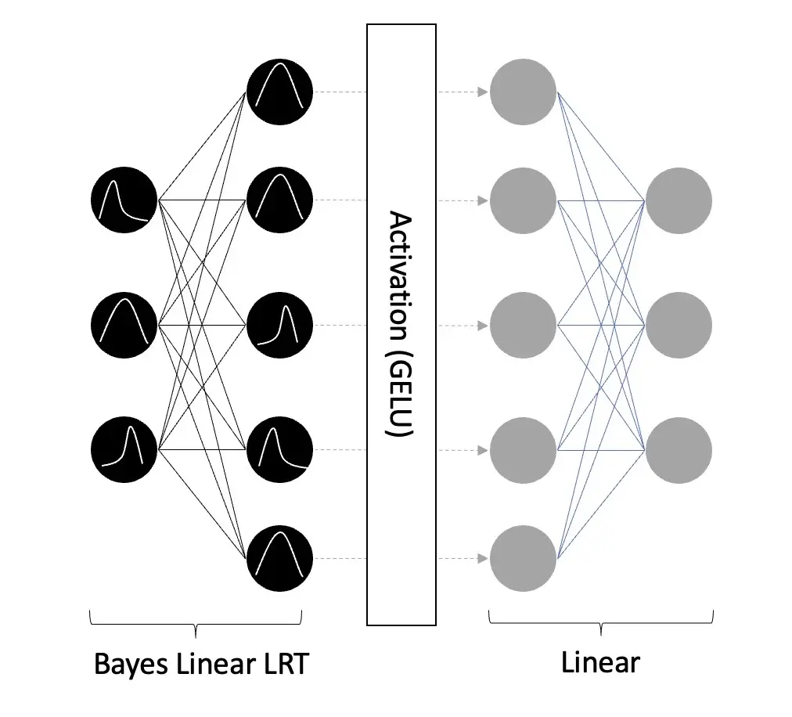
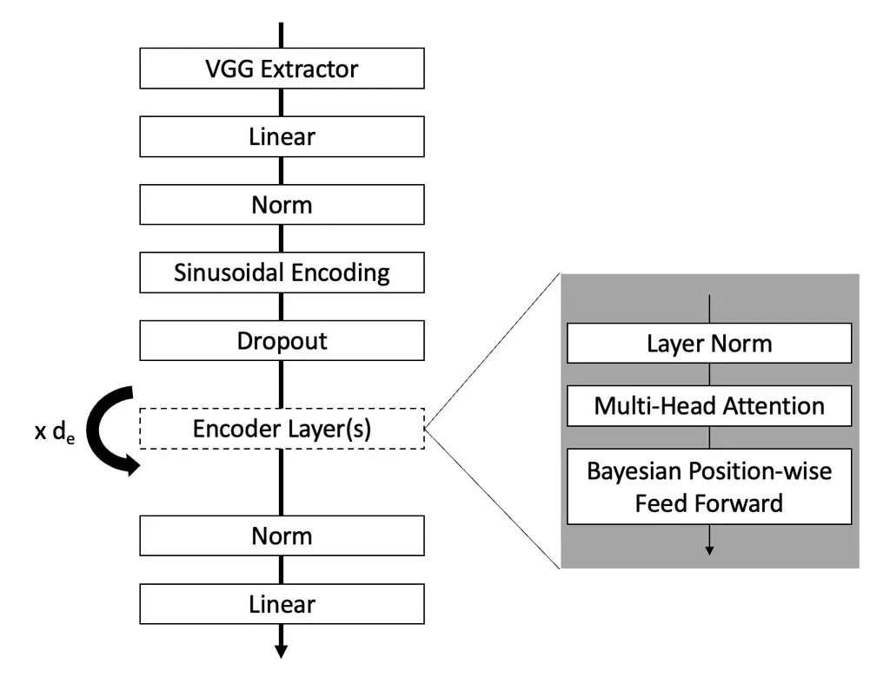
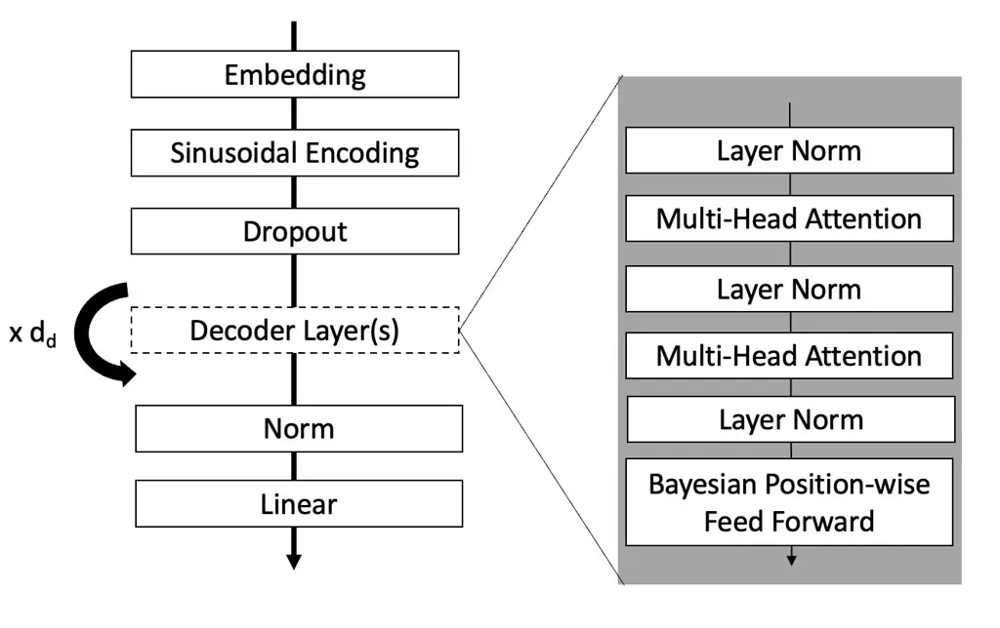
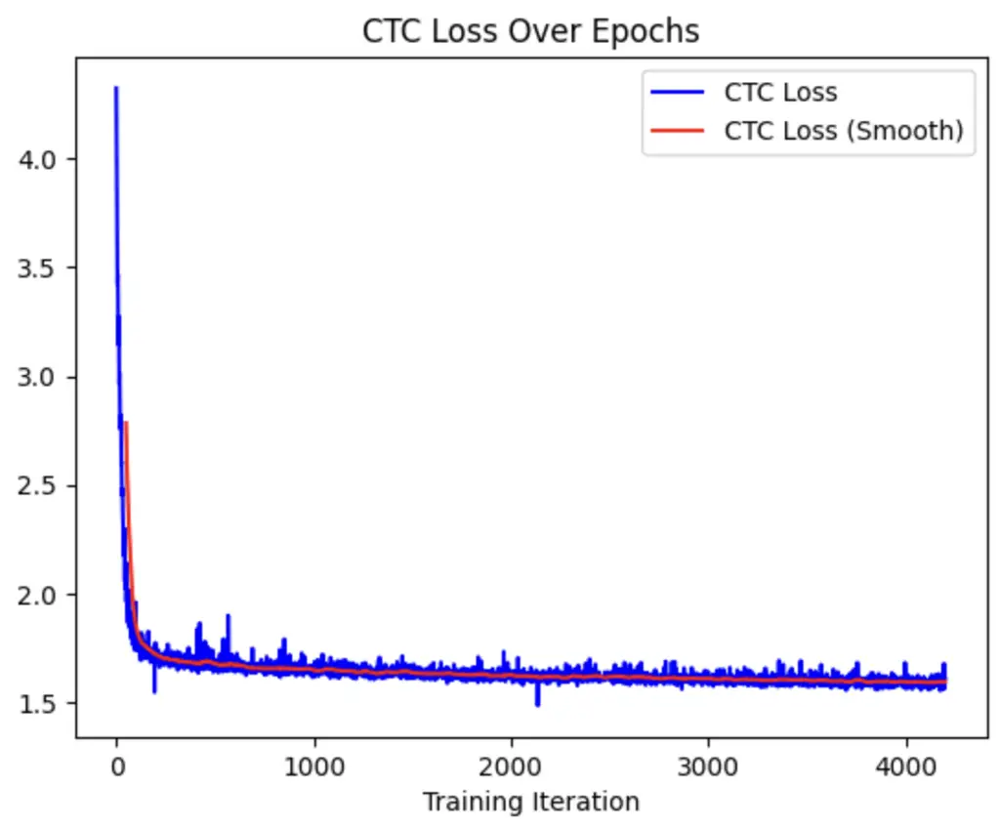
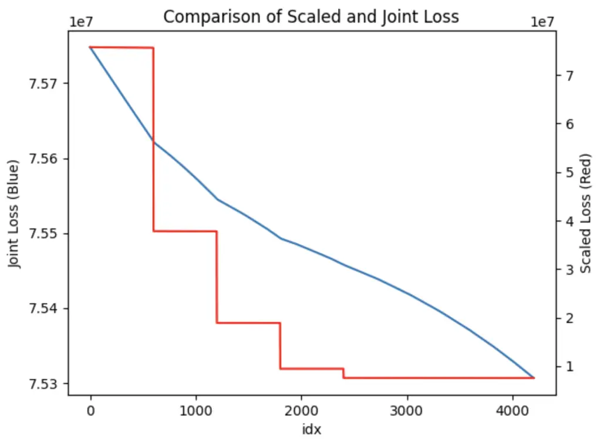

# BayesSpeech: A Bayesian Transformer Network for Automatic Speech Recognition

Will Rieger Affiliation: Master of Science in Computer Science  
Department of Computer Science  
The University of Texas at Austin

###### Abstract

Recent developments using End-to-End Deep Learning models have been
shown to have near or better performance than state of the art Recurrent
Neural Networks (RNNs) on Automatic Speech Recognition tasks. These
models tend to be lighter weight and require less training time than
traditional RNN-based approaches. However, these models take frequentist
approach to weight training. In theory, network weights are drawn from a
latent, intractable probability distribution. We introduce BayesSpeech
for end-to-end Automatic Speech Recognition. BayesSpeech is a Bayesian
Transformer Network where these intractable posteriors are learned
through variational inference and the local reparameterization trick
without recurrence. We show how the introduction of variance in the
weights leads to faster training time and near state-of-the-art
performance on LibriSpeech-960.

## 1. Introduction

In the majority of neural networks, randomness is usually introduced
through perturbation of the input or randomly removing nodes from the
network (Hinton et al., (2012)). There has been great success using
these methods across a variety of domains including Automatic Speech
Recognition (Park et al., (2019)). Models continue to evolve. However
and data augmentation methods rarely take large leaps in terms of the
features they can help express. Newer models are generally larger and
larger and require incredible amounts of compute to properly train. We
especially see this in the field of Automatic Speech Recognition. Newer
models such as Jasper (Li et al., (2019)), the Conformer (Gulati et al.,
(2020)), LAS (Chan et al., (2016)), and the Transformer (Vaswani et al.,
(2017)) all require training for multiple days across multiple GPUs.
Creating deeper models can certainly help attain better performance on
the domain task. But what if we approach the model differently and try
to leverage their probabilistic nature?

Most Neural Network models take a frequentist approach to model
training. As you introduce non-linearities and apply gradient methods to
solving these optimization problems, we become less and less likely to
know we have reached a true minima. In theory, our true weights are
drawn from an intractable prior distribution. If we approach the problem
through a Bayesian lens, we can better contextualize our model’s output
and weights on the input data. Using variational inference techniques,
we can design a network whose weights are drawn from a learnable,
tractable posterior. We present BayesSpeech; a Bayesian Transformer
Network for End-to-End Automatic Speech recognition where feed forward
layers are contextualized with probability distributions.

## 2. Background

## 2.1 Automatic Speech Recognition

Automatic Speech Recognition models have been evolving rapidly in recent
years. Models can either be sub-domain specific and focus on speech
representation (Mohamed et al., (2012)) (Lee et al., (2009)) (Conneau et
al., (2020)) (Devlin et al., (2018)) (Schneider et al., (2019)) (Chung
et al., (2019)) (Maas, (2013)) (Baevski et al., (2020)) attention
(Vaswani et al., (2017)) (Chorowski et al., (2015)) (Conneau et al.,
(2020)) or be end-to-end and incorporate the aforementioned components
into one model and jointly train them.

## 2.1.1 Connectionist Transporal Classification

In order to jointly train end-to-end model including alignment, and
encoding/decoding the input/output sequence, Connectionist Transporal
(CTC) Loss can be used to better manage the alignments (Graves et al.,
(2006)). Alignment of the input and output sequence becomes especially
challenging in speech recognition tasks as the input sequence is
generally longer than the output sequence. CTC Loss aids this process by
penalizing models based on the joint probability of the current token in
the sequence and all other tokens predicted.

For decoders that only output set-length sequences, we can further
augment the CTC loss by utilizing traditional Cross Entropy loss on the
predictions (Hori et al., (2017)). By enabling a joint CTC and Cross
Entropy (CE) loss function we not only penalize characters based on
their sequence but also on their absolute positioning in the output.
This is covered further in Section 3.2.2.

## 2.1.2 Models for End-to-End Speech Recognition

End-to-End Speech recognition models combine all of the individual
aspects of Automatic Speech Recognition into one model that is trained
jointly. Traditional models rely on RNNs, LSTMs, and generally
recurrences for defining the output sequence (Liu et al., (2022))(Chan
et al., (2016)). These models are cumbersome to train and parallelize
and create additional operational hurdles in properly tuning.

Recently, new models involving convolutions and linear outputs have been
used within Encoder-Decoder frameworks for end-to-end speech recognition
tasks. These models such as Jasper (Li et al., (2019)), Conformer
(Gulati et al., (2020)), and Transformer (Dong et al., (2018)) are huge
models with one billion or more parameters relying on feed-forward
architectures. The three models were all trained for multiple days on
multiple GPUs and required incredible compute power. The
Speech-Transformer model (Dong et al., (2018)) tried to address these
issues by creating a thinner model to yield similar performance on the
WSJ dataset. However, compared to its larger counterparts, it did not
have the same performance characteristics. Although it did lend hope
that smaller models could be trained to compete with their larger
counterparts.

## 2.2 Bayesian Methods

Bayesian models have begun to show further promise in multiple fields
such as Image Recognition (Blundell et al., (2015)), attention
mechanisms (Zhang et al., (2021)) (Fan et al., (2020)), and
auto-encoders (Kingma & Welling, (2013)). In a Bayesian approach,
networks weights are samples from an intractable distribution which we
can estimate over training iterations through Variational Inference.

## 2.2.1 Variational Inference

Variational Inference (VI) is the estimation of an intractable
distribution through minimizing the Kullback-Lieblier divergence
($`D_{KL}`$) between a sample and some true distribution. Different
works have shown that these estimation methods have value when applied
to a Bayesian Neural Network (Graves, (2011)) (Kingma & Welling,
(2013)). There are two different approaches to VI that largely depend on
the what the true distribution is believed to be. If the true prior can
be any distribution Monte-Carlo sampling is the only option for
estimating the gradient from $`D_{KL}`$. When using MC sampling, a
network is sampled multiple times for the same input and the gradients
are averaged together across the number of samples.

If the prior is generally assumed to be Gaussian, the KL Divergence can
be explicitly calculated and the Local Reparameterization Trick (Kingma
et al., (2015)) can be used for finding the gradient with just one
sample. This is discussed further in Section 3.1.4.

## 2.2.2 Bayes by Backprop

Blundell et al. introduced the Bayes by Backprop algorithm for jointly
learning the intractable distribution as well as a domain problem in a
Bayesian Neural Network. They introduce the joint loss function in two
parts:

1.  1.  Weighting the KL Divergence of the model against the epoch
2.  2.  Creating an Evidence Lower Bound (ELBO) on the loss function for the
        purpose of training

We discuss the weighting of the KL Divergence loss term over time in
Section 3.2.1. The introduction of ELBO loss serves as the method for
tuning an efficient approximator for the Maximum Likelihood given an
a-posteriori inference of the parameters. Because we are always sampling
from an intractable distribution, the KL divergence term can be thought
of as a regularization constant on the network. Over time, the KL
divergence impact on loss will encourage the approximate posterior to be
close to the true prior. While not readily apparent, ELBO loss is
implicitly involved in the loss function described in Section 3.2.3.

## 3. Research & Methods

As introduced above, sampling network weights (Bayesian approach) rather
than explicitly defining them (frequentist approach) has been shown to
have increased performance and faster convergence times. Our goal is to
produce a network, leveraging Bayesian layers, to compete with
state-of-the-art models and require less training time. BayesSpeech, is
largely based on the no-recurrence model, the Transformer (Vaswani et
al., (2017)). While we leverage the model’s general architecture, we
introduce modified Encoder and Decoder layers with Bayesian, Pointwise
Feed Forward sub-layers. In this section, we explore the core components
of the model, the model’s architecture, and a new training methodology
for an ensemble loss function.

## 3.1 Core Components

## 3.1.1 Attention Mechanisms

Part of Vaswani et al.’s Transformer (Vaswani et al., (2017)) network
was the introduction of Scaled Dot-Product attention and, further,
Multi-Headed Attention. The goal of these mechanisms is to generate a
temporal-rich representation of the inputs by attending to different
positions within the input sequence. An attention function maps a query
(or set of queries) in a matrix, $`Q`$, and a set of key-value pairs in
matrices, $`K,V`$, to the input sequence.

Scaled Dot-Product Attention first takes the softmax of the matrix
multiplication of $`Q`$, $`K`$. Then it matrix multiplies that value
with $`V`$ and normalizes by $`\sqrt{d_{k}}`$ (the dimension of the
keys, $`K`$) (Equation 1). The normalization by the key size is used to
prevent the softmax function from suffering the vanishing gradient
problem.

```math
Attention(Q,K,V)=Softmax(\frac{QK^{T}}{\sqrt{d_{k}}})V \tag{1}
```

Scaled Dot-Product attention only performs a single attention function
at a time. Multi-Head Attention addresses this by linearly projecting
the queries, keys, and values $`h`$ times to each of the input
dimensions ($`d_{q}`$, $`d_{k}`$, $`d_{v}`$, respectively). Then Scaled
Dot-Product attention is applied to these newly projected inputs in
order to attend across the $`h`$ different ”heads” (Equation 2). Each
$`head_{i}`$ is equal to
$`Attention(QW^{Q}_{i},KW^{K}_{i},VW^{V}_{i})`$. This way the model
jointly attends different input representations across the different
subspaces introduced through the projection.

```math
MultiHead(Q,K,V)=Concat(head_{1},...,head_{h})W^{O} \tag{2}
```

## 3.1.2 Sinusoidal Positional Encoding

Because the model does not have recurrence or convolutions, in order to
make use of the temporal attentions from the Multi-Head modules,
position information about the position of the tokens in the sequence
must be introduced (Vaswani et al., (2017)). Positional Encodings are
used in the both the Encoder and Decoder modules to align each module’s
outputs and allow them to be summed. The model leverages Sinusoidal
embeddings (Equation 3) where the frequency corresponds to the token
position ($`pos`$) and the dimension ($`i`$). Vaswani et al. hypothesize
that using this encoding function will make it easy for the model to
learn the attention weights for relative positions and adapt for longer
sequences.

```math
PositionalEmbedding_{(pos,i)}=\begin{cases}sin(pos/10000^{\frac{2^{i}}{d_{model}}})&\text{if $i<\frac{d_{model}}{2}$}\\
cos(pos/10000^{\frac{2^{i}}{d_{model}}})&\text{if $i\geq\frac{d_{model}}{2}$}\end{cases} \tag{3}
```

## 3.1.4 Proposal: Bayesian, Positionwise Feed Forward Layer



Figure 1: Bayesian, Positionwise Feed Forward Layer Diagram

Our primary proposal, is the Bayesian, Positionwise Feed Forward Layer
(Figure 1). Rather than use two linear layers with dropout, we
substitute the input layer with a Bayesian Linear Layer suplemented with
the Local Reparameterization Trick (Bayes Linear LRT) (Kingma et al.,
(2015)) and remove the dropout. Other approaches to producing Bayesian
components rely on sampling the same input sequence multiple times from
a Monte-Carlo process in order to define an average gradient for
modeling the intractable posterior (Blundell et al., (2015)). In
addition to being computationally expensive, this can also lead to high
variance in the gradients increasing training time. The Local
Reparameterization Trick addresses this by assuming that both the prior
and posterior are Gaussian. Using only a single sample, the KL
divergence between the estimators can be explicitly solved for. This new
estimator is efficient (as it has less computational complexity) and
reduces the variance in the gradient.

For each Bayesian Layer in Figure 1, let $`d_{in}`$, $`d_{out}`$ be the
input and output dimensions of the layer, respectiveley. We define
matrices $`W_{\mu}\in\mathbb{R}^{d_{out}Xd_{in}}`$ and
$`W_{\rho}\in\mathbb{R}^{d_{out}Xd_{in}}`$ representing the mean and
variance scalar for each weight in the network. Similarly we have bias
vectors for the output of $`W_{\mu}`$ and $`W_{\rho}`$ defined as
$`b_{\mu}\in\mathbb{R}^{d_{out}}`$ and
$`b_{\rho}\in\mathbb{R}^{d_{out}}`$, respectively. Finally, at each
iteration we sample a term from a standard Gaussian,
$`\epsilon\sim\mathcal{N}(0,1)`$.

In order to calculate the output of the layer, we define a function for
explicitly calculating the KL divergence when the prior and posterior
are both Gaussian (Equation 4). The prior is represented by $`p`$ and
posterior represented by $`q`$. A sum is taken over all elements in the
input matrices.

```math
KLD(\mu_{p},\sigma_{p},\mu_{q},\sigma_{q})=\frac{1}{2}\sum(2\log(\frac{\sigma_{p}}{\sigma_{q}})-(1+(\frac{\sigma_{p}}{\sigma_{q}})^{2})+(\frac{\mu_{p}-\mu_{q}}{\sigma_{p}})^{2}) \tag{4}
```

In the forward pass of the algorithm, we first must use our variance
parameter $`\rho`$ for estimating our standard deviation of weight and
biases (Equation 5). The same applies for the bias vector $`b`$ (e.g. we
arrive at a $`b_{\sigma}`$ using $`b_{\rho}`$).

```math
W_{\sigma}=\log(1+e^{W_{\rho}}) \tag{5}
```

Next we sample from our Gaussian and introduce variance in the weights
and biases for the input sequence $`X`$ (Equation 6, Equation 7).

```math
W_{out}=XW_{\mu}^{T}+\sqrt{(W_{\sigma}^{2})^{T}X}*\epsilon \tag{6}
```

```math
b_{out}=Xb_{\mu}^{T}+b_{\sigma}*\epsilon \tag{7}
```

Then we calculate the KL divergence between our estimated posteriors and
true priors for the weights and biases:
$`W_{KL}=KLD(0,1,W_{\mu},W_{\sigma})`$ and
$`b_{KL}=KLD(0,0.1,b_{\mu},b_{\sigma})`$. Finally, the forward
computation sets a global KL divergence term ($`KL=W_{KL}+b_{KL}`$) and
returns $`W_{out}+b_{out}`$. The KL divergence term is used in the join
loss function for tuning our variational posterior.

## 3.1.4 Encoder Feature Extraction

Although the original Transformer architecture does not involve any
convolutions, recent work in the Image Recognition domain ((Simonyan &
Zisserman, (2014))) has lent itself useful for sequence-to-sequence ASR
tasks (Hori et al., (2017)). The modified VGG Network from (Hori et al.,
(2017)) is used in the Encoder to further enhance in the input feature
set drawing ideas from unsupervised speech representation tasks as seen
in (Chung et al., (2019)), (Lee et al., (2009)), and (Mohamed et al.,
(2012)). The output from this initial convolutional layer is passed to
the encoder layers in the final network.

## 3.1.5 BayesSpeech Model

Putting this together, we arrive at our final model architecture (Figure
2). The model passes the input through an Encoder (Figure 2(a)) and then
passes the encoder output through a Decoder (Figure 2(b)). In our model,
we use 12 encoder block layers ($`d_{e}=12`$) and 6 decoder block layers
($`d_{d}=6`$). These 18 inner layers contain a Mutli-Head attention
block as well as a Bayesian Position-wise Feed Forward block. The model
has a dimension of 512 and a feed forward dimension of 2148.



(a) BayesSpeech Encoder



(b) BayesSpeech Decoder

Figure 2: BayesSpeech Encoder and Decoder Diagrams

## 3.2 Model Training

In order to train our transformer model, we utilize a variation of the
Bayes-By-Backprop algorithm (Blundell et al., (2015)) with a joint
Connectionist Temporal Classification and Cross Entropy loss function
(Joint CTC, CrossEntropy Loss). The two-stage training is meant to:

1.  1.  further tune the sampling mechanics for the variational posterior
        distribution the weights are drawn from
2.  2.  and learn the temporal alignments and classification loss of the
        output tokens.

We have found that trying to optimize each component separately leads to
over-fitting in one of the domains of this problem. If we choose a large
step size and seek to minimize the aggregate KL divergence across the
Bayesian layers, we cannot further learn the alignments. And if we
choose a small step-size and learn the alignments, we introduce too much
randomness in the output for our results to be meaningful. Therefore we
introduce a scaling function, similar to the one in Bayes-by-Backprop
for managing the tradeoff over epoch iterations (Minibatch Weighting).
Our model was trained on the LibriSpeech-960 dataset (Panayotov et al.,
(2015)). The utterances in the dataset were converted to Mel Spectrogram
form with 80 channels a width of 20ms and a stride of 10ms.

## 3.2.1 Tuning Variational Posterior

The Bayesian part of our model tries to fit a variational posterior
distribution ($`q_{\theta}`$) to a true intractable posterior ($`p`$)
for each of the weights in the network. In order to do so, we reduce the
problem of fitting $`q_{\theta}`$ to that of a Minimum Description
Length (MDL) problem (Hinton & van Camp, (1993)) (Rissanen, (1978))
(Hinton & van Camp, (1993)). While we have introduced the explicit
calculation of the Kullback-Leibler divergence between our variational
posterior and true prior above ($`D_{KL}(q_{\theta}||p)`$), it is
important to conceptualize the divergence as the MDL problem.

The Minimum Description Length principal is that the best model for a
given dataset balances the tradeoff between describing the model and
describing the misfit between the model and the data (Hinton & van Camp,
(1993)). The KL divergence criteria we use has the goal of keeping
weights simple by penalizing the amount of information they contain.
Ultimately, this methodology will lead to a better separation between
prediction accuracy and model complexity and is explicitly
differentiable (Graves, (2011)). The variational loss function used has
two parts:

1.  1.  Error Loss - the expected value of negative log probability in
        samples from $`q_{\theta}(\beta)`$ (where $`\beta`$ are the model’s
        parameters)
2.  2.  Complexity Loss - the KL divergence between the tractable,
        variational posterior and the parameterized prior,
        $`D_{KL}(q_{\theta}(\beta)||p_{\alpha})`$.

In each batch, we seek to gently tune our model’s variational posterior
($`q_{\theta}`$) to continue random sampling but isolate different
weights that have different levels of kurtosis. Due to the minibatch
weighting, discussed in a later section, we see a consistent decline in
the joint loss value dominated by the KL divergence term (blue, Figure
3(b)). Blundell et al. also show that using this relative kurtosis can
create thinner models with an explicit scheme for weight pruning.
Weights that are more leptokurtic are kept while platykurtic ones are
discarded. While this is beyond the scope of this paper, it would
present and interesting future research case for the model presented.



(a) CTC Loss Over Training Iterations



(b) Joint (Blue) and Scaled (Red) Loss Over Time

Figure 3: Loss Functions over Training Iterations

## 3.2.2 Joint CTC, CrossEntropy Loss

In order to penalize the model for alignment of the input sequence to
the output tokens, we utilize a joint Connectionist Transporal
Classification (Graves et al., (2006)) and Cross Entropy Loss function.
The goal of this two term loss function is to manage a gradient through
the alignment of tokens in the feature input (CTC) as well as the actual
classification loss of the aligned output and the true tokens. The loss
functions weights the two as so: $`L(X)=0.3*CTC(X)+0.7*CE(X)`$. We do
this in order to help smooth out the gradient while maintaining the
proper loss to back-propagate through the network. Due to the
adversarial nature of the Bayesian outputs, we find that this joint loss
descends rapidly then continues to descend without adjustment to the
original learning rate (Figure 3(a)). In our training, we held the
learning rate fixed at $`10^{-6}`$.

## 3.2.3 Minibatch Weighting

Blundell et al. found that earlier epochs have a greater importance on
tuning of the variational posterior than later ones. We adopt a similar
methodology where we weight the KL divergence term according to the
epoch ($`e`$) and number of epochs ($`n_{e}`$) (Equation).

```math
MinibatchWeight(e,n_{e})=\frac{2^{n_{e}-e}}{2^{n_{e}}-e} \tag{8}
```

To better aid training over time, we choose an epoch indexer where the
epoch index is integer divided by 10. When the training loop runs for
multiple hours, this helps keep the KL divergence more heavily weighted
at first. We then weight the KL divergence term by the minibatch weight
term (Equation 9). The $`KL_{div}`$ term is the sum of all KL
divergences over the Bayesian layers.

```math
L(X,e,n_{e})=MinibatchWeight(e,n_{e})*KL_{div}+0.3*CTC(X)+0.7*CE(X) \tag{9}
```

## 4. Results

We split our model into two variants: one that outputs a character
sequence and one that outputs tokenized word-pieces from a Sentencepiece
language model with vocab size of 1000 (Kudo & Richardson, (2018)). We
trained each model variant on a single A-100 GPU through Google Colab
for 8 hours with a batchsize of 24.

| Model                                | WER (w/o LM) |            | WER (w/ LM) |            |
| ------------------------------------ | ------------ | ---------- | ----------- | ---------- |
|                                      | test-clean   | test-other | test-clean  | test-other |
| LAS (Chan et al., (2016))            | 2.89%        | 6.98%      | 2.33%       | 5.17%      |
| Transformer (Vaswani et al., (2017)) | 2.4%         | 5.6%       | 2.0%        | 4.6%       |
| Conformer (Gulati et al., (2020))    | 2.1%         | 5.0%       | 2.0%        | 4.3%       |
| BayesSpeech                          | 4.5%         | 6.5%       | 4.0%        | 5.7%       |

Table 1: WER Results on LibriSpeech dataset

As shown in Table 1, our model performs nearly as well as the state of
the art ASR models. Our Bayes speech model reaches respectable Word
Error Rates with and without a language model on the LibriSpeech
dataset. The Bayes Model as well was trained for just 8 hours on a
single GPU. For instance, the Conformer model was trained over the
course of multiple days on multiple GPUs (8). During evaluation, we use
beam search with a beam width of 10 over the set of possible decoded
sequences. This appears to be the standard decoding methodology giving
the probabilistic output of the model’s decoder.

When the input sequence passes through our Bayesian feed forward layers,
we believe this creates an adversarial input stream. Rather than
artificially augment the input Mel Spectrogram inputs (Park et al.,
(2019)), these layers produce a probabilistic feature encoding of the
input. We believe that this general adversarial training technique
allows our model to converge faster with less training time and
resources. The randomness introduced in the model also helps better
contextualize outputs. As we continue to tune the variational posterior
over the weights, I imagine we would see a dramatic increase in
performance. Because our model yielded reasonable results after 8 hours,
we stopped training but future work may investigate if increased
training could further improve our performance. There may also be a
benefit to equally weighting the variational component and the CTC loss
component of the global loss function. Similarly, in future work it may
be useful to explore systematic model pruning as presented in Blundell
et al.

## 5. Conclusion

Currently, best in class Automatic Speech Recognition solutions require
multiple days of training on multiple GPUs. These models also take a
frequentist approach to weight training. In this work, we present
BayesSpeech; a Bayesian Transformer Network for learning an intractable
posterior distribution over which weights are drawn in feed forward
layers. We believe this probabilistic encoding of the input feature set
creates a better representation of the input Mel Spectrogram. This
mechanic in conjunction with a joint loss function yields near
state-of-the-art results on the LibriSpeech dataset.

## References

- Baevski et al. ((2020)) Baevski, A., Zhou, H., Mohamed, A. & Auli, M.
  (2020). wav2vec 2.0: A framework for self-supervised learning of
  speech representations. CoRR abs/2006.11477 .
  [https://arxiv.org/abs/2006.11477](https://arxiv.org/abs/2006.11477)
- Blundell et al. ((2015)) Blundell, C., Cornebise, J., Kavukcuoglu, K.
  & Wierstra, D. (2015). Weight uncertainty in neural networks. : arXiv.
  [https://arxiv.org/abs/1505.05424](https://arxiv.org/abs/1505.05424)
  doi:10.48550/ARXIV.1505.05424
- Chan et al. ((2016)) Chan, W., Jaitly, N., Le, Q. & Vinyals, O.
  (2016). Listen, attend and spell: A neural network for large
  vocabulary conversational speech recognition. In 2016 ieee
  international conference on acoustics, speech and signal processing
  (icassp) (p.  4960-4964). doi:10.1109/ICASSP.2016.7472621
- Chorowski et al. ((2015)) Chorowski, J., Bahdanau, D., Serdyuk, D.,
  Cho, K. & Bengio, Y. (2015). Attention-based models for speech
  recognition. CoRR abs/1506.07503 .
  [http://arxiv.org/abs/1506.07503](http://arxiv.org/abs/1506.07503)
- Chung et al. ((2019)) Chung, Y-A., Hsu, W-N., Tang, H. & Glass, J.
  (2019). An Unsupervised Autoregressive Model for Speech Representation
  Learning. In Proc. interspeech 2019 ( 146–150).
  doi:10.21437/Interspeech.2019-1473
- Conneau et al. ((2020)) Conneau, A., Baevski, A., Collobert, R.,
  Mohamed, A. & Auli, M. (2020). Unsupervised cross-lingual
  representation learning for speech recognition. CoRR abs/2006.13979 .
  [https://arxiv.org/abs/2006.13979](https://arxiv.org/abs/2006.13979)
- Devlin et al. ((2018)) Devlin, J., Chang, M., Lee, K. & Toutanova, K.
  (2018). BERT: pre-training of deep bidirectional transformers for
  language understanding. CoRR abs/1810.04805 .
  [http://arxiv.org/abs/1810.04805](http://arxiv.org/abs/1810.04805)
- Dong et al. ((2018)) Dong, L., Xu, S. & Xu, B. (2018).
  Speech-transformer: A no-recurrence sequence-to-sequence model for
  speech recognition. In 2018 ieee international conference on
  acoustics, speech and signal processing (icassp) (p.  5884-5888).
  doi:10.1109/ICASSP.2018.8462506
- Fan et al. ((2020)) Fan, X., Zhang, S., Chen, B. & Zhou, M. (2020).
  Bayesian attention modules. : arXiv.
  [https://arxiv.org/abs/2010.10604](https://arxiv.org/abs/2010.10604)
  doi:10.48550/ARXIV.2010.10604
- Graves ((2011)) Graves, A. (2011). Practical variational inference for
  neural networks. In J. Shawe-Taylor, R. Zemel, P. Bartlett, F. Pereira
  & K. Weinberger (Eds.), Advances in neural information processing
  systems ( 24). : Curran Associates, Inc.
  [https://proceedings.neurips.cc/paper/2011/file/7eb3c8be3d411e8ebfab08eba5f49632-Paper.pdf](https://proceedings.neurips.cc/paper/2011/file/7eb3c8be3d411e8ebfab08eba5f49632-Paper.pdf)
- Graves et al. ((2006)) Graves, A., Fernández, S., Gomez, F. &
  Schmidhuber, J. (2006). Connectionist temporal classification:
  Labelling unsegmented sequence data with recurrent neural networks. In
  Proceedings of the 23rd international conference on machine learning
  (p.  369–376). New York, NY, USA: Association for Computing Machinery.
  [https://doi.org/10.1145/1143844.1143891](https://doi.org/10.1145/1143844.1143891)
  doi:10.1145/1143844.1143891
- Gulati et al. ((2020)) Gulati, A. et al. (Eds.). (2020). Conformer:
  Convolution-augmented transformer for speech recognition.
- Hinton et al. ((2012)) Hinton, G.E., Srivastava, N., Krizhevsky, A.,
  Sutskever, I. & Salakhutdinov, R. (2012). Improving neural networks by
  preventing co-adaptation of feature detectors. CoRR abs/1207.0580 .
  [http://arxiv.org/abs/1207.0580](http://arxiv.org/abs/1207.0580)
- Hinton & van Camp ((1993)) Hinton, G.E. & van Camp, D. (19931).
  Keeping the neural networks simple by minimizing the description
  length of the weights. In Proceedings of the sixth annual conference
  on computational learning theory (p.  5–13). New York, NY, USA:
  Association for Computing Machinery.
  [https://doi.org/10.1145/168304.168306](https://doi.org/10.1145/168304.168306)
  doi:10.1145/168304.168306
- Hinton & van Camp ((1993)) Hinton, G.E. & van Camp, D. (19932).
  Keeping the neural networks simple by minimizing the description
  length of the weights. In Proceedings of the sixth annual conference
  on computational learning theory (p.  5–13). New York, NY, USA:
  Association for Computing Machinery.
  [https://doi.org/10.1145/168304.168306](https://doi.org/10.1145/168304.168306)
  doi:10.1145/168304.168306
- Hori et al. ((2017)) Hori, T., Watanabe, S., Zhang, Y. & Chan, W.
  (2017). Advances in joint ctc-attention based end-to-end speech
  recognition with a deep cnn encoder and rnn-lm. In Interspeech.
- Kingma et al. ((2015)) Kingma, D.P., Salimans, T. & Welling, M.
  (2015). Variational dropout and the local reparameterization trick. In
  C. Cortes, N. Lawrence, D. Lee, M. Sugiyama & R. Garnett (Eds.),
  Advances in neural information processing systems ( 28). : Curran
  Associates, Inc.
  [https://proceedings.neurips.cc/paper/2015/file/bc7316929fe1545bf0b98d114ee3ecb8-Paper.pdf](https://proceedings.neurips.cc/paper/2015/file/bc7316929fe1545bf0b98d114ee3ecb8-Paper.pdf)
- Kingma & Welling ((2013)) Kingma, D.P. & Welling, M. (2013).
  Auto-encoding variational bayes. : arXiv.
  [https://arxiv.org/abs/1312.6114](https://arxiv.org/abs/1312.6114)
  doi:10.48550/ARXIV.1312.6114
- Kudo & Richardson ((2018)) Kudo, T. & Richardson, J. (2018).
  Sentencepiece: A simple and language independent subword tokenizer and
  detokenizer for neural text processing. CoRR abs/1808.06226 .
  [http://arxiv.org/abs/1808.06226](http://arxiv.org/abs/1808.06226)
- Lee et al. ((2009)) Lee, H., Pham, P., Largman, Y. & Ng, A. (2009).
  Unsupervised feature learning for audio classification using
  convolutional deep belief networks. In Y. Bengio, D. Schuurmans,
  J. Lafferty, C. Williams & A. Culotta (Eds.), Advances in neural
  information processing systems ( 22). : Curran Associates, Inc.
  [https://proceedings.neurips.cc/paper/2009/file/a113c1ecd3cace2237256f4c712f61b5-Paper.pdf](https://proceedings.neurips.cc/paper/2009/file/a113c1ecd3cace2237256f4c712f61b5-Paper.pdf)
- Li et al. ((2019)) Li, J., Lavrukhin, V., Ginsburg, B., Leary, R.,
  Kuchaiev, O., Cohen, J.M.Gadde, R.T. (2019). Jasper: An end-to-end
  convolutional neural acoustic model. : arXiv.
  [https://arxiv.org/abs/1904.03288](https://arxiv.org/abs/1904.03288)
  doi:10.48550/ARXIV.1904.03288
- Liu et al. ((2022)) Liu, A.H., Hsu, W-N., Auli, M. & Baevski, A.
  (2022). Towards end-to-end unsupervised speech recognition. : arXiv.
  [https://arxiv.org/abs/2204.02492](https://arxiv.org/abs/2204.02492)
  doi:10.48550/ARXIV.2204.02492
- Maas ((2013)) Maas, A.L. (2013). Rectifier nonlinearities improve
  neural network acoustic models..
- Mohamed et al. ((2012)) Mohamed, A-r., Dahl, G.E. & Hinton, G. (2012).
  Acoustic modeling using deep belief networks. IEEE Transactions on
  Audio, Speech, and Language Processing 20 1 14-22.
  doi:10.1109/TASL.2011.2109382
- Panayotov et al. ((2015)) Panayotov, V., Chen, G., Povey, D. &
  Khudanpur, S. (2015). Librispeech: An asr corpus based on public
  domain audio books. In 2015 ieee international conference on
  acoustics, speech and signal processing (icassp) (p.  5206-5210).
  doi:10.1109/ICASSP.2015.7178964
- Park et al. ((2019)) Park, D.S., Chan, W., Zhang, Y., Chiu, C-C.,
  Zoph, B., Cubuk, E.D. & Le, Q.V. (2019). SpecAugment: A simple data
  augmentation method for automatic speech recognition. In
  Interspeech 2019. : ISCA.
  [https://doi.org/10.21437%2Finterspeech.2019-2680](https://doi.org/10.21437%2Finterspeech.2019-2680)
  doi:10.21437/interspeech.2019-2680
- Rissanen ((1978)) Rissanen, J. (1978). Modeling by shortest data
  description. Automatica 14 5 465-471.
  [https://www.sciencedirect.com/science/article/pii/0005109878900055](https://www.sciencedirect.com/science/article/pii/0005109878900055)
  doi:https://doi.org/10.1016/0005-1098(78)90005-5
- Schneider et al. ((2019)) Schneider, S., Baevski, A., Collobert, R. &
  Auli, M. (2019). wav2vec: Unsupervised pre-training for speech
  recognition. CoRR abs/1904.05862 .
  [http://arxiv.org/abs/1904.05862](http://arxiv.org/abs/1904.05862)
- Simonyan & Zisserman ((2014)) Simonyan, K. & Zisserman, A. (2014).
  Very deep convolutional networks for large-scale image recognition. :
  arXiv.
  [https://arxiv.org/abs/1409.1556](https://arxiv.org/abs/1409.1556)
  doi:10.48550/ARXIV.1409.1556
- Vaswani et al. ((2017)) Vaswani, A., Shazeer, N., Parmar, N.,
  Uszkoreit, J., Jones, L., Gomez, A.N.Polosukhin, I. (2017). Attention
  is all you need. In I. Guyon et al. (Eds.), Advances in neural
  information processing systems ( 30). : Curran Associates, Inc.
  [https://proceedings.neurips.cc/paper/2017/file/3f5ee243547dee91fbd053c1c4a845aa-Paper.pdf](https://proceedings.neurips.cc/paper/2017/file/3f5ee243547dee91fbd053c1c4a845aa-Paper.pdf)
- Zhang et al. ((2021)) Zhang, S., Fan, X., Chen, B. & Zhou, M. (2021).
  Bayesian attention belief networks. : arXiv.
  [https://arxiv.org/abs/2106.05251](https://arxiv.org/abs/2106.05251)
  doi:10.48550/ARXIV.2106.05251
