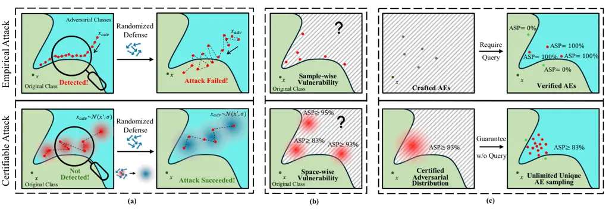
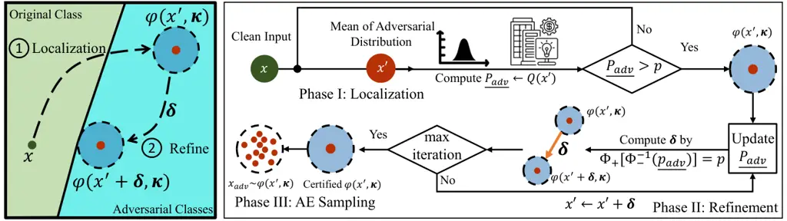
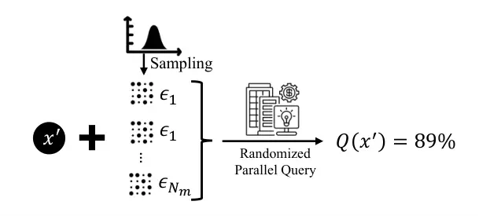
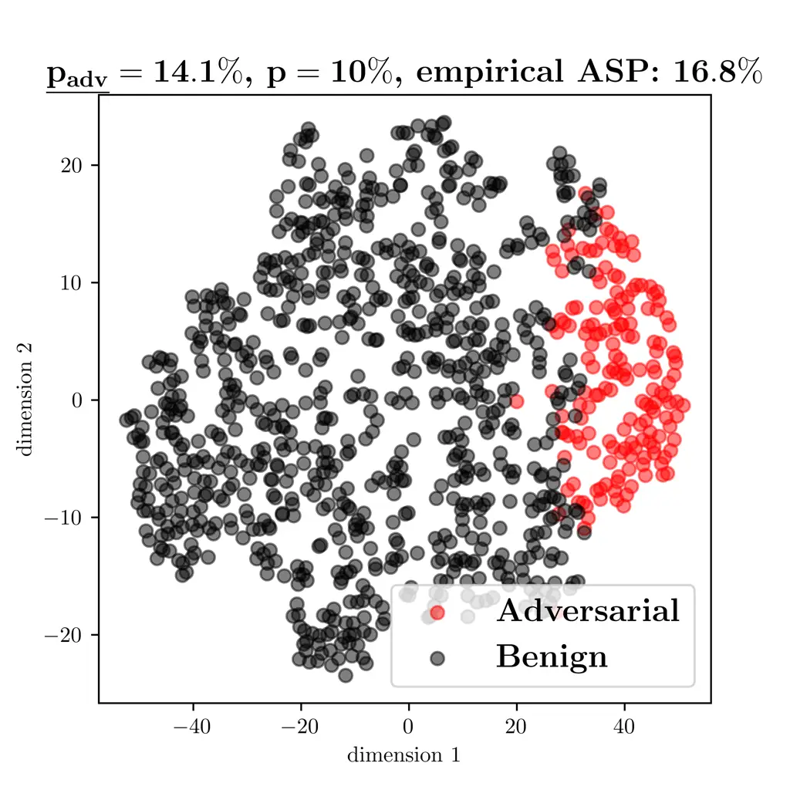
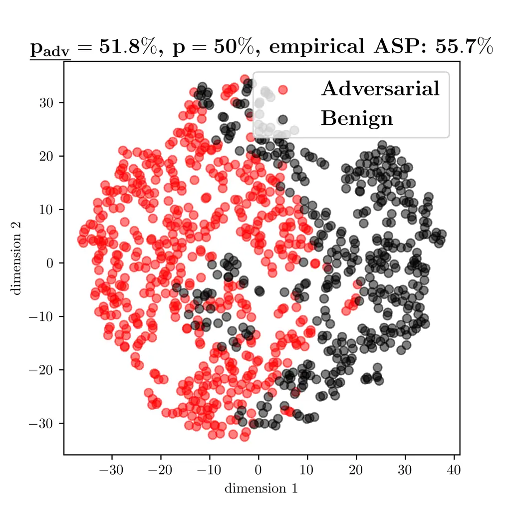
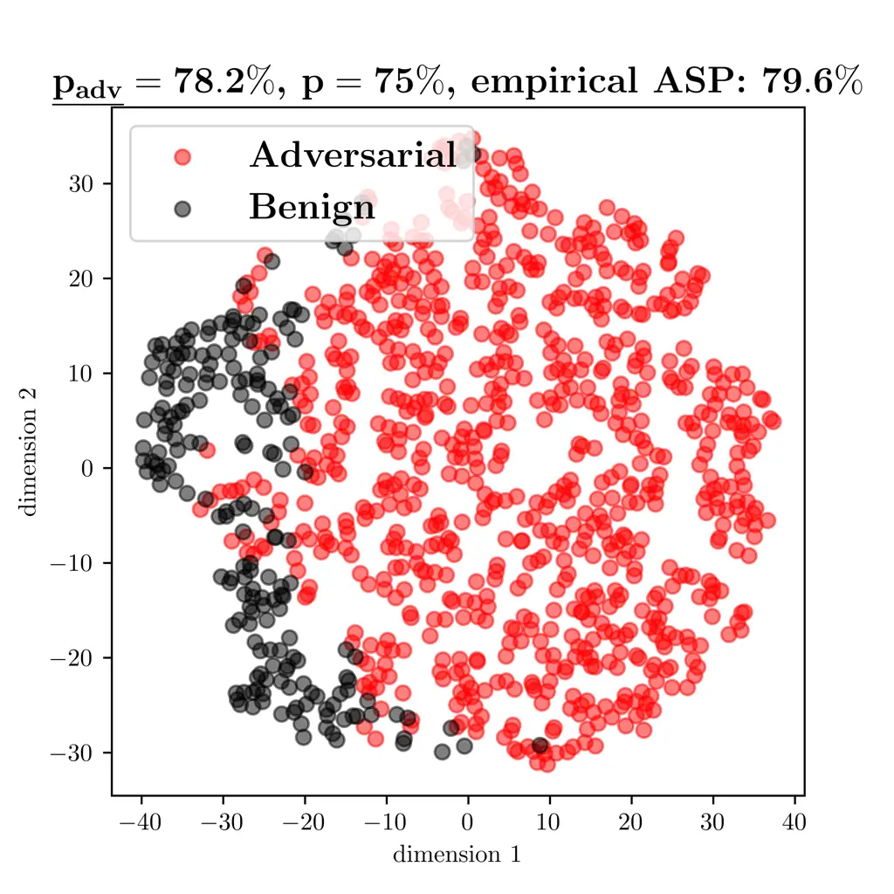
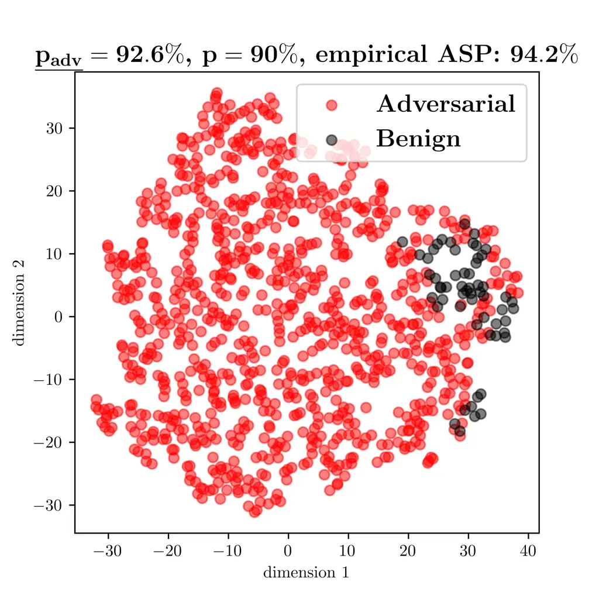
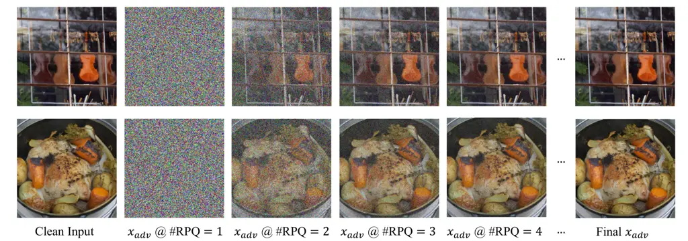
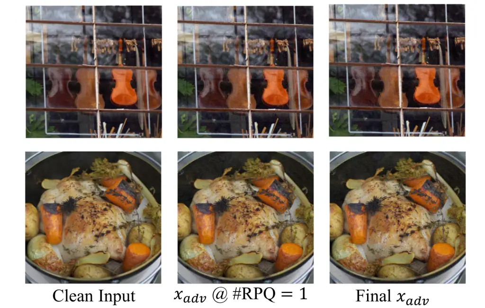

# Certifiable Black-Box Attacks with Randomized Adversarial Examples: Breaking Defenses with Provable Confidence

Conference: Proceedings of the 2024 ACM SIGSAC Conference on Computer
and Communications Security; October 14–18, 2024; Salt Lake City, UT,
USAProceedings of the 2024 ACM SIGSAC Conference on Computer and
Communications Security (CCS ’24), October 14–18, 2024, Salt Lake City,
UT, USADOI:
[10.1145/3658644.3690343](https://doi.org/10.1145/3658644.3690343)ISBN:
979-8-4007-0636-3/24/10CCS: Security and privacy Formal security models

Hanbin Hong Affiliation: University of Connecticut, Storrs, Connecticut,
USA , Xinyu Zhang Affiliation: Zhejiang University, Hangzhou, Zhejiang,
China , Binghui Wang Affiliation: Illinois Institute of Technology,
Chicago, Illinois, USA , Zhongjie Ba Affiliation: Zhejiang University,
Hangzhou, Zhejiang, China and Yuan Hong Affiliation: University of
Connecticut, Storrs, Connecticut, USA

© acmlicensed

###### Abstract.

Black-box adversarial attacks have demonstrated strong potential to
compromise machine learning models by iteratively querying the target
model or leveraging transferability from a local surrogate model.
Recently, such attacks can be effectively mitigated by state-of-the-art
(SOTA) defenses, e.g., detection via the pattern of sequential queries,
or injecting noise into the model. To our best knowledge, we take the
first step to study a new paradigm of black-box attacks with provable
guarantees -- certifiable black-box attacks that can guarantee the
attack success probability (ASP) of adversarial examples before querying
over the target model. This new black-box attack unveils significant
vulnerabilities of machine learning models, compared to traditional
empirical black-box attacks, e.g., breaking strong SOTA defenses with
provable confidence, constructing a space of (infinite) adversarial
examples with high ASP, and the ASP of the generated adversarial
examples is theoretically guaranteed without verification/queries over
the target model. Specifically, we establish a novel theoretical
foundation for ensuring the ASP of the black-box attack with randomized
adversarial examples (AEs). Then, we propose several novel techniques to
craft the randomized AEs while reducing the perturbation size for better
imperceptibility. Finally, we have comprehensively evaluated the
certifiable black-box attacks on the CIFAR10/100, ImageNet, and
LibriSpeech datasets, while benchmarking with 16 SOTA black-box attacks,
against various SOTA defenses in the domains of computer vision and
speech recognition. Both theoretical and experimental results have
validated the significance of the proposed attack.¹¹ 1 The code and all
the benchmarks are available at
[https://github.com/datasec-lab/CertifiedAttack](https://github.com/datasec-lab/CertifiedAttack),
and the full version can be accessed at
[https://arxiv.org/abs/2304.04343](https://arxiv.org/abs/2304.04343).

###### Keywords:

Adversarial Attack, Black-box Attack, Certifiable Robustness

ACM Reference Format:  
Hanbin Hong, Xinyu Zhang, Binghui Wang, Zhongjie Ba, and Yuan Hong. 2024. Certifiable Black-Box Attacks with Randomized Adversarial
Examples: Breaking Defenses with Provable Confidence. In Proceedings of
the 2024 ACM SIGSAC Conference on Computer and Communications Security
(CCS ’24). ACM, Salt Lake City, UT, USA, 15 pages.
https://doi.org/10.1145/3658644.3690343

## 1. Introduction

Machine learning (ML) models have achieved unprecedented success and
have been widely integrated into many practical applications. However,
it is well known that minor perturbations injected into the input data
are sufficient to induce model misclassification (57). Many
state-of-the-art (SOTA) adversarial attacks (57, 12, 14, 92, 49, 60, 16,
43, 2, 93, 7, 95) have been proposed to explore the vulnerabilities of a
variety of ML models. Wherein, the stringent _black-box_ attack is
believed to be closer to real-world security practice (64, 14).

In black-box attacks, the adversary only has access to the target ML
model’s outputs (either prediction scores or hard labels). Through
iteratively querying the target model, the adversary progressively
updates the perturbation until convergence. Existing black-box attack
methods primarily utilize gradient estimation (16, 43, 20, 5, 28),
surrogate models (64, 76, 27, 63), or heuristic algorithms (7, 8, 52,
35, 2) to generate adversarial perturbations. Although these attack
algorithms can empirically achieve relatively high attack success rates
(e.g., on CIFAR-10 (48)), their query process is shown to be easy to
detect or interrupt due to the minor perturbation changes and high
reliance on the previous perturbation (51, 66, 13, 17). For example,
“Blacklight” (51) can achieve $`100\%`$ detection rate on most of the
existing black-box attacks by checking the similarity of queries; some
“randomized defense” methods (66, 17, 38, 55, 13) inject random noise to
the inputs, outputs, intermediate features or model parameters such that
the performance of existing black-box attacks can be significantly
degraded (since the query results are obfuscated to be unpredictable).

To break such types of SOTA defenses (51, 66, 17, 38, 55), it is
challenging to design an effective attack equipped with both _high
degree of randomness to bypass the strong detection_ (e.g., Blacklight
(51)) and _high robustness to resist randomized defense_. A feasible
solution is to add random noise to the adversarial example by the
adversary, but it will make the query intractable. Therefore, an
innovative method is desirable to carefully craft the adversarial
example based on feedback from queries using randomly generated inputs.

To this end, we propose a novel attack paradigm, termed _Certifiable
Attack_, that ensures a provable attack success probability (ASP) on the
randomized adversarial examples against the equipped defenses (or no
defense). Specifically, our attack strategy integrates random noise into
the queries while preserving the adversarial efficacy of these queries.
In particular, we model the adversarial examples as a random variable in
the input space following an underlying noise distribution $`\varphi`$,
namely “_Adversarial Distribution_”. Then, we design a novel query
strategy and establish the theoretical foundation to guarantee the ASP
of the distribution throughout the crafting process. A novel framework
is also developed to find the initial _Adversarial Distribution_,
optimize it, and use it to sample the adversarial examples.



Figure 1. Empirical attacks vs. Certifiable attacks. (a) Certifiable
attack can break the SOTA AE detection and randomized defenses. (b)
Certifiable attack uncovers space-wise vulnerability rather than
sample-wise vulnerability. (c) Once certified, Certifiable Attack can
generate unlimited unique AEs with a guaranteed minimum ASP without
querying the model for verification, while the empirical attack requires
verifying the attack result of crafted AE by query.

### 1.1. Certifiable Attacks vs. Empirical Attacks

Compared with existing empirical black-box attacks, the Certifiable
Attack demonstrates multi-faceted advantages (also see Figure 1):

1.  (a)
    Strong attack to break SOTA defenses. The randomness in the
    certifiable attack allows it to effectively bypass detection methods
    that rely on the similarity between the attacker’s sequence of
    queries (e.g., Blacklight (51)), while traditional empirical attacks
    often create a suspicious trajectory of highly similar
    perturbations. The certifiable attack also provides a provable
    guarantee of success for attacks using randomized inputs, by taking
    into account the equipped defense and target model, enhancing its
    resistance to randomized defense (66, 13).
2.  (b)
    Adversarial space vs. Adversarial example (AE). Distinct from
    traditional empirical adversarial attacks, which uncover model
    vulnerabilities with sample-wise inputs, the Certifiable Attack
    seeks to explore an adversarial input space constructed by an
    _Adversarial Distribution_. This continuous space facilitates the
    generation of numerous (potentially infinite) adversarial examples
    with a high ASP, thus revealing a more consistent and severe
    vulnerability of the target model.
3.  (c)
    Adversarial Examples (AEs) sampled from the adversarial distribution
    are verification-free. Empirical attacks search AEs by iteratively
    querying the target model and verifying the query outputs (_the
    final successful AE is also used to query over the target model;
    then it will be verified and recorded by the defender/target
    model_). Instead, the certifiable attack crafts the _adversarial
    distribution_ with a guaranteed lower bound of the ASP. Due to the
    highly dimensional and continuous input space, AEs sampled from the
    adversarial distribution can be considered unique (with noise in all
    the dimensions) and have a negligible probability of being recorded
    by the defender/target model after verification. The ASP of such AEs
    are theoretically guaranteed (verification-free), and they are new
    to the defender, posing more challenges for mitigation.

[TABLE]

Table 1. Comparison of state-of-the-art empirical black-box attacks with
certifiable attack

### 1.2. Randomization for Certifiable Attacks

To pursue certifiable attacks, we theoretically bound the ASP of
_Adversarial Distribution_ based on a novel way of utilizing randomized
smoothing (24), a technique achieving great success in the certified
defenses with probabilistic guarantees.

The design for the randomization-based certifiable attack follows an
intuitive goal, i.e., _ensuring that the classification results are
consistently wrong over the distribution_. However, many new significant
challenges should be addressed. First, existing theories (randomization
for certified defenses, e.g., (24)) cannot be directly adapted to
certifiable attacks since they have completely different goals and
settings. Second, how to efficiently craft the _Adversarial
Distribution_ that can ensure the ASP is challenging since it requires
maintaining the wrong prediction over a large number of randomized
samples drawing from the distribution. Third, how to make the
_Adversarial Distribution_ as imperceptible as possible is also
challenging due to their randomness. By addressing these new challenges,
in this paper, we make the following significant contributions:

1.  1.  To our best knowledge, we introduce the first _certifiable attack
        theory_ based on randomization for the black-box setting, which
        universally guarantees the attack success probability of AEs drawn
        from different noise distributions, e.g., Gaussian, Laplace, and
        Cauthy distributions, enabling a novel transition from deterministic
        to probabilistic adversarial attacks.
2.  2.  We propose a novel _certifiable attack framework_ that can
        efficiently craft certifiable _Adversarial Distribution_ with
        provable ASP and imperceptibility. Specifically, we design a novel
        _randomized parallel query method_ to efficiently collect
        probabilistic query results from any target model, which supports
        the certifiable attack theory. We propose a novel _self-supervised
        localization_ method as well as a binary-search localization method
        to efficiently generate certifiable _Adversarial Distribution_. We
        design a novel _geometric shifting_ method to reduce the
        perturbation size for better imperceptibility while ensuring the
        ASP. Finally, we have validated that diffusion models (39) can be
        used to further denoise the randomized AEs with guaranteed ASP.
3.  3.  We comprehensively evaluate the performance of the certifiable
        attack with different settings on 4 datasets, while benchmarking
        with 16 SOTA empirical black-box attacks, against various defenses.
        Experimental results consistently demonstrate that our certifiable
        attack effectively breaks the SOTA defenses, including adversarial
        detection, randomized pre-processing and post-processing defenses,
        as well as adversarial training defenses (Also, Table 1 shows a
        summary of the certifiable attack vs. SOTA black-box attacks).

## 2. Problem Definition

Threat Model: We consider designing a certifiable attack where the
target model may or may not be protected by a defense mechanism.

- •
  Adversary: We focus on the hard-label black-box attack, where the
  adversary only knows the predicted label by querying the target ML
  model. The adversary’s objective is to craft adversarial examples to
  fool the model based on the query results.
- •
  Model Owner: The model owner pursues the model utility. We consider
  three different levels of the model owner’s knowledge and
  capability: 1) The model owner has no awareness of the adversarial
  attacks and is not equipped with any defense; 2) The model owner is
  aware of the adversarial attack but has no knowledge of the attack
  method. The model owner can deploy general defense methods such as
  adversarial training (57); 3) The model owner is aware of the
  adversarial attack and has knowledge about the attack method. The
  model owner can deploy adaptive defenses that are specifically
  designed for the attack.

Problem Formulation: We first briefly review adversarial examples, and
then formally define our problem. Given an ML classifier $`f`$ and a
testing data $`x\in\mathbb{R}^{d}`$ with label $`y`$ from a label set
$`\mathcal{Y}=[1,\cdots C]`$ (where $`C`$ is the number of classes). An
adversary carefully crafts a perturbation on the data $`x`$ such that
the classifier $`f`$ misclassifies the perturbed data $`x_{adv}`$, i.e.,
$`f(x_{adv})\neq y`$ under $`x_{adv}\in[\Pi_{a},\Pi_{b}]^{d}`$, where
$`[\Pi_{a},\Pi_{b}]^{d}`$ is the valid input space. The perturbed data
$`x_{adv}`$ is called _adversarial example_. Imperceptibility is usually
achieved by restricting the $`\ell_{2}`$ or $`\ell_{\infty}`$ norm of
the perturbation $`x_{adv}-x`$, or by minimizing the magnitude of this
perturbation.

In the black-box setting, an adversary can use _empirical_ black-box
attack techniques (details in Section 6) to iteratively query the
classifier $`f`$ and progressively update the perturbation until finding
a successful adversarial example for a testing example. However, such
attack strategies have key limitations: 1) query inefficient, usually
$`>100`$ queries per adversarial example; 2) easy to be detected by
observing the query trajectory (51, 66, 13, 17); and 3) lack of
guaranteed attack performance, i.e., cannot provably guarantee a
(un)successful adversarial example under a given budget.

We aim to address all these limitations and design an efficient and
effective certifiable black-box attack in the paper. Particularly,
instead of inefficiently searching adversarial _examples_ one-by-one, we
want to certifiably find the underlying adversarial _distribution_ that
the adversarial examples lie on.

###### Definition 2.1 (Certifiable black-box attack).

Given a classifier $`f:\mathbb{R}^{d}\rightarrow\mathcal{Y}`$, a clean
input $`x\in\mathbb{R}^{d}`$ with label $`y\in\mathcal{Y}`$, and an
Attack Success Probability Threshold $`p`$, the certifiable attack is to
find an _Adversarial Distribution_ $`\varphi(x^{\prime},\bm{\kappa})`$
with mean $`x^{\prime}`$ and parameters $`\bm{\kappa}`$²² 2 If
$`\varphi`$ is a Gaussian distribution, $`\kappa`$ is the standard
deviation of $`\varphi`$. If $`\varphi`$ is a Generalized normal
distribution, $`\kappa=(a,b)`$, with $`a`$ and $`b`$ the scale and shape
parameters of $`\varphi`$, respectively. Notice that, the distribution
will be applied to all the dimensions in the input, and _Adversarial
Distribution_ is a noise distribution over the input space. , such that
data sampled from $`\varphi`$ have at least $`p`$ probability of being
misclassified (i.e., adversarial examples). That is,

```math
\displaystyle\mathbb{P}_{x_{adv}\sim\varphi(x^{\prime},\bm{\kappa})}[f(x_{adv})\neq y]\geq p \tag{1}
```

```math
\displaystyle\text{s.t.}\,\,x_{adv}\in[\Pi_{a},\Pi_{b}]^{d}. \tag{2}
```

Design Goals: We expect our attack to achieve the below goals.

1.  1.  Certifiable: It can provide provable guarantees on the minimum
        attack success probability of the crafted adversarial examples.
2.  2.  Verification free:

    It can not only verify examples to be adversarial _after_ querying
    the model, but also verify examples _before_ the query by giving its
    ASP. This significantly boosts the effectiveness of adversarial
    examples generation.

3.  3.  Query efficient: It needs as few number of queries as possible.
        Fewer queries can definitely save the adversary’s cost.
4.  4.  Bypass defenses: It can generate imperceptible adversarial
        perturbations that can bypass the existing detection and
        pre/post-processing based defenses (51, 66, 13, 17).



Figure 2. Overview of our certifiable black-box attack to generate
certified adversarial distribution.

## 3. Attack Overview

At a high level, our certifiable black-box attack can be divided into
three phases. The overview of our attack is depicted in Figure 2.

Phase I: Adversarial Distribution Localization. This phrase initially
locates a feasible _Adversarial Distribution_ $`\varphi`$ with
guarantees on the lower bound of attack success probabilities (i.e.,
satisfying Eq. (1)). There are a few challenges. First, computing the
exact probability $`\mathbb{P}[f(x_{adv})\neq y]`$ is intractable due to
the high-dimensional continuous input space. Second, due to the
black-box nature, there exists no gradient information that can be used.
To address the first challenge and ensure query efficiency, we propose a
Randomized Parallel Query (RPQ) strategy that can approximate the
probability and ensure multiple queries are implemented in parallel. To
address the second challenge, we design two localization strategies to
enable learning a feasible adversarial distribution. The first strategy
adapts the existing self-supervised perturbation (SSP) technique (63),
which facilitates designing a classifier-unknown loss on a pretrained
feature extractor such that the adversarial examples/perturbations can
be optimized. The second one is based on binary search. It first
randomly initializes a qualified _Adversarial Distribution_ , and then
reduces the perturbation size using the binary search algorithm. See
Section 4.1 for more details.

Phase II: Adversarial Distribution Refinement. While successfully
generating the adversarial distribution, the adversarial examples from
it often induce relatively large perturbation sizes. This phrase further
refines the adversarial distribution by reducing the perturbation size
and maintains the guarantee of attack success probability as well.
Particularly, we propose to shift the adversarial distribution close to
the decision boundary of the classifier. This problem can be solved by
two steps: _the first step finds the shifting direction, and the second
step derives the shifting distance and maintains the guarantee_. We
design a novel shifting method to find the local-optimal _Adversarial
Distribution_ by considering the geometric relationship between the
decision boundary and _Adversarial Distribution_. Deciding the shifting
distance can then be converted to an optimization problem. We then
propose a binary search algorithm to achieve the goal. See Section 4.2
for more details.

Phase III: Adversarial Example Sampling. Phases I and II craft an
_Adversarial Distribution_ with guaranteed attack success probability,
called “certifiable attack”. To transform the _Adversarial Distribution_
into concrete AEs, we need to sample the AE from the _Adversarial
Distribution_. The sampled AEs naturally maintain the certified ASP
without the need for additional model queries. Optionally, the adversary
can verify the success of these sampled AEs to ensure a successful
attack, turning the certifiable attack into an empirical attack.
Specifically, the adversary can sequentially sample the adversarial
examples from _Adversarial Distribution_ and query the target model
until finding the successful adversarial example(s).

## 4. Certifiable Black-box Attack

In this section, we present our certifiable black-box attack in detail.
We first introduce the Randomized Parallel Query strategy that estimates
the lower bound probability of being the adversarial example (Section
4.1.1). We then develop two algorithms to locate the feasible
_Adversarial Distribution_ (Section 4.1.2). Next, we propose our
refinement method to reduce the perturbation size, while maintaining the
guarantees of attack success probability (Section 4.2). We also provide
the theoretical analysis of the convergence and confidence bound of the
Shifting method.



Figure 3. Illustration of randomized parallel query (returning the
probability $`Q(x^{\prime})`$ that $`x^{\prime}+\epsilon`$ is an
adversarial example).

### 4.1. Adversarial Distribution Localization

#### 4.1.1. Randomized Parallel Query

As stated, computing the exact probability
$`\mathbb{P}[f(x_{adv})\neq y]`$ with
$`x_{adv}\sim\varphi(x^{\prime},\bm{\kappa})`$ is intractable. Here, we
propose to estimate its low bound probability by the Monte Carlo method.
This requires the adversary to query the classifier with random
instances sampled from an _Adversarial Distribution_. By noting that
random instances can be queried efficiently in parallel, we propose the
Randomized Parallel Query (RPQ) to compute the lower bound of the attack
success probability as below:

```math
\displaystyle Q(x^{\prime})=\underline{p_{adv}} \displaystyle\leq\mathbb{P}_{x_{adv}\sim\varphi(x^{\prime},\bm{\kappa})}[f(x_{adv})\neq y]
```

```math
\displaystyle=\mathbb{P}_{\epsilon\sim\varphi(0,\bm{\kappa})}[f(x^{\prime}+\epsilon)\neq y]. \tag{3}
```

With a given $`x^{\prime}`$, the lower bound probability
$`\underline{p_{adv}}`$ can be estimated via the Binomial testing on a
zero-mean distribution $`\varphi(0,\bm{\kappa})`$ using Clopper-Pearson
confidence interval (50) following the Algorithm 1, where the
$`\textsc{LowerConfBound}(k,N_{m},1-\alpha)`$ returns the one-sided
$`(1-\alpha)`$ lower confidence interval.

1: Mean $`x^{\prime}`$ of the _Adversarial Distribution_ $`\varphi`$,
classifier $`f`$, confidence level $`\alpha`$, Monte Carlo samples
$`N_{m}`$, ground truth label $`y`$.

2: The lower bound of attack success probability $`\underline{p_{adv}}`$

3:
$`\epsilon_{1},\epsilon_{2},...,\epsilon_{N_{m}}\sim\varphi(0,\bm{\kappa})`$

4: Incorrect prediction count
$`k\leftarrow\sum^{i=1}_{N_{m}}\mathbf{1}[f(x^{\prime}+\epsilon_{i})\neq y]`$

5: return
$`\underline{p_{adv}}\leftarrow\textsc{LowerConfBound}(k,N_{m},1-\alpha)`$

Algorithm 1 Lower Bound of Attack Success Probability

Now we can estimate $`\underline{p_{adv}}`$ given an _Adversarial
Distribution_ with known mean/location $`x^{\prime}`$. The next question
is how to decide $`x^{\prime}`$ to satisfy Eq. (1), i.e., locating the
adversarial distribution that includes certifiable adversarial examples
(with probability at least $`p`$).

The simplest way is random localization, where the input $`x`$ is
uniformly sampled from the input space $`[\Pi_{a},\Pi_{b}]^{d}`$, e.g.,
$`[0,\ 1]^{d}`$, followed by the RPQ to check if $`\underline{p_{adv}}`$
is larger than $`p`$. However, random localization could not generate a
good initial adversarial distribution due to the high-dimensional input
space. Below we propose two practical localization methods to mitigate
the issue.

1: Clean input $`x`$, feature extractor $`\mathcal{F}`$, noise
distribution $`\varphi(0,\bm{\kappa})`$, maximum iterations $`n_{max}`$,
perturbation budget $`\pi`$, step size $`\eta`$, and noise sampling
number $`N_{s}`$.

2: Updated mean $`x^{\prime}`$ of _Adversarial Distribution_

3: $`x^{\prime}=x`$

4: for $`n=1`$ to $`n_{max}`$ do

5:
  $`\mathcal{L}(x^{\prime})\leftarrow\frac{1}{N_{s}}\sum_{i}^{N_{s}}[||\mathcal{F}(x^{\prime}+\epsilon_{i})-\mathcal{F}(x+\epsilon_{i})||_{2}],\ \epsilon_{i}\sim\varphi`$

6:
  $`x^{\prime}\leftarrow x^{\prime}+\eta\ sgn(\nabla_{x^{\prime}}\mathcal{L})`$

7:   $`x^{\prime}\leftarrow Clip(x^{\prime},\ x-\pi,\ x+\pi)`$

8:   $`x^{\prime}\leftarrow Clip(x^{\prime},\ 0.0,\ 1.0)`$ (if $`x`$ is
an image)

9: return $`x^{\prime}`$

Algorithm 2 Smoothed Self-Supervised Perturbation (SSSP)

1: Clean input $`x`$, feature extractor $`\mathcal{F}(\cdot)`$, RPQ
function $`Q(\cdot)`$, smoothed SSP algorithm $`SSSP(\cdot)`$ (Algorithm
2), initial perturbation budget $`\pi_{init}`$, step size $`\gamma`$,
ASP Threshold $`p`$, maximum iterations $`N_{max}`$.

2: Mean $`x^{\prime}`$ of _Adversarial Distribution_ $`\varphi`$, number
of RPQs $`q`$.

3: $`x^{\prime}=x`$, $`\pi=\pi_{init}`$, $`N=0`$, $`q=0`$

4: while $`Q(x^{\prime})<p`$ and $`N<N_{max}`$ do

5:   $`N\leftarrow N+1`$, $`q\leftarrow q+1`$,
$`\pi\leftarrow\pi+\gamma`$

6:   $`x^{\prime}\leftarrow SSSP(x^{\prime},\ \mathcal{F},\ \pi)`$

7: if $`Q(x^{\prime})<p`$ then

8:   return Abstain

9: else

10:   return $`x^{\prime}`$ and $`q`$

Algorithm 3 Smoothed SSP for Certifiable Attack Localization

#### 4.1.2. Proposed Localization Algorithms

We notice the adversarial distribution localization is similar to
empirical black-box attacks on generating adversarial examples. Here, we
propose to adapt these empirical attack algorithms and design two
localization algorithms.

Smoothed Self-Supervised Localization: To better locate the _Adversarial
Distribution_, we propose to adapt the self-supervised perturbation
(SSP) technique (63). Specifically, SSP generates generic adversarial
examples by distorting the features extracted by a pre-trained feature
extractor on a large-scale dataset in a self-supervised manner. The
rationale is that the extracted (adversarial) features can be
transferred to other classifiers as well.

As our attack uses RPQ, we compute the feature distortion over _a set of
random samples_ from the _Adversarial Distribution_. Formally,

```math
\displaystyle x^{\prime}=\arg\max_{x^{\prime}}\penalty\ \mathbb{E}_{\epsilon\sim\varphi(0,\bm{\kappa})}[\|\mathcal{F}(x^{\prime}+\epsilon)-\mathcal{F}(x+\epsilon)\|_{2}]
```

```math
\displaystyle\text{s.t.}\ \|x^{\prime}-x\|_{\infty}\leq\pi \tag{4}
```

where $`\mathcal{F}`$ is a pre-trained feature extractor. The
perturbation budget $`\pi`$ is initially set to a small value and later
increased in multiple attempts of localization, ensuring that smaller
perturbations are identified first. This optimization problem can be
solved via the Projected Gradient Ascent method (57). Let the
adversarial loss be
$`\mathcal{L}(x^{\prime})\equiv\mathbb{E}_{\epsilon\sim\varphi}[\|\mathcal{F}(x^{\prime}+\epsilon)-\mathcal{F}(x+\epsilon)\|_{2}]`$.
Then we can locate the _Adversarial Distribution_ via iteratively update
$`x^{\prime}`$ with
$`x^{\prime}=x^{\prime}+\eta\ sgn(\nabla_{x^{\prime}}\mathcal{L})`$,
where $`sgn(\cdot)`$ is the sign function, and $`\eta`$ denotes the step
size. The details for localizing the _Adversarial Distribution_ are
summarized in Algorithms 2 and 3.

Binary Search Localization: Another method is to randomly initialize the
location of _Adversarial Distribution_ such that
$`\underline{p_{adv}}\geq p`$, and then reduce the gap between
$`\underline{p_{adv}}`$ and $`p`$, as well as the perturbation via
binary search. The algorithm is presented in Algorithm 4. This method is
efficient in reducing the perturbation size once the feasible
_Adversarial Distribution_ is found by random search. Figure 6 and 7
visualize some $`x_{adv}`$ during the crafting process for both Binary
Search Localization and SSSP Localization.

1: Clean input $`x`$, RPQ function $`Q(\cdot)`$, ASP Threshold $`p`$,
random search iterations $`N_{r}`$, and binary search iteration
$`N_{b}`$, error tolerance $`\Omega`$.

2: Mean of initial _Adversarial Distribution_ $`x^{\prime}`$, number of
RPQs $`q`$.

3: $`n=0`$, $`m=0`$, $`q=0`$, $`x^{*}=x`$

4: while $`Q(x^{\prime})<p`$ and $`n\leq N_{r}`$ do

5:   $`x^{\prime}\sim\text{Uniform}([0,1]^{d})`$

6:   $`q\leftarrow q+1`$,

7: if $`n>N_{r}`$ then return Abstain

8: while $`m<N_{b}`$ and $`\|x^{\prime}-x^{*}\|_{2}\leq\Omega`$ do

9:   if $`Q(\frac{x^{*}+x^{\prime}}{2})\geq p`$ then

10:    $`x^{\prime}=\frac{x^{*}+x^{\prime}}{2}`$

11:   else

12:    $`x^{*}=\frac{x^{*}+x^{\prime}}{2}`$   

13: return $`x^{\prime}`$

Algorithm 4 Binary Search for Certifiable Attack Localization

### 4.2. Adversarial Distribution Refinement

Though our localization algorithms can find an effective _Adversarial
Distribution_, our empirical results found the perturbation size can be
large (See Table 5.4.3). This occurs possibly because the pretrained
feature extractor is too generic and the generated adversarial
perturbation is suboptimal for our target classifier. To mitigate the
issue, we propose to reduce the perturbation by refining the
_Adversarial Distribution_ while still maintaining the condition Eq.
(1).

Our key observation is that the optimal perturbation is achieved when
the adversarial example is close to the decision boundary of the target
classifier. Hence, we propose to shift the _Adversarial Distribution_
until intersecting the decision boundary, thereby locating the locally
optimal point on that boundary.

#### 4.2.1. Certification for _Adversarial Distribution_ Shifting

We propose a theory on shifting the _Adversarial Distribution_ while
maintaining the attack success probability. We denote
$`\varphi(x^{\prime}+\delta,\bm{\kappa})`$ as a shifted distribution for
the _Adversarial Distribution_ $`\varphi(x^{\prime},\bm{\kappa})`$ by a
shifting vector $`\delta`$. Then, the shifted _Adversarial Distribution_
ensures the ASP if $`\delta`$ satisfies the condition presented in
Theorem 1.

###### Theorem 1.

(Certifiable Adversarial Distribution Shifting) Let $`f`$ be a
classifier, $`\epsilon`$ be the noise drawn from any continuous
probability density function $`\varphi(0,\bm{\kappa})`$. Let $`p`$ be
the predefined attack success possibility threshold. Denote
$`\underline{p_{adv}}`$ as the lower bound of the attack success
probability. For any $`x^{\prime}`$ satisfies

```math
\mathbb{P}[f(x^{\prime}+\epsilon)\neq y]\geq\underline{p_{adv}}=Q(x^{\prime})\geq p, \tag{5}
```

$`\mathbb{P}[f(x^{\prime}+\delta+\epsilon)\neq y]\geq p`$ is guaranteed
for any shifting vector $`\delta`$ when

```math
\Phi_{+}[\Phi_{-}^{-1}(\underline{p_{adv}})]\geq p \tag{6}
```

where $`\Phi_{-}^{-1}`$ is the inverse cumulative density function (CDF)
of the random variable
$`\frac{\varphi(\epsilon-\delta,\bm{\kappa})}{\varphi(\epsilon,\bm{\kappa})}`$,
and $`\Phi_{+}`$ the CDF of random variable
$`\frac{\varphi(\epsilon,\bm{\kappa})}{\varphi(\epsilon+\delta,\bm{\kappa})}`$.

###### Proof.

See detailed proof in Appendix A.1. ∎

Theorem 1 ensures the minimum attack success probability if Eq. (5) and
Eq. (6) hold while without querying
$`\varphi(x^{\prime}+\delta,\bm{\kappa})`$. Eq. (5) requires finding a
$`x^{\prime}`$ such that the RPQ on samples of
$`\varphi(x^{\prime},\bm{\kappa})`$ returns a
$`\underline{p_{adv}}\geq p`$, and Eq. (6) ensures any $`\delta`$
meeting this condition will not reduce the attack success probability of
the shifted _Adversarial Distribution_ below $`p`$. Further, Theorem 1
works for any continuous noise distributions, e.g., Gaussian, Laplace,
Exponential, and mixture PDFs. We also present the case when the noise
is Gaussian in Corollary A.1 in Appendix A.2. It shows the shifting
perturbation $`\delta`$ should satisfy
$`||\delta||_{2}\leq\sigma[\Phi^{-1}(\underline{p_{adv}})-\Phi^{-1}(p)]`$,
where $`\Phi^{-1}`$ is the inverse of Gaussian CDF.

Figure 4. Illustration of geometrically shifting.

#### 4.2.2. Obtaining Refined _Adversarial Distribution_

Since the _Adversarial Distribution_ can be shifted by any $`\delta`$
satisfying Eq. (6), we propose to shift it toward the clean input with
the maximum $`\delta`$ that does not break the guarantee. By iteratively
executing the RPQ and applying the Theorem 1, the _Adversarial
Distribution_ can be repeatedly shifted with a guarantee until
approaching the decision boundary (where $`\underline{p_{adv}}=p`$).

The problem of shifting the _Adversarial Distribution_ to reduce the
perturbation can be solved by two steps: _first finding the shifting
direction, and then deriving the shifting distance while maintaining the
guarantee_. Here, we design a novel shifting method to find the locally
optimal _Adversarial Distribution_ by considering the geometric
relationship between the decision boundary and the _Adversarial
Distribution_, which is called “Geometrical Shifting”. Specifically,
through using the noisy samples of _Adversarial Distribution_ to “probe”
the decision boundary, we shift the RandAE along the decision boundary
and towards the clean input until finding the local optimal point on the
decision boundary (see Figure 4 for the illustration). If none of the
noisy samples can approach the decision boundary, we simply shift the
_Adversarial Distribution_ directly toward the clean input without
considering the decision boundary.

1: Mean of the _Adversarial Distribution_ $`x^{\prime}`$, clean input
$`x`$, vectors $`\{v^{i}\}`$, a vector $`u`$, maximum iteration $`M`$,
updating step size $`\eta^{\prime}`$.

2: The shifting direction $`w`$

3: Initialize $`w`$ with random noise

4: if $`\{v^{i}\}`$ is empty then

5:   $`w=x-x^{\prime}`$

6: else

7:   for $`j=1`$ to $`M`$ do

8:
   $`w\leftarrow w+\eta^{\prime}\ sgn[\nabla_{w}({\sum_{i=1}^{k}\sin(v^{i},w)+\cos(u,w)})]`$

9:    $`w\leftarrow\frac{w}{||w||_{2}}`$   

10: return $`w`$

Algorithm 5 Shifting Direction

1: Mean of _Adversarial Distribution_ $`x^{\prime}`$, noise distribution
$`\varphi`$, randomized query function $`Q(\cdot)`$, the shifting
direction algorithm $`SD(\cdot)`$ (Algorithm 5), error threshold $`e`$,
ASP Threshold $`p`$.

2: The shifting perturbation $`\delta`$

3: $`w\leftarrow SD(x^{\prime})`$,
$`\underline{p_{adv}}\leftarrow Q(x^{\prime})`$

4: find a scalar $`a`$ such that $`\delta=aw`$ and
$`\Phi_{+}[\Phi_{-}^{-1}(\underline{p_{adv}})]>p`$

5: find a scalar $`b`$ such that $`\delta=bw`$ and
$`\Phi_{+}[\Phi_{-}^{-1}(\underline{p_{adv}})]<p`$

6: while $`\Phi_{+}[\Phi_{-}^{-1}(\underline{p_{adv}})]<p`$ or $`>p+e`$
and $`n\leq N_{k}`$ do

7:   if $`\Phi_{+}[\Phi_{-}^{-1}(\underline{p_{adv}})]>p`$ then

8:    $`a\leftarrow\frac{(a+b)}{2}`$

9:   else

10:    $`b\leftarrow\frac{(a+b)}{2}`$   

11:   $`\delta\leftarrow\frac{(a+b)}{2}w`$, $`n\leftarrow n+1`$

12: return $`\delta`$

Algorithm 6 Shifting Distance

1: Mean of _Adversarial Distribution_ $`x^{\prime}`$, noise distribution
$`\varphi`$, randomized query function $`Q(\cdot)`$, shifting distance
algorithm $`\textsc{Shift}(\cdot)`$ (Algorithm 6), distance threshold
$`e_{s}`$, ASP Threshold $`p`$, max iteration $`N_{h}`$.

2: The shifted mean $`x^{\prime}`$

3: $`\underline{p_{adv}}\leftarrow Q(x^{\prime})`$,
$`\delta\leftarrow\textsc{Shift}(x^{\prime})`$, $`n=0`$

4: while $`\underline{p_{adv}}>p`$ and $`\|\delta\|_{2}\geq e_{s}`$ and
$`n\leq N_{h}`$ do

5:   $`x^{\prime}\leftarrow x^{\prime}+\delta`$,
$`\underline{p_{adv}}\leftarrow Q(x^{\prime})`$,
$`\delta\leftarrow\textsc{Shift}(x^{\prime})`$, $`n\leftarrow n+1`$

6:   if $`\|x^{\prime}-x\|_{2}\leq\|\delta\|_{2}`$ then return $`x`$   

7: return $`x^{\prime}`$

Algorithm 7 Certifiable Attack Shifting

Finding the Shifting Direction: The geometrical relationship is
presented on the right-hand side of Figure 4. Denote $`x^{\prime}`$ as
the mean of the current _Adversarial Distribution_. When sampling the
adversarial examples from the _Adversarial Distribution_, we mark the
failed adversarial examples as
$`x^{1}_{+},x^{2}_{+},...,x^{i}_{+},...,x^{k}_{+}`$, aka., “samples fell
into the original class”. The normalized vector from $`x_{+}^{i}`$ to
$`x^{\prime}`$ is denoted as $`v^{i}`$. The normalized vector from
$`x^{\prime}`$ to $`x`$ is denoted as $`u`$. If the _Adversarial
Distribution_ has no samples crossing the decision boundary, then we can
shift the _Adversarial Distribution_ straight toward the clean input
(along the direction of $`u`$) until it intersects the decision
boundary, otherwise, the shifting should be along the decision boundary
but not cross it (without changing the certifiable attack guarantee).
Note that the input space is high-dimensional, thus there could be many
directions along the decision boundary. To reduce the perturbation, the
direction should be similar to the vector $`u`$ as much as possible.
Based on these geometric analyses, the goals of the geometrical shifting
can be summarized as: _The shifting direction should lie relatively
parallel to the direction of $`u`$; and be relatively vertical to the
vectors $`v^{i}`$._

Formally, denoting the shifting direction as $`w`$, then the goal of
finding the shifting direction can be formulated as:

```math
w=\arg\max\sum\nolimits_{i=1}^{k}\sin(v^{i},w)+\cos(u,w) \tag{7}
```

where $`\sin(\cdot)`$ and $`\cos(\cdot)`$ denote the sine and cosine
function, and Eq. (7) can be solved via the gradient ascent algorithm.

Calculating the Shifting Distance: The shifting distance can be
determined by maximizing $`||\delta||_{2}`$ that satisfies the
constraint of Eq. (6), i.e., when the equality holds. We use binary
search to approach the equality and the Monte Carlo method to estimate
the CDF of random variable
$`\frac{\varphi(\epsilon-\delta,\bm{\kappa})}{\varphi(\epsilon,\bm{\kappa})}`$
and
$`\frac{\varphi(\epsilon,\bm{\kappa})}{\varphi(\epsilon+\delta,\bm{\kappa})}`$,
similar to (41). Algorithm 5, 6, and 7 show the details of finding the
shifting direction, shifting distance, and the shifting process,
respectively.

Convergence Guarantee and Confidence Bound: Any $`\delta`$ computed by
Algorithm 6 will satisfy the certifiable attack guarantee since it
strictly ensures $`\Phi_{+}[\Phi^{-1}_{-}(\underline{p_{adv}})]\geq p`$.
Further, with a centralized noise distribution, the shifting algorithm
is guaranteed to converge once the located _Adversarial Distribution_ is
feasible.

###### Theorem 2.

If the PDF of noise distribution $`\varphi(x)`$ decreases as the $`|x|`$
increases, with the satisfaction of Eq. (5), given any direction vector
$`w`$, the Shifting Distance algorithm guarantees to find $`\delta`$
such that $`\Phi_{+}[\Phi_{-}^{-1}(\underline{p_{adv}})]=p`$ with
confidence $`(1-\alpha)(1-2e^{-2N_{m}\Delta^{2}})^{2}`$, where
$`(1-\alpha)`$ is the confidence for of estimating
$`\underline{p_{adv}}`$, $`N_{m}`$ is the Monte Carlo samples, and
$`\Delta`$ is the error bound for the CDF estimation.

###### Proof.

See detailed proof in Appendix A.3. ∎

### 4.3. Discussions on Our Attack

Realizing Our Certifiable Attack: Our certifiable attack does not have
extra requirements on realization compared to empirical black-box
attacks. To implement our attack, we only need to predefine a continuous
noise distribution and a threshold of certified attack success
probability. The adversary then adds the noise sampled from the
distribution to the inputs and queries the target model. Then,
_Adversarial Distribution_ can be crafted by RPQ and our theory.

Randomized Query vs. Deterministic Query: The proposed randomized query
returns a _probability_ over a batch of inputs with injected random
noises, while the traditional query returns a _deterministic_ output
(score or hard label) from the target model. This probability return may
provide more information that better guides the attack. In addition, the
randomized queries can be executed in parallel for query acceleration.
See results in Section 5.3.

Imperceptibility with Diffusion Denoiser: The certifiable adversarial
examples sampled from _Adversarial Distribution_ are noise-injected
inputs that still might be perceptible when the noise is large. We can
further leverage the recent innovation for image synthesis, i.e.,
diffusion model (39), to denoise the adversarial examples for better
imperceptibility. The key idea is to consider the noise-perturbed
adversarial examples as the middle sample in the forward process of the
diffusion model (11, 99). This is shown to improve the imperceptibility
and the diversity of the adversarial examples. More technical details
are shown in Appendix B and results in Table 14 in Appendix C.4.

Extension to Certifiable White-Box Attack: Our certifiable attack can be
readily extended to the white-box setting by adapting/designing a
white-box localization method. Specifically, the Smoothed SSP
localization method can directly compute the gradients of the
noise-perturbed examples rather than leveraging the feature extractor,
which may significantly improve the certified accuracy of the
certifiable attack. In our experiments, when leveraging the PGD-like
white-box attacks as the localization method, the certified accuracy can
be increased to $`100\%`$ for ResNet and CIFAR10, compared to the
$`92.54\%`$ certified accuracy in the black-box setting.

Extension to Targeted Certifiable Attack: Our attack design focuses on
the untargeted certifiable attack. It can also be generalized to the
targeted attack setting, where we require the majority of the
noise-perturbed inputs to be _certifiably_ misclassified to a specific
_target_ label. However, we admit it would be more challenging to find a
successful _Adversarial Distribution_ in this scenario.

Attacks under Adaptive Blacklight: The defender might design an adaptive
countermeasure, such as an adaptive blacklight defense, to mitigate
certified attacks. For instance, the defender could attempt to eliminate
randomness by assuming the noise distribution is known. However, this
approach presents several challenges: 1) The defender would need
detailed knowledge about the attack’s design, including the noise
distribution, which is often an impractical assumption. 2) Even if the
noise distribution were known, the sampled adversarial examples would
remain random, making it difficult to accurately estimate the center of
the noise distribution.

## 5. Evaluations

|                                                                        |             |                               |           |
| ---------------------------------------------------------------------- | ----------- | ----------------------------- | --------- |
| Experiments                                                            | Dataset     | Model                         | Reference |
| Comparison with empirical attacks against Blacklight detection         | CIFAR10     | VGG16                         | Table 15  |
|                                                                        | CIFAR10     | ResNet110                     | Table 16  |
|                                                                        | CIFAR10     | ResNext29                     | Table 17  |
|                                                                        | CIFAR10     | WRN28                         | Table 18  |
|                                                                        | CIFAR100    | VGG16                         | Table 19  |
|                                                                        | CIFAR100    | ResNet110                     | Table 20  |
|                                                                        | CIFAR100    | ResNext29                     | Table 21  |
|                                                                        | CIFAR100    | WRN28                         | Table 22  |
|                                                                        | ImageNet    | ResNet18                      | Table 3   |
| Comparison with empirical attacks against RAND pre-processing defense  | CIFAR10     | VGG16                         | Table 23  |
|                                                                        | CIFAR10     | ResNet110                     | Table 24  |
|                                                                        | CIFAR10     | ResNext29                     | Table 25  |
|                                                                        | CIFAR10     | WRN28                         | Table 26  |
|                                                                        | CIFAR100    | VGG16                         | Table 27  |
|                                                                        | CIFAR100    | ResNet110                     | Table 28  |
|                                                                        | CIFAR100    | ResNext29                     | Table 29  |
|                                                                        | CIFAR100    | WRN28                         | Table 30  |
|                                                                        | ImageNet    | ResNet18                      | Table 4   |
| Comparison with empirical attacks against RAND post-processing defense | CIFAR10     | VGG16                         | Table 31  |
|                                                                        | CIFAR10     | ResNet110                     | Table 32  |
|                                                                        | CIFAR10     | ResNext29                     | Table 33  |
|                                                                        | CIFAR10     | WRN28                         | Table 34  |
|                                                                        | CIFAR100    | VGG16                         | Table 35  |
|                                                                        | CIFAR100    | ResNet110                     | Table 36  |
|                                                                        | CIFAR100    | ResNext29                     | Table 37  |
|                                                                        | CIFAR100    | WRN28                         | Table 38  |
|                                                                        | ImageNet    | ResNet18                      | Table 5   |
| Comparison with empirical attack against adversarial training          | CIFAR10     | ResNet110 ($`\ell_{2}`$)      | Table 6   |
|                                                                        | CIFAR10     | ResNet110 ($`\ell_{\infty}`$) |           |
| Ablation: CA vs. different noise variance                              | CIFAR10     | ResNet110                     | Table 7   |
|                                                                        | ImageNet    | ResNet50                      |           |
|                                                                        | LibriSpeech | ECAPA-TDNN                    | Table 39  |
| Ablation: CA vs. different p                                           | CIFAR10     | ResNet110                     | Table 8   |
|                                                                        | ImageNet    | ResNet50                      |           |
|                                                                        | LibriSpeech | ECAPA-TDNN                    | Table 40  |
| Ablation: CA vs. different Localization/Shifting                       | CIFAR10     | ResNet110                     | Table 9   |
|                                                                        | ImageNet    | ResNet50                      |           |
|                                                                        | LibriSpeech | ECAPA-TDNN                    | Table 41  |
| Ablation: CA vs. different noise PDF                                   | CIFAR10     | ResNet110                     | Table 10  |
|                                                                        | ImageNet    | ResNet50                      |           |
| Ablation: CA w/ and w/o Diffusion Denoise                              | CIFAR10     | ResNet110                     | Table 14  |
|                                                                        | ImageNet    | ResNet50                      |           |
| CA vs. Feature Squeezing                                               | CIFAR10     | ResNet110                     | Figure 8  |
| CA vs. Adaptive Denoiser                                               | CIFAR10     | ResNet110                     | Table 11  |
| CA vs. Rand. Smoothing                                                 | CIFAR10     | ResNet110                     | Table 13  |

Table 2. Summary of Experiments

We comprehensively evaluate our certifiable black-box attack in various
experimental settings. Particularly, we would like to study the
following research questions:

- •
  RQ1: How effective is the learnt _Adversarial Distribution_?
  Particularly, how large is the probability of samples from it being
  successful adversarial examples?
- •
  RQ2: Can our certifiable attack outperform empirical attacks in terms
  of attack effectiveness and query efficiency?
- •
  RQ3: How effective is our attack to break SOTA defenses?
- •
  RQ4: What is the impact of the design components and their
  hyperparameters on our attack?

Accordingly, we first assess the empirical attack success possibility of
the _Adversarial Distribution_ in Section 5.2. Then, we evaluate our
certifiable attack on various models with defenses while benchmarking
with empirical black-box attacks in Section 5.3. In Section 5.4, we
conduct ablation studies to explore in-depth our certifiable attack.
_All sets of experiments are summarized in Table 2 for reference._

### 5.1. Experimental Setup

Datasets and Models. We use three benchmark datasets for image
classification: CIFAR10/CIFAR100 (48) and ImageNet (72). CIFAR10 and
CIFAR100, both consisting of $`60,000`$ $`32x32`$ color images split
into $`10`$ and $`100`$ classes, respectively. ImageNet is a large-scale
dataset with $`1,000`$ classes. The training set contains $`1,281,167`$
images and the validation set contains $`50,000`$ images (resized to
$`3\times 224\times 224`$). we use VGG (77), ResNet (37), ResNext (91),
and WRN (97) as the target model. We use a pre-trained ResNet34 on
ImageNet as the feature extractor (in the Smoothed SSP localization). We
also test our attacks on the audio dataset LibriSpeech (47) for the
speaker verification task, and results are shown in Appendix C.5.

Baseline Attacks. We compare our certifiable (hard label-based)
black-box attack with SOTA black-box attacks including 7 _hard
label-based_ black-box attacks: GeoDA (68), HSJ (14), Opt (20), RayS
(15), SignFlip (19), SignOPT (21), and Boundary (7); and 7 _score-based_
black-box attacks: Bandit (44), NES (43), Parsimonious (59), Sign (1),
Square (2), ZOSignSGD (54), Simple attack (35). As our method does not
constrain the perturbation budget but minimizing the perturbation, we
also compare with two similar attacks: SparseEvo (85) and PointWise
(74). We evaluate our attack with both SSSP localization and
binary-search localization. For optimized-based attacks, we limit the
AEs in the valid image space. For a fair comparison with
optimization-based attacks, the perturbation budget for
$`\ell_{p}`$-bounded attacks are set to $`0.1`$ for $`\ell_{\infty}`$
and $`5`$ for $`\ell_{2}`$ on CIFAR10 and CIFAR100, while on ImageNet,
they are $`\ell_{\infty}=0.1`$ and $`\ell_{2}=40`$. The maximum query
limits are $`10,000`$ for CIFAR10 and CIFAR100 and $`1,000`$ for
ImageNet. We evaluate $`1,000`$ randomly selected images for each
dataset.

Defenses. We select 4 SOTA defenses against black-box attacks for
evaluation: Blacklight detection (51), Randomized pre-processing defense
(RAND-Pre) (66), Randomized post-processing defense (RAND-Post) (13),
and Adversarial Training based TRADES (98). Blacklight has recently
proposed to mitigate query-based black-box attacks by utilizing the
similarity among queries. It has been shown to detect $`100\%`$
adversarial examples generated in multiple attacks. RAND-Pre and
RAND-Post respectively add noise to the inputs and prediction logits to
obfuscate the gradient estimation or local search. TRADES has
demonstrated SOTA robustness performance against adversarial attacks by
training on adversarial examples.

Metrics. We use the below metrics to evaluate all compared attacks.

- •
  Model Accuracy: the model accuracy under attack and defense.
- •
  Number of RPQ (# RPQ): the number of the randomized parallel query for
  certifiable attack.
- •
  Number of Query (# Q): the total number of queries for empirical
  attack. For our method, it is equal to Monte Carlo Sampling Number
  $`\times`$ \# RPQ + additional queries for sampling from the
  _Adversarial Distribution_.
- •
  Certified Accuracy@p: the certified accuracy at the ASP Threshold
  $`p`$. It is the percentage of the testing samples that have the
  certified ASP at least $`p`$, e.g., a $`95\%`$ certified accuracy with
  ASP Threshold $`p=90\%`$ means the adversary can guarantee to have
  $`90\%`$ probability to attack successfully for $`95\%`$ testing
  samples.
- •
  $`\ell_{2}`$ Perturbation Size (Dist. $`\ell_{2}`$): $`\ell_{2}`$
  distance between the adversarial example $`x_{adv}`$ and the clean
  input $`x`$, i.e., $`\|x_{adv}-x\|_{2}`$.
- •
  $`\ell_{2}`$ Mean Distance (Mean Dist. $`\ell_{2}`$): $`\ell_{2}`$
  distance between the mean $`x^{\prime}`$ of _Adversarial Distribution_
  and clean input $`x`$, i.e., $`\|x^{\prime}-x\|_{2}`$.
- •
  Detection Success Rate (Det. Rate): the detection success rate of
  Blacklight detection.
- •
  Average \# Queries for Detection (# Q to Det.): the average number of
  queries before Blacklight detects an AE.
- •
  Detection Coverage (Det. Cov.): the percent of queries in an attack’s
  query sequence that Blacklight identified as attack queries.

Parameters Settings. There exist many parameters that may affect the
performance of our certifiable attack. For instance, the Monte Carlo
sampling number, the attack success probability $`p`$, and the family of
the adversarial distribution and its parameters. If not specified, we
set Monte Carlo sampling number to be $`50`$, $`p=10\%`$, and use
Gaussian distribution with variance $`\sigma=0.025`$. We will also study
the impact of these parameters in Section 5.3. All the parameter details
are summarized in Table 12 in Appendix C.1.

Experimental Environment. We implemented a PyTorch library³³ 3 The codes
are available at
[https://github.com/datasec-lab/CertifiedAttack](https://github.com/datasec-lab/CertifiedAttack)
including 16 black-box attacks, 4 defenses, 6 datasets, and 9 models by
integrating several open-source libraries⁴⁴ 4
[BlackboxBench](https://github.com/SCLBD/BlackboxBench.git), [pytorch
image
classification](https://github.com/hysts/pytorch_image_classification),
[Blacklight](https://github.com/huiying-li/blacklight),
[SparseEvo](https://github.com/SparseEvoAttack/SparseEvoAttack.github.io.git),
and [TRADES](https://github.com/yaodongyu/TRADES) . The experiments were
run on a server with AMD EPYC Genoa 9354 CPUs (32 Core, 3.3GHz), and
NVIDIA H100 Hopper GPUs (80GB each).

### 5.2. Verifying the Adversarial Distribution









Figure 5. t-SNE visualization of adversarial example sampling from the
adversarial distribution.

We first assess the ASP of the crafted _Adversarial Distribution_.
Specifically, given an ASP Threshold $`p`$ and the certified
_Adversarial Distribution_ $`\varphi(x^{\prime},\bm{\kappa})`$, we
randomly sample $`1,000`$ examples
$`x_{adv}\sim\varphi(x^{\prime},\bm{\kappa})`$, and query the model. We
visualize the query results for 4 certified *Adversarial Distribution*s
with different $`p`$ using 2D t-SNE⁵⁵ 5 t-SNE reduces the prediction
logits of the random samples to 2-dimension. (84). We also report the
provable lower bound of ASP $`\underline{p_{adv}}`$ and the empirical
ASP in Figure 5. It validates that the sampled AEs ensure the minimum
ASP via the _Adversarial Distribution_, and the _Adversarial
Distribution_ lies on the decision boundary.

### 5.3. Attack Performance against SOTA Defenses

In this section, we evaluate our certifiable attack and empirical
attacks against the 4 studied SOTA defenses.

#### 5.3.1. Attack Performance under Blacklight Detection (51)

[TABLE]

Table 3. Attack performance under Blacklight detection on ResNet and
ImageNet (Clean Accuracy: $`67.9\%`$)

We use the default setting from (51) with a threshold of $`25`$. The
results are presented in Table 3 and Tables 15-22 in Appendix C. We have
the following key observations: 1) Our certifiable attack consistently
circumvents Blacklight with $`0\%`$ detection success rate, and $`0\%`$
detection coverage on all settings. This indicates that none of the
queries from our attack are detected. In contrast, existing black-box
attacks are highly susceptible to Blacklight, with most achieving a
$`100\%`$ detection success rate on various datasets and models. Even
the most resilient attack, as shown in Appendix C, Table 19, attains an
$`86.5\%`$ detection success rate on the CIFAR100 dataset using the
VGG16 model. 2) With the strong ability to bypass the detection, our
certifiable attack still maintains top attack performance on all the
datasets and models such that the model accuracy can be attacked to
$`0\%`$ with moderate $`\ell_{2}`$ perturbation size and few queries.
The high attack accuracy and low detection rate of certifiable attacks
stem from the randomness of _Adversarial Distribution_ and the guarantee
of the attack success probability.

#### 5.3.2. Attack Performance under RAND-Pre (66)

[TABLE]

Table 4. Attack performance under RAND Pre-processing Defense on ResNet
and ImageNet (Clean Accuracy: $`67.0\%`$)

We follow (66) to inject the Gaussian noise with standard deviation
$`0.02`$ to the query (in the input space). The experimental results are
presented in Table 4 and Tables 23-30 in Appendix C. Based on a
comprehensive analysis of all results, it is evident that the RAND-Pre
consistently reduces the attack success rate of existing black-box
attacks. Specifically, the defense reduces the average attack success
rate of empirical black-box attacks from $`92\%`$ to $`30\%`$ on
CIFAR10, from $`95\%`$ to $`29\%`$ on CIFAR100, and from $`69\%`$ to
$`25\%`$ on ImageNet, respectively. However, our attack still achieves
the average attack success rate of $`93\%`$, $`99\%`$, and $`99\%`$
respectively on the three datasets under RAND-Pre. Further, we highlight
that, with RAND-Pre applied across all datasets and models, the average
$`\ell_{2}`$ perturbation size and number of queries in our certifiable
attack _decrease by $`4.2\%`$ and $`2.1\%`$_, respectively. This
intriguing observation matches our findings in Section 5.4.1 where a
larger variance leads to smaller $`\ell_{2}`$ mean distance and \# RPQ
in the certifiable attack. This is because the Gaussian noise injected
by the defense (e.g., $`\epsilon_{1}\sim\mathcal{N}(0,v)`$) is added to
the adversary’s noise (e.g., $`\epsilon_{2}\sim\mathcal{N}(0,u)`$),
leading to a larger variance $`v+u`$ and hence further enhancing our
attack.

#### 5.3.3. Attack Performance under RAND-Post (13)

[TABLE]

Table 5. Attack performance under RAND Post-processing Defense on ResNet
and ImageNet (Clean Accuracy: $`68.0\%`$)

We follow (13) to inject the Gaussian noise with standard deviation
$`0.2`$ to the output logits of each query (applied to both hard
label-based and score-based attacks). The experimental results are
presented in Table 5, and Tables 31-38. Similarly, we find that
RAND-Post can strongly degrade the average attack success rate of hard
label-based empirical attacks from $`84\%`$ to $`41\%`$ on CIFAR10, from
$`89\%`$ to $`45\%`$ on CIFAR100, and from $`60\%`$ to $`24\%`$ on
ImageNet, respectively. On the other hand, it moderately degrades the
average attack success rate of score-based empirical attacks from
$`100\%`$ to $`91\%`$ on CIFAR10, from $`100\%`$ to $`95\%`$ on
CIFAR100, and from $`72\%`$ to $`62\%`$ on ImageNet. The discrepancy
between label-based and score-based empirical attacks may stem from
variations in the richness and smoothness of the query information. The
loss value (score), providing a smoother evaluation, is less susceptible
to noise interference and discloses finer-grained details. In contrast,
labels are more likely to be impacted by injected noise, resulting in
more randomized query outcomes. However, our hard-label certifiable
attack shows strong resilience against RAND-Post, by maintaining the
average attack success rate at $`93\%`$, $`99\%`$, and $`99\%`$ on
CIFAR10, CIFAR100, and ImageNet, respectively. This advantage over
empirical attacks, particularly the label-based ones, originates from
Randomized Parallel Querying—It precisely assesses query results with a
lower bound of the ASP.

#### 5.3.4. Attack Performance under TRADES (98)

[TABLE]

Table 6. Attack performance under TRADES Adversarial Training on ResNet
and CIFAR10

We consider both $`\ell_{\infty}`$ and $`\ell_{2}`$ perturbations to
generate adversarial examples, and TRADES respectively uses $`\ell_{2}`$
or $`\ell_{\infty}`$ adversarial examples for adversarial training. We
set the perturbation size to be $`\ell_{\infty}=0.1`$ and
$`\ell_{2}=5`$, following (98). We then evaluate all attacks against
TRADES. The results on CIFAR10 are presented in Table 6⁶⁶ 6 It is
computationally intensive and time-consuming to train TRADES on CIFAR100
and ImageNet. We observe our attack requires much less query number than
the empirical attacks. Also, our attack can achieve $`100\%`$ attack
success rate (with the binary search localization), but at the cost of a
relatively larger perturbation size.

### 5.4. Ablation Study

In this section, we explore in-depth our certifiable attack—we study its
performance with varying noise variances, ASP thresholds, localization
and shifting methods, and noise PDFs. We mainly show results on the
image datasets and defer results on the audio dataset to Appendix C,
where similar performance can be observed.

#### 5.4.1. Attack Performance on Different Noise Variances

Table 7 shows the performance of our attack with varying noise variances
used in $`\varphi`$. We have the following key observations: 1) As the
variance increases, the $`\ell_{2}`$ perturbation size increases, since
larger variance results in larger noise. 2) The $`\ell_{2}`$ mean
distance tends to decrease as the variance increases. This could be
because that larger variance covers a larger decision space, and without
moving the mean far away from the clean input, we can easily find a
large portion of adversarial samples under the distribution with a large
variance. 3) As the variance increases, the number of RPQ decreases.
This is because the larger variance usually leads to a larger shifting
step. It takes fewer iterations to move to the decision boundary when
the variance increases. 4) Finally, a larger certified accuracy means
that it is easier to determine the _Adversarial Distribution_. The
results on CIFAR10 show that it is easier to find a small area of
adversarial examples than a large area of adversarial examples. On
ImageNet, we observe nearly $`100\%`$ certified accuracy, which means it
is relatively easy to find the adversarial examples on datasets with a
large number of classes (since $`999`$ out of $`1,000`$ classes in
ImageNet are all false classes) or with high feature dimension.

|          | $`\sigma`$ | Dist. $`\ell_{2}`$ | Mean Dist. $`\ell_{2}`$ | \# RPQ | Certified Acc. |
| -------- | ---------- | ------------------ | ----------------------- | ------ | -------------- |
| CIFAR10  | 0.10       | 7.39               | 3.96                    | 18.34  | 94.17%         |
|          | 0.25       | 12.95              | 2.34                    | 14.35  | 91.21%         |
|          | 0.50       | 19.41              | 0.43                    | 11.38  | 90.00%         |
| ImageNet | 0.10       | 41.80              | 16.78                   | 32.55  | 99.80%         |
|          | 0.25       | 87.47              | 16.78                   | 17.02  | 99.60%         |
|          | 0.50       | 135.47             | 2.27                    | 8.31   | 100.00%        |

Table 7. Attack performance of our certifiable attack with varying
Gaussian noise variances $`\sigma`$ ($`p=90\%`$)

|          | p   | Dist. $`\ell_{2}`$ | Mean Dist. $`\ell_{2}`$ | \# RPQ | Certified Acc. |
| -------- | --- | ------------------ | ----------------------- | ------ | -------------- |
| CIFAR10  | 50% | 12.65              | 1.63                    | 9.34   | 97.17%         |
|          | 60% | 12.72              | 1.86                    | 11.09  | 95.85%         |
|          | 70% | 12.80              | 2.05                    | 11.94  | 94.72%         |
|          | 80% | 12.87              | 2.18                    | 12.37  | 93.17%         |
|          | 90% | 12.95              | 2.34                    | 14.35  | 91.21%         |
|          | 95% | 13.09              | 2.65                    | 15.93  | 90.37%         |
| ImageNet | 50% | 85.88              | 9.89                    | 12.85  | 100.00%        |
|          | 60% | 86.20              | 11.30                   | 13.63  | 100.00%        |
|          | 70% | 86.45              | 12.64                   | 14.33  | 100.00%        |
|          | 80% | 87.03              | 14.64                   | 16.02  | 100.00%        |
|          | 90% | 87.47              | 16.78                   | 17.02  | 99.60%         |
|          | 95% | 88.42              | 19.98                   | 19.81  | 100.00%        |

Table 8. Attack performance of our certifiable attack with varying $`p`$
under the Gaussian variance $`\sigma=0.25`$

| Localization  | Refinement | Dist. $`\ell_{2}`$ | Mean Dist. $`\ell_{2}`$ | \# RPQ | Cert. Acc. |
| ------------- | ---------- | ------------------ | ----------------------- | ------ | ---------- |
| sssp          | none       | 11.46              | 1.35                    | 2.30   | 92.54      |
| binary search | none       | 11.29              | 0.34                    | 9.07   | 92.54      |
| random        | geo.       | 11.80              | 1.73                    | 67.53  | 92.54      |
| sssp          | geo.       | 11.20              | 0.49                    | 3.70   | 91.54      |
| binary search | geo.       | 11.28              | 0.27                    | 10.08  | 92.53      |

Table 9. Attack performance of our certifiable attack on different
localization/refinement algorithms ($`\sigma=0.25`$, $`p=90\%`$)

#### 5.4.2. Attack Performance on Different ASP Thresholds

We study the relationship between the performance of our attack and the
ASP threshold, and Table 8 shows the results. As $`p`$ increases, so do
the $`\ell_{2}`$ perturbation size, the $`\ell_{2}`$ mean distance, and
the number of RPQ. On one hand, a larger $`p`$ means it requires more
adversarial examples to fall into the false classes. When the noise
variance is fixed, the mean of the _Adversarial Distribution_ should be
further away from the decision boundary to allow more adversarial
examples to fall into the false classes. On the other hand, the smaller
$`p`$ results in a larger shifting distance, which depends on the gap
between $`p`$ and $`\underline{p_{adv}}`$ (see the Gaussian-case of
Theorem 1 in Appendix A.2). With a larger shifting distance, the
required number of RPQ can be fewer. We also observe that a smaller
$`p`$ results in a higher certified accuracy on CIFAR10, since a smaller
$`p`$ allows more “failed" adversarial examples. On ImageNet, the
certified accuracy is consistently $`\sim 100\%`$, no matter $`p`$’s
value. This might still because it is much easier to find adversarial
examples with a much larger number of classes.

#### 5.4.3. Attack Performance on Different Localization/Refinement Algorithms

In this experiment, we compare our proposed Smoothed SSP and
binary-search localization methods with the random localization
baseline; and compare our proposed geometric shifting method with a
no-shifting baseline. Results are shown in Table 9. We observe that the
combination of the localization and refinement methods yields the
smallest perturbation size, i.e., the smallest Dist. $`\ell_{2}`$ and
Mean Dist. $`\ell_{2}`$. This demonstrates that they are both effective
in improving the imperceptibility of adversarial examples.

Visualization. We also visualize the adversarial examples $`x_{adv}`$
while crafting the Certifiable Attack for Binary-search Localization
(Figure 6) and SSSP Localization (Figure 7). It shows that when
$`\sigma=0.025`$, both the Binary-search and SSSP-based certifiable
attack can craft imperceptible perturbations. The difference is that the
binary search method starts from a random $`x^{\prime}`$ and requires
more \# RPQ to update the _Adversarial Distribution_, while the SSSP can
easily find an initial *Adversarial Distribution*with small perturbation
and thus requires fewer \# RPQ.



Figure 6. Visualization of successful adversarial examples crafting by
certifiable attack with binary-search localization



Figure 7. Visualization of successful adversarial examples crafting by
certifiable attack with SSSP localization (SSSP requires fewer \# RPQ)

#### 5.4.4. Attack Performance on Different Noise Distributions

Our attack can use any continuous noise distribution to craft the
_Adversarial Distribution_. Besides the Gaussian noise distribution, in
this experiment, we also evaluate the performance of our certifiable
attack using other noise distributions including the Cauthy
distribution, Hyperbolic Secant distribution, and general normal
distributions. Note that we adjust the parameters in these distributions
to ensure consistent variances for a fair comparison.

The results are presented in Table 10, and the noise distributions are
plotted in Figure 9 in Appendix. On both datasets, we observe the
$`\ell_{2}`$ perturbation size is decreasing while the $`\ell_{2}`$ mean
distance is increasing as the PDF of the noise distribution is more
centralized. This result may share a similar nature with results in
Table 7—when the adversarial samples are more widely distributed, they
tend to fall into an adversarial class (the majority of all classes). It
is hard to determine which distribution is better since there is a
trade-off between the perturbation size and the number of RPQ.

|          | Distribution               | Density                              | Parameter     | $`\sqrt{\|\epsilon\|^{2}/d}`$ | Dist. $`\ell_{2}`$      | Mean Dist. $`\ell_{2}`$ | \# RPQ | Certified Acc. |
| -------- | -------------------------- | ------------------------------------ | ------------- | ----------------------------- | ----------------------- | ----------------------- | ------ | -------------- | ----- | ------- |
| CIFAR10  | Gaussian                   | $`\propto e^{-                       | z/a           | ^{2}}`$                       | $`a=0.25`$              | 0.25                    | 12.95  | 2.34           | 14.35 | 91.21%  |
|          | Cauthy                     | $`\propto\frac{a^{2}}{z^{2}+a^{2}}`$ | $`a=0.01969`$ | 0.25                          | 7.82                    | 4.87                    | 32.77  | 94.12%         |
|          | Hyperbolic Secant          | $`\propto sech(                      | z/a           | )`$                           | $`a=0.1592`$            | 0.25                    | 12.51  | 2.43           | 14.59 | 91.67%  |
|          | General Normal ($`b=1.5`$) | $`\propto e^{-                       | z/a           | ^{b}}`$                       | $`a=0.2909`$, $`b=1.5`$ | 0.25                    | 12.74  | 2.37           | 14.15 | 91.39%  |
|          | General Normal ($`b=3.0`$) | $`\propto e^{-                       | z/a           | ^{b}}`$                       | $`a=0.4092`$, $`b=3`$   | 0.25                    | 13.16  | 2.38           | 14.15 | 91.25%  |
| ImageNet | Gaussian                   | $`\propto e^{-                       | z/a           | ^{2}}`$                       | $`a=0.25`$              | 0.25                    | 87.47  | 16.78          | 17.02 | 99.60%  |
|          | Cauthy                     | $`\propto\frac{a^{2}}{z^{2}+a^{2}}`$ | $`a=0.01969`$ | 0.25                          | 46.18                   | 23.94                   | 59.94  | 99.60%         |
|          | Hyperbolic Secant          | $`\propto sech(                      | z/a           | )`$                           | $`a=0.1592`$            | 0.25                    | 85.57  | 21.29          | 20.89 | 99.80%  |
|          | General Normal ($`b=1.5`$) | $`\propto e^{-                       | z/a           | ^{b}}`$                       | $`a=0.2909`$, $`b=1.5`$ | 0.25                    | 86.69  | 19.05          | 17.58 | 99.80%  |
|          | General Normal ($`b=3.0`$) | $`\propto e^{-                       | z/a           | ^{b}}`$                       | $`a=0.4092`$, $`b=3`$   | 0.25                    | 88.51  | 15.58          | 14.99 | 100.00% |

Table 10. Attack performance of our certifiable attack with different
noise distributions

### 5.5. Defending against Our Certifiable Attack

In this subsection, we discuss potential defenses and mitigation
strategies against our attacks.

Noise Detection based Defenses: Our certifiable attack injects noise
into the adversarial examples. Here, we suppose the adversary is aware
of the noise injection and designs a detection method by training a
binary classifier to distinguish the noise-injected inputs and clean
inputs. Specifically, the defender (i.e., model owner) uses ResNet110
(as powerful as the target model) to train a noise detector to
distinguish the inputs with and without noise. The experimental results
show the noise detection rate can be as high as $`99\%`$ with the noise
variance $`\sigma=0.5`$, which means this detector can be used as a
strong defense against our certifiable attacks with a larger noise.
However, this defense does not work when the noise scale is smaller
(i.e., $`\sigma=0.025`$), where the detection rate is less than $`1\%`$.
Especially, the adversary may design a novel method to hide this noise
in the image texture, e.g., using the diffusion model for denoising,
which may circumvent the detection.

White-Box Adaptive Defenses against Our Attack: We assume the model
owner knows the noise distribution used by our attack and performs a
“white-box" defense. Particularly, it applies a denoiser to eliminate
the injected noise, so that the adversarial examples can be restored to
clean inputs. The denoiser can be deployed as a pre-processing module
and is pre-trained by the model owner. Specifically, we use a U-Net
structure (70) as the denoiser and denote it as $`\mathcal{D}`$. Then,
the loss function for the training is

```math
\mathbb{E}_{\epsilon\sim\mathcal{N}(0,\sigma_{d})}[||\mathcal{D}(x+\epsilon)-x||_{2}+||f(\mathcal{D}(x+\epsilon))-f(x)||_{2}] \tag{8}
```

Taking Gaussian noise as an example (e.g., the model owner knows the
Gaussian variance $`\sigma=0.25`$ used in the certifiable attack), we
train the denoiser to eliminate Gaussian noise with $`\sigma=0.25`$
while evaluating the certifiable attack with Gaussian noise generated by
different $`\sigma`$. Table 11 shows the results. We can observe that
this defense can significantly degrade the performance of a certifiable
attack. Notably, by choosing the same variance $`\sigma`$ as the
adversary, the adaptive defense can increase the Mean Dist. $`\ell_{2}`$
significantly. However, the certified accuracy is still near $`90\%`$.

| Defense Para.       | Dist. $`\ell_{2}`$ | Mean Dist. $`\ell_{2}`$ | \# RPQ | Cert. Acc. |
| ------------------- | ------------------ | ----------------------- | ------ | ---------- |
| $`\sigma_{d}=0.10`$ | 9.99               | 7.73                    | 34.11  | 87.51%     |
| $`\sigma_{d}=0.25`$ | 15.40              | 10.21                   | 29.80  | 88.31%     |
| $`\sigma_{d}=0.50`$ | 20.46              | 8.11                    | 26.52  | 86.56%     |

Table 11. White-box adaptive defense against our attack
($`\sigma=0.25`$, $`p=90\%`$) on CIFAR10

## 6. Related Work

Adversarial Attack. It aims to mislead learnt ML models by perturbing
testing data with imperceptible perturbations. It can be divided into
white-box attacks (34, 60, 12, 57, 89) and black-box attacks (16, 43,
20, 5, 28, 7, 16, 42, 14, 64, 76, 27, 63, 7, 8, 52, 35, 2), per the
access that the adversary holds. White-box attacks have full access to
the model parameters, and can leverage the gradient of the loss function
w.r.t. the inputs to guide the adversarial example generation. Instead,
black-box attacks only know the outputs (in the form of prediction
scores or labels) of a target model via sending queries. It is widely
believed that black-box attack is more practical in real-world scenarios
(64, 6, 14). Therefore, we focus on the black-box attacks in this paper.

Black-Box Attack. Existing black-box attack methods can be classified
into three types: gradient estimation based (16, 43, 20, 5, 28, 79, 86,
67, 87), surrogate models based (64, 76, 27, 63), or local search based
algorithms (7, 8, 52, 35, 2, 61, 31). Gradient estimation based attack
is mainly based on zero-order estimation since the true gradient is
unknown (16). Surrogate model-based methods first perform white-box
attacks on an offline surrogate model to generate adversarial examples,
and then use these generated adversarial examples to test the target
model. The attack performance largely depends on the transferability of
such generated adversarial examples. Local search-based methods craft
adversarial examples by searching the effective perturbation direction,
e.g., Boundary Attack (7) traverses the decision boundary to craft the
least imperceptible perturbations.

All existing black-box attacks rely on querying the target model until
finding a successful adversarial example or reaching the maximum number
of queries. However, none of them can ensure the success rate of the
adversarial examples that have not been queried. Further, they are shown
to be easily detected/removed via adversarial detection and randomized
pre/post-processing-based defenses.

Empirical Defense. It defends against adversarial attacks without
guarantees. Empirical defenses against white-box attacks can be roughly
categorized into four classes. Gradient-masking defenses (65, 90, 26)
modify the model inference process to obstacle the gradient computation.
Input-transformation defenses (36, 9, 73, 53, 78, 40) use pre-processing
methods to transform the inputs so that the malicious effects caused by
the perturbations can be reduced. Detection-based defenses (71, 81, 56,
58, 45) identify features that expect to separate adversarial examples
and clean examples, and train a binary classifier to detect adversarial
examples. Another branch of works (22, 18, 30, 51) detects the
adversarial examples based on the similarity of the queries,
demonstrating high detection accuracy in practice. Among these,
Blacklight (51) has shown supreme detection performance without
assumptions on the user accounts. These three types of defenses show
certain effectiveness when they target specific known attacks, but can
be broken by adaptive attacks (4). Lastly, adversarial training-based
defenses (57, 75, 83, 82) have achieved the SOTA performance against
adaptive attacks. The main idea is to augment training data with
"adversarial examples", but they are reassigned the correct label. As to
defend against _black-box_ attacks, RAND-Post (13), RAND-Pre (66),
Adversarial Training based TRADES (57), and Blacklight (51) are the SOTA
in each category. Thus, we evaluated our certifiable attack under these
defenses.

Certified Defense. Certified defense (46, 32, 3, 88, 41, 100) was
proposed to guarantee constant classification prediction on a set of
adversarial examples. Recently, randomized smoothing (RS) (24) has
achieved great success in the certified defense since it is the first
method to certify arbitrary classifiers of any scale. Specifically, RS
can guarantee the prediction if the perturbation is bounded by a
distance in $`\ell_{p}`$-norm, i.e., certified radius (24, 80, 96, 41).
RS adds noise from a distribution (e.g., Gaussian) to the inputs and
uses hypothesis testing to quantify the prediction probability. Then the
bound on the perturbations (usually a $`\ell_{p}`$ norm constraint) for
ensuring the consistent prediction is derived. This method is widely
used in certified defense to ensure consistent and correct prediction
under attack. However, in this paper, we propose to use this method to
ensure consistent and wrong prediction on the _Adversarial
Distribution_, resulting in a reliable and strong certifiable attack.

## 7. Conclusion

Certifiable attack lays a novel direction for adversarial attacks,
enabling the transition from deterministic to probabilistic adversarial
attacks. Compared with empirical black-box attacks, certifiable attacks
share significant benefits including breaking SOTA strong detection and
randomized defense, revealing consistent and severe robustness
vulnerability of models, and guaranteeing the minimum ASP for numerous
unique AEs without verifying via the query.

## Acknowledgments

We sincerely thank the anonymous reviewers for their constructive
comments and suggestions. This work is supported in part by the National
Science Foundation (NSF) under Grants No. CNS-2308730, CNS-2302689,
CNS-2319277, CMMI-2326341, ECCS-2216926, CNS-2241713, CNS-2331302 and
CNS-2339686. It is also partially supported by the Cisco Research Award
and the Synchrony Fellowship.

## References

- \[1\] Abdullah Al-Dujaili and Una-May O’Reilly. Sign bits are all you
  need for black-box attacks. In International Conference on Learning
  Representations, 2020.
- \[2\] Maksym Andriushchenko, Francesco Croce, Nicolas Flammarion, and
  Matthias Hein. Square attack: A query-efficient black-box adversarial
  attack via random search. In ECCV, 2020.
- \[3\] Cem Anil, James Lucas, and Roger B. Grosse. Sorting out
  lipschitz function approximation. In ICML, volume 97, pages 291–301.
  PMLR, 2019.
- \[4\] Anish Athalye, Nicholas Carlini, and David Wagner. Obfuscated
  gradients give a false sense of security: Circumventing defenses to
  adversarial examples. In International conference on machine learning,
  pages 274–283. PMLR, 2018.
- \[5\] Arjun Nitin Bhagoji, Warren He, Bo Li, and Dawn Song. Practical
  black-box attacks on deep neural networks using efficient query
  mechanisms. In ECCV. Springer, 2018.
- \[6\] Siddhant Bhambri, Sumanyu Muku, Avinash Tulasi, and Arun Balaji
  Buduru. A survey of black-box adversarial attacks on computer vision
  models. arXiv preprint arXiv:1912.01667, 2019.
- \[7\] Wieland Brendel, Jonas Rauber, and Matthias Bethge.
  Decision-based adversarial attacks: Reliable attacks against black-box
  machine learning models. In ICLR. OpenReview.net, 2018.
- \[8\] Thomas Brunner, Frederik Diehl, Michael Truong-Le, and Alois C.
  Knoll. Guessing smart: Biased sampling for efficient black-box
  adversarial attacks. In ICCV, pages 4957–4965. IEEE, 2019.
- \[9\] Jacob Buckman, Aurko Roy, Colin Raffel, and Ian J. Goodfellow.
  Thermometer encoding: One hot way to resist adversarial examples. In
  ICLR, 2018.
- \[10\] Joseph P Campbell. Speaker recognition: A tutorial. Proceedings
  of the IEEE, 85(9):1437–1462, 1997.
- \[11\] Nicholas Carlini, Florian Tramer, Krishnamurthy Dj Dvijotham,
  Leslie Rice, Mingjie Sun, and J Zico Kolter. (certified!!) adversarial
  robustness for free! arXiv preprint arXiv:2206.10550, 2022.
- \[12\] Nicholas Carlini and David A. Wagner. Towards evaluating the
  robustness of neural networks. In IEEE Symposium on Security and
  Privacy, 2017.
- \[13\] Varun Chandrasekaran, Kamalika Chaudhuri, Irene Giacomelli,
  Somesh Jha, and Songbai Yan. Exploring connections between active
  learning and model extraction. In USENIX Security. USENIX
  Association, 2020.
- \[14\] Jianbo Chen, Michael I. Jordan, and Martin J. Wainwright.
  Hopskipjumpattack: A query-efficient decision-based attack. In IEEE
  Symposium on Security and Privacy, pages 1277–1294. IEEE, 2020.
- \[15\] Jinghui Chen and Quanquan Gu. Rays: A ray searching method for
  hard-label adversarial attack. In KDD, 2020.
- \[16\] Pin-Yu Chen, Huan Zhang, Yash Sharma, Jinfeng Yi, and Cho-Jui
  Hsieh. ZOO: zeroth order optimization based black-box attacks to deep
  neural networks without training substitute models. In
  AISec@CCS, 2017.
- \[17\] Sizhe Chen, Zhehao Huang, Qinghua Tao, Yingwen Wu, Cihang Xie,
  and Xiaolin Huang. Adversarial attack on attackers: Post-process to
  mitigate black-box score-based query attacks. NeurIPS, 2022.
- \[18\] Steven Chen, Nicholas Carlini, and David Wagner. Stateful
  detection of black-box adversarial attacks. In Proceedings of the 1st
  ACM Workshop on Security and Privacy on Artificial Intelligence, pages
  30–39, 2020.
- \[19\] Weilun Chen, Zhaoxiang Zhang, Xiaolin Hu, and Baoyuan Wu.
  Boosting decision-based black-box adversarial attacks with random sign
  flip. In ECCV, 2020.
- \[20\] Minhao Cheng, Thong Le, Pin-Yu Chen, Huan Zhang, Jinfeng Yi,
  and Cho-Jui Hsieh. Query-efficient hard-label black-box attack: An
  optimization-based approach. In ICLR. OpenReview.net, 2019.
- \[21\] Minhao Cheng, Simranjit Singh, Patrick H. Chen, Pin-Yu Chen,
  Sijia Liu, and Cho-Jui Hsieh. Sign-opt: A query-efficient hard-label
  adversarial attack. In ICLR. OpenReview.net, 2020.
- \[22\] SeokHwan Choi, Jin-Myeong Shin, and Yoon-Ho Choi. PIHA:
  detection method using perceptual image hashing against query-based
  adversarial attacks. Future Gener. Comput. Syst., 145:563–577, 2023.
- \[23\] J. S. Chung, A. Nagrani, and A. Zisserman. Voxceleb2: Deep
  speaker recognition. In INTERSPEECH, 2018.
- \[24\] Jeremy M. Cohen, Elan Rosenfeld, and J. Zico Kolter. Certified
  adversarial robustness via randomized smoothing. In ICML, 2019.
- \[25\] Brecht Desplanques, Jenthe Thienpondt, and Kris Demuynck.
  Ecapa-tdnn: Emphasized channel attention, propagation and aggregation
  in tdnn based speaker verification. 2020.
- \[26\] Guneet S. Dhillon, Kamyar Azizzadenesheli, Zachary C. Lipton,
  Jeremy Bernstein, Jean Kossaifi, Aran Khanna, and Animashree
  Anandkumar. Stochastic activation pruning for robust adversarial
  defense. In ICLR, 2018.
- \[27\] Yinpeng Dong, Tianyu Pang, Hang Su, and Jun Zhu. Evading
  defenses to transferable adversarial examples by translation-invariant
  attacks. In CVPR, 2019.
- \[28\] Yali Du, Meng Fang, Jinfeng Yi, Jun Cheng, and Dacheng Tao.
  Towards query efficient black-box attacks: An input-free perspective.
  In ACM CCS, 2018.
- \[29\] Aryeh Dvoretzky, Jack Kiefer, and Jacob Wolfowitz. Asymptotic
  minimax character of the sample distribution function and of the
  classical multinomial estimator. The Annals of Mathematical
  Statistics, pages 642–669, 1956.
- \[30\] Bardia Esmaeili, Amin Azmoodeh, Ali Dehghantanha, Hadis
  Karimipour, Behrouz Zolfaghari, and Mohammad Hammoudeh. Iiot deep
  malware threat hunting: From adversarial example detection to
  adversarial scenario detection. IEEE Trans. Ind. Informatics,
  18(12):8477–8486, 2022.
- \[31\] Houxiang Fan, Binghui Wang, Pan Zhou, Ang Li, Zichuan Xu, Cai
  Fu, Hai Li, and Yiran Chen. Reinforcement learning-based black-box
  evasion attacks to link prediction in dynamic graphs. In 2021 IEEE
  23rd Int Conf on High Performance Computing & Communications, 2021.
- \[32\] Matteo Fischetti and Jason Jo. Deep neural networks and mixed
  integer linear optimization. Constraints An Int. J.,
  23(3):296–309, 2018.
- \[33\] Daniel Garcia-Romero, David Snyder, Gregory Sell, Alan McCree,
  Daniel Povey, and Sanjeev Khudanpur. x-vector dnn refinement with
  full-length recordings for speaker recognition. In Interspeech, pages
  1493–1496, 2019.
- \[34\] Ian J. Goodfellow, Jonathon Shlens, and Christian Szegedy.
  Explaining and harnessing adversarial examples. In Yoshua Bengio and
  Yann LeCun, editors, 3rd International Conference on Learning
  Representations, ICLR 2015, 2015.
- \[35\] Chuan Guo, Jacob R. Gardner, Yurong You, Andrew Gordon Wilson,
  and Kilian Q. Weinberger. Simple black-box adversarial attacks. In
  ICML 2019.
- \[36\] Chuan Guo, Mayank Rana, Moustapha Cissé, and Laurens van der
  Maaten. Countering adversarial images using input transformations. In
  ICLR, 2018.
- \[37\] Kaiming He, Xiangyu Zhang, Shaoqing Ren, and Jian Sun. Deep
  residual learning for image recognition. In CVPR, 2016.
- \[38\] Zhezhi He, Adnan Siraj Rakin, and Deliang Fan. Parametric noise
  injection: Trainable randomness to improve deep neural network
  robustness against adversarial attack. In CVPR, 2019.
- \[39\] Jonathan Ho, Ajay Jain, and Pieter Abbeel. Denoising diffusion
  probabilistic models. Advances in neural information processing
  systems, 33:6840–6851, 2020.
- \[40\] Hanbin Hong, Yuan Hong, and Yu Kong. An eye for an eye:
  Defending against gradient-based attacks with gradients. arXiv
  preprint arXiv:2202.01117, 2022.
- \[41\] Hanbin Hong, Binghui Wang, and Yuan Hong. Unicr: Universally
  approximated certified robustness via randomized smoothing. In
  European Conference on Computer Vision, pages 86–103. Springer, 2022.
- \[42\] Andrew Ilyas, Logan Engstrom, Anish Athalye, and Jessy Lin.
  Query-efficient black-box adversarial examples. 2017.
- \[43\] Andrew Ilyas, Logan Engstrom, Anish Athalye, and Jessy Lin.
  Black-box adversarial attacks with limited queries and information. In
  ICML, 2018.
- \[44\] Andrew Ilyas, Logan Engstrom, and Aleksander Madry. Prior
  convictions: Black-box adversarial attacks with bandits and priors. In
  International Conference on Learning Representations, 2019.
- \[45\] Shubham Jain, Ana-Maria Cre
  | |
  |-----|
  | t |
  | , |

  u, and Yves-Alexandre de Montjoye. Adversarial detection avoidance
  attacks: Evaluating the robustness of perceptual hashing-based
  client-side scanning. In USENIX Security Symposium, 2022.

- \[46\] Guy Katz, Clark W. Barrett, David L. Dill, Kyle Julian, and
  Mykel J. Kochenderfer. Reluplex: An efficient SMT solver for verifying
  deep neural networks. In Computer Aided Verification - 29th
  International Conference, CAV 2017, 2017.
- \[47\] Matěj Korvas, Ondřej Plátek, Ondřej Dušek, Lukáš Žilka, and
  Filip Jurčíček. Free English and Czech telephone speech corpus shared
  under the CC-BY-SA 3.0 license. In (LREC 2014), 2014.
- \[48\] Alex Krizhevsky, Geoffrey Hinton, et al. Learning multiple
  layers of features from tiny images. 2009.
- \[49\] Alexey Kurakin, Ian J. Goodfellow, and Samy Bengio. Adversarial
  machine learning at scale. In International Conference on Learning
  Representations, 2017.
- \[50\] Mathias Lecuyer, Vaggelis Atlidakis, Roxana Geambasu, Daniel
  Hsu, and Suman Jana. Certified robustness to adversarial examples with
  differential privacy. In 2019 IEEE Symposium on Security and Privacy
  (SP), pages 656–672. IEEE, 2019.
- \[51\] Huiying Li, Shawn Shan, Emily Wenger, Jiayun Zhang, Haitao
  Zheng, and Ben Y. Zhao. Blacklight: Scalable defense for neural
  networks against query-based black-box attacks. In USENIX
  Security, 2022.
- \[52\] Yandong Li, Lijun Li, Liqiang Wang, Tong Zhang, and Boqing
  Gong. NATTACK: learning the distributions of adversarial examples for
  an improved black-box attack on deep neural networks. In ICML, 2019.
- \[53\] Fangzhou Liao, Ming Liang, Yinpeng Dong, Tianyu Pang, Xiaolin
  Hu, and Jun Zhu. Defense against adversarial attacks using high-level
  representation guided denoiser. In CVPR, 2018.
- \[54\] Sijia Liu, Pin-Yu Chen, Xiangyi Chen, and Mingyi Hong. signsgd
  via zeroth-order oracle. In International Conference on Learning
  Representations, 2019.
- \[55\] Xuanqing Liu, Minhao Cheng, Huan Zhang, and Cho-Jui Hsieh.
  Towards robust neural networks via random self-ensemble. In
  Proceedings of the european conference on computer vision (ECCV),
  pages 369–385, 2018.
- \[56\] Jiajun Lu, Theerasit Issaranon, and David A. Forsyth.
  Safetynet: Detecting and rejecting adversarial examples robustly. In
  IEEE International Conference on Computer Vision, ICCV 2017, pages
  446–454. IEEE Computer Society, 2017.
- \[57\] Aleksander Madry, Aleksandar Makelov, Ludwig Schmidt, Dimitris
  Tsipras, and Adrian Vladu. Towards deep learning models resistant to
  adversarial attacks. In International Conference on Learning
  Representations, 2018.
- \[58\] Dongyu Meng and Hao Chen. Magnet: A two-pronged defense against
  adversarial examples. In Bhavani Thuraisingham, David Evans, Tal
  Malkin, and Dongyan Xu, editors, Proceedings of the 2017 ACM SIGSAC
  Conference on Computer and Communications Security, CCS 2017, pages
  135–147. ACM, 2017.
- \[59\] Seungyong Moon, Gaon An, and Hyun Oh Song. Parsimonious
  black-box adversarial attacks via efficient combinatorial
  optimization. In ICML, 2019.
- \[60\] Seyed-Mohsen Moosavi-Dezfooli, Alhussein Fawzi, Omar Fawzi, and
  Pascal Frossard. Universal adversarial perturbations. CoRR,
  abs/1610.08401, 2016.
- \[61\] Jiaming Mu, Binghui Wang, Qi Li, Kun Sun, Mingwei Xu, and
  Zhuotao Liu. A hard label black-box adversarial attack against graph
  neural networks. In ACM SIGSAC Conference on Computer and
  Communications Security, 2021.
- \[62\] A. Nagrani, J. S. Chung, and A. Zisserman. Voxceleb: a
  large-scale speaker identification dataset. In INTERSPEECH, 2017.
- \[63\] Muzammal Naseer, Salman H. Khan, Munawar Hayat, Fahad Shahbaz
  Khan, and Fatih Porikli. A self-supervised approach for adversarial
  robustness. In 2020 IEEE/CVF Conference on Computer Vision and Pattern
  Recognition, CVPR 2020, pages 259–268. Computer Vision Foundation /
  IEEE, 2020.
- \[64\] Nicolas Papernot, Patrick D. McDaniel, Ian J. Goodfellow,
  Somesh Jha, Z. Berkay Celik, and Ananthram Swami. Practical black-box
  attacks against machine learning. In Ramesh Karri, Ozgur Sinanoglu,
  Ahmad-Reza Sadeghi, and Xun Yi, editors, AsiaCCS 2017.
- \[65\] Nicolas Papernot, Patrick D. McDaniel, Xi Wu, Somesh Jha, and
  Ananthram Swami. Distillation as a defense to adversarial
  perturbations against deep neural networks. In IEEE Symposium on
  Security and Privacy, SP 2016, pages 582–597. IEEE Computer
  Society, 2016.
- \[66\] Zeyu Qin, Yanbo Fan, Hongyuan Zha, and Baoyuan Wu. Random noise
  defense against query-based black-box attacks. pages 7650–7663, 2021.
- \[67\] Wenjie Qu, Youqi Li, and Binghui Wang. A certified
  radius-guided attack framework to image segmentation models. In IEEE
  European Symposium on Security and Privacy, 2023.
- \[68\] Ali Rahmati, Seyed-Mohsen Moosavi-Dezfooli, Pascal Frossard,
  and Huaiyu Dai. Geoda: a geometric framework for black-box adversarial
  attacks. In Proceedings of the IEEE/CVF conference on computer vision
  and pattern recognition, 2020.
- \[69\] Mirco Ravanelli, Titouan Parcollet, Peter Plantinga, Aku Rouhe,
  Samuele Cornell, Loren Lugosch, Cem Subakan, Nauman Dawalatabad,
  Abdelwahab Heba, Jianyuan Zhong, Ju-Chieh Chou, Sung-Lin Yeh, Szu-Wei
  Fu, Chien-Feng Liao, Elena Rastorgueva, François Grondin, William
  Aris, Hwidong Na, Yan Gao, Renato De Mori, and Yoshua Bengio.
  SpeechBrain: A general-purpose speech toolkit, 2021.
- \[70\] Olaf Ronneberger, Philipp Fischer, and Thomas Brox. U-net:
  Convolutional networks for biomedical image segmentation. In Medical
  Image Computing and Computer-Assisted Intervention, 2015.
- \[71\] Kevin Roth, Yannic Kilcher, and Thomas Hofmann. The odds are
  odd: A statistical test for detecting adversarial examples. In
  ICML, 2019.
- \[72\] Olga Russakovsky, Jia Deng, Hao Su, Jonathan Krause, Sanjeev
  Satheesh, Sean Ma, Zhiheng Huang, Andrej Karpathy, Aditya Khosla,
  Michael Bernstein, Alexander C. Berg, and Li Fei-Fei. ImageNet Large
  Scale Visual Recognition Challenge. International Journal of Computer
  Vision (IJCV), 115(3):211–252, 2015.
- \[73\] Pouya Samangouei, Maya Kabkab, and Rama Chellappa. Defense-gan:
  Protecting classifiers against adversarial attacks using generative
  models. In 6th International Conference on Learning Representations,
  ICLR 2018, 2018.
- \[74\] Lukas Schott, Jonas Rauber, Matthias Bethge, and Wieland
  Brendel. Towards the first adversarially robust neural network model
  on MNIST. In ICLR, 2019.
- \[75\] Ali Shafahi, Mahyar Najibi, Amin Ghiasi, Zheng Xu, John P.
  Dickerson, Christoph Studer, Larry S. Davis, Gavin Taylor, and Tom
  Goldstein. Adversarial training for free! In NeurIPS, 2019.
- \[76\] Yucheng Shi, Siyu Wang, and Yahong Han. Curls & whey: Boosting
  black-box adversarial attacks. In IEEE Conference on Computer Vision
  and Pattern Recognition, CVPR 2019, pages 6519–6527, 2019.
- \[77\] Karen Simonyan and Andrew Zisserman. Very deep convolutional
  networks for large-scale image recognition. In ICLR, 2015.
- \[78\] Yang Song, Taesup Kim, Sebastian Nowozin, Stefano Ermon, and
  Nate Kushman. Pixeldefend: Leveraging generative models to understand
  and defend against adversarial examples. In 6th International
  Conference on Learning Representations, ICLR 2018.
  OpenReview.net, 2018.
- \[79\] Jingyu Sun, Bingyu Liu, and Yuan Hong. Logbug: Generating
  adversarial system logs in real time. In CIKM, pages 2229–2232.
  ACM, 2020.
- \[80\] Jiaye Teng, Guang-He Lee, and Yang Yuan. $`\backslash ell\_1`$
  adversarial robustness certificates: a randomized smoothing approach. 2019.
- \[81\] Florian Tramèr. Detecting adversarial examples is (nearly) as
  hard as classifying them. In ICML 2022.
- \[82\] Florian Tramèr and Dan Boneh. Adversarial training and
  robustness for multiple perturbations. In Hanna M. Wallach, Hugo
  Larochelle, Alina Beygelzimer, Florence d’Alché-Buc, Emily B. Fox, and
  Roman Garnett, editors, Advances in Neural Information Processing
  Systems, NeurIPS 2019, pages 5858–5868, 2019.
- \[83\] Florian Tramèr, Alexey Kurakin, Nicolas Papernot, Ian J.
  Goodfellow, Dan Boneh, and Patrick D. McDaniel. Ensemble adversarial
  training: Attacks and defenses. In ICLR 2018.
- \[84\] Laurens Van der Maaten and Geoffrey Hinton. Visualizing data
  using t-sne. Journal of machine learning research, 9(11), 2008.
- \[85\] Viet Quoc Vo, Ehsan Abbasnejad, and Damith Ranasinghe. Query
  efficient decision based sparse attacks against black-box deep
  learning models. In The Tenth International Conference on Learning
  Representations, ICLR 2022, Virtual Event, April 25-29, 2022.
  OpenReview.net, 2022.
- \[86\] Binghui Wang, Youqi Li, and Pan Zhou. Bandits for structure
  perturbation-based black-box attacks to graph neural networks with
  theoretical guarantees. In IEEE/CVF Conference on Computer Vision and
  Pattern Recognition (CVPR), 2022.
- \[87\] Binghui Wang, Meng Pang, and Yun Dong. Turning strengths into
  weaknesses: A certified robustness inspired attack framework against
  graph neural networks. In Proceedings of the IEEE/CVF Conference on
  Computer Vision and Pattern Recognition, pages 16394–16403, 2023.
- \[88\] Eric Wong and J. Zico Kolter. Provable defenses against
  adversarial examples via the convex outer adversarial polytope. In
  Jennifer G. Dy and Andreas Krause, editors, Proceedings of the 35th
  International Conference on Machine Learning, ICML 2018, volume 80 of
  Proceedings of Machine Learning Research, pages 5283–5292. PMLR, 2018.
- \[89\] Eric Wong, Frank R. Schmidt, and J. Zico Kolter. Wasserstein
  adversarial examples via projected sinkhorn iterations. In Kamalika
  Chaudhuri and Ruslan Salakhutdinov, editors, Proceedings of the 36th
  International Conference on Machine Learning, ICML 2019, volume 97 of
  Proceedings of Machine Learning Research, pages 6808–6817. PMLR, 2019.
- \[90\] Cihang Xie, Jianyu Wang, Zhishuai Zhang, Zhou Ren, and Alan L.
  Yuille. Mitigating adversarial effects through randomization. In 6th
  International Conference on Learning Representations, ICLR 2018.
  OpenReview.net, 2018.
- \[91\] Saining Xie, Ross B. Girshick, Piotr Dollár, Zhuowen Tu, and
  Kaiming He. Aggregated residual transformations for deep neural
  networks. In 2017 IEEE Conference on Computer Vision and Pattern
  Recognition, CVPR 2017, Honolulu, HI, USA, July 21-26, 2017, pages
  5987–5995. IEEE Computer Society, 2017.
- \[92\] Shangyu Xie, Han Wang, Yu Kong, and Yuan Hong. Universal
  3-dimensional perturbations for black-box attacks on video recognition
  systems. In In Proceedings of the 43rd IEEE Symposium on Security and
  Privacy, 2022.
- \[93\] Shangyu Xie, Yan Yan, and Yuan Hong. Stealthy 3d poisoning
  attack on video recognition models. IEEE Trans. Dependable Secur.
  Comput., 2023.
- \[94\] Weilin Xu, David Evans, and Yanjun Qi. Feature squeezing:
  Detecting adversarial examples in deep neural networks. arXiv preprint
  arXiv:1704.01155, 2017.
- \[95\] Shenao Yan, Shen Wang, Yue Duan, Hanbin Hong, Kiho Lee, Doowon
  Kim, and Yuan Hong. An llm-assisted easy-to-trigger backdoor attack on
  code completion models: Injecting disguised vulnerabilities against
  strong detection. In USENIX Security, 2024.
- \[96\] Greg Yang, Tony Duan, J. Edward Hu, Hadi Salman, Ilya P.
  Razenshteyn, and Jerry Li. Randomized smoothing of all shapes and
  sizes. In ICML, 2020.
- \[97\] Sergey Zagoruyko and Nikos Komodakis. Wide residual networks.
  In Richard C. Wilson, Edwin R. Hancock, and William A. P. Smith,
  editors, Proceedings of the British Machine Vision Conference, 2016.
- \[98\] Hongyang Zhang, Yaodong Yu, Jiantao Jiao, Eric Xing, Laurent El
  Ghaoui, and Michael Jordan. Theoretically principled trade-off between
  robustness and accuracy. In International conference on machine
  learning, 2019.
- \[99\] Jiawei Zhang, Zhongzhu Chen, Huan Zhang, Chaowei Xiao, and Bo
  Li. Diffsmooth: Certifiably robust learning via diffusion models and
  local smoothing. In USENIX Security, 2023.
- \[100\] Xinyu Zhang, Hanbin Hong, Yuan Hong, Peng Huang, Binghui Wang,
  Zhongjie Ba, and Kui Ren. Text-crs: A generalized certified robustness
  framework against textual adversarial attacks. In IEEE Symposium on
  Security and Privacy, 2024.

## Appendix A Proofs

### A.1. Proof of Theorem 1

The proof of Theorem 1 is based on the Neyman-Pearson Lemma, so we first
review the Neyman-Pearson Lemma.

###### Lemma 1.

(Neyman-Pearson Lemma) Let $`X`$ and $`Y`$ be random variables in
$`\mathbb{R}^{d}`$ with densities $`\mu_{X}`$ and $`\mu_{Y}`$. Let
$`f:\mathbb{R}^{d}\rightarrow\{0,1\}`$ be a random or deterministic
function. Then:

(1) If $`S=\{z\in\mathbb{R}^{d}:\frac{\mu_{Y}(z)}{\mu_{X}(z)}\leq{t}\}`$
for some $`t>0`$ and $`\mathbb{P}(f(X)=1)\geq\mathbb{P}(X\in S)`$, then
$`\mathbb{P}(f(Y)=1)\geq\mathbb{P}(Y\in S)`$;

(2) If $`S=\{z\in\mathbb{R}^{d}:\frac{\mu_{Y}(z)}{\mu_{X}(z)}\geq{t}\}`$
for some $`t>0`$ and $`\mathbb{P}(f(X)=1)\leq\mathbb{P}(X\in S)`$, then
$`\mathbb{P}(f(Y)=1)\leq\mathbb{P}(Y\in S)`$.

Let $`x\in\mathbb{R}^{d}`$ be any clean input with label $`y`$. Let
noise $`\epsilon`$ be drawn from any continuous distribution
$`\varphi(0,\bm{\kappa})`$. Let $`x^{\prime}\in\mathbb{R}^{d}`$ be any
input. Denote $`X=x^{\prime}+\epsilon`$, and
$`X_{\delta}=x^{\prime}+\delta+\epsilon`$. Let
$`f:\mathbb{R}^{d}\rightarrow\mathbb{R}^{1}`$ be any deterministic or
random function. For each input $`x`$, we can consider two classes:
$`y`$ or $`\neq y`$, so the problem can be considered as a binary
classification problem. Let the lower bound of randomized parallel query
on $`x^{\prime}`$ denoted as $`Q(x^{\prime})=\underline{p_{adv}}`$.
Define the half set:

```math
A:=\{z:\frac{\varphi(z-\delta,\bm{\kappa})}{\varphi(z,\bm{\kappa})}\leq\tau\} \tag{9}
```

where the auxiliary parameter $`\tau`$ is picked to suffice:

```math
\mathbb{P}(X\in A)=\mathbb{P}[\frac{\varphi(x^{\prime}+\epsilon-\delta,\bm{\kappa})}{\varphi(x^{\prime}+\epsilon,\bm{\kappa})}\leq\tau]=\underline{p_{adv}} \tag{10}
```

Suppose $`\underline{p_{adv}}`$ and the ASP Threshold $`p`$ satisfy
$`\underline{p_{adv}}\geq p`$, then

```math
\mathbb{P}[f(X)\neq y]\geq p_{adv}=\mathbb{P}(X\in A) \tag{11}
```

Using Neyman-Pearson Lemma (considering $`X_{\delta}=X+\delta`$ as $`Y`$
in Neyman-Pearson Lemma, and $`\neq y`$ as class $`1`$), we have:

```math
\mathbb{P}[f(X_{\delta})\neq y]\geq\mathbb{P}[X_{\delta}\in A] \tag{12}
```

which is equal to

```math
\mathbb{P}[f(X_{\delta})\neq y]\geq\mathbb{P}[\frac{\varphi(x^{\prime}+\epsilon,\bm{\kappa})}{\varphi(x^{\prime}+\epsilon+\delta,\bm{\kappa})}\leq\tau] \tag{13}
```

If
$`\mathbb{P}(\frac{\varphi(x^{\prime}+\epsilon,\bm{\kappa})}{\varphi(x^{\prime}+\epsilon+\delta,\bm{\kappa})}\leq\tau)\geq p`$,
we can guarantee that

```math
\mathbb{P}[f(X_{\delta})\neq y]\geq p \tag{14}
```

which means the probability of classifying $`X_{\delta}`$ as adversarial
examples is greater than $`p`$. Therefore, the distribution of
$`X_{\delta}`$ can be guaranteed to have the attack success probability
larger than $`p`$.

Considering Eq. (10), we have
$`\tau=\Phi^{-1}_{-}(\underline{p_{adv}})`$,

where $`\Phi^{-1}_{-}`$ is the inverse CDF of random variable
$`\frac{\varphi(x^{\prime}+\epsilon-\delta,\bm{\kappa})}{\varphi(x^{\prime}+\epsilon,\bm{\kappa})}`$.
Therefore, substitute $`\tau`$ in
$`\mathbb{P}[\frac{\varphi(x^{\prime}+\epsilon,\bm{\kappa})}{\varphi(x^{\prime}+\epsilon+\delta,\bm{\kappa})}\leq\tau]\geq p`$,
we have

```math
\Phi_{+}[\Phi^{-1}_{-}(\underline{p_{adv}})]\geq p \tag{15}
```

where $`\Phi_{+}`$ is the CDF of random variable
$`\frac{\varphi(x^{\prime}+\epsilon,\bm{\kappa})}{\varphi(x^{\prime}+\epsilon+\delta,\bm{\kappa})}`$.
The ratios can be further simplified as

```math
\frac{\varphi(x^{\prime}+\epsilon-\delta,\bm{\kappa})}{\varphi(x^{\prime}+\epsilon,\bm{\kappa})}=\frac{\varphi(\epsilon-\delta,\bm{\kappa})}{\varphi(\epsilon,\bm{\kappa})} \tag{16}
```

```math
\frac{\varphi(x^{\prime}+\epsilon,\bm{\kappa})}{\varphi(x^{\prime}+\epsilon+\delta,\bm{\kappa})}=\frac{\varphi(\epsilon,\bm{\kappa})}{\varphi(\epsilon+\delta,\bm{\kappa})} \tag{17}
```

Now we complete the proof of Theorem 1.

### A.2. Certifiable Attack: Gaussian Noise

###### Corollary 2.0.

(Certifiable Adversarial Shifting: Gaussian Noise) Under the same
condition with Theorem 1, and let $`\epsilon`$ be a noise drawn from
Gaussian distribution $`\mathcal{N}(0,\sigma)`$. Then, if the randomized
query on the adversarial input satisfies Eq. (5):

```math
\mathbb{P}[f(x^{\prime}+\epsilon)\neq y]\geq\underline{p_{adv}}=Q(x^{\prime})\geq p \tag{18}
```

Then $`\mathbb{P}[f(x^{\prime}+\delta+\epsilon)\neq y]\geq p`$ is
guaranteed for any shifting vector $`\delta`$ when

```math
||\delta||_{2}\leq\sigma[\Phi^{-1}(\underline{p_{adv}})-\Phi^{-1}(p)] \tag{19}
```

where $`\Phi^{-1}`$ denotes the inverse of the standard Gaussian CDF.

###### Proof.

The Gaussian distribution is
$`\mu(x)\propto e^{-\frac{x^{2}}{2\sigma^{2}}}`$, thus

```math
\frac{\mu(x-\delta)}{\mu(x)}=e^{(2x\delta-\delta^{2})/(2\sigma^{2})} \tag{20}
```

Let
$`\tau:=exp((2\Phi_{\sigma}^{-1}(\underline{p_{adv}})\delta-\delta^{2})/(2\sigma^{2}))`$,
where $`\Phi^{-1}_{\sigma}`$ denotes the inverse Gaussian CDF with
variance $`\sigma`$. Let random variables $`X:=x^{\prime}+\epsilon`$ and
$`X_{\delta}:=x^{\prime}+\epsilon+\delta`$. Then we have:

```math
\displaystyle\mathbb{P}(X\in A) \displaystyle=\mathbb{P}[\frac{\mu(X-\delta)}{\mu(X)}\leq\tau] \tag{21}
```

```math
\displaystyle=\mathbb{P}[exp((2X\delta-\delta^{2})/(2\sigma^{2}))]\leq \tag{22}
```

```math
\displaystyle exp[(2\Phi_{\sigma}^{-1}(\underline{p_{adv}})\delta-\delta^{2})/(2\sigma^{2})] \tag{23}
```

```math
\displaystyle=\mathbb{P}[X\leq\Phi_{\sigma}^{-1}(\underline{p_{adv}})] \tag{24}
```

```math
\displaystyle=\underline{p_{adv}} \tag{25}
```

Using Neyman-Pearson Lemma, we have:

```math
\mathbb{P}[f(X_{\delta})\neq y]\geq\mathbb{P}[(X_{\delta})\in A] \tag{27}
```

Since

```math
\displaystyle\mathbb{P}[X_{\delta}\in A] \displaystyle=\mathbb{P}[\frac{\mu(X)}{\mu(X+\delta)}\leq\tau] \tag{28}
```

```math
\displaystyle=\mathbb{P}[exp((2X\delta+\delta^{2})/(2\sigma^{2}))]\leq \tag{29}
```

```math
\displaystyle exp[(2\Phi_{\sigma}^{-1}(\underline{p_{adv}})\delta-\delta^{2})/(2\sigma^{2})] \tag{30}
```

```math
\displaystyle=\mathbb{P}[2X\delta+\delta^{2}\leq(2\Phi_{\sigma}^{-1}(\underline{p_{adv}})\delta-\delta^{2})] \tag{31}
```

```math
\displaystyle=\mathbb{P}[X\leq\Phi_{\sigma}^{-1}(\underline{p_{adv}})-||\delta||] \tag{32}
```

```math
\displaystyle=\mathbb{P}[\frac{X}{\sigma}\leq\Phi^{-1}(\underline{p_{adv}})-\frac{||\delta||}{\sigma}] \tag{33}
```

where $`\Phi^{-1}`$ denotes the inverse standard Gaussian CDF.

To guarantee that $`\mathbb{P}[f(X_{\delta})\neq y]\geq p`$, we need:

```math
\displaystyle\mathbb{P}[X_{\delta}\in A] \displaystyle=\mathbb{P}[\frac{X}{\sigma}\leq\Phi^{-1}(\underline{p_{adv}})-\frac{||\delta||}{\sigma}] \tag{34}
```

```math
\displaystyle\geq p \tag{35}
```

which is equivalent to

```math
||\delta||\leq\sigma[\Phi^{-1}(\underline{p_{adv}})-\Phi^{-1}(p)] \tag{37}
```

This completes the proof of Corollary A.1.

∎

### A.3. Proof of Theorem 2

If the Condition Eq. (5) is satisfied, we have

```math
\underline{p_{adv}}\geq p \tag{38}
```

For any direction $`w`$, our goal is to find the $`\delta`$ in this
direction with maximum $`||\delta||_{2}`$. When $`||\delta||_{2}=0`$, we
have

```math
\Phi_{+}=\Phi_{-} \tag{39}
```

Thus, we have

```math
\Phi_{+}[\Phi^{-1}_{-}(\underline{p_{adv}})]=\underline{p_{adv}}\geq p \tag{40}
```

Then, we prove that when $`||\delta||_{2}`$ increase, we will get
$`\Phi_{+}[\Phi^{-1}_{-}(\underline{p_{adv}})]`$ decrease.

Since $`\Phi_{-}`$ is the CDF of the random variable
$`\frac{\varphi(\epsilon-\delta,\bm{\kappa})}{\varphi(\epsilon,\bm{\kappa})}`$,
and $`\varphi(x)`$ decreases when $`|x|`$ increases, when
$`||\delta||_{2}\rightarrow\infty`$, we have
$`\frac{\varphi(\epsilon-\delta,\bm{\kappa})}{\varphi(\epsilon,\bm{\kappa})}\rightarrow 0`$,
and $`\Phi_{-}^{-1}(\underline{p_{adv}})\rightarrow 0`$.

Since $`\Phi_{+}`$ is the CDF of the random variable
$`\frac{\varphi(\epsilon,\bm{\kappa})}{\varphi(\epsilon+\delta,\bm{\kappa})}`$,
when $`||\delta||_{2}\rightarrow\infty`$,
$`\frac{\varphi(\epsilon,\bm{\kappa})}{\varphi(\epsilon+\delta,\bm{\kappa})}\rightarrow\infty`$,
so $`\Phi_{+}\rightarrow 0`$.

Therefore, when $`||\delta||_{2}\rightarrow\infty`$, we have

```math
\Phi_{+}[\Phi^{-1}_{-}(\underline{p_{adv}})]\rightarrow 0<p \tag{41}
```

When $`||\delta||_{2}\rightarrow 0`$, we have

```math
\Phi_{+}[\Phi^{-1}_{-}(\underline{p_{adv}})]=\underline{p_{adv}}\geq p \tag{42}
```

Since $`\Phi_{-}`$ and $`\Phi_{+}`$ is continuous function, between
$`0`$ and $`\infty`$, there must be some $`\delta`$ such that
$`\Phi_{+}[\Phi^{-1}_{-}(p_{adv})]=p`$.

Now we prove that the binary search algorithm can always find the
$`\delta`$ solution, then we show how to bound the adversarial attack
certification. We use Monte Carlo method to estimate the
$`\underline{p_{adv}}`$ as well as the CDFs $`\Phi_{-}`$ and
$`\Phi_{+}`$. To bound the empirical CDFs, we leverage
Dvoretzky-Kiefer-Wolfowitz inequality \[29\].

###### Lemma 2.

(Dvoretzky–Kiefer–Wolfowitz inequality (restate)) Let
$`X_{1},X_{2},...,X_{n}`$ be real-valued independent and identically
distributed random variables with cumulative distribution function
$`F(\cdot)`$, where $`n\in\mathbb{N}`$.Let $`F_{n}`$ denote the
associated empirical distribution function defined by

```math
F_{n}(x)=\frac{1}{n}\sum_{i=1}^{n}\mathbf{1}_{\{X_{i}<=x\}},x\in\mathbb{R} \tag{43}
```

The Dvoretzky–Kiefer–Wolfowitz inequality bounds the probability that
the random function $`F_{n}`$ differs from $`F`$ by more than a given
constant $`\Delta\in\mathbb{R}^{+}`$ :

```math
\mathbb{P}[\sup_{x\in\mathbb{R}}|F_{n}(x)-F(x)|>\Delta]\leq 2e^{-2n\Delta^{2}} \tag{44}
```

Let the Monte Carlo sampling number $`N_{m}`$. Each shifting is an
independent certification, and there are a lower-bound estimation and
two CDF estimations in each certification. Suppose the confidence of
lower-bound estimation is $`(1-\alpha)`$, then the certification
confidence should be at least
$`(1-\alpha)(1-2e^{-2N_{m}\Delta^{2}})^{2}`$.

## Appendix B Denoising with Diffusion Models

The certifiable adversarial examples sampled from _Adversarial
Distribution_ are noise-injected inputs that still might be perceptible
when the noise is large. We further leverage the recent innovation for
image synthesis, i.e., diffusion model \[39\], to denoise the
adversarial examples for better imperceptibility. The key idea is to
consider the noise-perturbed adversarial examples as the middle sample
in the forward process of the diffusion model \[11, 99\]. This is shown
to improve the imperceptibility and the diversity of the adversarial
examples.

Specifically, the closed-form sampling in the forward process at
timestep $`t`$ in \[39\] can be written as:

```math
x_{t}=\sqrt{\overline{\alpha}_{t}}x_{0}+\sqrt{1-\overline{\alpha}_{t}}\epsilon_{0} \tag{45}
```

where $`x_{0}=x`$ is a clean image, $`\overline{\alpha}_{t}`$ is the
parameter indicating the transformation of the image in the forward
process, and $`\epsilon_{0}`$ is a noise drawn from the standard normal
distribution $`\mathcal{N}(0,1)`$. The certifiable adversarial examples
when adding noise $`\epsilon_{0}`$ can be expressed as:

```math
x_{adv}=x^{\prime}+\delta+\epsilon_{0} \tag{46}
```

We can then consider $`x_{adv}`$ as the sample $`x_{t}`$ in Eq. (45) by
transforming $`x_{adv}`$ to $`\sqrt{\overline{\alpha}_{t}}x_{adv}`$ and
satisfying these conditions: (1) $`x^{\prime}+\delta=x_{0}`$ and (2)
$`\sqrt{\overline{\alpha}_{t}}\sigma=\sqrt{1-\overline{\alpha}_{t}}`$.
Then, we have $`\overline{\alpha}_{t}=\frac{1}{\sigma^{2}+1}`$ to bridge
diffusion model and the certifiable attack.

By finding the corresponding time step $`t`$ and
$`\overline{\alpha_{t}}`$, we can leverag the reverse process
$`\mathcal{R}(\cdot)`$ of the diffusion model to denoise $`x_{adv}`$:

```math
x_{adv}^{\prime}=\mathcal{R}(\mathcal{R}(...\mathcal{R}(\sqrt{\overline{\alpha}_{t}}x_{adv}))) \tag{47}
```

Note that the reverse denoising process can be plugged into our attack
framework by simply replacing $`x_{adv}`$ with $`x_{adv}^{\prime}`$ in
all processes. It will not affect the guarantee since the denoising
process can be part of the classification model, i.e., constructing a
new target model
$`f^{\prime}(x_{adv})=f(\mathcal{R}(\mathcal{R}(...\mathcal{R}(\sqrt{\overline{\alpha_{t}}}x_{adv}))))`$
given any $`f`$.

## Appendix C Additional Experiments

### C.1. Additional Experimental Settings

Table 12 summarizes all parameter settings.

| Experiments                                                            | General  |             | Random Parallel Query |           | Smoothed Self-supervised Localization |            |             |             |          |           | Bin-search Localization |           |            | Refinement |                   |       |                |           |
| ---------------------------------------------------------------------- | -------- | ----------- | --------------------- | --------- | ------------------------------------- | ---------- | ----------- | ----------- | -------- | --------- | ----------------------- | --------- | ---------- | ---------- | ----------------- | ----- | -------------- | --------- |
|                                                                        | $`p`$    | $`\sigma`$  | $`\alpha`$            | $`N_{m}`$ | $`\pi_{init}`$                        | $`\gamma`$ | $`N_{max}`$ | $`n_{max}`$ | $`\eta`$ | $`N_{s}`$ | $`N_{r}`$               | $`N_{b}`$ | $`\Omega`$ | $`M`$      | $`\eta^{\prime}`$ | $`e`$ | $`e_{s}`$      | $`N_{h}`$ |
| Comparison with empirical attack under Blacklight detection            | 10%      | 0.025       | 0.001                 | 50        | 3/255                                 | 3/255      | 85          | 10          | 3/255    | 50        | 85                      | 15        | 0.1        | 20         | 0.05              | 0.01  | 0.0025         | 72        |
| Comparison with empirical attack against RAND pre-processing defense   | 10%      | 0.025       | 0.001                 | 50        | 3/255                                 | 3/255      | 85          | 10          | 3/255    | 50        | 85                      | 15        | 0.1        | 20         | 0.05              | 0.01  | 0.0025         | 72        |
| Comparison with empirical attack against RAND post-processing Defense  | 10%      | 0.025       | 0.001                 | 50        | 3/255                                 | 3/255      | 85          | 10          | 3/255    | 50        | 85                      | 15        | 0.1        | 20         | 0.05              | 0.01  | 0.0025         | 72        |
| Comparison with empirical attack against TRADES adversarial training   | 10%      | 0.025       | 0.001                 | 50        | 3/255                                 | 3/255      | 85          | 10          | 3/255    | 50        | 85                      | 15        | 0.1        | 20         | 0.05              | 0.01  | 0.0025         | 72        |
| Certifiable Attack against Feature Squeezing                           | 90%      | 0.25        | 0.001                 | 1000      | 3/255                                 | 3/255      | 85          | 10          | 3/255    | 1000      | 85                      | 15        | 0.1        | 20         | 0.05              | 0.01  | 0.025          | 72        |
| Certifiable Attack against Randomized Smoothing and Adaptive Denoiser  | 90%      | 0.25        | 0.001                 | 1000      | 3/255                                 | 3/255      | 85          | 10          | 3/255    | 1000      | 85                      | 15        | 0.1        | 20         | 0.05              | 0.01  | 0.025          | 72        |
| Ablation study: Certifiable attack vs. different noise variance        | 90%      | 0.10 - 0.50 | 0.001                 | 500/1000  | 3/255                                 | 3/255      | 85          | 10          | 3/255    | 500/1000  | 85                      | 15        | 0.1        | 20         | 0.05              | 0.01  | 0.1 $`\sigma`$ | 72        |
| Ablation study: Certifiable attack vs. different ASP Threshold p       | 50 - 95% | 0.25        | 0.001                 | 500/1000  | 3/255                                 | 3/255      | 85          | 10          | 3/255    | 500/1000  | 85                      | 15        | 0.1        | 20         | 0.05              | 0.01  | 0.025          | 72        |
| Ablation study: Certifiable attack vs. different Localization/Shifting | 90%      | 0.25        | 0.001                 | 500/1000  | 3/255                                 | 3/255      | 85          | 10          | 3/255    | 500/1000  | 85                      | 15        | 0.1        | 20         | 0.05              | 0.01  | 0.025          | 72        |
| Ablation study: Certifiable attack vs. different noise PDF             | 90%      | –           | 0.001                 | 500/1000  | 3/255                                 | 3/255      | 85          | 10          | 3/255    | 500/1000  | 85                      | 15        | 0.1        | 20         | 0.05              | 0.01  | –              | 72        |
| Ablation study: Certifiable attack w/ and w/o Diffusion Denoise        | 90%      | 0.25        | 0.001                 | 500/1000  | 3/255                                 | 3/255      | 85          | 10          | 3/255    | 500/1000  | 85                      | 15        | 0.1        | 20         | 0.05              | 0.01  | 0.025          | 72        |

Table 12. Summary of all parameter settings

### C.2. More Results of Black-Box Attacks against SOTA Defenses

#### C.2.1. More Results on Attacking Blacklight

See Results in Table 15-Table 22.

#### C.2.2. More Results on Attacking RAND-Pre

See Results in Table 23-Table 30.

#### C.2.3. More Results on Attacking RAND-Post

See Results in Table 31-Table 38.

### C.3. Attacking Other Empirical and Certified Defenses

#### C.3.1. Attacking Empirical Feature Squeezing Detection

Figure 8. ROC Curve of Detection Results by Feature Squeezing on
CIFAR10. The ROC score is $`0.38`$ and $`0.26`$ for the C&W attack and
certifiable attack, respectively

We also evaluate the certifiable attack against adversarial detection.
Specifically, we select the Feature Squeezing \[94\] method, which
modifies the image and detects the adversarial examples according to the
difference of model outputs. To position the performance of the
detection, we compare the certifiable attack with the C&W empirical
attack \[12\]. In this experiment, Gaussian noise was adopted, and
parameters are set as $`\sigma=0.25`$ and $`p=90\%`$. We draw the ROC
curve in Figure 8. As the results show, the certifiable attack is less
detectable than the C&W attack w.r.t. Feature Squeezing (with lower ROC
scores), possibly because the prediction of empirical adversarial
examples is less robust to image modification (empirical adversarial
examples tend to be some special data points near the decision
boundary). After the modification, it tends to output a different
result. The outputs of certifiable adversarial examples are more
consistent after the modification since their neighbors tend to be
adversarial as well.

#### C.3.2. Attacking Randomized Smoothing-based Certified Defense

Randomized smoothing trains the classifier on inputs with Gaussian
noises. We evaluate the certifiable attack on the classifier trained
with the same noise. Specifically, we use the Gaussian noise with
$`\sigma=0.12`$ to $`0.50`$ in the classifier training and
$`\sigma=0.25`$ in the certifiable attack. Table 13 shows that the
noise-trained classifier, especially when the model is trained with the
same noise parameter as the adversary, can significantly degrade the
performance of certifiable attacks. Noticeably, the smoothed training
increases the perturbation sizes, especially the Mean Dist. $`\ell_{2}`$
significantly, and doubles the number of RPQ, which means the smoothing
training can obstacle the certifiable attack to find a _Adversarial
Distribution_. It also reduces the certified accuracy of the certifiable
attack significantly. However, the certifiable attack can still
guarantee that $`87.20\%`$ of the test samples can be provably
misclassified. Without performing the randomized smoothing certification
against the certifiable attack, we can conclude that the certified
accuracy of randomized smoothing with $`\sigma=0.25`$ will be at most
$`12.80\%`$ since at least $`87.20\%`$ of the RandAEs are guaranteed to
generate successful AEs with $`90\%`$ probability.

Figure 9. PDF of Different Noise Distributions ($`\sigma=0.25`$)

| Defense Para.        | Dist. $`\ell_{2}`$ | Mean Dist. $`\ell_{2}`$ | \# RPQ | Cert. Acc. |
| -------------------- | ------------------ | ----------------------- | ------ | ---------- |
| none                 | 12.95              | 2.34                    | 14.35  | 91.21%     |
| $`\sigma_{rs}=0.12`$ | 13.93              | 6.72                    | 23.93  | 88.40%     |
| $`\sigma_{rs}=0.25`$ | 16.07              | 11.84                   | 33.93  | 87.20%     |
| $`\sigma_{rs}=0.50`$ | 15.84              | 10.12                   | 29.57  | 90.60%     |

Table 13. RS-based defense against our attack on CIFAR10.
$`\sigma=0.25`$, $`p=90\%`$

| Dataset  | denoise | Dist. $`\ell_{2}`$ | Mean Dist. $`\ell_{2}`$ | \# RPQ | Certified Acc. |
| -------- | ------- | ------------------ | ----------------------- | ------ | -------------- |
| CIFAR10  | w/o     | 12.95              | 2.34                    | 14.35  | 91.21%         |
|          | w/      | 9.04               | 10.38                   | 30.89  | 91.30%         |
| ImageNet | w/o     | 24.32              | 0.72                    | 5.60   | 99.8%          |
|          | w/      | 8.48               | 7.30                    | 12.85  | 100.00%        |

Table 14. Performance of Certifiable Black-box Attack with Diffusion
Denoise ($`p=90\%`$, $`\sigma=0.25`$). Diffusion Denoise can
significantly reduce the perturbation size when the noise scale is very
large.

### C.4. Diffusion Model for Denoising

We implement the diffusion model \[39\] with the linear schedule. We
train a diffusion model and an UNet with $`3\times 32\times 32`$
dimension for CIFAR10 and $`3\times 64\times 64`$ dimension for ImageNet
and denoise the certified *Adversarial Distribution*samples injected by
Gaussian noise with $`\sigma=0.25`$. The experimental results are shown
in Table 14. Although the diffusion denoise increases the number of
queries and Mean Dist. $`\ell_{2}`$, the perturbation of AE samples is
significantly reduced due to the denoise. It is worth noting that the
AEs generated by the diffusion model are unique due to the stochastic
reverse process. This difference enables the certifiable attack to
generate diverse AEs while ensuring the ASP guarantee.

[TABLE]

Table 15. Attack performance under Blacklight detection on VGG and
CIFAR10 (Clean Accuracy: $`90.3\%`$)

[TABLE]

Table 16. Attack performance under Blacklight detection on ResNet and
CIFAR10 (Clean Accuracy: $`92.1\%`$)

[TABLE]

Table 17. Attack performance under Blacklight detection on ResNeXt and
CIFAR10 (Clean Accuracy: $`94.9\%`$)

[TABLE]

Table 18. Attack performance under Blacklight detection on WRN and
CIFAR10 (Clean Accuracy: $`96.1\%`$)

[TABLE]

Table 19. Attack performance under Blacklight detection on VGG and
CIFAR100 (Clean Accuracy: $`68.6\%`$)

[TABLE]

Table 20. Attack performance under Blacklight detection on ResNet and
CIFAR100 (Clean Accuracy: $`66.8\%`$)

[TABLE]

Table 21. Attack performance under Blacklight detection on ResNeXt and
CIFAR100 (Clean Accuracy: $`80.0\%`$)

[TABLE]

Table 22. Attack performance under Blacklight detection on WRN and
CIFAR100 (Clean Accuracy: $`79.4\%`$)

[TABLE]

Table 23. Attack performance under RAND Pre-processing Defense on VGG
and CIFAR10 (Clean Accuracy: $`87.7\%`$)

[TABLE]

Table 24. Attack performance under RAND Pre-processing Defense on ResNet
and CIFAR10 (Clean Accuracy $`92.3\%`$)

[TABLE]

Table 25. Attack performance under RAND Pre-processing Defense on
ResNeXt and CIFAR10 (Clean Accuracy: $`89.6\%`$)

[TABLE]

Table 26. Attack performance under RAND Pre-processing Defense on WRN
and CIFAR10 (Clean Accuracy: $`92.6\%`$)

[TABLE]

Table 27. Attack performance under RAND Pre-processing Defense on VGG
and CIFAR100 (Clean Accuracy: $`61.4\%`$)

[TABLE]

Table 28. Attack performance under RAND Pre-processing Defense on ResNet
and CIFAR100 (Clean Accuracy: $`62.4\%`$)

[TABLE]

Table 29. Attack performance under RAND Pre-processing Defense on
ResNeXt and CIFAR100 (Clean Accuracy: $`65.0\%`$)

[TABLE]

Table 30. Attack performance under RAND Pre-processing Defense on WRN
and CIFAR100 (Clean Accuracy: $`65.5\%`$)

[TABLE]

Table 31. Attack performance under RAND Post-processing Defense on VGG
and CIFAR10 (Clean Accuracy: $`90.5\%`$)

[TABLE]

Table 32. Attack performance under RAND Post-processing Defense on
ResNet and CIFAR10 (Clean Accuracy: $`92.0\%`$)

[TABLE]

Table 33. Attack performance under RAND Post-processing Defense on
ResNeXt and CIFAR10 (Clean Accuracy: $`94.8\%`$)

[TABLE]

Table 34. Attack performance under RAND Post-processing Defense on WRN
and CIFAR10 (Clean Accuracy: $`96.1\%`$)

[TABLE]

Table 35. Attack performance under RAND Post-processing Defense on VGG
and CIFAR100 (Clean Accuracy: $`68.5\%`$)

[TABLE]

Table 36. Attack performance under RAND Post-processing Defense on
ResNet and CIFAR100 (Clean Accuracy: $`67.5\%`$)

[TABLE]

Table 37. Attack performance under RAND Post-processing Defense on
ResNeXt and CIFAR100 (Clean Accuracy: $`79.5\%`$)

[TABLE]

Table 38. Attack performance under RAND Post-processing Defense on WRN
and CIFAR100 (Clean Accuracy: $`79.4\%`$)

### C.5. Experiments on Audio Classification task

Dataset. The speaker verification task focuses on determining if a given
voice sample belongs to a specific individual or ascribed identity
\[10\]. The process for this task entails comparing two voice samples
using a speaker verification model and making a decision. We utilize the
large-scale multi-speaker corpus LibriSpeech (“train-clean-100” set),
which comprises over 100 hours of read English voices from 251 speakers
encompassing various accents, occupations, and age groups. Within this
corpus, each speaker has multiple voice samples spanning from several
seconds to tens of seconds, sampled at a rate of 16kHz.

Model and Setting. For the speaker verification task, we use two SOTA
speaker verification models: ECAPA-TDNN \[25\] pre-trained by
Speechbrain \[69\] as the target model for the model owner and the
X-vector model \[33\] pre-trained by Speechbrain \[69\] as the feature
extractor. In the experiments, we utilize the pre-trained SOTA model,
which is trained on the VoxCeleb dataset \[62\] and VoxCeleb2 dataset
\[23\], to perform the task of verifying if two voice samples are from
the same speaker. We evaluate the performance of the model on 500 pairs
of voice samples randomly selected from the LibriSpeech
“train-clean-100” set. Each sample pair consists of two voice samples
from a single speaker.

| $`\sigma`$ | Dist. $`\ell_{2}`$ | Mean Dist. $`\ell_{2}`$ | \# RPQ | Certified Acc. |
| ---------- | ------------------ | ----------------------- | ------ | -------------- |
| 0.05       | 18.35              | 12.67                   | 5.42   | 100.00%        |
| 0.1        | 26.71              | 12.70                   | 3.72   | 100.00%        |
| 0.15       | 35.82              | 12.63                   | 3.12   | 100.00%        |

Table 39. Performance of certifiable attack with Gaussian Noise on Audio
Dataset. ($`p=90\%`$)

| p   | Dist. $`\ell_{2}`$ | Mean Dist. $`\ell_{2}`$ | \# RPQ | Certified Acc. |
| --- | ------------------ | ----------------------- | ------ | -------------- |
| 50% | 26.64              | 12.55                   | 5.31   | 100.00%        |
| 60% | 26.65              | 12.57                   | 5.08   | 100.00%        |
| 70% | 26.66              | 12.60                   | 4.87   | 100.00%        |
| 80% | 26.68              | 12.63                   | 4.49   | 100.00%        |
| 90% | 26.71              | 12.70                   | 3.72   | 100.00%        |
| 95% | 26.74              | 12.78                   | 3.05   | 100.00%        |

Table 40. Performance of certifiable attack with Gaussian noise
$`\sigma=0.25`$ on LibriSpeech

| Localization | Shifting | Dist. $`\ell_{2}`$ | Mean Dist. $`\ell_{2}`$ | \# RPQ | Cert. Acc. |
| ------------ | -------- | ------------------ | ----------------------- | ------ | ---------- |
| random       | none     | 165.56             | 164.59                  | 1.00   | 100.00%    |
| random       | geo.     | 159.21             | 157.53                  | 73.88  | 100.00%    |
| SSSP         | none     | 26.72              | 12.74                   | 1.32   | 100.00%    |
| SSSP         | geo.     | 26.71              | 12.70                   | 3.72   | 100.00%    |

Table 41. Attack performance of different localization/refinement
algorithms on LibriSpeec ($`\sigma=0.25`$, $`p=90\%`$).
