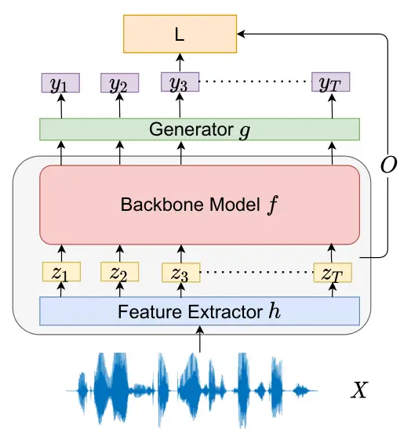
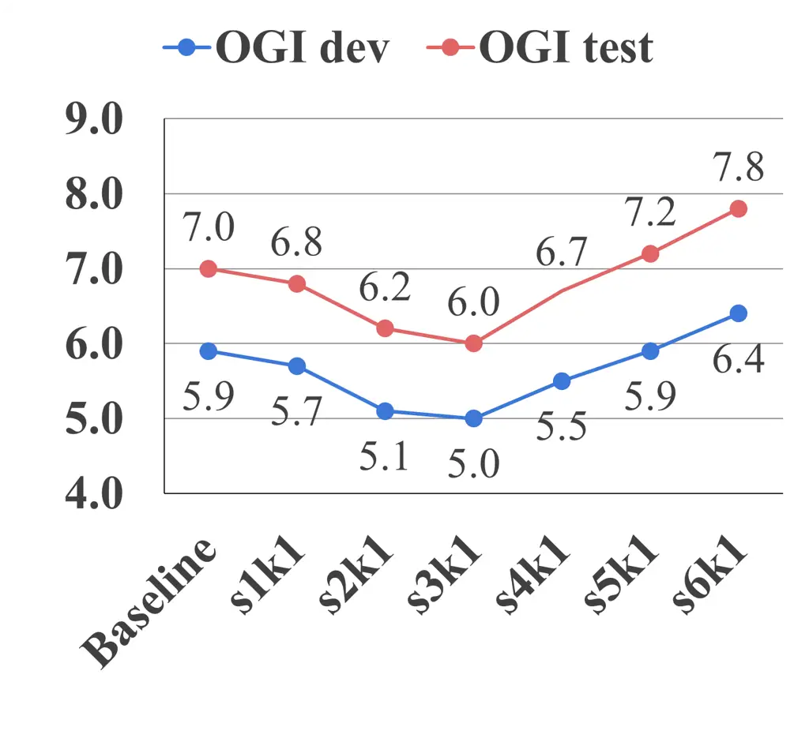
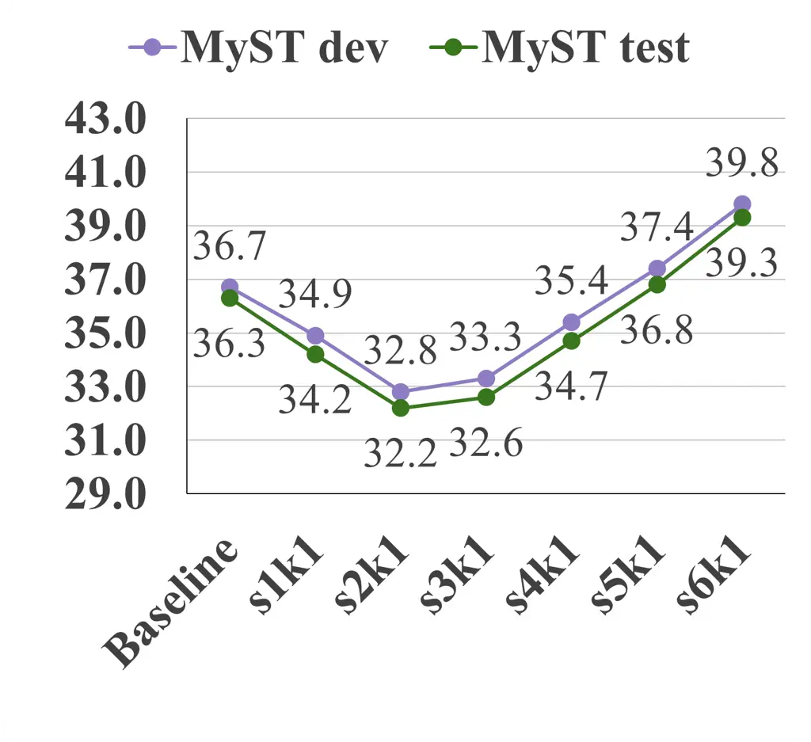
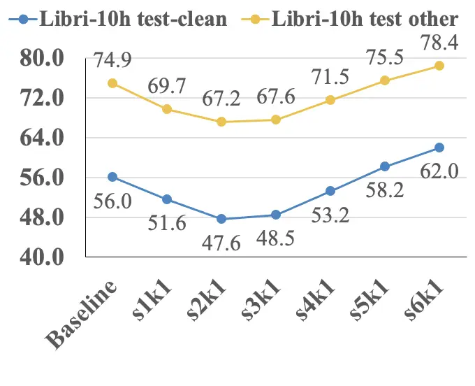

# Towards Better Domain Adaptation for Self-supervised Models: A Case Study of Child ASRThanks: R. Fan, Y. Zhu, J. Wang are students in the ECE Department, University of California, Los Angeles, CA, 90095, USA (e-mail: {fanruchao,yunzhengzhu19,wang7875}@g.ucla.edu).Thanks: A. Alwan is a Professor in the ECE Department, University of California, Los Angeles, CA, 90095, USA (e-mail: alwan@ee.ucla.edu)

Ruchao Fan    Yunzheng Zhu    Jinhan Wang Affiliation: Abeer Alwan,  

###### Abstract

Recently, self-supervised learning (SSL) from unlabelled speech data has
gained increased attention in the automatic speech recognition (ASR)
community. Typical SSL methods include autoregressive predictive coding
(APC), Wav2vec2.0, and hidden unit BERT (HuBERT). However, SSL models
are biased to the pretraining data. When SSL models are finetuned with
data from another domain, domain shifting occurs and might cause limited
knowledge transfer for downstream tasks. In this paper, we propose a
novel framework, domain responsible adaptation and finetuning (DRAFT),
to reduce domain shifting in pretrained speech models, and evaluate it
for a causal and non-causal transformer. For the causal transformer, an
extension of APC (E-APC) is proposed to learn richer information from
unlabelled data by using multiple temporally-shifted sequences to
perform prediction. For the non-causal transformer, various solutions
for using the bidirectional APC (Bi-APC) are investigated. In addition,
the DRAFT framework is examined for Wav2vec2.0 and HuBERT methods, which
use non-causal transformers as the backbone. The experiments are
conducted on child ASR (using the OGI and MyST databases) using SSL
models trained with unlabelled adult speech data from Librispeech. The
relative WER improvements of up to 19.7% on the two child tasks are
observed when compared to the pretrained models without adaptation. With
the proposed methods (E-APC and DRAFT), the relative WER improvements
are even larger (30% and 19% on the OGI and MyST data, respectively)
when compared to the models without using pretraining methods.

###### Index Terms: 

self-supervised learning, end-to-end speech recognition, children’s ASR,
domain adaptation, residual adapters

## I Introduction

Despite impressive advancement in developing automatic speech
recognition (ASR) techniques in the last decade, children’s ASR remains
difficult. Challenges arise, in part, from difficulties in acoustic and
language modeling of child speech. Due to different growth patterns of
children and motor control issues, child speech has a higher degree of
intra-speaker and inter-speaker acoustic variability than adult
speech \[1\]. Additionally, child speech is characterized by significant
mispronunciations and disfluencies \[2, 3\]. Another challenge is the
lack of large-scale publicly-available child speech databases, and thus
child ASR can be treated as a low-resource task\[4\].

Recently, self-supervised learning (SSL) from speech data has been
investigated\[5, 6, 7, 8, 9, 10, 11, 12, 13\] because of its great
potential of improving low-resource tasks through learning prior
knowledge from large amounts of data without annotations. SSL models can
be used in two manners: 1) feature extraction to replace human-designed
features\[14, 15, 16\]; and 2) model initialization for finetuning
downstream tasks\[17, 18\]. The idea of SSL is to design pseudo-labels
for training deep neural networks (DNN) and then transfer the learned
knowledge to a downstream supervised task. For example, autoregressive
predictive coding (APC) uses temporally-shifted sequences to perform
prediction such that the model predicts future frames from previous
frames\[19, 20, 21\]. In \[22\], we proposed a bidirectional APC
(Bi-APC) method for bidirectional long short-term memory (BLSTM)
pretraining for children’s ASR. Different from APC and Bi-APC where the
reconstruction loss is used, Wav2vec-based methods are implemented to
include negative samples, and a contrastive loss is utilized to increase
the distance from the output to negative samples and decrease that
distance to the positive sample\[23, 24, 25, 26\]. The positive sample
is the frame being masked (to be predicted), and negative samples are
the unmasked frames in the utterance. A more recent SSL framework,
HuBERT\[27, 28\], creates the pseudo-label of each speech frame using
clustering techniques like K-means. These methods have been shown to be
effective for low-resource ASR tasks such as low-resource languages\[29,
30\], noisy speech\[31\] and accented speech\[32\].

However, a weakness of SSL training is domain shifting that happens when
the domain of the finetuning data is different than that of the
pretraining data\[33, 34\]. Although a performance improvement can be
observed when the magnitude of the pretraining data is large enough,
previous work has shown that additional gains can be obtained by
including target domain data in the ASR pretraining stage\[34, 35\]. But
including target domain data would be impractical if we are not aware of
the finetuning task at the pretraining stage. In addition, retraining a
large-scale SSL model with both the source and target domain data to
address domain shifting may not always be possible or computationally
efficient. Hence, investigating adaptation methods for SSL is gaining
attention for work involving out-of-domain low-resource tasks. Previous
studies proposed to perform adaptation of supervised models either
during or after the finetuning stage \[36, 37\]. No additional
adaptation stage of self-supervised models has been investigated before
for domain shifting in SSL methods.

In this paper, building on our work in \[22\], we explore how SSL
methods can improve the performance of child ASR in the context of a
low-resource setting for causal and non-causal transformers. First,
autoregressive predictions at different temporal distances are shown to
enable the pretrained model to learn more effectively \[20\]. We,
therefore, propose to use multiple temporally-shifted sequences to
construct a multi-task training objective for APC. Second, the proposed
Bi-APC framework in our previous work performs well for BLSTM, whose
parameters can be separated into forward-related and reverse-related
ones. It is unknown whether the Bi-APC framework can be used for
transformer architectures that have only one set of parameters. To do
so, we copy the modules in the transformer during pretraining and treat
the modules as separate parameters for two APCs in two directions. After
pretraining, we either use one of the modules when the weights are
shared, or average the weights of the two modules to formalize the final
parameters for finetuning. Finally, we propose a domain responsible
adaptation and finetuning (DRAFT) framework to address the domain
shifting problem in SSL. In DRAFT, residual adapters are placed between
blocks in the transformer and are responsible for learning domain
related information at an additional adaptation stage. The additional
adaptation stage trains the model with target finetuning data and with
the same SSL loss that was used in the pretraining stage. Only residual
adapters are updated during the adaptation stage so that the knowledge
learned from source domain data can be retained. The proposed DRAFT
framework has a lower cost than adding target domain data at the
pretraining stage and can be used in various SSL methods.

Note that residual adapters have been proposed before in the literature.
In \[38, 39\], residual adapters are inserted to achieve a parameter
efficient adaptation for low-resource supervised tasks, but the
performance is worse than finetuning the entire model. The method is
beneficial when adaptation is frequently required such as
personalization of a speech recognition model. In \[40, 41, 42\],
residual adapters are applied to learn domain specific parameters to
achieve robust models for various domains. Differences between our work
and these methods will be discussed further in Sec.III-C2. The DRAFT
part is an extension of our recent paper \[43\]. We report on more
experiments in this paper to better understand the functionality of the
residual adapters.

The contributions of this paper are:

- •
  An extension to autoregressive predictive coding (E-APC) is proposed
  so that the pretrained model can learn more useful speech
  representations from unlabelled data. It is then used for a causal
  transformer pretraining.
- •
  Various solutions for using the Bi-APC algorithm in non-causal
  transformers are investigated.
- •
  A domain responsible adaptation and finetuning (DRAFT) framework is
  proposed to address the domain shifting problem in self-supervised
  pretrained models. Different from \[43\], DRAFT’s performance is
  examined with Bi-APC, and ablation studies are conducted for a better
  understanding of the DRAFT framework.

The remainder of this paper is organized as follows. Section II proposes
a general SSL framework. Section III describes the proposed methods for
better improving low-resource ASR tasks with SSL pretrained models.
Experimental setups are described in Section IV. Results are shown and
discussed in Section V. We conclude the paper in Section VI.

## II A General Self-supervised Learning Framework

Self-supervised learning (SSL) learns useful speech representations for
downstream tasks without explicit supervision. After pretraining, the
model can be used for model initialization for downstream tasks. We
propose a general framework for various SSL methods, which is
illustrated in Fig.1.

Let $`X=(x_{1},...,x_{i},...,x_{n})`$ denote the raw waveform of an
utterance, where each $`x_{i}`$ is a sampled data point. The
self-supervised learning methods first extract representations
$`Z=(z_{1},...,z_{t},...,z_{T})`$ for each frame $`t`$ using a function
$`h`$, which in general can be either a human-designed function, like an
MFCC extractor\[44\], or a learned deep network, like a convolution
neural network\[45\]. There may be a special case when $`X`$ represents
human-designed spectral features. Then $`h`$ is a stack of a
human-designed function and the module that maps the spectral features
to latent representations for prediction. A backbone model $`f`$
parameterized with $`\theta`$ is then used to build contextualized
representations. A generator $`g`$ finally converts the contextualized
representations into a prediction space with a pre-defined dimension and
outputs $`Y=(y_{1},...,y_{t},...,y_{T})`$. An operation $`O`$ over
speech representation $`Z`$ is designed to obtain a pseudo-label for the
task. The key idea of SSL is to construct a loss function $`L`$ between
$`O(Z)`$ and model output $`Y`$, ensuring that no information leaking
appears in the forward computation so that trivial solutions are ignored
during the optimization process. As a result, the SSL objective function
is:

```math
L_{\text{SSL}}=L(f(h(X)),O(h(X))) \tag{1}
```

We omit $`g`$ for simplicity because it can be regarded as a part of
$`f`$. The main differences between various SSL methods are the
definition of $`O`$ for obtaining a supervision and of $`L`$ as an
optimization objective.

In this section, we discuss how several SSL methods can be used in our
proposed framework. These methods include autoregressive predictive
coding\[19, 20\], Wav2vec2.0\[25\] and hidden unit BERT (HuBERT)\[27,
28\].



Fig. 1: Proposed self-supervised learning framework. $`h`$ is a function
to extract speech representation $`Z`$. $`O`$ is an operation over
$`Z`$. $`f`$ is the backbone model for pretraining. $`g`$ is a generator
that maps the output of the backbone model to have the same dimension as
$`O(Z)`$ and outputs $`Y`$. $`L`$ computes the SSL loss using $`Y`$ and
$`O(Z)`$.

### II-A Autoregressive Predictive Coding

Autoregressive predictive coding (APC) uses human-designed features as
model input ($`Z=h(X)`$). Typically, 80-dimensional log-mel filter-bank
features are used as $`Z`$. APC utilizes a temporally-shifted sequence
to predict the frame $`n`$ steps ahead of the current frame given all
previous frames. As a consequence, the operation $`O`$ with a temporal
lag of $`n`$ up to the time step $`T-n`$ satisfies
$`O_{n}(\{z_{1},z_{2},...,z_{T-n}\})=\{z_{1+n},z_{2+n},...,z_{T}\}`$.
Since $`Z`$ are not latent representations in APC, the $`L_{p}`$ norm
distance can be used as the loss function. The final objective function
is formulated as follows:

```math
L_{\text{APC}}=L_{p}(f(Z),O_{n}(Z))=\sum_{t=1}^{T-n}(|y_{t}-z_{t+n}|_{p}) \tag{2}
```

where $`n`$ is fixed as a hyper-parameter. APC essentially adopts neural
language model style training using speech features instead of word
embeddings. The mechanism is suitable for online speech recognition
model pretraining because APC considers information from only one
direction. It is, however, not suitable for bidirectional model
pretraining. In this paper, we conduct experiments to explore whether
APC can be extended to bidirectional model pretraining.

### II-B Wav2vec2.0

Wav2vec2.0 has evolved from contrastive predictive coding (CPC)\[23\],
Wav2vec\[24\], and Vq-Wav2vec\[26, 46\]. We only study Wav2vec2.0
because of its better performance.

Wav2vec2.0 uses raw waveforms as model inputs, which means $`h`$ is a
parameterized model for learning feature extraction. $`h`$ consists of
multiple blocks of temporal convolution layers with a total stride that
decreases the sequence length from the number of sampled points to the
number of frames. Different from APC, Wav2vec2.0 adopts masked language
model (MLM)\[47\] style training, where the backbone model $`f`$ tries
to reconstruct masked speech representations. Let $`M`$ be the mask
operation onto speech representation $`Z`$. We define $`Z_{1}`$ as the
original tokens that will be masked by $`M`$, and $`Z_{2}`$ as the
original tokens that will not be masked. Then, when applying $`M`$ to
$`Z`$, we obtain $`Z_{mask}`$ and $`Z_{obs}`$ as the masked and unmasked
tokens. The corresponding outputs are referred to as $`Y_{mask}`$ and
$`Y_{obs}`$. Only $`Y_{mask}`$ contributes to the loss computation.
Hence, the forward computation of $`f`$ could be formulated as
$`Y_{mask}=f(Z_{mask}\oplus Z_{obs})-Y_{obs}`$. Suppose the length of
the masked proportion is $`U`$, we write $`Y_{mask}`$ as
$`\{y_{mask}^{1},y_{mask}^{2},...,y_{mask}^{U}\}`$. Since $`Z`$ are
latent representations, the contrastive loss is preferred so that the
true latent is distinguished from distractors. A vector-quantization
(vq) layer is also inserted after $`Z`$ to obtain more compact
representations for supervision so that the model can learn more
efficiently. The operation $`O`$ can be summarized as
$`O(Z)=\text{vq}(Z_{1})\oplus\text{Sample}(\text{vq}(Z_{2}))=\{(q_{pos}^{1},Q_{neg}^{1}),(q_{pos}^{1},Q_{neg}^{1}),...,(q_{pos}^{U},Q_{neg}^{U})\}`$,
where $`q_{pos}`$ is a positive sample after vq layers, and $`Q_{neg}`$
is a set for negative samples as distractors in the contrastive loss.
The objective function is formulated as:

```math
\displaystyle L_{\text{wav2vec2.0}} \displaystyle=L_{ctras}(Y_{mask},O(Z)) \tag{3}
```

```math
\displaystyle=-\sum_{u}log\frac{\exp(sim(y_{mask}^{u},q_{pos}^{u}))}{\sum_{q_{neg}^{u}\in Q_{neg}^{u}}\exp(sim(y_{mask}^{u},q_{neg}^{u}))}
```

where $`sim(a,b)`$ is the cosine similarity between context
representation $`Y_{mask}`$ and quantized latent representations
$`O(Z)`$. There is also an additional diversity loss in Wav2vec2.0.
Since the observed sequence has information from both directions for
most masked frames, Wav2vec2.0 is suitable for bidirectional model
pretraining. However, Wav2vec2.0 always requires more training
iterations than APC \[48\]. This is because only a portion of the frames
are masked for prediction in Wav2vec2.0 and the mask regions are
different each time the sequence is trained.

### II-C HuBERT

Hidden unit BERT (HuBERT) uses the same masked language model style
training as Wav2vec2.0. Differently, HuBERT does not require negative
samples. Instead, it introduces an acoustic unit discovery process
before the pretraining stage. For example, the most useful strategy in
HuBERT\[28\] is performing K-means on MFCC features or intermediate
model outputs to obtain a pseudo-label category for each frame. HuBERT
creates a learned embedding for each category. The embedding of the true
category is equivalent to the positive sample in Wav2vec2.0 and all
other embeddings are essentially negative samples. Thus, the operation
$`O`$ is an unit discovery process for HuBERT. The loss computation is
similar to the fine-tuning task. If we define
$`O(Z)=(c_{1},c_{2},...,c_{T})`$, where $`c_{t}`$ is the pseudo-category
for each frame, the objective function is computed as a weighted sum of
both the masked and observed output sequences.

```math
\displaystyle L_{\text{HuBERT}} \displaystyle=L(Y,O(Z)) \tag{4}
```

```math
\displaystyle=\alpha L(Y_{mask},O(Z_{mask}))+(1-\alpha)L(Y_{obs},O(Z_{obs}))
```

```math
\displaystyle=-\alpha\sum_{c_{t}\in O(Z_{mask})}\log P(c_{t}|Z)-
```

```math
\displaystyle(1-\alpha)\sum_{c_{t}\in O(Z_{obs})}\log P(c_{t}|Z)
```

where $`\alpha`$ is the task ratio. Similar to\[27, 28\], we use
$`\alpha=1`$ because we directly use the open-sourced pretrained HuBERT
model\[49\] as initialization for children’s ASR training. More
importantly, we apply the proposed domain adaptation technique on these
models to show its general effectiveness.

## III Methods

(a) No Sharing

(b) Share Generator $`g`$

(c) Share $`g`$ and Encoder

(d) Share All

Fig. 2: Various solutions for training a non-causal transformer with
Bi-APC. Each color represents one module. Notations and blocks are
consistent with those described in Section II.

In this section, we first introduce an extension of autoregressive
predictive coding (APC) for causal transformer pretraining. Then,
bidirectional APC (Bi-APC) for non-causal transformer pretraining is
elaborated on as an extension of our previous Bi-APC paper\[22\]. We end
this section with DRAFT, the proposed adaptation framework for
self-supervised pretrained models.

### III-A An Extension of APC

The original APC\[19\] uses one temporally-shifted sequence $`Z_{t+n}`$
during pretraining, as shown in Eq.2. A model may learn differently with
different temporal lags, aka. different values of $`n`$. For example,
the model learns to exploit local smoothness of the signal with a small
value of $`n`$, while it learns a global structure with a large value of
$`n`$. Hence, it is intuitive to include multiple temporally shifted
sequences with different lags during pretraining and reformulate APC as
a multi-task training loss. If we regard Eq.2 as $`L_{\text{APC}}^{n}`$,
the extension of APC (E-APC) has the following objective function:

```math
L_{\text{E-APC}}=\sum_{n=s}^{s+k}L_{\text{APC}}^{n}=\sum_{n=s}^{s+k}\sum_{t=1}^{T-n}(|y_{t}-z_{t+n}|_{p}) \tag{5}
```

where $`s`$ is the temporally-shifted sequence with the smallest value
of $`n`$ and $`k`$ is the number of consecutive temporally-shifted
sequences used in pretraining. During implementation, the backbone model
$`f`$ is shared across different tasks while each task has its own
generator $`g`$.

A recent paper also considered multiple targets for better APC
pretraining\[50\]. An auxiliary predictive loss with the same temporal
lag as the original APC loss is proposed based on an additional RNN for
regularization. In our work, however, only one model (an RNN or
transformer) is used to learn various temporal lags.

### III-B Bi-APC for non-causal transformers

APC and E-APC are suitable for pretraining causal transformers because
of their similar autoregressive mechanism that predicts future frames
from previous frames. Since bidirectional models outperform their
unidirectional couterparts\[51, 52\], we consider the usage of APC for
bidirectional model pretraining. In our previous work\[22\], we
successfully used APC for bidirectional long short-term memory (BLSTM)
and proposed a Bi-APC framework. However, it is unknown whether Bi-APC
can be applied to non-causal transformers that are bidirectional models
with a transformer backbone. In this section, we discuss solutions for
applying Bi-APC to non-causal transformers.

The parameters of BLSTM are designed to be separated into a
left-to-right and right-to-left context modelling LSTMs. The Bi-APC
framework takes each LSTM as an individual APC and ignores the
parameters that induce information exchange between two LSTMs. When the
extension of APC is also applied to Bi-APC, we can write the objective
function of the Bi-APC as follows:

```math
\displaystyle L_{\text{E-BiAPC}} \displaystyle=\sum_{n=s}^{s+k}L_{\text{APC}}^{n}+\sum_{n=s}^{s+k}L_{\text{APC}}^{-n} \tag{6}
```

```math
\displaystyle=\sum_{n=s}^{s+k}\sum_{t=1}^{T-n}(|y_{t}-z_{t+n}|_{p})+\sum_{n=s}^{s+k}\sum_{t=n+1}^{T}(|y_{t}-z_{t-n}|_{p})
```

The parameters in non-causal transformers, however, are not separated
for contextual modelling from both directions. It is unknown whether the
parameters would confuse the learning of individual APC loss in two
directions. There are three major modules in a pretrained model:
convolution block, encoder, and generator. We can essentially assume
each module has two copies and train one causal transformer using a
left-to-right APC and the other causal transformer using a right-to-left
APC, like BLSTM. The trained modules are then averaged to be the final
model initialization for the finetuning task. Parameters of the two
copies could also be shared so that averaging is not needed after
pretraining. As a result, we explore four various Bi-APC pretraining
schemes for non-causal transformers as shown in Fig.2: 1) no modules are
shared; 2) only the generator is shared; 3) only the convolution block
is not shared and 4) all modules are shared, which is similar to \[53\].
The four solutions are selected based on the number of modules shared
from top to bottom during Bi-APC pretraining. By exploring the four
Bi-APC pretraining schemes, we can understand how the shared parameters
affect APC pretraining in two directions and whether Bi-APC framework is
suitable for models with shared parameters for bidirectional contextual
modelling. Note that we use causal convolution layers in the convolution
block and a causal mask in each self-attention layer in the encoder.

Another way of incorporating bidirectional contextual information from
pretraining could be averaging or concatenating outputs from two
pretrained causal transformers. However, this has been previously
investigated in \[54\]. In addition, averaging or concatenating outputs
will result in doubling model parameters with the goal of finding good
speech representations for downstream tasks. In our case, however, we
aim to find a good initialization of non-causal transformers for
finetuning.

### III-C DRAFT: Adaptation of Self-supervised Pretrained Models

Including data from the target domain in the pretraining stage can
improve the performance of the target task. But this method requires
knowledge of the target domain and then re-training the self-supervised
model with a larger amount of data, which is time-consuming and
computationally expensive. It would be more practical to adapt the
pretrained models with target data only when the target domain is
unknown in the pretraining stage. In this section, we propose DRAFT, a
domain responsible adaptation and finetuning framework, to alleviate
domain shifting in the conventional self-supervised pretraining and
finetuning paradigm. DRAFT is a three-stage training paradigm with
residual adapters inserted in the backbone model $`f`$. The residual
adapters are designed to learn knowledge from the target domain data.

#### III-C1 Simple Adaptation for Finetuning (SAFT)

Before introducing DRAFT, a simpler way of doing adaptation is to
retrain the model with target data. An adaptation stage is inserted
between the pretraining and finetuning stage. The adaptation stage
continues to train the model from the pretraining stage with the same
self-supervised loss function but with target data only. All the
parameters in the model are updated at the adaptation stage. The model
after the adaptation stage is used as initialization for the finetuning
stage with an ASR loss.

#### III-C2 Domain Responsible Adapters for Finetuning (DRAFT)

Fig. 3: Structure of the backbone model $`f`$ with residual adapters
inserted after each block. $`N`$x indicates that the module can be
repeated $`N`$ times (proportional to the number of encoder blocks).
$`X,h,Z,f,g`$ and $`Y`$ are the same as those in Fig.1. The right side
of the figure shows the components in a residual adapter.

SAFT updates the parameters of the entire model, and thus overfitting
might occur, leading to a catastrophic forgetting for the
self-supervised model\[55, 56, 57\]. Knowledge learned at the
pretraining stage may diminish because of an aggressive learning
strategy. Not only does the domain shifting problem remain unsolved, but
also a potential improvement breakdown may happen. To address this
issue, we propose domain responsible adapters for finetuning (DRAFT)
framework that uses residual adapters in the backbone model to learn
from target domain data while retaining the source domain knowledge.

We show the backbone model with residual adapters in Fig.3. As shown in
the figure, a residual adapter consists of two feed-forward layers with
a layer normalization and a residual connection. The activation function
between the two feed-forward layers makes the adapter non-linear. The
number of parameters in the residual adapter depends on the dimension of
the output after the down projection layer, which is defined as
$`d_{ada}`$. The effect of $`d_{ada}`$ on performance will be explored
experimentally. Note that the residual adapter can be placed anywhere in
the model. In our case, we insert one residual adapter after the
convolution block and one after each encoder block. We assume that the
output of each block needs to be transformed to be similar to that of
the target domain data so that the model can converge more easily.

Residual adapters have been previously used for domain adaptation of
supervised models\[38, 39\]. However, we develop a way of using residual
adapters for adaptation of self-supervised models via a three-stage
training paradigm. The motivation is to prevent catastrophic forgetting
that happens when finetuning the entire pretrained model, and to address
the domain shifting problem in self-supervised learning. We also do not
learn different residual adapters for different domains. Our goal is to
find a better model initialization of the downstream low-resource tasks.
In \[58\], residual adapters are used to re-pretrain and finetune the
target domain data with the purpose of parameter efficiency in a natural
language processing application. Hence, only residual adapters are
updated at the finetuning stage, while we update the entire model, and
the adaptation stage uses only finetuning data.

To better understand the algorithm, we detail the novel three training
stages of DRAFT. Let $`\theta_{ada}`$ be the parameters in residual
adapters, $`\theta_{f}`$ the parameters in the backbone model (without
residual adapters), $`\theta_{g}`$ the parameters in the generator for
the self-supervised task, and $`\theta_{g}^{\prime}`$ the parameters in
the generator for the ASR task. Suppose source domain data are
$`S_{src}`$ and target domain data are $`S_{tgt}`$, the three-stage
training paradigm can be described as:

- •
  Stage 1: Initialize a model $`\{\theta_{f}^{0},\theta_{g}^{0}\}`$,
  update the parameters using data $`S_{src}`$ and self-supervised loss
  $`L_{ssl}`$, and obtain a pretrained model
  $`\{\theta_{f}^{1},\theta_{g}^{1}\}`$.
- •
  Stage 2: From model $`\{\theta_{f}^{1},\theta_{g}^{1}\}`$, insert
  residual adapters after each block initialized with
  $`\theta_{ada}^{0}`$, freeze $`\{\theta_{f}^{1},\theta_{g}^{1}\}`$ and
  update $`\theta_{ada}^{0}`$ using data $`S_{tgt}`$ and the same
  self-supervised loss $`L_{ssl}`$, and obtain an adapted model
  $`\{\theta_{f}^{1},\theta_{ada}^{1},\theta_{g}^{1}\}`$.
- •
  Stage 3: From model
  $`\{\theta_{f}^{1},\theta_{ada}^{1},\theta_{g}^{1}\}`$, replace
  $`\theta_{g}^{1}`$ with a new generator that can map the embedding
  space to token space as $`\theta_{g^{\prime}}^{0}`$, update the entire
  model with data $`S_{tgt}`$ and a ASR loss such as connectionist
  temporal classification (CTC), and obtain the final ASR model
  $`\{\theta_{f}^{2},\theta_{ada}^{2},\theta_{g^{\prime}}^{1}\}`$.

Note that the superscript in each $`\theta`$ is the number of times the
parameters are updated. For example, $`\theta_{f}^{2}`$ means that
backbone model has been updated twice, once in stage one and the other
in stage three. DRAFT is universal to all self-supervised pretrained
models. We verify the effectiveness of DRAFT on E-APC, Bi-APC,
Wav2vec2.0 and HuBERT models.

## IV Experimental Settings

Because of the availability of large databases of adult speech, we
explore how SSL methods trained with adult speech can help the
development of child ASR systems. In this section, we introduce the data
and the experimental settings for the pretraining, adaptation and
finetuning stages.

### IV-A Data

#### IV-A1 Librispeech 960-hour adult speech corpus

Librispeech is a widely-used adult speech corpus\[59\]. It contains 960
hours of read speech extracted from audio books. We use this dataset
during the pretraining stage. A 10h subset of the data introduced in
\[60\] is often used for evaluating SSL methods on low-resource tasks,
and is referred to as Libri-10h.

#### IV-A2 OGI 50-hour child speech corpus

For the fine-tuning experiments, the scripted part of the OGI Kids’
Speech Corpus \[61\] is used. It contains speech from approximately 100
speakers per grade (from kindergarten to grade 10) saying single words,
sentences and digit strings. The utterances are randomly split into
train (70%), development (15%) and test (15%) sets without speaker
overlap. As a result, nearly 50 hours of child data are used to train
the child ASR system.

#### IV-A3 My Science Tutor (MyST) 240-hour child speech corpus

Another corpus used for finetuning is the MyST children speech
corpus\[62, 63\]. MyST consists of 499 hours with 244,069 utterances of
conversational speech between children and a virtual tutor from 1,372
students between third and fifth grades. However, only 42% of the corpus
(240 hours) is annotated for ASR. We use the annotated part of the
corpus to verify the effectiveness of our proposed methods. The corpus
also contains a development set and test set for evaluation.

### IV-B Pretraining Stage Settings

Four self-supervised learning algorithms are investigated: E-APC,
Bi-APC, Wav2vec2.0 and HuBERT. All models at this stage are trained with
the Librispeech dataset.

For E-APC and Bi-APC, we use 80-dimensional log-mel filter-bank features
($`Z`$ in Fig.1) without any concatenation or frame skipping. The
features are extracted using a 25ms Hamming window and a frame rate of
10ms. Padding is used for the shorter utterances to make the length be
the maximum length of the utterances in a batch. The backbone model
$`f`$ consists of a two-layer convolution block with a sub-sampling of
four along the time axis, 12 transformer encoder blocks and a generator
for each temporally-shifted sequence. We predict four consecutive frames
at each step because of the sub-sampling in the convolution block,
resulting in a 320-dimensional output of the generator. Adam optimizer
is used with a noam-based scheduler, where the noam factor is 5 and the
warmup step is 15k. The model is updated for 130k steps with a batch
size of 256. Various starting temporal lags ($`s`$) and various numbers
of consecutive temporally-shifted sequences ($`k`$) in the E-APC are
compared and the best settings in the E-APC are used for the subsequent
Bi-APC pretraining.

For Wav2vec2.0 and HuBERT, we directly use the open-sourced pretrained
models in the Fairseq¹¹ 1 Our code modified on Fairseq is available at
https://github.com/Diamondfan/fairseq. toolkit\[49\]. We choose the base
model that has about 95M parameters to evaluate the effectiveness of the
proposed DRAFT framework. Note that the number of parameters in the
E-APC and Bi-APC pretraining models are about 39M.

### IV-C Adaptation Stage Settings

Residual adapters are added to the pretrained model at this stage and
only the parameters of residual adapters are updated. We use Xavier
uniform initialization \[64\] for all RA parameters.

For E-APC and Bi-APC, we adapt the model from the pretraining stage with
either the OGI or MyST datasets according to the finetuning task. For
the OGI data, residual adapters are updated in 55k steps with a noam
factor of 8, warmup steps of 10k. For the MyST data, residual adapters
are updated in 74k steps with a noam factor 4 and a warmup step of 15k.
The batch size is set to 64 for both datasets.

For Wav2vec2.0 and HuBERT, the residual adapters of Wav2vec2.0/HuBERT
are updated in 200k/100k steps with learning rate ramping up from 0 to
the peak learning rate in 32k/8k steps, and then decays linearly back to
0, where the peak learning rate is 5e-4. The batch size is set to 16.

We also run experiments using SAFT with the above configurations but all
the parameters are updated. Instead, the learning rate is lower than the
one used in the pretraining stage (e.g. peaking learning rate of 1e-4 on
Wav2vec2.0 and HuBERT). The learning rate is determined empirically
after comparisons of various values.

### IV-D Finetuning Stage Settings

The CTC loss function is used for the finetuning ASR task training. We
train two types of models: 1) a causal transformer with a causal
convolution block and encoder blocks with upper-triangular matrices for
attention. 2) a non-causal transformer with a regular convolution block
and encoder blocks with all-one matrices for attention. The causal
transformer is initialized with E-APC pretrained models, while Bi-APC,
Wav2vec2.0 and HuBERT use the non-causal transformer.

In E-APC and Bi-APC, we finetune the model from the pretraining stage or
the adaptation stage. The model is updated in 240k steps with a batch
size of 32, a noam factor is 2, and a warmup step of 10k steps for the
OGI data. For the MyST data, the model is updated in 340k steps with a
batch size of 64, a noam factor of 2, and a warmup step of 15k steps.

In Wav2vec2.0/HuBERT, the model is updated with a batch size of 64 in
40k steps with a multi-step scheduler where the warmup steps are set to
4k. The peak learning rate of 3e-5/7e-5 holds for the next 16k steps,
then exponentially decays to the ratio $`\lambda`$ of the initial
learning rate, where $`\lambda`$ is set to 0.05.

The data augmentation methods, speed perturbation\[65\] and
SpecAug\[66\], are used for all the experiments at the finetuning stage.
Greedy search decoding is used during evaluation. We conduct experiments
to decide empirically on the final hyper-parameters. We start the
training with a large training epoch (e.g. 100 epochs). Then, if the WER
on the validation set does not decrease for several epochs, we stop the
training and decide the number of training steps based on the
convergence of the training phase.



(a) OGI



(b) MyST



(c) Libri-10h

Fig. 4: WER results on the OGI, MyST, and Libri-10h datasets for
different temporal lags $`s`$ in APC. Only one temporally-shifted
sequence ($`k=1`$) is used in these experiments. Baseline is the causal
transformer trained from scratch. Note that we use adult speech in the
pretraining stage. Therefore, (a) and (b) are domain mismatched case,
while (c) is the domain matched case.

## V Results and Discussion

The base model (95M) that was pretrained on Librispeech 960 hours data
using the Wav2vec2.0 method in the Fairseq toolkit \[49\] achieves a WER
of 3.4% on Librispeech test-clean data\[25\]. However, the model obtains
WERs of 41.67% and 30.77% for the OGI and MyST test data, respectively,
showing a large mismatch between the adult and child speech. In this
section, we present experimental results in the same order that we
introduced the proposed methods in Sec.III. Experiments show how DRAFT
alleviates this domain mismatch.

### V-A APC for Causal Transformers and Its Extension

Fig.4 and Table I show ASR results using APC and its extension on the
OGI, MyST, and Librispeech 10h\[60\] datasets. We experimented with the
Libri-10h data to show that our methods are not limited to children’s
speech. The results for the Libri-10h data are similar to those in
\[60\]. The reason for its poor performance compared to finetuning on
child speech is because of the amount of finetuning data (10 hours for
Librispeech, 50 hours for OGI, and 240 hours for MyST). In addition, OGI
is an easier task because of similar distributions for the train and
test sets. In Fig.4, we use only one temporally-shifted sequence
($`k=1`$) and explore the effect of the starting temporal lag $`s`$. A
baseline that does not use any pretraining methods is also included in
Fig.4. We can see from the figure that when the prediction lag is more
than 4 (16 frames), the WERs increase for all tasks. This result is
similar to the results in \[20\] when considering the sub-sampling in
the convolution block. The best choice of $`s`$ is 3 (12 frames) for
OGI, and 2 (8 frames) for MyST and Libri-10h. The lags are approximately
the duration of an acoustic unit (a vowel or a short syllable). Hence,
the model can learn local smoothness of the spectral features by
predicting frames within an acoustic unit, and acoustic unit transitions
(global structure) by predicting frames in the next acoustic unit,
resulting in learning more meaningful speech representations. Then,
multiple temporally-shifted sequences are combined to construct E-APC.
Based on the results in Fig. 4, we experiment with two settings: s1k4,
combining four consecutive temporally-shifted sequences starting from 1,
and s2k2, combining two consecutive temporally-shifted sequences
starting from 2, because they yielded better results than other
settings. The results are shown in Table I. From the table, the
performance of $`s2k2`$ has a $`\sim`$ 1.8% relative WER improvement on
both tasks compared to the best setting in APC. We also experimented
with $`L_{1}`$, $`L_{2}`$, and a combination of $`L_{1}`$ and $`L_{2}`$
distance measures as the basic loss function for APC, and found that
$`L_{1}`$ performs the best.

|           |             |     |      |      |      |           |       |
| --------- | ----------- | --- | ---- | ---- | ---- | --------- | ----- |
| APC       | L\_(p)      | OGI |      | MyST |      | Libri-10h |       |
|           |             | dev | test | dev  | test | clean     | other |
| Baseline  | -           | 5.9 | 7.0  | 36.7 | 36.3 | 56.0      | 74.9  |
| APC-s2k1  | L₁          | 5.1 | 6.2  | 32.8 | 32.2 | 47.6      | 67.2  |
| EAPC-s1k4 | L₁          | 5.1 | 6.0  | 35.5 | 34.8 | 45.7      | 65.1  |
| EAPC-s2k2 | L₁          | 5.0 | 6.1  | 32.2 | 31.6 | 45.6      | 65.1  |
|           | L₂          | 5.4 | 6.3  | 32.9 | 32.2 | 48.5      | 67.1  |
|           | L₁ $`+`$ L₂ | 5.2 | 6.3  | 32.4 | 31.7 | 45.6      | 65.1  |
|           |             |     |      |      |      |           |       |

TABLE I: WER results of APC with $`s2k1`$ and E-APC with settings of
$`s1k4`$ and $`s2k2`$. $`s1k4`$ stands for using four consecutive
temporally-shifted sequences starting with a temporal lag of one. A
similar meaning applies to $`s2k1`$ and $`s2k2`$. $`L_{p}`$ norm is the
basic loss function used as shown in Eq.2. Baseline is the causal
transformer trained from scratch.

### V-B Bi-APC with A Non-causal Transformer

|          | Share? |      |     | OGI |      | MyST |      | Libri-10h |       |
| -------- | ------ | ---- | --- | --- | ---- | ---- | ---- | --------- | ----- |
|          | Conv.  | Enc. | G.  | dev | test | dev  | test | clean     | other |
| Baseline | -      | -    | -   | 2.9 | 3.3  | 28.0 | 27.8 | 51.9      | 70.2  |
| Bi-APC   |        |      |     | 3.2 | 3.9  | 27.8 | 27.3 | 60.7      | 77.0  |
|          |        |      | ✓   | 3.3 | 4.1  | 32.1 | 31.8 | 58.6      | 75.7  |
|          |        | ✓    | ✓   | 2.8 | 3.4  | 26.2 | 25.7 | 40.1      | 58.9  |
|          | ✓      | ✓    | ✓   | 2.8 | 3.3  | 25.5 | 25.0 | 40.3      | 58.9  |

TABLE II: WER results of four solutions (shown in Fig.2) for using
Bi-APC for a non-causal transformer. Baseline is the non-causal
transformer trained from scratch.

Using the best settings of E-APC ($`s2k2`$ with $`L_{1}`$ distance), we
discuss the four solutions of applying Bi-APC to the non-causal
transformer mentioned in Sec.III-B. Results are shown in Table II. As
can be seen from the table, with more modules shared, the performance
tends to be better except that sharing only the generator causes an
increase in WERs. However, there is only a 0.1% absolute WER improvement
on the OGI development set when sharing all parameters. The reason may
be because the used OGI data (the scripted part) contains shorter
utterances (3.5s for OGI, 8.3s for MyST, and 12.8s for Libri-10h), and
thus benefit less from Bi-APC. We note a larger improvement with the
MyST and Libri-10h data. For example, the WER for MyST test data using
the sharing-all solution is decreased from 27.8% to 25.0%, and the WER
is decrease from 51.9% to 40.3% on Librispeech test clean data. The
parameters in the separated modules learn very different distributions
when they are not shared during Bi-APC pretraining. Averaged parameters
may lose information from both sides. As a result, the sharing-all
solution outperforms other solutions for Bi-APC pretraining. However,
Bi-APC is still worse than methods like Wav2vec2.0 and HuBERT as shown
in the next section. When compared to our previous Bi-APC for LSTMs
study\[22\], Bi-APC for transformers performs worse for the child speech
databases in terms of relative WERs. We assume that Bi-APC may not be
suitable for bidirectional pretraining of models that have only one set
of parameters. From this perspective, it is interesting to see whether
the transformer can be reformulated as a model that has forward-related
and reverse-related parameters.

### V-C Effect of $`d_{ada}`$ in DRAFT

|            | $`d_{ada}`$ | OGI |      | MyST |      | Updated Params |          |
| ---------- | ----------- | --- | ---- | ---- | ---- | -------------- | -------- |
|            |             | dev | test | dev  | test | total          | relative |
| Baseline   | 0           | 5.9 | 7.0  | 36.7 | 36.3 | 39.2M          | 100%     |
| +EAPC      | 0           | 5.0 | 6.1  | 32.2 | 31.6 | 39.2M          | 100%     |
|      +SAFT | 0           | 5.0 | 5.9  | 33.4 | 32.9 | 39.2M          | 100%     |
|    +DRAFT  | 64          | 4.9 | 5.7  | 31.9 | 31.0 | 0.9M           | 2%       |
|            | 128         | 4.7 | 5.6  | 31.6 | 30.9 | 1.7M           | 4%       |
|            | 256         | 4.6 | 5.3  | 31.1 | 30.4 | 3.4M           | 9%       |
|            | 512         | 4.4 | 5.2  | 30.9 | 30.2 | 6.8M           | 17%      |
|            | 1024        | 4.4 | 4.9  | 30.1 | 29.4 | 13.7M          | 35%      |
|            | 2048        | 4.4 | 4.9  | 30.0 | 29.3 | 27.3M          | 70%      |
|            |             |     |      |      |      |                |          |

TABLE III: WER results of different values of $`d_{ada}`$ in residual
adapters. SAFT is the sample adaptation for finetuning that updates the
entire model at the adaptation stage. DRAFT is the proposed domain
responsible adapter for finetuning that updates only residual adapters
at the adaptation stage. The number of updated parameters are also shown
in absolute and relative values (compared to the baseline of a causal
transformer).

We conducted experiments with different values of $`d_{ada}`$ in the
residual adapters to examine the impact of the number of adapter
parameters, because this number influences both WERs and adaptation
efficiency. The experiments are conducted on the OGI and MyST datasets
using the E-APC method. Specifically, $`d_{ada}`$ values are selected
from 64 to 2048 and the results are shown in Table III. For reference,
we also include the results for the baseline, pretraining from E-APC and
SAFT. Both WER results and the number of parameters that need to be
updated during the adaptation stage are shown in the table. First, when
compared to SAFT, DRAFT achieves a better performance with fewer
parameters to be updated. In addition, we observe that the WER drops
when we increase the number of parameters in the residual adapters.
However, the cost is increased training time at the adaptation stage
because more parameters need to be updated. We can even achieve an
improvement from a WER of 5.9% to 5.7% on the OGI test set with only 2%
of the parameters being updated. As a result, the choice of $`d_{ada}`$
in DRAFT can be adjusted according to different scenarios. For example,
one can use a small value of $`d_{ada}`$ to achieve a fast adaptation of
the self-supervised model when computational resources are limited. A
large value of $`d_{ada}`$ can be used to achieve a better performance
for the finetuning task. All subsequent DRAFT experiments will use 1024
for $`d_{ada}`$ since it results in a good trade-off between performance
and efficiency.

### V-D Results of DRAFT with Non-causal Transformers

|                          | E-APC |      |      |      | Bi-APC |      |      |      | Wav2vec2.0 |      |       |       | HuBERT |      |       |       |
| ------------------------ | ----- | ---- | ---- | ---- | ------ | ---- | ---- | ---- | ---------- | ---- | ----- | ----- | ------ | ---- | ----- | ----- |
|                          | OGI   |      | MyST |      | OGI    |      | MyST |      | OGI        |      | MyST  |       | OGI    |      | MyST  |       |
|                          | dev   | test | dev  | test | dev    | test | dev  | test | dev        | test | dev   | test  | dev    | test | dev   | test  |
| Baseline                 | 5.9   | 7.0  | 36.7 | 36.3 | 2.9    | 3.3  | 28.0 | 27.8 | -          | -    | -     | -     | -      | -    | -     | -     |
| + Finetune               | 5.0   | 6.1  | 32.2 | 31.6 | 2.8    | 3.3  | 25.5 | 25.0 | 2.3        | 2.7  | 17.84 | 17.16 | 2.1    | 2.5  | 17.40 | 16.71 |
| + Adapter Finetune\[67\] | 8.6   | 10.1 | 47.4 | 47.3 | -      | -    | -    | -    | 100        | 100  | 100   | 100   | 100    | 100  | 100   | 100   |
|      + SAFT              | 5.0   | 5.9  | 33.4 | 32.9 | -      | -    | -    | -    | 2.2        | 2.7  | 17.85 | 17.28 | 2.0    | 2.4  | 17.52 | 16.89 |
|      + DRAFT             | 4.4   | 4.9  | 30.1 | 29.4 | 2.7    | 3.2  | 24.8 | 24.3 | 2.1        | 2.5  | 17.21 | 16.70 | 1.9    | 2.1  | 16.79 | 16.53 |

TABLE IV: WER results of using DRAFT for E-APC, Bi-APC, Wav2vec2.0 and
HuBERT on the OGI and MyST datasets. Baseline indicates that models are
trained from scratch. Improvements of DRAFT are statistically
significant ($`p<0.05`$) compared to the pretraining results. The
convergence of Wav2vec2.0 and HuBERT is different to achieve without
pretraining.

In Sec.V-C, DRAFT is shown to be effective for E-APC with a causal
transformer. Here, we evaluate the DRAFT framework for Bi-APC and other
two widely used SSL methods: Wav2vec2.0 and HuBERT. We conduct DRAFT
experiments on both the OGI and MyST datasets for E-APC, Bi-APC,
Wav2vec2.0 and HuBERT. Results are shown in Table IV. The table shows
that SAFT yields a small improvement or even a negative effect on the
WERs compared to the pretraining baselines (without adaptation). The
reason may be that updating the entire model causes a catastrophic
forgetting of the knowledge learned from adult speech. However, when the
proposed DRAFT framework is used, the WERs of the four SSL methods have
an improvement on the OGI dataset compared to the pretraining baselines
(without adaptation). Specifically, we achieve relative WER improvements
of 19.7%, 3.0%, 7.4%, and 16.0% on the OGI test set for E-APC, Bi-APC,
Wav2vec2.0, and HuBERT, respectively. HuBERT achieves the best WER of
2.1% on the OGI test data. WER improvements are even larger when
compared to the baselines without using pretraining methods. For
example, we achieve 30% and 19% WER improvements on the OGI and MyST
data for the E-APC method, respectively. We also observe similar
improvements on the MyST dataset, although the relative improvements are
smaller than those using the OGI data (child read speech). The reason
could be the mismatch in style between MyST data (child spontaneous
speech) and pretraining data (adult read speech). Note that we do not
try SAFT for Bi-APC because we have already shown its overfitting
behaviour in E-APC. For Wav2vec2.0 and HuBERT, the baselines without
pretraining are not available because their convergence is difficult to
achieve without pretrained models. Note that the results of using HuBERT
and Wav2vec2.0 are much better than those of E-APC is because of a
better performance of non-causal transformers than causal transformers.
However, improving and examining APC with our proposed framework is
valuable for causal transformers (streaming models).

Experimental results using the adapter finetuning method \[67\] are also
presented in Table IV. Although adapter finetuning has been shown
effective in \[67\], it does not perform well in child ASR tasks, maybe
because fixing the backbone model (pretrained on adult speech) is not
appropriate when the domain mismatch (finetuning on child speech)
exists. The results of adapter finetuning also show the importance and
effectiveness of DRAFT in reducing domain mismatch. Note that the
results of adapter finetuning on Wav2vec2.0 and HuBERT are 100% because
of a slow convergence during training. We may get a reasonable WER for
the adapter finetuning method with a longer training schedule. However,
the results of adapter finetuning and DRAFT are comparable because they
use the same amount of training steps.

### V-E What do Residual Adapters Learn?

|          |                      |            |     |      |
| -------- | -------------------- | ---------- | --- | ---- |
| E-APC    | RA Initialization    | Update RA? | OGI |      |
|          |                      |            | dev | test |
| Baseline | None                 | No         | 5.9 | 7.0  |
|     + RA | $`\theta_{ada}^{0}`$ | Yes        | 5.5 | 6.4  |
| DRAFT    | $`\theta_{ada}^{0}`$ | Yes        | 4.8 | 5.6  |
|          | $`\theta_{ada}^{1}`$ | Yes        | 4.4 | 4.9  |
|          | $`\theta_{ada}^{1}`$ | No         | 4.7 | 5.4  |
|          |                      |            |     |      |

TABLE V: Experiments showing the behaviour of residual adapters in DRAFT
in terms of WER. “RA Initialization” and “Update RA?” are describing the
finetuning stage. “+ RA” indicates adding randomly initialized RA at the
finetuning stage for a fair comparison to DRAFT. $`\theta_{ada}^{1}`$
indicates the RA learned in the adaptation stage and
$`\theta_{ada}^{0}`$ is the RA with random initialization.

Finally, we explore the behaviour of residual adapters (RA) by using a
random initialization of RA or freezing RA parameters during the
finetuning stage. By initializing RA parameters randomly
($`\theta_{ada}^{0}`$), the WERs in comparison to that of DRAFT which
has pretrained RA ($`\theta_{ada}^{1}`$), can give us an insight into
whether the RA learn the knowledge from the target domain data as
expected. Results for E-APC on the OGI data are shown in Table V. As
shown in the table, the performance of DRAFT with learned RA is much
better than that when RA are randomly initialized (4.9% v.s. 5.6%),
showing the successful learning of the target domain knowledge. The
table also shows the result when RA parameters are frozen during the
finetuning stage. We can see from the table that the performance of
freezing RA (5.4%) is better than the experiment with randomly
initialized and updated RA (5.6%, third row in the table). The results
imply that the RA may learn a domain-related transformation from adult
to child speech after each block in the transformer. The learned
transformation ability from the SSL task might be directly used in the
ASR task without further finetuning. One might argue that WER
improvements are the results of increasing model parameters. Hence, we
conduct an experiment that directly adds residual adapters (“+RA” in the
table) in the same way they are added to DRAFT but without any
pretrained parameters. The results in Table V show that DRAFT
outperforms the new baseline as well, which could address the concern
that the improvements are from increased model capacity.

## VI Conclusions

In this paper, we developed techniques to improve the performance of
self-supervised learning (SSL) methods for children’s ASR when
unannotated adult speech data are used in the pretraining stage. In the
context of autoregressive predictive coding (APC), which is a neural
language model style pretraining method for causal transformers, we
proposed an extension to APC (E-APC) by learning from multiple
temporally-shifted sequences because they contain different levels of
information in the structured data. E-APC had a $`\sim`$ 1.8% relative
WER improvement on the OGI and MyST data compared to APC. In our
previous work, a bidirectional APC (Bi-APC) framework was proposed for
BLSTM pretraining, which addressed the problem that APC is not suitable
for bidirectional model pretraining. In this paper, we further discussed
the possibility of using Bi-APC for non-causal transformers. Various
solutions were investigated in this paper and results showed that Bi-APC
framework can have a slight improvement over the baseline without
pretraining, but the results are worse than bidirectional pretraining
methods like Wav2vec2.0 and HuBERT. Finally, a domain responsible
adaptation and finetuning (DRAFT) framework was proposed to alleviate
the domain shifting problem between adult and child speech. The DRAFT
framework performed well on E-APC, Bi-APC, Wav2vec2.0 and HuBERT
methods, showing that it can improve the performance of pretraining
methods for both causal (E-APC) and non-causal transformers (the other
techniques). When compared to the conventional pretraining baselines
without adaptation, we achieved relative WER improvements of up to 19.7%
on the two child ASR tasks. The relative WER improvements are even
larger (30% and 19% for E-APC on the OGI and MyST data, respectively)
when compared to the models without using pretraining methods. A future
direction of research could be to investigate unsupervised domain
adaptation of ASR systems from adult to child speech. In addition, we
will explore the pretraining methods with DRAFT for attention-based
encoder-decoder models.

## VII Acknowledgement

This paper was supported in part by the NSF and the UCLA-Amazon Science
Hub. Thanks to PAII Inc. for offering their GPU platforms for some
experiments.

## References

- \[1\] S. Lee, A. Potamianos, and S. Narayanan, “Acoustics of
  children’s speech: Developmental changes of temporal and spectral
  parameters,” _Journal of the Acoustical Society of America (JASA)_,
  vol. 105, no. 3, pp. 1455–1468, 1999.
- \[2\] J. S. Yaruss, R. M. Newman, and T. Flora, “Language and
  disfluency in nonstuttering children’s conversational speech,”
  _Journal of Fluency Disorders_, vol. 24, no. 3, pp. 185–207, 1999.
- \[3\] T. Tran, M. Tinkler, G. Yeung, A. Alwan, and M. Ostendorf,
  “Analysis of disfluency in children’s speech,” _Interspeech 2020_, pp.
  4278–4282, 2020.
- \[4\] J. Wang, Y. Zhu, R. Fan, W. Chu, and A. Alwan, “Low resource
  german asr with untranscribed data spoken by non-native
  children–interspeech 2021 shared task spapl system,” _Interspeech
  2021_, pp. 1279–1283, 2021.
- \[5\] S. Chen, C. Wang _et al._, “WavLM: Large-Scale Self-Supervised
  Pre-Training for Full Stack Speech Processing,” _arXiv preprint
  arXiv:2110.13900_, 2021.
- \[6\] Y. Zhang, D. S. Park, W. Han, J. Qin, A. Gulati, J. Shor,
  A. Jansen, Y. Xu, Y. Huang, S. Wang _et al._, “Bigssl: Exploring the
  frontier of large-scale semi-supervised learning for automatic speech
  recognition,” _IEEE Journal of Selected Topics in Signal
  Processing_, 2022.
- \[7\] C. Wang, Y. Wu _et al._, “UniSpeech: Unified speech
  representation learning with labeled and unlabeled data,”
  _International Conference on Machine Learning (ICML)_, vol. 139, pp.
  10 937–10 947, 18–24 Jul 2021.
- \[8\] Y.-A. Chung, Y. Zhang _et al._, “W2v-bert: Combining contrastive
  learning and masked language modeling for self-supervised speech
  pre-training,” _IEEE Automatic Speech Recognition and Understanding
  Workshop (ASRU)_, pp. 244–250, 2021.
- \[9\] J. Ao, R. Wang, L. Zhou, S. Liu, S. Ren, Y. Wu, T. Ko, Q. Li,
  Y. Zhang, Z. Wei _et al._, “Speecht5: Unified-modal encoder-decoder
  pre-training for spoken language processing,” _Annual Meeting of the
  Association for Computational Linguistics (ACL)_, pp. 5723–5738, 2021.
- \[10\] D. Jiang, W. Li _et al._, “A further study of unsupervised
  pretraining for transformer based speech recognition,” _IEEE
  International Conference on Acoustics, Speech and Signal Processing
  (ICASSP)_, pp. 6538–6542, 2021.
- \[11\] W. Wang, Q. Tang, and K. Livescu, “Unsupervised pre-training of
  bidirectional speech encoders via masked reconstruction,” _ICASSP
  2020_, pp. 6889–6893, 2020.
- \[12\] A. T. Liu, S.-w. Yang _et al._, “Mockingjay: Unsupervised
  speech representation learning with deep bidirectional transformer
  encoders,” _ICASSP 2020_, pp. 6419–6423, 2020.
- \[13\] A. T. Liu, S.-W. Li, and H.-y. Lee, “Tera: Self-supervised
  learning of transformer encoder representation for speech,” _IEEE/ACM
  Transactions on Audio, Speech, and Language Processing (TASLP)_,
  vol. 29, pp. 2351–2366, 2021.
- \[14\] S.-w. Yang, P.-H. Chi _et al._, “SUPERB: Speech processing
  universal performance benchmark,” _Interspeech 2021_, pp.
  1194–1198, 2021.
- \[15\] S. Evain, H. Nguyen _et al._, “LeBenchmark: A reproducible
  framework for assessing self-supervised representation learning from
  speech,” _Interspeech 2021_, pp. 1439–1443, 2021.
- \[16\] X. Chang, T. Maekaku _et al._, “An exploration of
  self-supervised pretrained representations for end-to-end speech
  recognition,” _ASRU, 2021_, pp. 228–235, 2021.
- \[17\] A. Vyas, S. Madikeri, and H. Bourlard, “Comparing CTC and LFMMI
  for out-of-domain adaptation of wav2vec 2.0 acoustic model,”
  _Interspeech 2021_, pp. 2861–2865, 2021.
- \[18\] A. Misra, D. Hwang _et al._, “A comparison of supervised and
  unsupervised pre-training of end-to-end models,” _Interspeech 2021_,
  pp. 731–735, 2021.
- \[19\] Y.-A. Chung, W.-N. Hsu _et al._, “An unsupervised
  autoregressive model for speech representation learning,” _Interspeech
  2019_, pp. 146–150, 2019.
- \[20\] Y.-A. Chung and J. Glass, “Generative pre-training for speech
  with autoregressive predictive coding,” _ICASSP 2020_, pp.
  3497–3501, 2020.
- \[21\] V. Ravi, R. Fan _et al._, “Exploring the Use of an Unsupervised
  Autoregressive Model as a Shared Encoder for Text-Dependent Speaker
  Verification,” _Interspeech 2020_, pp. 766–770, 2020.
- \[22\] R. Fan, A. Afshan, and A. Alwan, “Bi-apc: Bidirectional
  autoregressive predictive coding for unsupervised pre-training and its
  application to children’s ASR,” _ICASSP 2021_, pp. 7023–7027, 2021.
- \[23\] A. v. d. Oord, Y. Li, and O. Vinyals, “Representation learning
  with contrastive predictive coding,” _Conference on Neural Information
  Processing Systems (NIPS)_, 2018.
- \[24\] S. Schneider, A. Baevski, R. Collobert, and M. Auli, “wav2vec:
  Unsupervised pre-training for speech recognition.” _Interpseech 2019_,
  pp. 154–162, 2019.
- \[25\] A. Baevski, Y. Zhou, A. Mohamed, and M. Auli, “wav2vec 2.0: A
  framework for self-supervised learning of speech representations,”
  _Advances in Neural Information Processing Systems_, vol. 33, 2020.
- \[26\] A. Baevski, S. Schneider, and M. Auli, “vq-wav2vec:
  Self-supervised learning of discrete speech representations,”
  _International Conference on Learning Representation (ICLR)_, 2019.
- \[27\] W.-N. Hsu, Y.-H. H. Tsai _et al._, “Hubert: How much can a bad
  teacher benefit ASR pre-training?” _ICASSP 2021_, pp. 6533–6537, 2021.
- \[28\] W.-N. Hsu, B. Bolte, Y.-H. H. Tsai, K. Lakhotia,
  R. Salakhutdinov, and A. Mohamed, “Hubert: Self-supervised speech
  representation learning by masked prediction of hidden units,”
  _TASLP_, vol. 29, pp. 3451–3460, 2021.
- \[29\] M. Riviere, A. Joulin, P.-E. Mazaré, and E. Dupoux,
  “Unsupervised pretraining transfers well across languages,” _ICASSP
  2020_, pp. 7414–7418, 2020.
- \[30\] C. Yi, J. Wang, N. Cheng, S. Zhou, and B. Xu, “Applying
  wav2vec2. 0 to speech recognition in various low-resource languages,”
  _arXiv preprint arXiv:2012.12121_, 2020.
- \[31\] Y. Wang, J. Li, H. Wang, Y. Qian, C. Wang, and Y. Wu,
  “Wav2vec-switch: Contrastive learning from original-noisy speech pairs
  for robust speech recognition,” _ICASSP 2022_, pp. 7097–7101, 2022.
- \[32\] J. Li, V. Manohar, P. Chitkara, A. Tjandra, M. Picheny,
  F. Zhang, X. Zhang, and Y. Saraf, “Accent-robust automatic speech
  recognition using supervised and unsupervised wav2vec embeddings,”
  _arXiv preprint arXiv:2110.03520_, 2021.
- \[33\] Y. Meng, Y.-H. Chou, A. T. Liu, and H.-y. Lee, “Don’t speak too
  fast: The impact of data bias on self-supervised speech models,”
  _ICASSP 2022_, pp. 3258–3262, 2022.
- \[34\] W.-N. Hsu, A. Sriram _et al._, “Robust wav2vec 2.0: Analyzing
  domain shift in self-supervised pre-training,” _Interspeech 2021_, pp.
  721–725, 2021.
- \[35\] D. Hwang, A. Misra, Z. Huo, N. Siddhartha, S. Garg, D. Qiu,
  K. C. Sim, T. Strohman, F. Beaufays, and Y. He, “Large-scale asr
  domain adaptation using self-and semi-supervised learning,” _ICASSP
  2022_, pp. 6627–6631, 2022.
- \[36\] S. Khurana, A. Laurent, and J. Glass, “Magic dust for
  cross-lingual adaptation of monolingual wav2vec-2.0,” _ICASSP 2022_,
  pp. 6647–6651, 2022.
- \[37\] Z. Huo, D. Hwang, K. C. Sim, S. Garg, A. Misra, N. Siddhartha,
  T. Strohman, and F. Beaufays, “Incremental layer-wise self-supervised
  learning for efficient speech domain adaptation on device,” _arXiv
  preprint arXiv:2110.00155_, 2021.
- \[38\] K. Tomanek, V. Zayats _et al._, “Residual Adapters for
  Parameter-Efficient ASR Adaptation to Atypical and Accented Speech,”
  _Conference on Empirical Methods in Natural Language Processing
  (EMNLP)_, pp. 6751–6760, 2021.
- \[39\] N. Houlsby, A. Giurgiu, S. Jastrzebski, B. Morrone,
  Q. De Laroussilhe, A. Gesmundo, M. Attariyan, and S. Gelly,
  “Parameter-efficient transfer learning for nlp,” _ICML_, pp.
  2790–2799, 2019.
- \[40\] W. Hou, H. Zhu, Y. Wang, J. Wang, T. Qin, R. Xu, and
  T. Shinozaki, “Exploiting adapters for cross-lingual low-resource
  speech recognition,” _TASLP_, vol. 30, pp. 317–329, 2021.
- \[41\] A. Kannan, A. Datta, T. N. Sainath, E. Weinstein,
  B. Ramabhadran, Y. Wu, A. Bapna, Z. Chen, and S. Lee, “Large-scale
  multilingual speech recognition with a streaming end-to-end model,”
  _Interspeech 2019_, pp. 2130–2134, 2019.
- \[42\] S.-A. Rebuffi, H. Bilen, and A. Vedaldi, “Learning multiple
  visual domains with residual adapters,” _NIPS 2017_, pp.
  506–516, 2017.
- \[43\] R. Fan and A. Alwan, “DRAFT: A Novel Framework to Reduce Domain
  Shifting in Self-supervised Learning and Its Application to Children’s
  ASR,” _Interspeech 2022_, 2022.
- \[44\] F. J. Harris, “On the use of windows for harmonic analysis with
  the discrete fourier transform,” _Proceedings of the IEEE_, vol. 66,
  no. 1, pp. 51–83, 1978.
- \[45\] Y. LeCun, Y. Bengio _et al._, “Convolutional networks for
  images, speech, and time series,” _The handbook of brain theory and
  neural networks_, vol. 3361, no. 10, p. 1995, 1995.
- \[46\] A. Baevski, M. Auli, and A. Mohamed, “Effectiveness of
  self-supervised pre-training for speech recognition,” _ICASSP 2020_,
  pp. 7694–7698, 2020.
- \[47\] J. Devlin, M.-W. Chang, K. Lee, and K. Toutanova, “Bert:
  Pre-training of deep bidirectional transformers for language
  understanding,” _NAACL-HLT, 2019_, pp. 4171–4186, 2019.
- \[48\] D. Hwang, A. Misra, Z. Huo, N. Siddhartha, S. Garg, D. Qiu,
  K. C. Sim, T. Strohman, F. Beaufays, and Y. He, “Large-scale asr
  domain adaptation using self-and semi-supervised learning,” _ICASSP
  2022_, pp. 6627–6631, 2022.
- \[49\] M. Ott, S. Edunov, A. Baevski, A. Fan, S. Gross, N. Ng,
  D. Grangier, and M. Auli, “fairseq: A fast, extensible toolkit for
  sequence modeling,” _NAACL-HLT (Demonstrations)_, pp. 48–53, 2019.
- \[50\] Y.-A. Chung and J. Glass, “Improved speech representations with
  multi-target autoregressive predictive coding,” _ACL 2020_, pp.
  2353–2358, 2020.
- \[51\] A. Zeyer, P. Doetsch, P. Voigtlaender, R. Schlüter, and H. Ney,
  “A comprehensive study of deep bidirectional lstm rnns for acoustic
  modeling in speech recognition,” _ICASSP 2017_, pp. 2462–2466, 2017.
- \[52\] A. Graves, N. Jaitly, and A.-r. Mohamed, “Hybrid speech
  recognition with deep bidirectional lstm,” _ASRU 2013_, pp.
  273–278, 2013.
- \[53\] X. Chen, S. Zhang, D. Song, P. Ouyang, and S. Yin, “Transformer
  with bidirectional decoder for speech recognition,” _Interspeech
  2020_, pp. 1773–1777, 2020.
- \[54\] S. Ling, Y. Liu, J. Salazar, and K. Kirchhoff, “Deep
  contextualized acoustic representations for semi-supervised speech
  recognition,” _ICASSP 2020_, pp. 6429–6433, 2020.
- \[55\] R. M. French, “Catastrophic forgetting in connectionist
  networks,” _Trends in cognitive sciences_, vol. 3, no. 4, pp.
  128–135, 1999.
- \[56\] S. Kessler, B. Thomas, and S. Karout, “Continual-wav2vec2: an
  application of continual learning for self-supervised automatic speech
  recognition,” _arXiv preprint arXiv:2107.13530_, 2021.
- \[57\] H.-J. Chang, H.-y. Lee, and L.-s. Lee, “Towards Lifelong
  Learning of End-to-end ASR,” _Interspeech 2021_, pp. 2551–2555, 2021.
- \[58\] S. Kim, A. Shum, N. Susanj, and J. Hilgart, “Revisiting
  pretraining with adapters,” _the 6th Workshop on Representation
  Learning for NLP_, pp. 90–99, 2021.
- \[59\] V. Panayotov, G. Chen, D. Povey, and S. Khudanpur,
  “Librispeech: an asr corpus based on public domain audio books,”
  _ICASSP 2015_, pp. 5206–5210, 2015.
- \[60\] J. Kahn, M. Riviere _et al._, “Libri-light: A benchmark for asr
  with limited or no supervision,” _ICASSP 2020_, pp. 7669–7673, 2020.
- \[61\] K. Shobaki, J.-P. Hosom, and R. A. Cole, “The ogi kids’ speech
  corpus and recognizers,” _ICSLP 2000_, pp. 258–261, 2000.
- \[62\] W. Ward, R. Cole _et al._, “My science tutor: A conversational
  multimedia virtual tutor for elementary school science,” _TASLP_,
  vol. 7, no. 4, pp. 1–29, 2011.
- \[63\] W. Ward, R. Cole, and S. Pradhan, “My science tutor and the
  myst corpus,” 2019.
- \[64\] X. Glorot and Y. Bengio, “Understanding the difficulty of
  training deep feedforward neural networks,” in _Proceedings of the
  thirteenth international conference on artificial intelligence and
  statistics_, 2010, pp. 249–256.
- \[65\] T. Ko, V. Peddinti, D. Povey, and S. Khudanpur, “Audio
  augmentation for speech recognition,” _Interspeech 2015_, pp.
  3586–3589, 2015.
- \[66\] D. S. Park, W. Chan, Y. Zhang, C.-C. Chiu, B. Zoph, E. D.
  Cubuk, and Q. V. Le, “Specaugment: A simple data augmentation method
  for automatic speech recognition,” _Interspeech 2019_, pp.
  2613–2617, 2019.
- \[67\] B. Thomas, S. Kessler, and S. Karout, “Efficient adapter
  transfer of self-supervised speech models for automatic speech
  recognition,” _ICASSP 2022_, pp. 7102–7106, 2022.
