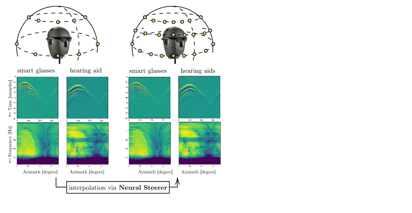

# Neural Steerer: Novel Steering Vector Synthesis with a Causal Neural Field over Frequency and Direction

Diego Di Carlo  Aditya Arie Nugraha  Mathieu Fontaine  Yoshiaki Bando
 Kazuyoshi Yoshii ^(†)^(†)thanks: This work was supported by ANR Project
SAROUMANE (ANR-22-CE23-0011) and Hi! Paris Project MASTER-AI, JST PRESTO
no.˜JPMJPR20CB, and JSPS KAKENHI nos.˜JP20H00602, JP21H03572,
JP23K16912, JP23K16913.  
Code available at
[https://github.com/Chutlhu/nsteerer](https://github.com/Chutlhu/nsteerer).

###### Abstract

We address the problem of accurately interpolating measured anechoic
steering vectors with a deep learning framework called the neural field.
This task plays a pivotal role in reducing the resource-intensive
measurements required for precise sound source separation and
localization, essential as the front-end of speech recognition.
Classical approaches to interpolation rely on linear weighting of nearby
measurements in space on a fixed, discrete set of frequencies. Drawing
inspiration from the success of neural fields for novel view synthesis
in computer vision, we introduce the neural steerer, a continuous
complex-valued function that takes both frequency and direction as input
and produces the corresponding steering vector. Importantly, it
incorporates inter-channel phase difference information and a
regularization term enforcing filter causality, essential for accurate
steering vector modeling. Our experiments, conducted using a dataset of
real measured steering vectors, demonstrate the effectiveness of our
resolution-free model in interpolating such measurements.

###### Index Terms: 

Steering vector, neural field, spatial audio, interpolation,
representation learning

^(†)^(†)address: ¹ Center for Advanced Intelligence Project (AIP),
RIKEN, Japan  
² Graduate School of Informatics, Kyoto University, Japan  
³ LTCI, Télécom Paris, Institut Polytechnique de Paris, France  
⁴ National Institute of Advanced Industrial Science and Technology
(AIST), Japan

## 1 Introduction

Steering vectors are a fundamental concept in multichannel audio signal
processing as they describe the acoustic relationship between a sound
source and a set of microphones in anechoic settings. It serves as a
core component of speech enhancement \[1\], source separation \[2\] and
localization \[3\], and acoustic channel estimation \[4\]. Hence, their
accurate representation is fundamental for robust sound analysis and to
achieve realistic rendering. In most actual applications, steering
vectors are computed based on algebraic anechoic models or estimated by
measuring head-related transfer functions (HRTFs), directivity profiles
of a microphone array, and acoustic transfer functions.

Algebraic steering vectors analytically encode the direct propagation
over space and frequency, typically as a function of sound incident
angle. In real scenarios, however, such an algebraic model is limited by
several impairments and often replaced with measured general
filters \[5\]. Extended formulations include models for directivity and
filtering as well as sound interaction with the receiver, such as
occlusion, diffraction, and scattering. In the hearing aid applications,
the steering vectors encode HRTF that capture the effects of the user’s
pinnae, head, and torso. In order to model all the effects at each space
and frequency, one may use dedicated simulators, which suffer from
significant realism-computational complexity trade-offs \[6\].
Alternatively, steering vectors can be measured in dedicated
facilities \[1\]. However, measuring them at high spatial resolution is
cumbersome due to the cost and setup complexity, if not unfeasible.



Figure 1: Schematic representation of the proposed Neural Steerer for
measured anechoic steering vectors interpolation.

Reliable data-driven approaches for steering vector and HRTF
interpolation have gained much attention over the last decade \[7, 8,
9\]. As shown in Figure 1, These methods use measurements on a coarse
spatial grid as a basis and then interpolate them to obtain measurement
estimates at new locations, typically on a finer grid. However, such
methods suffer from two main drawbacks. First, they assume that the
target quantity undergoes a polynomial transformation of some basis
function at the desired spatial location, which may not accurately
represent reality and introduce artifacts. Second, all these methods
operate interpolation only in the spatial domain, leaving the frequency
(or temporal) grid resolution fixed, under-modeling the target quantity.

Recent works on deep learning showed that coordinate-based architectures
are able to encode signals continuously over space and time \[10, 11,
12\]. These methods, also called neural fields (NFs), can be trained
easily using data-fit and model-based loss functions in order to
interpolate and super-resolve target quantity at an arbitrary
resolution. Their outstanding applications include novel view synthesis
from sparse 2D images \[13\], image super-resolution \[11\], and
animation of human bodies \[14\]. Unlike on-grid discrete measurements
at a given resolution, the memory complexity of an NF scales with the
data complexity and not with the desired resolution. In addition, being
over-parameterized modular network models, NFs are effective for
regressing ill-posed problems under appropriate regularization. However,
in practice, they tend to overfit, and their resolution capabilities are
limited by network capacity and training schemes \[12\].

Interestingly, physics-informed neural networks (PINNs) \[15, 16, 17\]
are similar models proposed in the field of computational physics. Here,
partial differential equations (PDEs) are used as regularization terms
evaluating coordinates at arbitrary resolution exploiting automatic
differentiation. The resulting NFs are likely to be a physically
consistent continuous function defined over the whole input domain and
less prone to overfit to noisy or sparse input observations. However,
these networks are required to be differentiable with respect to the
input variables used in the PDEs, which is not the case for available
audio-based NF models returning a discrete set of frequencies.

In this work, we address the limitation of available discrete steering
vector interpolation methods by leveraging recent advances in neural
fields. The proposed method models both the magnitude and the phase of
steering vectors (related to HRTFs) as a complex-valued field defined
continuously over space and frequency. Based on the theoretical
foundation of signal processing, we propose a novel regularizer that
enforces the estimated filter to be causal, leading to more accurate
filters with respect to standard approaches. Finally, thanks to its
continuous formulation in space and time, the proposed approach can be
used in the framework of PINNs evaluating the wave-equation terms with
respect to the model inputs.

## 2 Related Work

Given a set of steering vector measurements in the frequency or time
domain, a simple way to increase the spatial resolution is to obtain an
estimate for a new position by weighted averaging known measurements
from multiple surrounding positions. Methods of this form are extensions
of polynomial interpolation where data are projected onto ad-hoc basis
functions (e.g., spherical harmonics or spatial characteristic function)
whose coefficients are then interpolated at desired positions \[7, 8,
9\]. The well-known limitations of these approaches are the requirement
of near-uniform sampling for the training data and the difficulty of
conditioning the optimization on ad-hoc prior information. Also, the
performances are related to the choice of the basis function and their
interpolating algorithms.

In audio processing, NFs have recently been proposed for acoustic
impulse response (AIR) estimation and interpolation  \[18\], for HRTF
magnitude encoding over arbitrary spherical coordinates \[19, 20\], and
binaural rendering \[21, 22, 23\]. Interestingly, in \[20\], estimation
of AIRs is performed incorporating explicitly the algebraic model of
early sound propagation. However, these approaches treat frequency
(time) as a discrete quantity corresponding to the output dimension of
neural networks, which limits the model’s applicability.

By explicitating frequency (or time) as a network’s input variable, the
model can be trained within the PINN framework, leveraging the wave
equation to enforce physics coherence. This approach has been used to
recover AIRs at unseen locations in the time domain \[24\] and to
spatially super-resolve complex HRTF for a single given frequency
bin \[25\]. Besides the promising results, no guarantees are given on
the shape of estimated filters, which may feature, for instance,
anti-causal components. Moreover, it is worth noting that, apart
from \[21, 25\], the phase components of the steering vector are
ignored. This limitation can significantly affect spatial processing and
rendering, where phase information is crucial for accurate processing.

## 3 Proposed Method

It is reasonable to start with the theoretical computation of steering
vectors. Let us consider an anechoic steering vector that encodes the
direct signal propagation from the $`j`$-th source located at position
$`\mathbf{s}_{j}`$ to an $`I`$-microphone array centered at
$`\mathbf{r}`$ as a function of the incident direction of arrival (DoA)
represented by azimuth $`\theta_{j}`$ and elevation $`\varphi_{j}`$.

Following the far-field algebraic model in the frequency domain \[26\],
the anechoic steering vector $`d_{ij}(f)`$ for the $`i`$-th microphone
located at $`\mathbf{m}_{i}`$ at frequency $`f`$ is expressed as

```math
d_{ij}(f)=\exp\left(-\frac{\jmath 2\pi f\mathbf{n}_{j}^{\top}(\mathbf{m}_{i}-\mathbf{r})}{c}\right), \tag{1}
```

where
$`\mathbf{n}_{j}=[\cos\theta_{j}\cos\varphi_{j},\sin\theta_{j}\cos\varphi_{j},\sin\varphi_{j}]^{\top}`$
is the unit-norm vector pointing to the $`j`$-th source, $`c`$ is the
speed of sound, and $`\jmath`$ represents the imaginary unit.

The real-world steering vector deviates from the ideal anechoic steering
vector due to various filtering effects caused by complex physical
phenomena such as signal propagation in the air and microphone
directivity \[27\]. We thus formulate a steering vector $`h_{ij}(f)`$ as
a modified version of $`d_{ij}(f)`$ as follows:

```math
h_{ij}(f)=\underbrace{\vphantom{\mathbf{n}_{j}^{T}}\exp(-2\pi f\jmath\tau)}_{\triangleq\,\bar{d}(f)}\,g^{\text{air}}_{j}(f)\,g^{\text{mic}}_{ij}(\mathbf{m}_{i},f)\,d_{ij}(f), \tag{2}
```

where $`g_{j}^{\text{air}}(f)`$ represents the frequency-dependent air
attenuation and the eventual source-dependent characteristics and
$`g^{\text{mic}}_{ij}(\mathbf{m}_{i},f)`$ represents the microphone
directivity defined with its phase center at $`\mathbf{r}`$, which
typically depends on the type and manufacturing of the
microphones\[28\]. Finally, a global delay term $`\bar{d}(f)`$ accounts
for the global constant time offset $`\tau`$, often presented in
real-world measurements.

### 3.1 Neural Steerer

The family of steering vectors can be represented by the functional:

```math
\begin{array}[]{lcccrc}\mathcal{M}:&\mathbb{S}^{2}&\times&\mathbb{R}_{+}&\to&\mathbb{C}\\
&((\theta_{j},\varphi_{j}),&&f)&\mapsto&\;h_{ij},\end{array} \tag{3}
```

where $`\mathbb{S}^{2}`$ is the set of polar coordinates on the unit
sphere. The dependency on $`\mathbf{m}_{i}`$ is omitted for readability
as they are constant.

We parameterize $`\mathcal{M}`$ with an NF \[11, 10, 12\], that, once
trained on a finite set of observations, can evaluate any input
coordinate at arbitrary resolution whose super-resolution capabilities
depend on the network’s inductive bias, e.g., architecture topology and
regularizers. Similarly to \[21\], we model $`\tau`$ and
$`\mathbf{m}_{i}`$ as free parameters of the model, which are optimized
during training. Then, $`\bar{d}`$ and $`d_{ij}`$ can be computed
algebraically from the input coordinated using (1). Therefore, the
network predict only the terms $`g^{\text{air}}_{j}(f)`$ and
$`g^{\text{mic}}_{ij}(\mathbf{m}_{i},f)`$. Such a physics-inspired
formulation is helpful as it enforces the inductive bias and provides a
good initialization, although the single terms may not correspond to the
actual physical contributions.

Figure 2: Illustration of the proposed Neural Steerer. Both $`\odot`$
and $`\cdot`$ denote element-wise multiplication.

### 3.2 Network Architecture

The proposed architecture is shown in Fig. 2. As in \[19\], a SIREN
network is used, i.e., a multi-layer perceptron (MLP) with sinusoidal
activations \[11\]. This model, denoted by
$`\mathtt{SIREN}_{\text{Phase}}`$, takes as input the desired source DoA
$`(\theta_{j},\varphi_{j})`$ and frequency $`f`$ and returns the
components of (2):
$`\mathcal{G}_{j}\triangleq\left\{g^{\text{air}}_{j}(f),\{g^{\text{mic}}_{ij}(\mathbf{m}_{i},f)\}_{i=1}^{I}\right\}`$.

Let $`g^{\ast}`$ be an entry of $`\mathcal{G}_{j}`$. Instead of directly
predicting the complex-valued $`g^{\ast}`$ or its real-imaginary parts,
we propose to estimate its magnitude and phase implicitly. More
precisely, for each $`g^{\ast}`$, the network returns a
$`3`$-dimensional vector $`\mathbf{g}^{\ast}\in\mathbb{R}^{3}`$ that is
used to obtain $`g^{\ast}`$ via its magnitude and phase as

```math
g^{\ast}=\exp\left(\{\mathbf{g}^{\ast}\}_{1}\right)\,\exp\left(-\jmath 2\pi\arctan\left(\frac{\{\mathbf{g}^{\ast}\}_{2}}{\{\mathbf{g}^{\ast}\}_{3}}\right)\right). \tag{4}
```

Such representation handles phase wrapping, suffered by the
magnitude-phase format, and enhances stability and convergence speed
compared to a real-imaginary one, leading to better results.

The steering vector $`h_{ij}(f)`$ is then obtained as in (2) given
$`g^{\text{air}}_{j}(f)`$ and $`g^{\text{mic}}_{ij}(\mathbf{m}_{i},f)`$
estimated by the NF and the theoretical steering vectors
$`d_{ij}^{\text{mic}}(f)`$ and the global delay $`d_{j}(f)`$ are
computed knowing the microphone positions and the offset, respectively.

Following the work in \[29\], we propose an alternative architecture
(denoted by $`\mathtt{SIREN}_{\text{Mag}\to\text{Phase}}`$), where the
phase estimation is conditioned on the magnitude estimation. In
practice, the network comprises a cascade of two SIREN, jointly trained:
the first outputs the magnitudes of the components from input
coordinates, while the second reconstructs the phase based on both
coordinates and magnitudes.

This proposed model considers frequencies as continuous input variables.
In this setting, hereafter referred to as continuous frequency (CF)
model, the network output $`3\times(I+1)`$ real values, where 3 is the
dimension of $`\mathbf{g}^{\ast}`$ to represent complex values. In the
case of discrete frequency (DF) modeling, the last layer of the network
is modified to output $`3\times(I+1)F`$ for a given single source DoA,
where $`F`$ is the total number of frequency regularly sampled in
$`[0,F_{s}]`$, similarly to the DFT operation, where $`F_{s}`$ is the
sampling frequency.

### 3.3 Training Loss and Off-Grid Regularization

The neural network is trained to return filters with low phase
distortion in both frequency and time domains for a given source DoA
$`(\theta_{j},\varphi_{j})`$ and frequency $`f`$. Similarly to the loss
proposed in \[30\], we optimize the explicit magnitude and phase errors
in the frequency domain plus one explicit term time-domain
$`\ell_{2}`$-loss, that is

```math
\displaystyle\mathcal{L}= \displaystyle\sum_{ij\in\mathcal{B}}\left(\frac{1}{|\mathcal{F}|}\sum_{f\in\mathcal{F}}\mathcal{L}_{ijf}^{\text{freq}}+\frac{1}{F}\mathcal{L}_{ij}^{\text{time}}\right) \tag{5}
```

```math
\displaystyle\mathcal{L}_{ijf}^{\text{freq}}= \displaystyle\mathcal{L}_{\text{LogMag}}(\hat{h}_{ij}(f),h_{ij}(f))+\lambda_{1}\mathcal{L}_{\text{Phase}}(\hat{h}_{ij}(f),h_{ij}(f))
```

```math
\displaystyle\mathcal{L}_{ij}^{\text{time}}= \displaystyle\lambda_{2}\left\|\text{iDFT}\left(\vphantom{\hat{A}^{A}_{A}}[\hat{h}_{ij}]_{F}\right)-\text{iDFT}\left(\vphantom{\hat{A}^{A}_{A}}[h_{ij}]_{F}\right)\right\|_{2}^{2},
```

where $`\mathcal{B}`$ and $`\mathcal{F}`$ are the sets of random
training DoAs and frequencies used in a batch, respectively, with
$`|\mathcal{F}|<F`$. $`[h_{ij}]_{F}`$ denotes the concatenation of $`F`$
elements for equally spaced frequencies in $`[0,F_{s}]`$.

In practice, as reported in \[31\], we also find the $`\ell_{1}`$ loss
on the log-magnitude spectrum plus a $`\ell_{1}`$ loss on the $`\cos`$
and the $`\sin`$ of the phase component work best, denoted by
$`\mathcal{L}_{\text{LogMag}}`$ and $`\mathcal{L}_{\text{Phase}}`$,
respectively. Moreover, we found empirically that modeling continuous
frequencies (CF) is a much harder task than modeling frequencies as
discrete output variables. In particular, we found that the NF fails to
capture the details across the frequency dimension, converging towards
erroneous solutions. We addressed this pathology by modifying loss
functions $`\mathcal{L}_{\text{LogMag}}`$ and
$`\mathcal{L}_{\text{Phase}}`$ to account for the sequential nature of
frequencies. In practice, the losses are inversely weighted to the
magnitude of the cumulative residual loss from the previous
frequencies \[32\]. Details are omitted due to lack of space.

The main limitation of the loss in (5) is that it can be evaluated only
on training data. Following the training strategies used in PINNs, we
can use a physical model to regularize the objective evaluated on source
locations at any arbitrary resolution in an unsupervised manner \[33,
17\]. One of the main requirements is that our estimated steering vector
$`\hat{h}_{ij}`$ and its components are causal for every source
position. Anti-causal components may lead to artifacts and incoherent
steering vectors. In order to enforce this, we propose a regularization
term based on a classic relation saying that the imaginary part of the
transfer function must be the Hilbert transform $`\mathcal{H}`$ of the
real part of the transfer function \[34\]:

```math
\mathcal{L}_{\text{Causal}}=\left\|\mathcal{H}\left(\Re\left\{[\hat{h}_{ij}]_{F}\right\}\right)-\Im\left\{[\hat{h}_{ij}]_{F}\right\}\right\|_{2}^{2}, \tag{6}
```

where $`\Re\{\cdot\}`$ and $`\Im\{\cdot\}`$ are the real and imaginary
part. This regularization term can be computed straightforwardly in the
DF case by sampling randomly source positions in $`\mathbb{R}^{3}`$. In
the CF condition, input frequencies need to be sampled. To simplify the
computation of the Hilbert and Fourier transform, we chose to sample a
random number of equally distributed frequencies in $`[0,F_{s}]`$.

## 4 Evaluation

Figure 3: RMSE (left) and cosine distance (right) of time-domain
steering vectors for locations in the test set (top) and the whole
sphere reconstruction on random data (bottom). Shaded regions show the
confidence interval for both continuous and discrete frequency models.

We aimed to obtain a reliable representation of the steering vectors in
both the time and frequency domains. Therefore, we evaluate the
performance of the proposed $`\mathtt{SIREN}_{\text{Phase}}`$ and
$`\mathtt{SIREN}_{\text{Mag}\to\text{Phase}}`$ models in terms of three
metrics, i.e., the root mean square error (RMSE) and the cosine distance
between the estimated and reference steering vectors in the time domain
and the log-spectral distance (LSD) \[dB\] between the magnitudes of the
estimated and reference HRTFs. We compare our models against a vanilla
SIREN as used in \[19\] ($`\mathtt{SIREN}^{*}`$) modified to return
magnitude and phase, and an interpolation method based on the spatial
characteristic function ($`\mathtt{SCF}^{*}`$) \[8\].

Our evaluation used the EasyCom Dataset \[1\] featuring steering vectors
of a 6-channel microphone array consisting of 4 microphones attached to
head-worn smart glasses and 2 binaural microphones located in the user’s
ear canals. All data were measured at $`F_{s}=48\,\text{kHz}`$ on a
spherical grid with $`60`$ equally spaced azimuths and $`17`$
quasi-equally spaced elevations. If not otherwise specified, we consider
$`F=257`$ positive frequencies.

Our $`\mathtt{SIREN}_{\text{Phase}}`$ and
$`\mathtt{SIREN}_{\text{Mag}\to\text{Phase}}`$ models utilized a SIREN
architecture composed of four 512-dimensional hidden layers.
Additionally, $`\mathtt{SIREN}_{\text{Mag}\to\text{Phase}}`$ used a
second SIREN featuring two 512-dimensional hidden layers. Those models
were trained using a batch size of $`|\mathcal{B}|=18`$, and a learning
rate that is initialized to $`10^{-3}`$ and scaled by a factor of
$`0.98`$ at every epoch. An early stopping mechanism is applied to avoid
overfitting by monitoring a loss computed on a part (20%) of the
training data. In all experiments, we set $`\lambda_{1}=\lambda_{2}=10`$
to match the scale of the different loss terms.
$`\mathcal{L}_{\text{Causal}}`$ is computed using $`B`$ random
coordinates uniformly sampled in the unit sphere. The baseline
$`\mathtt{SIREN}^{*}`$ used the same parameterization applied to our
$`\mathtt{SIREN}_{\text{Phase}}`$ model, but output only magnitude and
phase directly, without the transformation in (4).

We first considered the task of interpolating the steering vector on a
regular grid. In this task, the training dataset consisted of steering
vectors and locations downsampled regularly by a factor of 2 as
in \[19\]. Table 1 reports the average RMSE and cosine distance of the
unseen (missing) data points at full frequency resolution. Our models
trained with the proposed regularizers outperformed the baseline in both
metrics. Specifically, the performances were improved by introducing new
regularization techniques and conditioning the phase estimation on the
magnitude. Additionally, in the context of continuous frequency
modeling, incorporating the off-grid regularizer
$`\mathcal{L}_{\text{Causal}}`$ results in comparable reconstruction
results to those achieved through discrete frequency modeling (with a
p-value of $`0.0032`$).

Subsequently, we analyzed the reconstruction capabilities as a function
of available points (in percentage) randomly sampled from the original
grid. Fig. 3 displays the two time-domain objectives for the unseen data
only (top) and on the full test dataset (bottom), which comprises
training and unseen data points. The curves reaffirm the results
discussed earlier, showing that conditioning phase estimation on
magnitude estimates yields better results. Notably, it can be observed
that the $`\mathtt{SIREN}^{*}`$ model trained solely to minimize the
$`\ell_{2}`$ norm in the complex domain exhibits suboptimal performance
in the reconstruction of both seen and unseen points, even when 90$`\%`$
of the points are seen during training.

Figure 4: Average log-spectral distortion at different resolutions in
the whole (left) and a selected (right) frequency range. The model was
trained on $`F=257`$ frequency bins.

| Freqs | Model                                          | $`\mathcal{L}_{\text{MSE}}`$ | $`\mathcal{L}_{\text{LogMag}}+\lambda_{1}\mathcal{L}_{\text{Phase}}`$ | $`+\lambda_{2}\mathcal{L}_{\text{iDFT}}`$ | $`+\mathcal{L}_{\text{Causal}}`$ |
| ----- | ---------------------------------------------- | ---------------------------- | --------------------------------------------------------------------- | ----------------------------------------- | -------------------------------- |
| DF    | $`\mathtt{SCF}^{*}`$                           | 1.42 (0.94)                  | \-                                                                    | \-                                        | \-                               |
| DF    | $`\mathtt{SIREN}^{*}`$                         | 1.09 (0.78)                  | \-                                                                    | 1.02 (0.70)                               | 1.01 (0.73)                      |
| DF    | $`\mathtt{SIREN}_{\text{Phase}}`$              | 1.26 (0.77)                  | 0.36 (0.06)                                                           | 0.34 (0.06)                               | 0.34 (0.06)                      |
| DF    | $`\mathtt{SIREN}_{\text{Mag}\to\text{Phase}}`$ | 1.22 (0.66)                  | 0.32 (0.05)                                                           | 0.29 (0.05)                               | 0.28 (0.05)                      |
| CF    | $`\mathtt{SIREN}_{\text{Phase}}`$              | 1.42 (0.88)                  | 0.63 (0.17)                                                           | 0.58 (0.17)                               | 0.33 (0.06)                      |
| CF    | $`\mathtt{SIREN}_{\text{Mag}\to\text{Phase}}`$ | 1.37 (0.80)                  | 0.53 (0.13)                                                           | 0.45 (0.09)                               | 0.37 (0.08)                      |

Table 1: Average RMSE and cosine distance (in parentheses) between the
estimated and reference time-domain steering vectors in the steering
vector interpolation task. The values average over the 6 channels. \*
denotes baseline methods.

Finally, we analyzed the interpolation performances along the frequency
axis. Specifically, we trained a CF variant of
$`\mathtt{SIREN}_{\text{Mag}\to\text{Phase}}`$ model to fit steering
vectors measured at $`F=257`$ frequencies and then evaluated at varying
spectral resolutions. The results, presented in Fig. 4, demonstrate that
the reconstruction error remains consistently low across different
evaluation grids. However, it should be noted that the errors increase
with the frequency and become more pronounced at the boundaries. This
observation could be attributed to the band-limited nature of the target
signal. It was also in line with previous findings reported in \[19\].
Nevertheless, within the frequency range commonly utilized in classical
speech processing applications, namely $`f\in[40,20000]`$ Hz, the mean
LSD was around 0.5 dB lower.

## 5 Conclusion

This paper proposes a novel neural field model that provides a
continuous encoding of steering vectors over both spatial and frequency
coordinates given a discrete set of measurements. Our approach places a
strong emphasis on accurately capturing the phase component of the
target steering vector while enforcing that the filters maintain their
causal nature. Our experimental results have illustrated the
effectiveness of our model in reconstructing real steering vector
measurements. As we look ahead, we envision a wide array of potential
applications. Specifically, the continuous synthesis of steering vectors
holds promise for tasks such as beamforming in sound source localization
and separation. Furthermore, the versatility of our proposed model
extends to microphone calibration, as we optimize microphone positions
as model parameters.

## References

- \[1\] Jacob Donley, Vladimir Tourbabin, Jung-Suk Lee, Mark Broyles,
  Hao Jiang, Jie Shen, Maja Pantic, Vamsi Krishna Ithapu, and Ravish
  Mehra, “EasyCom: An augmented reality dataset to support algorithms
  for easy communication in noisy environments,” arXiv e-print, 2021,
  arXiv:2107.04174v2.
- \[2\] Kouhei Sekiguchi, Yoshiaki Bando, Aditya Arie Nugraha, Kazuyoshi
  Yoshii, and Tatsuya Kawahara, “Fast multichannel nonnegative matrix
  factorization with directivity-aware jointly-diagonalizable spatial
  covariance matrices for blind source separation,” IEEE/ACM Trans.
  Audio, Speech, Language Process., vol. 28, pp. 2610–2625, 2020.
- \[3\] Ralph Schmidt, “Multiple emitter location and signal parameter
  estimation,” IEEE Trans. Antennas Propag., vol. 34, no. 3, pp.
  276–280, 1986.
- \[4\] Paolo Annibale, Jason Filos, Patrick A Naylor, and Rudolf
  Rabenstein, “Geometric inference of the room geometry under
  temperature variations,” in Proc. Int. Symp. Control Commmun. Signal
  Process., 2012, pp. 1–4.
- \[5\] Sharon Gannot, David Burshtein, and Ehud Weinstein, “Signal
  enhancement using beamforming and nonstationarity with applications to
  speech,” IEEE Trans. Signal Process., vol. 49, no. 8, pp.
  1614–1626, 2001.
- \[6\] Sylvain Argentieri, Patrick Danes, and Philippe Souères, “A
  survey on sound source localization in robotics: From binaural to
  array processing methods,” Computer Speech & Language, vol. 34, no. 1,
  pp. 87–112, 2015.
- \[7\] Ville Pulkki, “Virtual sound source positioning using vector
  base amplitude panning,” Journal of the audio engineering society,
  vol. 45, no. 6, pp. 456–466, 1997.
- \[8\] Fábio P. Freeland, Luiz W. P. Biscainho, and Paulo S. R. Diniz,
  “Interpolation of head-related transfer functions (HRTFS): A
  multi-source approach,” in Proc. EUSIPCO, 2004.
- \[9\] Dmitry N. Zotkin, Ramani Duraiswami, and Nail A. Gumerov,
  “Regularized HRTF fitting using spherical harmonics,” in Proc. IEEE
  WASPAA, 2009, pp. 257–260.
- \[10\] Matthew Tancik, Pratul Srinivasan, Ben Mildenhall, Sara
  Fridovich-Keil, Nithin Raghavan, Utkarsh Singhal, Ravi Ramamoorthi,
  Jonathan Barron, and Ren Ng, “Fourier features let networks learn high
  frequency functions in low dimensional domains,” Proc. NeurIPS, vol.
  33, pp. 7537–7547, 2020.
- \[11\] Vincent Sitzmann, Julien Martel, Alexander Bergman, David
  Lindell, and Gordon Wetzstein, “Implicit neural representations with
  periodic activation functions,” in Proc. NeurIPS, 2020, vol. 33, pp.
  7462–7473.
- \[12\] Yiheng Xie, Towaki Takikawa, Shunsuke Saito, Or Litany, Shiqin
  Yan, Numair Khan, Federico Tombari, James Tompkin, Vincent Sitzmann,
  and Srinath Sridhar, “Neural fields in visual computing and beyond,”
  in Comput. Graph. Forum, 2022, vol. 41, pp. 641–676.
- \[13\] Ben Mildenhall, Pratul P. Srinivasan, Matthew Tancik,
  Jonathan T. Barron, Ravi Ramamoorthi, and Ren Ng, “NeRF: Representing
  scenes as neural radiance fields for view synthesis,” in Proc. ECCV,
  2020, pp. 405–421.
- \[14\] Guy Gafni, Justus Thies, Michael Zollhofer, and Matthias
  Nießner, “Dynamic neural radiance fields for monocular 4D facial
  avatar reconstruction,” in Proc. IEEE/CVF Conf. Comput. Vis. Pattern
  Recog., 2021, pp. 8649–8658.
- \[15\] Maziar Raissi, Paris Perdikaris, and George E. Karniadakis,
  “Physics-informed neural networks: A deep learning framework for
  solving forward and inverse problems involving nonlinear partial
  differential equations,” J. Comput. Phys., 2019.
- \[16\] George Em Karniadakis, Ioannis G Kevrekidis, Lu Lu, Paris
  Perdikaris, Sifan Wang, and Liu Yang, “Physics-informed machine
  learning,” Nature Reviews Phys., vol. 3, no. 6, pp. 422–440, 2021.
- \[17\] Sifan Wang, Yujun Teng, and Paris Perdikaris, “Understanding
  and mitigating gradient flow pathologies in physics-informed neural
  networks,” SIAM J. Sci. Comput., vol. 43, no. 5, pp.
  A3055–A3081, 2021.
- \[18\] Alexander Richard, Peter Dodds, and Vamsi Krishna Ithapu, “Deep
  impulse responses: Estimating and parameterizing filters with deep
  networks,” in Proc. IEEE ICASSP, 2022.
- \[19\] You Zhang, Yuxiang Wang, and Zhiyao Duan, “HRTF field: Unifying
  measured HRTF magnitude representation with neural fields,” in Proc.
  IEEE ICASSP, 2023.
- \[20\] Jin Woo Lee, Sungho Lee, and Kyogu Lee, “Global HRTF
  interpolation via learned affine transformation of hyper-conditioned
  features,” in Proc. IEEE ICASSP, 2023.
- \[21\] Jin Woo Lee and Kyogu Lee, “Neural fourier shift for binaural
  speech rendering,” in Proc. IEEE ICASSP, 2023.
- \[22\] Andrew Luo, Yilun Du, Michael J Tarr, Joshua B Tenenbaum,
  Antonio Torralba, and Chuang Gan, “Learning neural acoustic fields,”
  in Proc. NeurIPS, 2022, pp. 1–13.
- \[23\] Kun Su, Mingfei Chen, and Eli Shlizerman, “Inras: Implicit
  neural representation for audio scenes,” NeurIPS, 2022.
- \[24\] Mirco Pezzoli, Fabio Antonacci, and Augusto Sarti, “Implicit
  neural representation with physics-informed neural networks for the
  reconstruction of the early part of room impulse responses,” in Proc.
  Forum Acousticum., 2023.
- \[25\] Fei Ma, Thushara D Abhayapala, Prasanga N Samarasinghe, and
  Xingyu Chen, “Physics informed neural network for head-related
  transfer function upsampling,” arXiv preprint arXiv:2307.14650, 2023.
- \[26\] E. Vincent, T. Virtanen, and S. Gannot, Audio Source Separation
  and Speech Enhancement, John Wiley & Sons, 2018.
- \[27\] Robin Scheibler, Eric Bezzam, and Ivan Dokmanić,
  “Pyroomacoustics: A python package for audio room simulation and array
  processing algorithms,” in Proc. IEEE ICASSP, 2018.
- \[28\] Prerak Srivastava, Antoine Deleforge, Archontis Politis, and
  Emmanuel Vincent, “How to (virtually) train your speaker localizer,”
  in INTERSPEECH 2023, 2023.
- \[29\] Aditya Arie Nugraha, Kouhei Sekiguchi, and Kazuyoshi Yoshii, “A
  deep generative model of speech complex spectrograms,” in Proc. IEEE
  ICASSP, 2019, pp. 905–909.
- \[30\] Alexander Richard, Dejan Markovic, Israel D. Gebru, Steven
  Krenn, Gladstone Alexander Butler, Fernando Torre, and Yaser Sheikh,
  “Neural synthesis of binaural speech from mono audio,” in Proc. ICLR,
  2021, pp. 1–13.
- \[31\] Jacob Donley and Paul Calamia, “DARE-Net: Speech
  dereverberation and room impulse response estimation,” Tech. Rep.,
  Stanford University, 2022.
- \[32\] Sifan Wang, Shyam Sankaran, and Paris Perdikaris, “Respecting
  causality is all you need for training physics-informed neural
  networks,” arXiv e-print, 2022, arXiv:2203.07404v1.
- \[33\] Diego Di Carlo, Dominique Heitz, and Thomas Corpetti, “Post
  processing sparse and instantaneous 2D velocity fields using
  physics-informed neural networks,” in Proc. Int. Symp. Appl. Laser
  Imag. Tech. Fluid Mech., 2022.
- \[34\] Athanasios Papoulis, Signal analysis, Mcgraw-Hill
  College, 1977.
