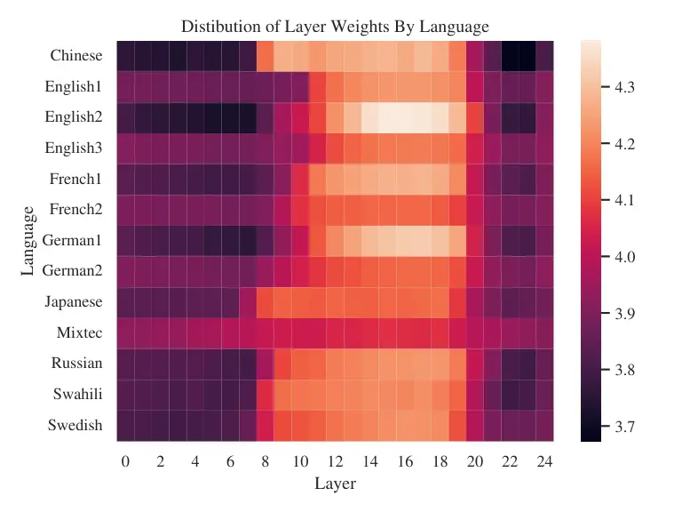

¹Carnegie Mellon University  ²National Taiwan University  ³Meta AI
 ⁴Rembrand

# ML-SUPERB: Multilingual Speech Universal PERformance Benchmark

Jiatong Shi¹, Dan Berrebbi¹\sthanksEqual contribution, sorted in
alphabetical order., William Chen^(1∗), Ho-Lam Chung^(2∗), En-Pei
Hu^(2∗), Wei Ping Huang^(2∗), Xuankai Chang¹, Shang-Wen Li³, Abdelrahman
Mohamed⁴, Hung-yi Lee², Shinji Watanabe¹

###### Abstract

Speech processing Universal PERformance Benchmark (SUPERB) is a
leaderboard to benchmark the performance of Self-Supervised Learning
(SSL) models on various speech processing tasks. However, SUPERB largely
considers English speech in its evaluation. This paper presents
multilingual SUPERB (ML-SUPERB), covering 143 languages (ranging from
high-resource to endangered), and considering both automatic speech
recognition and language identification. Following the concept of
SUPERB, ML-SUPERB utilizes frozen SSL features and employs a simple
framework for multilingual tasks by learning a shallow downstream model.
Similar to the SUPERB benchmark, we find speech SSL models can
significantly improve performance compared to FBANK features.
Furthermore, we find that multilingual models do not always perform
better than their monolingual counterparts. We will release ML-SUPERB as
a challenge with organized datasets and reproducible training scripts
for future multilingual representation research.

^(†)^(†)address: ^(†)^(†)email: {jiatongs, dberrebbi, wc4,
swatanab}@cs.cmu.edu, shangwenl@meta.com, abdo@rembrand.com
hungyilee@ntu.edu.tw

Index Terms: speech self-supervised learning, multilingual speech
recognition, language identification

## 1 Introduction

Self-supervised learning (SSL) has been a popular method in the speech
community. SSL models have shown promising results by capturing
important speech features, such as phonemes and other acoustic units,
through training on large amounts of unlabeled speech data \[1\]. These
models have led to significant improvements in downstream tasks, such as
speech recognition, speaker identification, and emotion recognition
\[2\]. Over the past few years, researchers have proposed a variety of
SSL models with different training objectives, operating under various
data conditions, model architectures, and modalities \[3, 4\].

A major challenge in evaluating SSL models for speech is the difficulty
of comparison since most models have been evaluated using different
experimental setups. To address this issue, Yang et al. introduced the
Speech processing Universal PERformance Benchmark (SUPERB) \[2\].
Recently, an extension of SUPERB called SUPERB-SG \[5\] has been
introduced. SUPERB provides a comprehensive speech SSL benchmark
including tasks such as recognition, detection, semantics, speaker
identification, paralinguistics, and generation. With SUPERB,
researchers can more easily compare the performance of different SSL
models on various speech-related tasks, universally.

While SUPERB covers a wide range of speech tasks, it was designed
primarily for English speech. However, there has been growing interest
in applying SSL models to multilingual scenarios, such as training
multilingual SSL models \[6, 7, 8\] or using SSL models in a
cross-lingual manner \[9, 10, 11, 12\]. To support future research in
these areas, we propose a new benchmark called multilingual SUPERB
(ML-SUPERB).

ML-SUPERB is designed to cover a wide range of languages, including both
high-resource languages like English and endangered languages such as
Totonac. The benchmark primarily focuses on evaluating SSL models for
automatic speech recognition (ASR) and language identification (LID). To
accommodate different use cases for SSL models, ML-SUPERB includes two
tracks with four different tasks: the monolingual track (monolingual
ASR), and the multilingual track (multilingual ASR, LID, joint
multilingual ASR/LID). Similar to SUPERB, ML-SUPERB employs frozen SSL
models as feature extractors and a lightweight downstream model that can
be fine-tuned for different tracks to achieve high training efficiency.

Several existing benchmarks also include multilingual SSL models \[13,
14, 15\]. Lebenchmark primarily evaluates speech tasks in French \[13\];
IndicSUPERB focuses mostly on Indian languages \[14\]. XTREME-S focuses
on multilingual speech representation benchmarks, including ASR, speech
translation, speech classification, and speech retrieval \[15\]. There
are three main differences between XTREME-S and ML-SUPERB. Firstly,
ML-SUPERB covers a wider range of languages, with 143 languages compared
to XTREME-S’s 102. Secondly, ML-SUPERB focuses on ASR and LID, while
XTREME-S covers four different tasks. However, ML-SUPERB expands the
tasks by evaluating them in four common multilingual research scenarios,
while XTREME-S considers multilingual training only. Finally, ML-SUPERB
is designed for efficiency, using smaller benchmark datasets and
downstream models, and does not include fine-tuning. This lightweight
setup allows us to conduct experiments for a dozen of popular speech SSL
models, trained with various sizes and pre-training sets, and compare
their performances across the proposed tracks. We expect ML-SUPERB would
be a valuable complement to existing benchmarks.

## 2 Benchmark Details

| Dataset   | Hours  | Normal Langs (123)                        | Few-shot Langs (20)                      |
| --------- | ------ | ----------------------------------------- | ---------------------------------------- |
| 10-minute | 37.43  | $`\sim`$10min $`\times`$ 240 (lang, data) | 5 utt. $`\times`$ 20 lang                |
| 1-hour    | 222.46 | $`\sim`$1h $`\times`$ 240 (lang, data)    | 5 utt. $`\times`$ 20 lang                |
| Dev       | 41.82  | $`\sim`$10min $`\times`$ 240 (lang, data) | $`\sim`$10min $`\times`$ 31 (lang, data) |
| Test      | 44.97  | $`\sim`$10min $`\times`$ 240 (lang, data) | $`\sim`$10min $`\times`$ 31 (lang, data) |

Table 1: Statistics of the data used for training, development, and
testing in ML-SUPERB. Detailed discussed in Sec. 2.1.

### 2.1 Data Collection

ML-SUPERB gathers data from a wide range of multilingual speech corpora,
including Multilingual Librispeech \[16\], Commonvoice \[17\], Voxforge
\[18\], Voxpopuli \[19\], Googlei18n open-source project \[20, 21, 22\],
Nordic Language Technology ASR corpora \[23\], Fleurs \[24\], NCHLT
Speech \[25\], Spoken Wikipedia corpus \[26\], Mexican endangered
languages \[27, 28, 10, 29, 30, 31\], M-AILab multilingual corpora
\[32\], Living Audio dataset \[33\], ALFFA corpus \[34\]. All corpora
are with either Creative Commons, MIT, GNU, or Free-BSD licenses, which
are available for both industrial and academic research, permissively.

For each language-corpus pair denoted as (lang, data), three 10-minute
subsets are randomly extracted for training, development, and testing,
along with an additional 1-hour training set that includes the 10-minute
training set.¹¹ 1 We used the original split for source datasets, with
the exception of SWC, M-AILABS, LAD, and ALFFA. Therefore, all datasets
except these four can be used for SSL pre-training. The reasons for
using a small 10-minute/1-hour training set are: (1) Challenging design:
using a large training data size could lead to high performance easily
and may result in a saturated benchmark in evaluation metrics \[3, 4\].
Therefore, using a smaller training set size presents a more challenging
design for the SSL models, which can help evaluate their robustness and
generalization capability. (2) Reasonable performance: previous speech
SSL works have frequently adopted 10-minute and 1-hour training sizes.
Even in such extreme cases, the performances with SSL are generally
reasonable \[3, 4\], indicating that this setting could be a feasible
solution to the benchmark as well. (3) Training efficiency: with 143
languages coverage, limiting the training size is important to keep the
experiments within reasonable computational efforts. Using a smaller
training set size can help reduce the computational cost and make the
training process more efficient. A full evaluation cycle of ML-SUPERB
can take up to 3 days using 4 2080Ti GPUs.

Additionally, the benchmark includes few-shot cases with 20 languages
and uses only 5 utterances in training for each language. These reserved
few-shot training sets are not used in the monolingual ASR track. A
detailed summary of the dataset is shown in Table 1.

### 2.2 Monolingual Track

The literature suggests that speech SSL models are commonly fine-tuned
on monolingual corpora \[9, 10, 11\]. In ML-SUPERB, we introduce a
dedicated track for monolingual ASR to facilitate this approach. We
select nine languages based on geographical and linguistic
considerations to balance language and domain coverage with manageable
experimental mass.

In total, we introduce 14 monolingual_exp. For a monolingual_exp in
language lang we select one dataset of this language and use it for
training the model and for validation²² 2 Each monolingual_exp is made
of one experiment with the 10-minute set for training and one with the
1-hour set.. For evaluation of a monolingual_exp, we use all the
datasets of lang to test the trained model on various accent or domain
conditions. We select one pair (lang , data) for training for
lang$`\in`$ {rus, swa, swe, jpn, cmn, xty}. For lang$`\in`$ {eng, fra,
deu} we select respectively 3, 2 and 2 pairs (lang, data) in order to
evaluate the impact of the training domain on the models’ performances.
For instance, for eng we have 3 monolingual_exp, with (eng , MLS), (eng
, NCHLT) and (eng , VoxPopuli).

### 2.3 Multilingual Track

Multilingual ASR task: in the multilingual ASR task, we use the training
set where combining text transcriptions from all 143 languages. The
multilingual ASR task has two sub-tasks on the 10-minute train set and
the 1-hour train set. For both training sets, we reserve 20 languages
for few-shot learning scenarios as discussed in Sec. 2.1. In this track,
the model is expected to directly predict the correct orthography in the
target language.

LID task: LID track focuses on language identification with the same
training set of 143 languages in 10 minutes and 1 hour. However, we do
not consider evaluation for languages with few-shot settings, given that
the identification of those languages is very challenging due to the
label biasing.

Joint Multilingual ASR/LID task: A widely used technique in previous
literature involves adding the language ID to the start of the speech
transcript to facilitate joint training of multilingual ASR and LID
models \[35, 36, 37, 38\]. Joint training can improve performance in
certain scenarios, and it can also enhance model interpretability by
separating language identification errors. Therefore, we have included
this task in our multilingual track. The task’s design is the same as
the multilingual ASR task for ASR and the LID task for language
identification.

### 2.4 Framework and Benchmark Settings

Toolkits: We utilize the S3PRL toolkit \[2\] for upstream models, which
offers a wide range of speech SSL model architectures and APIs that
support customized SSL models from Huggingface \[39\] and user-defined
models. For task-specific downstream training, we use ESPnet \[40\]. We
plan to publish ML-SUPERB as an all-in-one recipe in ESPnet’s egs2
recipe collection, encompassing data preprocessing, training, inference,
and evaluation³³ 3
[https://github.com/espnet/espnet/tree/master/egs2/ml_superb/asr1](https://github.com/espnet/espnet/tree/master/egs2/ml_superb/asr1).

Downstream model and training details: Our downstream model design is
based on the SUPERB concept. First, we compute a weighted summation of
frozen speech SSL representations using learnable weights. Next, we
apply a convolutional downsample layer that reduces the sequence of
speech SSL features by half, passing the resulting hidden states to a
transformer model consisting of two layers with an attention dimension
of 256, a feedforward layer dimension of 1024, and 8 attention heads. A
dropout rate of 0.1 is employed, and the model is trained using the
connectionist temporal Ccassification loss. We use the Adam optimizer
with a learning rate of 0.0001 and 1e-6 weight decay. Specaugment is
applied to the representation (i.e., the weighted sum of speech SSL
representation) following the SUPERB benchmark. The batch size is set to
8 with the gradient accumulation as 4. The same configuration is used
for all tasks in both the monolingual and multilingual tracks.

The number of iterations in training is the only difference across
tasks. In the monolingual track, due to the small training size, we set
it to 15,000. In the multilingual track, we use 300,000 iterations for
the 10-minute train set and 600,000 for the 1-hour train set.

Evaluation metric: In the monolingual track, the phoneme error rate is
used for jpn and cmn, while Character Error Rate (CER) is used for the
remaining languages. In the multilingual track, we use CER for ASR
evaluation and accuracy rate for LID evaluation, reporting results
separately for the normal training set and the few-shot training set.

For overall performance, we use the SUPERB*(s) metric from the SUPERB
benchmark \[41\]. We denote $`s*{t,i}(u)`$ as the $`i^{\text{th}}`$
metrics for task $`t`$ and SSL model $`u`$. $`T`$ is the set of four
tasks and $`I*{t}`$ is the set of metrics for the task $`t`$. SUPERB*(s)
aggregates all task-specific scores $`s_{t}(u)`$ with respect to
baseline (i.e., FBANK) and state-of-the-art (SOTA) model⁴⁴ 4 The SOTA
models for each setting are discussed in Sec. 3.2. on the task $`t`$.
The SUPERB\_(s) is defined as:

```math
\text{SUPERB}_{s}(u)=\frac{1000}{|T|}\sum_{t}^{T}\frac{1}{|I_{t}|}\sum_{i}^{I_{t}}\frac{s_{t,i}(u)-s_{t,i}(\text{FBANK})}{s_{t,i}(\text{SOTA})-s_{t,i}(\text{FBANK})} \tag{1}
```

We expect SUPERB\_(s) can provide a comprehensive view of the model
performance on the benchmark and take the difficulty of tasks into
consideration.

Analysis support: To facilitate a more comprehensive analysis of the
benchmark, we provide various analysis tools. For the multilingual ASR
evaluation, we present the character error rate (CER) for each language
as well as aggregated scores for different language groups, in addition
to the average CER for both normal and few-shot cases. In line with
previous studies \[42, 43\], we also offer visualizations of the
learnable layer weights and their learning curve during training.

## 3 Experiments

### 3.1 Candidate models

|                              |            |              |          |
| ---------------------------- | ---------- | ------------ | -------- |
| Model                        | Params (M) | Pre-Training |          |
|                              |            | \# Hours     | \# Langs |
| wav2vec2-base \[3\]          | 95         | 1k           | 1        |
| wav2vec2-large \[3\]         | 317        | 60k          | 1        |
| robust-wav2vec2-large \[44\] | 317        | 65k          | 1        |
| wav2vec2-base-23 \[19\]      | 95         | 100k         | 23       |
| wav2vec2-large-23 \[19\]     | 317        | 100k         | 23       |
| XLSR-53 \[7\]                | 317        | 56k          | 53       |
| XLSR-128 \[6\]               | 317        | 400k         | 128      |
| HuBERT-base \[4\]            | 95         | 1k           | 1        |
| HuBERT-large \[4\]           | 317        | 60k          | 1        |
| HuBERT-base-cmn \[45\]       | 95         | 10k          | 1        |
| HuBERT-large-cmn \[45\]      | 317        | 10k          | 1        |
| mHuBERT-base \[46\]          | 95         | 14k          | 3        |

Table 2: Description of the candidate models.

ML-SUPERB welcomes all speech SSL models trained on either monolingual
or multilingual data. We believe the analysis of multilingual scenarios
for monolingual speech SSLs is also valuable according to previous works
\[9, 10, 11\]. In this paper, we show the experimental results of some
example model candidates as shown in Table 2.

wav2vec2: wav2vec2 is a popular speech SSL model for speech recognition
\[3\]. Its pre-training uses a contrastive learning approach that
prioritizes identifying true quantized latent speech representations
over masked time steps from distractors. The wav2vec2 model has also
been extended to many other versions for specialized use cases. For
example, robust-wav2vec2-large \[44\] considers the diversity of speech
types, such as read speech, conversational speech, and noisy speech, by
including additional corpora in the pre-training stage. Wav2vec2-base-23
and wav2vec2-large-23 are pre-trained on Voxpopuli \[19\], with a focus
on European languages. Additionally, XLSR scales up the multilingual
training in wav2vec2 by incorporating more languages and data \[7, 6\].

HuBERT: HuBERT uses an iterative offline clustering step to generate
pseudo labels for each frame. During training, it predicts the pseudo
labels of the masked frame, which helps to improve the quality of the
learned features. Similar to wav2vec2, HuBERT also has different
versions, such as a multilingual HuBERT \[46\] trained in three European
languages (fra, spa, eng) and HuBERT trained on Mandarin \[45\].

| SSL                          | Monolingual ASR | Multilingual ASR |          | LID    | Multilingual ASR + LID |      |          | SUPERB\_(s) |
| ---------------------------- | --------------- | ---------------- | -------- | ------ | ---------------------- | ---- | -------- | ----------- |
|                              |                 | Normal           | Few-shot | Normal | Normal                 |      | Few-shot |             |
|                              | CER/PER         | CER              | CER      | ACC    | ACC                    | CER  | CER      |             |
| FBANK                        | 72.1            | 62.4             | 58.3     | 11.11  | 35.9                   | 62.0 | 58.9     | 0           |
| wav2vec2-base \[3\]          | 44.2            | 43.0             | 45.7     | 54.4   | 66.9                   | 40.6 | 44.2     | 755.2       |
| wav2vec2-large \[3\]         | 42.0            | 42.6             | 45.8     | 30.9   | 54.6                   | 45.5 | 50.3     | 598.3       |
| robust-wav2vec2-large \[44\] | 44.4            | 40.1             | 45.4     | 50.8   | 33.1                   | 38.6 | 44.9     | 680.3       |
| wav2vec2-base-23 \[19\]      | 49.2            | 37.7             | 43.4     | 58.7   | 45.1                   | 37.2 | 44.3     | 735.7       |
| wav2vec2-large-23 \[19\]     | 42.0            | 42.1             | 44.3     | 1.1    | 21.8                   | 43.4 | 46.1     | 433.8       |
| XLSR-53 \[7\]                | 49.5            | 33.9             | 43.6     | 6.6    | 45.6                   | 33.4 | 43.2     | 528.8       |
| XLSR-128 \[6\]               | 39.7            | 29.2             | 40.9     | 66.9   | 55.6                   | 28.4 | 42.1     | 947.5       |
| HuBERT-base \[4\]            | 42.8            | 39.8             | 44.5     | 61.2   | 71.5                   | 39.2 | 43.8     | 831.9       |
| HuBERT-large \[4\]           | 38.2            | 44.4             | 48.2     | 46.5   | 55.4                   | 45.6 | 49.3     | 678.7       |
| HuBERT-base-cmn \[45\]       | 43.1            | 40.8             | 45.4     | 49.3   | 75.1                   | 37.7 | 43.5     | 779.0       |
| HuBERT-large-cmn \[45\]      | 39.4            | 42.6             | 45.8     | 39.5   | 66.4                   | 41.9 | 45.2     | 715.4       |
| mHuBERT-base \[46\]          | 41.0            | 40.5             | 45.6     | 52.4   | 46.6                   | 36.8 | 44.2     | 746.2       |

Table 3: 10-minute set ML-SUPERB benchmark.

| SSL                          | Monolingual ASR | Multilingual ASR |          | LID    | Multilingual ASR + LID |      |          | SUPERB\_(s) |
| ---------------------------- | --------------- | ---------------- | -------- | ------ | ---------------------- | ---- | -------- | ----------- |
|                              |                 | Normal           | Few-shot | Normal | Normal                 |      | Few-shot |             |
|                              | CER/PER         | CER              | CER      | ACC    | ACC                    | CER  | CER      |             |
| FBANK                        | 63.7            | 59.3             | 57.4     | 9.3    | 43.5                   | 58.6 | 58.1     | 0           |
| wav2vec2-base \[3\]          | 35.9            | 35.5             | 44.3     | 80.8   | 83.6                   | 32.1 | 42.6     | 827.2       |
| wav2vec2-large \[3\]         | 35.4            | 35.7             | 43.9     | 8.0    | 78.2                   | 34.7 | 42.2     | 586.9       |
| robust-wav2vec2-large \[44\] | 35.7            | 31.1             | 42.2     | 72.1   | 62.9                   | 33.7 | 46.0     | 768.6       |
| wav2vec2-base-23 \[19\]      | 35.1            | 32.0             | 42.2     | 71.9   | 66.3                   | 30.9 | 43.0     | 798.0       |
| wav2vec2-large-23 \[19\]     | 34.2            | 35.3             | 42.4     | 64.2   | 49.7                   | 35.2 | 43.1     | 724.9       |
| XLSR-53 \[7\]                | 34.9            | 26.9             | 40.6     | 87.1   | 76.9                   | 28.6 | 44.6     | 894.0       |
| XLSR-128 \[6\]               | 30.6            | 22.0             | 39.3     | 87.9   | 85.6                   | 22.9 | 42.4     | 996.0       |
| HuBERT-base \[4\]            | 35.3            | 31.4             | 42.7     | 86.1   | 86.0                   | 30.9 | 41.8     | 884.9       |
| HuBERT-large \[4\]           | 32.2            | 37.7             | 43.5     | 64.1   | 77.7                   | 35.1 | 42.2     | 783.6       |
| HuBERT-base-cmn \[45\]       | 35.6            | 43.2             | 46.6     | 85.3   | 86.1                   | 31.8 | 42.1     | 810.2       |
| HuBERT-large-cmn \[45\]      | 33.7            | 39.6             | 45.1     | 57.3   | 75.6                   | 37.1 | 44.4     | 713.2       |
| mHuBERT-base \[46\]          | 33.0            | 33.4             | 43.6     | 72.5   | 70.9                   | 29.7 | 43.1     | 812.7       |

Table 4: 1-hour set ML-SUPERB benchmark.

### 3.2 Experimental Results

The experimental results are shown in Table 3 for 10-minute set and
Table 4 for 1-hour set.

Monolingual ASR: In the monolingual ASR task, all speech SSL models
outperform the FBANK baseline. XLSR-128 achieves the best performance in
the 1-hour set, while HuBERT-large obtains the best performance in the
10-minute set. Several findings are noteworthy: (1) HuBERT-based models
outperform wav2vec2-based models when the training data and model size
are similar. (2) Large models usually obtain better results than their
base versions. (3) While the XLSR series of models deliver impressive
performances in the 1-hour set, we have observed their instability in
the 10-minute set, particularly on Asian languages such as cmn.

Multilingual ASR: In the multilingual ASR task, all models trained using
self-supervised learning (SSL) techniques have shown superior
performance compared to the baseline model using FBANK features. Among
the SSL models, XLSR-128 achieves the best results across all
conditions. Our experiments also reveal some interesting findings: (1)
Models trained with more languages generally outperform those trained on
monolingual datasets, although this may not always be the case. For
example, mHuBERT-base performs worse than HuBERT-based models trained on
English only. (2) Large models trained on monolingual data do not
necessarily have better representations for multilingual scenarios. For
instance, HuBERT-large performs worse than HuBERT-base, and
wav2vec2-large is less effective than wav2vec2-base. One possible
explanation for the lack of performance improvement with larger models
is their limited ability to generalize, despite having similar training
losses as base models. (3) The robust-wav2vec2-large model achieves
decent scores on multilingual ASR, suggesting that our benchmark corpus
may need to consider different acoustic environments, as it includes
multiple source datasets.

LID: In the LID task, we notice similarities with multilingual ASR, but
there are also notable differences. (1) XLSR-128 has been the dominant
model for both 10-minute and 1-hour datasets. (2) While most SSL models
have improvements over FBANK, some do not, particularly those based on
wav2vec2 (e.g., wav2vec2-large-23 for the 10-minute set and
wav2vec2-large for the 1-hour set). (3) Larger models with more
parameters and pre-trained data do not necessarily lead to better
performance compared to base models.

Joint Multilingual ASR + LID: In the joint multilingual ASR+LID task,
the results generally align with the other two tasks in the multilingual
track. (1) SSL models outperform FBANK on ASR, but some models perform
worse on LID. (2) Base models exhibit better generalization ability and
often perform better on test sets. (3) There is no single best model
that dominates the task, particularly in few-shot cases and LID tasks.

Overall: In terms of overall performance as measured by SUPERB\_(s) in
Sec. 2.4, XLSR-128 is the best model for both the 10-minute and 1-hour
sets. Major findings include: (1) multilingual training with a broad
coverage of languages, as seen in XLSR models that include more than 50
languages, has proven to be useful. However, multilingual training that
is limited to a few selective languages may not be as beneficial in
larger language groups (e.g., wav2vec2-large-23 and mHUBERT models do
not always perform better than their models trained in a single
language). (2) The base models tend to generalize better to multilingual
cases than their corresponding large versions, such as wav2vec2-base
versus wav2vec2-large and HuBERT-base versus HuBERT-large.



Figure 1: The layerwise weight analysis of XLSR-128 model in the
monolingual track.

### 3.3 Layerwise analysis

Our benchmark offers tools to guide users in the use of SSL
representations according to their needs, including an analysis of the
learned weights for layer importance. The results for the XLSR-128 model
in monolingual ASR tasks (shown in Fig 1) confirm the conclusions
reached by \[47\] and \[48\]: the most relevant layers for ASR are not
the last few layers. We also observed that English3, French2, and
German2 have very similar behavior. These tasks use VoxPopuli data for
training, which is the only dataset with lecture speech in our
collection. Additionally, Mixtec is the only conversational speech data
among our sets, and we can see a distinct behavior in Fig 1. Therefore,
the relevance of SSL model layers may be related to the speech domain
(in addition to the speech task) rather than the language.

## 4 Conclusion

This paper introduces ML-SUPERB, a benchmark that extends SUPERB to
multilingual tasks. We present the design of the open-source framework
and discuss experimental results for some example models. More detailed
policies can be found at
[https://multilingual.superbbenchmark.org/](https://multilingual.superbbenchmark.org/).
We invite the community to participate in this challenge.

## 5 References

## References

- \[1\] Abdelrahman Mohamed et al. “Self-supervised speech
  representation learning: A review” In _JSTSP_, 2022
- \[2\] Shu-wen Yang et al. “SUPERB: Speech Processing Universal
  PERformance Benchmark” In _Proc. Interspeech_, 2021, pp. 1194–1198
  DOI:
  [10.21437/Interspeech.2021-1775](https://dx.doi.org/10.21437/Interspeech.2021-1775)
- \[3\] Alexei Baevski et al. “wav2vec 2.0: A framework for
  self-supervised learning of speech representations” In _Proc. NeurIPS_
  33, 2020, pp. 12449–12460
- \[4\] Wei-Ning Hsu et al. “HuBERT: Self-supervised speech
  representation learning by masked prediction of hidden units” In
  _TASLP_ 29, 2021, pp. 3451–3460
- \[5\] Hsiang-Sheng Tsai et al. “SUPERB-SG: Enhanced Speech processing
  Universal PERformance Benchmark for Semantic and Generative
  Capabilities” In _Proc. ACL_, 2022, pp. 8479–8492
- \[6\] Arun Babu et al. “XLS-R: Self-supervised cross-lingual speech
  representation learning at scale” In _arXiv preprint
  arXiv:2111.09296_, 2021
- \[7\] Alexis Conneau et al. “Unsupervised cross-lingual representation
  learning for speech recognition” In _arXiv preprint arXiv:2006.13979_,
  2020
- \[8\] Paul-Ambroise Duquenne et al. “SpeechMatrix: A Large-Scale Mined
  Corpus of Multilingual Speech-to-Speech Translations” In _arXiv
  preprint arXiv:2211.04508_, 2022
- \[9\] Jing Zhao and Wei-Qiang Zhang “Improving Automatic Speech
  Recognition Performance for Low-Resource Languages With
  Self-Supervised Models” In _JSTSP_ 16.6, 2022, pp. 1227–1241
- \[10\] Dan Berrebbi, Jiatong Shi and Brian Yan “Combining Spectral and
  Self-Supervised Features for Low Resource Speech Recognition and
  Translation” In _Proc. Interspeech_, 2022, pp. 3533–3537 DOI:
  [10.21437/Interspeech.2022-10796](https://dx.doi.org/10.21437/Interspeech.2022-10796)
- \[11\] Anne Wu et al. “Self-Supervised Representations Improve
  End-to-End Speech Translation” In _Proc. Interspeech 2020_, 2020, pp.
  1491–1495
- \[12\] Xinjian Li et al. “ASR2K: Speech Recognition for Around 2000
  Languages without Audio” In _Proc. Interspeech_, 2022, pp. 4885–4889
  DOI:
  [10.21437/Interspeech.2022-10712](https://dx.doi.org/10.21437/Interspeech.2022-10712)
- \[13\] Soléne Evain et al. “ LeBenchmark: A Reproducible Framework for
  Assessing Self-Supervised Representation Learning from Speech” In
  _Proc. Interspeech_, 2021, pp. 1439–1443 DOI:
  [10.21437/Interspeech.2021-556](https://dx.doi.org/10.21437/Interspeech.2021-556)
- \[14\] Tahir Javed et al. “IndicSUPERB: A Speech Processing Universal
  Performance Benchmark for Indian languages” In _arXiv preprint
  arXiv:2208.11761_, 2022
- \[15\] Alexis Conneau et al. “XTREME-S: Evaluating Cross-lingual
  Speech Representations” In _Proc. Interspeech_, 2022, pp. 3248–3252
  DOI:
  [10.21437/Interspeech.2022-10007](https://dx.doi.org/10.21437/Interspeech.2022-10007)
- \[16\] Vineel Pratap et al. “MLS: A Large-Scale Multilingual Dataset
  for Speech Research” In _Proc. Interspeech 2020_, 2020, pp. 2757–2761
- \[17\] Rosana Ardila et al. “Common Voice: A Massively-Multilingual
  Speech Corpus” In _Proc. LREC_, 2020, pp. 4218–4222
- \[18\] Ken MacLean “Voxforge” In _Ken MacLean.\[Online\]. Available:
  http://www. voxforge. org/home.\[Accessed by 2022\]_, 2018
- \[19\] Changhan Wang et al. “VoxPopuli: A Large-Scale Multilingual
  Speech Corpus for Representation Learning, Semi-Supervised Learning
  and Interpretation” In _Proc. ACL_, 2021, pp. 993–1003
- \[20\] Keshan Sodimana et al. “A Step-by-Step Process for Building TTS
  Voices Using Open Source Data and Framework for Bangla, Javanese,
  Khmer, Nepali, Sinhala, and Sundanese” In _Proc. SLTU_, 2018, pp.
  66–70
- \[21\] Oddur Kjartansson et al. “Open-Source High Quality Speech
  Datasets for Basque, Catalan and Galician” In _Proc. SLTU_, 2020, pp.
  21–27
- \[22\] Fei He et al. “Open-source Multi-speaker Speech Corpora for
  Building Gujarati, Kannada, Malayalam, Marathi, Tamil and Telugu
  Speech Synthesis Systems” In _Proc. LREC_, 2020, pp. 6494–6503
- \[23\] Georg Rehm and Hans Uszkoreit “Language Technology Support for
  Norwegian” In _The Norwegian Language in the Digital Age:
  Bokmalsversjon_, 2012, pp. 52–70
- \[24\] Alexis Conneau et al. “Fleurs: Few-shot learning evaluation of
  universal representations of speech” In _Proc. SLT_, 2023, pp. 798–805
- \[25\] Etienne Barnard et al. “The NCHLT speech corpus of the South
  African languages”, 2014
- \[26\] Timo Baumann, Arne Köhn and Felix Hennig “The Spoken Wikipedia
  Corpus collection: Harvesting, alignment and an application to
  hyperlistening” In _LREC_ 53, 2019, pp. 303–329
- \[27\] Jiatong Shi “Leveraging End-to-End ASR for Endangered Language
  Documentation: An Empirical Study on Yolóxochitl Mixtec” In _Proc.
  ACL_, 2021, pp. 1134–1145
- \[28\] Jiatong Shi et al. “Highland Puebla Nahuatl speech translation
  corpus for endangered language documentation” In _Proc. AmericaNLP_,
  2021, pp. 53–63
- \[29\] Jonathan. Amith and Rey Castillo “Audio corpus of Yoloxóchitl
  Mixtec with accompanying time-coded transcriptons in ELAN” n.d. URL:
  [https://www.openslr.org/89/](https://www.openslr.org/89/)
- \[30\] Jonathan. Amith et al. “Audio corpus of Sierra Nororiental and
  Sierra Norte de Puebla Nahuat(l) with accompanying time-code
  transcriptions in ELAN” n.d. URL:
  [https://www.openslr.org/92/](https://www.openslr.org/92/)
- \[31\] Jonathan. Amith and Osbel López “Audio corpus of Totonac
  recordings from northern Puebla and adjacent areas of Veracruz” n.d.
  URL: [https://www.openslr.org/107/](https://www.openslr.org/107/)
- \[32\] Imdat Solak “M-AILab Speech dataset” In _Imdat
  Solak.\[Online\]. Available:
  https://www.caito.de/2019/01/03/the-m-ailabs-speech-dataset/.\[Accessed
  by 2022\]_, 2018
- \[33\] David Braude et al. “All Together Now: The Living Audio
  Dataset.” In _INTERSPEECH_, 2019, pp. 1521–1525
- \[34\] Nic De et al. “A smartphone-based ASR data collection tool for
  under-resourced languages” In _Speech communication_ 56, 2014, pp.
  119–131
- \[35\] Shinji Watanabe, Takaaki Hori and John Hershey “Language
  independent end-to-end architecture for joint language identification
  and speech recognition” In _Proc. ASRU_, 2017, pp. 265–271
- \[36\] Wenxin Hou et al. “Large-Scale End-to-End Multilingual Speech
  Recognition and Language Identification with Multi-Task Learning” In
  _Proc. Interspeech_, 2020, pp. 1037–1041 DOI:
  [10.21437/Interspeech.2020-2164](https://dx.doi.org/10.21437/Interspeech.2020-2164)
- \[37\] Chao Zhang et al. “Streaming End-to-End Multilingual Speech
  Recognition with Joint Language Identification” In _Proc.
  Interspeech_, 2022, pp. 3223–3227 DOI:
  [10.21437/Interspeech.2022-11249](https://dx.doi.org/10.21437/Interspeech.2022-11249)
- \[38\] William Chen et al. “Improving Massively Multilingual ASR With
  Auxiliary CTC Objectives” In _Proc. ICASSP 2023_, 2023
- \[39\] Thomas Wolf et al. “Transformers: State-of-the-Art Natural
  Language Processing” In _Proc. EMNLP_, 2020, pp. 38–45 DOI:
  [10.18653/v1/2020.emnlp-demos.6](https://dx.doi.org/10.18653/v1/2020.emnlp-demos.6)
- \[40\] Shinji Watanabe et al. “ESPnet: End-to-End Speech Processing
  Toolkit” In _Proc. Interspeech_, 2018, pp. 2207–2211 DOI:
  [10.21437/Interspeech.2018-1456](https://dx.doi.org/10.21437/Interspeech.2018-1456)
- \[41\] Tzu-hsun Feng et al. “SUPERB@ SLT 2022: Challenge on
  Generalization and Efficiency of Self-Supervised Speech Representation
  Learning” In _Proc. SLT_, 2023, pp. 1096–1103
- \[42\] Xuankai Chang et al. “An exploration of self-supervised
  pretrained representations for end-to-end speech recognition” In
  _Proc. ASRU_, 2021, pp. 228–235
- \[43\] Sanyuan Chen et al. “WavLM: Large-scale self-supervised
  pre-training for full stack speech processing” In _JSTSP_ 16.6, 2022,
  pp. 1505–1518
- \[44\] Wei-Ning Hsu et al. “Robust wav2vec 2.0: Analyzing Domain Shift
  in Self-Supervised Pre-Training” In _Proc. Interspeech_, 2021, pp.
  721–725 DOI:
  [10.21437/Interspeech.2021-236](https://dx.doi.org/10.21437/Interspeech.2021-236)
- \[45\] Shixing Liu and Pengcheng Guo “Chinese speech pretraining”,
  2023 URL:
  [https://github.com/TencentGameMate/chinese_speech_pretrain](https://github.com/TencentGameMate/chinese_speech_pretrain)
- \[46\] Ann Lee et al. “Textless Speech-to-Speech Translation on Real
  Data” In _Proc. NAACL_, 2022, pp. 860–872
- \[47\] Ankita Pasad, Bowen Shi and Karen Livescu “Comparative
  layer-wise analysis of self-supervised speech models” In _Proc. ICASSP
  2023_, 2022
- \[48\] Dan Berrebbi, Brian Yan and Shinji Watanabe “Avoid Overthinking
  in Self-Supervised Models for Speech Recognition” In _Proc. ICASSP
  2023_, 2022
