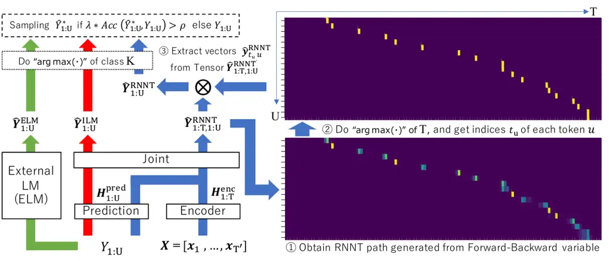

# Improving Scheduled Sampling for Neural Transducer-based ASR

Takafumi Moriya, Takanori Ashihara, Hiroshi Sato, Kohei Matsuura,
Tomohiro Tanaka, Ryo Masumura

###### Abstract

The recurrent neural network-transducer (RNNT) is a promising approach
for automatic speech recognition (ASR) with the introduction of a
prediction network that autoregressively considers linguistic aspects.
To train the autoregressive part, the ground-truth tokens are used as
substitutions for the previous output token, which leads to insufficient
robustness to incorrect past tokens; a recognition error in the decoding
leads to further errors. Scheduled sampling (SS) is a technique to train
autoregressive model robustly to past errors by randomly replacing some
ground-truth tokens with actual outputs generated from a model. SS
mitigates the gaps between training and decoding steps, known as
exposure bias, and it is often used for attentional encoder-decoder
training. However SS has not been fully examined for RNNT because of the
difficulty in applying SS to RNNT due to the complicated RNNT output
form. In this paper we propose SS approaches suited for RNNT. Our SS
approaches sample the tokens generated from the distiribution of RNNT
itself, i.e. internal language model or RNNT outputs. Experiments in
three datasets confirm that RNNT trained with our SS approach achieves
the best ASR performance. In particular, on a Japanese ASR task, our
best system outperforms the previous state-of-the-art alternative.

###### Index Terms: 

speech recognition, neural network, end-to-end, neural transducer,
scheduled sampling

^(†)^(†)address: NTT Corporation, Japan

## 1 Introduction

End-to-end automatic speech recognition (E2E-ASR), which can directly
map acoustic features to output tokens, is attracting attention in the
ASR research community. Several E2E-ASR modeling approaches have been
proposed, e.g. connectionist temporal classification (CTC) \[1\],
attentional encoder-decoder (AED) \[2, 3\] and recurrent neural
network-transducer (RNNT) \[4\]. In particular, RNNT is a promising
technology, and has been reported in many recent studies \[5, 6, 7, 8,
9, 10, 11, 12, 13, 14, 15, 16, 17, 18, 19, 20, 21\]. In this paper, we
focus on improving RNNT.

RNNT is composed of encoder, prediction, and joint networks. The encoder
and prediction networks process acoustic and linguistic information
respectively, and the resulting encoded features are fed to the joint
network to obtain the prediction. The unique characteristic of RNNT is
that the introduction of the prediction network allows it to drop the
assumption conditional independence between predictions at different
time steps. This means that the RNNT outputs are jointly conditioned on
not only acoustic information but also past linguistic information.
Therefore, techniques for adding noise to the input can be applied to
both encoder and prediction networks. The acoustic masking approach
known as SpecAugment \[22\], which randomly masks some acoustic
features, prevents overfitting the encoder network and improves ASR
performance regardless of the E2E-ASR, i.e. CTC, AED, and RNNT. As a way
to modify linguistic information, scheduling sampling (SS) \[23\] is a
promising way to improve robustness for autoregressive model. SS was
originally proposed for AED, but it has yet to be fully examined for
RNNT. Thus in this paper, we focus on effectively applying SS for RNNT.

RNNT and AED use ground truth tokens for the input to the decoder during
training, but are prone to errors in inference step, i.e. exposure bias.
SS randomly replaces some ground truth tokens with actual outputs of the
training model. Thus tokens containing some errors are fed back to the
training model, and the loss is computed using original ground truth
tokens. This mitigates mismatch during inference. SS is often used in
AED training but seldom in RNNT training. This is because RNNT output
shape is different from AED output due to the introduction of the
prediction network, which complicates the application of SS approaches
to RNNT training.

SS approaches for RNNT have been explored. In \[10\], they use
frame-wise labels derived from external alignments generated by a hidden
Markov model (HMM) hybrid system. The length of the labels equals that
of acoustic features resulting in appropriate RNNT output length. Thus
SS can, in the same way as AED training, be applied to RNNT training,
but this requires additional efforts to obtain the alignments.
In \[11\], an external language model (ELM), which is pre-trained with
only text data, is utilized for sampling tokens and its length can match
that of the ground truth tokens. This realizes the SS approach for RNNT
training without external alignments, and improved ASR performance.
However the sampling is based on ELM output distribution, not on the
RNNT itself. Their approach is similar to distilling the knowledge from
ELM \[20\]. Since we assume that the exposure bias problem remains
unsolved, sampling should be performed using the output distribution of
RNNT during training.

In this paper, we propose two modifications to the SS approach
in \[11\]. The first is to replace ELM with internal LM (ILM) which
consists of prediction and joint networks of RNNT. The ILM parameters
are fully shared with RNNT, and thus the ILM outputs partly follow the
RNNT output distribution. The other is to use the output distributions
of the whole RNNT. To make the length of RNNT output equal that of the
ground truth tokens, we propose a sampling method which extracts the
same number tokens as ground truth tokens from RNNT output. The time
indices corresponding to each ground truth token for the extraction are
determined by RNNT alignments during training, and thus the extracted
tokens are conditioned on the distribution of whole RNNT. Therefore, we
can apply the whole RNNT output to SS for RNNT training. We expect that
both proposed SS variants will, using actual RNNT outputs, mitigate
exposure bias. Moreover, the SS approaches of  \[23, 11\] take a
token-by-token technique, and so cannot process all utterances at once
resulting in slow training. We also propose a proficiency-based
utterance-level SS that samples each utterance.

We evaluate our proposed SS approaches on three datasets. The results
demonstrate that our proposals consistently yield better ASR performance
than RNNT using ELM with and without SS even though our proposed SS
variants do not need any external alignment or a pretrained ELM. In
particular, on a Japanese ASR task, our best system outperforms the
previous state-of-the-art alternative.

## 2 ASR and Language Models

Let us first explain RNNT and LMs, which are the foundations of this
work. Let $`\bm{X}=\left[\bm{x}_{1},...,\bm{x}_{T^{\prime}}\right]`$ be
the acoustic feature sequence, and $`Y=\left[y_{1},...,y_{U}\right]`$ be
a token sequence and $`y_{u}\in\{1,...,K\}`$. $`K`$ is the number of
tokens including special symbols, i.e. “blank” label, $`\phi`$, for
RNNT, and “start/end-of-sentence” labels for LMs.

### 2.1 Recurrent neural network-transducer (RNNT)

RNNT learns the mapping between sequences of different lengths. By
introducing the prediction network, RNNT can consider the posterior
probabilities to be jointly conditioned on not only encoder outputs but
also previous predictions as shown in the following steps. First,
$`\bm{X}`$ is downsampled and encoded into
$`\bm{H}^{\text{enc}}=\left[\bm{h}^{\text{enc}}_{1},...,\bm{h}^{\text{enc}}_{T}\right]`$
with length-$`T`$ via encoder network $`f^{\text{enc}}(\cdot)`$. Next,
the tokens, $`Y`$, are also encoded into
$`\bm{H}^{\text{pred}}=\left[\bm{h}^{\text{pred}}_{1},...,\bm{h}^{\text{pred}}_{U}\right]`$
via prediction network $`f^{\text{pred}}(\cdot)`$. These encoded
features are then fed to feed-forward network
$`f^{\text{joint}}(\cdot)`$. The above operations, which yield
prediction $`\hat{\bm{y}}_{t,u}`$, are defined as follows:

```math
\displaystyle\bm{h}^{\text{enc}}_{t} \displaystyle= \displaystyle f^{\text{enc}}(\bm{x}_{t^{\prime}};\theta^{\text{enc}}), \tag{1}
```

```math
\displaystyle\bm{h}^{\text{pred}}_{u} \displaystyle= \displaystyle f^{\text{pred}}(y_{u-1};\theta^{\text{pred}}), \tag{2}
```

```math
\displaystyle\hat{\bm{y}}_{t,u} \displaystyle= \displaystyle\text{Softmax}\left(f^{\text{joint}}(\bm{h}^{\text{enc}}_{t},\bm{h}^{\text{pred}}_{u};\theta^{\text{joint}})\ /\ Z\right), \tag{3}
```

where $`\text{Softmax}(\cdot)`$ means a softmax layer without learnable
parameters, and $`Z`$ is temperature used in inferencing. RNNT outputs
three dimensional tensor
$`\hat{\bm{Y}}^{\text{RNNT}}_{1:T,1:U}\in\mathbb{R}^{T\times U\times K}`$
from the training step. The learnable parameters
$`\theta^{\text{RNNT}}\triangleq[\theta^{\text{enc}},\theta^{\text{pred}},\theta^{\text{joint}}]`$
are optimized by using RNNT loss $`{\cal L}_{\text{RNNT}}`$ using the
forward-backward algorithm \[4\].

### 2.2 Language models (LMs)

In this work, we use two LMs, i.e. external language model (ELM) and
internal language model (ILM), for SS in the training step. We explain
these below.

#### 2.2.1 External language model (ELM)

ELM is a completely separate model from RNNT, and trained with only
transcriptions. ELM consists of language encoder “lang-enc” and linear
output layer “out”, and outputs prediction $`\hat{\bm{y}}_{u}`$. The
procedure is defined as follows:

```math
\displaystyle\hat{\bm{y}}_{u}^{\text{ELM}}=\text{Softmax}\left(f^{\text{out}}(f^{\text{lang-enc}}(y_{u-1};\theta^{\text{lang-enc}});\theta^{\text{out}})\right), \tag{4}
```

where each parameter $`\theta^{*}`$ is learnable. ELM outputs two
dimensional matrix
$`\hat{\bm{Y}}^{\text{ELM}}_{1:U}\in\mathbb{R}^{U\times K}`$ in the
training step. Thus all parameters
$`\theta^{\text{ELM}}\triangleq[\theta^{\text{lang-enc}},\theta^{\text{out}}]`$
are optimized by using CE loss.

#### 2.2.2 Internal language model (ILM)

ELM and ILM perform the same operation. The difference is that ILM is a
part of RNNT. ILM is defined as follows:

```math
\displaystyle\hat{\bm{y}}_{u}^{\text{ILM}}=\text{Softmax}\left(f^{\text{joint}}(f^{\text{pred}}(y_{u-1};\theta^{\text{pred}});\theta^{\text{joint}})\right), \tag{5}
```

where all learnable parameters
$`\theta^{\text{ILM}}\triangleq[\theta^{\text{pred}},\theta^{\text{joint}}]`$
are fully contained in $`\theta^{\text{RNNT}}`$. The decoder inputs with
acoustic information, i.e. $`\bm{h}^{\text{enc}}_{t}`$, are zeroed out.
ILM also outputs
$`\hat{\bm{Y}}^{\text{ILM}}_{1:U}\in\mathbb{R}^{U\times K}`$, and its
parameters are optimized by using CE loss $`{\cal L}_{\text{ILM}}`$ as
in \[8, 13\].

### 2.3 Training and decoding

Training: This work follows our previous work \[18\]. We combine RNNT
loss with CTC \[1\] and ILM \[8, 13\] losses as follows:

```math
{\cal L}={\cal L}_{\text{RNNT}}+\alpha{\cal L}_{\text{CTC}}+\beta{\cal L}_{\text{ILM}}, \tag{6}
```

where $`\alpha`$ and $`\beta`$ are the weights of CTC and ILM losses,
respectively. $`{\cal L}_{\text{CTC}}`$ is CTC loss calculated between
ground truth token sequence and extra linear layer outputs
$`f^{\text{linear}}(f^{\text{enc}}(\bm{X};\theta^{\text{enc}});\theta^{\text{linear}})`$.
Note that CTC extra linear layer $`\theta^{\text{linear}}`$ is thrown
away during decoding.

Decoding: We perform ILM estimation \[12\] if we use LM modules. This is
explained as follows:

```math
\displaystyle\hat{Y} \displaystyle= \displaystyle\mathop{\rm arg~max}\limits_{Y}(\text{log}\ p_{\text{RNNT}}(Y|\bm{X})+\mu_{1}\ \text{log}\ p_{\text{LM}}(Y) \tag{7}
```

```math
\displaystyle- \displaystyle\mu_{2}\ \text{log}\ p_{\text{ILM}}(Y)+\mu_{3}\ |Y|),
```

where $`\mu_{*}`$ are the weights of LM, ILM and length penalty $`|Y|`$
scores, respectively. These are tuned using each development set.



Figure 1: Schematic diagram of utterance-level SS. The green, red and
blue arrows indicate utterance-level SS procedure with ELM, ILM and
RNNT, respectively. The bottom and top right pictures illustrate RNNT
path and time indices $`t_{u}`$ (yellow plots) of each token $`u`$,
respectively. Each yellow plot is the maximum arguments of time axis of
RNNT path, and used to extract $`\hat{\bm{y}}^{\text{RNNT}}_{t_{u},u}`$
from three dimensional tensor $`\hat{\bm{Y}}^{\text{RNNT}}_{1:T,1:U}`$.

## 3 Scheduled Sampling (SS) for RNNT

SS \[23\] was originally proposed in AED training. SS randomly samples
some tokens from actual outputs of models during training, and uses them
to replace some ground truth tokens. The labels containing errors based
on the training model are fed back to itself. Therefore, the models with
SS are most robust to errors than those without SS, and offer improved
recognition performance.

SS can be easily applied to AED, which performs LM-like training,
because the length of AED outputs and ground truth tokens is the same at
length-$`U`$. However, SS is difficult to apply to RNNT as its output
length of-$`T\times U`$ differs from that of the AED output. Thus SS has
not been fully examined for RNNT. In this paper, we investigate five SS
approaches including four our proposals.

### 3.1 Token-level SS using ELM/ILM

Token-by-token SS is performed in \[23, 11\], and each token is sampled
according to probability $`\rho`$ as follows:

```math
\vskip-2.84544pty^{\prime}_{u}=\begin{cases}\hat{y}^{\text{LM}}_{u}&\text{if}\ \lambda>\rho\\
y_{u}&\text{otherwise}\end{cases} \tag{8}
```

where $`\lambda`$ is a hyperparameter. $`\hat{y}^{\text{LM}}_{u}`$ is
the maximum arguments of $`\hat{\bm{y}}^{\text{LM}}_{u}`$ on class $`K`$
axis, and $`\hat{\bm{y}}^{\text{LM}}_{u}`$ is the $`u`$-th actual LM
output. If $`\rho`$ is less than $`\lambda`$, we replace
$`\hat{y}^{\text{LM}}_{u}`$ with ground truth token $`y_{u}`$, Note that
$`\rho`$ is sampled from a uniform distribution. If LM is ELM, its
token-level SS is the same as in \[11\].

The token-level SS with ELM \[11\] is reasonable and makes sense for
RNNT, but its sampling does not follow the distribution of RNNT itself.
Rather, it is similar to knowledge distillation using a pretrained
ELM \[24, 20\]. We assume that $`\hat{y}^{\text{LM}}_{u}`$ should be
sampled from a distribution conditioned on the RNNT model. In this
paper, we propose the variant that replaces ELM with ILM so its
parameters $`\theta^{\text{ILM}}`$ are fully contained in
$`\theta^{\text{RNNT}}`$. Therefore, the sampled token
$`\hat{y}^{\text{LM}}_{u}`$ follows the distribution based on RNNT.

### 3.2 Proficieny-based utterance-level SS

Token-level SS is performed on token-by-token, and thus it cannot
process all tokens at once for each minibatch. This slows down training.
To solve this problem, we propose utterance-level SS, see Fig. 1. The
utterance-level SS samples each $`Y^{\prime}_{1:U}`$ simultaneously for
each utterance, which raises training speed.¹¹ 1 The total number of
forwarding times of ELM and ILM for sampling process is the same as
token-level SS. Note that SS using RNNT can be applied to only
utterance-level variant due to the forward-backward variable computed
all at once for each utterance. Utterance-level SS is defined as
follows:

```math
\vskip-5.69046ptY^{\prime}_{1:U}=\begin{cases}\hat{Y}^{\text{*}}_{1:U}&\text{if}\ \lambda*Acc(\hat{Y}^{\text{*}}_{1:U},Y_{1:U})>\rho\\
Y_{1:U}&\text{otherwise}\end{cases} \tag{9}
```

where $`\hat{Y}^{\text{*}}_{1:U}`$ is a sequence determined by the
maximum arguments of model output
$`\hat{\bm{Y}}^{\text{*}}_{1:U}\in\mathbb{R}^{U\times K}`$ on class
$`K`$ axis. $`\hat{\bm{Y}}^{\text{*}}_{1:U}`$ is obtained from ELM, ILM,
or RNNT, and its procedure is described as follows:

- •
  Utterance-level SS using ELM/ILM: The green and red arrows in Fig. 1
  indicate utterance-level SS using ELM or ILM, respectively. Both
  approaches use the same procedure as follows. First, whole ground
  truth tokens are input into ELM or ILM, which output matrix
  $`\hat{\bm{Y}}^{\text{ELM}}_{1:U}`$ or
  $`\hat{\bm{Y}}^{\text{ILM}}_{1:U}`$, respectively. Then, we obtain the
  maximum arguments of class $`K`$, i.e. $`\hat{Y}^{\text{ELM}}_{1:U}`$
  or $`\hat{Y}^{\text{ILM}}_{1:U}`$.
- •
  Utterance-level SS using RNNT: The introduction of length-$`T`$
  complicates the application of utterance-level SS to RNNT because the
  RNNT output $`\hat{\bm{Y}}^{\text{RNNT}}_{1:T,1:U}`$ forms a three
  dimensional tensor during training. In this paper, we propose
  utterance-level SS using RNNT; the blue arrows and its description
  from \scriptsize{1}⃝ to \scriptsize{3}⃝ in Fig. 1 show its procedure.
  First, we obtain the RNNT paths generated from forward-backward
  variables, and then get the time index $`t_{u}`$ of the $`u`$-th
  non-blank token occurrence on RNNT paths. Each $`t_{u}`$ is determined
  by the argument of the maximum on the time axis. Finally, we extract
  $`u`$-th vector
  $`\hat{\bm{y}}^{\text{RNNT}}_{t_{u},u}\in\mathbb{R}^{K}`$ from
  $`\hat{\bm{Y}}^{\text{RNNT}}_{1:T,1:U}`$, and gather them to make
  $`\hat{\bm{Y}}^{\text{RNNT}}_{1:U}\in\mathbb{R}^{U\times K}`$. The
  size of $`\hat{\bm{Y}}^{\text{RNNT}}_{1:U}`$ is the same as matrix
  $`\hat{\bm{Y}}^{\text{LM}}_{1:U}`$, so utterance-level SS can be
  applied.

After obtaining $`\hat{Y}^{\text{*}}_{1:U}`$, we apply it to Eq. (9).
However, if $`\rho`$ is less than constant $`\lambda`$ as in token-level
SS, it is risky to replace $`Y_{1:U}`$ with $`\hat{Y}^{\text{*}}_{1:U}`$
all at once as this may result in the collapse of RNNT training. To
mitigate this problem, we introduce the function “$`Acc(\cdot)`$” which
represents the proficiency level of each training model \[25\].
“$`Acc(\cdot)`$” treats $`\hat{Y}^{\text{*}}_{1:U}`$ and $`Y_{1:U}`$; it
is calculated on-the-fly from the training minibatch set.
“$`Acc(\cdot)`$” ranges from 0 to 1. At the beginning of RNNT training,
ILM and RNNT may not be very accurate and “$`Acc(\cdot)`$” is small.
This prevents training from being degraded by unreliable outputs of ILM
and RNNT. As training progresses, these models become more accurate, and
gradually reinforce utterance-level SS using ILM or RNNT.

## 4 Experiments

### 4.1 Data

We evaluated our proposal on three ASR tasks; TED-LIUM release-2
(TLv2) \[26\], Switchboard (SWBD) \[27\], and a corpus of spontaneous
Japanese (CSJ) \[28\]. The datasets contain samples totaling 210, 260
and 581 hours, respectively. In this paper, we adopted 500 subwords,
1000 subwords, and 3262 characters as the output tokens for TLv2, SWBD,
and CSJ, respectively. Speed perturbation (x3) \[29\] was applied to all
datasets as in the ESPnet setups \[30\].

### 4.2 System configuration

The input feature was an 80-dimensional log Mel-filterbank appended with
3 pitch features, and SpecAugment \[22\] was applied. We used a
Conformer-based encoder with the same architecture as Conformer
(L) \[7\]; kernel size was 15. We also replaced batch normalization with
layer normalization in the convolution module. We used four-layer
2D-convolutional nerual networks followed by the Conformer blocks, with
the stride sizes of max-pooling layers at second and last layers of 3
and 2, respectively.²² 2 In CSJ task, both the stride sizes in
max-pooling layers were set to 2, as this was the best configuration.
The prediction network had a 640-dimensional long short-term memory
(LSTM) layer followed by a 512-dimensional feed-forward network. All
model parameters were randomly initialized, and trained by using the
Adam optimizer with 25k warmup for a total of 100 epochs. $`\alpha`$ and
$`\beta`$ in Eq. (6) were set to 0.5 and 0.1, respectively.

External LMs were used only for SS with ELM in the training step. The
ELMs consisted of a one-layer LSTM with 512 cells. The numbers of each
LM output corresponded to the RNNT outputs. Each ELM for SS was trained
using the same transcribed data as RNNT. For decoding on TLv2 and SWBD
tasks, LMs were also used; each consisted of a 16-block
transformer-LM \[25\] trained with the same data as present in the
ESPnet recipes.

Hyperparameter $`\lambda`$ was set to 0.05, 0.15 and 0.25 for
token-level SS, and 0.15, 0.25, 0.5 for utterance-level SS.³³ 3 In
preliminary experiment on TLv2; we observed
“$`Acc(\hat{Y}^{\text{*}}_{1:U},Y_{1:U})`$” using the trained ELM, ILM
and RNNT on the training set, with averaged values of 0.34, 0.41 and
0.92, respectively. Therefore, the actual range of $`\rho`$ in token-
and utterance-level SS using each LM were almost the same. For decoding,
we used alignment-length synchronous decoding \[6\] with beam size of 8.
$`Z`$, $`\mu_{1}`$, $`\mu_{2}`$ and $`\mu_{3}`$ on TLv2 and SWBD tasks
were set to 1.6, 0.4, 0.2 and 0.4, respectively. In CSJ task, we did not
use any LMs, and thus $`Z`$ and $`\mu_{3}`$ were set to 1.6 and -0.4,
respectively. We evaluated performance in terms of word error rate (WER)
for English tasks, and character error rate (CER) for Japanese tasks.

|                                        |           |            |             |     |
| -------------------------------------- | --------- | ---------- | ----------- | --- |
| ID                                     | SS-level  | SS from    | $`\lambda`$ | WER |
| T0                                     | -         | -          | -           | 7.0 |
| T1                                     | token     | ELM \[11\] | 0.05        | 6.8 |
| T2                                     |           |            | 0.15        | 6.9 |
| T3                                     |           |            | 0.25        | 6.9 |
| T4                                     |           | ILM        | 0.05        | 6.8 |
| T5                                     |           |            | 0.15        | 6.6 |
| T6                                     |           |            | 0.25        | 6.8 |
| T7                                     | utterance | ELM        | 0.15        | 6.8 |
| T8                                     |           |            | 0.25        | 6.8 |
| T9                                     |           |            | 0.50        | 6.6 |
| T10                                    |           | ILM        | 0.15        | 6.8 |
| T11                                    |           |            | 0.25        | 6.7 |
| T12                                    |           |            | 0.50        | 6.5 |
| T13                                    |           | RNNT       | 0.15        | 6.6 |
| T14                                    |           |            | 0.25        | 6.7 |
| T15                                    |           |            | 0.50        | 6.7 |
| Our best system (T12) + Transformer-LM |           |            |             | 6.0 |
| Hybrid NN-HMM + 4-gram LM \[31\]       |           |            |             | 7.3 |
| + Transformer-LM \[31\]                |           |            |             | 5.6 |
| Phoneme RNNT + 4-gram LM \[10\]        |           |            |             | 6.9 |
| + LSTM-LM + Transformer-LM \[10\]      |           |            |             | 6.0 |

Table 1: Comparisons of each SS for WERs on TLv2 test set.

|                                        |           |            |             |     |      |          |
| -------------------------------------- | --------- | ---------- | ----------- | --- | ---- | -------- |
| ID                                     | SS-level  | SS from    | $`\lambda`$ | WER |      |          |
|                                        |           |            |             | SWB | CH   | $`\sum`$ |
| S0                                     | -         | -          | -           | 6.9 | 14.4 | 10.6     |
| S1                                     | token     | ELM \[11\] | 0.05        | 6.7 | 13.8 | 10.3     |
| S2                                     |           |            | 0.15        | 6.8 | 13.8 | 10.3     |
| S3                                     |           |            | 0.25        | 6.7 | 13.8 | 10.3     |
| S4                                     |           | ILM        | 0.05        | 6.7 | 13.6 | 10.2     |
| S5                                     |           |            | 0.15        | 6.7 | 13.7 | 10.2     |
| S6                                     |           |            | 0.25        | 6.6 | 13.7 | 10.2     |
| S7                                     | utterance | ELM        | 0.15        | 6.7 | 14.1 | 10.3     |
| S8                                     |           |            | 0.25        | 6.7 | 14.2 | 10.4     |
| S9                                     |           |            | 0.50        | 6.5 | 13.9 | 10.2     |
| S10                                    |           | ILM        | 0.15        | 6.7 | 13.3 | 10.0     |
| S11                                    |           |            | 0.25        | 6.8 | 13.6 | 10.2     |
| S12                                    |           |            | 0.50        | 6.8 | 13.9 | 10.4     |
| S13                                    |           | RNNT       | 0.15        | 6.7 | 13.8 | 10.3     |
| S14                                    |           |            | 0.25        | 6.6 | 13.6 | 10.1     |
| S15                                    |           |            | 0.50        | 6.6 | 13.6 | 10.1     |
| Our best system (S10) + Transformer-LM |           |            |             | 6.2 | 12.3 | 9.3      |
| Conformer-AED \[32\]                   |           |            |             | 6.7 | 13.0 | 9.9      |
| + LSTM-LM + Transformer-XL LM \[32\]   |           |            |             | 5.5 | 11.2 | 8.4      |
| Phoneme RNNT + 4-gram LM \[21\]        |           |            |             | -   | -    | 10.3     |
| + Transformer-LM \[21\]                |           |            |             | -   | -    | 9.2      |
| RNNT \[11\]                            |           |            |             | 6.9 | 14.9 | 10.9     |
| RNNT + LSTM-LM \[11\]                  |           |            |             | 6.0 | 13.0 | 9.5      |

Table 2: Comparisons of each SS for WERs on SWBD hub5’00 set.

|                               |           |         |             |         |     |     |     |
| ----------------------------- | --------- | ------- | ----------- | ------- | --- | --- | --- |
| ID                            | SS-level  | SS from | $`\lambda`$ | \#Param | CER |     |     |
|                               |           |         |             |         | E1  | E2  | E3  |
| C0                            | -         | -       | -           | 119M    | 4.2 | 3.2 | 3.6 |
| C1                            | utterance | ELM     | 0.25        |         | 4.0 | 2.9 | 3.4 |
| C2                            |           | ILM     | 0.25        |         | 3.9 | 3.0 | 3.2 |
| C3                            |           | RNNT    | 0.25        |         | 3.9 | 3.0 | 3.3 |
| System Combination (C1+C2+C3) |           |         |             | -       | 3.8 | 2.8 | 3.1 |
| Conformer-Transducer \[15\]   |           |         |             | 120M    | 4.1 | 3.2 | 3.5 |

Table 3: Comparisons of each SS for WERs on CSJ evaluation sets.

### 4.3 Results

First, we investigate the effectiveness of each SS in improving RNNT
performance on TLv2 task; the conditions and resulting WERs are shown in
Table 1. “SS-level” indicates sampling method, i.e. token-level SS
(“token”) or utterance-level SS (“utterance”). “SS-from” means the
sampling model which is ELM, ILM or RNNT, and $`\lambda`$ is threshold
parameter in Eq. (8) or (9). “T0” without SS is baseline, and the other
systems used SS. LM was not used during inferencing for all results
“T\*”. The bottom block of Table 1 shows the results from the
literature. We can see that the systems trained with SS yielded better
WERs than the baseline. In particular, the models trained with
utterance-level SS achieved better WERs than those with token-level SS.
System “T12” which uses utterance-level SS with ILM and $`\lambda=0.5`$
achieved the best performance. “T12” was further improved by using
Transformer-LM. Those WERs are competitive with the transducer-based
state-of-the-art although our system did not use n-gram LM.

We also evaluated our proposed SS on the SWBD task; the results are
shown in Table 2. “S0” without SS is baseline, and the other systems
used SS. We can see that the model trained with SS achieved better WERs
than the baseline. System “S10” which uses utterance-level SS with ILM
and $`\lambda=0.15`$ achieved the best performance, and was only
slightly behind state-of-the-art E2E ASR system \[32\] in the bottom
block of Table 2. ‘‘S10’’ was further improved by using Transformer-LM,
but still there was some gap between our best system and
state-of-the-art WERs.⁴⁴ 4 We also evaluated our best RNNT (E10) w/o and
w/ Transformer-LM on hub5’01/Rt03. The WERs of
swb/swb2p3/swb2p4/$`\sum`$ on hub5’01 were 6.9/9.7/13.6/10.2 (w/
Transformer-LM: 6.3/8.9/12.4/9.3). The WERs of swb/fsh/$`\sum`$ on Rt03
were 14.9/9.5/12.3 (w/ Transformer-LM: 13.3/8.5/11.0).

Finally, we also evaluated our proposals on CSJ dataset. The results are
shown in Table 3. “C0” without SS is baseline, and the other systems
used SS. We only applied utterance-level SS in model training because it
always outperformed token-level SS in the above experiments. We can see
that system “C2” with ILM achieved the best CERs. In particular, “C2”
outperformed the previous state-of-the-art \[15\] while keeping the
model size reasonable. Moreover, system combination of “C1”, “C2” and
“C3” further improved the CERs.

## 5 Conclusion

We have proposed SS variants suitable for RNNT, they do not need any
external alignments or pretrained ELMs. The tokens are randomly sampled
from ILM or RNNT outputs. The sampled tokens are replaced with some or
all ground truth tokens for token-level or utterance-level SS,
respectively. Then the token sequence containing errors is fed back to
RNNT during training. The proposed variants were evaluated on three
datasets, and found to consistently yield superior ASR performance to
strong RNNT baselines without SS. In particular, our proficiency-based
utterance-level SS with ILM achieved the best performance on all tasks.
Moreover, our best system on CSJ outperformed the previous
state-of-the-art. Future work includes improving utterance-level SS
using RNNT with high proficiency to increase sampling variations as
in \[11\].

## References

- \[1\] A. Graves, S. Fernandez, F. Gomez, and J. Schmidhuber,
  “Connectionist temporal classification : Labelling unsegmented
  sequence data with recurrent neural networks,” in Proc. of ICML, 2006,
  pp. 369–376.
- \[2\] J. Chorowski, D. Bahdanau, K. Cho, and Y. Bengio, “End-to-end
  continuous speech recognition using attention-based recurrent NN:
  first results,” in Advances in NIPS, 2014.
- \[3\] A. Vaswani, N. Shazeer, N. Parmar, J. Uszkoreit, L. Jones, A. N.
  Gomez, L. Kaiser, and I. Polosukhin, “Attention is all you need,” in
  Advances in NIPS, 2017, pp. 5998–6008.
- \[4\] A. Graves, “Sequence transduction with recurrent neural
  networks,” in Proc. of ICML, 2012.
- \[5\] E. McDermott, H. Sak, and E. Variani, “A density ratio approach
  to language model fusion in end-to-end automatic speech recognition,”
  in Proc. of ASRU, 2019, pp. 434–441.
- \[6\] G. Saon, Z. Tuske, and K. Audhkhasi, “Alignment-length
  synchronous decoding for RNN Transducer,” in Proc. of ICASSP, 2020,
  pp. 7799–7803.
- \[7\] A. Gulati, J. Qin, C. Chiu, N. Parmar, Y. Zhang, J. Yu, W. Han,
  S. Wang, Z. Zhang, Y. Wu, and R. Pang, “Conformer:
  Convolution-augmented transformer for speech recognition,” in Proc. of
  INTERSPEECH, 2020, pp. 5036–5040.
- \[8\] E. Variani, D. Rybach, C. Allauzen, and M. Riley, “Hybrid
  autoregressive Transducer (HAT),” in Proc. of ICASSP, 2020, pp.
  6139–6143.
- \[9\] G. Kurata and G. Saon, “Knowledge distillation from offline to
  streaming RNN transducer for end-to-end speech recognition,” in Proc.
  of INERSPEECH, 2020, pp. 2117–2121.
- \[10\] W. Zhou, S. Berger, R. Schlüter, and H. Ney, “Phoneme based
  neural transducer for large vocabulary speech recognition,” in Proc.
  of ICASSP, 2021, pp. 5644–5648.
- \[11\] X. Cui, B. Kingsbury, G. Saon, D. Haws, and Z. Tüske, “Reducing
  exposure bias in training recurrent neural network transducers,” in
  Proc. of INTERSPEECH, 2021, pp. 1802–1806.
- \[12\] Z. Meng, S. Parthasarathy, E. Sun, Y. Gaur, N. Kanda, L. Lu,
  X. Chen, R. Zhao, J. Li, and Y. Gong, “Internal language model
  estimation for domain-adaptive end-to-end speech recognition,” in
  Proc. of SLT, 2021, pp. 243–250.
- \[13\] Z. Meng, N. Kanda, Y. Gaur, S. Parthasarathy, E. Sun, L. Lu,
  X. Chen, J. Li, and Y. Gong, “Internal language model training for
  domain-adaptive end-to-end speech recognition,” in Proc. of ICASSP,
  2021, pp. 7338–7342.
- \[14\] A. Zeyer, A. Merboldt, W. Michel, R. Schlüter, and H. Ney,
  “Librispeech transducer model with internal language model prior
  correction,” in Proc. of INTERSPEECH, 2021, pp. 2052–2056.
- \[15\] S. Karita, Y. Kubo, M. A. U. Bacchiani, and L. Jones, “A
  comparative study on neural architectures and training methods for
  Japanese speech recognition,” in Proc. of INTERSPEECH, 2021, pp.
  2092–2096.
- \[16\] T. Moriya, T. Ashihara, T. Tanaka, T. Ochiai, H. Sato, A. Ando,
  Y. Ijima, R. Masumura, and Y. Shinohara, “SimpleFlat: A simple
  whole-network pre-training approach for RNN transducer-based
  end-to-end speech recognition,” in Proc. of ICASSP, 2021, pp.
  5664–5668.
- \[17\] T. Moriya, T. Tanaka, T. Ashihara, T. Ochiai, H. Sato, A. Ando,
  R. Masumura, M. Delcroix, and T. Asami, “Streaming end-to-end speech
  recognition for Hybrid RNN-T/Attention architecture,” in Proc. of
  INTERSPEECH, 2021, pp. 1787–1791.
- \[18\] T. Moriya, T. Ashihara, A. Ando, H. Sato, T. Tanaka,
  K. Matsuura, R. Masumura, M. Delcroix, and T. Shinozaki, “Hybrid
  RNN-T/Attention-based streaming ASR with triggered chunkwise attention
  and dual internal language model integration,” in Proc. of ICASSP,
  2022, pp. 8282–8286.
- \[19\] T. Moriya, H. Sato, T. Ochiai, M. Delcroix, and T. Shinozaki,
  “Streaming target-speaker ASR with neural transducer,” in Proc. of
  INTERSPEECH, 2022, pp. 2673–2677.
- \[20\] Y. Kubo, S. Karita, and M. Bacchiani, “Knowledge transfer from
  large-scale pretrained language models to end-to-end speech
  recognizers,” in Proc. of ICASSP, 2022, pp. 8512–8516.
- \[21\] W. Zhou, W. Michel, R. Schlüter, and H. Ney, “Efficient
  training of neural transducer for speech recognition,” in Proc. of
  INTERSPEECH, 2022, pp. 2058–2062.
- \[22\] D. Park, W. Chan, Y. Zhang, C.-C. Chiu, B. Zoph, E. Cubuk, and
  Q. Le, “SpecAugment: A simple data augmentation method for automatic
  speech recognition,” in Proc. of INTERSPEECH, 2019, pp. 2613–2617.
- \[23\] S. Bengio, O. Vinyals, N. Jaitly, and N. Shazeer, “Scheduled
  sampling for sequence prediction with recurrent neural networks,” in
  Advances in NeurIPS, 2015, p. 1171–1179.
- \[24\] Y. Bai, J. Yi, J. Tao, Z. Tian, and Z. Wen, “Learn spelling
  from teachers: Transferring knowledge from language models to
  sequence-to-sequence speech recognition,” in Proc. of INTERSPEECH,
  2019, pp. 3795–3799.
- \[25\] T. Moriya, T. Ochiai, S. Karita, H. Sato, T. Tanaka,
  T. Ashihara, R. Masumura, Y. Shinohara, and M. Delcroix,
  “Self-distillation for improving CTC-Transformer-based ASR systems,”
  in Proc. of INTERSPEECH, 2020, pp. 546–550.
- \[26\] A. Rousseau, P. Deléglise, and Y. Estève, “TED-LIUM: an
  automatic speech recognition dedicated corpus,” in Proc. of LREC,
  2012, pp. 125–129.
- \[27\] J. Godfrey, E. Holliman, and J. McDaniel, “SWITCHBOARD:
  telephone speech corpus for research and development . acoustics,,” in
  Proc. of ICASSP, 1992, pp. 517–520.
- \[28\] K. Maekawa, H. Koiso, S. Furui, and H. Isahara, “Spontaneous
  speech corpus of Japanese.,” in Proc. of LREC, 2000, pp. 947–9520.
- \[29\] T. Ko, V. Peddinti, D. Povey, and S. Khudanpur, “Audio
  augmentation for speech recognition.,” in Proc. of INTERSPEECH, 2015,
  pp. 3586–3589.
- \[30\] S. Watanabe, T. Hori, S. Karita, T. Hayashi, J. Nishitoba,
  Y. Unno, N. E. Y. Soplin, J. Heymann, M. Wiesner, N. Chen,
  A. Renduchintala, and T. Ochiai, “ESPnet: End-to-end speech processing
  toolkit,” in Proc. of INTERSPEECH, 2018, pp. 2207–2211.
- \[31\] W. Zhou, W. Michel, K. Irie, M. Kitza, R. Schlüter, and H. Ney,
  “The RWTH ASR System for Ted-Lium Release 2: Improving Hybrid HMM With
  Specaugment,” in Proc. of ICASSP, 2020, pp. 7839–7843.
- \[32\] Z. Tüske, G. Saon, and B. Kingsbury, “On the limit of English
  conversational speech recognition,” in Proc. of INTERSPEECH, 2021, pp.
  2062–2066.
