# ![[Uncaptioned image]](arxiv-2306-11207--d63a5ca5c107.figures/figure-1.webp) Quilt-1M: One Million Image-Text Pairs for Histopathology

Wisdom O. Ikezogwo ![[Uncaptioned
image]](arxiv-2306-11207--d63a5ca5c107.figures/figure-1.webp)    
Mehmet S. Seyfioglu ![[Uncaptioned
image]](arxiv-2306-11207--d63a5ca5c107.figures/figure-1.webp)    
Fatemeh Ghezloo ![[Uncaptioned
image]](arxiv-2306-11207--d63a5ca5c107.figures/figure-1.webp)
^(†)^(†)thanks: Reach corresponding author at
wisdomik@cs.washington.edu; ![[Uncaptioned
image]](arxiv-2306-11207--d63a5ca5c107.figures/figure-1.webp): Equal
contribution. Affiliation:  University of Washington    Dylan Geva    
Fatwir S. Mohammed     Pavan K. Anand Affiliation:  University of
Washington Email: [fatwir@uw.edu](mailto:)    Ranjay Krishna     Linda
G. Shapiro
Email: [{wisdomik,msaygin,fghezloo,dgeva,pka4,ranjay,shapiro}@cs.washington.edu](mailto:)
Affiliation:  University of Washington Affiliation:  Allen Institute for
Artificial Intelligence

###### Abstract

Recent accelerations in multi-modal applications have been made possible
with the plethora of image and text data available online. However, the
scarcity of analogous data in the medical field, specifically in
histopathology, has slowed comparable progress. To enable similar
representation learning for histopathology, we turn to YouTube, an
untapped resource of videos, offering $`1,087`$ hours of valuable
educational histopathology videos from expert clinicians. From YouTube,
we curate Quilt: a large-scale vision-language dataset consisting of
$`802,144`$ image and text pairs. Quilt was automatically curated using
a mixture of models, including large language models, handcrafted
algorithms, human knowledge databases, and automatic speech recognition.
In comparison, the most comprehensive datasets curated for
histopathology amass only around $`200`$K samples. We combine Quilt with
datasets from other sources, including Twitter, research papers, and the
internet in general, to create an even larger dataset: Quilt-1M, with
$`1`$M paired image-text samples, marking it as the largest
vision-language histopathology dataset to date. We demonstrate the value
of Quilt-1M by fine-tuning a pre-trained CLIP model. Our model
outperforms state-of-the-art models on both zero-shot and linear probing
tasks for classifying new histopathology images across $`13`$ diverse
patch-level datasets of $`8`$ different sub-pathologies and cross-modal
retrieval tasks¹¹ 1 The data and code will be available at
[Quilt-1M](https://github.com/wisdomikezogwo/quilt1m).

   

|     |
| --- |
|     |

## 1 Introduction

Whole-slide histopathology images are dense in information, and even
individual image patches can hold unique, complex patterns critical for
tissue characterization. Summarizing this information into a single
label is an oversimplification that fails to capture the complexity of
the field, which covers thousands of evolving disease sub-types  \[59\].
This highlights the need for more expressive, dense, interconnected
representations beyond the reach of a singular categorical label. As
such, natural language descriptions can provide this comprehensive
signal, linking diverse features of histopathology sub-patch
structures \[20, 25\].

If there were a large-scale vision-language dataset for histopathology,
researchers would be able to leverage the significant advancements in
self-supervised vision and language pre-training to develop effective
histopathology models \[49\]. Unfortunately, there is a significant
scarcity of comprehensive datasets for histopathology. Notable
open-source contributions have been made with datasets like ARCH \[20\]
and OpenPath \[25\]. Yet, these sources are still somewhat limited due
to their size, as the former has only $`\approx 8`$K samples and the
latter (the largest histopathology vision-language dataset to date) has
about $`200`$K samples. Although recent efforts (e.g. PMC-15M \[71\])
curated $`15`$M image-text pairs across a variety of different
biomedical domains from Pubmed \[51\], whether their samples are
specific to histopathology remains ambiguous; worse, their dataset is
not openly available.

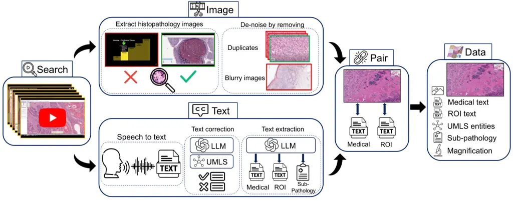

Figure 1: Overview of Quilt curation pipeline. We identify relevant
histopathology YouTube videos in Search. For Image extraction, we find
and de-noise histopathology frames using trained models. In Text
section, we rely on a conventional Automatic Speech Recognition (ASR)
model and leverage Unified Medical Language System (UMLS) and large
language models (LLMs) for post-processing and ASR error correction.
Relevant sub-pathology, medical and region-of-interest (ROI) text are
extracted using an LLM. Finally, domain-specific algorithms are used to
Pair images and text, eliminating duplicates to yield Quilt, a richly
annotated image-text dataset for histopathology.

To address the need for a large-scale vision-language dataset in
histopathology, we introduce Quilt: containing $`437,878`$ images
aligned with $`802,144`$ text pairs across multiple microscopic
magnification scales covering from 10x to 40x. We draw on the insight
that publicly available educational YouTube histopathology content
represents an untapped potential. We curate Quilt using $`1,087`$ hours
of valuable educational histopathology videos from expert pathologists
on YouTube. To extract aligned image and text pairs from the videos, we
utilize a mixture of models: large language models (GPT-3.5),
handcrafted algorithms, human knowledge databases, and automatic speech
recognition. Quilt does not overlap with any current open-access
histopathology data sources. This allows us to merge our dataset with
other open-source datasets available. Therefore, to create an even
larger and more diverse dataset, we combine Quilt with data from other
sources, such as Twitter, research papers, and the Internet, resulting
in Quilt-1M. The larger Quilt-1M contains one million image-text pairs,
making it the largest public vision-language histopathology dataset to
date.

Using Quilt and Quilt-1M, we finetune vision-language models using a
contrastive objective between the two modalities. We extensively
evaluate it on $`13`$ external histopathology datasets taken across
different sub-pathologies. We report zero-shot classification, linear
probe, and image-to-text and text-to-image retrieval tasks. Against
multiple recently proposed baselines (CLIP \[49\], PLIP \[25\], and
BiomedCLIP \[71\]), models trained with Quilt-1M outperform all others.
Our ablations identify the importance of Quilt.

Quilt offers three significant advantages: First, Quilt does not overlap
with existing data sources; it ensures a unique contribution to the pool
of available histopathology knowledge. Second, its rich textual
descriptions extracted from experts narrating within educational videos
provide more expressive, dense interconnected information. Last, the
presence of multiple sentences per image fosters diverse perspectives
and a comprehensive understanding of each histopathological image. We
hope that both computer scientists and histopathologists will benefit
from Quilt’s potential.

## 2 Related work

We built upon a growing literature applying self-supervised learning and
other machine learning methods to medical image understanding.

Machine learning for histopathology. Early representation learning work
in computational pathology primarily relied on weakly-supervised
learning, with each whole-slide image (WSI) receiving a single label.
The limited nature (single label to many patches) has produced
sub-optimal models  \[12, 27\] at the patch level. Lately, a
self-supervised learning approach, which learns useful representations
from unlabeled data, has shown some success \[27, 13, 12\]. Most of this
work has been unimodal. They use image augmentations similar to those
used for natural images \[14\], mostly differing by way of consciously
injecting domain knowledge. For example, they leverage the compositional
nature of H&E stain information of whole-slice images \[27\], or inject
hierarchical morphological information at different
magnifications \[13\], or combine with other modalities like genomic
features \[12\] or with descriptive text \[20\]. When text data is used,
the objectives similarly use augmentations seen in natural
language \[53\]. By contrast, we explore self-supervised mechanisms that
learn better histopathology information representations that go beyond a
single label, aided by language descriptions.

Medical vision-language datasets. Learning vision-language
representations demands a large dataset of images aligned with
descriptive text, a resource that is notably lacking in histopathology.
The MIMIC-CXR-JPG v2.0.0 dataset \[30\], for example, consists of
de-identified hospital-sourced chest radiographs and reports. For
histopathology, The Cancer Genome Atlas²² 2 https://www.cancer.gov/tcga
provides de-identified PDF-reports for a limited number of WSIs. Despite
this resource, the enormous size of this data (reaching up to
$`120,000^{2}`$ pixels) makes processing challenging, limiting its use
to a small number of focused studies \[42\]. A majority of medical
vision-language datasets are concentrated in the radiology sub-domain,
due to the relatively straightforward process of collecting validated
multimodal data \[30\]. Many models are trained on a subset of
PubMed \[51\] or comparable radiology datasets \[72, 24, 18, 46\].
PMC-15M \[71\], a recent subset of PubMed not specific to
histopathology, was used to train multiple models. While the models
themselves are public, PMC-15M is not, making it hard to determine what
portion of it is histopathology-relevant.

Vision-language pairs on histopathology. One of the first histopathology
vision-language datasets, ARCH, contains only $`7,614`$ accessible
image-text pairs  \[20, 23\]. Later on,  \[25\] released OpenPath, a
dataset of $`200`$K image-text pairs extracted from Twitter. This was
the largest histopathology dataset until Quilt-1M.

Video data for self-supervision. Numerous recent studies have started to
tap into video data. For instance, millions of publicly accessible
YouTube videos were used to train a vision-language model \[69, 70\].
Similarly, a causal video model was trained by using sequential gaming
videos \[6\]. Localized narratives \[62, 47\] provide another example of
dense, interconnected supervision for a single image. Despite the
potential of video content, video often yields noisier datasets compared
to static sources. Recently, the enhanced capabilities of automatic
speech recognition models streamlined the curation of large-scale
cleaner datasets from videos \[69, 6, 71\]. Furthermore, the growing
versatility of large language models has shown promise as data
annotators, information extractors \[35, 63, 15, 22\], text
correctors \[67\], and as tools for medical information extraction and
reasoning \[1, 60\].

## 3 Curating Quilt: Overview

Creating a vision-language dataset from videos is a significant
undertaking, as not all videos are suitable for our pipeline. Many
either lack voiced audio, are not in English, fail to contain medically
relevant content, or have insufficient medical relevance—for example,
videos that present static images of histopathology content on a slide
deck, or those that briefly cover histopathology images in pursuit of a
different objective. Conventional automatic speech recognition (ASR)
systems also struggle with the specialized requirements of
histopathology transcription, necessitating a non-trivial solution. The
de-noising of text and image modalities adds further complexity as the
videos are typically conversational and, therefore, inherently noisy.
Instructors pan and zoom at varying speeds, recording a mix of relevant
and irrelevant histopathological visual content in their videos. As
such, trivially extracting frames at static intervals fails to capture
the data appropriately. To collect Quilt   we trained models and
handcrafted algorithms that leverage the nuances in the instructors’
textual and visual behavior, ensuring accurate collection and alignment
of both modalities.

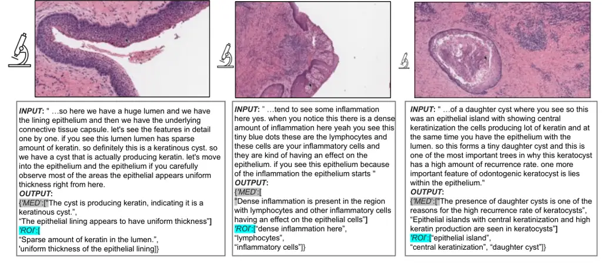

Figure 2: Quilt examples. Input is the corrected ASR caption for the
representative image. Output are the medical and ROI extracted text(s)
paired with the image (see Section 3.1). In histopathology,
understanding tissue characteristics often involves views from varying
magnification levels. Thus, in Quilt we estimate an image’s
magnification (indicated by the relative size of the microscope icon).

### 3.1 Quilt: Collecting medical image and text pairs from YouTube

Our proposed dataset curation pipeline involves (1) gathering channel
and video data covering the histopathology domain, (2) filtering videos
based on a certain "narrative style", (3) extracting and denoising image
and text modalities from videos using various models, tools, and
algorithms, (4) postprocessing denoised text by LLMs to extract medical
text and finally, (5) splitting and aligning all modalities for curating
the final vision-language pre-training (VLP) data. See Figure 1 (and A.1
in the Appendix) for a detailed overview of the pipeline.

Collecting representative channels and videos. Our pipeline begins by
searching for relevant channels and video ids on YouTube, focusing on
the domain of histopathology. Using keywords spanning 18 sub-pathology
fields (see section A.4 in the Appendix), we search among channels
before searching for videos to expedite discovery, considering that
video searches are time-consuming and the APIs pose limitations on
numerous requests \[69\]. Channels with subscriber count $`\geq 300K`$
are excluded to avoid large general science channels, as educational
histopathology channels often have fewer subscribers. We then download
low-resolution versions of all identified videos, with the lowest
resolution at 320p.

Filtering for narrative-style medical videos. For each video within each
channel, we exclude videos that are shorter than $`1`$ minute,
non-voiced, or have non-English audio. For videos meeting these
heuristics, two decisions are made:

1.  (A)
    Do they have the required medical content, i.e., histopathology
    image-text pairs?
2.  (B)
    If so, are they in narrative style – videos wherein the presenter(s)
    spend a significant time panning and zooming on the WSI, while
    providing vocal descriptions of image content?

For (A) we automatically identify the relevant videos by extracting
keyframes from a video. These keyframes are automatically extracted
using FFmpeg ³³ 3 https://ffmpeg.org/, marking the beginning or end of a
scene (frames containing significant visual changes). The software
requires a threshold that determines the minimum amount of visual change
required to trigger a keyframe. Through experimentation, we set
different thresholds for various video durations, with smaller
thresholds for longer videos. Next, we train and use an ensemble of
three histopathology image classifiers to identify videos with
histopathology images (See section A.3 in the Appendix).

For (B), in which we identify narrative-style videos, we randomly select
keyframes predicted to be histopathology. For each such selected frame,
we extract the next three histopathology key-frames and compute the
cosine similarity between the selected frame and each of the subsequent
three frames. If all three have similarity scores $`\geq`$ a preset
threshold of $`0.9`$, we count it as a narrative streak. A video is
identified as narrative style if at least 10% of the selected frames
exhibit a narrative streak. Consequently, we download all
narrative-style videos at high-resolution. Narrative-style videos
typically cover WSIs at various magnifications, hence, we train a
tissue-image-magnification classifier to predict the following three
scales: {$`(1-10)`$x, $`(>10-20)`$x, $`(>20)`$x}. This provides relevant
metadata for downstream objectives.

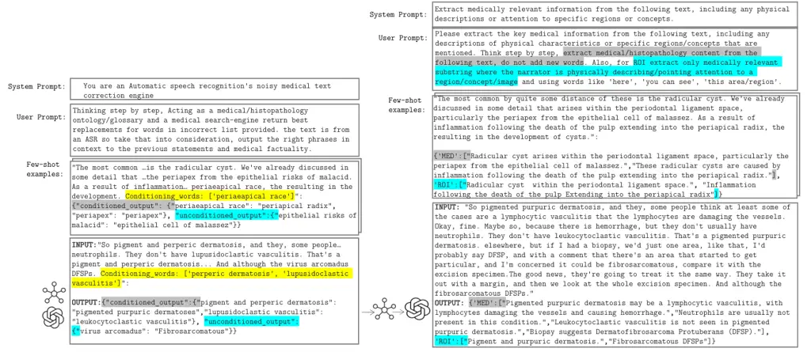

Figure 3: Prompting the LLM by providing few-shot examples to perform
the following tasks: (Left) correcting noisy ASR text within its
context. We highlight the probable list of misspelled keywords in yellow
and their corrections by the LLM in gray. Additional missed
errors/misspelled entries identified by the LLM are highlighted in blue.
(Right) extracting medical (MED) and ROI text from a given text. We
highlight the definition of medical and ROI text in blue and gray
respectively.

Text Extraction using ASR and text denoising. The high costs associated
with private medical ASR APIs ⁴⁴ 4
nuance.com/en-au/healthcare/provider-solutions/speech-recognition/dragon-medical-one.html
necessitated the use of a more conventional ASR model: Whisper \[50\].
As anticipated, this model often misinterprets medical terms, thus
requiring the use of post-processing algorithms to minimize its error
rates.

We propose a four-step text de-noising and quality control pipeline: i)
We utilize the Rake keyword extraction algorithm to extract keywords or
key-phrases up to four words and refine them by eliminating stopwords
\[52\]. ii) We then cross-check each refined entry against UMLS \[7\]
using the SciSpacy entity linking package \[44\]. If an entry is not
found within UMLS, we check for misspelled words within the entry using
a spell-checking algorithm⁵⁵ 5
https://github.com/barrust/pyspellchecker, instantiated with a
specialized list of histopathology terms curated from various
histopathology ontology labels and definitions. iii) With this probable
list of misspelled keywords, we condition and prompt the LLM with
examples to correct the misspelled entry within its context (sentence),
and secondly, we task the LLM with identifying additional unconditioned
errors/misspelled entries. For both, we leverage a set of manually
curated examples to prompt the LLM in-context Figure 3. For more
examples and failure cases, see Table 3 in the Appendix. iv) Finally, to
de-noise the text, we resolve the output mapping of incorrect
$`\mapsto`$ correct entries by verifying the corrected words against
UMLS and our curated list of histopathology words/phrases. Entries that
pass this double-validation process are used to replace the initial
noisy transcription. Leveraging domain-specific databases to extract the
text and filter out noise allows us to bypass the correction of
repetition errors and filler words, such as ’ah’, ’uhm’, ’the’, etc. in
tandem, using LLMs allows us to concentrate on correcting
medically-relevant misspelled words, rather than correcting
non-medically-relevant terms.

From the ASR-corrected text, we extract medical text which describes the
image(s) as a whole. Also, when the speaker describes/gestures at visual
regions-of-interest through statements like "look here …", we extract
the text entity being described as ROI text. To filter relevant medical
text and ROI text from the ASR-corrected text, we utilize LLMs (see
Figure 3 in Appendix), a decision rooted in a few compelling reasons: 1)
Curating pre-training datasets at a scale that can tolerate higher
levels of noise, LLMs are more cost-effective than expert-human
(medical) labor. 2) The task does not require LLMs to generate new
information but instead they discriminate useful versus irrelevant
signals, serving to improve the signal-to-noise ratio of the data. To
extract relevant text, we prompt LLMs to filter out all non-medically
relevant text, providing context as necessary. See Figure 2 for some
example image-text pairs. Lastly, we instruct the LLMs to refrain from
introducing any new words beyond the corrected noisy text and set the
model’s temperature to zero. Finally, we use LLMs to categorize our
videos into one of the 18 identified sub-pathology classes. Similar to
the previous tasks, this categorization is done by conditioning with a
few examples and prompting the LLM to predict the top three possible
classes given the text. More details, prompts, and additional examples
are presented in Figure 12 within the Appendix.

Image frame extraction and denoising. For each video, we employ a
similar method to that described in Filtering for narrative-style
medical videos subsection to extract histopathology key-frames; our
method leverages these frames’ times $`t`$ as beacons to break the
entire video into time-intervals called chunks from which to extract
representative image(s). Next, we extract the median image (pixel-space)
of stable (static) frames in each chunk if they exists, else we
de-duplicate the histopathology keyframes (beacons of the chunk). In
essence, we use the extracted histopathology scene frames as guides for
data collection, exploiting the human tendency in educational videos to
pause narration during explanation, and we extract the relevant
frame(s).

Aligning both modalities. For each narrative-style video, we perform the
following steps to align image and text modalities: First, we compute
histopathology time chunks denoted as
$`[(t_{1},t_{2}),(t_{3},t_{4}),\cdots(t_{n-1},t_{n})]`$ from keyframes
after discriminating histopathology frames using the histopathology
ensemble classifier – (scene_chunks). Each scene_chunk is padded with
pad_time to its left and right; see Figure 9 and Table 4 in the Appendix
for more details.

1.  1.  Text: we use the ASR output to extract the words spoken during each
        chunk in scene_chunks. Using the method described in Text Extraction
        using ASR and text denoising subsection, we extract the Medical and
        ROI caption for this chunk.
2.  2.  Image: we extract representative image(s) for every
        chunk/time-interval in scene_chunks as described in Filtering for
        narrative-style medical videos subsection above.

Finally, each chunk in scene_chunks is mapped to texts (both medical and
ROI captions) and images. Next we map each medical image to one or more
medical text. Using the time interval in which the image occurs, we
extract its raw text from ASR and then correct and extract keywords
using the Rake method, which we refer to as raw_keywords. We extract
keywords from each medical text returned using the LLM, and we refer to
these as keywords. Finally, if the raw_keywords occur before or slightly
after a selected representative image, and overlap with the keywords in
one of the Medical/ROI texts for that chunk, we map the image to the
medical/ROI text. Example. keywords: psammoma bodies, match with
raw_keyword: psammoma bodies within the ASR-corrected text ‘Meningiomas
typically have a meningothelial pattern with lobular-like arrangements
and psammoma bodies.’ Refer to Figure 8 and Figure 10 in the Appendix
for a detailed explanation of the method and examples of aligned image
and text.

### 3.2 Quilt-1M: Combining Quilt with other histopathology data sources

To create Quilt-1M, we expanded Quilt by adding other disparate
histopathology image-text open-access sources: LAION, Twitter, and
PubMed.

PubMed Open Access Articles. We searched the PubMed open-access from
2010-2022, extracting 59,371 histopathology image-text pairs, using our
histopathology classifier and multi-plane figure cropping algorithm. The
images are categorized into (1) images that are fully histopathology,
(2) multi-plane images that contain histopathology sub-figures, and (3)
histopathology sub-figures cropped from (1) and (2). See Figure 11, and
section A.2.1 in the Appendix.

Histopathology Image Retrieval from LAION. The Large-scale Artificial
Intelligence Open Network (LAION-5B) \[55\] curated over 5 billion pairs
of images and text from across the Internet, including a substantial
volume of histopathology-related data. We tapped into this resource by
retrieving 22,682 image and text pairs. See section A.2.2 in the
Appendix.

Twitter Data from OpenPath. We utilized a list of tweets curated by
Huang et al. \[25\], which totaled up to 55,000 unique tweets and made
up $`133,511`$ unique image-text pairs. This exhibits a one-to-many
relationship where many images were matched with multiple captions; this
differentiated our work from the OpenPath approach. To maintain
comparability, we followed their text pre-processing pipeline \[25\].
See section A.2.3 in the Appendix.

|     |     |
| --- | --- |
|     |     |
| (a) | (b) |

|     |                                                           |
| --- | --------------------------------------------------------- |
|     | 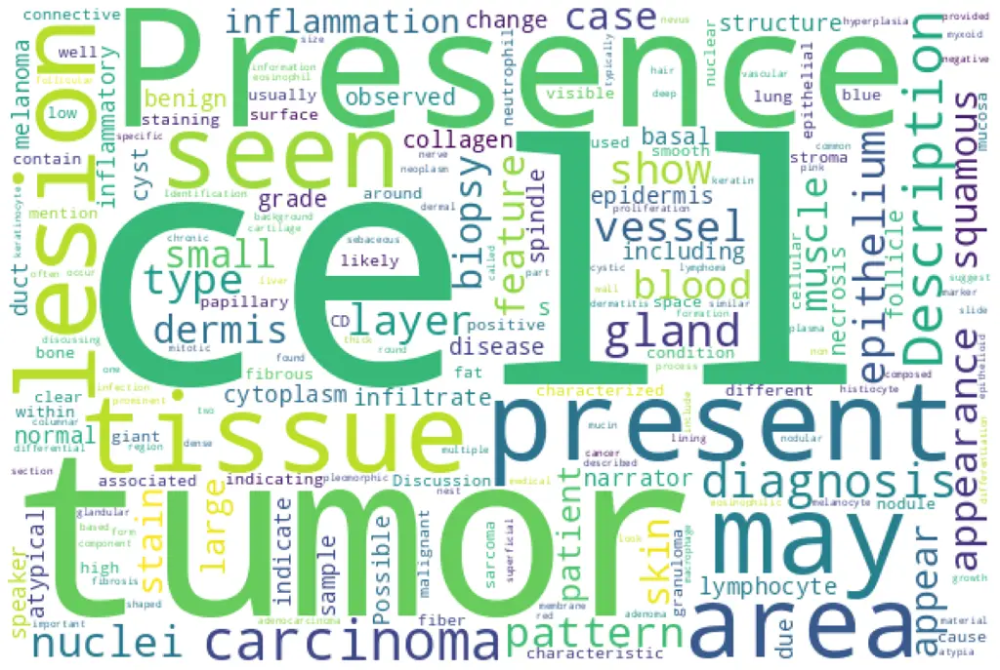 |
| (c) | (d)                                                       |

Figure 4: (a) Distribution of all videos over sub-pathology types. (b)
Distribution of our entities across top 20 UMLS semantic types. (c)
Number of image-text pairs within each sub-pathology type. (d) word
cloud of all the text in Quilt.

### 3.3 Quality

To evaluate our pipeline’s performance, we assess several aspects.
First, we calculate the precision of our LLM’s corrections by dividing
the number of conditioned misspelled errors replaced (i.e., passed the
UMLS check) by the total number of conditioned misspelled words found,
yielding an average of 57.9%. We also determined the unconditioned
precision of the LLM, similar to the previous step, and found it to be
13.8%. Therefore, we replace our detected incorrect words with the LLM’s
correction 57.9% of the time, and 13.8% of the time we replace the LLM’s
detected errors with its correction (see Table 3 in the Appendix). To
estimate the ASR model’s transcription performance, we compute the total
number of errors replaced (both conditioned and unconditioned) and
divide it by the total number of words in each video, resulting in an
average ASR error rate of 0.79%. To assess the LLM’s sub-pathology
classification, we manually annotated top-k $`(k={1,2,3})`$
sub-pathology types for 100 random videos from our dataset. The LLM’s
accuracy for top-3, top-2, and top-1 was 94.9%, 91.9%, and 86.8%,
respectively. Also note that, by prompting the LLM to extract only
medically relevant text, we further eliminate identifiable information,
such as clinic addresses, from our dataset.

### 3.4 Final dataset statistics

We collected Quilt, from $`4504`$ narrative videos spanning over
$`1087`$ hours with over $`437`$K unique images with $`802`$K associated
text pairs. The mean length of the text captions is $`22.76`$ words, and
$`8.68`$ words for ROI text, with an average of 1.74 medical sentences
per image (max=5.33, min=1.0). Our dataset spans a total of $`1.469`$M
UMLS entities from those mentioned in the text (with $`28.5`$K unique).
The images span varying microscopic magnification scales (0-10x, 10-20x,
20-40x), obtaining ($`280`$K, $`75`$K, $`107`$K) images from each scale
respectively with an average height and width of 882 x 1468 pixels, as
we leverage the max image resolution of videos. Figure 4 (a, c) plots
our dataset’s diversity across multiple histopathology sub-domains. This
plot shows that the captions cover histopathology-relevant medical
subtypes: findings, concepts, organs, neoplastic processes, cells,
diseases, and a mix of laboratory and diagnostic procedures. Overall,
across all $`127`$ UMLS semantic types, our entities cover $`76.2\%`$ of
medically-related semantic types (e.g., findings, disease, or syndrome)
and 23.75% non-medical (e.g., geographic area, governmental or
regulatory activity).

## 4 QuiltNet: Experiments training with Quilt-1M

Figure 5: QuiltNet, outperforms out-of-domain CLIP baseline and
state-of-the-art histopathology models across 12 zero-shot tasks,
covering 8 different sub-pathologies (accuracy percentage provided).

We use the Contrastive Language-Image Pre-training (CLIP)
objective \[49\] to pretrain QuiltNet using Quilt-1M. CLIP takes a batch
of $`N`$ (image, text) pairs and optimizes a contrastive objective to
create a joint embedding space. The optimization process involves
concurrent training of both image and text encoders to increase the
cosine similarity of embeddings from aligned pairs, while decreasing it
for unaligned pairs. The objective is minimized via the InfoNCE loss,
expressed as:

```math
\mathcal{L}=-\frac{1}{2N}\left(\sum_{i=1}^{N}\log\frac{e^{\cos\left(I_{i},\boldsymbol{T}_{i}\right)}}{\sum_{j=1}^{N}e^{\cos\left(I_{i},\boldsymbol{T}_{j}\right)}}+\sum_{i=1}^{N}\log\frac{e^{\cos\left(\boldsymbol{I}_{i},\boldsymbol{T}_{i}\right)}}{\sum_{j=1}^{N}e^{\cos\left(I_{j},T_{i}\right)}}\right)
```

where $`I_{i}`$ and $`T_{i}`$ are the embeddings for the aligned
$`i`$-th image and text, respectively. For the image encoder, we use
both ViT-B/32 and ViT-B/16 architectures \[16\]. For the text encoder,
we use GPT-2 \[48\] with a context length of $`77`$, and
PubmedBert \[71\]. We train QuiltNet by finetuning an OpenAI pre-trained
CLIP model  \[49\] on Quilt-1M to enhance its performance in
histopathology. Once finetuned, we conduct experiments on two types of
downstream tasks: image classification (zero-shot and linear probing)
and cross-modal retrieval (zero-shot). We also compare the performance
of fine-tuning a pre-trained CLIP model versus training it from scratch.

Downstream histopathology datasets. We evaluate the utility of QuiltNet
on $`13`$ downstream datasets: PatchCamelyon \[61\] contains
histopathology scans of lymph node sections labeled for metastatic
tissue presence as a binary label. NCT-CRC-HE-100K \[33\] consists of
colorectal cancer images and is categorized into cancer and normal
tissue. For SICAPv2 \[57\] the images are labeled as non-cancerous,
Grade 3-5. Databiox \[8\] consists of invasive ductal carcinoma cases of
Grades I-III. BACH \[4\] consists of breast tissues labeled as normal,
benign, in-situ, and invasive carcinoma. Osteo \[5\] is a set of tissue
patches representing the heterogeneity of osteosarcoma. RenalCell \[10\]
contains tissue images of clear-cell renal cell carcinoma annotated into
five tissue texture types. SkinCancer \[36\] consists of tissue patches
from skin biopsies of 12 anatomical compartments and 4 neoplasms that
make up the SkinTumor Subset. MHIST \[64\] contains tissue patches from
Formalin-Fixed Paraffin-Embedded WSIs of colorectal polyps.
LC25000 \[9\], which we divide into LC25000 (Lung) and LC25000 (Colon),
contains tissue of lung and colon adenocarcinomas. For more details on
the datasets refer to C.1 and Table 7 in the Appendix.

|                   |       |                |                |              |              |              |              |              |
| ----------------- | ----- | -------------- | -------------- | ------------ | ------------ | ------------ | ------------ | ------------ |
| Dataset           | %shot | ViT-B/32       |                |              | ViT-B/16     |              |              |              |
|                   |       | CLIP           | PLIP           | QuiltNet     | CLIP         | QuiltNet     | BiomedCLIP   | QuiltNet     |
| Supervised(%)     |       | GPT/77         | GPT/77         | GPT/77       | GPT/77       | GPT/77       | PMB/256      | PMB/256      |
| NCT-CRC \[33\]    | 1     | 91.0    (0.10) | 93.75 (0.09)   | 94.64(0.22)  | 90.96 (0.10) | 93.36 (0.23) | 92.14 (0.12) | 93.55 (0.25) |
|                   | 10    | 92.02 (1.30)   | 93.83 (0.06)   | 95.30 (0.03) | 92.58 (0.12) | 93.85 (0.04) | 92.90 (0.07) | 93.72 (0.08) |
| (94.0)            | 100   | 91.83 (0.01)   | 94.16 (0.01)   | 95.22 (0.01) | 92.26 (0.09) | 93.76 (0.02) | 92.97 (0.05) | 93.60 (0.01) |
| Camelyon \[61\]   | 1     | 80.38 (0.16)   | 87.26 (0.23)   | 87.62 (0.35) | 80.28 (0.20) | 84.78 (0.14) | 83.63 (0.44) | 83.48 (0.18) |
|                   | 10    | 82.67 (0.19)   | 87.48 (0.08)   | 87.55 (0.03) | 82.20 (0.04) | 86.77 (0.09) | 84.18 (0.15) | 84.42 (0.10) |
| (97.5)            | 100   | 82.80 (0.01)   | 87.34 (0.01)   | 87.48 (0.01) | 82.55 (0.02) | 86.81 (0.04) | 84.23 (0.01) | 84.44 (0.02) |
| SkinCancer \[36\] | 1     | 84.27 (0.22)   | 91.07 (0.25)   | 90.93 (0.25) | 85.62 (0.16) | 88.29 (0.15) | 87.53 (0.21) | 88.06 (0.20) |
|                   | 10    | 89.0    (0.02) | 93.39 (0.05)   | 92.99 (0.02) | 90.28 (0.01) | 91.20 (0.0)  | 89.23 (0.03) | 90.03 (0.02) |
| (93.3)            | 100   | 89.02 (0.02)   | 93.29 (0.01)   | 93.03 (0.02) | 90.29 (0.03) | 91.20 (0.0)  | 89.16 (0.02) | 89.91 (0.01) |
| SICAPv2 \[57\]    | 1     | 52.45 (2.41)   | 65.76 (2.65)   | 69.92 (1.02) | 56.01 (0.66) | 66.86 (1.16) | 69.43 (1.03) | 68.49 (1.06) |
|                   | 10    | 62.24 (0.65)   | 69.23 (0.43)   | 74.14 (0.38) | 63.70 (0.69) | 72.37 (0.65) | 71.61 (0.31) | 72.48 (0.42) |
| (67.0)            | 100   | 65.75 (0.16)   | 73.0    (0.14) | 75.48 (0.12) | 68.74 (0.10) | 74.14 (0.16) | 74.57 (0.04) | 74.60 (0.17) |

Table 1: Linear probing. Classification results, denoted as accuracy %
(standard deviation). Camelyon denotes the PatchCamelyon dataset.
Supervised results are from each dataset’s SOTA models.

Results using zero-shot learning. Given the vast diversity of cancer
sub-types in histopathology, it is critical that a model maintains
comprehensive understanding without requiring specific data for
retraining. Thus, we evaluate our model’s zero-shot performance against
three state-of-the-art models: CLIP, BiomedCLIP, and PLIP. Our model
demonstrates superior performance, as illustrated in Figure 5, where it
outperforms the other models in all but two datasets, in which
BiomedCLIP performs marginally better. See Table  11 for UMap
visualizations and Figure 14 for cross-modal attention visualization
comparison in the Appendix. The prompts used for these evaluations are
presented in Table 10 in the Appendix. To ensure a fair comparison with
BiomedCLIP, which uses a ViT-B/16 and PMB/256 (pre-trained with \[71\]),
we trained three different variants of our model. For detailed insights
into the results, please refer to Table 9 in the Appendix.

Results using linear probing. We assess the few-shot and full-shot
performance of our model by conducting linear probing with 1%, 10%, and
100% of the training data, sampled with three different seeds; we report
the average accuracy and their standard deviation in Table 1. We deploy
our evaluation across four distinct datasets, specifically those with
dedicated training and testing sets among our external datasets.
Remarkably, our model, utilizing the ViT-B/32 architecture with GPT/77,
outperforms its counterparts, BiomedCLIP, PLIP, and CLIP, in most
datasets. On the NCT-CRC and SICAPv2 datasets, our model surpasses even
the fully supervised performance using only 1% of the labels. Also, note
that for some results 10% does better than 100%; this is because we are
sampling from each class equally, and thus the 10% subset contains a
more balanced training set than 100%, for datasets that are very
imbalanced, resulting in sub-optimal performance at 100%.

Results using cross-modal retrieval. In our study, we evaluate
cross-modal retrieval efficacy by examining both zero-shot text-to-image
and image-to-text retrieval capabilities. We accomplish this by
identifying the nearest neighbors for each modality and then determining
whether the corresponding pair is within the top $`N`$ nearest
neighbors, where $`N\in\{1,50,200\}`$. Our experiments are conducted on
two datasets: our holdout dataset from Quilt-1M and the ARCH dataset.
Results are in Table 2.

|            |                        |                   |             |             |                   |             |             |
| ---------- | ---------------------- | ----------------- | ----------- | ----------- | ----------------- | ----------- | ----------- |
|            |                        | Text-to-Image (%) |             |             | Image-to-Text (%) |             |             |
| model      | config                 | R@1               | R@50        | R@200       | R@1               | R@50        | R@200       |
| CLIP       | ViT-B/32\|GPT/77       | 0.49/0.07         | 4.73/2.42   | 10.15/7.21  | 0.39/0.05         | 3.99/2.52   | 8.80/7.22   |
| PLIP       | ViT-B/32\|GPT/77       | 1.05/0.56         | 10.79/13.10 | 21.80/29.85 | 0.87/0.74         | 11.04/13.75 | 21.63/29.46 |
| QuiltNet   | ViT-B/32\|GPT/77       | 1.17/1.41         | 16.31/19.87 | 31.99/39.13 | 1.24/1.35         | 14.89/19.20 | 28.97/38.57 |
| CLIP       | ViT-B/16\|GPT/77       | 0.83/0.09         | 5.63/2.73   | 11.26/8.72  | 0.66/0.13         | 5.02/3.09   | 10.82/9.04  |
| QuiltNet   | ViT-B/16\|GPT/77       | 2.42/1.29         | 22.38/20.30 | 41.05/40.89 | 2.00/1.01         | 21.66/16.18 | 39.29/34.15 |
| BiomedCLIP | ViT-B/16(224)\|PMB/256 | 4.34/8.89         | 14.99/53.24 | 25.62/71.43 | 3.88/9.97         | 13.93/52.13 | 23.53/68.47 |
| QuiltNet   | ViT-B/16(224)\|PMB/256 | 6.20/8.77         | 30.28/55.14 | 50.60/77.64 | 6.27/9.85         | 31.06/53.06 | 50.86/73.43 |

Table 2: Cross-modal retrieval results on the Quilt-1M holdout set and
ARCH dataset. In each cell, the results are displayed in the format
(%/%), with Quilt-1M holdout results on the left and ARCH results on the
right. The best-performing results are highlighted in bold text.

## 5 Discussion

Limitations. Despite the promising results, Quilt was curated using
several handcrafted algorithms and LLMs. Such curation methods, while
effective, introduce their own biases and errors. For instance, our
histopathology classifier had occasional false positives
($`\approx 5\%`$) confirmed by human evaluation. Occasionally, ASR can
misinterpret a medical term and transcribe it as a different existing
term, such as transcribing ’serous carcinoma’ as ’serious carcinoma’.
Unfortunately, such errors are not rectifiable using our current
pipeline (see Table 3 in the Appendix). While not directly a limitation
of our dataset, training a CLIP model trained from scratch
underperformed compared to fine-tuning a pre-trained CLIP (see Table 9
in the Appendix). This suggests that a million image-text pairs may
still not be sufficient. Future works may explore other self-supervised
objectives.

Data Collection and Societal Biases Aligning in strategies with \[69\],
we release Quilt derived from public videos, taking structured steps to
limit privacy and consent harms (see A.5 in the Appendix). Complying
with YouTube’s privacy policy, we only provide video IDs, allowing users
to opt-out of our dataset. Researchers can employ our pipeline to create
Quilt. Regarding societal biases, a significant portion of our narrators
originate from western institutions, a situation that is further
amplified by our focus on English-only videos. Consequently, QuiltNet
may exhibit inherent biases, potentially performing better on data
associated with these demographics, while possibly underperforming when
applied to other cultural or linguistic groups.

Conclusion. We introduced Quilt-1M, the largest open-sourced
histopathology dataset to date. Empirical results validate that
pre-training using Quilt is valuable, outperforming larger
state-of-the-art models like BiomedCLIP across various sub-pathology
types and tasks including zero-shot, few-shot, full-shot, and
cross-modal retrieval. We established a new state-of-the-art in
zero-shot, linear probing, and cross-modal retrieval tasks in the field
of Histopathology.

## Acknowledgments

Research reported in this study was supported by the National Cancer
Institute under Awards No. R01 CA15130, R01 CA225585, and R01 CA201376
and the Office of the Assistant Secretary of Defense for Health Affairs
through the Melanoma Research Program under Awards No. W81XWH-20-1-0797
and W81XWH-20-1-0798. Opinions, conclusions, and recommendations are
those of the authors.

## References

- \[1\] M. Agrawal, S. Hegselmann, H. Lang, Y. Kim, and D. Sontag. Large
  language models are zero-shot clinical information extractors. _arXiv
  preprint arXiv:2205.12689_, 2022.
- \[2\] M. Amith, L. Cui, K. Roberts, H. Xu, and C. Tao. Ontology of
  consumer health vocabulary: providing a formal and interoperable
  semantic resource for linking lay language and medical terminology. In
  _2019 IEEE International Conference on Bioinformatics and Biomedicine
  (BIBM)_, pages 1177–1178. IEEE, 2019.
- \[3\] A. Araujo, J. Chaves, H. Lakshman, R. Angst, and B. Girod.
  Large-scale query-by-image video retrieval using bloom filters. _arXiv
  preprint arXiv:1604.07939_, 2016.
- \[4\] G. Aresta, T. Araújo, S. Kwok, S. S. Chennamsetty, M. Safwan,
  V. Alex, B. Marami, M. Prastawa, M. Chan, M. Donovan, et al. Bach:
  Grand challenge on breast cancer histology images. _Medical image
  analysis_, 56:122–139, 2019.
- \[5\] H. B. Arunachalam, R. Mishra, O. Daescu, K. Cederberg,
  D. Rakheja, A. Sengupta, D. Leonard, R. Hallac, and P. Leavey. Viable
  and necrotic tumor assessment from whole slide images of osteosarcoma
  using machine-learning and deep-learning models. _PloS one_,
  14(4):e0210706, 2019.
- \[6\] B. Baker, I. Akkaya, P. Zhokov, J. Huizinga, J. Tang,
  A. Ecoffet, B. Houghton, R. Sampedro, and J. Clune. Video pretraining
  (vpt): Learning to act by watching unlabeled online videos. _Advances
  in Neural Information Processing Systems_, 35:24639–24654, 2022.
- \[7\] O. Bodenreider. The unified medical language system (umls):
  integrating biomedical terminology. _Nucleic Acids Res._,
  32(Database-Issue):267–270, 2004. URL
  [http://dblp.uni-trier.de/db/journals/nar/nar32.html#Bodenreider04](http://dblp.uni-trier.de/db/journals/nar/nar32.html#Bodenreider04).
- \[8\] H. Bolhasani, E. Amjadi, M. Tabatabaeian, and S. J. Jassbi. A
  histopathological image dataset for grading breast invasive ductal
  carcinomas. _Informatics in Medicine Unlocked_, 19:100341, 2020.
- \[9\] A. A. Borkowski, M. M. Bui, L. B. Thomas, C. P. Wilson, L. A.
  DeLand, and S. M. Mastorides. Lung and colon cancer histopathological
  image dataset (lc25000). _arXiv preprint arXiv:1912.12142_, 2019.
- \[10\] O. Brummer, P. Polonen, S. Mustjoki, and O. Bruck. Integrative
  analysis of histological textures and lymphocyte infiltration in renal
  cell carcinoma using deep learning. _bioRxiv_, pages 2022–08, 2022.
- \[11\] M. Caron, H. Touvron, I. Misra, H. Jégou, J. Mairal,
  P. Bojanowski, and A. Joulin. Emerging properties in self-supervised
  vision transformers. In _Proceedings of the IEEE/CVF international
  conference on computer vision_, pages 9650–9660, 2021.
- \[12\] R. J. Chen, M. Y. Lu, W.-H. Weng, T. Y. Chen, D. F. Williamson,
  T. Manz, M. Shady, and F. Mahmood. Multimodal co-attention transformer
  for survival prediction in gigapixel whole slide images. In
  _Proceedings of the IEEE/CVF International Conference on Computer
  Vision_, pages 4015–4025, 2021.
- \[13\] R. J. Chen, C. Chen, Y. Li, T. Y. Chen, A. D. Trister, R. G.
  Krishnan, and F. Mahmood. Scaling vision transformers to gigapixel
  images via hierarchical self-supervised learning. In _Proceedings of
  the IEEE/CVF Conference on Computer Vision and Pattern Recognition_,
  pages 16144–16155, 2022.
- \[14\] T. Chen, S. Kornblith, M. Norouzi, and G. Hinton. A simple
  framework for contrastive learning of visual representations. In
  _International conference on machine learning_, pages 1597–1607.
  PMLR, 2020.
- \[15\] B. Ding, C. Qin, L. Liu, L. Bing, S. Joty, and B. Li. Is gpt-3
  a good data annotator? _arXiv preprint arXiv:2212.10450_, 2022.
- \[16\] A. Dosovitskiy, L. Beyer, A. Kolesnikov, D. Weissenborn,
  X. Zhai, T. Unterthiner, M. Dehghani, M. Minderer, G. Heigold,
  S. Gelly, et al. An image is worth 16x16 words: Transformers for image
  recognition at scale. _arXiv preprint arXiv:2010.11929_, 2020.
- \[17\] D. Doukhan, J. Carrive, F. Vallet, A. Larcher, and S. Meignier.
  An open-source speaker gender detection framework for monitoring
  gender equality. In _Acoustics Speech and Signal Processing (ICASSP),
  2018 IEEE International Conference on_. IEEE, 2018.
- \[18\] S. Eslami, G. de Melo, and C. Meinel. Does clip benefit visual
  question answering in the medical domain as much as it does in the
  general domain? _arXiv preprint arXiv:2112.13906_, 2021.
- \[19\] G. Fragoso, S. de Coronado, M. Haber, F. Hartel, and L. Wright.
  Overview and utilization of the nci thesaurus. _Comparative and
  functional genomics_, 5(8):648–654, 2004.
- \[20\] J. Gamper and N. Rajpoot. Multiple instance captioning:
  Learning representations from histopathology textbooks and articles.
  In _Proceedings of the IEEE/CVF Conference on Computer Vision and
  Pattern Recognition_, pages 16549–16559, 2021.
- \[21\] T. Gebru, J. Morgenstern, B. Vecchione, J. W. Vaughan,
  H. Wallach, H. D. Iii, and K. Crawford. Datasheets for datasets.
  _Communications of the ACM_, 64(12):86–92, 2021.
- \[22\] F. Gilardi, M. Alizadeh, and M. Kubli. Chatgpt outperforms
  crowd-workers for text-annotation tasks. _arXiv preprint
  arXiv:2303.15056_, 2023.
- \[23\] X. He, Y. Zhang, L. Mou, E. Xing, and P. Xie. Pathvqa: 30000+
  questions for medical visual question answering. _arXiv preprint
  arXiv:2003.10286_, 2020.
- \[24\] S.-C. Huang, L. Shen, M. P. Lungren, and S. Yeung. Gloria: A
  multimodal global-local representation learning framework for
  label-efficient medical image recognition. In _Proceedings of the
  IEEE/CVF International Conference on Computer Vision_, pages
  3942–3951, 2021.
- \[25\] Z. Huang, F. Bianchi, M. Yuksekgonul, T. Montine, and J. Zou.
  Leveraging medical twitter to build a visual–language foundation model
  for pathology ai. _bioRxiv_, pages 2023–03, 2023.
- \[26\] E. Hussain, L. B. Mahanta, H. Borah, and C. R. Das. Liquid
  based-cytology pap smear dataset for automated multi-class diagnosis
  of pre-cancerous and cervical cancer lesions. _Data in brief_,
  30:105589, 2020.
- \[27\] W. O. Ikezogwo, M. S. Seyfioglu, and L. Shapiro. Multi-modal
  masked autoencoders learn compositional histopathological
  representations. _arXiv preprint arXiv:2209.01534_, 2022.
- \[28\] G. Ilharco, M. Wortsman, R. Wightman, C. Gordon, N. Carlini,
  R. Taori, A. Dave, V. Shankar, H. Namkoong, J. Miller, H. Hajishirzi,
  A. Farhadi, and L. Schmidt. Openclip, July 2021. URL
  [https://doi.org/10.5281/zenodo.5143773](https://doi.org/10.5281/zenodo.5143773).
- \[29\] K. Jobin, A. Mondal, and C. Jawahar. Docfigure: A dataset for
  scientific document figure classification. In _2019 International
  Conference on Document Analysis and Recognition Workshops (ICDARW)_,
  volume 1, pages 74–79. IEEE, 2019.
- \[30\] A. E. Johnson, T. J. Pollard, N. R. Greenbaum, M. P. Lungren,
  C.-y. Deng, Y. Peng, Z. Lu, R. G. Mark, S. J. Berkowitz, and S. Horng.
  Mimic-cxr-jpg, a large publicly available database of labeled chest
  radiographs. _arXiv preprint arXiv:1901.07042_, 2019.
- \[31\] S. Jupp, J. Malone, T. Burdett, J.-K. Heriche, E. Williams,
  J. Ellenberg, H. Parkinson, and G. Rustici. The cellular microscopy
  phenotype ontology. _Journal of biomedical semantics_, 7:1–8, 2016.
- \[32\] Z. Karishma. Scientific document figure extraction, clustering
  and classification. 2021.
- \[33\] J. N. Kather, N. Halama, and A. Marx. 100,000 histological
  images of human colorectal cancer and healthy tissue. _Zenodo10_,
  5281, 2018.
- \[34\] A. Kembhavi, M. Salvato, E. Kolve, M. Seo, H. Hajishirzi, and
  A. Farhadi. A diagram is worth a dozen images. In _Computer
  Vision–ECCV 2016: 14th European Conference, Amsterdam, The
  Netherlands, October 11–14, 2016, Proceedings, Part IV 14_, pages
  235–251. Springer, 2016.
- \[35\] T. Kojima, S. S. Gu, M. Reid, Y. Matsuo, and Y. Iwasawa. Large
  language models are zero-shot reasoners. _arXiv preprint
  arXiv:2205.11916_, 2022.
- \[36\] K. Kriegsmann, F. Lobers, C. Zgorzelski, J. Kriegsmann,
  C. Janßen, R. R. Meliß, T. Muley, U. Sack, G. Steinbuss, and
  M. Kriegsmann. Deep learning for the detection of anatomical tissue
  structures and neoplasms of the skin on scanned histopathological
  tissue sections. _Frontiers in Oncology_, 12, 2022.
- \[37\] J. Liu, Q. Wang, H. Fan, S. Wang, W. Li, Y. Tang, D. Wang,
  M. Zhou, and L. Chen. Automatic label correction for the accurate edge
  detection of overlapping cervical cells. _arXiv preprint
  arXiv:2010.01919_, 2020.
- \[38\] S. Liu, C. Zhu, F. Xu, X. Jia, Z. Shi, and M. Jin. Bci: Breast
  cancer immunohistochemical image generation through pyramid pix2pix.
  In _Proceedings of the IEEE/CVF Conference on Computer Vision and
  Pattern Recognition_, pages 1815–1824, 2022a.
- \[39\] Z. Liu, P. Luo, X. Wang, and X. Tang. Deep learning face
  attributes in the wild. In _Proceedings of International Conference on
  Computer Vision (ICCV)_, December 2015.
- \[40\] Z. Liu, H. Mao, C.-Y. Wu, C. Feichtenhofer, T. Darrell, and
  S. Xie. A convnet for the 2020s. In _Proceedings of the IEEE/CVF
  Conference on Computer Vision and Pattern Recognition_, pages
  11976–11986, 2022b.
- \[41\] I. Loshchilov and F. Hutter. Decoupled weight decay
  regularization. _arXiv preprint arXiv:1711.05101_, 2017.
- \[42\] N. Marini, S. Marchesin, S. Otálora, M. Wodzinski, A. Caputo,
  M. Van Rijthoven, W. Aswolinskiy, J.-M. Bokhorst, D. Podareanu,
  E. Petters, et al. Unleashing the potential of digital pathology data
  by training computer-aided diagnosis models without human annotations.
  _NPJ digital medicine_, 5(1):102, 2022.
- \[43\] D. Morris, E. Müller-Budack, and R. Ewerth. Slideimages: a
  dataset for educational image classification. In _Advances in
  Information Retrieval: 42nd European Conference on IR Research, ECIR
  2020, Lisbon, Portugal, April 14–17, 2020, Proceedings, Part II 42_,
  pages 289–296. Springer, 2020.
- \[44\] M. Neumann, D. King, I. Beltagy, and W. Ammar. ScispaCy: Fast
  and Robust Models for Biomedical Natural Language Processing. In
  _Proceedings of the 18th BioNLP Workshop and Shared Task_, pages
  319–327, Florence, Italy, Aug. 2019. Association for Computational
  Linguistics. doi: 10.18653/v1/W19-5034. URL
  [https://www.aclweb.org/anthology/W19-5034](https://www.aclweb.org/anthology/W19-5034).
- \[45\] N. F. Noy, M. A. Musen, J. L. Mejino Jr, and C. Rosse. Pushing
  the envelope: challenges in a frame-based representation of human
  anatomy. _Data & Knowledge Engineering_, 48(3):335–359, 2004.
- \[46\] O. Pelka, S. Koitka, J. Rückert, F. Nensa, and C. M. Friedrich.
  Radiology objects in context (roco): a multimodal image dataset. In
  _Intravascular Imaging and Computer Assisted Stenting and Large-Scale
  Annotation of Biomedical Data and Expert Label Synthesis: 7th Joint
  International Workshop, CVII-STENT 2018 and Third International
  Workshop, LABELS 2018, Held in Conjunction with MICCAI 2018, Granada,
  Spain, September 16, 2018, Proceedings 3_, pages 180–189.
  Springer, 2018.
- \[47\] J. Pont-Tuset, J. Uijlings, S. Changpinyo, R. Soricut, and
  V. Ferrari. Connecting vision and language with localized narratives.
  In _ECCV_, 2020.
- \[48\] A. Radford, J. Wu, R. Child, D. Luan, D. Amodei, I. Sutskever,
  et al. Language models are unsupervised multitask learners. _OpenAI
  blog_, 1(8):9, 2019.
- \[49\] A. Radford, J. W. Kim, C. Hallacy, A. Ramesh, G. Goh,
  S. Agarwal, G. Sastry, A. Askell, P. Mishkin, J. Clark, et al.
  Learning transferable visual models from natural language supervision.
  In _International conference on machine learning_, pages 8748–8763.
  PMLR, 2021.
- \[50\] A. Radford, J. W. Kim, T. Xu, G. Brockman, C. McLeavey, and
  I. Sutskever. Robust speech recognition via large-scale weak
  supervision. _arXiv preprint arXiv:2212.04356_, 2022.
- \[51\] R. J. Roberts. Pubmed central: The genbank of the published
  literature, 2001.
- \[52\] S. Rose, D. Engel, N. Cramer, and W. Cowley. Automatic keyword
  extraction from individual documents. _Text mining: applications and
  theory_, pages 1–20, 2010.
- \[53\] T. Santos, A. Tariq, S. Das, K. Vayalpati, G. H. Smith,
  H. Trivedi, and I. Banerjee. Pathologybert–pre-trained vs. a new
  transformer language model for pathology domain. _arXiv preprint
  arXiv:2205.06885_, 2022.
- \[54\] P. N. Schofield, J. P. Sundberg, B. A. Sundberg, C. McKerlie,
  and G. V. Gkoutos. The mouse pathology ontology, mpath; structure and
  applications. _Journal of biomedical semantics_, 4(1):1–8, 2013.
- \[55\] C. Schuhmann, R. Beaumont, R. Vencu, C. Gordon, R. Wightman,
  M. Cherti, T. Coombes, A. Katta, C. Mullis, M. Wortsman, et al.
  Laion-5b: An open large-scale dataset for training next generation
  image-text models. _arXiv preprint arXiv:2210.08402_, 2022.
- \[56\] R. Selvaraju, M. Cogswell, A. Das, R. Vedantam, D. Parikh, and
  D. Batra. Grad-cam: Visual explanations from deep networks via
  gradient-based localization. arxiv 2016. _arXiv preprint
  arXiv:1610.02391_.
- \[57\] J. Silva-Rodríguez, A. Colomer, M. A. Sales, R. Molina, and
  V. Naranjo. Going deeper through the gleason scoring scale: An
  automatic end-to-end system for histology prostate grading and
  cribriform pattern detection. _Computer methods and programs in
  biomedicine_, 195:105637, 2020.
- \[58\] A. Singh, V. Natarajan, M. Shah, Y. Jiang, X. Chen, D. Batra,
  D. Parikh, and M. Rohrbach. Towards vqa models that can read. In
  _Proceedings of the IEEE/CVF conference on computer vision and pattern
  recognition_, pages 8317–8326, 2019.
- \[59\] H. Singh and M. L. Graber. Improving diagnosis in health
  care–the next imperative for patient safety. _The New England journal
  of medicine_, 373(26):2493–2495, 2015.
- \[60\] K. Singhal, S. Azizi, T. Tu, S. S. Mahdavi, J. Wei, H. W.
  Chung, N. Scales, A. Tanwani, H. Cole-Lewis, S. Pfohl, et al. Large
  language models encode clinical knowledge. _arXiv preprint
  arXiv:2212.13138_, 2022.
- \[61\] B. S. Veeling, J. Linmans, J. Winkens, T. Cohen, and
  M. Welling. Rotation equivariant cnns for digital pathology. In
  _Medical Image Computing and Computer Assisted Intervention–MICCAI
  2018: 21st International Conference, Granada, Spain, September 16-20,
  2018, Proceedings, Part II 11_, pages 210–218. Springer, 2018.
- \[62\] P. Voigtlaender, S. Changpinyo, J. Pont-Tuset, R. Soricut, and
  V. Ferrari. Connecting Vision and Language with Video Localized
  Narratives. In _IEEE/CVF Conference on Computer Vision and Pattern
  Recognition_, 2023.
- \[63\] S. Wang, Y. Liu, Y. Xu, C. Zhu, and M. Zeng. Want to reduce
  labeling cost? gpt-3 can help. _arXiv preprint
  arXiv:2108.13487_, 2021.
- \[64\] J. Wei, A. Suriawinata, B. Ren, X. Liu, M. Lisovsky,
  L. Vaickus, C. Brown, M. Baker, N. Tomita, L. Torresani, et al. A
  petri dish for histopathology image analysis. In _Artificial
  Intelligence in Medicine: 19th International Conference on Artificial
  Intelligence in Medicine, AIME 2021, Virtual Event, June 15–18, 2021,
  Proceedings_, pages 11–24. Springer, 2021.
- \[65\] P. Weitz, M. Valkonen, L. Solorzano, C. Carr, K. Kartasalo,
  C. Boissin, S. Koivukoski, A. Kuusela, D. Rasic, Y. Feng, et al.
  Acrobat–a multi-stain breast cancer histological whole-slide-image
  data set from routine diagnostics for computational pathology. _arXiv
  preprint arXiv:2211.13621_, 2022.
- \[66\] P. S. Wright, K. A. Briggs, R. Thomas, G. F. Smith,
  G. Maglennon, P. Mikulskis, M. Chapman, N. Greene, B. U. Phillips, and
  A. Bender. Statistical analysis of preclinical inter-species
  concordance of histopathological findings in the etox database.
  _Regulatory Toxicology and Pharmacology_, 138:105308, 2023.
- \[67\] H. Wu, W. Wang, Y. Wan, W. Jiao, and M. Lyu. Chatgpt or
  grammarly? evaluating chatgpt on grammatical error correction
  benchmark. _arXiv preprint arXiv:2303.13648_, 2023.
- \[68\] W. Wu, S. Mehta, S. Nofallah, S. Knezevich, C. J. May, O. H.
  Chang, J. G. Elmore, and L. G. Shapiro. Scale-aware transformers for
  diagnosing melanocytic lesions. _IEEE Access_, 9:163526–163541, 2021.
- \[69\] R. Zellers, X. Lu, J. Hessel, Y. Yu, J. S. Park, J. Cao,
  A. Farhadi, and Y. Choi. Merlot: Multimodal neural script knowledge
  models. _Advances in Neural Information Processing Systems_,
  34:23634–23651, 2021.
- \[70\] R. Zellers, J. Lu, X. Lu, Y. Yu, Y. Zhao, M. Salehi,
  A. Kusupati, J. Hessel, A. Farhadi, and Y. Choi. Merlot reserve:
  Neural script knowledge through vision and language and sound. In
  _Proceedings of the IEEE/CVF Conference on Computer Vision and Pattern
  Recognition_, pages 16375–16387, 2022.
- \[71\] S. Zhang, Y. Xu, N. Usuyama, J. Bagga, R. Tinn, S. Preston,
  R. Rao, M. Wei, N. Valluri, C. Wong, et al. Large-scale
  domain-specific pretraining for biomedical vision-language processing.
  _arXiv preprint arXiv:2303.00915_, 2023.
- \[72\] Y. Zhang, H. Jiang, Y. Miura, C. D. Manning, and C. P.
  Langlotz. Contrastive learning of medical visual representations from
  paired images and text. In _Machine Learning for Healthcare
  Conference_, pages 2–25. PMLR, 2022.
- \[73\] B. Zhou, A. Lapedriza, A. Khosla, A. Oliva, and A. Torralba.
  Places: A 10 million image database for scene recognition. _IEEE
  Transactions on Pattern Analysis and Machine Intelligence_, 2017.

## Supplementary material

We present the following items in the supplementary material section:

1.  1.  Data curation models, algorithms and parsing pipelines (Section A)
2.  2.  Exploratory analysis of the collected data (Section B)
3.  3.  Pretraining and downstream evaluation details (Section C)
4.  4.  Exploration of trained model representations (Section D)
5.  5.  A Datasheet \[21\] for our Quilt dataset (Section E)

## Appendix A Data curation models, algorithms and parsing pipelines

### A.1 Curating Quilt: an Overview

Creating a densely annotated vision-language dataset from videos is a
significant undertaking, as it involves various handcrafted algorithms
and machine learning models. In the following sections, we present more
detailed information about the challenges of the data curation pipeline
and algorithms used to address these challenges. To download Quilt-1M
and its metadata and access the code to recreate the dataset and trained
models, refer to our [website](https://quilt1m.github.io/).

Collecting representative channels and videos. The first challenge lies
in obtaining relevant histopathology videos. We used a set of keywords
(obtained from online histopathology glossaries ⁶⁶ 6
https://lab-ally.com/histopathology-resources/histopathology-glossary)
to search for videos, resulting in $`\approx 65`$K potential matches.
Figure 6 shows the word cloud of all keywords used for searching
YouTube. However, filtering histopathology content based on thumbnail
and title yields many false positives, often including general pathology
videos. To address this, we process the frames of lower-resolution
versions of each video to differentiate between histopathology and
pathology content, narrowing the selection to $`\approx 9`$K videos.

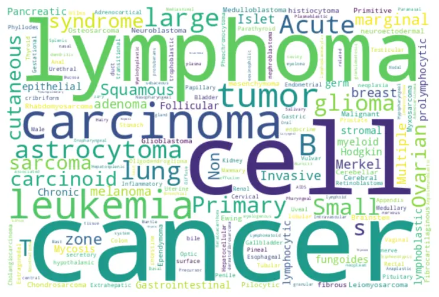

Figure 6: Word cloud of all keywords used for searching YouTube

Filtering for narrative-style medical videos. Among the $`\approx 9`$K
videos, we sought videos with a "narrative style" where narrators freely
explain whole slide images and streaks of similar frames occur,
indicating an educational performance. To identify such content, we used
a model that analyzed randomly sampled frames to determine if they
maintained a consistent style over time. This process resulted in the
selection of $`\approx 4`$K videos. Non-voiced videos are also filtered
by using inaSpeechSegmenter \[17\] where the video endpoint does not
provide the video language or transcript. To identify the audio language
of a video, we first check YouTube’s API. If the information is
unavailable through the API, we use OpenAI’s Whisper model \[50\] on the
first minute of audio from the video.

To identify videos containing medical content, we employ a keyframe
extraction process with a specific threshold to determine the minimum
visual change required to trigger keyframes. For a new video, the
thresholds for keyframe extraction are determined by linearly
interpolating between the lowest threshold, $`0.008`$ ($`5`$-minute
video) and the highest $`0.25`$ ($`200`$-minute video). Following the
keyframe extraction process, we utilize a histopathology image
classifier to identify histopathology content within the extracted
keyframes. See A.3 for more details. To identify narrative-style videos,
we randomly select a $`min(`$num_of_histo_scene_frames$`,20)`$ keyframes
from a video and utilize a pre-trained CLIP ⁷⁷ 7
https://huggingface.co/sentence-transformers/clip-ViT-B-32 (ViT-B-32)
model to embed and compute a cosine similarity on the next three
keyframes. If all three have similarity scores $`\geq`$ a threshold of
$`0.9`$, we count the video as a narrative streak.

|                         |                                                                                                                                                                                                                                                                                                                                                                                  |                                                                                               |                                                                                                                     |
| ----------------------- | -------------------------------------------------------------------------------------------------------------------------------------------------------------------------------------------------------------------------------------------------------------------------------------------------------------------------------------------------------------------------------- | --------------------------------------------------------------------------------------------- | ------------------------------------------------------------------------------------------------------------------- |
| Error due to            | Raw output                                                                                                                                                                                                                                                                                                                                                                       | Salvagable                                                                                    | Non-salvagable                                                                                                      |
|                         |                                                                                                                                                                                                                                                                                                                                                                                  | (beacause LLM can rephrase and/or extract contextually similar correction)                    | (because the error losses all possible medical context and can lead to wrong entries)                               |
| Unfinetuned ASR         | …look like the cranialomas I would expect in HP. They actually look more sarcoidal to me. The reason I say that is they, there’s a kind of positive of inflammatory cells associated with them. They’re really tight and well-formed. They’re very easy to see a low power. And so HP is in the differential hypersensium nitose, but I would be more worried about sarcoidosis. | differential hypersensium nitose: hypersensitivity pneumonitis, cranialomas: granulomas       | positive: paucity                                                                                                   |
| LLM                     | high-larbidia-stinal lymphadenocathy —————— lymphin-giatic pattern distribution                                                                                                                                                                                                                                                                                                  | returns hilar lymphadenopathy instead of a more appropriate hilar mediastinal lymphadenopathy | returns lymphatic pattern distribution instead of a more appropriate lymphangitic pattern distribution              |
| Incomplete UMLS checker | …picnotic                                                                                                                                                                                                                                                                                                                                                                        | -                                                                                             | LLM correctly returns pyknotic however, UMLS(2020) does not have the word pyknotic if fails to pass the UMLS check. |

Table 3: Salvagable and Non-salvagable cases for ASR correction using an
LLM.

Text extraction using ASR and text denoising. Another challenge involves
automatic speech recognition (ASR), as YouTube captions are often
inadequate for medical vocabulary. To address this issue, we employed
the Large-V2 open-source Whisper model \[50\] for speech-to-text
conversion. However, general-purpose ASR models like Whisper can
misinterpret medical terms, particularly when the speaker’s voice is
choppy or accented. There are no straightforward trivial solutions due
to: 1) the absence of openly available medical ASR models or data for
fine-tuning in the medical domain; 2) the inadequacy of medical named
entity recognition models in detecting transcription errors, because
these models are typically trained on correctly spelled words; 3) the
ineffectiveness of methods like semantically searching over a medical
glossary, such as UMLS, which only prove effective when the erroneous
text has significant similarity to the correct terms; and 4) the
inability of simpler methods like finding the longest common substring,
which might work in finding a match in the glossary/ontology for
replacement, but cannot identify the wrong words/phrases in the first
place. To rectify ASR errors, we employed UMLS (a knowledge database)
and a LLM (GPT-3.5). This, however, introduces a new challenge of
identifying incorrectly transcribed words and determining which words
were mistakenly "corrected" and correctly formatted by the LLM after
error correction and resolving unintended parsing errors \[1\]. See
Figure 3 in the main paper for LLM prompt examples of ASR correction and
medical and ROI text extraction from the corrected ASR text. Refer to
Table 3 for error examples of ASR correction using the LLM.

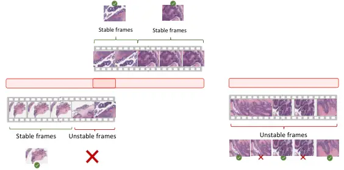

Figure 7: Representative Frame Identification. If a Stable frame is
found by Algorithm 1 within the candidate regions, we use it as the
representative frame. If not, we use the most dissimilar frames among
unstable frames.

Image frame extraction and denoising. The image processing aspect of
this task adds to its complexity, as it requires static frame detection,
quality control for frames, and histology magnification classification.
Each model utilized it these steps introduces its own biases and errors.
We extract time-intervals (chunks) from each video from which we extract
representative image(s). For each of the extracted chunks
$`(t_{n},t_{n+1})`$, the static chunk detection algorithm 1 is used to
extract sub-time-intervals with static frames within the chunk. If
found, we save the median (in pixel space to prevent blurry outputs) of
the stable frames, else (i.e no stable duration of frames) we leverage
the structural similarity index (SSIM) method on histopathology
key-frames to find the most dissimilar histopathology image to make up
the representative images for the chunk, essentially de-duplicating the
frames. Figure 7 demonstrates this process.

1: procedure DetectStaticFrames(video, starttime, endtime)

2:   video = video\[starttime:endtime\]

3:   $`fixedFrames\leftarrow\emptyset`$

4:   $`SSIMValidatedFrames\leftarrow\emptyset`$

5:   $`prevFrame\leftarrow\text{first frame in }video`$

6:   for $`frame\in\text{rest of frames in }video`$ do

7:
   $`absDiff\leftarrow\text{absolute difference between }frame\text{ and }prevFrame`$

8:
   $`absDiffThresh\leftarrow\text{apply adaptive thresholding using a Gaussian filter to }absDiff`$

9:    $`meanVal\leftarrow\text{mean value of }absDiffThresh`$

10:    if $`meanVal<10`$ then

11:      $`fixedFrames\leftarrow fixedFrames\cup{frame}`$

12:    else

13:      if $`\text{length of }fixedFrames\geq\text{minimum duration}`$
then

14:
      $`subclip\leftarrow\text{extract sub-clip of frames with constant background from }fixedFrames`$

15:       for
$`patch\in\text{randomly selected patches in each frame of }subclip`$ do

16:         $`SSIMVal\leftarrow\text{calculate SSIM of }patch`$

17:         if $`SSIMVal>\text{threshold}`$ then

18:
         $`SSIMValidatedFrames\leftarrow SSIMValidatedFrames\cup{frame}`$

19:         end if

20:       end for

21:      end if

22:      $`fixedFrames\leftarrow\emptyset`$

23:    end if

24:    $`prevFrame\leftarrow frame`$

25:   end for

26:
  $`staticTimestamps\leftarrow\text{extract start and end times from SSIMValidatedFrames}`$

27:   return $`{staticTimestamps}`$

28: end procedure

Algorithm 1 Static Video Chunk Detection Algorithm

Aligning both modalities. The alignment of the images with their
corresponding text requires the implementation of unique algorithms.
These algorithms are designed to reduce duplicate content and ensure
accurate mappings between image and text. See Figures 8 and 9 and Table
4 for a a demonstration of image-text alignment process. See Figure 10
for sample images and their corresponding medical and ROI texts and the
sub-pathology classification provided by the LLM.

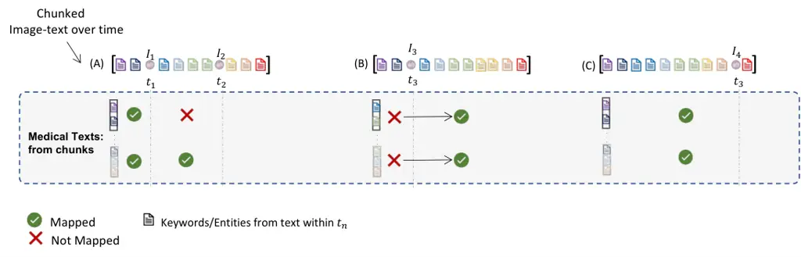

Figure 8: Overview of use of timing and keywords for Alignment Images
within a video chunk, i.e {A, B, C}, $`I_{n}`$ at $`t_{n}`$ are aligned
with medical texts extracted within the same chunk. The raw_keywords
within each example chunk is colour coded to illustrate matches with
keywords extracted from the medical texts and only matching keywords
allow for the pairing of texts containing said keywords to image frames
with frame-times around raw_keywords times.

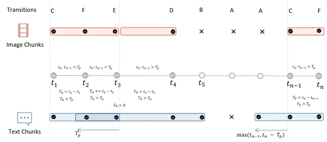

Figure 9: Video Chunking algorithm illustrate. With each transition tag
explained in Table  4, we leverage predicted histopathology frames at
times / $`t_{1},\cdots t_{n}`$/ to segment videos into chunks. Chunks at
are minimum are $`T_{P}`$ in duration, this value is estimated based on
the word-per-second of the video with a minimum of 20 words being
captured per chunk. Images within a chunk , unlike texts, are not
overlapping with other chunks . Text overlap is done to provide needed
context for LLM text correction and extraction.

|                  |                    |                         |                 |                                                                    |                                                                                |     |
| ---------------- | ------------------ | ----------------------- | --------------- | ------------------------------------------------------------------ | ------------------------------------------------------------------------------ | --- |
| $`P(H)@{t_{n}}`$ | $`P(H)@{t_{n-1}}`$ | $`t_{n}-t_{n-1}>T_{p}`$ | $`T_{r}>T_{p}`$ | Text chunk                                                         | Image chunk                                                                    | Tag |
| 0                | 0                  | –                       | –               | –                                                                  | –                                                                              | A   |
| 0                | 1                  | –                       | –               | $`end=t_{n}`$; append($`s,e`$); reset                              | append index to chunk state, if state is empty append prior index; reset state | B   |
| 1                | 0                  | –                       | –               | $`start=\max(t_{n-1},t_{n}-T_{p})`$                                | append index to chunk state                                                    | C   |
| 1                | 1                  | 1                       | –               | $`end=t_{n}`$; append($`s,e`$); reset state; $`start=t_{n}-T_{p}`$ | append index to chunk state; reset state                                       | D   |
|                  |                    | 0                       | 1               | $`end=t_{n}`$; append($`s,e`$); reset state; $`start=t_{n}-T_{p}`$ | append index to chunk state; reset state                                       | E   |
|                  |                    |                         | 0               | –                                                                  | append index to chunk state                                                    | F   |

Table 4: All 6 (six) transition states for chunking narrative style
videos. $`p(H)_{t_{n}}`$ is the binary histo image classifier prediction
at the current frame’s time $`{t_{n}}`$ and $`p(H)_{t_{n-1}}`$ is the
prediction at next frame’s time $`{t_{n-1}}`$, where $`T_{R}`$ is the
cumulative running time and $`T_{P}`$ is the estimated minimum chunk
time for the video, determined by the words per second of the video.
Text and image chunks are implemented as an ordered list of time
intervals and image indexes.

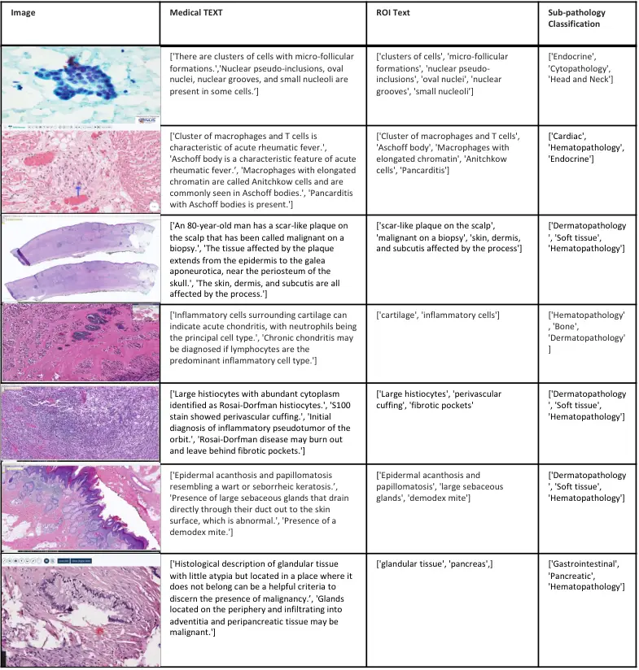

Figure 10: A collection of sample images from our dataset, accompanied
by corresponding medical text, ROI text, and the top three sub-pathology
classifications derived from the ASR text using the LLM.

### A.2 Other data sources

#### A.2.1 PubMed Open Access Articles

We searched the PubMed open-access from $`2010-2022`$ with keywords
(pathology, histopathology, whole-slide image, H&E, and $`148`$ keywords
from a histopathology glossary⁸⁸ 8
https://lab-ally.com/histopathology-resources/histopathology-glossary).
We utilized Entrez ⁹⁹ 9
[http://www.ncbi.nlm.nih.gov/Entrez](http://www.ncbi.nlm.nih.gov/Entrez)
to retrieved the top 10,000 most relevant articles for each keyword.
This query yielded 109,518 unique articles with PMCIDs. We extracted
$`162,307`$ images and their corresponding captions. Using our
histopathology classifier and cropping multi-plane figures as described
in A.4, we extracted $`59,371`$ histopathology image and caption pairs
with an average caption length of $`54.02`$ tokens. Figure 11
demonstrates the pipeline of collecting data from PubMed.

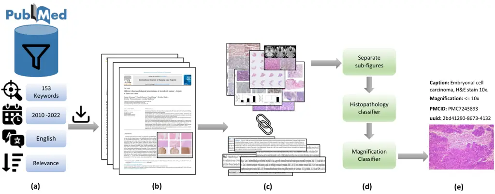

Figure 11: (a) Search PubMed open access database, filter based on
keywords, date, language and sort by relevance. (b) Download paper and
media for each search result. (c) Extract and pair figures and captions.
(d) Separate multi-plane figures, find histopathology images and their
magnification. (e) Final result.

#### A.2.2 Histopathology Image Retrieval from LAION

The Large-scale Artificial Intelligence Open Network (LAION-5B) \[55\]
curated over 5 billion pairs of images and text from across the
Internet, including a substantial volume of histopathology-related data.
We tapped into this resource by retrieving the 3000 most similar LAION
samples for each of the $`1,000`$ pairs of images and text sampled from
PubMed and Quilt, using a CLIP model pre-trained on the LAION data. The
retrieval process utilized both image and text embeddings, with cosine
similarity serving as the distance metric. Subsequently, we eliminated
the duplicate images and removed all non-English pairs from the
remaining pairs using LangDetect¹⁰¹⁰ 10
https://github.com/fedelopez77/langdetect. Consequently, the process
yielded $`22,682`$ image and text pairs.

#### A.2.3 Twitter Data from OpenPath

We utilized a list of tweets curated by Huang et al. \[25\] which
totaled up to $`55,000`$ unique tweets and $`133,511`$ unique image-text
pairs. This exhibits a one-to-many relationship that leans towards the
image side, differentiating our work from the OpenPath approach, where
we had one image matching with multiple captions (as in the case of
MS-COCO captions). In order to maintain comparability with OpenPath, we
followed their text pre-processing pipeline given in \[25\].

### A.3 Histopathology and Magnification classifier

We use an ensemble of three histopathology image classifiers. To ensure
robustness, our ensemble approach consists of two small Conv-NeXt models
\[40\] and one linear classifier fine-tuned with DINO features \[11\].
This combination is necessary due to the homogenous appearance of
histopathology images and the risk of false positives from similar
pinkish-purple images. One Conv-NeXt model is trained in detecting
non-H&E Immunohistochemistry (IHC) stained tissue images, while the
other models are trained to handle all IHC stains and tissue types. The
training data includes eight sub-groups of the TCGA WSI dataset and a
mix of general-domain images, PowerPoint (slide) images, and scientific
figure datasets. See Table 5 for details of these datasets.

For the magnification classifier, we finetune a pretrained ConvNeXt-Tiny
model \[40\], with standard preset hyperparameters for a few epochs and
select the best performing model on the validation set. To generate a
training set for the magnification model, TCGA subsets were segmented
into patches using a method similar to \[68\]. These patches were
generated at various magnifications, which were then categorized into
three labels: 0:{1.25x, 2.5x, 5x, 10x}, 1:{20x}, 2:{40x}. The TCGA
subsets were chosen to ensure a diverse representation of tissue
morphologies and cancer types, thereby ensuring robust and comprehensive
model training. The model was also trained on cytopathology microscopy
images and various IHC stains beyond H&E to enhance the model’s
generalizability across different conditions. Only the ACROBAT and TCGA
datasubsets are preprocessed to divide the WSIs into patches at various
scales.

|                                   |                |       |           |             |                 |             |
| --------------------------------- | -------------- | ----- | --------- | ----------- | --------------- | ----------- |
| Data Source                       | Subset         | \#WSI | \#pathces | Train-Test  | Magnification   | Image-size  |
| TCGA (H&E Stain)                  | GBM            | 19    | 169,431   | 84715-16943 | 89,022 - 40x    | 384 x 384   |
|                                   | LUSC           | 20    |           |             |                 |             |
|                                   | LIHC           | 20    |           |             | 57,671 - 20x    |             |
|                                   | SARC           | 23    |           |             |                 |             |
|                                   | KIRC           | 16    |           |             | 16,660 - 10x    |             |
|                                   | KICH           | 4     |           |             | 4,748 - 5x      |             |
|                                   | BRCA           | 17    |           |             | 1,465 - 2.5x    |             |
|                                   | SKCM           | 19    |           |             | 466 - 1.25x     |             |
| ACROBAT Weitz et al. \[65\]       | H&E KI67       | 99    | 50589     | 28105-22484 | (10x, 5x, 2.5x) | 384 × 384   |
|                                   | ER , PGR, HER2 |       |           |             |                 |             |
| BCI Liu et al. \[38\]             | \-             | \-    | 4,870     |             | 20x (0.46 MPP)  | 1024 × 1024 |
| CCESD Liu et al. \[37\]           | \-             | \-    | 686       |             | 100x/400x       | 2048 × 1536 |
| Smear Hussain et al. \[26\]       | \-             | \-    | 963       |             | 400x            | 2048 × 1536 |
| Celeb Liu et al. \[39\]           | \-             | \-    | 202,599   | 8,103-1,944 | \-              | \-          |
| Places Zhou et al. \[73\]         | \-             | \-    | 36,550    | 2,109-1,372 | \-              | \-          |
| AI2D Kembhavi et al. \[34\]       | \-             | \-    | 4,903     | 0.7-0.3%    | \-              | \-          |
| DocFig Jobin et al. \[29\]        | \-             | \-    | 33,004    | 0.8-0.2%    | \-              | \-          |
| SciFig-pilot Karishma \[32\]      | \-             | \-    | 1,671     | 0.8-0.2%    | \-              | \-          |
| SlideImages Morris et al. \[43\]  | \-             | \-    | 8,217     | 0.8-0.2%    | \-              | \-          |
| TextVQA Singh et al. \[58\]       | \-             | \-    | 28,472    | 0.8-0.2%    | \-              | \-          |
| SlideShare-1M Araujo et al. \[3\] | \-             | \-    | 49,801    | 0.8-0.2%    | \-              | \-          |

Table 5: Datasets used to train the histopathology image classifier.
\[µm per pixel - MPP\]

### A.4 Support Models, Ontology Databases and Algorithms

This section describes the support models, ontology databases and
handcrafted algorithms utilized within our pipeline for both searching
and parsing our data.

Ontology databases. We employ various ontologies, both specific to
histopathology and general ones. Among them are OCHV \[2\], FMA \[45\],
BCGO ¹¹¹¹ 11 https://bioportal.bioontology.org/ontologies/BCGO, NCIT
\[19\], MPATH \[54\], HPATH \[66\], and CMPO \[31\]. These ontologies
serve a dual purpose. First, we used histopathology-specific ontologies
(HPATH, MPATH, BCGO, and CMPO) to provide words/phrases to condition the
LLM, enabling it to identify incorrect words. Second, all ontologies, in
conjunction with UMLS, are used to obtain terms or phrases for
validating the output of the LLM.

Sub-pathology types. The list of all 18 sub-pathology types used to
prompt LLM on the text classification task are: Bone, Cardiac, Cyto,
Dermato, Endocrine, Gastrointestinal, Genitourinary, Gynecologic, Head
and Neck, Hemato, Neuro, Ophthalmic, Pediatric, Pulmonary, Renal, Soft
tissue, and Breast Histopathology. Figure 12 provides the LLM prompt to
retrieve the top three sub-pathology classification based on a given
text.

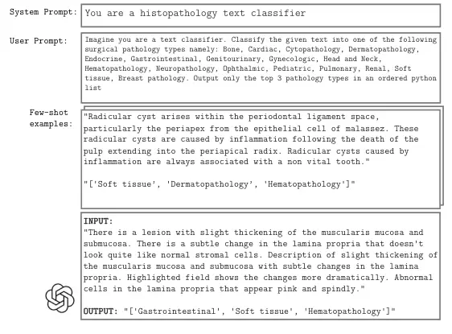

Figure 12: Prompting LLM with few-shot examples to extract the top three
sub-pathology classification of a given text.

Pre-processing multi-plane figures. Many figures in academic papers are
multi-plane, which means a number of sub-figures (Charts, graphs,
histopathology and non-histopathology sub-figures) are placed next to
each other to make a larger figure. We extracted individual images from
multi-plane figures to create multiple instance bags. To locate
boundaries and white gaps between sub-figures, we utilized Sobel
filters. Binary thresholding was then used to find the contours
surrounding the sub-figures. We employ image size and image ratio
thresholds to remove undesirable sub-figures and our histopathology
classifier to maintain just histopathology sub-figures. We supply the
histological sub-figures individually for this type of figure by
appending "\_\[0-9\]+" to the end of the multi-plane figure id. If a
figure is divided into more than 5 sub-figures, we preserve the original
image to ensure that the resolution of these sub-figures remains
reasonable. Figure 13 shows an overview of this pre-processing step in
different scenarios of successful and unsuccessful crops.

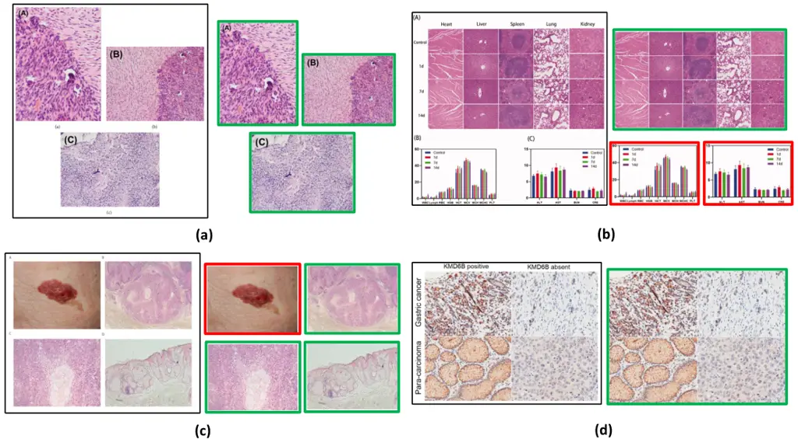

Figure 13: (a), (b), and (c) successfully cropped sub-figures where
histopathology images (green box) are kept and non-histopathology (red
box) images are removed. (b) histopathology crops are kept as not
separated because the individual crops don’t meet the size threshold so
the original figure is kept. (d) Unsuccessful crop due to minimal gap
between sub-figures. Original image is stored.

### A.5 Privacy preserving steps

In order to ensure privacy while handling the dataset, several steps
were taken to protect sensitive information. These steps include:

- •
  Reduction of Signal to Noise using a LLM: To protect the privacy of
  the dataset, a LLM was utilized to reduce the signal-to-noise ratio.
  By applying the LLM, irrelevant or sensitive information was masked or
  removed.
- •
  Exclusion of Videos Not Fully in Narrative Style: Videos that did not
  adhere to a fully narrative style were intentionally left out of the
  dataset. This step was taken to minimize the risk of including any
  potentially private or sensitive content that could compromise
  individuals’ privacy.
- •
  Release of Video IDs and Reconstruction Code: Instead of directly
  releasing the complete dataset, only video IDs from YouTube were made
  public. Additionally, the code is provided to enable researchers to
  recreate the dataset.
- •
  Collection from Diverse Channels: Data collection was performed from a
  wide range of sources, including both large and small channels. This
  approach aimed to decrease the risk of overfitting to specific channel
  types, thereby mitigating privacy concerns associated with potential
  biases linked to particular channels.

## Appendix B Exploratory analysis of the collected data

In this section, we provide the statistics of the Quilt dataset. Figure
4 illustrates the distribution of data across 18 sub-pathology types,
offering a comprehensive analysis of the dataset’s text distribution.
Moreover, for additional statistical details regarding Quilt, please
refer to Table 6, which presents supplementary information on various
aspects of the dataset.

|                              |               |
| ---------------------------- | ------------- |
| Property                     | Average value |
| Medical text per image       | 1.74          |
| ROI text per chunk           | 2.30          |
| Medical text per chunk       | 1.93          |
| Words per medical text       | 22.92         |
| Words per ROI text           | 8.75          |
| Images per chunk             | 2.49          |
| Image-text pair per chunk    | 2.36          |
| UMLS entity per medical text | 4.36          |
| UMLS entity per ROI text     | 1.61          |

Table 6: Additional Quilt statistics

## Appendix C Pretraining and downstream evaluation details

### C.1 External Evaluation Datasets

PatchCamelyon Veeling et al. \[61\] contains 327,680 color images
(96×96px) from histophathology scans of lymph node sections. The images
are assigned a binary label indicating whether they contain metastatic
tissue or not. NCT-CRC-HE-100K Kather et al. \[33\] consists of 100,000
non-overlapping image patches from hematoxylin and eosin (H&E) stained
histological images (224x224px) of human colorectal cancer and is
categorized into cancer and normal tissue. SICAPv2 Silva-Rodríguez
et al. \[57\] contains 182 prostate histology WSIs with 10,340 patches
(512 x 512px) and both annotations of global Gleason scores and
patch-level Gleason grades. Images are labeled as Non cancerous, Grade
3, Grade 4, and Grade 5. Databiox \[8\] consists of 922 Invasive Ductal
Carcinoma cases of breast cancer. This data set has been collected from
pathological biopsy samples of 150 patients which are labeled as Grade
I, II and III. Each pathological sample in has four levels of
magnification: 4x, 10x, 20x and 40x. BACH \[4\] consists of 400 WSIs of
breast tissue which are labeled as normal, benign, in-situ and invasive
carcinoma. Osteo \[5\] is a set of 1,144 patches (1024 x 1024px) taken
from 40 WSIs representing the heterogeneity of osteosarcoma. Images are
labeled as Viable tumor (VT), Non-tumor (NT) and Necrotic tumor (NEC).
RenalCell \[10\] contains 27,849 images of clear-cell renal cell
carcinoma H&E-stained (300 x 300px) annotated into five tissue texture
types. SkinCancer \[36\] consists of 36,890 patches (395 x 395px) from
WSIs skin biopsies from patients with Basal cell carcinoma (BCC),
squamous cell carcinoma (SqCC), naevi and melanoma. Images were
annotated for 16 categories: chondral tissue, dermis, elastosis,
epidermis, hair follicle, skeletal muscle, necrosis, nerves, sebaceous
glands, subcutis, eccrine glands, vessels, BCC, SqCC, naevi and
melanoma. MHIST \[64\] contains 3,152 patches (224 x 224px) from 328
Formalin Fixed Paraffin-Embedded WSIs of colorectal polyps. These images
are labeled as hyperplastic polyps (HPs) or sessile serrated adenomas
(SSAs). LC25000 \[9\] which we divide into LC25000 (Lung) with 15,000
and LC25000 (Colon) with 10,000 color images (768×768px). The lung
subset is labeled as lung adenocarcinomas, lung squamous cell
carcinomas, and benign lung tissues and the colon sebset is labeled as
colon adenocarcinomas and benign colonic tissues. Table 7 summerizes
these datasets.

|                |                                                                                                    |               |                        |         |                      |                                  |                             |
| -------------- | -------------------------------------------------------------------------------------------------- | ------------- | ---------------------- | ------- | -------------------- | -------------------------------- | --------------------------- |
|                | Task                                                                                               | Sub-Pathology | Dataset                | Classes | Magnification        | Size (Train/Val/Test)            | Image-size                  |
| Classification | Lymph-node metastasis detection                                                                    | Breast        | PatchCamelyon \[61\]   | 2       | 1 MPP                | (0.75/0.125/0.125) \* 327,680    | 96 x 96                     |
|                | Tissue Phenotyping                                                                                 | Colorectal    | NCT-CRC-HE-100K \[33\] | 8       | 0.5 MPP              | 89,434/ - /6333                  | 224 x 224                   |
|                | Gleason scoring                                                                                    | Prostate      | SICAPv2 \[57\]         | 4       | 1 MPP                | - / - /10,340                    | 512 x 512                   |
|                | Bloom Richardson grading                                                                           | Breast        | Databiox \[8\]         | 3       | \[2,1,0.5,0.25\] MPP | - / - /922                       | (2100 × 1574), (1276 × 956) |
|                | Tissue classification (normal, benign, in-situ and invasive carcinoma)                             | Breast        | BACH \[4\]             | 4       | 0.5 MPP              | - / - / 400                      | 2048 x 1536                 |
|                | Osteosarcoma classification (non-tumor, necrotic tumor, and viable tumor)                          | Bone          | Osteo \[5\]            | 3       | 1 MPP                | - / - / 1,144                    | 1024 x 1024                 |
|                | clear-cell renal cell carcinoma tissue phenotyping (renal cancer, normal, stromal, other textures) | Renal         | RenalCell \[10\]       | 5       | \[0.5, 0.25\] MPP    | - / -/ 27,849                    | 300 x 300                   |
|                | Classification of skin neoplasms and various anatomical compartments                               | Skin          | SkinCancer \[36\]      | 16      | .5 MPP               | 28039/-/8851 $`{}^{\text{imb}}`$ | 395 x 395                   |
|                | Colorectal Polyp Classification                                                                    | Colorectal    | MHIST \[64\]           | 2       | 1 MPP                | - / -/ 3,152                     | 224 x 224                   |
|                | Lung adenocarcinoma classification (normal, adenocarcinoma and SCC)                                | Lung          | LC25000 (LUNG) \[9\]   | 3       | - MPP                | - / - / 15,000                   | 768 x 768                   |
|                | Colon adenocarcinoma classification (normal and colon adenocarcinoma)                              | Colon         | LC25000 (Colon) \[9\]  | 2       | - MPP                | - / - / 10,000                   | 768 x 768                   |
| Retrieval      | histopathology image-text retrieval                                                                | -             | Quilt-1M               | 1.02M   | -                    | 13,559                           | -                           |
|                | histopathology image-text retrieval                                                                | -             | ARCH \[20\]            | -       | -                    | 7500                             | -                           |

Table 7: Downstream tasks and datasets. Note that SkinTumor dataset is a
subset of SkinCancer. \[µm per pixel - MPP\]

### C.2 QuiltNet Implementation

All model implementations in this study are built upon the open source
repository OpenCLIP \[28\], which enables large-scale training with
contrastive image-text supervision.The experiments were conducted using
PyTorch and utilized up to 4 NVIDIA A40 GPUs. The hyperparameters for
finetuning and training from scratch are provided in Table 8. During the
training process, gradient checkpointing and automatic mixed precision
(AMP) techniques were employed, with a datatype of bfloat16.

All models were trained with image size of 224, except for the finetuned
ViT-B-32 models, where the images were first resized to 512 before
randomly cropping them to the desired size of 224. In the case of
ViT-B-32 finetuning, the data was kept stretched, meaning it maintained
a one-to-one mapping between the image and text. However, for all other
models, the data was unstretched. This means that for those models,
sampling from medical texts occurred with a probability of $`p=sample`$
$`prob`$, or sampling from ROI texts. Within the medical or ROI texts,
sampling was done uniformly. For all finetuned GPT/77 models we use the
OpenAI CLIP \[49\] pretrained network as initialization and for ViT-32
maintain the use of QuickGeLU¹²¹² 12
https://github.com/openai/CLIP/blob/main/clip/model.py. We perform
hyperparameter tuning for all linear probing results, exploring
different values for learning rate, epochs, and weight decay. This
process helped optimize the performance of the models during the linear
probing stage.

|                        |                                          |                              |
| ---------------------- | ---------------------------------------- | ---------------------------- |
| Hyperparameter         | Finetuning                               | Training                     |
| batch size (per gpu)   | 256/1024                                 | 1024                         |
| peak learning rate     | 1e-5                                     | 5.0e-4                       |
| learning rate schedule | constant                                 | cosine decay                 |
| epochs                 | 15                                       | 40                           |
| warmup (in steps)      | 200                                      | 2000                         |
| random seed            | 0                                        | 0                            |
| image mean             | (0.48145466, 0.4578275, 0.40821073)      | same                         |
| image std              | (0.26862954, 0.26130258, 0.27577711)     | same                         |
| augmentation           | Resize; RandomCrop (0.8, 1.0)            | RandomResizedCrop (0.8, 1.0) |
| optimizer momentum     | $`\beta_{1}`$, $`\beta_{2}`$ = 0.9, 0.98 | same                         |
| weight decay           | 0.1                                      | 0.2                          |
| eps                    | 1.0e-6                                   | same                         |
| optimizer              | AdamW \[41\]                             | same                         |
| $`sample`$ $`prob`$    | 0.85                                     | same                         |

Table 8: Training hyperparameters for QuiltNet

|                |          |        |          |            |          |            |          |         |
| -------------- | -------- | ------ | -------- | ---------- | -------- | ---------- | -------- | ------- |
|                | ViT-B/32 |        |          |            | ViT-B/16 |            |          |         |
|                | CLIP     | PLIP   | QuiltNet |            | CLIP     | BiomedCLIP | QuiltNet |         |
| Dataset        | GPT/77   | GPT/77 | GPT/77   | (GPT/77)\* | GPT/77   | PMB/256    | GPT/77   | PMB/256 |
| SkinCancer     | 5.40     | 36.65  | 45.38    | 8.93       | 5.40     | 24.75      | 23.41    | 28.93   |
| SkinTumor      | 10.35    | 56.36  | 58.29    | 36.26      | 13.85    | 37.0       | 51.47    | 51.20   |
| NCT-CRC        | 26.4     | 54.02  | 59.56    | 17.35      | 20.09    | 51.71      | 28.68    | 59.20   |
| PatchCamelyon  | 61.88    | 58.61  | 64.6     | 49.92      | 50.45    | 53.25      | 67.91    | 53.52   |
| MHIST          | 52.92    | 57.52  | 62.54    | 44.52      | 52.3     | 40.23      | 44.32    | 52.71   |
| LC25000(LUNG)  | 61.36    | 78.77  | 80.16    | 67.71      | 50.29    | 72.44      | 50.71    | 81.87   |
| LC25000(COLON) | 62.5     | 77.79  | 93.28    | 72.08      | 78.56    | 90.57      | 62.26    | 87.1    |
| SICAPv2        | 39.40    | 44.53  | 39.49    | 25.07      | 27.38    | 45.81      | 25.54    | 45.1    |
| BACH           | 26.0     | 43.0   | 41.25    | 33.75      | 27.25    | 54.75      | 40.75    | 62.0    |
| Databiox       | 37.53    | 39.48  | 42.52    | 32.32      | 33.51    | 31.24      | 33.19    | 29.93   |
| Osteo          | 19.49    | 54.02  | 64.16    | 27.88      | 16.08    | 50.79      | 38.37    | 59.79   |
| RenalCell      | 20.3     | 50.7   | 52.57    | 16.35      | 28.80    | 47.08      | 28.32    | 50.72   |

Table 9: Zero-shot image classification. accuracy (%). \* denotes models
trained from scratch. SkinTumor is the Neoplastic Subset of SkinCancer.
Also note that PMB refers to PubmedBert, a BERT model of 256 context
length pre-trained on PMC-15M. We swapped our model’s text encoder from
GPT2 to PubmedBert to assess performance differences

|               |                                                                                                                                                                                                                                                                     |
| ------------- | ------------------------------------------------------------------------------------------------------------------------------------------------------------------------------------------------------------------------------------------------------------------- |
| Dataset       | Classes                                                                                                                                                                                                                                                             |
| SkinCancer    | ’Necrosis’, ’Skeletal muscle’, ’Eccrine sweat glands’, ’Vessels’, ’Elastosis’, ’Chondral tissue’, ’Hair follicle’, ’Epidermis’, ’Nerves’, ’Subcutis’, ’Dermis’, ’Sebaceous glands’, ’Squamous-cell carcinoma’, ’Melanoma in-situ’, ’Basal-cell carcinoma’, ’Naevus’ |
| PatchCamelyon | ’Lymph node’, ’Lymph node containing metastatic tumor tissue’                                                                                                                                                                                                       |
| NCK-CRC       | ’Adipose’, ’Debris’, ’Lymphocytes’, ’Mucus’, ’Smooth muscle’, ’Normal colon mucosa’, ’Cancer-associated stroma’, ’Colorectal adenocarcinoma epithelium’                                                                                                             |
| MHIST         | ’Hyperplastic polyp’, ’Sessile serrated adenoma’                                                                                                                                                                                                                    |
| LC25000Lung   | ’Lung adenocarcinoma’, ’Benign lung’, ’Lung squamous cell carcinoma’                                                                                                                                                                                                |
| LC25000Colon  | ’Colon adenocarcinoma’, ’Benign colonic tissue’                                                                                                                                                                                                                     |
| BACH          | ’Breast non-malignant benign tissue’, ’Breast malignant in-situ carcinoma’, ’Breast malignant invasive carcinoma’, ’Breast normal breast tissue’                                                                                                                    |
| SICAPv2       | ’Benign glands’, ’Atrophic dense glands’, ’Cribriform ill-formed fused papillary patterns’, ’Isolated nest cells without lumen rosetting patterns’                                                                                                                  |
| Databiox      | ’Well differentiated bloom richardson grade one’, ’Moderately differentiated bloom richardson grade two’, ’Poorly differentiated grade three’                                                                                                                       |
| RenalCell     | ’Red blood cells’, ’Renal cancer’, ’Normal tissue’, ’Torn adipose necrotic tissue’, ’Muscle fibrous stroma blood vessels’                                                                                                                                           |
| Osteo         | ’Normal non-tumor’, ’Necrotic’, ’Tumor’                                                                                                                                                                                                                             |
| SkinTumor     | ’Squamous-cell carcinoma’, ’Melanoma in-situ’, ’Basal-cell carcinoma’, ’Naevus’                                                                                                                                                                                     |

Table 10: Classes for each dataset on zero-shot image classification.
Note that we used the same prompt templates for each dataset. The
templates used are: \["a histopathology slide showing {c}",
"histopathology image of {c}", "pathology tissue showing {c}", "presence
of {c} tissue on image"\]

## Appendix D Exploration of trained model representations

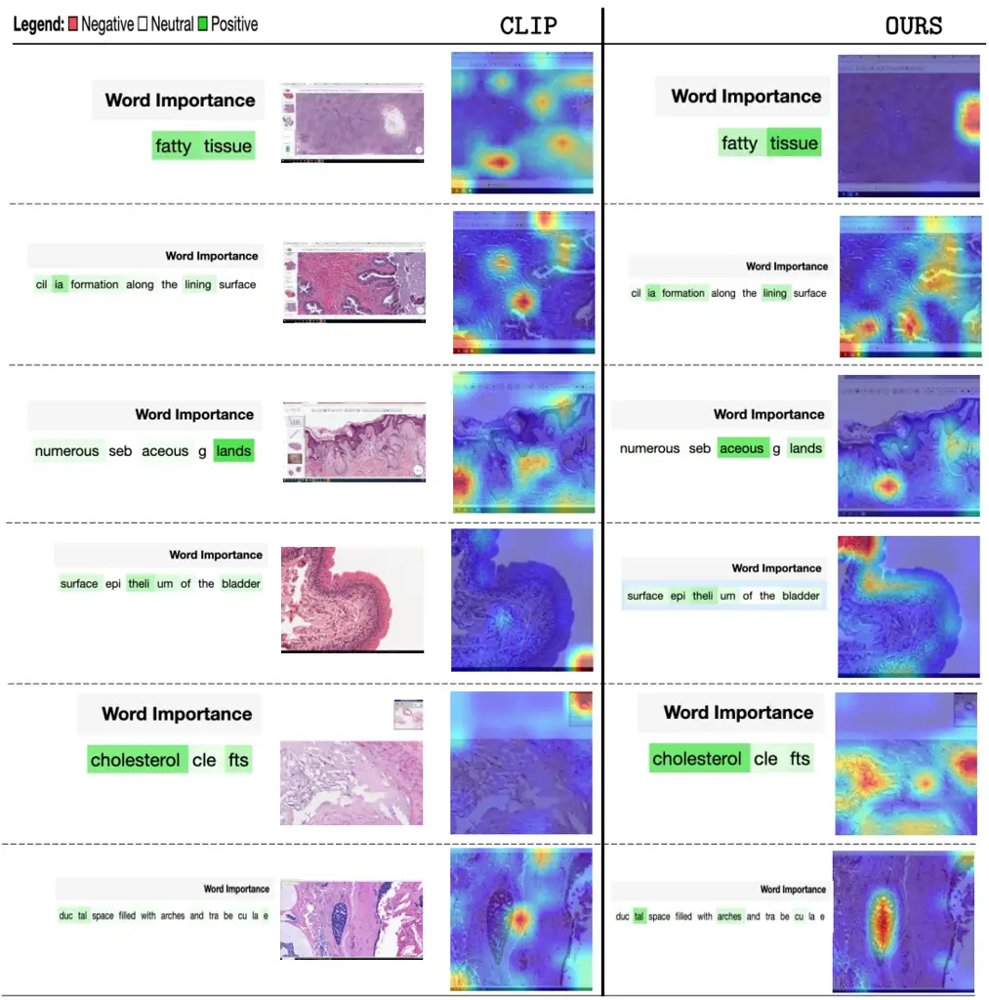

Figure 14: Comparison of the attention maps generated by QuiltNet and
CLIP. The corresponding words are highlighted based on their importance.
Attention masks were generated using GradCAM \[56\].

![[Uncaptioned
image]](arxiv-2306-11207--d63a5ca5c107.figures/figure-15.webp)

Table 11: UMAP visualization of image embeddings generated by QuiltNet
from the different datasets listed in Table 7.

## Appendix E Datasheet for Quilt

In this section, we present a DataSheet \[21\] for Quilt, synthesizing
many of the other analyses we performed in this paper.

1.  1.  Motivation For Datasheet Creation
    - •
      Why was the dataset created? To train histopathology multi-modal
      models, on in-domain data, useful for diagnostically relevant
      downstream tasks.
    - •
      Has the dataset been used already? No.
    - •
      What (other) tasks could the dataset be used for? Could be used as
      training data for representation learning, and also for supervised
      learning on metadata
    - •
      Who funded dataset creation? This work was funded by the Office of
      the Assistant Secretary of Defense328 for Health Affairs through
      the Melanoma Research Program under Awards No. W81XWH-20-1-0797329
      and W81XWH-20-1-0798.

2.  2.  Data composition
    - •
      What are the instances? The instances that we consider in this
      work are histopathology images derived from educational videos,
      paired with aligned text, derived from ASR and denoise using an
      LLM.
    - •
      How many instances are there? We include greater than 1 million
      image-text pairs, from videos and additionally from less noisy
      sources like PubMed articles.
    - •
      What data does each instance consist of? Each instance consists of
      an image, a descriptive text for the image as a whole and for its
      regions of interest, an estimated microscope magnification of the
      image, medical UMLS entities in the text, and the subpathology
      type. Each instance is representative of a video chunk based on
      where histopathology content is stable.
    - •
      Is there a label or target associated with each instance? We use
      the raw ASR and LLM denoised captions as labels in this work as
      well as auxiliary information which includes magnification, UMLS
      entities and pathology type.
    - •
      Is any information missing from individual instances? Yes, for
      instances in the dataset that are not from Quilt (i.e videos),
      e.g. from PubMed Article datapoints, the additional auxiliary
      information is not included.
    - •
      Are relationships between individual instances made explicit? Not
      applicable – we do not study relationships between disparate
      videos (even from the same narrator) nor the relationship between
      chunks in the same video.
    - •
      Does the dataset contain all possible instances or is it a sample?
      Contains all instances our curation pipeline collected, as the
      list of videos is not exhaustive of what is available online,
      there is a high probability more instances can be collected in the
      future.
    - •
      Are there recommended data splits (e.g., training,
      development/validation, testing)? There are no recommended data
      splits, as this data was curated mainly for pretraining rather
      than evaluation.
    - •
      Are there any errors, sources of noise, or redundancies in the
      dataset? If so, please provide a description. Yes. Despite our
      numerous attempts to reduce noise using various models, algorithms
      and human knowledge databases, ASR is often noisy, and there are
      many erros that we cannot fix.
    - •
      Is the dataset self-contained, or does it link to or otherwise
      rely on external resources (e.g., websites, tweets, other
      datasets)? The dataset is self-contained. However, we plan to only
      release the video URLs and some paired non-pixel data points,
      rather than the videos themselves, so as to protect user privacy
      (allowing users to delete videos).

3.  3.  Collection Process
    - •
      What mechanisms or procedures were used to collect the data? We
      leveraged the YouTube API and the youtube-dl library.
    - •
      How was the data associated with each instance acquired? Was the
      data directly observable (e.g., raw text, movie ratings), reported
      by subjects (e.g., survey responses), or indirectly
      inferred/derived from other data? The data was directly observable
      (public) (from YouTube).
    - •
      If the dataset is a sample from a larger set, what was the
      sampling strategy (e.g., deterministic, probabilistic with
      specific sampling probabilities)? We used a probabilistic strategy
      with many algorithms and heuristics, more details are in
      Appendix A.1.
    - •
      Who was involved in the data collection process (e.g., students,
      crowdworkers, contractors) and how were they compensated (e.g.,
      how much were crowdworkers paid)? Data collection was primarily
      done by the first authors of this paper.
    - •
      Over what timeframe was the data collected? Does this timeframe
      match the creation timeframe of the data associated with the
      instances (e.g., recent crawl of old news articles)? If not,
      please describe the timeframe in which the data associated with
      the instances was created. The data was collected from January
      2023 to May 2023, even though the YouTube videos are often much
      older.

4.  4.  Data Preprocessing
    - •
      Was any preprocessing/cleaning/labeling of the data done (e.g.,
      discretization or bucketing, tokenization, part-of-speech tagging,
      SIFT feature extraction, removal of instances, processing of
      missing values)? Yes, we discuss this in Section  3.1 and in
      Appendix A.1: of note, we use a large language model, UMLS
      database and a set of algorithms to ‘denoise’ ASR transcripts, an
      ensemble of histopathology classifiers to inform relevant segments
      of the video, and extract the representative image(s) for each
      video segment.
    - •
      Was the “raw” data saved in addition to the
      preprocessed/cleaned/labeled data (e.g., to support unanticipated
      future uses)? If so, please provide a link or other access point
      to the ‘raw’ data. The raw data was saved, but at this time we do
      not plan to release it directly due to copyright and privacy
      concerns.
    - •
      Is the software used to preprocess/clean/label the instances
      available? If so, please provide a link or other access point. We
      will make our code public to support future research.
    - •
      Does this dataset collection/processing procedure achieve the
      motivation for creating the dataset stated in the first section of
      this datasheet? If not, what are the limitations?

      Yes, the dataset does allow for the study of our goal, as it
      covers various histopathology sub-domains and provides crucial
      data points and metadata for pretraining. Some of its limitations
      we are aware of involve various biases on YouTube, as well as
      various inaccuracies of the models (e.g ASR model) within the
      curation pipeline, which we discuss in Appendix A.1 and  A.3.

5.  5.  Dataset Distribution
    - •
      How will the dataset be distributed? At this time, we plan to
      distribute all the derived data (captions, magnifications etc), as
      well as links to the YouTube videos that we used. We will do this
      on our website under the MIT license.
    - •
      When will the dataset be released/first distributed? What license
      (if any) is it distributed under? We will release it as soon as
      possible, using a permissible license for research-based use.
    - •
      Are there any copyrights on the data? We believe our use is ‘fair
      use,’ however, due to an abundance of caution, we will not be
      releasing any of the videos themselves.
    - •
      Are there any fees or access restrictions? No.

6.  6.  Dataset Maintenance
    - •
      Who is supporting/hosting/maintaining the dataset? The first
      authors of this paper.
    - •
      Will the dataset be updated? If so, how often and by whom? We do
      not plan to update it at this time.
    - •
      Is there a repository to link to any/all papers/systems that use
      this dataset? Not right now, but we encourage anyone who uses the
      dataset to cite our paper so it can be easily found.
    - •
      If others want to extend/augment/build on this dataset, is there a
      mechanism for them to do so? Not at this time.

7.  7.  Legal and Ethical Considerations
    - •
      Were any ethical review processes conducted (e.g., by an
      institutional review board)? No official processes were done, as
      our research is not on human subjects, however, because the
      dataset is in the medical domain we had significant internal
      discussions and deliberations when choosing the scraping strategy.
    - •
      Does the dataset contain data that might be considered
      confidential? No, we only use public videos.
    - •
      Does the dataset contain data that, if viewed directly, might be
      offensive, insulting, threatening, or might otherwise cause
      anxiety? If so, please describe why No – because many of these
      videos are medical and educational in nature, we have not seen any
      instance of offensive or abusive content.
    - •
      Does the dataset relate to people? Yes, it relates sometimes to
      deidentified patients, typically studied by pathologists.
    - •
      Does the dataset identify any subpopulations (e.g., by age,
      gender)? Not explicitly (e.g. through labels)
    - •
      Is it possible to identify individuals (i.e., one or more natural
      persons), either directly or indirectly (i.e., in combination with
      other data) from the dataset? Yes, some of our data includes
      content from known pathologists, albeit niche, they sometimes
      include their faces in the corner of the video. All of the videos
      that we use are of publicly available data, following the Terms of
      Service that users agreed to when uploading to YouTube.
