# Meta-Gating Framework for Fast and Continuous Resource Optimization in Dynamic Wireless Environments

Qiushuo Hou    Mengyuan Lee    Guanding Yu    Yunlong Cai
^(†)^(†)thanks: Q. Hou, M. Lee, G. Yu, and Y. Cai are with the College
of Information Science and Electronic Engineering, Zhejiang University,
Hangzhou 310027, China. e-mail: {qshou, mengyuan_lee, yuguanding,
ylcai}@zju.edu.cn.

###### Abstract

With the great success of deep learning (DL) in image classification,
speech recognition, and other fields, more and more studies have applied
various neural networks (NNs) to wireless resource allocation. Generally
speaking, these artificial intelligent (AI) models are trained under
some special learning hypotheses, especially that the statistics of the
training data are static during the training stage. However, the
distribution of channel state information (CSI) is constantly changing
in the real-world wireless communication environment. Therefore, it is
essential to study effective dynamic DL technologies to solve wireless
resource allocation problems. In this paper, we propose a novel
framework, named meta-gating, for solving resource allocation problems
in an episodically dynamic wireless environment, where the CSI
distribution changes over periods and remains constant within each
period. The proposed framework, consisting of an inner network and an
outer network, aims to adapt to the dynamic wireless environment by
achieving three important goals, i.e., seamlessness, quickness and
continuity. Specifically, for the former two goals, we propose a
training method by combining a model-agnostic meta-learning (MAML)
algorithm with an unsupervised learning mechanism. With this training
method, the inner network is able to fast adapt to different channel
distributions because of the good initialization. As for the goal of
‘continuity’, the outer network can learn to evaluate the importance of
inner network’s parameters under different CSI distributions, and then
decide which subset of the inner network should be activated through the
gating operation. Additionally, we theoretically analyze the performance
of the proposed meta-gating framework. Simulation results demonstrate
that the proposed meta-gating framework can well achieve the three
important goals compared with existing state-of-the-art algorithms.

###### Index Terms: 

Dynamic wireless environment, meta-learning, continual learning,
resource allocation, neural network.

## I Introduction

Resource allocation plays an essential role in wireless communications.
However, most of them are formulated as NP-hard non-convex problems,
which are computationally challenging to solve. With the great success
of deep learning (DL) in image classification, speech recognition, and
other fields, various neural networks (NNs) are recently applied to
solve resource allocation problems in wireless networks\[1, 2, 3, 4\].
In \[1\] and \[2\], the deep neural networks (DNNs) trained by the
unsupervised learning method were employed to solve the power control
problem for sum-rate maximization. The authors in \[3\] have designed a
convolutional neural network (CNN) to optimize the transmit power in
device-to-device (D2D) networks. Recently, graph neural networks (GNNs)
have been widely applied to solve resource allocation problems because
of their good representation ability for wireless networks\[5, 6, 7,
8\]. In \[5\], a GNN trained by the unsupervised learning method was
applied to address the link scheduling in D2D networks. The authors in
\[6\] have developed a GNN to solve the beamformer design problem in the
multi-antenna systems. In \[7, 8\], GNNs were designed to optimally
allocate resources across a set of transceiver pairs in a wireless
network. However, all aforementioned NNs are trained under some special
hypotheses, in particular that the statistics of the training data are
static. Unfortunately, the real-world wireless environment is dynamic
and constantly changing, such as the distribution of channel state
information (CSI) may change over periods. It is known that the NN-based
methods in existing works usually suffer from severe performance
degradation when the environment changes, i.e., when the real-time data
follows a different distribution from that used in the training
phase\[12\]. Besides, if one chooses to retrain the entire NN once the
environment changes, the re-training process would incur overwhelming
overhead especially for highly dynamic wireless networks.\[9\]. Thus, it
is worth studying how to effectively optimize the resources in such a
dynamic wireless environment.

Recently, transfer learning (TL)\[15\] has been widely employed to
handle dynamic data in wireless resource allocation problems such as
power control\[10\] and beamformer design\[11\]. However, once an NN
model has adapted to the new environment by using TL, it would degrade
or even overwrite the previously learned model, and thus the performance
in the previous environment degrades significantly\[16, 17\], which is
termed as the catastrophic forgetting (CF) phenomenon. Besides, the
performance of TL largely depends on the selection of the pre-trained
model. Motivated by these challenges, we summarize the difficulties of
dealing with the resource allocation problems in a dynamic wireless
environment as: How to achieve good performances under different CSI
distributions without CF.

To achieve good performance under different CSI distributions,
meta-learning\[13, 14\] is a potential technique, where a good model
initialization learned from a large amount of data with different
distributions can help achieve good performance and fast adapt to new
samples. The efficiency of meta-learning techniques in processing the
new samples has been extensively studied in resource allocation
problems\[11, 18, 19\]. In \[11\], a downlink beamformer design based on
meta-learning has been proposed to enable fast adaptation to a new
testing wireless environment. In \[18\], the authors aimed to fast adapt
to new network topology with limited data for the power control problem.
Specifically, the ordinary black-box meta-learning technique has been
improved by using the modular meta-learning, which can optimize a series
of modules and quickly re-combine them when solving a new task. The
authors in \[19\] summarized the applications of meta-learning-based
methods in wireless networks. However, the aforementioned works mainly
focus on the improvement of fast adaption of meta-learning but the CF
challenge is not considered.

As for the CF phenomenon, it can be potentially solved by the continual
learning (CL)\[26, 27\], which aims to incrementally learn new knowledge
without forgetting previously learned knowledge. There have been a great
number of works studying the CL and they can be roughly classified into
three categories, i.e., regularization based methods\[9, 28\], dynamic
NN architecture based methods\[21, 22\], and memory box based
methods\[24, 25\]. Among the aforementioned three categories, the first
one is the most popular since the latter two would increase the training
overhead due to the increase in the number of neurons or the size of the
memory box. Specifically, the regularization based methods mainly study
how to evaluate the importance of parameters and select less-important
parameters to be modified in response to new data. This parameter
evaluation and selection process is termed as selective plasticity in
corresponding work. However, the design of selective plasticity in the
aforementioned regularization based methods highly depend on the manual
hyperparameter adjustment, which is impractical in practical
applications. Therefore, it is necessary to apply the learning ability
of NNs to achieve the goal of ‘learning to continually learn’. Inspired
by the neuromodulatory processes of CL in human brain, there have been
several papers on enabling the selective plasticity of NNs by using
neuromodulation-based techniques \[35, 36\], making the aforementioned
goal possible.

In this paper, we take the classic sum-rate maximization (SRM) problem
in the $`K`$-user interference network as example to study the dynamic
DL technology. Specifically, we consider an episodically dynamic
wireless environment, where the CSI distribution changes over periods
and remains stationary within each period. Then, we develop a novel
framework named meta-gating to overcome the aforementioned difficulties
by achieving the following three important goals, where the former two
are proposed for fulfilling good performance under different CSI
distributions and the third goal is for overcoming the CF problem.

- •
  Seamlessness: The proposed method can achieve good sum-rate
  performance over all periods, which means that the sum-rate variance
  should be small enough so that it is unaware of changes in the CSI
  distribution.
- •
  Quickness: The proposed method should well adapt to the new wireless
  environment with few training samples.
- •
  Continuity: The proposed method can achieve good sum-rate performance
  in a new wireless environment without forgetting what has learned in
  previous environments/periods. Besides, it should not depend on the
  manual hyperparameter adjustment.

The proposed meta-gating framework consists of an inner network and an
outer network. Specifically, for the former two goals, we propose a
dual-loop training method by combining the model-agnostic meta-learning
(MAML) algorithm with the unsupervised training. With such a design, the
inner network is able to achieve good sum-rate performance on different
channel distributions through a few number of stochastic gradient
descent (SGD) iterations because of the suitable initialization. As for
the goal of ‘continuity’, we adopt the regularization method and design
an element-wise gating operation to multiply the outputs of the inner
and outer networks, aiming to evaluate the importance of inner network’s
parameters under different CSI distributions and then decide which
subset of the inner network should be activated. Thus, it results in
selective plasticity of the inner network by affecting its back
propagation, where the selective plasticity is the core of
regularization based methods in CL.

In summary, the main contributions of this work are highlighted as
follows.

- •
  We propose a general framework to enable NNs to solve the resource
  allocation problems in a dynamic wireless environment, including the
  network architecture and the training method. The proposed framework
  can achieve three important goals, i.e., seamlessness, quickness, and
  continuity, to satisfy the requirements of a dynamic wireless
  environment via meta-learning and continual learning.
- •
  The proposed framework is model-agnostic, i.e, the inner and outer
  networks can be implemented as any NN models. Specifically, except
  that the number of outputs of the inner and outer networks need to be
  the same, the inner and outer networks have no other constraints,
  e.g., the kind of NNs, the number of neurons in the hidden layer, and
  the number of hidden layers.
- •
  We provide rigorous analysis for the proposed framework in terms of
  the testing performance and generalization ability. Furthermore, in
  order to mathematically explain the CF problem, we propose a metric
  named channel distribution similarity (CDS) to measure the
  similarities between channels under different distributions.

The rest of the paper is organized as follows. The problem formulation
and the meta-gating framework are given in Section II-A. Section II-B
introduces the comprehensive process of meta-gating framework for
resource allocation problem. The theoretical analysis is introduced in
Section IV. Section V presents the simulation results and performance
analysis. Finally, this paper is concluded in Section VI.

## II Problem Formulation and the Meta-Gating Framework

### II-A Problem Formulation

We consider an episodically dynamic wireless environment, where the CSI
distribution changes over periods and remains constant within each
period. Scenarios with the considered dynamic environment can be widely
found in practice. For example, when a user drives from indoor to
outdoor or moves from a highly dense place to an open place within a
period of time, the CSI distribution will change accordingly (e.g., from
Rayleigh fading with NLoS to Rician fading with LoS). Mathematically, we
formulate the resource allocation problem in such a dynamic environment
as follows

```math
\displaystyle\mathcal{P}_{1}:\quad\quad \displaystyle\max_{\mathbf{p}(\mathbf{h})}\quad\mathbb{E}_{\mathbf{h}\sim M(\mathbf{h})}[Z(\mathbf{p}(\mathbf{h}),\mathbf{h})], \tag{1a}
```

```math
\displaystyle\mathbf{J}(\mathbf{p}(\mathbf{h}))\leq 0, \tag{1b}
```

where random variable $`\mathbf{h}`$ represents the instantaneous CSI
(i.e., inputs of the NN-based models), $`\mathbf{p}(\mathbf{h})`$
denotes its corresponding instantaneous resource allocation strategy
(i.e., outputs of the NN-based models), function $`Z`$ evaluates the
instantaneous performance of strategy $`\mathbf{p}(\mathbf{h})`$, and
$`\mathbf{J}`$ is a vector utility function to constrain the strategy
$`\mathbf{p}(\mathbf{h})`$. Let
$`M(\mathbf{h})=\{m_{1}(\mathbf{h}),\cdots,m_{t}(\mathbf{h}),\cdots,m_{T}(\mathbf{h})\}`$
represent the channel distributions in all periods, where
$`m_{t}(\mathbf{h})`$ denotes the specific channel distribution in
period $`t`$.

Problem $`\mathcal{P}_{1}`$ aims to maximize the expectation of the
evaluation function $`Z(\cdot)`$ to achieve good performance in an
episodically dynamic wireless environment, i.e. find a strategy
$`\mathbf{p}(\mathbf{h})`$ to maximize function $`Z(\cdot)`$ under
constraints $`\mathbf{J}`$ in each period.

### II-B Overview of the Proposed Meta-Gating Framework

In this subsection, we present the overall architecture of the proposed
meta-gating framework and its training method for solving Problem
$`\mathcal{P}_{1}`$.

#### II-B1 Architecture of the Meta-Gating Framework

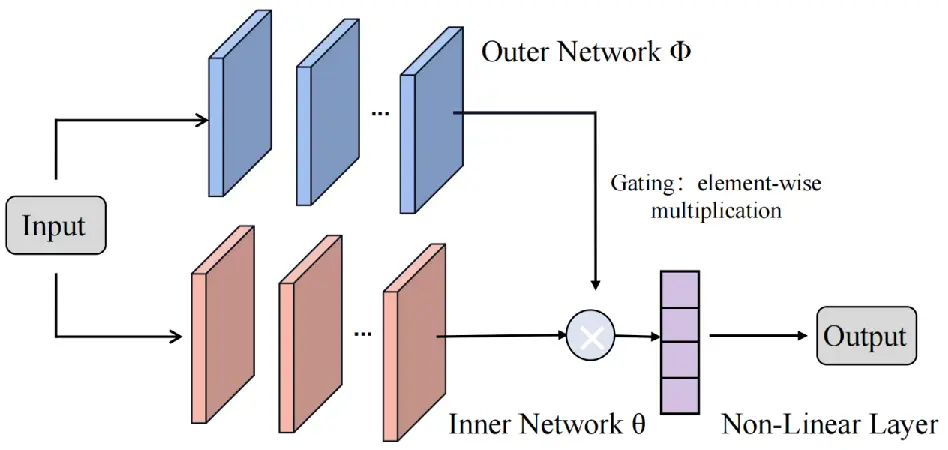

Fig. 1: Architecture of meta-gating framework.

As mentioned in Section I, we attempt to utilize the learning ability of
NNs to achieve the selective plasticity. Therefore, a dual-network
structure is proposed, where the outer network extracts the
characteristics of each CSI distribution. It aims to ensure the
performance of the inner network under the previous CSI distribution
when the inner network adapts to samples from a new CSI distribution.
Specifically, as shown in Fig. 1, the proposed meta-gating network
consists of an inner network, an outer network, and a non-linear layer,
where both inner and outer networks are implemented as general NNs.
Except that the number of outputs of the inner and outer networks need
to be the same, there are no other constraints, e.g., the kind of NNs,
the number of neurons in the hidden layer and the number of hidden
layers. The inner and outer networks are connected through the gating
operation, which refers to as element-wise multiplication of the output
vectors of the inner and outer networks. After the multiplication, the
results are input to the non-linear layer to obtain the final outputs.

#### II-B2 Training Procedure

In this part, to achieve aforementioned three important goals, we design
a training procedure for the proposed meta-gating framework, which is
based on the model-agnostic meta-learning (MAML) algorithm\[23\] and the
unsupervised learning.

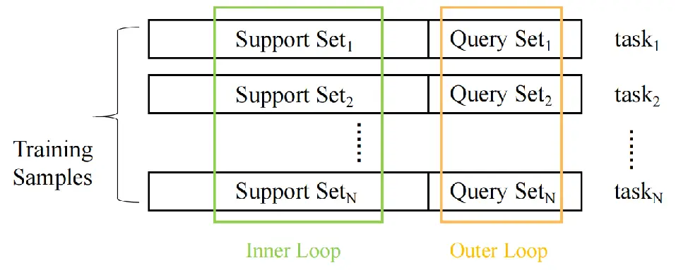

Fig. 2: Dataset construction for the proposed framework.

Different from the general DL where the wireless networks with different
channel states can be directly used as different training samples, the
training sample in the proposed training method refers to as a task.
Specifically, one task consists of a support set and a query set as
shown in Fig. 2, both containing the samples in general DL. The samples
in each support set and query set are randomly selected from the
different channel distributions.

The proposed training procedure consists of an inner loop and an outer
loop, where the inner loop is employed to update the inner network
parameters $`\bm{\theta}`$ on the support set and the outer loop is for
updating the outer network parameters $`\bm{\phi}`$ on the query set.
Specifically, the parameters of the inner network are optimized by Adam
optimizer\[29\] for $`J`$ iterations on the support set with the loss
function $`\mathcal{L}(\bm{\theta},\bm{\phi})`$. During each of these
$`J`$ forward propagation, the outputs of the inner network are gated,
i.e. element-wisely multiplied, by the outputs of the outer network,
which enables selective activation of the inner network by modifying its
ultimate outputs during the forward propagation. Moreover, the gating to
the inner network influences the update of the Adam optimizer and would
result in selective plasticity during back propagation. After $`J`$
inner loop iterations, the parameters of the inner networks on task
$`i`$ are denoted by $`{\bm{\theta}}_{J}^{i}`$, which will be used in
the subsequent outer loop. As for the outer loop, the parameters of the
outer network $`\bm{\phi}`$ are updated with the query sets and a meta
loss $`\mathcal{L}_{meta}`$, which is calculated based on
$`{\bm{\theta}}_{J}^{i}`$ and $`\bm{\phi}`$. The detailed training
procedure of the proposed meta-gating framework is summarized in
Algorithm 1.

1: Input: training samples with size $`N_{m}`$, denoted as
$`\mathcal{T}=\{[S_{1},Q_{1}],[S_{2},Q_{2}],\ldots,[S_{N_{m}},Q_{N_{m}}]\}`$,
outer network learning rate $`\alpha`$, inner network learning rate
$`\beta`$, batch size of training samples $`B`$.

2: Initialization: parameters of the outer network $`\bm{\phi}`$,
parameters of the inner network $`\bm{\theta}`$.

3: for epoch=$`1,2,\ldots`$ do  // Outer loop starts

4:   Sample $`B`$ tasks from $`\mathcal{T}`$, let
$`\mathcal{L}_{\rm{meta}}=0`$.

5:   for $`i=1,2,\ldots,B`$ do

6:    for $`j=1,2,\ldots,J`$ do  // Inner loop starts

7:
      $`\bm{\theta}^{i}_{j}\longleftarrow\bm{\theta}^{i}_{j-1}-\beta\triangledown_{\bm{\theta}^{i}_{j-1}}\mathcal{L}(\bm{\phi},\bm{\theta}^{i}_{j-1};S_{i})`$;

8:    end for // Inner loop ends

9:
   $`\mathcal{L}_{\rm{meta}}=\mathcal{L}_{\rm{meta}}+\mathcal{L}(\bm{\phi},\bm{\theta}^{i}_{J};Q_{i})`$;

10:   end for

11:
  $`\bm{\phi}\longleftarrow\bm{\phi}-\frac{\alpha}{B}\triangledown_{\bm{\phi}}\mathcal{L}_{\rm{meta}}`$;

12: end for // Outer loop ends

Algorithm 1 Training Procedure of Meta-Gating Framework

Following the aforementioned training procedure, the framework can well
achieve aforementioned three goals and the reasons are as follows.
First, the proposed framework can achieve the fast adaptation with small
amount of samples because of the suitable initialization obtained by the
MAML method. Thus, the proposed training method can well achieve the
goal of ‘seamlessness’ and ‘quickness’. Secondly, the selective
plasticity is achieved by the gating operation. Specifically, the
importance of model parameters in response to different CSI
distributions is different. The outer network is trained by the outer
loop of Algorithm 1 with tasks from multiple CSI distributions.
Therefore, the outer network can learn to evaluate the importance of
inner network’s parameters under different CSI distributions, and then
decide which subset of the inner network should be activated. By the
gating operation, the meta-learned outer network can convey the decision
to the inner network and thus indirectly influence the back propagation
of the inner network. In this way, the inner network can perform well
under both the previous and current CSI distribution, so as to overcome
the CF problem.¹¹ 1 Similarly, the graceful forgetting ability can be
achieved by adjusting the learning abilities of inner network and outer
networks, e.g, increasing the number of layers of the inner network
within a certain range or adding a mask to the gating operation between
the inner and outer network. The testing procedure of the proposed
framework is summarized in Algorithm 2.

1: Input: sequential testing samples with size $`N_{m}^{te}`$, denoted
as
$`\mathcal{T}^{te}=\{[S^{te}_{1},Q^{te}_{1}],[S^{te}_{2},Q^{te}_{2}],\ldots,[S^{te}_{N_{m}^{te}},Q^{te}_{N_{m}^{te}}]\}`$,
number of adaptation samples in $`S^{te}_{i}`$, denoted as $`N_{a}`$,
inner-update learning rate $`\beta`$, meta-learned parameters of the
outer network, $`{\bm{\phi}}^{*}`$, and the inner network,
$`{\bm{\theta}}^{*}`$.

2: Set $`T_{train}=[\ ]`$;

3: for $`i=1,2,\ldots,N_{m}^{te}`$ do

4:   $`T_{train}=T_{train}+\mathcal{T}^{te}_{i}`$;

5:   Randomly select $`N_{a}`$ samples from $`S_{i}^{te}`$ to form new
$`S_{i}^{te}`$ for the following $`J_{q}`$ iterations;

6:   for $`j=1,2,\ldots,J_{q}`$ do

7:
   $`\bm{\theta}_{j}\longleftarrow\bm{\theta}_{j-1}-\beta\triangledown_{\bm{\theta}_{j-1}}\mathcal{L}({\bm{\phi}}^{*},\bm{\theta}_{j-1};S_{i}^{te})`$;

8:   end for

9:   Record
$`\mathcal{L}({\bm{\phi}}^{*},\bm{\theta}_{J_{q}};T_{train})`$;

10: end for

Algorithm 2 Testing Procedure of Meta-Gating Framework

## III Meta-Gating Framework for Resource Allocation Problem

In this section, we take the SRM problem in a $`K`$-user interference
network as an example to concretize $`Z(\cdot)`$, $`\mathbf{J}(\cdot)`$,
and $`\mathbf{p}(\mathbf{h})`$ in Problem $`\mathcal{P}_{1}`$. Then, for
the aforementioned example, two widely-used network models: GNN and CNN
are adopted with the proposed meta-gating framework to further
demonstrate its model-agnostic property.

### III-A System Model of K-User Interference Network

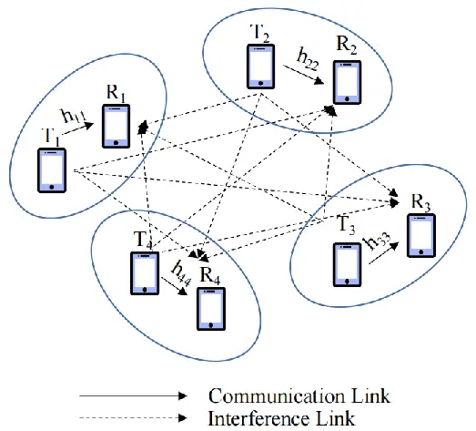

Fig. 3: System model of the $`K`$-user interference network.

As depicted in Fig. 3, there are $`K`$ transceiver pairs where each
transmitter and receiver are equipped with $`N_{t}`$ and one antennas,
respectively. It is assumed that transmissions on the $`K`$ transceiver
pairs occur simultaneously using the same frequency band. Let
$`\mathbf{v}_{k}`$ denote the beamformer of the $`k`$-th transmitter and
$`s_{k}`$ denote the transmit signal. The received signal at receiver
$`k`$ is
$`\mathbf{y}_{k}=\mathbf{h}^{H}_{kk}\mathbf{v}_{k}s_{k}+\sum^{K}_{j\neq k}\mathbf{h}^{H}_{jk}\mathbf{v}_{j}s_{j}+n_{k}`$,
where $`\mathbf{h}_{kk}\in\mathbb{C}^{N_{t}}`$ denotes the direct
channel vector between the $`k`$-th transceiver pair,
$`\mathbf{h}_{jk}\in\mathbb{C}^{N_{t}}`$ denotes the interference
channel vector from transmitter $`j`$ to receiver $`k`$, and
$`n_{k}\in\mathbb{C}`$ denotes the additive noise following the complex
Gaussian distribution $`\mathcal{CN}(0,\sigma^{2})`$.  
Then, the signal-to-interference-plus-noise ratio (SINR) of receiver
$`k`$ is expressed as

```math
\gamma_{k}=\frac{|\mathbf{h}^{H}_{kk}\mathbf{v}_{k}|^{2}}{\sum^{K}_{j\neq k}|\mathbf{h}^{H}_{jk}\mathbf{v}_{j}|^{2}+\sigma^{2}}. \tag{2}
```

The optimization goal is to find the optimal beamformer matrix
$`\mathbf{V}=[\mathbf{v}_{1},\cdots,\mathbf{v}_{K}]^{T}\in\mathbb{C}^{K\times N_{t}}`$
to maximize the sum rate, i,e.,
$`Z(\cdot)=\sum_{k=1}^{K}{\rm{log}}_{2}(1+\gamma_{k})`$.

Finally, Problem $`\mathcal{P}_{1}`$ in this example can be concretized
as

```math
\displaystyle\mathcal{P}_{2}:\quad\quad \displaystyle\max_{\mathbf{V}}\quad\mathbb{E}_{\mathbf{h}\sim M(\mathbf{h})}w_{k}\sum_{k=1}^{K}{\rm{log}}_{2}(1+\gamma_{k}), \tag{3a}
```

```math
\displaystyle{\|\mathbf{v}_{k}\|}_{2}^{2}\leq P_{{\rm{max}}},\forall k, \tag{3b}
```

where $`w_{k}`$ denotes the weight for the $`k`$-th transceiver pair and
$`P_{\rm{max}}`$ represents the maximum transmit power of each
transmitter.

### III-B Meta-Gating GNN for Problem $`\mathcal{P}_{2}`$

#### III-B1 Scenario Modeling

In this part, we first model the wireless environment as a graph, and
then formulate Problem $`\mathcal{P}_{2}`$ as a graph optimization
problem.

In general, the wireless environment can be modeled as a weighted
directed graph with both node and edge features. Formally, a graph can
be represented as a four tuple
$`\mathcal{G}=(\mathcal{V},\mathcal{E},f,\bm{\alpha})`$, where
$`\mathcal{V}`$ is the set of nodes and $`\mathcal{E}`$ is the set of
edges. For each node in $`\mathcal{V}`$, function $`f`$ maps it to its
corresponding feature vector. For each edge in $`\mathcal{E}`$, it has a
corresponding weight $`\alpha(i,j)\in\bm{\alpha}`$.

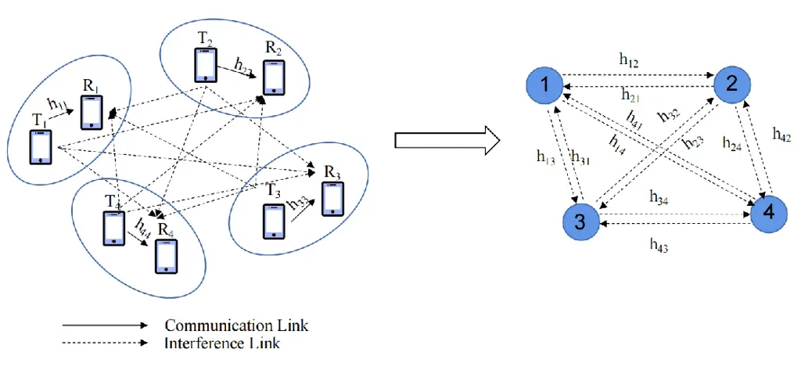

(a) Graph modeling for the considered problem.

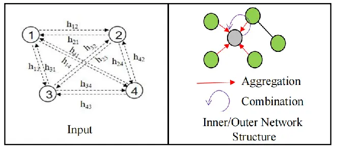

(b) Important parts of the meta-gating GNN.

Fig. 4: An illustration of meta-gating GNN for Problem
$`\mathcal{P}_{2}`$.

Following the modeling in \[6\], our considered system in Fig. 3 can be
modeled as a graph model in Fig. 4(a), where the $`k`$-th transceiver
pair is treated as the $`k`$-th node in the graph. Moreover, the node
feature matrix
$`\mathbf{Z}\in\mathbb{C}^{|\mathcal{V}|\times(N_{t}+2)}`$ is given by
$`\mathbf{Z}_{(k,:)}=[\mathbf{h}_{kk},w_{k},\sigma^{2}]^{T}`$, and the
weight matrix $`\bm{\alpha}`$ is given by

```math
\bm{\alpha}_{(j,k)}=\left\{\begin{aligned} &\mathbf{0},\quad(j,k)\notin\mathcal{E},\\
&\mathbf{h}_{jk},{\rm{otherwise}},\\
\end{aligned}\right. \tag{4}
```

where vector $`\mathbf{0}`$ is a zero vector with a size of $`N_{t}`$.

Then the SINR in (2) can be rewritten with the notations $`\mathbf{Z}`$,
$`\bm{\alpha}`$, and $`\mathbf{V}`$ as follows

```math
\gamma_{k}=\frac{|\mathbf{Z}^{H}_{(k,1:N_{t})}\mathbf{v}_{k}|^{2}}{\sum_{j\neq k}^{K}|\bm{\alpha}_{(j,k)}\mathbf{v}_{j}|^{2}+\mathbf{Z}_{(k,N_{t}+2)}}. \tag{5}
```

Finally, Problem $`\mathcal{P}_{2}`$ in each period can be reformulated
as

```math
\displaystyle\max_{\mathbf{V}}\quad\sum_{k=1}^{K}\mathbf{Z}_{(k,N_{t}+1)}{\rm{log}}_{2}(1+\gamma_{k}), \tag{6a}
```

```math
\displaystyle{\|\mathbf{v}_{k}\|}_{2}^{2}\leq P_{{\rm{max}}},\forall k. \tag{6b}
```

#### III-B2 Forward Propagation

As depicted in Fig. 4(b), the input data of meta-gating GNN is the graph
model in Fig. 4(a) and the final outputs are the optimal beamformer
matrix $`\mathbf{V}`$ in each period. Both inner and outer networks are
implemented as wireless communication graph convolution network (WCGCN)
\[6\], which belongs to the message passing graph neural network
(MPGNN). Before introducing the WCGCN model, we first describe the
mechanism of MPGNN. Specifically, the update process (key operation of
GNNs) of the $`n`$-th layer at node $`k`$ in an MPGNN is describe as

```math
\bm{x}_{k}^{n}=\gamma^{n}(\bm{x}_{k}^{n-1},\beta^{n}_{j\in\mathcal{N}(k)}([\bm{x}_{k}^{n-1},\bm{e}_{jk}])), \tag{7}
```

where $`\bm{x}_{k}^{n}`$ represents the hidden state of the $`n`$-th
layer at node $`k`$, $`\bm{x}_{k}^{0}`$ is the input node feature vector
of node $`k`$, $`\mathcal{N}(k)`$ denotes the neighbors of node $`k`$,
and $`\bm{e}_{jk}`$ is the input edge feature vector of edge $`(j,k)`$.
Moreover, $`\beta(\cdot)`$ is the function that aggregates information
from the neighbors of node $`k`$ and $`\gamma(\cdot)`$ is the function
that combines the aggregated information with its own information, which
can be seen in Fig. 4(b). Furthermore, $`\beta(\cdot)`$ can be further
simplified by applying NNs as follows

```math
\beta(\bm{x})=\psi(f(\bm{x})), \tag{8}
```

where $`\psi`$ is implemented by some simple functions, such as
$`{\rm{MAX}}`$ and $`{\rm{SUM}}`$, and $`f`$ is the existing NN
structure.

In the WCGCN model, $`{\rm{MAX}}`$ is utilized as function $`\psi`$, and
two different multi-layer perceptrons (MLPs) are applied to function
$`\gamma(\cdot)`$ and $`f(\cdot)`$, respectively. Thus, its update
process of node $`k`$ can be expressed as
$`\bm{x}_{k}^{n}={\rm{MLP}}_{2}(\bm{x}_{k}^{n-1},{\rm{MAX}}_{j\in\mathcal{N}(k)}\left\{{\rm{MLP}}_{1}([\bm{x}_{j}^{n-1},\bm{e}_{jk}])\right\})`$.
Then, the forward propagation of node $`k`$ in the proposed meta-gating
GNN can be expressed as

```math
\displaystyle\mathbf{x}^{n}_{k} \displaystyle={\rm{MLP_{2}}}\left(\mathbf{x}_{k}^{n-1},{\rm{MAX}}_{j\in\mathcal{N}(k)}\left\{{\rm{MLP_{1}}}\left([\mathbf{x}_{j}^{n-1},\bm{\alpha}_{(j,k)}]\right)\right\}\right), \tag{9}
```

```math
\displaystyle\hat{\mathbf{x}}^{n}_{k} \displaystyle={\rm{MLP_{4}}}\left(\hat{\mathbf{x}}_{k}^{n-1},{\rm{MAX}}_{j\in\mathcal{N}(k)}\left\{{\rm{MLP_{3}}}\left([\hat{\mathbf{x}}_{j}^{n-1},\bm{\alpha}_{(j,k)}]\right)\right\}\right), \tag{10}
```

```math
\displaystyle\mathbf{y}_{k} \displaystyle=\sigma\left(\mathbf{x}^{N}_{k}\odot\hat{\mathbf{x}}^{M}_{k}\right), \tag{11}
```

where $`\bm{x}_{k}^{0}=\hat{\bm{x}}_{k}^{0}=\bm{Z}_{(k,:)}`$ is the
input node feature, $`\bm{\alpha}_{(j,k)}`$ is the weight matrix that
represents the input edge feature, $`N`$ and $`M`$ denote the number of
layers in the inner and outer networks, respectively, $`\sigma(\cdot)`$
is a differentiable normalization function in the non-linear layer, and
$`\odot`$ denotes the element-wise multiplication operation.

#### III-B3 Back Propagation

Due to the lack of an optimal solution to Problem $`\mathcal{P}_{2}`$,
unsupervised training that directly maximizes the sum rate is applied
for solving the considered problem. The loss function to be minimized
can be written as

```math
\mathcal{L}(\bm{\theta},\bm{\phi})=-\sum_{k=1}^{K}\mathbf{Z}_{(k,N_{t}+1)}{\rm{log}}_{2}\left(1+\frac{|\mathbf{Z}^{H}_{(k,1:N_{t})}\mathbf{v}_{k}(\bm{\theta},\bm{\phi})|^{2}}{\sum_{j\neq k}^{K}|\bm{\alpha}_{(j,k)}\mathbf{v}_{j}(\bm{\theta},\bm{\phi})|^{2}+\mathbf{Z}_{(k,N_{t}+2)}}\right). \tag{12}
```

#### III-B4 Complexity Analysis

For the meta-gating GNN, the inner and outer networks are implemented by
WCGCNs. The complexity of WCGCN is $`\mathcal{O}(L(|E|+|V|))`$, where
$`L`$ is the number of layers of WCGCN, $`|E|`$ denotes the size of edge
set, and $`|V|`$ denotes the size of node set. Therefore, the complexity
of the proposed framework is
$`\mathcal{O}({\rm{MAX}}\{N,M\}(|\mathcal{E}|+|\mathcal{V}|))`$.

### III-C Meta-Gating CNN for Problem $`\mathcal{P}_{2}`$

#### III-C1 Scenario Modeling

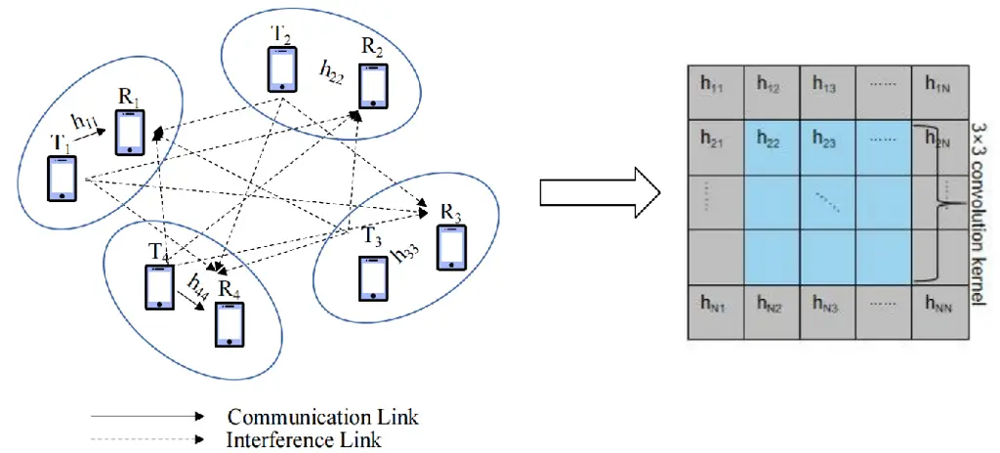

(a) Picture-like pixel modeling for the considered problem.

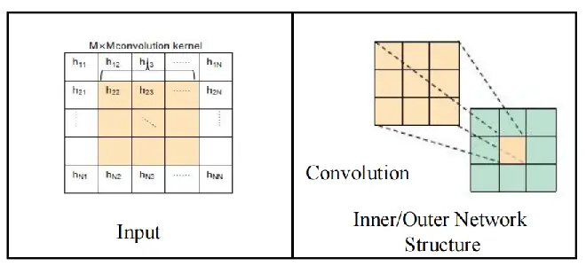

(b) Important parts of the meta-gating CNN.

Fig. 5: An illustration of meta-gating CNN for Problem
$`\mathcal{P}_{2}`$.

CNN has been widely used in DL, e.g., it can extract spatial features
from an image for classification. In a wireless environment, CNN is
generally utilized to exploit the spatial features in channel state. It
is because that the nearby receiver plays more significant role in
determining the beamformer of the $`k`$-th transmitter. Besides, CNN has
fewer number of trainable parameters compared to DNN and can greatly
reduce the training overhead. Based on this, we model
$`\mathbf{H}=\{\mathbf{h}_{j,k},\forall j,k\}`$ in Problem
$`\mathcal{P}_{2}`$ as a picture-like pixel structure, as shown in Fig.
5(a).

#### III-C2 Forward Propagation

As depicted in Fig. 5(b), the input data of meta-gating CNN is the
picture-like pixel structure and the final outputs are the the optimal
beamformer matrix $`\mathbf{V}`$ in each period. Both inner and outer
networks are implemented as general CNNs\[31\]. The forward propagation
in the proposed framework can be expressed as

```math
\displaystyle\mathbf{x}^{n} \displaystyle={\rm{ReLU}}\left({\rm{Conv}}(\mathbf{x}^{n-1};c_{\rm{in}},c_{\rm{out}},s)\right),
```

```math
\displaystyle\mathbf{u}^{N} \displaystyle={\rm{FC}}\left({\rm{MP}}(\mathbf{x}^{N}\right),\quad 1\leq n\leq N, \tag{13}
```

```math
\displaystyle\hat{\mathbf{x}}^{m} \displaystyle={\rm{ReLU}}\left({\rm{Conv}}(\hat{\mathbf{x}}^{m-1};\hat{c}_{\rm{in}},\hat{c}_{\rm{out}},\hat{s})\right),
```

```math
\displaystyle\hat{\mathbf{u}}^{M} \displaystyle={\rm{FC}}\left({\rm{MP}}(\hat{\mathbf{x}}^{M}\right),\quad 1\leq m\leq M, \tag{14}
```

```math
\displaystyle\mathbf{y} \displaystyle=\sigma\left(\mathbf{u}^{N}\hat{\mathbf{u}}^{M}\right), \tag{15}
```

where $`\mathbf{x}^{0}=\hat{\mathbf{x}}^{0}=\mathbf{H}`$,
$`\mathbf{x}^{n}`$ and $`\hat{\mathbf{x}}^{m}`$ denote the $`n`$-th and
$`m`$-th hidden state of the inner network and the outer network,
respectively. $`\mathbf{u}^{N}`$ and $`\mathbf{u}^{M}`$ represent the
outputs of the inner and outer networks, respectively. $`{\rm{ReLU}}`$
represents the rectified linear unit layer to prevent the negative
values, $`{\rm{FC}}`$ represents the fully-connected layer, and
$`{\rm{MP}}`$ denotes the max-pooling operation. $`\sigma(\cdot)`$ is a
differentiable normalization function, and $`\mathbf{y}`$ denotes the
final outputs. $`N`$ and $`M`$ represent the layer number of the inner
and outer networks, respectively, and $`{\rm{Conv}}`$ represents the
convolution layer that performs two-dimensional spatial convolution of
the input data. The size of the convolution layer is denoted as
$`s(\hat{s})`$ and its depth is set to
$`c_{\rm{in}},c_{\rm{out}}(\hat{c}_{\rm{in}},\hat{c}_{\rm{out}})`$.

#### III-C3 Back Propagation

Similarly, we employ the unsupervised training for the considered
problem and the loss function to be minimized can be written as

```math
\resizebox{20348790}{}{$\mathcal{L}(\bm{\theta},\bm{\phi})=-\sum_{k=1}^{K}w_{k}{\rm{log}}_{2}\left(1+\frac{|\mathbf{h}^{H}_{kk}\mathbf{v}_{k}(\bm{\theta},\bm{\phi})|^{2}}{\sum^{K}_{j\neq k}|\mathbf{h}^{H}_{jk}\mathbf{v}_{j}(\bm{\theta},\bm{\phi})|^{2}+\sigma^{2}}\right)$}. \tag{16}
```

#### III-C4 Complexity Analysis

For the meta-gating CNN, the inner and outer networks are implemented by
CNNs. The complexity of CNN is
$`\mathcal{O}(\sum\limits_{l=1}^{L}Q_{l}^{2}S_{l}^{2}C_{l-1}C_{l})`$,
where $`L`$ is the number of layers of CNN, $`Q_{l}`$ denotes the output
size of $`l`$-th layer, $`S_{l}`$ represents the size of convolution
kernel, and $`C_{l}`$ is the number of channels in the $`l`$-th layer.
Therefore, the complexity of the proposed framework is
$`\mathcal{O}({\rm{MAX}}\{\sum\limits_{n=1}^{N}Q_{n}^{2}s_{n}^{2}c_{n-1}c_{n},\sum\limits_{m=1}^{M}{\hat{Q}_{m}}^{2}{\hat{s}_{m}}^{2}\hat{c}_{m-1}\hat{c}_{m}\})`$,
where $`Q`$ and $`\hat{Q}`$ denote the output size of inner and outer
networks, respectively.

## IV Theoretical Analysis of the Meta-Gating Framework

In this section, we theoretically analyze the performance of the
proposed meta-gating framework. Specifically, we first propose a metric
named CDS to measure the distances between different channel
distributions, which is employed to explain the CF phenomenon between
different channel distributions in the following simulation part. Then,
we analyze the impact of the number of update round, $`J_{q}`$, to
demonstrate that the value of $`J_{q}`$ cannot be chosen too large,
which exactly satisfies the requirement of fast adaptation. Finally, we
analyze the generalization ability of the proposed framework in terms of
the gradient of its loss function with respect to the trained
parameters.

### IV-A Distances Between Different Channel Distributions

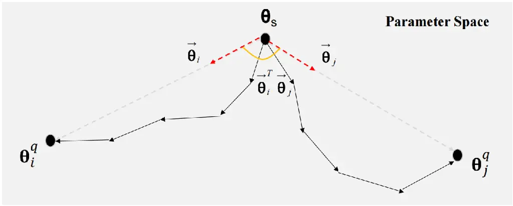

Fig. 6: Visualizations of the update of parameters to different channel
distributions. The black arrows represent the SGD on the support set of
the corresponding channel distribution, the dotted red arrows represent
the trajectory direction vector and the orange arc represents the inner
product between the two adaptation trajectories.

In this part, CDS is designed to measure the difference between channel
distributions from parameter space. It is because that the outputs of
NN-based model on different input data distributions may not be quite
different, even if the distances between input data distributions are
large. Therefore, the influence of different data distributions on the
outputs of NN-based model cannot be judged only from the input data
space. Based on the above analysis, we don’t need to obtain the absolute
value of the distances between different channel distributions. Instead,
we need to measure the impact of different distributions on the output
of NN-based model with the same initialization. In the following, we
present the detailed mechanism of CDS. Specifically, we assume that a
pre-trained model $`f`$ adapts to a channel distribution
$`\mathcal{C}_{i}`$ starting from $`\bm{\theta}_{s}`$ and moves to the
final solution $`\bm{\theta}_{i}^{q}`$ by performing $`q`$ SGD
iterations steps. Then, the parameters’ adaptive trajectory to channel
distribution $`\mathcal{C}_{i}`$ starting from $`\bm{\theta}_{s}`$ is
defined as the sequence of iterations, which is denoted as
$`\{\bm{\theta}_{s},\bm{\theta}_{i}^{1},\bm{\theta}_{i}^{2},\cdots,\bm{\theta}_{i}^{q}\}`$.
To alleviate the challenges in dealing with trajectories of multiple
steps in a parameter space of a very high dimension, the trajectory
direction vector $`\vec{\bm{\theta}}_{i}`$ can be defined as

```math
\vec{\bm{\theta}}_{i}\triangleq\frac{\bm{\theta}_{i}^{q}-\bm{\theta}_{s}}{\|\bm{\theta}_{i}^{q}-\bm{\theta}_{s}\|_{2}}. \tag{17}
```

Fig. 6 presents the SGD update trajectories for the pre-trained model to
adapt to channel distribution $`\mathcal{C}_{i}`$ and channel
distribution $`\mathcal{C}_{j}`$, respectively. Based on the above
analysis, CDS is finally defined as the inner product between their
direction vectors.

```math
CDS=\vec{\bm{\theta}}_{i}^{T}\vec{\bm{\theta}}_{j}. \tag{18}
```

Compared with the KL-divergence that only measures the distances between
different distributions from the input data space, the proposed metric
measures from the model parameters space. It takes the characteristics
of the model into consideration so that the impact of different data
distributions on the output of NN-based model can be well judged.

### IV-B Impact of the Number of Update Round——Fast Adaptation

In this part, we focus on the impact of the number of update round,
$`J_{q}`$, on the performance of the proposed meta-gating framework.

We denote the dataset of channel $`c\sim\mathcal{C}`$ as $`D_{c}`$,
where the number of testing samples is denoted as $`N_{m}^{te}`$. Assume
that we run $`J_{q}`$ gradient descent steps on $`D_{c}`$ to obtain the
updated model
$`\bm{\theta}_{c}^{J_{q}}=\bm{\theta}^{*}-\beta[\triangledown\mathcal{L}_{D_{c}}(\bm{\theta}^{*}|\bm{\phi}^{*})+\sum_{t=1}^{J_{q}-1}\triangledown\mathcal{L}_{D_{c}}(\bm{\theta}_{c}^{t}|\bm{\phi}^{*})]`$
for channel $`c`$. Let $`\bm{\theta}^{*}`$ and $`\bm{\phi}^{*}`$ denote
the initializations of inner and outer networks, respectively, and both
are learned from the proposed training method. $`\bm{\theta}_{c}^{*}`$
represents the optimal model parameters of the channel
$`c\sim\mathcal{C}`$. As a premise, we first introduce some necessary
definitions.

###### Definition 1

Lipschitz continuity and smoothness²² 2 This assumption is widely used
in the analysis of deep learning, such as \[37, 38\]. _Function
$`g(\theta)`$ is $`G`$-Lipschitz continuous if
$`\|g(\theta_{1})-g(\theta_{2})\|_{2}\leq G\|\theta_{1}-\theta_{2}\|_{2}`$
with a constant $`G`$. And $`g(\theta)`$ is called $`L`$-smooth if
$`\|\triangledown g(\theta_{1})-\triangledown g(\theta_{2})\|_{2}\leq L\|\theta_{1}-\theta_{2}\|_{2}`$
with a constant $`L`$_.

###### Definition 2

Excess Risk.
_ER$`(\bm{\theta}*{c}^{J*{q}})=\mathbb{E}*{c\sim\mathcal{C}}\mathbb{E}*{D*{c}}[\mathcal{L}(\bm{\theta}^{J*{q}}\_{c},\bm{\phi}^{_})-\mathcal{L}(\bm{\theta}^{_}\_{c},\bm{\phi}^{_})]`$,
where $`\mathcal{L}(\cdot)`$ denotes the expected loss on
$`\bm{\theta}\_{c}`$\*.

It evaluates the loss difference between $`\bm{\theta}_{c}^{J_{q}}`$ and
the optimal model $`\bm{\theta}^{*}_{c}`$ on all samples $`D_{c}`$ with
all channels $`c\sim\mathcal{C}`$, and a smaller value means a better
$`\bm{\theta}_{c}^{J_{q}}`$. In the following, excess risk is used to
analyze the influence of the number of update round $`J_{q}`$, i.e., the
testing performance of fast adaption to new samples.

###### Theorem 1

(Testing Performance Analysis). _Suppose that the loss function
$`\mathcal{L}`$ is $`G`$-Lipschitz continuous and $`L`$-smooth w.r.t.
both the inner and outer network parameters ($`\bm{\theta}`$ and
$`\bm{\phi}`$). Assume that $`\beta`$ obeys $`\beta\leq\frac{1}{L}`$ and
denote $`\rho=1+2\beta L`$. Then for any $`c\sim\mathcal{C}`$ and
$`D_{c}`$ with size $`N_{m}^{te}`$, we have_

```math
\displaystyle ER(\bm{\theta}_{c}^{J_{q}}) \displaystyle\leq\underbrace{\frac{2G^{2}(\rho^{J_{q}}-1)}{N_{m}^{te}L}}_{\mathcal{O}(\frac{\rho^{J_{q}}}{N_{m}^{te}})}+\mathbb{E}_{c\sim\mathcal{C}}\mathbb{E}_{D_{c}}[\mathcal{L}_{D_{c}}(\bm{\theta}^{J_{q}}_{c},\bm{\phi}^{*})-\mathcal{L}(\bm{\theta}^{*}_{c},\bm{\phi}^{*})]. \tag{19}
```

The detailed proof can be found in Appendix A. Theorem 1 demonstrates
that the excess risk ER$`(\bm{\theta}_{c}^{J_{q}})`$ of the
channel-specific updated model $`\bm{\theta}_{c}^{J_{q}}`$ for channel
$`c`$ is mainly determined by three key factors, i.e., the testing
sample number $`N_{m}^{te}`$ (more precisely, the size of the support
set in the testing samples), the value of $`J_{q}`$, and the expected
loss
$`\mathbb{E}_{c\sim\mathcal{C}}\mathbb{E}_{D_{c}}[\mathcal{L}_{D_{c}}(\bm{\theta}^{J_{q}}_{c},\bm{\phi}^{*})-\mathcal{L}(\bm{\theta}^{*}_{c},\bm{\phi}^{*})]`$
between the adapted parameter $`\bm{\theta}_{c}^{J_{q}}`$ and the
optimal model $`\bm{\theta}^{*}_{c}`$. Note that, a larger
$`N_{m}^{te}`$ leads to a smaller upper bound for the first term in
(19). However, in order to reduce the overhead, the amount of online
update data should not be too large, thus, $`N_{m}^{te}`$ cannot be too
large. Besides, an intuitive way to reduce the excess risk is to
increase the value of $`J_{q}`$ which however increases the upper bound
of the first term. It is because that $`\rho`$ is usually slightly
larger than $`1`$ given a small learning rate $`\beta`$. Therefore, to
make a fair trade-off between the first and second terms in (19),
$`J_{q}`$ should not be large, which accords with the impact of the
number round $`J_{q}`$ in the following simulation parts of Section V.

### IV-C First-Order Optimality Analysis——Generalization Ability

To measure the testing performance of the adapted parameters
$`\bm{\theta}_{c}^{J_{q}}`$ in terms of first-order optimality, we first
introduce the expected population gradient.

###### Definition 3

Expected Population Gradient. _Let
EPG$`(\bm{\theta}*{c}^{J*{q}})=\mathbb{E}*{c\sim\mathcal{C}}\left[\|\mathbb{E}*{D*{c}}[\triangledown\mathcal{L}(\bm{\theta}*{c}^{J\_{q}}|\bm{\phi}^{_})]\|_{2}^{2}\right]`$
denote the gradient of the loss function
$`\mathcal{L}(\bm{\theta}_{c},\bm{\phi}^{_})`$ on all samples $`D\_{c}`$
and all channels $`c\sim\mathcal{C}`$_.

In the following, we will apply this expected population gradient as the
metric to measure the testing performance of $`\bm{\theta}_{c}^{J_{q}}`$
so as to verify the generalization ability of learned initializations
$`\bm{\theta}^{*}`$.

###### Theorem 2

(First-order Optimality Analysis). _Suppose that the loss function
$`\mathcal{L}`$ is $`G`$-Lipschitz continuous and $`L`$-smooth w.r.t.
both the inner and outer network parameters ($`\bm{\theta}`$ and
$`\bm{\phi}`$). Assume that $`\beta`$ obeys $`\beta\leq\frac{1}{L}`$ and
denote $`\rho=1+2\beta L`$. Then for any $`c\sim\mathcal{C}`$ and
$`D_{c}`$ with size $`N_{m}^{te}`$, we have_

```math
EPG(\bm{\theta}_{c}^{J_{q}})\leq\frac{8G^{2}(\rho^{J_{q}}-1)^{2}}{{N_{m}^{te}}^{2}}+2\mathbb{E}_{c\sim\mathcal{C}}\mathbb{E}_{D_{c}}\left[\|\triangledown\mathcal{L}_{D_{c}}(\bm{\theta}_{c}^{J_{q}}|\bm{\phi}^{*})\|_{2}^{2}\right]. \tag{20}
```

The detailed proof can be found in Appendix B. Theorem 2 reveals the
importance of the empirical gradient
$`\mathbb{E}_{D_{c}}\left[\|\triangledown\mathcal{L}_{D_{c}}(\bm{\theta}_{c}^{J_{q}}|\bm{\phi}^{*})\|_{2}^{2}\right]`$
on determining the expected population gradient
EPG$`(\bm{\theta}_{c}^{J_{q}})`$. Specifically, when the learned
initializations $`\bm{\theta}^{*}`$ are close to the first-order
stationary points of the empirical risk
$`\mathcal{L}_{D_{c}}(\bm{\theta}_{c},\bm{\phi}^{*})`$, a small value of
$`J_{q}`$ (a few gradient descent steps) can already guarantee a very
small gradient
$`\triangledown\mathcal{L}_{D_{c}}(\bm{\theta}_{c}^{J_{q}}|\bm{\phi}^{*})`$
of the adapted parameters $`\bm{\theta}_{c}^{J_{q}}`$. Besides, the
value of $`J_{q}`$ is small and the testing samples are usually
sufficient, which has been proved in Theorem 1. Therefore, the first
term of (20) is also small. Finally, the proposed framework is proved to
have a good generalization ability because of the small value of
EPG$`(\bm{\theta}_{c}^{J_{q}})`$.

## V Simulation Results

In this section, we conduct simulations to demonstrate the effectiveness
of the proposed meta-gating framework. All codes are implemented in
Python 3.9 with Pytorch 1.8.0 and we consider the following benchmarks
for comparison, where the channel state samples refer to the samples
from one specific CSI distribution.

- •
  Joint (Joint Training): It updates the model using all channel state
  samples.
- •
  Mismatch: It trains the model under one of the channel state samples.
- •
  TL (Transfer Learning): It trains the pre-trained model only using the
  current channel state samples, where the pre-trained model was trained
  under a given channel distribution.
- •
  EWC (Elastic Weight Consolidation): It adds a penalty term to the loss
  function so as to prevent large changes in those parameters that are
  important to previous samples. The importance of the parameters is
  judged by the Fisher information matrix\[9\].
- •
  WoGate: It updates model via traditional MAML method, i.e., without
  gating operation in the proposed framework.

### V-A Simulation Results on Meta-Gating GNN

We consider $`K`$ transceiver pairs within an $`R\times R`$ area, where
the transmitters are generated uniformly in the aforementioned area and
the receivers are generated uniformly within
$`[d_{\rm{{min}}},d_{\rm{{max}}}]`$ from their corresponding
transmitters. We adopt the channel model in \[32\] as follows

```math
h_{j,k}=L\left(\underbrace{\sqrt{\frac{\epsilon}{\epsilon+1}}\bm{\alpha}_{t}(\beta_{t})\bm{\alpha}_{r}(\beta_{r})^{H}}_{Los}+\underbrace{\sqrt{\frac{1}{\epsilon+1}}\hat{h}_{j,k}}_{NLos}\right), \tag{21}
```

where $`L`$ denotes the large-scale fading including the path loss and
shadowing, $`\beta_{t}`$ and $`\beta_{r}`$ denote the transmit and
receive directions, respectively. We adopt the large-scale fading model
in \[33\] and generate the following three standard types of channel
distributions as the sequential input data.

- •
  Channel 1: $`\epsilon=0`$ and each channel state $`\hat{h}_{jk}`$ is
  generated according to a standard normal distribution, i.e.,

  ```math
  {\rm{Re}}(\hat{h}_{jk})\sim\frac{\mathcal{N}(0,1)}{\sqrt{2}},\quad{\rm{Im}}(\hat{h}_{jk})\sim\frac{\mathcal{N}(0,1)}{\sqrt{2}},\forall j,k. \tag{22}
  ```

- •
  Channel 2: $`\epsilon=3`$ dB, both $`\beta_{t}`$ and $`\beta_{r}`$ are
  uniformly generated from $`[0,2\pi]`$, and each channel state
  $`\hat{h}_{jk}`$ is generated according to the Gaussian distribution
  with $`0`$ dB $`K`$-factor, i.e.,

  ```math
  {\rm{Re}}(\hat{h}_{jk})\sim\frac{1+\mathcal{N}(0,1)}{2},\quad{\rm{Im}}(\hat{h}_{jk})\sim\frac{1+\mathcal{N}(0,1)}{2},\forall j,k. \tag{23}
  ```

- •
  Channel 3: $`\epsilon=0`$, the shadow fading in $`L`$ is set as normal
  distribution with a standard deviation of $`8`$ dB, and each channel
  state $`\hat{h}_{jk}`$ is generated the same as Channel 1.

We generate $`N_{m}=600`$ _tasks_ as the training samples for Algorithm
1, where the support set and the query set in each task are composed by
$`2`$ and $`15`$ channel state samples, respectively. Note that the
channel state samples in each support set and query set are randomly
selected from the three aforementioned channels. It is noticed that
$`600`$ _tasks_ here are equivalent to $`(2+15)\times 600=10,200`$
channel state samples in general DL, which is sufficient to obtain a
good model. As for the testing stage, $`500`$ channel state samples are
generated for each channel, where we randomly split $`20\%`$ of these
samples into support set for inner network’s fine-tune process, and the
rest $`80\%`$ into query set. Besides, we set the batch size of training
samples $`B`$ and the number of adaptation samples $`N_{a}`$ as $`5`$
and $`2`$, respectively. Furthermore, we adopt the Adam optimizer with a
learning rate of $`0.0001`$ to optimize the outer network and a learning
rate of $`0.001`$ to optimize the inner network in the training stage.
The Adam optimizer with a learning rate of $`0.001`$ is adopted to
fine-tune the inner network in the testing stage.

Finally, in order to compare the sum-rate performance under different
channel distributions, we normalize the sum rate by the weighted minimum
mean-square error (WMMSE) algorithm \[30\], which is termed as the
‘Normalized Sumrate’ in the following simulation results. The WMMSE
algorithm is a classic optimization-based algorithm for sum-rate
maximization in the $`K`$-user interference network and is usually used
as an upper bound for such problems. In this section, we run WMMSE for
$`100`$ iterations with the random initialization and take this value
for normalization. The system parameters and network parameters are
summarized in Table I and Table II, respectively.

|                                                                |                   |
| -------------------------------------------------------------- | ----------------- |
| Parameter                                                      | Value             |
| Transceiver pairs, $`K`$                                       | $`10`$            |
| Area length, $`R`$                                             | $`1,000`$ m       |
| \# of Transmitter antennas, $`N_{t}`$                          | $`8`$             |
| Transceiver pairs distance, $`d_{\rm{min}}`$, $`d_{\rm{max}}`$ | $`2`$ m, $`65`$ m |
| Noise power, $`\sigma^{2}`$                                    | $`-10`$ dB        |
| Maximum transmit power, $`P_{\rm{max}}`$                       | $`1`$ w           |
| Weight for the $`k`$-th transceiver pair, $`w_{k}`$            | 1                 |

TABLE I: System Parameters

|                                              |                                                                   |
| -------------------------------------------- | ----------------------------------------------------------------- |
| Parameter                                    | Value                                                             |
| Type of NN                                   | WCGCN\[6\]                                                        |
| Number of layers in outer and inner networks | $`3`$, $`2`$                                                      |
| MLPs in outer/inner network                  | {$`6N_{t}`$, $`64`$, $`64`$}, {$`64+4N_{t}`$, $`32`$, $`2N_{t}`$} |
| Nonlinear function, $`\sigma(x)`$            | $`\sigma(x)=\frac{x}{{\rm{max}}(\lVert x\rVert_{2},1)}`$          |

TABLE II: Neural Network Parameters

#### V-A1 Three Important Goals

\(i\) Seamlessness. Fig. 8 compares the proposed meta-gating framework
with the above benchmark algorithms on the sum-rate performance, where
the channel state samples in ‘Mismatch’ are collected from
$`{\rm{channel}}_{3}`$. Obviously, applying a model trained under one
distribution to test the samples on another distribution does lead to a
quite large sum-rate performance loss. Moreover, we can observe that the
sum-rate performance of our meta-gating framework is better than that of
TL under the premise of the same number of fine-tune samples, update
rounds, and optimizer. It is mainly because that the proposed framework
has better initializations compared to the TL and thus achieves better
sum-rate performance using only a small number of update rounds.
Besides, compared with TL, the MAML algorithm can obtain a suitable
model initialization for all three channels. Thus, the average sum-rate
performance is better than that of TL.

Similar with the TL, the sum-rate performance of ‘WoGate’ on
$`{\rm{channel}}_{2}`$ and $`{\rm{channel}}_{3}`$ are affected by the
online update according to the previous channel state samples, which can
be seen from the gap between ‘proposed’ and ‘woGate’. In the proposed
framework, the inner network updates according to the current channel
sample data, where only part of the model parameters that are selected
by the meta-learned outer network will be updated. Therefore, the
proposed framework can still achieve good sum-rate performance on the
current channel state sample and is not largely affected by the previous
channel state samples.

Table III presents the variance of the sum-rate performance among
different channel distributions under different methods. It can be
observed that the proposed framework has the smallest variance,
indicating that the sum-rate performance on different channel
distributions is basically similar. Therefore, the proposed framework
can well achieve the goals of ‘seamlessness’.

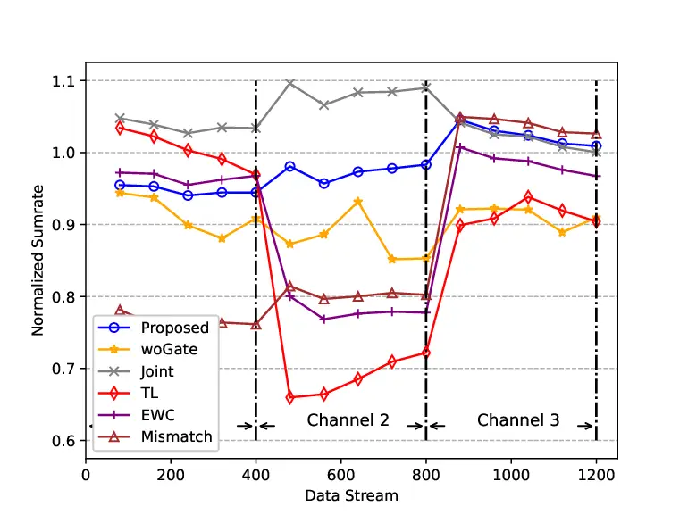

Fig. 7: Sum-rate performances under different methods.

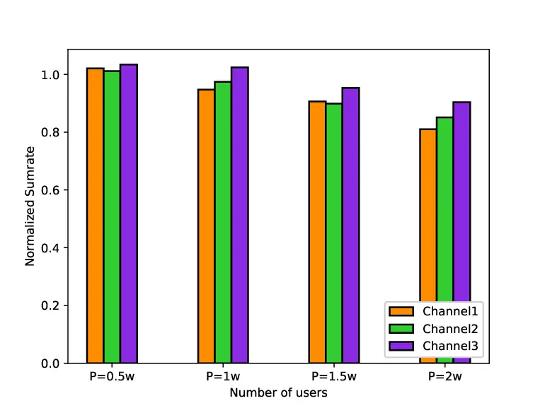

Fig. 8: Sum-rate performance with different values of $`P_{\rm{max}}`$.

|          |                        |                        |
| -------- | ---------------------- | ---------------------- |
| Method   | (Channel 1, Channel 2) | (Channel 2, Channel 3) |
| TL       | $`2.49\times 10^{-2}`$ | $`1.27\times 10^{-2}`$ |
| EWC      | $`8.58\times 10^{-3}`$ | $`1.05\times 10^{-2}`$ |
| Joint    | $`5.63\times 10^{-4}`$ | $`1.04\times 10^{-3}`$ |
| WoGate   | $`3.04\times 10^{-4}`$ | $`2.79\times 10^{-4}`$ |
| Proposed | $`1.83\times 10^{-4}`$ | $`6.20\times 10^{-4}`$ |

TABLE III: Variances of the normalized sum-rate performances under
different methods.

Furthermore, we compare the sum-rate performance of the proposed
meta-gating framework under different values of maximum transmit power
$`P_{\rm{max}}`$, and the results are depicted in Fig. 8. From the
figure, the proposed framework achieves good sum-rate performance under
different $`P_{\rm{max}}`$, i.e., the sum-rate performance is basically
the same as the WMMSE algorithm. Moreover, Table IV presents the
variances of the normalized sum rate among different channel
distributions under different values of $`P_{\rm{max}}`$. From the
table, these variances are all quite small which further highlights the
advantage of the proposed meta-gating framework in terms of
‘seamlessness’.

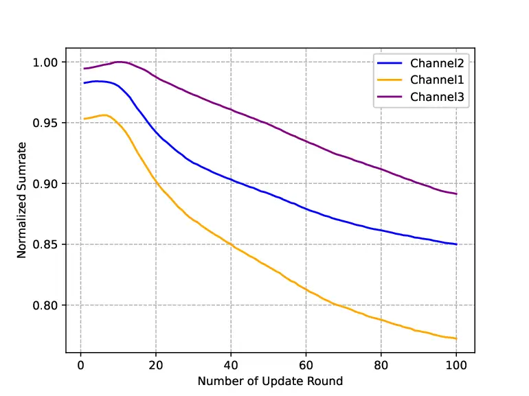

Fig. 9: Sum-rate performance with different values of update round
$`J_{q}`$.

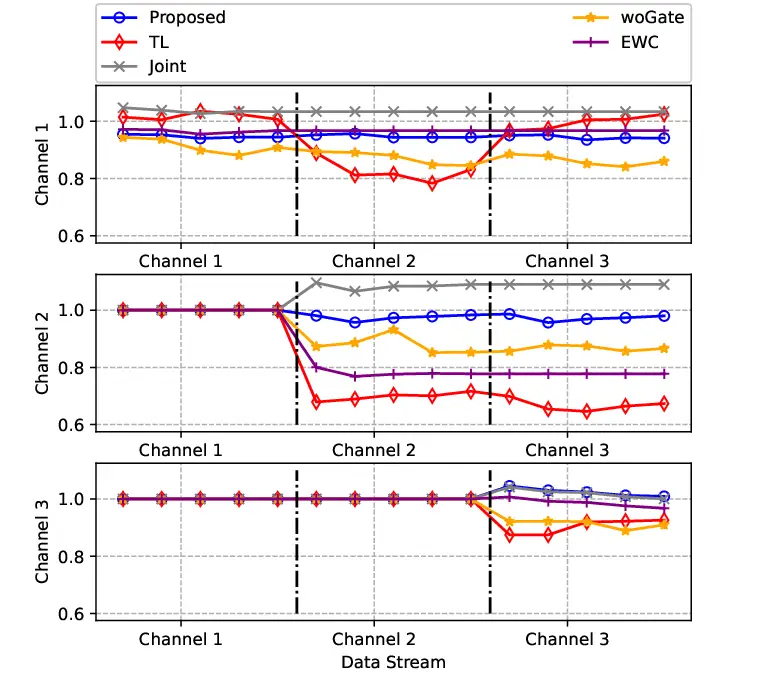

Fig. 10: Capability for continuous adaptation of different methods.

|                        |                        |                        |                        |                        |
| ---------------------- | ---------------------- | ---------------------- | ---------------------- | ---------------------- |
| $`P_{{\rm{max}}}`$ (W) | $`0.5`$                | $`1`$                  | $`1.5`$                | $`2`$                  |
| Variance               | $`8.69\times 10^{-5}`$ | $`1.01\times 10^{-3}`$ | $`5.78\times 10^{-4}`$ | $`1.48\times 10^{-3}`$ |

TABLE IV: Variances of the normalized sum-rate performances under
different values of $`P_{\rm{max}}`$.

\(ii\) Quickness. Fig. 10 depicts the impact of different values of
$`J_{q}`$ on the sum-rate performance. From the figure, the proposed
framework only needs a small value of $`J_{q}`$ to achieve good sum-rate
performance under each channel distribution ($`J_{q}=10`$ in this
simulation scenario). It is mainly because that the proposed meta-gating
framework has good model initializations via the proposed training
procedure. Besides, we can see that the sum-rate performance under
different channel distributions first increases and then decreases with
the increase of $`J_{q}`$. The degradation of the sum-rate performance
is mainly caused by the severe overfitting on the small amount of
adaptation samples $`N_{a}`$. In fact, the fine-tune process with small
amount of samples exactly achieves the goal of ‘quickness’, where the
value of $`J_{q}`$ is small to avoid serious overfitting phenomenon. The
simulation results are consistent with the theoretical analysis in
Section IV-B.

\(iii\) Continuity. Fig. 10 depicts the ‘continuity’ capability of
different methods. Specifically, it shows the sum-rate performance of
the proposed framework on $`{\rm{channel}}_{j}`$ (the vertical axis)
after updating according to the $`{\rm{channel}}_{i}`$ (the horizontal
axis). In order to clearly illustrate the capability for continuous
adaptation of different methods, we set the value of the normalized sum
rate in $`{\rm{channel}}_{j}`$ as $`1`$ when $`j\textgreater i`$. From
the figure, the sum-rate performance of TL on the previous channel
suffers from a significant degradation when it adapts to the following
new channel distribution. It is mainly because that the model in TL is
only fine-tuned on the latest new samples. After learning the knowledge
of new samples, the knowledge from the previous model may be altered or
even overwritten, which thus results in significant performance
deterioration on the previous samples. Similar results can be seen from
‘WoGate’. On the other hand, the proposed meta-gating framework utilizes
the outer network to evaluate the importance of inner network’s
parameters under different CSI distributions and then decide which
subset of the inner network should be activated through the gating
operation. Therefore, it can ensure the capability for continuous
adaptation.

|              |            |            |            |
| ------------ | ---------- | ---------- | ---------- |
| Channel pair | (1,2)      | (2,3)      | (3,1)      |
| CDS          | $`0.0099`$ | $`0.0114`$ | $`0.0177`$ |

TABLE V: Distance between each channel

According to the analysis in Section IV, we compute the similarity
between the considered three channel distributions and the results are
given in Table V. From the table, the distance between
$`{\rm{channel}}_{1}`$ and $`{\rm{channel}}_{2}`$ is the largest,
indicating that the distribution between these two channels are quite
different. Therefore, it will cause the largest performance loss in
$`{\rm{channel}}_{1}`$ when the model is updated according to the
samples in $`{\rm{channel}}_{2}`$ in TL. Moreover, the CDS metric shown
in Table V can explain the capability for continuous adaptation of the
EWC method in Fig. 10. Specifically, channel samples under each
distribution are sequentially input during the EWC training stage. In
order not to forget the knowledge learned on $`{\rm{channel}}_{1}`$, the
update of model’s parameters on $`{\rm{channel}}_{2}`$ will be affected
by the consolation operation, where the distance between
$`{\rm{channel}}_{1}`$ and $`{\rm{channel}}_{2}`$ is the largest.
Therefore, it finally leads to poor sum-rate performance on
$`{\rm{channel}}_{2}`$.

Furthermore, Fig. 12 compares the capability for continuous adaptation
of the proposed meta-gating framework under different values of
$`P_{\rm{max}}`$. From the figure, the proposed framework achieves the
good capability for continuous adaptation under each value of
$`P_{\rm{max}}`$, i.e., the sum-rate performance on
$`{\rm{channel}}_{i}`$ does not largely degrade when the model is
updated according to the samples of the $`{\rm{channel}}_{j}`$. It
further indicates the advantage of the proposed framework in terms of
‘continuity’.

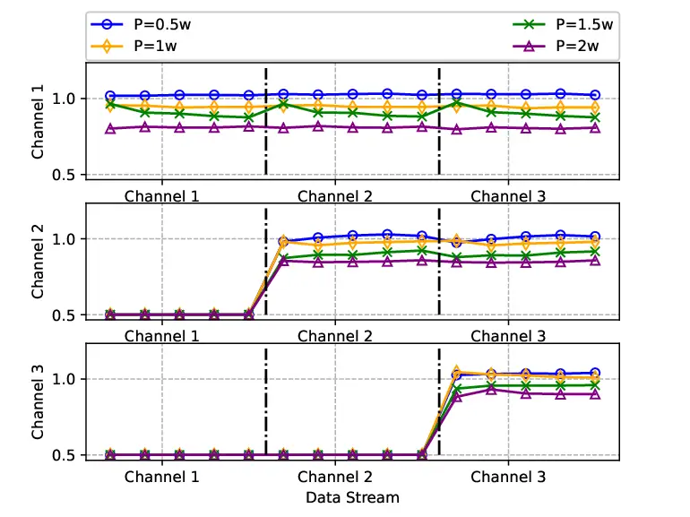

Fig. 11: Capability for continuous adaptation with different values of
$`P_{\rm{max}}`$.

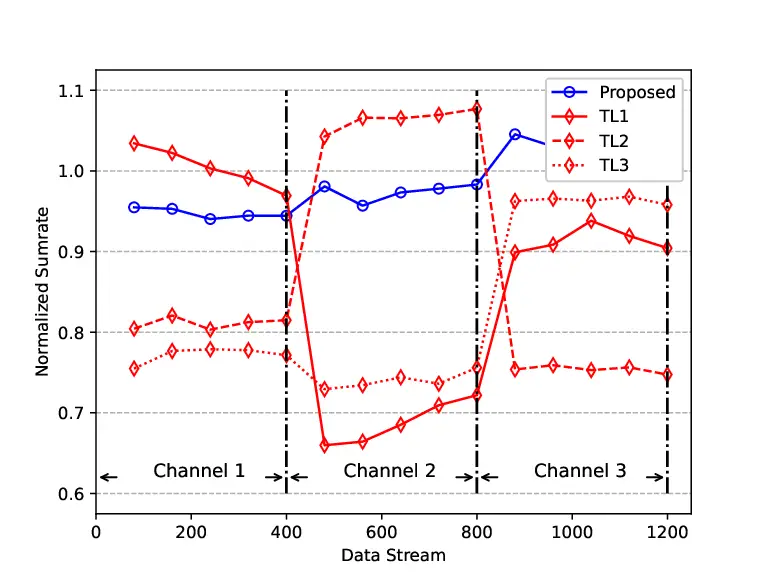

Fig. 12: Effect of pre-train models on sum-rate performance of TL.

#### V-A2 Performance Comparison with TL

It is quite important for TL to select a suitable pre-train model since
the model initializations make great influence on the adaptation. Fig.
12 presents the impact of different pre-train models on the sum-rate
performance, where TL1, TL2, and TL3 represent the models trained with
the samples of $`{\rm{channel}}_{1}`$, $`{\rm{channel}}_{2}`$, and
$`{\rm{channel}}_{3}`$ as pre-train models, respectively. Since there
does exist differences between each channel distribution, the sum-rate
performance with different pre-train models will be quite different. In
contrast, the proposed meta-gating framework achieves a better sum-rate
performance because of its adaptivity on different channel
distributions.

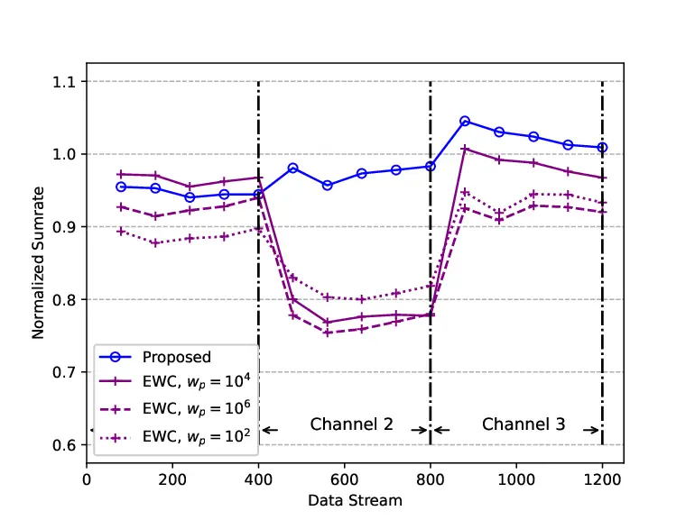

(a) Sum-rate performance.

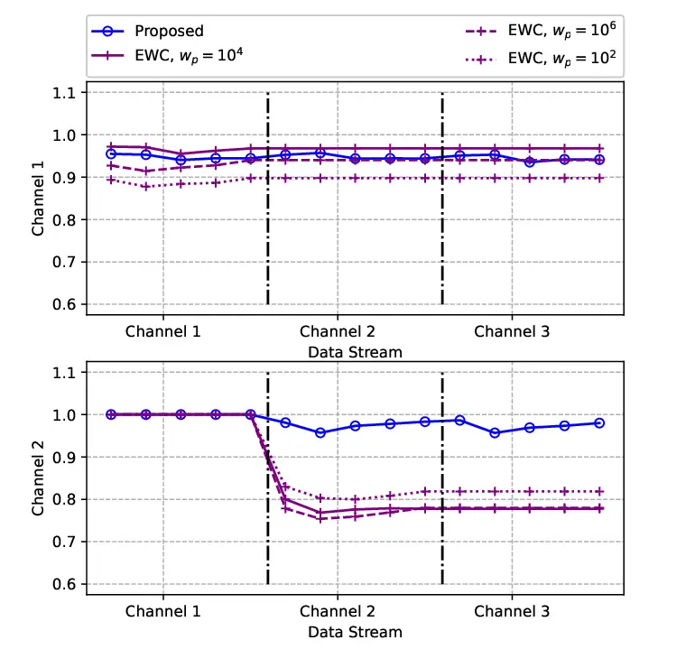

(b) Capability for continuous adaptation.

Fig. 13: The impact of $`w_{p}`$ on the performance of EWC method.

#### V-A3 Performance Comparison with EWC

The performance of the EWC method largely depends on the coefficient of
the penalty term, $`w_{p}`$. To verify it, we test the sum-rate
performance on each channel distribution and the capability for
continuous adaptation with $`w_{p}=10^{2},10^{4},10^{6}`$, which can be
seen in Fig. 13. It is observed that a large value of $`w_{p}`$ can
indeed improve the sum-rate performance on the previous channel, i.e.,
enhance the capability for continuous adaptation of the model, but with
the cost of significant sum-rate performance loss on the current
channel. Therefore, it is important for the EWC method to select an
appropriate value of $`w_{p}`$, which is the disadvantage of the EWC
method. Different from the EWC method that needs to be manually
implemented, the proposed meta-gating framework can continuously achieve
the good sum-rate performance because of the proposed training procedure
and the gating operation.

#### V-A4 Scalability

In this part, we test the sum-rate performance and the capability for
continuous adaptation with different numbers of users ($`K=10`$, $`20`$
and $`30`$) in the same area with radius $`R=1000`$ m, where the number
of update round $`J_{q}`$ is chosen as $`10`$. As depicted in Fig. 15
and Table VI, the proposed meta-gating framework achieves good sum-rate
performances with different numbers of users and the variances of the
normalized sum rate among different channel distributions under
different numbers of users are all quite small, which further highlights
the advantage of the proposed meta-gating framework in terms of
‘seamlessness’. Besides, as shown in Fig. 15, the proposed framework
achieves the good capability for continuous adaptation with different
numbers of users, i.e., the sum-rate performance on
$`{\rm{channel}}_{j}`$ does not largely degrade when the model is
updated according to the samples of the $`{\rm{channel}}_{i}`$. These
results demonstrate the good scalability of the proposed framework with
more practical simulation scenario settings.

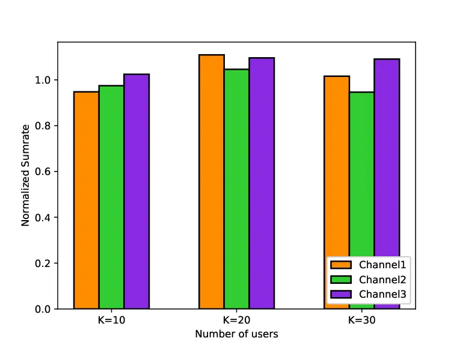

Fig. 14: Sum-rate performances with different numbers of users.

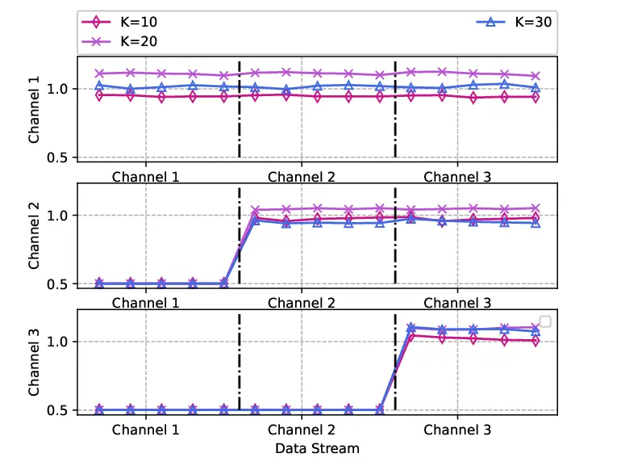

Fig. 15: Capability for continuous adaptation with different numbers of
users.

|          |                        |                        |                        |
| -------- | ---------------------- | ---------------------- | ---------------------- |
| $`K`$    | $`10`$                 | $`20`$                 | $`30`$                 |
| Variance | $`1.01\times 10^{-3}`$ | $`7.45\times 10^{-4}`$ | $`3.47\times 10^{-3}`$ |

TABLE VI: Variances of the normalized sum-rate performances with
different numbers of users.

### V-B Simulation Results on Meta-Gating CNN

In this part, we present the performance of meta-gating CNN on Problem
$`\mathcal{P}_{2}`$ to demonstrate that the proposed framework is
model-agnostic. Since the main purpose of this simulation part is to
verify the model-agnostic nature of the proposed framework, we only
consider a special case of Problem $`\mathcal{P}_{2}`$ with $`N_{t}=1`$.
Then, three standard types of random channels following the settings in
\[20\] are denoted as $`{\rm{channel}}_{1}`$, $`{\rm{channel}}_{2}`$ and
$`{\rm{channel}}_{3}`$. Specifically, $`{\rm{channel}}_{1}`$ follows the
Rayleigh fading, $`{\rm{channel}}_{2}`$ follows the Rician fading, and
$`{\rm{channel}}_{3}`$ follows the Geometric fading.

Geometric fading: All transceiver pairs are randomly distributed in an
$`R\times R`$ area, as

```math
|h_{jk}|^{2}=\frac{1}{1+d_{jk}^{2}}|r_{jk}|^{2},\forall j,k, \tag{24}
```

where $`r_{jk}`$ denotes the small-scale fading coefficient follows
$`\mathcal{CN}`$(0, 1), $`d_{jk}`$ is the distance between the $`j`$-th
transmitter and the $`k`$-th receiver.

The data generation procedure is the same as that in Section V-A and we
again normalize the sum rate by using the WMMSE algorithm in order to
compare the sum-rate performance under different channel distributions,
which is expressed as the ‘Normalized Sumrate’ in the following
simulation results. The system parameters and the network parameters are
summarized in Table VII and Table VIII, respectively.

|                                          |            |
| ---------------------------------------- | ---------- |
| Parameter                                | Value      |
| Transceiver pairs, $`K`$                 | $`10`$     |
| Noise power, $`\sigma^{2}`$              | $`-10`$ dB |
| Maximum transmit power, $`P_{\rm{max}}`$ | $`1`$ w    |
| Area length, $`R`$                       | $`10`$ m   |

TABLE VII: System Parameters

|                                                |                                        |
| ---------------------------------------------- | -------------------------------------- |
| Parameter                                      | Value                                  |
| Type of Neural Network                         | CNN                                    |
| Number of layers in outer and inner networks   | $`2`$, $`2`$                           |
| Number of channels in outer and inner networks | {$`1,6`$}{$`6,8`$}, {$`1,4`$}{$`4,8`$} |
| Kernel size in outer and inner networks        | $`3\times 3`$, $`3\times 3`$           |
| Stride and padding in the convolution layer    | $`1`$, $`0`$                           |
| Nonlinear function, $`\sigma(x)`$              | $`\sigma(x)=\frac{1}{1+exp(-x)}`$      |

TABLE VIII: Neural Network Parameters

#### V-B1 Three Important Goals

\(i\) Seamlessness. Fig. 16 compares the proposed meta-gating framework
with other benchmark algorithms on the sum-rate performance. The
proposed meta-gating framework has the best sum-rate performance on each
channel distribution compared to the benchmark algorithms due to its
better model initializations. Table IX presents the variance of the
sum-rate performance among each channel distribution with different
methods. It can be observed that the proposed framework has quite small
variance, which indicates that the proposed framework can achieve
similar sum-rate performances on different channel distributions.
Therefore, it can well achieve the goals of ‘seamlessness’. These
results are similar as those observed in Fig. 8 and Table III.

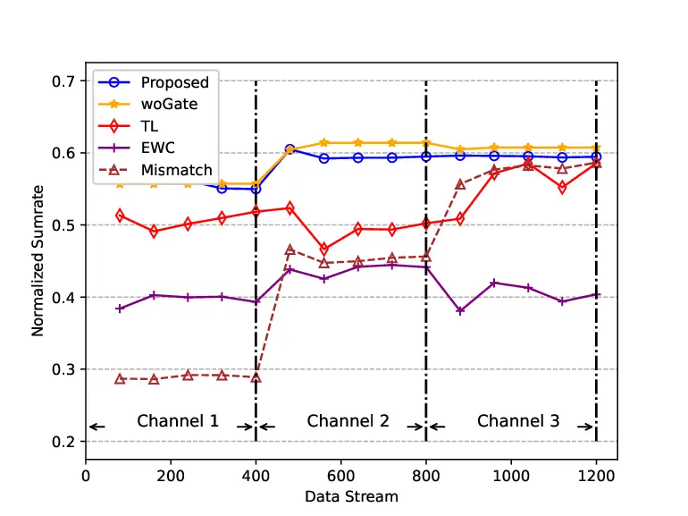

Fig. 16: Sum-rate performances with different methods.

|          |                        |                        |
| -------- | ---------------------- | ---------------------- |
| Method   | (Channel 1, Channel 2) | (Channel 2, Channel 3) |
| TL       | $`2.88\times 10^{-5}`$ | $`1.04\times 10^{-3}`$ |
| EWC      | $`4.47\times 10^{-4}`$ | $`3.26\times 10^{-4}`$ |
| Joint    | $`4.13\times 10^{-3}`$ | $`1.34\times 10^{-3}`$ |
| WoGate   | $`7.57\times 10^{-4}`$ | $`6.65\times 10^{-6}`$ |
| Proposed | $`3.59\times 10^{-4}`$ | $`9.76\times 10^{-8}`$ |

TABLE IX: Variances of the normalized sum-rate performances under
different methods.

\(ii\) Quickness. Fig. 18 depicts the impact of different values of
$`J_{q}`$ on the sum-rate performance, where the similar conclusion can
be concluded as those in Fig. 10.

\(ii\) Continuity. Fig. 18 depicts the capability for continuous
adaptation of different methods and we set the value of the normalized
sum rate in $`{\rm{channel}}_{j}`$ as $`0.5`$ when $`j\textgreater i`$.
Similarly, we compute the similarity among these three channels, which
can be seen in Table X. From the table, the distance between
$`{\rm{channel}}_{1}`$ and $`{\rm{channel}}_{3}`$ is the largest.
Therefore, it would cause a large performance loss in
$`{\rm{channel}}_{1}`$ when the model is updated according to the
samples in $`{\rm{channel}}_{3}`$ in TL, as shown in Fig. 18.

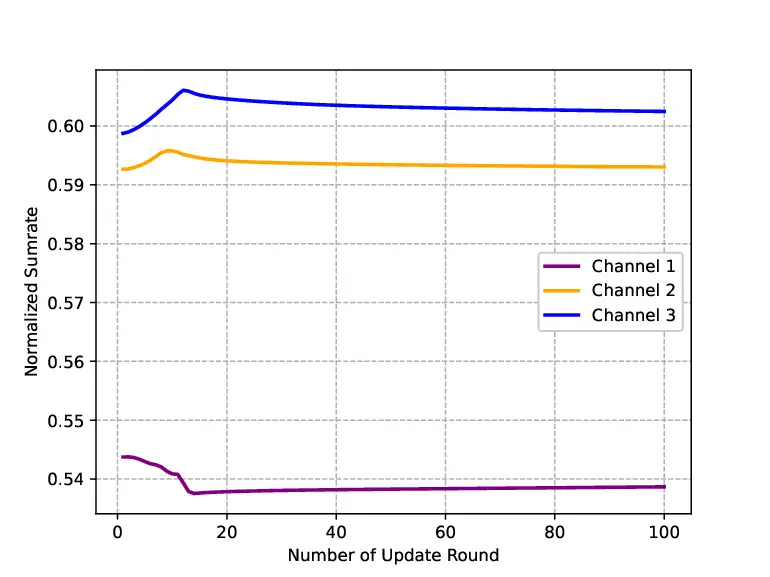

Fig. 17: Sum-rate performances with different values of $`J_{q}`$.

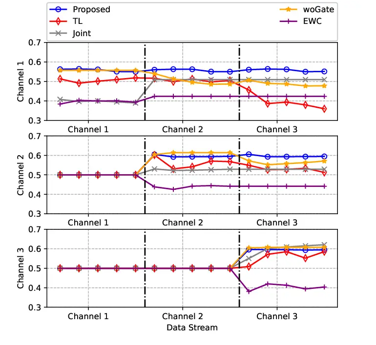

Fig. 18: Capability for continuous adaptation of different methods.

|              |           |            |            |
| ------------ | --------- | ---------- | ---------- |
| Channel pair | (1,2)     | (2,3)      | (3,1)      |
| CDS          | $`0.046`$ | $`-0.003`$ | $`-0.101`$ |

TABLE X: Distance between each channel

To conclude, simulation results demonstrate that the proposed framework
is model-agnostic, i.e., it can well achieve three goals compared with
the state-of-the-art algorithms on the proposed problem for both CNN and
GNN models.

#### V-B2 Generalization Ability

To verify Theorem 2 with simulation experiments, we test the sum-rate
performances on the Nakagami-$`m`$ channels. The reason why we apply the
Nakagami-$`m`$ channel is that it is a more general fading channel model
and the Nakagami fading can be transformed into a variety of fading
models by changing the value of $`m`$ (e.g., it can be degenerated into
Rayleigh fading when $`m=1`$). Specifically, we randomly generate four
kinds of channels where $`|h_{j,k}|\sim Nakagami(m,\Omega)`$ and $`m`$
follows a uniform distribution between $`[0.5,2]`$ in the training
stage. Similarly, we generate four kinds of channels in the testing
stage, where the latter two kinds of channels are unseen channels
following the Nakagami-$`m`$ distribution with different values of $`m`$
from the training stage.

Table XI presents the sum-rate performances of joint training method and
proposed framework in both seen and unseen channels with different
values of $`P_{\rm{max}}`$. It is observed that the proposed framework
achieves a similar sum-rate performance with the joint training method
on seen channels but significantly outperforms the joint training method
on unseen channels, where the sum-rate performance gaps are further
depicted in Fig. 19. It is mainly because that the joint training method
only focuses on the distribution on the seen channels, but the proposed
framework can better take further optimizations into account because of
the dual-loop optimization for better model initializations.

|                    |          |            |            |            |            |
| ------------------ | -------- | ---------- | ---------- | ---------- | ---------- |
| $`P_{\rm{max}}`$/w |          | Seen       |            | Unseen     |            |
|                    |          | Channel 1  | Channel 2  | Channel 3  | Channel 4  |
| $`1`$              | Proposed | $`0.6023`$ | $`0.6411`$ | $`0.6503`$ | $`0.6985`$ |
|                    | Joint    | $`0.5580`$ | $`0.5802`$ | $`0.5547`$ | $`0.5822`$ |
| $`1.5`$            | Proposed | $`0.5257`$ | $`0.5638`$ | $`0.5743`$ | $`0.6192`$ |
|                    | Joint    | $`0.4898`$ | $`0.5237`$ | $`0.4863`$ | $`0.5099`$ |
| $`2`$              | Proposed | $`0.4880`$ | $`0.5235`$ | $`0.5353`$ | $`0.5801`$ |
|                    | Joint    | $`0.4408`$ | $`0.4476`$ | $`0.4631`$ | $`0.4755`$ |

TABLE XI: Average normalized sum-rate performances of the proposed
framework and the joint method under different values of
$`P_{\rm{max}}`$.

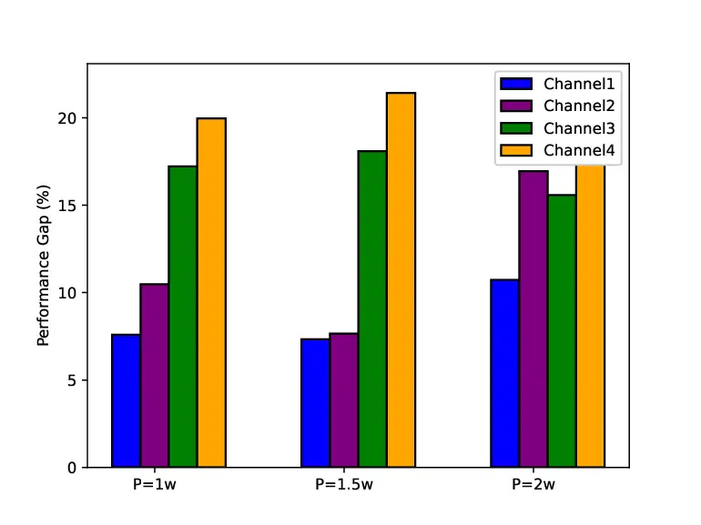

Fig. 19: Sum-rate performance gaps between the proposed framework and
the joint training method under different values of $`P_{\rm{max}}`$.

## VI Conclusions

In this paper, we have proposed a general meta-gating framework for
solving wireless resource allocation problems in an episodically dynamic
wireless environment, where the CSI distribution changes over periods
and remains constant within each period. Specifically, the proposed
framework includes an inner network and an outer network, and they are
connected through the gating operation. The proposed dual-loop training
method is developed to achieve the goals of ‘seamlessness’ and
‘quickness’ by combining the MAML algorithm with the unsupervised
training method. As for the goal of ‘continuity’, the outer network
learns to evaluate the importance of inner network’s parameters under
different CSI distributions and then decide which subset of the inner
network should be activated. Therefore, it enables the selective
plasticity of the inner network. Additionally, we have theoretically
analyzed the performance of the proposed meta-gating framework. Finally,
simulation results have demonstrated that the proposed meta-gating
framework can well adapt to the dynamic wireless environment via
achieving three important goals compared with several existing
state-of-the-art algorithms.

## Appendix A Proof of Theorm 1

###### Lemma 1

_Assume that function $`\mathcal{L}(\cdot)`$ is $`L`$-smooth in
$`\bm{\theta}_{c}`$. If $`\beta\leq\frac{1}{L}`$, then it holds for any
channel $`c`$ and any parameters $`\bm{\theta}_{c}`$ that_

```math
\displaystyle\mathcal{L}_{D_{c}}(\bm{\theta}_{c}^{J_{q}},\bm{\phi}^{*})-\mathcal{L}_{D_{c}}(\bm{\theta}_{c}^{1},\bm{\phi}^{*})\leq\frac{1}{2\beta}\|\bm{\theta}_{c}-\bm{\theta}^{*}\|^{2}-
```

```math
\displaystyle\beta(1-\frac{\beta L}{2})\sum_{t=1}^{J_{q}-1}\|\triangledown\mathcal{L}_{D_{c}}(\bm{\theta}_{c}^{t}|\bm{\phi}^{*})\|_{2}^{2}, \tag{25}
```

_where $`\bm{\theta}^{_}`$ denotes the learned initializations of the
inner network and
$`\bm{\theta}^{J*{q}}*{c}=\bm{\theta}^{_}-\beta\left(\triangledown\mathcal{L}*{D*{c}}(\bm{\theta}^{_},\bm{\phi}^{_})+\sum*{t=1}^{J*{q}-1}\triangledown\mathcal{L}*{D*{c}}(\bm{\theta}\_{c}^{t},\bm{\phi}^{_})\right)`$\*.

###### Lemma 2

_Assume that function $`\mathcal{L}(\cdot)`$ is $`L`$-smooth in
$`\bm{\theta}_{c}`$. We denote the expected and empirical losses on
$`D_{c}`$ as $`\mathcal{L}(\bm{\theta}_{c})`$ and
$`\mathcal{L}_{D_{c}}(\bm{\theta}_{c})`$, respectively. Here
$`\beta\leq\frac{1}{L}`$, given a channel $`c`$, considering the
empirical minimization problem in (26)-(27)._

```math
\displaystyle\bm{\theta}_{c}^{1} \displaystyle=\mathop{\rm{argmin}}\limits_{\bm{\theta}_{c}}\left\{h_{D_{c}}(\bm{\theta}_{c})=\left<\triangledown\mathcal{L}_{D_{c}}(\bm{\theta}^{*}|\bm{\phi}^{*})+\sum_{t=1}^{J_{q}-1}\|\triangledown\mathcal{L}_{D_{c}}(\bm{\theta}_{c}^{t}|\bm{\phi}^{*}),\bm{\theta}_{c}-\bm{\theta}^{*}\right>+\frac{1}{2\beta}\|\bm{\theta}_{c}-\bm{\theta}^{*}\|_{2}^{2}\right\}, \tag{26}
```

```math
\displaystyle=\bm{\theta}^{*}-\beta\left(\triangledown\mathcal{L}_{D_{c}}(\bm{\theta}^{*}|\bm{\phi}^{*})+\sum_{t=1}^{J_{q}-1}\triangledown\mathcal{L}_{D_{c}}(\bm{\theta}_{c}^{t}|\bm{\phi}^{*})\right). \tag{27}
```

 

_Then, we can obtain the following bound for any $`J_{q}`$_

```math
|\mathbb{E}_{D_{c}\sim\mathcal{C}}[\mathcal{L}(\bm{\theta}_{c}^{J_{q}})-\mathcal{L}_{D_{c}}(\bm{\theta}_{c}^{J_{q}})]|\leq\frac{2G^{2}[(1+2\beta L)^{J_{q}}-1]}{LN_{m}^{te}}. \tag{28}
```

The proof of the aforementioned two lemmas can be found in \[34\].

Then, we can obtain the following upper bound according to Lemma 2 as
follows:

```math
\displaystyle\mathbb{E}_{D_{c}}\left[\mathcal{L}(\bm{\theta}_{c}^{J_{q}},\bm{\phi}^{*})-\mathcal{L}(\bm{\theta}^{*},\bm{\phi}^{*})\right]
```

```math
\displaystyle=\mathbb{E}_{D_{c}}\left[\mathcal{L}(\bm{\theta}_{c}^{J_{q}},\bm{\phi}^{*})-\mathcal{L}_{D_{c}}(\bm{\theta}^{J_{q}}_{c},\bm{\phi}^{*})\right]
```

```math
\displaystyle+\mathbb{E}_{D_{c}}\left[\mathcal{L}_{D_{c}}(\bm{\theta}^{J_{q}}_{c},\bm{\phi}^{*})-\mathcal{L}(\bm{\theta}_{c}^{*},\bm{\phi}^{*})\right], \tag{29}
```

```math
\displaystyle\leq|\mathbb{E}_{D_{c}}\left[\mathcal{L}(\bm{\theta}_{c}^{J_{q}},\bm{\phi}^{*})-\mathcal{L}_{D_{c}}(\bm{\theta}^{J_{q}}_{c},\bm{\phi}^{*})\right]|
```

```math
\displaystyle+\mathbb{E}_{D_{c}}\left[\mathcal{L}_{D_{c}}(\bm{\theta}^{J_{q}}_{c},\bm{\phi}^{*})-\mathcal{L}(\bm{\theta}_{c}^{*},\bm{\phi}^{*})\right], \tag{30}
```

```math
\displaystyle\leq\frac{2G^{2}[(1+2\beta L)^{J_{q}}-1]}{LN_{m}^{te}}+\mathbb{E}_{D_{c}}\left[\mathcal{L}_{D_{c}}(\bm{\theta}^{J_{q}}_{c},\bm{\phi}^{*})-\mathcal{L}(\bm{\theta}_{c}^{*},\bm{\phi}^{*})\right]. \tag{31}
```

Note that
$`\mathbb{E}_{D_{c}}\left[\mathcal{L}_{D_{c}}(\bm{\theta}_{c}^{*},\bm{\phi}^{*})\right]=\mathbb{E}_{D_{c}}\left[\mathcal{L}(\bm{\theta}_{c}^{*},\bm{\phi}^{*})\right]`$.
Then, we take the expectation on both sides of (31) on
$`c\sim\mathcal{C}`$ to finally obtain

```math
\displaystyle\mathbb{E}_{c\sim\mathcal{C}}\mathbb{E}_{D_{c}}\left[\mathcal{L}(\bm{\theta}_{c}^{J_{q}},\bm{\phi}^{*})-\mathcal{L}(\bm{\theta}^{*},\bm{\phi}^{*})\right]\leq\frac{2G^{2}[(1+2\beta L)^{J_{q}}-1]}{LN_{m}^{te}} \tag{32}
```

```math
\displaystyle+\mathbb{E}_{D_{c}}\left[\mathcal{L}_{D_{c}}(\bm{\theta}^{J_{q}}_{c},\bm{\phi}^{*})-\mathcal{L}(\bm{\theta}_{c}^{*},\bm{\phi}^{*})\right].
```

## Appendix B Proof of Theorm 2

Consider a fixed channel $`c\sim\mathcal{C}`$ and its associated random
dataset $`D_{c}\sim c`$ with size $`N_{m}^{te}`$. Then, we perform
$`J_{q}`$ gradient steps to obtain the adapted parameter
$`\bm{\theta}^{J_{q}}_{c}=\bm{\theta}^{*}-\beta\left(\triangledown\mathcal{L}_{D_{c}}(\bm{\theta}^{*}|\bm{\phi}^{*})+\sum_{t=1}^{J_{q}-1}\triangledown\mathcal{L}_{D_{c}}(\bm{\theta}_{c}^{t}|\bm{\phi}^{*})\right)`$.
We can show the following inequality:

```math
\displaystyle\|\mathbb{E}_{D_{c}} \displaystyle[\triangledown\mathcal{L}(\bm{\theta}_{c}^{J_{q}}|\bm{\phi}^{*})]\|^{2}=\|\mathbb{E}_{D_{c}}[\triangledown\mathcal{L}(\bm{\theta}_{c}^{J_{q}}|\bm{\phi}^{*})-\triangledown\mathcal{L}_{D_{c}}(\bm{\theta}_{c}^{J_{q}}|\bm{\phi}^{*})]
```

```math
\displaystyle+\mathbb{E}_{D_{c}}[\triangledown\mathcal{L}_{D_{c}}(\bm{\theta}_{c}^{J_{q}}|\bm{\phi}^{*})]\|^{2}, \tag{33}
```

```math
\displaystyle\leq 2\|\mathbb{E}_{D_{c}}[\triangledown\mathcal{L}(\bm{\theta}_{c}^{J_{q}}|\bm{\phi}^{*})-\triangledown\mathcal{L}_{D_{c}}(\bm{\theta}_{c}^{J_{q}}|\bm{\phi}^{*})]\|^{2}
```

```math
\displaystyle+2\|\mathbb{E}_{D_{c}}[\triangledown\mathcal{L}_{D_{c}}(\bm{\theta}_{c}^{J_{q}}|\bm{\phi}^{*})]\|^{2}, \tag{34}
```

```math
\displaystyle\leq 2\|\mathbb{E}_{D_{c}}[\triangledown\mathcal{L}(\bm{\theta}_{c}^{J_{q}}|\bm{\phi}^{*})-\triangledown\mathcal{L}_{D_{c}}(\bm{\theta}_{c}^{J_{q}}|\bm{\phi}^{*})]\|^{2}
```

```math
\displaystyle+2\mathbb{E}_{D_{c}}\left[\|\triangledown\mathcal{L}_{D_{c}}(\bm{\theta}_{c}^{J_{q}}|\bm{\phi}^{*})\|^{2}\right], \tag{35}
```

```math
\displaystyle\mathop{\leq}^{\tiny\textcircled{1}}\frac{8G^{2}[(1+2\beta L)^{J_{q}}-1]^{2}}{{N_{m}^{te}}^{2}}+2\mathbb{E}_{D_{c}}\left[\|\triangledown\mathcal{L}_{D_{c}}(\bm{\theta}_{c}^{J_{q}}|\bm{\phi}^{*})\|^{2}\right]. \tag{36}
```

Here, ① comes from Lemma 2.

## References

- \[1\] Q. Hou, M. Lee, G. Yu, and Z. Zhou, “Multicell power control
  under QoS requirements with CNet,” IEEE Commun. Lett., vol. 26, no. 6,
  pp. 1308-1312, Jun. 2022.
- \[2\] F. Liang, C. Shen, W. Yu, and F. Wu, “Towards optimal power
  control via ensembling deep neural networks,” IEEE Trans. Commun.,
  vol. 68, no. 3, pp. 1760–1776, Mar. 2020.
- \[3\] W. Lee, M. Kim, and D. Cho, “Deep power control: Transmit power
  control scheme based on convolutional neural network,” IEEE Commun.
  Lett., vol. 22, no. 6, pp. 1276–1279, Jun. 2018.
- \[4\] D. Wen, P. Liu, G. Zhu, Y. Shi, J. Xu, Yonina C. Eldar, and S.
  Cui, “Task-Oriented Sensing, Computation, and Communication
  Integration for Multi-Device Edge AI” arXiv preprint
  arXiv:2207.00969, 2022.
- \[5\] M. Lee, G. Yu, and G. Y. Li, “Graph embedding based wireless
  link scheduling with few training samples,” IEEE Trans. Wireless
  Commun., vol. 20, no. 4, pp. 2282 – 2294, Apr. 2021.
- \[6\] Y. Shen, Y. Shi, J. Zhang, and K. B. Letaief, “Graph neural
  networks for scalable radio resource management: Architecture design
  and theoretical analysis,” IEEE J. Sel. Areas Commun., vol. 39, no. 1,
  pp. 101–115, Jan. 2021.
- \[7\] M. Eisen and A. Ribeiro, “Large scale wireless power allocation
  with graph neural networks,” in 2019 IEEE 20th International Workshop
  on Signal Processing Advances in Wireless Communications (SPAWC).
  IEEE, 2019, pp. 1–5.
- \[8\] M. Eisen and A. Ribeiro, “Optimal wireless resource allocation
  with random edge graph neural networks,” IEEE Trans. Signal Process.,
  vol. 68, pp. 2977–2991, Apr. 2020.
- \[9\] J. Kirkpatrick, _et al_., “Overcoming catastrophic forgetting
  in neural networks,” in Proc. PNAS, 2017, pp. 3521–3526.
- \[10\] Y. Shen, Y. Shi, J. Zhang, and K. B. Letaief, “Transfer
  learning for mixed-integer resource allocation problems in wireless
  networks,” in Proc. IEEE Int. Conf. Commun. (ICC), Shanghai, China,
  2019, pp. 1-6.
- \[11\] Y. Yuan, G. Zheng, K. -K. Wong, B. Ottersten, and Z. -Q. Luo,
  “Transfer learning and meta learning-based fast downlink beamforming
  adaptation,” IEEE Trans. Wireless Commun., vol. 20, no. 3, pp.
  1742-1755, Mar. 2021.
- \[12\] Y. Shen, Y. Shi, J. Zhang, and K. B. Letaief, “LORM: Learning
  to optimize for resource management in wireless networks with few
  training samples,” IEEE Trans. Wireless Commun., vol. 19, no. 1, pp.
  665–679, Jan. 2020.
- \[13\] T. Hospedales, A. Antoniou, P. Micaelli, and A. Storkey,
  “Meta-learning in neural networks: A survey,” CoRR, vol.
  abs/2004.05439, 2020. \[Online\]. Available:
  http://arxiv.org/abs/2004.05439
- \[14\] S. Thrun and L. Pratt, “Learning To learn: Introduction and
  overview,” in Learning To Learn, 1998.
- \[15\] S. J. Pan and Q. Yang, “A survey on transfer learning,” IEEE
  Trans. Knowl. Data Eng., vol. 22, no. 10, pp. 1345–1359, Oct. 2010.
- \[16\] G. I. Parisi, R. Kemker, J. L. Part, C. Kanan, and S. Wermter,
  “Continual lifelong learning with neural networks: A review,” Neural
  Networks, vol. 113, pp. 54–71, Feb. 2019.
- \[17\] M. McCloskey and N. J. Cohen, “Catastrophic interference in
  connectionist networks: The sequential learning problem,” in Psychol.
  Learn Motiv., Elsevier, 1989, vol. 24, pp. 109–165.
- \[18\] I. Nikoloska and O. Simeone, “Modular meta-learning for power
  control via random edge graph neural networks,” IEEE Trans. Wireless
  Commun., 2022, doi: 10.1109/TWC.2022.3195352.
- \[19\] O. Simeone, S. Park, and J. Kang, “From learning to
  meta-learning: Reduced training overhead and complexity for
  communication systems,” in Proc. 6G Wireless Summit (6G SUMMIT).
  Virtual, 2020, pp. 1–5.
- \[20\] H. Sun, W. Pu, X. Fu, T. -H. Chang, and M. Hong, “Learning to
  continuously optimize wireless resource in a dynamic environment: A
  bilevel optimization perspective,” IEEE Trans. Signal Process., vol.
  70, pp. 1900-1917, Jan. 2022.
- \[21\] Andrei A Rusu, _et al._, “Progressive neural networks,” arXiv
  preprint arXiv:1606.04671, 2016.
- \[22\] J. Yoon, E. Yang, J. Lee, and S. J. Hwang, “Lifelong learning
  with dynamically expandable networks,” arXiv preprint
  arXiv:1708.01547, 2017.
- \[23\] C. Finn, P. Abbeel, and S. Levine, “Model-agnostic
  meta-learning for fast adaptation of deep networks,” in Proc. ICML,
  2017, pp. 1126–1135.
- \[24\] D. Lopez-Paz and M. Ranzato, “Gradient episodic memory for
  continual learning,” in Advances in Neural Information Processing
  Systems, 2017, pp. 6467–6476.
- \[25\] H. Shin, J. K. Lee, J. Kim, and J. Kim, “Continual learning
  with deep generative replay,” in NIPS, 2017, pp. 2990–2999.
- \[26\] A. Pentina and C. Lampert, “Lifelong learning with non-i.i.d.
  tasks”, in Advances Neural Inf. Process. Syst., 2015, pp. 1540–1548.
- \[27\] D. L. Silver, Q. Yang, and L. Li, “Lifelong machine learning
  systems: Beyond learning algorithms,” in Proc. AAAI Spring Symp.,
  2013, pp. 49–55.
- \[28\] F. Zenke, B. Poole, and S. Ganguli, “Continual learning
  through synaptic intelligence,” in ICML, 2017, pp. 3987–3995.
- \[29\] D. P. Kingma and J. Ba, “Adam: A method for stochastic
  optimization,” in Proc. 3rd Int. Conf. Learn. Represent. (ICLR), 2014,
  pp. 1–6.
- \[30\] Q. Shi, M. Razaviyayn, Z.-Q. Luo, and C. He, “An iteratively
  weighted MMSE approach to distributed sum-utility maximization for a
  MIMO interfering broadcast channel,” IEEE Trans. Signal Process., vol.
  59, no. 9, pp. 4331–4340, Sep. 2011.
- \[31\] S. Albawi, T. A. Mohammed, and S. Al-Zawi, “Understanding of a
  convolutional neural network,” in Proc. Int. Conf. Eng. Technol.
  (ICET), 2017, pp. 1–6.
- \[32\] Y. He, Y. Cai, H. Mao, and G. Yu, “RIS-assisted communication
  radar coexistence: Joint beamforming design and analysis,” IEEE J.
  Sel. Areas Commun., vol. 40, no. 7, pp. 2131-2145, Jul. 2022.
- \[33\] Y. Shi, J. Zhang, and K. B. Letaief, “Group sparse beamforming
  for green cloud-RAN,” IEEE Trans. Wireless Commun., vol. 13, no. 5,
  pp. 2809–2823, May 2014.
- \[34\] P. Zhou, Y. Zou, X. Yuan, J. Feng, C. Xiong, and S Hoi, “Task
  similarity aware meta learning: Theory-inspired improvement on MAML”,
  in Conf. Uncertainty in Artificial Intelligence, 2021, pp. 23–33.
- \[35\] A. Soltoggio, J. A. Bullinaria, C. Mattiussi, P. Drr, and D.
  Floreano, “Evolutionary advantages of neuromodulated plasticity in
  dynamic, reward-based scenarios”. in Proc. 11th Int. Conf. Artif. Life
  (Alife XI), 2008, pp. 569–576, Cambridge, MA. MIT Press.
- \[36\] A. Soltoggio, K. O. Stanley, and S. Risi, “Born to learn: The
  inspiration, progress, and future of evolved plastic artificial neural
  networks,” Neural Netw., vol. 108, pp. 48–67, 2018.
- \[37\] P. Zhou, X. Yuan, H. Xu, S. Yan, and J. Feng. “Efficient meta
  learning via minibatch proximal update,” In Proc. Conf. Neural
  Information Processing Systems, 2019.
- \[38\] K. Mikhail, B. Maria-Florina, and T. Ameet. “Adaptive
  gradient-based meta-learning methods,” In Proc. Conf. Neural
  Information Processing Systems, 2019.
