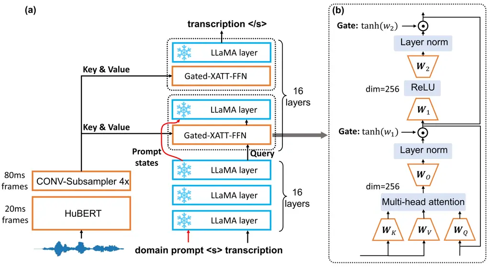
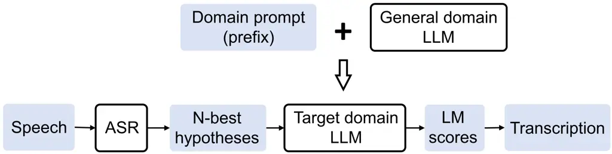
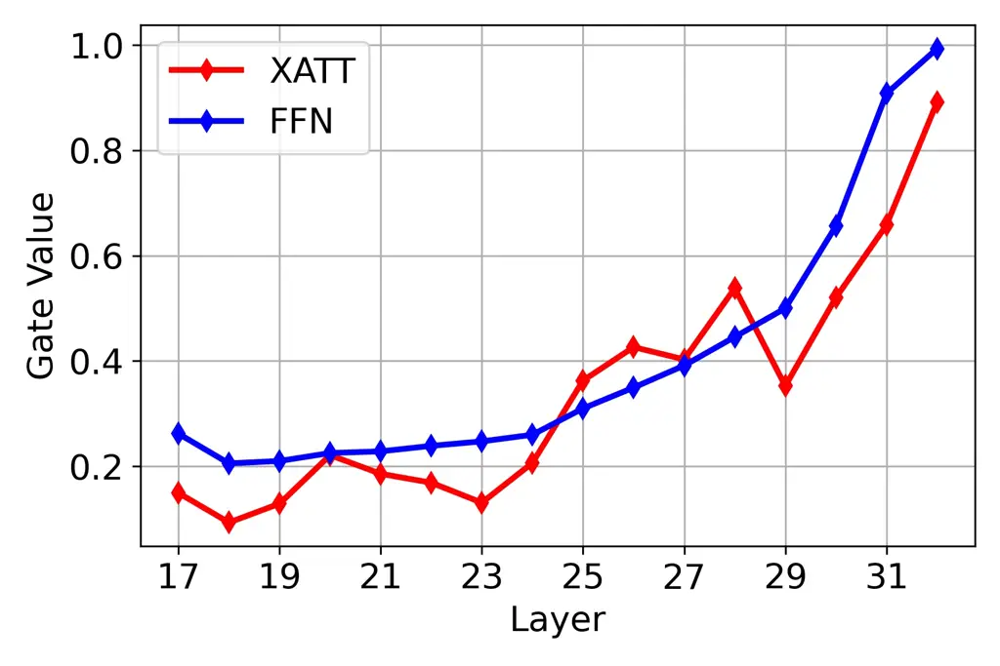

# Prompting Large Language Models for Zero-Shot Domain Adaptation in Speech Recognition

Yuang Li\sthanksWork done during an internship at Microsoft
Affiliation: University of Cambridge    Yu Wu    Jinyu Li    Shujie Liu
Affiliation: Microsoft

###### Abstract

The integration of Language Models (LMs) has proven to be an effective
way to address domain shifts in speech recognition. However, these
approaches usually require a significant amount of target domain text
data for the training of LMs. Different from these methods, in this
work, with only a domain-specific text prompt, we propose two zero-shot
ASR domain adaptation methods using LLaMA, a 7-billion-parameter large
language model (LLM). LLM is used in two ways: 1) second-pass rescoring:
reranking N-best hypotheses of a given ASR system with LLaMA; 2) deep
LLM-fusion: incorporating LLM into the decoder of an encoder-decoder
based ASR system. Experiments show that, with only one domain prompt,
both methods can effectively reduce word error rates (WER) on
out-of-domain TedLium-2 and SPGISpeech datasets. Especially, the deep
LLM-fusion has the advantage of better recall of entity and
out-of-vocabulary words.

###### Index Terms: 

domain adaptation, speech recognition, large language model

## 1 Introduction

|            |                                                                                        |
| ---------- | -------------------------------------------------------------------------------------- |
| prompt 1   | The following text is the transcription of company earnings calls.                     |
| prompt 2   | toy tiles that talk to each other                                                      |
| prompt 3   | dreams from endangered culture                                                         |
|            |                                                                                        |
| reference  | uptick we’re seeing in the containerboard market                                       |
| no prompt  | optic we’re seeing in the container board market                                       |
| + prompt 1 | uptick we’re seeing in the containerboard market                                       |
| reference  | well opportunistic share repurchases are clearly at the top of that list               |
| no prompt  | well oppertunistic share re purchases are clearly at the top of that list              |
| + prompt 1 | well opportunistic share repurchases are clearly at the top of that list               |
| reference  | now this is an interactive cartoon application                                         |
| no prompt  | now this is an iniractive a cartune application                                        |
| + prompt 2 | now this is an interactive a cartoon application                                       |
| reference  | the myths of the inuit elders still resonate with meaning or that in the himalaya the  |
| no prompt  | the myths of the innuit elders still resonate with meaning or that in the himalaia the |
| + prompt 3 | the myths of the inuit elders still resonate with meaning or that in the himalaya the  |

Table 1: Examples of deep LLM-fusion with/without prompt.

End-to-end (E2E) automatic speech recognition (ASR) systems \[1, 2, 3,
4, 5\] have demonstrated superior performance over traditional pipeline
approaches, with increases in model size and the scale of the supervised
dataset. However, E2E ASR still suffers from domain mismatch and limited
utilization of text corpora. To address these issues, external Language
Models (LMs) are often incorporated. Among them, two techniques without
altering the ASR model architecture are second-pass rescoring \[6\] and
shallow fusion\[7\]. Alternatively, LMs can be integrated into the ASR
model decoder as internal LMs, such as deep fusion\[8\] and cold
fusion \[9\], merging the hidden states of the LM with the ASR model.
Factorized neural transducer model  \[10, 11\] is another promising
architecture that predicts the blank token and vocabulary tokens
separately so that the vocabulary predictor fully functions as an LM.

Leveraging LMs can make ASR domain adaptation more accessible since it
is easier to collect target domain text than audio-text pairs. In this
case, an LM used in ASR adaptation can be developed through
fine-tuning \[12, 13, 14, 15, 16\] or prompt tuning \[17\]. Although
these approaches have shown promising results, it is worth noting that
commonly used LMs, such as GPT-2 \[18\] and Transformer-XL \[19\], have
relatively small scales and lack in-context learning capability. In
contrast, the latest Large Language Models (LLMs), such as GPT-4 \[20\]
and LLaMA \[21\], offer significantly larger capacities. These LLMs can
be adapted to downstream tasks without training by adding a textual
description of the task as a prompt \[22\]. Therefore, LLMs offer
advantages for domain adaptation, including:

- •
  Zero-shot adaptation: The traditional approach of acquiring additional
  audio/text data for domain adaptation is not only time-consuming but
  costly, and sometimes, it can be impossible to obtain domain-specific
  data. By prompting, we can adapt LLM to new domains and use it in ASR
  without re-training.
- •
  Flexible prompt design: The LLM possesses an exceptional capability to
  extract information from texts of varying forms and lengths, making
  prompt design effortless. Depending on the situation, various types of
  prompts can be utilized effectively. For instance, a concise summary
  of a talk can be provided to enhance recognition accuracy, or
  alternatively, only a title or important entity words can be used as
  prompts.
- •
  Leverage rapid-growth LLM community: In recent years, the capabilities
  of LLMs have rapidly evolved, with tremendous breakthroughs observed
  in both open-source models and business APIs. We are confident that
  the proposed framework for addressing ASR domain shift will continue
  to improve with the progress of LLMs.

In this work, we utilized LLaMA-7B and handcrafted textual prompts to
adapt ASR models trained on LibriSpeech \[23\] to TedLium-2 \[24\] and
SPGISpeech \[25\] datasets. The prompts were derived from the video
description of TED talks and the dataset description of SPGISpeech.
Initially, we employed LLaMA to rerank the 16-best hypotheses of the
HuBERT-CTC model \[26\]. When prompts were incorporated, we observed
relative word-error-rate (WER) reductions of 6.6% and 3.3% on the
TedLium-2 and SPGISpeech datasets, respectively. The effectiveness of
the second-pass reranking is constrained by the quality of N-best
hypotheses. Therefore, in further experiments, LLaMA was directly
incorporated into an encoder-decoder framework, which was modified from
Flamingo \[27\] and referred to as deep LLM-fusion in this paper. In
this setup, acoustic features from the HuBERT model were fed into the
frozen LLaMA model using the Gated cross-attention mechanism. By using
domain prompts, we achieved 2.6% and 7.7% relative WER reductions on the
TedLium-2 and SPGISpeech datasets, respectively. Notably, domain prompts
enabled more accurate recognition of semantically important entities, as
demonstrated in Table 1. For example, with a prompt indicating the
recording is company earning calls, the word ”uptick”, which describes a
slight upward trend, can be recognized accurately instead of being
mistakenly recognized as ”optic.”

## 2 Related Work

### 2.1 Domain Adaptation through Internal LM

The E2E ASR model learns an internal LM from the training data, but it
is biased toward the source domain. To address this bias when
transferring to a new domain, density ratio  \[28\], hybrid
autoregressive transducer \[29\], internal LM estimation (ILME) \[12,
13\] methods predict the internal LM score and subtracts it from the
combined scores of the E2E model and the external LM. However, these
methods introduce additional complexity to the decoding process, and the
estimation of the internal LM can be inaccurate. Therefore alternative
approaches were proposed, which involve fine-tuning the internal
LM \[10, 14\] or replacing it with a target-domain LM \[16\]. This
allows the ASR model to be directly adapted to a new domain without an
external LM. In this work, the deep LLM-fusion method can be considered
as explicitly using LLaMA as an internal LM.

### 2.2 Domain Adaptation through Prompting

Prompting, which involves adding prefixes to the text input, is a
popular method for LM adaptation \[30\]. It can be categorized into
discrete and continuous prompts. In \[31, 32\], recurrent and
Transformer-XL-based LMs with discrete prompts were used to rescore the
N-best hypotheses of the ASR model. The prompt comprises historical
transcriptions and dialogue acts, obtained from the output of the
natural language understanding model. This approach biases the LM
towards the domain indicated by the prompt context. To eliminate the
need for manual prompt design, prompt tuning \[17\] employs learnable
weights as prompts. It requires training in the target domain, but the
number of updated parameters is substantially reduced compared to
fine-tuning the entire LM. In our study, we designed straightforward
descriptive prompts for the TedLium-2 and SPGISpeech datasets, and
employed a significantly larger LM, surpassing the scale of previous
approaches.

### 2.3 From LLM to Multi-Modal LLM

The adaptation of LLM to multi-modal tasks has been a recent research
hotspot, with a particular focus on visual understanding tasks. One
approach was proposed in MiniGPT-4 \[33\], which directly feeds visual
features into the LLM after a single projection layer for alignment.
Another approach, LLaMA-Adapter \[34\] utilizes fixed-length trainable
vectors as layer-wise prompts which can incorporate visual information
during the instructive fine-tuning. Both MiniGPT-4 and LLaMA-Adapter are
decoder-only models. On the other hand, Flamingo \[27\] employs an
encoder-decoder framework where visual representations are fused into
the LLM through cross-attention. In all of these methods, the LLM
remains frozen, and only a small number of parameters are introduced. To
stabilize training, visual features are gradually incorporated using
techniques such as zero-init attention in LLaMA-Adapter and zero-init
gating in Flamingo. In this work, deep LLM-fusion can be viewed as
adapting LLM to speech modality. Considering the need to handle long and
variable-length input, our architecture is similar to Flamingo.



Figure 1: (a) Deep fusion of LLaMA into an attention
encoder-decoder-based ASR model with HuBERT as the encoder. (b)
Illustration of Gated-XATT-FFN module.

## 3 Method

### 3.1 Second-pass Reranking

Figure 2 illustrates the flowchart of the second-pass reranking method
for domain adaptation. An ASR model first generates N-best hypotheses.
Then, the LLaMA model with domain prompt, computes the LM score
(Equation 1) as the sum of log probabilities for each hypothesis. In
essence, a domain-specific textual prompt is added to the beginning of
each hypothesis before rescoring. Finally, the hypothesis with the
highest LM score is chosen. Note that we did not combine LM score with
E2E ASR score due to limited benefits. Furthermore, shallow fusion was
not considered as the vocabulary mismatch between the ASR model and LLM
complicates the decoding process.



Figure 2: Flowchart for the second-pass reranking.

```math
\displaystyle\text{LM score}=\sum_{i=1}^{N}\log P(w_{i}|\mathbf{w}_{<i},\mathbf{w}_{p}) \tag{1}
```

where the probability of current wordpiece $`w_{i}`$ is conditioned on
previous wordpieces $`\mathbf{w}_{<i}`$ and wordpieces in the prompt
$`\mathbf{w}_{p}`$.

### 3.2 Deep LLM-Fusion

#### 3.2.1 Model Architecture

Figure 1 (a) illustrates the integration of LLaMA into a
sequence-to-sequence model using gated cross attention and feed-forward
network (Gated-XATT-FFN) modules \[27\]. Initially, the raw waveform
input is processed by the HuBERT-Large model, which is followed by a
convolutional subsampling module that reduces the acoustic feature from
20ms per frame to 80ms per frame. These features serve as keys and
values in the Gated-XATT-FFN module, while the hidden states from LLaMA
act as queries. Finally, transcriptions are generated using the causal
LLaMA decoder. During training, the LLaMA layers remain fixed whereas
all other modules are updated. This architecture was adapted from
Flamingo \[27\] and the key differences are:

- •
  The speech encoder replaces the visual encoder and it was finetuned
  instead of frozen. We also tried to unfreeze the last layer of LLaMA,
  contributing to further performance improvements.
- •
  To enable the LLaMA decoder to distinguish the prompt and the
  transcription, a special start-of-sentence token was added between
  them. Additionally, the hidden states corresponding to the prompt skip
  the Gated-XATT-FFN module so that the first hidden state corresponding
  to the special token directly queries the beginning of acoustic
  features.
- •
  The computational requirement was reduced by decreasing the temporal
  dimension of acoustic features and the hidden dimension of
  Gated-XATT-FFN modules. In addition, Gated-XATT-FFN modules were only
  included in the top layers of LLaMA, eliminating the need to store
  gradients for shallow layers.

#### 3.2.2 Low-Dimensional Gated Cross Attention

The Gated-XATT-FFN module in Figure 1 (b) is a key component for
integrating the speech modality into LLaMA. It employs a Tanh gating
mechanism (Equation 2 3), which determines the extent of influence that
speech features have on the final transcriptions. The module consists of
two trainable gating parameters, $`w_{1}`$ and $`w_{2}`$, responsible
for controlling the cross-attention and FFN, respectively. To ensure a
stable training process, these parameters are initialized as zero, so
speech features are gradually incorporated.

```math
\displaystyle\mathbf{Y} \displaystyle=tanh(w_{1})\odot MHA(\mathbf{K},\mathbf{V},\mathbf{Q})+\mathbf{Q} \tag{2}
```

```math
\displaystyle\mathbf{\hat{Y}} \displaystyle=tanh(w_{2})\odot FFN(\mathbf{Y})+\mathbf{Y} \tag{3}
```

Traditional cross-attention modules usually maintain a consistent
dimension during the computation. Since LLaMA-7B has a large hidden
dimension of 4096, a single linear projection matrix will have 16
million parameters. To decrease the scale of the Gated-XATT-FFN module,
we implemented a bottleneck structure by reducing the hidden dimension
inside the multi-head attention and FFN to 256.

#### 3.2.3 Long-form Training

During inference, the LLaMA decoder utilizes a prompt to guide the
autoregressive generation of transcriptions in the target domain. To
enable this, it is crucial to have contextual prefixes before each
transcription during training. These prefixes need to be diverse to
enhance generalizability. However, manually constructing prompts for
individual utterances is not feasible, and using the same prompt for
multiple utterances is not ideal. Therefore, we adopted long-form
training by using a single ground-truth transcription of the previous
utterance as the prompt. By doing so, we encouraged the model to
effectively incorporate the historical text, which encompasses local
context or topic-related information.

## 4 Experimental Setup

### 4.1 Model Configurations

In our experiments, we utilized the LLaMA model, which has 7 billion
parameters, 32 layers, and a hidden dimension of 4096. For the
second-pass reranking, we employed the open-source HuBERT-Large model¹¹
1 https://huggingface.co/facebook/hubert-large-ls960-ft that was
pre-trained on the LibriLight \[35\] dataset and finetuned on the
LibriSpeech \[23\] dataset using a character-level vocabulary and CTC
loss. During the decoding process, we used a beam size of 16 for all
test sets. After rescoring with LLaMA, we selected the hypothesis with
the highest LM score. For deep LLM-fusion, we utilized the HuBERT-Large
model²² 2 https://huggingface.co/facebook/hubert-large-ll60k,
pre-trained on the LibriLight dataset, as a speech encoder. It takes
16kHz raw waveform as input and generates hidden states at a frame rate
of 50Hz. To downsample the hidden states, we applied two 1D
convolutional layers with a kernel size of three and a stride of two,
resulting in a frame rate of 12.5Hz. These downsampled states were
employed as keys and values in 16 Gated-XATT-FFN modules, which were
inserted in the top 16 layers of LLaMA. In each Gated-XATT-FFN module,
the multi-head cross attention has a dimension of 256 and four heads.

The deep LLM-fusion model was trained on the LibriSpeech dataset with
Specaug \[36\] that masks HuBERT states and a three-phase training
schedule. In the first phase, only the CONV-Subsampler and
Gated-XATT-FFN modules were trained from scratch for 200,000 steps with
AdamW \[37\] optimizer, a batch size of 64, and cross-entropy loss. An
inverse square root schedule was used with a peak learning rate (LR) of
1e-4. In this phase, the number of trainable parameters was 82 million.
In the second phase, the HuBERT model was unfrozen and finetuned for
another 100,000 steps with an LR of 3e-5. The number of learnable
parameters increased to 475 million. It’s worth noting that in the first
two phases, the model was trained on the utterance-wise ASR task. In the
third phase, history transcriptions were incorporated as prompts with a
probability of 80%, and the model was fine-tuned for an additional
100,000 steps with an LR of 1e-5. In this phase, it is optional to
unfreeze the last LLaMA layer to enhance performance, which introduces
another 460 million parameters. The training process utilized eight
NVIDIA Tesla V100 32GB GPUs, with an actual batch size of 1 on each GPU.
A simulated batch size of 64 was achieved by accumulating gradients over
eight steps. During decoding, beam search was employed with a beam size
of 16.

### 4.2 Evaluation

#### 4.2.1 Datasets

ASR models trained on the LibriSpeech dataset \[23\] were evaluated on
the TedLium-2 \[24\] and SPGISpeech datasets \[25\]. The LibriSpeech
training set contains 960 hours of speech data. For the SPGISpeech eval
set, we selected a subset of 15 hours of speech. Each sample in this
subset has at least two out-of-vocabulary (OOV) words compared to the
LibriSpeech vocabulary. The prompt used for the SPGISpeech eval set is:
”The following text is the transcription of company earning calls.” For
the TedLium-2 dataset, we combined the dev and eval sets, resulting in
recordings of 20 TED Talk videos which have 4 hours of speech. We
collected the titles and the descriptions of each video as
domain-specific prompts (Table 2). All prompts are normalized by
removing punctuations and changing words to lowercase, so the format is
the same as history transcription used in long-form training.
Additionally, long-form ASR performance using one history transcription
will be provided for LibriSpeech and TedLium-2 datasets since their
utterances were derived from long-from recordings.

[TABLE]

Table 2: Examples of prompts.

#### 4.2.2 Metrics

For LibriSpeech test sets, standard word-error-rate (WER) was used. For
domain adaptation, we also considered the recall of entity words and
out-of-vocabulary (OOV) words, which carry more semantic meaning. To
achieve this, we employed a name entity recognition model to extract
entity words ³³ 3 https://huggingface.co/dslim/bert-large-NER from both
the ground-truth labels and the hypotheses. The recall was then
calculated as the ratio of the recovered entity words to the total
number of entity words. Similarly, OOV recall was determined by
extracting OOV words using the LibriSpeech vocabulary.

## 5 Results

### 5.1 Results for Second-pass Reranking

Second-pass reranking generally benefits ASR adaptation, as demonstrated
in Table 3. On the SPGISpeech dataset, reranking contributes to a 1.98%
absolute reduction in WER. Furthermore, by prepending the dataset
description to each hypothesis before reranking, we achieved an
additional 0.39% absolute improvement in WER. We also observed
significant enhancements in entity and OOV recall, with 6% and 10%
absolute increases compared to the CTC baseline respectively. On the
TedLium-2 dataset, reranking without a prompt did not noticeably improve
the WER. When using a short title prompt, we observed a modest 0.23%
absolute improvement in WER. Longer prompts and incorporating local
history context resulted in more substantial performance enhancements,
with up to a 0.58% absolute reduction in WER. While entity recalls only
saw slight improvements, OOV recall was improved more substantially with
an absolute increase of 7%. In summary, the benefits of second-pass
reranking depend on how well LLaMA aligns with the target domain, which
can be enhanced through prompting. Additionally, the upper-bound
performance is determined by the quality of the N-best hypothesis, which
explains the limited improvements of the entity recall on the TedLium-2
dataset which has an upper bound of 0.56.

|                    |             |       |        |      |
| ------------------ | ----------- | ----- | ------ | ---- |
|                    |             |       | Recall |      |
| Reranking          | Prompt      | WER   | Entity | OOV  |
| SPGISpeech Dataset |             |       |        |      |
| ×                  | ×           | 13.66 | 0.50   | 0.48 |
| ✓                  | ×           | 11.68 | 0.55   | 0.56 |
| ✓                  | description | 11.29 | 0.56   | 0.58 |
| TedLium-2 Dataset  |             |       |        |      |
| ×                  | ×           | 9.22  | 0.50   | 0.38 |
| ✓                  | ×           | 9.25  | 0.49   | 0.44 |
| ✓                  | title       | 8.99  | 0.50   | 0.45 |
| ✓                  | description | 8.64  | 0.51   | 0.45 |
| ✓                  | history-gt  | 8.64  | 0.51   | 0.45 |
| ✓                  | history-hyp | 8.65  | 0.51   | 0.45 |

Table 3: Domain adaptation performance of HuBert-CTC with/without LLaMA
reranking.

### 5.2 Results for Deep LLM-Fusion

We evaluated deep LLM-fusion method with the LLaMA model frozen or the
last LLaMA fine-tuned. The fine-tuning was motivated by the finding that
deeper layers play a more crucial role in ASR, as indicated by the
increase in absolute gate values with layer depth (Figure 3). Because of
the adaptation of the last LLaMA’s layer to ASR task and more trainable
parameters, WERs were consistently improved under all circumstances in
Table 4.



Figure 3: The absolute gate values of Gated-XATT-FFN module at different
layers.

|                    |               |             |             |
| ------------------ | ------------- | ----------- | ----------- |
|                    |               | Recall      |             |
| Prompt             | WER           | Entity      | OOV         |
| SPGISpeech Dataset |               |             |             |
| ×                  | 12.00 / 11.79 | 0.53 / 0.55 | 0.55 / 0.56 |
| description        | 11.15 / 10.88 | 0.55 / 0.59 | 0.58 / 0.59 |
| TedLium-2 Dataset  |               |             |             |
| ×                  | 9.16 / 8.99   | 0.55 / 0.57 | 0.50 / 0.50 |
| title              | 8.95 / 8.80   | 0.57 / 0.59 | 0.54 / 0.53 |
| description        | 9.07 / 8.76   | 0.61 / 0.65 | 0.55 / 0.56 |
| history-gt         | 8.74 / 8.54   | 0.62 / 0.61 | 0.55 / 0.56 |
| history-hyp        | 8.71 / 8.60   | 0.60 / 0.60 | 0.54 / 0.55 |

Table 4: Domain adaptation performance of deep LLM-fusion. Results were
provided for the model with the last LLaMA layer frozen / fine-tuned,
respectively.

Deep LLM-fusion outperforms the HuBERT CTC baselines without prompts, as
shown in Table 4. Prompting has a similar positive effect on deep
LLM-fusion as second-pass reranking. On SPGISpeech datasets, prompting
resulted in absolute WER reductions of 0.85% and 0.91% when the last
LLaMA layer was frozen or fine-tuned, respectively. The improvements on
the TedLium-2 dataset were less significant in terms of WER. When the
last LLaMA layer was not fine-tuned, using a short prompt of the video
title slightly outperformed a longer prompt of the video description.
However, after fine-tuning the last LLaMA layer, the performance with a
longer prompt improved more significantly. Additionally, by using
history transcription, we achieved lower WERs compared with using global
descriptive prompts. This is because previous transcriptions are more
closely related to the current utterance and align with the prompt type
used in long-form training. More importantly, deep LLM-fusion
contributed to significantly better entity and OOV recalls. On
TedLium-2, the highest entity and OOV recalls of deep LLM-fusion are
0.65 and 0.56 respectively, however, for second-pass reranking, the best
recalls are only 0.51 and 0.45. This indicates that deep LLM-fusion is
better at recognizing important topic-related words.

## 6 Conclusion

In our paper, we explored zero-shot domain adaptation of ASR models
using two frameworks: second-pass reranking and deep LLM-fusion. By
leveraging large-scale LLaMA, we achieved effective adaptation through
prompt-based methods, eliminating the need for target domain data for
fine-tuning. The power of LLM makes the design of prompts simple and
flexible, allowing for the use of topic words or longer descriptions as
prompts. The second-pass reranking method has the advantage of adapting
existing ASR models without re-training. Deep LLM-fusion requires joint
training of the speech encoder and LLM in the source domain. Though it
requires more computational resources, it is able to recover more entity
and OOV words in a new domain. In future works, we plan to perform
efficient fine-tuning of the whole LLaMA model and use larger versions
of LLaMA.

## References

- \[1\] Alex Graves, Santiago Fernández, Faustino Gomez, and Jürgen
  Schmidhuber, “Connectionist temporal classification: labelling
  unsegmented sequence data with recurrent neural networks,” in Proc.
  ICML, Jun. 2006, pp. 369–376.
- \[2\] Alex Graves, “Sequence transduction with recurrent neural
  networks,” in Proc. ICML, Edinburgh, Scotland, Jun. 2012.
- \[3\] Jan Chorowski, Dzmitry Bahdanau, Dmitriy Serdyuk, Kyunghyun Cho,
  and Yoshua Bengio, “Attention-based models for speech recognition,” in
  Proc. NeurIPS, Dec. 2015, pp. 577–585.
- \[4\] Alec Radford, Jong Wook Kim, Tao Xu, Greg Brockman, Christine
  McLeavey, and Ilya Sutskever, “Robust speech recognition via
  large-scale weak supervision,” arXiv preprint arXiv:2212.04356, 2022.
- \[5\] Jinyu Li, “Recent advances in end-to-end automatic speech
  recognition,” APSIPA Transactions on Signal and Information
  Processing, vol. 11, no. 1, 2022.
- \[6\] Xianrui Zheng, Chao Zhang, and Philip C Woodland, “Adapting GPT,
  GPT-2 and BERT language models for speech recognition,” in Proc. ASRU.
  IEEE, 2021, pp. 162–168.
- \[7\] Anjuli Kannan, Yonghui Wu, Patrick Nguyen, Tara N Sainath,
  Zhijeng Chen, and Rohit Prabhavalkar, “An analysis of incorporating an
  external language model into a sequence-to-sequence model,” in Proc.
  ICASSP. IEEE, 2018, pp. 1–5828.
- \[8\] Caglar Gulcehre, Orhan Firat, Kelvin Xu, Kyunghyun Cho, Loic
  Barrault, Huei-Chi Lin, Fethi Bougares, Holger Schwenk, and Yoshua
  Bengio, “On using monolingual corpora in neural machine translation,”
  arXiv preprint arXiv:1503.03535, 2015.
- \[9\] Anuroop Sriram, Heewoo Jun, Sanjeev Satheesh, and Adam Coates,
  “Cold fusion: Training seq2seq models together with language models,”
  Proc. Interspeech 2018, pp. 387–391, 2018.
- \[10\] Xie Chen, Zhong Meng, Sarangarajan Parthasarathy, and Jinyu Li,
  “Factorized neural transducer for efficient language model
  adaptation,” in ICASSP. 2022, pp. 8132–8136, IEEE.
- \[11\] Rui Zhao, Jian Xue, Partha Parthasarathy, Veljko Miljanic, and
  Jinyu Li, “Fast and accurate factorized neural transducer for text
  adaption of end-to-end speech recognition models,” in ICASSP. 2023,
  IEEE.
- \[12\] Zhong Meng, Sarangarajan Parthasarathy, Eric Sun, Yashesh Gaur,
  Naoyuki Kanda, Liang Lu, Xie Chen, Rui Zhao, Jinyu Li, and Yifan Gong,
  “Internal language model estimation for domain-adaptive end-to-end
  speech recognition,” in Proc. SLT. IEEE, 2021, pp. 243–250.
- \[13\] Zhong Meng, Naoyuki Kanda, Yashesh Gaur, Sarangarajan
  Parthasarathy, Eric Sun, Liang Lu, Xie Chen, Jinyu Li, and Yifan Gong,
  “Internal language model training for domain-adaptive end-to-end
  speech recognition,” in Proc. ICASSP. IEEE, 2021, pp. 7338–7342.
- \[14\] Zhong Meng, Yashesh Gaur, Naoyuki Kanda, Jinyu Li, Xie Chen,
  Yu Wu, and Yifan Gong, “Internal language model adaptation with
  text-only data for end-to-end speech recognition,” arXiv preprint
  arXiv:2110.05354, 2021.
- \[15\] Emiru Tsunoo, Yosuke Kashiwagi, Chaitanya Narisetty, and Shinji
  Watanabe, “Residual language model for end-to-end speech recognition,”
  arXiv preprint arXiv:2206.07430, 2022.
- \[16\] Keqi Deng and Philip C Woodland, “Adaptable end-to-end asr
  models using replaceable internal lms and residual softmax,” in Proc.
  ICASSP. IEEE, 2023, pp. 1–5.
- \[17\] Saket Dingliwal, Ashish Shenoy, Sravan Bodapati, Ankur Gandhe,
  Ravi Teja Gadde, and Katrin Kirchhoff, “Domain prompts: Towards memory
  and compute efficient domain adaptation of asr systems,” arXiv
  preprint arXiv:2112.08718, 2021.
- \[18\] Alec Radford, Jeffrey Wu, Rewon Child, David Luan, Dario
  Amodei, Ilya Sutskever, et al., “Language models are unsupervised
  multitask learners,” OpenAI blog, vol. 1, no. 8, pp. 9, 2019.
- \[19\] Zihang Dai, Zhilin Yang, Yiming Yang, Jaime G Carbonell, Quoc
  Le, and Ruslan Salakhutdinov, “Transformer-xl: Attentive language
  models beyond a fixed-length context,” in Proc. ACL, 2019, pp.
  2978–2988.
- \[20\] OpenAI, “Gpt-4 technical report,” arXiv preprint
  arXiv:2303.08774, 2023.
- \[21\] Hugo Touvron, Thibaut Lavril, Gautier Izacard, Xavier Martinet,
  Marie-Anne Lachaux, Timothée Lacroix, Baptiste Rozière, Naman Goyal,
  Eric Hambro, Faisal Azhar, et al., “LLaMA: Open and efficient
  foundation language models,” arXiv preprint arXiv:2302.13971, 2023.
- \[22\] Tom Brown, Benjamin Mann, Nick Ryder, Melanie Subbiah, Jared D
  Kaplan, Prafulla Dhariwal, Arvind Neelakantan, Pranav Shyam, Girish
  Sastry, Amanda Askell, et al., “Language models are few-shot
  learners,” Proc. NeurIPS, vol. 33, pp. 1877–1901, 2020.
- \[23\] Vassil Panayotov, Guoguo Chen, Daniel Povey, and Sanjeev
  Khudanpur, “Librispeech: an asr corpus based on public domain audio
  books,” in Proc. ICASSP. IEEE, 2015, pp. 5206–5210.
- \[24\] Anthony Rousseau, Paul Deléglise, and Yannick Esteve,
  “Ted-lium: an automatic speech recognition dedicated corpus.,” in
  LREC, 2012, pp. 125–129.
- \[25\] Patrick K O’Neill, Vitaly Lavrukhin, Somshubra Majumdar, Vahid
  Noroozi, Yuekai Zhang, Oleksii Kuchaiev, Jagadeesh Balam, Yuliya
  Dovzhenko, Keenan Freyberg, Michael D Shulman, et al., “Spgispeech:
  5,000 hours of transcribed financial audio for fully formatted
  end-to-end speech recognition,” arXiv preprint arXiv:2104.02014, 2021.
- \[26\] Wei-Ning Hsu, Benjamin Bolte, Yao-Hung Hubert Tsai, Kushal
  Lakhotia, Ruslan Salakhutdinov, and Abdelrahman Mohamed, “Hubert:
  Self-supervised speech representation learning by masked prediction of
  hidden units,” IEEE/ACM Transactions on Audio, Speech, and Language
  Processing, vol. 29, pp. 3451–3460, 2021.
- \[27\] Jean-Baptiste Alayrac, Jeff Donahue, Pauline Luc, Antoine
  Miech, Iain Barr, Yana Hasson, Karel Lenc, Arthur Mensch, Katherine
  Millican, Malcolm Reynolds, et al., “Flamingo: a visual language model
  for few-shot learning,” Proc. NeurIPS, vol. 35, pp. 23716–23736, 2022.
- \[28\] Erik McDermott, Hasim Sak, and Ehsan Variani, “A density ratio
  approach to language model fusion in end-to-end automatic speech
  recognition,” in Proc. ASRU. IEEE, 2019, pp. 434–441.
- \[29\] Ehsan Variani, David Rybach, Cyril Allauzen, and Michael Riley,
  “Hybrid autoregressive transducer (HAT),” in Proc. ICASSP. IEEE, 2020,
  pp. 6139–6143.
- \[30\] Xiang Lisa Li and Percy Liang, “Prefix-tuning: Optimizing
  continuous prompts for generation,” in Proc. ACL, 2021, pp. 4582–4597.
- \[31\] Ashish Shenoy, Sravan Bodapati, Monica Sunkara, Srikanth
  Ronanki, and Katrin Kirchhoff, “Adapting long context nlm for asr
  rescoring in conversational agents,” arXiv preprint
  arXiv:2104.11070, 2021.
- \[32\] Ashish Shenoy, Sravan Bodapati, and Katrin Kirchhoff, “ASR
  adaptation for e-commerce chatbots using cross-utterance context and
  multi-task language modeling,” in Proceedings of The 4th Workshop on
  e-Commerce and NLP, 2021, pp. 18–25.
- \[33\] Deyao Zhu, Jun Chen, Xiaoqian Shen, Xiang Li, and Mohamed
  Elhoseiny, “Minigpt-4: Enhancing vision-language understanding with
  advanced large language models,” arXiv preprint
  arXiv:2304.10592, 2023.
- \[34\] Renrui Zhang, Jiaming Han, Aojun Zhou, Xiangfei Hu, Shilin Yan,
  Pan Lu, Hongsheng Li, Peng Gao, and Yu Qiao, “LLaMA-adapter: Efficient
  fine-tuning of language models with zero-init attention,” arXiv
  preprint arXiv:2303.16199, 2023.
- \[35\] Jacob Kahn, Morgane Riviere, Weiyi Zheng, Evgeny Kharitonov,
  Qiantong Xu, Pierre-Emmanuel Mazaré, Julien Karadayi, Vitaliy
  Liptchinsky, Ronan Collobert, Christian Fuegen, et al., “Libri-light:
  A benchmark for asr with limited or no supervision,” in Proc. ICASSP.
  IEEE, 2020, pp. 7669–7673.
- \[36\] Daniel S Park, William Chan, Yu Zhang, Chung-Cheng Chiu, Barret
  Zoph, Ekin D Cubuk, and Quoc V Le, “Specaugment: A simple data
  augmentation method for automatic speech recognition,” Proc.
  Interspeech, pp. 2613–2617, 2019.
- \[37\] Ilya Loshchilov and Frank Hutter, “Decoupled weight decay
  regularization,” in Proc. ICLR, 2019.
