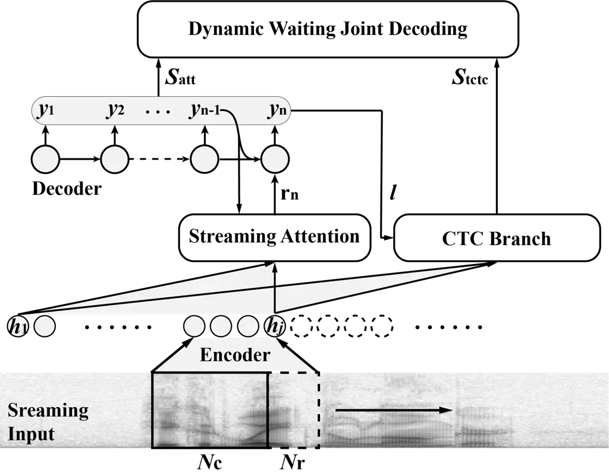
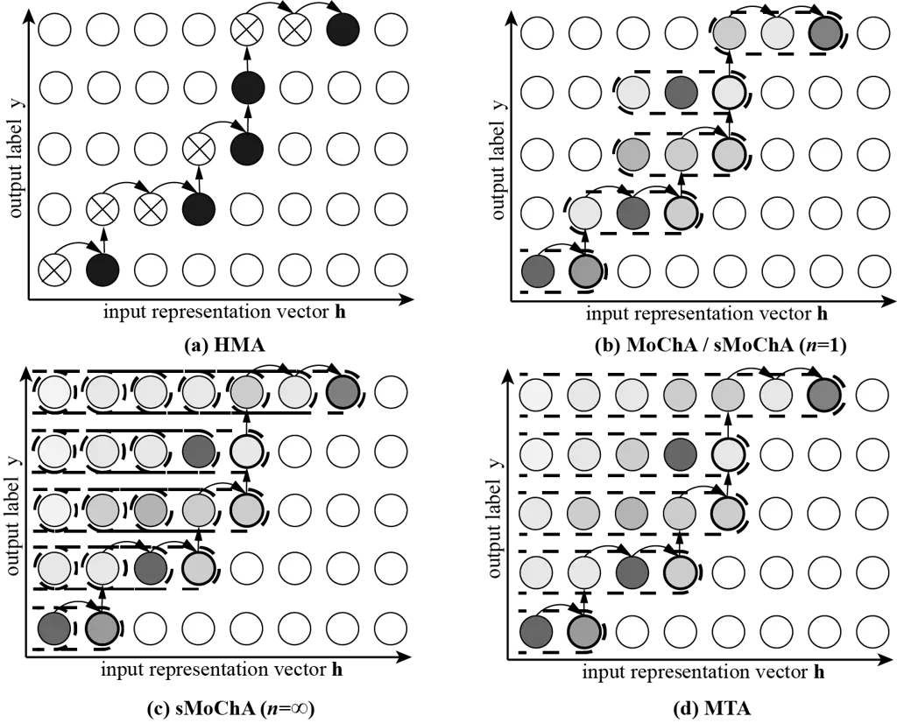
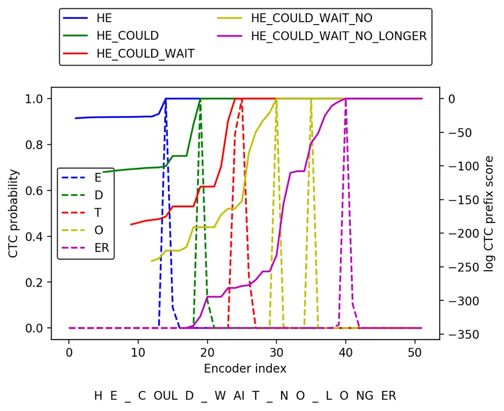
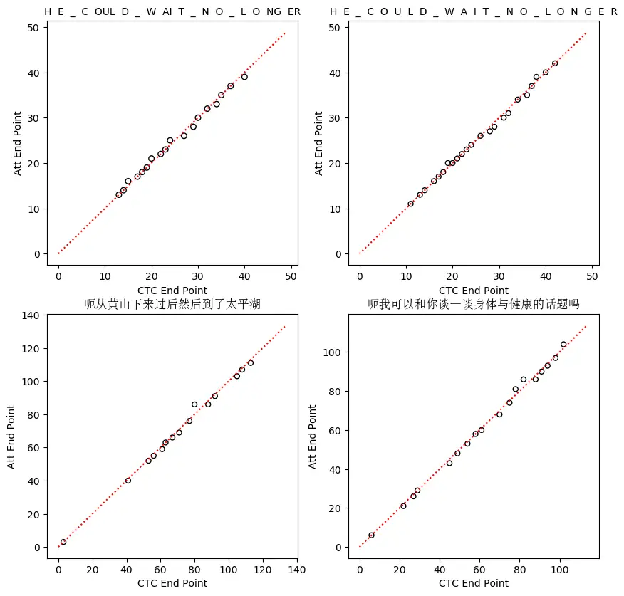
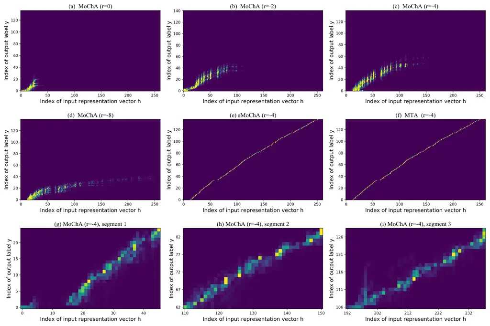
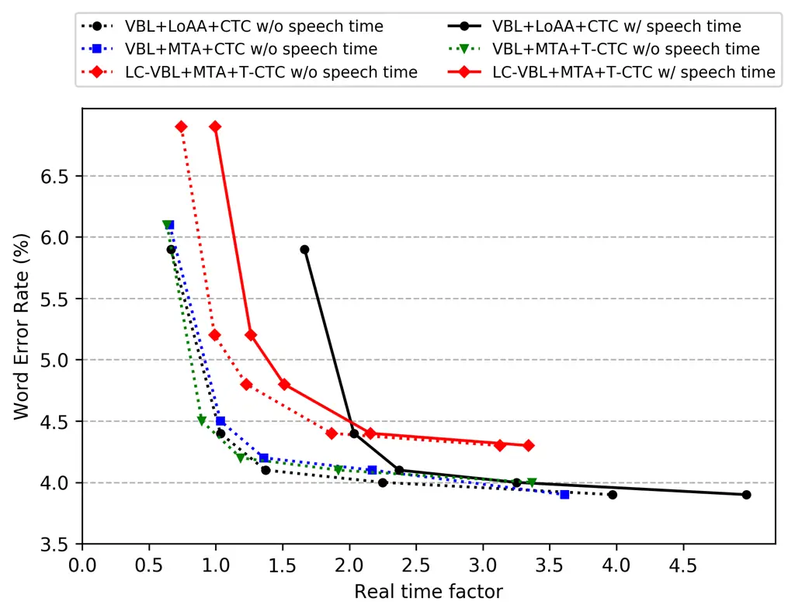
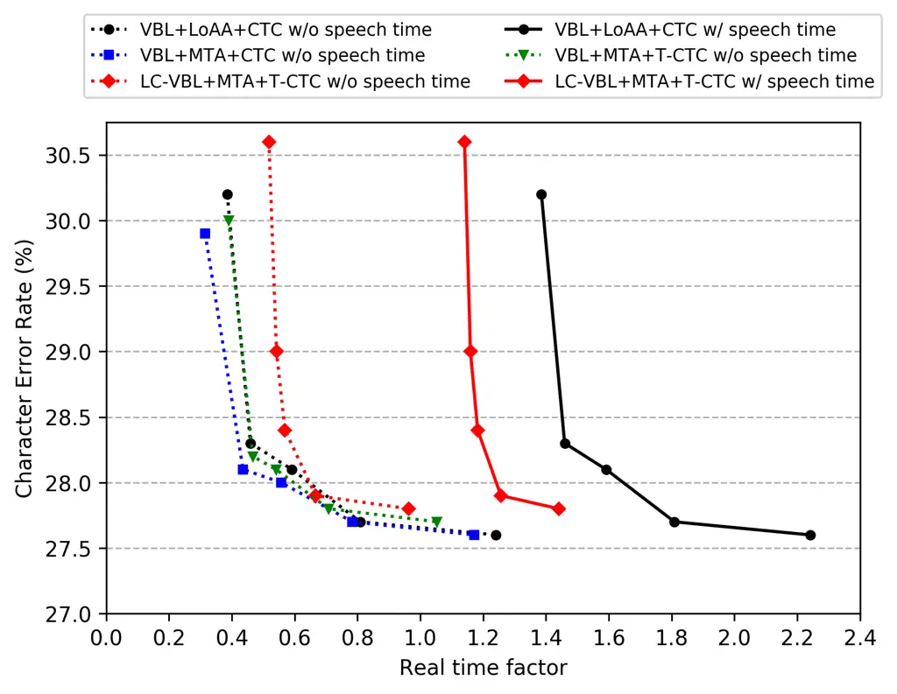

# Online Hybrid CTC/attention End-to-End Automatic Speech Recognition ArchitectureThanks: Manuscript received xxxxxxxx; revised xxxxxxxx. (Corresponding author: Gaofeng Cheng.)Thanks: H. Miao (e-mail: miaohaoran@hccl.ioa.ac.cn), G. Cheng (e-mail: chenggaofeng@hccl.ioa.ac.cn), P. Zhang (e-mail: zhangpengyuan@hccl.ioa.ac.cn) and Y. Yan (e-mail: yanyonghong@hccl.ioa.ac.cn) are with Institute of Acoustics, Chinese Academy of Sciences and University of Chinese Academy of Sciences, Beijing, China.

Haoran Miao    Gaofeng Cheng    Pengyuan Zhang Affiliation: Yonghong
Yan, 

###### Abstract

Recently, there has been increasing progress in end-to-end automatic
speech recognition (ASR) architecture, which transcribes speech to text
without any pre-trained alignments. One popular end-to-end approach is
the hybrid Connectionist Temporal Classification (CTC) and attention
(CTC/attention) based ASR architecture, which utilizes the advantages of
both CTC and attention. The hybrid CTC/attention ASR systems exhibit
performance comparable to that of the conventional deep neural network
(DNN) / hidden Markov model (HMM) ASR systems. However, how to deploy
hybrid CTC/attention systems for online speech recognition is still a
non-trivial problem. This paper describes our proposed online hybrid
CTC/attention end-to-end ASR architecture, which replaces all the
offline components of conventional CTC/attention ASR architecture with
their corresponding streaming components. Firstly, we propose stable
monotonic chunk-wise attention (sMoChA) to stream the conventional
global attention, and further propose monotonic truncated attention
(MTA) to simplify sMoChA and solve the training-and-decoding mismatch
problem of sMoChA. Secondly, we propose truncated CTC (T-CTC) prefix
score to stream CTC prefix score calculation. Thirdly, we design dynamic
waiting joint decoding (DWJD) algorithm to dynamically collect the
predictions of CTC and attention in an online manner. Finally, we use
latency-controlled bidirectional long short-term memory (LC-BLSTM) to
stream the widely-used offline bidirectional encoder network.
Experiments with LibriSpeech English and HKUST Mandarin tasks
demonstrate that, compared with the offline CTC/attention model, our
proposed online CTC/attention model improves the real time factor in
human-computer interaction services and maintains its performance with
moderate degradation. To the best of our knowledge, this is the first
work to provide the full-scale online solution for CTC/attention
end-to-end ASR architecture.

###### Index Terms: 

End-to-end speech recognition, online speech recognition, hybrid
CTC/attention speech recognition.

## I Introduction

In the past decade, we have witnessed impressive progress in automatic
speech recognition (ASR) field. The hybrid deep neural network
(DNN)/hidden Markov model (HMM) \[1, 2, 3\] is the first successful
deep-learning ASR architecture. A typical hybrid DNN/HMM system is
composed of several separate modules, including acoustic, pronunciation
and language models (AM, PM, LM), all of which are designed manually and
optimized separately. Additionally, the hybrid DNN/HMM system needs a
complex decoder which has to be performed by integrating AM, PM and LM.
To conclude, the hybrid DNN/HMM ASR models require linguistic
information and complex decoders, and thus it is difficult to develop
hybrid DNN/HMM ASR systems for new languages.

In recent years, end-to-end speech recognition \[4, 5, 6, 7, 8, 9\] has
gained popularity in the ASR community. End-to-end ASR models simplify
the conventional DNN/HMM ASR system into a single deep neural network
architecture. Besides, the end-to-end models require no lexicons and
predict graphemes or words directly, which makes the decoding procedure
much simpler than those of the hybird DNN/HMM models. To date, the
end-to-end ASR architectures have gained significant improvement in
speech recognition accuracy \[10, 6, 7\]. There are two major types of
end-to-end ASR architectures. One is Connectionist Temporal
Classification (CTC) based ASR architecture \[5, 11, 12\] and the other
is the attention-based ASR architecture \[13, 8, 9, 7\]. To combine
theses two architectures, the hybrid CTC/attention architecture \[14,
6\] was proposed to leverage the CTC objective as an auxiliary task in
an attention-based encoder-decoder network. During training, a CTC
objective is attached to an attention-based encoder-decoder model as a
regularization. During decoding, a joint CTC/attention decoding approach
was proposed to combine the decoder scores and CTC scores in the beam
search algorithm. Specifically, the CTC branch uses the CTC prefix score
\[15\] to efficiently exclude hypotheses with poor alignments. By taking
the advantages of both CTC and attention mechanisms, the hybrid
CTC/attention architecture has been proved to be superior to simple
attention-based and CTC-based models \[6\].

Although the hybrid CTC/attention end-to-end ASR architecture is
reaching reasonable performance \[16, 17, 18, 19\], how to deploy it in
online scenarios remains an unsolved problem. After inspections of the
CTC/attention ASR architecture, we identify four challenges to deploy
online hybrid CTC/attention end-to-end ASR systems:

- •
  Attention mechanism: The conventional CTC/attention ASR architecture
  employs global attention mechanism like additive attention \[13\] or
  location-aware attention \[8\], which performs attention over the
  entire input representations.
- •
  CTC prefix score: CTC prefix score is defined as the cumulative
  probability of all label sequences sharing the same prefix. We need
  the information of complete utterances to compute the CTC prefix
  scores.
- •
  Unsynchronized predictions between CTC and attention: Attention-based
  ASR models perform label synchronous decoding, while CTC-based ASR
  models are frame-synchronized. Even though CTC/attention joint
  training can guide them to have more synchronized predictions, the
  predictions of CTC and attention are not strictly synchronized. This
  phenomenon makes online joint CTC/attention decoding difficult.
- •
  Bidirectional encoder: Bidirectional long short-term memory (BLSTM)
  \[20, 21\] networks, which can exploit long-term dependency of input
  speeches, are widely used in CTC/attention end-to-end ASR
  architectures. However, the bidirectional encoder hampers the online
  deployment of hybrid CTC/attention models.

To surmount the obstacles of deploying online attention based end-to-end
models, there have been some prior published efforts to stream attention
mechanisms, including neural transducer (NT) \[22, 23\], hard monotonic
attention (HMA) \[24\], monotonic chunk-wise attention (MoChA) \[25\],
triggered attention (TA) \[26\], etc. NT is a limited-sequence streaming
attention-based model that consumes a fixed number of input frames and
produces a variable number of labels before the next chunk of input
frames arrive. However, NT requires coarse alignments during training
(e.g., what words are verbalized by what chunk of input frames). HMA and
MoChA are alignment-free streaming attention models, which enables the
attention to automatically select a fixed number of input
representations in monotonic left-to-right mode. However, \[27\] found
that MoChA had convergence problem because the attention weights of
MoChA decreased immediately, and \[28\] found that MoChA had problems
scaling up to long utterances. TA was proposed to leverage CTC-based
networks to dynamically partition utterances, and to perform attention
on the incremental input representations as the decoder generates
labels.

Suffering from the joint CTC/attention decoding strategy, it requires
sophisticated skills to realize the online CTC/attention end-to-end ASR
architecture. This paper summarizes our work on streaming the
CTC/attention ASR architecture in four aspects. First, we propose a
stable MoChA (sMoChA) to address the non-convergence problem of MoChA.
Furthermore, we design a monotonic truncated attention (MTA) to deal
with the training-and-decoding mismatch problem of sMoChA. Compared with
sMoChA, MTA is more simple and achieves higher recognition accuracy.
Second, we leverage CTC output to segment input representations and
compute a truncated CTC (T-CTC) prefix score on top of the segmented
input representations rather than the complete utterances. Our
experiments demonstrate that the T-CTC prefix score can approximate to
its corresponding CTC prefix score and accelerate the decoding speed.
Third, we propose a dynamic waiting joint decoding (DWJD) algorithm to
solve the unsynchronized predictions problem of joint CTC/attention
decoding. Finally, we use a stack of VGGNet-style \[29\] convolutional
neural networks (CNNs) as the encoder front-end and apply
latency-controlled BLSTM (LC-BLSTM) \[30, 31\] as the encoder back-end.
Figure 1 depicts our proposed online CTC/attention end-to-end ASR
architecture.

Our experiments showed that almost no speech recognition accuracy
degradation was caused by using MTA, T-CTC and DWJD, which demonstrated
the superiority and robustness of our proposed methods. The major
recognition accuracy degradation came from the using of LC-BLSTM based
encoder networks.

Compared with our preliminary version\[32\], the new content in this
paper includes proposing MTA to improve the online performance,
providing more details of decoding algorithms and verifying the validity
of the system in Chinese and English by more experiments. The rest of
this paper is organized as follows. In section II, we describe the
hybrid CTC/attention ASR architecture. In section III, we present some
prior streaming attention methods. In section IV, we describe the
proposed online CTC/attention end-to-end ASR architecture. The
experimental setups and results are described in section V. Finally we
make the conclusions in section VI.



Fig. 1: The proposed online hybrid CTC/attention based end-to-end ASR
architecture. The architecture uses streaming attention mechanism to
stream the attention branch, and uses DWJD algorithm to dynamically
collect decoding scores from attention-based decoder ($`S_{\rm{att}}`$)
and CTC branch ($`S_{\rm{tctc}}`$).

## II Hybrid CTC/attention Architecture

In this section, we introduce the training and decoding details about
the hybrid CTC/attention end-to-end ASR architecture \[6, 33\] and
reveal why it is difficult to deploy it in online scenarios.

### II-A Training of Hybrid CTC/attention ASR Architecture

The hybrid CTC/attention end-to-end ASR architecture is based on the
attention-based encoder-decoder model \[8\]. Suppose the $`T`$ input
frames $`X=(x_{1},\cdot\cdot\cdot,x_{T})`$ correspond to the $`L`$
output labels $`Y=(y_{1},\cdot\cdot\cdot,y_{L})`$, the encoder converts
$`X`$ into input representation vectors
$`H=(\mathbf{h}_{1},\cdot\cdot\cdot,\mathbf{h}_{T})`$. To create a
context for each representation vector that depends on both its past as
well as its future, we usually choose the stack of BLSTM as the offline
encoder network. Besides, there are also alternatives for low-latency
encoders, such as LSTM, LC-BLSTM and etc.

The attention-based decoder is an autoregressive network and computes
the conditional probabilities for each label $`y_{i}`$ as follows:

```math
\displaystyle\mathbf{a}_{i} \displaystyle= \displaystyle{\rm GlobalAttention}(\mathbf{a}_{i-1},\mathbf{q}_{i-1},H), \tag{1}
```

```math
\displaystyle\mathbf{r}_{i} \displaystyle= \displaystyle\sum_{j=1}^{T}a_{i,j}\mathbf{h}_{j}, \tag{2}
```

```math
p(y_{i}|y_{1},\cdot\cdot\cdot,y_{i-1},X)={\rm{Decoder}}(\mathbf{r}_{i},\ \mathbf{q}_{i-1},\ y_{i-1}), \tag{3}
```

where $`i`$ and $`j`$ are indices of output labels and input
representation vectors, respectively,
$`\mathbf{a}_{i}\in\mathbb{R}^{T}`$ is a vector of the attention
weights, $`\mathbf{q}_{i-1}`$ is the $`(i-1)`$-th state of the decoder,
$`\mathbf{r}_{i}`$ is a label-wise representation vector.

In the state-of-the-art end-to-end ASR models \[8, 34\], the global
attention is implemented as the location-aware attention (LoAA). For
$`j=1,\cdot\cdot\cdot,T`$, LoAA computes the attention weights as
follows:

```math
\displaystyle\mathbf{f}_{i} \displaystyle= \displaystyle\mathbf{Q}\ast\mathbf{a}_{i-1}, \tag{4}
```

```math
\displaystyle e_{i,j} \displaystyle= \displaystyle\mathbf{v}^{\top}{\rm{tanh}}(\mathbf{W}_{1}\mathbf{q}_{i-1}+\mathbf{W}_{2}\mathbf{h}_{j}+\mathbf{W}_{3}\mathbf{f}_{i}+\mathbf{b}), \tag{5}
```

```math
\displaystyle a_{i,j} \displaystyle= \displaystyle{\rm{Softmax}}(\{e_{i,j}\}_{j=1}^{T}), \tag{6}
```

where matrices $`\mathbf{W}_{1}`$, $`\mathbf{W}_{2}`$,
$`\mathbf{W}_{3}`$, $`\mathbf{Q}`$ and vectors $`\mathbf{b}`$,
$`\mathbf{v}`$ are learnable parameters. The term $`\ast`$ denotes an
one-dimensional convolution operation, with the convolutional parameter,
$`\mathbf{Q}`$, along the input frame axis $`j`$. The computational
complexity of LoAA is $`\mathcal{O}(TL)`$.

Different from the basic encoder-decoder model, the hybrid CTC/attention
end-to-end ASR architecture leverages the CTC \[5\] objective as an
auxiliary task during training. Specifically, the CTC branch shares the
encoder network and has an additional classification layer to predict
labels or “blank” label $`\langle b\rangle`$. Therefore, the objective
function $`\mathcal{L}_{mtl}`$ is made up of a linear interpolation of
the CTC and attention objectives, which is expressed as

```math
\mathcal{L}_{mtl}=\lambda\mathcal{L}_{\rm{ctc}}+(1\!-\!\lambda)\mathcal{L}_{\rm{att}}, \tag{7}
```

where the tunable coefficient $`\lambda`$ satisfies
$`0\!\leq\!\lambda\!\leq\!1`$.

### II-B Decoding of Hybrid CTC/attention ASR Architecture

The previous work \[6\] shows that the attention-based encoder-decoder
model tends to perform poor alignment without additional constraints,
prompting the decoder to generate unnecessarily long hypotheses. In the
hybrid CTC/attention architecture, the joint CTC/attention decoding
method helps to refine the search space \[6, 33\] by considering the CTC
prefix scores \[15\] of hypotheses.

However, the joint decoding method is inapplicable in online scenarios
not only for the global attention, but also for the CTC prefix scores.
Suppose the decoder generate a partial hypothesis
$`l=(y_{1},\cdot\cdot\cdot,y_{n})`$, where $`n`$ is the length of this
hypothesis, the score of $`l`$ assigned by the decoder branch is

```math
S_{\rm{att}}=\sum_{i=1}^{n}{\rm{log}}\ p_{\rm{att}}(y_{i}|y_{1},\cdot\cdot\cdot,y_{i\!-\!1},H). \tag{8}
```

On the one hand, because the global attention aligns each output label
to the entire input representation vectors, the attention-based decoder
depends on the full utterance; on the other hand, because the attention
provides no information about the time boundary of $`l`$, it is
difficult for the CTC branch to compute the exact probability of $`l`$.
Therefore, in the joint decoding method, the CTC branch leverages the
CTC prefix score to consider all possible time boundaries, which
requires the full utterance. The score of $`l`$ assigned by the CTC
branch is

```math
S_{\rm{ctc}}={\rm{log}}\sum_{j=1}^{T}p_{\rm{ctc}}(l|H_{1:j}). \tag{9}
```

To further improve the decoding accuracy, we employ an external RNN
language model \[35\], which is separately trained with the training
transcriptions or extra corpus. In the joint decoding framework, a beam
search is applied to prune $`l`$ in accordance with the scoring function

```math
S=\mu S_{\rm{ctc}}+(1\!-\!\mu)S_{\rm{att}}+\beta S_{\rm{lm}}, \tag{10}
```

where $`S_{\rm{lm}}`$ is the score from the language model, $`\mu`$ and
$`\beta`$ represent the CTC and language model weights, respectively
adjusting the proportion of different scores in the beam search. For the
decoding end detection criteria, if there is little chance of finding a
longer complete hypothesis with higher score, the beam search will be
terminated \[6\].

## III Prior Streaming Attention Works

The attention-based end-to-end models typically leverage a global
attention network to perform alignments. To apply online CTC/attention
decoding, we first need to stream the attention mechanisms. In this
section, we introduce some recent prior efforts on streaming the
attention mechanisms.



Fig. 2: Schematics of various streaming attention mechanisms in the
decoding stage. End-points are shown as black nodes in (a) and nodes
with bold borders in (b)-(d). Curved arrow indicates how these
end-points move at each output step. Dotted lines in (b)-(d) indicate
which input representation vectors align to attention models.

### III-A Hard Monotonic Attention (HMA)

In many ASR tasks, according to the observations \[8, 9\], the attention
tends to align each output label to the input representations nearly
locally and monotonically \[8, 9\]. Based on this property, HMA aligns
each output label to a single input representation in a monotonic
left-to-right way, as shown in figure 2(a).

#### III-A1 Decoding of HMA

In the decoding stage, HMA always begins a search from a previously
attended input representation and chooses the next input representation
via a stochastic process. Let $`i`$ and $`j`$ denote the indices of the
output labels and input representation vectors, respectively. Assuming
that HMA has attended to the $`t_{i\!-\!1}`$-th input representation
vector $`\mathbf{h}_{t_{i\!-\!1}}`$ at the ($`i\!-\!1`$)-th output
time-step, the stochastic process selects the next input representation
vector by a sequential method, e.g., for
$`j=t_{i\!-\!1},\ t_{i\!-\!1}\!+\!1,\ ...,`$

```math
\displaystyle e_{i,j} \displaystyle= \displaystyle{\rm{Energy}}(\mathbf{q}_{i-1},\mathbf{h}_{j}), \tag{11}
```

```math
\displaystyle p_{i,j} \displaystyle= \displaystyle{\rm{Sigmoid}}(e_{i,j}), \tag{12}
```

```math
\displaystyle z_{i,j} \displaystyle\sim \displaystyle{\rm{Bernoulli}}(p_{i,j}), \tag{13}
```

where $`\mathbf{q}_{i-1}`$ is the $`(i-1)`$-th state of the decoder,
$`p_{i,j}`$ is a selection probability and $`z_{i,j}`$ is a discrete
variable. Once we sample $`z_{i,j}=1`$ for some $`j`$, HMA stops the
searching process and sets the label-wise representation vector
$`\mathbf{r}_{i}=\mathbf{h}_{j}`$. To make the decoding process
deterministic and efficient, \[24\] replaced Bernoulli sampling with an
indicator function $`z_{i,j}=\mathbb{I}(p_{i.j}>0.5)`$.

The decoding computational complexity of HMA is $`\mathcal{O}(T)`$,
where $`T`$ is the length of the sequential input representation,
because HMA scans each input representation vector only once.

#### III-A2 Training of HMA

As the discrete variable $`z_{i,j}`$ is conflict to backpropagation
algorithm in the training stage, we have to compute the expectations
$`\mathbb{E}[z_{i,j}]`$ and $`\mathbb{E}[\mathbf{r}_{i}]`$ based on all
the input representation vectors during training:

```math
\displaystyle\mathbb{E}[z_{i,j}] \displaystyle= \displaystyle p_{i,j}\sum_{k=1}^{j}\left(\mathbb{E}[z_{i\!-\!1,k}]\prod_{l=k}^{l\!-\!1}(1-p_{i,l})\right), \tag{14}
```

```math
\displaystyle\mathbb{E}[\mathbf{r}_{i}] \displaystyle= \displaystyle\sum_{j=1}^{T}\mathbb{E}[z_{i,j}]\cdot\mathbf{h}_{j}. \tag{15}
```

To analyze the convergence property of $`\mathbb{E}[z_{i,j}]`$. Equation
(14) can be rewritten in recursion:

```math
\mathbb{E}[z_{i,j}]=\frac{p_{i,j}}{p_{i,j\!-\!1}}\cdot(1-p_{i,j\!-\!1})\mathbb{E}[z_{i,j\!-\!1}]+p_{i,j}\mathbb{E}[z_{i\!-\!1,j}]. \tag{16}
```

According to the term
$`\frac{p_{i,j}}{p_{i,j\!-\!1}}\cdot(1-p_{i,j\!-\!1})\mathbb{E}[z_{i,j\!-\!1}]`$,
the expectations of $`z`$ exponentially decay by $`(1-p_{i,j\!-\!1})`$
along the index $`j`$ \[24\], which means that it is difficult for the
attention network to attend to the input representation vector at long
distance. Therefore, \[24\] used a modified _Energy_ function as
follows:

```math
e_{i,j}=g\frac{\mathbf{v}^{\top}}{||\mathbf{v}||}{\rm{tanh}}(\mathbf{W}_{1}\mathbf{q}_{i\!-\!1}+\mathbf{W}_{2}\mathbf{h}_{j}+\mathbf{b})+r. \tag{17}
```

The attention network learns the appropriate scale and offset of
$`e_{i,j}`$ via trainable scalars $`g`$ and $`r`$. We have to initialize
$`r`$ by setting it to a negative value to guarantee that the mean of
$`p_{i,j}`$ approaches to 0 \[24\]. However, according to the term
$`p_{i,j}\mathbb{E}[z_{i\!-\!1,j}]`$, the expectations of $`z`$
exponentially decay as $`p_{i,j}`$ along the index $`i`$, which
indicates that the alignments disappear when predicting output labels at
long distance. Therefore, $`\mathbb{E}[z]`$ tend to vanish along either
$`j`$ or $`i`$.

In addition to the attention weights vanishing problem, HMA also suffers
from the mismatch problem between the training and decoding stages. In
the decoding stage, we replace the Bernoulli sampling with an indicator
function $`z_{i,j}=\mathbb{I}(p_{i.j}\!>\!0.5)`$ assuming that
$`p_{i,j}`$ is discrete, i.e., $`p_{i,j}`$ approaches 0 or 1. However,
there is no strict guarantee that $`p_{i,j}`$ is close to 0 or 1.

### III-B Monotonic Chunk-wise Attention (MoChA)

MoChA extends HMA by aligning each output label to consecutive input
representations, as shown in figure 2 (b). The choice of chunk size is
task-specific.

#### III-B1 Decoding of MoChA

In the decoding stage, MoChA searches for end-points in the same way as
HMA does. Additionally, MoChA preforms soft alignments on consecutive
input representation vectors within a fixed-length chunk. Assuming that
the end-point at the $`(i-1)`$-th output time-step is the
$`t_{i\!-\!1}`$-th input representation vector
$`\mathbf{h}_{t_{i\!-\!1}}`$, the next end-point $`t_{i}`$ is determined
by (11)-(13), and the label-wise representation vector
$`\mathbf{r}_{i}`$ is computed as follows, for
$`k=t_{i}\!-\!w\!+\!1,\cdot\cdot\cdot,t_{i}`$:

```math
\displaystyle u_{i,k} \displaystyle= \displaystyle\mathbf{v}^{\top}{\rm{tanh}}(\mathbf{W}_{1}\mathbf{q}_{i-1}+\mathbf{W}_{2}\mathbf{h}_{k}+\mathbf{b}), \tag{18}
```

```math
\displaystyle\alpha_{i,k} \displaystyle= \displaystyle\left.{\rm{exp}}(u_{i,k})\middle/\sum_{l=t_{i}\!-\!w\!+\!1}^{t_{i}}{\rm{exp}}(u_{i,l})\right., \tag{19}
```

```math
\displaystyle\mathbf{r}_{i} \displaystyle= \displaystyle\sum_{k=t_{i}\!-\!w\!+\!1}^{t_{i}}\alpha_{i,k}\mathbf{h}_{k}, \tag{20}
```

where matrices $`\mathbf{W}_{1}`$, $`\mathbf{W}_{2}`$ and bias vectors
$`\mathbf{b}`$, $`\mathbf{v}`$ are learnable parameters. In (18),
$`u_{i,k}`$ is the pre-softmax activations. In (19), $`w`$ denotes the
chunk width and $`\alpha_{i,k}`$ denotes the attention weight within the
chunk.

The decoding computational complexity of MoChA is
$`\mathcal{O}(T\!+\!wL)`$. Therefore, MoChA needs a less decoding
computational cost when $`T`$, $`L`$ are large and $`w`$ is small,
compared with the global attention models.

#### III-B2 Training of MoChA

Similar to the training of HMA, we have to compute the expectation
values of $`\alpha_{i,j}`$ and $`\mathbf{r}_{i}`$ when we train MoChA:

```math
\displaystyle\mathbb{E}[\alpha_{i,j}] \displaystyle= \displaystyle\sum^{j\!+\!w\!-\!1}_{k=j}\frac{\mathbb{E}[z_{i,k}]\cdot{\rm exp}(u_{i,j})}{\sum^{k}_{l=k\!-\!w\!+\!1}{\rm exp}(u_{i,l})}, \tag{21}
```

```math
\displaystyle\mathbb{E}[\mathbf{r}_{i}] \displaystyle= \displaystyle\sum_{j=1}^{T}\mathbb{E}[\alpha_{i,j}]\cdot\mathbf{h}_{j}, \tag{22}
```

where $`\mathbb{E}[z_{i,k}]`$ is the expectation value computed by (14).
In (22), $`\mathbb{E}[\mathbf{r}_{i}]`$ is the weighted sum of all the
input representation vectors.

The vanishing problem of $`\mathbb{E}[z]`$ is still a tricky issue for
MoChA and HMA. Similar to the findings in \[27, 28\], we failed to train
the MoChA and HMA with long utterances, shown in figure 5(a)-(d), but
succeeded with short utterances, shown in figure 5(g)-(i). It should be
noted that the MoChA also suffers from the mismatch problem between the
training and decoding stages. The work in \[36\] found that this
mismatch problem would harm the performance of MoChA.

## IV Proposed Online CTC/attention Based End-to-End ASR Architecture

In this section, we propose several innovative algorithms to develop an
online joint CTC/attention based end-to-end ASR architecture, including
sMoChA, MTA, T-CTC prefix score and DWJD algorithms.

### IV-A Stable MoChA (sMoChA)

We design sMoChA to address the vanishing attention weights problem of
HMA and MoChA in the first part. Then, we alleviate the
training-and-decoding mismatch problem of HMA and MoChA in the second
part.

#### IV-A1 Addressing Vanishing Attention Weights Problem

Training sMoChA is different from training MoChA because we allow sMoChA
to inspect the sequential input representation from the first element,
rather than from the previous end-point like MoChA does. Let $`i`$ and
$`j`$ denote the indices of output labels and input representation
vectors, respectively. The expectation of the discrete variable
$`z_{i,j}`$ changes to:

```math
\displaystyle\mathbb{E}[z_{i,j}] \displaystyle= \displaystyle p_{i,j}\prod_{k=1}^{j-1}(1-p_{i,k}) \tag{23}
```

```math
\displaystyle= \displaystyle\frac{p_{i,j}}{p_{i,j\!-\!1}}\cdot(1-p_{i,j\!-\!1})\mathbb{E}[z_{i,j\!-\!1}]. \tag{24}
```

Now, we discuss the convergence property of sMoChA. In (24),
$`\mathbb{E}[z_{i,j}]`$ no longer decays to zero with the increase of
$`i`$, because $`\mathbb{E}[z_{i,j}]`$ is independent of the
$`\mathbb{E}[z_{i\!-\!1,j}]`$. However, $`\mathbb{E}[z_{i,j}]`$ still
exponentially decays to zero with the increase of $`j`$. To prevent
$`\mathbb{E}[z_{i,j}]`$ from vanishing, we enforce the mean of
$`(1-p_{i,j})`$ to be close to 1 by initializing $`r`$ in (17) to a
negative value, e.g., $`r=-4`$. As illustrated in figure 5 (e), sMoChA
has successfully addressed the vanishing attention weights problem of
the original MoChA.

#### IV-A2 Alleviating Mismatch Problem in Training / Decoding

To enable sMoChA applicable to online tasks, we force the end-point to
move forward and perform alignments within a single chunk in the
decoding stage, just like MoChA. However, there exists a mismatch
problem between the training and decoding stages, because the label-wise
representation vector $`\mathbf{r}_{i}`$ in the decoding stage is
computed within a single chunk, while the $`\mathbf{r}_{i}`$ in the
training stage is computed over all the input representation vectors.
This mismatch problem will cause speech recognition accuracy
degradation. To alleviate this mismatch problem, we propose to use the
higher order decoding chunks mode for sMoChA, in the decoding stage,
rather than one single decoding chunk. When switching to the higher
order decoding chunks mode, the formulation of $`\mathbf{r}_{i}`$
changes to:

```math
\displaystyle\mathbb{\overline{E}}[z_{i,k}] \displaystyle= \displaystyle\left.\mathbb{E}[z_{i,k}]\middle/\sum_{l=t_{i}\!-\!n\!+\!1}^{t_{i}}\mathbb{E}[z_{i,l}]\right., \tag{25}
```

```math
\displaystyle\alpha_{i,j} \displaystyle= \displaystyle\sum^{j\!+\!w\!-\!1}_{k=j}\frac{\mathbb{\overline{E}}[z_{i,k}]{\rm exp}(u_{i,j})}{\sum^{k}_{l=k\!-\!w\!+\!1}{\rm exp}(u_{i,l})}, \tag{26}
```

```math
\displaystyle\mathbf{r}_{i} \displaystyle= \displaystyle\sum_{j=t_{i}\!-\!w\!+\!n}^{t_{i}}\alpha_{i,j}\mathbf{h}_{j}, \tag{27}
```

where $`t_{i}`$ denotes the selected end-point, $`n`$ denotes the chunk
order, i.e., the number of consecutive decoding chunks, and $`w`$
denotes the chunk width. $`\mathbb{\overline{E}}[z_{i,k}]`$ is the
normalization of $`\mathbb{E}[z_{i,k}]`$ across the consecutive chunks.
$`u_{i,j}`$ is the pre-softmax activations computed by (18),
$`\alpha_{i,j}`$ is the attention weight and $`\mathbf{h}_{j}`$ is the
$`j`$-th input representation vector. Because of the higher order
decoding chunks mode, sMoChA actually attends to $`w\!+\!n\!-\!1`$
consecutive input representation vectors at each time-step. The gap
between the training and decoding stages is reduced with the increase of
$`n`$.

The decoding computational complexity of sMoChA is as follows: (1)
$`\mathcal{O}(T\!+\!wL)`$ for $`n=1`$, which is the same with MoChA; (2)
$`\mathcal{O}(TL\!+\!wL\!+\!nL)`$ for $`n>1`$ because
$`\{p_{i,j\leq k}\}`$ are required to compute $`\mathbb{E}[z_{i,k}]`$.
For $`n\to\infty`$, as shown in figure 2(c), sMochA covers all the
historical input representation vectors. As $`n`$ increases, the
decoding computational complexity increases.

### IV-B Monotonic Truncated Attention (MTA)

During decoding, sMoChA suffers from the training-and-inference mismatch
problem, and the receptive field of sMoChA is restricted to the
predefined chunk width. Even though we can adopt the higher order
decoding chunks mode for sMoChA, this bears the higher computational
cost. To better exploit the historical information and simplify sMoChA,
we propose MTA to perform attention over the truncated historical input
representations, as shown in figure 2 (d).

#### IV-B1 Decoding of MTA

In the decoding stage, MTA starts the search from the previous end-point
and selects a new end-point to truncate the sequential input
representation. Then, MTA performs alignments on the truncated
sequential input representation. Since MTA only needs truncated
historical information, it can be applied to online tasks. Assuming that
the maximum number of the input representation vectors is $`T`$, and the
previous end-point at the ($`i\!-\!1`$)-th output time-step is
$`t_{i\!-\!1}`$, we compute the attention weights for
$`j=1,\cdot\cdot\cdot,T`$ as follows:

```math
\displaystyle e_{i,j} \displaystyle= \displaystyle{\rm{Energy}}(\mathbf{q}_{i-1},\mathbf{h}_{j}), \tag{28}
```

```math
\displaystyle p_{i,j} \displaystyle= \displaystyle{\rm{Sigmoid}}(e_{i,j}), \tag{29}
```

```math
\displaystyle z_{i,j} \displaystyle= \displaystyle\mathbb{I}(p_{i,j}>0.5\ \wedge\ j\geq t_{i\!-\!1}), \tag{30}
```

```math
\displaystyle\alpha_{i,j} \displaystyle= \displaystyle p_{i,j}\prod_{k=1}^{j-1}(1-p_{i,k}), \tag{31}
```

where $`\mathbf{q}_{i-1}`$ is the $`(i-1)`$-th state of the decoder,
$`\mathbf{h}_{j}`$ is the $`j`$-th input representation vector. The
_Energy_ function will assign a larger value when $`\mathbf{q}_{i-1}`$
and $`\mathbf{h}_{j}`$ are more relative. $`p_{i,j}`$ is the truncation
probability, $`z_{i,j}`$ is the discrete truncate or do not truncate
decision and $`\alpha_{i,j}`$ is the attention weight. Once
$`p_{i,j}\!>\!0.5`$ and $`j\!\geq\!t_{i\!-\!1}`$, MTA will stop
computing attention weights and set the current end-point $`t_{i}`$ to
$`j`$. MTA ensures that the end-point moves forward consistently by
enforcing $`t_{i}\!\geq\!t_{i\!-\!1}`$. Then, the label-wise
representation vector $`\mathbf{r}_{i}`$ is computed as follows:

```math
\mathbf{r}_{i}=\sum_{j=1}^{t_{i}}\alpha_{i,j}\mathbf{h}_{j}. \tag{32}
```

Equation (32) shows that MTA includes all the historical input
representation vectors, which means that MTA has broader receptive field
and better modeling capability than HMA, MoChA and sMoChA with limited
chunk order. MTA also simplifies the method of computing attention
weights by using truncation probabilities straightly while MoChA and
sMoChA use _ChunkEnergy_ function to recompute attention weights.

The decoding computational complexity of MTA is $`\mathcal{O}(TL)`$,
where $`T`$ and $`L`$ denotes the lengths of input representation
vectors and output labels, respectively.

#### IV-B2 Training of MTA

In the training stage, MTA discards the indicator function in (30) and
computes the label-wise representation vector $`\mathbf{r}_{i}`$ as
follows:

```math
\mathbf{r}_{i}=\sum_{j=1}^{T}\alpha_{i,j}\mathbf{h}_{j}. \tag{33}
```

Similarly, we choose (17) as the _Energy_ function and initialize the
bias $`r`$ to a negative value, e.g., $`r=-4`$, just like sMoChA, to
prevent the attention weights from vanishing. Furthermore, MTA
alleviates the training-and-decoding mismatch problem. According to (31)
and (33), MTA performs alignments on top of all the input representation
vectors in the training stage, but the attention weight $`\alpha_{i,j}`$
after the end-point is close to 0 due to the sharp selection probability
$`p_{i,j}`$ at the end-point. Therefore, there is little influence on
the recognition accuracy when the future information is unavailable in
the decoding stage.

### IV-C Truncated CTC (T-CTC) Prefix Score

The joint CTC/attention decoding is of crucial importance for the
decoder to generate high quality hypotheses. However, as we have
stressed in section II-B, the CTC prefix scores are computed on the full
utterance. In this section, we propose a truncated CTC (T-CTC) prefix
score to stream the calculation of CTC prefix score.

Input: output label index $`i`$, input representation index $`j`$, total
number of input representation vectors $`T_{\rm max}`$, $`n`$-length
partial hypothesis
$`l=(y_{1}\!=\!\langle sos\rangle,y_{2},\cdot\cdot\cdot,y_{n})`$, CTC
probability distribution $`\{p(y_{i}|\mathbf{h}_{j})\}`$ with respect to
input representation vector $`\mathbf{h}_{j}`$, previous end-point
$`t_{n\!-\!1}`$, threshold $`\theta`$.

Output: truncated CTC prefix score $`S_{\rm{tctc}}`$ for $`l`$, current
end-point $`t_{n}`$.

1 if _$`y_{n}=\langle eos\rangle`$_ then

      2
$`S_{\rm{tctc}}={\rm{log}}\{\gamma^{n}_{t_{n\!-\!1}}(l_{1:n\!-\!1})+\gamma^{b}_{t_{n\!-\!1}}(l_{1:n\!-\!1})\}`$;

      3 $`t_{n}=t_{n\!-\!1}`$;

4 else

      5
$`\gamma^{n}_{1}(l)=\left\{\begin{array}[]{ccl}p(y_{n}|\mathbf{h}_{1})&&{\rm{if}}\;l_{1:n\!-\!1}=\langle sos\rangle\\
0&&{\rm{otherwise}}\end{array}\right.`$;

      6 $`\gamma^{b}_{1}(l)=0`$;

      7 $`\Psi=\gamma^{n}_{1}(l)`$;

      8 $`j=2`$;

      9 while _$`j\leq T_{\rm max}`$_ do

           10 if _$`j>t_{n\!-\!1}`$_ then

                11 $`\gamma^{n}_{j}(\langle sos\rangle)=0`$;

                12
$`\gamma^{b}_{j}(\langle sos\rangle)=\gamma^{b}_{j\!-\!1}(\langle sos\rangle)\cdot p(\langle b\rangle|\mathbf{h}_{j})`$;

                13 for _$`i=2,\cdot\cdot\cdot,n\!-\!1`$_ do

                     14
$`\Phi=\gamma^{b}_{j\!-\!1}(l_{1:i\!-\!1})+\left\{\begin{array}[]{cl}0&{\rm{if}}\;y_{i\!-\!1}=y_{i}\\
\gamma^{n}_{j\!-\!1}(l_{1:i\!-\!1})&{\rm{otherwise}}\end{array}\right.`$;

                     15
$`\gamma^{n}_{j}(l_{1:i})=\left(\gamma^{n}_{j\!-\!1}(l_{1:i})+\Phi\right)\cdot p(y_{i}|\mathbf{h}_{j})`$;

                     16
$`\gamma^{b}_{j}(l_{1:i})=\left(\gamma^{b}_{j\!-\!1}(l_{1:i})+\gamma^{n}_{j\!-\!1}(l_{1:i})\right)\cdot p(\langle b\rangle|\mathbf{h}_{j})`$;

                17 end for

           18 end if

           19
$`\Phi=\gamma^{b}_{j\!-\!1}(l_{1:n\!-\!1})+\left\{\begin{array}[]{ccl}0&&{\rm{if}}\;y_{n\!-\!1}=y_{n}\\
\gamma^{n}_{j\!-\!1}(l_{1:n\!-\!1})&&{\rm{otherwise}}\end{array}\right.`$;

           20
$`\gamma^{n}_{j}(l)=\left(\gamma^{n}_{j\!-\!1}(l)+\Phi\right)\cdot p(y_{n}|\mathbf{h}_{j})`$;

           21
$`\gamma^{b}_{j}(l)=\left(\gamma^{b}_{j\!-\!1}(l)+\gamma^{n}_{j\!-\!1}(l)\right)\cdot p(\langle b\rangle|\mathbf{h}_{j})`$;

           22 $`\Psi=\Psi+\Phi\cdot p(y_{n}|\mathbf{h}_{j})`$;

           23 if _$`j>t_{n\!-\!1}`$ and
$`\Phi\cdot p(y_{n}|\mathbf{h}_{j})<\theta`$_ then

                24 break;

           25 else

                26 $`j=j+1`$;

           27 end if

      28 end while

      29 $`t_{n}=j`$;

      30 $`S_{\rm{tctc}}={\rm{log}}\Psi`$;

31 end if

Algorithm 1 Truncated CTC Prefix Score Algorithm

#### IV-C1 Properties of CTC Prefix Scores

First, we discuss the reason why it is redundant to compute CTC prefix
score based on the full utterance. Given that the encoder has generated
a sequential input representation
$`H=(\mathbf{h}_{1},\cdot\cdot\cdot,\mathbf{h}_{T_{\rm max}})`$ of
length $`T_{\rm max}`$ and the decoder has generated a partial
hypothesis $`l\!=\!(y_{1},\cdot\cdot\cdot,y_{n})`$ of length $`n`$, the
probability of $`l`$ over $`H_{1:j}`$ in (9) is computed by:

```math
p_{\rm{ctc}}(l|H_{1:j})=\Phi\cdot p(y_{n}|\mathbf{h}_{j}), \tag{34}
```

```math
\Phi=\left\{\begin{array}[]{ll}\gamma^{b}_{j\!-\!1}(l_{1:n\!-\!1})&{\rm{if}}\;y_{n\!-\!1}=y_{n}\\
\gamma^{b}_{j\!-\!1}(l_{1:n\!-\!1})+\gamma^{n}_{j\!-\!1}(l_{1:n\!-\!1})&{\rm{otherwise}}\end{array}\right., \tag{35}
```

where $`p(y_{n}|\mathbf{h}_{j})`$ is the $`j`$-th output of the CTC
branch, which also represents the posterior probability.
$`\gamma^{n}_{j}(l)`$ and $`\gamma^{b}_{j}(l)`$ denote the forward
probabilities of $`l`$ over $`H_{1:j}`$, where the superscripts $`n`$
and $`b`$ represent different cases in which all CTC alignments end with
a non-blank or blank label.

Considering the peaky posterior properties of CTC-based models \[37\],
$`p(y_{n}|\mathbf{h}_{j})`$ is approximately equal to 0 everywhere
except for the time-steps when the CTC-based model predicts $`y_{n}`$.
Therefore, only when the CTC-based model predicts $`l`$ over $`H_{1:j}`$
and predicts $`y_{n}`$ at $`\mathbf{h}_{j}`$ for the first time,
$`p_{\rm{ctc}}(l|H_{1:j})\gg 0`$; otherwise
$`p_{\rm{ctc}}(l|H_{1:j})\approx 0`$. We can always find an end-point
$`t_{n}`$ that $`p_{\rm{ctc}}(l|H_{1:j})\approx 0`$ for $`j\!>\!t_{n}`$.
Figure 3 illustrates the property of CTC prefix scores, which is in line
with our analysis. Based on this property, we only need $`t_{n}`$ input
representation vectors to estimate the CTC prefix score of $`l`$. The
proposed T-CTC prefix score is thus computed as follows:

```math
S_{\rm{tctc}}={\rm{log}}\sum_{j=1}^{t_{n}}p_{\rm{ctc}}(l|H_{1:j}). \tag{36}
```



Fig. 3: Illustration of CTC prefix scores. We use the
pronunciation-assisted sub-word modeling (PASM) \[38\] method to
generate CTC/attention model output labels. For simplicity, we only show
partial hypotheses at word endings. The solid lines represent CTC prefix
scores and the dashed lines represent CTC posterior probabilities of
sub-words at word endings.

#### IV-C2 T-CTC Prefix Score Algorithm

The Algorithm 1 describes how the CTC branch determines the end-point
$`t_{n}`$ and computes the T-CTC prefix score of $`l`$ over
$`H_{1:t_{n}}`$. The initialization and recursion steps for the forward
probabilities, $`\gamma^{n}_{j}(l)`$ and $`\gamma^{b}_{j}(l)`$, are
described in lines 5-7 and lines 9-28, respectively. When
$`j\leq t_{n\!-\!1}`$, the T-CTC prefix probability $`\Psi`$ can be
updated directly (line 22) because
$`\gamma^{n}_{j\!-\!1}(l_{1:n\!-\!1})`$ and
$`\gamma^{b}_{j\!-\!1}(l_{1:n\!-\!1})`$ have already been calculated in
the previous step. When $`j>t_{n\!-\!1}`$, the missing forward
probabilities have to be computed before updating $`\Psi`$ (lines
10-18). When the change of $`\Psi`$ is less than the threshold
$`\theta`$, e.g., $`\theta\!=\!10^{-8}`$, the recursion step will be
terminated (line 24). The algorithm enforces the end-point to move
forward as the hypothesis expands, which is consistent with monotonic
alignments in CTC-based models. Finally, the algorithm returns a T-CTC
prefix score when the last label of $`l`$ is $`\langle eos\rangle`$
(lines 1-3). It should be noted that the end-point will not exceed the
total number of input representation vectors $`T_{\rm max}`$, which is
determined by voice activity detection (VAD) as the input frames comes.

#### IV-C3 T-CTC vs. CTC

The T-CTC prefix scores not only approximates the CTC prefix score, but
also have lower computational complexity than the CTC prefix scores. For
a partial hypothesis with the end-point $`t_{n}`$, the T-CTC prefix
score algorithm reduces the computational cost to $`t_{n}/T_{\rm max}`$.
During the beam search, the majority of partial hypotheses are pruned
and the T-CTC prefix score algorithm can accelerate the joint
CTC/attention decoding process.

### IV-D Dynamic Waiting Joint Decoding (DWJD)

We have described the proposed streaming attention methods and T-CTC
prefix score algorithm in previous sections. However, it remains a
problem that how the encoder, the attention-based decoder and the CTC
branch collaborate to generate and prune the hypotheses in the online
decoding stage. Because the attention based decoder and the CTC branch
do not generate synchronized predictions, as shown in figure 4, we have
to compute the scores of the same hypothesis in the attention-based
decoder and the CTC branch at different time-steps. To address the
CTC/attention unsynchronized prediction problem in the online setting,
we propose a dynamic waiting joint decoding (DWJD) algorithm, which
dynamically collects the prediction scores of the attention-based
decoder and the CTC branch in an online manner. See Algorithm 2 for the
details of DWJD algorithm.



Fig. 4: Illustration of unsynchronized predictions of CTC and MTA. Each
black circle denotes a partial hypothesis. The horizontal and vertical
coordinate represent the end-points determined by CTC and MTA,
respectively. The red dotted line represent synchronous predictions.
Some black circles deviate from the red dotted line, which means that
CTC and MTA have the disagreement on where to truncate the input
representations.

Input: input frames $`X=\{x_{1},x_{2},\cdot\cdot\cdot\}`$, output index
$`i`$, input representation index $`j`$, total number of input
representation vectors $`T_{\rm max}`$, input representation vector
$`\mathbf{h}_{j}`$, previous state of the decoder
$`\mathbf{q}_{i\!-\!1}`$, label-wise representation vector
$`\mathbf{r}_{i}`$, output label $`y_{i}`$, end-points $`t_{\rm att}`$,
$`t_{\rm ctc}`$ and $`t_{\rm enc}`$, sigmoid function $`\sigma(\cdot)`$,
threshold $`\theta`$.

1
$`\mathbf{q}_{0}\!=\!\vec{0},\ y_{0}\!=\!l=\!\langle sos\rangle,\ t_{\rm att}\!=\!t_{\rm ctc}\!=\!t_{\rm enc}\!=\!1,\ i\!=\!1,\ \theta\!=\!10^{-8}`$;

2 $`\mathbf{h}_{1}={\rm Encoder}(X)`$;

3 while _$`y_{i-1}\neq\langle eos\rangle`$_ do

      4 $`j=t_{\rm att}`$;

      5 while _$`j\leq T_{\rm max}`$_ do

           6 if _$`j>t_{\rm enc}`$_ then

                7 $`\mathbf{h}_{j}={\rm Encoder}(X)`$,
$`t_{\rm enc}=t_{\rm enc}+1`$;

           8 end if

           9
$`p_{i,j}=\sigma({\rm Energy}(\mathbf{q}_{i-1},\mathbf{h}_{j}))`$;

           10 if _$`p_{i,j}\geq 0.5`$_ then

                11 $`t_{\rm att}=j`$;

                12
$`\mathbf{r}_{i}={\rm sMoChA}(\mathbf{q}_{i-1},H_{1:t_{\rm att}})`$;

                13 break;

           14 else

                15 $`j=j+1`$;

           16 end if

      17 end while

      18 if _$`j>T_{\rm max}`$_ then

           19 $`\mathbf{r}_{i}=0`$;

      20 end if

      21
$`y_{i}\sim{\rm Decoder}(\mathbf{r}_{i},\mathbf{q}_{i-1},y_{i-1}`$);

      22 $`l=l\cdot y_{i},\hskip 8.50012pti=i+1,\hskip 8.50012ptj=1`$;

      23 while _$`j\leq T_{\rm max}`$_ do

           24 if _$`j>t_{\rm enc}`$_ then

                25 $`\mathbf{h}_{j}={\rm Encoder}(X)`$,
$`t_{\rm enc}=t_{\rm enc}+1`$;

           26 end if

           27 Get $`p_{\rm{ctc}}(l|H_{1:j})`$;

           28 if _$`j>t_{\rm ctc}`$ and
$`p_{\rm{ctc}}(l|H_{1:j})<\theta`$_ then

                29 $`t_{\rm ctc}=j`$;

                30 break;

           31 else

                32 $`j=j+1`$;

           33 end if

      34 end while

      35 Compute $`S_{\rm tctc},\ S_{\rm att}`$;

36 end while

Algorithm 2 Dynamic Waiting Joint Decoding (DWJD)

#### IV-D1 DWJD Algorithm

In the joint CTC/attention decoding method, the attention based decoder
generates new hypotheses and the CTC branch assists in pruning the
hypotheses. In the DWJD algorithm, the streaming attention model first
searches the end-point $`t_{\rm att}`$ and compute the label-wise
representation vector $`\mathbf{r}_{i}`$ based on $`t_{\rm att}`$ input
representation vectors (lines 4-20). After that, the decoder predicts a
new label, along with the corresponding decoder score $`S_{\rm att}`$
(lines 21-22). Then, the CTC branch searches the end-point
$`t_{\rm ctc}`$ and computes the T-CTC prefix score $`S_{\rm tctc}`$ of
the new hypothesis conditioned on $`t_{\rm ctc}`$ input representation
vectors (lines 23-34). Finally, we prune this hypothesis by the
combination of $`S_{\rm att}`$ and $`S_{\rm tctc}`$. In our experiments,
we also utilize a separately trained LSTM language model, together with
$`S_{\rm ctc}`$ and $`S_{\rm att}`$, to prune $`l`$ in the beam search.

In the offline joint CTC/attention decoding method, the forward
propagation of the encoder and the beam search of the decoder perform
separately. However, in our online joint CTC/attention decoding method,
the encoder and decoder perform concurrently and have to be carefully
scheduled. The key of the DWJD algorithm is to organize the input
representation vectors, i.e., streaming encoder outputs, in the beam
search. When the attention-based decoder and the CTC branch predict the
end-points at different time-steps, or different hypotheses correspond
to different end-points, the hypothesis with the end-point on the back
should be suspended until the encoder provides enough outputs. For
example, if the attention-based decoder needs more encoder outputs than
the CTC branch, the attention-based decoder has to wait for the encoder
to produce enough outputs in the first place. When the decoding process
switch to the CTC branch, we just need to retrieve the encoder outputs
obtained.

#### IV-D2 End Detection Criteria

In our online joint CTC/attention decoding method, it is important to
terminate the beam search appropriately. We find that the T-CTC prefix
score cannot exclude the premature ending hypotheses during the beam
search as the CTC prefix score does. If the decoder predicts
$`\langle eos\rangle`$ earlier than expected, T-CTC will assign a higher
score than the CTC prefix score because such hypotheses are reasonably
based on the truncated information, but may be wrong conditioned on the
complete utterances. Besides, suppose the hypotheses have the same
prefix, the decoder and the external language model assign higher scores
to shorter hypotheses because of the property of probabilities
($`0\!\leq\!p\!\leq\!1`$). Therefore, the scores of short hypotheses
tend to be higher than that of long hypotheses in our online joint
CTC/attention decoding method. The end detection criteria adopted in
\[6\], which terminates the beam search when the scores get lower, will
lead to the early stop problem in our online system. To tackle this
problem, we design a different end detection criteria to terminate the
decoder appropriately. First, we believe that the monotonic attention
based decoder should continue predicting new labels until the end-point
$`t_{\rm ctc}`$ reaches the last encoder outputs, which is determined by
VAD in the front-end. Therefore, our online joint CTC/attention decoding
method can get rid of the requirements for length penalty factor,
coverage term \[39\] and other predefined terms that are often adopted
in label-synchronous decoding. Second, we use the end detection criteria
as follows:

```math
\sum^{M}_{m=1}\mathbb{I}\left(\max_{l\in\Omega:|l|=n}S(l)-\max_{l^{{}^{\prime}}\in\Omega:|l^{{}^{\prime}}|=n\!\!-m}S(l^{{}^{\prime}})<D_{\rm end}\right)=M, \tag{37}
```

given that the length of current complete hypotheses is $`n`$. Equation
(37) becomes true if scores of current complete hypotheses are much
smaller than those of shorter complete hypotheses, which implies that
there is little chance to get longer hypotheses with higher scores. In
our experiments, we set $`M`$ to 3 and $`D_{\rm end}`$ to -10. For the
final recognized hypotheses, we suggest to replace the T-CTC prefix
scores of the collected ending hypotheses with the CTC prefix score to
eliminate those premature ending hypotheses.

## V Experiments and Results

### V-A Corpus

We evaluated our experiments using two different ASR tasks. The first
ASR task uses the standard English speech corpus, LibriSpeech \[40\]
(about 960h). The second ASR task is HKUST Mandarin conversational
telephone (HKUST) \[41\] (about 200h). Experiments with these two
corpora were designed to show the effectiveness of the proposed online
methods. To improve the ASR accuracy in HKUST task, we applied speed
perturbation \[42\], of which the speed perturbation factors were 0.9,
1.0 and 1.1, to the training sets of HKUST. The development sets of both
LibriSpeech and HKUST were used to tune the ASR model training and
decoding hyperparameters.

|                                       |                          |                          |
| ------------------------------------- | ------------------------ | ------------------------ |
| Parameter                             | LibriSpeech              | HKUST                    |
| CTC Weight for Training ($`\lambda`$) | 0.5                      | 0.5                      |
| Batch Size                            | 20                       | 20                       |
| Epoch                                 | 10                       | 15                       |
| Adadelta\[43\] Optimizer              | $`\rho\!=\!0.95`$        | $`\rho\!=\!0.95`$        |
|                                       | $`\epsilon\!=\!10^{-8}`$ | $`\epsilon\!=\!10^{-8}`$ |
| Gradient Clipping Norm                | 5                        | 5                        |
| CTC Weight for Decoding ($`\mu`$)     | 0.5                      | 0.6                      |
| Language Model Weight ($`\beta`$)     | 0.7                      | 0.3                      |
| Decoding Beam Size                    | 20                       | 20                       |

TABLE I: Experimental hyperparameters for CTC/attention models.



Fig. 5: Comparison of the training attention weights of the same
utterance, which were learned by different streaming attention methods
after 5 epochs training on LibriSpeech task. Figure(a)-(d) illustrate
that the vanishing attention weights problem of MoChA found in long
utterances. The tried bias initialization for MoChA included
$`r=0,-2,-4,-8`$. Figure(e)-(f) display the training attention weights
of sMoChA and MTA. From the comparisons, we can see that sMoChA/MTA
addressed the vanishing attention weights problem and learned nearly
monotonic alignments. We also choose three segments from the same
utterance and show the training attention weights of the converged MoChA
in figure(g)-(i).

### V-B ASR Model Descriptions

We used ESPNet \[44\] toolkit to build both the offline CTC/attention
end-to-end ASR baselines and the proposed online models.

#### V-B1 Inputs

For all ASR models, we used 83-dimensional features, which included
80-dimensional filter banks, pitch, delta-pitch and Normalized
Cross-Correlation Functions (NCCFs). The features were computed with a
25 ms window and shifted every 10 ms.

#### V-B2 Outputs

For LibriSpeech task, we tried English characters and
pronunciation-assisted sub-word modeling (PASM) \[38\] units as the ASR
model outputs. PASM is a sub-word extraction method that leverages the
pronunciation information of a word. The characters consisted of 26
characters, and PASM units contained 200 sub-word units. In addition,
both the character based and PASM based CTC/attention ASR models used
four other output units, which included apostrophe, space, blank and
sos/eos tokens. For HKUST task, we adopted a 3655-sized output set as
the output units of the HKUST ASR model. The output units include 3623
Chinese characters, 26 English characters, as well as 6 non-language
symbols denoting laughter, noise, vocalized noise, blank,
unknown-character and sos/eos.

|                                        |       |            |           |                               |            |            |            |
| -------------------------------------- | ----- | ---------- | --------- | ----------------------------- | ---------- | ---------- | ---------- |
|                                        |       |            |           | WER (%) of test-clean / other |            |            |            |
| Attention Method                       | Chunk | Chunk      | Streaming | VBL                           |            | VBS        |            |
|                                        | Width | Order      | Attention | Character                     | PASM       | Character  | PASM       |
| Location-aware attention (LoAA)        | –     | –          | No        | 4.0 / 12.8                    | 3.9 / 12.2 | 4.6 / 14.4 | 4.4 / 14.2 |
| Hard Monotonic Attention (HMA)         | 1     | –          | Yes       | 6.6 / 18.4                    | 5.8 / 16.0 | 8.6 / 20.3 | 8.8 / 21.0 |
| Monotonic Chunk-wise Attention (MoChA) | 3     | –          |           | 6.6 / 17.7                    | 5.5 / 15.8 | 8.7 / 21.9 | 8.5 / 20.8 |
| Stable MoChA (sMoChA)                  | 1     | 1          |           | 4.3 / 13.3                    | 4.9 / 13.1 | 6.5 / 16.8 | 8.0 / 17.5 |
|                                        | 3     | 1          |           | 4.5 / 13.3                    | 4.2 / 12.8 | 8.8 / 19.8 | 7.8 / 16.9 |
|                                        |       | $`\infty`$ |           | 4.2 / 13.1                    | 4.0 / 12.6 | 4.8 / 14.6 | 4.7 / 14.4 |
| Monotonic trunctaed attention (MTA)    | –     | –          |           | 4.1 / 13.1                    | 4.0 / 12.2 | 4.7 / 14.4 | 4.8 / 14.2 |

TABLE II: Word error rate (WER) of different attention methods on
LibriSpeech.  
Encoder types are VGG-BLSTM-Large (VBL) and VGG-BLSTM-Small (VBS).

#### V-B3 CTC/attention Encoder and Decoder

We used VGGNet-style CNN-blocks as the CTC/attention encoder front-end.
Each CNN-block contained two CNN layers and one max-pooling layer. The
CNN layers used ReLU activation function. The first CNN-block had 64
filter kernels for each CNN layer, and the second CNN-block had 128
filter kernels for each CNN layer. All the kernel size is 3. The
max-pooling layer had a $`2\!\times\!2`$ pooling window with a
$`2\!\times\!2`$ stride. Following the CNN-blocks, a multi-layer BLSTM
was used for offline systems and a multi-layer Uni-LSTM or LC-BLSTM was
used for online systems. For LibriSpeech task, we used 5-layer BLSTM
with 1024 cells for VGG-BLSTM-Large (VBL) and VGG-LC-BLSTM-Large
(LC-VBL), 3-layer BLSTM with 640 cells for VGG-BLSTM-Small (VBS) and
VGG-LC-BLSTM-Small (LC-VBS), 10-layer Uni-LSTM with 1024 cells for
VGG-Uni-LSTM-Large (VUL) and 6-layer Uni-LSTM with 640 cells for
VGG-Uni-LSTM-Small (VUS). For HKUST task, we used 3-layer BLSTM with
1024 cells for VBL and LC-VBL, 3-layer BLSTM with 640 cells for VBS and
LC-VBS, 6-layer Uni-LSTM with 1024 cells for VUL and 6-layer Uni-LSTM
with 640 cells for VUS. After that, we used an 1-layer and 2-layer
fully-connected neural network for large and small models, respectively.
The output frame-rate of all models was 25 Hz. The CTC/attention decoder
was one 2-layer Uni-LSTM with 1024 cells and 640 cells for large and
small models, respectively. The parameter sizes of (LC-)VBL, (LC-)VBS,
VUL, VUS for LibriSpeech task are 151M, 46M, 111M and 35M, respectively.
The parameter sizes of (LC-)VBL, (LC-)VBS, VUL, VUS for HKUST task are
112M, 53M, 89M and 42M, respectively. The training and decoding
parameters are listed in table I.

#### V-B4 External Language Model

We followed the language model configurations in ESPnet \[44\]. We
applied a 1-layer Uni-LSTM with 1024 cells for Librspeech task and
2-layer Uni-LSTM with 640 cells for HKUST task. We trained the RNN
language models separately from the CTC/attention ASR models. For
LibriSpeech task, the text corpus contained the LibriSpeech training
transcripts and 14500 public domain books. For HKUST task, the text
corpus only consisted of the training transcripts. It should be noted
that, for LibriSpeech task, we implemented the multi-level language
model decoding method \[45\] for both the character based and PASM based
joint CTC/attention decoding.

### V-C Results of Streaming Attention

First, we compare various streaming attention methods by observing their
attention weights during training. From figure 5, we can see that, HMA
or MoChA failed to learn monotonic alignments on LibriSpeech. We tried
different initialization biases and trained for more than 5 epochs, but
we did not observe convergence of HMA or MoChA. As mentioned in section
III-A, MoChA could have handled input representation vectors at longer
distance if the initialization of bias $`r`$ in (17) was smaller. From
figure 5(a)-(d), we can see that the MoChA tended to attend over broader
encoder span, but with the sacrifice that the attention weights vanished
faster as the output increased, which is in line with our analysis in
section III-A and other related work \[27, 28\]. Because 80% utterances
have more than 100 outputs in LibriSpeech when using PASM units, we have
to constrain the length of output sequence by segmenting the utterances
in accordance with a DNN/HMM system. In our experiments, the output
sequence lengths of all utterances are within 25 when training and
testing HMA and MoChA on LibriSpeech. From figure 5(g)-(i), we can see
that the MoChA did learn monotonic alignments in segmented utterances.
Different from LibriSpeech, 85% utterances in HKUST have less than 20
characters and the longest output sequence length is 64. Therefore, we
observed the convergence of the HMA and MoChA on HKUST. However, our
proposed streaming attention methods, i.e., sMoChA and MTA, overcome the
difficulty of modeling long utterances. Figure 5(e)-(f) show that sMoChA
and MTA were stable and learned nearly monotonic alignments with the
suggested initial bias $`r=-4`$ in \[25\].

Next, we compare the performance of the mentioned attention methods on
LibriSpeech and HKUST.

|           |       |            |           |                       |             |
| --------- | ----- | ---------- | --------- | --------------------- | ----------- |
| Attention | Chunk | Chunk      | Streaming | CER (%) of dev / eval |             |
| Method    | Width | Order      | Attention | VBL                   | VBS         |
| LoAA      | –     | –          | No        | 28.7 / 27.6           | 29.5 / 28.2 |
| HMA       | 1     | –          | Yes       | 32.1 / 30.0           | 32.6 / 30.2 |
| MoChA     | 3     | –          |           | 32.9 / 30.6           | 33.1 / 31.3 |
|           | 6     | –          |           | 33.0 / 30.3           | 33.5 / 31.1 |
| sMoChA    | 1     | 1          |           | 28.8 / 27.8           | 30.3 / 28.6 |
|           | 3     | 1          |           | 28.6 / 27.8           | 30.2 / 29.0 |
|           |       | $`\infty`$ |           | 28.5 / 27.7           | 29.3 / 28.5 |
|           | 6     | 1          |           | 28.9 / 27.7           | 30.4 / 29.0 |
|           |       | $`\infty`$ |           | 28.6 / 27.6           | 29.6 / 28.3 |
| MTA       | –     | –          |           | 28.5 / 27.6           | 29.4 / 28.1 |

TABLE III: Character error rate (CER) of different  
attention methods on HKUST.

#### V-C1 LibriSpeech

Table II lists experimental results on LibriSpeech task. Word error rate
(WER) was used to measure the ASR accuracy. First, we trained the
offline baselines by using both the English character output units and
PASM output units. In the first line, we can see that PASM based models
outperformed the character based models, and VBL models outperformed VBS
models. The results proved that pronunciation information contributed to
the English ASR tasks, and larger models could learn better.

Second, we evaluated HMA, MoChA and the proposed sMoChA in lines 2-6. It
shows that sMoChA outperformed HMA and MoChA. Furthermore, we explored
how chunk width and chunk order would affect the performance of sMoChA.
When chunk order was set to be 1, we can see that the character-level
models performed better with smaller chunk width ($`chunk\ width=1`$),
while the PASM-based model performed better with larger chunk width
($`chunk\ width=3`$). It implied that a broader context was helpful for
PASM units, which were always longer than the single English character.
As mentioned in section IV-A, higher decoding chunk order can reduce the
mismatch phenomenon between sMoChA training and decoding, and thus
stabilize and improve the decoding accuracy of sMoChA. We can see that,
by increasing the chunk order from 1 to $`\infty`$, the sMoChA-based
model achieved consistent ASR accuracy improvement. The accuracy
improvements of VBS models were larger than those of VBL models. This
might because VBS models were much smaller and more vulnerable to the
mismatch between the training and decoding stages.

Finally, we evaluated the proposed MTA method. MTA does not have the
concept of chunk width or chunk order, its training and decoding are
designed to be matched. Compared with the $`chunk\ order=\infty`$
decoding mode of sMoChA, MTA needs a less computational cost. From
table II, we can see that, no matter what model sizes or what output
units we tried, MTA performed almost the best among the streaming
attention methods, except for the VBS model with PASM units on the
test-clean test set of LibriSpeech task. Compared with the LoAA based
offline baselines, the MTA based models achieved comparable performance.

#### V-C2 HKUST

Table III lists the experimental results of the mentioned attention
methods on HKUST task. We used the Chinese characters as the output
units and character error rate (CER) to measure the ASR accuracy. We
conducted more experiments thanks to the relatively small size of HKUST
task. The conclusions got on HKUST task were similar to those on
LibriSpeech task: 1. sMoChA outperformed HMA and MoChA; 2. higher chunk
order decoding methods always performed better; 3. the performance of
MTA is best among the mentioned streaming attention methods, and is the
same as that of LoAA.

Taking the results of both LibriSpeech and HKUST tasks into
consideration, we can make the conclusion that our proposed streaming
MTA method will not cause ASR accuracy degradation and is robust across
different languages.

|           |            |                    |            |             |             |
| --------- | ---------- | ------------------ | ---------- | ----------- | ----------- |
| Attention | T-CTC      | LibriSpeech        |            | HKUST       |             |
| Method    | Prefix     | test-clean / other |            | dev / eval  |             |
|           | Score      | VBL                | VBS        | VBL         | VBS         |
| LoAA      | $`\times`$ | 3.9 / 12.2         | 4.4 / 14.2 | 28.7 / 27.6 | 29.5 / 28.2 |
| MTA       | $`\times`$ | 4.0 / 12.2         | 4.8 / 14.2 | 28.5 / 27.6 | 29.4 / 28.1 |
|           | $`\surd`$  | 4.0 / 12.2         | 4.8 / 14.2 | 28.6 / 27.7 | 29.8 / 28.3 |

TABLE IV: Comparison of T-CTC and CTC Prefix Scores on LibriSpeech (WER)
and HKUST (CER). When using T-CTC prefix score, we used the DWJD
algorithm by default.

|                |            |               |                            |        |                    |             |
| -------------- | ---------- | ------------- | -------------------------- | ------ | ------------------ | ----------- |
| Encoder Type   | Hop Frames | Future Frames | Decoding Method            | Online | LibriSpeech        | HKUST       |
|                |            |               |                            |        | test-clean / other | dev / eval  |
|                |            |               |                            |        | WER (%)            | CER (%)     |
| VBL (Baseline) | –          | –             | LoAA / CTC Joint Decoding  | No     | 3.9 / 12.2         | 28.7 / 27.6 |
| VUL            | –          | –             | CTC Decoding               | Yes    | 7.2 / 22.1         | 34.6 / 32.5 |
|                |            |               | MTA / T-CTC Joint Decoding |        | 5.9 / 18.8         | 33.6 / 31.7 |
| LC-VBL         | 16         | 16            | MTA / T-CTC Joint Decoding |        | 4.7 / 13.8         | 30.1 / 28.6 |
|                | 64         | 16            |                            |        | 4.6 / 13.6         | 30.2 / 28.4 |
|                | 64         | 32            |                            |        | 4.2 / 13.3         | 29.4 / 27.8 |
| VBS (Baseline) | –          | –             | LoAA / CTC Joint Decoding  | No     | 4.4 / 14.2         | 29.5 / 28.2 |
| VUS            | –          | –             | CTC Decoding               | Yes    | 7.5 / 22.5         | 35.7 / 33.2 |
|                |            |               | MTA / T-CTC Joint Decoding |        | 6.1 / 19.0         | 34.8 / 32.2 |
| LC-VBS         | 16         | 16            | MTA / T-CTC Joint Decoding |        | 5.7 / 16.1         | 30.8 / 29.1 |
|                | 64         | 16            |                            |        | 5.6 / 16.0         | 30.6 / 29.2 |
|                | 64         | 32            |                            |        | 5.3 / 14.9         | 30.4 / 28.9 |

TABLE V: Comparison of online end-to-end models with different encoder
types.

### V-D Results of T-CTC Prefix Score

In this section, we examined how well the T-CTC prefix score
approximated the offline CTC prefix score. Table IV lists the results of
T-CTC prefix score on both LibriSpeech and HKUST tasks. We used PASM
units on LibriSpeech task and Chinese character on HKUST task. The first
line shows the results for the offline baselines. The second line shows
the results of the MTA based models with CTC prefix score. For the
models in the third line, we used MTA to stream attention, T-CTC to
stream the CTC prefix score calculation and DWJD algorithm to stream the
joint CTC/attention decoding. From table IV, we can see that, with all
the above streaming methods applied, the proposed method only caused
very slight degradation in ASR accuracy.

### V-E Results of Low-latency Encoder

In this section, we applied low-latency encoders, MTA, T-CTC prefix
scores and DWJD algorithm to our online CTC/attention end-to-end models.
We chose the Uni-LSTM and LC-BLSTM as low-latency encoders for
comparisons. Uni-LSTM only needs history information while LC-BLSTM
exploits finite future information. LC-BLSTM performs on the segmented
frame chunks. Each chunk contains $`N_{c}`$ current frames and $`N_{r}`$
future frames, and LC-BLSTM hops $`N_{c}`$ frames at each time-step. The
latency of the LC-BLSTM is limited to $`N_{r}`$ \[30\]. It should be
noted that we segmented the input frames according to $`N_{c}`$ and
$`N_{r}`$, and the padding of VGG-style CNN-blocks would not bring about
extra latency.

The results of different encoders are listed in table V. First, for the
comparison in lines 2-3, we found that the proposed online CTC/attention
based models achieved consistent accuracy improvements over the simpler
Uni-LSTM end-to-end models trained by CTC objective, which was similar
to the findings in other end-to-end systems \[6, 46\]. Second, for the
comparisons in lines 3-6, we can see that the LC-BLSTM based encoder is
superior to the Uni-LSTM based encoder for end-to-end ASR systems, which
was also reported in \[30, 31\]. Third, in the LC-BLSTM encoder, we got
significant improvement by increasing $`N_{r}`$ but minor improvement by
increasing the $`N_{c}`$. This is because the LC-BLSTM, which carries
the historical information across chunks, can make use of the historical
information no matter how long the $`N_{c}`$ is, but it only obtains
future context from $`N_{r}`$ future frames.

Finally, the proposed online hybrid CTC/attention model with 320 ms
latency obtained 4.2% and 13.3% WERs on the test-clean and test-other
sets, respectively. In HKUST task, the online CTC/attention model
obtained 29.4% and 27.8% CERs on the development and evaluation sets,
respectively. Compared with the offline baselines, our online end-to-end
models exhibited acceptable performance degradation. More importantly,
our online models only need limited future context, which significantly
reduce the latency from utterance level to frame level and thus improve
the user experience in human-computer interaction.

### V-F Results of Decoding Speed

Decoding speed is one concern when people deploy the online ASR systems.
In this section, we evaluated the proposed online hybrid CTC/attention
system, where the decoding was performed with beam sizes 1, 3, 5, 10 and 20. We used VBL and LC-VBL encoders, and chose 64 and 32 for $`N_{c}`$
and $`N_{r}`$ for LC-VBL encoder, respectively. The decoding time and
CERs/WERs were measured by a computer with Intel(R) Xeon(R) Gold 6226
CPU, 2.70 GHz. To further improve the decoding speed, we quantized the
neural network activations and weights to 16-bits integers and the
biases to 32-bits integers \[47\].

Figures 6 and 7 display the relationships between the WERs/CERs and the
real time factor (RTF) on LibriSpeech and HKUST, respectively. Comparing
the black, blue and green dash lines in figures 6 and 7, MTA and T-CTC
prefix scores indeed accelerated the decoding speed, especially when the
beam size was larger than 5. This is because MTA and T-CTC prefix scores
have less computational cost.

Furthermore, in online human-computer interaction scenarios, we have to
take the speech time into consideration when evaluating the real
decoding time. To simulate speaking, we sent 10 audio frames to the ASR
systems every 100 ms. Under this scenario, the offline ASR system will
be suspended until all the audio frames have been received while the
online one can process the speech as it receives audio frames. From
figures 6 and 7 we can see that the online systems (red solid lines)
were consistently faster than the offline baselines (black solid lines).
Even though the model sizes of online and offline systems were almost
the same, the online systems were around 1.5x faster. The decoding
acceleration is due to that our online systems can process speech as the
user begins speaking, which not only reduce the decoding latency but
also improve the CPU utilization.



Fig. 6: Real time factor (RTF) versus WERs for baseline and proposed
methods on test-clean set of LibriSpeech task.



Fig. 7: RTF versus CERs for models for baseline and proposed methods on
dev set of HKUST

## VI Conclusion

This paper proposes an online hybrid CTC/attention end-to-end ASR
architecture, which can decode the speech in the low-latency and
real-time manner. This architecture can be trained from the scratch and
in an end-to-end way. Compared with the simpler Uni-LSTM CTC online
end-to-end ASR systems, the proposed online CTC/attention based systems
achieved consistent accuracy improvements. Compared with the offline
CTC/attention baselines, the proposed online systems achieved comparable
performance. Furthermore, the proposed online systems have the
advantages over the offline baselines in both decoding latency and
decoding speed. In the decoding latency aspect, the proposed online
systems require limited future audio frames while the offline baselines
needs the full audio. In the decoding speed aspect, the proposed online
systems can recognize from streaming audio or as the user begins
speaking, which improves the CPU utilization, and thus accelerates the
decoding speed by around 1.5 times compared with its offline
counterparts.

In the future work, we will explore more parallelizable neural network
architectures because it is difficult to parallelize the training and
decoding processes of recurrent neural network based architectures.
Besides, our experiments revealed that the proposed MTA, T-CTC prefix
score and DWJD algorithms almost did not degrade the recognition
accuracy. However the application of the low-latency encoders, which
were LSTM and LC-BLSTM in this paper, dragged down the recognition
accuracy. Another future work is to adopt teacher-student learning
approaches to reduce the latency and maintain the recognition accuracy
at the same time.

## Acknowledgment

This work is supported by the National Natural Science Foundation of
China (Nos. 11590774,11590772,11590770)

## References

- \[1\] G. E. Dahl, D. Yu, L. Deng, and A. Acero, “Context-dependent
  pre-trained deep neural networks for large-vocabulary speech
  recognition,” _IEEE Transactions on audio, speech, and language
  processing_, vol. 20, no. 1, pp. 30–42, 2011.
- \[2\] G. Hinton, L. Deng, D. Yu, G. E. Dahl, A.-r. Mohamed, N. Jaitly,
  A. Senior, V. Vanhoucke, P. Nguyen, T. N. Sainath _et al._, “Deep
  neural networks for acoustic modeling in speech recognition: The
  shared views of four research groups,” _IEEE Signal Processing
  Magazine_, vol. 29, no. 6, pp. 82–97, 2012.
- \[3\] K. Veselỳ, A. Ghoshal, L. Burget, and D. Povey,
  “Sequence-discriminative training of deep neural networks,” in
  _INTERSPEECH 2013, 14th Annual Conference of the International Speech
  Communication Association, Lyon, France, August 25-29, 2013_, 2013,
  pp. 2345–2349.
- \[4\] A. Graves and N. Jaitly, “Towards end-to-end speech recognition
  with recurrent neural networks,” in _Proceedings of the 31th
  International Conference on Machine Learning, ICML 2014, Beijing,
  China, June 21-26, 2014_, 2014, pp. 1764–1772.
- \[5\] A. Graves, S. Fernández, F. Gomez, and J. Schmidhuber,
  “Connectionist temporal classification: Labelling unsegmented sequence
  data with recurrent neural networks,” in _Proceedings of the 23nd
  International Conference on Machine Learning, ICML 2006, Pittsburgh,
  Pennsylvania, USA, June 25-29, 2006_, 2006, pp. 369–376.
- \[6\] S. Watanabe, T. Hori, S. Kim, J. R. Hershey, and T. Hayashi,
  “Hybrid CTC/attention architecture for end-to-end speech recognition,”
  _IEEE Journal of Selected Topics in Signal Processing_, vol. 11,
  no. 8, pp. 1240–1253, 2017.
- \[7\] C. Chiu, T. N. Sainath, Y. Wu, R. Prabhavalkar, P. Nguyen,
  Z. Chen, A. Kannan, R. J. Weiss, K. Rao, E. Gonina, N. Jaitly, B. Li,
  J. Chorowski, and M. Bacchiani, “State-of-the-art speech recognition
  with sequence-to-sequence models,” in _2018 IEEE International
  Conference on Acoustics, Speech and Signal Processing, ICASSP 2018,
  Calgary, AB, Canada, April 15-20, 2018_, 2018, pp. 4774–4778.
- \[8\] J. K. Chorowski, D. Bahdanau, D. Serdyuk, K. Cho, and Y. Bengio,
  “Attention-based models for speech recognition,” in _Advances in
  Neural Information Processing Systems 28: Annual Conference on Neural
  Information Processing Systems 2015, December 7-12, 2015, Montreal,
  Quebec, Canada_, 2015, pp. 577–585.
- \[9\] W. Chan, N. Jaitly, Q. Le, and O. Vinyals, “Listen, attend and
  spell: A neural network for large vocabulary conversational speech
  recognition,” in _2016 IEEE International Conference on Acoustics,
  Speech and Signal Processing, ICASSP 2016, Shanghai, China, March
  20-25, 2016_, 2016, pp. 4960–4964.
- \[10\] D. Amodei, S. Ananthanarayanan, R. Anubhai, J. Bai,
  E. Battenberg, C. Case, J. Casper, B. Catanzaro, Q. Cheng, G. Chen
  _et al._, “Deep speech 2: End-to-end speech recognition in english and
  mandarin,” in _Proceedings of the 33nd International Conference on
  Machine Learning, ICML 2016, New York City, NY, USA, June 19-24,
  2016_, 2016, pp. 173–182.
- \[11\] J. Li, G. Ye, A. Das, R. Zhao, and Y. Gong, “Advancing
  acoustic-to-word ctc model,” in _2018 IEEE International Conference on
  Acoustics, Speech and Signal Processing, ICASSP 2018, Calgary, AB,
  Canada, April 15-20, 2018_, 2018, pp. 5794–5798.
- \[12\] A. Das, J. Li, G. Ye, R. Zhao, and Y. Gong, “Advancing
  acoustic-to-word CTC model with attention and mixed-units,” _IEEE/ACM
  Transactions on Audio, Speech, and Language Processing_, vol. 27,
  no. 12, pp. 1880–1892, 2019.
- \[13\] D. Bahdanau, K. Cho, and Y. Bengio, “Neural machine translation
  by jointly learning to align and translate,” in _3rd International
  Conference on Learning Representations, ICLR 2015, San Diego, CA, USA,
  May 7-9, 2015, Conference Track Proceedings_, 2015.
- \[14\] S. Kim, T. Hori, and S. Watanabe, “Joint CTC-attention based
  end-to-end speech recognition using multi-task learning,” in _2017
  IEEE International Conference on Acoustics, Speech and Signal
  Processing, ICASSP 2017, New Orleans, LA, USA, March 5-9, 2017_, 2017,
  pp. 4835–4839.
- \[15\] A. Graves, “Supervised sequence labelling with recurrent neural
  networks,” Ph.D. dissertation, Technical University of Munich, 2008.
  \[Online\]. Available: http://d-nb.info/99115827X
- \[16\] S. Karita, N. Chen, T. Hayashi, T. Hori, H. Inaguma, Z. Jiang,
  M. Someki, N. E. Y. Soplin, R. Yamamoto, X. Wang, S. Watanabe,
  T. Yoshimura, and W. Zhang, “A comparative study on transformer vs rnn
  in speech applications,” in _IEEE Automatic Speech Recognition and
  Understanding Workshop, ASRU 2019, Singapore, December 14-18, 2019_,
  2019, pp. 449–456.
- \[17\] C. Wang, Y. Wu, Y. Du, J. Li, S. Liu, L. Lu, S. Ren, G. Ye,
  S. Zhao, and M. Zhou, “Semantic mask for transformer based end-to-end
  speech recognition,” _arXiv e-prints_, p. arXiv:1912.03010, 2019.
- \[18\] A. Das, J. Li, G. Ye, R. Zhao, and Y. Gong, “Advancing
  acoustic-to-word CTC model with attention and mixed-units,” _IEEE/ACM
  Transactions on Audio, Speech, and Language Processing_, vol. 27,
  no. 12, p. 2019, 1880-1892.
- \[19\] H. Miao, G. Cheng, C. Gao, P. Zhang, and Y. Yan,
  “Transformer-based online CTC/attention end-to-end speech recognition
  architecture,” _arXiv e-prints_, p. arXiv:2001.08290, 2020.
- \[20\] S. Hochreiter and J. Schmidhuber, “Long short-term memory,”
  _Neural Computation_, vol. 9, no. 8, pp. 1735–1780, 1997.
- \[21\] M. Schuster and K. Paliwal, “Bidirectional recurrent neural
  networks,” _IEEE Transactions on Signal Processing_, vol. 45, no. 11,
  pp. 2673–2681, 1997.
- \[22\] N. Jaitly, Q. V. Le, O. Vinyals, I. Sutskever, D. Sussillo, and
  S. Bengio, “An online sequence-to-sequence model using partial
  conditioning,” in _Advances in Neural Information Processing Systems
  29: Annual Conference on Neural Information Processing Systems 2016,
  December 5-10, 2016, Barcelona, Spain_, 2016, pp. 5067–5075.
- \[23\] T. N. Sainath, C.-C. Chiu, R. Prabhavalkar, A. Kannan, Y. Wu,
  P. Nguyen, and Z. Chen, “Improving the performance of online neural
  transducer models,” in _2018 IEEE International Conference on
  Acoustics, Speech and Signal Processing, ICASSP 2018, Calgary, AB,
  Canada, April 15-20, 2018_, 2018, pp. 5864–5868.
- \[24\] C. Raffel, M.-T. Luong, P. J. Liu, R. J. Weiss, and D. Eck,
  “Online and linear-time attention by enforcing monotonic alignments,”
  in _Proceedings of the 34th International Conference on Machine
  Learning, ICML 2017, Sydney, NSW, Australia, 6-11 August 2017_,
  vol. 70, 2017, pp. 2837–2846.
- \[25\] C.-C. Chiu and C. Raffel, “Monotonic chunkwise attention,” in
  _6th International Conference on Learning Representations, ICLR 2018,
  Vancouver, BC, Canada, April 30 - May 3, 2018, Conference Track
  Proceedings_, 2018.
- \[26\] N. Moritz, T. Hori, and J. L. Roux, “Triggered attention for
  end-to-end speech recognition,” in _IEEE International Conference on
  Acoustics, Speech and Signal Processing, ICASSP 2019, Brighton, United
  Kingdom, May 12-17, 2019_, 2019, pp. 5666–5670.
- \[27\] E. Tsunoo, Y. Kashiwagi, T. Kumakura, and S. Watanabe, “Towards
  online end-to-end transformer automatic speech recognition,” _arXiv
  e-prints_, p. arXiv:1910.11871, 2019.
- \[28\] C.-C. Chiu, W. Han, Y. Zhang, R. Pang, S. Kishchenko,
  P. Nguyen, H. Soltau, A. Narayanan, H. Liao, S. Zhang, A. Kannan,
  R. Prabhavalkar, Z. Chen, T. Sainath, and Y. Wu, “A comparison of
  end-to-end models for long-form speech recognition,” in _IEEE
  Automatic Speech Recognition and Understanding Workshop, ASRU 2019,
  Singapore, December 14-18, 2019_, 2019, pp. 889–896.
- \[29\] K. Simonyan and A. Zisserman, “Very deep convolutional networks
  for large-scale image recognition,” in _3rd International Conference
  on Learning Representations, ICLR 2015, San Diego, CA, USA, May 7-9,
  2015, Conference Track Proceedings_, 2015.
- \[30\] Y. Zhang, G. Chen, D. Yu, K. Yaco, S. Khudanpur, and J. Glass,
  “Highway long short-term memory RNNs for distant speech recognition,”
  in _2016 IEEE International Conference on Acoustics, Speech and Signal
  Processing, ICASSP 2016, Shanghai, China, March 20-25, 2016_, 2016,
  pp. 5755–5759.
- \[31\] M. Jain, K. Schubert, J. Mahadeokar, C.-F. Yeh, K. Kalgaonkar,
  A. Sriram, C. Fuegen, and M. L. Seltzer, “RNN-T for latency controlled
  ASR with improved beam search,” _arXiv e-prints_, p.
  arXiv:1911.01629, 2019.
- \[32\] H. Miao, G. Cheng, P. Zhang, T. Li, and Y. Yan, “Online hybrid
  CTC/Attention architecture for end-to-end speech recognition,” in
  _INTERSPEECH 2019, 20th Annual Conference of the International Speech
  Communication Association, Graz, Austria, September 15-19, 2019_,
  2019, pp. 2623–2627.
- \[33\] T. Hori, S. Watanabe, and J. Hershey, “Joint CTC/attention
  decoding for end-to-end speech recognition,” in _Proceedings of the
  55th Annual Meeting of the Association for Computational Linguistics,
  ACL 2017, Vancouver, Canada, July 30 - August 4_, vol. 1, 2017, pp.
  518–529.
- \[34\] D. S. Park, W. Chan, Y. Zhang, C.-C. Chiu, B. Zoph, E. D.
  Cubuk, and Q. V. Le, “SpecAugment: A simple data augmentation method
  for automatic speech recognition,” in _INTERSPEECH 2019, 20th Annual
  Conference of the International Speech Communication Association,
  Graz, Austria, September 15-19, 2019_, 2019, pp. 2613–2617.
- \[35\] T. Hori, S. Watanabe, Y. Zhang, and W. Chan, “Advances in joint
  CTC-attention based end-to-end speech recognition with a deep CNN
  encoder and RNN-LM,” in _INTERSPEECH 2017, 18th Annual Conference of
  the International Speech Communication Association, Stockholm, Sweden,
  August 20-24, 2017_, 2017, pp. 949–953.
- \[36\] M. He, Y. Deng, and L. He, “Robust sequence-to-sequence
  acoustic modeling with stepwise monotonic attention for neural TTS,”
  in _INTERSPEECH 2019, 20th Annual Conference of the International
  Speech Communication Association, Graz, Austria, September 15-19,
  2019_, 2019, pp. 1293–1297.
- \[37\] Z. Chen, Y. Zhuang, Y. Qian, K. Yu, Z. Chen, Y. Zhuang,
  Y. Qian, K. Yu, K. Yu, Y. Zhuang _et al._, “Phone synchronous speech
  recognition with CTC lattices,” _IEEE/ACM Transactions on Audio,
  Speech and Language Processing_, vol. 25, no. 1, pp. 90–101, 2017.
- \[38\] H. Xu, S. Ding, and S. Watanabe, “Improving end-to-end speech
  recognition with pronunciation-assisted sub-word modeling,” in _IEEE
  International Conference on Acoustics, Speech and Signal Processing,
  ICASSP 2019, Brighton, United Kingdom, May 12-17, 2019_, 2019, pp.
  7110–7114.
- \[39\] J. Chorowski and N. Jaitly, “Towards better decoding and
  language model integration in sequence to sequence models,” in
  _INTERSPEECH 2017, 18th Annual Conference of the International Speech
  Communication Association, Stockholm, Sweden, August 20-24, 2017_,
  2017, pp. 523–527.
- \[40\] V. Panayotov, G. Chen, D. Povey, and S. Khudanpur,
  “Librispeech: An ASR corpus based on public domain audio books,” in
  _2015 IEEE International Conference on Acoustics, Speech and Signal
  Processing, ICASSP 2015, South Brisbane, Queensland, Australia, April
  19-24, 2015_, 2015, pp. 5206–5210.
- \[41\] Y. Liu, P. Fung, Y. Yang, C. Cieri, S. Huang, and D. Graff,
  “HKUST/MTS: A very large scale mandarin telephone speech corpus,” in
  _Chinese Spoken Language Processing, 5th International Symposium,
  ISCSLP 2006, Singapore, December 13-16, 2006, Proceedings_, 2006, pp.
  724–735.
- \[42\] T. Ko, V. Peddinti, D. Povey, and S. Khudanpur, “Audio
  augmentation for speech recognition,” in _INTERSPEECH 2015, 16th
  Annual Conference of the International Speech Communication
  Association, Dresden, Germany, September 6-10, 2015_, 2015, pp.
  3586–3589.
- \[43\] M. D. Zeiler, “ADADELTA: An adaptive learning rate method,”
  _arXiv e-prints_, p. arXiv:1212.5701, 2012.
- \[44\] S. Watanabe, T. Hori, S. Karita, T. Hayashi, J. Nishitoba,
  Y. Unno, N. E. Y. Soplin, J. Heymann, M. Wiesner, N. Chen,
  A. Renduchintala, and T. Ochiai, “ESPnet: End-to-end speech processing
  toolkit,” in _INTERSPEECH 2018, 19th Annual Conference of the
  International Speech Communication Association, Hyderabad, India, 2-6
  September 2018_, 2018, pp. 2207–2211.
- \[45\] T. Hori, J. Cho, and S. Watanabe, “End-to-end speech
  recognition with word-based RNN language models,” in _2018 IEEE Spoken
  Language Technology Workshop, SLT 2018, Athens, Greece, December
  18-21, 2018_, 2018, pp. 389–396.
- \[46\] Q. Li, C. Zhang, and P. C. Woodland, “Integrating
  source-channel and attention-based sequence-to-sequence models for
  speech recognition,” in _IEEE Automatic Speech Recognition and
  Understanding Workshop, ASRU 2019, Singapore, December 14-18, 2019_,
  2019, pp. 39–46.
- \[47\] V. Vanhoucke, A. Senior, and M. Z. Mao, “Improving the speed of
  neural networks on CPUs,” in _Proc. Deep Learning and Unsupervised
  Feature Learning NIPS Workshop_, 2011.

|                                                                              |                                                                                                                                                                                                                                                                                                                  |
| ---------------------------------------------------------------------------- | ---------------------------------------------------------------------------------------------------------------------------------------------------------------------------------------------------------------------------------------------------------------------------------------------------------------- |
| ![[Uncaptioned image]](arxiv-2307-02351--97dd746f189d.figures/figure-8.webp) | Haoran Miao received the B.S. degree in physics from the Nanjing University, Nanjing, China, in 2017. He is currently working toward the Ph.D. degree at the Institute of Acoustics, Chinese Academy of Sciences, Beijing, China. His research interests include automatic speech recognition and deep learning. |

|                                                                              |                                                                                                                                                                                                                                                                                                                                                                                                                                                                                                 |
| ---------------------------------------------------------------------------- | ----------------------------------------------------------------------------------------------------------------------------------------------------------------------------------------------------------------------------------------------------------------------------------------------------------------------------------------------------------------------------------------------------------------------------------------------------------------------------------------------- |
| ![[Uncaptioned image]](arxiv-2307-02351--97dd746f189d.figures/figure-9.webp) | Gaofeng Cheng received the B.S. degree in applied physics from the Beijing University of Posts and Telecommunications, Beijing, China, in 2014, and the Ph.D. degree in information and signal processing from the University of Chinese Academy of Sciences, Beijing, China, in 2019. He is currently an Assistant Professor with the Speech Acoustics and Content Understanding Laboratory, Chinese Academy of Sciences. His research interests include speech recognition and deep learning. |

|                                                                               |                                                                                                                                                                                                                                                                                                                                                                                                                                                                                              |
| ----------------------------------------------------------------------------- | -------------------------------------------------------------------------------------------------------------------------------------------------------------------------------------------------------------------------------------------------------------------------------------------------------------------------------------------------------------------------------------------------------------------------------------------------------------------------------------------- |
| ![[Uncaptioned image]](arxiv-2307-02351--97dd746f189d.figures/figure-10.webp) | Pengyuan Zhang received the Ph.D. degree in information and signal processing from the Institute of Acoustics, Chinese Academy of Sciences, Beijing, China, in 2007. From 2013 to 2014, he was a Research Scholar with the University of Sheffield. He is currently a Professor with the Speech Acoustics and Content Understanding Laboratory, Chinese Academy of Sciences. His research interests include spontaneous speech recognition, speech synthesis, and acoustic signal detection. |

|                                                                               |                                                                                                                                                                                                                                                                                                                                                                                                                                                                                                                                               |
| ----------------------------------------------------------------------------- | --------------------------------------------------------------------------------------------------------------------------------------------------------------------------------------------------------------------------------------------------------------------------------------------------------------------------------------------------------------------------------------------------------------------------------------------------------------------------------------------------------------------------------------------- |
| ![[Uncaptioned image]](arxiv-2307-02351--97dd746f189d.figures/figure-11.webp) | Yonghong Yan received the B.E. degree in electronic engineering from Tsinghua University, Beijing, China, in 1990, and the Ph.D. degree in computer science and engineering from the Oregon Graduate Institute of Science and Technology, Hillsboro, OR, USA, in 1995. He is currently a Professor with the Speech Acoustics and Content Understanding Laboratory, Chinese Academy of Sciences, Beijing, China. His research interests include speech processing and recognition, language/speaker recognition, and human computer interface. |
