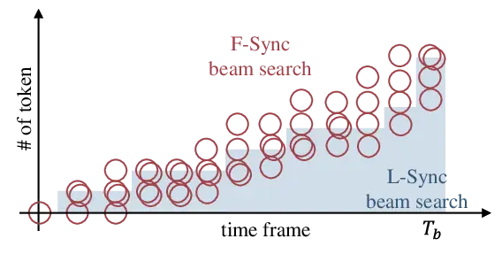
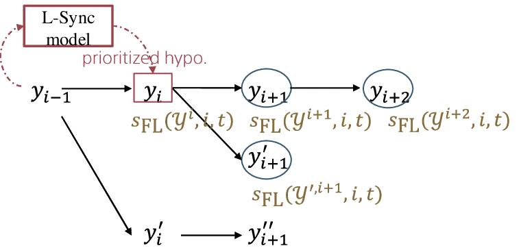

¹Sony Group Corporation, Japan  
²Carnegie Mellon University, U.S.A.

# Integration of Frame- and Label-synchronous Beam Search for Streaming Encoder–decoder Speech Recognition

Emiru Tsunoo¹, Hayato Futami¹, Yosuke Kashiwagi¹, Siddhant Arora²,
Shinji Watanabe²

###### Abstract

Although frame-based models, such as CTC and transducers, have an
affinity for streaming automatic speech recognition, their decoding uses
no future knowledge, which could lead to incorrect pruning. Conversely,
label-based attention encoder–decoder mitigates this issue using soft
attention to the input, while it tends to overestimate labels biased
towards its training domain, unlike CTC. We exploit these complementary
attributes and propose to integrate the frame- and label-synchronous
(F-/L-Sync) decoding alternately performed within a single beam-search
scheme. F-Sync decoding leads the decoding for block-wise processing,
while L-Sync decoding provides the prioritized hypotheses using
look-ahead future frames within a block. We maintain the hypotheses from
both decoding methods to perform effective pruning. Experiments
demonstrate that the proposed search algorithm achieves lower error
rates compared to the other search methods, while being robust against
out-of-domain situations.

^(†)^(†)address: ^(†)^(†)email: emiru.tsunoo@sony.com

Index Terms: speech recognition, beam search, attention-based
encoder–decoder, CTC

## 1 Introduction

Streaming style automatic speech recognition (ASR) is essential for
better user experiences. Among end-to-end ASR models, connectionist
temporal classification (CTC) \[1, 2, 3, 4\] and transducers \[5, 6, 7\]
successfully model the temporal phenomenon of speech in frame-by-frame
computation. These models are referred to as frame-synchronous (F-Sync)
models and they have an affinity for streaming processing \[8, 9, 10\].
Conversely, the output of ASR is a label-base, which is suitable for
modeling with label-synchronous (L-Sync) models, such as attention-based
decoders (AttDecs) \[11, 12\] and language models (LMs) \[13, 14\].
L-Sync models estimate labels in an autoregressive manner with the given
context of the previously estimated output. Generally, L-Sync models
have a strong ability to model label sequences, and they are used to
improve the ASR performance through fusion or rescoring \[15, 16, 17,
18\].

During decoding, F-Sync models expand the hypotheses at each time frame.
F-Sync decoding can be efficiently computed in a beam search by
maintaining scores of hypotheses ending with a blank token and non-blank
tokens, respectively \[1\]. However, the hypotheses are pruned at each
time frame by using only partial information from the input speech. This
limitation sometimes causes unreliable pruning. Conversely, during
L-Sync decoding, the hypotheses are extended token-by-token by making
soft attention to all the input and the previous output sequence. Thus,
this approach has an advantage in pruning over F-Sync decoding without
future information. However, it has a label bias problem \[19, 20, 21\],
where once the model overestimates a label, it is difficult to downgrade
it by the suffix distribution. Furthermore, it is difficult to use the
L-Sync models in streaming ASR, where block processing is used \[22,
10\] and their decoding is generally complicated \[23, 24, 25\].

Both F-Sync and L-Sync decoding are complementary. Several studies have
attempted to combine F-Sync and L-Sync decoding. Watanabe et al.
proposed the joint model, where AttDec and CTC are jointly trained, and
CTC rescores the hypotheses generated by AttDec during inference.
Sainath et al. proposed two-pass decoding \[17\], in which the AttDec
rescores $`N`$-best list of the transducer’s hypotheses. Li et al.
combined separate F-Sync and L-Sync models where the former produces a
lattice and the latter rescores it \[26\]. Yan et al. introduce AttDec
score to F-Sync decoding of CTC in machine translation and speech
translation tasks \[27\]. Additionally, \[28, 29\] experimentally
compared F-Sync and L-Sync decoding. However, in those studies, one is
merely used for rescoring the hypotheses generated by the other
beforehand, and none simultaneously considers the hypotheses from the
individual decoding methods.

This study exploits complementary attributes of the F-Sync and L-Sync
decoding, and proposes integrating both in a single beam search scheme.
To take advantage of F-Sync decoding, which is easy to incorporate with
block-wise streaming ASR, the proposed beam search primarily runs in an
F-Sync manner. To mitigate the issue of unreliable partial F-Sync score
comparison, we employ the L-Sync beam search based on the shortest
token-length prefixes of the hypotheses. The selected hypotheses by
L-Sync are then preserved in the subsequent F-Sync pruning steps and
adjusted as the hypotheses expand, ensuring that the most promising ones
are maintained in the proposed beam search. Experiments demonstrate that
the proposed search algorithm performs effectively pruning in the
frame–label grid search, and achieve lower error rates compared to the
other search methods in English and Japanese datasets. Evaluation using
various domains in each language indicates that the proposed method is
robust against out-of-domain situations.

## 2 F-Sync Decoding and L-Sync Decoding for Streaming ASR

### 2.1 F-Sync decoding

F-Sync models include CTC \[1, 2, 3, 4\] and transducer variants \[5, 6,
7\], which are suitable for streaming ASR. In streaming ASR, blockwise
processing is widely used \[22, 10\]. Let $`T_{b}`$ be the last frame of
$`b`$-th block. An acoustic representation sequence
$`\mathcal{H}^{T_{b}}=\{{\mathbf{h}}_{t}|1\leq t\leq T_{b}\}`$ is
extracted by an encoder from speech input. CTC and transducers introduce
a blank token, $`\phi`$, to align $`\mathcal{H}^{T_{b}}`$ with a
different $`L`$-length of label sequence
$`\mathcal{Y}^{L}=\{y_{l}|1\leq l\leq L\}`$. The F-Sync model estimates
$`\phi`$-augmented tokens $`z_{t}\in\mathcal{V}\cup\{\phi\}`$ at time
frame $`t`$, where $`\mathcal{V}`$ is the vocabulary. The estimated
sequence $`\mathcal{Z}^{T^{\prime}}=\{z_{t}|1\leq t\leq T^{\prime}\}`$
can be mapped to a label sequence using mapping function
$`\mathcal{F}:\mathcal{Z}^{T^{\prime}}\rightarrow\mathcal{Y}^{L}`$. In
the case of CTC, $`T^{\prime}=T_{b}`$, and $`T^{\prime}=T_{b}+L`$ for
the transducers, which can emit tokens without consuming frames. Based
on $`{\mathbf{h}}_{t}`$ and previous output label $`y_{l-1}`$, the
F-sync model, $`\mathrm{FSM}(\cdot)`$, calculates a posterior of
$`z_{t}`$.

```math
\displaystyle q_{\mathrm{F}}(z_{t}|{\mathbf{h}}_{t},y_{l-1})=\mathrm{FSM}({\mathbf{h}}_{t},y_{l-1}) \tag{1}
```

For CTC, $`q_{\mathrm{F}}`$ does not depend on the previous output.
Probability computation of $`\mathcal{Y}^{l}`$ at $`t`$ is efficiently
performed as

```math
\displaystyle p_{\mathrm{F}}(\mathcal{Y}^{l}|\mathcal{H}^{t}) \displaystyle=\gamma(\mathcal{Y}_{\mathrm{(b)}}^{l},t)+\gamma(\mathcal{Y}_{\mathrm{(n)}}^{l},t) \tag{2}
```

```math
\displaystyle\gamma(\mathcal{Y}_{\mathrm{(b)}}^{l},t) \displaystyle=\sum_{\mathcal{F}_{\mathrm{F}}(\mathcal{Z}^{t})=\mathcal{Y}^{l}:z_{t}=\phi}p_{\mathrm{F}}(\mathcal{Y}^{l}|\mathcal{H}^{t-1})q(z_{t}|{\mathbf{h}}_{t},y_{l})
```

```math
\displaystyle\gamma(\mathcal{Y}_{\mathrm{(n)}}^{l},t) \displaystyle=\sum_{\mathcal{F}_{\mathrm{F}}(\mathcal{Z}^{t})=\mathcal{Y}^{l}:z_{t}=y_{l}}p_{\mathrm{F}}(\mathcal{Y}^{l-1}|\mathcal{H}^{t-1})q(z_{t}|{\mathbf{h}}_{t},y_{l-1}),
```

where $`\mathcal{Y}_{\mathrm{(b)}}`$ is the label sequence ending with
$`\phi`$, and $`\mathcal{Y}_{\mathrm{(n)}}`$ is the other \[1\].

F-Sync decoding is performed frame-by-frame. At each time $`t`$,
probability (2) is used on a logarithmic scale as F-Sync score
$`\alpha_{\mathrm{F}}`$.

```math
\displaystyle\alpha_{\mathrm{F}}(\mathcal{Y}^{l},t)=\log p_{\mathrm{F}}(\mathcal{Y}^{l}|\mathcal{H}^{t}) \tag{3}
```

The hypotheses are copied by blank transition or expanded at each time
step with
$`\mathrm{FSync}:\mathcal{Y}^{l}\rightarrow\mathcal{Y}^{l},\mathcal{Y}^{l+1}`$.
In the beam search with a fixed beam size $`B`$, the
$`\mathrm{top}{B}(\cdot)`$ function returns a set of the top $`B`$
hypotheses at step $`t`$, denoted as $`\Omega_{\mathrm{F},t}`$:

```math
\displaystyle\Omega_{\mathrm{F},t}=\mathrm{top}{B}(\alpha_{\mathrm{F}}(\mathcal{Y},t)|\mathcal{Y}\in\mathrm{FSync}(\mathcal{Y})) \tag{4}
```

Since the F-Sync decoding has no knowledge of future inputs even when
the block processing has certain look-ahead frames \[25, 10\], i.e., the
score is conditioned only on $`\mathcal{H}^{t}`$ at step $`t`$, it
sometimes incorrectly prune the correct hypothesis.

### 2.2 L-Sync models with blockwise streaming processing

We categorize AttDecs \[11, 12\] and LMs \[13, 14\] as L-Sync models. At
each step $`i`$, the L-Sync models predict the probability distribution
of the next label $`y_{i}`$ using previous output $`\mathcal{Y}^{i-1}`$
and input $`\mathcal{H}^{T_{b}}`$. L-Sync score $`\beta_{\mathrm{L}}`$
is defined as

```math
\displaystyle\beta_{\mathrm{L}}(\mathcal{Y}^{i})= \displaystyle\sum_{j=1}^{i}\log p_{\mathrm{L}}(y_{j}|\mathcal{Y}^{j-1},\mathcal{H}^{T_{b}}). \tag{5}
```

For LM, $`p_{\mathrm{L}}(y_{j})`$ does not depend on input
$`\mathcal{H}^{T_{b}}`$. All the hypotheses are simultaneously extended
with $`\mathrm{LSync}:\mathcal{Y}^{i-1}\rightarrow\mathcal{Y}^{i}`$.
Beam search at step $`i`$ is performed to maintain top $`B`$ hypotheses
as in F-Sync decoding.

```math
\displaystyle\Omega_{\mathrm{L},i}=\mathrm{top}{B}(\beta_{\mathrm{L}}(\mathcal{Y}^{i})|\mathcal{Y}^{i}\in\mathrm{LSync}(\mathcal{Y}^{i-1})) \tag{6}
```

This contextual dependency enables the L-Sync models to provide a richer
representation of label sequences. However, L-Sync models have the
following two drawbacks:

- •
  Label bias problem: Once the model overestimates a label biased toward
  its training domain, the following expansion cannot easily recover it
  \[19, 20, 21\].
- •
  Endpoint problem: For streaming systems, the AttDec needs to detect an
  endpoint, which is the point to stop decoding with limited
  $`\mathcal{H}^{T_{b}}`$. This requires additional mechanisms to detect
  \[23, 24, 25\]. Once the decoding step $`i`$ passes the endpoint, the
  AttDec tends to emit unreliable tokens; thus it is better for the
  AttDec to proceed decoding conservatively in the streaming systems
  \[30\].

### 2.3 F-Sync and L-Sync score fusion

Because F-Sync and L-Sync models are complementary, the aforementioned
problems in F-Sync and L-Sync decoding can be alleviated by fusing both
scores in pruning.

#### 2.3.1 Score fusion in F-Sync decoding

Typically, LMs are fused in the F-Sync decoding. As in \[31, 32\], the
scores (e.g., Eqs. (3) and (5)) are simply combined with weights
$`\lambda`$. In the case of CTC, the combined score is defined as

```math
\displaystyle s_{\mathrm{F}}(\mathcal{Y}^{l},t)= \displaystyle\lambda_{\mathrm{ctc}}\alpha_{\mathrm{ctc}}(\mathcal{Y}^{l},t)+\lambda_{\mathrm{lm}}\beta_{\mathrm{lm}}(\mathcal{Y}^{l})
```

```math
\displaystyle+\lambda_{\mathrm{att}}\beta_{\mathrm{att}}(\mathcal{Y}^{l})+\lambda_{\mathrm{len}}|\mathcal{Y}^{l}| \tag{7}
```

The last term in (7) is a label reword, which uses the length of
hypothesis $`\mathcal{Y}^{l}`$. This mitigates unfair score comparison
of different length in the beam, which, however, requires careful
tuning.

#### 2.3.2 Score fusion in L-Sync decoding

The joint model \[33\] has both CTC and AttDec modules, which are
trained in a multi-task learning framework. Its decoding is based on
L-Sync search led by the AttDec. During the decoding, the score is a
combination of the CTC, LM, and AttDec, as follows:

```math
\displaystyle s_{\mathrm{L}}(\mathcal{Y}^{i},i)= \displaystyle\lambda_{\mathrm{ctc}}\alpha_{\mathrm{ctc}}(\mathcal{Y}^{i}\dots,T_{b})+\lambda_{\mathrm{lm}}\beta_{\mathrm{lm}}(\mathcal{Y}^{i})
```

```math
\displaystyle+\lambda_{\mathrm{att}}\beta_{\mathrm{att}}(\mathcal{Y}^{i})+\lambda_{\mathrm{len}}|\mathcal{Y}^{i}| \tag{8}
```

```math
\displaystyle\alpha_{\mathrm{ctc}}(\mathcal{Y}^{i}\dots,T_{b})= \displaystyle\sum_{y_{i+1}\in\mathcal{V}}\alpha_{\mathrm{ctc}}(\mathcal{Y}^{i+1},T_{b}) \tag{9}
```

(9) is a CTC prefix score that accumulates probabilities of all the
suffixes of $`\mathcal{Y}^{i}`$. The prefix scores are calculated over
only the hypotheses generated by the AttDec; thus, it is sometimes
difficult to recover incorrect estimation of the AttDec by itself. Note
that when $`t=T_{b}`$ and $`i=l=L`$, F-Sync score (3) and the prefix
score (9) become equivalent; thus F-Sync decoding and L-Sync decoding
eventually evaluate the same score,
$`s_{\mathrm{F}}(Y^{L},T_{b})=s_{\mathrm{L}}(Y^{L},L)`$.

## 3 Integrated Beam Search of the F-Sync and L-Sync Decoding

As discussed in Sec. 2.1, the F-Sync beam search is likely to
incorrectly prune the hypothesis without considering future look-ahead
input, which can be prevented by the AttDec that uses all $`T_{b}`$
frames. Conversely, the label bias problems in the AttDec (Sec. 2.2) can
be mitigated by using the F-Sync models. Therefore, we propose
maintaining both the F-Sync and L-Sync hypotheses in extended beam
$`B^{\prime}>=B`$. Those hypotheses are generated individually from each
decoding, and the step increment of $`t`$ of the F-Sync decoding and
$`i`$ of the L-Sync decoding are performed alternately in an integrated
single search algorithm, namely, FL-Sync beam search.

### 3.1 Prefix score fusion

In the FL-Sync beam search, We choose F-Sync to lead decoding because it
is suitable for streaming ASR. Thus, at each step $`t`$, the hypotheses
are copied and expanded based on F-Sync decoding as in Sec. 2.1. The
score for hypothesis $`\mathcal{Y}^{l}`$ is extended from (7) and (8) to
include both $`i`$ and $`t`$ as

```math
\displaystyle s_{\mathrm{FL}}(\mathcal{Y}^{l},i,t)= \displaystyle\lambda_{\mathrm{ctc}}\alpha_{\mathrm{ctc}}(\mathcal{Y}^{l},t)+\lambda_{\mathrm{lm}}\beta_{\mathrm{lm}}(\mathcal{Y}^{i})
```

```math
\displaystyle+\lambda_{\mathrm{att}}\beta_{\mathrm{att}}(\mathcal{Y}^{i})+\lambda_{\mathrm{len}}|\mathcal{Y}^{i}|. \tag{10}
```

While the fist term $`\alpha_{\mathrm{ctc}}`$ defined in (3) is computed
for $`\mathcal{Y}^{l}`$, $`\beta_{\mathrm{lm}}`$ and
$`\beta_{\mathrm{att}}`$ are computed only for its prefix
$`\mathcal{Y}^{i}`$, where $`i\leq l`$ is the current L-Sync decoding
step. The reason for using $`i`$ instead of $`l`$ is that the token
prediction of the AttDec becomes unreliable when it exceeds the endpoint
in streaming processing, as discussed in Sec. 2.2. Therefore, we avoid
aggressively computing the scores for the entire $`l`$ labels for the
score fusion and conservatively use $`i`$ instead. Thus, the integrated
beam search aims to perform efficient pruning on this 2D grid space of
$`(i,t)`$.

Conversely, the L-Sync decoding expand all the $`i`$-length prefix of
the hypotheses in hypothesis set $`\Omega_{\mathrm{FL},t}`$, i.e.,
$`\mathcal{Y}^{i}\in\mathrm{Pfx}_{i}(\Omega_{\mathrm{FL},t})`$, where
$`\mathrm{Pfx}_{i}(\cdot)`$ is an $`i-`$length prefix extraction
function. Therefore, to perform L-Sync decoding, the minimum length of
the hypotheses needs to be
$`\min|\mathcal{Y}^{l}\in\Omega_{\mathrm{FL},t}|\geq i`$. The L-Sync
decoding advances its step $`i\rightarrow i+1`$ once the minimum length
becomes larger than $`i`$. A graphical explanation of this is provided
in Fig. 1. The red circles indicate that the F-Sync beam search expands
the hypotheses in each time step. The L-Sync models add partial scores
for the common length to these hypotheses (blue bars). In the last step
of F-Sync decoding, $`T_{b}`$, the remaining steps of L-Sync for each
hypothesis are consumed, and $`\beta_{\mathrm{L}}(\mathcal{Y}^{l})`$ is
applied to each hypothesis to determine the best candidate.



Figure 1: F-Sync and L-Sync decoding process.



Figure 2: Prioritized L-Sync hypothesis (red box) and its successors
(blue circles). The score of the prioritized hypothesis is compared to
all scores of the successors to perform ancestor-pruning.

1: last frame number of current block $`T_{b}`$, acoustic features
$`\mathcal{H}^{T_{b}}`$, beam width for AttDec $`B`$, total beam width
$`B^{\prime}`$

2: $`\Omega_{\mathrm{FL},T_{b}}`$: hypotheses for current block $`b`$

3: Initialize: $`y_{0}\leftarrow\langle\mathrm{sos}\rangle`$,
$`\Omega_{\mathrm{FL},0}\leftarrow\{y_{0}\}`$, $`t\leftarrow 1`$,
$`i\leftarrow 1`$

4: while $`t<T_{b}`$ do

5:    $`\hat{\Omega}\leftarrow\{\}`$

6:    if $`i<\min(|Y\in\Omega_{\mathrm{FL},t-1}|)`$ then

7:     $`i\leftarrow\min(|Y\in\Omega_{\mathrm{FL},t-1}|)`$

8:
    $`\hat{\Omega}\leftarrow\mathrm{LSync}(\mathrm{Pfx}_{i-1}(\Omega_{\mathrm{FL},t-1}))`$
$`\triangleright`$ Prefix L-Sync search

9:
    $`\hat{\Omega}\leftarrow\mathrm{top}{B}(s_{\mathrm{L}}(\mathcal{Y}^{i},i)|\mathcal{Y}^{i}\in\hat{\Omega})`$
$`\triangleright`$ Keep top-$`B`$ hyps

10:    end if

11:
   $`\hat{\Omega}\leftarrow\hat{\Omega}\cup\mathrm{FSync}(\Omega_{\mathrm{FL},t-1})`$
$`\triangleright`$ FSync search

12:    $`\hat{\Omega}\leftarrow\mathrm{AncestorPruning}(\hat{\Omega})`$
$`\triangleright`$ Sec. 3.3

13:    $`\Omega_{\mathrm{FL},t}\leftarrow`$
OnlyPriority$`(\hat{\Omega})`$ $`\triangleright`$ Sec. 3.1

14:
   $`\Omega_{\mathrm{FL},t}\leftarrow\Omega_{\mathrm{FL},t}\cup\mathrm{top}{(B^{\prime}-|\Omega_{\mathrm{FL},t}|)}(s_{\mathrm{FL}}(\mathcal{Y},i,t)|\mathcal{Y}\in\hat{\Omega})`$

15:    $`t\leftarrow t+1`$

16: end while

17: return $`\Omega_{\mathrm{FL},T_{b}}`$

Algorithm 1 FL-Sync beam search algorithm.

### 3.2 Prioritized hypotheses from L-Sync decoding

The L-Sync decoding generates hypotheses
$`\mathcal{Y}_{\mathrm{L}}^{i}`$ based on (8) using all the input,
including future look-ahead, which are useful to complement the weakness
of F-Sync decoding. However, the hypotheses are pruned based on (10),
whose first term, $`\alpha_{\mathrm{ctc}}(Y^{l},t)`$, uses only partial
$`t`$-frame input unlike (8), and the hypotheses can still be
incorrectly pruned. To prevent from dropping L-Sync hypotheses
$`\mathcal{Y}_{\mathrm{L}}^{i}`$ in the early stage, we prioritize them
for survival. At step $`t`$, we first preserve those prioritized
hypotheses of L-Sync decoding, then F-Sync decoding is performed to fill
the remaining hypotheses in the beam $`B^{\prime}`$, as

```math
\displaystyle\Omega_{\mathrm{FL},t}= \displaystyle\mathrm{top}{B}(s_{\mathrm{L}}(\mathcal{Y}^{i},i)|\mathcal{Y}^{i}\in\mathrm{LSync}(\mathrm{Pfx}_{i-1}(\Omega_{\mathrm{FL},t-1})))
```

```math
\displaystyle\cup\mathrm{top}{(B^{\prime}-B)}(s_{\mathrm{FL}}(\mathcal{Y}^{l},i,t)|\mathcal{Y}^{l}\in\mathrm{FSync}(\Omega_{\mathrm{FL},t-1})) \tag{11}
```

### 3.3 Ancestor-pruning for the prioritized hypothesis

The priority of the hypothesis $`\mathcal{Y}_{\mathrm{L}}^{i}`$ is no
longer valid once the L-Sync decoding increase its step
$`i\rightarrow i+1`$, as it generate new set of hypotheses
$`\mathcal{Y}_{\mathrm{L}}^{i+1}`$. Further, to prune unnecessary
hypotheses of L-Sync decoding, we propose to perform ancestor-pruning,
which is similar to the depth-pruning in \[32\]. As the F-Sync decoding
proceed, it expands the hypothesis
$`\mathcal{Y}^{i}\rightarrow\mathcal{Y}^{i+1}`$, as shown in Fig. 2. The
prioritized root hypothesis $`\mathcal{Y}^{i}`$ is indicated by the red
box and the expanded successors $`\mathcal{Y}^{i+*}`$ are indicated by
the blue circles. We compare the scores of all the successors and the
root hypothesis, denoted as $`s_{\mathrm{FL}}`$ in Fig. 2. When all the
scores of successors become greater than the score of the root,
$`s_{\mathrm{FL}}(\mathcal{Y}_{\mathrm{L}}^{i},i,t)<\min(s_{\mathrm{FL}}(\mathcal{Y}^{i+*},i,t))`$,
we prune away prioritized root hypothesis
$`\mathcal{Y}_{\mathrm{L}}^{i}`$, because any new successor from the
root $`\mathcal{Y}_{\mathrm{L}}^{i}`$ can no longer achieve higher score
than the current successors due to the
$`0\leq q(z_{t}|{\mathbf{h}}_{t},y_{i})\leq 1`$ restriction.

|                                    | total     | L-Sync    | LS$`\rightarrow`$TEDLIUM3 |      | LS$`\rightarrow`$Switchboard |      | LS$`\rightarrow`$STOP | Librispeech (ID) |            |
| ---------------------------------- | --------- | --------- | ------------------------- | ---- | ---------------------------- | ---- | --------------------- | ---------------- | ---------- |
|                                    | beam size | beam size | dev                       | test | SW                           | CH   |                       | test-clean       | test-other |
| Streaming L-Sync decoding \[25\]   |           | 5         | 13.7                      | 13.1 | 30.2                         | 35.7 | 14.5                  | 3.0              | 8.1        |
| CTC F-Sync decoding \[32\]         | 10        |           | 15.0                      | 14.4 | 31.0                         | 37.2 | 19.2                  | 3.3              | 9.0        |
| CTC+AttDec F-Sync decoding         | 10        |           | 14.6                      | 14.0 | 31.4                         | 36.6 | 19.4                  | 3.1              | 8.6        |
| Integ. FL-Sync decoding (proposed) | 10        | 5         | 13.4                      | 12.7 | 29.9                         | 35.0 | 14.1                  | 2.9              | 7.9        |

Table 1: Comparison of searching algorithms of streaming ASR in English
datasets in WER. All the models were trained with Librispeech. ID refers
to in-domain. In all the decoding methods, the LM of the target domain
is fused.

|                                    | total     | L-Sync    | CSJ+LTV               | CSJ+LTV             | CSJ+LTV             | CSJ+LTV             | CSJ (ID) |       |       |
| ---------------------------------- | --------- | --------- | --------------------- | ------------------- | ------------------- | ------------------- | -------- | ----- | ----- |
|                                    | beam size | beam size | $`\rightarrow`$TEDxJP | $`\rightarrow`$News | $`\rightarrow`$CMD1 | $`\rightarrow`$CMD2 | eval1    | eval2 | eval3 |
| Streaming L-Sync decoding \[25\]   |           | 5         | 12.1                  | 3.5                 | 4.1                 | 12.8                | 8.0      | 7.5   | 7.0   |
| CTC F-Sync decoding \[32\]         | 10        |           | 12.4                  | 4.9                 | 5.1                 | 10.1                | 8.7      | 7.8   | 7.3   |
| CTC+AttDec F-Sync decoding         | 10        |           | 12.1                  | 3.5                 | 3.5                 | 10.7                | 8.0      | 7.4   | 7.4   |
| Integ. FL-Sync decoding (proposed) | 10        | 5         | 11.9                  | 3.0                 | 3.2                 | 9.6                 | 7.9      | 7.3   | 7.1   |

Table 2: Comparison of searching algorithms of streaming ASR in Japanese
datasets in CER. All the models were trained with CSJ+LaboroTV (LTV). ID
refers to in-domain. In all the decoding methods, the general LM is
fused.

### 3.4 FL-Sync beam search algorithm

The proposed beam search is summarized in Algorithm 1. As the FL-Sync
decoding is performed based on the F-Sync frame-wise pruning, $`t`$ is
increased at each step in the loop. First, L-Sync decoding is performed
if step $`i<\min(|Y\in\Omega_{\mathrm{FL},t-1}|)`$ as descried in
Sec. 3.1. The L-Sync decoding expands the prefixes of the hypotheses
(Line 6) and provides prioritized hypotheses
$`\mathcal{Y}^{i}_{\mathrm{L}}`$, which are maintained in temporary
hypothesis set $`\hat{\Omega}`$ (Line 7). Then the F-Sync decoding is
performed based on (10), and merged with the prioritized hypotheses
(Line 9). Subsequently, in Line 10, the ancestor-pruning described in
Sec. 3.3 is performed, which removes unnecessary hypotheses. The
hypotheses from L-Sync decoding have priority for survival (Line 11),
then lastly the hypothesis set is filled from the temporary set up to
total beam size, $`B^{\prime}`$ (Line 12). Note that, even the total
beam size increases from $`B`$ to $`B^{\prime}`$, computational impact
is marginal from $`B`$-beam L-Sync decoding, because the F-Sync model,
e.g., CTC, generally requires much less computation.

## 4 Experiments

To evaluate the effectiveness of the proposed FL-Sync beam search, we
evaluated cross-domain and intra-domain scenarios in English and
Japanese datasets.

### 4.1 Experimental setup

For the English evaluation, we trained a streaming encoder–decoder ASR
model following \[25\] with the Librispeech dataset \[34\], a read
speech corpus. It was applied to three various domains: The TED-LIUM 3
\[35\] dev/test set (a spontaneous lecture style), Hub5’00
(telephony-style conversation) having Switchboard (SWB) and CallHome
(CHM) subsets, and voice-command-style STOP dataset \[36\].

For Japanese, we trained a streaming ASR model with a merged set of the
lecture style CSJ \[37\] and LaboroTV corpus of TV program \[38\]. We
used three evaluation sets of the CSJ dataset for intra-domain setup,
and TEDxJP \[38\] for cross-domain setup. To cover various range of
domains, We also used in-house evaluation data; 720 read news utterances
(News) spoken by four males and four females, 2,620 voice commands
(CMD1) and far-field 1,768 commands (CMD2), each spoken by 10 hired
speakers.

The input acoustic features were 80-dimensional filter bank features.
The input features were applied mean normalization with a sliding
window. The encoder consisted of 12 blocks of conformer \[6\]. The
AttDec had six decoder blocks. Each block consisted of four-head
256-unit attention layers and 2048-unit feed-forward layers. Contextual
block encoding \[22\] was applied to the encoder with a block size of
40, a shift size of 16, and a look-ahead size of 16. The models were
trained using multitask learning with CTC loss \[33\], with a weight of
0.3.

For English evaluation, external LMs were trained using each target
dataset for adaptation. LMs were four-layer unidirectional LSTM with
2048 units, using the byte-pair encoding (BPE) subword tokenization with
5000 token classes. For Japanese, we collected over 27 million sentences
to train a general LM with 10,000 BPE tokens, applied to all the tasks.

We compared our proposed FL-Sync decoding with streaming L-Sync decoding
\[25\], and CTC F-Sync decoding \[32\]. We also evaluated AttDec score
fusion for CTC F-Sync decoding for comparison. For the CTC F-Sync
decoding methods, $`\lambda_{\mathrm{lm}}=0.4`$ was used for English
datasets, and $`\lambda_{\mathrm{lm}}=0.1`$ for Japanese, instead. For
the baseline L-Sync decoding and the proposed FL-Sync decoding, we
adopted $`(\lambda_{\mathrm{lm}},\lambda_{\mathrm{ctc}})=(0.4,0.4)`$ for
English intra-domain, $`(0.6,0.4)`$ for English cross-domain, and
$`(0.3,0.5)`$ for Japanese experiments. $`\lambda_{\mathrm{att}}`$ was
set as $`(1-\lambda_{\mathrm{ctc}})`$. We adopted
$`\lambda_{\mathrm{len}}=1`$ for all the evaluation. We used
$`B^{\prime}=10`$ and $`B=5`$ as a beam size for total FL-Sync decoding
and L-Sync decoding in it, respectively. For fair comparison, we used
the same beam sizes for the baseline approaches.

### 4.2 Results of English evaluation

The word error rate (WER) results are summarized in Table 1. Streaming
L-Sync decoding was generally better than CTC F-Sync decoding,
particularly in the voice-command STOP dataset. This indicated that it
is more effective in pruning to use input information including future
look-ahead frames. Although the AttDec score fusion improved accuracy on
CTC F-Sync decoding, the proposed FL-Sync decoding showed large
improvement from those F-Sync decoding methods because it also preserved
hypotheses from the L-Sync decoding. When we compare FL-Sync decoding
with the L-Sync baseline decoding, our proposed method performed
robustly in the cross-domain scenarios; for instance, WER was improved
from 13.1% to 12.7% in TEDLIUM3 test set. Furthermore, we confirmed that
it did not degrade the intra-domain performance, or even observed slight
improvement from 8.1% to 7.9% in test-other, for instance. Since the
scores, (7), (8), and (10), eventually become the same in all the search
methods, the results show that our method is effective in pruning
because of maintaining hypotheses from both L-Sync and F-Sync decoding.

### 4.3 Results of Japanese evaluation

We evaluated character error rates (CERs), which are listed in Table 2.
The results followed similar tendency to the English evaluation. As we
used the general LM, it did not exactly match to some of the target
domains. As a result, we observed that even in the source domain CSJ
eval sets, CERs were relatively higher than the other literature \[25,
39\]. Furthermore, the baseline L-Sync decoding had difficulty in
adapting to the target domains, in particular in CMD2 data, which tend
not to be grammatically structured. Since our proposed FL-Sync decoding
maintained both L-Sync and F-Sync decoding, it recovered the domain bias
and was robust to the cross-domain situation.

## 5 Conclusion

We have proposed a new FL-Sync beam search, which integrates
complementary F-Sync and Sync decoding to mitigate the problems in both
the decoding. The proposed beam search primarily runs in an F-Sync
manner to incorporate it with block-wise streaming ASR. To overcome the
unreliable partial F-Sync score comparison in pruning, L-Sync decoding
provide the prioritized hypotheses with future look-ahead input frames,
which are also maintained in the beam to perform effective pruning.

## 6 References

## References

- \[1\] Alex Graves, Santiago Fernández, Faustino Gomez and Jürgen
  Schmidhuber “Connectionist temporal classification: labelling
  unsegmented sequence data with recurrent neural networks” In _Proc.
  ICML_, 2006, pp. 369–376
- \[2\] Alex Graves and Navdeep Jaitly “Towards end-to-end speech
  recognition with recurrent neural networks” In _Proc. ICML_, 2014, pp.
  1764–1772
- \[3\] Yajie Miao, Mohammad Gowayyed and Florian Metze “EESEN:
  End-to-end speech recognition using deep RNN models and WFST-based
  decoding” In _Proc. of ASRU Workshop_, 2015, pp. 167–174
- \[4\] Dario Amodei “Deep Speech 2: End-to-End Speech Recognition in
  English and Mandarin” In _Proc. ICML_ 48, 2016, pp. 173–182
- \[5\] Alex Graves, Abdel-Rahman Mohamed and Geoffrey Hinton “Speech
  recognition with deep recurrent neural networks” In _Proc. ICASSP_,
  2013, pp. 6645–6649
- \[6\] Anmol Gulati, James Qin, Chung-Cheng Chiu, Niki Parmar, Yu
  Zhang, Jiahui Yu, Wei Han, Shibo Wang, Zhengdong Zhang and Yonghui Wu
  “Conformer: Convolution-augmented Transformer for Speech Recognition”
  In _Proc. Interspeech_, 2020, pp. 5036–5040
- \[7\] Qian Zhang, Han Lu, Hasim Sak, Anshuman Tripathi, Erik
  McDermott, Stephen Koo and Shankar Kumar “Transformer transducer: A
  streamable speech recognition model with transformer encoders and
  RNN-T loss” In _Proc. ICASSP_, 2020, pp. 7829–7833
- \[8\] Linhao Dong, Feng Wang and Bo Xu “Self-Attention Aligner: A
  Latency-Control End-to-End Model for ASR Using Self-Attention Network
  and Chunk-Hopping” In _Proc. ICASSP_, 2019, pp. 5656–5660
- \[9\] Jiahui Yu, Chung-Cheng Chiu, Bo Li, Shuo-yiin Chang, Tara
  Sainath, Yanzhang He, Arun Narayanan, Wei Han, Anmol Gulati and
  Yonghui Wu “FastEmit: Low-latency streaming ASR with sequence-level
  emission regularization” In _Proc. ICASSP_, 2021, pp. 6004–6008
- \[10\] Yangyang Shi, Yongqiang Wang, Chunyang Wu, Ching-Feng Yeh,
  Julian Chan, Frank Zhang, Duc Le and Mike Seltzer “Emformer: Efficient
  memory transformer based acoustic model for low latency streaming
  speech recognition” In _Proc. ICASSP_, 2021, pp. 6783–6787
- \[11\] Jan. Chorowski, Dzmitry Bahdanau, Dmitriy Serdyuk, Kyunghyun
  Cho and Yoshua Bengio “Attention-based models for speech recognition”
  In _Proc. of NIPS_, 2015, pp. 577–585
- \[12\] William Chan, Navdeep Jaitly, Quoc Le and Oriol Vinyals
  “Listen, attend and spell: A neural network for large vocabulary
  conversational speech recognition” In _Proc. ICASSP_, 2016, pp.
  4960–4964
- \[13\] Tomas Mikolov, Martin Karafiát, Lukas Burget, Jan Cernockỳ and
  Sanjeev Khudanpur “Recurrent Neural Network Based Language Model” In
  _Proc. Interspeech_, 2010, pp. 1045–1048
- \[14\] Kazuki Irie, Albert Zeyer, Ralf Schlüter and Hermann Ney
  “Language modeling with deep transformers” In _Proc. Interspeech_,
  2019, pp. 3905–3909
- \[15\] Jan Chorowski and Navdeep Jaitly “Towards Better Decoding and
  Language Model Integration in Sequence to Sequence Models” In _Proc.
  Interspeech_, 2017, pp. 523–527
- \[16\] Anjuli Kannan, Yonghui Wu, Patrick Nguyen, Tara Sainath,
  Zhijeng Chen and Rohit Prabhavalkar “An analysis of incorporating an
  external language model into a sequence-to-sequence model” In _Proc.
  ICASSP_, 2018, pp. 1–5828
- \[17\] Tara Sainath, Ruoming Pang, David Rybach, Yanzhang He, Rohit
  Prabhavalkar, Wei Li, Mirkó Visontai, Qiao Liang, Trevor Strohman and
  Yonghui Wu “Two-pass end-to-end speech recognition” In _Proc.
  Interspeech_, 2019, pp. 2773–2777
- \[18\] Wei Zhou, Simon Berger, Ralf Schlüter and Hermann Ney “Phoneme
  based neural transducer for large vocabulary speech recognition” In
  _Proc. ICASSP_, 2021, pp. 5644–5648
- \[19\] John Lafferty, Andrew McCallum and Fernando Pereira
  “Conditional random fields: Probabilistic models for segmenting and
  labeling sequence data” In _Proc. ICML_, 2001, pp. 282–289
- \[20\] Samy Bengio, Oriol Vinyals, Navdeep Jaitly and Noam Shazeer
  “Scheduled Sampling for Sequence Prediction with Recurrent Neural
  Networks” In _Proc. NeurIPS_ 28, 2015
- \[21\] Kenton Murray and David Chiang “Correcting length bias in
  neural machine translation” In _arXiv preprint arXiv:1808.10006_, 2018
- \[22\] Emiru Tsunoo, Yosuke Kashiwagi, Toshiyuki Kumakura and Shinji
  Watanabe “Transformer ASR with Contextual Block Processing” In _Proc.
  of ASRU Workshop_, 2019, pp. 427–433
- \[23\] Niko Moritz, Takaaki Hori and Jonathan Le “Triggered Attention
  for End-to-end Speech Recognition” In _Proc. ICASSP_, 2019, pp.
  5666–5670
- \[24\] Mohan Li, Cătălin Zorilă and Rama Doddipatla “Head-Synchronous
  Decoding for Transformer-Based Streaming ASR” In _Proc. ICASSP_, 2021,
  pp. 5909–5913
- \[25\] Emiru Tsunoo, Chaitanya Narisetty, Michael Hentschel, Yosuke
  Kashiwagi and Shinji Watanabe “Run-and-Back Stitch Search: Novel Block
  Synchronous Decoding For Streaming Encoder-Decoder ASR” In _Proc.
  ICASSP_, 2022, pp. 8287–8291
- \[26\] Qiujia Li, Chao Zhang and Philip Woodland “Combining
  frame-synchronous and label-synchronous systems for speech
  recognition” In _arXiv preprint arXiv:2107.00764_, 2021
- \[27\] Brian Yan, Siddharth Dalmia, Yosuke Higuchi, Graham Neubig,
  Florian Metze, Alan Black and Shinji Watanabe “CTC alignments improve
  autoregressive translation” In _arXiv preprint arXiv:2210.05200_, 2022
- \[28\] Linhao Dong, Cheng Yi, Jianzong Wang, Shiyu Zhou, Shuang Xu,
  Xueli Jia and Bo Xu “A comparison of label-synchronous and
  frame-synchronous end-to-end models for speech recognition” In _arXiv
  preprint arXiv:2005.10113_, 2020
- \[29\] Wei Zhou, Albert Zeyer, André Merboldt, Ralf Schlüter and
  Hermann Ney “Equivalence of segmental and neural transducer modeling:
  A proof of concept” In _Proc. Interspeech_, 2021, pp. 2891–2895
- \[30\] Emiru Tsunoo, Yosuke Kashiwagi and Shinji Watanabe “Streaming
  Transformer ASR With Blockwise Synchronous Beam Search” In _Proc.
  SLT_, 2021, pp. 22–29
- \[31\] Awni Hannun, Carl Case, Jared Casper, Bryan Catanzaro, Greg
  Diamos, Erich Elsen, Ryan Prenger, Sanjeev Satheesh, Shubho Sengupta
  and Adam Coates “Deep speech: Scaling up end-to-end speech
  recognition” In _arXiv preprint arXiv:1412.5567_, 2014
- \[32\] Kyuyeon Hwang and Wonyong Sung “Character-level incremental
  speech recognition with recurrent neural networks” In _Proc. ICASSP_,
  2016, pp. 5335–5339
- \[33\] Shinji Watanabe, Takaaki Hori, Suyoun Kim, John. Hershey and
  Tomoki Hayashi “Hybrid CTC/attention architecture for end-to-end
  speech recognition” In _Journal of Selected Topics in Signal
  Processing_ 11.8, 2017, pp. 1240–1253
- \[34\] Vassil Panayotov, Guoguo Chen, Daniel Povey and Sanjeev
  Khudanpur “LibriSpeech: an ASR corpus based on public domain audio
  books” In _Proc. ICASSP_, 2015, pp. 5206–5210
- \[35\] François Hernandez, Vincent Nguyen, Sahar Ghannay, Natalia
  Tomashenko and Yannick Esteve “TED-LIUM 3: twice as much data and
  corpus repartition for experiments on speaker adaptation” In
  _International conference on speech and computer_, 2018, pp. 198–208
- \[36\] Paden Tomasello, Akshat Shrivastava, Daniel Lazar, Po-Chun Hsu,
  Duc Le, Adithya Sagar, Ali Elkahky, Jade Copet, Wei-Ning Hsu and Yossi
  Adi “STOP: A dataset for spoken task oriented semantic parsing” In
  _Proc. SLT_, 2023, pp. 991–998
- \[37\] Kikuo Maekawa, Hanae Koiso, Sadaoki Furui and Hitoshi Isahara
  “Spontaneous Speech Corpus of Japanese” In _Proc. of the International
  Conference on Language Resources and Evaluation (LREC)_, 2000, pp.
  947–9520
- \[38\] Shintaro Ando and Hiromasa Fujihara “Construction of a
  large-scale Japanese ASR corpus on TV recordings” In _Proc. ICASSP_,
  2021, pp. 6948–6952
- \[39\] Shigeki Karita, Yotaro Kubo, Michiel Bacchiani and Llion Jones
  “A comparative study on neural architectures and training methods for
  Japanese speech recognition” In _Proc. Interspeech_, 2021, pp.
  2092–2096
