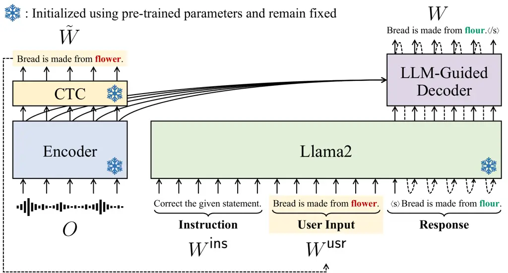

# Harnessing the Zero-Shot Power of Instruction-Tuned Large Language Model for Guiding End-to-End Speech Recognition

Yosuke Higuchi, Tetsuji Ogawa and Tetsunori Kobayashi
Affiliation: Department of Communications and Computer Engineering,
Waseda University, Tokyo, Japan

###### Abstract

We propose to utilize an instruction-tuned large language model (LLM)
for guiding the text generation process in automatic speech recognition
(ASR). Modern LLMs are adept at performing various text generation tasks
through zero-shot learning, prompted with instructions designed for
specific objectives. This paper explores the potential of LLMs to derive
linguistic information that can facilitate text generation in end-to-end
ASR models. Specifically, we instruct an LLM to correct grammatical
errors in an ASR hypothesis and use the LLM-derived representations to
refine the output further. The proposed model is built on the joint CTC
and attention architecture, with the LLM serving as a front-end feature
extractor for the decoder. The ASR hypothesis, subject to correction, is
obtained from the encoder via CTC decoding and fed into the LLM along
with a specific instruction. The decoder subsequently takes as input the
LLM output to perform token predictions, combining acoustic information
from the encoder and the powerful linguistic information provided by the
LLM. Experimental results show that the proposed LLM-guided model
achieves a relative gain of approximately 13% in word error rates across
major benchmarks.

###### Index Terms: 

End-to-end ASR, instruction-tuned large language model, language model
integration, grammatical error correction.

## I Introduction

Driven by rapid advancements in self-supervised pre-training
methods \[1, 2\], large language models (LLMs) have shown remarkable
versatility in acquiring various capabilities with minimal or even no
task-specific training data \[3, 4, 5, 6, 7\]. This has highlighted the
potential of LLMs to address different downstream natural language
processing (NLP) tasks in a few-shot or even zero-shot manner, enabling
highly flexible functions that have been beneficial to end users \[8\].

Such few-/zero-shot learning capabilities of LLMs can be improved by
strategically using the prompting mechanism to guide their behavior.
In-context learning \[4\] allows LLMs to learn tasks without requiring
parameter updates, which is achieved by adding a few input-output
examples prior to a target input. To further enhance the controllability
of LLMs, instruction fine-tuning \[9, 10, 11\] is employed to make the
model adhere more closely to instructions. This has allowed for
generating responses that align with desired outcomes, substantially
boosting zero-shot performance on unseen tasks.

In this work, we explore the application of the LLM’s zero-shot learning
capability for solving speech-processing tasks, focusing on end-to-end
automatic speech recognition (ASR). We aim to align a specific
speech-processing task with a related task in NLP and use the linguistic
information embedded within the LLM to facilitate solving the target
speech task. Specifically, we relate the end-to-end ASR task to
zero-shot grammatical error correction \[12, 13, 14\]. Recent efforts
have revealed the effectiveness of using LLMs for ASR error correction
as post-processing \[15, 16, 17, 18\], wherein the model is instructed
to select the most probable output from an $`N`$-best hypothesis list.
Our approach, in contrast, attempts to directly integrate the LLM’s
inherent ability to correct grammatical errors into an ASR formulation
that is optimized in an end-to-end manner.

The proposed model is based on the joint connectionist temporal
classification (CTC) and attention architecture \[19\]. The core
component of our model is the LLM-guided decoder, which augments the
original decoder by employing a fixed-parameter LLM to serve as a
front-end feature extractor. This integration allows for enhancing the
language modeling capabilities in the decoder, inheriting the LLM’s
proficiency in correcting grammatical errors. Additionally, the
cross-attention mechanism facilitates aligning the LLM-derived
representations with the speech information embedded by the encoder. To
optimize the extraction of linguistic features beneficial for the
decoder, we also design an effective prompting strategy for the LLM,
using a hypothesized text sequence generated through CTC decoding.

## II Background

### II-A Instruction-Tuned LLM

The recent LLMs possess the capability to be “prompted” to execute
specific tasks. We focus on Llama2-Chat, an instruction-tuned version of
Llama2 \[20\], as a pre-trained LLM used in this work. We hereafter
refer to this chat model as “Llama2” for brevity. Llama2, consisting of
deep Transformer decoder-based layers \[21, 2\], outputs a
$`D^{\mathsf{llm}}`$-dimensional hidden vector $`\bm{\mathrm{e}}_{n}`$
at a token position $`n`$ as

```math
\bm{\mathrm{e}}_{n}=\text{Llama2}(\underbrace{\vphantom{W_{<n}}W^{\mathsf{ins}}}_{\text{Instruction}},\underbrace{\vphantom{W_{<n}}W^{\mathsf{usr}}}_{\text{User Input}},\underbrace{W_{<n}}_{\text{Response}})\in\mathbb{R}^{D^{\mathsf{llm}}}, \tag{1}
```

where $`W^{\mathsf{ins}}\in\mathcal{V}^{N^{\mathsf{ins}}}`$ is an
$`N^{\mathsf{ins}}`$-length sequence that specifies the instruction of
an intended task; $`W^{\mathsf{usr}}\in\mathcal{V}^{N^{\mathsf{usr}}}`$
is an $`N^{\mathsf{usr}}`$-length sequence that serves as the given
input for the task; $`W=(w_{n}\in\mathcal{V}|n=1,\cdots,N)`$ is an
$`N`$-length sequence generated by the LLM; and $`\mathcal{V}`$ is the
vocabulary of Llama2. The previous tokens are represented as
$`W_{<n}=(w_{0},\cdots,w_{n-1})`$, where $`w_{0}=\texttt{<s>}`$ is a
start-of-sentence symbol. Typically, the combined $`W^{\mathsf{ins}}`$
and $`W^{\mathsf{usr}}`$ is referred to as a prompt, which guides the
model to generate a response $`W`$ in a specific manner (see Fig. 1 for
example).

Llama2 computes the likelihood of a target sequence $`W`$ as

```math
p(W|W^{\mathsf{ins}},W^{\mathsf{usr}})=\prod_{n=1}^{N+1}p(w_{n}|W_{<n},W^{\mathsf{ins}},W^{\mathsf{usr}}), \tag{2}
```

where $`w_{N+1}=\texttt{</s>}`$ is an end-of-sentence symbol. The
probability of generating $`w_{n}`$ in Eq. (2) is computed using
$`\bm{\mathrm{e}}_{n}`$ from Eq. (1) as

```math
\hskip-2.84544ptp(w_{n}|W_{<n},W^{\mathsf{ins}},W^{\mathsf{usr}})\!=\!\sigma(\text{Lin}_{D^{\mathsf{llm}}\to|\mathcal{V}|+1}(\bm{\mathrm{e}}_{n}))\in[0,1]^{|\mathcal{V}|+1}, \tag{3}
```

where $`\text{Lin}_{D^{\mathsf{llm}}\to|\mathcal{V}|+1}(\cdot)`$
projects a $`D^{\mathsf{llm}}`$-dimensional feature vector to a logit,
and $`\sigma(\cdot)`$ represents the softmax function.

### II-B Joint CTC/Attention-based End-to-End ASR

Let $`O\in\mathbb{R}^{T\times F}`$ denote a $`T`$-length input speech
sequence with $`F`$-dimensional acoustic features and
$`W\in\mathcal{V}^{N}`$ represent the corresponding target token
sequence. End-to-end ASR aims to directly map $`O`$ to $`W`$ by modeling
the posterior distribution of $`p(W|O)`$ using a single deep neural
network.

Attention-based encoder-decoder (AED) \[22, 23, 21\] formulates
end-to-end ASR using a probabilistic chain rule as

```math
p^{\mathsf{aed}}(W|O)\triangleq\prod_{n=1}^{N+1}p(w_{n}|W_{<n},O). \tag{4}
```

The token emission probability in Eq. (4) is computed as

```math
\displaystyle H=(\bm{\mathrm{h}}_{1},\cdots,\bm{\mathrm{h}}_{T^{\prime}}) \displaystyle=\text{Encoder}(O)\in\mathbb{R}^{T^{\prime}\times D^{\mathsf{asr}}}, \tag{5}
```

```math
\displaystyle p(w_{n}|W_{<n},O) \displaystyle=\text{Decoder}(W_{<n},H)\in[0,1]^{|\mathcal{V}|+1}, \tag{6}
```

where $`\text{Encoder}(\cdot)`$ first down-samples $`O`$ (i.e.,
$`T^{\prime}=T/4`$) and then converts it into a sequence of
$`D^{\mathsf{asr}}`$-dimensional hidden vectors $`H`$.
$`\text{Decoder}(\cdot)`$ represents autoregressive decoder layers,
followed by a linear layer and the softmax function, which map to the
output vocabulary, $`\mathcal{V}\cup\{\texttt{</s>}\}`$. Here, the
decoder is equipped with the cross-attention mechanism for aligning each
token in $`W_{<n}`$ to the encoder output $`H`$. The AED model is
optimized by minimizing the negative log-likelihood of Eq. (4),
$`\mathcal{L}^{\mathsf{aed}}\triangleq-\log p^{\mathsf{aed}}(W|O)`$.

CTC \[24\] formulates end-to-end ASR by evaluating all possible
alignments between $`O`$ and $`W`$. To align the sequences at the frame
level, $`W`$ is augmented by allowing repeated occurrences of the same
token and inserting a blank symbol \<b\>. Let
$`A=(a_{t}\in\mathcal{V}\cup\{\texttt{<b>}\}|t=1,\cdots,T^{\prime})`$ be
an alignment sequence, and CTC models the posterior distribution of
$`p(W|O)`$ as

```math
p^{\mathsf{ctc}}(W|O)\triangleq\sum_{A\in\mathcal{B}^{-1}(W)}\prod_{t=1}^{T^{\prime}}p(a_{t}|O), \tag{7}
```

where $`\mathcal{B}:A\mapsto W`$ is a collapsing function that removes
repeated tokens and blank symbols in $`A`$, and $`\mathcal{B}^{-1}(W)`$
is a set of all possible alignments compatible with $`W`$. Using the
encoder output $`H`$ from Eq. (5), the token emission probability in
Eq. (7) is computed as

```math
p(a_{t}|O)=\text{CTC}(\bm{\mathrm{h}}_{t})\in[0,1]^{|\mathcal{V}|+1}, \tag{8}
```

where $`\text{CTC}(\cdot)`$ represents a linear layer and the softmax
function that maps to the output vocabulary of CTC,
$`\mathcal{V}\cup\{\texttt{<b>}\}`$. The CTC model is optimized by
minimizing the negative log-likelihood of Eq. (7),
$`\mathcal{L}^{\mathsf{ctc}}\triangleq-\log p^{\mathsf{ctc}}(W|O)`$.

AED and CTC can be effectively combined to enhance robustness during
training and inference processes of end-to-end ASR \[25, 19\]. The
objective function of the joint model is defined as a linear
interpolation of $`\mathcal{L}^{\mathsf{ctc}}`$ and
$`\mathcal{L}^{\mathsf{aed}}`$ as
$`\mathcal{L}^{\mathsf{ctc}\text{-}\mathsf{aed}}=\lambda\mathcal{L}^{\mathsf{ctc}}+(1-\lambda)\mathcal{L}^{\mathsf{aed}}`$,
where $`\lambda`$ ($`0<\lambda<1`$) is a tunable weight. Joint decoding
is performed using a one-pass beam search, with the score of a
hypothesis $`\hat{W}`$ calculated using Eqs. (4) and (7) as
$`\xi\log p^{\mathsf{ctc}}(\hat{W}|O)+(1-\xi)\log p^{\mathsf{aed}}(\hat{W}|O)`$,
where $`\xi`$ ($`0\leq\xi\leq 1`$) is a tunable weight to define the
importance of the CTC score. See \[26\] for a detailed decoding
algorithm.

## III End-to-End ASR Guided by Instruction-Tuned LLM

#### Overview

Figure 1 illustrates the proposed LLM-guided end-to-end ASR model. Our
model is built on the joint CTC and attention framework (as formulated
in Sec. II-B), modifying the decoder by introducing an instruction-tuned
LLM as its frontend, which we refer to as LLM-guided decoder. Here, the
LLM is specifically employed to enhance the language modeling
capabilities of the decoder, aiming to improve ASR performance. To
optimally derive linguistic features that facilitate the text generation
process in the decoder, we capitalize on the LLM’s potential as a
zero-shot grammatical error correction model \[13, 14, 17\], designing
an effective prompting strategy. Specifically, a hypothesized output
sequence from CTC is fed into the LLM along with explicit instruction to
correct word errors. The decoder then uses the LLM-derived features to
refine the output further, while the cross-attention mechanism
incorporates speech information from the encoder to mitigate
hallucinations and overcorrections.

The following section delves into a precise formulation that
substantiates the effectiveness of our model design, which is followed
by detailed descriptions of training and inference strategies.



Fig. 1: Proposed end-to-end ASR model guided by instruction-tuned LLM.

### III-A Formulation

The proposed model formulates end-to-end ASR by factorizing the
posterior distribution $`p(W|O)`$ as

```math
p(W|O)=\sum_{\tilde{W}\in\mathcal{H}(W)}p(W|\tilde{W},O)p(\tilde{W}|O), \tag{9}
```

where $`\tilde{W}\in\mathcal{V}^{M}`$ is an $`M`$-length hypothesized
output sequence, and $`\mathcal{H}(W)`$ represents a set of all possible
output sequences compatible with $`W`$. In other words,
$`\mathcal{H}(W)`$ comprises sequences that are prone to be
misrecognized from input speech $`O`$, with $`\tilde{W}`$ derived from
$`p(\tilde{W}|O)`$. In Eq. (9), we further factorize
$`p(W|\tilde{W},O)`$ by applying a probabilistic chain rule as

```math
p(W|\tilde{W},O)=\prod_{n=1}^{N+1}p(w_{n}|\tilde{W},W_{<n},O). \tag{10}
```

Eq. (10) follows the same formulation as AED in Eq. (4), but it
additionally conditions the hypothesized output $`\tilde{W}`$. More
intuitively, Eq. (10) can be interpreted as a model that estimates each
current token based on previously predicted tokens $`W_{<n}`$, while
also recovering errors present in the hypothesized output sequence
$`\tilde{W}`$.

The token emission probability in Eq. (10) is modeled similarly to the
AED model, with a modification to the decoder (i.e., Eq. (6)) as

```math
\displaystyle\hskip-3.32909pt\bm{\mathrm{e}}_{n}=\text{Llama2}(W^{\mathsf{ins}},\tilde{W},W_{<n})\in\mathbb{R}^{D^{\mathsf{llm}}}, \tag{11}
```

```math
\displaystyle\hskip-3.32909ptp(w_{n}|\tilde{W},W_{<n},O)
```

```math
\displaystyle\ \ =\text{LLMGuidedDecoder}(\bm{\mathrm{e}}_{1},\cdots,\bm{\mathrm{e}}_{n},H)\in[0,1]^{|\mathcal{V}|+1}, \tag{12}
```

where $`H`$ is the encoder output, as derived from Eq. (5). In Eq. (11),
the Llama2 output $`\bm{\mathrm{e}}_{n}`$ is obtained as in Eq. (1),
where a hypothesized output sequence is used as the user input, i.e.,
$`W^{\mathsf{usr}}=\tilde{W}`$, accompanied by an instruction
$`W^{\mathsf{ins}}`$ that directs the LLM toward the grammatical error
correction task (see Sec. V-A for the actual prompt). Such a prompting
strategy is expected to facilitate the modeling of Eq. (10). Eq. (12)
represents the LLM-guided decoder, the key component of the proposed
model, which is identical to the standard decoder in Eq. (6) but takes
the Llama2 outputs $`(\bm{\mathrm{e}}_{1},\cdots,\bm{\mathrm{e}}_{n})`$
as input.

### III-B Inference

The most probable sequence is estimated by solving Eq. (9) as

```math
\displaystyle\hskip-4.26773pt\hat{W}\! \displaystyle=\argmax_{W}\!\sum_{\tilde{W}\in\mathcal{H}(W)}\!p(W|\tilde{W},O)p(\tilde{W}|O),\! \tag{13}
```

```math
\displaystyle\approx\argmax_{W}p(W|\tilde{W}^{\prime},O),\ \text{where}\ \tilde{W}^{\prime}=\argmax_{\tilde{W}}p(\tilde{W}|O). \tag{14}
```

To handle the intractable summation over $`\tilde{W}`$ in Eq. (13), we
apply the Viterbi approximation with respect to $`p(\tilde{W}|O)`$,
which results in Eq (14). In Eq. (14), $`\tilde{W}^{\prime}`$ is first
obtained through the best path decoding of CTC \[27\] using
probabilities calculated by Eq. (8), which involves finding the most
probable alignment $`\hat{A}`$ by concatenating the most active tokens
at each time frame, $`\hat{a}_{t}=\argmax_{a_{t}}p(a_{t}|O)`$, and
applying the collapsing function as
$`\tilde{W}^{\prime}=\mathcal{B}(\hat{A})`$. We then use this CTC output
$`\tilde{W}^{\prime}`$ to compute $`p(W|\tilde{W}^{\prime},O)`$ as in
Eq. (10), which is combined with the CTC score derived from Eq. (7) to
perform the joint CTC and attention decoding \[26\].

### III-C Training

The training process for the proposed model unfolds in two steps:

1.  1.  Train a joint CTC and attention model using
        $`\mathcal{L}^{\mathsf{ctc}\text{-}\mathsf{aed}}`$.
2.  2.  Using $`\text{Encoder}(\cdot)`$ and $`\text{CTC}(\cdot)`$ trained in
        Step 1 and pre-trained $`\text{Llama2}(\cdot)`$, train only
        $`\text{LLMGuidedDecoder}(\cdot)`$ (in Eq. (12)).

We freeze all the pre-trained networks in Step 2 not only to enhance
training efficiency but also to enable the LLM-guided decoder to focus
exclusively on text generation, ensuring to align the LLM-derived
features with the speech information from the encoder.

In Step 2, the objective function of the proposed model is defined by
the negative log-likelihood of Eq. (9) expanded with Eq. (10),

```math
\displaystyle- \displaystyle\log\sum_{\tilde{W}\in\mathcal{H}(W)}\prod_{n=1}^{N+1}p(w_{n}|\tilde{W},W_{<n},O)p(\tilde{W}|O) \tag{15}
```

```math
\displaystyle\leq\underbrace{-\mathbb{E}_{\tilde{W}\sim p(\tilde{W}|O)}\left[\log\prod_{n=1}^{N+1}p(w_{n}|\tilde{W},W_{<n},O)\right]}_{\triangleq\mathcal{L}^{\mathsf{llm}\text{-}\mathsf{dec}}}. \tag{16}
```

The intractable marginalization over $`\tilde{W}`$ in Eq. (15) is
approximated by computing the expectation with respect to the sampling
distribution based on the probability distribution of
$`p(\tilde{W}|O)`$, which results in Eq. (16). Practically,
$`\mathcal{L}^{\mathsf{llm}\text{-}\mathsf{dec}}`$ is computed in a
manner similar to the AED loss $`\mathcal{L}^{\mathsf{aed}}`$,
calculating the cross-entropy losses at each token prediction. The
sampling process of $`\tilde{W}`$ in Eq. (16) is implemented by running
the encoder in “training mode” (with dropout enabled) and performing the
best path decoding of CTC, which is a similar strategy commonly utilized
in uncertainty estimation \[28, 29\].

## IV Related Work

#### LLMs with Speech Input

Prior studies have explored the incorporation of speech information in
LLMs \[30, 31\], primarily focusing on enabling LLMs to accept speech
input. To convert speech into the input space of LLMs, discrete
representations are typically derived from pre-trained acoustic
models \[32, 33\]. Alternatively, pre-trained ASR models can be used to
compress speech into a more manageable length \[34, 35, 36, 37, 38,
39\]. Our approach to utilizing LLMs for speech tasks is related to
these studies, but differs conceptually in that we do not seek to
directly adapt LLMs to speech. Instead, the proposed model aims to
extract linguistic features from LLMs for improving ASR models, without
requiring fine-tuning or modifications to off-the-shelf LLMs.

#### LM Integration in End-to-End ASR

It has been a widely adopted practice to use separate LMs to improve the
performance of end-to-end ASR systems. The traditional approach includes
rescoring \[40, 23\]. Advanced methods include incorporating LMs into
beam search or directly into the model architectures, through techniques
like shallow fusion \[41, 42\] and deep fusion \[42, 43, 44\]. More
recently, these LM integration approaches have been promisingly extended
for use with LLMs \[45, 46, 47\]. While the above methods primarily
focus on enhancing ASR models with LM information at the output level,
our approach utilizes an LLM as a feature extractor for the decoder to
guide its text generation. Nonetheless, we show that the proposed model
remains compatible with conventional LM fusion techniques.

#### Two-Pass End-to-End ASR

In ASR, it is a common practice to employ a second-pass model to refine
outputs produced by a first-pass model \[48, 23, 49, 50\]. End-to-end
modeling of ASR has allowed to jointly train the first-pass and
second-pass models \[51, 52, 53, 54, 55, 56\]. The proposed formulation
in Eq. (9) shares similarities with these two-pass approaches. However,
it differs in that the LLM-guided decoder does not specifically
deliberate on hypotheses to generate a text sequence. Instead, it
leverages a hypothesized output to derive linguistic features from the
LLM.

|                         |       |         |                  |       |          |       |          |                  |       |          |       |           |          |         |          |
| ----------------------- | ----- | ------- | ---------------- | ----- | -------- | ----- | -------- | ---------------- | ----- | -------- | ----- | --------- | -------- | ------- | -------- |
|                         |       |         | LibriSpeech-100h |       |          |       |          | LibriSpeech-960h |       |          |       | TED-LIUM2 |          | CoVoST2 |          |
|                         |       |         | Dev WER          |       | Test WER |       | Test RTF | Dev WER          |       | Test WER |       | Dev WER   | Test WER | Dev WER | Test WER |
| ID Model                | $`B`$ | $`\xi`$ | clean            | other | clean    | other |          | clean            | other | clean    | other |           |          |         |          |
| A0 Joint CTC/Attention  | 1     | 1.0     | 9.3              | 21.6  | 9.7      | 22.2  | 0.106    | 3.5              | 8.8   | 3.8      | 8.8   | 10.0      | 9.3      | 23.7    | 26.3     |
| A1 Joint CTC/Attention  | 1     | 0.3     | 9.9              | 20.6  | 10.7     | 21.1  | 0.147    | 3.4              | 7.4   | 3.6      | 7.5   | 11.6      | 8.8      | 18.9    | 21.8     |
| A2 + LLM-Guided Decoder | 1     | 0.3     | 6.7              | 17.5  | 7.3      | 17.9  | 0.222    | 2.4              | 6.2   | 2.6      | 6.4   | 9.5       | 7.8      | 15.6    | 18.1     |
| A3 Joint CTC/Attention  | 20    | 0.3     | 7.2              | 17.5  | 7.5      | 18.0  | 0.194    | 2.7              | 6.6   | 2.9      | 6.7   | 9.4       | 7.8      | 16.2    | 18.4     |
| A4 + LLM-Guided Decoder | 20    | 0.3     | 6.2              | 16.5  | 6.7      | 16.9  | 1.193    | 2.4              | 6.2   | 2.5      | 6.2   | 7.6       | 7.2      | 15.0    | 16.9     |

TABLE I: WERs \[%\] ($`\downarrow`$) and RTF ($`\uparrow`$) of our
models featuring LLM-guided decoder, compared to joint CTC/attention
baselines. $`B`$ and $`\xi`$ denote the beam size and CTC score weight,
respectively, used for the joint CTC/attention decoding.

## V Experiments

### V-A Expeirmental Setup

We used ESPnet \[57\] for conducting our experiments, and all the codes
are made publicly available at
[https://github.com/YosukeHiguchi/espnet/tree/llm-guided-asr](https://github.com/YosukeHiguchi/espnet/tree/llm-guided-asr).

#### Data

We focused on English ASR tasks, using various corpora spanning
different amounts of data and domains, including LibriSpeech
(LS) \[58\], TED-LIUM2 (TED2) \[59\], and CoVoST2 (CV2) \[60\]. In
addition to the full 960-hour training set in LS (LS-960), we used the
train-clean-100 set (LS-100) to explore a lower-resource scenario and
conduct further investigations. We used CV2 for training models with
punctuation and casing preserved, which can be crucial for the LLM to
accurately process text sequences. During the evaluation, we removed
punctuations to exclusively assess ASR performance.

#### Modeling

We developed our baseline models within the joint CTC/attention
framework (see Sec. II-B), which used the Conformer-based
architecture \[61, 62\]. This baseline model also corresponds to the
initial joint CTC/attention model trained in Step 1 in Sec. III-C. The
proposed model was constructed by substituting the decoder of the
baseline model with the LLM-guided decoder (as detailed in Step 2 in
Sec. III-C). The encoder consisted of two convolutional neural network
layers followed by a stack of $`12`$ Conformer blocks. The number of
head $`D^{\mathsf{head}}`$, the dimension of a self-attention layer
$`D^{\mathsf{asr}}`$, the dimension of a feed-forward network
$`D^{\mathsf{ff}}`$, and the kernel size were set to ($`4`$, $`256`$,
$`1024`$, $`31`$). The decoder was a stack of $`6`$ Transformer decoder
blocks, with ($`D^{\mathsf{head}}`$, $`D^{\mathsf{asr}}`$,
$`D^{\mathsf{ff}}`$) set to ($`4`$, $`256`$, $`2048`$). For the LLM, we
used Llama2-Chat (7B) provided by HuggingFace \[63\]. To connect Llama2
with the LLM-guided decoder, we applied a linear layer to map the
dimensions from $`D^{\mathsf{llm}}=4096`$ to $`D^{\mathsf{asr}}=256`$.

#### Training and Decoding

We primarily followed optimization configurations specified in the
ESPnet recipes for each dataset. The baseline model was trained for up
to 50 epochs, and subsequently, the proposed model featuring the
LLM-guided decoder was trained for up to 50 epochs for LS-100 and up to
25 epochs for the other datasets. For both the baseline and proposed
models, we set the score weight $`\xi`$ to $`0.3`$ during the joint
CTC/attention decoding, unless specified otherwise. The beam size $`B`$
was set to either $`1`$ or $`20`$.

#### Prompting

We heuristically designed a prompt to guide Llama2 in performing
grammatical error correction, setting $`W^{\mathsf{ins}}`$ (in Eq. (11))
to “You will be provided with a statement in quotes. Correct the wrong
words and provide your revised version.”. As specified in this
instruction, we enclosed a user input (i.e., a hypothesis) within double
quotation marks, which has been found crucial for the model to
accurately identify the target sequence. Through qualitative
observation, we selected a prompt that adhered accurately to the
specified task and minimized hallucinations. Additionally, we aimed to
keep the prompt concise to reduce memory usage during training.

### V-B Main Results

Table I presents a comparison of the baseline and proposed models across
all the tasks, evaluated by the word error rate (WER). The A0 results
represent the CTC decoding performance, with $`\xi`$ set to $`1.0`$.
Setting $`\xi`$ to $`0.3`$ for the joint decoding resulted in
improvements across the tasks (A0 vs. A1). The proposed model, featuring
the LLM-guided decoder, achieved the best overall performance among the
results with a beam size of $`B=1`$ (A0, A1 vs. A2). This indicates the
successful incorporation of the LLM into the text generation process,
while only requiring the retraining of minimal parameters (i.e.,
$`18.8`$M). In the proposed inference algorithm (detailed in
Sec. III-B), the CTC decoding results (A0) served as an input to the LLM
(i.e., $`\tilde{W}`$ in Eq. (11)). Thus, the gains from A0 suggest that
the proposed model effectively used the LLM to improve the hypothesized
outputs, as expected in Eq. (10). In CV2, the proposed model
demonstrated a notably higher level of improvements, particularly
considering the gains from the CTC decoding results in A0. We attribute
this to the use of unnormalized text, which enabled the LLM to extract
precise linguistic information. When we set $`B`$ to $`20`$, the
proposed model consistently outperformed the baseline across all tasks
(A3 vs. A4). However, it appeared that our model benefited less from
beam search decoding than the baseline model, likely because the LLM’s
confidence in its predictions restricted the search space. Nonetheless,
even with $`B=1`$, our model still surpassed the baseline with $`B=20`$
(A2 vs. A3). This shows the potential to reduce the computational burden
required for running the LLM during inference, as observed by the
real-time factor (RTF) measured using a single A100 GPU.

|                                |         |       |          |       |
| ------------------------------ | ------- | ----- | -------- | ----- |
|                                | Dev WER |       |          |       |
|                                | $`B=1`$ |       | $`B=20`$ |       |
| ID Model                       | clean   | other | clean    | other |
| -- Joint CTC/Attn. (A1, A3)    | 9.9     | 20.6  | 7.2      | 17.5  |
| -- + LLM-Guided Dec. (A2, A4)  | 6.7     | 17.5  | 6.2      | 16.5  |
| B1 + w/o LLM                   | 9.3     | 20.7  | 7.1      | 17.8  |
| B2 + w/o Prompt                | 9.3     | 19.7  | 6.5      | 16.7  |
| B3 + w/o Mismatched Task Inst. | 6.8     | 17.8  | 6.5      | 16.8  |

TABLE II: Ablation studies on LS-100, validating effectiveness of LLM
and prompt in our proposed model.

### V-C Ablation Study

We conducted several ablation studies for the proposed model to assess
the effectiveness of both the use of the LLM and the prompt. Table II
presents the results of these ablation studies on LS-100.

#### Importance of LLM

We ablated the LLM from the proposed model (B1) by training the decoder
from scratch without Llama2 during Step 2 of the training process in
Sec. III-C. Compared to the baseline results, this ablated training
yielded only marginal improvement (A1, A3 vs. B1). The proposed model,
in contrast, achieved significantly better results thanks to the
utilization of the LLM (A2, A4 vs. B1).

#### Influence of Prompt

First, we trained the LLM-guided decoder by removing the prompt from the
LLM input (B2), setting $`W^{\mathsf{ins}}=\varnothing`$ and
$`\tilde{W}=\varnothing`$ in Eq. (11). While this modification resulted
in modest gains compared to the baseline model (A1, A3 vs. B2), it
adversely affected the performance of the proposed model (A2, A4 vs.
B2). Next, we trained the LLM-guided decoder with a task instruction
that diverged from grammatical error correction (B3), specifying
$`W^{\mathsf{ins}}`$ to “You will be provided with a statement in
quotes, and your task is to translate it into Japanese.”. While the
modified prompt yielded improvements over the baseline (A1, A3 vs. B3),
the proposed model with the proper prompt demonstrated superior
performance (A2, A4 vs. B2). The findings from B2 and B3 suggest that
designing an appropriate prompt is crucial in our model to effectively
harness the capabilities of LLMs for assisting the target speech task.

|                         |         |       |          |       |
| ----------------------- | ------- | ----- | -------- | ----- |
|                         | Dev WER |       | Test WER |       |
| Integration Method      | clean   | other | clean    | other |
| Joint CTC/Attn. (A3)    | 7.2     | 17.5  | 7.5      | 18.0  |
| \+ Shallow Fusion       | 6.4     | 17.1  | 7.0      | 17.5  |
| \+ Rescoring            | 6.1     | 15.6  | 6.4      | 16.1  |
| \+ Zero-Shot GEC        | 13.8    | 22.8  | 13.4     | 23.3  |
| \+ LLM-Guided Dec. (A4) | 6.2     | 16.5  | 6.7      | 16.9  |
| ++ Rescoring            | 5.3     | 14.8  | 5.8      | 15.1  |

TABLE III: WERs \[%\] ($`\downarrow`$) for joint CTC/attention model
using various LLM integration methods on LS-100.

### V-D Comparison with Conventional LM Integration Methods

Table III lists WERs for LS-100, reporting the performance of the
baseline model (A3) when decoded using the LLM (i.e., Llama2). Here, the
proposed approach (A4) is compared with shallow fusion, rescoring, and
zero-shot grammatical error correction (GEC) methods. Zero-shot GEC was
performed by directly evaluating the response generated by the LLM,
given the instruction (detailed in Sec. V-A) to improve the CTC decoding
results (i.e., A0). Both shallow fusion and rescoring resulted in
notable performance improvements over the baseline. Zero-shot GEC, in
contrast, appeared to be challenging, as the LLM tended to produce
hallucinations or overcorrections. These issues led to generating words
not present in the speech input, indicating a need for a dedicated
mechanism to align the LLM outputs with the speech information. While
rescoring delivered promising results, the proposed model demonstrated
compatibility with rescoring to achieve the best overall performance.

## VI Conclusion

We proposed to use an instruction-tuned LLM for guiding the text
generation process in end-to-end ASR. By integrating the LLM as a
frontend feature extractor for the decoder and utilizing a precise
prompting strategy in conjunction with CTC decoding, our model
effectively utilized linguistic features from the LLM to improve ASR
performance. One inherent limitation of the proposed model is its high
computational cost, as evidenced by RTFs reported in Table I. Future
research should explore the use of lightweight, efficient LLMs, which
are actively studied in NLP field \[64\].

## References

- \[1\] J. Devlin _et al._, “BERT: Pre-training of deep bidirectional
  Transformers for language understanding,” in _Proc. NAACL-HLT_, 2019,
  pp. 4171–4186.
- \[2\] A. Radford _et al._, “Improving language understanding by
  generative pre-training,” 2018.
- \[3\] ——, “Language models are unsupervised multitask learners,”
  _OpenAI blog_, vol. 1, no. 8, p. 9, 2019.
- \[4\] T. Brown _et al._, “Language models are few-shot learners,” in
  _Proc. NeurIPS_, 2020, pp. 1877–1901.
- \[5\] T. L. Scao _et al._, “BLOOM: A 176B-parameter open-access
  multilingual language model,” _hal-03850124_, 2022.
- \[6\] J. Wei _et al._, “Emergent abilities of large language models,”
  _Transactions on Machine Learning Research_, 2022.
- \[7\] A. Chowdhery _et al._, “PaLM: Scaling language modeling with
  pathways,” _Journal of Machine Learning Research_, vol. 24, no. 240,
  pp. 11 324–11 436, 2023.
- \[8\] OpenAI, “GPT-4 technical report,” _arXiv preprint
  arXiv:2303.08774_, 2023.
- \[9\] J. Wei _et al._, “Finetuned language models are zero-shot
  learners,” in _Proc. ICLR_, 2022.
- \[10\] L. Ouyang _et al._, “Training language models to follow
  instructions with human feedback,” in _Proc. NeurIPS_, 2022, pp.
  27 730–27 744.
- \[11\] H. W. Chung _et al._, “Scaling instruction-finetuned language
  models,” _Journal of Machine Learning Research_, vol. 25, no. 70, pp.
  1–53, 2024.
- \[12\] M. Nie _et al._, “Prompt-based re-ranking language model for
  ASR,” in _Proc. Interspeech_, 2022, pp. 3864–3868.
- \[13\] H. Wu _et al._, “ChatGPT or Grammarly? evaluating ChatGPT on
  grammatical error correction benchmark,” _arXiv preprint
  arXiv:2303.13648_, 2023.
- \[14\] T. Fang _et al._, “Is ChatGPT a highly fluent grammatical error
  correction system? a comprehensive evaluation,” _arXiv preprint
  arXiv:2304.01746_, 2023.
- \[15\] R. Ma _et al._, “N-best T5: Robust ASR error correction using
  multiple input hypotheses and constrained decoding space,” in _Proc.
  Interspeech_, 2023, pp. 3267–3271.
- \[16\] ——, “Can generative large language models perform ASR error
  correction?” _arXiv preprint arXiv:2307.04172_, 2023.
- \[17\] C.-H. H. Yang _et al._, “Generative speech recognition error
  correction with large language models and task-activating prompting,”
  in _Proc. ASRU_, 2023.
- \[18\] G. Song _et al._, “Contextual spelling correction with large
  language models,” in _Proc. ASRU_, 2023.
- \[19\] S. Watanabe _et al._, “Hybrid CTC/attention architecture for
  end-to-end speech recognition,” _IEEE Journal of Selected Topics in
  Signal Processing_, vol. 11, no. 8, pp. 1240–1253, 2017.
- \[20\] H. Touvron _et al._, “Llama 2: Open foundation and fine-tuned
  chat models,” _arXiv preprint arXiv:2307.09288_, 2023.
- \[21\] A. Vaswani _et al._, “Attention is all you need,” in _Proc.
  NeurIPS_, 2017, pp. 6000–6010.
- \[22\] J. K. Chorowski _et al._, “Attention-based models for speech
  recognition,” in _Proc. NeurIPS_, 2015, pp. 577–585.
- \[23\] W. Chan _et al._, “Listen, attend and spell: A neural network
  for large vocabulary conversational speech recognition,” in _Proc.
  ICASSP_, 2016, pp. 4960–4964.
- \[24\] A. Graves and N. Jaitly, “Towards end-to-end speech recognition
  with recurrent neural networks,” in _Proc. ICML_, 2014, pp. 1764–1772.
- \[25\] S. Kim _et al._, “Joint CTC-attention based end-to-end speech
  recognition using multi-task learning,” in _Proc. ICASSP_, 2017, pp.
  4835–4839.
- \[26\] T. Hori _et al._, “Joint CTC/attention decoding for end-to-end
  speech recognition,” in _Proc. ACL_, 2017, pp. 518–529.
- \[27\] A. Graves _et al._, “Connectionist temporal classification:
  Labelling unsegmented sequence data with recurrent neural networks,”
  in _Proc. ICML_, 2006, pp. 369–376.
- \[28\] Y. Gal and Z. Ghahramani, “Dropout as a Bayesian approximation:
  Representing model uncertainty in deep learning,” in _Proc. ICML_,
  2016, pp. 1050–1059.
- \[29\] A. Vyas _et al._, “Analyzing uncertainties in speech
  recognition using dropout,” in _Proc. ICASSP_, 2019, pp. 6730–6734.
- \[30\] T. Wang _et al._, “VioLA: Unified codec language models for
  speech recognition, synthesis, and translation,” _arXiv preprint
  arXiv:2305.16107_, 2023.
- \[31\] S. Deshmukh _et al._, “Pengi: An audio language model for audio
  tasks,” in _Proc. NeurIPS_, 2023, pp. 18 090–18 108.
- \[32\] D. Zhang _et al._, “SpeechGPT: Empowering large language models
  with intrinsic cross-modal conversational abilities,” in _Proc.
  Findings of EMNLP_, 2023, pp. 15 757–15 773.
- \[33\] P. K. Rubenstein _et al._, “AudioPaLM: A large language model
  that can speak and listen,” _arXiv preprint arXiv:2306.12925_, 2023.
- \[34\] F. Chen _et al._, “X-LLM: Bootstrapping advanced large language
  models by treating multi-modalities as foreign languages,” _arXiv
  preprint arXiv:2305.04160_, 2023.
- \[35\] E. Nachmani _et al._, “Spoken question answering and speech
  continuation using spectrogram-powered LLM,” in _Proc. ICLR_, 2024.
- \[36\] J. Wu _et al._, “On decoder-only architecture for
  speech-to-text and large language model integration,” in _Proc.
  ASRU_, 2023.
- \[37\] W. Yu _et al._, “Connecting speech encoder and large language
  model for ASR,” in _Proc. ICASSP_, 2024, pp. 12 637–12 641.
- \[38\] Y. Fathullah _et al._, “Prompting large language models with
  speech recognition abilities,” in _Proc. ICASSP_, 2024, pp.
  13 351–13 355.
- \[39\] M. K. Baskar _et al._, “Speech prefix-tuning with RNNT loss for
  improving LLM predictions,” in _Proc. Interspeech_, 2024, pp.
  1895–1899.
- \[40\] T. Mikolov _et al._, “Recurrent neural network based language
  model,” in _Proc. Interspeech_, 2010, pp. 1045–1048.
- \[41\] A. Hannun _et al._, “Deep speech: Scaling up end-to-end speech
  recognition,” _arXiv preprint arXiv:1412.5567_, 2014.
- \[42\] C. Gulcehre _et al._, “On using monolingual corpora in neural
  machine translation,” _arXiv preprint arXiv:1503.03535_, 2015.
- \[43\] A. Sriram _et al._, “Cold fusion: Training seq2seq models
  together with language models,” in _Proc. Interspeech_, 2018, pp.
  387–391.
- \[44\] C. Shan _et al._, “Component fusion: Learning replaceable
  language model component for end-to-end speech recognition system,” in
  _Proc. ICASSP_, 2019, pp. 5361–5635.
- \[45\] T. Udagawa _et al._, “Effect and analysis of large-scale
  language model rescoring on competitive ASR systems,” in _Proc.
  Interspeech_, 2022, pp. 3919–3923.
- \[46\] K. Hu _et al._, “Massively multilingual shallow fusion with
  large language models,” in _Proc. ICASSP_, 2023.
- \[47\] C. Chen _et al._, “It’s never too late: Fusing acoustic
  information into large language models for automatic speech
  recognition,” in _Proc. ICLR_, 2024.
- \[48\] M. Sundermeyer _et al._, “From feedforward to recurrent LSTM
  neural networks for language modeling,” _IEEE/ACM Transactions on
  Audio, Speech, and Language Processing_, vol. 23, no. 3, pp.
  517–529, 2015.
- \[49\] A. Kannan _et al._, “An analysis of incorporating an external
  language model into a sequence-to-sequence model,” in _Proc. ICASSP_,
  2018, pp. 5824–5828.
- \[50\] J. Salazar _et al._, “Masked language model scoring,” in _Proc.
  ACL_, 2020, pp. 2699–2712.
- \[51\] Y. Xia _et al._, “Deliberation networks: Sequence generation
  beyond one-pass decoding,” in _Proc. NeurIPS_, 2017.
- \[52\] T. N. Sainath _et al._, “Two-pass end-to-end speech
  recognition,” in _Proc. Interspeech_, 2019, pp. 2773–2777.
- \[53\] K. Hu _et al._, “Deliberation model based two-pass end-to-end
  speech recognition,” in _Proc. ICASSP_, 2020, pp. 7799–7803.
- \[54\] W. Wang _et al._, “Deliberation of streaming RNN-transducer by
  non-autoregressive decoding,” in _Proc. ICASSP_, 2022, pp. 7452–7456.
- \[55\] Y. Higuchi _et al._, “BERT meets CTC: New formulation of
  end-to-end speech recognition with pre-trained masked language model,”
  in _Proc. Findings of EMNLP_, 2022, pp. 5486–5503.
- \[56\] ——, “Mask-Conformer: Augmenting Conformer with mask-predict
  decoder,” in _Proc. ASRU_, 2023.
- \[57\] S. Watanabe _et al._, “ESPnet: End-to-end speech processing
  toolkit,” in _Proc. Interspeech_, 2018, pp. 2207–2211.
- \[58\] V. Panayotov _et al._, “Librispeech: An ASR corpus based on
  public domain audio books,” in _Proc. ICASSP_, 2015, pp. 5206–5210.
- \[59\] A. Rousseau _et al._, “Enhancing the TED-LIUM corpus with
  selected data for language modeling and more TED talks,” in _Proc.
  LREC_, 2014, pp. 3935–3939.
- \[60\] C. Wang _et al._, “CoVoST 2 and massively multilingual speech
  translation,” in _Proc. Interspeech_, 2021, pp. 2247–2251.
- \[61\] A. Gulati _et al._, “Conformer: Convolution-augmented
  Transformer for speech recognition,” in _Proc. Interspeech_, 2020, pp.
  5036–5040.
- \[62\] P. Guo _et al._, “Recent developments on ESPnet toolkit boosted
  by Conformer,” in _Proc. ICASSP_, 2021, pp. 5874–5878.
- \[63\] T. Wolf _et al._, “Transformers: State-of-the-art natural
  language processing,” in _Proc. EMNLP: System Demonstrations_, 2020,
  pp. 38–45.
- \[64\] X. Zhu _et al._, “A survey on model compression for large
  language models,” _arXiv preprint arXiv:2308.07633_, 2023.
