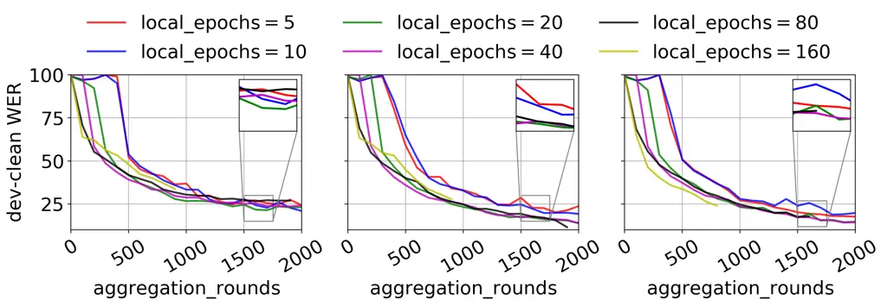

# Importance of Smoothness Induced by Optimizers in FL4ASR: Towards Understanding Federated Learning for End-to-End ASR

Sheikh Shams Azam    Tatiana Likhomanenko    Martin Pelikan    Jan
“Honza” Silovsky

###### Abstract

In this paper, we start by training End-to-End Automatic Speech
Recognition (ASR) models using Federated Learning (FL) and examining the
fundamental considerations that can be pivotal in minimizing the
performance gap in terms of word error rate between models trained using
FL versus their centralized counterpart. Specifically, we study the
effect of (i) adaptive optimizers, (ii) loss characteristics via
altering Connectionist Temporal Classification (CTC) weight, (iii) model
initialization through seed start, (iv) carrying over modeling setup
from experiences in centralized training to FL, e.g., pre-layer or
post-layer normalization, and (v) FL-specific hyperparameters, such as
number of local epochs, client sampling size, and learning rate
scheduler, specifically for ASR under heterogeneous data distribution.
We shed light on how some optimizers work better than others via
inducing smoothness. We also summarize the applicability of algorithms,
trends, and propose best practices from prior works in FL (in general)
toward End-to-End ASR models.

###### Index Terms: 

practical guide, federated learning, end-to-end, automatic speech
recognition, CTC-AED.

^(†)^(†)address: Apple

## 1 Introduction

In recent years, End-to-End (E2E) Automatic Speech Recognition (ASR)
model training using Connectionist Temporal Classification (CTC) \[1\],
Transducer \[2\], or Attention-based Encoder-Decoder (AED) \[3\] losses
has become ubiquitous because of the simplified training/inference
procedures and state-of-the-art (SOTA) performance. For example, WeNet
\[4\] is a recently proposed E2E ASR training library aimed towards
production-first development owing to the growing interest in the
deployment of these models for practical use cases. These E2E ASR models
– constituting Transformer \[5\] or Conformer \[6\] blocks in various
configurations – are often several orders of magnitude larger than the
models that were trained using a conventional hybrid ASR framework, are
trained on large servers for several days, and require much larger
datasets that often are acquired through data aggregation from opt-in
users to reach SOTA performance.

In parallel to these strides in ASR, there has been an increasing push
towards developing algorithms and techniques that require less data,
prevent privacy leakage \[7\], or provide users with privacy
guarantees \[8\] over the aggregated datasets. Federated Learning (FL)
is one such technique that decentralizes model training so that data do
not have to be stored on the server. It can also incorporate privacy
guarantees, e.g., differential privacy \[9\] or secure
aggregation \[10\]. FL thus allows the training of models while
protecting user privacy and it reduces the possibility of privacy
breach. FL has several additional benefits, such as reduced computation
(e.g., preprocessing data, training models) and storage (e.g.,
supervised or unsupervised data, model versions) needs associated with
centralized training, possible model personalization \[11\], and
accelerated convergence \[12\]. The prior works in FL mostly draw
inferences and propose solutions and best practices based on smaller
and/or simpler models (shallow CNNs, Transformers) applied to problems
such as classification and regression. There has been a limited emphasis
on studying FL for ASR, and thus a limited understanding of the
applicability of existing research directly towards ASR that uses much
larger Neural Networks (NNs) than most conventional ones studied in the
literature. Most existing works in FL for ASR either limit themselves
only to preliminary explorations or do not consider various aspects that
would be relevant when training ASR models in a practical FL setting,
such as data heterogeneity, impact of optimizer, and model design.

In this work, we aim to bridge these gaps and provide an in-depth
practical guide to training E2E CTC-AED models using FL. The main
contributions of this work are as follows:

- •
  We examine the applicability of the algorithms, trends, and best
  practices from prior works, e.g., impact of adaptive optimizers
  \[13\], seed start \[14\], etc., in the context of FL for E2E ASR with
  CTC-AED loss ($`\mathrm{FL4ASR}`$).
- •
  We present the choice of model and training parameters that play a
  pivotal role in bridging the gap between the performance of
  $`\mathrm{FL4ASR}`$ models and their centralized counterpart, thus
  taking a step towards practical $`\mathrm{FL4ASR}`$ training. These
  are based on extensive ablation studies to understand the importance
  of the parameters in isolation.
- •
  We also present a fresh perspective (confirmed empirically) that
  explains why some optimizers work better than others for
  $`\mathrm{FL4ASR}`$ training, i.e., by inducing smoothness or
  similarity¹¹ 1 Referring to Lipschitz smoothness and cosine
  similarity. among model updates or decreasing heterogeneity.

## 2 Related Work

We can categorize prior works mainly into two subsets: (i) generic FL
research, and (ii) FL research specific to ASR.

Generic FL. Most FL research focuses on studying aspects of FL for
smaller models and conventional machine learning (ML) tasks such as
classification and regression. For example, \[13\] advocates for the
usage of adaptive optimizers operating on pseudo-gradients²² 2 The
aggregated model updates ($`\mathbf{\Delta}_{\mathrm{}}^{\mathrm{(t)}}`$
in Alg. 1) in FL can be considered as (pseudo-) gradients for the
central/global loss function, i.e.,
$`\mathrm{F}(\bm{\theta}_{\mathrm{}}^{\mathrm{}})`$ in (1). to improve
convergence speed, but are not evaluated on large models such as
Conformer \[6\] for ASR. Other works \[15, 16\] study challenges in FL
such as tackling client heterogeneity or improving communication
efficiency via gradient compression but are limited in evaluation to
conventional settings that do not include large models or more complex
tasks such as ASR.

FL for ASR. There are only a handful of prior works that focus on FL for
ASR models. Specifically, \[17\] train Recurrent Neural Network
Transducer (RNN-T) \[18\] models using FL to understand a quality-cost
trade-off. Similarly, \[19\] study the effect of Federated Dropout on
ASR model training but do not consider heterogeneous data distribution,
which is one of the main challenges in FL. \[14\] comes closest to our
work in that it uses End-to-End ASR models, but is different in that (i)
they are unable to train without seed start, and (ii) train smaller
models that consist of CNN-encoder and RNN-decoder. In contrast, our
work studies (i) both training with seed start as well as from scratch
using $`\mathrm{LAMB}`$ \[20\] to minimize the effect of heterogeneity
on large ASR models using layer-wise adaptive learning rate, (ii) a
larger (120 million parameters) model with Conformer encoder and
Bidirectional Transformer decoder, and (iii) emphasizes on understanding
why the use of adaptive optimizers is crucial for ASR models. We also
shed light on the differences in takeaways observed between generic FL
research and $`\mathrm{FL4ASR}`$.

## 3 Federated Learning For ASR

Consider an FL framework with $`\mathcal{K}`$ clients. During each
central aggregation round, the central server samples clients
$`\mathrm{K}\subset\mathcal{K}`$ indexed
$`\mathrm{1,\ldots,\left|K\right|}`$ where $`\left|\mathrm{K}\right|`$
is termed cohort size. Each client $`\mathrm{k}`$ has a local dataset
$`\mathcal{D}_{\mathrm{k}}`$ with
$`\left|\mathcal{D}_{\mathrm{k}}\right|`$ samples comprising input
feature sequence (from speech utterances) and output label sequence
(from transcriptions). The objective of the FL framework is to minimize
the global loss function $`\mathrm{F(\cdot)}`$ given by

```math
\min_{\bm{\theta}_{\mathrm{}}^{\mathrm{}}\in\mathbb{R}^{\mathrm{M}}}\left\{\mathrm{F}(\bm{\theta}_{\mathrm{}}^{\mathrm{}})\triangleq\sum_{\mathrm{k=1}}^{\mathrm{\left|K\right|}}\frac{\left|\mathcal{D}_{\mathrm{k}}\right|}{\sum_{k=1}^{\left|K\right|}\left|\mathcal{D}_{\mathrm{k}}\right|}\mathrm{F}_{\mathrm{k}}(\bm{\theta}_{\mathrm{}}^{\mathrm{}})\right\}, \tag{1}
```

where
$`\mathrm{F_{k}(\bm{\theta}_{\mathrm{}}^{\mathrm{}})=\sum_{d\in\mathcal{D}_{k}}f(\bm{\theta}_{\mathrm{}}^{\mathrm{}};d)}/\left|\mathcal{D}_{\mathrm{k}}\right|`$
is the loss function at client $`\mathrm{k}`$, such that
$`\mathrm{f(\bm{\theta}_{\mathrm{}}^{\mathrm{}};d)}`$ denotes the loss
(e.g., CTC-AED) over the data $`\mathrm{d}`$ given the model parameters
$`\bm{\theta}_{\mathrm{}}^{\mathrm{}}`$.

An FL framework optimizes the objective (1) via engaging a sampled set
of clients in local model training. The clients train on their own local
datasets and periodically upload their model updates to the server,
which aggregates the updates and updates the central model either
through averaging conventionally \[21\], or through an adaptive
optimizer \[13\]. The updated central model is broadcasted to another
sampled set of clients and the process is repeated either for a fixed
number of central aggregation rounds or until convergence. The FL
algorithm and the corresponding terminology used in the rest of this
paper are summarized in Algorithm 1.

1: Initialize model $`\bm{\theta}_{\mathrm{}}^{\mathrm{(0)}}`$ and
$`\mathsf{central\_optimizer}`$

2: for $`\mathsf{aggregation\_rounds}`$ $`\mathrm{t=0}`$ to
$`\mathrm{(T-1)}`$ do

3:    Sample a subset $`\mathrm{K}`$ from available clients
$`\mathcal{K}`$ ($`\mathsf{cohort\_size}`$$`=\left|K\right|`$)

4:    for each client $`\mathrm{k\in K}`$ in parallel do

5:     Initialize local model
$`\bm{\theta}_{\mathrm{k}}^{\mathrm{(t,0,0)}}\leftarrow\bm{\theta}_{\mathrm{}}^{\mathrm{(t)}}`$
and $`\mathsf{local\_optimizer}`$

6:     for $`\mathsf{local\_epochs}`$ $`\mathrm{e=0}`$ to
$`\mathrm{E-1}`$ do

7:       for $`\mathsf{local\_batch}`$ $`\mathrm{b=0}`$ to
$`(\mathrm{B_{k}}-1)`$ do

8:        Compute gradient estimate
$`\mathbf{g}_{\mathrm{\mathsf{k}}}^{\mathrm{\mathsf{(t,e,b)}}}`$

9:
       $`\bm{\theta}_{\mathrm{\mathrm{k}}}^{\mathrm{\mathrm{(t,e,b+1)}}}\leftarrow\mathsf{local\_optimizer}\left(\mathbf{g}_{\mathrm{\mathsf{k}}}^{\mathrm{\mathsf{(t,e,b)}}}\right)`$

10:       end for

11:     end for

12:
    $`\mathbf{\Delta}_{\mathrm{\mathrm{k}}}^{\mathrm{\mathrm{(t)}}}=\bm{\theta}_{\mathrm{\mathrm{k}}}^{\mathrm{\mathrm{(t,E-1,B_{k}-1)}}}-\bm{\theta}_{\mathrm{\mathrm{k}}}^{\mathrm{\mathrm{(t,0,0)}}}`$

13:    end for

14:
   $`\mathbf{\Delta}_{\mathrm{}}^{\mathrm{\mathrm{(t)}}}=\frac{1}{\left|K\right|}\sum_{k\in K}\mathbf{\Delta}_{\mathrm{\mathrm{k}}}^{\mathrm{\mathrm{(t)}}}`$

15:
   $`\bm{\theta}_{\mathrm{}}^{\mathrm{(0)}}\leftarrow\mathsf{central\_optimizer}\left(\mathbf{\Delta}_{\mathrm{}}^{\mathrm{\mathrm{(t)}}}\right)`$

16: end for

Algorithm 1 Federated Optimization with Client Sampling

## 4 Experiments

Dataset. We run FL simulations using LibriSpeech \[22\], which consists
of over 960 hours of training data divided into 3 training splits and 4
evaluation splits. The statistics about the data splits are detailed in
Table 1. Each data sample comprises audio, its transcript, and the
associated speaker ID.

|                                         |                      |                       |                     |                                   |                                    |
| --------------------------------------- | -------------------- | --------------------- | ------------------- | --------------------------------- | ---------------------------------- |
| split                                   | \# hrs               | \# utts               | \# spk              | $`\frac{\text{min}}{\text{spk}}`$ | $`\frac{\text{utts}}{\text{spk}}`$ |
| $`\mathrm{clean}\text{-}100`$           | $`100.6`$            | $`\hphantom{0}28539`$ | $`\hphantom{0}251`$ | $`25`$                            | $`114_{{}_{15}}`$                  |
| $`\mathrm{clean}\text{-}360`$           | $`363.6`$            | $`104014`$            | $`\hphantom{0}921`$ | $`25`$                            | $`113_{{}_{16}}`$                  |
| $`\mathrm{other}\text{-}500`$           | $`496.7`$            | $`148688`$            | $`1166`$            | $`30`$                            | $`128_{{}_{30}}`$                  |
| $`\mathrm{dev}\text{-}\mathrm{clean}`$  | $`\hphantom{00}5.4`$ | $`\hphantom{00}2703`$ | $`\hphantom{00}40`$ | $`\hphantom{0}8`$                 | $`\hphantom{0}68_{{}_{17}}`$       |
| $`\mathrm{dev}\text{-}\mathrm{other}`$  | $`\hphantom{00}5.3`$ | $`\hphantom{00}2864`$ | $`\hphantom{00}33`$ | $`10`$                            | $`\hphantom{0}87_{{}_{25}}`$       |
| $`\mathrm{test}\text{-}\mathrm{clean}`$ | $`\hphantom{00}5.4`$ | $`\hphantom{00}2620`$ | $`\hphantom{00}40`$ | $`\hphantom{0}8`$                 | $`\hphantom{0}66_{{}_{20}}`$       |
| $`\mathrm{test}\text{-}\mathrm{other}`$ | $`\hphantom{00}5.1`$ | $`\hphantom{00}2939`$ | $`\hphantom{00}33`$ | $`10`$                            | $`\hphantom{0}89_{{}_{26}}`$       |

Table 1: Statistics about number of hours (# hrs), utterances (# utts),
unique speakers (# spk), minutes per speaker
($`\frac{\mathrm{min}}{\mathrm{spk}}`$), and utterances per speaker
($`\frac{\mathrm{utts}}{\mathrm{spk}}`$) for LibriSpeech data splits.

Federated Dataset. We use the speaker IDs to partition the data so that
each speaker corresponds to one client participating in FL, thus
simulating a non-independent and identically distributed (non-IID) data
distribution among clients in FL.

Federated Training. For FL, we consider two different types of training
setups: (i) $`\mathrm{FL}\text{-}\mathrm{random}\text{-}\mathrm{start}`$
that starts FL training from a randomly initialized model and (ii)
$`\mathrm{FL}\text{-}\mathrm{seed}\text{-}\mathrm{start}`$ that starts
the training from a centrally trained seed model. For
$`\mathrm{FL}\text{-}\mathrm{random}\text{-}\mathrm{start}`$, we train
on three different data splits: (i) $`\mathrm{clean}\text{-}100`$, (ii)
$`\mathrm{clean}\text{-}100`$ + $`\mathrm{clean}\text{-}360`$ = $`\mathrm{clean}\text{-}460`$,
and (iii) $`\mathrm{clean}\text{-}460`$ +
$`\mathrm{other}\text{-}500`$ = $`\mathrm{all}\text{-}960`$. For
$`\mathrm{FL}\text{-}\mathrm{seed}\text{-}\mathrm{start}`$, we split the
data into two parts: (i) $`\mathrm{clean}\text{-}100`$ used for seed
model training using centralized training and (ii)
$`\mathrm{clean}\text{-}360`$ or
$`\mathrm{clean}\text{-}360`$ + $`\mathrm{other}\text{-}500`$ = $`\mathrm{mixed}\text{-}860`$
partitioned using speaker IDs used as client data for FL. The
$`\mathrm{FL}\text{-}\mathrm{seed}\text{-}\mathrm{start}`$ is realistic
since oftentimes there is a small set of data (e.g., open-source or
legacy data) available on the server \[14, 23\].

Tokenizer. We train the SentencePiece \[24\] tokenizer with Byte-Pair
Encoding (BPE) \[25\] subword units only on the
$`\mathrm{clean}\text{-}100`$ split since in a realistic setting we
might not have access to all client data on the server to train a
tokenizer.

Model. We use a CTC-AED model similar in size³³ 3 Link to the
configuration file:
[https://github.com/wenet-e2e/wenet/blob/main/examples/librispeech/s0/conf/train_conformer_bidecoder_large.yaml](https://github.com/wenet-e2e/wenet/blob/main/examples/librispeech/s0/conf/train_conformer_bidecoder_large.yaml)
to the conformer-bidecoder-large WeNet \[4\] model, which consists of a
conformer encoder with 12 blocks each comprising 8 attention heads, and
a bidirectional transformer decoder comprising 3 blocks of 8 attention
heads in both the left and right decoders. The model consists of
$`\sim 120`$ million parameters.

Training. We use the the CTC-AED loss for training and use
$`\mathrm{attention\_rescoring}`$ \[4\] decoding with
$`\mathrm{beam\_size}=50`$ for evaluation. We train with
$`8\times 32`$ GB V$`100`$ GPU and batch size of $`16`$ on each client
during FL and $`48`$ for centralized training, while the test-time
inference is done with a larger batch size. For centralized training, we
train with data augmentation \[26, 27\], warmup and learning rate decay
scheduler for $`80,000`$ model updates or until convergence. The
training parameters such as $`\mathrm{cohort\_size}`$,
$`\mathrm{aggregation\_rounds}`$, $`\mathrm{local\_epochs}`$, etc. are
reported individually for each experiment.

Evaluation. The FL experiments report both mean and standard deviation
($`\mathrm{std}`$) of Word Error Rates (as
$`\mathrm{WER}_{{}_{\mathrm{std}}}`$) on the evaluation sets of
LibriSpeech, calculated from at least 3 runs started with different
random seeds.

| baseline             | train                         | dev-                   |                        | test-                |                        |
| -------------------- | ----------------------------- | ---------------------- | ---------------------- | -------------------- | ---------------------- |
|                      | data                          | clean                  | other                  | clean                | other                  |
| central training     | $`\mathrm{clean}\text{-}100`$ | $`10.32`$              | $`26.21`$              | $`10.18`$            | $`24.99`$              |
|                      | $`\mathrm{clean}\text{-}460`$ | $`\hphantom{0}3.91`$   | $`12.47`$              | $`\hphantom{0}3.46`$ | $`12.54`$              |
|                      | $`\mathrm{all}\text{-}960`$   | $`\hphantom{0}{2.79}`$ | $`\hphantom{0}{7.94}`$ | $`\hphantom{0}2.96`$ | $`\hphantom{0}{8.14}`$ |
| guliani et al.\[17\] | $`\mathrm{all}\text{-}960`$   | $`\hphantom{0}4.60`$   | $`11.40`$              | $`\hphantom{0}4.80`$ | $`11.40`$              |

Table 2: Baselines using $`\mathrm{all}\text{-}960`$ LibriSpeech.
Central training is the achievable performance limit using FL, \[17\] is
a prior SOTA that trains an RNN-T on LibriSpeech using FL.

Baselines. To better understand the impact of various parameters on
$`\mathrm{FL4ASR}`$ training pipeline, we choose two baselines for
comparison: (i) a centrally trained model that serves as the limit of
achievable performance with FL and (ii) \[17\] which is the
state-of-the-art (SOTA) performance on LibriSpeech using FL and non-IID
data. We use the $`\mathrm{WER}`$ as reported in \[17\] owing to the
lack of implementation details in the paper.

|      |                               |        |        |                                  |      |      |                   |                   |        |      |                                            |                       |                                  |                       |
| ---- | ----------------------------- | ------ | ------ | -------------------------------- | ---- | ---- | ----------------- | ----------------- | ------ | ---- | ------------------------------------------ | --------------------- | -------------------------------- | --------------------- |
|  id  | train                         | cohort | local  | scheduler                        | spec | spec | c-opt             | seed              | opt.   | AED  | dev-                                       |                       | test-                            |                       |
|      | data                          | size   | epochs |                                  | aug  | sub  |                   | start             | switch | loss | clean                                      | other                 | clean                            | other                 |
| 1.1  | $`\mathrm{clean}\text{-}100`$ | 5      | 10     | ✗                                | ✗    | ✗    | $`\mathrm{SGD}`$  | ✗                 | ✗      | ✓    | $`30.06_{{}_{5.96}}`$                      | $`52.18_{{}_{5.09}}`$ | $`30.08_{{}_{5.87}}`$            | $`53.44_{{}_{4.63}}`$ |
| 1.2  |                               | 5      | 10     | $`\mathrm{wu}`$                  | ✗    | ✗    | $`\mathrm{SGD}`$  | ✗                 | ✗      | ✓    | $`28.09_{{}_{1.35}}`$                      | $`51.02_{{}_{1.03}}`$ | $`28.15_{{}_{1.25}}`$            | $`52.43_{{}_{0.85}}`$ |
| 1.3  |                               | 5      | 10     | $`\mathrm{wu}`$+$`\mathrm{dec}`$ | ✗    | ✗    | $`\mathrm{SGD}`$  | ✗                 | ✗      | ✓    | $`28.20_{{}_{0.52}}`$                      | $`51.53_{{}_{0.30}}`$ | $`28.14_{{}_{0.69}}`$            | $`52.92_{{}_{0.38}}`$ |
| 1.4  |                               | 5      | 10     | $`\mathrm{wu}`$+$`\mathrm{dec}`$ | ✓    | ✗    | $`\mathrm{SGD}`$  | ✗                 | ✗      | ✓    | $`21.75_{{}_{2.93}}`$                      | $`38.95_{{}_{3.50}}`$ | $`21.90_{{}_{2.87}}`$            | $`40.17_{{}_{3.43}}`$ |
| 1.5  |                               | 5      | 10     | $`\mathrm{wu}`$+$`\mathrm{dec}`$ | ✓    | ✓    | $`\mathrm{SGD}`$  | ✗                 | ✗      | ✓    | $`20.27_{{}_{0.40}}`$                      | $`36.84_{{}_{1.02}}`$ | $`20.49_{{}_{0.30}}`$            | $`38.31_{{}_{0.82}}`$ |
| 1.6  |                               | 5      | 10     | $`\mathrm{wu}`$+$`\mathrm{dec}`$ | ✓    | ✓    | $`\mathrm{SGD}`$  | ✗                 | ✗      | ✗    | $`62.08_{{}_{43.5}}`$                      | $`70.14_{{}_{34.2}}`$ | $`62.17_{{}_{43.4}}`$            | $`70.90_{{}_{33.4}}`$ |
| 1.7  |                               | 5      | 10     | $`\mathrm{wu}`$+$`\mathrm{dec}`$ | ✓    | ✓    | $`\mathrm{Adam}`$ | ✗                 | ✗      | ✓; ✗ | $`\mathrm{training\,does\,not\,converge}`$ |                       |                                  |                       |
| 1.8  |                               | 5      | 10     | $`\mathrm{wu}`$+$`\mathrm{dec}`$ | ✓    | ✓    | $`\mathrm{Adam}`$ | ✗                 | ✓      | ✓    | $`20.81_{{}_{1.64}}`$                      | $`37.52_{{}_{2.47}}`$ | $`21.04_{{}_{1.60}}`$            | $`38.93_{{}_{2.34}}`$ |
| 1.9  |                               | 5      | 10     | $`\mathrm{wu}`$+$`\mathrm{dec}`$ | ✓    | ✓    | $`\mathrm{Adam}`$ |  ✓$`\mathrm{ws}`$ | ✗      | ✓    | $`10.87_{{}_{0.29}}`$                      | $`25.08_{{}_{0.74}}`$ | $`10.95_{{}_{0.29}}`$            | $`26.28_{{}_{0.58}}`$ |
| 1.10 |                               | 5      | 10     | $`\mathrm{wu}`$+$`\mathrm{dec}`$ | ✓    | ✓    | $`\mathrm{SGD}`$  |  ✓$`\mathrm{ws}`$ | ✗      | ✓    | $`19.95_{{}_{0.83}}`$                      | $`38.51_{{}_{1.35}}`$ | $`20.10_{{}_{0.74}}`$            | $`40.19_{{}_{1.21}}`$ |
| 2.1  | $`\mathrm{clean}\text{-}460`$ | 5      | 10     | ✗                                | ✗    | ✗    | $`\mathrm{SGD}`$  | ✗                 | ✗      | ✓    | $`22.31_{{}_{3.97}}`$                      | $`44.05_{{}_{3.92}}`$ | $`22.57_{{}_{3.94}}`$            | $`45.43_{{}_{4.15}}`$ |
| 2.2  |                               | 5      | 10     | $`\mathrm{wu}`$                  | ✗    | ✗    | $`\mathrm{SGD}`$  | ✗                 | ✗      | ✓    | $`21.37_{{}_{2.51}}`$                      | $`43.16_{{}_{2.46}}`$ | $`21.40_{{}_{2.32}}`$            | $`44.70_{{}_{2.49}}`$ |
| 2.3  |                               | 5      | 10     | $`\mathrm{wu}`$+$`\mathrm{dec}`$ | ✗    | ✗    | $`\mathrm{SGD}`$  | ✗                 | ✗      | ✓    | $`20.74_{{}_{1.07}}`$                      | $`42.56_{{}_{1.29}}`$ | $`20.95_{{}_{1.13}}`$            | $`44.16_{{}_{1.62}}`$ |
| 2.4  |                               | 5      | 10     | $`\mathrm{wu}`$+$`\mathrm{dec}`$ | ✓    | ✗    | $`\mathrm{SGD}`$  | ✗                 | ✗      | ✓    | $`16.83_{{}_{0.25}}`$                      | $`33.25_{{}_{0.32}}`$ | $`17.04_{{}_{0.18}}`$            | $`34.53_{{}_{0.81}}`$ |
| 2.5  |                               | 5      | 10     | $`\mathrm{wu}`$+$`\mathrm{dec}`$ | ✓    | ✓    | $`\mathrm{SGD}`$  | ✗                 | ✗      | ✓    | $`17.21_{{}_{0.74}}`$                      | $`33.77_{{}_{1.10}}`$ | $`17.59_{{}_{0.74}}`$            | $`35.06_{{}_{0.78}}`$ |
| 2.6  |                               | 5      | 10     | $`\mathrm{wu}`$+$`\mathrm{dec}`$ | ✓    | ✓    | $`\mathrm{SGD}`$  | ✗                 | ✗      | ✗    | $`18.14_{{}_{1.47}}`$                      | $`34.00_{{}_{1.92}}`$ | $`18.27_{{}_{1.58}}`$            | $`35.29_{{}_{1.94}}`$ |
| 2.7  |                               | 5      | 10     | $`\mathrm{wu}`$+$`\mathrm{dec}`$ | ✓    | ✓    | $`\mathrm{Adam}`$ | ✗                 | ✗      | ✓; ✗ | $`\mathrm{training\,does\,not\,converge}`$ |                       |                                  |                       |
| 2.8  |                               | 5      | 10     | $`\mathrm{wu}`$+$`\mathrm{dec}`$ | ✓    | ✓    | $`\mathrm{Adam}`$ | ✗                 | ✓      | ✓    | $`17.39_{{}_{0.29}}`$                      | $`34.03_{{}_{0.44}}`$ | $`17.70_{{}_{0.20}}`$            | $`35.55_{{}_{0.51}}`$ |
| 2.9  |                               | 5      | 10     | $`\mathrm{wu}`$+$`\mathrm{dec}`$ | ✓    | ✓    | $`\mathrm{Adam}`$ |  ✓$`\mathrm{ws}`$ | ✗      | ✓    | $`\hphantom{0}6.43_{{}_{0.21}}`$           | $`20.20_{{}_{0.98}}`$ | $`\hphantom{0}6.67_{{}_{0.25}}`$ | $`20.78_{{}_{0.77}}`$ |
| 2.10 |                               | 5      | 10     | $`\mathrm{wu}`$+$`\mathrm{dec}`$ | ✓    | ✓    | $`\mathrm{SGD}`$  |  ✓$`\mathrm{ws}`$ | ✗      | ✓    | $`14.48_{{}_{1.87}}`$                      | $`32.16_{{}_{1.79}}`$ | $`14.51_{{}_{1.79}}`$            | $`33.72_{{}_{1.92}}`$ |
| 2.11 |                               | 5      | 10     | $`\mathrm{wu}`$+$`\mathrm{dec}`$ | ✓    | ✓    | $`\mathrm{Adam}`$ | ✓$`\mathrm{pt}`$  | ✗      | ✓    | $`\hphantom{0}5.72_{{}_{0.34}}`$           | $`19.62_{{}_{1.51}}`$ | $`\hphantom{0}5.99_{{}_{0.35}}`$ | $`19.73_{{}_{1.63}}`$ |
| 2.12 |                               | 5      | 10     | $`\mathrm{wu}`$+$`\mathrm{dec}`$ | ✓    | ✓    | $`\mathrm{SGD}`$  | ✓$`\mathrm{pt}`$  | ✗      | ✓    | $`\hphantom{0}6.55_{{}_{0.12}}`$           | $`21.35_{{}_{0.27}}`$ | $`\hphantom{0}6.91_{{}_{0.10}}`$ | $`22.17_{{}_{0.32}}`$ |
| 3.1  | $`\mathrm{all}\text{-}960`$   | 5      | 10     | ✗                                | ✗    | ✗    | $`\mathrm{SGD}`$  | ✗                 | ✗      | ✓    | $`57.54_{{}_{44.6}}`$                      | $`65.39_{{}_{36.2}}`$ | $`57.55_{{}_{44.5}}`$            | $`65.92_{{}_{35.4}}`$ |
| 3.2  |                               | 5      | 10     | $`\mathrm{wu}`$                  | ✗    | ✗    | $`\mathrm{SGD}`$  | ✗                 | ✗      | ✓    | $`18.60_{{}_{0.70}}`$                      | $`34.12_{{}_{0.65}}`$ | $`18.62_{{}_{0.57}}`$            | $`35.62_{{}_{0.91}}`$ |
| 3.3  |                               | 5      | 10     | $`\mathrm{wu}`$+$`\mathrm{dec}`$ | ✗    | ✗    | $`\mathrm{SGD}`$  | ✗                 | ✗      | ✓    | $`19.07_{{}_{0.82}}`$                      | $`34.33_{{}_{0.75}}`$ | $`18.85_{{}_{0.84}}`$            | $`35.70_{{}_{0.65}}`$ |
| 3.4  |                               | 5      | 10     | $`\mathrm{wu}`$+$`\mathrm{dec}`$ | ✓    | ✗    | $`\mathrm{SGD}`$  | ✗                 | ✗      | ✓    | $`16.60_{{}_{0.24}}`$                      | $`28.52_{{}_{0.43}}`$ | $`16.62_{{}_{0.23}}`$            | $`29.47_{{}_{0.41}}`$ |
| 3.5  |                               | 5      | 10     | $`\mathrm{wu}`$+$`\mathrm{dec}`$ | ✓    | ✓    | $`\mathrm{SGD}`$  | ✗                 | ✗      | ✓    | $`17.33_{{}_{0.46}}`$                      | $`29.39_{{}_{0.80}}`$ | $`17.25_{{}_{0.39}}`$            | $`30.48_{{}_{1.16}}`$ |
| 3.6  |                               | 5      | 10     | $`\mathrm{wu}`$+$`\mathrm{dec}`$ | ✓    | ✓    | $`\mathrm{SGD}`$  | ✗                 | ✗      | ✗    | $`16.78_{{}_{0.27}}`$                      | $`28.13_{{}_{0.27}}`$ | $`16.65_{{}_{0.30}}`$            | $`29.32_{{}_{0.11}}`$ |
| 3.7  |                               | 5      | 10     | $`\mathrm{wu}`$+$`\mathrm{dec}`$ | ✓    | ✓    | $`\mathrm{Adam}`$ | ✗                 | ✗      | ✓; ✗ | $`\mathrm{training\,does\,not\,converge}`$ |                       |                                  |                       |
| 3.8  |                               | 5      | 10     | $`\mathrm{wu}`$+$`\mathrm{dec}`$ | ✓    | ✓    | $`\mathrm{Adam}`$ | ✗                 | ✓      | ✓    | $`16.65_{{}_{0.41}}`$                      | $`29.24_{{}_{0.46}}`$ | $`16.60_{{}_{0.34}}`$            | $`30.30_{{}_{0.45}}`$ |
| 3.9  |                               | 5      | 10     | $`\mathrm{wu}`$+$`\mathrm{dec}`$ | ✓    | ✓    | $`\mathrm{Adam}`$ |  ✓$`\mathrm{ws}`$ | ✗      | ✗    | $`\hphantom{0}6.24_{{}_{0.18}}`$           | $`15.38_{{}_{0.40}}`$ | $`\hphantom{0}6.39_{{}_{0.05}}`$ | $`16.08_{{}_{0.43}}`$ |
| 3.10 |                               | 5      | 10     | $`\mathrm{wu}`$+$`\mathrm{dec}`$ | ✓    | ✓    | $`\mathrm{SGD}`$  |  ✓$`\mathrm{ws}`$ | ✗      | ✗    | $`14.78_{{}_{3.27}}`$                      | $`27.23_{{}_{3.86}}`$ | $`14.52_{{}_{3.28}}`$            | $`28.67_{{}_{3.50}}`$ |
| 3.11 |                               | 5      | 10     | $`\mathrm{wu}`$+$`\mathrm{dec}`$ | ✓    | ✓    | $`\mathrm{Adam}`$ | ✓$`\mathrm{pt}`$  | ✗      | ✗    | $`\hphantom{0}5.48_{{}_{0.17}}`$           | $`15.31_{{}_{0.71}}`$ | $`\hphantom{0}5.72_{{}_{0.16}}`$ | $`15.86_{{}_{0.69}}`$ |
| 3.12 |                               | 5      | 10     | $`\mathrm{wu}`$+$`\mathrm{dec}`$ | ✓    | ✓    | $`\mathrm{SGD}`$  | ✓$`\mathrm{pt}`$  | ✗      | ✗    | $`\hphantom{0}6.65_{{}_{0.23}}`$           | $`18.97_{{}_{0.61}}`$ | $`\hphantom{0}6.86_{{}_{0.22}}`$ | $`19.52_{{}_{0.82}}`$ |

Table 3: Effect (in terms of $`\mathrm{WER}_{{}_{\mathrm{std}}}`$) of
learning rate scheduler: warmup ($`\mathrm{wu}`$) and decay schedule
($`\mathrm{dec}`$), data augmentation: SpecAugment \[26\] and SpecSub
\[27\], central optimizer (c-opt), seed start: warm-start
($`\mathrm{ws}`$), i.e., unconverged (WER = $`98.36\%`$ on
$`\mathrm{dev}\text{-}\mathrm{clean}`$) and pre-trained
($`\mathrm{pt}`$), i.e., pre-trained (WER = $`10.32\%`$ on
$`\mathrm{dev}\text{-}\mathrm{clean}`$) FL initialization, optimizer
(opt.) switch, and $`\mathrm{AED}`$ loss on CTC-AED model training using
FL with $`\mathrm{aggregation\_rounds}`$$`=2000`$.

### 4.1 Mitigating Diverging Model Training

We start our exploration by examining the convergence of
$`\mathrm{FL4ASR}`$ training. For this, we use Stochastic Gradient
Descent ($`\mathrm{SGD}`$) as the local optimizer and tune over the two
central optimizers: (i) $`\mathrm{Adam}`$ \[28\] as suggested in \[13\]
and (ii) $`\mathrm{SGD}`$ as suggested in \[21\]. In order to obtain a
converging model it is important to use learning rate scheduler and data
augmentation \[26, 27\] as can be seen in Table 3 (rows 3-3, 3-3, 3-3).
The main takeaways are as follows:

- •
  While a warmup schedule for local learning rate (LR) improves both
  $`\mathrm{WER}`$ and $`\mathrm{std}`$ on smaller datasets (see 3, 3
  vs. 3, 3 respectively), it significantly benefits from the larger
  training data (see 3 vs 3). LR decay schedule further stabilizes
  training (see $`\mathrm{std}`$ in 3, 3 vs. 3, 3 respectively).
  However, prior research \[13\] finds that the LR scheduler only has a
  “modest” effect on performance.
- •
  Data augmentation improves $`\mathrm{WER}`$: SpecAugment \[26\] leads
  to significant improvements irrespective of training data size (see 3,
  3, 3 vs. 3, 3, 3 respectively) but SpecSub \[27\] shows visible
  benefits (including $`\mathrm{std}`$) only for smaller data, i.e.,
  $`\mathrm{clean}\text{-}100`$ (see 3 vs. 3).

These observations correspond to a reduction in heterogeneity among
client updates at various stages of training: warmup and decay scheduler
for LR ensure smaller LR at the start and end of training respectively
and data augmentation prevents model overfitting to local data, thus
reducing heterogeneity among of model updates from client in FL \[13,
29\]. It is worth noting that among pre-layer norm and post-layer norm,
only the former consistently converges on all training data sizes using
FL. Also, during our initial experiments summarized in Table 3, we
observe that $`\mathrm{SGD}`$ outperforms $`\mathrm{Adam}`$ when using
default parameters, i.e., $`\varepsilon=1\mathrm{e}-8`$. In fact,
$`\mathrm{Adam}`$ fails to converge with default parameters as can be
seen in Table 3.

### 4.2 How to Stabilize Adam Training?

While tuning epsilon $`\varepsilon`$ in $`\mathrm{Adam}`$ in centralized
training affects both the numerical stability and the magnitude of model
updates \[30\] during optimization, we observe diverging training for
all values of $`\varepsilon\in\{0.1,0.01,1\mathrm{e}-5,1\mathrm{e}-8\}`$
(see rows 3, 3, 3 in Table 3) when using FL.

Seed Start and $`\bm{\varepsilon}`$ together help. If we tune
$`\varepsilon`$ while starting FL from a mildly trained seed model (WER
of seed model is $`98.36\%`$ on $`\mathrm{dev}\text{-}\mathrm{clean}`$),
we observe a prominent effect of $`\varepsilon`$ on convergence;
$`\varepsilon=0.01`$ works best (rows 3, 3, 3 in Table 3). Using
$`\varepsilon=0.01`$ in fact helps $`\mathrm{Adam}`$ outperform
$`\mathrm{SGD}`$. While we posit that large $`\varepsilon`$ reduces the
magnitude of model updates, thus minimizing the effect of
heterogeneity, the failure of $`\mathrm{Adam}`$ training with random
initialization could be resulting from either (i) the inability of
attention-layers in the decoder to learn, or (ii) irregular estimation
of second-order statistics gathered from noisy pseudo-gradients at the
start of FL, thus unable to provide useful bias for updates.

We rule out the former reason by removing the effect of decoder
attention layers in optimization. Specifically, we train
$`\mathrm{Adam}`$ with CTC loss only, i.e., remove AED loss by setting
$`\alpha=1`$ in CTC-AED loss
$`\mathrm{L}_{\mathrm{CTC-AED}}=\alpha\mathrm{L}_{\mathrm{CTC}}+(1-\alpha)\mathrm{L}_{\mathrm{AED}}`$
\[4\]. This does not improve the diverging training (see rows 3, 3, 3 in
Table 3). However, we can train $`\mathrm{SGD}`$ with CTC loss (see rows
3, 3, 3 in Table 3).

Role of AED loss. The decoder in an encoder-decoder architecture of ASR
training using CTC-AED loss can be interpreted as a language model. In
Table 3, we observe that while the effect of AED loss, and thus a
language model, is significant on a small dataset (rows 3 vs 3), it is
only marginal on larger datasets (rows 3, 3 vs 3, 3 respectively),
possibly because the tokenizer trained on $`\mathrm{clean}\text{-}100`$
data is not helpful on the highly heterogeneous data in
$`\mathrm{other}\text{-}500`$. We could possibly benefit from a biased
decoder \[31\] on clients, i.e., weighted aggregate of local and central
weights but biased towards the former. We defer this to future
exploration.

Optimizer Switch ($`\mathrm{OptSwitch}`$) and Cohort Warmup. During
$`\mathrm{FL}\text{-}\mathrm{random}\text{-}\mathrm{start}`$ training,
we try (i) “optimizer switch”: start training with $`\mathrm{SGD}`$ as
central optimizer for a relatively small number ($`\sim 100`$) of
$`\mathrm{aggregation\_rounds}`$ and thereafter switch to
$`\mathrm{Adam}`$, and (ii) “cohort warmup”: start with
$`\mathrm{cohort\_size}`$ $`=1`$ and slowly ramp-up the
$`\mathrm{cohort\_size}`$ to help stabilize training with
$`\mathrm{Adam}`$ by helping estimate more stable second-order
statistics. While cohort warmup does not help, $`\mathrm{OptSwitch}`$
indeed stabilizes
$`\mathrm{FL}\text{-}\mathrm{random}\text{-}\mathrm{start}`$ training
with $`\mathrm{Adam}`$ but only able to emulate $`\mathrm{SGD}`$
performance (rows 3, 3, 3 vs 3, 3, 3 respectively in Table 3).

Pre-trained Seed Start. We observe benefits (see rows 3, 3 in Table 3)
when initializing FL with a seed model
($`\mathrm{FL}\text{-}\mathrm{seed}\text{-}\mathrm{start}`$) trained
centrally on server dataset mutually exclusive from FL dataset.
$`\mathrm{FL}\text{-}\mathrm{seed}\text{-}\mathrm{start}`$ does not
require explicit stabilizers such as $`\mathrm{OptSwitch}`$ to converge.

### 4.3 Significance of Bias Reduction via Optimizers

One of the main challenges in FL is handling heterogeneous data. In the
case of ASR, the heterogeneity can be w.r.t both acoustic features of
the speaker (input space), and token frequency in the transcripts
(output space). Also, the depth of the model only aggravates this
problem. Therefore, observing the diminishing returns from tuning
$`\mathrm{Adam}`$ optimizer which is known for using biased second-order
squared estimates, we turn to other optimizers, namely
$`\mathrm{AdamW}`$, $`\mathrm{Yogi}`$, and $`\mathrm{LAMB}`$, that help
alleviate some of its associated problems. Table 4 summarizes the key
differences among these optimizers.

|                 | optimizers       |                   |                    |                   |                   |
| --------------- | ---------------- | ----------------- | ------------------ | ----------------- | ----------------- |
|                 | $`\mathrm{SGD}`$ | $`\mathrm{Adam}`$ | $`\mathrm{AdamW}`$ | $`\mathrm{Yogi}`$ | $`\mathrm{LAMB}`$ |
| Adaptive LR     | ✗                | ✓                 | ✓                  | ✓                 | ✓                 |
| weight decay    | ✗                | ✗                 | ✓                  | ✗                 | ✗                 |
| bias correction | ✗                | ✗                 | ✗                  | ✓                 | ✗                 |
| layer-based     | ✗                | ✗                 | ✗                  | ✗                 | ✓                 |
| normalization   |                  |                   |                    |                   |                   |
| more memory     | ✗                | ✓                 | ✓                  | ✓                 | ✓                 |

Table 4: Summary of differences between optimizers.

For both $`\mathrm{FL}\text{-}\mathrm{random}\text{-}\mathrm{start}`$
and $`\mathrm{FL}\text{-}\mathrm{seed}\text{-}\mathrm{start}`$ training,
it can be immediately observed that while $`\mathrm{Yogi}`$ and
$`\mathrm{AdamW}`$ improve upon $`\mathrm{Adam}`$ as central optimizers,
$`\mathrm{LAMB}`$ shows significant benefits over $`\mathrm{SGD}`$ as
local optimizer (see Table 5). Furthermore, local optimization via
$`\mathrm{LAMB}`$ minimizes the performance gap between adaptive central
optimizers.

|                           |                                                                                                                                             |                    |                   |                       |                       |                       |                       |
| ------------------------- | ------------------------------------------------------------------------------------------------------------------------------------------- | ------------------ | ----------------- | --------------------- | --------------------- | --------------------- | --------------------- |
|                           |                                                                                                                                             |                    |                   | cohort_size = 5       |                       |                       |                       |
|                           | train                                                                                                                                       | optimizer          |                   | dev-                  |                       | test-                 |                       |
|                           | data                                                                                                                                        | central            | local             | clean                 | other                 | clean                 | other                 |
| aggregation rounds = 2000 | $`\mathrm{FL}\text{-}\mathrm{seed}\text{-}\mathrm{start}`$ with model pre-trained (✓$`\mathrm{pt}`$) on $`\mathrm{clean}\text{-}100`$ split |                    |                   |                       |                       |                       |                       |
|                           | $`\mathrm{clean}\text{-}460`$                                                                                                               | $`\mathrm{Adam}`$  | $`\mathrm{SGD}`$  | $`6.24_{{}_{0.14}}`$  | $`20.25_{{}_{0.79}}`$ | $`6.51_{{}_{0.10}}`$  | $`20.67_{{}_{0.92}}`$ |
|                           |                                                                                                                                             |                    | $`\mathrm{LAMB}`$ | $`4.95_{{}_{0.08}}`$  | $`16.57_{{}_{0.34}}`$ | $`5.23_{{}_{0.09}}`$  | $`16.59_{{}_{0.40}}`$ |
|                           |                                                                                                                                             | $`\mathrm{AdamW}`$ | $`\mathrm{SGD}`$  | $`5.68_{{}_{0.13}}`$  | $`18.58_{{}_{0.71}}`$ | $`6.04_{{}_{0.03}}`$  | $`18.86_{{}_{0.73}}`$ |
|                           |                                                                                                                                             |                    | $`\mathrm{LAMB}`$ | $`5.34_{{}_{0.14}}`$  | $`17.73_{{}_{0.21}}`$ | $`5.75_{{}_{0.20}}`$  | $`18.00_{{}_{0.23}}`$ |
|                           |                                                                                                                                             | $`\mathrm{Yogi}`$  | $`\mathrm{SGD}`$  | $`6.29_{{}_{0.13}}`$  | $`20.30_{{}_{1.00}}`$ | $`6.50_{{}_{0.16}}`$  | $`20.69_{{}_{0.94}}`$ |
|                           |                                                                                                                                             |                    | $`\mathrm{LAMB}`$ | $`4.96_{{}_{0.06}}`$  | $`16.68_{{}_{0.27}}`$ | $`5.27_{{}_{0.10}}`$  | $`16.76_{{}_{0.28}}`$ |
|                           | $`\mathrm{all}\text{-}960`$                                                                                                                 | $`\mathrm{Adam}`$  | $`\mathrm{SGD}`$  | $`6.42_{{}_{0.22}}`$  | $`16.73_{{}_{0.84}}`$ | $`6.44_{{}_{0.17}}`$  | $`17.01_{{}_{0.84}}`$ |
|                           |                                                                                                                                             |                    | $`\mathrm{LAMB}`$ | $`5.00_{{}_{0.13}}`$  | $`13.47_{{}_{0.27}}`$ | $`5.18_{{}_{0.10}}`$  | $`13.44_{{}_{0.13}}`$ |
|                           |                                                                                                                                             | $`\mathrm{AdamW}`$ | $`\mathrm{SGD}`$  | $`6.01_{{}_{0.26}}`$  | $`15.72_{{}_{0.54}}`$ | $`6.23_{{}_{0.17}}`$  | $`16.00_{{}_{0.70}}`$ |
|                           |                                                                                                                                             |                    | $`\mathrm{LAMB}`$ | $`5.57_{{}_{0.09}}`$  | $`14.62_{{}_{0.43}}`$ | $`5.76_{{}_{0.12}}`$  | $`15.04_{{}_{0.34}}`$ |
|                           |                                                                                                                                             | $`\mathrm{Yogi}`$  | $`\mathrm{SGD}`$  | $`6.36_{{}_{0.14}}`$  | $`16.57_{{}_{0.28}}`$ | $`6.53_{{}_{0.10}}`$  | $`16.91_{{}_{0.37}}`$ |
|                           |                                                                                                                                             |                    | $`\mathrm{LAMB}`$ | $`4.98_{{}_{0.02}}`$  | $`13.50_{{}_{0.22}}`$ | $`5.21_{{}_{0.05}}`$  | $`13.48_{{}_{0.08}}`$ |
|                           | $`\mathrm{FL}\text{-}\mathrm{random}\text{-}\mathrm{start}`$ with $`\mathrm{OptSwitch}`$                                                    |                    |                   |                       |                       |                       |                       |
|                           | $`\mathrm{clean}\text{-}100`$                                                                                                               | $`\mathrm{Adam}`$  | $`\mathrm{SGD}`$  | $`20.81_{{}_{1.64}}`$ | $`37.52_{{}_{2.47}}`$ | $`21.04_{{}_{1.60}}`$ | $`38.93_{{}_{2.34}}`$ |
|                           |                                                                                                                                             |                    | $`\mathrm{LAMB}`$ | $`18.19_{{}_{0.31}}`$ | $`34.54_{{}_{0.21}}`$ | $`18.36_{{}_{0.25}}`$ | $`36.18_{{}_{0.51}}`$ |
|                           |                                                                                                                                             | $`\mathrm{AdamW}`$ | $`\mathrm{SGD}`$  | $`19.28_{{}_{0.25}}`$ | $`35.82_{{}_{0.12}}`$ | $`19.36_{{}_{0.22}}`$ | $`37.33_{{}_{0.11}}`$ |
|                           |                                                                                                                                             |                    | $`\mathrm{LAMB}`$ | $`18.19_{{}_{0.32}}`$ | $`34.48_{{}_{0.36}}`$ | $`18.27_{{}_{0.20}}`$ | $`36.30_{{}_{0.49}}`$ |
|                           |                                                                                                                                             | $`\mathrm{Yogi}`$  | $`\mathrm{SGD}`$  | $`19.13_{{}_{0.11}}`$ | $`35.74_{{}_{0.14}}`$ | $`19.34_{{}_{0.19}}`$ | $`37.24_{{}_{0.29}}`$ |
|                           |                                                                                                                                             |                    | $`\mathrm{LAMB}`$ | $`18.20_{{}_{0.39}}`$ | $`34.29_{{}_{0.41}}`$ | $`18.29_{{}_{0.44}}`$ | $`36.12_{{}_{0.58}}`$ |
|                           | $`\mathrm{clean}\text{-}460`$                                                                                                               | $`\mathrm{Adam}`$  | $`\mathrm{SGD}`$  | $`17.39_{{}_{0.29}}`$ | $`34.03_{{}_{0.44}}`$ | $`17.70_{{}_{0.20}}`$ | $`35.55_{{}_{0.51}}`$ |
|                           |                                                                                                                                             |                    | $`\mathrm{LAMB}`$ | $`14.14_{{}_{0.19}}`$ | $`30.82_{{}_{0.77}}`$ | $`14.28_{{}_{0.21}}`$ | $`32.59_{{}_{0.91}}`$ |
|                           |                                                                                                                                             | $`\mathrm{AdamW}`$ | $`\mathrm{SGD}`$  | $`15.67_{{}_{0.22}}`$ | $`32.51_{{}_{0.30}}`$ | $`15.83_{{}_{0.17}}`$ | $`33.95_{{}_{0.47}}`$ |
|                           |                                                                                                                                             |                    | $`\mathrm{LAMB}`$ | $`14.17_{{}_{0.38}}`$ | $`30.97_{{}_{0.78}}`$ | $`14.27_{{}_{0.32}}`$ | $`32.44_{{}_{0.94}}`$ |
|                           |                                                                                                                                             | $`\mathrm{Yogi}`$  | $`\mathrm{SGD}`$  | $`15.62_{{}_{0.23}}`$ | $`32.36_{{}_{0.25}}`$ | $`15.79_{{}_{0.08}}`$ | $`33.73_{{}_{0.35}}`$ |
|                           |                                                                                                                                             |                    | $`\mathrm{LAMB}`$ | $`14.11_{{}_{0.15}}`$ | $`30.67_{{}_{0.13}}`$ | $`14.31_{{}_{0.10}}`$ | $`32.04_{{}_{0.26}}`$ |
|                           | $`\mathrm{all}\text{-}960`$                                                                                                                 | $`\mathrm{Adam}`$  | $`\mathrm{SGD}`$  | $`16.65_{{}_{0.41}}`$ | $`29.24_{{}_{0.46}}`$ | $`16.60_{{}_{0.34}}`$ | $`30.30_{{}_{0.45}}`$ |
|                           |                                                                                                                                             |                    | $`\mathrm{LAMB}`$ | $`13.73_{{}_{0.17}}`$ | $`26.25_{{}_{0.58}}`$ | $`13.66_{{}_{0.23}}`$ | $`27.50_{{}_{0.68}}`$ |
|                           |                                                                                                                                             | $`\mathrm{AdamW}`$ | $`\mathrm{SGD}`$  | $`15.26_{{}_{0.34}}`$ | $`27.54_{{}_{0.30}}`$ | $`15.17_{{}_{0.18}}`$ | $`28.67_{{}_{0.44}}`$ |
|                           |                                                                                                                                             |                    | $`\mathrm{LAMB}`$ | $`13.81_{{}_{0.10}}`$ | $`26.01_{{}_{0.72}}`$ | $`13.72_{{}_{0.02}}`$ | $`27.28_{{}_{0.61}}`$ |
|                           |                                                                                                                                             | $`\mathrm{Yogi}`$  | $`\mathrm{SGD}`$  | $`15.33_{{}_{0.37}}`$ | $`27.73_{{}_{0.27}}`$ | $`15.40_{{}_{0.26}}`$ | $`28.94_{{}_{0.43}}`$ |
|                           |                                                                                                                                             |                    | $`\mathrm{LAMB}`$ | $`13.82_{{}_{0.15}}`$ | $`26.01_{{}_{0.60}}`$ | $`13.70_{{}_{0.15}}`$ | $`27.38_{{}_{0.50}}`$ |

Table 5: $`\mathrm{Adam}`$, $`\mathrm{AdamW}`$, and $`\mathrm{Yogi}`$ as
central optimizer and $`\mathrm{SGD}`$ and $`\mathrm{LAMB}`$ as local
optimizer for $`\mathrm{FL}\text{-}\mathrm{seed}\text{-}\mathrm{start}`$
and $`\mathrm{FL}\text{-}\mathrm{random}\text{-}\mathrm{start}`$ with
$`\mathrm{OptSwitch}`$ ($`\mathrm{local\_epochs}`$$`=10`$).

|                    |                                                                                                                                             |                    |                       |                       |                       |                       |
| ------------------ | ------------------------------------------------------------------------------------------------------------------------------------------- | ------------------ | --------------------- | --------------------- | --------------------- | --------------------- |
|                    |                                                                                                                                             |                    | cohort_size = 10      |                       | cohort_size = 15      |                       |
|                    | train                                                                                                                                       | central            | test-                 |                       | test-                 |                       |
|                    | data                                                                                                                                        | optimizer          | clean                 | other                 | clean                 | other                 |
| agg. rounds = 2000 | $`\mathrm{FL}\text{-}\mathrm{seed}\text{-}\mathrm{start}`$ with model pre-trained (✓$`\mathrm{pt}`$) on $`\mathrm{clean}\text{-}100`$ split |                    |                       |                       |                       |                       |
|                    | $`\mathrm{clean}\text{-}460`$                                                                                                               | $`\mathrm{Adam}`$  | $`4.79_{{}_{0.04}}`$  | $`15.37_{{}_{0.62}}`$ | $`4.69_{{}_{0.04}}`$  | $`15.16_{{}_{0.19}}`$ |
|                    |                                                                                                                                             | $`\mathrm{AdamW}`$ | $`5.11_{{}_{0.04}}`$  | $`16.29_{{}_{0.43}}`$ | $`4.83_{{}_{0.10}}`$  | $`15.20_{{}_{0.40}}`$ |
|                    |                                                                                                                                             | $`\mathrm{Yogi}`$  | $`4.77_{{}_{0.01}}`$  | $`15.59_{{}_{0.61}}`$ | $`4.66_{{}_{0.04}}`$  | $`14.96_{{}_{0.13}}`$ |
|                    | $`\mathrm{all}\text{-}960`$                                                                                                                 | $`\mathrm{Adam}`$  | $`4.45_{{}_{0.09}}`$  | $`12.17_{{}_{0.17}}`$ | $`4.30_{{}_{0.06}}`$  | $`11.73_{{}_{0.22}}`$ |
|                    |                                                                                                                                             | $`\mathrm{AdamW}`$ | $`4.64_{{}_{0.06}}`$  | $`12.96_{{}_{0.17}}`$ | $`4.25_{{}_{0.05}}`$  | $`11.33_{{}_{0.07}}`$ |
|                    |                                                                                                                                             | $`\mathrm{Yogi}`$  | $`4.50_{{}_{0.10}}`$  | $`12.16_{{}_{0.09}}`$ | $`4.29_{{}_{0.02}}`$  | $`11.78_{{}_{0.38}}`$ |
| agg. rounds = 8000 | $`\mathrm{FL}\text{-}\mathrm{random}\text{-}\mathrm{start}`$ without $`\mathrm{OptSwitch}`$                                                 |                    |                       |                       |                       |                       |
|                    | $`\mathrm{clean}\text{-}100`$                                                                                                               | $`\mathrm{Adam}`$  | $`12.58_{{}_{0.34}}`$ | $`26.80_{{}_{0.18}}`$ | $`13.62_{{}_{0.70}}`$ | $`27.56_{{}_{0.64}}`$ |
|                    |                                                                                                                                             | $`\mathrm{AdamW}`$ | $`11.78_{{}_{0.23}}`$ | $`27.36_{{}_{0.26}}`$ | $`12.42_{{}_{0.12}}`$ | $`27.54_{{}_{0.27}}`$ |
|                    |                                                                                                                                             | $`\mathrm{Yogi}`$  | $`12.81_{{}_{0.45}}`$ | $`26.92_{{}_{0.52}}`$ | $`14.27_{{}_{0.21}}`$ | $`28.36_{{}_{0.33}}`$ |
|                    | $`\mathrm{clean}\text{-}460`$                                                                                                               | $`\mathrm{Adam}`$  | $`6.58_{{}_{0.21}}`$  | $`15.45_{{}_{0.50}}`$ | $`5.95_{{}_{0.14}}`$  | $`14.32_{{}_{0.12}}`$ |
|                    |                                                                                                                                             | $`\mathrm{AdamW}`$ | $`5.11_{{}_{0.19}}`$  | $`15.96_{{}_{0.43}}`$ | $`4.38_{{}_{0.06}}`$  | $`14.05_{{}_{0.15}}`$ |
|                    |                                                                                                                                             | $`\mathrm{Yogi}`$  | $`6.54_{{}_{0.19}}`$  | $`15.63_{{}_{0.15}}`$ | $`6.05_{{}_{0.17}}`$  | $`14.43_{{}_{0.30}}`$ |
|                    | $`\mathrm{all}\text{-}960`$                                                                                                                 | $`\mathrm{Adam}`$  | $`6.89_{{}_{0.27}}`$  | $`12.81_{{}_{0.31}}`$ | $`6.19_{{}_{0.40}}`$  | $`11.43_{{}_{0.35}}`$ |
|                    |                                                                                                                                             | $`\mathrm{AdamW}`$ | $`4.98_{{}_{0.06}}`$  | $`12.69_{{}_{0.15}}`$ | $`3.96_{{}_{0.08}}`$  | $`10.29_{{}_{0.22}}`$ |
|                    |                                                                                                                                             | $`\mathrm{Yogi}`$  | $`6.10_{{}_{0.10}}`$  | $`11.83_{{}_{0.27}}`$ | $`6.16_{{}_{0.46}}`$  | $`11.43_{{}_{0.23}}`$ |

Table 6: $`\mathrm{Adam}`$, $`\mathrm{AdamW}`$, and $`\mathrm{Yogi}`$ as
central optimizers and $`\mathrm{LAMB}`$ as local optimizer for
$`\mathrm{FL}\text{-}\mathrm{seed}\text{-}\mathrm{start}`$ and
$`\mathrm{FL}\text{-}\mathrm{random}\text{-}\mathrm{start}`$ without
$`\mathrm{OptSwitch}`$ ($`\mathrm{local\_epochs}`$$`=10`$).
$`\mathrm{OptSwitch}`$ becomes redundant as we increase
$`\mathrm{cohort\_size}`$ and comparable performance using
$`\mathrm{FL}\text{-}\mathrm{random}\text{-}\mathrm{start}`$ can be
achieved by increasing the number of $`\mathrm{aggregation\_rounds}`$.

Memory Consideration for Local Optimizers. The choice of local
optimizers has an effect on training on edge devices with memory
constraints, e.g., compared to vanilla $`\mathrm{SGD}`$,
$`\mathrm{SGD}`$ with momentum requires 2$`\times`$ and
$`\mathrm{LAMB}`$ requires 4$`\times`$ the memory. The exploration of
achieving the benefits of adaptive local optimizers while limiting
memory consumption would be an interesting future extension.

### 4.4 Effect of Cohort Size and Number of Local Epochs

Cohort Size. We examine the effect of increasing the cohort size on ASR
performance. This leads to an increase in Lipschitz constant of global
loss $`\mathrm{F}(\vec{\theta}{}{})`$ in (1), thus effect of
$`\mathrm{AdamW}`$ via inducing smoothness is more prominent as seen in
Table 6, especially for
$`\mathrm{FL}\text{-}\mathrm{random}\text{-}\mathrm{start}`$.
Furthermore, while $`\mathrm{AdamW}`$ and $`\mathrm{Yogi}`$ (in Table 5;
$`\mathrm{cohort\_size}`$ $`=5`$) can achieve lower $`\mathrm{WER}`$
compared to $`\mathrm{Adam}`$, they have a tendency to sometimes diverge
during training without $`\mathrm{OptSwitch}`$, which however becomes
redundant for larger cohort sizes in Table 6 since larger cohort sizes
result in second-order estimates that are generalizable across
aggregation rounds, thus improving adaptive scaling of learning rates.

Number of Local Epochs. In Fig. 1, we observe that changing the number
of $`\mathrm{local\_epochs}`$ in Alg. 1 affects both the convergence
speed and the final model performance, i.e.,



Figure 1: The effect of the number of local epochs on the convergence
rate and performance for (left) $`\mathrm{clean}\text{-}100`$, (middle)
$`\mathrm{clean}\text{-}460`$, and (right) $`\mathrm{all}\text{-}960`$
training data. A higher number of local epochs corresponds to faster
convergence but gives diminishing returns (see green vs black lines)
with a possible plateau on higher WER. This is consistent with
observation in \[12\], i.e., diminishing benefits from increasing local
epochs.

increasing the number of local epochs (also increases the training time
thus early stopping for $`\mathrm{local\_epochs}`$ $`=160`$) sees a
sharper dip in $`\mathrm{WER}`$ for the same number of aggregation
rounds but plateaus quickly at a larger value. A similar observation has
been noted in prior work \[12\]. This can be used to speed up the
training convergence by dynamically controlling the number of local
epochs on clients during training.

## 5 Discussions

We next study why some optimizers outperform others during FL training
by analyzing the overlap among (i) client model updates, (ii)
pseudo-gradients, and (iii) central model updates.

Weight Decay in AdamW. $`\mathrm{AdamW}`$ \[32\] introduces an
additional weight decay term to the conventional $`\mathrm{Adam}`$
optimizer, which we posit helps to increase the smoothness of the
underlying gradient subspace. \[33\] observed a similar effect of
regularization in optimization objective. Also, since Lipschitz constant
increases exponentially with an increase in the depth of a neural
network \[34\] we observe the differences in trends between deep models
(such as E2E ASR models) versus the ones conventionally used in FL
research \[13, 16\].

Bias Correction in Yogi. The main difference between $`\mathrm{Adam}`$
and $`\mathrm{Yogi}`$ is the bias correction term introduced in the
latter. To understand the effect of the bias correction term, we study
the overlap (in terms of cosine similarity) among central model updates
at different aggregation rounds. A similar analysis has been used in
\[15\] to develop a compression algorithm that exploits the smoothness
of the pseudo-gradient subspace. We observe a similar effect when using
$`\mathrm{Yogi}`$ instead of $`\mathrm{Adam}`$ as seen in Fig. 2.
Specifically, the additional term introduced in $`\mathrm{Yogi}`$
effectively increases the overlap among model updates for all layers;
observed via the diagonal white beam in the second row that is wider for
$`\mathrm{Yogi}`$ than $`\mathrm{Adam}`$. The smoothing of the
pseudo-gradient subspace thus enables the optimizer to minimize the
effect of heterogeneity among client updates.

[TABLE]

Figure 2: Overlap (lighter color means higher cosine similarity) among
central model updates for $`\mathrm{Yogi}`$ \[35\] and $`\mathrm{Adam}`$
\[28\] generated for first $`50`$ aggregation rounds for the
$`7^{\mathrm{th}}`$ encoder layer (conv) with $`\sim 3`$M parameters in
the CTC-AED model.

[TABLE]

Figure 3: Overlap (lighter color means higher cosine similarity) among
client model updates for $`\mathrm{SGD}`$ and $`\mathrm{LAMB}`$ \[20\]
(central optimizer is $`\mathrm{Yogi}`$) generated for $`15`$ clients in
an aggregation round for the $`7^{\mathrm{th}}`$ encoder layer (conv)
with $`\sim 3`$ million parameters in the CTC-AED model.

Layer Normalization in LAMB. The Layer-wise Adaptive Moments Based
($`\mathrm{LAMB}`$) optimizer \[20\] adds a norm-based adaptive term to
$`\mathrm{Adam}`$ that mitigates gradient explosion during training with
large mini-batches. This property is especially helpful for local
training in FL since it effectively lowers the learning rate for larger
layers known to generalize poorly because of overfitting \[36\] thus
decreasing the heterogeneity among clients as seen via the similarity
grid in Fig. 3. We also observe that the $`\mathrm{LAMB}`$ optimizer has
a more significant effect when training from a random initialization
instead of seed start, thus suggesting that $`\mathrm{FL4ASR}`$ is more
vulnerable to data heterogeneity in the initial phase of training.

Other loss/gradient smoothing methods. We could derive similar benefits
from other smoothing techniques, such as label smoothing \[37\], mix-up
\[38\], variational dropout \[39\], addition of noise to client model
updates \[6, 18\], however, we leave these explorations to future
extensions of this work.

## 6 Conclusion

In this work, we explored various aspects of E2E ASR model training
using FL. We summarized various considerations that are essential in
minimizing the performance gap between centralized learning and FL. We
presented a deep dive into the various aspects of adaptive optimizers
that affect optimization during ASR model training, specifically, the
impact of bias-correction in the central optimizer, reduction of
heterogeneity via layer-wise adaptive learning rates, and thus their
significance in FL training. We also explored the effect of seed start
on model training, especially its impact on stabilizing training for
$`\mathrm{Adam}`$ optimizer, as well as other hyperparameters such as
number of local epochs and cohort size. Finally, we presented a fresh
perspective to explain why some optimizers perform better than others
and identified open research directions that would be essential in
developing practical FL algorithms.

## 7 ACKNOWLEDGMENTS

We would like to thank (in alphabetical order) (i) Dan Busbridge, Roger
Hsiao, Navdeep Jaitly, and Barry Theobald for the helpful feedback on
the initial paper version; (ii) Vitaly Feldman and Kunal Talwar for the
helpful discussions on federated learning and experiments throughout the
work.

## References

- \[1\] Alex Graves, Santiago Fernández, Faustino Gomez, and Jürgen
  Schmidhuber, “Connectionist Temporal Classification: Labelling
  Unsegmented Sequence Data with Recurrent Neural Networks,” in
  International Conference on Machine Learning (ICML), 2006.
- \[2\] Alex Graves, “Sequence Transduction with Recurrent Neural
  Networks,” arXiv preprint arXiv:1211.3711, 2012.
- \[3\] Jan K Chorowski, Dzmitry Bahdanau, Dmitriy Serdyuk, Kyunghyun
  Cho, and Yoshua Bengio, “Attention-based Models for Speech
  Recognition,” Neural Information Processing Systems (NeurIPS), 2015.
- \[4\] Zhuoyuan Yao, Di Wu, Xiong Wang, Binbin Zhang, Fan Yu, Chao
  Yang, Zhendong Peng, Xiaoyu Chen, Lei Xie, and Xin Lei, “WeNet:
  Production oriented Streaming and Non-streaming End-to-End Speech
  Recognition Toolkit,” in Conference of the International Speech
  Communication Association (INTERSPEECH), 2021.
- \[5\] Ashish Vaswani, Noam Shazeer, Niki Parmar, Jakob Uszkoreit,
  Llion Jones, Aidan N Gomez, Lukasz Kaiser, and Illia Polosukhin,
  “Attention is All You Need,” Neural Information Processing Systems
  (NeurIPS), 2017.
- \[6\] Anmol Gulati, James Qin, Chung-Cheng Chiu, Niki Parmar,
  Yu Zhang, Jiahui Yu, Wei Han, Shibo Wang, Zhengdong Zhang, Yonghui Wu,
  et al., “Conformer: Convolution-augmented Transformer for Speech
  Recognition,” in Conference of the International Speech Communication
  Association (INTERSPEECH), 2020.
- \[7\] Sheikh Shams Azam, Taejin Kim, Seyyedali Hosseinalipour, Carlee
  Joe-Wong, Saurabh Bagchi, and Christopher Brinton, “Can we Generalize
  and Distribute Private Representation Learning?,” in International
  Conference on Artificial Intelligence and Statistics (AISTATS). PMLR,
  2022, pp. 11320–11340.
- \[8\] Cynthia Dwork, Aaron Roth, et al., “The Algorithmic Foundations
  of Differential Privacy,” Foundations and Trends in Theoretical
  Computer Science, vol. Vol. 9, 2014.
- \[9\] H. Brendan McMahan, Daniel Ramage, Kunal Talwar, and Li Zhang,
  “Learning Differentially Private Recurrent Language Models,” in
  International Conference on Learning Representations (ICLR), 2018.
- \[10\] Keith Bonawitz, Vladimir Ivanov, Ben Kreuter, Antonio
  Marcedone, H Brendan McMahan, Sarvar Patel, Daniel Ramage, Aaron
  Segal, and Karn Seth, “Practical Secure Aggregation for
  Privacy-Preserving Machine Learning,” in ACM SIGSAC Conference on
  Computer and Communications Security (CCS), 2017.
- \[11\] Alysa Ziying Tan, Han Yu, Lizhen Cui, and Qiang Yang, “Towards
  Personalized Federated Learning,” IEEE Transactions on Neural Networks
  and Learning Systems, 2022.
- \[12\] Konstantin Mishchenko, Grigory Malinovsky, Sebastian Stich, and
  Peter Richtárik, “ProxSkip: Yes! Local Gradient Steps Provably lead to
  Communication Acceleration! Finally!,” in International Conference on
  Learning Representations (ICLR), 2022.
- \[13\] Sashank J. Reddi, Zachary Charles, Manzil Zaheer, Zachary
  Garrett, Keith Rush, Jakub Konečný, Sanjiv Kumar, and Hugh Brendan
  McMahan, “Adaptive Federated Optimization,” in International
  Conference on Learning Representations (ICLR), 2021.
- \[14\] Yan Gao, Titouan Parcollet, Salah Zaiem, Javier
  Fernandez-Marques, Pedro PB de Gusmao, Daniel J Beutel, and Nicholas D
  Lane, “End-to-end Speech Recognition from Federated Acoustic Models,”
  in IEEE International Conference on Acoustics, Speech and Signal
  Processing (ICASSP), 2022.
- \[15\] Sheikh Shams Azam, Seyyedali Hosseinalipour, Qiang Qiu, and
  Christopher Brinton, “Recycling Model Updates in Federated Learning:
  Are Gradient Subspaces Low-rank?,” in International Conference on
  Learning Representations (ICLR), 2022.
- \[16\] Jianyu Wang, Qinghua Liu, Hao Liang, Gauri Joshi, and H Vincent
  Poor, “Tackling the Objective Inconsistency Problem in Heterogeneous
  Federated Optimization,” Neural Information Processing Systems
  (NeurIPS), 2020.
- \[17\] Dhruv Guliani, Françoise Beaufays, and Giovanni Motta,
  “Training Speech Recognition Models with Federated Learning: A
  Quality/cost Framework,” in IEEE International Conference on
  Acoustics, Speech and Signal Processing (ICASSP), 2021.
- \[18\] Alex Graves, Abdel-rahman Mohamed, and Geoffrey Hinton, “Speech
  Recognition with Deep Recurrent Neural Networks,” in IEEE
  International Conference on Acoustics, Speech and Signal Processing
  (ICASSP), 2013.
- \[19\] Dhruv Guliani, Lillian Zhou, Changwan Ryu, Tien-Ju Yang, Harry
  Zhang, Yonghui Xiao, Françoise Beaufays, and Giovanni Motta, “Enabling
  on-device Training of Speech Recognition Models with Federated
  Dropout,” in IEEE International Conference on Acoustics, Speech and
  Signal Processing (ICASSP), 2022.
- \[20\] Yang You, Jing Li, Sashank Reddi, Jonathan Hseu, Sanjiv Kumar,
  Srinadh Bhojanapalli, Xiaodan Song, James Demmel, Kurt Keutzer, and
  Cho-Jui Hsieh, “Large Batch Optimization for Deep Learning: Training
  BERT in 76 minutes,” in International Conference on Learning
  Representations (ICLR), 2020.
- \[21\] Jakub Konečnỳ, H Brendan McMahan, Felix X Yu, Peter Richtárik,
  Ananda Theertha Suresh, and Dave Bacon, “Federated Learning:
  Strategies for Improving Communication Efficiency,” in Neural
  Information Processing Systems (NeurIPS), 2016.
- \[22\] Vassil Panayotov, Guoguo Chen, Daniel Povey, and Sanjeev
  Khudanpur, “Librispeech: An ASR Corpus based on Public Domain Audio
  Books,” in IEEE International Conference on Acoustics, Speech and
  Signal Processing (ICASSP), 2015.
- \[23\] Enmao Diao, Jie Ding, and Vahid Tarokh, “SemiFL:
  Semi-supervised Federated Learning for Unlabeled Clients with
  Alternate Training,” Neural Information Processing Systems
  (NeurIPS), 2022.
- \[24\] Taku Kudo and John Richardson, “SentencePiece: A Simple and
  Language Independent Subword Tokenizer and Detokenizer for Neural Text
  Processing,” in Empirical Methods in Natural Language Processing
  (EMNLP), 2018.
- \[25\] Rico Sennrich, Barry Haddow, and Alexandra Birch, “Neural
  Machine Translation of Rare Words with Subword Units,” in Association
  for Computational Linguistics (ACL), 2016.
- \[26\] Daniel S Park, William Chan, Yu Zhang, Chung-Cheng Chiu, Barret
  Zoph, Ekin D Cubuk, and Quoc V Le, “SpecAugment: A Simple Data
  Augmentation method for Automatic Speech Recognition,” arXiv preprint
  arXiv:1904.08779, 2019.
- \[27\] Di Wu, Binbin Zhang, Chao Yang, Zhendong Peng, Wenjing Xia,
  Xiaoyu Chen, and Xin Lei, “U2++: Unified Two-pass Bidirectional
  End-to-end Model for Speech Recognition,” arXiv preprint
  arXiv:2106.05642, 2021.
- \[28\] Diederik P Kingma and Jimmy Ba, “Adam: A Method for Stochastic
  Optimization,” arXiv preprint arXiv:1412.6980, 2014.
- \[29\] Haolin Yuan, Bo Hui, Yuchen Yang, Philippe Burlina,
  Neil Zhenqiang Gong, and Yinzhi Cao, “Addressing Heterogeneity in
  Federated Learning via Distributional Transformation,” in European
  Conference on Computer Vision (ECCV), 2022.
- \[30\] Liyuan Liu, Haoming Jiang, Pengcheng He, Weizhu Chen, Xiaodong
  Liu, Jianfeng Gao, and Jiawei Han, “On the Variance of the Adaptive
  Learning Rate and Beyond,” in International Conference on Learning
  Representations (ICLR), 2020.
- \[31\] Mahaveer Jain, Gil Keren, Jay Mahadeokar, Geoffrey Zweig,
  Florian Metze, and Yatharth Saraf, “Contextual RNN-T for Open Domain
  ASR,” in Conference of the International Speech Communication
  Association (INTERSPEECH), 2020.
- \[32\] Ilya Loshchilov and Frank Hutter, “Decoupled Weight Decay
  Regularization,” in International Conference on Learning
  Representations (ICLR), 2019.
- \[33\] Mang Ning, Enver Sangineto, Angelo Porrello, Simone Calderara,
  and Rita Cucchiara, “Input Perturbation Reduces Exposure Bias in
  Diffusion Models,” arXiv preprint arXiv:2301.11706, 2023.
- \[34\] Dongmian Zou, Radu Balan, and Maneesh Singh, “On Lipschitz
  Bounds of General Convolutional Neural Networks,” 2019.
- \[35\] Manzil Zaheer, Sashank Reddi, Devendra Sachan, Satyen Kale, and
  Sanjiv Kumar, “Adaptive methods for nonconvex optimization,” Neural
  Information Processing Systems (NeurIPS), 2018.
- \[36\] Rich Caruana, Steve Lawrence, and C Giles, “Overfitting in
  Neural Nets: Backpropagation, Conjugate gradient, and Early Stopping,”
  Neural Information Processing Systems (NeurIPS), vol. 13, 2000.
- \[37\] Rafael Müller, Simon Kornblith, and Geoffrey E Hinton, “When
  does Label Smoothing help?,” Neural Information Processing Systems
  (NeurIPS), 2019.
- \[38\] Hongyi Zhang, Moustapha Cisse, Yann N. Dauphin, and David
  Lopez-Paz, “MixUp: Beyond Empirical Risk Minimization,” in
  International Conference on Learning Representations (ICLR), 2018.
- \[39\] Dmitry Molchanov, Arsenii Ashukha, and Dmitry Vetrov,
  “Variational Dropout Sparsifies Deep Neural Networks,” in
  International Conference on Machine Learning (ICML), 2017.
