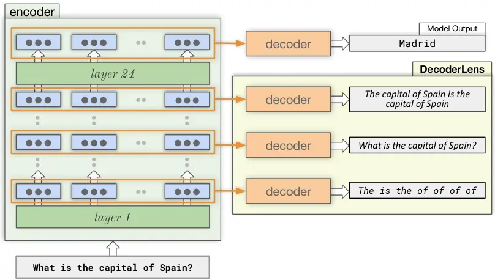

# DecoderLens: Layerwise Interpretation of Encoder-Decoder Transformers

Anna Langedijk
Email: <annalangedijk@gmail.comh.mohebbi@tilburguniversity.edu>   
Hosein Mohebbi Email: <g.sarti@rug.nlw.h.zuidema>    Gabriele Sarti
Affiliation: ILLC, University of Amsterdam  CSAI, Tilburg
University  CLCG, University of Groningen Email: <j.w.d.jumelet@uva.nl>
   Willem Zuidema    Jaap Jumelet

###### Abstract

In recent years, several interpretability methods have been proposed to
interpret the inner workings of Transformer models at different levels
of precision and complexity. In this work, we propose a simple but
effective technique to analyze encoder-decoder Transformers. Our method,
which we name DecoderLens, allows the decoder to cross-attend
representations of intermediate encoder activations instead of using the
default final encoder output. The method thus maps uninterpretable
intermediate vector representations to human-interpretable sequences of
words or symbols, shedding new light on the information flow in this
popular but understudied class of models. We apply DecoderLens to
question answering, logical reasoning, speech recognition and machine
translation models, finding that simpler subtasks are solved with high
precision by low and intermediate encoder layers.

## 1 Introduction

Many methods for interpreting the internal states of neural language
models – and in particular Transformer-based models – have been proposed
in the last few years (Lyu et al., 2024, for a review, see). Such
methods operate at many different levels of granularity, ranging from
model-agnostic attribution methods that treat models as black-boxes, to
probing methods that assess whether specific information is decodable
from model representations, to fine-grained techniques aiming to
_causally_ link highly localized circuits to model behavior. These
latter techniques (often referred to as ‘mechanistic interpretability’,
Elhage et al., 2021, or ‘causal abstractions’, Geiger et al., 2021) are
often strongly tied to model-specific components, and are likely to
provide more faithful insight into how these models operate.



Figure 1: Schematic overview of the DecoderLens. By using the decoder to
cross-attend intermediate encoder activation, we can gain qualitative
insights into how representations evolve across encoder layers.

In this paper, we propose _DecoderLens_, a method aimed at exploiting
the decoder module of encoder-decoder Transformers as a “lens” to
explain the evolution of representations throughout model layers in
these model architectures. Our method is directly inspired by the
LogitLens (nostalgebraist, 2020), which leverages the residual stream¹¹
1 The sequence of residual connections propagating input information
from token embeddings to final layers. present in Transformer
architectures. The LogitLens, however, is defined only for decoder-only
Transformers, and is unable to explain how representations evolve in the
encoder of encoder-decoder models.

Concretely, DecoderLens forces the decoder module of an encoder-decoder
model to cross-attend intermediate encoder activations. As a
consequence, its generations can be seen as sequences of vocabulary
projections depending only on partially-formed source-side
representations. Such adaptation is necessary as LogitLens requires the
presence of a residual stream, which is not found between encoder and
decoder modules. Contrary to common probing methods, DecoderLens
operates without any additional training, letting the model “explain
itself” by producing natural generations in a human-interpretable
vocabulary space. Figure 1 provides a graphical overview of our
approach.

We evaluate DecoderLens empirically on a wide range of tasks, models,
and domains. First, we demonstrate how representations evolve in Flan-T5
(Chung et al., 2022) by prompting the model to predict country capitals.
Next, we conduct an experiment in a more controlled domain, examining
how Transformers are able to resolve variable assignment in
propositional logic. The restricted output space for this task allows us
to closely inspect the kinds of solutions intermediate layers produce.
Finally, we apply the DecoderLens to two common applications of
encoder-decoder models: neural machine translation (NLLB Team et al., 2022) and speech-to-text transcription and translation (Radford et al.,
2022).

We find that intermediate outputs can be useful to find hypotheses about
the strategies a model uses for solving (sub)tasks. One surprising
finding, for example, is that Flan-T5 encodes geographical information
better in intermediate layers than in the top layer. Additionally, our
findings show that the middle encoder layers approximate correct
transcriptions and translations well for models such as Whisper and
NLLB. Experiments from both logic and machine translation show that
earlier layers sometimes output local approximations to their respective
tasks. The DecoderLens thus provides a useful tool that can be used in
combination with other interpretability methods to gain a more complete
insight into the inner workings of deep encoder-decoder language models.

## 2 Related Work

The current state of interpretability methods can be categorized by the
different levels of granularity at which they explain model behavior. At
the coarsest level, model-agnostic methods such as feature attributions
(Sundararajan et al., 2017; Lundberg and Lee, 2017, e.g.,) focus on
explaining model output in terms of the most important input features. A
major concern with this line of work is the faithfulness of a method:
whether the attributions the method produces in fact correspond to the
true, underlying causes of the model’s output. The strong disagreement
between different attribution methods raises doubts that the
faithfulness requirement is met in practice (Jacovi and Goldberg, 2020;
Neely et al., 2022; Lyu et al., 2024).

In response to these concerns, a novel line of work that has received
increasing attention in recent years attempts to explain models at a
more fine-grained level, leveraging knowledge about a model’s inner
workings based on specific components (Elhage et al., 2021; Meng et al.,
2022; Mohebbi et al., 2023; Wang et al., 2023, e.g.,).

#### Interpreting Language Models in Vocabulary Space

A common way of studying Transformers in this line of work is to take
advantage of the residual stream. In this view, each layer can be seen
as adding or removing information by reading from or writing to the
hidden states in the residual stream (Elhage et al., 2021). LogitLens
(nostalgebraist, 2020) uses this idea by directly applying the
unembedding operation to the middle layers of GPT to obtain a logit
distribution for every intermediate layer. As the method projects into
the output (logit) space, it can provide interpretable insights about
which information arises in which layers. This is similar to the
projections into vocabulary space used to verbalize probing methods in
earlier work (Saphra and Lopez, 2019; Jumelet et al., 2021).

Merullo et al. (2023) use the Logit Lens to identify different generic
stages of processing throughout GPT’s layers in a Question Answering
task. Halawi et al. (2023) instead use the Logit Lens to study
overthinking, identifying critical layers in which the logit
distribution suddenly shifts to an incorrect prediction. Geva et al.
(2022) use the idea of the residual stream to study what kind of updates
happen in each feed-forward layer, by analyzing the differences in logit
outputs between layers. The updates are in vocabulary space, making them
easily interpretable to humans. Similarly, Dar et al. (2023) also
project other Transformer components into vocabulary space, such as its
attention weights, and find that these can encode coherent concepts and
relations. Belrose et al. (2023) present the Tuned Lens, extending the
Logit Lens with an optimized, affine transformation before the
unembedding operation, and report that it produces more reliable and
predictive results. Finally, Ghandeharioun et al. (2024) present a
general framework for information lenses called Patchscopes, and show
that auxiliary models can be tuned to act as expressive vocabulary
projections.

#### Early Exiting in Language Models

Early exiting enables models to make early predictions by skipping
subsequent layers once the model reaches sufficient confidence,
improving model efficiency by speeding up inference. This is usually
achieved by training intermediate classifiers on top of each encoder
layer in encoder-only models (Liu et al., 2020; Zhou et al., 2020;
Schwartz et al., 2020; Liao et al., 2021; Xin et al., 2020; Xin et al.,
2021), or by training intermediate unembedding heads for each decoder
layer in decoder-only or encoder-decoder models (Schuster et al., 2022).
Pal et al. (2023) find that early-exiting from intermediate token
representations can produce accurate next token predictions for several
generation steps ahead, exploiting the parallel nature of Transformers
outputs. Similar to early exiting is the concept of encoder layer
fusion, in which a decoder can cross-attend to all encoder layers
instead of the final one. This allows the decoder to use surface-level
representations from early layers in addition to abstract, highly
contextualized representations from later layers, which can improve the
final performance (Dou et al., 2018; Liu et al., 2021; Feng et al.,
2021; Charpentier and Samuel, 2023).

Figure 2: Distribution of response types for three Flan-T5 models on the
country capital prediction task. Each row indicates the encoder layer
that was used for the DecoderLens. Capital prediction accuracy denotes
the model performance on the task for the two prompt types, including
the best performing layers for the capitalized prompts.

## 3 DecoderLens

The DecoderLens approach is inspired by the LogitLens method of
nostalgebraist (2020). The main intuition behind this method is that the
residual stream in Transformer decoder-only models forces
representations across layers to gradually converge towards the final
representation, iteratively refining its guess (Jastrzebski et al.,
2018; Dehghani et al., 2019). This gradual change allows us to inspect
how model predictions change across layers by directly applying the
final unembedding transformation to intermediate hidden states.

For encoder-decoder models, the LogitLens can only be applied to the
decoder component since there is no residual stream between encoder and
decoder modules. To investigate how representations in the encoder
evolve across layers, we therefore introduce the DecoderLens, which
leverages the entire decoder to verbalize the knowledge captured by
intermediate encoder layers. This is achieved by early exiting the
encoder at earlier layers, and using the resulting representations for
the decoder cross-attention operation. The DecoderLens allows for richer
insights than the LogitLens, enabling the generation of full outputs
from intermediate encoder states. It also may help mitigate
out-of-distribution issues that can arise from using a single vocabulary
projection (Belrose et al., 2023; Yom Din et al., 2023, e.g.). The model
outputs plausible strings that adhere to the original training
objective, allowing us to see how the task is progressively addressed
throughout encoder layers.

We define the DecoderLens as follows. For an encoder-decoder model
$`\mathcal{M}`$ with $`n`$ layers, the output of the decoder is normally
generated based on the top-layer representations of the encoder,
combined with a decoding algorithm (e.g. beam search). Often, the
encoder layers are first passed through a non-linear operation, such as
layer normalization (Ba et al., 2016). The DecoderLens operates
similarly, by first passing the $`i^{\textup{th}}`$ encoder layer
through the non-linear operation $`f`$, and then feeding it as input to
the decoder:

```math
\displaystyle\mathcal{M}(\mathbf{w}) \displaystyle=Dec\left(f(Enc(\mathbf{w})_{n})\right)
```

```math
\displaystyle\textit{DecoderLens}(\mathbf{w},i) \displaystyle=Dec\left(f(Enc(\mathbf{w})_{i})\right)
```

In the following sections, we investigate the effectiveness of
DecoderLens by applying it to a variety of tasks, models, and domains.

## 4 Factual Trivia QA

We first apply the DecoderLens to investigate the factual knowledge of a
instruction-tuned encoder-decoder LM, Flan-T5 (Chung et al., 2022)²² 2
All pre-trained models in the paper were evaluated via the transformers
library (Wolf et al., 2020). As a case study, we consider country
capital prediction, using prompts of the form “What is the capital of
X?” and testing encoder layers’ ability to produce correct outputs for
all 193 United Nations member states. We evaluate Flan-T5 models of
three sizes (large, xl, xxl, with 0.78B, 3.0B and 11.3B parameters
respectively), containing the same number of layers (24) and hidden
state size (1024), but differing in the feed-forward layer size and the
number of attention heads (Raffel et al., 2020).

#### Evaluation

To investigate the types of responses generated by the DecoderLens, we
categorize model answers as follows: 1) correct response, based on a
full string match, 2) incorrect response in the form of a different city
name, 3) country name itself, 4) repetition of the question, 5)
tautologies (The capital of X is the capital of X), 6) empty responses
containing no alphanumeric characters, and 7) a miscellaneous category
for anything that doesn’t fall under these previous six categories.
These categories were defined after a manual inspection of the
DecoderLens results: some examples of intermediate outputs can be seen
in Table 1. We conduct the experiment on lowercased and capitalized
prompts to test the robustness of the model to minimal variations in the
provided inputs.

| Layer | Output                                 |
| ----- | -------------------------------------- |
| L0    | What                                   |
| L3    | What is the capital of Colombia?       |
| L8    | What is the capital of Colombia?       |
| L12   | The capital of Colombia is Bogotá.     |
| L16   | Colombians are a very friendly people. |
| L19   | Buenos Aires                           |
| L21   | colombia                               |
| L24   | bogota                                 |

Table 1: DecoderLens predictions for “What is the capital of Colombia?"
for various Flan-T5-xl encoder layers. Correct outputs are italicized.

#### Results

We present the results for the experiment in Figure 2. Capitalized and
lowercased prompts yield considerably different patterns across layers.
For capitalized prompts, we surprisingly find that all models yield
better performances for intermediate layers compared to the canonical
top layer of the model. For lowercased prompts, on the other hand, the
top layer always yields the highest accuracy of all layers. The
difference between the capitalized and lowercase prompts suggests that
geographical knowledge is stored in different locations based on
capitalization. We speculate that this might be due to the more frequent
splitting of lowercased country names into multiple subtokens (188 out
of 193 countries) compared to capitalized country names (only 87 out of
193 countries, including multi-word country names). Hence, country names
split into multiple subtokens need to be compositionally combined by the
model before retrieving their capital from encoded representations.

Finally, we note that Flan-T5-large has a long phase in which the
DecoderLens results in a repetition of the original query prompt. In the
xl model this occurs in lower layers, alongside repetitions of the
country name itself, while the xxl model is less prone to these
patterns, producing correct results much earlier for the capitalized
case.

## 5 Propositional Logic

Results from the previous section indicate that DecoderLens can be
useful for identifying the layers in which factual information arises
and can be readily decoded in general pre-trained language models.

In this section, we go one step further and apply DecoderLens to a model
exclusively trained on a downstream task. We believe it is advantageous
to test novel interpretability methods on models that are trained to
solve a simple, unambiguous task within a carefully controlled setup
(Hupkes et al., 2018; Hao, 2020; Jumelet and Zuidema, 2023; Nanda
et al., 2023a; Nanda et al., 2023b).

We apply the DecoderLens to a small Transformer model that is trained
from scratch on a synthetic (but non-trivial) task: predicting variable
assignments given a logical formula.

#### Task

We study an encoder-decoder model that is specifically trained on
propositional logic, based on the setup of Hahn et al. (2021). The model
is trained to output a partial satisfying assignment given a satisfiable
formula in propositional logic. These inputs consist of logical
operators (not/$`\neg`$/!, and/$`\wedge`$/&, or/$`\vee`$/\|,
iff/$`\leftrightarrow`$ and xor/$`\oplus`$) and at most five
propositional variables.

Table 2lists a few examples.

| Formula                   | Input        | Output  |
| ------------------------- | ------------ | ------- |
| $`\neg a\wedge(b\vee c)`$ | & ! a \| b c | a 0 b 1 |
| $`a\oplus\neg e`$         | xor a ! e    | a 1 e 1 |

Table 2: Example datapoints for two formulas. Inputs use prefix notation
to avoid the use of parentheses. The first assignment is partial: the
value of c could be either 0 or 1, and may therefore be omitted.

The models are trained in a standard sequence-to-sequence setup using
teacher forcing and only have access to a single correct output, even
when several partial assignments would be semantically correct.
Nevertheless, this limited setup seems sufficient to teach these models
the semantics of propositional logic (Hahn et al., 2021). At test time,
the models are able to output novel assignments to unseen formulas with
93% accuracy.

#### Experimental setup

We test encoder-decoder models using the standard transformer
architecture. Encoder and decoder modules have each six layers, with
hidden sizes of 128 and 64 respectively. Models are trained for 128
epochs on the PropRandom35 training set of Hahn et al. (2021), which
consists of 800k randomly generated formulas containing at most 35
symbols. The ground truth output assignments are generated by a symbolic
SAT solver using pyaiger (Vazquez-Chanlatte and Rabe, 2018). We train
three different model seeds and aggregate the results.

### 5.1 Evaluation on Controlled Data

We apply the DecoderLens to 1) randomly generated data and 2)
handcrafted formulas using templates of varying difficulty. We
hypothesize that easier formulas can be solved in earlier layers.

First, we evaluate on the PropRandom35 validation set of 200k sentences,
and an additional dataset of 200k short sentences with a maximum length
of 12, PropRandom12.³³ 3 These shorter sentences are easier to
automatically group into varying levels of difficulty. Second, to gain
more insight into the types of formulas layers can solve, we generate a
dataset according to four templates:

- t1.
  Simple conjunction: formulas in the form of
  $`l_{1}\wedge l_{2}\wedge l_{3}\wedge l_{4}`$, where $`l_{n}`$ is a
  propositional literal ($`p`$ or $`\neg p`$). These formulas can be
  solved “locally", simply by reading the truth value from each variable
  separately.
- t2.
  Local XOR: formulas in the form of
  $`(l_{1}\oplus l_{2})\wedge(l_{3}\oplus l_{4})`$, where all literals
  are distinct. Variables interact with their siblings via $`\oplus`$,
  but the two parts of the formula can be solved independent of one
  another.
- t3.
  Non-local XOR: formulas in the form of
  $`(l_{1}\oplus l_{2})\wedge(l_{3}\oplus l_{4})`$, where $`l_{2}`$ and
  $`l_{3}`$ contain the same variable. The two parts cannot necessarily
  be solved independently.
- t4.
  Non-local CNF: formulas in the form of
  $`(p_{1}\vee\neg p_{2})\wedge(p_{2}\vee\neg p_{3})\wedge(p_{3}\vee\neg p_{1})`$,
  containing dependencies between the clauses: this means the formulas
  cannot be solved locally.

For each template, we generate all possible non-trivial variable
combinations, for multiple orderings of the subformulas. We filter out
formulas that are not solved by the models. The total size of the
template dataset is 30k.⁴⁴ 4 All datasets used for evaluation are
available at
[github.com/annaproxy/decoderlens-data](https://github.com/annaproxy/decoderlens-data)

#### Results

We evaluate the DecoderLens on the validation set of PropRandom35: the
results are shown in Figure 3. We manually inspect some intermediate
model outputs (Table 3 lists some examples).

We observe that nearly all incorrect outputs are still in the correct
format, although many contain irrelevant variables that do not occur in
the input formula. This suggests a learned division of duties between
the encoder and decoder, with the decoder being completely in charge of
formatting and variable ordering.⁵⁵ 5 Even when random noise is passed
to the decoder, it still outputs variables and their truth values in the
correct order. Note that there are a limited number of possible
correctly formatted outputs (242 in total), of which, on average, 29%
are semantically correct. The total semantic accuracy of the embedding
layer and the first two layers is below 29%, meaning they do not perform
better than random chance. Moreover, we find that initial layers often
produce irrelevant variables, suggesting that their representations are
misaligned with the final layer representations to an extent that makes
them uninformative for the decoder.

Layers three and four prune these irrelevant variables and perform well
above chance level. Examples of formulas that are already solved by
these layers are the first two formulas in Table 3.

Figure 3: Performance of DecoderLens using intermediate encoder layers
on the PropRandom35 validation set. Layer 0 denotes the embedding layer.
The category correct (semantics) denotes outputs are correct, but
deviate from ground truth sequences. All outputs in the correct (syntax)
category are also semantically correct. We define variables as
irrelevant when they did not occur in the input, but appear in the
prediction.

We observe that another function of the final two layers is to prune
contingent variables, refining an already correct solution. E.g., in the
first example in Table 3, layer five refines the layer four solution by
removing the unnecessary “c 1". Around 20% of outputs of layers 5 and 6
are strict sub-outputs of the previous layer, removing 1.3 variables
from the previous output on average. In a small number of cases (2.6%),
layer five outputs a correct assignment but layer six does not: this
could be seen as the model overthinking the output (Halawi et al.,
2023). Only a minority of these cases (20% of the 2.6%) are due to layer
six pruning a necessary variable.

The examples in Table 3 also demonstrate that solutions are more local
in earlier layers. For instance, in the second example, layer three
assigns false to both a and d, as they both occur negated in the
sentence. The operator xor, which requires communication between the two
variables, is not taken in consideration yet.

| Layer | $`\neg b\wedge(c\vee a)`$ | $`\neg d\oplus\neg a`$ | $`b\oplus(b\wedge a)`$ |
| ----- | ------------------------- | ---------------------- | ---------------------- |
| L0    | a 0 b 1 e 0               | a 1 b 1 c 1 e 1        | a 1 b 1 c 0 e 0        |
| L1    | a 1 b 1 e 0               | a 1 b 1 d 1 e 1        | a 1 b 1 e 1            |
| L2    | a 1 b 0 c 1               | a 0 d 0 e 0            | a 1 b 1 c 0 e 1        |
| L3    | a 1 b 0 c 1               | a 0 b 0 d 0            | a 1 b 1 e 0            |
| L4    | a 1 b 0 c 1               | a 0 d 1                | a 1 b 1                |
| L5    | a 1 b 0                   | a 0 d 1                | a 0 b 1                |
| L6    | b 0 c 1                   | a 0 d 1                | a 0 b 1                |

Table 3: DecoderLens predictions on three simple logical formulas across
encoder layers. L0: embedding layer. Semantically correct outputs are
italicized.

### 5.2 Locality of Intermediate Outputs

To further investigate the locality of model outputs across encoder
layers, we apply the model to multiple sets of sentences based around
the xor-operator and its logical opposite, iff. We group the short
formulas from PropRandom12 into three categories: one where neither
operator is present, one where either operator is present but is not the
direct parent of another xor/iff (e.g.
$`(a\leftrightarrow b)\wedge(b\oplus c)`$), and one having at least one
nested instance of these two operators (e.g.
$`(a\oplus b)\leftrightarrow(c\wedge b)`$). These patterns can be
indicators of the formula’s difficulty, but random formulas are not
guaranteed to be (non)local. We therefore also analyze the performance
of earlier layers on the handcrafted sentences described in §5.1.

#### Results

DecoderLens results for the formula types detailed above are presented
in Figure 4. We observe large jumps in performance across layers for the
different sets of formulas. In particular, we note that simple
conjunctions (pattern t1) can already be solved in layer three. However,
the same layer cannot solve formulas including xor. Instead, the layer
outputs a local solution as in example 2 in Table 3, by simply assigning
0 to each variable that occurs in the negated inputs, and 1 in the
non-negated ones.

Overall, a local solution is produced for at least one of the
subformulas in 87% of cases, and for both formulas in 53% of cases.
Other layers output local solutions as a much lower rate: more details
can be seen in Figure 8 in Appendix A. Layer four sees the largest
improvement for all other types of formulas, but still lags behind in
solving non-local formulas, especially those containing nested xor or
iff-operators.

Figure 4: Performance on different kinds of formulas for the middle
encoder layers.

These results supports the intuition that the model gradually refines
its prediction by contextualizing its representations: first, variables
collect local information about their possible truth value. These
variables can only exchange information with other variables in the
later layers to reach a coherent solution.

## 6 Machine Translation

We apply DecoderLens to NLLB-600M (NLLB Team et al., 2022), a
state-of-the-art multilingual model trained in over 200 languages, to
quantify encoder influence on translation quality and properties. We use
1012 sentences from the dev/test split of Flores-101 (Goyal et al.,
2022), using English $`\leftrightarrow`$ {Italian, French, Dutch} as
high-resource pairs and English $`\leftrightarrow`$ {Xhosa, Zulu} as
low-resource pairs to evaluate differences in intermediate encoder
layers’ performances for these two settings.

Figure 5: Performance of NLLB across encoder layers. Scores are averaged
across into-English (XX $`\rightarrow`$ EN) and from-English directions
(EN $`\rightarrow`$ XX) for low-resource and high-resource languages.

#### Metrics

We evaluate the translation quality of DecoderLens outputs using BLEU
and COMET (Papineni et al., 2002; Rei et al., 2022). Moreover, we define
two ad-hoc metrics to estimate additional output properties. To quantify
repetition we compute the difference in counts between most common
tokens in the output and reference translation ($`\Delta`$rep). To
measure syntactic reordering, we compute tree edit distance (ted)
between source and target syntax trees, for both the output
(ted$`{}_{\textsc{out}}`$) and reference translations
(ted$`{}_{\textsc{ref}}`$). We then take their difference: $`\Delta`$ted
$`=`$ ted$`{}_{\textsc{out}}-`$ted$`{}_{\textsc{ref}}`$. Positive scores
for this metric reflect more syntactic reordering in the output compared
to the reference translation. A negative $`\Delta`$ted indicates that
the model translation adheres more closely to the source sentence word
ordering than the reference translation does. We limit our ted
evaluation to layers with BLEU \> 10 and high-resource pairs, using the
Stanza, FastAlign and ASTrED libraries  (Qi et al., 2020; Dyer et al.,
2013; Vanroy et al., 2021) for parsing, alignment and ted computations
respectively.

Source: In late 2017, Siminoff appeared on shopping television channel
QVC. Reference: Fin 2017, Siminoff est apparu sur la chaîne de
télé-achat QVC. L1: Dans la télévision, il est possible de faire une
pause dans la conversation. L2: Dans le cas de la télévision, il est
possible de faire une demande de renseignement. L3: En 2017, le
téléviseur a été mis au défi de la télévision. L4: En 2017, le canal de
télévision de la télévision a été mis en vente. L5: En 2017, Siminoff
est apparu sur la chaîne de télévision QVC. L6: En 2017, Siminoff est
apparu sur la chaîne de télévision QVC. L7: En 2017, Siminoff est apparu
sur la chaîne de télévision de shopping QVC. L8: En 2017, Siminoff est
apparu sur la chaîne de télévision de shopping QVC. L9: En 2017,
Siminoff est apparu sur la chaîne de shopping TV QVC. L10: En 2017,
Siminoff est apparu sur la chaîne de télévision de shopping QVC. L11:
Fin 2017, Siminoff est apparu sur la chaîne de télévision de shopping
QVC. L12: Fin 2017, Siminoff est apparu sur la chaîne de télévision de
shopping QVC.

Table 4: Example DecoderLens translations for an English $`\rightarrow`$
French sentence of Flores-101.

#### Quantitative results

Figure 5 presents the results of our evaluation. We remark a stark
difference in quality between translation into low-resource languages
and other settings, with performance increasing rapidly halfway through
encoder layers only in the latter case. All language directions exhibit
a large number of repetitions for the first half of the encoder,
suggesting that initial encoder layers are generally tasked to model
$`n`$-gram co-occurrences, as also noted by Voita et al. (2021) for
initial phases of neural MT training. Repetitions decline to match
reference frequency around models’ intermediate layers, coinciding with
the largest increase in translation quality. Regarding reordering,
syntax in translations stabilizes early in the encoder layers: in line
with previous findings (Vanroy, Bram, 2021), outputs show a lower degree
of syntactic reordering relative to source texts when compared to human
references, providing additional evidence about the locality of
intermediate layers’ predictions shown in Section 5.2. The lack of
spikes in translation quality for intermediate encoder layers in
low-resource directions using DecoderLens can be connected to the low
source context usage shown in Ferrando et al. (2022), suggesting that
poor intermediate outputs for these directions might be due to the
out-of-distribution behavior of the decoder component.

#### Qualitative results

We manually examine a subset of 50 DecoderLens translations through
encoder layers (Table 4, more examples in  Section B.1). For
high-resource pairs, translations in the first few layers are fluent and
contain keywords from the original sentence, but are completely detached
from the source (see for example the L1 output in Table 4, which
contains the word “television" but is otherwise detached from the
English source. ). Intermediate layers often output examples with
incorrect word sense disambiguation (e.g. “shopping TV channel”
interpreted as “TV channel being sold” in L4). Finally, more granular
information is often added at later stages (e.g. “shopping” added in L7
and “Fin” in L11).

## 7 Speech-to-Text

Figure 6: Average Word Error Rate (wer) of Whisper-medium for
transcription and translation w.r.t number of encoder layer used at
inference. Shaded areas show one standard deviation.

We next apply DecoderLens to Whisper (Radford et al., 2022), a
state-of-the-art multilingual speech model trained on a set of
supervised audio-to-text tasks, including multilingual speech
transcription and speech translation to English. We use Whisper in three
different sizes (base, small, and medium) which differ in their number
of layers (6, 12, and 24, respectively).

#### Data

We use CoVoST 2 (Wang et al., 2020), a multilingual speech-to-text
translation dataset based on Common Voice corpus (Ardila et al., 2019).
We sample 100 sentences for nine languages: English (en), French (fr),
Spanish (es), Portuguese (pt), Dutch (nl), Japanese (ja), Arabic (ar),
Persian (fa), and Turkish (tr). Since the dataset includes both source
and translation references for each utterance, we can inspect Whisper’s
behavior for both transcription and translation tasks on the same
examples, providing an unbiased comparison between the tasks.

Input utterance: turning off gadgets that are not in use can save a lot
of energy L1-7: L8:   “of the world” L9:   “tornado” L10:  “i am going
to talk about the new technology that we have” L11:  “tornado” L12:  “i
am going to go ahead and say that i am a little bit more of a fan of the
channel…” L13:  “i am going to go ahead and turn it over to you and i am
going to turn it over to you and…” L14:  “tony i am glad you are here”
L15:  “turning off gadgets that are not news can save a lot of energy”
L16:  “turning off gadgets that are not news can save a lot of energy”
L17:  “turning off gadgets that are not news can save a lot of energy”
L18:  “turning off gadgets that are not news can save a lot of energy”
L19:  “turning off gadgets that are not news can save a lot of energy”
L20:  “turning off gadgets that are not used can save a lot of energy”
L21:  “turning off gadgets that are not in use can save a lot of energy”
L22:  “turning off gadgets that are not in use can save a lot of energy”
L23:  “turning off gadgets that are not in use can save a lot of energy”
L24:  “turning off gadgets that are not in use can save a lot of energy”

Table 5: Whisper-medium intermediate transcription outputs for an
English utterance. Words that are correctly generated for the first time
are underlined.

Figure 7: Distribution of Whisper-medium output types when transcribing,
for each encoder layer.

#### Results

Figure 6 shows the overall results of Word Error Rate (WER) across
various source languages when applying DecoderLens to Whisper-medium for
transcription and translation tasks. While the overall pattern of WER is
decreasing, we can discern that fundamental information emerges from the
intermediate layers. Comparing the trend of WER for transcription and
translation, it appears that the essential information required for
transcription is encoded in earlier encoder layers compared to
translation.⁶⁶ 6 The same pattern is observed for the other model sizes,
reported in Section C.1. Table 5 shows a more fine-grained view of the
changes in model output transcription. The first 7 layers of the encoder
produce empty outputs, indicating that the information is not yet ready
for transcribing. Next, layers 8-11 generate a limited number of
irrelevant words (notably, generating single words in layers 9 and 11),
while layers 12-13 produce long sequences of repeating irrelevant words.
The main part of the true transcription can be constructed starting from
layer 15 (with some minor errors; the word ‘news’ is generated instead
of ‘in use’ in this example). The error in this running example is then
corrected in layer 21, and this information is carried to the final
encoder layer. Figure 7 quantifies this to show that the pattern holds
for the majority of examples in all languages. This pattern holds for
both tasks and different model sizes, except for the early encoder
layers of Whisper-small, which generates single irrelevant words instead
of empty sequences.⁷⁷ 7 We report these results to Section C.2.

## 8 Conclusion

Our work contributes to a growing body of research on the
interpretability of language models. By introducing the DecoderLens, we
provide insights into how intermediate encoder representations of
encoder-decoder Transformers influence decoder predictions. We apply our
method to various models and tasks, finding that intermediate outputs
can provide valuable insights into the model’s decision-making process.
In particular, our findings reveal how “simpler” subtasks (e.g., simple
conjunctive logic formulas, high-resource MT, speech transcription) are
captured by early encoder layers with high precision and persist up to
the final model output through the residual stream, while more
challenging tasks (e.g., complex logic formulas, low-resource MT, speech
translation) are only addressed by final encoder layers. We also find
some evidence that early layer outputs are more local solutions. Errors
in variable assignments in the middle layer of the Transformer trained
on propositional logic are due to the model solving subparts of the
sentence independently. Additionally, translations from earlier layers
of NLLB adhere more closely to the word order of the input.

These observations are in line with previous work on probing, which
showed that linguistic subtasks in LMs are performed at different stages
in Transformers (Tenney et al., 2019; Peters et al., 2018). Moreover, it
provides evidence that model predictions are refined iteratively also
across encoder layers, complementing previous work on decoder-only
models. By verbalizing the knowledge encoded in intermediate model
layers, DecoderLens can provide useful and human-interpretable insights
into the evolution of model predictions, complementing other
interpretability techniques for the study of neural language models.

Future work could explore the application of DecoderLens to the
Universal Transformer (Dehghani et al., 2018), especially for
algorithmic tasks (Csordás et al., 2021) where its intermediate
representation might be more interpretable and compositional thanks to
weight sharing. Moreover, the tendency of earlier layers to produce
simpler generations can be connected to outputs produced during early
stages of model training (Voita et al., 2021). In this context,
DecoderLens might be used to investigate the relation between training
dynamics and information geometry across model layers (Choshen et al.,
2022; Belrose et al., 2023). Lastly, DecoderLens could be used as
diagnostic tool to investigate where wrong model predictions emerge,
which is useful for both interpretability purposes and model improvement
through early exiting strategies.

## 9 Limitations

One important concern regarding the direct use of intermediate
representations to make predictions is that of representational drift:
features may be represented differently in earlier encoder layers,
reducing the ability of the decoder to use this information. This
manifested in particular in the form of hallucinated or empty
DecoderLens predictions for early encoder layers. While this
representational misalignment could be mitigated by tuning
representations to match the space of final layers (Belrose et al.,
2023; Yom Din et al., 2023), we limit our analysis to the direct
application of DecoderLens without any additional training.

We note that DecoderLens does not reveal _where_ within a layer a
specific subtask is solved (i.e., which heads or MLP-units within the
layer are responsible), nor does it reveal _how_ subtasks are solved.
For this reason, while we consider our method promising to provide a
more intuitive overview of encoder capabilities, we also believe it
should be complemented with other approaches to obtain fine-grained
insights into model predictions.

Finally, although our experiments span several encoder-decoder models
and tasks, our evaluation is limited to small model sizes (\<700M
parameters) due to limited computational resources. It remains to assess
whether our findings using the DecoderLens method still apply to larger
models.

#### Acknowledgments

We gratefully acknowledge support for this research from the Institute
for Logic, Language and Computation at the University of Amsterdam (JJ,
WZ), and from the Netherlands Organization for Scientific Research
(NWO), through the NWA-ORC grant NWA.1292.19.399 for ‘InDeep’
(supporting HM, GS), and through the Graviation grant 024.001.006 for
‘Language in Interaction’ (supporting AL). We also thank SURF and the
Faculty of Science (FNWI, UvA) for the use of the National Supercomputer
Snellius.

## References

- Ardila et al. (2019) Rosana Ardila, Megan Branson, Kelly Davis,
  Michael Henretty, Michael Kohler, Josh Meyer, Reuben Morais, Lindsay
  Saunders, Francis M. Tyers, and Gregor Weber. 2019. [Common voice: A
  massively-multilingual speech
  corpus](https://api.semanticscholar.org/CorpusID:209376338). In
  _International Conference on Language Resources and Evaluation_.
- Ba et al. (2016) Lei Jimmy Ba, Jamie Ryan Kiros, and Geoffrey E.
  Hinton. 2016. [Layer normalization](http://arxiv.org/abs/1607.06450).
  _CoRR_, abs/1607.06450.
- Belrose et al. (2023) Nora Belrose, Zach Furman, Logan Smith, Danny
  Halawi, Igor Ostrovsky, Lev McKinney, Stella Biderman, and Jacob
  Steinhardt. 2023. [Eliciting Latent Predictions from Transformers with
  the Tuned Lens](https://doi.org/10.48550/arXiv.2303.08112). _CoRR_,
  abs/2303.08112.
- Charpentier and Samuel (2023) Lucas Georges Gabriel Charpentier and
  David Samuel. 2023. [Not all layers are equally as important: Every
  layer counts BERT](https://doi.org/10.18653/v1/2023.conll-babylm.20).
  In _Proceedings of the BabyLM Challenge at the 27th Conference on
  Computational Natural Language Learning_, pages 238–252, Singapore.
  Association for Computational Linguistics.
- Choshen et al. (2022) Leshem Choshen, Guy Hacohen, Daphna Weinshall,
  and Omri Abend. 2022. [The grammar-learning trajectories of neural
  language models](https://doi.org/10.18653/v1/2022.acl-long.568). In
  _Proceedings of the 60th Annual Meeting of the Association for
  Computational Linguistics (Volume 1: Long Papers), ACL 2022, Dublin,
  Ireland, May 22-27, 2022_, pages 8281–8297. Association for
  Computational Linguistics.
- Chung et al. (2022) Hyung Won Chung, Le Hou, Shayne Longpre, Barret
  Zoph, Yi Tay, William Fedus, Eric Li, Xuezhi Wang, Mostafa Dehghani,
  Siddhartha Brahma, Albert Webson, Shixiang Shane Gu, Zhuyun Dai, Mirac
  Suzgun, Xinyun Chen, Aakanksha Chowdhery, Sharan Narang, Gaurav
  Mishra, Adams Yu, Vincent Zhao, Yanping Huang, Andrew Dai, Hongkun Yu,
  Slav Petrov, Ed H. Chi, Jeff Dean, Jacob Devlin, Adam Roberts, Denny
  Zhou, Quoc V. Le, and Jason Wei. 2022. [Scaling instruction-finetuned
  language models](https://doi.org/10.48550/ARXIV.2210.11416).
- Csordás et al. (2021) Róbert Csordás, Kazuki Irie, and Juergen
  Schmidhuber. 2021. [The devil is in the detail: Simple tricks improve
  systematic generalization of
  transformers](https://doi.org/10.18653/v1/2021.emnlp-main.49). In
  _Proceedings of the 2021 Conference on Empirical Methods in Natural
  Language Processing_, pages 619–634, Online and Punta Cana, Dominican
  Republic. Association for Computational Linguistics.
- Dar et al. (2023) Guy Dar, Mor Geva, Ankit Gupta, and Jonathan
  Berant. 2023. [Analyzing transformers in embedding
  space](https://doi.org/10.18653/v1/2023.acl-long.893). In _Proceedings
  of the 61st Annual Meeting of the Association for Computational
  Linguistics (Volume 1: Long Papers)_, pages 16124–16170, Toronto,
  Canada. Association for Computational Linguistics.
- Dehghani et al. (2018) Mostafa Dehghani, Stephan Gouws, Oriol Vinyals,
  Jakob Uszkoreit, and Lukasz Kaiser. 2018. Universal transformers.
  _International Conference on Learning Representations_.
- Dehghani et al. (2019) Mostafa Dehghani, Stephan Gouws, Oriol Vinyals,
  Jakob Uszkoreit, and Lukasz Kaiser. 2019. [Universal
  transformers](https://openreview.net/forum?id=HyzdRiR9Y7). In _7th
  International Conference on Learning Representations, ICLR 2019, New
  Orleans, LA, USA, May 6-9, 2019_. OpenReview.net.
- Dou et al. (2018) Zi-Yi Dou, Zhaopeng Tu, Xing Wang, Shuming Shi, and
  Tong Zhang. 2018. [Exploiting deep representations for neural machine
  translation](https://doi.org/10.18653/v1/D18-1457). In _Proceedings of
  the 2018 Conference on Empirical Methods in Natural Language
  Processing_, pages 4253–4262, Brussels, Belgium. Association for
  Computational Linguistics.
- Dyer et al. (2013) Chris Dyer, Victor Chahuneau, and Noah A.
  Smith. 2013. [A simple, fast, and effective reparameterization of IBM
  model 2](https://aclanthology.org/N13-1073). In _Proceedings of the
  2013 Conference of the North American Chapter of the Association for
  Computational Linguistics: Human Language Technologies_, pages
  644–648, Atlanta, Georgia. Association for Computational Linguistics.
- Elhage et al. (2021) Nelson Elhage, Neel Nanda, Catherine Olsson, Tom
  Henighan, Nicholas Joseph, Ben Mann, Amanda Askell, Yuntao Bai, Anna
  Chen, Tom Conerly, et al. 2021. [A mathematical framework for
  transformer
  circuits](https://transformer-circuits.pub/2021/framework/index.html).
  _Transformer Circuits Thread_, 1.
- Feng et al. (2021) Guang Feng, Zhiwei Hu, Lihe Zhang, and Huchuan
  Lu. 2021. [Encoder fusion network with co-attention embedding for
  referring image
  segmentation](https://api.semanticscholar.org/CorpusID:233740054).
  _2021 IEEE/CVF Conference on Computer Vision and Pattern Recognition
  (CVPR)_, pages 15501–15510.
- Ferrando et al. (2022) Javier Ferrando, Gerard I. Gállego, Belen
  Alastruey, Carlos Escolano, and Marta R. Costa-jussà. 2022. [Towards
  opening the black box of neural machine translation: Source and target
  interpretations of the
  transformer](https://doi.org/10.18653/v1/2022.emnlp-main.599). In
  _Proceedings of the 2022 Conference on Empirical Methods in Natural
  Language Processing_, pages 8756–8769, Abu Dhabi, United Arab
  Emirates. Association for Computational Linguistics.
- Geiger et al. (2021) Atticus Geiger, Hanson Lu, Thomas Icard, and
  Christopher Potts. 2021. Causal Abstractions of Neural Networks.
  _Advances in Neural Information Processing Systems_, 34:9574–9586.
- Geva et al. (2022) Mor Geva, Avi Caciularu, Kevin Wang, and Yoav
  Goldberg. 2022. [Transformer feed-forward layers build predictions by
  promoting concepts in the vocabulary
  space](https://doi.org/10.18653/v1/2022.emnlp-main.3). In _Proceedings
  of the 2022 Conference on Empirical Methods in Natural Language
  Processing_, pages 30–45, Abu Dhabi, United Arab Emirates. Association
  for Computational Linguistics.
- Ghandeharioun et al. (2024) Asma Ghandeharioun, Avi Caciularu, Adam
  Pearce, Lucas Dixon, and Mor Geva. 2024. Patchscope: A unifying
  framework for inspecting hidden representations of language models.
  _arXiv preprint arXiv:2401.06102_.
- Goyal et al. (2022) Naman Goyal, Cynthia Gao, Vishrav Chaudhary,
  Peng-Jen Chen, Guillaume Wenzek, Da Ju, Sanjana Krishnan, Marc’Aurelio
  Ranzato, Francisco Guzmán, and Angela Fan. 2022. [The Flores-101
  evaluation benchmark for low-resource and multilingual machine
  translation](https://doi.org/10.1162/tacl_a_00474). _Transactions of
  the Association for Computational Linguistics_, 10:522–538.
- Hahn et al. (2021) Christopher Hahn, Frederik Schmitt, Jens U. Kreber,
  Markus N. Rabe, and Bernd Finkbeiner. 2021. [Teaching Temporal Logics
  to Neural Networks](https://openreview.net/forum?id=dOcQK-f4byz). In
  _International Conference on Learning Representations_, Virtual Event,
  Austria, May 3-7, 2021.
- Halawi et al. (2023) Danny Halawi, Jean-Stanislas Denain, and Jacob
  Steinhardt. 2023. [Overthinking the Truth: Understanding how Language
  Models Process False
  Demonstrations](https://arxiv.org/abs/2307.09476). _ArXiv preprint_,
  abs/2307.09476.
- Hao (2020) Yiding Hao. 2020. [Evaluating attribution methods using
  white-box LSTMs](https://doi.org/10.18653/v1/2020.blackboxnlp-1.28).
  In _Proceedings of the Third BlackboxNLP Workshop on Analyzing and
  Interpreting Neural Networks for NLP_, pages 300–313, Online.
  Association for Computational Linguistics.
- Hupkes et al. (2018) Dieuwke Hupkes, Sara Veldhoen, and Willem
  Zuidema. 2018. Visualisation and ‘diagnostic classifiers’ reveal how
  recurrent and recursive neural networks process hierarchical
  structure. _Journal of Artificial Intelligence Research_, 61:907–926.
- Jacovi and Goldberg (2020) Alon Jacovi and Yoav Goldberg. 2020.
  [Towards faithfully interpretable NLP systems: How should we define
  and evaluate
  faithfulness?](https://doi.org/10.18653/v1/2020.acl-main.386) In
  _Proceedings of the 58th Annual Meeting of the Association for
  Computational Linguistics, ACL 2020, Online, July 5-10, 2020_, pages
  4198–4205. Association for Computational Linguistics.
- Jastrzebski et al. (2018) Stanislaw Jastrzebski, Devansh Arpit,
  Nicolas Ballas, Vikas Verma, Tong Che, and Yoshua Bengio. 2018.
  [Residual connections encourage iterative
  inference](https://openreview.net/forum?id=SJa9iHgAZ). In _6th
  International Conference on Learning Representations, ICLR 2018,
  Vancouver, BC, Canada, April 30 - May 3, 2018, Conference Track
  Proceedings_. OpenReview.net.
- Jumelet et al. (2021) Jaap Jumelet, Milica Denic, Jakub Szymanik,
  Dieuwke Hupkes, and Shane Steinert-Threlkeld. 2021. [Language models
  use monotonicity to assess NPI
  licensing](https://doi.org/10.18653/v1/2021.findings-acl.439). In
  _Findings of the Association for Computational Linguistics: ACL/IJCNLP
  2021, Online Event, August 1-6, 2021_, volume ACL/IJCNLP 2021 of
  _Findings of ACL_, pages 4958–4969. Association for Computational
  Linguistics.
- Jumelet and Zuidema (2023) Jaap Jumelet and Willem Zuidema. 2023.
  [Feature interactions reveal linguistic structure in language
  models](https://doi.org/10.18653/v1/2023.findings-acl.554). In
  _Findings of the Association for Computational Linguistics: ACL 2023_,
  pages 8697–8712, Toronto, Canada. Association for Computational
  Linguistics.
- Liao et al. (2021) Kaiyuan Liao, Yi Zhang, Xuancheng Ren, Qi Su,
  Xu Sun, and Bin He. 2021. [A global past-future early exit method for
  accelerating inference of pre-trained language
  models](https://doi.org/10.18653/v1/2021.naacl-main.162). In
  _Proceedings of the 2021 Conference of the North American Chapter of
  the Association for Computational Linguistics: Human Language
  Technologies_, pages 2013–2023, Online. Association for Computational
  Linguistics.
- Liu et al. (2020) Weijie Liu, Peng Zhou, Zhiruo Wang, Zhe Zhao,
  Haotang Deng, and Qi Ju. 2020. [FastBERT: a self-distilling BERT with
  adaptive inference
  time](https://doi.org/10.18653/v1/2020.acl-main.537). In _Proceedings
  of the 58th Annual Meeting of the Association for Computational
  Linguistics_, pages 6035–6044, Online. Association for Computational
  Linguistics.
- Liu et al. (2021) Xuebo Liu, Longyue Wang, Derek F Wong, Liang Ding,
  Lidia S Chao, and Zhaopeng Tu. 2021. Understanding and improving
  encoder layer fusion in sequence-to-sequence learning. In
  _International Conference on Learning Representations_.
- Lundberg and Lee (2017) Scott M Lundberg and Su-In Lee. 2017. [A
  unified approach to interpreting model
  predictions](https://proceedings.neurips.cc/paper_files/paper/2017/file/8a20a8621978632d76c43dfd28b67767-Paper.pdf).
  In _Advances in Neural Information Processing Systems_, volume 30.
  Curran Associates, Inc.
- Lyu et al. (2024) Qing Lyu, Marianna Apidianaki, and Chris
  Callison-Burch. 2024. [Towards faithful model explanation in NLP: A
  survey](https://doi.org/10.48550/arXiv.2209.11326). _Computational
  Linguistics_, pages 1–70.
- Meng et al. (2022) Kevin Meng, David Bau, Alex Andonian, and Yonatan
  Belinkov. 2022. [Locating and editing factual associations in
  gpt](https://proceedings.neurips.cc/paper_files/paper/2022/file/6f1d43d5a82a37e89b0665b33bf3a182-Paper-Conference.pdf).
  In _Advances in Neural Information Processing Systems_, volume 35,
  pages 17359–17372. Curran Associates, Inc.
- Merullo et al. (2023) Jack Merullo, Carsten Eickhoff, and Ellie
  Pavlick. 2023. [Language models implement simple word2vec-style vector
  arithmetic](https://arxiv.org/abs/2305.16130). _arXiv preprint arXiv:
  2305.16130_.
- Mohebbi et al. (2023) Hosein Mohebbi, Willem Zuidema, Grzegorz
  Chrupała, and Afra Alishahi. 2023. [Quantifying context mixing in
  transformers](https://aclanthology.org/2023.eacl-main.245). In
  _Proceedings of the 17th Conference of the European Chapter of the
  Association for Computational Linguistics_, pages 3378–3400,
  Dubrovnik, Croatia. Association for Computational Linguistics.
- Nanda et al. (2023a) Neel Nanda, Lawrence Chan, Tom Lieberum, Jess
  Smith, and Jacob Steinhardt. 2023a. [Progress measures for grokking
  via mechanistic interpretability](https://arxiv.org/abs/2301.05217).
  _ArXiv preprint_, abs/2301.05217.
- Nanda et al. (2023b) Neel Nanda, Andrew Lee, and Martin Wattenberg.
  2023b. [Emergent linear representations in world models of
  self-supervised sequence
  models](https://aclanthology.org/2023.blackboxnlp-1.2). In
  _Proceedings of the 6th BlackboxNLP Workshop: Analyzing and
  Interpreting Neural Networks for NLP_, pages 16–30, Singapore.
  Association for Computational Linguistics.
- Neely et al. (2022) Michael Neely, Stefan F. Schouten, Maurits J. R.
  Bleeker, and Ana Lucic. 2022. [A song of (dis)agreement: Evaluating
  the evaluation of explainable artificial intelligence in natural
  language processing](https://doi.org/10.3233/FAIA220190). In _HHAI
  2022: Augmenting Human Intellect - Proceedings of the First
  International Conference on Hybrid Human-Artificial Intelligence,
  Amsterdam, The Netherlands, 13-17 June 2022_, volume 354 of _Frontiers
  in Artificial Intelligence and Applications_, pages 60–78. IOS Press.
- NLLB Team et al. (2022) NLLB Team, Marta R. Costa-jussà, James Cross,
  Onur Çelebi, Maha Elbayad, Kenneth Heafield, Kevin Heffernan, Elahe
  Kalbassi, Janice Lam, Daniel Licht, Jean Maillard, Anna Sun, Skyler
  Wang, Guillaume Wenzek, Al Youngblood, Bapi Akula, Loic Barrault,
  Gabriel Mejia-Gonzalez, Prangthip Hansanti, John Hoffman, Semarley
  Jarrett, Kaushik Ram Sadagopan, Dirk Rowe, Shannon Spruit, Chau Tran,
  Pierre Andrews, Necip Fazil Ayan, Shruti Bhosale, Sergey Edunov,
  Angela Fan, Cynthia Gao, Vedanuj Goswami, Francisco Guzmán, Philipp
  Koehn, Alexandre Mourachko, Christophe Ropers, Safiyyah Saleem, Holger
  Schwenk, and Jeff Wang. 2022. No language left behind: Scaling
  human-centered machine translation.
- nostalgebraist (2020) nostalgebraist. 2020. [Interpreting GPT: The
  logit
  lens](https://www.alignmentforum.org/posts/AcKRB8wDpdaN6v6ru/interpreting-gpt-the-logit-lens).
  _AI Alignment Forum_.
- Pal et al. (2023) Koyena Pal, Jiuding Sun, Andrew Yuan, Byron Wallace,
  and David Bau. 2023. [Future lens: Anticipating subsequent tokens from
  a single hidden state](https://aclanthology.org/2023.conll-1.37). In
  _Proceedings of the 27th Conference on Computational Natural Language
  Learning (CoNLL)_, pages 548–560, Singapore. Association for
  Computational Linguistics.
- Papineni et al. (2002) Kishore Papineni, Salim Roukos, Todd Ward, and
  Wei-Jing Zhu. 2002. [Bleu: a method for automatic evaluation of
  machine translation](https://doi.org/10.3115/1073083.1073135). In
  _Proceedings of the 40th Annual Meeting of the Association for
  Computational Linguistics_, pages 311–318, Philadelphia, Pennsylvania,
  USA. Association for Computational Linguistics.
- Peters et al. (2018) Matthew E. Peters, Mark Neumann, Luke
  Zettlemoyer, and Wen-tau Yih. 2018. [Dissecting contextual word
  embeddings: Architecture and
  representation](https://doi.org/10.18653/v1/D18-1179). In _Proceedings
  of the 2018 Conference on Empirical Methods in Natural Language
  Processing_, pages 1499–1509, Brussels, Belgium. Association for
  Computational Linguistics.
- Qi et al. (2020) Peng Qi, Yuhao Zhang, Yuhui Zhang, Jason Bolton, and
  Christopher D. Manning. 2020. [Stanza: A python natural language
  processing toolkit for many human
  languages](https://doi.org/10.18653/v1/2020.acl-demos.14). In
  _Proceedings of the 58th Annual Meeting of the Association for
  Computational Linguistics: System Demonstrations_, pages 101–108,
  Online. Association for Computational Linguistics.
- Radford et al. (2022) Alec Radford, Jong Wook Kim, Tao Xu, Greg
  Brockman, Christine McLeavey, and Ilya Sutskever. 2022. [Robust speech
  recognition via large-scale weak
  supervision](https://api.semanticscholar.org/CorpusID:252923993).
  _ArXiv_, abs/2212.04356.
- Raffel et al. (2020) Colin Raffel, Noam Shazeer, Adam Roberts,
  Katherine Lee, Sharan Narang, Michael Matena, Yanqi Zhou, Wei Li, and
  Peter J. Liu. 2020. [Exploring the limits of transfer learning with a
  unified text-to-text
  transformer](http://jmlr.org/papers/v21/20-074.html). _J. Mach. Learn.
  Res._, 21:140:1–140:67.
- Rei et al. (2022) Ricardo Rei, José G. C. de Souza, Duarte Alves,
  Chrysoula Zerva, Ana C Farinha, Taisiya Glushkova, Alon Lavie, Luisa
  Coheur, and André F. T. Martins. 2022. [COMET-22: Unbabel-IST 2022
  submission for the metrics shared
  task](https://aclanthology.org/2022.wmt-1.52). In _Proceedings of the
  Seventh Conference on Machine Translation (WMT)_, pages 578–585, Abu
  Dhabi, United Arab Emirates (Hybrid). Association for Computational
  Linguistics.
- Saphra and Lopez (2019) Naomi Saphra and Adam Lopez. 2019.
  [Understanding learning dynamics of language models with
  SVCCA](https://doi.org/10.18653/v1/n19-1329). In _Proceedings of the
  2019 Conference of the North American Chapter of the Association for
  Computational Linguistics: Human Language Technologies, NAACL-HLT
  2019, Minneapolis, MN, USA, June 2-7, 2019, Volume 1 (Long and Short
  Papers)_, pages 3257–3267. Association for Computational Linguistics.
- Schuster et al. (2022) Tal Schuster, Adam Fisch, Jai Gupta, Mostafa
  Dehghani, Dara Bahri, Vinh Tran, Yi Tay, and Donald Metzler. 2022.
  Confident adaptive language modeling. _Advances in Neural Information
  Processing Systems_, 35:17456–17472.
- Schwartz et al. (2020) Roy Schwartz, Gabriel Stanovsky, Swabha
  Swayamdipta, Jesse Dodge, and Noah A. Smith. 2020. [The right tool for
  the job: Matching model and instance
  complexities](https://doi.org/10.18653/v1/2020.acl-main.593). In
  _Proceedings of the 58th Annual Meeting of the Association for
  Computational Linguistics_, pages 6640–6651, Online. Association for
  Computational Linguistics.
- Sundararajan et al. (2017) Mukund Sundararajan, Ankur Taly, and Qiqi
  Yan. 2017. Axiomatic attribution for deep networks. In _International
  conference on machine learning_, pages 3319–3328. PMLR.
- Tenney et al. (2019) Ian Tenney, Dipanjan Das, and Ellie
  Pavlick. 2019. [BERT rediscovers the classical NLP
  pipeline](https://doi.org/10.18653/v1/P19-1452). In _Proceedings of
  the 57th Annual Meeting of the Association for Computational
  Linguistics_, pages 4593–4601, Florence, Italy. Association for
  Computational Linguistics.
- Vanroy et al. (2021) Bram Vanroy, Orphée De Clercq, Arda Tezcan, Joke
  Daems, and Lieve Macken. 2021. [Metrics of syntactic equivalence to
  assess translation
  difficulty](https://doi.org/10.1007/978-3-030-69777-8_10). In Michael
  Carl, editor, _Explorations in empirical translation process
  research_, volume 3 of _Machine Translation: Technologies and
  Applications_, pages 259–294. Springer International Publishing, Cham,
  Switzerland.
- Vanroy, Bram (2021) Vanroy, Bram. 2021. _Syntactic difficulties in
  translation_. Ph.D. thesis, Ghent University.
- Vazquez-Chanlatte and Rabe (2018) Marcell Vazquez-Chanlatte and
  Markus N. Rabe. 2018. [mvcisback/py-aiger:
  v2.0.0](https://doi.org/10.5281/zenodo.1405781).
- Voita et al. (2021) Elena Voita, Rico Sennrich, and Ivan Titov. 2021.
  [Language modeling, lexical translation, reordering: The training
  process of NMT through the lens of classical
  SMT](https://doi.org/10.18653/v1/2021.emnlp-main.667). In _Proceedings
  of the 2021 Conference on Empirical Methods in Natural Language
  Processing_, pages 8478–8491, Online and Punta Cana, Dominican
  Republic. Association for Computational Linguistics.
- Wang et al. (2020) Changhan Wang, Anne Wu, and Juan Pino. 2020.
  [Covost 2: A massively multilingual speech-to-text translation
  corpus](http://arxiv.org/abs/2007.10310).
- Wang et al. (2023) Kevin Ro Wang, Alexandre Variengien, Arthur Conmy,
  Buck Shlegeris, and Jacob Steinhardt. 2023. [Interpretability in the
  wild: a circuit for indirect object identification in GPT-2
  small](https://openreview.net/forum?id=NpsVSN6o4ul). In _The Eleventh
  International Conference on Learning Representations_.
- Wolf et al. (2020) Thomas Wolf, Lysandre Debut, Victor Sanh, Julien
  Chaumond, Clement Delangue, Anthony Moi, Pierric Cistac, Tim Rault,
  Remi Louf, Morgan Funtowicz, Joe Davison, Sam Shleifer, Patrick von
  Platen, Clara Ma, Yacine Jernite, Julien Plu, Canwen Xu, Teven
  Le Scao, Sylvain Gugger, Mariama Drame, Quentin Lhoest, and Alexander
  Rush. 2020. [Transformers: State-of-the-art natural language
  processing](https://doi.org/10.18653/v1/2020.emnlp-demos.6). In
  _Proceedings of the 2020 Conference on Empirical Methods in Natural
  Language Processing: System Demonstrations_, pages 38–45, Online.
  Association for Computational Linguistics.
- Xin et al. (2020) Ji Xin, Raphael Tang, Jaejun Lee, Yaoliang Yu, and
  Jimmy Lin. 2020. [DeeBERT: Dynamic early exiting for accelerating BERT
  inference](https://doi.org/10.18653/v1/2020.acl-main.204). In
  _Proceedings of the 58th Annual Meeting of the Association for
  Computational Linguistics_, pages 2246–2251, Online. Association for
  Computational Linguistics.
- Xin et al. (2021) Ji Xin, Raphael Tang, Yaoliang Yu, and Jimmy
  Lin. 2021. [BERxiT: Early exiting for BERT with better fine-tuning and
  extension to
  regression](https://doi.org/10.18653/v1/2021.eacl-main.8). In
  _Proceedings of the 16th Conference of the European Chapter of the
  Association for Computational Linguistics: Main Volume_, pages 91–104,
  Online. Association for Computational Linguistics.
- Yom Din et al. (2023) Alexander Yom Din, Taelin Karidi, Leshem
  Choshen, and Mor Geva. 2023. [Jump to conclusions: Short-cutting
  transformers with linear
  transformations](https://api.semanticscholar.org/CorpusID:257557722).
  _ArXiv_, abs/2303.09435.
- Zhou et al. (2020) Wangchunshu Zhou, Canwen Xu, Tao Ge, Julian
  McAuley, Ke Xu, and Furu Wei. 2020. [Bert loses patience: Fast and
  robust inference with early
  exit](https://proceedings.neurips.cc/paper_files/paper/2020/file/d4dd111a4fd973394238aca5c05bebe3-Paper.pdf).
  In _Advances in Neural Information Processing Systems_, volume 33,
  pages 18330–18341. Curran Associates, Inc.

## Appendix A Propositional Logic

Figure 8: Distribution of the types of predictions on three small
datasets. A local solution means the layer assigns false (0) to a
variable if it occurs in the input negated, and true (1) if the variable
appears non-negated. We therefore consider only the subset of data for
which each variable either only occurs negated or only occurs
non-negated. Layer 3 produces the largest number of local solutions in
all cases.

## Appendix B Machine Translation

### B.1 Additional Examples of DecoderLens Translations

Tables 6 and 7 showcase some additional examples for some of the
selected translation directions.

|                                                                                                                                                                                                                                                                                |
| ------------------------------------------------------------------------------------------------------------------------------------------------------------------------------------------------------------------------------------------------------------------------------ |
| Source: Dr. Ehud Ur, professor of medicine at Dalhousie University in Halifax, Nova Scotia and chair of the clinical and scientific division of the Canadian Diabetes Association cautioned that the research is still in its early days.                                      |
| Reference: Le Dr Ehud Ur, professeur de médecine à l’Université Dalhousie de Halifax (Nouvelle-Écosse) et président de la division clinique et scientifique de l’Association canadienne du diabète, a averti que la recherche en était encore à ses débuts.                    |
| L1: Le professeur de la médecine, le professeur de la médecine, le professeur de la médecine, le professeur de la médecine, le professeur de la médecine, le professeur de la médecine, le professeur de la médecine, le professeur de la médecine, le \[…\]                   |
| L2: Le Dr. Ehud, le professeur de la médecine, a déclaré: "La recherche de la médecine est une expérience de la médecine de la médecine, mais je suis en train de me dire que je suis en train de me lancer dans la recherche.                                                 |
| L3: Le professeur de la médecine de l’Université de Halifax et de la division scientifique de l’Association canadienne de la recherche est toujours dans la recherche de la recherche de la recherche de \[…\]                                                                 |
| L4: Le Dr. Ehud, professeur de l’Université de Halifax, a présenté la recherche de la division scientifique de l’Académie canadienne de la recherche et de la recherche.                                                                                                       |
| L5: Le Dr. Ehud, professeur de médecine à l’Université de Halifax, et le président de la division scientifique du Diabetes Association canadien, ont fait état de la recherche qui se déroule dans ses premières années.                                                       |
| L6: Le professeur de médecine de l’Université de Halifax, le professeur d’Eud Ur, et le président de la division scientifique du Diabète canadien, ont fait remarquer que la recherche est toujours en cours.                                                                  |
| L7: Le professeur de médecine Ehud Ur, professeur de médecine à l’Université de Halifax, en Nouvelle-Écosse, et président de la division clinique et scientifique de l’Association canadienne du Diabète a mis en garde que la recherche est toujours dans ses premiers jours. |
| L8: Le professeur de médecine de l’Université de Dalhousie, en Nouvelle-Écosse, et président de la division clinique et scientifique de l’Association canadienne du diabète, a souligné que la recherche est encore à ses débuts.                                              |
| L9: Le professeur de médecine de l’Université de Dalhousie, en Nouvelle-Écosse, et président de la division clinique et scientifique de l’Association canadienne du diabète, Dr. Ehud Ur, a souligné que la recherche est encore en début de phase.                            |
| L10: Le Dr Ehud Ur, professeur de médecine à l’Université Dalhousie à Halifax, en Nouvelle-Écosse, et président de la division clinique et scientifique de l’Association canadienne du diabète, a averti que la recherche est encore dans ses premiers jours.                  |
| L11: Le professeur de médecine de l’université Dalhousie à Halifax, en Nouvelle-Écosse, et président de la division clinique et scientifique de l’Association canadienne du diabète, Dr Ehud Ur, a averti que la recherche était encore à ses débuts.                          |
| L12: Le Dr Ehud Ur, professeur de médecine à l’Université Dalhousie à Halifax, en Nouvelle-Écosse, et président de la division clinique et scientifique de l’Association canadienne du diabète, a averti que la recherche est encore à ses débuts.                             |
| Source: "We now have 4-month-old mice that are non-diabetic that used to be diabetic," he added.                                                                                                                                                                               |
| Reference: "Abbiamo topi di quattro mesi che prima erano diabetici e ora non lo sono più", ha aggiunto.                                                                                                                                                                        |
| L1: "Ci sono due problemi che hanno portato a questo problema, ma non ci sono problemi che possono essere risolti.                                                                                                                                                             |
| L2: "Abbiamo 4-month-diabetic che sono utilizzati per essere, che sono utilizzati per il diabete.                                                                                                                                                                              |
| L3: "Abbiamo 4-month-that sono i non-diabetic che sono utilizzati, che sono aggiunti".                                                                                                                                                                                         |
| L4: "Abbiamo ora 4 mesi che sono i non-diabetic che sono utilizzati per essere diabetico," ha aggiunto.                                                                                                                                                                        |
| L5: "Abbiamo ora 4 mesi di cicli che sono non-diabetic che hanno usato per essere diabetico, "ha aggiunto.                                                                                                                                                                     |
| L6: "Abbiamo ora 4 mesi di topi che sono non-diabetico che hanno usato per essere diabetico", ha aggiunto.                                                                                                                                                                     |
| L7: "Abbiamo ora topi di 4 mesi che sono non diabetici che erano diabetici", aggiunge.                                                                                                                                                                                         |
| L8: "Abbiamo ora topi di 4 mesi che non sono diabetici e che erano diabetici", aggiunge.                                                                                                                                                                                       |
| L9: "Abbiamo ora i topi di 4 mesi che non sono diabetici e che erano diabetici", ha aggiunto.                                                                                                                                                                                  |
| L10: "Abbiamo ora topi di 4 mesi che non hanno il diabete e che erano diabetici", ha aggiunto.                                                                                                                                                                                 |
| L11: "Ora abbiamo topi di 4 mesi che non hanno il diabete e che erano diabetici", ha aggiunto.                                                                                                                                                                                 |
| L12: "Ora abbiamo topi non diabetici di 4 mesi che erano diabetici", ha aggiunto.                                                                                                                                                                                              |
| Source: Plus de 4 000 000 personnes sont se sont rendues à Rome pour l’enterrement.                                                                                                                                                                                            |
| Reference: Over four million people went to Rome to attend the funeral.                                                                                                                                                                                                        |
| L1: 4 people are in the process of getting their hands on the car.                                                                                                                                                                                                             |
| L2: 4 000 people are in the city.                                                                                                                                                                                                                                              |
| L3: More than 4 000 people are being sent to Rome for their own country.                                                                                                                                                                                                       |
| L4: More than 4 000 people are being made to Rome for the entertainment.                                                                                                                                                                                                       |
| L5: More than 4 000 people have been to Rome for the entertainment.                                                                                                                                                                                                            |
| L6: More than 4 000 000 people have gone to Rome for the funeral.                                                                                                                                                                                                              |
| L7: More than 4,000,000 people have gone to Rome for the funeral.                                                                                                                                                                                                              |
| L8: More than 4 000 000 people have gone to Rome for the funeral.                                                                                                                                                                                                              |
| L9: More than 4,000,000 people have come to Rome for the funeral.                                                                                                                                                                                                              |
| L10: More than 4 million people attended the funeral in Rome.                                                                                                                                                                                                                  |
| L11: More than four million people have come to Rome for the funeral.                                                                                                                                                                                                          |
| L12: More than four million people went to Rome for the funeral.                                                                                                                                                                                                               |

Table 6: Examples for English $`\rightarrow`$ French, English
$`\rightarrow`$ Italian and French $`\rightarrow`$ English translation
using DecoderLens on NLLB.

|                                                                                                                                                                                                               |
| ------------------------------------------------------------------------------------------------------------------------------------------------------------------------------------------------------------- |
| Source: While one experimental vaccine appears able to reduce Ebola mortality, up until now, no drugs have been clearly demonstrated suitable for treating existing infection.                                |
| Reference: Eén experimenteel vaccin lijkt in staat te zijn de ebola-sterfte terug te dringen, maar tot nu toe zijn nog geen medicijnen duidelijk geschikt voor de behandeling van bestaande infecties.        |
| L1: Een vaccinatie is een goede manier om de ziekte te voorkomen.                                                                                                                                             |
| L2: Een Ebola-infectie is een gevaarlijk risico. Het is een gevaarlijk risico dat de ziekte van de ziekte van de ziekte van de ziekte van de ziekte van de ziekte kan voorkomen.                              |
| L3: Terwijl de Ebola-vaccinatie wordt verminderd, is de aanwezigheid van een Ebola-vaccinatie niet mogelijk.                                                                                                  |
| L4: Hoewel de ebola-vaccinatie in de praktijk wordt beperkt, wordt de ebola-vaccinatie niet meer gebruikt.                                                                                                    |
| L5: Terwijl een experimentele vaccine lijkt te verminderen Ebola-taligheid, is er tot nu toe geen drugs die geschikt zijn voor het behandelen van bestaande infectie.                                         |
| L6: Terwijl een experimentele vaccine de Ebola-sterfte kan verminderen, zijn er tot nu toe geen geneesmiddelen die geschikt zijn voor de behandeling van bestaande infectie.                                  |
| L7: Hoewel een experimentele vaccine de Ebola-sterfte kan verminderen, is er tot nu toe geen enkele geneesmiddel die geschikt is voor de behandeling van bestaande infectie.                                  |
| L8: Hoewel één experimentele vaccine de Ebola-sterfte kan verminderen, is er tot nu toe geen enkele geneesmiddel geschikt voor de behandeling van bestaande infectie.                                         |
| L9: Hoewel een experimental vaccin de sterfte van Ebola kan verminderen, is er tot nu toe geen enkel geneesmiddel geschikt voor de behandeling van bestaande infecties.                                       |
| L10: Hoewel een experimentele vaccine de sterfte van Ebola lijkt te verminderen, is tot nu toe geen enkele geneesmiddel duidelijk geschikt voor de behandeling van bestaande infectie.                        |
| L11: Hoewel één proefvaccin de sterfte van Ebola lijkt te verminderen, is tot nu toe geen enkel geneesmiddel duidelijk aangetoond dat het geschikt is voor de behandeling van bestaande infectie.             |
| L12: Hoewel één experimentele vaccin de sterfte van ebola lijkt te kunnen verminderen, is tot nu toe geen enkel geneesmiddel duidelijk aangetoond dat geschikt is voor de behandeling van bestaande infectie. |
| Source: Volgens wetenschappers was het verenkleed van dit dier kastanjebruin met een bleke of carotenoïdekleurige onderzijde.                                                                                 |
| Reference: Scientists say this animal’s plumage was chestnut-brown on top with a pale or carotenoid-colored underside.                                                                                        |
| L1: According to the Bible, the dead were not born, and the dead were not born, and \[…\] the dead were not yet alive.                                                                                        |
| L2: According to the Bible, the animal was not a good animal, but a good animal.                                                                                                                              |
| L3: According to the scientists, this was a very dangerous disease.                                                                                                                                           |
| L4: According to the scientists, this was a kind of animal that was not a carotenoid.                                                                                                                         |
| L5: ……………………………………………………………………………………………………………………………………………………………………………..                                                                                                                                       |
| L6: According to scientists, the crest of this animal was a brown or carotenoid-coloured crest.                                                                                                               |
| L7: According to scientists, the embroidery of this animal was chestnut with a pale or carotenoid-coloured underside.                                                                                         |
| L8: According to scientists, the animal was a brownish-brown animal with a pale or carotenoid undercoat.                                                                                                      |
| L9: According to scientists, the animal was a brownish-brown, with a pale or carotenoid undercoat.                                                                                                            |
| L10: According to scientists, the animal’s undercoat was brown with a pale or carotenoid underside.                                                                                                           |
| L11: According to scientists, the animal’s embroidery was chestnut with a pale or carotenoid undercoat.                                                                                                       |
| L12: Scientists say the animal’s disguise was chestnut brown with a pale or carotenoid undercoat.                                                                                                             |
| Source: L’annuncio è stato fatto a seguito di un colloquio telefonico tra Trump e il presidente turco Recep Tayyip Erdoğan.                                                                                   |
| Reference: The announcement was made after Trump had a phone conversation with Turkish President Recep Tayyip Erdoğan.                                                                                        |
| L1: A phone call from the president of the United States of America was made.                                                                                                                                 |
| L2: The president’s speech was broadcast on the Internet.                                                                                                                                                     |
| L3: The president of the Republic of Turkey, President Tayyip Erdogan, is a member of the Turkish parliament.                                                                                                 |
| L4: The announcement was made at a meeting of the President of the Republic of Turkey, President of the Republic of Turkey, and the President of the \[…\]                                                    |
| L5: The announcement was made following a phone call between the President of Turkey, President Tayyip Erdogan.                                                                                               |
| L6: The announcement was made following a phone call between Trump and the Turkish President, Recep Tayyip Erdoğan.                                                                                           |
| L7: The announcement was made following a phone conversation between Trump and the Turkish President Recep Tayyip Erdoğan.                                                                                    |
| L8: The announcement was made following a phone conversation between Trump and Turkish President Recep Tayyip Erdoğan.                                                                                        |
| L9: The announcement was made following a phone conversation between Trump and Turkish President Recep Tayyip Erdoğan.                                                                                        |
| L10: The announcement was made following a phone conversation between Trump and Turkish President Recep Tayyip Erdoğan.                                                                                       |
| L11: The announcement was made following a phone conversation between Trump and Turkish President Recep Tayyip Erdoğan.                                                                                       |
| L12: The announcement was made following a phone conversation between Trump and Turkish President Recep Tayyip Erdoğan.                                                                                       |

Table 7: Examples for English $`\rightarrow`$ Dutch, Dutch
$`\rightarrow`$ English and Italian $`\rightarrow`$ English translation
using DecoderLens on NLLB.

## Appendix C Speech to Text

### C.1 WER results for other model sizes

Figure 9: The change in Word Error Rate (wer) of Whisper-base for
transcription and translation, averaged over our test examples, w.r.t
number of encoder layer used at inference. Shaded areas show std.

Figure 10: The change in Word Error Rate (wer) of Whisper-small for
transcription and translation, averaged over our test examples, w.r.t
number of encoder layer used at inference. Shaded areas show std.

### C.2 Distribution of output types for other model sizes

Figure 11: Distribution of Whisper-base output types when transcribing
w.r.t number of encoder layer used at inference.

Figure 12: Distribution of Whisper-small output types when transcribing
w.r.t number of encoder layer used at inference.

Figure 13: Distribution of Whisper-base output types when translating to
English w.r.t number of encoder layer used at inference.

Figure 14: Distribution of Whisper-small output types when translating
to English w.r.t number of encoder layer used at inference.

Figure 15: Distribution of Whisper-medium output types when translating
to English w.r.t number of encoder layer used at inference.
