# HowToCaption: Prompting LLMs to Transform Video Annotations at Scale

Nina Shvetsova^(1,2,3) ^(†)^(†)thanks: Equal contribution.
Affiliation: Goethe University Frankfurt, MPI for Informatics, SIC,
University of Bonn,    Anna Kukleva^(∗2)    Xudong Hong^(2,6)
Affiliation: University of Oxford, MIT-IBM Watson AI Lab, Saarland
University    Christian Rupprecht⁴    Bernt Schiele²    Hilde
Kuehne^(1,3,5) E-mail <%7Bnshvetso,akukleva%7D@mpi-inf.mpg.de>
Affiliation:  Affiliation: Goethe University Frankfurt, MPI for
Informatics, SIC, University of Bonn,

###### Abstract

Instructional videos are a common source for learning text-video or even
multimodal representations by leveraging subtitles extracted with
automatic speech recognition systems (ASR) from the audio signal in the
videos. However, in contrast to human-annotated captions, both speech
and subtitles naturally differ from the visual content of the videos and
thus provide only noisy supervision. As a result, large-scale
annotation-free web video training data remains sub-optimal for training
text-video models. In this work, we propose to leverage the capabilities
of large language models (LLMs) to obtain high-quality video
descriptions aligned with videos at scale. Specifically, we prompt an
LLM to create plausible video captions based on ASR subtitles of
instructional videos. To this end, we introduce a prompting method that
is able to take into account a longer text of subtitles, allowing us to
capture the contextual information beyond one single sentence. We
further prompt the LLM to generate timestamps for each produced caption
based on the timestamps of the subtitles and finally align the generated
captions to the video temporally. In this way, we obtain human-style
video captions at scale without human supervision. We apply our method
to the subtitles of the HowTo100M dataset, creating a new large-scale
dataset, HowToCaption. Our evaluation shows that the resulting captions
not only significantly improve the performance over many different
benchmark datasets for zero-shot text-video retrieval and video
captioning, but also lead to a disentangling of textual narration from
the audio, boosting the performance in text-video-audio tasks.¹¹ 1 All
data and code is available at
[https://github.com/ninatu/howtocaption](https://github.com/ninatu/howtocaption).

###### Keywords: 

Video-Language Dataset LLM Instructional Videos

## 1 Introduction

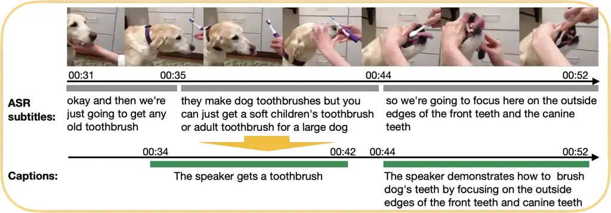

Figure 1: ASR subtitles deviate from human-written captions: they
contain a lot of filler phrases, e.g., “we’re going to”, and extra
information, e.g., “they make dog toothbrushes”. We propose to generate
human-style video captions based on the ASR subtitles and their
timestamps that we further temporally realign with the video.

Textual descriptions of visual information allow for navigating large
amounts of visual data. Recently, image-text cross-modal learning has
achieved remarkable performance in many downstream tasks by pre-training
on large-scale web datasets consisting of text-image pairs \[44, 51,
20\]. To collect video data on a similar scale, media platforms such as
YouTube can be used as a great source of freely available videos \[1,
74, 55, 38, 72, 66\]. Most of these videos include some narrations,
_e.g_., in instructional videos \[38\], people explain and show how to
accomplish one or another task. To transform spoken language from the
videos into subtitles, current automatic speech recognition (ASR)
systems \[45\] can be used, providing aligned text-video annotated pairs
for free. This automatic supervisory signal can easily scale to large
video datasets. However, such video web data poses additional
challenges \[17, 38\]: (1) spoken and visual information in the video
can deviate from each other, _e.g_., when speakers provide information
beyond what is visible or when spoken instructions do not temporally
align with the actions shown, (2) speech contains filler words and
phrases, such as “I’m going to”, and can be incomplete and contain
grammatical errors, and (3) ASR transcripts usually do not have
punctuation and may contain errors (Fig. 1). Therefore, ASR subtitles
provide only weak, noisy supervision for videos.

To address this problem, we propose a new framework, HowToCaption, that
leverages large language models (LLMs) \[10\] to generate human-style
captions on a large scale for web-video instructional datasets based on
corresponding ASR subtitles (Fig. 1). By carefully designing prompts, we
show that the LLM can effectively map long, noisy subtitles into concise
and descriptive human-style video captions. Moreover, we obtain an
initial temporal alignment of the generated captions to the video based
on the ASR timestamps by tasking the LLM to predict timestamps for each
caption. For additional quality improvement, we apply alignment and
filtering within short temporal windows with respect to the predicted
timestamp. This approach can generate aligned text-video pairs on a
large scale without any human intervention.

Beyond providing better annotation, the new captions provide the
advantage that they are no longer a direct output of the speech signal,
thus effectively decoupling audio and text. Current methods usually
avoid using audio \[37, 17\], as the ASR subtitles are directly derived
from the speech, thus leading to the problem that any
text-to-audio+video retrieval would mainly retrieve the closest speech
signal while disregarding the video \[54, 39\]. Being able to generate
captions that deviate from the speech thus allows to extend retrieval to
audio+video without the need for fine-tuned regularization, as used
in \[54\].

To verify the effectiveness of the proposed HowToCaption method, we
generate new captions for the large-scale HowTo100M dataset \[38\],
obtaining a new HowToCaption dataset. We evaluate the quality of the
improved textual descriptions on various challenging downstream tasks
over four different datasets, namely YouCook2 \[74\], MSR-VTT \[65\],
MSVD \[8\], and LSMDC \[49\]. It shows that the generated captions not
only provide a better training signal but also allow for a decoupling of
speech and caption annotation, allowing a retrieval based on audio,
vision, and subtitles at scale. We release the new HowToCaption dataset
with high-quality textual descriptions to show the potential of
generated captions for web text-video pairs. We summarize the
contributions of the paper as follows:

- •
  We propose a HowToCaption method to efficiently convert noisy ASR
  subtitles of instructional videos into accurate video captions, which
  leverages recent advances in LLMs and generates high-quality video
  captions at scale without any human supervision.
- •
  We create a new HowToCaption dataset with high-quality human-style
  textual descriptions with our proposed HowToCaption method.
- •
  Utilizing the HowToCaption dataset for training text-video models
  allows us to significantly improve the performance over many
  benchmarks for text-to-video retrieval and video captioning. Moreover,
  since the new textual annotation allows us to disentangle audio and
  language modalities in the instructional videos, where the ASR
  subtitles were highly correlated to audio, we show a boost in
  text-video+audio retrieval performance.

## 2 Related Work

### 2.1 Large-Scale Video-Language Datasets

Manual annotation of video captioning datasets is extremely
time-consuming since it involves video trimming and localization of
caption boundaries. Currently, manually annotated datasets, e.g.,
MSR-VTT \[65\], YouCook2 \[74\], HIREST \[71\], and HT-Step \[2\], are
limited in size. Therefore, different methods of mining videos with weak
supervision from the Internet were considered. Datasets such as
YouTube-8M \[1\] and IG-Kinetics-65M \[15\] provided multiple class
labels based on query clicks, metadata \[1\] or hashtags \[15\].
However, short class labels are suboptimal supervision compared to
textual descriptions \[12\]. Therefore, Bain et al. \[4\] considered
scrapping videos with associated alt-text from the web, obtaining the
WebVid2M and WebVid10M datasets \[4\] with 2M and 10M video-text pairs,
respectively. Stroud et al. \[55\] proposed to use meta information,
such as titles, descriptions, and tags from YouTube, as a textual
annotation and created the WTS-70M dataset. Nagrani et al. \[39\]
proposed to transfer image captions from an image-text dataset to videos
by searching videos with similar frames to an image and collected the
VideoCC3M dataset. Yang et al. \[68\] created the VidChapters-7M dataset
by scraping user-annotated chapters on YouTube. However, most videos in
WebVid do not have audio, which is an essential part of video analysis,
and captions in VideoCC3M are derived from images and, therefore, tend
to describe more static scenes rather than actions. At the same time,
the title, tags, and chapters of WTS-70M and VidChapters-7M provide only
high-level video descriptions.

As an alternative to this, Miech et al. \[38\] proposed the HowTo100M
dataset, where instructional videos are naturally accompanied by dense
textual supervision in the form of subtitles obtained from ASR
(Automatic Speech Recognition) systems. The HowTo100M dataset with 137M
clips sourced from 1.2M YouTube videos was proven to be effective for
pre-training video-audio-language representations \[50, 7, 54\]. The
followed-up YT-Temporal-180M \[72\] and HD-VILA-100M \[66\] datasets
follow the same idea but contain more videos with higher diversity and
higher video resolution. While ASR supervision provides a scalable way
to create large datasets with dense annotation, the quality of subtitles
is not on par with human-annotated captions. In this work, we propose a
method to create high-quality captions for videos at scale by leveraging
LLM and subtitles.

Recent works, InternVid \[63\], VAST \[9\], and Video-ChatGPT \[36\],
collect large-scale video-text datasets through per-frame image
captioning and text summarization with LLMs. In contrast, our work
stands apart in its objective. Rather than distilling existing knowledge
from image models, pre-trained on human-annotated image-text data, into
videos, we aim to gather a dataset enriched with new video knowledge.
This is achieved by converting freely available ASR subtitles into
captions. Concurrent work, HowToStep \[27\], summarizes ASR subtitles
into descriptive steps using LLM and then performs additional temporal
realignment. Our main difference is that we focus on general video
captions rather than procedural steps.

### 2.2 Learning with Noisy ASR Subtitles of Instructional Videos

The problem of misalignment and noisiness of ASR supervision in
instructional videos, e.g., in the HowTo100M dataset, were addressed in
multiple works. MIL-NCE loss \[37\] and soft max-margin ranking
loss \[3\] were proposed to adapt contrastive loss to misalignment in
text-video pairs. Zellers et al. \[72\] proposed to use LLM to add
punctuation and capitalization to ASR subtitles and remove
mistranscription errors. Han et al. \[17\] proposed to train temporal
alignment networks to filter out subtitles that are not alignable to the
video and determine alignment for the others. However, to the best of
our knowledge, \[31\] is the only work that goes beyond just removing
mistranscription errors and ASR re-alignment, where Lin et al. proposed
to match subtitles to step descriptions from WikiHow dataset \[21\]
(distant supervision). In our work, we propose to use LLM to create
video captions given ASR subtitles, which allows us to create detailed
descriptions that are specific for every video and have proper sentence
structure.

### 2.3 LLMs in Vision-Language Tasks

In recent years, there has been a remarkable success of LLMs in many
language-related tasks \[13, 46, 47\]. Latest large language
models \[40, 60, 10, 61\] have demonstrated excellent zero-shot
capabilities on common-sense inference \[5\]. This success has prompted
research into integrating common-sense knowledge into vision-language
tasks. In this regard, some methods \[57, 56, 34, 58\] initialize the
language part of vision-language models from pre-trained LLM. Another
line of work \[11, 24, 73, 32\] uses LLM as a decoder to enable
vision-to-language generation. Works \[28, 73\] adapted visually
conditioned LLM for visual captioning and created captioning
pseudo-labels for large-scale video data. However, these methods require
human-annotated datasets to train a captioning model, while our method
does not require any label data and aims to transform free available
annotation (ASR subtitles) into textual descriptions.

## 3 Method

### 3.1 Problem Statement

Given a dataset of $`N`$ untrimmed long-term instructional videos
$`V_{n}`$ with corresponding noisy ASR subtitles $`S_{n}`$, our goal is
to create “human-written-like” video captions $`C_{n}`$ (with
$`1\leq n\leq N`$). Note that our task does not assume access to any
paired training data $`((V_{n},S_{n}),C_{n})`$. The goal is to create
the video captions $`C_{n}`$ in a zero-shot setting given only videos
and subtitles $`(V_{n},S_{n})`$. More formally, for each given video
$`V_{n}`$, we also have a set of subtitles of spoken text in the video,
$`S_{n}=\{s_{n,j},t^{s}_{n,j},t^{e}_{n,j}\}_{j\leq|S_{n}|}`$ with their
start $`t^{s}`$ and end timestamps $`t^{e}`$ recognized by ASR-systems.
For each video $`V_{n}`$, our goal is to generate dense captions and
their timestamps
$`C_{n}=\{c_{n,i},\tau^{s}_{n,i},\tau^{e}_{n,i}\}_{i\leq|C_{n}|}`$,
where each caption $`{c_{n,i}}`$ describes a segment of the video, that
starts at $`\tau^{s}_{n,i}`$ and ends at $`\tau^{e}_{n,i}`$.

The generated captions aim to serve for video-language or
video-language-{other modalities (_e.g_., audio)} tasks, providing
language supervision in the form of human-style captions rather than
scrambled noisy ASR subtitles. That enables the potential of collecting
large-scale datasets with long-term videos and their dense textual
descriptions for free, without human supervision.

### 3.2 Video-Language Retrieval Model

Before we describe our method for generating the HowToCaption dataset,
we will briefly recap the video-language retrieval models (V-L model),
as it is one of the main use cases for this dataset. Moreover, we also
use a V-L model to improve the temporal alignment in the dataset.

We base our video-language retrieval model (V-L model) on the
pre-trained BLIP image-language dual-encoder model \[25\]. We maintain
the architecture of the text encoder $`f(c)\in\mathbb{R}^{d}`$ but,
following CLIP4CLIP \[35\], adapt the image encoder $`g(I)`$ to a video
encoder by averaging image embeddings obtained from uniformly sampled
frames of the video:
$`g(V_{n})=\sum_{I\in V_{n}}{g(I)}\in\mathbb{R}^{d}`$. Dual-encoder
models typically learn a cross-modal embedding space \[44, 35\] via
training with the symmetric InfoNCE loss \[41\]. The training is based
on a similarity metric (often cosine distance) between embeddings
$`\rho_{n,i,m}=\mathrm{sim}\left(f(c_{n,i}),g(V_{m})\right)`$ scaled by
a temperature parameter $`\nu`$, resulting in the following loss
function:

```math
L=-\frac{1}{2|B|}\sum_{(n,i)\in B}\biggl(\log\frac{\exp(\rho_{n,i,n}/\nu)}{\sum\limits_{(m,j)\in B}{\exp(\rho_{n,i,m}/\nu)}}+\log\frac{\exp(\rho_{n,i,n}/\nu)}{\sum\limits_{(m,j)\in B}{\exp(\rho_{m,j,n}/\nu)}}\biggr) \tag{1}
```

where $`B`$ is a batch of training sample indices $`(n,i)`$.

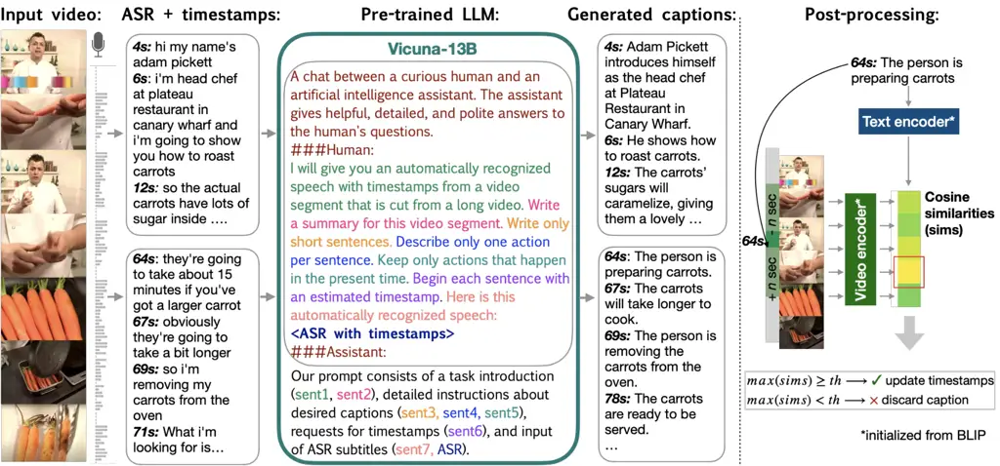

Figure 2: Schematic visualization of the proposed HowToCaption method.
Obtained from the automatic speech recognition system (ASR), subtitles
are divided into blocks that contain longer contextual information. A
large pre-trained language model is then used to generate plausible
video captions based on ASR subtitles, along with timestamps for each
caption. These generated captions and timestamps are further
post-processed to enhance their alignment to the video and filter out
captions with low similarity to the corresponding video by leveraging a
pre-trained text-video model.

### 3.3 HowToCaption Method

To generate captions for the instructional videos, we propose to
leverage recent large language models that demonstrate great zero-shot
performance in many different tasks formulated with natural language.
Namely, we prompt the LLM to read the ASR subtitles of the video and
create a plausible video description based on this. Since one subtitle
only covers a small part of the video and lacks a global context, we
propose to aggregate multiple subtitles together with their timestamp
information. Then, we task the LLM to create detailed descriptions based
on the entire input and estimate timestamps for each generated sentence.

The overview of our approach is shown in Fig. 2. For each video, we
first slice a given sequence of subtitles into blocks that contain long
context information about the video. Then, the ASR subtitles of each
block are summarised into a video caption using the LLM that we prompt
with our task description. The LLM also predicts timestamps for each
sentence in the video caption, which we further refine in our
post-processing step based on similarities of a caption sentence to
video clips in the neighboring area of predicted timestamps.

LLM Prompting. For our language prompt (shown in Fig. 2), we leverage
the same “main” prompt for the LLM, as in the Vicuna-13B model \[10\]:
“A chat between a curious human and…” that defines the requirement for
LLM to give a helpful answer to our questions. Then, we describe our
request, what data we need to process, and how it should be processed:
“I will give you an automatically recognized speech…”. We found
structuring the prompt in the way that the task description given at the
beginning of the prompt and the long ASR input $`S_{n}`$ at the end is
beneficial. Then, we give detailed instructions about how to process ASR
subtitles. We found that instructions such as “Write only short
sentences” or “Describe only one action per sentence” are beneficial, as
they encourage the creation of concise captions that better match the
video content. The instruction “Keep only actions that happen in the
present time” is intended to filter out unrelated chats, advice, or
comments from the captions; we observed that it also resulted in
performance enhancements. Lastly, we request the model to predict a
timestamp for each generated caption and, finally, input timestamps +
ASR subtitles that need to be processed. The LLM response follows the
start timestamp + caption format given in the prompt and, therefore, can
be automatically parsed with a simple script into a set of captions and
timestamps
$`C_{n}=\{c_{n,i},\tau^{s}_{n,i},\tau^{e}_{n,i}\}_{i\leq|C_{n}|}`$,
where we assign $`\tau^{e}_{n,i}=\tau^{s}_{n,i}+\Delta_{sec}`$, where
$`\Delta_{\mathrm{sec}}`$ is a constant video clip length parameter
(number of seconds). Please see Sec. 4.3 and the supplement for a
detailed evaluation of these choices. In the supplement, we also discuss
an extension of our HowToCaption method to vision language models that
additionally allows grounding captions on visual content. However, we
found that this does not improve caption quality.

Post-processing: Alignment & Filtering. ASR subtitles often temporally
misalign with video content \[17, 38\] (e.g., a speaker describes
something only after it was shown in a video). Captions derived solely
from ASR also face this issue. Therefore, inspired by the TAN
method \[17\] that automatically predicts the alignability of subtitles
and matching timestamps, we further improve our obtained captions with
an alignment & filtering post-processing step (Fig. 2). To this end, we
utilize the video-language encoder model $`(f,g)`$. Given a generated
caption $`c_{n,i}`$ and its start and end timestamps
$`(\tau^{s}_{n,i},\tau^{e}_{n,i})`$ that corresponds to a part of the
video clip $`V_{n}^{[\tau^{s}_{n,i},\tau^{e}_{n,i}]}`$, we use the V-L
model to compute alignment similarity scores
$`\rho_{n,i}(\delta)=\mathrm{sim}\left(f(c_{n,i}),g(V_{n}^{[\tau^{s}_{n,i}+\delta,\tau^{e}_{n,i}+\delta]})\right)`$
between the caption and video clips with time offsets
$`\delta\in\mathbb{Z},|\delta|\leq T`$ around predicted timestamps. Then
we align the caption to the video clip by finding the best offset around
the timestamp
$`\delta^{*}_{n,i}=\underset{\delta\in\{-T,...,T\}}{\arg\max}\rho_{n,i}(\delta)`$
and filter out pairs if $`\rho_{n,i}(\delta^{*}_{n,i})<\kappa`$, where
$`\kappa`$ is a similarity score threshold.

To further improve the alignment of captions, we perform multiple rounds
of alignment & filtering. In practice, we found that the improvement
after two rounds is marginal. For subsequent rounds, we fine-tune
(c.f. Sec. 3.2) the V-L model on the aligned & filtered video-captions
pairs $`\{(v_{i},c_{i})\}`$, resulting in new alignment scores
$`\rho^{\prime}_{n,i}(\delta)`$. Since fine-tuning V-L models often
leads to forgetting, we employ two modifications in the fine-tuning and
second alignment processes. First, during fine-tuning, we add
regularization

```math
L_{\mathrm{align}}=\alpha\frac{1}{2|B|}\sum_{(n,i)\in B}(\mathrm{sim}(f(c_{n,i}),f^{*}(c_{n,i}))+\mathrm{sim}(g(V_{n}),g^{*}(V_{n})) \tag{2}
```

where $`f^{*}`$ and $`g^{*}`$ denote frozen text and video encoders,
$`\alpha`$ is a regularization weight, and $`(n,i)\in B`$ represents the
samples batch $`B`$. This regularization prevents the model from
forgetting \[19\]. Then, during alignment & filtering, we use the
average of the similarities of the fine-tuned and original model. We
show an impact of these modifications in the supplement.

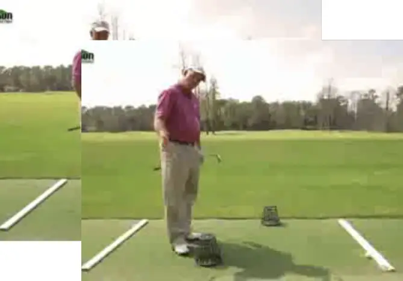

ASR: move them around to help direct the path  
Caption: Matt Swanson gives a tip to use buckets to direct the path of
the ball

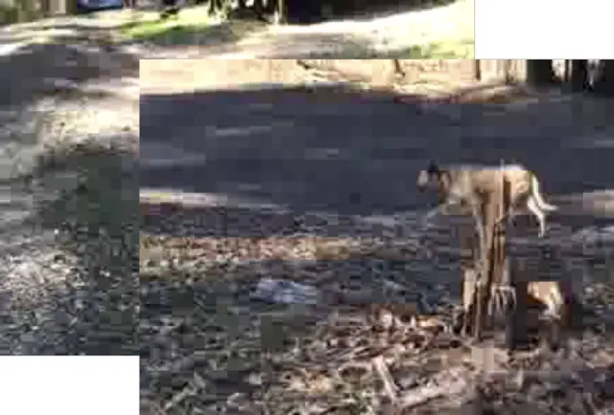

ASR: so this is stage one of hiding the bone burying the bone …  
Caption: Dog wants to hang out near dirt or other dogs with bones to
acquire more bones

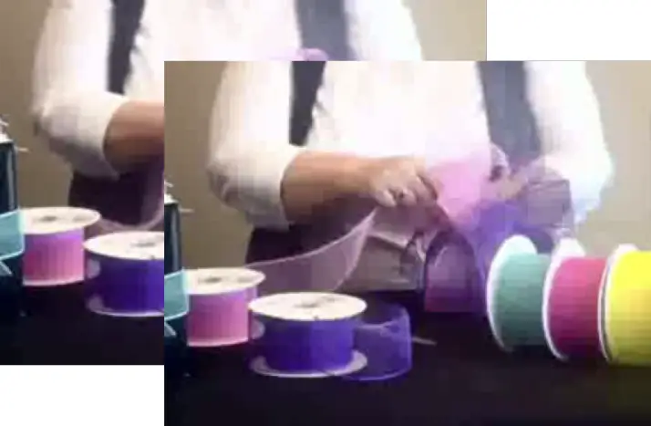

ASR: so it’s not going to really show

Caption: Making a bow with two colors

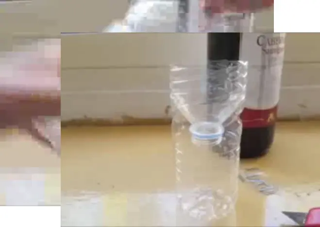

ASR: but this yeah and it just stays or it won’t get off it’s busy
here  
Caption: Make sure the bottle stays together

Figure 3: Examples of video-captions pairs from our HowToCaption
dataset. ASR subtitles with only noisy supervision for the video are
converted from spoken- to written-language-style captions. Note that
some details in the generated captions are taken from a longer context,
see the supplement for a full example.

### 3.4 HowToCaption Dataset

We apply the proposed HowToCaption approach to 1.2M long-term
instructional videos and ASR subtitles of the HowTo100M dataset and
obtain the HowToCaption dataset. By prompting the Vicuna-13B model, we
obtain $`\sim 70`$M initial captions. The compute cost for prompting
1.2M videos is $`\sim`$12k GPU-hours on NVIDIA A40. After alignment &
filtering (details in Sec. 4.2) we obtain 25M high-quality video-caption
pairs. We show examples from our HowToCaption dataset in Fig. 3. We note
that generated captions follow different text styles, _e.g_., the first
and the second examples contain a long description of an object and its
actions, the third describes the process, and the last one is
instruction. The average length of the captions is 9 words. We provide
additional examples, statistics, failure case analyses, and user studies
in the supplement.

## 4 Experimental Results

|                                                                                                                                                                                                                                                                      |                 |                  |                 |                  |                 |                  |                 |                  |                 |                  |
| -------------------------------------------------------------------------------------------------------------------------------------------------------------------------------------------------------------------------------------------------------------------- | --------------- | ---------------- | --------------- | ---------------- | --------------- | ---------------- | --------------- | ---------------- | --------------- | ---------------- |
| Prompt                                                                                                                                                                                                                                                               | YouCook2        |                  | MSR-VTT         |                  | MSVD            |                  | LSMDC           |                  | Average         |                  |
|                                                                                                                                                                                                                                                                      | R10$`\uparrow`$ | MR$`\downarrow`$ | R10$`\uparrow`$ | MR$`\downarrow`$ | R10$`\uparrow`$ | MR$`\downarrow`$ | R10$`\uparrow`$ | MR$`\downarrow`$ | R10$`\uparrow`$ | MR$`\downarrow`$ |
| x1: Here is an automatically recognized speech from a video: $`<`$ASR with timestamps$`>`$. x2: Write a synopsis for this video. x3: Begin each sentence with an estimated timestamp.                                                                                | 37.5            | 22.5             | 71.0            | 3                | 80.5            | 2                | 37.3            | 30               | 56.6            | 14.4             |
| $`<`$x1$`>`$ $`<`$x2$`>`$ x4: Write only short sentences. $`<`$x3$`>`$                                                                                                                                                                                               | 39.3            | 20.5             | 71.4            | 3                | 81.0            | 2                | 36.5            | 32.5             | 57.1            | 14.5             |
| $`<`$x1$`>`$ $`<`$x2$`>`$ $`<`$x4$`>`$ x5: Describe only one action per sentence. $`<`$x3$`>`$                                                                                                                                                                       | 39.8            | 20               | 71.0            | 3                | 80.9            | 2                | 37.2            | 30.5             | 57.2            | 13.9             |
| $`<`$x1$`>`$ $`<`$x2$`>`$ $`<`$x4$`>`$ $`<`$x5$`>`$ x6: Keep only actions that happen in the present time. $`<`$x3$`>`$                                                                                                                                              | 39.5            | 19.5             | 71.6            | 3                | 81.2            | 2                | 37.9            | 29               | 57.6            | 13.4             |
| $`<`$x1$`>`$ x2’: Write a summary for this video. $`<`$x4$`>`$ $`<`$x5$`>`$ $`<`$x6$`>`$ $`<`$x3$`>`$                                                                                                                                                                | 40.4            | 19               | 71.4            | 3                | 81.4            | 2                | 37.1            | 30               | 57.6            | 13.5             |
| x1’: Here is an automatically recognized speech from a video segment that is cut from a long video: $`<`$ASR with timestamps$`>`$ x2”: Write a summary for this video segment. $`<`$x4$`>`$ $`<`$x5$`>`$ $`<`$x6$`>`$ $`<`$x3$`>`$                                   | 40.0            | 20               | 72.0            | 3                | 81.1            | 2                | 37.8            | 29               | 57.7            | 13.5             |
| I will give you an automatically recognized speech with timestamps from a video segment that is cut from a long video. $`<`$x2”$`>`$ $`<`$x4$`>`$ $`<`$x5$`>`$ $`<`$x6$`>`$ $`<`$x3$`>`$ Here is this automatically recognized speech: $`<`$ASR with timestamps$`>`$ | 40.6            | 19               | 72.0            | 3                | 81.6            | 2                | 37.7            | 30               | 58.0            | 13.5             |

Table 1: Ablation of LLM prompts. We step by step construct a prompt for
an LLM that concisely and in detail describes the caption generation
task. To emphasize our incremental adjustments, we label the sentences
as x$`n`$ (where $`n`$ is an index). Each prompt consists of some
sentences that were already used in previous prompt versions (e.g.,
$`<`$x1$`>`$, $`<`$x2$`>`$) and new sentences introduced in the current
prompt (e.g., x4: Write only …). With each prompt, we obtain 2M
video-text pairs from 100k HowTo100M videos that we later use for T-V
model training (lower-resource setup). Downstream zero-shot text-video
retrieval performance is reported.

|              |          |      |      |     |         |      |      |     |      |      |      |     |       |      |      |     |         |      |      |      |
| ------------ | -------- | ---- | ---- | --- | ------- | ---- | ---- | --- | ---- | ---- | ---- | --- | ----- | ---- | ---- | --- | ------- | ---- | ---- | ---- |
| Method       | YouCook2 |      |      |     | MSR-VTT |      |      |     | MSVD |      |      |     | LSMDC |      |      |     | Average |      |      |      |
| R1           | R5       | R10  | MR   | R1  | R5      | R10  | MR   | R1  | R5   | R10  | MR   | R1  | R5    | R10  | MR   | R1  | R5      | R10  | MR   |      |
| No context   | 11.1     | 27.9 | 38.4 | 21  | 37.7    | 62.4 | 72.6 | 3   | 43.3 | 71.7 | 80.2 | 2   | 16.5  | 30.4 | 38.4 | 30  | 27.1    | 48.1 | 57.4 | 14   |
| Long context | 12.1     | 30.0 | 40.6 | 19  | 37.9    | 61.6 | 72   | 3   | 43.9 | 72.7 | 81.6 | 2   | 16.8  | 31.4 | 37.7 | 30  | 27.7    | 48.9 | 58.0 | 13.5 |

Table 2: Effect of a longer context. For the “no context” option, we
predict captions from individual ASR subtitles. With our “long context”
option, we input multiple ASR subtitles with timestamps and the model
generated captions based on longer context. This ablation is done in
lower-resource setup.

| Caption Post-processing                  | YouCook2        |                  | MSR-VTT         |                  | MSVD            |                  | LSMDC           |                  | Average         |                  |
| ---------------------------------------- | --------------- | ---------------- | --------------- | ---------------- | --------------- | ---------------- | --------------- | ---------------- | --------------- | ---------------- |
|                                          | R10$`\uparrow`$ | MR$`\downarrow`$ | R10$`\uparrow`$ | MR$`\downarrow`$ | R10$`\uparrow`$ | MR$`\downarrow`$ | R10$`\uparrow`$ | MR$`\downarrow`$ | R10$`\uparrow`$ | MR$`\downarrow`$ |
| Lower bound: original ASR as supervision | 39.3            | 20               | 61.7            | 5                | 77.1            | 2                | 31.5            | 56               | 52.4            | 20.8             |
| No post-processing                       | 40.2            | 18               | 65.9            | 4                | 79.8            | 2                | 34.4            | 40               | 55.1            | 16.0             |
| Filtering (using BLIP)                   | 42.5            | 16               | 71.2            | 3                | 81.7            | 2                | 37.4            | 30               | 58.2            | 12.8             |
| Alignment & filtering (using BLIP)       | 42.4            | 17               | 71.7            | 3                | 82.2            | 2                | 38.5            | 29.5             | 58.7            | 12.9             |
| Alignment & filtering (with ours)        | 44.1            | 15               | 73.3            | 3                | 82.1            | 2                | 38.6            | 29               | 59.5            | 12.3             |

Table 3: Effect of alignment & filtering. With each post-processing
variant, we obtain 25M video-text pairs that we later use for T-V model
training. Downstream zero-shot text-video retrieval performance is
reported.

To evaluate the proposed HowToCaption dataset for large-scale
pre-training of vision-language models, we train a T-V model as
described in Sec. 3.2 on the HowToCaption dataset and assess its
zero-shot video-text retrieval performance on four widely recognized and
diverse video-text benchmarks: YouCook2 \[74\], MSR-VTT \[65\],
MSVD \[8\], and LSMDC \[49\]. While the YouCook2 dataset consists of
instructional cooking videos and might be considered as an in-domain
benchmark for the HowToCaption dataset, the other datasets encompass a
broader range of topics and video types, including non-instructional
YouTube videos and movies. To evaluate the properties of HowToCaption
dataset in comparison with other large-scale pre-training datasets, we
also train our T-V model on the HowTo100M \[38\], HowTo100M with step
labels \[31\], HTM-AA \[17\], VideoCC3M \[39\], and WebVid2M \[4\]
datasets and compare zero-shot text-video retrieval performance.

### 4.1 Datasets and Metrics

Pre-training Datasets. HowTo100M is a dataset of 1.2M instructional
videos with ASR subtitles. We consider three versions of annotations of
this dataset: Sentencified HowTo100M \[17\], with pre-processed ASR
subtitles by structuring them into full sentences; HowTo100M with
Distant Supervision \[31\], where ASR subtitles were linked to
WikiHow \[21\] step descriptions via distant supervision; and
HTM-AA \[17\], an auto-aligned (AA) version of HowTo100M, where subtitle
timestamps were adjusted to improve alignment to videos and
non-alignable subtitles were discarded. WebVid2M \[4\] is a large
open-domain dataset of 2.5M of short videos scrapped from the internet
with their alt-text. VideoCC3M \[39\] is a dataset of 10M video-text
pairs collected by transferring captions from image-text CC3M
dataset \[6\] to videos with similar visual content.

Datasets for Downstream Tasks. YouCook2 \[74\] is a dataset of
instructional cooking videos, where each video clip is annotated with a
recipe step. We used 3.5k test set for evaluation. MSR-VTT \[65\]
contains 10k YouTube videos on various topics and human descriptions.
Following prior work \[4, 39, 59\], we use the 1k test set for
evaluation. MSVD \[8\] is a dataset of video snippets with their textual
summary. The evaluation set consists of 670 videos with 40 captions
corresponding to each video. We follow standard practice \[4, 35\] and
count each caption-video pair towards the metrics. LSMDC \[49\] is a
collection of video clips from movies with human-written descriptions.
The test set consists of 1k video-caption pairs.

Metrics. To evaluate zero-shot text-video retrieval, we use standard
Recall@$`K`$ metrics where $`K\in{1,5,10}`$ (R1, R5, R10) and Median
Rank (MR).

### 4.2 Implementation Details

As an LLM, we utilize Vicuna-13B-v0 \[10\]. In the supplement, we
additionally experiment with the MiniGPT-4 model \[75\] to generate
captions from subtitles grounded on visual content. To create the
HowToCaption dataset, we leverage subtitles with timestamps released
by \[17\] (Sentencified HowTo100M), where officially released
subtitles \[38\] for HowTo100M videos were post-processed by structuring
them into full sentences. For our T-V model (described in Sec. 3.2), we
use ViT-B/16 visual encoder and $`\textrm{BERT}_{\textrm{base}}`$
textual encoder that are initialized with
$`\textrm{BLIP}_{\textrm{CapFilt-L}}`$ pre-trained weights. We uniformly
sample 4 frames from a video clip during training and 12 frames during
evaluation. For HowToCaption method, we use $`T=10`$ seconds offset for
alignment and adaptive threshold $`\kappa`$ to leave 25M most similar
pairs after filtering. Following \[7\] that found that 8-sec clips are
optimal for training on HowTo100M, we set $`\Delta_{\mathrm{sec}}=8`$.
More implementation details are in the supplement.

### 4.3 Ablation Studies

Prompt Engineering. First, we assess the quality of the obtained dataset
with respect to different LLM prompts. Since prompting LLM with
subtitles from 1.2M videos is resource-intensive, we perform the prompt
engineering ablations in a lower-resource setup, where we use a 100k
subset of HowTo100M ($`\sim`$ 10% of all videos) to create dense
captions with the LLM and use the threshold $`\kappa`$ to obtain the 2M
most confident video-caption pairs. Here, we train the T-V model for
150k iterations and then evaluate zero-shot on downstream tasks. In
Tab. 1, we begin with a basic prompt for the LLM, gradually refining it
to generate captions more suitable for vision-language tasks. It is
essential to recognize that the impact of various prompts on performance
can vary across datasets, as certain prompts may yield captions better
aligned with specific downstream tasks. Notably, incorporating key
phrases such as “Write only short sentences” or “Describe only one
action per sentence” leads to performance improvements on 3 out of 4
datasets. Additionally, the use of the phrase “Keep only actions that
happen in the present time” also results in performance enhancements.
Furthermore, structuring the task description at the beginning and
presenting the data to be processed at the end (the final modification)
also boosts performance. We provide more ablations on prompt engineering
in the supplement.

We also examine the impact of leveraging a longer context for caption
prediction. In Tab. 2, we compare caption generation with “no context”,
where captions are predicted from individual ASR subtitles. With our
“long context” option, we input multiple ASR subtitles with their
timestamps, and the model predicts both captions and timestamps based on
longer context. We found that using a longer context is beneficial,
resulting in an average improvement of $`0.6`$ p.p. in R10, and
particularly advantageous for YouCook2 and MSVD.

|                                           |          |      |      |     |         |      |      |     |      |      |      |     |       |      |      |      |
| ----------------------------------------- | -------- | ---- | ---- | --- | ------- | ---- | ---- | --- | ---- | ---- | ---- | --- | ----- | ---- | ---- | ---- |
| Video-Text Training Data                  | YouCook2 |      |      |     | MSR-VTT |      |      |     | MSVD |      |      |     | LSMDC |      |      |      |
|                                           | R1       | R5   | R10  | MR  | R1      | R5   | R10  | MR  | R1   | R5   | R10  | MR  | R1    | R5   | R10  | MR   |
| - (zero-shot, with BLIP initialization)   | 6.1      | 16.2 | 23.6 | 69  | 34.3    | 59.8 | 70.6 | 3   | 38.5 | 65.0 | 74.0 | 2   | 14.7  | 29.5 | 36.5 | 31   |
| HowTo100M with ASRs \[17\]                | 12.2     | 29.1 | 39.3 | 20  | 30.8    | 52.6 | 61.7 | 5   | 39.2 | 68.3 | 77.1 | 2   | 12.9  | 24.7 | 31.5 | 56   |
| HowTo100M with distant supervision \[31\] | 8.3      | 21.5 | 30.3 | 34  | 28.6    | 54.0 | 66.3 | 5   | 38.5 | 68.6 | 79.4 | 2   | 12.1  | 24.7 | 32.4 | 42.5 |
| HTM-AA (auto-aligned ASRs) \[17\]         | 13.4     | 32.2 | 43.5 | 15  | 29.8    | 54.1 | 64.3 | 4   | 38.7 | 68.6 | 78.7 | 2   | 11.9  | 23.9 | 30.5 | 46   |
| HowToCaption (ours)                       | 13.4     | 33.1 | 44.1 | 15  | 37.6    | 62.0 | 73.3 | 3   | 44.5 | 73.3 | 82.1 | 2   | 17.3  | 31.7 | 38.6 | 29   |
| VideoCC3M \[39\]                          | 5.3      | 15.1 | 21.7 | 84  | 33.9    | 57.9 | 67.1 | 4   | 39.6 | 66.7 | 76.8 | 2   | 14.8  | 29.4 | 35.8 | 33   |
| WebVid2M \[4\]                            | 7.3      | 20.7 | 29.0 | 46  | 38.5    | 61.7 | 71.9 | 3   | 44.5 | 73.4 | 82.1 | 2   | 17.8  | 31.2 | 39.8 | 25   |

Table 4: Zero-shot text-to-video retrieval performance of models trained
on different video-text datasets. For each dataset, we train our T-V
model and report downstream performance.

| Method                | V. Encoder | I-T Data       | V-T Data     | YouCook2 |      |      |     | MSR-VTT |      |      |     | MSVD |      |      |     | LSMDC |      |      |      |
| --------------------- | ---------- | -------------- | ------------ | -------- | ---- | ---- | --- | ------- | ---- | ---- | --- | ---- | ---- | ---- | --- | ----- | ---- | ---- | ---- |
|                       |            |                |              | R1       | R5   | R10  | MR  | R1      | R5   | R10  | MR  | R1   | R5   | R10  | MR  | R1    | R5   | R10  | MR   |
| Nagrani et al. \[39\] | ViT-B      | -              | VideoCC3M    | -        | -    | -    | -   | 18.9    | 37.5 | 47.1 | -   | -    | -    | -    | -   | -     | -    | -    |      |
| Frozen-in-Time \[4\]  | ViT-B/16   | CC+COCO        | WebVid2M     | -        | -    | -    | -   | 24.7    | 46.9 | 57.2 | 7   |      |      |      |     |       |      |      |      |
| CLIP-straight \[43\]  | ViT-B/32   | WIT            | -            | -        | -    | -    | -   | 31.2    | 53.7 | 64.2 | 4   | 37.0 | 64.1 | 73.8 | 2   | 11.3  | 22.7 | 29.2 | 56.5 |
| CLIP4CLIP \[35\]      | ViT-B/32   | WIT            | HowTo100M    | -        | -    | -    | -   | 32.0    | 57.0 | 66.9 | 4   | 38.5 | 66.9 | 76.8 | 2   | 15.1  | 28.5 | 36.4 | 28   |
| VideoCoCa \[67\]      | ViT-B/18   | JFT-3B         | VideoCC3M    | 16.5     | -    | -    | -   | 31.2    | -    | -    | -   | -    | -    | -    | -   | -     | -    | -    | -    |
| BLIP^(§) \[25\]       | ViT-B/16   | 6 datasets^(‡) | -            | 6.1      | 16.2 | 23.6 | 69  | 34.3    | 59.8 | 70.6 | 3   | 38.5 | 65.0 | 74.0 | 2   | 14.7  | 29.5 | 36.5 | 30.5 |
| BLIP^(§)+HowTo100M    | ViT-B/16   | 6 datasets^(‡) | HowTo100M    | 12.2     | 29.1 | 39.3 | 20  | 30.8    | 52.6 | 61.7 | 5   | 39.2 | 68.3 | 77.1 | 2   | 12.9  | 24.7 | 31.5 | 56   |
| Ours                  | ViT-B/16   | 6 datasets^(‡) | HowToCaption | 13.4     | 33.1 | 44.1 | 15  | 37.6    | 62   | 73.3 | 3   | 44.5 | 73.3 | 82.1 | 2   | 17.3  | 31.7 | 38.6 | 29   |

Table 5: Comparison in zero-shot text-to-video retrieval with
dual-encoder baseline methods. ^(§)For BLIP, the performance of
dual-encoder architecture is reported. ^(‡)6 datasets =
CC3M \[6\]+CC12M \[6\]+COCO \[30\]+VG \[22\] +SBU \[42\] +LAION \[51\].
“V.” = Vision, “I-T” = Image-Text, “V-T” = Video-Text.

| Method             | Vision Encoder        | YouCook2       |                |                 |                  | MSR-VTT        |                |                 |                  |
| ------------------ | --------------------- | -------------- | -------------- | --------------- | ---------------- | -------------- | -------------- | --------------- | ---------------- |
|                    |                       | R1$`\uparrow`$ | R5$`\uparrow`$ | R10$`\uparrow`$ | MR$`\downarrow`$ | R1$`\uparrow`$ | R5$`\uparrow`$ | R10$`\uparrow`$ | MR$`\downarrow`$ |
| MIL-NCE^(∗) \[37\] | S3D                   | 15.1           | 38.0           | 51.2            | 10               | 9.9            | 24.0           | 32.4            | 29.5             |
| TAN^(∗) \[17\]     | S3D                   | 20.1           | 45.5           | 59.5            | 7.0              | -              | -              | -               | -                |
| MMT \[14\]         | Transformer           | -              | -              | -               | -                | -              | 14.4           | -               | 66               |
| AVLNet \[50\]      | ResNet-152+ResNeXt101 | 19.9           | 36.1           | 44.3            | 16               | 8.3            | 19.2           | 27.4            | 47               |
| MCN \[7\]          | ResNet-152+ResNeXt101 | 18.1           | 35.5           | 45.2            | -                | 10.5           | 25.2           | 33.8            | -                |
| EAO \[54\]         | S3D                   | 24.6           | 48.3           | 60.4            | 6                | 9.3            | 22.9           | 31.2            | 35               |
| Ours               | S3D                   | 25.5           | 51.1           | 63.6            | 5                | 13.2           | 30.3           | 41.5            | 17               |

Table 6: Zero-shot text-to-video+audio retrieval. ^(∗)Text-video only
models.

|                      |            |                |                |          |      |      |       |         |      |      |      |      |      |      |       |
| -------------------- | ---------- | -------------- | -------------- | -------- | ---- | ---- | ----- | ------- | ---- | ---- | ---- | ---- | ---- | ---- | ----- |
| Method               | V. Encoder | I-T Data       | V-T Data       | YouCook2 |      |      |       | MSR-VTT |      |      |      | MSVD |      |      |       |
|                      |            |                |                | B@4      | M    | R    | C     | B@4     | M    | R    | C    | B@4  | M    | R    | C     |
| SwinBERT \[29\]      | VidSwin-B  | -              | -              | 9.0      | 15.6 | 37.3 | 109   | 41.9    | 29.9 | 62.1 | 53.8 | 58.2 | 41.3 | 77.5 | 120.6 |
| CLIP4Caption \[59\]  | ViT-B      | -              | -              | -        | -    | -    | -     | 46.1    | 30.7 | 63.7 | 57.7 | -    | -    | -    | -     |
| GIT-B \[62\]         | ViT-B      | 4 datasets^(⋆) | -              | 5.8      | 12.2 | 31.5 | 80.3  | 46.6    | 29.6 | 63.2 | 57.8 | 69.3 | 44.5 | 81.4 | 142.6 |
| MV-GPT \[52\]        | ViViT-B    | -              | HowTo100M      | -        | -    | -    | -     | 48.9    | 38.6 | 64   | 60.0 | -    | -    | -    | -     |
| LAVENDER             | VidSwin-B  | 5 datasets^(†) | WebVid2M+12M   | -        | -    | -    | -     | -       | -    | -    | 60.1 | -    | -    | -    | 150.7 |
| HiTeA \[70\]         | MViT-B     | 5 datasets^(†) | WebVid2M       | -        | -    | -    | -     | -       | -    | -    | 65.1 | -    | -    | -    | 146.9 |
| mPlug-2 \[64\]       | ViT-B      | 5 datasets^(†) | WebVid2M       | -        | -    | -    | -     | 52.2    | 32.1 | 66.9 | 72.4 | 69.3 | 45.1 | 81.9 | 148.2 |
| BLIP \[25\]          | ViT-B      | 6 datasets^(‡) | -              | 7.9      | 15.0 | 36.0 | 104.8 | 49.2    | 32.2 | 66.1 | 65.5 | 68.0 | 45.3 | 82.8 | 148.6 |
| BLIP + HowTo100M^(§) | ViT-B      | 6 datasets^(‡) | HowTo100M      | 8.6      | 15.9 | 37.1 | 112.9 | 49.4    | 32.0 | 66.2 | 65.9 | 69.3 | 46.2 | 83.0 | 151.4 |
| Ours                 | ViT-B      | 6 datasets^(‡) | HowToCaption   | 8.8      | 15.9 | 37.3 | 116.4 | 49.8    | 32.2 | 66.3 | 65.3 | 70.4 | 46.4 | 83.2 | 154.2 |
| Vid2Seq \[69\]       | ViT-L      | -              | YT-Temporal-1B | -        | -    | -    | -     | -       | 30.8 | -    | 64.6 | -    | 45.3 | -    | 146.2 |
| VideoCoCa \[67\]     | ViT-G      | JFT-3B         | VideoCC3M      | -        | -    | -    | -     | 53.8    | -    | 68.0 | 73.2 | -    | -    | -    | -     |
| GIT-2 \[62\]         | DaViT-4.8B | 12.9B pairs    | -              | 9.4      | 15.6 | 37.5 | 131.2 | 54.8    | 33.1 | 68.2 | 75.9 | 82.2 | 52.3 | 88.7 | 185.4 |

Table 7: Video captioning results. We report BLEU@4 (B@4), METEOR (M),
ROUGE-L (R), and CIDEr (C). We gray out methods that use a stronger
vision backbone and significantly more pre-training data for fair
comparison. ^(⋆)4 datasets = CC3M+COCO+VG+SBU, ^(†)5 datasets = …+CC12M,
^(‡)6 datasets = …+LAION \[51\]. ^(§)Our fine-tuning. “V.” = Vision,
“I-T” = Image-Text, “V-T” = Video-Text.

Alignment & Filtering. Further, we assess the impact of the proposed
alignment & filtering procedure on the quality of captions of the
acquired dataset in Tab. 3. We examine the performance of the T-V model
when trained on differently post-processed versions of the dataset.
Remarkably, we discover that the obtained video-caption pairs, even
without any post-processing, significantly outperform the original
ASR-based supervision. Subsequently, by employing the alignment and
filtering procedure to leave only 25M pairs based on video-caption
similarities derived from BLIP pre-trained weights, we achieve a notable
performance enhancement of 3.6 p.p. in R10. Furthermore, alignment &
filtering with our proposed fine-tuning without forgetting yields an
additional 0.8 p.p. boost in R10 performance. More ablations can be
found in the supplement.

### 4.4 Comparison with State-of-the-art

Comparision with Other Web Datasets. In Tab. 4, we assess the
pre-training effectiveness of our proposed HowToCaption dataset compared
to other web video-language datasets. Specifically, we evaluate
different textual annotations of HowTo100M videos: sentencified ASR
subtitles \[17\], task steps from distant supervision \[31\], and
auto-aligned ASR subtitles \[17\]. Additionally, we conduct evaluations
on WebVid2M \[4\] and VideoCC3M \[39\] datasets. Our findings indicate
that the model pre-trained on our HowToCaption dataset significantly
outperforms models pre-trained on other versions of HowTo100M
annotations, with an average improvement of 5.2 p.p. in R10. This
improvement is most pronounced for the MSR-VTT, MSVD, and LSMDC
datasets, which feature full-sentence captions. Interestingly, for the
YouCook2 dataset with captions in the form of step descriptions like
“cut tomato”, HTM-AA already exhibits a high baseline performance, but
our HowToCaption dataset still provides a performance boost. We also
observe that the VideoCC3M dataset does not improve the initial BLIP
performance on any datasets except for the MSVD. We attribute it to the
fact that the VideoCC3M dataset adopts captions from the CC3M
dataset \[6\] and transfers them to videos, potentially not introducing
significantly new knowledge for the BLIP-initialised model since BLIP
was pre-trained on multiple datasets, including CC3M. On the other hand,
WebVid2M demonstrated performance improvements across all datasets, but
our HowToCaption dataset notably outperforms WebVid2M on YouCook2 and
MSR-VTT, only underperforming on LSMDC.

Comparison with State-of-the-art in Zero-shot Text-Video Retrieval. In
Tab. 5, we also conduct a comparison with zero-shot dual-encoder
retrieval baselines. It is important to acknowledge that comparing
state-of-the-art methods can be challenging due to variations in
backbone capacity, training objectives, and other factors. Therefore, we
focus on a comparison with dual-encoder models in the zero-shot
settings. Additional comparisons with methods that use re-ranking can be
found in the supplement. Nevertheless, it is worth highlighting that our
approach consistently outperforms the baseline methods in zero-shot
text-video retrieval across all datasets.

Zero-shot Text-to-Video+Audio Retrieval. It is known that instructional
video datasets, _e.g_., HowTo100M, suffer from a high correlation of
audio modality to a textual description, therefore hindering building a
text-video+audio retrieval system where the video is extended with
audio \[54, 39\]. The usage of ASR narrations as supervisory textual
description leads retrieval models to primarily perform speech
recognition on the audio, hindering true language-audio
connections \[54\]. Therefore, training text-video+audio systems on such
datasets usually requires additional regularization, such as shifting
audio timestamps or assigning lower weights to the audio loss \[54\].
Our HowToCaption dataset resolves this issue by providing richer textual
descriptions, allowing us to train a text-video+audio retrieval system
without regularization. To evaluate this, we train a multimodal
Everything-At-Once (EAO) \[54\] model that learns to fuse any
combinations of text, video, and audio modalities on our proposed
HowToCaption dataset without any additional regularization and evaluate
zero-shot text-video+audio retrieval performance. Tab. 6 shows the
proposed model significantly outperforms all baselines and the directly
comparable EAO model.

Video Captioning. We further validate our dataset’s potential for
video-language pre-training through video captioning. We fine-tune the
BLIP \[25\] model with all architecture blocks, including the
image-grounded text decoder, on the HowToCaption dataset with all three
BLIP losses: image-text contrastive loss, image-text matching loss, and
language modeling loss. We adapt the image encoder to the video encoder
similarly to our retrieval model (Sec. 3.2) and use similar
hyperparameters (see the supplement). Subsequently, we fine-tune the
model with language modeling loss on the training set of either
YouCook2, MSR-VTT, or MSVD datasets and evaluate video captioning
performance. Tab. 7 show that our model fine-tuned on the HowToCaption
dataset significantly outperforms directly comparable BLIP model and
other comparable baselines on YouCook2 and MSVD and keeps competitive
performance on MSR-VTT.

## 5 Conclusion

In this work, we propose a novel approach, HowToCaption, that transforms
freely available ASR subtitles of instructional videos into high-quality
captions, enabling the collection of large-scale, high-quality
video-language datasets without manual annotation efforts. With this
approach, we curate a new large-scale HowToCaption dataset featuring
human-style video captions derived from ASR subtitles of the HowTo100M
dataset. We demonstrate that our HowToCaption dataset serves as an
excellent source for training video-language representation and video
captioning models across four text-video retrieval and three video
captioning benchmarks. Furthermore, given the separation of textual
descriptions from the audio modality in our dataset, it demonstrates
efficacy as a valuable resource for text-to-video-audio tasks. This work
demonstrates the potential of LLMs for creating annotation-free,
large-scale video-language datasets.

## Acknowledgements

Nina Shvetsova is supported in part by the German Federal Ministry of
Education and Research (BMBF) project STCL - 01IS22067.

## References

- \[1\] Abu-El-Haija, S., Kothari, N., Lee, J., Natsev, P., Toderici,
  G., Varadarajan, B., Vijayanarasimhan, S.: Youtube-8m: A large-scale
  video classification benchmark. arXiv preprint arXiv:1609.08675 (2016)
- \[2\] Afouras, T., Mavroudi, E., Nagarajan, T., Wang, H., Torresani,
  L.: Ht-step: Aligning instructional articles with how-to videos.
  NeurIPS 36 (2024)
- \[3\] Amrani, E., Ben-Ari, R., Rotman, D., Bronstein, A.: Noise
  estimation using density estimation for self-supervised multimodal
  learning. AAAI (2021)
- \[4\] Bain, M., Nagrani, A., Varol, G., Zisserman, A.: Frozen in time:
  A joint video and image encoder for end-to-end retrieval. In:
  ICCV (2021)
- \[5\] Chang, T.A., Bergen, B.K.: Language model behavior: A
  comprehensive survey. arXiv preprint arXiv:2303.11504 (2023)
- \[6\] Changpinyo, S., Sharma, P., Ding, N., Soricut, R.: Conceptual
  12m: Pushing web-scale image-text pre-training to recognize long-tail
  visual concepts. In: CVPR (2021)
- \[7\] Chen, B., Rouditchenko, A., Duarte, K., Kuehne, H., Thomas, S.,
  Boggust, A., Panda, R., Kingsbury, B., Feris, R., Harwath, D., et al.:
  Multimodal clustering networks for self-supervised learning from
  unlabeled videos. In: ICCV (2021)
- \[8\] Chen, D., Dolan, W.B.: Collecting highly parallel data for
  paraphrase evaluation. In: ACL (2011)
- \[9\] Chen, S., Li, H., Wang, Q., Zhao, Z., Sun, M., Zhu, X., Liu, J.:
  Vast: A vision-audio-subtitle-text omni-modality foundation model and
  dataset. NeurIPS 36 (2023)
- \[10\] Chiang, W.L., Li, Z., Lin, Z., Sheng, Y., Wu, Z., Zhang, H.,
  Zheng, L., Zhuang, S., Zhuang, Y., Gonzalez, J.E., Stoica, I., Xing,
  E.P.: Vicuna: An open-source chatbot impressing gpt-4 with 90%\*
  chatgpt quality. Large Model Systems Organization (2023)
- \[11\] Cho, J., Lei, J., Tan, H., Bansal, M.: Unifying
  vision-and-language tasks via text generation. In: ICML (2021)
- \[12\] Desai, K., Johnson, J.: Virtex: Learning visual representations
  from textual annotations. In: CVPR (2021)
- \[13\] Devlin, J., Chang, M.W., Lee, K., Toutanova, K.: BERT:
  Pre-training of deep bidirectional transformers for language
  understanding. In: NAACL (2019)
- \[14\] Gabeur, V., Sun, C., Alahari, K., Schmid, C.: Multi-modal
  transformer for video retrieval. In: ECCV (2020)
- \[15\] Ghadiyaram, D., Tran, D., Mahajan, D.: Large-scale
  weakly-supervised pre-training for video action recognition. In:
  CVPR (2019)
- \[16\] Goldfarb-Tarrant, S., Chakrabarty, T., Weischedel, R., Peng,
  N.: Content planning for neural story generation with aristotelian
  rescoring. In: Webber, B., Cohn, T., He, Y., Liu, Y. (eds.)
  EMNLP (2020)
- \[17\] Han, T., Xie, W., Zisserman, A.: Temporal alignment networks
  for long-term video. In: CVPR (2022)
- \[18\] Honnibal, M., Montani, I., Van Landeghem, S., Boyd, A., et al.:
  spaCy: Industrial-strength Natural Language Processing in Python.
  Github (2020)
- \[19\] Hou, S., Pan, X., Loy, C.C., Wang, Z., Lin, D.: Learning a
  unified classifier incrementally via rebalancing. In: CVPR (2019)
- \[20\] Jia, C., Yang, Y., Xia, Y., Chen, Y.T., Parekh, Z., Pham, H.,
  Le, Q., Sung, Y.H., Li, Z., Duerig, T.: Scaling up visual and
  vision-language representation learning with noisy text supervision.
  In: ICML (2021)
- \[21\] Koupaee, M., Wang, W.Y.: Wikihow: A large scale text
  summarization dataset. arXiv preprint arXiv:1810.09305 (2018)
- \[22\] Krishna, R., Zhu, Y., Groth, O., Johnson, J., Hata, K.,
  Kravitz, J., Chen, S., Kalantidis, Y., Li, L.J., Shamma, D.A., et al.:
  Visual genome: Connecting language and vision using crowdsourced dense
  image annotations. IJCV (2017)
- \[23\] Li, C., Xu, H., Tian, J., Wang, W., Yan, M., Bi, B., Ye, J.,
  Chen, H., Xu, G., Cao, Z., et al.: mplug: Effective and efficient
  vision-language learning by cross-modal skip-connections. arXiv
  preprint arXiv:2205.12005 (2022)
- \[24\] Li, J., Li, D., Savarese, S., Hoi, S.: Blip-2: Bootstrapping
  language-image pre-training with frozen image encoders and large
  language models. In: ICML (2023)
- \[25\] Li, J., Li, D., Xiong, C., Hoi, S.: Blip: Bootstrapping
  language-image pre-training for unified vision-language understanding
  and generation. In: ICML (2022)
- \[26\] Li, K., Wang, Y., Li, Y., Wang, Y., He, Y., Wang, L., Qiao, Y.:
  Unmasked teacher: Towards training-efficient video foundation models.
  arXiv preprint arXiv:2303.16058 (2023)
- \[27\] Li, Z., Chen, Q., Han, T., Zhang, Y., Wang, Y., Xie, W.: A
  strong baseline for temporal video-text alignment. arXiv preprint
  arXiv:2312.14055 (2023)
- \[28\] Lialin, V., Rawls, S., Chan, D., Ghosh, S., Rumshisky, A.,
  Hamza, W.: Scalable and accurate self-supervised multimodal
  representation learning without aligned video and text data. In:
  WACV (2023)
- \[29\] Lin, K., Li, L., Lin, C.C., Ahmed, F., Gan, Z., Liu, Z., Lu,
  Y., Wang, L.: Swinbert: End-to-end transformers with sparse attention
  for video captioning. In: CVPR (2022)
- \[30\] Lin, T.Y., Maire, M., Belongie, S., Hays, J., Perona, P.,
  Ramanan, D., Dollár, P., Zitnick, C.L.: Microsoft coco: Common objects
  in context. In: ECCV (2014)
- \[31\] Lin, X., Petroni, F., Bertasius, G., Rohrbach, M., Chang, S.F.,
  Torresani, L.: Learning to recognize procedural activities with
  distant supervision. In: CVPR (2022)
- \[32\] Liu, H., Li, C., Wu, Q., Lee, Y.J.: Visual instruction tuning.
  NeurIPS 36 (2023)
- \[33\] Loshchilov, I., Hutter, F.: Decoupled weight decay
  regularization. In: ICLR (2019)
- \[34\] Lu, J., Batra, D., Parikh, D., Lee, S.: Vilbert: Pretraining
  task-agnostic visiolinguistic representations for vision-and-language
  tasks. In: NeurIPS (2019)
- \[35\] Luo, H., Ji, L., Zhong, M., Chen, Y., Lei, W., Duan, N., Li,
  T.: Clip4clip: An empirical study of clip for end to end video clip
  retrieval and captioning. Neurocomputing (2022)
- \[36\] Maaz, M., Rasheed, H., Khan, S., Khan, F.S.: Video-chatgpt:
  Towards detailed video understanding via large vision and language
  models. arXiv preprint arXiv:2306.05424 (2023)
- \[37\] Miech, A., Alayrac, J.B., Smaira, L., Laptev, I., Sivic, J.,
  Zisserman, A.: End-to-end learning of visual representations from
  uncurated instructional videos. In: CVPR (2020)
- \[38\] Miech, A., Zhukov, D., Alayrac, J.B., Tapaswi, M., Laptev, I.,
  Sivic, J.: Howto100m: Learning a text-video embedding by watching
  hundred million narrated video clips. In: ICCV (2019)
- \[39\] Nagrani, A., Seo, P.H., Seybold, B., Hauth, A., Manen, S., Sun,
  C., Schmid, C.: Learning audio-video modalities from image captions.
  In: ECCV (2022)
- \[40\] Neelakantan, A., Xu, T., Puri, R., Radford, A., Han, J.M.,
  Tworek, J., Yuan, Q., Tezak, N., Kim, J.W., Hallacy, C., et al.: Text
  and code embeddings by contrastive pre-training. arXiv preprint
  arXiv:2201.10005 (2022)
- \[41\] Oord, A.v.d., Li, Y., Vinyals, O.: Representation learning with
  contrastive predictive coding. arXiv preprint arXiv:1807.03748 (2018)
- \[42\] Ordonez, V., Kulkarni, G., Berg, T.: Im2text: Describing images
  using 1 million captioned photographs. In: NeurIPS (2011)
- \[43\] Portillo-Quintero, J.A., Ortiz-Bayliss, J.C., Terashima-Marín,
  H.: A straightforward framework for video retrieval using clip. In:
  Pattern Recognition: 13th Mexican Conference (2021)
- \[44\] Radford, A., Kim, J.W., Hallacy, C., Ramesh, A., Goh, G.,
  Agarwal, S., Sastry, G., Askell, A., Mishkin, P., Clark, J., Krueger,
  G., Sutskever, I.: Learning transferable visual models from natural
  language supervision. In: ICML (2021)
- \[45\] Radford, A., Kim, J.W., Xu, T., Brockman, G., McLeavey, C.,
  Sutskever, I.: Robust speech recognition via large-scale weak
  supervision. In: ICML (2023)
- \[46\] Radford, A., Wu, J., Child, R., Luan, D., Amodei, D.,
  Sutskever, I., et al.: Language models are unsupervised multitask
  learners. OpenAI blog (2019)
- \[47\] Raffel, C., Shazeer, N., Roberts, A., Lee, K., Narang, S.,
  Matena, M., Zhou, Y., Li, W., Liu, P.J.: Exploring the limits of
  transfer learning with a unified text-to-text transformer. JMLR (2020)
- \[48\] Ray, P.P.: Chatgpt: A comprehensive review on background,
  applications, key challenges, bias, ethics, limitations and future
  scope. Internet of Things and Cyber-Physical Systems (2023)
- \[49\] Rohrbach, A., Rohrbach, M., Schiele, B.: The long-short story
  of movie description. In: GCPR. Springer (2015)
- \[50\] Rouditchenko, A., Boggust, A., Harwath, D., Chen, B., Joshi,
  D., Thomas, S., Audhkhasi, K., Kuehne, H., Panda, R., Feris, R.,
  Kingsbury, B., Picheny, M., Torralba, A., Glass, J.: Avlnet: Learning
  audio-visual language representations from instructional videos. In:
  Interspeech (2021)
- \[51\] Schuhmann, C., Vencu, R., Beaumont, R., Kaczmarczyk, R.,
  Mullis, C., Katta, A., Coombes, T., Jitsev, J., Komatsuzaki, A.:
  Laion-400m: Open dataset of clip-filtered 400 million image-text
  pairs. arXiv preprint arXiv:2111.02114 (2021)
- \[52\] Seo, P.H., Nagrani, A., Arnab, A., Schmid, C.: End-to-end
  generative pretraining for multimodal video captioning. In:
  CVPR (2022)
- \[53\] Shetty, R., Rohrbach, M., Anne Hendricks, L., Fritz, M.,
  Schiele, B.: Speaking the same language: Matching machine to human
  captions by adversarial training. In: CVPR. pp. 4135–4144 (2017)
- \[54\] Shvetsova, N., Chen, B., Rouditchenko, A., Thomas, S.,
  Kingsbury, B., Feris, R.S., Harwath, D., Glass, J., Kuehne, H.:
  Everything at once-multi-modal fusion transformer for video retrieval.
  In: CVPR (2022)
- \[55\] Stroud, J.C., Lu, Z., Sun, C., Deng, J., Sukthankar, R.,
  Schmid, C., Ross, D.A.: Learning video representations from textual
  web supervision. arXiv preprint arXiv:2007.14937 (2020)
- \[56\] Su, W., Zhu, X., Cao, Y., Li, B., Lu, L., Wei, F., Dai, J.:
  Vl-bert: Pre-training of generic visual-linguistic representations.
  In: ICLR (2020)
- \[57\] Sun, C., Myers, A., Vondrick, C., Murphy, K., Schmid, C.:
  Videobert: A joint model for video and language representation
  learning. In: ICCV (2019)
- \[58\] Tan, H., Bansal, M.: Lxmert: Learning cross-modality encoder
  representations from transformers. In: EMNLP (2019)
- \[59\] Tang, M., Wang, Z., Liu, Z., Rao, F., Li, D., Li, X.:
  Clip4caption: Clip for video caption. In: ACMMM (2021)
- \[60\] Taori, R., Gulrajani, I., Zhang, T., Dubois, Y., Li, X.,
  Guestrin, C., Liang, P., Hashimoto, T.B.: Alpaca: A strong, replicable
  instruction-following model. Stanford Center for Research on
  Foundation Models (2023)
- \[61\] Touvron, H., Lavril, T., Izacard, G., Martinet, X., Lachaux,
  M.A., Lacroix, T., Rozière, B., Goyal, N., Hambro, E., Azhar, F.,
  et al.: Llama: Open and efficient foundation language models. arXiv
  preprint arXiv:2302.13971 (2023)
- \[62\] Wang, J., Yang, Z., Hu, X., Li, L., Lin, K., Gan, Z., Liu, Z.,
  Liu, C., Wang, L.: Git: A generative image-to-text transformer for
  vision and language. arXiv preprint arXiv:2205.14100 (2022)
- \[63\] Wang, Y., He, Y., Li, Y., Li, K., Yu, J., Ma, X., Li, X., Chen,
  G., Chen, X., Wang, Y., et al.: Internvid: A large-scale video-text
  dataset for multimodal understanding and generation. arXiv preprint
  arXiv:2307.06942 (2023)
- \[64\] Xu, H., Ye, Q., Yan, M., Shi, Y., Ye, J., Xu, Y., Li, C., Bi,
  B., Qian, Q., Wang, W., et al.: mplug-2: A modularized multi-modal
  foundation model across text, image and video. arXiv preprint
  arXiv:2302.00402 (2023)
- \[65\] Xu, J., Mei, T., Yao, T., Rui, Y.: Msr-vtt: A large video
  description dataset for bridging video and language. In: CVPR (2016)
- \[66\] Xue, H., Hang, T., Zeng, Y., Sun, Y., Liu, B., Yang, H., Fu,
  J., Guo, B.: Advancing high-resolution video-language representation
  with large-scale video transcriptions. In: CVPR (2022)
- \[67\] Yan, S., Zhu, T., Wang, Z., Cao, Y., Zhang, M., Ghosh, S., Wu,
  Y., Yu, J.: Video-text modeling with zero-shot transfer from
  contrastive captioners. arXiv preprint arXiv:2212.04979 (2022)
- \[68\] Yang, A., Nagrani, A., Laptev, I., Sivic, J., Schmid, C.:
  Vidchapters-7m: Video chapters at scale. NeurIPS 36 (2024)
- \[69\] Yang, A., Nagrani, A., Seo, P.H., Miech, A., Pont-Tuset, J.,
  Laptev, I., Sivic, J., Schmid, C.: Vid2seq: Large-scale pretraining of
  a visual language model for dense video captioning. In: CVPR (2023)
- \[70\] Ye, Q., Xu, G., Yan, M., Xu, H., Qian, Q., Zhang, J., Huang,
  F.: Hitea: Hierarchical temporal-aware video-language pre-training.
  In: ICCV. pp. 15405–15416 (2023)
- \[71\] Zala, A., Cho, J., Kottur, S., Chen, X., Oguz, B., Mehdad, Y.,
  Bansal, M.: Hierarchical video-moment retrieval and step-captioning.
  In: CVPR (2023)
- \[72\] Zellers, R., Lu, X., Hessel, J., Yu, Y., Park, J.S., Cao, J.,
  Farhadi, A., Choi, Y.: Merlot: Multimodal neural script knowledge
  models. NeurIPS (2021)
- \[73\] Zhao, Y., Misra, I., Krähenbühl, P., Girdhar, R.: Learning
  video representations from large language models. In: CVPR (2023)
- \[74\] Zhou, L., Xu, C., Corso, J.: Towards automatic learning of
  procedures from web instructional videos. In: AAAI (2018)
- \[75\] Zhu, D., Chen, J., Shen, X., Li, X., Elhoseiny, M.: Minigpt-4:
  Enhancing vision-language understanding with advanced large language
  models. arXiv preprint arXiv:2304.10592 (2023)

Supplementary Material

In the appendix, we provide additional experimental results,
implementation and dataset details, and qualitative examples.
Additionally, we discuss limitations and responsibility to human
subjects. Specifically, we first discuss the experimental results of
using MiniGPT-4 \[75\] to generate visually grounded captions in
Sec. 0.A. Then, we provide additional experimental results in Sec. 0.B,
including prompt engineering experiments in Sec. 0.B.3, ablations of our
filtering & alignment method in Sec. 0.B.4, and robustness analysis in
Sec. 0.B.5. Then, we provide additional implementation details in
Sec. 0.C, statistics of the HowToCaption dataset in Sec. 0.D, and
qualitative examples in Sec. 0.E. Finally, we discuss our method
limitations in Sec. 0.F and responsibility to human subjects in
Sec. 0.G.

## Appendix 0.A Grounding Captions to Video Content with MiniGPT-4

Our generated captions with Vicuna-13B are based solely on ASR
subtitles. To additionally ground the produced captions on visual
content, we experiment with the recent MiniGPT-4 model \[75\]. The
MiniGPT-4 consists of the frozen Vicuna-13B model and a visual encoder
with a Q-Former \[25\] that projects visual features from an image into
tokens in a language model embedding space that are later treated as
word tokens in the Vicuna-13B model. To ground generated captions on the
visual modality, we create a grid image from 4 uniformly sampled frames
from a video clip and slightly adapt the prompt to encourage the LLM to
utilize the provided image for generating captions (Tab. 0.A.1). We
apply our approach to obtain visually grounded captions with the
MiniGPT-4 model and obtain HowToCaption-grounded. For this dataset, we
follow exactly the same hyperparameters that we use for HowToCaption.
In Tab. 0.A.2, we evaluate the downstream retrieval performance of the
T-V model trained on HowToCaption-grounded. The dataset shows mixed
results compared to the HowToCaption; while it is beneficial for the
MSR-VTT and the MSVD dataset, performance on the YouCook2 dataset drops.
To facilitate further analysis, we will release both caption sets: the
ASR-based only HowToCaption, produced by the Vicuna-13B, and
HowToCaption-grounded, produced by the MiniGPT-4.

|                                                                                                                                                                                                                                                                                                                                                                                                                   |                                                                                                                                                                                                                                                                                                                                                                                                                                                                                                                                                                                 |
| ----------------------------------------------------------------------------------------------------------------------------------------------------------------------------------------------------------------------------------------------------------------------------------------------------------------------------------------------------------------------------------------------------------------- | ------------------------------------------------------------------------------------------------------------------------------------------------------------------------------------------------------------------------------------------------------------------------------------------------------------------------------------------------------------------------------------------------------------------------------------------------------------------------------------------------------------------------------------------------------------------------------- |
| Vicuna-13B                                                                                                                                                                                                                                                                                                                                                                                                        | MiniGPT-4                                                                                                                                                                                                                                                                                                                                                                                                                                                                                                                                                                       |
| I will give you an automatically recognized speech with timestamps from a video segment that is cut from a long video. Write a summary for this video segment. Write only short sentences. Describe only one action per sentence. Keep only actions that happen in the present time. Begin each sentence with an estimated timestamp. Here is this automatically recognized speech: $`<`$ASR with timestamps$`>`$ | I will give you an automatically recognized speech with timestamps and an image with four frames from a video segment that is cut from a long video. Write a summary for this video segment based on both: video frames and speech. Write only short sentences. Describe only one action per sentence. Keep only actions that happen in the present time. Begin each sentence with an estimated timestamp. Here is the image with four frames: $`<`$Img$`>`$$`<`$grid-image here$`>`$$`<`$/Img$`>`$. Here is the automatically recognized speech: $`<`$ASR with timestamps$`>`$ |

Table 0.A.1: Prompts for the Vicuna-13B and MiniGPT-4 models. Difference
is highlighted with bold.

|                                   |          |      |      |      |         |      |      |     |      |      |      |     |       |      |      |     |
| --------------------------------- | -------- | ---- | ---- | ---- | ------- | ---- | ---- | --- | ---- | ---- | ---- | --- | ----- | ---- | ---- | --- |
| Dataset                           | YouCook2 |      |      |      | MSR-VTT |      |      |     | MSVD |      |      |     | LSMDC |      |      |     |
| R1                                | R5       | R10  | MR   | R1   | R5      | R10  | MR   | R1  | R5   | R10  | MR   | R1  | R5    | R10  | MR   |     |
| HowToCaption (Vicuna-13B)         | 13.4     | 33.1 | 44.1 | 15   | 37.6    | 62.0 | 73.3 | 3   | 44.5 | 73.3 | 82.1 | 2   | 17.3  | 31.7 | 38.6 | 29  |
| HowToCaption-grounded (MiniGPT-4) | 12.4     | 29.8 | 39.9 | 20.5 | 38.3    | 62.5 | 73.2 | 2   | 46.2 | 73.9 | 82.5 | 2   | 16.8  | 31.0 | 38.7 | 27  |

Table 0.A.2: Comparison of HowToCaption and HowToCaption-grounded
datasets obtained with Vicuna-13b and MiniGPT-4 large language models,
respectively. For each dataset, we train a T-V model and report
downstream zero-shot text-video retrieval performance.

## Appendix 0.B Additional Experimental Evaluation

### 0.B.1 Dataset Quality

|                     | BLEU@4 | METEOR | ROUGE-L | CIDEr |
| ------------------- | ------ | ------ | ------- | ----- |
| HowTo100M with ASRs | 0.4    | 9.8    | 11.4    | 3.1   |
| HowToCaption (ours) | 1.0    | 9.3    | 13.6    | 29.6  |

Table 0.B.1: Caption quality evaluation in the HowTo100M and
HowToCaption datasets using the HIREST dataset as the ground truth. We
use a subset of 423 HIREST video clip-caption pairs that temporally
overlap with video clip-caption pairs in both the HowToCaption and
HowTo100M datasets with \> 0.5 IoU. We report standard text generation
metrics.

In this section, we provide an additional quantitative evaluation of the
quality of captions in our HowToCaption dataset.

Evaluation Using the HIREST Dataset. First, we evaluate the caption
quality using the HIREST dataset \[71\] as the ground truth. The HIREST
dataset contains step captions for a small subset of video clips from
the HowTo100M dataset. Since the video clip boundaries of the HIREST
dataset, our HowToCaption dataset, and the HowTo100M dataset differ, we
use a subset of 423 HIREST (video clip, caption) pairs that have
corresponding (video clip’, caption’) and (video clip”, caption”) pairs
in the HowToCaption and HowTo100M datasets respectively, such as the
temporal boundaries of (video clip and video clip’) overlaps with \> 0.5
IoU, as well as (video clip and video clip”) overlaps with \> 0.5 IoU.
Using HIREST captions as ground truth, we report the quality of captions
in the HowTo100M and HowToCaption datasets using standart metrics such
as BLEU@4 and METEOR, as shown in  Tab. 0.B.1. Despite the common
disadvantages of classical metrics, which focus more on wording rather
than semantics, we observe consistent improvement in the captions of our
HowToCaption dataset over the ASR subtitles.

|                                                                                                                                                                                                                                                                                                                                                                                                                                                    |                 |                  |                 |                  |                 |                  |                 |                  |                 |                  |
| -------------------------------------------------------------------------------------------------------------------------------------------------------------------------------------------------------------------------------------------------------------------------------------------------------------------------------------------------------------------------------------------------------------------------------------------------- | --------------- | ---------------- | --------------- | ---------------- | --------------- | ---------------- | --------------- | ---------------- | --------------- | ---------------- |
| Prompt                                                                                                                                                                                                                                                                                                                                                                                                                                             | YouCook2        |                  | MSR-VTT         |                  | MSVD            |                  | LSMDC           |                  | Average         |                  |
|                                                                                                                                                                                                                                                                                                                                                                                                                                                    | R10$`\uparrow`$ | MR$`\downarrow`$ | R10$`\uparrow`$ | MR$`\downarrow`$ | R10$`\uparrow`$ | MR$`\downarrow`$ | R10$`\uparrow`$ | MR$`\downarrow`$ | R10$`\uparrow`$ | MR$`\downarrow`$ |
| I will give you an automatically recognized speech with timestamps from a video segment that is cut from a long video. Write a summary for this video segment. Write only short sentences. Describe only one action per sentence. Keep only actions that happen in the present time. Begin each sentence with an estimated timestamp. Here is this automatically recognized speech: $`<`$ASR with timestamps in the format “n”s: “ASR”$`>`$ (ours) | 40.6            | 19               | 72.0            | 3                | 81.6            | 2                | 37.7            | 30               | 58.0            | 13.5             |
| Modification: Write a summary for this video segment. $`\longrightarrow`$ Write a likely summary for this video segment.                                                                                                                                                                                                                                                                                                                           | 40.8            | 18.5             | 71.4            | 3                | 81.5            | 2                | 37.7            | 30               | 57.9            | 13.4             |
| Modification: Write a summary for this video segment. $`\longrightarrow`$ Write a creative summary for this video segment.                                                                                                                                                                                                                                                                                                                         | 40.0            | 19               | 71.6            | 3                | 81.2            | 2                | 37.8            | 27               | 57.7            | 12.8             |
| Modification: $`<`$ASR with timestamps in the format “n”s: “ASR”$`>`$ $`\longrightarrow`$ $`<`$ASR with timestamps in the format “minutes”:“seconds”: “ASR subtitle”$`>`$                                                                                                                                                                                                                                                                          | 40.8            | 18.5             | 71.5            | 3                | 81.2            | 2                | 37.2            | 29               | 57.7            | 13.1             |

Table 0.B.2: Additional experiments with LLM prompts. We report
modifications that we have done in comparison to our default prompt,
which is highlighted. With each prompt, we obtain 2M video-text pairs
from 100k HowTo100M videos that we later use for T-V model training
(low-recourse setup). Downstream zero-shot text-video retrieval
performance is reported.

User Study. To quantitatively evaluate the “human-written”-like quality
of our captions, we performed a user study with 60 random captions: 20
from HowToCaption, 20 ASR subtitles, and 20 captions from the downstream
datasets, namely YouCook2, MSRVTT, MSVD, and LSMDC (5 captions per
dataset), which served as a control group. We asked users to identify
human-written video captions. Using majority voting from 30
participants, 90% of the control group, 50% of HowToCaption, and only
15% of ASR captions were chosen as “human-written” captions. This
demonstrates that our captions are significantly more “human-written”
than the ASR subtitles.

### 0.B.2 Additional Comparisons with SOTA in Text-Video Retrieval

| Method                           | V. Encoder | YouCook2 |       |      |      | MSR-VTT |      |      |     | MSVD |      |      |     | LSMDC |      |      |      |
| -------------------------------- | ---------- | -------- | ----- | ---- | ---- | ------- | ---- | ---- | --- | ---- | ---- | ---- | --- | ----- | ---- | ---- | ---- |
|                                  |            | R1       | R5    | R10  | MR   | R1      | R5   | R10  | MR  | R1   | R5   | R10  | MR  | R1    | R5   | R10  | MR   |
| BLIP^(⋆) \[25\]                  | ViT-B      | 10.7     | 24.1  | 32.3 | 44.5 | 41.4    | 63.3 | 72.8 | 2   | 45.6 | 71.3 | 79.7 | 2   | 20.5  | 36.5 | 44.2 | 18.5 |
| BLIP^(⋆), HowToCaption-finetuned | ViT-B      | 18.15    | 38.68 | 50.4 | 10   | 44.3    | 66.6 | 76.6 | 2   | 49   | 76.2 | 84.2 | 2   | 19.6  | 34.3 | 42.9 | 18   |
| BLIP, COCO-finetuned \[25\]      | ViT-B      | -        | -     | -    | -    | 43.3    | 65.6 | 74.7 | 2   | 48.7 | 75.8 | 83.1 | 2   | 22.3  | 38.4 | 44.1 | 18   |
| Unmasked Teacher-17M \[26\]      | ViT-L      | -        | -     | -    | -    | 42.6    | 64.4 | 73.1 | -   | 49.9 | 77.7 | 85.3 | -   | 25.2  | 43   | 50.5 | -    |
| mPLUG, COCO-finetuned \[23\]     | ViT-L      | -        | -     | -    | -    | 44.3    | 66.4 | 75.4 | -   | -    | -    | -    | -   | -     | -    | -    | -    |
| mPLUG-2 \[64\]                   | ViT-L      | -        | -     | -    | -    | 47.1    | 69.7 | 79   | -   | -    | -    | -    | -   | 24.1  | 43.8 | 52   | -    |
| VAST \[9\]                       | ViT-G      | -        | -     | -    | -    | 49.3    | 68.3 | 73.9 | 2   | -    | -    | -    | -   | -     | -    | -    | -    |
| VAST^(†) \[9\]                   | ViT-G      | 15.7     | 35.2  | 45.6 | 14   | 48.5    | 71.2 | 79.8 | 2   | 50.6 | 76.2 | 84.1 | 1   | 23.2  | 40.9 | 48.9 | 12   |
| VAST^(†), HowToCaption-finetuned | ViT-G      | 19.7     | 43.6  | 53.9 | 8    | 50      | 73.2 | 81.4 | 1   | 54.8 | 80.9 | 87.2 | 1   | 27.7  | 46.5 | 54.6 | 7    |

Table 0.B.3: Comparison of zero-shot text-to-video retrieval methods
with re-ranking. We include methods that perform a re-ranking of the
top-N retrieved candidates using a visual-text matching head.
^(⋆)$`\textrm{BLIP}_{\textrm{CapFilt-L}}`$ (initialization of our
model). ^(†)Text-video model only (without audio and subtitles).

In addition to comparing dual encoder-only models in zero-shot
text-to-video retrieval, in Tab. 0.B.3, we compare methods that use a
visual-text matching head for re-ranking the best candidates \[23, 9\].
Specifically, we evaluate our model with all BLIP architecture blocks
used in video captioning evaluation (as described in Sec. 4.4 of the
main paper and in Appendix 0.C) by re-ranking 128 best candidates from
dual encoder model predictions using a visual-text matching head.
Moreover, we fine-tune the state-of-the-art text-video VAST model \[9\]
for 9k interactions on the HowToCaption dataset with a batch size of 64,
a learning rate of 5e-06, using 4 frames per video clip, and following
other training/evaluation parameters of VAST. We observe that
fine-tuning on the HowToCaption dataset boosts the performance of both
models. Furthermore, the text-video VAST model fine-tuned on the
HowToCaption dataset outperforms all other models.

### 0.B.3 Additional Results in Prompt Engineering

|                                                                                                                                                                                                                                                                                                                                                                                                                                                    |                 |                  |                 |                  |                 |                  |                 |                  |                 |                  |
| -------------------------------------------------------------------------------------------------------------------------------------------------------------------------------------------------------------------------------------------------------------------------------------------------------------------------------------------------------------------------------------------------------------------------------------------------- | --------------- | ---------------- | --------------- | ---------------- | --------------- | ---------------- | --------------- | ---------------- | --------------- | ---------------- |
| Prompt                                                                                                                                                                                                                                                                                                                                                                                                                                             | YouCook2        |                  | MSR-VTT         |                  | MSVD            |                  | LSMDC           |                  | Average         |                  |
|                                                                                                                                                                                                                                                                                                                                                                                                                                                    | R10$`\uparrow`$ | MR$`\downarrow`$ | R10$`\uparrow`$ | MR$`\downarrow`$ | R10$`\uparrow`$ | MR$`\downarrow`$ | R10$`\uparrow`$ | MR$`\downarrow`$ | R10$`\uparrow`$ | MR$`\downarrow`$ |
| I will give you an automatically recognized speech with timestamps from a video segment that is cut from a long video. Write a summary for this video segment. Write only short sentences. Describe only one action per sentence. Keep only actions that happen in the present time. Begin each sentence with an estimated timestamp. Here is this automatically recognized speech: $`<`$ASR with timestamps in the format “n”s: “ASR”$`>`$ (ours) | 40.6            | 19               | 72.0            | 3                | 81.6            | 2                | 37.7            | 30               | 58.0            | 13.5             |
| Modification: Write a summary for this video segment. $`\longrightarrow`$ Write a likely summary for this video segment.                                                                                                                                                                                                                                                                                                                           | 40.8            | 18.5             | 71.4            | 3                | 81.5            | 2                | 37.7            | 30               | 57.9            | 13.4             |
| Modification: Write a summary for this video segment. $`\longrightarrow`$ Write a creative summary for this video segment.                                                                                                                                                                                                                                                                                                                         | 40.0            | 19               | 71.6            | 3                | 81.2            | 2                | 37.8            | 27               | 57.7            | 12.8             |
| Modification: $`<`$ASR with timestamps in the format “n”s: “ASR”$`>`$ $`\longrightarrow`$ $`<`$ASR with timestamps in the format “minutes”:“seconds”: “ASR subtitle”$`>`$                                                                                                                                                                                                                                                                          | 40.8            | 18.5             | 71.5            | 3                | 81.2            | 2                | 37.2            | 29               | 57.7            | 13.1             |

Table 0.B.4: Additional experiments with LLM prompts. We report
modifications that we have done in comparison to our default prompt,
which is highlighted. With each prompt, we obtain 2M video-text pairs
from 100k HowTo100M videos that we later use for T-V model training
(low-recourse setup). Downstream zero-shot text-video retrieval
performance is reported.

In Tab. 0.B.4, we provide an additional evaluation of language prompts.
First, we experiment with phrases such as “write a likely
summary$`\ldots`$” and “write a creative summary$`\ldots`$”. While the
keyword “likely” almost does not change downstream performance, the
keyword “creative” is not beneficial for 3 out of 4 datasets. We also
experiment with another timestamp format in the LLM prompt. Namely,
instead of using “n”s (such as 0s, 65s), we use “minutes”:“seconds”
format (such as 00:00, 01:05). We found that simple timestamp format
“n”s results in a higher performance.

### 0.B.4 Ablations of Filtering & Alignment Post-processing

| Caption post-processing                                                                            | YouCook2        |                  | MSR-VTT         |                  | MSVD            |                  | LSMDC           |                  | Average         |                  |
| -------------------------------------------------------------------------------------------------- | --------------- | ---------------- | --------------- | ---------------- | --------------- | ---------------- | --------------- | ---------------- | --------------- | ---------------- |
|                                                                                                    | R10$`\uparrow`$ | MR$`\downarrow`$ | R10$`\uparrow`$ | MR$`\downarrow`$ | R10$`\uparrow`$ | MR$`\downarrow`$ | R10$`\uparrow`$ | MR$`\downarrow`$ | R10$`\uparrow`$ | MR$`\downarrow`$ |
| Alignment & filtering (using the BLIP)                                                             | 42.4            | 17               | 71.7            | 3                | 82.2            | 2                | 38.5            | 29.5             | 58.7            | 12.9             |
| Alignment & filtering after second round                                                           | 42.4            | 17               | 69.4            | 3                | 81.2            | 2                | 38.1            | 33               | 57.8            | 13.8             |
| + regularization $`L_{align}`$                                                                     | 44.3            | 15               | 71.9            | 3                | 81.9            | 2                | 39.0            | 28               | 59.3            | 12.0             |
| + averaging similarities of the finetuned and original model                                       | 43.7            | 15               | 72.8            | 3                | 82.0            | 2                | 39.6            | 27               | 59.5            | 11.8             |
| + regularization $`L_{align}`$ + averaging similarities of the finetuned and original model (ours) | 44.1            | 15               | 73.3            | 3                | 82.1            | 2                | 38.6            | 29               | 59.5            | 12.3             |

(a) Components of our filtering & alignment method.

| Caption post-processing                          | YouCook2        |                  | MSR-VTT         |                  | MSVD            |                  | LSMDC           |                  | Average         |                  |
| ------------------------------------------------ | --------------- | ---------------- | --------------- | ---------------- | --------------- | ---------------- | --------------- | ---------------- | --------------- | ---------------- |
|                                                  | R10$`\uparrow`$ | MR$`\downarrow`$ | R10$`\uparrow`$ | MR$`\downarrow`$ | R10$`\uparrow`$ | MR$`\downarrow`$ | R10$`\uparrow`$ | MR$`\downarrow`$ | R10$`\uparrow`$ | MR$`\downarrow`$ |
| Alignment & filtering (using the BLIP) = 1 round | 42.4            | 17               | 71.7            | 3                | 82.2            | 2                | 38.5            | 29.5             | 58.7            | 12.9             |
| Alignment & filtering after 2’nd round (ours)    | 44.1            | 15               | 73.3            | 3                | 82.1            | 2                | 38.6            | 29               | 59.5            | 12.3             |
| Alignment & filtering after 4’th round           | 44.5            | 15               | 72.2            | 3                | 81.8            | 2                | 38.6            | 29               | 59.3            | 12.3             |

(b) Rounds of alignment & filtering with finetuning of the T-V model
after each round.

| Alignment time offsets      | YouCook2 |          |      |     | MSR-VTT |      |      |     | MSVD |      |      |     | LSMDC |      |      |      | Average |      |      |      |
| --------------------------- | -------- | -------- | ---- | --- | ------- | ---- | ---- | --- | ---- | ---- | ---- | --- | ----- | ---- | ---- | ---- | ------- | ---- | ---- | ---- | --- | --- |
| $`\delta\in\mathbb{Z},      | \delta   | \leq T`$ | R1   | R5  | R10     | MR   | R1   | R5  | R10  | MR   | R1   | R5  | R10   | MR   | R1   | R5   | R10     | MR   | R1   | R5   | R10 | MR  |
| $`T=0`$ seconds (no align.) | 12.9     | 32.1     | 43.5 | 15  | 38      | 61.5 | 71.9 | 3   | 44.1 | 72.9 | 81.9 | 2   | 16.8  | 31.0 | 37.8 | 30.5 | 28.0    | 49.4 | 58.8 | 12.6 |
| $`T=10`$ seconds            | 13.4     | 33.1     | 44.1 | 15  | 37.6    | 62.0 | 73.3 | 3   | 44.5 | 73.3 | 82.1 | 2   | 17.3  | 31.7 | 38.6 | 29   | 28.2    | 50.0 | 59.5 | 12.3 |
| $`T=20`$ seconds            | 13.2     | 32.0     | 42.9 | 16  | 37.9    | 62.4 | 72.8 | 3   | 44.8 | 73.4 | 82.2 | 2   | 16.7  | 31.9 | 39.0 | 28   | 28.2    | 49.9 | 59.2 | 12.3 |

(c) Range of time offsets during alignment.

| Number of pairs after          | YouCook2 |      |      |      | MSR-VTT |      |      |     | MSVD |      |      |     | LSMDC |      |      |      | Average |      |      |      |
| ------------------------------ | -------- | ---- | ---- | ---- | ------- | ---- | ---- | --- | ---- | ---- | ---- | --- | ----- | ---- | ---- | ---- | ------- | ---- | ---- | ---- |
| filtering (varying $`\kappa`$) | R1       | R5   | R10  | MR   | R1      | R5   | R10  | MR  | R1   | R5   | R10  | MR  | R1    | R5   | R10  | MR   | R1      | R5   | R10  | MR   |
| 15M pairs                      | 13.5     | 32.2 | 43.0 | 16.5 | 37.6    | 62.2 | 72.6 | 3   | 45.1 | 73.4 | 82.2 | 2   | 16.7  | 32.3 | 38.5 | 28.5 | 28.2    | 50.0 | 59.1 | 12.5 |
| 25M pairs                      | 13.4     | 33.1 | 44.1 | 15   | 37.6    | 62.0 | 73.3 | 3   | 44.5 | 73.3 | 82.1 | 2   | 17.3  | 31.7 | 38.6 | 29   | 28.2    | 50.0 | 59.5 | 12.3 |
| 40M pairs                      | 12.9     | 32.7 | 43.7 | 15   | 37.8    | 60.5 | 71.3 | 3   | 44.1 | 73.3 | 81.8 | 2   | 16.7  | 31.9 | 37.8 | 29.5 | 27.9    | 49.6 | 58.7 | 12.4 |

(d) Filtering threshold $`\kappa`$.

Table 0.B.5: Ablation of our alignment & filtering method. With each
post-processing variant, we obtain a dataset that we later use for T-V
model training. Downstream zero-shot text-video retrieval performance is
reported. Options used to obtain the main results are highlighted.

We present ablations of our alignment & filtering post-processing in
Tab. 0.B.5. In Tab. 5(a), we ablate two modifications of the fine-tuning
and alignment processes for the second round of filtering & alignment.
We observe that the dataset obtained after the second round of filtering
& alignment without these modifications shows lower performance than the
dataset obtained with the first round (using the BLIP model). We
attribute this to forgetting during fine-tuning. However, we note that
both proposed modifications boost performance, as well as their
combination.

In Tab. 5(b), we also analyze if more than two rounds of filtering &
alignment lead to a better quality dataset. We employ 20k iterations of
fine-tuning of the T-V model on the obtained dataset after each
filtering & alignment round. We do not observe any performance boost
with more filtering & alignment rounds.

We further ablate the range of alignment time offsets $`T`$ and
filtering threshold $`\kappa`$ used in our alignment & filtering method
in Tab. 5(c) and Tab. 5(d) respectively. We found that alignment with up
to $`T=10`$ seconds offsets and filtering with the threshold that
selects 25M most similar video-text pairs result in the highest
performance.

### 0.B.5 Robustness Analysis

We further analyze the robustness of our HowToCaption method to noisy
input. First, we examine how the method performs if the video channel is
corrupted, specifically containing only empty black frames. We replace
all 1.2M videos with videos of the same length but containing only black
frames while keeping the original ASR subtitles of the videos.
Consequently, the generated captions from subtitles remain the same, but
the videos are corrupted. After our alignment & filtering procedure, we
find that only $`\sim`$1.8% of generated captions are matched.
Therefore, our method filters out almost all captions for corrupted
videos. Furthermore, we test the case of data where ASR subtitles do not
match the videos. For each video among the 1.2M videos, we randomly
assign ASR subtitles from another video of the dataset. In this case,
generated captions from subtitles are the same, but they do not
correspond to the videos. We find that after applying the HowToCaption
method to such input data, only $`\sim`$2.4% of captions are matched
after alignment & filtering. Therefore, almost all noisy and irrelevant
captions are filtered, indicating our method’s robustness for noisy
data.

## Appendix 0.C Additional Implementation Details

For our T-V model, we follow BLIP’s \[25\] dual encoder architecture
with a ViT-B/16 visual encoder and a $`\textrm{BERT}_{\textrm{base}}`$
textual encoder, which are initialized with
$`\textrm{BLIP}_{\textrm{CapFilt-L}}`$ pre-trained weights. Following
BLIP \[25\], we also use an extension of the loss (Equation 1 in the
paper) with soft labels produced by a momentum encoder and a memory bank
that keeps additional text and video embeddings from the previous
iterations. We train the model for 300k iterations using AdamW \[33\]
with a batch size of 128, a learning rate of 1e-6, and a weight decay of
0.05. We use a memory bank of 2048 and smooth labels with a parameter of
0.6. Training augmentation is cropping with a scale \[0.5, 1\]. For
model fine-tuning in the alignment & filtering step, we use 20k training
iterations and regularization parameter $`\alpha=0.1`$.

Video Captioning Details. For our video captioning experiments, we
fine-tune the BLIP \[25\] model with all architecture blocks, including
the image encoder, the text encoder, the image-grounded text encoder,
and the image-grounded text decoder. Following \[25\], we use all three
BLIP losses: image-text contrastive loss, image-text matching loss, and
language modeling loss for fine-tuning. If not stated otherwise, we use
the same hyperparameters as in our main text-video retrieval
experiments, including the ViT-B/16 visual encoder and the
$`\textrm{BERT}_{\textrm{base}}`$ textual encoder initialized with the
$`\textrm{BLIP}_{\textrm{CapFilt-L}}`$ weights, as well as the same
learning rate, batch size, etc.

We fine-tune the model for 200k iterations on the HowToCaption dataset.
Then, we fine-tune the image captioning model: the image encoder and the
image-grounded text decoder (following \[25\]) on the corresponding
training set of the YouCook2, MSRVTT, or MSVD datasets. Note that the
MSRVTT dataset has different splits for retrieval and captioning
evaluation. Following standard practice \[29, 59, 52\], we use 6.5k
videos for training and 3.5k for testing of video captioning. For
fine-tuning on downstream datasets, we use a batch size of 16, a
learning rate of 1e-5, and a learning rate scheduler with cosine decay.
We sample 16 frames for training and evaluation. We fine-tune for 10
epochs on the YouCook2, 30 epochs on the MSRVTT, and 40 epochs on the
MSVD. For captioning performance evaluation, we set a number of beams =
1 and a maximum length = 20, as in \[29\].

Text-to-Video+Audio Retrieval Details. For text-to-video+audio
experiments, we train a multimodal Everything-At-Once (EAO) model \[54\]
with frozen S3D features \[37\] on our HowToCaption dataset. Since our
dataset addresses the issues of high correlation between audio and text,
we exclude additional regularizations that aim to prevent the model from
learning shortcuts, i.e., simplifying the task to speech recognition
from audio while ignoring the video. by simply performing speech
recognition in audio and ignoring video. Specifically, we omit shifting
audio timestamps with respect to video clip boundaries and assigning
lower weights to the audio loss. All hyperparameters are kept the same
as in EAO\[54\].

## Appendix 0.D HowToCaption Dataset Statistics

|               |                     |          |        |                       |                                   |                |        |                                        |        |        |
| ------------- | ------------------- | -------- | ------ | --------------------- | --------------------------------- | -------------- | ------ | -------------------------------------- | ------ | ------ | ------ | ------ |
| Dataset       | Standard statistics |          |        | Diversity$`\uparrow`$ | $`n`$-grams diversity$`\uparrow`$ |                |        | Verb $`n`$-grams diversity$`\uparrow`$ |        |        |
|               | $`                  | V        | `$     | \#word                | \#word                            | %diverse verbs | 1-gram | 2-gram                                 | 3-gram | 1-gram | 2-gram | 3-gram |
|               |                     | /caption | /video |                       |                                   |                |        |                                        |        |        |
| ASR subtitles | 45905               | 10.96    | 909.34 | 77.09                 | 1.01                              | 17.57          | 50.24  | 1.13                                   | 19.88  | 61.64  |
| HowToCaption  | 36204               | 9.03     | 581.27 | 82.55                 | 1.25                              | 21.36          | 53.95  | 1.01                                   | 25.9   | 76.65  |

Table 0.D.1: Language statistics. $`|V|`$ is the vocabulary size.
\#word/caption is the number of words per caption. \#word/video is the
number of words per all captions in a video. %diverse verb is the
percentage of diverse verbs. All numbers are obtained from 5000 randomly
sampled videos.

In this section, we present the statistics of our HowToCaption dataset.
Our goal is to demonstrate the scale and diversity of the captions in
the proposed dataset.

Caption Length. To better understand the scale of our dataset, we
compute caption length statistics. We analyze captions both at the video
clip level and at the video level (when combining captions from all
clips belonging to the same video). We randomly sample 5000 videos from
HowToCaption and use a spaCy tokenizer \[18\] to count words. The
resulting histograms of caption length are shown in Fig. 0.D.1 and
statistics in Tab. 0.D.1. On a sentence level, our dataset has shorter
captions on average (9.03 words) compared to the original ASR subtitles
(10.97 words). Our captions also have a smaller standard deviation (4.36
vs. 7.91), indicating a more consistent length distribution.

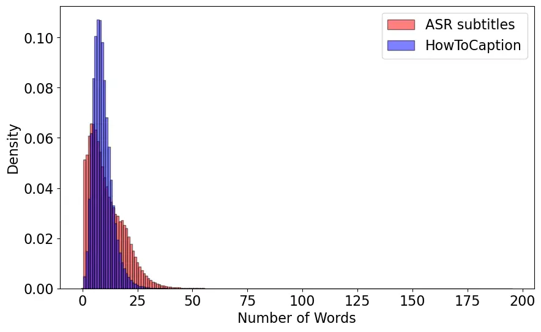

Histogram of caption lengths.

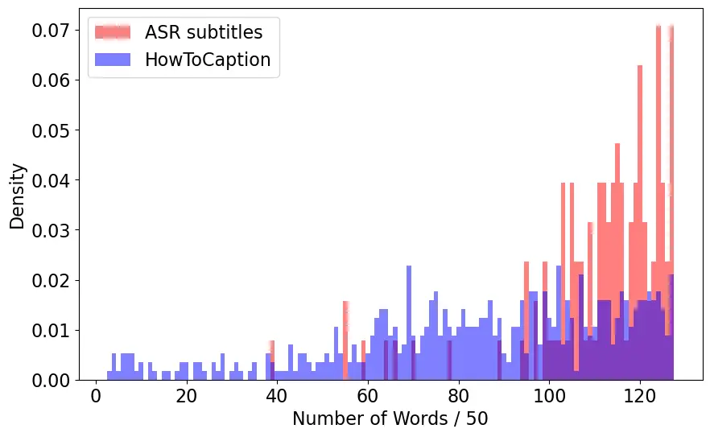

Histogram of total length of all captions for a video. The scale of the
x-axis is divided by 50.

Figure 0.D.1: Caption length statistics of our HowToCaption dataset. We
randomly sample 5000 videos to plot the distributions.

Language Diversity. We also compare the language diversity of the ASR
subtitles and our captions. We measure language diversity from two
perspectives: 1) diversity based on the presence of distinct words or
verbs and 2) diversity of word/verb n-grams across the captions,
providing insights into the varied combinations of words/verbs used in
our captions. In our analysis (Tab. 0.D.1), we follow \[16\] and
calculate the percentage of diverse verbs (that are not in the top 5
most frequent verbs) relative to all verbs. Following \[53\], we also
compute the unique-to-total ratio for word unigrams, bigrams, and
trigrams (e.g., the ratio between the number of unique word unigrams to
the total number of word unigrams over all captions). We further use the
spaCy toolkit \[18\] to extract and lemmatize verbs and calculate the
unique-to-total ratio for verb unigrams, bigrams, and trigrams. The
results in Tab. 0.D.1 show that the captions in the HowToCaption dataset
have higher language diversity than ASR subtitles across almost all
measures except on verb unigram. We observe that the longer action
sequences in HowToCaption are more diverse than ASR subtitles, which
demonstrates the high quality of our dataset.

## Appendix 0.E Qualitative Examples

HowToCaption Dataset. We present an extension of Fig. 3 from the main
paper with video-text examples of our HowToCaption dataset and
corresponding ASR subtitles in Fig. 0.E.2. We see that our HowToCaption
method effectively transforms noisy ASR subtitles into proper captions,
leveraging the complete ASR context for caption generation. We
demonstrate additional video-text examples of our HowToCaption dataset
in Fig. 0.E.4 and Fig. 0.E.6. In Fig. 0.E.6, we also showcase instances
of failure cases. One such case involves a failure where the LLM was
unable to generate a caption and instead copied the input ASR subtitles:
“DP Move Safe lets operators get out of the classroom…” However, in this
example, the ASR subtitles contain a third-person video description with
a subjet+verb+object sentence structure that justifies the coping input
description without modification. Other failure cases include
video-caption pairs, where the caption corresponds to the video only
partially, e.g., “Cover it with lid” action is not visible on the video
while “until the seviayan is cooked” is visible.

LLM Caption Generation. In Tab. 0.E.1, we showcase captions generated by
the Vicuna-13B model, presenting both the input ASR subtitles and their
corresponding generated captions for comparison. We observe the LLM is
able to transform scrambled ASR subtitles into “human-written-like”
descriptions. However, we also note that sometimes LLM fails to produce
descriptions. We present some failure cases in Tab. 0.E.2, which
include 1) direct input repetition: instances where the LLM duplicates
ASR input without modification; 2) ineffective reformulation: the LLM
attempts to convert ASR content into descriptions using ineffective
structures like "A person says…"; 3) failure to follow the requested
structure: instances where the LLM output doesn’t follow “a timestamp: a
sentence” structure for output, e.g., using “Summary: ” to write a video
description without timestamps.


Caption (118s-126s): Matt Swanson gives a tip to use buckets to direct
the path of the ball  
ASR: 7s: hi i’m matt swanson  
9s: with matt swanson’s we’ll go is gonna help me change the direction
of your ball play  
16s: if you’re struggling with a slice or a hook and it’s moving too
much in that direction  
21s: i’m gonna give you a little tip that we use  
25s: that’s very easy that you can do when you’re out to help  
84s: change that  
91s: you’re slicing now  
109s: too much  
116s: so use these buckets when you’re out at the range  
120s: move them around to help direct the path  
123s: make sure the clubface is closing if you’re trying to get rid of
the slice opening  
128s: if you’re trying to hit a fade use these tips and you’ll get
better

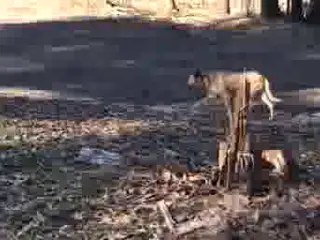

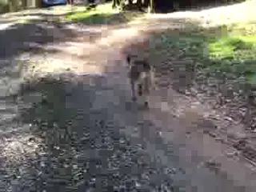

Caption (87s-95s): Dog wants to hang out near dirt or other dogs with
bones to acquire more bones  
ASR: 87s: so this is stage one of hiding the bone  
90s: burying the bone  
90s: there’s so much more involved  
92s: let’s watch how she behaves  
94s: when she comes back from burying the bone she becomes a bit
annoying  
97s: she wants to hang out next to dirt or somebody else who has a bone
so that she might acquire yet another bone  
103s: now what i have found in my experience with her and remember every
dog is different  
107s: nobody does things the same way but she lets those bones ferment
for about two days before she goes back and finally retrieves the bone  
115s: and then she sits down and enjoys it  
116s: and then something makes it really special  
…

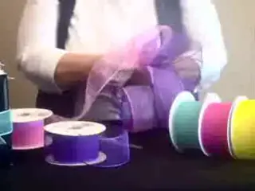


Caption (187s-195s): Making a bow with two colors  
ASR: 185s: so if you don’t get your your ribbon twisted there’s no up or
down side to it  
191s: so it’s not going to really show  
193s: now once i get my three loops on my lighter color i’m going to
make a little loop and this is basically just to hide my wire  
202s: that i’m going to use  
205s: the wire i use either a teen or a 20 gauge wire and what i’m going
to do  
210s: this little loop is going to be my hide for the wire  
215s: so i just slide that through like that and pull real tight and
twist  
227s: that will keep your loops good and snug once you get done  
237s: just kind of work your your loops around  
243s: and now you have a bow that’s made with two colors  
246s: these are great for easter baskets you can use those for mother’s
day  
251s: we have an assortment of colors so we even have some for the
holidays for fall  
257s: it’s the type that you can use any time of the year and it makes
great bows


Caption (68s-76s): Make sure the bottle stays together  
ASR: 0s: hi there the amateur scientist here  
4s: and today in this video i’m going to show you how to make a very
cheap and from recycled materials  
12s: a mosquitoes trap  
14s: now because we all know that mosquitoes can bite and make you itch
and they are very uncomfortable  
20s: so today in this video i’m going to show you how to make a mosquito
trap from a plastic bottle and on their amulet or zoom  
28s: so let’s get into the video  
30s: first of all we’re going to need a plastic bottle and i and some
very cheap one  
45s: you could also use these for sugar  
61s: so first grab the bottle and and put the upper part into the lower
part  
69s: but this yeah and it just stays or it won’t get off  
73s: it’s busy here  
74s: good deeper cheap wine  
79s: hello this with it like this or just a little bit more like that  
…

Figure 0.E.2: Extended example of video-captions pairs from our
HowToCaption dataset (an extension of Fig. 3 of the main paper). The ASR
subtitles within the corresponding video clip are bolded. We note that
some details in the generated captions are derived from a long ASR
context.


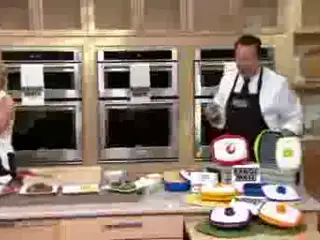

Caption: Video segment starts with a shot of David’s face, which is
described as funny  
ASR: and the bottom is actually has holes in it because it gets so
incredibly hot so you cannot submerge it in water so we ask you to just
rinse it out real quick look at david’s face he is so funny

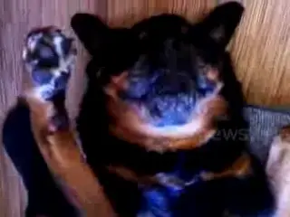


Caption: Brutus is encouraged to swallow his medication  
ASR: if i put it in a piece of food he’ll chew it up and spit it out he
knows oh baby i’ve never seen him do this though


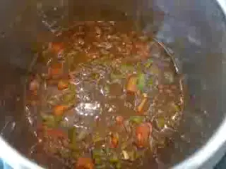

Caption: Adds two cans of red kidney beans to the chili  
ASR: you could also use a vegetable broth all right so we’re mixing this
well


Caption: She explains the charm tool’s little piece of metal acts as a
spacer to hold the charms open  
ASR: has this little piece of patootie metal right here that acts as a
spacer to hold the charms open so that gap is visible in the back so
it’s easier to slip the charms on and off


Caption: Adding chopped onions and green chillies to the pan  
ASR:once the oil is hot enough we will add our onions and green chillies
we need to cook the onions for some time maybe like 2 to 3 minutes until
you start noticing that the colors of the onion have changed


Caption: Paints the top part  
ASR: i also notice how the blue continues onto the front of him just
like right there so be careful with that next you take the white color
and you would paint the webbing that he’s hanging from here and also his
eyes


Caption: Shows where wire runs along inside of vehicle  
ASR: then ran alongside the gasket right here and runs down here and
then this we took off and then ran the wiring in through here put this
back down


Caption: You are making a rose petal exfoliating face scrub  
ASR: you guys one of our favorite diys ever had to do with rose petals
so we thought let’s make another one

Figure 0.E.4: Examples video-captions pairs from our HowToCaption
dataset. Since ASR subtitles’ timestamps do not always correspond to the
timestamps of video clips from the HowToCaption dataset, we show ASR
subtitles that intersect with video clip boundaries.

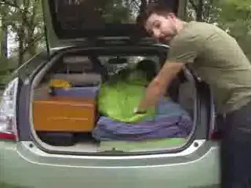

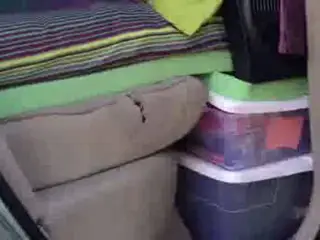

Caption: Soft bed in the car  
ASR: but honestly when people see a lone prius in the parking lot no one
thinks hey i wonder if someone’s sleeping in there because come on it’s
a prius what fits in my car i have a soft bed i have a closet blackout
curtains a desk kitchen table and chair a pantry a bike a laundry basket
travel kit for emergencies


Caption: Walk upstairs to show light in the ceiling  
ASR: i placed them over here because it’s a little bit lighter on this
side of the stair case then the other side there’s only one light in the
ceiling here so i’m gonna walk upstairs and i’m gonna let you see it
from the top of the stairs one more time

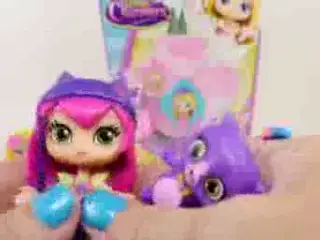

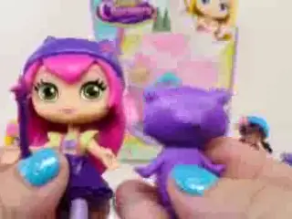

Caption: Asks viewers to choose favorite pet  
ASR: i think i like them all for different reasons so that’s hard so
they can all three be my favorite can’t they and look at her little
friend


Caption: The speaker adds white paint to the brush to keep the color
bright  
ASR: so i lay it on with the flat of the brush which deposits it a
little heavier it holds up a little better and notice i keep adding
white as …


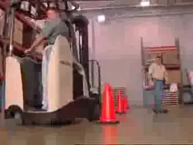

Caption: DP Move Safe lets operators get out of the classroom and out of
their truck faster where they learn how to perform every task and do it
safely (failure)  
ASR: dp move safe lets operators get out of the classroom and out of
their truck faster where they learn how to perform every task and do it
safely

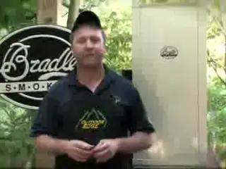

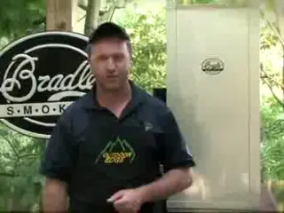

Caption: Outdoor Edge has instructional gated processing DVDs available
on their website (failure)  
ASR: this is one of the big issues with large diameter sausage products
remember processing your own wild game animal can be fun easy and very
rewarding if you have the tools and the knowledge to do the job you’re
watching outdoor edges


Caption: Cover it with a lid for 15 minutes until the seviayan is cooked
(failure)  
ASR: today, we will prepare a sweet recipe.. ..called ’sevaiyan’
(vermicelli) so come on, let’s see how to make sweet sevaiyan.


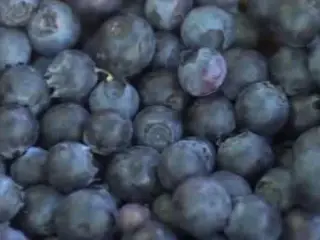

Caption: The group harvests fresh berries from the farm (failure)  
ASR: the kids and i are here at a local blue red patches to manage to
harvest some fresh berries at pcc are fresh and frozen organic …

Figure 0.E.6: Examples video-captions pairs from our HowToCaption
dataset. Failure cases are marked as (failure). Since ASR subtitles’
timestamps do not always correspond to the timestamps of video clips
from the HowToCaption dataset, we show ASR subtitles that intersect with
video clip boundaries.

| Input ASR subtitles                                                                                                                                                                                                                                                                                                                                                                                                                                                                                                                                                                                                                                                                                                                                                                                                                                                                                                                                                                                                                                                       | Generated captions                                                                                                                                                                                                                                                                                                                                                                                                                                                                                                                                                                                                                                                                                                                                                                                               |
| ------------------------------------------------------------------------------------------------------------------------------------------------------------------------------------------------------------------------------------------------------------------------------------------------------------------------------------------------------------------------------------------------------------------------------------------------------------------------------------------------------------------------------------------------------------------------------------------------------------------------------------------------------------------------------------------------------------------------------------------------------------------------------------------------------------------------------------------------------------------------------------------------------------------------------------------------------------------------------------------------------------------------------------------------------------------------- | ---------------------------------------------------------------------------------------------------------------------------------------------------------------------------------------------------------------------------------------------------------------------------------------------------------------------------------------------------------------------------------------------------------------------------------------------------------------------------------------------------------------------------------------------------------------------------------------------------------------------------------------------------------------------------------------------------------------------------------------------------------------------------------------------------------------- |
| 0s: hi guys it is bill with septic flow 4s: i am here at a brand new construction that i’m actually working on 8s: here 9s: on the back is the septic field 10s: we’ve already had bulldozing contractor actually cover up the the septic system 15s: but i’m going to show you why 17s: you want to use septic flow to pre perk the system 22s: septic flow is a product that actually helps get rid of sodium and phosphate buildup and we’re actually going to just dump it right here in this two - inch 29s: it goes right out there 29s: we’re going to run some water behind it for new construction 33s: the reason you want to do that is because we are actually pre perking the system getting it ready to take those phosphates and sodium buildup 41s: that happens through all different kinds of things 43s: you know whether you’re using 44s: i’ve had people ask me can you use organic detergent 47s: will that prevent sodium buildup 50s: absolutely not 50s: soap by nature of the saponification process that it goes through it’s just part of it | 0s: Bill is at a new construction site. 4s: He is showing the septic field. 8s: The bulldozing contractor has covered up the septic system. 10s: Bill explains why they use septic flow. 17s: Septic flow helps get rid of sodium and phosphate buildup. 22s: Bill demonstrates how they will dump septic flow in a two-inch area. 29s: They will run water behind it for new construction. 33s: Bill explains that they are pre-perking the system. 41s: The system needs to be prepared to take away phosphates and sodium buildup. 44s: People ask if using organic detergents can prevent sodium buildup. 50s: The answer is no, soap is part of the saponification process and will cause buildup.                                                                                                          |
| 104s: the great thing about the smart chicken 107s: with it being air chilled 108s: it’s going to pick up a lot of these flavors when we put the the ginger the garlic 111s: and the sage in here 112s: it’s just going to combine well with the meat especially while it’s cooking on the grill 116s: all those flavors are just going to pop once the sandwich is complete and once it’s all done 121s: now that we have it all mixed i’m just going to separate that out into two patties 129s: um you don’t have to pat it up too much 131s: it takes a lot to get it on the grill so just kind of separate it out into two balls 136s: even 136s: and that’s our chicken 138s: it’s ready for the grill …                                                                                                                                                                                                                                                                                                                                                            | 104s: The speaker prepares the chicken by air-chilling it and adding ginger, garlic, and sage. 108s: The chicken will pick up the flavors while cooking on the grill. 111s: The speaker mixes the chicken and its seasoning. 116s: The flavors will pop once the sandwich is complete. 121s: The speaker separates the chicken mixture into two patties. 129s: The patties are not patted too much, as they will be grilled soon. 131s: The chicken is ready for the grill. 138s: The grill should be hot, around 400 degrees, for grilling the chicken. 141s: The chicken will flatten itself out and get a nice sear on the bottom when grilled. 149s: The speaker recommends not touching the chicken for about four minutes so the bottom can set up. 157s: The chicken will fall apart if touched too soon. |
| 9s: hello home bruce and welcome to my channel 15s: so i am down to my last bottle of strawberry wine 17s: i’ve got some in a glass so i thought it would be a fantastic idea to make some more 23s: so it is a bit early in the season to be getting strawberries 27s: it has been rather cold so i am actually using frozen strawberries so i hope you enjoyed the video and i’m gonna have a drink 42s: so for this recipe i am actually going to be using a beauty bucket 46s: in my case it is an up cycled ten liter mayonnaise dough which you would have seen in the sakae video 52s: now if you don’t have a brewing bucket of some description which has got a wide mouth so it’s less likely to puke …                                                                                                                                                                                                                                                                                                                                                         | 9s: Hello and welcome to the channel. 15s: The host is down to their last bottle of strawberry wine. 17s: They have some wine in a glass and decide to make more. 23s: The host mentions that it’s early in the season for strawberries. 27s: The host is using frozen strawberries in the recipe. 42s: The host is using a beauty bucket for the recipe. 46s: The bucket is an upcycled mayo container. 52s: The host mentions that a wide-mouthed bucket is important to avoid puking. 59s: The host mentions that puking is a common issue in fruit brewing. 62s: The host mentions a strawberry brewing bucket that they have. …                                                                                                                                                                             |

Table 0.E.1: Examples of caption generation with the Vicuna-13B. Input
ASR subtitles and output generated captions by the Vicuna-13B (without
any post-processing). For brevity, lengthy examples are shortened with
the symbol “…”.

| Input ASR subtitles                                                                                                                                                                                                                                                                                                                                                                                                                                                                                                                                                                                                                                                                                                                                                                                                                                                                                                                                                                                                                                      | LLM output: generated captions                                                                                                                                                                                                                                                                                                                                                                                                                                                                                                                                                                                                                                                                                                                                  |
| -------------------------------------------------------------------------------------------------------------------------------------------------------------------------------------------------------------------------------------------------------------------------------------------------------------------------------------------------------------------------------------------------------------------------------------------------------------------------------------------------------------------------------------------------------------------------------------------------------------------------------------------------------------------------------------------------------------------------------------------------------------------------------------------------------------------------------------------------------------------------------------------------------------------------------------------------------------------------------------------------------------------------------------------------------- | --------------------------------------------------------------------------------------------------------------------------------------------------------------------------------------------------------------------------------------------------------------------------------------------------------------------------------------------------------------------------------------------------------------------------------------------------------------------------------------------------------------------------------------------------------------------------------------------------------------------------------------------------------------------------------------------------------------------------------------------------------------- |
| 2s: i got my barbecue shoes on 9s: go down to the house the sausage 14s: i got my barbecue shoes 16s: welcome to the barbecue pit boys 18s: hi 18s: and today we’re gonna do some country meatballs and gravy on the grill 22s: all right 23s: it’s real easy to get started here 25s: we got some large granulated salt we got some black peppercorn there we have some granulated onion here 31s: we got some red pepper flakes and here we got some granulated garlic 36s: now instead of using those spices you could just say use your favorite blend of seasonings here …                                                                                                                                                                                                                                                                                                                                                                                                                                                                          | 2s: i got my barbecue shoes on 9s: go down to the house the sausage 14s: i got my barbecue shoes 16s: welcome to the barbecue pit boys 18s: hi 18s: and today we’re gonna do some country meatballs and gravy on the grill 22s: all right 23s: it’s real easy to get started here 25s: we got some large granulated salt we got some black peppercorn there we have some granulated onion here 31s: we got some red pepper flakes and here we got some granulated garlic 36s: now instead of using those spices you could just say use your favorite blend of seasonings here …                                                                                                                                                                                 |
| 426s: you need three out of five 432s: so first jack jack 435s: ready 436s: oh good man 437s: oh no 438s: come on 448s: everything 449s: here we go 449s: okay actually okay 450s: and then for - 451s: since you’re a little older you guys stand behind the line here 456s: so let’s have you stand behind jack jack’s face 462s: so stand up 463s: okay here we go back there …                                                                                                                                                                                                                                                                                                                                                                                                                                                                                                                                                                                                                                                                       | 426s: A person announces that three out of five is needed. 432s: Jack Jack is mentioned. 435s: Someone says "ready." 436s: A person says "oh good man." 437s: A person says "oh no." 438s: Someone says "come on." 448s: Everything is mentioned. 449s: The current video segment starts. 450s: The game is continued. 451s: A person tells the players to stand behind the line. 456s: Jack Jack stands behind his face. 462s: The game continues. 463s: Someone tells Jack Jack to stand up. 465s: The game continues behind Jack Jack’s face. 471s: Three is mentioned. …                                                                                                                                                                                    |
| 3s: so we got to the campground 7s: we want to use the oven 10s: we need to light the manual pilot 11s: we only have to light it once for the whole weekend if we’re not moving around 15s: so all we need to do is make sure the propane works the oven works or the stovetop works 22s: now we just need to use the oven 24s: so now we’re down at the ovens level 26s: we’re going to light the pilot light so all we need to do is have a stick lighter 35s: turn the knob to pilot push and hold light 41s: the pilot the pilots burning one two three i let go didn’t turn the knob the pilots staying lit 49s: the pilot is good for all weekend 51s: when you go to cook your pizza set it to the temperature you want pizzas done turn it back to pilot and the pilot will stay lit all weekend 63s: when you’re ready to leave then we turn it to off that turns off the pilot 69s: we don’t want that pilot on while we’re driving all the time and constantly using propane 75s: that’s why they give us the option 80s: pilot or off is off | 3s: Campground 7s: Oven 10s: Manual pilot light 11s: Light pilot once for the weekend 15s: Check if propane and oven work 22s: Use the oven 24s: At oven’s level 26s: Light pilot 35s: Turn knob to pilot, push and hold 41s: Pilot lit 49s: Good for all weekend 51s: Set temperature, turn to pilot, and leave 63s: Turn off when ready to leave 69s: Off while driving 75s: Option to choose pilot or off 80s: Off is off. Summary: A group checks if the campground’s oven works and lights the manual pilot. They only need to light it once for the weekend as long as they’re not moving around. They use the oven and make sure the propane works before they leave. The option to choose pilot or off is given. The pilot should be off while driving. |

Table 0.E.2: Illustrative failures in caption generation with the
Vicuna-13B. Input ASR subtitles and output generated captions where the
Vicuna-13B failed to generate video descriptions based on the subtitles.
Failures include 1) direct input repetition; 2) ineffective
reformulation of the ASR subtitles into descriptions using structures
like “A person says .. ”; 3) failure to follow the requested structure
“a timestamp: a sentence”. For brevity, lengthy examples are shortened
with the symbol “…”.

## Appendix 0.F Limitations

Our method relies on pre-trained large foundational models, including
the large language model Vicuna \[10\] and the vision-language model
BLIP \[25\]. Consequently, our HowToCaption method and the proposed
HowToCaption dataset may inherit limitations present in these models.
Notably, large language models have several shortcomings, such as biases
from their training data, which can lead to the generation of
potentially misleading content and the propagation of societal
biases \[48\]. Additionally, since our text-video model is initialized
from the BLIP model that was pre-trained on curated and filtered
datasets, it might be less robust to noisy low-quality videos in our
alignment & filtering step. In our robustness analysis, we found that
the model is capable of filtering noisy input, but 1-2% of noisy data is
still passing the filter. Finally, since our dataset is sourced from the
HowTo100M \[38\] dataset, it follows the same data distribution,
focusing solely on “how-to” topics. While we show improvement across
many different tasks, it may limit its applicability to certain
downstream tasks.

## Appendix 0.G Responsibility to Human Subjects

Our HowToCaption dataset is sourced from the publicly accessible
HowTo100M dataset \[38\], which was collected from YouTube. The video
content consists of user uploads and is publicly available. However,
since the dataset provides only video IDs for download, users who opt
out of YouTube are consequently excluded from the HowTo100M and
HowToCaption datasets. We are not aware whether consent was obtained
from the users to be included in the original dataset. The dataset may
include celebrities or other YouTube-famous individuals.
