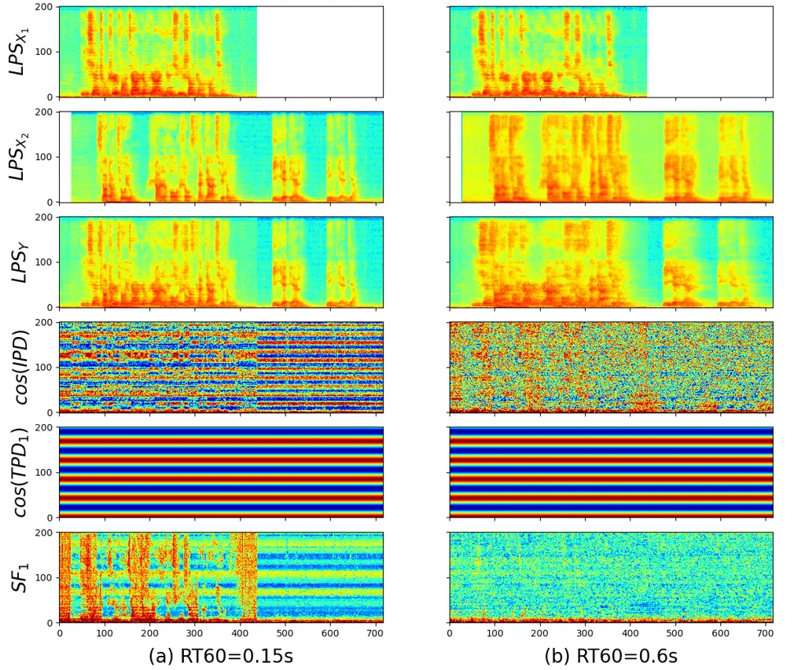
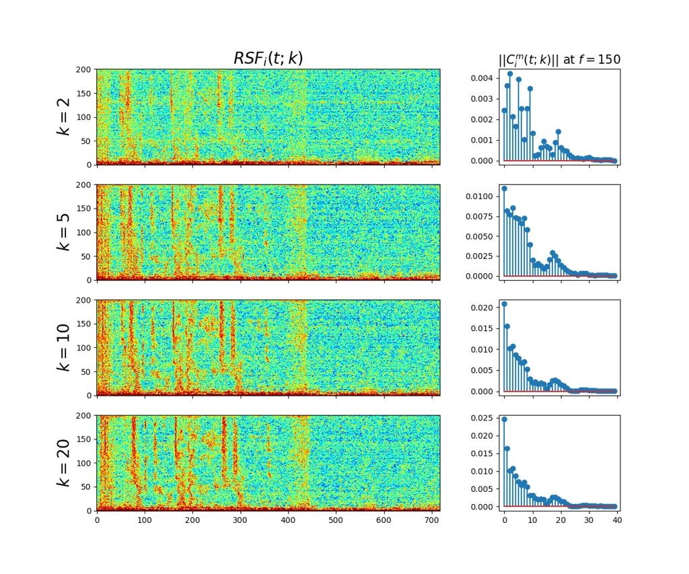
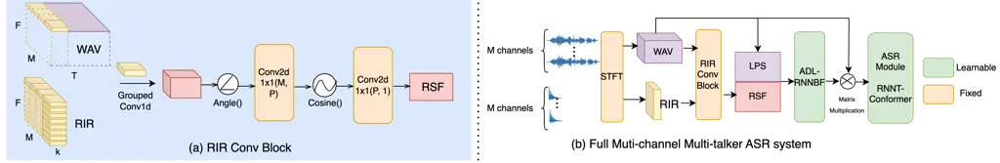

# RIR-SF: Room Impulse Response Based Spatial Feature for Target Speech Recognition in Multi-Channel Multi-Speaker Scenarios

Yiwen Shao    Shi-Xiong Zhang    Dong Yu

###### Abstract

Automatic speech recognition (ASR) on multi-talker recordings is
challenging. Current methods using 3D spatial data from multi-channel
audio and visual cues focus mainly on direct waves from the target
speaker, overlooking reflection wave impacts, which hinders performance
in reverberant environments. Our research introduces RIR-SF, a novel
spatial feature based on room impulse response (RIR) that leverages the
speaker’s position, room acoustics, and reflection dynamics. RIR-SF
significantly outperforms traditional 3D spatial features, showing
superior theoretical and empirical performance. We also propose an
optimized all-neural multi-channel ASR framework for RIR-SF, achieving a
relative 21.3% reduction in CER for target speaker ASR in multi-channel
settings. RIR-SF enhances recognition accuracy and demonstrates
robustness in high-reverberation scenarios, overcoming the limitations
of previous methods.

###### keywords

multi-channel multi-speaker ASR, room impulse response (RIR),
reverberation, spatial feature

^(†)^(†)address: ¹Center for Language and Speech Processing, Johns
Hopkins University, Baltimore, MD, USA  
²Tencent AI Lab, Bellevue, WA, USA^(†)^(†)email: yshao18@jhu.edu,
zhangshixiong@gmail.com, DongYu@ieee.org^(\*)^(\*) \* This work was done
while Yiwen was a research intern, Shi-Xiong was a researcher at Tencent
AI Lab, USA.

## 1 Introduction

As speech techniques and deep neural networks have advanced, significant
enhancements have been observed across various automatic speech
recognition (ASR) benchmarks \[1, 2, 3, 4\]. Nevertheless, the
recognition of multi-channel multi-talker overlapped speech remains a
formidable undertaking, primarily owing to the presence of interfering
speakers and background noise \[5, 6\].

The conventional approach involves a pipeline-based paradigm, where an
initial speech separation module separates the clean target speech for
transcription by the backend ASR system \[7, 8\]. In contrast, a recent
”All-in-one” system, explored in \[9\], has shown promising results.
This approach eliminates the need for explicit speech separation modules
and doesn’t rely on parallel clean separated speech as supervision
during training, which is often unavailable for real data. Moreover, it
offers advantages in terms of faster convergence and inference speed,
making it particularly suitable for large-scale applications.

With this objective in mind, having a high-quality and discriminative
input feature becomes particularly crucial for this approach. To
identify the target speech from the mixture, additional information
about the target speaker is required. Common clues such as speaker’s
voiceprint based features \[10, 11\], vision clues \[12, 13, 14\] and
location based features \[15, 16, 17\] have been shown to yield
advantages with high accessibility and robustness. Among these features,
the spatial feature, originally introduced in \[15\], has gained
widespread adoption, with its recent 3D version demonstrating
state-of-the-art performance across various tasks, including speech
separation and ASR \[8, 9\].

However, strong reverberation poses challenges for the 3D spatial
feature due to its inability to account for reflection waves. Regular
dereverberation, whether as preprocessing or part of an end-to-end
neural network \[18\], is computationally intensive and time-consuming,
hindering future development. As a result, instead of eliminating the
reverberation, we propose to utilize the reverberation, that is, the
room impulse response (RIR) of the target speaker to the microphone
array as an extra input clue, to extract a new version of spatial
feature for the downstream tasks which we named RIR-SF.

Contributions: In this work, we present a novel spatial feature created
by convolving the Room Impulse Response (RIR) corresponding to the
target speaker with multi-talker speech. Additionally, we establish a
dedicated neural network architecture for the extraction of this
innovative spatial feature. The paper includes both theoretical analysis
and experimental results to underscore its superior performance when
compared to the conventional 3D SF.

## 2 Problem with 3D Spatial Feature

In this section, we will formulate the basic signal model in both time
and frequency domain and then discuss the current problem of 3D Spatial
Feature.

### 2.1 Signal Model

Time Domain: With a $`M`$-channel microphone array, the noisy speech
$`Y^{m}(n)`$ of the $`m`$-th channel can be formulated as:

```math
\displaystyle Y^{m}(n) \displaystyle=\sum_{i=1}^{I}\hat{X}^{m}_{i}(n)+e^{m}(n), \tag{1}
```

```math
\displaystyle\hat{X}^{m}_{i}(n) \displaystyle=R_{i}^{m}(n)*X_{i}(n) \tag{2}
```

where $`*`$ denotes convolution and $`n`$ is the time index.
$`\hat{X}^{m}_{i}(n)`$ is the reverberant speech resulting from the
$`i`$-th speech signal $`X_{i}(n)`$ convolved with its RIR
$`R_{i}^{m}(n)`$ to the $`m`$-th channel, $`e^{m}(n)`$ is the ambient
noise.

STFT Domain: When expressing the signal model of Equation (2) in the
STFT domain, because of the fact that the RIR’s duration significantly
exceeds the analysis window’s length, the convolution in Equation 2
shifts from being a multiplication in the STFT domain to becoming a
convolution with the inter-frame and inter-frequency \[19\]:

```math
\displaystyle Y^{m}(t,f) \displaystyle=\sum_{i=1}^{I}\hat{X}_{i}(t,f)+e^{m}(t,f) \tag{3}
```

```math
\displaystyle\hat{X}^{m}_{i}(t,f) \displaystyle=\sum_{f^{\prime}=0}^{F-1}R_{i}^{m}(t,f,f^{\prime})*X_{i}(t,f) \tag{4}
```

where $`X_{i}(t,f)`$ is the STFT coefficient of $`i`$-th source at frame
index $`t`$ and frequency index $`f`$. $`R_{i}^{m}(t,f,f^{\prime})`$ is
a set of band-to-band $`(f^{\prime}=f)`$ and crossband
$`(f^{\prime}\neq f)`$ filters derived from $`R_{i}^{m}(n)`$, and the
convolution with $`X_{i}(t,f)`$ is applied to the time axis.



Figure 1: An illustration of 3D spatial features with (a) weak
reverberation and (b) strong reverberation. In (a), $`\mathbb{SF}_{1}`$
matches well with the pattern of the Log Power Spectrum (LPS) of the
target speaker $`X_{1}`$. While in (b), $`\mathbb{SF}_{1}`$ fails to
identify the target source from the mixture.

While Equation 4 is precise, it is seldom employed practically due to
the high complexity associated with cross-band filtering. Alternatively,
the convolutive transfer function (CTF) approximation \[20, 21\] can be
adopted, which involves excluding the cross-band filters. And Equation 4
can be re-formulated as:

```math
\hat{X}^{m}_{i}(t,f)=R_{i}^{m}(t,f)*X_{i}(t,f) \tag{5}
```

where $`R_{i}^{m}(t,f)`$ is the STFT representation of $`R_{i}^{m}(n)`$.

A further simplification is multiplicative transfer function (MTF)
approximation \[22\] that only considers the direct wave from the source
to the microphone and ignores all reflection waves:

```math
\hat{X}^{m}_{i}(t,f)=R_{i}^{m}(0,f)X_{i}(t,f) \tag{6}
```

where $`R_{i}^{m}(0,f)`$ is the STFT of the impulse response of the
direct wave from source $`i`$ to microphone $`m`$. And in such way,
$`[R_{i}^{0}(n)(0,f),R_{i}^{1}(n)(0,f),...,R_{i}^{M}(n)(0,f)]`$ forms
the steering vector for source $`i`$.

### 2.2 3D Spatial Feature from MTF/CTF Perspective



Figure 2: An illustration of $`\mathbb{RSF}_{i}(t;k)`$ and
$`\lVert C_{i}^{m}(t;k)\rVert`$ for the example in Figure 1 (b) with
different k.

3D Spatial Feature (3D-SF) \[9\] \[23\] is the state-of-the-art spatial
cues used to indicate the dominance of the target source in the T-F
bins. It can be formulated as the cosine similarity between the
target-dependent phase difference (TPD) and the interchannel phase
differences (IPD):

```math
\displaystyle\mathbb{SF}_{i}(t)=\cos(\text{IPD}^{(m)}(t)-\text{TPD}_{i}^{(m)}(t)) \tag{7}
```

```math
\displaystyle\text{IPD}^{(m)}(t)=\angle Y^{m_{1}}(t)-\angle Y^{m_{2}}(t) \tag{8}
```

```math
\displaystyle\text{TPD}^{(m)}_{i}(t)=\angle R_{i}^{m_{1}}(0)-\angle R_{i}^{m_{2}}(0) \tag{9}
```

where $`\angle`$ is the phase of a complex number, $`(m)`$ is a selected
microphone pair $`(m_{1},m_{2})`$. If multiple pairs of microphones are
chosen, the resultant $`\mathbb{SF}_{i}(t)`$ would be the sum of them.
Please note that in the above equations, we omit the frequency index
$`f`$ as all the formulations are on a per-frequency basis. From now on,
unless explicitly stated, we will keep the same notation throughout the
paper.

Suppose the T-F bin of the mixed speech $`Y^{m}(t)`$ is dominated by
source $`i`$, (i.e. $`Y^{m}(t)=\hat{X}_{i}^{m}(t)`$), and take the MTF
approximation Equation 6 into Equation 8, we have:

```math
\displaystyle\text{IPD}^{(m)}(t)= \displaystyle\angle\hat{X}_{i}^{m_{1}}(t)-\angle\hat{X}_{i}^{m_{2}}(t) \tag{10}
```

```math
\displaystyle= \displaystyle\angle R_{i}^{m_{1}}(0)X_{i}(t)-\angle R_{i}^{m_{2}}(0)X_{i}(t)
```

```math
\displaystyle= \displaystyle(\angle R_{i}^{m_{1}}(0)+\angle X_{i}(t))-(\angle R_{i}^{m_{2}}(0)
```

```math
\displaystyle+\angle X_{i}(t))
```

```math
\displaystyle= \displaystyle\angle R_{i}^{m_{1}}(0)-\angle R_{i}^{m_{2}}(0)
```

```math
\displaystyle= \displaystyle\text{TPD}^{(m)}_{i}(t)
```

In this way,
$`\mathbb{SF}_{i}(t)=\cos(\text{IPD}^{(m)}(t)-\text{TPD}_{i}^{(m)}(t))=1`$
and thus serves as a strong indicator for the dominance of target source
$`i`$ in the T-F bin.

However, when the reverberation is severe and unignorable, which for
example, in a typical living room environment with RT60 ranges from 0.3s
to 0.7s, MTF is no longer sufficient to model the signal while CTF is
more appropriate. Take CTF approximation Equation 5 into Equation 8, we
have:

```math
\displaystyle\text{IPD}^{(m)}(t)=\angle R_{i}^{m_{1}}(t)*X_{i}(t)-\angle R_{i}^{m_{2}}(t)*X_{i}(t) \tag{11}
```

```math
\displaystyle=\angle(\sum_{k=0}^{K}R^{m_{1}}_{i}(k)X_{i}(t+k))-\angle(\sum_{k=0}^{K}R^{m_{2}}_{i}(k)X_{i}(t+k))
```

```math
\displaystyle\neq\text{TPD}^{(m)}_{i}(t)
```



Figure 3: (a) RIR Conv Block that utilizes convolution layers to extract
RIR-based spatial feature $`\mathbb{RSF}_{i}(t;k)`$; (b) The whole
Multi-channel Multi-speaker ASR system that combines
$`\mathbb{RSF}_{i}(t;k)`$ and ADL-RNNBF.

Consequently, $`\mathbb{SF}_{i}(t)`$ wouldn’t be close to 1 even if the
mixture T-F bin is dominated by the target speaker $`i`$ and then become
less informative and discriminative for the downstream tasks. Figure 1
shows a comparison between $`\mathbb{SF}_{i}(t)`$ under 2 scenarios
where weak (RT60=0.15s) and strong (RT60=0.6s) reverberation exists
respectively.

## 3 RIR Based Spatial Feature

We propose to solve the problem by utilizing the spatial information
contained in the RIR. We firstly convolve the mixture speech
$`Y^{m}(t)`$ with the conjugate of the first $`k`$ frames of
$`R_{i}^{m}(t)`$ and then extract its phase, which we define as
RIR-convolved Phase (RP):

```math
\text{RP}_{i}^{m}(t;k)=\angle Y^{m}(t)*R_{i}^{m}(t)^{H}|_{t=0:k-1} \tag{12}
```

$`k`$ serves as a hyper-parameter for this term.

Then we define a new spatial feature RIR-SF: $`\mathbb{RSF}_{i}(t;k)`$
as the cosine of RP difference between a pair of channels:

```math
\mathbb{RSF}_{i}(t;k):=\cos(\text{RP}_{i}^{m_{1}}(t;k)-\text{RP}_{i}^{m_{2}}(t;k)) \tag{13}
```

Specially, when $`k=1`$, i.e. only considering the direct wave,
$`\mathbb{RSF}_{i}(t;k)`$ can be simplified to $`\mathbb{SF}_{i}(t)`$:

```math
\displaystyle\mathbb{RSF}_{i}(t;k=1)=cos(\angle Y^{m_{1}}(t)R_{i}^{m_{1}}(0)^{H}-\angle Y^{m_{2}}(t)R_{i}^{m_{2}}(0)^{H}) \tag{14}
```

```math
\displaystyle=cos(\angle Y^{m_{1}}(t)-\angle R_{i}^{m_{1}}(0)-\angle Y^{m_{2}}(t)+\angle R_{i}^{m_{2}}(0))
```

```math
\displaystyle=cos(\text{IPD}^{(m)}(t)-\text{TPD}_{i}^{(m)}(t))
```

```math
\displaystyle=\mathbb{SF}_{i}(t)
```

In other words, $`\mathbb{RSF}_{i}`$ is an extension to the previous
$`\mathbb{SF}_{i}`$. Next, we will demonstrate how this novel suggested
spatial feature can effectively highlight the prominence of the target
source in TF bins, even in the presence of substantial reverberation.

Suppose in the selected T-F bin, the target speaker $`i`$ is dominating
the mixture, i.e. $`Y^{m}(t)=\hat{X}_{i}^{m}(t)=R_{i}^{m}(t)*X_{i}(t)`$,
we can write $`\text{RP}_{i}^{m}(t;k)`$ as:

```math
\displaystyle\text{RP}_{i}^{m}(t;k) \displaystyle=\angle R_{i}^{m}(t)*X_{i}(t)*R_{i}^{m}(t)^{H}|_{t=0:k-1} \tag{15}
```

```math
\displaystyle=\angle X_{i}(t)*(R_{i}^{m}(t)*R_{i}^{m}(t)^{H}|_{t=0:k-1})
```

In Equation 15, $`\text{RP}_{i}^{m}(t;k)`$ becomes the phase of the
clean anechoic speech $`X_{i}(t)`$ convolved with a new kernel
$`C_{i}^{m}(t;k)`$, where

```math
\displaystyle C_{i}^{m}(t;k) \displaystyle=R_{i}^{m}(t)*R_{i}^{m}(t)^{H}|_{t=0:k-1} \tag{16}
```

```math
\displaystyle=\sum_{n=0}^{k-1}R_{i}^{m}(t+n)R_{i}^{m}(n)^{H}
```

Specially, we have the first element of $`C_{i}^{m}(t;k)`$ as

```math
\displaystyle C_{i}^{m}(0;k) \displaystyle=\sum_{n=0}^{k-1}R_{i}^{m}(n)R_{i}^{m}(n)^{H} \tag{17}
```

```math
\displaystyle=\sum_{n=0}^{k-1}\lVert R_{i}^{m}(n)\rVert_{2}
```

where $`C_{i}^{m}(0;k)\in\mathbb{R}`$. Taking $`C_{i}^{m}(t;k)`$ back
into Equation 15 we have

```math
\displaystyle\text{RP}_{i}^{m}(t;k) \displaystyle=\angle X_{i}(t)*C_{i}^{m}(t;k) \tag{18}
```

```math
\displaystyle=\angle\sum_{n=0}^{K-1}X_{i}(t+n)C_{i}^{m}(n;k)
```

```math
\displaystyle=\angle(X_{i}(t)C_{i}^{m}(0;k)+\sum_{n=1}^{K-1}X_{i}(t+n)C_{i}^{m}(n;k))
```

```math
\displaystyle\approx\angle(X_{i}(t)C_{i}^{m}(0;k))=\angle X_{i}(t)
```

where $`K`$ is the total length of $`C_{i}^{m}(t;k)`$. The approximation
in Equation 18 is valid when
$`\lVert C_{i}^{m}(0;k)\rVert\gg\lVert C_{i}^{m}(t;k)\rVert`$ for all
$`t>0`$. Fortunately, due to the fact that RIR is a fast decaying
function, this condition can be easily satisfied when $`k`$ is
sufficiently large, as shown in Figure 2. In this way,
$`\text{RP}_{i}^{m}(t;k)`$ becomes totally channel independent, which
leads to a desiring result of $`\mathbb{RSF}_{i}(t;k)=1`$ when the
target speaker $`i`$ dominates the mixture TF bin.

### 3.1 Why RIR-SF is better

As has been pointed out, the previous 3D spatial feature is a special
case of $`\mathbb{RSF}(t;k)`$ with $`k=1`$. From both Figure 2 and
Equation (18) we know that the sharpness of
$`\lVert C_{i}^{m}(t;k)\rVert`$ determines the quality of
$`\mathbb{RSF}(t;k)`$. By increasing $`k`$ to a reasonable value, we can
cancel out the impact of reflection waves in the phase computation.

## 4 System

### 4.1 RIR Conv Block

We build a RIR Conv Block (Figure 3 (a)) to extract the proposed
$`\mathbb{RSF}_{i}(t;k)`$ in a fully neural way. As discussed in section
2 and 3, the RIR convolution to the multi-channel speech is applied to
the time axis and is on both per-frequency and per-channel basis. We
break the conjugate of the target RIR
$`R_{i}^{H}\in C^{[M\times F\times k]}`$ into $`M\times F`$ groups of
$`(1\times k)`$ kernels, and convolve each of them with the
corresponding split of $`Y\in C^{[1\times T]}`$ separately, resulting in
an intermediate complex output of shape $`[M\times F\times T]`$. After
that, we obtain $`\text{RP}_{i}^{m}(t;k)`$ and $`\mathbb{RSF}_{i}(t;k)`$
through 2 specially initialized Conv2d*1x1 layers, which is used for
doing pair-wise difference and summation respectively. Please note that
we keep these 2 layers fixed in this work to follow the strict
formulation of the proposed $`\mathbb{RSF}*{i}(t;k)`$. More work may be
done in the future to explore the potential of making the RIR
convolution fully learnable.

### 4.2 ADL-RNNBF

The state-of-the-art neural beamformer ADL-RNNBF \[24\] is found to be
consistently beneficial for multi-channel multi-talker ASR and
separation \[9, 8\], especially when the spatial feature itself is not
sufficiently discriminative. For this reason, we keep it an optional
enhancement module to test its interactivity with the proposed RIR-based
spatial feature. It has the same structure and hyper-parameter as in
\[24\], except that we used concatenated LPS and
$`\mathbb{RSF}_{i}(t;k)`$ as input and didn’t apply the inverse STFT to
transfer its output back to the waveform.

### 4.3 RNNT-Conformer

A pruned version of RNNT model \[25\] is used as the ASR backbone. The
network is formed by a 12-layer 4-head Conformer \[26\] encoder with 512
attention dimensions and 2048 feed-forward dimensions.

## 5 Experiments

### 5.1 Dataset

We simulate a multi-channel reverberant dataset based on AISHELL-1
\[27\] for experiments. Pyroomacoustics \[28\] with image-source method
(ISM)\[29\] is used as the toolkit for RIR generation and estimation,
with (room size, RT60, mic position, speaker positions) as parameters.
The room size is ranging from \[3, 3, 2.5\] to \[8, 6, 4\] meters, with
one microphone array and 2 speakers in each room. An 8-element
non-uniform linear array with spacing 15-10-5-20-5-10-15 cm is fixed,
with random position inside the room. We have 2 settings for RT60,
ranging from \[0.1, 0.6\] seconds and \[0.5, 0.7\] seconds, which
corresponds to weak and strong reverberation scenarios respectively.
Thus, 100,000 sets of RIR are generated offline for each setting. Note
that only the weak reverberation is used for training as we’ve found
simply training with stronger reverberation doesn’t improve system
performance generally. Finally, the multi-channel reverberant overlapped
speech are synthesized on-the-fly during training by convolving the
generated RIR with dry clean speech from the corresponding AISHELL
split, with the signal-to-interference rate (SIR) randomly sampled from
-6 to 6 dB. The overlap ratio of two speakers inside a mixed utterance
are from 0.5 to 1.

To test our proposed spatial feature’s robustness to the estimated
target RIR, we design 3 different RIR estimation situations as shown in
Table 1. It should be noted that, with the relative position of
microphones and the target speaker fixed in all 3 situations, the oracle
3D spatial information to $`\mathbb{SF}`$ is actually guaranteed.

[TABLE]

Table 1: 3 different scenarios for target RIR estimation using
image-source method (ISM). In sec1 and sec2, RT60 is randomly sampled
from \[0.3, 0.8\] seconds. In sec2, room size, mic position and speaker
position have a random shift from the ground truth within 0.5 meters in
all 3 dimensions.

|            |                  |     |                |                 |                 |
| ---------- | ---------------- | --- | -------------- | --------------- | --------------- |
| scenario   | feature          | BF  | $`\mathrm{k}`$ | weak            | strong          |
| single-spk | \-               | ✗   | \-             | $`8.57/9.71`$   | $`10.64/11.99`$ |
| ideal      | $`\mathbb{SF}`$  | ✗   | \-             | $`14.11/15.67`$ | $`20.28/21.26`$ |
| ideal      | $`\mathbb{RSF}`$ | ✗   | 2              | $`12.58/14.21`$ | $`17.58/19.33`$ |
| ideal      | $`\mathbb{RSF}`$ | ✗   | 10             | 10.4 / 11.75    | 11.37 / 12.71   |
| ideal      | $`\mathbb{RSF}`$ | ✗   | 20             | $`10.49/11.9`$  | $`11.33/13.03`$ |
| ideal      | $`\mathbb{SF}`$  | ✓   | \-             | 11.93 / 13.43   | 15.48 / 17.43   |
| ideal      | $`\mathbb{RSF}`$ | ✓   | 10             | 9.84 / 11.06    | 11.13 / 12.66   |
| sce1       | $`\mathbb{RSF}`$ | ✗   | 10             | $`11.16/12.87`$ | $`11.57/13.26`$ |
| sce1       | $`\mathbb{RSF}`$ | ✓   | 10             | 9.78 / 11.07    | 10.87 / 12.3    |
| sce2       | $`\mathbb{RSF}`$ | ✗   | 10             | $`22.37/24.33`$ | $`22.49/24.76`$ |
| sce2       | $`\mathbb{RSF}`$ | ✓   | 10             | 12.18 / 14.31   | 12.19 / 14.4    |

Table 2: CER % on simulated AISHELL-1 dev/test set with weak
(RT60=\[0.1, 0.6\]s) and strong (RT60=\[0.5, 0.7\]s) reverberation.

### 5.2 Experimental Results Analysis

Table 2 shows a comprehensive comparison between the proposed
$`\mathbb{RSF}`$ and the previous state-of-the-art 3D $`\mathbb{SF}`$
under different situations and modules. Note that unlike other numbers
shown in Table 2, the first row is both trained and tested on
non-overlapped single-speaker speech, which is presented here as an ASR
upper bound for the following systems to be compared with.

- •
  weak vs strong reverberation: The experiments on the $`\mathbb{SF}`$
  corroborate our previous discussion in section 2.2 that strong
  reverberation will significantly degrade its performance on
  multi-speaker ASR performance (-6.17%/-5.59%), even with the
  enhancement from ADL-RNNBF (-3.55%/-4.00%), which are still much
  higher than an expected performance drop on the single-speaker speech
  (-2.07%/-2.28%). However, with the proposed $`\mathbb{RSF}`$, when
  using RIR with $`k\geq 0.1s`$, the performance gap between weak and
  strong reverberation is always within a reasonable range (1% to 2%),
  showing its robustness against reverberation.
- •
  Robustness to RIR estimation: When provided with ground truth spatial
  information to estimate the target RIR, $`\mathbb{RSF}`$ achieves
  highly satisfactory results, whether with or without ADL-RNNBF. In
  reality, however, we can not always expect to have all these spatial
  information precise, especially for the virtual parameter of RT60
  which can not be measured. When we only have RT60 wrong,
  $`\mathbb{RSF}`$ is almost unaffected, as can be shown from comparison
  between ideal scenario and sce1. But when we also get wrong
  information on other spatial information too, as illustrated by sce2,
  the enhancement from ADL-RNNBF becomes indispensable. And in such
  worst case scenarios, the proposed $`\mathbb{RSF}`$ can still obtain
  comparable results to the previous state-of-the-art system with 3D
  spatial feature under weak reverberation (-1.02%/-1.44%) but much
  better results under strong reverberation (3.29% /3.03%).

## 6 Conclusions

In conclusion, this research delves deep into the nuances of spatial
features, culminating in the inception of the innovative RIR-SF. By
convolving multi-talker speech with the targeted Room Impulse Response
(RIR), we’ve forged this unique feature. Additionally, we’ve architected
an all-neural multi-channel system dedicated for the extraction and
utilization of RIR-SF in downstream tasks. Our results reveal marked
improvements over the prevailing 3D spatial feature, thereby
demonstrating its superiority for the multi-channel multi-talker ASR
task. Given its capabilities, we are optimistic about RIR-SF enhancing
performance in related domains such as speech separation and
enhancement.

## References

- \[1\] G. Hinton, L. Deng, D. Yu, G. E. Dahl, A.-r. Mohamed, N. Jaitly,
  A. Senior, V. Vanhoucke, P. Nguyen, T. N. Sainath _et al._, “Deep
  neural networks for acoustic modeling in speech recognition: The
  shared views of four research groups,” _IEEE Signal processing
  magazine_, vol. 29, no. 6, pp. 82–97, 2012.
- \[2\] Y. Wang, T. Chen, H. Xu, S. Ding, H. Lv, Y. Shao, N. Peng,
  L. Xie, S. Watanabe, and S. Khudanpur, “Espresso: A fast end-to-end
  neural speech recognition toolkit,” in _2019 IEEE Automatic Speech
  Recognition and Understanding Workshop (ASRU)_. IEEE, 2019, pp.
  136–143.
- \[3\] Y. Shao, Y. Wang, D. Povey, and S. Khudanpur, “Pychain: A fully
  parallelized pytorch implementation of lf-mmi for end-to-end asr,”
  _arXiv preprint arXiv:2005.09824_, 2020.
- \[4\] Y. Zhang, J. Qin, D. S. Park, W. Han, C.-C. Chiu, R. Pang, Q. V.
  Le, and Y. Wu, “Pushing the limits of semi-supervised learning for
  automatic speech recognition,” _arXiv preprint
  arXiv:2010.10504_, 2020.
- \[5\] R. Haeb-Umbach, J. Heymann, L. Drude, S. Watanabe, M. Delcroix,
  and T. Nakatani, “Far-field automatic speech recognition,”
  _Proceedings of the IEEE_, vol. 109, no. 2, pp. 124–148, 2020.
- \[6\] Y. Masuyama, X. Chang, S. Cornell, S. Watanabe, and N. Ono,
  “End-to-end integration of speech recognition, dereverberation,
  beamforming, and self-supervised learning representation,” in _2022
  IEEE Spoken Language Technology Workshop (SLT)_. IEEE, 2023, pp.
  260–265.
- \[7\] J. Yu, S.-X. Zhang, B. Wu, S. Liu, S. Hu, X. Liu, H. M. Meng,
  and D. Yu, “Audio-visual multi-channel integration and recognition of
  overlapped speech,” _IEEE/ACM Transactions on Audio, Speech, and
  Language Processing_, 2021.
- \[8\] R. Gu, S.-X. Zhang, Y. Zou, and D. Yu, “Towards unified
  all-neural beamforming for time and frequency domain speech
  separation,” _IEEE/ACM Transactions on Audio, Speech, and Language
  Processing_, vol. 31, pp. 849–862, 2022.
- \[9\] Y. Shao, S.-X. Zhang, and D. Yu, “Multi-channel multi-speaker
  asr using 3d spatial feature,” in _ICASSP 2022-2022 IEEE International
  Conference on Acoustics, Speech and Signal Processing (ICASSP)_. IEEE,
  2022, pp. 6067–6071.
- \[10\] K. Žmolíková, M. Delcroix, K. Kinoshita, T. Ochiai,
  T. Nakatani, L. Burget, and J. Černockỳ, “Speakerbeam: Speaker aware
  neural network for target speaker extraction in speech mixtures,”
  _IEEE Journal of Selected Topics in Signal Processing_, vol. 13,
  no. 4, pp. 800–814, 2019.
- \[11\] Q. Wang, H. Muckenhirn, K. Wilson, P. Sridhar, Z. Wu, J. R.
  Hershey, R. A. Saurous, R. J. Weiss, Y. Jia, and I. L. Moreno,
  “Voicefilter: Targeted voice separation by speaker-conditioned
  spectrogram masking,” _Proc. Interspeech_, pp. 2728–2732, 2019.
- \[12\] R. Gu, S.-X. Zhang, Y. Xu, L. Chen, Y. Zou, and D. Yu,
  “Multi-modal multi-channel target speech separation,” _IEEE Journal of
  Selected Topics in Signal Processing_, vol. 14, no. 3, pp.
  530–541, 2020.
- \[13\] A. Ephrat, I. Mosseri, O. Lang, T. Dekel, K. Wilson,
  A. Hassidim, W. T. Freeman, and M. Rubinstein, “Looking to listen at
  the cocktail party: A speaker-independent audio-visual model for
  speech separation,” _arXiv preprint arXiv:1804.03619_, 2018.
- \[14\] J. Wu, Y. Xu, S.-X. Zhang, L.-W. Chen, M. Yu, L. Xie, and
  D. Yu, “Time domain audio visual speech separation,” in _IEEE
  Automatic Speech Recognition and Understanding Workshop (ASRU)_. IEEE,
  2019, pp. 667–673.
- \[15\] Z. Chen, X. Xiao, T. Yoshioka, H. Erdogan, J. Li, and Y. Gong,
  “Multi-channel overlapped speech recognition with location guided
  speech extraction network,” in _2018 IEEE Spoken Language Technology
  Workshop (SLT)_. IEEE, 2018, pp. 558–565.
- \[16\] Z.-Q. Wang and D. Wang, “Combining spectral and spatial
  features for deep learning based blind speaker separation,” _IEEE/ACM
  Transactions on Audio, Speech, and Language Processing_, vol. 27,
  no. 2, pp. 457–468, 2018.
- \[17\] R. Gu, L. Chen, S.-X. Zhang, J. Zheng, Y. Xu, M. Yu, D. Su,
  Y. Zou, and D. Yu, “Neural spatial filter: Target speaker speech
  separation assisted with directional information,” _Proc.
  Interspeech_, pp. 4290–4294, 2019.
- \[18\] G. Li, J. Deng, M. Geng, Z. Jin, T. Wang, S. Hu, M. Cui,
  H. Meng, and X. Liu, “Audio-visual end-to-end multi-channel speech
  separation, dereverberation and recognition,” _IEEE/ACM Transactions
  on Audio, Speech, and Language Processing_, 2023.
- \[19\] Y. Avargel and I. Cohen, “System identification in the
  short-time fourier transform domain with crossband filtering,” _IEEE
  transactions on Audio, Speech, and Language processing_, vol. 15,
  no. 4, pp. 1305–1319, 2007.
- \[20\] R. Talmon, I. Cohen, and S. Gannot, “Convolutive transfer
  function generalized sidelobe canceler,” _IEEE transactions on audio,
  speech, and language processing_, vol. 17, no. 7, pp. 1420–1434, 2009.
- \[21\] X. Li, L. Girin, S. Gannot, and R. Horaud, “Multichannel speech
  separation and enhancement using the convolutive transfer function,”
  _IEEE/ACM Transactions on Audio, Speech, and Language Processing_,
  vol. 27, no. 3, pp. 645–659, 2019.
- \[22\] Y. Avargel and I. Cohen, “On multiplicative transfer function
  approximation in the short-time fourier transform domain,” _IEEE
  Signal Processing Letters_, vol. 14, no. 5, pp. 337–340, 2007.
- \[23\] R. Gu, S.-X. Zhang, M. Yu, and D. Yu, “3d spatial features for
  multi-channel target speech separation,” in _2021 IEEE Automatic
  Speech Recognition and Understanding Workshop (ASRU)_. IEEE, 2021, pp.
  996–1002.
- \[24\] Z. Zhang, Y. Xu, M. Yu, S.-X. Zhang, L. Chen, and D. Yu,
  “Adl-mvdr: All deep learning mvdr beamformer for target speech
  separation,” in _ICASSP 2021-2021 IEEE International Conference on
  Acoustics, Speech and Signal Processing (ICASSP)_. IEEE, 2021, pp.
  6089–6093.
- \[25\] F. Kuang, L. Guo, W. Kang, L. Lin, M. Luo, Z. Yao, and
  D. Povey, “Pruned rnn-t for fast, memory-efficient asr training,”
  _arXiv preprint arXiv:2206.13236_, 2022.
- \[26\] A. Gulati, J. Qin, C.-C. Chiu, N. Parmar, Y. Zhang, J. Yu,
  W. Han, S. Wang, Z. Zhang, Y. Wu _et al._, “Conformer:
  Convolution-augmented transformer for speech recognition,” _arXiv
  preprint arXiv:2005.08100_, 2020.
- \[27\] H. Bu, J. Du, X. Na, B. Wu, and H. Zheng, “Aishell-1: An
  open-source mandarin speech corpus and a speech recognition baseline,”
  in _2017 20th Conference of the Oriental Chapter of the International
  Coordinating Committee on Speech Databases and Speech I/O Systems and
  Assessment (O-COCOSDA)_. IEEE, 2017, pp. 1–5.
- \[28\] R. Scheibler, E. Bezzam, and I. Dokmanić, “Pyroomacoustics: A
  python package for audio room simulation and array processing
  algorithms,” in _2018 IEEE international conference on acoustics,
  speech and signal processing (ICASSP)_. IEEE, 2018, pp. 351–355.
- \[29\] E. A. Lehmann and A. M. Johansson, “Prediction of energy decay
  in room impulse responses simulated with an image-source model,” _The
  Journal of the Acoustical Society of America_, vol. 124, no. 1, pp.
  269–277, 2008.
