# Investigating the Emergent Audio Classification Ability of ASR Foundation Models

Rao Ma^(∗)    Adian Liusie^(∗)    Mark J. F. Gales    Kate M. Knill
Affiliation: ALTA Institute, Department of Engineering, University of
Cambridge Affiliation: rm2114@cam.ac.uk, al826@cam.ac.uk,
mjfg@eng.cam.ac.uk, kmk1001@cam.ac.uk

###### Abstract

Text and vision foundation models can perform many tasks in a zero-shot
setting, a desirable property that enables these systems to be applied
in general and low-resource settings. There has been far less work,
however, on the zero-shot abilities of ASR foundation models, with these
systems typically fine-tuned to specific tasks or constrained to
applications that match their training criterion and data annotation. In
this work we investigate the ability of Whisper and MMS, ASR foundation
models trained primarily for speech recognition, to perform zero-shot
audio classification. We use simple template-based text prompts at the
decoder and use the resulting decoding probabilities to generate
zero-shot predictions. Without training the model on extra data or
adding any new parameters, we demonstrate that Whisper shows promising
zero-shot classification performance on a range of 8
audio-classification datasets, outperforming the accuracy of existing
state-of-the-art zero-shot baselines by an average of 9%. One important
step to unlock the emergent ability is debiasing, where a simple
unsupervised reweighting method of the class probabilities yields
consistent significant performance gains. We further show that
performance increases with model size, implying that as ASR foundation
models scale up, they may exhibit improved zero-shot performance.

^(†)^(†) ^(∗) Equal Contribution.

## 1 Introduction

The evolution of large-scale pre-trained foundation models has reshaped
the way various complex tasks are approached. Large language models
(LLMs) have been trained over massive text corpora Radford et al.
(2019); Brown et al. (2020); Chung et al. (2022); Touvron et al. (2023)
and can be used out of the box for diverse NLP tasks. Similarly,
vision-to-text models, such as those trained to predict image captions,
have facilitated zero-shot transferability for image classification Li
et al. (2017); Radford et al. (2021). A fascinating property of these
systems is their emergent abilities, where the systems can be applied
effectively to a wide range of tasks that were not seen during training
Bang et al. (2023). This capability can serve as an alternative to
task-specific approaches or further fine-tuning.

Figure 1: This paper looks at zero-shot prompting of ASR foundation
models for audio classification, without any further training or
introducing any new parameters. We use task-specific prompts and
evaluate on various downstream tasks and datasets.

Despite the progress in text and vision models, there has been limited
work done to investigate the general zero-shot ability of speech-based
models. Peng et al. (2023) recently demonstrated that Whisper can be
prompted for zero-shot task generalization, however their focus is on
three forms of speech recognition tasks, and therefore remains close to
the original pre-training task domain. Further, Elizalde et al. (2023)
use contrastive pre-training to match representations from audio and
text encoders, which can then be used to classify audio samples. The
Contrastive Language-Audio Pretraining (CLAP) approach, however, was
trained in a fashion that matched its downstream evaluation tasks, and
the further the task domain diverged from the training domain, the worse
the task transferability.

This work investigates the abilities of Automatic Speech Recognition
(ASR) systems when applied to tasks that they were not explicitly
trained on during training. It focuses on task transferability and
examines whether speech foundation models such as Whisper Radford et al.
(2023) and MMS Pratap et al. (2023) demonstrate any zero-shot task
transferability, with a particular focus on zero-shot audio
classification. We demonstrate that without updating or adding any
parameters, Whisper can be prompted to achieve state-of-the-art
zero-shot performance for downstream audio classification tasks. 8 data
sets from 6 downstream tasks are used for evaluation (Figure 1) and we
show that Whisper performs significantly better than random, and on
average 9.2% higher than the CLAP baseline Elizalde et al. (2023).
Further, our work highlights the importance of task calibration for
unlocking the zero-shot capabilities, where unsupervised reweighting of
the probabilities yields performance improvements of up to 25%. We
perform ablations on prompts, model family and model size to analyze the
observed phenomenon and test the generalizability of our proposed
zero-shot prompting methodology. Further, we provide a preliminary
investigation of Whisper on audio question answering and demonstrate
that Whisper can be prompted to answer questions on input audio in a
zero-shot fashion, with performance significantly better than random.

## 2 Related Work

Emergent Abilities of LLMs Wei et al. (2022) demonstrate that LLMs gain
emergent abilities where certain task abilities emerge sharply at
certain model sizes, however, Schaeffer et al. (2023) present a
contrasting perspective and question whether these observations are
caused by the choice of evaluation metric. Nonetheless, it has been
demonstrated that if scaled sufficiently, LLMs can gain impressive
abilities that the model was never explicitly trained for. Examples
include in-context few-shot learning ability Brown et al. (2020),
zero-shot task transfer Radford et al. (2019), and zero-shot reasoning
abilities Kojima et al. (2022). In this work we refer to emergence as
when a model acquires an ability that the model wasn’t explicitly
trained to achieve, and consider similar emergent zero-shot task
transfer of audio models.

Prompting LLMs Early forms of prompting employed simple keyword-based
inputs or fill-in-the-blank style prompts Schick and Schütze (2021); Gao
et al. (2021), where impressive few-shot performance was observed by
framing new tasks within the format of the pre-training task. For
generative transformers, prompting was extended by using natural
language prompts to differentiate between tasks Radford et al. (2019);
Sanh et al. (2022) or for providing few-shot examples Brown et al.
(2020). Further developments in the field introduced additional training
stages, such as instruction-tuning Ouyang et al. (2022) and supervised
fine-tuning Chung et al. (2022), to enhance model alignment and enable
better instruction-following abilities of models for zero-shot task
completion.

Debiasing Zero-Shot Decisions GPT-3 classification decisions were shown
to be sensitive to factors such as the ordering of examples and choice
of label words. Zhao et al. (2021) demonstrated that a context-dependent
‘null input’ could be used to debias decisions, which yields substantial
performance gains. Similarly, Liusie et al. (2023) demonstrated that one
can apply prior-matching to yield globally all-calibrated predictions
which improves zero-shot classification robustness. Debiasing can also
be done through prompt design; Guo et al. (2022) search for cloze-style
prompts that have stereotypical biases, and fine-tune the models to
minimize disagreement.

Adapting ASR Foundation Models ASR Foundation models have been adapted
to downstream tasks through fine-tuning, such as for disfluency removal
and spoken grammatical error correction Bannò et al. (2023), or as an
E2E spoken language understanding system Wang et al. (2023a). Further,
Gong et al. (2023) freeze Whisper and train a lightweight audio tagging
model, and demonstrate good performance for downstream audio
classification tasks. Wang et al. (2023b) shows that test-time
adaptation of Whisper for Chinese dialect ASR can be achieved with
speech-based in-context learning. Lastly, Elizalde et al. (2023) use
contrastive pre-training to match representations from audio and text
encoders, and fine-tune the representations for downstream audio
classification tasks.

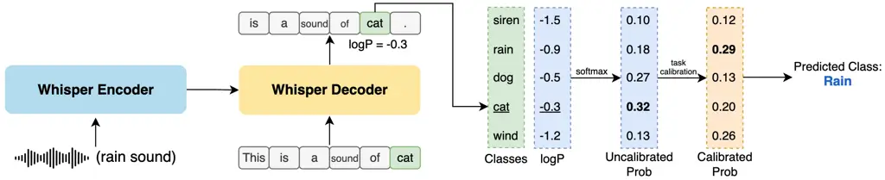

Figure 2: ASR foundation models are leveraged for zero-shot audio
classification by prompting the decoder to calculate the log-likelihood
of label sequences associated with each class. The log-likelihood for
each class is converted to probabilities and post-processed to a
predicted class. This process is displayed for Whisper.

## 3 Zero-Shot Classification of ASR Foundation Models

This paper investigates the emergent zero-shot audio classification
abilities of large-scale ASR foundation models. These systems are
trained specifically for speech recognition and were not explicitly
trained for any of the downstream classification tasks considered in
this paper. We question whether one can use prompting to leverage the
implicit knowledge learned from pre-training to achieve various audio
classification tasks.

### 3.1 Zero-shot Prompting

In this work, we use a simple template filling prompting strategy, where
given an input audio sample, we assess the probability of decoding a
label sequence associated with each classification class (as shown in
Figure 2). We leverage various ‘prompts’ by considering different
templates to represent the label sequences (as shown in Figure 1). To
convert likelihoods to class probabilities, we treat the ASR system as a
generative classifier:

Let $`P_{\theta}(x|s)`$ represent the likelihood associated with ASR
decoding the word sequence $`x\!\in\!\mathcal{X}`$ given an input audio
$`s`$. Let $`y\in\{\omega_{1},\omega_{2},...\omega_{K}\}`$ be one of
$`K`$ possible output classes, and $`t(\omega_{k})\!\in\!\mathcal{X}`$
represent a particular mapping of a class to a word sequence
representing the class. We assume that the zero-shot ASR classification
probability $`\tilde{P}_{\theta}`$ for a particular class is
proportional to the likelihood of generating each respective class label
sequence given the input audio:

```math
\tilde{P}_{\theta}(y=\omega_{k}|s)=\frac{P_{\theta}(t(\omega_{k})|s)}{\sum_{\omega_{j}}P_{\theta}(t(\omega_{j})|s)} \tag{1}
```

The model’s prediction is then the class with the highest associated
probability:

```math
\hat{y}=\underset{\omega}{\text{argmax}}\;\tilde{P}_{\theta}(\omega|s) \tag{2}
```

### 3.2 Task Calibration

A concern with the zero-shot prompting approach described above is the
potential presence of implicit biases. Previous works have demonstrated
that zero-shot generative classifiers may have associated biases that
can degrade performance Zhao et al. (2021); Liusie et al. (2023). For
example, the model may favour words that are common in pre-training,
which may lead to predictions being skewed towards particular classes.

To account for misaligned model probabilities, approaches exist to
modify model outputs to be better aligned of which the most prominent
example is model calibration. The objective of model calibration is for
the top-1 confidences to better reflect the expected accuracy of
decisions:

```math
\frac{1}{N}\sum_{i=1}^{N}P_{\theta}(\hat{y}^{(i)}|s^{(i)})=\frac{1}{N}\sum_{i=1}^{N}\delta(\hat{y}^{(i)}\!=\!y^{(i)}) \tag{3}
```

where $`y^{(i)}`$ is the reference classification label for audio
$`s^{(i)}`$. Model calibration (sometimes referred to as top-label
calibration) is typically performed in a post-hoc fashion Barlow and
Brunk (1972); Platt (1999); Guo et al. (2017), where it is often assumed
that the ordering of the classes is valid and so a monotonic function
can be applied to scale probabilities, without altering the ordering.
Since these standard model calibration approaches do not change the
output prediction order, however, they will be ineffective in cases
where the model demonstrates systematic class biases, as the system will
remain biased towards particular classes.

To address this concern, a different calibration approach is required
that can change the ordering of decisions and the top-1 decision. We
refer to such an approach as task calibration, since such calibration
may be most necessary when there is a mismatch between the training and
downstream task. For task calibration, the system should be altered to
provide global all-label calibrated decisions, such that for each class,
the system confidence accurately represents the expected accuracy.

```math
\frac{1}{N}\!\sum_{i=1}^{N}\!P_{\theta}(\omega_{k}|s^{(i)})\!=\!\frac{1}{N}\!\sum_{i=1}^{N}\!\delta(y^{(i)}\!=\!\omega_{k})\quad\forall\omega_{k} \tag{4}
```

Note that all-label global calibration is not a sufficient condition,
and may have limitations. To illustrate this, if the labels have a
uniform true prior, the only valid solution with temperature annealing
is the trivial solution of infinite temperature which yields random
performance. Therefore one has to select approaches that sensibly debias
the model, and in this work, two particular forms of task calibration
are considered.

#### 3.2.1 Prior Matching

The first task calibration method we consider applies global all-label
calibration. Following Liusie et al. (2023), one can reweight the
outputs of the classifier by introducing weights $`\alpha_{1:K}`$ to
rescale the probabilities.

```math
\hat{P}_{\theta}(\omega_{k}|s,\alpha_{1:K})=\frac{\alpha_{k}\tilde{P}_{\theta}(\omega_{k}|s)}{\sum_{j}\alpha_{j}\tilde{P}_{\theta}(\omega_{j}|s)} \tag{5}
```

Assuming that unsupervised data is available for a particular task (or
if all the evaluation is available as an unsupervised set), the output
probabilities can be reweighted to ensure that the corresponding output
prior matches the expected true prior, done by finding the weights
$`\bar{\alpha}_{1:K}`$ that ensure such a prior,

```math
\hat{P}_{\theta}(\omega_{k}|\alpha_{1:K})=\mathbb{E}_{s}\{\hat{P}_{\theta}(\omega_{k}|s,\alpha_{1:K})\ \} \tag{6}
```

```math
\bar{\alpha}_{1:K}=\underset{\alpha_{1:K}}{\text{argmin}}\sum_{\forall\omega}|\hat{P}_{\theta}(\omega|\alpha_{1:K})-P(\omega)| \tag{7}
```

Where $`P(\omega)`$ is the true prior for the considered task. In cases
where the underlying class distribution is not known, the prior can be
assumed to be uniform, $`P(\omega)\!=\!\frac{1}{K}`$, which is the
assumption made throughout this paper. The solution has a single free
variable, but by constraining $`\alpha_{1}\!=\!1`$ one can find an exact
solution that perfectly matches the prior, a search which can be done
efficiently. Note that such a solution (equation 7) satisfies global
all-label calibration (equation 4), but not necessarily top-1
model-calibration (equation 6).

#### 3.2.2 Null-Input Calibration

The previous method requires unsupervised data, which in some settings
can be a drawback. Zhao et al. (2021) proposed a data-free method which
uses a null-input, $`\phi`$, to estimate the weights, which Liusie
et al. (2023) demonstrate is an approximation of prior-matching,

```math
\bar{\alpha}_{k}\approx\frac{1}{\mathbb{E}_{s}\{{P}_{\theta}(\omega_{k}|s)\}}\approx\frac{1}{P_{\theta}(\omega_{k}|\phi)} \tag{8}
```

i.e. the null input is used as the audio input $`s`$, and with prompting
one can get an output probability distribution. This may be indicative
of bias since the null-input should yield a uniform pmf output, and this
is used to correct all downstream decisions.

For LLMs, the null-input $`\phi`$ is designed to be an input with no
information, e.g. an empty string or the input ‘N/A’. For our work,
using text-based null-inputs is not applicable. Therefore, for speech
recognition models, we propose using two different forms of null-inputs:
using a sequence of all zero vectors as the input of the encoder, or
using acoustic features generated from synthetic Gaussian white noise
with $`\sigma=1`$.

## 4 Experimental Set Up

### 4.1 Models

Two ASR foundation models are considered: Whisper Radford et al. (2023)
and the Massively Multilingual Speech (MMS) model Pratap et al. (2023).

Whisper Radford et al. (2023) is an encoder-decoder transformer model
trained on 680K hours of labelled speech data obtained through
large-scale weak supervision. Whisper checkpoints come in varying sizes,
ranging from 39M parameters (Whisper tiny) to 1.55B parameters (Whisper
large), available either as English-only or multilingual models. The
largest model is only available in the multilingual version. Whisper is
trained for automatic speech recognition and voice activity detection,
with the multilingual models further trained for speech translation and
language identification.

MMS Pratap et al. (2023) is a CTC model which has a decoder that is a
simple linear layer mapping to a set of characters. The model has 1B
parameters and is first pre-trained on 491K hours of unlabelled data
using self-supervised training. For multilingual speech recognition, the
model is further trained on 45K hours of labelled data spanning 1,107
languages, data collected by aligning New Testament audios and texts.

### 4.2 Datasets

We assess our systems across 8 diverse audio classification datasets,
encompassing 6 distinct tasks. Sound Event Classification (SEC)
comprises of ESC50 Piczak (2015) (50 environmental sounds) and
UrbanSound8K Salamon et al. (2014) (10 urban sounds). Acoustic Scene
Classification (ASC) uses TUT2017 Mesaros et al. (2016), featuring 15
acoustic scenes spanning both outdoor and indoor environments. Vocal
Sound Classification (VSC) uses Vocal Sound Gong et al. (2022) with 6
distinct human vocal sound categories. Emotion Recognition (ER)
comprises of RAVDESS Luna-Jiménez et al. (2021) and CREMA-D Cao et al.
(2014), each containing speakers expressing 8 and 6 different emotions,
respectively. Music Genre Classification (MGC) uses GTZAN Sturm (2013),
containing music classified into 10 genres. Additionally, Speaker
Counting (SC) uses LibriCount Stöter et al. (2018), featuring audio
clips with varying speaker counts from 0 to 10. Complete dataset
statistics are outlined in Table 1. Five of the datasets are balanced
over the classes (ESC50, TUT2017, Vocal, GTZAN, and LibriCount), while
the other three have slightly imbalanced distributions.

| Task | Dataset      | Utts  | Avg. Dur. | $`K`$ |
| ---- | ------------ | ----- | --------- | ----- |
| SEC  | ESC50        | 2,000 | 5.0       | 50    |
|      | UrbanSound8K | 8,732 | 3.6       | 10    |
| ASC  | TUT2017      | 1,620 | 10.0      | 15    |
| VSC  | Vocal Sound  | 3,594 | 5.0       | 6     |
| ER   | RAVDESS      | 1,440 | 3.7       | 8     |
|      | CREMA-D      | 7,442 | 5.0       | 6     |
| MGC  | GTZAN        | 1,000 | 30.0      | 10    |
| SC   | LibriCount   | 5,720 | 5.0       | 11    |

Table 1: Test set statistics, displaying the total number of test
utterances, the average duration of each audio sample (in seconds), and
the number of classes $`K`$.

### 4.3 Method

| Task   | Prompt                                         |
| ------ | ---------------------------------------------- |
| ER     | The speaker is feeling class_label.            |
| MGC    | This is an audio of class_label music.         |
| SC     | In the audio, class_label people are speaking. |
| others | This is a sound of class_label.                |

Table 2: Manually designed prompts used for each task. The bottom prompt
is used for SEC, ASC and VSC.

The default prompts used for the different tasks are shown in Table 2,
which were adapted from the prompts of Elizalde et al. (2023). We
calculate class probabilities using our three methods¹¹ 1 The code is
made available at
[https://github.com/JuliRao/Whisper_audio_classification](https://github.com/JuliRao/Whisper_audio_classification).;
the base ‘uncalibrated’ probabilities, prior matching, and the
null-input strategy (both zero-inputs and Gaussian white noise). For the
Gaussian white noise null-input, the $`\sigma=1`$ and the synthetic
clips are generated to have the same average duration as the task’s
clips. When employing Whisper as the underlying speech model, we
calculate the probability that the decoder generates each prompted text
sequence with teaching-forcing. For MMS, we apply a dynamic programming
algorithm Graves et al. (2006) to compute the probability of generating
a sentence for the given input audio. All the possible alignments are
considered in this process.

### 4.4 Baselines

We compare our performance against AudioCLIP Guzhov et al. (2022) and
CLAP Elizalde et al. (2023). CLIP Radford et al. (2021) is a multimodal
system that generates representations for images and text, which
AudioCLIP extends to also incorporate the audio modality. They introduce
an audio head and perform contrastive learning on AudioSet (a sound
event classification dataset) to align the audio embeddings with the
other modalities. CLAP adopts a similar approach and aligns a
pre-trained text encoder with a pre-trained audio encoder using
contrastive learning. The model is trained using a sound event
classification dataset and three audio captioning datasets. In CLAP, the
text encoder uses target sequences written as natural language sentences
rather than single-class words.

### 4.5 Supervised Baseline

To consider the performance gap between zero-shot Whisper and supervised
approaches, we further consider fine-tuning Whisper on training data to
obtain an upper bound of supervised model performance. This is done on
TUT and Vocal, which have available training data sets. We perform
supervised training with parameter efficient fine-tuning approaches;
LoRA Hu et al. (2021) and soft prompt tuning (SPT) Lester et al. (2021);
Ma et al. (2023). During training, the audio clip is provided to the
model encoder and the model decoder is trained to generate the
corresponding class label.

We note here that unsurprisingly, the zero-shot performance was
considerably worse than the supervised fine-tuning results. Therefore,
although the results section will demonstrate that Whisper can show
impressive zero-shot task transfer to unseen audio classification tasks,
in settings where labelled data is available, fine-tuning will yield
better performance. More details on the supervised training details and
experimental results can be found in Appendix E.

|                          |       |      |      |       |         |         |       |            |      |
| ------------------------ | ----- | ---- | ---- | ----- | ------- | ------- | ----- | ---------- | ---- |
| Model                    | ESC50 | US8K | TUT  | Vocal | RAVDESS | CREMA-D | GTZAN | LibriCount | Avg. |
| Baselines (§4.4)         |       |      |      |       |         |         |       |            |      |
| Random                   | 2.0   | 10.0 | 6.7  | 16.7  | 12.5    | 16.7    | 10.0  | 9.1        | 10.4 |
| AudioCLIP                | 69.4  | 65.3 | \-   | \-    | \-      | \-      | \-    | \-         | \-   |
| CLAP                     | 82.6  | 73.2 | 29.6 | 49.4  | 16.0    | 17.8    | 25.2  | 17.9       | 39.0 |
| Uncalibrated (§3.1)      |       |      |      |       |         |         |       |            |      |
| MMS large (1B)           | 1.7   | 9.6  | 4.9  | 14.2  | 13.5    | 17.2    | 8.3   | 8.4        | 9.7  |
| Whisper medium.en (769M) | 27.9  | 39.5 | 7.2  | 59.0  | 15.3    | 20.9    | 15.2  | 8.2        | 24.2 |
| Whisper medium (769M)    | 29.7  | 45.8 | 7.5  | 44.6  | 16.7    | 19.9    | 28.4  | 9.4        | 25.2 |
| Whisper large-v2 (1.6B)  | 38.9  | 50.5 | 7.7  | 60.1  | 15.1    | 20.2    | 38.2  | 9.2        | 30.0 |
| Prior-matched (§3.2.1)   |       |      |      |       |         |         |       |            |      |
| MMS large (1B)           | 2.4   | 10.9 | 7.6  | 11.5  | 12.2    | 17.2    | 10.5  | 11.5       | 10.5 |
| Whisper medium.en (769M) | 56.2  | 60.9 | 18.3 | 82.8  | 29.0    | 22.6    | 29.7  | 9.8        | 38.7 |
| Whisper medium (769M)    | 57.5  | 61.6 | 25.2 | 82.4  | 35.0    | 25.9    | 48.6  | 16.3       | 44.1 |
| Whisper large-v2 (1.6B)  | 65.4  | 60.4 | 26.0 | 84.9  | 41.7    | 28.8    | 60.9  | 17.3       | 48.2 |

Table 3: Baseline and zero-shot task performance using the default
prompts (of Table 2). The classification accuracy for each individual
task, as well as the average accuracy across all eight tasks, is
reported.

### 4.6 Evaluation

The focus of this work is on zero-shot classification performance and
therefore the top-1 accuracy of the test data is used as the main
performance metric for all systems. For Whisper and MMS, the test
utterances are down-sampled to 16kHz to match the pre-training
procedure. CLAP uses a higher sampling rate of 44.1kHz in the audio
encoder, which is more computationally expensive.

## 5 Results

### 5.1 Audio Classification Performance

Table 3 shows the audio classification results for 3 Whisper systems and
1 MMS system for our 8 datasets, with comparisons to random performance
and relevant baselines. We display our zero-shot prompted performance
when using either base output ASR likelihoods (§3.1) and when
post-processing the outputs using prior-matching (§3.2.1). We observe
the following points:

1. Whisper performs zero-shot audio classification better than random.
   Using simple template prompts and output likelihoods, Whisper large-v2
   achieves an average zero-shot accuracy of 30%, considerably better than
   the average random performance. Further, increasing parameter size
   yields a performance boost (769M to 1.6B parameters) and the
   multilingual Whisper performs better than the English-only model for the
   medium size.

2. MMS fails for zero-shot audio classification. This could be explained
   by the fact that MMS is forced to generate either an output token or a
   blank symbol for every input frame. The text prompt, including the
   classification symbols, must be aligned with the mismatched input audio.
   Using the resulting probability for classification may prove challenging
   when generalizing to zero-shot audio classification tasks. For Whisper,
   the attention mechanism allows it to attend over the entire input
   sequence to capture high-level audio information.

3. Prior Matching yields large performance improvements. By reweighting
   the output probabilities in an unsupervised fashion (i.e. without using
   the test labels), large performance boosts are observed for all Whisper
   systems. Whisper can now demonstrate reasonable performance for all 8
   tasks, and reducing the inherent class bias leads to an improvement of
   average accuracy to 48.2%.

4. Zero-Shot Whisper outperforms baselines, demonstrating our approach
   is a powerful zero-shot audio classification method. Note that CLAP is
   tuned on sound event classification and audio captioning datasets, and
   has therefore been trained to be aligned with tasks such as ESC50 and
   US8K. Nonetheless, even including performance on these tasks, our
   approach outperforms CLAP by an average of 9.2%, and has consistent and
   substantial performance improvements for most out-of-domain tasks.

### 5.2 Robustness to Prompts

Table 4 displays RAVDESS performance for different prompts, with Whisper
large-v2 and prior-matching. The first prompt is the default prompt used
for the main experiments, prompts 2-4 contain only the class label, and
prompts 5-9 were generated by asking ChatGPT to paraphrase²² 2 using the
prompt: “Please paraphrase the given prompt five times with simple
language:” prompt 1. The results show that, though zero-shot prompting
can work for various prompts, there is considerable prompt sensitivity.
Interestingly, although prompts 2-4 are closest to the pre-training task
of ASR decoding, we observe that, on average, the natural language
prompts demonstrate considerably better performance, implying that the
zero-shot ability can be attributed to more than ASR task transfer.
Further, ensembling all 9 prompts leads to the best performance of 44.0,
a performance boost which was also observed for other tasks, as
displayed in Table 5. Complete results for varying prompts for all
datasets can be found in Appendix D.

| Prompt                                                  | Acc  |
| ------------------------------------------------------- | ---- |
| The speaker is feeling class_label.                     | 41.7 |
| class_label                                             | 20.7 |
| (class_label)                                           | 33.1 |
| \[class_label\]                                         | 32.6 |
| The person talking feels class_label.                   | 38.5 |
| The speaker is experiencing class_label emotions.       | 20.8 |
| The person speaking is in a class_label mood.           | 29.9 |
| The speaker’s emotion is class_label.                   | 33.6 |
| The person talking is filled with class_label feelings. | 39.7 |
| Ensemble of Prompts                                     | 44.0 |

Table 4: Performance of Whisper large-v2 with different prompts on
RAVDESS (using prior-matched outputs).

| Dataset    | Default | Ensemble |
| ---------- | ------- | -------- |
| ESC50      | 65.4    | 67.1     |
| US8K       | 60.4    | 67.6     |
| TUT        | 26.0    | 25.2     |
| Vocal      | 84.9    | 87.3     |
| RAVDESS    | 41.7    | 44.0     |
| CREMA-D    | 28.8    | 33.1     |
| GTZAN      | 60.9    | 60.0     |
| LibriCount | 17.3    | 22.0     |
| Average    | 48.2    | 50.8     |

Table 5: Performance of the default prompt and the ensemble of 9 prompts
on audio classification tasks.

### 5.3 Null-input Performance

Prior matching requires a set of unlabelled test data, and is not
applicable when a single/few samples have to be classified. In such
settings, the null-input approximation (§3.2.2) can be used as a
zero-resource debiasing approach, which can use either all-zeros in the
encoder input or Gaussian noise. Table 6 demonstrates that, compared to
the uncalibrated baseline results, null-input debiasing improves model
performance by an average of 6.7% and 4.8% over all models and tasks for
the 2 methods respectively. These results show that the null-input
method can provide a performance boost via data-free calibration,
however, there is still a considerable gap with prior-matching
performance. More detailed results can be found in Appendix A.

| Method         | medium.en | medium | large-v2 |
| -------------- | --------- | ------ | -------- |
| Uncalibrated   | 24.2      | 25.2   | 30.0     |
| Zero Input     | 29.8      | 34.8   | 34.9     |
| Gaussian Noise | 28.5      | 29.5   | 35.8     |

Table 6: Average accuracy of 8 audio classification tasks with
null-input calibration.

### 5.4 Analysis of Predicted Distribution

To analyze the performance boost observed from debiasing, Figure 3
illustrates the output class distributions on RAVDESS for the various
methods. We observe that the uncalibrated outputs are strongly dominated
by the ‘sad’ class. Using the null-input method (where we select to use
the zero-input approach) still yields relatively imbalanced decisions.
However, we observe that prior-matching (by design) leads to a more
balanced distribution of predictions. Equivalent plots are shown for
different datasets in Appendix C.

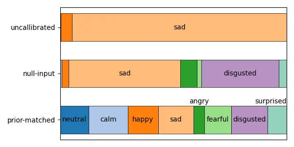

Figure 3: Predicted class distribution for Whisper large-v2 on RAVDESS.
Bar width is proportional to the fraction of decisions per class.

### 5.5 Ability with Scale

Figure 4 illustrates the improvement of average ability over all tasks
as the model size increases. We observe a continuous improvement in
performance as the model size increases, and secondly beyond 500M
parameters the multilingual models achieve much better performance than
the English-only models (when comparing models of similar size). This
may be due to the increased training data, as well as the multi-task
pre-training criterion (which includes speech translation and language
identification as well).

Figure 4: Parameter size vs average accuracy (with prior-matching) for
different versions of Whisper models.

### 5.6 Audio Question Answering

The previous experiments demonstrated that Whisper can be zero-shot
prompted to perform a multitude of audio classification tasks with
reasonable performance. Here, we provide an initial investigation into
the ability of Whisper for the more challenging task of audio question
answering.

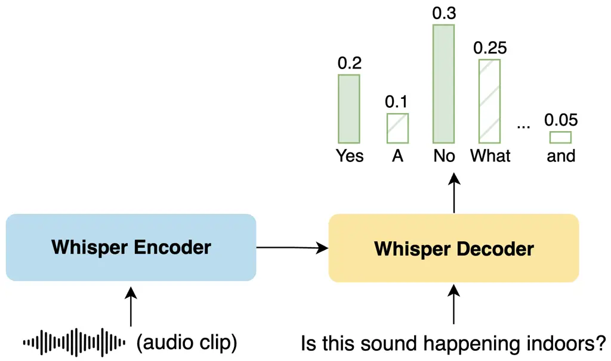

Figure 5: Zero-shot audio question answering method.

Clotho-AQA Lipping et al. (2022) is a dataset of audio clips selected
from the Clotho dataset, with corresponding questions and answers
collected through crowd-sourcing. Our experiments focus on the yes-no
questions of Clotho-AQA, where each question is a yes-no question
corresponding to an input audio sample, with three independent ‘yes’ or
‘no’ annotations. We consider both the ‘majority’ set, where the label
is assigned as the most select options, and ‘unanimous’ set, where the
questions are filtered to those where all three annotators agree. The
processed test sets contain 1,892 and 1,109 questions for the two parts
respectively, with a slight class imbalance and 56.4% and 61.7% of the
questions having the label ‘yes’ respectively.

| Method                | Unanimous | Majority votes |
| --------------------- | --------- | -------------- |
| Lipping et al. (2022) | 73.1      | 63.2           |
| Uncalibrated          | 64.0      | 58.8           |
| Zero Input            | 65.2      | 60.1           |
| Gaussian Noise        | 38.6      | 43.8           |
| Prior-Matched         | 61.1      | 58.5           |

Table 7: Experimental results on Clotho-AQA test set.

We prompt Whisper in a similar fashion to the previous audio
classification approach, however the input question is now used as the
prompt for the decoder. As before, the audio clip is provided to the
model’s encoder, and the system likelihood of generating ‘yes’ and ‘no’
are used as class logits. The setup is depicted in Figure 5. The
baseline from Lipping et al. (2022) is a BiLSTM-based system with a
binary classification head, trained in a supervised fashion on the
labelled training corpus.

Figure 6: Precision-Recall curve for Whisper large-v2 prompted for
Clotho-AQA. ‘no’, the rarer event, is used as the positive class for
detection.

Table 7 presents experimental results, where zero-shot Whisper achieves
an accuracy of 64.0 for the unanimous test set. Note that due to class
imbalance a system that always predicts ‘yes’ will have an accuracy of
61.7%. However, the precision of the proposed method is 65.9% and 60.9%
for the ‘yes’ and ‘no’ decisions respectively, both significantly above
random. Due to this inherent class imbalance, prior matching (which
ensures the output prior is uniform) degrades performance and yields
lower accuracy. Applying the null-input normalization techniques can
improve performance with zero-input, although Gaussian noise harms
performance (as it overcompensates the bias and makes predictions biased
to predict mostly ‘no’). Similar observations are found when considering
the ‘majority’ processed test data.

To confirm the extent to which Whisper is making informed, rather than
random, decisions the precision and recall curve for the rarer class,
‘no’ is shown in Figure 6 on the unanimous set. It is clear that there
is significant information in Whisper’s zero-shot predictions and
performance is notably better than random at all decision thresholds.

## 6 Conclusions

This paper is the first to examine the emergent ability of foundation
ASR models on audio-classification tasks, that were not seen in
training. Over a range of tasks, we show that zero-shot prompting of
Whisper can yield effective performance. Calibration methods can be used
to readjust the output distribution for better task alignment, allowing
Whisper to achieve better performance compared to previous zero-shot
works, and demonstrating its potential for cross-task generalization.

## Acknowledgements

This work is supported by Cambridge University Press & Assessment
(CUP&A), a department of The Chancellor, Masters, and Scholars of the
University of Cambridge.

## 7 Limitations

Prior-matching, which yielded considerable gains, assumes that the
classes are fairly balanced and requires unlabelled in-domain data (or a
large test set to be evaluated). This approach may not apply to settings
where there are strong class imbalances, nor when little data is
available.

## 8 Ethical Considerations

This is an introductory study that demonstrates that Whisper can be used
for zero-shot audio classification tasks. However, the system may not
generalize well to some tasks not considered in this paper. Our
zero-shot method should be used with a level of caution, especially if
leveraging the system for real-world applications.

## References

- Bang et al. (2023) Yejin Bang, Samuel Cahyawijaya, Nayeon Lee,
  Wenliang Dai, Dan Su, Bryan Wilie, Holy Lovenia, Ziwei Ji, Tiezheng
  Yu, Willy Chung, Quyet V. Do, Yan Xu, and Pascale Fung. 2023. [A
  Multitask, Multilingual, Multimodal Evaluation of ChatGPT on
  Reasoning, Hallucination, and
  Interactivity](https://arxiv.org/abs/2302.04023). _arXiv preprint
  arXiv:2302.04023_.
- Bannò et al. (2023) Stefano Bannò, Rao Ma, Mengjie Qian, Kate M.
  Knill, and Mark J. F. Gales. 2023. [Towards end-to-end spoken
  grammatical error
  correction](https://doi.org/https://doi.org/10.48550/arXiv.2311.05550).
  _arXiv preprint arXiv:2311.05550_.
- Barlow and Brunk (1972) R. E. Barlow and H. D. Brunk. 1972. [The
  isotonic regression problem and its
  dual](https://doi.org/10.1080/01621459.1972.10481216). _Journal of the
  American Statistical Association_, 67(337):140–147.
- Brown et al. (2020) Tom Brown, Benjamin Mann, Nick Ryder, Melanie
  Subbiah, Jared D Kaplan, Prafulla Dhariwal, Arvind Neelakantan, Pranav
  Shyam, Girish Sastry, Amanda Askell, Sandhini Agarwal, Ariel
  Herbert-Voss, Gretchen Krueger, Tom Henighan, Rewon Child, Aditya
  Ramesh, Daniel Ziegler, Jeffrey Wu, Clemens Winter, Chris Hesse, Mark
  Chen, Eric Sigler, Mateusz Litwin, Scott Gray, Benjamin Chess, Jack
  Clark, Christopher Berner, Sam McCandlish, Alec Radford, Ilya
  Sutskever, and Dario Amodei. 2020. [Language Models are Few-Shot
  Learners](https://proceedings.neurips.cc/paper_files/paper/2020/file/1457c0d6bfcb4967418bfb8ac142f64a-Paper.pdf).
  In _Advances in Neural Information Processing Systems_, volume 33,
  pages 1877–1901. Curran Associates, Inc.
- Cao et al. (2014) Houwei Cao, David G Cooper, Michael K Keutmann,
  Ruben C Gur, Ani Nenkova, and Ragini Verma. 2014. CREMA-D:
  Crowd-sourced emotional multimodal actors dataset. _IEEE transactions
  on affective computing_, 5(4):377–390.
- Chung et al. (2022) Hyung Won Chung, Le Hou, Shayne Longpre, Barret
  Zoph, Yi Tay, William Fedus, Eric Li, Xuezhi Wang, Mostafa Dehghani,
  Siddhartha Brahma, et al. 2022. [Scaling instruction-finetuned
  language
  models](https://doi.org/https://doi.org/10.48550/arXiv.2210.11416).
  _arXiv preprint arXiv:2210.11416_.
- Elizalde et al. (2023) Benjamin Elizalde, Soham Deshmukh, Mahmoud
  Al Ismail, and Huaming Wang. 2023. [CLAP: Learning audio concepts from
  natural language
  supervision](https://doi.org/10.1109/ICASSP49357.2023.10095889). In
  _ICASSP 2023-2023 IEEE International Conference on Acoustics, Speech
  and Signal Processing (ICASSP)_, pages 1–5. IEEE.
- Gao et al. (2021) Tianyu Gao, Adam Fisch, and Danqi Chen. 2021.
  [Making pre-trained language models better few-shot
  learners](https://doi.org/10.18653/v1/2021.acl-long.295). In
  _Proceedings of the 59th Annual Meeting of the Association for
  Computational Linguistics and the 11th International Joint Conference
  on Natural Language Processing (Volume 1: Long Papers)_, pages
  3816–3830, Online. Association for Computational Linguistics.
- Gong et al. (2023) Yuan Gong, Sameer Khurana, Leonid Karlinsky, and
  James Glass. 2023. [Whisper-AT: Noise-Robust Automatic Speech
  Recognizers are Also Strong General Audio Event
  Taggers](https://doi.org/10.21437/Interspeech.2023-2193). In _Proc.
  INTERSPEECH 2023_, pages 2798–2802.
- Gong et al. (2022) Yuan Gong, Jin Yu, and James Glass. 2022.
  Vocalsound: A dataset for improving human vocal sounds recognition. In
  _ICASSP 2022-2022 IEEE International Conference on Acoustics, Speech
  and Signal Processing (ICASSP)_, pages 151–155. IEEE.
- Graves et al. (2006) Alex Graves, Santiago Fernández, Faustino Gomez,
  and Jürgen Schmidhuber. 2006. Connectionist temporal classification:
  labelling unsegmented sequence data with recurrent neural networks. In
  _Proceedings of the 23rd international conference on Machine
  learning_, pages 369–376.
- Guo et al. (2017) Chuan Guo, Geoff Pleiss, Yu Sun, and Kilian Q
  Weinberger. 2017. [On calibration of modern neural
  networks](https://proceedings.mlr.press/v70/guo17a/guo17a.pdf). In
  _Proc. of the 34th International Conference on Machine Learning
  (ICML)_, pages 1321–1330. PMLR.
- Guo et al. (2022) Yue Guo, Yi Yang, and Ahmed Abbasi. 2022.
  [Auto-debias: Debiasing masked language models with automated biased
  prompts](https://doi.org/10.18653/v1/2022.acl-long.72). In
  _Proceedings of the 60th Annual Meeting of the Association for
  Computational Linguistics (Volume 1: Long Papers)_, pages 1012–1023,
  Dublin, Ireland. Association for Computational Linguistics.
- Guzhov et al. (2022) Andrey Guzhov, Federico Raue, Jörn Hees, and
  Andreas Dengel. 2022. [AudioCLIP: Extending clip to image, text and
  audio](https://doi.org/10.1109/ICASSP43922.2022.9747631). In _ICASSP
  2022-2022 IEEE International Conference on Acoustics, Speech and
  Signal Processing (ICASSP)_, pages 976–980. IEEE.
- Hu et al. (2021) Edward J Hu, Phillip Wallis, Zeyuan Allen-Zhu,
  Yuanzhi Li, Shean Wang, Lu Wang, Weizhu Chen, et al. 2021. LoRA:
  Low-rank adaptation of large language models. In _International
  Conference on Learning Representations_.
- Kojima et al. (2022) Takeshi Kojima, Shixiang Shane Gu, Machel Reid,
  Yutaka Matsuo, and Yusuke Iwasawa. 2022. Large language models are
  zero-shot reasoners. _Advances in neural information processing
  systems_, 35:22199–22213.
- Lester et al. (2021) Brian Lester, Rami Al-Rfou, and Noah
  Constant. 2021. The power of scale for parameter-efficient prompt
  tuning. In _Proceedings of the 2021 Conference on Empirical Methods in
  Natural Language Processing_, pages 3045–3059.
- Li et al. (2017) Ang Li, Allan Jabri, Armand Joulin, and Laurens
  van der Maaten. 2017. [Learning Visual N-Grams from Web
  Data](https://doi.org/10.1109/ICCV.2017.449). In _IEEE International
  Conference on Computer Vision (ICCV)_, pages 4193–4202.
- Lipping et al. (2022) Samuel Lipping, Parthasaarathy Sudarsanam,
  Konstantinos Drossos, and Tuomas Virtanen. 2022. [Clotho-AQA: A
  crowdsourced dataset for audio question
  answering](https://eurasip.org/Proceedings/Eusipco/Eusipco2022/pdfs/0001140.pdf).
  In _2022 30th European Signal Processing Conference (EUSIPCO)_, pages
  1140–1144.
- Liusie et al. (2023) Adian Liusie, Potsawee Manakul, and Mark JF
  Gales. 2023. [Mitigating Word Bias in Zero-shot Prompt-based
  Classifiers](http://www.afnlp.org/conferences/ijcnlp2023/proceedings/main-findings/cdrom/pdf/2023.findings-ijcnlp.29.pdf).
  In _Proc. of the 13th International Joint Conference on Natural
  Language Processing and the 3rd Conference of the Asia-Pacific Chapter
  of the Association for Computational Linguistics (Findings Papers)_,
  pages 327––335.
- Luna-Jiménez et al. (2021) Cristina Luna-Jiménez, Ricardo Kleinlein,
  David Griol, Zoraida Callejas, Juan M Montero, and Fernando
  Fernández-Martínez. 2021. A proposal for multimodal emotion
  recognition using aural transformers and action units on RAVDESS
  dataset. _Applied Sciences_, 12(1):327.
- Ma et al. (2023) Rao Ma, Mengjie Qian, Mark JF Gales, and Kate M
  Knill. 2023. Adapting an asr foundation model for spoken language
  assessment. _arXiv preprint arXiv:2307.09378_.
- Mesaros et al. (2016) Annamaria Mesaros, Toni Heittola, and Tuomas
  Virtanen. 2016. TUT database for acoustic scene classification and
  sound event detection. In _2016 24th European Signal Processing
  Conference (EUSIPCO)_, pages 1128–1132. IEEE.
- Ouyang et al. (2022) Long Ouyang, Jeffrey Wu, Xu Jiang, Diogo Almeida,
  Carroll Wainwright, Pamela Mishkin, Chong Zhang, Sandhini Agarwal,
  Katarina Slama, Alex Ray, et al. 2022. [Training language models to
  follow instructions with human
  feedback](https://proceedings.neurips.cc/paper_files/paper/2022/file/b1efde53be364a73914f58805a001731-Paper-Conference.pdf).
  _Advances in Neural Information Processing Systems (NeurIPS 2022)_,
  35:27730–27744.
- Peng et al. (2023) Puyuan Peng, Brian Yan, Shinji Watanabe, and David
  Harwath. 2023. [Prompting the hidden talent of web-scale speech models
  for zero-shot task
  generalization](https://doi.org/10.48550/arXiv.2305.11095). _arXiv
  preprint arXiv:2305.11095_.
- Piczak (2015) Karol J Piczak. 2015. Esc: Dataset for environmental
  sound classification. In _Proceedings of the 23rd ACM international
  conference on Multimedia_, pages 1015–1018.
- Platt (1999) John Platt. 1999. Probabilistic outputs for support
  vector machines and comparisons to regularized likelihood methods. In
  _Advances in Large Margin Classifiers_. MIT Press, Cambridge MA.
- Pratap et al. (2023) Vineel Pratap, Andros Tjandra, Bowen Shi, Paden
  Tomasello, Arun Babu, Sayani Kundu, Ali Elkahky, Zhaoheng Ni, Apoorv
  Vyas, Maryam Fazel-Zarandi, Alexei Baevski, Yossi Adi, Xiaohui Zhang,
  Wei-Ning Hsu, Alexis Conneau, and Michael Auli. 2023. [Scaling speech
  technology to 1,000+
  languages](https://doi.org/10.48550/arXiv.2305.13516). _arXiv preprint
  arXiv:2305.13516_.
- Radford et al. (2021) Alec Radford, Jong Wook Kim, Chris Hallacy,
  Aditya Ramesh, Gabriel Goh, Sandhini Agarwal, Girish Sastry, Amanda
  Askell, Pamela Mishkin, Jack Clark, et al. 2021. [Learning
  transferable visual models from natural language
  supervision](http://proceedings.mlr.press/v139/radford21a/radford21a.pdf).
  In _Proc. of the 38th International Conference on Machine Learning_,
  pages 8748–8763. PMLR.
- Radford et al. (2023) Alec Radford, Jong Wook Kim, Tao Xu, Greg
  Brockman, Christine McLeavey, and Ilya Sutskever. 2023. [Robust speech
  recognition via large-scale weak
  supervision](https://proceedings.mlr.press/v202/radford23a/radford23a.pdf).
  In _Proc. of the 40th International Conference on Machine Learning_,
  pages 28492–28518. PMLR.
- Radford et al. (2019) Alec Radford, Jeffrey Wu, Rewon Child, David
  Luan, Dario Amodei, Ilya Sutskever, et al. 2019. Language models are
  unsupervised multitask learners. _OpenAI blog_, 1(8):9.
- Salamon et al. (2014) Justin Salamon, Christopher Jacoby, and
  Juan Pablo Bello. 2014. A dataset and taxonomy for urban sound
  research. In _Proceedings of the 22nd ACM international conference on
  Multimedia_, pages 1041–1044.
- Sanh et al. (2022) Victor Sanh, Albert Webson, Colin Raffel, Stephen
  Bach, Lintang Sutawika, Zaid Alyafeai, Antoine Chaffin, Arnaud
  Stiegler, Arun Raja, Manan Dey, et al. 2022. [Multitask prompted
  training enables zero-shot task
  generalization](https://openreview.net/pdf?id=9Vrb9D0WI4). In
  _International Conference on Learning Representations (ICLR) 2022_.
- Schaeffer et al. (2023) Rylan Schaeffer, Brando Miranda, and Sanmi
  Koyejo. 2023. [Are emergent abilities of large language models a
  mirage?](https://openreview.net/pdf?id=JRdN9GcI52) In _Challenges in
  Deployable Generative AI Workshop at ICML_.
- Schick and Schütze (2021) Timo Schick and Hinrich Schütze. 2021.
  [Exploiting cloze-questions for few-shot text classification and
  natural language
  inference](https://doi.org/10.18653/v1/2021.eacl-main.20). In
  _Proceedings of the 16th Conference of the European Chapter of the
  Association for Computational Linguistics: Main Volume_, pages
  255–269, Online. Association for Computational Linguistics.
- Stöter et al. (2018) Fabian-Robert Stöter, Soumitro Chakrabarty,
  Emanuël Habets, and Bernd Edler. 2018. LibriCount, a dataset for
  speaker count estimation.
- Sturm (2013) Bob L Sturm. 2013. The GTZAN dataset: Its contents, its
  faults, their effects on evaluation, and its future use. _arXiv
  preprint arXiv:1306.1461_.
- Touvron et al. (2023) Hugo Touvron, Thibaut Lavril, Gautier Izacard,
  Xavier Martinet, Marie-Anne Lachaux, Timothée Lacroix, Baptiste
  Rozière, Naman Goyal, Eric Hambro, Faisal Azhar, et al. 2023. [LLaMA:
  Open and efficient foundation language
  models](https://arxiv.org/pdf/2302.13971.pdf). _arXiv preprint
  arXiv:2302.13971_.
- Wang et al. (2023a) Minghan Wang, Yinglu Li, Jiaxin Guo, Xiaosong
  Qiao, Zongyao Li, Hengchao Shang, Daimeng Wei, Shimin Tao, Min Zhang,
  and Hao Yang. 2023a. [WhiSLU: End-to-End Spoken Language Understanding
  with Whisper](https://doi.org/10.21437/Interspeech.2023-1505). In
  _Proc. INTERSPEECH 2023_, pages 770–774.
- Wang et al. (2023b) Siyin Wang, Chao-Han Huck Yang, Ji Wu, and Chao
  Zhang. 2023b. Can whisper perform speech-based in-context learning.
  _arXiv preprint arXiv:2309.07081_.
- Wei et al. (2022) Jason Wei, Yi Tay, Rishi Bommasani, Colin Raffel,
  Barret Zoph, Sebastian Borgeaud, Dani Yogatama, Maarten Bosma, Denny
  Zhou, Donald Metzler, Ed H. Chi, Tatsunori Hashimoto, Oriol Vinyals,
  Percy Liang, Jeff Dean, and William Fedus. 2022. [Emergent abilities
  of large language models](https://openreview.net/forum?id=yzkSU5zdwD).
  _Transactions on Machine Learning Research_. Survey Certification.
- Zhao et al. (2021) Zihao Zhao, Eric Wallace, Shi Feng, Dan Klein, and
  Sameer Singh. 2021. [Calibrate before use: Improving few-shot
  performance of language
  models](http://proceedings.mlr.press/v139/zhao21c/zhao21c.pdf). In
  _Proc. of the 38th International Conference on Machine Learning_,
  pages 12697–12706. PMLR.

## Appendix A Full Results

|                          |       |      |      |       |         |         |       |            |      |
| ------------------------ | ----- | ---- | ---- | ----- | ------- | ------- | ----- | ---------- | ---- |
| Model                    | ESC50 | US8K | TUT  | Vocal | RAVDESS | CREMA-D | GTZAN | LibriCount | Avg. |
| Baselines (§4.4)         |       |      |      |       |         |         |       |            |      |
| Random                   | 2.0   | 10.0 | 6.7  | 16.7  | 12.5    | 16.7    | 10.0  | 9.1        | 10.4 |
| AudioCLIP                | 69.4  | 65.3 | \-   | \-    | \-      | \-      | \-    | \-         | \-   |
| CLAP                     | 82.6  | 73.2 | 29.6 | 49.4  | 16.0    | 17.8    | 25.2  | 17.9       | 39.0 |
| Uncalibrated (§3.1)      |       |      |      |       |         |         |       |            |      |
| MMS large (1B)           | 1.7   | 9.6  | 4.9  | 14.2  | 13.5    | 17.2    | 8.3   | 8.4        | 9.7  |
| Whisper tiny.en (39M)    | 3.7   | 16.4 | 6.7  | 16.7  | 13.3    | 17.4    | 13.9  | 9.3        | 12.2 |
| Whisper tiny (39M)       | 4.2   | 12.9 | 6.5  | 17.0  | 12.4    | 15.9    | 13.3  | 7.8        | 11.3 |
| Whisper base.en (74M)    | 5.9   | 20.4 | 6.6  | 35.1  | 13.2    | 16.0    | 13.6  | 10.2       | 15.1 |
| Whisper base (74M)       | 6.8   | 23.7 | 6.6  | 39.0  | 14.9    | 16.3    | 21.7  | 9.5        | 17.3 |
| Whisper small.en (244M)  | 10.3  | 41.9 | 7.0  | 45.0  | 14.7    | 14.8    | 14.6  | 7.2        | 19.4 |
| Whisper small (244M)     | 21.0  | 39.3 | 8.2  | 46.6  | 15.5    | 18.9    | 23.7  | 9.2        | 22.8 |
| Whisper medium.en (769M) | 27.9  | 39.5 | 7.2  | 59.0  | 15.3    | 20.9    | 15.2  | 8.2        | 24.2 |
| Whisper medium (769M)    | 29.7  | 45.8 | 7.5  | 44.6  | 16.7    | 19.9    | 28.4  | 9.4        | 25.2 |
| Whisper large-v1 (1.6B)  | 33.7  | 44.8 | 8.3  | 58.2  | 15.0    | 21.6    | 35.2  | 8.2        | 28.2 |
| Whisper large-v2 (1.6B)  | 38.9  | 50.5 | 7.7  | 60.1  | 15.1    | 20.2    | 38.2  | 9.2        | 30.0 |
| Whisper large-v3 (1.6B)  | 12.0  | 38.3 | 7.0  | 43.0  | 13.6    | 19.5    | 14.4  | 9.3        | 19.6 |
| Zero-Input (§3.2.2)      |       |      |      |       |         |         |       |            |      |
| MMS large (1B)           | 2.2   | 11.7 | 4.2  | 16.5  | 12.1    | 15.9    | 7.5   | 10.0       | 10.0 |
| Whisper tiny.en (39M)    | 12.7  | 19.7 | 7.5  | 30.9  | 20.6    | 18.9    | 12.8  | 9.4        | 16.6 |
| Whisper tiny (39M)       | 10.5  | 24.2 | 7.7  | 28.0  | 15.8    | 17.7    | 17.7  | 7.9        | 16.2 |
| Whisper base.en (74M)    | 18.9  | 37.6 | 14.2 | 50.9  | 18.8    | 21.5    | 13.6  | 8.8        | 23.0 |
| Whisper base (74M)       | 19.4  | 36.2 | 12.1 | 52.7  | 14.4    | 16.5    | 17.5  | 11.1       | 22.5 |
| Whisper small.en (244M)  | 30.5  | 47.3 | 11.4 | 65.8  | 14.4    | 18.5    | 9.4   | 6.2        | 25.4 |
| Whisper small (244M)     | 30.9  | 41.0 | 19.8 | 54.3  | 14.7    | 17.2    | 38.8  | 10.1       | 28.4 |
| Whisper medium.en (769M) | 44.1  | 53.3 | 21.5 | 57.2  | 20.1    | 21.2    | 12.2  | 8.6        | 29.8 |
| Whisper medium (769M)    | 45.6  | 57.1 | 19.6 | 67.8  | 23.3    | 22.1    | 24.1  | 18.5       | 34.8 |
| Whisper large-v1 (1.6B)  | 47.1  | 58.5 | 24.9 | 59.3  | 18.5    | 26.0    | 32.8  | 8.7        | 34.5 |
| Whisper large-v2 (1.6B)  | 35.9  | 52.1 | 18.0 | 57.5  | 29.4    | 26.5    | 45.8  | 13.6       | 34.9 |
| Whisper large-v3 (1.6B)  | 23.9  | 38.4 | 21.2 | 60.9  | 15.7    | 20.7    | 11.8  | 13.9       | 25.8 |
| Gaussian-Noise (§3.2.2)  |       |      |      |       |         |         |       |            |      |
| MMS large (1B)           | 2.4   | 12.6 | 7.9  | 13.0  | 12.7    | 17.0    | 14.9  | 11.9       | 11.5 |
| Whisper tiny.en (39M)    | 8.9   | 20.9 | 9.6  | 18.9  | 17.6    | 20.4    | 14.2  | 8.4        | 14.9 |
| Whisper tiny (39M)       | 5.8   | 19.4 | 11.8 | 16.7  | 13.5    | 17.1    | 16.4  | 7.7        | 13.6 |
| Whisper base.en (74M)    | 13.6  | 29.0 | 7.7  | 25.2  | 15.3    | 19.6    | 11.7  | 10.2       | 16.5 |
| Whisper base (74M)       | 17.5  | 27.6 | 6.5  | 39.5  | 12.8    | 17.8    | 12.2  | 9.0        | 17.9 |
| Whisper small.en (244M)  | 29.8  | 42.0 | 13.6 | 59.5  | 13.1    | 17.1    | 11.6  | 8.9        | 24.5 |
| Whisper small (244M)     | 31.2  | 49.0 | 14.8 | 52.5  | 24.0    | 21.4    | 41.6  | 12.6       | 30.9 |
| Whisper medium.en (769M) | 36.8  | 45.8 | 20.0 | 68.9  | 17.2    | 20.4    | 10.0  | 8.9        | 28.5 |
| Whisper medium (769M)    | 38.3  | 47.1 | 15.9 | 63.0  | 16.2    | 20.4    | 18.6  | 16.4       | 29.5 |
| Whisper large-v1 (1.6B)  | 47.9  | 58.7 | 26.1 | 44.8  | 18.7    | 20.1    | 20.5  | 9.1        | 30.7 |
| Whisper large-v2 (1.6B)  | 43.8  | 53.2 | 22.1 | 62.4  | 20.4    | 18.8    | 50.8  | 15.0       | 35.8 |
| Whisper large-v3 (1.6B)  | 22.9  | 29.3 | 14.1 | 43.1  | 16.5    | 17.6    | 19.4  | 14.9       | 22.2 |
| Prior-matched (§3.2.1)   |       |      |      |       |         |         |       |            |      |
| MMS large (1B)           | 2.4   | 10.9 | 7.6  | 11.5  | 12.2    | 17.2    | 10.5  | 11.5       | 10.5 |
| Whisper tiny.en (39M)    | 17.3  | 30.4 | 11.7 | 41.5  | 19.6    | 20.4    | 19.3  | 8.8        | 21.1 |
| Whisper tiny (39M)       | 14.1  | 28.5 | 11.1 | 36.7  | 17.6    | 17.1    | 25.0  | 8.0        | 19.8 |
| Whisper base.en (74M)    | 24.6  | 46.2 | 11.7 | 58.6  | 20.3    | 20.1    | 25.4  | 12.3       | 27.4 |
| Whisper base (74M)       | 25.7  | 35.8 | 11.0 | 58.0  | 18.1    | 17.5    | 22.9  | 10.3       | 24.9 |
| Whisper small.en (244M)  | 43.7  | 55.5 | 15.7 | 78.8  | 24.6    | 18.7    | 28.1  | 7.7        | 34.1 |
| Whisper small (244M)     | 40.7  | 57.1 | 20.0 | 62.7  | 32.2    | 23.8    | 48.3  | 12.7       | 37.2 |
| Whisper medium.en (769M) | 56.2  | 60.9 | 18.3 | 82.8  | 29.0    | 22.6    | 29.7  | 9.8        | 38.7 |
| Whisper medium (769M)    | 57.5  | 61.6 | 25.2 | 82.4  | 35.0    | 25.9    | 48.6  | 16.3       | 44.1 |
| Whisper large-v1 (1.6B)  | 62.9  | 65.7 | 28.3 | 85.6  | 35.1    | 24.4    | 54.7  | 7.3        | 45.5 |
| Whisper large-v2 (1.6B)  | 65.4  | 60.4 | 26.0 | 84.9  | 41.7    | 28.8    | 60.9  | 17.3       | 48.2 |
| Whisper large-v3 (1.6B)  | 33.8  | 43.3 | 22.3 | 69.1  | 31.3    | 23.7    | 33.7  | 17.0       | 34.3 |

Table 8: Baseline and zero-shot task performance using the default
prompt.

Table 8 extends Table 3 and displays the zero-shot audio classification
performance of different versions of the released ASR foundation models.
As the results show, Whisper always exhibits better performance than
random predictions, indicating that the model acquires the general
ability of audio understanding when pre-trained on large-scale datasets.
Null-input and prior matching calibration methods consistently improve
the classification accuracy on selected tasks. All three Whisper large
models share the same structure while the training strategy is slightly
different. Compared to large-v1, Whisper large-v2 is trained on the data
for 2.5 times more epochs with regularization techniques, leading to
better audio classification accuracy. Nevertheless, the newly released
Whisper large-v3 model shows inferior performance, which is trained on
the combination of 1 million hours of weakly-labelled audio and 4
million hours of audio with pseudo labels decoded by large-v2. Results
suggest that including pseudo-speech data harms the model’s emergent
ability for audio classification.

## Appendix B Accuracy against Parameter Size

Figure 7: Accuracy on individual audio classification tasks across
different sizes of Whisper models.

Figure 7 shows the performance improvement of Whisper for various sizes,
for both the English-only and the multilingual systems. In general, we
observe better performance as the model size increases. For many tasks,
we observe that as the number of parameters increases, the multilingual
systems begin to outperform the English-only systems. However, for some
tasks such as ESC50 and US8K, we observe comparable performance for the
two systems over all model sizes.

## Appendix C Distribution of Predicted Classes

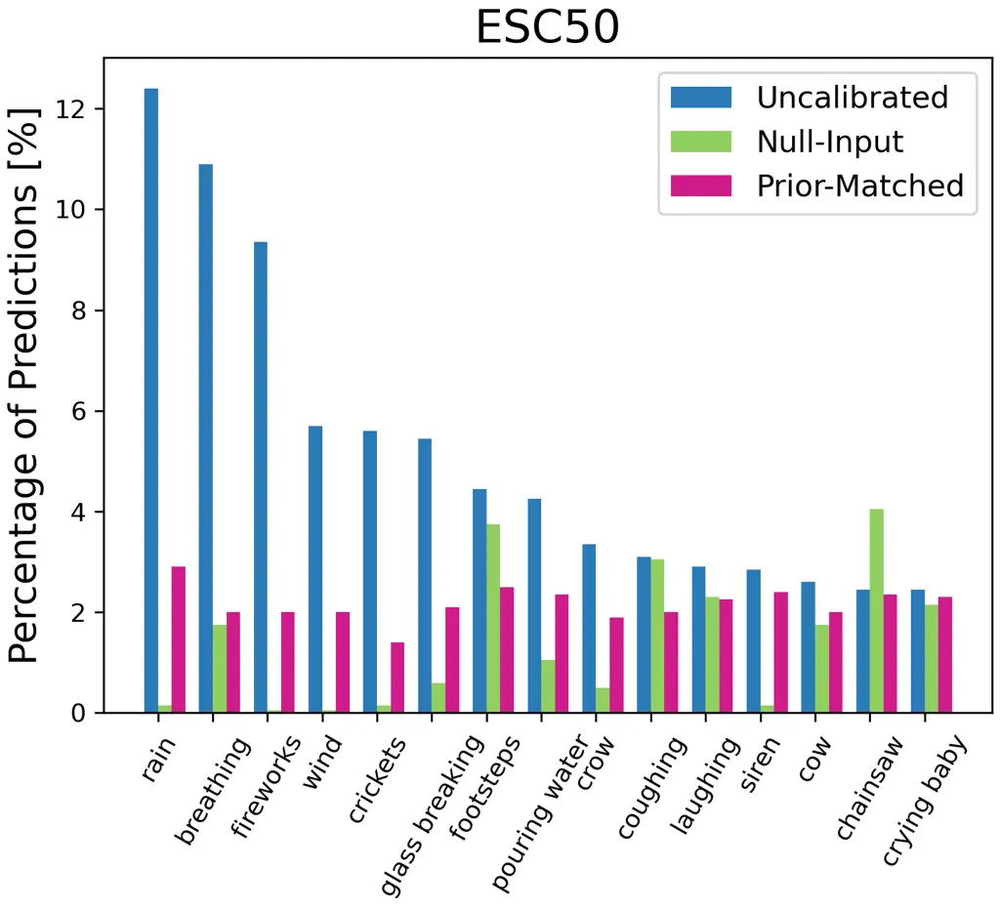

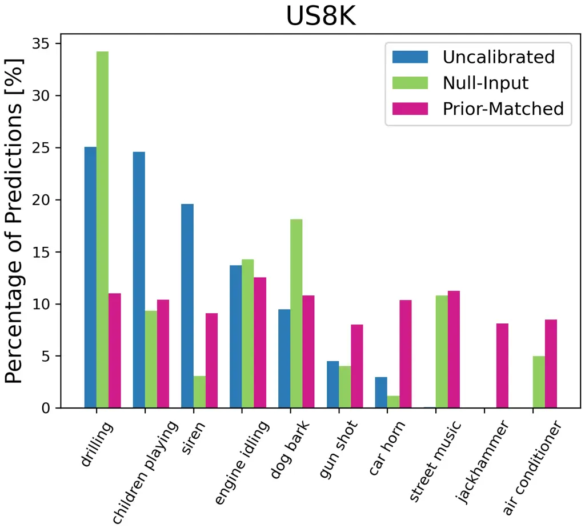

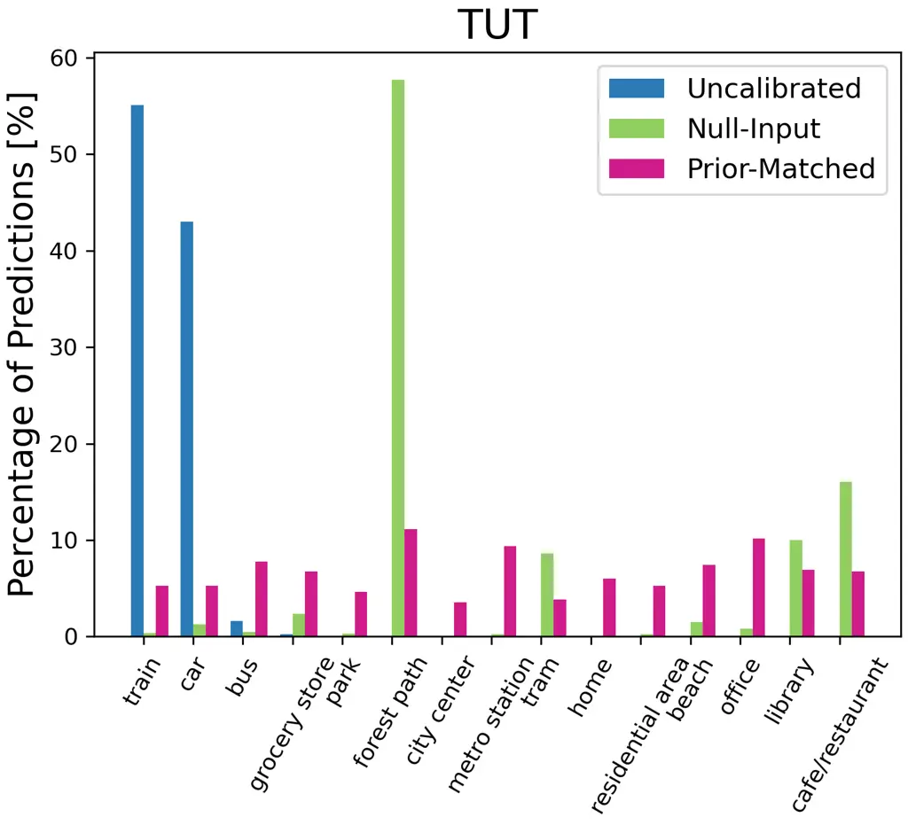

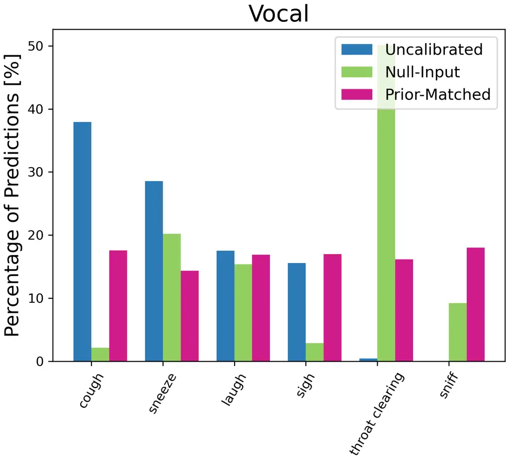

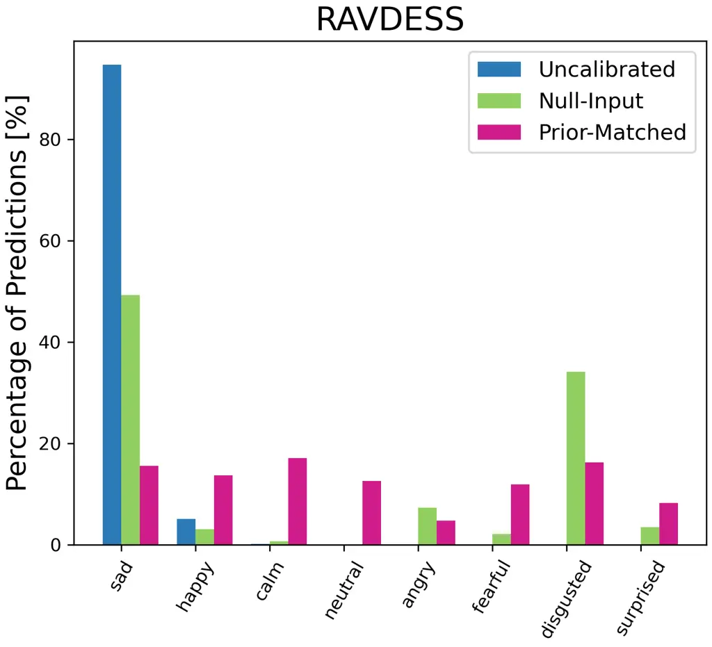

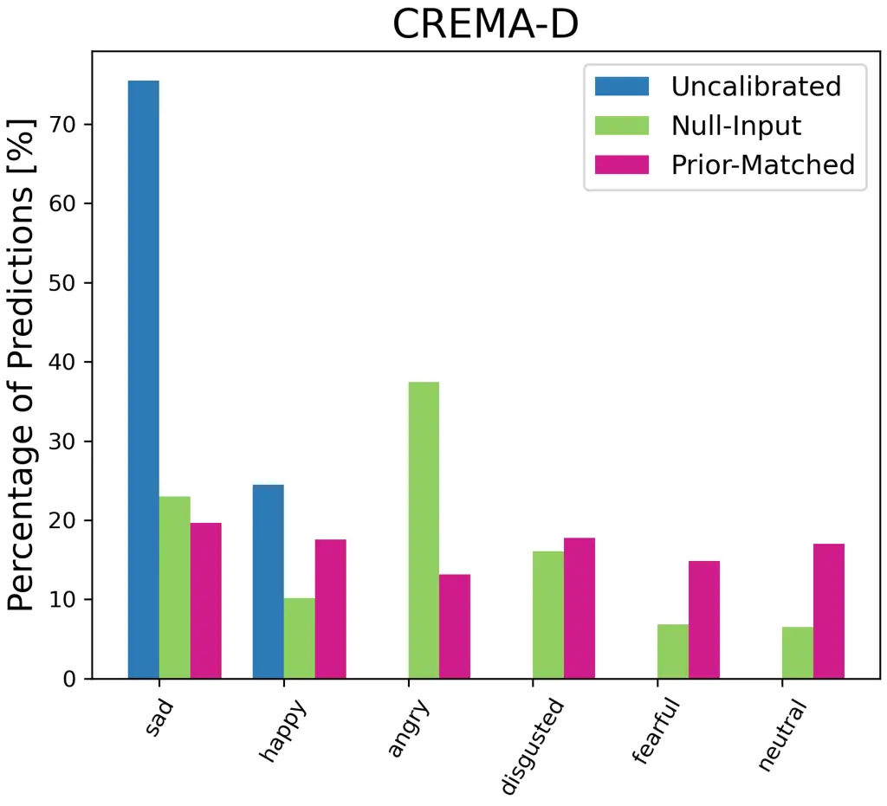

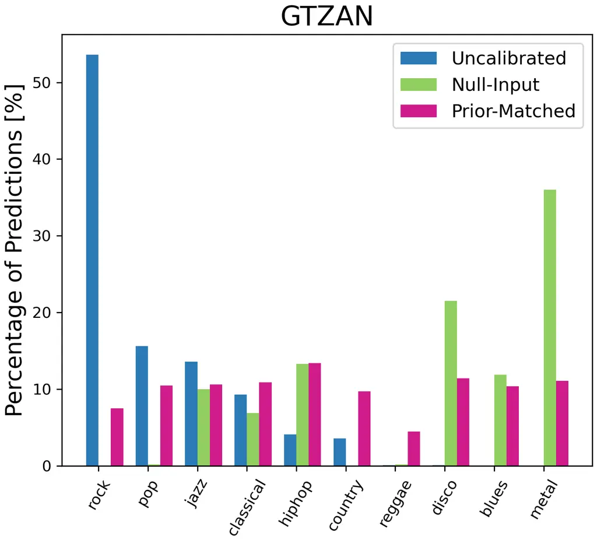

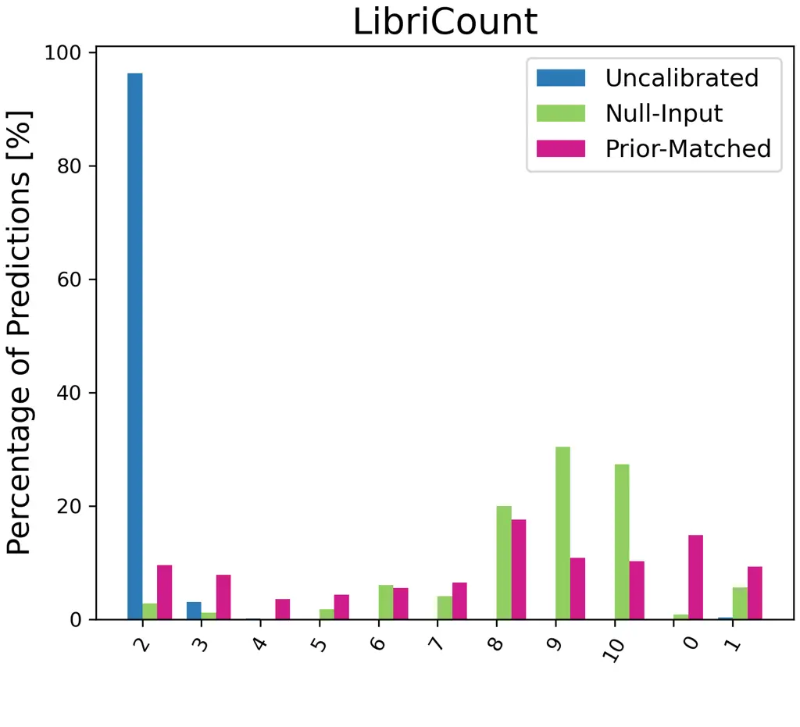

Figure 8: Percentage of model predictions for each class with different
calibration methods. On ESC-50, we only plot the top 15 classes
predicted by the uncalibrated results for illustration.

Figure 8 shows the distribution of predicted classes for all the test
samples on each dataset. For the uncalibrated results, the predictions
are unevenly distributed among all the classes. Specifically, the system
has a strong bias to predict words that are more likely to frequently
appear in the pre-training data, such as ‘rain’, ‘train’, or ‘sad’.
Certain classes are never predicted due to the bias. This problem can be
mitigated with null-input calibration. With prior matching, we can
observe more evenly distributed predictions on the test samples.

## Appendix D Robustness to Prompts

|                                                      |       |      |      |       |
| ---------------------------------------------------- | ----- | ---- | ---- | ----- |
| Prompt                                               | ESC50 | US8K | TUT  | Vocal |
| This is a sound of class_label.                      | 65.4  | 60.4 | 26.0 | 84.9  |
| class_label                                          | 48.6  | 54.8 | 15.7 | 60.1  |
| (class_label)                                        | 68.0  | 65.5 | 21.3 | 86.3  |
| \[class_label\]                                      | 64.3  | 64.2 | 16.1 | 85.9  |
| Listen to the sound, it’s called class_label.        | 50.3  | 56.5 | 16.0 | 81.7  |
| The noise you hear is from the category class_label. | 54.6  | 55.1 | 19.3 | 79.7  |
| This is what we call class_label sound.              | 45.3  | 55.7 | 26.7 | 69.5  |
| Identify this noise as class_label.                  | 46.6  | 52.8 | 13.6 | 81.6  |
| This sound belongs to the group class_label.         | 41.4  | 57.0 | 15.0 | 76.1  |
| Ensemble of Prompts                                  | 67.1  | 67.6 | 25.2 | 87.3  |

Table 9: Prompt sensitivity for Sound Event, Vocal Sound and Acoustic
Scene Classification.

|                                                         |         |         |
| ------------------------------------------------------- | ------- | ------- |
| Prompt                                                  | RAVDESS | CREMA-D |
| The speaker is feeling class_label.                     | 41.7    | 28.8    |
| class_label                                             | 20.7    | 18.1    |
| (class_label)                                           | 33.1    | 35.3    |
| \[class_label\]                                         | 32.6    | 26.6    |
| The person talking feels class_label.                   | 38.5    | 29.6    |
| The speaker is experiencing class_label emotions.       | 20.8    | 20.5    |
| The person speaking is in a class_label mood.           | 29.9    | 27.4    |
| The speaker’s emotion is class_label.                   | 33.6    | 25.1    |
| The person talking is filled with class_label feelings. | 39.7    | 33.0    |
| Ensemble of Prompts                                     | 44.0    | 33.1    |

Table 10: Prompt sensitivity for Emotion Classification.

| Prompt                                    | GTZAN |
| ----------------------------------------- | ----- |
| This is an audio of class_label music.    | 60.9  |
| class_label                               | 39.0  |
| (class_label)                             | 54.6  |
| \[class_label\]                           | 52.3  |
| Listen to this, it’s class_label music.   | 48.5  |
| This audio plays class_label music.       | 38.8  |
| The sound is from class_label music.      | 49.4  |
| What you’re hearing is class_label music. | 58.7  |
| This records class_label music.           | 40.0  |
| Ensemble of Prompts                       | 60.0  |

Table 11: Prompts for Music Genre Classification.

| Prompt                                                        | LibriCount |
| ------------------------------------------------------------- | ---------- |
| In the audio, class_label people are speaking.                | 17.3       |
| class_label people speaking                                   | 13.0       |
| (class_label people speaking)                                 | 15.3       |
| \[class_label people speaking\]                               | 23.2       |
| You can hear class_label people talking in the audio.         | 9.2        |
| The audio includes voices of people from class_label.         | 14.6       |
| In this recording, individuals from class_label are speaking. | 13.5       |
| The audio captures conversations of class_label individuals.  | 11.6       |
| The voices you’re hearing are from class_label people.        | 17.1       |
| Ensemble of Prompts                                           | 22.0       |

Table 12: Prompts for Speaker Counting.

The above tables show the performance of various decoder prompts for all
the considered tasks. We observe that for some tasks, the natural
language prompts are able to perform better than the class label-only
prompt (TUT, RAVDESS, GTZAN), while for the other datasets, one may
observe similar performance between our default prompts and class-only
prompts.

## Appendix E Supervised Training Performance

Two forms of efficient fine-tuning approaches are considered as
supervised baselines; LoRA Hu et al. (2021) and soft prompt tuning (SPT)
Lester et al. (2021); Ma et al. (2023). During training, the audio clip
is provided to the model encoder and the model is trained to generate
the corresponding class label in the decoder. For LoRA, we use a rank
$`r=8`$ and only adapt the attention weights Hu et al. (2021). For SPT,
we insert 20 learnable soft prompt vectors at the decoder input. This
results in 940K $`(0.06\%)`$ and 25K $`(0.002\%)`$ learnable parameters
for LoRA and SPT, respectively. During training, we use a batch size of
8, run 4000 training steps, use the AdamW optimizer with linear decay,
and the learning rate is set to $`1e^{-3}`$ and $`1e^{-1}`$ for LoRA and
SPT, respectively. Experiments are conducted on Whisper large-v2 for TUT
and Vocal, which are the only of the considered tasks with available
training data.

| Method     | Model          | TUT  | Vocal |
| ---------- | -------------- | ---- | ----- |
| Zero-shot  | Random         | 6.7  | 16.7  |
|            | CLAP           | 29.6 | 60.1  |
|            | Whisper        | 26.0 | 84.9  |
| Supervised | CLAP           | 74.6 | 97.9  |
|            | LoRA (Whisper) | 62.7 | 94.5  |
|            | SPT (Whisper)  | 59.2 | 92.6  |

Table 13: Supervised training results on TUT and Vocal.

Table 13 shows performance on TUT and Vocal, where as expected there
remains a significant performance gap between the zero-shot and the
supervised approaches. LoRA shows considerable performance improvements
while being parameter efficient (and only learning 0.06% of parameters).
Supervised trained CLAP demonstrates better performance than Whisper,
possibly as CLAP generates contextual embeddings that may be better
suited for transferring to tasks, while Whisper is an ASR decoding
system that typically isn’t finetuned for downstream audio
classification tasks.
