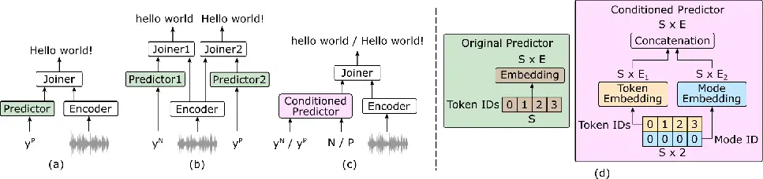

# End-to-end Joint Punctuated and Normalized ASR with a Limited Amount of Punctuated Training Data

Can Cui ^(†)^(†)thanks: This work was mostly conducted while Can Cui was
pursuing her PhD with Inria Centre at Université de Lorraine (Nancy,
France). Affiliation: iFLYTEK Co., Ltd.  
Shanghai, China  
cancui11@iflytek.com    Imran Sheikh Affiliation: Vivoka  
Metz, France  
imran.sheikh@vivoka.com    Mostafa Sadeghi, Emmanuel Vincent
Affiliation: Université de Lorraine, CNRS, Inria, LORIA, F-54000  
Nancy, France  
{mostafa.sadeghi, emmanuel.vincent}@inria.fr Affiliation: 

###### Abstract

Joint punctuated and normalized automatic speech recognition (ASR) aims
at outputing transcripts with and without punctuation and casing. This
task remains challenging due to the lack of paired speech and punctuated
text data in most ASR corpora. We propose two approaches to train an
end-to-end joint punctuated and normalized ASR system using limited
punctuated data. The first approach uses a language model to convert
normalized training transcripts into punctuated transcripts. This
achieves a better performance on out-of-domain test data, with up to 17%
relative Punctuation-Case-aware Word Error Rate (PC-WER) reduction. The
second approach uses a single decoder conditioned on the type of output.
This yields a 42% relative PC-WER reduction compared to Whisper-base and
a 4% relative (normalized) WER reduction compared to the normalized
output of a punctuated-only model. Additionally, our proposed model
demonstrates the feasibility of a joint ASR system using as little as 5%
punctuated training data with a moderate (2.42% absolute) PC-WER
increase.

###### Index Terms: 

ASR, punctuated transcripts, RNN-T, limited data, streaming ready

## I Introduction

Transcribing speech into text with punctuation and casing has been an
active area of research in automatic speech recognition (ASR) \[1, 2,
3\]. According to some definitions,¹¹ 1
https://dictionary.cambridge.org/grammar/british-grammar/punctuation
casing is considered as part of punctuation. For notational simplicity,
we therefore refer to punctuated-cased ASR/transcripts as _punctuated_
ASR/transcripts in the rest of this paper. Joint punctuated and
normalized ASR, which produces transcripts both with and without
punctuation and casing, is highly desirable because (a) it improves
human readability (b) it extends compatibility with natural language
processing models that either exploit or discard punctuation
information, and (c) it simplifies model deployment and maintenance.

The conventional punctuated ASR approach post-processes normalized ASR
output using a punctuation and case restoration model \[4, 5, 6\], such
as a modified Recurrent Neural Network-Transducer (RNN-T) ASR \[7\] with
a fine-tuned language model (LM) \[8\]. While this avoids punctuated
transcripts in ASR training, it increases model size, inference time,
and lacks acoustic cues for punctuation. An alternative is end-to-end
(E2E) ASR, which directly generates punctuated transcripts \[9, 10\]. A
notable example is Whisper \[11\], trained on large-scale data. E2E
punctuated ASR models are less accurate in word recognition than
equal-sized normalized ASR models, leading to poorer normalized ASR
performance \[12, 13\] and increased computation time for output
normalization. To address this, \[12\] introduced an auxiliary
connectionist temporal classification loss for transcribing normalized
text at an intermediate layer, while \[13\] proposed three decoders for
spoken, written, and joint transcripts. These methods enable joint
punctuated and normalized ASR without increasing model size but require
a fully punctuated ASR corpus for training. Beyond punctuation and
casing, \[14\] introduced a transducer-based ASR with Inverse Text
Normalization (ITN), requiring a large training set and longer inference
context \[14, 15\], leading to higher latency and RTF. In contrast, we
aim to develop a low-latency, low-RTF E2E joint punctuated and
normalized ASR system.



Fig. 1: (a) Stateless transducer-based punctuated ASR \[12\], (b) the
proposed 2-Decoder (Joiner + Predictor) joint normalized-punctuated ASR,
(c) the proposed conditioned Predictor ASR, (d) input layers in the
original and conditioned Predictors.

Traditionally, ASR training corpora contain only normalized transcripts,
making them unsuitable for punctuated ASR models. For example, the 900h
CGN corpus \[16\], a major Dutch ASR resource, lacks punctuated data.
The 100h Dutch CommonVoice corpus \[17\] includes punctuated transcripts
but consists of isolated sentences, limiting generalization to long
utterances. Audiobooks provide punctuated long-form speech, but creating
ASR corpora from them is challenging. The Multilingual Librispeech
corpus \[18\] has 1,500h of Dutch data but only 40 speakers, and its
transcripts are normalized. This imbalance between punctuated and
normalized ASR training data poses a challenge for training an E2E joint
punctuated and normalized ASR model.

This paper proposes an E2E joint punctuated and normalized ASR system
that is (a) efficient in both tasks, (b) trainable with limited
punctuated labeled data, and (c) suitable for streaming. We introduce
and compare two complementary approaches to train a stateless
transducer-based E2E joint punctuated and normalized ASR model. The
first approach uses an LM to generate punctuated training transcripts.
However, such LMs may not be accurate enough or available for certain
domains \[19\] and/or languages. To address such scenarios, we propose a
second approach in which a single decoder is conditioned on the type of
output. Experimental results show that our first method results in a 17%
relative error reduction, while the second method enables training with
an exceptionally low proportion of punctuated data.

The paper is organized as follows. Section II presents the
preliminaries. Section III introduces our approaches. Section IV
describes our experiments. We conclude in Section V.

## II Preliminary of stateless transducer-based punctuated ASR

An E2E punctuated ASR system \[12\] directly transcribes speech into a
punctuated transcript. Given an acoustic feature sequence
$`X\in\mathbb{R}^{L\times A}`$ where $`L`$ is the sequence length and
$`A`$ the feature dimension, the training objective is to maximize the
probability

```math
P(Y^{\text{P}}|X)=\prod_{s=1}^{S^{\text{P}}}P(y^{\text{P}}_{s}|{y}^{\text{P}}_{[1:s-1]},X)\vskip-5.0pt \tag{1}
```

by generating a sequence $`Y^{\text{P}}\in\mathbb{R}^{S^{\text{P}}}`$,
where “P” stands for punctuated transcription, and $`S^{\text{P}}`$
represents the punctuated sequence length. The loss function can be
written as

```math
\mathcal{L}^{\text{P}}=-\sum_{Y^{\text{P}},X}\log P(Y^{\text{P}}|X). \tag{2}
```

A stateless transducer-based E2E ASR system, which uses an RNN-T
framework \[20\] with a stateless prediction network \[7\], can be
readily extended to the punctuated transcription task (see Figure 1(a)).
Zipformer \[21\], a stateless transformer encoder with downsampling and
a zip-like structure, further enhances efficiency while maintaining
accuracy. This brings the natural streaming recognition capability of
RNN-T to punctuated ASR.

## III Proposed methods

### III-A 2-Decoder joint normalized-punctuated ASR

Inspired by \[12, 13\], we design an ASR system with two Decoders, each
consisting of its own Predictor and Joiner (see Figure 1(b)). Using the
output of the same Encoder, these two Decoders generate the punctuated
and normalized transcripts. Their respective training objectives are²² 2
These equations are kept consistent with (1) and do not account for the
stateless and/or streaming operation of the transducer model.

```math
\displaystyle\vskip-5.0ptP(Y^{\text{N}}|X) \displaystyle=\prod_{s=1}^{S^{\text{N}}}P({y}^{\text{N}}_{s}|{y}^{\text{N}}_{[1:s-1]},X), \tag{3}
```

```math
\displaystyle P(Y^{\text{P}}|X) \displaystyle=\prod_{s=1}^{S^{\text{P}}}P({y}^{\text{P}}_{s}|{y}^{\text{P}}_{[1:s-1]},X),\vskip-5.0pt \tag{4}
```

where “N” stands for normalized transcription, and $`S^{\text{N}}`$
represents the normalized sequence length. The joint loss function is
defined as

```math
\displaystyle\mathcal{L}^{\text{2-decoder}} \displaystyle=\mathcal{L}^{\text{N}}+\mathcal{L}^{\text{P}} \tag{5}
```

```math
\displaystyle=-\sum_{Y^{\text{N}},X}\log P(Y^{\text{N}}|X)-\sum_{Y^{\text{P}},X}\log P(Y^{\text{P}}|X). \tag{6}
```

### III-B Training ASR using auto-punctuated transcripts

Automatically generated punctuated transcripts of ASR training data can
be used to train punctuated ASR models in the absence of human-generated
punctuated transcripts. To the best of our knowledge, the use of
auto-punctuated transcripts to train punctuated ASR models has been
unexplored in prior works. The work in \[10\] proposed a semi-supervised
rich ASR training method in which a rich ASR system is first trained on
a small amount of human-labeled rich training data and then used to
automatically generate auto-rich transcripts of a larger unlabeled
speech corpus. This approach focused on the rich transcription of speech
phenomena such as fillers, laughter, coughs, etc., hence some
human-labeled data is necessary. By contrast, our transcription task
focuses on punctuation and casing. Punctuation- and case-enhanced
transcripts can be directly obtained from normalized transcripts using
state-of-the-art punctuation and case restoration models \[4, 5, 6\].
Interestingly, this approach can be applied in scenarios where there is
no punctuated labeled training data at all.

### III-C Conditioned Predictor ASR

A drawback of the auto-punctuated transcription-driven ASR training
approach presented above is that errors made by the punctuation and case
prediction model may propagate into the punctuated ASR model. Moreover,
such case and punctuation restoration models may not be accurate enough,
or even available, for certain domains \[19\] and/or languages. Hence,
we propose a second training approach to address such scenarios.

Our approach effectively utilizes the small amount of punctuated
training data and the large amount of normalized training data by using
a single conditioned Predictor to handle both punctuated and normalized
transcriptions. As shown in Figure 1(c), the Predictor is conditioned on
the transcription mode ID, which is an input that specifies whether we
want a normalized (N) or punctuated (P) output. The mode ID input is
inspired by the language ID information used by E2E multilingual ASR
models\[22, 23\]. As shown in Figure 1 (d), the token embeddings are
concatenated with the mode embedding before feeding them to the
following Predictor layers. The Conditioned Predictor ASR system can use
a loss function similar to Equation (4). However, only part of the input
samples will have a punctuated reference transcript and will use the
corresponding loss. This could lead to uneven model performance between
the two output modes, particularly poor performance of the punctuated
transcription mode. To address this issue, we employ a tradeoff
parameter $`\alpha`$ to adjust the weights of $`\mathcal{L}^{\text{N}}`$
and $`\mathcal{L}^{\text{P}}`$, as follows:

```math
\mathcal{L}^{\text{cond-predictor}}=(1-\alpha)\mathcal{L}^{\text{N}}+\alpha\mathcal{L}^{\text{P}}. \tag{7}
```

## IV Experiments

This section details our experimental setup and results. For
reproducibility, our code is available online.³³ 3
https://github.com/can-cui/punctuated-normalized-asr

### IV-A Dataset and metrics

#### IV-A1 Dataset

We conduct experiments on LibriSpeech \[24\], using train-960 for
training, dev-clean/dev-other for validation, and test-clean/test-other
for testing. We retrieve the punctuated transcripts of LibriSpeech from
the original Project Gutenberg texts.⁴⁴ 4 Available at
https://www.openslr.org/12/ Erroneous sentences, such as fully uppercase
chapter names, are removed. A recent work on building a punctuated
Librispeech corpus \[25\] has detailed retrieval steps similar to those
we have developed independently. To evaluate the model’s performance on
real unseen data, we use the CommonVoice \[26\] English clean test set
and independent headset microphone recordings of the AMI meeting corpus
\[27\] test set along with their original punctuated transcripts.

|           |                     |          |       |                        |        |        |        |                        |        |        |        |      |
| --------- | ------------------- | -------- | ----- | ---------------------- | ------ | ------ | ------ | ---------------------- | ------ | ------ | ------ | ---- |
| Config ID | Type of ASR         | \# Param | Trans | LibriSpeech test-clean |        |        |        | LibriSpeech test-other |        |        |        | RTF  |
|           |                     |          |       | WER                    | PuncER | CaseER | PC-WER | WER                    | PuncER | CaseER | PC-WER |      |
| 0         | Whisper-base        | 74 M     | \-    | 5.80                   | 33.86  | 32.04  | 15.96  | 13.02                  | 36.79  | 27.72  | 19.48  | 0.09 |
| 1         | Whisper-small       | 244 M    | \-    | 4.40                   | 31.19  | 28.49  | 10.95  | 11.89                  | 32.17  | 25.67  | 17.59  | 0.23 |
| 2         | Cascaded (ASR+LM)   | 180 M    | N     | 2.18                   | 44.33  | 35.60  | 11.70  | 5.03                   | 47.69  | 34.82  | 14.91  | 0.79 |
| 3         | Punctuated only (a) | 70 M     | P     | 2.45                   | 30.39  | 28.21  | 9.12   | 5.73                   | 30.51  | 25.14  | 11.94  | 0.45 |
| 4         |                     | 70 M     | P'    | 2.35                   | 44.43  | 31.42  | 11.60  | 5.49                   | 47.39  | 30.14  | 14.94  | 0.44 |
| 5         | 2-Decoder (b)       | 71 M     | P + N | 2.33                   | 29.99  | 26.99  | 8.85   | 5.45                   | 31.05  | 24.76  | 11.76  | 0.58 |
| 6         |                     | 71 M     | P'+ N | 2.28                   | 45.10  | 31.68  | 11.67  | 5.38                   | 47.81  | 29.53  | 14.88  | 0.59 |
| 7         | Cond Predictor (c)  | 70 M     | P + N | 2.35                   | 29.14  | 35.61  | 9.32   | 5.49                   | 29.62  | 30.77  | 12.01  | 0.44 |
| 8         |                     | 70 M     | P'+ N | 2.25                   | 44.60  | 41.86  | 12.30  | 5.24                   | 46.84  | 33.99  | 15.42  | 0.45 |

- •
  ✝: For Whisper, it is unknown whether the test data is in-domain or
  out-of-domain due to the lack of training data information.
- •
  Note: We employed the SCTK toolkit \[28\] to conduct Matched Pair
  Sentence Segment statistical significance tests adapted to the four
  metrics. In all the tables, we highlight in bold the best result in
  each column and the results statistically equivalent to it at a 0.05
  significance level.

TABLE I: Error rates (%) on in-domain✝ test data for all the ASR models
trained on LibriSpeech train-960 with different types of transcripts
(Trans): normalized (N), original punctuated (P), or auto-punctuated
(P'). All the test ground truth transcripts are the original punctuated
transcripts. The 2-Decoder ASR and the Conditioned Predictor ASR systems
use both punctuated (P or P') and normalized (N) transcripts for the
entire train-960 set.

#### IV-A2 Metrics

The standard Word Error Rate (WER) is insufficient for evaluating
punctuated transcription. Traditionally, Precision, Recall, and F1
scores have been used \[5, 6\], but they report separate scores for
punctuation marks and lack a standardized casing metric. Recent work
\[25\] proposed adapted error rate metrics for punctuation and case,
underscoring the need for improved evaluation. However, case error rates
are missing, and punctuation error rates include word errors, failing to
isolate punctuation-specific mistakes. To better assess punctuation and
casing performance and standardize error comparisons, we introduce
Punctuation-only Error Rate (PuncER), Case-only Error Rate (CaseER) and
Punctuation-Case-aware WER (PC-WER) alongside the WER. These metrics are
calculated as:

```math
\displaystyle=\frac{E_{\text{p-nc}}-E_{\text{np-nc}}}{N_{\text{p}}}, \displaystyle=\frac{E_{\text{np-c}}-E_{\text{np-nc}}}{N_{\text{c}}},
```

```math
\displaystyle=\frac{E_{\text{p-c}}}{N_{\text{p-c}}}, \displaystyle=\frac{E_{\text{np-nc}}}{N_{\text{np-nc}}}, \tag{8}
```

where $`E`$ represents the total number of substitution, deletion, and
insertion errors, and $`N`$ represents the total number of words,
punctuation and/or casing marks. Suffixes “p” and “c” stand for the
presence of punctuation and casing whereas suffices “np” and “nc” stand
for the absence of punctuation and casing, respectively.

To evaluate inference speed in streaming, we use Real-Time Factor (RTF),
defined as inference time divided by audio length. For Whisper models,
we load them once and process test audio sequentially. For
transducer-based models, we export to ONNX and follow the same process.
RTF is measured during CPU-based inference for punctuated transcription.

### IV-B Model and training setup

We use 80-dimensional log Mel filterbank features as input for all ASR
models and a SentencePiece tokenizer \[29\] with a 500-word vocabulary.
Pretrained Whisper models \[11\] serve as baselines: Whisper-base (74M
parameters) for comparability and Whisper-small (244M) for
high-performance reference. Our ASR models (E2E ASR, 2-Decoder ASR,
Conditioned Predictor ASR) follow the pruned stateless-transducer recipe
with a Zipformer encoder in icefall.⁵⁵ 5
https://github.com/k2-fsa/icefall/blob/master/egs/librispeech/ASR/pruned_transducer_stateless7
For Conditioned Predictor ASR, Token Embedding $`E_{1}`$ and Mode
Embedding $`E_{2}`$ have 500 and 12 dimensions, respectively. All models
were trained for 40 epochs on 4 Nvidia RTX 2080 Ti GPUs, with inference
on an Intel Xeon Gold 5218R CPU.

We use the Rpunct \[30\] model to generate punctuated transcripts from
normalized transcripts. This model is derived from the BERT \[31\] LM
after fine-tuning it for English punctuation and case restoration tasks.

### IV-C Evaluation results

#### IV-C1 Effectiveness of E2E models

Table I presents the error rates on in-domain test sets of our ASR
models. First of all, the transducer-based ASR models demonstrate
superior performance compared to Whisper models. Specially, our proposed
Conditioned Predictor ASR achieves a PC-WER reduction of up to 42%
relative (from 15.96% to 9.32%) compared to Whisper-base, which is of
comparable size, and 15% relative (from 10.95% to 9.32%) compared to
Whisper-small. For the transducer-based ASR models, the conventional
cascaded system, which uses a normalized output ASR model followed by a
punctuation and case restoration LM, is included as a baseline.
Comparison of error rates of the cascaded system and E2E models trained
using punctuated data shows that the latter can lead to significant
reductions in PC-WER. For instance, when using the 2-Decoder ASR model
(P + N) we obtain a relative PC-WER reduction of up to 24% (from 11.70%
to 8.85%).

When comparing the 2-Decoder ASR model with the proposed Conditioned
Predictor ASR model on the LibriSpeech test set, the latter exhibits a
decrease in PuncER. For example, when using the same P + N training set,
the Conditioned Predictor ASR model achieves a relative decrease of 3%
on test-clean and 5% on test-other in PuncER compared to the former. But
2-Decoder ASR has a better performance in terms of case generation, by
reducing the CaseER by 24% relative on test-clean (from 35.60% to
26.99%).

Furthermore, the proposed Conditioned Predictor ASR gives both
normalized and punctuated outputs. The normalized output shows a 4%
relative reduction in WER on test-clean (from 2.45% to 2.35%) and
test-other (from 5.73% to 5.49%). This demonstrates that using a
dual-output ASR model yields better performance for normalized output
compared to normalizing a Punctuated-only ASR model.

Additionally, from the perspective of inference speed, all
transducer-based ASR models achieve an RTF lower than 1, although they
are higher than Whisper models. Notably, the proposed Conditioned
Predictor ASR model has the lowest RTF, which is 0.35 lower (from 0.79
to 0.44) than the traditional cascaded system and 0.15 lower (from 0.59
to 0.44) than the 2-Decoder model, while maintaining similar
performance. The Punctuated-only model has an RTF comparable to the
Conditioned Predictor model, but this value will increase if
normalization of the ASR output is required.

#### IV-C2 Original vs. auto-punctuated transcripts for training

Table II displays the test results on the CommonVoice and the AMI test
sets. On out-of-domain test sets, our transducer-based models still
outperform Whisper models, with a relative lower PC-WER up to 38% (from
73.27% to 45.24%).

Comparing Table I and Table II reveals key insights on original vs.
auto-punctuated training data. E2E ASR trained on original punctuated
transcripts achieves lower punctuation and case error rates on in-domain
LibriSpeech test sets, while using auto-punctuated training transcripts
improves performance on out-of-domain CommonVoice and AMI test sets. For
example, the 2-Decoder ASR model shows a 32% relative PC-WER increase
(from 8.85% to 11.67%) on test-clean and 27% (from 11.76% to 14.88%) on
test-other when using auto-punctuated training transcripts (P'+N)
instead of original transcripts (P+N).

|     |                        |        |        |        |          |        |        |        |
| --- | ---------------------- | ------ | ------ | ------ | -------- | ------ | ------ | ------ |
| ID  | CommonVoice test-clean |        |        |        | AMI test |        |        |        |
|     | WER                    | PuncER | CaseER | PC-WER | WER      | PuncER | CaseER | PC-WER |
| 0   | 38.06                  | 34.03  | 11.09  | 38.99  | 71.72    | 64.22  | 39.84  | 73.27  |
| 1   | 37.90                  | 36.72  | 10.56  | 39.15  | 58.49    | 52.99  | 36.48  | 60.12  |
| 2   | 27.90                  | 27.91  | 11.63  | 29.50  | 37.46    | 74.84  | 45.92  | 45.99  |
| 3   | 29.23                  | 64.87  | 16.47  | 36.61  | 39.59    | 97.02  | 38.57  | 50.61  |
| 4   | 27.81                  | 27.28  | 11.42  | 29.27  | 39.01    | 71.82  | 37.39  | 46.33  |
| 5   | 28.44                  | 64.35  | 16.04  | 35.79  | 39.12    | 96.48  | 39.44  | 50.18  |
| 6   | 28.35                  | 27.65  | 10.83  | 29.70  | 39.33    | 65.63  | 33.64  | 45.43  |
| 7   | 28.57                  | 60.35  | 23.21  | 36.35  | 40.70    | 96.40  | 38.40  | 51.47  |
| 8   | 27.84                  | 27.44  | 11.34  | 29.65  | 38.77    | 65.65  | 35.62  | 45.24  |

TABLE II: Error rates (%) on out-of-domain test sets for all the ASR
models. The ID column corresponds to the config ID in Table I, which
specifies the ASR type and transcription used for training.

However, the same model exhibits a PC-WER reduction of 17% relative
(from 35.79% to 29.70%) on the CommonVoice test set and 9% relative
(from 50.18% to 45.43%) on the AMI test set when using auto-punctuated
training transcripts. The differences mainly stem from the addition of
case and punctuation. Models trained with auto-punctuated transcripts
show a lower PuncER and CaseER. Specifically, for the Conditioned
Predictor model on the CommonVoice test set, the PuncER reduction can be
as high as 54% relative (from 60.35% to 27.44%), and the CaseER can be
reduced by up to 51% relative (from 23.21% to 11.34%) when using
auto-punctuated transcripts. This could be explained by the inconsistent
(and sometimes erroneous) punctuation in LibriSpeech ground truth
punctuated transcripts. By contrast, being trained on a wide range of
domains, the LM outputs a better (possibly domain-dependent) punctuation
than that learned on the specific LibriSpeech domain on average.

#### IV-C3 Conditioned Predictor ASR with limited punctuated data

Unlike the 2-Decoder ASR model, the Conditioned Predictor ASR model can
be trained with different proportions of punctuated and normalized
training data. To evaluate the effectiveness of this capability, we
trained the Conditioned Predictor ASR model with different proportions
of punctuated and normalized (P + N) training data. Table III presents
the error rates obtained on the LibriSpeech test-clean set. It can be
observed that the PC-WER and PuncER increase by small margins even when
the amount of punctuated training data is reduced drastically. Using
only 5% of punctuated training data can still achieve a PC-WER of
11.46%, i.e., a 2.42% absolute increase. This shows that the
Predictor-Conditioned ASR model learns to generalize punctuation
patterns from limited examples by leveraging normalized text and
acoustic-text alignment. Therefore, this model can serve scenarios
having limited or severely limited punctuated training data.

|                    |      |        |        |        |     |
| ------------------ | ---- | ------ | ------ | ------ | --- |
| (P : N) Proportion | WER  | PuncER | CaseER | PC-WER |     |
| 0.50 : 0.50        | 2.38 | 29.33  | 34.86  | 9.32   |     |
| 0.35 : 0.65        | 2.37 | 28.99  | 45.44  | 9.95   |     |
| 0.20 : 0.80        | 2.34 | 29.96  | 56.37  | 10.83  |     |
| 0.05 : 0.95        | 2.56 | 31.59  | 58.58  | 11.46  |     |

TABLE III: Error rates (%) of Conditioned Predictor ASR (c) on
LibriSpeech test-clean when using different proportions of punctuated
and normalized (P + N) training data.

## V Conclusion

In this paper, we introduced two approaches for training a stateless
transducer-based E2E joint punctuated and normalized ASR model with
minimal punctuated labeled data. The first approach leverages a language
model to generate auto-punctuated transcripts, achieving up to 17%
relative PC-WER reduction on out-of-domain data compared to training on
punctuated data. The second approach uses a Conditioned Predictor,
enabling efficient dual-output ASR. Our Conditioned Predictor model
reduces PC-WER by 42% relative to Whisper-base with a similar parameter
count. This approach proves feasible with as little as 5% punctuated
training data, incurring only a 2.42% absolute error increase.

## References

- \[1\] Jonathan G Fiscus, Jerome Ajot, and John S Garofolo, “The rich
  transcription 2007 meeting recognition evaluation,” in International
  Evaluation Workshop on Rich Transcription, 2007, pp. 373–389.
- \[2\] Ondřej Klejch, Peter Bell, and Steve Renals, “Punctuated
  transcription of multi-genre broadcasts using acoustic and lexical
  approaches,” in SLT, 2016, pp. 433–440.
- \[3\] Binh Nguyen, Vu Bao Hung Nguyen, Hien Nguyen, Pham Ngoc Phuong,
  The-Loc Nguyen, Quoc Truong Do, and Luong Chi Mai, “Fast and accurate
  capitalization and punctuation for automatic speech recognition using
  transformer and chunk merging,” in International committee for the
  co-ordination and standardisation of speech databases and assessment
  techniques (O-COCOSDA), 2019, pp. 1–5.
- \[4\] Junwei Liao, Sefik Eskimez, Liyang Lu, Yu Shi, Ming Gong, Linjun
  Shou, Hong Qu, and Michael Zeng, “Improving readability for automatic
  speech recognition transcription,” ACM Transactions on Asian and
  Low-Resource Language Information Processing, vol. 22, no. 5, pp.
  1–23, 2023.
- \[5\] Qiushi Huang, Tom Ko, H Lilian Tang, Xubo Liu, and Bo Wu,
  “Token-level supervised contrastive learning for punctuation
  restoration,” in Interspeech, 2021, pp. 2012–2016.
- \[6\] Martin Poláček, Petr Červa, Jindřich Žďánský, and Lenka
  Weingartová, “Online punctuation restoration using ELECTRA model for
  streaming asr systems,” in Interspeech, 2023, pp. 446–450.
- \[7\] Mohammadreza Ghodsi, Xiaofeng Liu, James Apfel, Rodrigo Cabrera,
  and Eugene Weinstein, “RNN-transducer with stateless prediction
  network,” in ICASSP, 2020, pp. 7049–7053.
- \[8\] Kevin Clark, Minh-Thang Luong, Quoc V. Le, and Christopher D.
  Manning, “ELECTRA: Pre-training text encoders as discriminators rather
  than generators,” in ICLR, 2020.
- \[9\] Hayato Futami, Emiru Tsunoo, Kentaro Shibata, Yosuke Kashiwagi,
  Takao Okuda, Siddhant Arora, and Shinji Watanabe, “Streaming joint
  speech recognition and disfluency detection,” in ICASSP, 2023, pp.
  1–5.
- \[10\] Tomohiro Tanaka, Ryo Masumura, Mana Ihori, Akihiko Takashima,
  Shota Orihashi, and Naoki Makishima, “End-to-end rich
  transcription-style automatic speech recognition with semi-supervised
  learning,” in Interspeech, 2021, pp. 4458–4462.
- \[11\] Alec Radford, Jong Wook Kim, Tao Xu, Greg Brockman, Christine
  McLeavey, and Ilya Sutskever, “Robust speech recognition via
  large-scale weak supervision,” in International Conference on Machine
  Learning, 2023, pp. 28492–28518.
- \[12\] Jumon Nozaki, Tatsuya Kawahara, Kenkichi Ishizuka, and Taiichi
  Hashimoto, “End-to-end speech-to-punctuated-text recognition,” in
  Interspeech, 2022, pp. 1811–1815.
- \[13\] Mana Ihori, Hiroshi Sato, Tomohiro Tanaka, Ryo Masumura, Saki
  Mizuno, and Nobukatsu Hojo, “Transcribing speech as spoken and written
  dual text using an autoregressive model,” in Interspeech, 2023, pp.
  461–465.
- \[14\] Cal Peyser, Hao Zhang, Tara N Sainath, and Zelin Wu, “Improving
  performance of end-to-end ASR on numeric sequences,” arXiv preprint
  arXiv:1907.01372, 2019.
- \[15\] Monica Sunkara, Chaitanya Shivade, Sravan Bodapati, and Katrin
  Kirchhoff, “Neural inverse text normalization,” in ICASSP, 2021, pp.
  7573–7577.
- \[16\] Ineke Schuurman, Machteld Schouppe, Heleen Hoekstra, and Ton
  Van der Wouden, “CGN, an annotated corpus of spoken dutch,” in 4th
  International Workshop on Linguistically Interpreted Corpora
  (LINC-03), 2003.
- \[17\] Rosana Ardila, Megan Branson, Kelly Davis, Michael Henretty,
  Michael Kohler, Josh Meyer, Reuben Morais, Lindsay Saunders, Francis M
  Tyers, and Gregor Weber, “Common voice: A massively-multilingual
  speech corpus,” arXiv preprint arXiv:1912.06670, 2019.
- \[18\] Vineel Pratap, Qiantong Xu, Anuroop Sriram, Gabriel Synnaeve,
  and Ronan Collobert, “MLS: A large-scale multilingual dataset for
  speech research,” in Interspeech, 2020, pp. 2757–2761.
- \[19\] Monica Sunkara, Srikanth Ronanki, Kalpit Dixit, Sravan
  Bodapati, and Katrin Kirchhoff, “Robust prediction of punctuation and
  truecasing for medical ASR,” in Workshop on Natural Language
  Processing for Medical Conversations, 2020, pp. 53–62.
- \[20\] Alex Graves, “Sequence transduction with recurrent neural
  networks,” arXiv preprint arXiv:1211.3711, 2012.
- \[21\] Zengwei Yao, Liyong Guo, Xiaoyu Yang, Wei Kang, Fangjun Kuang,
  Yifan Yang, Zengrui Jin, Long Lin, and Daniel Povey, “Zipformer: A
  faster and better encoder for automatic speech recognition,” in
  International Conference on Learning Representations (ICLR), 2023.
- \[22\] Jinyu Li, “Recent advances in end-to-end automatic speech
  recognition,” APSIPA Transactions on Signal and Information
  Processing, vol. 11, no. 1, 2022.
- \[23\] Shubham Toshniwal, Tara N Sainath, Ron J Weiss, Bo Li, Pedro
  Moreno, Eugene Weinstein, and Kanishka Rao, “Multilingual speech
  recognition with a single end-to-end model,” in ICASSP, 2018, pp.
  4904–4908.
- \[24\] Vassil Panayotov, Guoguo Chen, Daniel Povey, and Sanjeev
  Khudanpur, “Librispeech: An ASR corpus based on public domain audio
  books,” in ICASSP, 2015, pp. 5206–5210.
- \[25\] Aleksandr Meister, Matvei Novikov, Nikolay Karpov, Evelina
  Bakhturina, Vitaly Lavrukhin, and Boris Ginsburg, “LibriSpeech-PC:
  Benchmark for evaluation of punctuation and capitalization
  capabilities of end-to-end asr models,” in ASRU, 2023, pp. 1–7.
- \[26\] R. Ardila, M. Branson, K. Davis, M. Henretty, M. Kohler,
  J. Meyer, R. Morais, L. Saunders, F. M. Tyers, and G. Weber, “Common
  voice: A massively-multilingual speech corpus,” in LREC, 2020, pp.
  4211–4215.
- \[27\] Jean Carletta, Simone Ashby, Sebastien Bourban, Mike Flynn,
  Mael Guillemot, Thomas Hain, Jaroslav Kadlec, Vasilis Karaiskos,
  Wessel Kraaij, Melissa Kronenthal, et al., “The AMI meeting corpus: A
  pre-announcement,” in International Workshop on Machine Learning for
  Multimodal Interaction, 2005, pp. 28–39.
- \[28\] NIST, “SCTK,” https://github.com/usnistgov/SCTK.git, 2024,
  GitHub repository.
- \[29\] Taku Kudo and John Richardson, “Sentencepiece: A simple and
  language independent subword tokenizer and detokenizer for neural text
  processing,” in 2018 Conference on Empirical Methods in Natural
  Language Processing: System Demonstrations, 2018, pp. 66–71.
- \[30\] Daulet Nurmanbetov, “rpunct,”
  https://github.com/Felflare/rpunct.git, 2021, GitHub repository.
- \[31\] Jacob Devlin, Ming-Wei Chang, Kenton Lee, and Kristina
  Toutanova, “BERT: Pre-training of deep bidirectional transformers for
  language understanding,” in NAACL-HLT, 2019, vol. 1, p. 2.
