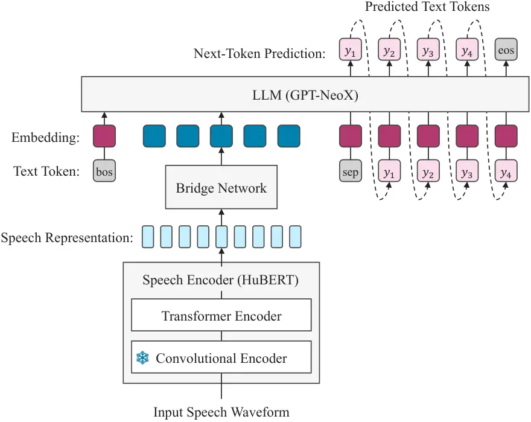

# Integrating Pre-Trained Speech and Language Models for End-to-End Speech Recognition

Yukiya Hono    Koh Mitsuda    Tianyu Zhao Affiliation: Kentaro Mitsui,
Toshiaki Wakatsuki, Kei Sawada Affiliation: rinna Co., Ltd.
Email: [{yuhono,kohmi,tianyuz,kemits,towaka,keisawada}@rinna.co.jp](mailto:)

###### Abstract

Advances in machine learning have made it possible to perform various
text and speech processing tasks, such as automatic speech recognition
(ASR), in an end-to-end (E2E) manner. E2E approaches utilizing
pre-trained models are gaining attention for conserving training data
and resources. However, most of their applications in ASR involve only
one of either a pre-trained speech or a language model. This paper
proposes integrating a pre-trained speech representation model and a
large language model (LLM) for E2E ASR. The proposed model enables the
optimization of the entire ASR process, including acoustic feature
extraction and acoustic and language modeling, by combining pre-trained
models with a bridge network and also enables the application of
remarkable developments in LLM utilization, such as parameter-efficient
domain adaptation and inference optimization. Experimental results
demonstrate that the proposed model achieves a performance comparable to
that of modern E2E ASR models by utilizing powerful pre-training models
with the proposed integrated approach.

## 1 Introduction

Mainstream of automatic speech recognition (ASR) has shifted from
traditional pipeline methods to end-to-end (E2E) ones (Graves et al.,
2013; Chorowski et al., 2015). Some of the key techniques in E2E ASR
include a connectionist temporal classification (CTC) (Graves et al.,
2013), and an attention-based encoder-decoder model (Chorowski et al.,
2015). Alternatively, speech representation models trained in a
self-supervised manner using large amounts of unlabeled speech data have
also attracted considerable attention (Baevski et al., 2020; Hsu et al.,
2021). Fine-tuning these models achieves a better performance in
downstream tasks, including ASR, particularly in low-data settings.
However, these methods typically employ external language model-fused
decoding, which complicates the decoding process. Although a more recent
study (Radford et al., 2023) showed remarkable success with a single
encoder-decoder model using 680k hours of weakly supervised labeled data
without such pre-training models and decoding fusion, it is challenging
to collect data on this scale.

In natural language processing (NLP) research, large language models
(LLMs) pre-trained on massive amounts of text data have significantly
impacted NLP benchmarks, such as question answering, knowledge
retrieval, and natural language understanding (Radford et al., 2018;
Black et al., 2022; Chowdhery et al., 2023; Touvron et al., 2023). In
recent years, the success of LLMs has sparked research interest in
integrating LLMs with other modalities such as images, audio, and
video (Alayrac et al., 2022; Li et al., 2023; Zhu et al., 2024; Chang
et al., 2023; Zhang et al., 2023; Shen et al., 2023; Wang et al., 2023b;
Rubenstein et al., 2023; Fathullah et al., 2024; Wu et al., 2023; Pan
et al., 2023; Yu et al., 2024; Chen et al., 2023a). Pioneering
studies (Zhang et al., 2023; Shen et al., 2023) utilized LLM as a
control hub with several well-trained speech expert models. Several
studies have investigated feeding the audio information to the LLM as a
prompt so that the decoder-only Transformer (Vaswani et al., 2017) can
adapt to speech processing tasks (Chang et al., 2023; Zhang et al.,
2023; Wang et al., 2023b; Rubenstein et al., 2023; Fathullah et al.,
2024; Wu et al., 2023; Pan et al., 2023; Yu et al., 2024). These methods
demonstrate superior performance in various speech-text processing tasks
such as ASR and automatic speech translation, benefiting from the
powerful linguistic knowledge of LLMs. In addition, some work on ASR and
speech synthesis have also shown the potential of a pure decoder-only
Transformer that has yet to be pre-trained (Tsunoo et al., 2023; Wang
et al., 2023a).

Inspired by recent successes in speech representation learning and LLMs,
this paper proposes a novel E2E ASR model by integrating two large-scale
pre-trained models, HuBERT (Hsu et al., 2021) and GPT (Radford et al.,
2018). Our proposed method benefits from the powerful language modeling
and decoding capabilities of autoregressive LLMs, eliminating the need
for complex decoding processes, such as external language model-fused
decoding. Even with simple greedy decoding, our approach achieves a
performance comparable to that of recent well-trained and carefully
designed ASR models. Furthermore, our model can take advantage of recent
rapid developments in LLM research fields, such as inference
optimization tools and rich domain adaptation knowledge, which suggest
promising avenues for future progress. The primary contributions of this
paper are as follows:

- •
  We propose a fully E2E ASR model capable of directly generating text
  token sequences from speech waveforms, integrating pre-trained HuBERT
  and GPT models.
- •
  Through ablation tests, we identify the optimal way to integrate these
  two pre-trained models.
- •
  We demonstrate the fine-tuning of the proposed model for domain
  adaptation, which will be helpful for insight into the deployment of
  the proposed model in practical use cases.

We call the proposed model Nue-ASR¹¹ 1 The name comes from the Japanese
word “Nue,” one of the Japanese legendary creatures “Yōkai.” and release
an inference code with the model checkpoint for Japanese E2E ASR²² 2
[https://huggingface.co/rinna/nue-asr](https://huggingface.co/rinna/nue-asr).

## 2 Related Work

There has been a recent surge in the use of LLMs for speech processing
tasks, including ASR. This emerging trend reflects a growing awareness
of the potential of LLMs to apply their ability to perform a variety of
tasks.

The primary approach to directly exploiting LLMs for speech processing
tasks is to feed the continuous representation obtained from the speech
processing model (Fathullah et al., 2024; Wu et al., 2023; Pan et al.,
2023; Yu et al., 2024) or discretized features from its
representation (Chang et al., 2023; Zhang et al., 2023; Wang et al.,
2023b; Rubenstein et al., 2023; Chen et al., 2023b) to the LLM,
empowering the decoder-only Transformer to recognize and generate
multimodal content, including audio. In practice, continuous speech
representations or discrete audio tokens are injected into a linguistic
embedding space.

In the continuous representation-based approach, Transformer-based
speech encoders are often introduced to obtain speech representations
from acoustic features such as Mel filterbank outputs. The sequence
length of these features is longer than that of text tokens since these
kinds of features are often 50 and 100 frames per second. Therefore,
downsampling using a convolution layer (Fathullah et al., 2024) or CTC
compression (Gaido et al., 2021; Wu et al., 2023; Pan et al., 2023) is
often employed. Other approaches employ a Querying Transformer
(Q-Former) (Li et al., 2023) to convert variable-length speech
representations into fixed-length output query representations, or an
enhancement of the Q-Former to extract segment-level query
representations (Yu et al., 2024). These approaches involve pre-training
the speech encoder module or CTC compression network with paired speech
and text data using CTC loss, or leveraging the encoder from a
well-trained encoder-decoder ASR model. This implies a substantial
requirement for training the speech processing model with ASR tasks.

In the discrete representation-based approach, the outputs of speech
representation models such as HuBERT (Hsu et al., 2021) and
w2v-BERT (Chung et al., 2021) are discretized via $`k`$-means, or neural
audio codec models such as EnCodec (Défossez et al., 2023) are utilized
to extract discrete token from speech waveforms. To address the gap
between the sequence lengths of speech and text tokens, a technique has
also been proposed to remove adjacent duplicate indices. Discrete speech
tokens can be treated similarly to text tokens by extending the LLM
vocabulary. However, detailed information in speech may not be fully
exploited, and optimization is inherently a two-step process.

This paper integrates a pre-trained speech representation model with the
LLM to utilize the speech representations extracted from speech
waveforms as continuous features directly. Our method, categorized as a
continuous representation-based approach, diverges from prior studies by
not relying on signal processing-based acoustic features, thus
completely enjoying the advantages of a speech representation model with
self-supervised learning. The integrated model with a convolution-based
bridge network can be trained with only a single causal language
modeling objective. Consequently, it achieves fully E2E ASR by directly
processing speech waveforms, exploiting the combined capabilities of
speech models and LLMs. This paper focuses on the ASR task, which is
appropriate as a first consideration for integrating pre-trained speech
and language models for E2E speech processing tasks. It can assess
whether speech information is accurately passed to the LLM without
missing any content.

## 3 Methodologies

An overview of the proposed model is presented in Fig 1. This model
consists of three main components: speech encoder, bridge network, and
LLM.



Figure 1: Overview of the proposed model. All modules of the speech
encoder, bridge network, and LLM, except the convolutional waveform
encoder, are simultaneously optimized in an E2E manner.

### 3.1 Leveraging LLMs for speech recognition

The proposed model uses a decoder-only Transformer-based LLM to perform
speech recognition as next-token prediction. Any LLM can be used. We
adopted the pre-trained GPT-NeoX (Andonian et al., 2021), a GPT variant
with a modified architecture for the Transformer layer and an
alternative positional encoding mechanism called rotary embedding (Su
et al., 2021) to replace the original learnable position embeddings. In
practice, a speech waveform $`\mathbf{x}`$ is fed into an speech encoder
to obtain speech representations, followed by a bridge network to
convert the speech representations into the embedding space of text
tokens to feed LLM as speech prompts. Given speech prompt
$`\mathbf{s}`$, the generation of the corresponding text sequence
$`\mathbf{y}`$ is formulated as follows:

```math
\displaystyle p(\mathbf{y}|\mathbf{s};\theta_{\mathrm{LM}})=\prod_{i=1}^{I}p(y_{i}|\mathbf{y}_{<i},\mathbf{s};\theta_{\mathrm{LM}}), \tag{1}
```

where $`\mathbf{y}_{<i}`$ is the generated text sequence before time
step $`i`$, $`I`$ is the number of tokens contained in the text
sequence, and $`\theta_{\mathrm{LM}}`$ denotes the parameters of the
LLM.

### 3.2 Prompting speech information

We adopted a pre-trained HuBERT model as the speech encoder, focusing on
the potential of self-supervised speech representation learning with
large amounts of speech data. HuBERT contains a convolutional waveform
encoder and a BERT-like Transformer-based encoder (Devlin et al., 2019),
that is trained in a self-supervised manner using a masked prediction
objective (Hsu et al., 2021).

The output of the speech encoder is fed into the bridge network, which
converts the speech representations into the embedding space of the LLM.
Because the output of HuBERT is a 20 ms shifted feature sequence, the
sequence length is longer than that of text tokens, making direct
handling by the LLM inefficient. Therefore, sequence compression is
performed when a bridge network maps HuBERT features onto the LLM
embedding space. Several studies (Gaido et al., 2021; Wu et al., 2023;
Pan et al., 2023; Tsunoo et al., 2023) introduces CTC compression based
on the tokens predicted by CTC (Graves et al., 2013). Motivated by the
success of previous studies, the following three methods are considered
for sequence compression in bridge networks.

Downsampling:  
The output sequence from HuBERT is downsampled to a quarter of its
original length using two convolutional layers with a kernel size of 4
and a stride of 2.

CTC remove:  
The output frames of HuBERT that CTC predicts as blank are removed. CTC
prediction is performed by adding a dedicated softmax layer on top of
the HuBERT encoder as a CTC branch.

CTC average:  
The adjacent output frames of HuBERT that CTC predicts as the same
symbol are averaged. CTC prediction is performed in the same manner as
CTC remove.

The details of the bridge network using these three methods are shown in
Fig 2. CTC remove and CTC average are denoted as CTC compression in the
following sections.

Figure 2: The details of the bridge network. In (b) CTC remove and (c)
CTC average, a dedicated softmax layer is placed on top of the HuBERT
encoder as a CTC branch. An additional CTC loss is also introduced.

### 3.3 Training strategy

The proposed model can be trained using a causal language modeling loss
function as follows:

```math
\displaystyle\mathcal{L}_{\mathrm{LM}}=-\sum_{i=1}^{I}\log p(y_{i}|\mathbf{y}_{<i},\mathbf{s}). \tag{2}
```

Furthermore, when CTC compression is applied within the bridge network,
the model should be trained using CTC
loss $`\mathcal{L}_{\mathrm{CTC}}`$ (Graves et al., 2006) along with the
causal language modeling loss, as follows:

```math
\displaystyle\mathcal{L}_{\mathrm{LM+CTC}}=\mathcal{L}_{\mathrm{LM}}+\lambda_{\mathrm{CTC}}\mathcal{L}_{\mathrm{CTC}}, \tag{3}
```

where $`\lambda_{\mathrm{CTC}}`$ is a hyperparameter to controlling the
weight of CTC loss.

Intuitively, to maximize the performance of our proposed model, it would
be desirable to train all parameters of the speech encoder, bridge
network, and LLM simultaneously. This holistic approach ensures complete
integration and optimization across all components in a fully E2E
manner. However, because pre-trained models, especially LLM, have many
parameters, full-parameter fine-tuning of these models is
computationally expensive. It is also worth considering the
effectiveness of the built-in capabilities of these pre-trained models
for ASR tasks. Therefore, this paper will also consider cases where each
model is frozen through experiments in Section 4.2.

As a popular technique for adapting large-scale LLMs to new datasets or
tasks at a minimal cost, parameter efficient fine-tuning (PEFT) (Houlsby
et al., 2019) has recently gained attention. Most of the previous
studies (Zhang et al., 2023; Fathullah et al., 2024; Wu et al., 2023;
Pan et al., 2023) to extend LLMs to speech processing tasks have use
low-rank adaptation (LoRA) (Hu et al., 2022) to perform PEFT. LoRA
allows for efficient adaptation by modifying a smaller subset of model’s
parameters, enabling task-specific adjustments without the extensive
computational overhead typically associated with training large models.
Therefore, this study will also examine the optimization of an efficient
LLM part using LoRA.

Through these methodologies, our study aims to create an efficient and
effective bridge between speech and text modalities, harnessing the
strengths of pre-trained speech and language models.

## 4 Experiments

### 4.1 Setup

To evaluate the performance of the proposed model, we conducted Japanese
ASR experiments using publicly available speech corpora. We used the
ReazonSpeech corpus (v1.0) (Yin et al., 2023), a 19,000-hour speech
corpus collected from Japanese TV programs with a 16 kHz sampling. We
used 1,000 utterances as development data, 1,000 different utterances as
test data, and the remainder as training data. Before ASR training, all
symbols except hyphens, apostrophes, punctuation, and question marks
were removed as part of the text normalization process. Further details
of the dataset are provided in the Appendix A.

To initialize the speech encoder, we used a pre-trained
japanese-hubert-base³³ 3
[https://huggingface.co/rinna/japanese-hubert-base](https://huggingface.co/rinna/japanese-hubert-base)
model (Sawada et al., 2024), which was trained on the ReazonSpeech
corpus, consisting of 7-layer convolutions and a 12-layer Transformer
with 768 hidden units and 12 attention heads. To initialize the LLM, we
used a pre-trained japanese-gpt-neox-3.6b⁴⁴ 4
[https://huggingface.co/rinna/japanese-gpt-neox-3.6b](https://huggingface.co/rinna/japanese-gpt-neox-3.6b)
model (Sawada et al., 2024), which was trained on approximately 312.5
billion tokens, consisting of a 36-layer Transformer with 2,816 hidden
units and 22 attention heads. We used a SentencePiece (Kudo and
Richardson, 2018)-based tokenizer. The tokenizer had a vocabulary size
of 32,000. The proposed models were trained on four NVIDIA A100 80GB
GPUs for a single run of five epochs with four gradient accumulations.
The total batch size was set to 64 utterances per GPU. The optimizer was
AdamW (Loshchilov and Hutter, 2019) with parameters $`\beta_{1}=0.9`$,
$`\beta_{2}=0.999`$, and a weight decay factor of $`0.05`$. The learning
rate was linearly warmed up over a quarter of the epoch up to a peak
value of $`0.0001`$ followed by a cosine-decaying schedule. The
wall-time required to train the proposed model was approximately 56
hours. For CTC compression, $`\lambda_{\mathrm{CTC}}`$ was set to 0.5.
To efficiently train the proposed model with CTC compression, HuBERT was
fine-tuned in advance using only the CTC loss. This CTC fine-tuned model
is referred to as HuBERT-CTC hereinafter. In the preliminary
experiments, we found that the convolutional waveform encoder in HuBERT
should be frozen for stable training of the proposed model.

We optimized the inference process of the GPT in the proposed model
using DeepSpeed-Inference (Aminabadi et al., 2022). Greedy search was
used for inference the proposed model. We investigated suitable decoding
strategies for the proposed model in Appendix C.1.

### 4.2 Ablation study

The performance of the proposed model was compared under various
conditions. In addition to the ReazonSpeech test set, we used two other
Japanese speech corpora for evaluation: 1) JSUT basic5000 (Sonobe
et al., 2017), which contains 5,000 utterances by a single female
speaker with high-quality recordings for speech synthesis, and 2) Common
Voice 8.0 (CV8.0) Japanese test set (Ardila et al., 2020), which
consists of 4,483 utterances by multiple speakers. The detailed
information of additional datasets is provided in Appendix A.

As introduced in Section 3.2, we compared three methods of bridging the
HuBERT output space and the GPT input embedding space: Downsampling with
convolution, CTC remove, and CTC average. In each case, we compared
whether to fine-tune the HuBERT encoder and GPT. Following previous
studies (Fathullah et al., 2024), we investigated using LoRA to
efficiently fine-tune GPT parameters with a rank parameter $`R=32`$
instead of full-parameter fine-tuning (Full FT). We also included a
method that uses only HuBERT-CTC in this comparison. We measured ASR
performance by calculating character error rates (CERs) for text by
removing all symbols, including punctuation marks, and converting
numbers to words using num2words⁵⁵ 5
[https://github.com/savoirfairelinux/num2words](https://github.com/savoirfairelinux/num2words).

|                                   |                   |         |                            |      |       |
| --------------------------------- | ----------------- | ------- | -------------------------- | ---- | ----- |
| IDs                               | Model description |         | CER \[%\] ($`\downarrow`$) |      |       |
|                                   | HuBERT            | GPT     | Reazon                     | JSUT | CV8.0 |
| HuBERT + GPT (w/ Downsampling)    |                   |         |                            |      |       |
| A1                                | Frozen            | Full FT | 9.7                        | 10.4 | 10.2  |
| A2                                | Full FT           | Frozen  | 10.8                       | 19.1 | 13.4  |
| A3                                | Full FT           | Full FT | 8.4                        | 8.6  | 9.2   |
| A4                                | Full FT           | PEFT    | 10.4                       | 14.8 | 12.1  |
| HuBERT-CTC + GPT (w/ CTC remove)  |                   |         |                            |      |       |
| B1                                | Frozen            | Full FT | 9.1                        | 12.1 | 11.9  |
| B2                                | Full FT           | Frozen  | 13.6                       | 18.5 | 18.4  |
| B3                                | Full FT           | Full FT | 7.8                        | 12.1 | 10.4  |
| B4                                | Full FT           | PEFT    | 10.2                       | 21.6 | 14.6  |
| HuBERT-CTC + GPT (w/ CTC average) |                   |         |                            |      |       |
| C1                                | Frozen            | Full FT | 8.6                        | 11.9 | 10.6  |
| C2                                | Full FT           | Frozen  | 10.5                       | 17.0 | 15.1  |
| C3                                | Full FT           | Full FT | 7.8                        | 11.5 | 9.7   |
| C4                                | Full FT           | PEFT    | 10.1                       | 15.3 | 13.0  |
| HuBERT-CTC                        |                   |         |                            |      |       |
| D                                 | Frozen            | \-      | 16.3                       | 23.8 | 21.5  |

Table 1: ASR results of ablation test with ReazonSpeech test set, JSUT
basic5000, and Common Voice 8.0 (CV8.0) test set.

The results are presented in Table 1. All models integrating HuBERT and
GPT (A1–4, B1–4, C1–4) significantly outperformed HuBERT-CTC (D). The
results show that integrating HuBERT with GPT, which has vast linguistic
knowledge, improves recognition accuracy. In addition, fine-tuning the
full parameters of both HuBERT and GPT (A3, B3, C3) achieved lower CERs,
regardless of the bridge network type. We also observed that GPT
fine-tuning was more effective than HuBERT fine-tuning. When GPT was
frozen (A2, B2, C2), the bridge network was forced to map the speech
representation to the LLM embedding space suitable for text tokens to
perform the ASR task via GPT in a zero-shot manner. By contrast, GPT
fine-tuning enhanced the ability to handle speech information directly
and appropriately. When HuBERT was frozen (A1, B1, C1), the recognition
accuracy decreased only slightly because GPT could be optimized to
handle speech information. This also implies that pre-trained HuBERT and
HuBERT-CTC already have the potential to extract useful features for
ASR.

In evaluating the system that performed PEFT with LoRA on GPT (A4, B4,
C4), we observed that its performance exceeded that of the corresponding
system with a frozen GPT (A2, B2, C2). However, it did not reach the
level of systems that had undergone full-parameter fine-tuning (A3, B3,
C3). These results suggest that GPT optimization significantly
contributes to achieving high recognition accuracy in the proposed
model.

Here, we compare sequence compression techniques in bridge networks
among models using the same training strategies. When comparing the
CTC-based compression methods, CTC average groups (C1–3) demonstrated
better performance in all training strategies than CTC remove groups
(B1–3), particulally for the JSUT basic5000 and CV8.0 test sets. This
result differs from previous ASR studies that employed a decoder-only
Transformer model (Tsunoo et al., 2023), which could be attributed to
whether or not pre-training models were used or the fact that a
different target language may have affected the results. In contrast,
Downsampling (A1–3) showed different trends for different test sets. CTC
average (C1–3) showed improved performance on the ReazonSpeech test set,
yet Downsampling (A1-3) consistently outperformed CTC on JSUT basic5000
and CV8.0, marking a departure from prior findings (Tsunoo et al., 2023;
Wu et al., 2023). The results suggest that CTC-based compression is
sensitive to the domain match between the training and evaluation data.
Although CTC compression can effectively compress the sequence of speech
representations to be close to the text length, CTC compression’s
inaccuracies, often due to prediction errors, can negatively impact
GPT-driven text generation. In addition, allowing the speech encoder to
perform CTC prediction implies a shift to a two-stage model, potentially
compromising end-to-end optimization compared to downsampling. A
detailed analysis can be found in Appendix B.1. We also investigated the
utilizing different speech encoder in Appendix C.2.

### 4.3 Comparison with other ASR models

|                            |               |           |                            |                |            |       |       |       |                      |
| -------------------------- | ------------- | --------- | -------------------------- | -------------- | ---------- | ----- | ----- | ----- | -------------------- |
| Model name                 | Model params. | Beam size | CER \[%\] ($`\downarrow`$) |                |            |       |       |       | RTF ($`\downarrow`$) |
|                            |               |           | Reazon test                | JSUT basic5000 | CV8.0 test | CSJ   |       |       |                      |
|                            |               |           |                            |                |            | Eval1 | Eval2 | Eval3 |                      |
| reazonspeech-espnet-v1     | 90M           | 1         | 12.0                       | 8.7            | 10.5       | 22.9  | 20.1  | 15.3  | 0.06                 |
|                            |               | 5         | 9.1                        | 7.6            | 9.0        | 21.4  | 18.6  | 15.3  | 0.20                 |
|                            |               | 20        | 8.7                        | 7.5            | 8.9        | 21.8  | 19.1  | 15.5  | 0.27                 |
| Whisper-base               | 74M           | 1         | 38.6                       | 23.5           | 25.7       | 29.9  | 27.5  | 25.9  | 0.06                 |
|                            |               | 5         | 35.4                       | 22.2           | 23.6       | 28.0  | 25.7  | 24.2  | 0.08                 |
| Whisper-small              | 244M          | 1         | 27.3                       | 14.1           | 14.9       | 21.7  | 21.5  | 18.0  | 0.10                 |
|                            |               | 5         | 24.0                       | 13.6           | 13.9       | 20.9  | 20.2  | 17.4  | 0.14                 |
| Whisper-medium             | 769M          | 1         | 21.6                       | 9.6            | 10.8       | 19.3  | 17.6  | 15.0  | 0.21                 |
|                            |               | 5         | 20.6                       | 9.4            | 10.7       | 18.5  | 17.3  | 14.9  | 0.28                 |
| Whisper-large-v2           | 1,541M        | 1         | 21.8                       | 8.1            | 9.4        | 23.7  | 17.1  | 19.6  | 0.31                 |
|                            |               | 5         | 20.3                       | 7.9            | 9.2        | 17.9  | 16.3  | 16.3  | 0.49                 |
| Whisper-large-v3           | 1,541M        | 1         | 12.4                       | 7.1            | 8.2        | 17.2  | 15.6  | 14.8  | 0.30                 |
|                            |               | 5         | 11.9                       | 7.1            | 8.0        | 17.0  | 15.6  | 15.6  | 0.46                 |
| Proposed model             |               |           |                            |                |            |       |       |       |                      |
|    w/o DeepSpeed-Inference | 3,708M        | 1         | 8.4                        | 8.6            | 9.1        | 31.0  | 26.6  | 22.9  | 0.22                 |
|    w/ DeepSpeed-Inference  |               | 1         | 8.4                        | 8.6            | 9.2        | 30.9  | 26.6  | 22.9  | 0.15                 |

Table 2: ASR results of the proposed model and the publicly available
ASR models on the ReazonSpeech test set, JSUT basic5000, CV8.0 test set,
and three evaluation sets from CSJ. We compared different beam sizes in
beam search decoding for inference of baseline models. Beam size 1 means
greedy decoding.

We evaluated the performance of the proposed model in comparison with
publicly available ASR models. The proposed model is denoted A3 in
Table 1. We also compared the results of the proposed model with and
without DeepSpeed-Inference optimization. The following models were used
as baseline E2E ASR models:

reazonspeech-espnet-v1⁶⁶footnotemark: 6 :  
An encoder-decoder model using a Conformer-based encoder and
Transformer-based decoder trained on the ReazonSpeech corpus (Yin
et al., 2023). This is a character-level ASR model with joint decoding
by combining both attention-based and CTC scores. Language model fused
decoding was also performed using an external LSTM-based language model.

Whisper⁸⁸ 8 [https://huggingface.co/reazon-research/reazonspeech-espnet-v1](https://huggingface.co/reazon-research/reazonspeech-espnet-v1):  
An encoder-decoder Transformer model trained on the large-scale weakly
labeled speech data (Radford et al., 2023). The base, small, medium and
large-v2 models were trained on 680k hours of multilingual speech data,
including 7k hours of Japanese speech data. The large-v3 model was
trained on 1M hours of weakly labeled and 4M hours of pseudo-labeled
data.

These models operate on the 80-dimensional log Mel-spectrograms instead
of raw waveforms, unlike the proposed model.

This experiment was performed using the ReazonSpeech test set, JSUT
basic5000, and CV8.0 test sets and three evaluation sets from the Corpus
of Spontaneous Japanese (CSJ) (Maekawa et al., 2000) to evaluate
robustness to a broader domain. The CSJ data are recordings of actual
and mock conference lectures that contain more fillers, disfluency, and
mispronounced words than the other corpora. Note that the transcription
tendency differs from that of the written text. We measured the average
real-time factor (RTF) on an NVIDIA T4 GPU using the first 100
utterances from JSUT basic5000.

The results are presented in Table 2. The inference speed of the
proposed model improved 1.4 times faster with DeepSpeed-Inference while
maintaining recognition accuracy. Next, we focused on the results of
recognition accuracy. The results on ReazonSpeech test set shows that
the proposed model outperforms the all beam size settings of
reazonspeech-espnet-v1, which is the encoder-decoder model trained on
the same ReazonSpeech corpus, in the in-domain scenario. On the JSUT
basic5000 and CV8.0 test sets, the proposed model achieved a lower CER
than reazonspeech-espnet-v1 with a beam size of 1, although the CER was
slightly worse than reazonspeech-espnet-v1 with beam sizes of 5 or 20.
The proposed model achieved comparable performance with a lower RTF and
without complicated decoding procedures such as explicit language model
fused decoding, indicating the high potential of decoder-only
model-based ASR. Compared with Whisper models, our model achieved the
same performance as the large-v2 model, with a lower RTF than the medium
version. It does not reach the CER of the large-v3 model; one reason was
the amount of training data used. Training the proposed model on a
larger speech corpus may close the gap. Additional analysis of this
experiment is provided in Appendix B.2.

All models exhibited worse CERs on CSJ Eval sets than on the other test
sets. This is because the compared models tended to ignore some words,
such as fillers and disfluencies. Note that our model performed
significantly worse than the other models. A possible reason for this
difference is that in the proposed model, the weight of the LLM part was
initialized with GPT pre-trained on written texts where fillers and
disfluencies did not appear. Since the proposed model leverages on the
text generation ability of the LLM to recognize speech, it tends to drop
some words corresponding to such disfluencies and fillers.

In addition, we found that the proposed model lost the first or last
sentence when a given speech segment contained multiple sentences. Since
the CSJ corpus consists of 5 to 20 minutes of lecture speech and no
manual annotation of full stops, the speech files were automatically
segmented for evaluation, resulting in some segments containing multiple
sentences. This problem of dropping a part of the text to be recognized
possibly stems from the architecture of the decoder-only Transformer. In
the standard encoder-decoder models, source-target attention layers can
explicitly capture the alignment between speech and text, while in the
proposed model, self-attention layers in the decoder-only Transformer
capture the alignment. This structural difference to capture alignments
may affect the robustness of such a segment within multiple sentences.
This problem might be mitigated by increasing the diversity of the
training data, such as by including longer speech segments.

### 4.4 Domain adaptation

Adapting models to specific domains is widely used to address the issue
of robustness to out-of-domain data, including speech recognition.
However, since the amount of adaptive data is often limited in practical
use, it is beneficial to consider efficient adaptation for proposed
models with a large number of model parameters. Therefore, we conducted
additional experiments to evaluate the domain adaptation performance of
the proposed model with PEFT, which has recently been demonstrated to
have significant adaptation performance for various generation tasks
such as LLM and image generation. The base model without adaptation is
A3 in Table 1. Considering with the practical convenience required for
domain adaptation, this section explores PEFT using LoRA for both HuBERT
and GPT. We set the LoRA parameter to $`R=32`$ to adjust the
self-attention parameters for HuBERT and GPT. We used the same
objective (2) as for regular training on a single A100 80GB GPU with a
batch size of 64. The total number of updating parameters in adapting
all modules, including HuBERT and GPT, was only 22 million. We performed
domain adaptation experiments with five different scenarios using two
dataset: CV8.0 train set and CSJ train set. Two data sizes were used as
adaptation scenarios for CSJ: core data only (34 hours) and all data
(520 hours). The case of simultaneous adaptation to CV8.0 and CSJ data
was also considered.

The results are listed in Table 3. The models adapted to CV8.0, slightly
improved the CER on CV8.0 test set. This limited improvement could be
attributed to the small amount of adaptation data available. It should
also be noted that the CV8.0 adapted models also outperformed the
non-adapted model not only on the CV8.0 dataset but also on the JSUT and
CSJ datasets. The ReazonSpeech corpus, which we used as training data
for the base model, suffers from a partial mismatch between speech and
text, owing to the automatic collection and segmentation of TV program
recordings with a pre-trained ASR model. Although the CV8.0 corpus
contains speeches of poor recording quality and by non-native speakers,
it has been verified by comparing transcriptions to recorded speech by
the contributors. This result suggests that model optimization with
limited human-validated data improves recognition accuracy, regardless
of the specific domain.

|                                                   |                |     |                            |            |       |       |       |
| ------------------------------------------------- | -------------- | --- | -------------------------- | ---------- | ----- | ----- | ----- |
| Adaptation                                        |                |     | CER \[%\] ($`\downarrow`$) |            |       |       |       |
| HuBERT                                            | Bridge network | GPT | JSUT basic5000             | CV8.0 test | CSJ   |       |       |
|                                                   |                |     |                            |            | Eval1 | Eval2 | Eval3 |
| No adaptation                                     |                |     |                            |            |       |       |       |
|                                                   |                |     | 8.6                        | 9.2        | 30.9  | 26.6  | 22.9  |
| Adaptation to CV8.0 train (9 hours)               |                |     |                            |            |       |       |       |
|                                                   |                | ✓   | 7.6                        | 8.6        | 28.1  | 24.9  | 20.7  |
|                                                   | ✓              | ✓   | 7.7                        | 8.9        | 30.5  | 26.2  | 23.0  |
| ✓                                                 | ✓              | ✓   | 7.7                        | 8.9        | 29.4  | 25.8  | 22.4  |
| Adaptation to CSJ core (34 hours)                 |                |     |                            |            |       |       |       |
|                                                   |                | ✓   | 8.7                        | 11.2       | 7.9   | 7.0   | 4.9   |
|                                                   | ✓              | ✓   | 8.8                        | 15.1       | 7.4   | 6.2   | 4.4   |
| ✓                                                 | ✓              | ✓   | 8.5                        | 12.4       | 7.0   | 6.2   | 4.1   |
| Adaptation to CSJ all (520 hours)                 |                |     |                            |            |       |       |       |
|                                                   |                | ✓   | 8.6                        | 14.9       | 6.6   | 5.3   | 4.1   |
|                                                   | ✓              | ✓   | 9.5                        | 15.9       | 5.8   | 4.6   | 3.4   |
| ✓                                                 | ✓              | ✓   | 8.7                        | 15.5       | 5.4   | 4.4   | 3.4   |
| Adaptation to CV8.0 train and CSJ core (43 hours) |                |     |                            |            |       |       |       |
|                                                   |                | ✓   | 7.2                        | 8.9        | 7.9   | 6.9   | 4.7   |
|                                                   | ✓              | ✓   | 8.1                        | 8.7        | 7.5   | 6.3   | 4.4   |
| ✓                                                 | ✓              | ✓   | 7.7                        | 8.7        | 7.2   | 6.1   | 4.3   |
| Adaptation to CV8.0 train and CSJ all (529 hours) |                |     |                            |            |       |       |       |
|                                                   |                | ✓   | 7.8                        | 9.0        | 6.6   | 5.3   | 4.0   |
|                                                   | ✓              | ✓   | 7.9                        | 9.0        | 5.6   | 4.5   | 3.8   |
| ✓                                                 | ✓              | ✓   | 7.8                        | 9.1        | 5.4   | 4.5   | 3.5   |

Table 3: ASR results with different adaptation settings. The gray color
means the same domain of test sets as that of adaptation data.

The models adapted to CSJ significantly improved CER on CSJ evaluation
sets in both the core and all data settings. However, the adapted models
had a worse CER for out-of-domain test data such as JSUT basic5000 and
CV8.0, in contrast to the results for the CV8.0 adaptation. Upon
inspecting the recognition results of the adapted model, we noticed that
fillers that should only be present in CSJ data were sometimes included
in the recognized texts of JSUT basic5000 and CV8.0, even though they
were not present in the actual speech. The possible reason for this is
that model optimization could have been promoted to insert such fillers
as a text-generation task rather than an ASR task. This hallucination
phenomenon was particularly prominent in the CV8.0 test set. The CER on
CV8.0 test of the adapted models was significantly lower than that of
JSUT basic5000 compared with the non-adapted models. The features of
CV8.0 speech are similar to CSJ with some noise and reverberation,
whereas JSUT consists of clean speech. Similarities in the
characteristics between CV8.0 and CSJ datasets caused the CER on CV8.0
to worsen the more the model adapted to the CSJ dataset.

Models adapted to both CV8.0 and CSJ enabled the adaptation of CSJ while
maintaining the same or better recognition performance for CV8.0 test
set. Furthermore, these adapted models were able to achieve a better CER
for JSUT basic5000 as well as models adapted to only CV8.0.

Appendix C.3 also discusses the results of independently adapting each
model within the proposed framework. As an additional example of
extending the proposed model, we conducted adaptation experiments to
output a Japanese mora sequence instead of plain text as ASR outputs in
Appendix C.4.

It is difficult to adapt to the target domain while maintaining the
recognition accuracy for the out-of-target domain of adaptation,
depending on the particularities of the adaptation domain. Nevertheless,
owing to the recent PEFT methods, because fine-tuning a large-scale
model does not always require enormous computational costs or large
amounts of adaptation data, domain adaptation each time for each domain
is not a significant problem for practical application.

## 5 Conclusions

This paper proposed a fully E2E ASR model that integrates a pre-trained
speech representation model and an LLM. In the proposed model, the
pre-trained HuBERT and GPT are connected by a convolution-based bridge
network and are fully fine-tuned, where the bridge network passes
meaningful continuous latent representations extracted from the speech
waveform sample to the LLM as speech prompts. Experiments demonstrated
that the proposed model achieved a performance comparable to that of
publicly available modern ASR models. We also investigated the domain
adaptation capabilities of different text and speech domains using PEFT.
The strength of the proposed model lies in its potential to be easily
integrated with various speech and language pre-trained models,
including multilingual LLMs such as Yong et al. (2023). Future work
includes further comparison of existing E2E baseline models, use of
different pre-training models, and extension to multilingual ASR.

While this paper focused on the ASR task as an extension of pre-trained
models, we believe that it is essential to investigate ways to improve
performance in specific domains to advance multi-task speech-text
processing capabilities by leveraging these models. Extending
pre-trained models to encompass a wider range of multimodal speech and
text tasks, such as automatic speech translation, speech question
answering, and other related areas, is a promising future direction.

## 6 Limitations

Based on our experimental results and analyses, we discuss some
limitations and avenues for addressing them.

The primary consideration in the proposed method is the amount of data
required. As mentioned in Section 4.1 and Appendix A, the proposed model
was trained on over 15,000 hours of speech/text pair data to integrate
pre-trained HuBERT and GPT. This is a concern when considering
extensions to languages for which such large amounts of speech data do
not exist, especially for low-resource languages. Although it is
intuitively expected that the performance of the integrated model will
decrease as the amount of data decreases, an investigation into the
actual trade-off between data volume and performance is warranted.
Future directions to overcome this limitation include exploring data
augmentation and applying transfer learning techniques from other
languages. The adaptation experiments presented in Section 4.4 are
expected to facilitate extension of multilingual ASR and transfer
learning to low-resource languages.

Moreover, given that it is impractical to construct pre-trained models
exclusively with low-resource languages, one direction is to use a
multilingual pre-training model (Yong et al., 2023). However, since the
parameter size tends to increase with the size of the training data, the
relationship between the model size and pre-training model size should
be investigated.

The second limitation concerns inference speed. A significant challenge
of the proposed method is the difficulty of performing inferences on
low-resource devices, mainly because of the large number of parameters
in the LLM. Recently, ASR on compact devices such as smartphones and
smart speakers has become widespread as a input method for natural
human-computer interactions. In these scenarios, there is demand for
on-device ASR from a privacy perspective and off-line inference.

These limitations are not unique to the proposed model but are a common
issue in recent multimodal processing that utilizes self-supervised
learning models and LLMs. Starting various speech and language
processing tasks on the common foundation of these pre-trained models
leads to a multifaceted understanding of these models. Research
addressing these challenges is expected to continue.

The third limitation relates to the evaluation method for ASR systems in
languages that exhibit orthographic variations. For example, in the case
of Japanese, the correct forms are written in _hiragana_ and _kanji_. It
should be noted that the current standard evaluation metric in ASR,
which directly uses the Levenshtein distance against the correct text,
fails to proper consider orthographic variations.

## 7 Ethics Statement

The proposed model shares ethical concerns with the other ASR models.
Because it uses human speech as input, differences in user attributes,
such as age, gender, dialect, and whether the speaker is native or
non-native, could potentially impact recognition accuracy. For instance,
it has been reported that various characteristics of elderly voices
differ significantly from those of younger people, such as hoarseness,
slower speech, and unclear pronunciation (Winkler et al., 2003; Takeshi
et al., 2010). In addition, non-native speakers may produce more
ambiguous pronunciations close to their native language. From a text
perspective, it would also be ethically controversial if the recognition
results showed extreme accuracy or inaccuracy only for specific topics,
such as certain political or religious beliefs. Given the data-driven
nature of recent ASR approaches, the variability in the domains of
speech and text data used for training requires careful consideration in
the practical application of ASR systems.

This work used publicly available datasets and pre-trained models, which
ensured the transparency of the experiments. The additional data used in
the evaluation and adaptation experiments are also publicly available
and widely used in Japanese speech-related research.

The proposed model output the recognized text by a decoder-only
Transformer as a next-token prediction, similar to recent LLMs. This may
cause hallucinations, as is the case with existing LLMs, leading to the
generation of a recognized text that differs from the actual spoken
content. However, such recognized errors are a potential risk common to
all speech recognition models, not just the proposed method, and further
improvements are required from both data and method perspectives.

## References

- Alayrac et al. (2022) Jean-Baptiste Alayrac, Jeff Donahue, Pauline
  Luc, Antoine Miech, Iain Barr, Yana Hasson, Karel Lenc, Arthur Mensch,
  Katherine Millican, Malcolm Reynolds, et al. 2022. [Flamingo: A visual
  language model for few-shot
  learning](https://proceedings.neurips.cc/paper_files/paper/2022/hash/960a172bc7fbf0177ccccbb411a7d800-Abstract-Conference.html).
  In _Proc. NeurIPS_, volume 35, pages 23716–23736, New Orleans, LA,
  USA.
- Aminabadi et al. (2022) Reza Yazdani Aminabadi, Samyam Rajbhandari,
  Ammar Ahmad Awan, Cheng Li, Du Li, Elton Zheng, Olatunji Ruwase,
  Shaden Smith, Minjia Zhang, Jeff Rasley, et al. 2022.
  [DeepSpeed-Inference: Enabling efficient inference of transformer
  models at unprecedented
  scale](https://doi.org/10.1109/SC41404.2022.00051). In _Proc. SC22_,
  pages 1–15, Dallas, TX, USA.
- Andonian et al. (2021) Alex Andonian, Quentin Anthony, Stella
  Biderman, Sid Black, Preetham Gali, Leo Gao, Eric Hallahan, Josh
  Levy-Kramer, Connor Leahy, Lucas Nestler, et al. 2021. [GPT-NeoX:
  Large scale autoregressive language modeling in
  pytorch](https://doi.org/10.5281/zenodo.5879544).
- Ardila et al. (2020) Rosana Ardila, Megan Branson, Kelly Davis,
  Michael Henretty, Michael Kohler, Josh Meyer, Reuben Morais, Lindsay
  Saunders, Francis M Tyers, and Gregor Weber. 2020. [Common Voice: A
  massively-multilingual speech
  corpus](https://aclanthology.org/2020.lrec-1.520/). In _Proc. LREC_,
  Marseille, France.
- Baevski et al. (2020) Alexei Baevski, Yuhao Zhou, Abdelrahman Mohamed,
  and Michael Auli. 2020. [wav2vec 2.0: A framework for self-supervised
  learning of speech
  representations](https://proceedings.neurips.cc/paper/2020/hash/92d1e1eb1cd6f9fba3227870bb6d7f07-Abstract.html).
  In _Proc. NeurIPS_, volume 33, pages 12449–12460, Online.
- Black et al. (2022) Sidney Black, Stella Biderman, Eric Hallahan,
  Quentin Anthony, Leo Gao, Laurence Golding, Horace He, Connor Leahy,
  Kyle McDonell, Jason Phang, et al. 2022. [GPT-NeoX-20B: An open-source
  autoregressive language
  model](https://doi.org/10.18653/v1/2022.bigscience-1.9). In _Proc.
  BigScience_, pages 95–136, Virtual+Dublin.
- Chang et al. (2023) Kai-Wei Chang, Yu-Kai Wang, Hua Shen, Iu-thing
  Kang, Wei-Cheng Tseng, Shang-Wen Li, and Hung-yi Lee. 2023.
  [SpeechPrompt v2: Prompt tuning for speech classification
  tasks](https://doi.org/10.48550/arXiv.2303.00733). _arXiv preprint
  arXiv:2303.00733_.
- Chen et al. (2023a) Feilong Chen, Minglun Han, Haozhi Zhao, Qingyang
  Zhang, Jing Shi, Shuang Xu, and Bo Xu. 2023a. [X-LLM: Bootstrapping
  advanced large language models by treating multi-modalities as foreign
  languages](https://doi.org/10.48550/arXiv.2305.04160). _arXiv preprint
  arXiv:2305.04160_.
- Chen et al. (2023b) Qian Chen, Yunfei Chu, Zhifu Gao, Zerui Li, Kai
  Hu, Xiaohuan Zhou, Jin Xu, Ziyang Ma, Wen Wang, Siqi Zheng, et al.
  2023b. [LauraGPT: Listen, attend, understand, and regenerate audio
  with GPT](https://doi.org/10.48550/arXiv.2310.04673). _arXiv preprint
  arXiv:2310.04673_.
- Chorowski et al. (2015) Jan K Chorowski, Dzmitry Bahdanau, Dmitriy
  Serdyuk, Kyunghyun Cho, and Yoshua Bengio. 2015. [Attention-based
  models for speech
  recognition](https://papers.nips.cc/paper_files/paper/2015/hash/1068c6e4c8051cfd4e9ea8072e3189e2-Abstract.html).
  In _Proc. NeurIPS_, volume 28, Montreal, Canada.
- Chowdhery et al. (2023) Aakanksha Chowdhery, Sharan Narang, Jacob
  Devlin, Maarten Bosma, Gaurav Mishra, Adam Roberts, Paul Barham,
  Hyung Won Chung, Charles Sutton, Sebastian Gehrmann, et al. 2023.
  [PaLM: Scaling language modeling with
  pathways](http://jmlr.org/papers/v24/22-1144.html). _JMLR_,
  24(240):1–113.
- Chung et al. (2021) Yu-An Chung, Yu Zhang, Wei Han, Chung-Cheng Chiu,
  James Qin, Ruoming Pang, and Yonghui Wu. 2021. [W2v-BERT: Combining
  contrastive learning and masked language modeling for self-supervised
  speech pre-training](https://doi.org/10.1109/ASRU51503.2021.9688253).
  In _Proc. ASRU_, pages 244–250, Cartagena, Colombia.
- Défossez et al. (2023) Alexandre Défossez, Jade Copet, Gabriel
  Synnaeve, and Yossi Adi. 2023. [High fidelity neural audio
  compression](https://openreview.net/forum?id=ivCd8z8zR2). _Trans.
  MLR_.
- Devlin et al. (2019) Jacob Devlin, Ming-Wei Chang, Kenton Lee, and
  Kristina Toutanova. 2019. [BERT: Pre-training of deep bidirectional
  transformers for language
  understanding](https://doi.org/10.18653/v1/N19-1423). In _Proc.
  NAACL-HLT_, pages 4171–4186, Minneapolis, MN, USA.
- Fan et al. (2018) Angela Fan, Mike Lewis, and Yann Dauphin. 2018.
  [Hierarchical neural story
  generation](https://doi.org/10.18653/v1/P18-1082). In _Proc. ACL_,
  pages 889–898, Melbourne, Australia.
- Fathullah et al. (2024) Yassir Fathullah, Chunyang Wu, Egor Lakomkin,
  Junteng Jia, Yuan Shangguan, Ke Li, Jinxi Guo, Wenhan Xiong, Jay
  Mahadeokar, Ozlem Kalinli, Christian Fuegen, and Mike Seltzer. 2024.
  [Prompting large language models with speech recognition
  abilities](https://doi.org/10.1109/ICASSP48485.2024.10447605). In
  _Proc. ICASSP_, pages 13351–13355, Seoul, Korea, Republic of.
- Gaido et al. (2021) Marco Gaido, Mauro Cettolo, Matteo Negri, and
  Marco Turchi. 2021. [CTC-based compression for direct speech
  translation](https://doi.org/10.18653/v1/2021.eacl-main.57). In _Proc.
  EACL_, pages 690–696, Online.
- Graves et al. (2006) Alex Graves, Santiago Fernández, Faustino Gomez,
  and Jürgen Schmidhuber. 2006. [Connectionist temporal classification:
  labelling unsegmented sequence data with recurrent neural
  networks](https://doi.org/10.1145/1143844.1143891). In _Proc. ICML_,
  pages 369–376, New York, NY, USA.
- Graves et al. (2013) Alex Graves, Abdel-rahman Mohamed, and Geoffrey
  Hinton. 2013. [Speech recognition with deep recurrent neural
  networks](https://doi.org/10.1109/ICASSP.2013.6638947). In _Proc.
  ICASSP_, pages 6645–6649, Vancouver, BC, Canada.
- Holtzman et al. (2020) Ari Holtzman, Jan Buys, Li Du, Maxwell Forbes,
  and Yejin Choi. 2020. [The curious case of neural text
  degeneration](https://openreview.net/forum?id=rygGQyrFvH). In _Proc.
  ICLR_, Online.
- Houlsby et al. (2019) Neil Houlsby, Andrei Giurgiu, Stanislaw
  Jastrzebski, Bruna Morrone, Quentin De Laroussilhe, Andrea Gesmundo,
  Mona Attariyan, and Sylvain Gelly. 2019. [Parameter-efficient transfer
  learning for NLP](https://proceedings.mlr.press/v97/houlsby19a.html).
  In _Proc. ICML_, volume 97, pages 2790–2799, Long Beach, CA, USA.
- Hsu et al. (2021) Wei-Ning Hsu, Benjamin Bolte, Yao-Hung Hubert Tsai,
  Kushal Lakhotia, Ruslan Salakhutdinov, and Abdelrahman Mohamed. 2021.
  [HuBERT: Self-supervised speech representation learning by masked
  prediction of hidden
  units](https://doi.org/10.1109/TASLP.2021.3122291). _IEEE/ACM Trans.
  ASLP_, 29:3451–3460.
- Hu et al. (2022) Edward J Hu, yelong shen, Phillip Wallis, Zeyuan
  Allen-Zhu, Yuanzhi Li, Shean Wang, Lu Wang, and Weizhu Chen. 2022.
  [LoRA: Low-rank adaptation of large language
  models](https://openreview.net/forum?id=nZeVKeeFYf9). In _Proc. ICLR_,
  Online.
- Kudo and Richardson (2018) Taku Kudo and John Richardson. 2018.
  [SentencePiece: A simple and language independent subword tokenizer
  and detokenizer for neural text
  processing](https://doi.org/10.18653/v1/D18-2012). In _Proc. EMNLP_,
  pages 66–71, Brussels, Belgium.
- Li et al. (2023) Junnan Li, Dongxu Li, Silvio Savarese, and Steven
  Hoi. 2023. [BLIP-2: Bootstrapping language-image pre-training with
  frozen image encoders and large language
  models](https://proceedings.mlr.press/v202/li23q.html). In _Proc.
  ICML_, volume 202, pages 19730–19742, Honolulu, HI, USA.
- Loshchilov and Hutter (2019) Ilya Loshchilov and Frank Hutter. 2019.
  [Decoupled weight decay
  regularization](https://openreview.net/forum?id=Bkg6RiCqY7). In _Proc.
  ICLR_, New Orleans, LA, USA.
- Maekawa et al. (2000) Kikuo Maekawa, Hanae Koiso, Sadaoki Furui, and
  Hitoshi Isahara. 2000. [Spontaneous speech corpus of
  Japanese](https://aclanthology.org/L00-1200/). In _Proc. LREC_,
  Athens, Greece.
- Pan et al. (2023) Jing Pan, Jian Wu, Yashesh Gaur, Sunit Sivasankaran,
  Zhuo Chen, Shujie Liu, and Jinyu Li. 2023. [COSMIC: Data efficient
  instruction-tuning for speech in-context
  learning](https://doi.org/10.48550/arXiv.2311.02248). _arXiv preprint
  arXiv:2311.02248_.
- Radford et al. (2023) Alec Radford, Jong Wook Kim, Tao Xu, Greg
  Brockman, Christine McLeavey, and Ilya Sutskever. 2023. [Robust speech
  recognition via large-scale weak
  supervision](https://proceedings.mlr.press/v202/radford23a.html). In
  _Proc. ICML_, volume 202, pages 28492–28518, Honolulu, HI, USA.
- Radford et al. (2018) Alec Radford, Karthik Narasimhan, Tim Salimans,
  Ilya Sutskever, et al. 2018. [Improving language understanding by
  generative
  pre-training](https://openai.com/index/language-unsupervised/).
  OpenAI.
- Rubenstein et al. (2023) Paul K Rubenstein, Chulayuth Asawaroengchai,
  Duc Dung Nguyen, Ankur Bapna, Zalán Borsos, Félix de Chaumont Quitry,
  Peter Chen, Dalia El Badawy, Wei Han, Eugene Kharitonov, et al. 2023.
  [AudioPaLM: A large language model that can speak and
  listen](https://doi.org/10.48550/arXiv.2306.12925). _arXiv preprint
  arXiv:2306.12925_.
- Sawada et al. (2024) Kei Sawada, Tianyu Zhao, Makoto Shing, Kentaro
  Mitsui, Akio Kaga, Yukiya Hono, Toshiaki Wakatsuki, and Koh
  Mitsuda. 2024. [Release of pre-trained models for the Japanese
  language](https://aclanthology.org/2024.lrec-main.1213/). In _Proc.
  LREC-COLING_, pages 13898–13905, Torino, Italia.
  [https://arxiv.org/abs/2404.01657](https://arxiv.org/abs/2404.01657).
- Shen et al. (2023) Yongliang Shen, Kaitao Song, Xu Tan, Dongsheng Li,
  Weiming Lu, and Yueting Zhuang. 2023. [HuggingGPT: Solving AI tasks
  with ChatGPT and its friends in Hugging
  Face](https://proceedings.neurips.cc/paper_files/paper/2023/hash/77c33e6a367922d003ff102ffb92b658-Abstract-Conference.html).
  In _Proc. NeurIPS_, volume 36, pages 38154–38180, New Orleans, LA,
  USA.
- Sonobe et al. (2017) Ryosuke Sonobe, Shinnosuke Takamichi, and Hiroshi
  Saruwatari. 2017. [JSUT corpus: Free large-scale japanese speech
  corpus for end-to-end speech
  synthesis](https://doi.org/10.48550/arXiv.1711.00354). _arXiv preprint
  arXiv:1711.00354_.
- Su et al. (2021) Jianlin Su, Yu Lu, Shengfeng Pan, Ahmed Murtadha,
  Bo Wen, and Yunfeng Liu. 2021. [Roformer: Enhanced transformer with
  rotary position embedding](https://doi.org/10.48550/arXiv.2104.09864).
  _arXiv preprint arXiv:2104.09864_.
- Takeshi et al. (2010) Miyazaki Takeshi, Mizumachi Mitsunori, and
  Niyada Katsuyuki. 2010. [Acoustic analysis of breathy and rough voice
  characterizing elderly
  speech](https://doi.org/10.20965/jaciii.2010.p0135). _JACIII_,
  14(2):135–141.
- Touvron et al. (2023) Hugo Touvron, Thibaut Lavril, Gautier Izacard,
  Xavier Martinet, Marie-Anne Lachaux, Timothée Lacroix, Baptiste
  Rozière, Naman Goyal, Eric Hambro, Faisal Azhar, et al. 2023. [LLaMA:
  Open and efficient foundation language
  models](https://doi.org/10.48550/arXiv.2302.13971). _arXiv preprint
  arXiv:2302.13971_.
- Tsunoo et al. (2023) Emiru Tsunoo, Hayato Futami, Yosuke Kashiwagi,
  Siddhant Arora, and Shinji Watanabe. 2023. [Decoder-only architecture
  for speech recognition with CTC prompts and text data
  augmentation](https://doi.org/10.48550/arXiv.2309.08876). _arXiv
  preprint arXiv:2309.08876_.
- Vaswani et al. (2017) Ashish Vaswani, Noam Shazeer, Niki Parmar, Jakob
  Uszkoreit, Llion Jones, Aidan N Gomez, Łukasz Kaiser, and Illia
  Polosukhin. 2017. [Attention is all you
  need](https://papers.nips.cc/paper_files/paper/2017/hash/3f5ee243547dee91fbd053c1c4a845aa-Abstract.html).
  _Proc. NeurIPS_, 30.
- Wang et al. (2023a) Chengyi Wang, Sanyuan Chen, Yu Wu, Ziqiang Zhang,
  Long Zhou, Shujie Liu, Zhuo Chen, Yanqing Liu, Huaming Wang, Jinyu Li,
  et al. 2023a. [Neural codec language models are zero-shot text to
  speech synthesizers](https://doi.org/10.48550/arXiv.2301.02111).
  _arXiv preprint arXiv:2301.02111_.
- Wang et al. (2023b) Tianrui Wang, Long Zhou, Ziqiang Zhang, Yu Wu,
  Shujie Liu, Yashesh Gaur, Zhuo Chen, Jinyu Li, and Furu Wei. 2023b.
  [VioLA: Unified codec language models for speech recognition,
  synthesis, and
  translation](https://doi.org/10.48550/arXiv.2305.16107). _arXiv
  preprint arXiv:2305.16107_.
- Winkler et al. (2003) Ralf Winkler, Markus Brückl, and Walter
  Sendlmeier. 2003. [The Aging Voice: An acoustic, electroglottographic
  and perceptive analysis of male and female
  voices](https://www.internationalphoneticassociation.org/icphs-proceedings/ICPhS2003/p15_2869.html).
  In _Proc. ICPhS_, volume 3, pages 2869–2872, Barcelona, Spain.
- Wu et al. (2023) Jian Wu, Yashesh Gaur, Zhuo Chen, Long Zhou, Yimeng
  Zhu, Tianrui Wang, Jinyu Li, Shujie Liu, Bo Ren, Linquan Liu, and
  Yu Wu. 2023. [On decoder-only architecture for speech-to-text and
  large language model
  integration](https://doi.org/10.1109/ASRU57964.2023.10389705). In
  _Proc. ASRU_, pages 1–8, Taipei, Taiwan.
- Yin et al. (2023) Yue Yin, Daijiro Mori, and Seiji Fujimoto. 2023.
  [ReazonSpeech: A free and massive corpus for japanese
  ASR](https://research.reazon.jp/_static/reazonspeech_nlp2023.pdf). In
  _Proc. Annual Meeting of the Association for NLP_, pages 1134–1139,
  Okinawa, Japan.
- Yong et al. (2023) Zheng Xin Yong, Hailey Schoelkopf, Niklas
  Muennighoff, Alham Fikri Aji, David Ifeoluwa Adelani, Khalid
  Almubarak, M Saiful Bari, Lintang Sutawika, Jungo Kasai, Ahmed Baruwa,
  et al. 2023. [BLOOM+1: Adding language support to BLOOM for zero-shot
  prompting](https://doi.org/10.18653/v1/2023.acl-long.653). In _Proc.
  ACL_, pages 11682–11703, Toronto, Canada.
- Yu et al. (2024) Wenyi Yu, Changli Tang, Guangzhi Sun, Xianzhao Chen,
  Tian Tan, Wei Li, Lu Lu, Zejun Ma, and Chao Zhang. 2024. [Connecting
  speech encoder and large language model for
  ASR](https://doi.org/10.1109/ICASSP48485.2024.10445874). In _Proc.
  ICASSP_, pages 12637–12641, Seoul, Korea, Republic of.
- Zhang et al. (2023) Dong Zhang, Shimin Li, Xin Zhang, Jun Zhan, Pengyu
  Wang, Yaqian Zhou, and Xipeng Qiu. 2023. [SpeechGPT: Empowering large
  language models with intrinsic cross-modal conversational
  abilities](https://doi.org/10.18653/v1/2023.findings-emnlp.1055). In
  _Findings of EMNLP_, pages 15757–15773, Singapore.
- Zhu et al. (2024) Deyao Zhu, Jun Chen, Xiaoqian Shen, Xiang Li, and
  Mohamed Elhoseiny. 2024. [MiniGPT-4: Enhancing vision-language
  understanding with advanced large language
  models](https://openreview.net/forum?id=1tZbq88f27). In _Proc. ICLR_,
  Vienna, Austria.

## Appendix A Dataset and Preprocessing Details

We used the following datasets in the experiments: ReazonSpeech, JSUT,
Common Voice 8.0, and CSJ. All datasets are publicly available and used
in the Japanese speech-related research community. The details of each
dataset are summarized below.

#### ReazonSpeech:

This corpus is a large-scale Japanese speech corpus constructed from
audio and caption data from recorded TV programs (Yin et al., 2023). It
encompasses various sounds, ranging from clean audio to recordings mixed
with audience cheers and background music.

We used 1,000 utterances as development data, 1,000 different utterances
as test data, and the remainder as training data by following a publicly
available ASR recipe¹⁰¹⁰ 10
[https://github.com/espnet/espnet/tree/105e532/egs2/reazonspeech/asr1](https://github.com/espnet/espnet/tree/105e532/egs2/reazonspeech/asr1).
We found some duplication between the utterances in the development/test
set and those in the training data. Therefore, we performed a
transcript-level de-duplication to development and test set and finally
removed utterances that matched more than 5 characters. This corpus
contains audio files with little or no human speech because of the
properties of the corpus, which is automatically constructed from audio
and caption data from recorded TV programs. Thus, we pruned the data
with a few speech segments based on the length of the transcribed text
and speech waveforms, wherein 10 million utterances (approximately
15,700 hours) were used.

#### JSUT:

This corpus is a Japanese speech corpus designed for end-to-end speech
synthesis (Sonobe et al., 2017). It consists of clean speech data
recorded with a 48 kHz sampling in an anechoic room by one female native
Japanese speaker.

This corpus includes nine subsets, and basic5000 subset was used for the
evaluation of the ASR models. This subset contains 5,000 utterances,
covering all main pronunciations of daily-use characters and their
individual onyomi (Japanese readings) and kunyomi (Chinese readings).
The audio was downsampled to 16 kHz for experiments.

(a) ReazonSpeech development set

(b) ReazonSpeech test set

(c) JSUT basic5000

(d) CV8.0 test set

Figure 3: Letter-value plot of Levenshtein distance for ablation study
of the proposed model. The IDs of each model are the same as the IDs in
the Table 1.

#### Common Voice:

This corpus is a massively multilingual, multispeaker dataset of
transcribed speech intended to support research and development in
speech technologies, particularly for ASR (Ardila et al., 2020). Because
it relies on crowdsourcing for data collection and validation, there are
some recordings with a lot of background noise due to poor recording
environments and recordings from non-native speakers.

For our study, we used the Japanese subset of Common Voice 8.0. The test
set was employed to evaluate the ASR models, and the training and
development sets were further used for domain adaptation experiments
detailed in Section 4.4 and Appendix C.3. Since the audio clips are
provided as 16-bit MPEG-3 files with a 48 kHz sampling rate, they were
downsampled to 16 kHz for experiments.

#### CSJ:

This corpus contains 660-hour spontaneously uttered Japanese speech and
the morphologically annotated transcriptions. Most of this corpus
consists of data recorded from academic presentation speech and
simulated public speaking. Since the length of such speech is mostly 10
to 25 minutes, the audio files were segmented based on the annotated
pause information, following a publicly available ASR recipe¹¹¹¹ 11
[https://github.com/kaldi-asr/kaldi/tree/master/egs/csj/s5/local/csj_make_trans](https://github.com/kaldi-asr/kaldi/tree/master/egs/csj/s5/local/csj_make_trans).
This corpus includes speeches with text domains not commonly found in
standard speech corpora, such as those from science and engineering,
humanities, and society-related presentations. It also transcribes
fillers, disfluency, and mispronounced words found in spontaneous
speech, which significantly differs from the ReazonSpeech corpus. Hence,
this dataset was utilized to evaluate the out-of-domain performance of
the ASR models in Section 4.3 and as adaptation data for domain
adaptation in Section 4.4 and Appendix C.3. This corpus contained the
pronunciative form notation, which was used in the additional
experiments in Appendix C.4.

The sampling rate of provided audio samples was 16 kHz. The CSJ files
are grouped into Core, which contains detailed annotations but limited
audio data, and others, which do not. The same three evaluation sets
presented in the CSJ corpus were used as test data.

|                                   |                   |         |                            |      |      |      |                   |      |      |      |                |      |        |      |            |      |      |      |
| --------------------------------- | ----------------- | ------- | -------------------------- | ---- | ---- | ---- | ----------------- | ---- | ---- | ---- | -------------- | ---- | ------ | ---- | ---------- | ---- | ---- | ---- |
|                                   | Model description |         | CER \[%\] ($`\downarrow`$) |      |      |      |                   |      |      |      |                |      |        |      |            |      |      |      |
| IDs                               | HuBERT            | GPT     | ReazonSpeech dev           |      |      |      | ReazonSpeech test |      |      |      | JSUT basic5000 |      |        |      | CV8.0 test |      |      |      |
|                                   |                   |         | short                      | mid  | long | all  | short             | mid  | long | all  | short          | mid  | long\* | all  | short      | mid  | long | all  |
| HuBERT + GPT (w/ Downsampling)    |                   |         |                            |      |      |      |                   |      |      |      |                |      |        |      |            |      |      |      |
| A1                                | Frozen            | Full FT | 8.1                        | 6.1  | 24.2 | 8.9  | 9.7               | 7.1  | 21.9 | 9.7  | 10.4           | 10.4 | 7.1    | 10.4 | 9.7        | 10.6 | –    | 10.2 |
| A2                                | Full FT           | Frozen  | 10.4                       | 9.6  | 15.0 | 10.5 | 14.6              | 9.7  | 10.9 | 10.8 | 19.7           | 18.3 | 31.0   | 19.1 | 11.7       | 14.7 | –    | 13.4 |
| A3                                | Full FT           | Full FT | 7.6                        | 5.4  | 23.0 | 8.2  | 9.0               | 6.2  | 18.0 | 8.4  | 8.6            | 8.6  | 5.8    | 8.6  | 8.9        | 9.4  | –    | 9.2  |
| A4                                | Full FT           | PEFT    | 8.8                        | 8.1  | 28.3 | 10.9 | 10.3              | 8.0  | 21.7 | 10.4 | 15.0           | 14.5 | 12.3   | 14.8 | 11.3       | 12.7 | –    | 12.1 |
| HuBERT-CTC + GPT (w/ CTC remove)  |                   |         |                            |      |      |      |                   |      |      |      |                |      |        |      |            |      |      |      |
| B1                                | Frozen            | Full FT | 9.0                        | 8.1  | 11.0 | 8.7  | 12.2              | 7.9  | 10.1 | 9.1  | 12.0           | 12.2 | 9.0    | 12.1 | 10.6       | 12.8 | –    | 11.9 |
| B2                                | Full FT           | Frozen  | 12.8                       | 13.0 | 14.7 | 13.2 | 15.8              | 12.5 | 15.4 | 13.6 | 14.8           | 22.6 | 25.8   | 18.5 | 14.6       | 21.2 | –    | 18.4 |
| B3                                | Full FT           | Full FT | 7.1                        | 5.8  | 8.0  | 6.4  | 9.9               | 7.0  | 8.8  | 7.8  | 12.8           | 11.2 | 9.0    | 12.1 | 9.8        | 10.9 | –    | 10.4 |
| B4                                | Full FT           | PEFT    | 10.9                       | 8.6  | 14.2 | 9.9  | 12.0              | 9.3  | 11.8 | 10.2 | 23.2           | 19.7 | 20.6   | 21.6 | 12.5       | 16.1 | –    | 14.6 |
| HuBERT-CTC + GPT (w/ CTC average) |                   |         |                            |      |      |      |                   |      |      |      |                |      |        |      |            |      |      |      |
| C1                                | Frozen            | Full FT | 9.0                        | 6.9  | 15.0 | 8.5  | 10.9              | 7.4  | 11.2 | 8.6  | 12.4           | 11.4 | 11.6   | 11.9 | 9.9        | 11.0 | –    | 10.6 |
| C2                                | Full FT           | Frozen  | 12.1                       | 9.8  | 14.9 | 11.0 | 12.0              | 10.1 | 9.9  | 10.5 | 15.7           | 18.5 | 15.5   | 17.0 | 12.4       | 17.1 | –    | 15.1 |
| C3                                | Full FT           | Full FT | 7.5                        | 6.1  | 6.8  | 6.6  | 8.8               | 7.1  | 9.4  | 7.8  | 12.3           | 10.6 | 3.2    | 11.5 | 9.2        | 10.0 | –    | 9.7  |
| C4                                | Full FT           | PEFT    | 9.2                        | 8.0  | 12.8 | 8.9  | 11.7              | 9.0  | 12.9 | 10.1 | 15.2           | 15.5 | 11.6   | 15.3 | 11.1       | 14.4 | –    | 13.0 |
| HuBERT-CTC                        |                   |         |                            |      |      |      |                   |      |      |      |                |      |        |      |            |      |      |      |
| D                                 | Frozen            | \-      | 16.9                       | 16.8 | 18.3 | 16.9 | 15.9              | 16.7 | 16.6 | 16.3 | 24.1           | 23.0 | 26.3   | 23.8 | 21.3       | 21.7 | –    | 21.5 |

Table 4: Detailed ASR results of the ablation study on the ReazonSpeech
development and test set, JSUT basic5000, and CV8.0 test set. The CER
was calculated based on the groups categorizing audio length as “short,”
“mid,” and “long.” The number of samples in each group is listed in
Table. 5. Note that the results for long JSUT basic5000 (marked as “\*”)
are unreliable because they were computed from only two long utterance
samples.

|                   |             |                |                 |       |
| ----------------- | ----------- | -------------- | --------------- | ----- |
| Dataset           | Short       | Mid            | Long            | Total |
|                   | ($`<`$5.1s) | (5.1s – 15.9s) | ($`\geq`$15.9s) |       |
| ReazonSpeech dev  | 332         | 349            | 28              | 709   |
| ReazonSpeech test | 292         | 375            | 31              | 698   |
| JSUT basic5000    | 3,498       | 1,500          | 2               | 5,000 |
| CV8.0 test        | 2,599       | 1,884          | 0               | 4,483 |

Table 5: Number of short, medium, and long utterances in the development
and test data. The boundaries for each group, at 5.1 seconds and 15.9
seconds, correspond to the median and maximum utterance lengths in the
filtered ReazonSpeech training set used to train the proposed model.

## Appendix B Supplementary Experimental Analysis

### B.1 Analysis of ablation study

We analyzed the ablation study for the proposed model in Section 4.2.
Figure 3 shows the letter-value plot of the Levenshtein distances
between the target and recognized texts of each utterance on the
ReazonSpeech development and test set, the JSUT basic5000, and the CV8.0
test set.

The HuBERT-CTC model (D) had larger distances on average than other
models integrating GPT, yet it had fewer outliers across each test set.
In contrast, the overall tendency of the models integrating HuBERT and
GPT was to have a wider range of Levenshtein distance values and more
outliers, especially for the ReazonSpeech development and test sets.
This indicates that the integrated model is less stable in sequence
generation than the HuBERT-CTC model due to autoregressive decoding by
the GPT.

For a more detailed analysis, each development and test set was divided
into three groups based on the length of the speech: short, mid, and
long, and the CER was calculated for each group. The results of the CER
aggregated for each group are summarized in Table 4, and the number of
utterances for each group is summarized in Table 5.

Table 4 shows that the models with downsampling-based sequence
compression (A1–A4) heavily depend on the length of the speech for their
performance. In particular, the GPT fine-tuned models (A1, A3, and A4)
suffer a significant degradation in CER when processing long utterances
that do not appear in the training data. This is because downsampling,
with its fixed compression rate, is sensitive to temporal structure of
speech, such as speaking rate and the number and frequency of pauses.
Conversely, the models with CTC remove (B1–B4) and CTC average (C1–C4)
are less sensitive to utterance length than those with
downsampling-based ones. In fact, the HuBERT-CTC model (D4) is likewise
hardly affected by speech utterance length. Thus, it can be seen that
CTC-based sequence compression is superior in terms of robustness to
utterance length.

(a) JSUT basic5000

(b) CV8.0 test set

Figure 4: Letter-value plot of Levenshtein distance for the comparison
of the proposed model with the publicly available ASR models. The
proposed model employed greedy search, while the comparative models used
beam search with a beam size of 5. “DS” denotes DeepSpeed-Inference.

### B.2 Analysis of comparison with other ASR models

We conducted additional analysis on the comparative experiment results
between our proposed model and publicly available models in Section 4.3.
Figure 4 shows the letter-value plot of the Levenshtein distances
between the target and recognized texts of each utterance on the JSUT
basic5000 and the CV8.0 test set.

Each Whisper model, particularly with the JSUT basic5000 dataset,
resulted in a higher incidence of undesirable outliers. Upon examining
these recognition results, it became apparent that the errors were more
frequently due to orthographic variations (such as _kanji_ in Japanese
texts being transcribed as _hiragana_ or _katakana_) rather than
failures inherent to autoregressive models (such as repeating some
words). These orthographic variations are not incorrect but somewhat
unnatural as Japanese text. The reason why Whisper struggles with such
issues may stem from the quality of the transcribed texts derived from
training data automatically collected from the Internet.

Meanwhile, as with reazonspeech-espnet-v1, the proposed model did not
generate samples with a huge Levenshtein distance for either test set,
unlike Whisper model family. This demonstrates that integrating
pre-trained speech and language models enables the construction of an
ASR model whose performance is comparable to that of the typical
source-target attention-based ASR model utilizing external language
models in practical applications.

## Appendix C Additional Investigation for the Proposed Model

### C.1 Decoding strategies

In this section, we compare the decoding strategies for the proposed
model. We conducted experiments using four different decoding
strategies: greedy search, beam search, top-$`k`$ sampling (Fan et al.,
2018), and nucleus sampling (Holtzman et al., 2020), with different
parameters.

|                              |                            |             |
| ---------------------------- | -------------------------- | ----------- |
| Decoding strategies          | CER \[%\] ($`\downarrow`$) |             |
|                              | Reazon dev                 | Reazon test |
| Greedy                       | 8.2                        | 8.4         |
| Beam search (size=2)         | 8.6                        | 8.9         |
| Beam search (size=3)         | 8.6                        | 8.7         |
| Beam search (size=4)         | 8.4                        | 8.7         |
| Beam search (size=5)         | 8.7                        | 8.6         |
| Top-$`k`$ sampling ($`k`$=2) | 9.3                        | 9.3         |
| Top-$`k`$ sampling ($`k`$=3) | 9.9                        | 9.6         |
| Top-$`k`$ sampling ($`k`$=4) | 9.9                        | 9.9         |
| Top-$`k`$ sampling ($`k`$=5) | 10.5                       | 10.3        |
| Nucleus sampling ($`p`$=0.1) | 8.2                        | 8.4         |
| Nucleus sampling ($`p`$=0.3) | 8.3                        | 8.5         |
| Nucleus sampling ($`p`$=0.5) | 8.4                        | 8.7         |
| Nucleus sampling ($`p`$=0.7) | 8.9                        | 8.8         |
| Nucleus sampling ($`p`$=0.9) | 9.6                        | 9.3         |

Table 6: Comparison of decoding strategies for the proposed model.

The results are listed in Table 6. Table 6 shows that introducing beam
search did not result in a noticeable improvement in CER, unlike typical
encoder-decoder ASR models such as reazonspeech-espnet-v1 and Whisper
model family, as shown in Table 2. This could be because the proposed
model with the LLM has more parameters and a higher modeling capability
than other ASR models, allowing the LLM to decode the text tokens of the
recognition results from the given speech prompts with high confidence.
On the other hand, unlike popular text generation tasks by LLMs, such as
story generation (Holtzman et al., 2020), Table 6 also shows that
decoding strategies involving sampling are ineffective for ASR tasks.
The speech prompt is a powerful condition in ASR tasks, making it
sufficient to perform likelihood-based deterministic decoding.

### C.2 Integrating other speech pre-trained models

We compared wav2vec 2.0 Base (Baevski et al., 2020) and the encoder of
Whisper small (Radford et al., 2023) with HuBERT Base (Hsu et al., 2021)
as pre-trained models for initializing the speech encoder. All models
contain 12 transformer blocks, model dimension 768, inner feed-forward
network dimension 3,072, and 12 attention heads. wav2vec 2.0 takes
speech waveform directly as input and then is fed into a convolutional
waveform encoder as the same in HuBERT, while Whisper encoder takes an
80-dimensional mel-spectrogram computed with a hop size of 10 ms. We
used a pre-trained japanese-wav2vec2-base¹²¹² 12
[https://huggingface.co/rinna/japanese-wav2vec2-base](https://huggingface.co/rinna/japanese-wav2vec2-base)
model (Sawada et al., 2024), which was a wav2vec 2.0 Base model trained
on the ReazonSpeech corpus. Under the condition in GPT with
full-parameter fine-tuned, we compared whether or not the Speech encoder
is full-parameter fine-tuned in the case of each model.

|                                |         |                            |      |       |
| ------------------------------ | ------- | -------------------------- | ---- | ----- |
| Architecture of speech encoder |         | CER \[%\] ($`\downarrow`$) |      |       |
|                                |         | Reazon                     | JSUT | CV8.0 |
| wav2vec2.0                     | Frozen  | 31.1                       | 26.9 | 37.3  |
|                                | Updated | 8.5                        | 10.4 | 10.8  |
| HuBERT                         | Frozen  | 9.7                        | 10.4 | 10.2  |
|                                | Updated | 8.4                        | 8.6  | 9.2   |
| Whisper-small                  | Frozen  | 9.7                        | 10.1 | 9.8   |
|                                | Updated | 8.2                        | 8.6  | 10.0  |

Table 7: ASR results with different speech encoders.

The ASR results using the ReazonSpeech test set, JSUT basic5000, and
CV8.0 test set are listed in Table 7. HuBERT integrated models
demonstrate a lower CER compared to wav2vec 2.0 integrated ones, with
notable improvements, especially in scenarios when the speech encoder is
frozen. This indicates that HuBERT, which performed representation
learning via masked prediction using a pseudo-discrete label, can
provide more useful features for the proposed model as a speech encoder
compared to wav2vec 2.0, which performed contrastive learning along with
auxiliary diversity loss to encourage the use of discrete units.
Moreover, models integrated with HuBERT have shown performance
comparable to the ones integrated with Whisper encoder, which has
already been trained on a large amount of multi-lingual speech data for
ASR tasks, even though pre-trained HuBERT is not fine-tuned in the ASR
task. These results confirmed that integrating HuBERT as the pre-trained
speech encoder suits the proposed model framework.

### C.3 Additional results of domain adaptation

We conducted additional experiments to evaluate the effectiveness of
domain adaptation of each module of the proposed model to better
understand domain adaptation. The setting for the adaptation data is the
same as in Section 4.4.

|                                                   |                |     |                            |            |       |       |       |
| ------------------------------------------------- | -------------- | --- | -------------------------- | ---------- | ----- | ----- | ----- |
| Adaptation                                        |                |     | CER \[%\] ($`\downarrow`$) |            |       |       |       |
| HuBERT                                            | Bridge network | GPT | JSUT basic5000             | CV8.0 test | CSJ   |       |       |
|                                                   |                |     |                            |            | Eval1 | Eval2 | Eval3 |
| No adaptation                                     |                |     |                            |            |       |       |       |
|                                                   |                |     | 8.6                        | 9.2        | 30.9  | 26.6  | 22.9  |
| Adaptation to CV8.0 train (9 hours)               |                |     |                            |            |       |       |       |
| ✓                                                 |                |     | 7.8                        | 9.8        | 30.5  | 26.5  | 23.7  |
|                                                   | ✓              |     | 7.7                        | 8.9        | 31.1  | 27.6  | 25.3  |
|                                                   |                | ✓   | 7.6                        | 8.6        | 28.1  | 24.9  | 20.7  |
| Adaptation to CSJ core (34 hours)                 |                |     |                            |            |       |       |       |
| ✓                                                 |                |     | 12.7                       | 13.0       | 17.4  | 16.9  | 13.5  |
|                                                   | ✓              |     | 9.9                        | 13.9       | 8.0   | 6.8   | 4.7   |
|                                                   |                | ✓   | 8.7                        | 11.2       | 7.9   | 7.0   | 4.9   |
| Adaptation to CSJ all (520 hours)                 |                |     |                            |            |       |       |       |
| ✓                                                 |                |     | 9.2                        | 14.6       | 13.8  | 13.5  | 10.3  |
|                                                   | ✓              |     | 10.4                       | 15.9       | 6.4   | 5.3   | 4.0   |
|                                                   |                | ✓   | 8.6                        | 14.9       | 6.6   | 5.3   | 4.1   |
| Adaptation to CV8.0 train and CSJ core (43 hours) |                |     |                            |            |       |       |       |
| ✓                                                 |                |     | 12.1                       | 9.7        | 17.4  | 16.5  | 13.3  |
|                                                   | ✓              |     | 8.8                        | 9.4        | 8.4   | 7.0   | 7.0   |
|                                                   |                | ✓   | 7.2                        | 8.9        | 7.9   | 6.9   | 4.7   |
| Adaptation to CV8.0 train and CSJ all (529 hours) |                |     |                            |            |       |       |       |
| ✓                                                 |                |     | 9.1                        | 9.8        | 14.0  | 13.1  | 10.4  |
|                                                   | ✓              |     | 9.2                        | 9.7        | 6.6   | 5.2   | 4.1   |
|                                                   |                | ✓   | 7.8                        | 9.0        | 6.6   | 5.3   | 4.0   |

Table 8: ASR results with different adaptation settings. The gray color
means the same domain of test sets as that of adaptation data.

The results are listed in Table 8. From the table, domain adaptation to
HuBERT alone had a limited effect, unlike the bridge network and GPT.
HuBERT may have been robust to differences in the domain of input speech
(e.g., the age group of the target speaker, microphone, and noise
conditions) and enables the extraction of domain-independent speech
features without being affected by such domain differences. On the other
hand, adapting bridge networks or GPT led to a significant improvement
in CER, especially for the adaptation to CSJ data.

While it is intuitively understandable that GPT adaptation plays a
crucial role in improving performance for different text domains, the
interesting result is that adaptation effective for bridge networks
alone is significant. Bridge networks reduce the temporal resolution of
speech representations to be close to the text embedding and embed their
representations as speech prompts. Adaptation to bridge networks helped
generate speech prompts from speech representations that would
facilitate the generation of text in different domains for subsequent
GPT.

### C.4 Mora-level ASR experiments

In order to further evaluate the adaptability of the proposed model to
different ASR scenarios, we conducted experiments to adapt the proposed
model to Japanese mora-level ASR. In Japanese, a mora is a rhythmic unit
that plays a key role in the language’s rhythm and is defined as a unit
represented by a single sound of kana and long sound symbol. Note that
the contracted sounds do not form a mora by themselves and are attached
to other kana. All the other of the kana form a mora on their own. For
example, the word “

研究” (research in Japanese) is considered to have four morae “

ケ/

ン/

キュ/

ー” (ke / N / kyu / –). In this experiment, the text in the
pronunciative form notation contained in the CSJ annotation data was
used as the target mora sequence. We conducted experiments with two
different data sizes: core data only (34 hours) and all data (520
hours), as the same in the Section 4.4. The mora set conforms to the CSJ
corpus and consists of 145 types.

One approach to extending a pre-trained speech recognition model for
mora recognition involves replacing the tokenizer with a vocabulary set
of morae. However, this approach may face issues with mismatching the
text embedding space, which could prevent leveraging the capabilities of
the accumulated language knowledge in the proposed model. Therefore, as
an alternative approach, this experiment treated the mora sequences as
plain text, using the same tokenizer before and after adaptation. In the
case of Japanese, the mora sequence can be noted in both katakana and
hiragana; for the aforementioned “

研究,” it is represented as “

ケンキュー” in katakana and ”

けんきゅー” in hiragana. Hence, both cases were examined in the same
configuration except for the mora notation.

|                                                   |                |     |                            |       |       |
| ------------------------------------------------- | -------------- | --- | -------------------------- | ----- | ----- |
| Adaptation                                        |                |     | CER \[%\] ($`\downarrow`$) |       |       |
| HuBERT                                            | Bridge network | GPT | CSJ                        |       |       |
|                                                   |                |     | Eval1                      | Eval2 | Eval3 |
| “Katakana” mora adaptation to CSJ core (34 hours) |                |     |                            |       |       |
|                                                   |                | ✓   | 5.9                        | 4.4   | 4.2   |
|                                                   | ✓              | ✓   | 5.1                        | 3.6   | 3.4   |
| ✓                                                 | ✓              | ✓   | 4.8                        | 3.7   | 3.2   |
| “Hiragana” mora adaptation to CSJ core (34 hours) |                |     |                            |       |       |
|                                                   |                | ✓   | 5.7                        | 4.2   | 3.9   |
|                                                   | ✓              | ✓   | 4.8                        | 3.6   | 3.3   |
| ✓                                                 | ✓              | ✓   | 4.5                        | 3.3   | 3.2   |
| “Katakana” mora adaptation to CSJ all (520 hours) |                |     |                            |       |       |
|                                                   |                | ✓   | 4.9                        | 3.9   | 3.4   |
|                                                   | ✓              | ✓   | 4.4                        | 2.8   | 2.6   |
| ✓                                                 | ✓              | ✓   | 3.9                        | 2.7   | 2.6   |
| “Hiragana” mora adaptation to CSJ all (520 hours) |                |     |                            |       |       |
|                                                   |                | ✓   | 4.6                        | 3.3   | 3.0   |
|                                                   | ✓              | ✓   | 4.2                        | 2.8   | 2.6   |
| ✓                                                 | ✓              | ✓   | 3.7                        | 2.6   | 2.4   |

Table 9: ASR results with different adaptation settings for Japanese
Mora-level ASR. We used two mora notations, _katakana_ and _hiragana_,
as the target transcriptions.

The results are listed in Table 9. This table shows that the proposed
model adapted to the mora-level transcription achieved a low CER of less
than 6.0%. In particular, the model adapted only to GPT revealed a
performance decrease of only approximately 1% compared to the model
adapted to all modules, suggesting that the proposed model is highly
adaptable to various scenarios by simply switching the adaptation
module. It is also interesting to note that ASR systems targeting the
mora sequence in hiragana notation had a lower CER than those targeting
the mora sequence in katakana notation. This may be because katakana is
more commonly used for foreign words and technical terms, while hiragana
is more prevalent in ordinary Japanese texts, including particles and
auxiliary verbs. Therefore, GPT integrated with the proposed model may
be more adept at generating text sequences in hiragana.
