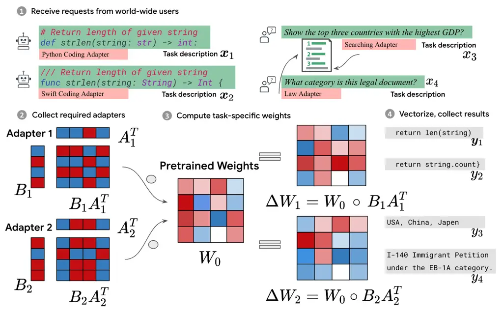

# Batched Low-Rank Adaptation of Foundation Models

Yeming Wen & Swarat Chaudhuri ^(†)^(†)thanks:
[ywen@utexas.edu](mailto:ywen@utexas.edu),
[swarat@cs.utexas.edu](mailto:swarat@cs.utexas.edu)
Affiliation: Department of Computer Science Affiliation: The University
of Texas at Austin

###### Abstract

Low-Rank Adaptation (LoRA) has recently gained attention for fine-tuning
foundation models by incorporating trainable low-rank matrices, thereby
reducing the number of trainable parameters. While LoRA offers numerous
advantages, its applicability for real-time serving to a diverse and
global user base is constrained by its incapability to handle multiple
task-specific adapters efficiently. This imposes a performance
bottleneck in scenarios requiring personalized, task-specific
adaptations for each incoming request.

To mitigate this constraint, we introduce Fast LoRA (fLoRA), a framework
in which each input example in a minibatch can be associated with its
unique low-rank adaptation weights, allowing for efficient batching of
heterogeneous requests. We empirically demonstrate that fLoRA retains
the performance merits of LoRA, showcasing competitive results on the
MultiPL-E code generation benchmark spanning over 8 languages and a
multilingual speech recognition task across 6 languages.

|     |
| --- |
|     |

## 1 Introduction

Transformer-based foundation models have showcased remarkable
performance across various natural language processing tasks, as
evidenced by the successes of ChatGPT (OpenAI, 2023), GitHub
Copilot (Chen et al., 2021) and Speech Recognition (Radford et al., 2022) among others. The practice of fine-tuning these models for
specific domains or specialized needs, such as instruction-tuning, has
become increasingly prevalent (Wang et al., 2022c; Honovich et al.,
2022; Taori et al., 2023; Chiang et al., 2023). This is driven by the
requirements of real-world applications, which often demand models
tailored to specific domains, tasks, or even individual user
preferences (Ouyang et al., 2022). However, the extensive number of
parameters in foundation models poses computational and memory
challenges for task-specific fine-tuning.

Low-Rank Adaptation (LoRA) emerged as a solution to this challenge by
incorporating trainable low-rank matrices (Hu et al., 2021) which
significantly reduces the number of trainable parameters during
fine-tuning. LoRA’s success stems from its ability to achieve domain
adaptation without retraining the entire model (Taori et al., 2023;
Dettmers et al., 2023; Lee et al., 2023). However, a practical challenge
arises in real-time serving scenarios. Batching is the practice of
aggregating multiple data points into a single computation. It is a
common technique to leverage parallel processing capabilities in GPUs,
ensuring higher throughput and lower serving cost. It becomes especially
crucial when serving world-wide users where many requests could flood in
every second. The intrinsic design of LoRA dictates that every example
within a batch shares the same adapter, which is suboptimal for
real-world serving scenarios where each request may require a unique
adapter.

Consider a scenario where users from various locations and professions
demand different language and occupation adapters as illustrated in
Fig. 1. With LoRA, the batch processing would either force all these
diverse requests to share the same adapter or process them sequentially,
both of which are impractical. These limitations emphasize the need for
a solution that can not only utilize the advantages of LoRA but also
serve multiple adapters in parallel, catering to the diverse and
simultaneous requests encountered in reality.

We posit that it is critical to develop a more flexible adaptation
mechanism that is compatible with diverse real-world user queries. We
introduce fast LoRA (fLoRA), a modification of LoRA, enabling individual
examples in a minibatch to be associated with distinct low-rank weights
without compromising the expressive power. This modification promises
the benefits of domain adaptation, as heralded by LoRA, but without the
batching limitation.

Our contributions can be summarized as follows:

1.  1.  We propose fLoRA, a framework that augments LoRA by allowing each
        example in a minibatch to have its unique low-rank adapters,
        facilitating efficient batching.
2.  2.  We provided an analytical analysis describing the scenarios where
        fLoRA would be preferred over LoRA in practical applications. This
        analysis is further substantiated by the empirical evidence where
        fLoRA achieves a 2X throughput improvement on the state-of-the-art
        code LLM StarCoder 15B in the low-rank setting when diverse adapters
        are required for incoming examples. Additionally, fLoRA reduces the
        latency by half under the same low-rank setting.
3.  3.  We demonstrate that fLoRA does not sacrifice accuracy compared to
        LoRA on a multilingual code generation task across 8 programming
        languages, and maintains accuracy in speech recognition tasks over
        five languages.



Figure 1: This shows a pragmatic scenario where a foundation model in
production receives four incoming requests, each requiring distinct
adapters. Omitting two adapters in step 2 & 3 for presentation
simplicity. fLoRA facilitates batching in such serving circumstances,
provided the adapters are of low rank, thereby sustaining high
throughput and low latency. Detailed discussion on vectorization is
provided in § 3.2.

## 2 Problem Formulation

In this section, we outline the problem tackled in this work,
illustrating the constraints and objectives that drive the development
of the proposed fLoRA methodology. Let $`\mathcal{M}`$ denote a
foundation model parameterized by $`\theta`$, with a total number of
parameters $`N`$. The common practice is to fine-tune this foundational
model for various specific tasks, ranging from multilingual code
generation to speech recognition as demonstrated in § 4.2 and § 4.3.

### 2.1 LoRA Adapters

Fine-tuning the entire model $`\mathcal{M}`$ for a specific task is
usually computationally expensive due to the massive parameter count.
LoRA (Low-rank Adaptation, (Hu et al., 2021)) was introduced to
facilitate domain-specific adaptations with a significantly reduced
parameter footprint, with the hypothesis that low-rank adaptation is
sufficient for fine-tuning domain specific foundation models.

Given the pre-trained weight matrix $`W_{0}\in\mathbb{R}^{d\times k}`$,
LoRA posits that the weight matrix of the adapted foundation model can
be expressed as $`W_{0}+\Delta W=W_{0}+BA`$, where $`\Delta W`$ has a
low-rank structure. This matrix $`\Delta W`$ is factorized into two
smaller, trainable matrices: $`B\in\mathbb{R}^{d\times r}`$ and
$`A\in\mathbb{R}^{r\times k}`$, such that $`\Delta W=BA`$ where $`r`$
stands for the rank. For a given input $`\mathbf{x}_{i}`$, the output
$`\mathbf{y}_{i}`$ is given by:

```math
\mathbf{y}_{i}=\mathcal{M}(\mathbf{x}_{i}|\Delta W,W_{0},\theta) \tag{1}
```

### 2.2 Batching & throughput

Batching is a common practice where multiple data points
($`\mathbf{x}_{1},\mathbf{x}_{2},\ldots,\mathbf{x}_{m}`$) are aggregated
into a single batch $`\mathcal{B}`$. Consequently, the forward passes of
these data points are processed concurrently rather than individually.
This practice leverages the parallel processing capability of a modern
GPU, thereby significantly improving the throughput $`T`$, i.e., the
number of data points processed per unit of time. In the context of
foundation models, throughput of a batch $`\mathcal{B}`$ can be defined
as $`T=\sum_{i=1}^{m}|\mathbf{y}_{i}|/\Delta t`$, where
$`|\mathbf{y}_{i}|`$ is the number of tokens generated for each example
$`\mathbf{x}_{i}`$ in the batch, $`\Delta t`$ is the total time taken to
process the batch, and $`m`$ is the number of examples in the batch.
Note that batching incurs minimal latency penalties. However, given its
substantial increase in throughput, batching and its variants are widely
used in the state-of-the-art foundation models serving framework such as
vLLM (Kwon et al., 2023) to achieve the best balance between throughput
and latency.

### 2.3 Objective

Batching typically assumes the same model parameters are utilized for
every input example within a minibatch. Hence, a straightforward
application of batching in LoRA requires that the adapter matrix
$`\Delta W`$ be shared across all inputs in the batch $`\mathcal{B}`$.
The challenge arises when considering a scenario where each input
example in the batch might originate from a different task. Sharing the
same $`\Delta W`$ for all $`\mathbf{x}_{i}`$ in $`\mathcal{B}`$ becomes
suboptimal where each input potentially demands a unique adapter. The
limitation is particularly acute when the model is expected to serve a
world-wide user base with diverse incoming requests.

Given the limitations of LoRA in batching, our objective is to maximize
the throughput $`T`$ in global user serving scenarios by maintaining the
batching mechanism. Formally, for each $`\mathbf{x}_{i}\in\mathcal{B}`$,
we aim to compute
$`\mathbf{y}_{i}=\mathcal{M}(\mathbf{x}_{i}|\Delta W_{i},W_{0},\theta)`$,
where $`\Delta W_{i}`$ is the adapter matrix corresponding to the input
example $`x_{i}`$. Therefore, $`\Delta W_{i}`$ can be unique across
$`\mathcal{B}`$ and specific to a domain or user preference.

## 3 flora: fast low rank adaptation

As shown in Section 2.3, adapter sharing is often impractical in
real-world serving scenarios. The innovation of fLoRA is the
introduction of example-specific adapter $`\Delta W_{i}`$ for each
$`\mathbf{x}_{i}`$ in a minibatch. In fLoRA, the weight matrix $`W_{i}`$
for each example $`\mathbf{x}_{i}`$ in the minibatch is calculated as
$`W_{i}=\Delta W_{i}\circ W_{0}`$, where $`\circ`$ denotes element-wise
multiplication, $`W_{0}`$ is the pre-trained weight matrix and
$`\Delta W_{i}`$ is a low-rank adaptation specifically designed for
$`\mathbf{x}_{i}`$. Similar to Hu et al. (2021), $`\Delta W_{i}`$ is
decomposed into two trainable matrices:
$`B_{i}\in\mathbb{R}^{d\times r}`$ and
$`A_{i}\in\mathbb{R}^{r\times k}`$, such that
$`\Delta W_{i}=B_{i}A_{i}`$, as shown in Fig. 1. Note that fLoRA has the
same expressive power as LoRA by its construction.

### 3.1 Forward Pass

The advantage of fLoRA is that computations on a minibatch can be
written in terms of matrix multiplications. This enables efficient
batched implementations on modern accelerators such as GPUs. Let
$`x_{i}`$ denote the activations in one layer of a neural net, which is
a vertical vector of length $`d`$. The next layer’s activations are
given by

```math
\displaystyle y_{i} \displaystyle=\phi(W_{i}^{T}x_{i}) \tag{2}
```

```math
\displaystyle=\phi\big((W_{0}^{T}\circ\Delta W_{i}^{T})x_{i}\big) \tag{3}
```

```math
\displaystyle=\phi\big((W_{0}^{T}\circ(B_{i}A_{i})^{T})x_{i}\big) \tag{4}
```

```math
\displaystyle=\phi\Big(A_{i}\circ\big(W_{0}^{T}(B_{i}\circ x_{i})\big)\Big) \tag{5}
```

When the rank is greater than one, we extend the use of the symbol
“$`\circ`$” to denote potential broadcasting. Additionally, a dimension
reduction operation such as torch.mean is required prior to applying the
activation function $`\phi`$.

The key to fLoRA’s flexibility lies in the low rank decomposition
enables the incorporation of example-specific adapters directly into the
forward pass, as demonstrated in the equations above. Crucially, each of
these operations—the element-wise multiplication between $`A_{i}`$ and
$`x_{i}`$, and between $`B_{i}`$ and $`y_{i}`$ — is inherently
batch-friendly. Consequently, fLoRA allows for simultaneous processing
of multiple requests, each requiring its own adapter, within a single
minibatch. To vectorize all adapters in the minibatch, we define
matrices $`\mathbf{A}`$ and $`\mathbf{B}`$ whose rows correspond to the
adapters $`A_{i}`$ and $`B_{i}`$ for all examples in the minibatch. The
above equation is vectorized as:

```math
\mathbf{Y}=\phi\Big(\mathbf{A}\circ\big((\mathbf{B}\circ\mathbf{X})W_{0}\big)\Big) \tag{6}
```

### 3.2 Computational Efficiency

The computational analysis primarily concentrates on the examination of
fully connected layers within a transformer architecture, given that
LoRA is specifically applied to these layers, such as query and key
projections. To begin, we analyze a baseline that leverages batch matrix
multiplication to facilitate the serving of LoRA with multiple adapters.
This operation is possible under the assumption that every adapter
required by the input examples in the minibatch shares the same shape,
specifically, the same rank. The batch matrix multiplication (BMM) can
be implemented using the torch.bmm operator in deep learning frameworks
such as PyTorch (Paszke et al., 2019). Note that the BMM operator is
typically unfavorable in practical settings due to the significant
overhead it introduces (Abdelfattah et al., 2016). This overhead
diminishes the throughput and increases latency, which is detrimental in
serving scenarios where response times are crucial for maintaining a
good user experience.

Let $`b`$ and $`l`$ denote the batch size and the maximum sequence
length in the input batch $`\mathcal{B}`$. Revisiting the notation
introduced in Section 3, where $`W_{0}\in\mathbb{R}^{d\times k}`$,
$`B_{i}\in\mathbb{R}^{d\times r}`$ and
$`A_{i}\in\mathbb{R}^{r\times k}`$, the operations required to compute
the pre-activation for an input batch $`\mathcal{B}`$ with dimensions
$`[b,l,d]`$ consist of one matrix multiplication and two BMMs. The
matrix multiplication occurs between the input batch $`\mathbf{X}`$ and
the pre-trained weight $`W_{0}`$. The two BMM operations are conducted
firstly between the input batch $`\mathbf{X}`$ and $`\mathbf{B}`$, and
secondly between the result of the prior computation and $`\mathbf{A}`$,
where $`\mathbf{A}`$ and $`\mathbf{B}`$ are matrices whose rows
correspond to the adapters $`A_{i}`$ and $`B_{i}`$ for all examples in
the minibatch respectively. Assuming for simplicity that the layer
neither upscales nor downscales the hidden dimension (i.e. $`d=k`$), the
upper bound complexity of this layer is discerned as
$`2c_{1}(dblr)+c_{2}(bld^{2})`$, with $`c_{1}`$ and $`c_{2}`$
representing the computational coefficients of BMM and matrix
multiplication respectively. Note that $`c_{1}>>c_{2}`$ because the BMM
operator is more expensive than matrix multiplication.

For fLoRA, the cost is one matrix multiplication which is
$`c_{2}(rbld^{2})`$ where $`r`$ denotes the rank of the adapters. We
omit the cost of element-wise multiplication in this analysis because it
is negligible to the matrix multiplication cost. Comparing the
computational cost of fLoRA and LoRA boils down to the following
inequality

```math
\frac{2c_{1}}{dc_{2}}+\frac{1}{r}\geq 1 \tag{7}
```

fLoRA exhibits a lower computational cost than bmm LoRA whenever the
above inequality holds true. The benefit of fLoRA over LoRA is notably
pronounced when $`r=1`$. As the rank increases, LoRA gradually becomes
less costly. From the established inequality, a variety of scenarios can
be inferred where fLoRA has an advantage over LoRA. Firstly, the
advantage of fLoRA is significantly apparent when the rank of adapters
is small. Secondly, in configurations where the model has fewer hidden
units but an increased number of layers, fLoRA tends to outperform LoRA
due to the smaller value of $`d`$ in the denominator of Eq. 7.

Another advantage of fLoRA is the cost remains invariant to the number
of adapters required by the input batch. While the preceding analysis
assumes that every token in an example $`x_{i}`$ shares the same
adapter, it is possible to apply multiple adapters to a single example
by dividing the example into chunks, and then applying different
adapters to each chunk. This approach is commonly observed in the
Mixture of Experts framework (Fedus et al., 2021; Lepikhin et al., 2020;
Puigcerver et al., 2023). Incorporating several adapters in an input
example notably amplifies the ratio $`c_{1}/c_{2}`$ in Eq. 7¹¹ 1 The
batch size in BMM operator increases from $`b`$ to $`b\times m`$ where
$`m`$ is the number of adapters per example., thereby significantly
increasing LoRA’s cost.

The ratio $`c_{1}/c_{2}`$ might not be the same across different
transformer architectures. Section 4.1 is designed to provide a deeper
insight into how comparative serving efficiency of fLoRA and LoRA
changes under various architectures. Additionally, it’s worth noting
that LoRA does not apply to the self-attention layers, which constitute
a non-trivial portion of the computational cost, thereby overshadowing
the advantage of fLoRA. However, as efficient self-attention mechanisms
such as flash attention (Dao et al., 2022) get adopted, the advantage of
fLoRA over LoRA is likely to get larger.

Connection to IA3. IA3 was proposed in Liu et al. (2022a) featuring fast
adaptation of LLM. It introduces a learned vector $`l`$ which re-scales
the activation by
$`y_{i}=l\circ\phi(W_{0}^{T}x_{i})=\phi\big(l\circ(W_{0}^{T}x_{i})\big)`$.
This can be viewed as a special case of fLoRA – a rank 0.5 variant —
which only re-scales the columns instead of the entire pre-trained
weights. It has a limited expressive power compared to fLoRA and LoRA.

## 4 Experiments

In this section, we compare fLoRA to LoRA and other notable baselines
across various metrics and tasks. To begin with, we delve into a
computational analysis to substantiate the enhanced throughput and the
reduced latency achieved by fLoRA in the case of low rank Subsequently,
we pivot towards analyzing the accuracy of fLoRA in multilingual code
generation tasks spanning across different languages. The goal is to
discern the proficiency of fLoRA in maintaining, if not enhancing, the
model’s accuracy as compared to LoRA. Progressing further, we replicate
a similar analysis but in the domain of multilingual speech recognition.

### 4.1 Serving Analysis

The primary objective of this serving analysis is to measure the maximum
throughput both fLoRA and LoRA can attain under varied rank
configurations. We carried out this exploration on the state-of-the-art
code Large Language Model (LLM) StarCoder (Li et al., 2023), evaluating
models of different number of parameters namely 1B, 3B, and 15B. The
dataset facilitating this analysis has been sourced from the vLLM
throughput benchmark. Noteworthily, this dataset was previously used to
fine-tune the English Vicuna model, a state-of-the-art chat LLMs (Chiang
et al., 2023). To expedite the benchmarking process, we extracted a
subset of 1,000 samples from the original dataset, ensuring a diverse
range of sample lengths varying from 50 to 2,000 tokens.

In setting up the computational analysis, our primary intent is to
compare fLoRA and LoRA in the real-world serving scenario. See § B.1 on
how bmm LoRA is implemented. The vLLM framework (Kwon et al., 2023)²² 2
The version is 0.1.3., with its implementation of continuous batching,
presents an ideal setup for this analysis. The continuous batching
mechanism in vLLM, as inspired by the principles delineated in Orca (Yu
& Jeong, 2022), facilitates a more efficient utilization of GPU resource
by allowing new sequence to be inserted immediately once any sequence in
the current batch is completed. This continuous flow significantly
enhances GPU utilization as compared to static batching, where the GPU
awaits the completion of all sequences in a batch before initiating a
new batch processing. The comparison of fLoRA and LoRA within this setup
offers a compelling evidence of their respective throughput and latency
in the real-world serving scenario. It is worth noting that the
experiments were conducted without Flash-attention (Dao et al., 2022).

Figure 2: Left: Generation throughput vs. rank for fLoRA and torch.bmm
implementation of LoRA, measured in tokens per second (token/s). The
experiments were conducted on three starcoder models: StarCoder 15B,
StarCoderbase 3B and StarCoderbase 1B. fLoRA has great throughput
advantage over LoRA when the rank is small. As the rank increases, the
torch.bmm implementation of LoRA finally has a better throughput. Right:
Latency vs. rank on StarCoder-15B. Requests are coming at the speed of 8
requests per second.

Throughput experiment. In Fig. 2, the throughput results for both fLoRA
and bmm LoRA are illustrated across different rank configurations on
three StarCoder models with different number of parameters, namely 1B,
3B and 15B. All experiments were conducted on an NVIDIA H100 GPU with a
float16 precision³³ 3 The quantization in vLLM is still under
development.. The maximum number of batched tokens is 8,192, which is
the same as the model context length. Evidently, fLoRA shows a superior
throughput over LoRA in the lower rank configurations. At rank 1, the
throughput of fLoRA is more than threefold higher than that of LoRA,
thereby highlighting the considerable serving performance boost fLoRA
provides. The advantage of fLoRA continues as the rank increases, albeit
with a diminishing rate. For instance, at rank 2, fLoRA’s throughput is
around 2.5 times higher, and this multiplicative advantage decreases as
the rank increases further. This performance advantage continues up
until the rank of 8 in the StarCoder 15B model, where LoRA starts to
outperform fLoRA. This inflection point suggests that the advantages of
fLoRA in terms of throughput are more pronounced in lower rank.

Notice that the inflection points occurred at a higher rank when serving
a smaller LLM as illustrated in (Fig. 2, left). This demonstrates a
significant potential of fLoRA, especially when considering future
applications of quantization techniques to serving LLMs. By applying
quantization, such as 8-bit or 4-bit inference, the effective size of
the model is reduced, akin to serving a smaller LLM thus potentially
extending the rank at which fLoRA maintains a throughput advantage over
LoRA.

Latency experiment. We assessed the latency-versus-rank performance on
the Starcoder 15B model, using the same dataset as the throughput
experiment. This evaluation was conducted under the conditions where
requests arrive at a rate of 8 per second. The default maximum number of
batched tokens in vLLM serving launcher is 2,560. The results, as shown
in (Fig. 2, right), measure latency in terms of seconds per output
token. Remarkably, in the lower rank regime (ranging from rank 1 to rank
4), fLoRA exhibited a 2-5X reduction in latency compared to LoRA.
Notably, the latency for LoRA stood at approximately 1.8 seconds per
output token, is impractical for serving due to the poor user experience
it would cause. This experiment further highlights the superior
capabilities of fLoRA in efficiently catering to diverse incoming user
requests.

These findings validate the theoretical analysis in § 4.1, confirming
that fLoRA provides significant throughput advantages, particularly in
settings with lower to moderate ranks. This positions fLoRA as a
compelling alternative for efficiently serving adapted foundation
models, especially in scenarios where lower ranks suffice the desired
model accuracy, as further demonstrated in the subsequent accuracy
analysis sections. Moreoever, if an enterprise chooses to serve
foundation models with a substantial number of diverse adapters, for
instance, a personalized LLM, then a low rank or even a rank one is
imperative to avoid excessive storage costs.

### 4.2 Multilingual Code Generation

| Language         | pass@$`1`$ (Relative Improvement) |                  |                  |                  |
| ---------------- | --------------------------------- | ---------------- | ---------------- | ---------------- |
|                  | Base Model                        | fLoRA            | IA3              | LoRA             |
| StarCoder 15B    |                                   |                  |                  |                  |
| Dlang            | 14.13                             | 17.26 (22.14%)   | 15.26 (7.99%)    | 17.15 (21.37%)   |
| Perl             | 17.05                             | 21.44 (25.76%)   | 17.71 (3.90%)    | 21.46 (25.76%)   |
| Ruby             | 1.39                              | 24.94 (1692.86%) | 20.80 (1394.64%) | 23.76 (1608.04%) |
| Rust             | 22.40                             | 26.24 (17.14%)   | 23.53 (5.04%)    | 26.87 (19.95%)   |
| Racket           | 10.20                             | 12.41 (21.61%)   | 11.53 (12.96%)   | 12.51 (22.58%)   |
| Swift            | 16.91                             | 20.38 (20.51%)   | 18.13 (7.19%)    | 20.35 (20.36%)   |
| StarCoderBase 3B |                                   |                  |                  |                  |
| Dlang            | 5.65                              | 5.72 (1.20%)     | 5.72 (1.20%)     | 6.97 (23.34%)    |
| Perl             | 10.73                             | 13.01 (21.25%)   | 11.46 (6.83%)    | 13.31 (27.51%)   |
| Ruby             | 5.33                              | 14.48 (171.68%)  | 7.88 (47.90%)    | 13.89 (160.68%)  |
| Rust             | 17.18                             | 21.00 (22.24%)   | 17.28 (0.60%)    | 20.67 (20.31%)   |
| Racket           | 8.04                              | 9.16 (13.99%)    | 8.40 (4.48%)     | 8.80 (9.48%)     |
| Swift            | 10.04                             | 15.69 (56.21%)   | 12.54 (24.83%)   | 15.04 (49.76%)   |

Table 1: Comparison of three fine-tuning methods fLoRA, IA3, and LoRA on
StarCoder 15B and StarCoderBase 3B across various low-resource
programming languages in the MultiPL-E benchmark. The table presents
Pass@1 accuracy of each method alongside the relative improvement over
the baseline. The standard errors are less than 0.3% in all cells in the
table, therefore we exclude that for clear presentation.

A key aspect to examine before applying fLoRA in real-world LLM serving
is to scrutinize any potential degradation in performance. In this
section, we consider multilingual code generation as the testbed for
comparing fLoRA and LoRA due to its alignment with real-world
applications, where the necessity to cater to diverse programming
languages is paramount. Low-resource languages, as referred to in this
context, are languages that appear much less frequently than other
languages in the pre-training data.  Orlanski et al. (2023) showed that
the performance of code LLMs can be notably enhanced on low-resource
programming languages such as Perl by recalibrating the language
distribution in the pre-training data. This suggests that fine-tuning a
trained LLM on such low-resource languages could potentially boost its
performance on the same language. Hence, by employing multilingual code
generation as a benchmark, we can make an informed evaluation of
adaptability and performance enhancements that fLoRA and LoRA can
achieve.

Additionally, a comparison is made against a third baseline, IA3, which
can be considered as a special case of fLoRA. Essentially, IA3 can be
seen as a rank 0.5 variant of fLoRA, thereby facing a constrained
expressive power in comparison to both fLoRA and LoRA. For fLoRA and
LoRA, we conducted fine-tuning across a range of rank choices, spanning
from 1 to 8. It emerges that within the scope of this multilingual code
generation task, a rank of one typically suffices to achieve optimal
results, with the exception of Racket and Lua. Consequently, the results
shown in Table 1 are predominantly at rank 1, barring Racket and Lua,
which are presented at rank 4.

Fine-tuning. In our effort to evaluate the performance of fLoRA, LoRA,
and IA3 on the multilingual code generation task, we fine-tuned these
models on state-of-the-art multilingual code LLMs, StarCoder 15B and
StarCoderBase 3B as introduced in (Li et al., 2023). A pivotal aspect of
our fine-tuning process was the utilization of existing data, negating
the need for creating new data for low-resource programming languages.
We leveraged the same pre-training data that was used for pre-training
StarCoder, specifically, the Stack dataset, which contains over 6TB of
permissively-licensed source code files covering 358 programming
languages. For each low-resource language in our experiment, we
fine-tuned on its corresponding split from the Stack dataset for a total
of 1,500 steps, along with batch size 8. More fine-tuning details are
given in Appendix A.

Evaluation. The evaluation of fLoRA, LoRA, and IA3 was conducted on the
MultiPL-E benchmark (Cassano et al., 2023), which contains the
translation of two unit-test driven Python benchmarks (HumanEval and
MBPP) to 18 other programming languages. We used the HumanEval split of
the benchmark to evaluate the fine-tuned models. As for the metrics, We
adopted the pass@$`k`$ metrics from Chen et al. (2021); Austin et al.
(2021), which is calculated as the fraction of problems with at least
one correct sample given $`k`$ samples. Similar to  Chen et al. (2021),
we drew 100 samples for computing pass@$`1`$, with a sampling
temperature set at 0.1.

Main results. The result in Tab. 1 exhibits the performance of three
methods across various programming languages on both StarCoder 15B and
StarCoderBase 3B models. The average relative improvement achieved by
fLoRA and LoRA is roughly 20% in the selected low-resource programming
languages. fLoRA consistently outperforms IA3 on all languages,
especially on StarCoder 15B, denoting its efficiency in leveraging the
model expressive power to improve multilingual code generation. It is
notable that StarCoder 15B has an unforeseen issue regarding Ruby
generation, where it yields lower accuracy compared to the 3B model.
However, all methods are able to fix its abnormal performance.

On StarCoderBase 3B, a smaller model, it is evident that the baseline
performance drops, yet fLoRA and LoRA still manage to exhibit
substantial relative improvement over the baseline, especially in
languages like Swift and Ruby. This suggests that both methods benefit
from continuous training on the low-resource language split of the
pre-training data, although the advantages may diminish with a reduction
in model size. While the absolute performance (pass@$`1`$ accuracy)
varies among languages, the relative improvements highlight the
effectiveness of the tested methods in enhancing multilingual code
generation.

| Model   | Arabic       | Czech        | Lithuanian   | Marathi      | Mongolian    | Hindi        |
| ------- | ------------ | ------------ | ------------ | ------------ | ------------ | ------------ |
| Whisper | 46.03        | 23.19        | 46.09        | 84.84        | 115.20       | 43.41        |
| fLoRA   | 30.21 ± 0.25 | 10.76 ± 0.22 | 20.39 ± 0.32 | 33.17 ± 0.17 | 42.12 ± 0.63 | 23.58 ± 0.65 |
| IA3     | 30.48 ± 0.22 | 11.61 ± 0.33 | 21.41 ± 0.20 | 35.03 ± 0.61 | 46.47 ± 0.53 | 25.64 ± 0.78 |
| LoRA    | 30.18 ± 0.21 | 10.77 ± 0.38 | 20.50 ± 0.21 | 31.94 ± 0.33 | 41.57 ± 0.69 | 23.82 ± 0.74 |

Table 2: Mean WER with standard deviation for different models and
languages. The WER is calculated with respect to the unnormalized
tokenizer. The base model here is Whisper-1.5B.

### 4.3 Multilingual Speech Recognition

Following our analysis in multilingual code generation, we shift our
focus to another substantial application of large language models —
multilingual speech recognition (MSR). This domain has seen increasing
demand due to the necessity of serving various linguistic interfaces.
The capabilities of fLoRA and LoRA to adapt to multiple languages in
code generation presents a tempting premise to investigate their
effectiveness in the MSR domain.

Fine-tuning. A crucial aspect of our analysis involves fine-tuning the
foundation model on a multilingual speech recognition dataset. We
selected the Whisper large 1.5B (Radford et al., 2022) as our base model
to conduct the subsequent analysis. Whisper is an encoder-decoder
transformer model trained on 680k hours of labeled speech data through
large-scale weak supervision. Despite being pre-trained on a
multilingual speech corpus, the model’s predictive capabilities can be
improved further for certain languages and tasks through fine-tuning. We
use the Common Voice benchmark (Ardila et al., 2020) — containing a
total of 38 languages and 2,500 hours of collected audio — for the
fine-tuning process, with a particular focus on low-resource
languages.⁴⁴ 4 Dataset statistics can be found
here [https://commonvoice.mozilla.org/en/datasets](https://commonvoice.mozilla.org/en/datasets).
For each low-resource language enumerated in Tab. 2, we fine-tuned on
its training split within the Common Voice dataset for approximately
5,000 steps, with a batch size of 6. More fine-tuning details are given
in Appendix A. Similar to § 4.2, we found that rank one is sufficient to
achieve the best result in most cases, with the exception of Marathi,
which requires a rank of 4.

Main results. We present the main results on the MSR task in Tab. 2.
Notice that the evaluation is conducted with the unnormalized
tokenizer.⁵⁵ 5 This is because the normalized tokenizer has a bug in the
official leaderboard implementation at the time of submission. The
Whisper model exhibited a relatively higher Word Error Rate (WER) across
all low-resource languages when compared to fLoRA, LoRA and IA3 models,
reflecting a significant room for enhancement in its multilingual speech
recognition capabilities. Particularly, its performance was found to be
subpar for the Marathi and Mongolian languages, with WERs of 84.84 and
115.20 respectively. All examined models significantly outperform the
base Whisper model by a wide margin across all languages, highlighting
the effective fine-tuning of fLoRA, LoRA and IA3 models. For instance,
in Arabic, fLoRA reduces the WER to 30.21 from Whisper’s 46.03,
showcasing a significant enhancement in speech recognition accuracy.
Particularly, fLoRA and LoRA consistently outperform IA3, indicating a
better expressive power for multilingual speech recognition tasks. For
example, in Czech, fLoRA has a mean WER of 10.76, which is slightly
better compared to IA3’s 11.61 and LoRA’s 11.47. A similar trend is
observed in Lithuanian and Hindi. In summary, this table shows the
superior performance of fLoRA and LoRA over IA3 in the speech
recognition task across diverse languages. The consistent low WERs
attained by fLoRA demonstrates its potential as a viable model for MSR
tasks.

## 5 Related Work

Parameter-Efficient Fine-Tuning (PEFT) methods are broadly partitioned
into two categories: weight-based and non-weight-based approaches.
MC-dropout (Lakshminarayanan et al., 2016) stands as an early example
for the non-weight-based approach, where distinct dropout masks are
allocated to various tasks. Recently, prompt tuning techniques have
emerged as a prevalent stream within this category (Li & Liang, 2021;
Lester et al., 2021), facilitating efficient adaptation with minimal
modifications to models. Successive endeavors aimed to enhance this
class of methods, delving into aspects such as optimization (Mao et al.,
2021; Diao et al., 2022), transferability (Wang et al., 2021; Vu et al.,
2021; He et al., 2022b), and the usage of discrete prompts (Schick &
Schütze, 2020a; Schick & Schütze, 2020b; Gao et al., 2021; Malkin
et al., 2021), among others (Liu et al., 2022b; Liu et al., 2021).

We focus on weight-based approaches in this work, which has a weight
interpretation as exemplified by LoRA (Hu et al., 2021). This line of
research can be traced back to Progressive Network (Rusu et al., 2016),
which inserts a sub-network when a new task arrives. This principle was
later adapted widely in foundation models as represented by adapter
based methods (Houlsby et al., 2019; Mahabadi et al., 2021; Davison,
2021; Ding et al., 2022; Wang et al., 2022b). In particular,
BitFit (Ben-Zaken et al., 2021) was introduced to solely update the bias
parameters, while IA3 (Liu et al., 2022a) was proposed to rescale the
activations. Additionally, approaches such Fish (Sung et al., 2021) and
Diff-pruning (Guo et al., 2020) leverage sparsity to facilitate
efficient adaptation of foundation models. A separate vein of research
aims to improve LoRA by reducing its computational and memory
costs (Zhang et al., 2023b; Zhang et al., 2023a; Malladi et al.,
2023). He et al. (2022a) explored how to unify different PEFT
methods. Dettmers et al. (2023) quantized LoRA to reduce memory
footprint. Chavan et al. (2023) generalized LoRA by learning individual
adapters in each layer. Several other works focus on building mixture of
adapters (Wang et al., 2022a; Diao et al., 2023).

## 6 conclusion

We introduced fLoRA, an extension of LoRA, facilitating efficient
batching. Empirical evaluations demonstrated that fLoRA enhances
throughput and latency in practical serving scenarios, all while
preserving the accuracy of LoRA. Through fLoRA, we aim to facilitate a
more efficient adaptation of large language models to diverse and
real-world user requests.

Limitations. Despite its parameter efficiency, fLoRA still requires
fine-tuning. A promising future work could be to derive fLoRA weights
from a trained LoRA model, given that LoRA remains the most prevalent
type of adapter as per (Huang et al., 2023). This adaptation could
potentially obviate the requirement for fine-tuning, thereby
accelerating the process of model adaptation.

## References

- Abdelfattah et al. (2016) Ahmad Abdelfattah, Azzam Haidar, Stanimire
  Tomov, and Jack J. Dongarra. Performance, design, and autotuning of
  batched gemm for gpus. In Information Security Conference, 2016. URL
  [https://api.semanticscholar.org/CorpusID:2559252](https://api.semanticscholar.org/CorpusID:2559252).
- Ardila et al. (2020) R. Ardila, M. Branson, K. Davis, M. Henretty,
  M. Kohler, J. Meyer, R. Morais, L. Saunders, F. M. Tyers, and
  G. Weber. Common voice: A massively-multilingual speech corpus. In
  Proceedings of the 12th Conference on Language Resources and
  Evaluation (LREC 2020), pp. 4211–4215, 2020.
- Austin et al. (2021) Jacob Austin, Augustus Odena, Maxwell Nye,
  Maarten Bosma, Henryk Michalewski, David Dohan, Ellen Jiang, Carrie
  Cai, Michael Terry, Quoc Le, et al. Program synthesis with large
  language models. arXiv preprint arXiv:2108.07732, 2021.
- Ben-Zaken et al. (2021) Elad Ben-Zaken, Shauli Ravfogel, and Yoav
  Goldberg. Bitfit: Simple parameter-efficient fine-tuning for
  transformer-based masked language-models. ArXiv, abs/2106.10199, 2021.
  URL
  [https://api.semanticscholar.org/CorpusID:231672601](https://api.semanticscholar.org/CorpusID:231672601).
- Cassano et al. (2023) Federico Cassano, John Gouwar, Daniel Nguyen,
  Sy Duy Nguyen, Luna Phipps-Costin, Donald Pinckney, Ming-Ho Yee,
  Yangtian Zi, Carolyn Jane Anderson, Molly Q. Feldman, Arjun Guha,
  Michael Greenberg, and Abhinav Jangda. Multipl-e: A scalable and
  polyglot approach to benchmarking neural code generation. IEEE
  Transactions on Software Engineering, 49:3675–3691, 2023. URL
  [https://api.semanticscholar.org/CorpusID:258205341](https://api.semanticscholar.org/CorpusID:258205341).
- Chavan et al. (2023) Arnav Chavan, Zhuang Liu, Deepak K. Gupta,
  Eric P. Xing, and Zhiqiang Shen. One-for-all: Generalized lora for
  parameter-efficient fine-tuning. ArXiv, abs/2306.07967, 2023. URL
  [https://api.semanticscholar.org/CorpusID:259144860](https://api.semanticscholar.org/CorpusID:259144860).
- Chen et al. (2021) Mark Chen, Jerry Tworek, Heewoo Jun, Qiming Yuan,
  Henrique Ponde, Jared Kaplan, Harrison Edwards, Yura Burda, Nicholas
  Joseph, Greg Brockman, Alex Ray, Raul Puri, Gretchen Krueger, Michael
  Petrov, Heidy Khlaaf, Girish Sastry, Pamela Mishkin, Brooke Chan,
  Scott Gray, Nick Ryder, Mikhail Pavlov, Alethea Power, Lukasz Kaiser,
  Mohammad Bavarian, Clemens Winter, Philippe Tillet, Felipe Petroski
  Such, David W. Cummings, Matthias Plappert, Fotios Chantzis, Elizabeth
  Barnes, Ariel Herbert-Voss, William H. Guss, Alex Nichol, Igor
  Babuschkin, S. Arun Balaji, Shantanu Jain, Andrew Carr, Jan Leike,
  Joshua Achiam, Vedant Misra, Evan Morikawa, Alec Radford, Matthew M.
  Knight, Miles Brundage, Mira Murati, Katie Mayer, Peter Welinder, Bob
  McGrew, Dario Amodei, Sam McCandlish, Ilya Sutskever, and Wojciech
  Zaremba. Evaluating large language models trained on code. ArXiv,
  abs/2107.03374, 2021.
- Chiang et al. (2023) Wei-Lin Chiang, Zhuohan Li, Zi Lin, Ying Sheng,
  Zhanghao Wu, Hao Zhang, Lianmin Zheng, Siyuan Zhuang, Yonghao Zhuang,
  Joseph E. Gonzalez, Ion Stoica, and Eric P. Xing. Vicuna: An
  open-source chatbot impressing gpt-4 with 90%\* chatgpt quality,
  March 2023. URL
  [https://lmsys.org/blog/2023-03-30-vicuna/](https://lmsys.org/blog/2023-03-30-vicuna/).
- Dao et al. (2022) Tri Dao, Daniel Y. Fu, Stefano Ermon, Atri Rudra,
  and Christopher R’e. Flashattention: Fast and memory-efficient exact
  attention with io-awareness. ArXiv, abs/2205.14135, 2022. URL
  [https://api.semanticscholar.org/CorpusID:249151871](https://api.semanticscholar.org/CorpusID:249151871).
- Davison (2021) Joe Davison. Compacter: Efficient low-rank hypercomplex
  adapter layers. In Neural Information Processing Systems, 2021. URL
  [https://api.semanticscholar.org/CorpusID:235356070](https://api.semanticscholar.org/CorpusID:235356070).
- Dettmers et al. (2023) Tim Dettmers, Artidoro Pagnoni, Ari Holtzman,
  and Luke Zettlemoyer. Qlora: Efficient finetuning of quantized llms.
  ArXiv, abs/2305.14314, 2023. URL
  [https://api.semanticscholar.org/CorpusID:258841328](https://api.semanticscholar.org/CorpusID:258841328).
- Diao et al. (2022) Shizhe Diao, Xuechun Li, Yong Lin, Zhichao Huang,
  Xiao Zhou, and Tong Zhang. Black-box prompt learning for pre-trained
  language models. ArXiv, abs/2201.08531, 2022. URL
  [https://api.semanticscholar.org/CorpusID:246210164](https://api.semanticscholar.org/CorpusID:246210164).
- Diao et al. (2023) Shizhe Diao, Tianyang Xu, Ruijia Xu, Jiawei Wang,
  and T. Zhang. Mixture-of-domain-adapters: Decoupling and injecting
  domain knowledge to pre-trained language models’ memories. In Annual
  Meeting of the Association for Computational Linguistics, 2023. URL
  [https://api.semanticscholar.org/CorpusID:259108831](https://api.semanticscholar.org/CorpusID:259108831).
- Ding et al. (2022) Ning Ding, Yujia Qin, Guang Yang, Fu Wei, Zonghan
  Yang, Yusheng Su, Shengding Hu, Yulin Chen, Chi-Min Chan, Weize Chen,
  Jing Yi, Weilin Zhao, Xiaozhi Wang, Zhiyuan Liu, Haitao Zheng, Jianfei
  Chen, Yang Liu, Jie Tang, Juan Li, and Maosong Sun. Delta tuning: A
  comprehensive study of parameter efficient methods for pre-trained
  language models. ArXiv, abs/2203.06904, 2022. URL
  [https://api.semanticscholar.org/CorpusID:247446969](https://api.semanticscholar.org/CorpusID:247446969).
- Fedus et al. (2021) William Fedus, Barret Zoph, and Noam M. Shazeer.
  Switch transformers: Scaling to trillion parameter models with simple
  and efficient sparsity. J. Mach. Learn. Res., 23:120:1–120:39, 2021.
  URL
  [https://api.semanticscholar.org/CorpusID:231573431](https://api.semanticscholar.org/CorpusID:231573431).
- Gao et al. (2021) Tianyu Gao, Adam Fisch, and Danqi Chen. Making
  pre-trained language models better few-shot learners. ArXiv,
  abs/2012.15723, 2021. URL
  [https://api.semanticscholar.org/CorpusID:229923710](https://api.semanticscholar.org/CorpusID:229923710).
- Guo et al. (2020) Demi Guo, Alexander M. Rush, and Yoon Kim.
  Parameter-efficient transfer learning with diff pruning. In Annual
  Meeting of the Association for Computational Linguistics, 2020. URL
  [https://api.semanticscholar.org/CorpusID:229152766](https://api.semanticscholar.org/CorpusID:229152766).
- He et al. (2022a) Junxian He, Chunting Zhou, Xuezhe Ma, Taylor
  Berg-Kirkpatrick, and Graham Neubig. Towards a unified view of
  parameter-efficient transfer learning. In International Conference on
  Learning Representations, 2022a. URL
  [https://openreview.net/forum?id=0RDcd5Axok](https://openreview.net/forum?id=0RDcd5Axok).
- He et al. (2022b) Yun He, Huaixiu Steven Zheng, Yi Tay, Jai Gupta,
  Yu Du, V. Aribandi, Zhe Zhao, Yaguang Li, Zhaoji Chen, Donald Metzler,
  Heng-Tze Cheng, and Ed H. Chi. Hyperprompt: Prompt-based
  task-conditioning of transformers. ArXiv, abs/2203.00759, 2022b. URL
  [https://api.semanticscholar.org/CorpusID:247218062](https://api.semanticscholar.org/CorpusID:247218062).
- Honovich et al. (2022) Or Honovich, Thomas Scialom, Omer Levy, and
  Timo Schick. Unnatural instructions: Tuning language models with
  (almost) no human labor. ArXiv, abs/2212.09689, 2022.
- Houlsby et al. (2019) Neil Houlsby, Andrei Giurgiu, Stanislaw
  Jastrzebski, Bruna Morrone, Quentin de Laroussilhe, Andrea Gesmundo,
  Mona Attariyan, and Sylvain Gelly. Parameter-efficient transfer
  learning for nlp. In International Conference on Machine
  Learning, 2019. URL
  [https://api.semanticscholar.org/CorpusID:59599816](https://api.semanticscholar.org/CorpusID:59599816).
- Hu et al. (2021) J. Edward Hu, Yelong Shen, Phillip Wallis, Zeyuan
  Allen-Zhu, Yuanzhi Li, Shean Wang, and Weizhu Chen. Lora: Low-rank
  adaptation of large language models. ArXiv, abs/2106.09685, 2021. URL
  [https://api.semanticscholar.org/CorpusID:235458009](https://api.semanticscholar.org/CorpusID:235458009).
- Huang et al. (2023) Chengsong Huang, Qian Liu, Bill Yuchen Lin, Tianyu
  Pang, Chao Du, and Min Lin. Lorahub: Efficient cross-task
  generalization via dynamic lora composition. ArXiv,
  abs/2307.13269, 2023. URL
  [https://api.semanticscholar.org/CorpusID:260155012](https://api.semanticscholar.org/CorpusID:260155012).
- Kwon et al. (2023) Woosuk Kwon, Zhuohan Li, Siyuan Zhuang, Ying Sheng,
  Lianmin Zheng, Cody Hao Yu, Joseph E. Gonzalez, Hao Zhang, and Ion
  Stoica. Efficient memory management for large language model serving
  with pagedattention. In Proceedings of the ACM SIGOPS 29th Symposium
  on Operating Systems Principles, 2023.
- Lakshminarayanan et al. (2016) Balaji Lakshminarayanan, Alexander
  Pritzel, and Charles Blundell. Simple and scalable predictive
  uncertainty estimation using deep ensembles. In NIPS, 2016. URL
  [https://api.semanticscholar.org/CorpusID:6294674](https://api.semanticscholar.org/CorpusID:6294674).
- Lee et al. (2023) Ariel N. Lee, Cole J. Hunter, and Nataniel Ruiz.
  Platypus: Quick, cheap, and powerful refinement of llms. ArXiv,
  abs/2308.07317, 2023. URL
  [https://api.semanticscholar.org/CorpusID:260886870](https://api.semanticscholar.org/CorpusID:260886870).
- Lepikhin et al. (2020) Dmitry Lepikhin, HyoukJoong Lee, Yuanzhong Xu,
  Dehao Chen, Orhan Firat, Yanping Huang, Maxim Krikun, Noam M. Shazeer,
  and Z. Chen. Gshard: Scaling giant models with conditional computation
  and automatic sharding. ArXiv, abs/2006.16668, 2020. URL
  [https://api.semanticscholar.org/CorpusID:220265858](https://api.semanticscholar.org/CorpusID:220265858).
- Lester et al. (2021) Brian Lester, Rami Al-Rfou, and Noah Constant.
  The power of scale for parameter-efficient prompt tuning. In
  Conference on Empirical Methods in Natural Language Processing, 2021.
  URL
  [https://api.semanticscholar.org/CorpusID:233296808](https://api.semanticscholar.org/CorpusID:233296808).
- Li et al. (2023) Raymond Li, Loubna Ben Allal, Yangtian Zi, Niklas
  Muennighoff, Denis Kocetkov, Chenghao Mou, Marc Marone, Christopher
  Akiki, Jia Li, Jenny Chim, Qian Liu, Evgenii Zheltonozhskii, Terry Yue
  Zhuo, Thomas Wang, Olivier Dehaene, Mishig Davaadorj, Joel
  Lamy-Poirier, João Monteiro, Oleh Shliazhko, Nicolas Gontier, Nicholas
  Meade, Armel Zebaze, Ming-Ho Yee, Logesh Kumar Umapathi, Jian Zhu,
  Benjamin Lipkin, Muhtasham Oblokulov, Zhiruo Wang, Rudra Murthy, Jason
  Stillerman, Siva Sankalp Patel, Dmitry Abulkhanov, Marco Zocca, Manan
  Dey, Zhihan Zhang, Nourhan Fahmy, Urvashi Bhattacharyya, W. Yu, Swayam
  Singh, Sasha Luccioni, Paulo Villegas, Maxim Kunakov, Fedor Zhdanov,
  Manuel Romero, Tony Lee, Nadav Timor, Jennifer Ding, Claire
  Schlesinger, Hailey Schoelkopf, Jana Ebert, Tri Dao, Mayank Mishra,
  Alexander Gu, Jennifer Robinson, Carolyn Jane Anderson, Brendan
  Dolan-Gavitt, Danish Contractor, Siva Reddy, Daniel Fried, Dzmitry
  Bahdanau, Yacine Jernite, Carlos Muñoz Ferrandis, Sean M. Hughes,
  Thomas Wolf, Arjun Guha, Leandro von Werra, and Harm de Vries.
  Starcoder: may the source be with you! ArXiv, abs/2305.06161, 2023.
  URL
  [https://api.semanticscholar.org/CorpusID:258588247](https://api.semanticscholar.org/CorpusID:258588247).
- Li & Liang (2021) Xiang Lisa Li and Percy Liang. Prefix-tuning:
  Optimizing continuous prompts for generation. Proceedings of the 59th
  Annual Meeting of the Association for Computational Linguistics and
  the 11th International Joint Conference on Natural Language Processing
  (Volume 1: Long Papers), abs/2101.00190, 2021. URL
  [https://api.semanticscholar.org/CorpusID:230433941](https://api.semanticscholar.org/CorpusID:230433941).
- Liu et al. (2022a) Haokun Liu, Derek Tam, Mohammed Muqeeth, Jay Mohta,
  Tenghao Huang, Mohit Bansal, and Colin Raffel. Few-shot
  parameter-efficient fine-tuning is better and cheaper than in-context
  learning. ArXiv, abs/2205.05638, 2022a. URL
  [https://api.semanticscholar.org/CorpusID:248693283](https://api.semanticscholar.org/CorpusID:248693283).
- Liu et al. (2021) Xiao Liu, Kaixuan Ji, Yicheng Fu, Zhengxiao Du,
  Zhilin Yang, and Jie Tang. P-tuning v2: Prompt tuning can be
  comparable to fine-tuning universally across scales and tasks. ArXiv,
  abs/2110.07602, 2021. URL
  [https://api.semanticscholar.org/CorpusID:238857040](https://api.semanticscholar.org/CorpusID:238857040).
- Liu et al. (2022b) Xiao Liu, Kaixuan Ji, Yicheng Fu, Weng Lam Tam,
  Zhengxiao Du, Zhilin Yang, and Jie Tang. P-tuning: Prompt tuning can
  be comparable to fine-tuning across scales and tasks. In Annual
  Meeting of the Association for Computational Linguistics, 2022b. URL
  [https://api.semanticscholar.org/CorpusID:248780177](https://api.semanticscholar.org/CorpusID:248780177).
- Mahabadi et al. (2021) Rabeeh Karimi Mahabadi, Sebastian Ruder,
  Mostafa Dehghani, and James Henderson. Parameter-efficient multi-task
  fine-tuning for transformers via shared hypernetworks. ArXiv,
  abs/2106.04489, 2021. URL
  [https://api.semanticscholar.org/CorpusID:235309789](https://api.semanticscholar.org/CorpusID:235309789).
- Malkin et al. (2021) Nikolay Malkin, Zhen Wang, and Nebojsa Jojic.
  Coherence boosting: When your pretrained language model is not paying
  enough attention. In Annual Meeting of the Association for
  Computational Linguistics, 2021. URL
  [https://api.semanticscholar.org/CorpusID:247476407](https://api.semanticscholar.org/CorpusID:247476407).
- Malladi et al. (2023) Sadhika Malladi, Tianyu Gao, Eshaan Nichani,
  Alexandru Damian, Jason D. Lee, Danqi Chen, and Sanjeev Arora.
  Fine-tuning language models with just forward passes. ArXiv,
  abs/2305.17333, 2023. URL
  [https://api.semanticscholar.org/CorpusID:258959274](https://api.semanticscholar.org/CorpusID:258959274).
- Mao et al. (2021) Yuning Mao, Lambert Mathias, Rui Hou, Amjad
  Almahairi, Hao Ma, Jiawei Han, Wen tau Yih, and Madian Khabsa.
  Unipelt: A unified framework for parameter-efficient language model
  tuning. In Annual Meeting of the Association for Computational
  Linguistics, 2021. URL
  [https://api.semanticscholar.org/CorpusID:238857301](https://api.semanticscholar.org/CorpusID:238857301).
- OpenAI (2023) OpenAI. Gpt-4 technical report. ArXiv,
  abs/2303.08774, 2023. URL
  [https://api.semanticscholar.org/CorpusID:257532815](https://api.semanticscholar.org/CorpusID:257532815).
- Orlanski et al. (2023) Gabriel Orlanski, Kefan Xiao, Xavier García,
  Jeffrey Hui, Joshua Howland, Jonathan Malmaud, Jacob Austin, Rishah
  Singh, and Michele Catasta. Measuring the impact of programming
  language distribution. In International Conference on Machine
  Learning, 2023. URL
  [https://api.semanticscholar.org/CorpusID:256615914](https://api.semanticscholar.org/CorpusID:256615914).
- Ouyang et al. (2022) Long Ouyang, Jeff Wu, Xu Jiang, Diogo Almeida,
  Carroll L. Wainwright, Pamela Mishkin, Chong Zhang, Sandhini Agarwal,
  Katarina Slama, Alex Ray, John Schulman, Jacob Hilton, Fraser Kelton,
  Luke E. Miller, Maddie Simens, Amanda Askell, Peter Welinder,
  Paul Francis Christiano, Jan Leike, and Ryan J. Lowe. Training
  language models to follow instructions with human feedback. ArXiv,
  abs/2203.02155, 2022.
- Paszke et al. (2019) Adam Paszke, Sam Gross, Francisco Massa, Adam
  Lerer, James Bradbury, Gregory Chanan, Trevor Killeen, Zeming Lin,
  Natalia Gimelshein, Luca Antiga, Alban Desmaison, Andreas Kopf, Edward
  Yang, Zachary DeVito, Martin Raison, Alykhan Tejani, Sasank
  Chilamkurthy, Benoit Steiner, Lu Fang, Junjie Bai, and Soumith
  Chintala. Pytorch: An imperative style, high-performance deep learning
  library. In Advances in Neural Information Processing Systems 32, pp.
  8024–8035. Curran Associates, Inc., 2019. URL
  [http://papers.neurips.cc/paper/9015-pytorch-an-imperative-style-high-performance-deep-learning-library.pdf](http://papers.neurips.cc/paper/9015-pytorch-an-imperative-style-high-performance-deep-learning-library.pdf).
- Puigcerver et al. (2023) Joan Puigcerver, Carlos Riquelme, Basil
  Mustafa, and Neil Houlsby. From sparse to soft mixtures of experts.
  ArXiv, abs/2308.00951, 2023. URL
  [https://api.semanticscholar.org/CorpusID:260378993](https://api.semanticscholar.org/CorpusID:260378993).
- Radford et al. (2022) Alec Radford, Jong Wook Kim, Tao Xu, Greg
  Brockman, Christine McLeavey, and Ilya Sutskever. Robust speech
  recognition via large-scale weak supervision, 2022. URL
  [https://arxiv.org/abs/2212.04356](https://arxiv.org/abs/2212.04356).
- Rusu et al. (2016) Andrei A. Rusu, Neil C. Rabinowitz, Guillaume
  Desjardins, Hubert Soyer, James Kirkpatrick, Koray Kavukcuoglu, Razvan
  Pascanu, and Raia Hadsell. Progressive neural networks. ArXiv,
  abs/1606.04671, 2016. URL
  [https://api.semanticscholar.org/CorpusID:15350923](https://api.semanticscholar.org/CorpusID:15350923).
- Schick & Schütze (2020a) Timo Schick and Hinrich Schütze. Exploiting
  cloze-questions for few-shot text classification and natural language
  inference. In Conference of the European Chapter of the Association
  for Computational Linguistics, 2020a. URL
  [https://api.semanticscholar.org/CorpusID:210838924](https://api.semanticscholar.org/CorpusID:210838924).
- Schick & Schütze (2020b) Timo Schick and Hinrich Schütze. It’s not
  just size that matters: Small language models are also few-shot
  learners. ArXiv, abs/2009.07118, 2020b. URL
  [https://api.semanticscholar.org/CorpusID:221703107](https://api.semanticscholar.org/CorpusID:221703107).
- Sung et al. (2021) Yi-Lin Sung, Varun Nair, and Colin Raffel. Training
  neural networks with fixed sparse masks. ArXiv, abs/2111.09839, 2021.
  URL
  [https://api.semanticscholar.org/CorpusID:244345839](https://api.semanticscholar.org/CorpusID:244345839).
- Taori et al. (2023) Rohan Taori, Ishaan Gulrajani, Tianyi Zhang, Yann
  Dubois, Xuechen Li, Carlos Guestrin, Percy Liang, and Tatsunori B.
  Hashimoto. Stanford alpaca: An instruction-following llama model.
  [https://github.com/tatsu-lab/stanford_alpaca](https://github.com/tatsu-lab/stanford_alpaca), 2023.
- Touvron et al. (2023) Hugo Touvron, Louis Martin, Kevin R. Stone,
  Peter Albert, Amjad Almahairi, Yasmine Babaei, Nikolay Bashlykov,
  Soumya Batra, Prajjwal Bhargava, Shruti Bhosale, Daniel M. Bikel,
  Lukas Blecher, Cristian Cantón Ferrer, Moya Chen, Guillem Cucurull,
  David Esiobu, Jude Fernandes, Jeremy Fu, Wenyin Fu, Brian Fuller,
  Cynthia Gao, Vedanuj Goswami, Naman Goyal, Anthony S. Hartshorn,
  Saghar Hosseini, Rui Hou, Hakan Inan, Marcin Kardas, Viktor Kerkez,
  Madian Khabsa, Isabel M. Kloumann, A. V. Korenev, Punit Singh Koura,
  Marie-Anne Lachaux, Thibaut Lavril, Jenya Lee, Diana Liskovich,
  Yinghai Lu, Yuning Mao, Xavier Martinet, Todor Mihaylov, Pushkar
  Mishra, Igor Molybog, Yixin Nie, Andrew Poulton, Jeremy Reizenstein,
  Rashi Rungta, Kalyan Saladi, Alan Schelten, Ruan Silva, Eric Michael
  Smith, R. Subramanian, Xia Tan, Binh Tang, Ross Taylor, Adina
  Williams, Jian Xiang Kuan, Puxin Xu, Zhengxu Yan, Iliyan Zarov, Yuchen
  Zhang, Angela Fan, Melanie Kambadur, Sharan Narang, Aurelien
  Rodriguez, Robert Stojnic, Sergey Edunov, and Thomas Scialom. Llama 2:
  Open foundation and fine-tuned chat models. ArXiv,
  abs/2307.09288, 2023. URL
  [https://api.semanticscholar.org/CorpusID:259950998](https://api.semanticscholar.org/CorpusID:259950998).
- Vu et al. (2021) Tu Vu, Brian Lester, Noah Constant, Rami Al-Rfou, and
  Daniel Matthew Cer. Spot: Better frozen model adaptation through soft
  prompt transfer. ArXiv, abs/2110.07904, 2021. URL
  [https://api.semanticscholar.org/CorpusID:239009558](https://api.semanticscholar.org/CorpusID:239009558).
- Wang et al. (2021) Chengyu Wang, J. Wang, Minghui Qiu, Jun Huang, and
  Ming Gao. Transprompt: Towards an automatic transferable prompting
  framework for few-shot text classification. In Conference on Empirical
  Methods in Natural Language Processing, 2021. URL
  [https://api.semanticscholar.org/CorpusID:243865402](https://api.semanticscholar.org/CorpusID:243865402).
- Wang et al. (2022a) Yaqing Wang, Subhabrata Mukherjee, Xiaodong Liu,
  Jing Gao, Ahmed Hassan Awadallah, and Jianfeng Gao. Adamix:
  Mixture-of-adapter for parameter-efficient tuning of large language
  models. ArXiv, abs/2205.12410, 2022a. URL
  [https://api.semanticscholar.org/CorpusID:249063002](https://api.semanticscholar.org/CorpusID:249063002).
- Wang et al. (2022b) Yaqing Wang, Subhabrata Mukherjee, Xiaodong Liu,
  Jing Gao, Ahmed Hassan Awadallah, and Jianfeng Gao.
  Parameter-efficient tuning of large language models. 2022b. URL
  [https://api.semanticscholar.org/CorpusID:249536106](https://api.semanticscholar.org/CorpusID:249536106).
- Wang et al. (2022c) Yizhong Wang, Yeganeh Kordi, Swaroop Mishra, Alisa
  Liu, Noah A. Smith, Daniel Khashabi, and Hannaneh Hajishirzi.
  Self-instruct: Aligning language model with self generated
  instructions. ArXiv, abs/2212.10560, 2022c.
- Yu & Jeong (2022) Gyeong-In Yu and Joo Seong Jeong. Orca: A
  distributed serving system for transformer-based generative models. In
  USENIX Symposium on Operating Systems Design and Implementation, 2022.
  URL
  [https://api.semanticscholar.org/CorpusID:251734964](https://api.semanticscholar.org/CorpusID:251734964).
- Zhang et al. (2023a) Longteng Zhang, Lin Zhang, Shaohuai Shi, Xiaowen
  Chu, and Bo Li. Lora-fa: Memory-efficient low-rank adaptation for
  large language models fine-tuning. ArXiv, abs/2308.03303, 2023a. URL
  [https://api.semanticscholar.org/CorpusID:260683267](https://api.semanticscholar.org/CorpusID:260683267).
- Zhang et al. (2023b) Qingru Zhang, Minshuo Chen, Alexander W.
  Bukharin, Pengcheng He, Yu Cheng, Weizhu Chen, and Tuo Zhao. Adaptive
  budget allocation for parameter-efficient fine-tuning. ArXiv,
  abs/2303.10512, 2023b. URL
  [https://api.semanticscholar.org/CorpusID:257631760](https://api.semanticscholar.org/CorpusID:257631760).

## Appendix A Additional training details

We delve into additional details regarding the models used in § 4.2. We
conducted fine-tuning on two StarCoder models (Li et al., 2023),
specifically the 15B and 3B models. For both models, we employed
LoRA (Hu et al., 2021) on the default layers within the Parameter
Efficient Fine-Tuning (PEFT) library⁶⁶ 6
[https://github.com/huggingface/peft/tree/main](https://github.com/huggingface/peft/tree/main),
targeting only the key and query projections in the self-attention
layers. This incurs roughly $`0.03\%`$ number of training parameters in
the rank 1 setting. For a fair comparison, we applied fLoRA to the same
layers where LoRA was applied. Regarding the other baseline IA3 (Liu
et al., 2022a), we executed the fine-tuning in two distinct settings:
one with the default configuration in PEFT, applying IA3 to the key
projection layers and the first fully-connected layer in the
feed-forward layers; and another aligning with the LoRA setting,
restricting application to the key and query projection layers. The
latter setup proved to be less effective than the default setting, thus
the results presented in Table 1 adhere to the default configuration.

Despite StarCoder’s pre-training on the Stack dataset, which contains
over 6TB of source code files covering 358 programming languages, we
still fine-tuned all methods on this dataset for the low-resource
programming languages. This eliminates the time-consuming process to
create new data. Our observations revealed that both IA3 and fLoRA
require a higher learning rate compared to LoRA. For LoRA, a learning
rate of $`1\text{\times}{10}^{-4}`$ sufficed, whereas IA3 required
$`5\text{\times}{10}^{-3}`$, and fLoRA demanded an even higher rate of
$`8\text{\times}{10}^{-3}`$. We conjecture that this stems from fLoRA
and IA3 incorporating multiplicative weight perturbation, which
typically requires a larger learning rate. All models were fine-tuned
using 8 bit quantization featuring lower training memory cost.

We present results for additional low-resource languages in Table 3. The
improvements provided by PEFT methods are less pronounced in these
languages compared to those documented in Table 1. Nevertheless, it can
be observed that LoRA and fLoRA still outperform IA3, despite the
limited room for enhancement in these languages.

| Language         | pass@$`1`$ (Relative Improvement) |                |               |                |
| ---------------- | --------------------------------- | -------------- | ------------- | -------------- |
|                  | Base Model                        | fLoRA          | IA3           | LoRA           |
| StarCoder 15B    |                                   |                |               |                |
| Julia            | 23.31                             | 26.56 (13.92%) | 23.90 (2.51%) | 25.62 (10.45%) |
| Lua              | 26.60                             | 30.20 (13.57%) | 28.40 (6.77%) | 29.04 (9.18%)  |
| R                | 16.07                             | 17.55 (9.24%)  | 16.65 (3.59%) | 18.60 (15.8%)  |
| StarCoderBase 3B |                                   |                |               |                |
| Julia            | 15.62                             | 19.11 (22.39%) | 16.72 (7.05%) | 19.77 (26.59%) |
| Lua              | 17.63                             | 19.46 (10.39%) | 18.04 (2.33%) | 20.23 (14.75%) |
| R                | 10.00                             | 10.70 (7.02%)  | 9.98 (-0.25%) | 10.06 (0.62%)  |

Table 3: Comparison of three fine-tuning methods fLoRA, IA3, and LoRA on
StarCoder 15B and StarCoderBase 3B across additional low-resource
programming languages in the MultiPL-E benchmark.

Next, we discuss further details concerning the models used in § 4.3. We
performed fine-tuning on the Whisper large model (Radford et al., 2022),
which consists of 1.5 billion parameters. Unlike the code generation
task, we discovered that using the default modules in the PEFT library
does not yield the best performance. Instead, we applied fLoRA, LoRA,
and IA3 to every fully-connected layer in the Whisper transformer. We
fine-tuned all methods on the Common Voice benchmark (Ardila et al., 2020) for each low-resource language showcased in Table 2. We continued
to employ larger learning rates for fLoRA and IA3. Specifically, we
maintained a learning rate of $`2\text{\times}{10}^{-4}`$ for LoRA,
while using $`4\text{\times}{10}^{-3}`$ and $`6\text{\times}{10}^{-3}`$
for IA3 and fLoRA respectively. Additionally, we utilized 8-bit
quantization during training to minimize the GPU memory requirement.

## Appendix B Additional serving results

### B.1 BMM implementation

We provide further details concerning the experiments in § 4.1. To
begin, we illustrate the implementation of “torch.bmm” as follows. Upon
computing the adaptersout, it can be added to the output of the standard
LLM layer. This method facilitates the computation of diverse adapters’
outputs within a batch.

inputs = torch.randn(batch, seq_length, d_model)adapter_b \# shape of
(batch, d_model, rank)adapter_a \# shape of (batch, rank, d_model)hidden
= torch.bmm(inputs, adapter_b)adaptersout = torch.bmm(hidden, adapter_a)

### B.2 Additional results

We further conducted a throughput experiment, employing a setup similar
to the one described in § 4.1, on the newly proposed Llama-2 foundation
models (Touvron et al., 2023). The results for both the 13B and 7B
models are illustrated in Fig. 3 (left). When compared against the plot
in Fig. 2 (left), it is evident that the inflection rank at which LoRA
begins to outperform fLoRA is lower for the Llama-2 models than for the
StarCoder 15B. This shows that the ratio $`c_{1}/c_{2}`$ from Eq. 7
varies across different architectures. One plausible explanation could
be that, being a recent architecture, the Llama-2 model has not yet been
fully optimized within the vLLM framework, potentially impacting
throughput performance.

The right panel of Fig. 3 presents the serving results concerning
StarCoder-3B. Notably, the inflection rank at which LoRA begins to
outperform fLoRA is lower here as compared to the one observed in
StarCoder 15B, as seen in Fig. 2 (right). This is attributed to the
relatively low latency on StarCoder-3B, which implies that a request
rate of 8 requests per second fails to saturate the LLM server, thereby
diminishing the advantage of fLoRA. Upon escalating the request rate to
15 requests per second, the inflection rank correspondingly increases to
around 12. This illustrates that the latency improvement exhibited in
Fig. 2 (left) represents a theoretical enhancement. The actual
improvement in serving depends on model architectures, request rates,
and other practical considerations.

Figure 3: Left: Generation throughput vs. rank for fLoRA and torch.bmm
implementation of LoRA, measured in tokens per second (token/s). The
experiments were conducted on two Llama-2 models: 13B and 7B (Touvron
et al., 2023). fLoRA has great throughput advantage over LoRA when the
rank is small. As the rank increases, the torch.bmm implementation of
LoRA finally has a better throughput. Right: Latency vs. rank on
StarCoder-3B. Requests are coming at the speed of 8 requests per second
and 15 requests per second.
