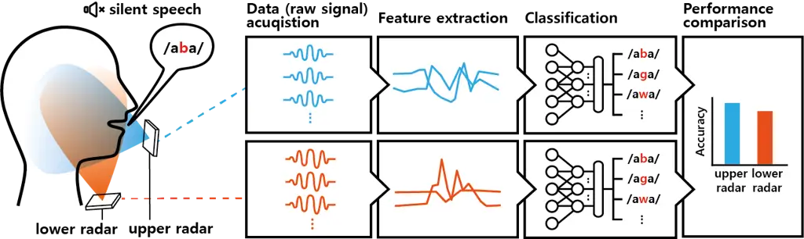
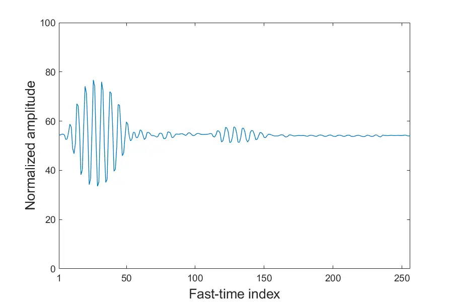
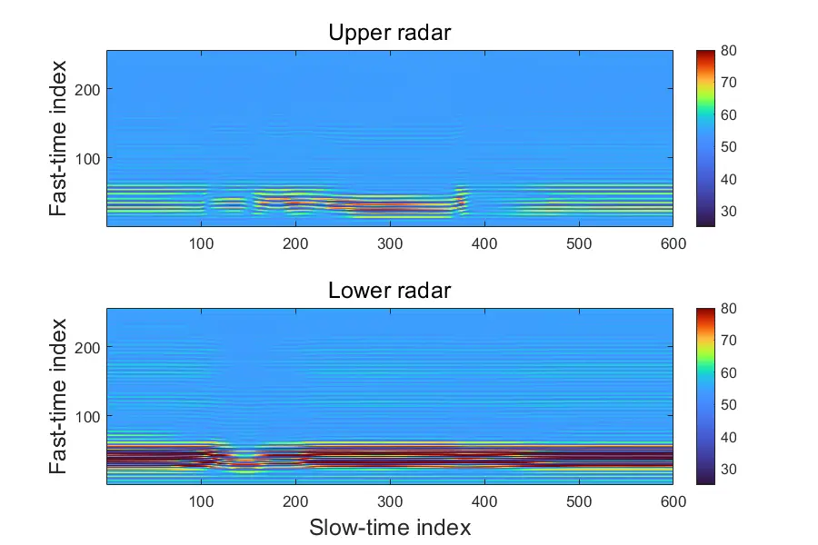
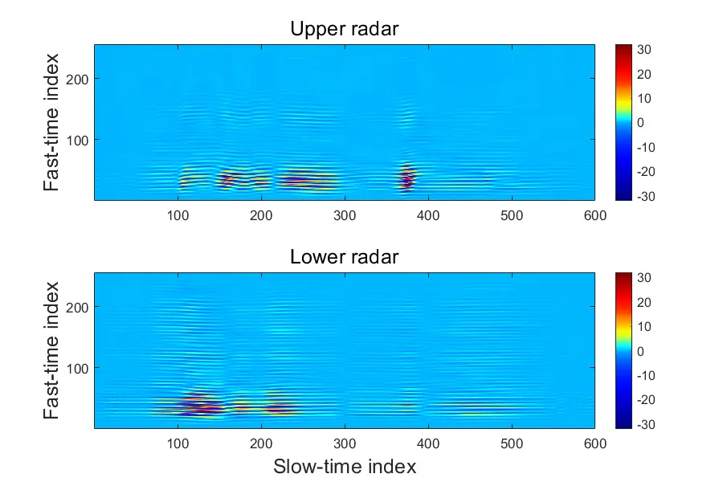
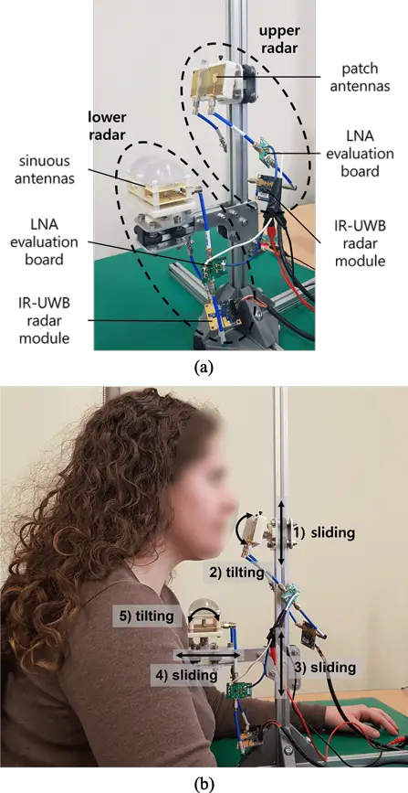
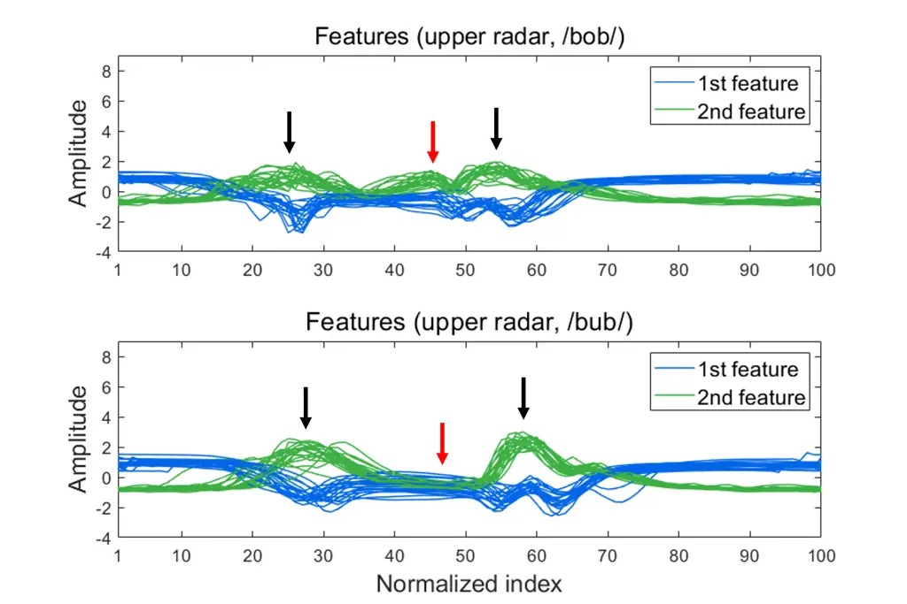
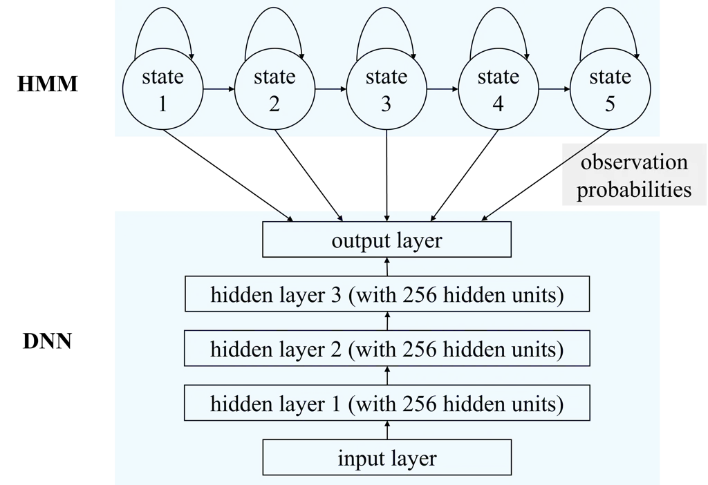
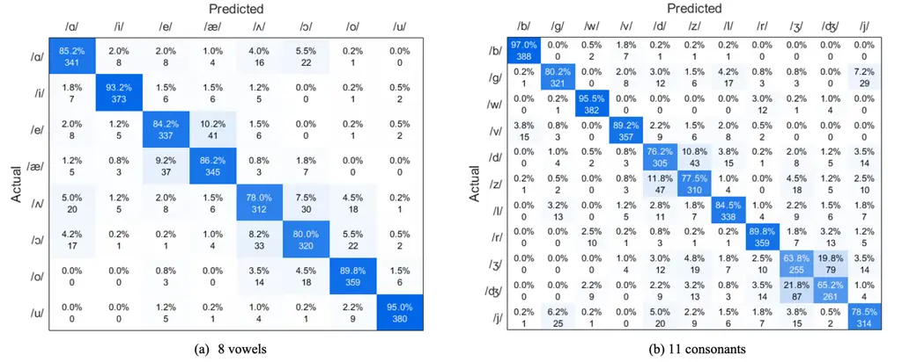
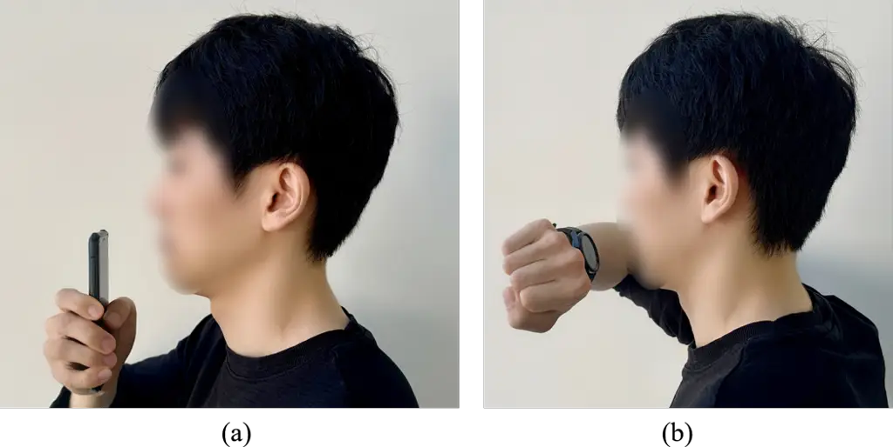

# IR-UWB Radar-Based Contactless Silent Speech Recognition of Vowels, Consonants, Words, and Phrases

SUNGHWA LEE¹    YOUNGHOON SHIN¹    MYUNGJONG KIM²    AND JIWON
SEO^(1, 3)

###### Abstract

Several sensing techniques have been proposed for silent speech
recognition (SSR); however, many of these methods require invasive
processes or sensor attachment to the skin using adhesive tape or glue,
rendering them unsuitable for frequent use in daily life. By contrast,
impulse radio ultra-wideband (IR-UWB) radar can operate without physical
contact with users’ articulators and related body parts, offering
several advantages for SSR. These advantages include high range
resolution, high penetrability, low power consumption, robustness to
external light or sound interference, and the ability to be embedded in
space-constrained handheld devices. This study demonstrated IR-UWB
radar-based contactless SSR using four types of speech stimuli (vowels,
consonants, words, and phrases). To achieve this, a novel speech feature
extraction algorithm specifically designed for IR-UWB radar-based SSR is
proposed. Each speech stimulus is recognized by applying a
classification algorithm to the extracted speech features. Two different
algorithms, multidimensional dynamic time warping (MD-DTW) and deep
neural network–-hidden Markov model (DNN–HMM), were compared for the
classification task. Additionally, a favorable radar antenna position,
either in front of the user’s lips or below the user’s chin, was
determined to achieve higher recognition accuracy. Experimental results
demonstrated the efficacy of the proposed speech feature extraction
algorithm combined with DNN–HMM for classifying vowels, consonants,
words, and phrases. Notably, this study represents the first
demonstration of phoneme-level SSR using contactless radar.

###### Index Terms: 

Impulse radio ultra-wideband (IR-UWB) radar, contactless silent speech
recognition, speech feature extraction, consonant and vowel
classification.

^(†)^(†)history: Date of publication xxxx 00, 0000, date of current
version xxxx 00, 0000.^(†)^(†)doi:
10.1109/ACCESS.2023.DOI^(†)^(†)address: School of Integrated Technology,
Yonsei University, Incheon 21983, Republic of Korea^(†)^(†)address:
NVIDIA Corporation, Santa Clara, CA 95051, United States^(†)^(†)address:
Department of Convergence IT Engineering, Pohang University of Science
and Technology, Pohang 37673, Republic of Korea^(†)^(†)titlenote: This
work was supported by the National Research Foundation of Korea (NRF)
grant funded by the Korea government (MSIT) (NRF-2021R1F1A1062958).
^(†)^(†)corresponding: Corresponding author: Jiwon Seo
(jiwon.seo@yonsei.ac.kr)

## I Introduction

Speech is an attractive input modality for human–computer interaction
owing to its convenience and efficiency. Automatic speech recognition
(ASR) technology has achieved high accuracy and robustness for
deployment in commercial products. For example, several recent
commercial smart devices have adopted digital voice assistance services,
such as Amazon Alexa, Apple Siri, Microsoft Cortana, Google Assistant,
and Samsung Bixby. However, audio-based ASR has certain limitations. In
noisy environments (e.g., concert halls), performance may degrade
significantly. Furthermore, its usage is limited in places where silence
has to be maintained (e.g., libraries) or in situations where
confidential speech communication is needed (e.g., military operations).
Finally, it is not usable by people who have lost their voices because
of reasons (e.g., laryngectomy).

Myriad acoustic and nonacoustic biosignals can be captured during speech
production. Silent speech recognition (SSR) is a technology that
converts the nonacoustic speech-related biosignals captured from body
parts, such as the brain, muscles, and organs, into text. Because SSR
does not require auditory information, it can be a standalone solution
for speech-based human–computer interactions in situations where ASR
cannot be applied, or it can be used together with ASR to enhance
performance.

Various sensing techniques have been proposed for capturing nonacoustic
speech-related biosignals \[1, 2, 3, 4\]. Among these techniques,
electromagnetic articulography (EMA) \[5, 6, 7, 8, 9, 10\], permanent
magnetic articulography \[11, 12\], and electropalatography \[13, 14,
15\] involve the placement of sensors inside the oral cavity. The tongue
is one of the primary articulators; however, capturing tongue motion is
challenging because the tongue is inside the oral cavity. These
techniques are advantageous for capturing tongue motion. However, they
are not appropriate for daily use because of cumbersome sensor
attachment procedures and inconvenience to users.

Surface electromyography \[16, 17\], vision \[18, 19, 20, 21, 22, 23\],
ultrasound imaging \[24, 25\], and radar \[26, 27, 28, 29, 30, 31\] are
techniques for capturing nonacoustic speech-related biosignals without
the need to place sensors inside the oral cavity. Although these
techniques are more convenient than the aforementioned ones, they have
some shortcomings.

Surface electromyography, which can be used to detect the activities of
facial muscles during speech production using electrodes, intrinsically
suffers from high signal variability between speech sessions owing to
variations in sensor placement \[32\]. Moreover, their usability is
limited because they require the attachment of electrodes to the skin.

Although images are a highly accessible modality because many devices
used in daily life, such as smartphones and laptops, are equipped with
image sensors, vision techniques have intrinsic performance limitations
because they cannot detect invisible articulators. Furthermore, they
pose privacy concerns, and their performance depends heavily on the
light conditions.

Ultrasound imaging, which enables intraoral scanning, has problems of
limited quality, caused partly by the presence of speckle noise and loss
of signal from the part of the tongue that is not orthogonal to the
ultrasound beam \[2\]. Denby et al. \[33\] suggested a lightweight
helmet combining an infrared camera and an ultrasound device to improve
the SSR performance. Infrared cameras and ultrasound devices are
efficient in detecting lip and tongue motion, respectively, which are
the main articulators for speech production. However, this approach
requires wearing a helmet, which can deteriorate the usability.

|                            |         |                          |                                                      |
| -------------------------- | ------- | ------------------------ | ---------------------------------------------------- |
|    Reference               |    Year |    Data acquisition mode |    Corpus                                            |
|    Birkholz et al. \[26\]  |    2018 |    Contact               |    25 phonemes                                       |
|    Digehsara et al. \[27\] |    2022 |    Contact               |    40 words                                          |
|    Shin and Seo \[28\]     |    2016 |    Contactless           |    10 words and 5 vowels                             |
|    Wen et al. \[29\]       |    2020 |    Contactless           |    N/A                                               |
|    Ferreira et al. \[30\]  |    2022 |    Contactless           |    13 words                                          |
|    Zeng et al. \[31\]      |    2023 |    Contactless           |    1000 sentences                                    |
|    Proposed                |    2023 |    Contactless           |    8 vowels, 11 consonants, 25 words, and 12 phrases |

TABLE I: Comparison of radar-based silent speech recognition studies.

Radar is a promising technique for SSR because it works through
occluding materials and is unaffected by external light or sound
conditions. However, extracting effective speech features from radar
signals is challenging, because raw radar signals are very complex to
interpret. Furthermore, radar signals may contain motion information of
non-speech sources other than the articulators. Therefore, most studies
on radar-based SSR have not demonstrated results beyond the word
recognition level, as summarized in Table I.

An exception is the work of Birkholz et al. \[26\], who used an
ultra-wideband (UWB) radar to recognize 25 German phonemes. They
attached two antennas to the cheek and below the chin of the speakers
using adhesive tape, which allowed them to capture speech movements more
effectively. However, these skin-attached antennas are not suitable for
daily use because they are inconvenient to users. Digehsara et al.
\[27\] recently proposed a wearable headset for SSR equipped with a
stepped-frequency continuous-wave radar and two antennas on the left and
right cheeks; however, they tested it for word recognition only.

A contactless SSR system is much more desirable because its usability is
superior to that of a contact SSR system, which requires a helmet or a
skin-attached antenna. The usability of a contactless SSR system
embedded in smart devices is discussed in Section V-E2. The following
studies utilized radar to implement a contactless SSR solution.

Shin and Seo \[28\] demonstrated the recognition of 10 isolated words
and 5 vowels using a bistatic impulse radio ultra-wideband (IR-UWB)
radar. To implement an IR-UWB radar-based contactless SSR system, Shin
and Seo \[28\] proposed a method to extract the distance and correlation
amplitude from raw radar measurements as speech features for SSR.
However, the five vowels they used (/\textscripta/, /\textipaæ/,
/\textipai/, /\textipao/, and /\textipau/) are highly distinguishable.
Thus, recognizing them does not pose a greater challenge than
recognizing words. The authors also stated that their proposed features
are insufficient to enable phoneme-level recognition.

Wen et al. \[29\] captured speech movements with a customized radar
sensor capable of dual frequency-modulated continuous-wave (FMCW) and
continuous-wave (CW) modes. They demonstrated that the displacement and
spectrum patterns, obtained using their algorithm to resolve phase
ambiguity caused by the nonlinear phase modulation of their radar
system, for several word and sentence commands were distinct. However,
they did not conduct a speech recognition experiment.

Ferreira et al. \[30\] performed a speech recognition task with 13
isolated European Portuguese words using an FMCW radar. They utilized
velocity dispersion data as speech features and successfully
demonstrated that these features were capable of classifying
distinguishable words. However, these accomplishments have not yet been
extended to phoneme recognition.

Zeng et al. \[31\] conducted the recognition of individual words within
1000 sentences of everyday conversation using an FMCW radar. They
introduced a novel signal processing pipeline that sequentially
localizes articulatory zones, removes low-frequency noise, and extracts
short-time Fourier transform-based speech features. Additionally, they
designed an end-to-end deep neural network to recognize words from
sentences based on these speech features. While their achievement in
sentence-level word recognition is promising, they did not provide
phoneme-level recognition results or analysis. This omission limits a
comprehensive understanding of the potential or limitations of their SSR
system.

Compared with conventional radars, the IR-UWB radar used in our study
has promising properties for deployment in SSR. It has a higher
performance potential than conventional radars owing to its higher range
resolution \[34, 35\], better signal penetrability \[36\], and lower
power consumption \[37\]. For instance, Wang et al. \[38\] demonstrated
the superior accuracy and signal-to-noise ratio of IR-UWB radar over
FMCW radar in nearly all comparison scenarios for contactless vital sign
monitoring, which measures respiration rate and heart rate. However, as
introduced earlier, fewer studies have focused on IR-UWB radar-based SSR
compared to FMCW radar-based SSR up to the present date.

Leveraging the high-performance potential of IR-UWB radar, our study
aims to accomplish phoneme-level speech recognition. To transcribe
speakers’ real-life conversations into text, SSR should possess the
capability to recognize phonemes themselves rather than words composed
of multiple phonemes. However, to the best of our knowledge, contactless
radar-based SSR studies in the literature have not yet demonstrated
phoneme-level recognition.

One of the main challenges in contactless phoneme-level SSR using radar
is defining and extracting appropriate speech features from raw radar
data. Given the different working mechanisms of FMCW and IR-UWB radar
systems \[38\], the signal processing algorithms employed in FMCW
radar-based SSR cannot be directly transferred to IR-UWB radar-based
SSR. In this study, we proposed a new speech feature extraction
algorithm that can capture the necessary articulatory movements from
IR-UWB radar data for phoneme-level SSR. Silent speech recognition of
phonemes (8 vowels and 11 consonants), 25 words, and 12 phrases was
demonstrated using a contactless IR-UWB radar. Furthermore, we applied
classification algorithms to the extracted speech features to analyze
how the performance varied according to the choice of the classification
algorithm. This was the first feasibility test for silent phoneme-level
recognition, including both vowels and consonants, using a contactless
radar platform.



Fig. 1: Overall schematic of our approach for the contactless IR-UWB
radar-based SSR study. Articulatory movements are captured
simultaneously by two radars, with one antenna positioned at the upper
radar position and the other at the lower radar position, to investigate
the optimal antenna position for SSR. Feature extraction and
classification algorithms are independently applied to the upper and
lower radar signals.

Another research question in this study concerns the favorable direction
of radar signals for SSR. Positioning the radar antenna in front of the
lips (i.e., the upper radar case in Fig. 1) is a promising strategy,
because the movements of the lips and tongue can be captured together.
However, positioning the radar antenna under the speaker’s chin (i.e.,
the lower radar case in Fig. 1) is another possible strategy, because
the movements of the tongue and its related body parts can be detected
by the lower radar \[39\]. To answer this research question, we
positioned two radar antennas, one each at the front of the lips and
under the chin, during the experiments and captured articulatory
movements using these two radars simultaneously. We then compared the
SSR performance of the two cases.

The contributions of this study are summarized as follows:

- •
  The IR-UWB radar-based contactless SSR task was performed using three
  speech-unit levels: phonemes, words, and phrases. This study included
  the first contactless radar-based SSR of phonemes, including both
  vowels and consonants.
- •
  A novel speech feature extraction algorithm was proposed to improve
  the performance of IR-UWB radar-based SSR.
- •
  Two classification algorithms were implemented and applied to the
  recognition task along with the proposed feature extraction algorithm.
- •
  An analysis of the choice between two radar positions—in front of the
  speaker’s lips or under the speaker’s chin—that is more favorable for
  a higher performance of the IR-UWB radar-based SSR was conducted.

The remainder of this paper is organized as follows: Section II explains
the basic working principles of IR-UWB radar-based SSR, and Section III
describes our testbed and data acquisition procedure. Section IV
presents the details of the proposed speech feature extraction algorithm
along with classification algorithms. After discussing the performance
and effectiveness of the proposed method in Section V, conclusions are
presented in Section VI.

## II Principles of IR-UWB Radar-Based SSR

Radar can be broadly classified into CW radar and pulse radar. CW radar
transmits a continuous wave with a constant frequency, allowing for the
measurement of target velocity through Doppler shift analysis. However,
it faces challenges in independently determining target range.

An FMCW radar, a variation of CW radar, emits a continuous wave with a
frequency that changes over time. It can measure both the target range
and velocity by analyzing the beat frequency between the transmitted and
received signals. When FMCW radar operates in the frequency range of 30
to 300 GHz, it is commonly referred to as mmWave radar because the
wavelength of the radio waves is in the millimeter range. Specifically,
the FMCW radar employed in the contactless radar-based SSR studies of
\[29\] and \[31\], introduced in Section I, corresponds to mmWave radar.

In contrast, pulse radar transmits short pulses, enabling the
measurement of target range and velocity by analyzing the amplitude and
time of flight of these pulses. When the pulse radar transmits extremely
short pulses with a fractional bandwidth larger than 25%, it is
categorized as IR-UWB radar. The fractional bandwidth is defined as the
ratio of the bandwidth to the center frequency.

FMCW radar utilizes continuous wave signals, whereas IR-UWB radar
employs pulse signals for its functionality. Thus, the signal processing
algorithm used in the FMCW radar-based SSR studies of \[29, 30, 31\]
cannot be directly applied to our IR-UWB radar-based SSR study.

In the remainder of this section, we explain the detailed operational
mechanism of the IR-UWB radar used in this study. The radar’s transmit
(TX) antenna emits pulses that travel through air and are subsequently
reflected by targets. The reflected pulses are then received by the
receive (RX) antenna of the radar and merged into a data “frame” after
employing the IR-UWB radar manufacturer’s proprietary normalization
method.

Fig. 2 illustrates an example of a single data frame while the sentence
“How are you doing?” was silently pronounced. This data frame was
captured 1.5 s after the onset of the pronunciation. The radar’s
detection range was set to cover distances of up to 1 m. Each
“fast-time” index, ranging from 1 to 256, corresponds to a specific
distance within this 1 m range. For example, the fast-time index of 26
corresponds to $`\frac{26}{256}\times 1\,\text{[m]}=0.10\,\text{[m]}`$
from the radar antenna. The normalized signal amplitude, which ranges
from 0 to 100, represents the strength of the reflection at the
corresponding distance (i.e., the fast-time index). In Fig. 2, the
highest amplitude occurs at a fast-time index of 26, indicating that the
target responsible for the most intense pulse reflection is
approximately located 0.1 m from the radar antenna. The amplitudes of
the reflected pulses demonstrate diverse time delays and shapes, which
correspond to the characteristics of the targets, including distance,
shape, and angle.



Fig. 2: A single data frame captured using the IR-UWB radar. This data
frame was captured 1.5 s after the onset of the pronunciation, while the
sentence “How are you doing?” was silently pronounced.

The IR-UWB radar used in this study continuously acquired data frames at
an approximate rate of 200 frames per second. These acquired data frames
encompass information regarding the articulatory movements involved in
speech production. A “frame set” is formed by combining $`M`$
one-dimensional data frames, each with a length of 256, resulting in a
frame set with dimensions of $`256`$-by-$`M`$. Fig. 3 shows two frame
sets, each comprising $`M=600`$ (equivalent to 3 s of data), from the
upper and lower radars. The colors in the visualization correspond to
the normalized signal amplitudes. Typically, the row index of the frame
set is referred to as the “fast-time” index, representing the distance
to the target, while the column index is known as the “slow-time” index
and indicates the reception time of the corresponding data frame. For
instance, the data frame depicted in Fig. 2 corresponds to a slow-time
index of 300, signifying that the data frame was acquired at
approximately
$`{300\,\text{[frames]}}/{200\,\text{[frames per second]}}=1.5\,\text{[s]}`$
after the onset of the pronunciation. That is, the data frame
illustrated in Fig. 2 represents a two-dimensional slice of the
three-dimensional data shown in Fig. 3 (top) at a slow-time index of 300.

In radar applications, the term “clutter” refers to undesired signals
reflected from stationary or slowly moving objects in the surrounding
environment. The clutter-reduced frame sets shown in Fig. 4 are obtained
by subtracting the clutter from the raw frame sets illustrated in Fig. 3. In this study, the clutter was estimated using the loopback filter
\[40\] and subtracted from the raw frame set using the following
equations:

```math
c_{m}[n]=\alpha c_{m-1}[n]+(1-\alpha)r_{m}[n] \tag{1}
```

```math
y_{m}[n]=r_{m}[n]-c_{m}[n] \tag{2}
```

Here, $`c_{m}[n]`$, $`r_{m}[n]`$, and $`y_{m}[n]`$ represent the clutter
amplitude, received signal amplitude, and clutter-reduced signal
amplitude, respectively, at slow-time index $`m`$ and fast-time index
$`n`$. The value of $`\alpha`$ was set to 0.95 in this study. It is
important to note that $`r_{m}[n]`$ and $`y_{m}[n]`$, where $`m`$ ranges
from 1 to $`M`$ and $`n`$ ranges from 1 to 256, form matrices that
represent the raw and clutter-reduced frame sets, respectively.

The raw and clutter-reduced frame sets capturing the articulatory
movements of a participant while silently pronouncing “How are you
doing?”, are shown in Figs. 3 and 4, respectively. In both the raw and
clutter-reduced frame sets, the normalized signal amplitude at each
fast-time index (i.e., distance) varies as the slow-time index (i.e.,
time) changes. This indicates that the distance between articulators and
radar varies over time during pronunciation. Notably, stationary signals
in the raw frame sets are significantly reduced in the clutter-reduced
frame sets. Consequently, the changes in amplitude are more pronounced
in Fig. 4 than in Fig. 3.

While we acknowledge the variation in radar data observed in Figs. 3 or
4 during silent pronunciation, it remains challenging to define and
extract suitable speech features from this data that facilitate the
recognition of phonemes within the silently uttered sentence “How are
you doing?”.



Fig. 3: Raw frame sets that capture the articulatory movements for
silently pronouncing “How are you doing?”. Two frame sets were acquired
by the upper and lower radars in Fig.1. The slow-time and fast-time
indices indicate the time and distance, respectively. The color bar
represents the normalized signal amplitude.



Fig. 4: Clutter-reduced frame sets that capture the articulatory
movements for silently pronouncing “How are you doing?”. Two frame sets
were acquired by the upper and lower radars in Fig.1. The slow-time and
fast-time indices indicate the time and distance, respectively. The
color bar represents the normalized signal amplitude.

## III Data Acquisition

Before elucidating the proposed methods, this section explains the
speech stimuli, hardware testbed, and test procedure.

### III-A Speech Stimuli and Participants

All speech stimuli (8 vowels, 11 consonants, 25 words, and 12 phrases)
used in this study are based on \[9\]. More precisely, the vowels and
consonants correspond to 8 consonant-vowel-consonant (CVC) and 11
vowel-consonant-vowel (VCV) syllables, respectively. Pronouncing these
CVC and VCV syllables involves diverse mechanisms for articulating
English vowels and consonants. The 25 words used for the isolated word
recognition were designed to be phonetically balanced. Finally, 12 short
phrases were used for phrase classification. These phrases are often
used in augmentative and alternative communication devices \[41\].
Detailed information on the pronunciation list used in this study can be
found in \[9\]. The comprehensive pronunciation list is as follows.

- •
  8 CVC syllables: /\textipab\textscriptab/, /\textipabib/,
  /\textipabeb/, /\textipabæb/, /\textipab\textturnvb/,
  /\textipab\textopenob/, /\textipabob/ and /\textipabub/
- •
  11 VCV syllables: /\textipa\textscriptab\textscripta/,
  /\textscripta\textscriptg\textscripta/,
  /\textipa\textscriptaw\textscripta/,
  /\textipa\textscriptav\textscripta/,
  /\textipa\textscriptad\textscripta/,
  /\textipa\textscriptaz\textscripta/,
  /\textipa\textscriptal\textscripta/,
  /\textipa\textscriptar\textscripta/,
  /\textscripta\textyogh\textscripta/,
  /\textscripta\textdyoghlig\textscripta/, and
  /\textipa\textscriptaj\textscripta/
- •
  25 words: job, need, charge, hit, blush, snuff, log, nut, frog, gloss,
  start, moose, trash, awe, pick, bud, mute, them, fate, tang, corpse,
  rap, vast, dab, and ways
- •
  12 phrases: “How are you doing?,” “I am fine,” “I need help,” “That is
  perfect,” “Do you understand me?,” “Right,” “Hello!,” “Why not?,”
  “Please repeat that,” “Good-bye,” “I don’t know,” and “What happened?”

Twenty participants (13 males and 7 females), aged between 20 and 28,
were recruited for the experiment. Four participants (two males and two
females) were native speakers of American English and pronounced 8 CVC
syllables, 11 VCV syllables, 25 words, and 12 phrases. The remaining 16
participants, native speakers of Korean with at least 13 years of
English education, pronounced 8 CVC and 11 VCV syllables. Consequently,
phoneme recognition tasks, the primary focus of our study and more
challenging than word or sentence recognition, were evaluated with data
from all 20 participants. All participants repeated each speech stimulus
20 times without vocalization. They were instructed to articulate each
speech stimulus clearly and maintain a stationary head position
throughout the data acquisition period.

### III-B Hardware Testbed



Fig. 5: (a) Components and (b) functionalities of the hardware testbed.

The IR-UWB radar operates based on pulse modulation, involving the
transmission of impulses (extremely short pulses) without a continuous
carrier wave \[34\]. The IR-UWB radar modules used in this study
(NVA-R661, Novelda) emit impulses with a frequency range of 6 to 10.2
GHz and provide a 4 mm distance resolution for received signals.

As illustrated in Fig. 5(a), we constructed a hardware testbed to
accurately capture radar data reflecting the articulatory movements of
users. Two identical IR-UWB radar modules (NVA-R661, Novelda) were
installed; one (upper radar) was aimed at the user’s lips using patch
antennas, and the other (lower radar) was directed at the user’s chin
using sinuous antennas with a dielectric lens. After testing various
combinations of patch antennas and sinuous antennas for the upper and
lower radars, the aforementioned configuration yielded the best
performance.

The beam width of the patch antenna is approximately 55°(vertical)
$`\times`$ 50°(horizontal), while the sinuous antenna with a dielectric
lens has a beam width of approximately 40°(vertical) $`\times`$
35°(horizontal). Therefore, the patch antenna’s wider beam pattern seems
to enhance the detection of complex lip movements at close distances. By
contrast, the narrower beam pattern of the sinuous antenna with a
dielectric lens below the the chin focuses on the relatively simple
up-and-down movements of the chin.

To position the two radar antennas independently at locations that
facilitate the acquisition of high-quality radar data, a hardware
testbed was designed to incorporate the following five functionalities,
as illustrated in Fig. 5(b): 1) vertical sliding of the upper radar
antenna, 2) vertical tilting of the upper radar antenna, 3) vertical
sliding of the lower radar antenna, 4) horizontal sliding of the lower
radar antenna, and 5) horizontal tilting of the lower radar antenna.

Before recruiting the participants, one of the authors of this paper
conducted multiple experiments using various hardware configurations.
Through this process, it was found that inserting a slim metal plate
between the TX and RX patch antennas of the upper radar to prevent
antenna coupling and incorporating a low-noise amplifier (LNA) for both
radars resulted in improved performance.

### III-C Procedure

The participants were instructed to comfortably position themselves in
front of the hardware testbed. Once seated, the experimenter adjusted
the positioning of the radar antennas to ensure that the participant’s
lips and tongue were within the detection range and field of view (FOV)
of the upper radar, while their chin and tongue were within the
detection range and FOV of the lower radar. Specifically, the distance
between the participant’s lips and the antennas of the upper radar was
set between 5 and 10 cm, while the distance between the participant’s
chin and the antennas of the lower radar was set between 10 and 15 cm.

We developed a MATLAB-based graphical user interface (GUI) to facilitate
self-administered data collection. The GUI was displayed on a desktop
monitor, and the participants were instructed to pronounce each of the
presented speech stimuli. Within the GUI, the participants had the
ability to independently initiate and complete the data acquisition for
each speech item using clickable buttons. Simultaneous data capture from
both radars occurred when the participants pronounced the designated
speech items, enabling a fair comparison of the performance between the
upper and lower radars.

Applying contactless sensors in SSR presents a drawback: if the user
positions the articulators outside the sensor’s detection range or FOV
or turns the head away from the sensor, it becomes difficult to
accurately measure the articulatory movements. To overcome this
limitation, we employed radar signals to locate the participant’s
articulators in a consistent position and angle prior to pronunciation.
Specifically, we established a preset position and angle, and acquired
one data frame at this position and angle. Before initiating data
acquisition, the GUI window displayed a fixed radar signal representing
the preset position and angle, a real-time receiving radar signal, and a
correlation index indicating their similarity.

The fixed radar signal capturing the preset position and angle, and the
real-time receiving radar signal can be represented as vectors
$`\bm{p}`$ and $`\bm{q}`$, respectively.

```math
\bm{p}=[p_{1},p_{2},\ldots,p_{N}] \tag{3}
```

```math
\bm{q}=[q_{1},q_{2},\ldots,q_{N}] \tag{4}
```

Here, each component in the vectors corresponds to the signal amplitude
value at a corresponding fast-time index, ranging from $`1`$ to $`N`$.
Remember that $`N`$, representing the number of fast-time indices within
a signal, is $`256`$ in this study. The correlation index $`\rho`$ was
calculated using the Pearson correlation coefficient:

```math
\rho=\frac{\sum_{x=1}^{N}(p_{x}-\bar{p})(q_{x}-\bar{q})}{\sqrt{\sum_{x=1}^{N}(p_{x}-\bar{p})^{2}\sum_{x=1}^{N}(q_{x}-\bar{q})^{2}}} \tag{5}
```

```math
\bar{p}=\frac{1}{N}\sum_{x=1}^{N}p_{x} \tag{6}
```

```math
\bar{q}=\frac{1}{N}\sum_{x=1}^{N}q_{x} \tag{7}
```

Because the radar signal contains positional and angular information, a
correlation index exceeding a certain threshold implies that the
participant has positioned their articulators at a preset position and
angle with acceptable tolerance. Once a correlation index greater than
the threshold was confirmed, the participant clicked the data
acquisition start button and commenced pronunciation.

The data were acquired independently for each type of speech stimulus
(vowels, consonants, words, and phrases). Prior to data acquisition, the
participants were familiarized with the pronunciation of each element
within each type of speech stimulus. The sequential pronunciation of
each item continued until all the elements of each type of stimulus were
collected. This process was repeated 20 times, resulting in 20 sessions
for each type of speech stimulus. Upon requests, short breaks were
provided between sessions to alleviate fatigue. Additionally, if
participants reported making a mistake while pronouncing a specific
item, data acquisition for that speech item was repeated during
inter-session intervals.

According to Article 15 (2) of the Bioethics and Safety Act and Article
13 of the Enforcement Rule of Bioethics and Safety Act in Korea, a
research project “which utilizes a measurement equipment with simple
physical contact that does not cause any physical change in the subject”
(translated from Korean to English by the authors) is exempted from
approval. The entire experimental procedure was designed to use only
IR-UWB radars that did not cause any physical changes in the subjects.

## IV Method

### IV-A Proposed Feature Extraction Algorithm

In this study, one frame set was acquired per radar each time a
participant pronounced a speech item, as shown in Fig. 3. We developed
an algorithm to extract speech features from each frame set. The
proposed feature extraction algorithm for each frame set can be
explained as follows.

A frame set can be represented by an $`M`$-by-$`N`$ matrix, denoted as
$`\bm{S}`$, where $`M`$ is the number of frames within a frame set and
each row corresponds to a frame with dimensions of $`1`$-by-$`N`$.

```math
\bm{S}=\begin{bmatrix}s_{1,1}&s_{1,2}&\cdots&s_{1,n}&\cdots&s_{1,N}\\
s_{2,1}&s_{2,2}&\cdots&s_{2,n}&\cdots&s_{2,N}\\
\vdots&\vdots&&\vdots&&\vdots\\
s_{m,1}&s_{m,2}&\cdots&s_{m,n}&\cdots&s_{m,N}\\
\vdots&\vdots&&\vdots&&\vdots\\
s_{M,1}&s_{M,2}&\cdots&s_{M,n}&\cdots&s_{M,N}\end{bmatrix} \tag{8}
```

Here, $`s_{m,n}`$ corresponds to the amplitude of a signal at slow-time
index $`m`$ and fast-time index $`n`$. When dealing with the clutter
amplitude, received signal amplitude, and clutter-reduced signal
amplitude, $`s_{m,n}`$ can be replaced by $`c_{m}[n]`$, $`r_{m}[n]`$,
and $`y_{m}[n]`$, respectively. The relationships among $`c_{m}[n]`$,
$`r_{m}[n]`$, and $`y_{m}[n]`$ were explained by (1) and (2) in Section
II.

Our transformation algorithm converts a two-dimensional frame set
$`\bm{S}`$ into a one-dimensional feature sequence that effectively
captures the articulatory movements of the user. The transformation
algorithm works in the following four steps:

- •
  All the frames in a given frame set (i.e., rows in $`\bm{S}`$) are
  concatenated to form a single row vector as follows.

  ```math
  \displaystyle\bm{f}=vec(\bm{S})=[s_{1,1},s_{1,2},\ldots,s_{1,N},s_{2,1},\ldots,s_{M,N}] \tag{9}
  ```

  ```math
  f_{i}=vec(\bm{S})_{i} \tag{10}
  ```

  Here, $`vec`$ represents vectorization, reshaping the matrix into a
  single row vector by concatenating its rows sequentially from top to
  bottom. The index $`i`$ represents each element’s position in the
  resulting row vector $`\bm{f}`$. The dimensions of $`\bm{f}`$ are
  $`1`$-by-$`MN`$.

- •
  The envelope of the concatenated frames (i.e., $`\bm{f}`$) is
  extracted. To achieve this, a $`W`$-length window is slid over the
  concatenated frames with a step size of one. The root mean square
  (RMS) value of the data within each window is calculated as:

  ```math
  e_{j}=\sqrt{\frac{1}{W}\sum_{i=\max(1,j-\frac{W}{2})}^{\min(MN,j+\frac{W}{2}-1)}f_{i}}^{2} \tag{11}
  ```

  where $`j`$ spans from $`1`$ to $`MN`$ and $`e_{j}`$ represents the
  magnitude of the envelope at index $`j`$. The window length $`W`$ is
  set to $`400`$ in this study.

- •
  The envelope of the concatenated frames is downsampled as:

  ```math
  v_{k}=e_{Dk} \tag{12}
  ```

  where $`k`$ varies from $`1`$ to $`\lfloor MN/D\rfloor`$ and $`v_{k}`$
  denotes the downsampled envelope value at index $`k`$. The
  downsampling factor $`D`$ is set to 1024 in this study.

- •
  To remove the DC offset, the mean value is subtracted from each
  downsampled envelope value:

  ```math
  z_{k}=v_{k}-\bar{v} \tag{13}
  ```

  ```math
  \bar{v}=\frac{1}{\lfloor MN/D\rfloor}\sum_{k=1}^{\lfloor MN/D\rfloor}v_{k} \tag{14}
  ```

  Here, $`\bar{v}`$ denotes the mean value of the downsampled envelope.
  The resulting $`z_{k}`$ represents each value at index $`k`$ in the
  final one-dimensional feature sequence.

As a result, our transformation algorithm generates a feature sequence
$`\bm{z}`$ with dimensions of $`1`$-by-$`\lfloor MN/D\rfloor`$.

```math
\bm{z}=[z_{1},z_{2},\ldots,z_{k},\ldots,z_{\lfloor MN/D\rfloor}] \tag{15}
```

In this study, $`N`$ (the number of fast-time indices in a given frame)
is 256 and $`D`$ (the downsampling factor) is set to $`1024`$.
Consequently, the feature sequence $`\bm{z}`$ has dimensions of
$`1`$-by-$`\lfloor M/4\rfloor`$.

Two individual one-dimensional speech feature sequences are generated by
applying the same transformation algorithm to the raw frame set and its
clutter-reduced frame set. They can be obtained by substituting
$`s_{m,n}`$ in (8) with $`r_{m}[n]`$ and $`y_{m}[n]`$ in our
transformation algorithm for the raw and clutter-reduced frame sets,
respectively. These are referred to as the first and second features,
respectively.

Derivative features are then obtained. The third and fourth features are
the first derivatives of the first and second features, respectively.
The fifth and sixth features are the second derivatives of the first and
second features, respectively. We follow the approach of \[42\] to
calculate the derivatives. The first and second derivatives are
calculated using the following two equations:

```math
\dot{z}_{k}=\frac{\sum_{l=-\lfloor L/2\rfloor}^{\lfloor L/2\rfloor}l\hskip 1.99997ptz_{k+l}}{\sum_{l=-\lfloor L/2\rfloor}^{\lfloor L/2\rfloor}l^{2}} \tag{16}
```

```math
\ddot{z}_{k}=\frac{\sum_{l=-\lfloor L/2\rfloor}^{\lfloor L/2\rfloor}l\hskip 1.99997pt\dot{z}_{k+l}}{\sum_{l=-\lfloor L/2\rfloor}^{\lfloor L/2\rfloor}l^{2}} \tag{17}
```

where $`\dot{z}_{k}`$ and $`\ddot{z}_{k}`$ are the first and second
derivative features at index $`k`$. During the summation, if $`k+l`$ is
less than $`1`$ or greater than $`MN`$, $`z_{k+l}`$ in (16) and
$`\dot{z}_{k+l}`$ in (17) are treated as 0. We set the delta window
length $`L`$ to $`9`$ in this study.

As a result, we obtain six features, each with a dimension of
$`1`$-by-$`\lfloor M/4\rfloor`$. Thus, the resulting dimension of the
feature matrix, composed of the six speech features extracted from a
single frame set, is $`6`$-by-$`\lfloor M/4\rfloor`$.

We name this feature extraction algorithm for IR-UWB radar-based SSR,
which uses the envelope of the concatenated frames derived from the raw
and clutter-reduced frame sets, FERASEC. Among the six features obtained
by FERASEC, the first and second features are essential, as the
remaining features are delta features derived from them. The first and
second features represent the abbreviated envelopes of the concatenated
frames from the raw and clutter-reduced frame sets, respectively.

### IV-B Motivation of FERASEC

The motivation behind our feature extraction algorithm, which converts
the frame set into an abbreviated envelope of the concatenated frames,
is rooted in the inefficacy of raw IR-UWB radar data as a representation
(feature) for SSR. This issue is discussed in detail in Section V-E1.
The nature of IR-UWB radar data, characterized by sequential data with a
large number of channels (256 channels), introduces complexity and
redundancy, posing challenges for effective pattern recognition. To
address this, our feature extraction algorithm incorporates a
transformation that condenses the frame set into an abbreviated envelope
of concatenated frames, reducing the channel dimension from 256 to 1.
This design aims to extract a more efficient and effective
representation of speech movement from IR-UWB radar data.

The following is the physical interpretation of the transformation
algorithm. Each frame in the set represents the normalized signal
amplitudes corresponding to 256 fast-time indices that indicate the
target distance from the radar. Therefore, the information regarding
articulator movements captured by the radar is contained in the
amplitude changes within the concatenated frames. The process of
envelope detection and downsampling, used to create the abbreviated
envelope, serves to emphasize the amplitude variations and reduce noise.
Consequently, we expect that the abbreviated envelope of the
concatenated frames will effectively reflect articulatory movements
within the detection range and FOV of the radar.

As necessary speech features from IR-UWB radar data, the two
individually obtained abbreviated envelopes from the raw and
clutter-reduced frame sets are utilized. The raw frame set contains
articulatory movement information but is contaminated by clutter,
whereas the clutter-reduced frame set loses some articulatory movement
information but exhibits less clutter interference. Thus, we expected
that utilizing both would be beneficial since they would be
complementary features. Derivative features are added to effectively
capture the temporal dynamics of the proposed features. Derivative
features are also used in the ASR field for the same purpose \[43\].

Fig. 6 illustrates the first and second features extracted from 20 frame
sets obtained by the upper radar using FERASEC. These frame sets
captured the articulatory movements of a participant while producing two
CVC syllables (/\textipabob/ and /\textipabub/). Each CVC syllable was
pronounced 20 times, resulting in 20 blue curves representing the first
feature and 20 green curves representing the second feature. For
simplicity, the third through sixth features generated by FERASEC are
not shown.

To compare the features extracted from each CVC syllable, the curves
representing each feature in Fig. 6 are aligned relative to the
reference curve. Firstly, the size of each
$`1`$-by-$`\lfloor M/4\rfloor`$ feature sequence is normalized to 100
through interpolation if $`\lfloor M/4\rfloor`$ is less than 100, or
downsampling if $`\lfloor M/4\rfloor`$ is greater than 100. The value of
$`M`$ depends on pronunciation duration, which can vary for each
utterance. Therefore, normalization is necessary to ensure proper
comparison of features across the 20 pronunciations. Additionally, the
onset of each pronunciation after clicking on the record button can also
vary. Hence, one curve is selected as the reference curve, and each of
the remaining 19 curves is circularly shifted until the correlation with
the reference curve is maximized (i.e., until the best alignment is
achieved).

In Fig. 6, the first and second features of each CVC syllable exhibit
distinct patterns. For instance, the articulatory movements associated
with the bilabial consonant (/\textipab/), which appears as the first
and last consonant in /\textipabob/ and /\textipabub/, can be observed
in specific sections of the first and second features, as indicated by
the black arrows. Notably, the extracted features of the bilabial
consonant exhibit different shapes, depending on whether it is
pronounced before or after the vowel. Moreover, the second feature,
highlighted by the red arrows, reveals contrasting patterns for the two
different vowels in /\textipabob/ and /\textipabub/. The /\textipao/
demonstrates an upward fluctuation, whereas /\textipau/ shows no
fluctuation. Therefore, by leveraging the first and second features,
along with the remaining four features obtained by FERASEC (not
displayed in Fig. 6), their combined utilization holds significant
potential for accurately classifying various consonant and vowel
pronunciations.



Fig. 6: First and second features extracted from 20 frame sets measured
by the upper radar for a participant’s articulatory movements for
producing /\textipabob/ (top) and /\textipabub/ (bottom).

### IV-C Classification Algorithms

The length of each feature (i.e., $`\lfloor M/4\rfloor`$) extracted from
the radar data depends on pronunciation duration. For example, in a
three-second pronunciation where the radar acquires 200 frames per
second, $`M`$ corresponds to $`200\times 3=600`$ frames. Consequently,
the length of each feature becomes $`\lfloor M/4\rfloor=150`$.
Therefore, an algorithm capable of effectively classifying sequential
data of varying lengths is necessary for SSR. Various algorithms have
been employed for sequence classification tasks, including dynamic time
warping (DTW) \[44, 45, 46, 47, 48\], long short-term memory (LSTM)
\[49, 50\], bidirectional long short-term memory (BLSTM) \[51, 52\],
Gaussian mixture model–hidden Markov model (GMM–HMM) \[53, 54, 55, 56,
57\], and deep neural network–hidden Markov model (DNN–HMM) \[58, 59\].

In a previous study \[28\], a 10-word classification task was performed
using the IR-UWB radar used in our study. Feature extraction was
performed using the short-template-based CLEAN algorithm, while the
classification was performed using the multidimensional dynamic time
warping (MD-DTW) algorithm. MD-DTW can measure the distance between two
multidimensional sequential data with different durations and execution
speeds using nonlinear alignments \[28\]. Leveraging this capability,
Shin and Seo \[28\] employed MD-DTW as a classification algorithm. The
classification process involved computing and comparing the distances
between the test and reference data.

To verify the effectiveness of FERASEC compared to the
short-template-based CLEAN, we implemented FERASEC and MD-DTW and
compared their classification performance with the baseline method of
short-template-based CLEAN and MD-DTW, as summarized in Table II. We
validated the correct implementation of the baseline method by
conducting the same 10-word classification task as described in \[28\].
Under experimental conditions that are nearly identical to those in
\[28\], we achieved a classification accuracy of 88% using our baseline
implementation. Considering the average classification accuracy of 84.5%
reported in \[28\], it is evident that the baseline method was
adequately implemented. Additionally, we implemented a method that used
FERASEC for feature extraction and a DNN–HMM for classification because
a DNN–HMM is a representative deep learning model for handling
phoneme-level speech units, such as monophones or triphones, in ASR
\[60\] and SSR \[10, 61\].

In this study, we used a five-state left-to-right HMM and a DNN with
three hidden layers, each consisting of 256 hidden units, to construct
the DNN–HMM, as shown in Fig. 7. The size of the “context window” \[58,
60, 62\], which affects the size of the input features for the DNN, was
set to seven (3-1-3). A comprehensive description of the implementation
of the DNN–HMM for the classification task can be found in \[58\].

In total, we implemented and compared three types of methods:

- •
  Short-template-based CLEAN + MD-DTW (baseline) \[28\]
- •
  FERASEC + MD-DTW
- •
  FERASEC + DNN–HMM



Fig. 7: Structure of the DNN–HMM used in this study.

All the classification results in Table II were obtained using
leave-one-out cross-validation (LOOCV) \[26\]. Let $`A`$ represent the
number of frame sets, and $`B`$ represent the number of classes for a
specific speech stimulus (vowel, consonant, word, or phrase). For
example, in our experiments, we had $`A=20\times 8=160`$ for vowels, as
each vowel was pronounced 20 times, and there were 8 possible vowel
classes. Similarly, we had $`B=8`$ for vowels. LOOCV uses each of the
$`A`$ frame sets as a test sample, and the remaining $`A-1`$ frame sets
are used for classification.

MD-DTW calculates the distance between two frame sets based on their
multidimensional speech features. When FERASEC is applied, a
multidimensional speech feature with dimension of
$`6`$-by-$`\lfloor M/4\rfloor`$ is extracted from each frame set, as
described in Section IV-A. During the LOOCV process using MD-DTW, each
test frame set is classified into the category of one of the remaining
$`A-1`$ frame sets (i.e., labeled reference frame sets) that has the
smallest distance to the test frame set calculated based on their
multidimensional features. The HMM calculates the probability of a frame
set, represented by its multidimensional feature, being observed by the
corresponding model. In the case of the DNN–HMM, the multidimensional
features of all frame sets, except one test frame set, are used to train
the $`B`$ HMMs. Each test frame set, represented by its multidimensional
feature, is then classified into the category of the HMM that provides
the highest probability.

## V Results and Discussion

### V-A Performance Comparison Across Applied Methods

[TABLE]

TABLE II: Average classification accuracies (%) for vowels, consonants,
words, and phrases based on method and radar position (20 participants
were involved in vowel and consonant classification, while word and
phrase classification involved 4 participants).

Table II summarizes the classification results for the vowels,
consonants, words, and phrases categorized by the applied methods and
radar positions. The average classification accuracy was computed based
on the individual accuracies of the participants mentioned in Section
III-A. To calculate the classification accuracy of each participant for
each speech stimulus and radar position, we used the formula
$`{x/(20\times B)}\times 100`$, where $`x`$ represents the number of
frame sets accurately classified and $`B`$ denotes the number of classes
within the specific speech stimulus type (e.g., $`B=8`$ for vowels, with
each vowel being pronounced 20 times).

As can be observed from Table II, the average classification accuracy of
FERASEC + MD-DTW consistently surpassed that of the baseline method
(short-template-based CLEAN + MD-DTW) for the same speech stimulus type
and radar position configuration. This suggests that FERASEC is more
proficient than the short-template-based CLEAN in extracting speech
features that accurately capture the articulatory movements from the
radar data.

As explained in \[28\], the short-template-based CLEAN algorithm is
primarily designed to detect the nearest target, which may not be
advantageous for extracting tongue movement information. Comparing with
the lips or chin, the tongue is located further from the radar. However,
capturing tongue movement information is crucial for recognizing various
pronunciations. In contrast, FERASEC is designed to extract speech
features from the entire radar measurements, encompassing all
articulatory movement information, rather than solely focusing on the
nearest target information. Consequently, FERASEC can effectively
capture the movement information of the tongue, as well as the lips and
chin. This difference in design explains why FERASEC outperforms the
short-template-based CLEAN algorithm.

The performances of two different classification algorithms (MD-DTW and
DNN–HMM) with the same feature extraction algorithm (FERASEC) are
compared in Table II. The method that employed DNN–HMM demonstrated
higher average accuracies for the vowel, consonant, and word
classification tasks, whereas the method that used MD-DTW exhibited
better average accuracies for the phrase classification task under the
same radar position.

If we focus on the classification results with the upper radar position,
which is generally better than the lower radar case, it is noteworthy
that FERASEC + DNN–HMM clearly provided better classification accuracy
for vowels and consonants than that obtained by FERASEC + MD-DTW. For
the relatively easier classification tasks of words and phrases, both
methods demonstrated similar performance.

### V-B Performance Comparison Across Radar Positions

As presented in Table II, the classification accuracy consistently
improved when the radar was positioned at the upper location compared to
the lower location, regardless of the applied methods and types of
speech stimuli. Considering that the short-template-based CLEAN
algorithm is specialized for extracting the movement information of the
nearest target, the upper radar position is advantageous for capturing
the movement information of the lips, whereas the lower position is
advantageous for capturing the movement information of the chin.
Therefore, the higher classification accuracies obtained with the upper
radar position using the short-template-based CLEAN algorithm, compared
with those achieved with the lower position, suggest that the movement
information of the lips plays a more crucial role than that of the chin
in recognizing silent speech when the movement information of the tongue
cannot be obtained.

FERASEC was designed to extract information on all articulatory
movements, including tongue motion, from radar measurements. We observed
that the received radar signals changed in response to tongue motion
when the radar was positioned in front of the lips or below the chin.
However, when the radar was positioned in front of the lips, the change
in the radar signals was not clearly noticeable when they were occluded
by the teeth during certain pronunciations. For instance, the radar
signals showed distinct changes according to tongue motion when the
mouth was open and the upper and lower teeth did not block the radar
signals (as in pronouncing /\textscripta/); however, the radar signals
hardly changed when the upper and lower teeth blocked the signals (as in
pronouncing /\textipai/). This finding supports the observation that
certain consonants are difficult to distinguish because of the presence
of upper teeth in the upper radar configuration, as discussed in Section
V-C2. The signal blockage by the teeth when obtaining tongue motion
information is not an issue when the radar is positioned below the chin.
However, in this case, it becomes challenging to obtain information
about lip motions.

In summary, when using FERASEC, the upper radar position is beneficial
for capturing lip motion information; however, it may result in the loss
of some tongue motion information during certain pronunciations. In
contrast, the lower radar position is advantageous for capturing chin
and tongue motion information; however, it may partially lose lip motion
information. The superior performance of the upper radar position, as
shown in Table II, confirms that detecting lip motions rather than chin
motions is crucial for recognizing diverse pronunciations, although this
may involve the loss of some tongue movement information.

### V-C Confusion Matrix Analysis



Fig. 8: Confusion matrices across 20 participants for (a) vowel and (b)
consonant classification tasks when the radar was positioned in front of
the lips. The FERASEC + DNN–HMM method was used.

We generated confusion matrices for the vowel and consonant
classification tasks using the upper radar configuration and FERASEC +
DNN–HMM method, as shown in Fig. 8. Confusion matrices for vowel and
consonant classification tasks are included because they provide a more
direct analysis of articulator movements at the phonemic level than
word- or phrase-level tasks. Each element of the matrix contains the
relative accuracy (%) and the number of data samples (frame sets) of the
actual pronounced phonemes (rows) predicted as a specific phoneme
(columns). For example, in Fig. 8(a), from 400 data samples of
pronouncing /\textipai/, 373 samples (i.e., 93.2%) were correctly
predicted, while 6 samples (i.e., 1.5%) were incorrectly predicted as
/\textipaæ/. In each row, the sum of the relative accuracies and number
of data samples are 100% and 400, respectively (it should be noted that
each of the 20 participants pronounced each phoneme 20 times).

Before analyzing the results based on the confusion matrix in Fig. 8, it
is informative to introduce a previous study \[63\] that examined the
articulatory distinctiveness of vowels and consonants using EMA sensors
attached to the lips and tongue. The vowels and consonants used as
speech stimuli in \[63\] are identical to those used in our study.

Wang et al. \[63\] observed that higher classification accuracy was
achieved for high and front vowels (/\textipai/, /\textipae/,
/\textipaæ/, and /\textipau/) than that obtained for low and back vowels
(/\textscripta/, /\textturnv/, /\textopeno/, and /\textipao/). This
distinction arises from differences in tongue position during
articulation, with high and front vowels produced with a high and front
tongue position, whereas low and back vowels involve a low and back
tongue position. In the consonant classification task, the most frequent
confusion occurred between /\textyogh/ and /\textdyoghlig/, which
require relatively similar articulation places.

#### V-C1 Vowel Classification

As observed in Fig. 8(a), the upper radar-based vowel classification
task demonstrated higher classification accuracies for /\textipai/,
/\textipaæ/, /\textipao/, and /\textipau/ compared to that for
/\textscripta/, /\textipae/, /\textturnv/, and /\textopeno/. This result
partially aligns with the findings of the earlier EMA sensor-based study
\[63\] in which the high and front vowels /\textipai/, /\textipaæ/, and
/\textipau/ were distinguished more easily than the low and back vowels
/\textscripta/, /\textturnv/, and /\textopeno/. However, it is
noteworthy that the high and front vowel /\textipae/ exhibited
relatively lower accuracies, whereas the low and back vowel /\textipao/
demonstrated relatively higher accuracies in our radar-based study.

The classification errors for the high and front vowel /\textipae/
primarily stem from confusion with another high and front vowel
/\textipaæ/. Compared with the use of multiple EMA sensors directly
attached to the lips and tongue, the contactless IR-UWB radar employed
in SSR may be less effective in capturing subtle tongue movements.
However, the radar appears to be more efficient in detecting fine lip
movements by capturing the movements of the surrounding muscles. Thus,
vowels that are relatively close in the “vowel space” \[63\] (i.e.,
vowels that exhibit similar tongue movements) and require relatively
similar lip movements during pronunciation may pose a greater challenge
for distinction. This could explain the frequent confusion observed
between /\textipae/ and /\textipaæ/. By contrast, vowels that are
relatively close in the vowel space but require distinct lip movements
can be classified with less confusion, as evidenced by the distinction
between /\textipai/ and /\textipae/.

The relatively high classification accuracy of the low and back vowel
/\textipao/ can be attributed to its requirement of distinct lip
protrusion, which can be effectively detected by the upper IR-UWB radar.

#### V-C2 Consonant Classification

From Fig. 8(b), it can be observed that the consonants /\textipab/,
/\textipaw/, /\textipav/, and /\textipar/ achieved higher classification
accuracies than the other consonants in the upper radar configuration.
This can be attributed to the fact that these consonants are pronounced
with distinct lip movements that can be effectively captured by the
upper IR-UWB radar. Specifically, /\textipab/ and /\textipaw/ involve
distinguishable movements of both lips, /\textipav/ is a labiodental
consonant produced with the lower lip contacting the upper teeth, and
/\textipar/ requires lip protrusion during production \[64\].

Furthermore, it is noteworthy that significant confusions occurred
between /\textyogh/ and /\textdyoghlig/, as well as between /\textipad/
and /\textipaz/. The confusion between /\textyogh/ and /\textdyoghlig/
is primarily attributed to their similar places of articulation, as
observed in the previously mentioned EMA sensor-based study \[63\].
Although /\textipad/ and /\textipaz/ were not reported to be frequently
confused in \[63\], both are alveolar sounds that require either the
tongue tip or blade to touch the alveolar ridge during pronunciation,
which is a challenging area for accurate measurement using the upper
radar. When the IR-UWB radar is positioned in front of the lips, the
classification of alveolar sounds may be limited owing to the reduced
penetrability of the IR-UWB radar signal caused by the upper teeth.

### V-D Performance Comparison with Other Contactless Radar-Based SSR Studies

In this section, we compare the performance of our method with that of
other contactless radar-based SSR methods reported in the literature.
Our study achieved average classification accuracies of 86.47%, 81.59%,
88.95%, and 96.88% for the vowels, consonants, words, and phrases,
respectively. These results were obtained using the FERASEC + DNN–HMM
method with the upper radar position.

Shin and Seo \[28\] achieved accuracies of 94% and 84.5% for the 5-vowel
(/\textipa\textscripta/, /\textipaæ/, /\textipai/, /\textopeno/, and
/\textipau/) and 10-word (zero to nine) classification tasks,
respectively, with five speakers. While their accuracy for vowel
classification (94%) is higher than ours (86.47%), it is important to
note that their vowel corpus size is smaller than ours, and the five
vowels they used are highly distinguishable. As indicated in Table II,
with the same vowel corpus as that used in our study, the method
proposed in \[28\] achieved an accuracy of only 51.59%, whereas our
method (FERASEC + DNN–HMM) achieved a significantly higher accuracy of
86.47%. Ferreira et al. \[30\] reported an accuracy of 88.3% for a
13-word European Portuguese classification task with four participants
using an FMCW radar.

The word corpus size in our study is larger than those in the previously
mentioned contactless radar-based SSR studies. Furthermore, our word
corpus is designed to be phonetically balanced \[9\], in contrast to
those in \[28\] and \[30\]. Nevertheless, we achieved similar or higher
levels of accuracy in word classification tasks than those obtained in
\[28\] and \[30\]. We compared our method’s vowel classification
performance with \[28\] and its word classification performance with
both \[28\] and \[30\]. While our method is capable of classifying
vowels, consonants, words, and phrases, it is noteworthy that \[28\] and
\[30\] did not specifically address the recognition of speech units
other than vowels or words.

Recently, Zeng et al. \[31\] reported successful recognition of
individual words within 1000 everyday conversation sentences using an
FMCW radar. While their achievement in word recognition at the sentence
level is notable, direct performance comparison with our results is not
possible because the types of SSR tasks are different. The internal
language model in their work adds complexity to such a comparison. Our
SSR task relied solely on articulatory movement information, while in
\[31\], it involved both articulatory movement and context information
from an internal language model. The internal language model enhances
word recognition performance by leveraging relationships among the
listed words.

Zeng et al. \[31\] did not present phoneme-level recognition results or
analysis, whereas our main contribution is phoneme-level SSR. As
mentioned in Section I, the IR-UWB radar used in our study has higher
performance potential than conventional radars. We demonstrated the
first contactless radar-based SSR of phonemes in this study. The
capability of phoneme recognition can be extended to the recognition of
diverse speech, composed of a set of many phonemes.

### V-E Discussion

#### V-E1 Necessity of Developing a Feature Extraction Algorithm for IR-UWB Radar-Based SSR

|                             |                |                 |
| --------------------------- | -------------- | --------------- |
|   Input                     |   Accuracy (%) |                 |
|                             |   8 vowels     |   11 consonants |
|   Raw frame set             |   44.38        |   38.64         |
|   Clutter reduced frame set |   48.13        |   40.45         |

TABLE III: Vowel and consonant classification results when using either
raw or clutter-reduced frame sets as input for DNN–HMM.

Before developing the proposed feature extraction algorithm (i.e.,
FERASEC), we attempted end-to-end deep learning, a method that does not
rely on explicitly engineered features, for vowel and consonant
classification tasks. Since the DNN–HMM harnesses the capabilities of
deep neural networks to extract intricate patterns from the input data,
it is applicable to a raw radar data-based end-to-end approach. Using
upper radar data, we tested two different scenarios of end-to-end deep
learning-based classification: employing either the raw frame set or the
clutter-reduced frame set as input for DNN–HMM.

The classification results of these end-to-end approaches are summarized
in Table III. When the raw frame set was employed, vowel and consonant
classification accuracies were 44.38% and 38.64%, respectively. When the
clutter-reduced frame set was used, vowel and consonant classification
accuracies improved to 48.13% and 40.45%, respectively. While a slight
enhancement occurred when the clutter was mitigated from the raw IR-UWB
radar data, the accuracies still did not surpass 50% in both vowel and
consonant classifications. This highlights that raw or clutter-reduced
frame sets themselves do not provide an effective representation in
IR-UWB radar-based SSR.

Although end-to-end deep learning approaches or neural network-based
feature extractors, which operate without the need for explicitly
engineered features, have gained popularity, explicitly engineered
features continue to be widely utilized as inputs to deep learning
models in various fields, owing to their compactness, discriminative
power, and robustness to noise. For instance, in the ASR field, log mel
spectrograms are still commonly employed as features instead of raw
audio data. Likewise, the features obtained by FERASEC have the
potential to serve as foundational features in future IR-UWB radar-based
SSR.

#### V-E2 IR-UWB Radar-Based Contactless SSR for Future Smart Devices

In Section I, we highlighted that the usability of a contactless SSR
system surpasses that of a contact SSR system requiring a helmet or a
skin-attached antenna. Although the hardware testbed in Fig. 5 may
appear inconvenient for daily use, contemporary silicon die packaging
technologies enable the integration of radar antennas into a chip
package \[65\]. Moreover, the complete radar functionality, including
the signal transceiver and antennas, can be implemented on a single chip
\[66\]. Thus, radar technologies can now be deployed in commercially
available space-constrained devices. For instance, Google’s Pixel 4
smartphone incorporates a tiny single-chip radar for micro gesture
recognition.

The IR-UWB radar modules used in this study are based on a single CMOS
transceiver chip \[67\]. With chip packaging techniques, the entire
functionality of the IR-UWB radar can be integrated into a single chip.
Thus, we anticipate that IR-UWB radar-based SSR can be deployed in
commercial devices such as smartphones and smartwatches. Since our study
suggests a single radar placed in front of the lips for IR-UWB
radar-based SSR, potential use cases are illustrated in Fig. 9.

Although contactless sensors are desirable for improving usability, the
performance of SSR could degrade if the articulators are placed outside
the sensor’s detection range or if the articulators are not aligned with
the sensor’s FOV. To overcome this challenge, we developed an aiding
algorithm to check if the position and angle between the articulators
and radar sensor are proper, as explained in Section III-C. This
approach is directly applicable to the use cases in Fig. 9. Users should
adjust the distance and angle between the mouth and the smart device and
commence silent speech only when the green light from the aiding
algorithm is on. This approach enables high-quality articulatory
measurements while minimizing concerns about detection range or angle
variability.

In the experiment using the testbed in Fig. 5, we operated the algorithm
of aiding a participant to find the preset position and angle based on
both upper and lower radar signals. However, for the use cases in Fig.
9, the aiding algorithm should be operated based on the upper radar
signal alone. To compare the performance between the double radar and
single radar-based aiding cases, one participant conducted additional
vowel and consonant classification experiments in both scenarios. The
FERASEC + DNN–HMM method was applied for classification. The
classification accuracies for vowels and consonants were 89.38% and
87.73%, respectively, when both upper and lower radars were used for the
aiding algorithm. The vowel and consonant classification accuracies
slightly degraded to 88.13% and 86.36%, respectively, when only the
upper radar was used for the aiding algorithm. This slight performance
degradation indicates that the exclusion of the lower radar is not
critical for the aiding purpose. Therefore, we can still use the aiding
algorithm in Section III-C for the use cases of Fig. 9.



Fig. 9: Potential use cases for a future (a) smartphone and (b)
smartwatch with IR-UWB radar-based SSR technology.

## VI Conclusion

Radar holds promise as a sensor for contactless silent speech
recognition; however, the recognition of phonemes, which includes both
vowels and consonants, remains a critical milestone yet to be
demonstrated using contactless radars. The recognition of phonemes, the
fundamental units of speech, is vital as it establishes the basis for
recognizing diverse speech. Phoneme recognition presents a greater
challenge than word or phrase recognition because of the need to detect
subtle and diverse articulatory movements that occur within very short
durations. In this study, we successfully demonstrated the feasibility
of phoneme recognition using a contactless IR-UWB radar. To accomplish
this, we introduced a novel feature extraction algorithm called FERASEC,
which effectively extracts speech features from raw radar data. During
the development of FERASEC, our focus was on capturing movement
information from all detectable articulators using the IR-UWB radar. We
combined FERASEC with either MD-DTW or DNN–HMM for classification and
evaluated its performance using two radar positions: in front of the
lips or below the chin. The classification accuracies achieved for
vowels and consonants using the FERASEC + DNN–HMM method with a radar in
front of the lips provide compelling evidence of the phoneme recognition
capability of IR-UWB radar-based contactless SSR technology.

## References

- \[1\] B. Denby, T. Schultz, K. Honda, T. Hueber, J. M. Gilbert, and
  J. S. Brumberg, “Silent speech interfaces,” _Speech Commun._, vol. 52,
  no. 4, pp. 270–287, 2010.
- \[2\] T. Schultz, M. Wand, T. Hueber, D. J. Krusienski, C. Herff, and
  J. S. Brumberg, “Biosignal-based spoken communication: A survey,”
  _IEEE/ACM Trans. Audio Speech Lang. Process._, vol. 25, no. 12, pp.
  2257–2271, Dec. 2017.
- \[3\] J. A. Gonzalez-Lopez, A. Gomez-Alanis, J. M. M. Doñas, J. L.
  Pérez-Córdoba, and A. M. Gomez, “Silent speech interfaces for speech
  restoration: A review,” _IEEE Access_, vol. 8, pp.
  177995–178021, 2020.
- \[4\] W. Lee, J. J. Seong, B. Ozlu, B. S. Shim, A. Marakhimov, and
  S. Lee, “Biosignal sensors and deep learning-based speech recognition:
  A review,” _Sensors_, vol. 21, no. 4, Feb. 2021.
- \[5\] P. W. Schönle, K. Gräbe, P. Wenig, J. Höhne, J. Schrader, and
  B. Conrad, “Electromagnetic articulography: Use of alternating
  magnetic fields for tracking movements of multiple points inside and
  outside the vocal tract,” _Brain Lang._, vol. 31, pp. 26–35, May 1987.
- \[6\] M. J. Fagan, S. R. Ell, J. M. Gilbert, E. Sarrazin, and P. M.
  Chapman, “Development of a (silent) speech recognition system for
  patients following laryngectomy,” _Med. Eng. Phys._, vol. 30, no. 4,
  pp. 419–425, May 2008.
- \[7\] P. Heracleous and N. Hagita, “Automatic recognition of speech
  without any audio information,” in _Proc. ICASSP_, 2011, pp.
  2392–2395.
- \[8\] F. Bocquelet, T. Hueber, L. Girin, C. Savariaux, and B. Yvert,
  “Real-time control of an articulatory-based speech synthesizer for
  brain computer interfaces,” PLoS Comput. Biol., vol. 12, no. 11, 2016,
  Art. no. e1005119.
- \[9\] J. Wang, A. Samal, P. Rong, and J. R. Green, “An optimal set of
  flesh points on tongue and lips for speech-movement classification,”
  _J. Speech Lang. Hear. Res._, vol. 59, no. 1, pp. 15–26, 2016.
- \[10\] M. Kim, B. Cao, T. Mau, and J. Wang, “Speaker-independent
  silent speech recognition from flesh-point articulatory movements
  using an LSTM neural network,” _IEEE/ACM Trans. Audio Speech Lang.
  Process._, vol. 25, no. 12, pp. 2323–2336, Dec. 2017.
- \[11\] J. M. Gilbert _et al._, “Isolated word recognition of silent
  speech using magnetic implants and sensors,” _Med. Eng. Phys._,
  vol. 32, no. 10, pp. 1189–1197, Dec. 2010.
- \[12\] J. A. Gonzalez _et al._, “A silent speech system based on
  permanent magnet articulography and direct synthesis,” _Comput. Speech
  Lang._, vol. 39, pp. 67–87, 2016.
- \[13\] R. Li, J. Wu, and T. Starner, “Tongueboard: An oral interface
  for subtle input,” in _Proc. 10th Augmented Human Int. Conf. (AH)_,
  2019, pp. 1–9.
- \[14\] S.-T. Woo, J.-W. Ha, S. Na, H. Choi, and S.-B. Pyun, “Design
  and evaluation of Korean electropalatography (K-EPG),” _Sensors_,
  vol. 21, no. 11, 2021.
- \[15\] N. Kimura _et al._, “SilentSpeller: Towards mobile, hands-free,
  silent speech text entry using electropalatography,” in _Proc. CHI
  Conf. Hum. Factors Comput. Syst._, 2022, pp. 1–19.
- \[16\] M. Wand and T. Schultz, “Session-independent EMG-based speech
  recognition,” in _Proc. Biosignals_, 2011, pp. 295–300.
- \[17\] G. S. Meltzner, “Silent speech recognition as an alternative
  communication device for persons with laryngectomy,” _IEEE/ACM Trans.
  Audio Speech Lang. Process._, vol. 25, no. 12, pp. 2386–2398,
  Dec. 2017.
- \[18\] H. E. Cetingul, Y. Yemez, E. Erzin, and A. M. Tekalp,
  “Discriminative analysis of lip motion features for speaker
  identification and speech-reading,” _IEEE Trans. Image Process._,
  vol. 15, no. 10, pp. 2879–2891, 2006.
- \[19\] W. C. Yau, D. K. Kumar, S. P. Arjunan, and S. Kumar, “Visual
  speech recognition using image moments and multiresolution wavelet
  images,” in _Proc. Int. Conf. Comput. Graph., Imag. Vis._, 2006, pp.
  194–199.
- \[20\] K. Su, C. Yu, W. Shi, L. Liu, and Y. Shi, “Lip-interact:
  Improving mobile device interaction with silent speech commands,” in
  _Proc. 31st Annu. ACM Symp. User Interface Softw. Technol._, 2018, pp.
  581–593.
- \[21\] C. Sheng, X. Zhu, H. Xu, M. Pietikäinen, and L. Liu, “Adaptive
  semantic-spatio-temporal graph convolutional network for lip reading,”
  _IEEE Trans. Multimed._, vol. 24, pp. 3545–3557, 2021.
- \[22\] A. Fernandez-Lopez and F. M. Sukno, “End-to-end lip-reading
  without large-scale data,” _IEEE/ACM Trans. Audio Speech Lang.
  Process._, vol. 30, pp. 2076–2090, 2022.
- \[23\] M. A. Haq, S.-J. Ruan, W.-J. Cai, and L. P.-H. Li, “Using lip
  reading recognition to predict daily Mandarin conversation,” _IEEE
  Access_, vol. 10, pp. 53481–53489, 2022.
- \[24\] T. Hueber _et al._, “Eigentongue feature extraction for an
  ultrasound-based silent speech interface,” in _Proc. 2007 IEEE Int.
  Conf. Acoust., Speech, Signal Process._, 2007, pp. I–1245–I–1248.
- \[25\] G. Gosztolya, Á. Pintér, L. Tóth, T. Grósz, A. Markó, and T. G.
  Csapó, “Autoencoder-based articulatory-to-acoustic mapping for
  ultrasound silent speech interfaces,” in _Proc. Int. Jt. Conf. Neural
  Netw._, 2019, pp. 1–8.
- \[26\] P. Birkholz, S. Stone, K. Wolf, and D. Plettemeier,
  “Non-invasive silent phoneme recognition using microwave signals,”
  _IEEE/ACM Trans. Audio Speech Lang. Process._, vol. 26, no. 12, pp.
  2404–2411, 2018.
- \[27\] Digehsara _et al._, “A user-friendly headset for radar-based
  silent speech recognition,” in _Proc. Interspeech_, Sept. 2022, pp.
  4835–4839.
- \[28\] Y. Shin and J. Seo, “Towards contactless silent speech
  recognition based on detection of active and visible articulators
  using IR-UWB radar,” _Sensors_, vol. 16, no. 11, Oct. 2016.
- \[29\] L. Wen, C. Gu, and J.-F. Mao, “Silent speech recognition based
  on short-range millimeter-wave sensing,” in _Proc. IEEE/MTT-S IMS_,
  Aug. 2020, pp. 779–782.
- \[30\] D. Ferreira, S. Silva, F. Curado, and A. Teixeira, “Exploring
  silent speech interfaces based on frequency-modulated continuous-wave
  radar,” _Sensors_, vol. 22, no. 2, Jan. 2022.
- \[31\] S. Zeng, H. Wan, S. Shi, and W. Wang, “mSilent: Towards general
  corpus silent speech recognition using COTS mmWave radar,” _Proc. ACM
  Interact. Mob. Wearable Ubiquitous Technol._, vol. 7, no. 1, pp. 1–28,
  Mar. 2023.
- \[32\] K. Proroković, M. Wand, T. Schultz, and J. Schmidhuber,
  “Adaptation of an EMG-based speech recognizer via meta-learning,” in
  _Proc. IEEE Global Conf. Signal Inf. Process. (GlobalSIP)_, 2019, pp.
  1–5.
- \[33\] Denby _et al._, “Towards a practical silent speech interface
  based on vocal tract imaging,” in _Proc. 9th Int. Seminar Speech
  Prod._, 2011, pp. 89–94.
- \[34\] R. J. Fontana, “Recent system applications of short-pulse
  ultra-wideband (UWB) technology,” _IEEE Trans. Microw. Tehory Tech._,
  vol. 52, no. 9, pp. 2087–2104, Sep. 2004.
- \[35\] S. Skaria, A. Al-Hourani, and R. J. Evans, “Deep-learning
  methods for hand-gesture recognition using ultra-wideband radar,”
  _IEEE Access_, vol. 8, pp. 203580–203590, 2020.
- \[36\] S.-W. Kim, S.-K. Noh, H.-G. Yu, and D.-Y. Choi, “Design and
  analysis of a quasi-Yagi antenna for an indoor location tracking
  system,” _Sensors_, vol. 18, no. 12, Dec. 2018.
- \[37\] J. R. Fernandes and D. Wentzloff, “Recent advances in IR-UWB
  transceivers: An overview,” in _Proc. IEEE Int. Symp. Circuits Syst._,
  May 2010, pp. 3284–3287.
- \[38\] D. Wang, S. Yoo, and S. H. Cho, “Experimental comparison of
  IR-UWB radar and FMCW radar for vital signs,” _Sensors_, vol. 20,
  no. 22, Nov. 2020.
- \[39\] S. Lee and Y. H. Shin, “Movement detection of tongue and
  related body parts using IR-UWB radar,” in _Proc. ICTC_, 2022, pp.
  1487–1491.
- \[40\] S. K. Leem, F. Khan, and S. H. Cho, “Detecting mid-air gestures
  for digit writing with radio sensors and a CNN,” _IEEE Trans. Instrum.
  Meas._, vol. 69, no. 4, pp. 1066–1081, Apr. 2020.
- \[41\] J. Wang, A. Samal, J. R. Green, and F. Rudzicz, “Sentence
  recognition from articulatory movements for silent speech interfaces,”
  in _Proc. ICASSP_, 2012, pp. 4985–4988.
- \[42\] L. R. Rabiner and R. W. Schafer, _Theory and Applications of
  Digital Speech Processing_. Upper Saddle River, NJ, USA:
  Pearson, 2010.
- \[43\] J. Chen, Y. Wang, and D.L. Wang, “A feature study for
  classification-based speech separation at low signal-to-noise ratios,”
  _IEEE/ACM Trans. Audio Speech Lang. Process._, vol. 22, no. 12, pp.
  1993–2002, Dec. 2014.
- \[44\] B. Huang and W. Kinsner, “ECG frame classification using
  dynamic time warping,” in _Proc. Can. Conf. Elect. Comput. Eng._, May
  2002, pp. 1105–1110.
- \[45\] G. E. Smith, K. Woodbridge, and C. J. Baker, “Radar
  micro-doppler signature classification using dynamic time warping,”
  _IEEE Trans. Aerosp. Electron. Syst._, vol. 46, no. 3, pp. 1078–1096,
  July 2010.
- \[46\] M. Bashir and J. Kempf, “DTW based classification of diverse
  pre-processed time series obtained from handwritten PIN words and
  signatures,” _J. Signal Process. Syst._, vol. 64, no. 3, pp.
  401–411, 2011.
- \[47\] Y.-S. Jeong, M. K. Jeong, and O. A. Omitaomu, “Weighted dynamic
  time warping for time series classification,” _Pattern Recognit._,
  vol. 44, no. 9, pp. 2231–2240, Sep. 2011.
- \[48\] A. Switonski, H. Josinski, and K. Wojciechowski, “Dynamic time
  warping in classification and selection of motion capture data,”
  _Multidimens. Syst. Signal Process._, vol. 30, no. 3, pp.
  1437–1468, 2019.
- \[49\] P. Wang, A. Jiang, X. Liu, J. Shang, and L. Zhang, “LSTM-based
  EEG classification in motor imagery tasks,” _IEEE Trans. Neural Syst.
  Rehabil. Eng._, vol. 26, no. 11, pp. 2086–2095, Nov. 2018.
- \[50\] S. Saadatnejad, M. Oveisi, and M. Hashemi, “LSTM-based ECG
  classification for continuous monitoring on personal wearable
  devices,” _IEEE J. Biomed. Health Inform._, vol. 24, no. 2, pp.
  515–523, Feb. 2019.
- \[51\] Y. Li, X. Li, Y. Zhang, M. Liu, and W. Wang, “Anomalous sound
  detection using deep audio representation and a BLSTM network for
  audio surveillance of roads,” _IEEE Access_, vol. 6, pp.
  58043–58055, 2018.
- \[52\] C. Wagner _et al._, “Silent speech command word recognition
  using stepped frequency continuous wave radar,” _Sci. Rep._, vol. 12,
  pp. 1–12, 2022.
- \[53\] J. Reed, Y. Ueda, S. M. Siniscalchi, Y. Uchiyama, S. Sagayama,
  and C.-H. Lee, “Minimum classification error training to improve
  isolated chord recognition,” in _Proc. ISMIR_, 2009, pp. 609–614.
- \[54\] R. Hofe _et al._, “Small-vocabulary speech recognition using a
  silent speech interface based on magnetic sensing,” _Speech Commun._,
  vol. 55, no. 1, pp. 22–32, 2013.
- \[55\] G. S. Meltzner, J. T. Heaton, Y. Deng, G. D. Luca, S. H. Roy,
  and J. Kline, “Development of sEMG sensor and algorithms for silent
  speech recognition,” _J. of Neural Eng._, vol. 15, no. 4, 2018.
- \[56\] P. Peng, Z. He, and L. Wang, “Automatic classification of
  microseismic signals based on MFCC and GMM–HMM in underground mines,”
  _Shock Vib._, vol. 2019, pp. 1–9, Jun. 2019.
- \[57\] B. G. Celler, P. N. Le, A. Argha, and E. Ambikairajah, “GMM–HMM
  based blood pressure estimation using time-domain features,” _IEEE
  Trans. Instrum. Meas._, vol. 69, no. 6, pp. 3631–3641, Jun. 2020.
- \[58\] L. Li _et al._, “Hybrid deep neural network–hidden markov model
  (DNN–HMM) based speech emotion recognition,” in _Proc. Humaine Assoc.
  Conf. Affect. Comput. Intell. Interact. (ACII)_, Sep. 2013, pp.
  312–317.
- \[59\] X. Tan and Y. Xie, “Hybrid deep neural network–hidden Markov
  model based network traffic classification,” in _Proc. Int. Conf.
  Commun. Netw. China (CHINACOM)_, 2018, pp. 604–614.
- \[60\] S. Romdhani, “Implementation of DNN–HMM acoustic models for
  phoneme recognition,” Master’s thesis, University of Waterloo, 2015.
- \[61\] Y. Ji, L. Liu, H. Wang, Z. Liu, Z. Niu, and B. Denby, “Updating
  the silent speech challenge benchmark with deep learning,” _Speech
  Commun._, vol. 98, pp. 42–50, 2018.
- \[62\] C. Murúa, M. Marín, A. Cofré, J. Wuth, O. V. Pino, and N. B.
  Yoma, “An end-to-end DNN–HMM based system with duration modeling for
  robust earthquake detection,” _Comput. Geosci._, vol. 179, no. 105434,
  Oct. 2023.
- \[63\] J. Wang, J. R. Green, A. Samal, and Y. Yunusova, “Articulatory
  distinctiveness of vowels and consonants: A data-driven approach,” _J.
  Speech Lang. Hear. Res._, vol. 56, no. 5, pp. 1539–1551, 2013.
- \[64\] H. King and E. Ferragne, “Loose lips and tongue tips: The
  central role of the /r/-typical labial gesture in Anglo-English,” _J.
  Phon._, vol. 80, May 2020.
- \[65\] J. Lien _et al._, “Soli: Ubiquitous gesture sensing with
  millimeter wave radar,” _ACM Trans. Graph._, vol. 35, no. 4, pp. 1–19,
  Jul. 2016.
- \[66\] I. Nasr _et al._, “A highly integrated 60 Ghz 6-channel
  transceiver with antenna in package for smart sensing and short-range
  communications,” _IEEE J. Solid-State Circuits_, vol. 51, no. 9, pp.
  2066–2076, Sep. 2016.
- \[67\] W. Yin _et al._, “Self-adjustable domain adaptation in
  personalized ECG monitoring integrated with IR-UWB radar,” _Biomed.
  Signal Process. Control_, vol. 47, pp. 75–87, Jan. 2019.

|                                                                               |                                                                                                                                                                                                                                                                                                                                                                                                                                                                                             |
| ----------------------------------------------------------------------------- | ------------------------------------------------------------------------------------------------------------------------------------------------------------------------------------------------------------------------------------------------------------------------------------------------------------------------------------------------------------------------------------------------------------------------------------------------------------------------------------------- |
| ![[Uncaptioned image]](arxiv-2312-09572--30993fccfb1e.figures/figure-10.webp) | Sunghwa Lee received the B.S degree in integrated technology from Yonsei University, Incheon, Korea, in 2016. He is currently pursuing the Ph.D. degree in integrated technology at Yonsei University, Incheon, Korea. His research interests include signal processing, (silent) speech recognition, and machine learning. He was a recipient of the Undergraduate and Graduate Fellowships from the ICT Consilience Creative Program supported by the Ministry of Science and ICT, Korea. |

|                                                                               |                                                                                                                                                                                                                                                                                                                                                                                                                                                                                                                          |
| ----------------------------------------------------------------------------- | ------------------------------------------------------------------------------------------------------------------------------------------------------------------------------------------------------------------------------------------------------------------------------------------------------------------------------------------------------------------------------------------------------------------------------------------------------------------------------------------------------------------------ |
| ![[Uncaptioned image]](arxiv-2312-09572--30993fccfb1e.figures/figure-11.webp) | Younghoon Shin received his B.S. degree in electrical and electronic engineering from Yonsei University, Seoul, Korea, in 2013, and his Ph.D. degree in integrated technology from the same university in 2018. He contributed to this study on contactless silent speech recognition as a postdoctoral scholar at Yonsei University. Currently, he is a senior research engineer at the Robotics Lab in Hyundai Motor Company. His research interests include machine learning, computer vision, and robotics software. |

|                                                                               |                                                                                                                                                                                                                                                                                                                                                                                                                                                                                                                                                                                                                       |
| ----------------------------------------------------------------------------- | --------------------------------------------------------------------------------------------------------------------------------------------------------------------------------------------------------------------------------------------------------------------------------------------------------------------------------------------------------------------------------------------------------------------------------------------------------------------------------------------------------------------------------------------------------------------------------------------------------------------- |
| ![[Uncaptioned image]](arxiv-2312-09572--30993fccfb1e.figures/figure-12.webp) | Myungjong Kim received the B.S. degree from the Department of Electronics Engineering, Tech University of Korea, Siheung, South Korea, in 2008, the M.S. degree from the Department of Information and Communications Engineering, Korea Advanced Institute of Science and Technology (KAIST), Daejeon, South Korea, in 2010, and the Ph.D. degree from the School of Electrical Engineering, KAIST, in 2016. He is currently a Deep Learning Scientist at NVIDIA Corporation, Santa Clara, CA, USA. His research interests include deep learning and signal processing for automatic speech and speaker recognition. |

|                                                                               |                                                                                                                                                                                                                                                                                                                                                                                                                                                                                                                                                                                                                                                                                                                                                                                                                                                                                                                                                                                                                                                                                                  |
| ----------------------------------------------------------------------------- | ------------------------------------------------------------------------------------------------------------------------------------------------------------------------------------------------------------------------------------------------------------------------------------------------------------------------------------------------------------------------------------------------------------------------------------------------------------------------------------------------------------------------------------------------------------------------------------------------------------------------------------------------------------------------------------------------------------------------------------------------------------------------------------------------------------------------------------------------------------------------------------------------------------------------------------------------------------------------------------------------------------------------------------------------------------------------------------------------ |
| ![[Uncaptioned image]](arxiv-2312-09572--30993fccfb1e.figures/figure-13.webp) | Jiwon Seo (M’13) received the B.S. degree in mechanical engineering (division of aerospace engineering) in 2002 from Korea Advanced Institute of Science and Technology (KAIST), Daejeon, Korea, and the M.S. degree in aeronautics and astronautics in 2004, the M.S. degree in electrical engineering in 2008, and the Ph.D. degree in aeronautics and astronautics in 2010 from Stanford University, Stanford, CA, USA. He is currently an associate professor with the School of Integrated Technology, Yonsei University, Incheon, Korea. He is also an adjunct professor with the Department of Convergence IT Engineering, Pohang University of Science and Technology (POSTECH), Pohang, Korea. His research interests include GNSS anti-jamming technologies, complementary PNT systems, and intelligent unmanned systems. Prof. Seo is a member of the International Advisory Council of the Resilient Navigation and Timing Foundation, Alexandria, VA, USA, and a member of the Advisory Committee on Defense of the Presidential Advisory Council on Science and Technology, Korea. |
