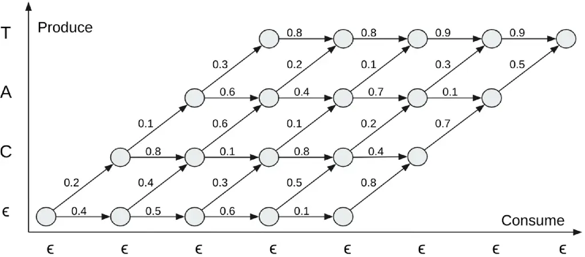
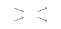
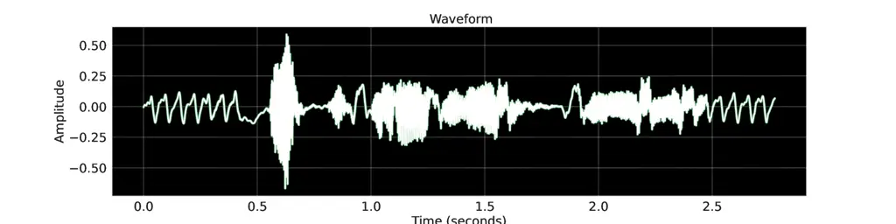
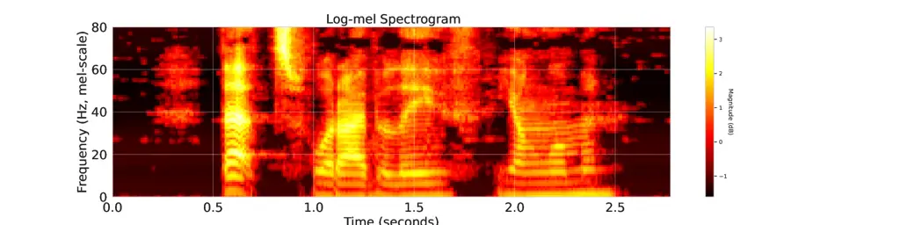
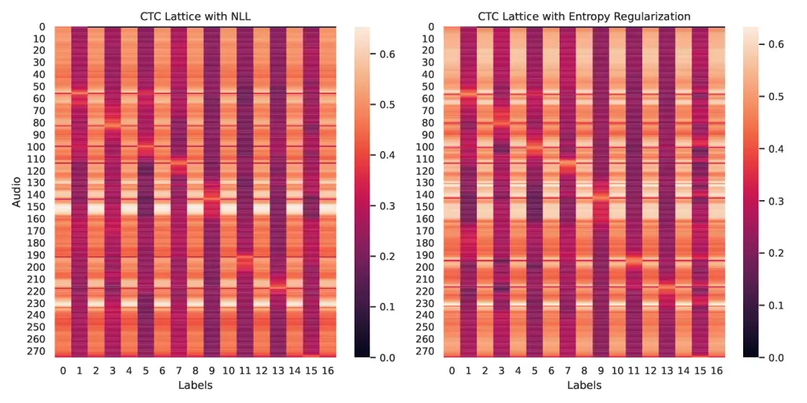
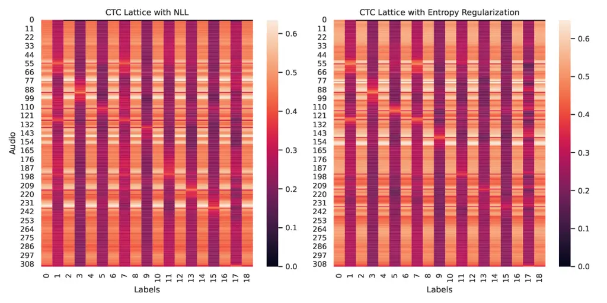

# Revisiting the Entropy Semiring for Neural Speech Recognition

Oscar Chang    Dongseong Hwang    Olivier Siohan Affiliation: Google
Email: [{oscarchang,dongseong,siohan}@google.com](mailto:)

###### Abstract

In streaming settings, speech recognition models have to map
sub-sequences of speech to text before the full audio stream becomes
available. However, since alignment information between speech and text
is rarely available during training, models need to learn it in a
completely self-supervised way. In practice, the exponential number of
possible alignments makes this extremely challenging, with models often
learning peaky or sub-optimal alignments. Prima facie, the exponential
nature of the alignment space makes it difficult to even quantify the
uncertainty of a model’s alignment distribution. Fortunately, it has
been known for decades that the entropy of a probabilistic finite state
transducer can be computed in time linear to the size of the transducer
via a dynamic programming reduction based on semirings. In this work, we
revisit the entropy semiring for neural speech recognition models, and
show how alignment entropy can be used to supervise models through
regularization or distillation. We also contribute an open-source
implementation of CTC and RNN-T in the semiring framework that includes
numerically stable and highly parallel variants of the entropy semiring.
Empirically, we observe that the addition of alignment distillation
improves the accuracy and latency of an already well-optimized
teacher-student distillation model, achieving state-of-the-art
performance on the Librispeech dataset in the streaming scenario.

|     |
| --- |
|     |

## 1 Introduction

Modern automatic speech recognition (ASR) systems deploy a single neural
network trained in an end-to-end differentiable manner on a paired
corpus of speech and text (Graves et al., 2006; Graves, 2012; Chan
et al., 2015; Sak et al., 2017; He et al., 2019). For many applications
like providing closed captions in online meetings or understanding
natural language queries for smart assistants, it is imperative that an
ASR model operates in a streaming fashion with low latency. This means
that before the full audio stream becomes available, the model has to
produce partial recognition outputs that correspond to the already given
speech.

Ground truth alignments that annotate sub-sequences of speech with
sub-sequences of text are hard to collect, and rarely available in
sufficient quantities to be used as training data. Thus, ASR models have
to learn alignments from paired examples of un-annotated speech and text
in a completely self-supervised way. The two most popular alignment
models used for neural speech recognition today are Connectionist
Temporal Classification (CTC) (Graves et al., 2006) and Recurrent Neural
Network Transducer (RNN-T) (Graves, 2012; He et al., 2019). They
formulate a probabilistic model over the alignment space, and are
trained with a negative log-likelihood (NLL) criterion.

Despite the widespread use of CTC and RNN-T, ASR models tend to converge
to peaky or sub-optimal alignment distributions in practice (Miao
et al., 2015; Liu et al., 2018; Yu et al., 2021). Prior work outside of
ASR has discovered that the standard NLL loss generally leads to
over-confident predictions (Pereyra et al., 2017; Xu et al., 2020). Even
within ASR, there is strong theoretical evidence that sub-optimal
alignments are an inevitable consequence of the NLL training criterion
(Zeyer et al., 2021; Blondel et al., 2021).

A common remedy for mitigating over-confident predictions is to impose
an entropy regularizer to encourage diversification. For example, label
smoothing leads to more calibrated representations and better
predictions (Müller et al., 2019; Meister et al., 2020). Another popular
technique is knowledge distillation, where we minimize the relative
entropy between a teacher’s and student’s soft predictions, instead of
training on hard labels (Hinton et al., 2015; Stanton et al., 2021).
However, it is not straightforward to calculate the entropy of the
alignment distribution of a neural speech model. This is because the
total number of possible alignments is exponential in the length of the
acoustic and text sequence, which makes naive calculation intractable.

Fortunately, classical results from Eisner (2001); Cortes et al. (2006)
show that the entropy of a probabilistic finite state transducer can be
computed in time linear to the size of the transducer. Their approach is
based on the semiring framework for dynamic programming (Mohri, 1998),
which generalizes classical algorithms like forward-backward,
inside-outside, Viterbi, and belief propagation. The unifying algebraic
structure of all these classical algorithms is that state transitions
and merges can be interpreted as generalized multiplication and addition
operations on a semiring. Eisner (2001); Cortes et al. (2006)
ingeniously constructed a semiring that corresponds to the computation
of entropy.

While these results have been long established, open-source
implementations like the OpenFST library (Allauzen et al., 2007) have
not been designed with modern automatic differentiation and deep
learning libraries in mind. This is why thus far, supervising training
with alignment entropy regularization or distillation has not been part
of the standard neural speech recognition toolbox. In fact, implementing
the entropy semiring on top of modern ASR lattices like CTC or RNN-T is
highly non-trivial. During training, we need to compute not only the
entropy in the forward pass, but also its gradients in the backward
pass, which necessitates a highly numerically stable implementation.
Note that even for simple operations like calculating the binary cross
entropy of a softmax distribution, naive implementations that do not use
the LogSumExp trick are plagued by numerical inaccuracies. When it comes
to calculating the entropy of a sequence that might be thousands of
tokens long, such inaccuracies accumulate quickly, leading to NaNs that
make training impossible. Moreover, it is crucial that the addition of
the alignment entropy supervision does not incur additional forward
passes through the ASR lattice beyond the one already done to compute
NLL.



Figure 1: Example of a loop-skewed RNN-T lattice annotated with
transition probabilities. In this example, there are $`3`$ text tokens
to be produced and $`4`$ acoustic tokens to be consumed, which results
in a total of $`\frac{(3+4)!}{3!4!}=35`$ alignments and $`2*3*4+3+4=31`$
transitions. The naive calculation of entropy requires
$`35*(3+4+1)=280`$ multiplications and $`35-1=34`$ additions, while the
entropy semiring calculation requires $`31*3=93`$ multiplications and
$`2*3*4+31=55`$ additions.

#### Our Contributions

We contribute an open-source implementation of CTC and RNN-T in the
semiring framework that is both numerically stable and highly parallel.
Regarding numerical stability, we find that the vanilla entropy semiring
from Eisner (2001); Cortes et al. (2006) produces unstable outputs not
just at the final step, but also during intermediate steps of the
dynamic program. Thus, a naive implementation will result in instability
in both the forward and backward pass, since automatic differentiation
re-uses activations produced during the intermediate steps. To address
this, we propose a novel variant of the entropy semiring that is
isomorphic to the original, but is designed to be numerically stable for
both the forward and backward pass. Regarding parallelism, our
implementation allows for efficient plug-and-play computations of
arbitrary semirings in the dynamic programming graphs of CTC and RNN-T.
Thus, when outputs from more than one semiring are desired, we can
compute them in parallel using a single pass over the same data, by
simply plugging in a new semiring that is formed via the concatenation
of existing semirings.

Beyond our open-source contribution, we also experimentally validate the
effectiveness of alignment supervision for regularization and
distillation in Section 5. Our first experiment targets small-capacity
models that are more likely to learn sub-optimal alignments. In
Section 5.1, we show how alignment entropy regularization can reduce the
word error rates (WER) of small LSTM models by up to $`6.5\%`$ and small
Conformer models by up to $`2.9\%`$ relative to the baseline. These
results highlight that the optimization objective can significantly
impact the performance of the same model. Next in Section 5.2, we
propose a novel distillation objective, which we term semiring
distillation. Under this objective, the teacher model uses the
uncertainty of both the token predictions and the alignments to
supervise the student. When applied to a well-optimized $`0.6`$B
parameter RNN-T model, the combined uncertainty produces better WER
results in the student than either uncertainty term alone, achieving
state-of-the-art results on the Librispeech dataset in the streaming
setting. An ablation study further reveals that while distillation in
the token space has a small negative effect on latency, distillation in
the alignment space reduces emission latency significantly.

The rest of the paper is organized as such: Section 2 presents the
semiring framework for dynamic programming. Section 3 provides a brief
summary of alignment models for neural speech recognition. Section 4
discusses our implementation of the semiring framework. Section 5
showcases applications for regularization and distillation. Finally,
Section 6 concludes the paper. Extra discussions about related work,
proofs, and further analysis can be found in the Appendix.

## 2 Semiring Framework for Dynamic Programming

We begin by introducing definitions for a semiring, and adapting Mohri
(1998)’s semiring framework for dynamic programming to weighted directed
acyclic graphs (DAG). Unlike Mohri (1998), which applies to
single-source directed graphs, we consider DAGs with multiple roots,
since they appear more commonly in ASR, for example the CTC lattice.

###### Definition 2.1.

A monoid is a set $`M`$ equipped with a binary associative operation
$`\odot`$,
i.e. $`\forall a,b,c\in M,(a\odot b)\odot c=a\odot(b\odot c)`$, and an
identity element $`e\in M`$,
i.e. $`\forall a\in M,a\odot e=e\odot a=a`$. $`M`$ is called a
commutative monoid if $`\odot`$ is commutative,
i.e. $`\forall a,b\in M,a\odot b=b\odot a`$.

###### Definition 2.2.

A semiring is a set $`R`$ equipped with addition $`\oplus`$ and
multiplication $`\otimes`$ such that:

1.  1.  $`(R,\oplus)`$ is a commutative monoid with identity element
        $`\bar{0}`$.
2.  2.  $`(R,\otimes)`$ is a monoid with identity element $`\bar{1}`$.
3.  3.  $`\otimes`$ distributes over $`\oplus`$ from both the left and
        right, i.e. $`\forall a,b,c\in R`$,  
        $`a\otimes(b\oplus c)=(a\otimes b)\oplus(a\otimes c)`$ and
        $`(b\oplus c)\otimes a=(b\otimes a)\oplus(c\otimes a)`$.
4.  4.  $`\bar{0}`$ is an annihilator for $`(R,\otimes)`$,
        i.e. $`\forall a\in R,a\otimes\bar{0}=\bar{0}\otimes a=\bar{0}.`$

###### Definition 2.3.

Let $`G=(V,E)`$ be a DAG where every edge $`e\in E`$ is assigned a
weight $`w\colon E\rightarrow\mathbb{R}`$. A maximal path of $`G`$ is a
path starting from a root of $`G`$ to one of $`G`$’s leaves. The weight
$`w(\pi)`$ of a path $`\pi`$ is the product of weights of edges in the
path. A computation of $`G`$ is the sum of the weights of all the
maximal paths in $`G`$, i.e.

```math
C(G,w,\oplus,\otimes)=\bigoplus_{\pi\in\textit{MaxPaths}(G)}\bigotimes_{e\in\pi}w(e). \tag{1}
```

Even though $`\textit{MaxPaths}(G)`$ might be exponentially big, because
$`\otimes`$ distributes over $`\oplus`$ in a semiring, only $`1`$
multiplication operation is needed for each edge, resulting in linear
complexity $`\mathcal{O}(|V|+|E|)`$.

###### Theorem 2.4.

For a DAG $`G=(V,E)`$, if $`(w(E),\oplus,\otimes,\bar{0},\bar{1})`$ is a
semiring, then $`C(G,w,\oplus,\otimes)`$ can be computed in linear time
$`\mathcal{O}(|V|+|E|)`$ via dynamic programming.

Proof. Sort the vertices in topological order, and enumerate them as
$`v_{1},\dots,v_{n}`$. Then in that order, inductively accumulate the
weights from the edges into the vertices as follows. We slightly abuse
notation by over-loading $`w`$ to also be a function that assigns
weights to vertices.

```math
\begin{split}w(v_{i})&=\begin{cases}\bar{1}\quad&\text{if $v_{i}$ is a root}.\\
\bigoplus_{e=(v,v_{i})\in E}w(v)\otimes w(e)\quad&\text{otherwise}.\\
\end{cases}\end{split} \tag{2}
```

Let $`\Pi_{v}`$ denote the set of paths ending at vertex $`v`$ that
start from a root. We now prove by induction
that $`w(v_{i})=\bigoplus_{\pi\in\Pi_{v_{i}}}w(\pi)`$. The base case of
$`v_{1}`$ is true by definition given that it is a root. For the
inductive step, we assume that $`\forall j\leq k`$,
$`w(v_{j})=\bigoplus_{\pi\in\Pi_{v_{j}}}w(\pi)`$. Observe that

```math
\begin{split}w(v_{k+1})&=\bigoplus_{e=(v,v_{k+1})\in E}w(v)\otimes w(e)=\bigoplus_{e=(v,v_{k+1})\in E}\left(\bigoplus_{\pi\in\Pi_{v}}w(\pi)\right)\otimes w(e)\\
&=\bigoplus_{e=(v,v_{k+1})\in E}\left(\bigoplus_{\pi\in\Pi_{v}}w(\pi)\otimes w(e)\right)=\bigoplus_{\pi\in\Pi_{v_{k+1}}}w(\pi).\end{split} \tag{3}
```

The sum of all the weights in the leaves yields the desired computation
in a single pass over $`G`$.

Below, we walk the reader through simple examples to demonstrate how
Theorem 2.4 works.

###### Definition 2.5.

The probability semiring can be defined as such: $`w(e)=p(e)`$ where
$`p\colon E\rightarrow[0,1]`$ is the probability function, $`\oplus=+`$,
$`\otimes=\times`$, $`\bar{0}=0`$, $`\bar{1}=1`$.

###### Example 2.6.

Consider the following DAG with the probability semiring.



```math
\begin{split}w(v_{1})&=w(v_{2})=1.\\
w(v_{3})&=\left(w(v_{1})\otimes w(e_{1})\right)\oplus\left(w(v_{2})\otimes w(e_{2})\right)=p(e_{1})+p(e_{2}).\\
w(v_{4})&=w(v_{3})\otimes w(e_{3})=p(e_{1})p(e_{3})+p(e_{2})p(e_{3}).\\
w(v_{5})&=w(v_{3})\otimes w(e_{4})=p(e_{1})p(e_{4})+p(e_{2})p(e_{4}).\\
C_{p(\pi)}&=w(v_{4})\oplus w(v_{5})=p(e_{1})p(e_{3})+p(e_{2})p(e_{3})+p(e_{1})p(e_{4})+p(e_{2})p(e_{4}).\end{split}
```

In practice, it is common to perform multiplication of probabilities in
the log space instead for numerical stability. Under the semiring
framework, we can see that this is the same dynamic programming
computation but with a different semiring.

###### Definition 2.7.

The log semiring can be defined as such: $`w(e)=\log p(e)`$,
$`a\oplus b=\log(e^{a}+e^{b})`$, $`a\otimes b=a+b`$,
$`\bar{0}=-\infty`$, $`\bar{1}=0`$.

###### Example 2.8.

Consider the DAG in Example 2.6 with the log semiring. (Details in
Section C.1)

```math
\begin{split}C_{\log p(\pi)}=\log\left[p(e_{1})p(e_{3})+p(e_{2})p(e_{3})+p(e_{1})p(e_{4})+p(e_{2})p(e_{4})\right].\end{split}
```

### 2.1 Entropy Semiring

Notice that setting $`w(e)=p(e)\log p(e)`$ with either the probability
semiring or the log semiring will not compute the entropy. The salient
insight made by Eisner (2001); Cortes et al. (2006) is that entropy can
be calculated via a semiring that derives its algebraic structure from
the dual number system. Dual numbers are hyper-complex numbers that can
be expressed as $`a+b\epsilon`$ such that
$`a\in\mathbb{R},b\in\mathbb{R},\epsilon^{2}=0`$ where addition and
multiplication are defined as follows.

```math
\begin{split}\text{Addition:}\qquad&(a+b\epsilon)+(c+d\epsilon)=(a+c)+(b+d)\epsilon.\\
\text{Multiplication:}\qquad&(a+b\epsilon)\times(c+d\epsilon)=ac+(ad+bc)\epsilon.\end{split} \tag{4}
```

Observe that dual numbers form a commutative semiring with the additive
identity $`0+0\epsilon`$ and multiplicative identity $`1+0\epsilon`$.
Now if we use dual-valued weights
$`w\colon E\rightarrow\mathbb{R}\times\mathbb{R}`$ with the real
component representing the probability $`p(e)`$ and the imaginary
component representing the negative entropy $`p(e)\log p(e)`$, the
entropy of a weighted DAG can be computed as before via Theorem 2.4.

###### Definition 2.9.

The entropy semiring can be defined as such:

$`w(e)=\langle p(e),p(e)\log p(e)\rangle`$,

$`\langle a,b\rangle\oplus\langle c,d\rangle=\langle a+c,b+d\rangle`$,

$`\langle a,b\rangle\otimes\langle c,d\rangle=\langle ac,ad+bc\rangle`$,

$`\bar{0}=\langle 0,0\rangle`$, $`\bar{1}=\langle 1,0\rangle`$.

###### Example 2.10.

Consider the DAG in Example 2.6 with the entropy semiring. (Details in
Section C.2)

```math
\begin{split}C_{\langle p(\pi),p(\pi)\log p(\pi)\rangle}=\bigl\langle C_{p(\pi)},~&p(e_{1})p(e_{3})\log\left[p(e_{1})p(e_{3})\right]+p(e_{2})p(e_{3})\log\left[p(e_{2})p(e_{3})\right]\\
&+p(e_{1})p(e_{4})\log\left[p(e_{1})p(e_{4})\right]+p(e_{2})p(e_{4})\log\left[p(e_{2})p(e_{4})\right]\bigr\rangle.\\
\end{split}
```

## 3 Neural Speech Recognition

Speech recognition is the task of transcribing speech $`x`$ into text
$`y`$, and can be formulated probabilistically as a discriminative model
$`p(y|x)`$. Because $`x`$ and $`y`$ are represented as sequences of
vectors, we can define an alignment model that maps sub-sequences of
$`x`$ to sub-sequences of $`y`$. The alignments allow a speech
recognition model to emit a partial sub-sequence of $`y`$ given a
partial sub-sequence of $`x`$, and thereby work in a streaming fashion.
Below, we briefly recap CTC and RNN-T, which are the two most widely
used alignment models for neural speech recognition.

Let the acoustic input be denoted as $`x=x_{1:T}`$ where
$`x_{t}\in\mathbb{R}^{d}`$ and the text labels be denoted as
$`y=y_{1:U}`$ where $`y_{u}\in\mathcal{V}`$ are vocabulary tokens (we
use $`:`$ to denote an inclusive range). The likelihood of a CTC model
is defined as:

```math
P(y|x)=\sum_{\hat{y}\in\mathcal{A}_{\text{CTC}}(x,y)}\prod^{T}_{t=1}P(\hat{y}_{t}|x_{1:t}). \tag{5}
```

where
$`\hat{y}=\hat{y}_{1:T}\in\mathcal{A}_{\text{CTC}}\subset\{\mathcal{V}\cup\epsilon\}^{T}`$
corresponds to alignments such that removing blanks $`\epsilon`$ and
repeated symbols from $`\hat{y}`$ results in $`y`$. CTC makes an
assumption of conditional independence, so the likelihoods of every
token are independent of each other given the acoustic input.

The likelihood of an RNN-T model is defined as:

```math
P(y|x)=\sum_{\hat{y}\in\mathcal{A}_{\text{RNN-T}}(x,y)}\prod^{T+U}_{i=1}P(\hat{y}_{i}|x_{1:t_{i}},y_{1:u_{i-1}}). \tag{6}
```

where
$`\hat{y}=\hat{y}_{1:T+U}\in\mathcal{A}_{\text{RNN-T}}\subset\{\mathcal{V}\cup\epsilon\}^{T+U}`$
corresponds to alignments such that removing blanks $`\epsilon`$ from
$`\hat{y}`$ results in $`y`$. Unlike CTC, the likelihood of each token
in RNN-T depends on the history of tokens that come before it.

CTC and RNN-T lattices are DAGs where the model likelihoods can be
computed efficiently via dynamic programming by transforming the
sum-product form of Eqs. 5 and 6 into product-sum form via Theorem 2.4.
Thus, even though the number of alignments is exponential in the length
of the acoustic and text input $`\mathcal{O}(|x|+|y|)`$, the likelihood
and its gradient can be computed in time linear to the size of the
lattice $`\mathcal{O}(|x||y|)`$. In practice, most implementations of
CTC and RNN-T compute likelihoods in the log space for numerical
stability, which corresponds to dynamic programming using a log semiring
(cf. Definition 2.7). More broadly, Eqs. 5 and 6 can be recognized as
specific instances of the more general Eq. 7.

```math
P(y|x)=\sum_{\pi\in\mathcal{A}(x,y)}\prod_{i}P(\pi_{i}|x). \tag{7}
```

While we focus on CTC and RNN-T in our paper, other examples of neural
speech recognition lattices that use dynamic programming to efficiently
marginalize over an exponential number of alignments include Auto
Segmentation Criterion (Collobert et al., 2016), Lattice-Free MMI (Povey
et al., 2016), and the Recurrent Neural Aligner (Sak et al., 2017).

## 4 Implementation of the Semiring Framework

While the mathematical details of the entropy semiring have been known
for more than two decades, it is highly non-trivial to implement them in
neural speech recognition models. This is in part because modern deep
learning models operate on much longer sequences and have to compute
gradients, and in part because of intricate implementation details like
applying loop skewing on the RNN-T lattice (Bagby et al., 2018). One of
the main contributions of our work is to make an open-source
implementation of CTC and RNN-T in the semiring framework available to
the research community (cf. Supplementary Material). Below, we introduce
two variants of the entropy semiring that are designed for numerical
stability and parallelism.

### 4.1 Numerical Stability

A numerically stable implementation of the entropy semiring has to avoid
the naive multiplication of two small numbers, and do it in log space
instead. As such, the mathematical formulation provided in
Definition 2.9 is not actually numerically stable because it involves
multiplying $`p_{1}`$ and $`p_{2}\log p_{2}`$ for two small numbers
$`p_{1},p_{2}`$. Notice that applying a log morphism on just the first
argument of the dual number is not sufficient to ensure numerical
stability in the backward pass because
$`\lim_{p\to 0}\frac{\partial}{\partial p}p\log p=\lim_{p\to 0}1+\log p=-\infty`$.

We take care of numerical stability in both the forward and backward
passes by applying a log morphism on both arguments of the dual number
in the semiring. For the second argument, the log morphism has to be
applied on the entropy $`-p\log p`$ since we cannot take the logarithm
of negative numbers. This results in the following variant of the
entropy semiring.

###### Definition 4.1.

The log entropy semiring can be defined as such:

$`w(e)=\langle\log p(e),\log(-p(e)\log p(e))\rangle`$,

$`\langle a,b\rangle\oplus\langle c,d\rangle=\langle\log(e^{a}+e^{c}),\log(e^{b}+e^{d})\rangle`$,

$`\langle a,b\rangle\otimes\langle c,d\rangle=\langle a+c,\log(e^{a+d}+e^{b+c})\rangle`$,

$`\bar{0}=\langle-\infty,-\infty\rangle`$,
$`\bar{1}=\langle 0,-\infty\rangle`$.

### 4.2 Entropy Semiring for Distillation

Minimizing the negative log likelihood of a parameterized model is
equivalent to minimizing the KL divergence between the empirical data
distribution and the modeled distribution. Knowledge distillation is a
technique that proposes to use soft labels from the output of a teacher
model in the place of hard labels in the ground truth data (Hinton
et al., 2015). It is often implemented as a weighted sum of two
different KL divergences: one between the empirical data distribution
and the model (hard labels), and one between the teacher distribution
and the model (soft labels).

```math
\mathcal{L}_{\text{distill}}=\textit{KL}\left(P_{\text{empirical}}||P_{\text{student}}\right)+\alpha_{\text{distill}}\textit{KL}\left(P_{\text{teacher}}||P_{\text{student}}\right). \tag{8}
```

We can re-write the distillation loss in Eq. 8 as a sum of three
different terms.

```math
\mathcal{L}_{\text{distill}}=-\log P_{\text{student}}+\alpha_{\text{distill}}\left[P_{\text{teacher}}\log P_{\text{teacher}}-P_{\text{teacher}}\log P_{\text{student}}\right]. \tag{9}
```

Notice that the first term can be computed with the log semiring, while
the second and third term can be computed with the log entropy semiring.
But instead of doing three separate forward passes, we can compute the
distillation loss using a single forward pass by concatenating them to
form a new semiring weighted by four real number values
$`w\colon E\rightarrow\mathbb{R}^{4}`$.

###### Definition 4.2.

The log reverse-KL semiring can be defined as such:

$`w(e)=\langle\log p(e),\log q(e),\log(-q(e)\log q(e)),\log(-q(e)\log p(e))\rangle`$,

$`\langle a,b,c,d\rangle\oplus\langle f,g,h,i\rangle=\langle\log(e^{a}+e^{f}),\log(e^{b}+e^{g}),\log(e^{c}+e^{h}),\log(e^{d}+e^{i})\rangle`$,

$`\langle a,b,c,d\rangle\otimes\langle f,g,h,i\rangle=\langle a+f,b+g,\log(e^{b+h}+e^{c+g}),\log(e^{b+i}+e^{d+g})\rangle`$,

$`\bar{0}=\langle-\infty,-\infty,-\infty,-\infty\rangle`$,
$`\bar{1}=\langle 0,0,-\infty,-\infty\rangle`$.

## 5 Applications

Below, we study two applications of the entropy semiring for neural
speech recognition.

### 5.1 Entropy Regularization

#### Motivation

Because there is an exponential number of alignments, it is difficult in
general for an optimization algorithm to settle on the optimal alignment
given no explicit supervision. Instead, once a set of feasible
alignments has been found during training, it tends to dominate, and
error signals concentrate around the vicinity of such alignments. It has
been experimentally observed that both CTC and RNN-T tend to produce
highly peaky and over-confident distributions, and converge towards
local optima (Miao et al., 2015; Liu et al., 2018; Yu et al., 2021).
There is also theoretical analysis that suggests that this phenomenon is
to some extent inevitable, and a direct result of the training criterion
(Zeyer et al., 2021; Blondel et al., 2021). We propose to ameliorate
this problem via an entropy regularization mechanism that penalizes the
negative entropy of the alignment distribution, which encourages the
exploration of more alignment paths during training.

```math
\mathcal{L}_{\text{Ent}}=\sum_{\pi\in\mathcal{A}(x,y)}-\log P_{\text{model}}(\pi)+\alpha_{\text{Ent}}P_{\text{model}}(\pi)\log P_{\text{model}}(\pi). \tag{10}
```

#### Experimental Setup

We experimented with models using non-causal LSTM and Conformer (Gulati
et al., 2020) encoders on the Librispeech dataset (Panayotov et al.,
2015). The acoustic input is processed as $`80`$-dimensional log-mel
filter bank coefficients using short-time Fourier transform windows of
size $`25`$ms and stride $`10`$ms. All models are trained with Adam
using the optimization schedule specified in Vaswani et al. (2017), with
a $`10`$k warmup, batch size $`2048`$, and a peak learning rate of
$`0.002`$. The LSTM encoders have $`4`$ bi-directional layers with cell
size $`512`$ and are trained for $`100`$k steps, while the Conformer
encoders have $`16`$ full-context attention layers with model dimension
$`144`$ and are trained for $`400`$k steps. Decoding for all models is
done with beam search, with the CTC decoders using a beam width of
$`16`$, and the RNN-T decoders using a beam width of $`8`$ and a
$`1`$-layer LSTM with cell size $`320`$. All models use a WordPiece
tokenizer with a vocabulary size of $`1024`$. $`\alpha_{\text{Ent}}`$
was selected via a grid search on $`\{0.01,0.001\}`$. We report $`95\%`$
confidence interval estimates for the WER following Vilar (2008).

#### Results

We see from Table 1 that adding entropy regularization improves WER
performance over the baseline model in almost all cases. On LSTMs, the
improvements were the biggest, for example there was a big WER reduction
of $`6.5\%`$ in the Test-Clean case for the CTC LSTM from $`7.7\%`$ to
$`7.2\%`$. The improvements were smaller for the Conformers, for example
with the WER remaining the same on Dev-Clean and dropping by an absolute
$`0.1\%`$ on Test-Clean for the RNN-T model. In general, we find that
the improvements are the biggest when the baseline performance is the
worst, indicating that entropy regularization is the most effective when
the baseline model has converged sub-optimally and has under-utilized
its model capacity. We provide visualizations and further qualitative
analysis in Appendix D.

| Model           | \#Params | Method   | Dev-Clean           | Dev-Other            | Test-Clean          | Test-Other           |
| --------------- | -------- | -------- | ------------------- | -------------------- | ------------------- | -------------------- |
| CTC LSTM        | $`22`$M  | Baseline | $`7.7\pm 0.3`$      | $`21.9\pm 0.7`$      | $`7.7\pm 0.3`$      | $`21.8\pm 0.6`$      |
| CTC LSTM        | $`22`$M  | Ent      | $`\bf{7.3\pm 0.3}`$ | $`\bf{20.7\pm 0.7}`$ | $`\bf{7.2\pm 0.3}`$ | $`\bf{20.8\pm 0.6}`$ |
| CTC Conformer   | $`9`$M   | Baseline | $`\bf{3.9\pm 0.2}`$ | $`10.2\pm 0.4`$      | $`\bf{4.1\pm 0.2}`$ | $`10.2\pm 0.4`$      |
| CTC Conformer   | $`9`$M   | Ent      | $`\bf{3.9\pm 0.2}`$ | $`\bf{9.9\pm 0.4}`$  | $`\bf{4.1\pm 0.2}`$ | $`\bf{9.9\pm 0.4}`$  |
| RNN-T LSTM      | $`25`$M  | Baseline | $`7.8\pm 0.4`$      | $`23.6\pm 0.8`$      | $`7.4\pm 0.3`$      | $`24.0\pm 0.8`$      |
| RNN-T LSTM      | $`25`$M  | Ent      | $`\bf{7.4\pm 0.3}`$ | $`\bf{22.5\pm 0.8}`$ | $`\bf{7.2\pm 0.3}`$ | $`\bf{23.1\pm 0.7}`$ |
| RNN-T Conformer | $`10`$M  | Baseline | $`\bf{2.5\pm 0.2}`$ | $`6.7\pm 0.3`$       | $`2.8\pm 0.2`$      | $`6.7\pm 0.3`$       |
| RNN-T Conformer | $`10`$M  | Ent      | $`\bf{2.5\pm 0.2}`$ | $`\bf{6.5\pm 0.3}`$  | $`\bf{2.7\pm 0.2}`$ | $`\bf{6.5\pm 0.3}`$  |

Table 1: Word Error Rate with and without Entropy Regularization.

### 5.2 RNN-T Distillation

#### Motivation

Distillation is a technique that uses a pre-trained teacher model to aid
in the training of a student model. It can be especially helpful in the
semi-supervised setting where a teacher model is trained on a small set
of labeled data and then used to generate pseudo-labels for a larger set
of unlabeled data (Park et al., 2020). A student model is then trained
using the standard NLL loss on the combined set of labeled and
pseudo-labeled data. We refer to this process as _hard_ distillation.

```math
\mathcal{L}_{\text{hard}}=-\log P_{\text{student}}(\hat{y}=l_{\text{teacher}}|x). \tag{11}
```

In addition to the hard pseudo-labels, we can use the soft logits from
the teacher model to provide a better training signal to the student
model. Prior work for RNN-T models has implemented this by summing up
the KL divergence between the state-wise posteriors of both models
(Kurata & Saon, 2020; Panchapagesan et al., 2021). We refer to this
process as _soft_ distillation.

```math
\begin{split}\mathcal{L}_{\text{soft}}&=\mathcal{L}_{\text{hard}}+\alpha_{\text{state}}\textit{KL}_{\text{state}}.\\
\textit{KL}_{\text{state}}&=\sum_{t,u,v}P_{\text{teacher}}(\hat{y}_{t+u}=l_{v}|x_{1:t},y_{1:u-1})\log\frac{P_{\text{teacher}}(\hat{y}_{t+u}=l_{v}|x_{1:t},y_{1:u-1})}{P_{\text{student}}(\hat{y}_{t+u}=l_{v}|x_{1:t},y_{1:u-1})}.\end{split} \tag{12}
```

Streaming models have to carefully balance the competing objectives of
reducing emission latency and improving WER accuracy. Alignments that
delay emission can leverage more information to perform its prediction,
but at the cost of latency. Because both the hard and soft distillation
objectives operate in token space, they neglect potentially helpful
alignment information from the teacher model. Prior work has found that
alignment information from a good pre-trained model can help guide
attention-based encoder-decoder models to achieve both good latency and
accuracy (Inaguma & Kawahara, 2021). We propose to add a KL divergence
loss for the sequence-wise posteriors of both models to incorporate
alignment information into the distillation objective. Because this
technique is based on the use of a semiring (cf. Section 4.2), we refer
to it as _semiring_ distillation.

```math
\begin{split}\mathcal{L}_{\text{semiring}}&=\mathcal{L}_{\text{soft}}+\alpha_{\text{seq}}\textit{KL}_{\text{seq}}.\\
\textit{KL}_{\text{seq}}&=\sum_{\pi\in\mathcal{A}_{\text{RNN-T}}(x,y)}P_{\text{teacher}}(\pi)\log\frac{P_{\text{teacher}}(\pi)}{P_{\text{student}}(\pi)}.\end{split} \tag{13}
```

#### Experimental Setup

We set up a semi-supervised learning scenario by using Libri-Light as
the unlabeled dataset (Kahn et al., 2020) and Librispeech as the labeled
dataset. First, we prepare pseudo-labels for Libri-Light from Zhang
et al. (2020b), where an iterative hard distillation process is
performed with a non-causal $`1.0`$B Conformer model to arrive at high
quality pseudo-labels. Then, we train a teacher model by randomly
sampling batches from Libri-Light and Librispeech in a $`90`$:$`10`$
mix. This teacher model is used as our hard distillation baseline, and
also used to train a student model via soft and semiring distillation
for comparison. Both teacher and student models use the same $`0.6`$B
causal Conformer architecture as in Chiu et al. (2022) with
self-supervised pre-training on Libri-Light via a random projection
quantizer. Like Hwang et al. (2022), the student model has FreqAug
applied to it for data augmentation. Both models were trained for
$`160`$k steps with Adam using the same optimization schedule as in
Vaswani et al. (2017), but with a peak learning rate of $`0.0015`$, a
$`5`$k warmup, and batch size $`256`$. The RNN-T decoder uses a
$`2`$-layer LSTM with cell size $`1200`$, beam width $`8`$, and a
WordPiece tokenizer with a vocabulary size of $`1024`$. We do a grid
search for both $`\alpha_{\text{state}}`$ and $`\alpha_{\text{seq}}`$
over $`\{0.01,0.001\}`$. We report $`95\%`$ confidence interval
estimates for the WER following Vilar (2008).

#### Results

We report our results in Table 2. We see that soft distillation results
in substantial WER improvements over the hard distillation baseline,
reducing WER on the Test-Clean set by $`22\%`$ from $`2.7\%`$ to
$`2.1\%`$ and on the Test-Other set by $`17\%`$ from $`6.4\%`$ to
$`5.3\%`$. Semiring distillation results in small WER improvements over
soft distillation, further reducing WER by an absolute $`0.1\%`$ on all
the Dev and Test sets. We further do an ablation study with semiring
distillation using $`\alpha_{\text{state}}=0.0`$, and find that
alignment distillation alone, while under-performing soft distillation,
still results in significant WER improvements over the hard distillation
baseline. These results suggest that while a good measure of uncertainty
in the token space helps improve accuracy more than a corresponding
measure of uncertainty in the alignment space, these two measures of
uncertainty are complementary to each other and should be used jointly
for best results.

We do relative latency measurements between two models following Chiu
et al. (2022). Start and end times of every word in the output
hypotheses are first calculated, and then used to compute the average
word timing difference between matching words from the hypotheses of
both models. Interestingly, we see that even though the soft
distillation model obtained better WER accuracy, this came at a slight
cost to emission latency ($`+2.7`$ms) relative to the baseline hard
distillation model. On the other hand, the $`\alpha_{\text{state}}=0.0`$
semiring distillation ablation performed significantly better in terms
of relative latency ($`-65.7`$ms), indicating that alignment information
from the teacher helped the student learn to emit tokens faster. By
combining both state-wise and sequence-wise posteriors, the semiring
distillation model improved on both emission latency and WER accuracy
compared to the hard or soft distillation model.

Finally, we compare the performance of our semiring-distilled model with
prior work for Librispeech in the streaming setting in Table 3. To the
best of our knowledge, our work has achieved a new state-of-the-art on
this benchmark, without using any future context in making its
predictions.

| Distillation Method                     | Relative Latency (ms) | Dev-Clean           | Dev-Other           | Test-Clean          | Test-Other          |
| --------------------------------------- | --------------------- | ------------------- | ------------------- | ------------------- | ------------------- |
| Hard Distillation                       | $`0.0`$               | $`2.5\pm 0.2`$      | $`6.8\pm 0.4`$      | $`2.7\pm 0.2`$      | $`6.4\pm 0.3`$      |
| Soft Distillation                       | $`+2.7`$              | $`1.9\pm 0.1`$      | $`5.3\pm 0.3`$      | $`2.1\pm 0.2`$      | $`5.3\pm 0.3`$      |
| Semiring Distillation                   |                       |                     |                     |                     |                     |
|    with $`\alpha_{\text{state}}=0.0`$   | $`\bf{-65.7}`$        | $`2.0\pm 0.2`$      | $`5.5\pm 0.3`$      | $`2.1\pm 0.2`$      | $`5.8\pm 0.3`$      |
|    with $`\alpha_{\text{state}}=0.001`$ | $`-5.2`$              | $`\bf{1.8\pm 0.1}`$ | $`\bf{5.2\pm 0.3}`$ | $`\bf{2.0\pm 0.2}`$ | $`\bf{5.2\pm 0.3}`$ |

Table 2: Self-Distillation for a $`0.6`$B Causal Conformer RNN-T Model.

|                      |             |           |          |              |              |              |              |
| -------------------- | ----------- | --------- | -------- | ------------ | ------------ | ------------ | ------------ |
| Prior Work           | Libri-Light | Lookahead | \#Params | Dev-Clean    | Dev-Other    | Test-Clean   | Test-Other   |
| Zhang et al. (2020a) | No          | No        | \-       | \-           | \-           | $`4.2`$      | $`11.3`$     |
| Zhang et al. (2020a) | No          | Yes       | \-       | \-           | \-           | $`3.6`$      | $`10.0`$     |
| Yu et al. (2020)     | No          | No        | $`30`$M  | \-           | \-           | $`3.7`$      | $`9.2`$      |
| Cao et al. (2021)    | No          | No        | \-       | $`3.2`$      | $`8.5`$      | $`3.5`$      | $`8.7`$      |
| Hwang et al. (2022)  | Yes         | No        | $`0.2`$B | $`4.0`$      | $`9.4`$      | $`4.4`$      | $`8.6`$      |
| Moritz et al. (2020) | No          | No        | \-       | $`2.9`$      | $`8.1`$      | $`3.2`$      | $`8.0`$      |
| Yu et al. (2021)     | No          | No        | \-       | \-           | \-           | $`3.1`$      | $`7.5`$      |
| Moritz et al. (2020) | No          | Yes       | \-       | $`2.7`$      | $`7.1`$      | $`2.8`$      | $`7.2`$      |
| Chiu et al. (2022)   | Yes         | No        | $`0.6`$B | $`2.5`$      | $`6.9`$      | $`2.8`$      | $`6.6`$      |
| Shi et al. (2021)    | No          | Yes       | $`80`$M  | \-           | \-           | $`2.4`$      | $`6.1`$      |
| Our work             | Yes         | No        | $`0.6`$B | $`\bf{1.8}`$ | $`\bf{5.2}`$ | $`\bf{2.0}`$ | $`\bf{5.2}`$ |

Table 3: Comparison with Prior Work on Librispeech in the Streaming
Setting. Libri-Light: uses unlabeled data from Libri-Light. Lookahead:
the model uses a limited amount of future context.

## 6 Conclusion

Across multiple machine learning applications in speech and natural
language processing, computational biology, and even computer vision,
there has been a paradigm shift towards sequence-to-sequence modeling
using Transformer-based architectures. Most learning objectives on these
models do not take advantage of the structured nature of the inputs and
outputs. This is in stark contrast to the rich literature of sequential
modeling approaches based on weighted finite-state transducers from
before the deep learning renaissance (Eisner, 2002; Mohri et al., 2002;
Cortes et al., 2004).

Our work draws upon these pre deep learning era approaches to introduce
alignment-based supervision for neural ASR in the form of regularization
and distillation. We believe that applying similar semiring based
techniques to supervise the alignment between data of different
modalities or domains will lead to better learning representations. For
example, recent work has found that image-text models do not have good
visio-linguistic compositional reasoning abilities (Thrush et al.,
2022). This problem can potentially be addressed by learning a good
alignment model between a natural language description of an object and
its corresponding pixel-level image representation. Another area of
future work can be learning to synchronize audio and visual input
streams to solve tasks with multiple output streams like overlapping
speech recognition or diarization.

Finally, we are excited about the gamut of new ASR research that will
arise from plugging different semirings into our CTC and RNN-T semiring
framework implementation. For example, even though most mainstream
approaches use the log semiring for training and decoding, a
differentiable relaxation akin to Cuturi & Blondel (2017) might yield
surprising findings. Another promising direction for future work can
involve calculating the mean or variance of hypothesis lengths for
diagnostic or regularization purposes.

## References

- Allauzen et al. (2007) Cyril Allauzen, Michael Riley, Johan Schalkwyk,
  Wojciech Skut, and Mehryar Mohri. Openfst: A general and efficient
  weighted finite-state transducer library. In _International Conference
  on Implementation and Application of Automata_, pp. 11–23.
  Springer, 2007.
- Bagby et al. (2018) Tom Bagby, Kanishka Rao, and Khe Chai Sim.
  Efficient implementation of recurrent neural network transducer in
  tensorflow. In _2018 IEEE Spoken Language Technology Workshop (SLT)_,
  pp. 506–512. IEEE, 2018.
- Bishop & Nasrabadi (2006) Christopher M Bishop and Nasser M Nasrabadi.
  _Pattern recognition and machine learning_, volume 4. Springer, 2006.
- Blondel et al. (2021) Mathieu Blondel, Arthur Mensch, and
  Jean-Philippe Vert. Differentiable divergences between time series. In
  _International Conference on Artificial Intelligence and Statistics_,
  pp. 3853–3861. PMLR, 2021.
- Cao et al. (2021) Songjun Cao, Yueteng Kang, Yanzhe Fu, Xiaoshuo Xu,
  Sining Sun, Yike Zhang, and Long Ma. Improving streaming transformer
  based asr under a framework of self-supervised learning. _arXiv
  preprint arXiv:2109.07327_, 2021.
- Chan et al. (2015) William Chan, Navdeep Jaitly, Quoc V Le, and Oriol
  Vinyals. Listen, attend and spell. _arXiv preprint
  arXiv:1508.01211_, 2015.
- Chiu et al. (2022) Chung-Cheng Chiu, James Qin, Yu Zhang, Jiahui Yu,
  and Yonghui Wu. Self-supervised learning with random-projection
  quantizer for speech recognition. _arXiv preprint
  arXiv:2202.01855_, 2022.
- Collobert et al. (2016) Ronan Collobert, Christian Puhrsch, and
  Gabriel Synnaeve. Wav2letter: an end-to-end convnet-based speech
  recognition system. _arXiv preprint arXiv:1609.03193_, 2016.
- Cortes et al. (2004) Corinna Cortes, Patrick Haffner, and Mehryar
  Mohri. Rational kernels: Theory and algorithms. _Journal of Machine
  Learning Research_, 5(Aug):1035–1062, 2004.
- Cortes et al. (2006) Corinna Cortes, Mehryar Mohri, Ashish Rastogi,
  and Michael D. Riley. Efficient computation of the relative entropy of
  probabilistic automata. In _Proceedings of the 7th Latin American
  Conference on Theoretical Informatics_, LATIN’06, pp. 323–336, Berlin,
  Heidelberg, 2006. Springer-Verlag. ISBN 354032755X. doi:
  10.1007/11682462_32. URL
  [https://doi.org/10.1007/11682462_32](https://doi.org/10.1007/11682462_32).
- Cuturi & Blondel (2017) Marco Cuturi and Mathieu Blondel. Soft-dtw: a
  differentiable loss function for time-series. In _International
  conference on machine learning_, pp. 894–903. PMLR, 2017.
- Eisner (2001) Jason Eisner. Expectation semirings: Flexible em for
  learning finite-state transducers. In _Proceedings of the ESSLLI
  workshop on finite-state methods in NLP_, pp. 1–5, 2001.
- Eisner (2002) Jason Eisner. Parameter estimation for probabilistic
  finite-state transducers. In _Proceedings of the 40th Annual Meeting
  of the Association for Computational Linguistics_, pp. 1–8, 2002.
- Eisner (2016) Jason Eisner. Inside-outside and forward-backward
  algorithms are just backprop (tutorial paper). In _Proceedings of the
  Workshop on Structured Prediction for NLP_, pp. 1–17, 2016.
- Farinhas et al. (2021) António Farinhas, Wilker Aziz, Vlad Niculae,
  and André FT Martins. Sparse communication via mixed distributions.
  _arXiv preprint arXiv:2108.02658_, 2021.
- Graves (2012) Alex Graves. Sequence transduction with recurrent neural
  networks. _arXiv preprint arXiv:1211.3711_, 2012.
- Graves et al. (2006) Alex Graves, Santiago Fernández, Faustino Gomez,
  and Jürgen Schmidhuber. Connectionist temporal classification:
  labelling unsegmented sequence data with recurrent neural networks. In
  _Proceedings of the 23rd international conference on Machine
  learning_, pp. 369–376, 2006.
- Gulati et al. (2020) Anmol Gulati, James Qin, Chung-Cheng Chiu, Niki
  Parmar, Yu Zhang, Jiahui Yu, Wei Han, Shibo Wang, Zhengdong Zhang,
  Yonghui Wu, et al. Conformer: Convolution-augmented transformer for
  speech recognition. _arXiv preprint arXiv:2005.08100_, 2020.
- Hannun et al. (2020) Awni Hannun, Vineel Pratap, Jacob Kahn, and
  Wei-Ning Hsu. Differentiable weighted finite-state transducers. _arXiv
  preprint arXiv:2010.01003_, 2020.
- He et al. (2019) Yanzhang He, Tara N Sainath, Rohit Prabhavalkar, Ian
  McGraw, Raziel Alvarez, Ding Zhao, David Rybach, Anjuli Kannan,
  Yonghui Wu, Ruoming Pang, et al. Streaming end-to-end speech
  recognition for mobile devices. In _ICASSP 2019-2019 IEEE
  International Conference on Acoustics, Speech and Signal Processing
  (ICASSP)_, pp. 6381–6385. IEEE, 2019.
- Hinton et al. (2015) Geoffrey Hinton, Oriol Vinyals, Jeff Dean, et al.
  Distilling the knowledge in a neural network. _arXiv preprint
  arXiv:1503.02531_, 2(7), 2015.
- Hwang et al. (2022) Dongseong Hwang, Khe Chai Sim, Yu Zhang, and
  Trevor Strohman. Comparison of soft and hard target rnn-t distillation
  for large-scale asr. _arXiv preprint arXiv:2210.05793_, 2022.
- Inaguma & Kawahara (2021) Hirofumi Inaguma and Tatsuya Kawahara.
  Alignment knowledge distillation for online streaming attention-based
  speech recognition. _arXiv preprint arXiv:2103.00422_, 2021.
- Kahn et al. (2020) Jacob Kahn, Morgane Rivière, Weiyi Zheng, Evgeny
  Kharitonov, Qiantong Xu, Pierre-Emmanuel Mazaré, Julien Karadayi,
  Vitaliy Liptchinsky, Ronan Collobert, Christian Fuegen, et al.
  Libri-light: A benchmark for asr with limited or no supervision. In
  _ICASSP 2020-2020 IEEE International Conference on Acoustics, Speech
  and Signal Processing (ICASSP)_, pp. 7669–7673. IEEE, 2020.
- Kurata & Saon (2020) Gakuto Kurata and George Saon. Knowledge
  distillation from offline to streaming rnn transducer for end-to-end
  speech recognition. In _Interspeech_, pp. 2117–2121, 2020.
- Li & Eisner (2009) Zhifei Li and Jason Eisner. First-and second-order
  expectation semirings with applications to minimum-risk training on
  translation forests. In _Proceedings of the 2009 Conference on
  Empirical Methods in Natural Language Processing_, pp. 40–51, 2009.
- Liu et al. (2018) Hu Liu, Sheng Jin, and Changshui Zhang.
  Connectionist temporal classification with maximum entropy
  regularization. _Advances in Neural Information Processing Systems_,
  31, 2018.
- Meister et al. (2020) Clara Meister, Elizabeth Salesky, and Ryan
  Cotterell. Generalized entropy regularization or: There’s nothing
  special about label smoothing. _arXiv preprint
  arXiv:2005.00820_, 2020.
- Mensch & Blondel (2018) Arthur Mensch and Mathieu Blondel.
  Differentiable dynamic programming for structured prediction and
  attention. In _International Conference on Machine Learning_, pp.
  3462–3471. PMLR, 2018.
- Miao et al. (2015) Yajie Miao, Mohammad Gowayyed, and Florian Metze.
  Eesen: End-to-end speech recognition using deep rnn models and
  wfst-based decoding. In _2015 IEEE Workshop on Automatic Speech
  Recognition and Understanding (ASRU)_, pp. 167–174. IEEE, 2015.
- Mohri (1998) Mehryar Mohri. General algebraic frameworks and
  algorithms for shortest-distance problems. Technical report, Technical
  Memorandum 981210-10TM, AT&T Labs-Research, 62 pages, 1998.
- Mohri et al. (2002) Mehryar Mohri, Fernando Pereira, and Michael
  Riley. Weighted finite-state transducers in speech recognition.
  _Computer Speech & Language_, 16(1):69–88, 2002.
- Moritz et al. (2020) Niko Moritz, Takaaki Hori, and Jonathan Le.
  Streaming automatic speech recognition with the transformer model. In
  _ICASSP 2020-2020 IEEE International Conference on Acoustics, Speech
  and Signal Processing (ICASSP)_, pp. 6074–6078. IEEE, 2020.
- Müller et al. (2019) Rafael Müller, Simon Kornblith, and Geoffrey E
  Hinton. When does label smoothing help? _Advances in neural
  information processing systems_, 32, 2019.
- Nelken & Shieber (2006) Rani Nelken and Stuart Merrill Shieber.
  Computing the kullback-leibler divergence between probabilistic
  automata using rational kernels. Technical report, Harvard Computer
  Science Group Technical Report TR-07-06, 2006.
- Panayotov et al. (2015) Vassil Panayotov, Guoguo Chen, Daniel Povey,
  and Sanjeev Khudanpur. Librispeech: an asr corpus based on public
  domain audio books. In _2015 IEEE international conference on
  acoustics, speech and signal processing (ICASSP)_, pp. 5206–5210.
  IEEE, 2015.
- Panchapagesan et al. (2021) Sankaran Panchapagesan, Daniel S Park,
  Chung-Cheng Chiu, Yuan Shangguan, Qiao Liang, and Alexander
  Gruenstein. Efficient knowledge distillation for rnn-transducer
  models. In _ICASSP 2021-2021 IEEE International Conference on
  Acoustics, Speech and Signal Processing (ICASSP)_, pp. 5639–5643.
  IEEE, 2021.
- Park et al. (2020) Daniel S Park, Yu Zhang, Ye Jia, Wei Han,
  Chung-Cheng Chiu, Bo Li, Yonghui Wu, and Quoc V Le. Improved noisy
  student training for automatic speech recognition. _arXiv preprint
  arXiv:2005.09629_, 2020.
- Pereyra et al. (2017) Gabriel Pereyra, George Tucker, Jan Chorowski,
  Łukasz Kaiser, and Geoffrey Hinton. Regularizing neural networks by
  penalizing confident output distributions. _arXiv preprint
  arXiv:1701.06548_, 2017.
- Povey et al. (2016) Daniel Povey, Vijayaditya Peddinti, Daniel Galvez,
  Pegah Ghahremani, Vimal Manohar, Xingyu Na, Yiming Wang, and Sanjeev
  Khudanpur. Purely sequence-trained neural networks for asr based on
  lattice-free mmi. In _Interspeech_, pp. 2751–2755, 2016.
- Sak et al. (2017) Hasim Sak, Matt Shannon, Kanishka Rao, and Françoise
  Beaufays. Recurrent neural aligner: An encoder-decoder neural network
  model for sequence to sequence mapping. In _Interspeech_, volume 8,
  pp. 1298–1302, 2017.
- Shi et al. (2021) Yangyang Shi, Yongqiang Wang, Chunyang Wu,
  Ching-Feng Yeh, Julian Chan, Frank Zhang, Duc Le, and Mike Seltzer.
  Emformer: Efficient memory transformer based acoustic model for low
  latency streaming speech recognition. In _ICASSP 2021-2021 IEEE
  International Conference on Acoustics, Speech and Signal Processing
  (ICASSP)_, pp. 6783–6787. IEEE, 2021.
- Stanton et al. (2021) Samuel Stanton, Pavel Izmailov, Polina
  Kirichenko, Alexander A Alemi, and Andrew G Wilson. Does knowledge
  distillation really work? _Advances in Neural Information Processing
  Systems_, 34:6906–6919, 2021.
- Thrush et al. (2022) Tristan Thrush, Ryan Jiang, Max Bartolo,
  Amanpreet Singh, Adina Williams, Douwe Kiela, and Candace Ross.
  Winoground: Probing vision and language models for visio-linguistic
  compositionality. In _Proceedings of the IEEE/CVF Conference on
  Computer Vision and Pattern Recognition_, pp. 5238–5248, 2022.
- Vaswani et al. (2017) Ashish Vaswani, Noam Shazeer, Niki Parmar, Jakob
  Uszkoreit, Llion Jones, Aidan N Gomez, Łukasz Kaiser, and Illia
  Polosukhin. Attention is all you need. _Advances in neural information
  processing systems_, 30, 2017.
- Vilar (2008) Juan Miguel Vilar. Efficient computation of confidence
  intervals forword error rates. In _2008 IEEE International Conference
  on Acoustics, Speech and Signal Processing_, pp. 5101–5104.
  IEEE, 2008.
- Wainwright et al. (2008) Martin J Wainwright, Michael I Jordan, et al.
  Graphical models, exponential families, and variational inference.
  _Foundations and Trends® in Machine Learning_, 1(1–2):1–305, 2008.
- Xu et al. (2020) Yi Xu, Yuanhong Xu, Qi Qian, Hao Li, and Rong Jin.
  Towards understanding label smoothing. _arXiv preprint
  arXiv:2006.11653_, 2020.
- Yu et al. (2020) Jiahui Yu, Wei Han, Anmol Gulati, Chung-Cheng Chiu,
  Bo Li, Tara N Sainath, Yonghui Wu, and Ruoming Pang. Dual-mode asr:
  Unify and improve streaming asr with full-context modeling. _arXiv
  preprint arXiv:2010.06030_, 2020.
- Yu et al. (2021) Jiahui Yu, Chung-Cheng Chiu, Bo Li, Shuo-yiin Chang,
  Tara N Sainath, Yanzhang He, Arun Narayanan, Wei Han, Anmol Gulati,
  Yonghui Wu, et al. Fastemit: Low-latency streaming asr with
  sequence-level emission regularization. In _ICASSP 2021-2021 IEEE
  International Conference on Acoustics, Speech and Signal Processing
  (ICASSP)_, pp. 6004–6008. IEEE, 2021.
- Zeyer et al. (2021) Albert Zeyer, Ralf Schlüter, and Hermann Ney. Why
  does ctc result in peaky behavior? _arXiv preprint
  arXiv:2105.14849_, 2021.
- Zhang et al. (2020a) Qian Zhang, Han Lu, Hasim Sak, Anshuman Tripathi,
  Erik McDermott, Stephen Koo, and Shankar Kumar. Transformer
  transducer: A streamable speech recognition model with transformer
  encoders and rnn-t loss. In _ICASSP 2020-2020 IEEE International
  Conference on Acoustics, Speech and Signal Processing (ICASSP)_, pp.
  7829–7833. IEEE, 2020a.
- Zhang et al. (2020b) Yu Zhang, James Qin, Daniel S Park, Wei Han,
  Chung-Cheng Chiu, Ruoming Pang, Quoc V Le, and Yonghui Wu. Pushing the
  limits of semi-supervised learning for automatic speech recognition.
  _arXiv preprint arXiv:2010.10504_, 2020b.

## Appendix

The Appendix is organized as follows: Appendix A discusses other related
work in the literature. Appendix B provides proofs that the semirings
defined in our paper are actual semirings. Appendix C provides extended
derivations for Examples 2.8 and 2.10. Appendix D showcases
visualizations and further qualitative analysis on the effects of
entropy regularization.

## Appendix A Related Work

Cortes et al. (2004) showed how weighted transducers can be used to form
rational kernels for support vector machines, thereby expanding their
use to classification problems with variable-length inputs. Thereafter,
Nelken & Shieber (2006) demonstrated a rational kernel with the entropy
semiring. The use of semirings has been well-established in the
conditional random fields literature: replacing the max-plus algebra
with the sum-product algebra is a way to derive the forward-backward
algorithm from Viterbi (Bishop & Nasrabadi, 2006; Wainwright et al.,
2008). Li & Eisner (2009) studied first-order and second-order
expectation semirings with applications to machine translation. Eisner
(2016) discussed how the inside-outside algorithm can be derived simply
from backpropagation and automatic differentiation. Liu et al. (2018)
proposed a different CTC-specific entropy regularization objective that
is based on a similar motivation of avoiding bad alignments. Cuturi &
Blondel (2017); Mensch & Blondel (2018); Blondel et al. (2021) explore
various differentiable relaxations for dynamic programming based losses
in deep learning. Hannun et al. (2020) proposed differentiable weighted
finite state transducers, which focused on plug-and-play graphs that
support the log and tropical semirings, as opposed to our work, which
focuses on plug-and-play semirings that support the CTC and RNN-T
graphs. Because our graphs are fixed and coded in Tensorflow itself, we
are able to perform graph optimizations (for example, loop-skewing on
the RNN-T lattice), compiler optimizations (for example, the XLA
compiler for Tensorflow produces production-quality binaries for a
variety of software and hardware architectures), and even semiring
optimizations (for example, our proposed variants of the entropy
semiring that are more numerically stable and highly parallel), thereby
ensuring an especially efficient implementation for neural speech
recognition. The use of both state-wise and sequence-wise posteriors in
semiring distillation is similar to the direct sum entropy introduced in
Farinhas et al. (2021), which is a mix of both discrete entropy and
differential entropy.

## Appendix B Proof of Semiring

Below, we prove that the probability, log, entropy, log entropy, log
reverse-KL semirings defined in our paper are actual semirings according
to Definition 2.2. Each proof is provided in four parts:

1.  1.  $`\otimes`$ forms a commutative monoid with identity $`\bar{0}`$.
2.  2.  $`\oplus`$ forms a monoid with identity $`\bar{1}`$.
3.  3.  $`\otimes`$ distributes over $`\oplus`$.
4.  4.  $`\bar{0}`$ annihilates $`\otimes`$.

### B.1 Proof that the Probability Semiring is a Semiring

###### Definition 2.5.

The probability semiring can be defined as such: $`w(e)=p(e)`$ where
$`p\colon E\rightarrow[0,1]`$ is the probability function, $`\oplus=+`$,
$`\otimes=\times`$, $`\bar{0}=0`$, $`\bar{1}=1`$.

#### Proof.

1.  1.  $`a\oplus b\\
    =a+b\\
    =b+a\\
    =b\oplus a.\\
    \\
    a\oplus(b\oplus c)\\
    =a+(b+c)\\
    =(a+b)+c\\
    =(a\oplus b)\oplus c.\\
    \\
    a\oplus\bar{0}\\
    =a+0\\
    =a.`$
2.  2.  $`a\otimes(b\otimes c)\\
    =a\times(b\times c)\\
    =(a\times b)\times c\\
    =(a\otimes b)\otimes c.\\
    \\
    a\otimes\bar{1}\\
    =a\times 1\\
    =a.\\
    \\
    \bar{1}\otimes a\\
    =1\times a\\
    =a.`$
3.  3.  $`a\otimes(b\oplus c)\\
    =a\times(b+c)\\
    =(a\times b)+(a\times c)\\
    =(a\otimes b)\oplus(a\otimes c).\\
    \\
    (b\oplus c)\otimes a\\
    =(b+c)\times a\\
    =(b\times a)+(c\times a)\\
    =(b\otimes a)\oplus(c\otimes a).`$
4.  4.  $`a\otimes\bar{0}\\
    =a\times 0\\
    =0\\
    =\bar{0}.\\
    \\
    \bar{0}\otimes a\\
    =0\times a\\
    =0\\
    =\bar{0}.`$

### B.2 Proof that the Log Semiring is a Semiring

###### Definition 2.7.

The log semiring can be defined as such: $`w(e)=\log p(e)`$,
$`a\oplus b=\log(e^{a}+e^{b})`$, $`a\otimes b=a+b`$,
$`\bar{0}=-\infty`$, $`\bar{1}=0`$.

#### Proof.

1.  1.  $`a\oplus b\\
    =\log(e^{a}+e^{b})\\
    =\log(e^{b}+e^{a})\\
    =b\oplus a.\\
    \\
    a\oplus(b\oplus c)\\
    =a\oplus\log(e^{b}+e^{c})\\
    =\log(e^{a}+e^{b}+e^{c})\\
    =\log(e^{a}+e^{b})\oplus c\\
    =(a\oplus b)\oplus c.\\
    \\
    a\oplus\bar{0}\\
    =\log(e^{a}+e^{-\infty})\\
    =a.`$
2.  2.  $`a\otimes(b\otimes c)\\
    =a+(b+c)\\
    =(a+b)+c\\
    =(a\otimes b)\otimes c.\\
    \\
    a\otimes\bar{1}\\
    =a+0\\
    =a.\\
    \\
    \bar{1}\otimes a\\
    =0+a\\
    =a.`$
3.  3.  $`a\otimes(b\oplus c)\\
    =a+\log(e^{b}+e^{c})\\
    =\log(e^{a+b}+e^{a+c})\\
    =(a\otimes b)\oplus(a\otimes c).\\
    \\
    (b\oplus c)\otimes a\\
    =\log(e^{b}+e^{c})+a\\
    =\log(e^{b+a}+e^{c+a})\\
    =(b\otimes a)\oplus(c\otimes a).`$
4.  4.  $`a\otimes\bar{0}\\
    =a-\infty\\
    =-\infty\\
    =\bar{0}.\\
    \\
    \bar{0}\otimes a\\
    =-\infty+a\\
    =-\infty\\
    =\bar{0}.`$

### B.3 Proof that the Entropy Semiring is a Semiring

###### Definition 2.9.

The entropy semiring can be defined as such:

$`w(e)=\langle p(e),p(e)\log p(e)\rangle`$,

$`\langle a,b\rangle\oplus\langle c,d\rangle=\langle a+c,b+d\rangle`$,

$`\langle a,b\rangle\otimes\langle c,d\rangle=\langle ac,ad+bc\rangle`$,

$`\bar{0}=\langle 0,0\rangle`$, $`\bar{1}=\langle 1,0\rangle`$.

#### Proof.

1.  1.  $`\langle a,b\rangle\oplus\langle c,d\rangle\\
    =\langle a+c,b+d\rangle\\
    =\langle c+a,d+b\rangle\\
    =\langle c,d\rangle\oplus\langle a,b\rangle.\\
    \\
    \langle a,b\rangle\oplus(\langle c,d\rangle\oplus\langle f,g\rangle)\\
    =\langle a,b\rangle\oplus\langle c+f,d+g\rangle\\
    =\langle a+c+f,b+d+g\rangle\\
    =\langle a+c,b+d\rangle\oplus\langle f,g\rangle\\
    =(\langle a,b\rangle\oplus\langle c,d\rangle)\oplus\langle f,g\rangle.\\
    \\
    \langle a,b\rangle\oplus\bar{0}\\
    =\langle a+0,b+0\rangle\\
    =\langle a,b\rangle.`$
2.  2.  $`\langle a,b\rangle\otimes(\langle c,d\rangle\otimes\langle f,g\rangle)\\
    =\langle a,b\rangle\otimes\langle cf,cg+df\rangle\\
    =\langle acf,acg+adf+bcf\rangle\\
    =\langle ac,ad+bc\rangle\otimes\langle f,g\rangle\\
    =(\langle a,b\rangle\otimes\langle c,d\rangle)\otimes\langle f,g\rangle.\\
    \\
    \langle a,b\rangle\otimes\bar{1}\\
    =\langle a\times 1,a\times 0+b\times 1\rangle\\
    =\langle a,b\rangle.\\
    \\
    \bar{1}\otimes\langle a,b\rangle\\
    =\langle 1\times a,0\times a+1\times b\rangle\\
    =\langle a,b\rangle.`$
3.  3.  $`\langle a,b\rangle\otimes(\langle c,d\rangle\oplus\langle f,g\rangle)\\
    =\langle a,b\rangle\otimes\langle c+f,d+g\rangle\\
    =\langle ac+af,ad+ag+bc+bf\rangle\\
    =\langle ac,ad+bc\rangle\oplus\langle af,ag+bf\rangle\\
    =(\langle a,b\rangle\otimes\langle c,d\rangle)\oplus(\langle a,b\rangle\otimes\langle f,g\rangle).\\
    \\
    (\langle c,d\rangle\oplus\langle f,g\rangle)\otimes\langle a,b\rangle\\
    =\langle c+f,d+g\rangle\otimes\langle a,b\rangle\\
    =\langle ca+fa,cb+fb+da+ga\rangle\\
    =\langle ca,cb+da\rangle\oplus\langle fa,fb+ga\rangle\\
    =(\langle c,d\rangle\otimes\langle a,b\rangle)\oplus(\langle f,g\rangle)\otimes\langle a,b\rangle).`$
4.  4.  $`\langle a,b\rangle\otimes\bar{0}\\
    =\langle a\times 0,a\times 0+b\times 0\rangle\\
    =\langle 0,0\rangle\\
    =\bar{0}.\\
    \\
    \bar{0}\otimes\langle a,b\rangle\\
    =\langle 0\times a,0\times a+0\times b\rangle\\
    =\langle 0,0\rangle\\
    =\bar{0}.`$

### B.4 Proof that the Log Entropy Semiring is a Semiring

###### Definition 4.1.

The log entropy semiring can be defined as such:

$`w(e)=\langle\log p(e),\log(-p(e)\log p(e))\rangle`$,

$`\langle a,b\rangle\oplus\langle c,d\rangle=\langle\log(e^{a}+e^{c}),\log(e^{b}+e^{d})\rangle`$,

$`\langle a,b\rangle\otimes\langle c,d\rangle=\langle a+c,\log(e^{a+d}+e^{b+c})\rangle`$,

$`\bar{0}=\langle-\infty,-\infty\rangle`$,
$`\bar{1}=\langle 0,-\infty\rangle`$.

#### Proof.

1.  1.  $`\langle a,b\rangle\oplus\langle c,d\rangle\\
    =\langle\log(e^{a}+e^{c}),\log(e^{b}+e^{d})\rangle\\
    =\langle\log(e^{c}+e^{a}),\log(e^{d}+e^{b})\rangle\\
    =\langle c,d\rangle\oplus\langle a,b\rangle.\\
    \\
    \langle a,b\rangle\oplus(\langle c,d\rangle\oplus\langle f,g\rangle)\\
    =\langle a,b\rangle\oplus\langle\log(e^{c}+e^{f}),\log(e^{d}+e^{g})\rangle\\
    =\langle\log(e^{a}+e^{c}+e^{f}),\log(e^{b}+e^{d}+e^{g})\rangle\\
    =\langle\log(e^{a}+e^{c}),\log(e^{b}+e^{d})\rangle\oplus\langle f,g\rangle\\
    =(\langle a,b\rangle\oplus\langle c,d\rangle)\oplus\langle f,g\rangle.\\
    \\
    \langle a,b\rangle\oplus\bar{0}\\
    =\langle\log(e^{a}+e^{-\infty}),\log(e^{b}+e^{-\infty})\rangle\\
    =\langle a,b\rangle.`$
2.  2.  $`\langle a,b\rangle\otimes(\langle c,d\rangle\otimes\langle f,g\rangle)\\
    =\langle a,b\rangle\otimes\langle c+f,\log(e^{c+g}+e^{d+f})\rangle\\
    =\langle a+c+f,\log(e^{a+c+g}+e^{a+d+f}+e^{b+c+f})\rangle\\
    =\langle a+c,\log(e^{a+d}+e^{b+c})\rangle\otimes\langle f,g\rangle\\
    =(\langle a,b\rangle\otimes\langle c,d\rangle)\otimes\langle f,g\rangle.\\
    \\
    \langle a,b\rangle\otimes\bar{1}\\
    =\langle a+0,\log(e^{a-\infty}+e^{b+0})\rangle\\
    =\langle a,b\rangle.\\
    \\
    \bar{1}\otimes\langle a,b\rangle\\
    =\langle 0+a,\log(e^{-\infty+a}+e^{0+b})\rangle\\
    =\langle a,b\rangle.`$
3.  3.  $`\langle a,b\rangle\otimes(\langle c,d\rangle\oplus\langle f,g\rangle)\\
    =\langle a,b\rangle\otimes\langle\log(e^{c}+e^{f}),\log(e^{d}+e^{g})\rangle\\
    =\langle a+\log(e^{c}+e^{f}),\log(e^{a+d}+e^{a+g}+e^{b+c}+e^{b+f})\rangle\\
    =\langle a+c,\log(e^{a+d}+e^{b+c})\rangle\oplus\langle a+f,\log(e^{a+g}+e^{b+f})\rangle\\
    =(\langle a,b\rangle\otimes\langle c,d\rangle)\oplus(\langle a,b\rangle\otimes\langle f,g\rangle).\\
    \\
    (\langle c,d\rangle\oplus\langle f,g\rangle)\otimes\langle a,b\rangle\\
    =\langle\log(e^{c}+e^{f}),\log(e^{d}+e^{g})\rangle\otimes\langle a,b\rangle\\
    =\langle\log(e^{c}+e^{f})+a,\log(e^{c+b}+e^{f+b}+e^{d+a}+e^{g+a})\rangle\\
    =\langle c+a,\log(e^{c+b}+e^{d+a})\rangle\oplus\langle f+a,\log(e^{f+b}+e^{g+a})\rangle\\
    =(\langle c,d\rangle\otimes\langle a,b\rangle)\oplus(\langle f,g\rangle)\otimes\langle a,b\rangle).`$
4.  4.  $`\langle a,b\rangle\otimes\bar{0}\\
    =\langle a-\infty,\log(e^{a-\infty}+e^{b-\infty})\rangle\\
    =\langle-\infty,-\infty\rangle\\
    =\bar{0}.\\
    \\
    \bar{0}\otimes\langle a,b\rangle\\
    =\langle-\infty+a,\log(e^{-\infty+a}+e^{-\infty+b})\rangle\\
    =\langle-\infty,-\infty\rangle\\
    =\bar{0}.`$

### B.5 Proof that the Log Reverse-KL Semiring is a Semiring

###### Definition 4.2.

The log reverse-KL semiring can be defined as such:

$`w(e)=\langle\log p(e),\log q(e),\log(-q(e)\log q(e)),\log(-q(e)\log p(e))\rangle`$,

$`\langle a,b,c,d\rangle\oplus\langle f,g,h,i\rangle=\langle\log(e^{a}+e^{f}),\log(e^{b}+e^{g}),\log(e^{c}+e^{h}),\log(e^{d}+e^{i})\rangle`$,

$`\langle a,b,c,d\rangle\otimes\langle f,g,h,i\rangle=\langle a+f,b+g,\log(e^{b+h}+e^{c+g}),\log(e^{b+i}+e^{d+g})\rangle`$,

$`\bar{0}=\langle-\infty,-\infty,-\infty,-\infty\rangle`$,
$`\bar{1}=\langle 0,0,-\infty,-\infty\rangle`$.

#### Proof.

1.  1.  $`\langle a,b,c,d\rangle\oplus\langle f,g,h,i\rangle\\
    =\langle\log(e^{a}+e^{f}),\log(e^{b}+e^{g}),\log(e^{c}+e^{h}),\log(e^{d}+e^{i})\rangle\\
    =\langle\log(e^{f}+e^{a}),\log(e^{g}+e^{b}),\log(e^{h}+e^{c}),\log(e^{i}+e^{d})\rangle\\
    =\langle f,g,h,i\rangle\oplus\langle a,b,c,d\rangle.\\
    \\
    \langle a,b,c,d\rangle\oplus(\langle f,g,h,i\rangle\oplus\langle j,k,l,m\rangle)\\
    =\langle a,b,c,d\rangle\oplus\langle\log(e^{f}+e^{j}),\log(e^{g}+e^{k}),\log(e^{h}+e^{l}),\log(e^{i}+e^{m})\rangle\\
    =\langle\log(e^{a}+e^{f}+e^{j}),\log(e^{b}+e^{g}+e^{k}),\log(e^{c}+e^{h}+e^{l}),\log(e^{d}+e^{i}+e^{m})\rangle\\
    =\langle\log(e^{a}+e^{f}),\log(e^{b}+e^{g}),\log(e^{c}+e^{h}),\log(e^{d}+e^{i})\rangle\oplus\langle j,k,l,m\rangle\\
    =(\langle a,b,c,d\rangle\oplus\langle f,g,h,i\rangle)\oplus\langle j,k,l,m\rangle.\\
    \\
    \langle a,b,c,d\rangle\oplus\bar{0}\\
    =\langle\log(e^{a}+e^{-\infty}),\log(e^{b}+e^{-\infty}),\log(e^{c}+e^{-\infty}),\log(e^{d}+e^{-\infty})\rangle\\
    =\langle a,b,c,d\rangle.`$
2.  2.  $`\langle a,b,c,d\rangle\otimes(\langle f,g,h,i\rangle\otimes\langle j,k,l,m\rangle)\\
    =\langle a,b,c,d\rangle\otimes\langle f+j,g+k,\log(e^{g+l}+e^{h+k}),\log(e^{g+m}+e^{i+k})\rangle\\
    =\langle a+f+j,b+g+k,\log(e^{b+g+l}+e^{b+h+k}+e^{c+g+k}),\log(e^{b+g+m}+e^{b+i+k}+e^{d+g+k})\rangle\\
    =\langle a+f,b+g,\log(e^{b+h}+e^{c+g}),\log(e^{b+i}+e^{d+g})\rangle\otimes\langle j,k,l,m\rangle\\
    =(\langle a,b,c,d\rangle\otimes\langle f,g,h,i\rangle)\otimes\langle j,k,l,m\rangle.\\
    \\
    \langle a,b,c,d\rangle\otimes\bar{1}\\
    =\langle a+0,b+0,\log(e^{b-\infty}+e^{c+0}),\log(e^{b-\infty}+e^{d+0})\rangle\\
    =\langle a,b,c,d\rangle.\\
    \\
    \bar{1}\otimes\langle a,b,c,d\rangle\\
    =\langle 0+a,0+b,\log(e^{-\infty+b}+e^{0+c}),\log(e^{-\infty+b}+e^{0+d})\rangle\\
    =\langle a,b,c,d\rangle.`$
3.  3.  $`\langle a,b,c,d\rangle\otimes(\langle f,g,h,i\rangle\oplus\langle j,k,l,m\rangle)\\
    =\langle a,b,c,d\rangle\otimes\langle\log(e^{f}+e^{j}),\log(e^{g}+e^{k}),\log(e^{h}+e^{l}),\log(e^{i}+e^{m})\rangle\\
    =\langle a+\log(e^{f}+e^{j}),b+\log(e^{g}+e^{k}),\log(e^{b+h}+e^{b+l}+e^{c+g}+e^{c+k}),\log(e^{b+i}+e^{b+m}+e^{d+g}+e^{d+k})\rangle\\
    =\langle a+f,b+g,\log(e^{b+h}+e^{c+g}),\log(e^{b+i}+e^{d+g})\rangle\oplus\langle a+j,b+k,\log(e^{b+l}+e^{c+k}),\log(e^{b+m}+e^{d+k})\rangle\\
    =(\langle a,b,c,d\rangle\otimes\langle f,g,h,i\rangle)\oplus(\langle a,b,c,d\rangle\otimes\langle j,k,l,m\rangle).\\
    \\
    (\langle f,g,h,i\rangle\oplus\langle j,k,l,m\rangle)\otimes\langle a,b,c,d\rangle\\
    =\langle\log(e^{f}+e^{j}),\log(e^{g}+e^{k}),\log(e^{h}+e^{l}),\log(e^{i}+e^{m})\rangle\otimes\langle a,b,c,d\rangle\\
    =\langle\log(e^{f}+e^{j})+a,\log(e^{g}+e^{k})+b,\log(e^{g+c}+e^{k+c}+e^{h+b}+e^{l+b}),\log(e^{g+d}+e^{k+d}+e^{i+b}+e^{m+b})\rangle\\
    =\langle f+a,g+b,\log(e^{g+c}+e^{h+b}),\log(e^{g+d}+e^{i+b})\rangle\oplus\langle j+a,k+b,\log(e^{k+c}+e^{l+b}),\log(e^{k+d}+e^{m+b})\rangle\\
    =(\langle f,g,h,i\rangle\otimes\langle a,b,c,d\rangle)\oplus(\langle j,k,l,m\rangle)\otimes\langle a,b,c,d\rangle).`$
4.  4.  $`\langle a,b,c,d\rangle\otimes\bar{0}\\
    =\langle a-\infty,b-\infty,\log(e^{b-\infty}+e^{c-\infty}),\log(e^{b-\infty}+e^{d-\infty})\rangle\\
    =\langle-\infty,-\infty,-\infty,-\infty\rangle\\
    =\bar{0}.\\
    \\
    \bar{0}\otimes\langle a,b,c,d\rangle\\
    =\langle-\infty+a,-\infty+b,\log(e^{-\infty+b}+e^{-\infty+c}),\log(e^{-\infty+b}+e^{-\infty+d})\rangle\\
    =\langle-\infty,-\infty,-\infty,-\infty\rangle\\
    =\bar{0}.`$

## Appendix C Extended Examples


Figure 2: DAG in Example 2.6.

### C.1 Derivation for Example 2.8

```math
\begin{split}w(v_{1})&=w(v_{2})\\
&=0.\\
w(v_{3})&=\left(w(v_{1})\otimes w(e_{1})\right)\oplus\left(w(v_{2})\otimes w(e_{2})\right)\\
&=\left(0+\log p(e_{1})\right)\oplus\left(0+\log p(e_{2})\right)\\
&=\log p(e_{1})\oplus\log p(e_{2})\\
&=\log\left[p(e_{1})+p(e_{2})\right].\\
w(v_{4})&=w(v_{3})\otimes w(e_{3})\\
&=\log\left[p(e_{1})+p(e_{2})\right]\otimes\log p(e_{3})\\
&=\log\left[p(e_{1})p(e_{3})+p(e_{2})p(e_{3})\right].\\
w(v_{5})&=w(v_{3})\otimes w(e_{4})\\
&=\log\left[p(e_{1})+p(e_{2})\right]\otimes\log p(e_{4})\\
&=\log\left[p(e_{1})p(e_{4})+p(e_{2})p(e_{4})\right].\\
C_{\log p(\pi)}&=w(v_{4})\oplus w(v_{5})\\
&=\log\left[p(e_{1})p(e_{3})+p(e_{2})p(e_{3})\right]\oplus\log\left[p(e_{1})p(e_{4})+p(e_{2})p(e_{4})\right].\\
&=\log\left[p(e_{1})p(e_{3})+p(e_{2})p(e_{3})+p(e_{1})p(e_{4})+p(e_{2})p(e_{4})\right].\end{split}
```

### C.2 Derivation for Example 2.10

```math
\begin{split}w(v_{1})&=w(v_{2})\\
&=\langle 1,0\rangle.\\
w(v_{3})&=\left(w(v_{1})\otimes w(e_{1})\right)\oplus\left(w(v_{2})\otimes w(e_{2})\right)\\
&=\left(\langle 1,0\rangle\otimes\langle p(e_{1}),p(e_{1})\log p(e_{1})\rangle\right)\oplus\left(\langle 1,0\rangle+\langle p(e_{2}),p(e_{2})\log p(e_{2})\rangle\right)\\
&=\langle p(e_{1}),p(e_{1})\log p(e_{1})\rangle\oplus\langle p(e_{2}),p(e_{2})\log p(e_{2})\rangle\\
&=\langle p(e_{1})+p(e_{2}),p(e_{1})\log p(e_{1})+p(e_{2})\log p(e_{2})\rangle.\\
w(v_{4})&=w(v_{3})\otimes w(e_{3})\\
&=\langle p(e_{1})+p(e_{2}),p(e_{1})\log p(e_{1})+p(e_{2})\log p(e_{2})\rangle\otimes\langle p(e_{3}),p(e_{3})\log p(e_{3})\rangle\\
&=\langle p(e_{1})p(e_{3})+p(e_{2})p(e_{3}),p(e_{1})p(e_{3})\log p(e_{1})p(e_{3})+p(e_{2})p(e_{3})\log p(e_{2})p(e_{3})\rangle.\\
w(v_{5})&=w(v_{3})\otimes w(e_{4})\\
&=\langle p(e_{1})+p(e_{2}),p(e_{1})\log p(e_{1})+p(e_{2})\log p(e_{2})\rangle\otimes\langle p(e_{4}),p(e_{4})\log p(e_{4})\rangle\\
&=\langle p(e_{1})p(e_{4})+p(e_{2})p(e_{4}),p(e_{1})p(e_{4})\log p(e_{1})p(e_{4})+p(e_{2})p(e_{4})\log p(e_{2})p(e_{4})\rangle.\\
C_{\langle p(\pi),p(\pi)\log p(\pi)\rangle}&=w(v_{4})\oplus w(v_{5})\\
&=\bigl\langle C_{p(\pi)},~p(e_{1})p(e_{3})\log\left[p(e_{1})p(e_{3})\right]+p(e_{2})p(e_{3})\log\left[p(e_{2})p(e_{3})\right]\\
&\hskip 45.0pt+p(e_{1})p(e_{4})\log\left[p(e_{1})p(e_{4})\right]+p(e_{2})p(e_{4})\log\left[p(e_{2})p(e_{4})\right]\bigr\rangle.\\
\end{split}
```

## Appendix D Visualization for Entropy Regularization

A short example is picked at random from the Librispeech Test-Other set,
which corresponds to the speech utterance “That’s what I believe young
woman.” This example has an acoustic sequence length of $`275`$ and a
text sequence length of $`8`$, which corresponds to a CTC lattice of
size $`275`$ by $`17`$. Its waveform and log-mel spectrogram are
respectively visualized in Fig. 3 and Fig. 4.



Figure 3: Visualization of waveform. The y-axis represents the amplitude
of the signal, while the x-axis represents the time.



Figure 4: Visualization of log-mel spectrogram. The y-axis represents
the frequency, while the x-axis represents the time. The color gradients
represent the magnitude (in decibels) of the signal.

Fig. 5 visualizes the CTC lattices for this example using the LSTM
models trained in Section 5.1 to showcase the effects of entropy
regularization. Interestingly, the lattice on the right, which
corresponds to higher alignment entropy, generally has higher “peaks”
than the left lattice for both the blank labels and the acoustic regions
corresponding to the non-blank labels. But these “peaks” are also wider,
leading to an overall flatter and less peaky distribution. The
visualization suggests that the surprising result of entropy
regularization, which encourages the exploration of more alignment
paths, is to concentrate, rather than diffuse, the probability mass
around the right states in the lattice. In other words, instead of
avoiding the local optima around the peaks, the model actually doubles
down on them and widens the local exploration in their vicinity.



Figure 5: Visualization of CTC lattices. The left graph represents the
CTC lattice trained with NLL, while the right graph represents the CTC
lattice trained with entropy regularization. For both graphs, the y-axis
represents the acoustic sequence, while the x-axis represents the text
sequence. The even-numbered labels represent the blank token in CTC. The
color gradients represent the (log-linearly scaled) probability mass of
each CTC state.

While this is helpful on average, it can also backfire. In Fig. 6, we
visualize a pair of CTC lattices similar to Fig. 5, but for an utterance
where the entropy regularized model has a higher WER compared to the NLL
model. For this example, we see that the entropy regularized model has
higher and wider probability masses at some erroneous states like
$`(\text{Audio}=55,\text{Labels}=7)`$, i.e.  it is actually more
over-confident compared to the NLL model. This suggests that even though
alignment entropy regularization is helpful on average, it might not be
sufficient for good model calibration since more local exploration
around existing bad optima can actually worsen the problem. Future work
should investigate regularization mechanisms that encourage more global
exploration further away from existing local optima in the alignment
space.



Figure 6: Visualization of CTC lattices similar to Fig. 5, but with the
probability mass erroneously concentrated in wrong states in the
lattice, for example $`(\text{Audio}=55,\text{Labels}=7)`$.
