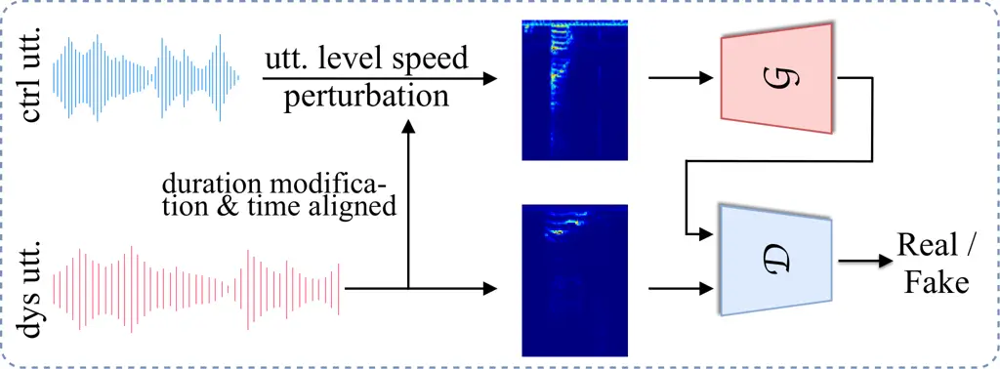
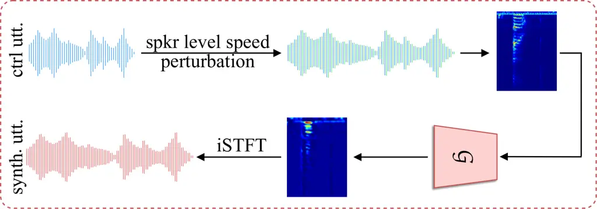
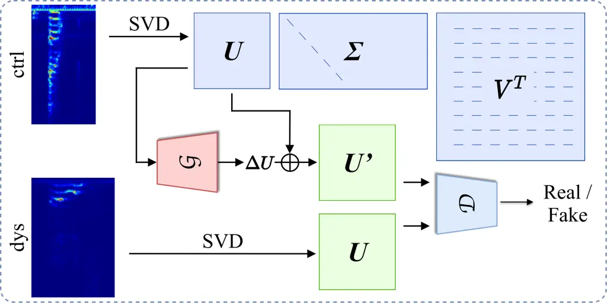
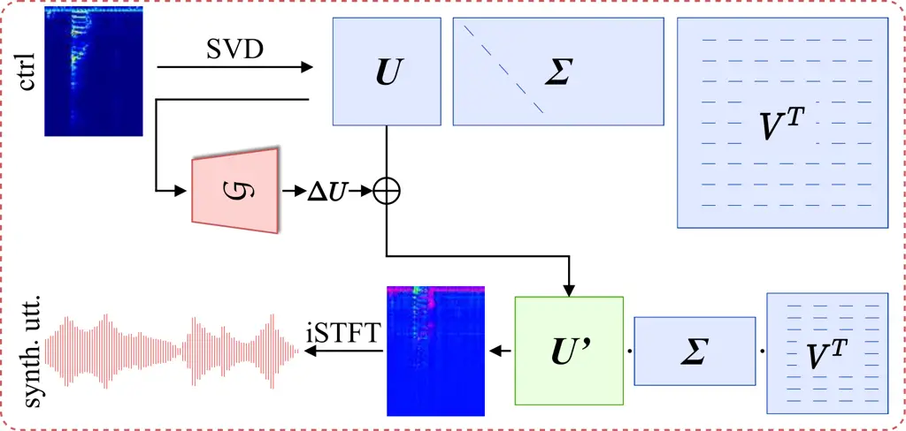

# Enhancing Pre-trained ASR System Fine-tuning for Dysarthric Speech Recognition using Adversarial Data Augmentation

Huimeng Wang^(\*)    Zengrui Jin^(\*)    Mengzhe Geng    Shujie Hu   
Guinan Li    Tianzi Wang    Haoning Xu    Xunying Liu

###### Abstract

Automatic recognition of dysarthric speech remains a highly challenging
task to date. Neuro-motor conditions and co-occurring physical
disabilities create difficulty in large-scale data collection for ASR
system development. Adapting SSL pre-trained ASR models to limited
dysarthric speech via data-intensive parameter fine-tuning leads to poor
generalization. To this end, this paper presents an extensive
comparative study of various data augmentation approaches to improve the
robustness of pre-trained ASR model fine-tuning to dysarthric speech.
These include: a) conventional speaker-independent perturbation of
impaired speech; b) speaker-dependent speed perturbation, or GAN-based
adversarial perturbation of normal, control speech based on their time
alignment against parallel dysarthric speech; c) novel Spectral basis
GAN-based adversarial data augmentation operating on non-parallel data.
Experiments conducted on the UASpeech corpus suggest GAN-based data
augmentation consistently outperforms fine-tuned Wav2vec2.0 and HuBERT
models using no data augmentation and speed perturbation across
different data expansion operating points by statistically significant
word error rate (WER) reductions up to 2.01% and 0.96% absolute (9.03%
and 4.63% relative) respectively on the UASpeech test set of 16
dysarthric speakers. After cross-system outputs rescoring, the best
system produced the lowest published WER of 16.53% (46.47% on very low
intelligibility) on UASpeech.

###### Index Terms: 

Speech Disorders, Speech Recognition, Data Augmentation, Pre-trained ASR
System

^(†)^(†)address: {huimengwang, zrjin, mzgeng, sjhu, gnli, twang, hnxu,
xyliu}@se.cuhk.edu.hk  
The Chinese University of Hong Kong, Hong Kong SAR,
China^(†)^(†)footnotetext: \* Equal contribution was made between the
first two authors.

## 1 Introduction



(a)



(b)



(c)



(d)

Figure 1: Illustration of (a) DCGAN model training on parallel control
and dysarthric utterances with modified duration and time alignment; (b)
DCGAN based speaker-dependent (SD) dysarthric speech generation using SD
speed perturbed normal speech; (c) Spectral basis GAN model training on
SVD decomposed non-parallel control and dysarthric speech; and (d)
Spectral basis GAN based SD dysarthric speech generation by
re-composition of perturbed control speech derived spectral basis
vectors with their temporal bases.

Despite the rapid progress of automatic speech recognition (ASR)
technologies targeting normal speech, accurate recognition of
pathological voice, for example, dysarthric speech, remains a
challenging task\[1, 2, 3, 4, 5, 6\] to data due to: a) the scarcity of
such data; b) their large mismatch against normal speech; and c) large
speaker level diversity. The physical disabilities and mobility
limitations associated with impaired speakers increase the difficulty of
collecting large quantities of disordered speech for ASR system
development. To this end, data augmentation techniques based on, for
example, temporal or speed perturbation \[7, 8, 9, 10\], GAN-based
adversarial augmentation \[4, 11, 12, 13\], voice conversion \[14, 15\]
and text-to-speech synthesis \[16\] have been developed and play a vital
role in addressing the data scarcity issue for dysarthric speech
recognition.

An alternative solution to address the above data sparsity issue is to
use self-supervised learning (SSL) based speech foundation models \[17,
18, 19\] pre-trained on large quantities of unlabelled data. These
speech foundation models have been successfully applied to a variety of
downstream tasks including, but not limited to speech recognition \[19,
18, 17\], speech emotion recognition \[20\] and speaker recognition
\[21\]. In contrast, limited prior researches have been conducted on
disordered speech recognition using SSL pre-trained ASR models \[22, 23,
24, 25, 26, 27\]. Prior researches in this area largely target English
dysarthric speech, while producing mixed results on benchmark datasets
represented by the UASpeech \[28\] task. Among these, Wav2vec2.0 \[17\]
and WavLM \[18\] models were studied in \[23\], where an average word
error rate (WER) of 51.8% was reported on the UASpeech test set of 16
dysarthric speakers. Cross-lingual XLSR model \[29\] based dysarthric
speech recognition was studied in \[22\], and produced average WERs of
62.0% and 28.6% on the very low and low intelligibility subsets of
UASpeech. Audio-visual pre-trained AV-HuBERT models \[30\] were employed
in \[26\] to produce a WER of 63.98% on the very low intelligibility
data of the UASpeech test data. A range of approaches to integrating SSL
pre-trained models and their features into in-domain dysarthric speech
trained ASR systems are explored in \[25\] while producing an average
WER of 22.83% on UASpeech (52.53% and 25.00% on the very low and low
intelligibility subsets).

Efforts on applying SSL pre-trained speech models to dysarthric speech
are confronted with the same data scarcity issue discussed above. Domain
adapting SSL pre-trained ASR models containing a large number of model
parameters to limited dysarthric speech via data-intensive fine-tuning
rapidly leads to poor generalization. This issue is further exasperated
when the limited training data provides insufficient coverage of words
in the test data. For example, approximately 39% of words in the
benchmark UASpeech test set do not occur in the training data. In
previous studies \[2, 25, 23\], this coverage issue was found to produce
a large disparity in ASR performance between seen and unseen words in
dysarthric speech and between impaired speakers with high and very low
intelligibility.

To this end, this paper presents an extensive comparative study over
various data augmentation approaches to improve the robustness of
pre-trained ASR model fine-tuning to scarce dysarthric speech. These
include: a) the conventional speaker-independent perturbation of
in-domain impaired speech; b) speaker-dependent speed perturbation, or
GAN-based adversarial perturbation of normal, control speech based on
their time alignment against parallel dysarthric speech; c) novel
Spectral basis GAN based data augmentation that can operate on
non-parallel data where the transformation between normal and dysarthric
speakers’ data is implemented via the adversarial mapping between their
respective time-invariant, content-independent spectral basis features.

Experiments conducted on the UASpeech corpus suggest GAN-based data
augmentation consistently outperforms fine-tuned Wav2vec2.0 and HuBERT
models using no data augmentation and speed perturbation across
different data expansion operating points by statistically significant
word error rate (WER) reductions up to 2.01% and 0.96% absolute (9.03%
and 4.63% relative) respectively on the UASpeech test set of 16
dysarthric speakers. After cross-system outputs rescoring, the best
system produced the lowest published WER of 16.53% (46.47% and 16.76% on
very low and low intelligibility respectively) on the UASpeech task.

The main contributions of this paper are summarized below:

1. To the best of our knowledge, this paper presents the first
   comparative study over various audio perturbation and adversarial data
   augmentation approaches for robust domain fine-tuning of SSL pre-trained
   ASR models for dysarthric speech recognition tasks. In contrast, prior
   researches on data augmentation for SSL pre-trained model fine-tuning
   were limited to normal speech domains \[31\], while adversarial data
   augmentation approaches were previously studied only in the context of
   non-SSL pre-trained ASR systems constructed using in-domain impaired
   speech only \[12, 4, 11, 32, 33, 34, 13\].

2. The proposed Spectral basis GAN model benefits from the
   disentanglement of time-invariant speaker-specific characteristics, such
   as an average reduction in speech volume and clarity found in impaired
   speakers, from time variant temporal features that are more related to
   spoken contents. This novel approach broadens the application scope of
   GAN-based data augmentation approaches that traditionally require the
   use of parallel normal-dysarthric speech recordings.

3. The final best-performing combined system featuring different forms
   of data augmentation techniques and pre-trained ASR models produced the
   lowest published WER of 16.53% (46.47% and 16.76% on very low and low
   intelligibility respectively) on the UASpeech test set of 16 dysarthric
   speakers.

## 2 Pre-trained ASR systems

### 2.1 Pre-trained Wav2vec2.0 Model

Model architecture: Wav2vec2.0 model consists of three components,
including 1) a multi-layer CNN-based feature encoder which encodes raw
speech $`\mathcal{X}`$ into continuous speech representations
$`z_{t}\in\mathcal{Z}`$, 2) a transformer-based context network
producing context representations $`c_{t}\in C`$ over the entire
sequence of randomly masked feature encoder outputs and 3) a
quantization module generating discrete speech units
$`q_{t}\in\mathcal{Q}`$ as labels for self-supervised training.

SSL pseudo-labels: The Wav2vec2.0 model builds discrete unit $`q_{t}`$
as pseudo-label by quantization module for self-supervised pre-training.
After mapping the feature encoder output $`z_{t}`$ to the logit
distribution $`l\in\mathbb{R}^{G\times V}`$, one entry is chosen from
each of $`G`$ codebooks with $`V`$ entries by Gumbel-softmax
re-parameterization. The discrete unit $`q_{t}`$ is then obtained by
applying a linear transformation to the concatenation of all $`G`$
chosen entries.

SSL criterion: The Wav2vec2.0 model is pre-trained via an interpolation
between a contrastive task $`\mathcal{L}_{m}`$ and a diversity task
$`\mathcal{L}_{d}`$.

```math
\mathcal{L}_{w2v}=\underbrace{-\log\frac{\exp\left(\operatorname{sim}\left(c_{t},q_{t}\right)/\kappa\right)}{\sum\limits_{\tilde{q}\sim Q_{t}}\exp\left(\operatorname{sim}\left(c_{t},\tilde{q}\right)/\kappa\right)}}_{\text{\normalsize$\mathcal{L}_{m}$:}{\text{\normalsize~Contrastive task}}}+\underbrace{\frac{1}{GV}\sum\limits^{G}_{g=1}\sum\limits_{v=1}^{V}\bar{l}_{g,v}\log\bar{l}_{g,v}}_{\text{\normalsize$\mathcal{L}_{d}$:}{\text{\normalsize~Diversity task}}} \tag{1}
```

where $`\operatorname{sim}(c_{t},q_{t})`$ is the cosine similarity
between the contextual representations produced before and after
quantization. $`\tilde{q}`$ is a “Distractor” label. $`\kappa`$ is the
non-negative temperature. The entropy-based diversity loss in the 2nd
term ensures that Wav2vec2.0 utilizes all codebook entries equally.
$`\bar{l}_{g,v}`$ is the average of logit distribution $`l`$ of $`v`$-th
entry in $`g`$-th codebook across a mini-batch.

Fine-tuning: During fine-tuning, a randomly initialized linear layer is
added on top of the context network to project representations into
$`C`$ classes representing the target vocabulary, the output of which is
optimized by Connectionist Temporal Classification (CTC) loss
$`\mathcal{L}_{CTC}`$ on labeled speech data.

### 2.2 Pre-trained HuBERT Model

The HuBERT pre-training process alternates between two steps: 1) a
clustering step to create pseudo-labels and 2) a prediction step where
the model produces labels at masked positions.

Model architecture: of the HuBERT model is similar to Wav2vec2.0,
including a feature encoder, a K-means quantization module and a
transformer-based context network followed by a projection layer.

SSL pseudo-labels: The HuBERT model builds discrete speech unit
$`q_{t}`$ as the pre-training pseudo-label via a separate k-means based
clustering ensemble process. A latent speech representation $`s_{t}`$ is
quantized into discrete units $`q^{1}_{t},q^{2}_{t},\cdots,q^{N}_{t}`$
by $`N`$ k-means featuring different codebook sizes. To improve the
quality of pseudo-labels, embeddings from the intermediate layer of the
context network at the $`t`$-th time step serve as latent speech
representation $`s_{t}`$ to replace the initially selected MFCC features
after the second clustering step.

SSL criterion: The cross-entropy loss guides the transformer-based
context network to predict the discrete units of the masked continuous
speech representations during pre-training. Such loss function
$`\mathcal{L}_{m}`$ is only computed over the continuous speech
representations $`Z`$ at masked time steps as

```math
\mathcal{L}_{m}(Z,\{q^{(n)}\}_{N},M)=\sum_{t\in M}\sum_{n}\log p^{(n)}\left(q_{t}^{(n)}\mid\tilde{Z},t\right)\vskip-7.11317pt \tag{2}
```

where $`M`$ represents the indices of all masked continuous speech
representations, $`\tilde{Z}`$ represents the masked version of input
sequence $`Z`$ and $`p^{(n)}(q_{t}^{(n)}|\tilde{Z},t)`$ denotes the
probability of the discrete speech units of the $`t`$-th frame assigned
by the $`n`$-th K-means model.

Fine-tuning: During fine-tuning, the projection layer is replaced by a
Softmax layer and the model parameters are fine-tuned on labeled data
using CTC loss with the CNN-based feature encoder frozen.

### 2.3 Speech Impairment Severity Based Multitask Fine-tuning

Motivated by \[35\], an additional speech impairment severity prediction
task $`\mathcal{L}_{\text{Seve}}`$ is introduced to prevent overfitting
to the limited amount of labeled UASpeech data during Wav2vec2.0 and
HuBERT fine-tuning stage. The total loss function of MTL is defined as

```math
\mathcal{L}_{MTL}=\beta_{1}\cdot\mathcal{L}_{CTC}+\beta_{2}\cdot\mathcal{L}_{\text{Seve }}\vskip-7.11317pt \tag{3}
```

where $`\beta_{1}=\beta_{2}=0.5`$ are empirically set hyper-parameters.
Following \[35\], the CNN-based feature encoder is frozen when
fine-tuning both Wav2vec2.0 and HuBERT models on UASpeech data.

## 3 Conventional Data Augmentation

### 3.1 Speed Perturbation Based Data Augmentation

Speed perturbation resamples a given audio signal $`x(t)`$ in time
domain \[9\]. Given a perturbation factor $`\alpha`$, output audio
segment is produced by applying $`\alpha`$ along the time axis as
$`y(t)=x(\alpha t)`$. This equation is equivalent to the following
change in frequency domain as
$`X(f)\rightarrow\frac{1}{\alpha}X(\frac{1}{\alpha}f)`$, where $`X`$ and
$`\frac{1}{\alpha}X(\frac{1}{\alpha}f)`$ stand for the Fourier transform
of $`x(t)`$ and $`y(t)`$ respectively. Speed perturbation alters both
audio duration and spectral envelope of the input audio. A fixed set of
speaker-independent (SI) perturbation factors $`\{0.9,1.0,1.1\}`$ is
applied to disordered speech in common with the data perturbation
methods widely used in normal ASR tasks \[9\].

### 3.2 Speaker Dependent Perturbation Based Augmentation

Due to the large mismatch in speaking rate between normal and disordered
speakers, and the large variability among impaired speakers,
speaker-dependent (SD) perturbation factors were applied when modifying
normal speech to disordered speech. These SD perturbation factors were
obtained using phonetic analysis described in \[36\]. For each control
speaker $`C_{i}`$ and dysarthric speaker $`D_{j}`$, we performed force
alignment and calculated the average phoneme duration $`l_{C_{i}}`$ and
$`l_{D_{j}}`$. The average phoneme duration of all control speakers
$`l_{\overline{C}}`$ is taken as the reference to compute the
speaker-dependent perturbation factor $`F_{D_{j}}`$ as
$`\frac{l_{\overline{C}}}{l_{D_{j}}}`$, which was then used to modify
normal speech to resemble that of dysarthric speaker $`D_{j}`$.

## 4 Adversarial Data Augmentation

### 4.1 DCGAN based Data Augmentation

The SD speed perturbation of Sec. 3.2 only simulates the overall slower
speaking rate and “disordered like” spectral properties of dysarthric
speech. To capture more fine-grained spectro-temporal features of
impaired speech, GAN-based data augmentation approaches can be used. For
the UASpeech dysarthric speech corpus that is based on parallel
normal-impaired speech recordings, speaker-dependent deep convolutional
GANs (DCGANs) are utilized to further transform SD speed perturbed
healthy speakers’ data to that of individual target impaired speakers of
identical contents.

The architecture of DCGANs follows \[4\]. The Generator comprises 4
convolutional layers, each followed by a ReLU activation. The first
three layers are of 8 kernels while the last one has 1 kernel. All of
the kernels in the Generator have a kernel size of $`3\times 3`$ and
stride of $`1\times 1`$. Replicate Padding is applied to ensure
consistency in dimensions of the input and output of each convolutional
layer. The Discriminator consists of 4 convolutional layers containing
$`8`$, $`16`$, $`32`$, and $`64`$ kernels respectively. All kernels have
kernel size and stride of $`2\times 2`$. A linear layer followed by a
Sigmoid function is appended for binary classification. The output of
the last convolutional layer is padded zero and flattened as the input
of the linear layer.

Prior to DCGAN training, pairs of normal and dysarthric speech
utterances of identical word contents are formed. In order to facilitate
a frame-by-frame comparison between the GAN-transformed normal speech
spectrogram against the target impaired spectrogram, each normal
utterance is speed perturbed to temporally match the paired impaired
utterance as shown in Fig. 1a. This requires a scaling factor to be
estimated for each normal and dysarthric speech segment pair using
phonetic analysis similar to the procedure described in \[36\]. The
resulting pairs of normal and dysarthric speech utterances now have the
same duration before being used in DCGAN training. The DCGAN training
maximizes the binary classification accuracy on the target dysarthric
speech, and minimizes that obtained on the GAN-transformed normal
speech. This is given by

```math
\begin{aligned} \mathop{min}\limits_{G_{j}}&\ \mathop{max}\limits_{D_{j}}V(D_{j},G_{j})\\
&\ =\mathbb{E}_{\textbf{f}_{\textbf{D}}\sim p_{D_{j}}(\textbf{f})}[\log{(D_{j}(\textbf{f}_{\textbf{D}_{\textbf{j}}}))}]+\mathbb{E}_{\textbf{f}_{\textbf{C}}\sim p_{C}(\textbf{f})}[\log{(1-D_{j}(G_{j}(\textbf{f}_{\textbf{C}})))}]\end{aligned} \tag{4}
```

where $`j`$ is the index for target dysarthric speaker, $`G_{j}`$ and
$`D_{j}`$ are Generator and Discriminator for dysarthric speaker $`j`$,
$`\textbf{f}_{\textbf{C}}`$ and $`\textbf{f}_{\textbf{D}_{\textbf{j}}}`$
are the STFT features of paired control and dysarthric utterances.

### 4.2 Spectral basis GAN based Data Augmentation

In contrast to the DCGAN approach of Sec. 4.1 designed for parallel
data, more general and flexible adversarial data augmentation based on
Spectral basis GANs \[32\] that do not require parallel normal-impaired
speech is utilized. Singular Value Decomposition (SVD) decomposed
spectral bases \[37\] are used as the inputs instead of STFT features.
The convolutional layers in the DCGAN model are also replaced by fully
connected layers.

The detailed architecture of Spectral basis GANs follows \[32\]. The
Generator consists of three linear layers where the first two are
followed by a Leaky ReLU with 0.2 negative slope and the last one is
connected to a Tanh activation. The Discriminator contains three linear
layers of $`1024`$, $`512`$ and $`256`$ dimensions each before the
Sigmoid layer for binary classification. The output targets of the
Generator serve as a perturbation vector, $`\Delta\mathbf{U}`$, to be
added to the spectral bases that are derived from the input normal
speech spectrogram, $`\mathbf{U}`$.

## 5 Experiments

|      |                    |                                                                             |     |     |          |     |     |      |             |        |                          |            |            |           |            |
| ---- | ------------------ | --------------------------------------------------------------------------- | --- | --- | -------- | --- | --- | ---- | ----------- | ------ | ------------------------ | ---------- | ---------- | --------- | ---------- |
| Sys. | Model              | Data Augmentation                                                           |     |     |          |     |     |      | Paral. Data | \#Hrs. | Word Error Rate %        |            |            |           |            |
|      |                    | Control                                                                     |     |     |          |     |     | Dys  |             |        | Intelligibility Subgroup |            |            |           | All        |
|      |                    | B1&3                                                                        |     |     | B2       |     |     | B1&3 |             |        |                          |            |            |           |            |
|      |                    | S                                                                           | SG  | SBG | S        | SG  | SBG | S    |             |        | VL                       | L          | M          | H         |            |
| 1    | TDNN (LHUC -SAT)   | -                                                                           | -   | -   | -        | -   | -   | 2x   | ✗           | 72     | 63.80                    | 28.42      | 18.82      | 8.13      | 27.23      |
| 2    |                    | 2x                                                                          | -   | -   | excluded |     |     |      | ✗           | 130    | 61.64                    | 30.34      | 20.51      | 13.14     | 29.23      |
| 3    |                    | -                                                                           | 2x  | -   |          |     |     |      | ✓           |        | 57.84                    | 29.66      | 20.45      | 12.89     | 28.09      |
| 4    |                    | -                                                                           | -   | 2x  |          |     |     |      | ✗           |        | 61.18                    | 30.34      | 20.49      | 13.50     | 29.30      |
| 5    |                    | 2x                                                                          | -   | -   | 5x       | -   | -   |      | ✗           | 173    | 61.62^(†)                | 24.56^(†)  | 15.82^(†)  | 6.50^(†)  | 24.64^(†)  |
| 6    |                    | -                                                                           | 2x  | -   | -        | 5x  | -   |      | ✓           |        | 57.34^(†⋆)               | 24.52^(†)  | 15.86^(†)  | 6.23^(†⋆) | 23.64^(†⋆) |
| 7    |                    | -                                                                           | -   | 2x  | -        | -   | 5x  |      | ✗           |        | 61.03^(†)                | 24.65^(†)  | 16.02^(†)  | 6.23^(†⋆) | 24.49^(†)  |
| 8    | CONF. (enc8+ dec4) | -                                                                           | -   | -   | -        | -   | -   | 2x   | ✗           | 72     | 66.41                    | 42.87      | 33.00      | 10.27     | 34.98      |
| 9    |                    | 2x                                                                          | -   | -   | excluded |     |     |      | ✗           | 130    | 66.06                    | 48.40      | 46.35      | 41.60     | 49.45      |
| 10   |                    | -                                                                           | 2x  | -   |          |     |     |      | ✓           |        | 66.34                    | 48.43      | 46.23      | 41.59     | 49.49      |
| 11   |                    | -                                                                           | -   | 2x  |          |     |     |      | ✗           |        | 66.54                    | 47.71      | 46.27      | 41.73     | 49.40      |
| 12   |                    | 2x                                                                          | -   | -   | 5x       | -   | -   |      | ✗           | 173    | 66.57                    | 41.33^(†)  | 31.72^(†)  | 8.40^(†)  | 33.74^(†)  |
| 13   |                    | -                                                                           | 2x  | -   | -        | 5x  | -   |      | ✓           |        | 66.14                    | 36.47^(†⋆) | 24.37^(†⋆) | 5.40^(†⋆) | 29.96^(†⋆) |
| 14   |                    | -                                                                           | -   | 2x  | -        | -   | 5x  |      | ✗           |        | 66.18                    | 34.00^(†⋆) | 23.92^(†⋆) | 5.65^(†⋆) | 29.32^(†⋆) |
| 15   | W2V. (MTL)         | -                                                                           | -   | -   | -        | -   | -   | \-   | ✗           | 37     | 59.82                    | 24.62      | 11.53      | 2.95      | 22.25      |
| 16   |                    | -                                                                           | -   | -   | -        | -   | -   | 2x   | ✗           | 72     | 57.79                    | 23.65      | 11.04      | 2.76      | 21.41      |
| 17   |                    | 2x                                                                          | -   | -   | 5x       | -   | -   |      | ✗           | 173    | 57.36                    | 21.68^(†)  | 10.25^(†)  | 2.88      | 20.71^(†)  |
| 18   |                    | -                                                                           | 2x  | -   | -        | 5x  | -   |      | ✓           |        | 55.83^(†⋆)               | 21.66^(†)  | 10.06^(†)  | 2.63^(⋆)  | 20.24^(†⋆) |
| 19   |                    | -                                                                           | -   | 2x  | -        | -   | 5x  |      | ✗           |        | 56.49^(†)                | 22.09^(†)  | 10.57      | 2.77      | 20.65^(†)  |
| 20   | Hu -BERT (MTL)     | -                                                                           | -   | -   | -        | -   | -   | \-   | ✗           | 37     | 55.60                    | 23.31      | 12.45      | 2.63      | 21.10      |
| 21   |                    | -                                                                           | -   | -   | -        | -   | -   | 2x   | ✗           | 72     | 58.36                    | 24.10      | 13.73      | 2.30      | 22.01      |
| 22   |                    | 2x                                                                          | -   | -   | 5x       | -   | -   |      | ✗           | 173    | 56.88^(†)                | 21.60^(†)  | 11.41^(†)  | 2.67      | 20.73^(†)  |
| 23   |                    | -                                                                           | 2x  | -   | -        | 5x  | -   |      | ✓           |        | 53.99^(†⋆)               | 21.50^(†)  | 9.84^(†⋆)  | 2.60      | 19.77^(†⋆) |
| 24   |                    | -                                                                           | -   | 2x  | -        | -   | 5x  |      | ✗           |        | 55.35^(†⋆)               | 20.99^(†)  | 10.04^(†⋆) | 2.68      | 19.99^(†⋆) |
| 25   | Sys. Comb.         | Sys. 5 + (5$`\rightarrow`$12) + (5$`\rightarrow`$17) + (5$`\rightarrow`$22) |     |     |          |     |     |      |             |        | 48.84^(⋄)                | 16.73^(⋄)  | 7.29^(⋄)   | 3.08      | 17.12^(⋄)  |
| 26   |                    | Sys. 6 + (6$`\rightarrow`$13) + (6$`\rightarrow`$18) + (6$`\rightarrow`$23) |     |     |          |     |     |      |             |        | 46.90^(⋄)                | 17.34^(⋄)  | 6.71^(⋄)   | 2.91      | 16.69^(⋄)  |
| 27   |                    | Sys. 7 + (7$`\rightarrow`$14) + (7$`\rightarrow`$19) + (7$`\rightarrow`$24) |     |     |          |     |     |      |             |        | 47.99^(⋄)                | 17.08^(⋄)  | 7.80^(⋄)   | 2.85      | 17.04^(⋄)  |
| 28   |                    | Sys. 25 + 26 + 27                                                           |     |     |          |     |     |      |             |        | 46.47^(⋄)                | 16.76^(⋄)  | 7.18^(⋄)   | 2.89      | 16.53^(⋄)  |

Table 1: Performance of LHUC-SAT adapted hybrid TDNN \[35\], end-to-end
Conformer (CONF.), SSL Wav2vec2.0 (W2V.), SSL HuBERT systems and system
combination (Sys. Comb.) via two-pass rescoring. “MTL” represents
multi-task learning. “B1&3” and “B2” in the “Control” col. represent
control utterances from Block 1 & 3 and Block 2. “S”, “SG” and “SBG”
denote speaker-dependent speed perturbation, speed GAN, and Spectral
basis GAN. “S” in the “Dys” col. represents the speaker-independent
speed perturbation. “2x” and “5x” refer to the amount of augmented data.
“Paral. Data” stands for whether the data augmentation technique
requires parallel data. “VL”, “L”, “M” and “H” denote intelligibility
subgroups (Very Low/Low/Medium/High). “$`{\dagger}`$”, “$`\star`$” and
“$`\diamond`$” denotes statistically significant (MAPSSWE \[38\],
$`\alpha=0.05`$) improvement is obtained over the corresponding
baselines (Sys. 1, 8, 16, 21 for “$`{\dagger}`$”, Sys. 5, 12, 17, 22 for
“$`\star`$” and Sys.23 for “$`\diamond`$”). For Sys. 25-28, “+”
represents score interpolation, while “X$`\rightarrow`$Y” denotes two
pass rescoring \[39\] the $`N`$-best ($`N=100`$) outputs of system X by
system Y.

### 5.1 Task Description

The UASpeech corpus \[28\] is the largest publicly available dataset
containing 103h speech from 16 dysarthric speakers and 13 healthy
control speakers. The speech data of every speaker is split into three
blocks B1, B2 and B3, each containing the same 155 common words and a
different set of 100 uncommon words. Data from B2 of all 16 dysarthric
speakers is treated as the test set, while B1 and B3 data of all
speakers are treated as the training set. With force alignment and
silence stripping performed via an HTK \[40\] trained GMM-HMM system,
the dataset produces a 30.6h training set (99195 utt.) and an 8.7h test
set (26520 utt.). Data augmentation using speaker-independent speed
perturbation (Sec. 3.1) produces a 72h training set, while
speaker-dependent speed perturbation could further expand the training
set to 130h. B2 data of the 13 control speakers are further folded in,
producing a 37h unaugmented (122392 utt.) and a 173h augmented training
set (538292 utt.).

### 5.2 Experiment Setup

The hybrid LF-MMI factored TDNN systems follow the Kaldi chain system
setup, except i-Vector features excluded. The graphemic end-to-end (E2E)
Conformer systems implemented via ESPnet \[41\] take 40-dim
filter-bank + $`\Delta`$ features as inputs. The SSL Wav2vec2.0 and
HuBERT systems pre-trained with 60k hours of Libri-light data and
initially fine-tuned on 960h LibriSpeech data, before further
cross-domain fine-tuning on UASpeech data, with or without speed
perturbation or GAN-based data augmentation.

### 5.3 Result Analysis

Performance of data augmentation: Table 1 presents the performance of
LHUC-SAT adapted hybrid TDNN, E2E Conformer, Wav2vec2.0 and HuBERT
systems incorporated with different data augmentation approaches applied
on the training set. Several trends can be observed: 1) GAN-based data
augmentation approaches consistently outperform fine-tuned Wav2vec2.0
and HuBERT models using no data augmentation and speed perturbation
(Sys. 18, 19 vs. Sys. 15, 17; Sys. 23, 24 vs. Sys. 20, 22) by up to
2.01% and 0.96% absolute (9.03% and 4.63% relative) WER reduction (Sys.
18 vs. 15 and Sys. 23 vs. 22, last col.). 2) On TDNN systems, the use of
B2 control data brings up to 4.59% absolute (15.7% relative) WER
reduction (Sys. 5 vs. 2, last col.). 3) On E2E Conformer systems, the
use of B2 control data produced 20.08% absolute (40.65% relative) WER
reduction (Sys. 14 vs. 11, last col.), showing much larger performance
sensitivity to improved training data coverage than TDNN systems. The
Spectral basis GAN-based approach also outperforms speaker-dependent
speed perturbation approach by 4.42% absolute (13.1% relative) WER
reduction (Sys. 14 vs. 12, last col.) when both expands the training
data to 173 hours. 4) The speed GAN approach (Sys. 18, 23) marginally
outperforms Spectral basis GAN based augmentation on fine-tuned
Wav2vec2.0 and HuBERT models by 0.41% absolute (2.0% relative) overall
WER reduction (Sys. 18 vs. 19, last col.), while requiring more
specialized parallel normal-impaired speech data in GAN model training ¹
^(†)^(†) ¹ Prior researches found that the gains from speaker-dependent
speed perturbation (the first step of speed GAN) are limited, e.g. when
operating on non-parallel healthy vs. elderly speech \[42\]..

Performance of system combination: Sys. 25-27 in Table 1 present the
performance of system combination using systems trained with speed (S),
speed GAN (SG) and Spectral basis GAN (SBG) via two-pass rescoring
\[39\]. Larger WER reductions were obtained after combination by
exploiting system diversity. For example, combining speed GAN data
augmented systems produced an average WER of 16.69% (Sys. 26, last
col.). Sys. 28 in Table 1 further combines Sys. 25-27 and gives an
overall WER of 16.53% (46.47% on the very low subset) on the test set of
16 dysarthric speakers. To the best of our knowledge, this is the lowest
WER reported on the UASpeech dataset, when compared with the most recent
published results on the same task in Table 2.

|                                                                        |       |       |       |
| ---------------------------------------------------------------------- | ----- | ----- | ----- |
| Performance (WER%) of Systems Published on UASpeech                    | VL    | L     | All   |
| CUHK-2020 DNN + DA + LHUC-SAT \[10\]                                   | 62.44 | 27.55 | 26.37 |
| CUHK-2021 DNN + DCGAN + LHUC-SAT \[4\]                                 | 61.42 | 27.37 | 25.89 |
| Nagoya Univ.-2022 WavLM \[23\]                                         | 71.50 | 50.00 | 51.80 |
| Brno Univ.-2022 Wav2vec2 + SAT (15 spkr) \[24\]                        | 57.72 | 22.46 | 22.83 |
| FAU-2022 Cross-lingual XLRS + Conformer \[22\]                         | 62.00 | 28.60 | 26.10 |
| BTBU-2022 Multi-stage AVHuBERT \[26\]                                  | 63.98 | 30.77 | \-    |
| CUHK-2022 DNN + Data Aug. + SBE Adapt + LHUC-SAT \[43\]                | 59.30 | 26.25 | 25.05 |
| CUHK-2023 Kaldi TDNN + VAE-GAN + LHUC-SAT \[33\]                       | 57.31 | 28.53 | 27.78 |
| JHU-2023 DuTa-VC (Diffusion) + Conformer \[16\]                        | 63.70 | 27.70 | 27.90 |
| CUHK-2023 TDNN + Wav2vec2.0 feat. + Sys. Combination \[25\]            | 53.12 | 25.03 | 22.56 |
| CUHK-2023 DNN + Wav2vec2.0 + Sys. Combination \[35\]                   | 51.25 | 17.41 | 17.82 |
| Ours, Wav2vec2.0/HuBERT + GAN Data Aug. + Sys. Comb (Sys. 28, Table 1) | 46.47 | 16.76 | 16.53 |

Table 2: A comparison between published systems on UASpeech and ours.
Naming conventions follow the one adopted in Table 1.

## 6 Conclusions

This paper proposes two GAN-based data augmentation approaches for
robust domain fine-tuning of pre-trained Wav2vec2.0 and HuBERT models
for dysarthric speech recognition. Experiments conducted on the UASpeech
corpus suggest such adversarial approaches significantly improve their
generalization performance. Future research will focus on improving
adversarial data augmentation to model richer spectro-temporal
characteristics of dysarthric speech.

## 7 Acknowledgements

This research is supported by Hong Kong RGC GRF grant No. 14200021,
14200220, Innovation & Technology Fund grant No. ITS/254/19 and
ITS/218/21.

## References

- \[1\] H. Christensen _et al._, “Combining in-domain and out-of-domain
  speech data for automatic recognition of disordered speech,” in
  _INTERSPEECH_, 2013.
- \[2\] S. Liu _et al._, “Recent Progress in the CUHK Dysarthric Speech
  Recognition System,” _IEEE/ACM TASLP_, 2021.
- \[3\] F. Xiong _et al._, “Source Domain Data Selection for Improved
  Transfer Learning Targeting Dysarthric Speech Recognition,” in
  _ICASSP_, 2020.
- \[4\] Z. Jin _et al._, “Adversarial Data Augmentation for Disordered
  Speech Recognition,” in _INTERSPEECH_, 2021.
- \[5\] Z. Yue _et al._, “Acoustic Modelling From Raw Source and Filter
  Components for Dysarthric Speech Recognition,” _IEEE/ACM TASLP_, 2022.
- \[6\] M. Geng _et al._, “On-the-Fly Feature Based Rapid Speaker
  Adaptation for Dysarthric and Elderly Speech Recognition,” in
  _INTERSPEECH_, 2023.
- \[7\] W. Verhelst _et al._, “An overlap-add technique based on
  waveform similarity (WSOLA) for high quality time-scale modification
  of speech,” in _ICASSP_, 1993.
- \[8\] N. Kanda _et al._, “Elastic Spectral Distortion for Low Resource
  Speech Recognition with Deep Neural Networks,” in _IEEE ASRU_, 2013.
- \[9\] T. Ko _et al._, “Audio Augmentation for Speech Recognition,” in
  _INTERSPEECH_, 2015.
- \[10\] M. Geng _et al._, “Investigation of Data Augmentation
  Techniques for Disordered Speech Recognition,” _INTERSPEECH_, 2020.
- \[11\] J. Harvill _et al._, “Synthesis of New Words for Improved
  Dysarthric Speech Recognition on an Expanded Vocabulary,” in
  _ICASSP_, 2021.
- \[12\] Y. Jiao _et al._, “Simulating Dysarthric Speech for Training
  Data Augmentation in Clinical Speech Applications,” in _ICASSP_, 2018.
- \[13\] L. Prananta _et al._, “The Effectiveness of Time Stretching for
  Enhancing Dysarthric Speech for Improved Dysarthric Speech
  Recognition,” in _INTERSPEECH_, 2022.
- \[14\] W.-C. Huang _et al._, “Towards Identity Preserving Normal to
  Dysarthric Voice Conversion,” in _ICASSP_, 2022.
- \[15\] W.-C. Huang _et al._, “A Preliminary Study of a Two-Stage
  Paradigm for Preserving Speaker Identity in Dysarthric Voice
  Conversion,” in _INTERSPEECH_, 2021.
- \[16\] H. Wang _et al._, “DuTa-VC: A Duration-aware
  Typical-to-atypical Voice Conversion Approach with Diffusion
  Probabilistic Model,” in _INTERSPEECH_, 2023.
- \[17\] A. Baevski _et al._, “wav2vec 2.0: A Framework for
  Self-Supervised Learning of Speech Representations,” _NeurIPS_, 2020.
- \[18\] S. Chen _et al._, “WavLM: Large-Scale Self-Supervised
  Pre-Training for Full Stack Speech Processing,” _IEEE J. Sel. Top.
  Signal Process._, 2022.
- \[19\] W.-N. Hsu _et al._, “HuBERT: Self-Supervised Speech
  Representation Learning by Masked Prediction of Hidden Units,”
  _IEEE/ACM TASLP_, 2021.
- \[20\] L. Pepino _et al._, “Emotion Recognition from Speech Using
  wav2vec 2.0 Embeddings,” in _INTERSPEECH_, 2021.
- \[21\] N. Vaessen _et al._, “Fine-Tuning Wav2Vec2 for Speaker
  Recognition,” in _ICASSP_, 2022.
- \[22\] A. Hernandez _et al._, “Cross-lingual Self-Supervised Speech
  Representations for Improved Dysarthric Speech Recognition,” in
  _INTERSPEECH_, 2022.
- \[23\] L. Violeta _et al._, “Investigating Self-supervised Pretraining
  Frameworks for Pathological Speech Recognition,” in
  _INTERSPEECH_, 2022.
- \[24\] M. K. Baskar _et al._, “Speaker Adaptation for Wav2vec2 based
  Dysarthric ASR,” in _INTERSPEECH_, 2022.
- \[25\] S. Hu _et al._, “Exploring Self-supervised Pre-trained ASR
  Models for Dysarthric and Elderly Speech Recognition,” in
  _ICASSP_, 2023.
- \[26\] C. Yu _et al._, “Multi-Stage Audio-Visual Fusion for Dysarthric
  Speech Recognition With Pre-Trained Models,” _IEEE Transactions on
  Neural Systems and Rehabilitation Engineering_, 2023.
- \[27\] P. Wang _et al._, “Benefits of Pre-Trained Mono- and
  Cross-Lingual Speech Representations for Spoken Language Understanding
  of Dutch Dysarthric Speech,” _EURASIP J. Audio Speech Music
  Process._, 2023.
- \[28\] H. Kim _et al._, “Dysarthric Speech Database for Universal
  Access Research,” in _INTERSPEECH_, 2008.
- \[29\] A. Conneau _et al._, “Unsupervised Cross-Lingual Representation
  Learning for Speech Recognition,” in _INTERSPEECH_, 2021.
- \[30\] B. Shi _et al._, “Learning audio-visual speech representation
  by masked multimodal cluster prediction,” in _ICLR_, 2022.
- \[31\] M. Huh _et al._, “A Comparison of Speech Data Augmentation
  Methods Using S3PRL Toolkit,” _arXiv preprint arXiv:2303.00510_, 2023.
- \[32\] Z. Jin _et al._, “Personalized Adversarial Data Augmentation
  for Dysarthric and Elderly Speech Recognition,” _arXiv preprint
  arXiv:2205.06445_, 2022.
- \[33\] Z. Jin _et al._, “Adversarial Data Augmentation Using VAE-GAN
  for Disordered Speech Recognition,” in _ICASSP_, 2023.
- \[34\] M. Baali _et al._, “Arabic Dysarthric Speech Recognition Using
  Adversarial and Signal-Based Augmentation,” in _INTERSPEECH_, 2023.
- \[35\] M. Geng _et al._, “Use of Speech Impairment Severity for
  Dysarthric Speech Recognition,” in _INTERSPEECH_, 2023.
- \[36\] F. Xiong _et al._, “Phonetic Analysis of Dysarthric Speech
  Tempo and Applications to Robust Personalised Dysarthric Speech
  Recognition,” in _ICASSP_, 2019.
- \[37\] M. Geng _et al._, “Spectro-Temporal Deep Features for
  Disordered Speech Assessment and Recognition,” in _INTERSPEECH_, 2021.
- \[38\] L. Gillick _et al._, “Some Statistical Issues in the Comparison
  of Speech Recognition Algorithms,” in _ICASSP_, 1989.
- \[39\] M. Cui _et al._, “Two-pass Decoding and Cross-adaptation Based
  System Combination of End-to-end Conformer and Hybrid TDNN ASR
  Systems,” _INTERSPEECH_, 2022.
- \[40\] S. Young _et al._, “The HTK Book,” _Cambridge University
  Engineering Department_, 2002.
- \[41\] S. Watanabe _et al._, “ESPnet: End-to-End Speech Processing
  Toolkit,” in _INTERSPEECH_, 2018.
- \[42\] Z. Ye _et al._, “Development of the CUHK Elderly Speech
  Recognition System for Neurocognitive Disorder Detection Using the
  Dementiabank Corpus,” in _ICASSP_, 2021.
- \[43\] M. Geng _et al._, “Speaker adaptation using spectro-temporal
  deep features for dysarthric and elderly speech recognition,”
  _IEEE/ACM TASLP_, 2022.
