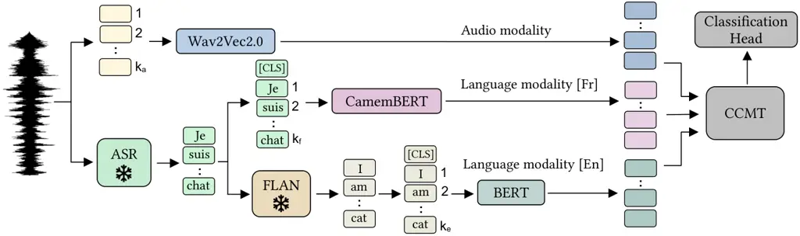
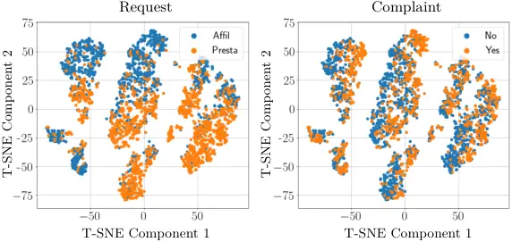

# Cascaded Cross-Modal Transformer for Audio-Textual Classification

Nicolae-Cătălin Ristea Affiliation: National University of Science and
Technology Politehnica Bucharest, Romania    Andrei Anghel
Affiliation: National University of Science and Technology Politehnica
Bucharest, Romania    Radu Tudor Ionescu Affiliation: University of
Bucharest, Romania

###### Abstract

Speech classification tasks often require powerful language
understanding models to grasp useful features, which becomes problematic
when limited training data is available. To attain superior
classification performance, we propose to harness the inherent value of
multimodal representations by transcribing speech using automatic speech
recognition (ASR) models and translating the transcripts into different
languages via pretrained translation models. We thus obtain an
audio-textual (multimodal) representation for each data sample.
Subsequently, we combine language-specific Bidirectional Encoder
Representations from Transformers (BERT) with Wav2Vec2.0 audio features
via a novel cascaded cross-modal transformer (CCMT). Our model is based
on two cascaded transformer blocks. The first one combines text-specific
features from distinct languages, while the second one combines acoustic
features with multilingual features previously learned by the first
transformer block. We employed our system in the Requests Sub-Challenge
of the ACM Multimedia 2023 Computational Paralinguistics Challenge. CCMT
was declared the winning solution, obtaining an unweighted average
recall (UAR) of $`65.41\%`$ and $`85.87\%`$ for complaint and request
detection, respectively. Moreover, we applied our framework on the
Speech Commands v2 and HarperValleyBank dialog data sets, surpassing
previous studies reporting results on these benchmarks. Our code is
freely available for download at:
[https://github.com/ristea/ccmt](https://github.com/ristea/ccmt).

###### keywords

cascaded cross-attention, cascaded transformer, multimodal learning,
audio-textual transformer, audio classification.

^(†)^(†)equal-contributors: Corresponding author:
raducu.ionescu@gmail.com.

## 1 Introduction

In recent years, the field of audio classification has witnessed
significant advancements in analyzing and interpreting verbal and
non-verbal vocal cues, leading to valuable insights into human
communication. However, with limited training data, it is often hard to
learn robust features solely from the audio domain. In the current
research landscape, we introduce a multimodal framework for speech and
text processing. Notably, our method constructs multiple text
representations (modalities) from audio data using pretrained models,
essentially requiring only the audio modality as the original input.
Since the text modalities are generated by neural models, the proposed
method is well-suited for a wide range of speech classification tasks,
ranging from complaint detection to intent recognition.



Figure 1: Our multimodal pipeline for speech classification. Audio is
the original input modality, from which we extract tokens with the
Wav2Vec2.0 Baevski et al. (2020) network that processes audio data in
the time domain. To generate the first extra (text) modality, we
initially employ an ASR model to transcribe each audio sample into text.
We assume that the spoken language is known a priori, and, in the
depicted example, the audio is in French \[Fr\]. The French text is
given as input to the CamemBERT Martin et al. (2020) language model. The
next step is to generate the second text modality, which relies on the
FLAN Chung et al. (2022) model to translate the French transcripts into
English. For the English language modality \[En\], the text is processed
by the BERT model Devlin et al. (2019). The audio tokens returned by
Wav2Vec2.0 and the text tokens produced by CamemBERT and BERT are
further fed into our cascaded cross-modal transformer (CCMT). The final
class token provided by CCMT is fed into the classification head. Our
framework operates similarly if the original spoken language is English.
The frozen models are marked with a snowflake.

Taking inspiration from the success of existing multimodal methodologies
Akbari et al. (2021); Das and Singh (2023); Georgescu et al. (2023);
Jabeen et al. (2023); Yoon et al. (2018) in other domains, we propose a
novel audio-textual pipeline which effectively harnesses multimodal
features derived from both speech and text data, which are further
integrated into a cascaded cross-modal transformer (CCMT), as shown in
Figure 1. To generate multimodal representations from the audio
modality, *i.e.* the only input modality considered in our work, we
employ state-of-the-art automatic speech recognition (ASR) models
Baevski et al. (2020); Radford et al. (2022) to transcribe the audio
samples. The additional text modality, obtained through speech-to-text
conversion, can provide valuable insights that complement the original
audio data, enabling the use of a wide range of natural language
processing (NLP) methods. Furthermore, recognizing the existence of
large language models (LLMs) tailored for distinct languages Martin
et al. (2020); Devlin et al. (2019); Cañete et al. (2020), we enlarge
the scope of our framework by translating the transcripts into multiple
languages, such as English, French and Spanish, via neural machine
translation (NMT). To accomplish this, we utilize the FLAN T5 language
model Chung et al. (2022), which enables us to effectively analyze the
same data in different linguistic contexts.

Taming the complexity of real-world classification tasks through the
combination of various modalities is not an easy challenge, requiring
the development of robust and efficient methods to effectively fuse
multiple data sources Ramachandram and Taylor (2017); Gao et al. (2020);
Stahlschmidt et al. (2022). To address this challenge, we propose the
CCMT model comprising successive transform blocks which aggregate
modalities two by two. More specifically, we consider two text
modalities (English and French) and one audio modality, which are
combined via two cascaded transform blocks. The first block aggregates
information from two LLMs, namely BERT Devlin et al. (2019) and
CamemBERT Martin et al. (2020). The second block combines the resulting
multilingual text features with audio-based Wav2Vec2.0 Baevski et al.
(2020) features. By integrating audio-textual information, our model
captures the rich semantic and acoustic characteristics of the data,
enabling a comprehensive understanding of the original audio data. On
the one hand, the employed NLP models facilitate capturing nuanced
language cues and contextual features within conversations. On the other
hand, the audio model can extract information about vocal tone,
emphasis, and other non-verbal cues, providing insights about
complementary features that contribute to the overall assessment of the
analyzed speech.

Our preliminary study presented at ACMMM 2023 Ristea and Ionescu (2023)
provided a brief description of CCMT and its results in the Requests
Sub-Challenge of the ACM Multimedia 2023 Computational Paralinguistics
Challenge Schuller et al. (2023). Remarkably, our model is the winner of
the Requests Sub-Challenge¹¹ 1
[http://www.compare.openaudio.eu/winners/](http://www.compare.openaudio.eu/winners/),
surpassing the second-best model Porjazovski et al. (2023) by $`3\%`$.
We hereby extend our preliminary work Ristea and Ionescu (2023) with a
more comprehensive presentation of the method, as well as a more
extensive evaluation, considering additional benchmarks and ablation
studies. Indeed, we conduct experiments on Speech Commands v2 and
HarperValleyBank to show that CCMT is beneficial for a broad range of
speech classification tasks. Our empirical results show that CCMT
outperforms existing methods on all benchmarks.

In summary, our contribution is threefold:

- •
  We propose a novel speech classification pipeline that employs ASR and
  NMT to generate multiple text modalities from speech samples, which
  empowers the neural network to harness multiple linguistic
  representations.
- •
  We introduce a novel audio-textual model which combines audio and text
  representations via a cascaded cross-modal transformer, termed CCMT.
- •
  We conduct comprehensive experiments on three distinct data sets,
  obtaining strong empirical results that support our new design.

## 2 Related Work

As related work, we discuss the recent studies treating the audio and
text modalities in a joint or independent manner.

### 2.1 Audio classification

In recent years, deep learning has emerged as a prominent approach in
the audio domain, thanks to the advancements in deep neural network
architectures Purwins et al. (2019); Ristea and Ionescu (2020); Kong
et al. (2020); Gong et al. (2021); Ristea et al. (2022) and the
availability of large-scale audio data sets Gemmeke et al. (2017). A
common approach involves transforming audio examples into image-like
representations, such as spectrograms obtained via the short-time
Fourier transform (STFT), followed by the application of a convolutional
neural network (CNN) for the desired task. The ability of CNNs to
capture local spectral and temporal features makes them well-suited for
analyzing audio signals. For instance, in Ristea and Ionescu (2020), the
authors proposed a CNN-based ensemble using a support vector machines
(SVM) meta-model applied on the learned embedding space. This solution
achieved promising results in a previous ComParE challenge, surpassing
the baseline proposed by the organizers by $`2.8\%`$. Alongside CNN
architectures, attention mechanisms have garnered increasing interest
within the audio domain Gong et al. (2021); Ristea et al. (2022); Gong
et al. (2022); Huang et al. (2022). Attention mechanisms enable models
to focus on informative parts of the input and capture both local and
global contextual information. Gong et al. Gong et al. (2021) adapted
the vision transformer model Dosovitskiy et al. (2021) to the audio
domain by dividing the input spectrogram into overlapping patches. Their
approach outperformed previous methods, while employing a
convolution-free architecture. Similarly, Ristea et al. Ristea et al.
(2022) proposed a separable transformer architecture, treating the time
and frequency bins as separate input tokens. Our work integrates a
hybrid architecture known as Wav2Vec2.0 Baevski et al. (2020), which is
based on both convolutional and transformer blocks. It processes audio
data in the time domain, extracting features from distinct overlapping
windows with a CNN-based model, and treating the resulting embeddings as
input tokens for a transformer. Unlike existing audio classification
models, we integrate multiple pretrained models to generate additional
modalities and benefit from the prior knowledge learned by audio and
text processing models.

### 2.2 Text classification

Text classification is a fundamental task in the field of NLP, gaining
steadily increasing attention, particularly with the emergence of
transformer models. Over the years, numerous approaches have been
proposed to tackle this generic task, employing a variety of techniques
and models Devlin et al. (2019). Transformer-based models Vaswani et al.
(2017), notably the Bidirectional Encoder Representations from
Transformers (BERT) Devlin et al. (2019), have revolutionized text
classification by leveraging self-attention mechanisms in capturing
contextual information from both preceding and subsequent words. BERT
has achieved state-of-the-art performance across various NLP tasks
Minaee et al. (2021); Gasparetto et al. (2022) and has become widely
adopted in text classification. Furthermore, researchers have explored
techniques such as incorporating domain-specific knowledge Khadhraoui
et al. (2022); Wan and Li (2022); Yang et al. (2022) or training
language-specific models Devlin et al. (2019); Martin et al. (2020);
Cañete et al. (2020); Dumitrescu et al. (2020) to enhance performance in
downstream text classification tasks. These efforts have contributed to
advancements in the field and improved the effectiveness of text
classification approaches across various languages.

With the advancements in both NLP and ASR fields, we consider that
extending audio classification to audio-textual classification by
transcribing audio files and applying NLP models, resulting in a
multimodal framework, can lead to better results. However, there is a
limited number of studies that harness the extracted text information to
complement the audio modality Bhaskar et al. (2015); Yoon et al. (2020);
Porjazovski et al. (2023). Bhaskar et al. Bhaskar et al. (2015) combined
shallow and knowledge-based models for emotion recognition, while Yoon
et al. Yoon et al. (2020) addressed the task of speech gesture
generation, combining video, speech and text modalities. Closer to our
work, Porjazovski et al. Porjazovski et al. (2023) extracted linguistic
information and combined it with acoustic features via a late fusion
model. Different from these related studies, we transcribe the audio
files using multiple ASR models Radford et al. (2022) to make our model
robust to specific transcription errors. We further employ a model for
text classification Chung et al. (2022) (in the native language of the
audio data), but we also translate the transcripts into different
languages, *e.g.* English, French and Spanish. Our approach harnesses
enriched representations and contextual understanding captured by
multiple language-specific transformers, enhancing performance by
aggregating and analyzing multimodal information.

### 2.3 Multimodal classification

Multimodal deep learning has attracted significant attention in recent
years as it enables effective modeling and analysis of complex data from
multiple modalities. While research has extensively explored the fusion
of audio-visual data Abdu et al. (2021); Georgescu et al. (2023);
Pandeya et al. (2021); Ramachandram and Taylor (2017) and
audio-visual-textual data Sun et al. (2020); Akbari et al. (2021), with
notable advancements in fusion techniques, the combination of audio and
text has received comparatively less attention Yoon et al. (2018); Singh
et al. (2021); Toto et al. (2021); Porjazovski et al. (2023). Singh et
al. Singh et al. (2021) proposed a hierarchical approach for multimodal
speech emotion recognition, combining 33 audio features with textual
features extracted from large language models. In Toto et al. (2021),
the authors introduced AudioBERT, a model that integrates pretrained
audio and text representation models along with a dual self-attention
mechanism. In contrast to existing methods, which only aggregate
information from fine-tuned audio and text models, we propose to
construct additional text modalities through automatic speech
recognition and neural machine translation. By incorporating
multilingual text branches, our model can capture nuances present in
different languages, providing a more comprehensive representation of
the original audio data.

One key aspect in multimodal learning is the fusion methodology. A wide
variety of frameworks have been proposed in the literature, including
approaches based on early, intermediate, and late fusion Boulahia et al.
(2021); Huang et al. (2020); Wang et al. (2020); Huang et al. (2020); Li
et al. (2023); Pawłowski et al. (2023); Xu et al. (2023); Singh et al.
(2021). For instance, Li et al. Li et al. (2023) introduced an efficient
and flexible multimodal fusion method specifically designed for fusing
unimodal pretrained transformers. Shvetsova et al. Shvetsova et al.
(2022) proposed a modality-agnostic fusion transformer that learns to
exchange information among multiple modalities, such as video, audio,
and text, and integrates them into a fused representation in a joint
multimodal embedding space. In a different study, Lee et al. Lee et al.
(2022) presented a cross-modality attention transformer and a multimodal
fusion transformer, which identify correlations between data modalities
and perform feature fusion. In a similar fashion, Liu et al. Liu et al.
(2023) proposed a cross-scale cascaded multimodal fusion transformer to
facilitate interaction and fusion among modalities with multi-scale
features. Singh et al. Singh et al. (2021) proposed a multimodal fusion
framework for emotion recognition by using audio and text features
captured by transcribing raw audio files. Similarly, Braunschweiler et
al. Braunschweiler et al. (2022) proposed a multimodal emotion
recognition system based on speech and transcribed text, which attained
superior results compared to prior studies. Moreover, they showed that
the multimodal audio-text fusion leads to better results. In a similar
fashion, Sharma et al. Sharma et al. (2023) proposed a multimodal
framework based on video, audio and transcribed text for real-time
emotional health detection. In contrast to the aforementioned works, our
approach introduces a cascaded cross-attention transformer that
incorporates attention across distinct languages, followed by
cross-attention between the resulting linguistic features and the speech
features. This design allows us to benefit from linguistic
representations in different languages and effectively integrate them
with the audio modality.

## 3 Method

We introduce a novel multimodal pipeline for speech classification,
which is depicted in Figure 1. Given the audio input data, our pipeline
produces two additional text modalities through automatic speech
recognition (ASR) and neural machine translation (NMT). The proposed
cascaded cross-modal transformer (CCMT) further processes the three
modalities. Next, we provide a detailed explanation of our pipeline,
separately addressing each component.

### 3.1 Audio branch

We utilize the pretrained Wav2Vec2.0 model Baevski et al. (2020) to
learn representative tokens for the audio modality. The raw audio data
is partitioned into $`k_{a}\in\mathbb{N^{+}}`$ chunks, where $`k_{a}`$
depends on the input length and differs from one sample to another. The
model processes the initial tokens, leading to a meaningful audio
representation. This process involves several stages, including
preliminary convolutional layers for local feature extraction and
transformer layers for global contextual information extraction. The
output of the Wav2Vec2.0 neural network has the same number of tokens
(as the input), denoted as $`k_{a}`$, which represent the acoustic
features of the audio modality. The resulting tokens encapsulate
features about the audio signals, including pitch, frequency, and
intensity. We highlight that encoders for different modalities produce
varying numbers of output tokens. However, our CCMT model requires an
equal number of tokens for each modality. To meet the data uniformity
requirement imposed by CCMT, we randomly sample a fixed number of
tokens, denoted as $`k\in\mathbb{N^{+}}`$, where $`k\leq k_{a}`$. The
selected tokens are then fed into the audio branch of the CCMT model.
The tokens are further combined with tokens from the text modalities to
facilitate the multimodal analysis. By fine-tuning the Wav2Vec2.0 model,
our framework benefits from a rich representation of the audio modality,
enabling the CCMT model to effectively capture and integrate both
linguistic and acoustic information.

### 3.2 Text branches

To generate text transcripts from the audio samples, we utilize a set of
ASR models built on top of the Whisper architecture Radford et al.
(2022), comprising three distinct backbones: small, medium, and large.
Employing multiple ASR models serves as a data augmentation mechanism,
enhancing the training data. We underline that Whisper is a multilingual
system able to generate transcriptions in several languages, depending
on the language spoken in the audio files. The languages used in our
speech data sets are English and French. However, our pipeline is easily
applicable to other languages, if necessary. After obtaining the
transcripts in the original language, we employ a language translation
model called FLAN Chung et al. (2022) to translate the original text
into other languages. Since the translation model can introduce errors
during translation, we select a group of three languages for which the
translation model exhibits higher performance, namely English, French
and Spanish. Although we carefully selected this group of three
languages, our preliminary results (presented in the next section) show
that Spanish lowers the overall performance. This influenced our
decision not to use Spanish. Therefore, we incorporate only two language
modalities: English and French.

Translating a text to different languages can naturally result in a
different number of words. Consequently, the English text given as input
to the BERT model Devlin et al. (2019) is assumed to consist of
$`k_{e}+1\in\mathbb{N^{+}}`$ tokens, comprising $`k_{e}`$ words and one
class token. BERT returns the same number of tokens as output.
Similarly, in the case of French, we have a total of
$`k_{f}+1\in\mathbb{N^{+}}`$ tokens, comprising $`k_{f}`$ words and an
extra class token. These tokens are fed into the CamemBERT model Martin
et al. (2020), which returns $`k_{f}+1`$ output tokens. To maintain
consistency across modalities, we randomly select a number of $`k`$
tokens from the output of the English language model (BERT) and the
output of the French language model (CamemBERT), respectively. This
ensures an equal number of tokens for all modalities. In the random
sampling process, we make sure to always include the class tokens, since
these tokens are very important for the final classification task. If
the number of tokens for either modality, English or French, is below
$`k`$, we randomly duplicate tokens until $`k_{e}=k`$ or $`k_{f}=k`$ to
comply with the uniformity constraint. By incorporating both English and
French language modalities, we offer the opportunity to our CCMT model
to adequately capture and integrate linguistic information from multiple
languages, enabling a comprehensive multimodal analysis for the target
classification task.

### 3.3 Cascaded Cross-Modal Transformer

Figure 2: As input, the CCMT architecture receives tokens obtained from
CamemBERT, BERT, and Wav2Vec2.0. To maintain the positional information
of each modality, we introduce separate positional embeddings. The
tokens are processed by two cascaded cross-attention transformer blocks.
The first block combines the French and English text modalities, and the
resulting tokens are combined with the audio modality. The final class
token is passed to the MLP classification head to make the final
predictions.

Considering that all models produce tokens with identical
dimensionality, let $`T_{f}\in\mathbb{R}^{k\times d}`$ denote the set of
tokens generated by the CamemBERT model,
$`T_{e}\in\mathbb{R}^{k\times d}`$ denote the set of tokens generated by
the BERT model, and $`T_{a}\in\mathbb{R}^{k\times d}`$ denote the set of
audio tokens generated by the Wav2Vec2.0 model, where
$`d\in\mathbb{N^{+}}`$. The audio and text tokens are combined via a
cascaded cross-modal transformer, as illustrated in Figure 2. In order
to make our model differentiate between token positions across various
modalities, we introduce positional encoding vectors that are unique to
each modality.

In the first transformer block, we introduce the learnable parameters
$`W_{Q}^{\prime},W_{K}^{\prime},W_{V}^{\prime}\in\mathbb{R}^{d\times d_{h}}`$
for the projection layers, where $`d_{h}\in\mathbb{N^{+}}`$ represents
the dimension of a single attention head. If the original spoken
language is French, we use the English modality for queries, and the
French modality for keys and values, as we consider that the original
language modality is more important for the final classification task.
To obtain the queries, keys, and values, we perform matrix
multiplications between the input tokens and the projection matrices, as
follows: $`Q^{\prime}=T_{e}\cdot W_{Q}^{\prime}`$,
$`K^{\prime}=T_{f}\cdot W_{K}^{\prime}`$,
$`V^{\prime}=T_{f}\cdot W_{V}^{\prime}`$. If the original spoken
language is English, we use the French modality for queries, and the
English modality for keys and values. Consequently the query, key, and
value tokens are obtained as follows:
$`Q^{\prime}=T_{f}\cdot W_{Q}^{\prime}`$,
$`K^{\prime}=T_{e}\cdot W_{K}^{\prime}`$,
$`V^{\prime}=T_{e}\cdot W_{V}^{\prime}`$. Regardless of the original
language spoken in the audio files, the output of the proposed
cross-attention layer, denoted as
$`U^{\prime}\in\mathbb{R}^{k\times d_{h}}`$, can be expressed as
follows:

```math
U^{\prime}=\mbox{softmax}\left(\frac{Q^{\prime}\cdot K^{\prime\top}}{\sqrt{d_{h}}}\right)\cdot V^{\prime}. \tag{1}
```

Note that our cross-attention layer can have a variable number of
attention heads. We further employ a learnable projection matrix
$`M^{\prime}\in\mathbb{R}^{d_{h}\times d}`$ to guarantee the consistency
of the dimensionality of the output tokens returned by the multi-head
attention layer. Multiplying the output $`U^{\prime}`$ with
$`M^{\prime}`$ allows the output dimensionality to be restored to the
original dimensionality of the input tokens. The projected output tokens
are given by $`Y^{\prime}=U^{\prime}\cdot M^{\prime}`$. Next, we perform
the summation and normalization operations, succeeded by a feed-forward
module (FF), and another summation and normalization layer. The
equations formally describing these operations are presented below:

```math
Z^{\prime}=Y^{\prime}+\mbox{Norm}(Y^{\prime}), \tag{2}
```

```math
T_{c}=Z^{\prime}+\mbox{FF}(\mbox{Norm}(Z^{\prime})), \tag{3}
```

where $`T_{c}\in\mathbb{R}^{k\times d}`$ represents the output
cross-attention linguistic tokens. The first transformer block is
successively repeated $`L_{1}\in\mathbb{N}^{+}`$ times. In the second
cross-attention transformer block, the linguistic tokens $`T_{c}`$ are
combined with the audio tokens $`T_{a}`$. Here, we introduce the
learnable parameters
$`W_{Q}^{\prime\prime},W_{K}^{\prime\prime},W_{V}^{\prime\prime}\in\mathbb{R}^{d\times d_{h}}`$
for the projection layers. As for the first transformer block, we obtain
the queries, keys, and values by multiplying the input tokens with the
corresponding projection matrices:
$`Q^{\prime\prime}=T_{a}\cdot W_{Q}^{\prime\prime}`$,
$`K^{\prime\prime}=T_{c}\cdot W_{K}^{\prime\prime}`$,
$`V^{\prime\prime}=T_{c}\cdot W_{V}^{\prime\prime}`$. By employing
operations analogous to Equations (1), (2) and (3), we obtain the output
tokens $`T_{o}\in\mathbb{R}^{k\times d}`$. The second transformer block
is successively repeated $`L_{2}\in\mathbb{N}^{+}`$ times. The first
token of the last transformer block, which represents the class token,
is passed to a multi-layer perceptron (MLP) head. The MLP head predicts
the final labels for the target classification task. We underline that
the operations above are presented in the context of a single attention
head, but the extension to multiple heads is trivial, as it immediately
results from the presentation of Vaswani et al. Vaswani et al. (2017).

## 4 Experiments

### 4.1 Data sets

ComParE RSC. The data set supplied by the organizers of the ComParE
competition Schuller et al. (2023) for the Requests Sub-Challenge (RSC)
is a subset of the HealthCall30 corpus, built by Lackovic et
al. Lackovic et al. (2022). The data set is split into training (6,822
samples), development (3,084 samples) and test (3,503 samples). It
comprises real audio recordings between call center agents and customers
who called to complain regarding some issue or to request some
information. Each data sample is a recording of $`30`$ seconds at a
sampling rate of $`16`$ kHz. Each conversation has two separate audio
channels. The first channel corresponds to the customer’s audio and the
second corresponds to the agent’s audio. There are two separate binary
classification tasks on this data set: request detection and complaint
detection.

Speech Commands v2. The Speech Commands v2 (SCv2) Warden (2018) data set
comprises spoken words, which enables the evaluation of keyword spotting
systems. It consists of 105,829 audio samples, each having about one
second in length. Each recording contains one of 35 common speech
commands, and the task is to identify the correct command. The official
split of Speech Commands v2 has 84,843 training samples, 9,981
validation samples and 11,005 test samples.

HarperValleyBank. The HarperValleyBank (HVB) data set Wu et al. (2020)
is composed of simple consumer-bank interactions, comprising roughly 23
hours of audio from 1,446 conversations between 59 different speakers.
The conversations are simulated and follow realistic templates with
controlled complexity and a limited vocabulary size of 700 unique words.
We randomly split the data based on speaker identifiers into training
(70%), validation (15%) and test (15%), thus avoiding speaker leakage
across subsets. We tackle two multi-way classification tasks on HVB:
action recognition (classification into 16 classes) and intent
recognition (classification into 8 classes). Wu et al. Wu et al. (2020)
reported the F1 score for the action recognition task, where the class
distribution is highly imbalanced, and the accuracy for the intent
recognition task, where the class distribution is almost uniform.
Therefore, we report the same performance measures.

### 4.2 Performance measures

In the ComParE competition, participants are evaluated and ranked using
the unweighted average recall (UAR), which is the average of recall
scores calculated for both positive and negative classes. Consequently,
we present our performance in terms of this metric. For the Speech
Commands v2 data set and the intent recognition task on the
HarperValleyBank data set, we report the classification accuracy. For
the action recognition task on HarperValleyBank, we report the $`F_{1}`$
score. We underline that the selection of performance measures follows
the prior art Schuller et al. (2023); Warden (2018); Ristea et al.
(2022); Wu et al. (2020) on the respective data sets. Regardless of the
evaluation measure, we repeat each experiment three times and report the
average performance and the standard deviation.

### 4.3 Baselines

ComParE RSC. In the audio experiments, we assess our model, built upon
Wav2Vec2.0 Baevski et al. (2020), against ResNet-50 He et al. (2016) and
several transformer-based frameworks Gong et al. (2021); Ristea et al.
(2022). For the text experiments, we conduct a comparative analysis
involving multiple NLP models Le et al. (2020); Martin et al. (2020) and
four ASR models Baevski et al. (2020); Radford et al. (2022).
Additionally, we analyze multiple aggregation methods, comparing our
CCMT model with a vanilla transformer model Dosovitskiy et al. (2021),
as well as other common fusion methods, such as plurality (majority)
voting or multi-layer perceptrons (MLPs). On the final test set, we
compare with the best baseline proposed by the organizers Schuller
et al. (2023), as well as the top performers in the competition
Porjazovski et al. (2023); Sun et al. (2023).

Speech Commands v2. To the best of our knowledge, there is no prior work
which uses multimodal audio-textual frameworks on the Speech Commands v2
data set. Therefore, we compare our work with state-of-the-art audio
models based on CNNs Majumdar and Ginsburg (2020) and transformers Gong
et al. (2021); Ristea et al. (2022).

HarperValleyBank. We include state-of-the-art results obtained with
audio-only models Wu et al. (2020), text-only models Thomas et al.
(2022), as well as multimodal approaches Thomas et al. (2022); Sunder
et al. (2022).

### 4.4 Data preprocessing

ComParE RSC. For ComParE RSC, we use 16 kHz audio files comprising both
agent and customer speeches, which are encoded into a single channel.
The single channel is obtained by averaging the original audio channels.
The other preprocessing steps are identical to those of Baevski et
al. Baevski et al. (2020). For all ASR models Baevski et al. (2020);
Radford et al. (2022), we consider the audio samples that are split into
two separate channels, one for the agent and one for the customer. We
resample each audio channel at 16 kHz and feed it to the ASR models,
following the preprocessing steps described in the original papers
presenting the ASR models Baevski et al. (2020); Radford et al. (2022).
For the text models, we simply concatenate the transcripts of the agent
and the customer. Regarding the input data for the CCMT model,
considering that we have a distinct number of tokens for each modality,
we randomly sample $`k=100`$ tokens, making sure to always keep the
class token for each modality.

Speech Commands v2 and HarperValleyBank. Since the audio samples in
Speech Commands v2 and HarperValleyBank are already encoded into a
single channel, concatenating audio channels is not required for these
two data sets. The preprocessing steps are identical to those of Baevski
et al. Baevski et al. (2020). Similarly, for all ASR models Baevski
et al. (2020); Radford et al. (2022), we follow the steps described in
the original papers. We provide $`k=100`$ tokens per modality as input
to CCMT.

### 4.5 Data augmentation

For the audio features, we employ Gaussian noise, clipping, pitch
shifting, low-pass filtering, high-pass filtering and volume change as
augmentation methods. For the text modalities, we use classical
augmentation methods, *e.g.* masking and swapping words, in addition to
an augmentation based on varying the ASR model. More precisely, we use
randomly picked transcripts from multiple ASR models. This augmentation
technique is also used for the NLP models trained on other languages, as
it simply involves translating the transcripts from multiple ASR models.

### 4.6 Implementation details

We fine-tune the Wav2Vec2.0 Baevski et al. (2020) architecture on
mini-batches of $`16`$ examples for $`10`$ epochs, using a learning rate
of $`10^{-5}`$. We optimize the language models, *i.e.* BERT Devlin
et al. (2019) and CamemBERT Martin et al. (2020), on mini-batches of
$`32`$ examples for $`25`$ epochs, using a learning rate of
$`5\cdot 10^{-5}`$ and a weight decay of $`10^{-5}`$. For all other
models, we adopt the hyperparameters recommended in the official
implementations. Finally, we optimize our CCMT model on mini-batches of
$`32`$ samples for $`30`$ epochs, using a learning rate of $`10^{-4}`$.
We set the number of transformer blocks in CCMT to $`L_{1}=L_{2}=8`$,
and the number of attention heads in each block to $`8`$. All models are
optimized with Adam Kingma and Ba (2014). We motivate our design and
hyperparameter choices via ablation experiments. To easily reproduce the
results, we provide our code for free at:
[https://github.com/ristea/ccmt](https://github.com/ristea/ccmt).

| Model                                | Input data      | UAR                        |                            |
| ------------------------------------ | --------------- | -------------------------- | -------------------------- |
|                                      |                 | Request                    | Complaint                  |
| ResNet-50 He et al. (2016)           | Spectrogram     | $`59.51\pm 1.27`$          | $`52.18\pm 0.86`$          |
| ResNet-50 He et al. (2016)           | STFT            | $`60.84\pm 1.08`$          | $`53.49\pm 0.73`$          |
| ResNet-50 He et al. (2016)           | Mel-Spectrogram | $`60.31\pm 1.01`$          | $`53.44\pm 0.74`$          |
| SepTr Ristea et al. (2022)           | STFT            | $`62.31\pm 0.59`$          | $`54.03\pm 0.55`$          |
| AST^(∗) Gong et al. (2021)           | Spectrogram     | $`64.72\pm 0.45`$          | $`55.91\pm 0.39`$          |
| 1D Transformer                       | Time domain     | $`61.63\pm 0.42`$          | $`53.82\pm 0.39`$          |
| Wav2Vec2.0 Baevski et al. (2020)     | Time domain     | $`68.87\pm 0.21`$          | $`56.55\pm 0.22`$          |
| Wav2Vec2.0^(∗) Baevski et al. (2020) | Time domain     | $`\textbf{71.64}\pm 0.16`$ | $`\textbf{58.12}\pm 0.16`$ |

Table 1: Results on the ComParE RSC development set, featuring various
audio-based models. The models are either trained from scratch or
fine-tuned. The architectures marked with $`*`$ use pretrained weights.
We present the mean UAR (in percentages) and the standard deviation over
three runs, using bold font to indicate the best score on each task.

### 4.7 Results on the ComParE Requests Sub-Challenge

#### 4.7.1 Preliminary results for the audio modality

In Table 1, we outline the results of models utilizing the audio
modality. Among the assessed architectures, the ResNet-50 He et al.
(2016) model exhibits subpar performance, irrespective of the given
input representation. In contrast, transformer-based models consistently
reach higher performance. Notably, the pre-trained AST Gong et al.
(2021) model attains a Request UAR of $`64.72\%`$ and a Complaint UAR of
$`55.91\%`$, outperforming the alternative transformer architectures,
namely SepTr Ristea et al. (2022) and the 1D transformer. Nevertheless,
the most optimal outcomes are achieved by the Wav2Vec2.0 Baevski et al.
(2020) model. Indeed, we obtain a Request UAR of $`71.64\%`$ and a
Complaint UAR of $`58.12\%`$, just by fine-tuning the Wav2Vec2.0 model.
This highlights the effectiveness of the audio representation based on
the temporal domain used by Wav2Vec2.0. These findings underscore the
advantages of employing pretrained models in audio classification tasks.
Based on the results presented in Table 1, we opt for the fine-tuned
Wav2Vec2.0 model for integration into our multimodal pipeline.

|                                        |                                  |                            |                            |
| -------------------------------------- | -------------------------------- | -------------------------- | -------------------------- |
| Model                                  | ASR model                        | UAR                        |                            |
|                                        |                                  | Request                    | Complaint                  |
| LSTM Hochreiter and Schmidhuber (1997) | Wav2Vec2.0 Baevski et al. (2020) | $`71.14\pm 0.51`$          | $`55.49\pm 0.50`$          |
| FlauBERT Le et al. (2020)              | Wav2Vec2.0 Baevski et al. (2020) | $`76.82\pm 0.21`$          | $`58.77\pm 0.23`$          |
| CamemBERT Martin et al. (2020)         | Wav2Vec2.0 Baevski et al. (2020) | $`77.45\pm 0.13`$          | $`60.15\pm 0.11`$          |
| CamemBERT Martin et al. (2020)         | Whisper S Radford et al. (2022)  | $`79.71\pm 0.19`$          | $`62.92\pm 0.20`$          |
| CamemBERT Martin et al. (2020)         | Whisper M Radford et al. (2022)  | $`81.86\pm 0.11`$          | $`64.83\pm 0.11`$          |
| CamemBERT Martin et al. (2020)         | Whisper L Radford et al. (2022)  | $`82.03\pm 0.10`$          | $`65.47\pm 0.09`$          |
| CamemBERT Martin et al. (2020)         | Whisper S+M+L                    | $`\textbf{82.44}\pm 0.08`$ | $`\textbf{65.61}\pm 0.08`$ |

Table 2: Results on the ComParE RSC development set using various
language models fine-tuned on French transcripts generated by Wav2Vec2.0
Baevski et al. (2020) and Whisper Radford et al. (2022) ASR models.
Whisper S+M+L denotes our augmentation technique, incorporating
transcripts from all three ASR models (small, medium and large). The
Wav2Vec2.0 and Whisper models are frozen. We present the mean UAR (in
percentages) and the standard deviation over three runs, using bold font
to indicate the best score on each task.

#### 4.7.2 Preliminary results for the French text modality

We outline the results obtained for the French text transcripts with
various NLP models in Table 2. We explore various ASR models, including
Wav2Vec2.0 (large)²² 2
[https://huggingface.co/facebook/wav2vec2-large-xlsr-53-french](https://huggingface.co/facebook/wav2vec2-large-xlsr-53-french)
Baevski et al. (2020) and three versions of the Whisper architecture
Radford et al. (2022) (small, medium, and large). When using the
Wav2Vec2.0 ASR model, the CamemBERT model Martin et al. (2020) achieves
the best performance, with a Request UAR of $`77.45\%`$ and a Complaint
UAR of $`60.15\%`$. For the subsequent experiments, we thus select the
CamemBERT model in detriment of the LSTM and FlauBERT language models.

Switching to the family of Whisper ASR models results in considerable
performance gains. Actually, we attain the best performance when the
transcripts generated by all Whisper models are jointly used. The
corresponding performance levels are a request UAR of $`82.44\%`$ and a
complaint UAR of $`65.61\%`$. We underline that the performance levels
reported for the text modality in Table 2 are significantly higher than
the audio modality results presented in Table 1. This indicates that,
for request and complaint detection, language features play a more
significant role in reaching high performance than acoustic features.

|                                                                     |          |                            |                            |
| ------------------------------------------------------------------- | -------- | -------------------------- | -------------------------- |
| Model                                                               | Language | UAR                        |                            |
|                                                                     |          | Request                    | Complaint                  |
| CamemBERT Martin et al. (2020)                                      | Fr       | $`82.44\pm 0.08`$          | $`65.61\pm 0.08`$          |
| RoBERTa Liu et al. (2019)                                           | En       | $`78.57\pm 0.07`$          | $`63.89\pm 0.10`$          |
| BERT Devlin et al. (2019)                                           | En       | $`79.35\pm 0.08`$          | $`63.91\pm 0.08`$          |
| BERT Devlin et al. (2019)                                           | Sp       | $`72.41\pm 0.08`$          | $`59.87\pm 0.11`$          |
| CamemBERT Martin et al. (2020)+BERT Devlin et al. (2019)            | Fr+En    | $`\mathbf{82.61}\pm 0.08`$ | $`\mathbf{65.91}\pm 0.08`$ |
| CamemBERT Martin et al. (2020)+BERT Devlin et al. (2019)            | Fr+Sp    | $`81.80\pm 0.08`$          | $`64.11\pm 0.09`$          |
| CamemBERT Martin et al. (2020)+2$`\times`$BERT Devlin et al. (2019) | Fr+En+Sp | $`82.01\pm 0.08`$          | $`64.95\pm 0.09`$          |

Table 3: Results on the ComParE RSC development set, featuring diverse
language models operating across three different languages: English
(En), French (Fr), and Spanish (Sp). We present the results obtained by
aggregating CamemBERT with other language models through an MLP-based
aggregation method. The reported metrics are the mean UAR (in
percentages) and the standard deviation over three runs. We use bold
font to indicate the best score on each task.

#### 4.7.3 Preliminary results for multiple text modalities

In Table 3, we showcase the results of language transformers across
three distinct languages: French, English, and Spanish. Among the
examined models, the CamemBERT Martin et al. (2020) language model,
which is trained on French transcripts, attains the highest performance.
This is an anticipated result, given that the audio calls are in French,
and translating them to new languages may introduce errors and
compromise performance. Nonetheless, we hypothesize that combining
models pretrained on a diverse set of languages can enhance the
effectiveness of the CamemBERT model. Consequently, we explore multiple
combinations of the CamemBERT model with other models trained on English
and Spanish, fusing the distinct language models via an MLP block. For
the English and Spanish languages, we fine-tune BERT Devlin et al.
(2019) models on transcripts translated to the respective languages. The
fine-tuned models start from weights pretrained on English and Spanish
data, respectively. Interestingly, the BERT model trained on English
data surpasses its Spanish counterpart by roughly $`6\%`$ and $`4\%`$ in
terms of UAR for the request and complaint classes, respectively. In the
fusion experiments, the most favorable results are achieved by combining
the French and English models, surpassing the results of the CamemBERT
model by around $`0.3\%`$ in terms of UAR for both request and complaint
classes. Nevertheless, the inclusion of the Spanish BERT model results
in a performance decline for both classes. Consequently, we omit the
Spanish language model from the following experiments.

| Model           | Text \[Fr\]    | Text \[En\]    | Audio          | UAR                        |                            |
| --------------- | -------------- | -------------- | -------------- | -------------------------- | -------------------------- |
|                 |                |                |                | Request                    | Complaint                  |
| Majority voting | $`\checkmark`$ | $`\checkmark`$ | $`\checkmark`$ | $`80.08\pm 0.11`$          | $`62.11\pm 0.13`$          |
| MLP             | $`\checkmark`$ |                | $`\checkmark`$ | $`82.60\pm 0.07`$          | $`65.98\pm 0.07`$          |
| MLP             | $`\checkmark`$ | $`\checkmark`$ |                | $`82.61\pm 0.08`$          | $`65.91\pm 0.08`$          |
| MLP             | $`\checkmark`$ | $`\checkmark`$ | $`\checkmark`$ | $`82.65\pm 0.08`$          | $`66.08\pm 0.07`$          |
| Transformer     | $`\checkmark`$ |                | $`\checkmark`$ | $`82.81\pm 0.08`$          | $`65.99\pm 0.09`$          |
| Transformer     | $`\checkmark`$ | $`\checkmark`$ |                | $`82.04\pm 0.07`$          | $`65.24\pm 0.08`$          |
| Transformer     | $`\checkmark`$ | $`\checkmark`$ | $`\checkmark`$ | $`82.81\pm 0.09`$          | $`66.13\pm 0.07`$          |
| CCMT (ours)     | $`\checkmark`$ |                | $`\checkmark`$ | $`83.01\pm 0.08`$          | $`66.20\pm 0.07`$          |
| CCMT (ours)     | $`\checkmark`$ | $`\checkmark`$ |                | $`81.96\pm 0.08`$          | $`65.84\pm 0.09`$          |
| CCMT (ours)     | $`\checkmark`$ | $`\checkmark`$ | $`\checkmark`$ | $`\textbf{83.31}\pm 0.08`$ | $`\textbf{66.64}\pm 0.08`$ |

Table 4: Results on the ComParE RSC development set, featuring various
methods to aggregate three models: a Wav2Vec2.0 model fine-tuned on
audio samples, and two language models fine-tuned on French \[Fr\] and
English \[En\] text samples, respectively. We report the mean UAR (in
percentages) and the standard deviation over three runs, using bold font
to indicate the best score on each task.

#### 4.7.4 Comparative results for multimodal methods

In Table 4, we showcase the outcome of the multimodal experiments based
on combining three models: Wav2Vec2.0 trained on audio data, CamemBERT
Martin et al. (2020) trained on French transcripts, and BERT Devlin
et al. (2019) trained on English translations. Upon combining the
different modalities, the following notable patterns emerge, regardless
of the chosen fusion approach. Combining CamemBERT with Wav2Vec2.0
Baevski et al. (2020) proves to be more effective than fusing the
CamemBERT and BERT language models. The best performance levels are
consistently obtained when we fuse all three modalities together.
Concerning the results of the alternative aggregation techniques, we
observe that conventional approaches, namely majority voting and MLP,
reach lower performance levels than more intricate methods based on
transformers. Fusing tokens from all modalities via a transformer model
leads to an UAR of $`82.81\%`$ for the request class and $`66.13\%`$ for
the complaint class, respectively. Nonetheless, we reach the highest
performance levels by combining all modalities via the proposed CCMT
model. These results confirm that CCMT represents a powerful technique
to combine audio-textual representations.



Figure 3: A t-SNE visualization of the CCMT embedding space for the
ComParE RSC development set. On the left-hand side, the data points are
labeled according to the request classes. On the right-hand side, the
labels represent the complaint classes. Best viewed in color.

|                                              |                               |           |           |           |
| -------------------------------------------- | ----------------------------- | --------- | --------- | --------- |
| Method                                       | Modalities                    | UAR       |           |           |
|                                              |                               | Request   | Complaint | Overall   |
| Schuller et al. Schuller et al. (2023)       | Audio                         | $`67.2`$  | $`52.9`$  | $`60.1`$  |
| Sun et al. Sun et al. (2023)                 | Audio                         | $`63.4`$  | $`55.4`$  | $`59.4`$  |
| Porjazovski et al. Porjazovski et al. (2023) | Text \[Fr\]+Audio             | $`85.4`$  | $`60.2`$  | $`72.8`$  |
| CCMT (ours)                                  | Text \[Fr\]+Audio             | $`85.09`$ | $`64.73`$ | $`74.91`$ |
| CCMT (ours)                                  | Text \[Fr\]+Text \[En\]+Audio | 85.87     | 65.41     | 75.64     |

Table 5: Results on the ComParE RSC private test set obtained by our
CCMT model with two or three input modalities. There are three
state-of-the-art competitors, one proposed by the ComParE RSC organizers
Schuller et al. (2023) and two proposed by other RSC participants Sun
et al. (2023); Porjazovski et al. (2023). Based on the results reported
on the ComParE RSC private test, our method (CCMT) was declared the
winner of the Requests Sub-Challenge of ComParE 2023 (see
[http://www.compare.openaudio.eu/winners/](http://www.compare.openaudio.eu/winners/)).
We report the UAR in percentages, using bold font to indicate the best
score on each task.

To further assess the discriminative power of CCMT, we illustrate a
t-SNE visualization of the feature space derived from the class tokens
of our top-scoring CCMT model in Figure 3. The visualization reveals the
presence of seven distinct inner clusters, with each cluster containing
samples from both classes for both classification tasks, complaint and
request. Notably, there is a clear (almost linear) separation within
each cluster between samples belonging to distinct request classes. At
the same time, it looks like distinguishing samples for the complaint
detection task is more challenging due to the less evident separation of
the complaint classes. This is consistent with the results reported so
far on the two tasks, *i.e.* requests are generally easier to detect
than complaints.

| Projection | Depth | Heads | Head      | Random         | UAR                        |                            |
| ---------- | ----- | ----- | --------- | -------------- | -------------------------- | -------------------------- |
| dimension  |       |       | dimension | selection      | Request                    | Complaint                  |
| 256        | 6     | 8     | 512       | $`\checkmark`$ | $`81.14\pm 0.11`$          | $`62.98\pm 0.13`$          |
| 512        | 6     | 8     | 512       | $`\checkmark`$ | $`81.45\pm 0.10`$          | $`63.21\pm 0.11`$          |
| \-         | 6     | 8     | 512       | $`\checkmark`$ | $`82.97\pm 0.08`$          | $`66.18\pm 0.09`$          |
| \-         | 7     | 8     | 512       | $`\checkmark`$ | $`83.28\pm 0.08`$          | $`66.11\pm 0.07`$          |
| \-         | 8     | 8     | 512       | $`\checkmark`$ | $`\textbf{83.31}\pm 0.08`$ | $`\textbf{66.64}\pm 0.08`$ |
| \-         | 9     | 8     | 512       | $`\checkmark`$ | $`83.22\pm 0.08`$          | $`65.99\pm 0.08`$          |
| \-         | 8     | 7     | 512       | $`\checkmark`$ | $`83.11\pm 0.07`$          | $`66.63\pm 0.08`$          |
| \-         | 8     | 9     | 512       | $`\checkmark`$ | $`83.19\pm 0.08`$          | $`66.49\pm 0.07`$          |
| \-         | 8     | 8     | 256       | $`\checkmark`$ | $`83.22\pm 0.08`$          | $`66.02\pm 0.08`$          |
| \-         | 8     | 8     | 1024      | $`\checkmark`$ | $`83.01\pm 0.08`$          | $`65.31\pm 0.09`$          |
| \-         | 8     | 8     | 512       |                | $`82.51\pm 0.11`$          | $`66.13\pm 0.09`$          |

Table 6: Ablation study on the ComParE RSC development set, considering
different configurations of the CCMT architecture trained on all three
modalities. We vary the dimension of the projection layer, the number of
transformer blocks (depth), the number of cross-attention heads, the
token dimension in each head, and the token sampling strategy. We report
the mean UAR (in percentages) and the standard deviation over three
runs, using bold font to indicate the best score on each task.

#### 4.7.5 Results on the ComParE RSC private test set

We present the performance levels on the ComParE RSC private test set in
Table 5. We submitted two models for the final evaluation. Our first
submission is based on a CCMT model that aggregates two data modalities,
represented by CamemBERT and Wav2Vec2.0 tokens. Our second submission is
produced by our full CCMT model, which comprises three modalities. When
using only two data modalities (French transcripts + audio files), the
performance is visibly lower than the performance obtained by the full
CCMT model. This observation confirms the beneficial impact of
integrating models trained on distinct languages. Our best submission
reaches an average UAR of $`75.64\%`$, surpassing the second-best model,
which is proposed by Porjazovski et al. Porjazovski et al. (2023), by
$`2.84\%`$. The third-best model Sun et al. (2023) is only based on the
provided audio modality, attaining even lower results. The same can be
said about the baseline proposed by the organizers Schuller et al.
(2023). In summary, the results presented in Table 5 clearly confirm
that the idea of generating multiple text modalities via ASR and NMT is
beneficial. The final standings also show the superiority of our
cascaded cross-modal transformer over competing approaches.

#### 4.7.6 Ablation study

To analyze the impact of different configurations on the performance of
our model, we conduct an ablation study and present the corresponding
results in Table 6. One important observation is that our model deviates
from a regular transformer architecture by omitting the input projection
layer. The results show that including a learnable projection over the
input tokens has a considerable negative effect on the performance. This
suggests that the language and audio models extract meaningful
information, alleviating the need of having another projection layer
over the tokens.

Furthermore, we explore the impact of varying the depth, the number of
attention heads, and the token dimension in each head of the CCMT
architecture. Interestingly, we find that these variations do not lead
to significant performance changes. The best results are obtained with a
depth of 8 blocks ($`L_{1}=L_{2}=8`$), each with 8 attention heads and a
dimension of 512 for the tokens.

In the proposed CCMT architecture, after the multi-head attention
module, we sum the result with the initial tokens, which generated the
keys and values. Considering that the output of the multi-head attention
layer has the same length as the query, we cannot sum it with the
initial tokens (which generated the keys and values), without having
uniformity across the length dimension. In order to perform the ablation
study without the random selection strategy, we need to modify the CCMT
architecture to be able to handle distinct token dimensions across all
data modalities. More exactly, we change the summation operation after
both multi-head attention layers inside CCMT, such that the summation is
performed using the initial query tokens, instead of the corresponding
key and value tokens. We observe that the results are slightly worse,
highlighting the efficiency of our architecture based on random token
selection.

Overall, the ablation study emphasizes the importance of removing the
input projection in the CCMT model, while indicating that other
variations have a relatively minor performance impact.

| Method                                   | Modalities                    | Accuracy                   |
| ---------------------------------------- | ----------------------------- | -------------------------- |
| MatchboxNet Majumdar and Ginsburg (2020) | Audio                         | $`97.40`$                  |
| AST Gong et al. (2021)                   | Audio                         | $`98.11\pm 0.05`$          |
| SepTr Ristea et al. (2022)               | Audio                         | $`98.51\pm 0.07`$          |
| Wav2Vec2.0                               | Audio                         | $`98.32\pm 0.05`$          |
| BERT                                     | Text \[En\]                   | $`95.44\pm 0.06`$          |
| CamemBERT                                | Text \[Fr\]                   | $`95.30\pm 0.08`$          |
| CCMT (ours)                              | Text \[En\]+Text \[Fr\]       | $`95.43\pm 0.06`$          |
| CCMT (ours)                              | Audio+Text \[En\]             | $`98.84\pm 0.05`$          |
| CCMT (ours)                              | Audio+Text \[En\]+Text \[Fr\] | $`\textbf{98.86}\pm 0.04`$ |

Table 7: Accuracy rates (in percentages) of our framework versus various
state-of-the-art methods on the Speech Commands v2 data set. We report
results with CCMT based on an audio model and two language models
trained on English \[En\] and French \[Fr\] transcripts. The best score
is highlighted in bold.

### 4.8 Results on the Speech Commands v2 data set

In Table 7, we present the results of the proposed framework versus the
results of several state-of-the-art methods on the Speech Commands v2
data set. We include results for multiple modalities, such as
audio-only, text-only and distinct combinations of multimodal inputs. To
the best of our knowledge, there is no previous work that uses
audio-textual data on this data set. Therefore, we can only compare with
audio-based state-of-the-art methods proposed in recent studies Majumdar
and Ginsburg (2020); Gong et al. (2021); Ristea et al. (2022). We
observe that the Wav2Vec2.0 model surpasses two recent methods Majumdar
and Ginsburg (2020); Gong et al. (2021), while the text-only BERT
achieves lower results. However, our audio-textual model outperforms all
state-of-the-art methods, regardless of the inclusion of the French text
modality. When we combine the English and French text modalities, there
is no statistically significant gain over using the English modality
alone. The main reason behind this fact is that the data set mostly
consists of single-word samples, and changing the language by
translation brings no significant contribution. Moreover, the ASR models
fail in edge case scenarios, *e.g.* trimmed or muffled words, thus
affecting the overall accuracy. To verify this statement, we compute the
accuracy by detecting if the words are present in the transcript. The
resulting accuracy rate is $`94.98\%`$. Our best accuracy of $`98.86\%`$
is obtained by combining audio and text data in both English and French.
With this score, CCMT sets a new accuracy record on the Speech Commands
v2 data set.

|                                |                               |                               |                            |
| ------------------------------ | ----------------------------- | ----------------------------- | -------------------------- |
| Method                         | Modalities                    | Action                        | Intent                     |
|                                |                               | ($`F_{1}`$)                   | (Accuracy)                 |
| CTC Wu et al. (2020)           | Audio                         | $`0.3864`$                    | $`45.47`$                  |
| LAS Wu et al. (2020)           | Audio                         | $`0.2931`$                    | $`34.96`$                  |
| MLT Wu et al. (2020)           | Audio                         | $`0.3222`$                    | $`42.28`$                  |
| ASR RNN-T Thomas et al. (2022) | Text                          | $`0.5357`$                    | \-                         |
| ASR RNN-T Thomas et al. (2022) | Audio+Text                    | $`0.5495`$                    | \-                         |
| HIER-ST Sunder et al. (2022)   | Audio+Text                    | $`0.6170`$                    | \-                         |
| Wav2Vec2.0                     | Audio                         | $`0.3745\pm 0.0007`$          | $`46.10\pm 0.79`$          |
| BERT                           | Text \[En\]                   | $`0.5396\pm 0.0008`$          | $`33.67\pm 1.21`$          |
| CamemBERT                      | Text \[Fr\]                   | $`0.5281\pm 0.0007`$          | $`32.92\pm 0.98`$          |
| CCMT (ours)                    | Text \[En\]+Text \[Fr\]       | $`0.5466\pm 0.0006`$          | $`36.45\pm 1.18`$          |
| CCMT (ours)                    | Audio+Text \[En\]             | $`0.6098\pm 0.0006`$          | $`46.02\pm 0.65`$          |
| CCMT (ours)                    | Audio+Text \[En\]+Text \[Fr\] | $`\textbf{0.6246}\pm 0.0007`$ | $`\textbf{47.56}\pm 0.74`$ |

Table 8: Results of our framework versus various state-of-the-art
methods on the HarperValleyBank data set. We report results with CCMT
based on an audio model and two language models trained on English
\[En\] and French \[Fr\] transcripts. We report the $`F_{1}`$ score for
the action recognition task, and the classification accuracy (in
percentages) for the intent recognition task, using bold font to
indicate the best score on each task.

### 4.9 Results on the HarperValleyBank data set

In Table 8, we present the results of the proposed framework on the
HarperValleyBank data set. We include results for both independent and
combined modalities. We compare with both audio-based Wu et al. (2020)
and audio-textual Thomas et al. (2022); Sunder et al. (2022) methods
from recent literature. We generally observe that audio-only frameworks
Wu et al. (2020), including Wav2Vec2.0, obtain lower performance levels
with respect to multimodal systems. For example, the ASR RNN-T model
Thomas et al. (2022) reaches a better $`F_{1}`$ score with the
audio-textual version than with its text-only version. Regarding our
models based on CCMT, we note that adding the French text modality is
generally helpful for both text-only and audio-textual versions. This
further confirms our conjecture stating that, for complex audio
classification tasks, generating textual information in multiple
languages can significantly improve the overall performance. Our best
CCMT model is based on mixing audio, English text, and French text. This
combination attains an $`F_{1}`$ score of $`0.6246`$ for action
recognition and an accuracy of $`47.56\%`$ for intent recognition,
surpassing all state-of-the-art methods included in Table 8.

## 5 Conclusion

In this study, we proposed CCMT, a novel multimodal transformer-based
architecture designed for speech classification tasks. Our framework is
based on automatically generating text representations via pretrained
ASR and NMT models, transforming the original speech classification task
into an audio-textual (multimodal) classification task. CCMT integrates
an audio model and two distinct language models, effectively aggregating
information from different modalities. This is achieved through cascaded
cross-attention transformer blocks, which iteratively combine
information from linguistic and audio features. We evaluated the
performance of CCMT on three distinct data sets, namely Speech Commands
v2, HarperValleyBank and the Requests Sub-Challenge of the ACM
Multimedia 2023 Computational Paralinguistics Challenge Schuller et al.
(2023). Our framework demonstrated outstanding results on all data sets.
Remarkably, CCMT was ranked on the first place in the ComParE challenge
with an average UAR of $`75.64\%`$. CCMT significantly outperformed the
competition baseline (by more than $`15\%`$) and other competitors (by
more than $`2.84\%`$), indicating the effectiveness of our approach. The
success of CCMT can be attributed to its ability to harness the
complementary nature of linguistic and acoustic features. By combining
information from multiple audio-textual modalities, our framework
captures a more robust representation of the input data, leading to
enhanced performance.

## Declarations

Funding The authors did not receive support from any organization for
the submitted work.

Conflict of interest The authors have no conflicts of interest to
declare that are relevant to the content of this article.

Ethics approval Not applicable.

Consent to participate Not applicable.

Consent for publication The authors give their consent for publication.

Authors’ contributions Nicolae-Cătălin Ristea implemented the method,
performed the experiments, and wrote the preliminary draft of the paper.
Radu Tudor Ionescu designed the method and the experiments. Radu Tudor
Ionescu and Andrei Anghel revised the manuscript.

Availability of data and materials The datasets are publicly available
online.

Code availability The code has been made publicly available for
non-commercial use at
[https://github.com/ristea/ccmt](https://github.com/ristea/ccmt).

Open Access This article is licensed under a Creative Commons
Attribution 4.0 International License, which permits use, sharing,
adaptation, distribution and reproduction in any medium or format, as
long as you give appropriate credit to the original author(s) and the
source, provide a link to the Creative Commons license, and indicate if
changes were made. The images or other third party material in this
article are included in the article’s Creative Commons license, unless
indicated otherwise in a credit line to the material. If material is not
included in the article’s Creative Commons license and your intended use
is not permitted by statutory regulation or exceeds the permitted use,
you will need to obtain permission directly from the copyright holder.
To view a copy of this license, visit
[http://creativecommons.org/licenses/by/4.0/](http://creativecommons.org/licenses/by/4.0/).

## References

- Baevski et al. (2020) Baevski, A., Zhou, Y., Mohamed, A., Auli, M.:
  wav2vec 2.0: A framework for self-supervised learning of speech
  representations. In: Proceedings of NeurIPS, vol. 33, pp.
  12449–12460 (2020)
- Martin et al. (2020) Martin, L., Muller, B., Suárez, P.J.O., Dupont,
  Y., Romary, L., La Clergerie, É.V., Seddah, D., Sagot, B.: CamemBERT:
  a Tasty French Language Model. In: Proceedings of ACL, pp.
  7203–7219 (2020)
- Chung et al. (2022) Chung, H.W., Hou, L., Longpre, S., Zoph, B., Tay,
  Y., Fedus, W., Li, E., Wang, X., Dehghani, M., Brahma, S., et al.:
  Scaling instruction-finetuned language models. arXiv preprint
  arXiv:2210.11416 (2022)
- Devlin et al. (2019) Devlin, J., Chang, M.-W., Lee, K., Toutanova,
  L.K.: BERT: Pre-training of Deep Bidirectional Transformers for
  Language Understanding. In: Proceedings of NAACL-HLT, pp.
  4171–4186 (2019)
- Akbari et al. (2021) Akbari, H., Yuan, L., Qian, R., Chuang, W.-H.,
  Chang, S.-F., Cui, Y., Gong, B.: VATT: Transformers for multimodal
  self-supervised learning from raw video, audio and text. In:
  Proceedings of NeurIPS, vol. 34, pp. 24206–24221 (2021)
- Das and Singh (2023) Das, R., Singh, T.D.: Multimodal sentiment
  analysis: A survey of methods, trends and challenges. ACM Computing
  Surveys (2023)
- Georgescu et al. (2023) Georgescu, M.-I., Fonseca, E., Ionescu, R.T.,
  Lucic, M., Schmid, C., Arnab, A.: Audiovisual masked autoencoders. In:
  Proceedings of ICCV, pp. 16144–16154 (2023)
- Jabeen et al. (2023) Jabeen, S., Li, X., Amin, M.S., Bourahla, O., Li,
  S., Jabbar, A.: A review on methods and applications in multimodal
  deep learning. ACM Transactions on Multimedia Computing,
  Communications and Applications 19(2s), 1–41 (2023)
- Yoon et al. (2018) Yoon, S., Byun, S., Jung, K.: Multimodal speech
  emotion recognition using audio and text. In: Proceedings of SLT
  Workshop, pp. 112–118 (2018). IEEE
- Radford et al. (2022) Radford, A., Kim, J.W., Xu, T., Brockman, G.,
  McLeavey, C., Sutskever, I.: Robust speech recognition via large-scale
  weak supervision. arXiv preprint arXiv:2212.04356 (2022)
- Cañete et al. (2020) Cañete, J., Chaperon, G., Fuentes, R., Ho, J.-H.,
  Kang, H., Pérez, J.: Spanish Pre-Trained BERT Model and Evaluation
  Data. In: Proceedings of PML4DC (ICLR Workshop) (2020)
- Ramachandram and Taylor (2017) Ramachandram, D., Taylor, G.W.: Deep
  multimodal learning: A survey on recent advances and trends. IEEE
  Signal Processing Magazine 34(6), 96–108 (2017)
- Gao et al. (2020) Gao, J., Li, P., Chen, Z., Zhang, J.: A survey on
  deep learning for multimodal data fusion. Neural Computation 32(5),
  829–864 (2020)
- Stahlschmidt et al. (2022) Stahlschmidt, S.R., Ulfenborg, B.,
  Synnergren, J.: Multimodal deep learning for biomedical data fusion: a
  review. Briefings in Bioinformatics 23(2), 569 (2022)
- Ristea and Ionescu (2023) Ristea, N.-C., Ionescu, R.T.: Cascaded
  Cross-Modal Transformer for Request and Complaint Detection. In:
  Proceedings of ACMMM, pp. 9467–9471 (2023)
- Schuller et al. (2023) Schuller, B.W., Batliner, A., Amiriparian, S.,
  Barnhill, A., Gerczuk, M., Triantafyllopoulos, A., Baird, A.,
  Tzirakis, P., Gagne, C., Cowen, A.S., Lackovic, N., Caraty, M.-J.,
  Montacié, C.: The ACM Multimedia 2023 Computational Paralinguistics
  Challenge: Emotion Share & Requests. In: Proceedings of ACMMM, pp.
  9635–9639 (2023)
- Porjazovski et al. (2023) Porjazovski, D., Getman, Y., Grósz, T.,
  Kurimo, M.: Advancing audio emotion and intent recognition with large
  pre-trained models and bayesian inference. In: Proceedings of ACMMM,
  pp. 9477–9481 (2023)
- Purwins et al. (2019) Purwins, H., Li, B., Virtanen, T., Schlüter, J.,
  Chang, S.-Y., Sainath, T.: Deep learning for audio signal processing.
  IEEE Journal of Selected Topics in Signal Processing 13(2),
  206–219 (2019)
- Ristea and Ionescu (2020) Ristea, N.-C., Ionescu, R.T.: Are You
  Wearing a Mask? Improving Mask Detection from Speech Using
  Augmentation by Cycle-Consistent GANs. In: Proceedings of INTERSPEECH,
  pp. 2102–2106 (2020)
- Kong et al. (2020) Kong, Q., Cao, Y., Iqbal, T., Wang, Y., Wang, W.,
  Plumbley, M.D.: PANNs: Large-Scale Pretrained Audio Neural Networks
  for Audio Pattern Recognition. IEEE/ACM Transactions on Audio, Speech,
  and Language Processing 28, 2880–2894 (2020)
- Gong et al. (2021) Gong, Y., Chung, Y.-A., Glass, J.: AST: Audio
  Spectrogram Transformer. In: Proceedings of INTERSPEECH, pp.
  571–575 (2021)
- Ristea et al. (2022) Ristea, N.C., Ionescu, R.T., Khan, F.: SepTr:
  Separable Transformer for Audio Spectrogram Processing. In:
  Proceedings of INTERSPEECH, pp. 4103–4107 (2022)
- Gemmeke et al. (2017) Gemmeke, J.F., Ellis, D.P.W., Freedman, D.,
  Jansen, A., Lawrence, W., Moore, R.C., Plakal, M., Ritter, M.: Audio
  Set: An ontology and human-labeled dataset for audio events. In:
  Proceedings of ICASSP, pp. 776–780 (2017). IEEE
- Gong et al. (2022) Gong, Y., Lai, C.-I., Chung, Y.-A., Glass, J.:
  SSAST: Self-Supervised Audio Spectrogram Transformer. In: Proceedings
  of AAAI, vol. 36, pp. 10699–10709 (2022)
- Huang et al. (2022) Huang, P.-Y., Xu, H., Li, J., Baevski, A., Auli,
  M., Galuba, W., Metze, F., Feichtenhofer, C.: Masked autoencoders that
  listen. Proceedings of NeurIPS 35, 28708–28720 (2022)
- Dosovitskiy et al. (2021) Dosovitskiy, A., Beyer, L., Kolesnikov, A.,
  Weissenborn, D., Zhai, X., Unterthiner, T., Dehghani, M., Minderer,
  M., Heigold, G., Gelly, S., Uszkoreit, J., Houlsby, N.: An Image is
  Worth 16x16 Words: Transformers for Image Recognition at Scale. In:
  Proceedings of ICLR (2021)
- Vaswani et al. (2017) Vaswani, A., Shazeer, N., Parmar, N., Uszkoreit,
  J., Jones, L., Gomez, A.N., Kaiser, Ł., Polosukhin, I.: Attention is
  all you need. In: Proceedings of NIPS, pp. 5998–6008 (2017)
- Minaee et al. (2021) Minaee, S., Kalchbrenner, N., Cambria, E.,
  Nikzad, N., Chenaghlu, M., Gao, J.: Deep learning-based text
  classification: a comprehensive review. ACM Computing Surveys 54(3),
  1–40 (2021)
- Gasparetto et al. (2022) Gasparetto, A., Marcuzzo, M., Zangari, A.,
  Albarelli, A.: A survey on text classification algorithms: From text
  to predictions. Information 13(2), 83 (2022)
- Khadhraoui et al. (2022) Khadhraoui, M., Bellaaj, H., Ammar, M.B.,
  Hamam, H., Jmaiel, M.: Survey of BERT-base models for scientific text
  classification: COVID-19 case study. Applied Sciences 12(6),
  2891 (2022)
- Wan and Li (2022) Wan, C.-X., Li, B.: Financial causal sentence
  recognition based on BERT-CNN text classification. The Journal of
  Supercomputing, 1–25 (2022)
- Yang et al. (2022) Yang, C.-H.H., Qi, J., Chen, S.Y.-C., Tsao, Y.,
  Chen, P.-Y.: When BERT meets quantum temporal convolution learning for
  text classification in heterogeneous computing. In: Proceedings of
  ICASSP, pp. 8602–8606 (2022). IEEE
- Dumitrescu et al. (2020) Dumitrescu, Ştefan Daniel., Avram, A.-M.,
  Pyysalo, S.: The birth of Romanian BERT. In: Proceedings of EMNLP, pp.
  4324–4328 (2020)
- Bhaskar et al. (2015) Bhaskar, J., Sruthi, K., Nedungadi, P.: Hybrid
  approach for emotion classification of audio conversation based on
  text and speech mining. Procedia Computer Science 46, 635–643 (2015)
- Yoon et al. (2020) Yoon, Y., Cha, B., Lee, J.-H., Jang, M., Lee, J.,
  Kim, J., Lee, G.: Speech gesture generation from the trimodal context
  of text, audio, and speaker identity. ACM Transactions on Graphics
  39(6), 1–16 (2020)
- Abdu et al. (2021) Abdu, S.A., Yousef, A.H., Salem, A.: Multimodal
  video sentiment analysis using deep learning approaches, a survey.
  Information Fusion 76, 204–226 (2021)
- Pandeya et al. (2021) Pandeya, Y.R., Bhattarai, B., Lee, J.:
  Deep-learning-based multimodal emotion classification for music
  videos. Sensors 21(14), 4927 (2021)
- Sun et al. (2020) Sun, Z., Sarma, P., Sethares, W., Liang, Y.:
  Learning relationships between text, audio, and video via deep
  canonical correlation for multimodal language analysis. In:
  Proceedings of AAAI, vol. 34, pp. 8992–8999 (2020)
- Singh et al. (2021) Singh, P., Srivastava, R., Rana, K.P.S., Kumar,
  V.: A multimodal hierarchical approach to speech emotion recognition
  from audio and text. Knowledge-Based Systems 229, 107316 (2021)
- Toto et al. (2021) Toto, E., Tlachac, M.L., Rundensteiner, E.A.:
  AudiBERT: A deep transfer learning multimodal classification framework
  for depression screening. In: Proceedings of CIKM, pp.
  4145–4154 (2021)
- Boulahia et al. (2021) Boulahia, S.Y., Amamra, A., Madi, M.R., Daikh,
  S.: Early, intermediate and late fusion strategies for robust deep
  learning-based multimodal action recognition. Machine Vision and
  Applications 32(6), 121 (2021)
- Huang et al. (2020) Huang, S.-C., Pareek, A., Seyyedi, S., Banerjee,
  I., Lungren, M.P.: Fusion of medical imaging and electronic health
  records using deep learning: a systematic review and implementation
  guidelines. NPJ Digital Medicine 3(1), 136 (2020)
- Wang et al. (2020) Wang, Y., Huang, W., Sun, F., Xu, T., Rong, Y.,
  Huang, J.: Deep multimodal fusion by channel exchanging. Proceedings
  of NeurIPS 33, 4835–4845 (2020)
- Huang et al. (2020) Huang, J., Tao, J., Liu, B., Lian, Z., Niu, M.:
  Multimodal transformer fusion for continuous emotion recognition. In:
  Proceedings of ICASSP, pp. 3507–3511 (2020). IEEE
- Li et al. (2023) Li, Y., Quan, R., Zhu, L., Yang, Y.: Efficient
  Multimodal Fusion via Interactive Prompting. In: Proceedings of CVPR,
  pp. 2604–2613 (2023)
- Pawłowski et al. (2023) Pawłowski, M., Wróblewska, A.,
  Sysko-Romańczuk, S.: Effective Techniques for Multimodal Data Fusion:
  A Comparative Analysis. Sensors 23(5), 2381 (2023)
- Xu et al. (2023) Xu, P., Zhu, X., Clifton, D.A.: Multimodal learning
  with transformers: A survey. IEEE Transactions on Pattern Analysis and
  Machine Intelligence (2023)
- Singh et al. (2021) Singh, P., Srivastava, R., Rana, K., Kumar, V.: A
  multimodal hierarchical approach to speech emotion recognition from
  audio and text. Knowledge-Based Systems 229, 107316 (2021)
- Shvetsova et al. (2022) Shvetsova, N., Chen, B., Rouditchenko, A.,
  Thomas, S., Kingsbury, B., Feris, R.S., Harwath, D., Glass, J.,
  Kuehne, H.: Everything at once-multi-modal fusion transformer for
  video retrieval. In: Proceedings of CVPR, pp. 20020–20029 (2022)
- Lee et al. (2022) Lee, W.-Y., Jovanov, L., Philips, W.: Cross-modality
  attention and multimodal fusion transformer for pedestrian detection.
  In: Proceedings of ECCV, pp. 608–623 (2022). Springer
- Liu et al. (2023) Liu, Z., Cheng, Q., Song, C., Cheng, J.: Cross-scale
  cascade transformer for multimodal human action recognition. Pattern
  Recognition Letters 168, 17–23 (2023)
- Braunschweiler et al. (2022) Braunschweiler, N., Doddipatla, R.,
  Keizer, S., Stoyanchev, S.: Factors in emotion recognition with deep
  learning models using speech and text on multiple corpora. IEEE Signal
  Processing Letters 29, 722–726 (2022)
- Sharma et al. (2023) Sharma, A., Sharma, K., Kumar, A.: Real-time
  emotional health detection using fine-tuned transfer networks with
  multimodal fusion. Neural computing and applications 35(31),
  22935–22948 (2023)
- Lackovic et al. (2022) Lackovic, N., Montacié, C., Lalande, G.,
  Caraty, M.-J.: Prediction of user request and complaint in spoken
  customer-agent conversations. arXiv preprint arXiv:2208.10249 (2022)
- Warden (2018) Warden, P.: Speech Commands: A Dataset for
  Limited-Vocabulary Speech Recognition. arXiv preprint
  arXiv:1804.03209 (2018)
- Wu et al. (2020) Wu, M., Nafziger, J., Scodary, A., Maas, A.:
  HarperValleyBank: A domain-specific spoken dialog corpus. arXiv
  preprint arXiv:2010.13929 (2020)
- He et al. (2016) He, K., Zhang, X., Ren, S., Sun, J.: Deep residual
  learning for image recognition. In: Proceedings of CVPR, pp.
  770–778 (2016)
- Le et al. (2020) Le, H., Vial, L., Frej, J., Segonne, V., Coavoux, M.,
  Lecouteux, B., Allauzen, A., Crabbé, B., Besacier, L., Schwab, D.:
  FlauBERT: Unsupervised Language Model Pre-training for French. In:
  Proceedings of LREC, pp. 2479–2490 (2020)
- Sun et al. (2023) Sun, Y., Xu, K., Liu, C., Dou, Y., Qian, K.:
  Automatic audio augmentation for requests sub-challenge. In:
  Proceedings of ACMMM, pp. 9482–9486 (2023)
- Majumdar and Ginsburg (2020) Majumdar, S., Ginsburg, B.: MatchboxNet:
  1D Time-Channel Separable Convolutional Neural Network Architecture
  for Speech Commands Recognition. In: Proceedings of INTERSPEECH, pp.
  3356–3360 (2020)
- Thomas et al. (2022) Thomas, S., Kuo, H.-K.J., Kingsbury, B., Saon,
  G.: Towards reducing the need for speech training data to build spoken
  language understanding systems. In: Proceedings of ICASSP, pp.
  7932–7936 (2022). IEEE
- Sunder et al. (2022) Sunder, V., Thomas, S., Kuo, H.-K.J., Ganhotra,
  J., Kingsbury, B., Fosler-Lussier, E.: Towards end-to-end integration
  of dialog history for improved spoken language understanding. In:
  Proceedings of ICASSP, pp. 7497–7501 (2022). IEEE
- Kingma and Ba (2014) Kingma, D.P., Ba, J.: Adam: A method for
  stochastic optimization. In: Proceedings of ICLR (2014)
- Hochreiter and Schmidhuber (1997) Hochreiter, S., Schmidhuber, J.:
  Long short-term memory. Neural Computation 9(8), 1735–1780 (1997)
- Liu et al. (2019) Liu, Y., Ott, M., Goyal, N., Du, J., Joshi, M.,
  Chen, D., Levy, O., Lewis, M., Zettlemoyer, L., Stoyanov, V.: RoBERTa:
  A Robustly Optimized BERT Pretraining Approach. arXiv preprint
  arXiv:1907.11692 (2019)
