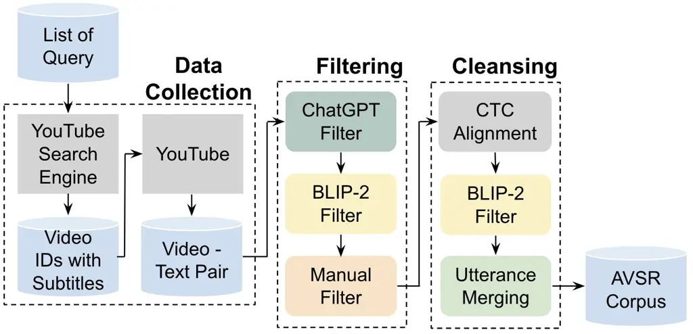
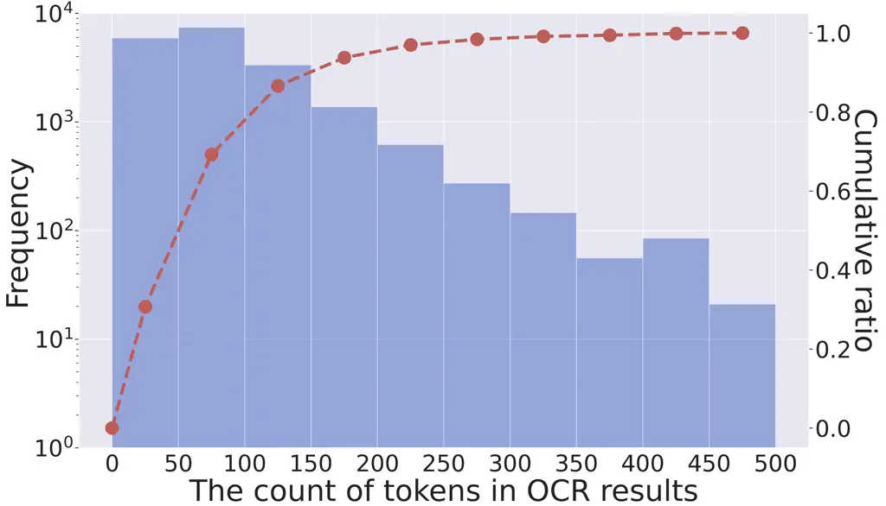

# SlideAVSR: A Dataset of Paper Explanation Videos for Audio-Visual Speech Recognition

Hao Wang  Shuhei Kurita  Shuichiro Shimizu  Daisuke Kawahara
Affiliation:  Waseda University  Affiliation:  National Institute of
Informatics (NII)  Affiliation:  Kyoto University  Affiliation:  LLMC,
NIIconan1024hao@akane.waseda.jp
 skurita@nii.ac.jpsshimizu@nlp.ist.i.kyoto-u.ac.jp  dkw@waseda.jp

###### Abstract

Audio-visual speech recognition (AVSR) is a multimodal extension of
automatic speech recognition (ASR), using video as a complement to
audio. In AVSR, considerable efforts have been directed at datasets for
facial features such as lip-readings, while they often fall short in
evaluating the image comprehension capabilities in broader contexts. In
this paper, we construct SlideAVSR, an AVSR dataset using scientific
paper explanation videos. SlideAVSR provides a new benchmark where
models transcribe speech utterances with texts on the slides on the
presentation recordings. As technical terminologies that are frequent in
paper explanations are notoriously challenging to transcribe without
reference texts, our SlideAVSR dataset spotlights a new aspect of AVSR
problems. As a simple yet effective baseline, we propose DocWhisper, an
AVSR model that can refer to textual information from slides, and
confirm its effectiveness on SlideAVSR.

## 1 Introduction

Research on multimodal models capable of handling multiple types of
data, such as language, images, videos, and audio simultaneously, has
garnered significant attention. An example is audio-visual speech
recognition (AVSR), a multimodal extension of automatic speech
recognition (ASR), using video as a complement to audio. Most previous
studies in AVSR have been conducted with the aim of improving accuracy
on lip reading datasets (Afouras et al., 2018a; Afouras et al., 2018b).
While models built in these studies (Shi et al., 2022; Pan et al., 2022;
Haliassos et al., 2023) demonstrate high performance on lip reading
data, their applicability to other types of videos remains limited.

In this paper, we aim to evaluate the image comprehension capabilities
of AVSR models across a broader spectrum of visual contents than facial
features. To achieve this, we construct SlideAVSR, an AVSR dataset that
contains various technical terms that are notoriously challenging to
transcribe without referring to textual information on slides.
Specifically, we collect scientific paper explanation videos from
YouTube, apply data refinement procedures with several custom filters,
and perform data partitioning considering the speakers’ accents.

Furthermore, we propose DocWhisper, a simple yet effective AVSR baseline
that can efficiently refer to the content of slides using optical
character recognition (OCR). In experiments utilizing SlideAVSR,
DocWhisper demonstrated a performance improvement of up to 14.3%
compared to Whisper (Radford et al., 2022), which relies solely on audio
input. Additionally, to address the long-tail problem in OCR results, we
introduce FQ Ranker, which calculates word ranks based on the frequency
of word occurrences, and we evaluate its effectiveness integrated with
DocWhisper.

## 2 Related Work

Compared to the efforts that have been made on lip reading
datasets (Chung et al., 2017; Chung and Zisserman, 2017a; Chung and
Zisserman, 2017b; Afouras et al., 2018a; Afouras et al., 2018b;
Shillingford et al., 2019), AVSR datasets in other types of videos
remain scarce. VisSpeech (Gabeur et al., 2022) is constructed from a
subset of the instructional video dataset HowTo100M (Miech et al., 2019)
where the visual stream and speech audio are semantically related. The
audiovisual diarization benchmark in the Ego4D challenge (Jain et al., 2023) consists of 585 egocentric video clips. In terms of utilizing
textual information extracted from videos, SlideSpeech Wang et al.
(2023) builds an AVSR dataset on online conference videos enriched with
slides. However, the filtering process of SlideSpeech relies heavily on
human annotators. In this work, we exclude videos and utterances that do
not correspond to slides by utilizing a vision language model. This
approach reduces annotation costs and enhances the purity and quality of
our dataset within the slide domain.

In the context of extending Whisper to an AVSR model, Peng et al. (2023)
employed CLIP (Radford et al., 2021) to transform the input visual
stream into word sequences, which were then utilized as prompts for
Whisper. They reported that this approach enhances the zero-shot
performance on VisSpeech. In this study, we employ OCR to create prompts
and implement fine-tuning to improve performance rather than using
zero-shot prompting.

## 3 SlideAVSR: Dataset Construction

In this study, we construct SlideAVSR, an AVSR dataset based on
scientific paper explanation videos incorporating various technical
terms, making accurate transcription difficult without referring to the
slides. Based on JTubeSpeech Takamichi et al. (2021), a framework for
building audio corpora from YouTube videos, we implement several custom
filters to target videos, thereby applying high-precision data
refinement. This section describes the construction flow of SlideAVSR.
Figure 1 illustrates the flow.

### 3.1 Data Collection

#### Creating search queries.

We first collect videos with search queries that are related to top
conferences in the field of artificial intelligence. We create queries
in the format {Conference} {Year} {Form}. The list of target conferences
is provided in Appendix A. Considering the increased prevalence of
online conferences since COVID-19, we focus on the years 2020 to 2023.
The forms include “paper”, “workshop”, and “talk”. An example search
query is “ACL 2023 paper”.

#### Obtaining videos with subtitles.

Using the search queries, we retrieve video IDs with subtitles and
download them.¹¹ 1 https://github.com/yt-dlp/yt-dlp To ensure data
quality, only videos with manual subtitles are considered. Additionally,
we set the following criteria:

- •
  Duration between 5 and 20 minutes (videos that are too short or too
  long are less likely to be paper explanation videos).
- •
  Video format: MP4, 720P, H264.
- •
  Audio format: single-channel, 16bit, 16kHz.

A total of 636 videos were downloaded.

### 3.2 Filtering

We curate several filters to remove videos that are not paper
explanations or do not include slides.

#### ChatGPT filter.

We provide the videos’ description for ChatGPT²² 2
https://openai.com/product to confirm the following:

- •
  This video is an explanation of a paper.
- •
  The description is written in English.

We perform three times of generation, and if “Yes” is outputted at least
once, we adopt the video; otherwise, we discard it. We show the details
of the model and prompt in Appendix B. A total of 342 videos were
excluded, leaving 294 videos for subsequent processes.

#### BLIP-2 filter for videos.

We capture screenshots at the beginning, end, and three quartile points
in the timeline for each video, and then present these screenshots to
the vision language model BLIP-2 Li et al. (2023) to verify the
following:

- •
  This image is a screenshot, not a photo.
- •
  This image is a part of slides.

We perform generation for each screenshot, and if “Yes” is outputted at
least once, we adopt the video; otherwise, we discard it. We show the
details of the model and prompt in Appendix B. A total of 6 videos were
excluded, leaving 288 videos for subsequent processes.

#### Manual filter.

We conduct manual checks to remove inappropriate videos that are not
excluded by the automatic filters, including:

- •
  Videos rarely showing slides.
- •
  Videos unrelated to paper explanations, such as conference openings.

A total of 38 videos were excluded, leaving 250 videos for subsequent
processes.

Figure 1: Construction flow of SlideAVSR.

### 3.3 Cleansing

We implement audio-subtitle alignment, exclude utterances that do not
correspond to slides, and merge short utterances for data cleansing.

#### CTC alignment.

Due to the inaccuracy in the timing of subtitles, we implement
audio-subtitle alignment and scoring using CTC segmentation Kürzinger
et al. (2020). We set the threshold to -7 and exclude utterances with
lower scores. The details of the model are shown in Appendix B.
Approximately 2.5% of utterances were excluded through this process.

#### BLIP-2 filter for utterances.

We capture screenshots at the midpoint of each utterance, followed by
filtering using BLIP-2. Three generations are conducted for each
screenshot, and if “Yes” is outputted at least once, we adopt the
utterance; otherwise, we discard it. The employed prompt is identical to
the BLIP-2 filter in Section 3.2. Approximately 1.0% of utterances were
excluded through this process.

#### Merging utterances.

Subtitles created by video authors occasionally exhibit unnatural
segmentation, resulting in exceedingly brief spans. Utilizing the audio
segments obtained through CTC segmentation, we implement a merging
process, combining two consecutive utterances into a single entity if
the end time of the preceding utterance aligns with the start time of
the subsequent one and their cumulative duration does not exceed 15
seconds. This procedure significantly enhanced Whisper’s ASR performance
by approximately 20%.

### 3.4 Data Partitioning

Previous studies (Meyer et al., 2020; Javed et al., 2023; DiChristofano
et al., 2023) have suggested that the performance of ASR systems
significantly varies depending on the speaker’s accent³³ 3 The term
“accent” in this paper refers to comprehensive prosodic information,
including accent, intonation, tone, etc.. Based on the hypothesis that
visual information contributes to the recognition of challenging
accents, we ask native English speakers to classify the speakers’
accents in SlideAVSR and perform dataset partitioning. We partition the
dataset into Train, Dev, and TestA, reserving a smaller yet significant
TestB subset for South Asian English (SAE) accents. During partitioning,
we have ensured that the same speaker did not belong to multiple
partitions. Additionally, 5 videos with machine-generated audio were
manually excluded by the annotators.

Through the construction flow, we produced an AVSR dataset of around 36
hours from 245 videos. We show the statistics of the dataset in Table 1.

|       |          |            |              |         |
| ----- | -------- | ---------- | ------------ | ------- |
|       | \#videos | \#speakers | \#utterances | \#hours |
| Train | 195      | 172        | 15,803       | 29.26   |
| Dev   | 20       | 20         | 1,515        | 3.08    |
| TestA | 15       | 15         | 1,034        | 2.21    |
| TestB | 15       | 13         | 1,111        | 1.90    |
| Total | 245      | 220        | 19,463       | 36.45   |

Table 1: Statistics of SlideAVSR.

## 4 Experiments

### 4.1 Approaches

DocWhisper processes the input video stream through an OCR module,
extracting textual information into word sequences, which are then
provided to Whisper as prompts for fine-tuning and inference. While Peng
et al. (2023) employed prompts derived from CLIP in zero-shot learning,
our preliminary experiments did not reveal a performance improvement in
zero-shot learning on SlideAVSR. Given that Whisper’s
pre-training (Radford et al., 2022) did not use prompts, we speculate
that Whisper loses robustness when it faces diverse prompts.

We show the frequency distribution of the number of words in OCR results
in Figure 2. The distribution is long-tail, which means that only 70% of
the samples can be covered even if we include 100 words in the prompts⁴⁴
4 Whisper typically assigns a maximum length of 224 to prompts, making
inputs with over 100 words challenging.. To address this issue, we
propose FQ Ranker, which calculates word ranks based on the frequency of
word occurrences. Given the demonstrated high correlation between word
frequency and familiarity as shown in previous studies (Coltheart, 1981;
Tanaka-Ishii, 2021), increasing the rank of less frequent and more
challenging words is expected to enhance the information content of
prompts.

Figure 2: Frequency distribution of the number of words in OCR results.
While samples with over 500 words are present, they are omitted for
brevity.

| Type           | Example                                                                              |
| -------------- | ------------------------------------------------------------------------------------ |
| Technical term | W Hyp: we select quantum adhering 2 and nxt as representative of pos protocols       |
| (41%)          | D Hyp: we select quantum ethereum 2 and nxt as representative of pos protocols       |
| Inflection     | W Hyp: manual transcript we call this setting supervised things we have paired data  |
| (28%)          | D Hyp: manual transcripts we call this setting supervised things we have paired data |
| Mishearing     | W Hyp: we can also perform other tasks like normal view synthesis                    |
| (24%)          | D Hyp: we can also perform other tasks like novel view synthesis                     |
| Name           | W Hyp: this is a work done at ibm research with gilmoseci chileo and irina rich      |
| (7%)           | D Hyp: this is a work done at ibm research with guillermo cecchi and irina rish      |

Table 2: Error types and examples that are substitution errors in
Whisper (W) but correct in DocWhisper (D).

| Model           | Modality  | Fine-tune | $`K`$^(a) | TestA | TestB |
| --------------- | --------- | --------- | --------- | ----- | ----- |
| Whisper         | A         | ✗         | 0         | 8.23  | 11.18 |
|                 |           | ✔        |           | 8.07  | 11.25 |
| DocWhisper      | A $`+`$ V | ✔        | 25        | 7.35  | 10.82 |
| $`+`$ FQ Ranker |           |           |           | 7.42  | 10.59 |
| DocWhisper      | A $`+`$ V | ✔        | 50        | 7.08  | 10.43 |
| $`+`$ FQ Ranker |           |           |           | 7.26  | 10.35 |
| DocWhisper      | A $`+`$ V | ✔        | 75        | 7.02  | 10.04 |
| $`+`$ FQ Ranker |           |           |           | 7.26  | 10.29 |
| DocWhisper      | A $`+`$ V | ✔        | 100       | 6.91  | 10.01 |
| $`+`$ FQ Ranker |           |           |           | 7.04  | 10.22 |

^(a)Indicating maximum word counts for prompts.

Table 3: Quantitative evaluation (WER) on SlideAVSR.

### 4.2 Implement Details

We used Whisper large-v3⁵⁵ 5
https://huggingface.co/openai/whisper-large-v3 as a base model and Word
Error Rate (WER) for evaluation. In the case of DocWhisper, we captured
screenshots at the midpoint of each utterance, fed them into the OCR
module, and used the recognized text as the prompts to Whisper. In this
case, multiple utterances might share the same slide. We use Google
Cloud Vision API⁶⁶ 6 https://cloud.google.com/vision for OCR. The
prompts were presented to the model as word sequences, such as “word 1,
word 2, …, word $`n`$”. FQ Ranker utilized word frequency counts
obtained from the English Wikipedia and sorted the OCR results in
ascending order based on word frequency. We conducted experiments with
different maximum word counts for prompts ($`K\in\{25,50,75,100\}`$) and
with or without FQ Ranker. More implementation details are provided in
Appendix C.

### 4.3 Results

We show the results of quantitative evaluations for Whisper and
DocWhisper in Table 3. In both models, the scores of the TestB set,
consisting of videos with SAE accents, were inferior to the scores of
the TestA set, indicating that Whisper struggles with rare accents. With
fine-tuning, Whisper demonstrated a 1.9% improvement on the TestA set.
However, no notable improvement was observed for the TestB set. Despite
the presence of videos with SAE accents in the training data, their
limited quantity was deemed insufficient to address the challenges posed
by difficult accents.

Compared to the fine-tuned Whisper, DocWhisper exhibited a maximum
improvement of 14.3% on TestA and 11% on TestB. We gather that referring
to textual information on slides can significantly improve speech
recognition performance on SlideAVSR. We also found that as the maximum
word count of prompts increased, the performance improved, indicating
that maximizing information content contributes to performance
enhancement.

FQ Ranker improved the scores on TestB when the maximum word count of
prompts was set to 25; however, this advantage was reversed when the
maximum word count exceeded 50. Details provided in Section 4.4 indicate
that transcriptions corrected by DocWhisper do not exclusively consist
of technical terms, which suggests the potential for misinterpretation
even in words with high familiarity. We also speculate that sorting
words based on word frequency disrupts the ordered contextual
information, thus increasing the difficulty of Whisper’s decoder, which
is a language model, to refer to the textual information on the slides.

### 4.4 Analysis of Specific Examples

Among Whisper’s errors (deletions, substitutions, and insertions),
DocWhisper corrected substitution errors the most. To delve into the
details, we collected 100 instances that are substitution errors in
Whisper but correct in DocWhisper and categorized them into four groups:
technical term, inflection, mishearing, and name. While the anticipated
large proportion (41%) of technical terms was observed, noteworthy
percentages were also found for inflection (28%) and mishearing (24%).
Many words with high familiarity could result in lower ranks when
sorting based on word frequency, potentially causing a decline in the
performance of FQ Ranker. We show the error types and specific examples
in Table 2 and more details in Appendix D.

## 5 Conclusion and Future Work

We constructed an AVSR dataset, SlideAVSR, by utilizing paper
explanation videos. We proposed DocWhisper, which leverages OCR to refer
to slide content. We verified the effectiveness of DocWhisper on
SlideAVSR and conducted a detailed analysis. Additionally, we introduced
FQ Ranker, which calculates word ranks based on word frequency, and
evaluated its performance on DocWhisper.

In the future, we plan to continually refine OCR-based methods and aim
to construct an end-to-end AVSR model that is not dependent on OCR.
Furthermore, we intend to build a benchmark that allows a comprehensive
evaluation of the image comprehension capabilities of AVSR models by
incorporating diverse types of videos, such as sports commentary, gaming
commentary, cooking videos, and more. Ultimately, we aim to construct a
foundation model for AVSR that exhibits high performance across diverse
video inputs.

## Limitations

In comparison to mainstream AVSR datasets, SlideAVSR exhibits a notably
limited number of videos and speakers. This may lead to data imbalance
and create obstacles to the model’s training process. In addition, due
to our focused collection of scientific paper explanation videos related
to artificial intelligence, imbalances may have emerged in terms of
speaker nationality, age, and gender.

Compared to SlideSpeech Wang et al. (2023), we introduced a
vision-language model to filter videos and utterances that do not
correspond to the slides, thereby reducing annotation costs and
improving the quality of the dataset. However, our dataset construction
process still relies on manual annotation. Fully automating this process
will be a major challenge for the future.

In Section 3.4, we attempted to classify speakers’ accents by
collaborating with native English speakers. However, the task of
assigning precise labels to every video was impeded by the complexity of
distinguishing certain speakers’ accents. As a result, we selectively
picked out videos with South Asian English accents, leaving the
remainder unlabeled. Ideally, each data split should exhibit a
comparable distribution of accents, but this was unattainable due to the
aforementioned challenges.

## Ethical Considerations

In adherence to the terms of use and copyright policies governing the
YouTube platform, we collected data exclusively from publicly available
videos. We acknowledge the potential presence of sensitive information
in our dataset, such as personal names and portraits. To prioritize
privacy and responsible data sharing, we plan to release OCR results and
public video URLs instead of raw video files. Furthermore, the release
of our dataset will be strictly limited to research purposes.

## References

- Afouras et al. (2018a) Triantafyllos Afouras, Joon Son Chung, Andrew
  Senior, Oriol Vinyals, and Andrew Zisserman. 2018a. [Deep audio-visual
  speech recognition](https://doi.org/10.1109/TPAMI.2018.2889052). _IEEE
  Transactions on Pattern Analysis and Machine Intelligence_,
  44(12):8717–8727.
- Afouras et al. (2018b) Triantafyllos Afouras, Joon Son Chung, and
  Andrew Zisserman. 2018b. [Lrs3-ted: a large-scale dataset for visual
  speech recognition](http://arxiv.org/abs/1809.00496).
- Chung et al. (2017) Joon Son Chung, Andrew Senior, Oriol Vinyals, and
  Andrew Zisserman. 2017. [Lip reading sentences in the
  wild](https://doi.org/10.1109/CVPR.2017.367). In _2017 IEEE Conference
  on Computer Vision and Pattern Recognition (CVPR)_, pages 3444–3453.
- Chung and Zisserman (2017a) Joon Son Chung and Andrew Zisserman.
  2017a. [Lip reading in profile](https://doi.org/10.5244/C.31.155).
- Chung and Zisserman (2017b) Joon Son Chung and Andrew Zisserman.
  2017b. Lip reading in the wild. In _Computer Vision – ACCV 2016_,
  pages 87–103, Cham. Springer International Publishing.
- Coltheart (1981) Max Coltheart. 1981. The mrc psycholinguistic
  database. _The Quarterly Journal of Experimental Psychology Section
  A_, 33(4):497–505.
- DiChristofano et al. (2023) Alex DiChristofano, Henry Shuster, Shefali
  Chandra, and Neal Patwari. 2023. [Global performance disparities
  between english-language accents in automatic speech
  recognition](http://arxiv.org/abs/2208.01157).
- Gabeur et al. (2022) Valentin Gabeur, Paul Hongsuck Seo, Arsha
  Nagrani, Chen Sun, Karteek Alahari, and Cordelia Schmid. 2022.
  [Avatar: Unconstrained audiovisual speech
  recognition](http://arxiv.org/abs/2206.07684).
- Haliassos et al. (2023) Alexandros Haliassos, Pingchuan Ma, Rodrigo
  Mira, Stavros Petridis, and Maja Pantic. 2023. [Jointly learning
  visual and auditory speech representations from raw
  data](https://openreview.net/forum?id=BPwIgvf5iQ). In _The Eleventh
  International Conference on Learning Representations_.
- Jain et al. (2023) Suyog Jain, Rohit Girdhar, Andrew Westbury, and
  et al. 2023. Ego4d challenge 2023.
  Https://ego4d-data.org/docs/challenge/.
- Javed et al. (2023) Tahir Javed, Sakshi Joshi, Vignesh Nagarajan, Sai
  Sundaresan, Janki Nawale, Abhigyan Raman, Kaushal Bhogale, Pratyush
  Kumar, and Mitesh M. Khapra. 2023. [Svarah: Evaluating english asr
  systems on indian accents](http://arxiv.org/abs/2305.15760).
- Kürzinger et al. (2020) Ludwig Kürzinger, Dominik Winkelbauer, Lujun
  Li, Tobias Watzel, and Gerhard Rigoll. 2020. Ctc-segmentation of large
  corpora for german end-to-end speech recognition. In _International
  Conference on Speech and Computer_, pages 267–278. Springer.
- Li et al. (2023) Junnan Li, Dongxu Li, Silvio Savarese, and Steven
  Hoi. 2023. BLIP-2: bootstrapping language-image pre-training with
  frozen image encoders and large language models. In _ICML_.
- Loshchilov and Hutter (2019) Ilya Loshchilov and Frank Hutter. 2019.
  [Decoupled weight decay
  regularization](http://arxiv.org/abs/1711.05101).
- Meyer et al. (2020) Josh Meyer, Lindy Rauchenstein, Joshua D.
  Eisenberg, and Nicholas Howell. 2020. [Artie bias corpus: An open
  dataset for detecting demographic bias in speech
  applications](https://aclanthology.org/2020.lrec-1.796). In
  _Proceedings of the Twelfth Language Resources and Evaluation
  Conference_, pages 6462–6468, Marseille, France. European Language
  Resources Association.
- Miech et al. (2019) Antoine Miech, Dimitri Zhukov, Jean-Baptiste
  Alayrac, Makarand Tapaswi, Ivan Laptev, and Josef Sivic. 2019.
  HowTo100M: Learning a Text-Video Embedding by Watching Hundred Million
  Narrated Video Clips. In _ICCV_.
- Pan et al. (2022) Xichen Pan, Peiyu Chen, Yichen Gong, Helong Zhou,
  Xinbing Wang, and Zhouhan Lin. 2022. [Leveraging unimodal
  self-supervised learning for multimodal audio-visual speech
  recognition](https://doi.org/10.18653/v1/2022.acl-long.308). In
  _Proceedings of the 60th Annual Meeting of the Association for
  Computational Linguistics (Volume 1: Long Papers)_, pages 4491–4503,
  Dublin, Ireland. Association for Computational Linguistics.
- Peng et al. (2023) Puyuan Peng, Brian Yan, Shinji Watanabe, and David
  Harwath. 2023. Prompting the hidden talent of web-scale speech models
  for zero-shot task generalization. In _Interspeech_.
- Radford et al. (2021) Alec Radford, Jong Wook Kim, Chris Hallacy,
  Aditya Ramesh, Gabriel Goh, Sandhini Agarwal, Girish Sastry, Amanda
  Askell, Pamela Mishkin, Jack Clark, Gretchen Krueger, and Ilya
  Sutskever. 2021. [Learning transferable visual models from natural
  language supervision](http://arxiv.org/abs/2103.00020).
- Radford et al. (2022) Alec Radford, Jong Wook Kim, Tao Xu, Greg
  Brockman, Christine McLeavey, and Ilya Sutskever. 2022. [Robust speech
  recognition via large-scale weak
  supervision](http://arxiv.org/abs/2212.04356).
- Shi et al. (2022) Bowen Shi, Wei-Ning Hsu, Kushal Lakhotia, and
  Abdelrahman Mohamed. 2022. Learning audio-visual speech representation
  by masked multimodal cluster prediction. _arXiv preprint
  arXiv:2201.02184_.
- Shillingford et al. (2019) Brendan Shillingford, Yannis Assael,
  Matthew W. Hoffman, Thomas Paine, Cían Hughes, Utsav Prabhu, Hank
  Liao, Hasim Sak, Kanishka Rao, Lorrayne Bennett, Marie Mulville, Misha
  Denil, Ben Coppin, Ben Laurie, Andrew Senior, and Nando
  de Freitas. 2019. [Large-scale visual speech
  recognition](https://doi.org/10.21437/Interspeech.2019-1669). In
  _Proc. Interspeech 2019_, pages 4135–4139.
- Takamichi et al. (2021) Shinnosuke Takamichi, Ludwig Kürzinger,
  Takaaki Saeki, Sayaka Shiota, and Shinji Watanabe. 2021. [Jtubespeech:
  corpus of japanese speech collected from youtube for speech
  recognition and speaker
  verification](http://arxiv.org/abs/2112.09323).
- Tanaka-Ishii (2021) Kumiko Tanaka-Ishii. 2021. _Statistical Universals
  of Language_. Springer Cham.
- Wang et al. (2023) Haoxu Wang, Fan Yu, Xian Shi, Yuezhang Wang,
  Shiliang Zhang, and Ming Li. 2023. [Slidespeech: A large-scale
  slide-enriched audio-visual corpus](http://arxiv.org/abs/2309.05396).

## Appendix A The list of target conferences used in data collection

We show our target conferences in Table 4.

| Topic       | Conference            |
| ----------- | --------------------- |
| NLP         | ACL,  NAACL,  EMNLP   |
| CV          | CVPR,  ICCV,  ECCV    |
| Speech      | INTERSPEECH,  ICASSP  |
| AI          | AAAI,  IJCAI          |
| ML          | ICLR,  ICML,  NeurIPS |
| Data Mining | KDD,  WSDM,  WWW      |
| Database    | SIGMOD,  VLDB,  ICDE  |
| IR          | SIGIR                 |
| HCI         | CHI                   |

Table 4: Target conferences.

## Appendix B Models and prompts used in data filtering and cleansing

We introduce the details of the models and prompts employed in the
ChatGPT filter, BLIP-2 filter, and CTC alignment as described in
Section 3.2 and 3.3.

#### ChatGPT filter.

We used gpt-3.5-turbo. The prompt we used is shown in Table 5.

|                                                                                |
| ------------------------------------------------------------------------------ |
| Here is a description of a YouTube video:                                      |
| {DESCRIPTION}                                                                  |
| Using the description, check whether the video meets the following criteria.   |
| \- This video is a presentation video of a research paper.                     |
| \- The description is written in English.                                      |
| Attention, you can only answer ’Yes’ or ’No’ and you can only answer one time. |

Table 5: Prompt for ChatGPT filter.

#### BLIP-2 filter.

We used blip2-flan-t5-xl⁷⁷ 7
https://huggingface.co/Salesforce/blip2-flan-t5-xl. The prompt we used
is shown in Table 6.

|                                                                                |
| ------------------------------------------------------------------------------ |
| Question: This image is a screenshot of a video,                               |
| check whether the image meets the following criteria.                          |
| \- It is a screen-sharing, not a photo shoot.                                  |
| \- It is a part of a slide for a research presentation.                        |
| Attention, you can only answer ’Yes’ or ’No’ and you can only answer one time. |
| Answer:                                                                        |

Table 6: Prompt for BLIP-2 filter.

#### CTC alignment.

We used kamo-naoyuki_wsj⁸⁸ 8
https://huggingface.co/espnet/kamo-naoyuki_wsj and ESPnet
implemenations⁹⁹ 9 https://github.com/espnet/espnet

.

## Appendix C Implement details

We fine-tuned both Whisper and DocWhisper using AdamW (Loshchilov and
Hutter, 2019) with a learning rate of 2e-5, and we linearly warmed up
the learning rate over 1,000 steps. The batch size was set to 16.
Training was conducted for 10 epochs, and the checkpoint with the best
performance on the Dev set was used for evaluation. Additionally,
training was performed with three different seed values, and the average
was computed. We performed text normalization¹⁰¹⁰ 10
https://github.com/openai/whisper for evaluation. All experiments were
conducted on a single NVIDIA A100 (40G) GPU.

## Appendix D Specific examples

The corresponding screenshots to Table 2 are shown below, and the parts
referred to in the correction are circled in red.

All the variations from the same lexical element, such as plural nouns,
conjugated verbs, and third-person singular verbs, were classified as
inflection. If the label and prediction are not from the same lexical
element, we classified the error as technical terms, mishearing, and
names, respectively.

![[Uncaptioned
image]](arxiv-2401-09759--065b927117d8.figures/figure-3.webp)[https://www.youtube.com/watch?v=eepUV9NJxFs](https://www.youtube.com/watch?v=eepUV9NJxFs)

![[Uncaptioned
image]](arxiv-2401-09759--065b927117d8.figures/figure-4.webp)[https://www.youtube.com/watch?v=dvUutyo72R4](https://www.youtube.com/watch?v=dvUutyo72R4)

![[Uncaptioned
image]](arxiv-2401-09759--065b927117d8.figures/figure-5.webp)[https://www.youtube.com/watch?v=0VGKPmomrR8](https://www.youtube.com/watch?v=0VGKPmomrR8)

![[Uncaptioned
image]](arxiv-2401-09759--065b927117d8.figures/figure-6.webp)[https://www.youtube.com/watch?v=CQBdQz1bmls](https://www.youtube.com/watch?v=CQBdQz1bmls)
