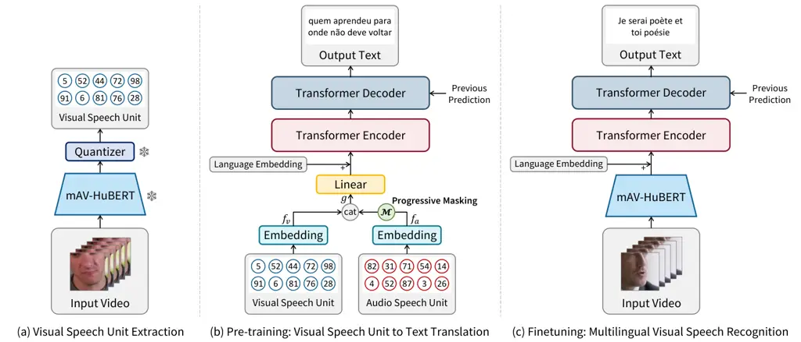
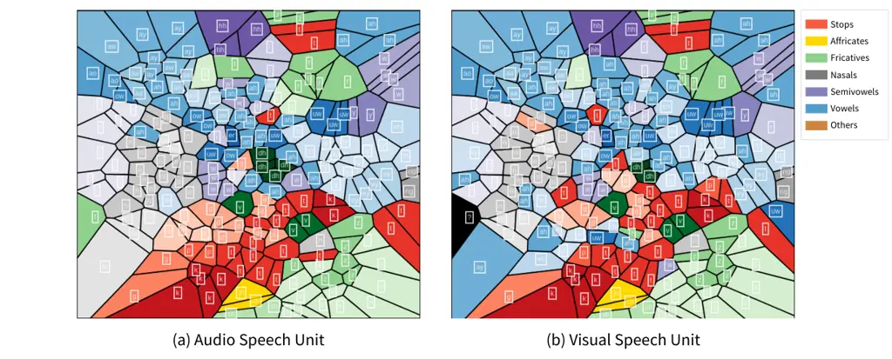
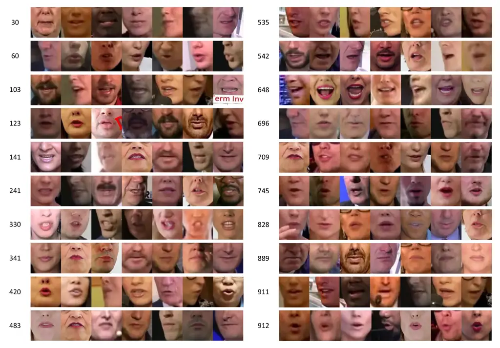
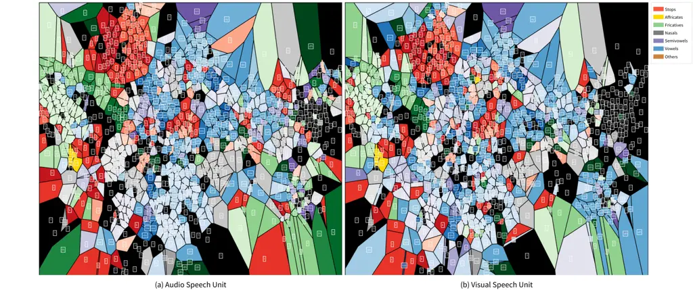

# Efficient Training for Multilingual Visual Speech Recognition: Pre-training with Discretized Visual Speech RepresentationThanks: ^(∗)Both authors have contributed equally to this work. ^(†)Corresponding Author.

DOI: [XXXXXXX.XXXXXXX](https://doi.org/XXXXXXX.XXXXXXX)Conference: Make
sure to enter the correct conference title from your rights confirmation
email; October 28 - November 1, 2024; Melbourne,
Australia.ISBN: 978-1-4503-XXXX-X/18/06

Minsu Kim^(∗) Affiliation: KAIST, Daejeon, South Korea email:
<ms.k@kaist.ac.kr> , Jeong Hun Yeo^(∗) Affiliation: KAIST, Daejeon,
South Korea email: <sedne246@kaist.ac.kr> , Se Jin Park
Affiliation: KAIST, Daejeon, South Korea email:
<jinny960812@kaist.ac.kr> , Hyeongseop Rha Affiliation: KAIST, Daejeon,
South Korea email: <ryool_1832@kaist.ac.kr> and Yong Man Ro^(†)
Affiliation: KAIST, Daejeon, South Korea email: <ymro@kaist.ac.kr>

2024

###### Abstract.

This paper explores sentence-level multilingual Visual Speech
Recognition (VSR) that can recognize different languages with a single
trained model. As the massive multilingual modeling of visual data
requires huge computational costs, we propose a novel training strategy,
processing with visual speech units. Motivated by the recent success of
the audio speech unit, we propose to use a visual speech unit that can
be obtained by discretizing the visual speech features extracted from
the self-supervised visual speech model. Through analysis, we verify
that the visual speech units mainly contain viseme information while
suppressing non-linguistic information. By using the visual speech units
as the inputs of our system, we propose to pre-train a VSR model to
predict corresponding text outputs on multilingual data constructed by
merging several VSR databases. As both the inputs (i.e., visual speech
units) and outputs (i.e., text) are discrete, we can greatly improve the
training efficiency compared to the standard VSR training. Specifically,
the input data size is reduced to 0.016% of the original video inputs.
In order to complement the insufficient visual information in speech
recognition, we apply curriculum learning where the inputs of the system
begin with audio-visual speech units and gradually change to visual
speech units. After pre-training, the model is finetuned on continuous
features. We set new state-of-the-art multilingual VSR performances by
achieving comparable performances to the previous language-specific VSR
models, with a single trained model.

###### Keywords: 

Visual Speech Recognition, Lip Reading, Multilingual VSR

## 1. Introduction

These days, speech processing technologies have made great progress in
diverse applications such as speech recognition (Guo et al., 2021; Shim
et al., 2021; Prabhavalkar et al., 2023; Hong et al., 2023), speech
synthesis (Wu et al., 2022; Choi et al., 2023; Zhang et al., 2023; Jiang
et al., 2023; Maiti et al., 2023), and speech translation (Inaguma
et al., 2019; Jia et al., 2022; Lee et al., 2022; Kim et al., 2023a).
Now, it is easy to find a speech processing model that can proficiently
handle approximately 100 languages (Adams et al., 2019; Radford et al.,
2023). However, multilingualism has been mainly explored for audio-based
speech processing systems (Toshniwal et al., 2018; Lux et al., 2022),
while visual-based speech processing systems are still tied to
developing monolingual systems (Ma et al., 2022a; Kim et al., 2023c; Yeo
et al., 2023b). There are two reasons for the lagging development of
visual-based speech processing systems: 1) The high dimensionality of
visual data compared to audio puts a challenge in training a large-scale
model with massive multilingual data. Compared to the same length of
audio, visual data requires about six times larger bits (Kim et al.,
2023b) in a standard visual speech recognition process (Ma et al.,
2021b). Moreover, the requirement of encoding spatial information using
two-dimensional convolutions also increases the computation costs of
visual speech processing compared to its counterpart. 2) The low
quantity of labeled data in visual speech processing systems presents a
formidable obstacle to technology development. In contrast to the
tremendous amount of publicly available audio-text data (Pratap et al.,
2020), a very limited number of video-text data are available,
especially for non-English (Kim et al., 2023c).

In this paper, we explore the multilingualism of visual speech
processing, especially in speech recognition (Assael et al., 2016;
Petridis and Pantic, 2016; Chung and Zisserman, 2017a; Ma et al., 2021a;
Ma et al., 2022b). Hence, our objective is to devise a multilingual
Visual Speech Recognition (VSR) method that can recognize different
languages with a single trained model. In order to mitigate the
challenges in visual speech processing, we propose a novel strategy,
processing with visual speech units. The audio speech unit (Lakhotia
et al., 2021) is a discretized representation of an extracted speech
feature from a self-supervised speech model (Baevski et al., 2020; Hsu
et al., 2021). It contains phonemic content (Sicherman and Adi, 2023)
while suppressing the other speech characteristics
($`\textit{e}.\textit{g}.`$, speaker information) and can be employed as
pseudo text. As it is the discretized signal of the original signal, the
data size can be significantly reduced (Chang et al., 2023b; Kim et al.,
2023b). Motivated by this, we propose to employ visual speech units, the
quantized representation of the visual speech feature, in training
multilingual VSR. As a result, one video frame having 61,952 bits (i.e.,
based on a grayscale image with 88 $`\times`$ 88 size) can be expressed
with one visual speech unit which can be represented with just 10 bits.
With the huge data size reduction, 0.016% compared to the original, we
can boost the training more than 10 times faster than the standard VSR
training. Through analysis, we validate that the visual speech unit
contains viseme information, the visual counterpart of phoneme, while
suppressing non-linguistic characteristics. Hence, enabling visual
speech modeling even by using the visual speech units.

Specifically, we employ AV-HuBERT (Shi et al., 2021), a self-supervised
visual speech model, to extract our visual speech units. We newly train
the AV-HuBERT model on 5,512 hours of multilingual audio-visual data
composed of nine languages, given that the original AV-HuBERT was
trained solely on English audio-visual data. To differentiate between
the English-only trained and multilingual-trained AV-HuBERT models, we
denote the latter as mAV-HuBERT. With the mAV-HuBERT, we can correctly
capture the multilingual viseme information into our visual speech unit.
Then, we propose to pre-train an encoder-decoder model by setting its
inputs with the visual speech units and the outputs with the
corresponding text, forming a unit-to-unit translation framework (i.e.,
translation between discrete tokens) (Kim et al., 2023a). Moreover,
inspired by the recent successes of VSR that leverage audio modal
information to complement limited visual data (Zhao et al., 2020; Ren
et al., 2021; Kim et al., 2021; Shi et al., 2021; Haliassos et al.,
2022), we propose to use curriculum learning with a gradual increase in
task difficulty using audio modality. Concretely, our unit-to-unit
pre-training is initiated with audio-visual inputs and then gradually
changed to visual inputs. With this curriculum learning, the model can
find the optimization points stable and achieve higher performance with
the complementary multi-modal information. To mitigate the comparatively
small amount of public visual-text paired data, we utilize the recently
proposed automatic labels of (Ma et al., 2023) and (Yeo et al., 2023b)
where the text labels are obtained by their automatic labeling
processes. Finally, the pre-trained model is finetuned with continuous
input features to maximize the VSR performances.



Figure 1. Illustration of the proposed multilingual VSR framework. (a)
Visual speech units are obtained by quantizing the visual speech
features extracted from mAV-HuBERT. (b) The Transformer encoder-decoder
model is pre-trained with discrete inputs and outputs. The task
difficulty is gradually increased by using progressive masking
$`\mathcal{M}`$. Pre-training commences with audio-visual speech units
as inputs, and these inputs gradually transition to visual speech units
through progressive masking of the audio speech units. (c) After
pre-training the model with discrete inputs and outputs, it is finetuned
with continuous features to boost the VSR performances.

The major contributions can be summarized as follows:

- •
  To the best of our knowledge, this is the first work exploring
  sentence-level multilingual VSR with a single trained model. The
  proposed VSR model can recognize five different languages using a
  single model, whereas previous methods required training separate
  models for each language.
- •
  We propose to employ visual speech units as inputs to pre-train the
  multilingual VSR model, thereby establishing discrete inputs and
  outputs (i.e., text). With this, we can drastically reduce the
  computational costs and accelerate the pre-training time by about 10
  times compared to the standard training.
- •
  Through analysis, we verify that the visual speech unit mainly holds
  the viseme information while suppressing non-linguistic features,
  enabling VSR training even by employing discretized inputs.
- •
  We set new state-of-the-art multilingual VSR performances by achieving
  comparable performances with the multiple previous monolingual VSR
  methods.

## 2. Related Work

### 2.1. Visual Speech Recognition (VSR)

Visual Speech Recognition (VSR) aims to predict the spoken words from
silent lip movements video. Early works (Chung and Zisserman, 2017b;
Stafylakis and Tzimiropoulos, 2017; Petridis et al., 2017; Petridis
et al., 2018a) focused on word-level VSR by using CNN (He et al., 2016)
and the RNN (Chung et al., 2014; Hochreiter and Schmidhuber, 1997).
Large-scale lip-reading sentence datasets (Chung et al., 2017; Afouras
et al., 2018a) have boosted the development of sentence-level VSR. By
employing Transformer (Vaswani et al., 2017) architecture, (Afouras
et al., 2018b) proposed a powerful sentence-level end-to-end VSR model.
Moreover, the integration of the hybrid CTC/Attention objective
(Watanabe et al., 2017; Petridis et al., 2018b) into VSR, greatly
improved the recognition performances. Recent VSR technologies (Ma
et al., 2021b; Prajwal et al., 2022; Chang et al., 2023a; Ma et al., 2023) also employed transformer-variant architectures and improved the
VSR performances. For advanced training strategies, many researchers try
to reduce the gap between visual and audio modalities. They (Zhao
et al., 2020; Afouras et al., 2020; Ren et al., 2021; Ma et al., 2021a;
Kim et al., 2021; Kim et al., 2022; Yeo et al., 2023a) studied how to
effectively transfer audio knowledge into the VSR model by using
knowledge distillation (Hinton et al., 2015) and memory network (Weston
et al., 2015). However, these previous VSR approaches have mainly
developed for high-resource languages, English and Mandarin (Luo et al.,
2020). VSR for different languages, especially low VSR resource
languages, has only been addressed recently (Ma et al., 2022a; Zinonos
et al., 2023; Kim et al., 2023c; Yeo et al., 2023b). In particular, a
recent approach (Yeo et al., 2023b) proposed the labeled data for low
VSR resource languages using automatic labeling processes.

This paper is the first work exploring sentence-level multilingual VSR
with a single model. To mitigate the huge computational costs in
training the multilingual VSR model, we propose to pre-train the model
with discrete inputs and outputs by using visual speech units. To
complement the low amount of video-text data, we bring the automatic
labels of (Ma et al., 2023; Yeo et al., 2023b) and propose curriculum
learning that utilizes audio modality to provide rich speech
information.

### 2.2. Audio speech unit

Audio speech unit (Lakhotia et al., 2021) is the discretized speech
representation of self-supervised speech models such as HuBERT (Hsu
et al., 2021), Wav2Vec2.0 (Baevski et al., 2020), and WavLM (Chen
et al., 2022). It is possible to suppress non-linguistic features and
mainly keep the linguistic contents by selecting proper layers to
extract the speech features (Lakhotia et al., 2021; Polyak et al.,
2021). By using the speech unit as pseudo text, Textless Natural
Language Processing becomes possible (Lee et al., 2022; Huang et al.,
2022; Popuri et al., 2022; Kim et al., 2023a; Nguyen et al., 2023).
Moreover, speech units have promising potential to be used in
multi-modal processing as they greatly reduce the data size (Chang
et al., 2023b; Park et al., 2023; Kim et al., 2023b).

Motivated by this, we propose to employ a visual speech unit which is
the quantized representation of visual speech features extracted from
the self-supervised visual speech model (Shi et al., 2021). We analyze
the characteristics of visual speech units and show that the visual
speech unit contains mainly viseme information while suppressing the
other characteristics.

## 3. Method

The objective of this paper is to develop a multilingual VSR model, so
that multiple languages can be recognized by using a single trained
model. To mitigate the large computational costs in developing visual
speech processing systems, we propose visual speech units which are
discretized representations of visual speech features encoded by a
self-supervised speech model.

### 3.1. Multilingual Visual Speech Unit Extraction

Audio speech units (Lakhotia et al., 2021) can be obtained by clustering
the speech features of a self-supervised speech model such as HuBERT
(Hsu et al., 2021). Analogous to audio speech units, we propose to
employ visual speech units, which can be obtained by quantizing the
visual speech features derived from a pre-trained visual speech model.
In order to get visual speech units, we choose AV-HuBERT (Shi et al., 2021) for the self-supervised visual speech model, which is well-known
for its discriminative visual speech features. However, AV-HuBERT is
pre-trained on English-only audio-visual data, which deviates from our
primary objective of achieving multilingualism. Hence, we initially
train a multilingual variant of AV-HuBERT (mAV-HuBERT) to ensure the
accurate incorporation of multilingual viseme information into the final
visual speech units. To this end, we train the model on 5,512 hours of
multilingual dataset composed of 9 languages (En, Es, It, Fr, Pt, De,
Ru, Ar, El) by merging LRS2 (Chung et al., 2017), LRS3 (Afouras et al.,
2018a), VoxCeleb2 (Chung et al., 2018), and AVSpeech (Ephrat et al.,
2018). As VoxCeleb2 and AVSpeech do not have language identities, we
obtain the language identity of each utterance by using a pre-trained
language identifier of Whisper (Radford et al., 2023), to select the
data. For the prediction target of the masked prediction of mAV-HuBERT,
we use clusters of speech features obtained from a pre-trained
multilingual HuBERT (Hsu et al., 2021; Lee et al., 2022). We use the
target size of 1,000 and train the model for 350k steps with one
iteration. Through analysis we confirm that mAV-HuBERT is more suitable
for multilingual speech modeling than the English-only trained AV-HuBERT
in Sec. 4.3.1.

With the pre-trained mAV-HuBERT, we extract the visual speech unit by
clustering (i.e., quantizing) the output visual speech features, as
shown in Fig. 1(a). Please note that AV-HuBERT can extract both
audio-only features and visual-only features through its modality
dropout. Hence, we only use the visual inputs to extract the visual
speech units. For the token size of the visual speech unit, we use 1,000
so that each visual speech unit can be represented with just 10 bits.
Please note that one video frame having grayscale and 88 $`\times`$ 88
size (i.e., the standard for visual speech recognition) requires 61,952
bits (Ma et al., 2021b; Shi et al., 2021). Therefore, we can reduce the
data size to 0.016% compared to the raw visual inputs, which enables us
to greatly increase the training batch size and accelerate the training
speed by removing the visual front-end (e.g., 2D CNNs). We analyze the
efficiency of visual speech units by comparing them with the standard
raw inputs in Sec. 4.3.2.

|                           |                         |                                    |
| ------------------------- | ----------------------- | ---------------------------------- |
| Train Data for mAV-HuBERT |                         |                                    |
| Datasets                  | Number of Video / Hours | Languages                          |
| LRS2                      | 142,157 / 223           | En                                 |
| LRS3                      | 150,498 / 433           | En                                 |
| mTEDx                     | 181,034 / 285           | Es, Fr, It, Pt                     |
| VoxCeleb2                 | 834,375 / 1,739         | En, Es, It, Fr, Pt, De, Ru, Ar, El |
| AVSpeech                  | 1,575,755 / 2,832       | En, Es, It, Fr, Pt, De, Ru, Ar, El |
| Total                     | 2,883,819 / 5,512       | En, Es, It, Fr, Pt, De, Ru, Ar, El |

|                                 |                         |                    |
| ------------------------------- | ----------------------- | ------------------ |
| Train Data for multilingual VSR |                         |                    |
| Datasets                        | Number of Video / Hours | Languages          |
| \-                              | \-                      | \-                 |
| LRS3                            | 150,498 / 433           | En                 |
| mTEDx                           | 181,034 / 285           | Es, Fr, It, Pt     |
| VoxCeleb2                       | 742,147 / 1,539         | En, Es, It, Fr, Pt |
| AVSpeech                        | 1,272,065 / 2,288       | En, Es, It, Fr, Pt |
| Total                           | 2,505,858 / 4,545       | En, Es, It, Fr, Pt |

Table 1. Dataset used for pre-training mAV-HuBERT and training the
multilingual VSR model. Audio-visual data is utilized for mAV-HuBERT,
while video-text data is utilized for the multilingual VSR model (i.e.,
for both pre-training and finetuning).

### 3.2. Pre-training: Visual Speech Unit to Text Translation

By representing all training video data into visual speech units, we can
significantly reduce the data size, enabling efficient training of a VSR
model on large-scale multilingual data. Based on this key concept, we
propose to pre-train our model to predict text by setting the inputs
with visual speech units. Therefore, now the inputs and outputs are both
discrete, which is illustrated in Fig. 1(b). As the visual speech units
mainly contain linguistic information, we can pre-train the model to
construct the knowledge of visual speech modeling even by using discrete
inputs. We analyze the information contained in the visual speech units
and validate how it can be worked, in Sec. 4.3.3.

Nevertheless, translating visual speech units directly into output text
from scratch is challenging for the model in identifying optimal
solutions. Since visual information contains scarce speech information
(Zhao et al., 2020; Kim et al., 2021; Ren et al., 2021) compared to
audio, training the model directly to perform visual-to-text conversion
might be hard to find the solution. To mitigate this, we bring the
motivation from the recent success of VSR, which utilizes auxiliary
audio information during training (Afouras et al., 2020; Zhao et al.,
2020; Shi et al., 2021; Ren et al., 2021; Kim et al., 2022; Ma et al.,
2022a; Yeo et al., 2023a). Specifically, we initiate the pre-training
with audio-visual speech units where both audio speech units and visual
speech units are utilized as inputs, similar to (Shi et al., 2021;
Djilali et al., 2023). Then, we gradually masked out the audio speech
units as the pre-training progressed, resulting in the final training
stage exclusively utilizing visual speech units as inputs. Therefore,
the model can easily find the optimization points through this
curriculum learning, with the aid of complementary audio speech
information. Concretely, the embeddings of the visual speech units
$`f_{v}\in\mathbb{R}^{T\times D}`$ and audio speech units
$`f_{a}\in\mathbb{R}^{T\times D}`$ are concatenated as,
$`g=\mathcal{M}(f_{a})\oplus f_{v}`$, where $`T`$ is the sequence
length, $`D`$ is the dimension of embedding, $`\oplus`$ represents
concatenation operation in the embedding dimension, and
$`g\in\mathbb{R}^{T\times 2D}`$ is the concatenated feature.
$`\mathcal{M}(\cdot)`$ is a masking function that randomly masks out
$`p\%`$ of frames from the input sequence. We progressively increase the
$`p`$ from 0 to 100 as the pre-training progresses so that the
transition from audio-visual inputs to visual inputs can be made. The
effectiveness of this curriculum learning using input transition from
audio-visual to visual can be found in Sec. 4.3.4.

Then, we reduce the embedding dimension of the concatenated feature
$`g`$ using a linear layer. Here, we provide the language information by
providing the language embedding which will be added to the feature,
following (Conneau and Lample, 2019). Finally, through the Transformer
encoder-decoder architecture, we translate the visual inputs into the
output text in an auto-regressive manner. The objective function of our
learning problem can be represented as follows,

```math
\displaystyle\mathcal{L}=-\sum_{s=1}^{S}\log P(y_{s}|\mathbf{X},y_{<s}), \tag{1}
```

where $`y_{s}`$ is the text annotation for current step $`s`$ and
$`y_{<s}`$ is the previous outputs, $`\mathbf{X}`$ is the input speech
units, and $`S`$ is the length of the text. For multilingual training,
we use five languages (En, Pt, Es, Fr, It) by merging LRS3 (Afouras
et al., 2018a), mTEDx (Elizabeth et al., 2021), automatic labels for En
of (Ma et al., 2023), and automatic labels for Pt, Es, Fr, and It of
(Yeo et al., 2023b), forming 4,545 hours of data. We summarize the
dataset statistics in Table 1.

### 3.3. Finetuning: Multilingual Visual Speech Recognition

Even though we can directly perform multilingual VSR with the
pre-trained model with discrete inputs, it is hard to outperform the
model using continuous features. This is expected, as information is
lost during the quantization process. However, as the pre-trained model
has already learned how to model the multilingual visual pronunciation
and generate languages, the finetuning with the continuous features is
straightforward and more effective than direct training of the
multilingual VSR model from scratch. For finetuning, we detach the unit
embedding and linear layers, and attach the pre-trained mAV-HuBERT, as
illustrated in Fig. 1(c). The model is trained end-to-end with the same
objective function and training data as the pre-training. In Sec. 4.3.5,
we analyze the performances of multilingual VSR using the single
proposed model and multiple previous monolingual models.

## 4. Experiment

### 4.1. Dataset

Lip Reading Sentences 2 (LRS2) (Chung et al., 2017) is one of the
largest English datasets for VSR. The dataset consists of 223 hours of
training data collected from British TV shows.

Lip Reading Sentences 3 (LRS3) (Afouras et al., 2018a) is a popular
English VSR database. It has about 430 hours of video, and each video
clip is collected from TED and TEDx. We evaluate the English VSR
performances on LRS3.

Multilingual TEDx (mTEDx) (Elizabeth et al., 2021) is a multilingual
dataset originally proposed for speech recognition and translation. The
dataset provides 8 languages collected from TEDx talks. As the dataset
also provides the video links of original talks, we download the video
online. We remove the unavailable videos for VSR by referring to (Ma
et al., 2022a). We use four languages, Spanish (Es), Italian (It),
French (Fr), and Portuguese (Pt) for training and evaluating the
developed VSR model, following (Ma et al., 2022a; Kim et al., 2023c; Yeo
et al., 2023b).

VoxCeleb2 (Chung et al., 2018) is a multilingual audio-visual dataset
for speaker recognition (Jung et al., 2022). This dataset has over 1
million utterances and contains 6,112 celebrities. For mAV-HuBERT
training, we use the data corresponding to the following 9 languages,
English (En), Spanish (Es), Italian (It), French (Fr), Portuguese (Pt),
German (De), Russian (Ru), Arabic (Ar), and Greek (El), by identifying
the language identity using Whisper (Radford et al., 2023). For VSR
training, as the dataset does not provide text annotations, we use the
automatic labels of (Ma et al., 2023) for En, and (Yeo et al., 2023b)
for Es, It, Fr, and Pt.

Audio Visual Speech Dataset (AVSpeech) (Ephrat et al., 2018) is a
large-scale audio-visual speech dataset. AVSpeech contains roughly 290k
YouTube videos, and the total duration of these videos is 4700 hours.
Since the dataset does not provide text annotations, we use the same
strategy with the VoxCeleb2, using 9 languages for mAV-HuBERT and
automatic labels for VSR.

### 4.2. Implementation Details

Preprocessing. The video is resampled to 25 fps. We detect the facial
landmarks using RetinaFace (Deng et al., 2020), crop mouth regions using
$`96\times 96`$ sizes of bounding box, and convert them into grayscale.
For data augmentation, we randomly crop the video into $`88\times 88`$
and horizontally flip it during training. The audio is resampled to
16kHz. In order to obtain the audio speech unit, we feed the audio into
a multilingual trained HuBERT (Hsu et al., 2021; Lee et al., 2022) and
cluster the extracted features with 1,000 token size. Finally, the audio
speech unit is resampled to 25 fps to align with the sampling rate of
the visual inputs. For the text, we construct one multilingual
dictionary with 1,000 subword units by using SentencePiece tokenizer
(Kudo and Richardson, 2018).

Architecture. The mAV-HuBERT has the same architecture as the AV-HuBERT
(Shi et al., 2021) large configuration and only differs in pre-training
data. For visual speech unit-to-text translation, the model is composed
of two unit embedding layers, one linear layer, one language embedding
layer, 6 transformer encoders, and 6 transformer decoders. Each unit
embedding layer embeds 1,000 tokens into 1,024 dimensions and the linear
layer reduces the concatenated 2,048 dimensions into 1,024. The language
token is embedded into a 1,024-dimensional feature by the language
embedding layer. Each transformer layer has an embedding dimension of
1024, a feed-forward dimension of 4096, and 16 heads.

|                              |                   |         |      |      |      |      |
| ---------------------------- | ----------------- | ------- | ---- | ---- | ---- | ---- |
| Method                       | Finetune Datasets | WER (%) |      |      |      |      |
|                              |                   | En      | Es   | It   | Fr   | Pt   |
| AV-HuBERT (Shi et al., 2021) | LRS3, mTEDx       | 28.0    | 75.9 | 74.0 | 75.5 | 79.6 |
| mAV-HuBERT (Ours)            | LRS3, mTEDx       | 33.7    | 54.3 | 59.1 | 63.0 | 58.8 |

Table 2. Comparisons between English AV-HuBERT and the multilingual
AV-HuBERT in multilingual VSR. English (En) is validated on LRS3 and
other languages (Es, It, Fr, Pt) are validated on mTEDx databases.

|              |             |                          |                        |                       |              |
| ------------ | ----------- | ------------------------ | ---------------------- | --------------------- | ------------ |
| Method       | Input       | Batch Size (Tot. Frames) | Train Iter. Time (sec) | Tot. Train Time (hrs) | Test Acc (%) |
| Standard VSR | Video       | 1,000                    | 1.58                   | 52.5                  | 82.1         |
| Pre-training | Speech Unit | 6,000                    | 0.88                   | 6.6                   | 72.2         |
| Finetuning   | Video       | 1,000                    | 1.68                   | 34.9                  | 82.2         |

Table 3. Efficiency comparisons between previous VSR method and the
proposed method. All numbers are measured using the same CPU and GPU
(RTX 3090 24GB) environments. Test Acc means the subword-level
prediction accuracy without beam search decoding.

Training. For training mAV-HuBERT, we follow the original AV-HuBERT (Shi
et al., 2021) and train it with the masked prediction task. For the
prediction target, we use 1,000 clusters extracted from multilingual
trained HuBERT (Hsu et al., 2021; Lee et al., 2022). We train the model
for 350k steps using 64 3090 RTX GPUs. For pre-training the proposed
model (i.e., visual speech unit-to-text translation), we train the model
for 11 epochs with a tri-stage learning rate scheduler and 32 GPUs. For
the progressive masking $`\mathcal{M(\cdot)}`$, we set $`p`$ as 0 for
the first 10% of training. From 10% to 70% of training, we linearly
increase the masking ratio $`p`$ from 0 to 100. After 70% of training,
$`p`$ is set to 100 so that only visual speech units are used. We
finetune the model with the continuous features for 8 epochs using 32
GPUs. For all experiments, the Adam optimizer (Kingma and Ba, 2015) is
used. For beam search decoding, we use a beam width chosen from {20, 25,
30, 35} and a length penalty of 0. The detailed training configuration
can be found in the supplementary.

### 4.3. Experimental Results

#### 4.3.1. Effectiveness of mAV-HuBERT in Modeling Multilingual Speech

Before extracting the visual speech units by using SSL visual speech
models, we need to confirm which model is best suitable for our
multilingual VSR purposes. Therefore, we compare the performances of
English-trained AV-HuBERT and multilingual-trained AV-HuBERT
(mAV-HuBERT). To this end, we finetune the pre-trained mAV-HuBERT and
AV-HuBERT on 5 languages (i.e., En, Es, It, Fr, Pt) by merging LRS3 and
mTEDx databases. The multilingual VSR performances of the two models are
shown in Table 2. The results show that when performing multilingual VSR
with a single model, the mAV-HuBERT is much more effective than the
English-only trained AV-HuBERT. Specifically, for Es, It, Fr, and Pt,
the mAV-HuBERT outperforms the AV-HuBERT with large margins of over 10%
WERs. For English, English-only trained AV-HuBERT achieves better
performance, and this tendency is also observed in Radford et al.
(2023); Increasing language diversity without scaling the model size,
the performances for major languages can be lower than the monolingual
model. As the mAV-HuBERT shows better performances in modeling
multilingual visual speech, we extract the visual speech unit by using
the mAV-HuBERT.

Figure 2. Finetuning efficiency comparison between the proposed
pre-training scheme and without the pre-training.



Figure 3. Visualization of speech units. Each boundary represents a
single unit and the same color represents the same phoneme or phoneme
family. (a) Audio speech unit. (b) Visual speech unit.

|           |               |                |                   |                    |
| --------- | ------------- | -------------- | ----------------- | ------------------ |
| Raw audio | Audio Feature | Visual Feature | Audio speech unit | Visual speech unit |
| 2.38%     | 14.96%        | 19.42%         | 28.84%            | 32.74%             |

Table 4. Speaker verification results (EER) comparisons using different
input representations.

#### 4.3.2. Efficiency Comparison between Visual Speech Units and Raw Inputs

To confirm the efficiency of using visual speech units instead of raw
videos as inputs, we compare the batch size, training iteration time,
and total training time between the standard VSR method that uses raw
video as inputs and the proposed method. Table 3 shows the comparison
results. By using the visual speech units as inputs in pre-training, we
can increase the batch size sixfold and reduce the training iteration
time by approximately half. Consequently, we can expedite training by a
factor of about 12 compared to previous VSR training methods. The total
training time for pre-training the model for 11 epochs amounts to 6.6
hours, whereas the conventional VSR model requires 52.5 hours for 8
epochs of training. Furthermore, when fine-tuning the pre-trained model,
we can achieve better performance compared to the standard VSR model,
with just 5 epochs of fine-tuning taking 34.9 hours. As a result, we can
greatly boost training time even if considering both the pre-training
and finetuning stages, compared to the standard VSR training. To see
this more intuitive, we examine the subword-level accuracy changes
during fine-tuning, comparing the proposed method with the model without
pre-training. Fig. 2 shows the learning curve of the two models. After
the proposed pre-training, the finetuning on the continuous features is
effective so that we can achieve better performance even with much fewer
epochs than the model without pre-training. It’s worth noting that we
can significantly reduce the pre-training time with the proposed method;
1 epoch requires just 0.6 hours in pre-training, whereas the standard
VSR training demands 6.6 hours for 1 epoch.

#### 4.3.3. Analyzing Visual Speech Units

To understand which information is held by the visual speech units, we
analyze them using 1) phoneme mapping visualization (Sicherman and Adi, 2023) and 2) speaker recognition. Firstly, following (Sicherman and Adi,
2023), we visualize the phonetic information of the audio speech unit
and visual speech unit which are obtained from mAV-HuBERT. Therefore,
only audio inputs are used to extract audio speech units and video
inputs for visual speech units. We set the cluster centroid as each row
of the weight of the final layer of mAV-HuBERT (i.e., classifier for
1,000 units), so that the same boundary can be obtained for different
modalities. Fig. 3 displays the visualization results of the 200 units
out of 1,000 that appeared most frequently. We can confirm that each
unit in both the audio speech units and visual speech units contains
distinctive linguistic information (i.e., phoneme or viseme). By
comparing the audio speech unit and visual speech unit, we can find that
the homophenes which refer to the different pronunciations having the
same lip movement (e.g., name, tame, dame) are confusingly represented
in visual speech units (Kim et al., 2022). For example, some units
representing ‘n’ in audio speech units are changed to ‘d’ or ‘t’ in
visual speech units. Moreover, we can find that compared to audio speech
units, more visual speech units are pointing to the vowel (i.e.,
blue-colored area), which shows the ambiguity of lip movements compared
to the audio modality. These are the natural results reflecting the
characteristics of different speech modalities, and should not be taken
as an indication of the inadequacy of the visual modality in speech
modeling. In addition, we visualize some video frames corresponding to
each visual speech unit in Fig. 4, illustrating that similar lip
movements are consistently mapped to the same index regardless of pose
variations and speakers. For example, the 648-th visual speech unit
represents lip frames related to the viseme ‘a’, and the 912-th visual
speech unit corresponds to the viseme ‘o’. Through the visualization, we
can confirm that our visual speech units contain the linguistic
information, the viseme, which enables us to pre-train the model to
build the knowledge of visual speech modeling.

Secondly, we analyze how much degree the speech units contain
non-linguistic information through speaker recognition. To this end, we
use raw audio speech, audio/visual speech features extracted from
mAV-HuBERT, and audio/visual speech units as inputs to perform the
speaker recognition. For the model, we utilize a pre-trained speaker
recognition model of (Desplanques et al., 2020) and train the model with
different inputs. To match the input size with the model, we use one
additional embedding layer for both audio speech units and visual speech
units. When we use the speech features from mAV-HuBERT, we utilize one
additional linear layer for both audio speech features and visual speech
features. For training, we utilize data less than 20 seconds in
VoxCeleb2 (Chung et al., 2018) dev set. The speaker verification is
performed on the test data of VoxCeleb2 having less than 20 seconds,
where each test sample is assigned one positive sample and one negative
sample. Therefore, 27,816 positive pairs and negative pairs are utilized
respectively, thus random prediction yields 50% EER.



Figure 4. Example frames corresponding to each visual speech unit. The
numbers indicate the classes of visual speech units.

The speaker verification results (Equal Error Rate; EER) are shown in
Table 4. When we use raw audio as input, the system can almost perfectly
distinguish the input speakers with 2.38% EER. When we use the features
of the pre-trained mAV-HuBERT, the verification performance is dropped
to 14.96% and 19.42% on audio and visual modalities, respectively. This
shows that the masked prediction of AV-HuBERT (Shi et al., 2021) forces
the model to learn linguistic information while somewhat discarding the
speaker information. Finally, when we discretize the speech features of
mAV-HuBERT and obtain the speech units, we can greatly suppress the
speaker information. The performance is dropped to 28.84% by using the
audio speech unit and 32.74% by using the visual speech unit. Through
the above two experiments, we can confirm that the quantization process
averages out the speaker effects (i.e., non-linguistic information) in
the speech representations while maintaining the content. This enables
us to build a speech representation model by using speech units as
input.

|                        |      |      |      |      |      |
| ---------------------- | ---- | ---- | ---- | ---- | ---- |
| Method                 | En   | Es   | It   | Fr   | Pt   |
| Proposed Method        | 24.4 | 42.7 | 49.7 | 55.2 | 50.6 |
| $`-`$ Unit Pretraining | 24.3 | 45.1 | 52.1 | 56.2 | 51.1 |
| $`-`$ Curriculum       | 25.2 | 46.3 | 52.5 | 55.8 | 50.6 |
| $`-`$ Finetuning       | 37.5 | 68.1 | 70.3 | 76.3 | 74.0 |

Table 5. The effectiveness of each proposed component (WER, %). By
substituting each component from the full model, we evaluate their
effectiveness in multilingual VSR.

#### 4.3.4. Effectiveness of Each Proposed Component

To confirm the effectiveness of each proposed component, we substitute
each component from the proposed method. The ablation results are shown
in Table 5. The performance of ‘$`-`$Unit Pretraining’ is obtained by
directly finetuning the mAV-HuBERT on the multilingual video-text
without using visual speech units. In this case, the overall VSR
performances are dropped especially for non-English languages. Moreover,
we require more training times compared to the proposed method as shown
in Table 3. When we do not utilize curriculum learning (i.e.,
‘$`-`$Curriculum’), the performance dramatically decreases and even
shows worse performances than the without pre-training method in some
languages. This shows that directly performing the visual speech unit to
text translation from scratch is challenging to the model in finding the
optimal points. Therefore, the proposed curriculum learning is crucial
when learning from the visual speech units. These results also coincide
with the previous methods utilizing multi-modal complementary in VSR
training (Afouras et al., 2020; Shi et al., 2021; Zhao et al., 2020; Ren
et al., 2021; Kim et al., 2022; Yeo et al., 2024). Finally, when we
directly perform multilingual VSR with the pre-trained model (i.e., with
visual speech units), overall performances are decreased as fine
information is lost during the quantization process. Therefore,
finetuning with the continuous features for a few epochs should be
performed to maximize the pre-trained knowledge.

|                              |      |      |      |      |      |
| ---------------------------- | ---- | ---- | ---- | ---- | ---- |
| Method                       | En   | Es   | It   | Fr   | Pt   |
| AV-HuBERT (Shi et al., 2021) | 23.3 | 51.2 | 54.8 | 61.0 | 55.3 |
| Proposed Method              | 24.4 | 42.7 | 49.7 | 55.2 | 50.6 |

Table 6. Multilingual VSR performance (WER, %) comparisons. As there is
no prior work that can perform multilingual VSR with a single model, we
train AV-HuBERT to perform multilingual VSR.

#### 4.3.5. Multilingual Visual Speech Recognition with a Single Trained Model

We validate the effectiveness of the proposed multilingual VSR method by
comparing it with 1) the multilingual VSR model and 2) the monolingual
VSR model. Since there is no prior work exploring multilingual VSR with
a single model, we train AV-HuBERT (Shi et al., 2021) to perform
multilingual VSR and set it as our baseline. Moreover, since the
previous non-English VSR methods are language-specific, we compare the
performance of our model with multiple monolingual models.

|          |                              |                         |                                       |                   |                           |        |
| -------- | ---------------------------- | ----------------------- | ------------------------------------- | ----------------- | ------------------------- | ------ |
| Language | Method                       | Pre-training Data (hrs) | Language-specific Training Data (hrs) | Monolingual Model | Single Multilingual Model | WER(%) |
| En       | Ma et al. (2022a)            | \-                      | 1,459                                 | ✓                 |                           | 31.5   |
|          | Prajwal et al. (2022)        | \-                      | 2,676                                 | ✓                 |                           | 30.7   |
|          | AV-HuBERT (Shi et al., 2021) | 1,759                   | 433                                   | ✓                 |                           | 28.6   |
|          | VATLM (Zhu et al., 2023)     | 1,759                   | 433                                   | ✓                 |                           | 28.4   |
|          | Haliassos et al. (2022)      | 1,759                   | 433                                   | ✓                 |                           | 27.8   |
|          | AKVSR (Yeo et al., 2024)     | 1,759                   | 433                                   | ✓                 |                           | 27.6   |
|          | Auto-AVSR (Ma et al., 2023)  | \-                      | 3,448                                 | ✓                 |                           | 20.5   |
|          | Proposed Method              | 5,512                   | 3,258                                 |                   | ✓                         | 24.4   |
| Es       | Ma et al. (2022a)            | 1,459                   | 87                                    | ✓                 |                           | 56.3   |
|          | Kim et al. (2023c)           | 3,448                   | 72                                    | ✓                 |                           | 56.9   |
|          | Yeo et al. (2023b)           | 3,448                   | 384                                   | ✓                 |                           | 45.7   |
|          | Proposed Method              | 5,512                   | 384                                   |                   | ✓                         | 42.7   |
| It       | Ma et al. (2022a)            | 1,459                   | 46                                    | ✓                 |                           | 57.4   |
|          | Kim et al. (2023c)           | 3,448                   | 46                                    | ✓                 |                           | 59.7   |
|          | Yeo et al. (2023b)           | 3,448                   | 152                                   | ✓                 |                           | 51.8   |
|          | Proposed Method              | 5,512                   | 152                                   |                   | ✓                         | 49.7   |
| Fr       | Ma et al. (2022a)            | 1,459                   | 100                                   | ✓                 |                           | 66.2   |
|          | Kim et al. (2023c)           | 3,448                   | 85                                    | ✓                 |                           | 64.9   |
|          | Yeo et al. (2023b)           | 3,448                   | 331                                   | ✓                 |                           | 58.3   |
|          | Proposed Method              | 5,512                   | 331                                   |                   | ✓                         | 55.2   |
| Pt       | Ma et al. (2022a)            | 1,459                   | 99                                    | ✓                 |                           | 61.5   |
|          | Kim et al. (2023c)           | 3,448                   | 82                                    | ✓                 |                           | 58.6   |
|          | Yeo et al. (2023b)           | 3,448                   | 420                                   | ✓                 |                           | 47.9   |
|          | Proposed Method              | 5,512                   | 420                                   |                   | ✓                         | 50.6   |

Table 7. VSR performance comparisons with the previous VSR methods.
Please note that the proposed method utilizes a single model while the
other methods utilize multiple models. Best and second-best scores are
bolded and underlined.

Comparison with multilingual VSR method. Table 6 shows the performance
comparison results of multilingual VSR methods. Both the AV-HuBERT and
the proposed method are finetuned on 4,545 hours of multilingual
video-text paired data. The proposed method outperforms the AV-HuBERT
for all languages except English. In particular, the proposed method
demonstrates significantly improved performance for Es, It, Fr, and Pt,
with gains of more than 4% WERs. For the high-resource language En, the
proposed method achieves similar performance with AV-HuBERT but slightly
falls behind. Considering multilingualism, the results confirm that the
proposed VSR framework using visual speech units is much more effective
in building multilingual VSR models by achieving new state-of-the-art
performances. It is also worth noting that the proposed method is more
efficiently trainable with the proposed pre-training strategy as
discussed in Sec. 4.3.2.

Comparison with monolingual VSR method. Here, we compare the proposed
multilingual VSR performances with the previous state-of-the-art
monolingual VSR methods. Please note that the proposed method utilizes a
single trained model across the languages, while different methods
utilize multiple language-specific VSR models. The results are shown in
Table 7. By comparing with the recent state-of-the-art method (Yeo
et al., 2023b), we outperform it in 3 languages Spanish (Es), Italian
(It), and French (Fr), by 3.0%, 2.1%, and 3.1% WER, respectively. In the
English VSR, our method achieves 24.4% WER while the current previous
method (Ma et al., 2023) achieves 20.5% WER. As discussed in (Radford
et al., 2023), the performance of high-resource languages can be further
improved by scaling the model size to accommodate the diversity of
languages. As a result, the proposed multilingual VSR model achieves the
best score in Es, It, and Fr, and the second-best score in En and Pt
with a single-trained model. Through the comparisons, we can confirm not
only the computation efficiency but also the effectiveness of the
proposed method in multilingual VSR by outperforming and achieving
comparable results with the previous language-specific VSR methods.

## 5. Conclusion

In this paper, we proposed an efficient multilingual VSR method using a
single model. Specifically, we proposed to use visual speech units for
pre-training a VSR model to mitigate the huge computational loads in
building massive multilingual visual speech modeling. With the proposed
strategy, we can greatly reduce the data size and effectively pre-train
the VSR model on large-scale multilingual VSR databases. By analyzing
the visual speech unit, we validated it contains linguistic information
and enables visual speech modeling using discrete inputs. To complement
visual speech information with audio, we proposed curriculum learning by
gradually increasing the task difficulty. Finally, by finetuning the
model on continuous features, we set new state-of-the-art multilingual
VSR performances by achieving comparable VSR performances with the
previous language-specific VSR models. To the best of our knowledge,
this is the first work exploring the multilingual VSR and employing
visual speech units as inputs of VSR systems.

## References

- Adams et al. (2019) Oliver Adams, Matthew Wiesner, Shinji Watanabe,
  and David Yarowsky. 2019. Massively Multilingual Adversarial Speech
  Recognition. In _Proceedings of NAACL-HLT_. 96–108.
- Afouras et al. (2018b) Triantafyllos Afouras, Joon Son Chung, Andrew
  Senior, Oriol Vinyals, and Andrew Zisserman. 2018b. Deep audio-visual
  speech recognition. _IEEE transactions on pattern analysis and machine
  intelligence_ 44, 12 (2018), 8717–8727.
- Afouras et al. (2018a) Triantafyllos Afouras, Joon Son Chung, and
  Andrew Zisserman. 2018a. LRS3-TED: a large-scale dataset for visual
  speech recognition. _arXiv preprint arXiv:1809.00496_ (2018).
- Afouras et al. (2020) Triantafyllos Afouras, Joon Son Chung, and
  Andrew Zisserman. 2020. Asr is all you need: Cross-modal distillation
  for lip reading. In _ICASSP 2020-2020 IEEE International Conference on
  Acoustics, Speech and Signal Processing (ICASSP)_. IEEE, 2143–2147.
- Assael et al. (2016) Yannis M Assael, Brendan Shillingford, Shimon
  Whiteson, and Nando De Freitas. 2016. Lipnet: End-to-end
  sentence-level lipreading. _arXiv preprint arXiv:1611.01599_ (2016).
- Baevski et al. (2020) Alexei Baevski, Yuhao Zhou, Abdelrahman Mohamed,
  and Michael Auli. 2020. wav2vec 2.0: A framework for self-supervised
  learning of speech representations. _Advances in neural information
  processing systems_ 33 (2020), 12449–12460.
- Chang et al. (2023a) Oscar Chang, Hank Liao, Dmitriy Serdyuk, Ankit
  Shah, and Olivier Siohan. 2023a. Conformers are All You Need for
  Visual Speech Recogntion. _arXiv preprint arXiv:2302.10915_ (2023).
- Chang et al. (2023b) Xuankai Chang, Brian Yan, Yuya Fujita, Takashi
  Maekaku, and Shinji Watanabe. 2023b. Exploration of Efficient
  End-to-End ASR using Discretized Input from Self-Supervised Learning.
  In _Proc. Interspeech_.
- Chen et al. (2022) Sanyuan Chen, Chengyi Wang, Zhengyang Chen, Yu Wu,
  Shujie Liu, Zhuo Chen, Jinyu Li, Naoyuki Kanda, Takuya Yoshioka, Xiong
  Xiao, et al. 2022. Wavlm: Large-scale self-supervised pre-training for
  full stack speech processing. _IEEE Journal of Selected Topics in
  Signal Processing_ 16, 6 (2022), 1505–1518.
- Choi et al. (2023) Jeongsoo Choi, Minsu Kim, and Yong Man Ro. 2023.
  Intelligible Lip-to-Speech Synthesis with Speech Units. In _Proc.
  Interspeech_.
- Chung et al. (2014) Junyoung Chung, Caglar Gulcehre, Kyunghyun Cho,
  and Yoshua Bengio. 2014. Empirical evaluation of gated recurrent
  neural networks on sequence modeling. In _NIPS 2014 Workshop on Deep
  Learning, December 2014_.
- Chung et al. (2018) Joon Son Chung, Arsha Nagrani, and Andrew
  Zisserman. 2018. VoxCeleb2: Deep Speaker Recognition. _Proc.
  Interspeech_ (2018), 1086–1090.
- Chung et al. (2017) Joon Son Chung, Andrew Senior, Oriol Vinyals, and
  Andrew Zisserman. 2017. Lip Reading Sentences in the Wild. In _2017
  IEEE Conference on Computer Vision and Pattern Recognition (CVPR)_.
  IEEE.
- Chung and Zisserman (2017a) Joon Son Chung and Andrew Zisserman.
  2017a. Lip reading in profile. In _British Machine Vision Conference,
  2017_. British Machine Vision Association and Society for Pattern
  Recognition.
- Chung and Zisserman (2017b) Joon Son Chung and Andrew Zisserman.
  2017b. Lip reading in the wild. In _Computer Vision–ACCV 2016: 13th
  Asian Conference on Computer Vision, Taipei, Taiwan, November 20-24,
  2016, Revised Selected Papers, Part II 13_. Springer, 87–103.
- Conneau and Lample (2019) Alexis Conneau and Guillaume Lample. 2019.
  Cross-lingual language model pretraining. _Advances in neural
  information processing systems_ 32 (2019).
- Deng et al. (2020) Jiankang Deng, Jia Guo, Evangelos Ververas, Irene
  Kotsia, and Stefanos Zafeiriou. 2020. Retinaface: Single-shot
  multi-level face localisation in the wild. In _Proceedings of the
  IEEE/CVF conference on computer vision and pattern recognition_.
  5203–5212.
- Desplanques et al. (2020) Brecht Desplanques, Jenthe Thienpondt, and
  Kris Demuynck. 2020. ECAPA-TDNN: Emphasized Channel Attention,
  Propagation and Aggregation in TDNN based speaker verification. In
  _Proc. Interspeech_. International Speech Communication Association
  (ISCA), 3830–3834.
- Djilali et al. (2023) Yasser Abdelaziz Dahou Djilali, Sanath Narayan,
  Haithem Boussaid, Ebtessam Almazrouei, and Merouane Debbah. 2023.
  Lip2Vec: Efficient and Robust Visual Speech Recognition via
  Latent-to-Latent Visual to Audio Representation Mapping. _arXiv
  preprint arXiv:2308.06112_ (2023).
- Elizabeth et al. (2021) Salesky Elizabeth, Wiesner Matthew, Bremerman
  Jacob, Roldano Cattoni, Matteo Negri, Marco Turchi, Douglas W Oard,
  and Post Matt. 2021. The Multilingual TEDx Corpus for Speech
  Recognition and Translation. In _Proc. Interspeech_. 3655–3659.
- Ephrat et al. (2018) Ariel Ephrat, Inbar Mosseri, Oran Lang, Tali
  Dekel, Kevin Wilson, Avinatan Hassidim, William T Freeman, and Michael
  Rubinstein. 2018. Looking to listen at the cocktail party: a
  speaker-independent audio-visual model for speech separation. _ACM
  Transactions on Graphics (TOG)_ 37, 4 (2018), 1–11.
- Guo et al. (2021) Pengcheng Guo, Florian Boyer, Xuankai Chang, Tomoki
  Hayashi, Yosuke Higuchi, Hirofumi Inaguma, Naoyuki Kamo, Chenda Li,
  Daniel Garcia-Romero, Jiatong Shi, et al. 2021. Recent developments on
  espnet toolkit boosted by conformer. In _Proc. ICASSP_. IEEE,
  5874–5878.
- Haliassos et al. (2022) Alexandros Haliassos, Pingchuan Ma, Rodrigo
  Mira, Stavros Petridis, and Maja Pantic. 2022. Jointly Learning Visual
  and Auditory Speech Representations from Raw Data. In _The Eleventh
  International Conference on Learning Representations_.
- He et al. (2016) Kaiming He, Xiangyu Zhang, Shaoqing Ren, and Jian
  Sun. 2016. Deep residual learning for image recognition. In
  _Proceedings of the IEEE conference on computer vision and pattern
  recognition_. 770–778.
- Hinton et al. (2015) Geoffrey Hinton, Oriol Vinyals, and Jeff
  Dean. 2015. Distilling the knowledge in a neural network. _arXiv
  preprint arXiv:1503.02531_ (2015).
- Hochreiter and Schmidhuber (1997) Sepp Hochreiter and Jürgen
  Schmidhuber. 1997. Long short-term memory. _Neural computation_ 9, 8
  (1997), 1735–1780.
- Hong et al. (2023) Joanna Hong, Minsu Kim, Jeongsoo Choi, and Yong Man
  Ro. 2023. Watch or Listen: Robust Audio-Visual Speech Recognition with
  Visual Corruption Modeling and Reliability Scoring. In _Proceedings of
  the IEEE/CVF Conference on Computer Vision and Pattern Recognition_.
  18783–18794.
- Hsu et al. (2021) Wei-Ning Hsu, Benjamin Bolte, Yao-Hung Hubert Tsai,
  Kushal Lakhotia, Ruslan Salakhutdinov, and Abdelrahman Mohamed. 2021.
  Hubert: Self-supervised speech representation learning by masked
  prediction of hidden units. _IEEE/ACM Transactions on Audio, Speech,
  and Language Processing_ 29 (2021), 3451–3460.
- Huang et al. (2022) Rongjie Huang, Jinglin Liu, Huadai Liu, Yi Ren,
  Lichao Zhang, Jinzheng He, and Zhou Zhao. 2022. TranSpeech:
  Speech-to-Speech Translation With Bilateral Perturbation. In _The
  Eleventh International Conference on Learning Representations_.
- Inaguma et al. (2019) Hirofumi Inaguma, Kevin Duh, Tatsuya Kawahara,
  and Shinji Watanabe. 2019. Multilingual end-to-end speech translation.
  In _2019 IEEE Automatic Speech Recognition and Understanding Workshop
  (ASRU)_. IEEE, 570–577.
- Jia et al. (2022) Ye Jia, Michelle Tadmor Ramanovich, Tal Remez, and
  Roi Pomerantz. 2022. Translatotron 2: High-quality direct
  speech-to-speech translation with voice preservation. In
  _International Conference on Machine Learning_. PMLR, 10120–10134.
- Jiang et al. (2023) Ziyue Jiang, Yi Ren, Zhenhui Ye, Jinglin Liu, Chen
  Zhang, Qian Yang, Shengpeng Ji, Rongjie Huang, Chunfeng Wang, Xiang
  Yin, et al. 2023. Mega-TTS: Zero-Shot Text-to-Speech at Scale with
  Intrinsic Inductive Bias. _arXiv preprint arXiv:2306.03509_ (2023).
- Jung et al. (2022) Jee-weon Jung, Hee-Soo Heo, Bong-Jin Lee, Jaesong
  Lee, Hye-jin Shim, Youngki Kwon, Joon Son Chung, and Shinji
  Watanabe. 2022. Large-scale learning of generalised representations
  for speaker recognition. _arXiv preprint arXiv:2210.10985_ (2022).
- Kim et al. (2023a) Minsu Kim, Jeongsoo Choi, Dahun Kim, and Yong Man
  Ro. 2023a. Many-to-Many Spoken Language Translation via Unified Speech
  and Text Representation Learning with Unit-to-Unit Translation. _arXiv
  preprint arXiv:2308.01831_ (2023).
- Kim et al. (2023b) Minsu Kim, Jeongsoo Choi, Soumi Maiti, Jeong Hun
  Yeo, Shinji Watanabe, and Yong Man Ro. 2023b. Towards Practical and
  Efficient Image-to-Speech Captioning with Vision-Language Pre-training
  and Multi-modal Tokens. _arXiv preprint arXiv:2309.08531_ (2023).
- Kim et al. (2021) Minsu Kim, Joanna Hong, Se Jin Park, and Yong Man
  Ro. 2021. Cromm-vsr: Cross-modal memory augmented visual speech
  recognition. _IEEE Transactions on Multimedia_ 24 (2021), 4342–4355.
- Kim et al. (2023c) Minsu Kim, Jeong Hun Yeo, Jeongsoo Choi, and
  Yong Man Ro. 2023c. Lip Reading for Low-resource Languages by Learning
  and Combining General Speech Knowledge and Language-specific
  Knowledge. In _Proceedings of International Conference on Computer
  Vision_.
- Kim et al. (2022) Minsu Kim, Jeong Hun Yeo, and Yong Man Ro. 2022.
  Distinguishing homophenes using multi-head visual-audio memory for lip
  reading. In _Proceedings of the AAAI Conference on Artificial
  Intelligence_, Vol. 36. 1174–1182.
- Kingma and Ba (2015) Diederik P Kingma and Jimmy Ba. 2015. Adam: A
  method for stochastic optimization. In _International Conference on
  Learning Representations_.
- Kudo and Richardson (2018) Taku Kudo and John Richardson. 2018.
  Sentencepiece: A simple and language independent subword tokenizer and
  detokenizer for neural text processing. _arXiv preprint
  arXiv:1808.06226_ (2018).
- Lakhotia et al. (2021) Kushal Lakhotia, Eugene Kharitonov, Wei-Ning
  Hsu, Yossi Adi, Adam Polyak, Benjamin Bolte, Tu-Anh Nguyen, Jade
  Copet, Alexei Baevski, Abdelrahman Mohamed, et al. 2021. On generative
  spoken language modeling from raw audio. _Transactions of the
  Association for Computational Linguistics_ 9 (2021), 1336–1354.
- Lee et al. (2022) Ann Lee, Hongyu Gong, Paul-Ambroise Duquenne, Holger
  Schwenk, Peng-Jen Chen, Changhan Wang, Sravya Popuri, Yossi Adi, Juan
  Pino, Jiatao Gu, et al. 2022. Textless Speech-to-Speech Translation on
  Real Data. In _Proceedings of the 2022 Conference of the North
  American Chapter of the Association for Computational Linguistics:
  Human Language Technologies_. 860–872.
- Luo et al. (2020) Mingshuang Luo, Shuang Yang, Xilin Chen, Zitao Liu,
  and Shiguang Shan. 2020. Synchronous bidirectional learning for
  multilingual lip reading. In _British Machine Vision Conference_.
- Lux et al. (2022) Florian Lux, Julia Koch, and Ngoc Thang Vu. 2022.
  Low-Resource Multilingual and Zero-Shot Multispeaker TTS. In
  _Proceedings of the 2nd Conference of the Asia-Pacific Chapter of the
  Association for Computational Linguistics and the 12th International
  Joint Conference on Natural Language Processing_. 741–751.
- Ma et al. (2023) Pingchuan Ma, Alexandros Haliassos, Adriana
  Fernandez-Lopez, Honglie Chen, Stavros Petridis, and Maja
  Pantic. 2023. Auto-AVSR: Audio-visual speech recognition with
  automatic labels. In _ICASSP 2023-2023 IEEE International Conference
  on Acoustics, Speech and Signal Processing (ICASSP)_. IEEE, 1–5.
- Ma et al. (2021a) Pingchuan Ma, Brais Martinez, Stavros Petridis, and
  Maja Pantic. 2021a. Towards practical lipreading with distilled and
  efficient models. In _ICASSP 2021-2021 IEEE International Conference
  on Acoustics, Speech and Signal Processing (ICASSP)_. IEEE, 7608–7612.
- Ma et al. (2021b) Pingchuan Ma, Stavros Petridis, and Maja Pantic.
  2021b. End-to-end audio-visual speech recognition with conformers. In
  _ICASSP 2021-2021 IEEE International Conference on Acoustics, Speech
  and Signal Processing (ICASSP)_. IEEE, 7613–7617.
- Ma et al. (2022a) Pingchuan Ma, Stavros Petridis, and Maja Pantic.
  2022a. Visual speech recognition for multiple languages in the wild.
  _Nature Machine Intelligence_ 4, 11 (2022), 930–939.
- Ma et al. (2022b) Pingchuan Ma, Yujiang Wang, Stavros Petridis, Jie
  Shen, and Maja Pantic. 2022b. Training strategies for improved
  lip-reading. In _ICASSP 2022-2022 IEEE International Conference on
  Acoustics, Speech and Signal Processing (ICASSP)_. IEEE, 8472–8476.
- Maiti et al. (2023) Soumi Maiti, Yifan Peng, Shukjae Choi, Jee-weon
  Jung, Xuankai Chang, and Shinji Watanabe. 2023. Voxtlm: unified
  decoder-only models for consolidating speech recognition/synthesis and
  speech/text continuation tasks. _arXiv preprint arXiv:2309.07937_
  (2023).
- Nguyen et al. (2023) Tu Anh Nguyen, Eugene Kharitonov, Jade Copet,
  Yossi Adi, Wei-Ning Hsu, Ali Elkahky, Paden Tomasello, Robin Algayres,
  Benoit Sagot, Abdelrahman Mohamed, et al. 2023. Generative spoken
  dialogue language modeling. _Transactions of the Association for
  Computational Linguistics_ 11 (2023), 250–266.
- Park et al. (2023) Song Park, Sanghyuk Chun, Byeongho Heo, Wonjae Kim,
  and Sangdoo Yun. 2023. SeiT: Storage-Efficient Vision Training with
  Tokens Using 1% of Pixel Storage. In _Proc. International Conference
  on Computer Vision_.
- Petridis et al. (2017) Stavros Petridis, Zuwei Li, and Maja
  Pantic. 2017. End-to-end visual speech recognition with LSTMs. In
  _2017 IEEE international conference on acoustics, speech and signal
  processing (ICASSP)_. IEEE, 2592–2596.
- Petridis and Pantic (2016) Stavros Petridis and Maja Pantic. 2016.
  Deep complementary bottleneck features for visual speech recognition.
  In _2016 IEEE International Conference on Acoustics, Speech and Signal
  Processing (ICASSP)_. IEEE, 2304–2308.
- Petridis et al. (2018a) Stavros Petridis, Themos Stafylakis, Pingehuan
  Ma, Feipeng Cai, Georgios Tzimiropoulos, and Maja Pantic. 2018a.
  End-to-end audiovisual speech recognition. In _2018 IEEE international
  conference on acoustics, speech and signal processing (ICASSP)_. IEEE,
  6548–6552.
- Petridis et al. (2018b) Stavros Petridis, Themos Stafylakis, Pingchuan
  Ma, Georgios Tzimiropoulos, and Maja Pantic. 2018b. Audio-visual
  speech recognition with a hybrid ctc/attention architecture. In _2018
  IEEE Spoken Language Technology Workshop (SLT)_. IEEE, 513–520.
- Polyak et al. (2021) Adam Polyak, Yossi Adi, Jade Copet, Eugene
  Kharitonov, Kushal Lakhotia, Wei-Ning Hsu, Abdelrahman Mohamed, and
  Emmanuel Dupoux. 2021. Speech Resynthesis from Discrete Disentangled
  Self-Supervised Representations. In _Proc. Interspeech_.
- Popuri et al. (2022) Sravya Popuri, Peng-Jen Chen, Changhan Wang, Juan
  Pino, Yossi Adi, Jiatao Gu, Wei-Ning Hsu, and Ann Lee. 2022. Enhanced
  direct speech-to-speech translation using self-supervised pre-training
  and data augmentation. In _Proc. Interspeech_.
- Prabhavalkar et al. (2023) Rohit Prabhavalkar, Takaaki Hori, Tara N
  Sainath, Ralf Schlüter, and Shinji Watanabe. 2023. End-to-End Speech
  Recognition: A Survey. _arXiv preprint arXiv:2303.03329_ (2023).
- Prajwal et al. (2022) KR Prajwal, Triantafyllos Afouras, and Andrew
  Zisserman. 2022. Sub-word level lip reading with visual attention. In
  _Proceedings of the IEEE/CVF conference on Computer Vision and Pattern
  Recognition_. 5162–5172.
- Pratap et al. (2020) Vineel Pratap, Qiantong Xu, Anuroop Sriram,
  Gabriel Synnaeve, and Ronan Collobert. 2020. Mls: A large-scale
  multilingual dataset for speech research. In _Proc. Interspeech_.
- Radford et al. (2023) Alec Radford, Jong Wook Kim, Tao Xu, Greg
  Brockman, Christine McLeavey, and Ilya Sutskever. 2023. Robust speech
  recognition via large-scale weak supervision. In _International
  Conference on Machine Learning_. PMLR, 28492–28518.
- Ren et al. (2021) Sucheng Ren, Yong Du, Jianming Lv, Guoqiang Han, and
  Shengfeng He. 2021. Learning from the master: Distilling cross-modal
  advanced knowledge for lip reading. In _Proceedings of the IEEE/CVF
  Conference on Computer Vision and Pattern Recognition_. 13325–13333.
- Shi et al. (2021) Bowen Shi, Wei-Ning Hsu, Kushal Lakhotia, and
  Abdelrahman Mohamed. 2021. Learning Audio-Visual Speech Representation
  by Masked Multimodal Cluster Prediction. In _International Conference
  on Learning Representations_.
- Shim et al. (2021) Kyuhong Shim, Jungwook Choi, and Wonyong
  Sung. 2021. Understanding the role of self attention for efficient
  speech recognition. In _International Conference on Learning
  Representations_.
- Sicherman and Adi (2023) Amitay Sicherman and Yossi Adi. 2023.
  Analysing discrete self supervised speech representation for spoken
  language modeling. In _ICASSP 2023-2023 IEEE International Conference
  on Acoustics, Speech and Signal Processing (ICASSP)_. IEEE, 1–5.
- Stafylakis and Tzimiropoulos (2017) Themos Stafylakis and Georgios
  Tzimiropoulos. 2017. Combining residual networks with LSTMs for
  lipreading. In _Proc. Interspeech_.
- Toshniwal et al. (2018) Shubham Toshniwal, Tara N Sainath, Ron J
  Weiss, Bo Li, Pedro Moreno, Eugene Weinstein, and Kanishka Rao. 2018.
  Multilingual speech recognition with a single end-to-end model. In
  _2018 IEEE international conference on acoustics, speech and signal
  processing (ICASSP)_. IEEE, 4904–4908.
- Vaswani et al. (2017) Ashish Vaswani, Noam Shazeer, Niki Parmar, Jakob
  Uszkoreit, Llion Jones, Aidan N Gomez, Łukasz Kaiser, and Illia
  Polosukhin. 2017. Attention is all you need. _Advances in neural
  information processing systems_ 30 (2017).
- Watanabe et al. (2017) Shinji Watanabe, Takaaki Hori, Suyoun Kim,
  John R Hershey, and Tomoki Hayashi. 2017. Hybrid CTC/attention
  architecture for end-to-end speech recognition. _IEEE Journal of
  Selected Topics in Signal Processing_ 11, 8 (2017), 1240–1253.
- Weston et al. (2015) Jason Weston, Sumit Chopra, and Antoine
  Bordes. 2015. Memory networks. In _3rd International Conference on
  Learning Representations, ICLR 2015_.
- Wu et al. (2022) Yihan Wu, Xu Tan, Bohan Li, Lei He, Sheng Zhao,
  Ruihua Song, Tao Qin, and Tie-Yan Liu. 2022. Adaspeech 4: Adaptive
  text to speech in zero-shot scenarios. In _Proc. Interspeech_.
- Yeo et al. (2024) Jeong Hun Yeo, Minsu Kim, Jeongsoo Choi, Dae Hoe
  Kim, and Yong Man Ro. 2024. AKVSR: Audio Knowledge Empowered Visual
  Speech Recognition by Compressing Audio Knowledge of a Pretrained
  Model. _IEEE Transactions on Multimedia_ (2024), 1–13.
  [https://doi.org/10.1109/TMM.2024.3352388](https://doi.org/10.1109/TMM.2024.3352388)
- Yeo et al. (2023a) Jeong Hun Yeo, Minsu Kim, and Yong Man Ro. 2023a.
  Multi-Temporal Lip-Audio Memory for Visual Speech Recognition. In
  _ICASSP 2023-2023 IEEE International Conference on Acoustics, Speech
  and Signal Processing (ICASSP)_. IEEE, 1–5.
- Yeo et al. (2023b) Jeong Hun Yeo, Minsu Kim, Shinji Watanabe, and
  Yong Man Ro. 2023b. Visual Speech Recognition for Low-resource
  Languages with Automatic Labels From Whisper Model. _arXiv preprint
  arXiv:2309.08535_ (2023).
- Zhang et al. (2023) Ziqiang Zhang, Long Zhou, Chengyi Wang, Sanyuan
  Chen, Yu Wu, Shujie Liu, Zhuo Chen, Yanqing Liu, Huaming Wang, Jinyu
  Li, et al. 2023. Speak foreign languages with your own voice:
  Cross-lingual neural codec language modeling. _arXiv preprint
  arXiv:2303.03926_ (2023).
- Zhao et al. (2020) Ya Zhao, Rui Xu, Xinchao Wang, Peng Hou, Haihong
  Tang, and Mingli Song. 2020. Hearing lips: Improving lip reading by
  distilling speech recognizers. In _Proceedings of the AAAI Conference
  on Artificial Intelligence_, Vol. 34. 6917–6924.
- Zhu et al. (2023) Qiushi Zhu, Long Zhou, Ziqiang Zhang, Shujie Liu,
  Binxing Jiao, Jie Zhang, Lirong Dai, Daxin Jiang, Jinyu Li, and Furu
  Wei. 2023. Vatlm: Visual-audio-text pre-training with unified masked
  prediction for speech representation learning. _IEEE Transactions on
  Multimedia_ (2023).
- Zinonos et al. (2023) Andreas Zinonos, Alexandros Haliassos, Pingchuan
  Ma, Stavros Petridis, and Maja Pantic. 2023. Learning Cross-Lingual
  Visual Speech Representations. In _ICASSP 2023-2023 IEEE International
  Conference on Acoustics, Speech and Signal Processing (ICASSP)_. IEEE,
  1–5.

## Appendix A Visualization of Speech Units

Fig. 5 shows the visualization of all 1,000 units of both the audio
speech units and the visual speech units. In visual speech units, more
units are classified as vowels while audio speech units have more
distinct phonemes. As we discussed before, the ambiguity of lip
movements is reflected in the figure.



Figure 5. Visualization of speech units. Each boundary represents a
single unit and the same color represents the same phoneme or phoneme
family. (a) Audio speech unit. (b) Visual speech unit.

## Appendix B Dataset Statistics for Each Language

The dataset statistics for each language are shown in Table 8. Please
note that there are only 181,034 non-English human-labeled videos (i.e.,
mTEDx). Therefore, we increase the quantity of labeled data by utilizing
the automatic labels proposed by (Yeo et al., 2023b; Ma et al., 2023).
With this, we can construct 2,014,212 multilingual video-text paired
data. The number of these automatic labels can be found in the
‘Auto-labeled \# of Video’ column in the table.

|          |           |                           |                          |       |             |
| -------- | --------- | ------------------------- | ------------------------ | ----- | ----------- |
| Language | Dataset   | Human-labeled \# of Video | Auto-labeled \# of Video | Hours | Total Hours |
| En       | LRS2      | 142,157                   | \-                       | 223   | 3,481       |
|          | LRS3      | 150,498                   | \-                       | 433   |             |
|          | VoxCeleb2 | \-                        | 628,418                  | 1,326 |             |
|          | AVSpeech  | \-                        | 837,044                  | 1,499 |             |
| Es       | mTEDx     | 44,532                    | \-                       | 72    | 384         |
|          | VoxCeleb2 | \-                        | 22,682                   | 42    |             |
|          | AVSpeech  | \-                        | 151,173                  | 270   |             |
| It       | mTEDx     | 26,018                    | \-                       | 46    | 152         |
|          | VoxCeleb2 | \-                        | 19,261                   | 38    |             |
|          | AVSpeech  | \-                        | 38,227                   | 68    |             |
| Fr       | mTEDx     | 58,426                    | \-                       | 85    | 331         |
|          | VoxCeleb2 | \-                        | 66,943                   | 124   |             |
|          | AVSpeech  | \-                        | 69,020                   | 122   |             |
| Pt       | mTEDx     | 52,058                    | \-                       | 82    | 420         |
|          | VoxCeleb2 | \-                        | 4,843                    | 9     |             |
|          | AVSpeech  | \-                        | 176,601                  | 329   |             |
| De       | VoxCeleb2 | \-                        | \-                       | 190   | 333         |
|          | AVSpeech  | \-                        | \-                       | 143   |             |
| Ru       | VoxCeleb2 | \-                        | \-                       | 2     | 288         |
|          | AVSpeech  | \-                        | \-                       | 286   |             |
| Ar       | VoxCeleb2 | \-                        | \-                       | 7     | 114         |
|          | AVSpeech  | \-                        | \-                       | 107   |             |
| El       | VoxCeleb2 | \-                        | \-                       | 1     | 9           |
|          | AVSpeech  | \-                        | \-                       | 8     |             |

Table 8. Data statistics of each language used in this work including
automatic labels.

## Appendix C Analysis of Linguistic Information in Visual Speech Units

To evaluate the extent to which linguistic information is maintained in
visual speech units compared to continuous representations, we assess
the speech recognition performances (WER) using five different input
representations: raw audio, audio features, visual features, audio
speech units, and visual speech units, on the LRS3 dataset. The results
are shown in Table 9. In particular, we can confirm that discretization
does not significantly compromise the linguistic content of the visual
speech, with WERs ranging from 38.1% to 41.9%. Similarly, the audio
speech units also demonstrate sufficient performance in retaining the
linguistic content. By comparing these results with the speaker
verification experiments in Table 4, we can confirm that the visual
speech units contain linguistic information more than the speaker
information.

|           |               |                |                   |                    |
| --------- | ------------- | -------------- | ----------------- | ------------------ |
| Raw audio | Audio Feature | Visual Feature | Audio Speech unit | Visual speech unit |
| 2.7%      | 4.2%          | 38.1%          | 11.5%             | 41.9%              |

Table 9. WER comparisons using different inputs.

|                      |       |       |       |       |       |
| -------------------- | ----- | ----- | ----- | ----- | ----- |
| Method               | En    | Es    | It    | Fr    | Pt    |
| AV $`\rightarrow`$ V | 39.4% | 69.5% | 72.9% | 78.0% | 77.0% |
| Curriculum           | 37.5% | 68.1% | 70.3% | 76.3% | 74.0% |

Table 10. Performance of different pre-training strategies.

## Appendix D Effectiveness of Curriculum Learning

Instead of using curriculum learning, which starts the training with
audio-visual speech units and gradually masks out the audio stream part,
another training strategy could be transfer learning. This consists of
two stages: pre-training the model with audio-visual speech units and
then transferring to visual-only speech units. Both strategies share the
objective of initially training the model with rich audio-visual speech
information and then transforming the model to work with visual-only
speech. To evaluate the effectiveness of these two strategies, we report
the performances of 1) Transfer Learning, which involves the two-stage
learning process, and 2) Curriculum Learning, which uses the masking
strategy. The results are shown in Table 10. The performances of both
methods are measured without finetuning on the continuous
representations. By comparing these results, we confirm that the
curriculum learning strategy showed relative improvements over the
sequential training approach (i.e., transfer learning).

## Appendix E Detailed Training Setup

We provide the detailed training setup used for experiments in Table 11.
For pre-training mAV-HuBERT, we use a polynomial decay Learning Rate
(LR) scheduler, batch size of 1,000 frames for each GPU, and train steps
of 350k. For pre-training with the visual speech unit, we use 3,000
frames per GPU even though we can increase it to 6,000 frames. During
finetuning, the pre-trained encoder is frozen for 10k steps and 7.2k
steps for multilingual finetuning.

|                                |                           |                                                       |                            |                           |
| ------------------------------ | ------------------------- | ----------------------------------------------------- | -------------------------- | ------------------------- |
|                                | Pre-training (mAV-HuBERT) | Pre-training (Visual speech unit to text translation) | Fine-tuning (Multilingual) | Fine-tuning (Monolingual) |
| \# of epochs                   | 40                        | 11                                                    | 8                          | \-                        |
| \# of steps                    | 350,000                   | 60,000                                                | 120,000                    | 60,000                    |
| \# of frozen steps             | \-                        | \-                                                    | 10,000                     | 7,200                     |
| \# of GPUs                     | 64                        | 32                                                    | 32                         | 8                         |
| Max frames / batch             | 1000                      | 3000                                                  | 1000                       | 1000                      |
| LR scheduler                   | polynomial decay          | tri-stage                                             | tri-stage                  | tri-stage                 |
| warmup updates                 | 48,000                    | 15,000                                                | 15,000                     | 15,000                    |
| peak learning rate             | 2e-3                      | 1e-3                                                  | 4e-4                       | 4e-4                      |
| Adam $`(\beta_{1},\beta_{2})`$ | (0.9, 0.98)               | (0.9, 0.98)                                           | (0.9, 0.98)                | (0.9, 0.98)               |

Table 11. Details of hyperparameters used in training.

## Appendix F Examples of Predicted Sentences

We show some examples of predicted transcriptions by the proposed
multilingual VSR model and ground-truth transcriptions in Fig. 6. For
each language, we show two examples. The red-colored words indicate the
deletion error and the blue-colored words indicate the wrong prediction
(i.e., insertion or substitution)

Figure 6. Example sentences predicted from the single proposed
multilingual VSR model on LRS3 and mTEDx test set. The Red and Blue
indicate deletion and wrong predicted words, respectively.
