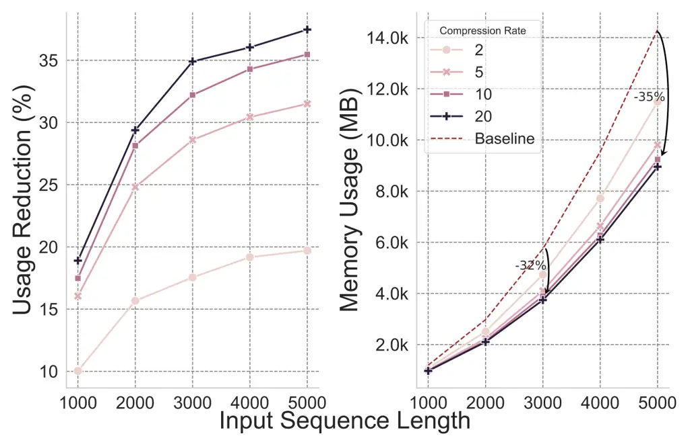
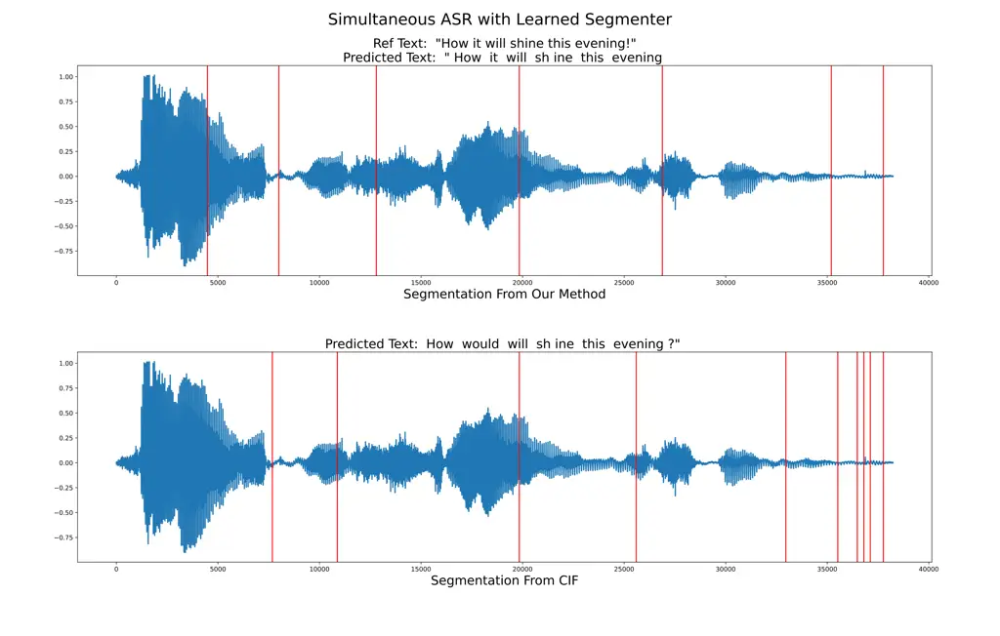
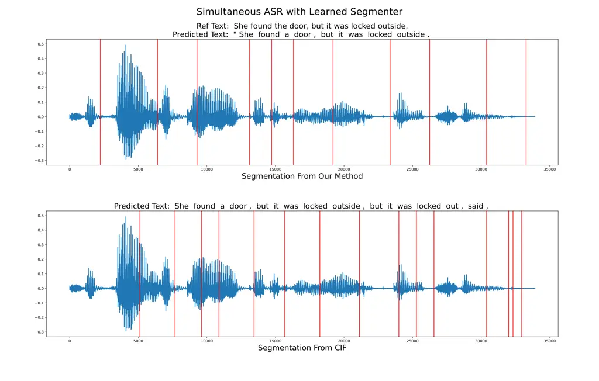
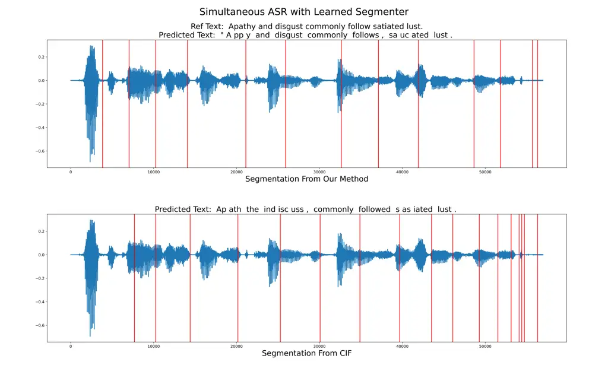

# Streaming Sequence Transduction through Dynamic Compression

Weiting Tan Affiliation: Johns Hopkins University    Yunmo Chen
Affiliation: Johns Hopkins University    Tongfei Chen
Affiliation: Microsoft    Guanghui Qin Affiliation: Johns Hopkins
University    Haoran Xu Affiliation: Johns Hopkins University    Heidi
C. Zhang Affiliation: Stanford University    Benjamin Van Durme
Affiliation: Johns Hopkins University    Philipp Koehn
Affiliation: Johns Hopkins University

###### Abstract

We introduce STAR (Stream Transduction with Anchor Representations), a
novel Transformer-based model designed for efficient
sequence-to-sequence transduction over _streams_. STAR dynamically
segments input streams to create compressed _anchor_ representations,
achieving nearly lossless compression (12$`\times`$) in Automatic Speech
Recognition (ASR) and outperforming existing methods. Moreover, STAR
demonstrates superior segmentation and latency-quality trade-offs in
simultaneous speech-to-text tasks, optimizing latency, memory footprint,
and quality.¹¹ 1  Codes available at:
[https://github.com/steventan0110/STAR](https://github.com/steventan0110/STAR)

## 1 Introduction

Sequence transduction, also referred to as sequence-to-sequence
modeling, has shown remarkable success across various domains, including
speech translation Liu et al. (2019); Di Gangi et al. (2019); Li et al.
(2020) and automatic speech recognition Prabhavalkar et al. (2023); Li
(2021); Gulati et al. (2020). Traditionally, these models operate under
the assumption of fully observing input sequences before generating
outputs. However, this requirement becomes impractical in applications
necessitating low latency or real-time output generation such as
simultaneous translation (Ma et al., 2019; Chang and Lee, 2022; Barrault
et al., 2023, inter alia). The concept of streaming sequence
transduction Inaguma et al. (2020); Kameoka et al. (2021); Chen et al.
(2021); Wang et al. (2022); Chen et al. (2021); Xue et al. (2022), or
stream transduction, arises to address this challenge. Unlike
traditional sequence transduction, stream transduction operates on
partially observed input sequences while simultaneously generating
outputs. This requires deciding when to initiate output generation, a
task inherently tied to identifying critical triggers within the input
sequence. Triggers mark moments when sufficient input information has
been received to initiate output generation, thus minimizing latency.
Consequently, they partition the input sequence into discrete segments,
with outputs accessing only information preceding each trigger.

Figure 1: When yield is triggered, the current segment’s information is
compressed into an anchor representation to generate the next output.

Locating these triggers poses a significant challenge. Prior approaches
have explored methods that employ fixed sliding windows to determine
triggers Ma et al. (2019); Ma et al. (2020b), or learning models to
predict triggers Ma et al. (2020c); Chang and Lee (2022), yet timing
remains a complex issue. Beyond reducing latency, another challenge for
stream transduction is how to efficiently represent historical
information while optimizing memory usage. Prior work (Rae et al., 2020;
Tay et al., 2022; Bertsch et al., 2023, inter alia) has mostly focused
on improving the efficiency of Transformer but does not investigate
streaming scenarios. Reducing the memory footprint for streaming systems
introduces additional complexity as models must determine when certain
information becomes less relevant for future predictions.

In this work, we propose Stream Transduction with Anchor Representations
(STAR), a novel approach designed to maximize the benefits of stream
transduction, optimizing both generation latency and memory footprint.
STAR dynamically segments the input stream into buffers that contain
similar levels of information. Then, it introduces the concept of
anchors, which aggregate a buffer of information (multiple vector
representations) into single-vector anchor representations. Once an
anchor representation is yielded, it triggers the generation process to
yield another token.

We present a learning strategy to train STAR end-to-end so that the
model learns to dynamically select anchor positions with the following
objectives: (1) anchor positions are selected such that each segment
contains the right amount of information for generating the next output;
(2) anchor representation effectively compress the information of its
preceding segment. For example, in fig. 1, the model triggers yield at
index 3 (which makes it an anchor position), compressing the information
of the current chunk $`\bm{X}=(x_{1},x_{2},x_{3})`$ into anchor
representation $`z_{1}`$ to generate output $`y_{1}`$. Such a process
repeats each time yield is triggered. To summarize, our contributions
are as follows: (1) we propose STAR that dynamically segments and
compresses input streams, trading-off among latency, memory footprint,
and performance for stream transduction; (2) we validate the
effectiveness of our approach on well-established _speech-to-text_
tasks. Our results show that STAR greatly outperforms existing methods,
obtaining better compression ability and excelling in quality-latency
trade-offs.

## 2 Methodology

### 2.1 Problem Formulation

In sequence-to-sequence transduction, feature
$`\bm{X}=(\bm{x}_{1},\dots,\bm{x}_{T_{x}})`$ is normally first extracted
from the raw input sequence. Then the decoder can encode and use such
features to generate an output sequence
$`\bm{Y}=(y_{1},\dots,y_{T_{y}})`$. The encoder and decoder can be
implemented using various models such as Recurrent Neural Networks
Hochreiter and Schmidhuber (1997); Chung et al. (2014); Lipton (2015)
and Transformers Vaswani et al. (2017), depending on the input and
output characteristics. In the context of streaming sequence
transduction, where the input (and their features $`\bm{X}`$) is
partially observed, a causal encoder and decoder are necessary. The
causal encoder processes the partially observed feature
$`\bm{X}_{<\tau}`$ ($`\tau\leq T_{x}`$) to produce their encoding.
Suppose the first $`k`$ outputs are already generated, the causal
decoder sample the next output $`y_{k+1}`$ with
$`\mathbb{P}(y_{k+1}|\bm{X}_{<\tau},\bm{Y}_{<k+1};\theta)`$, where
$`\theta`$ represents the parameter set.

1: Input: Input stream $`\bm{X}`$, threshold $`\beta`$

2: Output: Output stream $`\bm{Y}`$

3: Initialize: cached repr. $`\bm{Z}\leftarrow\varnothing`$; buffer
$`\bm{B}\leftarrow\varnothing`$

4:

while $`y\neq\textsc{eos}`$ :


5:
  
$`\alpha\leftarrow 0;\bm{B}\leftarrow\varnothing`$
$`\triangleright`$ clear buffer


6:
  

while $`\bm{x}\leftarrow\textsc{read}(\bm{X})`$ :
$`\triangleright`$ read new inputs


7:
   
append($`\bm{B},\bm{x}`$) $`\triangleright`$ add to buffer


8:
   
$`\alpha\leftarrow\alpha+F_{\rm seg}(\bm{x})`$


9:
   

if $`\alpha\geq\beta`$ :$`\triangleright`$ yield triggered


10:
     
$`\bm{H}=F_{\rm enc}(\bm{B}\mid\bm{Z})`$ $`\triangleright`$ encode
segment buffer


11:
     
$`\bm{z}=\textsc{compress}(\bm{H})`$


12:
     
append($`\bm{Z},\bm{z})`$ $`\triangleright`$ embedding for segment


13:
     
$`y\leftarrow F_{\rm dec}(\cdot|\bm{Y},\bm{Z})`$


14:
     
yield $`y`$


15:
     
break
     

Algorithm 1 High-level overview of STAR

Deciding when to generate (yield) a new token is the core of streaming
sequence transduction where a segmenter/predictor Moritz et al. (2020);
Chang and Lee (2022) is typically trained to control timing for yield
operation. Our approach to tackling stream transduction is outlined in
algorithm 1. It involves a learnable segmenter that scores the
importance of each input feature to decide if enough information has
been accumulated in the current buffer of features. As the segmenter
scores input feature in a frame-wise fashion (algorithm 1, line 8), we
accumulate the scores $`\alpha`$ until it reaches a pre-defined
threshold $`\beta`$. When the threshold is reached, it indicates that
enough information has been accumulated in the current buffer $`\bm{B}`$
of features. Subsequently, we compress the features into a single vector
representation $`\bm{z}`$ that we call anchor representation (line 11).
$`\bm{z}`$ is computed for each buffer and cached into the history
anchors $`\bm{Z}`$, which is then conditioned by the decoder to generate
new tokens (lines 12-13). The details of our segmentation and
compression mechanism are introduced in § 2.2.

### 2.2 Segmentation with Dynamic Compression

In this section, we provide details of different components in
algorithm 1. We first describe how to learn the segmenter
$`F_{\rm seg}(\cdot)`$ with feedback from the encoder-decoder’s
cross-attention. Then we present how anchor representations are obtained
through our selection-based compression method.

#### Learning Segmenter with Cross-attention

We propose a learnable segmenter trained with feedback from the
encoder-decoder cross-attention. Following algorithm 1, a segmenter is
used to evaluate (score) input features as they are read into the
system. Such scores $`\bm{s}=F_{\rm seg}(\bm{X})`$ are then used to
determine if yield is triggered (i.e., whether to segment streams).
Effective segmentation is crucial in streaming sequence transduction to
avoid sub-optimal transformation due to premature triggering or
increased latency from delayed output. Since the ideal segmentation
depends on several factors (the input’s information density, the input
and output’s modalities, and the task at hand, _etc.,_), we rely on the
cross-attention between the encoder and decoder to guide the segmenter
(shown in fig. 2).

Specifically, we follow cross-attention from Transformers Vaswani et al.
(2017) to use three projections
$`\bm{W}_{\text{Q}},\bm{W}_{\text{K}},\bm{W}_{\text{V}}`$ to generate
the query vector
$`\bm{y}\bm{W}_{\text{Q}}\in\mathbb{R}^{T_{y}\times d}`$, the key vector
$`\bm{h}\bm{W}_{\text{K}}\in\mathbb{R}^{T_{x}\times d}`$ and the value
vector $`\bm{h}\bm{W}_{\text{V}}\in\mathbb{R}^{T_{x}\times d}`$ (where
$`d`$ is the dimensionality of the representation) and compute
cross-attention as:

```math
S(\bm{h},\bm{y})=(\bm{h}\bm{W}_{\text{k}})(\bm{y}\bm{W}_{\text{Q}})^{T} \tag{1}
```

Then, as illustrated in fig. 2, we inject segmenter’s scores into it the
cross attention:

```math
\tilde{S}(\bm{h},\bm{y})=S(\bm{h},\bm{y})+F_{\rm seg}(\bm{x}) \tag{2}
```

The updated cross-attention $`\tilde{S}(\bm{h},\bm{y})`$ is then used to
transform the value vector $`\bm{W}_{\text{V}}`$ and will be used by the
decoder to compute the loss function. Since the segmenter’s scores are
injected in equation 2, _it can be updated with end-to-end
back-propagation_. Specifically, suppose the loss objective
$`\mathcal{L}`$ is computed, with the chain rule, we have the gradient
for the predicted score $`\bm{\alpha}=F_{\text{seg}}(\bm{x})`$ as:

```math
\displaystyle\frac{\nabla\mathcal{L}}{\nabla\bm{\alpha}} \displaystyle=\sum_{i=1}^{l}\frac{\nabla\mathcal{L}}{\nabla\tilde{S}^{i}(\bm{h},\bm{y})}\cdot\frac{\nabla\tilde{S}^{i}(\bm{h},\bm{y})}{\nabla\bm{\alpha}}
```

```math
\displaystyle=\sum_{i=1}^{l}\frac{\nabla\mathcal{L}}{\nabla\tilde{S}^{i}(\bm{h},\bm{y})}\cdot\frac{\nabla}{\nabla\bm{\alpha}}\left(S(\bm{h},\bm{y})+\bm{\alpha}\right)
```

```math
\displaystyle=\sum_{i=1}^{l}\frac{\nabla\mathcal{L}}{\nabla\tilde{S}^{i}(\bm{h},\bm{y})}
```

where $`l`$ is the number of transformer layer and
$`\tilde{S}^{i}(\bm{h},\bm{y})`$ is the cross-attention for
$`i^{\text{th}}`$ layer. We observe that the gradient impacting the
segmenters is directly proportional to the gradient on the
cross-attention logits. Consequently, by injecting cross-attention, we
can train segmenters to prioritize positions that are more significant
to the decoder.

After training the segmenter, we predict scores
$`\bm{s}=F_{\rm seg}(\bm{x})`$ for input features and use the scores to
segment the input sequence. Note that the predicted scores can be used
differently based on the task. In the special case where the whole
sequence is fully observed (i.e., regular non-streaming tasks), we do
not yield output anymore. Instead, we simply select the top $`k`$
scoring positions as anchors and use their representation for the
decoder to generate outputs, as formalized below ($`I`$ is a set of
indices):

```math
\displaystyle I \displaystyle=\textsc{SelectTop}_{k}(\bm{s}) \tag{3}
```

```math
\displaystyle\bm{H} \displaystyle=F_{\rm enc}(\bm{x})\in\mathbb{R}^{T_{x}\times d} \tag{4}
```

```math
\displaystyle\bm{Z} \displaystyle=\bm{H}[I]\in\mathbb{R}^{k\times d} \tag{5}
```

The compression rate is then $`r=T_{x}/k\in[1,\infty)`$ assuming
$`k\leq T_{x}`$. In a more general case where streaming is enabled, the
score is commonly accumulated Inaguma et al. (2020); Ma et al. (2020c)
until a certain threshold is reached. We use a threshold $`\beta=1`$
throughout experiments. Specifically, we first scale $`\bm{s}`$ to
$`[0,1]`$ range values $`\bm{\alpha}=\text{sigmoid}(\bm{s})`$ and
accumulate $`\alpha`$ following algorithm 1 (line 8) to yield new
output. The accumulation of scores is a natural way to ensure a similar
level of information is contained in each buffer. This corresponds to a
larger buffer when the sound signal is sparse (see appendix A for
visualization), which gives better latency-quality control.

Figure 2: Visualization for the training of the segmenter through
feedback from the encoder-decoder’s cross-attention.

#### Compression with Anchor Representation

Every time an anchor is predicted by our trained segmenter, the model
triggers generation with some buffer $`\bm{B}\in\mathbb{R}^{b\times d}`$
of b features. Subsequently, we transform such features into a
high-dimensional representation $`\bm{H}\in\mathbb{R}^{b\times d}`$ with
a causal encoder²² 2  In practice, we are inspired by BERT Devlin et al.
(2019) to add a special type embedding $`\bm{e}`$ to anchor tokens
before passing through the encoder. The causality of such an encoder
ensures that representations at later positions contain information only
from earlier positions. Then, we only select the representation at the
anchor position (the last index of the current buffer)
$`\bm{z}=\bm{H}[b]\in\mathbb{R}^{1\times d}`$ to represent the
information of the whole buffer $`\bm{B}`$. Selected representations are
also called anchor representations/vectors. For example, in fig. 3,
yield is triggered at index $`3`$; therefore we first transform the
features into representations $`\bm{H}=F_{\rm enc}(\bm{B}|\bm{Z})`$, and
select $`\bm{H}[3]`$ as the anchor vector $`\bm{z}`$ to decode the next
output with cached representation $`\bm{Z}`$.

Figure 3: Visualization for the proposed “selection as compression”
method. Input features are transformed by the encoder and we only select
the encoding at the anchor position (where yield is triggered) as the
compressed representation.

### 2.3 Model Training

To train models for streaming sequence transduction, we primarily rely
on the conventional objective – negative log-likelihood (NLL) loss:

```math
\displaystyle\mathcal{L}_{\text{NLL}}(\bm{X},\bm{Y},\theta) \displaystyle=-\log\mathbb{P}(\bm{Y}|\bm{X};\theta) \tag{6}
```

```math
\displaystyle=-\sum_{t=1}^{T_{y}}\log\mathbb{P}(y_{t}|\bm{Y}_{<t},\bm{Z}_{<t};\theta)
```

Note that the loss is defined over $`\bm{X},\bm{Y}`$ as both input and
output sequences are fully observed during training. In addition, the
loss defined in equation 6 is slightly different than regular NLL in
that the decoder can only use representation observed so far
($`\bm{Z}_{<t}`$) to generate the $`t^{\text{th}}`$ output. This method
is also referred to as Infinite-Lookback (Arivazhagan et al., 2019; Liu
et al., 2021, IL) and is used to mitigate the train-test mismatch as
future representation cannot be observed during inference. Besides using
NLL to update the encoder and decoder, we also follow prior work Chang
and Lee (2022) to regularize the segmenter so that the number of yield
is the same as the output length $`T_{y}`$. Due to page limitations, we
refer readers to appendix B for more details.

## 3 Experiments: Non-Streaming Compression

We experiment on the non-streaming ASR task to better demonstrate the
effectiveness of our selection-based compression method, since we do not
need to consider the quality-latency trade-off as in the streaming
scenario. We compare our method with other common baselines like
Convolutional Neural Networks (Lecun and Bengio, 1995; Krizhevsky
et al., 2012, CNN) and Continuous Integrate and Fire (Dong and Xu, 2020,
CIF).

#### Datasets and Evaluation Metrics

We conduct experiments on the LibriSpeech Panayotov et al. (2015) and
LibriTTS Zen et al. (2019) dataset’s “Clean-360h” section, which
contains 360 hours of speech and their corresponding transcriptions. To
evaluate ASR performance, we compute the word error rate (Morris et al.,
2004, WER) between reference transcriptions and the generated text.

### 3.1 Training Setup

#### Compression with Anchor Representations

In § 2, we propose a general approach for stream transduction with
dynamic compression. Now we instantiate the framework for the ASR task.
We first use Wav2Vec2.0 Baevski et al. (2020) to extract features
$`\bm{X}`$ from the input speech sequence. We then use a 4-layer
decoder-only Transformer³³ 3  Following the implementation of GPT2 from
Huggingface [https://huggingface.co/gpt2](https://huggingface.co/gpt2)
as our causal encoder for compression, from which we select out anchor
representation $`\bm{z}`$. The segmenter is implemented with a 2-layer
Feed-Forward Network. For the decoder, we use a 4-layer decoder-only
Transformer with an additional linear layer as the language modeling
head. For details of hyperparameters, we direct readers to appendix F.

As described in § 2, we train the Encoder-Decoder model with a segmenter
learned through cross-attention feedback. Given the extracted feature
$`\bm{X}=(x_{1},x_{2},\cdots,x_{T_{x}})`$ and a target compression rate
$`r\in[1,\infty)`$, we select top $`k=T_{x}/r`$ scoring positions and
use their encodings as anchor representations (following equation 5). We
then feed the anchor representation $`\bm{Z}`$ to the decoder to
generate text tokens. In practice, most input speeches from LibriTTS are
less than 10 seconds, corresponding to a feature sequence of length
$`T_{x}=10*16000/320=500`$ (with a standard sampling rate 16 kHz and
Wav2Vec2.0 has a stack of CNNs that reduce input sequence by
320$`\times`$). Therefore, we chose some reasonable compression rates
(i.e., $`r=12,18,30`$) to test our compression methods. We now briefly
describe two baselines that we compared against: CNNs and CIF.

#### Baseline: CNN

A simple compression component is CNN. After we obtain speech feature
$`\bm{X}`$, we apply CNNs with pre-defined strides to compress the
feature. The encoder (a vanilla Transformer-Encoder module without our
selection-based compression) further transforms such compressed features
into encoder representations for the decoder to generate outputs. To
enhance the capacity of CNNs, we follow Zeghidour et al. (2021);
Défossez et al. (2022) to add two CNNs with kernel size $`(5,1)`$ and
stride size $`(1,1)`$ as residual connection. More details about CNNs
and their configurations are available in fig. 13 (in appendix F).

#### Baseline: CIF

Continuous Integrate and Fire Dong and Xu (2020); Dong et al. (2022);
Chang and Lee (2022) uses a neural network to predict scores for each
position and accumulates the scores until a threshold is reached,
thereafter triggering the generation of a new token (called fire by the
original paper). For each segment, CIF averages representations in the
segment by directly weighing them with the predicted scores. For a fair
comparison with prior work, we adopt the implementation from Dong et al.
(2022) into our codebase.

There are two major differences between our method and CIF: firstly,
STAR segmenter leverages cross-attention between encoder-decoder to
interactively update representations, whereas CIF employs a weighted
average of representations solely from the encoder side; secondly, STAR
pushes information to condense in particular anchor at yield positions
and performs explicit selections, whereas CIF’s representations are
averaged across each segment. Broadly, these distinctions mirror the
differences between hard and soft attention mechanisms Xu et al. (2015);
Luong et al. (2015). We refer readers to appendix B and the original
paper Dong and Xu (2020) for more details.

### 3.2 Results of Different Compression Methods

Figure 4: ASR performance (evaluated by WER) by different compression
methods. From the figure, STAR outperforms other compressors and the gap
enlarges as the compression rate increases.

We test the compression performance on three compression rates
$`r\in\{12,18,30\}`$. As shown in fig. 4, our compression module obtains
the best performance, achieving almost lossless compression when
$`r=12`$, and consistently outperforms the other two methods on
different compression rates. By comparing the trend in detail, we find
that CNNs are sub-optimal as the compressor because they operate on a
small local window and change the underlying feature representation,
which might be hard for the encoder and decoder to adapt to. Now
comparing CIF and STAR. As the compression rate increases, the gap
between STAR and CIF also increases. When $`r=30`$, STAR outperforms CIF
by about 3 WER points on both LibriSpeech and LibriTTS. From the
results, we have verified that STAR is more effective in compressing
representation compared to CNN and CIF. Later in our analysis (see § 5),
we provide evidence of STAR achieving more robust compressed
representations. Lastly, to exclude the influence from the text decoder,
we also designed a speech similarity task in appendix D to show that
STAR results in better-compressed speech representation.

Figure 5: Lateny-Quality trade-off for CIF and STAR. The five markers on
the line correspond to different wait-$`k`$ strategies (from left to
right, wait-$`k`$ $`\in\{1,2,3,4,5\}`$).

## 4 Streaming Experiments: Simultaneous Speech Recognition and Translation

#### Datasets

For our simultaneous S2T experiments, we use the English-German (EN-DE)
portion of the MuST-C V1 Di Gangi et al. (2019) dataset for speech
translation (ST). We also include results for simultaneous ASR using
LibriSpeech and LibriTTS. Note that since our method is based on a
general Encoder-Decoder Transformer, it is not tailored to ASR by
leveraging monotonic alignment or using small character-level
vocabulary.

#### Evaluation Metric

To evaluate the quality of generated output, we use WER for the ASR task
and BLEU Papineni et al. (2002) for the speech translation task. For
simultaneous S2T, latency measurement is essential and we resort to the
commonly used metric, Differentiable Average Lagging (Arivazhagan
et al., 2019, DAL), which was originally proposed for simultaneous text
translation and later adapted to speech translation in Ma et al.
(2020a). The smaller the DAL, the better the system in terms of latency.
We refer readers to appendix G for details on the latency metric.

#### Experiment Setup

Our first step is to train an _speech-to-text_ (S2T) streaming model
without a segmenter. To make Wav2Vec2.0 causal, we add a causal mask and
train it jointly with the encoder and decoder until convergence. Once
the vanilla streaming S2T model is trained, we freeze the causal
Wav2Vec2.0 model as the feature extractor and start fine-tuning the
encoder and the decoder with the segmenter.

Figure 6: Quality-latency trade-off for fixed-decision S2T model. Each
line corresponds to a different wait-$`k`$ strategy and each marker
corresponds to a stride size of $`\{120,200,280,360,440\}`$ms.

#### Experimental Results

We show the experiment results in fig. 5 where we plot WER/BLEU v.s. DAL
to demonstrate the quality-latency trade-off for each system. In our
evaluation, we adapt the wait-$`k`$ policy Ma et al. (2019) for all
systems. Here wait-$`k`$ denotes the number of speech segments we encode
first before decoding text tokens. A larger wait-$`k`$ value generally
results in higher latency but better S2T performance. In our work, we
focus on low-latency scenarios where flexible decision policies like CIF
and STAR are most useful; Therefore, we set wait-$`k`$ value to 1 to 5.

We first present the baseline system for simultaneous ASR with a fixed
decision policy in fig. 6. We use the vanilla streaming S2T model (no
compression) and apply a fixed stride size to slide through the speech
and generate text tokens. As shown in fig. 6, using a large stride like
360ms (i.e., each chunk corresponds to a speech feature of length
$`0.36\times 16000/320=18`$) or 440ms, simultaneous ASR achieved $`<20`$
WER. However, the latency is also extremely high (over 2000 DAL). For
smaller strides, quality of generated output is suboptimal because not
enough information is provided for the text decoder to generate each new
token. A flexible decision policy could alleviate such issues and
provide better latency-quality trade-off. From fig. 5, we see that for
both CIF and STAR, their output has better quality when the latency is
low. For instance, on LibriTTS, STAR achieves about 24 WER with a DAL
smaller than 800 while the best-performing fixed decision policy only
obtains such performance with a DAL of about 1200.

Comparing CIF with STAR across three datasets (LibriSpeech, LibriTTS,
and MUST-C), we find that STAR consistently achieves better performance,
obtaining a lower WER (or higher BLEU) score with relatively lower
latency across different wait-$`k`$ strategies. This demonstrates that
STAR gives a better flexible policy to yield new tokens, and the
compressed representation encodes more information for target text
generation. In appendix A, we compare qualitative examples and visualize
the difference in the segmentation from CIF and STAR. Overall, we find
the segmentation from STAR better corresponds to the target texts,
achieving superior simultaneous S2T performance.

## 5 Analysis

### 5.1 Memory Efficiency



Figure 7: Memory usage and reduction from our proposed method (with
compression rates $`r\in\{2,5,10,20\}`$). More results and detailed
setup are provided in appendix E.

Since STAR condenses information in each buffer into anchor
representation, it enhances memory efficiency by caching compressed
representation for the decoder to generate outputs. With a compression
rate $`r`$, a batch size $`b`$, and input features of average length
$`T_{x}`$, and hidden dimension $`d`$, our system compresses the encoder
representation from $`bdT_{x}`$ to $`bdT_{x}/r`$. Besides memory
consumption, note that cross-attention computation (equation 1) is
quadratic w.r.t. encoder representation’s length; thus, our method
reduces the cost of its computation by a factor of $`r^{2}`$. Besides
theoretical analysis, we benchmark the actual memory usage and the
percentage of usage reduction achieved by different compression rates.
From fig. 7, we show that with a rate of $`r=10`$ (which achieves nearly
lossless compression), STAR reduces the memory consumption by more than
30% when transducing an input feature of length longer than 3,000. For
the full details of our benchmark setup and results, we refer readers to
appendix E.

### 5.2 Robustness

In this section, we evaluate the robustness of streaming models (CIF and
STAR) by subjecting them to compression and segmentation conditions
different from their training setup. We find that STAR is more robust
than CIF, retaining better transduction when operating on context
windows not exposed to during training.

.

Figure 8: CIF and STAR based model trained with compression rate 12 are
evaluated on various compression rates (ranges from 1 to 50). For a
lower compression rate ($`\leq 12`$), both models preserve their quality
well. For a higher compression rate ($`>12`$), STAR is more robust and
its performance degrades slower than CIF.

#### Various Compression Rates at Inference

As detailed in § 3, we trained CIF- and STAR-based models with a
compression rate of $`r=12`$ (denoted as CIF-12 and STAR-12) and tested
them under varying compression rates. Both models perform well at
$`r\leq 12`$, as expected since they are trained for 12$`\times`$
compression. However, when $`r>12`$, STAR-12 shows significantly less
degradation compared to CIF-12, indicating superior retention of
information. This resilience arises from STAR’s design, which focuses
information into anchor positions, ensuring each anchor retains
substantial information even at higher compression rates. In contrast,
CIF’s averaging approach leads to increased interference between
representations.

#### Different Segmentations

In § 4, we tested CIF- and STAR-based models under a shared fixed
segmentation policy, where segments were of uniform size
($`\lfloor T_{x}/T_{y}\rfloor`$). This setup evaluates robustness to
segmentation changes. Results in fig. 9 show that while both models
experience performance drops, STAR  remains robust, achieving $`<30`$
WER with a DAL of 800, whereas CIF exceeds $`80`$ WER. This highlights
STAR’s ability to better compress and retain information within anchor
representations, making it more robust to policy changes.

Figure 9: Latency-quality trade-off for CIF and STAR using a fixed
decision policy instead of their own predicted segmentation. The five
markers on the line correspond to five wait-$`k`$ strategies (from left
to right, wait-$`k`$ $`\in\{1,2,3,4,5\}`$).

Moreover, we let the the two models use all previously computed
representations (thus no compression is performed) and name such models
CIF-ALL and STAR-ALL in fig. 9. We find that CIF-ALL still greatly lags
behind the performance of STAR even when all previous representations
are used. This shows that CIF is not a robust method as it only obtains
good performance when aggregating representations using its learned
segmentation. On the contrary, STAR is much more robust; in fact, from
fig. 9, we find that STAR has a very close performance compared to its
non-compressed version STAR-ALL, providing another evidence of its
robust compression quality.

## 6 Related work

#### End-to-end Streaming Speech-to-text

For streaming/simultaneous speech-to-text tasks, learning speech
representation and policies for read and yield is essential. Previous
methods like RNN-Transducer Graves (2012) and Connectionist Temporal
Classification (CTC) (Graves et al., 2006) leverage monotonic alignment
for low error rate transcription. Recent work Moritz et al. (2020);
Tsunoo et al. (2020) further extends transformers for streaming ASR
using modified attention and beam search.

For speech translation, Ma et al. (2019) proposed the Wait-K strategy
with a fixed decision policy that read chunks of equal-length text for
decoding and Ma et al. (2020b) adapted the wait-k strategy for
simultaneous speech translation. Instead of a fixed decision policy,
SimulSpeech Ren et al. (2020) trained segmenters with CTC loss. Zeng
et al. (2021) also use CTC for guidance on word boundary learns to
shrink the representation and proposes the Wait-K-Stride-N strategy that
writes N tokens for each read action. Dong et al. (2022) and Chang and
Lee (2022) use CIF to learn segmentation for the speech sequences and
trigger the yield action whenever CIF fire a new representation.
Additionally, Arivazhagan et al. (2019) and Ma et al. (2020c) support a
more adaptive strategy where dynamic read and yield are possible.
However, even for such an adaptive strategy, a good decision policy
still matters Ma et al. (2020b).

#### Efficient Methods for Transformers

Prior work studied efficient methods to scale Transformers to long
sequences (Tay et al., 2022), including sparse patterns (Beltagy et al.,
2020), recurrence (Dai et al., 2019), kernelized attentions (Choromanski
et al., 2021), etc. Some of them can be applied in the streaming
settings, such as Streaming LLMs (Xiao et al., 2023), Compressive
Transformers (Rae et al., 2020), etc. Moreover, Tworkowski et al.
(2023); Bertsch et al. (2023) proposed to apply $`k`$NN to the attention
to select a subset of past tokens, akin to the segmentation process in
this paper. Similar to the residual connection in our paper, Nugget (Qin
and Van Durme, 2023) trains a scorer to select a subset of tokens to
represent texts. More recently, Tan et al. (2024) and Qin et al. (2023)
also combine context compression with efficient fine-tuning methods like
LoRA Hu et al. (2021) to expand context length for large language
models.

#### Speech Representation

Traditionally, acoustic features are extracted by filter-bank features,
mel-frequency cepstral coefficients, or bottleneck features Muda et al.
(2010); Davis and Mermelstein (1980). More recent work relies on
self-supervision to learn speech representations. For example, Zeghidour
et al. (2021) and Défossez et al. (2022) learn acoustic representation
by reconstructing the original audio. To learn semantic representation,
masked language modeling, and contrastive learning objectives are
popularized by widely used representations from Hubert Hsu et al.
(2021), w2v-BERT Chung et al. (2021) and Wav2Vec Schneider et al.
(2019); Baevski et al. (2020). All these models use CNNs as a building
block to downsample speech signals/representations.

## 7 Conclusion and Future Work

We introduce STAR, a model designed for dynamic compression and
transduction of streams. STAR features a segmenter learned via
encoder-decoder cross-attention and employs a selection-based
compression approach. Our experiments across multiple speech-to-text
tasks confirm STAR’s superior compression performance and
latency-quality trade-off relative to established methods such as
Convolutional Neural Networks and Continuous Integrate-and-Fire. In the
future, we hope to extend this framework to facilitate streaming
non-autoregressive generation.

## References

- Agarap (2018) Abien Fred Agarap. 2018. [Deep learning using rectified
  linear units
  (relu)](https://api.semanticscholar.org/CorpusID:4090379). _ArXiv_,
  abs/1803.08375.
- Arivazhagan et al. (2019) Naveen Arivazhagan, Colin Cherry, Wolfgang
  Macherey, Chung-Cheng Chiu, Semih Yavuz, Ruoming Pang, Wei Li, and
  Colin Raffel. 2019. [Monotonic infinite lookback attention for
  simultaneous machine
  translation](https://doi.org/10.18653/v1/P19-1126). In _Proceedings of
  the 57th Annual Meeting of the Association for Computational
  Linguistics_, pages 1313–1323, Florence, Italy. Association for
  Computational Linguistics.
- Baevski et al. (2020) Alexei Baevski, Henry Zhou, Abdelrahman Mohamed,
  and Michael Auli. 2020. [wav2vec 2.0: A framework for self-supervised
  learning of speech representations](https://arxiv.org/abs/2006.11477).
  _Preprint_, arXiv:2006.11477.
- Barrault et al. (2023) Loïc Barrault, Yu-An Chung, Mariano Coria
  Meglioli, David Dale, Ning Dong, Mark Duppenthaler, Paul-Ambroise
  Duquenne, Brian Ellis, Hady Elsahar, Justin Haaheim, John Hoffman,
  Min-Jae Hwang, Hirofumi Inaguma, Christopher Klaiber, Ilia Kulikov,
  Pengwei Li, Daniel Licht, Jean Maillard, Ruslan Mavlyutov, Alice
  Rakotoarison, Kaushik Ram Sadagopan, Abinesh Ramakrishnan, Tuan Tran,
  Guillaume Wenzek, Yilin Yang, Ethan Ye, Ivan Evtimov, Pierre
  Fernandez, Cynthia Gao, Prangthip Hansanti, Elahe Kalbassi, Amanda
  Kallet, Artyom Kozhevnikov, Gabriel Mejia Gonzalez, Robin San Roman,
  Christophe Touret, Corinne Wong, Carleigh Wood, Bokai Yu, Pierre
  Andrews, Can Balioglu, Peng-Jen Chen, Marta R. Costa-jussà, Maha
  Elbayad, Hongyu Gong, Francisco Guzmán, Kevin Heffernan, Somya Jain,
  Justine Kao, Ann Lee, Xutai Ma, Alex Mourachko, Benjamin Peloquin,
  Juan Pino, Sravya Popuri, Christophe Ropers, Safiyyah Saleem, Holger
  Schwenk, Anna Sun, Paden Tomasello, Changhan Wang, Jeff Wang, Skyler
  Wang, and Mary Williamson. 2023. [Seamless: Multilingual expressive
  and streaming speech translation](https://arxiv.org/abs/2312.05187).
  _Preprint_, arXiv:2312.05187.
- Beltagy et al. (2020) Iz Beltagy, Matthew E. Peters, and Arman
  Cohan. 2020. [Longformer: The Long-Document
  Transformer](http://arxiv.org/abs/2004.05150).
- Bertsch et al. (2023) Amanda Bertsch, Uri Alon, Graham Neubig, and
  Matthew R. Gormley. 2023. [Unlimiformer: Long-Range Transformers with
  Unlimited Length Input](http://arxiv.org/abs/2305.01625).
- Chang and Lee (2022) Chih-Chiang Chang and Hung-yi Lee. 2022.
  [Exploring continuous integrate-and-fire for adaptive simultaneous
  speech translation](https://doi.org/10.21437/interspeech.2022-10627).
  In _Interspeech 2022_. ISCA.
- Chen et al. (2021) Junkun Chen, Mingbo Ma, Renjie Zheng, and Liang
  Huang. 2021. [Direct simultaneous speech-to-text translation assisted
  by synchronized streaming
  asr](https://api.semanticscholar.org/CorpusID:235422036). In
  _Findings_.
- Choromanski et al. (2021) Krzysztof Choromanski, Valerii
  Likhosherstov, David Dohan, Xingyou Song, Andreea Gane, Tamas Sarlos,
  Peter Hawkins, Jared Davis, Afroz Mohiuddin, Lukasz Kaiser, David
  Belanger, Lucy Colwell, and Adrian Weller. 2021. [Rethinking Attention
  with Performers](http://arxiv.org/abs/2009.14794). In _International
  Conference on Learning Representations (ICLR)_.
- Chung et al. (2014) Junyoung Chung, Caglar Gulcehre, KyungHyun Cho,
  and Yoshua Bengio. 2014. [Empirical evaluation of gated recurrent
  neural networks on sequence
  modeling](https://arxiv.org/abs/1412.3555). _Preprint_,
  arXiv:1412.3555.
- Chung et al. (2021) Yu-An Chung, Yu Zhang, Wei Han, Chung-Cheng Chiu,
  James Qin, Ruoming Pang, and Yonghui Wu. 2021. [W2v-bert: Combining
  contrastive learning and masked language modeling for self-supervised
  speech pre-training](https://arxiv.org/abs/2108.06209). _Preprint_,
  arXiv:2108.06209.
- Dai et al. (2019) Zihang Dai, Zhilin Yang, Yiming Yang, Jaime
  Carbonell, Quoc V. Le, and Ruslan Salakhutdinov. 2019.
  [Transformer-XL: Attentive Language Models Beyond a Fixed-Length
  Context](http://arxiv.org/abs/1901.02860). In _Annual Meeting of the
  Association for Computational Linguistics (ACL)_.
- Davis and Mermelstein (1980) S. Davis and P. Mermelstein. 1980.
  [Comparison of parametric representations for monosyllabic word
  recognition in continuously spoken
  sentences](https://doi.org/10.1109/TASSP.1980.1163420). _IEEE
  Transactions on Acoustics, Speech, and Signal Processing_,
  28(4):357–366.
- Devlin et al. (2019) Jacob Devlin, Ming-Wei Chang, Kenton Lee, and
  Kristina Toutanova. 2019. [Bert: Pre-training of deep bidirectional
  transformers for language
  understanding](https://api.semanticscholar.org/CorpusID:52967399). In
  _North American Chapter of the Association for Computational
  Linguistics_.
- Di Gangi et al. (2019) Mattia A. Di Gangi, Roldano Cattoni, Luisa
  Bentivogli, Matteo Negri, and Marco Turchi. 2019. [MuST-C: a
  Multilingual Speech Translation
  Corpus](https://doi.org/10.18653/v1/N19-1202). In _Proceedings of the
  2019 Conference of the North American Chapter of the Association for
  Computational Linguistics: Human Language Technologies, Volume 1 (Long
  and Short Papers)_, pages 2012–2017, Minneapolis, Minnesota.
  Association for Computational Linguistics.
- Dong and Xu (2020) Linhao Dong and Bo Xu. 2020. [Cif: Continuous
  integrate-and-fire for end-to-end speech
  recognition](https://arxiv.org/abs/1905.11235). _Preprint_,
  arXiv:1905.11235.
- Dong et al. (2022) Qian Dong, Yaoming Zhu, Mingxuan Wang, and Lei
  Li. 2022. [Learning when to translate for streaming
  speech](https://doi.org/10.18653/v1/2022.acl-long.50). In _Proceedings
  of the 60th Annual Meeting of the Association for Computational
  Linguistics (Volume 1: Long Papers)_, pages 680–694, Dublin, Ireland.
  Association for Computational Linguistics.
- Défossez et al. (2022) Alexandre Défossez, Jade Copet, Gabriel
  Synnaeve, and Yossi Adi. 2022. [High fidelity neural audio
  compression](https://arxiv.org/abs/2210.13438). _Preprint_,
  arXiv:2210.13438.
- Fonseca et al. (2017) Eduardo Fonseca, Jordi Pons, Xavier Favory,
  Frederic Font, Dmitry Bogdanov, Andres Ferraro, Sergio Oramas,
  Alastair Porter, and Xavier Serra. 2017. Freesound datasets: A
  platform for the creation of open audio datasets.
- Graves (2012) Alex Graves. 2012. [Sequence transduction with recurrent
  neural networks](https://arxiv.org/abs/1211.3711). _Preprint_,
  arXiv:1211.3711.
- Graves et al. (2006) Alex Graves, Santiago Fernández, Faustino Gomez,
  and Jürgen Schmidhuber. 2006. [Connectionist temporal classification:
  labelling unsegmented sequence data with recurrent neural
  networks](https://doi.org/10.1145/1143844.1143891). In _Proceedings of
  the 23rd International Conference on Machine Learning_, ICML ’06, page
  369–376, New York, NY, USA. Association for Computing Machinery.
- Gulati et al. (2020) Anmol Gulati, James Qin, Chung-Cheng Chiu, Niki
  Parmar, Yu Zhang, Jiahui Yu, Wei Han, Shibo Wang, Zhengdong Zhang,
  Yonghui Wu, and Ruoming Pang. 2020. [Conformer: Convolution-augmented
  transformer for speech recognition](https://arxiv.org/abs/2005.08100).
  _CoRR_, abs/2005.08100.
- Hochreiter and Schmidhuber (1997) Sepp Hochreiter and Jürgen
  Schmidhuber. 1997. Long short-term memory. _Neural Computation_,
  9(8):1735–1780.
- Hsu et al. (2021) Wei-Ning Hsu, Benjamin Bolte, Yao-Hung Hubert Tsai,
  Kushal Lakhotia, Ruslan Salakhutdinov, and Abdelrahman Mohamed. 2021.
  [Hubert: Self-supervised speech representation learning by masked
  prediction of hidden units](https://arxiv.org/abs/2106.07447).
  _Preprint_, arXiv:2106.07447.
- Hu et al. (2021) Edward J. Hu, Yelong Shen, Phillip Wallis, Zeyuan
  Allen-Zhu, Yuanzhi Li, Shean Wang, Lu Wang, and Weizhu Chen. 2021.
  [Lora: Low-rank adaptation of large language
  models](https://arxiv.org/abs/2106.09685). _Preprint_,
  arXiv:2106.09685.
- Inaguma et al. (2020) Hirofumi Inaguma, Yashesh Gaur, Liang Lu, Jinyu
  Li, and Yifan Gong. 2020. [Minimum latency training strategies for
  streaming sequence-to-sequence
  asr](https://api.semanticscholar.org/CorpusID:215737044). _ICASSP
  2020 - 2020 IEEE International Conference on Acoustics, Speech and
  Signal Processing (ICASSP)_, pages 6064–6068.
- Kameoka et al. (2021) H. Kameoka, Kou Tanaka, and Takuhiro
  Kaneko. 2021. [Fasts2s-vc: Streaming non-autoregressive
  sequence-to-sequence voice
  conversion](https://api.semanticscholar.org/CorpusID:233231613).
  _ArXiv_, abs/2104.06900.
- Khattab and Zaharia (2020) O. Khattab and Matei A. Zaharia. 2020.
  [Colbert: Efficient and effective passage search via contextualized
  late interaction over
  bert](https://api.semanticscholar.org/CorpusID:216553223).
  _Proceedings of the 43rd International ACM SIGIR Conference on
  Research and Development in Information Retrieval_.
- Krizhevsky et al. (2012) Alex Krizhevsky, Ilya Sutskever, and
  Geoffrey E Hinton. 2012. [Imagenet classification with deep
  convolutional neural
  networks](https://proceedings.neurips.cc/paper_files/paper/2012/file/c399862d3b9d6b76c8436e924a68c45b-Paper.pdf).
  In _Advances in Neural Information Processing Systems_, volume 25.
  Curran Associates, Inc.
- Lecun and Bengio (1995) Yann Lecun and Yoshua Bengio. 1995.
  _Convolutional Networks for Images, Speech and Time Series_, pages
  255–258. The MIT Press.
- Li (2021) Jinyu Li. 2021. [Recent advances in end-to-end automatic
  speech
  recognition](https://api.semanticscholar.org/CorpusID:240419899).
  _ArXiv_, abs/2111.01690.
- Li et al. (2020) Xian Li, Changhan Wang, Yun Tang, C. Tran, Yuqing
  Tang, Juan Miguel Pino, Alexei Baevski, Alexis Conneau, and Michael
  Auli. 2020. [Multilingual speech translation from efficient finetuning
  of pretrained
  models](https://api.semanticscholar.org/CorpusID:227840539). In
  _Annual Meeting of the Association for Computational Linguistics_.
- Lipton (2015) Zachary Chase Lipton. 2015. [A critical review of
  recurrent neural networks for sequence
  learning](https://arxiv.org/abs/1506.00019). _CoRR_, abs/1506.00019.
- Liu et al. (2021) Dan Liu, Mengge Du, Xiaoxi Li, Ya Li, and Enhong
  Chen. 2021. [Cross attention augmented transducer networks for
  simultaneous
  translation](https://doi.org/10.18653/v1/2021.emnlp-main.4). In
  _Proceedings of the 2021 Conference on Empirical Methods in Natural
  Language Processing_, pages 39–55, Online and Punta Cana, Dominican
  Republic. Association for Computational Linguistics.
- Liu et al. (2019) Yuchen Liu, Hao Xiong, Zhongjun He, Jiajun Zhang,
  Hua Wu, Haifeng Wang, and Chengqing Zong. 2019. [End-to-end speech
  translation with knowledge
  distillation](https://api.semanticscholar.org/CorpusID:119309065). In
  _Interspeech_.
- Luong et al. (2015) Thang Luong, Hieu Pham, and Christopher D.
  Manning. 2015. [Effective approaches to attention-based neural machine
  translation](https://doi.org/10.18653/v1/D15-1166). In _Proceedings of
  the 2015 Conference on Empirical Methods in Natural Language
  Processing_, pages 1412–1421, Lisbon, Portugal. Association for
  Computational Linguistics.
- Ma et al. (2019) Mingbo Ma, Liang Huang, Hao Xiong, Renjie Zheng,
  Kaibo Liu, Baigong Zheng, Chuanqiang Zhang, Zhongjun He, Hairong Liu,
  Xing Li, Hua Wu, and Haifeng Wang. 2019. [STACL: Simultaneous
  translation with implicit anticipation and controllable latency using
  prefix-to-prefix framework](https://doi.org/10.18653/v1/P19-1289). In
  _Proceedings of the 57th Annual Meeting of the Association for
  Computational Linguistics_, pages 3025–3036, Florence, Italy.
  Association for Computational Linguistics.
- Ma et al. (2020a) Xutai Ma, Mohammad Javad Dousti, Changhan Wang,
  Jiatao Gu, and Juan Pino. 2020a. [SIMULEVAL: An evaluation toolkit for
  simultaneous
  translation](https://doi.org/10.18653/v1/2020.emnlp-demos.19). In
  _Proceedings of the 2020 Conference on Empirical Methods in Natural
  Language Processing: System Demonstrations_, pages 144–150, Online.
  Association for Computational Linguistics.
- Ma et al. (2020b) Xutai Ma, Juan Pino, and Philipp Koehn. 2020b.
  [SimulMT to SimulST: Adapting simultaneous text translation to
  end-to-end simultaneous speech
  translation](https://aclanthology.org/2020.aacl-main.58). In
  _Proceedings of the 1st Conference of the Asia-Pacific Chapter of the
  Association for Computational Linguistics and the 10th International
  Joint Conference on Natural Language Processing_, pages 582–587,
  Suzhou, China. Association for Computational Linguistics.
- Ma et al. (2020c) Xutai Ma, Juan Miguel Pino, James Cross, Liezl
  Puzon, and Jiatao Gu. 2020c. [Monotonic multihead
  attention](https://openreview.net/forum?id=Hyg96gBKPS). In
  _International Conference on Learning Representations_.
- Moritz et al. (2020) Niko Moritz, Takaaki Hori, and Jonathan Le. 2020.
  [Streaming automatic speech recognition with the transformer
  model](https://doi.org/10.1109/ICASSP40776.2020.9054476). In _ICASSP
  2020 - 2020 IEEE International Conference on Acoustics, Speech and
  Signal Processing (ICASSP)_, pages 6074–6078.
- Morris et al. (2004) Andrew C. Morris, Viktoria Maier, and Phil D.
  Green. 2004. [From wer and ril to mer and wil: improved evaluation
  measures for connected speech
  recognition](https://api.semanticscholar.org/CorpusID:18880375). In
  _Interspeech_.
- Muda et al. (2010) Lindasalwa Muda, Mumtaj Begam, and
  I. Elamvazuthi. 2010. [Voice recognition algorithms using mel
  frequency cepstral coefficient (mfcc) and dynamic time warping (dtw)
  techniques](https://arxiv.org/abs/1003.4083). _Preprint_,
  arXiv:1003.4083.
- Panayotov et al. (2015) Vassil Panayotov, Guoguo Chen, Daniel Povey,
  and Sanjeev Khudanpur. 2015. [Librispeech: An asr corpus based on
  public domain audio
  books](https://doi.org/10.1109/ICASSP.2015.7178964). In _2015 IEEE
  International Conference on Acoustics, Speech and Signal Processing
  (ICASSP)_, pages 5206–5210.
- Papineni et al. (2002) Kishore Papineni, Salim Roukos, Todd Ward, and
  Wei-Jing Zhu. 2002. [Bleu: a method for automatic evaluation of
  machine translation](https://doi.org/10.3115/1073083.1073135). In
  _Proceedings of the 40th Annual Meeting of the Association for
  Computational Linguistics_, pages 311–318, Philadelphia, Pennsylvania,
  USA. Association for Computational Linguistics.
- Prabhavalkar et al. (2023) Rohit Prabhavalkar, Takaaki Hori, Tara N.
  Sainath, Ralf Schlüter, and Shinji Watanabe. 2023. [End-to-end speech
  recognition: A survey](https://arxiv.org/abs/2303.03329). _Preprint_,
  arXiv:2303.03329.
- Qin et al. (2023) Guanghui Qin, Corby Rosset, Ethan C. Chau, Nikhil
  Rao, and Benjamin Van Durme. 2023. [Nugget 2d: Dynamic contextual
  compression for scaling decoder-only language
  models](https://arxiv.org/abs/2310.02409). _Preprint_,
  arXiv:2310.02409.
- Qin and Van Durme (2023) Guanghui Qin and Benjamin Van Durme. 2023.
  [Nugget: Neural agglomerative embeddings of
  text](https://proceedings.mlr.press/v202/qin23a.html). In _Proceedings
  of the 40th International Conference on Machine Learning_, volume 202
  of _Proceedings of Machine Learning Research_, pages 28337–28350.
  PMLR.
- Rae et al. (2020) Jack W. Rae, Anna Potapenko, Siddhant M. Jayakumar,
  and Timothy P. Lillicrap. 2020. [Compressive Transformers for
  Long-Range Sequence Modelling](http://arxiv.org/abs/1911.05507). In
  _International Conference on Learning Representations (ICLR)_.
- Ren et al. (2020) Yi Ren, Jinglin Liu, Xu Tan, Chen Zhang, Tao Qin,
  Zhou Zhao, and Tie-Yan Liu. 2020. [SimulSpeech: End-to-end
  simultaneous speech to text
  translation](https://doi.org/10.18653/v1/2020.acl-main.350). In
  _Proceedings of the 58th Annual Meeting of the Association for
  Computational Linguistics_, pages 3787–3796, Online. Association for
  Computational Linguistics.
- Schneider et al. (2019) Steffen Schneider, Alexei Baevski, Ronan
  Collobert, and Michael Auli. 2019. [wav2vec: Unsupervised pre-training
  for speech recognition](https://arxiv.org/abs/1904.05862). _Preprint_,
  arXiv:1904.05862.
- Sennrich et al. (2016) Rico Sennrich, Barry Haddow, and Alexandra
  Birch. 2016. [Neural machine translation of rare words with subword
  units](https://doi.org/10.18653/v1/P16-1162). In _Proceedings of the
  54th Annual Meeting of the Association for Computational Linguistics
  (Volume 1: Long Papers)_, pages 1715–1725, Berlin, Germany.
  Association for Computational Linguistics.
- Tan et al. (2024) Sijun Tan, Xiuyu Li, Shishir G Patil, Ziyang Wu,
  Tianjun Zhang, Kurt Keutzer, Joseph E. Gonzalez, and Raluca Ada
  Popa. 2024. [LLoCO: Learning long contexts
  offline](https://doi.org/10.18653/v1/2024.emnlp-main.975). In
  _Proceedings of the 2024 Conference on Empirical Methods in Natural
  Language Processing_, pages 17605–17621, Miami, Florida, USA.
  Association for Computational Linguistics.
- Tay et al. (2022) Yi Tay, Mostafa Dehghani, Dara Bahri, and Donald
  Metzler. 2022. [Efficient Transformers: A
  Survey](http://arxiv.org/abs/2009.06732). _ACM Computing Surveys_,
  55(6):1–28.
- Tsunoo et al. (2020) Emiru Tsunoo, Yosuke Kashiwagi, and Shinji
  Watanabe. 2020. [Streaming transformer asr with blockwise synchronous
  beam search](https://arxiv.org/abs/2006.14941). _Preprint_,
  arXiv:2006.14941.
- Tworkowski et al. (2023) Szymon Tworkowski, Konrad Staniszewski,
  Mikołaj Pacek, Yuhuai Wu, Henryk Michalewski, and Piotr Miłoś. 2023.
  [Focused Transformer: Contrastive Training for Context
  Scaling](http://arxiv.org/abs/2307.03170).
- Vaswani et al. (2017) Ashish Vaswani, Noam Shazeer, Niki Parmar, Jakob
  Uszkoreit, Llion Jones, Aidan N Gomez, Ł ukasz Kaiser, and Illia
  Polosukhin. 2017. [Attention is all you
  need](https://proceedings.neurips.cc/paper_files/paper/2017/file/3f5ee243547dee91fbd053c1c4a845aa-Paper.pdf).
  In _Advances in Neural Information Processing Systems_, volume 30.
  Curran Associates, Inc.
- Wang et al. (2022) Peidong Wang, Eric Sun, Jian Xue, Yu Wu, Long Zhou,
  Yashesh Gaur, Shujie Liu, and Jinyu Li. 2022. [Lamassu: A streaming
  language-agnostic multilingual speech recognition and translation
  model using neural
  transducers](https://api.semanticscholar.org/CorpusID:258968116).
  _INTERSPEECH 2023_.
- Xiao et al. (2023) Guangxuan Xiao, Yuandong Tian, Beidi Chen, Song
  Han, and Mike Lewis. 2023. [Efficient Streaming Language Models with
  Attention Sinks](http://arxiv.org/abs/2309.17453).
- Xu et al. (2015) Kelvin Xu, Jimmy Ba, Ryan Kiros, Kyunghyun Cho, Aaron
  Courville, Ruslan Salakhudinov, Rich Zemel, and Yoshua Bengio. 2015.
  [Show, attend and tell: Neural image caption generation with visual
  attention](https://proceedings.mlr.press/v37/xuc15.html). In
  _Proceedings of the 32nd International Conference on Machine
  Learning_, volume 37 of _Proceedings of Machine Learning Research_,
  pages 2048–2057, Lille, France. PMLR.
- Xue et al. (2022) Jian Xue, Peidong Wang, Jinyu Li, Matt Post, and
  Yashesh Gaur. 2022. [Large-scale streaming end-to-end speech
  translation with neural
  transducers](https://api.semanticscholar.org/CorpusID:248118691). In
  _Interspeech_.
- Zeghidour et al. (2021) Neil Zeghidour, Alejandro Luebs, Ahmed Omran,
  Jan Skoglund, and Marco Tagliasacchi. 2021. [Soundstream: An
  end-to-end neural audio codec](https://arxiv.org/abs/2107.03312).
  _Preprint_, arXiv:2107.03312.
- Zen et al. (2019) Heiga Zen, Viet Dang, Rob Clark, Yu Zhang, Ron J.
  Weiss, Ye Jia, Zhifeng Chen, and Yonghui Wu. 2019. [Libritts: A corpus
  derived from librispeech for
  text-to-speech](https://arxiv.org/abs/1904.02882). _Preprint_,
  arXiv:1904.02882.
- Zeng et al. (2021) Xingshan Zeng, Liangyou Li, and Qun Liu. 2021.
  [RealTranS: End-to-end simultaneous speech translation with
  convolutional weighted-shrinking
  transformer](https://doi.org/10.18653/v1/2021.findings-acl.218). In
  _Findings of the Association for Computational Linguistics: ACL-IJCNLP
  2021_, pages 2461–2474, Online. Association for Computational
  Linguistics.

## Supplementary Material

[TABLE]

## Appendix A Qualitative Examples of Speech Segmentation from Compressors



.

Figure 10: Qualitative Examples of CIF and STAR based Segmentation for
Simul ASR





.

Figure 11: Qualitative Examples of CIF and STAR based Segmentation for
Simul ASR

## Appendix B Continuous Integrate and Fire

Figure 12: Illustration of Continuous Integrate and Fire.

Continuous Integrate and Fire (Dong and Xu, 2020, CIF) predicts a score
for each position and dynamically aggregates the semantic
representation. As shown in fig. 12, CIF first computes a list of scores
$`\bm{\alpha}`$ similar to our proposed method. Then, starting from the
first position, it accumulates the scores (and representation) until
reaching a pre-defined threshold⁴⁴ 4  we set $`\beta=1`$ throughout our
experiments, following prior work Dong et al. (2022); Chang and Lee
(2022) $`\beta`$. Once reaching the threshold, it fire the accumulated
representation and starts to accumulate again. As shown in fig. 12,
suppose we originally have representation
$`\bm{z}=(z_{1},\cdots,z_{6})`$ with corresponding scores
$`\bm{\alpha}=(\alpha_{1},\cdots,\alpha_{6})`$. Suppose we reach the
threshold at $`t=3`$, $`i.e.,\alpha_{1}+\alpha_{2}+\alpha_{3}>=\beta`$,
then we fire the representation by taking the weighted average of score
and representation
$`c_{1}=\alpha_{1}*\bm{z}_{1}+\alpha_{2}*\bm{z}_{2}+\alpha_{3L}*\bm{z}_{3}`$.
Here $`c_{1}`$ becomes the compressed representation for the region
$`t=[1,3]`$. Note that since
$`\alpha_{1}+\alpha_{2}+\alpha_{3}>=\beta`$, we have residual score
$`\alpha_{3R}=\alpha_{1}+\alpha_{2}+\alpha_{3}-\beta`$, which is left
for future accumulation, and we only use
$`\alpha_{3L}=\alpha_{3}-\alpha_{3R}`$ when weighting representation
$`\bm{z}_{3}`$. More generally, suppose the previous fire occurs at
position $`j`$ and at current step $`i`$ the accumulated score reaches
the threshold, the aggregated representation is computed as

```math
h=\alpha_{jR}*\bm{z}_{j}+\sum_{t=j+1}^{i-1}\alpha_{t}*\bm{z}_{t}+\alpha_{iL}*\bm{z}_{i} \tag{7}
```

To enforce the compression rate $`r`$, we follow Dong et al. (2022);
Chang and Lee (2022) to re-scale the predicted scores so that the
threshold $`\beta`$ is reached $`T_{y}`$ times when accumulating the
scores:

```math
\displaystyle\alpha_{t} \displaystyle=\sigma(s_{t}) \tag{8}
```

```math
\displaystyle\tilde{\alpha}_{t} \displaystyle=\frac{\beta n^{*}}{\hat{n}}\alpha_{t}=\frac{\beta\cdot T_{y}}{\sum_{t=1}^{T_{x}}\alpha_{t}}\alpha_{t} \tag{9}
```

Here $`\sigma`$ is the sigmoid function and $`\hat{n}`$ is the
normalization term (summation of un-scaled scores) and $`n^{*}`$ denotes
the number of desired selections, i.e., $`n^{*}=T_{y}`$. We assume the
input feature is longer than the output ($`T_{x}>T_{y}`$), so re-scaling
scores to yield $`T_{y}`$ means we employ a dynamic compression rate
$`r=T_{x}/T_{y}`$ while transducing the streams. Note that $`T_{y}`$ is
only observed during training and we cannot re-scale $`\bm{s}`$ in test
time. Therefore, we adopt a length penalty loss Chang and Lee (2022);
Dong et al. (2022) during training to regularize the segmenter to ensure
proper learning of segmentations:

```math
\mathcal{L}_{\text{lp}}(\bm{X},\bm{Y};\theta)=(n^{*}-\hat{n})^{2}=\left(T_{y}-\sum_{t=1}^{T_{x}}\sigma\left(F_{\rm seg}(\bm{x}_{t})\right)\right)^{2} \tag{10}
```

Finally, our training objective is the combination of negative
log-likelihood and length penalty loss:

```math
\mathcal{L}(\bm{X},\bm{Y};\theta)=\mathcal{L}_{\text{NLL}}(\bm{X},\bm{Y};\theta)+\gamma\mathcal{L}_{\text{lp}}(\bm{X},\bm{Y};\theta) \tag{11}
```

In practice, the segmenter is only trained for a few thousand steps (so
is the length penalty loss) and we set $`\gamma=0.01`$.

Our method is fundamentally different because of how we treat the scorer
and how we perform compression. In CIF, the compression is performed as
an aggregation (weighted average) within each segmented block (decided
by the scores and threshold). In STAR, we directly take out
representations and we force the semantic encoder to condense
information to those important positions. In other words, we did not
explicitly perform aggregation like CIF but expect the semantic encoder
to learn such aggregation innately through training.

Another key difference is how the scorer is learned. In CIF, the
weighted average with scores and representation allows a gradient to
flow through the scorer. For STAR, we inject the scores into
cross-attention to update the scorer. The major advantage of our
approach is that the importance of position is judged by the attention
from the decoder to the encoder representation, which helps segment the
speech representation in the way that the text decoder perceives it.

For more details, we direct readers to the prior work Dong and Xu
(2020); Dong et al. (2022); Chang and Lee (2022).

| Model       | Noise Ratio |      |      |      |      |      |      |      |      |      |      |
| ----------- | ----------- | ---- | ---- | ---- | ---- | ---- | ---- | ---- | ---- | ---- | ---- |
|             | 0%          | 5%   | 10%  | 15%  | 20%  | 25%  | 30%  | 35%  | 40%  | 45%  | 50%  |
| Vanilla S2T | 15.0        | 18.7 | 23.6 | 29.6 | 34.0 | 38.3 | 43.7 | 46.8 | 51.8 | 56.1 | 61.0 |
| S2T + CNN   | 24.2        | 26.7 | 31.9 | 37.1 | 40.8 | 45.5 | 49.9 | 53.6 | 58.9 | 61.6 | 65.3 |
| S2T + CIF   | 16.8        | 20.4 | 26.0 | 30.7 | 36.0 | 40.1 | 44.9 | 50.1 | 53.9 | 58.9 | 62.2 |
| S2T + STAR  | 15.9        | 19.7 | 25.1 | 29.8 | 34.7 | 38.6 | 41.8 | 46.7 | 51.0 | 55.6 | 60.1 |

Table 1: Word Error Rate of models given the noise injection ratio from
0% to 50%. Best numbers are bolded and better results are highlighted by
the blue boxes while bad results are highlighted in yellow boxes.
Compared to other compression methods, our proposed STAR is the most
robust model across all noise injection ratios. When the noise ratio
reaches beyond 30%, STAR even outperforms the S2T model without
compression. All compression models are trained with the compression
rate 12.

## Appendix C Noise Injection

In this section, we test the robustness of compression methods when
noise is injected into the original clean speech from LibriTTS. Instead
of using synthetic signals such as Gaussian noise, we follow Zeghidour
et al. (2021) to use natural noise (e.g., noise from the air
conditioner, shutting door, etc.,) from Freesound⁵⁵ 5  We download the
audio file for different noise from
[https://github.com/microsoft/MS-SNSD](https://github.com/microsoft/MS-SNSD)
Fonseca et al. (2017). We vary the ratio of noise injection from 5% to
30%, as shown in table 1. Given a ratio, we first calculate the duration
of noise $`L`$ (e.g., if the ratio is 0.1 and speech is 10 seconds, then
we inject $`L=1`$ second of noise) and randomly select a range of length
$`L`$ from the clean speech to inject noise. As shown in table 1, as the
noise ratio increases, STAR has the smallest degradation and
consistently outperforms CIF and CNNs. After reaching noise ratio
$`\geq 30\%`$, STAR even outperforms the vanilla S2T model without
compression. Such findings show that STAR has a more robust performance
with the help of anchor representation, making it suffer less from noise
injection and obtain better ASR performance.

## Appendix D Similarity Test with Compressed Representation

In § 3.2, we show STAR’s superior performance on ASR, demonstrating the
effectiveness of condensing information to a few positions for the text
decoder. In this section, we evaluate speech representation’s similarity
to further probe the quality of the compressed representation, without
being influenced by the decoder. More specifically, we use the test set
of LibriTTS and for each English transcription, we compute its cosine
similarity score against all other transcriptions, using a pre-trained
sentence-transformer encoder⁶⁶ 6  In practice, we use public checkpoint
from:
[https://huggingface.co/sentence-transformers/all-MiniLM-L6-v2](https://huggingface.co/sentence-transformers/all-MiniLM-L6-v2)
(it computes a sentence-level representation from BERT and perform mean
pooling to obtain a uni-vector representation). We regard the ranking
from sentence-Transformer’s similarity as ground truth (as the
transcriptions are non-complex English sentences); then we use our
speech semantic encoders to compute cosine similarity for all pairs of
speech representations and verify if the ranking is similar to the
ground truth.

For the baseline vanilla S2T model, we perform mean pooling (MP) on its
encoder representation $`\bm{c}`$ to obtain a uni-vector representation
for each speech input and compute cosine similarities. For the other
three models with compression, we first obtain the compressed
representation $`\bm{h}`$ and we try two approaches to compute
similarity. The first approach is the same as the baseline, where we
apply MP on the compressed representation to obtain uni-vector
representations. The second approach is inspired by the MaxSim (MS)
algorithm used in ColBERT Khattab and Zaharia (2020), which computes the
average of maximum similarity across the compressed representations.

Then we measure the quality of our trained speech semantic encoders with
metrics widely used in retrieval and ranking–Normalized Discounted
Cumulative Gain (nDCG) and Mean Reciprocal Rank (MRR). From the results
shown in table 2, STAR still obtains the best-performing representation,
with $`\text{MRR}@10=0.087,\text{nDCG}@10=0.453`$. Note that the
performance is not very high as we did not train the model specifically
for the sentence similarity task. Rather, we used the similarity task as
an intrinsic measurement for the quality of condensed representations to
exclude the influence of the text decoder.

Comparing the numbers in table 2, STAR consistently obtains better
speech representation (for both MP and MS algorithms) for the similarity
task. Interestingly we find that STAR-30’s representation works better
in mean pooling compared to STAR-12, suggesting that more condensed
information works better for mean pooling. However, the MaxSim algorithm
better leverages the multi-vector representation, which enables STAR-12
to obtain the best ranking performance.

|             |           |       |          |       |
| ----------- | --------- | ----- | -------- | ----- |
|             | NDCG @ 10 |       | MRR @ 10 |       |
| Model       | MP        | MS    | MP       | MS    |
| Vanilla S2T | 0.407     | N/A   | 0.053    | N/A   |
| Conv-12     | 0.399     | 0.41  | 0.035    | 0.053 |
| CIF-12      | 0.418     | 0.444 | 0.056    | 0.078 |
| STAR-12     | 0.429     | 0.453 | 0.064    | 0.087 |
| STAR-18     | 0.429     | 0.446 | 0.055    | 0.078 |
| STAR-30     | 0.437     | 0.441 | 0.078    | 0.08  |

Table 2: Performance of speech rankings by different representation.
STAR achieves the best performance as evaluated by NDCG@10 and MRR@10.
The best performance is achieved through the MaxSim algorithm;
interestingly, STAR-30 achieves the best performance with the Mean
Pooling algorithm.

|           |            |         |                |                  |       |       |       |
| --------- | ---------- | ------- | -------------- | ---------------- | ----- | ----- | ----- |
| Stage     | Batch Size | Seq Len | No Compression | With Compression |       |       |       |
|           |            |         |                | r=2              | r=5   | r=10  | r=20  |
| Inference | 1          | 1000    | 1196           | 1076             | 1004  | 987   | 970   |
|           | 1          | 2000    | 2975           | 2509             | 2237  | 2138  | 2101  |
|           | 1          | 3000    | 5744           | 4736             | 4101  | 3894  | 3739  |
|           | 1          | 4000    | 9540           | 7711             | 6637  | 6269  | 6102  |
|           | 1          | 5000    | 14314          | 11493            | 9805  | 9237  | 8951  |
|           | 1          | 6000    | OOM            | OOM              | 13587 | 12786 | 12434 |
| Training  | 128        | 100     | 4964           | 4730             | 4209  | 4160  | 4124  |
|           | 128        | 200     | 10687          | 9948             | 9465  | 9302  | 9223  |

Table 3: Memory usage (MB) of the encoder-decoder model with and without
our proposed compression method. OOM: out of memory.

## Appendix E Memory Usage Benchmark

In this section, we describe our setup to benchmark memory usage, which
compares our proposed approach with a vanilla encoder-decoder model that
does not support compression. We use Google Colab with a runtime that
uses a T4 (16G memory) GPU. Then for each experiment, we run it 5 times
and report the average in table 3. Both encoder and decoders follow our
setup in appendix F, except that the encoder’s maximum position is
increased to 8,196 to support the benchmark experiment with long
sequences. Note that the sequence length reported is the length of the
input feature (which we compress by $`r\in\{2,5,10,20\}`$). We set the
output sequence’s length to be $`\frac{1}{10}`$ of the input, similar to
the ratio in our simultaneous _speech-to-text_ experiments.

## Appendix F Hyper-parameters

We provide hyper-parameters used for model configuration and training in
this section. For different compression rates, the CNNs’ stride
configuration is shown in fig. 13. For example, a stride of (4,3) means
we stack two CNN blocks, one with stride 4 and another with stride 3,
achieving a compression rate of 12.

In this section, we provide the hyper-parameters and training
configurations for all our experiments. We use a hidden dimension of 512
across all models. The tokenizer is developed using Byte Pair Encoding
(Sennrich et al., 2016, BPE), with a vocabulary size of 10,000. The
segmenter is parameterized by a 2-layer FFN with ReLU Agarap (2018)
activation in between; the first FFN has input and output dimensions
both set to 512 and the second FFN has input dimension 512 with output
dimension 1. Our experiments are conducted using the Adam optimizer,
configured with $`\beta_{1}=0.9`$ and $`\beta_{2}=0.999`$. These
experiments are conducted with a data-parallel setting with 4 A100 GPUs.

For the audio processing, we set the sampling rate to 16,000. In the
encoder configuration, we use a maximum of 1,024 positions for Automatic
Speech Recognition (ASR) and 2,048 for Speech Translation (ST), with
each encoder consisting of 4 layers and 8 attention heads. The decoder
mirrors the encoder in its architecture, with 4 layers and 8 attention
heads, but differs in its maximum positions, set at 512, and its
vocabulary size, also at 10,000.

For non-streaming ASR in our pre-training setup, both the encoder and
decoder are trained to converge with a learning rate of 1e-4, a batch
size of 32, and a warmup of 10,000 steps. Subsequently, the compression
module (CNN/CIF/STAR) is fine-tuned using a learning rate of 5e-5
alongside the pre-trained encoder and decoder. The segmenter is trained
for 6,000 steps with feedback from the encoder-decoder’s
cross-attention, as discussed in § 2, after which it is frozen. Post
this, we further fine-tune the encoder and decoder until convergence.

For streaming _speech-to-text_ tasks, the feature extractor
(Wav2Vec2.0), encoder, and decoder are jointly trained with a learning
rate of 5e-5, a batch size of 8, and gradient accumulation every 4
steps. A causal mask is added to Wav2Vec2.0during this process.
Following convergence, the compression module undergoes fine-tuning
using a learning rate of 5e-5 and a batch size of 16. Similar to the
non-streaming setup, the segmenter is updated only in the first 6,000
steps.

Figure 13: Left: Blocks of CNNs used to compress representation. Right:
Stride sizes we used in experiments for different compression rates.

## Appendix G Differentiable Average Lagging

Consider a raw speech with length $`T_{x}`$ which is segmented into
$`|X|`$ chunks. We define the length of $`i^{th}`$ segment (chunk) as
$`|X_{i}|`$ (so that $`|X|=\sum_{j=1}^{|X|}|X_{j}|`$), and we define
$`d_{i}=\sum_{t=1}^{i}|X_{t}|`$ as the total time that has elapsed until
$`i^{th}`$ speech segment $`X_{i}`$ is processed. With the
aforementioned notation, DAL is defined to be:

```math
\text{DAL}=\frac{1}{T_{y}}\sum_{i=1}^{T_{y}}d_{i}^{\prime}-\frac{i-1}{\gamma} \tag{12}
```

where $`T_{y}`$ is the length of text tokens and $`1/\gamma`$ is the
minimum delay after each operation, computed as
$`1/\gamma=\sum_{j=1}^{|X|}|X_{j}|/T_{y}`$ (i.e., the averaged elapsed
time for each token is used as the minimum delay). Lastly,
$`d_{i}^{\prime}`$ is defined as:

```math
d_{i}^{\prime}=\begin{cases}d_{i}&i=0\\
\text{max}(d_{i},d_{i-1}^{\prime}+1/\gamma)&i>0\end{cases} \tag{13}
```

The smaller the DAL, the better the system in terms of latency. For more
discussions for DAL and latency-quality trade-off in SimulST, we direct
readers to prior work Ma et al. (2020a); Arivazhagan et al. (2019) for
more details.
