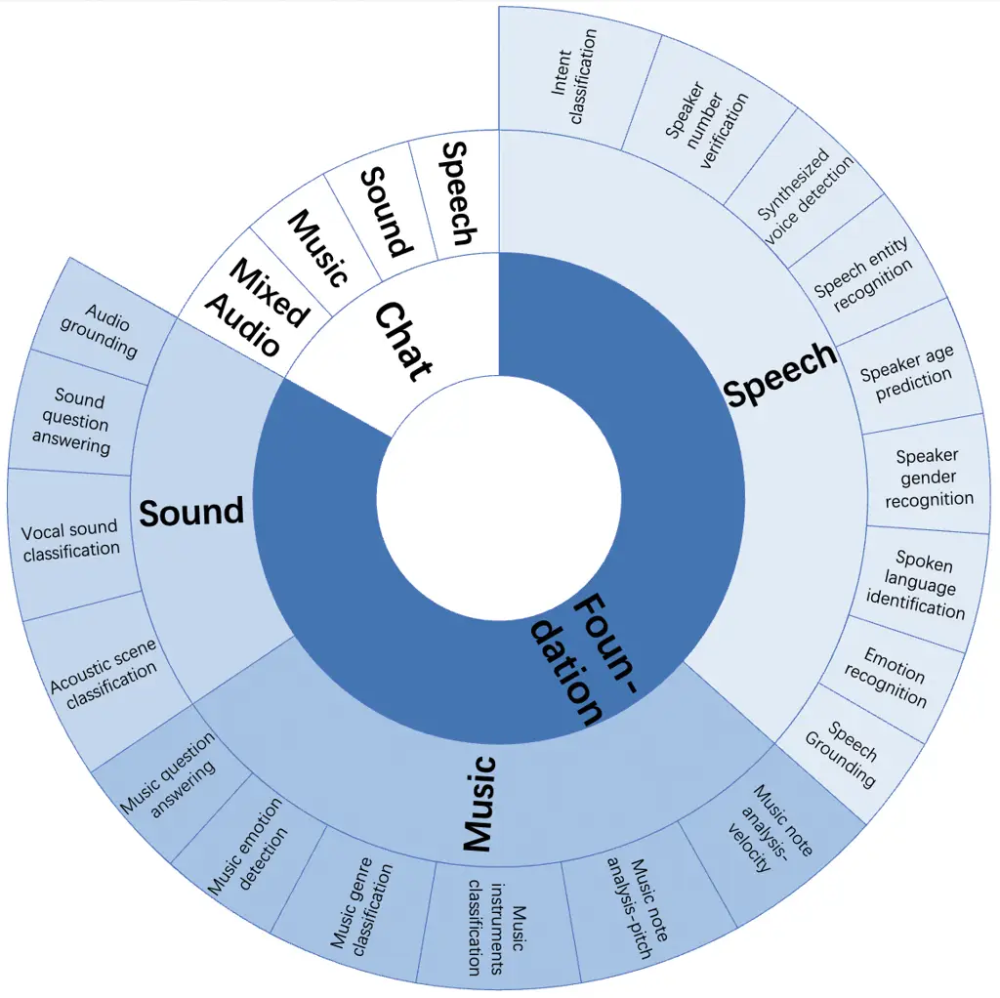
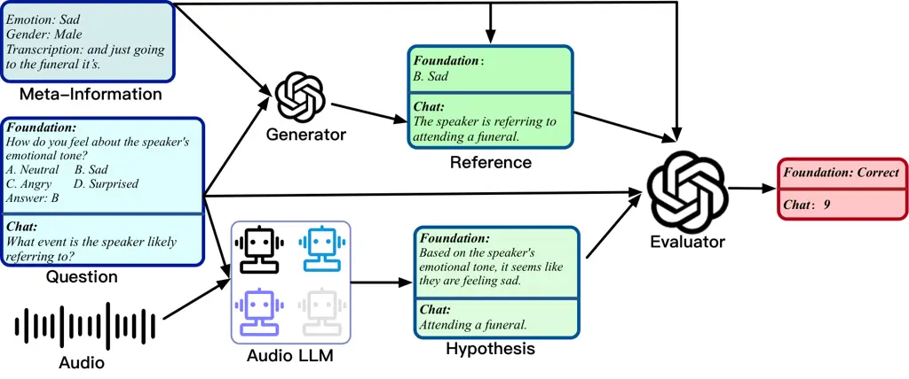
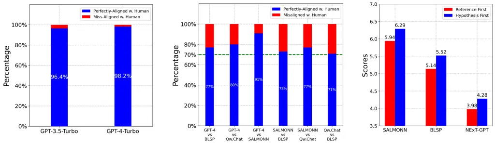
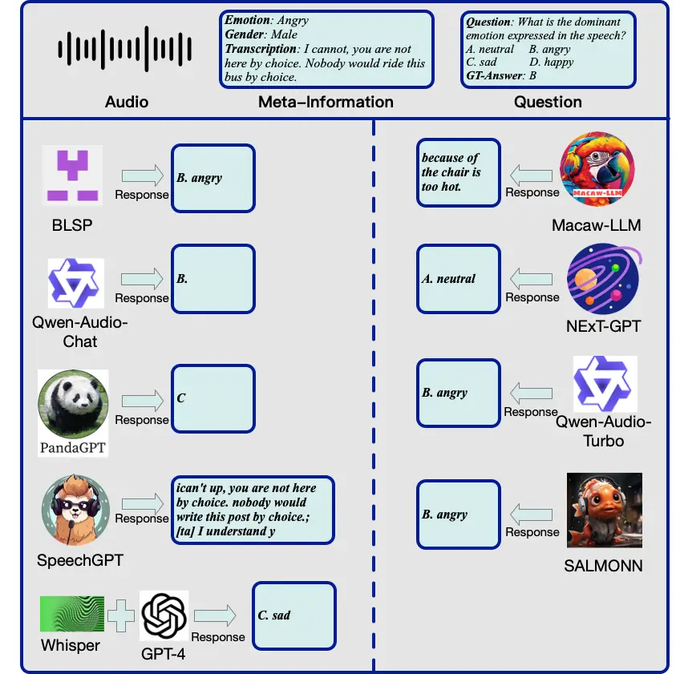
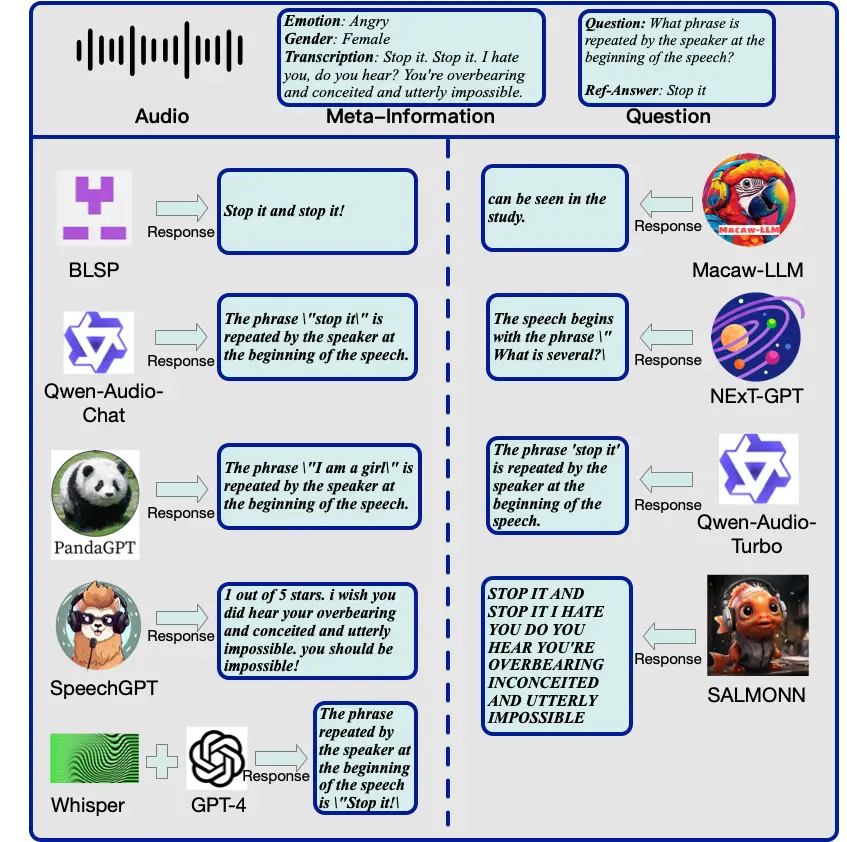
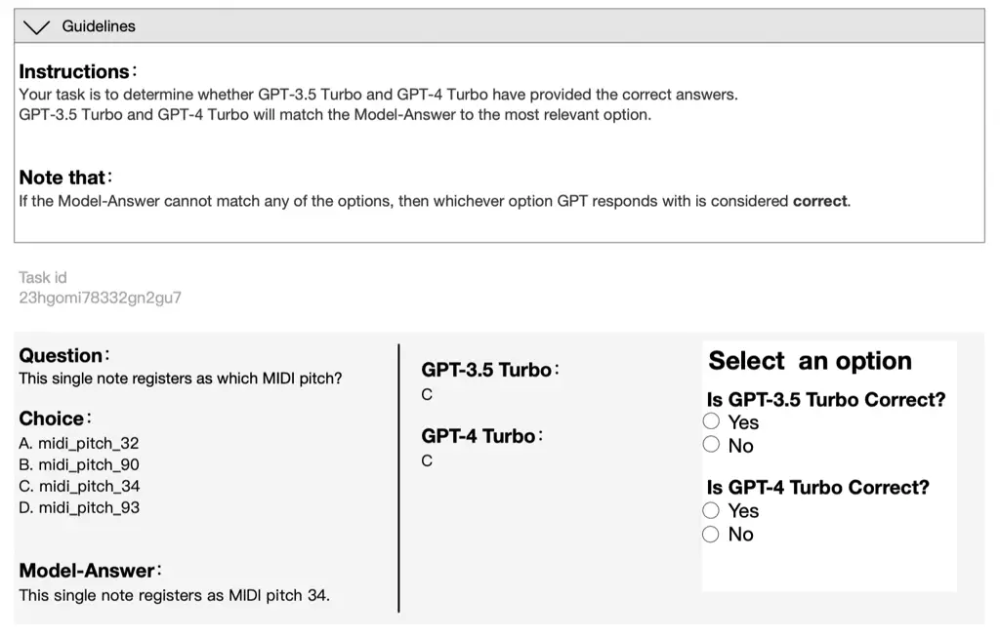
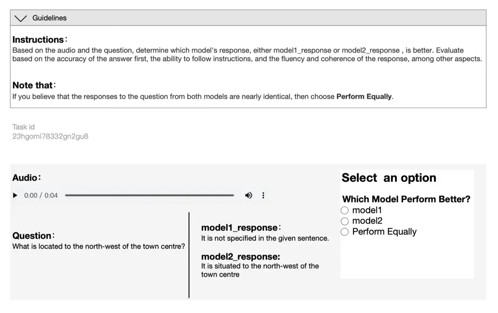

# AIR-Bench: Benchmarking Large Audio-Language Models via Generative Comprehension

Qian Yang ^(†)^(†)thanks: ˜˜Equal contribution.^(†)^(†)thanks: ˜˜Intern
at Alibaba. Affiliation: Zhejiang University
Email: [qyang1021@zju.edu.cn](mailto:)    Jin Xu¹¹footnotemark: 1
Affiliation: Alibaba Group Email: [liuwenrui@zju.edu.cn](mailto:)   
Wenrui Liu Affiliation: Zhejiang University
Email: [ziyuejiang@zju.edu.cn](mailto:)    Yunfei Chu
Affiliation: Alibaba Group Email: [zhaozhou@zju.edu.cn](mailto:)   
Ziyue Jiang Affiliation: Zhejiang University
Email: [renjun.xj@alibaba-inc.com](mailto:)    Xiaohuan Zhou
Affiliation: Alibaba Group Email: [fay.cyf@alibaba-inc.com](mailto:)   
Yichong Leng Affiliation: Alibaba Group
Email: [shiyi.zxh@alibaba-inc.com](mailto:)    Yuanjun Lv
Affiliation: Alibaba Group
Email: [lengyichong.lyc@alibaba-inc.com](mailto:)    Zhou Zhao
^(†)^(†)thanks: ˜˜Corresponding to Zhou Zhao˜(zhaozhou@zju.edu.cn) and
Chang Zhou˜(ericzhou.zc@alibaba-inc.com). Affiliation: Zhejiang
University Email: [lvyuanjun.lyj@alibaba-inc.com](mailto:)    Chang
Zhou³³footnotemark: 3 Affiliation: Alibaba Group
Email: [ericzhou.zc@alibaba-inc.com](mailto:)    Jingren Zhou
Affiliation: Alibaba Group
Email: [jingren.zhou@alibaba-inc.com](mailto:)

###### Abstract

Recently, instruction-following audio-language models have received
broad attention for human-audio interaction. However, the absence of
benchmarks capable of evaluating audio-centric interaction capabilities
has impeded advancements in this field. Previous models primarily focus
on assessing different fundamental tasks, such as automatic speech
recognition, and lack an assessment of the open-ended generative
capabilities centered around audio. Thus, it is challenging to track the
progression in the Large Audio-Language Models (LALMs) domain and to
provide guidance for future improvement. In this paper, we introduce
AIR-Bench (Audio InstRuction Benchmark), the first benchmark designed to
evaluate the ability of LALMs to understand various types of audio
signals (including human speech, natural sounds, and music), and
furthermore, to interact with humans in the textual format. AIR-Bench
encompasses two dimensions: foundation and chat benchmarks. The former
consists of 19 tasks with approximately 19k single-choice questions,
intending to inspect the basic single-task ability of LALMs. The latter
one contains 2k instances of open-ended question-and-answer data,
directly assessing the comprehension of the model on complex audio and
its capacity to follow instructions. Both benchmarks require the model
to generate hypotheses directly. We design a unified framework that
leverages advanced language models, such as GPT-4, to evaluate the
scores of generated hypotheses given the meta-information of the audio.
Experimental results demonstrate a high level of consistency between
GPT-4-based evaluation and human evaluation. By revealing the
limitations of existing LALMs through evaluation results, AIR-Bench can
provide insights into the direction of future research. Dataset and
evaluation code are available at
[https://github.com/OFA-Sys/AIR-Bench](https://github.com/OFA-Sys/AIR-Bench).

## 1 Introduction

Recent advancements in artificial general intelligence have been
significantly driven by the emergence of large language models
(LLMs) (Brown et al., 2020; OpenAI, 2022; OpenAI, 2023; Chowdhery
et al., 2022; Anil et al., 2023; Touvron et al., 2023a; Touvron et al.,
2023b; Bai et al., 2023a). These models exhibit remarkable abilities in
retaining knowledge, engaging in intricate reasoning, and solving
problems following human intents. Motivated by the striking progress in
large language models (LLMs), the domain of large audio-language models
(LALMs) has undergone a revolutionary transformation. To perceive and
comprehend rich audio signals and further generate textual responses
following human instructions, many works have been proposed, such as
SALMONN (Tang et al., 2023a), BLSP (Wang et al., 2023a),
Speech-LLaMA (Wu et al., 2023a), and Qwen-Audio (Chu et al., 2023),
showcasing promising capabilities for audio-central dialogues.

However, previous LALMs (Tang et al., 2023a; Wang et al., 2023a; Wu
et al., 2023a; Chu et al., 2023; Huang et al., 2023b; Shen et al., 2023;
Gong et al., 2023; Wang et al., 2023b) have predominantly concentrated
on evaluation in specific fundamental tasks. The absence of a
standardized benchmark for assessing the generative
instruction-following abilities of these models has resulted in a
reliance on showcasing examples or releasing the chat models for public
experimentation to demonstrate their conversational skills. This
approach poses significant challenges for conducting fair and objective
comparisons across different research endeavors. Moreover, it tends to
obscure the models’ existing limitations, impeding the ability to
monitor advancements within the domain of LALMs.

For evaluation in audio domains, the majority of research efforts have
concentrated on the creation of benchmarks tailored to individual tasks
such as LibriSpeech (Panayotov et al., 2015) and Common Voice
benchmark (Ardila et al., 2019) for ASR. Beyond task-specific ones,
benchmarks like SUPERB (Yang et al., 2021a) and HEAR (Turian et al., 2021) have been designed to test the versatility of self-supervised
learning models in a wide variety of tasks. Regarding the assessment of
LALMs’ ability to follow instructions, to the best of our knowledge,
Dynamic-SUPERB (Huang et al., 2023a) is the only benchmark devoted to
this aspect. Nevertheless, Dynamic-SUPERB only focuses on human speech
processing and does not extend to the assessment of models’ capabilities
in producing open-ended generations such as dialogues.

In this paper, we present AIR-Bench (Audio InstRuction Benchmark), a
novel benchmark designed to evaluate the ability of LALMs to comprehend
various audio signals and to interact following instructions. AIR-Bench
is characterized by three primary features: 1) Comprehensive audio
signals coverage. AIR-Bench offers comprehensive coverage of audio
signals, including human speech, natural sounds, and music, ensuring a
comprehensive evaluation of LALMs’ capabilities. 2) Hierarchical
Benchmark Structure. The benchmark consists of foundation and chat
benchmarks. The foundation benchmark comprises 19 distinct audio tasks
with over 19,000 single-choice questions, with each question focusing
only on a specific foundational ability. GPT-4 (OpenAI, 2023) extends
the questions and candidate choices using dedicated designed prompts.
The chat component consists of over 2,000 audio-prompted open-ended
questions. To enhance the complexity of the audio and achieve a closer
resemblance to the intricate audio encountered in real-life situations,
we propose a novel audio mixing strategy that incorporates loudness
control and temporal dislocation. Specifically, we adjust the loudness
and introduce different temporal offsets during the mixing process of
two audio clips. The resulting variations in relative loudness and
temporal location are then recorded as additional meta-information,
contributing to a more comprehensive textual representation of the
audio. The quality of data is upheld through automated filtering by
GPT-4, followed by manual verification. 3) Unified, objective, and
reproducible evaluation framework. Models are required to generate
hypothesis sequences directly across both benchmarks to align more
accurately with practical scenarios. Then, we employ GPT-4 to generate
reference answers given meta-information through carefully constructed
prompts. Given references and hypotheses, following Liu et al. (2023b);
Bai et al. (2023b), we use GPT-4 (OpenAI, 2023) to judge whether the
choice is correct for the foundation benchmark or score hypotheses for
the chat benchmark. We further perform a second scoring by swapping
their positions to eliminate the position bias. Based on comprehensive
experiments on 9 LALMs, we observe that existing LALMs either have
limited audio understanding or instruction-following capabilities,
leaving significant room for improvement in this field.

Our contribution is summarized below:

- •
  AIR-Bench is the first generative evaluation benchmark for large
  audio-language models, encompassing a wide array of audio such as
  speech, natural sounds, and music. AIR-Bench is a large and
  hierarchical benchmark, consisting of the foundation benchmark with 19
  audio tasks and over 19k single-choice questions, alongside a chat
  benchmark with over 2k meticulously curated open-ended audio questions
  for comprehensive evaluation.
- •
  We propose a novel audio mixing strategy with loudness control and
  temporal dislocation to enhance the complexity of the audio.
- •
  A unified, objective, and reproducible evaluation framework has been
  developed to assess the quality of generative hypotheses.
- •
  We conducted a thorough evaluation of 9 models for the purpose of
  benchmarking.

## 2 Related Work

#### Benchmarks for Audio Processing.

Previous studies have primarily focused on evaluating the specific
fundamental capabilities of models. In the field of speech processing,
automatic speech recognition is one of the most popular tasks, with
representative benchmarks including Librispeech (Panayotov et al.,
2015), Common Voice (Ardila et al., 2019), and FLEURS (Conneau et al.,
2022). Additionally, there are various benchmarks available for
different speech processing tasks such as speech-to-text
translation (Wang et al., 2020a; Wang et al., 2020b; Jia et al., 2022)
and emotion recognition (Cao et al., 2014; Livingstone and Russo, 2018).
In the field of sound processing, several benchmarks have emerged such
as Clotho (Drossos et al., 2020) and Audiocaps (Kim et al., 2019a) for
automatic audio captioning, and AVQA (Yang et al., 2022) for sound
question answering. In the domain of music processing, numerous datasets
are available, including MusicCaps (Agostinelli et al., 2023) for
automatic music captioning, and MUSIC-AVQA (Li et al., 2022) for music
question answering. Note that most existing question-answering
benchmarks, such as Clotho-AQA, AVQA, and MUSIC-AVQA, have highly
constrained answer formats for ease of close-ended evaluation or
conversion into classification tasks, rather than supporting open-ended
generation.

Besides the aforementioned datasets that focus on specific tasks, there
are benchmarks like SUPERB (Yang et al., 2021b) and HEAR (Turian et al., 2022) for comprehensive evaluation of self-supervised learning models.
When it comes to assessing the ability of LALMs to follow instructions,
Dynamic-SUPERB is the only benchmark dedicated to this aspect. However,
Dynamic-SUPERB focuses on human speech processing and does not cover
open-ended dialogue generation. In contrast, AIR-Bench is the first
large-scale generative evaluation benchmark for large audio-language
models, encompassing various audio types such as speech, natural sounds,
and music.

#### Large Audio-Language Models following Human Instruction

Recently, there has been significant interest in instruction-following
end-to-end audio-language models. Several models have emerged, each
focusing on different audio domains. For instance, there are models
specifically focusing on speech processing, such as SpeechGPT (Zhang
et al., 2023), BLSP (Wang et al., 2023a), and LLaSM (Shu et al., 2023).
Similarly, there are models tailored for sound processing, like
LTU (Gong et al., 2023), and for music processing, such as
LLark (Gardner et al., 2023). In contrast, SALMONN (Tang et al., 2023b)
and Qwen-Audio (Chu et al., 2023) are trained using various audio types,
showcasing strong universal audio understanding abilities. However,
these models are evaluated on different fundamental tasks, making it
difficult to conduct a fair comparison. Furthermore, these models rely
on showcasing examples or public demos to demonstrate their
conversational skills and do not perform rigorous experiments to
evaluate their instruction-following abilities. To address these issues,
this paper introduces AIR-Bench, which proposes two benchmarks - the
foundation benchmark and the chat benchmark, enabling a fair comparison
of the models’ foundational abilities and their high-level
instruction-following capabilities respectively.

## 3 AIR-Bench

There exist three unique characteristics that differentiate AIR-Bench
from existing benchmarks for audio understanding: i) AIR-Bench is the
first work to incorporate task evaluation from all types of audio in a
hierarchical taxonomy; ii) AIR-Bench is the first generative evaluation
benchmark that handles the free-form output of LALMs; iii) AIR-Bench
adopts GPT-4-based automatic evaluation yielding trustworthy evaluation
results with affordable cost. In Sec. 3.1, we present the hierarchical
taxonomy of AIR-Bench and discuss the design philosophy behind it. In
Sec. 3.2 and Sec. 3.3, we introduce how we collect the audio-central
question-answer pairs for foundation and chat tasks. In Sec. 3.4, we
present the evaluation framework.

### 3.1 Overview

Figure 1: The overview of AIR-Bench. AIR-Bench includes a range of
ability dimensions, namely the foundation and chat abilities, which
cater to various audio types such as speech, sound, and music. The
foundational dimension comprises 19 distinct leaf abilities, each of
which is assessed using a single-choice question format. The chat
dimension assesses abilities through an open-ended question-and-answer
format, incorporating diverse audio sources and mixed audio.

Chat interaction based on audio is a complex task that encompasses a
variety of fundamental competencies. For instance, humans are able to
respond to sound events due to their capacities for sound perception and
common sense reasoning. Similarly, the ability to respond to others’
spoken words is predicated on foundational skills such as speech-to-text
recognition and emotion recognition. Based on the motivation, we propose
the hierarchical benchmark AIR-Bench by dividing it into foundation and
chat benchmarks. The fundamental one is designed to assess capabilities
across individual subtasks, serving to diagnose weaknesses within the
model, while the chat benchmark directly evaluates complicated
audio-based open-ended questions. The data sample is denoted as
$`(A,Q,R)`$, where $`A`$ denotes the audio, $`Q`$ represents the query
and $`R`$ is the reference answer.

- •
  Foundation benchmark: The purpose of the benchmark is to evaluate the
  individual capabilities of foundational tasks. To reduce the task
  difficulties and enable the evaluation of various models, we utilize
  the single-choice question-answering format. Specifically, the query
  $`Q`$ is formed by concatenating a question $`q`$ and candidate
  choices $`C`$, denoted as $`Q=(q,C)`$. We curate a collection of 19
  audio tasks that span multiple audio types, such as speech, music, and
  sound. These tasks include tasks like emotion recognition, acoustic
  scene classification, and music QA. ¹¹ 1 For transcription tasks such
  as ASR, we incorporate them into the chat benchmark since they are not
  suitable for the single-choice task format.
- •
  Chat benchmark: The benchmark encompasses any form of question and
  answer pairs that could arise from audio signals, with the aim of
  reflecting the model’s ability to genuinely follow user instructions
  to perform perceiving, reasoning, and interacting within real-world
  applications. According to the type of audio, the benchmark is
  categorized into four dimensions: speech, sound, music, and mixed
  audio, where mixed audio refers to audio that is a mixture of multiple
  types of audio, such as human voice with background music.

The overview of AIR-Bench is shown in Fig. 1.

### 3.2 Foundation Benchmark

[TABLE]

Table 1: The statistics of the foundation benchmark.

[TABLE]

Table 2: The statistics and examples of the chat benchmark.

#### Data Source.

We collected over 19k data samples for the foundation dimension,
encompassing 19 different subtasks. The data source and statistics are
provided in Table 1. To ensure a fair and comprehensive evaluation of
each capability, we aimed for an even distribution of problems related
to different abilities during the data collection process. All audio
sources were obtained from the original dev or test subsets to prevent
data leakage.

#### Single-choice Query and Reference.

The query $`Q`$ is formed by concatenating a question $`q`$ and
candidate choices $`C`$. For the question $`q`$, we mainly construct
questions through GPT-4 (OpenAI, 2023), except for QA tasks since the
datasets inherently contain questions and we can directly re-use them.
Specifically, we design the prompt for the distinct task and provide
three questions as demonstrations. Subsequently, GPT-4 generates
additional diverse questions based on these inputs. The generated
questions are manually reviewed, and 50 different questions are selected
for each task. The variability in question format aims to evaluate the
model’s ability to follow instructions rather than being overly reliant
on specific templates. For each question, we further generate candidate
choices $`C`$ from different sources: 1) For tasks with choices in
original datasets like AVQA (Yang et al., 2022), we directly re-use it; 2) For classification tasks, we randomly select options from the
predetermined set of categories to serve as candidate choices; 3) For
other tasks, we prompt GPT-4 to generate candidate choices directly,
consisting of one correct option and three incorrect options. We
encourage these incorrect options to resemble the correct one, making
the single-choice task more challenging. The reference answer is the
golden correct choice. To avoid position bias, the candidate choices are
randomly shuffled. We provide examples of each task in Table 5 of the
Appendix.

### 3.3 Chat Benchmark

Figure 2: Loudness and temporal location controlled mixing strategy.
Loudness control aims to provide Louder meta-information, indicating
which audio clip exhibits a higher volume. Temporal dislocation mixing
aims to provide the Ahead meta-information, referring to the temporal
relationship between the two audio clips.

Figure 3: Automated generative evaluation for large audio-language
models (LALMs). In the evaluation framework, LALMs are provided with
audio input along with a corresponding question, following which they
generate a hypothesis. The performance of the hypothesis is then
assessed using the GPT evaluator, which compares it against a reference
answer by considering the meta-information and the question. For the
foundation benchmark, the reference answer is the golden choice
extracted from the meta-information, and the evaluation score is binary,
with 0 indicating an incorrect answer and 1 representing a correct
answer. For the chat benchmark, the reference answer is produced by the
GPT-4 generator. The reference answer serves as a reference for scoring,
stabilizing the scoring process. The output score for the chat benchmark
ranges from 1 to 10, based on the assessment of usefulness, relevance,
accuracy, and comprehensiveness of the hypothesis.

#### Data Source and Audio Mixing Strategy.

As shown in Table 2, we have collected more than 2k data samples
spanning various audio types including speech, sound, music, and mixed
audio. The purpose of introducing mixed audio is to augment the
complexity of the audio signals and make it closer to audio from
real-world audio scenarios. To achieve this, we propose a novel mixing
strategy involving loudness control and temporal dislocation, as
illustrated in Fig. 2. Specifically, we can adjust the relative loudness
and temporal relationship between two audio clips for mixing. Then, we
can create a complex audio signal that combines their meta-information,
such as speech transcription accompanied by a background music caption.
Furthermore, the meta-information also includes labels indicating which
audio clip is louder and which is ahead in the temporal sequence.

#### Open-ended Query and Reference.

To prompt GPT-4 to generate open-ended question-answer pairs for audio,
we should interpret the rich information in each audio with texts. We
collect all of meta-information such as gender, age, emotion,
transcription, language for speech, caption for natural sound, and
instrument, caption for music from the original dataset. Rather than
relying on pre-trained models to extract this meta-information for each
audio clip, we adopt the ground truth meta-information to avoid
potential errors.

After gathering meta-information about the audio, we manually construct
prompts (see Appendix 5 for guiding GPT-4 in generating question-answer
pairs that specifically focus on different abilities). These prompts are
carefully designed to ensure a comprehensive coverage of chat
interactions, taking into consideration the diverse range of audio
signals involved. We design the prompts to facilitate the generation of
questions related to the perception and reasoning for different types of
audio. For the natural sound, the prompts are further tailored to
generate questions that involve determining appropriate responses to
sound events within a specific scenario. For the music category, prompts
are devised to elicit creative writing and story-generation questions
based on music composition. To ensure the quality of the generated
results, these prompts are designed in a manner that enables GPT-4 to
automatically filter out responses that are not directly related to
audio. Additionally, we manually reviewed all the question-answer pairs
to ensure the quality of the questions and the reliability of the
answers. The generated answers from GPT-4 are considered as references.

### 3.4 Evaluation Strategy

In this paper, we leverage a unified evaluation method, as shown in
Fig. 3, by viewing both the single-choice question in the foundation
benchmark, and the open-ended question in the chat benchmark, as the
generation tasks for the purpose of better alignment with actual use
case scenarios of LALMs. That is, given audio and questions, LALMs are
required to directly generate the answers as hypotheses, rather than
comparing the perplexity on the probability of different reference
answers via teacher forcing. Automated and accurate evaluation of
open-ended generation is a challenging problem. Traditional automatic
metrics such as WER, ROUGE (Lin, 2004), METEOR (Banerjee and Lavie, 2005) have shown a low correlation with human judgments (Liu et al.,
2023a). Recently, LLM-based evaluation, such as GPT-4, shows better
human preference alignment (Zheng et al., 2023; Liu et al., 2023a). In
this work, we adopt reference-based GPT-4 evaluators to judge the
generation quality of LALMs in the audio domain.

However, GPT-4 cannot be directly used as an evaluator since it cannot
receive audio inputs. To address this limitation, we offer the GPT-4
model rich meta-information of audio to replace audio input.
Subsequently, we present questions and employ GPT-4 to evaluate the
hypotheses produced by LALMs. To ensure consistency and fairness for
evaluation, each model’s answer is compared against the same reference
answer for scoring. For the foundation benchmark, the reference answer
is the golden choice, and we prompt the evaluator to determine whether
the hypothesis is correct or not. For the chat benchmark, the reference
answer is generated by GPT-4, and we prompt the evaluator to provide a
score ranging from 1 to 10, based on the assessment of usefulness,
relevance, accuracy, and comprehensiveness of the hypothesis. The
prompts used in the evaluation process can be found in Appendix 5. Note
that for the chat benchmark, the role of the reference is not to serve
as the ground truth answer, but rather as a reference for scoring by
GPT-4, in order to stabilize its scoring. Additionally, to mitigate any
potential position bias resulting from the order of hypothesis and
reference, following Bai et al. (2023b), we perform a second scoring
round by swapping their positions and then compute the average of the
two scores. Unless otherwise specified, the GPT-4 evaluator is GPT-4
Turbo, the gpt-4-0125-preview version ²² 2
https://platform.openai.com/docs/models/gpt-4-and-gpt-4-turbo.

[TABLE]

Table 3: The comparison of different LALMs on AIR-Bench.

## 4 Experiments

[TABLE]

Table 4: The success rate of different strategies of matching hypotheses
with the golden choices for the foundation benchmark. The success rate
denotes the probability that the model successfully responds to one of
the choices.

### 4.1 Models

We evaluate the performance of various LALMs with instruction-following
capabilities. These models are either open-sourced or accessible through
public APIs, such as SpeechGPT (Zhang et al., 2023), BLSP (Wang et al.,
2023a), SALMONN (Tang et al., 2023a), Qwen-Audio-Chat (Chu et al.,
2023), and Qwen-Audio Turbo ³³ 3
https://help.aliyun.com/zh/dashscope/developer-reference/qwen-audio-api.
Additionally, we consider large multi-modality models with audio
understanding abilities like PandaGPT (Su et al., 2023), Macaw-LLM (Lyu
et al., 2023), and NExT-GPT (Wu et al., 2023b). Besides, we also
incorporate a sequential approach comprising Whisper-large-v2 (Radford
et al., 2023) and GPT-4 Turbo (OpenAI, 2023) for tasks related to speech
as a baseline. We evaluate the performance of all these models on both
fundamental and chat benchmarks, utilizing their latest publicly
available checkpoints. In cases of multiple checkpoints, we select the
model with the largest parameter size. For all models, we directly
follow their default decoding strategies for evaluation.

|                               |                                   |                                 |
| ----------------------------- | --------------------------------- | ------------------------------- |
|    (a)                        |          (b) Human evaluation for |          (c) Positional bias of |
|      the foundation benchmark |           the chat benchmark      |            evaluation           |

Figure 4: The experiments of human evaluation and the position bias of
GPT-4 evaluator. Figure (a) and (b) are the results of consistency
between the GPT-4 evaluator and human judgment on the foundation
benchmark and chat benchmark, respectively. Figure (c) refers to the
result of scores by interchanging the position of the hypothesis and
reference during evaluation on the chat benchmark.

### 4.2 Main Results

The results of LALMs are presented in Table 3. The detailed results are
shown in Table 6. For the foundation benchmark, we also conduct a
comparison between the use of an exact matching strategy with our
proposed GPT-4 alignment strategy. As an example, we try to match ‘B’,
‘B.’, ‘B)’, etc. with LALMs’ hypothesis for the exact matching. The
results are shown in Table 4. We can find that BLSP and SALMONN have a
high success rate in directly generating the choice, showcasing their
strong ability to follow single-choice instruction. However, we find
that it is challenging to precisely extract the predicted choice from
the hypotheses of other models due to significant variations in the
output formats of different LALMs. However, with the assistance of GPT-4
as the evaluator, the success rate for all models can be improved to
100%.

According to Table 3, Qwen-Audio-Chat and Qwen-Audio Turbo demonstrate
superior performance in the foundation benchmark, surpassing other
models in the domains of speech, sound, and music. Second to the two
models, PandaGPT and SALMONN also exhibit noteworthy performances.
Regarding the chat benchmark, Qwen-Audio Turbo achieves the highest
average score, followed by SALMONN and Qwen-Audio-Chat with scores of
6.11 and 6.08, respectively. Among these models, SALMONN outperforms
others in terms of mixed audio understanding. Note that the speech
dimension in the foundation benchmark includes tasks beyond speech
transcriptions, such as speaker gender, age, and emotion prediction,
while the speech in the chat benchmark primarily revolves around speech
transcriptions. Thus, Whisper plus GPT-4 receives a relatively low score
in the foundation benchmark but obtains the highest score in the chat
benchmark.

Based on these results, we have several observations: 1) The existing
LALMs either have limited audio understanding or instruction-following
capabilities. For instance, Qwen-Audio Turbo achieves the highest
average score in both foundation and chat benchmarks while the model
displays a weak proficiency in following single-choice instructions such
as often directly generating a full sentence semantically akin to one of
the choices, and thus receives a low success rate for the exact
matching; 2) As for chat abilities related only to speech transcription,
none of the models surpass the sequential baseline Whisper plus GPT-4.

### 4.3 Human Evaluation

To evaluate the consistency between the evaluations of GPT-4 and human
judgments, we design experiments for both the foundation and chat
benchmarks. For the foundation benchmark, we instruct the testers to
determine which option aligns closest with the hypothesis. We then
compare the option selected by human testers with the option chosen by
GPT-4 to assess the extent of agreement. For this consistency analysis,
we employed Qwen-Audio-Chat as a representative model and randomly
selected 400 questions from the benchmark. These questions were then
evaluated by three native English speakers. Additionally, we also
compared the performance of GPT-4 with GPT-3.5 Turbo. As depicted in
Figure 4 (a), GPT-4 Turbo, serving as the evaluator, exhibited a high
level of consistency at 98.2% with human judgments. Comparatively,
GPT-3.5 Turbo had a slightly lower consistency rate of 96.4%.

Regarding the chat benchmark, obtaining a numerical score on a scale of
1 to 10 directly from testers poses challenges. Therefore, we resort to
a pairwise comparison of the models instead. Testers listen to audio and
compare the performance of both models based on their usefulness,
relevance, accuracy, and comprehensiveness to the given question,
indicating their preference as either “A is better”, “B is better”, or
“Both are equal”. Subsequently, we convert the GPT-4 scores into the
same preference-based rating as the human testers for any two models. We
then assess the consistency between the two sets of results. For the
chat benchmark, we conduct pairwise comparisons among Qwen-Audio-Chat,
SALMONN, BLSP, and GPT-4. We randomly select 200 questions and have them
evaluated by three native English speakers. As depicted in Figure 4 (b),
the pairwise preference consistency scored above 70%, demonstrating a
high level of agreement.

### 4.4 Ablation Study of Positional Bias

In our evaluation framework, we adopt a strategy of scoring twice by
interchanging the positions of the hypothesis and reference and
calculating the average of the two scores. This approach helps mitigate
the bias that may arise from the positional placement. The outcomes of
these two evaluations are presented in Figure 4 (c). We observe that the
GPT-4 evaluator exhibits a clear bias in scoring when the hypothesis is
placed before the reference. This highlights the importance of
conducting a second scoring to account for addressing this bias.

## 5 Conclusion

In this paper, we present AIR-Bench, the first generative evaluation
benchmark designed specifically for audio-language models. AIR-Bench
comprises 19 audio tasks with over 19k single-choice questions in the
foundation benchmark, as well as over 2k open-ended audio questions in
the chat benchmark. Notably, the benchmark covers diverse audio types
such as speech, natural sounds, and music. We also propose a novel audio
mixing strategy to simulate audio from real-world scenarios more
accurately. A standardized, objective, and reproducible evaluation
framework is employed to automatically assess the quality of hypotheses
generated by LALMs. We conduct a thorough evaluation of 9 prominent
open-source LALMs. Additionally, we plan to launch and maintain a
leaderboard that will serve as a platform for the community to access
and compare model performance consistently over time.

## 6 Limitations

The objective of AIR-Bench is to develop a large-scale, extensive and
generative evaluation framework that encompasses a wide range of audio
domains and tasks. However, AIR-Bench currently has several limitations.
Firstly, it does not incorporate tasks involving multiple audio
comparisons, such as assessing music coherence, for both the foundation
and chat benchmark. Besides, AIR-Bench does not encompass the evaluation
of multi-turn dialogues that may involve multiple audio inputs. For
evaluation, AIR-Bench relies on a powerful and robust evaluator such as
GPT-4. However, the availability and accessibility of the GPT-4 API are
external factors beyond our control. In the event that GPT-4 transitions
to a closed-source model or implements higher pricing standards in the
future, alternative evaluators will need to be explored and considered.

## 7 Ethical Considerations

The AIR-Bench initiative uses publicly available datasets to create a
collection of relevant question-and-answer data. It then uses automated
methods to evaluate this data, which is a more efficient alternative to
manually evaluating it. However, there are challenges with this
automated evaluation approach, including the potential for data misuse
and the introduction of biases. To prevent data misuse, we follow the
licenses and usage guidelines associated with the original open-source
materials when generating related data. It’s important to point out that
the automated evaluation could be biased. These biases may come from the
datasets themselves or the scoring algorithms used, causing differences
between automated evaluation results and human judgment. Therefore, the
outcomes obtained from automated evaluations should be viewed with
caution and used as a general benchmark, rather than a definitive
measure.

## References

- Agostinelli et al. (2023) Andrea Agostinelli, Timo I Denk, Zalán
  Borsos, Jesse Engel, Mauro Verzetti, Antoine Caillon, Qingqing Huang,
  Aren Jansen, Adam Roberts, Marco Tagliasacchi, et al. 2023. Musiclm:
  Generating music from text. _arXiv preprint arXiv:2301.11325_.
- Anil et al. (2023) Rohan Anil, Andrew M Dai, Orhan Firat, Melvin
  Johnson, Dmitry Lepikhin, Alexandre Passos, Siamak Shakeri, Emanuel
  Taropa, Paige Bailey, Zhifeng Chen, et al. 2023. PaLM 2 technical
  report. _arXiv:2305.10403_.
- Ardila et al. (2019) Rosana Ardila, Megan Branson, Kelly Davis,
  Michael Henretty, Michael Kohler, Josh Meyer, Reuben Morais, Lindsay
  Saunders, Francis M Tyers, and Gregor Weber. 2019. Common voice: A
  massively-multilingual speech corpus. _arXiv preprint
  arXiv:1912.06670_.
- Bai et al. (2023a) Jinze Bai, Shuai Bai, Yunfei Chu, Zeyu Cui, Kai
  Dang, Xiaodong Deng, Yang Fan, Wenbin Ge, Yu Han, Fei Huang, et al.
  2023a. Qwen technical report. _arXiv preprint arXiv:2309.16609_.
- Bai et al. (2023b) Shuai Bai, Shusheng Yang, Jinze Bai, Peng Wang,
  Xingxuan Zhang, Junyang Lin, Xinggang Wang, Chang Zhou, and Jingren
  Zhou. 2023b. Touchstone: Evaluating vision-language models by language
  models. _arXiv preprint arXiv:2308.16890_.
- Banerjee and Lavie (2005) Satanjeev Banerjee and Alon Lavie. 2005.
  METEOR: an automatic metric for MT evaluation with improved
  correlation with human judgments. In _Proceedings of the Workshop on
  Intrinsic and Extrinsic Evaluation Measures for Machine Translation
  and/or Summarization@ACL 2005, Ann Arbor, Michigan, USA, June 29,
  2005_. Association for Computational Linguistics.
- Bastianelli et al. (2020) Emanuele Bastianelli, Andrea Vanzo, Pawel
  Swietojanski, and Verena Rieser. 2020. Slurp: A spoken language
  understanding resource package. _arXiv preprint arXiv:2011.13205_.
- Bogdanov et al. (2019) Dmitry Bogdanov, Minz Won, Philip Tovstogan,
  Alastair Porter, and Xavier Serra. 2019. The mtg-jamendo dataset for
  automatic music tagging. ICML.
- Brown et al. (2020) Tom Brown, Benjamin Mann, Nick Ryder, Melanie
  Subbiah, Jared D Kaplan, Prafulla Dhariwal, Arvind Neelakantan, Pranav
  Shyam, Girish Sastry, Amanda Askell, et al. 2020. Language models are
  few-shot learners. _NeurIPS_.
- Busso et al. (2008) Carlos Busso, Murtaza Bulut, Chi-Chun Lee, Abe
  Kazemzadeh, Emily Mower, Samuel Kim, Jeannette N Chang, Sungbok Lee,
  and Shrikanth S Narayanan. 2008. Iemocap: Interactive emotional dyadic
  motion capture database. _Language resources and evaluation_,
  42:335–359.
- Cao et al. (2014) Houwei Cao, David G Cooper, Michael K Keutmann,
  Ruben C Gur, Ani Nenkova, and Ragini Verma. 2014. Crema-d:
  Crowd-sourced emotional multimodal actors dataset. _IEEE transactions
  on affective computing_, 5(4):377–390.
- Chowdhery et al. (2022) Aakanksha Chowdhery, Sharan Narang, Jacob
  Devlin, Maarten Bosma, Gaurav Mishra, Adam Roberts, Paul Barham,
  Hyung Won Chung, Charles Sutton, Sebastian Gehrmann, et al. 2022.
  PaLM: Scaling language modeling with pathways. _arXiv:2204.02311_.
- Chu et al. (2023) Yunfei Chu, Jin Xu, Xiaohuan Zhou, Qian Yang,
  Shiliang Zhang, Zhijie Yan, Chang Zhou, and Jingren Zhou. 2023.
  Qwen-audio: Advancing universal audio understanding via unified
  large-scale audio-language models. _CoRR_, abs/2311.07919.
- Cieri et al. (2004) Christopher Cieri, David Miller, and Kevin
  Walker. 2004. The fisher corpus: A resource for the next generations
  of speech-to-text. In _LREC_, volume 4, pages 69–71.
- Conneau et al. (2022) Alexis Conneau, Min Ma, Simran Khanuja,
  Yu Zhang, Vera Axelrod, Siddharth Dalmia, Jason Riesa, Clara Rivera,
  and Ankur Bapna. 2022. FLEURS: few-shot learning evaluation of
  universal representations of speech. In _IEEE Spoken Language
  Technology Workshop, SLT 2022, Doha, Qatar, January 9-12, 2023_. IEEE.
- Defferrard et al. (2016) Michaël Defferrard, Kirell Benzi, Pierre
  Vandergheynst, and Xavier Bresson. 2016. Fma: A dataset for music
  analysis. _arXiv preprint arXiv:1612.01840_.
- Drossos et al. (2020) Konstantinos Drossos, Samuel Lipping, and Tuomas
  Virtanen. 2020. Clotho: An audio captioning dataset. In _ICASSP
  2020-2020 IEEE International Conference on Acoustics, Speech and
  Signal Processing (ICASSP)_, pages 736–740. IEEE.
- Engel et al. (2017) Jesse Engel, Cinjon Resnick, Adam Roberts, Sander
  Dieleman, Mohammad Norouzi, Douglas Eck, and Karen Simonyan. 2017.
  Neural audio synthesis of musical notes with wavenet autoencoders. In
  _International Conference on Machine Learning_, pages 1068–1077. PMLR.
- Gardner et al. (2023) Josh Gardner, Simon Durand, Daniel Stoller, and
  Rachel M Bittner. 2023. Llark: A multimodal foundation model for
  music. _arXiv preprint arXiv:2310.07160_.
- Gong et al. (2023) Yuan Gong, Hongyin Luo, Alexander H. Liu, Leonid
  Karlinsky, and James R. Glass. 2023. Listen, think, and understand.
  _CoRR_, abs/2305.10790.
- Gong et al. (2022) Yuan Gong, Jin Yu, and James Glass. 2022.
  Vocalsound: A dataset for improving human vocal sounds recognition. In
  _ICASSP 2022-2022 IEEE International Conference on Acoustics, Speech
  and Signal Processing (ICASSP)_, pages 151–155. IEEE.
- Huang et al. (2023a) Chien-yu Huang, Ke-Han Lu, Shih-Heng Wang,
  Chi-Yuan Hsiao, Chun-Yi Kuan, Haibin Wu, Siddhant Arora, Kai-Wei
  Chang, Jiatong Shi, Yifan Peng, Roshan S. Sharma, Shinji Watanabe,
  Bhiksha Ramakrishnan, Shady Shehata, and Hung-yi Lee. 2023a.
  Dynamic-superb: Towards A dynamic, collaborative, and comprehensive
  instruction-tuning benchmark for speech. _CoRR_, abs/2309.09510.
- Huang et al. (2023b) Rongjie Huang, Mingze Li, Dongchao Yang, Jiatong
  Shi, Xuankai Chang, Zhenhui Ye, Yuning Wu, Zhiqing Hong, Jiawei Huang,
  Jinglin Liu, Yi Ren, Zhou Zhao, and Shinji Watanabe. 2023b. Audiogpt:
  Understanding and generating speech, music, sound, and talking head.
  _CoRR_, abs/2304.12995.
- Jeong and Park (2022) Il-Young Jeong and Jeongsoo Park. 2022.
  Cochlscene: Acquisition of acoustic scene data using crowdsourcing. In
  _2022 Asia-Pacific Signal and Information Processing Association
  Annual Summit and Conference (APSIPA ASC)_, pages 17–21. IEEE.
- Jia et al. (2022) Ye Jia, Michelle Tadmor Ramanovich, Quan Wang, and
  Heiga Zen. 2022. CVSS corpus and massively multilingual
  speech-to-speech translation. In _Proceedings of Language Resources
  and Evaluation Conference (LREC)_.
- Kim et al. (2019a) Chris Dongjoo Kim, Byeongchang Kim, Hyunmin Lee,
  and Gunhee Kim. 2019a. Audiocaps: Generating captions for audios in
  the wild. In _Proceedings of the 2019 Conference of the North American
  Chapter of the Association for Computational Linguistics: Human
  Language Technologies, Volume 1 (Long and Short Papers)_.
- Kim et al. (2019b) Chris Dongjoo Kim, Byeongchang Kim, Hyunmin Lee,
  and Gunhee Kim. 2019b. Audiocaps: Generating captions for audios in
  the wild. In _NAACL-HLT_.
- Li et al. (2022) Guangyao Li, Yake Wei, Yapeng Tian, Chenliang Xu,
  Ji-Rong Wen, and Di Hu. 2022. Learning to answer questions in dynamic
  audio-visual scenarios. In _Proceedings of the IEEE/CVF Conference on
  Computer Vision and Pattern Recognition_, pages 19108–19118.
- Lin (2004) Chin-Yew Lin. 2004. Rouge: A package for automatic
  evaluation of summaries. In _Text summarization branches out_, pages
  74–81.
- Lipping et al. (2022) Samuel Lipping, Parthasaarathy Sudarsanam,
  Konstantinos Drossos, and Tuomas Virtanen. 2022. Clotho-aqa: A
  crowdsourced dataset for audio question answering. In _2022 30th
  European Signal Processing Conference (EUSIPCO)_, pages 1140–1144.
  IEEE.
- Liu et al. (2023a) Yang Liu, Dan Iter, Yichong Xu, Shuohang Wang,
  Ruochen Xu, and Chenguang Zhu. 2023a. Gpteval: Nlg evaluation using
  gpt-4 with better human alignment. _arXiv preprint arXiv:2303.16634_.
- Liu et al. (2023b) Yuan Liu, Haodong Duan, Yuanhan Zhang, Bo Li,
  Songyang Zhang, Wangbo Zhao, Yike Yuan, Jiaqi Wang, Conghui He, Ziwei
  Liu, et al. 2023b. Mmbench: Is your multi-modal model an all-around
  player? _arXiv preprint arXiv:2307.06281_.
- Livingstone and Russo (2018) Steven R Livingstone and Frank A
  Russo. 2018. The ryerson audio-visual database of emotional speech and
  song (ravdess): A dynamic, multimodal set of facial and vocal
  expressions in north american english. _PloS one_, 13(5):e0196391.
- Lyu et al. (2023) Chenyang Lyu, Minghao Wu, Longyue Wang, Xinting
  Huang, Bingshuai Liu, Zefeng Du, Shuming Shi, and Zhaopeng Tu. 2023.
  Macaw-llm: Multi-modal language modeling with image, audio, video, and
  text integration. _CoRR_, abs/2306.09093.
- Mesaros et al. (2017) Annamaria Mesaros, Toni Heittola, Aleksandr
  Diment, Benjamin Elizalde, Ankit Shah, Emmanuel Vincent, Bhiksha Raj,
  and Tuomas Virtanen. 2017. Dcase 2017 challenge setup: Tasks, datasets
  and baseline system. In _DCASE 2017-Workshop on Detection and
  Classification of Acoustic Scenes and Events_.
- Nagrani et al. (2020) Arsha Nagrani, Joon Son Chung, Weidi Xie, and
  Andrew Zisserman. 2020. Voxceleb: Large-scale speaker verification in
  the wild. _Computer Speech & Language_, 60:101027.
- OpenAI (2022) OpenAI. 2022. [Introducing
  ChatGPT](https://openai.com/blog/chatgpt).
- OpenAI (2023) OpenAI. 2023. Gpt-4 technical report.
- Panayotov et al. (2015) Vassil Panayotov, Guoguo Chen, Daniel Povey,
  and Sanjeev Khudanpur. 2015. Librispeech: an asr corpus based on
  public domain audio books. In _2015 IEEE international conference on
  acoustics, speech and signal processing (ICASSP)_, pages 5206–5210.
  IEEE.
- Poria et al. (2018) Soujanya Poria, Devamanyu Hazarika, Navonil
  Majumder, Gautam Naik, Erik Cambria, and Rada Mihalcea. 2018. Meld: A
  multimodal multi-party dataset for emotion recognition in
  conversations. _arXiv preprint arXiv:1810.02508_.
- Radford et al. (2023) Alec Radford, Jong Wook Kim, Tao Xu, Greg
  Brockman, Christine McLeavey, and Ilya Sutskever. 2023. Robust speech
  recognition via large-scale weak supervision. In _International
  Conference on Machine Learning_, pages 28492–28518. PMLR.
- Reimao and Tzerpos (2019) Ricardo Reimao and Vassilios Tzerpos. 2019.
  For: A dataset for synthetic speech detection. In _2019 International
  Conference on Speech Technology and Human-Computer Dialogue (SpeD)_,
  pages 1–10. IEEE.
- Shen et al. (2023) Yongliang Shen, Kaitao Song, Xu Tan, Dongsheng Li,
  Weiming Lu, and Yueting Zhuang. 2023. Hugginggpt: Solving AI tasks
  with chatgpt and its friends in huggingface. _CoRR_, abs/2303.17580.
- Shu et al. (2023) Yu Shu, Siwei Dong, Guangyao Chen, Wenhao Huang,
  Ruihua Zhang, Daochen Shi, Qiqi Xiang, and Yemin Shi. 2023. Llasm:
  Large language and speech model. _arXiv:2308.15930_.
- Si et al. (2023) Shuzheng Si, Wentao Ma, Yuchuan Wu, Yinpei Dai, Haoyu
  Gao, Ting-En Lin, Hangyu Li, Rui Yan, Fei Huang, and Yongbin Li. 2023.
  Spokenwoz: A large-scale speech-text benchmark for spoken
  task-oriented dialogue in multiple domains. _arXiv preprint
  arXiv:2305.13040_.
- Su et al. (2023) Yixuan Su, Tian Lan, Huayang Li, Jialu Xu, Yan Wang,
  and Deng Cai. 2023. Pandagpt: One model to instruction-follow them
  all. _arXiv preprint arXiv:2305.16355_.
- Tang et al. (2023a) Changli Tang, Wenyi Yu, Guangzhi Sun, Xianzhao
  Chen, Tian Tan, Wei Li, Lu Lu, Zejun Ma, and Chao Zhang. 2023a.
  SALMONN: towards generic hearing abilities for large language models.
  _CoRR_, abs/2310.13289.
- Tang et al. (2023b) Changli Tang, Wenyi Yu, Guangzhi Sun, Xianzhao
  Chen, Tian Tan, Wei Li, Lu Lu, Zejun Ma, and Chao Zhang. 2023b.
  Salmonn: Towards generic hearing abilities for large language models.
  _arXiv preprint arXiv:2310.13289_.
- Touvron et al. (2023a) Hugo Touvron, Thibaut Lavril, Gautier Izacard,
  Xavier Martinet, Marie-Anne Lachaux, Timothée Lacroix, Baptiste
  Rozière, Naman Goyal, Eric Hambro, Faisal Azhar, et al. 2023a. LLaMA:
  Open and efficient foundation language models. _arXiv:2302.13971_.
- Touvron et al. (2023b) Hugo Touvron, Louis Martin, Kevin Stone, Peter
  Albert, Amjad Almahairi, Yasmine Babaei, Nikolay Bashlykov, Soumya
  Batra, Prajjwal Bhargava, Shruti Bhosale, Dan Bikel, Lukas Blecher,
  Cristian Canton-Ferrer, Moya Chen, Guillem Cucurull, David Esiobu,
  Jude Fernandes, Jeremy Fu, Wenyin Fu, Brian Fuller, Cynthia Gao,
  Vedanuj Goswami, Naman Goyal, Anthony Hartshorn, Saghar Hosseini, Rui
  Hou, Hakan Inan, Marcin Kardas, Viktor Kerkez, Madian Khabsa, Isabel
  Kloumann, Artem Korenev, Punit Singh Koura, Marie-Anne Lachaux,
  Thibaut Lavril, Jenya Lee, Diana Liskovich, Yinghai Lu, Yuning Mao,
  Xavier Martinet, Todor Mihaylov, Pushkar Mishra, Igor Molybog, Yixin
  Nie, Andrew Poulton, Jeremy Reizenstein, Rashi Rungta, Kalyan Saladi,
  Alan Schelten, Ruan Silva, Eric Michael Smith, Ranjan Subramanian,
  Xiaoqing Ellen Tan, Binh Tang, Ross Taylor, Adina Williams, Jian Xiang
  Kuan, Puxin Xu, Zheng Yan, Iliyan Zarov, Yuchen Zhang, Angela Fan,
  Melanie Kambadur, Sharan Narang, Aurélien Rodriguez, Robert Stojnic,
  Sergey Edunov, and Thomas Scialom. 2023b. Llama 2: Open foundation and
  fine-tuned chat models. _CoRR_, abs/2307.09288.
- Turian et al. (2021) Joseph Turian, Jordie Shier, Humair Raj Khan,
  Bhiksha Raj, Björn W. Schuller, Christian J. Steinmetz, Colin Malloy,
  George Tzanetakis, Gissel Velarde, Kirk McNally, Max Henry, Nicolas
  Pinto, Camille Noufi, Christian Clough, Dorien Herremans, Eduardo
  Fonseca, Jesse H. Engel, Justin Salamon, Philippe Esling, Pranay
  Manocha, Shinji Watanabe, Zeyu Jin, and Yonatan Bisk. 2021. HEAR:
  holistic evaluation of audio representations. In _NeurIPS 2021
  Competitions and Demonstrations Track,_, Proceedings of Machine
  Learning Research.
- Turian et al. (2022) Joseph Turian, Jordie Shier, Humair Raj Khan,
  Bhiksha Raj, Björn W Schuller, Christian J Steinmetz, Colin Malloy,
  George Tzanetakis, Gissel Velarde, Kirk McNally, et al. 2022. Hear:
  Holistic evaluation of audio representations. In _NeurIPS 2021
  Competitions and Demonstrations Track_, pages 125–145. PMLR.
- Wang et al. (2020a) Changhan Wang, Juan Pino, Anne Wu, and Jiatao Gu.
  2020a. CoVoST: A diverse multilingual speech-to-text translation
  corpus. In _Proceedings of The 12th Language Resources and Evaluation
  Conference_.
- Wang et al. (2020b) Changhan Wang, Anne Wu, and Juan Pino. 2020b.
  Covost 2 and massively multilingual speech-to-text translation. _arXiv
  preprint arXiv:2007.10310_.
- Wang et al. (2023a) Chen Wang, Minpeng Liao, Zhongqiang Huang,
  Jinliang Lu, Junhong Wu, Yuchen Liu, Chengqing Zong, and Jiajun Zhang.
  2023a. Blsp: Bootstrapping language-speech pre-training via behavior
  alignment of continuation writing. _arXiv preprint arXiv:2309.00916_.
- Wang et al. (2023b) Mingqiu Wang, Wei Han, Izhak Shafran, Zelin Wu,
  Chung-Cheng Chiu, Yuan Cao, Yongqiang Wang, Nanxin Chen, Yu Zhang,
  Hagen Soltau, et al. 2023b. Slm: Bridge the thin gap between speech
  and text foundation models. _arXiv:2310.00230_.
- Wu et al. (2023a) Jian Wu, Yashesh Gaur, Zhuo Chen, Long Zhou, Yimeng
  Zhu, Tianrui Wang, Jinyu Li, Shujie Liu, Bo Ren, Linquan Liu, and
  Yu Wu. 2023a. On decoder-only architecture for speech-to-text and
  large language model integration. abs/2307.03917.
- Wu et al. (2023b) Shengqiong Wu, Hao Fei, Leigang Qu, Wei Ji, and
  Tat-Seng Chua. 2023b. Next-gpt: Any-to-any multimodal LLM. _CoRR_,
  abs/2309.05519.
- Xu et al. (2021) Xuenan Xu, Heinrich Dinkel, Mengyue Wu, and Kai
  Yu. 2021. Text-to-audio grounding: Building correspondence between
  captions and sound events. In _ICASSP 2021-2021 IEEE International
  Conference on Acoustics, Speech and Signal Processing (ICASSP)_, pages
  606–610. IEEE.
- Yang et al. (2022) Pinci Yang, Xin Wang, Xuguang Duan, Hong Chen,
  Runze Hou, Cong Jin, and Wenwu Zhu. 2022. Avqa: A dataset for
  audio-visual question answering on videos. In _Proceedings of the 30th
  ACM International Conference on Multimedia_, pages 3480–3491.
- Yang et al. (2021a) Shu-Wen Yang, Po-Han Chi, Yung-Sung Chuang,
  Cheng-I Jeff Lai, Kushal Lakhotia, Yist Y. Lin, Andy T. Liu, Jiatong
  Shi, Xuankai Chang, Guan-Ting Lin, Tzu-Hsien Huang, Wei-Cheng Tseng,
  Ko-tik Lee, Da-Rong Liu, Zili Huang, Shuyan Dong, Shang-Wen Li, Shinji
  Watanabe, Abdelrahman Mohamed, and Hung-yi Lee. 2021a. SUPERB: speech
  processing universal performance benchmark. In _Interspeech 2021, 22nd
  Annual Conference of the International Speech Communication
  Association_. ISCA.
- Yang et al. (2021b) Shu-wen Yang, Po-Han Chi, Yung-Sung Chuang,
  Cheng-I Jeff Lai, Kushal Lakhotia, Yist Y Lin, Andy T Liu, Jiatong
  Shi, Xuankai Chang, Guan-Ting Lin, et al. 2021b. Superb: Speech
  processing universal performance benchmark. _arXiv preprint
  arXiv:2105.01051_.
- Zhang et al. (2023) Dong Zhang, Shimin Li, Xin Zhang, Jun Zhan, Pengyu
  Wang, Yaqian Zhou, and Xipeng Qiu. 2023. Speechgpt: Empowering large
  language models with intrinsic cross-modal conversational abilities.
  _arXiv preprint arXiv:2305.11000_.
- Zheng et al. (2023) Lianmin Zheng, Wei-Lin Chiang, Ying Sheng, Siyuan
  Zhuang, Zhanghao Wu, Yonghao Zhuang, Zi Lin, Zhuohan Li, Dacheng Li,
  Eric Xing, et al. 2023. Judging llm-as-a-judge with mt-bench and
  chatbot arena. _arXiv preprint arXiv:2306.05685_.

## Appendix A Detailed Results of Foundation Benchmark

In Table 6, we delineate the performance assessment for each model
across the various tasks on the foundation benchmark. With the exception
of Speaker Gender Recognition and Synthesized Voice Detection, which are
binary-choice tasks, all other tasks necessitate a selection from four
options. As such, a random selection in the Speaker Gender Recognition
and Synthesized Voice Detection datasets would theoretically achieve an
accuracy of 50%, while the expected accuracy for random choices across
the remaining datasets stands at 25%. Consequently, any performance
metrics that approximate these random baselines are indicative of an
absence of discernible proficiency in the respective tasks.

## Appendix B GPT Prompts for the Chat benchmark

In Figure 5, we display the carefully crafted prompts that we have
developed on our chat benchmark. The figure is divided into two
sections, the upper section contains prompts designed specifically for
generating question-answer pairs related to reasoning, while the lower
section features prompts aimed at assessing the chat performance scores
of the models.

When generating questions and reference answers, we guide the process by
specifying the type of questions to be elicited, allowing GPT-4 to
automatically exclude data that is less amenable to question
formulation. For the evaluation of the chat performance scores, we
instruct GPT-4 to take a multifaceted approach, scoring both the
reference answers and the model responses. This ensures that the
reference answers consistently serve as a standard for comparison.

## Appendix C Prompts Engineering for GPT Scoring

In this section, we partially demonstrate the process of adjusting the
prompt aimed at assessing the chat performance scores of the models.

- •
  If we streamline our prompt by removing the descriptions pertaining to
  helpfulness, relevance, accuracy, and comprehensiveness, specifically
  by omitting "Please rate the helpfulness, relevance, accuracy, and
  comprehensiveness of their responses." and "In the subsequent line,
  please provide a comprehensive explanation of your evaluation,
  avoiding any potential bias and ensuring that the order in which the
  responses were presented does not affect your judgment.", we found
  that across multiple tests, many responses that were originally scored
  a perfect 10 were downgraded to a 9 or 8, while the unequivocally
  incorrect responses saw their scores rise from an initial 1 to a 2
  or 3. This suggests that including these ’superfluous’ descriptions
  aids the model in assigning more precise scores during the evaluation
  process and helps to avoid ’normalization’ of scores.
- •
  If we change the positioning, such as moving the entire \[Detailed
  Audio Description\] section behind the \[Question\] and \[Answer\], or
  swapping the positions of \[Question\] and \[Answer\]; these
  alterations impact the scoring, turning originally correct evaluations
  incorrect. Absolutely correct answers were inexplicably awarded scores
  as low as 5, whereas absolutely incorrect responses occasionally
  received scores around 5 as well. Therefore, our conclusion is that
  the prompt exhibits a strong sensitivity to the permutation of
  positions. Minor punctuation or grammatical errors do not affect the
  scoring.

## Appendix D Examples of the Foundation Benchmark

In Table 5, we present data examples for each task within the foundation
benchmark.

## Appendix E Examples of LALMs’ responses

In Figure 6, we illustrate a representative response from various models
on the foundation benchmark. The upper portion of the figure displays
the question along with the metadata for the corresponding audio. This
metadata is not provided as input to the models under evaluation, the
models only have access to the audio and the question posed. The lower
two columns of the figure document the responses from the 9 models being
tested. Similarly, an example of responses from various models on the
chat benchmark can be seen in Figure 7.

## Appendix F Details in Human Evaluation

We conducted a pairwise crowd worker evaluation to assess the alignment
between the judgments derived from GPT-4 and those of human evaluators
for both the foundation and chat benchmarks. Each pair of evaluations
was scrutinized by three native English-speaking judges. During the
evaluation process, we required that the entire test be conducted in a
quiet environment, with human evaluators wearing headphones to listen to
the audio and to isolate noise. After obtaining the test results, we
conducted sample feedback; if we identified any instances of erroneous
annotations, we would report back to the outsourcing platform for them
to carry out a re-evaluation.

- •
  For the foundation benchmark, we randomly selected 400 questions from
  the pool of model responses. These were accompanied by both GPT-3.5
  and GPT-4 alignment results. Evaluators were instructed to ascertain
  whether the responses provided by GPT-3.5 Turbo and GPT-4 Turbo was
  accurate. The screenshots of instructions for the foundation benchmark
  is shown in Figure 8.
- •
  For the chat benchmark, we randomly chose 200 dialogues from the
  responses generated by Qwen-Audio-Chat, SALMONN, BLSP, and GPT-4,
  respectively. Evaluators were tasked with determining which model
  exhibited superior or equivalent performance. The screenshots of
  instructions for the chat benchmark is shown in Figure 9.
- •
  For the chat benchmark, we further analyzed correlation with human
  judgment based on task and audio type. After conducting a statistical
  analysis of the randomly selected QA pairs, we found that Speech
  accounts for 42%, Sound for 22%, Music for 16%, and Mixed Audio for
  20%. To further confirm the association between human judgment and
  audio type, we categorized the results from Figure 4(b) by audio type.
  As shown in Table 7, the statistical results presented in the table
  indicate that QAs involving Music and Mixed Audio categories tend to
  have slightly higher alignment most of the time, whereas QAs involving
  Sound and Speech categories tend to have slightly lower alignment most
  of the time. We speculate that the reasons for the discrepancies might
  be: there are many situational questions in the Sound category QAs
  (such as ’What would you do if you heard this sound’), and many
  reasoning questions in the Speech category QAs. These more complex
  questions pose relatively greater challenges for GPT’s evaluation.

[TABLE]

Table 5: Examples of questions and choices on the foundation benchmark.

[TABLE]

Table 6: The accuracy of each model across all tasks in the foundation
benchmark.

Figure 5: GPT prompts for creating QA in the foundation benchmark and
scoring in the chat benchmark.

Figure 6: The illustration of the models’ responses on the foundation
benchmark.

Figure 7: The illustration of the model’s responses on the chat
benchmark.

[TABLE]

Table 7: Association between human judgment and audio type.

Figure 8: Screenshot of human evaluation for the foundation benchmark.

Figure 9: Screenshot of human evaluation for the chat benchmark.
