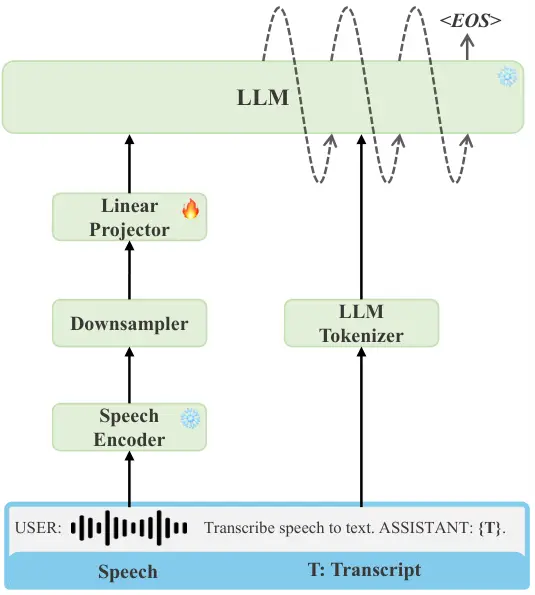
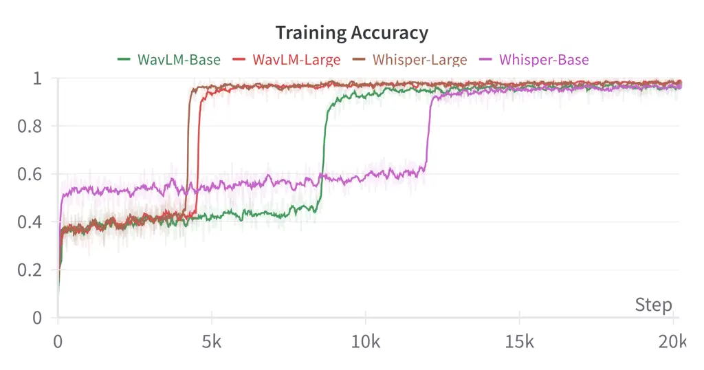
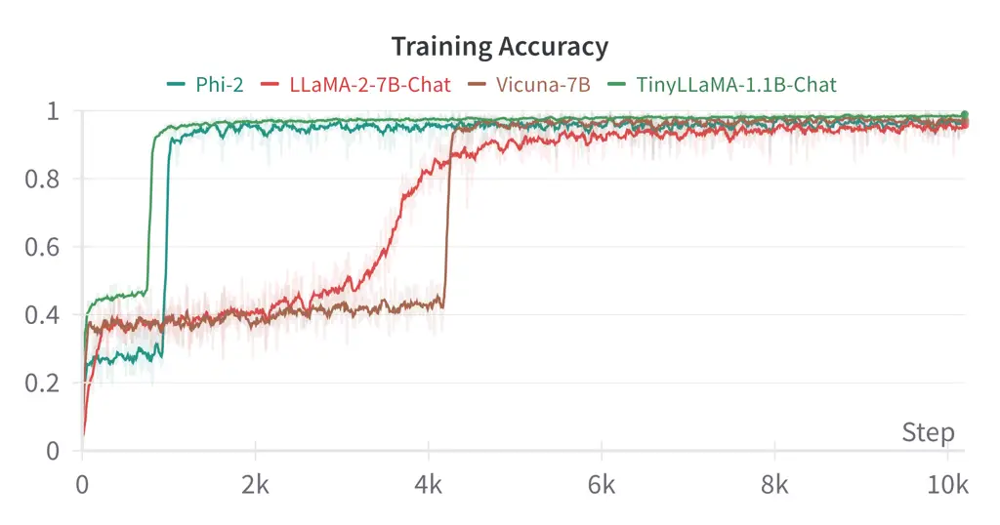
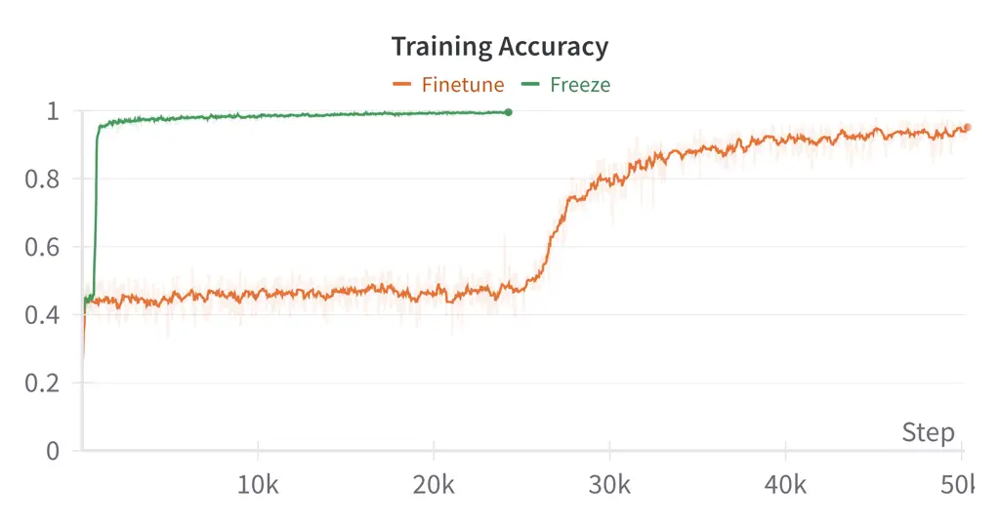

# An Embarrassingly Simple Approach for LLM with Strong ASR Capacity

Ziyang Ma    Guanrou Yang    Yifan Yang    Zhifu Gao    Jiaming Wang   
Zhihao Du    Fan Yu    Qian Chen    Siqi Zheng    Shiliang Zhang    Xie
Chen²² 2 Corresponding author Affiliation:  MoE Key Lab of Artificial
Intelligence, AI InstituteX-LANCE Lab, Shanghai Jiao Tong University,
Shanghai, China Affiliation:  Alibaba Group, China

###### Abstract

In this paper, we focus on solving one of the most important tasks in
the field of speech processing, i.e., automatic speech recognition
(ASR), with speech foundation encoders and large language models (LLM).
Recent works have complex designs such as compressing the output
temporally for the speech encoder, tackling modal alignment for the
projector, and utilizing parameter-efficient fine-tuning for the LLM. We
found that delicate designs are not necessary, while an embarrassingly
simple composition of off-the-shelf speech encoder, LLM, and the only
trainable linear projector is competent for the ASR task. To be more
specific, we benchmark and explore various combinations of LLMs and
speech encoders, leading to the optimal LLM-based ASR system, which we
call SLAM-ASR¹¹ 1 SLAM-ASR is a subproject of SLAM-LLM, where SLAM
stands for Speech, Language, Audio and Music. Working in progress and
will open-source soon.. The proposed SLAM-ASR provides a clean setup and
little task-specific design, where only the linear projector is trained.
To the best of our knowledge, SLAM-ASR achieves the best performance on
the Librispeech benchmark among LLM-based ASR models and even
outperforms the latest LLM-based audio-universal model trained on
massive pair data. Finally, we explore the capability emergence of
LLM-based ASR in the process of modal alignment. We hope that our study
can facilitate the research on extending LLM with cross-modality
capacity and shed light on the LLM-based ASR community.

## 1 Introduction

Automatic speech recognition (ASR) stands as a cornerstone in the realm
of intelligent speech technology, enabling machines to understand and
transcribe human speech. The significance of ASR in enhancing
human-computer interaction and accessibility makes it a crucial area of
research and applications in the field of speech processing.

The evolution of ASR technology has been marked by the adoption of
various paradigms, each representing a leap forward in terms of
accuracy, efficiency, and applicability Li (2022). Among these,
supervised methods including connectionist temporal classification
(CTC) Graves et al. (2006), attention-based encoder-decoder (AED) Chan
et al. (2016), recurrent neural network transducer (RNN-T) Graves et al.
(2013) and their variants have been pivotal. In addition, employing
self-supervised methods for pre-training followed by supervised methods
for fine-tuning has also proven to be effective Baevski et al. (2020);
Hsu et al. (2021); Chen et al. (2022); Ma et al. (2023); Yang et al.
(2023). However, each paradigm comes with its own set of challenges and
limitations, such as the need for extensive labeled data, difficulties
in capturing long-range context dependencies in speech, and huge
training costs.

In this evolving landscape, the advent of large language models (LLMs)
has introduced a groundbreaking paradigm: Multimodal large language
models (MLLMs) framework Liu et al. (2023); Li et al. (2023a); Gao
et al. (2024), based on a decoder-only architecture. This innovative
approach diverges from traditional ASR by utilizing the immense
generative capacity of LLMs, which are pre-trained on vast corpora
encompassing diverse linguistic contexts, leading to LLM-based ASR. The
evolution of the ASR paradigm from previous NN-based ASR models to
LLM-based ASR models, stresses differences across loss and criterion
design, text prior knowledge, and model scale. This paradigm harnesses
pre-existing linguistic knowledge, enabling a more holistic
understanding of language, which in turn, translates to significant
improvements in the speech recognition task.

The architecture of LLM-based ASR can be conceptualized as consisting of
three primary components: a speech encoder, a projector, and an LLM.
Recent works in LLM-based ASR often venture into complex designs, such
as compressing the output temporally from the speech encoder Wu et al.
(2023); Fathullah et al. (2023), tackling modal alignment with the
projector Tang et al. (2024); Yu et al. (2024), and fine-tuning the LLM
partly or fully Wu et al. (2023); Li et al. (2023b); Tang et al. (2024);
Wang et al. (2023). Despite these efforts, the outcomes have not always
met expectations, indicating a potential misalignment between the
complexity of designs and the efficacy of real-world speech recognition
tasks. This observation led to a pivotal realization in our research:
the essence of an effective LLM-based ASR system lies in the synergy of
a powerful speech encoder and a suitable LLM, and then, most notably, a
single trainable linear projector is enough to align between modalities.
Our findings challenge the prevailing notion that complexity equates to
superiority in LLM-based ASR system design.

In this work, we first benchmark the automatic speech recognition task
performance with different combinations of well-known speech encoders
and the latest released large language models. Experiments show that
LLMs with supervised fine-tuning (SFT, a.k.a. chat model) perform better
than raw pre-trained LLMs for the ASR task, while speech encoders
fine-tuned with limited data from self-supervised models outperform
supervised foundation ASR encoders. Building upon these insights, we
propose SLAM-ASR, in which only a linear projector is trained to conduct
the ASR task. SLAM-ASR only requires $`4`$ GPUs for $`4`$ hours of
training to achieve state-of-the-art performance on the
Librispeech Panayotov et al. (2015) corpus, compared with other
LLM-based ASR models and a series of previous best performing NN-based
ASR models. Besides, our work embarks on an in-depth exploration of the
ability of LLM-based ASR models. Interestingly, we observe the
capability emergence phenomenon during LLM-based ASR training. The
benchmark and experimental exploration show how we harvest the exciting
result step by step with a clean setup and little task-specific design.

## 2 Speech Recognition Meets Large Language Model

[TABLE]

Table 1: ASR Paradigm with representative models. QF means variants of
Q-Former Li et al. (2023a). Both QF and Linear are projector modules
used to align the speech encoder and the LLM.

### 2.1 Previous NN-based ASR

Previous NN-based ASR systems are designed to align the speech signal
with the label sequence accurately. As shown in table 1, different
paradigms are carried out with a series of representative models.
Quartznet Kriman et al. (2020) leverages CTC Graves et al. (2006), the
first E2E technology widely adopted in ASR, yet facing performance
limitations due to its frame-independent assumption. Whisper Radford
et al. (2023) utilizes massive pair speech-text data to train the
attention-based encoder-decoder Chan et al. (2016) (AED, a.k.a. LAS in
ASR) architecture, empowering the model with the ability to recognize
and translate speech in multiple languages. Branchformer Peng et al.
(2022) employs a hybrid architecture that combines CTC and AED Chan
et al. (2016), the integration of the attention mechanism addresses this
limitation by introducing implicit language modeling across speech
frames. Conformer Gulati et al. (2020) utilizes neural transducer Graves
et al. (2013), which directly discards the frame-independent assumption
by incorporating a label decoder and a joint network, resulting in
superior performance. Zipformer Yao et al. (2024) adopts Pruned
RNN-T Kuang et al. (2022), which is a memory-efficient variant of the
transducer loss, utilizing the pruned paths with minor posterior
probabilities. Paraformer Gao et al. (2022) uses Continuous
Integrate-and-Fire (CIF) Dong and Xu (2020), which offers a soft and
monotonic alignment mechanism, estimating the number of tokens and
generating hidden variables.

### 2.2 Existing LLM-based ASR

LLM-based ASR models adopt decoder-only architectures based on a
pre-trained LLM as a new paradigm. LauraGPT Wang et al. (2023) connects
a modified Conformer Gulati et al. (2020) encoder with Qwen-2B Bai
et al. (2023) for end-to-end training for multiple speech and audio
tasks, with full parameter fine-tuning performed. SpeechGPT Zhang et al.
(2023) discretizes speech tokens with HuBERT Hsu et al. (2021) and
fine-tunes the LLaMA-13B Touvron et al. (2023a) with multiple stages.
Although both models are computationally expensive, their performance is
limited. Li et al. (2023b) and Wu et al. (2023) propose to use inserted
Gated-XATT-FFN Alayrac et al. (2022) or side-branched LoRA Hu et al.
(2022) to fine-tune the LLM partially for conducting ASR task, along
with a trainable speech encoder. Qwen-Audio Chu et al. (2023) is an
audio-universal model, which uses massive pair data to fine-tune the
encoder initialized from the Whisper-large Radford et al. (2023) model,
optimized using the loss of the frozen Qwen-7B Bai et al. (2023) output
for backpropagation. All these models require finetuning the encoder.
SALMONN Tang et al. (2024) uses Whisper-large Radford et al. (2023) and
BEATs Chen et al. (2023) to encode speech and audio, respectively, along
with a window-level Q-Former (win-QF), can perform a variety of audio
tasks. Fathullah et al. (2023) connects Conformer with LLaMA-7B to
successfully conduct monolingual and multilingual ASR. These models
require the use of LoRA to be effective. The most intimate work is  Yu
et al. (2024), which achieves good results on ASR using only
segment-level Q-Former (sef-QF) similar to win-QF as the projector. The
random concatenation training strategy is designed to alleviate the
natural problem of Whisper Radford et al. (2023) requiring an input
speech of $`30`$ seconds.

### 2.3 Proposed Method



Figure 1: A brief pipeline of SLAM-ASR, at the core of which is a frozen
speech encoder and a frozen LLM, with the only trainable linear
projector to align between speech and text modalities.

As shown in Figure 1, an embarrassingly simple framework is proposed to
train the SLAM-ASR model. For each sample, given speech
$`\mathbf{X^{S}}`$, the corresponding transcript $`\mathbf{X^{T}}`$, and
the prompt $`\mathbf{X^{P}}`$, we first convert the speech into speech
features through the speech encoder, which can be written as:

```math
\mathbf{H^{S}}=Encoder(\mathbf{X^{S}}), \tag{1}
```

where $`\mathbf{H^{S}}=[h^{S}_{1},\cdots,h^{S}_{T}]`$ has $`T`$ frames
in the temporal dimension. Due to the sparsity of speech representation,
the speech features sequence $`\mathbf{H^{S}}`$ is still very long for
the LLM to tackle²² 2 Speech features are 25, 50, or 100 frames per
second in general. , we downsample the speech with a downsampler. More
explicitly, we concatenate every $`k`$ consecutive frames in the feature
dimension to perform a $`k`$ times downsampling, leading to
$`\mathbf{Z^{S}}=[z^{S}_{1},\cdots,z^{S}_{N}]`$, where

```math
z^{S}_{i}=h^{S}_{k*i}\oplus h^{S}_{k*i+1}\oplus\cdots\oplus h^{S}_{k*i+k-1}, \tag{2}
```

and

```math
N=T//k. \tag{3}
```

Next, a projector is applied to transform the speech features
$`\mathbf{Z^{S}}`$ into $`\mathbf{E^{S}}`$ with the same dimension as
the LLM input embedding. In our experiments, we use a single hidden
layer followed by a ReLU activation and a regression layer as the
projector, donated as:

```math
\mathbf{E^{S}}=Linear(ReLU(Linear(\mathbf{Z^{S}}))). \tag{4}
```

Finally, we feed the speech embedding $`\mathbf{E^{S}}`$, transcript
embedding $`\mathbf{E^{T}}`$, and prompt embedding $`\mathbf{E^{P}}`$
into the template to compose the final input $`\mathbf{E}`$ of LLM,
donated as:

```math
\mathbf{E^{T}}=Tokenizer(\mathbf{X^{T}}), \tag{5}
```

```math
\mathbf{E^{P}}=Tokenizer(\mathbf{X^{P}}), \tag{6}
```

```math
\mathbf{E}=\begin{cases}Template(\mathbf{E^{S}},\mathbf{E^{P}},\mathbf{E^{T}})&\text{if training},\\
Template(\mathbf{E^{S}},\mathbf{E^{P}})&\text{if inference},\end{cases} \tag{7}
```

wherein the template is detailed in Section 3.3 and Section 3.4.

## 3 Experiment Setup

Our experimental procedure obeys the KISS (Keep It Simple, Stupid!)
principle to investigate the most critical factors for LLM-based ASR.

### 3.1 Models and Modules

#### 3.1.1 Speech Encoder

Two types of speech encoders are investigated in this paper, which are
supervised speech encoders trained on massive speech-text pair data and
self-supervised speech encoders trained on large-scale unlabeled speech
data. For supervised foundation models, we mainly survey the well-known
Whisper Radford et al. (2023) family of models³³ 3
[https://github.com/openai/whisper](https://github.com/openai/whisper)
ranging from tiny to large, including whisper-tiny, whisper-base,
whisper-small, whisper-medium and whisper-large-v2. We discard the
decoder of each Whisper model and only use the encoder as a feature
extractor. We also investigate Qwen-Audio Encoder⁴⁴ 4
[https://github.com/QwenLM/Qwen-Audio](https://github.com/QwenLM/Qwen-Audio),
the encoder fine-tuned from whisper-large-v2 checkpoint on large-scale
speech, audio and music data, released along with Qwen-Audio Chu et al.
(2023) model. For self-supervised models, we investigate HuBERT⁵⁵ 5
[https://github.com/facebookresearch/fairseq/tree/main/examples/hubert](https://github.com/facebookresearch/fairseq/tree/main/examples/hubert)
and WavLM⁶⁶ 6
[https://github.com/microsoft/unilm/tree/master/unilm](https://github.com/microsoft/unilm/tree/master/unilm)
in different scales, either raw pre-trained or further fine-tuned. For
the base-size models, both HuBERT Hsu et al. (2021) and WavLM Chen
et al. (2022) perform self-supervised pre-training on
LibriSpeech Panayotov et al. (2015) corpus with $`960`$ hours. For the
large-size models, HuBERT is trained on LibriLight Kahn et al. (2020)
corpus with $`60,000`$ hours, while WavLM is trained on the much larger
$`94,000`$ hours data including LibriLight Kahn et al. (2020),
VoxPopuli Wang et al. (2021), and GigaSpeech Chen et al. (2021).
Furthermore, HuBERT provides pre-trained models of X-Large size, which
is the largest publicly available self-supervised speech encoder. All
the models mentioned in this section are obtained from their official
repositories. Refer to Section 4.3 for details of the parameters and
hidden size of each specific model.

#### 3.1.2 LLM

Two types of large language models are investigated in this paper, which
are raw pre-trained LLMs without supervised fine-tuning and chat LLMs
with SFT (along with RLHF if conducted). For the pre-trained LLMs, we
try TinyLLaMA Zhang et al. (2024)⁷⁷ 7
[https://huggingface.co/TinyLlama/TinyLlama-1.1B-Chat-v0.4](https://huggingface.co/TinyLlama/TinyLlama-1.1B-Chat-v0.4)
of the 1B-magnitude and LLaMA-2 Touvron et al. (2023b)⁸⁸ 8
[https://huggingface.co/meta-llama/Llama-2-7b-hf](https://huggingface.co/meta-llama/Llama-2-7b-hf)
of the 7B-magnitude. For the chat LLMs, TinyLLaMA-Chat⁹⁹ 9
[https://huggingface.co/TinyLlama/TinyLlama-1.1B-intermediate-step-1431k-3T](https://huggingface.co/TinyLlama/TinyLlama-1.1B-intermediate-step-1431k-3T)
of the 1B-magnitude, Phi-2¹⁰¹⁰ 10
[https://huggingface.co/microsoft/phi-2](https://huggingface.co/microsoft/phi-2)
of the 2B-magnitude, LLaMA-2-Chat¹¹¹¹ 11
[https://huggingface.co/meta-llama/Llama-2-7b-chat-hf](https://huggingface.co/meta-llama/Llama-2-7b-chat-hf)
and Vicuna Chiang et al. (2023)¹²¹² 12
[https://huggingface.co/lmsys/vicuna-7b-v1.5](https://huggingface.co/lmsys/vicuna-7b-v1.5)
of the 7B-magnitude are considered. Refer to Section 4.2 for details of
the parameters and hidden size of each specific LLM.

#### 3.1.3 Projector

The projector can be viewed as an adaptor for other modalities to
perform alignment with LLM. In all our experiments, the output of the
speech encoder is $`50`$ Hz, and the downsampling rate $`k=5`$, leading
to the input speech features $`\mathbf{E^{S}}`$ of the large model being
$`10`$ Hz. The hidden layer dimension is set to $`2048`$, while the
dimension of the speech encoder output $`\mathbf{H^{S}}`$ and the LLM
input dimension vary depending on the model used, respectively.

### 3.2 Dataset

To evaluate the capabilities of the LLM-based ASR models, we use the
most widely used benchmark for the ASR task, the standard Librispeech
benchmark with $`960`$ hours of training data without any data
augmentation or splicing. We use the dev-other subset as the validation
set and test-clean/test-other as the test sets, each of which contains
$`10`$ hours of speech.

### 3.3 Training Detail

During training, the data is organized in the following format: “USER:
\<S\> \<P\> ASSISTANT: \<T\>”, where \<S\> represents speech embedding,
\<P\> represents the prompt, and \<T\> represents the corresponding
transcribed text. We only compute the loss on \<T\>, as is common
practice. For the optimizing strategy, we use AdamW Loshchilov and
Hutter (2019) with a max learning rate of $`1\times 10^{-4}`$ without a
weight decay. For the learning rate scheduler, we conduct warmup at the
first $`1,000`$ steps and then keep the maximum learning rate for
training all the time. The max training step is set to $`100,000`$, but
we will stop early if the loss on the validation set does not decrease.
For the audio embedding provided by the Whisper family of models, we
found that not padding would affect the performance. As a result, we pad
the speech to $`30`$ seconds for all Whisper models and the batch size
is set to $`4`$. For other models, the length of the input audio remains
consistent with the original length in the temporal dimension, and the
batch is set to $`6`$, which greatly improves the efficiency of training
and inference, compared to Whisper models.

### 3.4 Inference Detail

During inference, the data is organized in the following format: “USER:
\<S\> \<P\> ASSISTANT:”, where large language models answer
autoregressively. Typically, LLMs utilize sampling algorithms to
generate diverse textual outputs. Since speech recognition is a
sequence-to-sequence task with deterministic outputs, we use beam search
with $`beam=4`$ to output the hypothesis corresponding to the speech.

## 4 Exploration

In this section, we first give a basic benchmark of combinations of
different LLMs and speech encoders and find that chat models perform
better than raw pre-trained LLMs on the ASR task. We next benchmark
different chat models and find Vicuna to be a suitable LLM and
fine-tuned HuBERT to be a powerful speech encoder for conducting the ASR
task. Finally, we propose SLAM-ASR, and compare SLAM-ASR with
state-of-the-art previous NN-based ASR models and the latest
best-performing LLM-based ASR models.

### 4.1 A Basic Benchmark

To begin with, we benchmark Whisper models with different sizes on
pre-trained LLMs and supervised fine-tuned LLMs. We pick TinyLLaMA of
the 1B-magnitude and LLaMA-2 of the 7B-magnitude to make a preliminary
assessment. As shown in Table 2, the performance of the ASR task
improves as the speech encoder parameter size increases, but the
improvement is of diminishing marginal benefit for the Whisper family of
models. For the choice of LLMs, the chat models work better than the
pre-trained models, regardless of the size. One possible explanation is
that the chat models take speech embedding as a form of “language” and
perform a machine translation task, which is activated during the SFT
process.

| Speech Encoder | Pre-trained Model |            |            |            | Chat Model     |            |              |            |
| -------------- | ----------------- | ---------- | ---------- | ---------- | -------------- | ---------- | ------------ | ---------- |
|                | TinyLLaMA         |            | LLaMA-2    |            | TinyLLaMA-Chat |            | LLaMA-2-Chat |            |
|                | test-clean        | test-other | test-clean | test-other | test-clean     | test-other | test-clean   | test-other |
| Whisper-tiny   | 12.72             | 21.64      | 16.16      | 25.17      | 9.55           | 21.01      | 8.97         | 18.77      |
| Whisper-base   | 7.35              | 15.89      | 17.46      | 21.84      | 7.03           | 15.92      | 6.37         | 12.98      |
| Whisper-small  | 6.61              | 11.81      | 6.41       | 10.88      | 5.94           | 11.5       | 4.51         | 8.94       |
| Whisper-medium | 4.65              | 8.95       | 3.35       | 6.10       | 5.01           | 8.67       | 2.71         | 6.37       |
| Whisper-large  | 4.39              | 8.22       | 3.01       | 7.15       | 4.33           | 8.62       | 2.72         | 6.79       |

Table 2: A base benchmark with different combinations of speech encoders
and LLMs to conduct LLM-based ASR. We benchmark Whisper models with
different sizes on pre-trained models and chat models with different
scales.

### 4.2 Exploration in LLMs

Next, we fix the speech encoder as Whisper-large and then explore a
better large language model. As shown in Table 3, the Phi-2 chat model
with 2.78B parameters has a comparable word error rate with LLaMA-2 with
6.74B parameters on test-other. Vicuna is an open-source chat LLM
fine-tuned on user-shared conversational data collected from
ShareGPT¹³¹³ 13 [https://sharegpt.com](https://sharegpt.com), utilizing
LLaMA as a pre-trained LLM. The LLM-based ASR model shows better results
when Vicuna is used as the LLM compared with LLaMA-2 and LLaMA-2-Chat.
All the above experimental results confirm the capability of chat models
on LLM-based ASR systems.

|                   |              |             |                    |                       |            |
| ----------------- | ------------ | ----------- | ------------------ | --------------------- | ---------- |
| LLM               | \#LLM Params | Hidden Size | \#Projector Params | WER(%) $`\downarrow`$ |            |
|                   |              |             |                    | test-clean            | test-other |
| Pre-trained Model |              |             |                    |                       |            |
| TinyLLaMA         | 1.10B        | 2048        | 17.31M             | 4.39                  | 8.22       |
| LLaMA-2           | 6.74B        | 4096        | 21.50M             | 3.01                  | 7.15       |
| Chat Model        |              |             |                    |                       |            |
| TinyLLaMA-Chat    | 1.10B        | 2048        | 17.31M             | 4.33                  | 8.62       |
| Phi-2             | 2.78B        | 2560        | 18.35M             | 3.88                  | 7.19       |
| LLaMA-2-Chat      | 6.74B        | 4096        | 21.50M             | 2.72                  | 6.79       |
| Vicuna            | 6.74B        | 4096        | 21.50M             | 2.58                  | 6.47       |

Table 3: Explore the performance with different LLMs for LLM-based ASR.
The projector is fixed with linear layers and the speech encoder is
fixed with Whisper-large-v2.

|                                    |                  |             |                    |                       |            |
| ---------------------------------- | ---------------- | ----------- | ------------------ | --------------------- | ---------- |
| Speech Encoder                     | \#Encoder Params | Hidden Size | \#Projector Params | WER(%) $`\downarrow`$ |            |
|                                    |                  |             |                    | test-clean            | test-other |
| Acoustic Feature                   |                  |             |                    |                       |            |
| FBank                              | \-               | 80          | 10.03M             | 68.95                 | 99.37      |
| Supervised Speech Encoder          |                  |             |                    |                       |            |
| Whisper-tiny                       | 7.63M            | 394         | 12.33M             | 7.07                  | 16.01      |
| Whisper-base                       | 19.82M           | 512         | 13.64M             | 5.07                  | 13.07      |
| Whisper-small                      | 87.00M           | 768         | 16.26M             | 4.19                  | 9.50       |
| Whisper-medium                     | 305.68M          | 1024        | 18.88M             | 2.72                  | 6.79       |
| Whisper-large                      | 634.86M          | 1280        | 21.50M             | 2.58                  | 6.47       |
|    + Qwen-Audio Fine-tuning        | 634.86M          | 1280        | 21.50M             | 2.52                  | 6.35       |
| Self-supervised Speech Encoder     |                  |             |                    |                       |            |
| HuBERT Base                        | 94.70M           | 768         | 16.26M             | 5.39                  | 11.99      |
| WavLM Base                         | 94.38M           | 768         | 16.26M             | 4.14                  | 9.66       |
| HuBERT Large                       | 316.61M          | 1024        | 18.88M             | 4.53                  | 8.74       |
|    + LS-960 Fine-tuning            | 316.61M          | 1024        | 18.88M             | 2.30                  | 4.53       |
| WavLM Large                        | 315.45M          | 1024        | 18.88M             | 2.37                  | 4.90       |
| HuBERT X-Large                     | 964.32M          | 1280        | 21.50M             | 4.29                  | 6.66       |
|    + LS-960 Fine-tuning (SLAM-ASR) | 964.32M          | 1280        | 21.50M             | 1.94                  | 3.81       |

Table 4: Explore the performance with different speech encoders for
LLM-based ASR. The projector is fixed with linear layers and LLM is
fixed with Vicuna-7B-v1.5. LS-960 means the Librispeech 960 hours
dataset.

|                                  |                      |           |            |           |           |           |             |                       |            |
| -------------------------------- | -------------------- | --------- | ---------- | --------- | --------- | --------- | ----------- | --------------------- | ---------- |
| Model                            | Speech Encoder       |           | LLM        |           | Projector |           | ASR Data(h) | WER(%) $`\downarrow`$ |            |
|                                  | Module               | Learnable | Module     | Learnable | Module    | Learnable |             | test-clean            | test-other |
| LLM-based ASR-specific Models    |                      |           |            |           |           |           |             |                       |            |
| Yu et al.’s (2024)               | Whisper-large        | ✗         | Vicuna-13B | ✗         | seg-QF    | ✓         | 960         | 2.3                   | 5.2        |
|                                  |                      |           |            |           |           |           | 4,000+      | 2.1                   | 5.0        |
| SLAM-ASR                         | HuBERT X-Large       | ✗         | Vicuna-7B  | ✗         | Linear    | ✓         | 960         | 1.9                   | 3.8        |
| LLM-based Audio-universal Models |                      |           |            |           |           |           |             |                       |            |
| SALMONN Tang et al. (2024)       | Whisper-large, BEATs | ✗         | Vicuna-13B | LoRA      | win-QF    | ✓         | 1960        | 2.1                   | 4.9        |
| Qwen-Audio Chu et al. (2023)     | Whisper-large        | ✓         | Qwen-7B    | ✗         | Linear    | ✓         | 30,000+     | 2.0                   | 4.2        |

Table 5: Compared with other LLM-based speech models. The specific
information of the different modules is given in the table.

### 4.3 Exploration on Speech Encoders

Furthermore, we fix Vicuna as the LLM and benchmark the performance of
different speech encoders. For the supervised speech encoders, the
performance gets better gradually as the parameter size of the speech
encoder increases, which is consistent with the trend on the LLaMA
series models. When the Qwen-Audio Encoder is used as the speech
encoder, the ASR performance is further improved compared with
Whisper-large, which indicates that the encoder fine-tuned on other LLM
(i.e. Qwen-7B) with gradient backpropagation, can be transferred to
another LLM (i.e. Vicuna-7B), and maintain a certain degree of
performance.

For the self-supervised learning speech encoders, HuBERT Base and WavLM
Base have about 95M parameters, with 768 dimensions of hidden size. In
this configuration, the ASR performance is similar compared with
Whisper-small with the same scale, where self-supervised learning does
not play a role. When scaling the self-supervised speech encoders to
0.3B, WavLM Large outperforms all listed supervised speech encoders,
including Whisper-medium with 0.3B parameters and Whisper-large with
0.6B parameters, while the improvement from HuBERT Base to HuBERT Large
is not obvious. However, if the HuBERT Large encoder is first fine-tuned
on Librispeech 960 hours of training data, and used as the speech
encoder to train the projector in our LLM-based ASR model, the model
achieves a WER of $`2.30\%`$ on test-clean and $`4.53\%`$ on test-other,
exceeding the performance with WavLM Large as the speech encoder.
Further, we use HuBERT X-Large as the speech encoder, which scales the
speech encoder to 1B parameters. With Librispeech-960 fine-tuned HuBERT
X-Large, our LLM-based ASR model gets a word error rate of $`1.94\%`$ on
test-clean and $`3.81\%`$ on test-other, achieving $`24.8\%`$ and
$`41.1\%`$ relative WER reduction over the model with Whisper-large as
the speech encoder, respectively. Additionally, inspired by Fuyu Bavishi
et al. (2024), we also try to drop the speech encoder and directly feed
the 80-dimensional FBank features into the projector, which lags far
behind utilizing well-trained speech encoders, as shown in the first row
of Table 4. The experimental results show the effectiveness of using
self-supervised speech encoders and scaling the size of speech encoders.

|                                        |                       |            |
| -------------------------------------- | --------------------- | ---------- |
| Model                                  | WER(%) $`\downarrow`$ |            |
|                                        | test-clean            | test-other |
| Specialist Models                      |                       |            |
| ContextNet-large Han et al. (2020)     | 2.1                   | 4.6        |
|    + in-domain LM                      | 1.9                   | 4.1        |
| Conformer-large Gulati et al. (2020)   | 2.1                   | 4.3        |
|    + in-domain LM                      | 1.9                   | 3.9        |
| Branchformer-large Peng et al. (2022)  | 2.4                   | 5.5        |
|    + in-domain LM                      | 2.1                   | 4.5        |
| Zipformer-large Yao et al. (2024)      | 2.0                   | 4.4        |
|    + in-domain LM                      | 1.9                   | 3.9        |
| Universal Models                       |                       |            |
| Whisper-large-v2 Radford et al. (2023) | 2.7                   | 5.2        |
| OWSM-v3.1 Peng et al. (2024)           | 2.4                   | 5.0        |
| Ours                                   |                       |            |
| SLAM-ASR                               | 1.9                   | 3.8        |

Table 6: Compared with previous NN-based models. Specialist Models means
models trained on Librispeech-960, and in-domain LM means language
models trained on the LibriSpeech language model corpus along with
LibriSpeech-960 transcripts. Universal Models means general-propose
models trained on massive pair data.

### 4.4 SLAM-ASR

Here we introduce SLAM-ASR, a llm-based ASR model with HuBERT X-Large as
the speech encoder and Vicuna-7B as the LLM, with the only trainable
linear projector, implemented based on the SLAM-LLM framework. As shown
in Table 5, we exhibit different LLM-based ASR models from concurrent
work, either ASR-specific or audio-universal. A contemporary work Yu
et al. (2024) employs Whisper-large as the speech encoder and Vicuna-13B
as the LLM. The segment-level Q-Former (seg-QF) is utilized as the
projector to tackle the compatibility between speech sequences and the
LLM. Compared with their method, our SLAM-ASR yields $`17.4/26.9\%`$
relative WER reductions on test-clean/other subsets trained with the
same $`960`$ hours of Librispeech data. When their model is trained on a
larger amount of speech over $`4,000`$ hours, the proposed SLAM-ASR
still performs better. We also compare SLAM-ASR with the latest
LLM-based audio-universal models, SALMONN Tang et al. (2024) and
Qwen-Audio Chu et al. (2023), which provide results on Librispeech
benchmark. Compared with these audio-based multimodal LLMs, SLAM-ASR
still achieves better performance despite the large margin in training
data.

We also compare SLAM-ASR with state-of-the-art previous NN-based models.
For specialist models trained on Librispeech-960, we compare SLAM-ASR
with ContextNet Han et al. (2020), ConformerGulati et al. (2020),
Branchformer Peng et al. (2022), and Zipformer Yao et al. (2024). All
models are of large size, and the results from their papers are
demonstrated. These ASR models employ sophisticated system engineering,
including SpecAugment and speed perturbation for data augmentation, and
the exponential moving average technique for model averaging. To further
improve performance, in-domain language models trained on the
LibriSpeech language model corpus along with the LibriSpeech-960
transcripts are added for fusing or rescoring. SLAM-ASR achieves the
same (test-clean) or better (test-other) ASR performance compared with
the best-performing models without using complex system engineering.
Compared with general-propose models trained on massive data, SLAM-ASR
outperforms Whisper-large-v2 Radford et al. (2023) in industry, and
OWSM-v3.1 Peng et al. (2024) in the academic community. The experimental
results demonstrate the superiority of SLAM-ASR and the great potential
of LLM-based ASR.

## 5 Capability Emergence

We observe that there is capability emergence for LLM-based ASR during
training within $`1`$ epoch (around $`12`$k steps). Specifically, the
accuracy of the next token prediction increases rapidly at the beginning
of training, then starts to rise slowly, and then “spikes” at some
point, as if “the ability is suddenly learned”.



Figure 2: Training accuracy of the next token prediction with the
training steps. The LLM is fixed with Vicuna-7B-v1.5 and different
colored curves represent different speech encoders.

Figure 2 demonstrates the training accuracy of the next token prediction
with the training steps, where the LLM is kept as Vicuna-7B and the
speech encoders vary. As can be seen from the figure, the speech
encoders with better performance, in this case, Whisper Large and WavLM
Large, will emerge earlier. A possible explanation is that our task is
essentially to align speech representations with LLMs, while a powerful
speech encoder can provide representations that are easier for the
projector to align with LLMs.



Figure 3: Training accuracy of the next token prediction with the
training steps. The speech encoder is fixed with Whisper-large-v2 and
different colored curves represent different LLMs.

We keep the speech encoder as Whisper Large, change different LLMs, and
plot the training accuracy, as shown in Figure 3. Experiments show that
LLM-based ASR models with smaller LLMs such as TinyLLaMA-Chat and Phi-2
emerge earlier, however, they are not as effective as larger LLMs such
as LLaMA-2-7B-Chat and Vicuna-7B. This shows that the larger language
models are harder to align with speech features than the smaller ones.

We also explore whether or not freezing the speech encoder affects
capability emergence. We take TinyLLaMA-1.1B-Chat as the LLM and freeze
or finetune the speech encoder, respectively. As shown in Figure 4, both
models quickly rise to around $`40\%`$ training accuracy in the early
training process. When the speech encoder is frozen, the model completes
the cross-modal alignment in $`1k`$ steps, while the time node comes to
$`25K`$ steps when the speech encoder is trainable, which is much later.
Table 7 compares the WER of the LLM-based ASR systems with the speech
encoder freezing and fine-tuning, where the former works much better.
This indicates that $`1k`$ hours of speech is still not enough to train
a task-specific LLM-based speech encoder, instead, freezing the speech
encoder and paying attention to the modal alignment is a better choice.



Figure 4: Training accuracy of the next token prediction with the
training steps. The speech encoder is fixed with Whisper-large-v2 and
the LLM is fixed with TinyLLaMA-1.1B-Chat. Different colored curves
represent freezing or fine-tuning the speech encoder.

| Freezing       | WER(%) $`\downarrow`$ |            |
| -------------- | --------------------- | ---------- |
| Speech Encoder | test-clean            | test-other |
| ✓              | 4.33                  | 8.62       |
| ✗              | 12.79                 | 22.83      |

Table 7: WER results of freezing or fine-tuning the speech encoder shown
in Figure 4 on Librispeech test-clean and test-other subsets.

## 6 Conclusion

In this paper, we systematically explore LLM-based ASR systems with a
clean framework, where the only trainable linear projector is used to
align the speech encoder and the LLM. Research indicates that LLMs that
undergo supervised fine-tuning, exhibit improved performance and
robustness. Furthermore, speech encoders that are fine-tuned from
self-supervised models demonstrate superior capabilities. The SLAM-ASR
model is proposed and outperforms other LLM-based ASR models and
previous NN-based ASR models on the Librispeech benchmark. Exploratory
experiments show that there is a capability emergence in LLM-based ASR
systems. We aspire for our research to serve as a step forward in the
exploration of LLM-based ASR, offering assistance and insights to the
broader community.

## Acknowledgements

We thank Changli Tang and Wenyi Yu for their helpful discussions and
feedback.

## References

- Alayrac et al. (2022) Jean-Baptiste Alayrac, Jeff Donahue, Pauline
  Luc, Antoine Miech, Iain Barr, Yana Hasson, Karel Lenc, Arthur Mensch,
  Katherine Millican, Malcolm Reynolds, et al. 2022. Flamingo: a visual
  language model for few-shot learning. In _Proc. NeurIPS_.
- Baevski et al. (2020) Alexei Baevski, Yuhao Zhou, Abdelrahman Mohamed,
  and Michael Auli. 2020. wav2vec 2.0: A framework for self-supervised
  learning of speech representations. In _Proc. NeurIPS_.
- Bai et al. (2023) Jinze Bai, Shuai Bai, Yunfei Chu, Zeyu Cui, Kai
  Dang, Xiaodong Deng, Yang Fan, Wenbin Ge, Yu Han, Fei Huang,
  et al. 2023. Qwen technical report. _arXiv preprint arXiv:2309.16609_.
- Bavishi et al. (2024) Rohan Bavishi, Erich Elsen, Curtis Hawthorne,
  Maxwell Nye, Augustus Odena, Arushi Somani, and Sağnak Taşırlar. 2024.
  Fuyu-8B: A multimodal architecture for AI agents.
  _[https://www.adept.ai/blog/fuyu-8b](https://www.adept.ai/blog/fuyu-8b)_.
- Chan et al. (2016) William Chan, Navdeep Jaitly, Quoc Le, and Oriol
  Vinyals. 2016. Listen, attend and spell: A neural network for large
  vocabulary conversational speech recognition. In _Proc. ICASSP_.
- Chen et al. (2021) Guoguo Chen, Shuzhou Chai, Guanbo Wang, Jiayu Du,
  Wei-Qiang Zhang, Chao Weng, Dan Su, Daniel Povey, Jan Trmal, Junbo
  Zhang, et al. 2021. Gigaspeech: An evolving, multi-domain ASR corpus
  with 10,000 hours of transcribed audio. In _Proc. Interspeech_.
- Chen et al. (2022) Sanyuan Chen, Chengyi Wang, Zhengyang Chen, Yu Wu,
  Shujie Liu, Zhuo Chen, Jinyu Li, Naoyuki Kanda, Takuya Yoshioka, Xiong
  Xiao, et al. 2022. WavLM: Large-scale self-supervised pre-training for
  full stack speech processing. In _Proc. JSTSP_.
- Chen et al. (2023) Sanyuan Chen, Yu Wu, Chengyi Wang, Shujie Liu,
  Daniel Tompkins, Zhuo Chen, and Furu Wei. 2023. BEATs: Audio
  pre-training with acoustic tokenizers. In _Proc. ICML_.
- Chiang et al. (2023) Wei-Lin Chiang, Zhuohan Li, Zi Lin, Ying Sheng,
  Zhanghao Wu, et al. 2023. Vicuna: An open-source chatbot impressing
  GPT-4 with 90%\* ChatGPT quality.
  _[https://vicuna.lmsys.org](https://vicuna.lmsys.org)_.
- Chu et al. (2023) Yunfei Chu, Jin Xu, Xiaohuan Zhou, Qian Yang,
  Shiliang Zhang, Zhijie Yan, Chang Zhou, and Jingren Zhou. 2023.
  Qwen-Audio: Advancing universal audio understanding via unified
  large-scale audio-language models. _arXiv preprint arXiv:2311.07919_.
- Dong and Xu (2020) Linhao Dong and Bo Xu. 2020. CIF: Continuous
  integrate-and-fire for end-to-end speech recognition. In _Proc.
  ICASSP_.
- Fathullah et al. (2023) Yassir Fathullah, Chunyang Wu, Egor Lakomkin,
  Junteng Jia, Yuan Shangguan, Ke Li, Jinxi Guo, Wenhan Xiong, Jay
  Mahadeokar, Ozlem Kalinli, et al. 2023. Prompting large language
  models with speech recognition abilities. _arXiv preprint
  arXiv:2307.11795_.
- Gao et al. (2024) Peng Gao, Jiaming Han, Renrui Zhang, Ziyi Lin,
  Shijie Geng, Aojun Zhou, Wei Zhang, Pan Lu, Conghui He, Xiangyu Yue,
  et al. 2024. LLaMA-Adapter v2: Parameter-efficient visual instruction
  model. In _Proc. ICLR_.
- Gao et al. (2022) Zhifu Gao, Shiliang Zhang, Ian McLoughlin, and
  Zhijie Yan. 2022. Paraformer: Fast and accurate parallel Transformer
  for non-autoregressive end-to-end speech recognition. In _Proc.
  Interspeech_.
- Graves et al. (2006) Alex Graves, Santiago Fernández, Faustino J.
  Gomez, and Jürgen Schmidhuber. 2006. Connectionist temporal
  classification: labelling unsegmented sequence data with recurrent
  neural networks. In _Proc. ICML_.
- Graves et al. (2013) Alex Graves, Abdel-rahman Mohamed, and
  Geoffrey E. Hinton. 2013. Speech recognition with deep recurrent
  neural networks. In _Proc. ICASSP_.
- Gulati et al. (2020) Anmol Gulati, James Qin, Chung-Cheng Chiu, Niki
  Parmar, Yu Zhang, Jiahui Yu, Wei Han, Shibo Wang, Zhengdong Zhang,
  Yonghui Wu, et al. 2020. Conformer: Convolution-augmented Transformer
  for speech recognition. In _Proc. Interspeech_.
- Han et al. (2020) Wei Han, Zhengdong Zhang, Yu Zhang, Jiahui Yu,
  Chung-Cheng Chiu, James Qin, Anmol Gulati, Ruoming Pang, and Yonghui
  Wu. 2020. Contextnet: Improving convolutional neural networks for
  automatic speech recognition with global context. _arXiv preprint
  arXiv:2005.03191_.
- Hsu et al. (2021) Wei-Ning Hsu, Benjamin Bolte, Yao-Hung Hubert Tsai,
  Kushal Lakhotia, Ruslan Salakhutdinov, and Abdelrahman Mohamed. 2021.
  HuBERT: Self-supervised speech representation learning by masked
  prediction of hidden units. In _Proc. TASLP_.
- Hu et al. (2022) Edward J Hu, Yelong Shen, Phillip Wallis, Zeyuan
  Allen-Zhu, Yuanzhi Li, Shean Wang, Lu Wang, and Weizhu Chen. 2022.
  LoRA: Low-rank adaptation of large language models. In _Proc. ICLR_.
- Kahn et al. (2020) Jacob Kahn, Morgane Rivière, Weiyi Zheng, Evgeny
  Kharitonov, Qiantong Xu, Pierre-Emmanuel Mazaré, Julien Karadayi,
  Vitaliy Liptchinsky, Ronan Collobert, Christian Fuegen, et al. 2020.
  Libri-light: A benchmark for asr with limited or no supervision. In
  _Proc. ICASSP_.
- Kriman et al. (2020) Samuel Kriman, Stanislav Beliaev, Boris Ginsburg,
  Jocelyn Huang, Oleksii Kuchaiev, Vitaly Lavrukhin, Ryan Leary, Jason
  Li, and Yang Zhang. 2020. Quartznet: Deep automatic speech recognition
  with 1d time-channel separable convolutions. In _Proc. ICASSP_.
- Kuang et al. (2022) Fangjun Kuang, Liyong Guo, Wei Kang, Long Lin,
  Mingshuang Luo, Zengwei Yao, and Daniel Povey. 2022. Pruned RNN-T for
  fast, memory-efficient ASR training. In _Proc. Interspeech_.
- Li (2022) Jinyu Li. 2022. Recent advances in end-to-end automatic
  speech recognition. In _Proc. APSIPA_.
- Li et al. (2023a) Junnan Li, Dongxu Li, Silvio Savarese, and Steven
  Hoi. 2023a. BLIP-2: Bootstrapping language-image pre-training with
  frozen image encoders and large language models. In _Proc. ICML_.
- Li et al. (2023b) Yuang Li, Yu Wu, Jinyu Li, and Shujie Liu. 2023b.
  Prompting large language models for zero-shot domain adaptation in
  speech recognition. In _Proc. ASRU_.
- Liu et al. (2023) Haotian Liu, Chunyuan Li, Qingyang Wu, and Yong Jae
  Lee. 2023. Visual instruction tuning. In _Proc. NeurIPS_.
- Loshchilov and Hutter (2019) Ilya Loshchilov and Frank Hutter. 2019.
  Decoupled weight decay regularization. In _Proc. ICLR_.
- Ma et al. (2023) Ziyang Ma, Zhisheng Zheng, Changli Tang, Yujin Wang,
  and Xie Chen. 2023. MT4SSL: Boosting self-supervised speech
  representation learning by integrating multiple targets. In _Proc.
  Interspeech_.
- Panayotov et al. (2015) Vassil Panayotov, Guoguo Chen, Daniel Povey,
  and Sanjeev Khudanpur. 2015. Librispeech: An ASR corpus based on
  public domain audio books. In _Proc. of ICASSP_.
- Peng et al. (2022) Yifan Peng, Siddharth Dalmia, Ian Lane, and Shinji
  Watanabe. 2022. Branchformer: Parallel mlp-attention architectures to
  capture local and global context for speech recognition and
  understanding. In _Proc. ICML_.
- Peng et al. (2024) Yifan Peng, Jinchuan Tian, William Chen, Siddhant
  Arora, Brian Yan, Yui Sudo, Muhammad Shakeel, Kwanghee Choi, Jiatong
  Shi, Xuankai Chang, et al. 2024. Owsm v3. 1: Better and faster open
  Whisper-style speech models based on E-Branchformer. _arXiv preprint
  arXiv:2401.16658_.
- Radford et al. (2023) Alec Radford, Jong Wook Kim, Tao Xu, Greg
  Brockman, Christine McLeavey, and Ilya Sutskever. 2023. Robust speech
  recognition via large-scale weak supervision. In _Proc. ICML_.
- Tang et al. (2024) Changli Tang, Wenyi Yu, Guangzhi Sun, Xianzhao
  Chen, Tian Tan, Wei Li, Lu Lu, Zejun Ma, and Chao Zhang. 2024.
  SALMONN: Towards generic hearing abilities for large language models.
  In _Proc. ICLR_.
- Touvron et al. (2023a) Hugo Touvron, Thibaut Lavril, Gautier Izacard,
  Xavier Martinet, Marie-Anne Lachaux, et al. 2023a. LLaMA: Open and
  efficient foundation language models. _arXiv preprint
  arXiv:2302.13971_.
- Touvron et al. (2023b) Hugo Touvron, Louis Martin, Kevin Stone, Peter
  Albert, Amjad Almahairi, et al. 2023b. LLaMA 2: Open foundation and
  fine-tuned chat models. _arXiv preprint arXiv:2307.09288_.
- Wang et al. (2021) Changhan Wang, Morgane Riviere, Ann Lee, Anne Wu,
  Chaitanya Talnikar, Daniel Haziza, Mary Williamson, Juan Pino, and
  Emmanuel Dupoux. 2021. Voxpopuli: A large-scale multilingual speech
  corpus for representation learning, semi-supervised learning and
  interpretation. In _Proc. ACL_.
- Wang et al. (2023) Jiaming Wang, Zhihao Du, Qian Chen, Yunfei Chu,
  Zhifu Gao, Zerui Li, Kai Hu, Xiaohuan Zhou, Jin Xu, Ziyang Ma,
  et al. 2023. LauraGPT: Listen, attend, understand, and regenerate
  audio with GPT. _arXiv preprint arXiv:2310.04673_.
- Wu et al. (2023) Jian Wu, Yashesh Gaur, Zhuo Chen, Long Zhou, Yimeng
  Zhu, Tianrui Wang, Jinyu Li, Shujie Liu, Bo Ren, Linquan Liu,
  et al. 2023. On decoder-only architecture for speech-to-text and large
  language model integration. In _Proc. ASRU_.
- Yang et al. (2023) Guanrou Yang, Ziyang Ma, Zhisheng Zheng, Yakun
  Song, Zhikang Niu, and Xie Chen. 2023. Fast-HuBERT: an efficient
  training framework for self-supervised speech representation learning.
  In _Proc. ASRU_.
- Yao et al. (2024) Zengwei Yao, Liyong Guo, Xiaoyu Yang, Wei Kang,
  Fangjun Kuang, Yifan Yang, Zengrui Jin, Long Lin, and Daniel
  Povey. 2024. Zipformer: A faster and better encoder for automatic
  speech recognition. In _Proc. ICLR_.
- Yu et al. (2024) Wenyi Yu, Changli Tang, Guangzhi Sun, Xianzhao Chen,
  Tian Tan, Wei Li, Lu Lu, Zejun Ma, and Chao Zhang. 2024. Connecting
  speech encoder and large language model for ASR. In _Proc. ICASSP_.
- Zhang et al. (2023) Dong Zhang, Shimin Li, Xin Zhang, Jun Zhan, Pengyu
  Wang, Yaqian Zhou, and Xipeng Qiu. 2023. SpeechGPT: Empowering large
  language models with intrinsic cross-modal conversational abilities.
  In _Proc. EMNLP_.
- Zhang et al. (2024) Peiyuan Zhang, Guangtao Zeng, Tianduo Wang, and
  Wei Lu. 2024. TinyLLaMA: An open-source small language model. _arXiv
  preprint arXiv:2401.02385_.

## Appendix A Appendix: More Exploration

### A.1 Text Perplexity

| LLM          | PPL (WER(%)) $`\downarrow`$ |              |
| ------------ | --------------------------- | ------------ |
|              | test-clean                  | test-other   |
| LLaMA-2      | 53.74 (3.01)                | 58.78 (7.15) |
| LLaMA-2-Chat | 77.60 (2.72)                | 85.74 (6.79) |
| Vicuna       | 76.44 (2.58)                | 84.95 (6.47) |

Table 8: Word-level text perplexity (PPL) and word error rate (WER) of
different LLMs on Librispeech test-clean and test-other subsets. Among
the listed models, the LLM-based ASR model with Vicuna has the best word
error rate, while LLaMA performs the worst.

Word-level text perplexity (PPL) of different LLMs is measured to
investigate if the better performance of Vicuna is related to domain
agreement, rather than supervised fine-tuning. As shown in Table 8, we
measure perplexity on test-clean and test-other subsets. Surprisingly,
LLaMA-2 without SFT achieves the lowest perplexity by a large margin
compared with chat models, while performing the worst on the word error
rate. This proves that the better results of chat models are not due to
domain agreement with the transcripts.

### A.2 Prompt Engineering

| Type          | Example                            |
| ------------- | ---------------------------------- |
| short prompts | Transcribe speech to text.         |
| long prompts  | Transcribe speech to text. Output  |
|               | the transcription directly without |
|               | redundant content. Ensure that the |
|               | output is not duplicated.          |

Table 9: Examples of prompts in LLM-based ASR.

We also investigate the performance of different prompts in LLM-based
ASR, and the prompt examples are shown in Table 9. As shown in Table 10,
when we use a short prompt, the model achieves better results compared
with the model using a long prompt in a complex description. However,
when we don’t use any prompt (that is, a shorter prompt only with the
“ASSISTANT” tag left), the performance of the model drops. This
indicates that although an LLM-based ASR model is a task-specific MLLM,
the setting of the prompt is still important. A possible explanation is
that the prompt lets the model optimize in the task-specific subspace
through in-context learning, while too complex prompts will increase the
learning difficulty and lead to a suboptimal solution. To investigate
this assumption, we set a more complex prompt format. We use the same
seed prompt for the ASR task in SpeechGPT Zhang et al. (2023) to
generate $`10`$ prompts to form a prompt library. At both the training
and testing stages, a random prompt is drawn from the prompt library. As
shown in the last row of Table 10, there is a big drop in model
performance, which is in line with our assumption.

| Prompt                    | WER(%) $`\downarrow`$ |            |
| ------------------------- | --------------------- | ---------- |
|                           | test-clean            | test-other |
| no prompts                | 3.19                  | 6.97       |
| short prompts             | 2.58                  | 6.47       |
| long prompts              | 2.88                  | 6.79       |
| randomly selected prompts | 5.90                  | 10.02      |

Table 10: The performance with different prompt designs in LLM-based ASR
on Librispeech test-clean and test-other subsets.
