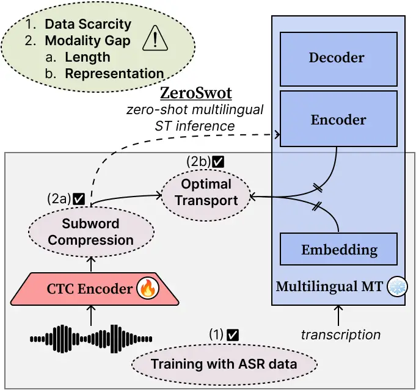
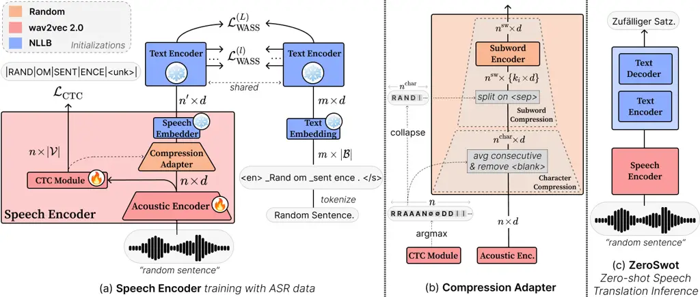
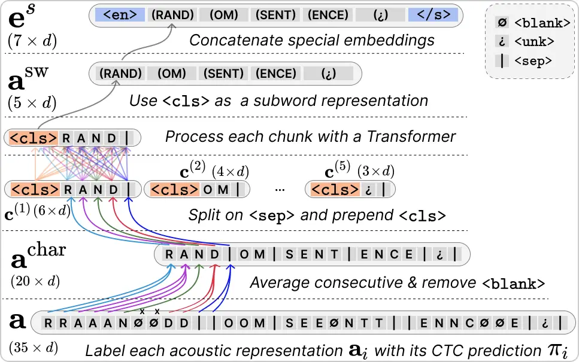

# Pushing the Limits of Zero-shot End-to-End Speech Translation

—————– Ioannis Tsiamas    Gerard I. Gállego    José A. R. Fonollosa
Affiliation: —————– Universitat Politècnica de Catalunya, Barcelona
Affiliation: —————–{ioannis.tsiamas,gerard.ion.gallego,jose.fonollosa}@upc.edu
   Marta R. Costa-jussà    FAIR Meta    Paris    costajussa@meta.com

###### Abstract

Data scarcity and the modality gap between the speech and text
modalities are two major obstacles of end-to-end Speech Translation (ST)
systems, thus hindering their performance. Prior work has attempted to
mitigate these challenges by leveraging external MT data and optimizing
distance metrics that bring closer the speech-text representations.
However, achieving competitive results typically requires some ST data.
For this reason, we introduce ZeroSwot, a method for zero-shot ST that
bridges the modality gap without any paired ST data. Leveraging a novel
CTC compression and Optimal Transport, we train a speech encoder using
only ASR data, to align with the representation space of a massively
multilingual MT model. The speech encoder seamlessly integrates with the
MT model at inference, enabling direct translation from speech to text,
across all languages supported by the MT model. Our experiments show
that we can effectively close the modality gap without ST data, while
our results on MuST-C and CoVoST demonstrate our method’s superiority
over not only previous zero-shot models, but also supervised ones,
achieving state-of-the-art results.¹¹ 1
[https://github.com/mt-upc/ZeroSwot](https://github.com/mt-upc/ZeroSwot)

## 1 Introduction

Traditionally, the standard approach for Speech translation (ST) has
been the cascade model Ney (1999); Mathias and Byrne (2006), where
Automatic Speech Recognition (ASR) and Machine Translation (MT) systems
were chained together to produce the desired output. However, in recent
years, there has been a paradigm shift towards end-to-end models, which
aim to directly map the input speech to the target text without the
intermediate transcription step Bérard et al. (2016). Such models offer
several advantages, including reduced error propagation, more compact
architectures, and faster inference times Sperber and Paulik (2020).



Figure 1: Proposed Zero-shot Speech Translation

Despite their advantages, end-to-end models require parallel ST data,
which are often limited. To mitigate this _data scarcity_, several
strategies aim to leverage the more abundant ASR and MT data Bérard
et al. (2018); Anastasopoulos and Chiang (2018). Then, another challenge
that arises is the _modality gap_, which emerges from the inherent
differences between the speech and text modalities, manifesting in
_length mismatch_ and _representation mismatch_. Convolutional Length
Adapters Li et al. (2021) or Connectionist Temporal Classification (CTC)
Graves et al. (2006); Liu et al. (2020) can alleviate the length
mismatch to some extent. To ease the representation gap, previous works
have proposed a shared encoder Ye et al. (2021) and optimizing distance
metrics to bring the speech-text representation closer to the shared
semantic space Fang et al. (2022); Ye et al. (2022). Due to its ability
to handle representations of different lengths, the Wasserstein distance
Frogner et al. (2015) using Optimal Transport, has emerged as an
effective distance metric, specifically during pretraining Le et al.
(2023); Tsiamas et al. (2023b). Although these methods show promise in
reducing the modality gap and increasing translation quality, they still
require at least some ST data.

To this end, we propose Zero-shot ST with Subword compression and
Optimal Transport (ZeroSwot), a novel approach that aims to bridge the
modality gap in a zero-shot fashion, only requiring ASR and MT data.
Using Optimal Transport, we train a speech encoder based on wav2vec 2.0
Baevski et al. (2020) to produce representations akin to the embedding
space of a massively multilingual MT model, thus enabling zero-shot ST
inference across all its supported target languages (Fig. 1). To map the
two embedding spaces, our method learns the tokenization of the MT model
through CTC, and compresses the speech representations to the
corresponding subwords, thus closing the length mismatch. Experiments on
MuST-C Cattoni et al. (2021) reveal that our method is not only better
than existing zero-shot models, by a large margin, but also surpasses
supervised ones, achieving state-of-the-art results. On CoVoST Wang
et al. (2020b), ZeroSwot outperforms the original version of the
multimodal SeamlessM4T Seamless-Communication (2023a), while evaluations
on the 88 target languages of FLEURS Conneau et al. (2023) showcase the
massively multilingual capacity of our method. ZeroSwot is also vastly
superior to comparable CTC-based cascade ST models, and while it is on
par with cascades that utilize strong attention-based encoder-decoder
ASR models, it ranks better in terms of efficiency. Finally, we provide
evidence of our method’s ability to close the modality gap, both in
terms of length and representation.

## 2 Relevant Research

### 2.1 End-to-end Speech Translation

Data Scarcity. To alleviate data scarcity, end-to-end ST methods usually
utilize the more abundant data of ASR and MT. Such methods include
pretraining Bérard et al. (2018); Bansal et al. (2019); Wang et al.
(2020a); Alinejad and Sarkar (2020), multi-task learning Anastasopoulos
and Chiang (2018); Indurthi et al. (2021), data augmentation Jia et al.
(2019); Pino et al. (2019); Lam et al. (2022); Tsiamas et al. (2023a),
and knowledge distillation Liu et al. (2019); Gaido et al. (2020).
Furthermore, many methods indirectly leverage external data through
large foundation models Bommasani et al. (2022). Initializing parts of
the ST model with wav2vec 2.0 Baevski et al. (2020) and mBART50 Tang
et al. (2020) is a quite common practice Li et al. (2021); Ye et al.
(2021); Han et al. (2021); Tsiamas et al. (2022), while more recently
Gow-Smith et al. (2023) utilized a massively multilingual MT model NLLB
et al. (2022) and Zhang et al. (2023) a large language model (LLaMa2)
Touvron et al. (2023). Similarly, here employ wav2vec 2.0 and NLLB NLLB
et al. (2022) to ease the data scarcity issue.

Modality Gap. Implicit alignment techniques to bridge the representation
gap involve a shared semantic encoder in a multitasking framework Liu
et al. (2020); Ye et al. (2021); Tang et al. (2021b), which can be
improved by mixup Fang et al. (2022); Zhou et al. (2023). In addition,
explicit alignment methods optimize a distance metric to bring the
speech-text representations closer in the shared semantic space. Such
distance metrics include the euclidean Liu et al. (2020); Tang et al.
(2021a), cosine Chuang et al. (2020), and contrastive Ye et al. (2022);
Ouyang et al. (2023), but they typically require some transformation in
the representations, such as mean-pooling, while our approach optimizes
a distance that does not alter the representation space. Methods to
reduce the length discrepancy usually include sub-sampling the speech
representation using convolutional length adaptors Li et al. (2021);
Gállego et al. (2021); Fang et al. (2022); Zhao et al. (2022) or
character/phoneme-based CTC compression Liu et al. (2020); Gaido et al.
(2021); Xu et al. (2021a). Several methods have also used phonemized
text in order to better match the representations in both length and
content Tang et al. (2021a); Tang et al. (2022); Le et al. (2023), but
potentially limiting the quality of the text branch due to noise. In
this work, we introduce a novel CTC-based compression to subword units,
directly aligning with the tokenization of MT models.

### 2.2 Optimal Transport

Optimal Transport (OT) Peyré and Cuturi (2019), traditionally used in
NLP and MT Chen et al. (2019); Alqahtani et al. (2021), has recently
also been applied to ST. Zhou et al. (2023) used OT to find the
alignment between speech and text features to apply Mixup. Le et al.
(2023) proposed to use OT in a siamese pretraining setting in
combination with CTC, yielding improvements compared to the standard ASR
pretraining, while also proposing a positional regularization in order
to make OT applicable to sequences. Tsiamas et al. (2023b) extended this
pretraining in the context of foundation models, while also freezing the
text branch and using CTC compression in order to achieve better
adaptation with the text decoder during ST finetuning. Inspired by these
works, we also follow the siamese paradigm, but as a means of directly
integrating the speech encoder to the text space of an MT model, thus
not requiring any ST data.

### 2.3 Zero-shot Speech Translation

Escolano et al. (2021b) were the first to achieve zero-shot ST, by
incorporating a speech encoder to the representation space of an MT
model using language-specific encoders-decoders Escolano et al. (2021a).
Dinh et al. (2022) combined multi-task learning on ASR and MT,
introducing an auxiliary loss to minimize the euclidean distance between
mean-pooled speech and text representations. T-modules Duquenne et al.
(2022) harnessed mined data to learn a fixed-size multilingual and
multimodal representation space, subsequently enabling zero-shot ST
encoding and decoding from that space. DCMA Wang et al. (2022) projects
both speech and text into a fixed-length joint space using an
attention-driven shared memory module, after which it enforces the
speech distribution of a codebook to closely mirror its textual
counterpart. Gao et al. (2023b) proposed a strategy that employs a
multimodal variant of cross-lingual consistency regularization Gao
et al. (2023a), training a model with wav2vec 2.0 and a shared encoder
on both MT and ASR data. Recently, Yang et al. (2023) introduced a
zero-shot ST training method by adapting a new speech encoder to
bilingual MT models using OT and a CTC module that shares the vocabulary
of the MT model, attaining improvements over zero-shot methods and
CTC-based cascade systems. In contrast, our approach focuses on
achieving multilingual zero-shot ST, by adapting a large CTC-based
speech encoder Baevski et al. (2020) to a massively multilingual MT
model NLLB et al. (2022), aiming for high-quality results comparable to
those of state-of-the-art cascade and end-to-end models. To address the
unique challenges associated with adapting to the large vocabulary size
of multilingual models (e.g., 250k tokens for NLLB et al. (2022)), we
propose a novel compression method that effectively learns the subword
tokenization of the MT model, rather than predicting actual tokens. This
decoupling from the vocabulary size ensures efficiency and scalability,
overcoming limitations that may arise in previous methods Yang et al.
(2023), due to the need of sharing the MT vocabulary with the CTC
module.

## 3 Methodology



Figure 2: Methodology: Speech Encoder Training, Compression Adapter, and
Inference with ZeroSwot.

### 3.1 Problem Definition & Proposed Solution

End-to-end Speech Translation. A speech translation corpus consists of
speech-transcription-translation triplets,
$`\mathcal{D}=\{(\bm{\mathrm{s}},\bm{\mathrm{x}},\bm{\mathrm{y}})\}`$,
where $`\bm{\mathrm{s}}`$ is the speech signal, $`\bm{\mathrm{x}}`$ is
the transcription, and $`\bm{\mathrm{y}}`$ the translation. End-to-end
ST systems aim to learn a model $`\mathcal{M}^{\text{ST}}`$ that
generates the translation $`\bm{\mathrm{y}}`$ directly from the speech
$`\bm{\mathrm{s}}`$, using the parallel ST data
$`\mathcal{D}^{\text{ST}}=\{(\bm{\mathrm{s}},\bm{\mathrm{y}})\}`$. The
transcription $`\bm{\mathrm{x}}`$ is optionally utilized, as in
pretraining or multi-task learning.

Zero-shot Speech Translation. In a zero-shot ST setting, we aim to learn
a model $`\mathcal{M}^{\text{ZS-ST}}`$ that generates the translation
$`\bm{\mathrm{y}}`$ with access to corpora
$`\mathcal{D}^{\text{MT}}=\{(\bm{\mathrm{x}},\bm{\mathrm{y}})\}`$ and
$`\mathcal{D}^{\text{ASR}}=\{(\bm{\mathrm{s}},\bm{\mathrm{x}})\}`$, but
without directly utilizing the parallel corpus
$`\mathcal{D}^{\text{ST}}`$.

Proposed Solution. Assuming access to an MT model
$`\mathcal{M}^{\text{MT}}`$ obtained via $`\mathcal{D}^{\text{MT}}`$, we
utilize $`\mathcal{D}^{\text{ASR}}`$ to learn a speech encoder
$`\bm{\mathrm{S\mbox{-}Enc}}`$ that produces representations akin to
those expected by $`\mathcal{M}^{\text{MT}}`$. On inference time, we
achieve zero-shot ST by replacing the embedding layer of
$`\mathcal{M}^{\text{MT}}`$ with $`\bm{\mathrm{S\mbox{-}Enc}}`$.

### 3.2 Model Architecture

Our model architecture includes a speech and a text branch. The text
branch consists of a text encoder, which remains frozen during training.
The speech branch consists of an acoustic encoder, a CTC module, a
compression adapter, a speech embedder and a semantic encoder, of which
the parameters are shared with the frozen text encoder (Figure 2a).

#### 3.2.1 Text Encoder

The text encoder is a Transformer, of which the parameters are
initialized from a massively multilingual MT model NLLB et al. (2022),
and kept frozen during training. The tokenized²² 2 With prepended
\<lang\> and appended \</s\> tokens. source text $`\bm{\mathrm{x}}`$
with length $`m`$ is passed through an embedding layer
$`\bm{\mathrm{Emb}}\!:\!|\mathcal{B}|\rightarrow d`$ to obtain
$`\bm{\mathrm{e}}^{\text{x}}\in\mathbb{R}^{m\times d}`$, where
$`\mathcal{B}`$ is a multilingual subword-level vocabulary. Sinusoidal
positional encodings $`\bm{\mathrm{Pos}}(\cdot)`$ are added after an
up-scaling Vaswani et al. (2017), and a Transformer encoder
$`\bm{\mathrm{T\mbox{-}Enc}}`$ with $`L`$ layers is used to obtain a
semantic representation
$`\bm{\mathrm{h}}^{\text{x}}_{L}\in\mathbb{R}^{m\times d}`$.

```math
\displaystyle\bm{\mathrm{e}}^{\text{x}} \displaystyle=\sqrt{d}\cdot\bm{\mathrm{Emb}}(\bm{\mathrm{x}})+\bm{\mathrm{Pos}}(m) \tag{1}
```

```math
\displaystyle\bm{\mathrm{h}}^{\text{x}}_{L} \displaystyle=\bm{\mathrm{T\mbox{-}Enc}}(\bm{\mathrm{e}}^{\text{x}}) \tag{2}
```

#### 3.2.2 Acoustic Encoder

The acoustic encoder $`\bm{\mathrm{A\mbox{-}Enc}}`$ takes as input the
speech signal $`\bm{\mathrm{s}}\in\mathbb{R}^{\ell}`$ and produces an
acoustic representation $`\bm{\mathrm{a}}\in\mathbb{R}^{n\times d}`$. It
consists of a series of strided convolutional layers that downsample the
signal by $`r`$ (thus, $`n\!=\!\ell/r)`$, followed by a Transformer
encoder with $`N`$ layers. It is initialized from wav2vec 2.0 and is
finetuned during training.

```math
\displaystyle\bm{\mathrm{a}} \displaystyle=\bm{\mathrm{A\mbox{-}Enc}}(\bm{\mathrm{s}}) \tag{3}
```

#### 3.2.3 Connectionist Temporal Classification

We use a CTC loss Graves et al. (2006) to maintain a meaningful acoustic
representation and provide the necessary information to the compression
adapter (§3.2.4). A CTC module, which is a linear softmax layer produces
probabilities $`\bm{\mathrm{p}}\in\mathbb{R}^{n\times|\mathcal{V}|}`$,
where $`\mathcal{V}`$ is a letter-based vocabulary.³³ 3 Incl. _blank_
\<blank\>, _unknown_ \<unk\>, _separator_ \<sep\>.

```math
\displaystyle\bm{\mathrm{p}} \displaystyle=\text{softmax}(\bm{\mathrm{a}}\cdot\bm{\mathrm{W}}^{\text{ctc}}+\bm{\mathrm{b}}^{\text{ctc}}) \tag{4}
```

Where
$`\bm{\mathrm{W}}^{\text{ctc}}\in\mathbb{R}^{d\times|\mathcal{V}|}`$ and
$`\bm{\mathrm{b}}^{\text{ctc}}\in\mathbb{R}^{|\mathcal{V}|}`$ are
trainable parameters, initialized from wav2vec 2.0.

Given the CTC labels $`\bm{\mathrm{z}}`$, and their conditional
probability $`P(\bm{\mathrm{z}}|\bm{\mathrm{p}})`$, which is obtained by
summing over the probability of all possible alignment paths between the
acoustic representation $`\bm{\mathrm{a}}`$ and $`\bm{\mathrm{z}}`$, the
CTC loss is defined as:

```math
\displaystyle\mathcal{L}_{\text{CTC}} \displaystyle=-\log P(\bm{\mathrm{z}}|\bm{\mathrm{p}}) \tag{5}
```

| Separation | Unk | CTC labels for _"Random Sentence."_ |
| ---------- | --- | ----------------------------------- | ---------------------------------- | -------------------------- | -------------------------- | -------------------------- | --- |
| words      | ✗   | R A N D O M $`\boldsymbol{          | }`$ S E N T E N C E $`\boldsymbol{ | }`$                        |
| subwords   | ✓   | R A N D $`\boldsymbol{              | }`$ O M $`\boldsymbol{             | }`$ S E N T $`\boldsymbol{ | }`$ E N C E $`\boldsymbol{ | }`$ \<unk\> $`\boldsymbol{ | }`$ |

Table 1: Standard vs proposed CTC labels example.

The labels $`\bm{\mathrm{z}}`$ are usually obtained from the
transcription $`\bm{\mathrm{x}}`$ via splitting on words and removing
characters absent from $`\mathcal{V}`$, such as punctuation. But this
implies a word-level tokenization and text normalization, which is
inconsistent with the text branch (§3.2.1). Thus, in order to minimize
the discrepancies between the two branches, we propose to split on
subwords using the text branch tokenizer, and keep the positions of
characters not in $`\mathcal{V}`$, by replacing them with the unknown
token (Table 1). This is particularly important for the effectiveness of
our compression to subwords (§3.2.4).

#### 3.2.4 Compression Adapter



Figure 3: Example of the proposed compression.

The compression adapter (Fig. 2b) takes as input the acoustic
representation $`\bm{\mathrm{a}}`$ and the CTC probabilities
$`\bm{\mathrm{p}}`$, to produce a compressed acoustic representation
$`\bm{\mathrm{a}}^{\text{sw}}\in\mathbb{R}^{n^{\text{sw}}\times d}`$
(where $`n^{\text{sw}}\!\leq\!n`$) that resembles in length and content
the text embedding $`\bm{\mathrm{e}}^{\text{x}}`$ (Eq. 1). It involves
two stages: compression to characters Liu et al. (2020), followed by a
novel compression to subwords.

Character Compression. Each vector
$`\bm{\mathrm{a}}_{i}\in\mathbb{R}^{d}`$ of the acoustic representation
is labeled according to the corresponding greedy CTC prediction
$`\pi_{i}\!=\!\text{argmax}(\bm{\mathrm{p}}_{i})`$. Then, consecutive
same-labeled representations are grouped together, and combined via
mean-pooling, while removing those labeled as blanks, thus having a
character-like representation
$`\bm{\mathrm{a}}^{\text{char}}\!\in\!\mathbb{R}^{n^{\text{char}}\times d}`$,
where $`n^{\text{char}}\!\leq\!n`$. Similarly, $`\bm{\mathrm{p}}`$ is
compressed to
$`\bm{\mathrm{p}}^{\text{char}}\in\mathbb{R}^{n^{\text{char}}\times|\mathcal{V}|}`$.

```math
\displaystyle\bm{\mathrm{\pi}} \displaystyle=\text{argmax}(\bm{\mathrm{p}}) \tag{6}
```

```math
\displaystyle\bm{\mathrm{p}}^{\text{char}} \displaystyle=\texttt{char-compress}(\bm{\mathrm{p}}|\bm{\mathrm{\pi}}) \tag{7}
```

```math
\displaystyle\bm{\mathrm{a}}^{\text{char}} \displaystyle=\texttt{char-compress}(\bm{\mathrm{a}}|\bm{\mathrm{\pi}}) \tag{8}
```

Subword Compression. The character representation
$`\bm{\mathrm{a}}^{\text{char}}`$ is split into chunks
$`\bm{\mathrm{c}}^{(1)},\dots,\bm{\mathrm{c}}^{(n^{\text{sw}})}`$
according to the positions labeled as separators, where
$`n^{\text{sw}}`$ is the number of predicted separators,
$`\bm{\mathrm{c}}^{(i)}\in\mathbb{R}^{k_{i}\times d}`$ is the $`i-`$th
chunk representation (with $`k_{i}`$ number of characters), and
$`n^{\text{char}}\!=\!\sum_{i=0}^{n^{\text{sw}}}k_{i}`$. Since the CTC
is predicting the tokenization of the text branch through the proposed
target labels, each chunk is combining information that resemble subword
tokens from $`\mathcal{V}`$. Each chunk of character representations is
processed independently with
$`\bm{\mathrm{Subword\mbox{-}Enc}}:\mathbb{R}^{k_{i}\times d}\rightarrow\mathbb{R}^{d}`$,
which is Transformer encoder that prepends a trainable \<cls\> token to
each chunk, which is then used a subword representation of the whole
chunk Devlin et al. (2019). Then, by concatenation we obtain a
subword-like compressed representation
$`\bm{\mathrm{a}}^{\text{sw}}\in\mathbb{R}^{n^{\text{sw}}\times d}`$,
where $`n^{\text{sw}}\!\leq\!n^{\text{char}}\!\leq\!n`$ (Fig. 3).

```math
\displaystyle\bm{\mathrm{c}}^{(1)} \displaystyle,\dots,\bm{\mathrm{c}}^{(n^{\text{sw}})}=\texttt{split}(\bm{\mathrm{a}}^{\text{char}}|\bm{\mathrm{\pi}}^{\text{char}}) \tag{9}
```

```math
\displaystyle\bm{\mathrm{a}}^{\text{sw}}_{i} \displaystyle=\bm{\mathrm{Subword\mbox{-}Enc}}\bigl(\bm{\mathrm{c}}^{(i)}\bigr) \tag{10}
```

#### 3.2.5 Speech Embedder

We concatenate to the compressed acoustic representation two vectors
$`\bm{\mathrm{\epsilon}}^{\text},\bm{\mathrm{\epsilon}}^{\text}\!\in\!\mathbb{R}^{d}`$
that function as the source language and end of sentence embeddings.
Similar to the text branch, we scale the representation by $`\sqrt{d}`$
and add sinusoidal positional encodings with
$`\bm{\mathrm{Pos}}(\cdot)`$ (Eq. 1), thus obtaining a speech embedding
$`\bm{\mathrm{e}}^{\text{s}}\in\mathbb{R}^{n^{\prime}\times d}`$, where
$`n^{\prime}\!=\!n^{\text{sw}}+2`$. The special embeddings are
initialized from the text embedding (Eq. 1), and remain frozen.

#### 3.2.6 Semantic Encoder

The speech embedding $`\bm{\mathrm{e}}^{\text{s}}`$ is passed through a
Transformer encoder $`\bm{\mathrm{T\mbox{-}Enc}}`$, which is frozen and
shared with the text branch (Eq. 2), to obtain a semantic speech
representation
$`\bm{\mathrm{h}}^{\text{s}}_{L}\in\mathbb{R}^{n^{\prime}\times d}`$.

```math
\displaystyle\bm{\mathrm{e}}^{\text{s}} \displaystyle=\sqrt{d}[\bm{\mathrm{\epsilon}}^{\text},\bm{\mathrm{a}}^{\text{sw}},\bm{\mathrm{\epsilon}}^{\text}]+\bm{\mathrm{Pos}}(n^{\prime}) \tag{11}
```

```math
\displaystyle\bm{\mathrm{h}}^{\text{s}}_{L} \displaystyle=\bm{\mathrm{T\mbox{-}Enc}}(\bm{\mathrm{e}}^{\text{s}}) \tag{12}
```

### 3.3 Optimal Transport

To align a speech representation
$`\bm{\mathrm{h}}^{\text{s}}\in\mathbb{R}^{n^{\prime}\times d}`$ to the
text representation
$`\bm{\mathrm{h}}^{\text{x}}\in\mathbb{R}^{m\times d}`$, we are
minimizing their Wasserstein loss Frogner et al. (2015) using Optimal
Transport (OT) Peyré and Cuturi (2019), as in Le et al. (2023); Tsiamas
et al. (2023b).

We assume two uniform probability distributions
$`\bm{\mathrm{\phi}}^{\text{s}},\bm{\mathrm{\phi}}^{\text{x}}`$, with
$`\bm{\mathrm{\phi}}^{\text{s}}_{i}\!=\!1/n^{\prime}`$ and
$`\bm{\mathrm{\phi}}^{\text{x}}_{j}\!=\!1/m`$, that define the mass of
each position in the speech and text representations. Using a squared
euclidean cost function we obtain a pairwise cost matrix
$`\bm{\mathrm{C}}\in\mathbb{R}_{+}^{n^{\prime}\times m}`$, where
$`\bm{\mathrm{C}}_{ij}\!=\!||\bm{\mathrm{h}}^{\text{s}}_{i}-\bm{\mathrm{h}}^{\text{x}}_{j}||_{2}^{2}`$.
Then, the Wasserstein distance $`W_{\delta}\in\mathbb{R}_{+}`$ is
defined as the minimum transportation cost over all possible
transportation plans
$`\bm{\mathrm{Z}}\in\mathbb{R}_{+}^{n^{\prime}\times m}`$ of the total
masses $`\bm{\mathrm{\phi}}^{\text{s}},\bm{\mathrm{\phi}}^{\text{x}}`$.
The optimization is thus subjected to constraints
$`\sum_{j=1}^{m}\bm{\mathrm{Z}}_{:,j}\!=\!1/n^{\prime}`$ and
$`\sum_{i=1}^{n^{\prime}}\bm{\mathrm{Z}}_{i,:}\!=\!1/m`$.

```math
W_{\delta}=\underset{\bm{\mathrm{Z}}}{\text{min}}\sum_{i=1}^{n^{\prime}}\sum_{j=1}^{m}\bm{\mathrm{Z}}_{ij}\bm{\mathrm{C}}_{ij} \tag{13}
```

In practice, to make the Wasserstein distance differentiable and
efficient to compute using the Sinkhorn algorithm Knopp and Sinkhorn
(1967), we use its entropy-regularized upper-bound estimation.
Furthermore, since the Wasserstein distance is permutation invariant, we
follow Le et al. (2023) and incorporate two positional regularization
vectors $`\bm{\mathrm{v}}^{\text{s}}\in\mathbb{R}^{n^{\prime}}`$ and
$`\bm{\mathrm{v}}^{\text{x}}\in\mathbb{R}^{m}`$ in
$`\bm{\mathrm{h}}^{\text{s}}`$ and $`\bm{\mathrm{h}}^{\text{x}}`$
accordingly, thus penalizing the transportation of mass between two
distant positions $`i`$ and $`j`$.

```math
\displaystyle\bm{\mathrm{\bar{h}}}^{\text{s}} \displaystyle=[\bm{\mathrm{h}}^{\text{s}};\mu\bm{\mathrm{v}}^{\text{s}}]\text{\phantom{a}, where
\hphantom{a}}\bm{\mathrm{v}}^{\text{s}}_{i}=\frac{i-1}{n^{\prime}-1} \tag{14}
```

```math
\displaystyle\bm{\mathrm{\bar{h}}}^{\text{x}} \displaystyle=[\bm{\mathrm{h}}^{\text{x}};\mu\bm{\mathrm{v}}^{\text{x}}]\text{\phantom{a}, where
\hphantom{a}}\bm{\mathrm{v}}^{\text{x}}_{j}=\frac{j-1}{m-1} \tag{15}
```

And thus for the positional regularized cost matrix
$`\bm{\mathrm{\bar{C}}}`$, the upper-bound Wasserstein distance that we
use as a loss function is defined as:

```math
\mathcal{L}_{\text{WASS}}=\underset{\bm{\mathrm{Z}}}{\text{min}}\Bigl(\sum_{i=1}^{n^{\prime}}\sum_{j=1}^{m}\bm{\mathrm{Z}}_{ij}\bm{\mathrm{\bar{C}}}_{ij}-\lambda\text{H}(\bm{\mathrm{Z}})\Bigr) \tag{16}
```

Where $`\lambda>0`$ is a hyperparameter, and $`\text{H}(\cdot)`$ denotes
the von Neumann entropy of a matrix.

### 3.4 Final Loss

We apply a Wasserstein loss (Eq. 16), not only at the final layer but
also at intermediate ones, since they also carry important information,
and can thus help producing more robust speech representations. Thus,
the final loss is defined as:

```math
\displaystyle\mathcal{L} \displaystyle=\sum_{l\in\mathcal{I}}\frac{\alpha}{|\mathcal{I}|}\mathcal{L}_{\text{WASS}}^{(l)}+(1-\alpha)\mathcal{L}_{\text{CTC}} \tag{17}
```

Where $`\mathcal{I}`$ is the set of shared encoder layers for which we
apply Wasserstein losses, and $`\alpha>0`$ is a hyperparameter to
balance the relative importance between the Wasserstein and CTC losses.

### 3.5 Zero-shot Speech Translation Inference

To enable zero-shot ST inference, we simply replace the MT embedding
layer with the trained speech encoder. (ZeroSwot, Fig. 2c).

## 4 Experimental Setup

Data. For training we are using Common Voice Ardila et al. (2020), the
speech-transcription pairs of MuST-C v1.0 Cattoni et al. (2021), and
LibriSpeech Panayotov et al. (2015). We evaluate our models on three
multilingual ST benchmarks: MuST-C v1.0 (En $`\rightarrow`$ 8 lang.),
CoVoST 2 Wang et al. (2020b) (En $`\rightarrow`$ 15 lang.), and FLEURS
Conneau et al. (2023) (En $`\rightarrow`$ 88 lang.) (Appendix A).

Model Architecture. The acoustic encoder follows wav2vec 2.0 Large
Baevski et al. (2020) with $`N\!=\!24`$ layers and dimensionality
$`d\!=\!1024`$ (315M parameters). The CTC module uses a vocabulary with
size $`|\mathcal{V}|\!=\!30`$, and together with the acoustic encoder
are initialized from a CTC-finetuned version of wav2vec 2.0 on
LibriSpeech Panayotov et al. (2015). The subword encoder has 3 layers
with dimensionality of 1024 (35M). The text encoder has either
$`L\!=\!12`$ or $`L\!=\!24`$, both with dimensionality 1024, and an
embedding size of $`|\mathcal{B}|\!=\!256k`$. We initialize its
parameters from two dense versions of NLLB NLLB et al. (2022), the 600M
(Medium) or the 1.3B (Large). Based on the size of NLLB, the resulting
ZeroSwot models used for inference have 0.95B (Medium) or 1.65B (Large)
parameters, while both of them the have the same number of training
parameters (350M). We also train a Small version based on wav2vec 2.0
Base and NLLB-Medium (Appendix C.1).

Training details. We use AdamW Loshchilov and Hutter (2019) with a
learning rate of 3e-4, inverse square root scheduler with warmup, and
batch size of 32M tokens. We apply dropout of 0.1 as well as time and
channel masking Baevski et al. (2020). Speech input is 16kHz waveforms,
and text is tokenized with sentencepiece Kudo and Richardson (2018),
using the NLLB model (Appendix C.2).

Loss. We set $`\alpha\!=\!0.9`$ and apply Wasserstein losses for
$`\mathcal{I}\!=\!\{6,7,8,9,10,11,12\}`$ (Medium) and
$`\mathcal{I}\!=\!\{12,14,16,18,20,22,24\}`$ (Large) (Eq. 17).
Positional and entropy regularization are set to $`\mu\!=\!10`$ (Eq. 14,
15), and $`\lambda\!=\!1`$ (Eq. 16).

Evaluation. We apply checkpoint averaging and use a beam search of size 5. We evaluate with case-sensitive detokenized BLEU Papineni et al.
(2002) using sacreBLEU Post (2018) (Appendix B).

## 5 Results

MuST-C v1.0. In Table 4 we present the results of our proposed ZeroSwot
in MuST-C and compare them with other SOTA zero-shot and supervised
methods. We train ZeroSwot under three scenarios, regarding data usage
(Table 2), and in three different sizes depending on the wav2vec 2.0 and
NLLB versions (Table 3). For scenario C we first multilingually
finetuned NLLB on MuST-C En-X MT data (Appendix D), before adapting to
it the speech encoder with MuST-C ASR data.

| Scenario | MuST-C Data                              | ASR         | NLLB     |
| -------- | ---------------------------------------- | ----------- | -------- |
| A        | $`\text{ASR}\text{✗}/\text{MT}\text{✗}`$ | CommonVoice | Original |
| B        | $`\text{ASR}\text{✓}/\text{MT}\text{✗}`$ | MuST-C      | Original |
| C        | $`\text{ASR}\text{✓}/\text{MT}\text{✓}`$ | MuST-C      | Mult. FT |

Table 2: Data usage scenarios in MuST-C.

[TABLE]

Table 3: Model sizes for ZeroSwot.

In the upper part of Table 4 we compare our small ZeroSwot model using
only ASR data from MuST-C (scenario B) to previously proposed zero-shot
methods. Our results show that our model can surpass all previous
methods, even though some of them use both ASR and MT data from MuST-C,
and also have more training parameters. Then, comparing our larger
versions to supervised methods, ZeroSwot sets new SOTA in 7/8
directions, with multiple versions of our model outperforming the
previous best. Notably, ZeroSwot-Large (C) is better in En-De and En-Es
than the recently proposed LST Zhang et al. (2023), which is based on
LLaMA2-13B Touvron et al. (2023), and compared to our method has
$`40\!\times/\text{ }8\times`$ more training/inference parameters.

|                                                                     |       |             |     |                                   |      |      |      |      |      |      |      |      |         |
| ------------------------------------------------------------------- | ----- | ----------- | --- | --------------------------------- | ---- | ---- | ---- | ---- | ---- | ---- | ---- | ---- | ------- |
|                                                                     |       | MuST-C Data |     |                                   | BLEU |      |      |      |      |      |      |      |         |
| Models                                                              |       | ASR         | MT  | Train/Infer Size (B)              | De   | Es   | Fr   | It   | Nl   | Pt   | Ro   | Ru   | Average |
| Previous Zero-shot End-to-End ST compared to our small model        |       |             |     |                                   |      |      |      |      |      |      |      |      |         |
| T-Modules Duquenne et al. (2022)                                    |       | ✓           | ✗   | $`2^{*}`$                         | 23.8 | 27.4 | 32.7 | \-   | \-   | \-   | \-   | \-   | \-      |
| DCMA Wang et al. (2022)                                             |       | ✓           | ✗   | $`0.15^{*}`$                      | 22.4 | 24.6 | 29.7 | 18.4 | 22.0 | 24.2 | 16.8 | 11.8 | 21.2    |
| DCMA Wang et al. (2022)                                             |       | ✓           | ✓   | $`0.15^{*}`$                      | 24.0 | 26.2 | 33.1 | 24.1 | 28.3 | 29.2 | 22.2 | 16.0 | 25.4    |
| SimZeroCR Gao et al. (2023b)                                        |       | ✓           | ✓   | $`0.15^{*}`$                      | 25.1 | 27.0 | 34.6 | \-   | \-   | \-   | \-   | 15.6 | \-      |
| Towards-Zero-shot Yang et al. (2023)                                |       | ✓           | ✗   | $`0.1`$                           | 23.4 | 26.5 | 33.7 | \-   | \-   | \-   | \-   | \-   | \-      |
| Towards-Zero-shot Yang et al. (2023)                                |       | ✓           | ✓   | $`0.1`$                           | 26.5 | 29.5 | 35.3 | \-   | \-   | \-   | \-   | \-   | \-      |
| ZeroSwot-Small                                                      | \(B\) | ✓           | ✗   | $`0.1/0.7`$                       | 27.3 | 31.7 | 35.8 | 26.8 | 30.9 | 31.6 | 25.3 | 17.8 | 28.4    |
|                                                                     |       |             |     |                                   |      |      |      |      |      |      |      |      |         |
| Supervised End-to-End ST compared to our larger Zero-shot ST models |       |             |     |                                   |      |      |      |      |      |      |      |      |         |
| Chimera Han et al. (2021)                                           |       | ✓           |     | $`0.15^{\phantom{*}}`$            | 27.1 | 30.6 | 35.6 | 25.0 | 29.2 | 30.2 | 24.0 | 17.4 | 27.4    |
| STEMM Fang et al. (2022)                                            |       | ✓           |     | $`0.15^{*}`$                      | 28.7 | 31.0 | 37.4 | 25.8 | 30.5 | 31.7 | 24.5 | 17.8 | 28.4    |
| SpeechUT Zhang et al. (2022)                                        |       | ✓           |     | $`0.15^{\phantom{*}}`$            | 30.1 | 33.6 | 41.4 | \-   | \-   | \-   | \-   | \-   | \-      |
| Siamese-PT Le et al. (2023)                                         |       | ✓           |     | $`0.25^{*}`$                      | 27.9 | 31.8 | 39.2 | 27.7 | 31.7 | 34.2 | 27.0 | 18.5 | 29.8    |
| CRESS Fang and Feng (2023)                                          |       | ✓           |     | $`0.15^{*}`$                      | 29.4 | 33.2 | 40.1 | 27.6 | 32.2 | 33.6 | 26.4 | 19.7 | 30.3    |
| SimRegCR Gao et al. (2023b)                                         |       | ✓           |     | $`0.15^{*}`$                      | 29.2 | 33.0 | 40.0 | 28.2 | 32.7 | 34.2 | 26.7 | 20.1 | 30.5    |
| LST (LLaMA2-13B) Zhang et al. (2023)                                |       | ✓           |     | $`13`$                            | 30.4 | 35.3 | 41.6 | \-   | \-   | \-   | \-   | \-   | \-      |
|                                                                     | \(A\) | ✗           | ✗   | $`0.35/0.95^{\phantom{\dagger}}`$ | 24.8 | 30.0 | 32.6 | 24.1 | 28.6 | 28.8 | 22.9 | 16.4 | 26.0    |
|                                                                     | \(B\) | ✓           | ✗   | $`0.35/0.95^{\phantom{\dagger}}`$ | 28.5 | 33.1 | 37.5 | 28.2 | 32.3 | 32.9 | 26.0 | 18.7 | 29.6    |
| aiZeroSwot-Medium                                                   | \(C\) | ✓           | ✓   | $`0.35/0.95^{\dagger}`$           | 30.5 | 34.9 | 39.4 | 30.6 | 35.0 | 37.1 | 27.8 | 20.3 | 31.9    |
|                                                                     | \(A\) | ✗           | ✗   | $`0.35/1.65^{\phantom{\dagger}}`$ | 26.5 | 31.1 | 33.5 | 25.4 | 29.9 | 30.6 | 24.3 | 18.0 | 27.4    |
|                                                                     | \(B\) | ✓           | ✗   | $`0.35/1.65^{\phantom{\dagger}}`$ | 30.1 | 34.8 | 38.9 | 29.8 | 34.4 | 35.3 | 27.6 | 20.4 | 31.4    |
| aiZeroSwot-Large                                                    | \(C\) | ✓           | ✓   | $`0.35/1.65^{\dagger}`$           | 31.2 | 35.8 | 40.5 | 31.4 | 36.3 | 38.3 | 28.0 | 21.5 | 32.9    |

Table 4: BLEU($`\uparrow`$) scores on MuST-C tst-COMMON. Upper part: In
bold best among previous zero-shot ST and our proposed (small) model.
Lower part: Underscored is the best supervised score, highlighted are
zero-shot scores that are better than the best supervised ones, and in
bold is best overall. ^(†) NLLB parameters are finetuned separately.
^(∗) Parameters estimated from methodology description. Extended results
in Table 14.

CoVoST 2. In Table 5 we present the results of ZeroSwot in CoVoST 2,
where we used Common Voice for training, and a multilingually finetuned
NLLB⁴⁴ 4 Similar to scenario C of Table 2. Details in Appendix D. on the
MT data of CoVoST En-X. For comparison, we provide results from other
supervised SOTA methods, which are XLS-R Babu et al. (2021) and
SeamlessM4T Seamless-Communication (2023a); Seamless-Communication
(2023b), and group them according to their size based on inference
parameters. For the medium-sized models, we observe that although our
method is evaluated on zero-shot ST and has less training parameters, it
surpasses the previous SOTA SeamlessM4T in 12/15 directions and on
average by a large margin of 3.5 BLEU points. For the large models,
ZeroSwot ranks better than the original Large configuration of
SeamlessM4T, with an average of 31.1 BLEU, outperforming it by 0.6
points. Compared to the updated v2, our method is 0.5 BLEU points
behind, but still obtains better results in 7/15 directions.

|                        |     |               |      |      |      |      |      |      |      |      |      |      |      |      |      |      |      |         |
| ---------------------- | --- | ------------- | ---- | ---- | ---- | ---- | ---- | ---- | ---- | ---- | ---- | ---- | ---- | ---- | ---- | ---- | ---- | ------- |
| Models                 | ZS  | Size (B)      | Ar   | Ca   | Cy   | De   | Et   | Fa   | Id   | Ja   | Lv   | Mn   | Sl   | Sv   | Ta   | Tr   | Zh   | Average |
| Medium-sized models    |     |               |      |      |      |      |      |      |      |      |      |      |      |      |      |      |      |         |
| XLS-R-1B               | ✗   | $`1.0`$       | 19.2 | 32.1 | 31.8 | 26.2 | 22.4 | 21.3 | 30.3 | 39.9 | 22.0 | 14.9 | 25.4 | 32.3 | 18.1 | 17.1 | 36.7 | 26.0    |
| SeamlessM4T-M          | ✗   | $`1.2`$       | 20.8 | 37.3 | 29.9 | 31.4 | 23.3 | 17.2 | 34.8 | 37.5 | 19.5 | 12.9 | 29.0 | 37.3 | 18.9 | 19.8 | 30.0 | 26.6    |
| ZeroSwot-M (C)         | ✓   | $`0.35/0.95`$ | 24.4 | 38.7 | 28.8 | 31.2 | 26.2 | 26.0 | 36.0 | 46.0 | 24.8 | 19.0 | 31.6 | 37.8 | 24.4 | 18.6 | 39.0 | 30.2    |
| Large-sized models     |     |               |      |      |      |      |      |      |      |      |      |      |      |      |      |      |      |         |
| XLS-R-2B               | ✗   | $`2.0`$       | 20.7 | 34.2 | 33.8 | 28.3 | 24.1 | 22.9 | 32.5 | 41.5 | 23.5 | 16.2 | 27.6 | 34.5 | 19.8 | 18.6 | 38.5 | 27.8    |
| SeamlessM4T-L          | ✗   | $`2.3`$       | 24.5 | 41.6 | 33.6 | 35.9 | 28.5 | 19.3 | 39.0 | 39.4 | 23.8 | 15.7 | 35.0 | 42.5 | 22.7 | 23.9 | 33.1 | 30.6    |
| $`\hookrightarrow`$ v2 | ✗   | $`2.3`$       | 25.4 | 43.6 | 35.5 | 37.0 | 29.3 | 19.2 | 40.2 | 39.7 | 24.8 | 16.4 | 36.2 | 43.7 | 23.4 | 24.7 | 35.9 | 31.7    |
| ZeroSwot-L (C)         | ✓   | $`0.35/1.65`$ | 25.7 | 40.0 | 29.0 | 32.8 | 27.2 | 26.6 | 37.1 | 47.1 | 25.7 | 18.9 | 33.2 | 39.3 | 25.3 | 19.8 | 40.5 | 31.2    |

Table 5: BLEU($`\uparrow`$) scores on CoVoST 2 En-X test. ZS stands for
zero-shot ST. For ZeroSwot models, size is displayed in
training/inference parameters. In bold are the best for each size
category. Extended results in Table 16.

How does ZeroSwot compare with cascades? To answer this, we train
multilingual cascade ST systems based on wav2vec 2.0 and NLLB in MuST-C.
The cascades are trained in the same data scenarios and data sizes as
ZeroSwot (Tables 2, 3), and have two versions based on the ASR model,
which is either a CTC encoder or an attention-based encoder-decoder
(AED), in which case we pair wav2vec 2.0 with a Transformer decoder
(Appendix E). We present BLEU scores by data usage and model size, and
also measure the average inference time per example. The results of
Table 6 highlight that although ZeroSwot closely resembles a CTC-based
cascade, in that it softly connects a CTC encoder and an MT model, its
performance is consistently better, with gains from 2.7 to 7.2 BLEU
points⁵⁵ 5 The improvements are more evident than the zero-shot ST
method of Yang et al. (2023), which surpassed CTC-based cascades by 0.8
BLEU, further highlighting the effectiveness of our method complimented
by the proposed compression.. This can be expected since CTC ASR models
are error-prone, leading to compounding errors through the MT model
Bentivogli et al. (2021), where our method solves this by directly
mapping the encoder representation to the MT embedding space via OT and
our proposed compression. Compared to strong cascades that utilize
AED-based ASR models, we observe that ZeroSwot is noticeably better in
the absence of in-domain data (A, +0.8/0.9), while the cascade becomes
slightly better when in-domain data become fully available (C,
-0.3/0.3). More importantly though, we find that ZeroSwot excibits
better efficiency, being $`18\%`$ and $`5\%`$ faster in the Medium and
Large models accordingly.

|                                                    |          |          |          |          |          |          |           |           |
| -------------------------------------------------- | -------- | -------- | -------- | -------- | -------- | -------- | --------- | --------- |
|                                                    | BLEU     |          |          |          |          |          | Time      |           |
| Scenario                                           | A        |          | B        |          | C        |          | /         |           |
| Model Size                                         | M        | L        | M        | L        | M        | L        | M         | L         |
| Cascades with wav2vec 2.0 based ASR model and NLLB |          |          |          |          |          |          |           |           |
| CTC-based                                          | 21.8     | 24.7     | 25.4     | 27.5     | 24.7     | 26.5     | 0.41      | 0.66      |
| AED-based                                          | 25.2     | 26.5     | 30.0     | 31.1     | 32.2     | 33.2     | 0.56      | 0.82      |
| ZeroSwot                                           | 26.0     | 27.4     | 29.6     | 31.4     | 31.9     | 32.9     | 0.46      | 0.78      |
| $`\hookrightarrow`$ $`\Delta`$ CTC                 | +$`4.2`$ | +$`2.7`$ | +$`4.2`$ | +$`3.9`$ | +$`7.2`$ | +$`6.4`$ | +$`12\%`$ | +$`18\%`$ |
| $`\hookrightarrow`$ $`\Delta`$ AED                 | +$`0.8`$ | +$`0.9`$ | -$`0.4`$ | +$`0.3`$ | -$`0.3`$ | -$`0.3`$ | -$`18\%`$ | -$`5\%`$  |

Table 6: Average BLEU($`\uparrow`$) scores and average inference
Time($`\downarrow`$) in seconds on MuST-C tst-COMMON. M/L the size of
NLLB for each model (600M / 1.3B). Extended results in Table 14.

| Compression     | Tokenization  | BLEU | $`\boldsymbol{ | \Delta\text{len} | }`$ | $`r(\text{len})`$ |
| --------------- | ------------- | ---- | -------------- | ---------------- | --- | ----------------- |
| None            | Word          | 28.9 | 267.6          | 10.9             |
| Length Adaptor  | Word          | 28.9 | 49.2           | 2.82             |
| Character-level | Word          | 29.0 | 71.2           | 3.61             |
| Compr. Adapter  | Word          | 27.2 | 6.2            | 0.77             |
| Compr. Adapter  | Subword       | 28.4 | 3.3            | 0.88             |
| Compr. Adapter  | Subword + Unk | 29.6 | 1.4            | 0.98             |

Table 7: Average BLEU($`\uparrow`$) scores, average absolute length
difference $`\boldsymbol{|\Delta\text{len}|}`$($`\downarrow`$), and
average length ratio $`r(\text{len})`$ (closer to 1 is better), between
compressed speech and text representations. Results with ZeroSwot-Medium
(B) on MuST-C tst-COMMON. _Compression Adapter_ and _Subword + Unk_ is
our proposal. Extended results in Table 14.

Does our compression reduce the length gap? We replace our proposed
compression adapter (§3.2.4), with either a length adaptor Li et al.
(2021) that down-samples by a factor of 4, or CTC compression Gaido
et al. (2021), or no compression at all.⁶⁶ 6 Details on these
experiments can be found in App. C.3. We also consider different types
of tokenization than the proposed "Subword+Unk" (Table 1), which affect
the placement of the separator tokens in the CTC target labels, and thus
which representations are combined by the compression adapter. Apart
from translation quality in MuST-C, we measure the length gap between
the speech and text representations at the output of the shared encoder,
in terms of absolute differences
$`\boldsymbol{|\Delta\text{len}|}=|\text{len}(speech)-\text{len}(text)|`$,
and relative ratios
$`r(\text{len})=\text{len}(speech)/\text{len}(text)`$. Our findings in
Table 7 show that our proposed method (final row) surpasses previous
methods (rows 1-3), by 0.6-0.7 points, and closes the absolute length
gap to an average of 1.4 tokens. We also find that without learning the
text branch tokenization (rows 4-5), our compression falls behind
previous methods. The length ratio of each method reveals that
_over-compression_, i.e. $`r(\text{len})<1`$, is what worsens
performance, leading to information loss, as even the model without
compression ($`r(\text{len})\!\approx\!11`$) achieves scores higher than
our method without proper tokenization with respect to the text branch.

Does ZeroSwot close the modality gap? Apart from the competitive
zero-shot performance we provide further evidence by designing a
cross-modal retrieval experiment. In Table 8 we present the speech-text
retrieval accuracy in the 2551 examples of MuST-C En-De tst-COMMON, and
compare against ConST Ye et al. (2022), which used contrastive learning.
We perform two retrieval experiments. For each speech representation we
retrieve the text representation with the (a) highest cosine similarity
after temporal mean-pooling or (b) the lowest Wasserstein distance. Our
results show that ZeroSwot with Wasserstein-based retrieval achieves an
improvement of 3.5 points compared to ConST, approaching a perfect
accuracy score⁷⁷ 7 Manual inspection of the 32 wrong predictions, showed
that most of them are either due to many positives (several ”Thank
you.”) or noisy examples (misaligned speech and text)., which highlights
the degree of alignment between the text and the learned speech
representations.

| Model                  | Accuracy |
| ---------------------- | -------- |
| ConST Ye et al. (2022) | 95.0     |
| ZeroSwot (Cosine)      | 98.1     |
| ZeroSwot (Wass)        | 98.5     |

Table 8: Speech-to-Text retrieval accuracy($`\uparrow`$) on MuST-C En-De
tst-COMMON. Results with ZeroSwot-Medium (B).

Is ZeroSwot massively multilingual? We evaluate on FLEURS Conneau et al.
(2023), from English to 88 target languages. In Table 9 we present the
BLEU scores of ZeroSwot trained on Common Voice using the original NLLB
versions. Since our model can benefit from ASR data which are in general
accessible for English, we additionally train with
$`\textsc{MuST-C}(\text{ASR})`$ and LibriSpeech. We also compare with a
strong cascade by training an AED-ASR model based on wav2vec 2.0
(similar to Table 6) on Common Voice and coupling it with the original
NLLB. Although our models are zero-shot ST systems, we find that they
obtain results that are competitive to SeamlessM4T, which used 400k
hours of audio data Seamless-Communication (2023a). Furthermore ZeroSwot
is comparable to cascades, and additional ASR data can bring some
further improvements.

| Model                         | Type       | Medium | Large |
| ----------------------------- | ---------- | ------ | ----- |
| NLLB                          | MT         | 22.5   | 24.8  |
| AED-ASR + NLLB                | Cascade-ST | 17.8   | 20.2  |
| ZeroSwot                      | ZS-ST      | 18.1   | 20.1  |
| $`\hookrightarrow`$ more data | ZS-ST      | 18.4   | 20.3  |
| SeamlessM4T                   | E2E-ST     | 19.2   | 21.5  |

Table 9: Average BLEU($`\uparrow`$) scores on FLEURS test. In bold is
best ST scores. Extended results in Table 17.

Can ZeroSwot benefit from ST finetuning? We initialize ST models with
the zero-shot models trained on MuST-C (Table 4) with medium/large sizes
and B/C data usage scenarios, and perform supervised ST finetuning on
MuST-C En-De (Appendix C.4). The results of Table 10 hint that ZeroSwot
when trained on both ASR and MT data (scenario C) is likely in a local
minima, which is not easily adaptable to supervised ST, having only
marginal improvements (+0.2 BLEU). On the contrary, models trained only
with ASR MuST-C data (scenario B) are more flexible for adaptation, with
gains of 1.9-2.3 BLEU points. Notably, by finetuning ZeroSwot-Large (B)
we obtain an even higher new SOTA for MuST-C En-De at 32 BLEU points,
improving the previously best published result Zhang et al. (2023) by
1.6 points (Table 4).

| Model Type |          | BLEU      |           |                     |
| ---------- | -------- | --------- | --------- | ------------------- |
| Size       | Scenario | Zero-shot | Finetuned | $`\mathbf{\Delta}`$ |
| Medium     | B        | 28.5      | 30.8      | +$`2.3`$            |
| Medium     | C        | 30.5      | 30.7      | +$`0.2`$            |
| Large      | B        | 30.1      | 32.0      | +$`1.9`$            |
| Large      | C        | 31.2      | 31.4      | +$`0.2`$            |

Table 10: BLEU($`\uparrow`$) scores on MuST-C En-De tst-COMMON with
zero-shot training and with supervised ST finetuning. In bold is best
overall.

Ablations. In the ablations of Table 11 we observe that the speech
embedder (§3.2.5) is critical to the effectiveness of ZeroSwot, possibly
due to reasons regarding over-compression (absence of \<lang\> and
\</s\>). Auxiliary Wasserstein losses (§3.4) have less impact, but come
with a negligible computational cost due to batching.

| Model                                   | BLEU |
| --------------------------------------- | ---- |
| ZeroSwot-Medium (B)                     | 29.6 |
| $`\hookrightarrow`$ w/o Speech Embedder | 28.6 |
| $`\hookrightarrow`$ w/o Auxiliary Wass. | 29.5 |

Table 11: Avg BLEU($`\uparrow`$) on MuST-C tst-COMMON.

## 6 Conclusions

We presented ZeroSwot, a novel method for zero-shot end-to-end Speech
Translation, that works by adapting a speech encoder to the
representation space of a massively multilingual MT model. Our method
sets new SOTA in MuST-C, while it also surpasses larger, supervised
models in CoVoST. We additionally showed that ZeroSwot outperforms
cascades, both in performance and efficiency. Finally, we provided
evidence of closing the modality gap, with respect to both length and
representation. Future research will expand on low-resource scenarios
and speech-to-speech translation.

## Limitations

Our method obtains state-of-the-art results in Speech Translation,
despite being a zero-shot model. Still there are a couple of limitations
inherent to the model, and on its evaluation. Although ZeroSwot is an
end-to-end model, in the sense that there is not intermediate
transcription step and solves error-propagation, it suffers from some of
the caveats of cascade systems. Since the speech encoder "mimics" the
representation space of an MT model, no acoustic information is
retained. This means that the resulting translation model can’t use
acoustic information, like prosody, and can thus be sometimes limited in
each ability to carry out correct translations. Furthermore, given the
requirement of ASR data to train the speech encoder, this methodology
can’t be used for spoken-only languages, at least in its current form.

Finally, in our evaluations we did not test for a different language,
other than English, in the source. This was partly due to space
constrains in the paper. Although we hypothesize that our proposed
method can handle equally well other source languages, it would be
interesting to be applied for low-resource scenarios, which we leave as
future research.

## Acknowledgements

Work at UPC was supported by the Spanish State Research Agency (AEI)
project PID2019-107579RB-I00 / AEI / 10.13039/501100011033.

## References

- Alinejad and Sarkar (2020) Ashkan Alinejad and Anoop Sarkar. 2020.
  [Effectively pretraining a speech translation decoder with Machine
  Translation data](https://doi.org/10.18653/v1/2020.emnlp-main.644). In
  _Proceedings of the 2020 Conference on Empirical Methods in Natural
  Language Processing (EMNLP)_, pages 8014–8020, Online. Association for
  Computational Linguistics.
- Alqahtani et al. (2021) Sawsan Alqahtani, Garima Lalwani, Yi Zhang,
  Salvatore Romeo, and Saab Mansour. 2021. [Using Optimal Transport as
  Alignment Objective for fine-tuning Multilingual Contextualized
  Embeddings](https://doi.org/10.18653/v1/2021.findings-emnlp.329). In
  _Findings of the Association for Computational Linguistics: EMNLP
  2021_, pages 3904–3919, Punta Cana, Dominican Republic. Association
  for Computational Linguistics.
- Anastasopoulos and Chiang (2018) Antonios Anastasopoulos and David
  Chiang. 2018. [Tied Multitask Learning for Neural Speech
  Translation](https://doi.org/10.18653/v1/N18-1008). In _Proceedings of
  the 2018 Conference of the North American Chapter of the Association
  for Computational Linguistics: Human Language Technologies, Volume 1
  (Long Papers)_, pages 82–91, New Orleans, Louisiana. Association for
  Computational Linguistics.
- Ardila et al. (2020) R. Ardila, M. Branson, K. Davis, M. Henretty,
  M. Kohler, J. Meyer, R. Morais, L. Saunders, F. M. Tyers, and
  G. Weber. 2020. Common voice: A massively-multilingual speech corpus.
  In _Proceedings of the 12th Conference on Language Resources and
  Evaluation (LREC 2020)_, pages 4211–4215.
- Babu et al. (2021) Arun Babu, Changhan Wang, Andros Tjandra, Kushal
  Lakhotia, Qiantong Xu, Naman Goyal, Kritika Singh, Patrick von Platen,
  Yatharth Saraf, Juan Pino, et al. 2021. XLS-R: Self-supervised
  Cross-lingual Speech Representation Learning at Scale. _arXiv preprint
  arXiv:2111.09296_.
- Baevski et al. (2020) Alexei Baevski, Yuhao Zhou, Abdelrahman Mohamed,
  and Michael Auli. 2020. [wav2vec 2.0: A Framework for Self-Supervised
  Learning of Speech
  Representations](https://proceedings.neurips.cc/paper/2020/file/92d1e1eb1cd6f9fba3227870bb6d7f07-Paper.pdf).
  In _Advances in Neural Information Processing Systems_, volume 33,
  pages 12449–12460. Curran Associates, Inc.
- Bansal et al. (2019) Sameer Bansal, Herman Kamper, Karen Livescu, Adam
  Lopez, and Sharon Goldwater. 2019. [Pre-training on high-resource
  speech recognition improves low-resource speech-to-text
  translation](https://doi.org/10.18653/v1/N19-1006). In _Proceedings of
  the 2019 Conference of the North American Chapter of the Association
  for Computational Linguistics: Human Language Technologies, Volume 1
  (Long and Short Papers)_, pages 58–68, Minneapolis, Minnesota.
  Association for Computational Linguistics.
- Bentivogli et al. (2021) Luisa Bentivogli, Mauro Cettolo, Marco Gaido,
  Alina Karakanta, Alberto Martinelli, Matteo Negri, and Marco
  Turchi. 2021. [Cascade versus direct speech translation: Do the
  differences still make a
  difference?](https://doi.org/10.18653/v1/2021.acl-long.224) In
  _Proceedings of the 59th Annual Meeting of the Association for
  Computational Linguistics and the 11th International Joint Conference
  on Natural Language Processing (Volume 1: Long Papers)_, pages
  2873–2887, Online. Association for Computational Linguistics.
- Bérard et al. (2018) Alexandre Bérard, Laurent Besacier, Ali Can
  Kocabiyikoglu, and Olivier Pietquin. 2018. [End-to-End Automatic
  Speech Translation of
  Audiobooks](https://doi.org/10.1109/ICASSP.2018.8461690). In _2018
  IEEE International Conference on Acoustics, Speech and Signal
  Processing (ICASSP)_, page 6224–6228. IEEE Press.
- Bérard et al. (2016) Alexandre Bérard, Olivier Pietquin, Laurent
  Besacier, and Christophe Servan. 2016. [Listen and Translate: A Proof
  of Concept for End-to-End Speech-to-Text
  Translation](https://hal.science/hal-01408086). In _NIPS Workshop on
  end-to-end learning for speech and audio processing_, Barcelona,
  Spain.
- Bommasani et al. (2022) Rishi Bommasani, Drew A. Hudson, Ehsan Adeli,
  Russ Altman, Simran Arora, Sydney von Arx, Michael S. Bernstein,
  Jeannette Bohg, Antoine Bosselut, Emma Brunskill, Erik Brynjolfsson,
  Shyamal Buch, Dallas Card, Rodrigo Castellon, Niladri Chatterji, Annie
  Chen, Kathleen Creel, Jared Quincy Davis, Dora Demszky, Chris Donahue,
  Moussa Doumbouya, Esin Durmus, Stefano Ermon, John Etchemendy, Kawin
  Ethayarajh, Li Fei-Fei, Chelsea Finn, Trevor Gale, Lauren Gillespie,
  Karan Goel, Noah Goodman, Shelby Grossman, Neel Guha, Tatsunori
  Hashimoto, Peter Henderson, John Hewitt, Daniel E. Ho, Jenny Hong,
  Kyle Hsu, Jing Huang, Thomas Icard, Saahil Jain, Dan Jurafsky,
  Pratyusha Kalluri, Siddharth Karamcheti, Geoff Keeling, Fereshte
  Khani, Omar Khattab, Pang Wei Koh, Mark Krass, Ranjay Krishna, Rohith
  Kuditipudi, Ananya Kumar, Faisal Ladhak, Mina Lee, Tony Lee, Jure
  Leskovec, Isabelle Levent, Xiang Lisa Li, Xuechen Li, Tengyu Ma, Ali
  Malik, Christopher D. Manning, Suvir Mirchandani, Eric Mitchell,
  Zanele Munyikwa, Suraj Nair, Avanika Narayan, Deepak Narayanan, Ben
  Newman, Allen Nie, Juan Carlos Niebles, Hamed Nilforoshan, Julian
  Nyarko, Giray Ogut, Laurel Orr, Isabel Papadimitriou, Joon Sung Park,
  Chris Piech, Eva Portelance, Christopher Potts, Aditi Raghunathan, Rob
  Reich, Hongyu Ren, Frieda Rong, Yusuf Roohani, Camilo Ruiz, Jack Ryan,
  Christopher Ré, Dorsa Sadigh, Shiori Sagawa, Keshav Santhanam, Andy
  Shih, Krishnan Srinivasan, Alex Tamkin, Rohan Taori, Armin W. Thomas,
  Florian Tramèr, Rose E. Wang, William Wang, Bohan Wu, Jiajun Wu,
  Yuhuai Wu, Sang Michael Xie, Michihiro Yasunaga, Jiaxuan You, Matei
  Zaharia, Michael Zhang, Tianyi Zhang, Xikun Zhang, Yuhui Zhang, Lucia
  Zheng, Kaitlyn Zhou, and Percy Liang. 2022. [On the Opportunities and
  Risks of Foundation Models](http://arxiv.org/abs/2108.07258).
- Cattoni et al. (2021) Roldano Cattoni, Mattia Antonino Di Gangi, Luisa
  Bentivogli, Matteo Negri, and Marco Turchi. 2021. [MuST-C: A
  multilingual Corpus for End-to-end Speech
  Translation](https://doi.org/https://doi.org/10.1016/j.csl.2020.101155).
  _Computer Speech & Language_, 66:101155.
- Chen et al. (2019) Liqun Chen, Yizhe Zhang, Ruiyi Zhang, Chenyang Tao,
  Zhe Gan, Haichao Zhang, Bai Li, Dinghan Shen, Changyou Chen, and
  Lawrence Carin. 2019. [Improving Sequence-to-Sequence Learning via
  Optimal Transport](https://openreview.net/forum?id=S1xtAjR5tX). In
  _International Conference on Learning Representations_.
- Chuang et al. (2020) Shun-Po Chuang, Tzu-Wei Sung, Alexander H. Liu,
  and Hung-yi Lee. 2020. [Worse WER, but Better BLEU? Leveraging Word
  Embedding as Intermediate in Multitask End-to-End Speech
  Translation](https://doi.org/10.18653/v1/2020.acl-main.533). In
  _Proceedings of the 58th Annual Meeting of the Association for
  Computational Linguistics_, pages 5998–6003, Online. Association for
  Computational Linguistics.
- Conneau et al. (2023) Alexis Conneau, Min Ma, Simran Khanuja,
  Yu Zhang, Vera Axelrod, Siddharth Dalmia, Jason Riesa, Clara Rivera,
  and Ankur Bapna. 2023. [FLEURS: FEW-Shot Learning Evaluation of
  Universal Representations of
  Speech](https://doi.org/10.1109/SLT54892.2023.10023141). In _2022 IEEE
  Spoken Language Technology Workshop (SLT)_, pages 798–805.
- Devlin et al. (2019) Jacob Devlin, Ming-Wei Chang, Kenton Lee, and
  Kristina Toutanova. 2019. [BERT: Pre-training of Deep Bidirectional
  Transformers for Language
  Understanding](https://doi.org/10.18653/v1/N19-1423). In _Proceedings
  of the 2019 Conference of the North American Chapter of the
  Association for Computational Linguistics: Human Language
  Technologies, Volume 1 (Long and Short Papers)_, pages 4171–4186,
  Minneapolis, Minnesota. Association for Computational Linguistics.
- Dinh et al. (2022) Tu Anh Dinh, Danni Liu, and Jan Niehues. 2022.
  [Tackling Data Scarcity in Speech Translation Using Zero-Shot
  Multilingual Machine Translation
  Techniques](https://doi.org/10.1109/ICASSP43922.2022.9746815). In
  _ICASSP 2022 - 2022 IEEE International Conference on Acoustics, Speech
  and Signal Processing (ICASSP)_, pages 6222–6226.
- Duquenne et al. (2022) Paul-Ambroise Duquenne, Hongyu Gong, Benoît
  Sagot, and Holger Schwenk. 2022. [T-Modules: Translation Modules for
  Zero-Shot Cross-Modal Machine
  Translation](https://doi.org/10.18653/v1/2022.emnlp-main.391). In
  _Proceedings of the 2022 Conference on Empirical Methods in Natural
  Language Processing_, pages 5794–5806, Abu Dhabi, United Arab
  Emirates. Association for Computational Linguistics.
- Escolano et al. (2021a) Carlos Escolano, Marta R. Costa-jussà, José
  A. R. Fonollosa, and Mikel Artetxe. 2021a. [Multilingual Machine
  Translation: Closing the Gap between Shared and Language-specific
  Encoder-Decoders](https://doi.org/10.18653/v1/2021.eacl-main.80). In
  _Proceedings of the 16th Conference of the European Chapter of the
  Association for Computational Linguistics: Main Volume_, pages
  944–948, Online. Association for Computational Linguistics.
- Escolano et al. (2021b) Carlos Escolano, Marta R. Costa-jussà, José
  A. R. Fonollosa, and Carlos Segura. 2021b. [Enabling Zero-Shot
  Multilingual Spoken Language Translation with Language-Specific
  Encoders and
  Decoders](https://doi.org/10.1109/ASRU51503.2021.9688026). In _2021
  IEEE Automatic Speech Recognition and Understanding Workshop (ASRU)_,
  pages 694–701.
- Fang and Feng (2023) Qingkai Fang and Yang Feng. 2023. [Understanding
  and Bridging the Modality Gap for Speech
  Translation](https://doi.org/10.18653/v1/2023.acl-long.884). In
  _Proceedings of the 61st Annual Meeting of the Association for
  Computational Linguistics (Volume 1: Long Papers)_, pages 15864–15881,
  Toronto, Canada. Association for Computational Linguistics.
- Fang et al. (2022) Qingkai Fang, Rong Ye, Lei Li, Yang Feng, and
  Mingxuan Wang. 2022. [STEMM: Self-learning with Speech-text Manifold
  Mixup for Speech
  Translation](https://doi.org/10.18653/v1/2022.acl-long.486). In
  _Proceedings of the 60th Annual Meeting of the Association for
  Computational Linguistics (Volume 1: Long Papers)_, pages 7050–7062,
  Dublin, Ireland. Association for Computational Linguistics.
- Frogner et al. (2015) Charlie Frogner, Chiyuan Zhang, Hossein Mobahi,
  Mauricio Araya-Polo, and Tomaso Poggio. 2015. Learning with a
  Wasserstein Loss. In _Proceedings of the 28th International Conference
  on Neural Information Processing Systems - Volume 2_, NIPS’15, page
  2053–2061, Cambridge, MA, USA. MIT Press.
- Gaido et al. (2021) Marco Gaido, Mauro Cettolo, Matteo Negri, and
  Marco Turchi. 2021. [CTC-based Compression for Direct Speech
  Translation](https://doi.org/10.18653/v1/2021.eacl-main.57). In
  _Proceedings of the 16th Conference of the European Chapter of the
  Association for Computational Linguistics: Main Volume_, pages
  690–696, Online. Association for Computational Linguistics.
- Gaido et al. (2020) Marco Gaido, Mattia A. Di Gangi, Matteo Negri, and
  Marco Turchi. 2020. [End-to-End Speech-Translation with Knowledge
  Distillation:
  FBK@IWSLT2020](https://doi.org/10.18653/v1/2020.iwslt-1.8). In
  _Proceedings of the 17th International Conference on Spoken Language
  Translation_, pages 80–88, Online. Association for Computational
  Linguistics.
- Gállego et al. (2021) Gerard I. Gállego, Ioannis Tsiamas, Carlos
  Escolano, José A. R. Fonollosa, and Marta R. Costa-jussà. 2021.
  [End-to-End Speech Translation with Pre-trained Models and Adapters:
  UPC at IWSLT 2021](https://doi.org/10.18653/v1/2021.iwslt-1.11). In
  _Proceedings of the 18th International Conference on Spoken Language
  Translation (IWSLT 2021)_, pages 110–119, Bangkok, Thailand (online).
  Association for Computational Linguistics.
- Gao et al. (2023a) Pengzhi Gao, Liwen Zhang, Zhongjun He, Hua Wu, and
  Haifeng Wang. 2023a. [Improving Zero-shot Multilingual Neural Machine
  Translation by Leveraging Cross-lingual Consistency
  Regularization](https://doi.org/10.18653/v1/2023.findings-acl.766). In
  _Findings of the Association for Computational Linguistics: ACL 2023_,
  pages 12103–12119, Toronto, Canada. Association for Computational
  Linguistics.
- Gao et al. (2023b) Pengzhi Gao, Ruiqing Zhang, Zhongjun He, Hua Wu,
  and Haifeng Wang. 2023b. [An Empirical Study of Consistency
  Regularization for End-to-End Speech-to-Text
  Translation](http://arxiv.org/abs/2308.14482).
- Gow-Smith et al. (2023) Edward Gow-Smith, Alexandre Berard, Marcely
  Zanon Boito, and Ioan Calapodescu. 2023. [NAVER LABS Europe’s
  multilingual speech translation systems for the IWSLT 2023
  low-resource track](https://doi.org/10.18653/v1/2023.iwslt-1.10). In
  _Proceedings of the 20th International Conference on Spoken Language
  Translation (IWSLT 2023)_, pages 144–158, Toronto, Canada (in-person
  and online). Association for Computational Linguistics.
- Graves et al. (2006) Alex Graves, Santiago Fernández, Faustino Gomez,
  and Jürgen Schmidhuber. 2006. [Connectionist Temporal Classification:
  Labelling Unsegmented Sequence Data with Recurrent Neural
  Networks](https://doi.org/10.1145/1143844.1143891). In _Proceedings of
  the 23rd International Conference on Machine Learning_, ICML ’06, page
  369–376, New York, NY, USA. Association for Computing Machinery.
- Han et al. (2021) Chi Han, Mingxuan Wang, Heng Ji, and Lei Li. 2021.
  [Learning shared semantic space for speech-to-text
  translation](https://doi.org/10.18653/v1/2021.findings-acl.195). In
  _Findings of the Association for Computational Linguistics: ACL-IJCNLP
  2021_, pages 2214–2225, Online. Association for Computational
  Linguistics.
- Hendrycks and Gimpel (2020) Dan Hendrycks and Kevin Gimpel. 2020.
  [Gaussian Error Linear Units
  (GELUs)](http://arxiv.org/abs/1606.08415).
- Hu et al. (2022) Edward J Hu, Yelong Shen, Phillip Wallis, Zeyuan
  Allen-Zhu, Yuanzhi Li, Shean Wang, Lu Wang, and Weizhu Chen. 2022.
  [LoRA: Low-rank adaptation of large language
  models](https://openreview.net/forum?id=nZeVKeeFYf9). In
  _International Conference on Learning Representations_.
- Indurthi et al. (2021) Sathish Indurthi, Mohd Abbas Zaidi, Nikhil
  Kumar Lakumarapu, Beomseok Lee, Hyojung Han, Seokchan Ahn, Sangha Kim,
  Chanwoo Kim, and Inchul Hwang. 2021. [Task Aware Multi-Task Learning
  for Speech to Text
  Tasks](https://doi.org/10.1109/ICASSP39728.2021.9414703). In _ICASSP
  2021 - 2021 IEEE International Conference on Acoustics, Speech and
  Signal Processing (ICASSP)_, pages 7723–7727.
- Jia et al. (2019) Ye Jia, Melvin Johnson, Wolfgang Macherey, Ron J.
  Weiss, Yuan Cao, Chung-Cheng Chiu, Naveen Ari, Stella Laurenzo, and
  Yonghui Wu. 2019. [Leveraging Weakly Supervised Data to Improve
  End-to-end Speech-to-text
  Translation](https://doi.org/10.1109/ICASSP.2019.8683343). In _ICASSP
  2019 - 2019 IEEE International Conference on Acoustics, Speech and
  Signal Processing (ICASSP)_, pages 7180–7184.
- Kahn et al. (2020) J. Kahn, M. Rivière, W. Zheng, E. Kharitonov,
  Q. Xu, P. E. Mazaré, J. Karadayi, V. Liptchinsky, R. Collobert,
  C. Fuegen, T. Likhomanenko, G. Synnaeve, A. Joulin, A. Mohamed, and
  E. Dupoux. 2020. Libri-light: A benchmark for asr with limited or no
  supervision. In _ICASSP 2020 - 2020 IEEE International Conference on
  Acoustics, Speech and Signal Processing (ICASSP)_, pages 7669–7673.
  [https://github.com/facebookresearch/libri-light](https://github.com/facebookresearch/libri-light).
- Knopp and Sinkhorn (1967) Paul Knopp and Richard Sinkhorn. 1967.
  Concerning nonnegative matrices and doubly stochastic matrices.
  _Pacific Journal of Mathematics_, 21(2):343 – 348.
- Kudo and Richardson (2018) Taku Kudo and John Richardson. 2018.
  [SentencePiece: A simple and language independent subword tokenizer
  and detokenizer for Neural Text
  Processing](https://doi.org/10.18653/v1/D18-2012). In _Proceedings of
  the 2018 Conference on Empirical Methods in Natural Language
  Processing: System Demonstrations_, pages 66–71, Brussels, Belgium.
  Association for Computational Linguistics.
- Lam et al. (2022) Tsz Kin Lam, Shigehiko Schamoni, and Stefan
  Riezler. 2022. [Sample, Translate, Recombine: Leveraging Audio
  Alignments for Data Augmentation in End-to-end Speech
  Translation](https://doi.org/10.18653/v1/2022.acl-short.27). In
  _Proceedings of the 60th Annual Meeting of the Association for
  Computational Linguistics (Volume 2: Short Papers)_, pages 245–254,
  Dublin, Ireland. Association for Computational Linguistics.
- Le et al. (2023) Phuong-Hang Le, Hongyu Gong, Changhan Wang, Juan
  Pino, Benjamin Lecouteux, and Didier Schwab. 2023. [Pre-training for
  Speech Translation: CTC Meets Optimal
  Transport](http://arxiv.org/abs/2301.11716).
- Li et al. (2021) Xian Li, Changhan Wang, Yun Tang, Chau Tran, Yuqing
  Tang, Juan Pino, Alexei Baevski, Alexis Conneau, and Michael
  Auli. 2021. [Multilingual Speech Translation from Efficient Finetuning
  of Pretrained Models](https://doi.org/10.18653/v1/2021.acl-long.68).
  In _Proceedings of the 59th Annual Meeting of the Association for
  Computational Linguistics and the 11th International Joint Conference
  on Natural Language Processing (Volume 1: Long Papers)_, pages
  827–838, Online. Association for Computational Linguistics.
- Liu et al. (2019) Yuchen Liu, Hao Xiong, Jiajun Zhang, Zhongjun He,
  Hua Wu, Haifeng Wang, and Chengqing Zong. 2019. [End-to-End Speech
  Translation with Knowledge
  Distillation](https://doi.org/10.21437/Interspeech.2019-2582). In
  _Proc. Interspeech 2019_, pages 1128–1132.
- Liu et al. (2020) Yuchen Liu, Junnan Zhu, Jiajun Zhang, and Chengqing
  Zong. 2020. [Bridging the Modality Gap for Speech-to-Text
  Translation](http://arxiv.org/abs/2010.14920).
- Loshchilov and Hutter (2019) Ilya Loshchilov and Frank Hutter. 2019.
  [Decoupled weight decay
  regularization](https://openreview.net/forum?id=Bkg6RiCqY7). In
  _International Conference on Learning Representations_.
- Mathias and Byrne (2006) L. Mathias and W. Byrne. 2006. [Statistical
  Phrase-Based Speech
  Translation](https://doi.org/10.1109/ICASSP.2006.1660082). In _2006
  IEEE International Conference on Acoustics Speech and Signal
  Processing Proceedings_, volume 1, pages I–I.
- Mathur et al. (2020) Nitika Mathur, Timothy Baldwin, and Trevor
  Cohn. 2020. [Tangled up in BLEU: Reevaluating the Evaluation of
  Automatic Machine Translation Evaluation
  Metrics](https://doi.org/10.18653/v1/2020.acl-main.448). In
  _Proceedings of the 58th Annual Meeting of the Association for
  Computational Linguistics_, pages 4984–4997, Online. Association for
  Computational Linguistics.
- Ney (1999) H. Ney. 1999. [Speech translation: coupling of recognition
  and translation](https://doi.org/10.1109/ICASSP.1999.758176). In _1999
  IEEE International Conference on Acoustics, Speech, and Signal
  Processing. Proceedings. ICASSP99 (Cat. No.99CH36258)_, volume 1,
  pages 517–520 vol.1.
- NLLB et al. (2022) Team NLLB, Marta R. Costa-jussà, James Cross, Onur
  Çelebi, Maha Elbayad, Kenneth Heafield, Kevin Heffernan, Elahe
  Kalbassi, Janice Lam, Daniel Licht, Jean Maillard, Anna Sun, Skyler
  Wang, Guillaume Wenzek, Al Youngblood, Bapi Akula, Loic Barrault,
  Gabriel Mejia Gonzalez, Prangthip Hansanti, John Hoffman, Semarley
  Jarrett, Kaushik Ram Sadagopan, Dirk Rowe, Shannon Spruit, Chau Tran,
  Pierre Andrews, Necip Fazil Ayan, Shruti Bhosale, Sergey Edunov,
  Angela Fan, Cynthia Gao, Vedanuj Goswami, Francisco Guzmán, Philipp
  Koehn, Alexandre Mourachko, Christophe Ropers, Safiyyah Saleem, Holger
  Schwenk, and Jeff Wang. 2022. [No Language Left Behind: Scaling
  Human-Centered Machine Translation](http://arxiv.org/abs/2207.04672).
- Ott et al. (2019) Myle Ott, Sergey Edunov, Alexei Baevski, Angela Fan,
  Sam Gross, Nathan Ng, David Grangier, and Michael Auli. 2019. fairseq:
  A fast, extensible toolkit for sequence modeling. In _Proceedings of
  NAACL-HLT 2019: Demonstrations_.
- Ouyang et al. (2023) Siqi Ouyang, Rong Ye, and Lei Li. 2023. [WACO:
  Word-Aligned Contrastive Learning for Speech
  Translation](https://doi.org/10.18653/v1/2023.acl-long.216). In
  _Proceedings of the 61st Annual Meeting of the Association for
  Computational Linguistics (Volume 1: Long Papers)_, pages 3891–3907,
  Toronto, Canada. Association for Computational Linguistics.
- Panayotov et al. (2015) Vassil Panayotov, Guoguo Chen, Daniel Povey,
  and Sanjeev Khudanpur. 2015. [Librispeech: An asr corpus based on
  public domain audio
  books](https://doi.org/10.1109/ICASSP.2015.7178964). In _2015 IEEE
  International Conference on Acoustics, Speech and Signal Processing
  (ICASSP)_, pages 5206–5210.
- Papineni et al. (2002) Kishore Papineni, Salim Roukos, Todd Ward, and
  Wei-Jing Zhu. 2002. [Bleu: a method for automatic evaluation of
  machine translation](https://doi.org/10.3115/1073083.1073135). In
  _Proceedings of the 40th Annual Meeting of the Association for
  Computational Linguistics_, pages 311–318, Philadelphia, Pennsylvania,
  USA. Association for Computational Linguistics.
- Peyré and Cuturi (2019) Gabriel Peyré and Marco Cuturi. 2019.
  [Computational Optimal Transport: With Applications to Data
  Science](https://doi.org/10.1561/2200000073).
- Pino et al. (2019) Juan Pino, Liezl Puzon, Jiatao Gu, Xutai Ma,
  Arya D. McCarthy, and Deepak Gopinath. 2019. [Harnessing Indirect
  Training Data for End-to-End Automatic Speech Translation: Tricks of
  the Trade](https://aclanthology.org/2019.iwslt-1.18). In _Proceedings
  of the 16th International Conference on Spoken Language Translation_,
  Hong Kong. Association for Computational Linguistics.
- Post (2018) Matt Post. 2018. [A call for clarity in reporting BLEU
  scores](https://www.aclweb.org/anthology/W18-6319). In _Proceedings of
  the Third Conference on Machine Translation: Research Papers_, pages
  186–191, Belgium, Brussels. Association for Computational Linguistics.
- Seamless-Communication (2023a) Seamless-Communication. 2023a.
  SeamlessM4T—Massively Multilingual & Multimodal Machine Translation.
  _ArXiv_.
- Seamless-Communication (2023b) Seamless-Communication. 2023b.
  [Seamless: Multilingual Expressive and Streaming Speech
  Translation](http://arxiv.org/abs/2312.05187).
- Sperber and Paulik (2020) Matthias Sperber and Matthias Paulik. 2020.
  [Speech Translation and the End-to-End Promise: Taking Stock of Where
  We Are](https://doi.org/10.18653/v1/2020.acl-main.661). In
  _Proceedings of the 58th Annual Meeting of the Association for
  Computational Linguistics_, pages 7409–7421, Online. Association for
  Computational Linguistics.
- Tang et al. (2022) Yun Tang, Hongyu Gong, Ning Dong, Changhan Wang,
  Wei-Ning Hsu, Jiatao Gu, Alexei Baevski, Xian Li, Abdelrahman Mohamed,
  Michael Auli, and Juan Pino. 2022. [Unified Speech-Text Pre-training
  for Speech Translation and
  Recognition](https://doi.org/10.18653/v1/2022.acl-long.105). In
  _Proceedings of the 60th Annual Meeting of the Association for
  Computational Linguistics (Volume 1: Long Papers)_, pages 1488–1499,
  Dublin, Ireland. Association for Computational Linguistics.
- Tang et al. (2021a) Yun Tang, Juan Pino, Xian Li, Changhan Wang, and
  Dmitriy Genzel. 2021a. [Improving Speech Translation by Understanding
  and Learning from the Auxiliary Text Translation
  Task](https://doi.org/10.18653/v1/2021.acl-long.328). In _Proceedings
  of the 59th Annual Meeting of the Association for Computational
  Linguistics and the 11th International Joint Conference on Natural
  Language Processing (Volume 1: Long Papers)_, pages 4252–4261, Online.
  Association for Computational Linguistics.
- Tang et al. (2021b) Yun Tang, Juan Pino, Changhan Wang, Xutai Ma, and
  Dmitriy Genzel. 2021b. [A General Multi-Task Learning Framework to
  Leverage Text Data for Speech to Text
  Tasks](https://doi.org/10.1109/ICASSP39728.2021.9415058). In _ICASSP
  2021 - 2021 IEEE International Conference on Acoustics, Speech and
  Signal Processing (ICASSP)_, pages 6209–6213.
- Tang et al. (2020) Yuqing Tang, Chau Tran, Xian Li, Peng-Jen Chen,
  Naman Goyal, Vishrav Chaudhary, Jiatao Gu, and Angela Fan. 2020.
  [Multilingual Translation with Extensible Multilingual Pretraining and
  Finetuning](http://arxiv.org/abs/2008.00401).
- Touvron et al. (2023) Hugo Touvron, Louis Martin, Kevin Stone, Peter
  Albert, Amjad Almahairi, Yasmine Babaei, Nikolay Bashlykov, Soumya
  Batra, Prajjwal Bhargava, Shruti Bhosale, Dan Bikel, Lukas Blecher,
  Cristian Canton Ferrer, Moya Chen, Guillem Cucurull, David Esiobu,
  Jude Fernandes, Jeremy Fu, Wenyin Fu, Brian Fuller, Cynthia Gao,
  Vedanuj Goswami, Naman Goyal, Anthony Hartshorn, Saghar Hosseini, Rui
  Hou, Hakan Inan, Marcin Kardas, Viktor Kerkez, Madian Khabsa, Isabel
  Kloumann, Artem Korenev, Punit Singh Koura, Marie-Anne Lachaux,
  Thibaut Lavril, Jenya Lee, Diana Liskovich, Yinghai Lu, Yuning Mao,
  Xavier Martinet, Todor Mihaylov, Pushkar Mishra, Igor Molybog, Yixin
  Nie, Andrew Poulton, Jeremy Reizenstein, Rashi Rungta, Kalyan Saladi,
  Alan Schelten, Ruan Silva, Eric Michael Smith, Ranjan Subramanian,
  Xiaoqing Ellen Tan, Binh Tang, Ross Taylor, Adina Williams, Jian Xiang
  Kuan, Puxin Xu, Zheng Yan, Iliyan Zarov, Yuchen Zhang, Angela Fan,
  Melanie Kambadur, Sharan Narang, Aurelien Rodriguez, Robert Stojnic,
  Sergey Edunov, and Thomas Scialom. 2023. [Llama 2: Open Foundation and
  Fine-Tuned Chat Models](http://arxiv.org/abs/2307.09288).
- Tsiamas et al. (2023a) Ioannis Tsiamas, José Fonollosa, and Marta
  Costa-jussà. 2023a. [SegAugment: Maximizing the Utility of Speech
  Translation Data with Segmentation-based
  Augmentations](https://doi.org/10.18653/v1/2023.findings-emnlp.574).
  In _Findings of the Association for Computational Linguistics: EMNLP
  2023_, pages 8569–8588, Singapore. Association for Computational
  Linguistics.
- Tsiamas et al. (2022) Ioannis Tsiamas, Gerard I. Gállego, Carlos
  Escolano, José Fonollosa, and Marta R. Costa-jussà. 2022. [Pretrained
  Speech Encoders and Efficient Fine-tuning Methods for Speech
  Translation: UPC at IWSLT
  2022](https://doi.org/10.18653/v1/2022.iwslt-1.23). In _Proceedings of
  the 19th International Conference on Spoken Language Translation
  (IWSLT 2022)_, pages 265–276, Dublin, Ireland (in-person and online).
  Association for Computational Linguistics.
- Tsiamas et al. (2023b) Ioannis Tsiamas, Gerard I. Gállego, Jose
  Fonollosa, and Marta R. Costa-jussá. 2023b. [Speech Translation with
  Foundation Models and Optimal Transport: UPC at
  IWSLT23](https://doi.org/10.18653/v1/2023.iwslt-1.38). In _Proceedings
  of the 20th International Conference on Spoken Language Translation
  (IWSLT 2023)_, pages 397–410, Toronto, Canada (in-person and online).
  Association for Computational Linguistics.
- Vaswani et al. (2017) Ashish Vaswani, Noam Shazeer, Niki Parmar, Jakob
  Uszkoreit, Llion Jones, Aidan N Gomez, Ł ukasz Kaiser, and Illia
  Polosukhin. 2017. [Attention is all you
  need](https://proceedings.neurips.cc/paper/2017/file/3f5ee243547dee91fbd053c1c4a845aa-Paper.pdf).
  In _Advances in Neural Information Processing Systems_, volume 30.
  Curran Associates, Inc.
- Wang et al. (2020a) Changhan Wang, Yun Tang, Xutai Ma, Anne Wu, Dmytro
  Okhonko, and Juan Pino. 2020a. [Fairseq S2T: Fast speech-to-text
  modeling with fairseq](https://aclanthology.org/2020.aacl-demo.6). In
  _Proceedings of the 1st Conference of the Asia-Pacific Chapter of the
  Association for Computational Linguistics and the 10th International
  Joint Conference on Natural Language Processing: System
  Demonstrations_, pages 33–39, Suzhou, China. Association for
  Computational Linguistics.
- Wang et al. (2020b) Changhan Wang, Anne Wu, and Juan Pino. 2020b.
  [CoVoST 2: A Massively Multilingual Speech-to-Text Translation
  Corpus](http://arxiv.org/abs/2007.10310).
- Wang et al. (2022) Chen Wang, Yuchen Liu, Boxing Chen, Jiajun Zhang,
  Wei Luo, Zhongqiang Huang, and Chengqing Zong. 2022. [Discrete
  Cross-Modal Alignment Enables Zero-Shot Speech
  Translation](https://doi.org/10.18653/v1/2022.emnlp-main.354). In
  _Proceedings of the 2022 Conference on Empirical Methods in Natural
  Language Processing_, pages 5291–5302, Abu Dhabi, United Arab
  Emirates. Association for Computational Linguistics.
- Xiong et al. (2020) Ruibin Xiong, Yunchang Yang, Di He, Kai Zheng,
  Shuxin Zheng, Chen Xing, Huishuai Zhang, Yanyan Lan, Liwei Wang, and
  Tie-Yan Liu. 2020. On layer normalization in the transformer
  architecture. In _Proceedings of the 37th International Conference on
  Machine Learning_, ICML’20. JMLR.org.
- Xu et al. (2021a) Chen Xu, Bojie Hu, Yanyang Li, Yuhao Zhang, Shen
  Huang, Qi Ju, Tong Xiao, and Jingbo Zhu. 2021a. [Stacked
  acoustic-and-textual encoding: Integrating the pre-trained models into
  speech translation
  encoders](https://doi.org/10.18653/v1/2021.acl-long.204). In
  _Proceedings of the 59th Annual Meeting of the Association for
  Computational Linguistics and the 11th International Joint Conference
  on Natural Language Processing (Volume 1: Long Papers)_, pages
  2619–2630, Online. Association for Computational Linguistics.
- Xu et al. (2021b) Qiantong Xu, Alexei Baevski, Tatiana Likhomanenko,
  Paden Tomasello, Alexis Conneau, Ronan Collobert, Gabriel Synnaeve,
  and Michael Auli. 2021b. [Self-training and pre-training are
  complementary for speech
  recognition](https://doi.org/10.1109/ICASSP39728.2021.9414641). In
  _ICASSP 2021 - 2021 IEEE International Conference on Acoustics, Speech
  and Signal Processing (ICASSP)_, pages 3030–3034.
- Yang et al. (2023) Jichen Yang, Kai Fan, Minpeng Liao, Boxing Chen,
  and Zhongqiang Huang. 2023. [Towards Zero-shot Learning for End-to-end
  Cross-modal Translation
  Models](https://doi.org/10.18653/v1/2023.findings-emnlp.871). In
  _Findings of the Association for Computational Linguistics: EMNLP
  2023_, pages 13078–13087, Singapore. Association for Computational
  Linguistics.
- Ye et al. (2021) Rong Ye, Mingxuan Wang, and Lei Li. 2021. [End-to-End
  Speech Translation via Cross-Modal Progressive
  Training](https://doi.org/10.21437/Interspeech.2021-1065). In _Proc.
  Interspeech 2021_, pages 2267–2271.
- Ye et al. (2022) Rong Ye, Mingxuan Wang, and Lei Li. 2022.
  [Cross-modal Contrastive Learning for Speech
  Translation](https://doi.org/10.18653/v1/2022.naacl-main.376). In
  _Proceedings of the 2022 Conference of the North American Chapter of
  the Association for Computational Linguistics: Human Language
  Technologies_, pages 5099–5113, Seattle, United States. Association
  for Computational Linguistics.
- Zhang et al. (2023) Hao Zhang, Nianwen Si, Yaqi Chen, Wenlin Zhang,
  Xukui Yang, Dan Qu, and Xiaolin Jiao. 2023. [Tuning Large language
  model for End-to-end Speech
  Translation](http://arxiv.org/abs/2310.02050).
- Zhang et al. (2022) Ziqiang Zhang, Long Zhou, Junyi Ao, Shujie Liu,
  Lirong Dai, Jinyu Li, and Furu Wei. 2022. [SpeechUT: Bridging Speech
  and Text with Hidden-Unit for Encoder-Decoder Based Speech-Text
  Pre-training](https://doi.org/10.18653/v1/2022.emnlp-main.108). In
  _Proceedings of the 2022 Conference on Empirical Methods in Natural
  Language Processing_, pages 1663–1676, Abu Dhabi, United Arab
  Emirates. Association for Computational Linguistics.
- Zhao et al. (2022) Jinming Zhao, Hao Yang, Gholamreza Haffari, and
  Ehsan Shareghi. 2022. [RedApt: An Adaptor for wav2vec 2 Encoding
  Faster and Smaller Speech Translation without Quality
  Compromise](https://doi.org/10.18653/v1/2022.findings-emnlp.142). In
  _Findings of the Association for Computational Linguistics: EMNLP
  2022_, pages 1960–1967, Abu Dhabi, United Arab Emirates. Association
  for Computational Linguistics.
- Zhou et al. (2023) Yan Zhou, Qingkai Fang, and Yang Feng. 2023. [CMOT:
  Cross-modal Mixup via Optimal Transport for Speech
  Translation](https://doi.org/10.18653/v1/2023.acl-long.436). In
  _Proceedings of the 61st Annual Meeting of the Association for
  Computational Linguistics (Volume 1: Long Papers)_, pages 7873–7887,
  Toronto, Canada. Association for Computational Linguistics.

## Appendix A Data Processing and Filtering

| Dataset                         | Size     |       | Average Length |      |
| ------------------------------- | -------- | ----- | -------------- | ---- |
|                                 | examples | hours | speech         | text |
| LibriSpeech                     | 281K     | 961   | 12.3           | 46.6 |
| Common Voice                    | 949K     | 1,503 | 5.7            | 17.2 |
| $`\textsc{MuST-C}(\text{ASR})`$ | 352K     | 681   | 7.0            | 29.7 |

Table 12: Dataset statistics for Zero-shot ST training. Speech length is
measured in seconds, and text length in tokens.

### A.1 MuST-C v1.0

For the train set of each language pair, we perform text cleaning on
both the transcription and translation, including space and punctuation
normalization as well as removal of non-utf characters. We also remove
speaker names and events such as "(Laughing)". Following, we remove
examples that contain less than 4 characters, or have a
transcription-to-translation ratio smaller than 0.5 or larger than 2.
For the Zero-shot ST training we remove the translations, and process
the transcriptions by replacing numbers and symbols with their spelled
out forms. Then we concatenate all eight training sets and remove
duplicates according to the triplet of (_speaker_, _text_, _duration_).
Due to alignment errors during the creation of the dataset, the same
text can be paired with different parts of audio for different language
pairs. Thus, for duplicates of (_speaker_, _text_) we keep the example
that is closer to the speaking ratio of speaker⁸⁸ 8 Calculated as the
average words-per-second of all the examples for this speaker in the
concatenated dataset.. Finally, we remove examples with extreme
words-per-second ratio (larger than 10). A summary of the dataset sizes
is available at Table 13. We also similarly construct a validation set,
with a total of 2,081 examples, to be used during training, by
concatenating the individual dev sets (without filtering), and simple
removal of hard duplicates according to the triplet of (_speaker_,
_text_, _duration_).

|                                              |              |       |
| -------------------------------------------- | ------------ | ----- |
| Dataset                                      | Examples (K) | Hours |
| En-De                                        | 220          | 384   |
| En-Es                                        | 254          | 473   |
| En-Fr                                        | 262          | 466   |
| En-It                                        | 242          | 438   |
| En-Nl                                        | 237          | 416   |
| En-Pt                                        | 196          | 359   |
| En-Ro                                        | 226          | 406   |
| En-Ru                                        | 250          | 458   |
| $`\textsc{MuST-C}(\text{ASR})`$              | 1,888        | 3,402 |
| $`\hookrightarrow`$ Duplicate removal        | 367          | 713   |
| $`\hookrightarrow`$ Speaking ratio filtering | 353          | 681   |

Table 13: Number of examples (in thousands) and total duration of MuST-C
v1.0 train set used to train ZeroSwot.

### A.2 Common Voice

We use version 8.0⁹⁹ 9
[commonvoice.mozilla.org/en/datasets](https://commonvoice.mozilla.org/en/datasets),
and more specifically the train and dev splits. For the train split, we
apply text normalization, as well as replace numbers and symbols with
their spelled-out forms.

### A.3 LibriSpeech

For training we use the train-clean-100, train-clean-360, and
train-other-500 splits, and for evaluation the dev-clean one. Since
LibriSpeech has normalized transcriptions, we restore the casing and
punctuation with a finetuned BERT-base model Devlin et al. (2019) using
rpunct.¹⁰¹⁰ 10
[github.com/Felflare/rpunct](https://github.com/Felflare/rpunct)

### A.4 CTC Labels

For all the datasets, to obtain the target labels for CTC, first we
tokenize the transcription with the NLLB sentencepiece model¹¹¹¹ 11
[fairseq/nllb/flores200_sacrebleu_tokenizer_spm.model](https://tinyurl.com/flores200sacrebleuspm),
then remove casing, replace all spaces with the \<sep\> token, and
substitute all characters not present in the wav2vec 2.0 letter-based
vocabulary¹²¹² 12
[fairseq/wav2vec/dict.ltr.txt](https://dl.fbaipublicfiles.com/fairseq/wav2vec/dict.ltr.txt)
with the \<unk\> token.

## Appendix B Evaluation

The evaluation of all models, either MT, ZeroSwot, ASR, Cascade ST, or
Supervised ST remains the same. We apply checkpoint averaging to the 10
best checkpoints according to the corresponding validation metric, and
generate with a beam search of 5. We measure translation quality with
BLEU Papineni et al. (2002) using sacreBLEU Post (2018) with signature
BLEU\|nrefs:1\|case:mixed\|eff:no\|tok:13a\| smooth:exp\|version:2.3.1.
For comparing with SeamlessM4T, we follow their evaluation, and using a
char tokenization for Mandarin Chinese, Japanese, Thai, Lao and Burmese.
We do not carry statistical significance testing since in almost all
results we are comparing average BLEU scores across many language
directions. Although BLEU as a metric has its limitations Mathur et al.
(2020), we opted to use it for comparison with previous methods from the
literature.

## Appendix C ZeroSwot Models

### C.1 Model Architecture

The acoustic encoder is composed of a feature extractor with 7 strided
convolutional layers that sub-sample the signal by $`r\!=\!320`$,
followed by $`N\!=\!24`$ transformer layers with $`d\!=\!1024`$ Baevski
et al. (2020). Each layer has feed-forward dimension of 4096, 16
attention heads, GELU activations Hendrycks and Gimpel (2020), and use
the pre-layernorm configuration Xiong et al. (2020). The acoustic
encoder and the linear layer of the CTC with size
$`|\mathcal{V}|\!=\!30`$ are initialized from a large version of wav2vec
2.0 ¹³¹³ 13
[fairseq/wav2vec/wav2vec_vox_960h_pl.pt](https://dl.fbaipublicfiles.com/fairseq/wav2vec/wav2vec_vox_960h_pl.pt),
with around 315M parameters, which was pretrained with self-supervised
learning and self training Xu et al. (2021b), and finetuned on ASR with
Librispeech Panayotov et al. (2015) and Libri-light Kahn et al. (2020).

The subword encoder in the compression adapter is a Transformer encoder
with 3 layers and dimensionality $`d\!=\!1024`$, which have the same
format as the ones in the acoustic encoder. We also add sinusoidal
positional encodings to the chunked input.

The text embedding uses a vocabulary with size
$`|\mathcal{B}|\!=\!256k`$, and for the text encoder we are either using
the Medium version with $`L\!=\!12`$ layers or the Large version with
$`L\!=\!24`$ layers. Each layer in the Medium version has a
dimensionality of 1024, feed-forward dimension of 4096, ReLU activation,
16 attention heads, and pre-layernorm configuration. The only difference
of the Large version apart from the number of layers is the feed-forward
dimension which is 8192. For initialization we are using two dense
versions of NLLB NLLB et al. (2022), which have been distilled from the
54B parameter sparse model: the 600M version¹⁴¹⁴ 14
[fairseq/nllb/nllb-200-distilled-600M.pt](https://tinyurl.com/nllb200densedst600mcheckpoint)
and the 1.3B version¹⁵¹⁵ 15
[fairseq/nllb/nllb-200-distilled-1.3B.pt](https://tinyurl.com/nllb200densedst1bcheckpoint).

The Small version of our method uses the Base¹⁶¹⁶ 16
[fairseq/wav2vec/wav2vec_small_960h_pl.pt](https://dl.fbaipublicfiles.com/fairseq/wav2vec/wav2vec_small_960h.pt)
version of wav2vec 2.0 (12 layers and dimensionality 768) and
NLLB-Medium. The subword encoder has 3 layers, with dimensionality 768.
We use a linear layer to project its output to the $`d=1024`$, which is
the dimensionality of the text encoder due to NLLB-Medium. The total
number of training parameters is 110M, while the inference parameters
are approximately 0.7B.

### C.2 Training details

We finetune the parameters of the acoustic encoder, CTC module and
compression adapter, while the parameters of the speech embedder, text
embedding and text encoder are kept frozen. We are using AdamW (0.9,
0.98) Loshchilov and Hutter (2019) with a base learning rate of 3e-4, an
inverse square root scheduler with a linear warmup (2k for
$`\textsc{MuST-C}(\text{ASR})`$, 4k for Common Voice), and a batch size
32M tokens. The input to the speech branch is raw waveforms sampled at
16kHz and the input to the text branch is English text, tokenized with
the NLLB sentencepiece model¹⁷¹⁷ 17
[fairseq/nllb/flores200_sacrebleu_tokenizer_spm.model](https://tinyurl.com/flores200sacrebleuspm).

For the Wasserstein loss we are using the geomloss package¹⁸¹⁸ 18
[kernel-operations.io/geomloss](https://www.kernel-operations.io/geomloss)
using the Sinkhorn distance Knopp and Sinkhorn (1967) with the default
parameters. When it for multiple layers, we batch them together for
efficient computation. The Wasserstein losses for the intermediate
layers are applied after the first layer-norm of the next layer, since
we are using a pre-layernorm setting. Applying the losses on
representations that have not been layernormed made the training
unstable.

We use an activation dropout of 0.1 in the acoustic encoder, a dropout
of 0.1 in the CTC module, and a dropout of 0.1 in the compression
adapter. We furthermore apply masking to the speech signal Baevski
et al. (2020), with a probability of 0.3 to mask 10 consecutive frames,
and a probability of 0.2 to mask 64 consecutive frequency channels.

To speed-up the training, we extract offline the text encoder
representations from NLLB, and can thus completely remove the frozen
text branch during the training of the speech encoder.

We train until convergence, and apply early stopping if the Wasserstein
loss of the last layer in the development set using has not improved for
10 epochs. Models on LibriSpeech or $`\textsc{MuST-C}(\text{ASR})`$
usually train for around 50k steps, while on Common Voice they train for
around 150k.

To accelerate the training for models in Common Voice, we trained a
_seed_ model using the original Medium version of NLLB, and then adapted
the resulting speech encoder to different NLLB versions (Large and/or
finetuned). For adaptation, only required 30k steps (compared to 150k of
the seed model), where we used learning of 3e-5, warm-up of 1k steps and
cosine annealing.

All models are implemented and trained on Fairseq Ott et al. (2019);
Wang et al. (2020a) with memory-efficient-fp16. Training for 50k steps
takes around 36 hours on a machine with 8 NVIDIA 3090s (for either
Medium or Large).

### C.3 Models trained with different type of compression

Here we provide details for the models trained to obtain the results of
Table 7. To ensure a fair comparison we keep the same number of
parameters for all models, by adding transformer layers or MLPs.
Architecture changes are done only in the part of the compression, and
everything else remains the same (including Speech Embedder). For the
model without compression we add two large MLPs with residual
connections at the output of the acoustic encoder. The MLPs consist of
up-projection to 8192, GELU activation, and down-projection back to 1024. For the model with the Length Adaptor Li et al. (2021), we use 2
strided convolutional layers that sub-sample the output of the acoustic
encoder by a factor of 4, followed by a transformer layer. For the model
using CTC-based compression Liu et al. (2020); Gaido et al. (2021) we
first mean-pool consecutive same-labeled representations as in §3.2.4,
followed by 3 transformer layers. For the models using the proposed
compression adapter but different tokenizations, we just change the CTC
target labels, and everything else remains the same.

### C.4 Supervised ST finetuning

Here we provide details for the ST-finetuned versions of ZeroSwot from
Table 10. We train for 20k steps with a learning rate of 4e-5, linear
warmup for 1k steps, fixed for another 4k steps, and reduced with cosine
annealing for the rest. For Medium models we finetune the parameters of
the compression adapter, text encoder and text decoder, and thus keep
frozen the acoustic encoder, speech embedder, and text embedding. For
the Large models, we only finetune the compression adapter and apply LNA
to the text encoder-decoder Li et al. (2021). We hypothesize that better
results could be obtain with more sophisticated finetuning approaches Hu
et al. (2022). For inference we average the 10 best checkpoints
according to BLEU on MuST-C En-De dev.

## Appendix D Machine Translation Models

Model Architecture. For the MT models used in this research we used
NLLB-600M (Medium) and NLLB-1.3B (Large), which are dense transformers
distilled from a 54B parameter Mixture-of-Experts (MoE) model NLLB
et al. (2022). NLLB supports many-to-many translation between 202
languages. The Medium model has 12 layers in both encoder and decoder,
model dimensionality of 1024, feed-forward dimension of 4096, 16
attention heads, ReLU activations, and using pre-layernorm Xiong et al.
(2020). The only difference of the Large model is that has 24 layers in
both encoder and decoder, and a feed-forward dimension of 8192. Both use
a multilingual shared vocabulary of 256k tokens learned with
sentencepiece Kudo and Richardson (2018).

Finetuning hyperparameters. In order to adapt them to the domain and
languages of MuST-C and CoVoST 2, we did multilingual finetuning of NLLB
using their transcription-translation pairs. We used batch size of 32k
tokens for the Medium, and 64k for Large. We used the AdamW optimizer
Loshchilov and Hutter (2019) with 2k warm-up updates and an inverse
square root scheduler. The learning rate and dropout rate were selected
from a grid search to {7.5e-5, 1e-4, 2e-4} and {0.1, 0.2, 0.3}
accordingly¹⁹¹⁹ 19 For each NLLB version we run 9 experiment in MuST-C
and used the optimal combinations also for CoVoST 2.. We also use a
dropout of 0.1 for the attention, 0.0 for the activations and a label
smoothing of 0.1 for the cross entropy loss, as was done for training
the original versions NLLB et al. (2022). We evaluate every 500 steps on
the dev sets, and early stop if the loss has not improved for 20
consecutive evaluations. At the end of the training we average the best
10 checkpoints according to the dev sets loss. Models were trained with
fp16, while to train the Large version on an NVIDIA 3090, we used
memory-efficient-fp16 Ott et al. (2019). Models in MuST-C required 40k
steps to converge, while the ones in CoVoST 2 required around 100k.

Results. BLEU scores for both the original and finetuned versions are
available at Table 14 for MuST-C and Table 16 for CoVoST 2.

## Appendix E Cascade Speech Translation Models

Here we provide the training details and hyperparameters used for the
Cascade ST systems (Table 6). For the MT models we used either
NLLB-Medium or NLLB-Large, which were optionally finetuned, as described
in Appendix D. For the ASR models we either used CTC or attention-based
encoder-decoder (AED) models, as described below.

CTC ASR Models. The architecture is the same with the acoustic encoder
used in the ZeroSwot models, followed by a CTC module (Appendix C). We
initialize the model with the same version used to initialize the
ZeroSwot models, and finetune it with CTC on either MuST-C(ASR)or Common
Voice. For each dataset, we use exactly the same filtering and
preprocessing (Appendix A), and as targets for the CTC we use the
standard labeling (Table 1, 1st row). We use AdamW Loshchilov and Hutter
(2019) with a learning rate of 1e-4, warmup of 1k steps and an inverse
square root scheduler, and the batch size is set to 32M tokens. We use a
dropout of 0.1 for the activations and at the CTC module, and a time
masking with probability 0.5 for length of 10, and channel masking with
probability of 0.25 for size of 64 Baevski et al. (2020). We evaluate
every 250 steps and stop the training when the validation loss did not
improve for 10 consecutive evaluations. We average the 10 best
checkpoints according to the validation loss. The size of the model is
around 315 million parameters. Results for these models are available at
Table 15.

AED ASR Models. The architecture of the encoder is the same as with the
CTC ASR model. For the decoder we use 6 transformer layers with
dimensionality of 768, feed-forward dimension of 3072, 8 attention
heads, GeLU activations Hendrycks and Gimpel (2020), and pre-layernorm
Xiong et al. (2020). We initialize the encoder with a pretrained wav2vec
2.0 ²⁰²⁰ 20
[fairseq/wav2vec/wav2vec_vox_new.pt](https://dl.fbaipublicfiles.com/fairseq/wav2vec/wav2vec_vox_new.pt),
train the whole model with cross entropy using LibriSpeech and then
finetune it either on $`\textsc{MuST-C}(\text{ASR})`$ or Common Voice.
The target vocabulary has a size of 16k and is learned jointly on the
three ASR datasets with sentencepiece. For each dataset, we use exactly
the same filtering and preprocessing (Appendix A), and the target text
is the same we used for training the ZeroSwot models. The
hyperparameters are the same for both training on LibriSpeech and
finetuning on $`\textsc{MuST-C}(\text{ASR})`$ or Common Voice. We use
AdamW Loshchilov and Hutter (2019) with learning rate of 2e-4, an
inverse square root scheduler with a warmup of 1k steps, and a batch
size of 32M tokens. The masking and dropout for the encoder are as in
the CTC model, while for the decoder we use a dropout of 0.1, and a
label smoothing of 0.1. We evaluate every 500 steps and stop training
when the validation loss did not improve for 10 consecutive updates. We
average the 10 best checkpoints according to the validation loss. The
size of the model is around 390 million parameters. Results for these
models are available at Table 15.

Cascade ST inference. For generation, we use a beam search of size 5 for
either the CTC or AED ASR model, and then pass the ASR generated text to
the MT model, which generates the translation with a beam search of size 5.

## Appendix F Detailed Results in MuST-C v1.0

In Table 14 we provide a summary of all obtained results in MuST-C, with
our ZeroSwot models (including ablations), our cascade models, and our
finetuned NLLB models. We also provide more results from the literature
for both zero-shot and supervised ST models. Note on performance drop of
CTC-based Cascade when moving from the original NLLB model (scenario B)
to the finetuned one (scenario C). We hypothesize that the original NLLB
can better handle the noisy English text produces by the CTC ASR model,
due to the abundance of data it was trained on. When finetuning it using
the bitext of MuST-C, the model losses some of this capacity.

In Table 15 we provide the results in MuST-C of the ASR models we
trained for the CTC-based and AED-based cascades (Tables 6, 14). Models
trained on Common Voice correspond to scenario (A), while models trained
on MuST-C correspond to scenarios B and C.

[TABLE]

Table 14: Extended Results on MuST-C v1.0 tst-COMMON.

| Models          | Type | ASR Data     | Training Params (B) | WER  |      |      |      |      |      |      |      |         |
| --------------- | ---- | ------------ | ------------------- | ---- | ---- | ---- | ---- | ---- | ---- | ---- | ---- | ------- |
|                 |      |              |                     | De   | Es   | Fr   | It   | Nl   | Pt   | Ro   | Ru   | Average |
| w2v             | CTC  | Common Voice | 0.3                 | 42.5 | 42.5 | 42.5 | 42.6 | 42.6 | 42.6 | 42.5 | 42.5 | 42.5    |
| w2v             | CTC  | MuST-C       | 0.3                 | 21.4 | 21.4 | 21.4 | 21.4 | 21.4 | 21.5 | 21.5 | 21.5 | 21.4    |
| w2v-Transformer | AED  | Common Voice | 0.4                 | 20.4 | 20.9 | 20.5 | 20.7 | 20.3 | 21.1 | 20.8 | 20.6 | 20.7    |
| w2v-Transformer | AED  | MuST-C       | 0.4                 | 9.8  | 10.1 | 9.8  | 10.0 | 9.6  | 10.6 | 10.2 | 9.9  | 10.0    |

Table 15: ASR Results on MuST-C v1.0 tst-COMMON. AED stands for
attention-based encoder-decoder.

## Appendix G Detailed Results in CoVoST 2

Here we provide a more extended version of Table 5, including MT results
of NLLB (original & finetuned), ZeroSwot results with the original NLLB,
and also add XLS-R-0.3B Babu et al. (2021).

|                                                        |             |      |      |      |      |      |      |      |      |      |      |      |      |      |      |      |         |
| ------------------------------------------------------ | ----------- | ---- | ---- | ---- | ---- | ---- | ---- | ---- | ---- | ---- | ---- | ---- | ---- | ---- | ---- | ---- | ------- |
| Models                                                 | Size (B)    | Ar   | Ca   | Cy   | De   | Et   | Fa   | Id   | Ja   | Lv   | Mn   | Sl   | Sv   | Ta   | Tr   | Zh   | Average |
| Machine Translation                                    |             |      |      |      |      |      |      |      |      |      |      |      |      |      |      |      |         |
| NLLB-M (original)                                      | 0.6         | 20.0 | 39.0 | 26.3 | 35.5 | 23.4 | 15.7 | 39.6 | 21.8 | 14.8 | 10.4 | 30.3 | 41.1 | 20.2 | 21.1 | 34.8 | 26.3    |
| NLLB-M-CoVoST (ours)                                   | 0.6         | 28.5 | 46.3 | 35.5 | 37.1 | 31.5 | 29.2 | 45.2 | 38.4 | 29.1 | 22.0 | 37.7 | 45.4 | 29.9 | 23.0 | 46.7 | 35.0    |
| NLLB-L (original)                                      | 1.3         | 23.3 | 43.5 | 33.5 | 37.9 | 27.9 | 16.6 | 41.9 | 23.0 | 20.0 | 13.1 | 35.1 | 43.8 | 21.7 | 23.8 | 37.5 | 29.5    |
| NLLB-L-CoVoST (ours)                                   | 1.3         | 29.9 | 47.8 | 35.6 | 38.8 | 32.7 | 29.9 | 46.4 | 39.5 | 29.9 | 21.7 | 39.3 | 46.8 | 31.0 | 24.4 | 48.2 | 36.1    |
| (Ours) Zero-shot End-to-End Speech Translation         |             |      |      |      |      |      |      |      |      |      |      |      |      |      |      |      |         |
| ZeroSwot-M                                             | 0.35 / 0.95 | 17.6 | 32.5 | 18.0 | 29.9 | 20.4 | 16.3 | 32.4 | 32.0 | 13.3 | 10.0 | 25.2 | 34.4 | 17.8 | 15.6 | 30.5 | 23.1    |
| $`\hookrightarrow`$ NLLB-M-CoVoST                      | 0.35 / 0.95 | 24.4 | 38.7 | 28.8 | 31.2 | 26.2 | 26.0 | 36.0 | 46.0 | 24.8 | 19.0 | 31.6 | 37.8 | 24.4 | 18.6 | 39.0 | 30.2    |
| ZeroSwot-L                                             | 0.35 / 1.65 | 19.8 | 36.1 | 22.6 | 31.8 | 23.6 | 16.8 | 34.2 | 33.6 | 17.5 | 11.8 | 28.9 | 36.8 | 19.1 | 17.5 | 32.2 | 25.5    |
| $`\hookrightarrow`$ NLLB-L-CoVoST                      | 0.35 / 1.65 | 25.7 | 40.0 | 29.0 | 32.8 | 27.2 | 26.6 | 37.1 | 47.1 | 25.7 | 18.9 | 33.2 | 39.3 | 25.3 | 19.8 | 40.5 | 31.2    |
| (Other works) Supervised End-to-End Speech Translation |             |      |      |      |      |      |      |      |      |      |      |      |      |      |      |      |         |
| XLS-R-0.3B                                             | 0.3         | 16.3 | 28.7 | 29.1 | 23.6 | 19.6 | 19.0 | 27.4 | 36.9 | 19.3 | 13.2 | 22.4 | 29.1 | 15.6 | 15.0 | 33.5 | 23.2    |
| XLS-R-1B                                               | 1.0         | 19.2 | 32.1 | 31.8 | 26.2 | 22.4 | 21.3 | 30.3 | 39.9 | 22.0 | 14.9 | 25.4 | 32.3 | 18.1 | 17.1 | 36.7 | 26.0    |
| XLS-R-2B                                               | 2.0         | 20.7 | 34.2 | 33.8 | 28.3 | 24.1 | 22.9 | 32.5 | 41.5 | 23.5 | 16.2 | 27.6 | 34.5 | 19.8 | 18.6 | 38.5 | 27.8    |
| SeamlessM4T-M                                          | 1.2         | 20.8 | 37.3 | 29.9 | 31.4 | 23.3 | 17.2 | 34.8 | 37.5 | 19.5 | 12.9 | 29.0 | 37.3 | 18.9 | 19.8 | 30.0 | 26.6    |
| SeamlessM4T-L                                          | 2.3         | 24.5 | 41.6 | 33.6 | 35.9 | 28.5 | 19.3 | 39.0 | 39.4 | 23.8 | 15.7 | 35.0 | 42.5 | 22.7 | 23.9 | 33.1 | 30.6    |
| $`\hookrightarrow`$ v2                                 | 2.3         | 25.4 | 43.6 | 35.5 | 37.0 | 29.3 | 19.2 | 40.2 | 39.7 | 24.8 | 16.4 | 36.2 | 43.7 | 23.4 | 24.7 | 35.9 | 31.7    |

Table 16: Extended Results on CoVoST 2 test.

## Appendix H Detailed Results in FLEURS

In Table 17 we present the per-language²¹²¹ 21
[github.com/openlanguagedata/flores](https://github.com/openlanguagedata/flores)
results for FLEURS En-X test. ZeroSwot is trained on Common Voice, while
"+ More Data" indicates that it was additionally trained on
$`\textsc{MuST-C}(\text{ASR})`$ and LibriSpeech. NLLB results are
obtained by us, by running the original versions, while SeamlessM4T
Seamless-Communication (2023a) results are obtained from their
repository²²²² 22
[facebookresearch/seamless_communication](https://github.com/facebookresearch/seamless_communication/blob/main/docs/m4t/README.md).

| Language Code | Medium |         |          |             |             | Large |         |          |             |             |
| ------------- | ------ | ------- | -------- | ----------- | ----------- | ----- | ------- | -------- | ----------- | ----------- |
|               | NLLB   | Cascade | ZeroSwot | + More Data | SeamlessM4T | NLLB  | Cascade | ZeroSwot | + More Data | SeamlessM4T |
| amh-Ethi      | 12.2   | 9.2     | 9.9      | 10.0        | 10.0        | 13.2  | 11.5    | 9.4      | 9.4         | 12.2        |
| arb-Arab      | 23.1   | 18.1    | 18.7     | 18.9        | 20.0        | 26.4  | 20.5    | 21.2     | 21.9        | 22.9        |
| asm-Beng      | 6.8    | 4.9     | 6.6      | 6.7         | 6.0         | 6.8   | 6.2     | 7.1      | 6.7         | 6.7         |
| azj-Latn      | 11.0   | 8.3     | 8.7      | 8.6         | 9.2         | 13.2  | 10.2    | 10.4     | 10.4        | 11.0        |
| bel-Cyrl      | 11.3   | 8.7     | 8.3      | 8.5         | 8.6         | 13.3  | 10.2    | 9.5      | 9.9         | 10.3        |
| ben-Beng      | 14.8   | 12.0    | 13.5     | 13.7        | 13.2        | 17.6  | 13.6    | 15.0     | 15.2        | 15.1        |
| bos-Latn      | 26.9   | 20.8    | 20.9     | 21.7        | 24.3        | 31.2  | 23.2    | 24.5     | 25.4        | 26.8        |
| bul-Cyrl      | 36.7   | 29.4    | 29.8     | 30.7        | 30.4        | 40.4  | 33.4    | 33.2     | 33.5        | 35.5        |
| cat-Latn      | 37.1   | 28.6    | 30.6     | 30.7        | 32.7        | 40.4  | 32.0    | 33.6     | 34.2        | 35.8        |
| ceb-Latn      | 28.6   | 22.2    | 21.6     | 22.2        | 21.6        | 29.6  | 25.0    | 22.2     | 22.3        | 22.2        |
| ces-Latn      | 28.4   | 21.1    | 20.7     | 21.7        | 22.6        | 30.2  | 24.6    | 23.3     | 24.4        | 24.8        |
| ckb-Arab      | 8.3    | 5.7     | 7.5      | 7.7         | 8.2         | 10.8  | 7.7     | 8.3      | 8.5         | 10.0        |
| zho-Hans      | 28.2   | 27.1    | 24.4     | 24.9        | 25.8        | 31.7  | 30.2    | 26.1     | 25.4        | 29.8        |
| cym-Latn      | 33.2   | 25.3    | 26.2     | 26.7        | 33.7        | 41.5  | 32.4    | 33.0     | 33.4        | 37.4        |
| dan-Latn      | 40.3   | 32.8    | 33.9     | 34.4        | 34.7        | 42.5  | 35.9    | 35.6     | 36.1        | 39.2        |
| deu-Latn      | 34.8   | 28.1    | 27.7     | 28.7        | 28.6        | 37.4  | 31.2    | 31.0     | 31.4        | 32.5        |
| ell-Grek      | 24.0   | 20.0    | 20.4     | 20.7        | 19.4        | 26.5  | 22.2    | 22.5     | 23.0        | 22.0        |
| est-Latn      | 18.4   | 14.2    | 14.1     | 14.7        | 17.6        | 23.4  | 18.9    | 18.5     | 18.4        | 21.0        |
| fin-Latn      | 18.3   | 13.9    | 14.0     | 14.4        | 15.8        | 22.6  | 18.2    | 18.5     | 19.0        | 20.3        |
| fra-Latn      | 46.2   | 37.7    | 35.5     | 36.3        | 37.4        | 48.7  | 40.4    | 37.4     | 38.3        | 41.4        |
| fuv-Latn      | 1.2    | 0.3     | 0.5      | 0.6         | 0.7         | 2.3   | 0.4     | 1.0      | 1.1         | 0.7         |
| gaz-Latn      | 3.4    | 1.9     | 1.7      | 1.7         | 2.8         | 3.9   | 3.2     | 2.0      | 2.0         | 4.9         |
| gle-Latn      | 22.5   | 16.6    | 17.0     | 17.7        | 20.7        | 27.4  | 21.0    | 21.1     | 21.3        | 23.4        |
| glg-Latn      | 30.9   | 24.7    | 25.3     | 25.8        | 27.1        | 33.5  | 26.5    | 27.4     | 28.1        | 29.0        |
| guj-Gujr      | 22.1   | 16.9    | 17.6     | 17.8        | 17.7        | 23.4  | 18.1    | 18.4     | 18.4        | 19.7        |
| heb-Hebr      | 24.2   | 18.9    | 19.3     | 19.9        | 19.6        | 29.3  | 23.4    | 24.3     | 24.2        | 24.9        |
| hin-Deva      | 29.7   | 24.7    | 24.6     | 25.3        | 27.1        | 30.8  | 26.5    | 25.8     | 26.0        | 28.8        |
| hrv-Latn      | 23.7   | 18.3    | 18.9     | 19.0        | 21.0        | 28.8  | 21.2    | 22.8     | 23.2        | 22.8        |
| hun-Latn      | 21.1   | 15.8    | 16.4     | 16.5        | 16.7        | 24.4  | 19.7    | 19.3     | 19.8        | 19.7        |
| hye-Armn      | 15.9   | 13.1    | 14.7     | 15.2        | 14.8        | 17.9  | 15.1    | 17.1     | 17.1        | 16.2        |
| ibo-Latn      | 15.6   | 13.1    | 11.6     | 11.7        | 13.6        | 16.7  | 14.5    | 12.0     | 11.9        | 13.8        |
| ind-Latn      | 42.3   | 30.8    | 31.9     | 32.4        | 33.7        | 44.7  | 33.2    | 34.2     | 34.4        | 36.8        |
| isl-Latn      | 19.5   | 14.1    | 14.7     | 15.2        | 15.6        | 22.3  | 17.7    | 16.8     | 17.0        | 20.6        |
| ita-Latn      | 28.0   | 21.5    | 22.1     | 22.4        | 21.9        | 29.1  | 22.6    | 23.2     | 23.7        | 23.9        |
| jav-Latn      | 25.5   | 16.9    | 17.8     | 17.8        | 19.8        | 28.0  | 19.1    | 19.4     | 19.6        | 20.4        |
| jpn-Jpan      | 34.1   | 31.6    | 30.5     | 30.8        | 31.9        | 36.2  | 34.3    | 32.9     | 33.3        | 35.6        |
| kan-Knda      | 17.7   | 13.1    | 13.4     | 13.6        | 13.5        | 19.4  | 14.3    | 14.3     | 14.2        | 15.2        |
| kat-Geor      | 13.0   | 10.4    | 9.9      | 9.8         | 9.8         | 14.0  | 11.1    | 10.6     | 10.7        | 12.1        |
| kaz-Cyrl      | 18.8   | 14.6    | 14.3     | 14.5        | 15.5        | 20.9  | 17.3    | 15.8     | 15.4        | 18.8        |
| khk-Cyrl      | 9.1    | 6.9     | 7.5      | 7.7         | 9.8         | 11.4  | 9.4     | 9.5      | 9.7         | 12.2        |
| khm-Khmr      | 0.8    | 0.1     | 2.5      | 2.7         | 0.7         | 1.4   | 0.4     | 2.6      | 2.8         | 0.4         |
| kir-Cyrl      | 12.3   | 9.0     | 9.2      | 9.6         | 9.8         | 13.0  | 10.5    | 10.1     | 10.2        | 11.4        |
| kor-Hang      | 12.0   | 9.2     | 9.8      | 10.1        | 10.4        | 12.2  | 11.5    | 10.8     | 10.7        | 11.7        |
| lao-Laoo      | 54.3   | 49.4    | 53.1     | 53.0        | 54.5        | 56.1  | 53.3    | 54.7     | 54.8        | 55.2        |
| lit-Latn      | 19.0   | 14.1    | 14.0     | 14.2        | 16.1        | 22.1  | 18.1    | 16.8     | 16.9        | 19.0        |
| lug-Latn      | 6.6    | 3.6     | 3.6      | 3.4         | 6.4         | 8.6   | 5.2     | 4.9      | 5.0         | 6.8         |
| luo-Latn      | 10.8   | 7.2     | 7.4      | 7.5         | 9.6         | 11.2  | 8.4     | 8.2      | 8.1         | 9.2         |
| lvs-Latn      | 18.1   | 14.5    | 15.2     | 15.5        | 20.1        | 23.2  | 19.7    | 19.8     | 19.9        | 23.0        |
| mal-Mlym      | 14.2   | 10.4    | 9.8      | 9.8         | 11.0        | 14.7  | 13.0    | 10.7     | 10.7        | 13.3        |
| mar-Deva      | 13.6   | 10.2    | 10.8     | 10.7        | 11.4        | 16.1  | 11.8    | 12.0     | 12.4        | 13.0        |
| mkd-Cyrl      | 28.9   | 23.5    | 23.7     | 23.5        | 26.5        | 33.3  | 27.4    | 26.9     | 27.2        | 28.8        |
| mlt-Latn      | 24.2   | 20.9    | 14.8     | 14.6        | 24.0        | 28.8  | 24.0    | 18.0     | 18.0        | 27.6        |
| mya-Mymr      | 41.4   | 43.1    | 40.4     | 40.3        | 41.5        | 43.3  | 45.8    | 43.1     | 43.3        | 43.0        |
| nld-Latn      | 25.3   | 19.9    | 20.8     | 21.2        | 21.7        | 26.6  | 20.7    | 22.6     | 22.8        | 24.2        |
| nob-Latn      | 30.8   | 24.7    | 25.0     | 25.6        | 26.8        | 33.2  | 26.4    | 26.3     | 27.1        | 28.5        |
| npi-Deva      | 16.7   | 12.7    | 13.2     | 13.3        | 15.3        | 16.9  | 14.1    | 13.1     | 13.5        | 15.7        |
| nya-Latn      | 14.3   | 9.6     | 9.2      | 9.1         | 10.4        | 14.2  | 10.9    | 9.6      | 10.1        | 10.8        |
| ory-Orya      | 14.2   | 11.3    | 12.3     | 12.4        | 12.6        | 15.6  | 13.5    | 12.5     | 12.5        | 13.5        |
| pan-Guru      | 22.6   | 17.7    | 18.8     | 19.5        | 19.5        | 24.4  | 19.0    | 21.1     | 21.1        | 21.7        |
| pbt-Arab      | 12.7   | 10.5    | 10.9     | 11.0        | 11.1        | 13.8  | 10.4    | 11.4     | 11.5        | 11.6        |
| pes-Arab      | 21.7   | 17.4    | 22.5     | 22.9        | 18.3        | 23.2  | 19.6    | 23.5     | 24.3        | 21.1        |
| pol-Latn      | 18.3   | 13.6    | 13.6     | 14.1        | 14.6        | 20.4  | 15.9    | 15.9     | 16.2        | 16.9        |
| por-Latn      | 45.5   | 37.0    | 37.5     | 38.2        | 38.0        | 47.0  | 39.2    | 39.4     | 40.0        | 40.5        |
| ron-Latn      | 33.5   | 28.0    | 26.1     | 26.4        | 29.3        | 35.6  | 32.0    | 27.8     | 28.4        | 31.9        |
| rus-Cyrl      | 27.5   | 21.7    | 22.1     | 22.3        | 22.1        | 29.8  | 24.2    | 24.6     | 25.2        | 25.8        |
| slk-Latn      | 27.8   | 21.0    | 21.5     | 21.7        | 22.6        | 32.3  | 25.1    | 25.4     | 25.7        | 27.1        |

|          |      |      |      |      |      |      |      |      |      |      |
| -------- | ---- | ---- | ---- | ---- | ---- | ---- | ---- | ---- | ---- | ---- |
| slv-Latn | 23.3 | 17.6 | 18.1 | 18.7 | 19.4 | 26.0 | 20.6 | 21.6 | 22.0 | 23.2 |
| sna-Latn | 11.4 | 6.7  | 6.4  | 6.8  | 5.8  | 11.8 | 6.9  | 6.8  | 6.4  | 6.7  |
| snd-Arab | 19.4 | 16.3 | 17.1 | 17.5 | 18.9 | 21.0 | 17.1 | 18.3 | 18.0 | 18.0 |
| som-Latn | 11.2 | 8.4  | 8.0  | 8.0  | 8.5  | 12.1 | 8.8  | 8.7  | 8.6  | 9.7  |
| spa-Latn | 27.5 | 21.7 | 22.1 | 22.9 | 21.1 | 27.7 | 22.4 | 22.9 | 23.2 | 23.9 |
| srp-Cyrl | 27.6 | 22.2 | 21.9 | 22.8 | 26.8 | 32.6 | 26.2 | 26.3 | 27.2 | 30.3 |
| swe-Latn | 40.7 | 32.0 | 33.2 | 34.1 | 34.0 | 44.0 | 35.2 | 36.2 | 36.6 | 38.4 |
| swh-Latn | 31.6 | 24.8 | 23.6 | 23.8 | 26.2 | 32.7 | 27.0 | 24.8 | 24.7 | 27.9 |
| tam-Taml | 16.2 | 11.8 | 11.8 | 12.4 | 13.3 | 18.6 | 14.0 | 13.2 | 13.9 | 15.4 |
| tel-Telu | 21.1 | 15.2 | 15.3 | 15.3 | 17.4 | 24.1 | 17.1 | 17.4 | 17.3 | 19.4 |
| tgk-Cyrl | 18.6 | 14.2 | 14.9 | 15.1 | 0.1  | 22.0 | 17.3 | 17.2 | 17.7 | 0.1  |
| tgl-Latn | 30.5 | 22.7 | 23.5 | 23.7 | 26.1 | 33.7 | 24.8 | 26.0 | 26.4 | 28.0 |
| tha-Thai | 47.7 | 46.7 | 46.5 | 46.5 | 49.8 | 51.1 | 50.0 | 49.5 | 49.9 | 51.2 |
| tur-Latn | 23.1 | 16.5 | 17.5 | 18.0 | 19.4 | 27.4 | 20.4 | 21.1 | 21.4 | 22.6 |
| ukr-Cyrl | 23.0 | 18.5 | 19.0 | 18.8 | 20.8 | 26.9 | 22.0 | 22.3 | 22.2 | 24.8 |
| urd-Arab | 21.3 | 18.0 | 18.4 | 18.7 | 18.9 | 23.2 | 19.6 | 20.4 | 20.6 | 20.6 |
| uzn-Latn | 14.3 | 11.3 | 11.3 | 11.0 | 12.8 | 17.2 | 13.5 | 13.6 | 13.6 | 14.6 |
| vie-Latn | 38.1 | 31.3 | 32.2 | 32.6 | 32.7 | 40.8 | 33.6 | 34.4 | 35.0 | 35.1 |
| yor-Latn | 3.7  | 3.1  | 3.2  | 3.0  | 4.4  | 5.0  | 2.1  | 4.2  | 3.8  | 4.5  |
| zho-Hant | 0.5  | 0.1  | 1.2  | 1.2  | 0.2  | 0.6  | 0.2  | 1.2  | 1.2  | 0.3  |
| zsm-Latn | 37.2 | 28.1 | 28.1 | 28.7 | 21.5 | 40.6 | 30.7 | 30.2 | 30.4 | 34.2 |
| zul-Latn | 16.2 | 11.1 | 11.0 | 11.4 | 11.9 | 18.7 | 11.4 | 12.2 | 12.3 | 13.4 |
| Average  | 22.5 | 17.8 | 18.1 | 18.4 | 19.2 | 24.8 | 20.2 | 20.1 | 20.3 | 21.5 |

Table 17: Extended Results on FLEURS test.
